<!--yml

类别：未分类

日期：2024-09-06 20:05:34

-->

# [1907.12740] 视频多目标跟踪中的深度学习：综述

> 来源：[`ar5iv.labs.arxiv.org/html/1907.12740`](https://ar5iv.labs.arxiv.org/html/1907.12740)

# 视频多目标跟踪中的深度学习：综述

Gioele Ciaparrone 管理与创新系统系，萨莱诺大学，84084 Fisciano (SA)，意大利 安达卢西亚数据科学与计算智能研究所，格拉纳达大学，18071 格拉纳达，西班牙 Francisco Luque Sánchez 安达卢西亚数据科学与计算智能研究所，格拉纳达大学，18071 格拉纳达，西班牙 Siham Tabik 安达卢西亚数据科学与计算智能研究所，格拉纳达大学，18071 格拉纳达，西班牙 Luigi Troiano 工程系，萨尼奥大学，82100 贝内文托，意大利 Roberto Tagliaferri 管理与创新系统系，萨莱诺大学，84084 Fisciano (SA)，意大利 Francisco Herrera 安达卢西亚数据科学与计算智能研究所，格拉纳达大学，18071 格拉纳达，西班牙

###### 摘要

多目标跟踪（MOT）问题在于跟踪序列中不同物体的轨迹，通常是视频。近年来，随着深度学习的兴起，解决该问题的算法受益于深度模型的表示能力。本文对采用深度学习模型解决单摄像头视频上的 MOT 任务的工作进行了全面综述。识别了 MOT 算法中的四个主要步骤，并对每个阶段中如何运用深度学习进行了深入审查。还提供了对三个 MOTChallenge 数据集上呈现工作的完整实验比较，识别了顶级方法中的一些相似性，并提出了一些可能的未来研究方向。

*K*eywords 多目标跟踪  $\cdot$ 深度学习  $\cdot$ 视频跟踪  $\cdot$ 计算机视觉  $\cdot$ 卷积神经网络  $\cdot$ LSTM  $\cdot$ 强化学习

## 1 引言

多目标跟踪（MOT），也称为多目标跟踪（MTT），是一种计算机视觉任务，旨在分析视频，以识别和跟踪属于一个或多个类别的对象，例如行人、汽车、动物和无生命物体，而无需任何关于目标外观和数量的先验知识。与目标检测算法不同，目标检测算法的输出是由其坐标、长度和宽度确定的一系列矩形边界框，而 MOT 算法还会为每个框（称为检测）分配一个目标 ID，以区分同类对象。图 1 展示了 MOT 算法的输出示例。MOT 任务在计算机视觉中扮演着重要角色：从视频监控到自动驾驶汽车，从动作识别到人群行为分析，许多这些问题都将受益于高质量的跟踪算法。

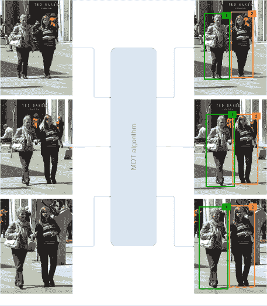

图 1：MOT 算法输出的示意图。每个输出边界框都有一个编号，用于识别视频中的特定人物。

虽然在单目标跟踪（SOT）中目标的外观是已知的，但在 MOT 中，需要进行检测步骤以识别目标，这些目标可能会离开或进入场景。与此同时，同时跟踪多个目标的主要难点在于对象之间的各种遮挡和相互作用，有时它们的外观也可能相似。因此，简单地将 SOT 模型直接应用于解决 MOT 问题会导致较差的结果，通常会出现目标漂移和大量 ID 切换错误，因为这些模型通常难以区分外观相似的同类对象。近年来，开发了一系列专门针对多目标跟踪的算法，以解决这些问题，并且有多个基准数据集和竞赛以简化不同方法之间的比较。

最近，越来越多的算法开始利用深度学习（DL）的表现力。深度神经网络（DNN）的优势在于其学习丰富表示和从输入中提取复杂抽象特征的能力。卷积神经网络（CNN）目前在空间模式提取方面处于最先进水平，并被用于图像分类 [1, 2, 3] 或目标检测 [4, 5, 6] 等任务，而循环神经网络（RNN），如长短期记忆（LSTM），则用于处理序列数据，如音频信号、时间序列和文本 [7, 8, 9, 10]。由于 DL 方法在许多任务中已能达到顶尖性能，我们现在逐渐看到它们被用于大多数顶级 MOT 算法中，帮助解决问题被划分成的一些子任务。

本文对利用深度学习模型能力进行多目标跟踪（MOT）的算法进行了综述，重点介绍了 MOT 算法各个组件使用的不同方法，并将它们放在每种提议方法的背景中。虽然 MOT 任务可以应用于 2D 和 3D 数据，以及单摄像头和多摄像头场景，但本综述专注于从单一摄像头录制的视频中提取的 2D 数据。

关于 MOT 主题，已经发表了一些综述和调查。它们的主要贡献和局限性如下：

+   •

    Luo 等人 [11] 提出了首个全面专注于 MOT，特别是行人跟踪的综述。他们提供了 MOT 问题的统一表述，并描述了 MOT 系统关键步骤中使用的主要技术。他们将深度学习作为未来研究方向之一，因为当时只有少数算法应用了这种方法。

+   •

    Camplani 等人 [12] 对多行人跟踪进行了综述，但他们专注于 RGB-D 数据，而我们的关注点是没有额外输入的 2D RGB 图像。此外，他们的综述未涵盖基于深度学习的算法。

+   •

    Emami 等人 [13] 提出了将单传感器和多传感器跟踪任务表述为多维分配问题（MDAP）的公式。他们还介绍了一些在跟踪问题中应用深度学习的方法，但这不是他们论文的重点，他们也没有提供这些方法之间的实验比较。

+   •

    Leal-Taixé等人[14]对算法在 MOT15[15]和 MOT16[16]数据集上的结果进行了分析，提供了研究趋势的总结和结果的统计数据。他们发现，自 2015 年以来，方法已从寻找更好的优化算法以解决关联问题转向改善亲和力模型，并预测许多更多的方法将通过使用深度学习来解决这个问题。然而，这项工作也没有集中于深度学习，并且没有涵盖近年来发布的更新的 MOT 算法。

在这篇论文中，基于讨论的局限性，我们的目标是提供一项调查，具有以下主要贡献：

+   •

    我们提供了有关深度学习在多目标跟踪中的应用的首次综合调查，重点关注从单摄像机视频中提取的 2D 数据，包括过去的调查和评审中未覆盖的最新工作。实际上，深度学习在 MOT 中的应用是最近的，过去三年中发布了许多方法。

+   •

    我们识别了 MOT 算法中的四个常见步骤，并描述了在这些步骤中使用的不同深度学习模型和方法，包括它们所使用的算法背景。每项分析工作的技术也在表格中总结，并附有可用源代码的链接，以便作为未来研究的快速参考。

+   •

    我们收集了最常用的 MOT 数据集上的实验结果，以进行数值比较，同时识别表现最佳的算法中的主要趋势。

+   •

    最后，我们讨论了可能的未来研究方向。

调查进一步以以下方式组织。我们首先在第二部分中描述 MOT 算法的一般结构以及最常用的度量标准和数据集。第三部分探讨了每个 MOT 算法四个识别步骤中的各种基于深度学习的模型和算法。第四部分提供了所展示算法的数值比较，识别了当前方法中的共同趋势和模式，以及一些局限性和可能的未来研究方向。最后，第五部分总结了前几节的发现，并提出了一些最终的评论。

## 2 MOT: 算法、度量标准和数据集

本节提供了关于 MOT 问题的一般描述。MOT 算法的主要特征和常见步骤在 2.1 节中被识别和描述。通常用于评估模型性能的指标在 2.2 节中讨论，而最重要的基准数据集在 2.3 节中呈现。

### 2.1 MOT 算法简介

MOT 算法中使用的标准方法是基于检测的跟踪：从视频帧中提取一组检测（即识别图像中目标的边界框），并用它们来指导跟踪过程，通常通过将它们关联在一起，以便为包含相同目标的边界框分配相同的 ID。因此，许多 MOT 算法将任务表述为一个分配问题。现代检测框架[4, 17, 18, 5, 6]确保了良好的检测质量，而大多数 MOT 方法（有一些例外，如我们将看到的）专注于改进关联；实际上，许多 MOT 数据集提供了一套标准的检测，供算法使用（因此可以跳过检测阶段），以便专门比较它们在关联算法质量上的表现，因为检测器的性能会严重影响跟踪结果。

MOT 算法还可以分为批处理和在线方法。批处理跟踪算法在确定某一帧中的对象身份时允许使用未来的信息（即来自未来帧的信息）。它们通常利用全局信息，因此跟踪质量较好。相反，在线跟踪算法只能使用当前和过去的信息来对当前帧进行预测。这在某些场景下是必要的，如自动驾驶和机器人导航。与批处理方法相比，在线方法的表现往往较差，因为它们无法利用未来的信息来修正过去的错误。值得注意的是，虽然实时算法要求以在线方式运行，但并非所有在线方法都能实时运行；实际上，在线算法通常仍然太慢，无法在实时环境中使用，特别是当利用计算量大的深度学习算法时。

尽管文献中介绍了大量不同的方法，但绝大多数 MOT 算法共享部分或所有以下步骤（见图 2）：

+   •

    检测阶段：一个目标检测算法分析每个输入帧，以识别属于目标类别的对象，使用边界框，也称为在 MOT 上下文中的‘检测’；

+   •

    特征提取/运动预测阶段：一个或多个特征提取算法分析检测和/或跟踪，以提取外观、运动和/或交互特征。可选地，运动预测器预测每个跟踪目标的下一个位置；

+   •

    亲和度阶段：使用特征和运动预测来计算检测和/或跟踪对之间的相似度/距离分数；

+   •

    关联阶段：使用相似度/距离度量来关联属于同一目标的检测和跟踪，方法是为识别相同目标的检测分配相同的 ID。

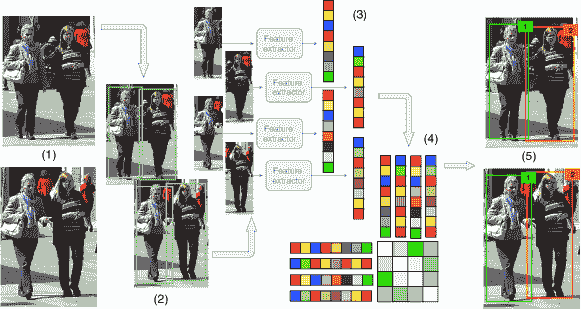

图 2：MOT 算法的常见工作流程：给定视频的原始帧（1），运行一个目标检测器以获得对象的边界框（2）。然后，对于每个检测到的对象，计算不同的特征，通常是视觉和运动特征（3）。之后，亲和度计算步骤计算两个对象属于同一目标的概率（4），最后，关联步骤为每个对象分配一个数字 ID（5）。

虽然这些阶段可以按这里所示的顺序依次执行（通常对在线方法每帧执行一次，对批处理方法整个视频执行一次），但许多算法将这些步骤中的一些合并在一起，或交织在一起，甚至使用不同的技术多次执行它们（例如，在两个阶段工作的算法）。此外，一些方法不会直接将检测关联在一起，而是使用它们来精炼轨迹预测，并管理新跟踪的初始化和终止；尽管如此，许多呈现的步骤即使在这种情况下也通常可以被识别，如我们将看到的。

### 2.2 度量

为了提供一个公平测试和比较算法的共同实验设置，实际上已经建立了一组标准度量，并且它们在几乎每项工作中都被使用。最相关的度量包括吴和 Nevatia 定义的度量[19]，所谓的 CLEAR MOT 度量[20]，以及最近的 ID 度量[21]。这些度量集旨在反映测试模型的整体性能，并指出每个模型的可能缺陷。因此，这些度量的定义如下：

#### 经典度量

这些指标由吴和 Nevatia 定义[19]，突出了 MOT 算法可能出现的不同类型的错误。为了展示这些问题，计算了以下值：

+   •

    大多数跟踪（MT）轨迹：在至少 80%的帧中被正确跟踪的地面真实轨迹的数量。

+   •

    片段：覆盖最多 80%的地面真实轨迹的轨迹假设。请注意，一个真实轨迹可能会被多个片段覆盖。

+   •

    大多数丢失（ML）轨迹：在不到 20%的帧中被正确跟踪的地面真实轨迹的数量。

+   •

    错误轨迹：预测的轨迹与真实对象（即地面真实轨迹）不对应的情况。

+   •

    ID 切换：对象被正确跟踪的次数，但对象的关联 ID 被错误地更改。

#### CLEAR MOT 指标

CLEAR MOT 指标是在 2006 [22] 和 2007 [23] 年举行的事件、活动和关系分类 (CLEAR) 研讨会上开发的。这些研讨会由欧洲 CHIL 项目、美国 VACE 项目和国家标准与技术研究院 (NIST) 共同组织。这些指标包括 MOTA（多目标跟踪准确度）和 MOTP（多目标跟踪精度）。它们作为其他简单指标的总结。我们将首先解释这些简单指标，并在其基础上构建复杂指标。关于如何将真实对象（真实框）与跟踪器假设匹配的详细描述可以在 [20] 中找到，因为考虑一个假设是否与对象相关并不是简单的，这取决于要评估的精确跟踪任务。在我们的案例中，由于我们专注于使用单摄像头进行 2D 跟踪，最常用的度量标准是边界框的交并比 (IoU)，这也是 MOT15 数据集 [15] 介绍论文中确立的度量标准。具体而言，真实框与假设之间的映射如下：如果真实框对象 $o_{i}$ 和假设 $h_{j}$ 在帧 $t-1$ 中匹配，并且在帧 $t$ 中 $IoU(o_{i},h_{j})\geq 0.5$，则 $o_{i}$ 和 $h_{j}$ 在该帧中匹配，即使存在另一个假设 $h_{k}$，使得 $IoU(o_{i},h_{j})<IoU(o_{i},h_{k})$，考虑到连续性约束。在完成前几帧的匹配后，剩余的对象会尝试与剩余的假设匹配，仍使用 0.5 的 IoU 阈值。无法与假设关联的真实框被计为假阴性 (FN)，而无法与真实框关联的假设被标记为假阳性 (FP)。此外，每次真实框对象跟踪中断并稍后恢复的情况被计为碎片化，每次跟踪过程中真实框对象 ID 被错误更改的情况被计为 ID 切换。然后，计算出的简单指标如下：

+   •

    FP：整个视频中的假阳性数量；

+   •

    FN：整个视频中的假阴性数量；

+   •

    Fragm：碎片化的总数量；

+   •

    IDSW：ID 切换的总数量。

MOTA 分数定义如下：

|  | $\mathit{MOTA}=1-\frac{(\mathit{FN}+\mathit{FP}+\mathit{IDSW})}{\mathit{GT}}\quad\in(-\infty,1]$ |  |
| --- | --- | --- |

其中 $GT$ 是真实框的数量。重要的是要注意，分数可能为负，因为算法可能会犯比真实框数量更多的错误。通常，不报告 MOTA，而是报告百分比 MOTA，它只是前述表达式的百分比形式。另一方面，MOTP 的计算公式为：

|  | $\mathit{MOTP}=\frac{\sum_{t,i}d_{t,i}}{\sum_{t}c_{t}}$ |  |
| --- | --- | --- |

其中$c_{t}$表示帧$t$中的匹配数，$d_{t,i}$是假设$i$与其分配的真实目标之间的边界框重叠。需要注意的是，这一指标考虑了很少的追踪信息，而是专注于检测的质量。

#### ID 评分

MOTA 评分的主要问题在于，它考虑了追踪器做出错误决策的次数，例如 ID 切换，但在一些场景中（例如机场安检），人们可能更关注奖励那些能够尽可能长时间跟踪一个目标的追踪器，以免丢失目标的位置。因此，在[21]中定义了几个新的替代指标，这些指标旨在补充 CLEAR MOT 指标提供的信息。不同于逐帧匹配真实情况和检测，映射是全球性进行的，分配给特定真实轨迹的轨迹假设是最大化正确分类的帧数的轨迹。为了解决这个问题，构建了一个二分图，并以该问题的最小成本解作为问题解决方案。对于二分图，顶点集合定义如下：第一个顶点集合$V_{T}$为每个真实轨迹设有一个所谓的常规节点，为每个计算轨迹设有一个假阳性节点。第二个集合$V_{C}$为每个计算轨迹设有一个常规节点，为每个真实轨迹设有一个假阴性节点。边的成本设置为计算假阴性和假阳性帧的数量，以便选择该边（更多信息见[21]）。完成关联后，根据涉及节点的性质，可能有四种不同的配对。如果$V_{T}$中的常规节点与$V_{C}$中的常规节点匹配（即真实轨迹与计算轨迹匹配），则计为真正正 ID。每个$V_{T}$中的假阳性与$V_{C}$中的常规节点匹配计为假阳性 ID。每个$V_{T}$中的常规节点与$V_{C}$中的假阴性匹配计为假阴性 ID，最后，每个假阳性与假阴性匹配计为真正负 ID。之后，计算三个分数。IDTP 是作为真正正 ID 匹配的边的权重之和（可以视为整个视频中正确分配的检测百分比）。IDFN 是选定假阴性 ID 边的权重之和，IDFP 是选定假阳性 ID 边的权重之和。通过这三种基本度量，计算出另外三种度量：

+   •

    识别精度：$\mathit{IDP}=\frac{\mathit{IDTP}}{\mathit{IDTP}+\mathit{IDFP}}$

+   •

    识别召回率：$\mathit{IDR}=\frac{\mathit{IDTP}}{\mathit{IDTP}+\mathit{IDFN}}$

+   •

    识别 F1：$\mathit{IDF1}=\frac{2}{\frac{1}{\mathit{IDP}}+\frac{1}{\mathit{IDR}}}=\frac{2\mathit{IDTP}}{2\mathit{IDTP}+\mathit{IDFP}+\mathit{IDFN}}$

通常，几乎所有工作的报告指标都是 CLEAR MOT 指标，包括主要跟踪轨迹（MT）、主要丢失轨迹（ML）和 IDF1，因为这些指标是 MOTChallenge 排行榜中显示的（详细信息请参见 2.3）。此外，跟踪器可以处理的每秒帧数（FPS）也经常报告，并且也包括在排行榜中。然而，我们发现这个指标在不同算法之间难以比较，因为一些方法包括了检测阶段，而其他方法则跳过了这一步骤。同时，硬件的依赖在速度方面也很重要。

### 2.3 基准数据集

在过去几年中，已经发布了许多 MOT 数据集。在这一部分，我们将描述最重要的数据集，从对 MOTChallenge 基准的总体描述开始，然后专注于其数据集，最后描述 KITTI 及其他使用较少的 MOT 数据集。

MOTChallenge。MOTChallenge¹¹1[`motchallenge.net/`](https://motchallenge.net/) 是最常用的多目标跟踪基准测试。它提供了当前公开的、一些最大的行人跟踪数据集。每个数据集都提供了训练集的真实标签和训练及测试集的检测结果。MOTChallenge 数据集频繁提供检测结果（通常称为公开检测，与算法作者使用自己检测器获得的私人检测相对）是因为检测质量对跟踪器的最终性能有很大影响，而算法的检测部分通常独立于跟踪部分，通常使用现有模型；提供所有模型都可以使用的公共检测结果可以使跟踪算法的比较更容易，因为检测质量被从性能计算中剔除，跟踪器从共同的基础开始。对测试数据集进行算法评估是通过将结果提交到测试服务器来完成的。MOTChallenge 网站包含每个数据集的排行榜，显示使用公开检测结果和使用私人检测结果的模型，在线方法也会标记出来。MOTA 是 MOTChallenge 的主要评估分数，但还显示了许多其他指标，包括第 2.2 节中介绍的所有指标。如我们所见，由于绝大多数使用深度学习的 MOT 算法都专注于行人，MOTChallenge 数据集是使用最广泛的，因为它们是当前最全面的数据集，提供了更多数据用于训练深度模型。

MOT15。第一个 MOTChallenge 数据集是 2D MOT 2015²²2 数据集：[`motchallenge.net/data/2D_MOT_2015/`](https://motchallenge.net/data/2D_MOT_2015/)，排行榜：[`motchallenge.net/results/2D_MOT_2015/`](https://motchallenge.net/results/2D_MOT_2015/)。[15]（通常称为 MOT15）。它包含一系列 22 个视频（11 个用于训练，11 个用于测试），这些视频来自较早的数据集，具有各种特征（固定和移动摄像机、不同环境和光照条件等），以便模型需要更好地进行泛化以获得良好的结果。总共包含 11283 帧，具有 1221 个不同的身份和 101345 个框。提供的检测结果是使用 ACF 检测器 [24] 获得的。

MOT16/17。该数据集的新版本于 2016 年发布，称为 MOT16³³3 数据集：[`motchallenge.net/data/MOT16/`](https://motchallenge.net/data/MOT16/)，排行榜：[`motchallenge.net/results/MOT16/`](https://motchallenge.net/results/MOT16/)。[16]。这次，地面真实数据从零开始制作，因此在整个数据集中保持一致。视频也更加具有挑战性，因为它们的行人密度更高。该数据集总共包含 14 个视频（7 个用于训练，7 个用于测试），其中公共检测是使用 Deformable Part-based Model (DPM) v5 [25，26] 获得的，发现该模型在检测数据集中的行人时比其他模型表现更好。这次的数据集包含 11235 帧，总共有 1342 个身份和 292733 个框。MOT17 数据集⁴⁴4 数据集：[`motchallenge.net/data/MOT17/`](https://motchallenge.net/data/MOT17/)，排行榜：[`motchallenge.net/results/MOT17/`](https://motchallenge.net/results/MOT17/)，包含了与 MOT16 相同的视频，但地面真实数据更加准确，并且每个视频有三组检测结果：一组来自 Faster R-CNN [4]，一组来自 DPM，另一组来自 Scale-Dependent Pooling 探测器 (SDP) [27]。跟踪器需要证明自己具有足够的多样性和鲁棒性，以便在不同的检测质量下获得良好的性能。

MOT19。最近，为 CVPR 2019 Tracking Challenge⁵⁵5[`motchallenge.net/workshops/bmtt2019/tracking.html`](https://motchallenge.net/workshops/bmtt2019/tracking.html)发布了一个新版本的数据集，其中包含 8 个视频（4 个用于训练，4 个用于测试），具有极高的行人密度，在最拥挤的视频中，每帧平均达到 245 个行人。该数据集包含 13410 帧，6869 个轨迹，总共有 2259143 个框，比以前的数据集多得多。虽然对该数据集的提交仅允许有限的时间，但这些数据将成为 2019 年末 MOT19 发布的基础[28]。

KITTI. 虽然 MOTChallenge 数据集侧重于行人跟踪，但 KITTI 跟踪基准⁶⁶6[`www.cvlibs.net/datasets/kitti/eval_tracking.php`](http://www.cvlibs.net/datasets/kitti/eval_tracking.php) [29, 30] 可以进行人和车辆的跟踪。该数据集是通过驾驶汽车在城市中收集的，并于 2012 年发布。它包括 21 个训练视频和 29 个测试视频，总共约有 19000 帧（32 分钟）。它包含了使用 DPM⁷⁷7 网站上称这些检测结果是通过基于潜在 SVM 或 L-SVM 的模型获得的。这个模型现在被称为可变形零件模型（DPM）。和 RegionLets⁸⁸8[`www.xiaoyumu.com/project/detection`](http://www.xiaoyumu.com/project/detection) [31]检测器获得的检测结果，以及立体和激光信息。然而，正如解释的那样，在本调研中我们只关注使用 2D 图像的模型。使用 CLEAR MOT 指标进行评估的方法包括 MT、ML、ID 切换和分段。可以只提交关于行人或车辆的结果，两个不同的排行榜分别针对两个分类。

其他数据集。除了之前描述的数据集外，还有一些较旧且现在使用较少的数据集。其中包括 UA-DETRAC 跟踪基准⁹⁹9[`detrac-db.rit.albany.edu/Tracking`](https://detrac-db.rit.albany.edu/Tracking) [32]，侧重于从交通摄像头跟踪的车辆，以及 TUD¹⁰¹⁰10[`www.d2.mpi-inf.mpg.de/node/428`](https://www.d2.mpi-inf.mpg.de/node/428) [33]和 PETS2009¹¹¹¹11[`www.cvg.reading.ac.uk/PETS2009/a.html`](http://www.cvg.reading.ac.uk/PETS2009/a.html) [34]数据集，这两个数据集都侧重于行人。其中许多视频现在已成为 MOTChallenge 数据集的一部分。

## 3 MOT 中的深度学习

由于本调查关注于深度学习在多目标跟踪（MOT）任务中的应用，我们将本节组织为五个子节。前四个子节分别回顾了深度学习在之前定义的四个 MOT 阶段中的应用¹²¹²12 请注意，模型的分类不应被视为严格的分类，因为一个模型经常用于多个目的，因此划分界限有时是困难的。例如，一些深度学习模型，特别是孪生网络，通常被训练以输出一个亲和力评分，但在推理时它们仅用于提取“关联特征”，然后使用简单的硬编码距离度量来计算亲和力。在这些情况下，我们决定将网络视为执行特征提取，因为相似度度量并没有直接学习。然而，这些模型也可以被认为是用于亲和力计算的深度学习。子节 3.4 除了介绍深度学习在关联过程中的应用外，还将包括其在整体跟踪管理过程中的应用（例如，跟踪的初始化/终止），因为它与关联步骤密切相关。子节 3.5 将最终描述不符合四步骤方案的深度学习在 MOT 中的其他应用。

我们在 A 中包含了一个总结表，展示了本调查中每篇论文在四个步骤中使用的主要技术。操作模式（批处理与在线）已被标明，并且包含了源代码或其他提供材料的链接（如有）。

### 3.1 深度学习在检测步骤中的应用

虽然许多工作将各种检测器生成的数据集提供的检测结果作为其算法的输入（例如 Aggregated Channel Features [24] 用于 MOT15 [15] 或 Deformable Parts Model [25] 用于 MOT16 [16]），也有一些算法集成了自定义检测步骤，这通常通过提高检测质量来改善整体跟踪性能。

正如我们所见，大多数采用自定义检测的算法使用了 Faster R-CNN 及其变体（第 3.1.1 节）或 SSD（第 3.1.2 节），但也存在使用不同模型的方法（第 3.1.3 节）。尽管绝大多数算法利用深度学习模型来提取矩形边界框，但少数研究在检测步骤中对深度网络进行了不同的使用：这些研究是第 3.1.4 节的重点。

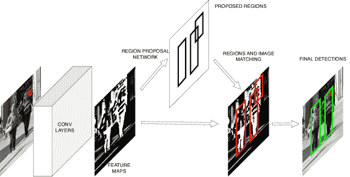

图 3：基于深度学习的检测器示例（Faster R-CNN 架构 [4]）

#### 3.1.1 Faster R-CNN

Simple Online and Realtime Tracking (SORT) 算法 [35] 是最早利用卷积神经网络进行行人检测的 MOT 流水线之一。Bewley 等人展示了用 Faster R-CNN [4]（如图 3 所示）替换使用 Aggregated Channel Features (ACF) [24] 获得的检测结果，可以使 MOT15 数据集 [15] 的 MOTA 得分提高 18.9%（绝对变化）。他们使用了一种相对简单的方法，包括利用 Kalman 滤波器 [36] 预测物体运动，然后借助匈牙利算法 [37] 将检测结果关联起来，使用交并比（IoU）距离来计算成本矩阵。在发布时，SORT 被评为 MOT15 数据集上表现最好的开源算法。

于等人在[38]中得出了相同的结论，使用了经过修改的 Faster R-CNN，该版本包含了 skip-pooling [39]和多区域特征[40]，并在多个行人检测数据集上进行了微调。通过这种架构，他们能够将他们提出的算法的性能（见章节 3.2.2）提升超过 30%（绝对变化，以 MOTA 为测量标准），在 MOT16 数据集上达到了最先进的性能[16]。他们还表明，提高检测质量可以减少对复杂跟踪算法的需求，同时仍然获得类似的结果：这是因为 MOTA 得分受虚假正例和虚假负例的数量影响很大，使用准确的检测是减少这两者的有效方法。[38]在 MOT16 数据集上计算的检测结果也已公开¹³¹³13[`drive.google.com/file/d/0B5ACiy41McAHMjczS2p0dFg3emM/view`](https://drive.google.com/file/d/0B5ACiy41McAHMjczS2p0dFg3emM/view)，许多 MOT 算法随后利用了这些结果[41、42、43、44、45、46、47、48、49、50、51]。

在随后的几年里，其他研究利用了 Faster R-CNN 的检测精度，该技术随后被应用于多目标跟踪算法中，用于检测运动员[52]、细胞[53]和猪[54]。此外，Faster R-CNN 的一个改编版本，即 Mask R-CNN [17]，例如被周等人[55]用来同时检测和跟踪行人，

#### 3.1.2 SSD

SSD [5]检测器是检测步骤中另一种常用的网络。特别是，Zhang 等人[54]在他们的猪跟踪管道中将其与 Faster R-CNN 和 R-FCN [18]进行了比较，表明它在他们的数据集上表现更好。他们采用了基于判别相关滤波器（DCF）的在线跟踪方法[56]，使用 HOG [57]和颜色名称[58]特征预测所谓的标签框的位置，即每个动物中心周围的小区域。匈牙利算法用于跟踪标签框和检测之间的关联，在跟踪失败的情况下，使用 DCF 跟踪器的输出细化边界框。Lu 等人[59]也使用了 SSD，但在这种情况下是为了检测各种物体类别进行跟踪（如人、动物、汽车等，见 3.2.4）。

一些研究尝试通过考虑跟踪算法其他步骤中获得的信息来改进 SSD 获得的检测结果。Kieritz 等人[60]在他们的联合检测和跟踪框架中，使用了在轨迹和检测之间计算的亲和度分数，来替换 SSD 网络中包含的标准非极大值抑制（NMS）步骤，改用一种基于与跟踪目标的对应关系来改进检测置信度分数的版本。

Zhao 等人[61]则采用了 SSD 检测器来搜索场景中的行人和车辆，但他们使用了基于 CNN 的相关滤波器（CCF）来使 SSD 生成更精确的边界框。CCF 利用 PCA 压缩的[62]CNN 特征预测目标在后续帧中的位置；然后将预测的位置用于裁剪一个感兴趣区域（ROI），该区域作为 SSD 的输入。这样，网络能够使用更深层的特征进行小检测，这些层提取了更有价值的语义信息，从而已知能够产生更准确的边界框并减少假阴性。该算法随后将这些检测结果与在全图像上获得的结果结合，通过 NMS 步骤进行组合，然后使用匈牙利算法进行轨迹和检测之间的关联，成本矩阵考虑了几何（IoU）和外观（平均峰值相关能量 - APCE [63])线索。APCE 还用于物体重新识别（ReID）步骤，以从遮挡中恢复。作者展示了使用多尺度增强训练检测器可以显著提高跟踪性能，该算法在 KITTI 和 MOT15 上达到了与最先进的在线算法相当的准确度。

#### 3.1.3 其他检测器

在 MOT 中使用的其他 CNN 模型中，我们可以提到 YOLO 系列检测器 [64, 6, 65]；特别是，YOLOv2 被 Kim 等人 [66] 用于检测行人。Sharma 等人 [67] 则使用了递归卷积（RRC）CNN [68] 和 SubCNN [69] 来检测在移动相机上录制的视频中的车辆，应用于自动驾驶的背景下（见第 3.2.4 节）。Pernici 等人 [70] 在他们的面部跟踪算法中使用了 Tiny CNN 检测器 [71]，与不使用深度学习技术的可变形部件模型检测器（DPM） [25] 相比，取得了更好的性能。

#### 3.1.4 CNN 在检测步骤中的其他用途

有时，CNN 被用于 MOT 检测步骤中的其他用途，而不仅仅是直接计算物体的边界框。

例如，CNN 被用于减少假阳性 [72]，其中车辆检测是通过对输入进行背景减除的 ViBe 算法的修改版本 [73] 获得的。这些检测结果首先作为输入提供给 SVM [74]，如果 SVM 对是否丢弃或确认这些检测结果不够自信，则使用基于 Faster-CNN 的网络 [75] 来决定是否保留或丢弃每一个检测结果。这样，只有少量物体需要由 CNN 分析，从而使检测步骤变得更快。

Bullinger 等人在 [76] 中探索了另一种方法，该方法不是在检测步骤中计算经典的边界框，而是采用了多任务网络级联 [77] 来获取实例感知的语义分割图。作者认为，由于实例的 2D 形状不同于矩形边界框，不包含背景结构或其他物体的部分，因此基于光流的跟踪算法会表现得更好，特别是当目标在图像中的位置也受到相机运动和物体自身运动的影响时。在获得当前帧中各种实例的分割图后，应用了一种光流方法（[78, 79, 80]）来预测下一帧中每个实例的位置和形状。然后计算预测和检测实例之间的亲和矩阵，并将其作为输入提供给匈牙利算法进行关联。尽管该方法在整个 MOT15 数据集上的 MOTA 得分略低于 SORT，但作者表明它在移动相机的视频上表现更好。

### 3.2 特征提取和运动预测中的深度学习

特征提取阶段是采用深度学习模型的首选，因为它们强大的表示能力使其擅长提取有意义的高级特征。在这一领域中，最典型的方法是使用 CNNs 来提取视觉特征，如在 3.2.2 部分所述。除了使用经典的 CNN 模型，另一种反复出现的想法是将其训练为 Siamese CNNs，使用对比损失函数，以找到最能区分目标的特征集。这些方法在 3.2.3 部分中进行了解释。此外，一些作者探索了 CNNs 在基于相关滤波器的算法中预测物体运动的能力，这些内容在 3.2.5 部分中进行了评论。最后，其他类型的深度学习模型也被应用，通常将其包含在更复杂的系统中，将深度特征与经典特征结合起来。这些在 3.2.4（专门针对视觉特征）和 3.2.6（针对不符合其他类别的方法）部分中进行了说明。

#### 3.2.1 自编码器：深度学习在 MOT 管道中的首次应用

据我们所知，使用深度学习在 MOT 中的首个方法由 Wang 等人[81]于 2014 年提出。他们提出了一个由两层堆叠的自编码器组成的网络，用于优化从自然场景中提取的视觉特征[82]。在提取步骤之后，使用 SVM 进行亲和度计算，并将关联任务公式化为最小生成树问题。他们展示了特征优化显著提高了模型性能。然而，算法测试所用的数据集并不常见，因此结果难以与其他方法进行比较。

#### 3.2.2 CNNs 作为视觉特征提取器

最广泛使用的特征提取方法基于卷积神经网络的微妙修改。这些模型的早期应用之一可以在 [83] 中找到。在这里，Kim 等人将视觉特征融入到一种经典算法中，称为多假设跟踪，使用预训练的 CNN 从检测中提取了 4096 个视觉特征，后来通过 PCA 将其减少到 256 个。这一修改使得 MOT15 的 MOTA 得分提高了 3 分以上。在该论文提交时，它是该数据集上的最高排名算法。Yu 等人 [38] 使用了 GoogLeNet [2] 的修改版，预训练于一个由经典人员识别数据集（PRW [84]，Market-1501 [85]，VIPeR [86]，CUHK03 [87]) 组合而成的定制重新识别数据集上。视觉特征与由卡尔曼滤波器提取的空间特征结合，然后计算了亲和力矩阵。

CNN 用于特征提取的其他示例可以在 [88] 中找到，其中在多个假设跟踪框架中使用了定制 CNN 提取外观特征，在 [89] 中的跟踪器使用了预训练的基于区域的 CNN [90]，或者在 [91] 中，CNN 从鱼头中提取视觉特征，随后与来自卡尔曼滤波器的运动预测结合。

SORT 算法 [35]，在 3.1.1 节中介绍，后来通过深度特征进行了改进，新版本被称为 DeepSORT [41]。该模型结合了由定制残差 CNN [92] 提取的视觉信息。CNN 提供了一个带有 128 个特征的归一化向量，余弦距离被添加到 SORT 中使用的亲和力评分中。网络结构的图示见图 4。实验表明，这一修改克服了 SORT 算法的主要缺点，即 ID 切换过多。

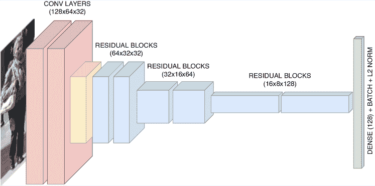

图 4: DeepSORT [41] CNN 基于特征提取器的图示。红色块是简单的卷积层，黄色块是最大池化层，蓝色块是残差块，每个残差块由三个卷积层组成 [3]。最终的绿色块表示具有批量归一化和 L2 归一化的全连接层。每个块的输出大小在括号中指示。

Mahmoudi 等人 [42] 还结合了 CNN 提取的视觉特征以及动态和位置特征，然后通过匈牙利算法解决了关联问题。在 [93] 中，使用了在 ImageNet 上预训练的 ResNet-50 [3] 作为视觉特征提取器。有关如何使用 CNN 区分行人的详细说明可以在 [94] 中找到。在他们的模型中，Bae 等人将 CNN 的输出与形状和运动模型结合，并计算了每对检测的综合亲和度分数；然后通过匈牙利算法解决了关联问题。再次，Ullah 等人 [95] 使用了现成的 GoogLeNet [2] 进行特征提取。Fang 等人 [96] 选择了 Inception CNN [97] 隐藏卷积层的输出作为视觉特征。Fu 等人 [98] 采用了 DeepSORT 特征提取器，并使用判别相关滤波器测量特征的相关性。随后，将匹配分数与时空关系分数结合，最终分数作为高斯混合概率假设密度滤波器 [99] 的可能性。[100] 的作者使用了在 ILSVRC CLS-LOC [101] 数据集上微调的 GoogLeNet 进行行人识别。在 [70] 中，作者重用了 CNN 基于检测器提取的视觉特征，并使用反向最近邻技术 [102] 进行关联。Sheng 等人 [103] 使用 GoogLeNet 的卷积部分提取外观特征，利用它们之间的余弦距离计算检测对之间的亲和度分数，并将该信息与运动预测合并，以计算作为图问题中的边缘成本的整体亲和度。Chen 等人 [104] 利用 ResNet 的卷积部分构建了一个自定义模型，将 LSTM 单元堆叠在卷积层上，以同时计算相似度分数和边界框回归。

在 [53] 中，该模型学会了区分快速移动细胞和慢速移动细胞。在计算出分类后，慢速细胞仅使用运动特征进行关联，因为它们几乎静止，而快速细胞则同时使用运动特征和由基于 VGG-16 [1] 的 Fast R-CNN 提取的视觉特征，特别是为细胞分类任务微调。此外，提出的模型包括一个跟踪优化步骤，通过组合可能的被错误中断的轨迹来减少假阴性和假阳性。

Ran 等人 [52] 提出了将经典 CNN 用于视觉特征提取，并将 AlphaPose CNN 用于姿态估计的组合。这两个网络的输出被输入到 LSTM 模型中，与轨迹信息历史一起计算相似度，详见第 3.3.1 节。

在特征提取中，CNN 的一个有趣应用可以在 [51] 中找到。作者使用了一种姿态检测器，称为 DeepCut [105]，这是 Fast R-CNN 的修改版；其输出为预测十四个身体部位的得分图。这些得分图与检测到的行人裁剪图像结合，并输入到 CNN 中。算法的更详细解释见第 3.3.6 节。

#### 3.2.3 孪生网络

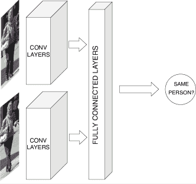

图 5：孪生 CNN 架构的示例。为了特征提取，网络被训练为孪生 CNN，但在推断时，输出概率被丢弃，最后的全连接层作为单个候选者的特征向量。当网络用于亲和度计算时，整个结构在推断过程中保持不变。

另一个反复出现的想法是使用结合不同图像信息的损失函数来训练卷积神经网络（CNN），以学习能够最佳区分不同物体示例的特征集。这些网络通常被称为 Siamese 网络（架构示例见图 5）。Kim 等人[106]提出了一种使用对比损失训练的 Siamese 网络[107]。该网络接受两幅图像、它们的 IoU 评分和面积比作为输入，输出对比损失。训练后，计算对比损失的层被移除，最后一层被用作输入图像的特征向量。相似度评分通过结合特征向量之间的欧几里得距离、IoU 评分和边界框之间的面积比来计算。关联步骤使用自定义贪婪算法解决。Wang 等人[108]还提出了一种 Siamese 网络，该网络接受两个图像块并计算它们之间的相似度评分。测试时的评分是通过比较网络提取的两幅图像的视觉特征，并包括时间约束信息来计算的。作为相似度评分使用的距离是带有权重矩阵的马氏距离，该权重矩阵也由模型学习。

Zhang 等人[109]提出了一种称为 SymTriplet 损失的损失函数。根据他们的解释，在训练阶段使用了三种具有共享权重的 CNN，损失函数结合了来自同一物体的两幅图像（正样本对）和来自不同物体的图像（两个负样本对）提取的信息。当正样本对的特征向量之间的距离较小时，SymTriplet 损失减少；当负样本对的特征接近时，损失增加。优化该函数会使同一物体的图像产生非常相似的特征向量，同时使不同物体的特征向量不同，相互之间距离更大。跟踪算法测试所用的数据集由电视系列剧和 YouTube 音乐视频的章节组成。由于视频包含不同的镜头，问题被分为两个阶段。首先，在同一镜头中的帧之间进行数据关联。此情况下的亲和度评分是检测到的特征向量的欧几里得距离、时间信息和运动信息的组合。随后，使用层次聚类算法在镜头之间链接跟踪片段，该算法在外观特征上进行工作。

Leal-Taixé 等人[110] 提出了一个 Siamese CNN，它接收两个堆叠的图像作为输入，并输出这两个图像属于同一人的概率。他们使用这个输出训练网络，使其学习到区分主体的最具代表性的特征。随后，移除了输出层，使用最后一个隐藏层提取的特征作为 Gradient Boosting 模型的输入，同时结合上下文信息，以获得检测之间的亲和得分。然后，使用线性规划[111]解决关联步骤。

Son 等人[112] 提出了一个新的 CNN 架构，称为 Quad-CNN。该模型接收四个图像补丁作为输入，其中前三个来自同一人，但时间顺序递增，最后一个来自另一人。网络使用自定义损失进行训练，结合了检测之间的时间距离、提取的视觉特征和边界框位置的信息。在测试阶段，网络接收两个检测，并预测这两个检测属于同一人的概率，使用所学习到的嵌入。

在[55]中，构建了一个基于 Mask R-CNN [17] 的 Siamese 网络。在 Mask R-CNN 为每个检测生成了掩码后，将三个样本输入到浅层 Siamese 网络中，其中两个来自同一对象（正对），一个来自其他对象（负对），并使用三元组损失进行训练。训练阶段后，移除了输出层，从最后一个隐藏层提取了一个 128-d 向量。然后，使用余弦距离计算外观相似性。该相似性进一步与运动一致性结合，运动一致性基于假设线性运动的对象预测位置的得分，以及空间潜力，空间潜力是一个更复杂的运动模型。随后，通过对计算出的相似性 3-d 张量进行幂迭代来解决关联问题。

Maksai 等人[113]直接使用了 ReID triplet CNN 提取的 128 维特征向量，该 CNN 是在[114]中提出的，并将其与其他基于外貌的特征结合在一起（作为算法无外貌版本的替代方法）。这些特征进一步通过双向 LSTM 进行处理。在[115]中，采用了类似的方法，使用了所谓的空间注意力网络（SAN）。SAN 是一个孪生 CNN，使用预训练的 ResNet-50 作为基础模型。该网络被截断，只使用卷积层。然后，从模型的最后一个卷积层中提取出空间注意力图：它表示边界框中不同部分的重要性的度量，以便从提取的特征中排除背景和其他目标。实际上，这些特征经过了该地图的加权处理，作为一种掩码。然后，来自两个检测的掩码特征被合并到一个完全连接的层中，该层计算它们之间的相似度。在训练过程中，网络也被设置为输出一个分类分数，因为作者观察到联合优化分类和相似度计算任务会导致后者的更好性能。相似度信息进一步被输入到双向 LSTM 中，就像前面的例子一样。后面的部分 3.3 将进一步讨论这两个方法。Ma 等人[116]还训练了一个孪生 CNN，以从其模型中跟踪的行人中提取视觉特征，该模型的详细介绍在 3.4.1 部分说明。

在[117]中，Zhou 等人提出了一个视觉位移 CNN，该 CNN 通过学习对象的先前位置以及对象对场景中其他对象的影响，来预测对象的下一个位置。然后使用该 CNN 来预测对象在下一帧中的位置，以其过去的轨迹为输入。该网络还能够从预测位置和实际检测中提取视觉信息，以计算相似度得分，详细说明请参见 3.3.6 部分。

陈等人 [118] 提出了一个两步算法，该算法采用了通过三元组损失训练的 GoogLeNet 进行特征提取。在第一步中，模型使用 R-FCN 预测可能的检测候选区域，利用现有轨迹的信息。然后，这些检测结果与实际检测结果结合，并进行了 NMS（非极大值抑制）。之后，利用自定义训练的 GoogLeNet 模型，从检测结果中提取视觉特征，并通过分层关联算法解决关联问题。当他们的论文发表时，该算法在 MOT16 数据集中的在线方法中排名靠前。

李等人 [119] 最近探索了一种有趣的方法，将金字塔网络和孪生网络结合起来。他们的模型称为特征金字塔孪生网络，采用了一个主干网络（他们研究了 SqueezeNet [120] 和 GoogLeNet [2] 的性能，但主干网络可以更改），该网络使用相同的参数从两张不同的图像中提取视觉特征。之后，从网络中提取了一些隐藏的特征图，并输入到特征金字塔孪生网络中。该网络采用上采样和合并策略，为金字塔的每个阶段创建特征向量。将更深层的特征与较浅的特征合并，以用更复杂的特征丰富简单的特征。之后，进行了亲和度得分计算，如 3.3.7 节中所述。

#### 3.2.4 更复杂的视觉特征提取方法

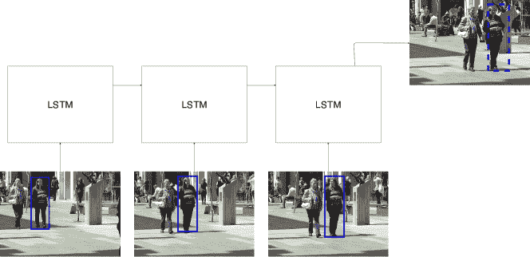

图 6：LSTM 在运动预测中的典型使用。将一组边界框输入网络，产生的输出是下一帧中预测的边界框。

也提出了更复杂的方法。陆等人 [59] 将 SSD 在检测步骤中预测的类别作为特征，并与每个检测的 RoI 池化提取的图像描述符结合。之后，将提取的特征作为 LSTM 网络的输入，LSTM 网络学习计算检测的关联特征。这些特征随后用于亲和度计算，使用它们之间的余弦距离。

在[121]中，使用了 GoogLeNet 的较浅层来学习跟踪对象的特征字典。为了学习字典，算法在视频的前 100 帧中随机选择对象。模型提取了网络前七层中的特征图。然后，使用正交匹配追踪 (OPM) [122] 对提取的特征进行降维，学习到的表示被用作字典。在测试阶段，计算了场景中每个检测对象的 OPM 表示，并与字典进行比较，以构建成本矩阵，结合了由卡尔曼滤波器提取的视觉和运动信息。最后，使用匈牙利算法进行关联。

LSTM 有时被用于运动预测，以便从数据中学习更复杂的非线性运动模型。图 6 显示了 LSTM 在运动预测中的典型使用方案。Sadeghian 等人 [123] 展示了递归网络的这种使用方式，他们提出了一个模型，采用了三种不同的 RNN 来计算每个检测的各种特征，不仅仅是运动特征。第一个 RNN 用于提取外观特征。这个 RNN 的输入是由 VGG CNN [1] 提取的视觉特征向量，该 CNN 专门为人员再识别进行预训练。第二个 RNN 是一个 LSTM，训练用于预测每个跟踪对象的运动模型。在这种情况下，LSTM 的输出是每个对象的速度向量。最后一个 RNN 训练用于学习场景中不同对象之间的交互，因为某些对象的位置可能会受到周围物体行为的影响。然后，通过另一个 LSTM 执行亲和力计算，以其他 RNN 的信息作为输入。

在[124]中，提出了一种堆叠 CNN 的模型。该模型的第一部分由一个预训练的共享 CNN 组成，用于提取场景中每个对象的共同特征。这个 CNN 不会在线更新。接着，应用了 RoI 池化，提取了每个候选区域的 RoI 特征。随后，为每个跟踪的候选区域实例化并在线训练了一个新的特定 CNN。这些 CNN 提取了每个候选区域的可见性图和空间注意力图。最后，在提取了精细特征后，计算了每个新图像属于每个已跟踪对象的概率，并使用贪婪算法进行了关联步骤。

Sharma 等人[67]设计了一组成本函数来计算车辆检测之间的相似性。这些成本将通过 CNN 提取的外观特征与假设为移动摄像机环境中的 3D 形状和位置特征相结合。定义的成本包括 3D-2D 成本，其中将前一帧的边界框的估计 3D 投影与新帧的 2D 边界框进行比较；3D-3D 成本，其中将前一边界框的 3D 投影与当前边界框的 3D 投影重叠；外观成本，其中计算了提取的视觉特征的欧几里得距离；以及形状和姿态成本，其中计算并比较了边界框中物体的大致形状和位置。注意，尽管推断了 3D 投影，输入仍然是 2D 图像。计算每个成本后，两个后续帧之间的最终成对成本是以前成本的线性组合。最终的关联问题使用匈牙利算法解决。

Kim 等人[66]利用 YOLOv2 CNN 对象检测器提取的信息构建了一个随机森林分类器[125]。该算法分为两个步骤。第一步，训练了一个所谓的 teacher-RF，以区分行人与非行人。在 teacher-RF 训练完成后，为每个跟踪的对象构建了一个随机森林分类器。这些分类器被称为 student-RF，它们比 teacher-RF 小。它们专门用于区分其跟踪的对象与场景中的其他对象。决定为每个对象使用小型随机森林分类器的目的是为了降低整体模型的计算复杂度，从而使其能够实时工作。

在[126]中，通过首先估计物体在后续帧中的位置，使用隐马尔可夫模型[127]，减少了模型必须计算的亲和度计算次数。然后，使用预训练的 CNN 进行特征提取。在提取了视觉特征后，仅在可行的对之间计算亲和度，即在与 HMM 预测足够接近以被视为同一物体的检测之间计算亲和度。亲和度得分是通过视觉特征之间的互信息函数获得的。当计算出亲和度得分时，使用动态规划算法来关联检测结果。

#### 3.2.5 CNNs 用于运动预测：相关滤波器

Wang 等人 [128] 研究了相关滤波器的使用 [129]，其输出是被跟踪物体的响应图。该图是物体在下一帧中的新位置的估计。这种关联进一步与使用 Lucas-Kanade 算法 [130] 计算的光流关联、使用 Kalman 滤波器计算的运动关联以及由边界框的高度和宽度比表示的尺度关联进行组合。两个检测之间的关联计算为前一评分的线性组合。此外，还有一个虚假检测去除步骤，使用 SVM 分类器，以及使用前面步骤计算的响应图处理缺失检测。如果一个物体被错误地丢失然后重新识别，该步骤可以修正错误并重新连接断开的跟踪。

在 [61] 中，也使用了相关滤波器来预测物体在后续帧中的位置。该滤波器接收由 CNN 提取的外观特征作为输入，这些特征经过 PCA 降维，并产生预测位置的响应图作为输出。预测位置随后用于计算相似度得分，结合了预测与检测之间的 IoU 和响应图的 APCE 得分。在构建成本矩阵后，通过计算每对帧之间的检测得分，使用匈牙利算法解决了分配问题。

#### 3.2.6 其他方法

Rosello 等人 [131] 探索了一种完全不同的方法，使用强化学习框架来训练一组代理，以帮助完成特征提取步骤。该算法完全基于运动特征，没有使用任何视觉信息。运动模型是通过 Kalman 滤波器学习的，其行为由一个代理管理，每个被跟踪的物体使用一个代理。代理学习决定 Kalman 滤波器在一组操作中采取哪种行动，这些操作包括忽略预测、忽略新测量、同时使用两条信息、开始或停止跟踪。作者声称，他们的算法即使在非视觉场景中也能解决跟踪任务，而与传统算法相比，传统算法的性能深受视觉特征的影响。然而，由于模型是在训练集上测试的，因此对 MOT15 的实验结果不可靠，无法与其他模型进行比较。

另一个完全依赖于运动特征的算法是[132]中提出的。Babaee 等人提出了一种 LSTM，它学习预测场景中每个对象的边界框的新位置和大小，利用先前帧中的位置和速度信息。通过预测的边界框与实际检测之间的 IoU 计算相似度度量，并使用自定义贪婪算法关联轨迹。该管道应用于其他算法获得的跟踪结果，以处理遮挡问题，作者表明他们的方法能够有效减少 ID 切换的数量。

### 3.3 深度学习在相似度计算中的应用

尽管许多工作通过使用 CNN 提取的特征上的某些距离度量来计算跟踪片段与检测（或跟踪片段与其他跟踪片段）之间的相似度，但也有一些算法使用深度学习模型直接输出相似度分数，而无需为特征之间指定明确的距离度量。本节重点介绍这些工作。

具体来说，我们将首先描述使用递归神经网络的算法，从标准的 LSTM（见 3.3.1）开始，然后描述 Siamese LSTM 的应用（见 3.3.2）和双向 LSTM（见 3.3.3）。在 3.3.4 节中展示了在多假设跟踪（MHT）框架中使用 LSTM 计算相似度的具体应用；最后，在 3.3.5 节中展示了一些使用不同类型递归网络进行相似度计算的工作。

在本节的第二部分，我们将探讨 CNN 在亲和力计算中的应用（见 3.3.6），包括那些直接使用 Siamese CNN 输出作为亲和力分数的算法（见 3.3.7），而不是像在 3.2.3 中那样依赖于特征向量上的距离度量。

#### 3.3.1 循环神经网络和 LSTM

使用深度网络直接计算相似度的首批工作之一是[133]，其中 Milan 等人提出了一种用于在线 MOT 的端到端学习方法，见图 7。一个基于递归神经网络（RNN）的模型被用作主要跟踪器，模仿了贝叶斯滤波算法，包含三个模块：第一个是运动预测模块，学习了一个运动模型，该模型以目标在过去帧中的状态（即旧的边界框位置和尺寸）作为输入，并预测下一帧中的目标状态，而不考虑检测；第二个模块使用新帧中的检测和包含将目标与所有这些检测关联的概率的关联向量来细化状态预测（显然这可以被视为一种相似度分数）；第三个模块管理轨迹的出生和死亡，因为它使用之前收集的信息来预测新帧中轨迹的存在概率¹⁴¹⁴14 为了平滑存在概率预测并避免删除暂时遮挡的目标轨迹，输出了新旧存在概率之间的差异，以便在训练过程中最小化。关联向量是使用基于 LSTM 的网络计算的，该网络使用目标预测状态和新帧中检测状态之间的欧几里得距离作为输入特征（除了隐藏状态和单元状态外，与任何标准 LSTM 相同）。这些网络分别使用 100K 20 帧长的合成生成序列进行训练。虽然该算法相较于其他技术（如卡尔曼滤波器与匈牙利算法的组合）表现较好，但在 MOT15 测试集上的结果未能达到顶级准确度；然而，该算法能够比其他算法运行得更快（$\sim 165$ FPS），且未使用任何外观特征，留下了未来改进的空间。

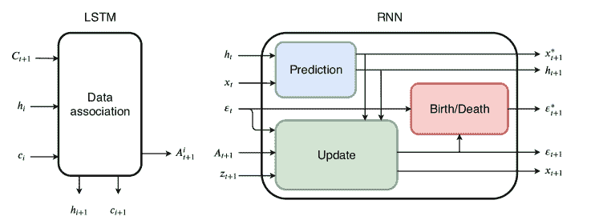

图 7：Milan 等人提出的 MOT 算法示意图[133]，采用 LSTM 预测检测关联。该算法使用了两个不同的 RNN 来解决问题，每个 RNN 专注于一个子任务。LSTM（左侧）学习根据预测位置将检测与轨迹关联。它接收检测与预测之间的成对距离矩阵（$C_{t+1}$）、单元状态（$c_{i}$）和隐藏状态（$h_{i}$）作为输入，输出表示将目标$i$与帧中的检测关联的概率的向量$A^{i}_{t+1}$。RNN（右侧）被训练来预测新帧中的目标位置以及可能的新目标的出生和死亡。它接收隐藏状态（$h_{t}$）和当前目标位置（$x_{t}$）作为输入，输出预测位置和新的隐藏状态（蓝色框）。在计算了 LSTM 的关联后，使用检测$z_{t+1}$更新目标位置（绿色框），并计算存在概率$\varepsilon$以预测轨迹的死亡和出生（红色框）。

在后来使用 LSTM 的其他工作中，有[123]，它使用了一个具有全连接（FC）层的 LSTM 来融合由另外 3 个 LSTM 提取的特征（如第 3.2.4 节中已解释）并输出一个亲和力评分¹⁵¹⁵15 论文似乎暗示，虽然 LSTM 被训练以预测亲和力评分，但仅提取了亲和力特征，并用这些特征替代了 MDP 论文中使用的手工特征。然而，MDP 论文中提出的算法在这些特征上添加了另一层 FC，通过强化学习训练以将轨迹/检测对分类为同一身份或不同身份。因此，我们可以将整体亲和力计算视为由深度学习模型执行的。整体算法类似于[134]中提出的基于马尔可夫决策过程（MDP）的框架：使用单目标跟踪器（SOT）独立跟踪目标；当目标被遮挡时，停止 SOT 并构建一个双分图，使用 LSTM 计算的亲和力作为边成本，然后借助匈牙利算法解决关联问题。作者展示了使用所有 3 个特征提取器的组合和 LSTM，而不是简单的 FC 层，在 MOT15 验证集上带来了持续更好的性能。该算法在发布时还在 MOT15 和 MOT16 测试集上达到了最先进的 MOTA 评分，确认了该方法的有效性。

另一种使用多个 LSTM 的方法是 [52]，其中 Ran 等人提出了一种基于姿态的三流网络，该网络计算了结合 3 个 LSTM 输出的其他亲和度的亲和度：一个用于外观相似度，使用 CNN 特征和用 AlphaPose [135] 提取的姿态信息，一个用于运动相似度，使用姿态关节速度，另一个用于交互相似度，使用交互网格。然后使用自定义跟踪算法来关联检测。与其他最先进的 MOT 算法在其专有的排球数据集上的比较结果是有利的。

#### 3.3.2 Siamese LSTM

梁等人 [136] 也使用了多个 LSTM 来建模各种特征，但他们采用了不同的方法。由于使用 CNN 提取外观特征的计算开销很大，他们进行了所谓的预关联步骤，该步骤使用 SVM 预测轨迹段和检测之间的关联概率。SVM 以位置和速度相似度评分作为输入，这些评分通过两个 LSTM 进行位置和速度预测来计算。预关联步骤随后包括丢弃低 SVM 亲和分数的检测。在这一步骤之后，实际的关联步骤通过将 VGG-16 特征作为输入提供给 Siamese LSTM 来执行，Siamese LSTM 预测轨迹段和检测之间的亲和分数。关联以贪婪的方式进行，将具有最高分数的检测与轨迹段关联。测试在 MOT17 数据集上进行，结果与顶级算法相符。

Wan 等人 [43] 的算法中也使用了 Siamese LSTM，算法由两个步骤组成。在第一步中，通过使用匈牙利算法构建短期可靠的轨迹段，亲和度度量是通过检测与预测目标位置之间的 IoU（由 Kalman 滤波器或 Lucas-Kanade 光流获得）计算的。第二步也使用匈牙利算法来连接轨迹段，但这次亲和度是使用 Siamese LSTM 框架计算的，该框架使用与 CNN 提取的外观特征拼接的运动特征（如 [137]），并在 CUHK03 Re-ID 数据集上进行预训练。

#### 3.3.3 双向 LSTM

Zhu 等人 [115] 提出了在相似度计算阶段的另一种 LSTM 使用方法。他们使用了所谓的时间注意力网络（TAN）来计算注意力系数，以加权由空间注意力网络（SAN）提取的特征（见 3.2.3），从而降低噪声观察的权重。为此使用了双向 LSTM。整个网络（称为双重匹配注意力网络）用于在改进版的高效卷积操作符跟踪器（ECO）[56] 训练中利用困难样本挖掘失败检测目标时进行遮挡恢复。根据各种指标（MOTA、IDF1、ID 切换次数），该算法在 MOT16 和 MOT17 上获得了与在线最先进方法相当的结果。

Yoon 等人 [138] 还使用了双向 LSTM 来计算相似度，该方法建立在一些 FC 层之上，这些 FC 层编码了非外观特征（仅边界框坐标和检测置信度）。通过使用匈牙利算法解决关联问题。他们在斯坦福无人机数据集（SDD）[139] 上训练了网络，并在 SDD 和 MOT15 上进行了评估。他们取得了与未使用视觉提示的顶级算法相当的结果，但性能仍低于基于外观的方法。

#### 3.3.4 LSTM 在 MHT 框架中的应用

在多假设跟踪方法中，首先为每个候选目标构建潜在跟踪假设的树。然后计算每个跟踪的可能性，并选择具有最高可能性的跟踪组合作为解决方案。各种深度学习算法也已被用来增强基于 MHT 的方法。

Kim 等人 [93] 提出了将一种所谓的双线性 LSTM 网络用作 MHT-DAM [83] 算法的门控步骤，即利用 LSTM 计算的相似度分数来决定是否修剪假设树的某个分支。LSTM 单元具有经过修改的前向传播（灵感来源于 [83] 中提出的在线递归最小二乘估计器），输入为过去帧中用 ResNet-50 CNN 提取的轨迹的外观特征。LSTM 单元的输出是一个表示轨迹历史外观的特征矩阵，该矩阵随后与需要与轨迹比较的检测的外观特征向量相乘。其上的全连接层最终计算了轨迹与检测之间的相似度分数。作者声称，这种修改后的 LSTM 能够存储比经典 LSTM 更长期的外观模型。他们还提出添加一个运动建模经典 LSTM 来计算历史运动特征（使用归一化的边界框坐标和大小），然后将这些特征与外观特征连接在一起，之后才进行全连接层和最终的 softmax 以输出相似度分数。这两个 LSTM 首先分别训练，然后联合微调。训练数据还包括了定位误差和丢失检测，以更贴近真实世界的数据。他们使用了 MOT15、MOT17、ETH、KITTI 以及其他小型数据集进行训练，并在 MOT16 和 MOT17 上评估了模型。他们展示了他们的模型对检测质量敏感，因为在使用公开的 Faster R-CNN 和 SDP 检测时，MHT-DAM 的 MOTA 性能有所提升，而在使用公开的 DPM 检测时表现则较差。无论使用何种检测，他们似乎都获得了更高的 IDF1 分数，而他们的整体结果也反映了这一点，因为他们在所有使用 MHT 基于算法的方法中获得了最高的 IDF1 分数。然而，无论是 MOTA 还是 IDF1 测量的跟踪质量，仍然低于其他最先进的算法。

Maksai 等人最近提出了类似的 RNN 使用方法 [113]，他们还使用了 LSTM 来计算 MHT 算法变体中的轨迹得分，该变体通过迭代增长和修剪轨迹，然后尝试选择最大化该得分的轨迹集。¹⁶¹⁶16 虽然这不是一个明确的亲和度度量，但它仍然可以被视为合并两个轨迹的效果评估，因此在决定轨迹关联时发挥了类似的作用（即与本节中介绍的其他亲和度相似）。他们工作的目标是解决训练递归网络用于多目标跟踪中的两个常见问题：损失评估不匹配，即当网络通过优化一个与推理时使用的评估指标（例如分类得分与 MOTA）不匹配的损失进行训练时出现的情况；暴露偏差，即模型在训练过程中没有接触到自身错误时存在的偏差。为了解决第一个问题，他们引入了一种新的轨迹评分方法（使用 RNN），这种方法是 IDF1 指标的直接代理，并且不使用真实数据；网络可以通过优化这种指标进行训练。第二个问题则通过将使用当前版本网络计算的轨迹、困难样本挖掘以及训练期间随机轨迹合并添加到网络的训练集中来解决；这样，训练集的分布应该更类似于推理时输入数据的分布。所使用的网络是一个双向 LSTM，位于一个嵌入层之上，该层以各种特征作为输入。作者展示了一个仅使用几何特征的算法版本和一个使用基于外观特征的版本，后者表现更好。进行了大量的消融研究，并测试了各种替代方法。最终算法能够在多个 MOT 数据集（MOT15、MOT17、DukeMTMC [21]）上在 IDF1 指标上达到顶级性能，尽管在 MOTA 上没有表现出色。

在使用 RNN 的 MHT 家族中的其他方法中，我们还可以找到[104]，其中 Chen 等人使用了所谓的递归度量网络（RMNet）来计算轨迹假设和检测之间的外观亲和力（以及基于运动的亲和力），并将其应用于他们的批量多假设跟踪策略。RMNet 是一个 LSTM，它以考虑中的检测序列的外观特征作为输入，这些特征由 ResNet CNN 提取，并输出一个相似性分数以及边界框回归参数。使用了双阈值方法进行门控和假设形成，并采用了再发现奖励来鼓励从遮挡中恢复。通过将问题转化为二进制线性规划问题来选择假设，使用 lpsolve 进行求解。最后，使用卡尔曼滤波器平滑轨迹。评估在 MOT15、PETS2009 [34]、TUD [140]和 KITTI 上进行，结果在 IDF1 指标上优于 MOTA，IDF1 对人员再识别给予了更多权重。

#### 3.3.5 其他递归网络

Fang 等人[96]在其递归自回归网络（RAN）框架中使用了门控递归单元（GRUs）[141]用于行人跟踪。GRUs 用于估计自回归模型的参数，一个用于运动，另一个用于每个跟踪目标的外观，这些模型计算了基于轨迹的过去运动/外观特征观察到给定检测运动/外观的概率。然后将这两个概率相乘以获得最终的关联概率，用于解决轨迹和检测之间的二分匹配问题，按照[134]中的算法进行。RAN 训练步骤被表述为最大似然估计问题。

Kieritz 等人[60]使用了递归的 2 隐藏层多层感知机（MLP）来计算检测与轨迹之间的外观亲和力分数。该亲和力随后作为输入提供给另一个 MLP，与轨迹和检测的置信度分数一起，用于预测综合亲和力分数（称为关联指标）。该分数最终由匈牙利算法用于执行关联。该方法在 UA-DETRAC 数据集[32]上达到了顶尖性能，但与使用私人检测的其他算法相比，MOT16 上的性能并不理想。

#### 3.3.6 用于亲和力计算的卷积神经网络（CNNs）

其他算法使用了除 CNN 之外的方法来计算某种相似性得分。Tang 等人[51]测试了 4 种不同的 CNN 来计算图中节点之间的亲和度得分，其中关联任务被形式化为最小成本的提升多切割问题[142]：这可以视作一个图聚类问题，其中每个输出聚类代表一个单独跟踪的对象。与边相关的成本考虑了两个检测之间的相似性。这种相似性是个人再识别信心、深度对应匹配和时空关系的结合。为了计算个人再识别的亲和度，测试了各种架构（在 MOT15、MOT16、CUHK03 和 Market-1501 数据集中提取的 2511 个身份上进行训练），但表现最佳的是新型的 StackNetPose。它结合了使用 DeepCut 身体部位检测器[105]提取的身体部位信息（参见 3.2.2）。将两张图像的 14 个身体部位得分图与这两张图像本身叠加在一起，生成了 20 通道输入。网络遵循了 VGG-16 架构，并输出了两个输入身份之间的亲和度得分。与 Siamese CNN 不同，图像对在网络的早期阶段能够‘交流’。作者展示了 StackNetPose 网络在个人再识别任务中的表现更好，因此他们使用它来计算 ReID 亲和度。结合的亲和度得分是通过将一个权重向量（使用逻辑回归学习，并且依赖于两个检测之间的时间间隔）与一个包含 ReID 亲和度、基于 DeepMatching 的亲和度[143]、时空亲和度得分、两个检测置信度的最小值以及与之前提到的所有成对组合的二次项的 14 维向量相乘来计算的。作者表明，结合所有这些特征产生了更好的结果，加上将问题框定为最小成本提升多切割问题（使用[144]中提出的算法启发式地解决），他们在发布时在 MOT16 数据集上达到了最先进的性能（以 MOTA 得分衡量）。

另一种使用 CNN 的方法在 [145] 中提出，其中 Chen 等人使用了粒子滤波器 [146] 来预测目标运动，通过修改的 Faster R-CNN 网络加权每个粒子的权重。该模型被训练以预测边界框包含对象的概率，同时还增加了一个特定目标的分支，该分支以 CNN 的低层特征作为输入，并将其与目标历史特征合并，以预测两个对象是否相同。与之前的方法的不同之处在于，这里亲和力是计算样本粒子与跟踪目标之间的，而不是计算目标与检测之间的。未与跟踪对象重叠的检测结果则用于初始化新的轨迹或检索丢失的对象。尽管是一种在线跟踪算法，但在发布时能够在 MOT15 上达到顶级性能，无论是使用公共检测还是使用私人检测（从 [147] 获得）。

Zhou 等人 [117] 使用了一种视觉相似性 CNN，类似于第 3.2.3 节中提出的基于 ResNet-101 的视觉位移 CNN，该 CNN 输出检测结果和由深度连续条件随机场预测的轨迹框之间的亲和力分数。该视觉亲和力分数与使用 IoU 的空间相似性进行了合并，然后将具有最高分数的检测结果与每个轨迹关联；如有冲突，则使用匈牙利算法。该方法在 MOTA 评分方面达到了与最先进的在线 MOT 算法相当的结果，适用于 MOT15 和 MOT16。

#### 3.3.7 孪生 CNNs

孪生卷积神经网络（Siamese CNNs）也是一种常用于亲和力计算的方法。图 5 展示了一个孪生卷积神经网络的示例。这里提出的方法决定直接使用孪生卷积神经网络的输出作为亲和力，而不是采用经典的特征向量距离，这些特征向量是从网络倒数第二层提取的，如 3.2.3 节中介绍的算法。例如，Ma 等人[148]使用一种算法在两步中计算轨迹片段之间的亲和力。他们选择应用层次相关聚类，解决两个连续的多割问题：局部数据关联和全局数据关联。在局部数据关联步骤中，通过使用[149]中提出的鲁棒相似度度量，将时间上接近的检测结果结合在一起，该度量使用 DeepMatching 和检测置信度来计算检测之间的亲和力分数。在这一阶段，仅在图中插入了接近检测之间的边。多割问题通过[144]中提出的启发式算法解决。在全局数据关联步骤中，需要将被长期遮挡分开的局部轨迹结合在一起，然后建立一个全连接图，包含所有的轨迹片段。孪生卷积神经网络被用来计算作为图中边的代价的亲和力。这一架构基于 GoogLeNet [2]，并在 ImageNet 上进行了预训练。然后，网络在 Market-1501 ReID 数据集上进行了训练，之后在 MOT15 和 MOT16 训练序列上进行了微调。除了输出两张图像之间相似度分数的验证层外，还在训练过程中向网络中添加了两个分类层，以分类每张训练图像的身份；这被证明提高了网络在计算亲和力分数方面的性能。这种所谓的“通用”ReID 网络还在每个测试序列上进行了无监督微调，无需使用任何地面真实信息，以使网络适应每个特定序列的光照条件、分辨率、摄像机角度等。这是通过观察局部数据关联步骤中构建的轨迹片段，采样正负检测对来完成的。该算法的有效性通过在 MOT16 上获得的结果得到证明，目前在写作时，它是最有效的方法，拥有 49.3 的 MOTA 得分。

如在章节 3.2.3 中解释的那样，Lee 等人[119]使用了特征金字塔 Siamese 网络来提取外观特征。在 MOT 问题中应用这种网络时，将运动特征的向量与外观特征连接在一起，然后在其上添加了 3 个全连接层，以预测轨迹与检测之间的亲和分数；该网络进行了端到端训练。然后，检测结果进行了迭代关联，从具有最高亲和分数的对开始，并在分数低于阈值时停止。该方法在发布时在 MOT17 数据集上获得了在线算法中的最佳性能结果。

### 3.4 深度学习在关联/跟踪步骤中的应用

一些研究工作，尽管不如管道中的其他步骤多，但已经使用了深度学习模型来改进经典算法（如匈牙利算法）执行的关联过程，或管理轨迹状态（例如，通过决定何时启动或终止轨迹）。我们将在本节中介绍这些工作，包括 RNN 的使用（章节 3.4.1）、深度多层感知器（章节 3.4.2）和深度强化学习智能体（章节 3.4.3）。

#### 3.4.1 循环神经网络

使用深度学习来管理轨迹状态的第一个算法示例是 Milan 等人在[133]中提出的，该算法已在章节 3.3.1 中描述，该算法使用了 RNN 来预测每帧中轨迹的存在概率，从而帮助决定何时启动或终止轨迹。

Ma 等人 [116] 使用了一个双向 GRU RNN 来决定轨迹片段的分割位置。算法分为三个主要阶段：首先是轨迹片段生成步骤，包括一个 NMS 步骤以去除冗余检测，然后结合外观和运动亲和力使用匈牙利算法形成高置信度的轨迹片段；接着进行轨迹片段切割步骤：由于轨迹片段可能由于遮挡而包含 ID 切换错误，该步骤旨在在 ID 切换发生的点切割轨迹片段，以获得两个包含相同身份的独立轨迹片段；最后，进行轨迹片段重连步骤，使用自定义的关联算法，该算法利用由双向 GRU 提取的特征。然后，通过多项式曲线拟合填补新形成的轨迹片段中的间隙。切割步骤使用了一个双向 GRU RNN，该 RNN 使用由 Wide Residual Network CNN [92] 提取的特征。GRU 为每一帧输出一对特征向量（每个 GRU 方向一个）；然后计算这些特征向量对之间的距离，并得到一个距离向量。该向量中的最高值指示轨迹片段的切割位置，前提是得分高于阈值。重连 GRU 类似，但其上有一个额外的 FC 层以及一个时间池化层，用于提取表示整个轨迹片段的特征向量；然后用这两个轨迹片段的特征之间的距离来决定连接哪些轨迹片段。该算法在 MOT16 数据集上达到了与最先进技术相当的结果。

#### 3.4.2 深度多层感知机

尽管这不是一种很常见的方法，深度多层感知机（MLP）也被用于指导跟踪过程。例如，Kieritz 等人 [60] 使用了一个具有两层隐藏层的 MLP 来计算轨迹置信度分数，输入为前一步的轨迹分数以及关于最后一次关联检测的各种信息（如关联分数和检测置信度）。然后使用这个置信度分数来管理轨迹的终止：他们决定在时间中保持固定数量的目标，替换掉置信度分数最低的旧轨迹。算法的其余部分已在章节 3.3.5 中解释。

#### 3.4.3 深度强化学习代理

一些工作已经使用深度强化学习（RL）代理来在跟踪过程中做出决策。如在第 3.2.6 节中解释，Rosello 等人[131]使用了多个深度 RL 代理来管理各种跟踪目标，决定何时开始和停止跟踪，并影响卡尔曼滤波器的操作。该代理使用了一个具有 3 个隐藏层的多层感知机（MLP）进行建模。

Ren 等人[150]也在协作环境中使用了多个深度强化学习代理来管理关联任务。该算法主要由两个部分组成：预测网络和决策网络。预测网络是一个卷积神经网络（CNN），通过观察目标及新图像以及最近的轨迹来学习预测目标在新帧中的运动。决策网络则是一个由多个代理（每个跟踪目标一个）和环境组成的协作系统。每个代理根据关于自身、邻近对象和环境的信息做出决策；代理和环境之间的互动通过最大化共享效用函数来利用：因此代理不会相互独立操作。每个代理/对象通过轨迹、外观特征（使用 MDNet[151]提取）和当前位置表示。环境由新帧中的检测表示。检测网络以每个目标在新帧中的预测位置（由预测网络输出）、最近目标和最近检测作为输入，根据检测可靠性和目标遮挡状态等各种因素，采取如下动作之一：使用预测和检测更新轨迹及其外观特征、忽略检测仅使用预测更新轨迹、检测跟踪目标的遮挡、删除轨迹。代理使用 MDNet 的特征提取部分之上的 3 个全连接层进行建模。各种消融研究表明，使用预测和检测网络而非线性运动模型和匈牙利算法的有效性，该方法在 MOT15 和 MOT16 数据集上获得了非常好的结果，在在线方法中达到了最先进的性能，尽管存在较高的 ID 切换数量。

### 3.5 深度学习在 MOT 中的其他应用

在本节中，我们将介绍一些不完全符合多目标跟踪算法四个常见步骤的深度学习模型的有趣用途。因此，这些工作没有包含在表 LABEL:tab:summary_table 中，而是总结在表 1 中。

|  | 检测 | 描述 | 模式 | 来源与数据 |
| --- | --- | --- | --- | --- |
| [152] | 不适用 | 他们将边界框回归步骤集成到各种现有的 MOT 算法中。回归通过使用 CNN 特征的深度强化学习完成。 | 不适用 |  |
| [153] | 公开 | 一个包含 2 个 CNN、颜色直方图和 KLT 运动检测器的集成用于计算马尔可夫链蒙特卡洛采样的可能性；位置采样用于形成短轨迹。使用了变化点检测算法来合并和删除轨迹。 | 在线 |  |
| [154] | CNN | 具有新颖交互似然的多伯努利滤波器，通过 CNN 计算。 | 在线 |  |
| [155] | 公开 | 使用从 CNN [156] 获得的头部检测来细化身体检测。使用修改版 Frank-Wolfe 算法解决关联的相关聚类问题，利用空间和时间成本。 | 批量 |  |
| [157] | 公开 | 使用带有目标特定分支的改进版 MDNet CNN 计算目标与通过高斯采样提取的候选之间的亲和度。结合外观和运动特征以减少身份切换。 | 在线 |  |
| [158] | 公开 | CNN 用于提取应用特征，LSTM 用于提取运动特征。LSTM 是 BF-Net 的一部分，该网络执行贝叶斯滤波并使用匈牙利算法的输出进行轨迹精化。 | 在线 |  |
| [159] | 公开 | 使用 PafNet 和 PartNet CNN 来区分目标与背景及其相互之间。使用 KCF SOT 跟踪器。SVM+匈牙利算法用于错误恢复。使用 RL 训练的 CNN 用于模型更新。 | 在线 |  |

表 1: 不符合 4 步骤方案的使用深度学习方法的信息总结。

一个例子是[152]，在这个例子中，Jiang 等人使用了一个深度强化学习（Deep RL）代理在应用多种 MOT 算法后进行边界框回归。这个过程实际上完全独立于所使用的跟踪算法，可以在事后使用以提高模型的准确性。使用了 VGG-16 CNN 来提取边界框所包围区域的外观特征，然后将这些特征与表示代理最近 10 次动作历史的向量进行拼接。最后，使用一个由 3 个全连接层组成的 Q 网络[160]来预测 13 种可能动作之一，包括边界框的运动和缩放，以及一个终止动作，以信号回归的完成。将这种边界框回归技术应用于各种最先进的 MOT 算法上，使得 MOT15 数据集的绝对 MOTA 得分提高了 2 到 7 点，在公共检测方法中达到了最高分。作者还展示了他们的回归方法比使用传统方法，如 Faster R-CNN 模型计算的边界框回归，具有更好的结果。

Lee 等人[153] 提出了一个多类多目标跟踪器，使用了包括 VGG-16 和 ResNet 等 CNN 模型在内的检测器集成，以计算每个目标在下一个帧中的位置可能性。使用了从受上述可能性影响的分布中进行的马尔可夫链蒙特卡洛采样来预测每个目标的下一个位置，并结合轨迹出生和死亡概率的估计，构建了短轨迹段。最后，使用了一个变化点检测[161] 算法来检测表示轨迹段的静态时间序列中的突然变化；这是为了检测轨迹漂移，去除不稳定的轨迹段并将这些段合并。该算法在使用私人检测方法时达到了与最先进的 MOT 方法相当的结果。

Hoak 等人[154] 提出了一个 5 层自定义 CNN 网络，该网络在 Caltech 行人检测数据集[162]上进行训练，以计算目标在图像中特定位置的可能性。他们使用了一个多伯努利滤波器（使用[163]中提出的粒子滤波器算法实现），并为每个粒子计算了一个新颖的交互式可能性（ILH），以根据它们与其他目标粒子的距离加权；这是为了防止算法从属于不同物体的区域进行采样。该算法在 VSPETS 2003 INMOVE 足球数据集¹⁷¹⁷17ftp://ftp.cs.rdg.ac.uk/pub/VS-PETS/和 AFL 数据集[164]上取得了良好的结果。

Henschel 等人[155]除了使用常规的身体检测，还使用了通过 CNN [156]提取的头部检测来进行行人跟踪。头部的有无及其相对于边界框的位置可以帮助判断边界框是否为真实或虚假的正样本。关联问题被建模为图上的相关性聚类问题，作者通过修改版的 Frank-Wolfe 算法[165]解决了这一问题；关联成本被计算为空间和时间成本的组合：空间成本是检测到的和预测的头部位置之间的距离和角度；时间成本则使用通过 DeepMatching [79]获得的两帧之间的像素对应关系进行计算。该算法在 MOT17 上取得了最高的 MOTA 评分，在 MOT16 上取得了第二好的评分。

Gan 等人[157]在他们的在线行人跟踪框架中采用了修改版的 MDNet [151]。除了所有目标共享的 3 层卷积层外，每个目标还具有 3 层特定的全连接层，这些层在线更新以捕捉目标外观的变化。一组框候选，包括与目标的最后边界框相交的检测结果以及从高斯分布中抽样的框（使用线性运动模型估计的参数），作为输入传递给网络，网络对每个候选框输出置信度评分。置信度最高的候选框被认为是最优的目标位置。为了减少 ID 切换错误，算法尝试找到与估计框最相似的过去轨迹，使用另一种亲和性度量来计算这种亲和性，包括外观和运动线索、轨迹置信度评分和碰撞因素。检测结果也用于初始化新的轨迹片段，并在发生遮挡时修正运动预测错误。

Xiang 等人[158]使用 MetricNet 进行行人跟踪。该模型将亲和性模型与通过贝叶斯滤波进行的轨迹估计统一在一起。一个由 VGG-16 CNN 构成的外观模型在各种数据集上进行人物重识别训练，提取特征并进行边界框回归；而运动模型则由两部分组成：一个基于 LSTM 的特征提取器，输入为轨迹的过去坐标，以及一个称为 BF-Net 的网络，由各种全连接层组成，结合了 LSTM 提取的特征和通过匈牙利算法选择的检测框，以执行贝叶斯滤波步骤并输出目标的新位置。MetricNet 使用类似于前面章节中其他模型的三元组损失进行训练。该算法在 MOT16 和 MOT15 的在线方法中分别获得了最佳和第二好的结果。

最后，Chu 等人[159]在其算法中使用了三种不同的 CNN。第一个叫做 PafNet [166]，用于区分背景与跟踪对象。第二个叫做 PartNet [167]，用于区分不同的目标。第三个 CNN，由一个卷积层和一个全连接层组成，用于决定是否刷新跟踪模型。整体算法的工作流程如下：对每个过去帧中的跟踪目标，在当前帧中使用 PafNet 和 PartNet 计算两个得分图。然后，使用 Kernel Correlation Filter 跟踪器[168]预测对象的新位置。此外，在一定数量的帧之后，执行所谓的检测验证步骤：由检测器输出的检测（在他们的实验中，他们选择使用数据集提供的公共检测）通过解决图的多割问题分配给跟踪目标。那些在一定数量的帧内没有与检测关联的目标将被终止。然后，第三个 CNN 用于检查关联的检测框是否比预测的更好。如果是这样，KCF 模型参数将更新以反映对象特征的变化。该 CNN 使用 PafNet 提取的图，并通过强化学习进行训练。未关联的检测随后用于恢复目标遮挡，使用 SVM 分类器和匈牙利算法。最后，剩余的未关联检测用于初始化新目标。该算法在 MOT15 和 MOT16 数据集上进行了评估，在第一个数据集上总体表现最佳，在第二个数据集上的在线方法中表现最佳。

## 4 分析与比较

本节呈现了所有在 MOTChallenge 数据集上测试其算法的工作的比较。我们将仅关注 MOTChallenge 数据集，因为对于其他数据集，尚无足够相关的论文使用深度学习进行有意义的分析。

我们首先描述实验分析的设置，包括所考虑的指标和第 4.1 节中表格的组织。然后第 4.2 节将呈现实际结果和从分析中得出的考虑。

### 4.1 设置和组织

为了进行公平比较，我们仅展示在整个测试集上报告的结果。一些讨论中的论文使用测试集的子集或从 MOTChallenge 数据集中提取的训练分割验证数据集来报告结果。这些结果被丢弃，因为它们与其他结果不可比较。此外，报告的结果分为使用公共检测的算法和使用私人检测的算法，因为检测的不同质量对性能有很大影响。结果进一步分为在线方法和批处理方法，因为在线方法处于劣势，只能访问当前和过去的信息来为每一帧分配 ID。

对于每个算法，我们标明了参考文献发布论文的年份、其操作模式（批处理 vs. 在线）；MOTA、MOTP、IDF1、主要跟踪（MT）和主要丢失（ML）指标，以百分比表示；假阳性（FP）、假阴性（FN）、ID 切换（IDS）和片段化（Frag）的绝对数量；算法的速度，以每秒帧数（Hz）表示。对于每个指标，向上箭头（$\uparrow$）表示更高的分数更好，而向下箭头（$\downarrow$）表示相反。这里显示的指标与 MOTChallenge 网站上的公共排行榜上可以找到的指标相同。参考文献中展示的数值结果已与 MOTChallenge 排行榜的数据整合。

根据之前提出的分类，展示了每个组合数据集/检测源的表格。表格 2 和 3 分别展示了使用公共和私有检测的 MOT15 结果；表格 4 和 5 展示了 MOT16 的相同结果；最后，表格 6 展示了 MOT17 的结果，该数据集目前仅有使用公共检测的已发布算法。每个表格分别对在线和批处理方法进行分组，并且每组中的论文按年份排序，如果论文来自同一年，则按升序 MOTA 分数排序，因为这是 MOTChallenge 数据集中主要考虑的指标¹⁸¹⁸18 如果没有其他特别说明，当我们在本节中使用“最佳性能”等表达时，我们始终指的是更高的 MOTA 分数，因为这是 MOTChallenge 基准测试中使用的主要评估指标.. 如果一个工作在同一数据集上呈现了多个结果，使用相同的检测集和操作模式，我们只展示 MOTA 最高的结果。每个指标的最佳性能用粗体突出显示，而在相同模式（批处理/在线）下的论文中的最佳性能则用下划线标出。然而，值得注意的是，Hz 指标的比较可能不可靠，因为性能通常仅报告算法的跟踪部分，而不包括检测步骤，有时也不包括深度学习模型的运行时间，而深度学习模型通常是本文综述中呈现的算法中计算最密集的部分；此外，算法运行在差异较大的硬件上。

| 年份 | 模式 | MOTA $\uparrow$ | MOTP $\uparrow$ | IDF1 $\uparrow$ | MT $\uparrow$ | ML $\downarrow$ | FP $\downarrow$ | FN $\downarrow$ | IDS $\downarrow$ | Frag $\downarrow$ | Hz $\uparrow$ |
| --- | --- | --- | --- | --- | --- | --- | --- | --- | --- | --- | --- |
| [83] | 2015 | 在线 | $32.4$ | $71.8$ | $45.3$ | $16.0$ | $43.8$ | $9064$ | $32\,060$ | $435$ | $826$826 | $0.7$ |
| [133] | 2017 | $19.0$ | $71.0$ | $17.1$ | $5.5$ | $45.6$ | $11\,578$ | $36\,706$ | $1490$ | $2081$ | $165.2$ |
| [128] | 2017 | $31.6$ | $71.8$ |  | $10.1$ | $46.3$ |  |  | $491$ | $994$ |  |
| [94] | 2017 | $32.8$ | $70.7$ | $38.8$ | $9.7$ | $42.2$ | $4983$ | $35\,690$ | $614$ | $1583$ | $2.3$ |
| [124] | 2017 | $34.3$ | $70.5$ | $48.3$ | $11.4$ | $43.4$ | $5154$ | $34\,848$ | $348$ | $1463$ | $0.5$ |
| [89] | 2017 | $35.0$ | $72.6$ | $47.7$ | $11.4$ | $42.2$ | $8455$ | $31\,140$ | $358$ | $1267$ | $4.6$ |
| [123] | 2017 | $37.6$ | $71.7$ | $46.0$ | $15.8$ | $26.8$ | $7933$ | $29\,397$ | $1026$ | $2024$ | $1.0$ |
| [145] | 2017 | $38.5$ | $72.6$ | $47.1$ | $8.7$ | $37.4$ | $4005$ | $33\,204$ | $586$ | $1263$ | $6.7$ |
| [117] | 2018 | $33.6$ | $70.9$ | $39.1$ | $10.4$ | $37.6$ | $5917$ | $34\,002$ | $866$ | $1566$ | $0.1$ |
| [96] | 2018 | $35.1$ | $70.9$ | $45.4$ | $13.0$ | $42.3$ | $6771$ | $32\,717$ | $381$ | $1523$ | $5.4$ |
| [150] | 2018 | $37.1$ | $71.0$ |  | $14.0$ | $31.3$ | $7036$ | $30\,440$ |  |  |  |
| [152] | 2018 | $42.3$ |  | $47.7$ | $13.6$ | $39.7$ |  |  |  |  | $3.1$ |
| [138] | 2019 | $22.5$ | $70.9$ | $25.9$ | $6.4$ | $61.9$ | $7346$ | $39\,092$ | $1159$ | $1538$ | $172.8$ |
| [158] | 2019 | $37.1$ | $72.5$ | $48.4$ | $12.6$ | $39.7$ | $8305$ | $29\,732$ | $580$ | $1193$ | $1.0$ |
| [159] | 2019 | $38.9$ | $70.6$ | $44.5$ | $16.6$ | $31.5$ | $7321$ | $29\,501$ | $720$ | $1440$ | $0.3$ |
| [110] | 2016 | 批次 | $29.0$ | $71.2$ | $34.3$ | $8.5$ | $48.4$ | $5160$ | $37\,798$ | $639$ | $1316$ | $52.8$ |
| [108] | 2016 | $29.6$ | $71.8$ | $36.8$ | $11.2$ | $44.0$ | $7786$ | $34\,733$ | $712$ | $943$ | $1.7$ |
| [112] | 2017 | $33.8$ | $73.4$ | $40.4$ | $12.9$ | $36.9$ | $7898$ | $32\,061$ | $703$ | $1430$ | $3.7$ |
| [113] | 2018 | $22.2$ | $71.1$ | $27.2$ | $3.1$ | $61.6$ | $5591$ | $41\,531$ | $700$ | $1240$ | $8.9$ |
| [104] | 2019 | $28.1$ | $74.3$ | $38.7$ |  |  | $6733$ | $36\,952$ | $477$ | $790$ | $16.9$ |

表 2：使用深度学习和公共检测在 MOT15 数据集上的 MOT 算法实验结果。

|  | 年份 | 模式 | MOTA $\uparrow$ | MOTP $\uparrow$ | IDF1 $\uparrow$ | MT $\uparrow$ | ML $\downarrow$ | FP $\downarrow$ | FN $\downarrow$ | IDS $\downarrow$ | Frag $\downarrow$ | Hz $\uparrow$ |
| --- | --- | --- | --- | --- | --- | --- | --- | --- | --- | --- | --- | --- |
| [35] | 2016 | 在线 | $33.4$ | $72.1$ | $40.4$ | $11.7$ | $30.9$ | $7318$ | $32\,615$ | $1001$ | $1764$ | $260.0$ |
| [76] | 2017 | $32.1$ | $70.9$ |  | $13.2$ | $30.1$ | $6551$ | $33\,473$ | $1687$ | $2471$ |  |
| [94] | 2017 | $51.3$ | $74.2$ | $54.1$ | $36.3$ | $22.2$ | $7110$ | $22\,271$ | $544$ | $1335$ | $1.3$ |
| [145] | 2017 | $53.0$ | $75.5$ | $52.2$ | $29.1$ | $20.2$ | $5159$ | $22\,984$ | $708$ | $1476$ | $6.7$ |
| [61] | 2018 | $32.7$ |  | $38.9$ | $26.2$ | $19.6$ |  |  |  |  | $11.1$ |
| [96] | 2018 | $56.5$ | $73.0$ | $61.3$ | $45.1$ | $14.6$ | $9386$ | $16\,921$ | $428$ | $1364$ | $5.1$ |

表 3：使用深度学习和私有检测在 MOT15 数据集上测试的 MOT 算法实验结果。

|  | 年 | 模式 | MOTA $\uparrow$ | MOTP $\uparrow$ | IDF1 $\uparrow$ | MT $\uparrow$ | ML $\downarrow$ | FP $\downarrow$ | FN $\downarrow$ | IDS $\downarrow$ | Frag $\downarrow$ | Hz $\uparrow$ |
| --- | --- | --- | --- | --- | --- | --- | --- | --- | --- | --- | --- | --- |
| [106] | 2016 | 在线 | $35.3$ | $75.2$ |  | $7.4$ | $51.1$ | $5592$ | $110\,778$ | $1598$ | $5153$ | $7.9$ |
| [147] | 2016 | $38.8$ | $75.1$ |  | $7.9$ | $49.1$ | $8114$ | $102\,452$ | $965$ | $1657$ | $11.8$ |
| [94] | 2017 | $43.9$ | $74.7$ | $45.1$ | $10.7$ | $44.4$ | $6450$ | $95\,175$ | $676$ | $1795$ | $0.5$ |
| [124] | 2017 | $46.0$ | $74.9$ | $50.0$ | $14.6$ | $43.6$ | $6895$ | $91\,117$ | $473$473 | $1422$ | $0.2$ |
| [123] | 2017 | $47.2$ | $75.8$ | $46.3$ | $14.0$ | $41.6$ | $2681$ | $92\,856$ | $774$ | $1675$ | $1.0$ |
| [157] | 2018 | $44.2$ | $78.3$78.3 |  | $15.2$ | $45.7$ | $7912$ | $93\,215$ | $560$ | $1212$ |  |
| [117] | 2018 | $44.8$ | $75.6$ | $39.7$ | $14.1$ | $42.3$ | $5613$ | $94\,125$ | $968$ | $1378$ | $0.1$ |
| [96] | 2018 | $45.9$ | $74.8$ | $48.8$ | $13.2$ | $41.9$ | $6871$ | $91\,173$ | $648$ | $1992$ | $0.9$ |
| [115] | 2018 | $46.1$ | $73.8$ | $54.8$ | $17.4$17.4 | $42.7$ | $7909$ | $89\,874$ | $532$ | $1616$ | $0.3$ |
| [150] | 2018 | $47.3$ | $74.6$ |  | $17.4$17.4 | $39.9$ | $6375$ | $88\,543$ |  |  |  |
| [118] | 2018 | $47.6$ | $74.8$ | $50.9$ | $15.2$ | $38.3$ | $9253$ | $85\,431$85431 | $792$ | $1858$ | $20.6$ |
| [158] | 2019 | $48.3$ | $76.7$ | $50.9$ | $15.4$ | $40.1$ | $2706$ | $91\,047$ | $543$ | $896$896 | $0.5$ |
| [159] | 2019 | $48.8$48.8 | $75.7$ | $47.2$ | $15.8$ | $38.1$38.1 | $5875$ | $86\,567$ | $906$ | $1116$ | $0.1$ |
| [112] | 2017 | 批处理 | $44.1$ | $76.4$ | $38.3$ | $14.6$ | $44.9$ | $6388$ | $94\,775$ | $745$ | $1096$ | $1.8$ |
| [88] | 2017 | $45.3$ | $75.9$ | $47.9$ | $17.0$ | $39.9$ | $11\,122$ | $87\,890$ | $639$ | $946$ | $1.8$ |
| [51] | 2017 | $48.8$ | $79.0$ |  | $18.2$ | $40.1$ | $6654$ | $86\,245$ | $481$ | $595$ | $0.5$ |
| [93] | 2018 | $42.1$ |  | $47.8$ | $14.9$ | $44.4$ | $11\,637$ | $93\,172$ | $753$ | $1156$ | $1.8$ |
| [132] | 2018 | $46.9$ | $76.4$ | $46.8$ | $16.1$ | $43.2$ | $6257$ | $91\,669$ | $549$ | $757$ |  |
| [103] | 2018 | $47.2$ | $75.7$ | $52.4$52.4 | $18.6$ | $42.8$ | $12\,586$ | $83\,107$ | $542$ | $787$ | $0.5$ |
| [100] | 2018 | $47.5$ |  | $43.6$ | $19.4$ | $36.9$ | $13\,002$ | $81\,762$ | $1035$ | $1408$ | $0.8$ |
| [155] | 2018 | $47.8$ | $75.5$ | $44.3$ | $19.1$ | $38.2$ | $8886$ | $85\,487$ | $852$ | $1534$ | $0.6$ |
| [116] | 2018 | $48.2$ | $77.5$ | $48.6$ | $12.9$ | $41.1$ | $5104$ | $88\,586$ | $821$ | $1117$ | $2.8$ |
| [148] | 2018 | $49.3$ | $79.0$ | $50.7$ | $17.8$ | $39.9$ | $5333$ | $86\,795$ | $391$ | $535$ | $0.8$ |

表 4：使用深度学习和公共检测在 MOT16 数据集上的 MOT 算法实验结果。

|  | 年份 | 模式 | MOTA $\uparrow$ | MOTP $\uparrow$ | IDF1 $\uparrow$ | MT $\uparrow$ | ML $\downarrow$ | FP $\downarrow$ | FN $\downarrow$ | IDS $\downarrow$ | Frag $\downarrow$ | Hz $\uparrow$ |
| --- | --- | --- | --- | --- | --- | --- | --- | --- | --- | --- | --- | --- |
| [38] | 2016 | 在线 | $66.1$ | $79.5$ | $65.1$ | $34.0$ | $20.8$ | $5061$ | $55\,914$ | $805$ | $3093$ | $9.9$ |
| [41] | 2017 | $61.4$ | $79.1$ | $62.2$ | $32.8$ | $18.2$ | $12\,852$ | $56\,668$ | $781$ | $2008$ | $17.4$ |
| [60] | 2018 | $39.1$ |  |  | $11.1$ | $41.1$ | $9411$ | $99\,727$ | $1906$ |  | $4.5$ |
| [44] | 2018 | $55.0$ | $76.7$ |  | $20.4$ | $24.5$ | $15\,766$ | $65\,297$ | $1024$ | $1594$ | $16.9$ |
| [43] | 2018 | $62.6$ | $78.3$ |  | $32.7$ | $21.1$ | $10\,604$ | $56\,182$ | $1389$ | $1534$ |  |
| [96] | 2018 | $63.0$ | $78.8$ | $63.8$ | $39.9$ | $22.1$ | $13\,663$ | $53\,248$ | $482$ | $1251$ | $1.6$ |
| [55] | 2018 | $64.8$ | $78.6$ | $73.5$ | $40.6$ | $22.0$ | $13\,470$ | $49\,927$ | $794$ | $1050$ | $39.4$ |
| [42] | 2019 | $65.2$ | $78.4$ | $62.2$ | $32.4$ | $21.3$ | $6578$ | $55\,896$ | $946$ | $2283$ | $11.2$ |
| [153] | 2016 | 批处理 | $62.4$ | $78.3$ | $51.6$ | $31.5$ | $24.2$ | $9855$ | $57\,257$ | $1394$ | $1318$ | $34.9$ |
| [38] | 2016 | $68.2$ | $79.4$ | $60.0$ | $41.0$ | $19.0$ | $11\,479$ | $45\,605$ | $933$ | $1093$ | $0.7$ |
| [51] | 2017 | $71.0$ | $80.2$ | $70.1$ | $46.9$ | $21.9$ | $7880$ | $44\,564$ | $434$ | $587$ | $0.5$ |
| [132] | 2018 | $58.1$ | $77.2$ | $47.4$ | $23.1$ | $33.3$ | $4883$ | $70\,207$ | $1624$ | $2539$ |  |

表 5：使用深度学习和私有检测在 MOT16 数据集上的 MOT 算法实验结果。

|  | 年份 | 模式 | MOTA $\uparrow$ | MOTP $\uparrow$ | IDF1 $\uparrow$ | MT $\uparrow$ | ML $\downarrow$ | FP $\downarrow$ | FN $\downarrow$ | IDS $\downarrow$ | Frag $\downarrow$ | Hz $\uparrow$ |
| --- | --- | --- | --- | --- | --- | --- | --- | --- | --- | --- | --- | --- |
| [157] | 2018 | 在线 | $44.9$ | $78.9$ |  | $13.8$ | $44.2$ | $22\,085$ | $287\,267$ | $1537$ | $3295$ |  |
| [98] | 2018 | $46.5$ | $77.2$ |  | $16.9$ | $37.2$ | $23\,859$ | $272\,430$ | $5649$ | $9298$ | $1.6$ |
| [115] | 2018 | $48.2$ | $75.7$ | $55.7$ | $19.3$ | $38.3$ | $26\,218$ | $263\,608$ | $2194$ | $5378$ | $0.3$ |
| [118] | 2018 | $50.9$50.9 | $76.6$ | $52.7$ | $17.5$ | $35.7$35.7 | $24\,069$ | $250\,768$250768 | $2474$ | $5317$ | $18.3$ |
| [119] | 2019 | $44.9$ | $76.6$ | $48.4$ | $16.5$ | $35.8$ | $33\,757$ | $269\,952$ | $7136$ | $14\,491$ | $10.1$ |
| [113] | 2018 | 批处理 | $44.2$ | $76.4$ | $57.2$ | $16.1$ | $44.3$ | $29\,473$ | $283\,611$ | $1529$ | $2644$ | $4.8$4.8 |
| [93] | 2018 | $47.5$ |  | $51.9$ | $18.2$ | $41.7$ | $25\,981$ | $268\,042$ | $2069$ | $3124$ | $1.9$ |
| [136] | 2018 | $50.3$ |  | $47.9$ | $21.8$ | $36.2$ | $22\,204$22204 | $249\,342$ | $3243$ | $3155$ | $1.9$ |
| [155] | 2018 | $51.3$ | $77.0$77.0 | $47.6$ | $21.4$ | $35.2$ | $24\,101$ | $247\,921$ | $2648$ | $4279$ | $0.2$ |
| [103] | 2018 | $51.8$ | $77.0$77.0 | $54.7$ | $23.4$ | $37.9$ | $33\,212$ | $236\,772$ | $1834$ | $2739$ | $0.7$ |

表 6：在 MOT17 数据集上使用深度学习和公共检测的 MOT 算法的实验结果。

### 4.2 结果讨论

#### 一般观察

正如预期的那样，每个数据集上表现最好的算法都使用了私有检测，这证实了检测质量主导了跟踪器的整体性能：MOT15 上的 56.5% MOTA 对比 42.3%，MOT16 上的 71.0%对比 49.3%。此外，在 MOT16 和 MOT17 上，批处理算法略微优于在线算法，尽管在线方法逐渐接近批处理方法的性能。实际上，在 MOT15 上，使用深度学习的最佳算法是以在线方式运行的。然而，这可能是因为在线方法的开发受到更大关注，这在 MOT 深度学习研究社区中是一个趋势。在线方法的一个常见问题是其碎片化的数量更高，这在 MOTA 评分中没有体现出来，如表 7 所示。这是因为当发生遮挡或检测丢失时，在线算法无法在视频中向前查看，重新识别丢失的目标并插补丢失的轨迹部分[124, 89, 94]。我们可以在图 8 中看到一个被在线方法 MOTDT [118] 处理而碎片化的轨迹示例，而该轨迹被批处理方法 eHAF16 [103] 正确跟踪。

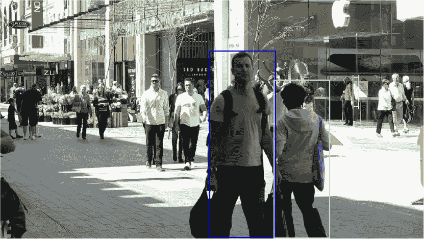

(a) MOTDT 在遮挡前的输出

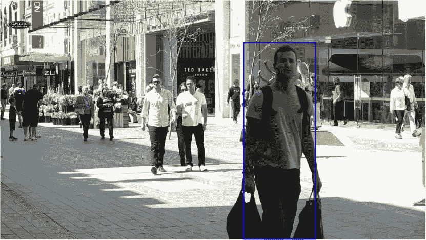

(b) MOTDT 在遮挡期间的输出

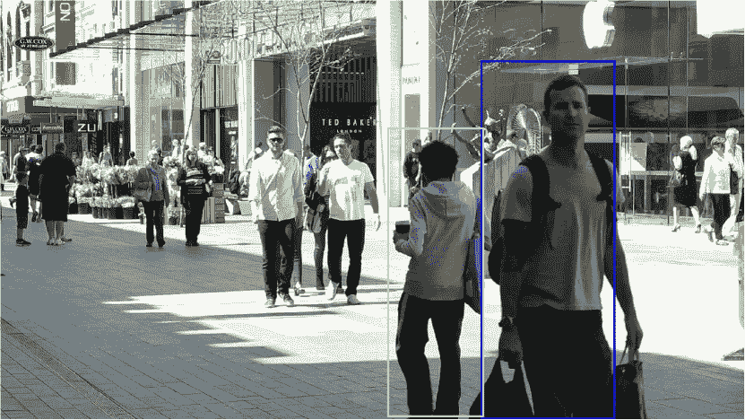

(c) MOTDT 在遮挡后的输出

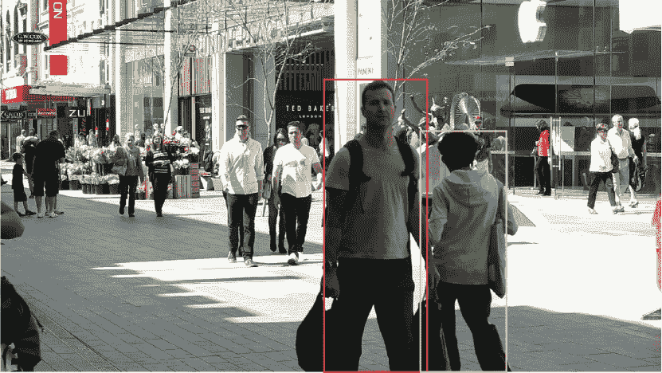

(d) eHAF16 在遮挡前的输出

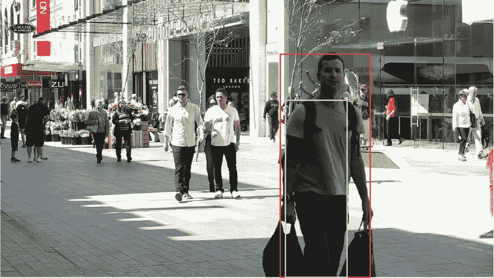

(e) eHAF16 在遮挡期间的输出

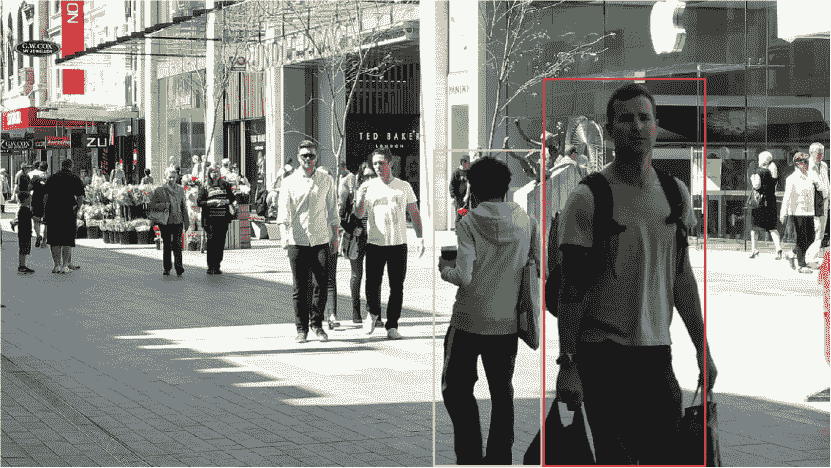

(f) eHAF16 在遮挡后的输出

图 8：在线方法在遮挡期间产生的碎片化示例。上图：MOTDT [118] 的跟踪结果，在线算法。下图：eHAF16 [103] 的跟踪结果，批处理算法。左右分别显示了 MOT16-08 视频的第 50 帧、第 60 帧和第 70 帧。为了避免混乱，仅显示了相关的框。如图所示，虽然一些在线算法能够在遮挡后重新识别丢失的目标，但它们通常无法在目标不可见时进行跟踪，这会导致碎片化。另一方面，批处理方法能够通过利用过去和未来的信息来重建碎片化的轨迹。

另一个值得注意的有趣现象是，由于 MOTA 分数基本上是 FPs、FNs 和 ID 切换的标准化总和，而 FNs 的数量通常至少比 FPs 多一个数量级，比 ID 切换多两个数量级，因此那些能够显著减少 FNs 数量的方法往往会获得最佳表现。我们实际上可以观察到 MOTA 和 FNs 数量之间有很强的相关性，这与[14]中的发现一致：MOTA 和 FN 值在 MOT15 上的 Pearson 相关系数为 $-0.95$，在 MOT16 上为 $-0.98$，在 MOT17 上为 $-0.95$。因此，虽然使用公共检测方法在减少 FNs 方面的改进有限，但最有效的方法仍然是构建和训练自定义检测器；FNs 数量减少一半实际上是私有检测器导致更好跟踪性能的主要原因，因为它们能够识别之前未覆盖的目标。在图 9 中，我们可以看到特别对缺失检测敏感的 SORT 算法在相对检测丢失后无法检测目标。

为了避免这个问题，许多新算法正在引入新的策略来解决这个问题。实际上，虽然执行插值的基本方法能够在遮挡期间恢复丢失的目标框，但这仍然不足以检测那些连一个检测都没有覆盖的目标，这些目标在 MOT15 和 MOT16 中占总数的 18% [14]。例如，Sheng 等人提出的 eHAF16 算法 [103] 使用了超像素提取算法来补充公开提供的检测，并且实际上能够显著减少 MOT17 中的假阴性数量，达到了数据集上的最高 MOTA 得分。MOTDT 算法 [118] 则使用 R-FCN 来将丢失的检测与新候选者整合，并能够在 MOT17 中达到在线算法中的最佳 MOTA 和最低假阴性数量。AP-RCNN 算法 [145] 也能够通过使用粒子滤波算法避免丢失检测造成的问题，仅依靠检测来初始化新目标和恢复丢失目标。[150]中提出的算法也通过设计深度预测网络来减少假阴性，其目标是学习对象的运动模型。在测试时，该网络能够预测对象在后续帧中的位置，从而减少因丢失检测而产生的假阴性。事实上，在 MOT16 中，它在这一指标上是在线方法中的第二佳。

| 模式 | MOT15 | MOT16 | MOT17 |
| --- | --- | --- | --- |
| 批次 | 1143.8 | 1104.9 | 3188.2 |
| 在线 | 1509.5 | 1820.2 | 7555.8 |

表 7：三种考虑的数据集中在线和批处理方法的平均碎片数。

关于亲和网络的训练策略，必须做出一个重要的观察。正如[93]所指出的，使用真实轨迹来训练网络以预测亲和度可能会产生次优结果，因为在测试时，这些网络将面对不同的数据分布，由噪声轨迹组成，这些轨迹可能包括丢失/错误的检测。事实上，许多算法选择使用实际检测 [96] 或通过手动添加噪声和错误到真实轨迹 [93, 115] 来训练网络，尽管这有时可能会减慢训练过程，并且并不总是可行 [60]。

#### 四个 MOT 步骤中的最佳方法

说到私有检测，表格显示目前表现最佳的检测器是 Faster R-CNN 及其变体。事实上，[38] 中提出的使用改进版 Faster R-CNN 的算法，在 MOT16 上的在线方法中已经保持了 3 年的领先地位，许多其他表现优异的 MOT16 算法也采用了相同的检测方法。相比之下，使用 SSD 检测器的算法，例如 [60] 和 [61] 中提出的算法，往往表现较差。然而，SSD 的一个大优点是其更快的速度：由于这一点，Kieritz 等人 [60] 的算法能够达到接近实时的性能（4.5 FPS），包括检测步骤¹⁹¹⁹19 我们提醒读者，许多算法报告的 FPS 值往往不包括检测步骤，而检测步骤通常是算法中计算最密集的部分.. 尽管在线方法数量众多，但在 MOT 流程中使用深度学习技术的主要问题仍然是难以获得实时预测，使得这些算法在大多数实际在线场景中无法使用。

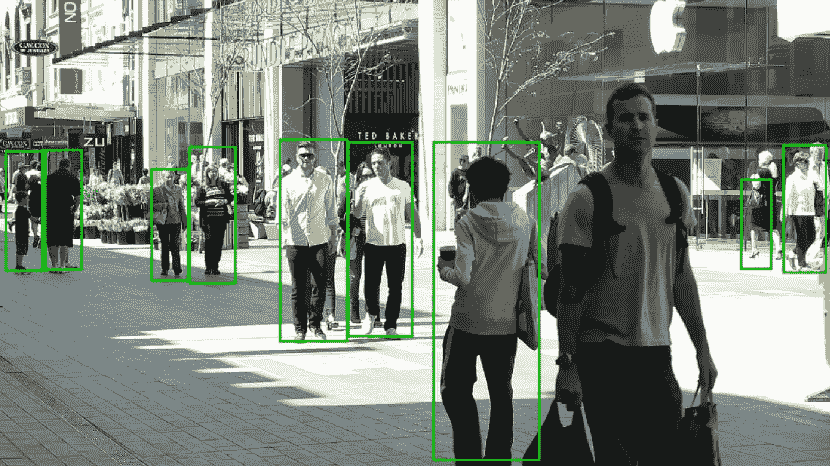

(a) 公共检测

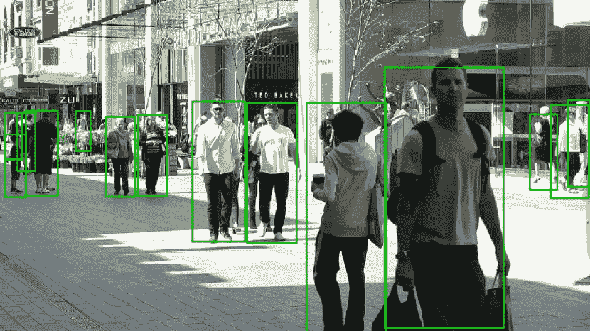

(b) 来自 [38] 的检测

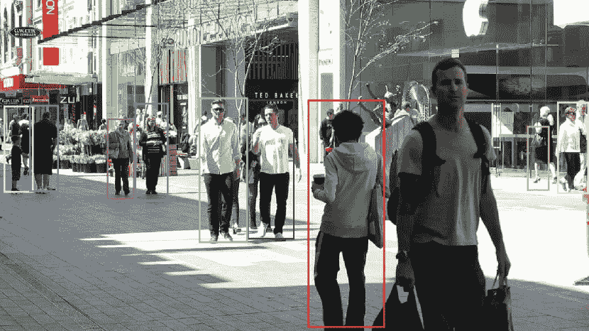

(c) 公共检测的输出轨迹

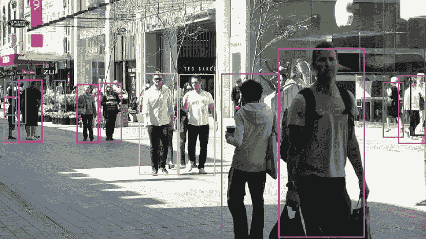

(d) 使用 [38] 检测结果的输出轨迹

图 9：上图：公共检测（使用 DPM v5 [26] 生成）和私有检测（通过 [38] 获取，使用在多个数据集上训练的自定义 Faster R-CNN）对于 MOT16-08 序列第 70 帧。可以观察到，前景中的人被自定义 Faster R-CNN 检测器（b）正确检测到，而被 DPM（a）忽略。下图：使用 SORT [35] 算法对两个检测集进行跟踪的结果，该算法的性能严重依赖于检测错误。我们确实可以看到，提到的漏检在跟踪输出（c）中产生了相应的假阴性，而在（d）中，这个人被正确跟踪。

关于特征提取，所有在考虑的三个数据集上表现最好的方法都使用了 CNN 来提取外观特征，其中 GoogLeNet 是最常见的。未利用外观特征（无论是通过深度方法还是经典方法提取的）的方法表现往往较差。然而，视觉特征并不足够：许多最佳算法还使用其他类型的特征来计算相似度，特别是运动特征。实际上，LSTMs 和卡尔曼滤波器等算法通常被用来预测目标在下一帧中的位置，这通常有助于提高关联的质量。各种贝叶斯滤波算法，如粒子滤波器和假设密度滤波器，也用于预测目标运动，并从使用深度模型中受益[158，145，98]。尽管如此，即使与非视觉特征一起使用，外观特征在提高算法的整体表现上仍然发挥了主要作用[123，158]，尤其是在避免 ID 切换[83]或在长时间遮挡后重新识别目标[41]。在后者的情况下，简单的运动预测器不起作用，因为线性运动假设很容易被打破，正如 Zhou 等人所指出的[55]。

尽管深度学习在检测和特征提取中扮演了重要角色，但使用深度网络来学习相似度函数的普及程度较低，目前尚未证明这对于一个好的 MOT 算法是必不可少的。实际上，许多算法依赖于对各种深度和非深度特征的手工制作距离度量的组合。然而，一些研究已经展示了如何使用相似度网络来产生顶级表现的算法[148，145，51，96]，这些方法从使用 Siamese CNNs 到递归神经网络都有涉及。特别是 Ma 等人提出的改进版 Siamese 网络[148]能够产生可靠的相似度度量，这有助于在遮挡后进行人员重新识别，并使算法在 MOT16 中达到最高的 MOTA 评分。Tang 等人提出的 StackNetPose CNN[51]中，身体部位信息的整合也是至关重要的：它作为一种注意机制，使网络能够集中关注输入图像的相关部分，从而产生更准确的相似度度量。该算法使用私有检测在 MOT16 中达到了顶级表现。

很少有研究探索使用深度学习模型来指导关联过程，这可能是未来研究的一种有趣方向。

#### 顶级表现算法的其他趋势

当前排名前列的方法中可以识别出一些其他趋势。例如，在在线方法中，一个成功的策略是使用单目标跟踪算法，经过适当修改以解决多目标跟踪任务。实际上，一些在 3 个数据集上表现最好的在线算法采用了增强了深度学习技术的 SOT 跟踪器，以应对遮挡或刷新目标模型[159, 115, 123]。有趣的是，据我们所知，还没有适应的 SOT 算法用于利用私有检测进行跟踪。正如我们已经观察到的那样，使用私有检测减少了完全未覆盖目标的数量；由于 SOT 跟踪器通常不需要检测就能继续跟踪一个已识别的目标，未覆盖目标的减少可能会转化为丢失轨迹的显著降低，这反过来会提升跟踪器的总体性能。因此，将 SOT 跟踪器应用于私有检测可能是进一步提高 MOTChallenge 数据集结果的一个良好研究方向。批量方法也可以利用 SOT 跟踪器查看过去的帧，以恢复在目标首次被检测器识别之前错过的检测。然而，基于 SOT 的 MOT 跟踪器有时仍可能面临跟踪漂移的问题，并产生较高的 ID 切换。例如，KCF16 算法[159]在公共检测的 MOT16 中虽然在在线方法中取得了顶级 MOTA 分数，但由于跟踪器漂移，仍然产生了相对较高的切换次数，如图 10 所示。此外，基于 SOT 的 MOT 算法必须小心不要跟踪由高质量检测器预测的不可避免的较高假阳性检测产生的虚假轨迹过多帧，因为这可能会抵消假阴性数量的减少。目前的方法[159, 115]仍倾向于使用检测重叠（例如，轨迹在多少最近帧中被检测到）来理解一个轨迹在长期中是正样本还是假阳性，但应研究更好的解决方案以避免完全依赖检测。

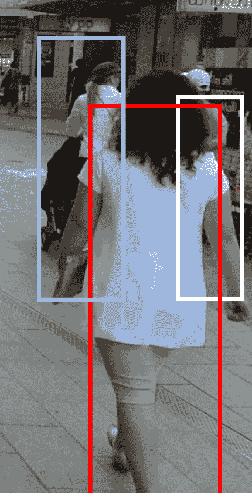

(a) 帧 14

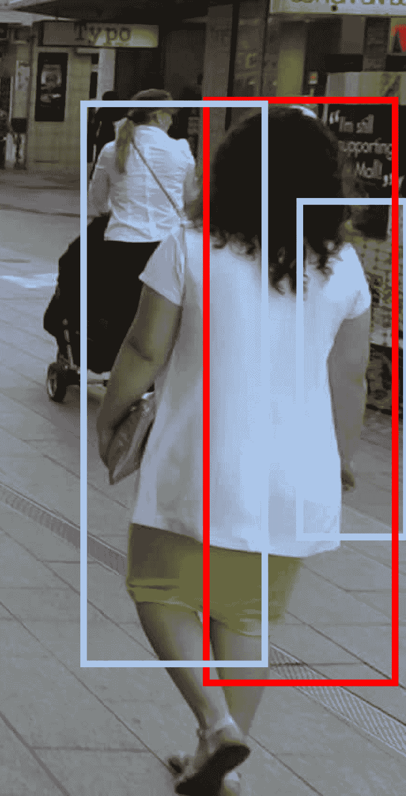

(b) 帧 22

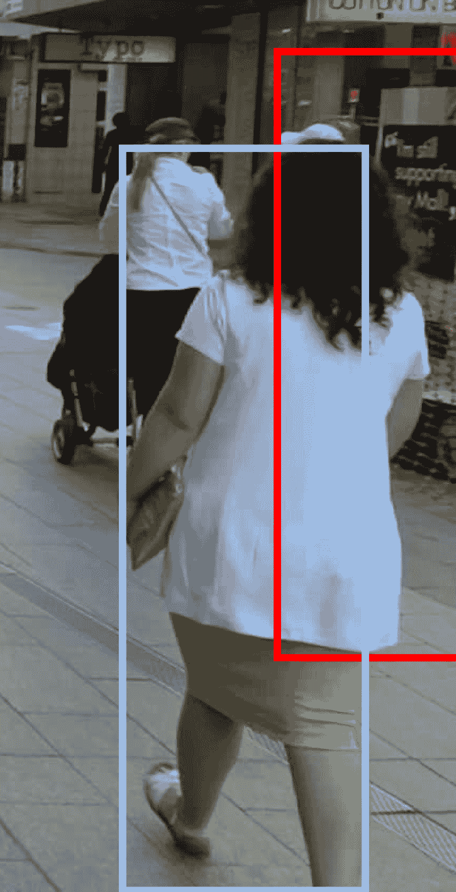

(c) 帧 28

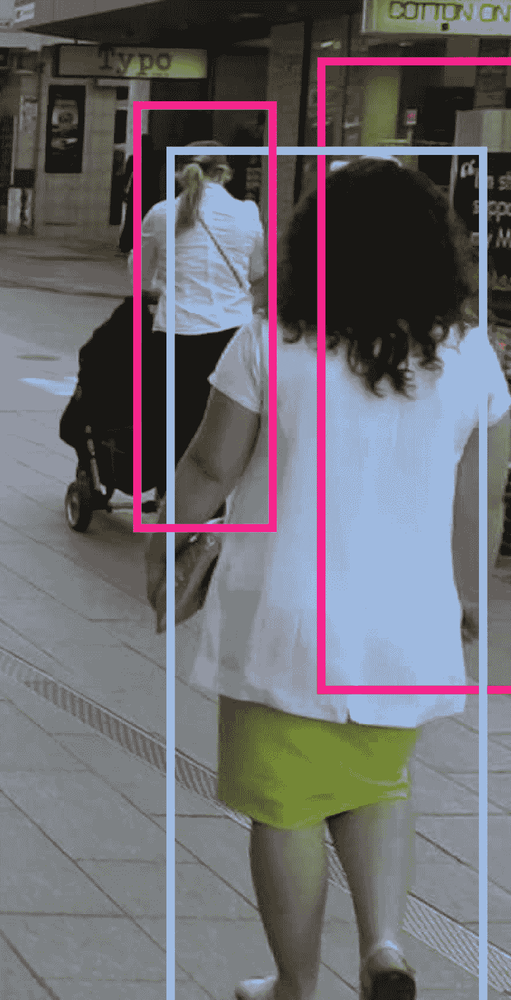

(d) 帧 34

图 10：MOT 算法（KFC16 [159]）中的 SOT 漂移示例。四张图片是从 MOT16-07 视频中裁剪出来的，最佳观赏效果为彩色图像，因为每种颜色代表不同的目标 ID。最初（a）跟踪了三个人。经过几帧（b），红色框开始漂移向被遮挡的人，而浅蓝色框开始漂移向前景中的女人。在（c）中，白色轨迹被中断，前两个 ID 切换完成。在（d）中，背景中的女人被分配了一个新身份，导致了第三次 ID 切换。

尽管许多方法通过将任务表述为图优化问题来执行关联，但批处理方法特别从中受益，因为它们可以在全局范围内进行优化。例如，最小成本提升多割问题在 MOT16 中表现最佳，得到了 CNN 计算的亲和度 [148, 51] 的帮助，而异质关联图融合和相关聚类则用于两个顶级 MOT17 方法 [103, 155]。

最后，可以注意到边界框的准确性对算法的最终性能有着根本性的影响。事实上，在 MOT15 [89] 中排名最高的跟踪器通过对之前的最先进算法的输出进行边界框回归，获得了相对较高的 MOTA 得分 [89]，使用了一个深度 RL 代理。开发一个有效的边界框回归器以纳入未来的 MOT 算法可能是一个尚未彻底探索的有趣研究方向。此外，与依赖单帧来修正框（在遮挡情况下可能会将错误的目标包含在内）相比，批处理方法也可以尝试利用未来和过去的目标外观来更准确地回归到正确目标周围的边界框。

## 5 结论与未来方向

我们对所有采用深度学习技术的 MOT 算法进行了全面描述，重点关注单摄像头视频和二维数据。展示了四个主要步骤来描述一个通用的 MOT 流程：检测、特征提取、亲和计算、关联。探讨了深度学习在这四个步骤中的应用。虽然大多数方法集中在前两步，但也有一些深度学习应用于学习亲和函数的案例，但只有很少的方法直接使用深度学习来指导关联算法。还提供了对 MOTChallenge 数据集结果的数值比较，显示尽管方法种类繁多，但呈现的方法之间可以找到一些共同点：

+   •

    检测质量很重要：假阴性的数量仍然主导了 MOTA 评分。虽然深度学习在使用公共检测算法方面有所改善，但使用更高质量的检测仍然是减少假阴性的最有效方法。因此，深度学习在检测步骤中的谨慎使用可以显著提高跟踪算法的性能；

+   •

    卷积神经网络（CNN）在特征提取中至关重要：外观特征的使用对一个优秀的跟踪器也至关重要，而 CNN 在提取这些特征方面特别有效。此外，强大的跟踪器往往将这些特征与运动特征结合使用，运动特征可以通过长短期记忆网络（LSTM）、卡尔曼滤波器或其他贝叶斯滤波器来计算；

+   •

    单目标跟踪（SOT）跟踪器和全局图优化工作：SOT 跟踪器在深度学习的帮助下，最近在多目标跟踪任务中产生了良好的在线跟踪器；而批处理方法则得益于在全局图优化算法中集成深度模型。

由于深度学习在多目标跟踪领域仅最近被引入，因此还识别出了一些有前景的未来研究方向：

+   •

    研究更多策略以减轻检测错误：尽管现代检测器不断提高性能，但在复杂场景（如密集行人跟踪）中，它们仍然容易产生大量的假阴性和假阳性。一些算法提供了解决方案，通过将检测与其他来源提取的信息（例如超级像素[103]、R-FCN [118]、粒子滤波器 [145]等）结合使用，减少对检测的过度依赖，但仍需研究进一步的策略；

+   •

    将深度学习应用于跟踪不同目标：大多数基于深度学习的多目标跟踪（MOT）算法主要关注行人跟踪。由于不同类型的目标带来了不同的挑战，应该研究使用深度网络在跟踪车辆、动物或其他物体方面可能的改进；

+   •

    调查当前算法的鲁棒性：当前方法在不同摄像头条件下的表现如何？变化的对比度、光照、噪声/丢失帧的存在如何影响当前算法的结果？现有的 DL 网络能否适应不同的跟踪环境？例如，绝大多数人跟踪框架是训练来跟踪行人或运动员，但跟踪在其他场景中可能也有用。一个可能的新应用是帮助理解不同背景下的场景：在电影中生成文本描述，以提供粗略的搜索方式；或在社交网络上生成盲人用户的描述，或检测应从平台上移除的不当视频。这些不同的场景可能需要对当前检测和跟踪算法进行修改，因为人们可能会以不寻常的姿势和行为出现，这些在现有的 MOT 数据集中并不存在。

+   •

    应用 DL 来指导关联：使用深度学习来指导关联算法并直接进行跟踪仍处于起步阶段：需要在这一方向上进行更多研究，以了解深度算法是否在这一步也能发挥作用；

+   •

    将 SOT 跟踪器与私人检测结合：减少丢失轨迹的可能方法之一，从而减少假阴性，是将 SOT 跟踪器与私人检测结合，尤其是在批处理设置中，在那里可以恢复之前遗漏的检测；

+   •

    调查边界框回归：使用边界框回归已被证明是获得更高 MOTA 分数的有前途的一步，但这一方法尚未被详细探讨，进一步改进应予以调查，例如使用过去和未来的信息来引导回归；

+   •

    调查后跟踪处理：在批处理环境中，可以在跟踪器的输出上应用修正算法以提高其性能。Babaee 等人已经展示了这一点[132]，他们在现有算法上应用了遮挡处理，而 Jiang 等人[152]则进行了前述的边界框回归步骤。可以在跟踪器的结果上应用更复杂的处理，以进一步提高结果。

最后，由于很少有已发布的算法提供了源代码公开访问，我们希望鼓励未来的研究人员发布他们的代码，以便更好地复现他们的结果并惠及整个研究社区。

## 致谢

这项研究部分由西班牙科学与技术部项目 TIN2017-89517-P 和项目 DeepSCOP-Ayudas Fundación BBVA a Equipos de Investigación Científica en Big Data 2018 资助。Siham Tabik 还获得了 Ramon y Cajal 计划（RYC-2015-18136）的支持。

## 参考文献

+   [1] Karen Simonyan 和 Andrew Zisserman. 用于大规模图像识别的非常深卷积网络。arXiv 预印本 arXiv:1409.1556，2014。

+   [2] Christian Szegedy, Wei Liu, Yangqing Jia, Pierre Sermanet, Scott Reed, Dragomir Anguelov, Dumitru Erhan, Vincent Vanhoucke, 和 Andrew Rabinovich. 通过卷积进一步深入。见 IEEE 计算机视觉与模式识别会议论文集，页码 1–9，2015。

+   [3] Kaiming He, Xiangyu Zhang, Shaoqing Ren, 和 Jian Sun. 用于图像识别的深度残差学习。见 IEEE 计算机视觉与模式识别会议论文集，页码 770–778，2016。

+   [4] Shaoqing Ren, Kaiming He, Ross Girshick, 和 Jian Sun. Faster R-CNN：利用区域提议网络实现实时目标检测。见神经信息处理系统进展，页码 91–99，2015。

+   [5] Wei Liu, Dragomir Anguelov, Dumitru Erhan, Christian Szegedy, Scott Reed, Cheng-Yang Fu, 和 Alexander C Berg. SSD：单次多框检测器。见欧洲计算机视觉会议论文集，页码 21–37。Springer，2016。

+   [6] Joseph Redmon 和 Ali Farhadi. Yolo9000：更好、更快、更强。见 IEEE 计算机视觉与模式识别会议论文集，页码 7263–7271，2017。

+   [7] Haşim Sak, Andrew Senior, 和 Françoise Beaufays. 用于大规模声学建模的长短期记忆递归神经网络架构。见国际语音通信协会第十五届年会，2014。

+   [8] Martin Sundermeyer, Ralf Schlüter, 和 Hermann Ney. Lstm 神经网络在语言建模中的应用。见国际语音通信协会第十三届年会，2012。

+   [9] Yuchen Fan, Yao Qian, Feng-Long Xie, 和 Frank K Soong. 基于双向 LSTM 的 TTS 合成。见国际语音通信协会第十五届年会，2014。

+   [10] Erik Marchi, Giacomo Ferroni, Florian Eyben, Leonardo Gabrielli, Stefano Squartini, 和 Björn Schuller. 基于多分辨率线性预测的音频起始检测特征与双向 LSTM 神经网络。见 2014 IEEE 国际声学、语音与信号处理会议（ICASSP），页码 2164–2168。IEEE，2014。

+   [11] Wenhan Luo, Junliang Xing, Anton Milan, Xiaoqin Zhang, Wei Liu, Xiaowei Zhao, 和 Tae-Kyun Kim. 多目标跟踪：文献综述。arXiv 预印本 arXiv:1409.7618，2014。

+   [12] Massimo Camplani, Adeline Paiement, Majid Mirmehdi, Dima Damen, Sion Hannuna, Tilo Burghardt, 和 Lili Tao. 基于 RGB-深度数据的人体多目标跟踪：综述。IET 计算机视觉，11(4)：265–285，2016。

+   [13] Patrick Emami、Panos M Pardalos、Lily Elefteriadou 和 Sanjay Ranka。解决多目标跟踪中的分配问题的机器学习方法。arXiv 预印本 arXiv:1802.06897，2018 年。

+   [14] Laura Leal-Taixé、Anton Milan、Konrad Schindler、Daniel Cremers、Ian Reid 和 Stefan Roth。追踪跟踪器：多目标跟踪技术的现状分析。arXiv 预印本 arXiv:1704.02781，2017 年。

+   [15] Laura Leal-Taixé、Anton Milan、Ian Reid、Stefan Roth 和 Konrad Schindler。Motchallenge 2015：多目标跟踪基准的进展。arXiv 预印本 arXiv:1504.01942，2015 年。

+   [16] Anton Milan、Laura Leal-Taixé、Ian Reid、Stefan Roth 和 Konrad Schindler。Mot16：多目标跟踪基准。arXiv 预印本 arXiv:1603.00831，2016 年。

+   [17] Kaiming He、Georgia Gkioxari、Piotr Dollár 和 Ross Girshick。Mask R-CNN。发表于 IEEE 国际计算机视觉会议，页 2961–2969，2017 年。

+   [18] Jifeng Dai、Yi Li、Kaiming He 和 Jian Sun。R-fcn：通过基于区域的全卷积网络进行物体检测。发表于神经信息处理系统进展，页 379–387，2016 年。

+   [19] Bo Wu 和 Ram Nevatia。基于静态身体部位检测的多目标、部分遮挡人的跟踪。发表于 2006 年 IEEE 计算机学会计算机视觉与模式识别会议（CVPR’06），第 1 卷，页 951–958。IEEE，2006 年。

+   [20] Keni Bernardin 和 Rainer Stiefelhagen。评估多目标跟踪性能：CLEAR MOT 指标。《图像与视频处理期刊》，2008:1，2008 年。

+   [21] Ergys Ristani、Francesco Solera、Roger Zou、Rita Cucchiara 和 Carlo Tomasi。多目标、多摄像头跟踪的性能度量和数据集。发表于欧洲计算机视觉会议，页 17–35。Springer，2016 年。

+   [22] Rainer Stiefelhagen 和 John Garofolo。人类感知的多模态技术：第一次国际评估研讨会关于事件、活动和关系分类，CLEAR 2006，南安普顿，英国，2006 年 4 月 6-7 日，修订版精选论文，第 4122 卷。Springer，2007 年。

+   [23] Rainer Stiefelhagen、Rachel Bowers 和 Jonathan Fiscus。人类感知的多模态技术：国际评估研讨会 CLEAR 2007 和 RT 2007，巴尔的摩，美国，2007 年 5 月 8-11 日，修订版精选论文，第 4625 卷。Springer，2008 年。

+   [24] Piotr Dollár、Ron Appel、Serge Belongie 和 Pietro Perona。用于物体检测的快速特征金字塔。《模式分析与机器智能 IEEE 事务》，36(8)：1532–1545，2014 年。

+   [25] Pedro F. Felzenszwalb、Ross B. Girshick、David McAllester 和 Deva Ramanan。基于判别训练的部件模型的物体检测。《模式分析与机器智能 IEEE 事务》，32(9)：1627–1645，2009 年。

+   [26] Ross B. Girshick, Pedro F. Felzenszwalb 和 David McAllester. 区分训练的可变形部件模型，第 5 版。[`people.cs.uchicago.edu/~rbg/latent-release5/`](http://people.cs.uchicago.edu/~rbg/latent-release5/)，2012 年。

+   [27] Fan Yang, Wongun Choi 和 Yuanqing Lin. 利用所有层级：具有尺度依赖池化和级联拒绝分类器的快速而准确的 CNN 目标检测器。发表于 IEEE 计算机视觉与模式识别会议论文集，页码 2129–2137，2016 年。

+   [28] Patrick Dendorfer, Hamid Rezatofighi, Anton Milan, Javen Shi, Daniel Cremers, Ian Reid, Stefan Roth, Konrad Schindler 和 Laura Leal-Taixe. CVPR19 跟踪与检测挑战：可以拥挤到什么程度？，2019 年。

+   [29] Andreas Geiger, Philip Lenz 和 Raquel Urtasun. 我们为自动驾驶做好准备了吗？KITTI 视觉基准套件。发表于 2012 年 IEEE 计算机视觉与模式识别会议，页码 3354–3361。IEEE，2012 年。

+   [30] Andreas Geiger, Philip Lenz, Christoph Stiller 和 Raquel Urtasun. 视觉遇见机器人：KITTI 数据集。《国际机器人研究杂志》，32(11):1231–1237，2013 年。

+   [31] Xiaoyu Wang, Ming Yang, Shenghuo Zhu 和 Yuanqing Lin. 用于通用目标检测的 Regionlets。发表于 IEEE 国际计算机视觉会议论文集，页码 17–24，2013 年。

+   [32] Longyin Wen, Dawei Du, Zhaowei Cai, Zhen Lei, Ming-Ching Chang, Honggang Qi, Jongwoo Lim, Ming-Hsuan Yang 和 Siwei Lyu. Ua-detrac：多目标检测与跟踪的新基准和协议。arXiv 预印本 arXiv:1511.04136，2015 年。

+   [33] Mykhaylo Andriluka, Stefan Roth 和 Bernt Schiele. 通过检测进行单目 3D 姿态估计和跟踪。发表于 2010 年 IEEE 计算机协会计算机视觉与模式识别会议，页码 623–630。IEEE，2010 年。

+   [34] James Ferryman 和 Ali Shahrokni. Pets2009：数据集和挑战。发表于 2009 年第十二届 IEEE 国际跟踪与监控性能评估研讨会，页码 1–6。IEEE，2009 年。

+   [35] Alex Bewley, Zongyuan Ge, Lionel Ott, Fabio Ramos 和 Ben Upcroft. 简单的在线和实时跟踪。发表于 2016 年 IEEE 国际图像处理会议 (ICIP)，页码 3464–3468。IEEE，2016 年。

+   [36] Rudolph Emil Kalman. 线性滤波和预测问题的新方法。《基础工程杂志》，82(1):35–45，1960 年。

+   [37] Harold W Kuhn. 匈牙利算法用于分配问题。《海军研究物流季刊》，2(1-2):83–97，1955 年。

+   [38] Fengwei Yu, Wenbo Li, Quanquan Li, Yu Liu, Xiaohua Shi 和 Junjie Yan. Poi：具有高性能检测和外观特征的多目标跟踪。发表于欧洲计算机视觉会议，页码 36–42。Springer，2016 年。

+   [39] Sean Bell, C Lawrence Zitnick, Kavita Bala 和 Ross Girshick. Inside-outside net：使用跳跃池化和递归神经网络在上下文中检测对象。发表于 IEEE 计算机视觉与模式识别会议论文集，页码 2874–2883，2016 年。

+   [40] Spyros Gidaris 和 Nikos Komodakis. 通过多区域和语义分割感知的 CNN 模型进行物体检测。发表于 IEEE 国际计算机视觉会议论文集，页码 1134–1142, 2015。

+   [41] Nicolai Wojke, Alex Bewley, 和 Dietrich Paulus. 使用深度关联度量的简单在线和实时追踪。发表于 2017 IEEE 国际图像处理会议 (ICIP) 论文集，页码 3645–3649\. IEEE, 2017。

+   [42] Nima Mahmoudi, Seyed Mohammad Ahadi, 和 Mohammad Rahmati. 使用基于 CNN 的特征进行多目标追踪：CNNMTT。Multimedia Tools and Applications, 78(6):7077–7096, 2019。

+   [43] Xingyu Wan, Jinjun Wang, 和 Sanping Zhou. 使用长短期记忆的在线灵活多目标追踪框架。发表于 IEEE 计算机视觉与模式识别会议研讨会论文集，页码 1230–1238, 2018。

+   [44] Takayuki Ujiie, Masayuki Hiromoto, 和 Takashi Sato. 基于插值的物体检测，使用运动矢量进行嵌入式实时追踪系统。发表于 IEEE 计算机视觉与模式识别会议研讨会论文集，页码 616–624, 2018。

+   [45] Qizheng He, Jianan Wu, Gang Yu, 和 Chi Zhang. 针对多目标追踪的 SOT。arXiv 预印本 arXiv:1712.01059, 2017。

+   [46] Minghua Li, Zhengxi Liu, Yunyu Xiong, 和 Zheng Li. 通过区分亲和模型和分层关联进行多人追踪。发表于 2017 第三届 IEEE 国际计算机与通信会议 (ICCC) 论文集，页码 1741–1745\. IEEE, 2017。

+   [47] Wenbo Li, Ming-Ching Chang, 和 Siwei Lyu. 谁在何处何时做了什么：同时进行多人物追踪和活动识别。arXiv 预印本 arXiv:1807.01253, 2018。

+   [48] Felipe Jorquera, Sergio Hernández, 和 Diego Vergara. 使用行列式点过程的概率假设密度滤波器进行多目标追踪。计算机视觉与图像理解, 2019。

+   [49] Zhao Zhong, Zichen Yang, Weitao Feng, Wei Wu, Yangyang Hu, 和 Cheng-lin Liu. 基于深度强化学习的目标追踪决策控制器。IEEE Access, 2019。

+   [50] Weigang Lu, Zhiping Zhou, Lijuan Zhang, 和 Guoqiang Zheng. 基于层次网络流的非线性运动模式的多目标追踪。多媒体系统, 页码 1–12, 2019。

+   [51] Siyu Tang, Mykhaylo Andriluka, Bjoern Andres, 和 Bernt Schiele. 通过提升的多割集和人物再识别进行多人物追踪。发表于 IEEE 计算机视觉与模式识别会议论文集，页码 3539–3548, 2017。

+   [52] Nan Ran, Longteng Kong, Yunhong Wang, 和 Qingjie Liu. 通过利用区分特征和长期依赖的鲁棒多运动员追踪算法。发表于国际多媒体建模会议论文集，页码 411–423\. Springer, 2019。

+   [53] Haigen Hu, Lili Zhou, Qiu Guan, Qianwei Zhou, 和 Shengyong Chen. 一种基于多特征融合的多细胞自动追踪方法。IEEE Access, 6:69782–69793, 2018。

+   [54] Lei Zhang, Helen Gray, Xujiong Ye, Lisa Collins, 和 Nigel Allinson。在猪场自动检测和跟踪个体猪。《传感器》，19(5):1188, 2019 年。

+   [55] Zongwei Zhou, Junliang Xing, Mengdan Zhang, 和 Weiming Hu。基于张量的高阶图匹配的在线多目标跟踪。在 2018 年第 24 届国际模式识别大会（ICPR），页面 1809–1814\. IEEE, 2018 年。

+   [56] Martin Danelljan, Goutam Bhat, Fahad Shahbaz Khan, 和 Michael Felsberg。Eco: 用于跟踪的高效卷积操作符。在 IEEE 计算机视觉与模式识别会议论文集，页面 6638–6646, 2017 年。

+   [57] Navneet Dalal 和 Bill Triggs。面向人类检测的方向梯度直方图。在计算机视觉与模式识别国际会议（CVPR’05），第 1 卷，页面 886–893\. IEEE 计算机学会，2005 年。

+   [58] Joost Van De Weijer, Cordelia Schmid, Jakob Verbeek, 和 Diane Larlus。为实际应用学习颜色名称。《IEEE 图像处理汇刊》，18(7):1512–1523, 2009 年。

+   [59] Yongyi Lu, Cewu Lu, 和 Chi-Keung Tang。使用关联 LSTM 的在线视频目标检测。在 IEEE 计算机视觉国际会议论文集，页面 2344–2352, 2017 年。

+   [60] Hilke Kieritz, Wolfgang Hubner, 和 Michael Arens。联合检测和在线多目标跟踪。在 IEEE 计算机视觉与模式识别会议论文集，页面 1459–1467, 2018 年。

+   [61] Dawei Zhao, Hao Fu, Liang Xiao, Tao Wu, 和 Bin Dai。用于自动驾驶车辆的相关滤波多目标跟踪。《传感器》，18(7):2004, 2018 年。

+   [62] 卡尔·皮尔逊。Liii. 论空间点系统的最佳拟合直线和平面。《伦敦、爱丁堡和都柏林哲学杂志与科学期刊》，2(11):559–572, 1901 年。

+   [63] Mengmeng Wang, Yong Liu, 和 Zeyi Huang。具有循环特征图的大边距目标跟踪。在 IEEE 计算机视觉与模式识别会议论文集，页面 4021–4029, 2017 年。

+   [64] Joseph Redmon, Santosh Divvala, Ross Girshick, 和 Ali Farhadi。你只看一次: 统一的实时目标检测。在 IEEE 计算机视觉与模式识别会议论文集，页面 779–788, 2016 年。

+   [65] Joseph Redmon 和 Ali Farhadi。Yolov3: 一次增量改进。arXiv 预印本 arXiv:1804.02767, 2018 年。

+   [66] Sang Jun Kim, Jae-Yeal Nam, 和 Byoung Chul Ko。使用移动车辆摄像头的多行人跟踪在线跟踪优化。《IEEE Access》，6:48675–48687, 2018 年。

+   [67] Sarthak Sharma, Junaid Ahmed Ansari, J Krishna Murthy, 和 K Madhava Krishna。超越像素: 利用几何和形状线索进行在线多目标跟踪。在 2018 年 IEEE 国际机器人与自动化会议（ICRA），页面 3508–3515\. IEEE, 2018 年。

+   [68] Jimmy Ren, Xiaohao Chen, Jianbo Liu, Wenxiu Sun, Jiahao Pang, Qiong Yan, Yu-Wing Tai 和 Li Xu. 使用递归卷积的精确单阶段检测器。发表于 IEEE 计算机视觉与模式识别会议论文集，页码 5420–5428，2017 年。

+   [69] Yu Xiang, Wongun Choi, Yuanqing Lin 和 Silvio Savarese. 面向子类别的卷积神经网络用于目标提议和检测。发表于 2017 IEEE 冬季计算机视觉应用会议（WACV），页码 924–933。IEEE，2017 年。

+   [70] Federico Pernici, Federico Bartoli, Matteo Bruni 和 Alberto Del Bimbo. 基于记忆的在线学习深度表示从视频流中提取。发表于 IEEE 计算机视觉与模式识别会议论文集，页码 2324–2334，2018 年。

+   [71] Peiyun Hu 和 Deva Ramanan. 发现微小的面孔。发表于 IEEE 计算机视觉与模式识别会议论文集，页码 951–959，2017 年。

+   [72] Weidong Min, Mengdan Fan, Xiaoguang Guo 和 Qing Han. 一种通过结合鲁棒检测和两个分类器跟踪多辆车辆的新方法。IEEE 智能交通系统汇刊，19(1):174–186，2018 年。

+   [73] Olivier Barnich 和 Marc Van Droogenbroeck. Vibe: 一种用于视频序列的通用背景减除算法。IEEE 图像处理汇刊，20(6):1709–1724，2011 年。

+   [74] Corinna Cortes 和 Vladimir Vapnik. 支持向量网络。机器学习，20(3):273–297，1995 年。

+   [75] Shaoyong Yu, Yun Wu, Wei Li, Zhijun Song 和 Wenhua Zeng. 基于深度学习的细粒度车辆分类模型。Neurocomputing，257:97–103，2017 年。

+   [76] Sebastian Bullinger, Christoph Bodensteiner 和 Michael Arens. 基于实例流的在线多目标跟踪。发表于 2017 IEEE 国际图像处理会议（ICIP），页码 785–789。IEEE，2017 年。

+   [77] Jifeng Dai, Kaiming He 和 Jian Sun. 基于多任务网络级联的实例感知语义分割。发表于 IEEE 计算机视觉与模式识别会议论文集，页码 3150–3158，2016 年。

+   [78] Gunnar Farnebäck. 基于多项式展开的双帧运动估计。发表于斯堪的纳维亚图像分析会议，页码 363–370。Springer，2003 年。

+   [79] Jerome Revaud, Philippe Weinzaepfel, Zaid Harchaoui 和 Cordelia Schmid. Deepmatching: 分层可变形稠密匹配。国际计算机视觉期刊，120(3):300–323，2016 年。

+   [80] Yinlin Hu, Rui Song 和 Yunsong Li. 高效的粗到细 Patchmatch 用于大位移光流。发表于 IEEE 计算机视觉与模式识别会议论文集，页码 5704–5712，2016 年。

+   [81] Li Wang, Nam Trung Pham, Tian-Tsong Ng, Gang Wang, Kap Luk Chan 和 Karianto Leman. 通过多任务学习策略学习深度特征以进行多目标跟踪。发表于 2014 IEEE 国际图像处理会议（ICIP），页码 838–842。IEEE，2014 年。

+   [82] Charles Cadieu 和 Bruno A Olshausen. 从自然电影中学习变换不变性。在神经信息处理系统进展，页码 209–216，2009 年。

+   [83] Chanho Kim, Fuxin Li, Arridhana Ciptadi 和 James M Rehg. 多假设跟踪的回顾。在 IEEE 国际计算机视觉大会论文集中，页码 4696–4704，2015 年。

+   [84] Liang Zheng, Hengheng Zhang, Shaoyan Sun, Manmohan Chandraker, Yi Yang 和 Qi Tian. 野外环境中的行人再识别。在 IEEE 计算机视觉与模式识别会议论文集中，页码 1367–1376，2017 年。

+   [85] Liang Zheng, Liyue Shen, Lu Tian, Shengjin Wang, Jingdong Wang 和 Qi Tian. 可扩展的行人再识别：一个基准。在 IEEE 国际计算机视觉大会论文集中，页码 1116–1124，2015 年。

+   [86] Douglas Gray 和 Hai Tao. 使用局部特征集成的视角不变行人识别。在欧洲计算机视觉大会，页码 262–275。Springer，2008 年。

+   [87] Wei Li, Rui Zhao, Tong Xiao 和 Xiaogang Wang. Deepreid: 用于行人再识别的深度滤波配对神经网络。在 IEEE 计算机视觉与模式识别会议论文集中，页码 152–159，2014 年。

+   [88] Jiahui Chen, Hao Sheng, Yang Zhang 和 Zhang Xiong. 增强检测模型用于多假设跟踪。在 IEEE 计算机视觉与模式识别会议论文集中，页码 18–27，2017 年。

+   [89] Min Yang, Yuwei Wu 和 Yunde Jia. 一种用于鲁棒在线多目标跟踪的混合数据关联框架。IEEE 图像处理汇刊，26(12):5667–5679，2017 年。

+   [90] Ross Girshick, Jeff Donahue, Trevor Darrell 和 Jitendra Malik. 基于区域的卷积网络用于准确的物体检测和分割。IEEE 模式分析与机器智能汇刊，38(1):142–158，2015 年。

+   [91] Shuo Hong Wang, Jing Wen Zhao 和 Yan Qiu Chen. 使用 CNN 进行鱼群头部识别的鲁棒跟踪。多媒体工具与应用，76(22):23679–23697，2017 年。

+   [92] Sergey Zagoruyko 和 Nikos Komodakis. 宽残差网络。arXiv 预印本 arXiv:1605.07146，2016 年。

+   [93] Chanho Kim, Fuxin Li 和 James M Rehg. 使用双线性 LSTM 的多目标跟踪与神经门控。在欧洲计算机视觉会议（ECCV）论文集中，页码 200–215，2018 年。

+   [94] Seung-Hwan Bae 和 Kuk-Jin Yoon. 基于置信度的数据关联与判别性深度外观学习用于鲁棒在线多目标跟踪。IEEE 模式分析与机器智能汇刊，40(3):595–610，2017 年。

+   [95] Mohib Ullah 和 Faouzi Alaya Cheikh. 基于深度特征的端到端运输网络用于多目标跟踪。在 2018 年第 25 届 IEEE 国际图像处理大会（ICIP），页码 3738–3742。IEEE，2018 年。

+   [96] Kuan Fang、Yu Xiang、Xiaocheng Li 和 Silvio Savarese。用于在线多目标跟踪的递归自回归网络。在 2018 年 IEEE 冬季计算机视觉应用会议（WACV），第 466–475 页。IEEE，2018 年。

+   [97] Tong Xiao、Hongsheng Li、Wanli Ouyang 和 Xiaogang Wang。通过领域引导的丢弃学习深度特征表示进行行人重识别。在《IEEE 计算机视觉与模式识别会议论文集》，第 1249–1258 页，2016 年。

+   [98] Zeyu Fu、Federico Angelini、Syed Mohsen Naqvi 和 Jonathon A Chambers。基于 Gm-phd 滤波器的深度判别相关匹配在线多人人体跟踪。在 2018 年 IEEE 国际声学、语音与信号处理会议（ICASSP），第 4299–4303 页。IEEE，2018 年。

+   [99] B-N Vo 和 W-K Ma。高斯混合概率假设密度滤波器。IEEE 信号处理汇刊，54(11): 4091–4104，2006 年。

+   [100] Longyin Wen、Dawei Du、Shengkun Li、Xiao Bian 和 Siwei Lyu。学习非均匀超图用于多目标跟踪。第三十三届 AAAI 人工智能会议，2019 年。

+   [101] Olga Russakovsky、Jia Deng、Hao Su、Jonathan Krause、Sanjeev Satheesh、Sean Ma、Zhiheng Huang、Andrej Karpathy、Aditya Khosla、Michael Bernstein 等。Imagenet 大规模视觉识别挑战。国际计算机视觉期刊，115(3): 211–252，2015 年。

+   [102] Flip Korn 和 Suresh Muthukrishnan。基于逆最近邻查询的影响集合。ACM Sigmod Record，29(2): 201–212，2000 年。

+   [103] Hao Sheng、Yang Zhang、Jiahui Chen、Zhang Xiong 和 Jun Zhang。用于多目标跟踪的异质关联图融合。IEEE 视频技术电路与系统汇刊，2018 年。

+   [104] Longtao Chen、Xiaojiang Peng 和 Mingwu Ren。递归度量网络和批量多假设用于多目标跟踪。IEEE Access，7: 3093–3105，2019 年。

+   [105] Leonid Pishchulin、Eldar Insafutdinov、Siyu Tang、Bjoern Andres、Mykhaylo Andriluka、Peter V Gehler 和 Bernt Schiele。Deepcut: 结合子集划分和标记的多人姿态估计。在《IEEE 计算机视觉与模式识别会议论文集》，第 4929–4937 页，2016 年。

+   [106] Minyoung Kim、Stefano Alletto 和 Luca Rigazio。使用增强的孪生网络进行多目标跟踪的相似性映射。在智能交通系统的机器学习（MLITS），2016 年 NIPS 研讨会，2016 年。

+   [107] Jane Bromley、Isabelle Guyon、Yann LeCun、Eduard Säckinger 和 Roopak Shah。使用“孪生”时延神经网络进行签名验证。在《神经信息处理系统进展》，第 737–744 页，1994 年。

+   [108] 冯·王、李 王、冰·帅、镇·左、婷·刘、Kap Luk Chan 和刚·王。卷积神经网络与时间约束度量的联合学习用于轨迹关联。IEEE 计算机视觉与模式识别会议研讨会论文集, 页 1–8, 2016。

+   [109] 申·张、易宏·龚、贾-宾·黄、钟武·林、金俊·王、纳伦德拉·阿胡贾和明轩·杨。通过自适应判别特征跟踪感兴趣的人。在欧洲计算机视觉会议，页 415–433。Springer, 2016。

+   [110] 劳拉·李尔-泰克、克里斯蒂安·坎顿-费雷尔和孔拉德·辛德勒。通过跟踪学习：用于鲁棒目标关联的 Siamese CNN。IEEE 计算机视觉与模式识别会议研讨会论文集, 页 33–40, 2016。

+   [111] 劳拉·李尔-泰克、杰拉德·庞斯-莫尔和博多·罗森汉。每个人都需要有人：在线性规划多人物跟踪器上建模社会和分组行为。在 2011 年 IEEE 国际计算机视觉研讨会（ICCV 研讨会），页 120–127。IEEE, 2011。

+   [112] Jeany Son、Mooyeol Baek、Minsu Cho 和 Bohyung Han。多目标跟踪与四元组卷积神经网络。IEEE 计算机视觉与模式识别会议论文集, 页 5620–5629, 2017。

+   [113] 安德烈·马克赛和帕斯卡尔·富亚。消除多目标跟踪中的曝光偏差和损失评估不匹配。IEEE 计算机视觉与模式识别会议论文集, 2019。

+   [114] 亚历山大·赫尔曼斯、卢卡斯·贝耶尔和巴斯蒂安·莱贝。为行人再识别辩护三元组损失。arXiv 预印本 arXiv:1703.07737, 2017。

+   [115] 吉 朱、华 杨、年 刘、敏永·金、温俊·张和明轩·杨。具有双重匹配注意力网络的在线多目标跟踪。欧洲计算机视觉会议（ECCV）论文集, 页 366–382, 2018。

+   [116] 孔 马、常水·杨、范·杨、岳青·庄、子维·张、惠珠·贾和肖冬·谢。轨迹工厂：通过深度 Siamese Bi-GRU 进行轨迹分裂和重连接以实现多目标跟踪。在 2018 年 IEEE 国际多媒体与博览会（ICME），页 1–6。IEEE, 2018。

+   [117] 惠 周、万里·欧阳、简·程、肖刚·王和洪生·李。具有非对称对象间约束的深度连续条件随机场用于在线多目标跟踪。IEEE 视频技术电路与系统汇刊, 2018。

+   [118] 陈·龙、艾·海洲、庄·紫杰和尚·冲。通过深度学习的候选选择和行人再识别实现实时多人物跟踪。在 ICME, 2018。

+   [119] 常勋·李和恩泰·金。通过特征金字塔 Siamese 网络实现多目标跟踪。IEEE Access, 7:8181–8194, 2019。

+   [120] Forrest N Iandola, Song Han, Matthew W Moskewicz, Khalid Ashraf, William J Dally, 和 Kurt Keutzer. SqueezeNet：与 AlexNet 相当的准确度，参数减少 50 倍，模型大小 < 0.5 MB. arXiv 预印本 arXiv:1602.07360, 2016.

+   [121] Mohib Ullah, Ahmed Kedir Mohammed, Faouzi Alaya Cheikh, 和 Zhaohui Wang. 一种用于多目标跟踪的层次特征模型. 在 2017 IEEE 国际图像处理会议 (ICIP), 页码 2612–2616\. IEEE, 2017.

+   [122] Stéphane G Mallat 和 Zhifeng Zhang. 时间频率字典的匹配追踪. IEEE 信号处理汇刊, 41(12):3397–3415, 1993.

+   [123] Amir Sadeghian, Alexandre Alahi, 和 Silvio Savarese. 跟踪不可跟踪的目标：学习跟踪具有长期依赖性的多个线索. 发表在 IEEE 国际计算机视觉大会论文集, 页码 300–311, 2017.

+   [124] Qi Chu, Wanli Ouyang, Hongsheng Li, Xiaogang Wang, Bin Liu, 和 Nenghai Yu. 基于 CNN 的单目标跟踪器与时空注意力机制的在线多目标跟踪. 发表在 IEEE 国际计算机视觉大会论文集, 页码 4836–4845, 2017.

+   [125] Mustafa Ozuysal, Michael Calonder, Vincent Lepetit, 和 Pascal Fua. 使用随机蕨类植物进行快速关键点识别. IEEE 模式分析与机器智能汇刊, 32(3):448–461, 2009.

+   [126] Mohib Ullah 和 Faouzi Alaya Cheikh. 一种用于多目标跟踪的定向稀疏图模型. 发表在 IEEE 计算机视觉与模式识别会议研讨会论文集, 页码 1816–1823, 2018.

+   [127] Lawrence R Rabiner 和 Biing-Hwang Juang. 隐马尔可夫模型简介. IEEE ASSP 杂志, 3(1):4–16, 1986.

+   [128] Lu Wang, Lisheng Xu, Min Young Kim, Luca Rigazico, 和 Ming-Hsuan Yang. 通过流和卷积特征进行在线多目标跟踪. 在 2017 IEEE 国际图像处理会议 (ICIP), 页码 3630–3634\. IEEE, 2017.

+   [129] Chao Ma, Jia-Bin Huang, Xiaokang Yang, 和 Ming-Hsuan Yang. 视觉跟踪的层次卷积特征. 发表在 IEEE 国际计算机视觉会议论文集, 页码 3074–3082, 2015.

+   [130] Bruce D. Lucas 和 Takeo Kanade. 一种迭代图像配准技术及其在立体视觉中的应用. 发表在成像理解研讨会论文集, 页码 121–130\. 温哥华, 不列颠哥伦比亚省, 1981.

+   [131] Pol Rosello 和 Mykel J Kochenderfer. 多智能体强化学习用于多目标跟踪. 发表在第 17 届国际自主代理与多智能体系统会议论文集, 页码 1397–1404\. 国际自主代理与多智能体系统基金会, 2018.

+   [132] Maryam Babaee, Zimu Li, 和 Gerhard Rigoll. 使用 RNN 处理多人物跟踪中的遮挡. 在 2018 第 25 届 IEEE 国际图像处理会议 (ICIP), 页码 2715–2719\. IEEE, 2018.

+   [133] Anton Milan, S Hamid Rezatofighi, Anthony Dick, Ian Reid 和 Konrad Schindler。使用递归神经网络进行在线多目标跟踪。在第三十一届 AAAI 人工智能会议，2017 年。

+   [134] Yu Xiang, Alexandre Alahi 和 Silvio Savarese。学习跟踪：通过决策进行在线多目标跟踪。在 IEEE 国际计算机视觉会议论文集，页码 4705–4713，2015 年。

+   [135] Hao-Shu Fang, Shuqin Xie, Yu-Wing Tai 和 Cewu Lu。Rmpe：区域性多人姿态估计。在 IEEE 国际计算机视觉会议论文集，页码 2334–2343，2017 年。

+   [136] Yiming Liang 和 Yue Zhou。结合多种线索的 LSTM 多目标跟踪器。在 2018 年第 25 届 IEEE 国际图像处理会议（ICIP），页码 2351–2355。IEEE，2018 年。

+   [137] Sanping Zhou, Jinjun Wang, Deyu Meng, Xiaomeng Xin, Yubing Li, Yihong Gong 和 Nanning Zheng。用于人员重新识别的深度自适应学习。《模式识别》，76:739–751，2018 年。

+   [138] Kwangjin Yoon, Du Yong Kim, Young-Chul Yoon 和 Moongu Jeon。通过深度神经网络进行多目标跟踪的数据关联。《传感器》，19(3):559，2019 年。

+   [139] Alexandre Robicquet, Amir Sadeghian, Alexandre Alahi 和 Silvio Savarese。学习社交礼仪：在人群拥挤场景中的人类轨迹理解。在欧洲计算机视觉会议，页码 549–565。施普林格，2016 年。

+   [140] Mykhaylo Andriluka, Stefan Roth 和 Bernt Schiele。基于检测的人员跟踪和基于跟踪的人员检测。在 2008 年 IEEE 计算机视觉与模式识别会议，页码 1–8。IEEE，2008 年。

+   [141] Kyunghyun Cho, Bart Van Merriënboer, Dzmitry Bahdanau 和 Yoshua Bengio。神经机器翻译的属性：编码器-解码器方法。arXiv 预印本 arXiv:1409.1259，2014 年。

+   [142] Bjoern Andres, Andrea Fuksová 和 Jan-Hendrik Lange。多割的提升。CoRR，abs/1503.03791，3，2015 年。

+   [143] Philippe Weinzaepfel, Jerome Revaud, Zaid Harchaoui 和 Cordelia Schmid。Deepflow：具有深度匹配的大位移光流。在 IEEE 国际计算机视觉会议论文集，页码 1385–1392，2013 年。

+   [144] Margret Keuper, Evgeny Levinkov, Nicolas Bonneel, Guillaume Lavoué, Thomas Brox 和 Bjorn Andres。通过提升的多割高效分解图像和网格图。在 IEEE 国际计算机视觉会议论文集，页码 1751–1759，2015 年。

+   [145] Long Chen, Haizhou Ai, Chong Shang, Zijie Zhuang 和 Bo Bai。使用卷积神经网络进行在线多目标跟踪。在 2017 年 IEEE 国际图像处理会议（ICIP），页码 645–649。IEEE，2017 年。

+   [146] M Sanjeev Arulampalam, Simon Maskell, Neil Gordon 和 Tim Clapp。关于在线非线性/非高斯贝叶斯跟踪的粒子滤波教程。《IEEE 信号处理学报》，50(2):174–188，2002 年。

+   [147] Ricardo Sanchez-Matilla、Fabio Poiesi 和 Andrea Cavallaro. 在线多目标跟踪中的强检测和弱检测。在欧洲计算机视觉会议，第 84–99 页。Springer，2016 年。

+   [148] Liqian Ma、Siyu Tang、Michael J. Black 和 Luc Van Gool. 定制化的多人员跟踪器。在计算机视觉 - ACCV 2018。Springer 国际出版，2018 年 12 月。

+   [149] Siyu Tang、Bjoern Andres、Mykhaylo Andriluka 和 Bernt Schiele. 通过多切割和深度匹配进行多人的跟踪。在欧洲计算机视觉会议，第 100–111 页。Springer，2016 年。

+   [150] Liangliang Ren、Jiwen Lu、Zifeng Wang、Qi Tian 和 Jie Zhou. 协作深度强化学习用于多目标跟踪。在欧洲计算机视觉会议（ECCV）论文集，第 586–602 页，2018 年。

+   [151] Hyeonseob Nam 和 Bohyung Han. 学习多域卷积神经网络用于视觉跟踪。在 IEEE 计算机视觉与模式识别会议论文集，第 4293–4302 页，2016 年。

+   [152] Yifan Jiang、Hyunhak Shin 和 Hanseok Ko. 基于深度强化学习的精确回归用于边界框校正以改进跟踪。2018 IEEE 国际声学、语音和信号处理会议（ICASSP），第 1643–1647 页。IEEE，2018 年。

+   [153] Byungjae Lee、Enkhbayar Erdenee、Songguo Jin、Mi Young Nam、Young Giu Jung 和 Phill Kyu Rhee. 使用变化点检测的多类多目标跟踪。在欧洲计算机视觉会议，第 68–83 页。Springer，2016 年。

+   [154] Anthony Hoak、Henry Medeiros 和 Richard Povinelli. 通过多伯努利滤波和交互式似然进行基于图像的多目标跟踪。传感器，17(3):501，2017 年。

+   [155] Roberto Henschel、Laura Leal-Taixé、Daniel Cremers 和 Bodo Rosenhahn. 头部和全身检测器融合用于多目标跟踪。在 IEEE 计算机视觉与模式识别会议研讨会论文集，第 1428–1437 页，2018 年。

+   [156] Russell Stewart、Mykhaylo Andriluka 和 Andrew Y Ng. 在拥挤场景中的端到端人检测。在 IEEE 计算机视觉与模式识别会议论文集，第 2325–2333 页，2016 年。

+   [157] Weihao Gan、Shuo Wang、Xuejing Lei、Ming-Sui Lee 和 C-C Jay Kuo. 基于 CNN 的在线多目标跟踪，增强模型更新和身份关联。信号处理：图像通信，66:95–102，2018 年。

+   [158] Jun Xiang、Guoshuai Zhang 和 Jianhua Hou. 基于特征表示和贝叶斯滤波的在线多目标跟踪，在深度学习架构中实现。IEEE Access，2019 年。

+   [159] Peng Chu、Heng Fan、Chiu C Tan 和 Haibin Ling. 带实例感知跟踪器和动态模型刷新功能的在线多目标跟踪。在 2019 IEEE 冬季计算机视觉应用会议（WACV），第 161–170 页。IEEE，2019 年。

+   [160] Christopher John Cornish Hellaby Watkins. 从延迟奖励中学习。博士论文，剑桥大学国王学院，1989 年。

+   [161] Jun-ichi Takeuchi 和 Kenji Yamanishi. 一个统一的框架用于从时间序列中检测异常值和变化点。IEEE 知识与数据工程学报，18(4):482–492，2006 年。

+   [162] Piotr Dollar, Christian Wojek, Bernt Schiele, 和 Pietro Perona. 行人检测：一个基准。发表于 2009 IEEE 计算机视觉与模式识别会议论文集，第 304–311 页。IEEE，2009 年。

+   [163] Reza Hoseinnezhad, Ba-Ngu Vo, Ba-Tuong Vo, 和 David Suter. 通过多伯努利滤波图像数据进行大量目标的视觉跟踪。《模式识别》，45(10):3625–3635，2012 年。

+   [164] Anton Milan, Rikke Gade, Anthony Dick, Thomas B Moeslund, 和 Ian Reid. 通过局部更新改善全局多目标跟踪。发表于欧洲计算机视觉会议论文集，第 174–190 页。Springer，2014 年。

+   [165] Marguerite Frank 和 Philip Wolfe. 二次规划算法。《海军研究物流季刊》，3(1-2):95–110，1956 年。

+   [166] Zhe Cao, Tomas Simon, Shih-En Wei, 和 Yaser Sheikh. 使用部分亲和场的实时多人人体 2D 姿态估计。发表于 IEEE 计算机视觉与模式识别会议论文集，第 7291–7299 页，2017 年。

+   [167] Liming Zhao, Xi Li, Yueting Zhuang, 和 Jingdong Wang. 深度学习的部分对齐表示用于行人重新识别。发表于 IEEE 国际计算机视觉会议论文集，第 3219–3228 页，2017 年。

+   [168] João F Henriques, Rui Caseiro, Pedro Martins, 和 Jorge Batista. 使用内核化相关滤波器进行高速跟踪。IEEE 模式分析与机器智能学报，37(3):583–596，2014 年。

+   [169] Longyin Wen, Wenbo Li, Junjie Yan, Zhen Lei, Dong Yi, 和 Stan Z Li. 基于无向分层关系超图的多目标跟踪。发表于 IEEE 计算机视觉与模式识别会议论文集，第 1282–1289 页，2014 年。

+   [170] Zhi-Ming Qian, Xi En Cheng, 和 Yan Qiu Chen. 自动检测和跟踪在浅水中游动的多条鱼并处理频繁遮挡。《PloS one》，9(9):e106506，2014 年。

+   [171] Hamed Pirsiavash, Deva Ramanan, 和 Charless C Fowlkes. 针对变数量目标的全局最优贪婪算法。发表于 CVPR 2011 会议论文集，第 1201–1208 页。IEEE，2011 年。

+   [172] Steven Gold, Anand Rangarajan 等. 从 Softmax 到 Softassign：用于组合优化的神经网络算法。《人工神经网络杂志》，2(4):381–399，1996 年。

+   [173] Chang Huang, Bo Wu, 和 Ramakant Nevatia. 通过检测响应的分层关联进行稳健的目标跟踪。发表于欧洲计算机视觉会议论文集，第 788–801 页。Springer，2008 年。

+   [174] Rodrigo Benenson, Markus Mathias, Radu Timofte, 和 Luc Van Gool. 每秒 100 帧的行人检测。发表于 2012 IEEE 计算机视觉与模式识别会议论文集，第 2903–2910 页。IEEE，2012 年。

## 附录 A 附录

-   在这里，我们展示了一个包含每种算法使用的技术总结的表格。该表格按照论文的展示顺序排列。由于我们认为开源代码的发布可以极大地帮助研究社区，因此我们还提供了提供源代码的论文的链接。

-   表 8：有关第三部分中评论方法的信息摘要。在每一列中，显示了该步骤中每篇论文的方法。app. 表示外观，mot. 表示运动，feat. 表示特征，pred. 表示预测；模式列中的 O 和 B 分别表示在线和批处理方法。最后一列的文本是可点击的，包含指向指定数据的链接。

|  | 检测 | 特征提取/运动预测 | 亲和性/成本计算 | 关联/跟踪 | 模式 | 来源和数据 |
| --- | --- | --- | --- | --- | --- | --- |
| [35] | Faster R-CNN | 卡尔曼滤波器 | IoU | 匈牙利算法 | O | [源代码](https://github.com/abewley/sort) |
| [38] | 修改版 Faster R-CNN | 修改版 GoogLeNet，卡尔曼滤波器 | 余弦距离 + IoU | 匈牙利算法（在线），修改版 H2T [169]（批处理） | O+B | [检测和外观特征](https://drive.google.com/file/d/0B5ACiy41McAHMjczS2p0dFg3emM/view) |
| [52] | Faster R-CNN | CNN（应用），AlphaPose CNN，姿态关节速度，交互网格 | 基于姿态的三重流网络（基于 LSTM） | 自定义算法 | O |  |
| [53] | Faster R-CNN | CNN | 欧几里得距离，余弦距离 | 多特征融合重新跟踪算法 | B |  |
| [54] | CNN | HOG + 颜色名称 | 判别相关滤波器的变体 | 自定义算法 + 匈牙利算法 | O |  |
| [59] | SSD | SSD，LSTM | 余弦相似度 | 匈牙利算法 | O |  |
| [60] | SSD | SSD | RNN | 匈牙利算法，MLP（跟踪分数） | O |  |
| [61] | SSD | SSD + 相关滤波器 | IoU + APCE | 匈牙利算法 | O |  |
| [55] | Public / Mask R-CNN | Siamese Mask R-CNN | 应用亲和性，运动一致性，空间结构潜力 | 基于张量的高阶图匹配 | O | 代码将被发布 |
| [66] | YOLOv2 | Tiny Yolo，粒子滤波器，随机蕨，KLT | 成对重叠比例，学生随机蕨，欧几里得距离 | 贪婪二分分配 | O |  |
| [67] | RRC 或 SubCNN | 基于特征的里程计，姿态调整 CNN，堆叠小时玻璃 CNN | 3D-2D 成本 + 3D-3D 成本 + 外观、形状和姿态成本 | 匈牙利算法 | O | [源代码](https://github.com/JunaidCS032/MOTBeyondPixels) |
| [70] | DPM 或 Tiny（CNN） | DPM 或 Tiny（CNN） | 反向最近邻隐式 | 反向最近邻匹配 | O | 代码将被发布 |
| [72] | ViBe + SVM + CNN |  | IoU | 区域匹配算法 | O |  |
| [76] | 多任务网络级联（CNN） | 光流 | 分割实例的重叠 | 匈牙利算法 | O |  |
| [81] | Dalal-Triggs 检测器 | 自编码器 | SVM | 最小生成树 | O |  |
| [83] | 公共 | CNN + PCA | 多输出正则化最小二乘 | 多重假设跟踪的变体 | O | [源](http://rehg.org/mht/) |
| [88] | 公共 | CNN, 卡尔曼滤波器 | 多输出正则化最小二乘 + 卡尔曼滤波器 + 检测场景分数 | 最大加权独立集 | B |  |
| [89] | 公共 | R-CNN | 观察成本 + 转换成本 + 出生-死亡成本 | 最小成本多商品流问题，使用 Dantzig-Wolfe 分解解决 | O |  |
| [91] | DoH [170] | CNN | CNN + 卡尔曼滤波器 | 自定义算法, SVM | B |  |
| [41] | 来源于 [38] | 卡尔曼滤波器, 宽残差网络 | 马哈拉诺比斯距离（运动）+ 余弦距离（应用），IoU | 匈牙利算法 | O | [源](https://github.com/nwojke/deep_sort) |
| [42] | 来源于 [38] | CNN | 外观 + 运动 + 动态亲和力 | 匈牙利算法 | O |  |
| [93] | 公共 | CNN | 双线性 LSTM | MHT-DAM [83] 的变体 | B |  |
| [94] | 公共 / SDP+RPN | CNN | 外观 + 运动 + 形状亲和力 | 匈牙利算法 | O | [源](https://cvl.gist.ac.kr/project/cmot.html) |
| [95] | 公共 | GoogLeNet CNN | 应用相似性 | 使用 [171] 的贝叶斯推断 | B |  |
| [96] | 公共 / Faster R-CNN | GoogLeNet CNN | 循环自回归网络（基于 GRU） | 二分图匹配 | O |  |
| [98] | 公共 | CNN | 混合似然函数（判别相关滤波器 + 高斯混合概率假设密度） | 匈牙利算法 | O |  |
| [100] | 公共 | CNN | 应用 + HSV 直方图 + 运动相似性 | 成对更新算法 + SSVM | B | 将在 [此链接](https://github.com/longyin880815) 提供 |
| [103] | 公共 | GoogLeNet CNN, 光流 | 应用特征之间的距离, 共同超像素, 光流预测 | 多重假设跟踪 | B |  |
| [104] | 公共 | CNN | LSTM（应用） + 运动亲和力 | 批量多重假设 | B |  |
| [51] | 公共 / 来源于 [38] | DeepCut CNN [105], StackNetPose CNN | StackNetPose CNN | 提升的多切割问题，按 [144] 中的方法解决 | B | [源](https://www.mpi-inf.mpg.de/departments/computer-vision-and-multimodal-computing/research/people-detection-pose-estimation-and-tracking/multiple-people-tracking-with-lifted-multicut-and-person-re-identification/) |
| [106] | 公共 | 孪生 CNN | 欧几里得距离（应用特征）+ IoU + 边界框面积比 | 自定义贪婪算法 | O |  |
| [108] | DPM | 带时间约束的孪生 CNN | 马哈拉诺比斯距离（应用特征）+ 运动亲和性 | 使用 Softassign [172] 解决的广义线性分配问题，双阈值策略 [173] | B |  |
| [109] | HeadHunter [174] | CNN | 欧几里得距离（应用特征），时间和运动亲和性 | 匈牙利算法，凝聚性聚类 | B | [来源](https://github.com/shunzhang876/AdaptiveFeatureLearning) |
| [110] | 公共 | 孪生 CNN，上下文特征 | 梯度提升 | 线性规划 | B |  |
| [112] | 公共 | CNN，序列特定统计，光流，FC 层 | FC 层结合应用和运动距离 | 最小最大标签传播 | B |  |
| [113] | 公共 | CNN + 各种应用和非应用特征 | 嵌入层 + 双向 LSTM | 多假设跟踪的变体 | B |  |
| [115] | 公共 | 线性运动模型，空间注意力网络 CNN | 时间注意力网络（双向 LSTM） | 自定义贪婪算法，ECO（SOT 跟踪器） | O | [来源](https://github.com/jizhu1023/DMAN_MOT) |
| [116] | 公共 | 孪生 CNN，LSTM，WRN CNN，孪生 Bi-GRU + CNN | 欧几里得距离（应用特征），空间距离，GRU 特征匹配 | 匈牙利算法，bi-GRU RNN（跟踪分裂），自定义算法 | B |  |
| [117] | 公共 | DCCRF，视觉位移 CNN | 视觉相似性 CNN，IoU | 匈牙利算法 | O |  |
| [118] | 公共 | R-FCN + 卡尔曼滤波器，GoogleNet | 欧几里得距离（应用特征），IoU | 层次数据关联 | O | [来源](https://github.com/longcw/MOTDT) |
| [119] | 公共 | 特征金字塔孪生网络，运动特征 | 特征金字塔孪生网络 | 自定义贪婪算法 | O |  |
| [121] | 公共 | 卡尔曼滤波器，GoogLeNet | 使用学习字典的特征稀疏编码之间的距离 | 匈牙利算法 | B |  |
| [123] | 公共 | 使用 CNN 的 3 个 LSTMs（应用、运动、互动特征），边界框速度，占用图 | LSTM | 匈牙利算法，SOT 跟踪器 [134] | O |  |
| [124] | 公共 | 线性运动模型，CNN | CNN | 关联到最高分类得分 | O |  |
| [126] | 手动生成 | 隐马尔可夫模型，CNN | 互信息（应用特征） | 来源于[171]的动态规划算法 | B |  |
| [128] | 公共 | LK 光流，卷积相关滤波器 CNN，卡尔曼滤波器 | 光流附加，应用特征附加，IoU，尺度亲和性，检测之间的距离 | 自定义算法（带匈牙利算法） | O | [来源](http://faculty.neu.edu.cn/ise/wanglu/CCF_MOT.htm) |
| [131] | 公共 | 卡尔曼滤波器 + 深度 RL 代理 | IoU | 匈牙利算法 + 深度 RL 代理 | O |  |
| [132] | N/A | LSTM（运动） | 使用 IoU 的拼接得分 | 自定义迭代轨迹拼接算法 | B |  |
| [133] | 公共 | RNN（运动） | LSTM | RNN | O | [来源](https://bitbucket.org/amilan/rnntracking) |
| [136] | 公共 | 2 LSTMs, VGG16 CNN | SVM, Siamese LSTM | 贪婪关联 | B |  |
| [43] | 来自[38] | 卡尔曼滤波器或 LK 光流，CNN + 运动特征 | IoU，Siamese LSTM | 匈牙利算法 | B |  |
| [138] | 公共 |  | FC 层 + 双向 LSTM | 匈牙利算法 | O |  |
| [145] | 公共 / 来自[147]（结合 DPM, SDP 和 ACF） | 修改版 Faster R-CNN | 修改版 Faster R-CNN | 粒子滤波器 | O |  |
| [148] | 公共 | DeepMatching, Siamese CNN | 边缘潜力如[149]，Siamese CNN | 提升的多割 | B |  |
| [150] | 公共 | CNN（运动预测），MDNet（CNN）的一个部分 | N/A | 深度 RL 代理 | O |  |
