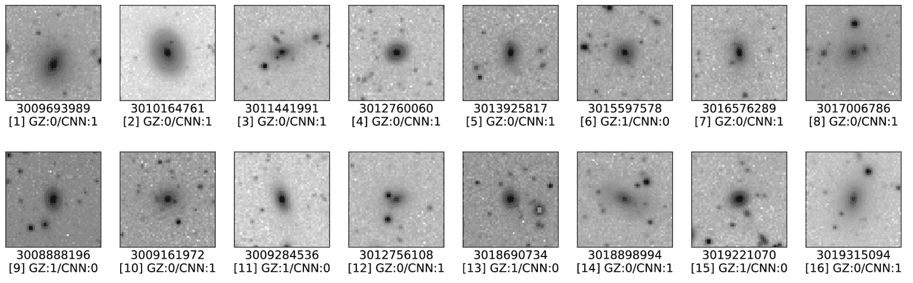

<!--yml

类别: 未分类

日期: 2024-09-06 20:05:25

-->

# [1908.03610] 使用暗能量巡天成像优化自动形态分类银河的机器学习和深度学习

> 来源：[`ar5iv.labs.arxiv.org/html/1908.03610`](https://ar5iv.labs.arxiv.org/html/1908.03610)

# 使用暗能量巡天成像优化自动形态分类银河的机器学习和深度学习

Ting-Yun Cheng,¹ Christopher J. Conselice,¹ Alfonso Aragón-Salamanca,¹ Nan Li,¹ Asa F. L. Bluck,² Will G. Hartley,^(3,4) James Annis,⁵ David Brooks,³ Peter Doel,³ Juan García-Bellido,⁶ David J. James,⁷ Kyler Kuehn,⁸ Nikolay Kuropatkin,⁵ Mathew Smith,⁹ Flavia Sobreira,^(10,11) 和 Gregory Tarle¹²

¹诺丁汉大学物理与天文学系，大学公园，诺丁汉，NG7 2RD，英国

²卡夫利宇宙学研究所，剑桥大学，Madingley Road，剑桥，CB3 0HA，英国

³伦敦大学学院物理与天文学系，戈尔街，伦敦，WC1E 6BT，英国

⁴物理系，苏黎世联邦理工大学，Wolfgang-Pauli-Strasse 16，CH-8093 苏黎世，瑞士

⁵费米国家加速器实验室，P. O. Box 500，伊利诺伊州巴塔维亚 60510，美国

⁶西班牙马德里自治大学/CSIC 理论物理研究所，28049 马德里，西班牙

⁷哈佛-史密森天体物理中心，美国马萨诸塞州剑桥市 02138

⁸澳大利亚天文学光学，麦考瑞大学，北赖德，NSW 2113，澳大利亚

⁹南安普顿大学物理与天文学系，南安普顿，SO17 1BJ，英国

¹⁰格列布·瓦塔金物理研究所，坎皮纳斯州立大学，13083-859，巴西坎皮纳斯

¹¹跨机构电子天文学实验室 - LIneA，Rua Gal. José Cristino 77，里约热内卢，RJ - 20921-400，巴西

¹²物理系，密歇根大学，安娜堡，MI 48109，美国 电子邮件: ting-yun.cheng@nottingham.ac.uk（接受日期：2020 年 2 月 13 日。收到日期：2020 年 1 月 15 日；原稿日期：2019 年 3 月 2 日）

###### 摘要

有几种监督学习方法用于自动化银河形态分类的应用；然而，尚未对这些不同方法使用成像数据进行明确比较，或对其有效性进行深入研究。我们对多种常见的银河分类机器学习方法（卷积神经网络（CNN）、K-最近邻、逻辑回归、支持向量机、随机森林和神经网络）进行比较，使用暗能量巡天（DES）数据结合银河动物园 1 项目（GZ1）的视觉分类。我们的目标是确定使用成像数据进行银河分类的最佳机器学习方法。我们显示 CNN 是我们研究中的十种方法中最成功的一种。使用来自 GZ1 的$\sim$2,800 个银河的视觉分类样本，我们达到了$\sim$0.99 的椭圆星系和螺旋星系形态分类准确率。进一步调查那些在我们的 CNN 中具有高预测概率但 ML 和视觉分类不同的银河通常会揭示 GZ1 提供的不正确分类。我们进一步发现，具有低概率为螺旋星系或椭圆星系的银河在视觉上是透镜状星系（S0），这表明监督学习能够重新发现这一类银河与椭圆星系和螺旋星系不同。我们确认在我们的研究中$\sim$2.5% 的银河被 GZ1 误分类。纠正这些银河的标签后，我们将 CNN 的性能提高到超过 0.99 的平均准确率（准确率为 0.994 是我们的最佳结果）。

###### 关键词：

银河：结构 – 方法：数据分析 – 方法：统计^†^†出版年份：2020^†^†页码范围：使用暗能量巡天成像的机器学习和深度学习优化自动形态分类银河 – A

## 1 引言

银河的形态分类是理解银河形成历史的重要工具。它不仅告诉我们银河的演化，还能揭示银河的恒星性质，从而了解它们的历史。自哈勃（1926）开创性工作以来，邻近银河可以轻松而清楚地分为两种主要类型：早期型银河（ETGs），包括椭圆星系和透镜状星系，这些星系大多是大型的，具有较老的恒星群体，没有螺旋结构；以及晚期型银河，包括螺旋星系和不规则星系，通常具有螺旋臂，包含较年轻的群体。这两种类型是局部宇宙中银河的基本分类，几乎一个世纪以来一直如此。

随着天文学中越来越多调查项目的数据爆炸，例如 Sloan Digital Sky Survey (SDSS)¹¹1https://www.sdss.org、Large Synoptic Survey Telescope (LSST)²²2https://www.lsst.org、Dark Energy Survey (DES)³³3https://www.darkenergysurvey.org/（Abbott 等，2018）等，这些项目将成像数亿个星系，传统的专家手动分类分析显然无法处理如此巨大的数据量。

银河动物园项目系列（Lintott 等，2008，2011；Willett 等，2013）是解决大规模形态学分析问题最成功的工具之一。它允许业余爱好者通过回答基于银河图像的一系列问题来进行分类。然而，分类分析复杂且困难，因此在进行分类时背景知识和经验至关重要。此外，虽然使用银河动物园进行的视觉形态分类比单个个体更快，但它仍然非常耗时。例如，银河动物园项目花费了大约 3 年的时间来获得 $\sim$300,000 个星系的分类，因为每个对象需要如此多的单独分类。例如，DES 和 LSST 等项目如果使用银河动物园项目进行分类，则需要超过 $>100$ 年的时间。因此，未来这一领域的研究中，计算科学的高效自动分类方法至关重要。前进的方向显然是通过机器学习，尽管我们仍在学习如何将其最佳应用于银河形态学和天文学的其他领域，例如星系-恒星分离（Odewahn 等，1992；Weir 等，1995；Ball 等，2006 等）、银河动物园挑战（Chou，2014）、强引力透镜发现挑战（Metcalf 等，2019）等。

机器学习在计算科学中的概念和应用已经存在一段时间（Fukushima, 1980），而在天文学中的应用始于 1990 年代。然而，直到最近几年，由于计算机计算能力的显著提升和技术的发展，这项技术在天文学中的应用才逐渐广泛。第一次将机器学习应用于形态分类可以追溯到 Storrie-Lombardi 等人（1992）。他们应用了一个具有 13 个参数的输入层的神经网络，例如星体属性、亮度曲线等，输出五种不同类型的星系。从那时起，大量研究开始利用机器学习技术（例如 Huertas-Company 等人，2008；Huertas-Company 等人，2009、2011；Shamir，2009；Polsterer 等人，2012；Sreejith 等人，2018；Hocking 等人，2018），神经网络（例如 Maehoenen & Hakala，1995；Naim 等人，1995；Lahav 等人，1996；Goderya & Lolling，2002；Ball 等人，2004；de la Calleja & Fuentes，2004；Banerji 等人，2010），以及卷积神经网络（CNN）（例如 Dieleman 等人，2015；Huertas-Company 等人，2015、2018；Domínguez Sánchez 等人，2018）来进行星系的形态分类。

目前，在机器学习中有几种不同的方法用于进行形态分类。然而，尽管机器学习在过去几十年中得到了高度发展，但针对这些不同方法的明确定量比较仍然缺乏，特别是在成像数据方面。在我们的研究中，我们对几种常见的机器学习方法（见表 1）进行了比较，这些方法用于对‘椭圆星系’和‘螺旋星系’（遵循银河动物园 1 项目的分类）进行最简单的分类——二分类形态分类——使用成像数据。

在以往的研究中，除了 CNN 的应用外，很少有研究直接利用成像数据来使用其他机器学习算法，如神经网络或支持向量机。因此，我们模仿计算科学中人脸和手写识别的应用（Bishop, 2006），将图像像素直接作为特征输入到我们比较的所有方法中，以公平比较不同的方法。

在本研究中，我们使用 DES 成像数据，其分辨率更高，深度更大，优于 SDSS 图像（见第二部分）。通过我们的机器学习算法，这些 DES 数据的特性帮助我们构建了一个更大、更深、质量更高的银河系形态目录，包含迄今为止最大的样本。因此，我们还讨论了在训练算法中“失败”的银河系，并讨论这些系统在 Galaxy Zoo 中常被错误分类的原因。我们还讨论了那些被认为是椭圆或螺旋星系概率较低的系统，并探讨了这些系统在 DES 成像中如何被视觉上分类为透镜状星系。

本文的安排如下。第二部分描述了数据资源、预处理过程以及我们在本文中使用的数据集。每种方法的描述在第三部分中讨论。我们在第四部分中展示了主要结果，并在第五部分中进行了进一步讨论。结论在第六部分中展示。

| 标签 | 机器学习算法 |
| --- | --- |
| 1 | K-近邻 (KNN) |
| 2 | KNN + 受限玻尔兹曼机 |
|  | (KNN+RBM) |
| 3 | 支持向量机 (SVM) |
| 4 | SVM + 受限玻尔兹曼机 |
|  | (SVM+RBM) |
| 5 | 逻辑回归 (LR) |
| 6 | LR + 受限玻尔兹曼机 |
|  | (LR+RBM) |
| 7 | 随机森林 (RF) |
| 8 | RF + 受限玻尔兹曼机 |
|  | (RF+RBM) |
| 9 | 多层感知机分类器 |
|  | (MLPC) |
| 10 | 卷积神经网络 (CNN) |

表 1：本研究中测试的机器学习方法列表。

## 2 数据集

在本分析中，我们使用了暗能量 survey（DES）第一年（Y1）黄金数据子集——DES 对 SDSS 条纹 82 的观测，选择了亮度 i $<$22.5 和红移 z $<$0.7（Drlica-Wagner 等，2018）。DES 数据覆盖了 5000 平方度（$\sim 1/8$天空），与斯隆数字天空调查（SDSS）的调查区域部分重叠，但比 Galaxy Zoo 的 SDSS 图像具有更好的视场。暗能量相机（DECam）（Flaugher 等，2015），这是在 DES 中使用的新安装相机，安装在智利安第斯山脉的塞罗·托洛洛洲际天文台（CTIO）的 Victor M. Blanco 4 米望远镜上，改进了红外波段的量子效率（$\sim$650 nm 到$\sim$900 nm 的效率>$90%），并且提供了比之前的调查更高质量的图像，用于观测非常遥远的天体，具有每像素${0.}^{\prime\prime}263$的空间分辨率和深度为$i=22.51$（Abbott 等，2018）。

一个 DES 调查图像拥有超过 5 亿像素。每个图块为 1/2 平方度。合成（图块）图像的大小为 10000 乘 10000 像素，像素尺度为${0.}^{\prime\prime}263$。这个子集中的数据总数约为 187 万个具有光度红移的星系印记，以及 308 个 i 带合成图像中的光度信息。

为了训练我们的机器学习算法，我们将 DES 数据与 Galaxy Zoo 1 项目（GZ1，以下简称）⁴⁴4https://data.galaxyzoo.org/（Lintott 等，2008，2011）中的视觉形态分类进行匹配。我们仅利用那些在视觉分类中具有超过 80%一致性（投票率）的数据，这些数据经过 Bamford 等人（2009）的偏差校正，涵盖 GZ1 中的椭圆星系和螺旋星系。然而，与 GZ1 中的视觉分类匹配的 DES 数据仅提供了 2862 个对象，其中椭圆星系与螺旋星系的比例为 1 比 3。它们的亮度范围从$i$-带的$\sim$12.5 到 18，红移 z$\leq$0.25（峰值在 z$\sim$0.1）。为了避免在进行机器学习训练时过拟合，我们在研究的预处理过程中应用了数据增强（第 2.1.1 节）。为了提高我们的机器学习方法的性能，我们还应用了其他技术，包括特征提取，即方向梯度直方图（HOG）（Dalal & Triggs，2005），以从星系印记中提取其他有用的特征（第 2.1.3 节）。

### 2.1 预处理

在数据预处理之前，我们将 2,862 个带有 DES 数据和 GZ1 分类的星系随机分为训练集和测试集，以防止两个数据集中重复的星系。我们的数据预处理包括四个主要步骤：（1）数据增强；（2）印章创建；（3）特征提取；（4）重新缩放。详细信息如下所示。

图 1：预处理过程流程图。流程图从初始的叠加图像开始，然后根据星系的大小将叠加图像切割成不同的尺寸。经过旋转后，我们将图像切割并缩小到所需的尺寸：50 x 50 像素。该过程的详细信息见第 2.1 节。

#### 2.1.1 数据增强

数据增强在使用像素输入的机器学习中非常重要。自 Dieleman 等人（2015）以来，通过旋转图像进行的数据增强已在 CNN 中广泛应用于星系的形态分类。在本文中，我们有 2,862 个具有 GZ1 视觉分类的星系，其中 759 个为椭圆星系，2,103 个为螺旋星系，用于训练和测试我们的方法。为了防止训练中的过拟合，我们将每个星系图像旋转 10 度，范围从 0 到 350 度，以增加训练样本的数量。因此，可用的训练样本数量增加到约 100,000。旋转后，我们向旋转图像中添加高斯噪声（Huertas-Company 等，2015）。这种噪声足够小，不会影响星系的视觉外观和结构（即保持相同的视觉分类），但足够大以使像素值发生可检测的变化。

尽管通过旋转图像进行数据增强是一种在机器学习应用中广泛使用的方法（例如 Dieleman 等，2015；Huertas-Company 等，2015），但这些旋转图像的效果尚未被探索。因此，我们在第 4.2 节中研究了部分使用和完全使用旋转图像在数据集中的性能差异。

#### 2.1.2 星系印章的创建

图 1 显示了我们研究中使用的预处理过程。利用 DES 的星系目录，我们将大小为 10000 像素乘 10000 像素的合成图像裁剪成数百万个大小为 50 像素乘 50 像素的星系图章。星系图章的大小基于 DES Y1 GOLD 数据（条纹 82）中星系的大小分布，其中超过 99% 的星系小于 25 像素乘 25 像素的阈值。因此，我们的图章大小为 50 像素乘 50 像素，比星系大小分布中的阈值大两倍。

图 1 显示，在将图章裁剪到 50 像素乘 50 像素的大小之前，我们创建了初始大小为 200 像素乘 200 像素的星系图章，当星系大小小于 30 像素乘 30 像素时，使用 400 像素乘 400 像素的图章，当星系大小大于 30 像素乘 30 像素时。对于较小的星系，我们首先旋转 200 像素乘 200 像素的图章，然后将其大小缩小到 50 像素乘 50 像素；对于较大的星系，我们旋转 400 像素乘 400 像素的图章，将其缩小到 200 像素乘 200 像素，然后通过计算 4 像素乘 4 像素单元格中的像素均值将其缩小到 50 像素乘 50 像素。此过程旨在防止在我们旋转图像时角落出现空白像素值，特别是当旋转角度不是 90 度时。

#### 2.1.3 特征提取

在我们的研究中，我们对原始和旋转的图章应用了方向梯度直方图（HOG），以调查该特征提取器对监督机器学习的影响。HOG 是一种特征提取器，能够从每个像素值中提取梯度及其方向的分布。它对于表征物体的外观和形状非常有用（Dalal & Triggs，2005）。它计算图章中水平（x）和垂直（y）方向的梯度。梯度的幅度和方向计算如下：

|  | $\left\|G\right\|=\sqrt{{G}_{x}^{2}+{G}_{y}^{2}},\\ \theta=\arctan{\left(\frac{{G}_{y}}{{G}_{x}}\right)}$ |  | (1) |
| --- | --- | --- | --- |

其中 $\left|G\right|$ 是每个像素的梯度幅值，${G}_{x}$ 是在 x 方向测量的梯度幅值，${G}_{y}$ 是在 y 方向测量的梯度幅值，$\theta$ 是图像中每个像素的梯度方向。接着，它测量每个 2 x 2 像素单元格中梯度的贡献，并使用直方图描述梯度幅值对每个梯度方向的贡献。HOG 图像的输入是此特征提取过程的直接输出，我们将像素值重新缩放到 0 和 1 之间（第 2.1.4 节）。HOG 图像的示例见图 2。

HOG 在模式识别研究中非常流行，例如人类检测、面部识别和手写识别（例如 Dalal & Triggs，2005；Shu 等，2011；Kamble & Hegadi，2015 等）；然而，它在天文学研究中尚未广泛应用于机器学习算法。一个应用实例是引力透镜图像的检测（Avestruz 等，2019），以及一些关于星系形态的前期研究（例如 Galaxy Zoo 挑战 Chou，2014）。然而，这些研究中没有任何一项探讨 HOG 对机器学习算法性能的影响。在本研究中，我们应用 HOG 于我们的图像，以探讨其对星系自动形态分类的影响，以及对不同机器学习算法性能的影响（第 4.4 节）。

图 2：直方图梯度（HOG）示例图像，单元格大小为 2 x 2 像素。左侧：HOG 图像。右侧：线性尺度的原始图像。顶部：螺旋星系。底部：椭圆星系。

#### 2.1.4 重新缩放

重新缩放是机器学习应用中一个非常重要的过程。由于不同星系具有不同的亮度，原因在于它们的性质和距离，因此每张图像的像素值在星系之间有显著的变化。这会导致机器学习算法在定义不同类别之间的边界时出现困难。因此，我们通过对每张图像（原始图像和 HOG 图像）的像素值进行归一化，将其缩放到 0 和 1 之间的范围。我们知道固有亮度可以作为分类标准，包括表面亮度。然而，在这项研究中，我们只关注结构，而不是可能与星系类别相关的其他属性，例如表面亮度。

### 2.2 数据集

在这项研究中，我们创建了 4 个不同的数据集（见表 2）。前两个数据集（1 $\&$ 2）包含原始图像和旋转图像，而最后两个数据集（3 $\&$ 4）仅包含旋转图像。这个设置用于研究旋转图像对性能的影响（第 4.2 节）。

另一方面，数据集 1 $\&$ 3 是不平衡的，其中包含的螺旋星系数量多于椭圆星系，而数据集 2 $\&$ 4 在每个数据集中包含的螺旋星系和椭圆星系数量相等。我们通过向每种类型添加不同数量的旋转图像来平衡每种类型的数量。例如，我们将椭圆星系图像旋转 7 次，而数据集 2 中的螺旋星系图像仅旋转 2 次，数据集 1 中的两种类型均旋转 3 次。我们使用这个设置来研究训练样本中每种类型数量平衡的影响（第 4.3 节）。此外，我们还减少了每个数据集中训练样本总数的差异，以减少可能的偏差。

另一方面，我们有 2（或 CNN 中的 3）种不同类型的输入数据（i，ii，iii）。第一种类型（i）是线性尺度的原始图像，第二种类型（ii）是从特征提取中获得的 HOG 图像。第三种类型，“组合输入（iii）”，由于 CNN 的特殊结构，我们可以将原始图像（i）和 HOG 图像（ii）作为输入，而无需增加特征的数量。这是一种使用 CNN 结合数据的新方式，而以前的研究中，人们通常在 CNN 的第三维中恢复不同颜色的图像。然后我们还研究了这种组合输入（iii）的效果，并将其与其他两种类型（i $\&$ ii）进行比较（见 4.4）。

对于测试集，我们从 2,862 个星系中随机挑选每种类型（椭圆星系和螺旋星系）各 500 个。未被选择的星系则作为训练集。因此，我们总共有 1,000 个星系用于测试，椭圆星系与螺旋星系的比例为 1:1。

| 标签 | i（原始）， | ii（HOG）， | iii（组合，用于 CNN） |
| --- | --- | --- | --- |
| 1 | 原始图像+旋转图像 | E:S$\sim$1:3，训练数据$=$10,448 |
| 2 | 原始图像+旋转图像 | E:S$\sim$1:1，训练数据$=$11,381 |
| 3 | 仅旋转图像 | E:S$\sim$1:3，训练数据$=$11,448 |
| 4 | 仅旋转图像 | E:S$\sim$1:1，训练数据$=$12,381 |

表 2：本文中训练数据集的排列。数据集中包含的内容显示在第二列，第三列显示了椭圆星系和螺旋星系之间的比例以及每个数据集中的总训练数据量。

## 3 机器学习模型

机器学习的概念可以与计算器的发明（TURING，1950）联系起来，我们通过输入数字或字符（特征）来编程机器以获取所需的信息。机器学习中的视觉模式识别突破始于 Fukushima（1980），他提出了一个分层和多层次的神经网络——Neocognitron。自 1990 年代以来，机器学习站上了天文应用的舞台（例如，Odewahn 等，1992；Storrie-Lombardi 等，1992；Weir 等，1995 等）。

可以输入机器学习的特征主要有两种类型，‘参数输入’和‘像素输入’。在星系形态分类研究中，‘参数输入’是我们使用与星系类型有明显相关性的参数（例如，Storrie-Lombardi et al., 1992；Naim et al., 1995；Lahav et al., 1996；Ball et al., 2004；Huertas-Company et al., 2008；Huertas-Company et al., 2009；Banerji et al., 2010；Huertas-Company et al., 2011；Sreejith et al., 2018）。例如，‘参数’输入可以是表面亮度剖面、颜色、C-A-S 系统（Conselice, 2003）、Gini 系数（Abraham et al., 2003）等。

另一方面，‘像素输入’意味着我们将图像的每个像素视为一个特征来输入机器学习算法。虽然‘像素输入’显著增加了计算所需的特征数量，但它是机器学习中最直接的特征。然而，在以往的星系形态自动分类研究中，‘像素输入’的使用并不常见（例如，Maehoenen & Hakala, 1995；Goderya & Lolling, 2002；de la Calleja & Fuentes, 2004；Polsterer et al., 2012），直到近年来 CNN 应用变得流行（Dieleman et al., 2015；Huertas-Company et al., 2015；Domínguez Sánchez et al., 2018）。

我们在本研究的每种方法中使用‘像素输入’，以研究‘像素输入’对不同机器学习算法的影响（表 1）。限制玻尔兹曼机（RBM）（Smolensky, 1986；Hinton, 2002；Salakhutdinov et al., 2007），如表 1 所示，是最简单的具有一个隐藏层的神经网络，我们在本研究中将其视为特征提取器（第 3.1 节 ‣ 3 Models of Machine Learning ‣ Optimising Automatic Morphological Classification of Galaxies with Machine Learning and Deep Learning using Dark Energy Survey Imaging")）。

本研究中的所有代码都基于 Python。我们在本文中使用的主要软件包是用于大多数方法的 scikit-learn⁵⁵5http://scikit-learn.org/stable/（Pedregosa et al., 2012）；以及用于 CNN 的 Theano⁶⁶6http://deeplearning.net/software/theano/，Lasagne⁷⁷7http://lasagne.readthedocs.io/en/latest/和 nolearn⁸⁸8https://pythonhosted.org/nolearn/。

### 3.1 限制玻尔兹曼机（RBM）

限制玻尔兹曼机（RBM）（Smolensky，1986；Hinton，2002；Salakhutdinov 等，2007）包含一个隐藏层，这是最简单的神经网络架构（更多关于神经网络架构的解释见第 3.6 ‣ 3 Models of Machine Learning ‣ Optimising Automatic Morphological Classification of Galaxies with Machine Learning and Deep Learning using Dark Energy Survey Imaging")节）。这是一个有用的降维和特征学习算法；因此，在本文中，RBM 被用作特征提取器，以连接每个特征。它提取出那些在输入其他机器学习算法之前彼此更紧密关联的特征。像逻辑回归（Chopra & Yadav，2017）和 RBM 这样的机器学习算法组合实际上广泛应用于面部和手写识别。

在这项研究中，RBM 的设置在所有方法中都是相同的，我们使用固定的学习率（`=$0.001`）、1,024 个隐藏单元和 500 次 RBM 训练迭代，其中学习率决定了每次向损失函数局部最小值移动的权重幅度。迭代次数大致由对数似然的最大值来确定。

### 3.2 k-近邻（KNN）

K-近邻（KNN）是最简单的非参数机器学习算法（Fix & Hodges，1989；Cover & Hart，1967；Short & Fukunaga，1981；Cunningham & Delany，2007）。这是模式识别中最常见的方法之一，并且在聚类和分类问题中有多个应用（如天文学中的 Kügler 等，2015）。KNN 的概念是找到高度相似的数据，其中相似性由数据在特征空间中的“距离”定义。参数 k 是在同一组中计数的最近邻居的数量。这个因素控制数据分布的决策边界的形状。

增加 k 的值会减少分类的方差，但也会增加分类的偏差。我们通过绘制准确率（方程 5）与不同 k 值的关系来选择 k 的值，最终使用的值是 k=5。计算每个数据之间距离的距离度量由欧几里得度量定义。

### 3.3 逻辑回归（LR）

逻辑回归（LR）是一种广义线性模型（McCullagh & Nelder, 1989），它使用 sigmoid 函数 $\frac{1}{1+{e}^{-x}}$（或逻辑函数）来输出分类的概率。在天文学中的应用，例如 Huppenkothen 等人（2017）研究了银河系黑洞双星的变异性。

LR 和 RBM 的结合通常用于人脸和手写识别（Chopra & Yadav, 2017）。由于神经网络的特性，这种结合在使用“像素输入”时在 LR 中的改进是相当显著的（参见第四部分）。

### 3.4 支持向量机（SVM）

支持向量机（SVM）算法的概念是找到一个与每种类型的最近数据的距离最大的超平面（支持向量）（Vapnik, 1995; Cortes & Vapnik, 1995）。在这项研究中，我们使用非线性 SVM，特别是径向基函数（RBF）核函数（Orr & Science, 1996）：$\left({\vec{x}},\vec{{x}}^{{}^{\prime}}\right)\rightarrow K\left({\vec{x}},\vec{{x}}^{{}^{\prime}}\right)=exp\left(-\gamma{\left\|{\vec{x}}-{\vec{x}}^{{}^{\prime}}\right\|}^{2}\right)$。SVM 算法的详细介绍见附录 A。

由于处理高维数据的能力，SVM 被期望成为神经网络的替代选项（Zanaty，2012）。在天文学中的应用非常普遍，例如 Gao 等人（2008）；Huertas-Company 等人（2008）；Huertas-Company 等人（2009）；Kovács & Szapudi（2015）。在这项研究中，我们使用了 Nu-SVM，首先由 Scholkopf & Smola（2001）引入，并应用了 Python 包 NuSVC。nu 的值由 Python 包 GridSearchCV 确定（Hsu 等人，2003）。

### 3.5 随机森林（RF）

随机森林（RF）是一种由 Breiman（2001）开发的集成学习方法，它将多个单独决策树的结果汇总以决定最终分类（Fawagreh 等人，2014）。每棵树都是通过从训练集中随机选取的子集进行训练的。RF 是一种在天文学中应用的著名机器学习技术，使用“参数输入”（例如 Dubath 等人，2011；Beck 等人，2018），但直接使用像素的应用，如我们的研究，尚未经过测试。

我们使用 scikit-learn 模块中的 RandomForestClassifier (Pedregosa et al., 2012)。本研究中使用的树的数量 (n_estimators) 是通过绘制准确度 (方程 5) 对不同 n_estimators 值的图来确定的，最终我们使用了 200 棵树。每次分裂考虑的最大特征数量 (max_features) 等于 $\sqrt{{N}_{f}}$，其中 ${{N}_{f}}$ 是特征的总数。每棵树生长直到所有叶子都是纯净的或所有叶子包含的叶子数量少于 2。

### 3.6 多层感知机分类器 (MLPC)

多层感知机分类器 (MLPC) 是一种具有多个隐藏层的监督式人工神经网络 (Rosenblatt, 1958; Fukushima, 1975; Fukushima et al., 1983)。隐藏层是输入层和输出层之间不可见的层，用于将输入特征彼此连接。每个隐藏单元是通过权重和输入的乘积计算得到的激活函数。以一个隐藏层的神经网络为例 (图 3 ‣ 3 机器学习模型 ‣ 利用暗能量探测器成像优化自动形态分类"))，$X1$ 和 $X2$ 是输入特征，$f1$ 和 $f2$ 是通过 (以 $f1$ 为例) $f1=f\left(w0\cdot 1+w1X1+w2X2\right)$ 计算得到的隐藏单元的激活函数，其中 $w$ 是权重，$f$ 也是激活函数。通过计算，它通过权重将每个输入特征与隐藏单元连接。因此，更多的隐藏层和每层更多的隐藏单元可以形成更复杂的输入特征连接；然而，更多的隐藏层和隐藏单元架构更耗时，并且可能导致过拟合问题。类似地，输出层也可以从这个概念中计算得出。

MLPC 使用反向传播算法 (Werbos & John, 1974; Rumelhart et al., 1986)，当神经网络被激活并得到初步输出时，将预测分类的误差与真实标签进行比较，然后返回给算法。算法通过误差调整权重，直到误差低于我们设置的容忍度${10}^{-5}$。我们使用的 MLPC 方法有两个隐藏层，每个隐藏层有 1,024 个隐藏单元。学习率固定为 0.001。

图 3：神经网络的示意图。此结构仅用于说明，包括一个隐藏层和两个隐藏单元。两个输入特征，$X1$ 和 $X2$，与激活函数 $f1$ 和 $f2$ 一起工作，然后获得输出 $Y1$ 和 $Y2$。

图 4：CNN 架构的示意图。架构从尺寸为 50x50 像素的输入图像开始，然后经过三层卷积层（滤波器：32、64 和 128）。每个卷积层后面跟着一个池化层。第三层卷积层后面跟着两个具有 1,024 个隐藏单元的隐藏层。一个丢弃层（p=0.5）在第三层卷积层后面跟着，另一个在第二个隐藏层后面跟着。最后，我们的 CNN 有两个输出，“椭圆形”和“螺旋形”。

### 3.7 卷积神经网络（CNN）

卷积神经网络（CNN）始于 LeNet-5 的设计（Lecun 等人，1998）。然而，CNN 直到 Dieleman 等人（2015）在银河挑战赛中才被应用于星系的形态分类。人工神经网络（例如 MLPC）和 CNN 之间有两个主要区别。一是 CNN 具有卷积层，能够通过应用多个滤波器矩阵从输入图像中提取显著特征，另一个区别是输入的维度。

大多数机器学习算法设计用于处理 1D 数组输入（例如参数输入），但其中一些（例如 SVM 和神经网络）能够处理更高维度的数据。然而，输入仍然需要被重塑为 1D 数组以便于 SVM 和 MLPC。相比之下，CNN 设计用于处理三维数组的图像输入，这意味着除了图像本身，CNN 还有一个额外的维度来存储图像的更多信息，例如颜色（RGB）。

图 4 ‣ 3 机器学习模型 ‣ 使用暗能量调查成像优化星系的自动形态分类") 显示了我们在本研究中使用的 CNN 架构。图像的输入大小为 50 x 50 像素（第 2.1.2 节）。我们有 3 个卷积层，滤波器大小分别为 3、3、2，每个卷积层后面跟一个大小为 2 的池化层。然后，这些层与两个隐藏层连接，每个层有 1,024 个隐藏单元。此外，使用两个 dropout 层来防止过拟合，一个跟在第三个卷积层（池化层）后面，另一个跟在两个隐藏层之后。每个卷积层和隐藏层应用了非线性修正，输出层应用 softmax 函数以获得每种类型的概率分布（均来自 Python 包 lasagne.nonlinearities）。我们使用 Adam 优化器、Nesterov 动量，并根据 Dieleman 等人 (2015) 设置动量=0.9，学习率 0.001 和最多 500 次迭代进行 CNN 训练。

## 4 结果

图 5：混淆矩阵。x 轴标签是预测标签，y 轴标签是真实标签。‘0’表示负类以及椭圆星系类型，而‘1’代表正类信号和螺旋星系类型。

### 4.1 模型的评估因素

我们使用接收者操作特性曲线（ROC 曲线）（Fawcett，2006；Powers，2011）来检验每种方法和数据集的性能。在 ROC 曲线中，y 轴是真阳性率，x 轴是假阳性率；因此，ROC 曲线越接近角落（0,1），性能越好。真实阳性和假阳性的定义如图 5 所示。 因此，真实阳性率 ($TPR$) 和假阳性率 ($FPR$) 定义如下，

|  | $TPR=\frac{TP}{TP+FN};\quad FPR=\frac{FP}{FP+TN}.$ |  | (2) |
| --- | --- | --- | --- |

$TPR$ 的定义与统计学中的“召回率 ($R$)”相同，表示显示被挑选的真实类型的完整性，而“精准率 ($Prec$)”表示污染，意味着被挑选的类型（预测类型）中有多少是实际类型。我们进行的是二分类 - 正类：螺旋星系，负类：椭圆星系。因此，螺旋星系和椭圆星系的召回率如下所示，

|  | $Prec=\frac{TP}{TP+FP};$ |  | (3) |
| --- | --- | --- | --- |
|  | $R\left(1\right)=\frac{TP}{TP+FN};\quad R\left(0\right)=\frac{TN}{TN+FP}.$ |  | (4) |

此外，我们还使用了一个因子——ROC 曲线下面积（AUC）作为机器学习的性能评估标准（Bradley，1997；Fawcett，2006）。AUC 的意义是分类器将一个随机选择的正例排在一个随机选择的负例之上的概率。这个因子也表明了可分离性——分类能否被正确分开。

### 4.2 旋转图像的影响

图 6：使用原始图像输入（i）的各方法和各数据集的 ROC 曲线。方法的缩写与表 1 相同。不同的颜色用于不同的数据集（表 2）。黄色、橙色、青色、蓝色分别代表数据集 1、2、3、4。较浅的颜色阴影表示由三次重复运行的最小值和最大值定义的散点，内部线条为三次重复运行的平均值。黑色对角虚线表示随机分类。

各方法和数据集的 ROC 曲线如图 6 所示。我们在此图中展示了原始图像输入（i）的结果。不同的颜色表示不同的数据集，黄色、橙色、青色、蓝色线条分别表示数据集 1、2、3、4（表 2）。数据集 1 和 2 包含原始图像和旋转图像，而数据集 3 和 4 仅包含旋转图像。同时，数据集 1 和 3 的每种类型的数量不平衡，相反，数据集 2 和 4 的每种分类的数量相同。较浅的颜色阴影是由三次重复运行的最小值和最大值定义的散点。黑色对角虚线表示随机分类。

首先，图 6 中展示了 LR 和 SVM 方法的结果，无论是否与神经网络、RBM 结合，当与 RBM 结合时，LR 和 SVM 都有所改善。相反，RF+RBM 方法的表现略逊于 RF 方法。其次，三次重复实验的散点图显示每个数据集的方差很小，确认了重复实验之间的一致性。此外，如所见，不同数据集之间的结果差异不大。然而，不同数据集之间（例如 MLPC）的 ROC 曲线的轻微偏移发生在几个方法中。这些偏移是由于不同数据集的训练样本总数的轻微差异（表 2）。例如，在 MLPC 中，数据集 4 在 4 个使用的数据集中拥有最多的训练数据（$\sim$12400 个银河），因此在 MLPC 中的表现最好；数据集 2 和 3 的训练数据数量非常相似（数量差异仅为 67），因此它们的表现也相似。数据集 1 的训练数据最少（$\sim$10400 个银河），因此其表现相对较差。看到的偏移也受每种类型比例的平衡条件的影响（例如 SVM 和 RF），例如，数据集 1 和 3 是训练数据不平衡的，因此它们的 ROC 曲线形状彼此相似。数据集 2 和 4 也存在这种情况。总之，从图 6 中总结，旋转图像的数据增强对机器学习分类性能的提升效果一般。

### 4.3 平衡还是不平衡？

图 7：所有方法和不同类型输入数据的椭圆星系和螺旋星系的召回率。颜色表示不同的数据集，而不同的形状标记表示不同的方法。不同类型的填充点表示不同的输入类型。完全填充颜色的标记仅为原始图像 (i)，对角线填充的标记为 HOG 图像 (ii)，而带有点的标记是原始图像和 HOG 图像的组合输入 (iii)，仅适用于 CNN。黑色虚线表示 $R(0)=R(1)$ 的条件（方程 4）。黑色虚点线表示这两种类型的召回率差异在 $\pm$0.1 以内。误差条来源于三次重跑的标准偏差。

在这里，我们调查了训练数据中每种类型数量平衡的影响。图 7 显示了不同数据集使用不同方法得到的椭圆星系和螺旋星系的召回率。颜色表示与图 6 的 ROC 曲线相同，不同的方法用不同形状的标记表示。我们通过对三次重跑的值取平均来获得图 7 中召回率的值。不同的模式类型表示不同的输入类型。颜色填充的点是原始图像输入 (i)，而带有对角线填充标记的点是 HOG 图像 (ii)，带有点状填充标记的是组合输入 (iii)。黑色对角虚线表示 $R(0)=R(1)$ 的条件（方程 4），黑色虚线表示这两种类型之间的召回率差异在 $\pm$0.1 以内。

我们观察到，不平衡的训练数据集 1（黄色）和数据集 3（青色）都位于上方虚线之上，这意味着这两个数据集对于螺旋星系的召回率通常相对较高，而与椭圆星系相比，螺旋星系的召回率差异大于 0.1。例如，使用原始图像输入（i）的 LR 结果（以数据集 3 为例，如图 7 中最左边的青色方块所示）对椭圆星系和螺旋星系的召回率分别为（0.34, 0.81）。我们还观察到，当使用不平衡数据集时，LR、LR+RBM、SVM 和 SVM+RBM 方法的结果比其他方法更为严重不平衡（如图 7 中的左上方接近）。这种情况是由于这些方法的特性。例如，LR 简单地使用逻辑函数来确定决策边界，这很容易被每种类型的不平衡数量所影响。另一方面，Wu & Chang（2003）讨论了 SVM 由于不平衡数据而导致的偏斜决策边界，使得决策边界可能被多数类的支持向量所主导。

另一方面，大多数平衡的数据集 2（橙色）和数据集 4（蓝色）位于两条虚线之间，这意味着这两个数据集在椭圆星系和螺旋星系之间的召回率相似（差异小于 0.1）。然而，在 KNN 中，一些平衡数据集的结果显示椭圆星系的召回率较高，但螺旋星系的召回率相对较低（橙色和蓝色星星位于下方虚线之下）。KNN 算法通过计算两幅图像之间每个像素的“距离”来获取两幅图像之间的相似性（见第 3.2 节）。螺旋星系具有多种形状（例如，螺旋臂的数量不同），而椭圆星系的外观相对简单且相似。因此，当训练数据中有相同数量的两种类型时，KNN 更容易识别椭圆星系。

在这项研究中，我们应用了十种不同的常见机器学习算法，它们在平衡方面显示出一致的结果，除了上述讨论的 KNN；因此，根据这一讨论，在使用大多数机器学习算法的像素输入时，各类型在训练过程中的数量平衡非常重要。在此图中，我们还观察到，使用平衡数据集的 CNN 方法获得了最佳的椭圆星系和螺旋星系的召回率。

### 4.4 不同类型输入数据的影响

图 8：每种方法中不同类型输入的 ROC 曲线。不同的颜色代表不同类型的数据输入。青色、橙色和蓝色分别代表原始图像（i）、HOG 图像（ii）和组合输入（iii）。较浅的颜色阴影显示由平衡数据集 2 和 4 的三次重跑计算得到的标准偏差定义的散布。阴影中的线条是数据集 2 和 4 的三次重跑的平均值。黑色对角虚线表示随机分类。CNN 方法中的子图是 y 轴从 0.75 到 1.0 以及 x 轴从 0.0 到 0.25 的放大区域。

图 9：三个重跑的平均准确度（公式 5）与不同数据集和不同类型输入的方法的对比。y 轴范围从 0.5 到 1.0。颜色代表不同的数据集，其中黄色、橙色、青色和蓝色分别代表数据集 1、2、3、4（表 2）。不同的阴影样式表示不同类型的输入数据，其中完全填充、对角线填充、虚线填充分别代表原始图像（i）、HOG 图像（ii）和组合输入（iii）。条形图上方的标签是每种方法的准确度最高值。

这里展示了每种方法不同输入类型之间的比较结果（见图 8）。我们有 2 种（CNN 为 3 种）不同类型的输入 - 原始图像 (i)、HOG 图像 (ii) 和组合输入 (iii)（仅对 CNN 适用）。图 8 中的不同颜色表示不同的输入类型，其中青色、橙色和蓝色分别表示原始图像 (i)、HOG 图像 (ii) 和组合输入 (iii)。根据第 4.2 节和第 4.3 节的讨论，平衡数据集 2 和 4 的结果基本相当，并且在我们的四个数据集中表现更佳（见表 2）。因此，我们在图 8 中展示了平衡数据集 2 和 4 的平均值，较浅的颜色阴影显示了三次重复实验的标准偏差定义的散布。

图 8 显示，HOG 图像输入在大多数方法中成功提高了性能，除了 KNN。尽管 HOG 图像能够根据梯度值提取形态特征，但它也丧失了一些详细信息（即较小的波动或梯度）以及光滑的结构。因此，对于 KNN，HOG 图像中光滑结构的丧失导致确定正确决策边界的困难。当使用 HOG 图像时，将 KNN 与 RBM 结合可以显著改善这一结果。

另一方面，我们观察到，当在 LR+RBM、SVM+RBM 和 RF+RBM 中结合使用 HOG 图像时，效果并不明显。我们推测这一现象是由于 RBM 与 HOG 特征的结合，而 HOG 特征在图像中的信息量少于原始图像输入。因此，它“消除了”RBM 和 HOG 的效果，这导致这三种方法中几乎没有变化。这一效果在 MLPC 和 CNN 中也有所体现，使得 HOG 图像输入在这两种方法中的改进也只是微乎其微。然而，增加神经网络中的隐藏层数或更多神经元有助于将 HOG 特征彼此连接。因此，HOG 图像在 MLPC 和 CNN 中的改进质量优于 LR+RBM、SVM+RBM 和 RF+RBM。当我们将原始图像输入和 HOG 图像输入结合使用时（在图 8 的 CNN 图中显示为蓝色），CNN 表现出更显著的质量提升。

### 4.5 方法比较

图 9 中使用的准确率定义如下，

|  | $Accuracy=\frac{TP+TN}{TP+FP+TN+FN},$ |  | (5) |
| --- | --- | --- | --- |

这意味着定义为在所有测试样本中成功分类的样本数量。不同数据集和不同方法的准确率比较如图 9 所示。通过此图，我们可以观察到与我们在章节 4.4 讨论的相同情况，大多数方法在使用 HOG 图像作为输入时表现更好，除了 KNN，其中 HOG 图像输入略微降低了性能，以及 LR+RBM、SVM+RBM 和 RF+RBM 方法，HOG 图像输入对性能没有明显提升。我们还对所有方法的效率进行了另一项比较（表 3）。大多数方法在 2.3GHz Intel Core i5 处理器和 16GB 2133 MHz LPDDR3 内存上运行，除非是‘CNN (GPU)’，它在 NVIDIA GeForce GTX 1080 Ti GPU 上运行。

有趣的是，RF 的性能在计算时间更快的情况下超越了 MLPC（表 3），使用原始图像的表现完全出乎意料。进一步研究 RF 在图像数据上的能力将对 RF 的计算速度和高精度非常有帮助。另一方面，我们可以看到 KNN 和 MLPC 需要较少的计算时间，但相对于其他方法可以达到相对较好的准确性。因此，KNN 和 MLPC 在使用像素输入时是一个不错的选择。此外，尽管 KNN 方法的准确性低于 MLPC，但它应用了原始图像输入，从而节省了生成 HOG 图像（或其他类型缩放）的预处理时间。

根据 ROC 曲线（图 8）和每种方法的准确性比较（图 9），我们研究中使用像素输入时最成功的方法无疑是 CNN。这两个图都表明，HOG 图像输入有助于 CNN 的表现（表 4）。

此外，我们创建了一种新方法来利用 CNN 中的第三维度，当我们将原始图像 (i) 与 HOG 图像 (ii) 结合时，我们称之为“组合输入 (iii)”。使用组合输入 (iii) 进行 CNN 训练时显示出轻微但在定性上显著的改进（见图 8 中 CNN 图）。使用组合输入 (iii) 和均衡的数据集，我们可以在本研究中使用像素输入的 CNN 中达到 $\sim$0.95 的准确性（表 4）。

另一方面，Sreejith 等人 (2018) 提出了“普遍异议”的概念，指的是所有分类器一致同意某个对象，但与视觉分类结果不一致。在我们的研究中，我们发现从 1,000 个星系中仅有 3 个星系在考虑所有分类器时显示出普遍异议。这些星系在银河系动物园 1（GZ1）分类中都被标记为螺旋星系，但在我们的分类器中被分类为椭圆星系。我们还通过视觉确认这些星系确实是椭圆星系。这种普遍异议更可能是由于 GZ1 中应用的去偏过程，以统计调整高红移星系的数量，而不是简单的视觉误分类。

| 方法 | 训练时间 | 测试时间 | 准确性 |
| --- | --- | --- | --- |
| KNN | $\sim$ 0.2 秒 | $\sim$45 秒 | 0.782$\pm$0.027 (原始) |
| KNN+RBM | $\sim$3000 秒 | $\sim$45 秒 | 0.830$\pm$0.007 (HOG) |
| LR | $\sim$7-8 秒 | $\leq$ 1 秒 | 0.682$\pm$0.040 (HOG) |
| LR+RBM | $\sim$3000 秒 | $\leq$ 1 秒 | 0.810$\pm$0.012 (HOG) |
| SVM | $\sim$800 秒 | $\leq$ 8 秒 | 0.764$\pm$0.029 (HOG) |
| SVM+RBM | $\sim$3000 秒 | $\leq$ 8 秒 | 0.762$\pm$0.001 (HOG) |
| RF | $\leq$1 秒 | $\leq$ 5 秒 | 0.913$\pm$0.009 (原始) |
| RF+RBM | $\sim$3000 秒 | $\leq$ 5 秒 | 0.870$\pm$0.031 (原始) |
| MLPC | $\sim$18 秒 | $\leq$ 3 秒 | 0.857$\pm$0.010 (HOG) |
| CNN | $\sim$3000 秒 | $\leq$ 5 秒 | 0.951$\pm$0.005 (组合) |
| CNN (GPU) | $\sim$360 秒 | $\leq$ 5 秒 | 0.951$\pm$0.005 (组合) |

表 3: 各方法计算时间的比较（每 $\sim$1000 张银河系）。‘准确率’为图 9 中显示的最佳准确率。前十种方法运行在 2.3GHz Intel Core i5 处理器和 16GB 2133 MHz LPDDR3 内存上，而第六种方法 ‘CNN (GPU)’ 运行在 NVIDIA GeForce GTX 1080 Ti GPU 上。

| 输入类型 | 准确率 | $R_{01}$ |
| --- | --- | --- |
| 原始 (i) | 数据集 2: 0.924$\pm$0.013 | 0.933 |
| 数据集 4: 0.906$\pm$0.018 | 0.907 |
| HOG (ii) | 数据集 2: 0.943$\pm$0.016 | 0.940 |
| 数据集 4: 0.940$\pm$0.003 | 0.940 |
| 组合 (iii) | 数据集 2: 0.945$\pm$0.004 | 0.947 |
| 数据集 4: 0.951$\pm$0.005 | 0.953 |

表 4: CNN 在使用数据集 2 和 4 时不同输入类型的比较 (表 2)。测试图像总数为 1,000 张银河系。准确性的定义参见公式 5。$R_{01}$ 的值是对椭圆星系和螺旋星系的召回值 (公式 4) 经过加权平均后的结果，该值在表中显示为 $R_{01}$ 的三次重复平均值。

## 5 进一步讨论

我们在第四部分中已经讨论了部分结果。在最后一节中，我们得出结论认为这十种监督机器学习方法中最佳的是卷积神经网络（CNN），对 CNN 的进一步分析和讨论对未来的所有使用都至关重要（第 5.1 节），同时还需要调查误分类和预测概率较低的星系（第 5.2 节）。

### 5.1 卷积神经网络（CNN）的分析

在这里，我们更详细地讨论了 CNN 机器学习分类的结果。我们在 CNN 中的分类使用默认标准，即概率$(p)>0.5$作为分类标准；即，Ellipticals 或 Spirals 的$p>0.5$将被分类为该类型。当我们将标准更改为$p\geq 0.8$时，即任何类型的$p\geq 0.8$都会被分类为预测类型，如果两种类型的$p<0.8$，那么该星系将被分类为“类型不确定”。使用这一标准，我们将测试数据分为三种不同的类别：Ellipticals、Spirals 和不确定。使用组合输入（iii），分类的准确率提高到$\sim$0.97（表 5）。

|  | 准确率 | $R_{01}$ | ${N}_{\text{可分类}}$ | ${N}_{\text{不确定}}$ |
| --- | --- | --- | --- | --- |
| 数据集 2 | 0.974$\pm$0.004 | 0.973 | 912 | 88 |
| 数据集 4 | 0.974$\pm$0.003 | 0.973 | 927 | 73 |
| 最大值 | 0.987$\pm$0.001 | 0.99 | 958 | 42 |

表格 5：使用 CNN 对数据集 2、数据集 4（表格 2）进行分类成功的平均结果，以及我们研究中使用组合输入（iii）的最大可用训练数据数量的结果，该输入包括原始图像和 HOG 图像。测试银河系的总数量为 1,000。准确率的定义（方程 5）和$R_{01}$的意义与表格 4 中的相同。${N}_{\text{classifiable}}$和${N}_{\text{uncertain}}$分别是可以分类（即$p\geq 0.8$）和不确定（两种类型的概率$(p)<0.8$）的测试数据的数量。

其次，增加训练样本的数量应该直观地提高性能；然而，我们调查了这一假设是否正确。我们通过旋转图像来增加训练样本的数量，并保持两种类型的银河系数量之间的平衡。在我们的研究中，最大平衡的训练数据数量为 53,663（S: 26,839；E: 26,824）。

在图 10 ‣ 5 Further Discussion ‣ Optimising Automatic Morphological Classification of Galaxies with Machine Learning and Deep Learning using Dark Energy Survey Imaging")中，我们观察到准确率的增加率基本保持为正，但随着训练数据数量的增加而减少。这表明，CNN 方法在银河系分类中的准确率可能存在一个最大限制。这表明，我们的组合输入（iii）在增加训练数据数量时表现优于其他两种输入数据类型，并且组合输入（iii）是唯一能够在没有任何条件下达到约 0.97 准确率的输入方式。

因此，我们使用最大训练数据数量（53,663）和组合输入（iii）进行训练，并结合分类标准$p=0.8$。我们随后在银河系的形态分类中获得了约 0.987 的高准确率。结果显示在表格 5 ‣ 5 Further Discussion ‣ Optimising Automatic Morphological Classification of Galaxies with Machine Learning and Deep Learning using Dark Energy Survey Imaging")的第三行。

图 10：不同类型输入的训练数据量与准确率的关系。不同颜色表示不同类型的输入，其中青色、橙色、蓝色分别代表原始图像（i）、HOG 图像（ii）和组合输入（iii）。较浅的颜色区域显示了通过五次重跑计算的标准偏差的散布，阴影中的线条表示五次重跑的平均值。两条虚线表示准确率为 0.95 和 0.97。

### 5.2 分类失败的来源

如上节所示，通过使用 CNN 和最大数量的训练数据与组合输入（iii），以及概率标准为$p\geq 0.8$，我们能够达到约 0.987 的高分类准确率。然而，低于 100%的准确率表明存在一些星系被错误分类，但具有较高的预测概率（$p\geq 0.8$）。另一方面，也有一些星系（约 1000 个测试星系中的 42 个）是无法分类的（在椭圆星系和螺旋星系中，预测概率较低$p<0.8$）。表 6 显示了在一定概率范围内的样本比例（从 1000 个测试星系中），以及在该概率范围内的错误分类数量。它表明，高概率（$p\geq 0.8$）的分类错误发生得更少。然而，它也显示，预测概率在 0.7-0.8 之间的星系比预测概率在 0.6-0.7 之间的星系有更高的错误分类率。这意味着一些相对较高预测概率的星系被我们的 CNN 错误分类了。

| 概率 | 样本比例 | 错误分类 |
| --- | --- | --- |
| $p\geq 0.8$ | 0.958 | 0.0142 |
| $0.7\leq p<0.8$ | 0.0184 | 0.239 |
| $0.6\leq p<0.7$ | 0.0302 | 0.132 |
| $0.5\leq p<0.6$ | 0.0114 | 0.368 |

表 6：在 1000 个测试星系中样本的比例，以及在某一概率范围内的错误分类比例，这些比例是通过样本数量进行计算的。结果是五次重跑的平均值。

在本节中，我们通过我们的 CNN 定义了两种类型的失败。一种是与 Galaxy Zoo 1 分类相比的误分类，即那些被 CNN 高概率（$p\geq 0.8$）分类为银河的，但在 Galaxy Zoo 中实际分类不同的银河。另一种‘失败’分类是那些被预测概率较低（$p<0.8$）的椭圆星系或螺旋星系。我们在本节中探讨这些‘失败’的起源。

#### 5.2.1 高概率的失败：可分类银河的误分类

我们将我们方法的最佳组合（即由最大平衡训练数据数量和组合输入（iii）训练的 CNN，并按标准$p=0.8$进行分类）运行五次，然后将这五次运行中的所有可分类银河的误分类结果汇总，总共获得 22 个银河（见图 11）。这里的误分类是指我们从 CNN 分析中得到的结果与 Galaxy Zoo 分类不同。这 22 个银河中，大多数在这五次运行中反复被误分类，在图 11 中，对象 1-7 仅出现一次，对象 8-17 出现超过两次，而对象 18-22 在五次运行中反复出现。这些高概率误分类有两个主要可能原因。其一是我们在 CNN 训练中使用了线性尺度的银河图像（包括 HOG 图像），因此在一些情况下，即使它在对数尺度上显示螺旋特征，在线性尺度上它只是一个点源、一个圆形物体或一个大亮区。因此，它们更倾向于被 CNN 分类为椭圆星系而不是螺旋星系。有关这一点的进一步讨论将在 5.2.3 节中进行。

差异的另一个原因是由于 Galaxy Zoo 1 (GZ1)的误分类。我们应用了视觉分类，这些分类在 GZ1 目录中的志愿者分类者之间有超过 80$\%$的一致性，我们用来标记我们的 DES 数据。当我们将 SDSS 成像与 DES 成像进行比较时，可以看到一些基于 SDSS 数据的 GZ1 分类明显是错误的。图 12 中展示了一些例子。大多数误分类是由于 DES 数据比 SDSS 数据具有更高的分辨率和更深的深度。通过 DES 数据的更高分辨率，我们揭示了比 SDSS 数据更多的详细结构（例如图 12 中显示的编号 4 和 8 在 DES 数据中显示了清晰的螺旋结构，而在 SDSS 数据中什么也没有）。我们将在第 5.2.4 节进一步讨论这一点。

另一方面，我们还发现一些结构庞大、明亮且呈椭圆形的星系在使用我们的方法时容易被误分类。这些星系在 DES 成像中被认为是透镜状星系。其误分类的主要原因是 Galaxy Zoo 项目中没有透镜状星系的类别。透镜状星系通过视觉分类很难观察，通常需要高分辨率和深度成像，即使是对附近的星系也是如此。因此，一些星系被归类为螺旋星系，一些则在 GZ1 目录中被识别为椭圆星系。具体细节将在下一节（第 5.2.2 节）中讨论，因为这些星系通常被预测为椭圆星系或螺旋星系的概率较低。

图 11：与 Galaxy Zoo 1 和我们的 CNN 分类比较的高概率误分类星系（$p\geq 0.8$）。图像上方显示了我们的 CNN 对椭圆星系 E(0)和螺旋星系 S(1)的概率。图像下方的线显示了 Dark Energy Survey (DES)中的星系 ID 号码，第二行显示了 Galaxy Zoo 和我们 CNN 的分类。

图 12：GZ1 中标记错误的例子，使用了 SDSS 成像。每个数字下的图示展示了 DES 和 SDSS 的星系图像及其 ID 号码。‘CNN’的标签显示了我们方法的预测标签，而‘GZ’则显示了 Galaxy Zoo 1 目录中的标签。

#### 5.2.2 低概率的失败：不确定类型

在本节中，我们研究了在我们最佳方法的五次重跑中被预测为椭圆形或螺旋形的星系的低概率（$p<0.8$）。大多数低概率样本在五次重跑中被重复，一些样本也出现在上一节（第 5.2.1 节），这些星系被误分类但具有高概率。这些星系的概率在每次重跑中变化显著。

这些星系的外观可以分为两种类型。一种是看起来大、椭圆且明亮的星系（图 13 中的 Top 1-12），另一种则不是这种外观，例如相对较暗的星系或同时具有大凸起和螺旋结构的星系，或者目标星系显著偏离图像中心（图 13 中的 Bottom 1-12）。

大而椭圆形结构的星系是我们在前一节（5.2.1 节）中讨论过的透镜状星系。正如讨论中所述，GZ 项目中没有透镜状星系分类，也不容易在 SDSS 数据中看到这些类型，因此，GZ1 目录中的这些星系被分类为螺旋星系和椭圆星系各一半。由于透镜状星系既不是螺旋星系也不是椭圆星系，它们的结构使我们的 CNN 混淆，从而使这些星系被归为任何类型的概率降低。这是对透镜状星系的‘重新发现’，展示了机器学习在发现新类型星系方面的强大能力，我们没有预料到这一点。

图 13：低概率被分类为螺旋星系或椭圆星系的星系示例。上方 1-12：这些对象在集群检查中被发现是透镜状星系（S0）。下方 1-12：其他类型的星系。

#### 5.2.3 结合对数尺度图像

根据 5.2.1 节的讨论，我们调查了在使用对数尺度图像（以下简称，log 图像）训练 CNN 算法时对分类的影响，使用的数据集是 2 和 4（表 2）。除了 log 图像，我们还将 log 图像与我们的组合输入(iii)结合作为训练 CNN 的输入。结果的比较见于表 7。

比较表格 7 和表格 4 显示使用对数图像时有显著的改进，而对数图像与我们的组合输入 (iii) 的结合显示比仅使用对数图像作为输入具有更好的准确性。

然而，比较表格 7 和表格 5 ‣ 5 Further Discussion ‣ Optimising Automatic Morphological Classification of Galaxies with Machine Learning and Deep Learning using Dark Energy Survey Imaging") 显示，从对数图像输入到其他三种输入 (i)、(ii)、(iii) 的性能差异不显著，当我们通过最大可用的训练数据来训练我们的 CNN 时。这意味着我们的方法存在固有的限制。这种限制在图 10 ‣ 5 Further Discussion ‣ Optimising Automatic Morphological Classification of Galaxies with Machine Learning and Deep Learning using Dark Energy Survey Imaging") 和第 5.1 ‣ 5 Further Discussion ‣ Optimising Automatic Morphological Classification of Galaxies with Machine Learning and Deep Learning using Dark Energy Survey Imaging") 节中也可以看到。

因此，我们得出结论，尽管将对数图像作为输入有助于性能，但当我们将最大数量的训练数据应用于我们的 CNN 时，它与我们的结果没有明显的差异。

|  |  |  | 组合输入 (iii) |  |
| --- | --- | --- | --- | --- |
|  | 对数图像 |  | +对数图像 |  |
|  | 准确性 | $R_{01}$ | 准确性 | $R_{01}$ |
| 数据集 2 | 0.950$\pm$0.006 | 0.947 | 0.952$\pm$0.006 | 0.950 |
| 数据集 4 | 0.954$\pm$0.004 | 0.953 | 0.964$\pm$0.007 | 0.967 |
| 最大值 | 0.973$\pm$0.002 | 0.970 | 0.971$\pm$0.005 | 0.973 |
| 最大值 ($p=0.8$) | 0.987$\pm$0.004 | 0.987 | 0.987$\pm$0.003 | 0.987 |

表 7：使用数据集 2、数据集 4（表 2）和最大训练数据量对 log 图像输入与 log 图像和组合输入（iii）的准确率（方程 5）和召回率（同表 4）的比较。

#### 5.2.4 黑暗能量图像的优势与 Galaxy Zoo 项目的误分类

我们在前面的部分讨论了 Galaxy Zoo 的错误标签。如讨论所示，揭示 SDSS 成像 Galaxy Zoo 误分类的主要原因是因为 DES 数据具有更好的分辨率（${0.}^{\prime\prime}263$每像素）和更深的深度（$i=22.51$）（Abbott 等，2018）。

这些错误标签不仅影响我们 CNN 的结果，还污染了训练集。因此，我们从训练集中移除潜在的误分类星系。我们通过排除可疑的误分类星系来净化训练集，然后使用表 8 中所示的标准来确认或排除我们的可疑误分类。然后我们在每个新的训练集上重新运行 CNN 分类五次，并获得五个新的 CNN 模型。经过两次这种净化过程，然后重新训练并更新我们的可疑名单，我们得到两个星系列表：一个是 Galaxy Zoo 确认的误分类星系，另一个是可疑的误分类星系。

这些系统的图像见图 14 和图 15。通过使用 DES 图像和我们的 CNN，我们发现 Galaxy Zoo 1 目录中有$\sim 2.5\%$的星系被误分类，在我们的研究中$\sim 0.56\%$是疑似候选星系。然后我们根据这两个列表修正我们的训练集。我们更改确认误分类星系的标签，并将疑似误分类的星系从训练集中排除，然后使用最大可用数量（总共 53,141 个星系（E: 26,344；S: 26,797））进行训练。然后我们也更改了测试集中确认误分类星系的标签。

|  | 标准： |
| --- | --- |
| 确认 | (1) 总失败次数中出现次数$\geq 4$。 |
|  | (2) 在高失败率中至少出现一次。 |
| 疑似 | (1) 总失败次数中出现次数$\geq 2$且$\leq 4$。 |
|  | (2) 不满足“确认”的标准。 |
| 未误分类 | (1) 在新模型测试中出现次数$\leq$ 1 次 |

表 8：Galaxy Zoo 项目选择疑似误分类星系的标准及净化训练集的方法。

图 14：Galaxy Zoo 1 目录中确认的误分类星系列表。图像下方的第一行是星系的 ID 号码，第二行显示了 Galaxy Zoo (GZ) 和我们的 CNN (CNN) 的分类结果。

图 15：Galaxy Zoo 1 目录中被误分类的星系的疑似列表。图像下方的第一行是星系的 ID 号码，第二行显示了 Galaxy Zoo (GZ) 和我们的 CNN (CNN) 的分类结果。

结果显示在表 9 中。表 9 的第一行是排除 1000 个测试星系中 8 个疑似误分类星系后的测试结果。将此结果与表 5 的分析 ‣ 5 进一步讨论 ‣ 使用暗能量测量成像的机器学习和深度学习优化星系的自动形态分类")中的结果进行比较，我们的新模型预测了最高的准确性，并且结果中不确定类型的数量比之前的结果少（大约是原来数量的一半）。因此，图 16 展示了我们研究中的最佳测试结果。在此结果中，我们更改了确认的误分类星系的标签，并在测试集中排除了疑似误分类星系。我们获得了最佳模型在五次重复运行中的准确率为 0.994，五次重复运行的平均准确率为 0.991。

表 9 的第二行和第三行分别显示了包括怀疑星系的测试结果，其中怀疑星系保留了 Galaxy Zoo 的初始标签，以及将这些星系标签更改为对立标签的结果。在这两种情况下的准确度低于第一行的结果。这表明我们怀疑的部分星系在 Galaxy Zoo 目录中有错误标签，而另一部分则没有，根据我们的 CNN。净化 CNN 训练成功分类的一些示例显示在图 17 和图 18 中。

|  | 准确度 | $R_{01}$ | ${N}_{\text{classifiable}}$ | ${N}_{\text{uncertain}}$ |
| --- | --- | --- | --- | --- |
| 无嫌疑的 | 0.991$\pm$0.003 | 0.990 | 976 | 16 |
| 有嫌疑的 | 0.989$\pm$0.001 | 0.990 | 981 | 19 |
| 标签更改 | 0.987$\pm$0.003 | 0.986 | 981 | 19 |

表 9：使用净化训练集后的测试结果。每列的意义与表 5 分析 ‣ 5 进一步讨论 ‣ 使用暗能量调查成像优化自动形态分类") 相同。在 1,000 个测试星系中，有 8 个被怀疑分类错误。第一行是排除怀疑星系的测试结果。第二行显示了包括怀疑星系的结果，这些星系保留了来自 Galaxy Zoo 目录的初始标签。第三行是包括怀疑星系的结果，但它们的初始标签发生了变化——例如，如果初始标签是螺旋星系，则标签更改为椭圆星系。

图 16：我们更改了确认的误分类星系的标签，并排除了训练和测试集中的疑似误分类星系，从而获得的最佳测试结果。顶部：混淆矩阵。“0”表示椭圆星系，“1”表示螺旋星系。颜色条显示每个真实标签（Galaxy Zoo）的比例，数字显示对应的比例数量。底部：该测试结果的 ROC 曲线。

图 17：分类椭圆星系的成功示例。图像顶部的“prob”显示了被分类为椭圆星系的预测概率。

图 18：分类螺旋星系的成功示例。图像顶部的“prob”显示了被分类为螺旋星系的预测概率。

## 6 结论

在本研究中，我们考察了十种监督学习方法，以确定最成功的将星系分类为椭圆星系和螺旋星系的方法，仅使用单一波段（$i$-波段）的像素输入。作为调查的一部分，我们还测试了如何使用旋转角度为 10 度增量的旋转图像来扩充数据对分类的影响。此外，我们还确认，当使用像素输入进行机器学习时，各类型之间的数量比例平衡相当重要。

我们展示了机器学习算法逻辑回归（LR）和支持向量机（SVM）在结合神经网络特征（如限制玻尔兹曼机（RBM））时能提高机器学习性能。然而，我们发现使用图像输入和方向梯度直方图（HOG 图像）可以在大多数方法中提高性能，但 k-最近邻（KNN）除外。我们还观察到，当与神经网络结合（如 LR+RBM、SVM+RBM、RF+RBM）时，HOG 图像的应用帮助较少，因为 RBM 链接了 HOG 图像特征，这些特征的信息少于原始图像。然而，增加隐藏层和神经元的数量在定性上有助于 HOG 图像特征之间的连接，这一点从多层感知机分类器（MLPC）和卷积神经网络（CNN）的性能中可以看出。

根据接收者操作特征（ROC）曲线、计算准确性和每种方法的效率，RF 的性能与神经网络（即 MLPC）相当，但计算时间更快。除了 RF，KNN 和 MLPC 也是可以考虑的替代选项，因为它们在使用像素输入时具有相对较好的准确性，并且计算时间比本研究中展示的其他传统机器学习算法（例如 LR、SVM）要少得多（见表 3）。在我们测试的十种方法中，最成功的方法是卷积神经网络（CNN），结合了原始图像和 HOG 图像，并使用了平衡的训练数据。通过这种方法，我们能够使用约 12,000 个银河系（包括旋转图像）作为初始训练集，达到约 0.95 的准确率。当使用预测类型的概率分类标准 $p>0.8$ 时，我们将准确率提高到约 0.97，并能够将分类分为三种类型——椭圆、螺旋和不确定。在最终测试中，当我们应用可用的最大训练数据数量来训练我们的 CNN，并根据标准 $p>0.8$ 对测试银河系进行分类时，我们在椭圆和螺旋的自动形态分类中达到了约 0.987 的非常高的准确率。

在讨论中，我们调查了分类中少数失败的可能原因。我们将失败情况分为两种情况——一是银河系的概率很高，但根据 Galaxy Zoo 仍被误分类；二是银河系被分类为椭圆或螺旋的概率较低。在这两种情况中的大多数银河系在我们进行的五次重跑中都重复出现；因此，这些银河系具有一些共同特征，导致了我们的 CNN 算法中的困难。

我们得出结论，这些“失败”并不是 CNN 的真正失败。首先，Galaxy Zoo 目录中没有透镜星系分类类别，因此透镜星系与各种标签的混淆使我们的 CNN 遇到困难，导致对椭圆星系和螺旋星系的分类概率较低。其次，与 SDSS 数据相比，DES 数据的更高分辨率（每像素 ${0.}^{\prime\prime}263$）和更深的深度（$i=$22.51）揭示了我们样本星系的更详细结构。最终，这揭示了 Galaxy Zoo 目录中的错误标签，因为该数据的分辨率较低且深度较浅。因此，我们通过机器学习发现了 Galaxy Zoo 项目的几个误分类。我们发现，约 $2.5\%$ 的椭圆星系和螺旋星系在 Galaxy Zoo 的 $\sim 2,800$ 个星系中被标记错误。在纠正了这些被确认误分类的 Galaxy Zoo 星系的标签后，我们在 CNN 对椭圆星系和螺旋星系的分类中达到了超过 0.99 的平均准确率（在五次重跑中的最佳结果为 0.994，见图 16）。

总结来说，本论文的目的是通过像素输入选择最成功的机器学习方法，以便将来在 DES 中使用。使用此方法，我们可以通过预训练模型快速分类 DES 数据中的数百万个星系。同时，结合其他调查的当前分类目录和我们自己对更暗带星系的视觉分类，我们可以通过这种最优方法对 DES 数据进行交叉验证和统计分析。本文使用的 10 种方法中发现的最优方法是 CNN。最终，我们将应用由星系的正确标签训练的 CNN 模型于 DES 数据，构建有史以来最大的机器学习分类形态目录。目前，DES 尚未有星系形态分类目录。因此，这一目录作为参考将对与其他研究的比较或进一步调查有所帮助。我们论文中的二元分类对机器学习比较的直接盲测具有优势，但其他方面应用非常有限，因此，我们还将扩展我们的算法以进行更复杂的星系形态分类。

从长远来看，我们正在开发使用无监督机器学习（UML）进行银河系分类的方法，该方法使用像素输入。UML 不需要（大量）预先标记的数据，因此可以尽可能减少人为影响和干扰的偏差。同时，它节省了本来用于标记数据的时间。随着 UML 的发展和 DES 数据的大数据出现，通过机器学习研究银河系的演化场景及不同的可能分类将非常有趣。

## 致谢

DES 项目的资助来自于美国能源部、美国国家科学基金会、西班牙科学与教育部、英国科学与技术设施委员会、英格兰高等教育资助委员会、伊利诺伊大学厄尔巴纳-香槟分校国家超级计算应用中心、芝加哥大学卡夫里宇宙物理研究所、俄亥俄州立大学宇宙学与天体粒子物理中心、德州 A$\&amp;$M 大学基础物理与天文学米切尔研究所、研究与项目资助资助机构、里约热内卢州卡洛斯·查加斯·费略研究基金会、国家科学与技术发展委员会和科学、技术与创新部、德国研究基金会，以及参与暗能量调查的合作机构。

合作机构包括：阿贡国家实验室，加州大学圣克鲁斯分校，剑桥大学，马德里能源、环境与技术研究中心，芝加哥大学，伦敦大学学院，DES-巴西联盟，爱丁堡大学，瑞士联邦理工学院（ETH），费米国家加速器实验室，伊利诺伊大学厄尔巴纳-香槟分校，空间科学研究所（IEEC/CSIC），高能物理研究所，劳伦斯伯克利国家实验室，路德维希-马克西米利安大学及其附属的宇宙卓越集群，密歇根大学，国家光学天文台，诺丁汉大学，俄亥俄州立大学，宾夕法尼亚大学，朴茨茅斯大学，SLAC 国家加速器实验室，斯坦福大学，苏塞克斯大学，德州 A$\&amp;$M 大学，以及 OzDES 会员联盟。

部分基于在塞罗托洛洛洲际天文台的观测，国家光学天文台由美国天文学研究大学协会（AURA）根据与国家科学基金会的合作协议运营。

DES 数据管理系统由国家科学基金会资助，资助号为 AST-1138766 和 AST-1536171。来自西班牙机构的 DES 参与者部分由 MINECO 资助，资助号包括 AYA2015-71825、ESP2015-66861、FPA2015-68048、SEV-2016-0588、SEV-2016-0597 和 MDM-2015-0509，其中部分包括欧盟的 ERDF 资金。IFAE 部分由加泰罗尼亚政府的 CERCA 计划资助。导致这些结果的研究得到了欧洲研究委员会的资助，资助来自欧盟第七框架计划（FP7/2007-2013），包括 ERC 资助协议 240672、291329 和 306478。我们还感谢澳大利亚研究委员会全视天文中心（CAASTRO）的支持，项目号为 CE110001020，以及巴西国家科学与技术研究所（INCT）e-Universe（CNPq 资助号 465376/2014-2）。

## 参考文献

+   Abbott 等 (2018) Abbott T. M. C., 等，2018, [ApJS](http://dx.doi.org/10.3847/1538-4365/aae9f0), [239, 18](https://ui.adsabs.harvard.edu/abs/2018ApJS..239...18A)

+   Abraham 等 (2003) Abraham R. G., van den Bergh S., Nair P., 2003, [ApJ](http://dx.doi.org/10.1086/373919), [588, 218](https://ui.adsabs.harvard.edu/abs/2003ApJ...588..218A)

+   Avestruz 等 (2019) Avestruz C., Li N., Zhu H., Lightman M., Collett T. E., Luo W., 2019, [ApJ](http://dx.doi.org/10.3847/1538-4357/ab16d9), [877, 58](https://ui.adsabs.harvard.edu/abs/2019ApJ...877...58A)

+   Ball 等 (2004) Ball N. M., Loveday J., Fukugita M., Nakamura O., Okamura S., Brinkmann J., Brunner R. J., 2004, [MNRAS](http://dx.doi.org/10.1111/j.1365-2966.2004.07429.x), [348, 1038](https://ui.adsabs.harvard.edu/abs/2004MNRAS.348.1038B)

+   Ball 等 (2006) Ball N. M., Brunner R. J., Myers A. D., Tcheng D., 2006, [ApJ](http://dx.doi.org/10.1086/507440), [650, 497](https://ui.adsabs.harvard.edu/abs/2006ApJ...650..497B)

+   Bamford 等 (2009) Bamford S. P., 等，2009, [MNRAS](http://dx.doi.org/10.1111/j.1365-2966.2008.14252.x), [393, 1324](https://ui.adsabs.harvard.edu/abs/2009MNRAS.393.1324B)

+   Banerji 等 (2010) Banerji M., 等，2010, [MNRAS](http://dx.doi.org/10.1111/j.1365-2966.2010.16713.x), [406, 342](https://ui.adsabs.harvard.edu/abs/2010MNRAS.406..342B)

+   Beck 等 (2018) Beck M. R., 等，2018, [MNRAS](http://dx.doi.org/10.1093/mnras/sty503), [476, 5516](https://ui.adsabs.harvard.edu/abs/2018MNRAS.476.5516B)

+   Bishop (2006) Bishop C. M., 2006, 《模式识别与机器学习》（信息科学与统计）。施普林格出版社，柏林，海德堡

+   Bradley (1997) Bradley A. P., 1997, [模式识别](http://dx.doi.org/https://doi.org/10.1016/S0031-3203(96)00142-2), 30, 1145

+   Breiman (2001) Breiman L., 2001, [机器学习](http://dx.doi.org/10.1023/A:1010933404324), 45, 5–32

+   Chopra & Yadav (2017) Chopra P., Yadav S., 2017, [复杂与智能系统](http://dx.doi.org/10.1007/s40747-017-0054-8), 第 1–11 页

+   Chou (2014) Chou F.-C., 2014

+   Conselice (2003) Conselice C. J., 2003, [ApJS](http://dx.doi.org/10.1086/375001), [147, 1](https://ui.adsabs.harvard.edu/abs/2003ApJS..147....1C)

+   Cortes & Vapnik (1995) Cortes C., Vapnik V., 1995, in Machine Learning. pp 273–297

+   Cover & Hart (1967) Cover T., Hart P., 1967, [IEEE Transactions on Information Theory](http://dx.doi.org/10.1109/TIT.1967.1053964), 13, 21

+   Cunningham & Delany (2007) Cunningham P., Delany S. J., 2007, k-Nearest Neighbour Classifiers

+   Dalal & Triggs (2005) Dalal N., Triggs B., 2005, in 2005 IEEE Computer Society Conference on Computer Vision and Pattern Recognition (CVPR’05). pp 886–893 vol. 1, [doi:10.1109/CVPR.2005.177](http://dx.doi.org/10.1109/CVPR.2005.177)

+   Dieleman et al. (2015) Dieleman S., Willett K. W., Dambre J., 2015, [MNRAS](http://dx.doi.org/10.1093/mnras/stv632), [450, 1441](https://ui.adsabs.harvard.edu/abs/2015MNRAS.450.1441D)

+   Domínguez Sánchez et al. (2018) Domínguez Sánchez H., Huertas-Company M., Bernardi M., Tuccillo D., Fischer J. L., 2018, [MNRAS](http://dx.doi.org/10.1093/mnras/sty338), [476, 3661](https://ui.adsabs.harvard.edu/abs/2018MNRAS.476.3661D)

+   Drlica-Wagner et al. (2018) Drlica-Wagner A., et al., 2018, [ApJS](http://dx.doi.org/10.3847/1538-4365/aab4f5), [235, 33](https://ui.adsabs.harvard.edu/abs/2018ApJS..235...33D)

+   Dubath et al. (2011) Dubath P., et al., 2011, [MNRAS](http://dx.doi.org/10.1111/j.1365-2966.2011.18575.x), [414, 2602](https://ui.adsabs.harvard.edu/abs/2011MNRAS.414.2602D)

+   Fawagreh et al. (2014) Fawagreh K., Gaber M. M., Elyan E., 2014, [Systems Science & Control Engineering](http://dx.doi.org/10.1080/21642583.2014.956265), 2, 602

+   Fawcett (2006) Fawcett T., 2006, [Pattern Recognition Letters](http://dx.doi.org/https://doi.org/10.1016/j.patrec.2005.10.010), 27, 861

+   Fix & Hodges (1989) Fix E., Hodges J. L., 1989, International Statistical Review / Revue Internationale de Statistique, 57, 238

+   Flaugher et al. (2015) Flaugher B., et al., 2015, [AJ](http://dx.doi.org/10.1088/0004-6256/150/5/150), [150, 150](https://ui.adsabs.harvard.edu/abs/2015AJ....150..150F)

+   Fukushima (1975) Fukushima K., 1975, Biological Cybernetics, 20, 121

+   Fukushima (1980) Fukushima K., 1980, [Biological Cybernetics](http://dx.doi.org/10.1007/bf00344251), 36, 193

+   Fukushima et al. (1983) Fukushima K., Miyake S., Ito T., 1983, [IEEE Transactions on Systems, Man, and Cybernetics](http://dx.doi.org/10.1109/TSMC.1983.6313076), SMC-13, 826

+   Gao et al. (2008) Gao D., Zhang Y.-X., Zhao Y.-H., 2008, [MNRAS](http://dx.doi.org/10.1111/j.1365-2966.2008.13070.x), [386, 1417](https://ui.adsabs.harvard.edu/abs/2008MNRAS.386.1417G)

+   Goderya & Lolling (2002) Goderya S. N., Lolling S. M., 2002, [Ap&SS](http://dx.doi.org/10.1023/A:1015193432240), [279, 377](https://ui.adsabs.harvard.edu/abs/2002Ap&SS.279..377G)

+   Hinton (2002) Hinton G. E., 2002, [Neural Comput.](http://dx.doi.org/10.1162/089976602760128018), 14, 1771–1800

+   Hocking 等（2018）Hocking A.，Geach J. E.，Sun Y.，Davey N.，2018，[MNRAS](http://dx.doi.org/10.1093/mnras/stx2351)，[473, 1108](https://ui.adsabs.harvard.edu/abs/2018MNRAS.473.1108H)

+   Hsu 等（2003）Hsu C.-W.，Chang C.-C.，Lin C.-J.，2003，技术报告，《支持向量分类实用指南》，[`www.csie.ntu.edu.tw/~cjlin/papers.html`](http://www.csie.ntu.edu.tw/~cjlin/papers.html)。国立台湾大学计算机科学系，[`www.csie.ntu.edu.tw/~cjlin/papers.html`](http://www.csie.ntu.edu.tw/~cjlin/papers.html)

+   Hubble（1926）Hubble E. P.，1926，[ApJ](http://dx.doi.org/10.1086/143018)，[64, 321](https://ui.adsabs.harvard.edu/abs/1926ApJ....64..321H)

+   Huertas-Company 等（2008）Huertas-Company M.，Rouan D.，Tasca L.，Soucail G.，Le Fèvre O.，2008，[A&A](http://dx.doi.org/10.1051/0004-6361:20078625)，[478, 971](https://ui.adsabs.harvard.edu/abs/2008A&A...478..971H)

+   Huertas-Company 等（2009）Huertas-Company M. 等，2009，[A&A](http://dx.doi.org/10.1051/0004-6361/200811255)，[497, 743](https://ui.adsabs.harvard.edu/abs/2009A&A...497..743H)

+   Huertas-Company 等（2011）Huertas-Company M.，Aguerri J. A. L.，Bernardi M.，Mei S.，Sánchez Almeida J.，2011，[A&A](http://dx.doi.org/10.1051/0004-6361/201015735)，[525, A157](https://ui.adsabs.harvard.edu/abs/2011A&A...525A.157H)

+   Huertas-Company 等（2015）Huertas-Company M. 等，2015，[ApJS](http://dx.doi.org/10.1088/0067-0049/221/1/8)，[221, 8](https://ui.adsabs.harvard.edu/abs/2015ApJS..221....8H)

+   Huertas-Company 等（2018）Huertas-Company M. 等，2018，[ApJ](http://dx.doi.org/10.3847/1538-4357/aabfed)，[858, 114](https://ui.adsabs.harvard.edu/abs/2018ApJ...858..114H)

+   Huppenkothen 等（2017）Huppenkothen D.，Heil L. M.，Hogg D. W.，Mueller A.，2017，[MNRAS](http://dx.doi.org/10.1093/mnras/stw3190)，[466, 2364](https://ui.adsabs.harvard.edu/abs/2017MNRAS.466.2364H)

+   Kamble & Hegadi（2015）Kamble P. M.，Hegadi R. S.，2015，[Procedia Computer Science](http://dx.doi.org/https://doi.org/10.1016/j.procs.2015.03.137)，45，266

+   Kovács & Szapudi（2015）Kovács A.，Szapudi I.，2015，[MNRAS](http://dx.doi.org/10.1093/mnras/stv063)，[448, 1305](https://ui.adsabs.harvard.edu/abs/2015MNRAS.448.1305K)

+   Kügler 等（2015）Kügler S. D.，Polsterer K.，Hoecker M.，2015，[A&A](http://dx.doi.org/10.1051/0004-6361/201424801)，[576, A132](https://ui.adsabs.harvard.edu/abs/2015A&A...576A.132K)

+   Lahav 等（1996）Lahav O.，Naim A.，Sodré L. J.，Storrie-Lombardi M. C.，1996，[MNRAS](http://dx.doi.org/10.1093/mnras/283.1.207)，[283, 207](https://ui.adsabs.harvard.edu/abs/1996MNRAS.283..207L)

+   Lecun 等（1998）Lecun Y.，Bottou L.，Bengio Y.，Haffner P.，1998，[IEEE 会议论文集](http://dx.doi.org/10.1109/5.726791)，86，2278

+   Lintott 等（2008）Lintott C. J. 等，2008，[MNRAS](http://dx.doi.org/10.1111/j.1365-2966.2008.13689.x)，[389, 1179](https://ui.adsabs.harvard.edu/abs/2008MNRAS.389.1179L)

+   Lintott et al. (2011) Lintott C., 等，2011, [MNRAS](http://dx.doi.org/10.1111/j.1365-2966.2010.17432.x), [410, 166](https://ui.adsabs.harvard.edu/abs/2011MNRAS.410..166L)

+   Maehoenen & Hakala (1995) Maehoenen P. H., Hakala P. J., 1995, [ApJ](http://dx.doi.org/10.1086/309697), [452, L77](https://ui.adsabs.harvard.edu/abs/1995ApJ...452L..77M)

+   McCullagh & Nelder (1989) McCullagh P., Nelder J., 1989, 《广义线性模型》（第二版）。查普曼与霍尔/CRC 统计与应用概率丛书，查普曼与霍尔, [`books.google.com/books?id=h9kFH2_FfBkC`](http://books.google.com/books?id=h9kFH2_FfBkC)

+   Metcalf et al. (2019) Metcalf R. B., 等，2019, [A&A](http://dx.doi.org/10.1051/0004-6361/201832797), [625, A119](https://ui.adsabs.harvard.edu/abs/2019A&A...625A.119M)

+   Naim et al. (1995) Naim A., Lahav O., Sodre L. J., Storrie-Lombardi M. C., 1995, [MNRAS](http://dx.doi.org/10.1093/mnras/275.3.567), [275, 567](https://ui.adsabs.harvard.edu/abs/1995MNRAS.275..567N)

+   Odewahn et al. (1992) Odewahn S. C., Stockwell E. B., Pennington R. L., Humphreys R. M., Zumach W. A., 1992, [AJ](http://dx.doi.org/10.1086/116063), [103, 318](https://ui.adsabs.harvard.edu/abs/1992AJ....103..318O)

+   Orr & Science (1996) Orr M. J. L., Science C. F. C., 1996, 技术报告，《径向基函数网络导论》

+   Pedregosa et al. (2012) Pedregosa F., 等，2012, arXiv 电子预印本, [p. arXiv:1201.0490](https://ui.adsabs.harvard.edu/abs/2012arXiv1201.0490P)

+   Polsterer et al. (2012) Polsterer K. L., Gieseke F., Kramer O., 2012, 《没有特征提取的星系分类》。第 561 页

+   Powers (2011) Powers D. M. W., 2011, 机器学习技术杂志, 2, 37

+   Rosenblatt (1958) Rosenblatt F., 1958, 心理学评论, 第 65–386 页

+   Rumelhart et al. (1986) Rumelhart D. E., Hinton G. E., Williams R. J., 1986, [Nature](http://dx.doi.org/10.1038/323533a0), [323, 533](https://ui.adsabs.harvard.edu/abs/1986Natur.323..533R)

+   Salakhutdinov et al. (2007) Salakhutdinov R., Mnih A., Hinton G., 2007, 发表在第 24 届国际机器学习会议论文集。ICML ’07。计算机协会，纽约，NY，美国，第 791–798 页, [doi:10.1145/1273496.1273596](http://dx.doi.org/10.1145/1273496.1273596), [`doi.org/10.1145/1273496.1273596`](https://doi.org/10.1145/1273496.1273596)

+   Scholkopf & Smola (2001) Scholkopf B., Smola A. J., 2001, 《使用核函数学习：支持向量机、正则化、优化及更多》。MIT 出版社，剑桥，MA，美国

+   Shamir (2009) Shamir L., 2009, [MNRAS](http://dx.doi.org/10.1111/j.1365-2966.2009.15366.x), [399, 1367](https://ui.adsabs.harvard.edu/abs/2009MNRAS.399.1367S)

+   Short & Fukunaga (1981) Short R. D., Fukunaga K., 1981, IEEE 信息理论汇刊, 27, 622

+   Shu et al. (2011) Shu C., Ding X., Fang C., 2011, [清华科学技术](http://dx.doi.org/10.1016/S1007-0214(11)70032-3), 16, 216

+   Smolensky（1986）Smolensky P.，1986，动态系统中的信息处理：和谐理论基础。麻省理工学院出版社，剑桥，MA，美国，第 194–281 页

+   Sreejith 等（2018）Sreejith S.等，2018，[MNRAS](http://dx.doi.org/10.1093/mnras/stx2976)，[474, 5232](https://ui.adsabs.harvard.edu/abs/2018MNRAS.474.5232S)

+   Storrie-Lombardi 等（1992）Storrie-Lombardi M. C.，Lahav O.，Sodre L. J.，Storrie-Lombardi L. J.，1992，[MNRAS](http://dx.doi.org/10.1093/mnras/259.1.8P)，[259, 8P](https://ui.adsabs.harvard.edu/abs/1992MNRAS.259P...8S)

+   TURING（1950）TURING A. M.，1950，[Mind](http://dx.doi.org/10.1093/mind/LIX.236.433)，LIX，433

+   Vapnik（1995）Vapnik V. N.，1995，统计学习理论的本质。施普林格出版社，柏林，海德堡

+   Weir 等（1995）Weir N.，Fayyad U. M.，Djorgovski S.，1995，[AJ](http://dx.doi.org/10.1086/117459)，[109, 2401](https://ui.adsabs.harvard.edu/abs/1995AJ....109.2401W)

+   Werbos & John（1974）Werbos P.，John P.，1974

+   Willett 等（2013）Willett K. W.等，2013，[MNRAS](http://dx.doi.org/10.1093/mnras/stt1458)，[435, 2835](https://ui.adsabs.harvard.edu/abs/2013MNRAS.435.2835W)

+   Wu & Chang（2003）Wu G.，Chang E. Y.，2003，在 ICML 2003 学习不平衡数据集研讨会上，第 49–56 页

+   Zanaty（2012）Zanaty E.，2012，[埃及信息学期刊](http://dx.doi.org/https://doi.org/10.1016/j.eij.2012.08.002)，13，177

+   de la Calleja & Fuentes（2004）de la Calleja J.，Fuentes O.，2004，[MNRAS](http://dx.doi.org/10.1111/j.1365-2966.2004.07442.x)，[349, 87](https://ui.adsabs.harvard.edu/abs/2004MNRAS.349...87D)

## 附录 A 支持向量机

支持向量机（SVM）算法的目标是找到下述定义的超平面，

|  | $\vec{w}\cdot\vec{x}-b=0,$ |  | (6) |
| --- | --- | --- | --- |

其中 $\vec{w}$ 是加权向量，$\vec{x}$ 是输入数据，$b$ 是偏置，每种类型的最近数据的最大距离（支持向量）为：$\left|\vec{w}\cdot\vec{x}-b\right|=1$（Vapnik，1995；Cortes & Vapnik，1995）。例如（见图 19"), 在二分类问题中，$\left\{{\vec{{x}_{j}}},{y}_{j}\right\}$，${\vec{{x}_{j}}}$ 是表示输入数据的向量，${y}_{j}$ 代表分类。$j$ 表示第 $j$ 个数据。${y}_{j}\in\left\{1(\text{circle}),-1(\text{square})\right\}$。参数 $\frac{b}{\left\|\vec{w}\right\|}$ 决定了超平面到支持向量的距离，最大化该参数即是最小化 $\left\|\vec{w}\right\|$。确定决策边界后，边界上的数据：$\vec{w}\cdot\vec{x}-b\geq 1$ 被分类为圆形，边界下的数据：$\vec{w}\cdot\vec{x}-b\leq-1$ 被分类为方形。

使用非线性 SVM 时，算法将核函数 $K$ 应用于数据：$\left({\vec{x}},\vec{{x}}^{{}^{\prime}}\right)\rightarrow K\left({\vec{x}},\vec{{x}}^{{}^{\prime}}\right)$ 以映射数据。图 19 底部展示了一个圆形变换的非线性 SVM 示例的二维示意图。在这个示例中，我们假设每个点为 $\left({a}_{k},{b}_{k}\right)$，并将数据转换到一个新的特征空间，定义为 $c=\sqrt{{a}_{k}^{2}+{b}_{k}^{2}}$（圆形变换）；因此，决策边界在输入空间（即 $a-b$ 空间）中呈圆形，但在特征空间（$c$ 空间）中呈线形。

对于 SVM，有两个标准的正则化参数：C-SVM 和 Nu-SVM（Scholkopf & Smola，2001）方法。C 和 Nu 都是正则化参数，与支持向量的数量和分类错误的数量相关。C 的范围可以是任何正值，但 Nu 的范围限制在 0 到 1 之间，较易控制。

图 19：线性和非线性支持向量机（SVM）方法的示意图。不同的标记表示两种不同的分类。顶部：线性 SVM。左下：输入空间中的非线性 SVM。右下：特征空间（核空间）中的非线性 SVM。
