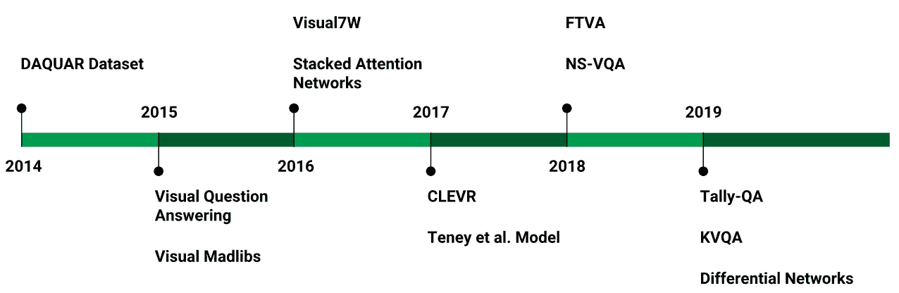
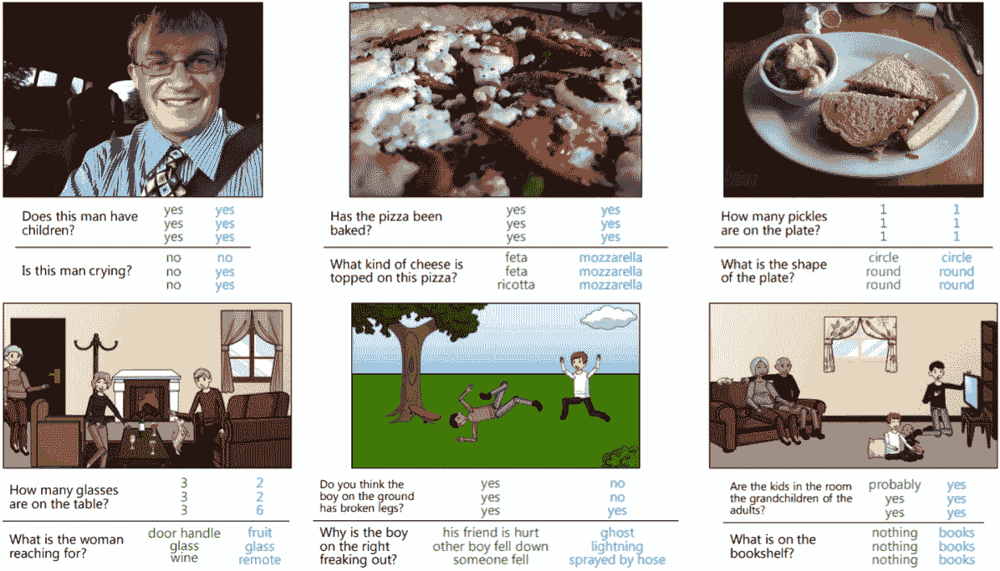
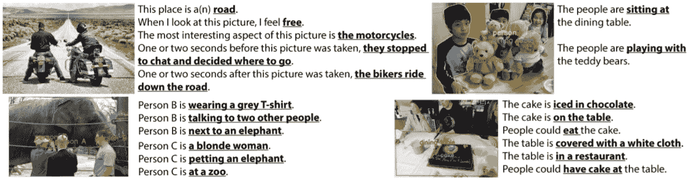
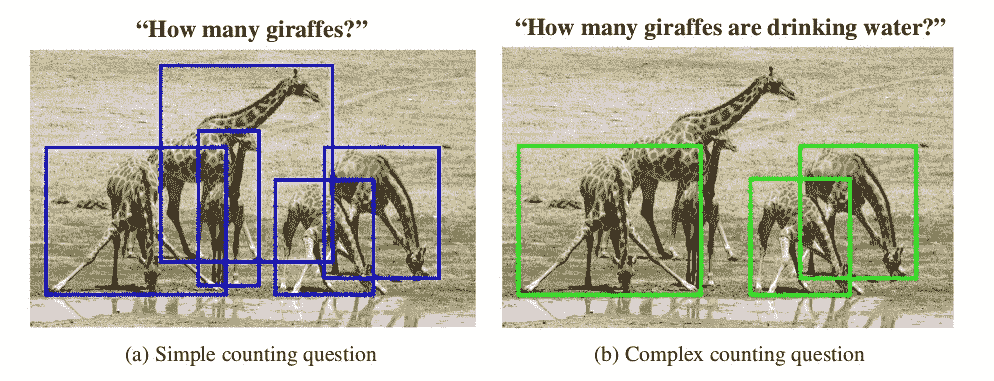
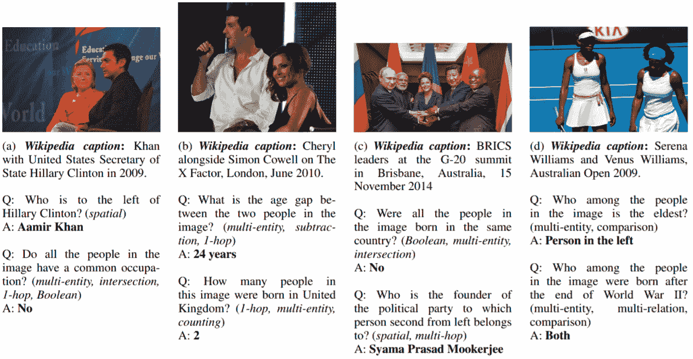
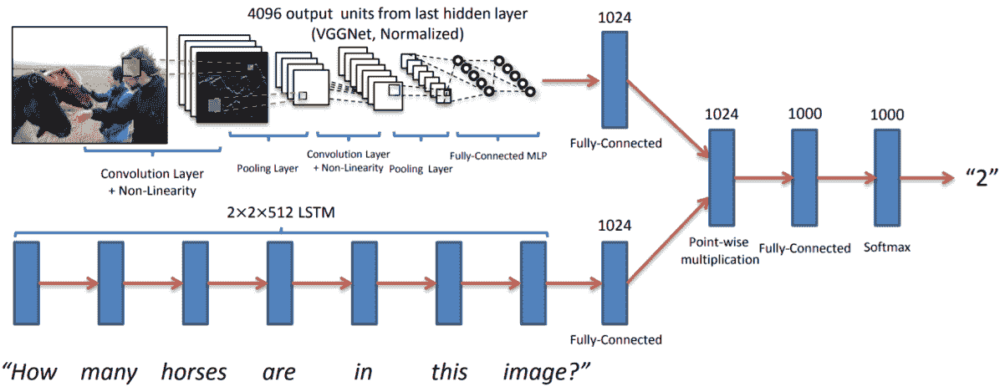
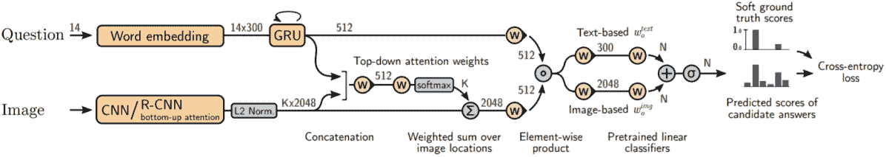
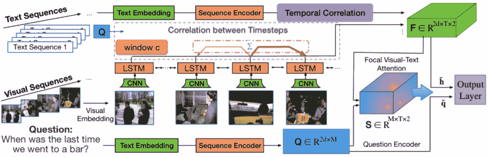
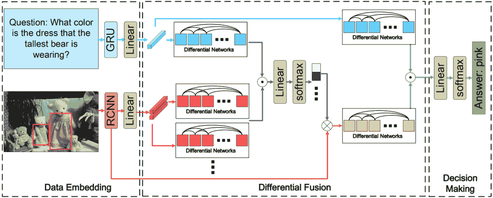
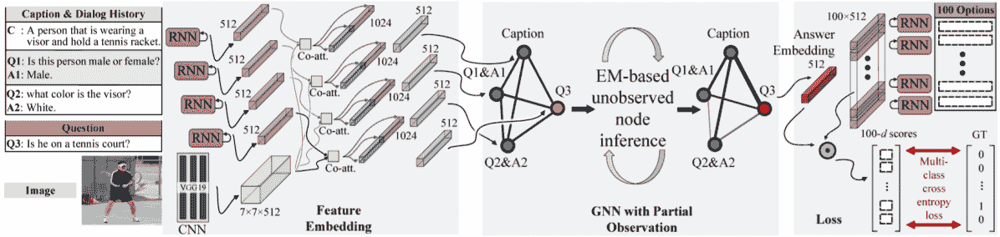

<!--yml

分类：未分类

日期：2024-09-06 20:05:16

-->

# [1909.01860] 基于深度学习的视觉问答：调查与性能分析

> 来源：[`ar5iv.labs.arxiv.org/html/1909.01860`](https://ar5iv.labs.arxiv.org/html/1909.01860)

¹¹机构文本：计算机视觉组，

印度安得拉邦斯里市印度信息技术学院。

¹¹电子邮件：{srivastava.y15, murali.v15, srdubey, snehasis.mukherjee}@iiits.in

# 基于深度学习的视觉问答：调查与性能分析

Yash Srivastava    Vaishnav Murali    Shiv Ram Dubey    Snehasis Mukherjee

###### 摘要

视觉问答（VQA）任务结合了处理视觉和语言数据的挑战，以回答有关给定图像的基本“常识”问题。给定一幅图像和一个自然语言的问题，VQA 系统尝试利用图像的视觉元素和从文本问题中获得的推理来找到正确答案。在这项调查中，我们覆盖并讨论了 VQA 领域中发布的最新数据集，这些数据集处理各种类型的问题格式和机器学习模型的鲁棒性。接下来，我们讨论了在 VQA 数据集上显示出有前景的新深度学习模型。最后，我们展示并讨论了一些我们在原始 VQA 模型、堆叠注意网络和 VQA 挑战赛 2017 获胜模型上计算的结果。我们还提供了详细的分析以及挑战和未来的研究方向。¹¹1 本文已被第五届 IAPR 国际计算机视觉与图像处理会议（CVIP）2020 接收。

###### 关键词：

视觉问答 人工智能 人机交互 深度学习 CNN LSTM。

## 1 引言

视觉问答（VQA）指的是一个挑战性的任务，位于图像理解与语言处理的交集。近年来，机器智能社区在 VQA 任务上取得了显著进展。VQA 的目标是开发一个系统，以回答关于输入图像的特定问题。答案可以是以下任何一种形式：一个单词、一个短语、二元答案、多项选择答案或填空答案。Agarwal 等人[2] 提出了将计算机视觉和自然语言处理概念结合起来的全新方式，以实现视觉基础对话系统，这一系统通过视觉观察和语言理解模拟人类对环境的理解。

图 1：视觉问答的主要突破时间线。

深度学习领域的进展无疑促进了图像问答任务系统的发展。Krizhevsky 等人 [14] 提出了 AlexNet 模型，彻底改变了计算机视觉领域。论文将卷积神经网络（CNN）的概念引入主流计算机视觉应用。随后，许多作者对 CNN 进行了研究，导致了如 VGGNet [28]、Inception [29]、ResNet [6] 等强大的深度学习模型的出现。同样，基于深度学习的自然语言处理领域的最新进展也提升了文本理解性能。在文本处理的背景下，第一个重要的算法被认为是递归神经网络（RNN） [21]，它引入了时间序列数据的前置上下文概念。这一架构促进了机器文本理解的发展，为机器翻译、文本分类和上下文理解开辟了新的边界。另一个重大突破是引入了长短期记忆（LSTM）架构 [7]，它通过引入一个上下文单元来存储先前相关信息，从而改进了 RNN。

原始的 VQA 模型 [2] 使用了 VGGNet [28] 和 LSTM [7] 的组合。这个模型经过多年的修订，采用了更新的架构和数学公式，如图 1 所示。与此同时，许多作者致力于创建数据集以消除偏差，通过强健的问答对来提升模型性能，涵盖各种问题类型，测试系统的视觉和语言理解能力。在 VQA 领域的最新进展中，Li 等人使用了上下文感知知识聚合来提高 VQA 性能 [15]。Yu 等人则在网络中执行了跨模态知识推理，以获得知识驱动的 VQA [35]。Chen 等人通过合成反事实样本进行训练，提升了 VQA 方法的鲁棒性 [3]。Li 等人通过迁移学习与跨模态门控方法相结合，采用了基于注意力的机制来改善 VQA 性能 [16]。Huang 等人 [8] 利用基于图的卷积网络来增加 VQA 的编码关系信息。VQA 也在其他领域有所应用，如遥感数据的 VQA [19] 和医学 VQA [37]。

在本调查中，我们首先介绍了用于验证视觉问答任务的主要数据集，如 VQA 数据集[2]、DAQUAR [20]、Visual7W [39]，以及 2019 年之前的最新数据集，包括 Tally-QA [1]和 KVQA [26]。接下来，我们讨论了为视觉问答任务设计的最先进架构，如 Vanilla VQA [2]、Stacked Attention Networks [33]和 Pythia v1.0 [10]。然后我们展示了我们对三种架构的计算结果：vanilla VQA 模型[2]、Stacked Attention Network (SAN) [33]和 Teney 等人模型[31]。最后，我们讨论了观察结果和未来方向。

表 1：本文描述的 VQA 数据集概览。

| 数据集 | 图片数量 | 问题数量 | 问题类型 | 会议 | 模型 | 准确率 |
| --- | --- | --- | --- | --- | --- | --- |
| DAQUAR [20] | 1449 | 12468 | 对象识别 | NIPS 2014 | AutoSeg [5] | 13.75% |
| VQA [2] | 204721 | 614163 | 结合视觉、语言和常识 | ICCV 2015 | CNN + LSTM | 54.06% |
| Visual Madlibs [36] | 10738 | 360001 | 填空题 | ICCV 2015 | nCCA (bbox) | 47.9% |
| Visual7W [39] | 47300 | 2201154 | 7Ws，定位对象 | CVPR 2016 | LSTM + Attention | 55.6% |
| CLEVR [12] | 100000 | 853554 | 基于关系的合成问题生成 | CVPR 2017 | CNN + LSTM + Spatial Relationship | 93% |
| Tally-QA [1] | 165000 | 306907 | 计数不同复杂度的对象 | AAAI 2019 | RCN Network | 71.8% |
| KVQA [26] | 24602 | 183007 | 基于知识图谱的问题 | AAAI 2019 | MemNet | 59.2% |

## 2 数据集

主要的 VQA 数据集总结见表 1。我们在下文中展示这些数据集。

DAQUAR：DAQUAR 代表“用于真实世界图像问答的数据集”，由 Malinowski 等人发布[20]。这是第一个发布的 IQA 任务数据集。图像来自 NYU-Depth V2 数据集[27]。数据集规模较小，总共有 1449 张图像。问题库包括 12468 个问答对，其中 2483 个独特问题。问题是通过人工注释生成的，并限定在 9 个问题模板中，使用 NYU-Depth 数据集的注释。

VQA 数据集: Visual Question Answering (VQA) 数据集 [2] 是从 MS-COCO [18] 数据集中收集的最大的数据集之一。VQA 数据集每张图像至少包含 3 个问题，每个问题有 10 个答案。数据集包含 614,163 个开放式和选择题形式的问题。在选择题中，答案可以被分类为：1) 正确答案，2) 合理答案，3) 流行答案和 4) 随机答案。最近，VQA V2 数据集 [2] 发布了附加的混淆图像。VQA 样本图像和问题如图 2 所示。

Visual Madlibs: Visual Madlibs 数据集 [36] 提供了一种不同的图像问答任务模板。其中一种形式是填空题，系统需要补充单词以完成句子，主要针对人、物体、外观、活动和互动。Visual Madlibs 样本如图 3 所示。

Figure 2: VQA 数据集样本 [2]。

Figure 3: Madlibs 数据集样本 [36]。

Visual7W: Visual7W 数据集 [39] 同样基于 MS-COCO 数据集。它包含 47,300 张 COCO 图像，配有 327,939 对问题和答案。数据集还包括 1,311,756 道选择题及其答案，并有 561,459 个定位标注。数据集主要处理七种形式的问题（这也是其名称的来源）：What、Where、When、Who、Why、How 和 Which。它主要由两种类型的问题组成。‘Telling’ 问题是基于文本的，提供某种描述。‘Pointing’ 问题以‘Which’开头，需要通过在一组合理的答案中识别边界框来正确回答。

Figure 4: Tally-QA 数据集样本 [1]。

Figure 5: KVQA 数据集样本 [26]。

CLEVR: CLEVR [12] 是一个合成数据集，用于测试 VQA 系统的视觉理解。数据集生成的每张图像中包含三种物体，分别是圆柱体、球体和立方体。这些物体有两种不同的大小、两种不同的材料和八种不同的颜色。问题也是根据图像中的物体合成生成的。数据集还包含图像中每个物体的真实边界框。

Tally-QA：在 2019 年，提出了 Tally-QA [1]数据集，这是开放任务中最大的物体计数数据集。该数据集包含简单和复杂问题类型，见图 2。数据集不仅数量庞大，而且是 VQA 数据集的 2.5 倍。数据集包含 287,907 个问题、165,000 张图像和 19,000 个复杂问题。Tally-QA 样本见图 4。

KVQA：最近对常识问题的关注促成了基于知识的 VQA 数据集[26]的发展。该数据集包含针对各种名词类别的问题，并且需要世界知识才能得出解决方案。数据集中的问题需要对大型知识图谱（KG）进行多实体、多关系和多跳推理以获得答案。数据集包含 24,000 张图像和 183,100 个问答对，涉及约 18K 个专有名词。KVQA 样本见图 5。

表 2：本文描述的模型概述。Pythia v0.1 是 VQA 数据集中表现最好的模型。

| 模型 | 数据集 | 方法 | 准确率 | 会议 |
| --- | --- | --- | --- | --- |
| Vanilla VQA [2] | VQA [2] | CNN + LSTM | 54.06 (VQA) | ICCV 2015 |
| 堆叠注意力网络 [33] | VQA [2], DAQAUR [20], COCO-QA [24] | 多重注意力层 | 58.9 (VQA), 46.2 (DAQAUR), 61.6 (COCO-QA) | CVPR 2016 |
| Teney et al. [31] | VQA [2] | Faster-RCNN + Glove 向量 | 63.15 (VQA-v2) | CVPR 2018 |
| 神经-符号 VQA [34] | CLEVR [12] | 符号结构作为先验知识 | 99.8 (CLEVR) | NIPS 2018 |
| FVTA [17] | MemexQA [9], MovieQA [30] | 对序列数据的注意力 | 66.9 (MemexQA), 37.3 (MovieQA) | CVPR 2018 |
| Pythia v1.0 [11] | VQA [2] | Teney et al. [31] + 深层网络 | 72.27 (VQA-v2) | VQA 挑战赛 2018 |
| Differential Networks [32] | VQA [2], TDIUC [13], COCO-QA [24] | Faster-RCNN, Differential 模块, GRU | 68.59 (VQA-v2), 86.73 (TDIUC), 69.36 (COCO-QA) | AAAI 2019 |
| GNN [38] | VisDial 和 VisDial-Q | 图神经网络 | 召回率：48.95 (VisDial), 27.15 (VisDial-Q) | CVPR 2019 |

## 3 种基于深度学习的 VQA 方法

深度学习架构的出现促使了 VQA 系统的发展。我们在表 2 中讨论了最先进的方法的概述。

Vanilla VQA [2]：被认为是深度学习方法的基准，vanilla VQA 模型使用 CNN 进行特征提取，并使用 LSTM 或递归网络进行语言处理。这些特征通过逐元素操作结合成一个公共特征，最终用于分类到其中一个答案，如图 6 所示。

堆叠注意力网络 [33]：该模型引入了使用中间问题特征的 softmax 输出的注意力。特征之间的注意力被堆叠起来，这有助于模型关注图像的重要部分。

Teney 等人的模型 [31]：Teney 等人引入了在 VQA 模型中使用物体检测的方法，并赢得了 2017 年 VQA 挑战赛。该模型有助于缩小特征范围，并对图像施加更好的注意力。该模型采用了 R-CNN 架构，并在准确性上表现出了比其他架构更显著的性能。该模型如图 7 所示。

神经符号 VQA [34]：专门为 CLEVR 数据集制作的，该模型利用了 CLEVR 的问题生成和图像生成策略。图像被转换为结构化特征，而问题特征被转换为其原始的根问题策略。这个特征用于筛选出所需的答案。

焦点视觉文本注意力 (FVTA) [17]：该模型结合了网络生成的图像特征序列、图像的文本特征（或可能的答案）以及问题。它基于这两个文本组件应用注意力，最终将特征分类以回答问题。该模型更适合用于视频中的 VQA，因为视频比图像有更多的应用场景。该模型如图 8 所示。

图 6：Vanilla VQA 网络模型 [2]。

图 7：Teney 等人的 VQA 模型 [31]

图 8：焦点视觉文本注意力模型 [17]

图 9：差分网络模型 [32]。

Pythia v1.0 [11]: Pythia v1.0 是 2018 年 VQA 挑战赛的获奖架构²²2[`github.com/facebookresearch/pythia`](https://github.com/facebookresearch/pythia)。该架构类似于 Teney 等人提出的 [31]，通过逐元素乘法减少计算量，使用 GloVe 向量 [23]，并集成了 30 个模型。

差分网络 [32]: 该模型使用前向传播步骤之间的差异来减少噪声，并学习特征之间的相互依赖性。图像特征通过 Faster-RCNN [25] 提取。差分模块 [22] 用于精细化文本和图像中的特征。GRU [4] 用于提取问题特征。最终，它与注意力模块结合以分类答案。差分网络架构如图 9 所示。

图 10: 可微分图神经网络 [38]。

可微分图神经网络 (GNN) [38]: 最近，Zheng 等人讨论了一种将视觉对话建模为结构图和马尔可夫随机场的新方法。他们将对话实体视为观测节点，将答案视为缺失值的节点。该模型如图 10 所示。

## 4 实验结果与分析

不同方法在不同数据集上的报告结果汇总在表 1 和表 2 中。可以观察到，VQA 数据集被不同方法广泛使用来测试性能。其他数据集如 Visual7W、Tally-QA 和 KVQA 也非常具有挑战性且较为新颖。同时可以看到，Pythia v1.0 是在 VQA 数据集上表现非常出色的近期方法之一。差分网络是最近提出的一种 VQA 任务方法，在不同数据集上的表现也非常有前景。

作为这项调查的一部分，我们还在不同的数据集上实现了不同的方法并进行了实验。我们考虑了以下三种模型进行实验：1）基础的 Vanilla VQA 模型 [2]，它使用 VGG16 CNN 架构 [28] 和 LSTM [7]；2）堆叠注意力网络 [33] 架构；3）2017 年 VQA 挑战赛获胜者 Teney 等模型 [31]。我们选择了广泛采用的数据集，如标准 VQA 数据集 [2] 和 Visual7W 数据集 [39] 进行实验。我们对所有模型使用了 Adam 优化器和交叉熵损失函数。每个模型在每个数据集上训练了 100 个周期。

表 3：使用 Vanilla VQA [2]、堆叠注意力网络 [33] 和 Teney 等 [31] 模型在 VQA [2] 和 Visual7W [39] 数据集上训练得到的准确率。

| 模型名称 | 准确率 |
| --- | --- |
| VQA 数据集 | Visual7W 数据集 |
| CNN + LSTM | 58.11 | 56.93 |
| 堆叠注意力网络 | 60.49 | 61.67 |
| Teney 等 | 67.23 | 65.82 |

实验结果以表 3 的形式呈现，展示了三种模型在两个数据集上的准确率。在实验中，我们发现 Teney 等 [31] 是 VQA 和 Visual7W 数据集上表现最好的模型。Teney 等模型在 VQA 和 Visual7W 数据集上的开放式问答任务的准确率分别为 67.23% 和 65.82%。上述结果再次确认了 Teney 等模型是 2018 年之前表现最好的模型，而最近由 Pythia v1.0 [10] 推出了该模型的改进版，其中增加了更多层以提升性能。由于问题的性质，VQA 的准确率相对较低。VQA 是计算机视觉中的一个难题，网络必须理解图像、问题及特征空间中的关系的语义。

## 5 结论

视觉问答（Visual Question Answering）最近引起了全球研究人员和科学家的极大兴趣和发展。最近的趋势表现在开发越来越多逼真的数据集，结合真实世界的问题和答案。在深度学习模型的发展领域中，也观察到趋势，利用视觉线索和文本线索进行更好的处理。最佳模型的性能仍然滞后，大约仅为 60-70%。因此，开发更好的深度学习模型以及更具挑战性的数据集仍然是一个开放的问题。可以考虑不同的策略，如对象级细节、分割掩码、更深的模型、问题的情感等，以开发下一代 VQA 模型。

## 参考文献

+   [1] Acharya, M., Kafle, K., Kanan, C.: Tallyqa: 回答复杂计数问题。arXiv 预印本 arXiv:1810.12440 (2018)

+   [2] Antol, S., Agrawal, A., Lu, J., Mitchell, M., Batra, D., Lawrence Zitnick, C., Parikh, D.: VQA: 视觉问答。发表于 IEEE ICCV，页码 2425–2433 (2015)

+   [3] Chen, L., Yan, X., Xiao, J., Zhang, H., Pu, S., Zhuang, Y.: 针对鲁棒视觉问答的反事实样本合成。发表于 IEEE/CVF 计算机视觉与模式识别会议，页码 10,800–10,809 (2020)

+   [4] Chung, J., Gulcehre, C., Cho, K., Bengio, Y.: 门控递归神经网络在序列建模中的实证评估。arXiv 预印本 arXiv:1412.3555 (2014)

+   [5] Gupta, S., Arbelaez, P., Malik, J.: 从 RGB-D 图像中感知组织和识别室内场景。发表于 IEEE CVPR，页码 564–571 (2013)

+   [6] He, K., Zhang, X., Ren, S., Sun, J.: 图像识别的深度残差学习。发表于 IEEE CVPR，页码 770–778 (2016)

+   [7] Hochreiter, S., Schmidhuber, J.: 长短期记忆。神经计算 9(8), 1735–1780 (1997)

+   [8] Huang, Q., Wei, J., Cai, Y., Zheng, C., Chen, J., Leung, H.f., Li, Q.: 对齐的双通道图卷积网络用于视觉问答。发表于第 58 届计算语言学协会年会，页码 7166–7176 (2020)

+   [9] Jiang, L., Liang, J., Cao, L., Kalantidis, Y., Farfade, S., Hauptmann, A.: Memexqa: 视觉记忆问答。arXiv 预印本 arXiv:1708.01336 (2017)

+   [10] Jiang, Y., Natarajan, V., Chen, X., Rohrbach, M., Batra, D., Parikh, D.: Pythia v0\. 1: VQA 挑战赛 2018 的获胜作品。arXiv 预印本 arXiv:1807.09956 (2018)

+   [11] Jiang, Y., Natarajan, V., Chen, X., Rohrbach, M., Batra, D., Parikh, D.: Pythia v0\. 1: VQA 挑战赛 2018 的获胜作品。arXiv 预印本 arXiv:1807.09956 (2018)

+   [12] Johnson, J., Hariharan, B., van der Maaten, L., Fei-Fei, L., Lawrence Zitnick, C., Girshick, R.: CLEVR: 组合语言和基础视觉推理的诊断数据集。发表于 IEEE CVPR，页码 2901–2910 (2017)

+   [13] Kafle, K., Kanan, C.：视觉问答算法分析。载于：ICCV（2017）

+   [14] Krizhevsky, A., Sutskever, I., Hinton, G.E.：使用深度卷积神经网络进行 Imagenet 分类。载于：NIPS，第 1097–1105 页（2012）

+   [15] Li, G., Wang, X., Zhu, W.：通过上下文感知知识聚合提升视觉问答。载于：第 28 届 ACM 国际多媒体会议论文集，第 1227–1235 页（2020）

+   [16] Li, W., Sun, J., Liu, G., Zhao, L., Fang, X.：通过注意力转移和跨模态门控机制的视觉问答。模式识别快报 133，第 334–340 页（2020）

+   [17] Liang, J., Jiang, L., Cao, L., Li, L.J., Hauptmann, A.G.：用于视觉问答的焦点视觉-文本注意力。载于：IEEE CVPR，第 6135–6143 页（2018）

+   [18] Lin, T.Y., Maire, M., Belongie, S., Hays, J., Perona, P., Ramanan, D., Dollár, P., Zitnick, C.L.：Microsoft coco：上下文中的常见物体。载于：ECCV，第 740–755 页（2014）

+   [19] Lobry, S., Marcos, D., Murray, J., Tuia, D.：Rsvqa：用于遥感数据的视觉问答。IEEE 地球科学与遥感学报（2020）

+   [20] Malinowski, M., Fritz, M.：基于不确定输入的现实场景问答的多世界方法。载于：NIPS，第 1682–1690 页（2014）

+   [21] Medsker, L.R., Jain, L.：递归神经网络。设计与应用 5（2001）

+   [22] Patro, B., Namboodiri, V.P.：用于视觉问答的差异注意力。载于：IEEE CVPR，第 7680–7688 页（2018）

+   [23] Pennington, J., Socher, R., Manning, C.：Glove：用于词表示的全局向量。载于：EMNLP，第 1532–1543 页（2014）

+   [24] Ren, M., Kiros, R., Zemel, R.：探索图像问答的模型和数据。载于：神经信息处理系统进展，第 2953–2961 页（2015）

+   [25] Ren, S., He, K., Girshick, R., Sun, J.：Faster R-CNN：通过区域提议网络实现实时目标检测。载于：NIPS，第 91–99 页（2015）

+   [26] Shah, S., Mishra, A., Yadati, N., Talukdar, P.P.：Kvqa：知识感知视觉问答。载于：AAAI（2019）

+   [27] Silberman, N., Hoiem, D., Kohli, P., Fergus, R.：从 RGBD 图像中进行室内分割和支持推断。载于：ECCV，第 746–760 页（2012）

+   [28] Simonyan, K., Zisserman, A.：用于大规模图像识别的非常深的卷积网络。arXiv 预印本 arXiv:1409.1556（2014）

+   [29] Szegedy, C., Vanhoucke, V., Ioffe, S., Shlens, J., Wojna, Z.：重新思考计算机视觉的 Inception 架构。载于：IEEE CVPR，第 2818–2826 页（2016）

+   [30] Tapaswi, M., Zhu, Y., Stiefelhagen, R., Torralba, A., Urtasun, R., Fidler, S.：Movieqa：通过问答理解电影中的故事。载于：IEEE CVPR，第 4631–4640 页（2016）

+   [31] Teney, D., Anderson, P., He, X., van den Hengel, A.：视觉问答的技巧与窍门：来自 2017 年挑战的经验。载于：IEEE CVPR，第 4223–4232 页（2018）

+   [32] Wu, C., Liu, J., Wang, X., Li, R.：用于视觉问答的差异网络。AAAI 2019（2019）

+   [33] Yang, Z., He, X., Gao, J., Deng, L., Smola, A.: 图像问答的堆叠注意力网络。发表于：IEEE CVPR，第 21–29 页（2016）

+   [34] Yi, K., Wu, J., Gan, C., Torralba, A., Kohli, P., Tenenbaum, J.: 神经符号视觉问答：将推理与视觉和语言理解解开。发表于：NIPS，第 1031–1042 页（2018）

+   [35] Yu, J., Zhu, Z., Wang, Y., Zhang, W., Hu, Y., Tan, J.: 基于知识的视觉问答的跨模态知识推理。模式识别 108，第 107,563 页（2020）

+   [36] Yu, L., Park, E., Berg, A.C., Berg, T.L.: 视觉填空：填补空白的描述生成与问答。发表于：IEEE ICCV，第 2461–2469 页（2015）

+   [37] Zhan, L.M., Liu, B., Fan, L., Chen, J., Wu, X.M.: 通过条件推理进行医学视觉问答。发表于：第 28 届 ACM 国际多媒体会议论文集，第 2345–2354 页（2020）

+   [38] Zheng, Z., Wang, W., Qi, S., Zhu, S.C.: 通过结构化和部分观察推理视觉对话。发表于：IEEE 计算机视觉与模式识别会议论文集，第 6669–6678 页（2019）

+   [39] Zhu, Y., Groth, O., Bernstein, M., Fei-Fei, L.: Visual7w：图像中的有根据的问答。发表于：IEEE CVPR，第 4995–5004 页（2016）
