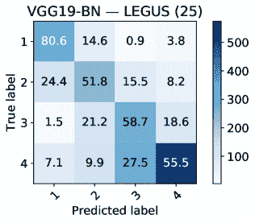

<!--yml

类别：未分类

日期：2024-09-06 20:05:13

-->

# [1909.02024] 深度迁移学习用于星团分类：I. 对 PHANGS-HST 调查的应用

> 来源：[`ar5iv.labs.arxiv.org/html/1909.02024`](https://ar5iv.labs.arxiv.org/html/1909.02024)

# 深度迁移学习用于星团分类：I. 对 PHANGS-HST 调查的应用

韦伟^(1,2)、E. A. 胡尔塔^(1,3)、布拉德利·C·惠特莫尔⁴、贾尼斯·C·李⁵、斯蒂芬·汉农⁶、鲁帕利·昌达⁷、丹尼尔·A·戴尔⁸、克尔斯滕·L·拉尔森⁵、戴维·A·希尔克⁹、莱昂纳多·乌贝达⁴、梅德里克·博基安¹⁰、梅拉尼·谢旺斯¹¹、J. M. 迪德里克·克鲁伊森¹¹、安德烈亚斯·施鲁巴¹²、吉列尔莫·布兰克^(13,14,15)、恩里科·孔久^(16,13)

¹NCSA，伊利诺伊大学厄尔巴纳-香槟分校，厄尔巴纳，伊利诺伊州 61801，美国

²物理系，伊利诺伊大学厄尔巴纳-香槟分校，厄尔巴纳，伊利诺伊州 61801，美国

³天文学系，伊利诺伊大学厄尔巴纳-香槟分校，厄尔巴纳，伊利诺伊州 61801，美国

⁴空间望远镜科学研究所，3700 圣马丁大道，巴尔的摩，MD，美国

⁵加州理工学院/IPAC，加州理工学院，帕萨迪纳，CA，美国

⁶物理与天文学系，加州大学河滨分校，河滨，CA，美国

⁷物理与天文学系，托莱多大学，托莱多，OH，美国

⁸物理与天文学系，怀俄明大学，拉勒米，WY，美国

⁹物理与天文学系，约翰斯·霍普金斯大学，巴尔的摩，MD，美国

¹⁰安托法加斯塔大学天文学单位，安托法加斯塔，智利

¹¹天文学计算研究所，海德堡大学天文学中心，海德堡，德国

¹²马克斯·普朗克外星物理研究所，加兴，德国

¹³卡内基科学研究所天文台，帕萨迪纳，CA，美国

¹⁴智利大学天文学系，拉斯孔德斯，圣地亚哥，智利

¹⁵天体物理与相关技术中心（CATA），拉斯孔德斯，圣地亚哥，智利

¹⁶拉斯坎帕纳斯天文台，拉塞雷纳，智利 联系邮箱: weiw2@illinois.edu(接受日期 XXX。收到日期 YYY；原始形式 ZZZ)

###### 摘要

我们展示了一个概念验证实验的结果，该实验表明深度学习可以成功地用于大规模生产分类，分类对象为在 PHANGS-HST 调查中通过 HST UV-光学成像检测到的紧凑型恒星簇（$D\lesssim 20\,\textrm{Mpc}$）。鉴于现有的人工标注恒星簇样本相对较少，我们将最先进的神经网络模型在真实对象识别中的知识迁移到分类恒星簇候选者为四个形态类别。我们进行了一系列实验，以确定分类性能对以下因素的依赖性：神经网络架构（ResNet18 和 VGG19-BN）；由单个专家或三位天文学家策划的训练数据集；以及用于训练的图像大小。我们发现这些选择对总体分类准确性没有显著影响。网络被用于分类 PHANGS-HST 星系 NGC 1559 中的恒星簇候选者，该星系未包含在训练样本中。得到的预测准确率分别为类别 1、2、3 和类别 4 非簇的 70%、40%、40-50%、50-70%。这一性能与之前发布的人类和自动化定量分类恒星簇候选样本（70-80%、40-50%、40-50%和 60-70%）的一致性相当。本文介绍的方法为大规模自动化恒星簇分类奠定了基础，并展示了需要准备一个标准化的人类标注恒星簇分类数据集，该数据集需得到该领域所有专家的认可，以进一步提升本文研究中介绍的网络性能。

###### 关键词：

星系 : 恒星簇 : 一般^†^†出版年份: 2019^†^†页码范围: 深度迁移学习用于恒星簇分类：I. 应用于 PHANGS-HST 调查–C

## 1 引言

人类对天文源的电磁信号进行视觉分类是观测研究中的核心任务，拥有悠久的历史（Cannon & Pickering, 1912, 1918; Hubble, 1926, 1936; de Vaucouleurs, 1963）。这是了解从恒星到银河系结构的形成和演变的重要手段。然而，在现代“Big Data”天文学时代，电磁勘测领域、视场、灵敏度、分辨率、波长覆盖、观测频率和瞬态警报生成的前所未有的增长使得人类分类已不再具有扩展性（Abbott et al., 2016; LSST Science Collaboration et al., 2009）。这一认识促使了机器学习技术的应用，以自动化图像分类（Ball et al., 2008; Banerji et al., 2010; Carrasco Kind & Brunner, 2013; Ishak, 2017; Kamdar et al., 2016; Kim & Brunner, 2017）。这些机器学习算法中的一些已被集成到广泛使用的图像处理方法中，例如用于在自动源检测和光度测量软件 SEXTRACTOR 中进行星系分离的神经网络（Bertin & Arnouts, 1996a）。机器学习在图像分类中的其他应用包括使用所谓的决策树（Weir et al., 1995; Suchkov et al., 2005; Ball et al., 2006; Vasconcellos et al., 2011; Sevilla-Noarbe & Etayo-Sotos, 2015）和支持向量机（Fadely et al., 2012; Solarz et al., 2017; Małek & et al., 2013）。

视觉对象识别也一直是计算机科学社区的核心研究活动。例如，PASCAL VOC 挑战赛旨在开发能够准确分类大约 20,000 张分为二十个对象类别的图像的软件（Everingham et al., 2015）。在过去十年中，深度学习算法迅速发展，成为计算机视觉领域的最先进信号处理工具，甚至超越了人类性能。深度学习算法在图像分类中的成功可以广泛归因于处理速度的提升和用于训练的非常大的数据集的可用性；即用于训练、验证和测试神经网络模型的图形处理单元（GPUs）；以及高质量、人工标注的数据集的策划，如 ImageNet 数据集（Deng et al., 2009），该数据集包含超过 1400 万张图像，分为 1000 多个对象类别。

ImageNet 大规模视觉识别挑战（Russakovsky 等，2015）推动了深度学习模型的发展，并在图像分类方面取得了突破。2012 年，网络架构 AlexNet（Krizhevsky 等，2012）在 ImageNet 挑战中实现了 $\sim 50\%$ 的错误率减少——当时这是一个显著的成就，依赖于使用 GPU 进行模型训练、数据增强（图像平移、水平翻转和均值减法）以及其他新颖的算法改进，这些改进是当今最先进的神经网络模型的核心，例如，使用连续的卷积层和池化层，最后跟随全连接层的神经网络架构。

在接下来的两年中，架构 VGGNet（Simonyan & Zisserman，2014b）和 GoogLeNet（Szegedy 等，2014）继续通过更深更宽的神经网络模型提升深度学习算法在图像分类方面的辨别能力，并创新了如尺度抖动等数据增强技术。此外，GoogLeNet 通过引入多尺度处理，即通过较小的卷积恢复局部特征，以及通过较大的卷积抽象特征，提供了进一步改进图像分类分析的方法。2015 年，ResNet（He 等，2015）模型成为第一个在 ImageNet 挑战中超越人类表现的架构。除了这一计算机视觉的里程碑，ResNet 还被用来证明，简单地堆叠层并不能保证在超深神经网络模型中提升性能，实际上可能导致图像分类的次优性能。

鉴于上述成就，深度学习在图像分类领域的研究已成为科学技术中的蓬勃事业。这个充满活力的计划带来了利用最先进的神经网络模型对不同数据集进行分类的创新方法。这种方法是必要的，因为大多数深度学习图像分类应用依赖于监督学习。也就是说，神经网络模型是通过大量标注数据集进行训练的，例如 ImageNet 数据集。在天文学研究中，为了实现对星系的形态分类，（Dieleman 等，2015）开发的深度神经网络模型是在约 55,000 张星系图像上训练的，每张图像都有来自 Galaxy Zoo 2（Willett 等，2013）在线众包项目的 40-50 个人工分类。该模型是为 2013-14 年 Kaggle 平台上的 Galaxy Challenge 竞赛开发的，并在 326 个参赛作品中获得第一名。由于这类数据集难以获得，深度“迁移”学习提供了通过用 ImageNet 数据集对预训练神经网络模型进行微调来分类全新数据集的手段。¹¹1 迁移学习的简要概述见附录 B。

虽然深度迁移学习最初是为了分类与训练最先进神经网络模型的数据集性质相似的数据集，但首次将预训练的 ImageNet 神经网络模型应用于完全不同性质的小数据集的深度迁移学习应用是由 George 等人（2018, 2017）提出的，其中使用了多种神经网络模型来报告在引力波数据中噪声异常的最先进图像分类准确性。这项研究引发了各种预训练 ImageNet 深度学习算法的应用，以分类星系合并（Ackermann 等，2018）和星系（Khan 等，2019；Barchi 等，2019；Domínguez Sánchez 等，2018）图像，仅举几个例子。

基于近期在物理学和天文学图像分类中成功应用深度迁移学习的经验，本文展示了深度迁移学习可以用于对通过哈勃太空望远镜（HST）获得的相邻星系中紧凑星团的图像进行分类。我们表明，这种方法的分类准确性与人工工作相当，并且有潜力**超越**人类和传统机器学习。该工作的主要动机是确定这些深度迁移学习技术是否可以用于自动化生产规模的星团候选体分类，数据来自第 26 周期 HST-PHANGS（**高角分辨率相邻星系物理学**²²2www.phangs.org）调查（首席研究员：J.C. Lee，GO-15654），观察始于 2019 年 4 月。预计 HST-PHANGS 将产生数万候选星团进行分类，其中仅约一半为真实的星团。在神经网络中编码分类系统还将提高分类的一致性，减少主观性和不同个体采用的分类系统之间的微妙差异所带来的隐含影响（即，它可以减少分类中的随机和系统性误差）。

本文的组织结构如下。在第二部分中，我们总结了星团分类的目标，并描述了我们在本文中使用的当前分类系统。我们提供了先前研究中人类分类之间一致性的回顾，以建立深度学习在这次初步概念验证实验中需达到或超越的准确性水平。在第三部分中，我们描述了用于训练神经网络（NN）模型的成像数据和分类方法，并概述了在这项工作中采用的 NN 模型。在第四部分中，我们报告了我们的结果。最后，在第五部分中，我们总结了结果并讨论了未来工作的下一步。

## 2 相邻星系中紧凑星团的分类

本研究关注的对象是距离 4 Mpc 到 20 Mpc 的星系中的紧凑星团和星际联会。紧凑星团的物理尺寸由有效半径 0.5 pc 到约 10 pc（Portegies Zwart 等，2010；Ryon 等，2017）特征化。Ryon 等（2014）报告称，基于 HST LEGUS 对 NGC1313（D$\sim$4 Mpc）和 NGC628（D$\sim$10 Mpc）的观测，年轻（$\lesssim$10 Myr）、大质量紧凑星团的有效半径分布在 2-3 pc 之间达到峰值。因此，只有在 HST 的分辨率下，这些对象才能从个别恒星中区分开，并从局部星系中的其他星团中分离出来。⁴⁴我们注意到，对于高信噪比的星团，可以将图像的扩展（因此源的大小）测量到星的 PSF 的 FWHM 的一个分数。使用 WFC3 的星的 FWHM 约为 1.8 像素（在 D=4 Mpc 时为 1.3 pc，在 20 Mpc 时为 6.4 pc）。在使用像 ISHAPE（Larson1999）这样的软件对 ACS 和 WFC3 图像进行大量测试后，许多已发布的工作（包括 Chandar 等人 2017 年，Ryon 等人 2017 年）确认这一扩展可以测量到约 0.2 像素，对应于$\sim$0.3 pc、5 Mpc 和 10 Mpc 距离下的$\sim$0.6 pc 的尺寸限制。扩展到 15 和 20 Mpc，即 PHANGS 调查覆盖的距离范围的上限，星团的尺寸限制为 0.8 和 1.1 pc。根据 ISHAPE 手册，在 5 Mpc 下，这计算为：0.2 像素 * 0.04（弧秒/像素）* 24 pc/弧秒 * 1.48 = 0.28 pc（其中 1.48 是 ISHAPE 手册中在假设 King 轮廓时给出的转换因子）。因此，如果星团的峰值尺寸在 2-3 pc 范围内，大多数星团将在 PHANGS-HST 中的大多数星系中被分辨出来。主导年轻恒星群体的星际联会的尺寸跨度更广，从几 pc 到$\sim$100 pc（Portegies Zwart 等，2010；Gouliermis，2018）。

早期对外星系中星团的分类尝试主要集中在老的球状星团，例如，处于处女座星系团中心椭圆星系周围的成千上万的球状星团（Whitmore 等人，1995）。这是一个相当直接的过程，因为背景平滑且星团分离良好。随着在合并星系中发现超级星团（例如，Holtzman 等人，1992），尽管拥挤和变化的背景使得这个过程更加具有挑战性，但使用 HST 进行星形成星系中星团的识别和研究的事业开始了。对正常螺旋星系的研究将极限推向了更暗和更常见的星团（例如，Larsen，2002；Chandar 等人，2010）。在所有这些早期研究中，主要目标是将真实星团与单个星星和图像伪影区分开来，并且几乎没有进一步将星团分为不同类别的尝试。

一个例外，并且是更详细分类的最早尝试之一，由 Schweizer 等人（1996）进行，他们定义了 9 种对象类型，然后将它们分为两个类别：候选球状星团和扩展星关联。更近期，Bastian 等人（2012）通过 HST 成像 M83 星系对星团进行了分类，将星团分为对称或非对称两类。他们的分析保留了仅对称的星团，认为这些星团更可能被引力束缚。在这项工作之后，该领域的许多研究，特别是遗产外银河紫外线调查（LEGUS）（Calzetti 等，2015a）开始将星团区分为两类或三类，以便根据项目目标单独或一起研究（另见 Krumholz 等人，2018 的综述以及他们对“独占”与“包容”星团目录的讨论）。

LEGUS 项目还采用了机器学习技术进行部分星团分类工作 Messa 等人（2018）；Grasha 等人（2019）。这项开创性工作将在第五部分讨论。

在 LEGUS 中，星团候选对象被分为以下四类（Adamo 等，2017；Cook 等，2019）：

+   •

    类别 1：紧凑，对称，单一中央峰，相对点源的径向轮廓更扩展

+   •

    类别 2：紧凑，非对称或非圆形（例如，拉长），单一中央峰

+   •

    类别 3：非对称，多峰，有时叠加在扩展的模糊源上

+   •

    类别 4：非星团（图像伪影、背景星系、拥挤区域中的双星和多星、星星）

我们为本文采用相同的分类系统。一般来说，我们将第 1、2 和 3 类分别称为“紧凑对称星团”、“紧凑不对称星团”和“紧凑联会”。每个类别的对象示例如图 1 所示。

图 1：使用 HST/WFC3 成像展示的四种星团分类示例。顶部四行展示来自 NGC 4656 的星团，这些星团是训练集的一部分，而底部四行展示了来自最近 PHANGS-HST 观测的螺旋星系 NGC 1559 的星团，这些星团构成了我们的概念验证测试样本，不用于训练。前两列显示了虚假彩色 RGB 图像以供参考：第一列显示了 299p x 299p 的 RGB 图像（R = F814W，G = F438W + F555W，B = F275W + F336W），第二列仅显示 RGB 图像的中心 50p x 50p（例如 NGC1559 的 184pc x 184pc）。最后 5 列（从左到右，50p x 50p 图像采用滤镜 F275W、F336W、F438W、F555W 和 F814W）显示了个别 NUV-U-B-V-I HST 图像的中心 50p x 50p，这些图像作为预训练神经网络模型进一步训练（调整）和评估的输入。我们还实验了 25p x 25p 和 100p x 100p 的图像，具体见第三部分和第四部分。

### 2.1 分类一致性

\color

black 当前工作的既定目标是通过深度迁移学习模型提供星团分类，以达到至少

与文献中的其他星团分类一样，无论是通过人工视觉检查还是应用定量选择标准，效果都很不错。 \colorblack 在这一部分，我们确定了这个“准确性”水平，我们将其定义为文献中对同一星团群体的不同分类之间的一致性，以及相对于我们中的一位（Bradley C. Whitmore，以下简称 BCW.）进行的均匀分类。

对基于相同数据和相同限制幅度的不同研究分类星团的一致性进行初步观察的是 Bastian 等人对 M83 的研究（2012）；Whitmore 等人（2014）；Chandar 等人（2014）。这些论文中的比较显示大约 70%的星团在这些研究之间是共同的。后来，Adamo 等人（2017）对 LEGUS 和 Whitmore 等人（2014）的目录进行了类似的比较，发现重叠

大约为 75%。最后，Messa 等人对 M51 的 LEGUS 研究（2018）发现

与 Chandar 等人（2016）的研究有 73%的重叠。

这些结果不仅基于对个别对象的人类与人类星团分类的详细分析；它们是样本之间重叠的统计测量，其中使用了人类分类/识别和基于浓度指数（即 1 像素与 3 像素半径的亮度差异）的自动星团分离。

图 2：BCW 和其他三名 LEGUS 团队成员（由 BCW、A. Adamo 和 H. Kim 培训）在 LEGUS 公共星团目录中提供的 NGC 4656 星团候选分类的比较。每个面板展示了 BCW 标记的类别 1（顶部，对称紧凑星团）、类别 2（上中，对称紧凑星团）、类别 3（下中，紧凑星协）和类别 4（底部，非星团）物体的分类分布。

为了更直接地评估人类与人类之间的星团分类，我们首先比较 LEGUS 样本中的 NGC 3351 星团目录（由 BCW 和团队成员 Sean Linden（由 BCW 培训）完成）与 PHANGS-HST 独立构建的 NGC3351 星团目录的新版本。PHANGS-HST 扩展了 NGC3351 的成像覆盖范围，以产生与 PHANGS-ALMA CO 观测的更大重叠，并正在开发新的星团目录。有关目录构建的概述，请参见第 3.1 节。这可以被视为如果相同（或非常相似）的分类器在几年后返回到相同数据集时，可能期望的一致性测试。我们发现类别 1 对象的一致性为 80%，类别 2 为 53%，类别 3 为 56%。如果我们将类别 1 和 2 对象合并（这也是许多作者分析时采用的方法），则一致性为 88%。

接下来，我们将 BCW 为 NGC 4656 分配的分类与 LEGUS 公共星团目录中的分类进行比较，该目录提供了其他三名 LEGUS 团队成员（由 BCW、A. Adamo 和 H. Kim 培训）进行的分类模式。结果如图 2 所示。

如果仅结合类别$1+2$的聚类（以排除与类别 4 非聚类混淆率较高的紧凑关联），总的匹配率为 67%。对于各个类别，分配的一致性分别为 66%、37%、40%和 61%。因此，BCW 分类与三名 LEGUS 团队成员的分类模式相比，对于 NGC 4656 的匹配度略低于 BCW 与 BCW（和 Linden）在 NGC 3351 的比较。其他类似比较的星系，如 BCW 分类与 LEGUS 三人（“共识”）分类（即 NGC 4242、NGC 4395N 和 M51），结果相似。

总结来说，比较不同的聚类分类方法时，但对于相同的数据集，我们发现典型的一致性范围在 40%（例如，仅比较类别 2 或类别 3 的对象）到 90%（例如，将类别 1 和 2 结合进行重复分类）之间。

同样的，或非常相似的分类器的聚类目录）。对于各个类别，我们采用的“准确率”水平，以用于我们深度学习研究的概念验证展示，分别为 70-80%、40-50%、40-50%和 60-70%。

\color

黑色

| 场 | D (Mpc) | 类别 1 | 类别 2 | 类别 3 | 类别 4 |
| --- | --- | --- | --- | --- | --- |
| NGC3351¹ | 10.0 | 118 | 80 | 95 | 325 |
| NGC3627 | 10.1 | 403 | 175 | 164 | 837 |
| NGC4242¹ | 5.8 | 117 | 60 | 14 | 42 |
| NGC4395N² | 4.3 | 8 | 19 | 21 | 20 |
| NGC4449 | 4.31 | 120 | 261 | 213 | 0 |
| NGC45¹ | 6.61 | 45 | 52 | 20 | 43 |
| NGC4656² | 5.5 | 83 | 125 | 47 | 173 |
| NGC5457C | 6.7 | 287 | 108 | 81 | 436 |
| NGC5474¹ | 6.8 | 48 | 95 | 34 | 144 |
| NGC6744N | 7.1 | 164 | 143 | 58 | 210 |
| 总计 |  | 1393 | 1118 | 747 | 2230 |
| N $\geq$ 4 |  | 1271 | 1013 | 738 | 2125 |

表 1：由 BCW 主要分类的每个 HST LEGUS 场中的源数。每个形态类别的数量如第二部分所述。至少在四个滤镜中检测到的聚类总数（包含在训练和测试中的要求）在表格的最后一行给出。其中 80%（随机选择）用于训练，其余 20%用于验证测试。由(Calzetti et al., 2015a)编制的距离列出。

¹ 由 BCW 主要确定的分类在 LEGUS 聚类目录的公开版本中可用。

² 独立分类由 BCW 确定，适用于 LEGUS 共识分类可通过 LEGUS 公共档案获得的领域（表 2）。

| 领域 | D (Mpc) | 类别 1 | 类别 2 | 类别 3 | 类别 4 |
| --- | --- | --- | --- | --- | --- |
| NGC1313E | 4.39 | 42 | 95 | 122 | 386 |
| NGC1313W | 4.39 | 85 | 191 | 210 | 373 |
| NGC1433 | 8.3 | 51 | 61 | 56 | 138 |
| NGC1566 | 18.0 | 258 | 214 | 261 | 328 |
| NGC1705 | 5.1 | 16 | 13 | 13 | 54 |
| NGC3344 | 7.0 | 119 | 118 | 159 | 161 |
| NGC3738 | 4.9 | 49 | 93 | 86 | 214 |
| NGC4656 | 5.5 | 93 | 91 | 78 | 169 |
| M51 | 7.66 | 363 | 502 | 365 | 1261 |
| NGC5253 | 3.15 | 20 | 37 | 23 | 154 |
| NGC628C | 9.9 | 334 | 357 | 326 | 542 |
| NGC628E | 9.9 | 92 | 80 | 87 | 122 |
| NGC6503 | 5.27 | 71 | 96 | 131 | 172 |
| NGC7793E | 3.44 | 32 | 76 | 83 | 62 |
| NGC7793W | 3.44 | 51 | 84 | 86 | 78 |
| IC4247 | 5.1 | 1 | 4 | 3 | 37 |
| IC559 | 5.3 | 9 | 12 | 4 | 18 |
| NGC4395N | 4.3 | 8 | 12 | 19 | 19 |
| NGC4395S | 4.3 | 31 | 64 | 42 | 31 |
| NGC5238 | 4.51 | 4 | 4 | 1 | 9 |
| NGC5477 | 6.4 | 5 | 9 | 9 | 49 |
| UGC1249 | 6.9 | 13 | 35 | 40 | 133 |
| UGC4305 | 3.05 | 16 | 29 | 40 | 147 |
| UGC4459 | 3.66 | 2 | 5 | 3 | 20 |
| UGC5139 | 3.98 | 2 | 7 | 7 | 23 |
| UGC685 | 4.83 | 7 | 4 | 3 | 6 |
| UGC695 | 10.9 | 4 | 7 | 6 | 94 |
| UGC7408 | 6.7 | 19 | 16 | 11 | 32 |
| UGCA281 | 5.9 | 2 | 9 | 4 | 34 |
| 总计 |  | 1799 | 2325 | 2278 | 4866 |
| N $\geq$ 4 |  | 1795 | 2315 | 2265 | 4841 |

表 2：与表 1 相同，但适用于由三个人分类的 29 个 HST LEGUS 领域，并且有星团目录可通过 LEGUS 公共档案获得。由这三个人分类的模式决定的每个形态类别中的数量，如上所述。

| 领域 | D (Mpc) | 类别 1 | 类别 2 | 类别 3 | 类别 4 |
| --- | --- | --- | --- | --- | --- |
| NGC1559 | 19.0 | 302 | 252 | 162 | 710 |

表 3：PHANGS-HST 对 NGC 1559 的观测中已由 BCW 分类的源数量。此集群样本用于测试如第 4.1 节所述的神经网络，作为生产规模分类 PHANGS-HST 紧凑集群和关联的概念验证演示。

## 3 数据与方法

在本节中，我们描述了用于训练、验证和测试我们深度学习算法的数据集，并概述了使用的神经网络模型。我们将这项初步工作视为概念验证演示，意在未来的工作中进行进一步的优化和更详细的测试。

### 3.1 星团目录

一个关键点是，这里展示的神经网络的训练和测试基于预选的星团候选样本，其中已先行剔除了大量未解析的（点）源。在过去的工作中，这些候选样本作为人工视觉分类的起点，以去除剩余的伪影，并对验证的星团进行形态特征描述。这里使用的星团候选样本的构建和选择方法遵循了 LEGUS 项目（Calzetti 等，2015b）采用的大部分程序，如 Adamo 等（2017）所述。

简要回顾一下，这一过程包括使用 SExtractor 程序（Bertin & Arnouts，1996b）在白光图像上进行检测；通过要求浓度指数⁶⁶6（CI = 1 或 3 像素的光圈之间的亮度差异）大于基于孤立点源和每个星系的星团的训练集确定的值来过滤大多数星星；要求在至少 4 个滤镜中光度误差小于 0.3 mag；以及选择 F555W 中亮度大于-6 mag 的物体（总的 Vega 亮度）。这再次生成一个星团候选列表，然后进行视觉检查以去除伪影（例如，接近的双星、饱和星和衍射条纹、背景星系等）。主要用于视觉分类的工具是 IRAF 中的 IMEXAMINE 任务。有关 IMEXAMINE 的使用及其四类分类的图示描述，请参见 Adamo 等（2017）中的图 3。

对于通过 MAST 档案馆公开发布的大多数 LEGUS 星团目录，⁷⁷7[`archive.stsci.edu/prepds/legus/dataproducts-public.html`](https://archive.stsci.edu/prepds/legus/dataproducts-public.html) 分类是由三个不同的团队成员进行的，模式被记录为最终共识值（即表 2 中的 29 个字段）。LEGUS 分类器由 BCW、A. Adamo 和 H. Kim 培训。对于另外 8 个字段，分类主要由单个团队成员，即共同作者 BCW 进行。⁸⁸8S. Linden 在 BCW 的培训下，协助对 NGC 3351、NGC 3627 和 NGC 5457 中的源进行分类。截止到 2019 年 7 月，BCW 主要检查的 8 个 HST 字段中的 4 个分类可以从 LEGUS 公开档案馆获取（表 1）。BCW 还独立对两个具有 LEGUS 共识分类的字段进行了分类，以便进行一致性检查（例如，图 2），使 BCW 分类的样本总数达到 10 个星系。

对 PHANGS-HST 计划中首次观测到的星系 NGC 1559 的初步星团目录的构建一般遵循 LEGUS 使用的方法。主要的区别在于使用了 F555W 图像，而不是白光图像（白光图像对不同滤镜的对准小差异和具有不同颜色的非常接近的星对更敏感）。

从哈勃遗产档案馆（Whitmore et al., 2016）获取的伪彩色图像被同时检查以帮助分类这些星团。对 NGC 1559 使用了 V 波段的-7.5 的星等限制，反映了其相对平均 LEGUS 星系更大的距离（19 Mpc：A. Reiss，私人通讯）。PHANGS-HST 星团和关联体候选选择方法的详细介绍将会在 PHANGS-HST 调查论文（Lee et al. 2020）和目录论文（例如，Whitmore et al. 2020，Thilker et al. 2020，Larson et al. 2020）中提供。

\color

黑色

### 3.2 图像数据与整理

作为神经网络训练的输入，我们使用从 HST 成像中提取的五个宽波段滤镜的邮票样本。样本邮票显示在图 1 的最后五列中。

LEGUS 在 2013-2014 年获得了使用 WFC3 的 HST 观测数据（GO-13364；首席研究员 Calzetti），并将这些数据与之前周期其他项目获取的 ACS 数据结合，以提供 NUV-U-B-V-I 覆盖，样本包含 50 个星系和 63 个观测场。

PHANGS-HST（GO-15654；首席研究员 Lee）于 2019 年 4 月 6 日开始观测，并且也在使用 NUV-U-B-V-I 滤镜获得具有类似曝光时间的观测。第一个观测的星系是 NGC 1559。

考虑到本研究中使用的神经网络模型（即 VGG19-BN 和 ResNet18；见下一节）是在 ImageNet 数据集上预训练的，其中图像的尺寸为$299\times 299\times 3$，我们遵循神经网络训练的最佳编码实践，并整理数据集，以便星团图像的大小为$299\times 299$像素。

然而，由于星团仅占用约几个到十几个 HST WFC3 像素，我们将训练集中于小区域（见图 1）。

我们首先提取以星团候选区域为中心的 50 x 50 HST/WFC3 像素区域，然后将其调整为适合 299 x 299 像素区域的大小用于训练。由于 WFC3 的像素尺寸为 0.04 角秒，每个区域对应于我们样本中星系的物理宽度约为$\sim$40-100pc。为了测试裁剪的 HST 图像的大小是否影响准确性，我们还提取了宽度为 50 HST/WFC3 像素的一半和两倍大小的区域。

从 HST 拼接图像中，我们从每个 NUV-U-B-V-I 波段中裁剪出一个以目标星团为中心的.fits 图像“邮票”。

每个星团候选者的五个结果邮票然后存储在一个 MEF 文件中的单独头数据单元（HDUs）中。我们注意到，如果在某一个滤镜下没有对星团进行观测，则该滤镜的邮票的所有像素值被设置为零。如果在多个滤镜下没有观测，则该星团从我们的样本中移除，以符合候选选择标准。

### 3.3 神经网络模型

可用的星团数据集与用于成功训练最先进图像分类神经网络模型的数据集相比较小。因此，我们使用了两种神经网络模型，VGG19（Simonyan & Zisserman, 2014a）带批量归一化（VGG19-BN）和 ResNet18（He et al., 2016），这些模型经过 ImageNet 数据集的预训练（见第一部分），然后使用深度迁移学习⁹⁹9A brief overview of transfer learning is presented in Appendix B 来利用这些模型的知识对实际对象图像进行分类，具体来说，就是星团的形态分类。

关于 VGG19 的批量归一化：神经网络模型中每一层的权重在训练阶段会发生变化，这意味着每一层的激活也会变化。由于任何给定层的激活是后续层的输入，这意味着每一步的输入分布都会变化。这远非理想，因为这迫使每个中间层不断适应变化的输入。批量归一化用于改善这个问题，通过对每层的激活进行归一化来实现。实际上，这通过向每层添加两个可训练的参数来完成，因此归一化后的输出会乘以一个标准差参数，然后由一个均值参数进行平移。通过这种方法，每个激活只有两个参数被更改，而不是通过更改所有权重来失去网络的稳定性。预计通过这种方法，每一层将在更稳定的输入分布上进行学习，这可能会加速训练阶段。

两种神经网络架构，VGG19-BN 和 ResNet18 都有 3 个输入通道。然而，由于星团候选者的图像是在 5 个宽带滤镜下拍摄的，

我们将两个相同的神经网络架构进行拼接。合并后的神经网络总共有 6 个输入通道，因此我们将最后一个通道的输入设置为常数零。我们还应用了一个额外的矩阵乘法和逐元素 softmax 函数（见附录 A）(Goodfellow et al., 2016)，以确保每个

候选星团的输出是一个大小为 4 的向量，表示在考虑的 4 个类别上的概率分布。我们选择这种特定组合是因为它的简单性和预期的图像分类性能。

我们使用了 PyTorch 提供的 VGG19-BN 和 ResNet18 的预训练权重（除了最后几层的权重），作为我们模型中权重的初始值。VGG19-BN 和 ResNet18 的最后几层的权重以及最后的全连接层的权重都是随机初始化的。我们使用交叉熵作为损失函数¹⁰¹⁰10 损失函数用于评估和诊断训练过程中的模型优化。交叉熵损失函数中的错误惩罚是对数的，即较大的错误会受到更强的惩罚。并使用 Adam (Kingma & Ba, 2014) 进行优化。学习率设置为 $10^{-4}$。ResNet18 的批量大小为 32，VGG19-BN 的批量大小为 16。

批量大小和批量归一化是两个不同的概念。一个 epoch 对应于所有训练样本仅通过神经网络正向和反向传播一次，而批量大小是一次正向/反向传播中的训练样本数量。例如，我们可以将 100 张图像的训练数据集分成 4 个批次，这样批量大小为 25 张样本图像，4 次迭代将完成一个 epoch。另一方面，批量归一化是一种用于提高学习算法稳定性的技术。详细信息请参见附录 C。

最后，按照深度学习的最佳实践，我们通过独立训练模型十次来量化模型在分类性能上的方差，然后展示平均准确率和相应的标准差。我们还计算了输出分布在四个星团类别上的 Shannon 熵 Shannon (1948)，以量化每个单独神经网络模型预测的不确定性。

### 3.4 训练实验

我们进行了一系列实验，以测试神经网络模型在预测候选星团的形态分类时对以下训练样本特征的准确性依赖情况：

1.  1.

    分类来源：主要由 BCW (表 1) 或 3 个 LEGUS 分类器的模式 (表 2) 进行分类

1.  2.

    用于训练的图像大小：25p x 25p、50p x 50p、100p x 100p

1.  3.

    成像滤波器：NUV、U、B、V、I

使用迁移学习训练神经网络模型，样本随机选择了表格 1 和表格 2 中描述的 80%的样本，剩余 20%用于验证。总的来说，这导致了大约 1000、800、600 和 1700 个类别 1、2、3、4 的对象的训练样本，这些对象主要由 BCW 分类，还有大约 1400、1800、1800、3900 个对象根据 LEGUS 共识分类。

\color

黑色

像素的绝对值被重新缩放到[0, 1]的范围内，以避免源的亮度成为分类中的一个参数。在训练过程中，我们使用了几种标准的数据增强策略，如随机翻转和范围为[$0,\,2\pi$]的随机旋转，以确保训练的神经网络对这些变换具有鲁棒性。考虑到上述 ResNet18 和 VGG19-BN 的批量大小，并且我们训练了约 10,000 批次，这意味着网络分别暴露于 320,000 和 160,000 张图像。然而，请注意，在训练阶段使用的数据增强技术可能会产生与实际星团图像非常相似的图像，这些图像是为此分析而精心整理的。

为了研究以这种方式训练的网络是否可以用于未来自动化分类 PHANGS-HST 数据集中星团的任务，我们在 PHANGS-HST 首次观测到的螺旋星系 NGC 1559 上测试这些网络。PHANGS-HST NGC1559 观测提供了 302、252、162 和 710 个类别 1、2、3、4 的对象，由 BCW 分类（表格 1）。

## 4 结果

本节中我们展示了四组结果。

在第 4.1 节中，我们展示了四类星团候选对象的分类准确性，相对于主要由 BCW 确定的分类和基于三名 LEGUS 团队成员进行的分类模式的分类。我们还展示了这些模型的不确定性量化分析（即，由于随机权重初始化）。

在第 4.2 节中，我们量化了我们的神经网络模型在将星团图像推广到不同星系中的鲁棒性，选择 NGC 1559 的 PHANGS-HST 观测作为此练习的驱动因素，如上文所讨论。

在第 4.3 节中，我们报告了分类准确性是否依赖于用于网络训练的图像大小。

在第 4.4 节中，我们报告了不同滤镜在我们结果深度学习模型中的图像分类的相对重要性。

### 4.1 预测准确性是否依赖于分类的来源？

通常，使用多种方法来检查结果对所选方法的敏感性是有用的。例如，本文中同时使用 ResNet18 和 VGG19-BN 架构，使我们能够查看哪种架构提供了更好的结果，但正如我们将下面展示的，无论使用哪种架构，结果都是相当稳健的。在本节中，我们采用类似的策略，通过检查使用两种不同分类样本（即 BCW 样本（见表 1）和 LEGUS-consensus（三个分类器）样本（见表 2））的训练结果来进行分析。虽然 BCW 样本可能由于由单个经验丰富的分类器执行而具有更大的内部自洽性，但平均三名经验较少的分类器的结果可能会减少随机噪声。因此，在这个试点项目中，哪种方法可能会提供更好的结果并不明显。从长远来看，可能需要开发一个使用全范围经验分类器的大型标准化数据库，如第五部分讨论的那样，以实现显著改进。

首先，我们量化了模型在分类准确性方面的表现，以确定在微调模型时迁移学习是否有效地学习了区分四类星团的形态特征，并评估优化过程在图像分类中的稳健性。如上所述，为了微调用 ImageNet 数据集预训练的模型，VGG19-BN 和 ResNet18 模型的最后几层和最后的全连接层的权重被随机初始化。该过程分别对表 1 和表 2 中描述的数据集进行，以检查结果对分类来源的依赖性。\colorblack

基于以 BCW 确定的分类进行训练的结果呈现在图 3 中混淆矩阵的顶部行，适用于 ResNet18 和 VGG19-BN 模型，平均分类准确率是基于十次从头开始训练的平均值。需要提醒的是，报告的准确率基于未包含在训练中的总体样本的 20%随机集合（即“验证”样本）。同样，基于三名 LEGUS 团队成员进行分类模式的训练结果呈现在图 3 的底部行。\colorblack

主要结果是验证样本的分类准确率对于 ResNet18 和 VGG19-BN 网络以及训练样本都具有可比性。参见图中的混淆矩阵对角线 3，对于主要由 BCW 分类的对象训练的模型，ResNet18 在 1、2、3 和 4 类对象上的准确率分别为 76%、58%、60%、71%，而 VGG19-BN 则为 71%、64%、60%、69%。类似地，对于由三名 LEGUS 成员执行的分类模式训练的网络，ResNet18 的准确率为 78%、54%、58%、66%，VGG19-BN 为 76%、54%、57%、69%。这表明我们的概念验证神经网络模型在训练和验证所用数据的选择上具有鲁棒性，尽管这两个样本（i）由不同的分类器标记；（ii）包括在不同距离范围（主要由 BCW 分类的对象为 4-10 Mpc，LEGUS 共识分类样本为 4-18 Mpc）内的不同母星系。我们的研究结果表明，尽管这些看似重要的差异，使用这两个独立数据集的预测准确率仍然相当一致。 \colorblack

十次独立分类测量中的方差提供了模型鲁棒性的度量。我们基于 BCW 主要确定的分类训练的神经网络模型的方差见表 4 和 5。在所有情况下，方差均在 4-8%之间。LEGUS 分类的方差也具有可比性。 \colorblack

 

 

图 3：上部面板：对 ResNet18（左）和 VGG19-BN（右）的预测，平均了 10 个模型，使用了表 1 中描述的 80% 数据，然后在 20% 数据上进行验证测试，这些数据未用于训练。请注意，在这些混淆矩阵中，每一列对应一个预测类别，而每一行对应一个实际类别。正确分类的结果沿着矩阵从左上角到右下角的对角线给出。颜色条表示使用的评估图像数量。下部面板：与上部面板相同，但数据来源于表 2。

 

 

图 4：上部面板：与图 3 相同，但现在训练模型主要由 BCW 确定的分类（表 1）用于预测 PHANGS-HST 观察中的 NGC 1559 候选者的分类，该星系未包括在训练样本中。与之前一样，结果是在 10 个模型上进行平均后获得的。下部面板：与上部面板相同，但针对由三名 LEGUS 团队成员执行的分类模式训练的模型（表 2）。

|  | 类别 1 [%] | 类别 2 [%] | 类别 3 [%] | 类别 4 [%] | 总计 |
| --- | --- | --- | --- | --- | --- |
| BCW 类别 1 | 76.0$\pm$ 4.2 | 17.9$\pm$ 4.4 | 1.7$\pm$0.7 | 4.4$\pm$1.4 | 254 |
| BCW 类别 2 | 19.4 $\pm$3.5 | 58.2$\pm$5.3 | 7.9$\pm$3.5 | 14.6$\pm$3.0 | 202 |
| BCW 类别 3 | 0.3 $\pm$0.5 | 16.3$\pm$5.4 | 59.9$\pm$6.8 | 23.4$\pm$5.6 | 147 |
| BCW 类别 4 | 7.0$\pm$2.1 | 6.9$\pm$2.9 | 15.2$\pm$3.1 | 70.9$\pm$4.8 | 425 |

表 4：ResNet18 在表 1 中 20%的数据上的预测结果，这些数据保留用于验证测试，未包含在训练中，数据来源于 10 个模型的平均值。图 3 中的平均预测结果已重复，但现在也显示了标准偏差。每个类别的验证图像数量列在最后一列中。 \colorblack

|  | 类别 1 [%] | 类别 2 [%] | 类别 3 [%] | 类别 4 [%] | 总计 |
| --- | --- | --- | --- | --- | --- |
| BCW 类别 1 | 70.9$\pm$6.2 | 23.0$\pm$4.8 | 1.1$\pm$0.7 | 5.0$\pm$1.9 | 254 |
| BCW 类别 2 | 13.3$\pm$4.3 | 63.8$\pm$4.8 | 9.4$\pm$2.9 | 13.6$\pm$3.6 | 202 |
| BCW 类别 3 | 0.5$\pm$0.7 | 14.0$\pm$6.3 | 59.8$\pm$7.5 | 25.6$\pm$7.4 | 147 |
| BCW 类别 4 | 6.5$\pm$2.4 | 8.1$\pm$2.6 | 16.3$\pm$3.8 | 69.1$\pm$6.8 | 425 |

表 5：与表 4 类似，但现在使用的是 VGG19-BN。

|  | 类别 1 [%] | 类别 2 [%] | 类别 3 [%] | 类别 4 [%] | 总计 |
| --- | --- | --- | --- | --- | --- |
| BCW 类别 1 | 72.8$\pm$ 7.6 | 11.2$\pm$ 3.8 | 1.4$\pm$0.6 | 14.6$\pm 5.1$ | 302 |
| BCW 类别 2 | 23.8$\pm$4.3 | 38.1$\pm$5.9 | 9.0$\pm$4.0 | 29.2$\pm$4.7 | 252 |
| BCW 类别 3 | 1.0$\pm$0.5 | 9.8$\pm$4.2 | 40.1$\pm$7.1 | 49.1$\pm$6.1 | 162 |
| BCW 类别 4 | 4.6$\pm$1.4 | 6.5$\pm$1.8 | 14.1$\pm$3.1 | 74.8$\pm$3.5 | 710 |

表 6：ResNet18 在主要由 BCW 分类的星团（表 1）上对 PHANGS-HST 项目中的螺旋星系 NGC 1559 的候选对象进行的预测，数据来源于 10 个模型的平均值。每行显示了平均预测结果（与图 4 左上面板中的结果相同），但现在也包含了 10 个模型的标准偏差。分类的对象数量列在最后一列中。此实验旨在测试该神经网络模型对未包含在训练样本中的星系图像的泛化能力。值得注意的是，NGC 1559 的距离大约是 BCW 训练样本中任何星系的两倍。

|  | 类别 1 [%] | 类别 2 [%] | 类别 3 [%] | 类别 4 [%] | 总计 |
| --- | --- | --- | --- | --- | --- |
| BCW 类别 1 | 73.8$\pm$4.8 | 10.4$\pm$3.5 | 3.1$\pm$1.3 | 12.7$\pm$4.4 | 302 |
| BCW 类别 2 | 20.9$\pm$6.4 | 42.3$\pm$7.9 | 13.3$\pm$2.6 | 23.5$\pm$8.0 | 252 |
| BCW 类别 3 | 0.7$\pm$0.6 | 8.3$\pm$3.3 | 52.2$\pm$5.9 | 38.9$\pm$7.5 | 162 |
| BCW 类别 4 | 6.1$\pm$2.4 | 8.3$\pm$3.3 | 18.3$\pm$3.0 | 67.3$\pm$6.8 | 710 |

表 7：如表 6 所示，但现在使用 VGG19-BN。

### 4.2 模型对训练样本中未包含的星系中的星团分类预测的准确性如何？

为了进一步评估我们神经网络模型的鲁棒性和弹性，我们将它们用于对一个不包含在原始训练数据集中的星系图像进行分类，即 PHANGS-HST 目标 NGC 1559。这个星系距离我们约为训练样本中星系的两到四倍远，特别是 NGC1566，其距离与 NGC 1559 相当（18 Mpc 对比 19 Mpc），并包含来自三位 LEGUS 团队成员的一致分类样本（表 2）。结果展示在图 4 和表 6 及 7 中。

尽管存在这些差异，我们再次注意到所有模型产生的结果相似。阅读图 4 中展示的混淆矩阵对角线，对于主要由 BCW 分类的对象训练的模型，ResNet18 在类别 1、2、3 和 4 的准确率分别为 73%、38%、40%、75%，VGG19-BN 的准确率分别为 74%、42%、52%、67%。同样，对于由三位 LEGUS 成员进行分类模式训练的网络，ResNet18 的准确率为 70%、41%、48%、62%，而 VGG19-BN 的准确率为 70%、45%、52%、52%。

对于所有模型，NGC1559 类 1 星团的表现都在 70%水平或更高。基于 BCW 的模型的分类准确度与其在验证样本上的表现相似（即，图 3）。与此同时，对于 NGC1559 类 1 星团，基于 LEGUS 共识分类训练的模型的表现比验证样本的分类低 6-8%。另一方面，对于类 2 星团，准确度在 40%水平左右，是四类中最低的。基于 BCW 分类的对象训练的模型的准确度下降了约 20%：ResNet18 从 58%（测试子集样本）下降到 38%（NGC 1559），VGG19-BN 从 64%下降到 42%。类似地，基于 LEGUS 共识分类训练的模型准确度下降了约 10%：ResNet18 从 54%下降到 41%，VGG19-BN 从 54%下降到 45%。NGC 1559 类 3 星团的准确度在 40-50%水平，相对于测试子集的表现，所有模型的准确度下降了约 10%。最后，对于类 4 非星团，基于 BCW 分类的对象训练的模型表现相当，即 70%水平，而基于 LEGUS 共识分类的模型下降到 50-60%水平。

\color

black

#### 4.2.1 通过熵分析进行的不确定性计算

另一种研究模型预测不确定性的方法是通过使用我们试图分类的每个星团类别的概率分布来计算熵，这些概率分布是模型的输出。直观地说，概率分布中的峰值越明显，神经网络对其预测的信心就越强，在这种情况下，从预测概率分布计算出的熵将会更低。例如，如果概率分布仅集中在一个类别上，网络在这种情况下对其预测有$100\%$的把握，熵将为零，即没有不确定性。另一方面，如果预测为所有 4 个类别分配相同的概率，我们将面临最大的不确定性，因为对于给定的输入图像，所有 4 个类别都有可能被预测，最大熵为$\ln(4)\approx 1.39$。图 5 显示了 VGG19-BN 在 NGC 1559 图像上测试时预测熵的分布。

图 5：神经网络预测的不确定性通过对 4 星团图像类别预测概率分布的熵进行量化。在 4 个类别的随机猜测中，熵为$\ln(4)\approx 1.39$。熵越低，神经网络对其预测的信心越高。面板显示了我们使用 VGG19-BN 模型对 NGC1559 图像进行分类的预测熵值，该模型在主要由 BCW 分类的对象上进行了训练，如表 1 所示。x 轴显示了熵值的分箱值，其出现频率在 y 轴上表示。为了明确每个直方图的面积标准化为 1，y 轴标签明确标记为“标准化分布”。

### 4.3 分类准确性如何依赖于训练图像的大小？

为了量化图像尺寸对星团分类的重要性，我们再次训练了神经网络模型，但使用了两个额外的裁剪尺寸：$25\times 25$像素和$100\times 100$像素。在图 6 中，我们展示了使用 LEGUS 共识分类进行训练的样本的结果（同样，其中 80%的样本用于训练，20%用于测试），这里重复了之前我们在$50\times 50$像素邮票上的基准实验结果以便于比较。我们基于 LEGUS 共识分类的结果，因为这些银河的距离范围（从 3.1 Mpc 到 18 Mpc；表 2）包含了由 BCW 主要分类的样本跨度的范围（表 1）。因此，裁剪图像的物理尺度从 16 pc（对于 3.1 Mpc 下的$25\times 25$像素图像）到 360 pc（对于 18 Mpc 下的$100\times 100$像素图像）不等。

对于不同裁剪尺寸的结果没有显著差异。这些结果表明我们的神经网络模型对这种特定的数据策划选择具有弹性。我们看到大约$\sim 5\%$的变化，这在神经网络模型由于随机权重初始化引起的性能预期变化范围内，如表 4 和 5 所示。使用 BCW 主要分类的对象训练的模型结果是一致的。如果使用随机裁剪尺寸（从$25\times 25$像素到$100\times 100$像素）对邮票进行训练，结果也不会改变（即，每个训练和测试样本中的对象都选择一个随机裁剪尺寸）。\colorblack

 

 

 

图 6：左列：VGG19-BN 模型在裁剪大小为$25\times 25$、$50\times 50$和$100\times 100$下的分类结果。右列：同样，但现在为 ResNet。\colorblack

### 4.4 分类准确率与成像滤镜的关系

我们还量化了哪种滤镜对分类准确率的贡献最大。为此，我们进行了以下实验：使用 NGC 1559 图像作为测试数据集，我们生成了五个不同的测试数据集，其中一个滤镜被设为零。然后，我们将这 5 个不同的测试数据集逐一输入到我们的神经网络模型中，这些模型主要由 BCW 分类的对象进行训练，并量化哪个缺失的滤镜导致分类准确率的显著下降。如图 7 所示，关键滤镜是 F555W。

这一发现是预期中的，因为人类分类主要依赖于 F555W 图像（例如，使用 DS9 和 imexamine），而由哈勃遗产档案提供的彩色图像（F814, F555, F336W）则提供了支持的形态信息。因此，我们的神经网络模型似乎使用了类似于人类视觉的洞察力来分类星团图像。

 

 

 

 

 

图 7：左列：当指示的滤镜从复合图像中移除时 ResNet 模型的分类结果。右列：同样，但现在为 VGG19-BN。准确率的最大下降发生在 V 带滤镜被移除时。

## 5 讨论与结论

利用来自哈勃太空望远镜的同质化人类标记星团图像数据集，我们利用新一代神经网络模型和深度迁移学习技术对附近星系中紧凑星团的形态进行分类，距离达到约 20 Mpc。这些结果非常有希望。

1.  1.

    通过这里展示的所有实验，对于每个神经网络模型的多次训练循环，我们看到两种研究的架构：即 ResNet18 和 VGG19-BN 的分类准确率相似，这些模型在 ImageNet 数据集上进行了预训练，并且最后几层和最后的全连接层的权重是随机初始化的。

1.  2.

    有些出乎意料的是，模型的性能对所使用的人类分类的来源、训练样本中包含的特定星系以及训练图像的裁剪大小（涵盖物理大小为 16pc 到 360pc）相对稳健。无论模型是基于主要由一位专家（BCW）进行分类的样本进行训练（这些星系距离比待评估的 PHANGS-HST 星系 NGC 1559 的距离近 2-4 倍），还是基于来自三位个体的分类模式进行训练，其中样本中包括了一个与 NGC 1559 距离相似的星系，结果都是可以比较的。NGC 1559 的预测准确率，虽然未包含在训练样本中，达到了 70%：40%40-50%的准确度，适用于第 1、2 和 3 类星团。然而，BCW 训练的网络在 NGC 1559 的第 4 类非星团分类中表现出更高的性能（70%对 50-60%）。这可能是因为 NGC 1559 的分类也由 BCW 进行，可能由于训练和测试分类数据集中较高的自一致性。

1.  3.

    最重要的是，尽管训练使用了相对较小的数据集，这里展示的网络性能与之前在相同星团候选样本的人类和定量自动分类中取得的一致性具有竞争力（第 2.1 节）。因此，这项工作提供了一个概念验证的展示，证明深度迁移学习可以成功用于自动化星团候选样本的形态分类，使用的是由 PHANGS-HST 获得的 HST UV-光学成像。

\color

黑色

这项工作代表了深度迁移学习在这一研究领域的一个里程碑，并且是从 Grasha 等（2019）描述的初始机器学习实验中取得的进展，也在 Messa 等（2018）中讨论过。Grasha 等（2019）尝试使用一种 ML 算法对螺旋星系 M51 中的约一万一千个星团进行分类，基于一个由 LEGUS 样本中约 2500 个星团构成的人类标记训练集。尽管类别 1 和 2 的恢复效果相当好（在 Grasha 和 Messa 研究中在 60% - 75%范围内，与此处展示的预测准确率相当），类别 3 的恢复效果较差，且似乎存在显著的反相关。

为了进一步改进这里提出的模型，未来的工作将包括使用尽可能大的星团候选样本进行训练（即，结合所有用于此概念验证演示的样本以及 PHANGS-HST 中几个星系的对象分类）。**改进分类准确性**还需要开发一个标准化的人类标记星团分类数据集，该数据集应由该领域的全体专家达成一致，以作为未来网络训练的基础。这项工作将受益于分类挑战，在分类挑战中，专家们可以详细达成一致，明确分类标准（例如，建立完整的决策树，如公民科学家为银河动物园所用的），并明确描述他们的分歧及原因。关于研究小组之间星团定义差异及其对星团形成和演化结论可能影响的回顾，可以在 Krumholz 等（2018）中找到。**终极目标**是利用深度学习技术不仅快速产生可靠的分类结果并加速科学进程，还要显著推进星团演化领域。根据 Krumholz 等（2018）的讨论，这要求深度学习网络在这些标准化数据集上进行训练，并广泛被该领域的工作者采纳。

通过这项研究，我们开启了一个新的篇章，认真探索深度迁移学习在对非常大规模星团星系数据集的分类中的应用，尤其是在进行中的和未来的电磁调查中，并应用于现在正在获得的新 PHANGS-HST 数据。

## 致谢

我们感谢评审的反馈，这些反馈显著提高了论文的质量，特别是激励了我们扩展实验，以调查在使用单一个体（BCW）与多个人员的 LEGUS 共识分类进行训练时，结果是否存在潜在差异。最初，我们的实验仅基于 BCW 的分类。

我们还感谢 LEGUS 团队，特别是 Daniela Calzetti 和 Kathryn Grasha，在使用机器学习技术对星团进行分类方面的开创性工作，并且感谢他们通过 LEGUS 公众网站提供的结果。我们感谢 Sean Linden 协助 BCW 对 NGC 3351、NGC 3627 和 NGC 5457 的星团候选体进行分类。

基于使用 NASA/ESA 哈勃太空望远镜进行的观察，这些数据来自空间望远镜科学研究所的数据档案。STScI 由天文学研究大学协会运营，合同号 NAS 5-26555。程序编号 15654 的支持来自于 STScI 的资助，合同号 NAS5-26555。

这项研究使用了 NASA/IPAC 外星系数据库（NED），该数据库由加州理工学院喷气推进实验室运营，合同由 NASA 负责。

EAH 和 WW 感谢国家科学基金会（NSF）颁发的奖项 OAC-1931561 和 OAC-1934757。

这项研究是 Blue Waters 持续的超大规模计算项目的一部分，该项目由 NSF 奖项 OCI-0725070 和 ACI-1238993 以及伊利诺伊州政府支持。Blue Waters 是伊利诺伊大学厄本那-香槟分校及其国家超级计算应用中心的联合努力。

这项工作利用了由 NSF 主要研究仪器项目（资助号 OAC-1725729）以及伊利诺伊大学厄本那-香槟分校提供的资源。

我们感谢 NVIDIA 赠送的几台 Tesla P100 和 V100 GPU，这些设备用于我们的分析，并感谢 NSF 的资助（NSF-1550514、NSF-1659702 和 TG-PHY160053）。

这项研究使用了阿贡领导计算设施的资源，这是由美国能源部科学办公室支持的用户设施，合同号 DE-AC02-06CH11357。我们感谢[NCSA 重力组](http://gravity.ncsa.illinois.edu)提供的有用反馈。

MC 和 JMDK 感谢德国研究基金会（DFG）通过 Emmy Noether 研究组（资助号 KR4801/1-1）以及 DFG Sachbeihilfe（资助号 KR4801/2-1）提供的资助。JMDK 感谢欧洲研究委员会（ERC）在欧盟的地平线 2020 研究与创新计划下提供的资助，通过 ERC 启动资助 MUSTANG（资助协议号 714907）。

## 参考文献

+   Abbott 等 (2016) Abbott T., 等, 2016, [Mon. Not. Roy. Astron. Soc.](http://dx.doi.org/10.1093/mnras/stw641), 460, 1270

+   Ackermann 等（2018）Ackermann S., Schawinski K., Zhang C., Weigel A. K., Turp M. D., 2018, [MNRAS](http://dx.doi.org/10.1093/mnras/sty1398), 479, 415

+   Adamo 等（2017）Adamo A., 等, 2017, [ApJ](http://dx.doi.org/10.3847/1538-4357/aa7132), [841, 131](http://adsabs.harvard.edu/abs/2017ApJ...841..131A)

+   Ball 等（2006）Ball N. M., Brunner R. J., Myers A. D., Tcheng D., 2006, [ApJ](http://dx.doi.org/10.1086/507440), 650, 497

+   Ball 等（2008）Ball N. M., Brunner R. J., Myers A. D., Strand N. E., Alberts S. L., Tcheng D., 2008, [ApJ](http://dx.doi.org/10.1086/589646), 683, 12

+   Banerji 等（2010）Banerji M., 等, 2010, [MNRAS](http://dx.doi.org/10.1111/j.1365-2966.2010.16713.x), 406, 342

+   Barchi 等（2019）Barchi P. H., de Carvalho R. R., Rosa R. R., Sautter R., Soares-Santos M., Marques B. A. D., Clua E., 2019, arXiv 电子印刷本, 页. arXiv:1901.07047

+   Bastian 等（2012）Bastian N., 等, 2012, [MNRAS](http://dx.doi.org/10.1111/j.1365-2966.2011.19909.x), [419, 2606](http://adsabs.harvard.edu/abs/2012MNRAS.419.2606B)

+   Bengio（2011）Bengio Y., 2011, 发表在《2011 年国际无监督与迁移学习研讨会论文集》第 27 卷，页 17–37

+   Bertin & Arnouts（1996a）Bertin E., Arnouts S., 1996a, [A&AS](http://dx.doi.org/10.1051/aas:1996164), [117, 393](https://ui.adsabs.harvard.edu/abs/1996A%26AS..117..393B)

+   Bertin & Arnouts（1996b）Bertin E., Arnouts S., 1996b, A&AS, [117, 393](http://adsabs.harvard.edu/abs/1996A%26AS..117..393B)

+   Calzetti 等（2015a）Calzetti D., 等, 2015a, [AJ](http://dx.doi.org/10.1088/0004-6256/149/2/51), [149, 51](http://adsabs.harvard.edu/abs/2015AJ....149...51C)

+   Calzetti 等（2015b）Calzetti D., 等, 2015b, [ApJ](http://dx.doi.org/10.1088/0004-637X/811/2/75), [811, 75](http://adsabs.harvard.edu/abs/2015ApJ...811...75C)

+   Cannon & Pickering（1912）Cannon A. J., Pickering E. C., 1912, 哈佛大学天文台年刊, [56, 65](https://ui.adsabs.harvard.edu/abs/1912AnHar..56...65C)

+   Cannon & Pickering（1918）Cannon A. J., Pickering E. C., 1918, 哈佛大学天文台年刊, [91, 1](https://ui.adsabs.harvard.edu/abs/1918AnHar..91....1C)

+   Carrasco Kind & Brunner（2013）Carrasco Kind M., Brunner R. J., 2013, [MNRAS](http://dx.doi.org/10.1093/mnras/stt574), 432, 1483

+   Chandar 等（2010）Chandar R., 等, 2010, [ApJ](http://dx.doi.org/10.1088/0004-637X/719/1/966), [719, 966](http://adsabs.harvard.edu/abs/2010ApJ...719..966C)

+   Chandar 等（2014）Chandar R., Whitmore B. C., Calzetti D., O’Connell R., 2014, [ApJ](http://dx.doi.org/10.1088/0004-637X/787/1/17), [787, 17](https://ui.adsabs.harvard.edu/abs/2014ApJ...787...17C)

+   Chandar 等（2016）Chandar R., Whitmore B. C., Dinino D., Kennicutt R. C., Chien L. H., Schinnerer E., Meidt S., 2016, [ApJ](http://dx.doi.org/10.3847/0004-637X/824/2/71), [824, 71](https://ui.adsabs.harvard.edu/abs/2016ApJ...824...71C)

+   Cook et al. (2019) Cook D. O., et al., 2019, [MNRAS](http://dx.doi.org/10.1093/mnras/stz331), [484, 4897](http://adsabs.harvard.edu/abs/2019MNRAS.484.4897C)

+   Deng et al. (2009) Deng J., Dong W., Socher R., Li L.-J., Li K., Fei-Fei L., 2009, 在 CVPR09\. [`www.image-net.org/`](http://www.image-net.org/)

+   Dieleman et al. (2015) Dieleman S., Willett K. W., Dambre J., 2015, [MNRAS](http://dx.doi.org/10.1093/mnras/stv632), [450, 1441](https://ui.adsabs.harvard.edu/abs/2015MNRAS.450.1441D)

+   Domínguez Sánchez et al. (2018) Domínguez Sánchez H., Huertas-Company et al., 2018, 预印本, p. arXiv:1807.00807 ([arXiv:1807.00807](http://arxiv.org/abs/1807.00807))

+   Everingham et al. (2015) Everingham M., Eslami S. M. A., Van Gool L., Williams C. K. I., Winn J., Zisserman A., 2015, 国际计算机视觉杂志, 111, 98

+   Fadely et al. (2012) Fadely R., Hogg D. W., Willman B., 2012, [ApJ](http://dx.doi.org/10.1088/0004-637X/760/1/15), 760, 15

+   George et al. (2017) George D., Shen H., Huerta E. A., 2017, arXiv e-prints, p. arXiv:1711.07468

+   George et al. (2018) George D., Shen H., Huerta E. A., 2018, [物理评论 D](http://dx.doi.org/10.1103/PhysRevD.97.101501), 97, 101501

+   Goodfellow et al. (2016) Goodfellow I., Bengio Y., Courville A., 2016, 《深度学习》。麻省理工学院出版社

+   Gouliermis (2018) Gouliermis D. A., 2018, [PASP](http://dx.doi.org/10.1088/1538-3873/aac1fd), [130, 072001](https://ui.adsabs.harvard.edu/abs/2018PASP..130g2001G)

+   Grasha et al. (2019) Grasha K., et al., 2019, [MNRAS](http://dx.doi.org/10.1093/mnras/sty3424), [483, 4707](https://ui.adsabs.harvard.edu/abs/2019MNRAS.483.4707G)

+   He et al. (2015) He K., Zhang X., Ren S., Sun J., 2015, arXiv e-prints, [p. arXiv:1512.03385](https://ui.adsabs.harvard.edu/abs/2015arXiv151203385H)

+   He et al. (2016) He K., Zhang X., Ren S., Sun J., 2016, 在 IEEE 计算机视觉与模式识别会议论文集中. 第 770–778 页, [`www.cv-foundation.org/openaccess/content_cvpr_2016/html/He_Deep_Residual_Learning_CVPR_2016_paper.html`](https://www.cv-foundation.org/openaccess/content_cvpr_2016/html/He_Deep_Residual_Learning_CVPR_2016_paper.html)

+   Holtzman et al. (1992) Holtzman J. A., et al., 1992, [AJ](http://dx.doi.org/10.1086/116094), [103, 691](https://ui.adsabs.harvard.edu/abs/1992AJ....103..691H)

+   Hubble (1926) Hubble E. P., 1926, [ApJ](http://dx.doi.org/10.1086/143018), 64, 321

+   Hubble (1936) Hubble E. P., 1936, 《星云的领域》

+   Ishak (2017) Ishak B., 2017, [当代物理学](http://dx.doi.org/10.1080/00107514.2016.1246478), 58, 99

+   Kamdar et al. (2016) Kamdar H., Turk M., Brunner R., 2016, [皇家天文学会月刊](http://dx.doi.org/10.1093/mnras/stv2310), 455, 642

+   Khan et al. (2019) Khan A., Huerta E. A., Wang S., Gruendl R., Jennings E., Zheng H., 2019, 物理快报, B795, 248

+   Kim & Brunner (2017) Kim E. J., Brunner R. J., 2017, [MNRAS](http://dx.doi.org/10.1093/mnras/stw2672), 464, 4463

+   Kingma & Ba (2014) Kingma D. P., Ba J., 2014, Adam: 一种随机优化方法 ([arXiv:1412.6980](http://arxiv.org/abs/1412.6980))

+   Krizhevsky et al. (2012) Krizhevsky A., Sutskever I., Hinton G. E., 2012, 在第 25 届国际神经信息处理系统会议论文集 - 第 1 卷. NIPS’12. Curran Associates Inc., USA, pp 1097–1105, [`dl.acm.org/citation.cfm?id=2999134.2999257`](http://dl.acm.org/citation.cfm?id=2999134.2999257)

+   Krumholz et al. (2018) Krumholz M. R., McKee C. F., Bland -Hawthorn J., 2018, arXiv 预印本, [p. arXiv:1812.01615](https://ui.adsabs.harvard.edu/abs/2018arXiv181201615K)

+   LSST Science Collaboration et al. (2009) LSST Science Collaboration et al., 2009, 预印本 ([arXiv:0912.0201](http://arxiv.org/abs/0912.0201))

+   Larsen (2002) Larsen S. S., 2002, [AJ](http://dx.doi.org/10.1086/342381), [124, 1393](http://adsabs.harvard.edu/abs/2002AJ....124.1393L)

+   LeCun et al. (2015) LeCun Y., Bengio Y., Hinton G., 2015, nature, 521, 436

+   Małek & et al (2013) Małek K., et al 2013, [A&A](http://dx.doi.org/10.1051/0004-6361/201321447), 557, A16

+   Messa et al. (2018) Messa M., et al., 2018, [MNRAS](http://dx.doi.org/10.1093/mnras/stx2403), [473, 996](https://ui.adsabs.harvard.edu/abs/2018MNRAS.473..996M)

+   Paszke et al. (2017) Paszke A., et al., 2017, 在 NIPS-W.

+   Portegies Zwart et al. (2010) Portegies Zwart S. F., McMillan S. L. W., Gieles M., 2010, [ARA&A](http://dx.doi.org/10.1146/annurev-astro-081309-130834), [48, 431](https://ui.adsabs.harvard.edu/abs/2010ARA&A..48..431P)

+   Russakovsky et al. (2015) Russakovsky O., et al., 2015, [International Journal of Computer Vision (IJCV)](http://dx.doi.org/10.1007/s11263-015-0816-y), 115, 211

+   Ryon et al. (2014) Ryon J. E., et al., 2014, [AJ](http://dx.doi.org/10.1088/0004-6256/148/2/33), [148, 33](http://adsabs.harvard.edu/abs/2014AJ....148...33R)

+   Ryon et al. (2017) Ryon J. E., et al., 2017, [The Astrophysical Journal](http://dx.doi.org/10.3847/1538-4357/aa719e), 841, 92

+   Schweizer et al. (1996) Schweizer F., Miller B. W., Whitmore B. C., Fall S. M., 1996, [AJ](http://dx.doi.org/10.1086/118146), [112, 1839](https://ui.adsabs.harvard.edu/abs/1996AJ....112.1839S)

+   Sevilla-Noarbe & Etayo-Sotos (2015) Sevilla-Noarbe I., Etayo-Sotos P., 2015, [Astronomy and Computing](http://dx.doi.org/10.1016/j.ascom.2015.03.010), 11, 64

+   Shannon (1948) Shannon C. E., 1948, Bell system technical journal, 27, 379

+   Simonyan & Zisserman (2014a) Simonyan K., Zisserman A., 2014a, arXiv 预印本 arXiv:1409.1556

+   Simonyan & Zisserman (2014b) Simonyan K., Zisserman A., 2014b, arXiv 预印本, [p. arXiv:1409.1556](https://ui.adsabs.harvard.edu/abs/2014arXiv1409.1556S)

+   Solarz et al. (2017) Solarz A., Bilicki M., Gromadzki M., Pollo A., Durkalec A., Wypych M., 2017, [A&A](http://dx.doi.org/10.1051/0004-6361/201730968), 606, A39

+   Suchkov et al. (2005) Suchkov A. A., Hanisch R. J., Margon B., 2005, [AJ](http://dx.doi.org/10.1086/497363), 130, 2439

+   Szegedy et al. (2014) Szegedy C., et al., 2014, arXiv e-prints, [p. arXiv:1409.4842](https://ui.adsabs.harvard.edu/abs/2014arXiv1409.4842S)

+   Vasconcellos et al. (2011) Vasconcellos E. C., de Carvalho R. R., Gal R. R., LaBarbera F. L., Capelato H. V., Frago Campos Velho H., Trevisan M., Ruiz R. S. R., 2011, [AJ](http://dx.doi.org/10.1088/0004-6256/141/6/189), 141, 189

+   Weir et al. (1995) Weir N., Fayyad U. M., Djorgovski S., 1995, [AJ](http://dx.doi.org/10.1086/117459), 109, 2401

+   Whitmore et al. (1995) Whitmore B. C., Sparks W. B., Lucas R. A., Macchetto F. D., Biretta J. A., 1995, [ApJ](http://dx.doi.org/10.1086/309788), [454, L73](https://ui.adsabs.harvard.edu/abs/1995ApJ...454L..73W)

+   Whitmore et al. (2014) Whitmore B. C., et al., 2014, [ApJ](http://dx.doi.org/10.1088/0004-637X/795/2/156), [795, 156](http://adsabs.harvard.edu/abs/2014ApJ...795..156W)

+   Whitmore et al. (2016) Whitmore B. C., et al., 2016, [AJ](http://dx.doi.org/10.3847/0004-6256/151/6/134), [151, 134](https://ui.adsabs.harvard.edu/abs/2016AJ....151..134W)

+   Willett et al. (2013) Willett K. W., et al., 2013, [MNRAS](http://dx.doi.org/10.1093/mnras/stt1458), [435, 2835](https://ui.adsabs.harvard.edu/abs/2013MNRAS.435.2835W)

+   de Vaucouleurs (1963) de Vaucouleurs G., 1963, [ApJS](http://dx.doi.org/10.1086/190084), [8, 31](https://ui.adsabs.harvard.edu/abs/1963ApJS....8...31D)

## 附录 A 深度学习分类器的统计基础

在统计学习框架下，图像 $X$ 可以被建模为一个在集合 $\mathcal{X}$ 中取值的随机矩阵，相应的类别可以被视为一个在集合 $\mathcal{Y}$ 中取值的随机变量 $Y$。由于我们使用的是 $299\times 299$ 的图像，具有 5 个通道，我们将一个集群图像视为大小为 $299\times 299\times 5$ 的随机矩阵。类似地，因为我们尝试将图像分类到 4 个类别中，所以 $Y$ 是一个离散的随机变量，它在 $\mathcal{Y}$ 中取值，且 $|\mathcal{Y}|=4$。

我们假设星图像和相应的类别标签遵循某种未知但固定的联合概率分布，其概率密度函数（pdf）为 $f_{XY}(x,y)$。我们还用 $\Delta_{\mathcal{Y}}$ 表示 $\mathcal{Y}$ 上所有可能的分布的集合。由于在我们的案例中，$|\mathcal{Y}|=4$，因此我们有 $\Delta_{\mathcal{Y}}=\{\pi=(\pi_{1},\pi_{2},\pi_{3},\pi_{4}):\sum_{i=1}^{4}\pi_{i}=1,\pi_{i}\geq 0,\forall i\in[4]\}$

在这些约定下，分类的目标是找到一个分类器或函数 $h:X\rightarrow\Delta_{\mathcal{Y}}$，以最小化预测的类别与真实类别的概率质量分布（pmf）之间的交叉熵的期望值，给定输入图像 $X$，即，

|  | $\displaystyle L(h)$ | $\displaystyle=\mathbf{E}[H(h(X),f_{Y | X}(\cdot | X))]$ |  | (1) |
| --- | --- | --- | --- | --- | --- | --- |
|  |  | $\displaystyle=\int H(h(X),f_{Y | X}(\cdot | x))f_{X}(x)dx\,,$ |  | (2) |

其中 $f_{X}(x)$ 是 $X$ 在 $\mathcal{X}$ 上的边际分布，$H$ 是预测的和真实的类别概率质量函数之间的交叉熵，

|  | $\displaystyle H(h(x),f_{Y\mid Y}(\cdot\mid x))=-\sum_{i=1}^{4}f_{Y\mid X}(Y=i\mid x)\log([h(x)]_{i}),$ |  | (3) |
| --- | --- | --- | --- |

和 $f_{Y|X}(y|x)$ 是在给定 $X$ 的情况下 $Y$ 的条件分布。

在大多数情况下，我们只知道 $(X,Y)$ 的经验分布 $\hat{f}_{XY}(x,y)$ 和 $Y$ 的经验分布 $\hat{f}_{Y|X}(y|x)$，这些分布是由经验数据决定的。因此，我们可以直接最小化的量是

|  | $\displaystyle\hat{L}(h)$ | $\displaystyle=\hat{\mathbf{E}}[H(h_{X}(\cdot),\hat{f}_{Y\mid X}(\cdot\mid X))]$ |  | (4) |
| --- | --- | --- | --- | --- |
|  |  | $\displaystyle=\int H(h_{x}(\cdot),\hat{f}_{Y\mid X}(\cdot\mid x))\hat{f}_{X}(x)dx\,,$ |  | (5) |

实际上，如果 $h(\cdot)$ 的选择是任意的，那么找到一个最佳解在计算上是不可行的。因此，我们通常将搜索空间限制在一类参数化函数 $h_{\mathbf{w}}(\cdot)$ 中，其中 $\mathbf{w}$ 是参数向量。在这种情况下，优化问题可以表示为

|  | $\displaystyle\mathbf{w}^{*}=\operatorname*{arg\,min}_{\mathbf{w}}\hat{L}(h_{\mathbf{w}})\,.$ |  | (6) |
| --- | --- | --- | --- |

参数化函数类的选择对于任何统计学习算法的成功至关重要。近年来，深层函数结构受到了广泛关注（LeCun et al., 2015; Goodfellow et al., 2016），

|  | $\displaystyle{}h_{\mathbf{w}}(\mathbf{x})=h_{\mathbf{w}_{n}}(h_{\mathbf{w}_{n-1}}(\cdots h_{\mathbf{w}_{1}}(\mathbf{x}))),$ |  | (7) |
| --- | --- | --- | --- |

其中 $n$ 是层数或深度。通常，我们选择 $h_{\mathbf{w}_{i}}(\mathbf{x})=g(\mathbf{w}_{i}\mathbf{x})$，其中 $\mathbf{w}_{i}$ 是一个矩阵，$\mathbf{x}$ 是输入向量，$g(\cdot)$ 是一个固定的非线性函数，例如 $\max\{\cdot,0\}$（也称为 ReLU），$\tanh(\cdot)$ 等，按元素逐一应用。对于分类问题，我们通常在最后一次线性变换后应用所谓的 softmax 函数。softmax 函数在向量 $\mathbf{x}$ 上是一种元素逐一指数化后的归一化，

|  | $\displaystyle\text{softmax}(\mathbf{x})_{i}=\frac{\exp(x_{i})}{\sum_{i=1}^{n}{\exp(x_{i})}},\ \ \ \ \forall i=1,...,n,$ |  | (8) |
| --- | --- | --- | --- |

其中 $n$ 是 $\mathbf{x}$ 的长度。

这种函数类及其扩展，也称为神经网络，结合简单的一阶优化算法如随机梯度下降（SGD），以及改进的计算硬件，导致了深度学习的突破性应用（LeCun et al., 2015; Goodfellow et al., 2016）。

## 附录 B 深度迁移学习

在实际操作中，方程式 6 通常通过使用 SGD 的变种进行迭代求解。因此，权重 $\mathbf{w}$ 的初始值选择对训练算法的成功至关重要。如果我们对初始权重 $\mathbf{w}_{0}$ 有一些先验知识，知道哪种初始权重效果更好，那么数值迭代可能会更快收敛，并返回更好的权重 $\mathbf{w}$。这就是深度迁移学习的思想 （Bengio，2011；Goodfellow 等，2016）。

对于深度学习神经网络，例如方程式 7 定义的网络，分层结构可以直观地解释为对学习特征的不同抽象级别。换句话说，靠近输入的层学习较低级别的特征，例如图像中的不同形状和曲线，而靠近最终输出层的层学习较高级别的特征，例如输入图像的类型。假设我们有一个在某个设置下表现良好的训练模型，其概率分布为 $f^{(1)}_{XY}$，现在我们希望在另一个设置下训练另一个模型，其概率分布为 $f^{(2)}_{XY}$。如果从分布 $f^{(1)}_{XY}$ 和 $f^{(2)}_{XY}$ 中提取的图像共享一些特征，那么可以将从 $f^{(1)}_{XY}$ 中抽取图像训练的模型的权重转移到我们希望训练的模型中，使用从 $f^{(2)}_{XY}$ 中抽取的图像，假设从 $f^{(1)}_{XY}$ 中抽取图像训练的模型的权重也可以在从分布 $f^{(2)}_{XY}$ 中抽取的图像中提取特征。因此，我们可以在第二个模型的训练中，从头开始训练，而是将第二个模型的权重初始化为我们在不同设置（例如，分布 $f^{(1)}_{XY}$）中训练的第一个模型的权重，并利用我们在之前的设置中已经学到的共同特征。

## 附录 C 批量归一化

神经网络模型中每一层的权重在训练阶段会不断变化，这意味着每一层的激活值也会发生变化。鉴于任何给定层的激活值都是后续层的输入，这意味着每一步的输入分布都会变化。这远非理想，因为这迫使每个中间层不断适应其变化的输入。批量归一化（Batch normalization）用于改善这个问题，通过对每一层的激活值进行归一化来实现。在实际操作中，这通过向每一层添加两个可训练的参数来完成，因此归一化后的输出会乘以一个标准差参数，然后再加上一个均值参数。通过这种方法，每个激活值只改变两个参数，而不是通过改变所有权重来失去网络的稳定性。预计通过这种方法，每一层将会在一个更稳定的输入分布上进行学习，这可能加速训练阶段。
