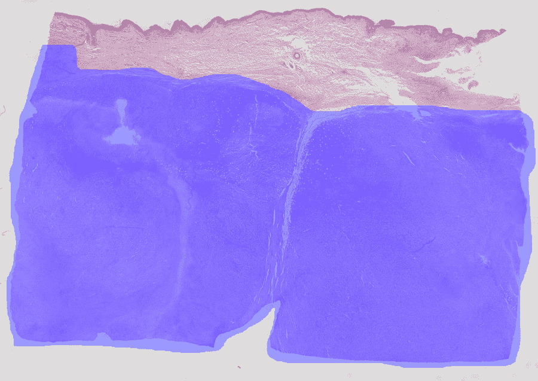
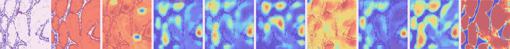

<!--yml

category: 未分类

date: 2024-09-06 20:05:08

-->

# [1909.03354] 深度弱监督学习方法在组织学图像分类与定位中的应用：综述

> 来源：[`ar5iv.labs.arxiv.org/html/1909.03354`](https://ar5iv.labs.arxiv.org/html/1909.03354)

# 深度弱监督学习方法在组织学图像分类与定位中的应用：综述

\name 热罗姆·罗尼 \emailjerome.rony.1@etsmtl.net

\addrLIVIA, 系统工程系，蒙特利尔高等技术学院，加拿大 \AND\name 苏菲安·贝尔哈比 \emailsoufiane.belharbi.1@ens.etsmtl.ca

\addrLIVIA, 系统工程系，蒙特利尔高等技术学院，加拿大 \AND\name 何塞·多尔兹 \emailjose.dolz@etsmtl.ca

\addrLIVIA, 软件与信息技术工程系，蒙特利尔高等技术学院，加拿大 \AND\name 伊斯梅尔·本·阿耶德 \emailismail.benayed@etsmtl.ca

\addrLIVIA, 系统工程系，蒙特利尔高等技术学院，加拿大 \AND\name 卢克·麦卡弗雷 \emailluke.mccaffrey@mcgill.ca

\addr 古德曼癌症研究中心，肿瘤学系，麦吉尔大学，蒙特利尔，加拿大 \AND\name 埃里克·格兰杰 \emaileric.granger@etsmtl.ca

\addrLIVIA, 系统工程系，蒙特利尔高等技术学院，加拿大

###### 摘要

使用最先进的深度学习（DL）模型从组织学数据中诊断癌症面临诸多挑战，这些挑战与标记组织学图像的性质和可用性有关，包括图像大小、染色差异和标签模糊性。此外，癌症分级和在这些图像中感兴趣区域（ROIs）的定位通常依赖于图像级和像素级标签，后者需要昂贵的标注过程。深度弱监督对象定位（WSOL）方法提供了低成本训练 DL 模型的不同策略。仅根据图像分类注释，这些方法可以同时进行图像分类，并生成用于 ROI 定位的类别激活图（CAMs）。本文回顾了深度 WSOL 方法，以识别和定位组织学图像中的疾病，而无需像素级注释。我们提出了一个分类法，其中这些方法根据模型中的信息流分为自下而上的方法和自上而下的方法。尽管后者仅取得了有限的进展，但最近的自下而上的方法正在推动深度 WSOL 方法的许多进展。早期的工作集中在设计不同的空间池化函数。然而，这些方法在定位准确度上很快达到了顶峰，并揭示了一个主要的限制，即– CAMs 的激活不足，这导致了高假阴性定位。随后的工作旨在缓解这一不足，并使用不同的技术如扰动、自注意力、浅层特征、伪注释和任务解耦，从背景中恢复完整的对象。本文还评估和比较了我们分类法中的代表性深度 WSOL 方法，在分类和定位准确度方面使用了两个具有挑战性的公共组织学数据集–一个用于结肠癌（GlaS），另一个用于乳腺癌（CAMELYON16）。总体而言，结果表明定位性能较差，特别是对于最初设计用于处理自然图像的通用方法。旨在解决组织学数据挑战的方法通常使用先验信息，如 ROI 大小，或从预训练分类器估计的附加像素级监督，从而取得更好的结果。然而，所有方法都存在高假阳性/假阴性定位的问题。分类性能主要受到模型选择过程的影响，该过程使用分类或定位度量。最后，识别了应用深度 WSOL 方法于组织学中的四个关键挑战，即– CAMs 的激活不足/过度激活、对阈值的敏感性和模型选择，并提供了缓解这些挑战的研究方向。我们的代码公开可用，[`github.com/jeromerony/survey_wsl_histology`](https://github.com/jeromerony/survey_wsl_histology)。

关键词：医学/组织学图像分析，计算机辅助诊断，深度学习，弱监督物体定位，弱监督学习，图像分类。

## 1 引言

整张幻灯片成像（WSI）扫描仪的出现为病理图像分析开辟了新的可能性（He 等，2012；Madabhushi，2009）。组织学切片提供了对疾病及其对组织影响的更全面视角（Hipp 等，2011），因为其制备过程保持了底层组织结构（He 等，2012）。例如，一些疾病特征（例如癌症的淋巴浸润）可能仅通过组织学图像进行预测（Gurcan 等，2009）。组织学图像分析仍然是诊断多种疾病的黄金标准，包括大多数类型的癌症（Gurcan 等，2009；He 等，2012；Veta 等，2014）。乳腺癌是全球女性中最常见的癌症，它依赖医学成像系统作为早期检测的主要诊断工具（Daisuke 和 Shumpei，2018；Veta 等，2014；Xie 等，2019）。

癌症主要由病理学家诊断，他们分析 WSI 以识别和评估组织中的上皮细胞，这些细胞被组织在管腔、小叶或恶性簇中，并嵌入在异质基质中。组织学切片的人工分析高度依赖于组织病理学家的专业知识和经验。这样的人工解释既费时又难以以可重复的方式进行评分。分析来自数字化组织学切片的 WSI 使得在病理学中实现便捷且可能自动化的计算机辅助诊断成为可能，其主要目标是确认疾病的存在或缺失，并对疾病进展进行分级或测量。

鉴于大量数字化考试的使用，自动化系统已成为乳腺癌检测的临床常规的一部分（Tang et al., 2009）。对组织学图像空间结构的自动分析可以追溯到早期的研究（Bartels et al., 1992; Hamilton et al., 1994; Weind et al., 1998）。各种图像处理和机器学习（ML）技术已被研究以识别区分性结构并对组织学图像进行分类（He et al., 2012）；这些技术包括阈值处理（Gurcan et al., 2006; Petushi et al., 2006）、主动轮廓（Bamford and Lovell, 2001）、贝叶斯分类器（Naik et al., 2007）、用于建模空间结构的图（Bilgin et al., 2007; Tabesh et al., 2007）以及基于支持向量机和 Adaboost 的集成方法（Doyle et al., 2006; Qureshi et al., 2008）。这些技术及其应用的概述可以在（Gurcan et al., 2009; He et al., 2012; Veta et al., 2014）中找到。最近，深度学习（DL）模型在组织学图像分析中引起了广泛关注（Belharbi et al., 2021, 2022a, 2019, 2022b; Courtiol et al., 2018; Dimitriou et al., 2019; Iizuka et al., 2020; Janowczyk and Madabhushi, 2016; Li and Ping, 2018; Srinidhi et al., 2019）。在本文中，我们继续这一方向，重点讨论 DL 模型在组织学图像分析中的应用。

深度学习模型（Goodfellow 等，2016），特别是卷积神经网络（CNNs），在许多视觉识别应用中提供了最先进的性能，例如图像分类（Krizhevsky 等，2012），目标检测（Redmon 等，2016）和分割（Dolz 等，2018）。这些监督学习架构通过大量标注数据进行端到端的训练。最近，深度学习模型在辅助病理诊断中的潜力开始得到探索（Daisuke 和 Shumpei，2018；Janowczyk 和 Madabhushi，2016；Li 和 Ping，2018）。鉴于组织学切片的日益普及，深度学习模型不仅被提议用于疾病预测（Hou 等，2016；Li 和 Ping，2018；Sheikhzadeh 等，2016；Spanhol 等，2016a；Xu 等，2016），还用于相关任务，如 WSIs 中肿瘤区域的检测和分割（Kieffer 等，2017；Mungle 等，2017），免疫染色评分（Sheikhzadeh 等，2016；Wang 等，2015），癌症分期（Shah 等，2017；Spanhol 等，2016a），有丝分裂检测（Chen 等，2016；Cireşan 等，2013；Roux 等，2013），腺体分割（Caie 等，2014；Gertych 等，2015；Sirinukunwattana 等，2017），以及血管侵袭的检测和量化（Caicedo 等，2011）。

（a）

（b）

图 1：ICIAR 2018 BACH 挑战中的两个 WSIs 的分割。颜色代表不同类型的癌变区域：红色表示良性，绿色表示原位癌，蓝色表示浸润癌。这些示例突出了大小和区域的多样性（Aresta 等，2018）。

图 2：从不同的 WSIs 中提取的两个标记为*原位癌*的图像在染色上的差异（Aresta 等，2018）。

组织学图像给 ML/DL 模型带来了额外的挑战，因为它们的（1）高分辨率，例如，一个前列腺活检组织的单个核心在 ${40\times}$ 放大倍数下大约包含 $(15000\times 15000)$ 个元素（约 2.25 亿像素）；（2）异质性主要源于 WSI 生产过程的变化；以及（3）由注释过程造成的噪声/模糊标签（Daisuke 和 Shumpei，2018），注释过程中通常会将图像标记为癌症的最严重阶段。因此，被标注为特定等级的 WSI 也更可能包含较低等级的区域。这导致了图像等级较高的图像较少的不平衡数据集。噪声/模糊标签对通过多实例学习训练的模型是个问题（Carbonneau 等，2018；Cheplygina 等，2019；Wang 等，2018；Zhou，2004），在这种情况下，WSI 标签被转移到采样的图像补丁中，可能会引入注释错误。这种标签不一致性可能会降低模型性能，并阻碍学习（Frenay 和 Verleysen，2014；Sukhbaatar 等，2014；Zhang 等，2017）（参见图 1 和 2）。

训练准确的 DL 模型以分析组织学图像通常需要全监督，以解决分类、定位和分割等关键任务（Daisuke 和 Shumpei，2018；Janowczyk 和 Madabhushi，2016）。准确学习定位癌变区域通常需要大量带有像素级注释的图像。考虑到这些图像的大小和复杂性，密集注释的成本相当高，并且需要高度培训的专家。将这一任务外包给标准工人，如 Mechanical Turk Workers，是不现实的。因此，组织学数据集通常由根据诊断粗略注释的大图像组成。因此，显然，训练强大的 DL 模型以在没有密集注释的情况下，同时预测图像类别和定位与预测相关的重要图像区域，对于组织学图像分析是非常理想的。

尽管面临固有的挑战（Choe 等，2020），弱监督学习（WSL）（Zhou，2017）技术最近出现，以减轻对密集注释的需求，特别是在计算机视觉应用中。这些技术适应了不同形式的弱监督，包括图像标签（图像级别标签）（Kim 等，2017；Pathak 等，2015；Teh 等，2016；Wei 等，2017）、涂鸦（Lin 等，2016；Tang 等，2018）、点（Bearman 等，2016）、边界框（Dai 等，2015；Khoreva 等，2017）、全局图像统计，例如目标大小（Bateson 等，2019；Jia 等，2017；Kervadec 等，2019a，b）。减少的弱监督需求提供了一个有吸引力的学习框架。本文重点关注允许使用仅图像级别注释进行 DL 模型训练的 WSL 方法，用于组织学图像分类和与类预测相关的图像 ROI 定位。这些方法执行弱监督对象定位（WSOL）任务，可以生成激活图和边界框（Choe 等，2020）。

解释性框架（Samek 等，2019；Zhang 等，2021）在计算机视觉（Alber 等，2019；Bau 等，2017；Belharbi 等，2021；Dabkowski 和 Gal，2017；Fong 等，2019；Fong 和 Vedaldi，2017；Goh 等，2020；Murdoch 等，2019；Petsiuk 等，2018，2020；Ribeiro 等，2016；Samek 等，2020；Zhang 等，2020b）以及医学图像分析（Cruz-Roa 等，2013；De La Torre 等，2020；Fan 等，2020；Ghosal 和 Shah，2020；Hägele 等，2020；Hao 等，2019；Korbar 等，2017；Saleem 等，2021；Tavolara 等，2020）中受到了广泛关注。它们与 WSOL 有关，因为它也允许提供与类预测决策相关的空间图。然而，解释性方法通常有不同的评估方式，例如使用指向游戏（Zhang 等，2018b），该方法通过一个点来定位一个对象。因此，我们将本文的重点限制在文献中主要用于定位任务的深度学习模型上。

目前，类别激活映射（CAM）方法几乎是 WSOL 的唯一技术（Belharbi et al., 2022c）。CAM 建立在图像的卷积响应之上，自然形成了感兴趣区域（ROIs）。CAM 中的强空间激活对应于具有区分性的 ROIs（Zhou et al., 2016），这允许对象定位。请注意，CAM 方法中的定位图是模型本身的一部分。这些方法在文献中被广泛研究，用于弱监督对象定位任务。与此同时，其他方法也出现了，用于机器学习模型的可解释性、可解释性和可视化（Samek et al., 2019）。这些方法通常提供可视化工具，如显著性图，以描述预训练网络对输入图像的响应。这些方法包括诸如归因方法（Dabkowski and Gal, 2017; Fong and Vedaldi, 2017; Fong et al., 2019; Petsiuk et al., 2018; Zeiler and Fergus, 2014）等方法。与 CAM 不同，它们生成的是网络结构之外的显著性图，并且通常通过解决优化问题来估计。除了不常用于对象定位外，这些方法还有自己的评估指标，如指向游戏（Zhang et al., 2018b）。除了 CAM 方法，（Meethal et al., 2020）提出了唯一旨在直接生成边界框的方法，而不使用任何 CAMs，以实现对象定位。在（Zhang et al., 2020a）中，作者旨在训练一个回归器生成边界框，其中目标框是从 CAMs 估计的。我们的综述表明，几乎没有研究在不使用 CAM 的情况下进行弱定位，因为仅使用全局标签生成边界框是困难的。CAMs 作为对可见像素进行卷积的自然响应出现。然而，边界框是一种抽象且不可见的形状，没有明确的监督，即边界框目标，很难生成。这两种方法之间的差异解释了目前在 WSOL 文献中的状态。一般而言，CAM 方法的目标是构建一个能够正确分类图像的模型，只需要图像类别标签。这些方法还产生每类激活图，即 CAM，形式为软分割图，允许对象的像素级定位。该图还可以进行后处理以估计边界框。因此，本文的范围限于 CAM 方法。

在这项工作中，我们提供了对 2013 年到 2022 年初提出的最先进的深度 WSOL 方法的综述。大多数这些被综述的方法是在自然图像数据集上提出和评估的，仅有少数是针对组织学图像开发和评估的。我们使用两个公共组织学数据集（乳腺癌和结肠癌）对代表性方法的性能进行比较，从而评估它们的分类和定位性能。尽管已经有关于医疗图像分析的 ML/DL 模型的不同综述，特别是针对组织学 WSI 的分析（Daisuke 和 Shumpei, 2018; Janowczyk 和 Madabhushi, 2016; Kandemir 和 Hamprecht, 2015; Litjens et al., 2017; Sudharshan et al., 2019）以及医疗视频分析（Quellec et al., 2017），这些综述都集中于完全监督的任务、半监督的任务，或者分类和分割任务的不同学习设置的混合（Litjens et al., 2017; Srinidhi et al., 2019）。据我们所知，本文是首个集中于深度 WSOL 模型的综述，专注于在图像类别标签数据上训练，用于组织学图像的分类和 ROI 的定位。

文献中的深度 WSOL 方法主要分为两类，基于模型中的信息流，即自下而上和自上而下的方法。我们的综述显示，自下而上的方法的研究比自上而下的方法更为活跃且占据主导地位，使得前者成为了最先进的技术。为了应对 CAM 的不足，自下而上的方法从设计简单的空间池化技术发展到执行扰动和自注意力，再到使用浅层特征，最近则利用伪标注和将分类训练与定位任务分开。近期成功的 WSOL 技术结合了浅层特征和伪标注，同时解耦了分类和定位任务。自上而下的方法进展较少。这些方法通常依赖于生物启发的过程、梯度或置信度分数来构建 CAM。我们的比较结果研究揭示，尽管针对组织学数据提出的深度 WSOL 方法能够产生良好结果，但最初为自然图像提出的通用方法结果却不佳。前者的方法通常依赖于旨在减少与 ROI 大小相关的假阳性/假阴性的先验，或使用从预训练分类器收集的显式像素级指导。总体而言，所有 WSOL 方法都存在较高的假阳性/假阴性定位问题。我们讨论了这些方法在组织学数据应用中的几个问题，包括 CAM 的欠激活/过激活、对阈值的敏感性以及模型选择。CAM 过激活是一种新的行为，可能是由前景和背景之间的视觉相似性引起的。

在第二部分中，提供了一个分类和对最先进的深度 WSOL 方法的回顾，接着是我们的实验方法论（第三部分）和结果（第四部分）。我们在这项工作中总结了主要发现和在组织学中应用这些 WSOL 方法所面临的关键挑战，并提供了未来的方向，以缓解这些挑战，并可能缩小 WSOL 与完全监督方法之间的性能差距。更多实验细节见第 A 节和第 B 节。此外，第 C 节展示了更多的定位视觉结果。我们的代码是公开的。

## 2 弱监督目标定位方法的分类

图 3：深度 WSOL 方法的总体分类，用于训练具有全局图像类别注释的数据，以及分类和 ROI 定位。每个类别的方法按时间顺序排列：1\. 底向上：依赖于前向传递信息。2\. 顶向下：利用前向和后向传递信息。

图 4：展示了底向上（*上*）和顶向下（*下*）方法在深度 WSOL 中的主要区别。两种方法都提供 CAMs。然而，底向上技术在前向传递过程中生成它们，而顶向下技术则需要前向和后向传递才能获得它们。圆圈中的数字 1、2 和 3 表示操作的顺序。顶向下方法可以在类池化之前或网络的输入处生成 CAMs。

在我们的分类法中，我们关注于深度 WSL 方法，这些方法允许通过热图（软分割图，CAM）对图像进行分类并*逐像素*定位其 ROI¹¹1 在实际应用中，这些方法在对 CAM 进行图像处理程序后也可以生成边界框（Choe 等， 2020）。在训练过程中，只需要全局图像类别标签进行监督。这些方法被称为弱监督目标定位方法（WSOL）（Choe 等， 2020）。

图 3 展示了整体分类。在深度 WSOL 方法中，我们根据网络中的信息流识别出两大类，用于区域定位（见图 4）：（a）自下而上的方法，基于网络中的前向传递信息；（b）自上而下的方法，利用了除了前向传递外的反向信息。每种 WSOL 方法旨在通过不同机制刺激 ROI 的定位。这两类方法都依赖于构建一个空间注意力图，该图在 ROI 上具有高幅度响应，而在背景上激活度低。本节其余部分提供了本文使用的符号、主要类别和子类别的详细信息，以及对 WSOL 任务进展贡献的主要新兴趋势的重点介绍。

符号。为了描述不同方法背后的机制，我们引入以下符号。考虑一组训练样本${\mathbb{D}=\{(\bm{x}^{(t)},y^{(t)})\}}$，其中图像${\bm{x}^{(t)}\in\R^{D\times H^{\text{in}}\times W^{\text{in}}}}$的高度为$H^{\text{in}}$，宽度为$W^{\text{in}}$，深度为$D$；其图像级标签（即类别）为$y^{(t)}\in\Y$，共有$C$个可能的类别。为了简化，我们将训练样本（输入及其标签）称为${(\bm{x},y)}$。

设${f_{\bm{\theta}}:\R^{D\times H^{\text{in}}\times W^{\text{in}}}\to\Y}$为一个建模神经网络的函数，其中输入${\bm{x}}$具有任意高度和宽度，${\bm{\theta}}$是模型参数的集合。训练过程旨在优化参数${\bm{\theta}}$以实现特定任务。在多类别场景中，网络通常输出一个分数向量${\bm{s}\in\R^{C}}$，作为对输入图像的响应。然后使用$\mathrm{softmax}$函数将该向量归一化以获得后验概率，

|  | $\Prob(y=i&#124;\bm{x})=\softmax(\bm{s})_{i}=\frac{\exp(\bm{s}_{i})}{\sum_{j=1}^{C}\exp(\bm{s}_{j})}\;.$ |  | (1) |
| --- | --- | --- | --- |

该模型预测与最大概率对应的类别标签：$\argmax\{\Prob(y=i|\bm{x}):i=1,2,...,C\}=\argmax\{\bm{s}_{i}:i=1,2,...,C\}$。

除了对输入图像进行分类外，我们还关注图像中感兴趣区域（ROIs）的逐像素定位。通常，WSOL 方法可以预测一组 $C$ 个高度为 $H$、宽度为 $W$ 的激活图，以指示每个类别区域的位置。我们将这一组记为形状为 $\bm{M}\in\R^{C\times H\times W}$ 的张量，其中 ${\bm{M}_{c}}$ 表示第 $c^{\text{th}}$ 个图。${\bm{M}}$ 通常被称为 *类别激活图*（CAMs）。由于卷积和下采样操作，典型的 CAMs 相较于输入图像具有较低的分辨率。我们将下采样因子记为 $S$，使得 $H=H^{\text{in}}/S$ 和 $W=W^{\text{in}}/S$。通常需要插值来生成与图像相同大小的 CAM。

### 2.1 自下而上的 WSOL 技术

在自下而上的方法中，逐像素定位是基于特征图的激活，这些特征图源自网络中从输入层到输出层的标准信息流（前向传播，图 4 (*top*)）。在这一类别中，我们识别出两种不同的技术子类别来处理弱监督定位。第一类包含主要依赖空间池化的技术。提出了不同的方法来池化类别得分，同时在 CAM 中刺激空间响应以定位 ROIs。这些方法的成功有限。因此，出现了另一种类型的方法，旨在直接精炼 CAMs，同时使用简单的空间池化技术。在接下来的小节中，我们将介绍这些方法及其变体。

### 2.2 空间池化方法

这类技术旨在设计不同的空间池化方法来计算每类的分数，这些分数随后用于训练整个网络以进行分类，使用标准的交叉熵。在某些情况下，池化被执行以构建图像表示，即，袋特征。这种空间池化允许构建映射（CAMs）以定位 ROIs。每种方法以不同的方式促进 ROIs 定位的出现。这一策略支撑了 WSOL，并被认为是引入深度模型中的弱监督定位的开创性机制（Lin 等，2013）。学习在 CAMs 中保持空间信息可以实现 ROIs 的*定位*，同时只需全局类别注释。已提出不同的方法来计算空间映射中的类别分数，每种池化策略对出现的定位有直接影响。挑战在于刺激 CAM 中仅出现 ROI。所有技术通常以相同的方式开始：CNN 提取$K$个特征图$\bm{F}\in\R^{K\times H\times W}$，其中$K$是特征图的数量，取决于架构。特征图$\bm{F}$随后用于使用空间池化技术计算每类分数。

第一种方法是全局平均池化（GAP）（Lin 等，2013）。它简单地对每个特征图在${\bm{F}\in\R^{K\times H\times W}}$中取平均，以产生每图的分数，从而构建输入图像的全局表示${\bm{f}\in\R^{K}}$。

|  | $\bm{f}_{k}=\frac{1}{H\,W}\sum\limits_{i=1,j=1}^{H,W}\bm{F}_{k,i,j}\;,$ |  | (2) |
| --- | --- | --- | --- |

其中$\bm{f}_{k}$是输出的$k^{\text{th}}$特征。然后通过使用分类层的权重对特征进行线性组合来获得类别特定的激活。请注意，在实践中，当 CAMs 可用时，可以直接平均 CAMs，以产生每类分数，而不是使用中间密集层。在这两种情况下，这种池化策略将每类分数与映射上的*所有*空间位置联系起来。这意味着 ROIs 和背景都参与了每类分数的计算。CAM 文献表明，这种池化策略可以使 CNN 仅使用全局标签进行定位（Zhou 等，2016）。通常，在 CNN 中，对表示$\bm{f}$进行分类的最后一层是由$\bm{W}\in\R^{C\times K}$参数化的全连接层，使得$\bm{s}=\bm{W}\bm{f}$（为简便起见省略了偏差）。CAMs，记作${\bm{M}\in\mathbb{R}^{C\times H\times W}}$，然后通过空间特征${\bm{F}}$的加权和获得。

|  | $\bm{M}_{c}=\sum\limits_{k=1}^{K}\bm{W}_{c,k}\,\bm{F}_{k}\;.$ |  | (3) |
| --- | --- | --- | --- |

这一策略已广泛用于自然场景图像以及医学图像（Feng 等，2017；Gondal 等，2017；Izadyyazdanabadi 等，2018；Sedai 等，2018）。

对于 CAM 方法的早期研究（Zhou 等，2016）揭示了一个基本问题，即欠激活。CAM 倾向于仅在小的区分区域激活，因此只能局部化物体的一小部分，而忽略了大部分。这导致了较高的假阴性。随后的 WSOL 工作主要旨在通过推动 CAM 中的激活以覆盖整个物体来解决此问题。这可以通过不同的池化策略或通过显式设计旨在恢复整个物体的方法来实现（subsubsection 2.2.1）。

作为空间响应平均的替代方法，作者在（Oquab 等，2015）中考虑了使用 CAM 上的*最大*响应值作为每类得分（MAX-Pool）。该方法因此避免了将潜在的背景区域纳入类别得分，从而减少了假阳性。然而，这种池化技术也倾向于关注物体的较小区分部分，因为每类得分仅与响应图的一个像素相关²²2 注意，CAM 中的一个像素对应于输入图像中的大表面，这取决于 CAM 层网络的感受野大小。为缓解这一问题，（Pinheiro 和 Collobert，2015；Sun 等，2016）考虑使用*对数和指数*函数（LSE）来平滑近似最大函数，以发现更大部分的目标物体。

|  | $\bm{s}_{c}=\frac{1}{q}\log\big{[}\frac{1}{H\,W}\sum_{i=1,j=1}^{H,W}\exp(q\,\bm{M}_{c,i,j})\big{]}\;,$ |  | (4) |
| --- | --- | --- | --- |

其中 $q\in\R_{+}^{*}$ 控制近似的平滑度。小的 $q$ 值使近似更接近平均函数，而大的 $q$ 值使其接近最大函数。因此，使用小的 $q$ 值可以让网络考虑大区域，而大的 $q$ 值仅考虑小区域。

与考虑地图的最大值（Oquab 等，2015），即单个高响应点不同，作者在（Zhou 等，2018）（PRM）中提出使用*局部极大值*。这意味着使用局部峰值响应，这些响应更有可能覆盖物体的更大部分，而不仅仅是单个最大响应。

|  | $\bm{s}_{c}=\bm{M}^{c}*G^{c}=\frac{1}{N^{c}}\sum^{N^{c}}_{k=1}\bm{M}^{c}_{i_{k},j_{k}}\;,$ |  | (5) |
| --- | --- | --- | --- |

其中 $G^{c}\in\mathbb{R}^{H\times W}$ 是一个采样核，$*$ 是卷积操作，$N^{c}$ 是局部极大值的数量。根据核的大小，这种池化允许激发不同的远处位置，这有助于恢复具有物体的邻近区域。类似地，背景区域也可能被激发。这突出了将全局标签转移到局部像素的挑战。请注意，这种监督转移在弱监督学习（WSOL）领域被认为是一个不适定问题（Wan et al., 2018）。

迄今为止讨论的所有池化方法都依赖于强响应以产生每类评分。CAMs 的假设是，强响应表示潜在的 ROI，而低响应更可能代表背景。这一假设被纳入每类评分的计算中，因此对 CAMs 的定位有直接影响。Durand et al.（2017, 2016）的作者（WILDCAT）采用了一种不同的策略，通过将低激活，即负证据，纳入每类评分的计算中。他们认为这种池化起到正则化作用，防止过拟合，从而提高分类性能。然而，目前尚不清楚将负区域与类别评分绑定如何改善定位，因为目标是最大化真实标签的每类评分。尽管如此，作者提供了一种池化层的架构变更，其中每个类别考虑了几个*模态图*。因此，这些模态能够捕捉物体的多个部分，从而实现更好的定位。形式上，池化可以写作，

|  | $\bm{s}_{c}=\frac{Z_{c}^{+}}{n^{+}}+\alpha\frac{Z_{c}^{-}}{n^{-}}\;,$ |  | (6) |
| --- | --- | --- | --- |

其中 $Z_{c}^{+}$ 和 $Z_{c}^{-}$ 分别对应于 $\bm{M}_{c}$ 中 $n^{+}$ 个最高激活值和 $n^{-}$ 个最低激活值的总和，$\alpha$ 是一个超参数，用于控制最低评分区域的重要性。这种操作包括为每个类别选择对应图中的 ${n^{+}}$ 个最高激活值和 ${n^{-}}$ 个最低激活值。这种方法也已在医学领域用于弱监督区域定位和组织学图像分类（Belharbi et al., 2019, 2022b）。在 (Courtiol et al., 2018) 中，作者考虑将 (Durand et al., 2017, 2016) 方法适配到 WSIs 上，以对实例（tiles）进行操作，而不是对像素进行操作。

上述方法构建了一个包（图像）表示，然后计算包含局部定位响应的 CAMs，最后提取每类的分数。作者在 (Ilse et al., 2018)（深度 MIL）显式依赖于多实例学习（MIL）框架 (Carbonneau et al., 2018; Cheplygina et al., 2019; Wang et al., 2018; Zhou, 2004)。首先建立实例表示。然后，使用注意力机制 (Bahdanau et al., 2015)，通过加权平均实例表示计算包表示。在这种情况下，注意力权重代表 CAM。强权重表示具有 ROI 的实例，而小权重表示背景实例。这种方法需要对标准 CNN 模型进行更改。此外，它仅限于二分类。调整为多类上下文需要对架构进行进一步更改。形式上，给定一个从图像中提取的特征集 $\bm{F}\in\R^{K\times H\times W}$，图像的表示 $\bm{f}$ 计算为，

|  |  | $\displaystyle\bm{f}=\sum\limits_{i=1,j=1}^{H,W}\bm{A}_{i,j}\bm{F}_{i,j}\;,$ |  | (7) |
| --- | --- | --- | --- | --- |
|  | 和 | $\displaystyle\bm{A}_{i,j}=\frac{\exp(\psi(\bm{F}_{i,j}))}{\sum_{i=1,j=1}^{H,W}\exp(\psi(\bm{F}_{i,j}))}\;,$ |  |

其中，$\bm{F}_{i,j}$ 是由 $i$ 和 $j$ 索引的位点（即实例）的特征向量。${\psi:\R^{K}\to\R}$ 是一个评分函数。结果表示 $\bm{f}$ 然后通过一个全连接层进行分类。考虑了两个评分函数 (Ilse et al., 2018)，

|  | $\displaystyle\psi_{1}(\bm{f})$ | $\displaystyle=\bm{w}\tanh(\bm{V}\bm{f})\;,$ |  | (8) |
| --- | --- | --- | --- | --- |
|  | $\displaystyle\psi_{2}(\bm{f})$ | $\displaystyle=\bm{w}\big{[}\tanh(\bm{V}\bm{f})\odot\sigma(\bm{U}\bm{f})\big{]}\;,$ |  | (9) |

其中 $\bm{w}\in\R^{L}$，$(\bm{V},\bm{U})\in\R^{L\times K}$ 是可学习的权重，${\odot}$ 是逐元素乘法。这种方法专门为二分类设计，并生成一个注意力权重矩阵 ${\bm{A}\in[0,1]^{H\times W}}$，其中 ${\sum\bm{A}=1}$。在下一节中，我们介绍了第二种自下而上的类别，旨在直接精细化 CAMs。

#### 2.2.1 CAM 精细化方法

虽然空间池化方法在 CAMs 中帮助出现了一些具有辨别性的区域，但在覆盖整个前景物体方面效果有限。CAMs 的不足激活仍然是 WSOL 领域中的一个主要问题，反映了将全局标签转移到像素级别的困难。自从这一点变得清晰后，研究已经从改进池化函数转向明确克服不足激活问题并恢复整个物体。通常，这是在使用简单的池化函数如 GAP 方法（Lin 等人，2013）时实现的，为此提出了不同的策略。我们将这些策略分为两个主要类别：使用数据增强来*挖掘*更多具有辨别性的区域的方法，以及旨在增强和学习 CNN 更好内部特征的方法。

数据增强方法。数据增强是一种在机器学习中常用的策略，旨在防止过拟合并提高性能（Goodfellow 等人，2016）。在 WSOL 领域中，它也被用来防止模型过度拟合单一的辨别性区域，即，防止不足激活。这通常是通过推动模型去寻找，即*挖掘*其他辨别性区域，从而促进 CAM 中的物体大范围覆盖来实现的。数据增强最常见的形式是信息抑制，即*擦除*，其中输入信号的一部分被删除。这可以在输入图像或中间特征上进行。从概念上讲，这可以视为一种*扰动*过程，以刺激更多 ROI 的出现。例如，Singh 和 Lee（2017）提出了一种‘隐藏与寻找’（HaS）训练策略，其中输入图像被分割成多个补丁。在训练阶段，这些补丁中只有一部分是随机可见的，而其余部分则被隐藏。这种数据增强已经被证明可以正则化 CNN 模型并提高其分类性能（Devries 和 Taylor，2017）（cutout）。这类似于在输入图像上应用 dropout（Srivastava 等人，2014），其中目标区域是整个补丁而不是单个像素。结果是，网络不会过度依赖最具辨别性的补丁，而是会寻找其他辨别性区域。虽然这是一种优势，但也可能适得其反，因为网络可能会无意中被推向将背景视为辨别性的区域，尤其是对于那些容易被删除的小物体。

其他数据增强方法已被用于提高定位精度。例如，MixUp 方法（Zhang 等，2018a）旨在通过减少神经网络对对抗样本的敏感性和降低其记忆能力来正则化神经网络。这是通过将两张训练图像混合到一定程度来完成的，在这种情况下，增强图像的标签由两张图像的标签的线性组合来分配。尽管增强图像看起来不自然且局部模糊，但该方法提高了分类准确性。 (Yun 等，2019) 的作者（CutMix）将此方法调整以改善定位。他们提出了随机剪切图像的一部分并与第二张图像混合的方法，而不是完全混合图像。标签按补丁大小的比例混合。实质上，这类似于 cutout（Devries 和 Taylor，2017）和 HaS（Singh 和 Lee，2017），但与填充黑色或随机噪声的补丁不同，这里补丁被填充为来自另一张图像的像素。实际上，这已被证明可以提高定位性能。然而，由于源补丁选择过程中的随机性，这种方法可能选择背景区域，导致错误的混合标签，从而使分类器学习到意外的特征表示。类似地，(Kim 等，2020) 提出了 PuzzleMix，联合优化两个目标：选择最佳掩膜和选择最佳混合方案。在这里，输入图像的混合不再是随机的，而是利用从图像统计中出现的图像显著性。掩膜尝试揭示两张图像的最显著数据。同时，最佳传输方案旨在最大化揭示数据部分的显著性。同样，SaliencyMix（Uddin 等，2021）利用图像显著性，但使用边界框捕捉区域混合而不是掩膜。请注意，依赖图像显著性是针对像组织数据这样的显著性较低的图像的主要缺陷，因为前景和背景看起来相似。 (Stegmüller 等，2022)（ScoreMix）通过使用注意力提出的区域将这种方法应用于组织数据。混合区域方法基于分类器注意力而不是图像统计。从源图像中裁剪的判别区域在目标图像的非判别区域上混合。从概念上讲，这提供了更好的区域混合。然而，由于学习的注意力容易包含假阳性/假阴性，因此混合仍然可能脆弱。此外，获得的结果似乎与 CutMix 方法（Yun 等，2019）的结果相对接近。

在（Wei et al.，2017）（AE）中，作者提出了一种迭代策略，用于挖掘语义分割的有区分性区域。与 HaS 方法（Singh 和 Lee，2017）类似，他们通过学习分类器的学习时期擦除具有最高响应值的区域。这允许模型的大部分出现。新出现的分割提议被用于训练模型进行语义分割。顺序擦除会导致计算负担沉重，因为需要多轮。为了改进这一点，ACoL（Zhang 等，2018c）设计了两个分支分类器，同时预测有区分性的区域和相应的互补区域。MEIL 方法（Mai 等，2020）以类似的方式进行，通过添加利用学习中的擦除过程的多个输出分支。

引导注意力推理网络（GAIN）（Li et al.，2018）方法使用两个顺序网络和一个共享主干来挖掘感兴趣区域（ROIs）。第一个网络产生 ROIs 的注意力图，用于擦除图像中的有区分性的区域。然后将擦除后的图像输入到下一个网络中，该网络利用其对目标标签的类响应来确保擦除过程后图像中没有有区分性的区域。期望 ROI 抑制过程促使第一个模型寻找更多有区分性的区域，因此大的 ROIs 都被 CAM 覆盖。类似地，Kim 等人（2017）中考虑了两个网络的两阶段训练（Two-Phase）。第一个网络在收敛之前进行训练。然后，它与冻结的权重一起用于第二个网络的前面，以产生目标标签的 CAM。CAM 被阈值化以定位最有区分性的区域。作者不像 GAIN 方法（Li et al.，2018）中所做的那样遮盖输入图像，而是考虑遮盖中间特征图。结果再次显示，这种在特征级别的信息隐藏允许探索更多的 ROIs 以发现完整的对象。

GC-Net 方法（Lu 等，2020）考虑将几何约束（GC）纳入训练网络以定位目标。具体而言，作者使用 3 个模型：一个探测器，产生盒子或椭圆形的目标本地化；一个掩模生成器，基于生成的定位产生掩模；以及一个在掩模和其补充（即背景）上评估的分类器。探测器被训练以产生分类器具有高分数的小的 ROIs，而在背景上达到低分数。

在(Belharbi 等，2019) (RecMin)中，作者考虑了将递归挖掘算法直接集成到反向传播中的方法，从而允许即时挖掘感兴趣区域（ROIs）。所有这些方法在输入图像上执行信息的挖掘和擦除。ADL (Choe 和 Shim，2019) 方法在每一层构建自注意力图，以发现潜在的 ROIs。然后，它在前向传播过程中，通过简单的逐元素乘法随机擦除多个中间特征图上的位置。这种擦除通过在注意力掩码上进行简单的 dropout 实现。这种过程可以增强分类和定位的性能。值得注意的是，自注意力在 ADL 之前已在 (Zhu 等，2017) (SPN) 中用作层，以生成与特征图耦合的提议区域，允许只有潜在的 ROIs 通过到下一层，从而过滤掉背景/噪声。在 (Belharbi 等，2022b) (MAXMIN) 中，作者使用了两个模型：一个定位器，随后是一个分类器。定位器旨在构建 CAM 以在像素级别定位 ROIs。输入图像通过生成的 CAM 进行掩码处理，然后传递给分类器。作者明确在学习 CAM 之前包括背景，通过将其约束为同时包含前景和背景区域。这可以防止过度/不足激活，从而减少假阳性/假阴性。通过熵，目标分类器的分数被约束在背景上较低，在前景上较高，从而确保背景中没有遗漏的 ROI。这些擦除/挖掘方法的一个显著缺点是它们固有的过度挖掘风险，因为没有明确的标准来停止挖掘。虽然它们在扩展和收集目标区域方面非常有效，但很容易扩展到非区分性区域，这直接增加了假阳性。

特征增强方法。其他方法旨在通过学习更好的特征来改善定位。这通常通过对标准模型进行架构更改或利用不同层次的特征进行定位（例如浅层特征）来实现。此外，使用伪标签来显式指导学习已成为解决 WSOL 任务的一种替代方法。

(Wei et al., 2018) 的作者分析了对象尺度对预测的影响，并建议利用膨胀卷积 (Chen et al., 2018, 2015)。他们为分类器配备了一个可变膨胀率的多膨胀卷积 (MDC) 模块。这已被证明能够有效扩大卷积核的感受野，更重要的是，将周围的区分信息转移到非区分的对象区域，促进 ROI 的出现，同时抑制背景。与大多数将 CAM 从顶层（高层）提取的工作不同，(Yang et al., 2020) 的作者 (NL-CCAM) 通过结合低级和高级特征来考虑非本地特征，以促进更好的定位。此外，他们不是使用每个类别的图作为最终 CAM，而是通过使用后验类别概率对所有 CAM 进行加权求和。这允许在最终定位图中汇集对象的多个部分并抑制背景区域。FickleNet 方法 (Lee et al., 2019) 随机选择特征图上的隐藏位置。在训练过程中，对于每个随机选择，会生成一个新的 CAM。因此，对于每个输入图像，可以生成多个 CAM 以预测最具区分性的部分。这允许构建更好地覆盖对象的 CAM。这种方法与 ADL (Choe and Shim, 2019) 相关，后者使用注意力，然后通过 dropout 遮盖特征。FickleNet 不依赖于注意力，而是简单地丢弃随机位置。

DANet (Xue et al., 2019) 使用不同层次的多分支输出来生成具有不同分辨率的 CAM。这允许获得层次化的定位。为了在*不*影响分类性能的情况下使激活扩展到整个对象，作者考虑了两种不同项的联合优化。一个差异化的激活损失约束同类的 CAM 覆盖*不同*区域。作者指出，具有相似视觉特征的类别在标准 CNN 中通常会被抑制，因为后者不具备区分能力。为了恢复这些区域，他们提出了层次化的差异化激活损失。元类别是分层创建的，以汇集之前的元类别，其中层次的底部包含原始类别。在特定层次上，分类器被训练为将所有分配给它的样本分配到相同的元类别中。这推动了共享的相似特征在该元类别内激活，从而恢复原始类别中的相似特征。

在 I²C 方法（Zhang 等人，2020c）中，作者提出通过 Inter-Image Communication (I²C) 利用空间特征层面上的像素相似性来进行更好的定位。本文探索了局部和全局的差异判别特征。局部约束旨在学习来自批次内一对图像中随机采样的差异判别像素的随机特征一致性。全局约束使用了全局中心特征以保持并在每个小批量更新后更新类别的记忆中。平均局部随机特征被约束为接近于中心类别特征。ICL 方法（Ki 等人，2020）旨在通过防止 CAMs 在背景上激增来处理过度激活问题。本文提出了一种注意力对比损失。类似于 ADL（Choe 和 Shim，2019），注意力图是从特征图中估计出来的。非常高和非常低的激活值被用于估计潜在的前景和背景区域。中等的激活值可能是前景，也可能是背景。为了将激活从前景扩展到不确定区域，对比损失的目标是推动具有与前景特征相似的*空间特征*的激活成为前景，而将具有与背景特征相似的空间特征的激活推向背景。这允许谨慎地将前景激活扩展到背景区域。此外，本文利用了语义丰富的顶层注意力来对齐和引导通常嘈杂的底层注意力。

WSOL 任务也受益于深度学习领域在架构设计方面的最新进展。特别是**Transformers**（Dosovitskiy 等，2021）首次应用于 TS-CAM（Gao 等，2021）方法中。视觉 transformer（Dosovitskiy 等，2021）通过将输入图像拆分为带有位置嵌入的块并应用级联 transformer 块来构建一个 token 序列，从而提取视觉表示。视觉 transformers 可以通过自注意力机制和多层感知器自适应地学习复杂的空间变换并反映长距离语义关联。这对于定位完整对象至关重要。TS-CAM（Gao 等，2021）通过利用自注意力来改进 patch 嵌入。此外，在每一层构建了一个类无关的映射。作者为 transformers 的输出配备了一个 CAM 模块，允许获取语义图。最终的 CAM 是 CAM 模块产生的 CAM 和所有层的平均类无关映射之间的聚合。这有助于提高定位精度。在 CSTN 方法（Meethal 等，2020）中，作者用空间变换网络（STNs）（Jaderberg 等，2015）替代了标准卷积滤波器。除了使用多尺度定位外，这个 STN 模型还学习了仿射变换，可以涵盖不同的变化，包括平移、缩放和旋转，从而更好地关注不同的对象变异。

最近，WSOL 中出现了一种新趋势，即利用*伪标注*。首先，使用弱标注训练一个外部模型或 WSOL 分类器。然后，利用该模型收集伪标签，这些伪标签代表缺失的完整监督的替代品。接下来，这些伪标签被用来微调最终模型。这为训练提供了明确的定位指导。然而，这种方法继承了一个主要缺点，即使用不准确/嘈杂的标签进行学习，这必须加以处理。例如，在 (Rahimi et al., 2020) (Pair-Sim) 中，作者使用完全监督的源数据集来训练一个提案生成器 (Faster-RCNN (Ren et al., 2015))。然后，他们将生成器应用于目标弱监督数据集，以执行 WSOL 任务，为每个样本，即包，生成提案。经典的 MIL 框架 (Carbonneau et al., 2018; Cheplygina et al., 2019; Wang et al., 2018; Zhou, 2004) 通过将目标数据集分成 2 个子集来应用，这些子集根据类别进行条件分割；一个子集包含具有该类别标签的正样本，另一个子集包含负样本。MIL 框架的解决方案是每个正样本生成一个准确的提案。除了从源数据中学习到的关于提案物体性的单一分数外，还使用一个配对分数来测量两个提案在包类别条件下的兼容性。

作者在(Zhang et al., 2020a)中指出，在 WSOL 中，定位和分类彼此干扰，因此应将这两个任务分开。首先，他们训练一个分类器，用于生成伪监督对象定位（PSOL）。然后，利用这些伪监督训练一个独立的无类别定位器。类似地，Wei et al. (2021)的研究展示了浅层特征在定位中的好处。作者利用低层（浅层）特征生成伪监督对象定位（SPOL），用于指导另一个网络的训练。F-CAM 方法（Belharbi et al., 2022c）也利用浅层特征，通过为标准分类器配备分割解码器来形成 U-Net 架构（Ronneberger et al., 2015）。这样的模型通过跳跃连接利用顶部和底层特征构建最终的 CAM。作者展示了 CAM 大小对定位性能的影响，较小的 CAM 大小会导致较低的定位性能。CAM 通常会被插值到与输入图像相同的大小。由于插值算法没有考虑图像统计数据，作者提出通过参数解码器逐步提高 CAM 的分辨率。使用低分辨率 CAM、图像统计数据和通用大小先验来训练解码器。作者提出了一种*随机*采样本地证据的方法，这与文献中常见的在训练前选择和固定伪标签的做法不同。F-CAM 方法进一步被调整用于基于变换器的方法（Murtaza et al., 2023, 2022）在无人机监控中的 WASOL，随后在视频中的 WSOL（Belharbi et al., 2023）。继 F-CAM 架构之后，NEGEV（Belharbi et al., 2022a）被提出用于组织学数据，以改善定位和分类器的可解释性。然而，作者主要关注使用从预训练分类器中收集的负面证据以及数据集中自然出现的证据，即完全负样本。这使得该方法在定位中达到最先进的性能。额外的实验还显示，在(Belharbi et al., 2022c)中提出的随机采样方法比固定选择本地证据具有更大的优势。Self-Produced Guidance 方法（SPG）（Zhang et al., 2018d）从顶层和低层提取多个注意力图，以便从全局和详细的定位中受益。通过阈值从图中收集潜在 ROI 的离散位置，然后以自监督的方式训练不同的层。需要注意的是，这种方法与 SPN（Zhu et al., 2017）和 ADL（Choe and Shim, 2019）相关，它们利用注意力作为自我引导机制，通过掩蔽特征图来引导注意力集中在潜在 ROI 上。然而，SPG 方法明确使用从注意力中收集的离散像素信息来学习分割掩膜作为监督。

### 2.3 自上而下的弱监督目标定位技术

第二大类主要基于网络中的反向传播信息来构建注意力图，从而定位相对于选定目标类别的感兴趣区域（反向传播，Figure 4 (*bottom*)）。我们区分了三种主要的子类别，它们在顶层信号的回溯方式上有所不同。第一类利用次级导电反馈网络；第二类依赖于梯度信息来聚合骨干空间特征图，而最后一类利用后验类别分数进行聚合。

生物启发的方法。这些方法通常受到认知科学的启发。例如，作者在 (Cao et al., 2015) 中认为，人类的视觉注意力通常由一个目标，即“目标”，以自上而下的方式主导。偏向竞争理论 (Beck and Kastner, 2009; Desimone, 1998; Desimone and Duncan, 1995) 解释了人类视觉皮层如何受到自上而下的刺激增强，并且在搜索物体时，相关的神经元在*反馈环路*中被抑制。在 (Cao et al., 2015) 的工作中，通过一个*反馈网络*模仿这种自上而下的环路，该反馈网络附加在标准的前馈网络上，并且除了 ReLU 激活外，还包含二元变量 (Nair and Hinton, 2010)。这些二元变量由自上而下的信息激活。给定一个目标类别，在前馈网络中执行标准的前向步骤以最大化目标的后验得分。然后，在反馈网络中完成反向传递。为了在反馈环路中促进*选择性* (Desimone and Duncan, 1995)，使用 L[1] 范数作为反馈网络中二元变量的稀疏性项。前向/反向过程重复多次，以优化由目标类别的后验得分和二元变量的稀疏性项组成的损失函数。对于定位任务，反向环路可以到达网络输入层，生成一个表示与网络顶端选择的目标类别相关的 ROI 的注意力图。尽管这种方法在 CNN 可视化和 ROI 定位方面有很大好处，但其迭代优化过程使得它在 WSOL 任务中不够实用。激励-反向传播 (Zhang et al., 2018b) 方法遵循类似的自上而下的方案。特别是，作者考虑了自上而下的赢家通吃 (WTA) 过程 (Tsotsos et al., 1995)，该过程选择一个获胜路径。为了避免选择一个确定性路径，这种路径代表性较差且导致二元图，作者提出了一个*概率* WTA 下游过程，该过程建模所有路径。该过程整合了自下而上和自上而下的信息，以计算每个神经元的获胜概率。为了提高注意力图的定位准确性，特别是对于具有多个物体的图像，作者提出了一种对比自上而下的注意力，该注意力捕捉一对自上而下注意力信号之间的差异效应。这使得注意力图仅对一个目标类别保持激活。尽管两种方法 (Cao et al., 2015; Zhang et al., 2018b) 都取得了良好结果，但它们需要对标准 CNN 架构进行 substantial 的更改。此外，这些方法通常用于深度模型的可解释性和解释性 (Samek et al., 2019)。

在接下来的两个类别中，我们描述了如何使用中间空间特征图来拉取判别图，以定位与固定目标类别相关的 ROI。通常，通过每特征图的权重汇聚方案被执行。这些方法中的关键要素是权重系数如何估计。所有这些权重都是从网络顶部的每类后验分数中反向流回来的。

基于梯度的聚合。这类方法依赖于真实标签的后验类别分数相对于特征图的梯度来确定聚合权重。这些方法也被用作*可视化工具*来解释网络的决策（Samek 等， 2019）。在（Selvaraju 等， 2017）中，作者提出了 Grad-CAM 方法。为了计算 CAMs，他们提出使用梯度系数来*汇聚*空间特征图。每个特征图的系数是通过选定目标类别的分数相对于该图的梯度计算的。该梯度表示像素位置对目标输出的贡献程度。类别 $c$ 的 CAM 计算为，

|  | $\displaystyle\bm{M}_{c}$ | $\displaystyle=\relu\Big{(}\sum\limits_{k=1}^{K}\bm{A}_{c,k}\;\bm{F}_{k}\Big{)}\;,$ |  | (10) |
| --- | --- | --- | --- | --- |
|  | $\displaystyle\text{where}\quad\bm{A}_{c,k}$ | $\displaystyle=\frac{1}{H\,W}\sum\limits_{i=1,j=1}^{H,W}\frac{\partial\bm{s}_{c}}{\partial\bm{F}_{k,i,j}}\;,$ |  | (11) |

其中 ${\bm{s}_{c}}$ 是类别 $c$ 的分数。这种方法是 CAM 方法（Zhou 等，2016）的一种推广，其中使用相对于特征图的分数的导数，而不是学习到的权重。这种方法在 Grad-CAM++（Chattopadhyay 等，2018）和 Smooth-Grad-CAM++（Omeiza 等，2019）中得到了改进，以通过覆盖整个对象来获得更好的定位，并解释单张图像中多个实例的出现。在（Fu 等，2020）中，作者提出了 CAM 基于方法的理论基础，特别是 Grad-CAM，以实现更准确的可视化。他们包括两个重要的公理：敏感性和保守性，这决定了如何更好地计算每个特征图的重要性权重。根据这些公理，作者提出了一种新的基于梯度的方法 XGrad-CAM，它以不同的方式计算系数。这些系数是由两个公理组成的优化问题的解。迄今为止，这些方法已经聚合了最后一层的特征图。LayerCAM 方法（Jiang 等，2021）利用高层和低层来提取定位。高层通常被认为具有粗略定位，而低层则具有详细但噪声较大的定位。这种方法从每一层提取 CAM，使用反向传播的梯度信号。然后，通过融合在每一层估计的所有 CAM 来计算最终的 CAM。请注意，这类方法旨在*审问*预训练模型。虽然它们与模型无关，并允许检查训练模型的决策，但用户无法在模型训练期间控制其行为。这使得这些方法的定位性能与训练模型提供的定位信息紧密相关。

基于置信度的聚合。一些方法利用目标类别的原始分数，而不是梯度，来*聚合*骨干网的空间特征。在 Score-CAM 方法（Wang 等，2020）中，每个特征图与输入图像逐元素相乘，然后用于计算目标类别分数。这使得可以获得每个空间图的后验分数，然后将其与原始图像的分数进行比较。两个分数之间的差异产生了通道-wise 置信度增加（CIC），其中高值表示特征图中存在强 ROI。最终的 CAM 是所有特征图的线性加权和，然后是 ReLU 非线性（Nair 和 Hinton，2010），其中 CIC 系数被用作权重。

|  | $\bm{M}^{c}_{Score-CAM}=ReLU\Big{(}\sum_{k}\alpha^{c}_{k}\bm{F}_{k}^{l}\Big{)}\;,$ |  | (12) |
| --- | --- | --- | --- |

其中 ${\alpha^{c}_{k}}$ 是特征图 $k$ 对于类别 $c$ 的 CIC（类别重要性系数），$l$ 是一层。平滑分数 CAM（SS-CAM）（Naidu 和 Michael，2020）改进了分数 CAM（Score-CAM）（Wang 等，2020）。SS-CAM 不是在单一的掩蔽图像上计算 CIC，而是对许多扰动的掩蔽图像进行平均。作者提出可以扰动特征图或输入图像。这会产生平滑的聚合权重。IS-CAM 方法（Naidu 等，2020）执行类似的过程以平滑权重。虽然这些方法能够提供良好的定位，但最近的实证评估表明，它们在计算上是昂贵的（Belharbi 等，2022c）。例如，在 ResNet50（He 等，2016）模型上计算一张大小为 ${224\times 224}$ 的图像的单个 CAM 需要几分钟时间，这在较好的 GPU 上也是如此。这使得训练这些方法变得不切实际。在 Ablation-CAM 方法（Desai 和 Ramaswamy，2020）中，作者考虑了一种无梯度的方法，以避免使用由于梯度饱和引起的不可靠性（Adebayo 等，2018；Kindermans 等，2019）。特征图的重要性系数被计算为一个斜率，该斜率测量后验类别得分与关闭该特征图时获得的得分之间的差异。然后对该差异进行归一化。

### 2.4 关键分析

我们对近年来几项 WSOL（弱监督对象定位）工作的回顾显示，WSOL 任务中出现了不同的策略。我们将这些策略分为两大类。自上而下的方法，旨在通过追踪后验概率类别来找到感兴趣区域（ROIs）。这些方法依赖于生物过程、分类器置信度或梯度。基于梯度的方法是更为主流的。这些方法与模型无关，可以用于任何经过训练的网络，并且实现起来比较容易。这类方法也被用于 CNN 的可视化和解释性（Samek 等，2019）。

尽管自上而下的方法取得了一些成功，但其进展比自下而上的方法要慢，而自下而上的方法似乎是 WSOL 的核心驱动力。大多数成功的 WSOL 方法都源于这一类别。它们实现起来较为简单，并且遵循了前馈网络的信息流标准。早期的工作旨在设计不同的空间池化函数来获取 CAMs（类激活图），但这些方法很快遇到了 CAMs 的一个根本问题，即激活不足。这也表明，仅仅依靠空间池化来将全局标签传递到像素级别是不够的。随后的一些工作主要集中在通过尝试恢复完整物体的定位来解决这个问题。为此，提出了几种策略：

- 对输入图像或嵌入，\ie，即中间特征的扰动。这种方法常用于挖掘区分性区域。最常见的扰动机制是抑制，其中信号的一部分以随机方式删除，既可以均匀删除，也可以通过选择性注意力删除。

- 自注意力和自学习。仅使用全局标签训练 CNN 以定位物体是一个不适定问题（Wan et al., 2018）。然而，得益于卷积滤波器的特性，常见模式可以在中间空间特征图中出现。研究人员利用这一特性收集自注意力图，这些图通常集中在物体上。这种自注意力已经成功地*引导*中间卷积层进一步关注新兴的 ROI，并过滤背景和噪声特征。此外，自注意力图中最可信的区域已被用作像素级的自监督信号。

- 浅层特征长期以来被认为在监督学习中包含有用但嘈杂的定位信息，如在分割任务中（Ronneberger et al., 2015）。然而，直到最近，浅层特征才开始在 WSOL 任务中被利用，从而进一步提升定位性能。

- 伪标注提供了完整监督的替代方案。仅使用全局标签进行定位已经取得了一些成功。它们可以识别出最具区分性的区域，但无法恢复完整的物体。部分、噪声和不确定的伪监督目前被认为非常有助于提升定位性能。它提供了低成本的监督，但仍应谨慎使用，因为它可能非常嘈杂，这可能会将模型推向错误的方向或陷入预测类似伪标注的局部解决方案。

- 解耦分类和定位任务。最近在 WSOL 中的研究表明，这些任务是对立的：定位任务在非常早期的阶段收敛，然后在后期退化，而分类任务则在训练结束时收敛。一些工作通过首先训练分类器，然后训练定位器来分离它们。其目的是建立一个最终框架，以在这两个任务上都能获得最佳性能。请注意，最近在 WSOL 任务上取得成功的工作将浅层特征与伪标注相结合，同时分离分类和定位任务。

## 3 实验方法

在这一部分，我们展示了用于评估深度 WSOL 模型性能的实验过程。我们实验的目的是评估和比较它们准确分类组织图像和定位癌症 ROI 的能力。

为了比较 WSOL 技术在组织学数据上的定位性能，我们从两类方法（自下而上和自上而下）中选择了不同的代表性方法。来自*自下而上*类别的方法包括：GAP (Lin et al., 2013)，MAX-Pool (Oquab et al., 2015)，LSE (Sun et al., 2016)，CAM (Zhou et al., 2016)，HaS (Singh and Lee, 2017)，WILDCAT (Durand et al., 2017)，ACoL (Zhang et al., 2018c)，SPG (Zhang et al., 2018d)，Deep MIL (Ilse et al., 2018)，PRM (Zhou et al., 2018)，ADL (Choe and Shim, 2019)，CutMix (Yun et al., 2019)，TS-CAM (Gao et al., 2021)，MAXMIN (Belharbi et al., 2022b)，NEGEV (Belharbi et al., 2022a)；而来自*自上而下*类别的方法包括：GradCAM (Selvaraju et al., 2017)，GradCAM++ (Chattopadhyay et al., 2018)，Smooth-GradCAM++ (Omeiza et al., 2019)，XGradCAM (Fu et al., 2020)，LayerCAM (Jiang et al., 2021)。

实验在两个公开的组织学图像数据集上进行，详见 3.3 节。大多数使用的公开数据集是专门为分类或分割目的收集的 (Daisuke and Shumpei, 2018)，包括 BreaKHis (Spanhol et al., 2016b) 和 BACH (Aresta et al., 2018) 数据集。我们找到的唯一包含图像级和像素级注释的数据集是 GlaS (3.3.1 节 ‣ 3.3 数据集 ‣ 3 实验方法 ‣ 组织学图像中的深度弱监督学习方法：综述"))。仅使用一个数据集进行评估可能不足以得出有意义的结论。因此，我们通过使用一种协议从 CAMELYON16 数据集的 WSI 中采样图像块创建了一个附加的数据集，附带所需的注释 (3.3.2 节 ‣ 3.3 数据集 ‣ 3 实验方法 ‣ 组织学图像中的深度弱监督学习方法：综述"))。

### 3.1 协议

在所有实验中，我们遵循了与 (Choe et al., 2020)中找到的相同实验协议，该协议定义了评估弱监督分类器获得的 ROI 定位的明确设置。该协议包括两个主要要素，即*模型选择*和像素级*评估指标*。

在弱监督设置中，模型选择至关重要。我们实验中考虑的学习场景包括两个主要任务：分类和定位，这两个任务被证明是对立的任务 (Belharbi et al., 2022c; Choe et al., 2020)。虽然定位任务在训练初期就会收敛，但分类任务则在后期才会收敛。因此，为了获得更好的定位模型，需要一个适当的模型选择协议。根据 (Choe et al., 2020)，并考虑到仅在全局层面标记的完整验证集，我们随机选择了一些样本以在像素级别上进行额外标记。具体而言，我们为每个类别选择了一些样本，以生成一个平衡的集合。这些样本用于通过定位指标进行模型选择。此选择称为 B-LOC 选择。使用仅包含全局标签的完整验证集进行模型选择并仅使用分类指标称为 B-CL 选择。我们提供了这两种选择方法的结果，以评估其对性能的影响。除非另有说明，否则所有结果均使用 B-LOC 选择。在下一节中，我们将介绍评估指标。

### 3.2 性能指标

对于每个任务，即分类和定位，我们考虑各自的指标。

#### 3.2.1 分类任务

我们使用标准的分类准确率 CL，

|  | $\texttt{CL}=100\times\;\frac{\text{\#正确分类样本数}}{\text{\#样本总数}}\;(\%)\;,$ |  | (13) |
| --- | --- | --- | --- |

其中 *#正确分类样本数* 是正确分类样本的总数，而 *#样本总数* 是样本的总数。

#### 3.2.2 定位任务

WSOL 的目标是生成一个用于定位物体的评分图。为了测量 ROI 的定位质量，我们考虑使用 (Choe et al., 2020) 中使用的相同协议。使用目标类别的类别激活图 ${\bm{S}}$，通过阈值化获得二值图。在像素位置 ${(i,j)}$，将此图与真实掩模 ${\bm{T}}$ 进行比较。根据 (Choe et al., 2020)，我们在 $\tau$ 处对评分图进行阈值处理，以生成二值掩模 $\{(i,j)\mid s_{ij}\geq\tau\}$。我们考虑以下定位指标：

PxAP：我们使用 PxAP 指标，该指标在 (Choe et al., 2020) 中提出，用于测量逐像素的精准率和召回率。在特定的阈值 ${\tau}$ 下，像素精准率和召回率定义为，

|  | $\displaystyle\text{{PxPrec}}(\tau)=\frac{&#124;\{s^{(n)}_{ij}\geq\tau\}\cap\{T^{(n)}_{ij}=1\}&#124;}{&#124;\{s^{(n)}_{ij}\geq\tau\}&#124;}\;,$ |  | (14) |
| --- | --- | --- | --- |
|  | $\displaystyle\text{{PxRec}}(\tau)=\frac{&#124;\{s^{(n)}_{ij}\geq\tau\}\cap\{T^{(n)}_{ij}=1\}&#124;}{&#124;\{T^{(n)}_{ij}=1\}&#124;}\;.$ |  | (15) |

PxAP 指标对预定义的阈值集合³³3 在所有实验中，我们使用了 ${\tau}\in[0,1]$，步长为 ${0.001}$，如 (Choe et al., 2020)中所示。

|  | $\text{{PxAP}}:=\sum_{l}\text{{PxPrec}}(\tau_{l})\times(\text{{PxRec}}(\tau_{l})-\text{{PxRec}}(\tau_{l-1}))\;,$ |  | (16) |
| --- | --- | --- | --- |

即像素精度-召回曲线下的面积。

混淆矩阵：由于我们处理的是医疗应用，因此在像素级别评估真正例/假负例和假正例/真负例的表现非常重要，以便对定位准确性有真实的洞察。这些信息并未通过 PxAP 指标显式提供。因此，我们考虑通过对阈值 ${\tau}$ 进行边际化来测量混淆矩阵，这与 PxAP 指标中的做法类似。首先，我们根据固定阈值计算混淆矩阵的每个归一化组件，如下所示，

|  | $\displaystyle\text{{TP}}(\tau)=\frac{&#124;\{s^{(n)}_{ij}\geq\tau\}\cap\{T^{(n)}_{ij}=1\}&#124;}{&#124;\{T^{(n)}_{ij}=1\}&#124;}\;,$ |  | (17) |
| --- | --- | --- | --- |
|  | $\displaystyle\text{{FN}}(\tau)=\frac{&#124;\{s^{(n)}_{ij}<\tau\}\cap\{T^{(n)}_{ij}=1\}&#124;}{&#124;\{T^{(n)}_{ij}=1\}&#124;}\;,$ |  | (18) |
|  | $\displaystyle\text{{FP}}(\tau)=\frac{&#124;\{s^{(n)}_{ij}\geq\tau\}\cap\{T^{(n)}_{ij}=0\}&#124;}{&#124;\{T^{(n)}_{ij}=0\}&#124;}\;,$ |  | (19) |
|  | $\displaystyle\text{{TN}}(\tau)=\frac{&#124;\{s^{(n)}_{ij}<\tau\}\cap\{T^{(n)}_{ij}=0\}&#124;}{&#124;\{T^{(n)}_{ij}=0\}&#124;}\;,$ |  | (20) |

其中 ${\texttt{TP},\texttt{FN},\texttt{FP},\texttt{TN}}$ 分别为真正例、假负例、假正例和真负例。每个组件可以表示为以阈值 ${\tau}$ 为 x 轴的图形。类似于 PxAP，我们通过测量每个组件下的面积来对混淆矩阵组件进行 ${\tau}$ 边际化，由于阈值之间的步长是固定的，这也就是平均值。我们报告每个组件的百分比值，

|  | $\displaystyle\text{{TP*}}:=100\times\sum_{l}\text{{TP}}(\tau_{l})\times(\tau_{l}-\tau_{l-1})\;,$ |  | (21) |
| --- | --- | --- | --- |
|  | $\displaystyle\text{{FN*}}:=100\times\sum_{l}\text{{FN}}(\tau_{l})\times(\tau_{l}-\tau_{l-1})\;,$ |  | (22) |
|  | $\displaystyle\text{{FP*}}:=100\times\sum_{l}\text{{FP}}(\tau_{l})\times(\tau_{l}-\tau_{l-1})\;,$ |  | (23) |
|  | $\displaystyle\text{{TN*}}:=100\times\sum_{l}\text{{TN}}(\tau_{l})\times(\tau_{l}-\tau_{l-1})\;.$ |  | (24) |

### 3.3 数据集

在本节中，我们描述了实验中使用的两个公共组织学图像数据集：用于结肠癌的 GlaS 数据集，以及用于乳腺癌的 CAMELYON16 数据集。

图 5：来自 GlaS 数据集的不同类别图像及其分割示例（致谢： (Sirinukunwattana et al., 2017))。*第 1 行*：良性。*第 2 行*：恶性。

#### 3.3.1 GlaS 数据集 (GlaS)

这是一个用于结肠癌诊断的组织学数据集（Sirinukunwattana 等人，2017）⁴⁴4 结肠组织学分割竞赛：[`warwick.ac.uk/fac/sci/dcs/research/tia/glascontest`](https://warwick.ac.uk/fac/sci/dcs/research/tia/glascontest)。它包含了来自 16 个苏木精-伊红（H&E）组织学切片的 165 张图像及其相应的标签。每张图像提供了癌症分级（即良性或恶性）的像素级和图像级标注。整个数据集分为训练集（67 个样本）、验证集（18 个样本）和测试集（80 个样本）。在验证集中，每类选择了 3 个样本进行完全监督，即 B-LOC 选择的总样本数为 6 个。

#### 3.3.2 Camelyon16 数据集（CAMELYON16）

该数据集⁵⁵5 癌症转移淋巴结挑战赛 2016（CAMELYON16）：[`camelyon16.grand-challenge.org/Home`](https://camelyon16.grand-challenge.org/Home/) 包含 399 个全切片图像，用于检测女性乳腺癌患者的哨点辅助淋巴结（SNLs）中 H&E 染色组织切片的转移情况（Ehteshami Bejnordi 等人，2017）。全切片图像被全球标注为正常或转移。标注为转移的全切片图像在像素级别上进一步标注，以指示肿瘤区域。全切片图像的示例见图 6。在提供的 399 个全切片图像中，270 个用于训练，129 个用于测试⁶⁶6 样本 test_114 被丢弃，因为未提供像素级标注。因此，测试集包含 128 个样本，其中 48 个样本有结节转移。图像的较大尺寸使其在本调查中的使用不方便。因此，我们设计了一个简洁的协议来对小型子图像进行采样，以进行像素级和图像级标注。总之，我们采样了大小为${512\times 512}$的子图像，分别形成训练集、验证集和测试集（见图 7）。详细的采样协议见章节 B。该协议生成了一个基准数据集，总共包含 48,870 个样本：24,348 个样本用于训练，8,858 个样本用于验证，15,664 个样本用于测试。每个子集的类别是平衡的。对于 B-LOC，我们从验证集中随机选择每类 5 个样本进行完全监督，即总共 10 个样本。

图 6: CAMELYON16 数据集中 WSI 中的转移性区域示例（致谢: (Sirinukunwattana 等人, 2017)）。*左上*: 带有肿瘤的 WSI。*右上*: 一个转移性区域的放大图。*下*: 正常区域与转移性区域交界处的进一步放大图。

图 7: CAMELYON16 数据集中转移性（上）和正常（下）类别的测试图像示例，图像大小为 ${512\times 512}$。转移性区域用红色遮罩标记。

|  |  | GlaS |  | CAMELYON16 |
| --- | --- | --- | --- | --- |
|  |  | VGG | Inception | ResNet | 平均 |  | VGG | Inception | ResNet | 平均 |
| 方法 / 指标 |  | PxAP (B-LOC) |
| 自底向上 WSOL |  |  |
| GAP (Lin 等人, 2013)  *(corr,2013)* |  | $58.5$ | $57.5$ | $56.2$ | 57.4 |  | $37.5$ | $24.6$ | $43.7$ | 35.2 |
| MAX-Pool (Oquab 等人, 2015)  *(cvpr,2015)* |  | $58.5$ | $57.1$ | $46.2$ | 53.9 |  | $42.1$ | $40.9$ | $20.2$ | 34.4 |
| LSE (Sun 等人, 2016)  *(cvpr,2016)* |  | $63.9$ | $62.8$ | $59.1$ | 61.9 |  | $63.1$ | $29.0$ | $42.1$ | 44.7 |
| CAM (Zhou 等人, 2016)  *(cvpr,2016)* |  | $68.5$ | $50.5$ | $64.4$ | $61.1$ |  | $25.4$ | $48.7$ | $27.5$ | 33.8 |
| HaS (Singh 和 Lee, 2017)  *(iccv,2017)* |  | $65.5$ | $65.4$ | $63.5$ | 64.8 |  | $25.4$ | $47.1$ | $29.7$ | 34.0 |
| WILDCAT (Durand 等人, 2017)  *(cvpr,2017)* |  | $56.1$ | $54.9$ | $60.1$ | 57.0 |  | $44.4$ | $31.4$ | $31.0$ | 35.6 |
| ACoL (Zhang 等人, 2018c)  *(cvpr,2018)* |  | $63.7$ | $58.2$ | $54.2$ | 58.7 |  | $31.3$ | $39.3$ | $31.3$ | 33.9 |
| SPG (Zhang 等人, 2018d)  *(eccv,2018)* |  | $63.6$ | $58.3$ | $51.4$ | 57.7 |  | $45.4$ | $24.5$ | $22.6$ | 30.8 |
| Deep MIL (Ilse 等人, 2018)  *(icml,2018)* |  | $66.6$ | $61.8$ | $64.7$ | 64.3 |  | $53.8$ | $51.1$ | $57.9$ | 54.2 |
| PRM (Zhou 等人, 2018)  *(cvpr,2018)* |  | $59.8$ | $53.1$ | $62.3$ | $58.4$ |  | $46.0$ | $41.7$ | $23.2$ | $36.9$ |
| ADL (Choe 和 Shim, 2019)  *(cvpr,2019)* |  | $65.0$ | $60.6$ | $54.1$ | 59.9 |  | $19.0$ | $46.0$ | $46.0$ | 37.0 |
| CutMix (Yun 等人, 2019)  *(eccv,2019)* |  | $59.9$ | $50.4$ | $56.7$ | 55.6 |  | $56.4$ | $44.9$ | $20.7$ | 40.6 |
| TS-CAM (Gao 等人, 2021)  *(corr,2021)* |  | t:$54.5$ | b:$57.8$ | s:$55.1$ | 52.8 |  | t:$46.3$ | b:$21.6$ | s:$42.2$ | 36.7 |
| MAXMIN (Belharbi 等人, 2022b)  *(tmi,2022)* |  | $75.0$ | $49.1$ | $81.2$ | 68.4 |  | $50.4$ | $\bm{80.8}$ | $\bm{77.7}$ | 69.6 |
| NEGEV (Belharbi 等人, 2022a)  *(midl,2022)* |  | $\bm{81.3}$ | $\bm{70.1}$ | $\bm{82.0}$ | $\bm{77.8}$ |  | $\bm{70.3}$ | $53.8$ | $52.6$ | $58.9$ |
| 自顶向下 WSOL |  |  |
| GradCAM (Selvaraju 等人, 2017)  *(iccv,2017)* |  | $75.7$ | $56.9$ | $70.0$ | 67.5 |  | $40.2$ | $34.4$ | $29.1$ | 34.5 |
| GradCAM++ (查托帕迪亚等人, 2018)  *(wacv,2018)* |  | $76.1$ | $65.7$ | $70.7$ | 70.8 |  | $41.3$ | $43.9$ | $25.8$ | 37.0 |
| Smooth-GradCAM++ (欧梅扎等人, 2019)  *(corr,2019)* |  | $71.3$ | $67.6$ | $75.5$ | 71.4 |  | $35.1$ | $31.6$ | $25.1$ | 30.6 |
| XGradCAM (付等人, 2020)  *(bmvc,2020)* |  | $73.7$ | $66.4$ | $62.6$ | 67.5 |  | $40.2$ | $33.0$ | $24.4$ | 32.5 |
| LayerCAM (姜等人, 2021)  *(ieee,2021)* |  | $67.8$ | $66.1$ | $70.9$ | 68.2 |  | $34.1$ | $25.0$ | $29.1$ | 29.4 |
| Fully supervised |  |  |
| U-Net (罗尼伯格等人, 2015)*(miccai,2015)* |  | $96.8$ | $95.4$ | $96.4$ | 96.2 |  | $83.0$ | $82.2$ | $83.6$ | 82.9 |

表 1: GlaS 和 CAMELYON16 测试集上的 PxAP 性能。模型选择：B-LOC。

|  |  | VGG |  | Inception |  | ResNet |
| --- | --- | --- | --- | --- | --- | --- |
| Bottom-up WSOL |  | TP* | FN* | FP* | TN* |  | TP* | FN* | FP* | TN* |  | TP* | FN* | FP* | TN* |
| GAP (林等人, 2013)  *(corr,2013)* |  | $34.5$ | $65.4$ | $20.5$ | 79.4 |  | $50.0$ | $49.9$ | $51.1$ | 48.8 |  | $30.6$ | $69.3$ | $21.2$ | 78.7 |
| MAX-Pool (奥夸布等人, 2015)  *(cvpr,2015)* |  | $38.7$ | $61.2$ | $31.5$ | 68.4 |  | $41.2$ | $58.7$ | $36.3$ | 63.6 |  | $50.1$ | $49.8$ | $55.7$ | 44.2 |
| LSE (孙等人, 2016)  *(cvpr,2016)* |  | $52.0$ | $47.9$ | $41.4$ | 58.5 |  | $\bm{70.9}$ | $\bm{29.0}$ | $63.7$ | 36.2 |  | $51.0$ | $48.9$ | $44.9$ | 55.0 |
| CAM (周等人, 2016)  *(cvpr,2016)* |  | $34.5$ | $65.4$ | $20.5$ | 79.4 |  | $50.0$ | $49.9$ | $51.1$ | 48.8 |  | $30.6$ | $69.3$ | $21.2$ | 78.7 |
| HaS (辛格和李, 2017)  *(iccv,2017)* |  | $42.3$ | $57.6$ | $31.4$ | 68.5 |  | $26.4$ | $73.5$ | $16.1$ | 83.8 |  | $36.0$ | $63.9$ | $27.5$ | 72.4 |
| WILDCAT (杜朗等人, 2017)  *(cvpr,2017)* |  | $37.6$ | $62.3$ | $33.2$ | 66.7 |  | $42.3$ | $57.6$ | $35.6$ | 64.3 |  | $\bm{74.3}$ | $\bm{25.6}$ | $68.8$ | 31.1 |
| ACoL (张等人, 2018c)  *(cvpr,2018)* |  | $28.3$ | $71.6$ | $11.1$ | 88.8 |  | $6.6$ | $93.3$ | $4.6$ | 95.3 |  | $16.1$ | $83.8$ | $6.4$ | 93.5 |
| SPG (张等人, 2018d)  *(eccv,2018)* |  | $62.2$ | $37.7$ | $50.5$ | 49.4 |  | $58.8$ | $41.1$ | $51.9$ | 48.0 |  | $47.1$ | $52.8$ | $47.0$ | 52.9 |
| Deep MIL (伊尔斯等人, 2018)  *(icml,2018)* |  | $14.7$ | $85.2$ | $\bm{7.3}$ | 92.6 |  | $8.9$ | $91.0$ | $4.3$ | 95.6 |  | $10.2$ | $89.7$ | $\bm{4.0}$ | 95.9 |
| PRM (周等人, 2018)  *(cvpr,2018)* |  | $41.8$ | $58.1$ | $34.7$ | 65.2 |  | $61.1$ | $38.8$ | $59.7$ | 40.2 |  | $37.3$ | $62.6$ | $29.9$ | 70.0 |
| ADL (崔和沈, 2019)  *(cvpr,2019)* |  | $41.3$ | $58.6$ | $30.2$ | 69.7 |  | $47.3$ | $52.6$ | $38.5$ | 61.4 |  | $34.4$ | $65.5$ | $31.4$ | 68.5 |
| CutMix (Yun 等，2019)  *(eccv,2019)* |  | $41.3$ | $58.6$ | $33.6$ | 66.3 |  | $38.9$ | $61.0$ | $39.4$ | 60.5 |  | $31.3$ | $68.6$ | $28.1$ | 71.8 |
| TS-CAM (Gao 等，2021)  *(corr,2021)* |  | t:$23.1$ | t:$76.8$ | t:$20.4$ | t:79.5 |  | b:$25.2$ | b:$74.7$ | b:$20.4$ | b:79.5 |  | s:$30.3$ | s:$69.6$ | s:$26.5$ | s:73.4 |
| MAXMIN (Belharbi 等，2022b)  *(tmi,2022)* |  | $\bm{57.4}$ | $\bm{42.5}$ | $41.8$ | 58.1 |  | $43.0$ | $56.9$ | $44.3$ | 55.6 |  | $56.0$ | $43.9$ | $38.6$ | 61.3 |
| NEGEV (Belharbi 等，2022a)  *(midl,2022)* |  | $52.3$ | $47.6$ | $42.5$ | 57.4 |  | $54.7$ | $45.2$ | $48.9$ | 51.0 |  | $52.2$ | $47.7$ | $45.6$ | 54.3 |
| 自上而下的 WSOL |  |  |  |  |  |  |  |
| GradCAM (Selvaraju 等，2017)  *(iccv,2017)* |  | $28.3$ | $71.6$ | $11.1$ | 88.8 |  | $6.6$ | $93.3$ | $4.6$ | 95.3 |  | $16.1$ | $83.8$ | $6.4$ | 93.5 |
| GradCAM++ (Chattopadhyay 等，2018)  *(wacv,2018)* |  | $30.6$ | $69.3$ | $13.4$ | 86.5 |  | $12.5$ | $87.4$ | $5.1$ | 94.8 |  | $19.0$ | $80.9$ | $8.6$ | 91.3 |
| Smooth-GradCAM++ (Omeiza 等，2019)  *(corr,2019)* |  | $31.3$ | $68.6$ | $17.0$ | 82.9 |  | $15.6$ | $84.3$ | $5.7$ | 94.2 |  | $24.8$ | $75.1$ | $10.0$ | 89.9 |
| XGradCAM (Fu 等，2020)  *(bmvc,2020)* |  | $31.5$ | $68.4$ | $14.9$ | 85.0 |  | $13.0$ | $86.9$ | $4.1$ | 95.8 |  | $11.8$ | $88.1$ | $5.7$ | 94.2 |
| LayerCAM (Jiang 等，2021)  *(ieee,2021)* |  | $35.4$ | $64.5$ | $21.6$ | 78.3 |  | $11.0$ | $88.9$ | $\bm{3.5}$ | 96.4 |  | $18.2$ | $81.7$ | $8.1$ | 91.8 |
| 全监督 |  |  |  |  |  |  |  |
| U-Net (Ronneberger 等，2015)*(miccai,2015)* |  | $89.8$ | $10.1$ | $11.6$ | 88.3 |  | $86.9$ | $13.0$ | $14.6$ | 85.3 |  | $87.0$ | $12.9$ | $12.4$ | 87.5 |

表 2：GlaS 测试集的混淆矩阵性能。模型选择：B-LOC。

|  |  | VGG |  | Inception |  | ResNet |
| --- | --- | --- | --- | --- | --- | --- |
| 自下而上的 WSOL |  | TP* | FN* | FP* | TN* |  | TP* | FN* | FP* | TN* |  | TP* | FN* | FP* | TN* |
| GAP (Lin 等，2013)  *(corr,2013)* |  | $54.0$ | $45.9$ | $52.6$ | 47.3 |  | $95.8$ | $4.1$ | $38.0$ | 61.9 |  | $63.3$ | $36.6$ | $52.6$ | 47.3 |
| MAX-Pool (Oquab 等，2015)  *(cvpr,2015)* |  | $\bm{94.5}$ | $\bm{5.4}$ | $95.8$ | 4.1 |  | $70.8$ | $29.1$ | $56.5$ | 43.4 |  | $75.7$ | $24.2$ | $85.0$ | 14.9 |
| LSE (Sun 等，2016)  *(cvpr,2016)* |  | $80.9$ | $19.0$ | $53.5$ | 46.4 |  | $52.2$ | $47.7$ | $48.8$ | 51.1 |  | $87.4$ | $12.5$ | $76.2$ | 23.7 |
| CAM (Zhou 等，2016)  *(cvpr,2016)* |  | $54.0$ | $45.9$ | $52.6$ | 47.3 |  | $\bm{95.8}$ | $\bm{4.1}$ | $38.0$ | 61.9 |  | $63.3$ | $36.6$ | $52.6$ | 47.3 |
| HaS (Singh 和 Lee，2017)  *(iccv,2017)* |  | $54.0$ | $45.9$ | $52.6$ | 47.3 |  | $90.5$ | $9.4$ | $36.1$ | 63.8 |  | $53.8$ | $46.1$ | $48.6$ | 51.3 |
| WILDCAT (Durand et al., 2017)  *(cvpr,2017)* |  | $84.0$ | $15.9$ | $48.5$ | 51.4 |  | $40.1$ | $59.8$ | $16.2$ | 83.7 |  | $37.4$ | $62.5$ | $21.4$ | 78.5 |
| ACoL (Zhang et al., 2018c)  *(cvpr,2018)* |  | $13.4$ | $86.5$ | $4.6$ | 95.3 |  | $14.1$ | $85.8$ | $7.2$ | 92.7 |  | $7.0$ | $92.9$ | $3.8$ | 96.1 |
| SPG (Zhang et al., 2018d)  *(eccv,2018)* |  | $79.6$ | $20.3$ | $55.0$ | 44.9 |  | $47.7$ | $52.2$ | $46.9$ | 53.0 |  | $47.1$ | $52.8$ | $48.1$ | 51.8 |
| Deep MIL (Ilse et al., 2018)  *(icml,2018)* |  | $28.5$ | $71.4$ | $9.7$ | 90.2 |  | $54.4$ | $45.5$ | $25.3$ | 74.6 |  | $25.2$ | $74.7$ | $7.6$ | 92.3 |
| PRM (Zhou et al., 2018)  *(cvpr,2018)* |  | $94.4$ | $5.5$ | $36.5$ | 63.4 |  | $63.5$ | $36.4$ | $40.6$ | 59.3 |  | $00.0$ | $100.0$ | $00.0$ | 100.0 |
| ADL (Choe and Shim, 2019)  *(cvpr,2019)* |  | $51.8$ | $48.1$ | $56.5$ | 43.4 |  | $82.5$ | $17.4$ | $41.7$ | 58.2 |  | $\bm{94.5}$ | $\bm{5.4}$ | $35.9$ | 64.0 |
| CutMix (Yun et al., 2019)  *(eccv,2019)* |  | $79.3$ | $20.6$ | $52.5$ | 47.4 |  | $73.7$ | $26.2$ | $49.4$ | 50.5 |  | $1.5$ | $98.4$ | $22.0$ | 77.9 |
| TS-CAM (Gao et al., 2021)  *(corr,2021)* |  | t:$92.8$ | t:$7.1$ | t:$38.5$ | t:61.4 |  | b:$31.5$ | b:$68.4$ | b:$34.1$ | b:65.8 |  | s:$87.0$ | s:$12.9$ | s:$38.5$ | s:61.4 |
| MAXMIN (Belharbi et al., 2022b)  *(tmi,2022)* |  | $47.1$ | $52.8$ | $47.1$ | 52.8 |  | $78.9$ | $21.0$ | $29.6$ | 70.3 |  | $62.1$ | $37.8$ | $14.5$ | 85.4 |
| NEGEV (Belharbi et al., 2022a)  *(midl,2022)* |  | $21.1$ | $78.8$ | $\bm{4.2}$ | 95.7 |  | $22.1$ | $77.8$ | $5.9$ | 94.0 |  | $9.1$ | $90.8$ | $3.9$ | 96.0 |
| 自上而下的 WSOL |  |  |  |  |  |  |
| GradCAM (Selvaraju et al., 2017)  *(iccv,2017)* |  | $13.4$ | $86.5$ | $4.6$ | 95.3 |  | $14.1$ | $85.8$ | $7.2$ | 92.7 |  | $7.0$ | $92.9$ | $3.8$ | 96.1 |
| GradCAM++ (Chattopadhyay et al., 2018)  *(wacv,2018)* |  | $70.6$ | $29.3$ | $43.6$ | 56.3 |  | $16.1$ | $83.8$ | $\bm{5.3}$ | 94.6 |  | $4.6$ | $95.3$ | $\bm{2.9}$ | 97.0 |
| Smooth-GradCAM++ (Omeiza et al., 2019)  *(corr,2019)* |  | $33.7$ | $66.2$ | $22.5$ | 77.4 |  | $14.7$ | $85.2$ | $8.6$ | 91.3 |  | $34.0$ | $65.9$ | $31.8$ | 68.1 |
| XGradCAM (Fu et al., 2020)  *(bmvc,2020)* |  | $13.4$ | $86.5$ | $4.6$ | 95.3 |  | $26.4$ | $73.5$ | $16.0$ | 83.9 |  | $15.1$ | $84.8$ | $15.4$ | 84.5 |
| LayerCAM (Jiang et al., 2021)  *(ieee,2021)* |  | $13.2$ | $86.7$ | $6.2$ | 93.7 |  | $25.7$ | $74.2$ | $23.8$ | 76.1 |  | $5.9$ | $94.0$ | $3.7$ | 96.2 |
| 完全监督 |  |  |  |  |  |  |  |
| U-Net (Ronneberger et al., 2015)*(miccai,2015)* |  | $58.9$ | $41.0$ | $7.1$ | 92.8 |  | $54.6$ | $45.3$ | $5.4$ | 94.5 |  | $58.7$ | $41.2$ | $8.1$ | 91.8 |

表 3：CAMELYON16 测试集上的混淆矩阵性能。模型选择：B-LOC。

#### 3.3.3 实施细节

所有方法的训练使用批量大小为 32 的 SGD（Choe 等，2020），GlaS 使用 1000 个训练周期，CAMELYON16 使用 20 个训练周期。我们使用${10^{-4}}$的权重衰减。图像被调整为 256x256 的大小，训练时随机抽取 224x224 的补丁。由于几乎所有方法都是在自然图像上评估的，我们无法使用原始论文中报告的最佳超参数。对于每种方法，我们在验证集上进行超参数搜索，包括学习率。对于方法（Belharbi 等，2022a，b），我们按照其论文中描述的设置部分超参数，因为它们是在相同的组织学数据集上评估的。每种方法需要调整的超参数数量从一到六不等。我们使用三种不同的常见骨干网络（Choe 等，2020）：VGG16（Simonyan 和 Zisserman，2015）、InceptionV3（Szegedy 等，2016）和 ResNet50（He 等，2016）。对于 TS-CAM 方法（Gao 等，2021），我们使用基于 DeiT 的架构（Touvron 等，2021）：DeiT-Ti（t）、DeiT-S（s）、DeiT-B（b）。我们使用 U-Net（Ronneberger 等，2015）进行全像素标注，以获得上限分割性能。所有架构（骨干网）的权重使用在 Image-Net（Krizhevsky 等，2012）上预训练的模型进行初始化。然后，所有权重在组织学数据上进行训练。U-Net 解码器随机初始化。在部分 A 中，我们提供了超参数搜索的详细信息。

图 8：阈值敏感性定位：WSOL 方法（橙色）、平均 WSOL 方法（蓝色）、完全监督方法（绿色）。上图：GlaS。下图：CAMELYON16。最佳效果请使用彩色显示。

## 4 结果与讨论

### 4.1 选定方法的比较

表 1 ‣ 3.3 数据集 ‣ 3 实验方法 ‣ 深度弱监督学习方法在组织学图像分类和定位中的应用：综述") 显示了所有方法在 GlaS 和 CAMELYON16 数据集上的定位性能（PxAP）。总体来看，我们观察到不同骨干网络之间性能存在差异。在所有 WSOL 方法中，我们在 GlaS 测试集上获得了 VGG 平均 PxAP 定位性能为 ${66.86\%}$，其次是 ResNet50 的 ${63.46\%}$，最后是 Inception 的 ${59.60\%}$（表 1 ‣ 3.3 数据集 ‣ 3 实验方法 ‣ 深度弱监督学习方法在组织学图像分类和定位中的应用：综述")）。在 CAMELYON16 上，VGG 仍排名第一，表现为 ${42.17\%}$，其次是 Inception 的 ${40.61\%}$，最后是 ResNet50 的 ${34.72\%}$。这种性能差异源于这些常见骨干网络之间的基本架构设计差异。此外，WSOL 方法的结果显示，CAMELYON16 数据集的平均定位性能为 ${39.01\%}$，比 GlaS 数据集的 ${62.75\%}$ 更具挑战性。这反映了 CAMELYON16 数据集固有的难度。虽然这两个数据集都很具挑战性，但 GlaS 数据集的任务归结为定位腺体，这些腺体通常具有相对明显但变化的形状或纹理（图 5）。这使得即使是非专家也相对容易发现它们。然而，CAMELYON16 中的 ROI 没有明显/常见的形状或纹理（图 7 ‣ 3.3 数据集 ‣ 3 实验方法 ‣ 深度弱监督学习方法在组织学图像分类和定位中的应用：综述")）。从局部视角来看，它们可能显得完全随机。发现这些 ROI 对非专家来说可能极具挑战性。这解释了 WSOL 方法在这两个数据集上的定位性能差异。请注意，相比于那些专为自然图像设计和评估的通用方法，专为组织学图像设计的方法如 MAXMIN (Belharbi et al., 2022b) 和 NEGEV (Belharbi et al., 2022a) 的定位性能最佳。自上而下的方法，如 GradCAM++ (Chattopadhyay et al., 2018) 和 LayerCAM (Jiang et al., 2021)，在 GlaS 上表现更高效，平均为 ${69.08\%}$，相比之下，自下而上的方法平均为 ${60.65\%}$。然而，自下而上的方法在 CAMELYON16 上表现更好，平均为 ${41.09\%}$，而自上而下的方法为 ${32.80\%}$。这也可以通过前述的数据集差异来解释。自下而上的方法依赖于卷积响应，这些响应可以发现常见的模式，这在 GlaS 中比在 CAMELYON16 中更容易检测。然而，自上而下的方法通常依赖于梯度来发现任意形状，这使这些方法在 CAMELYON16 上更具优势。深度 MIL 方法 (Ilse et al., 2018) 在这两个数据集上均产生了有趣的结果。

总体而言，结果还显示了使用弱监督（在这种情况下为全局标签）与完全监督方法之间的巨大性能差距。这突显了组织学图像相较于自然图像的难度。

我们还查看了混淆矩阵，以更好地评估 GlaS (Table 2 ‣ 3.3 Datasets ‣ 3 Experimental methodology ‣ Deep Weakly-Supervised Learning Methods for Classification and Localization in Histology Images: A Survey")) 和 CAMELYON16 (Table 3 ‣ 3.3 Datasets ‣ 3 Experimental methodology ‣ Deep Weakly-Supervised Learning Methods for Classification and Localization in Histology Images: A Survey")) 数据集上的像素级预测。第一个观察结果是高*假阴性*率，大部分 ROI 被认为是背景。该指标在 GlaS 上高达 ${\sim 93\%}$，在 CAMELYON16 上高达 ${100\%}$。这表明 WSOL 方法倾向于通过仅突出对象的一小部分而遗漏其余部分，从而导致不足激活。不足激活是 WSOL 方法在自然图像上 (Choe et al., 2020) 中的常见行为，这增加了假阴性。我们观察到一种新的趋势，即高*假阳性*，这是 WSOL (Choe et al., 2020) 中较少见的。这是由于整个图像的过度激活，包括 ROI 和背景。前景/背景区域之间的视觉相似性是问题的根源，因为模型无法区分这两个区域。总体而言，CAMELYON16 中的假阳性远比 GlaS 中的频繁。然而，在这两个数据集中，假阴性率都远高于假阳性率。

这些结果表明，在处理组织学图像时，WSL 方法可能表现出两种行为，要么是过度激活，要么是不足激活，导致高假阴性或假阳性。在设计适用于这种数据的 WSOL 方法时，应考虑这两种缺点。我们在部分 C 提供了这两种行为的视觉结果。在组织学文献中，有两种不同的方法被考虑用于缓解这些问题。在 (Belharbi et al., 2022b)中，作者考虑了显式添加背景先验以防止过度激活，同时通过促进背景和前景的大尺寸来防止不足激活。在 (Belharbi et al., 2022a)中，作者考虑了使用来自预训练分类器的像素级指导。从经验上看，这允许一致的模式出现，同时避免了不足/过度激活。然而，这种方法的主要缺点是对从预训练分类器收集的像素级证据质量的强依赖。

### 4.2 阈值对定位的敏感性

在 WSOL 中，需要进行阈值处理 (Choe et al., 2020) 来获取特定 ROI 的掩码。本文报告的所有定位性能都是在一组阈值上边际化处理，以便进行公平比较 (Choe et al., 2020)。已经证明，阈值对定位性能至关重要 (Choe et al., 2020)。在实际操作中，对于一个测试样本，需要对 CAM 进行阈值处理，以获得 ROI 的离散定位⁷⁷7CAM 的激活也可以通过用户的视觉检查来确定 ROI 并进行手动检查。理想情况下，阈值的值不应对 ROI 定位产生重大影响。然而，在 WSOL 中情况并非如此。在自然图像上的评估 (Belharbi et al., 2022c; Choe et al., 2020) 已经表明，从 CAMs 获得的定位性能与阈值密切相关。我们在图 8 中对定位性能相对于阈值的变化进行了类似的分析。我们观察到，当增加阈值时，性能急剧下降，这与 (Belharbi et al., 2022c; Choe et al., 2020) 中获得的结果类似。这再次突出了定位对阈值的依赖性，并且表明最佳阈值集中在接近零的区域，与 (Belharbi et al., 2022c; Choe et al., 2020) 的观察结果类似。这些结果还表明 CAM 的激活分布具有一个位于零附近的单峰，如 (Belharbi et al., 2022c; Choe et al., 2020) 所示。这使得找到最佳阈值变得困难，因此，使得 CAM 对阈值变化敏感，这反映了 CAM 中的不确定性。理想情况下，激活分布应为双峰的：背景模式接近零，前景模式接近一。因此，将前景与背景分离变得容易且对阈值不敏感，就像在完全监督的方法中一样。CAM 对阈值处理的脆弱性仍然是 WSOL 中的一个未解问题 (Belharbi et al., 2022c; Choe et al., 2020)，这一点应在未来的 WSOL 方法设计中考虑，以适用于包括组织学数据应用在内的通用目的。

图 8 中的结果还显示 WSOL 与完全监督方法之间仍存在较大的性能差距，而在 CAMELYON16 数据集中，差距更大。

(a) 定位：模型选择（B-LOC：橙色 vs. B-CL：蓝色）对测试定位（PxAP）性能的影响。每个点表示选择最佳模型的时期（x 轴）及其对应的定位性能（y 轴）。大圆圈表示所有 WSOL 方法的平均值。顶部：GlaS。底部：CAMELYON16。

(b) 分类：模型选择（B-LOC：橙色 vs. B-CL：蓝色）对测试分类（CL）性能的影响。每个点表示选择最佳模型的时期（x 轴）及其对应的分类性能（y 轴）。大圆圈表示所有 WSOL 方法的平均值。顶部：GlaS。底部：CAMELYON16。

图 9：模型选择（B-LOC：橙色 vs. B-CL：蓝色）对测试定位（PxAP）和分类（CL）性能的影响。

### 4.3 模型选择的重要性

通常，使用图像分类作为弱监督来训练定位任务的模型时，是在没有访问任何定位信息的情况下进行的。这意味着仅能使用分类信息来通过验证集执行模型选择，例如，通过早期停止。然而，已有研究表明，分类和定位任务是对立的（Belharbi et al., 2022c; Choe et al., 2020）。这意味着通过定位（B-LOC）进行的模型选择会导致良好的定位，而分类则往往较差。另一方面，使用分类（B-CL）进行选择则会产生良好的分类，而定位往往较差，这一点在（Belharbi et al., 2022c; Choe et al., 2020）中已被实证观察到。

（Choe et al., 2020）的作者建议了一种 WSOL 的标准协议，其中验证集中的一些样本被完全标注，即具有定位注释。该子集用于通过定位（B-LOC）性能进行模型选择。虽然在现实的弱监督应用中没有任何定位信息，这种协议通过去除选择中的用户偏见，允许对方法进行公平比较。

在 9a 中，我们展示了模型选择对定位性能的影响。我们观察到两个主要趋势。首先，定位性能在非常早期的训练阶段就趋于稳定，而分类性能则在训练结束时趋于稳定。这表明定位性能在早期达到峰值，然后在较长的训练周期中下降。分类则恰恰相反。这个结果与自然图像中的研究发现一致（Belharbi 等，2022c; Choe 等，2020）。第二个重要的观察是，平均而言，使用定位信息进行模型选择相比于使用分类指标能略微提高定位性能。注意，总体平均差距在两个数据集中有所不同，GlaS 数据集为${\sim 2\%}$，CAMELYON16 数据集为${\sim 8\%}$。这表明困难的数据集可能更能从定位选择中获益。定位性能差异的详细信息报告在表 6 中。

与此同时，我们检查了模型选择对分类性能的影响 9b。在大多数情况下，我们发现基于验证集上的分类性能选择模型，通常能得到一个在分类方面表现更好的模型。相反，使用定位性能进行模型选择则导致分类性能较差。从 7，9b 中，在${70.39\%}$的情况下，分类选择优于定位选择，性能差距为：[最小: ${0.10\%}$，最大: ${54.3\%}$，平均: ${15.08\%}$]。此外，${11.18\%}$的情况下则相反，性能差距为：[最小: ${0.29\%}$，最大: ${11.3\%}$，平均: ${4.45\%}$]。在${18.42\%}$的情况下，两种策略的分类性能相同。因此，根据这些统计数据，使用分类准确率更有可能选择出更好的分类器。

所有这些结果都模仿了在（Choe et al., 2020）中观察到的情况，再次确认在弱监督设置下，分类和定位更可能是对立的。这是设计 WSL 方法时需要考虑的另一个挑战。

WSOL 中的模型选择问题在（Choe et al., 2020）中被强调，包括其对自然图像上的定位和分类性能的影响。这里在组织学数据集上观察到类似的行为，没有明确的解决方案。大多数关于 WSOL 的研究主要旨在提高最先进的定位性能。文献（Belharbi et al., 2022a, c; Zhang et al., 2020a）提出将定位任务与分类任务分开。首先，他们训练一个分类器以获得最佳分类性能。然后，利用分类器的信息来训练一个定位器。这种策略使得最终框架能够获得最佳的分类和定位性能。

### 4.4 计算复杂性

推理时间是部署在现实世界应用中的系统的一个重要考虑因素。表 4 显示 WSOL 方法所需的运行时间适合日常临床工作。然而，这些统计数据显示，自下而上的方法相对比自上而下的方法更快。注意，自下而上的方法只需一次前向传递即可得到分类和定位。然而，自上而下的方法需要额外的后向传递来进行定位，从而增加了处理时间。在自上而下的方法中，基于置信度的聚合方法被证明非常缓慢，因为它们需要一系列前向传递来计算多个分数。此外，我们观察到不同的方法在不同的主干架构下表现不同，ResNet50 似乎比其他主干架构的性能更慢。表 5 提供了有关主干所需内存资源的更多细节，包括参数数量。

|  |  | CNN 主干 |
| --- | --- | --- |
| 方法 |  | VGG16 |  | Inception |  | ResNet50 |
| CAM （Zhou et al., 2016） *（cvpr,2016）* |  | 0.2ms |  | 0.2ms |  | 0.3ms |
| ACoL （Zhang et al., 2018c） *（cvpr,2018）* |  | 12.0ms |  | 19.2ms |  | 24.9ms |
| SPG （Zhang et al., 2018d） *（eccv,2016）* |  | 11.0ms |  | 18.0ms |  | 23.9ms |
| ADL （Choe and Shim, 2019） *（cvpr,2019）* |  | 6.4ms |  | 16.0ms |  | 14.4ms |
| NEGEV （Belharbi et al., 2022a） *（midl,2022）* |  | 6.2ms |  | 25.5ms |  | 18.5ms |
| GradCAM (塞尔瓦拉朱等, 2017)  *(iccv,2017)* |  | 7.7ms |  | 21.1ms |  | 27.8ms |
| GradCAM++ (查托帕迪亚等, 2018)  *(wacv,2018)* |  | 23.5ms |  | 23.7ms |  | 28.0ms |
| Smooth-GradCAM (奥梅扎等, 2019)  *(corr,2019)* |  | 62.0ms |  | 150.7ms |  | 136.2ms |
| XGradCAM (傅等, 2020)  *(bmvc,2020)* |  | 2.9ms |  | 19.2ms |  | 14.2ms |
| LayerCAM (姜等, 2021)  *(ieee,2021)* |  | 3.2ms |  | 18.2ms |  | 17.9ms |
| ScoreCAM (王等, 2020)  *(cvpr,2020)* |  | 1.9s |  | 3.4s |  | 9.3s |
| SSCAM (奈杜和迈克尔, 2020)  *(corr,2020)* |  | 105s |  | 136s |  | 349s |
| IS-CAM (奈杜等, 2020)  *(corr,2020)* |  | 30s |  | 39s |  | 99s |

表 4: 使用不同的 WSOL 方法与标准分类器（=编码器（VGG16, Inception, ResNet50）+全局平均池化）生成 CAM 的推理时间。构建全尺寸 CAM 的时间是使用空闲的 Tesla P100 GPU 对一个随机 RGB 图像（大小为 ${224\times 224}$，有 ${200}$ 类别）进行估算的。SSCAM (奈杜和迈克尔, 2020) (${N=35,\sigma=2}$), IS-CAM (奈杜等, 2020) (${N=10}$), IS-CAM (奈杜等, 2020) (${N=10}$) 方法在批量大小为 32 和其原始超参数 (${N,\text{ and }\sigma}$) 下进行评估。

|  |  | CNN 主干网络 |
| --- | --- | --- |
| 测量 |  | VGG16 |  | Inception |  | ResNet50 |
| # 参数 |  | $\approx$19.6M |  | $\approx$25.6M |  | $\approx$23.9M |
| # 特征图 |  | 1024 |  | 1024 |  | 2048 |

表 5: 每个主干网络的参数数量，以及顶层的特征图数量。顶层特征图的大小为 ${28\times 28}$。

|  |  | GlaS |  | CAMELYON16 |
| --- | --- | --- | --- | --- |
|  |  | VGG | Inception | ResNet | 平均 |  | VGG | Inception | ResNet | 平均 |
| 方法 / 评价指标 |  | PxAP: B-LOC/B-CL |
| 自下而上的 WSOL |  |  |
| GAP (林等, 2013)  *(corr,2013)* |  | $58.5/53.5$ | $57.5/61.0$ | $60.3/56.2$ | 57.4/56.9 |  | $37.5/37.5$ | $24.6/15.8$ | $43.7/39.9$ | 35.2/31.0 |
| MAX-Pool (奥夸布等, 2015)  *(cvpr,2015)* |  | $58.5/58.5$ | $57.1/56.2$ | $46.2/59.6$ | 53.9/58.1 |  | $42.1/28.3$ | $40.9/35.1$ | $20.2/19.4$ | 34.4/27.6 |
| LSE (孙等, 2016)  *(cvpr,2016)* |  | $63.9/62.2$ | $62.8/61.3$ | $59.1/58.1$ | 61.9/60.5 |  | $63.1/25.7$ | $29.0/27.9$ | $42.1/32.0$ | 44.7/28.5 |
| CAM (周等, 2016)  *(cvpr,2016)* |  | $68.5/60.3$ | $50.5/53.3$ | $64.4/63.4$ | 61.1/58.2 |  | $25.4/25.4$ | $48.7/39.4$ | $27.5/14.8$ | 33.8/26.5 |
| HaS (辛格和李, 2017)  *(iccv,2017)* |  | $65.5/61.4$ | $65.4/63.6$ | $63.5/59.9$ | 64.8/61.6 |  | $25.4/16.0$ | $47.1/47.8$ | $29.7/17.7$ | 34.0/27.1 |
| WILDCAT (杜兰等, 2017)  *(cvpr,2017)* |  | $56.1/69.1$ | $54.9/48.4$ | $60.1/56.5$ | 57.0/58.0 |  | $44.4/44.4$ | $31.4/35.7$ | $31.0/16.8$ | 35.6/32.3 |
| ACoL (Zhang 等, 2018c)  *(cvpr,2018)* |  | $63.7/57.2$ | $58.2/54.8$ | $54.2/53.0$ | 58.7/55.0 |  | $31.3/18.1$ | $39.3/42.2$ | $31.3/32.0$ | 33.9/30.7 |
| SPG (Zhang 等, 2018d)  *(eccv,2018)* |  | $63.6/55.7$ | $58.3/59.5$ | $51.4/61.3$ | 57.7/58.8 |  | $45.4/45.4$ | $24.5/14.9$ | $22.6/15.5$ | 30.8/25.2 |
| Deep MIL (Ilse 等, 2018)  *(icml,2018)* |  | $66.6/63.7$ | $61.8/57.4$ | $64.7/57.9$ | 64.3/59.6 |  | $53.8/49.8$ | $51.1/47.9$ | $57.9/56.9$ | 54.2/51.5 |
| PRM (Zhou 等, 2018)  *(cvpr,2018)* |  | $59.8/57.4$ | $53.1/52.1$ | $62.3/58.8$ | 58.4/56.1 |  | $46.0/46.0$ | $41.7/21.6$ | $23.2/16.0$ | 36.9/27.8 |
| ADL (Choe 和 Shim, 2019)  *(cvpr,2019)* |  | $65.0/62.5$ | $60.6/49.5$ | $54.1/61.8$ | 59.9/57.9 |  | $19.0/19.0$ | $46.0/29.8$ | $46.0/16.0$ | 37.0/21.6 |
| CutMix (Yun 等, 2019)  *(eccv,2019)* |  | $59.9/55.2$ | $50.4/49.9$ | $56.7/52.5$ | 55.6/52.5 |  | $56.4/25.4$ | $44.9/27.6$ | $20.7/14.7$ | 40.6/22.5 |
| TS-CAM (Gao 等, 2021)  *(corr,2021)* |  | t:$54.5/54.5$ | b:$57.8/58.4$ | s:$55.1/54.7$ | 52.8/55.8 |  | t:$46.3/17.5$ | b:$21.6/34.1$ | s:$42.2/42.2$ | 36.7/31.2 |
| MAXMIN (Belharbi 等, 2022b)  *(tmi,2022)* |  | $75.0/63.8$ | $49.1/61.0$ | $81.2/82.3$ | 68.4/69.0 |  | $50.4/46.6$ | $80.8/78.1$ | $77.7/74.9$ | 69.6/66.5 |
| Top-down WSOL |  |  |
| GradCAM (Selvaraju 等, 2017)  *(iccv,2017)* |  | $75.7/65.8$ | $56.9/52.6$ | $70.0/67.2$ | 67.5/61.8 |  | $40.2/22.7$ | $34.4/34.2$ | $29.1/29.1$ | 34.5/28.6 |
| GradCAM++ (Chattopadhyay 等, 2018)  *(wacv,2018)* |  | $76.1/67.3$ | $65.7/53.1$ | $70.7/69.0$ | 70.8/63.1 |  | $41.3/26.6$ | $43.9/42.5$ | $25.8/26.8$ | 37.0/31.9 |
| Smooth-GradCAM++ (Omeiza 等, 2019)  *(corr,2019)* |  | $71.3/67.9$ | $67.6/67.5$ | $75.5/66.3$ | 71.4/67.2 |  | $35.1/24.2$ | $31.6/31.6$ | $25.1/25.3$ | 30.6/27.0 |
| XGradCAM (Fu 等, 2020)  *(bmvc,2020)* |  | $73.7/65.3$ | $66.4/60.2$ | $62.6/67.1$ | 67.5/64.2 |  | $40.2/22.7$ | $33.0/18.8$ | $24.4/21.1$ | 32.5/20.8 |
| LayerCAM (Jiang 等, 2021)  *(ieee,2021)* |  | $67.8/67.0$ | $66.1/65.9$ | $70.9/70.9$ | 68.2/67.9 |  | $34.1/21.8$ | $25.0/20.1$ | $29.1/29.1$ | 29.4/23.6 |
| Fully supervised |  |  |
| U-Net (Ronneberger 等, 2015)*(miccai,2015)* |  | $96.8$ | $95.4$ | $96.4$ | 96.2 |  | $83.0$ | $82.2$ | $83.6$ | 82.9 |

表 6：按模型选择方法对定位性能（PxAP）的比较：在 GlaS 和 CAMELYON16 测试集上使用 B-LOC/B-CL。颜色标记：CL (B-LOC) < CL (B-CL)表示使用 B-LOC 获得的定位性能 PxAP 低于使用 B-CL 获得的性能。CL (B-LOC) > CL (B-CL)表示使用 B-LOC 获得的定位性能高于使用 B-CL 获得的性能。更好地通过颜色可视化。NEGEV 方法（Belharbi et al., 2022a）未包含在此表中，因为分类器是预训练并被冻结的。模型选择中仅使用 B-LOC。

|  |  | GlaS |  | CAMELYON16 |
| --- | --- | --- | --- | --- |
|  |  | VGG | Inception | ResNet | Mean |  | VGG | Inception | ResNet | Mean |
| 方法 / 指标 |  | CL: B-LOC/B-CL |
| WSOL |  |  |
| GAP (Lin et al., 2013) *(corr,2013)* |  | $46.2/98.7$ | $93.7/96.2$ | $87.5/95.0$ | 75.8/96.6 |  | $50.0/50.0$ | $50.0/86.3$ | $68.1/69.2$ | 56.0/68.5 |
| MAX-Pool (Oquab et al., 2015) *(cvpr,2015)* |  | $97.5/97.5$ | $86.2/93.7$ | $46.2/58.7$ | 76.6/83.3 |  | $50.0/50.0$ | $82.0/86.7$ | $71.4/72.9$ | 67.8/69.8 |
| LSE (Sun et al., 2016) *(cvpr,2016)* |  | $92.5/93.7$ | $92.5/91.2$ | $100/96.2$ | 95.0/93.7 |  | $67.8/86.7$ | $50.0/77.8$ | $61.0/86.2$ | 59.6/83.5 |
| CAM (Zhou et al., 2016) *(cvpr,2016)* |  | $100/100$ | $53.7/88.7$ | $97.5/98.7$ | 83.7/95.8 |  | $62.2/62.2$ | $51.3/84.7$ | $53.5/71.0$ | 55.6/72.6 |
| HaS (Singh and Lee, 2017) *(iccv,2017)* |  | $100/97.5$ | $86.2/97.5$ | $93.7/100$ | 93.3/98.3 |  | $62.2/87.5$ | $50.0/50.0$ | $51.0/82.3$ | 54.4/73.2 |
| WILDCAT (Durand et al., 2017) *(cvpr,2017)* |  | $55.0/100$ | $86.2/95.0$ | $96.2/100$ | 79.1/98.3 |  | $50.0/50.0$ | $50.0/50.0$ | $50.0/77.0$ | 50.0/59.0 |
| ACoL (Zhang et al., 2018c) *(cvpr,2018)* |  | $100/92.5$ | $95.0/96.2$ | $46.2/53.7$ | 80.4/80.8 |  | $50.0/86.3$ | $50.0/86.4$ | $50.0/50.0$ | 50.0/74.2 |
| SPG (Zhang et al., 2018d) *(eccv,2018)* |  | $53.7/83.7$ | $53.7/93.7$ | $72.5/97.5$ | 59.9/91.6 |  | $65.1/65.1$ | $50.0/50.0$ | $49.4/88.5$ | 54.8/67.8 |
| Deep MIL (Ilse et al., 2018) *(icml,2018)* |  | $96.2/100$ | $81.2/92.5$ | $98.7/95.0$ | 92.0/95.8 |  | $86.6/87.0$ | $71.3/88.0$ | $88.1/87.8$ | 82.0/87.6 |
| PRM (Zhou et al., 2018) *(cvpr,2018)* |  | $96.2/100$ | $53.7/90.0$ | $96.2/92.5$ | 82.0/94.1 |  | $50.0/50.0$ | $75.5/88.6$ | $50.0/50.8$ | 58.5/63.1 |
| ADL (Choe and Shim, 2019) *(cvpr,2019)* |  | $100/100$ | $77.5/93.7$ | $93.7/95.0$ | 90.4/96.2 |  | $50.0/50.0$ | $50.0/50.1$ | $56.6/84.1$ | 52.2/61.4 |
| CutMix (Yun et al., 2019) *(eccv,2019)* |  | $100/88.7$ | $86.2/95.0$ | $100/96.2$ | 95.4/93.3 |  | $66.8/62.2$ | $80.8/88.2$ | $53.0/70.3$ | 66.8/73.5 |
| TS-CAM (Gao et al., 2021)  *(corr,2021)* |  | t:$100/100$ | b:$92.5/95.0$ | s:$90.0/90.0$ | 94.1/95.0 |  | t:$50.0/54.4$ | b:$48.3/88.1$ | s:$50.0/50.0$ | 49.4/64.1 |
| MAXMIN (Belharbi et al., 2022b)  *(tmi,2022)* |  | $83.7/100$ | $50.0/96.2$ | $95.0/100$ | 76.2/98.7 |  | $50.0/50.0$ | $92.4/90.3$ | $89.2/91.3$ | 77.2/77.2 |
| Top-down WSOL |  |  |
| GradCAM (Selvaraju et al., 2017)  *(iccv,2017)* |  | $97.5/100$ | $85.0/93.7$ | $98.7/95.0$ | 93.7/96.2 |  | $40.2/86.6$ | $34.4/88.7$ | $29.1/82.3$ | 34.5/85.8 |
| GradCAM++ (Chattopadhyay et al., 2018)  *(wacv,2018)* |  | $97.5/100$ | $87.5/100$ | $53.7/53.7$ | 79.5/84.5 |  | $50.0/62.2$ | $88.9/89.3$ | $78.6/85.3$ | 72.5/78.9 |
| Smooth-GradCAM++ (Omeiza et al., 2019)  *(corr,2019)* |  | $100/100$ | $97.5/98.7$ | $97.5/97.5$ | 98.3/98.7 |  | $50.0/62.2$ | $88.5/88.5$ | $51.0/82.3$ | 63.1/77.6 |
| XGradCAM (Fu et al., 2020)  *(bmvc,2020)* |  | $100/100$ | $91.2/91.2$ | $88.7/96.2$ | 93.3/95.8 |  | $82.1/86.6$ | $88.9/81.1$ | $82.3/71.0$ | 84.4/79.5 |
| LayerCAM (Jiang et al., 2021)  *(ieee,2022)* |  | $100/100$ | $90.0/97.5$ | $53.7/53.7$ | 81.2/83.7 |  | $85.8/86.6$ | $47.4/62.9$ | $82.1/82.1$ | 71.7/77.2 |

表 7：使用不同模型选择方法的分类准确度（CL）比较：GlaS 和 CAMELYON16 测试集上的 B-LOC/B-CL。颜色：CL (B-LOC) < CL (B-CL) 表示使用 B-LOC 获得的分类准确度比使用 B-CL 时差。CL (B-LOC) > CL (B-CL) 表示使用 B-LOC 获得的分类准确度比使用 B-CL 时好。更好地通过颜色可视化。由于分类器（CAM (Zhou et al., 2016))是预训练和冻结的，因此此表未考虑 NEGEV 方法 (Belharbi et al., 2022a)。仅使用 B-LOC 进行模型选择。

## 5 结论与未来方向

在组织学图像中训练深度模型以定位 ROI 需要昂贵的密集注释。此外，这种标注由医学专家执行。弱监督目标定位框架提供了不同的技术，以低成本训练深度模型。仅使用图像类别注释，WSOL 方法可以被训练来分类图像并通过 CAMs 提供 ROI 的定位。尽管取得了成功，WSOL 框架仍面临一个主要挑战，即正确地将图像类别标签转移到像素级。此外，组织学图像相比自然图像还存在额外的挑战，包括图像的大小、染色变化和标签的模糊性。最重要的是，组织学数据中的 ROI 不够显著，这使得识别它们变得更加困难。这容易使 WSOL 模型出现假阳性/假阴性。

在这项工作中，我们回顾了从 2013 年到 2022 年初的几种深度 WSOL 方法。我们根据模型中的信息流将它们分为两大类：自下而上方法和自上而下方法。后者进展有限，而自下而上方法是当前推动 WSOL 任务的主要力量。它们经历了几次重大变化，大大改进了任务。早期的工作专注于设计不同的空间池化函数。然而，这些方法很快在性能上达到了顶峰，暴露出 CAMs 的一个主要限制，即激活不足。随后的工作旨在缓解这一问题，并使用不同的技术恢复完整的对象，包括：扰动、自注意力、浅层特征、伪标注和任务解耦。近期的最先进方法结合了这些技术中的几种。

为了评估 WSOL 技术在组织学数据上的定位和分类性能，我们选择了分类法中的代表性方法进行实验。我们在两个公共组织学数据集上进行了评估：一个是结肠癌数据集（GlaS），另一个是乳腺癌数据集（CAMELYON16），使用了 WSOL 任务的标准协议（Choe et al., 2020）。总体而言，结果显示定位性能较差，特别是对于那些设计和评估过自然图像的通用方法。考虑到组织学数据挑战的设计方法取得了良好的结果。通常，所有方法都存在高假阳性/假阴性定位问题。此外，我们的分析显示了以下问题：

- 激活不足，即 CAMs 仅在一个小的区分区域内激活，从而增加了假阴性。这是在自然图像中记录的行为。

- 过度激活，即 CAMs 在整个图像上激活，增加了假阳性。这是 WSOL 的一种新行为，主要是由于前景和背景区域之间的相似性。这使得区分这两个区域变得困难。以下是减少这两个问题的常见策略：1）对区域大小使用先验知识（Belharbi et al., 2022b）。图像中的前景和背景大小都被限制为尽可能大。然而，这种约束的解析解决方案在每个区域覆盖图像的一半时达到峰值。结果表明，由于存在其他竞争约束，这种简单的解决方案在实践中并不会出现。2）使用伪标注（Belharbi et al., 2022a）。作者使用来自预训练分类器的逐像素前景和背景证据。这明确地为模型提供了逐像素的监督。由于预训练分类器可能会产生错误的伪标签，这使得模型容易受到错误标签的影响，并将其性能与预训练分类器的性能挂钩。更好的解决方案是建立更可靠的伪标签。通过伪标注合成更好的替代全监督的方法是一个值得探索的潜在途径。使用噪声伪标签已经在医学和自然数据中展示了有趣的结果（Song et al., 2020）。

- 对于自然图像中 CAMs 的另一个记录问题是对阈值的敏感性，这在组织学数据中也有所观察。一个典型的解决方案是使 CAMs 的激活更加自信。然而，改变 CAMs 的分布可能会恶化分类性能。一个可能的解决方案是将分类评分函数与 CAMs 分开，如在(Belharbi et al., 2022a, c, 2023)中提出的架构。

- 模型选择。仅使用分类准确率来选择模型能够获得高分类性能，但定位效果较差。另一方面，使用定位性能进行模型选择则得到了相反的结果。这是在 WSOL 任务中常见的问题。最近的研究建议将这两个任务分开，以获得一个对两者都能提供最佳性能的框架。在(Belharbi et al., 2022a)中提出的架构代表了这个问题的一个关键解决方案。首先训练一个分类器，然后将其冻结。接下来，训练定位器。当训练得当时，最终模型预计在两个任务中都能提供最佳性能。

我们的最终结论是，当 WSOL 方法应用于组织学数据时，定位性能仍然落后于全监督的性能。这些方法仍无法准确定位 ROI，主要是由于其非显著性。我们列举了在设计未来用于组织学数据的 WSOL 技术时需要考虑的几个关键问题，以缩小弱监督和全监督方法之间的性能差距。

致谢

本研究部分得到了加拿大卫生研究院、加拿大自然科学与工程研究委员会以及加拿大数字研究联盟 (alliancecan.ca) 的支持。

伦理标准

本工作在研究和撰写手稿时遵循了适当的伦理标准，遵守了关于动物或人类受试者处理的所有适用法律和法规。

利益冲突

我们声明我们没有任何利益冲突。

## 参考文献

+   Adebayo 等 (2018) J. Adebayo, J. Gilmer, M. Muelly, I. Goodfellow, M. Hardt 和 B. Kim. 对显著性图的理智检查。发表于 *NeurIPS*, 2018 年。

+   Alber 等 (2019) M. Alber, S. Lapuschkin, P. Seegerer, M. Hägele, K.T. Schütt, G. Montavon, W. Samek, K.-R. Müller, S. Dähne 和 P.-J. Kindermans. 研究神经网络！*JMLR*, 20:93:1–93:8, 2019。

+   Aresta 等 (2018) G. Aresta, T. Araújo, S. Kwok 等. 巴赫：乳腺癌组织学图像的重大挑战。*CoRR*, abs/1808.04277, 2018。

+   Bahdanau 等 (2015) D. Bahdanau, K. Cho 和 Y. Bengio. 通过联合学习对齐和翻译进行神经机器翻译。发表于 *ICLR*, 2015 年。

+   Bamford 和 Lovell (2001) P. Bamford 和 B. Lovell. 准确的无监督细胞核分割方法。发表于 *IEEE 医学与生物工程学会国际会议*，2001 年。

+   Bartels 等 (1992) P.H. Bartels, D. Thompson, M. Bibbo 等. 定量组织病理学中的贝叶斯信念网络。*Analytical and Quantitative Cytology and Histology*, 14(6):459–473, 1992。

+   Bateson 等 (2019) Mathilde Bateson, Hoel Kervadec, Jose Dolz, Hervé Lombaert 和 Ismail Ben Ayed. 用于分割的约束领域适应。发表于 *MICCAI*, 2019 年。

+   Bau 等 (2017) D. Bau, B. Zhou, A. Khosla, A. Oliva 和 A. Torralba. 网络解剖：定量深度视觉表示的可解释性。发表于 *CVPR*, 2017 年。

+   Bearman 等 (2016) A. Bearman, O. Russakovsky, V. Ferrari 等. 要点是什么：具有点监督的语义分割。发表于 *ECCV*, 2016 年。

+   Beck 和 Kastner (2009) D.M. Beck 和 S. Kastner. 人脑中的自上而下和自下而上机制在偏倚竞争中的作用。*Vision research*, 49(10):1154–1165, 2009 年 6 月。

+   Belharbi 等 (2019) S. Belharbi, J. Rony, J. Dolz, I. Ben Ayed, L. McCaffrey 和 E. Granger. 用于弱监督点位定位的最小-最大熵。*CoRR*, abs/1907.12934, 2019。

+   Belharbi 等人 (2021) S. Belharbi, I. Ben Ayed, L. McCaffrey 和 E. Granger. 深度主动学习用于具有弱标注者的联合分类和分割。发表于 *弱视计算机视觉会议*，2021 年。

+   Belharbi 等人 (2022a) S. Belharbi, M. Pedersoli, I. Ben Ayed, L. McCaffrey 和 E. Granger. 可解释的组织学图像分类中的负证据问题。发表于 *深度学习医学成像会议 (MIDL)*，2022a 年。

+   Belharbi 等人 (2022b) S. Belharbi, J. Rony, J. Dolz, I. Ben Ayed, L. McCaffrey 和 E. Granger. 通过最大-最小不确定性进行深度可解释分类和弱监督分割。发表于 *IEEE 医学成像学报*，41:702–714，2022b 年。

+   Belharbi 等人 (2022c) S. Belharbi, A. Sarraf, M. Pedersoli, I. Ben Ayed, L. McCaffrey 和 E. Granger. F-CAM：通过引导参数上采样获得的全分辨率类别激活图。发表于 *弱视计算机视觉会议*，2022c 年。

+   Belharbi 等人 (2023) S. Belharbi, I. Ben Ayed, L. McCaffrey 和 E. Granger. FT-CAM：用于弱标记无约束视频中的目标定位的时间类别激活图。发表于 *弱视计算机视觉会议*，2023 年。

+   Bilgin 等人 (2007) C. Bilgin, C. Demir, C. Nagi 等. 用于乳腺组织建模和分类的细胞图挖掘。发表于 *国际医学与生物工程学会会议*，2007 年。

+   Caicedo 等人 (2011) J. C. Caicedo, F. A. González 和 E. Romero. 使用基于内核的语义注释框架进行基于内容的组织病理图像检索。发表于 *生物医学信息学杂志*，44(4):519–528，2011 年。

+   Caie 等人 (2014) P. D. Caie, A. K. Turnbull, S. M. Farrington 等. 通过图像分析量化结肠癌中的肿瘤芽、淋巴管密度和侵袭。发表于 *转化医学杂志*，12(1):156，2014 年。

+   Cao 等人 (2015) C. Cao, X. Liu, Y. Yang 等. 仔细观察再思考：通过反馈卷积神经网络捕捉自上而下的视觉注意力。发表于 *国际计算机视觉会议*，2015 年。

+   Carbonneau 等人 (2018) M.-A. Carbonneau, V. Cheplygina, E. Granger 和 G. Gagnon. 多实例学习：问题特征和应用的综述。发表于 *模式识别*，77:329–353，2018 年。

+   Chattopadhyay 等人 (2018) A. Chattopadhyay, A. Sarkar, P. Howlader 和 V. N. Balasubramanian. Grad-CAM++：深度卷积网络的广义梯度基础可视化解释。发表于 *弱视计算机视觉会议*，2018 年。

+   Chen 等人 (2016) H. Chen, X. Qi, L. Yu 等. DCAN：用于精确腺体分割的深度轮廓感知网络。发表于 *计算机视觉与模式识别会议*，2016 年。

+   Chen 等人 (2015) L.-C. Chen, G. Papandreou, I. Kokkinos, K. Murphy 和 A.L. Yuille. 使用深度卷积网络和全连接 CRF 的语义图像分割。发表于 *国际学习表示会议*，2015 年。

+   Chen 等人 (2018) L.-C. Chen, G. Papandreou, I. Kokkinos, K. Murphy 和 A.L. Yuille. Deeplab：通过深度卷积网络、空洞卷积和全连接 CRF 进行语义图像分割。发表于 *PAMI*，40(4):834–848，2018 年。

+   Cheplygina 等 (2019) V. Cheplygina, M. de Bruijne 和 J.P.W. Pluim. 不完全监督：医疗图像分析中的半监督、多实例和迁移学习的调查。发表于 *Medical Image Analysis*，54:280–296，2019 年。

+   Choe 和 Shim (2019) J. Choe 和 H. Shim. 基于注意力的 dropout 层用于弱监督目标定位。发表于 *CVPR*，2019 年。

+   Choe 等 (2020) J. Choe, S. J. Oh, S. Lee, S. Chun, Z. Akata 和 H. Shim. 正确评估弱监督目标定位方法。发表于 *CVPR*，2020 年。

+   Cireşan 等 (2013) D. C. Cireşan, A. Giusti, L. M. Gambardella 等. 使用深度神经网络进行乳腺癌组织图像的有丝分裂检测。发表于 *MICCAI*，2013 年。

+   Courtiol 等 (2018) P. Courtiol, E. W. Tramel, M. Sanselme 等. 仅使用全局标签进行组织病理学分类和疾病定位：一种弱监督方法。发表于 *CoRR*，abs/1802.02212，2018 年。

+   Cruz-Roa 等 (2013) A. A. Cruz-Roa, J.E. A. Ovalle, A. Madabhushi 和 F.A.G. Osorio. 一种用于图像表示、视觉可解释性和自动化基底细胞癌检测的深度学习架构。发表于 *MICCAI*，2013 年。

+   Dabkowski 和 Gal (2017) P. Dabkowski 和 Y. Gal. 黑箱分类器的实时图像显著性。发表于 *NeurIPS*，2017 年。

+   Dai 等 (2015) J. Dai, K. He 和 J. Sun. Boxsup: 利用边界框监督卷积网络进行语义分割。发表于 *ICCV*，2015 年。

+   Daisuke 和 Shumpei (2018) K. Daisuke 和 I. Shumpei. 用于组织病理图像分析的机器学习方法。发表于 *计算与结构生物技术期刊*，16，2018 年。

+   De La Torre 等 (2020) J. De La Torre, A. Valls 和 D. Puig. 用于糖尿病视网膜病变分级的深度学习可解释分类器。发表于 *Neurocomputing*，396:465–476，2020 年。

+   Desai 和 Ramaswamy (2020) S. Desai 和 H.G. Ramaswamy. Ablation-cam: 通过无梯度定位对深度卷积网络的可视化解释。发表于 *WACV*，2020 年。

+   Desimone (1998) R. Desimone. 由偏倚竞争介导的视觉注意力在外侧视皮层中的作用。发表于 *伦敦皇家学会哲学学报. B 系列, 生物科学*，353(1373):1245–1255，1998 年 8 月。

+   Desimone 和 Duncan (1995) R. Desimone 和 J. Duncan. 选择性视觉注意的神经机制。发表于 *神经科学年鉴*，18(1):193–222，1995 年。

+   Devries 和 Taylor (2017) T. Devries 和 G. W. Taylor. 通过 cutout 改进卷积神经网络的正则化。发表于 *CoRR*，abs/1708.04552，2017 年。

+   Dimitriou 等 (2019) N. Dimitriou, O. Arandjelović 和 P.D. Caie. 用于全切片图像分析的深度学习：概述。发表于 *Frontiers in Medicine*，6:264，2019 年。

+   Dolz 等 (2018) J. Dolz, C. Desrosiers 和 I. Ben Ayed. 用于 MRI 子皮层分割的 3D 完全卷积网络：大规模研究。发表于 *NeuroImage*，2018 年。

+   Dosovitskiy 等（2021）A. Dosovitskiy, L. Beyer, A. Kolesnikov, D. Weissenborn, X. Zhai, T. Unterthiner, M. Dehghani, M. Minderer, G. Heigold, S. Gelly, J. Uszkoreit 和 N. Houlsby。图像值 16x16 个词：大规模图像识别的 Transformers。发表于 *ICLR*，2021。

+   Doyle 等（2006）S. Doyle, C. Rodriguez, A. Madabhushi 等。使用多尺度层次分类方法从数字化组织学中检测前列腺腺癌。发表于 *Intern. Conf. of the IEEE Engineering in Medicine and Biology Society*，2006。

+   Durand 等（2016）T. Durand, N. Thome 和 M. Cord。Weldon：弱监督深度卷积神经网络学习。发表于 *CVPR*，2016。

+   Durand 等（2017）T. Durand, T. Mordan, N. Thome 等。Wildcat：深度卷积网络的弱监督学习用于图像分类、逐点定位和分割。发表于 *CVPR*，2017。

+   Ehteshami Bejnordi 等（2017）B. Ehteshami Bejnordi, M. Veta, P. Johannes van Diest 等。针对乳腺癌女性淋巴结转移检测的深度学习算法的诊断评估。*美国医学会杂志*，318(22):2199–2210，2017。

+   Fan 等（2020）M. Fan, T. Chakraborti, E. I.-C. Chang, Y. Xu 和 J. Rittscher。通过深度注意实现显微镜细粒度实例分类。发表于 *MICCAI*，计算机科学讲义，2020。

+   Feng 等（2017）X. Feng, J. Yang, A. F. Laine 等。弱监督肺结节分割中的 CNN 识别定位。发表于 *MICCAI*，2017。

+   Fong 等（2019）R. Fong, M. Patrick 和 A. Vedaldi。通过极端扰动和光滑掩膜理解深度网络。发表于 *ICCV*，2019。

+   Fong 和 Vedaldi（2017）Ruth C. Fong 和 Andrea Vedaldi。通过有意义的扰动解释黑箱。发表于 *ICCV*，2017。

+   Frenay 和 Verleysen（2014）B. Frenay 和 M. Verleysen。标签噪声存在下的分类：一项调查。*TNNLS*，25，2014。

+   Fu 等（2020）R. Fu, Q. Hu, X. Dong, Y. Guo, Y. Gao 和 B. Li。基于公理的 grad-cam：向准确的 CNN 可视化和解释迈进。发表于 *BMVC*，2020。

+   Gao 等（2021）W. Gao, F. Wan, X. Pan, Z. Peng, Q. Tian, Z. Han, B. Zhou 和 Q. Ye。TS-CAM：弱监督目标定位的令牌语义耦合注意图。发表于 *ICCV*，2021。

+   Gertych 等（2015）A. Gertych, N. Ing, Z. Ma 等。分析来自根治性前列腺切除术组织的组织学图像的机器学习方法。*计算机医学成像与图形*，46，2015。

+   Ghosal 和 Shah（2020）S. Ghosal 和 P. Shah。用于可解释和协同深度学习的视觉解释和统计估计疾病特征分割的医学图像。*CoRR*，abs/2011.05791，2020。

+   Goh 等（2020）G. SW. Goh, S. Lapuschkin, L. Weber, W. Samek 和 A. Binder。理解深度神经网络归因的平滑梯度。*CoRR*，abs/2004.10484，2020。

+   Gondal 等（2017）W. M. Gondal, J. M. Köhler, R. Grzeszick, 等。糖尿病视网膜病变病灶的弱监督定位。发表于*Int. Conf. on Image Processing*，2017 年。

+   Goodfellow 等（2016）I. Goodfellow, Y. Bengio, 和 A. Courville. *深度学习*。MIT Press，2016 年。[`www.deeplearningbook.org`](http://www.deeplearningbook.org)。

+   Gurcan 等（2006）M. N. Gurcan, T. Pan, H. Shimada, 等。神经母细胞瘤分类的图像分析：细胞核的分割。发表于*Intern. Conf. of the IEEE Engineering in Medicine and Biology Society*，2006 年。

+   Gurcan 等（2009）M. N. Gurcan, L. Boucheron, A. Can, 等。组织病理图像分析：综述。*IEEE reviews in Biomedical Engineering*，2：147，2009 年。

+   Hägele 等（2020）M. Hägele, P. Seegerer, S. Lapuschkin, M. Bockmayr, W. Samek, F. Klauschen, K.-R. Müller, 和 A. Binder. 使用解释方法解决基于深度学习的组织病理图像分析中的挑战。*Scientific Reports*，10（1）：6423，2020 年。

+   Hamilton 等（1994）P.W. Hamilton, N. Anderson, P.H. Bartels, 等。使用贝叶斯信念网络的专家系统支持在乳腺细针穿刺活检标本诊断中的应用。*Journal of clinical pathology*，47，1994 年。

+   Hao 等（2019）J. Hao, S.C. Kosaraju, N.Z. Tsaku, D.H. Song, 和 M. Kang. Page-net：使用组织病理图像和基因组数据进行可解释和综合的生存分析深度学习。发表于*Pacific Symposium on Biocomputing*，2019 年。

+   He 等（2016）K. He, X. Zhang, S.g Ren, 和 J. Sun. 图像识别的深度残差学习。发表于*CVPR*，2016 年。

+   He 等（2012）L. He, L. R. Long, S. Antani, 等。用于癌症检测和分级的组织学图像分析。*Computer Methods and Programs in Biomedicine*，107（3）：538–556，2012 年。

+   Hipp 等（2011）J. D. Hipp, A. Fernandez, C. C. Compton, 等。为什么病理图像不应被视为放射学图像。*Journal of Pathology Informatics*，2，2011 年。

+   Hou 等（2016）L. Hou, D. Samaras, T. M. Kurc, 等。基于补丁的卷积神经网络用于全切片组织图像分类。发表于*CVPR*，2016 年。

+   Iizuka 等（2020）O. Iizuka, F. Kanavati, K. Kato, M. Rambeau, K. Arihiro, 和 M. Tsuneki. 用于胃和结肠上皮肿瘤的组织病理分类的深度学习模型。*Scientific Reports*，10（1）：1–11，2020 年。

+   Ilse 等（2018）M. Ilse, J. M. Tomczak, 和 M. Welling. 基于注意力的深度多实例学习。发表于*ICML*，2018 年。

+   Izadyyazdanabadi 等（2018）M. Izadyyazdanabadi, E. Belykh, C. Cavallo, 等。基于弱监督学习的特征定位在共聚焦激光内窥镜胶质瘤图像中的应用。*CoRR*，abs/1804.09428，2018 年。

+   Jaderberg 等（2015）M. Jaderberg, K. Simonyan, A. Zisserman, 等。空间变换网络。发表于*NIPS*，2015 年。

+   Janowczyk 和 Madabhushi（2016）A. Janowczyk 和 A. Madabhushi。数字病理图像分析中的深度学习：带有选定用例的全面教程。*病理信息学杂志*，7，2016。

+   Jia 等（2017）Z. Jia, X. Huang, I. Eric, C. Chang, 和 Y. Xu。受限深度弱监督用于组织病理图像分割。*IEEE 医学成像交易*，36(11):2376–2388，2017。

+   Jiang 等（2021）P.-T. Jiang, C.-B. Zhang, Q. Hou, M.-M. Cheng, 和 Y. Wei。Layercam：探索用于定位的层次类激活图。*IEEE 图像处理汇刊*，30:5875–5888，2021。

+   Kandemir 和 Hamprecht（2015）M. Kandemir 和 F.A. Hamprecht。基于弱监督的计算机辅助诊断：基准测试研究。*计算机医学成像与图形*，42:44–50，2015。

+   Kervadec 等（2019a）H. Kervadec, J. Dolz, E. Granger, 和 I. Ben Ayed。课程半监督分割。在 *MICCAI*，2019a。

+   Kervadec 等（2019b）H. Kervadec, J. Dolz, M. Tang, 等。用于弱监督分割的约束-cnn 损失。*医学图像分析*，54:88–99，2019b。

+   Khoreva 等（2017）A. Khoreva, R. Benenson, J.H. Hosang, M. Hein, 和 B. Schiele。简单有效：弱监督实例和语义分割。在 *CVPR*，2017。

+   Ki 等（2020）M. Ki, Y. Uh, W. Lee, 和 H. Byun。样本内对比学习和一致注意力用于弱监督物体定位。在 *ACCV*，2020。

+   Kieffer 等（2017）B. Kieffer, M. Babaie, S. Kalra, 等。用于组织病理图像分类的卷积神经网络：训练与使用预训练网络。在 *国际图像处理理论、工具与应用会议*，2017。

+   Kim 等（2017）D. Kim, D. Cho, D. Yoo, 和 I. So Kweon。弱监督物体定位的两阶段学习。在 *ICCV*，2017。

+   Kim 等（2020）J.-H. Kim, W. Choo, 和 H.O. Song。Puzzle mix：利用显著性和局部统计进行最优混合。在 *ICML*，2020。

+   Kindermans 等（2019）P.-J. Kindermans, S. Hooker, J. Adebayo, M. Alber, K. T. Schütt, S. Dähne, D. Erhan, 和 B. Kim。*显著性方法的（不）可靠性*，第 267–280 页。Springer International Publishing，2019。

+   Korbar 等（2017）B. Korbar, A.M. Olofson, A.P. Miraflor, C.M. Nicka, M.A. Suriawinata, L. Torresani, A.A. Suriawinata, 和 S. Hassanpour。揭开神秘面纱：深度神经网络可视化以解释结直肠息肉的全切片图像分析结果。在 *CVPR 研讨会*，2017。

+   Krizhevsky 等（2012）A. Krizhevsky, I. Sutskever, 和 G. E. Hinton。使用深度卷积神经网络进行 Imagenet 分类。在 *NeurIPS*，2012。

+   Lee 等（2019）J. Lee, E. Kim, S. Lee, J. Lee, 和 S. Yoon。Ficklenet：使用随机推断进行弱监督和半监督语义图像分割。在 *CVPR*，2019。

+   Li 等（2018）K. Li, Z. Wu, K.-C. Peng, 等。告诉我看哪里：引导注意力推断网络。在 *CVPR*，2018。

+   Li 和 Ping（2018）Y. Li 和 W. Ping。使用神经条件随机场检测癌症转移。在 *Medical Imaging with Deep Learning*，2018 年。

+   Lin 等人（2016）D. Lin, J. Dai, J. Jia 等。Scribblesup：用于语义分割的标注监督卷积网络。在 *CVPR*，2016 年。

+   Lin 等人（2013）M. Lin, Q. Chen 和 S. Yan。网络中的网络。*coRR*，abs/1312.4400，2013 年。

+   Litjens 等人（2017）G. Litjens, T. Kooi, B. E. Bejnordi 等。关于医学图像分析中的深度学习的调查。*Medical Image Analysis*，42:60 – 88，2017 年。

+   Lu 等人（2020）W. Lu, X. Jia, W. Xie, L. Shen, Y. Zhou 和 J. Duan。几何约束弱监督目标定位。在 *ECCV*，2020 年。

+   Madabhushi（2009）A. Madabhushi。数字病理图像分析：机遇与挑战。*Imaging in Medicine*，1(1):7，2009 年。

+   Mai 等人（2020）J. Mai, M. Yang 和 W. Luo。擦除集成学习：一种简单而有效的弱监督目标定位方法。在 *CVPR*，2020 年。

+   Meethal 等人（2020）A. Meethal, M. Pedersoli, S. Belharbi 和 E. Granger。用于弱监督目标定位及其他任务的卷积 STN。在 *ICPR*，2020 年。

+   Mungle 等人（2017）T. Mungle, S. Tewary, D.K. Das 等。MRF-ANN：一种用于自动化 ER 评分的乳腺癌免疫组化图像的机器学习方法。*Journal of Microscopy*，267(2):117–129，2017 年。

+   Murdoch 等人（2019）W. J. Murdoch, C. Singh, K. Kumbier, R. Abbasi-Asl 和 B. Yu。在可解释的机器学习中的定义、方法和应用。*Proceedings of the National Academy of Sciences*，116(44):22071–22080，2019 年。

+   Murtaza 等人（2022）S. Murtaza, S. Belharbi, M. Pedersoli, A. Sarraf 和 E. Granger。用于类无关的弱监督目标定位的约束采样。在 *Montreal AI symposium*，2022 年。

+   Murtaza 等人（2023）S. Murtaza, S. Belharbi, M. Pedersoli, A. Sarraf 和 E. Granger。自监督变换器中的提案判别采样用于弱监督目标定位。在 *WACV workshop*，2023 年。

+   Naidu 和 Michael（2020）R. Naidu 和 J. Michael。SS-CAM：平滑分数 CAM，用于更清晰的视觉特征定位。*CoRR*，abs/2006.14255，2020 年。

+   Naidu 等人（2020）R. Naidu, A. Ghosh, Y. Maurya, S. R. Nayak K 和 S. S. Kundu。IS-CAM：集成的分数 CAM，用于公理基础的解释。*CoRR*，abs/2010.03023，2020 年。

+   Naik 等人（2007）S. Naik, S. Doyle, A. Madabhushi 等。通过整合低层次、高层次和领域特定信息来实现自动化腺体分割和前列腺组织学的 Gleason 分级。在 *Workshop on Microscopic Image Analysis with Applications in Biology*，2007 年。

+   Nair 和 Hinton（2010）V. Nair 和 G.E. Hinton。整流线性单元改进了限制玻尔兹曼机。在 *ICML*，2010 年。

+   Omeiza 等人 (2019) D. Omeiza, S. Speakman, C. Cintas, 和 K. Weldemariam. Smooth grad-cam++: 一种增强的深度卷积神经网络模型推理级可视化技术。*CoRR*, abs/1908.01224, 2019。

+   Oquab 等人 (2015) M. Oquab, L. Bottou, I. Laptev, 等人. 目标定位是否免费？——使用卷积神经网络进行弱监督学习。在 *CVPR*, 2015。

+   Otsu (1979) N. Otsu. 一种基于灰度直方图的阈值选择方法。*IEEE Transactions on Systems, Man, and Cybernetics*, 9(1):62–66, 1979。

+   Pathak 等人 (2015) D. Pathak, P. Krahenbuhl, 和 T. Darrell. 用于弱监督分割的约束卷积神经网络。在 *ICCV*, 2015。

+   Petsiuk 等人 (2018) V. Petsiuk, A. Das, 和 K. Saenko. RISE: 随机输入采样以解释黑箱模型。在 *BMVC*, 2018。

+   Petsiuk 等人 (2020) V. Petsiuk 等人. 通过显著性图对目标检测器的黑箱解释。*CoRR*, abs/2006.03204, 2020。

+   Petushi 等人 (2006) S. Petushi, F. U. Garcia, M. M. Haber, 等人. 大规模计算在组织学图像中揭示乳腺癌的分级差异参数。*BMC medical imaging*, 6(1):14, 2006。

+   Pinheiro 和 Collobert (2015) P. O. Pinheiro 和 R. Collobert. 从图像级标记到像素级标记的卷积网络。在 *CVPR*, 2015。

+   Quellec 等人 (2017) G. Quellec, G. Cazuguel, B. Cochener, 和 M. Lamard. 医学图像和视频分析的多实例学习。*IEEE reviews in Biomedical Engineering*, 10:213–234, 2017。

+   Qureshi 等人 (2008) H. Qureshi, O. Sertel, N. Rajpoot, R. Wilson, 和 M. Gurcan. 自适应判别小波包变换和局部二值模式用于脑膜瘤亚型分类。在 *MICCAI*, 2008。

+   Rahimi 等人 (2020) A. Rahimi, A. Shaban, T. Ajanthan, R.I. Hartley, 和 B. Boots. 用于弱监督目标定位的成对相似性知识迁移。在 *ECCV*, 2020。

+   Redmon 等人 (2016) J. Redmon, S. K. Divvala, R. B. Girshick, 等人. 你只看一次: 统一的实时目标检测。在 *CVPR*, 2016。

+   Ren 等人 (2015) S. Ren, K. He, R.B. Girshick, 和 J. Sun. Faster R-CNN: 朝着使用区域提议网络的实时目标检测迈进。在 *NeurIPS*, 2015。

+   Ribeiro 等人 (2016) M. T. Ribeiro, S. Singh, 和 C. Guestrin. “我为什么应该相信你?”: 解释任何分类器的预测。在 *ACM SIGKDD 2016*, 2016。

+   Ronneberger 等人 (2015) O. Ronneberger, P. Fischer, 和 T. Brox. U-net: 用于生物医学图像分割的卷积网络。在 *MICCAI*, 2015。

+   Roux 等人 (2013) L. Roux, D. Racoceanu, N. Loménie, 等人. 乳腺癌组织学图像中的有丝分裂检测——一个 ICPR 2012 比赛。*Journal of Pathology Informatics*, 4, 2013。

+   Saleem 等人 (2021) H. Saleem, A. Raza Shahid, 和 B. Raza. 3D 脑肿瘤分割网络的视觉可解释性。*Comput. Biol. Medicine*, 133:104410, 2021。

+   Samek 等 (2019) W. Samek, G. Montavon, A. Vedaldi, L. K. Hansen 和 K.-R. Müller，编辑。*可解释人工智能：深度学习的解释、解释和可视化*，*Lecture Notes in Computer Science* 第 11700 卷。Springer，2019。

+   Samek 等 (2020) W. Samek, G. Montavon, S. Lapuschkin, C. J. Anders 和 K.-R. Müller. 朝着可解释的机器学习迈进：透明的深度神经网络及其超越。*CoRR*，abs/2003.07631，2020。

+   Sedai 等 (2018) S. Sedai, D. Mahapatra, Z. Ge 等。用于 X 射线图像胸部病理学的弱监督定位的深度多尺度卷积特征学习。*Intern. Workshop on Machine Learning in Medical Imaging*，2018。

+   Selvaraju 等 (2017) R. R. Selvaraju, M. Cogswell, A. Das, R. Vedantam, D. Parikh 和 D. Batra. Grad-cam：通过基于梯度的定位从深度网络中获取视觉解释。*ICCV*，2017。

+   Shah 等 (2017) M. Shah, D. Wang, C. Rubadue 等。乳腺癌组织学图像中肿瘤增殖的深度学习评估。*Int. Conf. on Bioinformatics and Biomedicine*，2017。

+   Sheikhzadeh 等 (2016) F. Sheikhzadeh, M. Guillaud 和 R. K. Ward. 使用全卷积网络对全幻灯片免疫组织化学图像的分子生物标志物进行自动标记。*CoRR*，abs/1612.09420，2016。

+   Simonyan 和 Zisserman (2015) K. Simonyan 和 A. Zisserman. 用于大规模图像识别的非常深的卷积网络。编辑：Yoshua Bengio 和 Yann LeCun，*ICLR*，2015。

+   Singh 和 Lee (2017) K.K. Singh 和 Y.J. Lee. 藏猫猫：迫使网络在弱监督的物体和动作定位中变得细致。*ICCV*，2017。

+   Sirinukunwattana 等 (2017) K. Sirinukunwattana, J. P.W. Pluim, H. Chen 等。结肠组织学图像中的腺体分割：The GLAS Challenge 竞赛。*Medical Image Analysis*，35:489–502，2017。

+   Song 等 (2020) H. Song, M. Kim, D. Park 和 J.-G. Lee. 从嘈杂标签中学习深度神经网络：一项综述。*CoRR*，abs/2007.08199，2020。

+   Spanhol 等 (2016a) F. A. Spanhol, L. S. Oliveira, C. Petitjean 等。使用卷积神经网络进行乳腺癌组织病理图像分类。*International Joint Conference on Neural Network*，2016a。

+   Spanhol 等 (2016b) F. A. Spanhol, L. S. Oliveira, C. Petitjean 等。乳腺癌组织病理图像分类数据集。*IEEE Transactions on Biomedical Engineering*，63(7):1455–1462，2016b。

+   Srinidhi 等 (2019) C.L. Srinidhi, O. Ciga 和 A.L. Martel. 用于计算组织病理学的深度神经网络模型：一项综述。*CoRR*，abs/1912.12378，2019。

+   Srivastava 等 (2014) N. Srivastava, G. Hinton, A. Krizhevsky, I. Sutskever 和 R. Salakhutdinov. Dropout：一种防止神经网络过拟合的简单方法。*JMLR*，15(56):1929–1958，2014。

+   Stegmüller 等人（2022）T. Stegmüller, A. Spahr, B. Bozorgtabar 和 J.-P. Thiran. Scorenet: 学习非均匀注意力和增强用于基于变换器的组织病理学图像分类。*CoRR*，abs/2202.07570，2022。

+   Sudharshan 等人（2019）P.J. Sudharshan, C. Petitjean, F. Spanhol 等. 用于组织病理学乳腺癌图像分类的多实例学习。*专家系统应用*，117:103 – 111，2019。

+   Sukhbaatar 等人（2014）S. Sukhbaatar, J. Bruna, M. Paluri 等. 用带噪声标签训练卷积网络。*coRR*，abs/1406.2080，2014。

+   Sun 等人（2016）C. Sun, M. Paluri, R. Collobert 等. Pronet: 学习为级联神经网络提出特定目标的框。在 *CVPR*，2016。

+   Szegedy 等人（2016）C. Szegedy, V. Vanhoucke, S. Ioffe, J. Shlens 和 Z. Wojna. 重新思考计算机视觉的 inception 架构。在 *CVPR*，2016。

+   Tabesh 等人（2007）A. Tabesh, M. Teverovskiy, H.-Y. Pang 等. 多特征前列腺癌诊断及组织学图像的 Gleason 评分。*IEEE 医学成像学报*，26(10):1366–1378，2007。

+   Tang 等人（2009）J. Tang, R. M. Rangayyan, J. Xu 等. 使用乳腺 X 光检查的计算机辅助乳腺癌检测和诊断：近期进展。*IEEE 生物医学信息技术学报*，13(2):236–251，2009。

+   Tang 等人（2018）M. Tang, A. Djelouah, F. Perazzi, Y. Boykov 和 C. Schroers. 用于弱监督 CNN 分割的归一化剪切损失。在 *CVPR*，2018。

+   Tavolara 等人（2020）T.E. Tavolara, M.K.K. Niazi, M. Ginese, C. Piedra-Mora, D. M. Gatti, G. Beamer 和 M. N. Gurcan. 利用深度学习自动发现临床可解释的结核分枝杆菌超敏感性成像生物标志物。*EBioMedicine*，62:103094，2020。

+   Teh 等人（2016）E.u. W. Teh, M. Rochan 和 Y. Wang. 用于弱监督目标定位的注意力网络。在 *BMVC*，2016。

+   Touvron 等人（2021）H. Touvron, M. Cord, M. Douze, F. Massa, A. Sablayrolles 和 H. Jegou. 训练数据高效的图像变换器 &; 通过注意力进行蒸馏。在 *ICML*，2021。

+   Tsotsos 等人（1995）J.K. Tsotsos, S. M. Culhane, W.Y.K. Wai, Y. Lai, N. Davis 和 F. Nuflo. 通过选择性调节建模视觉注意力。*人工智能*，78(1):507–545，1995。计算机视觉特刊。

+   Uddin 等人（2021）A.F.M. Shahab Uddin, M.S. Monira, W. Shin, T. Chung 和 S.-H. Bae. Saliencymix: 一种以显著性为指导的数据增强策略以实现更好的正则化。在 *ICLR*，2021。

+   Veta 等人（2014）M. Veta, J.P.W. Pluim, P. J. Van Diest 等. 乳腺癌组织病理学图像分析：综述。*IEEE 生物医学工程学报*，61(5):1400–1411，2014。

+   Wan 等人（2018）F. Wan, P. Wei, J. Jiao 等. 用于弱监督目标检测的最小熵潜在模型。在 *CVPR*，2018。

+   Wang et al. (2015) D. Wang, D. J. Foran, J. Ren, 等. 探索通过局部结构建模的自动前列腺组织病理图像 Gleason 分级。发表于 *IEEE 工程医学与生物学学会国际会议*，2015。

+   Wang et al. (2020) H. Wang, Z. Wang, M. Du, F. Yang, Z. Zhang, S. Ding, P. Mardziel, 和 X. Hu. Score-cam: 评分加权的卷积神经网络视觉解释。发表于 *CVPR workshop*，2020。

+   Wang et al. (2018) X. Wang, Y. Yan, P. Tang, X. Bai, 和 W. Liu. 重新审视多实例神经网络。*模式识别*，74：15–24，2018。

+   Wei et al. (2021) J. Wei, Q. Wang, Z. Li, S. Wang, S. K. Zhou, 和 S. Cui. 浅层特征对弱监督目标定位的重要性。发表于 *CVPR*，2021。

+   Wei et al. (2017) Y. Wei, J. Feng, X. Liang, M.-M. Cheng, Y. Zhao, 和 S. Yan. 对抗性擦除下的目标区域挖掘：从分类到语义分割的简单方法。发表于 *CVPR*，2017。

+   Wei et al. (2018) Y. Wei, H. Xiao, H. Shi, Z. Jie, J. Feng, 和 T.S. Huang. 重新审视膨胀卷积：一种简单的方法用于弱监督和半监督语义分割。发表于 *CVPR*，2018。

+   Weind et al. (1998) K. L. Weind, C. F. Maier, B. K. Rutt, 等. 乳腺的侵袭性癌症和纤维腺瘤：微血管分布的比较——对成像模式的影响。*放射学*，208(2)：477–483，1998。

+   Xie et al. (2019) J. Xie, R. Liu, I.V. Joseph Luttrell, 等. 基于深度学习的乳腺癌组织病理图像分析。*遗传学前沿*，10，2019。

+   Xu et al. (2016) J. Xu, X. Luo, G. Wang, 等. 一种深度卷积神经网络用于分割和分类组织病理图像中的上皮和基质区域。*神经计算*，191：214–223，2016。

+   Xue et al. (2019) H. Xue, C. Liu, F. Wan, J. Jiao, X. Ji, 和 Q. Ye. Danet: 用于弱监督目标定位的发散激活。发表于 *ICCV*，2019。

+   Yang et al. (2020) S. Yang, Y. Kim, Y. Kim, 和 C. Kim. 用于弱监督目标定位的组合类激活图。发表于 *WACV*，2020。

+   Yun et al. (2019) S. Yun, D. Han, S. Chun, S.J. Oh, Y. Yoo, 和 J. Choe. Cutmix: 一种用可定位特征训练强分类器的正则化策略。发表于 *ICCV*，2019。

+   Zeiler and Fergus (2014) M. D. Zeiler 和 R. Fergus. 可视化和理解卷积网络。发表于 *ECCV*，2014。

+   Zhang et al. (2017) C. Zhang, S. Bengio, M. Hardt, 等. 理解深度学习需要重新思考泛化。*CoRR*，abs/1611.03530，2017。

+   Zhang et al. (2020a) C.-L. Zhang, Y.-H. Cao, 和 J. Wu. 重新思考弱监督目标定位的路径。发表于 *CVPR*，2020a。

+   Zhang et al. (2018a) H. Zhang, M. Cissé, Y.N. Dauphin, 和 D. Lopez-Paz. mixup: 超越经验风险最小化。发表于 *ICLR*，2018a。

+   Zhang et al. (2018b) J. Zhang, S. A. Bargal, Z. Lin, 等. 通过激发反向传播的自上而下神经注意力。*计算机视觉国际期刊*，126(10)：1084–1102，2018b。

+   Zhang et al. (2018c) X. Zhang, Y. Wei, J. Feng, Y. Yang, and T.S. Huang. 对抗补充学习用于弱监督目标定位。在 *CVPR*，2018c。

+   Zhang et al. (2018d) X. Zhang, Y. Wei, G. Kang, Y. Yang, and T.S. Huang. 自生成指导用于弱监督目标定位。在 *ECCV*，2018d。

+   Zhang et al. (2020b) X. Zhang, N. Wang, H. Shen, S. Ji, X. Luo, and T. Wang. 可解释的深度学习。在 *USENIX Security Symposium*，2020b。

+   Zhang et al. (2020c) X. Zhang, Y. Wei, 和 Y. Yang. 图像间通信用于弱监督定位。在 Andrea Vedaldi, Horst Bischof, Thomas Brox, 和 Jan-Michael Frahm 主编，*ECCV*，计算机科学讲义，2020c。

+   Zhang et al. (2021) Y. Zhang, P. Tiño, A. Leonardis, 和 Ke Tang. 神经网络可解释性的综述。*IEEE Trans. Emerg. Top. Comput. Intell.*，5(5):726–742，2021。

+   Zhou et al. (2016) B. Zhou, A. Khosla, A. Lapedriza, 等. 学习深度特征用于判别定位。在 *CVPR*，2016。

+   Zhou et al. (2018) Y. Zhou, Y. Zhu, Q. Ye, Q. Qiu, 和 J. Jiao. 使用类别峰值响应的弱监督实例分割。在 *CVPR*，2018。

+   Zhou (2004) Z.-H. Zhou. 多实例学习：综述。*计算机科学与技术系，南京大学，技术报告*，2004。

+   Zhou (2017) Z.-H. Zhou. 弱监督学习简要介绍。*国家科学评论*，5(1):44–53，2017。

+   Zhu et al. (2017) Y. Zhu, Y. Zhou, Q. Ye, 等. 用于弱监督目标定位的软提议网络。在 *ICCV*，2017。

## 超参数搜索

表 8 展示了所有方法使用的一般超参数。表 9 则包含了特定方法的超参数。

表 8：一般超参数。

| 超参数 | 值 |
| --- | --- |
| 全监督模型 f | U-Net |
| 骨干网络 | VGG16, InceptionV3, ResNet50. |
| 优化器 | SGD |
| Nesterov 加速 | 真 |
| 动量 | $0.9$ |
| 权重衰减 | $0.0001$ |
| 学习率 | ${\in\{0.01,0.001,0.1\}}$ |
| 学习率衰减 | GlaS: 每 250 个 epoch 衰减 0.1。 |
| CAMELYON16: 每 5 个 epoch 衰减 0.1。 |
| 小批量大小 | $32$ |
| 随机翻转 | 水平/垂直随机翻转 |
| 随机颜色抖动 | $\mathrm{Brightness}$, $\mathrm{contrast}$, |
| 以及 $0.5$ 的 $\mathrm{saturation}$ 和 $0.05$ 的 $\mathrm{hue}$ |
| 图像大小 | 将图像调整为 $225\times 225$。 |
| 然后，裁剪随机补丁 $224\times 224$ |
| 学习周期 | GlaS: $1000$，CAMELYON16: $20$ |

表 9：每种方法的超参数。该表中的符号与原始论文中的符号一致。

| 超参数 | 值 |
| --- | --- |
| LSE (Sun et al., 2016) | ${q\in\{1,2,3,4,5,6,7,8,9,10\}}$ |
| HaS (Singh 和 Lee，2017) | 网格大小 ${\in\{8,16,32,44,56\}}$， |
| 丢弃率 ${\in\{0.2,0.3,0.4,0.5,0.6\}}$ |
| WILDCAT (Durand 等，2017) | ${\alpha\in\{0.1,0.6\}}$ |
| kmax ${\in\{0.1,0.3,0.5,0.6,0.7\}}$ |
| kmin ${\in\{0.1,0.2,0.3\}}$ |
| 模态 = 5 |
| ACoL (Zhang 等，2018c) | ${\delta\in\{0.5,0.6,0.7,0.8,0.9\}}$ |
| SPG (Zhang 等，2018d) | ${\delta_{1h}\in\{0.5,0.7\}}$ |
| ${\delta_{1l}\in\{0.01,0.05,0.1\}}$ |
| ${\delta_{2h}\in\{0.5,0.6,0.7\}}$ |
| ${\delta_{2l}\in\{0.01,0.05,0.1\}}$ |
| ${\delta_{3h}\in\{0.5,0.6,0.7\}}$ |
| ${\delta_{3l}\in\{0.01,0.05,0.1\}}$ |
| Deep MIL (Ilse 等，2018) | 中间通道 = 128\. 门控注意力：真/假。 |
| PRM (Zhou 等，2018) | ${r\in\{3,5,7,9,11,13\}}$ |
| 核心步幅 ${\in\{1,3,5,7,9,11,13\}}$ |
| ADL (Choe 和 Shim，2019) | 丢弃率 ${\in\{0.,0.25,0.35,0.45,0.50,0.75\}}$ |
| ${\gamma\in\{0.75,0.85,0.90\}}$ |
| CutMix (Yun 等，2019) | ${\alpha=1.0}$ |
| ${\lambda\in\{0.5,0.6,0.7,0.8,0.9,1.\}}$ |
| MAXMIN (Belharbi 等，2022b) | 与 (Belharbi 等，2022b) 相同 |
| NEGEV (Belharbi 等，2022a) | 与 (Belharbi 等，2022a) 相同 |

## B CAMELYON16 协议用于 WSL

本附录提供了从 CAMELYON16 数据集（Ehteshami Bejnordi 等，2017）创建 WSOL 基准的协议详细信息。样本是来自 WSIs 的图块，每个图块有两个级别的注释：

+   •

    图像级标签 ${y}$：图块的类别，其中

    ${{y}\in\{\texttt{normal},\texttt{metastatic}\}}$。

+   •

    像素级标签 ${\bm{Y}=\{0,1\}^{H^{\text{in}}\times W^{\text{in}}}}$：一个二进制掩码，其中值为 $1$ 表示转移性像素，$0$ 表示正常像素。对于正常图块，此掩码将仅包含 $0$。

首先，我们将 CAMELYON16 数据集拆分为训练集、验证集和测试集，*以 WSI 级别*进行。这可以防止来自同一 WSI 的图块出现在不同的集合中。所有图块都从 WSI 中以最高分辨率进行采样——即，WSI 术语中的 $\text{level}=0$。接下来，我们展示采样转移性和正常图块的方法。

采样转移性图块。

转移性图块仅从癌变区域的转移性 WSIs 中采样。采样的图块将有图像级标签和像素级标签。采样遵循以下步骤：

1.  1.

    考虑一个转移性 WSI。

1.  2.

    采样大小为 $(H,W)$ 的图块 $\bm{x}$。

1.  3.

    使用 OTSU 方法 (Otsu, 1979) 将图块二值化为掩码 $\bm{x}^{\text{b}}$。值为 $1$ 的像素表示组织。

1.  4.

    设 ${p^{\bm{x}^{\text{b}}}_{t}}$ 为 $\bm{x}^{\text{b}}$ 内的组织百分比。如果 ${p^{\bm{x}^{\text{b}}}_{t}<p_{t}}$，则丢弃该图块。

1.  5.

    使用 WSI 的像素级注释计算图块 $\bm{x}$ 的转移性二进制掩码 $\bm{Y}$（值为 $1$ 表示转移性像素）。

1.  6.

    计算$\bm{Y}$中转移性像素的百分比$p^{\bm{x}}_{m}$。

1.  7.

    如果$p^{\bm{x}}_{m}<p_{0}$，则丢弃该图块。否则，保留图块$\bm{x}$，并将${y}=\texttt{metastatic}$，${\bm{Y}}$是其像素级标注。

我们注意到，我们从 CAMELYON16 中采样了*所有*可能的转移性图块。使用这种方法进行采样会导致大量癌性像素百分比高的转移性图块（从癌性区域中心采样的图块）。这些图块的二进制标注掩码$\bm{Y}$会充满 1s。使用这些图块将掩盖癌性区域定位的性能度量。为了避免这个问题，我们建议对采样的图块进行校准，以去除大多数这样的图块。我们定义了两类转移性图块：

1.  1.

    类别 1：包含${p_{0}\leq p^{\bm{x}}_{m}}\leq p_{1}$的图块。这些图块稀少，仅包含少量癌性像素区域。它们通常位于 WSI 中癌性区域的边缘。

1.  2.

    类别 2：包含${p^{\bm{x}}_{m}}>p_{1}$的图块。这些图块极其丰富，包含很大一部分癌性像素（大多数情况下整个图块都是癌性的）。这些图块通常位于 WSI 中的癌性区域内部。

我们的校准方法包括保留所有类别 1 的图块，并丢弃大部分类别 2 的图块。为此，我们采用以下采样方法：

1.  1.

    假设我们在类别 1 中有$n$个图块。我们将从类别 2 中采样${n\times p_{n}}$个图块，其中$p_{n}$是预定义的百分比。

1.  2.

    计算所有图块中癌性像素百分比的频率直方图，假设直方图有$b$个区间。

1.  3.

    在所有$p^{\bm{x}}_{m}>p_{1}$的区域中，均匀地选择一个区域。

1.  4.

    在该区间中均匀地选择一个图块。

这个过程会重复，直到我们从类别 2 中采样到${n\cdot p_{n}}$个图块。

在我们的实验中，图块不重叠。我们使用以下配置：${p_{0}=20\%}$，${p_{1}=50\%}$，${p_{t}=10\%}$，${p_{n}=1\%}$。直方图的区间数量是通过将区间${[0,1]}$按$0.05$的增量划分得到的。这些超参数没有经过验证以优化模型的性能，但被合理设置以*自动*采样一致且不平衡的图块，无需手动检查样本。图块大小设置为$512\times 512$。图 10 展示了转移性图块及其对应掩码的示例。

图 10：来自 CAMELYON16 数据集（WSI: tumor_001.tif）的大小为 $512\times 512$ 的转移性病灶示例。*顶部行*：病灶块。*底部行*：转移区域的掩膜（白色）。

采样正常病灶。

正常病灶块仅从正常 WSI 中采样。正常病灶块从 WSI 中随机且均匀地采样（不重复或重叠）。如果病灶块有足够的组织 (${p^{\bm{x}^{\text{b}}}_{t}\geq p_{t}}$)，则接受该病灶块。组织量测量在 $\text{level}=6$ 进行，此时 OTSU 二值化方法容易将组织与背景分开。我们在 $\text{level}=0$ 进行二次检查组织量。

让我们考虑一个在病灶级别的集合（训练、验证或测试）。我们首先从转移性 WSI 中选择相应的转移性病灶块，假设 $n_{m}$ 是它们的总数。假设该集合中有 $h$ 个正常 WSI，我们采样与转移性病灶总数相同数量的正常病灶块。为了混合所有正常 WSI 中的病灶块，我们从每个正常 WSI 中采样 ${\frac{n_{m}}{h}}$ 个正常病灶块。在我们的实验中，我们使用与转移性病灶采样案例相同的设置：${p_{t}=10\%}$。 图 11 说明了一个正常病灶块的示例。

图 11：来自 CAMELYON16 数据集（WSI: normal_001.tif）的大小为 $512\times 512$ 的正常病灶示例。

## C 视觉结果

在本节中，我们提供了使用 ResNet50 主干网络的不同方法的定位的视觉结果： 图 12 和 图 13 用于 GlaS 测试集； 图 14 和 图 15 用于 CAMELYON16 测试集。

图 12：GlaS 的良性测试样本预测。地面真实区域（ROIs）用红色面罩标出，突出显示腺体。在所有预测中，强烈的 CAM 激活表明腺体。骨干网络：ResNet50。

图 13：GlaS 的恶性测试样本预测。地面真实区域（ROIs）用红色面罩标出，突出显示腺体。在所有预测中，强烈的 CAM 激活表明腺体。骨干网络：ResNet50。

图 14：CAMELYON16 的正常测试样本预测。地面真实区域（ROIs）用红色面罩标出，突出显示转移区域。在所有预测中，强烈的 CAM 激活表明转移区域。骨干网络：ResNet50。

图 15：CAMELYON16 的转移性测试样本预测。地面真实区域（ROIs）用红色面罩标出，突出显示转移区域。在所有预测中，强烈的 CAM 激活表明转移区域。骨干网络：ResNet50。
