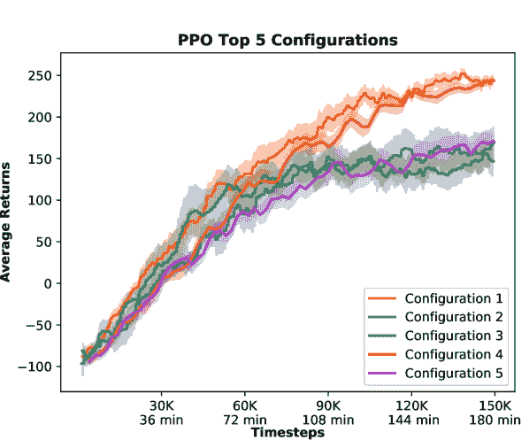
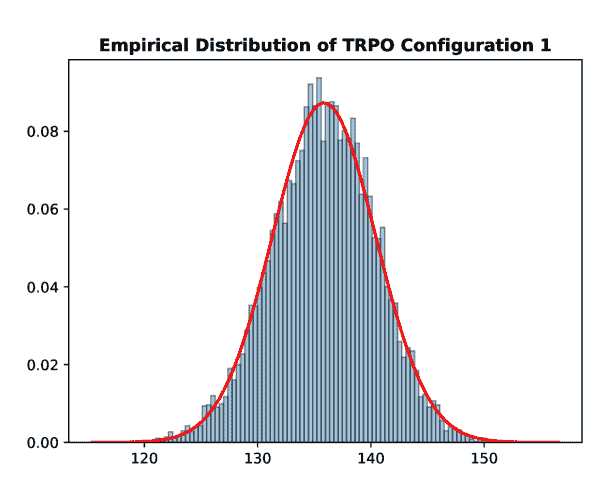
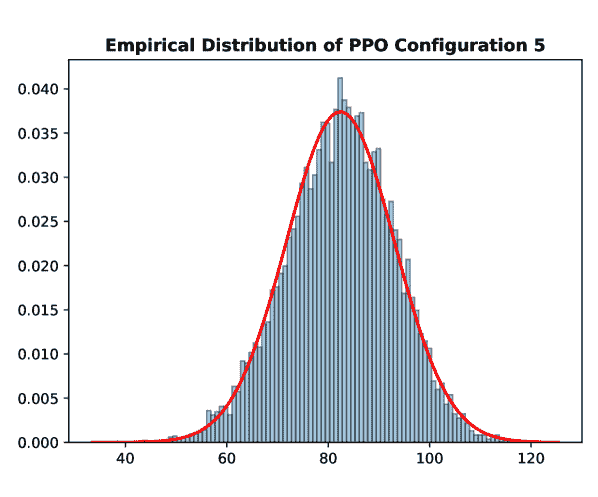

<!--yml

category: 未分类

date: 2024-09-06 20:04:56

-->

# [1909.03772] 关于通过评估深度强化学习算法在实际机器人上的可重复性的调查

> 来源：[`ar5iv.labs.arxiv.org/html/1909.03772`](https://ar5iv.labs.arxiv.org/html/1909.03772)

# 关于通过评估深度强化学习算法在实际机器人上的可重复性的调查

尼古拉·A·林纳鲁普^(1,2,†,∗)

nily@dti.dk

nia@mmmi.sdu.dk

&劳拉·诺林^(1,2,∗)

lauj@dti.dk

lnj@mmmi.sdu.dk

\AND 拉斯穆斯·哈斯勒¹

raha@dti.dk

&约翰·霍勒姆²

john@mmmi.sdu.dk

\AND¹机器人技术，丹麦技术研究院（DTI）

²机器人学习的具身系统，南丹麦大学（SDU）

^†通讯: nily@dti.dk; 电话: +45-7220 2713

^∗等贡献

###### 摘要

随着强化学习（RL）在解决复杂任务中的成功，确保 RL 研究的可重复性以及算法的公平比较需要更多的关注。然而，由于算法的固有变异、环境的随机性以及众多（可能未报告的）超参数，RL 结果 notoriously 难以重复。在这项工作中，我们调查了导致研究不可重复的诸多问题以及如何管理这些问题。我们进一步展示了如何利用严格和标准化的评估方法来简化不同算法的文档编制、评估和公平比较过程，并强调选择正确的测量指标和对结果进行适当统计的重要性，以实现结果的无偏报告。

> 关键词: CoRL, 机器人, 学习, 强化学习, 可重复性, 统计学

## 1 引言

能够批判性地评估和审查其他科学家在已发表研究中提出的主张是基础且科学的基石。对他人研究的公正独立验证有助于确认其可信度，并允许在“知识体系”基础上进行扩展，这被称为可扩展研究。机器人技术和机器学习（ML）领域的研究也不例外，尽管在这种计算研究中确保可重复性 notoriously 非常困难 [1]。

在机器人强化学习领域，诸如信任区域策略优化（TRPO） [2]、近端策略优化（PPO） [3]、深度确定性策略梯度（DDPG） [4] 和 Soft Q-Learning（Soft-Q） [5] 等算法因其在模拟机器人任务中的成功而获得了广泛关注 [6]；但正如 Mahmood *et al*. [7, 8] 所示，在现实世界机器人上设置任务和评估 RL 算法往往并不简单，需要考虑许多实际因素以确保可重复性。

复制机器学习研究时最常见的问题之一是遗漏了手稿中的一个或多个超参数选择。超参数通常对算法性能有显著影响，因此报告它们的值及其获得方式至关重要[9, 10]。忽略报告超参数的一个原因是它们被遗忘了，这可能由于多种原因，例如：a）它们被认为不重要或 b）它们的值仅是底层实现指定的默认值。这两个原因显然都是需要解决的重要挑战，但往往难以发现和随后执行。

更复杂的是，现实世界的机器人 RL 方法需要大量的数据。因此，从现实世界获取结果成本很高。此外，许多工业研究人员被公司法律部门迫使省略具体细节以保持竞争优势。再加上学术研究人员面临的“发表或灭亡”压力，这似乎导致了与良好科学标准的偏离[9]。为了保持深度强化学习（DRL）的进展，研究必须是可重复和可比较的，以便验证和建立改进。

评估指标的差异和缺乏显著性测试可能导致 DRL 领域结果的误导性报告[11]。如果没有统计评估结果，就很难得出是否有意义的改进。如果结果值得信赖，则需要对提出的方法进行完整和统计正确的评估。

我们从 Khetarpal *et al* 提出的管道中获得灵感[11]，该管道为环境、算法和评估方案提供了通用接口。我们在此基础上添加了实验配置文件，以创建一个统一的实验框架。配置文件包含所有与特定实验相关的（超）参数。通过这些配置文件，我们旨在简化以下过程：a）在调优过程中运行具有新超参数的新实验，b）跟踪过去的实验及其超参数，以及 c）在科学论文中报告所有超参数。

我们在 SenseAct 框架上评估了我们的管道[`github.com/kindredresearch/SenseAct/`](https://github.com/kindredresearch/SenseAct/)，该框架提供了一个接口，使得 RL 代理可以通过 Universal Robots (UR)的 6 DoF 机器人手臂与现实世界互动[8]。我们利用了提出的基准任务 UR-Reacher-2D，其中代理需要用其腕关节（末端执行器）在二维平面上到达任意选择的目标点。

我们对该领域的关键贡献包括：展示一种严格的方法以便于参数的记录；通过基于统计的评估常见 RL 基准算法在现实世界机器人的结果并确定其显著性；以及我们对如何根据具体任务选择测量指标的建议。

## 2 可重复性分类

可重复性研究的分类被广泛讨论 [12、13]。在这里，我们展示了我们所遵循的术语：

#### 重复性

(相同团队，相同实验设置) 指相同团队在相同实验设置下重新运行实验。这一过程在报告统计学上可靠的结果时是必要的。该过程意味着完全相同的团队和相同的代码。

#### 可再现性

(不同团队，相同实验设置) 指不同团队在相同设置下进行相同实验，获得的结果在实验误差范围内。设置包括库代码、实验代码、数据和环境。这一过程可以被视为在完整研究层面上的软件测试。

#### 重复性

(不同团队，不同实验设置) 指尝试获得与原始工作报告中相同（或足够相似）结果的团队，这些团队无法访问代码、数据、环境或所有这些内容。

请注意，Claerbout、Donoho、Peng [12、14、15、16] 的约定省略了重复性术语，但正如我们在附录 A1 中所展示的，ACM、Drummond 约定对这一术语的解释是适用的，因为它并不矛盾。在我们的工作中，我们遵循 Claerbout、Donoho、Peng 约定 [14、15、16] 并添加了重复性术语。

除了分类外，我们在附录 A2 中展示了可重复性的实际视角。

## 3 方法

我们提出了一种简单的方法，通过使用开放数据格式（在我们的案例中是 YAML）收集所有（超）参数到配置文件中，从而统一配置 RL 实验。这些配置文件包含了特定实验中使用的参数的综合列表，从环境和代理的具体情况，如机器人运动学，到算法的具体情况，如函数逼近器中的隐藏层数量²²2 有关配置文件的完整示例，请参见：[`github.com/dti-research/SenseActExperiments/blob/master/code/experiments/ur5/trpo_kindred_example.yaml`](https://github.com/dti-research/SenseActExperiments/blob/master/code/experiments/ur5/trpo_kindred_example.yaml)。

我们还将算法与环境和度量收集例程分开，以便于评估额外的算法，正如 Khetarpal *等人* 提出的[11]。

实际上，配置文件包含上述每个模块的规格，这意味着例如更换算法可以通过直接更改 YAML 文件中的模块路径来完成。环境和日志记录例程也是如此。

### 3.1 评估报告

报告 RL 结果的最常见方法是展示平均累积奖励（平均回报）的图表。然而，由于算法和环境的随机性，算法的性能可能会有很大差异，单靠平均回报无法描述算法的性能范围。相反，适当的评估需要多次运行并使用不同的预设随机种子[9]。此外，还需要适当的统计数据来确定更高的回报是否确实代表更好的性能，例如均值的置信区间（CIs）或获得某个阈值性能值的概率值。

通常，试验越多，使用适当的统计数据支持结论就会越容易。然而，正如在生命科学中一样，机器人技术也面临样本获取成本高昂的问题，因此诸如自助法（bootstrapping）这样的成本效益高的方法特别受到关注。自助法是一种通过有放回地抽样来估计小样本的总体分布的方法。通过自助法获得的经验分布允许进行统计推断。利用这一点可以进一步验证试验过程中是否没有发生错误。我们进行多次试验以获得结果的统计显著性度量。

在评估报告的背景下，我们承认某些情况非常耗时，以至于多次运行都不是一个选项，甚至对于自助法所需的少量样本也如此。我们鼓励那些遇到这种情况的研究人员说明为何无法进行适当的统计分析。

## 4 实验协议

### 4.1 任务描述

为了评估我们提出的方法，我们使用了 Mahmood *et al* [7] 的任务 UR-Reacher-2D。在这个任务中，代理的目标是通过低级控制到达任意目标位置，其中实际的 UR5（图 1）仅限于移动其 \nth2 和 \nth3 轴。奖励函数定义为 $R_{t}=-d_{t}+\exp\left(-100d_{t}^{2}\right)$，其中 $d_{t}$ 是目标点与机器人法兰位置之间的欧几里得距离。观察向量由机器人关节角度、关节速度、其先前的动作和目标与法兰坐标之间的向量差组成。我们将每个回合限制为 4 秒，如[8]中所述。用于进行评估的所有超参数值的列表见附录 A3。

<svg   height="242.48" overflow="visible" version="1.1" width="302.43"><g transform="translate(0,242.48) matrix(1 0 0 -1 0 0) translate(3.15,0) translate(0,4.21)" fill="#000000" stroke="#000000"><g stroke-width="0.4pt"><g transform="matrix(1.0 0.0 0.0 1.0 0.28 0.28)" fill="#000000" stroke="#000000"><foreignobject width="299" height="238" transform="matrix(1 0 0 -1 0 16.6)" overflow="visible"></foreignobject></g></g></g></svg>

图 1：用于评估的机器人：用于评估我们提出的方法论的 6 DOF 机器人 manipulator 是 UR5 机器人。在 UR-Reacher-2D 任务中，机器人仅限于驱动其第二和第三关节，以便用其工具到达任意点（红色圆圈）。

### 4.2 RL 算法

正如[8]中所述，我们使用了 OpenAI Baselines 实现的两种无模型策略梯度算法 TRPO 和 PPO，以确保所使用的代码库不是差异的来源[9]。需要注意的是，Mahmood *et al* [8]的工作基准测试了另外两种算法，即 DDPG [4]和 Soft Q-learning [5]，这些算法没有包含在我们的工作中，因为它们需要对底层代码库进行内联修改（用于提取评估指标），这些修改因法律原因未由[8]公开³³3 基于与主作者的通信。RL 算法的选择在本工作中没有受到太多关注，因为它超出了我们研究的范围。

### 4.3 评估

我们在 UR-Reacher-2D 任务中评估 RL 算法，部分是为了调查我们提出的方法论，部分是为了验证原作者工作的可重复性[8]。

我们从 30 个随机选择的超参数配置中选择了表现最好的 5 个，见附录 A3，并对每个 RL 算法的这 5 个配置在 UR-Reacher-2D 任务上进行性能评估。我们将每个实验（1 个算法的 1 个超参数配置）重复进行 10 次，以确定每个超参数配置的性能统计显著性，这意味着在不同的随机种子下运行实验，这些种子会导致不同的网络初始化、目标位置和动作选择。我们使用自助法（bootstrapping）近似经验分布函数（EDF），并将理论分布拟合到 EDF 上。从理论分布中，我们确定获得至少与原始工作[8]中报告的性能相同的概率。

评估指标的计算方式与[8]中相同，以便进行比较。计算包括使用$5,000$步的窗口大小进行滚动平均，每$1,000$步计算一次。指标在训练过程中收集。

结果处理：首先，计算使用相同配置的十次运行的平均回报。然后，我们对这十个平均回报值进行 10k 次重采样的自助法处理，以找到 EDF。接着，我们测试数据是否符合正态分布，这在该领域是一个常见的假设，并进一步探索在无法假设正态性时的一般方法：将理论分布拟合到 EDF 上。在 5 部分，我们展示了拟合 100 个理论分布⁴⁴4 详细列表见：[`docs.scipy.org/doc/scipy/reference/stats.html`](https://docs.scipy.org/doc/scipy/reference/stats.html)到我们的 EDF 上，相关图表见附录 A4。使用显著性水平$\alpha=0.05$，我们确定是否成功复制了[8]中报告的结果。

## 5 结果

### 5.1 代码库的重复性

为了验证我们对代码库的修改没有干扰到重复实验的能力，我们在实际机器人上使用相同种子和实验配置执行了十次 TRPO 实验。初步结果是有希望的，但在前七次实验之后，出现了未知情况，最后（三个底部的）三个实验与之前的七次实验偏离。我们推测，实际机器人上的偏差可能暗示了物理问题，例如传感器读取延迟，而不是代码库中的随机性。因此，我们决定使用模拟器运行相同的实验，以排除现实世界的随机性。我们可以使用 UR 提供的模拟器，因为它使用了完全相同的机器人控制器、代码库、逆向运动学求解器等。我们发现结果的学习曲线彼此非常接近。因此我们得出结论，实验的重复能力得到了保持。结果在图 5 中进行了可视化。

图 2：学习的重复性：图示显示了在训练过程中随时间获得的平均回报，计算为窗口大小为 5.000 步的滚动平均值，每 1.000 步计算一次。（左）使用相同种子对 TRPO 的超参数配置 1 进行的十次实验，并在实际机器人上进行评估，（右）使用相同 RL 算法和相同代码库的十次实验，使用相同种子但在 UR 的模拟器 URSim v. 3.9.1 中进行评估。⁵⁵可在此下载：[`www.universal-robots.com/download/?option=51823`](https://www.universal-robots.com/download/?option=51823)。

### 5.2 基准算法的评估

从评估前 5 种配置中得到的学习曲线绘制在图 3 中，包括了平均奖励及其标准误差（SE）。通过对 TRPO 的评估，我们观察到表现最差的配置是配置 4，这与原始工作[8]不同。我们对 PPO 的评估结果显示配置 1 和配置 4 的表现更好。请注意，对于 PPO，配置 4 的倒数第二次实验失败。图 4 显示了这次实验的回报随时间的变化。我们认为它是一个异常值，不代表真实总体，并将其排除在统计分析之外。

图 3：随机搜索中的前 5 个超参数配置：绘制了均值奖励及其标准误差（SE），这些数据是从对每种算法的五个超参数配置进行的十次运行中计算得出的；（左）TRPO 和（右）PPO。平均回报通过窗口大小为 5000 的滚动平均来计算，并每 1,000 步计算一次。

图 4：PPO 的失败运行：\nth9 运行在 \nth4 配置的 PPO 中因某种未知原因失败。我们认为该运行是异常值，不属于真实的总体。因此，我们将其排除在统计分析之外。

为了测试结果的显著性，我们对每个配置的原始 10 个观测值进行了自助抽样。结果样本统计（均值和置信区间）在表 1 中给出，在这里我们获得了与 [8] 原报告不同的五个配置的性能排序。对于 TRPO，我们发现尽管配置 1 在图 3 中显示出最佳性能，但配置 2 的平均性能更高，表明性能的提高更快。对于 PPO，我们从配置 1 和 4 中获得了最大的均值。虽然 PPO 的置信区间较大，暗示了性能范围的更大，但我们回忆起 Henderson *et al* [9] 推测极大的置信界限可能表明样本量不足。

| 超参数配置 | 算法 |
| --- | --- |
| TRPO | PPO |
| --- | --- |
| [8] | 我们的 | [8] | 我们的 |
| --- | --- | --- | --- |
| $\hat{\mu}$ | $\bar{\mu}$ | $95\%$ CI | $\hat{\mu}$ | $\bar{\mu}$ | $95\%$ CI |
| --- | --- | --- | --- | --- | --- |
| c1 | 158.56 | $135.78$ | $(127.31,144.78)$ | 176.62 | $137.08$ | $(116.64,157.73)$ |
| c2 | 138.58 | $139.65$ | $(128.04,153.28)$ | 150.25 | $86.51$ | $(58.48,115.48)$ |
| c3 | 131.35 | $112.37$ | $(91.38,134.72)$ | 137.92 | $90.12$ | $(64.28,118.38)$ |
| c4 | 123.45 | $98.03$ | $(93.34,103.18)$ | 137.26 | $119.43$ | $(107.98,130.31)$ |
| c5 | 122.60 | $106.62$ | $(95.57,118.60)$ | 136.09 | $82.42$ | $(62.58,104.15)$ |

表 1：两个基准的整体表现：每个超参数配置的均值和 95%置信区间是从我们原始的十个样本中通过自助抽样获得的 1 万样本计算得出的。所有试验都在对应于 300 小时机器人壁时的 UR 环境中进行。[8]报告的平均回报用$\hat{\mu}$表示，而$\bar{\mu}$表示我们通过自助抽样获得的经验均值。

我们通过自助抽样获得的经验分布展示在附录 A5 中，并将理论正态分布拟合到 EDF 上。为了确定数据是否服从正态分布，我们进行了正态性检验，尽管我们的数据最初似乎是正态分布的，但我们发现 10 种配置中的 8 种在显著性水平$\alpha=0.05$下会拒绝我们的零假设。因此，数据不能假定为正态分布，必须考虑其他理论分布。

对经验分布函数（EDF）进行理论分布拟合是为了确定哪种分布最适合经验数据。我们测试了 100 种理论分布，其中 52 种成功收敛。在这 52 种分布上，我们通过执行 Kolmogorow-Smirnow（KS）检验来计算拟合优度（见附录 A4），从中选择了根据其$p$-值确定的最有前景的分布。这导致了附录 A4 中展示的六种分布。

验证重现性。为了验证原作者提出的观点，我们计算了获得的平均性能至少与最初报告的平均奖励一样好的概率（见附录 A3）。我们对每个最佳拟合分布进行此计算，结果如表 2 所示。如果我们有分布与基础 EDF 匹配的概率 $P_{d}$（在附录 A4 中报告为 $P\{\mathrm{dist}=d|\mathrm{data}\}=P_{d}$），以及从该特定分布中获得至少一样好的值 $v$ 的概率 $P_{v}$，那么我们有 $P\{v\geq\hat{\mu}|\mathrm{dist}=d,\mathrm{data}\}=P_{v}$。因此 $P\{v\geq\hat{\mu}|\mathrm{data}\}=P_{d}\cdot P_{v}$，其中 $\hat{\mu}$ 表示在 [8] 和表 1 中报告的平均回报值。

| 分布 | 算法 |
| --- | --- |
| TRPO | PPO |
| --- | --- |
| c1 | c2 | c3 | c4 | c5 | c1 | c2 | c3 | c4 | c5 |
| --- | --- | --- | --- | --- | --- | --- | --- | --- | --- |
| beta | 0.0000 | 0.5990$\star$ | 0.0436 | 0.0000 | 0.0022 | 0.0000 | 0.0000 | 0.0000 | 0.0015 | 0.0000 |
| johnsonsb | 0.0000 | 0.5985$\star$ | 0.0246 | 0.0000 | 0.0022 | 0.0000 | 0.0000 | 0.0000 | 0.0015 | 0.0000 |
| johnsonsu | 0.0000 | 0.3749$\star$ | 0.0417 | 0.0000 | 0.0015 | 0.0000 | 0.0000 | 0.0000 | 0.0011 | 0.0000 |
| loggamma | 0.0000 | 0.3894$\star$ | 0.0424 | 0.0000 | 0.0015 | 0.0000 | 0.0000 | 0.0000 | 0.0004 | 0.0000 |
| powernorm | 0.0000 | 0.2798$\star$ | 0.0407 | 0.0000 | 0.0013 | 0.0000 | 0.0000 | 0.0000 | 0.0012 | 0.0000 |
| skewnorm | 0.0000 | 0.2518$\star$ | 0.0411 | 0.0000 | 0.0014 | 0.0000 | 0.0000 | 0.0000 | 0.0010 | 0.0000 |

表 2：重现性验证：该表显示了在列出的分布下获得一个新样本，其效果至少与 [8] 中报告的样本一样好的概率。如果未能拒绝我们的假设，则用 $\star$ 表示。

## 6 讨论与结论

实验结论

从表 2 中，我们拒绝了 60 个假设中的 55 个，声称至少可以获得一个与[8]中报告的样本一样好的样本。我们的概率值表明，[8]中报告的值并未很好地描述性能范围。从$p$值我们得出结论，一个运行不是潜在分布的代表性样本，而不是将原始工作视为不可重复的。比较结果的理想方法是比较统计分析中得到的 EDF，这在我们的案例中不可行，因为[8]仅报告了每个配置的平均回报值。

关键结论是，确实非常具有挑战性的是创建可重复的机器人 RL 研究，拥有统一的测试系统和描述实验的方法可以帮助研究人员报告他们的结果，而不会遗漏那些重要的超参数。

我们可以从实验中得出哪些建议？

在真实世界的机器人上复制强化学习（RL）结果并非易事，并且引入了许多实际问题。我们遇到的主要问题是，机器人每四次运行后系统性地停止，因为 UR 的控制器接口（PolyScope）与实时控制器失去连接。确定错误发生的原因以及位置具有挑战性，我们始终未能找到原因，但最终通过在每次试验后关闭并重启机器人控制器来解决了这个问题。我们总结出，物理问题难以调试，因为很难预测和解决物理机器人内部软件中的错误。

管理软件依赖性对创建可重复的实验至关重要。我们鼓励将依赖项的数量减少到运行实验代码所需的最低限度。此外，依赖项应该易于安装和使用，这意味着作者至少应提供用于进行实验工作的依赖项及其版本列表。我们使用了软件容器平台 Docker⁶⁶6[`www.docker.com/`](https://www.docker.com/)来管理我们的依赖项。

预设和报告所用随机种子对于确保结果的可重复性至关重要。然而，在处理现实世界的机器人技术时，由于传感器读数可能会延迟并包含真实测量误差，随机性将占据主导地位。从我们的实验中，我们发现如果所用的 PC 无法足够快地处理 TCP 套接字上的流量，那么不同运行之间的传感器读数将不会同时出现，即使软件的所有部分都已预设种子，也会导致持续的随机性。这在图 5 中可视化。我们认为预设（和报告）随机种子应被视为良好实践，并且我们承认我们没有为获得本文中展示的结果预设随机种子。不预设和报告随机种子是一个我们希望提醒他人避免的错误。

区分实验代码和库代码有助于他人更容易地运行代码。在尝试重现 Mahmood *et al*. [8]的工作时，我们最初发现他们用于获得报告结果的实验代码不可用。开源代码⁷⁷7[`github.com/kindredresearch/SenseAct`](https://github.com/kindredresearch/SenseAct)是库代码和示例代码。我们多次联系了主要作者请求缺失的超参数和实验代码，但由于法律原因未能获得代码。这一限制使我们不得不复制而不是重现原始工作。

返回值的日志记录是通过 OpenAI 实现提供的回调接口完成的[17]，返回值仅在每次迭代结束时可用，而这又取决于算法的批量大小。为了获得可比较的结果，训练期间计算的所有奖励应被记录并用于统计推断。我们没有这样做，因为这将使我们更显著地偏离原始代码库。

超参数在不同算法和环境中具有显著不同的影响，如[9]所示。报告所选择参数的获取方式及所有参数本身对于他人复制工作至关重要。

我们可以从我们的工作中得出哪些一般性建议？

Khetarpal *et al* 强调的将评估与训练分开是重要的，因为强化学习代理显示出对训练实例的过度拟合[18]。也建议使用不同的预设种子进行训练和评估。虽然我们希望遵循并扩展[11]中的流程，但当前提出的流程与 OpenAI Baselines 不兼容，因此将作为未来工作的课题。

彻底的文档记录对于确保可重复性和可比性至关重要，因为实验中的即使是小细节也可能是关键的。有人可能会认为文档记录会变得非常耗时，影响潜在的进展。我们认为这是在该领域建立一种文化的问题，即将实验工作记录作为研究的一个组成部分。可以利用许多工具来简化这一过程。我们提出的方法，包括配置文件，旨在简化文档记录过程。

测量度量标准是比较强化学习算法时的关键问题之一。通常，性能的记录方式和时间往往未被报告[11]。不同的算法实现以不同的方式收集、处理和存储性能度量，使得比较变得困难，甚至不可能。

选择报告实验结果时正确的度量标准，设计师必须首先明确什么使一个算法优秀。接着，设计师必须确定如何测量这一点。一般来说，需要考虑两个方面：1) 良好的性能描述算法在特定任务中的表现，2) 高效使用描述实现满意性能的成本，可能包括优化超参数选择所花费的时间、计算算法输出所需的努力和/或训练期间获得数据的成本。度量标准可以衡量其中任何一个方面，具体选择取决于要解决的问题，但为了确保科学论文的可比性，作者应检查报告了哪些标准度量，并报告这些标准度量及作者选择的潜在额外度量。此外，所选择的度量标准应被报告、解释和辩论，包括它们是如何计算的。

开源研究 通过这项工作，我们倡导开源所有研究方面，包括源代码，因为我们相信这对确保科学领域的持续进展至关重要。作为最低要求，研究或实验应以足够的细节进行宣传，以便任何具备足够技能的第三方科学家能够在实验误差范围内获得相同的结果[12]。许多研究人员由于各种原因未能满足这些简单但关键的要求[1]。

我们从多个来源了解到，在快速持续进展与严谨分析之间存在权衡的观点。我们相信，不可重复的研究实际上不是研究，仅仅是数据——而且是质量较差的数据——并且在仔细前行和可能的快速无所作为之间并不存在真正的权衡。

补充材料：所有库代码，即对 SenseAct 框架的适配，均可在以下网址公开获取：[`github.com/dti-research/SenseAct`](https://github.com/dti-research/SenseAct)，我们在整个工作中使用的 Docker 镜像可在以下网址获取：[`hub.docker.com/r/dtiresearch/senseact`](https://hub.docker.com/r/dtiresearch/senseact)。用于再生本文中图形的所有实验代码和数据可在 [`github.com/dti-research/SenseActExperiments`](https://github.com/dti-research/SenseActExperiments) 找到。如果您发现遗漏或无法使用的内容，请随时联系第一作者。

作者贡献：所有作者在工作的构思和设计上都做出了重要贡献。Nicolai A. Lynnerup 和 Laura Nolling 撰写了本文的原始草稿，而 John Hallam 和 Rasmus Hasle 对其进行了实质性修订。Laura Nolling 对 SenseAct 框架进行了修改，以使其可被外部程序调用，并添加了日志功能。此外，Laura Nolling 设计了引导和评估脚本，而 Nicolai A. Lynnerup 编写了分布拟合脚本，并审阅和编辑了评估和引导脚本。Nicolai A. Lynnerup 创建了 Docker 镜像，并根据 Oliver Limoyo⁸⁸8[`github.com/kindredresearch/SenseAct/pull/29`](https://github.com/kindredresearch/SenseAct/pull/29) 的工作，将 SenseAct 框架适配到所有版本的 CB 系列 UR 机器人。进一步地，Nicolai A. Lynnerup 进行了有关可重复性的文献综述。Rasmus Hasle 和 John Hallam 提供了关键反馈，并帮助塑造了研究和分析。Nicolai A. Lynnerup、Rasmus Hasle 和 John Hallam 确保了研究资金的到位，而所有作者都批准了提交的版本。

资金来源：本文所展示的工作部分由丹麦技术研究院资助，部分由丹麦创新基金通过其工业研究员计划资助，资助编号 8053-00057B。

致谢：本研究得到了许多作者之外的人的帮助。我们要感谢丹麦技术研究所（DTI）的专家 Jens-Jakob Bentsen 和 Thomas Mosgaard Giselsson，他们就可重复性术语的不同方面进行了大量讨论。我们还要感谢 Jens-Jakob Bentsen 在调试 UR 机器人通信接口和底层控制器功能方面的帮助。接下来，我们要感谢 DTI 的专家 Rasmus Lunding Henriksen，他的意见显著改善了手稿。此外，我们还要感谢 ITU 哥本哈根的教授 Kasper Stoy，他对我们工作的评论帮助我们从更多的角度看待科学中的可重复性和报告。我们还要感谢两位匿名评审员的见解和建设性评论。任何错误均由我们自己承担，不应影响这些人士或机构的声誉。

利益冲突：作者声明没有利益冲突。资助方在研究设计、数据的收集、分析或解释、手稿的撰写、以及结果的发表决策中没有参与。

## 参考文献

+   [1] Geir Kjetil Sandve, Anton Nekrutenko, James Taylor 和 Eivind Hovig “可重复计算研究的十条简单规则” 见 *PLoS 计算生物学* 9.10 公共科学图书馆，2013，第 e1003285 页

+   [2] John Schulman 等人. “信任区域策略优化” 见 *国际机器学习会议*，2015，第 1889–1897 页

+   [3] John Schulman 等人. “近端策略优化算法” 见 *arXiv 预印本 arXiv:1707.06347*，2017

+   [4] Timothy P Lillicrap 等人. “使用深度强化学习进行连续控制” 见 *arXiv 预印本 arXiv:1509.02971*，2015

+   [5] Tuomas Haarnoja, Haoran Tang, Pieter Abbeel 和 Sergey Levine “基于深度能量的策略进行强化学习” 见 *第 34 届国际机器学习会议论文集-第 70 卷*，2017，第 1352–1361 页 JMLR.org

+   [6] Yan Duan 等人. “为连续控制基准测试深度强化学习” 见 *国际机器学习会议*，2016，第 1329–1338 页

+   [7] A Rupam Mahmood, Dmytro Korenkevych, Brent J Komer 和 James Bergstra “使用现实世界机器人设置强化学习任务” 见 *arXiv 预印本 arXiv:1803.07067*，2018

+   [8] A Rupam Mahmood 等人. “在现实世界机器人上基准测试强化学习算法” 见 *arXiv 预印本 arXiv:1809.07731*，2018

+   [9] Peter Henderson 等人. “重要的深度强化学习” 见 *第三十二届 AAAI 人工智能会议*，2018

+   [10] Riashat Islam, Peter Henderson, Maziar Gomrokchi 和 Doina Precup “基准测试的深度强化学习任务的可重复性” 见 *arXiv 预印本 arXiv:1708.04133*，2017

+   [11] Khimya Khetarpal 等人。“重新评估：评估强化学习算法中的可重复性” 见 *国际机器学习会议*，2018 年

+   [12] Hans E Plesser “可重复性与复制性：混乱术语的简史” 见 *神经信息学前沿* 11 Frontiers，2018 年，第 76 页

+   [13] Lorena A Barba “可重复研究的术语” 见 *arXiv 预印本 arXiv:1802.03311*，2018 年

+   [14] Jon F Claerbout 和 Martin Karrenbach “电子文档赋予可重复研究新的意义” 见 *SEG 技术程序扩展摘要 1992* 探索地球物理学会，1992 年，第 601–604 页

+   [15] Jonathan B Buckheit 和 David L Donoho “Wavelab 和可重复研究” 见 *小波与统计* Springer，1995 年，第 55–81 页

+   [16] Roger D Peng, Francesca Dominici 和 Scott L Zeger “可重复的流行病学研究” 见 *美国流行病学杂志* 163.9 牛津大学出版社，2006 年，第 783–789 页

+   [17] Greg Brockman 等人。“Openai gym” 见 *arXiv 预印本 arXiv:1606.01540*，2016

+   [18] Chiyuan Zhang, Oriol Vinyals, Remi Munos 和 Samy Bengio “深度强化学习中的过拟合研究” 见 *arXiv 预印本 arXiv:1804.06893*，2018 年

+   [19] Matthias Schwab, N Karrenbach 和 Jon Claerbout “使科学计算具有可重复性” 见 *科学与工程计算* 2.6 IEEE，2000 年，第 61–67 页

+   [20] David L Donoho 等人。“计算谐波分析中的可重复研究” 见 *科学与工程计算* 11.1 IEEE，2009 年

+   [21] Roger D Peng “计算科学中的可重复研究” 见 *科学* 334.6060 美国科学促进会，2011 年，第 1226–1227 页

+   [22] Chris Drummond “复制性并非可重复性：也不是好科学”，2009 年

+   [23] Mark Liberman “复制性与可重复性 - 或者是反过来？” 2015 年 URL: [`languagelog.ldc.upenn.edu/nll/?p=21956`](http://languagelog.ldc.upenn.edu/nll/?p=21956)

+   [24] Arturo Casadevall 和 Ferric C Fang “可重复科学” 美国微生物学会，2010 年

+   [25] Thilo Mende “缺陷预测研究的复制：问题、陷阱和建议” 见 *第六届国际软件工程预测模型会议论文集*，2010 年，第 5 页 ACM

+   [26] ACM 结果 “人工制品审查与标识”，2017 年

+   [27] Steven N Goodman, Daniele Fanelli 和 John PA Ioannidis “研究的可重复性意味着什么？” 见 *科学转化医学* 8.341 美国科学促进会，2016 年，第 341ps12–341ps12 页

+   [28] Daniel T Gilbert, Gary King, Stephen Pettigrew 和 Timothy D Wilson “关于‘估计心理科学的可重复性’的评论” 见 *科学* 351.6277 美国科学促进会，2016 年，第 1037–1037 页

+   [29] Rachael Tatman, Jake VanderPlas 和 Sohier Dane “机器学习研究的实用分类法”，2018 年

+   [30] Randall J LeVeque “不分享代码的十大理由（以及为何仍应分享）” 收录于 *Siam News* 46.3，2013 年

+   [31] Ralph B d’Agostino “中等和大样本的正态性全局检验” 收录于 *Biometrika* 58.2 牛津大学出版社，1971 年，页码 341–348

+   [32] RALPH D’AGOSTINO 和 Egon S Pearson “正态性离差测试” 收录于 *Biometrika* 60.3 牛津大学出版社，1973 年，页码 613–622

+   [33] Xavier Glorot 和 Yoshua Bengio “理解训练深度前馈神经网络的难度” 收录于 *第十三届国际人工智能与统计会议论文集*，2010 年，页码 249–256

+   [34] Kaiming He, Xiangyu Zhang, Shaoqing Ren 和 Jian Sun “深入探讨整流器：超越 imagenet 分类上的人类水平表现” 收录于 *IEEE 国际计算机视觉会议论文集*，2015 年，页码 1026–1034

+   [35] Nitish Srivastava 等 “Dropout: 防止神经网络过拟合的简单方法” 收录于 *机器学习研究期刊* 15.1 JMLR.org，2014 年，页码 1929–1958

+   [36] Tom Schaul, John Quan, Ioannis Antonoglou 和 David Silver “优先经验回放” 收录于 *arXiv 预印本 arXiv:1511.05952*，2015 年

## 附录

## 附录 A1 混淆分类法的简要概述

### A1.1 术语的两个视角

不幸的是，关于重复性、再现性和可重复性含义的混淆对科学的整体发展产生了负面影响。Barba [13] 将一系列论文分为两个组：A. 那些没有区分“再现性”和“可重复性”这两个词的论文，B. 那些区分这两个词的论文。B 组进一步分为两个额外的组，其相互矛盾的惯例如下所示。

### B.1\. Claerbout、Donoho、Peng 惯例

从 Claerbout [14]、Buckheit 和 Donoho [15] 以及 Peng *et al* [16] 的开创性工作中得出了以下惯例，但由于这些论文有些过时，阅读 Schwab *et al* [19]、Donoho [20] 和 Peng *et al* [21] 的较新工作可能更为有益。

#### 再现性

描述了一项研究，其中原作者提供了所有必要的观察数据和可能的计算机代码以重新运行该方法，使第三方科学家能够重复相同的结果。因此，不同的团队使用相同的实验设置。

#### 可重复性

用于描述第三方研究，该研究得出了与原始研究相同的结论，其中收集了新的观察数据，并根据已发表的论文实施了方法。因此，不同的团队使用不同的实验设置。

### B.2\. ACM、Drummond 惯例

Drummond [22] 在 2006 年国际机器学习会议（ICML）上发表了他的文章，不幸的是，他将可重复性和再现性的定义颠倒了，这根据语言学教授 Mark Liberman 的说法应该被拒绝[23]，因为这些术语早在 Claerbout [14]之前就已经被创造出来。在建议拒绝重新创造术语之前，Drummond 的“新定义”已经传播到几篇科学论文中。Fang *等人* [24] 和 Mende *等人* [25] 似乎也从 Drummond 那里混淆了这些术语。此外，计算机协会（ACM）在其工件系统的标识中也错误地使用了这些术语[26]，而且他们似乎坚持使用这一定义，因为它显然在 2017 年进行了最新的修订，比 Mark Liberman 发表其研究结果晚了两年。ACM、Drummond 的约定如下。

#### 重复性

（相同团队，相同实验设置）在相同位置的相同条件下，使用相同方法和相同硬件的研究人员可以以声明的精度获得观察结果。

#### 可重复性

（不同团队，相同实验设置）第三方研究人员在相同或不同位置、相同条件下使用相同方法和相同硬件可以以声明的精度获得观察结果。

#### reproducibility

（不同团队，不同实验设置）第三方研究人员在不同的位置使用不同的硬件可以以声明的精度获得观察结果。

我们提倡所有研究人员避免使用 ACM、Drummond 所用的术语，因为重新创造这些术语并没有正当理由。

#### 冲突的术语

这些术语至少令人烦恼，最坏的情况则阻碍了科学进步。

### A1.2 扩展术语

除了重新创造术语之外，还有各种论文建议创造新的、更具描述性的术语，以解决有关重复性、可重复性和再现性的激烈讨论。由于重新创造术语的论文数量非常庞大，我们这里只呈现其中的一些，完整的回顾超出了本工作的范围。

Goodman *等人* [27] 提出了一个用于重复性的词汇表，通过区分方法重复性、结果重复性和推论重复性来解决术语混淆问题。以下是这三个新的重复性术语的定义，Goodman *等人* [27] 认为这些定义原则上应该是明确的，但在操作上却难以捉摸，因此他们提供了许多针对特定科学领域的操作实例。

+   •

    方法重复性：提供足够的研究程序和数据细节，以便理论上或实际上可以完全重复相同的程序。

+   •

    结果可重复性：从独立研究中获得相同结果，该研究的程序尽可能与原始实验紧密匹配。

+   •

    推论性可重复性：从独立研究的复制或对原始研究的再分析中得出类似的结论。有关结果与推论性可重复性之间区别的讨论，请参见**Gilbert et al**[28]。

这三个术语的创造旨在使我们在分析研究时，关注“可信度”的哪些方面更加具体，从而避免日常语言中对“可重复”、“可再现”和“可复制”词汇的模糊使用。

**Tatman et al**[29]提出了一种实际导向的可重复性分类法，或多或少是针对机器学习研究的。正如**Goodman et al**[27]所述，他们试图通过详细描述共享程度来使术语的原则定义更明确。尽管我们赞赏作者提出的简单实用分类法，但我们不鼓励似乎漠不关心的使用可重复性术语[29]，因为这与**Claerbout**、**Donoho**、**Peng**惯例相悖，这本可以轻易避免。

+   •

    低可重复性：仅完成的论文在**Claerbout**、**Donoho**、**Peng**的惯例中本质上就是可复制性的体现，即一篇写得好的出版物——理论上——应足够让第三方科学家复制研究或实验。然而，正如作者所争论的，这在时间限制和/或信息缺失的情况下往往是不切实际甚至是不可能的。

+   •

    中等可重复性：代码和数据，与**Claerbout**、**Donoho**、**Peng**惯例中的可重复性无关。**Claerbout**的原始论文[14]没有明确描述环境是否应成为学术研究的一部分，因为当时没有实现这一点的工具。利用今天的工具，如 Docker，我们认为它应该成为其中的一部分。**LeVeque**[30]认为，只要代码与出版物一同存在，那么代码是否运行并不关键，因为代码本身包含了在描述中可能不会出现的大量细节。最低要求应为：有关环境的信息——版本等——应成为出版物的关键部分。

+   •

    高可重复性：代码、数据和环境也与**Claerbout**、**Donoho**、**Peng**惯例中的可重复性相关，如上所述，环境被包含在内，使得重复过程对审稿人或读者来说更容易，因为研究人员不必在其功能系统上安装各种版本的库。

### A1.3 讨论与结论

首先，我们认为应尊重 Buckheit 和 Donoho [15] 常被引用的名言，改述自 Jon Claerbout [14]，并将我们的代码与我们的出版物一起提交。

> “科学出版物中的计算科学文章本身并不是学术研究，而只是学术研究的广告。真正的学术研究是生成图表的完整软件开发环境和完整的指令集。”

其次，我们鼓励社区在术语上找到一些共同点，以便再次集中精力发展科学领域，而不是术语问题。最低要求是，研究人员在使用术语时至少要说明其含义。

我们希望强调，可重复性并不是读者在未正确调查提交代码的情况下使用的“免票”。考虑这样一个情况：研究人员要重现一篇已发表科学论文的结果，因此获取了原始代码和数据。这个第三方研究人员现在可以重新运行代码，并（希望）获得相同的结果。问题发生在代码运行时未被理解，使得第三方研究人员在未发现原作者代码中的潜在错误的情况下得到结果。这也是有人伪造并使伪造可重复的情况。我们的观点是，当其他研究人员尝试在有缺陷的实验基础上构建并将方法转移到其他领域时，伪造或错误往往会——如果不是总是——显现出来。我们假设，这必须进行一些重要的人工调整才能使伪造可重复于特定问题，从而使其不具通用性。

## 附录 A2 确保可重复性的实用性

如 [7] 中讨论的那样，在真实世界机器人上设置强化学习任务时存在许多实际问题，特别是在确保可重复性方面。以下是我们概述的一些重要实践，应该鼓励采用以确保可重复性。

#### 初始化随机数生成器

一种简单而有效的方法是用一组预定义的种子来初始化随机数生成器，以便实验可以重复和再现。有关机器学习中不同非确定性来源的概述，请参见附录 A6。

#### 避免依赖地狱

为了避免与通俗术语“依赖地狱”相关的大部分问题，研究人员可以有效地利用如 Docker 等工具。为了这项工作，我们将 SenseAct 框架进行了调整，以便将其构建为 Docker 镜像。

#### 代码审查

考虑如何通过让他人在进行实验前审查代码来确保代码的完整性。这间接要求开发人员编写易于理解的代码（包括注释）。这可能比简单地将代码片段拼凑在一起要花费更多时间，但在测试前进行代码审查的好处应该能激励大多数开发团队遵循这一做法。其中一个最大的好处是增加了由于代码中的错误而避免不良实验的概率，因为两个观察者通常比一个更为有效。

#### 开源收集到的文献

收集到的数据和代码一样，应该开源。这有助于验证复现和潜在的重复实验。用于描述本工作中展示的方法的所有数据都可以在我们的 GitHub 仓库找到[`github.com/dti-research/SenseActExperiments`](https://github.com/dti-research/SenseActExperiments)。

## 附录 A3 超参数范围和数值的综合列表

本附录展示了我们在进行实验时使用的所有超参数值。本工作中使用的超参数配置见表 3 和表 4。原始工作的作者选择不调节的超参数在我们的实验中保持不变，见表 5。我们希望强调的是；a) 对于 TRPO，步长表示为 vf_stepsize，b) 对于 PPO，步长表示为 optim_stepsize。这些信息通过与原始作者的通信获得，参见 [8]。

| TRPO |
| --- |
| # | 平均回报 | 隐藏层数 | 隐藏层大小 | 批次大小 | 步长 | $\gamma$ | $\lambda$ | $\delta_{KL}$ |
| --- | --- | --- | --- | --- | --- | --- | --- | --- |
| 1 | 158.56 | 2 | 64 | 4096 | 0.00472 | 0.96833 | 0.99874 | 0.02437 |
| 2 | 138.58 | 1 | 128 | 2048 | 0.00475 | 0.99924 | 0.99003 | 0.01909 |
| 3 | 131.35 | 4 | 64 | 8192 | 0.00037 | 0.97433 | 0.99647 | 0.31222 |
| 4 | 123.45 | 4 | 128 | 4096 | 0.00036 | 0.99799 | 0.92958 | 0.01952 |
| 5 | 122.60 | 4 | 32 | 2048 | 0.00163 | 0.96801 | 0.96893 | 0.00510 |

表 3：随机搜索找到的超参数配置：该表展示了为 TRPO 找到的前五个配置，参见 [8]。

| PPO |
| --- |
| # | 平均回报 | 隐藏层数 | 隐藏层大小 | 批次大小 | 步长 | $\gamma$ | $\lambda$ | 优化批次大小 |
| --- | --- | --- | --- | --- | --- | --- | --- | --- |
| 1 | 176.62 | 3 | 64 | 512 | 0.00005 | 0.96836 | 0.99944 | 16 |
| 2 | 150.25 | 1 | 16 | 256 | 0.00050 | 0.99926 | 0.98226 | 64 |
| 3 | 137.92 | 1 | 2048 | 512 | 0.00011 | 0.99402 | 0.90185 | 8 |
| 4 | 137.26 | 4 | 32 | 2048 | 0.00163 | 0.96801 | 0.96893 | 1024 |
| 5 | 136.09 | 1 | 128 | 2048 | 0.00280 | 0.99924 | 0.99003 | 32 |

表 4：随机搜索找到的超参数配置：表中展示了为 PPO 找到的前 5 名配置[8]。

| 超参数 | 固定值 |
| --- | --- |
|  | TRPO | PPO |
| --- | --- | --- |
| 最大时间步 | $150,000$ | $150,000$ |
| 熵系数 | 0.0 | 0.0 |
| CG 迭代次数 | 10 | - |
| CG 阻尼 | 1e-2 | - |
| VF 迭代次数 | 3 | - |
| 剪辑参数 | - | 0.2 |
| 优化轮次 | - | 10 |
| Adam $\epsilon$ | - | 1e-5 |

表 5：固定超参数值：表中展示了在随机搜索中未包含的固定超参数值。

## 附录 A4 理论分布拟合

我们将 100 个理论分布¹⁰¹⁰10 有关详细列表请见：[`docs.scipy.org/doc/scipy/reference/stats.html`](https://docs.scipy.org/doc/scipy/reference/stats.html)拟合到我们的 EDF，并使用 KS 检验来确定拟合优度。由此，我们可以确定进行假设检验时使用的统计量。

图 5：TRPO 的经验数据上的理论分布拟合：（上）52 个理论分布拟合 TRPO 的第\nth1 配置的经验数据，（左）前 6 个理论分布（根据$p$值选择），（右）最佳拟合理论分布，每一行对应一个超参数配置。（图继续在下一页）

图 6：TRPO 的经验数据上的理论分布拟合：（上）52 个理论分布拟合 TRPO 的第\nth1 配置的经验数据，（左）前 6 个理论分布（根据$p$值选择），（右）最佳拟合理论分布，每一行对应一个超参数配置。

图 7：PPO 经验数据上的理论分布拟合：（上）52 个理论分布拟合 PPO 的 \nth1 配置的经验数据，（左）前 6 个理论分布（基于 $p$-值选择），（右）最佳拟合的理论分布，每一行对应一个超参数配置。（图继续在下一页）

图 8：PPO 经验数据上的理论分布拟合：（上）52 个理论分布拟合 PPO 的 \nth1 配置的经验数据，（左）前 6 个理论分布（基于 $p$-值选择），（右）最佳拟合的理论分布，每一行对应一个超参数配置。

| KS 测试于 TRPO |
| --- |
|  | 分布 | 统计 | $p$-值 | 分布参数 |
| 配置 1 | beta | 0.0082 | \collectcell <svg height="18.69" overflow="visible" version="1.1" width="23.8"><g transform="translate(0,18.69) matrix(1 0 0 -1 0 0) translate(12.04,0) translate(0,4.89)" fill="#000000" stroke="#000000" stroke-width="0.4pt"><g transform="matrix(1.0 0.0 0.0 1.0 -3.46 0)" fill="#000000" stroke="#000000"><g transform="matrix(1 0 0 -1 0 4.46)"><g transform="matrix(1 0 0 1 0 8.92)"><g transform="matrix(1 0 0 -1 0 0)"><text transform="matrix(1 0 0 -1 0 0)">0</text></g></g></g></g></g></svg> .5188\endcollectcell | (824.65, 167.66, -175.37, 374.38) |
| johnsonsb | 0.0082 | \collectcell <svg height="18.69" overflow="visible" version="1.1" width="23.8"><g transform="translate(0,18.69) matrix(1 0 0 -1 0 0) translate(12.04,0) translate(0,4.89)" fill="#000000" stroke="#000000" stroke-width="0.4pt"><g transform="matrix(1.0 0.0 0.0 1.0 -3.46 0)" fill="#000000" stroke="#000000"><g transform="matrix(1 0 0 -1 0 4.46)"><g transform="matrix(1 0 0 1 0 8.92)"><g class="ltx_tikzmatrix_col ltx_nopad_l ltx_nopad_r" transform="matrix(1 0 0 -1 0 0)"><text transform="matrix(1 0 0 -1 0 0)">0</text></g></g></g></g></g></svg> .5087\endcollectcell | (-7.13, 9.58, 3.31, 195.55) |
| johnsonsu | 0.0079 | \collectcell <svg height="18.69" overflow="visible" version="1.1" width="23.8"><g transform="translate(0,18.69) matrix(1 0 0 -1 0 0) translate(12.04,0) translate(0,4.89)" fill="#000000" stroke="#000000" stroke-width="0.4pt"><g transform="matrix(1.0 0.0 0.0 1.0 -3.46 0)" fill="#000000" stroke="#000000"><g  transform="matrix(1 0 0 -1 0 4.46)"><g transform="matrix(1 0 0 1 0 8.92)"><g class="ltx_tikzmatrix_col ltx_nopad_l ltx_nopad_r" transform="matrix(1 0 0 -1 0 0)"><text transform="matrix(1 0 0 -1 0 0)">0</text></g></g></g></g></g></svg> .5644\endcollectcell | (10.94, 15.94, 178.02, 56.88) |
| loggamma | 0.0080 | \collectcell <svg height="18.69" overflow="visible" version="1.1" width="23.8"><g transform="translate(0,18.69) matrix(1 0 0 -1 0 0) translate(12.04,0) translate(0,4.89)" fill="#000000" stroke="#000000" stroke-width="0.4pt"><g transform="matrix(1.0 0.0 0.0 1.0 -3.46 0)" fill="#000000" stroke="#000000"><g  transform="matrix(1 0 0 -1 0 4.46)"><g transform="matrix(1 0 0 1 0 8.92)"><g class="ltx_tikzmatrix_col ltx_nopad_l ltx_nopad_r" transform="matrix(1 0 0 -1 0 0)"><text transform="matrix(1 0 0 -1 0 0)">0</text></g></g></g></g></g></svg> .5406\endcollectcell | (79.15, -36.56, 39.48) |
| powernorm | 0.0075 | \collectcell <svg height="18.69" overflow="visible" version="1.1" width="23.8"><g transform="translate(0,18.69) matrix(1 0 0 -1 0 0) translate(12.04,0) translate(0,4.89)" fill="#000000" stroke="#000000" stroke-width="0.4pt"><g transform="matrix(1.0 0.0 0.0 1.0 -3.46 0)" fill="#000000" stroke="#000000"><g  transform="matrix(1 0 0 -1 0 4.46)"><g transform="matrix(1 0 0 1 0 8.92)"><g class="ltx_tikzmatrix_col ltx_nopad_l ltx_nopad_r" transform="matrix(1 0 0 -1 0 0)"><text transform="matrix(1 0 0 -1 0 0)">0</text></g></g></g></g></g></svg> .6235\endcollectcell | (1.77, 138.22, 5.22) |
| skewnorm | 0.0075 | \collectcell <svg height="18.69" overflow="visible" version="1.1" width="23.8"><g transform="translate(0,18.69) matrix(1 0 0 -1 0 0) translate(12.04,0) translate(0,4.89)" fill="#000000" stroke="#000000" stroke-width="0.4pt"><g transform="matrix(1.0 0.0 0.0 1.0 -3.46 0)" fill="#000000" stroke="#000000"><g  transform="matrix(1 0 0 -1 0 4.46)"><g transform="matrix(1 0 0 1 0 8.92)"><g class="ltx_tikzmatrix_col ltx_nopad_l ltx_nopad_r" transform="matrix(1 0 0 -1 0 0)"><text transform="matrix(1 0 0 -1 0 0)">0</text></g></g></g></g></g></svg> .6189\endcollectcell | (-0.92, 138.62, 5.29) |
| 配置 2 | beta | 0.0044 | \collectcell <svg height="18.69" overflow="visible" version="1.1" width="23.8"><g transform="translate(0,18.69) matrix(1 0 0 -1 0 0) translate(12.04,0) translate(0,4.89)" fill="#000000" stroke="#000000" stroke-width="0.4pt"><g transform="matrix(1.0 0.0 0.0 1.0 -3.46 0)" fill="#000000" stroke="#000000"><g transform="matrix(1 0 0 -1 0 4.46)"><g transform="matrix(1 0 0 1 0 8.92)"><g transform="matrix(1 0 0 -1 0 0)"><text transform="matrix(1 0 0 -1 0 0)">0</text></g></g></g></g></g></svg> .9911\endcollectcell | (18.83, 8.83, 89.22, 74.13) |
| johnsonsb | 0.0044 | \collectcell <svg height="18.69" overflow="visible" version="1.1" width="23.8"><g transform="translate(0,18.69) matrix(1 0 0 -1 0 0) translate(12.04,0) translate(0,4.89)" fill="#000000" stroke="#000000" stroke-width="0.4pt"><g transform="matrix(1.0 0.0 0.0 1.0 -3.46 0)" fill="#000000" stroke="#000000"><g transform="matrix(1 0 0 -1 0 4.46)"><g transform="matrix(1 0 0 1 0 8.92)"><g class="ltx_tikzmatrix_col ltx_nopad_l ltx_nopad_r" transform="matrix(1 0 0 -1 0 0)"><text transform="matrix(1 0 0 -1 0 0)">0</text></g></g></g></g></g></svg> .9903\endcollectcell | (-1.62, 2.71, 89.67, 78.02) |
| johnsonsu | 0.0075 | \collectcell <svg height="18.69" overflow="visible" version="1.1" width="23.8"><g transform="translate(0,18.69) matrix(1 0 0 -1 0 0) translate(12.04,0) translate(0,4.89)" fill="#000000" stroke="#000000" stroke-width="0.4pt"><g transform="matrix(1.0 0.0 0.0 1.0 -3.46 0)" fill="#000000" stroke="#000000"><g transform="matrix(1 0 0 -1 0 4.46)"><g transform="matrix(1 0 0 1 0 8.92)"><g class="ltx_tikzmatrix_col ltx_nopad_l ltx_nopad_r" transform="matrix(1 0 0 -1 0 0)"><text transform="matrix(1 0 0 -1 0 0)">0</text></g></g></g></g></g></svg> .6204\endcollectcell | (12.79, 8.57, 189.57, 23.46) |
| loggamma | 0.0074 | \collectcell <svg height="18.69" overflow="visible" version="1.1" width="23.8"><g transform="translate(0,18.69) matrix(1 0 0 -1 0 0) translate(12.04,0) translate(0,4.89)" fill="#000000" stroke="#000000" stroke-width="0.4pt"><g transform="matrix(1.0 0.0 0.0 1.0 -3.46 0)" fill="#000000" stroke="#000000"><g transform="matrix(1 0 0 -1 0 4.46)"><g transform="matrix(1 0 0 1 0 8.92)"><g class="ltx_tikzmatrix_col ltx_nopad_l ltx_nopad_r" transform="matrix(1 0 0 -1 0 0)"><text transform="matrix(1 0 0 -1 0 0)">0</text></g></g></g></g></g></svg> .6443\endcollectcell | (10.59, 92.24, 20.53) |
| powernorm | 0.0085 | \collectcell <svg height="18.69" overflow="visible" version="1.1" width="23.8"><g transform="translate(0,18.69) matrix(1 0 0 -1 0 0) translate(12.04,0) translate(0,4.89)" fill="#000000" stroke="#000000" stroke-width="0.4pt"><g transform="matrix(1.0 0.0 0.0 1.0 -3.46 0)" fill="#000000" stroke="#000000"><g  transform="matrix(1 0 0 -1 0 4.46)"><g transform="matrix(1 0 0 1 0 8.92)"><g class="ltx_tikzmatrix_col ltx_nopad_l ltx_nopad_r" transform="matrix(1 0 0 -1 0 0)"><text transform="matrix(1 0 0 -1 0 0)">0</text></g></g></g></g></g></svg> .4630\endcollectcell | (5.39, 151.53, 9.81) |
| skewnorm | 0.0088 | \collectcell <svg height="18.69" overflow="visible" version="1.1" width="23.8"><g transform="translate(0,18.69) matrix(1 0 0 -1 0 0) translate(12.04,0) translate(0,4.89)" fill="#000000" stroke="#000000" stroke-width="0.4pt"><g transform="matrix(1.0 0.0 0.0 1.0 -3.46 0)" fill="#000000" stroke="#000000"><g  transform="matrix(1 0 0 -1 0 4.46)"><g transform="matrix(1 0 0 1 0 8.92)"><g class="ltx_tikzmatrix_col ltx_nopad_l ltx_nopad_r" transform="matrix(1 0 0 -1 0 0)"><text transform="matrix(1 0 0 -1 0 0)">0</text></g></g></g></g></g></svg> .4167\endcollectcell | (-1.53, 145.51, 8.69) |
| Configuration 3 | beta | 0.0058 | \collectcell <svg height="18.69" overflow="visible" version="1.1" width="23.8"><g transform="translate(0,18.69) matrix(1 0 0 -1 0 0) translate(12.04,0) translate(0,4.89)" fill="#000000" stroke="#000000" stroke-width="0.4pt"><g transform="matrix(1.0 0.0 0.0 1.0 -3.46 0)" fill="#000000" stroke="#000000"><g transform="matrix(1 0 0 -1 0 4.46)"><g  transform="matrix(1 0 0 1 0 8.92)"><g  transform="matrix(1 0 0 -1 0 0)"><text transform="matrix(1 0 0 -1 0 0)">0</text></g></g></g></g></g></svg> .8847\endcollectcell | (456.27, 282.03, -269.74, 618.35) |
| johnsonsb | 0.0083 | \collectcell <svg height="18.69" overflow="visible" version="1.1" width="23.8"><g transform="translate(0,18.69) matrix(1 0 0 -1 0 0) translate(12.04,0) translate(0,4.89)" fill="#000000" stroke="#000000" stroke-width="0.4pt"><g transform="matrix(1.0 0.0 0.0 1.0 -3.46 0)" fill="#000000" stroke="#000000"><g  transform="matrix(1 0 0 -1 0 4.46)"><g transform="matrix(1 0 0 1 0 8.92)"><g class="ltx_tikzmatrix_col ltx_nopad_l ltx_nopad_r" transform="matrix(1 0 0 -1 0 0)"><text transform="matrix(1 0 0 -1 0 0)">0</text></g></g></g></g></g></svg> .4996\endcollectcell | (12132.2, 16581.66, -270975.92, 834554.97) |
| johnsonsu | 0.0061 | \collectcell <svg height="18.69" overflow="visible" version="1.1" width="23.8"><g transform="translate(0,18.69) matrix(1 0 0 -1 0 0) translate(12.04,0) translate(0,4.89)" fill="#000000" stroke="#000000" stroke-width="0.4pt"><g transform="matrix(1.0 0.0 0.0 1.0 -3.46 0)" fill="#000000" stroke="#000000"><g  transform="matrix(1 0 0 -1 0 4.46)"><g transform="matrix(1 0 0 1 0 8.92)"><g class="ltx_tikzmatrix_col ltx_nopad_l ltx_nopad_r" transform="matrix(1 0 0 -1 0 0)"><text transform="matrix(1 0 0 -1 0 0)">0</text></g></g></g></g></g></svg> .8466\endcollectcell | (13.44, 32.78, 253.12, 333.52) |
| loggamma | 0.0060 | \collectcell <svg height="18.69" overflow="visible" version="1.1" width="23.8"><g transform="translate(0,18.69) matrix(1 0 0 -1 0 0) translate(12.04,0) translate(0,4.89)" fill="#000000" stroke="#000000" stroke-width="0.4pt"><g transform="matrix(1.0 0.0 0.0 1.0 -3.46 0)" fill="#000000" stroke="#000000"><g  transform="matrix(1 0 0 -1 0 4.46)"><g transform="matrix(1 0 0 1 0 8.92)"><g class="ltx_tikzmatrix_col ltx_nopad_l ltx_nopad_r" transform="matrix(1 0 0 -1 0 0)"><text transform="matrix(1 0 0 -1 0 0)">0</text></g></g></g></g></g></svg> .8605\endcollectcell | (645.48, -1703.51, 280.7) |
| powernorm | 0.0063 | \collectcell <svg height="18.69" overflow="visible" version="1.1" width="23.8"><g transform="translate(0,18.69) matrix(1 0 0 -1 0 0) translate(12.04,0) translate(0,4.89)" fill="#000000" stroke="#000000" stroke-width="0.4pt"><g transform="matrix(1.0 0.0 0.0 1.0 -3.46 0)" fill="#000000" stroke="#000000"><g  transform="matrix(1 0 0 -1 0 4.46)"><g transform="matrix(1 0 0 1 0 8.92)"><g class="ltx_tikzmatrix_col ltx_nopad_l ltx_nopad_r" transform="matrix(1 0 0 -1 0 0)"><text transform="matrix(1 0 0 -1 0 0)">0</text></g></g></g></g></g></svg> .8245\endcollectcell | (1.2, 114.22, 11.64) |
| skewnorm | 0.0062 | \collectcell <svg height="18.69" overflow="visible" version="1.1" width="23.8"><g transform="translate(0,18.69) matrix(1 0 0 -1 0 0) translate(12.04,0) translate(0,4.89)" fill="#000000" stroke="#000000" stroke-width="0.4pt"><g transform="matrix(1.0 0.0 0.0 1.0 -3.46 0)" fill="#000000" stroke="#000000"><g  transform="matrix(1 0 0 -1 0 4.46)"><g transform="matrix(1 0 0 1 0 8.92)"><g class="ltx_tikzmatrix_col ltx_nopad_l ltx_nopad_r" transform="matrix(1 0 0 -1 0 0)"><text transform="matrix(1 0 0 -1 0 0)">0</text></g></g></g></g></g></svg> .8343\endcollectcell | (-0.58, 117.21, 12.05) |
| 配置 4 | beta | 0.0064 | \collectcell <svg height="18.69" overflow="visible" version="1.1" width="23.8"><g transform="translate(0,18.69) matrix(1 0 0 -1 0 0) translate(12.04,0) translate(0,4.89)" fill="#000000" stroke="#000000" stroke-width="0.4pt"><g transform="matrix(1.0 0.0 0.0 1.0 -3.46 0)" fill="#000000" stroke="#000000"><g transform="matrix(1 0 0 -1 0 4.46)"><g transform="matrix(1 0 0 1 0 8.92)"><g transform="matrix(1 0 0 -1 0 0)"><text transform="matrix(1 0 0 -1 0 0)">0</text></g></g></g></g></g></svg> .8108\endcollectcell | (22.36, 12.28, 77.62, 31.58) |
| johnsonsb | 0.0064 | \collectcell <svg height="18.69" overflow="visible" version="1.1" width="23.8"><g transform="translate(0,18.69) matrix(1 0 0 -1 0 0) translate(12.04,0) translate(0,4.89)" fill="#000000" stroke="#000000" stroke-width="0.4pt"><g transform="matrix(1.0 0.0 0.0 1.0 -3.46 0)" fill="#000000" stroke="#000000"><g transform="matrix(1 0 0 -1 0 4.46)"><g transform="matrix(1 0 0 1 0 8.92)"><g class="ltx_tikzmatrix_col ltx_nopad_l ltx_nopad_r" transform="matrix(1 0 0 -1 0 0)"><text transform="matrix(1 0 0 -1 0 0)">0</text></g></g></g></g></g></svg> .8028\endcollectcell | (-1.5, 3.17, 76.79, 34.56) |
| johnsonsu | 0.0071 | \collectcell <svg height="18.69" overflow="visible" version="1.1" width="23.8"><g transform="translate(0,18.69) matrix(1 0 0 -1 0 0) translate(12.04,0) translate(0,4.89)" fill="#000000" stroke="#000000" stroke-width="0.4pt"><g transform="matrix(1.0 0.0 0.0 1.0 -3.46 0)" fill="#000000" stroke="#000000"><g transform="matrix(1 0 0 -1 0 4.46)"><g transform="matrix(1 0 0 1 0 8.92)"><g class="ltx_tikzmatrix_col ltx_nopad_l ltx_nopad_r" transform="matrix(1 0 0 -1 0 0)"><text transform="matrix(1 0 0 -1 0 0)">0</text></g></g></g></g></g></svg> .6874\endcollectcell | (14.6, 11.91, 123.33, 16.21) |
| loggamma | 0.0073 | \collectcell <svg height="18.69" overflow="visible" version="1.1" width="23.8"><g transform="translate(0,18.69) matrix(1 0 0 -1 0 0) translate(12.04,0) translate(0,4.89)" fill="#000000" stroke="#000000" stroke-width="0.4pt"><g transform="matrix(1.0 0.0 0.0 1.0 -3.46 0)" fill="#000000" stroke="#000000"><g transform="matrix(1 0 0 -1 0 4.46)"><g transform="matrix(1 0 0 1 0 8.92)"><g class="ltx_tikzmatrix_col ltx_nopad_l ltx_nopad_r" transform="matrix(1 0 0 -1 0 0)"><text transform="matrix(1 0 0 -1 0 0)">0</text></g></g></g></g></g></svg> .6683\endcollectcell | (22.52, 61.28, 11.88) |
| powernorm | 0.0079 | \collectcell <svg height="18.69" overflow="visible" version="1.1" width="23.8"><g transform="translate(0,18.69) matrix(1 0 0 -1 0 0) translate(12.04,0) translate(0,4.89)" fill="#000000" stroke="#000000" stroke-width="0.4pt"><g transform="matrix(1.0 0.0 0.0 1.0 -3.46 0)" fill="#000000" stroke="#000000"><g  transform="matrix(1 0 0 -1 0 4.46)"><g transform="matrix(1 0 0 1 0 8.92)"><g class="ltx_tikzmatrix_col ltx_nopad_l ltx_nopad_r" transform="matrix(1 0 0 -1 0 0)"><text transform="matrix(1 0 0 -1 0 0)">0</text></g></g></g></g></g></svg> .5575\endcollectcell | (2.92, 100.79, 3.36) |
| skewnorm | 0.0134 | \collectcell <svg height="18.69" overflow="visible" version="1.1" width="23.8"><g transform="translate(0,18.69) matrix(1 0 0 -1 0 0) translate(12.04,0) translate(0,4.89)" fill="#000000" stroke="#000000" stroke-width="0.4pt"><g transform="matrix(1.0 0.0 0.0 1.0 -3.46 0)" fill="#000000" stroke="#000000"><g  transform="matrix(1 0 0 -1 0 4.46)"><g transform="matrix(1 0 0 1 0 8.92)"><g class="ltx_tikzmatrix_col ltx_nopad_l ltx_nopad_r" transform="matrix(1 0 0 -1 0 0)"><text transform="matrix(1 0 0 -1 0 0)">0</text></g></g></g></g></g></svg> .0555\endcollectcell | (0.0, 98.01, 2.53) |
| Configuration 5 | beta | 0.0053 | \collectcell <svg height="18.69" overflow="visible" version="1.1" width="23.8"><g transform="translate(0,18.69) matrix(1 0 0 -1 0 0) translate(12.04,0) translate(0,4.89)" fill="#000000" stroke="#000000" stroke-width="0.4pt"><g transform="matrix(1.0 0.0 0.0 1.0 -3.46 0)" fill="#000000" stroke="#000000"><g transform="matrix(1 0 0 -1 0 4.46)"><g  transform="matrix(1 0 0 1 0 8.92)"><g  transform="matrix(1 0 0 -1 0 0)"><text transform="matrix(1 0 0 -1 0 0)">0</text></g></g></g></g></g></svg> .9402\endcollectcell | (41.71, 27.17, 45.53, 100.9) |
| johnsonsb | 0.0053 | \collectcell <svg height="18.69" overflow="visible" version="1.1" width="23.8"><g transform="translate(0,18.69) matrix(1 0 0 -1 0 0) translate(12.04,0) translate(0,4.89)" fill="#000000" stroke="#000000" stroke-width="0.4pt"><g transform="matrix(1.0 0.0 0.0 1.0 -3.46 0)" fill="#000000" stroke="#000000"><g  transform="matrix(1 0 0 -1 0 4.46)"><g transform="matrix(1 0 0 1 0 8.92)"><g class="ltx_tikzmatrix_col ltx_nopad_l ltx_nopad_r" transform="matrix(1 0 0 -1 0 0)"><text transform="matrix(1 0 0 -1 0 0)">0</text></g></g></g></g></g></svg> .9391\endcollectcell | (-1.53, 4.6, 41.09, 112.69) |
| johnsonsu | 0.0073 | \collectcell <svg height="18.69" overflow="visible" version="1.1" width="23.8"><g transform="translate(0,18.69) matrix(1 0 0 -1 0 0) translate(12.04,0) translate(0,4.89)" fill="#000000" stroke="#000000" stroke-width="0.4pt"><g transform="matrix(1.0 0.0 0.0 1.0 -3.46 0)" fill="#000000" stroke="#000000"><g  transform="matrix(1 0 0 -1 0 4.46)"><g transform="matrix(1 0 0 1 0 8.92)"><g class="ltx_tikzmatrix_col ltx_nopad_l ltx_nopad_r" transform="matrix(1 0 0 -1 0 0)"><text transform="matrix(1 0 0 -1 0 0)">0</text></g></g></g></g></g></svg> .6597\endcollectcell | (18.73, 20.62, 194.25, 84.29) |
| loggamma | 0.0073 | \collectcell <svg height="18.69" overflow="visible" version="1.1" width="23.8"><g transform="translate(0,18.69) matrix(1 0 0 -1 0 0) translate(12.04,0) translate(0,4.89)" fill="#000000" stroke="#000000" stroke-width="0.4pt"><g transform="matrix(1.0 0.0 0.0 1.0 -3.46 0)" fill="#000000" stroke="#000000"><g  transform="matrix(1 0 0 -1 0 4.46)"><g transform="matrix(1 0 0 1 0 8.92)"><g class="ltx_tikzmatrix_col ltx_nopad_l ltx_nopad_r" transform="matrix(1 0 0 -1 0 0)"><text transform="matrix(1 0 0 -1 0 0)">0</text></g></g></g></g></g></svg> .6580\endcollectcell | (88.61, -141.39, 55.38) |
| powernorm | 0.0078 | \collectcell <svg height="18.69" overflow="visible" version="1.1" width="23.8"><g transform="translate(0,18.69) matrix(1 0 0 -1 0 0) translate(12.04,0) translate(0,4.89)" fill="#000000" stroke="#000000" stroke-width="0.4pt"><g transform="matrix(1.0 0.0 0.0 1.0 -3.46 0)" fill="#000000" stroke="#000000"><g  transform="matrix(1 0 0 -1 0 4.46)"><g transform="matrix(1 0 0 1 0 8.92)"><g class="ltx_tikzmatrix_col ltx_nopad_l ltx_nopad_r" transform="matrix(1 0 0 -1 0 0)"><text transform="matrix(1 0 0 -1 0 0)">0</text></g></g></g></g></g></svg> .5762\endcollectcell | (1.67, 109.54, 6.81) |
| skewnorm | 0.0077 | \collectcell <svg height="18.69" overflow="visible" version="1.1" width="23.8"><g transform="translate(0,18.69) matrix(1 0 0 -1 0 0) translate(12.04,0) translate(0,4.89)" fill="#000000" stroke="#000000" stroke-width="0.4pt"><g transform="matrix(1.0 0.0 0.0 1.0 -3.46 0)" fill="#000000" stroke="#000000"><g  transform="matrix(1 0 0 -1 0 4.46)"><g transform="matrix(1 0 0 1 0 8.92)"><g class="ltx_tikzmatrix_col ltx_nopad_l ltx_nopad_r" transform="matrix(1 0 0 -1 0 0)"><text transform="matrix(1 0 0 -1 0 0)">0</text></g></g></g></g></g></svg> .5887\endcollectcell | (-0.87, 110.27, 6.93) |

表 6：通过 KS 检验获得的概率值：表格展示了将六种理论分布拟合到我们的 EDF 时得到的$p$-值。

| KS Test on PPO |
| --- |
|  | 分布 | 统计量 | $p$-值 | 分布参数 |
| Configuration 1 | beta | 0.0032 | \collectcell <svg height="18.69" overflow="visible" version="1.1" width="24.08"><g transform="translate(0,18.69) matrix(1 0 0 -1 0 0) translate(12.04,0) translate(0,4.89)" fill="#000000" stroke="#000000" stroke-width="0.4pt"><g transform="matrix(1.0 0.0 0.0 1.0 -3.46 0)" fill="#000000" stroke="#000000"><g transform="matrix(1 0 0 -1 0 4.46)"><g  transform="matrix(1 0 0 1 0 8.92)"><g  transform="matrix(1 0 0 -1 0 0)"><text transform="matrix(1 0 0 -1 0 0)">1</text></g></g></g></g></g></svg> .0000\endcollectcell | (33.33, 26.22, 46.19, 162.37) |
| johnsonsb | 0.0031 | \collectcell <svg height="18.69" overflow="visible" version="1.1" width="24.08"><g transform="translate(0,18.69) matrix(1 0 0 -1 0 0) translate(12.04,0) translate(0,4.89)" fill="#000000" stroke="#000000" stroke-width="0.4pt"><g transform="matrix(1.0 0.0 0.0 1.0 -3.46 0)" fill="#000000" stroke="#000000"><g  transform="matrix(1 0 0 -1 0 4.46)"><g transform="matrix(1 0 0 1 0 8.92)"><g class="ltx_tikzmatrix_col ltx_nopad_l ltx_nopad_r" transform="matrix(1 0 0 -1 0 0)"><text transform="matrix(1 0 0 -1 0 0)">1</text></g></g></g></g></g></svg> .0000\endcollectcell | (-0.83, 4.37, 35.88, 185.12) |
| johnsonsu | 0.0045 | \collectcell <svg height="18.69" overflow="visible" version="1.1" width="23.8"><g transform="translate(0,18.69) matrix(1 0 0 -1 0 0) translate(12.04,0) translate(0,4.89)" fill="#000000" stroke="#000000" stroke-width="0.4pt"><g transform="matrix(1.0 0.0 0.0 1.0 -3.46 0)" fill="#000000" stroke="#000000"><g  transform="matrix(1 0 0 -1 0 4.46)"><g transform="matrix(1 0 0 1 0 8.92)"><g class="ltx_tikzmatrix_col ltx_nopad_l ltx_nopad_r" transform="matrix(1 0 0 -1 0 0)"><text transform="matrix(1 0 0 -1 0 0)">0</text></g></g></g></g></g></svg> .9886\endcollectcell | (17.75, 27.5, 299.04, 234.23) |
| loggamma | 0.0043 | \collectcell <svg height="18.69" overflow="visible" version="1.1" width="23.8"><g transform="translate(0,18.69) matrix(1 0 0 -1 0 0) translate(12.04,0) translate(0,4.89)" fill="#000000" stroke="#000000" stroke-width="0.4pt"><g transform="matrix(1.0 0.0 0.0 1.0 -3.46 0)" fill="#000000" stroke="#000000"><g  transform="matrix(1 0 0 -1 0 4.46)"><g transform="matrix(1 0 0 1 0 8.92)"><g class="ltx_tikzmatrix_col ltx_nopad_l ltx_nopad_r" transform="matrix(1 0 0 -1 0 0)"><text transform="matrix(1 0 0 -1 0 0)">0</text></g></g></g></g></g></svg> .9925\endcollectcell | (240.56, -742.66, 160.51) |
| powernorm | 0.0047 | \collectcell <svg height="18.69" overflow="visible" version="1.1" width="23.8"><g transform="translate(0,18.69) matrix(1 0 0 -1 0 0) translate(12.04,0) translate(0,4.89)" fill="#000000" stroke="#000000" stroke-width="0.4pt"><g transform="matrix(1.0 0.0 0.0 1.0 -3.46 0)" fill="#000000" stroke="#000000"><g  transform="matrix(1 0 0 -1 0 4.46)"><g transform="matrix(1 0 0 1 0 8.92)"><g class="ltx_tikzmatrix_col ltx_nopad_l ltx_nopad_r" transform="matrix(1 0 0 -1 0 0)"><text transform="matrix(1 0 0 -1 0 0)">0</text></g></g></g></g></g></svg> .9782\endcollectcell | (1.35, 139.96, 11.29) |
| skewnorm | 0.0048 | \collectcell <svg height="18.69" overflow="visible" version="1.1" width="23.8"><g transform="translate(0,18.69) matrix(1 0 0 -1 0 0) translate(12.04,0) translate(0,4.89)" fill="#000000" stroke="#000000" stroke-width="0.4pt"><g transform="matrix(1.0 0.0 0.0 1.0 -3.46 0)" fill="#000000" stroke="#000000"><g  transform="matrix(1 0 0 -1 0 4.46)"><g transform="matrix(1 0 0 1 0 8.92)"><g class="ltx_tikzmatrix_col ltx_nopad_l ltx_nopad_r" transform="matrix(1 0 0 -1 0 0)"><text transform="matrix(1 0 0 -1 0 0)">0</text></g></g></g></g></g></svg> .9762\endcollectcell | (-0.7, 142.42, 11.66) |
| Configuration 2 | beta | 0.0058 | \collectcell <svg height="18.69" overflow="visible" version="1.1" width="23.8"><g transform="translate(0,18.69) matrix(1 0 0 -1 0 0) translate(12.04,0) translate(0,4.89)" fill="#000000" stroke="#000000" stroke-width="0.4pt"><g transform="matrix(1.0 0.0 0.0 1.0 -3.46 0)" fill="#000000" stroke="#000000"><g transform="matrix(1 0 0 -1 0 4.46)"><g  transform="matrix(1 0 0 1 0 8.92)"><g  transform="matrix(1 0 0 -1 0 0)"><text transform="matrix(1 0 0 -1 0 0)">0</text></g></g></g></g></g></svg> .8880\endcollectcell | (27.36, 24.02, -26.37, 211.93) |
| johnsonsb | 0.0058 | \collectcell <svg height="18.69" overflow="visible" version="1.1" width="23.8"><g transform="translate(0,18.69) matrix(1 0 0 -1 0 0) translate(12.04,0) translate(0,4.89)" fill="#000000" stroke="#000000" stroke-width="0.4pt"><g transform="matrix(1.0 0.0 0.0 1.0 -3.46 0)" fill="#000000" stroke="#000000"><g  transform="matrix(1 0 0 -1 0 4.46)"><g transform="matrix(1 0 0 1 0 8.92)"><g class="ltx_tikzmatrix_col ltx_nopad_l ltx_nopad_r" transform="matrix(1 0 0 -1 0 0)"><text transform="matrix(1 0 0 -1 0 0)">0</text></g></g></g></g></g></svg> .8937\endcollectcell | (-0.42, 4.05, -40.1, 240.88) |
| johnsonsu | 0.0082 | \collectcell <svg height="18.69" overflow="visible" version="1.1" width="23.8"><g transform="translate(0,18.69) matrix(1 0 0 -1 0 0) translate(12.04,0) translate(0,4.89)" fill="#000000" stroke="#000000" stroke-width="0.4pt"><g transform="matrix(1.0 0.0 0.0 1.0 -3.46 0)" fill="#000000" stroke="#000000"><g  transform="matrix(1 0 0 -1 0 4.46)"><g transform="matrix(1 0 0 1 0 8.92)"><g class="ltx_tikzmatrix_col ltx_nopad_l ltx_nopad_r" transform="matrix(1 0 0 -1 0 0)"><text transform="matrix(1 0 0 -1 0 0)">0</text></g></g></g></g></g></svg> .5115\endcollectcell | (18.66, 37.94, 339.16, 493.35) |
| loggamma | 0.0082 | \collectcell <svg height="18.69" overflow="visible" version="1.1" width="23.8"><g transform="translate(0,18.69) matrix(1 0 0 -1 0 0) translate(12.04,0) translate(0,4.89)" fill="#000000" stroke="#000000" stroke-width="0.4pt"><g transform="matrix(1.0 0.0 0.0 1.0 -3.46 0)" fill="#000000" stroke="#000000"><g  transform="matrix(1 0 0 -1 0 4.46)"><g transform="matrix(1 0 0 1 0 8.92)"><g class="ltx_tikzmatrix_col ltx_nopad_l ltx_nopad_r" transform="matrix(1 0 0 -1 0 0)"><text transform="matrix(1 0 0 -1 0 0)">0</text></g></g></g></g></g></svg> .5114\endcollectcell | (637.2, -2293.83, 368.68) |
| powernorm | 0.0086 | \collectcell <svg height="18.69" overflow="visible" version="1.1" width="23.8"><g transform="translate(0,18.69) matrix(1 0 0 -1 0 0) translate(12.04,0) translate(0,4.89)" fill="#000000" stroke="#000000" stroke-width="0.4pt"><g transform="matrix(1.0 0.0 0.0 1.0 -3.46 0)" fill="#000000" stroke="#000000"><g  transform="matrix(1 0 0 -1 0 4.46)"><g transform="matrix(1 0 0 1 0 8.92)"><g class="ltx_tikzmatrix_col ltx_nopad_l ltx_nopad_r" transform="matrix(1 0 0 -1 0 0)"><text transform="matrix(1 0 0 -1 0 0)">0</text></g></g></g></g></g></svg> .4428\endcollectcell | (1.17, 88.64, 15.31) |
| skewnorm | 0.0086 | \collectcell <svg height="18.69" overflow="visible" version="1.1" width="23.8"><g transform="translate(0,18.69) matrix(1 0 0 -1 0 0) translate(12.04,0) translate(0,4.89)" fill="#000000" stroke="#000000" stroke-width="0.4pt"><g transform="matrix(1.0 0.0 0.0 1.0 -3.46 0)" fill="#000000" stroke="#000000"><g  transform="matrix(1 0 0 -1 0 4.46)"><g transform="matrix(1 0 0 1 0 8.92)"><g class="ltx_tikzmatrix_col ltx_nopad_l ltx_nopad_r" transform="matrix(1 0 0 -1 0 0)"><text transform="matrix(1 0 0 -1 0 0)">0</text></g></g></g></g></g></svg> .4487\endcollectcell | (-0.55, 92.63, 15.85) |
| Configuration 3 | beta | 0.0067 | \collectcell <svg height="18.69" overflow="visible" version="1.1" width="23.8"><g transform="translate(0,18.69) matrix(1 0 0 -1 0 0) translate(12.04,0) translate(0,4.89)" fill="#000000" stroke="#000000" stroke-width="0.4pt"><g transform="matrix(1.0 0.0 0.0 1.0 -3.46 0)" fill="#000000" stroke="#000000"><g transform="matrix(1 0 0 -1 0 4.46)"><g  transform="matrix(1 0 0 1 0 8.92)"><g  transform="matrix(1 0 0 -1 0 0)"><text transform="matrix(1 0 0 -1 0 0)">0</text></g></g></g></g></g></svg> .7663\endcollectcell | (53.3, 20.5, -104.13, 268.91) |
| johnsonsb | 0.0068 | \collectcell <svg height="18.69" overflow="visible" version="1.1" width="23.8"><g transform="translate(0,18.69) matrix(1 0 0 -1 0 0) translate(12.04,0) translate(0,4.89)" fill="#000000" stroke="#000000" stroke-width="0.4pt"><g transform="matrix(1.0 0.0 0.0 1.0 -3.46 0)" fill="#000000" stroke="#000000"><g  transform="matrix(1 0 0 -1 0 4.46)"><g transform="matrix(1 0 0 1 0 8.92)"><g class="ltx_tikzmatrix_col ltx_nopad_l ltx_nopad_r" transform="matrix(1 0 0 -1 0 0)"><text transform="matrix(1 0 0 -1 0 0)">0</text></g></g></g></g></g></svg> .7434\endcollectcell | (-3.04, 4.28, -91.49, 271.58) |
| johnsonsu | 0.0079 | \collectcell <svg height="18.69" overflow="visible" version="1.1" width="23.8"><g transform="translate(0,18.69) matrix(1 0 0 -1 0 0) translate(12.04,0) translate(0,4.89)" fill="#000000" stroke="#000000" stroke-width="0.4pt"><g transform="matrix(1.0 0.0 0.0 1.0 -3.46 0)" fill="#000000" stroke="#000000"><g  transform="matrix(1 0 0 -1 0 4.46)"><g transform="matrix(1 0 0 1 0 8.92)"><g class="ltx_tikzmatrix_col ltx_nopad_l ltx_nopad_r" transform="matrix(1 0 0 -1 0 0)"><text transform="matrix(1 0 0 -1 0 0)">0</text></g></g></g></g></g></svg> .5618\endcollectcell | (13.09, 10.61, 214.53, 78.87) |
| loggamma | 0.0076 | \collectcell <svg height="18.69" overflow="visible" version="1.1" width="23.8"><g transform="translate(0,18.69) matrix(1 0 0 -1 0 0) translate(12.04,0) translate(0,4.89)" fill="#000000" stroke="#000000" stroke-width="0.4pt"><g transform="matrix(1.0 0.0 0.0 1.0 -3.46 0)" fill="#000000" stroke="#000000"><g  transform="matrix(1 0 0 -1 0 4.46)"><g transform="matrix(1 0 0 1 0 8.92)"><g class="ltx_tikzmatrix_col ltx_nopad_l ltx_nopad_r" transform="matrix(1 0 0 -1 0 0)"><text transform="matrix(1 0 0 -1 0 0)">0</text></g></g></g></g></g></svg> .6067\endcollectcell | (18.11, -77.65, 58.47) |
| powernorm | 0.0084 | \collectcell <svg height="18.69" overflow="visible" version="1.1" width="23.8"><g transform="translate(0,18.69) matrix(1 0 0 -1 0 0) translate(12.04,0) translate(0,4.89)" fill="#000000" stroke="#000000" stroke-width="0.4pt"><g transform="matrix(1.0 0.0 0.0 1.0 -3.46 0)" fill="#000000" stroke="#000000"><g  transform="matrix(1 0 0 -1 0 4.46)"><g transform="matrix(1 0 0 1 0 8.92)"><g class="ltx_tikzmatrix_col ltx_nopad_l ltx_nopad_r" transform="matrix(1 0 0 -1 0 0)"><text transform="matrix(1 0 0 -1 0 0)">0</text></g></g></g></g></g></svg> .4859\endcollectcell | (3.43, 108.01, 19.21) |
| skewnorm | 0.0086 | \collectcell <svg height="18.69" overflow="visible" version="1.1" width="23.8"><g transform="translate(0,18.69) matrix(1 0 0 -1 0 0) translate(12.04,0) translate(0,4.89)" fill="#000000" stroke="#000000" stroke-width="0.4pt"><g transform="matrix(1.0 0.0 0.0 1.0 -3.46 0)" fill="#000000" stroke="#000000"><g  transform="matrix(1 0 0 -1 0 4.46)"><g transform="matrix(1 0 0 1 0 8.92)"><g class="ltx_tikzmatrix_col ltx_nopad_l ltx_nopad_r" transform="matrix(1 0 0 -1 0 0)"><text transform="matrix(1 0 0 -1 0 0)">0</text></g></g></g></g></g></svg> .4449\endcollectcell | (-1.3, 101.47, 17.99) |
| Configuration 4 | beta | 0.0049 | \collectcell <svg height="18.69" overflow="visible" version="1.1" width="23.8"><g transform="translate(0,18.69) matrix(1 0 0 -1 0 0) translate(12.04,0) translate(0,4.89)" fill="#000000" stroke="#000000" stroke-width="0.4pt"><g transform="matrix(1.0 0.0 0.0 1.0 -3.46 0)" fill="#000000" stroke="#000000"><g transform="matrix(1 0 0 -1 0 4.46)"><g  transform="matrix(1 0 0 1 0 8.92)"><g  transform="matrix(1 0 0 -1 0 0)"><text transform="matrix(1 0 0 -1 0 0)">0</text></g></g></g></g></g></svg> .9699\endcollectcell | (20.79, 29.82, 84.78, 84.4) |
| johnsonsb | 0.0048 | \collectcell <svg height="18.69" overflow="visible" version="1.1" width="23.8"><g transform="translate(0,18.69) matrix(1 0 0 -1 0 0) translate(12.04,0) translate(0,4.89)" fill="#000000" stroke="#000000" stroke-width="0.4pt"><g transform="matrix(1.0 0.0 0.0 1.0 -3.46 0)" fill="#000000" stroke="#000000"><g  transform="matrix(1 0 0 -1 0 4.46)"><g transform="matrix(1 0 0 1 0 8.92)"><g class="ltx_tikzmatrix_col ltx_nopad_l ltx_nopad_r" transform="matrix(1 0 0 -1 0 0)"><text transform="matrix(1 0 0 -1 0 0)">0</text></g></g></g></g></g></svg> .9733\endcollectcell | (1.12, 3.95, 78.74, 94.5) |
| johnsonsu | 0.0068 | \collectcell <svg height="18.69" overflow="visible" version="1.1" width="23.8"><g transform="translate(0,18.69) matrix(1 0 0 -1 0 0) translate(12.04,0) translate(0,4.89)" fill="#000000" stroke="#000000" stroke-width="0.4pt"><g transform="matrix(1.0 0.0 0.0 1.0 -3.46 0)" fill="#000000" stroke="#000000"><g  transform="matrix(1 0 0 -1 0 4.46)"><g transform="matrix(1 0 0 1 0 8.92)"><g class="ltx_tikzmatrix_col ltx_nopad_l ltx_nopad_r" transform="matrix(1 0 0 -1 0 0)"><text transform="matrix(1 0 0 -1 0 0)">0</text></g></g></g></g></g></svg> .7430\endcollectcell | (-15.88, 19.61, 43.62, 84.03) |
| loggamma | 0.0101 | \collectcell <svg height="18.69" overflow="visible" version="1.1" width="23.8"><g transform="translate(0,18.69) matrix(1 0 0 -1 0 0) translate(12.04,0) translate(0,4.89)" fill="#000000" stroke="#000000" stroke-width="0.4pt"><g transform="matrix(1.0 0.0 0.0 1.0 -3.46 0)" fill="#000000" stroke="#000000"><g  transform="matrix(1 0 0 -1 0 4.46)"><g transform="matrix(1 0 0 1 0 8.92)"><g class="ltx_tikzmatrix_col ltx_nopad_l ltx_nopad_r" transform="matrix(1 0 0 -1 0 0)"><text transform="matrix(1 0 0 -1 0 0)">0</text></g></g></g></g></g></svg> .2577\endcollectcell | (877.15, -1051.47, 172.8) |
| powernorm | 0.0063 | \collectcell <svg height="18.69" overflow="visible" version="1.1" width="23.8"><g transform="translate(0,18.69) matrix(1 0 0 -1 0 0) translate(12.04,0) translate(0,4.89)" fill="#000000" stroke="#000000" stroke-width="0.4pt"><g transform="matrix(1.0 0.0 0.0 1.0 -3.46 0)" fill="#000000" stroke="#000000"><g  transform="matrix(1 0 0 -1 0 4.46)"><g transform="matrix(1 0 0 1 0 8.92)"><g class="ltx_tikzmatrix_col ltx_nopad_l ltx_nopad_r" transform="matrix(1 0 0 -1 0 0)"><text transform="matrix(1 0 0 -1 0 0)">0</text></g></g></g></g></g></svg> .8236\endcollectcell | (0.57, 116.73, 4.84) |
| skewnorm | 0.0074 | \collectcell <svg height="18.69" overflow="visible" version="1.1" width="23.8"><g transform="translate(0,18.69) matrix(1 0 0 -1 0 0) translate(12.04,0) translate(0,4.89)" fill="#000000" stroke="#000000" stroke-width="0.4pt"><g transform="matrix(1.0 0.0 0.0 1.0 -3.46 0)" fill="#000000" stroke="#000000"><g  transform="matrix(1 0 0 -1 0 4.46)"><g transform="matrix(1 0 0 1 0 8.92)"><g class="ltx_tikzmatrix_col ltx_nopad_l ltx_nopad_r" transform="matrix(1 0 0 -1 0 0)"><text transform="matrix(1 0 0 -1 0 0)">0</text></g></g></g></g></g></svg> .6364\endcollectcell | (0.86, 115.92, 6.77) |
| 配置 5 | beta | 0.0067 | \collectcell <svg height="18.69" overflow="visible" version="1.1" width="23.8"><g transform="translate(0,18.69) matrix(1 0 0 -1 0 0) translate(12.04,0) translate(0,4.89)" fill="#000000" stroke="#000000" stroke-width="0.4pt"><g transform="matrix(1.0 0.0 0.0 1.0 -3.46 0)" fill="#000000" stroke="#000000"><g transform="matrix(1 0 0 -1 0 4.46)"><g  transform="matrix(1 0 0 1 0 8.92)"><g  transform="matrix(1 0 0 -1 0 0)"><text transform="matrix(1 0 0 -1 0 0)">0</text></g></g></g></g></g></svg> .7584\endcollectcell | (42.62, 20.27, -42.17, 183.85) |
| johnsonsb | 0.0067 | \collectcell <svg height="18.69" overflow="visible" version="1.1" width="23.8"><g transform="translate(0,18.69) matrix(1 0 0 -1 0 0) translate(12.04,0) translate(0,4.89)" fill="#000000" stroke="#000000" stroke-width="0.4pt"><g transform="matrix(1.0 0.0 0.0 1.0 -3.46 0)" fill="#000000" stroke="#000000"><g  transform="matrix(1 0 0 -1 0 4.46)"><g transform="matrix(1 0 0 1 0 8.92)"><g class="ltx_tikzmatrix_col ltx_nopad_l ltx_nopad_r" transform="matrix(1 0 0 -1 0 0)"><text transform="matrix(1 0 0 -1 0 0)">0</text></g></g></g></g></g></svg> .7532\endcollectcell | (-2.49, 4.28, -46.6, 201.73) |
| johnsonsu | 0.0063 | \collectcell <svg height="18.69" overflow="visible" version="1.1" width="23.8"><g transform="translate(0,18.69) matrix(1 0 0 -1 0 0) translate(12.04,0) translate(0,4.89)" fill="#000000" stroke="#000000" stroke-width="0.4pt"><g transform="matrix(1.0 0.0 0.0 1.0 -3.46 0)" fill="#000000" stroke="#000000"><g  transform="matrix(1 0 0 -1 0 4.46)"><g transform="matrix(1 0 0 1 0 8.92)"><g class="ltx_tikzmatrix_col ltx_nopad_l ltx_nopad_r" transform="matrix(1 0 0 -1 0 0)"><text transform="matrix(1 0 0 -1 0 0)">0</text></g></g></g></g></g></svg> .8247\endcollectcell | (13.87, 12.67, 191.14, 81.67) |
| loggamma | 0.0064 | \collectcell <svg height="18.69" overflow="visible" version="1.1" width="23.8"><g transform="translate(0,18.69) matrix(1 0 0 -1 0 0) translate(12.04,0) translate(0,4.89)" fill="#000000" stroke="#000000" stroke-width="0.4pt"><g transform="matrix(1.0 0.0 0.0 1.0 -3.46 0)" fill="#000000" stroke="#000000"><g  transform="matrix(1 0 0 -1 0 4.46)"><g transform="matrix(1 0 0 1 0 8.92)"><g class="ltx_tikzmatrix_col ltx_nopad_l ltx_nopad_r" transform="matrix(1 0 0 -1 0 0)"><text transform="matrix(1 0 0 -1 0 0)">0</text></g></g></g></g></g></svg> .8040\endcollectcell | (27.53, -101.83, 55.89) |
| powernorm | 0.0072 | \collectcell <svg height="18.69" overflow="visible" version="1.1" width="23.8"><g transform="translate(0,18.69) matrix(1 0 0 -1 0 0) translate(12.04,0) translate(0,4.89)" fill="#000000" stroke="#000000" stroke-width="0.4pt"><g transform="matrix(1.0 0.0 0.0 1.0 -3.46 0)" fill="#000000" stroke="#000000"><g  transform="matrix(1 0 0 -1 0 4.46)"><g transform="matrix(1 0 0 1 0 8.92)"><g class="ltx_tikzmatrix_col ltx_nopad_l ltx_nopad_r" transform="matrix(1 0 0 -1 0 0)"><text transform="matrix(1 0 0 -1 0 0)">0</text></g></g></g></g></g></svg> .6841\endcollectcell | (2.61, 92.9, 13.91) |
| skewnorm | 0.0071 | \collectcell <svg height="18.69" overflow="visible" version="1.1" width="23.8"><g transform="translate(0,18.69) matrix(1 0 0 -1 0 0) translate(12.04,0) translate(0,4.89)" fill="#000000" stroke="#000000" stroke-width="0.4pt"><g transform="matrix(1.0 0.0 0.0 1.0 -3.46 0)" fill="#000000" stroke="#000000"><g  transform="matrix(1 0 0 -1 0 4.46)"><g transform="matrix(1 0 0 1 0 8.92)"><g class="ltx_tikzmatrix_col ltx_nopad_l ltx_nopad_r" transform="matrix(1 0 0 -1 0 0)"><text transform="matrix(1 0 0 -1 0 0)">0</text></g></g></g></g></g></svg> .6902\endcollectcell | (-1.15, 90.53, 13.46) |

表 7：通过 KS 测试获得的概率值：该表显示了将六种理论分布拟合到我们的 EDFs 中得到的 $p$-值。

## 附录 A5 经验分布的正态性测试

为了测试通过自助法创建的经验分布是否符合正态分布，我们进行正态性测试（基于 D’Agostino 和 Pearson 的测试 [31, 32]），该测试拒绝了我们 8/10 的零假设 $\mathcal{H}_{0}$。因此，我们不能假设图 10 中的经验分布是正态分布的。正态性测试的结果 $p$-值见表 8。

图 9: 通过自助法获得的经验分布：(上) TRPO 和 (下) PPO。所有十种超参数配置在直方图中表示，并拟合了正态分布。请注意，尽管数据看起来呈正态分布，但我们的正态性检验拒绝了 8/10 的原假设，意味着样本并非正态分布。请参见表 8 以获取对应的 $p$ 值。 (图续下页)

表 10: 通过自助法获得的经验分布：(上) TRPO 和 (下) PPO。所有十种超参数配置在直方图中表示，并拟合了正态分布。请注意，尽管数据看起来呈正态分布，但我们的正态性检验拒绝了 8/10 的原假设，意味着样本并非正态分布。请参见表 8 以获取对应的 $p$ 值。

| 超参数配置 | 算法 |
| --- | --- |
| TRPO | PPO |
| --- | --- |
| 1 | 被拒绝 |  |
| ${\scriptstyle(p=0.0002)}$ | 未能拒绝 |  |
| ${\scriptstyle(p=0.1604)}$ |  |  |
| 2 | 被拒绝 |  |
| ${\scriptstyle(p={5.17}\mathrm{e}{-}33)}$ | 未能拒绝 |  |
| ${\scriptstyle(p=0.1212)}$ |  |  |
| 3 | 被拒绝 |  |
| ${\scriptstyle(p=0.0034)}$ | 被拒绝 |  |
| ${\scriptstyle(p={7.24}\mathrm{e}{-}17)}$ |  |  |
| 4 | 被拒绝 |  |
| ${\scriptstyle(p={1.41}\mathrm{e}{-}6)}$ | 被拒绝 |  |
| ${\scriptstyle(p=0.0012)}$ |  |  |
| 5 | 被拒绝 |  |
| ${\scriptstyle(p=0.0005)}$ | 被拒绝 |  |
| ${\scriptstyle(p={4.69}\mathrm{e}{-}09)}$ |  |  |

表 8: 正态性检验：该表展示了基于正态性检验的决定及结果 $p$ 值以支持这些决定。正式地说，检验拒绝了 10 个假设中的 8 个，因此未拒绝其中 2 个。从中我们可以得出结论，10 个经验分布中没有一个是正态分布的。

## 附录 A6 机器学习中的非确定性来源

在机器学习中，与化学和社会科学等研究相比，我们能够创建代码（方法）和数据集（观察结果），如果这些代码和数据集是开源的，其他科学家可以使用它们来重现原始发布研究的结果。根据这个过于简化的说法，机器学习中的可重复性似乎不应该成为问题。然而，机器学习领域确实存在一个可重复性危机。这一危机往往是由机器学习的特性造成的，但非严格的测试方法和稀疏记录的超参数也在这场危机中发挥了作用 [1, 9]。

### A6.1 非确定性的常见原因

下面列出了机器学习中一般非确定性的几个重要原因。需要注意的是，这个列表假设我们尝试重现一个机器学习实验，因此这些问题可能会发生，即使我们已经获得了原始代码和数据。

+   •

    GPU：通过 Nvidia 的神经网络库 CuDNN 进行的 GPU 浮点计算并不能保证在不同的 GPU 版本和架构之间生成逐位的可重复性，但应该在具有相同架构和 SM 数量的 GPU 上生成相同的逐位结果¹¹¹¹11[`docs.nvidia.com/deeplearning/sdk/cudnn-developer-guide/index.html#reproducibility`](https://docs.nvidia.com/deeplearning/sdk/cudnn-developer-guide/index.html#reproducibility)。

+   •

    第三方库：通常，所使用的库还使用其他库，而这些库可能会使用需要不同随机数生成器种子的随机过程。

### A6.2 深度学习中的非确定性

除了常见的非确定性来源外，我们在此还介绍了特定于深度学习（DL）的来源。

+   •

    权重的随机初始化：通常，神经网络的层权重是通过从特定分布中抽样来初始化的，以期望更快的收敛 [33, 34]。初始化必须在每次运行中保持一致，以期望获得相同的结果，而不仅仅是类似的结果。

+   •

    数据集的打乱：为了避免优化函数陷入局部最小值，神经网络的训练通常通过将数据集划分为小批量进行。同时，研究表明，在每个纪元后打乱数据可以减少梯度更新之间的偏差，使模型更具泛化能力，因为它往往过拟合较少。

+   •

    随机采样：如果我们有太多数据而无法合理处理，我们会从数据集中抽取一个随机子样本来训练我们的模型。

+   •

    随机训练/测试/验证划分：当数据可用性较低时，常用的验证方法是 $k$–折交叉验证，其中数据集随机划分为两组或三组数据。

+   •

    隐藏层的随机属性：防止过拟合的常用技术之一是 dropout [35]，在训练过程中本质上是随机的。为了重现或重复使用 dropout 原本训练的神经网络的训练过程，必须知道在原始训练过程中哪些神经元在什么时间被排除。

### A6.3（深度）强化学习中的非确定性

在这里，我们描述了与强化学习和深度强化学习相关的非确定性来源。

+   •

    环境：特别是在处理现实世界的机器人强化学习时，传感器延迟等现象支持我们的世界是随机的这一观点。

+   •

    网络初始化：与深度学习中的神经网络权重初始化过程是一个随机过程，需要加以控制以确保可重复性。

+   •

    小批量采样：深度强化学习中的几个算法包括从训练数据和回放缓冲区中随机采样[36]。

尽管上述一些非确定性来源可以成功管理，但许多研究人员并未控制或报告他们如何控制实验中的非确定性。我们认为有必要提倡在代码中预设随机过程的种子，以消除或至少减少报告实验的随机性。
