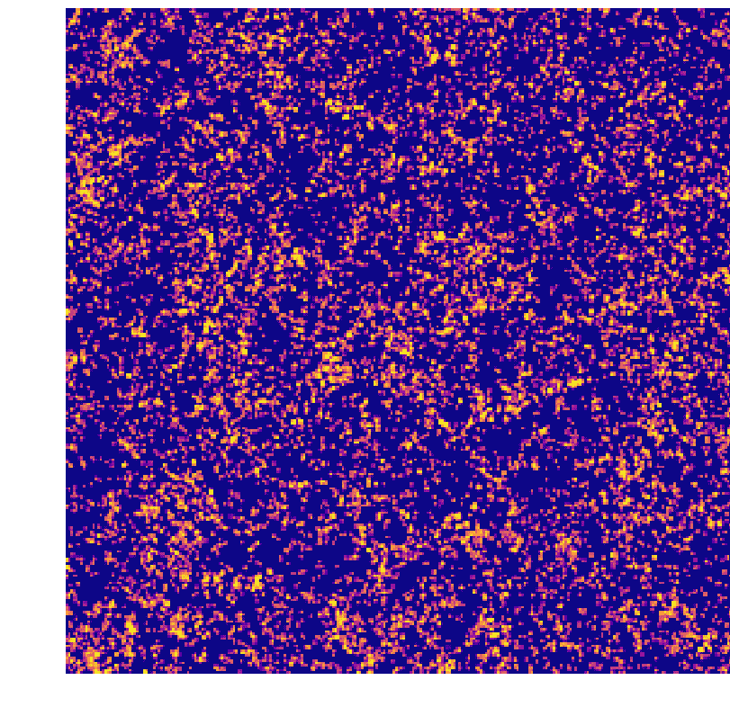
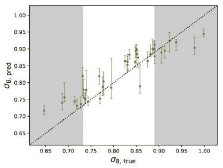

<!--yml

类别：未分类

日期：2024-09-06 20:04:47

-->

# [1909.10527] 一种用于从银河系红移调查中获得宇宙学约束的混合深度学习方法

> 来源：[`ar5iv.labs.arxiv.org/html/1909.10527`](https://ar5iv.labs.arxiv.org/html/1909.10527)

# 一种用于从银河系红移调查中获得宇宙学约束的混合深度学习方法

Michelle Ntampaka 哈佛数据科学计划，哈佛大学，马萨诸塞州剑桥市 02138，美国 天体物理中心 $|$ 哈佛与史密松学会，马萨诸塞州剑桥市 02138，美国 Daniel J. Eisenstein 天体物理中心 $|$ 哈佛与史密松学会，马萨诸塞州剑桥市 02138，美国 Sihan Yuan 天体物理中心 $|$ 哈佛与史密松学会，马萨诸塞州剑桥市 02138，美国 Lehman H. Garrison 天体物理中心 $|$ 哈佛与史密松学会，马萨诸塞州剑桥市 02138，美国 计算天体物理中心，Flatiron 研究所，纽约州纽约市 10010，美国

###### 摘要

我们提出了一种基于深度机器学习（ML）的技术，以准确确定$\sigma_{8}$和$\Omega_{m}$，该技术基于模拟的 3D 银河系调查。这些模拟调查是从 AbacusCosmos 套件的$N$-体模拟中构建的，该套件包含 40 个宇宙学体积模拟，涵盖了多种宇宙学模型，我们通过使用广义的晕占据分布（HODs）来考虑银河系形成情景的不确定性。我们探讨了三种 ML 模型：一个 3D 卷积神经网络（CNN）、一个基于功率谱的全连接网络，以及一个将这两者结合起来的混合方法，将物理动机的汇总统计与灵活的 CNN 相结合。我们描述了在一组匹配相位模拟上训练深度模型的最佳实践，并在完全独立的样本上测试了我们的模型，该样本使用了之前未见过的初始条件、宇宙学参数和 HOD 参数。尽管模拟观测数据相当小（$\sim 0.07h^{-3}\,\mathrm{Gpc}^{3}$），且训练数据跨越了广泛的参数空间（6 个宇宙学参数和 6 个 HOD 参数），CNN 和混合 CNN 仍然能够将$\sigma_{8}$和$\Omega_{m}$的约束精度提高到$\sim 3\%$和$\sim 4\%$。

^†^†期刊：ApJ

## 1 引言

在 $\Lambda$CDM 宇宙学模型中，早期宇宙中的微小密度波动演化为今天的宇宙网，其中包含过密的暗物质晕、细丝和层。印在这一大尺度结构上的信息涉及底层的宇宙学模型，只要知道如何和在哪里查找。这些描述宇宙中物质大尺度分布的测量包含有关驱动其形成的宇宙学模型的信息。这些测量包括星系的空间分布和聚类的描述（例如，Huchra et al., 1990；Shectman et al., 1996；Percival et al., 2001；Tegmark et al., 2004）、大质量星系团的丰度（例如，Vikhlinin et al., 2009；Mantz et al., 2015；de Haan et al., 2016）、星系的弱引力透镜效应（例如，Bacon et al., 2000；Kaiser et al., 2000；Wittman et al., 2000；Van Waerbeke et al., 2000；DES Collaboration et al., 2017；Hildebrandt et al., 2018；Hikage et al., 2019）以及重子声学振荡的长度尺度（例如，Eisenstein et al., 2005；Cole et al., 2005；Alam et al., 2017）。这些与早期宇宙探测的一个显著区别是非高斯性：尽管早期宇宙被高斯随机场很好地描述（例如，Planck Collaboration et al., 2014a，b），但引力坍缩驱动了晚期物质分布中的非高斯相关的形成。有关这些及其他观测宇宙学探测的综述，请参见 Weinberg et al. (2013)。

星系存在于暗物质晕中，是大尺度结构的跟踪者，尽管存在偏差。大型光谱调查如斯隆数字天空调查（SDSS, York et al., 2000）已经绘制了宇宙中星系的三维分布图，而即将进行的光谱调查如暗能量光谱仪（DESI, DESI Collaboration et al., 2016）、 Subaru 主焦点光谱仪（PFS, Takada et al., 2014）、4 米多目标光谱望远镜（4MOST, de Jong et al., 2014）和欧几里得（Amendola et al., 2013）将生成极其详细的天空地图。星系功率谱提供了一种总结和解释这些三维星系地图的工具，并可用于对描述 $\Lambda$CDM 宇宙学的参数施加约束（例如，Tegmark et al., 2004），但在解开宇宙学和星系偏差的影响时需要小心（例如，van den Bosch et al., 2013；More et al., 2013；Cacciato et al., 2013）。

尽管功率谱是对星系分布信息的极为有用的压缩，但它并没有完全反映这些信息，因为晚期星系分布并不是一个高斯随机场。在小长度尺度（$\lesssim$ 几个 Mpc）上，暗物质晕已经崩溃并达到动力学平衡，导致高斯相关性偏差巨大，但在中等尺度上，由于宇宙网状结构的丝状物、墙面和空洞，这些偏差仍然显著。额外的统计量，例如压缩的三点相关函数（Yuan 等，2018a）、红移空间功率谱（Kobayashi 等，2019）、圆柱体中的计数（Wang 等，2019）以及最小生成树（Naidoo 等，2019），已被证明能丰富补充宇宙学信息，通过捕捉功率谱无法单独描述的非高斯星系分布细节。

这些关于星系如何在三维空间中分布的高阶统计描述通常需要通过宇宙学模拟来进行校准。追踪星系形成的宇宙学流体动力学模拟计算开销较大，因此更可行的方法是使用已经填充了星系的较为经济的`N`-体模拟。这可以通过一种匹配星系与模拟暗物质结构的技术来实现，例如通过晕占据分布（HOD，例如，Peacock & Smith，2000；Scoccimarro 等，2001；Berlind & Weinberg，2002；Zheng 等，2005）。

在其最简单的假设下，HOD 使用晕质量作为唯一决定一个晕是否会容纳特定类型星系的属性。这个假设的破裂被称为星系组装偏差，它断言仅靠质量是不够的，还有额外的环境和组装因素发挥作用。这些因素包括形成时间（Gao 等，2005）和晕浓度（Wechsler 等，2006）。现代 HOD 实现通常提供灵活性来考虑组装偏差（例如，Hearin 等，2016；Yuan 等，2018b；Beltz-Mohrmann 等，2019）。

机器学习（ML）提供了许多方法，可以从印在银河系 3D 分布上的复杂空间模式中发现和提取信息。因此，尽管存在众多复杂的影响因素，ML 仍然是推断宇宙学模型的一个诱人方法。针对这项任务的一类有前途的工具是卷积神经网络（CNNs，例如 Fukushima & Miyake，1982；LeCun 等，1999；Krizhevsky 等，2012；Simonyan & Zisserman，2014），这些工具通常用于图像识别任务。CNN 使用多个隐藏层来提取图像特征，如边缘、形状和纹理。通常，CNN 将卷积层和池化层配对以从输入图像中提取有意义的特征，然后通过深度全连接层输出图像类别或数值标签。由于这些深度网络学习提取有意义信息所需的滤波器，因此它们对图像预处理的需求非常少。有关深度神经网络的综述，请参见 Schmidhuber（2014）。

CNN 通常应用于 2D 图像，这些图像可能是单色的或以多种颜色带表示。2D CNN 可以从模拟的收敛图中提取非高斯性的信息，显著提高了与更标准统计方法相比的宇宙学约束（例如，Schmelzle 等，2017；Gupta 等，2018；Ribli 等，2019a，b），最近的研究已经将这一点扩展到使用 CNN 对观测结果施加宇宙学约束（Fluri 等，2019）。

然而，CNN 的应用不限于平面欧几里得图像（例如，Perraudin 等，2019），也不限于二维。该算法可以扩展到三维，其中第三维可能是，例如，时间维度（例如，视频输入，如 Ji 等，2013）或空间维度（例如，数据立方体，如 Kamnitsas 等，2016）。Ravanbakhsh 等（2017）首次应用了 3D CNN 的宇宙学应用，展示了该工具可以从模拟的 3D 暗物质分布中推断出潜在的宇宙学参数。

我们展示了将 3D CNNs 应用于从模拟星系图中学习宇宙学参数的应用。我们的混合深度学习架构直接从计算得到的 2D 功率谱中学习，并同时通过直接从原始的 3D 星系分布中学习来利用非高斯性。在第二部分中，我们描述了我们的模拟观测：宇宙学模拟的套件（2.1），应用于这些模拟的 HODs 的范围（2.2），训练和验证模拟观测（2.3），以及在普朗克宇宙学中精心构建和独立的测试模拟观测（2.4）。我们在第三部分中介绍了我们的三种深度学习架构，包括混合方法。我们在第四部分展示了我们的结果，并在第五部分进行讨论和结论。附录 A 更具有教学性质；它描述了模型预测范围随着训练的演变，提出了评估模型拟合度的新测试。

## 2 方法：模拟观测

我们使用 AbacusCosmos 模拟系列¹¹1[`lgarrison.github.io/AbacusCosmos/`](https://lgarrison.github.io/AbacusCosmos/)（Garrison 等， 2018， 2019）来创建三个数据集：训练集、验证集和测试集。训练集用于拟合机器学习模型；它涵盖了各种 CDM 宇宙学，并以模拟各种星系形成模型的方式填充了星系。验证集用于评估机器学习模型的拟合效果；它也涵盖了多种宇宙学参数和星系形成模型。测试集独立于训练集和验证集；它基于 Planck 基准宇宙学（Planck Collaboration 等， 2015），由未在训练或验证数据集中使用的初始条件的模拟构建，并使用未在训练或测试数据集中使用的 HODs 填充星系。三个数据集的创建过程在以下小节中进行了描述。

### 2.1 AbacusCosmos 模拟

AbacusCosmos 模拟是一套公开可用的 $N$-体模拟。该系列包括 AbacusCosmos 1100box 模拟，这是一个在多种宇宙学下的大体积 $N$-体模拟样本，以及 1100box Planck 模拟，这是一个与 Planck 基准宇宙学一致的宇宙学参数模拟样本。

AbacusCosmos 1100box 模拟用于创建训练集和验证集。该模拟系列包括 40 个模拟，涵盖了不同的宇宙学，这些宇宙学在六个宇宙学参数上有所不同：$\Omega_{CDM}\,h^{2}$、$\Omega_{b}\,h^{2}$、$\sigma_{8}$、$H_{0}$、$w_{0}$ 和 $n_{s}$。该系列模拟的宇宙学是通过拉丁超立方体算法选择的，并且以 Planck 基准宇宙学（Planck Collaboration 等， 2015）为中心。每个模拟的边长为 $1100h^{-1}\,\mathrm{Mpc}$，粒子质量为 $4\times 10^{10}h^{-1}\,\mathrm{M_{\odot}}$。这 40 个模拟系列是相位匹配的。

虽然 AbacusCosmos 1100box 模拟用于创建训练集和验证集，但 AbacusCosmos Planck 模拟用于创建测试集。这 20 个模拟具有与 Planck Collaboration 等（2015）一致的宇宙学参数：$\Omega_{b}\,h^{2}=0.02222$，$\Omega_{m}\,h^{2}=0.14212$，$w_{0}=-1$，$n_{s}=0.9652$，$\sigma_{8}=0.830$，$H_{0}=67.26$，$N_{\mathrm{eff}}=3.04$。它们具有与 1100box 系列模拟相同的边长（$1100h^{-1}\,\mathrm{Mpc}$）和粒子质量（$4\times 10^{10}h^{-1}\,\mathrm{M_{\odot}}$），但每个模拟都使用了独特的初始条件，且没有与 1100box 模拟相位匹配。有关 AbacusCosmos 模拟系列的更多细节，请参见 Garrison 等（2018）。

### 2.2 星系占据分布

暗物质晕的占据分布（HOD）是一种用来将暗物质晕中填充星系的方法。在其最基本的形式中，HOD 是概率模型，它们假设晕质量是唯一决定晕-星系连接的晕属性（Berlind & Weinberg，2002）。标准 HOD 模型将晕中包含中心星系的概率 $\overline{n}_{\mathrm{central}}$ 和卫星星系的平均数量 $\overline{n}_{\mathrm{satellite}}$ 作为单一晕属性，即质量 $M$ 的函数。Zheng & Weinberg（2007）的标准 HOD 给出了中心星系和卫星星系的平均数量：

|  | $\begin{split}\overline{n}_{\mathrm{central}}&amp;=\frac{1}{2}\mathrm{erfc}\left[\frac{\ln(M_{\mathrm{cut}}/M)}{\sqrt{2}\sigma}\right]\\[12.91663pt] \overline{n}_{\mathrm{satellite}}&amp;=\left[\frac{M-\kappa M_{\mathrm{cut}}}{M_{1}}\right]^{\alpha}\overline{n}_{\mathrm{central}},\end{split}$ |  | (1) |
| --- | --- | --- | --- |

其中 $M_{\mathrm{cut}}$ 设置了中心星系的晕质量尺度，$\sigma$ 设置了 $\overline{n}_{\mathrm{central}}$ 的误差函数宽度，$M_{1}$ 设置了卫星星系的质量尺度，$\alpha$ 设置了幂律的斜率，而 $\kappa M_{\mathrm{cut}}$ 设置了晕无法容纳卫星星系的下限。$M$ 表示晕质量，我们使用的是质心质量定义 $M_{vir}$。晕中中心星系的实际数量遵循伯努利分布，其均值为 $\overline{n}_{\mathrm{central}}$，而卫星星系的数量遵循泊松分布，其均值为 $\overline{n}_{\mathrm{satellite}}$。

虽然这个标准 HOD 根据晕质量以概率方式填充晕，但最近的 HOD 变体在建模中引入了更多的灵活性。这些灵活的 HOD 允许除了晕质量之外的额外晕属性来影响星系占据（例如，Hearin 等人，2016；Yuan 等人，2018b）。这里实施的 HOD 就是一个这样的灵活模型；它使用了公开的 GRAND-HOD 包²²2[`github.com/SandyYuan/GRAND-HOD`](https://github.com/SandyYuan/GRAND-HOD)。这个 HOD 实现对标准 HOD 进行了系列扩展，包括晕内卫星星系的分布灵活性、星系的速度分布和星系组装偏差。为了增加这种灵活性，我们引入了两个扩展：卫星分布参数 $s$ 和星系组装偏差参数 $A$。卫星分布参数允许暗物质晕内卫星星系的径向分布具有灵活性，而星系组装偏差参数允许 HOD 对晕浓度具有次要依赖。有关 GRAND-HOD 及其 HOD 扩展的完整信息，请参见 Yuan 等人（2018a）。

对于每个 AbacusCosmos 模拟箱，生成了十五组 HOD 模型参数，对于每个 Planck 箱，生成了 31 组。对于每个模拟箱，根据宇宙学选择一个基线 HOD 模型；这些基线模型仅在 $M_{\mathrm{cut}}$ 和 $M_{1}$ 上有所不同，其他所有 HOD 参数的基线值保持不变。这确保了扰动宇宙学和 HOD 的综合效应是轻微的。这是因为，尽管每个模拟的宇宙学参数仅被扰动了几个百分点，但将这些宇宙学变化与 HOD 的扰动结合起来可能会导致模拟目录和聚类统计的剧烈变化。为了最小化这些影响，我们不是根据与默认参数基础对齐的椭圆中的 HOD 参数来填充星系，而是根据在自定义参数基础上定义的椭圆中的参数进行填充。

|  |  |  |
| --- | --- | --- |
| $\textsc{$\sigma_{8}$}=0.92$, $\textsc{$\Omega_{m}$}=0.28$ | $\textsc{$\sigma_{8}$}=0.83$, $\textsc{$\Omega_{m}$}=0.32$ | $\textsc{$\sigma_{8}$}=0.71$, $\textsc{$\Omega_{m}$}=0.34$ |
|  |  |  |
| $\textsc{$\sigma_{8}$}=0.92$, $\textsc{$\Omega_{m}$}=0.28$ | $\textsc{$\sigma_{8}$}=0.83$, $\textsc{$\Omega_{m}$}=0.32$ | $\textsc{$\sigma_{8}$}=0.71$, $\textsc{$\Omega_{m}$}=0.34$ |

图 1：上部：一个训练输入图像的样本。展示的是三维图像（或“板材”）的二维投影。训练、验证和测试样本包括了多种选择，旨在减少给机器学习模型带来不公平优势的可能性：我们采用零点偏移以最小化从具有相关结构的图像中学习的情况，使用随机 HOD 和种子以应对星系形成物理中的不确定性，我们使用板材的轴向翻转来增强数据，并且在验证集中使用模拟的独特部分和独特的 HOD，以提供一种测试模型是否依赖于结构或 HOD 特性的方式。为了突出图像中严格由于宇宙学和 HOD 引起的差异，这些图像省略了零点偏移。下部：上述相同图像，通过高斯滤波器（$\sigma=1\,\mathrm{pixel}$）平滑，以强调由于宇宙学模型导致的图像差异。

对于 Planck 宇宙学，HOD 参数是参考 Kwan 等人 (2015) 中的参数范围选择的：$\log_{10}(M_{\mathrm{cut}}/h^{-1}\,\mathrm{M_{\odot}})=13.35$，$\log_{10}(M_{1}/h^{-1}\,\mathrm{M_{\odot}})=13.8$，$\sigma=0.85$，$\alpha=1$，$\kappa=1$，$s=0$ 和 $A=0$。然而，我们对非 Planck 仿真的两个基线 HOD 参数值——$M_{\mathrm{cut}}$ 和 $M_{1}$——进行了修改。我们将每个宇宙学盒子中 $M_{\mathrm{cut}}$ 的基线值设置为，使得所有 $M>M_{\mathrm{cut}}$ 的光晕的投影 2 点相关函数 $w_{p}(5-10\rm{Mpc})$ 等于基线 HOD 在 Planck 宇宙学中的 $w_{p}(5-10\rm{Mpc})$，其中 $w_{p}(5-10\rm{Mpc})$ 定义为

|  | $w_{p}(5-10\textrm{Mpc})=\int_{5\textrm{Mpc}}^{10\textrm{Mpc}}w_{p}d(r_{\perp}).$ |  | (2) |
| --- | --- | --- | --- |

这有效地保持了中央星系的基线 $w_{p}$ 在所有宇宙学盒子中大致恒定。然后选择 $M_{1}$ 使得每个宇宙学盒子中的基线卫星-中央比例与 Planck 宇宙学中的基线 HOD 相同。

对于每个 1100box，我们在基线 HOD 的 $5\%$ 范围内均匀采样七对额外的模型参数（每个 Planck box 额外采样 15 对）。对于 HOD 参数 $s$ 和 $A$，基线参数为 0，我们在 $-0.05$ 和 $0.05$ 之间绘制均匀样本。每对 HOD 在基线 HOD 的两侧对称偏移。排除基线 HOD，每个 AbacusCosmos 1100box 仿真生成十四个独特的 HOD，而每个 Planck 仿真生成三十个独特的 HOD。使用四个随机种子根据 HOD 填充仿真，这样每个 HOD 生成四个独特的星系目录。如何使用这些细节将在下一节中描述。有关 HOD 实现的完整信息，请参见 Yuan 等人 (2019)。

### 2.3 训练与验证集

模拟观测的训练样本（用于训练深度学习模型）和模拟观测的验证样本（用于评估模型是否足够拟合）是从 AbacusCosmos 的 1100box 仿真中创建的。

AbacusCosmos 包含 40 种模拟宇宙学，对于每种模拟，我们沿$x$和$y$轴选择一个随机距离，作为盒子的新的 0 点（$z=0$，视线方向上的红移空间扭曲保持不变）。由于 1100box 模拟具有相同的初始条件，这种随机重排最小化了模型学习跨模拟的相关结构的可能性。³³3 具有匹配初始条件的模拟将产生例如具有独特或不寻常的丝状结构指纹的宇宙网部分。特定结构的演化阶段高度依赖于模拟的$\sigma_{8}$和其他宇宙学参数。由于卷积神经网络（CNN）特别擅长模式识别，因此必须小心防止 CNN 学习识别某种独特结构——尤其是特定于一组模拟及其初始条件的结构——并从其细节推断宇宙学参数。这种方法不会推广到实际观察中，可能会给出过于乐观的结果。训练集的虚拟观察数据构建自$220h^{-1}\,\mathrm{Mpc}\leq z<1100h^{-1}\,\mathrm{Mpc}$范围内的盒子部分，而验证集则构建自$0h^{-1}\,\mathrm{Mpc}\leq z<220h^{-1}\,\mathrm{Mpc}$范围内的结构。通过完全排除模拟的这一部分，能够测试并确保机器学习模型不依赖于识别或记忆源自匹配初始条件的大规模结构相关性。

盒子被划分为 20 个不重叠的板块，每个板块在$x$和$y$方向上为$550h^{-1}\,\mathrm{Mpc}$，在视线$z$方向上为$220h^{-1}\,\mathrm{Mpc}$。由 ROCKSTAR 光晕探测器（Behroozi 等，2012）生成的光晕目录成为每个板块四个虚拟观察的基础。

对于每个板块，我们从 15 个可用的 HOD 中选择并应用一个。11 个 HOD 会在 16 个训练板块中根据需要重复使用。剩下的四个 HOD 专门保留给四个验证板块。通过为验证集保留四个 HOD，验证集中的星系与用于训练的观察数据有所不同，从而确保机器学习模型的结果不依赖于记忆或对 HOD 细节的先前了解。

对于四个随机 HOD 种子中的每一个，板上都填充了星系。这些训练板上星系数量不等，范围从 $\sim 17000$ 到 $\sim 46000$ 个星系，星系数量与基础宇宙学的相关性较弱。为了防止 CNN 学习宇宙学参数与模拟观测中星系数量之间的相关性，我们随机选择星系种群，以确保所有观测均有 $15000$ 个星系。

选择的星系被分成一个 $275\times 275\times 55$ 的三维单色图像。使用三角形云（TSC）和 $2\times 2\times 5h^{-1}\,\mathrm{Mpc}$ 体素将星系分配到体素中。三个样本宇宙学的星系密度投影如图 1 所示。

由于第三部分中描述的机器学习模型在镜像图像时不保持不变，因此我们通过在 $x$-和/或 $y$-方向上对四个板中的三个进行轴向翻转来扩充数据。对于这三个镜像图像中的每一个，我们使用新的随机种子进行 HOD，并唯一选择 15000 个星系。

计算每个板的星系密度场的功率谱。为了进行这一计算，我们用零填充星系密度场，将图像大小在每个方向上加倍，以补偿丢失的周期性边界条件，对结果 $550\times 550\times 110$ 图像进行傅里叶变换，并将结果转换为物理单位的功率谱。接下来对这个三维功率谱进行去卷积，以考虑 TSC 伪影窗口函数（如 Jeong，2010 所示），并通过在分 bin 的球面环中平均功率来总结为一维功率谱。由于板和体素尺寸的各向异性，选择了最保守的最小和最大 $k$ 值。这些值分别由最短的盒子尺寸 ($220h^{-1}\,\mathrm{Mpc}$) 和最大像素尺寸的 Nyquist 频率 ($5h^{-1}\,\mathrm{Mpc}$) 确定。样本星系目录的功率谱如图 2 所示。

图 2：4 个训练宇宙模型（黄色、橙色、紫色和蓝色）以及普朗克测试宇宙模型（粉色）的平均星系功率谱$P(k)$。点表示平均功率，而误差条显示模拟观测的中间 68%。图中的“向量特征”输入，是这个功率谱的单次实现；对于每个模拟观测，功率谱直接从一个三维模拟星系观测中计算。

总结一下，从每个模拟中构建模拟观测的方法如下：

+   •

    随机选择一个$x$和$y$值作为盒子的新的 0 点。$z=0$，在视线方向上带有红移空间畸变，保持不变。

+   •

    盒子被分成 20 个不重叠的板块，每个板块的尺寸为$550\times 550\times 220h^{-1}\,\mathrm{Mpc}$。

+   •

    对于每个板块：

    +   –

        选择一个 HOD。使用十一种 HOD（根据需要重用一些）来填充 16 个训练板块中的星系。四种独特的 HOD 专门保留用于四个验证板块。

    +   –

        随机选择 15000 个星系。这些星系被使用 TSC 方法在$2\times 2\times 5h^{-1}\,\mathrm{Mpc}$的箱子中分 bin。

    +   –

        前一步骤在 4 个随机种子中重复进行，包含了板块的镜像。

    +   –

        计算板块的功率谱。

这种方法产生了 3200 个模拟观测，这些观测来自 40 个模拟，每个模拟有 20 个板块，每个板块有 4 个种子（包括轴向翻转）。

从$z\geq 220h^{-1}\,\mathrm{Mpc}$的模拟部分构建的 2560 个板块构成训练集，用于训练第三部分中描述的机器学习模型。其余 640 个板块来自模拟的非重叠部分（$z<220h^{-1}\,\mathrm{Mpc}$）。这些构成验证集，并用于评估模型的拟合效果。

我们在创建测试和验证集时包括了若干选择，以减少给机器学习模型带来不公平优势的可能性：我们使用了盒子的重新中心化以最小化学习具有相关结构的图像，我们使用随机 HOD 和种子以允许星系形成物理学中的不确定性，我们使用板块的轴向翻转来增强数据以考虑旋转不变性，我们在验证折中使用了独特的模拟部分和独特的 HOD，以确保模型不依赖于结构或 HOD 的细节。

### 2.4 普朗克测试集

测试样本来源于 AbacusCosmos Planck 模拟。20 个 Planck 模拟的初始条件各不相同，与第 2.3 节中描述的模拟样本不同。Planck 测试集的模拟观测采用类似于第 2.3 节中描述的方法，但有一个例外：20 个不重叠的板块分别根据从 31 个 HOD 中随机选择的 20 个独特 HOD 进行填充。考虑到数据增强的轴向翻转，最终测试样本为 1600 个板块及其相关的功率谱。我们的测试集与训练和验证集完全独立。虽然训练和验证集使用的宇宙学模型接近 Planck 基准宇宙学，但该精确宇宙学模型从未被明确用于训练或测试。

## 3 方法：机器学习模型

我们评估了三种机器学习模型：1. 一个标准卷积神经网络（CNN），从 3D 银河图像中学习以回归宇宙学参数；2. 一个神经网络（NN），从银河图像的功率谱中学习以回归宇宙学参数；3. 一个混合 CNN（hCNN），它使用标准 CNN，但也可以利用有意义的总结信息——在这种情况下，是银河功率谱——将物理上有意义的信息注入全连接层。这三种模型的详细描述如下。

### 3.1 标准 CNN

图 3：三种 ML 模型的视觉总结。神经网络（NN）使用向量输入（绿色）和全连接层（橙色）进行处理。标准卷积神经网络（CNN）使用图像输入以及图像处理层（蓝色）加全连接层（橙色）。混合 CNN（hCNN）通过将向量特征与图像处理的最后一层拼接起来来结合这两者；结果送入全连接层。有关 NN、CNN 和 hCNN 的进一步细节，请参见第三部分。

卷积神经网络 (CNNs, Fukushima & Miyake, 1982; LeCun et al., 1999; Krizhevsky et al., 2012) 是一种常用于图像识别任务的机器学习算法。经过多次迭代，即“轮次”，网络学习卷积滤波器、权重和偏置，以从输入图像中提取有意义的模式。对于宇宙学应用，CNNs 传统上应用于单色（例如，Lanusse et al., 2018; Ntampaka et al., 2018; Ho et al., 2019）或多色 2D 图像（例如，La Plante & Ntampaka, 2018）。然而，CNNs 并不限于 2D 训练数据；它们也可以用于 3D 数据立方体。三维 CNNs 因解释视频而变得流行，时间作为第三维度（例如，Ji et al., 2013），但该算法在最近的宇宙学应用中已将技术应用于 3D 数据（例如，Ravanbakhsh et al., 2017; He et al., 2018; Mathuriya et al., 2018; Peel et al., 2018; Aragon-Calvo, 2019; Berger & Stein, 2019; Zhang et al., 2019; Pan et al., 2019）。

CNNs 通常使用卷积滤波器和池化层的组合来从输入图像中提取有意义的模式。接下来是若干全连接层。我们的标准 CNN 架构包括几个连续的全卷积层，以及并行的平均池化和最大池化分支。它在 Keras (Chollet, 2015) 中实现，后端使用 Tensorflow (Abadi et al., 2016)，并如图 3 所示。完整的架构如下：

1.  1.

    $3\times 3\times 3$ 卷积，带 4 个滤波器

1.  带泄漏的 ReLU 激活

1.  批量归一化

1.  2.

    $3\times 3\times 3$ 卷积，带 4 个滤波器

1.  带泄漏的 ReLU 激活

1.  批量归一化

1.  3.

    $3\times 3\times 3$ 卷积，带 4 个滤波器

1.  带泄漏的 ReLU 激活

1.  批量归一化

1.  4.

    最大池化分支（与 # 5 并行）：

    1.  (a)

        $5\times 5\times 1$ 最大池化

    1.  (b)

        $3\times 3\times 3$ 卷积，带 4 个滤波器

    1.  带泄漏的 ReLU 激活

    1.  批量归一化

    1.  (c)

        $5\times 5\times 5$ 最大池化

    1.  (d)

        $3\times 3\times 3$ 卷积，带 32 个滤波器

    1.  带泄漏的 ReLU 激活

    1.  批量归一化

    1.  (e)

        $5\times 5\times 5$ 最大池化，展平

1.  5.

    平均池化分支（与 # 4 并行）：

    1.  (a)

        $5\times 5\times 1$ 最大池化

    1.  (b)

        $3\times 3\times 3$ 卷积，4 个滤波器

    1.  泄漏 ReLU 激活

    1.  批量归一化

    1.  (c)

        $5\times 5\times 5$ 最大池化

    1.  (d)

        $3\times 3\times 3$ 卷积，32 个滤波器

    1.  泄漏 ReLU 激活

    1.  批量归一化

    1.  (e)

        $5\times 5\times 5$ 最大池化，展平

1.  6.

    最大池化分支输出（4e）和均值池化分支输出（5e）的连接

1.  泄漏 ReLU 激活

1.  7.

    1024 个神经元，完全连接

1.  泄漏 ReLU 激活

1.  30% 随机失活

1.  8.

    512 个神经元，完全连接

1.  泄漏 ReLU 激活

1.  30% 随机失活

1.  9.

    512 个神经元，完全连接

1.  泄漏 ReLU 激活

1.  30% 随机失活

1.  10.

    256 个神经元，完全连接

1.  泄漏 ReLU 激活

1.  30% 随机失活

1.  11.

    128 个神经元，完全连接

1.  泄漏 ReLU 激活

1.  30% 随机失活

1.  12.

    64 个神经元，完全连接

1.  线性激活

1.  30% 随机失活

1.  13.

    2 个输出神经元，分别对应 $\Omega_{m}$ 和 $\sigma_{8}$

我们使用均值绝对误差损失函数和 Adam 优化器（Kingma & Ba，2014）。实际上，我们线性缩放 $\Omega_{m}$ 和 $\sigma_{8}$，使得训练值范围在 $-1$ 和 $1$ 之间。根据相同线性缩放的逆，将输出预测值缩放回物理上可解释的值。虽然这对这些特定的宇宙学参数（$\sigma_{8}$ 和 $\Omega_{m}$ 在同一数量级）可能不是一个重要细节，但当训练具有显著不同值范围的多个输出时（例如，如果以 $\mathrm{km}\,s^{-1}\,\mathrm{Mpc}^{-1}$ 为单位的 $H_{0}$ 被添加为第三个输出参数），可能会出现问题。关于训练方案和学习率的详细信息见 3.3 节。

在我们的模型中，小规模特征提取由几个连续的 3D $3\times 3\times 3$ 卷积滤波器完成。特征提取后是最大池化和均值池化分支的激进池化，这两个分支将数据立方体缩减到 32 个神经元。这些分支的输出被连接起来，接着是完全连接的层。我们在整个过程中使用了整流线性单元（ReLU，Nair & Hinton，2010）激活函数。30% 的神经元在训练过程中被忽略的随机失活减少了模型过拟合的可能性（Srivastava et al.，2014）。

该模型以$275\times 275\times 55$的图像作为输入，学习所需的滤波器、权重和偏置，以回归两个宇宙学参数——物质波动幅度（$\sigma_{8}$）和物质密度参数（$\Omega_{m}$）；两个输出神经元分别映射到一个宇宙学参数。

### 3.2 标准神经网络

标准神经网络仅使用全连接层，将功率谱作为唯一输入，通过步骤 8 到 13 输入上述架构中。见于图 3。该模型以分 bin 的功率谱作为输入，学习回归所关注的宇宙学参数所需的权重和偏置。

#### 3.2.1 混合 CNN

混合卷积神经网络（hCNN）利用了标准 CNN 的优势，同时也利用了已知的重要和有意义的信息。携带宇宙学信息的功率谱通过在标准 CNN 架构的步骤 8 插入这些信息来折叠。需要注意的是，将物理上有意义的参数融入深度学习技术并非新鲜事，这在天文学中已有应用（Dattilo et al., 2019），尽管尚未被广泛采用。

hCNN 模型使用$275\times 275\times 55$的图像以及分 bin 的功率谱作为输入，以学习$\Omega_{m}$和$\sigma_{8}$。此架构见于图 3。

|  |  |
| --- | --- |

图 4：均方误差 (MSE) 随缩放轮次 $\mathcal{E}$ 的变化。标准神经网络 (NN，绿色虚线) 很快收敛到低误差解，而卷积神经网络 (CNN，蓝色虚线) 和混合 CNN (hCNN，紫色实线) 在训练初期 ($\mathcal{E}\lesssim 0.32$) 存在较大波动。这里，验证集预测的误差通常比均值猜测 (灰线) 更差，适用于 $\sigma_{8}$ (左) 和 $\Omega_{m}$ (右)。学习率在 $\mathcal{E}\approx 0.32$ 时降低，CNN 和 hCNN 进入低误差状态。为了去除视觉上干扰整体误差和斜率趋势的波动，本图中的曲线经过高斯滤波平滑处理。

### 3.3 训练

对于训练 CNN 和 hCNN，我们采用两阶段训练方案。我们的训练方法在训练的初始阶段利用较大的步长来捕捉宇宙学和 HOD 模型的多样性，然后在训练的第二阶段转向较小的步长以改进拟合 (有关详细讨论，请参见附录 A。我们训练 550 轮，其中初始阶段 175 轮，第二阶段 375 轮。最后 50 轮将用于选择一个满足比仅仅最小化损失函数更精细标准的模型。有关详细讨论，请参见第 4.2.1 节。注意，NN 对训练细节的敏感度较低，并且训练速度显著快于具有卷积层的模型，按照下面描述的阶段一的详细信息，训练了 800 轮。

我们使用 Adam 优化器 (Kingma & Ba, 2014)，其步长根据轮次变化，如下所示

|  | $\alpha(t)=\alpha_{0}\frac{\sqrt{1-\beta_{2}^{t}}}{1-\beta_{1}^{t}},$ |  | (3) |
| --- | --- | --- | --- |

其中 $\alpha$ 是步长，$t$ 表示时间步或轮次，$\alpha_{0}$ 是初始步长⁴⁴4 初始步长在 keras 文档中简单地表示为“学习率”。，参数 $\beta_{1}$ 和 $\beta_{2}$ 控制每轮的步长。我们采用默认值 $\beta_{1}=0.9$ 和 $\beta_{2}=0.999$。

第一阶段训练是 175 个时期，初始步长为$\alpha_{0}=1.0\times 10^{-5}$。我们发现，这一阶段由于其较大的初始步长，对于模型学习宇宙学的多样性是必要的。较小的学习率往往会产生模型，其预测值聚集在$\sigma_{8}$和$\Omega_{m}$的均值附近，而较大的学习率则倾向于产生模型，其在偏差上波动剧烈或过拟合训练数据。在接近第 175 个时期时，我们在 CNN 和 hCNN 中发现学习率过大。这一特征表现为对验证集的过度或不足预测的倾向波动，可以在图 4 中看到，图中展示了大幅波动的均方误差（MSE）。MSE 被绘制为缩放时期$\mathcal{E}$的函数，$\mathcal{E}$定义为时期除以最大训练时期数。

我们将第 175 个时期的模型作为预训练模型，并过渡到学习率较低的第二阶段训练。第二阶段训练是额外的 375 个时期，初始步长为$\alpha_{0}=0.2\times 10^{-5}$。为了清晰起见，我们将第二阶段训练的第一个训练时期称为“时期 176”。然而，仅用于方程 3 的目的，$t$被重置为$0$。图 4 显示了降低学习率的效果：在$\mathcal{E}\approx 0.32$时，均方误差显著下降，因为模型稳定地拟合了描述验证数据的稳定状态。

过拟合被定义为模型在测试集上产生优异预测但在验证集上失败的倾向。（“过拟合”这一术语有时用来描述深度学习方法在宇宙学模拟中识别出不描述实际观测的特征，但我们在这里使用更传统的定义。）学习方案中的两个变化倾向于导致过拟合模型：首先是增加学习率，其次是仅通过去除均值池化分支来使用最大池化。当模型过拟合时，尽管训练数据即使在极端值$\sigma_{8}$和$\Omega_{m}$下也被很好地描述，但验证集却严重偏向于均值。

然而，我们需要注意的是，我们尚未探索全面的超参数网格以进行模型优化。可能通过仔细选择 $\beta_{1}$ 和 $\beta_{2}$ 的值以平滑减少步长，可以避免这种两阶段的训练方案。同样，我们也没有彻底检查通过增加学习率或在多种超参数组合下去除均值池化的过拟合倾向。这种全面的网格搜索在当前计算资源下成本高昂且难以实现。因此，本节中描述的学习率和池化的效果应作为训练其他深度模型时的警示，但不应过度解读。

## 4 结果

|  |  |
| --- | --- |
|  |  |

图 5：上图：最佳拟合线的斜率作为缩放时代 $\mathcal{E}$ 的函数。斜率为 1 表示模型捕捉到了 $\sigma_{8}$ 和 $\Omega_{m}$ 的全范围，而斜率为 0 则表明模型在验证集中对所有数据的预测接近或等于均值。随着模型的训练，预测的多样性增加。然而，任何模型的斜率都未达到 $1$，这表明对于具有极端值的 $\sigma_{8}$ 或 $\Omega_{m}$ 的任何模拟观察，预测将会偏向均值。下图：预测偏差 $b$ 作为缩放时代 $\mathcal{E}$ 的函数。虽然标准神经网络（NN，绿色虚线）迅速稳定到低偏差的解，卷积神经网络（CNN，蓝色虚线）和混合卷积神经网络（hCNN，紫色实线）在训练的初始阶段（$\mathcal{E}\lesssim 0.32$）有较大的波动。在 $\mathcal{E}=0.32$ 时降低学习率，CNN 和 hCNN 稳定到低偏差的范围。为了去除视觉上影响整体趋势的波动，本图中所示的曲线已通过高斯滤波器进行平滑处理。

在这里，我们展示了来自验证集的结果，以评估模型的拟合情况，既包括接近中位数模型的情况，也包括对 $\sigma_{8}$ 和 $\Omega_{m}$ 的极端值的情况。我们还展示了测试集的结果，以探索该技术如何推广到更现实的情况，即宇宙学模型、星系形成细节和初始条件并不明确已知。

### 4.1 验证集结果

我们定义预测偏差 $b$ 为

|  | $b\equiv\left<\left&#124;x_{\mathrm{predicted}}-x_{\mathrm{true}}\right&#124;\right>,$ |  | (4) |
| --- | --- | --- | --- |

其中 $<\cdot>$ 表示均值，$x$ 是 $\sigma_{8}$ 或 $\Omega_{m}$ 的占位符。图 5 显示了偏差作为尺度时期 $\mathcal{E}$ 的函数。在训练的第二阶段，CNN 和 hCNN 的偏差显著下降，表明较低的学习率确实以有意义的方式减少了错误，并学习了与宇宙学参数相关的空间银河模式。

虽然 MSE 和偏差都评估了验证集预测的典型偏差，但这些统计数据本身并不能讲述完整的故事。同样重要的是要了解模型在训练集边缘附近的表现。为此，我们评估了通过真实值和预测值的 $\sigma_{8}$ 最佳拟合线的斜率，以及通过真实值和预测值的 $\Omega_{m}$ 的最佳拟合线的斜率。斜率接近 $1$ 表示模型在 $\sigma_{8}$ 和 $\Omega_{m}$ 的极端值附近拟合良好，而斜率为 $0$ 则表示模型偏向于均值。过拟合的模型通常会有较大的 MSE 和偏差，并且斜率较小。图 5 显示了这一线性最佳拟合线的斜率。我们可以从这个拟合的值中推断出，$\sigma_{8}$ 和 $\Omega_{m}$ 的值在训练数据的边缘附近模型可能预测得不好，并且当面对远离均值的宇宙学参数集时，模型可能会偏向于均值。

### 4.2 测试集结果

尽管讨论验证集结果是一个有趣的学术练习，但不幸的是，宇宙给我们只有一个银河样本。这个样本在宇宙学参数和银河形成物理（以及初始条件！）上可能与我们的训练集不同。如果我们最终打算使用 CNN 或 hCNN 从观测到的银河样本中限制宇宙学模型，那么开发工具来评估机器学习模型是至关重要的，这些工具需要超越简单的损失最小化或在验证数据上的性能。尽管模型训练是为了最小化平均绝对误差，但这不一定是最有趣或最有用的统计量，用于对大规模银河调查的宇宙学分析。接下来，我们提出了一种选择相对无偏模型的技术。

|  |  |
| --- | --- |
|  |  |
|  |  |

图 6：神经网络（NN，绿色，上）、卷积神经网络（CNN，蓝色，中）和混合卷积神经网络（hCNN，紫色，下）对于$\sigma_{8}$（左）和$\Omega_{m}$（右）的真实值和预测值。对于每个 40 个宇宙学模型的验证数据，显示了中位数（圆圈）和 68%的中间值（误差条）。尽管预测值通常接近于$\sigma_{8}$和$\Omega_{m}$的中央值附近的一对一线（黑色虚线），但在极端值处向均值的偏斜更为明显。为了说明，$\sigma_{8}$和$\Omega_{m}$值低于第 16 百分位数和高于第 84 百分位数的部分背景为灰色，而中间 1-$\sigma$的背景为白色。CNN 和 hCNN 的验证集预测显示出明显比 NN 更紧密的散布。这并不令人意外，因为 NN 仅从功率谱学习（见图 2），而 CNN 和 hCNN 有更多的灵活性从未经预处理的模拟星系目录中学习。

#### 4.2.1 无偏模型选择

如图 5 所示，模型在$\sigma_{8}$和$\Omega_{m}$的极端值处表现不佳。这并不令人意外；机器学习模型在插值方面往往比在外推方面表现更好。在实践中，人们希望在一个较大的模拟宇宙学范围内进行训练，这个范围应远超包含预期结果的区域。此外，对于训练样本边缘附近的任何宇宙学模型，预计会有一个向均值偏斜的倾向。基于这一点（并且仅用于模型选择），我们将分析限制在$\sigma_{8}$-$\Omega_{m}$平面上一个 68%椭圆内的模拟中。⁵⁵ 这里选择的模拟在图 8 中显示为较浅的灰色；图中深灰色的模拟靠近$\sigma_{8}$-$\Omega_{m}$平面的边缘，预计结果会向均值偏斜，因此被排除在本次分析之外。

除了将此分析限制于 27 个与$\sigma_{8}$和$\Omega_{m}$值最接近平均宇宙学的模拟外，我们还仅评估 CNN 和 hCNN 训练的最后 50 个时期（$0.91<\mathcal{E}\leq 1.0$）。重要的是，我们只使用验证数据来评估模型。请记住，训练数据不应以这种方式使用，因为模型已经明确见过这些数据。同样，测试数据也不应用于评估模型，因为这样做会不公平地偏向结果。

对于 27 个模拟中的每一个，在每个时期，我们根据以下方法计算预测和真实宇宙学之间的距离：对于每个模拟的 16 个验证模拟观测，我们预测$\sigma_{8}$和$\Omega_{m}$。在$\sigma_{8}$-$\Omega_{m}$平面中计算 68%误差椭圆，以及真实宇宙学参数（$\Omega_{m,\,\mathrm{true}}$和$\sigma_{8,\,\mathrm{true}}$）和预测宇宙学参数椭圆中心（$\Omega_{m,\,\mathrm{mid}}$和$\sigma_{8,\,\mathrm{mid}}$）之间的距离。这个距离$\mathcal{Z}$，按以下公式计算：

|  | <math   alttext="\begin{split}\mathcal{Z}\,=\,&amp;\frac{(\Omega_{m,\,\mathrm{true}}-\Omega_{m,\,\mathrm{mid}})\cos{\alpha}+(\sigma_{8,\,\mathrm{true}}-\sigma_{8,\,\mathrm{mid}})\sin{\alpha}}{a^{2}}+\\ \\

&amp;\frac{(\Omega_{m,\,\mathrm{true}}-\Omega_{m,\,\mathrm{mid}})\cos{\alpha}+(\sigma_{8,\,\mathrm{true}}-\sigma_{8,\,\mathrm{mid}})\sin{\alpha}}{a^{2}}+\\ \\ &\frac{(\Omega_{m,\,\mathrm{true}}-\Omega_{m,\,\mathrm{mid}})\sin{\alpha}-(\sigma_{8,\,\mathrm{true}}-\sigma_{8,\,\mathrm{mid}})\sin{\alpha}}{b^{2}}\end{split}" display="block"><semantics ><mtable columnspacing="0pt" displaystyle="true" rowspacing="0pt"  ><mtr ><mtd  columnalign="right" ><mrow  ><mi >𝒵</mi><mo lspace="0.448em"  >=</mo></mrow></mtd><mtd columnalign="left"  ><mrow ><mfrac ><mrow  ><mrow ><mrow ><mo stretchy="false" >(</mo><mrow ><msub ><mi mathvariant="normal" >Ω</mi><mrow ><mi >m</mi><mo rspace="0.337em" >,</mo><mi >true</mi></mrow></msub><mo >−</mo><msub ><mi mathvariant="normal" >Ω</mi><mrow ><mi >m</mi><mo rspace="0.337em" >,</mo><mi >mid</mi></mrow></msub></mrow><mo stretchy="false" >)</mo></mrow><mo lspace="0.167em" rspace="0em"  >​</mo><mrow ><mi >cos</mi><mo lspace="0.167em" >⁡</mo><mi >α</mi></mrow></mrow><mo >+</mo><mrow ><mrow ><mo stretchy="false" >(</mo><mrow ><msub ><mi >σ</mi><mrow ><mn >8</mn><mo rspace="0.337em" >,</mo><mi >true</mi></mrow></msub><mo >−</mo><msub ><mi >σ</mi><mrow ><mn >8</mn><mo rspace="0.337em" >,</mo><mi >mid</mi></mrow></msub></mrow><mo stretchy="false" >)</mo></mrow><mo lspace="0.167em" rspace="0em"  >​</mo><mrow ><mi >sin</mi><mo lspace="0.167em"  >⁡</mo><mi >α</mi></mrow></mrow></mrow><msup ><mi >a</mi><mn >2</mn></msup></mfrac><mo >+</mo></mrow></mtd></mtr><mtr ><mtd  columnalign="left" ><mfrac  ><mrow ><mrow ><mrow  ><mo stretchy="false"  >(</mo><mrow ><msub ><mi mathvariant="normal"  >Ω</mi><mrow ><mi >m</mi><mo rspace="0.337em"  >,</mo><mi >true</mi></mrow></msub><mo >−</mo><msub ><mi mathvariant="normal"  >Ω</mi><mrow ><mi >m</mi><mo rspace="0.337em"  >,</mo><mi >mid</mi></mrow></msub></mrow><mo stretchy="false"  >)</mo></mrow><mo lspace="0.167em" rspace="0em"  >​</mo><mrow ><mi >sin</mi><mo lspace="0.167em" >⁡</mo><mi >α</mi></mrow></mrow><mo >−</mo><mrow ><mrow ><mo stretchy="false" >(</mo><mrow ><msub ><mi >σ</mi><mrow ><mn >8</mn><mo rspace="0.337em" >,</mo><mi >true</mi></mrow></msub><mo >−</mo><msub ><mi >σ</mi><mrow ><mn >8</mn><mo rspace="0.337em" >,</mo><mi >mid</mi></mrow></msub></mrow><mo stretchy="false" >)</mo></mrow><mo lspace="0.167em" rspace="0em"  >​</mo><mrow ><mi >sin</mi><mo lspace="0.167em"  >⁡</mo><mi >α</mi></mrow></mrow></mrow><msup ><mi >b</mi><mn  >2</mn></msup></mfrac></mtd></mtr></mtable><annotation-xml encoding="MathML-Content" ><apply  ><ci >𝒵</ci><apply ><apply  ><apply ><apply ><apply ><apply ><csymbol cd="ambiguous" >subscript</csymbol><ci >Ω</ci><list ><ci >𝑚</ci><ci >true</ci></list></apply><apply ><csymbol cd="ambiguous" >subscript</csymbol><ci >Ω</ci><list ><ci >𝑚</ci><ci >mid</ci></list></apply></apply><apply ><ci  >𝛼</ci></apply></apply><apply ><apply ><apply ><csymbol cd="ambiguous"  >subscript</csymbol><ci >𝜎</ci><list ><cn type="integer"  >8</cn><ci >true</ci></list></apply><apply ><csymbol cd="ambiguous"  >subscript</csymbol><ci >𝜎</ci><list ><cn type="integer"  >8</cn><ci >mid</ci></list></apply></apply><apply ><ci >𝛼</ci></apply></apply></apply><apply ><csymbol cd="ambiguous" >superscript</csymbol><ci >𝑎</ci><cn type="integer"  >2</cn></apply></apply><apply ><apply ><apply  ><apply ><apply ><csymbol cd="ambiguous"  >subscript</csymbol><ci >Ω</ci><list ><ci >𝑚</ci><ci >true</ci></list></apply><apply ><csymbol cd="ambiguous"  >subscript</csymbol><ci >Ω</ci><list ><ci >𝑚</ci><ci >mid</ci></list></apply></apply><apply ><ci >𝛼</ci></apply></apply><apply ><apply ><apply ><csymbol cd="ambiguous" >subscript</csymbol><ci >𝜎</ci><list ><cn type="integer" >8</cn><ci >true</ci></list></apply><apply ><csymbol cd="ambiguous" >subscript</csymbol><ci >𝜎</ci><list ><cn type="integer" >8</cn><ci >mid</ci></list></apply></apply><apply ><ci >𝛼</ci></apply></apply></apply><apply ><csymbol cd="ambiguous" >superscript</csymbol><ci >𝑏</ci><cn type="integer" >2</cn></apply></apply></apply></apply></annotation-xml><annotation encoding="application/x-tex" >\begin{split}\mathcal{Z}\,=\,&\frac{(\Omega_{m,\,\mathrm{true}}-\Omega_{m,\,\mathrm{mid}})\cos{\alpha}+(\sigma_{8,\,\mathrm{true}}-\sigma_{8,\,\mathrm{mid}})\sin{\alpha}}{a^{2}}+\\ \\ &\frac{(\Omega_{m,\,\mathrm{true}}-\Omega_{m,\,\mathrm{mid}})\sin{\alpha}-(\sigma_{8,\,\mathrm{true}}-\sigma_{8,\,\mathrm{mid}})\sin{\alpha}}{b^{2}}\end{split}</annotation></semantics></math> |  | (5) |

其中，$\alpha$ 是最佳拟合 68%椭圆的角度，$a$ 是半长轴的长度，$b$ 是半短轴的长度。$\mathcal{Z}$ 是二维 z 分数，其中 $\mathcal{Z}=1$ 可以解释为真实值在 68%椭圆的边缘，而 $\mathcal{Z}=0$ 表示真实值和预测值完全相同。我们注意到这种选择更偏向于准确性而非精确性，因为较大的误差椭圆对预测值和中间预测宇宙模型之间的大偏移更为宽容。

对于每个时代，均方误差（MSE）作为时代的函数进行计算。

|  | $\mathrm{MSE(e)}=\frac{1}{N_{\mathrm{sims}}}\sum_{i=1}^{N_{\mathrm{sims}}}\mathcal{Z}^{2}_{i}(e)$ |  | (6) |
| --- | --- | --- | --- |

我们选择均方误差（MSE）最小的时代作为最终模型——也是最不可能产生偏倚结果的模型——用于 CNN 和 hCNN。巧合的是，这些“无偏”模型来自于训练时代相当接近的时期，CNN 和 hCNN 的时代分别为 520 和 524（$\mathcal{E}\approx 0.95$）。如果选择定义一个在所有模型和时代上平均的二维误差椭圆，则选择相同的 hCNN 模型，但更倾向于具有略微更紧的误差条和更显著偏移的 CNN 模型。

图 6 显示了这些无偏时代验证集中 40 种宇宙学模型的中位数和中间 68%预测。正如预期的那样，模型明显趋向于平均值，特别是在$\sigma_{8}$和$\Omega_{m}$的异常值。CNN 和 hCNN 在真实值和预测值之间产生了比 NN 更紧密的相关性。

#### 4.2.2 Planck 测试集结果

图 7：验证集的 MSE，计算公式见方程 5 和 6，与测试集误差$\mathcal{Z}_{Planck}$ 紧密相关。图中展示了 CNN（蓝色虚线）和 hCNN（紫色实线）的分箱中位数和 68%散布。这里列出的值限制在时代 501-550（$0.91<\mathcal{E}\leq 1.0$）。低 MSE 与低-$\mathcal{Z}_{Planck}$ 模型之间的更紧密相关性在 hCNN 中稍微更明显，暗示 hCNN 可能是产生无偏结果的更稳健的方法。

图 8：NN（绿色虚线）、CNN（蓝色虚线）和 hCNN（紫色填充）的测试集预测；显示了 68%和 95%的误差椭圆。NN 受到训练模拟（灰色 x 标记）在 $\sigma_{8}$-$\Omega_{m}$ 平面上的退化影响，预测的宇宙学参数显著偏向于均值。CNN 和 hCNN 的误差椭圆更紧密，偏差更小。与 CNN（白色方块）相比，hCNN（白色圆圈标记误差椭圆中心）对均值的偏差略小。

请记住，训练集由 40 个匹配相位宇宙学模拟生成的模拟观测组成，而验证集由这些模拟的唯一部分（$z<200h^{-1}\,\mathrm{Mpc}$）生成的模拟观测组成。相比之下，测试集由在 Planck 宇宙学下的非匹配相位模拟生成的模拟观测组成，这些模拟中填充的星系使用了训练模型尚未见过的 HOD。由于宇宙学参数、HOD 和初始条件均为之前未见过，Planck 测试集在现实条件下提供了一个更公正的期望误差和偏差测试。

在前一节中，我们假设验证集的均方误差（MSE）可能作为选择一个无偏模型以应用于未见过的宇宙学的合理代理评估。实际上，验证 MSE 和 Planck 测试数据的 $\mathcal{Z}$ 值（记作 $\mathcal{Z}_{Planck}$）高度相关，如图 7 所示。$\log(MSE)$-$\log(\mathcal{Z}_{Planck})$ 分布的 Pearson R 相关系数为 CNN 的 0.88，hCNN 的相关系数略紧密，为 0.93。MSE-$\mathcal{Z}_{Planck}$ 平面上没有明显的演化证据作为时代的函数；尽管低 MSE 与低 $\mathcal{Z}_{Planck}$ 相关，但模型在 501-550 世代的训练过程中并未缓慢而稳定地朝着高或低 MSE 方向前进。模型的损失函数应驱动训练过程中跨 40 个训练宇宙模型的平均绝对误差降低，而所展示的测试评估了不同的拟合优度度量。

图 8 展示了 NN、CNN 和 hCNN 的宇宙学约束。尽管图 4、5 和 6 中的结果表明了训练的优良性，但 NN 的预测始终受到训练模拟的退化性严重影响。这也许并不令人惊讶。它所训练的功率谱是从相对较小的体积$\sim 0.07\,h^{-3}\,\mathrm{Gpc}^{3}$中计算得出的，而与之相比，SDSS DR11 Baryon Oscillation Spectroscopic Survey (BOSS)观察的有效体积约为$\sim 6\,\mathrm{Gpc}^{3}$（Gil-Marín 等， 2015）。本研究中使用的虚拟观测体积过小，无法孤立出重子声学峰并可靠地测量声学尺度。因此，尽管 NN 以无偏方式预测$\sigma_{8}$，但其对$\Omega_{m}$的预测则偏低，并向训练模拟的均值$\Omega_{m}$拉拽。

相较于 NN，CNN 和 hCNN 的预测结果显著地不受偏见影响。图 8 中的宇宙学约束，以及图 7 中的低-$\mathcal{Z}_{Planck}$模型样本，表明 hCNN 中包含的矢量特征可能使模型对偏差更具鲁棒性，尽管矢量特征对偏差影响的证据并不强。

表 1 列出了模拟参数和测试集结果。为了参考，我们包括了 Planck 测试集的真实值；回顾一下，Planck 系列的所有模拟都是在相同的宇宙学模型下运行的，因此这些值的散布是 $0$。表 1 还给出了描述训练数据分布的参数，供参考。这些包括训练集均值 $\sigma_{8}$、均值 $\Omega_{m}$ 以及这些的标准差，并用作模拟宇宙学分布与所呈现误差条对比的基准。

对于三种 ML 模型，给出了均值（$\bar{x}$）、偏移量（$\bar{x}-x_{\textit{Planck}}$）、预测的标准差（记作 $\sigma$）以及 1D $z$-score（偏移量$/\sigma$）。在这三者中，NN 的偏差最大，特别是在 $\Omega_{m}$ 中，均值预测距离真实值约 $1.3-\sigma$。根据 NN 的偏差和误差条，我们可以得出结论，盒子体积可能不足以使功率谱具有诊断性。转向更大的模拟观测，能够更可靠地测量声学尺度，可能会改善 NN 技术。

另一方面，CNN 和 hCNN 的预测均在 $\sigma_{8}$ 误差范围内 3% 和 $\Omega_{m}$ 误差范围内 4%。CNN 和 hCNN 的误差条大小相似，但 hCNN 的偏差比 CNN 小约 $2$ 倍。然而，CNN 和 hCNN 的偏差都很小，需要对更大模拟观测进行进一步研究，以便对 hCNN 架构的去偏差潜力做出有力的声明。

表 1：结果总结

|  | $\sigma_{8}$ | $\Omega_{m}$ |
| --- | --- | --- |
|  | 均值 | 偏移量 | $\sigma$ | $z$ | 均值 | 偏移量 | $\sigma$ | $z$ |
| --- | --- | --- | --- | --- | --- | --- | --- | --- |
| 训练集 | $0.818$ |  $\cdots$ | $0.083$ |  $\cdots$ | $0.303$ |  $\cdots$ | $0.027$ |  $\cdots$ |
| Planck 测试集 | $0.830$ |  $\cdots$ |  $\cdots$ |  $\cdots$ | $0.314$ |  $\cdots$ |  $\cdots$ |  $\cdots$ |
| NN | $0.825$ | $0.005$ | $0.035$ | $0.147$ | $0.299$ | $0.015$ | $0.012$ | $1.307$ |
| CNN | $0.824$ | $0.006$ | $0.022$ | $0.278$ | $0.311$ | $0.003$ | $0.012$ | $0.268$ |
| hCNN | $0.827$ | $0.003$ | $0.023$ | $0.144$ | $0.312$ | $0.002$ | $0.012$ | $0.121$ |

## 5 讨论与结论

我们展示了三种机器学习方法用于从模拟的 3D 星系调查中学习 $\sigma_{8}$ 和 $\Omega_{m}$。神经网络（NN）使用分箱的功率谱作为输入，并通过一个全连接的神经网络架构进行处理。卷积神经网络（CNN）使用空间分箱的 3D 星系分布；这通过一系列卷积和池化处理，最后通过一个全连接网络。混合 CNN（hCNN）将这两者合并。

这些方法在 AbacusCosmos 系列的宇宙学 $N$-体模拟上进行训练和测试，模拟数据样本包括通过实现广义晕占据分布（HODs）构建的各种星系形成场景。完整的训练样本涵盖了一个广泛的参数空间——6 个宇宙学参数和 6 个 HOD 参数。

我们描述了若干最佳实践，以防止 3D CNN 或 3D hCNN 记忆结构并在验证数据上产生过于乐观的结果。最重要的是将所有模拟的独立部分留作验证集，以评估拟合优度。这个验证集应理想地从箱子的相同部分抽取，以防止深度网络记忆来自初始阶段匹配的模拟的相关结构。其他最佳实践包括重新中心化箱子、通过积极的池化限制模型对厚度尺度的知识、对星系目录进行子采样以防止模型从体积内的星系总数中学习，并使用标准的轴向翻转和旋转来考虑旋转不变性。

我们已经展示了验证集的均方误差（MSE）是选择能够产生无偏宇宙学参数估计的模型的有用代理，即使面对以前未见过的宇宙学和 HOD 参数。

模型受限于模拟数据的可用性：它在相对较小的体积（$\sim 0.07\,h^{-3}\,\mathrm{Gpc}^{3}$，即模拟箱体积的 1/20）上进行训练和测试。此外，我们仅在各种不同的宇宙学条件下用 40 个训练模拟进行训练，这些宇宙学条件在 $\Omega_{CDM}\,h^{2}$、$\Omega_{b}\,h^{2}$、$\sigma_{8}$、$H_{0}$、$w_{0}$ 和 $n_{s}$ 上有所不同，并根据具有 6 个参数的灵活 HOD 填充了星系。即便在这些限制条件下——小体积和大的宇宙学及 HOD 参数空间——我们已经证明可以稳健地训练出一个模型，直接从星系目录中学习 $\sigma_{8}$ 和 $\Omega_{m}$。

开发更为现实的模拟观测，这些观测涵盖了宇宙学和星系形成的参数空间，是将 3D 混合卷积神经网络（CNN）应用于观测数据的一个重要步骤。这些对现有模拟观测的扩展包括采用更多样化的宇宙学参数、利用更大规模的训练模拟观测、在星系模型中引入额外的灵活性以及对实际调查的嵌入建模。随着此类训练数据的出现，3D 混合 CNN 有潜力成为从下一代光谱调查中提取宇宙学信息的强大工具。

我们感谢 Alexei Efros、Melanie Fernandez、Zoltán Haiman、Paul La Plante、José Manuel、Szymon Nakoneczny、Junier Oliva、Barnabás Póczos、Siamak Ravanbakhsh、Dezsö Ribli、Alexey Vikhlinin 和 Javier Zazo 对本项目的宝贵反馈。

## 参考文献

+   Abadi 等人（2016）Abadi, M., Barham, P., Chen, J., 等. 2016, 在第十二届 USENIX 操作系统设计与实现研讨会（OSDI 16），265–283

+   Alam 等人（2017）Alam, S., Ata, M., Bailey, S., 等. 2017, MNRAS, 470, 2617

+   Amendola 等人（2013）Amendola, L., Appleby, S., Bacon, D., 等. 2013, 《相对论生活评论》，16, 6

+   Aragon-Calvo（2019）Aragon-Calvo, M. A. 2019, MNRAS, 484, 5771

+   Bacon 等人（2000）Bacon, D. J., Refregier, A. R., & Ellis, R. S. 2000, MNRAS, 318, 625

+   Behroozi 等人（2012）Behroozi, P., Wechsler, R., & Wu, H.-Y. 2012, Rockstar: 相空间暗物质晕探测器, 天体物理学源代码库, ascl:1210.008

+   Beltz-Mohrmann 等人（2019）Beltz-Mohrmann, G. D., Berlind, A. A., & Szewciw, A. O. 2019, arXiv e-prints, arXiv:1908.11448

+   Berger & Stein（2019）Berger, P., & Stein, G. 2019, MNRAS, 482, 2861

+   Berlind & Weinberg（2002）Berlind, A. A., & Weinberg, D. H. 2002, ApJ, 575, 587

+   Cacciato 等人（2013）Cacciato, M., van den Bosch, F. C., More, S., Mo, H., & Yang, X. 2013, MNRAS, 430, 767

+   Chollet（2015）Chollet, F. 2015, keras, [`github.com/fchollet/keras`](https://github.com/fchollet/keras)

+   Cole 等人（2005）Cole, S., Percival, W. J., Peacock, J. A., 等. 2005, MNRAS, 362, 505

+   Dattilo 等人（2019）Dattilo, A., Vanderburg, A., Shallue, C. J., 等. 2019, arXiv e-prints, arXiv:1903.10507

+   de Haan 等人（2016）de Haan, T., Benson, B. A., Bleem, L. E., 等. 2016, ApJ, 832, 95

+   de Jong 等人（2014）de Jong, R. S., Barden, S., Bellido-Tirado, O., 等. 2014, 在光学与光电仪器学会（SPIE）会议系列，第 9147 卷，Proc. SPIE, 91470M

+   DES 合作组等（2017）DES 合作组，Abbott, T. M. C., Abdalla, F. B., 等. 2017, ArXiv e-prints, arXiv:1708.01530

+   DESI 合作组等（2016）DESI 合作组，Aghamousa, A., Aguilar, J., 等. 2016, arXiv e-prints, arXiv:1611.00036

+   Eisenstein 等人（2005）Eisenstein, D. J., Zehavi, I., Hogg, D. W., 等. 2005, ApJ, 633, 560

+   Fluri 等人（2019）Fluri, J., Kacprzak, T., Lucchi, A., 等. 2019, arXiv e-prints, arXiv:1906.03156

+   Fukushima & Miyake (1982) Fukushima, K., & Miyake, S. 1982, 在《神经网络中的竞争与合作》(Springer) 中, 267–285

+   Gao 等人 (2005) Gao, L., Springel, V., & White, S. D. M. 2005, MNRAS, 363, L66

+   Garrison 等人 (2018) Garrison, L. H., Eisenstein, D. J., Ferrer, D., 等人. 2018, 《天体物理学杂志补刊系列》，236, 43

+   Garrison 等人 (2019) Garrison, L. H., Eisenstein, D. J., & Pinto, P. A. 2019, MNRAS, 485, 3370

+   Gil-Marín 等人 (2015) Gil-Marín, H., Noreña, J., Verde, L., 等人. 2015, MNRAS, 451, 539

+   Gupta 等人 (2018) Gupta, A., Matilla, J. M. Z., Hsu, D., & Haiman, Z. 2018, Phys. Rev. D, 97, 103515

+   He 等人 (2018) He, S., Li, Y., Feng, Y., 等人. 2018, arXiv 电子预印本, arXiv:1811.06533

+   Hearin 等人 (2016) Hearin, A. P., Zentner, A. R., van den Bosch, F. C., Campbell, D., & Tollerud, E. 2016, MNRAS, 460, 2552

+   Hikage 等人 (2019) Hikage, C., Oguri, M., Hamana, T., 等人. 2019, PASJ, 71, 43

+   Hildebrandt 等人 (2018) Hildebrandt, H., Köhlinger, F., van den Busch, J. L., 等人. 2018, arXiv 电子预印本, arXiv:1812.06076

+   Ho 等人 (2019) Ho, M., Rau, M. M., Ntampaka, M., 等人. 2019, arXiv 电子预印本, arXiv:1902.05950

+   Huchra 等人 (1990) Huchra, J. P., Geller, M. J., de Lapparent, V., & Corwin, Harold G., J. 1990, ApJS, 72, 433

+   Jeong (2010) Jeong, D. 2010, 博士论文, 德克萨斯大学奥斯汀分校

+   Ji 等人 (2013) Ji, S., Xu, W., Yang, M., & Yu, K. 2013, IEEE 计算机视觉与模式识别学报, 35, 221

+   Kaiser 等人 (2000) Kaiser, N., Wilson, G., & Luppino, G. A. 2000, arXiv 电子预印本, astro

+   Kamnitsas 等人 (2016) Kamnitsas, K., Ledig, C., Newcombe, V. F. J., 等人. 2016, CoRR, abs/1603.05959, arXiv:1603.05959

+   Kingma & Ba (2014) Kingma, D. P., & Ba, J. 2014, ArXiv 电子预印本, arXiv:1412.6980

+   Kobayashi 等人 (2019) Kobayashi, Y., Nishimichi, T., Takada, M., & Takahashi, R. 2019, arXiv 电子预印本, arXiv:1907.08515

+   Krizhevsky 等人 (2012) Krizhevsky, A., Sutskever, I., & Hinton, G. E. 2012, 在《神经信息处理系统进展 25》中, 编辑 F. Pereira, C. J. C. Burges, L. Bottou, & K. Q. Weinberger (Curran Associates, Inc.), 1097–1105

+   Kwan 等人 (2015) Kwan, J., Heitmann, K., Habib, S., 等人. 2015, ApJ, 810, 35

+   La Plante & Ntampaka (2018) La Plante, P., & Ntampaka, M. 2018, ArXiv 电子预印本, arXiv:1810.08211

+   Lanusse 等人 (2018) Lanusse, F., Ma, Q., Li, N., 等人. 2018, MNRAS, 473, 3895

+   LeCun 等人 (1999) LeCun, Y., Haffner, P., Bottou, L., & Bengio, Y. 1999, 在《计算机视觉中的形状、轮廓与分组》(Springer) 中, 319–345

+   Mantz 等人 (2015) Mantz, A. B., von der Linden, A., Allen, S. W., 等人. 2015, MNRAS, 446, 2205

+   Mathuriya 等人 (2018) Mathuriya, A., Bard, D., Mendygral, P., 等人. 2018, arXiv 电子预印本, arXiv:1808.04728

+   More 等人 (2013) More, S., van den Bosch, F. C., Cacciato, M., 等人. 2013, MNRAS, 430, 747

+   Naidoo 等人 (2019) Naidoo, K., Whiteway, L., Massara, E., 等人. 2019, arXiv 电子预印本, arXiv:1907.00989

+   Nair & Hinton（2010） Nair, V., & Hinton, G. E. 2010, 在第 27 届国际机器学习会议（ICML-10）论文集, 807–814

+   Ntampaka 等人（2018） Ntampaka, M., ZuHone, J., Eisenstein, D., 等. 2018, arXiv e-prints, arXiv:1810.07703

+   Pan 等人（2019） Pan, S., Liu, M., Forero-Romero, J., 等. 2019, arXiv e-prints, arXiv:1908.10590

+   Peacock & Smith（2000） Peacock, J. A., & Smith, R. E. 2000, MNRAS, 318, 1144

+   Peel 等人（2018） Peel, A., Lalande, F., Starck, J.-L., 等. 2018, ArXiv e-prints, arXiv:1810.11030

+   Percival 等人（2001） Percival, W. J., Baugh, C. M., Bland-Hawthorn, J., 等. 2001, MNRAS, 327, 1297

+   Perraudin 等人（2019） Perraudin, N., Defferrard, M., Kacprzak, T., & Sgier, R. 2019, 《天文学与计算》, 27, 130

+   Planck Collaboration 等人（2014a） Planck Collaboration, Ade, P. A. R., Aghanim, N., 等. 2014a, A&A, 571, A16

+   Planck Collaboration 等人（2014b） —. 2014b, A&A, 571, A24

+   Planck Collaboration 等人（2015） —. 2015, ArXiv e-prints, arXiv:1502.01589

+   Ravanbakhsh 等人（2017） Ravanbakhsh, S., Oliva, J., Fromenteau, S., 等. 2017, arXiv e-prints, arXiv:1711.02033

+   Ribli 等人（2019a） Ribli, D., Ármin Pataki, B., Zorrilla Matilla, J. M., 等. 2019a, arXiv e-prints, arXiv:1902.03663

+   Ribli 等人（2019b） Ribli, D., Pataki, B. Á., & Csabai, I. 2019b, Nature Astronomy, 3, 93

+   Schmelzle 等人（2017） Schmelzle, J., Lucchi, A., Kacprzak, T., 等. 2017, arXiv e-prints, arXiv:1707.05167

+   Schmidhuber（2014） Schmidhuber, J. 2014, ArXiv e-prints, arXiv:1404.7828

+   Scoccimarro 等人（2001） Scoccimarro, R., Sheth, R. K., Hui, L., & Jain, B. 2001, ApJ, 546, 20

+   Shectman 等人（1996） Shectman, S. A., Landy, S. D., Oemler, A., 等. 1996, ApJ, 470, 172

+   Simonyan & Zisserman（2014） Simonyan, K., & Zisserman, A. 2014, CoRR, abs/1409.1556, arXiv:1409.1556

+   Srivastava 等人（2014） Srivastava, N., Hinton, G., Krizhevsky, A., Sutskever, I., & Salakhutdinov, R. 2014, 《机器学习研究杂志》, 15, 1929

+   Takada 等人（2014） Takada, M., Ellis, R. S., Chiba, M., 等. 2014, PASJ, 66, R1

+   Tegmark 等人（2004） Tegmark, M., Blanton, M. R., Strauss, M. A., 等. 2004, ApJ, 606, 702

+   van den Bosch 等人（2013） van den Bosch, F. C., More, S., Cacciato, M., Mo, H., & Yang, X. 2013, MNRAS, 430, 725

+   Van Waerbeke 等人（2000） Van Waerbeke, L., Mellier, Y., Erben, T., 等. 2000, A&A, 358, 30

+   Vikhlinin 等人（2009） Vikhlinin, A., Kravtsov, A. V., Burenin, R. A., 等. 2009, ApJ, 692, 1060

+   Wang 等人（2019） Wang, K., Mao, Y.-Y., Zentner, A. R., 等. 2019, arXiv e-prints, arXiv:1903.09656

+   Wechsler 等人（2006） Wechsler, R. H., Zentner, A. R., Bullock, J. S., Kravtsov, A. V., & Allgood, B. 2006, ApJ, 652, 71

+   Weinberg 等人（2013） Weinberg, D. H., Mortonson, M. J., Eisenstein, D. J., 等. 2013, Phys. Rep., 530, 87

+   Wittman 等人（2000） Wittman, D. M., Tyson, J. A., Kirkman, D., Dell’Antonio, I., & Bernstein, G. 2000, Nature, 405, 143

+   York 等 (2000) York, D. G., Adelman, J., Anderson, John E., J., 等. 2000, AJ, 120, 1579

+   Yuan 等 (2018a) Yuan, S., Eisenstein, D. J., & Garrison, L. H. 2018a, MNRAS, 478, 2019

+   Yuan 等 (2018b) —. 2018b, GRAND-HOD: GeneRalized ANd Differentiable Halo Occupation Distribution, ascl:1812.011

+   Yuan 等 (2019) Yuan, S., Eisenstein, D. J., & Leauthaud, A. 2019, arXiv e-prints, arXiv:1907.05909

+   Zhang 等 (2019) Zhang, X., Wang, Y., Zhang, W., 等. 2019, arXiv e-prints, arXiv:1902.05965

+   Zheng & Weinberg (2007) Zheng, Z., & Weinberg, D. H. 2007, ApJ, 659, 1

+   Zheng 等 (2005) Zheng, Z., Berlind, A. A., Weinberg, D. H., 等. 2005, ApJ, 633, 791

## 附录 A 关于 CNN 的生命周期

CNN 通常被训练以最小化诸如均方误差或绝对误差的损失函数，但这并不明显对于天文学和宇宙学应用是否是理想的做法。在本节中，我们将介绍我们 CNN 的生命周期更多内容，并展示在解释拟合和设计我们的两阶段训练方案中有用的额外图表。

尽管显示传统度量的图表可以提供诊断，但对于回归多个参数的模型来说，它们可能难以解释。这些传统图表包括错误随纪元的变化（例如，图 4）和真实值与预测值的 1 对 1 散点图（例如，图 6）。令人担忧的是，典型的早期停止程序依赖于这些测试统计数据来确定模型是否适合，因为盲目使用这些诊断可能会导致意外或过于悲观的结果。

图 9 显示了验证数据的二维预测随纪元的变化。不出所料，在早期如第 5 纪元时，模型已经学会预测均值，但无法区分不同模型。这是令人鼓舞的，也在预期之中；这个模型从完全随机的权重和偏差初始化开始，在前几个纪元中学到了合理的 $\sigma_{8}$ 和 $\Omega_{m}$ 值。

第 30 个 epoch 的模型预测，尽管出乎意料地延伸了对均值的预测。在图 4 中，误差作为 epoch 的函数在前几个 epoch 中缓慢而稳定地减少，然后开始出现波动。在第$\sim 30$个 epoch 时，这一初始下降已结束，而基于误差的早停方案可能会表明这些结果已经足够。一对一的真实与预测$\sigma_{8}$和$\Omega_{m}$的图表也会讲述类似的故事——结果偏向均值，且散布比理想的要大，但模型显然已经学习到了数据中的趋势以及$\sigma_{8}$和$\Omega_{m}$值的多样性。然而，当在$\sigma_{8}$-$\Omega_{m}$平面（图 9 的右上角）中作为散点图查看时，可以明显看出 CNN 已经学习到了一种预测均值的二维版本：它生成的预测沿着训练模拟的退化方向展开，且预测以合理的方式排列（即高-$\sigma_{8}$的模拟预测确实位于高$\sigma_{8}$处）。

只有深入到“高误差”状态，CNN 才开始在这种紧密的退化状态下取得进展。在第 30 到 175 个 epoch 之间，我们看到 MSE 的巨大波动。第 100 个 epoch 作为这一范围内的一个示例。尽管图 4 显示该 epoch 范围内误差在增加和波动，但在表面之下发生了重要而有意义的事情。模型开始生成更多样化的预测，扩展了预测的范围，方向正交于模拟的退化。在第 175 个 epoch 时，预测仍然偏向均值，但至少涵盖了更广泛的可能性。

在这里，我们可以选择一个替代时间线，继续进行训练方案的第 1 阶段，延续几个 epoch。回忆一下，在主文本中提出的训练方案中，我们在第 175 个 epoch 时转到较低的学习率。在这个替代时间线中的第 219 和 220 个 epoch，我们开始看到偏差的波动。虽然第 219 个 epoch 的结果看起来合理，但第 220 个 epoch 的结果却偏向非常低的$\sigma_{8}$；如此大的偏差波动暗示步长过大。

另一种备选时间线从第 1 期（高学习率）过渡到第 2 期（较低学习率），最早在第 30 个周期时产生了灾难性的结果。第 30 个周期的模型尚未学习到超出模拟退化的内容，当将其转移到一个更小的学习率时，它未能在 $\sigma_{8}$-$\Omega_{m}$ 平面上学习到预测的多样性，而是在许多周期中沿着一个紧密的曲线进行预测。

尽管它们确实很有价值，但传统的理解 CNN 拟合效果的方法可能难以解释，特别是在评估训练以预测多个参数的模型时。采用早停程序来评估单一的统计误差测量可能会导致模型尚未在参数空间中学习到预测的多样性。适当地评估预测的多样性、确定停止训练的周期，并培养训练深度模型的直觉，将是正确使用这些强大工具在天文学和宇宙学应用中的一个重要步骤。

|  |  |
| --- | --- |
|  |  |
|  |  |

图 9：CNN 的生命周期。训练数据（交叉点）根据其 $\sigma_{8}$ 值着色，验证数据的预测（圆圈）同样根据其*真实*（而非预测的）$\sigma_{8}$ 值着色。在训练初期，模型学习到合理的 $\sigma_{8}$ 和 $\Omega_{m}$ 值，最终在这一空间中学习到紧密的退化，最后实现了对模拟结果的更为多样化的表示。从左上角到右下角分别为训练方案第 1 期中的第 5、30、100、175、219 和 220 个周期。
