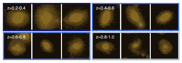
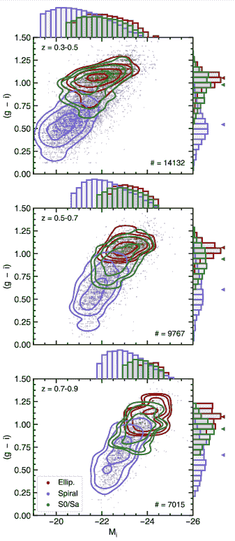

<!--yml

category: 未分类

date: 2024-09-06 20:04:42

-->

# [1909.10537] 深宽调查中的星系形态分类通过无监督机器学习

> 来源：[`ar5iv.labs.arxiv.org/html/1909.10537`](https://ar5iv.labs.arxiv.org/html/1909.10537)

# 深宽调查中的星系形态分类通过无监督机器学习

G. Martin,^(1,2,3) S. Kaviraj,¹ A. Hocking,⁴ S. C. Read^(1,5) 和 J. E. Geach¹

¹赫特福德大学天体物理研究中心，物理、天文学与数学学院，College Lane, Hatfield AL10 9AB，英国，

²斯图尔德天文台，亚利桑那大学，933 N. Cherry Ave, 图森, AZ, 美国，

韩国天文学与空间科学研究所，776 Daedeokdae-ro, Yuseong-gu, 大田 34055, 韩国，

⁴赫特福德大学计算机科学与信息学研究中心，Hatfield AL10 9AB，英国，

⁵ I.N.A.F-罗马天文台，via Frascati 33, 00040 - Monte Porzio Catone (Roma)，意大利 电子邮件：garrethmartin@arizona.edu

###### 摘要

银河形态学是一个基础量，不仅对于完整的银河演化研究范围至关重要，而且对于观测宇宙学中的众多科学（例如，作为光度红移测量的先验和作为瞬态光曲线分类的背景数据）也至关重要。虽然关于形态分类技术的文献非常丰富，但前所未有的数据量，加上在某些情况下即将到来的“大数据”调查（例如来自 LSST）的短时间间隔，为这个领域提出了新的挑战。大量数据使得这些数据集在视觉检查中难以处理（即使通过像 Galaxy Zoo 这样的大规模分布平台），而短时间间隔使得使用像监督机器学习这样的技术变得困难，因为在短时间内重复产生训练集可能是不切实际的。无监督机器学习不需要训练集，非常适合对新的和即将到来的调查进行形态学分析。在这里，我们使用一种执行图形表示聚类的算法，以便将具有相似视觉特征的图像块以及由这些图像块构建的对象（如银河）分组。我们在 Hyper-Suprime-Cam Subaru-Strategic-Program Ultra-Deep 调查中实现了该算法，以自主地将银河种群减少到少量（160）个“形态学簇”，这些簇由具有相似形态的银河组成，然后通过视觉检查进行基准测试。我们公开发布的形态学分类展现了高水平的纯度，并且重现了在$z<1$的关键银河属性（如恒星质量函数、休息框架颜色和银河在星形成主序列上的位置）作为形态学类型的函数的已知趋势。我们的研究展示了无监督机器学习在进行准确形态学分析中的强大能力，这在深宽调查的新纪元中将变得不可或缺。

###### 关键词：

方法：数值 – 银河：结构 – 调查^†^†出版年份：2019^†^†页码范围：通过无监督机器学习进行深宽调查中的银河形态分类–B

## 1 引言

星系形态的测量是观测宇宙学中的一个基础话题。形态是星系动态状态的强函数，编码了主导其演化历史的物理过程（例如，Martin 等，2018a），并且与如恒星质量（例如，Bundy 等，2005）、星形成率（例如，Bluck 等，2014；Smethurst 等，2015）、颜色（例如，Strateva 等，2001；Skibba 等，2009）和局部环境（例如，Dressler，1980；Dressler 等，1997；Postman 等，2005）等物理属性紧密相关。例如，隆起主导的星系通常具有更丰富的合并历史（例如，Conselice，2006），隆起的强度与合并次数相关（例如，Hatton 等，2003）。相比之下，现今存在的盘面是更为安静的形成历史的标志，恒星质量的积累可能主要由气体吸积和世代过程驱动（Codis 等，2012；Kaviraj，2014a；Martin 等，2018b）。类似地，在给定恒星质量的情况下，较低的表面亮度或更红的颜色可能表明潮汐过程（如相互作用和冲击压力剥离）在相关星系演化中起到了更大的作用（例如，Dressler，1980；Moore 等，1999；Weisz 等，2011；Martin 等，2019）。最后，形态细节，如扩展的潮汐特征，是近期合并和/或强烈相互作用的标志（例如，Kaviraj，2014b；Kaviraj 等，2019），这些潮汐特征的表面亮度通常与合并的质量比相关（例如，Peirani 等，2010；Kaviraj，2010）。

除了在研究星系演化中的关键作用外，形态信息对各种天体物理科学也非常有用。例如，它被用作光度红移管道中的先验（例如，Soo 等，2018；Menou，2018），在瞬态光变曲线分类中形成关键的背景数据（例如，Djorgovski 等，2012；Wollaeger 等，2018），并且对识别触发星系活动核（AGN）活动的过程也很重要（例如，Schawinski 等，2014）。因此，准确测量星系形态，特别是在支撑我们统计工作的广泛调查中，是一项关键任务。

在过去几十年里，关于测量星系形态的方法的丰富文献逐渐出现，特别是在大型观测调查中。这些方法从参数化技术开始，这些技术试图通过小量参数（例如，Sérsic，1963；Simard et al.，2002；Odewahn et al.，2002；Lackner & Gunn，2012）描述星系光谱，到将这些光分布减少到单一值的非参数方法，例如‘CAS’系统（例如，Abraham et al.，1994；Conselice，2003；Menanteau et al.，2006），Gini-M[20]系数（例如，Lotz et al.，2004；Scarlata et al.，2007；Peth et al.，2016）或其他非参数统计方法如 MID 系统（例如，Freeman et al.，2013）。最近的工作越来越多地利用机器学习来进行形态分析。尽管机器学习在天文学中的应用可以追溯到至少 Lahav et al.（1995），但最近的文献中机器学习技术的应用在天体物理学的各种问题上呈现出爆炸式增长（例如，Huertas-Company et al.，2015a；Ostrovski et al.，2017；Schawinski et al.，2017；Hocking et al.，2018；Goulding et al.，2018；D’Isanto & Polsterer，2018；Siudek et al.，2018；An et al.，2018；Cheng et al.，2019；Ay et al.，2019）。

尽管上述自动分类技术特别适合高效处理大型调查数据集，但它们通常会与视觉检查进行基准测试（例如，Kaviraj，2010；Lintott et al.，2011；Simmons et al.，2017），视觉检查被认为是最强大和最准确的星系形态测量方法。尽管执行起来耗时，但 Galaxy Zoo（GZ；Lintott et al.，2011）平台的开发在近年来彻底改变了大型调查的视觉分类收集。通过使用超过一百万的公民科学志愿者，GZ 已经对多个现代调查进行了分类，如 SDSS 和 HST 遗产调查（例如，Lintott et al.，2011；Willett et al.，2017）。自动化方法，特别是那些利用机器学习的方法，已经常规地与 GZ 等数据库的视觉分类进行基准测试，并且现在通常应用于大规模调查数据（例如，Huertas-Company et al.，2015a；Dieleman et al.，2015；Beck et al.，2018；Walmsley et al.，2019；Ma et al.，2019）。

尽管提供了各种技术，未来的“大数据”调查（例如来自 LSST 的调查）在进行形态分类时会面临前所未有的挑战（Robertson et al., 2017）。数据的庞大体量使得这些调查对于视觉检查变得不可行，即便是通过像 GZ 这样的广泛分布的平台也是如此。新的技术，无论是结合视觉和自动化分类的（例如 Beck et al., 2018; Dickinson et al., 2019），还是可能完全去除视觉分类需求的（例如 Siudek et al., 2018; Hocking et al., 2018; Hendel et al., 2018; D’Isanto et al., 2018），在处理这些新调查所预期的前所未有的数据量时将是至关重要的。来自如 LSST 等仪器的快速变化的数据集的短时间间隔代表了额外的障碍，这可能使得监督式机器学习技术难以部署，因为随着调查逐渐深入，重复产生大型可靠的训练集可能变得不切实际。

无监督机器学习（UML）算法非常适合大数据调查的形态分析。无监督技术不需要视觉分类的训练集，并且原则上能够快速且自主地将任意规模的星系群体压缩为少量的“形态簇”，这些簇由具有相似属性的星系组成（例如 Hocking et al., 2018）。这些组随后可以与视觉分类进行基准测试，如果组的数量相对较少，对于单个研究人员来说，即使是使用像 GZ 这样的分布式系统也变得可处理。

在本文中，我们采用了这样的 UML 算法，该算法通过将具有相似属性的像素及由这些像素构成的物体（如星系）进行分组来工作。最初使用了 Hubble Space Telescope (HST)数据中的 CANDELS (Koekemoer et al., 2011)调查（Hocking et al., 2017; Hocking et al., 2018）进行开发，我们将该算法应用于 Hyper Suprime-Cam Subaru-Strategic Program (HSC-SSP) 数据发布 1 (DR1)的 Ultradeep 层。我们发布了一个形态分类目录，该目录可以与 HSC-SSP DR1 目录结合使用，探索这些分类的鲁棒性，并讨论该算法在如 LSST 等未来仪器调查中的适用性（其深广快的数据集将在约 10 年后达到与 HSC-SSP Ultradeep 调查相同的深度）。我们还计划发布基于即将发布的 HSC-SSP 数据版本以及未来仪器（如 LSST）的数据集的形态分类目录，数据一旦可用将进行发布。

本文结构如下。在第 2 ‣ Galaxy morphological classification in deep-wide surveys via unsupervised machine learning") 节中，我们描述了支撑本研究的无监督图聚类算法。在第三部分中，我们概述了 HSC-SSP 的属性及本研究中使用的附加数据。在第四部分中，我们描述了算法输出的基准测试、结果形态目录的完整性及发布的数据产品内容。在第五部分中，我们通过比较不同形态组的星系属性与这些属性在形态学上的已知趋势（$z<1$）来探索分类的稳健性。我们在第六部分中总结了我们的结果。

## 2 超广角相机 Subaru 战略计划（HSC-SSP）

### 2.1 调查描述

HSC-SSP（Aihara et al., 2018a）是一个多层次的成像 survey，使用 Hyper Suprime-Cam（HSC, Miyazaki et al., 2012）在 8.2 米 Subaru Telescope 上进行，覆盖 $grizy$（以及 4 个窄带滤光片）波段。HSC 具有 1.5 度的视场直径和 0.168 角秒的像素尺度，$i$-带的中位 seeing 约为 0.6 角秒。该 survey 从 2014 年开始，计划在 5-6 年的时间内使用 300 个夜晚进行。选择的区域具有低的银河尘埃消光，并且与多个知名的多波长数据集重叠，包括 SDSS/BOSS（Eisenstein et al., 2011）、来自 XMM 的 X 射线 survey（Jansen et al., 2001）和 eROSITA（Merloni et al., 2012），以及近红外/中红外成像 survey，例如 VIKING/VIDEO（Jarvis et al., 2013）和 UKIDSS（Lawrence et al., 2007）。

最终的 HSC-SSP 数据集（预计在 2021 年）将提供三层数据：覆盖 1400 平方度的‘宽层’，目标 $i$-带深度为 26.2 mag arcsec^(-2)；覆盖 27 平方度的‘深层’，目标 $i$-带深度为 27.1 mag arcsec^(-2)；以及覆盖 3.5 平方度的‘超深层’，目标 $i$-带深度为 27.7 mag arcsec^(-2)（Aihara et al., 2018a）。这些层次是嵌套的，因此超深层包括在深层中，而深层则包括在宽层中。

在这里，我们使用 HSC-SSP DR1¹¹1https://hsc.mtk.nao.ac.jp/ssp/data-release/，该数据集已发布了 108 deg²、26 deg²和 3.5 deg²的广域、深度和超深度层，当前深度分别为$i\sim$ 26.4、$\sim$26.5 和$\sim$27\. mag（点源的$5\sigma$）(Aihara et al., 2018b)。调查被分成多个宽 1.5 deg 的方形“区块”，每个区块大致覆盖一个 HSC 观测点。每个区块进一步分为$9\times 9$个补丁，每个补丁约为$4200\times 4200$像素。这里我们使用了堆叠的、去除天空背景的图像，应用了 WCS 坐标校正并校准了光度零点。

### 2.2 数据

对于对象质心和观测光度，我们使用 cModel 光度（Stoughton et al., 2002），这些光度作为 HSC-SSP DR1 强制目录的一部分发布。这些光度是使用 HSC-SSP 数据处理管道计算的，以$i$-带为主要参考波长。我们还通过将此半径内的流量除以光圈的面积来计算表面亮度。

为了推断我们样本中银河系的物理属性和光度红移，我们使用了 mizuki（Tanaka, 2015）模板拟合代码的结果，这些结果作为 HSC-SSP DR1 的一部分发布（Tanaka et al., 2018）。红移完全由 HSC $g$、$r$、$i$、$z$和$y$带的 cModel 光度推导，适用于至少在三个带中被检测到的所有主要对象。mizuki 代码使用从 Bruzual & Charlot (2003)的恒星群体合成模型生成的模板进行光谱能量分布（SED）拟合，以自洽地估计个别银河系的红移和物理属性。对如恒星质量和星形成率（SFR）等物理参数应用了依赖红移的贝叶斯先验。我们使用来自公开 HSC-SSP DR1 photoz_mizuki 目录的光度红移、SFR、恒星质量以及静止框架光度和颜色的值。有关 HSC-SSP DR1 的详细信息，请参见 Aihara et al. (2018b)。

## 3 基于图谱表示聚类的无监督形态分类算法

支撑本研究的图谱聚类算法在 Hocking et al. (2017)和 Hocking et al. (2018)中有详细描述。该算法的主要应用是提供一种有效地将大量未见数据分类到视觉上相似的小组的方法，以便这些小组可以与视觉分类进行对照。在 LSST 时代，能够快速完成这一过程而不依赖于预先存在的训练集是至关重要的，因为高调查频率、迅速变化的数据以及其将探测的新参数空间将使构建所需的无偏训练集变得具有挑战性。

该技术以前在其他天文数据集上进行了测试。Hocking 等人（2018）已展示了将此方法应用于 CANDELS 的 HST 数据。在这项工作中，通过显示对象的特征，分为不同的形态学簇，具有基本属性和结构参数（光度、M[20]、颜色）的**一致性**，以及与 GZ 分类数据（如平滑度、盘状等）的强一致性，验证了该算法。此外，与专家人类分类器进行基准测试时，该算法已被证明能有效区分椭圆星系和螺旋星系，并且在识别透镜星系方面显示了前景（Hocking 等人，2017）。

在接下来的章节中，我们描述了算法的主要组件。

### 3.1 特征选择

表 1: 特征提取步骤中使用的参数。

| 参数 | 描述 | 值 |
| --- | --- | --- |
| $r$ | 正方形子图像补丁的边长（像素） | 16 |
| $n$ | 径向功率谱中的箱数 | 8 |

该方法的**终极**目标是使用 HSC 像素数据自动识别不同的星系组。尽管可以直接使用源数据，但更有用的是将数据转换为去除任何无关信息的形式。由于我们的目标是对星系进行形态学分类，我们将数据转换，以去除像星系方向这样的无关信息。

重要的是，选择的特征必须避免冗余或过拟合，并且在星系旋转、尺度和方向上保持不变。选择的特征越简单越好，以便算法的结果能够被人类解释。下面，我们概述了特征提取过程，该过程在 Hocking 等人（2017）和 Hocking 等人（2018）中也有描述。

我们首先在每个 HSC 区域内的每个检测像素周围提取 $r\times r$ 像素子图像补丁，其中 $r$ 是补丁的大小（表 1）。为了减少算法运行时间，并避免包含没有有用信息的像素，我们只提取噪声水平之上的 $1\sigma$ 像素，由简单的 sigma-clipping 确定（例如，如 Bertin & Arnouts，1996；Robitaille 等人，2013 实现，但请参见附录 A 以讨论潜在改进）。

在初步检测和提取步骤之后，我们通过评估径向平均像素强度功率谱，生成每个补丁的旋转不变表示，使用 $n$ 个箱子（见表 1）用于每一个五个波段（$g$，$r$，$i$，$z$，$y$）。首先计算每个补丁的二维快速傅里叶变换（FFT；Ballard & Brown，1982），然后与其共轭进行相乘。接着，将零频率分量重新排列到二维矩阵的中心，并计算方位角平均径向轮廓。补丁的大小需要足够大，以采样数据变化的空间尺度（例如，它必须大于点扩散函数（PSF））。试验了其他常见的特征表示方法，包括旋转不变特征变换（RIFT）、旋转强度图像（Lazebnik et al.，2005）和梯度直方图（HoG；Birk et al.，1979）（Hocking et al.，2017），其中功率谱表示法在与 CANDELS 数据的人工专家分类相比时表现出最佳的性能和效率，用于区分晚型星系和早型星系。

每个 $n$ 元素功率谱被连接成一个 $5\times n$ 元素特征向量 $\mathbf{p}$，它有效地以旋转不变的方式编码每个子图像补丁的像素强度、颜色和空间频率信息。然后将每个特征向量组合成一个补丁数据矩阵 $\mathbf{P}$，其中包含每个补丁的特征向量。表 1 显示了用于此特征提取步骤的 $r$ 和 $n$ 的值。

我们简要指出，以上详细描述的工程特征描述的替代方法，即学习最佳特征表示的方法（例如，Coates et al., 2011；Cheriyadat，2013；Tao et al., 2015），也可以使用。虽然这种方法可能产生更好的结果，但这种方法也会产生难以解释的输出。此外，这可能对算法的速度产生重大影响，因为它将引入额外的学习步骤，并增加后续步骤中必须探索的特征空间的维度。这可能会显著增加生成分类所需的时间。由于我们旨在能够快速且重复地为快速变化的数据集（例如来自 LSST 的数据）生成分类，并生成每一步都能通过人工检查轻松验证的输出，因此，即使它能提高分类质量，降低算法速度和模糊输出也是不希望的。

### 3.2 特征提取

下一步是使用聚类方法来学习补丁数据矩阵 $\mathbf{P}$ 的准确拓扑图（模型），然后将该图中的节点划分为更粗的特征向量组，从而生成不同的‘补丁类型’库。

#### 3.2.1 生长神经气体

我们使用生长神经气体（GNG，Fritzke，1995）算法来学习数据的最佳表示，基于补丁数据矩阵 $\mathbf{P}$。数据首先在每个特征组件上进行标准化，以确保同方差性，防止相对高方差组件的不当影响。然后，GNG 算法通过迭代地生长一个节点图，图中的拓扑相邻节点通过边连接，生成数据的图形表示。结果是一个保持拓扑的地图，并且诱导了 Delaunay 三角剖分（Okabe et al., 2009）。然而，边缘如果不再是诱导的 Delaunay 三角剖分的一部分，必须被移除。这是通过去除那些达到给定年龄 $a_{max}$ 但没有连接到另一个节点的边缘来实现的。GNG 算法应用于 $\mathbf{P}$，步骤如下：

表 2: 用于生长神经气体（GNG）、层次聚类（HC）和形态学分类步骤的参数。

| 参数 | 描述 | 值 |
| --- | --- | --- |
| $N$ | 图中节点的最大数量 | 200,000 |
| $\lambda$ | 在添加新节点之前处理的样本数量 | 100 |
| $a_{max}$ | 在边缘被移除之前的最大年龄 | 50 |
| $\epsilon_{b}$ | 步骤 (i) 中调整的大小 | 0.2 |
| $\epsilon_{n}$ | 步骤 (i) 中邻居的调整大小 | 0.006 |
| $\alpha$ | 对误差最大的节点的误差减少 | 0.5 |
| $\beta$ | 对所有节点的误差减少 | 0.995 |
| $N_{g}$ | 目标层次聚类组数 | 1500 |
| $k$ | 通过$k$-均值产生的组数 | 160 |

1.  1.

    首先，两个节点通过从补丁数据矩阵$\mathbf{P}$中随机选择的特征向量初始化位置。因此，每个节点位于一个$5\times n$维特征空间内，其维度与$\mathbf{p}$的元素个数相同。然后，从$\mathbf{P}$中抽取一个新的随机特征向量$\mathbf{p}^{\prime}$，并应用以下步骤：

    +   •

        确定特征向量的两个最近节点，其在特征空间中的位置分别标记为$\mathbf{s}_{0}$和$\mathbf{s}_{1}$，使得与$\mathbf{p}^{\prime}$的欧几里得距离最小。$\mathbf{s}_{0}$是离$\mathbf{p}^{\prime}$最近的节点，$\mathbf{s}_{1}$是第二近的节点。

    +   •

        如果连接两个节点$\mathbf{s}_{0}$和$\mathbf{s}_{1}$的边不存在，则创建该边。两个连接的节点称为拓扑邻居。每当两个节点通过边连接时，该边还会被赋予一个初始值为$0$的年龄$a$，并且所有连接到$s_{0}$的其他边的年龄都会增加$1$。

    +   •

        离$\mathbf{p}^{\prime}$最近的节点$\mathbf{s}_{0}$被赋予等于其分离平方的误差。

        |  | $\sigma(\mathbf{s}_{0})=&#124;&#124;\mathbf{p}^{\prime}-\mathbf{s}_{0}&#124;&#124;^{2}.$ |  | (1) |
        | --- | --- | --- | --- |

    +   •

        $\mathbf{s}_{0}$及其直接拓扑邻居（即那些通过边直接连接的节点）都朝向$\mathbf{p}^{\prime}$移动，移动的幅度是它们与$\mathbf{p}^{\prime}$之间距离的一个比例（分别为$\epsilon_{b}$和$\epsilon_{n}$），从而使得映射适应输入数据：

        |  | $\begin{array}[]{l}\Delta\mathbf{s}_{0}=\epsilon_{b}(\mathbf{p}^{\prime}-\mathbf{s}_{0})\\ \Delta\mathbf{s}_{n}=\epsilon_{n}(\mathbf{p}^{\prime}-\mathbf{s}_{n}).\end{array}$ |  | (2) |
        | --- | --- | --- | --- |

    +   •

        所有年龄大于最大年龄（即$a>a_{max}$）的边都被移除。任何不再有拓扑邻居的节点也会被移除。

1.  2.

    这一过程重复进行，直到处理了$\lambda$个特征向量，之后：

    +   •

        在误差最大的节点$\mathbf{s}_{q}$和其最高误差拓扑邻居$\mathbf{s}_{f}$之间的中点插入一个新节点$\mathbf{s}_{r}$。

    +   •

        移除连接两个节点的边，并创建新边将$\mathbf{s}_{q}$和$\mathbf{s}_{f}$连接到$\mathbf{s}_{r}$。

    +   •

        通过将$\mathbf{s}_{q}$和$\mathbf{s}_{f}$的误差乘以参数$\alpha$来减少它们的误差，$\mathbf{s}_{r}$的误差初始化为与$\mathbf{s}_{q}$相同的误差。

    +   •

        通过将每个节点的误差乘以参数$\beta$来减少每个节点的误差。

1.  3.

    这一直持续到满足停止标准（即到达$N$个节点）。

步骤(ii)中错误的累积确保算法将新节点放置在模型到数据映射较差的参数空间区域。一旦满足停止准则，我们将包含所有节点在特征空间中的最终位置的矩阵$\mathbf{N}$作为输出。表 2 展示了 GNG 步骤中使用的参数值。我们注意到这些参数的确切值对结果并不重要，但会影响图形收敛的时间。任何合理选择的参数总是会适应输入数据，但不合适的参数选择可能导致性能低效，需要大量的迭代才能完成。

#### 3.2.2 层次聚类

聚合型（‘自下而上’）层次聚类（HC；Johnson，1967）用于生成拓扑图中节点的层次表示。在每次迭代中，HC 算法最初尝试将最相似的节点配对，类似性在这种情况下由 Pearson 相关性度量。节点$\mathbf{a}$和$\mathbf{b}$之间的 Pearson 相关性通过比较它们的位置向量计算，计算公式为它们的协方差除以它们标准差的乘积：

|  | $\rho(\mathbf{a},\mathbf{b})=\frac{\mathrm{cov}(\mathbf{a},\mathbf{b})}{\sigma_{\mathbf{a}}\sigma_{\mathbf{b}}},$ |  | (3) |
| --- | --- | --- | --- |

其中$\mathrm{cov}(\mathbf{a},\mathbf{b})$是两个节点位置向量之间的协方差，由$\Sigma_{i}^{n}(\mathbf{a}_{i}-\overline{\mathbf{a}})(\mathbf{b}_{i}-\overline{\mathbf{b}})$给出，而$\sigma_{\mathbf{a}}$和$\sigma_{\mathbf{b}}$则是每个位置向量的标准差，分别由$\sqrt{\Sigma_{i}^{n}(\mathbf{a}_{i}-\overline{\mathbf{a}})^{2}}$和$\sqrt{\Sigma_{i}^{n}(\mathbf{b}_{i}-\overline{\mathbf{b}})^{2}}$给出。

在每次迭代中，算法将簇合并成相似簇的对，直到只剩下一个簇。该方法的一个特别优点是，它使我们能够选择用于分割 GNG 图的所需详细级别。簇可以具有不同的大小和分离，因此该方法对数据结构没有假设。

### 3.3 构建特征向量

从数据的子集中通过 GNG 算法生成补丁类型的库，然后通过 HC 算法进行缩减后，就可以构建对象特征向量。必须将每个补丁组装到对象中，可以使用现有的检测图或者像本案例中使用的连通元素标记算法（例如 Galler & Fisher，1964）。根据前一步定义的最接近节点，将每个补丁分配给一个补丁类型。然后可以使用补丁类型的直方图，即对象特征向量，来描述它们。该特征向量描述了对象包含的不同补丁类型的频率，从而编码了该对象的易处理描述。

补丁类型聚类的组数，因此特征向量的长度可以根据被分类的数据的复杂性进行更改。在本案例中，它具有一个值$N_{g}=1500$，等于 HC 算法生成的聚类数。因此，对象的特征向量应编码该对象的基本视觉特征，从而可以识别类似的对象。图 1 展示了从多频带调查数据中提取补丁的过程（第[3.1]节(#S3.SS1 "3.1 特征选择 ‣ 3 基于基于图形表示的聚类的非监督形态分类算法 ‣ 深广调查中的星系形态分类通过非监督机器学习")），构建补丁类型的库（第[3.2]节(#S3.SS2 "3.2 特征提取 ‣ 3 基于基于图形表示的聚类的非监督形态分类算法 ‣ 深广调查中的星系形态分类通过非监督机器学习")），最后为每个对象构建特征向量（第[3.3]节(#S3.SS3 "3.3 构建特征向量 ‣ 3 基于基于图形表示的聚类的非监督形态分类算法 ‣ 深广调查中的星系形态分类通过非监督机器学习")）。

图 1: 形态分类过程的示意图。在调查图像中检测到的像素周围提取补丁，并使用聚类方法将这些补丁分组成补丁类型的库。因此，可以通过为每个对象创建直方图来构建星系特征向量，描述每个补丁“类型”的频率。

### 3.4 生成形态聚类

为了最终将星系分类到形态学簇中，我们首先定义特征向量之间的相似性。我们再次使用皮尔逊相关性（方程 3），以定义在这个新特征空间中特征向量之间的距离，尽管可以使用其他距离度量（例如欧氏距离或余弦距离），它们可能会突出不同的特征。此外，我们在计算距离时应用“词频-逆文档频率”（TF$*$IDF，Rajaraman & Ullman, 2011）加权，以增加具有最大区分能力的补丁类型的重要性，并减少在所有对象之间相对常见的补丁类型的重要性。

一旦我们生成了一个特征向量来编码每个对象的视觉特征，并为这些特征向量定义了距离度量，就可以根据视觉相似性对这些对象进行分组。这可以通过直接比较，或对个别特征向量进行相似性搜索来完成，例如，搜索与给定对象的特征向量最相似或在特征空间中最近的其他对象，或者通过应用聚类算法来对特征向量进行分组。

为了确保分类更为干净，我们排除了由少于 $15$ 像素组成的任何对象。使用 $k$-均值聚类（例如，MacQueen 等人，1967），我们将对象特征向量划分为 $k$ 个形态学聚类（在本文中，我们选择了 $k$ 为 160，这旨在展示算法区分细微视觉差异的能力，但可以选择任意值的 $k$）。我们计算每个形态学聚类中对象的轮廓系数，以评估聚类的整体质量以及单个对象与其分配到的组的平均属性的对应程度。给定对象的轮廓系数是根据其与对应聚类和所有其他聚类的相似程度计算的（见 Rousseeuw，1987）。轮廓系数的范围从 -1 到 1：高轮廓系数表明对象与其自身聚类匹配良好，并且与邻近聚类明显不同。为了更有效的视觉分类，可能希望选择 $k$ 的值以优化平均轮廓系数（见第 4.4 节）。我们计算了单个对象的轮廓系数，以及在组和全球层面的平均值，这些值包含在第 4.4 节中介绍的目录中。使用 $k=160$ 时，我们获得了 0.26 的全球平均轮廓系数。

使用上述描述的参数，算法每个像素的特征提取、从训练数据生成模型和执行分类大约需要 40 毫秒。特征提取和分类，使用现有模型应用于未见数据，只需在具有 Intel CPU 的现代桌面计算机上的单线程中约 1-2 毫秒。特征提取和分类步骤可以很容易地拆分并并行执行（Herlihy & Shavit，2011）。这一特性使得算法即使在非常大的数据量（例如 SDSS 或 LSST 等仪器的调查数据）上也能高效运行。

该算法在 C# 和 Python 的组合中实现，利用 .NET Core 2 库以及 numpy、astropy 和 scikit-learn 模块（这些模块是用 Python、C 和 Cython 混合实现的）。即使在没有并行化提取和分类步骤的情况下，该算法在大数据集上表现良好。例如，本文使用的整个 3.5 deg² 的 HSC Ultradeep 数据集在不到 40 CPU 小时内处理完成，包括特征选择、提取和分类。扩展到更大的数据量也是可能的。例如，在保守的假设下，SDSS 中的 $10^{12}$ 像素中有 1% 被检测到，整个 SDSS 可以在不到 3000 CPU 小时内处理完成（假设已经完成了建模/特征提取步骤）。对于 LSST（尽管 LSST 图像将有比 SDSS 更多的检测像素，因其更大的深度），较小的像素尺寸和更大的面积将需要大约 16,000 CPU 小时。这仍然代表了即使是在一个适度的高性能计算（HPC）集群上（例如，500 个执行线程大约 1 天）的相对微不足道的处理时间。

### 3.5 从算法中的对象与 HSC-SSP 进行交叉匹配

我们将来自 HSC-SSP DR1 Ultradeep 目录的星系中心与来自图聚类算法的对象中心进行交叉匹配，排除那些在 $0.8^{\prime\prime}$ 以内没有匹配的对象，这大致是最差 HSC $i$-band 视场的 PSF（请注意，$i$-band 的中位数视场为 $0.6^{\prime\prime}$）。在算法生成分类的 89,257 个对象中，53,003 个有超过 15 像素，我们认为这足够大以进行可靠的分类，因为可以捕捉到足够的空间尺度。在这些对象中，41,062 个（77%）在 $0.8^{\prime\prime}$ 以内与 HSC 目录中的对象匹配。中心的错配产生是因为目前我们使用简单的连通组件标记算法来识别对象，而不是 HSC-SSP 管道使用的单独分割图。对于非常大的对象（见图 12），这种错配变得越来越严重，因此，主要是非常局部宇宙中的问题。然而，在下面的分析中，我们研究了更远的对象（$z\gtrsim 0.3$），这些对象的投影尺寸更小。因此，匹配对象的比例要大得多，因为平均而言，95% 小于 100 像素的对象被成功交叉匹配（相比之下，1000 像素以上的对象只有 15% 被成功匹配）。

## 4 形态学目录

### 4.1 通过视觉分类对形态学簇进行基准测试

(a) 螺旋星系。

(b) S0/Sa 星系。

(c) 椭圆星系。

图 2: $g$-$r$-$i$伪彩色图像显示了每个主要形态学组中的随机选择的星系。这些样本进一步按红移分箱，红移标签在每个彩色框的右上角标明。(a) 面板显示了被分类为螺旋星系的对象，(b) 面板显示了被分类为 S0/Sa 的对象，(c) 面板显示了被分类为椭圆星系的对象。

无监督图形聚类算法使我们能够将星系群体有效压缩成少数几个形态学簇。至关重要的是，这些簇的数量足够少，以便使个别研究者能够对这些簇进行可视化分类。为了生成可用的形态学目录，我们通过对每个$k=160$个形态学簇进行视觉分类来基准化算法的输出。这些分类基于每个簇中 10 个最高轮廓得分对象的$g$-$r$-$i$图像子集，以及随机选择的 10 个对象样本，以评估簇的形态学纯度。我们不对单个星系进行分类，而是对整个簇进行视觉分类。

我们将每个星系团分为三种广义的哈勃（Hubble，1936）形态类型：椭圆星系、S0/Sa 星系和螺旋星系。我们还存储更细致的形态信息，例如螺旋形态的类型（Sb、Sc、Sd）和显著的颜色或结构特征（例如，当螺旋星系呈现异常红色或显示出斑块状结构，或当椭圆星系呈现异常蓝色时）。除了在 4.2 节中，我们仅考虑那些扩展的物体（基于 PSF 亮度和 cModelMag 亮度之间的差异；Eisenstein 等，2001）。我们在 3 表中指明每个形态团中未扩展的物体的总数。2 图展示了一些被分类为螺旋、S0/Sa 和椭圆形态的随机选取物体，并按四个红移范围进行划分。请注意，虽然每个星系团中的个体样本会通过视觉分类以确定该星系团的形态类型，但大多数星系团中的物体并未被观察到。

图 3 显示了算法识别的一些单独形态集群。例如，集群 10 包含被识别为 Sc/Sd 哈勃类型的星系（图 3(a)），集群 14 由看似高红移合并体的系统组成（图 3(b)），集群 122 包含显示蓝色环状特征的星系，这可能指示最近吸积了富含气体的卫星（图 3(c)），而集群 127 由斑驳的盘状结构组成（图 3(d)）。如第 4.4 节所述，每个形态集群的视觉分类及这些集群中对象的平均特征在附录 B 和表 3 中进行了展示。

(a) 集群 10: Sc/Sd 星系。

(b) 集群 14: 高-$z$ 合并体。

(c) 集群 122: 带有蓝色环的盘状结构，可能指示最近吸积了蓝色卫星。

(d) 集群 127: 斑驳的盘状结构。

图 3：算法生成的有趣形态簇示例：（a）螺旋/透镜星系（b）高红移下的合并系统（c）可能是近期富气体卫星并入结果的蓝色环状结构的盘状星系（d）在附近宇宙中的斑点盘。空间尺度由每个簇的左上角面板中的白色条表示。

### 4.2 星系与星体分离

图 4：在休息帧 $g-r$ 与 $r-i$ 平面中，椭圆星系（红色）、螺旋星系（蓝色）、透镜星系（绿色）和星体（橙色）的分布。黑色轮廓包含了 HSC-SSP 目录中 95%的未扩展对象。

图 4 展示了一个颜色-颜色图，显示了螺旋星系（蓝色）、透镜星系（绿色）、椭圆星系（红色）和星体（橙色）的 $g-r$ 和 $r-i$ 颜色。星体的位置被清晰地划分，与螺旋星系、椭圆星系和透镜星系的颜色-颜色空间相比，星体处于不同的区域。图形聚类算法在形态学上识别为星体的对象与 HSC 管道识别为非扩展的对象（如第 4.1 节定义）处于相同区域。颜色-颜色空间中包含未扩展对象的区域由黑色轮廓表示，该区域包含了我们样本中 95%的此类对象。

值得注意的是，仅仅依靠光学颜色可能不足以有效地区分星体和星系（Fadely 等， 2012）。然而，所采用的算法能够区分星体和已解析星系，即使在它们具有相同颜色的区域，因为已解析星系和未解析星体不具有相同的（空间）功率谱或补丁类型分布，因此不会落入相同的形态簇中。

我们注意到，Eisenstein 等人（2001）使用的相对简单的方法（如 4.1 节中所述）来确定扩展性并不总是对星体性的一种良好代理。尽管传统上星体-星系分离使用纯粹的形态度量信息来分类光学调查数据中的星星和星系（例如 Kron，1980；Eisenstein 等人，2001；Henrion 等人，2011），但新的地面深度广域调查包含了比星星更多的未解决星系，这些星系在微弱的视星等下尤为明显（Fadely 等人，2012；Soumagnac 等人，2015）。因此，需要进一步的工作以确定算法是否能够有效区分非常深的图像中的微弱未解决星系和星星。然而，我们注意到，这不会影响本研究的分析，因为我们关注的是明亮的物体。

### 4.3 UML 分类星系样本的完整性

图 5：HSC-SSP Ultradeep 目录中的$i$-波段视星等分布（虚线灰色直方图）以及这些源的子集（已通过图聚类算法匹配和分类）的分布（实线深蓝色直方图）。浅蓝色、红色和绿色直方图分别表示被识别为螺旋星系、椭圆星系或 S0/Sa 星系的物体的分布。黑色实线表示视星等的完整性（$y$轴上指示的值），灰色阴影表示完整性低于 50%的区域。

在图 5 中，我们比较了 HSC-SSP DR1 Ultradeep 调查（灰色）的$i$-波段视星等分布与足够大以便通过图聚类算法进行分类并成功匹配到 HSC-SSP DR1 Ultradeep 目录（深蓝色）的物体的分布。黑线表示完整性，即在每个星等区间中可以通过算法进行分类并匹配到 HSC-SSP 的所有星系的比例。完整性值由右侧$y$轴指示。

虽然完整样本的完整性仅在$m_{i}>27$ mag 时显著下降，但$ m_{i}<22.5$ mag 的亮度切割确保了 Ultradeep 调查中大多数（即超过 50%）的对象具有足够大的尺寸，以便使用图形聚类算法进行稳健的形态分类。我们注意到，这一切割似乎因银河系的形态而异，如某些形态特别是椭圆星系的亮度限制较亮所示。这可能是由于不同的平均投影尺寸所致，椭圆星系通常比类似亮度的螺旋星系更紧凑，尤其是在低亮度下（例如 Lange 等人，2015）。在本节的后续图中，我们考虑了亮度高于$m_{i}=22.5$ mag 的银河系。我们还展示了算法施加的尺寸标准不会由于分类和匹配过程而产生偏倚的银河系群体。

图 6：银河系属性的分布（（a）mizuki 光度红移，（b）：恒星质量，（c）：SFRs）在完整的 HSC-SSP Ultradeep 目录（灰色）和经过算法匹配和分类的银河系子集（蓝色）中。虚线蓝色和灰色线条显示了$m_{i}<22.5$ mag 的银河系的分布。底部：$m_{i}<22.5$ mag 的匹配和分类对象的比例与光度红移的关系。

图 6 展示了使用 mizuki 代码导出的光度红移分布，涵盖了完整的 Ultradeep 目录（灰色）和算法匹配的目录（深蓝色）。虚线灰色和深蓝色线条显示了完整样本和匹配样本中所有$i$-波段绝对星等亮度大于 22.5 mag 的银河系的分布。下方面板展示了$m_{i}<22.5$ mag 的匹配银河系的比例与光度红移的关系。正如预期的那样，匹配样本、亮度限制的匹配样本和完整的亮度限制样本都具有类似的分布，但匹配样本相比完整样本下降得更快，因为随着红移的增加，它们的投影尺寸变大，导致更多对象无法分类。

图 6 和 6 分别展示了恒星质量和 SFR 的相应分析。直方图显示了 HSC-SSP Ultradeep 目录（灰色）、仅匹配对象的分布（深蓝色）以及 $m_{i}<22.5$ mag 的完整和匹配分布（使用灰色和蓝色虚线表示）的恒星质量和 SFR 的分布。下部面板再次显示了 $m_{i}<22.5$ mag 的星系中，与光度红移匹配的比例。尽管对象的红移分布受到大小限制的影响，但对于比亮度限制更亮的对象，完整和匹配样本的物理属性分布非常相似。这表明，大小限制不会在这些星系属性（例如高 SFR）中引入偏差，因此可以比较红移作为函数的平均属性。

### 4.4 发布的数据产品

HSC-SSP DR1 发布的数据产品包含在两个表格中。第一个表格列出了形态学簇及其相关的视觉分类和簇内主要星系属性的中位值（表面亮度、恒星质量、特定的 SFR、静态 $(g-r)$ 颜色和绝对 $r$-波段亮度）。该表格的完整内容见附录 B。第二个表格列出了单个 HSC-SSP 星系及其相关的形态学簇编号和有用的附加信息，包括它们的坐标、HSC-SSP DR1 ID、扩展性、像素大小和轮廓分数。请注意，一些形态学簇可能会受到星体的污染。用户应丢弃被分类为非扩展的对象，这些对象因此可能是星体。该表格的前十行见附录 B 的表格 6。

两个表格可以在以下网址获取：[`github.com/garrethmartin/HSC_UML`](https://github.com/garrethmartin/HSC_UML)。

#### 4.4.1 HSC-SSP DR2 发布

对于更新的 HSC-SSP DR2 UDEEP/DEEP 数据发布，将在同一网址提供更全面的数据产品（[`github.com/garrethmartin/HSC_UML`](https://github.com/garrethmartin/HSC_UML)）。我们将提供不同数量的簇的多个目录（$k$ 从 2 到 10，然后每增加 10 直到 200）。我们将为每个目录提供平均轮廓分数，以便用户在需要时选择最佳的簇数量，并为每个簇提供诊断和轮廓图。我们将提供每个星系的特征向量，并附带代码用于在这些特征向量上执行相似性搜索（即‘相似性搜索’，Hocking et al., 2018），以及在其他数据上运行整个算法的代码（如有需要）。

## 5 星系属性与形态类型的关系

在本节中，我们探讨了我们的算法所生成的形态分类的鲁棒性。我们研究了关键星系属性（例如星际质量、星形成率、休息框架颜色）作为形态类型的函数分布，以测试我们分类的真实性。我们展示了这些星系属性在众所周知的形态学组中的分布遵循了使用传统视觉形态分类方法的研究预期趋势（例如 Menanteau et al., 2006；Kelvin et al., 2014；Khim et al., 2015；Willett et al., 2017）。

### 5.1 样本选择与方法论

#### 5.1.1 红移分箱

图 7：主面板：我们样本的红移和星际质量分布，$m_{i}<22.5$ mag。$x$-轴和$y$-轴分别表示从每个物体的光学 SED 的 Mizuki 拟合得到的中位红移和星际质量。误差条表示每个红移箱中中位数的对应 $1\sigma$ 误差。插图：我们样本的未加权红移分布。线条的厚度表示 $2\sigma$ 置信区间，使用从每个星系的红移概率分布中抽取的 10,000 次样本计算，假设在中位值周围有双侧高斯误差。红色、橙色和绿色阴影区域表示使用的三个红移箱。

我们首先将我们的星系划分为三个红移范围：$0.3<z<0.5$、$0.5<z<0.7$和$0.7<z<0.9$。选择$z=0.3$作为最小红移，以确保 3.5 平方度的超深区域覆盖了一个大于$85~{}\mathrm{Mpc}\times 85~{}\mathrm{Mpc}$的宇宙共动区域，以便我们的星系群体足够大，能够在统计上具有代表性，并且不太可能受到大尺度结构的显著偏差。为了完整性，我们在研究星系质量函数时（见第 5.2 节）还考虑了一个较低的红移范围（$0.1<z<0.3$），但这个范围可能会受到宇宙变化的强烈影响。

图 7 展示了一个散点图，显示了单个星系的中位质量分布与其红移的中位值之间的关系。点的颜色编码表示其红移范围。带误差条的开放圆圈表示每个红移范围的中心红移和中位质量以及这些量在每个范围内的$1\sigma$误差。插图显示了星系的红移分布。线条的厚度表示$2\sigma$置信区间，通过从红移概率分布中进行 10,000 次抽样获得，假设在中位红移周围有一个双侧正态误差，其标准差等于上红移误差和下红移误差。

#### 5.1.2 $1/V_{max}$加权和不确定性模拟

为了纠正 Malmquist 偏差（Malmquist，1922），我们使用$1/V_{max}$加权星系计数，其中$1/V_{max}$是能够检测到给定亮度的天体的最大体积的倒数（例如 Schmidt，1968；Weigel 等，2016）。我们通过首先从每个天体的红移概率分布中进行 10,000 次随机抽样来实现这一点。我们假设概率密度函数（PDF）遵循双侧正态分布，中心值等于中位红移$\langle z\rangle$，但在中心值的两侧具有不同的标准差（$\sigma_{upper}$和$\sigma_{lower}$）。因此，每个红移$z_{draw}$是从以下分布中抽取的：

|  | $z_{draw}\sim\begin{cases}\mathcal{N}(z\ &#124;\ \langle z\rangle,\sigma^{2}_{lower})\ \textrm{if}\ z\leq\langle z\rangle\\ \mathcal{N}(z\ &#124;\ \langle z\rangle,\sigma^{2}_{upper})\times(\sigma_{lower}/\sigma_{upper})\ \textrm{if}\ z>\langle z\rangle\end{cases}$ |  | (4) |
| --- | --- | --- | --- |

其中 $\mathcal{N}(z\ |\ \mu,\sigma^{2})$ 是一个均值为中位 Mizuki 红移 $\langle z\rangle$ 和方差为 $\sigma^{2}$ 的正态分布。$\sigma_{upper}$ 是红移 PDF 的第 84 百分位，$\sigma_{lower}$ 是红移 PDF 的第 16 百分位。$\sigma_{lower}/\sigma_{upper}$ 的因子确保了分布保持连续。

在 Mizuki 拟合中，推断出的恒星质量和绝对星等的不确定性主要来源于光度距离，而不是模型模板权重或尘埃衰减。因此，在给定红移下，相应的绝对星等 $M_{i,draw}$ 和恒星质量 $M_{\star,draw}$ 可以通过仅变化光度距离 $D_{L}(z)$ 的比值平方来很好地近似。我们可以按以下方式计算每个抽取红移的新的恒星质量：

|  | $M_{\star,draw}\approx\langle M_{\star}\rangle\big{[}D_{L}(z_{draw})/D_{L}(\langle z\rangle)\big{]}^{2}$ |  | (5) |
| --- | --- | --- | --- |

对于绝对星等，同样适用：

|  | $M_{i,draw}\approx\langle M_{i}\rangle\big{[}D_{L}(z_{draw})/D_{L}(\langle z\rangle)\big{]}^{2}.$ |  | (6) |
| --- | --- | --- | --- |

然后，我们找出在绝对星等 $M_{i,draw}$ 下，物体会低于检测极限的最大红移 $z_{max}$（即距离模数 $\mu$ 等于 $m_{lim,i}-M_{i,draw}$ 的红移），从而得到 $V_{max}$，它与到 $z_{max}$ 的共动体积成正比。

|  | $V_{max}\propto D_{c}(z_{max})^{3},$ |  | (7) |
| --- | --- | --- | --- |

其中 $D_{c}(z)$ 是 $z$ 处的共动距离。

注意，我们强加的最小尺寸（15 像素）会影响限制的视星等。由于在给定星等下的物体的平均尺寸在不同形态类型之间有所不同，因此在计算 $z_{max}$ 时，我们使用不同的 $m_{lim,i}$ 值，分别对应于特定形态类型找到的限制星等（例如，如图 5 所示）。由于我们主要关心的是不同形态类型之间的星系属性的相对分布，而不是数密度的确切归一化，因此在计算 $V_{max}$ 时，我们不考虑调查的区域。

按照上述加权和模拟不确定性的方法，我们从每种形态类型的红移分布中抽取 10,000 个样本。对于每一个抽样，我们计算新的恒星质量和$i$波段绝对星等，从而得到每个星系的$V_{max}$值。在将样本分为四个红移区间后（中心红移为 0.2、0.4、0.6 和 0.8），我们使用$1/V_{max}$加权的单变量高斯核密度估计（例如，Klein & Moeschberger，2006），核带宽为 0.1 dex，为每个红移区间生成星系恒星质量函数。我们使用中位值及 1 和 2 $\sigma$离散度（由中位值周围 68%和 95%的值定义）来描述每种形态类型的星系恒星质量函数及其不确定性。

### 5.2 恒星质量分布与形态类型的关系

图 8：左图：四个红移区间中螺旋星系（蓝色）、S0/Sa 星系（绿色）和椭圆星系（红色）的恒星质量函数，归一化为任意值。浅色和深色区域分别表示$1\sigma$和$2\sigma$置信区间，基于每个星系的 10,000 个红移抽样。为了比较不同红移下的恒星质量函数，浅色虚线表示$0.3<z<0.5$区间的恒星质量函数，相对于每个红移区间的质量函数进行归一化。右图：$z=0.1$到$z=0.9$之间螺旋、S0/Sa 和椭圆星系的演化。蓝色、绿色和红色线条分别表示螺旋星系、S0/Sa 星系和椭圆星系的比例，这些比例是从左图的星系恒星质量函数计算得出的。浅色和深色区域分别表示$1\sigma$和$2\sigma$置信区间，基于每个星系的 10,000 个红移抽样。比例仅绘制到恒星质量函数保持完整的位置。第二至顶部面板中的浅色虚线表示 Kelvin 等人（2014，图 3）在$z<0.06$下的椭圆、S0/Sa 和螺旋星系比例。

图 8 显示了星系恒星质量函数的演化（左侧列）以及形态比例的演化（右侧列），作为红移的函数。我们为了完整性包含了 $0.1<z<0.3$ 的红移区间，但我们避免在这些时期得出任何结论，因为这个子样本的体积不足以具有统计代表性，可能会受到宇宙方差的强烈影响。右侧列的第二到顶部面板中的浅点线表示 Kelvin 等（2014，图 3）在 $z<0.06$ 时的椭圆、S0/Sa 和螺旋比例。我们注意到，由于形态类型、红移范围的不同定义以及宇宙方差，比较并不完全准确。我们尝试通过结合 Kelvin 等（2014，图 3）的 LBS（小蓝色球状体）、Sab-Scd 和 Sd-Irr 定义来创建螺旋星系的等效定义。Kelvin 等（2014）中包含的不规则星系也可能是一些差异的原因。然而，无论有无差异，螺旋、椭圆和 S0/Sa 比例的总体趋势保持不变，与其他研究结果一致（例如 Conselice 等，2008；Vulcani 等，2011）。

如之前的研究所示（例如 Conselice 等，2008；Ilbert 等，2010；Conselice 等，2014），在给定的恒星质量下，椭圆星系和 S0/Sa 星系的比例总体上随着红移的降低而增加。这些系统在高恒星质量下逐渐主导了当前的数密度（例如 Wilman & Erwin，2012；Kelvin 等，2014），因为螺旋星系被抑制形成 S0/Sa 系统和/或通过合并经历形态变化形成椭圆星系。在最高红移区间（$0.7<z<0.9$），椭圆星系在质量大于 $10^{11}$M[⊙] 时几乎完全主导，而在相同质量范围内，随着红移降低，S0/Sa 星系变得更加重要。

尽管 S0/Sa 星系和椭圆星系在质量函数上有相似之处，至少在较低红移时，早期宇宙中椭圆星系在高恒星质量上的主导地位表明，可能存在一种独特的、更渐进的演化途径负责生成 S0/Sa 人群。特别是，椭圆星系可能形成于早于产生 S0/Sa 人群的机制（例如 Dressler 等，1997；Cerulo 等，2017；Oh 等，2019）最为高效的时代。这对于最为庞大的椭圆星系尤其如此，这些星系必须在高或中等红移时期快速形成（例如 Jaffé 等，2011；Tomczak 等，2014；Huertas-Company 等，2015b）。

椭圆星系质量函数的高质量端在红移中没有显著演化，并且在最高红移区间已经存在。S0/Sa 质量函数则似乎是由较低质量系统构建而成，表明其演化途径与椭圆星系不同。在所有红移中，S0/Sa 型星系通常在中等质量范围内占主导地位，介于螺旋星系和椭圆星系之间（例如 Vulcani 等，2011；Kelvin 等，2014），S0/Sa 比例的峰值在较低红移时向较低恒星质量移动。

### 5.3 星形成率和静态颜色作为形态类型的函数

图 9：散点图与等高线叠加，展示了根据 SFR 和恒星质量的星系分布，对于被分类为椭圆星系（红色）、S0/Sa（绿色）和螺旋星系（蓝色）。点表示单个星系，而等高线显示了$1/V_{max}$加权的密度，具有 log[10] 分布的等级。每个面板展示了不同的红移范围（使用 mizuki 推导的光度红移），该范围在左上角标示。每个面板顶部和右侧的直方图显示了每种形态类型的恒星质量和 SFR 的分布。彩色三角形指示了椭圆星系、S0/Sa 星系和螺旋星系的$1/V_{max}$加权中位数 SFR。每个面板右下角的数字表示每个红移区间中的总对象数量。

图 9 和 10 展示了恒星形成主序和$M_{i}$与休息帧$g-i$颜色-亮度图，针对三个红移区间（中心红移为 0.4、0.6 和 0.8）。轮廓图显示了通过$1/V_{max}$加权的物体密度。被分类为螺旋星系的存在于一个明确的主序中（图 9），而椭圆星系则主导在这一序列下方的云团中。S0/Sa 星系位于这两种群体之间。许多 S0/Sa 星系并未被抑制，仍在恒星形成主序的主轨迹上，少数则位于下方。类似地，颜色-亮度图（图 10）展示了明显的双模态，分类为椭圆星系的位于“红色序列”，而分类为螺旋星系的位于“蓝色云团”（例如 Baum，1959；Visvanathan，1981）。S0/Sa 星系同时存在于图中的两个部分，但主要占据螺旋星系和椭圆星系定义的两个分布之间的空间。

图 9 中每个面板上方的直方图展示了每种形态类型的恒星质量分布。与其他研究一致（例如 Kelvin 等，2014），我们发现 S0/Sa 星系的恒星质量函数更接近于椭圆星系，而不是螺旋星系。螺旋星系的质量通常低于椭圆星系和 S0/Sa 星系，而 S0/Sa 星系的恒星质量则略低于椭圆星系。

图 9 中每个面板右侧的直方图显示了星际星形成率（SFR）的分布。彩色箭头指示了每个人群的 $1/V_{max}$ 加权中位值（例如，Edgeworth，1888）。虽然 S0/Sa 星系的星际星形成率通常与螺旋星系相当，并且高于椭圆星系的星际星形成率，但它们通常更为巨大，因此在特定星际星形成率的中间范围内。与大多数螺旋星系相比，它们仍然更红且较少形成恒星，尽管与椭圆星系相比，大多数仍保持相当高的星形成水平（例如，Thronson 等，1989; Pogge & Eskridge，1993）。

图 10 中每个面板上方的直方图显示了每种形态类型的绝对 $i$-波段星等的分布，而每个面板右侧的直方图显示了静态 $g-i$ 颜色的分布。同样，彩色箭头指示了每个人群的 $1/V_{max}$ 加权中位值。被分类为椭圆星系和螺旋星系的星系在 $g-i$ 颜色的双峰分布中处于相反的两端，而被分类为 S0/Sa 的星系通常位于这两个人群之间（例如，Wilman & Erwin，2012; López Fernández 等，2018）。

鉴于不同的形态在综合属性（例如，恒星质量和星际星形成率）上显示出一定的分离，特别是在面对未来调查预期的数据量时，可能会有人倾向于使用这些属性作为形态的代理。然而，正如先前研究所示（例如，Fadely 等，2012; Vika 等，2015），空间频率信息对于星体和星系的稳健形态分类至关重要（另见第 4.2 节）。我们利用我们的形态分类来更详细地探讨这一点。

图 11 显示了被分类为椭圆星系、螺旋星系和 S0/Sa 星系的随机选择对象在颜色-颜色（图 11）、颜色-亮度（图 11）、亮度-亮度（图 11）和恒星质量-SFR（图 11）平面上的位置。每个图中的连续颜色区域表示参数空间中由特定形态类型的对象主导的部分，即参数空间按每个六边形箱中的模态组进行颜色编码。显然，不同形态的对象可以落入参数空间的相同区域，而不论考虑的是哪一个平面。因此，S0/Sa 星系、螺旋星系和椭圆星系的综合属性在颜色-颜色、颜色-亮度和亮度-亮度空间中存在较大的重叠，也存在于恒星质量和 SFR 等物理属性中。因此，仅凭这些综合属性不足以进行形态学分类。每种斑块类型的功率谱中包含的空间信息以及斑块类型在每个对象上的空间分布是准确形态分类的关键要素。

图 10：等高线图显示了根据 $g-i$ 颜色和静止框架 $i$ 波段绝对星等的银河系分布，这些银河系被分类为椭圆形（红色）、S0/Sa（绿色）和螺旋形（蓝色）。点表示单个银河系，而等高线显示了 $1/V_{max}$ 加权密度，并且以 log[10] 分布的水平表示。每个面板显示了不同的红移范围（使用 Mizuki 推导的光度红移），在左上角标出。每个面板顶部和右侧的直方图分别显示了每种形态类型的静止框架 $i$ 波段星等和 $g-i$ 颜色的分布。彩色三角形表示椭圆形、S0/Sa 银河系和螺旋形银河系的 $1/V_{max}$ 加权中位数 $g-i$ 颜色。每个面板右下角的数字表示每个红移区间中的总对象数量。

图 11：各种参数下的形态学簇。相同颜色的连续六边形箱子表示参数空间中共享相同主导组的区域。我们在颜色-颜色（a）、颜色-星等（b）、星等-星等（c）和恒星质量与星形成率（d）空间中展示了最频繁的形态学簇。开放的红色圆圈、蓝色方块、绿色菱形和橙色星星表示每个参数空间内 200 个椭圆形、螺旋形、S0/Sa 银河系和恒星的随机样本位置。

## 6 总结

形态学是一个基本量，它编码了驱动单个银河系演化的主要机制。对于银河系演化研究的整个领域至关重要，形态学是天体物理学中一系列主题的重要参数，例如，在光度红移管道中的先验条件和在瞬态光变曲线分类中的背景数据。关于形态学分类技术的文献丰富，方法从自动分类（例如，通过对银河系图像的参数化和非参数化缩减以及机器学习技术）到人类分类器直接的视觉分类，这通常用于基准测试自动化算法。

尽管有各种技术可供选择，但即将到来的“巨量数据”深广调查时代为测量星系形态学带来了独特的挑战。像 LSST 和 Euclid 这样的调查预计将产生庞大的数据量，这使得对这些数据集进行视觉分类变得不可行（即使通过像 Galaxy Zoo 这样的广泛分布式系统），并使得某种程度的自动化对于此类工作至关重要。像 LSST 这样的调查的短时间间隔提出了额外的挑战，因为在短时间尺度上反复生成训练集（这对于监督机器学习技术是必需的）可能是不切实际的。

无监督机器学习（UML）为这些问题提供了一个有吸引力的解决方案，并且是下一代调查中星系形态学分类的理想途径。一种有效的 UML 算法可以自主地将任意大的星系群体压缩为一小组具有相似形态的形态学簇。如果簇的数量足够少（例如几百个或更少），则可以通过个别研究者的视觉分类来基准测试这些簇。因此，最终的分类可以结合自动化的速度和视觉分类的准确性。

在这里，我们采用了一种 UML 算法，该算法能够从调查像素数据中自动识别出不同的星系类型群体，将 HSC-SSP DR1 超深层中的星系分为 160 个形态学簇。该技术从多波段 HSC 数据中提取子图像块，每个块被转换为调查数据小区域的旋转不变表示，能够高效地编码颜色、强度和空间频率信息。利用生长神经气体和层次聚类算法，它将块根据其相似性分组到一个块类型库中，并为每个对象组装特征向量，这些向量描述了每种块类型的频率。然后，使用 $k$-均值算法根据特征向量的相似性将对象分离成形态学簇。

我们已经对每个形态学簇中的代表性样本进行了视觉检查，将它们分类为三种广泛的形态学类型：椭圆星系、S0/Sa 星系和螺旋星系。我们还提供了更详细的形态学信息，例如螺旋形态的类型（Sb、Sc、Sd）和显著的颜色或结构特征（例如，当螺旋星系显得异常红色或显示块状结构时，或当椭圆星系显得异常蓝色时）。为了测试分类的鲁棒性，我们展示了不同形态学类别中的星系如何在 $z<1$ 时重现已知的关键星系属性趋势，例如恒星质量函数、休息帧光度和颜色以及星系在星形成主序上的位置。

我们的研究展示了 UML 在即将到来的深广巡天中的形态分析潜力。初步的 UML 驱动自动化与通过视觉分类进行的基准测试的结合，可能成为 LSST 等巡天形态分析的**最佳工具**。虽然本研究集中在 $z<1$ 的亮星系，但值得注意的是，相当一部分物体，特别是低质量的物体，存在于低表面亮度 (LSB) 宇宙中（例如，Martin 等人，2019）。在未来的工作中，我们将优化 LSB 星系的形态分类算法和 LSB 结构的检测，例如，未来巡天中常规可检测的微弱合并引起的潮汐特征。此外，尽管我们的形态分类限制在 $z<1$，由于 HSC 图像的地面观测性质，将该 UML 算法应用于即将到来的高分辨率数据（例如，Euclid）将实现几乎全天空的星系形态分类，直到高红移。

## 致谢

我们感谢匿名审稿人，他的评论帮助我们提高了论文的质量。我们感谢丹·史密斯的许多有趣的讨论。GM 和 SR 感谢科学技术设施委员会 [ST/N504105/1] 的支持。SK 感谢牛津大学沃斯特学院的高级研究员资助。

本研究部分基于在 Subaru Telescope 收集的数据，这些数据从由 Subaru Telescope 和日本国家天文台天文数据中心操作的 HSC 数据档案系统中检索。Hyper Suprime-Cam (HSC) 合作包括日本和台湾的天文学界以及普林斯顿大学。HSC 的仪器和软件由日本国家天文台 (NAOJ)、宇宙物理与数学研究所 (Kavli IPMU)、东京大学、高能加速器研究组织 (KEK)、台湾中央研究院天文与天体物理研究所 (ASIAA) 和普林斯顿大学开发。资金由日本内阁办公室 FIRST 计划、文部科学省 (MEXT)、日本学术振兴会 (JSPS)、日本科学技术振兴机构 (JST)、东丽科学基金会、NAOJ、Kavli IPMU、KEK、ASIAA 和普林斯顿大学提供。本论文使用了为大型广域巡天望远镜开发的软件。我们感谢 LSST 项目将他们的代码作为免费软件提供，[`dm.lsst.org`](http://dm.lsst.org)。

Pan-STARRS1 调查（PS1）得以实现，得益于天文学研究所、夏威夷大学、Pan-STARRS 项目办公室、马克斯·普朗克学会及其参与的研究所、马克斯·普朗克天文学研究所（海德堡）和马克斯·普朗克外星物理研究所（加尔兴）、约翰·霍普金斯大学、杜伦大学、爱丁堡大学、贝尔法斯特女王大学、哈佛-史密森天体物理中心、拉斯坎布雷斯全球望远镜网络、台湾中央大学、太空望远镜科学研究所、美国国家航空航天局（NASA）通过行星科学部拨款编号 NNX08AR22G、美国国家科学基金会拨款编号 AST-1238877、马里兰大学、厄尔特大学（ELTE）以及洛斯阿拉莫斯国家实验室的贡献。

## 参考文献

+   Abraham 等 (1994) Abraham R. G., Valdes F., Yee H. K. C., van den Bergh S., 1994, [ApJ](http://dx.doi.org/10.1086/174550), [432, 75](http://adsabs.harvard.edu/abs/1994ApJ...432...75A)

+   Aihara 等 (2018a) Aihara H., 等, 2018a, [日本天文学会出版物](http://dx.doi.org/10.1093/pasj/psx066), [70, S4](https://ui.adsabs.harvard.edu/abs/2018PASJ...70S...4A)

+   Aihara 等 (2018b) Aihara H., 等, 2018b, [PASJ](http://dx.doi.org/10.1093/pasj/psx081), [70, S8](http://ads.nao.ac.jp/abs/2018PASJ...70S...8A)

+   An 等 (2018) An F. X., 等, 2018, [ApJ](http://dx.doi.org/10.3847/1538-4357/aacdaa), [862, 101](https://ui.adsabs.harvard.edu/abs/2018ApJ...862..101A)

+   Ay 等 (2019) Ay F., İnce G., Kamaşak M. E., Ekşi K. Y., 2019, arXiv 预印本, [p. arXiv:1904.04204](https://ui.adsabs.harvard.edu/abs/2019arXiv190404204A)

+   Ballard & Brown (1982) Ballard D. H., Brown C. M., 1982, J: Prentice Hall

+   Baum (1959) Baum W. A., 1959, [PASJ](http://dx.doi.org/10.1086/127346), [71, 106](https://ui.adsabs.harvard.edu/#abs/1959PASP...71..106B)

+   Beck 等 (2018) Beck M. R., 等, 2018, [MNRAS](http://dx.doi.org/10.1093/mnras/sty503), [476, 5516](https://ui.adsabs.harvard.edu/abs/2018MNRAS.476.5516B)

+   Bertin & Arnouts (1996) Bertin E., Arnouts S., 1996, [天文学与天体物理学补刊系列](http://dx.doi.org/10.1051/aas:1996164), [117, 393](https://ui.adsabs.harvard.edu/abs/1996A&AS..117..393B)

+   Birk 等 (1979) Birk J., Kelley R., Chen N., Wilson L., 1979, IEEE transactions on pattern analysis and machine intelligence, pp 228–235

+   Bluck 等 (2014) Bluck A. F. L., Mendel J. T., Ellison S. L., Moreno J., Simard L., Patton D. R., Starkenburg E., 2014, [MNRAS](http://dx.doi.org/10.1093/mnras/stu594), [441, 599](http://adsabs.harvard.edu/abs/2014MNRAS.441..599B)

+   Bruzual & Charlot (2003) Bruzual G., Charlot S., 2003, [MNRAS](http://dx.doi.org/10.1046/j.1365-8711.2003.06897.x), [344, 1000](https://ui.adsabs.harvard.edu/#abs/2003MNRAS.344.1000B)

+   Bundy et al. (2005) Bundy K., Ellis R. S., Conselice C. J., 2005, [ApJ](http://dx.doi.org/10.1086/429549), [625, 621](http://adsabs.harvard.edu/abs/2005ApJ...625..621B)

+   Cerulo et al. (2017) Cerulo P., et al., 2017, [MNRAS](http://dx.doi.org/10.1093/mnras/stx1687), [472, 254](https://ui.adsabs.harvard.edu/abs/2017MNRAS.472..254C)

+   Cheng et al. (2019) Cheng T.-Y., et al., 2019, arXiv 电子印刷本， [p. arXiv:1908.03610](https://ui.adsabs.harvard.edu/abs/2019arXiv190803610C)

+   Cheriyadat (2013) Cheriyadat A. M., 2013, 《IEEE 地球科学与遥感汇刊》，52，439

+   Coates et al. (2011) Coates A., Ng A., Lee H., 2011, 发表在第十四届国际人工智能与统计会议论文集中，第 215-223 页

+   Codis et al. (2012) Codis S., Pichon C., Devriendt J., Slyz A., Pogosyan D., Dubois Y., Sousbie T., 2012, [MNRAS](http://dx.doi.org/10.1111/j.1365-2966.2012.21636.x), [427, 3320](https://ui.adsabs.harvard.edu/abs/2012MNRAS.427.3320C)

+   Conselice (2003) Conselice C. J., 2003, [ApJS](http://dx.doi.org/10.1086/375001), [147, 1](http://adsabs.harvard.edu/abs/2003ApJS..147....1C)

+   Conselice (2006) Conselice C. J., 2006, [MNRAS](http://dx.doi.org/10.1111/j.1365-2966.2006.11114.x), [373, 1389](http://adsabs.harvard.edu/abs/2006MNRAS.373.1389C)

+   Conselice et al. (2008) Conselice C. J., Rajgor S., Myers R., 2008, [MNRAS](http://dx.doi.org/10.1111/j.1365-2966.2008.13069.x), [386, 909](http://adsabs.harvard.edu/abs/2008MNRAS.386..909C)

+   Conselice et al. (2014) Conselice C. J., Bluck A. F. L., Mortlock A., Palamara D., Benson A. J., 2014, [MNRAS](http://dx.doi.org/10.1093/mnras/stu1385), [444, 1125](http://adsabs.harvard.edu/abs/2014MNRAS.444.1125C)

+   D’Isanto & Polsterer (2018) D’Isanto A., Polsterer K. L., 2018, [A&A](http://dx.doi.org/10.1051/0004-6361/201731326), [609, A111](https://ui.adsabs.harvard.edu/abs/2018A&A...609A.111D)

+   D’Isanto et al. (2018) D’Isanto A., Cavuoti S., Gieseke F., Polsterer K. L., 2018, [A&A](http://dx.doi.org/10.1051/0004-6361/201833103), [616, A97](https://ui.adsabs.harvard.edu/abs/2018A&A...616A..97D)

+   Dickinson et al. (2019) Dickinson H., Fortson L., Scarlata C., Beck M., Walmsley M., 2019, arXiv 电子印刷本， [p. arXiv:1903.07776](https://ui.adsabs.harvard.edu/abs/2019arXiv190307776D)

+   Dieleman et al. (2015) Dieleman S., Willett K. W., Dambre J., 2015, [MNRAS](http://dx.doi.org/10.1093/mnras/stv632), [450, 1441](http://adsabs.harvard.edu/abs/2015MNRAS.450.1441D)

+   Djorgovski et al. (2012) Djorgovski S. G., Mahabal A. A., Donalek C., Graham M. J., Drake A. J., Moghaddam B., Turmon M., 2012, arXiv 电子印刷本

+   Dressler (1980) Dressler A., 1980, [ApJ](http://dx.doi.org/10.1086/157753), [236, 351](http://adsabs.harvard.edu/abs/1980ApJ...236..351D)

+   Dressler et al. (1997) Dressler A., et al., 1997, [ApJ](http://dx.doi.org/10.1086/304890), [490, 577](http://adsabs.harvard.edu/abs/1997ApJ...490..577D)

+   Edgeworth (1888) Edgeworth F. Y., 1888, 《皇家统计学会杂志》，51，346

+   Eisenstein et al. (2001) Eisenstein D. J., 等, 2001, [AJ](http://dx.doi.org/10.1086/323717), [122, 2267](https://ui.adsabs.harvard.edu/#abs/2001AJ....122.2267E)

+   Eisenstein et al. (2011) Eisenstein D. J., 等, 2011, [AJ](http://dx.doi.org/10.1088/0004-6256/142/3/72), [142, 72](http://adsabs.harvard.edu/abs/2011AJ....142...72E)

+   Fadely et al. (2012) Fadely R., Hogg D. W., Willman B., 2012, [ApJ](http://dx.doi.org/10.1088/0004-637X/760/1/15), [760, 15](https://ui.adsabs.harvard.edu/abs/2012ApJ...760...15F)

+   Freeman et al. (2013) Freeman P. E., Izbicki R., Lee A. B., Newman J. A., Conselice C. J., Koekemoer A. M., Lotz J. M., Mozena M., 2013, [MNRAS](http://dx.doi.org/10.1093/mnras/stt1016), [434, 282](http://adsabs.harvard.edu/abs/2013MNRAS.434..282F)

+   Fritzke (1995) Fritzke B., 1995, 在《神经信息处理系统进展》一书中。第 625–632 页

+   Galler & Fisher (1964) Galler B. A., Fisher M. J., 1964, 《ACM 通讯》，7, 301

+   Goulding et al. (2018) Goulding A. D., 等, 2018, [日本天文学会出版物](http://dx.doi.org/10.1093/pasj/psx135), [70, S37](https://ui.adsabs.harvard.edu/abs/2018PASJ...70S..37G)

+   Hatton et al. (2003) Hatton S., Devriendt J. E. G., Ninin S., Bouchet F. R., Guiderdoni B., Vibert D., 2003, [MNRAS](http://dx.doi.org/10.1046/j.1365-8711.2003.05589.x), [343, 75](http://adsabs.harvard.edu/abs/2003MNRAS.343...75H)

+   Hendel et al. (2018) Hendel D., Johnston K. V., Patra R. K., Sen B., 2018, arXiv e-prints, [p. arXiv:1811.10613](https://ui.adsabs.harvard.edu/abs/2018arXiv181110613H)

+   Henrion et al. (2011) Henrion M., Mortlock D. J., Hand D. J., Gand y A., 2011, [MNRAS](http://dx.doi.org/10.1111/j.1365-2966.2010.18055.x), [412, 2286](https://ui.adsabs.harvard.edu/abs/2011MNRAS.412.2286H)

+   Herlihy & Shavit (2011) Herlihy M., Shavit N., 2011, 《多处理器编程艺术》。Morgan Kaufmann

+   Hocking et al. (2017) Hocking A., Sun Y., Geach J. E., Davey N., 2017, 在 2017 年国际神经网络联合大会（IJCNN）上。第 4179–4186 页

+   Hocking et al. (2018) Hocking A., Geach J. E., Sun Y., Davey N., 2018, [MNRAS](http://dx.doi.org/10.1093/mnras/stx2351), [473, 1108](http://adsabs.harvard.edu/abs/2018MNRAS.473.1108H)

+   Hubble (1936) Hubble E. P., 1936, 《星云的领域》。耶鲁大学出版社

+   Huertas-Company et al. (2015a) Huertas-Company M., 等, 2015a, [ApJS](http://dx.doi.org/10.1088/0067-0049/221/1/8), [221, 8](http://adsabs.harvard.edu/abs/2015ApJS..221....8H)

+   Huertas-Company et al. (2015b) Huertas-Company M., 等, 2015b, [ApJ](http://dx.doi.org/10.1088/0004-637X/809/1/95), [809, 95](http://adsabs.harvard.edu/abs/2015ApJ...809...95H)

+   Ilbert et al. (2010) Ilbert O., 等, 2010, [ApJ](http://dx.doi.org/10.1088/0004-637X/709/2/644), [709, 644](https://ui.adsabs.harvard.edu/#abs/2010ApJ...709..644I)

+   Jaffé et al. (2011) Jaffé Y. L., Aragón-Salamanca A., De Lucia G., Jablonka P., Rudnick G., Saglia R., Zaritsky D., 2011, [MNRAS](http://dx.doi.org/10.1111/j.1365-2966.2010.17445.x), [410, 280](https://ui.adsabs.harvard.edu/abs/2011MNRAS.410..280J)

+   Jansen et al. (2001) Jansen F., et al., 2001, [A&A](http://dx.doi.org/10.1051/0004-6361:20000036), [365, L1](https://ui.adsabs.harvard.edu/abs/2001A&A...365L...1J)

+   Jarvis et al. (2013) Jarvis M. J., et al., 2013, [MNRAS](http://dx.doi.org/10.1093/mnras/sts118), [428, 1281](https://ui.adsabs.harvard.edu/abs/2013MNRAS.428.1281J)

+   Johnson (1967) Johnson S. C., 1967, Psychometrika, 32, 241

+   Kaviraj (2010) Kaviraj S., 2010, [MNRAS](http://dx.doi.org/10.1111/j.1365-2966.2010.16714.x), [406, 382](http://adsabs.harvard.edu/abs/2010MNRAS.406..382K)

+   Kaviraj (2014a) Kaviraj S., 2014a, [MNRAS](http://dx.doi.org/10.1093/mnrasl/slt136), [437, L41](http://adsabs.harvard.edu/abs/2014MNRAS.437L..41K)

+   Kaviraj (2014b) Kaviraj S., 2014b, [MNRAS](http://dx.doi.org/10.1093/mnras/stu338), [440, 2944](http://adsabs.harvard.edu/abs/2014MNRAS.440.2944K)

+   Kaviraj et al. (2019) Kaviraj S., Martin G., Silk J., 2019, [MNRAS](http://dx.doi.org/10.1093/mnrasl/slz102), [489, L12](https://ui.adsabs.harvard.edu/abs/2019MNRAS.489L..12K)

+   Kelvin et al. (2014) Kelvin L. S., et al., 2014, [MNRAS](http://dx.doi.org/10.1093/mnras/stu1507), [444, 1647](https://ui.adsabs.harvard.edu/#abs/2014MNRAS.444.1647K)

+   Khim et al. (2015) Khim H.-g., Park J., Seo S.-W., Lee J., Smith R., Yi S. K., 2015, [天体物理学杂志补刊系列](http://dx.doi.org/10.1088/0067-0049/220/1/3), [220, 3](https://ui.adsabs.harvard.edu/abs/2015ApJS..220....3K)

+   Klein & Moeschberger (2006) Klein J. P., Moeschberger M. L., 2006, Survival analysis: techniques for censored and truncated data. Springer Science & Business Media

+   Koekemoer et al. (2011) Koekemoer A. M., et al., 2011, [ApJS](http://dx.doi.org/10.1088/0067-0049/197/2/36), [197, 36](http://adsabs.harvard.edu/abs/2011ApJS..197...36K)

+   Kron (1980) Kron R. G., 1980, [天体物理学杂志补刊系列](http://dx.doi.org/10.1086/190669), [43, 305](https://ui.adsabs.harvard.edu/abs/1980ApJS...43..305K)

+   Lackner & Gunn (2012) Lackner C. N., Gunn J. E., 2012, [MNRAS](http://dx.doi.org/10.1111/j.1365-2966.2012.20450.x), [421, 2277](http://adsabs.harvard.edu/abs/2012MNRAS.421.2277L)

+   Lahav et al. (1995) Lahav O., et al., 1995, [科学](http://dx.doi.org/10.1126/science.267.5199.859), [267, 859](https://ui.adsabs.harvard.edu/abs/1995Sci...267..859L)

+   Lange et al. (2015) Lange R., et al., 2015, [MNRAS](http://dx.doi.org/10.1093/mnras/stu2467), [447, 2603](https://ui.adsabs.harvard.edu/abs/2015MNRAS.447.2603L)

+   Lawrence et al. (2007) Lawrence A., et al., 2007, [MNRAS](http://dx.doi.org/10.1111/j.1365-2966.2007.12040.x), [379, 1599](https://ui.adsabs.harvard.edu/abs/2007MNRAS.379.1599L)

+   Lazebnik 等（2005）Lazebnik S.、Schmid C.、Ponce J.，2005 年，IEEE 模式分析与机器智能学报，27，1265

+   Lintott 等（2011）Lintott C.等，2011 年，[MNRAS](http://dx.doi.org/10.1111/j.1365-2966.2010.17432.x)，[410, 166](http://adsabs.harvard.edu/abs/2011MNRAS.410..166L)

+   López Fernández 等（2018）López Fernández R.等，2018 年，[A&A](http://dx.doi.org/10.1051/0004-6361/201732358)，[615, A27](https://ui.adsabs.harvard.edu/abs/2018A&A...615A..27L)

+   Lotz 等（2004）Lotz J. M.、Primack J.、Madau P.，2004 年，[AJ](http://dx.doi.org/10.1086/421849)，[128, 163](http://adsabs.harvard.edu/abs/2004AJ....128..163L)

+   Ma 等（2019）Ma Z.等，2019 年，[天体物理学杂志补刊系列](http://dx.doi.org/10.3847/1538-4365/aaf9a2)，[240, 34](https://ui.adsabs.harvard.edu/abs/2019ApJS..240...34M)

+   MacQueen 等（1967）MacQueen J.等，1967 年，发表于第五届伯克利数学统计与概率研讨会论文集，第 281–297 页

+   Malmquist（1922）Malmquist K. G.，1922 年，来自隆德天文台的报告系列 I，[100, 1](https://ui.adsabs.harvard.edu/#abs/1922MeLuF.100....1M)

+   Martin 等（2018a）Martin G.、Kaviraj S.、Devriendt J. E. G.、Dubois Y.、Pichon C.、Laigle C.，2018 年 a，[MNRAS](http://dx.doi.org/10.1093/mnras/stx3057)，474，3140

+   Martin 等（2018b）Martin G.等，2018 年 b，[MNRAS](http://dx.doi.org/10.1093/mnras/sty324)，[476, 2801](http://adsabs.harvard.edu/abs/2018MNRAS.476.2801M)

+   Martin 等（2019）Martin G.等，2019 年，[MNRAS](http://dx.doi.org/10.1093/mnras/stz356)，[485, 796](http://adsabs.harvard.edu/abs/2019MNRAS.485..796M)

+   Menanteau 等（2006）Menanteau F.、Ford H. C.、Motta V.、Benítez N.、Martel A. R.、Blakeslee J. P.、Infante L.，2006 年，[AJ](http://dx.doi.org/10.1086/498344)，[131, 208](https://ui.adsabs.harvard.edu/abs/2006AJ....131..208M)

+   Menou（2018）Menou K.，2018 年，arXiv 预印本，[p. arXiv:1811.06374](https://ui.adsabs.harvard.edu/abs/2018arXiv181106374M)

+   Merloni 等（2012）Merloni A.等，2012 年，arXiv 预印本，[p. arXiv:1209.3114](https://ui.adsabs.harvard.edu/abs/2012arXiv1209.3114M)

+   Miyazaki 等（2012）Miyazaki S.等，2012 年，发表于《地面和空中天文仪器第四卷》，第 84460Z 页，[doi:10.1117/12.926844](http://dx.doi.org/10.1117/12.926844)

+   Moore 等（1999）Moore B.、Lake G.、Quinn T.、Stadel J.，1999 年，[MNRAS](http://dx.doi.org/10.1046/j.1365-8711.1999.02345.x)，[304, 465](https://ui.adsabs.harvard.edu/abs/1999MNRAS.304..465M)

+   Odewahn 等（2002）Odewahn S. C.、Cohen S. H.、Windhorst R. A.、Philip N. S.，2002 年，[ApJ](http://dx.doi.org/10.1086/339036)，[568, 539](http://adsabs.harvard.edu/abs/2002ApJ...568..539O)

+   Oh 等（2019）Oh S.等，2019 年，[MNRAS](http://dx.doi.org/10.1093/mnras/stz1920)，[488, 4169](https://ui.adsabs.harvard.edu/abs/2019MNRAS.488.4169O)

+   Okabe 等人 (2009) Okabe A., Boots B., Sugihara K., Chiu S. N., 2009, 空间镶嵌：Voronoi 图的概念与应用. 第 501 卷, John Wiley & Sons

+   Ostrovski 等人 (2017) Ostrovski F., 等人, 2017, [MNRAS](http://dx.doi.org/10.1093/mnras/stw2958), [465, 4325](https://ui.adsabs.harvard.edu/abs/2017MNRAS.465.4325O)

+   Peirani 等人 (2010) Peirani S., Crockett R. M., Geen S., Khochfar S., Kaviraj S., Silk J., 2010, [MNRAS](http://dx.doi.org/10.1111/j.1365-2966.2010.16666.x), [405, 2327](http://adsabs.harvard.edu/abs/2010MNRAS.405.2327P)

+   Peth 等人 (2016) Peth M. A., 等人, 2016, [MNRAS](http://dx.doi.org/10.1093/mnras/stw252), [458, 963](http://adsabs.harvard.edu/abs/2016MNRAS.458..963P)

+   Pogge & Eskridge (1993) Pogge R. W., Eskridge P. B., 1993, [AJ](http://dx.doi.org/10.1086/116735), [106, 1405](http://adsabs.harvard.edu/abs/1993AJ....106.1405P)

+   Postman 等人 (2005) Postman M., 等人, 2005, [ApJ](http://dx.doi.org/10.1086/428881), [623, 721](http://adsabs.harvard.edu/abs/2005ApJ...623..721P)

+   Rajaraman & Ullman (2011) Rajaraman A., Ullman J. D., 2011, 大规模数据集挖掘. 剑桥大学出版社

+   Robertson 等人 (2017) Robertson B. E., 等人, 2017, 预印本, ([arXiv:1708.01617](http://arxiv.org/abs/1708.01617))

+   Robitaille 等人 (2013) Robitaille T. P., 等人, 2013, [A&A](http://dx.doi.org/10.1051/0004-6361/201322068), [558, A33](https://ui.adsabs.harvard.edu/abs/2013A&A...558A..33A)

+   Rousseeuw (1987) Rousseeuw P. J., 1987, 计算与应用数学杂志, 20, 53

+   Scarlata 等人 (2007) Scarlata C., 等人, 2007, [ApJS](http://dx.doi.org/10.1086/516582), [172, 406](https://ui.adsabs.harvard.edu/abs/2007ApJS..172..406S)

+   Schawinski 等人 (2014) Schawinski K., 等人, 2014, [MNRAS](http://dx.doi.org/10.1093/mnras/stu327), [440, 889](http://adsabs.harvard.edu/abs/2014MNRAS.440..889S)

+   Schawinski 等人 (2017) Schawinski K., Zhang C., Zhang H., Fowler L., Santhanam G. K., 2017, [MNRAS](http://dx.doi.org/10.1093/mnrasl/slx008), [467, L110](https://ui.adsabs.harvard.edu/abs/2017MNRAS.467L.110S)

+   Schmidt (1968) Schmidt M., 1968, [ApJ](http://dx.doi.org/10.1086/149446), [151, 393](https://ui.adsabs.harvard.edu/#abs/1968ApJ...151..393S)

+   Sérsic (1963) Sérsic J. L., 1963, 阿根廷天文学协会公报 La Plata 阿根廷, [6, 41](http://adsabs.harvard.edu/abs/1963BAAA....6...41S)

+   Simard 等人 (2002) Simard L., 等人, 2002, [ApJS](http://dx.doi.org/10.1086/341399), [142, 1](http://adsabs.harvard.edu/abs/2002ApJS..142....1S)

+   Simmons 等人 (2017) Simmons B. D., 等人, 2017, [MNRAS](http://dx.doi.org/10.1093/mnras/stw2587), [464, 4420](http://adsabs.harvard.edu/abs/2017MNRAS.464.4420S)

+   Siudek 等人 (2018) Siudek M., 等人, 2018, [A&A](http://dx.doi.org/10.1051/0004-6361/201832784), [617, A70](https://ui.adsabs.harvard.edu/abs/2018A&A...617A..70S)

+   Skibba et al. (2009) Skibba R. A., 等人，2009 年，[MNRAS](http://dx.doi.org/10.1111/j.1365-2966.2009.15334.x)，[399, 966](http://adsabs.harvard.edu/abs/2009MNRAS.399..966S)

+   Smethurst et al. (2015) Smethurst R. J., 等人，2015 年，[MNRAS](http://dx.doi.org/10.1093/mnras/stv161)，[450, 435](https://ui.adsabs.harvard.edu/abs/2015MNRAS.450..435S)

+   Soo et al. (2018) Soo J., 等人，2018 年，[Monthly Notices of the Royal Astronomical Society](http://dx.doi.org/10.1093/mnras/stx3201)，475, 3613

+   Soumagnac et al. (2015) Soumagnac M. T., 等人，2015 年，[MNRAS](http://dx.doi.org/10.1093/mnras/stu1410)，[450, 666](https://ui.adsabs.harvard.edu/abs/2015MNRAS.450..666S)

+   Stoughton et al. (2002) Stoughton C., 等人，2002 年，[AJ](http://dx.doi.org/10.1086/324741)，[123, 485](http://adsabs.harvard.edu/abs/2002AJ....123..485S)

+   Strateva et al. (2001) Strateva I., 等人，2001 年，[AJ](http://dx.doi.org/10.1086/323301)，[122, 1861](http://adsabs.harvard.edu/abs/2001AJ....122.1861S)

+   Tanaka (2015) Tanaka M., 2015 年，[ApJ](http://dx.doi.org/10.1088/0004-637X/801/1/20)，[801, 20](https://ui.adsabs.harvard.edu/#abs/2015ApJ...801...20T)

+   Tanaka et al. (2018) Tanaka M., 等人，2018 年，[Publications of the Astronomical Society of Japan](http://dx.doi.org/10.1093/pasj/psx077)，[70, S9](https://ui.adsabs.harvard.edu/abs/2018PASJ...70S...9T)

+   Tao et al. (2015) Tao C., Pan H., Li Y., Zou Z., 2015 年，IEEE Geoscience and Remote Sensing Letters，12，2438

+   Thronson et al. (1989) Thronson Jr. H. A., Bally J., Hacking P., 1989 年，[AJ](http://dx.doi.org/10.1086/114987)，[97, 363](http://adsabs.harvard.edu/abs/1989AJ.....97..363T)

+   Tomczak et al. (2014) Tomczak A. R., 等人，2014 年，[ApJ](http://dx.doi.org/10.1088/0004-637X/783/2/85)，[783, 85](http://adsabs.harvard.edu/abs/2014ApJ...783...85T)

+   Vika et al. (2015) Vika M., Vulcani B., Bamford S. P., Häußler B., Rojas A. L., 2015 年，[A&A](http://dx.doi.org/10.1051/0004-6361/201425174)，[577, A97](https://ui.adsabs.harvard.edu/abs/2015A&A...577A..97V)

+   Visvanathan (1981) Visvanathan N., 1981 年，A&A，[100, L20](https://ui.adsabs.harvard.edu/#abs/1981A&A...100L..20V)

+   Vulcani et al. (2011) Vulcani B., 等人，2011 年，[MNRAS](http://dx.doi.org/10.1111/j.1365-2966.2010.17904.x)，[412, 246](https://ui.adsabs.harvard.edu/abs/2011MNRAS.412..246V)

+   Walmsley et al. (2019) Walmsley M., Ferguson A. M. N., Mann R. G., Lintott C. J., 2019 年，[MNRAS](http://dx.doi.org/10.1093/mnras/sty3232)，[483, 2968](http://adsabs.harvard.edu/abs/2019MNRAS.483.2968W)

+   Weigel et al. (2016) Weigel A. K., Schawinski K., Bruderer C., 2016 年，[MNRAS](http://dx.doi.org/10.1093/mnras/stw756)，[459, 2150](https://ui.adsabs.harvard.edu/#abs/2016MNRAS.459.2150W)

+   Weisz et al. (2011) Weisz D. R., 等人，2011 年，[ApJ](http://dx.doi.org/10.1088/0004-637X/739/1/5)，[739, 5](https://ui.adsabs.harvard.edu/abs/2011ApJ...739....5W)

+   Willett et al. (2017) Willett K. W., 等人，2017 年，[MNRAS](http://dx.doi.org/10.1093/mnras/stw2568)，[464, 4176](http://adsabs.harvard.edu/abs/2017MNRAS.464.4176W)

+   Wilman & Erwin (2012) Wilman D. J., Erwin P., 2012, [ApJ](http://dx.doi.org/10.1088/0004-637X/746/2/160), [746, 160](https://ui.adsabs.harvard.edu/abs/2012ApJ...746..160W)

+   Wollaeger et al. (2018) Wollaeger R. T., et al., 2018, [MNRAS](http://dx.doi.org/10.1093/mnras/sty1018), [478, 3298](https://ui.adsabs.harvard.edu/#abs/2018MNRAS.478.3298W)

## 附录 A 检测到的物体与 HSC-SSP DR1 中心的交叉匹配

图 12: 灰色虚线直方图表示在单个轨道中，大小超过 10 个像素的物体，按其像素大小的函数由算法检测到的累积数量。蓝色实线直方图表示中心与 HSC-SSP DR1 目录中的物体匹配到 $0.8^{\prime\prime}$ 以内的物体的相同数量。阴影区域显示了两者之间的差异。

图 12 显示了在 HSC-SSP 数据的单个轨道中由算法检测到的物体的累积分布频率，以其大小为函数。每个物体的大小通过其包含的像素数量来测量，这由每个物体中高于 sigma-clipping 水平的连接组件的数量决定。灰色虚线直方图显示了算法检测到的超过 10 个像素的物体的累积数量。蓝色实线直方图表示这些物体的累积数量，其中心可以与 HSC-SSP DR1 目录中的物体匹配到 $0.8^{\prime\prime}$ 以内。尽管成功匹配的物体数量接近算法检测到的总物体数量（对于小尺寸的物体 $n_{\mathrm{pixels}}\lesssim 50$），但较大尺寸的物体匹配的可能性显著较低。

中心的错配成为大物体的一个重大问题，几乎没有尺寸大于 200 像素的物体被匹配。然而，我们注意到，这种错配对我们的分析并没有造成重大问题，因为我们只考虑中等红移（$z>0.3$）的物体，这些物体通常尺寸较小。然而，从我们希望匹配的目录中直接选择检测到的像素（即在这种情况下，从 HSC-SSP DR1 的堆叠 calexp 图像中）将是有利的——如第五部分开头所讨论的。这可能会带来更可靠的交叉匹配，特别是对于大而近的物体，并可能对实现完美的一对一匹配是必要的。

## 附录 B 发布的数据产品 - 形态簇和个别星系属性的列表

在本附录中，我们展示了本文的数据发布表格（[`github.com/garrethmartin/HSC_UML`](https://github.com/garrethmartin/HSC_UML)）。表 5 描述了形态学星团及其相关的视觉分类和星团内关键星系属性的中位值（表面亮度、恒星质量、特定 SFR、静态 $(g-r)$ 颜色和绝对 $r$ 带星等）。表 6（仅显示前十行）提供了单个 HSC-SSP 星系的列表，包括其相关的形态学星团 ID 和附加信息。如上所述，用户应剔除被分类为非扩展的对象，因为它们可能是星体。

表 3：各个形态学星团中对象的平均量（及其 $1\sigma$ 离差），星团 ID 在第一列（#）中标出。列的含义如下：$(a)$ 形态学星团中匹配对象的数量，$(b)$ 由 HSC-SSP 管道识别为扩展的对象数量，$(c)$ 中位红移，$(d)$ 以 mag arcsec^(-2) 表示的中位表面亮度，$(e)$ 中位恒星质量，$(f)$ 以 M${}_{\odot}~{}yr^{-1}$ 表示的中位 sSFR，$(g)$ 中位静态 $g-r$ 颜色，$(h)$ 中位 $g$ 带绝对星等。最后几列详细描述了每个形态学星团的主要分类形态（哈勃类型或 ‘St’ 表示星体，‘Sp’ 表示螺旋星系，当无法确定具体哈勃类型时），包括任何其他显著特征和中位轮廓分数。

| # | $N^{a}$ | $N_{ext}\,^{b}$ | $z\,^{c}$ | $\langle\mu_{g}\rangle_{\mathrm{Kron}}\,^{d}$ | $log_{10}(M_{\star}/\mathrm{M}_{\odot})\,^{e}$ | $log_{10}(sSFR)^{f}$ | $(g\ -\ r)^{g}$ | M${}_{g}\,^{h}$ | comment | score |  |
| --- | --- | --- | --- | --- | --- | --- | --- | --- | --- | --- | --- |
| 0 | 1379 | 1122 | $0.41\pm 0.14$ | $23.05\pm 0.41$ | $10.52\pm 0.40$ | $-13.11\pm 2.00$ | $0.67\pm 0.09$ | $-21.09\pm 0.94$ | E | 0.41 |  |
| 1 | 110 | 110 | $0.76\pm 0.18$ | $24.60\pm 0.55$ | $10.77\pm 0.56$ | $-10.41\pm 1.03$ | $0.64\pm 0.15$ | $-22.08\pm 1.14$ | S0/Sa | 0.11 |  |
| 2 | 418 | 418 | $0.72\pm 0.24$ | $24.08\pm 0.37$ | $10.02\pm 0.46$ | $-9.45\pm 0.55$ | $0.37\pm 0.10$ | $-21.36\pm 1.13$ | S0/Sa | 0.23 |  |
| 3 | 267 | 267 | $0.52\pm 0.19$ | $23.70\pm 0.33$ | $9.94\pm 0.47$ | $-9.53\pm 0.64$ | $0.39\pm 0.11$ | $-20.74\pm 2.89$ | Sp | 0.13 |  |
| 4 | 107 | 88 | $0.31\pm 0.16$ | $21.87\pm 0.36$ | $10.17\pm 0.41$ | $-9.62\pm 1.28$ | $0.45\pm 0.12$ | $-20.81\pm 4.58$ | E | 0.07 |  |
| 5 | 169 | 168 | $0.28\pm 0.33$ | $23.70\pm 0.50$ | $9.09\pm 0.48$ | $-9.37\pm 0.43$ | $0.25\pm 0.07$ | $-19.08\pm 1.45$ | Sb/Sc | 0.04 |  |
| 6 | 519 | 507 | $0.34\pm 0.11$ | $22.55\pm 0.29$ | $9.89\pm 0.43$ | $-9.53\pm 0.47$ | $0.39\pm 0.10$ | $-20.54\pm 1.15$ | Sa/Sd | 0.24 |  |
| 7 | 171 | 148 | $0.35\pm 0.06$ | $22.44\pm 0.25$ | $10.73\pm 0.21$ | $-13.65\pm 1.77$ | $0.70\pm 0.05$ | $-21.35\pm 0.56$ | S0 | 0.16 |  |
| 8 | 87 | 83 | $1.06\pm 0.57$ | $25.80\pm 1.40$ | $10.17\pm 0.89$ | $-9.68\pm 1.57$ | $0.40\pm 0.19$ | $-21.61\pm 1.98$ | Sp, diffuse | -0.01 |  |
| 9 | 443 | 440 | $0.72\pm 0.22$ | $24.29\pm 0.54$ | $10.66\pm 0.46$ | $-9.85\pm 0.46$ | $0.54\pm 0.10$ | $-22.06\pm 1.06$ | Sb/Sc | 0.08 |  |
| 10 | 253 | 253 | $0.20\pm 0.19$ | $22.71\pm 0.43$ | $9.47\pm 0.46$ | $-9.52\pm 0.38$ | $0.33\pm 0.10$ | $-19.43\pm 1.43$ | Sc/Sd | 0.05 |  |
| 11 | 1383 | 1349 | $0.54\pm 0.16$ | $23.88\pm 0.44$ | $10.62\pm 0.49$ | $-11.52\pm 1.95$ | $0.67\pm 0.09$ | $-21.42\pm 2.08$ | E | 0.48 |  |
| 12 | 0 | $-$ | $-\pm-$ | $-\pm-$ | $-\pm-$ | $-\pm-$ | $-\pm-$ | $-\pm-$ | St | $-$ |  |
| 13 | 755 | 371 | $0.32\pm 0.31$ | $22.24\pm 0.55$ | $9.36\pm 0.72$ | $-9.35\pm 2.30$ | $0.27\pm 0.13$ | $-19.74\pm 6.73$ | St | 0.50 |  |
| 14 | 308 | 299 | $1.09\pm 0.78$ | $24.63\pm 0.73$ | $9.52\pm 1.12$ | $-9.26\pm 0.49$ | $0.23\pm 0.12$ | $-21.00\pm 3.04$ | Sp, disturbed | 0.38 |  |
| 15 | 726 | 720 | $0.29\pm 0.47$ | $23.92\pm 0.53$ | $8.93\pm 0.83$ | $-9.30\pm 0.26$ | $0.23\pm 0.08$ | $-18.71\pm 2.39$ | Sa/Sb/Sc, many edge-on | 0.21 |  |
| 16 | 1921 | 1918 | $0.76\pm 0.40$ | $24.35\pm 0.56$ | $9.79\pm 0.72$ | $-9.38\pm 0.53$ | $0.32\pm 0.12$ | $-21.07\pm 1.79$ | Sp | 0.34 |  |
| 17 | 307 | 59 | $0.04\pm 0.68$ | $19.10\pm 0.82$ | $9.22\pm 0.89$ | $0.00\pm 4.05$ | $0.36\pm 0.14$ | $-16.92\pm 20.93$ | St | 0.64 |  |
| 18 | 210 | 209 | $0.44\pm 0.14$ | $23.06\pm 0.65$ | $10.43\pm 0.41$ | $-9.69\pm 0.88$ | $0.53\pm 0.09$ | $-21.25\pm 1.06$ | S0/Sa | 0.01 |  |
| 19 | 2513 | 2396 | $0.46\pm 0.24$ | $23.15\pm 0.42$ | $9.68\pm 0.60$ | $-9.42\pm 0.72$ | $0.31\pm 0.12$ | $-20.38\pm 2.17$ | Sa/Sb/Sc | 0.39 |  |
| 20 | 83 | 4 | $0.26\pm 0.13$ | $20.47\pm 1.33$ | $9.05\pm 0.96$ | $-9.13\pm 3.99$ | $0.23\pm 0.06$ | $-19.88\pm 3.31$ | St | 0.32 |  |
| 21 | 19 | 19 | $0.09\pm 0.64$ | $22.73\pm 1.20$ | $8.72\pm 1.12$ | $-9.10\pm 0.67$ | $0.19\pm 0.14$ | $-18.43\pm 3.71$ | St | 0.12 |  |
| 22 | 996 | 139 | $0.23\pm 0.32$ | $21.55\pm 0.73$ | $9.45\pm 1.10$ | $-9.33\pm 3.14$ | $0.28\pm 0.16$ | $-19.60\pm 10.42$ | St | 0.83 |  |
| 23 | 1 | 0 | -$\pm$- | -$\pm$- | -$\pm$- | -$\pm$- | -$\pm$- | -$\pm$- | St | $-$ |  |
| 24 | 29 | 7 | $0.00\pm 0.27$ | $21.19\pm 0.56$ | $10.29\pm 1.66$ | $0.00\pm 4.46$ | $1.21\pm 0.40$ | $21.31\pm 19.45$ | St | 0.31 |  |
| 25 | 628 | 109 | $0.41\pm 0.25$ | $22.71\pm 0.81$ | $10.83\pm 0.54$ | $-14.62\pm 2.47$ | $0.70\pm 0.21$ | $-21.56\pm 4.52$ | St | 0.65 |  |
| 26 | 114 | 114 | $0.14\pm 0.08$ | $20.83\pm 0.54$ | $10.45\pm 0.52$ | $-10.48\pm 2.09$ | $0.64\pm 0.12$ | $-20.43\pm 3.92$ | Sp | 0.09 |  |
| 27 | 596 | 596 | $0.42\pm 0.23$ | $23.63\pm 0.42$ | $9.84\pm 0.53$ | $-9.45\pm 0.36$ | $0.35\pm 0.09$ | $-20.60\pm 1.37$ | Sa/Sb | 0.16 |  |
| 28 | 215 | 213 | $0.65\pm 0.26$ | $23.93\pm 0.32$ | $10.06\pm 0.47$ | $-9.47\pm 0.37$ | $0.38\pm 0.11$ | $-21.19\pm 1.11$ | Sp, asymmetries | 0.06 |  |
| 29 | 582 | 578 | $0.91\pm 0.66$ | $25.15\pm 0.92$ | $9.63\pm 0.89$ | $-9.41\pm 0.81$ | $0.28\pm 0.14$ | $-20.79\pm 2.26$ | Sp, diffuse | 0.34 |  |
| 30 | 276 | 275 | $0.80\pm 0.14$ | $24.10\pm 0.41$ | $11.08\pm 0.31$ | $-10.11\pm 0.75$ | $0.61\pm 0.10$ | $-22.83\pm 0.66$ | S0/Sa | 0.27 |  |
| 31 | 172 | 172 | $0.29\pm 0.07$ | $22.14\pm 0.52$ | $10.96\pm 0.25$ | $-14.65\pm 1.80$ | $0.73\pm 0.05$ | $-21.53\pm 0.68$ | E | 0.10 |  |
| 32 | 22 | 22 | $0.50\pm 0.26$ | $24.59\pm 0.62$ | $9.33\pm 0.66$ | $-9.43\pm 0.17$ | $0.31\pm 0.09$ | $-19.78\pm 1.67$ | Sb/Sc, asymmetries | 0.32 |  |
| 33 | 322 | 313 | $0.49\pm 0.13$ | $23.32\pm 0.47$ | $10.50\pm 0.47$ | $-10.48\pm 2.21$ | $0.62\pm 0.09$ | $-21.32\pm 1.09$ | S0/Sa | 0.40 |  |
| 34 | 112 | 110 | $0.79\pm 0.21$ | $25.24\pm 0.75$ | $11.09\pm 0.55$ | $-11.21\pm 1.71$ | $0.70\pm 0.14$ | $-22.48\pm 1.02$ | S0/Sa, asymmetries | 0.17 |  |
| 35 | 229 | 229 | $0.38\pm 0.41$ | $23.53\pm 0.52$ | $9.17\pm 0.89$ | $-9.24\pm 0.33$ | $0.22\pm 0.10$ | $-19.48\pm 2.52$ | Sb/Sc | 0.19 |  |
| 36 | 28 | 19 | $0.08\pm 0.59$ | $18.69\pm 0.24$ | $8.96\pm 0.66$ | $0.00\pm 5.06$ | $0.36\pm 0.12$ | $-18.69\pm 17.99$ | St | 0.44 |  |
| 37 | 22 | 16 | $0.18\pm 0.14$ | $19.82\pm 0.78$ | $10.86\pm 0.46$ | $-10.35\pm 4.83$ | $0.71\pm 0.24$ | $-20.41\pm 19.18$ | St | 0.19 |  |
| 38 | 97 | 94 | $0.90\pm 0.42$ | $25.19\pm 0.79$ | $10.77\pm 0.50$ | $-10.35\pm 0.97$ | $0.59\pm 0.13$ | $-22.35\pm 1.20$ | Sp, red | 0.06 |  |
| 39 | 546 | 45 | $0.21\pm 0.37$ | $20.83\pm 1.78$ | $9.64\pm 0.98$ | $-9.55\pm 4.01$ | $0.37\pm 0.19$ | $-19.95\pm 13.89$ | St | 0.40 |  |
| 40 | 178 | 152 | $0.35\pm 0.67$ | $23.02\pm 0.74$ | $8.81\pm 1.28$ | $-9.08\pm 0.96$ | $0.15\pm 0.13$ | $-19.15\pm 3.91$ | E, blue | 0.60 |  |
| 41 | 0 | $-$ | $-\pm-$ | $-\pm-$ | $-\pm-$ | $-\pm-$ | $-\pm-$ | $-\pm-$ | St | $-$ |  |
| 42 | 186 | 186 | $0.36\pm 0.10$ | $22.83\pm 0.21$ | $10.74\pm 0.37$ | $-10.46\pm 1.64$ | $0.67\pm 0.06$ | $-21.35\pm 0.95$ | Sa/Sb | 0.12 |  |
| 43 | 404 | 402 | $0.56\pm 0.15$ | $23.72\pm 0.31$ | $10.81\pm 0.44$ | $-10.03\pm 0.96$ | $0.62\pm 0.09$ | $-21.97\pm 1.04$ | Sa | 0.14 |  |
| 44 | 274 | 138 | $0.00\pm 0.40$ | $20.79\pm 1.16$ | $11.77\pm 0.82$ | $0.00\pm 5.45$ | $1.21\pm 0.36$ | $20.71\pm 21.99$ | St | 0.57 |  |
| 45 | 275 | 270 | $0.89\pm 0.49$ | $25.02\pm 0.67$ | $10.11\pm 0.75$ | $-9.52\pm 0.76$ | $0.40\pm 0.14$ | $-21.33\pm 1.76$ | Sa/Sb/Sc | 0.33 |  |
| 46 | 275 | 20 | $0.12\pm 0.55$ | $20.76\pm 0.88$ | $8.88\pm 1.14$ | $-9.08\pm 4.09$ | $0.25\pm 0.21$ | $-18.11\pm 12.01$ | St | 0.63 |  |
| 47 | 544 | 522 | $0.74\pm 0.35$ | $24.81\pm 0.59$ | $10.91\pm 0.52$ | $-11.01\pm 1.67$ | $0.68\pm 0.15$ | $-22.23\pm 2.39$ | E | 0.46 |  |
| 48 | 179 | 179 | $0.20\pm 0.13$ | $22.83\pm 0.29$ | $8.90\pm 0.54$ | $-9.37\pm 0.24$ | $0.23\pm 0.07$ | $-18.47\pm 1.60$ | Sc/Sd | 0.16 |  |
| 49 | 192 | 192 | $0.84\pm 0.30$ | $24.64\pm 0.78$ | $10.64\pm 0.46$ | $-9.84\pm 1.24$ | $0.51\pm 0.13$ | $-22.13\pm 1.00$ | Sa/Sb | 0.44 |  |
| 50 | 191 | 191 | $0.18\pm 0.18$ | $21.80\pm 0.30$ | $9.27\pm 0.53$ | $-9.39\pm 0.79$ | $0.26\pm 0.09$ | $-19.33\pm 1.76$ | Sp | 0.16 |  |
| 51 | 248 | 248 | $0.36\pm 0.11$ | $22.63\pm 0.27$ | $10.49\pm 0.34$ | $-9.80\pm 1.08$ | $0.56\pm 0.09$ | $-21.11\pm 1.08$ | Sa | 0.13 |  |
| 52 | 271 | 270 | $0.42\pm 0.29$ | $23.85\pm 0.39$ | $9.41\pm 0.70$ | $-9.38\pm 0.25$ | $0.28\pm 0.10$ | $-19.89\pm 1.83$ | Sb/Sc | 0.32 |  |
| 53 | 363 | 362 | $0.28\pm 0.22$ | $22.95\pm 0.44$ | $9.29\pm 0.74$ | $-9.40\pm 0.23$ | $0.27\pm 0.11$ | $-19.51\pm 1.88$ | Sa/Sb | 0.28 |  |
| 54 | 456 | 454 | $0.47\pm 0.14$ | $23.49\pm 0.34$ | $10.83\pm 0.45$ | $-10.35\pm 1.30$ | $0.67\pm 0.09$ | $-21.73\pm 1.09$ | S0/Sa | 0.05 |  |
| 55 | 1 | 1 | $0.05\pm 0.00$ | $24.13\pm 0.00$ | $7.47\pm 0.00$ | $-9.42\pm 0.00$ | $0.25\pm 0.00$ | $-14.34\pm 0.00$ | St | 0.04 |  |
| 56 | 4 | 4 | $0.30\pm 0.29$ | $20.14\pm 0.38$ | $11.26\pm 1.48$ | $-10.06\pm 4.43$ | $0.55\pm 0.22$ | $-19.59\pm 17.41$ | St | 0.38 |  |
| 57 | 260 | 256 | $1.01\pm 0.41$ | $24.82\pm 0.72$ | $10.84\pm 0.61$ | $-10.00\pm 0.92$ | $0.56\pm 0.14$ | $-22.69\pm 1.38$ | S0/Sa | 0.41 |  |
| 58 | 173 | 173 | $0.49\pm 0.38$ | $24.12\pm 0.48$ | $9.50\pm 0.79$ | $-9.39\pm 0.29$ | $0.29\pm 0.09$ | $-20.28\pm 2.15$ | Sb/Sc | 0.20 |  |

表 4: 续

| # | $N^{a}$ | $N_{ext}\,^{b}$ | $z\,^{c}$ | $\langle\mu_{g}\rangle_{\mathrm{Kron}}\,^{d}$ | $log_{10}(M_{\star}/\mathrm{M}_{\odot})\,^{e}$ | $log_{10}(sSFR)^{f}$ | $(g\ -\ r)^{g}$ | M${}_{g}\,^{h}$ | comment | score |  |
| --- | --- | --- | --- | --- | --- | --- | --- | --- | --- | --- | --- |
| 59 | 40 | 40 | $0.12\pm 0.24$ | $23.09\pm 1.41$ | $9.44\pm 0.85$ | $-9.63\pm 1.25$ | $0.39\pm 0.15$ | $-19.02\pm 2.16$ | St | -0.01 |  |
| 60 | 85 | 80 | $0.87\pm 0.67$ | $25.32\pm 0.87$ | $9.60\pm 0.91$ | $-9.44\pm 0.51$ | $0.30\pm 0.15$ | $-20.60\pm 2.27$ | Sp, diffuse | 0.38 |  |
| 61 | 2184 | 2176 | $0.66\pm 0.22$ | $23.98\pm 0.39$ | $10.17\pm 0.52$ | $-9.62\pm 0.70$ | $0.45\pm 0.12$ | $-21.30\pm 1.56$ | E | 0.41 |  |
| 62 | 111 | 109 | $0.25\pm 0.21$ | $21.92\pm 1.00$ | $10.96\pm 0.38$ | $-14.76\pm 1.83$ | $0.73\pm 0.09$ | $-21.54\pm 0.83$ | St | 0.02 |  |
| 63 | 3 | 3 | $1.49\pm 0.54$ | $24.39\pm 1.00$ | $11.59\pm 0.57$ | $-11.31\pm 0.89$ | $0.28\pm 0.06$ | $-26.10\pm 2.11$ | Sb/Sc | 0.39 |  |
| 64 | 196 | 196 | $0.65\pm 0.21$ | $24.31\pm 0.44$ | $9.89\pm 0.42$ | $-9.41\pm 0.32$ | $0.34\pm 0.09$ | $-21.02\pm 1.02$ | St | 0.08 |  |
| 65 | 91 | 43 | $0.00\pm 0.34$ | $21.30\pm 0.20$ | $11.98\pm 0.03$ | $0.00\pm 4.55$ | $1.37\pm 0.30$ | $21.58\pm 18.31$ | Sa | 0.74 |  |
| 66 | 162 | 160 | $0.21\pm 0.09$ | $22.02\pm 0.44$ | $10.68\pm 0.35$ | $-13.13\pm 2.05$ | $0.73\pm 0.08$ | $-20.60\pm 0.94$ | St | 0.06 |  |
| 67 | 1 | 1 | $0.02\pm 0.00$ | $nan\pm nan$ | $7.45\pm 0.00$ | $-11.45\pm 0.00$ | $0.54\pm 0.00$ | $-12.37\pm 0.00$ | S0/Sa | -0.01 |  |
| 68 | 102 | 100 | $0.89\pm 0.36$ | $25.18\pm 0.95$ | $10.90\pm 0.53$ | $-10.59\pm 1.43$ | $0.64\pm 0.13$ | $-22.49\pm 1.20$ | Sa/Sb/Sc | 0.39 |  |
| 69 | 420 | 419 | $0.36\pm 0.15$ | $22.62\pm 0.40$ | $9.81\pm 0.42$ | $-9.48\pm 0.42$ | $0.35\pm 0.10$ | $-20.43\pm 1.19$ | Sc/Sd | 0.05 |  |
| 70 | 202 | 199 | $0.62\pm 0.51$ | $23.55\pm 0.58$ | $9.28\pm 1.07$ | $-9.17\pm 0.52$ | $0.21\pm 0.11$ | $-20.74\pm 3.06$ | Sp, asymmetries | 0.14 |  |
| 71 | 358 | 334 | $0.22\pm 0.11$ | $21.72\pm 0.39$ | $10.27\pm 0.42$ | $-9.83\pm 1.21$ | $0.53\pm 0.12$ | $-20.39\pm 1.32$ | S0/Sa | 0.18 |  |
| 72 | 57 | 56 | $0.12\pm 0.12$ | $20.76\pm 1.97$ | $10.57\pm 0.67$ | $-13.64\pm 2.19$ | $0.74\pm 0.16$ | $-20.42\pm 1.23$ | E | 0.11 |  |
| 73 | 0 | $-$ | $-\pm-$ | $-\pm-$ | $-\pm-$ | $-\pm-$ | $-\pm-$ | $-\pm-$ | St | $-$ |  |
| 74 | 507 | 507 | $0.70\pm 0.29$ | $24.47\pm 0.42$ | $9.78\pm 0.64$ | $-9.39\pm 0.43$ | $0.32\pm 0.11$ | $-20.94\pm 1.53$ | Sb/Sc | 0.11 |  |
| 75 | 128 | 125 | $0.82\pm 0.31$ | $23.42\pm 0.69$ | $10.02\pm 0.77$ | $-9.23\pm 0.61$ | $0.26\pm 0.11$ | $-22.02\pm 2.22$ | Sa/Sb | 0.45 |  |
| 76 | 71 | 71 | $0.30\pm 0.79$ | $24.37\pm 0.70$ | $8.72\pm 1.09$ | $-9.22\pm 0.28$ | $0.21\pm 0.11$ | $-18.27\pm 3.09$ | Sc/Sd | 0.45 |  |
| 77 | 0 | $-$ | $-\pm-$ | $-\pm-$ | $-\pm-$ | $-\pm-$ | $-\pm-$ | $-\pm-$ | St | $-$ |  |
| 78 | 194 | 194 | $0.16\pm 0.06$ | $21.55\pm 0.33$ | $9.79\pm 0.38$ | $-9.64\pm 0.81$ | $0.40\pm 0.12$ | $-19.86\pm 0.79$ | Sa/Sb | 0.09 |  |
| 79 | 314 | 314 | $0.25\pm 0.41$ | $23.66\pm 0.39$ | $8.75\pm 0.73$ | $-9.29\pm 0.28$ | $0.21\pm 0.07$ | $-18.27\pm 2.21$ | Sc/Sd | 0.22 |  |
| 80 | 147 | 147 | $1.03\pm 0.23$ | $25.16\pm 0.72$ | $10.64\pm 0.53$ | $-10.00\pm 0.97$ | $0.51\pm 0.13$ | $-22.26\pm 1.13$ | Sp, red | 0.37 |  |
| 81 | 419 | 417 | $0.52\pm 0.27$ | $23.49\pm 0.37$ | $10.38\pm 0.43$ | $-9.67\pm 0.51$ | $0.50\pm 0.09$ | $-21.29\pm 1.11$ | S0/Sa | 0.10 |  |
| 82 | 843 | 842 | $0.68\pm 0.20$ | $24.26\pm 0.42$ | $10.49\pm 0.43$ | $-9.92\pm 0.57$ | $0.54\pm 0.10$ | $-21.67\pm 1.06$ | S0/Sa | 0.19 |  |
| 83 | 15 | 13 | $0.70\pm 0.46$ | $24.52\pm 1.40$ | $11.20\pm 0.44$ | $-11.81\pm 2.34$ | $0.68\pm 0.18$ | $-22.49\pm 0.63$ | St | -0.03 |  |
| 84 | 229 | 229 | $0.38\pm 0.17$ | $22.89\pm 0.29$ | $10.09\pm 0.34$ | $-9.55\pm 0.58$ | $0.42\pm 0.10$ | $-20.92\pm 0.94$ | Sa | 0.19 |  |
| 85 | 0 | $-$ | $-\pm-$ | $-\pm-$ | $-\pm-$ | $-\pm-$ | $-\pm-$ | $-\pm-$ | St | $-$ |  |
| 86 | 276 | 267 | $0.22\pm 0.16$ | $22.62\pm 0.46$ | $9.13\pm 0.47$ | $-9.39\pm 0.61$ | $0.25\pm 0.08$ | $-19.05\pm 2.87$ | S0/Sa, blue | 0.16 |  |
| 87 | 35 | 33 | $0.31\pm 0.84$ | $24.47\pm 1.49$ | $9.41\pm 0.90$ | $-9.39\pm 0.62$ | $0.26\pm 0.16$ | $-20.04\pm 2.82$ | E, blue | 0.15 |  |
| 88 | 131 | 131 | $0.13\pm 0.06$ | $21.09\pm 0.76$ | $10.61\pm 0.44$ | $-11.45\pm 2.01$ | $0.71\pm 0.10$ | $-20.36\pm 1.15$ | S0/Sa | 0.05 |  |
| 89 | 2 | 2 | $1.12\pm 0.00$ | $nan\pm nan$ | $11.33\pm 0.00$ | $-11.31\pm 0.00$ | $0.31\pm 0.00$ | $-25.24\pm 0.00$ | St | 0.35 |  |
| 90 | 430 | 429 | $0.34\pm 0.27$ | $23.43\pm 0.45$ | $9.56\pm 0.62$ | $-9.44\pm 0.31$ | $0.31\pm 0.10$ | $-20.05\pm 1.62$ | Sc/Sd | 0.06 |  |
| 91 | 436 | 434 | $0.33\pm 0.13$ | $22.65\pm 0.39$ | $10.14\pm 0.37$ | $-9.62\pm 0.40$ | $0.46\pm 0.09$ | $-20.87\pm 1.07$ | Sb/Sc | 0.00 |  |
| 92 | 3 | 3 | $0.55\pm 0.06$ | $21.78\pm 0.56$ | $11.41\pm 0.35$ | $-14.62\pm 2.45$ | $0.76\pm 0.16$ | $-22.98\pm 0.19$ | St | 0.43 |  |
| 93 | 93 | 91 | $1.19\pm 0.98$ | $25.28\pm 1.10$ | $9.15\pm 1.06$ | $-9.26\pm 0.52$ | $0.23\pm 0.14$ | $-20.05\pm 2.94$ | Sb/Sc/Sd, diffuse | 0.35 |  |
| 94 | 235 | 235 | $0.18\pm 0.08$ | $22.17\pm 0.46$ | $10.26\pm 0.38$ | $-9.95\pm 1.70$ | $0.56\pm 0.12$ | $-20.16\pm 0.99$ | Sb/Sc | 0.10 |  |
| 95 | 205 | 171 | $0.34\pm 0.12$ | $22.43\pm 0.45$ | $10.34\pm 0.36$ | $-10.16\pm 1.69$ | $0.62\pm 0.10$ | $-20.92\pm 1.04$ | E | 0.22 |  |
| 96 | 900 | 893 | $0.44\pm 0.11$ | $23.27\pm 0.42$ | $10.74\pm 0.39$ | $-10.75\pm 1.85$ | $0.68\pm 0.09$ | $-21.46\pm 0.92$ | S0/Sa | 0.11 |  |
| 97 | 152 | 152 | $0.29\pm 0.11$ | $22.56\pm 0.29$ | $10.74\pm 0.36$ | $-10.29\pm 1.93$ | $0.70\pm 0.10$ | $-21.17\pm 1.10$ | Sa | 0.02 |  |
| 98 | 284 | 284 | $0.46\pm 0.29$ | $23.79\pm 0.46$ | $9.56\pm 0.66$ | $-9.37\pm 0.28$ | $0.29\pm 0.10$ | $-20.29\pm 1.73$ | E | 0.48 |  |
| 99 | 602 | 593 | $0.54\pm 0.24$ | $23.88\pm 0.49$ | $10.72\pm 0.43$ | $-10.71\pm 1.69$ | $0.67\pm 0.11$ | $-21.63\pm 0.98$ | Sp, clumpy | 0.16 |  |
| 100 | 55 | 12 | $0.71\pm 0.43$ | $24.46\pm 1.20$ | $10.35\pm 1.04$ | $-9.70\pm 1.71$ | $0.42\pm 0.22$ | $-21.86\pm 2.09$ | St | 0.69 |  |
| 101 | 161 | 161 | $0.18\pm 0.06$ | $21.28\pm 0.23$ | $10.44\pm 0.33$ | $-11.79\pm 1.96$ | $0.68\pm 0.09$ | $-20.42\pm 0.85$ | Sa | 0.13 |  |
| 102 | 23 | 22 | $0.07\pm 0.39$ | $20.38\pm 1.23$ | $10.49\pm 0.56$ | $-11.64\pm 2.23$ | $0.74\pm 0.17$ | $-19.67\pm 1.42$ | saturated | 0.16 |  |
| 103 | 244 | 244 | $0.51\pm 0.31$ | $23.88\pm 0.37$ | $9.57\pm 0.53$ | $-9.32\pm 0.25$ | $0.29\pm 0.08$ | $-20.44\pm 1.43$ | Sb/Sc/Sd | 0.11 |  |
| 104 | 350 | 347 | $0.38\pm 0.19$ | $23.15\pm 0.39$ | $9.79\pm 0.65$ | $-9.42\pm 0.76$ | $0.33\pm 0.09$ | $-20.50\pm 1.72$ | Sb/Sc | 0.12 |  |
| 105 | 0 | $-$ | $-\pm-$ | $-\pm-$ | $-\pm-$ | $-\pm-$ | $-\pm-$ | $-\pm-$ | St | $-$ |  |
| 106 | 0 | $-$ | $-\pm-$ | $-\pm-$ | $-\pm-$ | $-\pm-$ | $-\pm-$ | $-\pm-$ | St | $-$ |  |
| 107 | 60 | 56 | $1.10\pm 0.66$ | $25.94\pm 1.33$ | $10.52\pm 0.62$ | $-10.47\pm 1.85$ | $0.55\pm 0.18$ | $-22.01\pm 1.75$ | E | 0.46 |  |
| 108 | 0 | $-$ | $-\pm-$ | $-\pm-$ | $-\pm-$ | $-\pm-$ | $-\pm-$ | $-\pm-$ | St | $-$ |  |
| 109 | 152 | 152 | $0.15\pm 0.07$ | $21.93\pm 0.40$ | $9.57\pm 0.59$ | $-9.54\pm 0.85$ | $0.33\pm 0.13$ | $-19.56\pm 1.53$ | Sp, 成团 | 0.11 |  |
| 110 | 73 | 71 | $0.43\pm 0.21$ | $23.16\pm 0.65$ | $10.28\pm 0.56$ | $-9.59\pm 1.32$ | $0.44\pm 0.14$ | $-21.21\pm 1.54$ | Sb/Sc | 0.26 |  |
| 111 | 4 | 3 | $1.95\pm 0.65$ | $25.74\pm 0.84$ | $9.92\pm 0.26$ | $-9.00\pm 0.09$ | $0.13\pm 0.05$ | $-22.63\pm 0.62$ | S0/Sa | 0.29 |  |
| 112 | 80 | 78 | $0.80\pm 0.16$ | $24.19\pm 0.51$ | $11.16\pm 0.57$ | $-10.38\pm 0.81$ | $0.64\pm 0.15$ | $-22.82\pm 0.96$ | 饱和 | 0.32 |  |
| 113 | 719 | 49 | $0.37\pm 0.37$ | $21.52\pm 1.27$ | $11.16\pm 1.14$ | $-9.37\pm 5.19$ | $0.76\pm 0.45$ | $-20.56\pm 21.43$ | Sa/Sb, 红色 | 0.73 |  |
| 114 | 344 | 325 | $0.34\pm 0.19$ | $22.42\pm 0.47$ | $9.65\pm 0.58$ | $-9.45\pm 0.78$ | $0.33\pm 0.10$ | $-20.15\pm 2.83$ | St | 0.22 |  |
| 115 | 45 | 34 | $0.13\pm 0.86$ | $19.02\pm 0.31$ | $9.61\pm 0.59$ | $0.00\pm 4.48$ | $0.41\pm 0.20$ | $-19.86\pm 20.14$ | 饱和 | 0.27 |  |
| 116 | 312 | 312 | $0.33\pm 0.15$ | $23.05\pm 0.41$ | $9.97\pm 0.47$ | $-9.58\pm 0.93$ | $0.41\pm 0.12$ | $-20.49\pm 1.19$ | St | 0.06 |  |
| 117 | 171 | 171 | $0.58\pm 0.52$ | $24.46\pm 0.60$ | $9.22\pm 0.92$ | $-9.27\pm 0.57$ | $0.23\pm 0.12$ | $-19.93\pm 2.41$ | Sb/Sc | 0.09 |  |
| 118 | 262 | 261 | $0.48\pm 0.14$ | $23.28\pm 0.25$ | $10.47\pm 0.35$ | $-9.66\pm 0.33$ | $0.50\pm 0.07$ | $-21.50\pm 0.94$ | Sb/Sc/Sd | 0.15 |  |
| 119 | 442 | 441 | $0.48\pm 0.38$ | $24.10\pm 0.36$ | $9.31\pm 0.75$ | $-9.30\pm 0.33$ | $0.25\pm 0.09$ | $-19.95\pm 2.08$ | S0/Sa, 不对称性, Sb/Sc | 0.13 |  |
| 120 | 155 | 77 | $0.24\pm 0.10$ | $21.55\pm 0.35$ | $10.70\pm 0.23$ | $-14.28\pm 4.42$ | $0.71\pm 0.19$ | $-20.78\pm 12.86$ | E | 0.34 |  |
| 121 | 141 | 141 | $0.82\pm 0.42$ | $24.49\pm 0.43$ | $9.72\pm 0.80$ | $-9.37\pm 0.27$ | $0.28\pm 0.10$ | $-21.08\pm 2.07$ | Sp, 伴星 | -0.01 |  |
| 122 | 123 | 123 | $0.11\pm 0.05$ | $21.04\pm 0.44$ | $9.78\pm 0.65$ | $-9.61\pm 1.13$ | $0.38\pm 0.14$ | $-19.87\pm 1.50$ | Sa/Sb/Sd, 蓝圈 | 0.09 |  |

表 5：继续

| # | $N^{a}$ | $N_{ext}\,^{b}$ | $z\,^{c}$ | $\langle\mu_{g}\rangle_{\mathrm{Kron}}\,^{d}$ | $log_{10}(M_{\star}/\mathrm{M}_{\odot})\,^{e}$ | $log_{10}(sSFR)^{f}$ | $(g\ -\ r)^{g}$ | M${}_{g}\,^{h}$ | 备注 | 得分 |  |
| --- | --- | --- | --- | --- | --- | --- | --- | --- | --- | --- | --- |
| 123 | 0 | $-$ | $-\pm-$ | $-\pm-$ | $-\pm-$ | $-\pm-$ | $-\pm-$ | $-\pm-$ | St | $-$ |  |
| 124 | 12 | 7 | $0.00\pm 0.29$ | $20.20\pm 0.22$ | $11.62\pm 0.23$ | $0.00\pm 4.77$ | $1.20\pm 0.20$ | $20.26\pm 21.78$ | St | 0.58 |  |
| 125 | 1 | 1 | $0.28\pm 0.00$ | $19.87\pm 0.00$ | $11.34\pm 0.00$ | $-10.72\pm 0.00$ | $0.80\pm 0.00$ | $-22.08\pm 0.00$ | St | 0.18 |  |
| 126 | 209 | 208 | $0.31\pm 0.09$ | $22.36\pm 0.24$ | $10.50\pm 0.32$ | $-10.59\pm 1.72$ | $0.65\pm 0.08$ | $-21.02\pm 0.93$ | E | 0.12 |  |
| 127 | 158 | 154 | $0.13\pm 0.06$ | $22.59\pm 0.41$ | $9.05\pm 0.69$ | $-9.38\pm 0.38$ | $0.25\pm 0.11$ | $-18.94\pm 1.76$ | Sc/Sd | 0.18 |  |
| 128 | 146 | 146 | $0.11\pm 0.29$ | $23.20\pm 0.89$ | $8.57\pm 0.85$ | $-9.32\pm 0.47$ | $0.21\pm 0.11$ | $-17.83\pm 2.48$ | Sd | 0.11 |  |
| 129 | 301 | 275 | $0.47\pm 0.62$ | $23.99\pm 1.80$ | $10.02\pm 1.16$ | $-9.48\pm 2.43$ | $0.35\pm 0.24$ | $-20.86\pm 7.33$ | Sp | -0.08 |  |
| 130 | 193 | 193 | $0.35\pm 0.08$ | $22.73\pm 0.34$ | $10.99\pm 0.43$ | $-12.47\pm 2.01$ | $0.73\pm 0.07$ | $-21.75\pm 1.04$ | E | 0.05 |  |
| 131 | 1 | 1 | $1.53\pm 0.00$ | $24.35\pm 0.00$ | $11.38\pm 0.00$ | $-10.04\pm 0.00$ | $0.63\pm 0.00$ | $-24.35\pm 0.00$ | St | 0.01 |  |
| 132 | 183 | 174 | $0.26\pm 0.07$ | $22.04\pm 0.30$ | $10.62\pm 0.33$ | $-14.23\pm 1.74$ | $0.70\pm 0.06$ | $-20.76\pm 0.84$ | E | 0.10 |  |
| 133 | 1 | 0 | -$\pm$- | -$\pm$- | -$\pm$- | -$\pm$- | -$\pm$- | -$\pm$- | 饱和 | $-$ |  |
| 134 | 271 | 238 | $0.18\pm 0.25$ | $22.72\pm 0.42$ | $8.94\pm 0.70$ | $-9.36\pm 1.12$ | $0.23\pm 0.10$ | $-18.60\pm 4.32$ | Sp | 0.18 |  |
| 135 | 82 | 81 | $1.24\pm 0.32$ | $25.20\pm 1.19$ | $10.62\pm 0.60$ | $-9.47\pm 1.32$ | $0.45\pm 0.16$ | $-22.64\pm 1.26$ | Sp | 0.23 |  |
| 136 | 1 | 1 | $1.07\pm 0.00$ | $27.54\pm 0.00$ | $9.53\pm 0.00$ | $-9.61\pm 0.00$ | $0.31\pm 0.00$ | $-20.33\pm 0.00$ | 饱和 | 0.14 |  |
| 137 | 1 | 1 | $0.02\pm 0.00$ | $20.93\pm 0.00$ | $7.45\pm 0.00$ | $-11.45\pm 0.00$ | $0.54\pm 0.00$ | $-12.39\pm 0.00$ | St | 0.16 |  |
| 138 | 931 | 930 | $0.40\pm 0.20$ | $23.52\pm 0.33$ | $9.67\pm 0.53$ | $-9.44\pm 0.27$ | $0.33\pm 0.09$ | $-20.19\pm 1.36$ | Sa/Sb/Sc | 0.20 |  |
| 139 | 141 | 141 | $0.63\pm 0.20$ | $24.47\pm 0.47$ | $10.85\pm 0.37$ | $-11.21\pm 1.57$ | $0.69\pm 0.11$ | $-21.98\pm 0.80$ | E，非对称性 | 0.15 |  |
| 140 | 148 | 141 | $0.42\pm 0.08$ | $23.06\pm 0.35$ | $10.92\pm 0.38$ | $-14.58\pm 1.87$ | $0.71\pm 0.08$ | $-21.70\pm 0.72$ | E，伴星 | 0.13 |  |
| 141 | 154 | 154 | $0.33\pm 0.29$ | $23.96\pm 0.38$ | $8.99\pm 0.77$ | $-9.35\pm 0.47$ | $0.25\pm 0.08$ | $-18.85\pm 2.18$ | Sp，伴星 | 0.22 |  |
| 142 | 2 | 2 | $0.21\pm 0.17$ | $27.62\pm 0.00$ | $8.11\pm 0.15$ | $-10.46\pm 1.49$ | $0.30\pm 0.23$ | $-16.26\pm 1.71$ | 饱和 | 0.04 |  |
| 143 | 117 | 116 | $0.91\pm 0.58$ | $24.76\pm 0.76$ | $10.05\pm 0.95$ | $-9.35\pm 0.81$ | $0.31\pm 0.13$ | $-21.46\pm 2.38$ | Sb/Sd/Sc | 0.14 |  |
| 144 | 129 | 129 | $0.95\pm 0.23$ | $24.18\pm 0.46$ | $10.63\pm 0.48$ | $-9.37\pm 0.55$ | $0.44\pm 0.12$ | $-22.67\pm 1.01$ | Sp，团状，红色 | 0.12 |  |
| 145 | 59 | 58 | $0.89\pm 0.34$ | $25.28\pm 0.55$ | $10.45\pm 0.69$ | $-9.67\pm 1.21$ | $0.49\pm 0.15$ | $-21.62\pm 1.69$ | S0 | 0.04 |  |
| 146 | 258 | 257 | $0.74\pm 0.32$ | $24.57\pm 0.60$ | $9.86\pm 0.68$ | $-9.39\pm 0.27$ | $0.32\pm 0.11$ | $-21.15\pm 1.59$ | Sa/Sb/Sc，伴星 | 0.09 |  |
| 147 | 400 | 64 | $0.31\pm 0.26$ | $22.00\pm 0.75$ | $10.42\pm 0.41$ | $-12.13\pm 1.84$ | $0.65\pm 0.13$ | $-20.87\pm 1.29$ | St | 0.56 |  |
| 148 | 248 | 64 | $0.00\pm 0.83$ | $20.04\pm 0.69$ | $10.38\pm 0.33$ | $0.00\pm 5.62$ | $0.74\pm 0.27$ | $19.82\pm 21.41$ | St | 0.38 |  |
| 149 | 0 | $-$ | $-\pm-$ | $-\pm-$ | $-\pm-$ | $-\pm-$ | $-\pm-$ | $-\pm-$ | St | $-$ |  |
| 150 | 1 | 1 | $0.15\pm 0.00$ | $20.58\pm 0.00$ | $8.67\pm 0.00$ | $-8.98\pm 0.00$ | $0.09\pm 0.00$ | $-18.63\pm 0.00$ | St | 0.10 |  |
| 151 | 252 | 252 | $0.39\pm 0.09$ | $22.88\pm 0.41$ | $11.03\pm 0.26$ | $-14.65\pm 1.81$ | $0.73\pm 0.05$ | $-21.90\pm 0.61$ | E | 0.09 |  |
| 152 | 1307 | 1303 | $0.42\pm 0.20$ | $23.36\pm 0.46$ | $9.64\pm 0.50$ | $-9.42\pm 0.28$ | $0.31\pm 0.10$ | $-20.20\pm 1.26$ | Sp, companions | 0.24 |  |
| 153 | 88 | 86 | $1.11\pm 0.83$ | $24.86\pm 1.06$ | $9.78\pm 1.08$ | $-9.34\pm 0.45$ | $0.25\pm 0.11$ | $-21.28\pm 3.02$ | Sd, asymmetries | 0.01 |  |
| 154 | 39 | 18 | $0.70\pm 0.33$ | $24.44\pm 0.57$ | $11.42\pm 1.29$ | $-11.63\pm 2.44$ | $0.71\pm 0.19$ | $-23.05\pm 2.73$ | St | 0.64 |  |
| 155 | 244 | 244 | $0.22\pm 0.15$ | $22.11\pm 0.29$ | $9.64\pm 0.45$ | $-9.51\pm 0.28$ | $0.35\pm 0.10$ | $-19.67\pm 1.23$ | Sa/Sb | 0.14 |  |
| 156 | 116 | 107 | $0.60\pm 0.13$ | $23.91\pm 0.38$ | $11.17\pm 0.50$ | $-14.91\pm 1.87$ | $0.70\pm 0.09$ | $-22.52\pm 1.08$ | E | 0.10 |  |
| 157 | 141 | 140 | $0.88\pm 0.47$ | $25.28\pm 0.79$ | $9.76\pm 0.69$ | $-9.44\pm 0.77$ | $0.30\pm 0.13$ | $-20.93\pm 1.77$ | Sb/Sc/Sd, asymmetries | 0.14 |  |
| 158 | 0 | $-$ | $-\pm-$ | $-\pm-$ | $-\pm-$ | $-\pm-$ | $-\pm-$ | $-\pm-$ | St | $-$ |  |
| 159 | 353 | 353 | $0.82\pm 0.37$ | $24.71\pm 0.59$ | $9.97\pm 0.63$ | $-9.46\pm 0.70$ | $0.36\pm 0.12$ | $-21.23\pm 1.53$ | Sp | -0.01 |  |

表 6：目录中 10 个条目的示例，显示了每个星系的位置和形态簇成员。列的含义如下：$(a)$ 来自 UML 探测的中心点的赤经，$(b)$ 来自 UML 探测的中心点的赤纬，$(c)$ 匹配的 HSC 物体的中心点赤经，$(d)$ 匹配的 HSC 物体的中心点赤纬，$(e)$ 匹配的 HSC 物体的 ID，$(f)$ 匹配的 HSC 物体是否扩展，$(g)$ 物体的形态簇成员，$(h)$ 组成 UML 探测的像素数，$(i)$ 物体的轮廓评分。对于在 HSC 目录中 $0.8^{\prime\prime}$ 内没有匹配物体的情况，第 3 列至第 6 列留空。

| UML${}_{\rm RA}\,^{a}$ | UML${}_{\rm DEC}\,^{b}$ | HSC${}_{\rm RA}\,^{c}$ | HSC${}_{\rm DEC}\,^{d}$ | HSC ID$\,{}^{e}$ | extended$\,{}^{f}$ | cluster $\#\,^{g}$ | $n_{pix}\,^{h}$ | score$\,{}^{i}$ |
| --- | --- | --- | --- | --- | --- | --- | --- | --- |
| 35.0484 | -5.3316 | $-$ | $-$ | $-$ | $-$ | 33 | 116 | 0.16 |
| 35.0484 | -5.4808 | 35.0485 | -5.4808 | 37489923418246937 | False | 132 | 112 | -0.10 |
| 35.0480 | -5.4613 | 35.0479 | -5.4612 | 37489923418227875 | True | 98 | 19 | 0.11 |
| 35.0472 | -5.3657 | 35.0471 | -5.3657 | 37489923418254158 | True | 91 | 232 | 0.08 |
| 35.0475 | -5.3088 | 35.0475 | -5.3086 | 37489923418258428 | 真实 | 16 | 30 | 0.19 |
| 35.0445 | -5.3545 | 35.0444 | -5.3544 | 37490060857210025 | 真实 | 10 | 91 | -0.05 |
| 35.0438 | -5.4894 | 35.0437 | -5.4894 | 37490056562236660 | 真实 | 75 | 50 | 0.39 |
| 35.0436 | -5.4011 | $-$ | $-$ | $-$ | $-$ | 152 | 53 | 0.00 |
| 35.0433 | -5.3099 | 35.0432 | -5.3099 | 37490060857213384 | 真实 | 79 | 67 | 0.13 |
| 35.0429 | -5.4777 | 35.0428 | -5.4776 | 37490060857201353 | 真实 | 58 | 26 | 0.36 |
