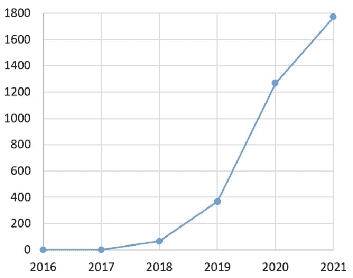
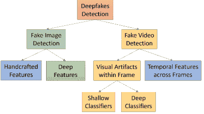
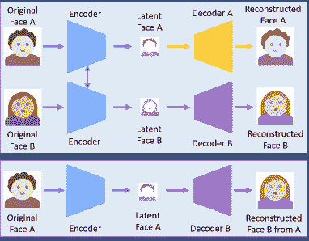
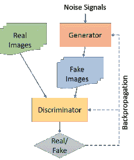
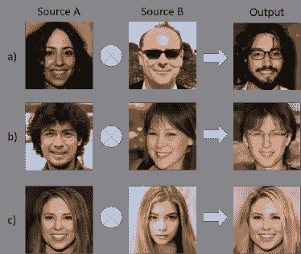
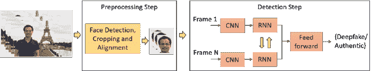
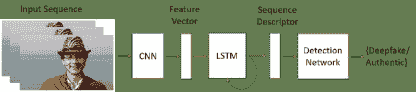
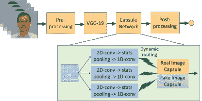

<!--yml

类别：未分类

日期：2024-09-06 20:04:36

-->

# [1909.11573] 深度学习在深度伪造创建与检测中的应用：综述

> 来源：[`ar5iv.labs.arxiv.org/html/1909.11573`](https://ar5iv.labs.arxiv.org/html/1909.11573)

# 深度学习在深度伪造创建与检测中的应用：综述

Thanh Thi Nguyen Quoc Viet Hung Nguyen Dung Tien Nguyen Duc Thanh Nguyen Thien Huynh-The Saeid Nahavandi Thanh Tam Nguyen Quoc-Viet Pham Cuong M. Nguyen

###### 摘要

深度学习已成功应用于解决各种复杂问题，从大数据分析到计算机视觉和人类级控制。然而，深度学习的进展也被用于创建可能威胁隐私、民主和国家安全的软件。其中之一就是深度伪造。深度伪造算法可以创建假图像和视频，人们无法将其与真实的图像区分开。因此，提出能够自动检测和评估数字视觉媒体完整性的技术至关重要。本文综述了用于创建深度伪造的算法，及至今文献中提出的深度伪造检测方法。我们对深度伪造技术相关的挑战、研究趋势和方向进行了广泛讨论。通过回顾深度伪造的背景和最先进的深度伪造检测方法，本研究提供了对深度伪造技术的全面概述，并促进了应对日益复杂的深度伪造问题的新方法的发展。

###### 关键词：

deepfakes，面部操控，人工智能，深度学习，自编码器，生成对抗网络（GAN），取证，调查\affiliation

[inst1]组织=信息技术学院，迪肯大学，省=维多利亚，国家=澳大利亚

\affiliation

[inst2]组织=信息与通信技术学院，格里菲斯大学，省=昆士兰，国家=澳大利亚

\affiliation

[inst3]组织=信息通信技术融合研究中心，金五国立科技大学，省=庆北，国家=韩国

\affiliation

[inst4]组织=智能系统研究与创新学院，迪肯大学，省=维多利亚，国家=澳大利亚

\affiliation

[inst5]组织=信息技术学院，胡志明市科技大学（HUTECH），省=胡志明市，国家=越南

\affiliation

[inst6]组织=韩国东南 4.0 工业革命领导者教育中心，釜山国立大学，省=釜山，国家=韩国

\affiliation

[inst7]组织=LAMIH UMR CNRS 8201，高法兰西理工大学，省=瓦朗谢讷，国家=法国

## 1 引言

在狭义上，深度伪造（源于“深度学习”和“伪造”）是通过技术创建的，这些技术可以将目标人物的面部图像叠加到源人物的视频上，使目标人物在视频中做或说源人物所做的事。这构成了深度伪造的一类，即*面部替换*。在广义上，深度伪造是人工智能合成的内容，也可以分为另外两类，即*口型同步*和*木偶大师*。口型同步深度伪造指的是修改视频以使口部动作与音频录音一致。木偶大师深度伪造包括目标人物（木偶）的动画视频，该人物根据另一位坐在摄像机前的人的面部表情、眼睛和头部动作进行动画制作[1]。

尽管一些深度伪造（deepfake）可以通过传统的视觉效果或计算机图形方法创建，但最近用于深度伪造生成的共同基础机制是深度学习模型，如自动编码器和生成对抗网络（GANs），这些模型在计算机视觉领域得到了广泛应用[2、3、4、5、6、7、8]。这些模型用于检查一个人的面部表情和动作，并合成另一个人具有类似表情和动作的面部图像[9]。深度伪造方法通常需要大量的图像和视频数据来训练模型，以创建逼真的图像和视频。由于公众人物如名人和政治家的视频和图像数量可能很大，他们成为深度伪造的首要目标。深度伪造被用于将名人或政治家的面部替换到色情图像和视频中的身体上。第一个深度伪造视频出现在 2017 年，其中名人的面部被替换成色情演员的面部。当深度伪造方法被用于创建世界领导人的虚假演讲视频以进行伪造时，这对全球安全构成威胁[10、11、12]。因此，深度伪造可能被滥用于造成国家间的政治或宗教紧张局势，欺骗公众并影响选举活动的结果，或者通过制造假新闻在金融市场上制造混乱[13、14、15]。它甚至可以用来生成假的地球卫星图像，包含实际上不存在的物体，以混淆军事分析人员，例如，创建一个假桥梁穿越河流，尽管现实中并不存在这样的桥梁。这可能误导被指引去过桥的部队在战斗中[16、17]。

虽然创造逼真的数字人类具有积极的意义，但深度伪造也有其积极用途，如在视觉效果、数字头像、Snapchat 滤镜中应用，创建失声者的声音或更新电影情节而不需要重新拍摄[18]。深度伪造在摄影、视频游戏、虚拟现实、电影制作和娱乐领域可能产生创造性或生产性的影响，例如，为外国影片进行逼真的视频配音，通过复活历史人物进行教育，购物时虚拟试衣等[19, 20]。然而，恶意使用深度伪造的情况远远超过了积极用途。先进的深度神经网络的发展以及大量数据的可用性使得伪造的图像和视频几乎无法被人类甚至复杂的计算机算法区分。如今，创建这些被操控的图像和视频的过程也变得更加简单，只需要一张身份证照片或一个目标个体的短视频即可。生产令人信服的伪造镜头所需的努力越来越少。最近的技术进展甚至可以仅用一张静态图像创建深度伪造[21]。因此，深度伪造可能对公众人物和普通人都构成威胁。例如，一种声音深度伪造被用来骗取一位首席执行官 243,000 美元[22]。最近发布的 DeepNude 软件显示了更令人不安的威胁，因为它可以将一个人转换为未经同意的色情内容[23]。同样，中国应用程序 Zao 最近也引起了广泛关注，因为技术水平较低的用户可以将自己的面孔换到电影明星的身体上，并将自己插入知名电影和电视片段中[24]。这些伪造形式对隐私和身份的侵犯构成了巨大的威胁，并影响到人们生活的许多方面。

图 1：2016 年至 2021 年与深度伪造相关的论文数量，数据来源于 https://app.dimensions.ai ，在 2021 年底时使用关键词“deepfake”对学术论文全文进行搜索得到的结果。

因此，在数字领域寻找真相变得越来越关键。当面对深度伪造技术时，这一挑战尤为巨大，因为这些技术主要被用于恶意目的，而且如今几乎任何人都可以使用现有的深度伪造工具来创建深度伪造内容。迄今为止，已经提出了许多检测深度伪造的方法[25, 26, 27, 28, 29]。大多数方法基于深度学习，因此，恶意与积极使用深度学习方法之间的对抗正在上升。为了解决面部交换技术或深度伪造的威胁，美国国防高级研究计划局（DARPA）启动了一个媒体取证研究计划（称为媒体取证或 MediFor），以加速假数字视觉媒体检测方法的发展[30]。最近，Facebook Inc. 联手微软公司以及人工智能合作伙伴关系联盟发起了深度伪造检测挑战，以催化更多关于检测和防止深度伪造被用于误导观众的研究与开发[31]。从 https://app.dimensions.ai 获得的数据表明，2021 年底，深度伪造论文的数量近年来显著增加（图 1）。尽管获得的深度伪造论文数量可能低于实际数量，但这一话题的研究趋势显然在上升。

已有关于深度伪造创建和检测的综述文献，如[32、20、19]。例如，Mirsky 和 Lee [19] 关注了重现方法（即更改目标的表情、嘴巴、姿势、注视或身体）和替换方法（即通过交换或转移方法替换目标的面部）。Verdoliva [20] 将检测方法分为传统方法（例如，不使用任何外部数据进行训练的盲目方法、一类传感器方法和基于模型的方法，以及使用手工特征的监督方法）和基于深度学习的方法（例如，CNN 模型）。Tolosana 等人 [32] 根据深度伪造的创建方式对创建和检测方法进行了分类，包括整个面部合成、身份交换、属性操控和表情交换。另一方面，我们从不同的视角和分类法来进行调查。我们根据数据类型，即图像或视频，对深度伪造检测方法进行分类，如图 2 所示。对于假图像检测方法，我们关注所使用的特征，即这些特征是手工特征还是深度特征。对于假视频检测方法，根据方法是否使用跨帧的时间特征或视频帧中的视觉伪影，识别出两个主要子类别。我们还广泛讨论了深度伪造检测和多媒体取证问题的挑战、研究趋势和方向。

图 2：与深度伪造检测方法相关的文献分类，我们将文献分为两个主要类别，即假图像检测和面部视频检测。

## 2 深度伪造创建

深度伪造因其篡改视频的质量和应用程序的易用性而变得流行，这些应用程序适用于各种计算机技能水平的用户，从专业到新手。这些应用程序主要基于深度学习技术开发。深度学习因其表示复杂和高维数据的能力而闻名。具有这种能力的深度网络的一种变体是深度自编码器，这些自编码器已广泛应用于降维和图像压缩[33, 34, 35]。深度伪造创建的首次尝试是 FakeApp，由一个 Reddit 用户开发，使用自编码器-解码器配对结构[36, 37]。在这种方法中，自编码器提取人脸图像的潜在特征，解码器用于重建人脸图像。为了在源图像和目标图像之间交换人脸，需要两个编码器-解码器对，每对用于训练一个图像集，并且编码器的参数在两个网络对之间共享。换句话说，这两个对具有相同的编码器网络。这种策略使得共同的编码器能够找到并学习两组人脸图像之间的相似性，这些人脸通常具有相似的特征，如眼睛、鼻子、嘴巴位置。图 3 展示了一个深度伪造创建过程，其中人脸 A 的特征集与解码器 B 连接，以从原始人脸 A 重建人脸 B。这种方法应用于多个工作中，如 DeepFaceLab[38]、DFaker[39]、DeepFake_tf（基于 tensorflow 的深度伪造）[40]。

表 1：主要深度伪造工具的总结

| 工具 | 链接 | 关键特性 |
| --- | --- | --- |
| Faceswap | https://github.com/deepfakes/faceswap | - 使用两个编码器-解码器对。 - 编码器的参数共享。 |
| Faceswap-GAN | https://github.com/shaoanlu/faceswap-GAN | 在自编码器架构中添加了对抗损失和感知损失（VGGface）。 |
| 少量样本人脸翻译 | https://github.com/shaoanlu/fewshot-face-translation-GAN | - 使用预训练的人脸识别模型提取潜在嵌入以进行 GAN 处理。 - 结合通过 FUNIT[41]和 SPADE[42]模块获得的语义先验。 |
| DeepFaceLab | https://github.com/iperov/DeepFaceLab | - 从 Faceswap 方法扩展，包含新模型，如 H64、H128、LIAEF128、SAE[43]。 - 支持多种人脸提取模式，如 S3FD、MTCNN、dlib 或手动[43]。 |
| DFaker | https://github.com/dfaker/df | - 使用 DSSIM 损失函数[44]重建人脸。 - 基于 Keras 库实现。 |
| DeepFake_tf | https://github.com/StromWine/DeepFake_tf | 类似于 DFaker，但基于 tensorflow 实现。 |
| AvatarMe | https://github.com/lattas/AvatarMe | - 从任意“野外”图像中重建 3D 面孔。 - 可以从单张低分辨率图像中重建真实的 4K x 6K 分辨率 3D 面孔 [45]。 |
| MarioNETte | https://hyperconnect.github.io/MarioNETte | - 一种几-shot 面部重演框架，保持目标身份。 - 无需额外的微调阶段来进行身份适配 [46]。 |
| DiscoFaceGAN | https://github.com/microsoft/DiscoFaceGAN | - 生成具有独立潜在变量（身份、表情、姿态和光照）的虚拟人物面部图像。 - 将 3D 先验嵌入对抗学习中 [47]。 |
| StyleRig | https://gvv.mpi-inf.mpg.de/projects/StyleRig | - 通过 3D 可变形面部模型，使用预训练的固定 StyleGAN 创建面部肖像图像，并进行类似于机架的控制。 - 无需人工标注，进行自监督 [48]。 |
| FaceShifter | https://lingzhili.com/FaceShifterPage | - 通过利用和整合目标属性进行高保真面孔交换。 - 可以应用于任何新的面孔对，而无需特定的受试者训练 [49]。 |
| FSGAN | https://github.com/YuvalNirkin/fsgan | - 一种面孔交换和重演模型，可以应用于面孔对，而无需对这些面孔进行训练。 - 调整面孔的姿态和表情变化 [50]。 |
| StyleGAN | https://github.com/NVlabs/stylegan | - 基于风格迁移文献提出了一种新的 GAN 生成器架构。 - 新架构实现了高层次属性的自动、无监督分离，并支持直观、特定尺度的图像合成控制 [51]。 |
| Face2Face | https://justusthies.github.io/posts/face2face/ | - 实时的单目目标视频序列面部重演，例如 YouTube 视频。 - 通过源演员动画化目标视频中的面部表情，并以照片现实的方式重新渲染操作后的视频 [52]。 |
| Neural Textures | https://github.com/SSRSGJYD/NeuralTexture | - 在场景捕捉过程中作为特征图进行学习，并作为映射存储在 3D 网格代理上。 - 能够在静态和动态环境中以实时速率一致地重新渲染或操作现有视频内容 [53]。 |
| Transformable Bottleneck Networks | https://github.com/kyleolsz/TB-Networks | - 一种图像内容的细粒度 3D 操作方法。 - 使用可变形瓶颈框架在 CNN 模型中应用空间变换 [54]。 |
| “Do as I Do” Motion Transfer | github.com/carolineec/EverybodyDanceNow | - 通过学习视频到视频的转换自动将动作从源对象转移到目标对象。 - 可以创建多个主体的动作同步舞蹈视频 [55]。 |
| Neural Voice Puppetry | https://justusthies.github.io/posts/neural-voice-puppetry | - 一种基于音频驱动的面部视频合成方法。 - 使用 3D 面部表示从另一人的音频序列合成说话头的视频。 [56] |

图 3：使用两个编码器-解码器对的 deepfake 创建模型。两个网络使用相同的编码器，但具有不同的解码器进行训练（上图）。面部 A 的图像通过公共编码器编码，并使用解码器 B 解码以创建 deepfake（下图）。下方的重建图像是面部 B，嘴型是面部 A 的嘴型。面部 B 原本有一个倒心形的嘴，而重建的面部 B 则有一个传统心形的嘴。

通过将对抗损失和在 VGGFace 中实现的感知损失 [57] 添加到编码器-解码器架构中，提出了一种基于生成对抗网络 [4] 的改进版 deepfakes，即 faceswap-GAN [58]。添加 VGGFace 感知损失使得眼睛运动更加逼真，并与输入面孔一致，同时帮助平滑分割掩模中的伪影，从而提高输出视频的质量。该模型支持创建 64x64、128x128 和 256x256 分辨率的输出。此外，FaceNet 实现中的多任务卷积神经网络（CNN）[59] 被用来提高面部检测的稳定性和面部对齐的可靠性。该模型中使用了 CycleGAN [60] 进行生成网络的实现。

图 4：包括生成器和判别器的 GAN 架构，每个都可以通过神经网络实现。整个系统可以通过反向传播进行训练，使两个网络都能提高其能力。

一个传统的 GAN 模型包括两个神经网络：一个生成器和一个判别器，如图 4 所示。给定一个真实图像数据集 $x$，其分布为 $p_{data}$，生成器 $G$ 的目标是生成与真实图像 $x$ 相似的图像 $G(z)$，其中 $z$ 为具有分布 $p_{z}$ 的噪声信号。判别器 $D$ 的目标是正确区分由 $G$ 生成的图像和真实图像 $x$。判别器 $D$ 被训练以提高其分类能力，即最大化 $D(x)$，这表示 $x$ 是真实图像而非由 $G$ 生成的假图像的概率。另一方面，$G$ 被训练以最小化其输出被 $D$ 分类为合成图像的概率，即最小化 $1-D(G(z))$。这是两个玩家 $D$ 和 $G$ 之间的极小极大博弈，可以通过以下价值函数 [4] 描述：

|  | $\min_{G}\max_{D}V(D,G)=\operatorname{\mathbb{E}}_{x\sim p_{data}(x)}[\log D(x)]\\ +\operatorname{\mathbb{E}}_{z\sim p_{z}(z)}[\log(1-D(G(z)))]$ |  | (1) |
| --- | --- | --- | --- |

经过充分训练后，两种网络都提升了其能力，即生成器$G$能够生成与真实图像非常相似的图像，而鉴别器$D$则能够高度区分虚假图像和真实图像。

表 1 展示了流行的 deepfake 工具及其典型特性的总结。其中，基于 GAN 模型的一个突出的人脸合成方法，即 StyleGAN，在[51]中进行了介绍。StyleGAN 受风格迁移[61]的启发，具有特殊的生成器网络架构，能够创建逼真的面部图像。在传统的 GAN 模型中，例如渐进式 GAN（PGGAN）[62]，信号噪声（潜在代码）被输入到表示生成器的前馈网络的输入层中。在 StyleGAN 中，构建了两个相互连接的网络，一个是映射网络$f$，另一个是合成网络$g$。潜在代码$z\in Z$首先通过非线性函数$f:Z\rightarrow W$转换为$w\in W$（其中$W$是一个中间潜在空间），该函数由包含多个全连接层的神经网络（即映射网络）构成。通过仿射变换，中间表示$w$被专业化为风格$y=(y_{s},y_{b})$，将被输入到自适应实例归一化（AdaIN）操作中，如下所示：

|  | $\mathrm{AdaIN}(x_{i},y)=y_{s,i}\frac{x_{i}-\mu(x_{i})}{\sigma(x_{i})}+y_{b,i}$ |  | (2) |
| --- | --- | --- | --- |

其中每个特征图$x_{i}$是单独标准化的。StyleGAN 生成器架构允许通过不同尺度的风格修改来控制图像合成。此外，这种方法在训练期间不使用一个随机潜在代码，而是使用两个潜在代码来生成给定比例的图像。更具体地说，将两个潜在代码$z_{1}$和$z_{2}$输入到映射网络中，分别创建$w_{1}$和$w_{2}$，通过在交叉点前应用$w_{1}$和在交叉点后应用$w_{2}$来控制风格。图 5 展示了在三个不同尺度下混合两个潜在代码生成的图像示例，其中每个风格子集控制图像的不同高层次属性。换句话说，StyleGAN 的生成器架构能够学习高层次属性的分离（例如，当在面部图像上训练时，姿势和身份），并实现直观的、特定尺度的面部合成控制。

图 5：使用 StyleGAN 混合风格的示例：输出图像是通过从源 B 复制指定子集的风格并从源 A 获取其余部分生成的。a) 从源 B 复制粗糙风格将生成具有源 B 高级特征和源 A 的所有颜色及更细面部特征的图像；b) 如果从源 B 复制中等分辨率的风格，输出图像将具有源 B 的较小尺度面部特征，同时保留源 A 的姿势、一般面部形状和眼镜；c) 如果从源 B 复制细节风格，生成的图像将具有源 B 的色彩方案和微观结构 [51]。

## 3 深度伪造检测

深度伪造检测通常被视为二分类问题，其中分类器用于区分真实视频和篡改视频。这种方法需要一个大量的真实和伪造视频数据库来训练分类模型。伪造视频的数量越来越多，但在为各种检测方法设定基准方面仍然有限。为解决这一问题，Korshunov 和 Marcel [63] 制作了一个重要的深度伪造数据集，包含 620 个基于 GAN 模型的视频，使用开源代码 Faceswap-GAN [58]。使用公开的 VidTIMIT 数据库 [64] 中的视频生成了低质量和高质量的深度伪造视频，这些视频能有效模拟面部表情、嘴部动作和眼睛眨动。这些视频随后被用于测试各种深度伪造检测方法。测试结果显示，基于 VGG [65] 和 Facenet [59, 66] 的流行面部识别系统无法有效检测深度伪造。其他方法，如唇同步方法 [67, 68, 69] 和支持向量机（SVM） [70] 的图像质量指标在检测来自这个新生成的数据集的深度伪造视频时产生了非常高的错误率。这引发了对未来发展更强大方法的迫切需求，以便能够从真实视频中检测深度伪造。

本节介绍了深度伪造检测方法的调查，我们将其分为两个主要类别：伪造图像检测方法和伪造视频检测方法（图 2）。后者又分为两个小组：基于单帧视频中的*视觉伪影*的方法和基于跨帧的*时间特征*的方法。虽然大多数基于时间特征的方法使用深度学习*递归*分类模型，但使用视频帧中的视觉伪影的方法可以通过深度或浅层分类器实现。

### 3.1 伪造图像检测

深度伪造对隐私、社会安全和民主造成的损害越来越严重[71]。检测深度伪造的方法在这一威胁出现后不久便被提出。早期尝试基于从伪造图像合成过程中的伪影和不一致性中获得的手工特征。最近的方法，例如[72, 73]，普遍应用了深度学习以自动提取显著且具有区分性的特征来检测深度伪造。

#### 3.1.1 基于手工特征的方法

大多数关于 GAN 生成图像检测的研究虽然 GAN 的开发持续进行，并且许多新的 GAN 扩展经常被引入，但并未考虑检测模型的泛化能力。Xuan 等人[74]使用了图像预处理步骤，如高斯模糊和高斯噪声，以去除 GAN 图像的低级高频线索。这增加了真实图像和虚假图像之间的像素级统计相似性，使取证分类器能够学习更具内在性和有意义的特征，这比之前的图像取证方法[75, 76]或图像隐写分析网络[77]具有更好的泛化能力。

Zhang 等人[78]使用词袋方法提取了一组紧凑的特征，并将其输入到各种分类器中，如 SVM[79]、随机森林（RF）[80]和多层感知机（MLP）[81]，用于区分交换面部图像与真实图像。在深度学习生成的图像中，由 GAN 模型合成的图像可能是最难检测的，因为它们基于 GAN 对复杂输入数据分布的学习能力生成了类似输入分布的新输出。

另一方面，Agarwal 和 Varshney[82]将基于 GAN 的深度伪造检测视为一个假设检验问题，提出了一个基于信息理论认证研究的统计框架[83]。定义了合法图像与特定 GAN 生成的图像之间的最小距离，即 oracle 误差。分析结果表明，当 GAN 的准确性较低时，这个距离会增加，此时更容易检测深度伪造。在高分辨率图像输入的情况下，需要一个极其准确的 GAN 来生成难以通过该方法检测的伪造图像。

#### 3.1.2 基于深度特征的方法

面孔交换在视频合成、肖像变形以及特别是在身份保护方面有许多引人注目的应用，因为它可以用库存图像中的面孔替换照片中的面孔。然而，它也是网络攻击者用来渗透身份识别或认证系统以获取非法访问的技术之一。深度学习的使用，如 CNN 和 GAN，使得交换的面孔图像对取证模型来说更具挑战性，因为它可以保留照片的姿势、面部表情和光照 [84]。

Hsu 等人 [85] 提出了一个用于检测深度伪造图像的两阶段深度学习方法。第一阶段是基于常见伪造特征网络（CFFN）的特征提取器，其中使用了 [86] 中提出的 Siamese 网络架构。CFFN 包含多个密集单元，每个单元包括不同数量的密集块 [61]，以提高对输入图像的表征能力。通过 CFFN 学习过程，基于成对信息（即每对输入图像的标签）提取伪造图像和真实图像之间的判别特征。如果两幅图像类型相同，即伪造-伪造或真实-真实，则成对标签为 $1$。相反，如果它们类型不同，即伪造-真实，则成对标签为 $0$。基于 CFFN 的判别特征随后被输入到神经网络分类器中，以区分欺骗性图像和真实图像。所提方法在伪造面孔和伪造一般图像检测中得到了验证。一方面，面孔数据集来自 CelebA [87]，包含 10,177 个身份和 202,599 张不同姿势和背景杂乱的对齐面孔图像。使用了五种 GAN 变体生成 64x64 尺寸的伪造图像，包括深度卷积 GAN (DCGAN) [88]、Wasserstein GAN (WGAN) [89]、带有梯度惩罚的 WGAN (WGAN-GP) [90]、最小二乘 GAN [91] 和 PGGAN [62]。总共获得了 385,198 张训练图像和 10,000 张真实与伪造图像用于验证所提方法。另一方面，通用数据集来自 ILSVRC12 [92]。大规模 GAN 训练模型用于高保真自然图像合成 (BIGGAN) [93]、自注意力 GAN [94] 和谱归一化 GAN [95] 用于生成 128x128 尺寸的伪造图像。训练集包括 600,000 张伪造和真实图像，而测试集包括 10,000 张这两种类型的图像。实验结果显示，所提方法在性能上优于竞争方法，如 [96、97、98、99] 中介绍的那些方法。

同样，郭等人 [100] 提出了一个名为 SCnet 的 CNN 模型，用于检测由 Glow 基面部伪造工具 [101] 生成的深伪图像。由 Glow 模型 [101] 合成的伪造图像具有恶意篡改的面部表情。这些图像高度逼真，视觉效果完美，但仍然有微妙或明显的操控痕迹，这些痕迹被 SCnet 利用。得益于一个由四个卷积层堆叠形成的层次特征提取块，SCnet 能够自动学习图像数据的高级取证特征。每个层学习来自前一层的新特征图，每次卷积操作的定义为：

|  | $f_{j}^{(n)}=\sum_{i=1}^{i}f_{i}^{(n-1)}*\omega_{ij}^{(n)}+b_{j}^{(n)}$ |  | (3) |
| --- | --- | --- | --- |

其中 $f_{j}^{(n)}$ 是第 $n^{th}$ 层的第 $j^{th}$ 特征图，$\omega_{ij}^{(n)}$ 是第 $n^{th}$ 层第 $j^{th}$ 卷积核的第 $i^{th}$ 通道的权重，$b_{j}^{(n)}$ 是第 $n^{th}$ 层第 $j^{th}$ 卷积核的偏置项。所提出的方法使用包含 321,378 张面部图像的数据集进行评估，这些图像是通过将 Glow 模型 [101] 应用于 CelebA 面部图像数据集 [87] 创建的。评估结果显示，SCnet 模型比 [102] 中提出的 Meso-4 模型具有更高的准确性和更好的泛化能力。

图 6：一个面部操控检测的两步过程，其中预处理步骤旨在检测、裁剪和对齐一系列帧中的面部，第二步通过结合卷积神经网络（CNN）和递归神经网络（RNN）来区分操控过的面部图像和真实的面部图像 [103]。

最近，赵等人[104] 提出了一个利用局部源特征自一致性进行深度伪造检测的方法，这些特征是图像的内容独立的空间局部信息。这些特征可以来自成像管道、编码方法或图像合成方法。假设是，修改过的图像在不同位置会有不同的源特征，而原始图像在各个位置的源特征是相同的。这些源特征以降采样特征图的形式表示，通过使用称为成对自一致性学习的特殊表示学习方法的 CNN 模型提取。该学习方法旨在惩罚来自同一图像的特征向量对的余弦相似度得分低，同时也惩罚来自不同图像的特征对的相似度得分高。然后将学习到的特征图输入到深度伪造检测分类方法中。该方法在七个流行的数据集上进行了评估，包括 FaceForensics++ [105]、DeepfakeDetection [106]、Celeb-DF-v1 & Celeb-DF-v2 [107]、深度伪造检测挑战（DFDC）[108]、DFDC 预览 [109] 和 DeeperForensics-1.0 [110]。实验结果表明，该方法优于最先进的方法，但在处理由直接输出整个图像的方法生成的假图像时可能存在局限性，这些假图像的源特征在每个图像内的所有位置是一致的。

### 3.2 假视频检测

大多数图像检测方法不能用于视频，因为视频压缩后帧数据的强烈退化[102]。此外，视频具有时间特性，在帧组之间变化，因此对于仅设计用于检测静态假图像的方法来说，这些视频具有挑战性。本小节关注深度伪造视频检测方法，并将其分为两个较小的组：利用时间特征的方法和探索帧内视觉伪影的方法。

#### 3.2.1 视频帧中的时间特征

基于观察到在深伪合成过程中时间一致性未能有效强制实施的情况，Sabir 等人 [103] 利用视频流的时空特征来检测深伪。视频处理是逐帧进行的，因此由面部操作产生的低级伪影被认为会进一步表现为帧间不一致的时间伪影。基于卷积网络 DenseNet [61] 和门控递归单元（GRU） [111] 的集成，提出了一种递归卷积模型（RCN），以利用帧间的时间差异（参见图 6）。该方法在包括 1,000 个视频的 FaceForensics++ 数据集上进行了测试 [105]，显示了有希望的结果。

同样，Güera 和 Delp [112] 强调了深伪视频中存在帧内不一致性和帧间时间不一致性。然后，他们提出了一种时间感知管道方法，该方法使用 CNN 和长短期记忆（LSTM）来检测深伪视频。CNN 用于提取帧级特征，这些特征随后被输入到 LSTM 中以创建时间序列描述符。最后，使用全连接网络根据序列描述符对伪造视频和真实视频进行分类，如图 7 所示。使用包含 600 个视频的数据集（包括 300 个从多个视频托管网站收集的深伪视频和 300 个从 [113] 的好莱坞人类动作数据集中随机选择的原始视频），获得了超过 97% 的准确率。

图 7：一种使用卷积神经网络（CNN）和长短期记忆（LSTM）提取给定视频序列时间特征的深伪检测方法，这些特征通过序列描述符表示。检测网络由全连接层组成，用于将序列描述符作为输入并计算帧序列属于真实或深伪类别的概率 [112]。

另一方面，Li 等人提出了利用生理信号——眼睛眨动来检测深度伪造视频的方案[114]。这一方案基于观察到的事实，即深度伪造视频中的人眨眼频率远低于未被篡改的视频。健康的成年人通常每 2 到 10 秒眨一次眼，每次眨眼持续时间为 0.1 到 0.4 秒。然而，深度伪造算法通常使用在线获取的面部图像进行训练，这些图像通常显示的是睁开的眼睛，即互联网上很少有闭眼的图像。因此，由于没有闭眼的图像，深度伪造算法无法生成可以正常眨眼的伪造面孔。换句话说，深度伪造视频中的眨眼率远低于正常视频。为了区分真实和伪造视频，Li 等人[114]将视频中的眼睛区域裁剪出来，并将其输入到长短期记忆网络（LRCN）[115]中进行动态状态预测。LRCN 包括一个基于 CNN 的特征提取器，一个基于长短期记忆（LSTM）的序列学习模块，以及一个基于全连接层的状态预测模块，以预测眼睛开合的概率。眼睛眨动表现出强烈的时间依赖性，因此 LSTM 的实现有助于有效捕捉这些时间模式。

最近，Caldelli 等人[116]提出了利用光流来衡量视频帧序列在时间轴上的信息，以检测视频深度伪造。光流是计算在两个时间上不同的帧上的向量场，能够描述场景中物体的运动。光流场在合成创建的帧和自然生成的帧之间应该有所不同[117]。与原始视频相比，插入到深度伪造视频中的嘴唇、眼睛或整个面部的非自然运动会引入独特的运动模式。基于这一假设，包含光流场的特征被输入到 CNN 模型中，用于区分深度伪造视频和原始视频。更具体地说，ResNet50 架构[118]被作为 CNN 模型进行实验。使用 FaceForensics++数据集[105]获得的结果表明，这种方法在分类准确性方面与最先进的方法相当。还实验了将这种特征与基于帧的特征相结合，结果提高了深度伪造检测性能。这表明光流场在捕捉视频帧时间轴上的不一致性方面非常有用。

#### 3.2.2 视频帧中的视觉伪影

如前一节所述，使用视频帧间时间模式的方法大多基于深度递归网络模型来检测深度伪造视频。本节探讨了另一种方法，该方法通常将视频分解为帧，并在单帧内探索视觉伪影以获取判别特征。这些特征随后分配给深度或浅层分类器，以区分虚假视频和真实视频。因此，我们根据分类器的类型（即深度或浅层）对本节的方法进行分组。

##### 深度分类器

深度伪造视频通常以有限的分辨率创建，这要求使用仿射人脸扭曲方法（即缩放、旋转和剪切）来匹配原始视频的配置。由于扭曲人脸区域与周围背景之间的分辨率不一致，这一过程留下了可以被 CNN 模型（如 VGG16 [119]、ResNet50、ResNet101 和 ResNet152 [118]）检测到的伪影。在 [120] 中提出了一种基于深度伪造生成算法在人脸扭曲步骤中观察到的伪影来检测深度伪造的方法。该方法在两个深度伪造数据集上进行了评估，即 UADFV 和 DeepfakeTIMIT。UADFV 数据集 [121] 包含 49 个真实视频和 49 个虚假视频，总计 32,752 帧。DeepfakeTIMIT 数据集 [69] 包含一组 64 x 64 的低质量视频和一组 128 x 128 的高质量视频，共有 10,537 张原始图像和 34,023 张伪造图像，分别从每组 320 个视频中提取。该方法的性能与其他流行方法进行了比较，例如两种深度伪造检测 MesoNet 方法，即 Meso-4 和 MesoInception-4 [102]、HeadPose [121] 和人脸篡改检测方法两流神经网络 [122]。所提出的方法的优点在于，在训练检测模型之前不需要生成深度伪造视频作为负样本。相反，负样本是通过提取原始图像的人脸区域并将其对齐为多个尺度，然后对随机选取的缩放图像应用高斯模糊，再扭曲回原始图像来动态生成的。这与其他需要预先生成深度伪造的办法相比，减少了大量的时间和计算资源消耗。

Nguyen 等人 [123] 提出了使用胶囊网络来检测被操控的图像和视频。胶囊网络最初是为了应对 CNN 在应用于逆向图形任务时的局限性而引入的，这些任务旨在寻找用于生成世界图像的物理过程 [124]。基于动态路由算法 [125] 的胶囊网络的最新发展展示了它描述对象部件之间层次姿态关系的能力。正如图 8 所示，这一发展作为检测伪造图像和视频的流程中的一个组件进行应用。一个动态路由算法被用来通过多个迭代将三个胶囊的输出路由到输出胶囊，以区分虚假图像和真实图像。该方法通过涵盖各种伪造图像和视频攻击的四个数据集进行评估。这些数据集包括著名的 Idiap 研究所重播攻击数据集 [126]，由 Afchar 等人 [102] 创建的深度伪造面部交换数据集，FaceForensics 数据集 [127]，由 Face2Face 方法 [52] 生成，以及由 Rahmouni 等人 [128] 生成的完全计算机生成图像数据集。与其竞争方法相比，所提方法在所有这些数据集中表现出最佳性能。这表明胶囊网络在构建一个可以有效应对各种伪造图像和视频攻击的通用检测系统方面具有潜力。

图 8：胶囊网络利用从 VGG-19 网络中获得的特征 [119] 来区分虚假图像或视频与真实图像或视频（上图）。预处理步骤检测面部区域，并在使用 VGG-19 提取胶囊网络的潜在特征之前，将其缩放到 128x128 的大小，胶囊网络包括三个主要胶囊和两个输出胶囊，一个用于真实图像，一个用于虚假图像（下图）。统计池化是胶囊网络处理伪造检测的一个重要部分 [123]。

##### 浅层分类器

深伪检测方法主要依赖于假图像和真实图像或视频之间内在特征的伪影或不一致性。杨等人[121]提出了一种检测方法，通过观察包括头部方向和位置的 3D 头部姿态之间的差异来进行检测，这些姿态是基于中央面部区域 68 个面部标志估计的。检查 3D 头部姿态是因为深伪面部生成流程存在一个缺陷。提取的特征被输入到 SVM 分类器中以获得检测结果。对两个数据集的实验表明，所提出的方法在与竞争方法相比时表现出色。第一个数据集，即 UADFV，包含 49 个深伪视频及其相应的真实视频[121]。第二个数据集包括 241 张真实图像和 252 张深伪图像，这是 DARPA MediFor GAN 图像/视频挑战[129]中使用的数据子集。同样，在[130]中研究了一种利用基于眼睛、牙齿和面部轮廓的视觉特征的深伪和面部操控伪影的方法。视觉伪影源于缺乏全局一致性、错误或不精确的光照估计，或不精确的底层几何估计。对于深伪检测，利用了眼睛和牙齿区域的缺失反射和缺失细节，以及基于面部标志提取的面部区域纹理特征。因此，使用了眼部特征向量、牙齿特征向量和从全脸裁剪中提取的特征。在提取特征后，使用了包括逻辑回归和小型神经网络在内的两个分类器来区分深伪和真实视频。在 YouTube 下载的视频数据集上的实验表明，在接收者操作特征曲线下面积方面，取得了 0.851 的最佳结果。然而，所提出的方法有一个缺点，即需要满足某些先决条件的图像，例如睁开的眼睛或可见的牙齿。

在[131]中提出了使用光响应不均匀性（PRNU）分析来区分深度伪造和真实视频。PRNU 是传感器模式噪声的一部分，这归因于硅晶圆的制造缺陷以及由于硅晶圆物理特性的变化而导致的像素对光的敏感性不一致。PRNU 分析在图像取证中被广泛使用 [132, 133, 134, 135, 136]，并在[131]中被提倡使用，因为交换的面孔可能会改变视频帧中面部区域的局部 PRNU 模式。视频被转换成帧，并裁剪到有问题的面部区域。裁剪后的帧随后按顺序分为八组，每组计算一个平均 PRNU 模式。计算归一化互相关分数以比较这些组之间的 PRNU 模式。创建了一个测试数据集，包括 10 个真实视频和 16 个操纵视频，其中伪造视频由 DeepFaceLab 工具 [38] 从真实视频中生成。分析显示，深度伪造和真实视频之间的均值归一化互相关分数存在显著统计差异。因此，这项分析表明 PRNU 在深度伪造检测中具有潜力，尽管需要测试更大的数据集。

当用户对视频或图像产生怀疑时，通常希望查找其来源。然而，目前没有这样的工具可供使用。Hasan 和 Salah [137] 提出了使用区块链和智能合约来帮助用户检测深度伪造视频的建议，前提是视频只有在其来源可追溯时才被认为是真实的。每个视频都与一个智能合约相关联，该合约链接到其母视频，每个母视频在层级结构中都有一个链接到其子视频。通过这一链条，即使视频被复制多次，用户也可以可靠地追溯到与原始视频相关联的智能合约。智能合约的一个重要属性是星际文件系统的唯一哈希值，该系统用于以去中心化和内容可寻址的方式存储视频及其元数据 [138]。智能合约的关键特性和功能经过了多种常见安全挑战的测试，如分布式拒绝服务、重放和中间人攻击，以确保解决方案满足安全要求。这种方法是通用的，可以扩展到其他类型的数字内容，例如图像、音频和手稿。

表 2：主要深度伪造检测方法的总结

| 方法 | 分类器/技术 | 主要特征 | 处理方式 | 使用的数据集 |
| --- | --- | --- | --- | --- |
| 眼睑眨动 [114] | LRCN | - 使用 LRCN 学习眼睑眨动的时间模式。 - 基于观察到的 deepfake 的眨眼频率远低于正常水平。 | 视频 | 包含 49 个采访和演讲视频及其相应生成的 deepfake。 |
| 帧内和时间不一致性 [112] | CNN 和 LSTM | CNN 被用来提取帧级特征，这些特征分发给 LSTM 以构建对分类有用的序列描述符。 | 视频 | 从多个网站获得的 600 个视频集合。 |
| 使用面部变形伪影 [120] | VGG16 [119], ResNet 模型 [118] | 通过 CNN 模型发现伪影，这些模型基于变形面部区域与周围背景之间的分辨率不一致性。 | 视频 | - UADFV [121]，包含 49 个真实视频和 49 个伪造视频，总共有 32752 帧。 - DeepfakeTIMIT [69] |
| MesoNet [102] | CNN | - 引入了两个深度网络，即 Meso-4 和 MesoInception-4，以在中观分析水平上检查 deepfake 视频。 - 在 deepfake 和 FaceForensics 数据集上获得的准确率分别为 98% 和 95%。 | 视频 | 两个数据集：一个是由在线视频构成的 deepfake 数据集，另一个是由 Face2Face 方法 [52] 创建的 FaceForensics 数据集。 |
| 眼睛、牙齿和面部纹理 [130] | 逻辑回归和神经网络 (NN) | - 利用深度伪造中面部纹理的差异以及眼睛和牙齿区域的缺失反射和细节。 - 使用逻辑回归和 NN 进行分类。 | 视频 | 从 YouTube 下载的视频数据集。 |
| 使用 RCN 的时空特征 [103] | RCN | 通过整合卷积网络 DenseNet [61] 和门控递归单元 (GRU) 的 RCN 探索帧间的时间差异。 | 视频 | FaceForensics++ 数据集，包括 1,000 个视频 [105]。 |
| 使用 LSTM 的时空特征 [139] | 卷积双向递归 LSTM 网络 | - 使用 XceptionNet CNN 进行面部特征提取，同时通过堆叠多个卷积模块获得音频嵌入。 - 使用两个损失函数，即交叉熵和 Kullback-Leibler 散度。 | 视频 | FaceForensics++ [105] 和 Celeb-DF（5,639 个 deepfake 视频） [107] 数据集以及 ASVSpoof 2019 Logical Access 音频数据集 [140]。 |
| PRNU 分析 [131] | PRNU | - 分析数字相机由于工厂缺陷而产生的光敏传感器的噪声模式。 - 探索真实视频与深度伪造视频之间 PRNU 模式的差异，因为面部替换被认为会改变局部 PRNU 模式。 | 视频 | 由作者创建，包括 10 个真实视频和 16 个使用 DeepFaceLab [38] 制作的深度伪造视频。 |
| 音素-视觉音素不匹配 [141] | CNN | - 利用口型（即视觉音素）与发音音素之间的动态不匹配。 - 关注 M、B 和 P 音素相关的声音，因为它们需要完全闭合的嘴唇，而深度伪造技术往往不正确地合成这些声音。 | 视频 | 从 Instagram 和 YouTube（www.instagram.com/bill_posters_uk 和 youtu.be/VWMEDacz3L4）获取的四个真实环境下的唇同步深度伪造视频，以及其他利用合成技术（即音频到视频 (A2V) [68] 和文本到视频 (T2V) [142]）创建的视频。 |
| 使用基于归属的置信度 (ABC) 指标 [143] | ResNet50 模型 [118]，预训练于 VGGFace2 [144] | - 使用 ABC 指标 [145] 来检测深度伪造视频，而无需访问训练数据。 - 原始视频的 ABC 值大于 0.94，而深度伪造视频的 ABC 值较低。 | 视频 | VidTIMIT 和两个从 COHFACE (https://www.idiap.ch/dataset/cohface) 和 YouTube 获取的原始数据集。COHFACE [146] 和 YouTube 数据集用于通过商业网站 https://deepfakesweb.com 生成两个深度伪造数据集，另一个深度伪造数据集是 DeepfakeTIMIT [147]。 |
| 使用外观和行为 [148] | 基于面部和行为特征的规则。 | 通过 ResNet-101 [118] 学习面部表情和头部运动的时间性行为生物特征，而静态面部生物特征则使用 VGG [65] 获得。 | 视频 | 世界领导人数据集 [1]、FaceForensics++ [105]、Google/Jigsaw 深度伪造检测数据集 [106]、DFDC [109] 和 Celeb-DF [107]。 |
| FakeCatcher [149] | CNN | 提取肖像视频中的生物信号，并将其用作真实性的隐式描述，因为这些信号在深度伪造中空间和时间上都不被很好地保留。 | 视频 | UADFV [121]、FaceForensics [127]、FaceForensics++ [105]、Celeb-DF [107] 和一个包含 142 个视频的新数据集，独立于生成模型、分辨率、压缩、内容和背景。 |
| 情感音频-视觉情感线索 [150] | 连体网络 [86] | 提取面部和语音的模态与情感嵌入向量用于深度伪造检测。 | 视频 | DeepfakeTIMIT [147] 和 DFDC [109]。 |
| 头部姿势 [121] | SVM | - 使用面部区域的 68 个标记点提取特征。 - 使用 SVM 对提取的特征进行分类。 | 视频/ 图像 | - UADFV 包含 49 个深度伪造视频及其对应的真实视频。 - 241 张真实图像和 252 张深度伪造图像来自 DARPA MediFor GAN 图像/视频挑战。 |
| 胶囊取证 [123] | 胶囊网络 | - 由 VGG-19 网络 [119] 提取的潜在特征被输入到胶囊网络中进行分类。 - 使用动态路由算法 [125] 将三个卷积胶囊的输出路由到两个输出胶囊，一个用于伪造图像，另一个用于真实图像，通过多个迭代完成。 | 视频/ 图像 | 四个数据集：Idiap 研究所重放攻击 [126]，深度伪造人脸交换 [102]，面部重演 FaceForensics [127]，以及完全计算机生成的图像集 [128]。 |
| 方法 | 分类器/技术 | 关键特征 | 处理对象 | 使用的数据集 |

| 预处理结合深度网络 [74] | DCGAN、WGAN-GP 和 PGGAN。 | - 提高深度学习模型检测 GAN 生成图像的泛化能力。 - 移除伪造图像的低级特征。 |

- 强迫深度网络更加关注伪造图像与真实图像之间的像素级相似性，以提高泛化能力。 | 图像 | - 真实数据集：CelebA-HQ [62]，包含分辨率为 1024x1024 的高质量人脸图像。 - 伪造数据集：由 DCGAN [88]、WGAN-GP [90] 和 PGGAN [62] 生成。 |

| 分析卷积痕迹 [151] | KNN, SVM 和线性判别分析 (LDA) | 使用期望最大化算法提取与 GAN 基于图像深度伪造生成器的卷积生成过程相关的局部特征。 | 图像 | 从 CelebA 获取的真实图像及由五种不同 GAN（分组深度白化和着色变换 GDWCT [152]，StarGAN [153]，AttGAN [154]，StyleGAN [51]，StyleGAN2 [155]）生成的对应深度伪造图像。 |
| --- | --- | --- | --- | --- |
| 词袋模型和浅层分类器 [78] | SVM, RF, MLP | 使用词袋模型提取判别特征，并将这些特征输入到 SVM、RF 和 MLP 中进行二分类：真实与伪造。 | 图像 | 著名的 LFW 人脸数据库 [156]，包含 13,223 张分辨率为 250x250 的图像。 |
| 成对学习 [85] | CNN 与 CFFN 连接 | 两阶段程序：基于 Siamese 网络架构 [86] 使用 CFFN 进行特征提取，并使用 CNN 进行分类。 | 图像 | - 面部图像：来自 CelebA [87] 的真实图像，以及由 DCGAN [88], WGAN [89], WGAN-GP [90], 最小二乘 GAN [91] 和 PGGAN [62] 生成的假图像。 - 一般图像：来自 ILSVRC12 [92] 的真实图像，以及由 BIGGAN [93], 自注意力 GAN [94] 和光谱归一化 GAN [95] 生成的假图像。 |
| 针对深度伪造中的对抗性扰动的防御 [157] | VGG [65] 和 ResNet [118] | - 引入对抗性扰动以增强深度伪造并欺骗深度伪造检测器。 - 使用 Lipschitz 正则化和深度图像先验技术提高深度伪造检测器的准确性。 | 图像 | 从 CelebA [87] 获得的 5,000 张真实图像和由“Few-Shot Face Translation GAN”方法 [158] 生成的 5,000 张假图像。 |
| 面部 X 射线 [159] | CNN | - 尝试定位目标和原始面部之间的混合边界，而不是捕捉特定操作的合成伪影。 - 可以在没有假图像的情况下进行训练。 | 图像 | FaceForensics++ [105], DeepfakeDetection (DFD) [106], DFDC [109] 和 Celeb-DF [107]。 |
| 使用 CNN 生成图像的常见伪影 [160] | 用 ImageNet [92] 预训练的 ResNet-50 [118] | 使用大量由高性能无条件 GAN 模型生成的假图像来训练分类器，即 PGGAN [62] 并评估分类器对其他 CNN 合成图像的泛化能力。 | 图像 | 一个新的 CNN 生成图像数据集，名为 ForenSynths，由 11 个模型合成的图像组成，例如 StyleGAN [51], 超分辨率方法 [161] 和 FaceForensics++ [105]。 |
| 在基于 GAN 的图像上使用卷积痕迹 [162] | KNN、SVM 和 LDA | 训练期望最大化算法 [163] 来检测和提取通过代表 GAN 在图像生成过程中留下的卷积痕迹的指纹的区分特征。 | 图像 | 十个 GAN 模型生成的图像数据集，包括 CycleGAN [164], StarGAN [153], AttGAN [154], GDWCT [152], StyleGAN [51], StyleGAN2 [155], PGGAN [62], FaceForensics++ [105], IMLE [165] 和 SPADE [42]。 |
| 使用 CNN 提取的深度特征[100] | 一种新的 CNN 模型，即 SCnet | 基于 CNN 的 SCnet 能够自动学习图像数据的高层次取证特征，这得益于一个由四层卷积层堆叠而成的层次化特征提取模块。 | 图像 | 一个包含 321,378 张面部图像的数据集，该数据集通过将 Glow 模型[101]应用于 CelebA 面部图像数据集[87]创建。 |

## 4 讨论与未来研究方向

在深度学习的支持下，制造深度伪造变得比以往更容易。由于社交媒体平台的发展，这些虚假内容的传播也变得更快[166]。有时深度伪造不需要传播到大量观众即可产生有害效果。那些恶意制造深度伪造的人只需将其传递给目标受众作为其破坏策略的一部分，而无需使用社交媒体。例如，这种方法可以被情报部门利用，以影响政治家等重要人物的决策，从而导致国家和国际安全威胁[167]。针对深度伪造的警示性问题，研究界专注于开发深度伪造检测算法，并报告了大量结果。本文回顾了最先进的方法，并在表 2 中提供了典型方法的总结。值得注意的是，使用先进机器学习来制造深度伪造的人与努力检测深度伪造的人之间的竞争越来越激烈。

深度伪造的质量不断提高，检测方法的性能需要相应改进。灵感在于 AI 所破坏的东西也可以通过 AI 修复[168]。检测方法仍处于早期阶段，提出并评估了各种方法，但使用的是碎片化的数据集。提高检测方法性能的一种方法是创建一个不断更新的深度伪造基准数据集，以验证检测方法的持续发展。这将有助于检测模型的训练过程，特别是那些基于深度学习的模型，它们需要大量的训练集[108]。

提高深伪检测方法的性能非常重要，特别是在跨伪造和跨数据集的场景中。大多数检测模型都是在同一伪造和数据集实验中设计和评估的，这并不能保证它们的泛化能力。一些以前的研究已经解决了这个问题，例如[160、116、104、169、170]，但在这个方向上还需要更多的工作。一个在特定伪造上训练的模型需要能够对抗另一种未知的伪造类型，因为在实际场景中，潜在的深伪类型通常是不知道的。同样，目前的检测方法大多集中于深伪生成管道的缺陷，即找出竞争对手的弱点以攻击它们。这种信息和知识在对抗性环境中并不总是可用，因为攻击者通常试图不透露这些深伪创建技术。最近对抗性扰动攻击以欺骗基于 DNN 的检测器的工作，使得深伪检测任务变得更加困难[157、171、172、173、174]。这些是真实的检测方法开发挑战，未来的研究需要专注于引入更强大、可扩展和具有泛化能力的方法。

另一个研究方向是将检测方法集成到分发平台如社交媒体中，以提高其在应对深伪广泛影响方面的效果。可以在这些平台上实施使用有效检测方法的筛选或过滤机制，以便简化深伪检测[167]。可以对拥有这些平台的科技公司制定法律要求，以快速移除深伪内容，减少其影响。此外，水印工具也可以集成到人们用于创建数字内容的设备中，以创建不可更改的元数据，用于存储原创性细节，如多媒体内容的时间和地点以及其未经篡改的认证[167]。这种集成实施起来困难，但一个解决方案可能是使用颠覆性的区块链技术。区块链在许多领域中已经被有效使用，目前只有少数研究基于这一技术解决深伪检测问题。由于它能够创建一链独特的不可更改的元数据块，因此它是数字来源解决方案的绝佳工具。将区块链技术集成到这个问题中已经展示了一定的结果[137]，但这一研究方向仍然远未成熟。

使用检测方法来识别深度伪造内容是至关重要的，但理解发布深度伪造内容的人的真实意图更为重要。这需要用户根据发现深度伪造内容的社会背景进行判断，例如，谁分发了它以及他们对它的评价[175]。这点至关重要，因为深度伪造技术正变得越来越逼真，检测软件很可能会滞后于深度伪造技术的发展。因此，关于深度伪造的社会背景的研究，以帮助用户进行这种判断，是值得进行的。

视频和照片已广泛作为警方调查和司法案件中的证据。它们可以通过拥有计算机或执法背景并具备收集、检查和分析数字信息经验的数字媒体取证专家在法庭上作为证据引入。机器学习和 AI 技术的发展可能已被用来修改这些数字内容，因此专家的意见可能不足以验证这些证据，因为即使是专家也无法识别被操控的内容。在如今法庭上使用图像和视频作为定罪证据时，这一点需要被考虑，因为存在各种数字操控方法[176]。因此，数字媒体取证结果必须被证明是有效和可靠的，才能在法庭上使用。这要求对取证过程的每一步以及结果的形成过程进行详细记录。机器学习和 AI 算法可以用于支持数字媒体真实性的判断，并已获得准确和可靠的结果，例如[177, 178]，但大多数这些算法是不可解释的。这为 AI 在取证问题中的应用带来了巨大障碍，因为取证专家通常没有计算机算法的专业知识，而计算机专业人士也无法正确解释结果，因为大多数这些算法是黑箱模型[179]。这一点尤为重要，因为最新的、结果最准确的模型基于深度学习方法，包含许多神经网络参数。研究人员最近尝试创建可解释的检测方法。例如，Giudice 等人提出的方法[180]中，他们使用离散余弦变换统计来检测所谓的特定 GAN 频率，以区分真实图像和深伪图像。通过分析特定频率统计，这种方法可以用数学方法解释多媒体内容是否为深伪图像以及原因。因此，需要在这一领域进行更多研究，并且计算机视觉中的可解释 AI 是推动和利用 AI 及机器学习在数字媒体取证中进步和优势的研究方向。

## 5 结论

深度伪造技术已经开始侵蚀人们对媒体内容的信任，因为看到这些内容不再等同于相信它们。它们可能会对被针对者造成困扰和负面影响，加剧虚假信息和仇恨言论，甚至可能刺激政治紧张，煽动公众情绪、暴力或战争。由于创建深度伪造技术的门槛越来越低，社交媒体平台能够迅速传播这些虚假内容，这一点尤为关键。本综述提供了对深度伪造创建和检测方法的及时概述，并对该领域中的挑战、潜在趋势和未来方向进行了广泛讨论。因此，这项研究对人工智能研究社区在应对深度伪造方面的有效方法开发具有重要价值。

## 竞争利益声明

作者声明没有利益冲突。

## 参考文献

+   Agarwal 等人 [2019] 舒瑞提·阿加瓦尔、哈尼·法里德、余明明、何明明、小木·长野和李浩。保护世界领导者免受深度伪造的威胁。在*计算机视觉与模式识别研讨会*，第 1 卷，第 38–45 页，2019 年。

+   Vincent 等人 [2008] 帕斯卡·文森特、雨果·拉罗谢尔、约书亚·本吉奥和皮埃尔-安托万·曼扎戈尔。通过去噪自编码器提取和组合鲁棒特征。在*第 25 届国际机器学习会议录*，第 1096–1103 页，2008 年。

+   Kingma 和 Welling [2013] 迪德里克·P·金马和马克斯·威林。自编码变分贝叶斯。*arXiv 预印本 arXiv:1312.6114*，2013 年。

+   Goodfellow 等人 [2014] 伊恩·古德费洛、让·普热特-阿巴迪、梅赫迪·米尔扎、冰·徐、大卫·瓦尔德-法利、谢尔吉尔·奥扎伊尔、亚伦·库尔维尔和约书亚·本吉奥。生成对抗网络。*神经信息处理系统进展*，27:2672–2680，2014 年。

+   Makhzani 等人 [2015] 阿利雷扎·马赫扎尼、乔纳森·施伦斯、纳夫迪普·贾特利、伊恩·古德费洛和布伦丹·弗雷。对抗自编码器。*arXiv 预印本 arXiv:1511.05644*，2015 年。

+   Tewari 等人 [2018] 阿尤什·特瓦里、迈克尔·佐尔霍费尔、弗洛里安·伯纳德、巴勃罗·加里多、赫永宇·金、帕特里克·佩雷斯和克里斯蒂安·泰奥巴特。基于无监督模型的单目人脸高保真重建。*IEEE 模式分析与机器智能汇刊*，42(2):357–370，2018 年。

+   Lin 等人 [2021] 家成·林、杨·李和冠词·杨。FPGAN：一种用于社交机器人面部去识别的方法，基于生成对抗网络。*神经网络*，133:132–147，2021 年。

+   Liu 等人 [2021] 明宇·刘、荀·黄、佳慧·余、婷春·王和阿伦·马利亚。生成对抗网络在图像和视频合成中的算法与应用。*IEEE 会议录*，109(5):839–862，2021 年。

+   Lyu [2018] 司伟·吕。瞬间检测“深度伪造”视频。[`theconversation.com/detecting-deepfake-videos-in-the-blink-of-an-eye-101072`](http://theconversation.com/detecting-deepfake-videos-in-the-blink-of-an-eye-101072)，2018 年 8 月。

+   Bloomberg [2018] Bloomberg. How faking videos became easy and why that’s so scary. [`fortune.com/2018/09/11/deep-fakes-obama-video/`](https://fortune.com/2018/09/11/deep-fakes-obama-video/), September 2018.

+   Chesney and Citron [2019] Robert Chesney and Danielle Citron. Deepfakes and the new disinformation war: The coming age of post-truth geopolitics. *《外交事务》*, 98:147, 2019.

+   Hwang [2020] T. Hwang. Deepfakes: A grounded threat assessment. Technical report, Centre for Security and Emerging Technologies, Georgetown University, 2020.

+   Zhou and Zafarani [2020] Xinyi Zhou and Reza Zafarani. A survey of fake news: Fundamental theories, detection methods, and opportunities. *《ACM 计算调查 (CSUR)》*, 53(5):1–40, 2020.

+   Kaliyar et al. [2021] Rohit Kumar Kaliyar, Anurag Goswami, and Pratik Narang. Deepfake: improving fake news detection using tensor decomposition-based deep neural network. *《超级计算期刊》*, 77(2):1015–1037, 2021.

+   Guo et al. [2020] Bin Guo, Yasan Ding, Lina Yao, Yunji Liang, and Zhiwen Yu. The future of false information detection on social media: New perspectives and trends. *《ACM 计算调查 (CSUR)》*, 53(4):1–36, 2020.

+   Tucker [2019] Patrick Tucker. The newest AI-enabled weapon: ‘deep-faking’ photos of the earth. [`www.defenseone.com/technology/2019/03/next-phase-ai-deep-faking-whole-world-and-china-ahead/155944/`](https://www.defenseone.com/technology/2019/03/next-phase-ai-deep-faking-whole-world-and-china-ahead/155944/), March 2019.

+   Fish [2019] T Fish. Deep fakes: AI-manipulated media will be ‘weaponised’ to trick military. [`www.express.co.uk/news/science/1109783/deep-fakes-ai-artificial-intelligence-photos-video-weaponised-china`](https://www.express.co.uk/news/science/1109783/deep-fakes-ai-artificial-intelligence-photos-video-weaponised-china), April 2019.

+   Marr [2019] B Marr. The best (and scariest) examples of AI-enabled deepfakes. [`www.forbes.com/sites/bernardmarr/2019/07/22/the-best-and-scariest-examples-of-ai-enabled-deepfakes/`](https://www.forbes.com/sites/bernardmarr/2019/07/22/the-best-and-scariest-examples-of-ai-enabled-deepfakes/), July 2019.

+   Mirsky and Lee [2021] Yisroel Mirsky and Wenke Lee. The creation and detection of deepfakes: A survey. *《ACM 计算调查 (CSUR)》*, 54(1):1–41, 2021.

+   Verdoliva [2020] Luisa Verdoliva. Media forensics and deepfakes: an overview. *《IEEE 选定信号处理期刊》*, 14(5):910–932, 2020.

+   Zakharov et al. [2019] Egor Zakharov, Aliaksandra Shysheya, Egor Burkov, and Victor Lempitsky. Few-shot adversarial learning of realistic neural talking head models. In *《IEEE/CVF 国际计算机视觉会议论文集》*, pages 9459–9468, 2019.

+   Damiani [2019] J Damiani. 一次语音深伪被用来骗取 CEO 243,000 美元。[`www.forbes.com/sites/jessedamiani/2019/09/03/a-voice-deepfake-was-used-to-scam-a-ceo-out-of-243000/`](https://www.forbes.com/sites/jessedamiani/2019/09/03/a-voice-deepfake-was-used-to-scam-a-ceo-out-of-243000/)，2019 年 9 月。

+   Samuel [2019] S Samuel. 一个人制作了一个深伪应用，将女性照片转变为裸体照片，但效果不佳。[`www.vox.com/2019/6/27/18761639/ai-deepfake-deepnude-app-nude-women-porn`](https://www.vox.com/2019/6/27/18761639/ai-deepfake-deepnude-app-nude-women-porn)，2019 年 6 月。

+   The Guardian [2019] The Guardian. 中国深伪应用 Zao 在走红后引发隐私争议。[`www.theguardian.com/technology/2019/sep/02/chinese-face-swap-app-zao-triggers-privacy-fears-viral`](https://www.theguardian.com/technology/2019/sep/02/chinese-face-swap-app-zao-triggers-privacy-fears-viral)，2019 年 9 月。

+   Lyu [2020] Siwei Lyu. 深伪检测：当前挑战与下一步。载于*IEEE 国际多媒体与博览会研讨会（ICMEW）*，页 1–6。IEEE，2020 年。

+   Guarnera et al. [2020a] Luca Guarnera, Oliver Giudice, Cristina Nastasi, 和 Sebastiano Battiato. 深伪图像的初步取证分析。载于*AEIT 国际年会（AEIT）*，页 1–6。IEEE，2020a 年。

+   Jafar et al. [2020] Mousa Tayseer Jafar, Mohammad Ababneh, Mohammad Al-Zoube, 和 Ammar Elhassan. 深伪视频的取证与分析。载于*第 11 届国际信息与通信系统会议（ICICS）*，页 053–058。IEEE，2020 年。

+   Trinh et al. [2021] Loc Trinh, Michael Tsang, Sirisha Rambhatla, 和 Yan Liu. 通过动态原型进行可解释且值得信赖的深伪检测。载于*IEEE/CVF 计算机视觉应用冬季会议论文集*，页 1973–1983，2021 年。

+   Younus and Hasan [2020] Mohammed Akram Younus 和 Taha Mohammed Hasan. 基于 Haar 小波变换的高效快速深伪检测方法。载于*国际计算机科学与软件工程会议（CSASE）*，页 186–190。IEEE，2020 年。

+   Turek [2019] M Turek. 媒体取证（MediFor）。[`www.darpa.mil/program/media-forensics`](https://www.darpa.mil/program/media-forensics)，2019 年 1 月。

+   Schroepfer [2019] M Schroepfer. 创建数据集和深伪挑战。[`ai.facebook.com/blog/deepfake-detection-challenge`](https://ai.facebook.com/blog/deepfake-detection-challenge)，2019 年 9 月。

+   Tolosana et al. [2020] Ruben Tolosana, Ruben Vera-Rodriguez, Julian Fierrez, Aythami Morales, 和 Javier Ortega-Garcia. 深伪及其扩展：面部操控与伪造检测的综述。*信息融合*，64:131–148，2020 年。

+   Punnappurath and Brown [2019] Abhijith Punnappurath 和 Michael S Brown. 学习原始图像重建感知的深度图像压缩器。*IEEE 模式分析与机器智能汇刊*，42(4):1013–1019，2019 年。

+   Cheng et al. [2019] 郑学成、孙亨铭、竹内雅、角井二郎。基于能量压缩的图像压缩方法使用卷积自编码器。*IEEE 多媒体学报*，22(4):860–873，2019 年。

+   Chorowski et al. [2019] 托扬·乔罗斯基、罗恩·J·韦斯、萨米·本吉奥、亚伦·范·登·奥德。使用 WaveNet 自编码器的无监督语音表示学习。*IEEE/ACM 音频、语音与语言处理学报*，27(12):2041–2053，2019 年。

+   [36] Faceswap：适用于所有人的深度伪造软件。[`github.com/deepfakes/faceswap`](https://github.com/deepfakes/faceswap)。

+   [37] FakeApp 2.2.0。[`www.malavida.com/en/soft/fakeapp/`](https://www.malavida.com/en/soft/fakeapp/)。

+   Dee [a] DeepFaceLab。[`github.com/iperov/DeepFaceLab`](https://github.com/iperov/DeepFaceLab)，a。

+   [39] DFaker。[`github.com/dfaker/df`](https://github.com/dfaker/df)。

+   Dee [b] DeepFake_tf：基于 TensorFlow 的深度伪造。[`github.com/StromWine/DeepFake_tf`](https://github.com/StromWine/DeepFake_tf)，b。

+   Liu et al. [2019] 刘铭宇、黄迅、阿伦·马利亚、特罗·卡拉斯、蒂莫·艾拉、雅科·雷赫宁、扬·考茨。少样本无监督图像到图像翻译。在*IEEE/CVF 国际计算机视觉会议论文集*，页码 10551–10560，2019 年。

+   Park et al. [2019] 朴泰成、刘铭宇、汪廷春、朱军彦。具有空间自适应归一化的语义图像合成。在*IEEE/CVF 计算机视觉与模式识别会议论文集*，页码 2337–2346，2019 年。

+   [43] DeepFaceLab：解释及使用教程。[`mrdeepfakes.com/forums/thread-deepfacelab-explained-and-usage-tutorial`](https://mrdeepfakes.com/forums/thread-deepfacelab-explained-and-usage-tutorial)。

+   [44] DSSIM。[`github.com/keras-team/keras-contrib/blob/master/keras_contrib/losses/dssim.py`](https://github.com/keras-team/keras-contrib/blob/master/keras_contrib/losses/dssim.py)。

+   Lattas et al. [2020] 亚历山德罗斯·拉塔斯、斯提利亚诺斯·莫斯霍格鲁、巴里斯·杰瑟、斯提利亚诺斯·普鲁姆比斯、瓦西里奥斯·特里安塔菲卢、阿比吉特·戈什、斯特凡诺斯·扎费里乌。AvatarMe：现实可渲染的“在野外”3D 面部重建。在*IEEE/CVF 计算机视觉与模式识别会议论文集*，页码 760–769，2020 年。

+   Ha et al. [2020] 河成珠、马丁·克尔斯纳、金범洙、徐锡俊、金东炫。Marionette：少样本面部再现保留未见目标的身份。在*AAAI 人工智能会议论文集*，第 34 卷，页码 10893–10900，2020 年。

+   Deng et al. [2020] 邓宇、杨家龙、陈东、温方、童欣。通过 3D 模仿对比学习进行解耦和可控的面部图像生成。在*IEEE/CVF 计算机视觉与模式识别会议论文集*，页码 5154–5163，2020 年。

+   Tewari et al. [2020] Ayush Tewari, Mohamed Elgharib, Gaurav Bharaj, Florian Bernard, Hans-Peter Seidel, Patrick Pérez, Michael Zollhofer, 和 Christian Theobalt. StyleRig：将 StyleGAN 用于肖像图像的 3D 控制。发表于*IEEE/CVF 计算机视觉与模式识别会议论文集*，第 6142–6151 页，2020 年。

+   Li et al. [2019a] Lingzhi Li, Jianmin Bao, Hao Yang, Dong Chen, 和 Fang Wen. FaceShifter：面向高保真和遮挡感知的面部交换。*arXiv 预印本 arXiv:1912.13457*，2019a。

+   Nirkin et al. [2019] Yuval Nirkin, Yosi Keller, 和 Tal Hassner. FSGAN：无视主观的面部交换和重现。发表于*IEEE/CVF 国际计算机视觉大会论文集*，第 7184–7193 页，2019 年。

+   Karras et al. [2019] Tero Karras, Samuli Laine, 和 Timo Aila. 一种基于风格的生成对抗网络生成器架构。发表于*IEEE/CVF 计算机视觉与模式识别会议论文集*，第 4401–4410 页，2019 年。

+   Thies et al. [2016] Justus Thies, Michael Zollhofer, Marc Stamminger, Christian Theobalt, 和 Matthias Nießner. Face2Face：RGB 视频的实时面部捕捉和重现。发表于*IEEE 计算机视觉与模式识别会议论文集*，第 2387–2395 页，2016 年。

+   Thies et al. [2019] Justus Thies, Michael Zollhöfer, 和 Matthias Nießner. 延迟神经渲染：使用神经纹理的图像合成。*ACM 图形学通讯（TOG）*，38(4):1–12，2019 年。

+   Olszewski et al. [2019] Kyle Olszewski, Sergey Tulyakov, Oliver Woodford, Hao Li, 和 Linjie Luo. 可变瓶颈网络。发表于*IEEE/CVF 国际计算机视觉大会论文集*，第 7648–7657 页，2019 年。

+   Chan et al. [2019] Caroline Chan, Shiry Ginosar, Tinghui Zhou, 和 Alexei A Efros. 现在大家都跳舞吧。发表于*IEEE/CVF 国际计算机视觉大会论文集*，第 5933–5942 页，2019 年。

+   Thies et al. [2020] Justus Thies, Mohamed Elgharib, Ayush Tewari, Christian Theobalt, 和 Matthias Nießner. 神经语音偶像戏法：基于音频的面部重现。发表于*欧洲计算机视觉会议*，第 716–731 页。Springer，2020 年。

+   [57] Keras-VGGFace: 基于 Keras 框架的 VGGFace 实现。 [`github.com/rcmalli/keras-vggface`](https://github.com/rcmalli/keras-vggface)。

+   Fac [a] Faceswap-GAN. [`github.com/shaoanlu/faceswap-GAN`](https://github.com/shaoanlu/faceswap-GAN)，a。

+   Fac [b] FaceNet. [`github.com/davidsandberg/facenet`](https://github.com/davidsandberg/facenet)，b。

+   [60] CycleGAN. [`github.com/junyanz/pytorch-CycleGAN-and-pix2pix`](https://github.com/junyanz/pytorch-CycleGAN-and-pix2pix)。

+   Huang et al. [2017] Gao Huang, Zhuang Liu, Laurens Van Der Maaten, 和 Kilian Q Weinberger. 密集连接卷积网络。发表于*IEEE 计算机视觉与模式识别会议论文集*，第 4700–4708 页，2017 年。

+   Karras et al. [2017] 特罗·卡拉斯、蒂莫·艾拉、萨穆利·莱恩和贾科·莱赫提宁。渐进式生成对抗网络的质量、稳定性和变化改进。*arXiv 预印本 arXiv:1710.10196*，2017 年。

+   Korshunov and Marcel [2019] 帕维尔·科尔舒诺夫和塞巴斯蒂安·马塞尔。深度伪造视频的脆弱性评估与检测。在*2019 年国际生物识别会议（ICB）*，第 1–6 页。IEEE，2019 年。

+   [64] VidTIMIT 数据库。 [`conradsanderson.id.au/vidtimit/`](http://conradsanderson.id.au/vidtimit/)。

+   Parkhi et al. [2015] 奥姆卡尔·M·帕尔基、安德烈亚·维达尔迪和安德鲁·齐瑟曼。深度面部识别。在*英国机器视觉会议论文集（BMVC）*，第 41.1–41.12 页，2015 年。

+   Schroff et al. [2015] 弗洛里安·施罗夫、德米特里·卡连尼琴科和詹姆斯·菲尔宾。FaceNet：用于面部识别和聚类的统一嵌入。在*IEEE 计算机视觉与模式识别大会论文集*，第 815–823 页，2015 年。

+   Chung et al. [2017] 钟孫·钟、安德鲁·高级、奥里奥尔·维尼亚尔斯和安德鲁·齐瑟曼。在自然环境中进行句子唇读。在*2017 年 IEEE 计算机视觉与模式识别大会（CVPR）*，第 3444–3453 页。IEEE，2017 年。

+   Suwajanakorn et al. [2017] 苏帕索恩·苏瓦贾纳科恩、斯蒂文·M·塞茨和艾拉·凯梅尔梅赫-施利泽曼。合成奥巴马：从音频学习唇同步。*ACM 计算机图形学汇刊（ToG）*，36(4)：1–13，2017 年。

+   Korshunov and Marcel [2018a] 帕维尔·科尔舒诺夫和塞巴斯蒂安·马塞尔。篡改视频中的说话者不一致性检测。在*第 26 届欧洲信号处理大会（EUSIPCO）*，第 2375–2379 页。IEEE，2018 年。

+   Galbally and Marcel [2014] 哈维尔·加尔巴利和塞巴斯蒂安·马塞尔。基于通用图像质量评估的面部防伪。在*第 22 届国际模式识别大会*，第 1173–1178 页。IEEE，2014 年。

+   Chesney and Citron [2018a] 罗伯特·切斯尼和丹妮尔·基茨·西特龙。深度伪造：隐私、民主与国家安全面临的迫在眉睫的挑战。*民主与国家安全*，107，2018 年。

+   de Lima et al. [2020] 奥斯卡·德·利马、肖恩·富兰克林、施雷斯塔·巴苏、布莱克·卡沃斯基和安内特·乔治。基于时空卷积网络的深度伪造检测。*arXiv 预印本 arXiv:2006.14749*，2020 年。

+   Amerini and Caldelli [2020] 艾琳·阿梅里尼和罗伯托·卡尔德利。通过基于 LSTM 的分类器利用预测错误不一致性检测深度伪造视频。在*2020 年 ACM 信息隐藏与多媒体安全研讨会论文集*，第 97–102 页，2020 年。

+   Xuan et al. [2019] 辛生·宣、博·彭、魏·王和静东。GAN 图像取证的泛化性。在*中国生物识别会议*，第 134–141 页。Springer，2019 年。

+   Yang et al. [2016] 彭鹏·杨、荣荣·倪和姚赵。基于拉普拉斯卷积神经网络的重新捕捉图像取证。在*数字水印国际研讨会*，第 119–128 页。Springer，2016 年。

+   Bayar 和 Stamm [2016] Belhassen Bayar 和 Matthew C Stamm。使用新卷积层的深度学习方法进行通用图像操控检测。在 *第 4 届 ACM 信息隐藏与多媒体安全研讨会论文集* 中，第 5–10 页，2016 年。

+   Qian 等 [2015] Yinlong Qian、Jing Dong、Wei Wang 和 Tieniu Tan。通过卷积神经网络进行隐写分析的深度学习。在 *媒体水印、安全与取证* 中，第 9409 卷，第 94090J 页，2015 年。

+   Zhang 等 [2017] Ying Zhang、Lilei Zheng 和 Vrizlynn LL Thing。自动化人脸交换及其检测。在 *第 2 届信号与图像处理国际会议（ICSIP）* 中，第 15–19 页。IEEE，2017 年。

+   Wang 等 [2017] Xin Wang、Nicolas Thome 和 Matthieu Cord。改进弱监督区域选择的注视潜在支持向量机进行图像分类。*模式识别*，72:59–71，2017 年。

+   Bai [2017] Shuang Bai。基于深度卷积神经网络的随机森林场景分类方法。*专家系统与应用*，71:279–287，2017 年。

+   Zheng 等 [2016] Lilei Zheng、Stefan Duffner、Khalid Idrissi、Christophe Garcia 和 Atilla Baskurt。用于降维和人脸识别的 Siamese 多层感知器。*多媒体工具与应用*，75(9):5055–5073，2016 年。

+   Agarwal 和 Varshney [2019] Sakshi Agarwal 和 Lav R Varshney。深度伪造检测的极限：一种稳健的估计视角。*arXiv 预印本 arXiv:1905.03493*，2019 年。

+   Maurer [2000] Ueli M Maurer。认证理论与假设检验。*IEEE 信息理论汇刊*，46(4):1350–1356，2000 年。

+   Korshunova 等 [2017] Iryna Korshunova、Wenzhe Shi、Joni Dambre 和 Lucas Theis。使用卷积神经网络进行快速人脸交换。在 *IEEE 国际计算机视觉大会论文集* 中，第 3677–3685 页，2017 年。

+   Hsu 等 [2020] Chih-Chung Hsu、Yi-Xiu Zhuang 和 Chia-Yen Lee。基于成对学习的深度伪造图像检测。*应用科学*，10(1):370，2020 年。

+   Chopra 等 [2005] Sumit Chopra、Raia Hadsell 和 Yann LeCun。以辨别方式学习相似性度量，并应用于人脸验证。在 *IEEE 计算机视觉与模式识别会议（CVPR’05）* 中，第 1 卷，第 539–546 页。IEEE，2005 年。

+   Liu 等 [2015] Ziwei Liu、Ping Luo、Xiaogang Wang 和 Xiaoou Tang。深度学习人脸属性识别。在 *IEEE 国际计算机视觉大会论文集* 中，第 3730–3738 页，2015 年。

+   Radford 等 [2015] Alec Radford、Luke Metz 和 Soumith Chintala。使用深度卷积生成对抗网络进行无监督表征学习。*arXiv 预印本 arXiv:1511.06434*，2015 年。

+   Arjovsky 等 [2017] Martin Arjovsky、Soumith Chintala 和 Léon Bottou。Wasserstein 生成对抗网络。在 *国际机器学习会议* 中，第 214–223 页。PMLR，2017 年。

+   Gulrajani 等 [2017] Ishaan Gulrajani, Faruk Ahmed, Martin Arjovsky, Vincent Dumoulin, 和 Aaron Courville. 改进的 Wasserstein GANs 训练。*arXiv 预印本 arXiv:1704.00028*，2017 年。

+   Mao 等 [2017] Xudong Mao, Qing Li, Haoran Xie, Raymond YK Lau, Zhen Wang, 和 Stephen Paul Smolley. 最小二乘生成对抗网络。在*IEEE 国际计算机视觉会议论文集*，第 2794–2802 页，2017 年。

+   Russakovsky 等 [2015] Olga Russakovsky, Jia Deng, Hao Su, Jonathan Krause, Sanjeev Satheesh, Sean Ma, Zhiheng Huang, Andrej Karpathy, Aditya Khosla, Michael Bernstein 等。ImageNet 大规模视觉识别挑战。*计算机视觉国际期刊*，115(3):211–252，2015 年。

+   Brock 等 [2018] Andrew Brock, Jeff Donahue, 和 Karen Simonyan. 高保真自然图像合成的大规模 GAN 训练。*arXiv 预印本 arXiv:1809.11096*，2018 年。

+   Zhang 等 [2019] Han Zhang, Ian Goodfellow, Dimitris Metaxas, 和 Augustus Odena. 自注意生成对抗网络。在*国际机器学习大会*，第 7354–7363 页。PMLR，2019 年。

+   Miyato 等 [2018] Takeru Miyato, Toshiki Kataoka, Masanori Koyama, 和 Yuichi Yoshida. 生成对抗网络的谱归一化。*arXiv 预印本 arXiv:1802.05957*，2018 年。

+   Farid [2009] Hany Farid. 图像伪造检测。*IEEE 信号处理杂志*，26(2):16–25，2009 年。

+   Mo 等 [2018] Huaxiao Mo, Bolin Chen, 和 Weiqi Luo. 通过卷积神经网络识别假面孔。在*第 6 届 ACM 信息隐藏与多媒体安全研讨会论文集*，第 43–47 页，2018 年。

+   Marra 等 [2018] Francesco Marra, Diego Gragnaniello, Davide Cozzolino, 和 Luisa Verdoliva. 检测社交网络上的 GAN 生成的假图像。在*2018 IEEE 多媒体信息处理与检索会议（MIPR）*，第 384–389 页。IEEE，2018 年。

+   Hsu 等 [2018] Chih-Chung Hsu, Chia-Yen Lee, 和 Yi-Xiu Zhuang. 学习检测野外假面部图像。在*2018 国际计算机、消费和控制研讨会（IS3C）*，第 388–391 页。IEEE，2018 年。

+   Guo 等 [2021] Zhiqing Guo, Lipin Hu, Ming Xia, 和 Gaobo Yang. 基于 Glow 的面部伪造盲检测。*多媒体工具与应用*，80(5):7687–7710，2021 年。

+   Kingma 和 Dhariwal [2018] Diederik P Kingma 和 Prafulla Dhariwal. Glow: 使用可逆 1$\times$ 1 卷积的生成流。在*第 32 届国际神经信息处理系统会议论文集*，第 10236–10245 页，2018 年。

+   Afchar 等 [2018] Darius Afchar, Vincent Nozick, Junichi Yamagishi, 和 Isao Echizen. MesoNet: 一个紧凑的面部视频伪造检测网络。在*2018 IEEE 信息取证与安全国际研讨会（WIFS）*，第 1–7 页。IEEE，2018 年。

+   Sabir 等 [2019] Ekraam Sabir、Jiaxin Cheng、Ayush Jaiswal、Wael AbdAlmageed、Iacopo Masi 和 Prem Natarajan。《视频中面部操纵检测的递归卷积策略》。发表于*IEEE 计算机视觉与模式识别会议论文集（工作坊）*，3(1):80–87，2019 年。

+   Zhao 等 [2021] Tianchen Zhao、Xiang Xu、Mingze Xu、Hui Ding、Yuanjun Xiong 和 Wei Xia。《学习自一致性以进行深度伪造检测》。发表于*IEEE/CVF 国际计算机视觉会议论文集*，第 15023–15033 页，2021 年。

+   Rossler 等 [2019] Andreas Rossler、Davide Cozzolino、Luisa Verdoliva、Christian Riess、Justus Thies 和 Matthias Nießner。《FaceForensics++：学习检测操纵的面部图像》。发表于*IEEE/CVF 国际计算机视觉会议论文集*，第 1–11 页，2019 年。

+   Dufour 和 Gully [2019] Nick Dufour 和 Andrew Gully。《为深度伪造检测研究贡献数据》。[`ai.googleblog.com/2019/09/contributing-data-to-deepfake-detection.html`](https://ai.googleblog.com/2019/09/contributing-data-to-deepfake-detection.html)，2019 年 9 月。

+   Li 等 [2020a] Yuezun Li、Xin Yang、Pu Sun、Honggang Qi 和 Siwei Lyu。《Celeb-DF：一个用于深度伪造取证的大规模挑战数据集》。发表于*IEEE/CVF 计算机视觉与模式识别会议论文集*，第 3207–3216 页，2020 年。

+   Dolhansky 等 [2020] Brian Dolhansky、Joanna Bitton、Ben Pflaum、Jikuo Lu、Russ Howes、Menglin Wang 和 Cristian Canton Ferrer。《深度伪造检测挑战数据集》。*arXiv 预印本 arXiv:2006.07397*，2020 年。

+   Dolhansky 等 [2019] Brian Dolhansky、Russ Howes、Ben Pflaum、Nicole Baram 和 Cristian Canton Ferrer。《深度伪造检测挑战（DFDC）预览数据集》。*arXiv 预印本 arXiv:1910.08854*，2019 年。

+   Jiang 等 [2020] Liming Jiang、Ren Li、Wayne Wu、Chen Qian 和 Chen Change Loy。《DeeperForensics-1.0：一个用于现实世界面部伪造检测的大规模数据集》。发表于*IEEE/CVF 计算机视觉与模式识别会议论文集*，第 2889–2898 页，2020 年。

+   Cho 等 [2014] Kyunghyun Cho、Bart Van Merriënboer、Caglar Gulcehre、Dzmitry Bahdanau、Fethi Bougares、Holger Schwenk 和 Yoshua Bengio。《使用 RNN 编码器-解码器学习短语表示以进行统计机器翻译》。*arXiv 预印本 arXiv:1406.1078*，2014 年。

+   Güera 和 Delp [2018] David Güera 和 Edward J Delp。《使用递归神经网络进行深度伪造视频检测》。发表于*第 15 届 IEEE 高级视频与信号监控国际会议（AVSS）*，第 1–6 页。IEEE，2018 年。

+   Laptev 等 [2008] Ivan Laptev、Marcin Marszalek、Cordelia Schmid 和 Benjamin Rozenfeld。《从电影中学习现实的人类动作》。发表于*IEEE 计算机视觉与模式识别会议*，第 1–8 页。IEEE，2008 年。

+   Li et al. [2018] 李跃尊、张铭青和吕思伟。在眨眼中：通过检测眼睛眨动揭露 AI 创建的假视频。见于*2018 IEEE 国际信息取证与安全研讨会 (WIFS)*，第 1–7 页。IEEE，2018。

+   Donahue et al. [2015] 杰弗里·多纳休、丽莎·安·亨德里克斯、塞尔吉奥·瓜达拉马、马库斯·罗尔巴赫、苏巴希尼·韦努戈帕兰、凯特·塞恩科和特雷弗·达雷尔。用于视觉识别和描述的长期递归卷积网络。见于*IEEE 计算机视觉与模式识别会议论文集*，第 2625–2634 页，2015。

+   Caldelli et al. [2021] 罗伯托·卡尔德利、莱昂纳多·加尔特里、艾琳·阿梅里尼和阿尔贝托·德尔·宾博。基于光流的 CNN 用于检测未学习的深度伪造操作。*模式识别快报*，146:31–37，2021。

+   Amerini et al. [2019] 艾琳·阿梅里尼、莱昂纳多·加尔特里、罗伯托·卡尔德利和阿尔贝托·德尔·宾博。通过基于光流的 CNN 检测深度伪造视频。见于*IEEE/CVF 国际计算机视觉会议研讨会论文集*，第 1205–1207 页，2019。

+   He et al. [2016] 何凯明、张向宇、任少卿和孙剑。用于图像识别的深度残差学习。见于*IEEE 计算机视觉与模式识别会议论文集*，第 770–778 页，2016。

+   Simonyan 和 Zisserman [2014] 卡伦·西蒙扬和安德鲁·齐瑟曼。用于大规模图像识别的非常深的卷积网络。*arXiv 预印本 arXiv:1409.1556*，2014。

+   Li 和 Lyu [2018] 李跃尊和吕思伟。通过检测面部变形伪影揭露深度伪造视频。*arXiv 预印本 arXiv:1811.00656*，2018。

+   Yang et al. [2019] 杨欣、李跃尊和吕思伟。使用不一致的头部姿态揭露深度伪造。见于*IEEE 国际声学、语音与信号处理会议 (ICASSP)*，第 8261–8265 页。IEEE，2019。

+   Zhou et al. [2017] 周鹏、韩欣彤、弗拉德·I·莫拉留和拉里·S·戴维斯。用于篡改人脸检测的双流神经网络。见于*IEEE 计算机视觉与模式识别会议研讨会 (CVPRW)*，第 1831–1839 页。IEEE，2017。

+   Nguyen et al. [2019] 阮辉、山岸纯一和越前功。胶囊取证：利用胶囊网络检测伪造的图像和视频。见于*IEEE 国际声学、语音与信号处理会议 (ICASSP)*，第 2307–2311 页。IEEE，2019。

+   Hinton et al. [2011] 杰弗里·E·欣顿、亚历克斯·克里日夫斯基和斯达·D·王。变换自编码器。见于*国际人工神经网络会议*，第 44–51 页。Springer，2011。

+   Sabour et al. [2017] 萨拉·萨布尔、尼古拉斯·弗罗斯特和杰弗里·E·欣顿。胶囊之间的动态路由。见于*第 31 届国际神经信息处理系统会议论文集*，第 3859–3869 页，2017。

+   Chingovska et al. [2012] 伊万娜·钦戈夫斯卡、安德烈·安乔斯和塞巴斯蒂安·马塞尔. 关于局部二值模式在面部防伪中的有效性. 见 *国际生物识别会议特别兴趣小组（BIOSIG）会议录*，第 1–7 页. IEEE, 2012.

+   Rössler et al. [2018] 安德烈亚斯·罗斯勒、达维德·科佐利诺、路易莎·弗多利瓦、克里斯蒂安·里斯、贾斯图斯·蒂斯和马蒂亚斯·尼瑟纳. FaceForensics: 大规模视频数据集用于人脸伪造检测. *arXiv 预印本 arXiv:1803.09179*, 2018.

+   Rahmouni et al. [2017] 尼古拉斯·拉赫穆尼、文森特·诺兹克、山岸顺一和伊萨奥·艾奇岑. 使用卷积神经网络区分计算机图形和自然图像. 见 *IEEE 信息取证与安全研讨会（WIFS）*，第 1–6 页. IEEE, 2017.

+   Guan et al. [2019] 关海英、马克·科扎克、埃里克·罗伯逊、李裕容、艾米·N·耶茨、安德鲁·德尔加多、丹尼尔·周、提摩太·凯尔哈、杰夫·史密斯和乔纳森·费斯卡斯. MFC 数据集: 大规模基准数据集用于媒体取证挑战评估. 见 *IEEE 计算机视觉冬季应用研讨会（WACVW）*，第 63–72 页. IEEE, 2019.

+   Matern et al. [2019] 法尔科·马特恩、克里斯蒂安·里斯和马克·斯塔明格. 利用视觉伪影揭露深伪和面部操控. 见 *IEEE 计算机视觉冬季应用研讨会（WACVW）*，第 83–92 页. IEEE, 2019.

+   Koopman et al. [2018] 玛丽莎·库普曼、安德烈亚·马卡鲁拉·罗德里格斯和泽诺·杰拉茨. 深伪视频操控检测. 见 *第 20 届爱尔兰机器视觉与图像处理会议（IMVIP）*，第 133–136 页, 2018.

+   Rosenfeld and Sencar [2009] 库尔特·罗森费尔德和胡斯雷夫·塔哈·森卡尔. 基于 PRNU 的相机识别的鲁棒性研究. 见 *媒体取证与安全*，第 7254 卷，第 72540M 页, 2009.

+   Li and Li [2011] 李长勋和李岳. 数字图像取证中的颜色解耦光响应不均匀性. *IEEE 视频技术电路与系统汇刊*, 22(2):260–271, 2011.

+   Lin and Li [2016] 林旭丰和李长勋. 基于相机指纹的大规模图像聚类. *IEEE 信息取证与安全汇刊*, 12(4):793–808, 2016.

+   Scherhag et al. [2019] 乌尔里希·舍尔哈格、卢卡·德比亚西、克里斯蒂安·拉斯赫和安德烈亚斯·乌尔. 基于 PRNU 分析的面部变形攻击检测. *IEEE 生物识别、行为与身份科学汇刊*, 1(4):302–317, 2019.

+   Phan et al. [2018]

+   Hasan and Salah [2019] 哈亚·R·哈桑和卡勒德·萨拉赫. 使用区块链和智能合约对抗深伪视频. *IEEE Access*, 7:41596–41606, 2019.

+   [138] IPFS 赋能分布式网络. [`ipfs.io/`](https://ipfs.io/).

+   Chintha 等 [2020] Akash Chintha, Bao Thai, Saniat Javid Sohrawardi, Kartavya Bhatt, Andrea Hickerson, Matthew Wright 和 Raymond Ptucha. 用于音频伪造和视频深伪检测的递归卷积结构。 *IEEE 选择主题信号处理汇刊*，14(5):1024–1037，2020。

+   Todisco 等 [2019] Massimiliano Todisco, Xin Wang, Ville Vestman, Md Sahidullah, Héctor Delgado, Andreas Nautsch, Junichi Yamagishi, Nicholas Evans, Tomi Kinnunen 和 Kong Aik Lee. ASVspoof 2019: 伪造和虚假音频检测的未来前景。 *arXiv 预印本 arXiv:1904.05441*，2019。

+   Agarwal 等 [2020a] Shruti Agarwal, Hany Farid, Ohad Fried 和 Maneesh Agrawala. 通过音素-视觉映像不匹配检测深伪视频。发表于 *IEEE/CVF 计算机视觉与模式识别会议工作坊论文集*，第 660–661 页，2020a。

+   Fried 等 [2019] Ohad Fried, Ayush Tewari, Michael Zollhöfer, Adam Finkelstein, Eli Shechtman, Dan B Goldman, Kyle Genova, Zeyu Jin, Christian Theobalt 和 Maneesh Agrawala. 基于文本的对话视频编辑。 *ACM 图形学汇刊 (TOG)*，38(4):1–14，2019。

+   Fernandes 等 [2020] Steven Fernandes, Sunny Raj, Rickard Ewetz, Jodh Singh Pannu, Sumit Kumar Jha, Eddy Ortiz, Iustina Vintila 和 Margaret Salter. 使用基于归因的置信度度量检测深伪视频。发表于 *IEEE/CVF 计算机视觉与模式识别会议工作坊论文集*，第 308–309 页，2020。

+   Cao 等 [2018] Qiong Cao, Li Shen, Weidi Xie, Omkar M Parkhi 和 Andrew Zisserman. VGGFace2: 一个用于跨姿态和年龄识别面孔的数据集。发表于 *第 13 届 IEEE 国际自动人脸与姿态识别会议 (FG 2018)*，第 67–74 页，IEEE，2018。

+   Jha 等 [2019] Susmit Jha, Sunny Raj, Steven Fernandes, Sumit K Jha, Somesh Jha, Brian Jalaian, Gunjan Verma 和 Ananthram Swami. 基于归因的深度神经网络置信度度量。 *神经信息处理系统进展*，32:11826–11837，2019。

+   Fernandes 等 [2019] Steven Fernandes, Sunny Raj, Eddy Ortiz, Iustina Vintila, Margaret Salter, Gordana Urosevic 和 Sumit Jha. 使用神经常微分方程预测深伪视频的心率变化。发表于 *IEEE/CVF 国际计算机视觉会议工作坊论文集*，第 1721–1729 页，2019。

+   Korshunov 和 Marcel [2018b] Pavel Korshunov 和 Sébastien Marcel. 深伪技术: 对面部识别的新威胁？评估与检测。 *arXiv 预印本 arXiv:1812.08685*，2018b。

+   Agarwal 等 [2020b] Shruti Agarwal, Hany Farid, Tarek El-Gaaly 和 Ser-Nam Lim. 从外观和行为中检测深伪视频。发表于 *IEEE 信息取证与安全国际研讨会 (WIFS)*，第 1–6 页，IEEE，2020b。

+   Ciftci 等 [2020] Umur Aybars Ciftci, Ilke Demir 和 Lijun Yin. FakeCatcher: 使用生物信号检测合成肖像视频。 *IEEE 模式分析与机器智能汇刊*，2020。

+   Mittal 等 [2020] Trisha Mittal、Uttaran Bhattacharya、Rohan Chandra、Aniket Bera 和 Dinesh Manocha。情感不会撒谎：一种使用视听情感线索的深伪检测方法。*arXiv 预印本 arXiv:2003.06711*，3，2020 年。

+   Guarnera 等 [2020b] Luca Guarnera、Oliver Giudice 和 Sebastiano Battiato。通过分析卷积痕迹进行深伪检测。在 *IEEE/CVF 计算机视觉与模式识别会议研讨会论文集* 中，页码 666–667，2020b 年。

+   Cho 等 [2019] Wonwoong Cho、Sungha Choi、David Keetae Park、Inkyu Shin 和 Jaegul Choo。通过组 wise 深度白化和着色变换进行图像到图像的转换。在 *IEEE/CVF 计算机视觉与模式识别会议论文集* 中，页码 10639–10647，2019 年。

+   Choi 等 [2018] Yunjey Choi、Minje Choi、Munyoung Kim、Jung-Woo Ha、Sunghun Kim 和 Jaegul Choo。StarGAN：用于多域图像到图像转换的统一生成对抗网络。在 *IEEE 计算机视觉与模式识别会议论文集* 中，页码 8789–8797，2018 年。

+   He 等 [2019] Zhenliang He、Wangmeng Zuo、Meina Kan、Shiguang Shan 和 Xilin Chen。AttGAN：仅通过改变你想要的内容进行面部属性编辑。*IEEE 图像处理汇刊*，28(11):5464–5478，2019 年。

+   Karras 等 [2020] Tero Karras、Samuli Laine、Miika Aittala、Janne Hellsten、Jaakko Lehtinen 和 Timo Aila。分析和改进 StyleGAN 的图像质量。在 *IEEE/CVF 计算机视觉与模式识别会议论文集* 中，页码 8110–8119，2020 年。

+   Huang 等 [2007] Gary B. Huang、Manu Ramesh、Tamara Berg 和 Erik Learned-Miller。在野外标记的人脸：用于研究无约束环境下人脸识别的数据库。技术报告 07-49，马萨诸塞大学阿默斯特分校，2007 年 10 月。

+   Gandhi 和 Jain [2020] Apurva Gandhi 和 Shomik Jain。对抗性扰动欺骗深伪检测器。在 *IEEE 国际联合神经网络会议（IJCNN）* 中，页码 1–8。IEEE，2020 年。

+   [158] 少样本人脸转换 GAN。 [`github.com/shaoanlu/fewshot-face-translation-GAN`](https://github.com/shaoanlu/fewshot-face-translation-GAN)。

+   Li 等 [2020b] Lingzhi Li、Jianmin Bao、Ting Zhang、Hao Yang、Dong Chen、Fang Wen 和 Baining Guo。Face X-ray 用于更通用的人脸伪造检测。在 *IEEE/CVF 计算机视觉与模式识别会议论文集* 中，页码 5001–5010，2020b 年。

+   Wang 等 [2020] Sheng-Yu Wang、Oliver Wang、Richard Zhang、Andrew Owens 和 Alexei A Efros。CNN 生成的图像现在 surprisingly 容易被发现。在 *IEEE/CVF 计算机视觉与模式识别会议论文集* 中，页码 8695–8704，2020 年。

+   Dai 等 [2019] Tao Dai、Jianrui Cai、Yongbing Zhang、Shu-Tao Xia 和 Lei Zhang。用于单图像超分辨率的二阶注意力网络。在 *IEEE/CVF 计算机视觉与模式识别会议论文集* 中，页码 11065–11074，2019 年。

+   Guarnera 等 [2020c] Luca Guarnera, Oliver Giudice 和 Sebastiano Battiato。通过暴露图像上的卷积痕迹来对抗深度伪造。 *IEEE Access*，8：165085–165098，2020 年。

+   Moon [1996] Todd K Moon。期望最大化算法。 *IEEE 信号处理杂志*，13(6)：47–60，1996 年。

+   Zhu 等 [2017] Jun-Yan Zhu, Taesung Park, Phillip Isola 和 Alexei A Efros。使用循环一致对抗网络的无配对图像到图像转换。在 *IEEE 国际计算机视觉大会论文集*，第 2223–2232 页，2017 年。

+   Li 等 [2019b] Ke Li, Tianhao Zhang 和 Jitendra Malik。通过条件 IMLE 从语义布局生成多样化图像。在 *IEEE/CVF 国际计算机视觉会议论文集*，第 4220–4229 页，2019 年。

+   Zubiaga 等 [2018] Arkaitz Zubiaga, Ahmet Aker, Kalina Bontcheva, Maria Liakata 和 Rob Procter。社交媒体中的谣言检测与解决：综述。 *ACM 计算调查（CSUR）*，51(2)：1–36，2018 年。

+   Chesney 和 Citron [2018b] R. Chesney 和 D. K. Citron。强效假信息：深度伪造的威胁。 [`www.cfr.org/report/deep-fake-disinformation-steroids`](https://www.cfr.org/report/deep-fake-disinformation-steroids)，2018 年 10 月。

+   Floridi [2018] Luciano Floridi。人工智能、深度伪造与未来的形态。 *哲学与技术*，31(3)：317–321，2018 年。

+   Cozzolino 等 [2018] Davide Cozzolino, Justus Thies, Andreas Rössler, Christian Riess, Matthias Nießner 和 Luisa Verdoliva。ForensicTransfer：用于伪造检测的弱监督领域适应。 *arXiv 预印本 arXiv:1812.02510*，2018 年。

+   Marra 等 [2019] Francesco Marra, Cristiano Saltori, Giulia Boato 和 Luisa Verdoliva。增量学习用于生成对抗网络生成图像的检测与分类。在 *2019 IEEE 国际信息取证与安全研讨会（WIFS）*，第 1–6 页。IEEE，2019 年。

+   Hussain 等 [2021] Shehzeen Hussain, Paarth Neekhara, Malhar Jere, Farinaz Koushanfar 和 Julian McAuley。对抗性深度伪造：评估深度伪造检测器对对抗样本的脆弱性。在 *IEEE/CVF 计算机视觉应用冬季会议论文集*，第 3348–3357 页，2021 年。

+   Carlini 和 Farid [2020] Nicholas Carlini 和 Hany Farid。利用白盒和黑盒攻击规避深度伪造图像检测器。在 *IEEE/CVF 计算机视觉与模式识别会议论文集*，第 658–659 页，2020 年。

+   Yang 等 [2021] Chaofei Yang, Leah Ding, Yiran Chen 和 Hai Li。通过变换感知对抗面孔防御基于生成对抗网络的深度伪造攻击。在 *IEEE 国际神经网络联合会议（IJCNN）*，第 1–8 页。IEEE，2021 年。

+   Yeh et al. [2020] Chin-Yuan Yeh, Hsi-Wen Chen, Shang-Lun Tsai, 和 Sheng-De Wang. 通过对抗攻击破坏基于图像翻译的深度伪造算法。在*IEEE/CVF 冬季计算机视觉应用研讨会论文集*，第 53–62 页，2020 年。

+   Read [2019] M. Read. 你能识别深度伪造吗？这重要吗？[`nymag.com/intelligencer/2019/06/how-do-you-spot-a-deepfake-it-might-not-matter.html`](http://nymag.com/intelligencer/2019/06/how-do-you-spot-a-deepfake-it-might-not-matter.html)，2019 年 6 月。

+   Maras and Alexandrou [2019] Marie-Helen Maras 和 Alex Alexandrou. 在人工智能时代及深度伪造视频影响下，确定视频证据的真实性。*国际证据与证明期刊*, 23(3):255–262, 2019 年。

+   Su et al. [2017] Lichao Su, Cuihua Li, Yuecong Lai, 和 Jianmei Yang. 基于指数傅里叶矩的视频区域复制快速伪造检测算法。*IEEE 多媒体交易*, 20(4):825–840, 2017 年。

+   Iuliani et al. [2018] Massimo Iuliani, Dasara Shullani, Marco Fontani, Saverio Meucci, 和 Alessandro Piva. 用于无监督分析 MP4 类文件容器的视频取证框架。*IEEE 信息取证与安全交易*, 14(3):635–645, 2018 年。

+   Malolan et al. [2020] Badhrinarayan Malolan, Ankit Parekh, 和 Faruk Kazi. 使用视觉可解释性方法的可解释深度伪造检测。在*第 3 届国际信息与计算机技术会议（ICICT）*，第 289–293 页。IEEE，2020 年。

+   Giudice et al. [2021] Oliver Giudice, Luca Guarnera, 和 Sebastiano Battiato. 通过检测 GAN DCT 异常来对抗深度伪造。*arXiv 预印本 arXiv:2101.09781*, 2021 年。
