<!--yml

类别: 未分类

日期: 2024-09-06 20:04:33

-->

# [1910.02075] PAU 调查：使用深度学习技术进行背景光估计

> 来源：[`ar5iv.labs.arxiv.org/html/1910.02075`](https://ar5iv.labs.arxiv.org/html/1910.02075)

# PAU 调查：使用深度学习技术进行背景光估计

L. Cabayol-Garcia¹, M. Eriksen¹, A. Alarcón^(2,3), A. Amara⁴, J. Carretero¹³³footnotemark: 3, R. Casas^(2,3), F. J. Castander^(2,3), E. Fernández¹, J. García-Bellido⁵, E. Gaztanaga^(2,3), H. Hoekstra⁶, R. Miquel^(1,7), C. Neissner¹³³footnotemark: 3, C. Padilla¹ E. Sánchez⁸, S. Serrano², I. Sevilla-Noarbe², M. Siudek¹, P. Tallada⁸³³footnotemark: 3, L. Tortorelli⁹

¹阿尔特能源物理研究所（IFAE），巴萨罗那科学与技术研究所，08193 贝拉特拉（巴萨罗那），西班牙

²空间科学研究所（ICE, CSIC），UAB 校区，卡雷尔·德·坎·马格兰斯，s/n，08193 巴萨罗那，西班牙

³加泰罗尼亚空间研究所（IEEC），08193 巴萨罗那，西班牙

⁴宇宙学与引力研究所，朴茨茅斯大学，丹尼斯·夏玛大楼，伯纳比路，朴茨茅斯 PO1 3FX，英国

⁵马德里自治大学/西班牙国家科研委员会理论物理研究所，28049 马德里，西班牙

⁶莱顿大学天文台，莱顿大学，莱顿，荷兰

⁷加泰罗尼亚研究与高级研究机构，E-08010 巴萨罗那，西班牙

⁸能源、环境与技术研究中心（CIEMAT），马德里，西班牙

⁹粒子物理与天体物理研究所，苏黎世联邦理工学院，沃尔夫冈-保利街 27，8093 苏黎世，瑞士 电子邮件: lcabayol@ifae.es 电子邮件: eriksen@pic.es 同时在科学信息港（PIC），UAB 校区，C. Albareda s/n，08193 贝拉特拉（塞尔达尼奥拉·德尔·瓦列斯），西班牙（接受 XXX。收到 YYY；原始形式 ZZZ）

###### 摘要

\textcolor

在任何成像调查中，准确测量天文背景光对获得良好的光度测量至关重要。本文介绍了 BKGnet，一个用于预测背景及其相关误差的深度神经网络。BKGnet 是为加速宇宙物理调查（PAUS）的数据开发的，这是一项使用 40 个窄带滤光器相机（PAUCam）的成像调查。用 PAUCam 获得的图像受散射光的影响：这是一种光经过多次反射后，在特定探测器区域沉积能量的光学效应，从而污染科学测量。幸运的是，散射光不是随机现象，而是可以预测和校正的。我们发现 BKGnet 背景预测对畸变效应非常鲁棒，同时仍然统计上准确。平均而言，使用 BKGnet 可以将光度通量测量提高$7\%$，在亮度较高的端点提高最多$20\%$。BKGnet 还消除了当前 PAU 数据管理方法在$i$-带光度中存在的背景误差估计的系统性趋势。通过 BKGnet，我们将最佳$20\%$星系的光度红移异常值率降低了$35\%$。

###### 关键词：

技术：光度测量 – 光污染 – 仪器：光度计^†^†出版年份：2019^†^†页码范围：PAU 调查：使用深度学习技术进行背景光估计–B

## 1 引言

\textcolor

通过分析天空图像，可以确定星系和恒星的位置、通量及其他属性。现代成像调查能够高效地覆盖大面积的天空，从而为大量星系提供微弱的光度测量（例如，DES (Abbott et al., 2018))。提高测量的准确性对于未来的弱引力透镜调查至关重要，例如 LSST 和 Euclid (Ivezić et al., 2019; Laureijs et al., 2011)，以确保结果不会被系统误差主导。

\textcolor

对于成像调查，准确的通量测量至关重要：它们用于选择星系样本或推断它们的物理属性。可靠的通量估计的一个关键步骤是背景的确定，需要将其扣除。背景的主要来源是夜空的亮度，这可能由于月亮照射、空气辉光和光污染等一系列因素而变化。仪器效应也可能有所贡献，在这篇文章中，我们重点关注散射光，它是光从仪器光学路径偏折后出现在探测器的不同区域（Romanishin, 2014）。

\textcolor

不同的方法已经被用来估计天空背景（Bijaoui，1980；Newell，1983），示例实现包括 DAOPHOT（Stetson，1987）和 SExtractor（Bertin & Arnouts，1996）。DAOPHOT 将背景测量为给定目标源在某一半高宽（FWHM）的均匀散布像素的众数。另一方面，SExtractor 则通过背景网格化，在每个特定网格位置估计背景，并重建“背景图”。其他方法则在存在附近源的情况下力求更为稳健。在 Teeninga 等（2015）中，背景是在没有附近源的位置估计的，而 Popowicz & Smolka（2015）则基于小物体的去除和缺失像素的插值。在本文中，我们提出了一种基于深度神经网络的新方法来预测背景及其相关误差。

\textcolor

在过去几年里，深度学习算法在机器学习和计算机视觉领域取得了革命性的进展（Voulodimos 等，2018）。训练深度神经网络（NN）的理论突破（Werbos，1982），或卷积神经网络（CNN）（LeCun 等，1989；Lecun 等，1998；Zeiler & Fergus，2013a），以及图形处理单元（GPU）提供的强大而高效的并行计算（Krizhevsky 等，2012）都导致了各种应用领域的突破性改进。深度学习项目在宇宙学中的数量迅速增加。这包括天体分类（Carrasco-Davis 等，2018；Cabayol 等，2019），引力波检测（George & Huerta，2018）和直接从质量图约束宇宙学参数（Fluri 等，2018；Herbel 等，2018a）。

\textcolor

提取源光度需要大量的数据工程和参数调整。这对于噪声源尤其具有挑战性。深度学习已经成功应用于源光度提取的不同步骤。例如，包括点源检测（Vafaei Sadr 等，2019）、宇宙射线检测（Zhang & Bloom，2019）或点扩散函数（PSF）建模（Herbel 等，2018b）。深度学习还被用于直接从图像中估计光度红移（D’Isanto & Polsterer，2018；Pasquet 等，2019）。这些算法隐式地包括了背景减除步骤。了解这些图像处理步骤可以优化例如红移估计和星系分类的性能。

\textcolor

我们的目标是使用加速宇宙调查（PAUS）数据开发和测试一种深度学习背景减除方法。PAUS 是一个成像调查，它测量高精度的光度红移（photo-$z$）至微弱的光度（$i_{\rm AB}<22.5$），同时覆盖了较大的天空区域（Martí et al., 2014）。这是由于 PAUCam 仪器（Castander et al., 2012; Padilla et al., 2016, 2019）的支持，该仪器是一台光学相机，配备有 40 个窄带（NB），覆盖了 450nm 到 850nm 的波长范围（Casas et al., 2016）。PAUS 对于样本中最好的 50%实现了光度红移精度 $\sigma(z)/(1+z)\sim 0.0035$，相比之下，宽带测量的典型精度为 0.05（Eriksen et al., 2019）。PAUS 的科学目标包括测量红移 $z\sim 0.75$ 的星系内在排列、研究它们的光谱能量分布（SEDs）、对中等规模的宇宙结构进行详细研究（Stothert et al., 2018），以及改进图像模拟（Tortorelli et al., 2018）。

\textcolor

PAUS 对 COSMOS 区域进行了成像，以作为校准区域，考虑到光谱红移的可用性。与光谱红移相比，PAUS 光度红移目录（$i_{\rm AB}<22.5$）包含一些异常值。这些异常值有些是由于光度测量噪声引起的，但其他一些则是由于散射光产生的强烈变化的连续谱造成的。多余的散射光降低了光度测量的信噪比（SNR），并且还改变了估计连续谱的像素值的统计数据。这些效应可能会对流量测量造成偏差。

在本文中，我们介绍了 BKGnet，这是一种卷积神经网络，能够学习 PAUCam 图像中散射光和其他扭曲效应的基本行为。BKGnet 预测目标源位置的背景以及与背景预测相关的误差。虽然它旨在改善 PAUS 的光度测量，BKGnet 也可以应用于未来的其他成像调查，例如 LSST（Ivezić et al., 2019）和 Euclid（Laureijs et al., 2011）。代码可以在 [`gitlab.pic.es/pau/bkgnet`](https://gitlab.pic.es/pau/bkgnet) 上获得。

本文的结构如下。在第二部分中，我们描述了 PAU 调查和 PAUCam 相机，并介绍了使用散射光模板的散射光建模。在第三部分中，我们介绍了我们开发的具体网络，并定义了训练和测试过程。第四部分和第五部分分别包含了对模拟和真实 PAUCam 图像获得的结果。在第六部分中，我们验证了网络对真实目标位置的预测，并在第七部分中总结并得出结论。

## 2 散射光建模

PAUCam 图像包含大量散射光，这些散射光主要影响某些 CCD 的边缘区域。散射光增加了受影响区域的背景量，并扭曲了用于估计背景的像素值的预期统计数据。因此，PAUCam 图像中存在的散射光如果没有得到正确建模，可能会导致背景估计不准确，从而偏倚光度测量。此外，背景的升高降低了测量的信噪比（SNR）。2016 年，PAU 相机被修改以减轻散射光的影响，通过在每个滤镜托盘的所有边缘引入挡板。虽然这减少了散射光的量，但仍然存在残留。在最新的 COSMOS 数据处理中，约 8%的相机干预前的曝光被标记为受散射光影响，因此被排除。在干预后，这一数字减少到 5%的曝光，因此 COSMOS 区域中平均有$7\%$的数据由于散射光而丢失。在这一部分，我们展示了在整篇论文中使用的 PAUCam 散射光模型。

### 2.1 PAUS 观测

PAUS 自 2015B 学期开始观测，截至 2019A，PAUS 已采集数据 160 个夜晚。目前的数据覆盖了 CFHTLS 区域的 10 平方度¹¹1http://www.cfht.hawaii.edu/Science/CFHTLS_Y_WIRCam

/cfhtlsdeepwidefields.html W1, W2; W3 中 20 平方度，COSMOS 区域中 2 平方度²²2http://cosmos.astro.caltech.edu/。PAUS 数据存储在 Port d’Informació Científica（PIC），数据在此处处理和分发（Tonello 等，2019）。

在本文中，我们仅关注 COSMOS 区域的数据，这些数据采集于 2015B、2016A、2016B 和 2017B 学期（低效率是由于天气不好造成的）。COSMOS 区域的观测包含总共 9749 张图像，每个 NB 有 343 张图像。在这些图像中，4928 张是在相机干预前拍摄的，4821 张是在干预后拍摄的。COSMOS 区域的基本曝光时间从最蓝的滤镜到最红的滤镜分别为 70、80、90、110 和 130 秒。

### 2.2 PAUS 图像处理

\textcolor

blackPAUCam 仪器（Castander 等，2012；Padilla 等，2016，2019）是一种光学相机，配备了 40 个窄带滤镜（NB），覆盖从 450nm 到 850nm 的波长范围（Casas 等，2016）。NB 滤镜的全宽半高（FWHM）为 13nm，相邻带的分隔为 10nm。该相机还配备了$ugrizY$广带滤镜，这些滤镜目前主要由外部观测者使用。相机具有 18 个红敏感的完全耗尽的 Hamamatsu CCD 探测器（Casas 等，2012），尽管仅使用 8 个中央 CCD 进行 NB 成像。每个 CCD 具有 4096x2048 像素，像素尺度为 0.26 弧秒/像素。NB 滤镜组有效地测量高分辨率光度光谱（$R\approx 50$）。

\textcolor

在这个项目中，我们使用的图像已经过各种仪器效应的校正（Serrano 等，prep），这是 PAUS 每晚管道的一部分。这个管道执行基本的仪器去趋势处理。电子效应通过使用主偏差进行校正，主偏差是一个快门关闭且曝光时间为零的观测。为了校正像素到像素的变化，我们使用圆顶平场，这些平场是通过对均匀照明屏幕进行成像获得的。窄带图像的天文学测定通过与 GAIA DR2 恒星的位置比较进行校准（Gaia 合作组等，2018）。光度校准是相对于 SDSS 恒星进行的（Castander 等，prep）。

一旦图像经过校正，我们进行强制光度测量以提取星系光 flux。目前的 PAUdm 管道类似于 DAOPHOT，通过在目标源周围放置一个环形区域来预测背景噪声的中位值。然而，该算法需要（相当）平坦的背景才能进行准确的估计。当环形区域或源提取区域受散射光影响时，这一假设就会失效。此外，背景估计中的其他错误来源包括未检测到的源、宇宙射线或串扰。为了最小化这些伪影的影响，在计算中位数之前，环形区域内的像素会进行 3-$\sigma$ 剪切。

\textcolor

默认的 PAUdm 环形区域半径为 $r_{\rm in}=30$ 和 $r_{\rm out}=45$ 像素（Serrano 等，prep）。选择的环形区域距离星系足够远，以避免光线泄漏到环内，同时又不至于过远，以保证背景具有代表性。在本文中，我们使用默认配置将这种常用方法与我们的深度学习算法进行比较。然而，在附录 B 中，我们研究了变量环形的影响。

### 2.3 散射光模板

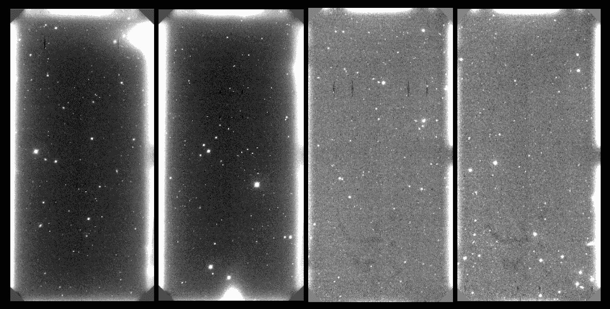

图 1：使用 PAUCam 拍摄的图像，对应于 NB685 滤光片。*左侧:* 前两个图像对应于相机干预之前的 PAUCam 图像。请注意，它们都显示了相同的散射光模式。*右侧:* 右侧的两个图像对应于干预之后的 PAUCam 图像。同样，两者展示了相同的散射光模式，但与左侧的前两个图像不同。这显示了干预后散射光模式的变化。

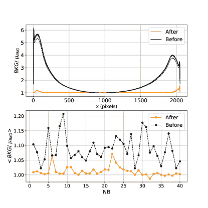

图 2：*上*：不同图像中每个像素的归一化背景光内容与图像中像素位置的函数关系，在相机干预前（黑色虚线）和干预后（橙色实线）。每个像素值除以图像中的平均背景。没有散射光的区域应该波动在单位附近。受散射光影响的区域应该高于单位。*下*：考虑到在该波段拍摄的所有图像的归一化背景曲线的均值，对于 40 个窄光度波段。

图 1 展示了在相机干预之前（左边的第一和第二张图像）和相机干预之后（第三和第四张图像）NB685 滤镜下的四张 PAUCam 图像。它们展示了 CCD 边缘附近的散射光，显示出空间变化的散射光量。散射光模式在干预前（左边的两张图像）和干预后（右边的两张图像）有所变化。散射光模式也依赖于滤镜。每个滤镜拍摄的图像展示了各自独特的模式，这意味着模式依赖于使用的滤镜。

定量和建模散射光的一种方法是为每个 NB 创建背景像素图。这是通过以下步骤完成的：

i. *选择图像*：

从相同波段选择一组 NB 图像，因为它们具有相同的散射光模式。

ii. *计算中位数*：

对于每张图像，计算中央区域的中位背景水平，$\mu_{\rm BKG}$，这些区域不受散射光影响。

iii. *估计比例*：

将每张图像除以其中位数，以获得像素比例图。

iv. *掩蔽源*：

通过掩蔽所有超过给定像素比例阈值的像素来掩蔽图像源。

v. *合并图像*：

将所有单个像素图与中位数结合，以获得所有选定图像的单一散射光模板（SLT）。

如果背景是平坦的并且遵循泊松统计，比例图中的所有像素应该围绕单位波动。然而，如果图像受到散射光影响，受影响区域的散射光模板将具有高于单位的值。我们可以将这个比例理解为相对于平坦背景的额外光（散射光）的百分比。注意，这个模型考虑到散射光依赖于照射到 CCD 上的光量。

步骤（v）的过程可以写成

|  | ${\rm SLT}(x,y)=\text{median}_{j}\Big{[}\frac{I_{j}(x,y)}{\mu_{\rm BKG}}\Big{]},$ |  | (1) |
| --- | --- | --- | --- |

其中 $I_{j}$ 是图像 $j$，中位数是在选择的图像上计算的（步骤 i）。为了确定散射光的量，我们可以按照之前的步骤继续到步骤 [iii]。这样，我们可以获得归一化的背景图像，如果这些图像包含平坦的背景，它们的波动应该围绕单位值，但如果受到散射光的影响，它们的值会超过一。

图 2 的顶部面板显示了 NB685 滤光器的一些归一化图像。它显示了图像边缘的背景像素值，在相机干预前（黑色虚线）和干预后（橙色实线）。该图表显示了在相机干预前，CCD 边缘背景的增加。干预后，散射光量显著减少。不幸的是，它仍然存在，因此需要考虑。

我们可以使用给定 NB 中的所有归一化背景图像来创建该波段的一般散射光模板（也可以在干预前后进行拆分）。图 2 的底部面板显示了每个散射光模板（每个波段一个）在 NB 上的平均值。散射光模板的平均值提供了关于给定波段散射光量的信息。我们可以清楚地看到干预对散射光量的影响，散射光量减少了。

### 2.4 散射光模板作为散射光校正方法

如果散射光模板建模足够准确，它可以用于校正 PAUCam 图像上的散射光。假设来自给定 NB 的所有图像遵循相同的散射光模式，并由 CCD 天空背景进行缩放，校正散射光的一种方法是

|  | $\tilde{I}(x,y)=I(x,y)-(\text{SLT}(x,y)-1)\mu_{\rm BKG},$ |  | (2) |
| --- | --- | --- | --- |

我们从给定的目标图像 ($I(x,y)$) 中减去按该图像的平均背景 ($\mu_{\rm BKG}$) 缩放的散射光模板。注意，我们不是减去散射光模板，而是减去没有平坦天空背景的散射光模板。这样，没有散射光的区域几乎不会受到影响。

图 3 显示了原始 CCD 图像（左），经过散射光模板校正后的图像（中）以及用于校正的散射光模板（右）。从视觉上看，原始图像（左）中的散射光图案在应用散射光模板校正后（中）消失了。然而，尽管校正在视觉上几乎完美，但该方法有一个缺点。尽管散射光在给定频段下近似遵循一种模式，但由于其他外部条件的影响，可能会出现波动。例如，天气、月亮照明和其他观测条件可能导致不同观测之间的变化。为了更精确地估计校正，应该针对每个频带和每个夜晚创建一个模板，以确保观测条件相似。然而，对于每晚创建散射光模板，可能图像数量不足以获得准确的校正模式建模。亮星也会对散射光产生影响，而散射光模板无法对其进行校正。

图 4 显示了在 NB685 滤波器下对特定图像进行散射光模板校正前后的背景水平。在这种情况下，图像是在没有考虑每晚分割以生成散射光模板的情况下进行校正的。这意味着尽管这些图像在不同的夜晚和不同的观测条件下进行观测，但它们都被用来构建散射光模板。未经校正的图像在两侧都显示出大的峰值，这些峰值显然被散射光模板校正了。然而，CCD 的两侧仍然显示出由散射光残留引起的凸起。

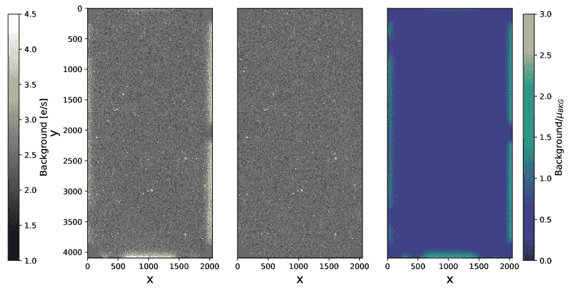

图 3：*左：*在 NB685 滤波器下拍摄的显示出边缘散射光图案的图像。*中：*使用散射光模板校正的前一图像。*右：*使用公式 1 生成的散射光模板，考虑了与原始图像相同观测夜晚的所有图像。

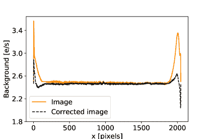

图 4：图像中的背景像素值。原始图像（橙色实线）显示了由于散射光而在边缘产生的高峰。通过使用散射光模板进行修正（黑色虚线），峰值有所减少，但仍有一些残余。图像单位为 e/s。

## 3 BKGnet：一种基于深度学习的方法来预测背景

在本节中，我们首先描述 BKGnet 架构。然后描述我们的训练和测试样本，并说明训练过程。作为参考，在附录 A 中，我们介绍了深度学习和卷积神经网络的基础知识，以及一些术语定义。

### 3.1 神经网络架构

BKGnet³³3https://gitlab.pic.es/pau/bkgnet 是使用 PyTorch 库（Paszke 等，2017）构建的。它有两个主要模块：卷积神经网络（CNN）和线性神经网络。

图 5 显示了 BKGnet 架构。CNN 块处理来自图像本身的信息，因为我们想要恢复的背景编码在像素值中。输入是包含目标星系在中心的 120x120 像素图像块。*黑色* 选择这个图像块的大小是为了在保持计算需求（内存、GPU）在合理范围内的同时拥有足够的像素。

\textcolor

black 如图 5 所示，CNN 包含 5 个卷积层（红色层）、池化层（黄色层）和批量归一化层（蓝色层）。在每个卷积层中，网络逐渐学习捕捉图像中的不同特征。第一层学习低级特征，如边缘检测，而更多的层则使网络学习高级特征（Zeiler & Fergus，2013b）。

\textcolor

black 散射光模型依赖于未编码在图章中的参数。这些参数包括图章在原始图像中的位置、用于观察星系的 NB 和一个在星系被观察时通知网络的前后干预标志。我们还包括来自参考目录的目标星系亮度，因为它包含有关受星系影响的像素数量的信息。为了帮助网络学习散射光模式，前面提到的参数与 CNN 的输出一起提供给线性神经网络。星系的亮度和图像的坐标作为每个图章的固定参数添加。

\textcolor

blackNB 滤镜和干预标志是离散变量，带有带宽（1-40）的四十个可能值和干预标志（0/1）的两个值。然而，这两者的组合与散射光模式直接相关，我们可以有效地将这两个离散变量转换为一个值范围从 1 到 80 的变量。我们通过嵌入添加带宽和干预信息。嵌入将每个组合替换为 10 个可训练参数。在嵌入带宽和干预信息之前，BKGnet 学习使用十个最能表征模式的数字来编码每个散射光模式。因此，线性网络接收来自卷积层的输出、两个星系坐标、亮度和来自嵌入的十个数字。

### 3.2 数据：训练和测试样本

BKGnet 的输入是目标星系位于中心的图章。然而，为了训练网络，我们使用空的 CCD 位置，即没有目标源的区域。这样，我们可以估计中心 CCD 区域（应该有一个目标星系）处的真实背景值，并训练网络恢复这个值。用作训练样本标签的真实背景值的估计是通过计算图章中心区域中给定固定半径的圆形孔径内的平均背景来完成的。因此，这些测量具有一个直接依赖于孔径半径的相关不确定性。假设背景是纯粹的泊松分布，则

|  | $\sigma^{2}_{\rm label}=\frac{N_{\rm a}b}{t_{\rm exp}},$ |  | (3) |
| --- | --- | --- | --- |

其中 $t_{\rm exp}$ 是曝光时间，$b$ 是估计的背景，作为孔径内像素的均值，即背景标签，而 $N_{\rm a}$ 是圆形孔径内的像素数，直接与孔径半径的选择相关。我们将其固定为 8 像素，以在真实测量误差和在精确星系位置获得准确背景测量之间取得平衡。为了选择用于训练样本的空白印章，我们通过将给定图像位置的天空坐标与 COSMOS 目录中的源天空坐标进行交叉相关来识别源（Laigle 等人，2016）。

在任何深度学习算法中，训练样本和测试样本应尽可能相似。在我们的案例中，训练样本不包含目标星系，而测试样本包含。因此，我们在空白训练印章的中心添加模拟星系。模拟星系的构建基于 PAUS 数据的参数：Sersic 型型曲线参数、$r_{\rm 50}$、$I_{\rm 50}$ 和 $i$ 波段的亮度。Sersic 型型曲线描述了星系的表面亮度分布（$I$）。包含 50% 光强度（$I_{\rm 50}$）的半径是 $r_{\rm 50}$。这些模拟星系可能与真实星系有所不同。*因此，我们对训练样本和测试样本的中心 16 x 16 像素进行掩码处理。虽然模拟星系现在被掩码处理，但仍然很重要，因为对于某些型曲线，星系光线会延伸到掩码区域之外。没有模拟星系时，BKGnet 在测试亮度源时失败。由于标签是在 8 像素半径的孔径中估计的，因此 16 x 16 像素是网络不会看到用于真实背景估计的像素的最小区域。*

我们在将印章输入网络之前对其进行归一化。归一化的方法有多种。我们应用逐印章归一化方法，使用每个印章的均值和标准差来进行归一化。我们选择这种归一化方法，因为它在我们的数据集上表现更好。

我们使用 COSMOS 场中的所有 PAUCam 图像来训练和验证网络。在干预之前我们有 4928 张 PAUCam 图像，干预之后有 4821 张（有关详细信息，请参见第 3.2 节）。对于每张图像，我们从每个 CCD 图像中采样约 40 个印章，总共约 400,000 个印章。我们将其中的 90% 用于训练，其余 10% 用于验证。

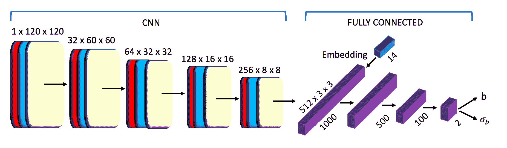

图 5：BKGnet 方案：第一组层对应于一个卷积神经网络，输入图像。CNN 输出与额外信息一起输入到一个线性神经网络。每个卷积层上的数字表示该层的维度。第一个数字对应于通道数。第二和第三个数字是该层中印章的维度。

### 3.3 训练过程和损失函数

监督深度学习算法通过比较真实值和算法的预测值来进行训练。预测值与真实值的一致性通过损失函数来评估。损失函数的选择取决于所面临的问题类型（例如分类、回归）。分类问题的典型损失函数是交叉熵损失，而回归问题中通常使用均方误差。使用 BKGnet，我们希望网络将不确定性与每个预测值关联起来。在监督深度学习中，有一些基于贝叶斯统计的方法处理与预测相关的不确定性（例如 Kendall & Gal, 2017; Kendall et al., 2017）。

我们使用的方法假设分布 $p(\textbf{y}|f^{\textbf{w}}(\textbf{x}))$ 是高斯分布，其中 y 是背景标签值，x 是输入，$f^{\textbf{w}}(\textbf{x})$ 是网络背景预测。因此，损失函数被定义为

|  | $Loss=\>-\log{p(f^{\textbf{w}}(\textbf{x}))}\>=\>\frac{(f^{\textbf{w}}(\textbf{x})-y)^{2}}{\sigma^{2}}+2\log\sigma.$ |  | (4) |
| --- | --- | --- | --- |

通过这种方式，我们训练网络提供背景预测 $f^{\textbf{w}}(\textbf{x})$ 及其相关的误差 $\sigma$。注意，右侧的第二项防止网络预测出一个大误差，从而最小化第一项。

在方程 4 中的损失函数下，网络提供了关于 $f^{\textbf{w}}(\textbf{x})-y$ 的误差，该误差有一个相关的不确定性 $\sigma^{2}_{\rm pred}+\sigma^{2}_{\rm label}$。因此，预测的误差为

|  | $\sigma_{\rm pred}=\sqrt{\sigma^{2}_{\rm bkgnet}-\sigma^{2}_{\rm label}}\>,$ |  | (5) |
| --- | --- | --- | --- |

其中 $\sigma^{2}_{\rm bkgnet}$ 是网络提供的误差，$\sigma^{2}_{\rm label}$ 是背景标签的误差。背景标签的误差在方程 (3) 中定义。

\textcolor

BKGnet 在 60 个周期内使用批量大小为 100 的邮票进行训练，采用 ADAM 优化器 (Kingma & Ba, 2014) 和学习率 $10^{\rm-5}$ (见附录 A 获取术语)。训练使用 NVIDIA TITAN V GPU 约需 2 小时。

## 4 测试 BKGnet 在模拟数据上的表现

我们使用模拟数据测试 BKGnet 的性能。我们研究了使用该网络预测背景的效果，并探讨了在喂入网络之前需要什么数据以及如何处理这些数据。在本文的其余部分，我们将 BKGnet 的预测与通过计算目标源周围圆环中的背景，并在用散射光模板校正图像前后的结果进行比较。

### 4.1 模拟的 PAUCam 背景图像

\textcolor

最终的模拟图像 $I_{\rm sim}(x,y)$ 可以表示为

|  | ${\rm I_{\rm sim}}(x,y)=A\cdot\frac{t_{\rm exp}\cdot{\rm SLT}(x,y)+P(t_{\rm exp}\cdot{\rm SLT}(x,y))}{t_{\rm exp}},$ |  | (6) |
| --- | --- | --- | --- |

其中 SLT 是用于生成图像的散射光模板。通过这种方式，模拟图像显示了与 PAUCam 图像相同的散射光模式。为了生成泊松噪声，我们首先与曝光时间 $(t_{\rm exp})$ 相乘，将模板从 e/s 转换为电子。此外，模板还与一个因子 $A$ 进行缩放，以模拟广泛的背景水平。最后，我们生成一个泊松天噪声 $P(\cdot)$，将其添加到图像中，并将其转换回 e/s。

图 6 展示了我们模拟邮票中的散射光效应。左侧展示了背景模式平坦的模拟邮票图像；右侧则是具有背景渐变的邮票。这个渐变是由散射光引起的（见图 1 和 3）。两个邮票都显示了一个中央 8x8 像素的遮罩区域，阻挡了星系的光线。

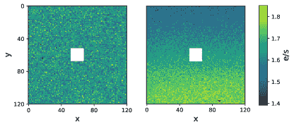

图 6：模拟的邮票。左侧是一个背景平坦的邮票。右侧是一个具有渐变背景的邮票。

### 4.2 BKGnet 在模拟数据上的预测

在本节中，我们在没有目标星系的印刷图上进行训练和测试（空白位置）。这使我们能够测试是否可以使用该网络的组合来预测背景。我们还将测试的波段固定为相机干预后的 NB685 滤镜。这一选择是在拥有相当数量的散射光而又不完全被其主导之间的折中。在干预之前，一些 CCD 图像中的散射光量非常大，可能不适合测试网络。另一方面，干预后，一些 CCD 几乎不含散射光，这也不是一个好的选择。NB685 滤镜包含了相当数量的散射光，因此是一个具有代表性的例子。我们不需要模拟所有波段，因为我们这里只是想测试 BKGnet 对散射光预测的可行性，并更好地了解网络的行为。为了量化背景预测的准确性，我们使用

|  | $\sigma_{\rm 68}\equiv 0.5\,(b_{\rm quant}^{84.1}-b_{\rm quant}^{15.9}),$ |  | (7) |
| --- | --- | --- | --- |

其中分位数设置为 84.1 和 15.9 百分比值。这个量，$\sigma_{\rm 68}$，等同于正态分布的$1\sigma$误差，但对异常值的影响较小。

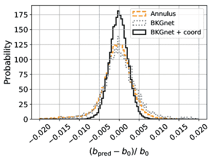

图 7：BKGnet 的相对误差分布（绿色表示没有坐标信息，橙色表示有坐标信息）和环形预测。$b_{\rm 0}$是背景标签，$b_{\rm pred}$是背景预测值，适用于环形或 BKGnet。

图 7 比较了 BKGnet 预测背景的准确性与 PAUS 默认方法的准确性。如前所述，PAUS 通过在图像中心围绕星系的圆环内计算中位数来估计背景，像素值在计算之前已进行 $\sigma$-裁剪。图中展示了两种方法预测结果的相对误差分布。我们测试了带有和不带有星系图像坐标的 BKGnet。BKGnet 的性能在包含坐标信息时显著提高。这并不令人惊讶，因为散射光的量取决于 CCD 位置（参见第二部分）。尽管散射光被编码在图像中，但 CCD 位置也包含预测所需的重要信息。网络可能需要这些信息来创建类似于散射光模板的东西。BKGnet 在仅使用印记信息时取得了 $\sigma_{\rm 68}$ = 0.0038 的结果。包括坐标信息后，改进至 $\sigma_{\rm 68}$ = 0.0022\. 因此，网络在嵌入坐标信息后提高了 70%。默认背景估计在分布的两侧显示尾部，并产生了 $\sigma_{\rm 68}$ = 0.0033，这意味着 BKGnet 将估计值提高了 42%。

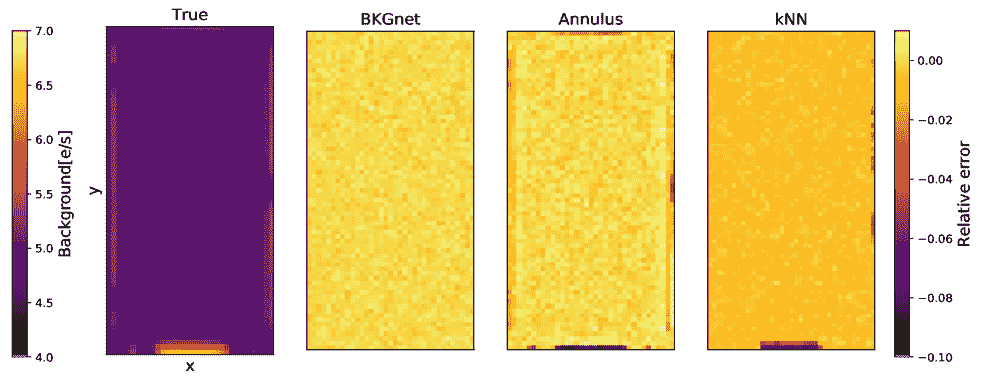

图 8: *左*: 使用真实背景值重建 CCD 图像，这些背景值用于训练网络。我们连续抽取这些背景值，并通过将每个值放置在其抽取位置来重建原始图像。 *第二*: 在不同图像位置使用 BKGnet 进行背景预测的准确性。我们可以看到没有空间模式。 *第三*: 在不同图像位置使用圆环进行背景预测的准确性。我们可以看到没有空间模式。 *右*: 在不同图像位置使用 kNN 进行背景预测的准确性。

图 8 展示了空间背景图 (左) 以及与环形背景预测 (第三面板) 和 BKGnet 背景预测 (第二面板) 的预测相对误差。对于基于环形的方法，CCD 边缘的精度较低，那里存在散射光。这表明图 7 中的尾部是由于散射光造成的。另一方面，可以看到 BKGnet 能够考虑散射光的存在。

\textcolor

图 8 的右侧面板展示了使用 kNN 算法的背景重建。除了 CNN 和环形方法外，我们还测试了 k-最近邻 (kNN) (Cover & Hart, 2006)、支持向量回归 (SVR) (Drucker et al., 1996)、随机森林 (RF) (Breiman, 2001) 和神经网络 (NN) 技术。我们使用了 scikit-learn 实现 (Pedregosa et al., 2011) 来运行 kNN、RF 和 SVR 算法。与可以处理图像的 CNN 不同，这些测试中我们输入了嵌入信息和中位像素值。如图 8 所示，kNN 在平坦背景区域的背景测量准确性低于 BKGnet 和环形方法。背景测量偏差约为 3%，是相对误差 (0.5%) 的 6 倍。预测还显示出边缘的模式，其误差是平坦区域的 6 倍。相比之下，对于 BKGnet，当我们比较中心位置与边界位置时，精度仅降低了 1.2 倍。就其他方法而言，NN 的预测优于 kNN，尽管相较于 BKGnet，它使 $\sigma_{68}$ 增加了 2.5 倍。它在边缘也显示出 4 倍高于平坦背景区域的误差。此外，RF 和 SVR 算法的误差分别是 BKGnet 方法的 6 倍和 4 倍，使这些方法过于不精确。

\textcolor

在接下来的章节中，我们将在实际的 PAUS 图像上测试背景估计方法。基于模拟中的表现，我们将仅考虑 BKGnet 和环形方法。

## 5 BKGnet 在 PAUCam 图像上的应用

在前一节中，我们展示了 BKGnet 能够准确预测模拟空白图像上强烈散射光背景的能力。然而，在真实的 PAUCam 数据中，其他问题如宇宙射线、电子串扰、读出噪声和暗电流可能会影响背景估计的性能。此外，数据处理过程中可能会引入像素间的相关性。为了检验这些现实影响的影响，我们使用实际的 PAUCam 图像。为了评估我们的测量精度，我们在空白印章上测试网络，即没有目标星系的印章。

我们将使用 COSMOS 中所有可用的图像，将数据分为相机干预前（2016A）和干预后获得的数据。这一分割产生了 4928 张干预前图像和 4821 张干预后图像。由于这些数字相似，我们可以在训练样本中轻松平衡干预前后的印章数量。尽管训练样本中不包含中心的目标星系，但源可能被放置在其他印章位置。为了避免训练集中出现异常值，例如一个明亮的星星覆盖了大部分背景的印章或一个离中心太近的明亮物体，我们根据最大像素值过滤训练印章。所有像素值超过 100,000 计数的印章都被排除在训练样本之外。

我们在训练网络之前还排除了每个子样本中的 40 张图像。这 80 张图像未用于训练网络，而是保留用于测试。这很重要，因为我们需要在网络从未见过的图像上进行测试。为了生成测试集，我们不是从 CCDs 中随机采样，而是以 60 像素的间隔连续采样印章。这确保我们测试所有 CCD 区域，包括受到散射光影响的区域。

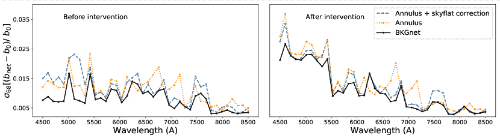

图 9：40 个 NB 背景预测中相对误差的$\sigma_{\rm 68}$。*左*: 干预前。*右*: 相机干预后。在几乎所有情况下，BKGnet 的表现优于默认的使用环形区域估计背景的方法。

图 9 显示了我们在空区域使用 BKGnet 预测 PAUCam 图像背景的结果。我们还展示了使用环形区域估计背景的结果，以及在使用散射光模板（‘环形区域 + 天空’）纠正背景变化后的结果。图 9 显示了相对误差分布的 $\sigma_{\rm 68}$ 值（方程式 (7)），这是对于 40 个不同波段预测的相对误差。由于我们使用的是相对误差，因此在干预前后的结果比较并不具代表性，因为背景水平不同。例如，在第一个滤光片托盘（NB455-NB515）中，干预前的背景比干预后的背景高出 3 到 5 倍。

我们首先关注相机干预前的结果（图 9 左侧面板）。相机干预前的图像包含的散射光比干预后的图像多（参见图 2）。这使得散射光模板建模比干预后图像的建模更不稳定。我们发现，使用散射光模板的纠正并未在每个波段上改善环形区域方法的结果。在最蓝的 NB 波段中，即散射光量最多的波段，散射光模板似乎降低了背景预测的准确性。另一方面，BKGnet 在准确性上优于其他两种方法，特别是在最蓝的滤光片托盘上。综合考虑所有波段，网络将 $\sigma_{\rm 68}$ 减少了 $37\%$，如果只考虑 8 个最蓝的 NB，则减少了高达 50%。

如果我们考虑摄像机干预后的结果（图 9 右侧面板），我们会发现散射光模板在所有频段中都改善了环形方法的预测。这一点从图 2 的顶部面板可以预期，该面板显示了干预后散射光趋势的稳定性。在干预前，散射光模板在蓝色频段表现不佳，但在干预后这一情况不再发生。然而，BKGnet 的表现更为出色：干预后，它在平均上实现了比散射光模板校正高 18%的改进。

|  | 干预前 | 干预后 |
| --- | --- | --- |
|  | 过滤后的 | 来源 | 过滤后的 | 来源 |
| --- | --- | --- | --- | --- |
| Annulus | 0.011 | 0.011 | 0.014 | 0.014 |
| + SLT | 0.011 | 0.011 | 0.011 | 0.013 |
| BKGnet | 0.008 | 0.008 | 0.011 | 0.011 |

表 1：在摄像机干预前后，BKGnet 在所有频段的背景预测相对误差的平均值$\sigma_{\rm 68}$。我们列出了未过滤掉受源影响的印记数据集（‘sources’）和移除这些数据（‘filtered’）的结果。

表格 1 列出了三种方法——圆环、圆环 + 散射光模板和 BKGnet——在背景预测中的相对误差的 $\sigma_{\rm 68}$ 平均值。在训练和测试时，我们首先排除了最大像素值超过 100,000 的印记。这样做是为了避免那些可能会偏倚预测的非常明亮的邻近源的印记。为了检查这一步骤的影响，我们还列出了在表格 1 中包含污染印记（‘sources’）时的结果。这些结果显示，在干预之前，过滤并没有造成差异，但使用散射光模板的修正性能有所改善。这一小差异表明，散射光是主要的偏倚来源。对于干预后拍摄的没有亮源的图像，BKGnet 和散射光模板给出了相同的 $\sigma_{\rm 68}$。因此，BKGnet 可能以类似于散射光模板的方式学习散射光的基本行为。然而，由于网络也能看到印记，它推断出的修正比应用散射光模板更加灵活。这表明 BKGnet 能够学习在存在其他伪影（例如源或宇宙射线）时如何估计背景。

BKGnet 还提供了背景预测的不确定性估计。为了测试这一估计的准确性，我们使用空印记并研究 $(b_{\rm net}-b_{\rm true})/\sigma$ 的分布，其中 $(b_{\rm net}$ 和 $\sigma$ 是网络的预测值。如果误差是正确的，这一分布应该是均值为零、方差为单位的高斯分布。

图 10 显示了我们应该恢复的理论高斯分布和圆环及 BKGnet 预测的测量分布。BKGnet 的结果符合理论高斯分布，这意味着我们的误差是稳健的。相比之下，圆环预测低估了 47% 的不确定性。因此，BKGnet 提供了更可靠的背景确定不确定性的估计。

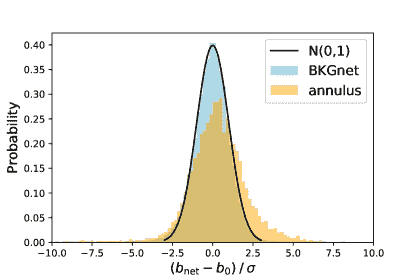

图 10：$(b_{\rm net}-b_{\rm 0})/\sigma$ 的分布，其中 $b_{\rm net}$ 是背景预测，$b_{\rm 0}$ 是真实背景。$\sigma$ 是预测中的不确定性。我们期望分布是以零为中心的高斯分布，方差为单位。我们展示了圆环（橙色）和 BKGnet（蓝色）预测的分布。

## 6 BKGnet 验证

5 节中呈现的结果表明，与基于圆环的方法相比，BKGnet 提供了更好的背景估计（见图 9 和表 1）。它还提供了相关不确定性的准确估计。然而，这些测试是在没有星系的邮票上进行的。在这里，我们增加了问题的现实性，并量化了 BKGnet 在星系位置的表现。

### 6.1 使用 BKGnet 预测生成 PAUS 目录

我们使用 BKGnet 来估算 COSMOS 区域中星系的背景。我们将结果与 PAUdm 目录中的结果进行比较，后者使用圆环来确定背景。这些目录包含约 1200 万个通量测量值，约一半是在干预前拍摄的图像上进行的，另一半是在干预后拍摄的图像上进行的。星系通量是通过从 PAUS 原始信号测量中减去背景获得的，

|  | $F=S-N_{\rm a}b,$ |  | (8) |
| --- | --- | --- | --- |

其中 $F$ 是净星系通量，$S$ 是在孔径内测得的总信号，$N_{\rm a}$ 是孔径内的像素数量，$b$ 是每个像素的预测背景。当背景使用圆环进行估计时，净通量的误差为

|  | $\sigma^{2}=(S-b)+N_{\rm a}\sigma_{\rm b}^{2}+N^{2}_{\rm a}\Big{(}\frac{\pi}{2}\Big{)}\frac{\sigma_{\rm b}^{2}}{N_{\rm b}},$ |  | (9) |
| --- | --- | --- | --- |

其中 $b$ 和 $\sigma_{\rm b}$ 是该区域的背景及其误差，$N_{\rm b}$ 是圆环内的像素数量。$\pi/2$ 因子来自于我们使用圆环内像素的中位数而不是均值的事实 ⁴⁴4http://wise2.ipac.caltech.edu/staff/fmasci/ApPhotUncert.pdf。

对于 BKGnet，星系通量的误差为

|  | $\sigma^{2}=(S-b)+N_{\rm a}(b+RN^{2})+N_{\rm a}^{2}\sigma_{\rm b}^{2},$ |  | (10) |
| --- | --- | --- | --- |

其中 $RN$ 是读出噪声。

方程 9 和 10 反映了当背景通过环形区域或 BKGnet 测量时，通量不确定性的差异。一般来说，通量不确定性的主要贡献者有三方面：净星系通量的不确定性、背景估计的不确定性，以及背景减法引入的不确定性。对于这两种背景估计方法，我们假设净星系通量的不确定性由噪声捕捉。对于 BKGnet，背景不确定性也由噪声描述（方程 10），但我们在背景误差中加入了读出噪声的贡献。对于 PAUdm 测量，背景不确定性由每像素的平均方差给出（方程 9）。因此，对于 PAUdm，此项也应考虑其他错误贡献，而不仅仅是噪声。方程 9 和 10 中的第三项是背景减法不确定性的贡献。在 PAUdm 中，这由在环形区域中测量的背景减去确定。相反，在方程 10 中，我们使用网络在估算通量的孔径内提供的不确定性。

### 6.2 验证目录

使用环形区域来估算背景是一种可行的方法，特别是当背景是平坦的时候。在 PAUS 数据中，散射光只会影响图像边缘附近的物体。因此，对于 PAUS 数据中的大多数星系，背景应该是（大致上）平坦的，我们不应该期望 BKGnet 和 PAUdm 目录之间存在大的差异。通过与方程 8 计算得到的通量进行比较，我们发现这两种方法之间有 2% 的差异。另一方面，使用 BKGnet 估算的不确定性（方程 10）比 PAUdm 低 4%。

我们需要确定哪个目录提供了更好的光度估计。为此，我们利用 PAUCam 在所有 NB 过滤器中对同一物体进行多次观测的事实。我们可以比较同一物体的不同曝光，一旦背景噪声被去除，这些曝光应该是可比的。这可以表述为

|  | $D\equiv\frac{(e_{\rm 1}-e_{\rm 2})}{\sqrt{(\sigma^{2}_{\rm 1}+\sigma^{2}_{\rm 2})}},$ |  | (11) |
| --- | --- | --- | --- |

其中 $e_{i}$ 是同一物体的不同曝光，而 $\sigma_{i}$ 是相关的不确定性。如果光度测量是可靠的且误差得到了适当考虑，则 $D$ 的分布应该是方差为 1 的高斯分布。我们称之为重复测试。

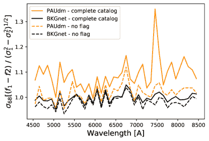

图 11: 使用重复分布测试进行 BKGnet 验证。我们将方程 (11) 中定义的分布宽度作为波长的函数绘制，比较了使用 BKGnet 生成的目录（黑线）和当前 PAUdm 目录（橙线）。虚线对应于排除 PAUdm 中所有标记物体的结果。实线包括所有物体。

图 11 展示了重复测试结果随波长的变化。我们用 BKGnet（黑线）和 PAUdm（橙线）目录估算了每个 NB 的$\sigma_{\rm 68}[D]$（公式 11）。可以根据椭圆度参数标记光度异常值，以检测背景强烈变化。图 11 中的虚线显示了排除这些标记对象后的结果。排除标记对象不会显著改变 BKGnet 的测量结果，但我们看到 PAUdm 测量有明显改善。对于受大气中 O[2]的地球气体吸收影响的 NB755 滤光片（在 7500Å），这种改善尤为明显。有趣的是，BKGnet 似乎知道如何处理这些对象，表明 BKGnet 对各种偏差源（不仅仅是散射光）更具鲁棒性。当我们考虑所有 NB 时，BKGnet 的$\langle\sigma_{\rm 68}[D]\rangle=1.00$，这是我们对正确光度测量的期望。另一方面，当前的 PAUdm 目录得出的$\langle\sigma_{\rm 68}[D]\rangle$ = 1.10，即它高估了不确定性。

测量不确定性应取决于源的亮度。为探讨这一点，我们在图 12 中展示了$\sigma_{\rm 68}[D]$与 Subaru $i_{\rm Auto}$星等的关系。在 PAUdm 目录中，星等与亮度之间存在强趋势。在亮度较高的部分，与预期相比，通量差异超过 20%。当我们用 BKGnet 预测背景和不确定性时，这种趋势消失。为了进一步探讨这种趋势的起源，我们使用了 BKGnet 的背景预测，但使用了环形方法的误差。如图 12 中的蓝色虚线所示，我们发现了相同的星等趋势。这表明这是由环形方法估算的不确定性造成的。此外，蓝色虚线低于 PAUdm 线。这两条曲线之间的唯一区别是背景值预测（而非误差）。因此，PAUdm 的预测比环形方法的预测更为准确。

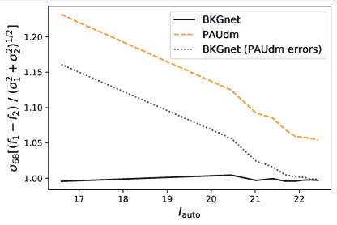

图 12: 使用重复分布测试验证 BKGnet。我们将根据 $i_{\rm auto}$ 在 Subaru $i$ 波段的分布宽度绘制为 BKGnet 生成的目录 (黑色实线)、当前的 PAUdm 目录 (橙色虚线) 以及包含 BKGnet 预测和 PAUdm 错误的混合目录 (蓝色虚线)。

为了进一步验证 BKGnet 目录，我们使用 BKGnet 确定的通量运行 BCNz2 (Eriksen 等人，2019)。对于这个测试，我们排除了在 PAUdm 目录中标记的对象，以便与 (Eriksen 等人，2019) 中使用的对象完全相同。然而，如图 11 和 12 所示，我们不需要排除这些对象。将 photo-$z$ 与 zCOSMOS DR3 (Lilly 等人，2007) 中 $i_{\rm AB}<22.5$ 的安全光谱估计进行比较。我们根据定义的质量参数对样本进行划分：

|  | ${\rm Qz}\equiv\frac{\chi^{2}}{N_{\rm f}-3}\Big{(}\frac{z_{\rm quant}^{\rm 99}-z_{\rm quant}^{\rm 1}}{\rm ODDS(\Delta z=0.01)}\Big{)},$ |  | (12) |
| --- | --- | --- | --- |

其中 $\chi^{2}/(n_{\rm f}-1)$ 是来自模板拟合的归一化卡方，而 $z_{\rm quant}$ 是 $(z_{\rm photo}-z_{\rm spec})/(1+z_{\rm spec})$ 的百分位数。ODDS 被定义为

|  | ${\rm ODDS}\equiv\int_{z_{\rm b}-\Delta z}^{z_{\rm b}+\Delta z}{\rm dz\ p(z)},$ |  | (13) |
| --- | --- | --- | --- |

其中 $z_{\rm b}$ 是 $p(z)$ 的模式，而 $\Delta z$ 定义了峰值周围的红移区间。在 PAUS 中，如果

|  | $ | z_{\rm photo}-z_{\rm spec} | /(1+z_{\rm spec})>0.02.$ |  | (14) |
| --- | --- | --- | --- | --- | --- |

请注意，这个离群值定义非常严格。在宽带光度测量中，常见的离群值定义是 $|z_{\rm photo}-z_{\rm spec}|>0.15\,(1+z_{\rm spec})$，例如 Ilbert 等人 (2006); Bilicki 等人 (2018)。

表 2 列出了使用 BCNz2 获得的离群值率和光度红移精度。为了量化红移精度，我们使用$\sigma_{\rm 68}$（参见公式 7）。两个目录之间的光度红移精度没有显著提高，但我们发现离群值率有所减少。如果我们考虑完整样本（100%），这种改进是微小的。这可能是因为在完整样本中，离群值主要由光度$z$离群值主导，而不是光度本身的离群值。然而，如果我们使用$Qz$参数来选取最佳的 20%和 50%的样本，我们会发现离群值率显著降低。这些离群值应主要由光度离群值主导。对于最佳的 50%样本，我们将离群值的数量减少了 25%，而对于最佳的 20%对象，这一改进上升到 35%。这再次表明 BKGnet 是一种统计上准确且稳健的方法。

|  | 离群值百分比 | $10^{3}\sigma_{\rm 68}$ |
| --- | --- | --- |
| 百分比 | BKGnet | PAUdm | BKGnet | PAUdm |
| --- | --- | --- | --- | --- |
| 20 | 3.5 | 5.4 | 2.0 | 2.1 |
| 50 | 3.8 | 5.1 | 3.6 | 3.7 |
| 80 | 10.4 | 11.3 | 5.8 | 6.0 |
| 100 | 16.7 | 17.5 | 8.4 | 8.6 |

表 2: 使用 BCNz2 获得的光度$z$离群值率和精度，适用于 BKGnet 和 PAUdm 目录。百分比对应于通过光度$z$质量参数$Qz$选择的样本。

## 7 结论

成像调查需要准确的背景减除方法来获得精确的源光度。我们开发了一种深度学习方法来预测受散射光影响的天文图像的背景。该算法已被开发用于预测 PAUCam 拍摄的图像的背景。PAUCam 图像的边缘受散射光影响（参见图 1），尤其是在蓝色波段。2016 年，相机进行了改进以减少散射光的量。尽管散射光的量大幅减少，PAUCam 图像仍包含显著的散射光（参见图 2）。

对于每个波段，散射光在 CCD 上遵循相同的空间模式，并且大致与背景水平线性缩放。我们通过结合使用相同 NB 拍摄的图像并根据其背景水平进行归一化，构建了散射光模板和背景像素图。这些散射光模板展示了 CCD 上的散射光变化，并可用于纠正散射光（见图 3）。然而，由于外部条件（例如月亮、视场、气团）引起的背景波动可能导致夜间散射光的差异。为了准确地用散射光模板纠正散射光，我们需要生成每个 NB 和每晚的散射光模板。然而，即使如此，夜间波动或某个波段可用图像数量较少也可能导致校正不准确。

因此，我们开发了 BKGnet，这是一种基于深度学习的算法，用于预测目标源后的背景及其相关不确定性，考虑到散射光和其他扭曲效应。BKGnet 包括一个卷积神经网络，后跟一个线性神经网络（见图 5）。在训练集中，我们使用空白印章，即没有目标星系，以便我们可以估计真实背景并用于训练。在遮蔽中心区域之前，我们需要在训练样本中模拟目标星系，否则当应用于明亮且大的源时，网络会失败。

我们首先在 PAUCam 空白印章上测试了预测，即没有目标星系。对于干预前拍摄的数据，BKGnet 在散射光模板 + 环形预测上的改进为 $37\%$。散射光模板的校正在许多波段中失败，特别是在蓝色滤镜托盘上，这个波段受散射光的影响最大（图 9 的左侧面板）。对于干预后拍摄的数据，BKGnet 在散射光模板 + 环形预测上的改进为 $17\%$（图 9 的右侧面板）。

BKGnet 还预测了与背景预测相关的不确定性。为此，我们使用以背景真实值为中心的高斯分布的对数似然作为损失函数（见公式 4）。为了验证 BKGnet，我们在空位置进行测试，估计预测值与背景水平之间的差异，并将其除以估计的不确定性。对于环形方法，我们发现误差被低估了 47%（见图 10）。另一方面，使用 BKGnet 时，这一量通常分布在零附近，方差为 1，显示出不确定性被正确估计。

我们使用 BKGnet 生成了 COSMOS 领域的 PAUS 目录以预测背景。为了验证该目录，我们利用了对同一对象的多个测量。流量测量差异的分布结果应该是方差为 1 的高斯分布（见公式 11）。结果表明，BKGnet 在光度测量方面相较于当前的背景减除算法有所改进。我们对完整目录和排除了当前目录版本中所有标记对象的目录进行了性能测试。排除标记对象时，BKGnet 目录和当前目录的结果非常相似。然而，在测试完整目录时，我们发现 BKGnet 有显著改进。它特别在高大气吸收区域改善了结果，表明其对偏差源更加鲁棒，同时仍然保持统计准确性。它还消除了与$i$-带亮度相关的强系统性趋势，当使用网络估计不确定性时，这一趋势消失了。

最终，由于 PAUS 的目标是为大量星系提供准确的红移，我们使用 BKGnet 目录运行了 BCNz2 代码。BKGnet 分别将最佳 50%和 20% photo-$z$样本的离群率降低了 25%和 35%，而准确性没有受到影响。

\textcolor

使用 BKGnet，我们优化了背景减除任务，这是光度测量调查中的一个图像处理步骤，可以改善红移估计和星系分类。深度学习算法直接从图像中预测这些量时，需要在内部减去背景。因此，BKGnet 的理解也有助于优化这种深度学习算法。尽管该网络已在 PAUCam 图像上进行了测试，但这一概念也应适用于未来的成像调查，如 Euclid 和 LSST。

## 致谢

PAUS 的资金由杜伦大学（通过 ERC StG DEGAS-259586）、苏黎世联邦理工学院、莱顿大学（通过 ERC StG ADULT-279396 和荷兰科学研究组织（NWO）Vici 资助 639.043.512）以及伦敦大学学院提供。来自西班牙机构的 PAUS 参与者部分由 MINECO 资助，资助项目包括 CSD2007-00060、AYA2015-71825、ESP2015-88861、FPA2015-68048、SEV-2016-0588、SEV-2016-0597 和 MDM-2015-0509，其中一些项目包括来自欧盟的 ERDF 资金。IEEC 和 IFAE 部分由加泰罗尼亚自治区政府的 CERCA 计划资助。PAU 数据中心由 Port d’Informació Científica（PIC）托管，通过 CIEMAT 和 IFAE 的合作进行维护，并得到巴塞罗那自治大学和 ERDF 的额外支持。CosmoHub 由 PIC 开发，并部分由西班牙政府的“国家科学技术与创新计划”资助。我们感谢 NVIDIA 公司捐赠的 Titan V GPU，用于本研究。该项目获得了欧盟 Horizon 2020 研究与创新计划的资助，资助协议编号为 776247。Adam Amara 获得了皇家学会 Wolfson 奖学金。MS 获得了国家科学中心（资助编号 UMO-2016/23/N/ST9/02963）的支持。

## 参考文献

+   Abbott 等（2018）Abbott T. M. C.等，2018 年，[ApJS](http://dx.doi.org/10.3847/1538-4365/aae9f0)，[239, 18](https://ui.adsabs.harvard.edu/abs/2018ApJS..239...18A)

+   Alexander 等（2019）Alexander S.、Gleyzer S.、McDonough E.、Toomey M. W.、Usai E.，2019 年，[p. arXiv:1909.07346](https://ui.adsabs.harvard.edu/abs/2019arXiv190907346A)

+   Bertin & Arnouts（1996）Bertin E.、Arnouts S.，1996 年，[天文学与天体物理学补刊系列](http://dx.doi.org/10.1051/aas:1996164)，[117, 393](https://ui.adsabs.harvard.edu/#abs/1996A&AS..117..393B)

+   Bijaoui（1980）Bijaoui A.，1980 年，A&A，[84, 81](https://ui.adsabs.harvard.edu/#abs/1980A&A....84...81B)

+   Bilicki 等（2018）Bilicki M.等，2018 年，[A&A](http://dx.doi.org/10.1051/0004-6361/201731942)，[616, A69](https://ui.adsabs.harvard.edu/abs/2018A&A...616A..69B)

+   Breiman（2001）Breiman L.，2001 年，[Mach. Learn.](http://dx.doi.org/10.1023/A:1010933404324)，45，5

+   Cabayol 等（2019）Cabayol L.等，2019 年，[MNRAS](http://dx.doi.org/10.1093/mnras/sty3129)，[483, 529](https://ui.adsabs.harvard.edu/#abs/2019MNRAS.483..529C)

+   Carrasco-Davis 等（2018）Carrasco-Davis R.等，2018 年，[p. arXiv:1807.03869](https://ui.adsabs.harvard.edu/abs/2018arXiv180703869C)

+   Casas 等（2012）Casas R.等，2012 年，收录于《高能、光学和红外天文探测器 V》中，页码 845326，[doi:10.1117/12.924640](http://dx.doi.org/10.1117/12.924640)

+   Casas 等（2016）Casas R.等，2016 年，收录于《地基与空中天文仪器 VI》中，页码 99084K，[doi:10.1117/12.2232422](http://dx.doi.org/10.1117/12.2232422)

+   Castander et al. (2012) Castander F. J., et al., 2012, 在《地面与空中天文仪器 IV》中，第 84466D 页, [doi:10.1117/12.926234](http://dx.doi.org/10.1117/12.926234)

+   Castander et al. (prep) Castander F., Eriksen M., Serrano S., 等，准备中。

+   Cover & Hart (2006) Cover T., Hart P., 2006, [IEEE 信息理论学报](http://dx.doi.org/10.1109/TIT.1967.1053964), 13, 21

+   D’Isanto & Polsterer (2018) D’Isanto A., Polsterer K. L., 2018, [A&A](http://dx.doi.org/10.1051/0004-6361/201731326), [609, A111](https://ui.adsabs.harvard.edu/abs/2018A&A...609A.111D)

+   Drucker et al. (1996) Drucker H., Burges C. J. C., Kaufman L., Smola A., Vapnik V., 1996, 支持向量回归机

+   Eriksen et al. (2019) Eriksen M., et al., 2019, [MNRAS](http://dx.doi.org/10.1093/mnras/stz204), [484, 4200](https://ui.adsabs.harvard.edu/abs/2019MNRAS.484.4200E)

+   Fluri et al. (2018) Fluri J., Kacprzak T., Refregier A., Amara A., Lucchi A., Hofmann T., 2018, [物理评论 D](http://dx.doi.org/10.1103/PhysRevD.98.123518), [98, 123518](https://ui.adsabs.harvard.edu/#abs/2018PhRvD..98l3518F)

+   Gaia Collaboration et al. (2018) Gaia Collaboration et al., 2018, [A&A](http://dx.doi.org/10.1051/0004-6361/201833051), [616, A1](https://ui.adsabs.harvard.edu/abs/2018A&A...616A...1G)

+   George & Huerta (2018) George D., Huerta E. A., 2018, [物理学快报 B](http://dx.doi.org/10.1016/j.physletb.2017.12.053), [778, 64](https://ui.adsabs.harvard.edu/#abs/2018PhLB..778...64G)

+   Herbel et al. (2018a) Herbel J., Kacprzak T., Amara A., Refregier A., Lucchi A., 2018a, [J. 宇宙学与天体物理学](http://dx.doi.org/10.1088/1475-7516/2018/07/054), [2018, 054](https://ui.adsabs.harvard.edu/abs/2018JCAP...07..054H)

+   Herbel et al. (2018b) Herbel J., Kacprzak T., Amara A., Refregier A., Lucchi A., 2018b, [J. 宇宙学与天体物理学](http://dx.doi.org/10.1088/1475-7516/2018/07/054), [2018, 054](https://ui.adsabs.harvard.edu/abs/2018JCAP...07..054H)

+   Ilbert et al. (2006) Ilbert O., et al., 2006, [A&A](http://dx.doi.org/10.1051/0004-6361:20065138), [457, 841](https://ui.adsabs.harvard.edu/abs/2006A&A...457..841I)

+   Ivezić et al. (2019) Ivezić Ž., et al., 2019, [ApJ](http://dx.doi.org/10.3847/1538-4357/ab042c), [873, 111](https://ui.adsabs.harvard.edu/abs/2019ApJ...873..111I)

+   Kendall & Gal (2017) Kendall A., Gal Y., 2017, [p. arXiv:1703.04977](https://ui.adsabs.harvard.edu/abs/2017arXiv170304977K)

+   Kendall et al. (2017) Kendall A., Gal Y., Cipolla R., 2017, [p. arXiv:1705.07115](https://ui.adsabs.harvard.edu/abs/2017arXiv170507115K)

+   Kingma & Ba (2014) Kingma D. P., Ba J., 2014, arXiv 电子预印本, [p. arXiv:1412.6980](https://ui.adsabs.harvard.edu/abs/2014arXiv1412.6980K)

+   Krizhevsky 等 (2012) Krizhevsky A., Sutskever I., Hinton G. E., 2012，见《第 25 届国际神经信息处理系统会议论文集 - 第 1 卷》。NIPS’12。Curran Associates Inc., USA，第 1097–1105 页，[`dl.acm.org/citation.cfm?id=2999134.2999257`](http://dl.acm.org/citation.cfm?id=2999134.2999257)

+   Laigle 等 (2016) Laigle C. 等，2016，[ApJS](http://dx.doi.org/10.3847/0067-0049/224/2/24)，[224, 24](https://ui.adsabs.harvard.edu/abs/2016ApJS..224...24L)

+   Laureijs 等 (2011) Laureijs R. 等，2011，[第 arXiv:1110.3193 页](https://ui.adsabs.harvard.edu/#abs/2011arXiv1110.3193L)

+   LeCun 等 (1989) LeCun Y., Boser B., Denker J. S., Henderson D., Howard R. E., Hubbard W., Jackel L. D., 1989，[Neural Computation](http://dx.doi.org/10.1162/neco.1989.1.4.541)，1，541

+   Lecun 等 (1998) Lecun Y., Bottou L., Bengio Y., Haffner P., 1998，[IEEE 会议论文集](http://dx.doi.org/10.1109/5.726791)，86，2278

+   Lilly 等 (2007) Lilly S. J. 等，2007，[ApJS](http://dx.doi.org/10.1086/516589)，[172, 70](https://ui.adsabs.harvard.edu/abs/2007ApJS..172...70L)

+   Martí 等 (2014) Martí P., Miquel R., Castander F. J., Gaztañaga E., Eriksen M., Sánchez C., 2014，[MNRAS](http://dx.doi.org/10.1093/mnras/stu801)，[442, 92](https://ui.adsabs.harvard.edu/#abs/2014MNRAS.442...92M)

+   Newell (1983) Newell E. B., 1983，《天文测量机器研讨会》。第 15–40 页

+   Padilla 等 (2016) Padilla C. 等，2016，见《地面与空中天文仪器 VI》。第 99080Z 页，[doi:10.1117/12.2231884](http://dx.doi.org/10.1117/12.2231884)

+   Padilla 等 (2019) Padilla C. 等，2019，[AJ](http://dx.doi.org/10.3847/1538-3881/ab0412)，[157, 246](https://ui.adsabs.harvard.edu/abs/2019AJ....157..246P)

+   Pasquet 等 (2019) Pasquet J., Bertin E., Treyer M., Arnouts S., Fouchez D., 2019，[A&A](http://dx.doi.org/10.1051/0004-6361/201833617)，[621, A26](https://ui.adsabs.harvard.edu/abs/2019A&A...621A..26P)

+   Paszke 等 (2017) Paszke A. 等，2017

+   Pedregosa 等 (2011) Pedregosa F. 等，2011，《机器学习研究杂志》，12，2825

+   Popowicz & Smolka (2015) Popowicz A., Smolka B., 2015，[MNRAS](http://dx.doi.org/10.1093/mnras/stv1320)，[452, 809](https://ui.adsabs.harvard.edu/#abs/2015MNRAS.452..809P)

+   Romanishin (2014) Romanishin W., 2014，《使用 CCD 的天文光度测量导论》。Createspace Independent Pub，[`books.google.es/books?id=0nbMoQEACAAJ`](https://books.google.es/books?id=0nbMoQEACAAJ)

+   Serrano 等 (prep) Serrano S., Castander F., Fernandez E., 等，待发表

+   Stetson (1987) Stetson P. B., 1987，[天文协会出版物](http://dx.doi.org/10.1086/131977)，[99, 191](https://ui.adsabs.harvard.edu/#abs/1987PASP...99..191S)

+   Stothert 等 (2018) Stothert L. 等，2018，[MNRAS](http://dx.doi.org/10.1093/mnras/sty2491)，[481, 4221](https://ui.adsabs.harvard.edu/#abs/2018MNRAS.481.4221S)

+   Teeninga 等人 (2015) Teeninga P., Moschini U., Trager S. C., Wilkinson M. H. F., 2015, 在 2015 IEEE 国际图像处理会议 (ICIP). pp 1046–1050, [doi:10.1109/ICIP.2015.7350959](http://dx.doi.org/10.1109/ICIP.2015.7350959)

+   Tonello 等人 (2019) Tonello N., 等人, 2019, [天文学与计算](http://dx.doi.org/10.1016/j.ascom.2019.04.002), [27, 171](https://ui.adsabs.harvard.edu/abs/2019A&C....27..171T)

+   Tortorelli 等人 (2018) Tortorelli L., 等人, 2018, [p. arXiv:1805.05340](http://adsabs.harvard.edu/abs/2018arXiv180505340T)

+   Vafaei Sadr 等人 (2019) Vafaei Sadr A., Vos E. E., Bassett B. A., Hosenie Z., Oozeer N., Lochner M., 2019, [MNRAS](http://dx.doi.org/10.1093/mnras/stz131), [484, 2793](https://ui.adsabs.harvard.edu/abs/2019MNRAS.484.2793V)

+   Voulodimos 等人 (2018) Voulodimos A., Doulamis N., Doulamis A., Protopapadakis E., 2018, [计算智能与神经科学](http://dx.doi.org/10.1155/2018/7068349), 2018, 1

+   Werbos (1982) Werbos P. J., 1982, 在 Drenick R. F., Kozin F., 编, 《系统建模与优化》。Springer Berlin Heidelberg, Berlin, Heidelberg, pp 762–770

+   Xu 等人 (2015) Xu B., Wang N., Chen T., Li M., 2015, [p. arXiv:1505.00853](https://ui.adsabs.harvard.edu/#abs/2015arXiv150500853X)

+   Zeiler & Fergus (2013a) Zeiler M. D., Fergus R., 2013a, [p. arXiv:1311.2901](https://ui.adsabs.harvard.edu/#abs/2013arXiv1311.2901Z)

+   Zeiler & Fergus (2013b) Zeiler M. D., Fergus R., 2013b, [p. arXiv:1311.2901](https://ui.adsabs.harvard.edu/abs/2013arXiv1311.2901Z)

+   Zhang & Bloom (2019) Zhang K., Bloom J., 2019, [开源软件杂志](http://dx.doi.org/10.21105/joss.01651), [4, 1651](https://ui.adsabs.harvard.edu/abs/2019JOSS....4.1651Z)

## 附录 A 卷积神经网络

机器学习方法是数据分析技术，其中算法从数据中学习。特别地，最受欢迎的算法类别之一是神经网络（Werbos, 1982），这些网络旨在识别模式，通常从训练数据中学习（监督方法）。它们主要用于回归和分类问题（Alexander 等人, 2019）。深度学习是机器学习的一个子集，指的是神经网络技术的发展，涉及大量的层。

深度学习方法，以及一般的任何监督机器学习方法，通过优化一组可训练的权重来建模问题。这个过程分为三个阶段：前向传播、反向传播和权重优化。网络从前向传播开始。在这一阶段，输入数据通过所有网络层进行传播，然后，网络对每个输入样本进行预测。之后，通过与已知真实值（技术上称为标签）进行比较，网络使用给定的损失函数估计预测误差。接下来，进行反向传播。反向传播包括计算每个权重对预测误差的贡献。这些贡献通过损失函数对每个权重的偏导数来计算。权重优化是基于反向传播中计算的量对权重进行校正，以减少下一次迭代中的误差。

在这项工作中，我们使用卷积神经网络（CNN；Lecun 等，1998；Zeiler & Fergus，2013a）。我们的网络包含四种不同类型的层：

*卷积层*：

该层使网络在图像和模式识别任务中变得强大。它有一个滤波器，技术上称为卷积核，通常是二维的，包含一组可训练的权重，用于对图像进行卷积。该层的结果是输入图像与卷积核进行卷积。在给定的卷积层中，可以使用任意数量的卷积核对输入进行卷积。每个卷积操作将生成一个卷积图像，我们称之为通道。所有这些通道一起作为下一层的输入。

*池化层*：

该层减少了卷积图像集的维度。它对一组空间上连接的像素应用某些函数（例如和、均值、最大值），并减少该组的维度。例如，它将 2 个连续像素取平均。尽管我们使用它来处理卷积后生成的数据量，但它还对模型进行正则化，以避免从训练数据中的不可推广噪声和细节中学习（也称为过拟合）。

*全连接层*：

该层通常是网络的最后一层。它的输入是前面层的线性化结果（在我们的网络中，包括卷积 + 池化）。它对输入到输出进行线性变换。线性变换的斜率和偏差是学习参数。

*批量归一化层*：

在此层中，网络对先前激活层的输出进行归一化。它减去均值并除以标准差。批量归一化有助于提高神经网络的稳定性，并避免过拟合问题。

在每个卷积层和全连接层之后都有一个激活函数，它将输出结果进行转换。激活函数是将一个层的输出映射到下一个层输入的非线性函数。一个激活函数的例子是修正线性单元（ReLu）（Krizhevsky 等，2012），尽管我们使用的是这个函数的一个变体叫做 LeakyReLu（Xu 等，2015），我们发现它能取得更好的结果。

其他需要了解的术语包括时期（epoch）和批次（batch）。时期是对完整训练数据集的迭代。通常避免将所有训练样本一次性输入网络。相反，训练数据被分成一定大小的组，每组称为批次。以批次喂入网络可以帮助它更快地学习，因为在每次对一个批次进行迭代时，它会反向传播并更新所有权重。然后，它会根据批次的数量进行更新，而不是每个时期更新一次。每次迭代允许的变化量由学习率调节。

## 附录 B 可变圆环

\textcolor

目前，PAUS 光度学管道使用圆环区域来估算目标源后的天文背景。圆环的内半径和外半径分别固定在距离源 30 和 45 像素处。然而，对于每个银河系，可以调整圆环参数，以最小化目标银河系的光通量落在圆环内的影响以及目标与圆环位置之间的背景变化。

\textcolor

我们可以量化来自银河系的光量（$\Delta_{\rm F}$）和散射光（$\Delta_{\rm B}$）在圆环内部的额外光量。对于平坦背景，$\Delta_{\rm B}$ 应该与圆环位置无关。然而，当背景变化时，这个项会依赖于圆环位置。另一方面，$\Delta_{\rm F}$ 通过远离源的圆环来最小化，并且依赖于银河系的大小和点扩散函数（PSF）。我们定义

|  | $\Gamma\equiv\frac{&#124;\Delta_{\rm F}+\Delta_{\rm B}&#124;}{\sigma_{\rm b}},$ |  | (15) |
| --- | --- | --- | --- |

其中 $\sigma_{\rm b}$ 是背景减除的误差。$\Gamma$ 测量由于散射光和源贡献导致的背景预测的相对误差。我们使用 $\Gamma$ 来研究可变圆环的影响，通过将该量作为圆环半径的函数来最小化。

\textcolor

black 我们在模拟中测试了这一点。背景图像与第 3.2 节中模拟的一样。这些图像还包含具有与观测到的 PAUS 星系相同大小（r[50]）和 PSF 分布的模拟星系。使用模拟允许我们评估背景模拟中的$\Delta_{\rm B}$和星系模拟中的$\Delta_{\rm F}$。这种方法不能直接应用于观测图像，因为它需要区分星系光度和背景。然而，它展示了在何种条件下环形方法会降级。我们的模拟仅包含泊松噪声和散射光。我们知道真实的 PAUCam 图像具有更复杂的噪声模式，因此我们也会预期$\Gamma_{\rm opt}$的分布会向更高的值移动。

\textcolor

black 图 13 显示了一组模拟星系的最小$\Gamma$测量值的直方图（公式 15）。$\Gamma$在不同的环形半径下进行评估，将内半径和外半径在源点之间移动，一直移动到四十像素，固定$r_{\rm out}-r_{\rm in}$ = 15 像素。我们将结果分为图像中心的星系（平坦背景，橙色）和边界的星系（散射光，黑色）。两个直方图都显示出大量星系，其中环形可以非常准确地预测背景（低 gamma 值）。对于位于中心的星系，我们预期背景平坦，因此环形方法会得到较好的结果。

\textcolor

在边界上也有许多星系（图 13）有准确的测量数据。首先，并非所有边界位置都受到散射光的影响。对于那些受散射光影响的位置，如果圆环很小（$r_{\rm 50}\approx$ 1 或 2 像素），圆环可以放置得非常靠近目标星系。这样，从目标源到圆环位置的背景变化将会很小。然而，边界星系的分布也显示出一个尾部，对应于圆环估计显著下降的星系。在这些情况下，最佳圆环要么太靠近源，要么捕捉到强背景变化。如果背景变化非常强，圆环将趋向于靠近目标源以最小化 $\Delta_{\rm B}$。然而，对于明亮且大型的星系，这种做法是不可能的，因为靠近目标会增加 $\Delta_{\rm F}$。圆环方法不能用于测量背景在背景变化大的大型星系中，因为它会严重退化。

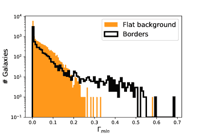

图 13：边界处（受散射光影响，黑色）和图像中心处（平坦背景，橙色填充）星系的 $\Gamma_{\rm min}$ 分布。
