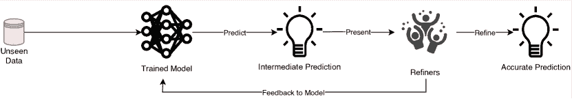

<!--yml

category: 未分类

日期: 2024-09-06 20:04:29

-->

# [1910.02923] 关于主动学习和人机交互深度学习在医学图像分析中的应用 1 脚注 11 脚注 1

> 来源：[`ar5iv.labs.arxiv.org/html/1910.02923`](https://ar5iv.labs.arxiv.org/html/1910.02923)

# 关于主动学习和人机交互深度学习在医学图像分析中的应用¹¹脚注标记: 1

Samuel Budd Emma C Robinson²²脚注标记: 2 Bernhard Kainz³³脚注标记: 3 计算系，帝国理工学院，英国 成像科学系，国王学院，伦敦，英国

# 特征表

Samuel Budd Emma C Robinson²²脚注标记: 2 Bernhard Kainz³³脚注标记: 3 计算系，帝国理工学院，英国 成像科学系，国王学院，伦敦，英国

###### 摘要

完全自动化的深度学习已成为许多任务的前沿技术，包括图像获取、分析和解释，以及提取临床有用的信息以用于计算机辅助检测、诊断、治疗规划、干预和治疗。然而，医学图像分析所带来的独特挑战表明，在任何深度学习驱动的系统中保留一个人类终端用户将是有益的。在这篇综述中，我们探讨了人类可能在深度学习驱动的诊断应用的开发和部署中发挥的作用，并重点关注能够保留人类终端用户重要输入的技术。我们认为，人机交互计算是未来研究中越来越重要的领域，因为在医学领域工作具有安全关键的性质。我们评估了我们认为对临床实践中的深度学习至关重要的四个关键领域：（1）*主动学习*，选择最佳数据进行标注以获得最佳模型性能；（2）*与模型输出的互动* - 使用迭代反馈引导模型达到特定预测的最优，并提供有意义的方式来解释和响应预测；（3）*实际考虑* - 开发全面的应用程序以及在部署前需要考虑的关键因素；（4）*未来展望与未解之谜* - 知识空白和相关研究领域，这些领域将在其发展过程中受益于人机交互计算。我们提出了对最有前景的研究方向的意见，并探讨了各个领域的不同方面如何朝着共同目标统一。

## 1 介绍

医学影像是临床决策的主要支柱，并且是许多患者就医过程中的一个重要部分。从医学影像中提取的信息在计算机辅助检测、诊断、治疗计划、干预和治疗等多个领域具有临床价值。尽管医学影像仍然是众多临床任务的关键组成部分，但对复杂医学影像进行解读的合格放射科医生日益短缺，这表明迫切需要可靠的自动化方法来减轻医疗从业人员日益增长的负担[67]。

与此同时，医学影像学正在受益于结构化数据（如影像）分析新计算技术的发展。图像获取、分析和解释算法的发展正在推动创新，特别是在配准、重建、跟踪、分割和建模等领域。

医学影像本质上难以解读，需要先验的专业知识来理解。生物医学影像可能会有噪声，并且包含许多特定模态的伪影，且在各种采集条件和不同协议下获取。因此，一旦训练好的模型不能从一个临床任务或地点无缝迁移到另一个任务或地点，因为通常存在显著的领域差距[34, 10]。监督学习方法需要广泛的重新标注才能在不同工作流程中恢复初始性能。

处理此类数据所需的经验和先验知识意味着在医学数据标注中，观察者之间以及观察者内部通常会存在较大的变异。这不仅引发了关于什么构成金标准真值标注的问题，还导致了对该真值到底是什么的分歧。这些问题导致标注和重新标注医学影像数据集的成本非常高，因为我们需要大量的专家标注员（“神谕者”）来执行每次标注并达成共识。

近年来，深度学习（DL）作为一种先进的技术，已在执行许多医学影像分析任务中表现出色[85, 88, 79, 51, 84]。计算机视觉领域的进展显示出在医学影像分析中转化的巨大潜力，且几种技术已被证明能达到与人类观察者相同的准确度[28, 56]。然而，到目前为止，临床实践中对 DL 方法的采用仍然有限，这在很大程度上是由于处理复杂医学数据的独特挑战、合规问题和对训练模型的信任。

在开发用于临床设置的深度学习（DL）增强应用时，我们识别出三个关键挑战：

1.  1.

    缺乏训练数据：监督式深度学习技术传统上依赖于大量且均匀分布的准确注释数据点，虽然医学图像数据集变得越来越多，但标注这些数据集所需的时间、成本和精力仍然是巨大的。

1.  2.

    最终百分比：深度学习技术在医学图像分析任务中取得了最先进的性能，但在安全关键领域，即使最小的错误也可能导致灾难性的后果。实现临床可信的输出可能需要对预测结果进行交互式解释（来自预言者），才能在实际中有用，即用户必须具备纠正和覆盖自动预测的能力，以满足任何需要的接受标准。

1.  3.

    透明度和可解释性：目前，大多数深度学习应用被认为是“黑匣子”，用户只能以有限的方式去解释、理解或纠正模型是如何进行预测的。对于医疗应用来说，通过评估来自各种信息源的信息以做出临床决策是一个不利的特征。为了建立对深度学习系统的信任，并让用户适当权衡自动预测，我们需要更多的指示来了解模型是如何得出预测结论的。

目前医学图像分析研究社区正在积极努力将深度学习方法应用于各种医学图像分析任务，并取得了巨大的成功。我们建议读者参阅多篇关于医学图像中深度学习的评论[30, 54, 99]。这些工作主要关注于针对特定任务开发预测模型，并展示了该任务的最新性能。

本评价旨在概述人类将在深度学习系统的开发、部署和实际应用中发挥作用的地方。我们重点关注医学图像分割技术，探讨人类最终用户在深度学习系统中的作用。

自动化图像解释任务，如图像分割，遭遇了上述医疗图像数据所带来的所有缺点。许多新兴技术旨在减轻处理医疗图像数据以执行自动分割的额外复杂性。分割旨在将图像划分为语义上有意义的区域（像素集合），以执行许多后续任务，例如生物测量。手动为每个像素分配标签是一项繁重的任务，因此自动分割方法在实践中非常重要。深度学习技术的进展，如应用于分割问题的主动学习（Active Learning）和人机交互计算，已显示出克服上述关键挑战的进展，这些研究是本综述关注的重点。我们根据提出的人机交互的性质对每项研究进行分类，并大致将它们分为解决三个关键挑战中的哪一个。

第二部分介绍了主动学习（Active Learning），这是机器学习（ML）和人机交互计算（Human-in-the-Loop Computing）的一个分支，旨在从未标记的分布中找到最有信息量的样本以供下次标注。通过在最有信息量的样本子集上训练，相关工作能够在减少标注医疗图像数据的高成本负担的同时，达到最先进的性能。

第三部分评估了用于根据用户反馈优化模型预测的技术，指导模型朝着更准确的每图像预测方向发展。我们评估了旨在提高自动预测可解释性的技术，以及模型如何对自身输出提供反馈，从而引导用户做出更好的决策。

第四部分评估了在实践中开发和部署人机交互深度学习（Human-in-the-Loop DL）系统的关键实际考虑因素，并概述了这些领域的工作，解决了上述三个关键挑战。这些领域以人为中心，评估了人类最终用户如何与这些系统进行交互。

在第五部分中，我们讨论了对主动学习（AL）和人机协作计算产生影响的机器学习（ML）和深度学习（DL）研究的相关领域，并开始影响所概述的三大挑战。我们对人机协作深度学习研究的未来方向提出了我们的观点，以及如何将评估的许多技术结合起来以朝着共同目标努力。

## 2 主动学习

图 1：主动学习框架概述。

在这一部分，我们假设存在一个大规模的未标注数据池 $U$，并且我们有一个神谕（或一组神谕），我们可以请求对每一个未标注的数据点 $x_{U}$ 进行标注，以便将其添加到标注集 $L$ 中。我们希望训练一个模型 $f(x|L^{*})$，其中 $L^{*}\subseteq L$，并考虑依赖标注数据的方法。解决这个问题的一个粗暴方法是要求神谕对每个 $x_{U}$ 进行标注，使得 $L^{*}=L$，但由于标注生物医学图像数据的独特挑战，这种方法很少是实际可行或具有成本效益的。理论上存在一个 $L^{*}$ 能达到与 $L$ 相当的性能，即 $f(x|L^{*})\approx f(x|L)$。一个在数据集的某个最优子集 $L^{*}$ 上训练的模型可能会达到与在整个标注数据集上训练的模型相当的性能。主动学习（AL）是机器学习的一个分支，旨在找到给定当前模型 $f^{\prime}(x|L^{\prime})$（其中 $L^{\prime}$ 是一个中间标注数据集）和一个未标注数据集 $U$ 的最优子集 $L^{*}$。AL 方法旨在迭代地寻找最有信息的数据点 $x^{*}_{i}$ 来训练模型，假设模型和未标注数据集都会随着时间的推移而演变，而不是一次性选择一个固定的子集进行训练。在更广泛的背景下，在深度学习（DL）出现之前，[75] 回顾了这一领域作为最先进的机器学习方法。

一个典型的主动学习（AL）框架，如图 1 所示，包括一种方法来评估每个未标注数据点 $x_{U}$ 的信息量，给定 $f^{\prime}(x_{U}|L^{\prime})$，这与查询类型的选择密切相关，之后所有选择的数据点都需要进行标注。一旦获得了新的标注，AL 框架必须利用这些新数据来改进模型。通常，这通过使用所有可用的标注数据 $L^{\prime}$ 重新训练整个模型，或者通过使用最新标注的数据点 $x^{*}_{i}$ 来微调网络来完成。采用这种方法，可以在多个生物医学图像分析任务中使用更少的标注实现最先进的性能，如本节讨论的方法所示，从而扩大标注瓶颈，并降低从未标注数据中开发深度学习（DL）系统的成本。

### 2.1 查询类型

在每个 AL 框架中，第一个需要做出的选择是我们希望使用模型和未标注数据集进行何种类型的查询。目前有三种主要选择，每种选择适用于特定的场景，这取决于我们可以访问的未标注数据类型，以及我们希望向 oracle 提问的问题。

基于流的选择性采样假设有一个持续的未标注数据点流 $x_{U}$ ([5, 17])。使用当前模型和信息量度量 $I(x_{U})$ 来决定是否对每个到来的数据点向 oracle 请求标注 ([19])。这种查询类型通常计算开销较小，但由于每个决策的孤立性，提供的性能收益有限：没有考虑到潜在分布的更广泛背景，因此分布的探索与利用平衡的效果不如其他查询类型。另一缺点是需要校准所选择的信息量度量的阈值，以确保我们不会对每个到来的数据点请求标注，也不会对过多的数据点拒绝标注，导致有价值的信息丢失。

会员查询合成假设，我们不是从实际的数据分布中提取数据点，而是生成一个需要被注释的数据点 $x^{*}_{G}$（[3]）。生成的数据点是当前模型认为对其自身最有信息量的数据点。然后，这个数据点由神谕者（[4]）进行注释，这在有限领域中可能非常高效。这种方法可能会受到与基于流的方法相同的缺点的影响，因为模型可能对数据分布的未见区域一无所知，从而无法请求这些区域的注释。问题可能出现于查询可能请求对对人类神谕者没有意义的数据点的注释（[45]），而这些数据点并不代表实际建模的数据分布，提出了基于流和基于池的采样方法以克服这些问题（[75]）。尽管如此，生成对抗网络（GANs）的最新进展在生成模仿实际数据分布的数据点方面显示出了极大的潜力，包括生物医学图像，这可能在一定程度上解决使用查询合成处理复杂分布的关键问题，这将在第 2.2.3 节中讨论。这种查询类型在对分布的生成完全理解的场景中，或者在注释是自主获取而非来自人类的领域中可能具有优势（[38, 37]）。

基于池的采样假设有一个大型未标注的现实世界数据集 $U$，从中抽取样本，并试图从分布中选择一批 N 个样本 ${x^{*}_{0},...,x^{*}_{N}}$ 请求标签（[47]）。基于池的方法通常使用当前模型对每个未标注的数据点进行预测，以获得每个数据点在未标注集合中的信息量排名度量 $I(x_{U}|f^{\prime}(x_{U}|L^{\prime}))$，并使用该度量选择前 N 个样本，由 oracle(s) 进行标注。基于池的采样已被应用于多个现实世界任务，在深度学习出现之前（[47, 57, 76, 104, 29]）。这些方法可能计算成本较高，因为每次迭代都需要对分布中的每个数据点进行度量评估。然而，当与深度学习方法结合使用时，这些方法显示出了最有前景的效果，因为深度学习方法本质上依赖于基于批次的训练方案。除非另有说明，基于池的采样在本节其余部分讨论的大多数方法中都被使用。尽管基于池的方法在寻找最具信息量的标注方面相较其他方法具有优势，但在一些情况下，如内存或处理能力有限的移动或嵌入式设备中，流式或合成查询的方法也很常见（[75]）。

### 2.2 评估信息量

在开发主动学习框架时，一旦选择了查询类型，下一个问题是如何测量每个数据点的信息量 $I(x_{U})$？对于给定模型和底层分布，已经采取了许多不同的方法来量化样本的信息量。在这里，我们按其提供的人类可解释性水平对这些度量标准进行排序。

传统上，主动学习（AL）方法使用手工设计的启发式规则来量化我们作为人类认为使某样东西具有信息量的因素。一些特定于模型的度量方法试图量化使用样本进行训练对模型的影响，例如，模型参数的最大变化。然而，由于将这些方法应用于具有大量参数的深度学习（DL）模型的计算挑战，这些方法的使用不如人工设计的启发式规则普遍。最后，一些方法正在出现，这些方法完全与信息量的人类可解释性无关，而是试图从现有数据和以前的迭代中学习最佳选择策略，详细讨论见第 2.2.4 节。

#### 2.2.1 不确定性

信息量度量的主要家族涉及计算不确定性。有观点认为，预测的不确定性越大，通过将该样本的真实情况纳入训练集，我们可以获得的信息就越多。

计算不同机器学习/深度学习模型的不确定性有多种方式。在考虑深度学习进行分割时，最简单的度量方法是对给定图像分割中每个像素的最低类别概率进行求和。有人认为，更确定的预测会具有较高的像素级类别概率，因此图像中每个像素最低类别概率的总和越低，预测越被认为是确定的：

|  | $x^{*}_{LC}=\operatorname*{argmax}_{x}1-P_{\theta}(\hat{y}&#124;x)$ |  |
| --- | --- | --- |

其中 $\hat{y}=\operatorname*{argmax}_{y}P_{\theta}(y|x)$。这是一种相当直观的不确定性思考方式，并提供了一种在分布中对样本不确定性进行排序的方法。我们将上述方法称为最不自信采样，其中选择不确定性最高的样本进行标注 [75]。最不自信采样的一个缺点是它仅考虑最可能标签的信息，而忽略了其他标签分布的信息。已有两种替代方法被提出以缓解这一问题。第一种称为边际采样 [75]，可用于多类设置，考虑模型下最可能的前两种标签，并计算它们之间的差异：

|  | $x^{*}_{M}=\operatorname*{argmin}_{x}P_{\theta}(\hat{y}_{1}&#124;x)-P_{\theta}(\hat{y}_{2}&#124;x)$ |  |
| --- | --- | --- |

其中 $\hat{y}_{1}$ 和 $\hat{y}_{2}$ 分别是当前模型下最可能的前两种标签。这里的直觉是，两种最可能标签之间的边际越大，模型对该标签的分配就越自信。第二种，更受欢迎的方法是使用熵 ([78]) 作为不确定性度量：

|  | $x^{*}_{E}=\operatorname*{argmax}_{x}-\sum_{i}P(y_{i}&#124;x)logP(y_{i}&#124;x)$ |  |
| --- | --- | --- |

其中 $y_{i}$ 涵盖了所有可能的标注。熵用于衡量编码分布所需的信息量，因此在机器学习中，熵常被视为不确定性的度量。对于二分类问题，所有三种方法都归结为查询与 0.5 最接近的类后验的数据点。熵能够轻松推广到概率多类标注及更复杂结构数据点的模型，使其成为基于不确定性的查询策略中最受欢迎的选择 [76]。

使用上述一种度量方法，对未标注样本进行排名，并选择最“无确定性”的案例进行下一轮标注。在深度学习领域，最近有许多基于不确定性的采样方法应用于主动学习，这些方法将在接下来的部分中讨论。

[94] 提出了用于深度图像分类的成本效益主动学习（CEAL）方法。CEAL 方法初始化时需要一组未标记样本 $U$、初始标记样本 $L$、池大小 $K$、高置信度样本选择阈值 $\omega$、阈值衰减率 $dr$、最大迭代次数 $T$ 和微调间隔 $t$。初始化后，CNN 权重 $W$ 使用 $L$ 进行初始化，并且模型用于对 $U$ 中的每个数据点进行预测。CEAL 探索使用上述三种不确定性方法中的每一种，以获得 $K$ 个不确定数据点进行手动标注并添加到 $D_{L}$。到目前为止，CEAL 方法非常接近于传统主动学习方法，但他们引入了一个额外的训练步骤，将 $U$ 中最有信心的样本（熵小于 $\omega$）添加到 $D_{H}$。然后，$D_{L}$ 和 $D_{H}$ 被用来对 $W$ 进行 $t$ 次迭代的微调。CEAL 然后更新 $\omega$，在丢弃 $D_{H}$ 的伪标签之前，每个数据点被重新添加到 $U$ 中，而 $D_{L}$ 则被添加到 $L$。这个过程重复进行 $T$ 次迭代。作者将从最不确定注释的手动标签和最确定注释的预测标签中同时学习的这种方法描述为补充采样。CEAL 方法显示，使用不到 60%的可用数据可以在两个非医疗数据集（CACD 和 Caltech-256）上实现最先进的性能，用于面部识别和物体分类。

[96] 提出了一个利用不确定性采样来支持病理图像核分割质量控制的主动学习方法。他们的工作比较了通过主动学习在三种不同算法家族（支持向量机（SVM）、随机森林（RF）和卷积神经网络（CNN））中获得的性能提升。他们展示了 CNN 实现了最高的准确性，所需的迭代次数显著少于 SVM 和 RF。

另一种常见的信息量估计方法是测量多个模型在执行相同任务时的协议。有人认为，在相同数据点上预测之间的分歧越大，表示不确定性水平越高。这些方法被称为共识查询，通常在使用集成方法来提高性能时应用——即，训练多个模型在稍微不同的参数/设置下执行相同任务 [75]。集成方法已经被证明可以很好地衡量信息量，但代价是计算资源——需要训练和维护多个模型，每个模型都需要在选择新的训练样本时进行更新。

然而，[9] 展示了集成方法在主动学习中的强大力量，并与其他集成方法进行了比较。他们特别比较了获取函数和不确定性估计方法在使用 CNNs 进行图像分类任务中的表现，并展示了基于集成的不确定性在性能上优于其他不确定性估计方法，如 'MC Dropout'。他们发现，主动学习性能的差异可以通过模型容量降低和 MC dropout 集成的多样性降低来解释。在糖尿病视网膜病变诊断任务中表现良好。

[41] 提出了一种主动学习方法，该方法利用图像空间中的几何平滑先验来辅助分割过程。他们使用传统的不确定性测量来估计应优先标注的像素，并在多类设置中引入了新的不确定性标准。他们通过估计超像素属于某个类别的概率熵，结合邻居的预测来利用几何不确定性，并鼓励选择类别之间过渡不平滑区域的不确定区域。他们在从 EM 图像中分割线粒体和在 MRI 肿瘤分割任务中（无论是二类还是多类分割）展示了最先进的性能。他们建议，利用图像的几何属性有助于回答下一个标注位置的问题，并通过将 3D 标注简化为 2D 标注，为如何标注数据提供了可能的答案，同时，解决这两者的结合可以给标注方法带来额外的好处，但他们也承认，为每个新任务设计量身定制的选择策略将是不可行的。

[25] 介绍了使用贝叶斯卷积神经网络（Bayesian CNNs）进行主动学习的方法，称为“基于不一致性的贝叶斯主动学习”（’Bayesian Active Learning by Disagreement’，简称 BALD），并展示了在主动学习的背景下，贝叶斯卷积神经网络的表现优于确定性卷积神经网络，并通过使用一种新的获取函数来实现这一点，该函数选择期望最大化模型参数信息的点，即最大化预测与模型后验之间的互信息。这种方法使用一个贝叶斯卷积神经网络（在推理过程中使用 Dropout 来诱导[24]），对于每个未标记的数据点，使用网络的所有参数生成单一预测，并为每个未标记的数据点生成一组随机预测，这些预测是在启用 Dropout 的情况下生成的。然后，BALD 获取函数计算为平均预测的熵和随机预测的平均熵之间的差异。从直观上看，这个函数选择那些模型在平均上不确定的数据点，但存在一些模型参数能够以高确定性产生不一致的预测注释。他们展示了这种方法在皮肤病变图像的皮肤癌诊断中的应用，显示出相较于均匀采样，使用 BALD 方法进行样本选择显著提高了性能。尽管这种方法在主动学习中表现出特别有效，当查询数据点的批次时，它常常会导致许多非常相似的冗余数据点被获取，因此 BatchBALD 被引入以缓解这个问题[39]。BatchBALD 方法不再计算单个样本预测与模型后验之间的互信息，而是计算一批样本与模型后验之间的互信息，以共同评分样本批次，使得 BatchBALD 能够更准确地评估联合互信息，并选择导致较少冗余数据点一起被选择的批次。这个扩展是第 2.2.2 节动机的一个例子，其中我们讨论了超越纯不确定性方法并开始测量选定样本之间的多样性以减少冗余标注的方法。

#### 2.2.2 代表性

许多主动学习（AL）框架扩展了选择策略，除了不确定性度量之外，还包括一些代表性度量。包括代表性度量的直觉在于，单纯关注不确定性的方法可能只关注分布的局部区域，且从分布的相同区域进行训练会导致选择策略的冗余，或者使模型偏向分布的某一特定区域。增加代表性度量旨在鼓励选择策略从分布的不同区域采样，并增加样本的多样性，从而提高主动学习（AL）性能。具有高代表性的样本涵盖了分布中许多图像的信息，因此无需包括许多由代表性图像覆盖的样本。

为此，[100] 提出了建议性注释（Suggestive Annotation），这是一个用于医学图像分割的深度主动学习框架，它使用了不确定性采样的替代公式，并结合了代表性密度加权形式。他们的方法包括训练多个模型，每个模型排除一部分训练数据，用于计算基于集成的不确定性度量。他们将选择最具代表性的示例形式化为最大集合覆盖问题（NP 难问题）的广义版本，并提供了一种贪心的方法来使用其模型中的特征向量选择最具代表性的图像。他们在 MICCAI 腺体分割挑战和淋巴结分割任务中，使用了 50%的可用数据，展示了最先进的性能。

[80] 提出了 MedAL，这是一种用于医学图像分割的主动学习框架。他们提出了一种采样方法，该方法结合了不确定性和特征描述符之间的距离，从未标记的数据集中提取最具信息量的样本。在训练了初始模型后，MedAL 方法通过首先过滤掉预测熵低于阈值的未标记数据点来选择需要标记的数据点。在这个数据集中，通过使用 CNN 的中间层输出生成每个数据点的特征描述符，然后使用各种距离函数（例如 ’欧几里得’、’拉塞尔-拉奥’、’余弦’）相互比较这些特征描述符，以找到彼此之间距离最远的特征描述符。与所有其他未标记数据点的平均距离最大的（高于熵阈值）的数据点将被选择用于标注。通过这种方式，MedAL 获取函数找到了对模型最有信息量且彼此之间冗余最少的数据点集合，通过从输入分布中距离最远的区域进行采样。MedAL 方法通过利用现有的计算机视觉图像描述符来初始化模型，以找到彼此最不相似的图像，从而覆盖图像分布的更大区域，作为标注后的初始训练集。他们在三种不同的医学图像分析任务中展示了良好的结果，使用比随机或纯不确定性方法更少的训练数据达到了基准准确率。

[64] 提出了基于 Borda 计数的不确定性和代表性度量的组合方法，以选择下一批样本。不确定性通过使用 MC dropout 的 N 次预测的体素级方差来衡量。他们引入了新的代表性度量，如 ’内容距离’，定义为预训练分类网络层激活响应之间的均方误差。他们通过使用新颖的熵损失函数将代表性编码为最大熵，从而扩展了这一贡献，以优化网络权重。

[81] 首次在卷积神经网络（CNNs）中提出了一种确保查询样本多样性的新方法，通过计算费舍尔信息（FI）。在这里，通过传播的梯度计算使得在 CNN 的大参数空间上计算 FI 变得高效。他们在两个不同任务的场景下展示了他们方法的性能：a）对某一特定对象（来自不同组/不同病理的对象，原始训练数据中不存在）进行半自动分割，通过 AL 迭代标记少量体素实现该对象的准确分割；b）使用 AL 构建一个对给定数据集中的所有图像具有泛化能力的模型。他们展示了在这两种情况下，基于 FI 的 AL 在标记少量体素后提高了性能，优于随机采样，并且比基于熵的查询获得了更高的准确性。

#### 2.2.3 生成对抗网络在信息性方面的应用

基于生成对抗网络（GAN）的方法已应用于医学成像的多个领域，如去噪、模态转换、异常检测以及图像合成，直接适用于主动学习场景。这提供了一种替代（或补充）用于扩展有限数据集的许多数据增强技术的方案[101]，并且是一种用于成员查询合成的深度学习方法。

[46] 提出了一种基于条件生成对抗网络（cGAN）的主动学习方法，其中他们使用判别器$D$的输出作为提出的分割的不确定性度量，并利用这个度量对未标记数据集中的样本进行排名。从这个排名中，最不确定的样本被呈现给 oracle 进行分割，而最确定的图像则作为伪地面真实标签包含在标记数据集中。他们展示了他们的方法在交互式注释样本的百分比增加时逐渐提高准确性——仅使用 80%的标签便达到了完全监督基准方法的性能。这项工作激励了将 GAN 判别器分数作为预测不确定性度量的使用。

[55] 还使用 cGAN 生成基于真实图像的胸部 X 射线图像，并使用贝叶斯神经网络评估每个生成样本的信息性，决定是否将每个生成的样本用作训练数据。如果是，则用来微调网络。他们展示了该方法在仅标记训练集中 33%的像素的情况下，能够实现与完全注释数据上的训练相当的性能，为注释员节省了大量的时间、精力和成本。

[105] 提出了通过学习变换的方式来替代 GAN 的数据合成方法。通过单张手动分割的图像，他们利用其他未标注图像，以类似 SSL 的方法从这些图像中学习变换模型，并将模型与标注数据结合，合成额外的标注样本。变换包括空间形变和强度变化，以实现复杂效果的合成，如解剖和图像获取的变化。他们以监督方式训练了一个用于 MRI 脑部图像分割的模型，并展示了相对于其他一次性生物医学图像分割方法的最先进改进。

基于 GAN 的方法在 AL 场景中的实用性不仅限于单模态图像合成。许多工作已展示了 GAN 在跨模态图像合成中的能力，这不仅直接解决了有限训练数据的问题，还解决了多模态分析场景中缺失模态的问题。通过生成缺失模态以填补数据点，能够将完整的 AL 方法应用于多模态分析问题。

[93] 引入了一种基于 GAN 的超分辨率方法，适用于不同显微镜模式下。这项工作使用 GAN 将衍射限制的输入图像转换为超分辨率图像，从而提高使用低数值孔径物镜获得的宽场图像的分辨率，使其与使用高数值孔径物镜获得的分辨率相匹配。这项工作进一步扩展了该方法，展示了跨模式超分辨率，将共聚焦显微镜图像转换为刺激发射耗竭显微镜的分辨率。这种方法使得许多低分辨率的图像能够超分辨率到匹配高分辨率图像，提高了多模态图像分析方法在自动化学习（AL）及其他领域的性能。

[95] 引入了一种基于 GAN 的高质量 PET 图像生成方法，这通常需要全剂量的放射性示踪剂才能获得。这项工作使得可以使用低剂量示踪剂获取低质量的 PET 图像，并使用 3D 条件 GAN 对低剂量图像进行条件生成高质量 PET 图像。此外，还引入了一种基于 3D c-GAN 的渐进精细化方案，以进一步提高估计图像的质量。通过这项工作，获取高质量 PET 图像所需的放射性示踪剂剂量大大减少，从而降低了对患者的风险，并使低剂量 PET 图像可以与高剂量图像一起用于下游分析。

[102] 扩展了现有的基于 GAN 的方法，以改进在不同扫描参数下获得的 MR 图像的跨模态合成。他们的工作引入了边缘感知生成对抗网络（Ea-GANs），该网络特别整合了反映图像内容纹理结构的边缘信息，以描绘图像中不同对象的边界，这超越了仅关注最小化像素/体素强度差异的方法。他们使用两种学习策略，将边缘信息引入到生成器驱动的 Ea-GAN（gEa-GAN）和判别器驱动的 Ea-GAN（dEa-GAN）中，分别通过生成器和生成器与判别器同时引入边缘信息，使得边缘相似性也能对抗性地学习。他们的方法展示了在跨模态 MR 合成中的最先进性能，并在外立面、地图和城市景观等通用图像合成任务中表现出色。

[65] 探索了使用 GANs 从相应的 MR 图像中补全缺失的 PET 图像，以用于脑部疾病的识别，采用了一种基于 GAN 的方法，以避免丢弃数据缺失的受试者，从而增加可用的训练样本数量。使用混合 GAN 生成缺失的 PET 图像，然后使用空间约束的 Fisher 表示网络提取神经影像的统计描述符用于疾病诊断。三个数据库上的结果表明，这种方法可以合成合理的神经影像，并在脑部疾病识别中取得了比其他最先进方法更有希望的结果。

上述工作展示了使用基于非常少量标注数据的合成数据生成新的训练样本的能力，这对主动学习（AL）方法具有重要价值，因为我们通常需要一个初始训练集来训练模型，然后才能采用数据选择策略。这些方法还展示了对标注数据的高效利用，并允许我们从单个标注图像生成多个训练样本，这可能使得通过生成多个训练样本来更有效地利用 AL/人类在环方法中获得的标注数据，从而进一步减少训练最先进模型所需的标注工作量。

#### 2.2.4 学习主动学习

到目前为止讨论的大多数方法都使用了手工设计的信息量启发式，但也出现了一些尝试通过以前样本选择结果的经验来学习最有信息量的样本的研究。这提供了一种更有效地选择样本的潜在方式，但代价是启发式方法的可解释性。许多因素影响手工设计的启发式方法在数据选择中的性能和最优性。[40] 提出了“学习主动学习”，其中回归模型基于以前的主动学习结果学习数据选择策略。他们认为没有办法预见所有因素的影响，如类别不平衡、标签噪声、异常值和分布形状。相反，他们的回归模型根据问题“适应”其选择，而无需明确指出具体规则。[6] 更进一步，提出了一种模型，该模型利用来自不同但相关任务的标记实例来学习选择策略，同时调整数据的表示和预测函数。

强化学习（RL）是机器学习（ML）的一个分支，它使“智能体”能够在交互环境中通过试错的方式学习，利用自身行动和经验的反馈，致力于实现系统定义的目标。最近有人提出主动学习作为 RL 的潜在应用案例，并且已有一些研究开始探讨这一领域。

[97] 提出了一个一体化学习方法，该方法结合了 RL，以便模型在推理过程中决定哪些示例值得标注。呈现一系列图像，然后做出决定：要么预测标签，要么支付以获取正确标签。通过选择 RL 奖励函数，他们能够实现比纯监督任务更高的预测准确性，或者用较少的标签请求来交换预测准确性。

[22] 将数据选择过程重新构建为 RL 问题，并明确学习数据选择策略。这不依赖于主动学习框架中常见的数据选择启发式方法，提供了更通用的方法，显示了在实体识别方面的改进，但尚未应用于医学图像数据。

RL 方法提供了一种不同于主动学习和人机交互问题的方法，这与实时反馈有很好的契合，但它需要特定任务的目标，这些目标可能无法在不同的医学图像分析任务中泛化。

### 2.3 微调与再训练

每个 AL 框架的最后一步是利用新获得的注释来改进模型。用于在新注释上训练模型的两种主要方法是：使用包括新获得的注释在内的所有可用数据重新训练模型，或仅使用新注释或新注释加上一部分现有注释来微调模型。

[86] 研究了在多个医学图像分析任务中使用迁移学习和微调的方法，并展示了使用经过微调的预训练 CNN 优于从头开始训练的 CNN，且这些微调的 CNN 对训练集大小更具鲁棒性。他们还表明，浅层或深层微调都不是特定应用的最佳选择，并提出了一种逐层训练方案，这种方案可以根据可用数据量提供一种实用的方式来达到所选任务的最佳性能。这项工作中的方法执行一次性微调，即只使用可用的训练样本对预训练模型进行一次微调，但这不支持主动选择过程或连续微调。

[109] 提出了一个连续微调的方法，该方法使用逐渐增大的数据集来微调预训练 CNN，并展示了这种方法比反复微调预训练 CNN 收敛更快。他们还发现，只有使用新获得的注释进行连续微调需要仔细的元参数调整，使得它在许多不同任务中不够实际。

一种受上述两种主要方法启发的重新训练新数据的替代方法是使用所有可用数据来重新训练模型，但使用之前的参数作为初始化，然而，作者所知的任何工作中尚未应用这种方法于主动学习（AL）。

重新训练比微调计算开销更大，但它提供了一种一致的方法来评估 AL 框架的性能。微调在许多不同的机器学习领域中使用，如一次或少次学习和迁移学习，这方面的最佳方法仍然是一个开放问题，因此在 AL 框架中不太常见。随着微调技术的改进，我们可能会看到其在 AL 框架中的应用有所增加。为了有效比较所应用的 DL/AL 方法，建立基准微调和重新训练方案是重要的，以便将这些方案的效果与其他领域的改进分开。

## 3 最终百分比：模型输出的互动细化

图 2：细化框架概述。

到目前为止，我们已经考虑了人工标注数据以用于训练模型的角色，但一旦模型训练完成，我们仍然需要“人机互动”的方式来解释模型预测，并可能对其进行改进，以获取对未知数据的最准确结果，如图 2 所述。在“人机互动”场景中，模型对未知输入进行预测，并且根据接受标准，自动预测可能需要手动调整以满足这些接受标准。关于预测的信息传达非常重要，以使接受标准能够自信地达到，并形成对自动预测局限性的理解。这种沟通是双重的，即用户必须能够与使用的模型沟通，以指导预测结果更准确或纠正错误预测，同时，模型也必须能够与用户沟通，以提供对模型预测的有意义的解释，使用户能够在与模型输出互动时采取最佳行动，并减少人为不确定性。这创建了如图 2 所示的反馈循环。

### 3.1 互动改进

如果我们能为医学图像应用开发准确、稳健且可解释的模型，但仍无法保证自动化预测满足每一个模型呈现的未知数据点的接受标准。对未知输入进行泛化的能力是深度学习应用的基石，但在现实世界的分布中，泛化很少是完美的。因此，必须将纠正这些差异的方法嵌入到用于医学图像分析的应用程序中。这种迭代的改进必须节省最终用户在执行手动标注或纯粹手动修正上的时间和精力。许多互动图像分割系统已被提出，最近这些系统在深度学习的进展基础上，允许用户改进模型输出，并将更准确的结果反馈给模型进行改进。

[1] 引入了 UI-Net，它基于流行的 U-Net 架构用于医学图像分割 [73]。UI-Net 使用活跃用户模型进行训练，允许用户通过在图像上提供涂鸦来指示应包含或不包含的区域来与建议的分割进行交互，网络使用模拟用户交互进行训练，因此对迭代用户涂鸦做出响应，以将分割结果改进为更准确的结果。

条件随机场（Conditional Random Fields）已被应用于各种任务以促进分割的同质性。[106] 提出了 CRF-CNN，这是一种递归神经网络，结合了 CNN 和 CRF 的优良特性。[92] 提出了 DeepIGeoS，这是一个用于医学图像分割的交互式测地框架。该框架使用两个 CNN，第一个执行初步自动分割，第二个结合初步分割以及用户对初步分割的交互来提供精细化结果。他们通过测地距离变换[18]将用户交互与 CNN 结合，这些用户交互被作为硬约束整合到条件随机场中，灵感来源于 [106]。他们将这两个网络称为 P-Net（初步分割）和 R-Net（用于精细化）。与完全自动的 CNN 相比，他们在 2D 胎儿 MRI 中的胎盘分割和 3D FLAIR 图像中的脑肿瘤分割上展示了卓越的结果。这些分割结果的获得时间大约是使用传统交互方法如 GeoS 或 ITK-SNAP 进行相同分割时间的三分之一。

图割（Graph Cuts）也被用于分割中以纳入用户交互——用户向算法提供种子点（例如，标记一些像素为前景，另一些为背景），从中计算分割。[91] 提出了 BIFSeg，这是一个受图割启发的交互式分割框架。他们的工作引入了一种通过结合 CNN 和基于边界框与涂鸦的分割管道的深度学习框架来实现交互式分割。用户在他们感兴趣的区域周围提供一个边界框，然后将其输入 CNN 以生成初步分割预测，用户可以提供涂鸦以标记图像中被误分类的区域——这些用户输入在使用他们的图割算法计算精细化分割时被赋予了很大的权重。

[11] 提出了 BIFSeg 的一种替代方案，其中训练了两个网络，一个用于执行初步分割（他们使用 CNN，但这个初步分割也可以用任何现有算法进行），另一个网络称为 interCNN，它以图像、一些用户涂鸦和初步分割预测作为输入，并输出精细化分割。他们展示了通过对多个用户输入进行几轮迭代，分割质量在初步分割的基础上得到改进，并在与其他交互式方法的比较中达到了最先进的性能。

上述方法迄今为止主要关注于为单个图像或切片生成分割，但许多分割任务旨在提取特定感兴趣区域（ROI）的三维形状/表面。[43] 提出了基于 Smart-brush 2D 分割的三维分割双重方法，用户引导该方法实现良好的 2D 分割，在分割几个切片后，使用 Hermite 径向基函数将其转换为三维表面形状，实现高精度。虽然该方法没有使用深度学习，但它是交互式分割生成高质量训练数据用于深度学习应用的强大示例 - 他们的方法是通用的，可以为大量任务生成分割。还有潜力将深度学习融入他们的流程中，以改善结果并加速交互注释过程。

[32] 提出了一个交互式分割方案，该方案可以推广到任何之前训练过的分割模型，接受关于目标物体和背景的用户注释。用户注释通过测量每个像素到标注地标的距离转换为交互图，然后前向传播输出初步分割。用户标注的点可能在初步分割中被误分割，因此他们提出了 BRS（反向传播修正方案），以纠正错误标记的像素。他们展示了他们的算法在多个数据集上优于传统方法，并且 BRS 可以通过将现有的 CNN 转换为用户交互版本来推广到医学图像分割任务。

[50] 提出了将迭代交互修正的动态建模为马尔可夫决策过程（MDP），并通过多代理强化学习（RL）来解决这个问题。通过将每个体素视为具有共享体素级行为策略的代理，他们使体素级预测变得可处理。多代理方法成功捕获了体素之间的依赖关系，用于分割任务，并通过将先前分割的预测不确定性传递通过状态空间来得出更精确和细致的分割。使用这种方法，他们在较少的交互和更快的收敛速度下显著超越了现有的最先进方法。

在本节中，我们重点关注迭代细化分割以达到期望的输出质量的应用。在上述场景中，这是在用户提供的未见过的图像上进行的，但没有理由认为不能采用相同的方法来生成迭代地更准确的注释以供训练使用，例如，使用主动学习来选择下一步需要注释的样本，并迭代地细化当前模型所做的预测，直到得到足够准确的注释。这有可能加速训练的注释工作，而无需额外的实现开销。许多主动学习（AL）工作忽略了 oracle 的角色，仅假设我们在需要时可以获得准确的标签，但在实践中这提出了更大的挑战。我们预见到，随着主动学习研究对提供注释的 oracle 考虑的改进，AL 和 HITL 计算将变得更加紧密地结合在一起。

用户可能会直观地理解如何细化医学图像的分割，但这并不适用于其他医学图像分析任务。在临床任务中的分类和回归预测的细化发展较少，相较于分割领域，仍然是一个开放的研究领域。以下工作在分类和回归任务的交互细化策略方面迈出了步伐。

[49] 探索了使用卷积神经网络（CNN）方法进行阿尔茨海默病的自动诊断，并指出许多先进的方法依赖于在结构性 MRI（sMRI）中预先确定信息丰富的位置。这个阶段的区分定位与特征提取和分类器构建的后续阶段是隔离的。他们的工作提出了一种层次化全卷积 CNN（H-FCN），以自动识别全脑 sMRI 中的区分性局部补丁和区域，从中可以联合学习和融合多尺度特征表示以构建分类模型。这项工作使得补丁选择和分类器构建的交互细化成为可能，如果由人类终端用户进行干预，可以引导网络关注更具区分性的感兴趣区域，从而构建更有效的分类器。

同样，[52] 引入了一种基于地标的深度多实例学习（LDMIL）框架，用于脑部疾病诊断。首先，通过采用数据驱动的方法发现脑部 MR 图像中的疾病相关解剖学地标，以及附近的图像块。其次，该框架学习一个端到端的 MR 图像分类器，以捕捉选定地标块中的局部结构信息，以及从所有检测到的地标中提取的全局结构信息。通过将地标检测和分类器构建的步骤分开，可以引入人机协作以干预选定的地标，并引导网络关注最大信息量的图像区域。因此，结果分类器可以通过更新哪些图像区域作为输入来进行优化。

### 3.2 互动解释

在上一节中，我们讨论了用户如何与预测模型进行沟通的方法，本节我们将考虑模型如何与用户沟通，从而完成图 2 中的反馈回路。‘解释’根据上下文可以有许多不同的含义，因此在这里我们专注于模型输出的解释，目标是适当地权衡下游分析中的自动预测（例如预测的不确定性），并使用户能够对模型预测进行最有信息量的修正或手动调整（例如‘注意力门控’[63]）。

尽管深度学习（DL）方法已经成为许多医学图像分析任务的标准最先进方法，但它们仍然大多是黑箱方法，最终用户对于模型预测的解释方式有限。这种特性是将深度学习应用于如医学图像分析等安全关键领域的一大障碍。我们希望模型不仅具有高度的准确性和鲁棒性，还要具有可解释性和可理解性。这种可解释性对于减少人类的不确定性并在具有实际后果的下游任务中培养对自动预测的信任至关重要。

最近的欧盟法律⁴⁴4《2016/679 号条例》（欧盟）关于自然人的个人数据处理和这些数据自由流动的保护，以及废除《95/46/EC 号指令》（一般数据保护条例）[2016] OJ L119/1，进一步突显了‘解释权’的必要性，即任何主体都有权获得关于他们做出的自动决策的解释。这更进一步突显了我们需要可以推理的透明算法的必要性[[26], [20], [21]]。

用户理解模型做出某一决策的过程至关重要，因为即使是最准确和最强大的模型也不是绝对无误的，必须识别错误或不确定的预测，以便在临床决策过程中建立对模型的信任，并对预测进行适当加权。至关重要的是，最终用户、监管机构和审计员都能将 DL 模型产生的自动决策进行背景化。在这里，我们概述了一些提供 DL 模型及其预测的可解释性推理方法。

通常，深度学习（DL）方法可以提供关于模型输出不确定性的统计指标，许多在第二部分讨论的不确定性度量也用于辅助解释性。虽然不确定性度量很重要，但这些措施不足以完全建立对 DL 模型的信任，模型应提供人类可理解的理由来解释其输出，从而揭示模型的内部工作原理。[13] 讨论了围绕模型解释性的许多核心问题，并强调了各种展示使 DL 模型可解释的复杂方法的工作。在这里，我们评估了一些已应用于医学图像分割的工作，并将读者参考[[83], [31]]以获取有关医学成像领域其他解释性的进一步阅读。

[63] 和 [74] 介绍了“注意力门控”（’Attention Gating’），以一种可视化的方式指导网络更多关注某些图像区域，从而潜在地有助于后续注释的精细化。注意力门控被引入到流行的 U-Net 架构中（[73]），在跳跃连接的级联之前，利用从粗尺度层提取的信息进行门控，以消除不相关和噪声响应，只合并相关层的激活。该方法消除了在图像分割和回归任务中应用外部物体定位模型的需求。注意力门控层的系数表明图像中的特征激活将被允许传播到最终预测中，为用户提供模型在做出预测时高度加权的图像区域的可视化表示。

在[12]中，我们提出了一种用于解释超声图像中自动头围测量的视觉方法，利用测试时的 MC Dropout 获取 N 个头部分割，以实时计算头围测量的上限和下限。这些界限被显示在图像上，以引导超声技师关注模型最自信的视图。这个上限和下限作为对未见图像的模型合规性的一种度量，而非不确定性。最后，提出了方差启发式方法来量化预测的信心，以决定是否接受或拒绝头围测量，结果表明，一旦“拒绝”的图像被移除，这些方法可以改善总体性能指标。

[58]提出将强化学习应用于超声护理，指导潜在的不熟练用户找到正确的声窗，并使他们能够获得与解剖结构相关的临床图像。这种人机互动的应用是结合深度学习/强化学习与实时系统时可能出现的创新应用的一个例子，使用户能够响应模型反馈，获取最准确的信息。

[90]提出使用测试时数据增强来获得一种测量图像基础的不确定性的方法，并将其与模型基础的不确定性测量进行比较，结果表明他们的方法提供了比单纯基于测试时 Dropout 的模型不确定性更好的不确定性估计，并减少了过度自信的错误预测。

[33]评估了几种不同的体素级不确定性估计方法在医学图像分割中的可靠性和局限性，结果表明当前的不确定性估计方法表现相似。他们的结果表明，尽管不确定性估计可能在数据集级别上（捕捉到模型不确定性）经过良好校准，但在个体级别上（图像基础不确定性）往往校准不佳。这削弱了这些不确定性估计的可靠性，突出了开发个体级不确定性估计的必要性。他们展示了辅助网络作为常见不确定性方法的有效替代方案，因为它们可以应用于任何之前训练过的分割模型。

发展透明的系统将加速临床实践中的应用，并且将人类纳入深度学习临床流程中，将简化从当前最佳实践到深度学习所能提供的广泛改进的过渡期。

我们建议，DL 模型可解释性的持续改进也将对 AL 产生积极影响，因为提高可解释性的多数方法集中于为模型预测提供不确定性度量，这些不确定性度量可以用于 AL 选择策略，替代当前使用的不确定性度量。随着可解释性和不确定性度量的改进，我们预计 AL 框架也会随着其整合最有前景的不确定性度量而得到类似的改进。

第三部分中讨论的方法仍然是研究兴趣的开放领域，对 AL 发展进程及 DL 和 HITL 方法在临床实践中的更广泛应用具有重大影响。用户与模型之间互动的研究日益重要，对深度主动学习系统的效能以及其在现实应用，特别是临床场景中的部署产生了显著影响（[8, 2]）。虽然机器学习中的可解释性研究和人机交互研究看似不同且有所分歧，但我们预计这两个研究领域将通过主动学习趋于融合，因为人类用户与机器模型之间的反馈循环变得越来越重要。

## 4 实际考虑

图 3: 实际考虑的概述

我们迄今讨论了 AL 的核心工作、模型解释和预测细化，虽然上述讨论的工作在覆盖大部分研究方面做得很好，但在开发和部署 DL 驱动的应用时，我们必须考虑几个实际因素。在本节中，我们概述了影响 DL 驱动应用开发流程的主要实际研究领域，并建议了我们可能接下来要关注的方向。

### 4.1 嘈杂的专家

医学图像数据的金标准注释通过汇集来自多个专家的注释获得，但如前所述，由于进行这些注释所需的专业知识，这在处理大型复杂数据集时往往难以实现。在这里，我们探讨了如果从没有领域专长的专家那里获取标签，可能对性能造成的影响，以及我们可以使用哪些技术来缓解使用非专家注释时质量下降的可能性，以避免准确性潜在的损失。

[103] 提出了主动学习方法，该方法假设数据将由一群非专家或“弱”标注者进行标注，并提供了缓解数据集中不良标签引入的方法。他们同时了解每个标注者的质量，以便最具信息性的示例可以由最强的标注者进行标注。

[48] 提出了两种情况下的众包学习方法。首先，他们旨在通过从两个不同的角度建模人群的专业知识和标签相关性，推断实例的真实情况：首先，他们基于单个标签建模专业知识，基于这样一个理念，即标注者对类似实例的标注应该相似，其次，通过建模人群的专业知识来区分标签对之间的相关性。他们将其方法扩展到主动学习范式，并提供了实例、标签和标注者同时选择的标准，以最小化标注成本。

[15] 探讨了使用亚马逊的 MTurk 来收集 CT 图像中的气道标注。结果显示，尽管新手标注者能够解释图像，但所提供的说明过于复杂，导致许多标注不可用。一旦删除了不良标注，这些标注与专家标注之间的相关性中等至高，尤其是当标注被聚合时。

[72] 描述了一种评估人群中标注者可靠性的方法，并使用一个人群层来训练深度模型，以处理来自多个标注者的噪声标签，内部捕捉不同标注者的可靠性和偏见，从而在多个众包数据集任务中实现了最先进的结果。

我们可以看到，通过使用学习到的标注质量模型，我们可以减轻低质量标注的影响，并将最具挑战性的案例呈现给最有能力的标注者。通过提供清晰的说明，我们可以降低非专家标注者进行准确标注的障碍，但这不能普遍适用，每个新的标注任务都需要这种说明。

### 4.2 弱监督学习

大多数分割任务需要逐像素标注，但这并不是我们可以对图像进行的唯一标注类型。分割可以通过“弱”标注进行，这包括图像级别的标签，如模态、存在的器官等，以及诸如边界框、椭圆或涂鸦等标注。有人认为，使用“较弱”的标注形式可以使任务对人类专家更容易，从而导致更准确的标注。“弱”标注在几个分割任务中表现良好，[70]展示了在给定具有“弱”边界框标注的数据集的情况下获得逐像素分割。他们提出了 DeepCut，这是一种将 CNN 与迭代密集 CRF 模型结合的架构，以实现良好的准确性，同时大大减少所需的标注工作。在稍后的研究中，[69]研究了不同“弱”标注类型对肝脏分割准确性的影响。结果显示，随着专业知识的减少，所有标注类型的准确性都下降，这与预期一致。尽管如此，当使用弱标记的图谱进行异常值修正时，分割准确性与最先进的性能相当。他们的方法的强大性能表明，来自非专家人群的“弱”标注可以用于在许多不同任务中获得准确的分割，但他们使用图谱使得这种方法的通用性不如预期。

在[71]中，他们研究了使用超像素来加速标注过程。这种方法使用预处理步骤获取每张图像的超像素分割，然后利用非专业人员通过选择哪些超像素属于目标区域来进行标注。结果表明，这种方法大大减少了用户的标注负担。12 名标注员在不到一小时内完成了 5000 张切片的非专业标注，而专家使用高级界面则需要三天工作时间才能完成相同的工作。非专业人员界面是基于网络的，展示了分布式标注收集/众包的潜力。这篇论文的一个鼓舞人心的方面是，结果显示在分割任务上的表现与专家标注相比表现良好，但可能并不适用于所有医学图像分析任务。

已经证明，我们可以利用弱标注数据开发高性能模型，且由于弱标注所需的专业知识较少，它们可以更快地从非专业人群中获取，且比黄金标准标注的准确性损失更小。这对未来的研究非常有前景，因为弱标注数据集可能更容易且更具成本效益地进行整理。

### 4.3 多任务学习

许多研究旨在同时训练模型或获取多任务的训练数据，有人认为这可以节省成本，因为互补的信息可能会提高在多个不同任务上的性能[59]。[89] 提出了一个双网络模型，用于肺结节分割和耳蜗从 CT 图像中分割的联合任务，其中只有一部分数据被密集标注，其余部分通过边界框进行弱标注，他们展示了他们的架构在多个基准测试中的表现优于其他模型。目前，这项工作仅处理了两种不同标签类型的情况，但他们提出了将框架扩展到真正的多任务场景的建议。

这是一个有前景的领域，但迄今为止，它尚未融入主动学习环境中。因此，分析不同主动学习方法在模型同时训练多个任务时选择的样本之间的差异可能是有启发性的。然而，[53] 对主动获取数据集在未来模型中的转移性提出了担忧，因为主动学习选择策略与正在训练的模型之间的固有耦合，并且显示了在主动获取的数据集上训练继任模型通常会导致比随机采样更差的性能。他们建议，随着数据集开始超越训练它们的模型，存在对主动学习有效性的担忧，因为获取的数据集可能对训练后续模型不利。可能需要探讨主动获取的数据集在多个模型上的表现，以解释主动获取的数据集与一个模型耦合对相关模型性能的影响。

### 4.4 注释界面

迄今为止，大多数“人机协作”方法假设来自神谕的显著交互来标注数据和模型预测，但很少考虑神谕与这些图像交互的界面的性质。医学图像的性质要求在提出分布式在线平台进行这种标注时给予特别关注。尽管到目前为止讨论的大多数技术已经使用了预先存在的数据标签来展示其性能，但考虑实际界面可能引发的标注准确性问题是很重要的。

[61] 提出了一个用于组织切片图像（WSIs）在线分类的框架。他们的界面使用户能够快速构建分类器，使用一个减少标注工作量的主动学习过程，并展示了他们的解决方案在胶质瘤脑肿瘤定量化中的有效性。

[35] 提出了一个新颖的图像分割界面，该界面通过跟踪用户的视线来启动种子点，以进行感兴趣对象的分割，这是与图像交互的唯一方式，从而实现了高分割性能。[82] 扩展了这一思想，并将使用眼动追踪生成的训练样本与传统手动标注的训练样本进行比较，以训练深度学习模型。他们展示了使用眼动追踪生成的标注获得了几乎等同的性能，并建议这种方法可能适用于快速生成训练数据。他们承认，将眼动追踪更快、更自然、减少干扰地整合到典型的临床放射学工作流程中仍有改进的空间。

[87] 评估了 EyeWire 这款在线游戏背后的玩家动机，该游戏要求大量玩家帮助分割小鼠大脑中的神经元。该任务的游戏化使超过 500,000 名玩家注册参与，而获得的分割结果已被用于若干研究工作 [[36]]. 游戏化的一个令人兴奋的方面是，当被调查时，用户最受激励的是进行科学贡献，而不是任何潜在的金钱奖励。然而，这对于特定任务来说非常专业，难以应用于其他类型的医学图像分析任务。

开发标注界面有许多不同的方法，我们上面提到的只是应用于医学图像分析的一些方法。随着开发的增加，我们预计会看到更多在线工具被用于医学图像分析，而界面的选择格式将在这些应用程序的可用性和整体成功中发挥重要作用。

### 4.5 变量学习成本

在从各种类型的预言机获取训练数据时，值得考虑与查询特定预言机类型相关的相对成本。我们可能希望从专家预言机那里获得更准确的标签，但这可能比从非专家预言机那里获得的成本更高。当然，权衡的是所获得标签的准确性——预言机的专业性较低可能会导致标注质量较差。已经提出了几种方法来建模这一点，并允许开发人员在成本和获得标注的整体准确性之间进行权衡。

[42] 提出了一个针对颅内出血检测的成本敏感型主动学习方法。由于标注时间在不同示例之间可能显著不同，他们对标注时间进行了建模，并优化了投资回报。他们展示了他们的方法选择了一组多样且有意义的样本进行标注，相较于均匀成本模型，这种模型主要选择了大量出血的样本，这些样本标注起来耗时较长。

[77] 提出了一个基于预算的成本最小化框架，在混合监督设置（强标注和弱标注）下，通过密集分割、边界框和标志点实现。他们的框架使用不确定性和代表性排名策略来选择下一步需要标注的样本。他们展示了在显著减少训练预算的情况下达到最先进的性能，突显了标注类型对获取训练数据成本的重要影响。

上述工作都更好地考虑了在整理训练数据时产生的经济负担。一个有价值的研究方向是评估在统一框架中，oracle 专家水平、标注类型和图像标注成本的影响，因为这三个因素紧密相关，并且可能相互影响。

## 5 未来展望和未解答的问题

在 2 和 3 节中，我们讨论了用户如何收集训练数据以构建模型，使用模型对新数据进行预测，并接收反馈以迭代地优化模型输出以获得更准确的结果。每种技术都假设有一些人类最终用户会在初次标注、解释和优化的过程中与系统互动。这些领域都旨在实现一个共同的目标，即从尽可能少的标注数据中获得性能最优的模型，并以适当的方式权衡模型预测的结论。

主动学习并不是唯一一个旨在从有限数据中学习的研究领域。半监督学习和迁移学习都在从有限标记数据中提取最大价值方面做出了重要贡献。

在大数据集存在但标签缺失的情况下，无监督和半监督方法提供了一种在不要求所有数据点都有标签的情况下提取信息的手段。这可能对医学图像分析领域产生巨大影响，因为在这个领域中这种情况经常发生。

在半监督学习（SSL）场景中，我们可能有一些标注数据，但通常非常有限。然而，我们确实有大量未标注的实例（类似于主动学习）可以获取信息，目标是利用未标注的实例来改善一个仅基于标注实例训练的模型。由此，我们得出两个不同的目标：a）为未来数据预测标签（归纳 SSL），b）为现有未标注数据预测标签（传导 SSL）([14、98]）。SSL 方法提供了一种从未标注图像数据中提取有用信息的强大方式，我们相信这一领域的进展将对希望获得更准确初始化模型以指导数据选择策略的主动学习系统有益。

迁移学习（TL）是深度学习（DL）的一个分支，旨在使用预训练网络作为新应用的起点。对于一个为特定任务训练的预训练网络，已有研究表明，该网络可以通过有限的训练数据“微调”到目标任务。我们建议读者参考[60、68、14]以获得关于医学影像中迁移学习的更一般概述，以下内容则重点讨论迁移学习在主动学习（AL）场景中的应用。[86]展示了迁移学习在多种医学图像分析任务中的适用性，并表明，尽管自然图像和医学图像之间存在较大差异，但在自然图像上预训练并在医学图像上微调的卷积神经网络（CNN）表现优于从头开始训练的医学 CNN。这种性能提升在目标任务训练样本较少的情况下尤为明显。迄今为止讨论的许多方法都以自然图像数据上预训练的网络为起点。

[107] 提出了 AFT*，一个结合了主动学习和迁移学习的平台，以减少标注工作，旨在解决主动学习中的几个问题。AFT* 从一个完全空白的标注数据集开始，无需种子样本。使用预训练的 CNN 来寻找“有价值”的样本进行标注，并通过持续的微调逐步增强 CNN。采取了若干步骤以最小化灾难性遗忘的风险。他们的先前工作[109]应用了类似但功能较少的方法于若干医学图像分析任务，以展示在大幅减少训练数据集的情况下仍能达到相当的性能。然后，他们使用这些任务来评估网络所表现出的几种预测模式以及这些模式与主动学习选择标准之间的关系。

[108] 使用他们的 AFT 框架对 CIMT 视频进行标注，CIMT 是一种用于表征心血管疾病的临床技术。他们将该框架扩展到视频领域，提出了独特的挑战，因此他们提出了一个新的概念：标注单元——将标注 CIMT 视频减少到仅需 6 次用户鼠标点击，并通过将其与 AFT 框架结合，将标注成本降低 80%（相对于从头开始训练）以及 50%（相对于随机选择新样本进行标注并用于微调）。

[44] 使用迁移学习（TL）进行有监督的领域自适应，以实现对皮层下脑结构的分割，并尽量减少用户交互。他们通过利用预训练网络显著减少了来自不同 MRI 成像领域的训练图像数量，并通过减少 CNN 中的可训练参数数量来提高训练速度。他们的研究表明，使用来自目标领域的少量图像即可获得与基准方法相当的结果，并且显示出即使使用一张来自目标领域的图像也足以超越其基准方法。

上述方法及本综述中讨论的更多方法展示了迁移学习（TL）在减少用于训练新任务的标注样本数量方面的适用性。通过使用在标注自然图像数据（这种数据非常丰富）上训练的预训练网络，我们可以提升模型性能，并进一步减少实现最先进性能所需的标注工作。

迁移学习（TL）中的一个相关子领域是领域自适应（DA）。许多用于医学图像分析的深度学习（DL）技术由于源数据和目标数据之间的不同分布而受到领域偏移问题的困扰，这通常是由于医学图像是在各种不同的扫描仪、扫描参数和受试者群体等下获取的。领域自适应被提出为一种特殊类型的迁移学习，其中领域特征空间和任务保持不变，而源领域和目标领域的边际分布不同。我们推荐读者参考 [27, 16] 以了解用于医学图像分析的领域自适应方法，并希望未来在主动学习场景中能看到更多领域自适应方法的应用。

在本综述中描述的许多场景中，模型不断接收新的注释用于训练，理论上我们可以无限期地继续重新训练或微调模型，但这是否实际和成本有效？量化使用新数据训练模型的长期效果很重要，以评估模型随时间的变化以及性能是否有所改善，或更糟，是否下降。从连续数据流中学习比预期的更为困难，常常导致‘灾难性遗忘’或‘干扰’[66]。我们面临稳定性-可塑性困境。在从连续数据流中学习时，避免神经网络的灾难性遗忘可以大致分为三种概念策略：a) 重新训练整个网络，同时进行正则化（以防止遗忘之前学习的任务）。b) 有选择性地训练网络并根据需要扩展以表示新任务，c) 保留先前经验以利用记忆重放在没有新输入的情况下进行学习。有关这些方法的详细概述，请参阅[66]。

[7] 研究了使用神经网络对两个 MRI 分割任务进行持续学习，以应对在学习新任务时第一个任务的灾难性遗忘。他们研究了弹性权重巩固，这是一种基于 Fisher 信息的方法，用于顺序学习正常脑结构的分割，然后是白质病变的分割，并证明这种方法可以减少灾难性遗忘，但承认在持续学习的挑战性设置中仍有很大的改进空间。

在模型生命周期的每个阶段量化其性能和鲁棒性非常重要。考虑停止的一个方法可能是评估继续训练的成本是否超过当前模型错误的成本。一种试图量化医疗干预经济价值的现有度量是质量调整生命年（QALY），其中一个 QALY 等于一年的健康生活[62]。这个指标可以纳入模型中吗？目前我们无法量化深度学习医疗影像应用中出现的错误成本，但这样做可能会深入了解深度学习模型真正应有的准确度。

随着模型在更多终端用户的数据上进行训练，这是否会导致网络在该用户系统的数据上表现更好，尽管在模型最初训练的数据上表现更差？灾难性遗忘理论表明，这可能是事实，但这真的是一件坏事吗？即使这会导致模型对其他数据的迁移能力下降，模型逐渐偏向于对终端用户自身数据的高性能可能是有益的。[23] 探讨了在主动学习（AL）方法中偏差的作用。偏差的引入是因为训练数据不再遵循主动学习中的总体分布。作者提供了一种通用的方法，通过使用新颖的纠正权重来去除偏差，从而构建无偏差的主动学习估计器。进一步解释了现有忽略这种偏差的主动学习方法的实证成功。研究表明，主动学习方法引入的偏差在训练过参数的模型（如神经网络）时，尤其是在相对较少的数据情况下，可以积极地发挥作用。这进一步激励了未来的工作，以更好地理解主动学习中引入的偏差何时可能对主动学习方法的性能产生积极影响，尽管这可能会对其他数据源的泛化能力造成不利影响。

主动学习假设存在一个用户界面来执行注释，但只关注哪些数据需要注释。精炼则假设我们可以通过与当前模型预测的迭代交互生成注释。因此，未来的工作中将这两者结合起来是理想的。如果我们可以用极少量的训练数据训练模型，然后要求注释者将模型预测精炼为更准确的标签，我们可以通过减少初始注释工作量和减少对未见数据的额外界面工作的需求来加速注释过程。这将是用于创建训练注释的相同界面。通过将主动学习和迭代精炼的努力结合成一个统一的框架，我们可以快速生成注释来训练我们的模型，同时从一开始就获得高质量的结果。这还应该有一个附加的副作用，即使模型在将来预测时数据来自相同的分布，减少未见分布中的领域转移效应。

通过在模型生命周期的每个阶段纳入我们的终端用户，我们还可以使用人类反馈来添加一个更“人类可解释”的模型置信度度量，因为每个用户可以对每个输入的模型性能进行排序，从而可能基于人类对模型输出的解释提供置信度度量。当然，这需要专家使用系统。有人可能会争辩说，模型的初步预测可能对人类用户产生一定影响，但通过将初步注释众包给不太专业的多标签众包群体，我们可以减少这种偏差。

不确定性量化的发展将有利于 AL 选择启发式方法和模型输出的解释，但无法保证用于选择新样本进行标注的最佳不确定性度量将是对人类用户最具解释性的度量。

图 4 概述了本综述中讨论的每篇论文中用于人机交互计算的核心方法。该图表明，许多人机交互计算领域的研究目标有显著重叠，但也存在较大的空白，需要填补，以理解不同方法之间的关系以及这些关系如何影响它们的性能。

随着深度学习研究的许多领域朝着使用有限训练数据实现最先进结果的共同目标汇聚，我们预计会看到更多系统出现，利用在此描述的机器学习子领域中的进展。我们已经看到将几种方法组合成单个框架的情况，但到目前为止，还没有将讨论的所有方法组合成一个单一框架的工作。随着不同组合方法的出现，考虑我们评估其性能的度量变得重要，因为隔离个别发展的难度增加。开发基线人机交互方法进行比较将对评估每个领域的个别工作贡献以及更好地理解这些领域中竞争性改进的影响至关重要。

## 6 结论

在这篇综述中，我们探讨了大量新兴的医学图像分析工作，其中以人为终端用户为中心。深度学习具备所有促进我们在众多临床任务中发生范式转变的要素。人类的直接参与将在这种转变中发挥核心作用。本综述中介绍的工作各自提供了将人类纳入循环的不同方法，我们认为许多方法之间存在足够的重叠，可以归纳为“人机协同计算”（Human-in-the-Loop computing）的同一类别。我们希望看到新的方法论出现，将主动学习（AL）和人机协同计算（HITL）的优点结合成端到端的系统，用于开发可以在临床实践中应用的深度学习应用程序。尽管如前所述存在一些实际限制，但对这些问题有许多提出的解决方案，随着这些方向上的研究不断推进，深度学习应用程序发展成成熟、准确和可靠的系统以用于日常例行任务只是时间问题。我们正处于医学图像分析的激动人心的时代，拥有无尽的创新和改善现有尖端技术的机会，并利用深度学习的力量在整个医疗保健领域产生真正的影响。通过勤奋的研究和开发，我们应该会看到越来越多的应用受益于深度学习能力，进入市场，使用户能够获得更好的结果、更快的速度，并且比以前需要更少的专业知识，从而腾出专家时间用于最具挑战性的案例。人机协同计算领域将在实现这一目标中发挥至关重要的作用。

## 致谢

SB 得到了 EPSRC 智能医学成像博士生培训中心 EP/S022104/1 的支持。本工作部分得到了 EP/S013687/1、英特尔和英伟达的支持。我们感谢 Innovate UK: 伦敦医学成像与人工智能中心（104691）对本研究的共同资助。

## 参考文献

+   Amrehn 等人 [2017] Amrehn, M., Gaube, S., Unberath, M., Schebesch, F., Horz, T., Strumia, M., Steidl, S., Kowarschik, M., Maier, A., 2017. UI-Net: 基于用户模型的交互式人工神经网络用于迭代图像分割, in: Bruckner, S., Hennemuth, A., Kainz, B., Hotz, I., Merhof, D., Rieder, C. (Eds.), Eurographics 生物医学视觉计算研讨会，Eurographics 协会。doi:[10.2312/vcbm.20171248](http://dx.doi.org/10.2312/vcbm.20171248)。

+   Amrehn 等人 [2019] Amrehn, M., Steidl, S., Kortekaas, R., Strumia, M., Weingarten, M., Kowarschik, M., Maier, A., 2019. 用于交互式图像分割系统的半自动化可用性评估框架。国际生物医学成像杂志 2019。网址: [`pubmed.ncbi.nlm.nih.gov/31582963/`](https://pubmed.ncbi.nlm.nih.gov/31582963/)，doi:[10.1155/2019/1464592](http://dx.doi.org/10.1155/2019/1464592)。

+   Angluin [1988] Angluin, D., 1988. 《查询和概念学习》。机器学习 2, 319–342。网址: [`link.springer.com/article/10.1023/A:1022821128753`](https://link.springer.com/article/10.1023/A:1022821128753)，doi:[10.1023/A:1022821128753](http://dx.doi.org/10.1023/A:1022821128753)。

+   Angluin [2001] Angluin, D., 2001. 《查询回顾》，见：Lecture Notes in Computer Science（包括子系列 Lecture Notes in Artificial Intelligence 和 Lecture Notes in Bioinformatics），Springer Verlag，第 12–31 页。网址: [`link.springer.com/chapter/10.1007/3-540-45583-3_3`](https://link.springer.com/chapter/10.1007/3-540-45583-3_3)，doi:[10.1007/3-540-45583-3{\_}3](http://dx.doi.org/10.1007/3-540-45583-3_3)。

+   Atlas 等 [1990] Atlas, L.E., Cohn, D.A., Ladner, R.E., 1990. 《通过查询和选择性采样训练联结网络》，见：Touretzky, D.S. (编)，《神经信息处理系统进展 2》。Morgan-Kaufmann，第 566–573 页。网址: [`papers.nips.cc/paper/261-training-connectionist-networks-with-queries-and-selective-sampling.pdf`](http://papers.nips.cc/paper/261-training-connectionist-networks-with-queries-and-selective-sampling.pdf)。

+   Bachman 等 [2017] Bachman, P., Sordoni, A., Trischler, A., 2017. 《主动学习的学习算法》。技术报告。网址: [`proceedings.mlr.press/v70/bachman17a/bachman17a.pdf`](http://proceedings.mlr.press/v70/bachman17a/bachman17a.pdf)。

+   Baweja 等 [2018] Baweja, C., Glocker, B., Kamnitsas, K., 2018. 《面向医学影像的持续学习》。技术报告。网址: [`www.doc.ic.ac.uk/~bglocker/public/mednips2018/med-nips_2018_paper_82.pdf`](https://www.doc.ic.ac.uk/~bglocker/public/mednips2018/med-nips_2018_paper_82.pdf)。

+   Beede 等 [2020] Beede, E., Baylor, E., Hersch, F., Iurchenko, A., Wilcox, L., Ruamviboonsuk, P., Vardoulakis, L.M., 2020. 《对临床应用的深度学习系统进行以人为本的评估：用于糖尿病视网膜病变检测》，见：2020 CHI 计算机系统人因会议论文集，计算机协会 (ACM)，纽约，NY，美国，第 1–12 页。网址: [`dl.acm.org/doi/10.1145/3313831.3376718`](https://dl.acm.org/doi/10.1145/3313831.3376718)，doi:[10.1145/3313831.3376718](http://dx.doi.org/10.1145/3313831.3376718)。

+   Beluch Bcai 等 [2018] Beluch Bcai, W.H., Nürnberger, A., Bcai, J.M.K., 2018. 《集成方法在图像分类中的主动学习能力》。技术报告。网址: [`openaccess.thecvf.com/content_cvpr_2018/CameraReady/1487.pdf`](http://openaccess.thecvf.com/content_cvpr_2018/CameraReady/1487.pdf)。

+   Ben-David 等 [2010] Ben-David, S., Blitzer, J., Crammer, K., Kulesza, A., Pereira, F., Vaughan, J.W., 2010. 《来自不同领域的学习理论》。机器学习 79, 151–175。

+   Bredell 等人 [2018] Bredell, G., Tanner, C., Konukoglu, E., 2018. 用于分割编辑网络的迭代交互训练，见：Lecture Notes in Computer Science（包括子系列 Lecture Notes in Artificial Intelligence 和 Lecture Notes in Bioinformatics），Springer Verlag. 第 363–370 页。URL: [`doi.org/10.1007/978-3-030-00919-9_42`](https://doi.org/10.1007/978-3-030-00919-9_42)，doi:[10.1007/978-3-030-00919-9{\_}42](http://dx.doi.org/10.1007/978-3-030-00919-9_42)。

+   Budd 等人 [2019] Budd, S., Sinclair, M., Khanal, B., Matthew, J., Lloyd, D., Gomez, A., Toussaint, N., Robinson, E.C., Kainz, B., 2019. 从超声波中获得信心的头围测量，并为超声技师提供实时反馈，见：Lecture Notes in Computer Science（包括子系列 Lecture Notes in Artificial Intelligence 和 Lecture Notes in Bioinformatics），Springer. 第 683–691 页。URL: [`link.springer.com/chapter/10.1007/978-3-030-32251-9_75`](https://link.springer.com/chapter/10.1007/978-3-030-32251-9_75)，doi:[10.1007/978-3-030-32251-9{\_}75](http://dx.doi.org/10.1007/978-3-030-32251-9_75)。

+   Chakraborty 等人 [2017] Chakraborty, S., Tomsett, R., Raghavendra, R., Harborne, D., Alzantot, M., Cerutti, F., Srivastava, M., Preece, A., Julier, S., Rao, R.M., Kelley, T.D., Braines, D., Sensoy, M., Willis, C.J., Gurram, P., 2017. 深度学习模型的可解释性：结果综述，见：2017 IEEE SmartWorld, Ubiquitous Intelligence & Computing, Advanced & Trusted Computed, Scalable Computing & Communications, Cloud & Big Data Computing, Internet of People and Smart City Innovation (SmartWorld/SCALCOM/UIC/ATC/CBDCom/IOP/SCI)，IEEE. 第 1–6 页。URL: [`ieeexplore.ieee.org/document/8397411/`](https://ieeexplore.ieee.org/document/8397411/)，doi:[10.1109/UIC-ATC.2017.8397411](http://dx.doi.org/10.1109/UIC-ATC.2017.8397411)。

+   Cheplygina 等人 [2019] Cheplygina, V., de Bruijne, M., Pluim, J.P., 2019. 不那么监督：医学图像分析中的半监督、多实例和迁移学习综述。Medical Image Analysis 54, 280–296。doi:[10.1016/j.media.2019.03.009](http://dx.doi.org/10.1016/j.media.2019.03.009)。

+   Cheplygina 等人 [2016] Cheplygina, V., Perez-Rovira, A., Kuo, W., Tiddens, H.A., de Bruijne, M., 2016. 在胸部 CT 中早期经验与众包气道注释，见：Lecture Notes in Computer Science（包括子系列 Lecture Notes in Artificial Intelligence 和 Lecture Notes in Bioinformatics），Springer Verlag. 第 209–218 页。URL: [`link.springer.com/chapter/10.1007/978-3-319-46976-8_22`](https://link.springer.com/chapter/10.1007/978-3-319-46976-8_22)，doi:[10.1007/978-3-319-46976-8{\_}22](http://dx.doi.org/10.1007/978-3-319-46976-8_22)。

+   Choudhary 等人 [2020] Choudhary, A., Tong, L., Zhu, Y., Wang, M.D., 2020. 通过基于深度学习的领域适应推动医学影像信息学的发展。《医学信息学年鉴》29, 129–138. URL: /pmc/articles/PMC7442502//pmc/articles/PMC7442502/?report=abstracthttps://www.ncbi.nlm.nih.gov/pmc/articles/PMC7442502/, doi:[10.1055/s-0040-1702009](http://dx.doi.org/10.1055/s-0040-1702009).

+   Cohn 等人 [1994] Cohn, D., Atlas, L., Ladner, R., 1994. 通过主动学习提高泛化能力。《机器学习》15, 201–221. URL: [`link.springer.com/article/10.1007/BF00993277`](https://link.springer.com/article/10.1007/BF00993277), doi:[10.1007/bf00993277](http://dx.doi.org/10.1007/bf00993277).

+   Criminisi 等人 [2008] Criminisi, A., Sharp, T., Blake, A., 2008. GeoS: Geodesic Image Segmentation, Springer, Berlin, Heidelberg, pp. 99–112. URL: [`link.springer.com/10.1007/978-3-540-88682-2_9`](http://link.springer.com/10.1007/978-3-540-88682-2_9), doi:[10.1007/978-3-540-88682-2{\_}9](http://dx.doi.org/10.1007/978-3-540-88682-2_9).

+   Dagan 和 Engelson [1995] Dagan, I., Engelson, S.P., 1995. 基于委员会的采样用于训练概率分类器，发表于：1995 年机器学习会议论文集。Elsevier, pp. 150–157. doi:[10.1016/b978-1-55860-377-6.50027-x](http://dx.doi.org/10.1016/b978-1-55860-377-6.50027-x).

+   Edwards 和 Veale [2017a] Edwards, L., Veale, M., 2017a. 奴役算法：从解释权到更好决策的权利？SSRN 电子期刊 URL: [`www.ssrn.com/abstract=3052831`](https://www.ssrn.com/abstract=3052831), doi:[10.2139/ssrn.3052831](http://dx.doi.org/10.2139/ssrn.3052831).

+   Edwards 和 Veale [2017b] Edwards, L., Veale, M., 2017b. 受算法支配？为什么解释权可能不是你想要的解决办法。SSRN 电子期刊 URL: [`www.ssrn.com/abstract=2972855`](https://www.ssrn.com/abstract=2972855), doi:[10.2139/ssrn.2972855](http://dx.doi.org/10.2139/ssrn.2972855).

+   Fang 等人 [2017] Fang, M., Li, Y., Cohn, T., 2017. 学习如何主动学习：一种深度强化学习方法，发表于：2017 年自然语言处理实证方法会议论文集，计算语言学协会，哥本哈根，丹麦。pp. 595–605. URL: [`www.aclweb.org/anthology/D17-1063`](https://www.aclweb.org/anthology/D17-1063), doi:[10.18653/v1/D17-1063](http://dx.doi.org/10.18653/v1/D17-1063).

+   Farquhar 等人 [2021] Farquhar, S., Gal, Y., Rainforth, T., 2021. 关于主动学习中的统计偏差：如何以及何时修正，发表于：国际学习表征会议。URL: [`openreview.net/forum?id=JiYq3eqTKY`](https://openreview.net/forum?id=JiYq3eqTKY).

+   Gal 和 Ghahramani [2016] Gal, Y., Ghahramani, Z., 2016. 作为贝叶斯近似的 Dropout：在深度学习中表示模型不确定性，载于：第 33 届国际机器学习会议论文集（ICML-16）。

+   Gal 等人 [2017] Gal, Y., Islam, R., Ghahramani, Z., 2017. 使用图像数据的深度贝叶斯主动学习，载于：第 34 届国际机器学习会议论文集 - 第 70 卷，JMLR.org。第 1183–1192 页。

+   Goodman 和 Flaxman [2017] Goodman, B., Flaxman, S., 2017. 欧盟关于算法决策和“解释权”的法规。人工智能杂志 38, 50–57。网址：[`www.aaai.org/ojs/index.php/aimagazine/article/view/2741`](https://www.aaai.org/ojs/index.php/aimagazine/article/view/2741)，doi：[10.1609/aimag.v38i3.2741](http://dx.doi.org/10.1609/aimag.v38i3.2741)。

+   Guan 和 Liu [2021] Guan, H., Liu, M., 2021. 医学图像分析的领域适应：综述 网址：[`arxiv.org/abs/2102.09508`](http://arxiv.org/abs/2102.09508)。

+   Haenssle 等人 [2018] Haenssle, H.A., Fink, C., Schneiderbauer, R., Toberer, F., Buhl, T., Blum, A., Kalloo, A., Hassen, A.B.H., Thomas, L., Enk, A., Uhlmann, L., Alt, C., Arenbergerova, M., Bakos, R., Baltzer, A., Bertlich, I., Blum, A., Bokor-Billmann, T., Bowling, J., Braghiroli, N., Braun, R., Buder-Bakhaya, K., Buhl, T., Cabo, H., Cabrijan, L., Cevic, N., Classen, A., Deltgen, D., Fink, C., Georgieva, I., Hakim-Meibodi, L.E., Hanner, S., Hartmann, F., Hartmann, J., Haus, G., Hoxha, E., Karls, R., Koga, H., Kreusch, J., Lallas, A., Majenka, P., Marghoob, A., Massone, C., Mekokishvili, L., Mestel, D., Meyer, V., Neuberger, A., Nielsen, K., Oliviero, M., Pampena, R., Paoli, J., Pawlik, E., Rao, B., Rendon, A., Russo, T., Sadek, A., Samhaber, K., Schneiderbauer, R., Schweizer, A., Toberer, F., Trennheuser, L., Vlahova, L., Wald, A., Winkler, J., Wölbing, P., Zalaudek, I., 2018. 人工智能与机器对抗：深度学习卷积神经网络在皮肤镜黑色素瘤识别中的诊断表现与 58 位皮肤科医生的比较。肿瘤学年鉴 29, 1836–1842。网址：[`academic.oup.com/annonc/article/29/8/1836/5004443`](https://academic.oup.com/annonc/article/29/8/1836/5004443)，doi：[10.1093/annonc/mdy166](http://dx.doi.org/10.1093/annonc/mdy166)。

+   Hauptmann 等人 [2006] Hauptmann, A., Lin, W.H., Yan, R., Yang, J., Chen, M.y., 2006. 极端视频检索：人类和计算机性能的联合最大化，第 385–394 页。doi：[10.1145/1180639.1180721](http://dx.doi.org/10.1145/1180639.1180721)。

+   Hesamian 等人 [2019] Hesamian, M.H., Jia, W., He, X., Kennedy, P., 2019. 医学图像分割的深度学习技术：成就与挑战。数字成像杂志 32, 582–596。网址：[`link.springer.com/10.1007/s10278-019-00227-x`](http://link.springer.com/10.1007/s10278-019-00227-x)，doi：[10.1007/s10278-019-00227-x](http://dx.doi.org/10.1007/s10278-019-00227-x)。

+   Holzinger 等人 [2017] Holzinger, A., Malle, B., Kieseberg, P., Roth, P.M., Müller, H., Reihs, R., Zatloukal, K., 2017. 朝向增强型病理学家：数字病理学中的可解释 AI 挑战 URL: [`arxiv.org/abs/1712.06657`](http://arxiv.org/abs/1712.06657).

+   Jang 和 Kim [2019] Jang, W.D., Kim, C.S., 2019. 通过反向传播细化方案进行交互式图像分割，见于《IEEE 计算机视觉与模式识别会议论文集》。

+   Jungo 和 Reyes [2019] Jungo, A., Reyes, M., 2019. 医学图像分割的不确定性估计的可靠性和挑战评估。技术报告。URL: [`github.com/alainjungo/reliability-challenges-uncertainty`](https://github.com/alainjungo/reliability-challenges-uncertainty).

+   Kamnitsas 等人 [2017] Kamnitsas, K., Baumgartner, C., Ledig, C., Newcombe, V., Simpson, J., Kane, A., Menon, D., Nori, A., Criminisi, A., Rueckert, D., 等人, 2017. 在脑损伤分割中使用对抗网络进行无监督领域适应，见于：医学影像信息处理国际会议，施普林格，第 597–609 页。

+   Khosravan 等人 [2017] Khosravan, N., Celik, H., Turkbey, B., Cheng, R., McCreedy, E., McAuliffe, M., Bednarova, S., Jones, E., Chen, X., Choyke, P., Wood, B., Bagci, U., 2017. Gaze2Segment: 一项将眼动追踪技术融入医学图像分割的初步研究，施普林格，Cham，第 94–104 页。URL: [`link.springer.com/10.1007/978-3-319-61188-4_9`](http://link.springer.com/10.1007/978-3-319-61188-4_9), doi:[10.1007/978-3-319-61188-4{\_}9](http://dx.doi.org/10.1007/978-3-319-61188-4_9).

+   Kim 等人 [2014] Kim, J.S., Greene, M.J., Zlateski, A., Lee, K., Richardson, M., Turaga, S.C., Purcaro, M., Balkam, M., Robinson, A., Behabadi, B.F., Campos, M., Denk, W., Seung, H.S., EyeWirers, t., 2014. 空间–时间接线特异性支持视网膜中的方向选择性。《自然》509, 331–336. URL: [`www.nature.com/articles/nature13240`](http://www.nature.com/articles/nature13240), doi:[10.1038/nature13240](http://dx.doi.org/10.1038/nature13240).

+   King 等人 [2009] King, R.D., Rowland, J., Oliver, S.G., Young, M., Aubrey, W., Byrne, E., Liakata, M., Markham, M., Pir, P., Soldatova, L.N., Sparkes, A., Whelan, K.E., Clare, A., 2009. 科学的自动化。《科学》324, 85–89. URL: [`pubmed.ncbi.nlm.nih.gov/19342587/`](https://pubmed.ncbi.nlm.nih.gov/19342587/), doi:[10.1126/science.1165620](http://dx.doi.org/10.1126/science.1165620).

+   King 等人 [2004] King, R.D., Whelan, K.E., Jones, F.M., Reiser, P.G., Bryant, C.H., Muggleton, S.H., Kell, D.B., Oliver, S.G., 2004. 通过机器人科学家进行功能基因组假设生成和实验。《自然》427, 247–252. URL: [`pubmed.ncbi.nlm.nih.gov/14724639/`](https://pubmed.ncbi.nlm.nih.gov/14724639/), doi:[10.1038/nature02236](http://dx.doi.org/10.1038/nature02236).

+   Kirsch 等人 [2019] Kirsch, A., van Amersfoort, J., Gal, Y., 2019. Batchbald: 高效且多样化的批量获取用于深度贝叶斯主动学习，收录于《神经信息处理系统进展 32》。Curran Associates, Inc., 页码 7026–7037。网址: [`papers.nips.cc/paper/8925-batchbald-efficient-and-diverse-batch-acquisition-for-deep-bayesian-active-learning.pdf`](http://papers.nips.cc/paper/8925-batchbald-efficient-and-diverse-batch-acquisition-for-deep-bayesian-active-learning.pdf)。

+   Konyushkova 等人 [2017] Konyushkova, K., Sznitman, R., Fua, P., 2017. 从数据中学习主动学习。网址: [`papers.nips.cc/paper/7010-learning-active-learning-from-data`](https://papers.nips.cc/paper/7010-learning-active-learning-from-data)。

+   Konyushkova 等人 [2019] Konyushkova, K., Sznitman, R., Fua, P., 2019. 用于二类和多类图像分割的主动学习中的几何学。《计算机视觉与图像理解》182, 1–16。网址: [`www.sciencedirect.com/science/article/pii/S107731421930013X`](https://www.sciencedirect.com/science/article/pii/S107731421930013X)，doi:[10.1016/J.CVIU.2019.01.007](http://dx.doi.org/10.1016/J.CVIU.2019.01.007)。

+   Kuo 等人 [2018] Kuo, W., Häne, C., Yuh, E., Mukherjee, P., Malik, J., 2018. 用于颅内出血检测的成本敏感主动学习，Springer, Cham, 页码 715–723。网址: [`link.springer.com/10.1007/978-3-030-00931-1_82`](http://link.springer.com/10.1007/978-3-030-00931-1_82)，doi:[10.1007/978-3-030-00931-1{\_}82](http://dx.doi.org/10.1007/978-3-030-00931-1_82)。

+   Kurzendorfer 等人 [2017] Kurzendorfer, T., Fischer, P., Mirshahzadeh, N., Pohl, T., Brost, A., Steidl, S., Maier, A., 2017. 使用径向基函数插值进行 3D 医学图像的快速交互式和直观分割†。医学图像理解与分析年会, 11–13。网址: www.mdpi.com/journal/jimaging，doi:[10.3390/jimaging3040056](http://dx.doi.org/10.3390/jimaging3040056)。

+   Kushibar 等人 [2019] Kushibar, K., Valverde, S., González-Villà, S., Bernal, J., Cabezas, M., Oliver, A., Lladó, X., 2019. 用于自动亚皮层脑结构分割的有监督领域适应，最小用户交互。《科学报告》9, 6742。网址: [`www.nature.com/articles/s41598-019-43299-z`](http://www.nature.com/articles/s41598-019-43299-z)，doi:[10.1038/s41598-019-43299-z](http://dx.doi.org/10.1038/s41598-019-43299-z)。

+   Lang 和 Baum [1992] Lang, K., Baum, E., 1992. 当使用人工神谕时查询学习可能效果不佳，收录于《IEEE 国际联合神经网络会议论文集》，IEEE。页码 335–340。

+   Last et al. [2018] Last, F., Klein, T., Ravanbakhsh, M., Nabi, M., Batmanghelich, K., Tresp, V., 2018. 医学图像分割的人机协作。技术报告。网址：[`pdfs.semanticscholar.org/4e0c/535386e3a3d307cee45e97b9417eff4da92e.pdf`](https://pdfs.semanticscholar.org/4e0c/535386e3a3d307cee45e97b9417eff4da92e.pdf)。

+   Lewis and Catlett [1994] Lewis, D.D., Catlett, J., 1994. 用于监督学习的异质不确定性采样，见：第十一届国际机器学习会议论文集，Morgan Kaufmann。第 148–156 页。

+   Li et al. [2019] Li, S., Jiang, Y., Chawla, N.V., Zhou, Z., 2019. 从众包数据中进行多标签学习。IEEE 知识与数据工程汇刊 31, 1369–1382. doi:[10.1109/TKDE.2018.2857766](http://dx.doi.org/10.1109/TKDE.2018.2857766)。

+   Lian et al. [2020] Lian, C., Liu, M., Zhang, J., Shen, D., 2020. 用于联合萎缩定位和阿尔茨海默病诊断的分层全卷积网络，基于结构性 MRI。IEEE 模式分析与机器智能汇刊 42, 880–893. doi:[10.1109/TPAMI.2018.2889096](http://dx.doi.org/10.1109/TPAMI.2018.2889096)。

+   Liao et al. [2020] Liao, X., Li, W.H., Xu, Q., Wang, X., Jin, B., Zhang, X., Zhang, Y., Wang, Y., 2020. 使用多智能体强化学习的迭代精细化互动三维医学图像分割。2020 IEEE/CVF 计算机视觉与模式识别会议 (CVPR)，9391–9399。

+   Litjens et al. [2017] Litjens, G., Kooi, T., Bejnordi, B.E., Setio, A.A.A., Ciompi, F., Ghafoorian, M., van der Laak, J.A., van Ginneken, B., Sánchez, C.I., 2017. 医学图像分析中深度学习的调查。医学图像分析 42, 60–88. 网址：[`www.sciencedirect.com/science/article/pii/S1361841517301135`](https://www.sciencedirect.com/science/article/pii/S1361841517301135)，doi:[10.1016/J.MEDIA.2017.07.005](http://dx.doi.org/10.1016/J.MEDIA.2017.07.005)。

+   Liu et al. [2018] Liu, M., Zhang, J., Adeli, E., Shen, D., 2018. 基于地标的深度多实例学习用于脑疾病诊断。医学图像分析 43, 157–168. doi:[10.1016/j.media.2017.10.005](http://dx.doi.org/10.1016/j.media.2017.10.005)。

+   Lowell et al. [2019] Lowell, D., Lipton, Z.C., Wallace, B.C., 2019. 部署主动学习的实际障碍，见：2019 年自然语言处理经验方法会议暨第九届国际自然语言处理联合会议 (EMNLP-IJCNLP) 论文集，计算语言学协会，香港，中国。第 21–30 页。网址：[`www.aclweb.org/anthology/D19-1003`](https://www.aclweb.org/anthology/D19-1003)，doi:[10.18653/v1/D19-1003](http://dx.doi.org/10.18653/v1/D19-1003)。

+   Lundervold 和 Lundervold [2019] Lundervold, A.S., Lundervold, A., 2019. 深度学习在医学影像中的概述，重点关注 MRI。《医学物理学杂志》29, 102–127. URL: [`www.sciencedirect.com/science/article/pii/S0939388918301181`](https://www.sciencedirect.com/science/article/pii/S0939388918301181)，doi:[10.1016/J.ZEMEDI.2018.11.002](http://dx.doi.org/10.1016/J.ZEMEDI.2018.11.002)。

+   Mahapatra 等人 [2018] Mahapatra, D., Bozorgtabar, B., Thiran, J.P., Reyes, M., 2018. 用于图像分类和分割的高效主动学习，结合样本选择和条件生成对抗网络，Springer, Cham, 页码 580–588. URL: [`link.springer.com/10.1007/978-3-030-00934-2_65`](http://link.springer.com/10.1007/978-3-030-00934-2_65)，doi:[10.1007/978-3-030-00934-2{\_}65](http://dx.doi.org/10.1007/978-3-030-00934-2_65)。

+   Mar 和 Soyer [2018] Mar, V.J., Soyer, H.P., 2018. 人工智能在黑色素瘤诊断中的应用：我们如何兑现承诺？《肿瘤学年鉴》29, 1625–1628. URL: [`academic.oup.com/annonc/article/29/8/1625/5004449`](https://academic.oup.com/annonc/article/29/8/1625/5004449)，doi:[10.1093/annonc/mdy193](http://dx.doi.org/10.1093/annonc/mdy193)。

+   McCallum 和 Nigam [1998] McCallum, A., Nigam, K., 1998. 采用 EM 和基于池的主动学习进行文本分类，载于：第十五届国际机器学习会议论文集，Morgan Kaufmann Publishers Inc., San Francisco, CA, USA. 页码 350–358. doi:[10.5555/645527.757765](http://dx.doi.org/10.5555/645527.757765)。

+   Milletari 等人 [2019] Milletari, F., Birodkar, V., Sofka, M., 2019. 直击要点：用于超声引导的强化学习，载于：计算机科学讲义（包括人工智能讲义和生物信息学讲义），Springer. 页码 3–10. URL: [`doi.org/10.1007/978-3-030-32875-7_1`](https://doi.org/10.1007/978-3-030-32875-7_1)，doi:[10.1007/978-3-030-32875-7{\_}1](http://dx.doi.org/10.1007/978-3-030-32875-7_1)。

+   Moeskops 等人 [2016] Moeskops, P., Wolterink, J.M., van der Velden, B.H.M., Gilhuijs, K.G.A., Leiner, T., Viergever, M.A., Išgum, I., 2016. 多任务医学图像分割的深度学习，Springer, Cham, 页码 478–486. URL: [`link.springer.com/10.1007/978-3-319-46723-8_55`](http://link.springer.com/10.1007/978-3-319-46723-8_55)，doi:[10.1007/978-3-319-46723-8{\_}55](http://dx.doi.org/10.1007/978-3-319-46723-8_55)。

+   Morid 等人 [2021] Morid, M.A., Borjali, A., Del Fiol, G., 2021. 关于使用 ImageNet 的医学图像分析迁移学习研究的范围评估。doi:[10.1016/j.compbiomed.2020.104115](http://dx.doi.org/10.1016/j.compbiomed.2020.104115)。

+   Nalisnik 等人[2015] Nalisnik，M.，Gutman，D.A.，Kong，J.，Cooper，L.A.，2015。用于可扩展病理图像分类的交互式学习框架。会议论文：……IEEE 国际大数据会议。 IEEE International Conference on Big Data 2015，928-935。URL:[`www.ncbi.nlm.nih.gov/pubmed/27796014http://www.pubmedcentral.nih.gov/articlerender.fcgi?artid=PMC5082843`](http://www.ncbi.nlm.nih.gov/pubmed/27796014http://www.pubmedcentral.nih.gov/articlerender.fcgi?artmc=PMC5082843)，doi：[10.1109/BigData.2015.7363841](http://dx.doi.org/10.1109/BigData.2015.7363841)。

+   精华[2013] NICE，2013。判断公共卫生干预是否物有所值-指导和准则-NICE。 URL：[`www.nice.org.uk/advice/lgb10`](https://www.nice.org.uk/advice/lgb10)。

+   Oktay 等人[2018] Oktay，O.，Schlemper，J.，Folgoc，L.，Lee，M.，Heinrich，M.，Misawa，K.，Mori，K.，McDonagh，S.，Hammerla，N.，Kainz，B.，Glocker，B.，Rueckert，D.，2018.关注 u-net：学会在哪里寻找胰腺 URL:[`arxiv.org/pdf/1804.03999.pdf`](https://arxiv.org/pdf/1804.03999.pdf)。

+   Ozdemir 等人[2018] Ozdemir，F.，Peng，Z.，Tanner，C.，Fuernstahl，P.，Goksel，O.，2018。通过最大熵优化内容信息进行分割的主动学习，Springer，Cham，页码 183-191。URL:[`link.springer.com/10.1007/978-3-030-00889-5_21`](http://link.springer.com/10.1007/978-3-030-00889-5_21)，doi:[10.1007/978-3-030-00889-5_21](http://dx.doi.org/10.1007/978-3-030-00889-5_21)。

+   Pan 等人[2020] Pan，Y.，Liu，M.，Lian，C.，Xia，Y.，Shen，D.，2020。用于不完整多模态神经影像的空间受限费舍表示的脑疾病识别。IEEE 医学成像交易 39，2965-2975。URL:[`pubmed.ncbi.nlm.nih.gov/32217472/`](https://pubmed.ncbi.nlm.nih.gov/32217472/)，doi:[10.1109/TMI.2020.2983085](http://dx.doi.org/10.1109/TMI.2020.2983085)。

+   Parisi 等人[2019] Parisi，G.I.，Kemker，R.，Part，J.L.，Kanan，C.，Wermter，S.，2019。用神经网络进行持续终身学习：一项回顾。doi:[10.1016/j.neunet.2019.01.012](http://dx.doi.org/10.1016/j.neunet.2019.01.012)。

+   放射科学家[2017] 放射科学家，T.R.C.，2017。2017 年英国临床放射学工作力量普查报告。技术报告。 URL：[`www.rcr.ac.uk/system/files/publication/field_publication_files/bfcr185_cr_census_2017.pdf`](https://www.rcr.ac.uk/system/files/publication/field_publication_files/bfcr185_cr_census_2017.pdf)。

+   Raghu 等人[2019] Raghu，M.，Zhang，C.，Kleinberg，J.，Bengio，S.，2019。Transfusion：理解医学图像的迁移学习，在：NeurIPS。

+   Rajchl 等人[2017] Rajchl，M.，Koch，L.M.，Ledig，C.，Passerat-Palmbach，J.，Misawa，K.，Mori，K.，Rueckert，D.，2017。为医学图像分析问题雇佣弱注释 URL:[`arxiv.org/pdf/1708.06297v1.pdf`](https://arxiv.org/pdf/1708.06297v1.pdf)。

+   Rajchl 等人 [2016a] Rajchl, M., Lee, M.C.H., Oktay, O., Kamnitsas, K., Passerat-Palmbach, J., Bai, W., Damodaram, M., Rutherford, M.A., Hajnal, J.V., Kainz, B., Rueckert, D., 2016a. Deepcut: 使用卷积神经网络从边界框注释中进行物体分割。《IEEE 医学成像汇刊》36, 674–683。

+   Rajchl 等人 [2016b] Rajchl, M., Lee, M.C.H., Schrans, F., Davidson, A., Passerat-Palmbach, J., Tarroni, G., Alansary, A., Oktay, O., Kainz, B., Rueckert, D., 2016b. 在分布式弱监督下的学习。网址：[`arxiv.org/pdf/1606.01100v1.pdf`](https://arxiv.org/pdf/1606.01100v1.pdf)。

+   Rodrigues 和 Pereira [2018] Rodrigues, F., Pereira, F.C., 2018. 从众人中学习，载于：第 32 届 AAAI 人工智能会议（AAAI），2018 年，AAAI 出版社。第 1611–1618 页。

+   Ronneberger 等人 [2015] Ronneberger, O., Fischer, P., Brox, T., 2015. U-Net: 用于生物医学图像分割的卷积网络，Springer, Cham，第 234–241 页。网址：[`link.springer.com/10.1007/978-3-319-24574-4_28`](http://link.springer.com/10.1007/978-3-319-24574-4_28)，doi:[10.1007/978-3-319-24574-4{\_}28](http://dx.doi.org/10.1007/978-3-319-24574-4_28)。

+   Schlemper 等人 [2019] Schlemper, J., Oktay, O., Schaap, M., Heinrich, M., Kainz, B., Glocker, B., Rueckert, D., 2019. 注意力门控网络：学习在医学图像中利用显著区域。《医学图像分析》53, 197–207。doi:[10.1016/j.media.2019.01.012](http://dx.doi.org/10.1016/j.media.2019.01.012)。

+   Settles [2009] Settles, B., 2009. 活跃学习文献综述。技术报告。威斯康星大学麦迪逊分校计算机科学系。

+   Settles 和 Craven [2008] Settles, B., Craven, M., 2008. 活跃学习策略在序列标注任务中的分析，载于：自然语言处理实证方法会议论文集，计算语言学协会，美国。第 1070–1079 页。doi:[10.5555/1613715.1613855](http://dx.doi.org/10.5555/1613715.1613855)。

+   Shah 等人 [2018] Shah, M.P., Bhalgat, Y.S., Awate, S.P., 2018. 使用建议混合监督全卷积网络进行医学图像分割的标注成本最小化。技术报告。网址：[`www.doc.ic.ac.uk/~bglocker/public/mednips2018/med-nips_2018_paper_30.pdf`](https://www.doc.ic.ac.uk/~bglocker/public/mednips2018/med-nips_2018_paper_30.pdf)。

+   [78] 香农, C.E.，《通信的数学理论》。技术报告。

+   Shen 等人 [2017] Shen, D., Wu, G., Suk, H.I., 2017. 医学图像分析中的深度学习。《生物医学工程年鉴》19, 221–248。网址：[`www.ncbi.nlm.nih.gov/pubmed/28301734http://www.pubmedcentral.nih.gov/articlerender.fcgi?artid=PMC5479722`](http://www.ncbi.nlm.nih.gov/pubmed/28301734http://www.pubmedcentral.nih.gov/articlerender.fcgi?artid=PMC5479722)，doi:[10.1146/annurev-bioeng-071516-044442](http://dx.doi.org/10.1146/annurev-bioeng-071516-044442)。

+   Smailagic 等人 [2018] Smailagic, A., Noh, H.Y., Costa, P., Walawalkar, D., Khandelwal, K., Mirshekari, M., Fagert, J., Galdran, A., Xu, S., 2018。MedAL：用于医学图像分析的深度主动学习采样方法。未定义网址：[`www.semanticscholar.org/paper/MedAL%3A-Deep-Active-Learning-Sampling-Method-for-Smailagic-Noh/fa23dc7a8b3927953d83f5ce46e0b622b7cac456`](https://www.semanticscholar.org/paper/MedAL%3A-Deep-Active-Learning-Sampling-Method-for-Smailagic-Noh/fa23dc7a8b3927953d83f5ce46e0b622b7cac456)。

+   Sourati 等人 [2018] Sourati, J., Gholipour, A., Dy, J.G., Kurugol, S., Warfield, S.K., 2018。基于费舍尔信息的主动深度学习用于补丁级语义分割，见：医学图像分析中的深度学习与临床决策支持的多模态学习：第 4 届国际研讨会 DLMIA 2018 和第 8 届国际研讨会 ML-CDS 2018，与 MICCAI 2018 一同举办，西班牙格拉纳达，S…。第 11045 卷，第 83–91 页。网址：[`www.ncbi.nlm.nih.gov/pubmed/30450490http://www.pubmedcentral.nih.gov/articlerender.fcgi?artid=PMC6235453http://link.springer.com/10.1007/978-3-030-00889-5_10`](http://www.ncbi.nlm.nih.gov/pubmed/30450490http://www.pubmedcentral.nih.gov/articlerender.fcgi?artid=PMC6235453http://link.springer.com/10.1007/978-3-030-00889-5_10)，doi：[10.1007/978-3-030-00889-5{\_}10](http://dx.doi.org/10.1007/978-3-030-00889-5_10)。

+   Stember 等人 [2019] Stember, J.N., Celik, H., Krupinski, E., Chang, P.D., Mutasa, S., Wood, B.J., Lignelli, A., Moonis, G., Schwartz, L.H., Jambawalikar, S., Bagci, U., 2019。使用卷积神经网络进行深度学习分割的眼动追踪。《数字成像杂志》32, 597–604。网址：[`link.springer.com/10.1007/s10278-019-00220-4`](http://link.springer.com/10.1007/s10278-019-00220-4)，doi：[10.1007/s10278-019-00220-4](http://dx.doi.org/10.1007/s10278-019-00220-4)。

+   Stoyanov 等人 [2018] Stoyanov, D., Taylor, Z., Kia, S.M., Oguz, I., Reyes, M., Martel, A., Maier-Hein, L., Marquand, A.F., Duchesnay, E., Löfstedt, T., Landman, B., Cardoso, M.J., Silva, C.A., Pereira, S., Meier, R. (编辑)，2018。理解与解释医学图像计算应用中的机器学习。计算机科学讲义系列第 11038 卷。施普林格国际出版公司，查姆。网址：[`link.springer.com/10.1007/978-3-030-02628-8`](http://link.springer.com/10.1007/978-3-030-02628-8)，doi：[10.1007/978-3-030-02628-8](http://dx.doi.org/10.1007/978-3-030-02628-8)。

+   Suzuki [2017] Suzuki, K., 2017。医学影像中的深度学习概述。《放射物理与技术》10, 257–273。网址：[`www.ncbi.nlm.nih.gov/pubmed/28689314http://link.springer.com/10.1007/s12194-017-0406-5`](http://www.ncbi.nlm.nih.gov/pubmed/28689314http://link.springer.com/10.1007/s12194-017-0406-5)，doi：[10.1007/s12194-017-0406-5](http://dx.doi.org/10.1007/s12194-017-0406-5)。

+   Tajbakhsh 等人 [2020] Tajbakhsh, N., Jeyaseelan, L., Li, Q., Chiang, J.N., Wu, Z., Ding, X., 2020. 拥抱不完美的数据集：医疗图像分割深度学习解决方案的综述。医学图像分析 63, 101693. doi:[10.1016/j.media.2020.101693](http://dx.doi.org/10.1016/j.media.2020.101693)。

+   Tajbakhsh 等人 [2016] Tajbakhsh, N., Shin, J.Y., Gurudu, S.R., Hurst, R.T., Kendall, C.B., Gotway, M.B., Liang, J., 2016. 用于医学图像分析的卷积神经网络：全面训练还是微调？IEEE 医学成像汇刊 35, 1299–1312. URL: [`ieeexplore.ieee.org/document/7426826/`](http://ieeexplore.ieee.org/document/7426826/), doi:[10.1109/TMI.2016.2535302](http://dx.doi.org/10.1109/TMI.2016.2535302)。

+   Tinati 等人 [2017] Tinati, R., Luczak-Roesch, M., Simperl, E., Hall, W., 2017. 对游戏化公民科学项目 Eyewire 中玩家动机的调查。人类行为中的计算机 73, 527–540. URL: [`ac.els-cdn.com/S0747563216309037/1-s2.0-S0747563216309037-main.pdf?_tid=abaecc23-8276-4fab-ad47-300db95a3b56&acdnat=1523979569_9e91cf49a50416e7c8772bfb73614a6b`](https://ac.els-cdn.com/S0747563216309037/1-s2.0-S0747563216309037-main.pdf?_tid=abaecc23-8276-4fab-ad47-300db95a3b56&acdnat=1523979569_9e91cf49a50416e7c8772bfb73614a6b), doi:[10.1016/j.chb.2016.12.074](http://dx.doi.org/10.1016/j.chb.2016.12.074)。

+   Tizhoosh 和 Pantanowitz [2018] Tizhoosh, H.R., Pantanowitz, L., 2018. 人工智能与数字病理学：挑战与机遇。病理信息学杂志 9, 38. URL: [`www.ncbi.nlm.nih.gov/pubmed/30607305`](http://www.ncbi.nlm.nih.gov/pubmed/30607305), doi:[10.4103/jpi.jpi{\_}53{\_}18](http://dx.doi.org/10.4103/jpi.jpi_53_18)。

+   Wang 等人 [2019a] Wang, D., Li, M., Ben-Shlomo, N., Corrales, C.E., Cheng, Y., Zhang, T., Jayender, J., 2019a. 混合监督双网络用于医学图像分割，在：计算机科学讲义（包括人工智能讲义和生物信息学讲义），Springer. pp. 192–200. URL: [`doi.org/10.1007/978-3-030-32245-8_22`](https://doi.org/10.1007/978-3-030-32245-8_22), doi:[10.1007/978-3-030-32245-8{\_}22](http://dx.doi.org/10.1007/978-3-030-32245-8_22)。

+   Wang 等人 [2019b] Wang, G., Li, W., Aertsen, M., Deprest, J., Ourselin, S., Vercauteren, T., 2019b. 通过测试时间增强估计医学图像分割中的随机不确定性，使用卷积神经网络。神经计算 338, 34–45. doi:[10.1016/J.NEUCOM.2019.01.103](http://dx.doi.org/10.1016/J.NEUCOM.2019.01.103)。

+   Wang 等人 [2018] Wang, G., Li, W., Zuluaga, M.A., Pratt, R., Patel, P.A., Aertsen, M., Doel, T., David, A.L., Deprest, J., Ourselin, S., Vercauteren, T., 2018. 使用深度学习与图像特定微调的互动医学图像分割。IEEE 医学成像汇刊 37, 1562–1573。

+   Wang 等 [2019] Wang, G., Zuluaga, M.A., Li, W., Pratt, R., Patel, P.A., Aertsen, M., Doel, T., David, A.L., Deprest, J., Ourselin, S., Vercauteren, T., 2019. Deepigeos：一种用于医学图像分割的深度交互式测地框架。IEEE Transactions on Pattern Analysis and Machine Intelligence 41, 1559–1572。

+   Wang 等 [2019] Wang, H., Rivenson, Y., Jin, Y., Wei, Z., Gao, R., Günaydın, H., Bentolila, L.A., Kural, C., Ozcan, A., 2019. 深度学习实现荧光显微镜中的跨模态超分辨率。Nature Methods 16, 103–110。网址: [`www.nature.com/articles/s41592-018-0239-0`](https://www.nature.com/articles/s41592-018-0239-0)，doi:[10.1038/s41592-018-0239-0](http://dx.doi.org/10.1038/s41592-018-0239-0)。

+   Wang 等 [2017] Wang, K., Zhang, D., Li, Y., Zhang, R., Lin, L., 2017. 成本效益高的主动学习用于深度图像分类。IEEE Transactions on Circuits and Systems for Video Technology 27, 2591–2600。doi:[10.1109/TCSVT.2016.2589879](http://dx.doi.org/10.1109/TCSVT.2016.2589879)。

+   Wang 等 [2018] Wang, Y., Yu, B., Wang, L., Zu, C., Lalush, D.S., Lin, W., Wu, X., Zhou, J., Shen, D., Zhou, L., 2018. 3D 条件生成对抗网络用于低剂量 PET 图像的高质量估计。NeuroImage 174, 550–562。网址: [`pubmed.ncbi.nlm.nih.gov/29571715/`](https://pubmed.ncbi.nlm.nih.gov/29571715/)，doi:[10.1016/j.neuroimage.2018.03.045](http://dx.doi.org/10.1016/j.neuroimage.2018.03.045)。

+   Wen 等 [2018] Wen, S., Kurc, T.M., Hou, L., Saltz, J.H., Gupta, R.R., Batiste, R., Zhao, T., Nguyen, V., Samaras, D., Zhu, W., 2018. 比较不同分类器与主动学习在病理图像中支持核分割质量控制的效果。AMIA 联合翻译科学峰会会议记录。AMIA 联合翻译科学峰会 2017, 227–236。网址: [`www.ncbi.nlm.nih.gov/pubmed/29888078`](http://www.ncbi.nlm.nih.gov/pubmed/29888078)。

+   Woodward 等 [2017] Woodward, M., Finn, C., Research, B.A., 2017. 主动单次学习。技术报告。网址: [`arxiv.org/pdf/1702.06559.pdf`](https://arxiv.org/pdf/1702.06559.pdf)。

+   Xia 等 [2020] Xia, Y., Liu, F., Yang, D., Cai, J., Yu, L., Zhu, Z., Xu, D., Yuille, A., Roth, H., 2020. 3D 半监督学习与不确定性感知多视图协同训练，见于：2020 IEEE 冬季计算机视觉应用会议 (WACV)，第 3635–3644 页。

+   Yamashita 等 [2018] Yamashita, R., Nishio, M., Do, R.K.G., Togashi, K., 2018. 卷积神经网络：概述及其在放射学中的应用。Insights into Imaging 9, 611–629。网址: [`insightsimaging.springeropen.com/articles/10.1007/s13244-018-0639-9`](https://insightsimaging.springeropen.com/articles/10.1007/s13244-018-0639-9)，doi:[10.1007/s13244-018-0639-9](http://dx.doi.org/10.1007/s13244-018-0639-9)。

+   Yang et al. [2017] Yang, L., Zhang, Y., Chen, J., Zhang, S., Chen, D.Z., 2017. Suggestive Annotation：一个深度主动学习框架用于生物医学图像分割，Springer，Cham，第 399–407 页。URL: [`link.springer.com/10.1007/978-3-319-66179-7_46`](http://link.springer.com/10.1007/978-3-319-66179-7_46), doi:[10.1007/978-3-319-66179-7{\_}46](http://dx.doi.org/10.1007/978-3-319-66179-7_46)。

+   Yi et al. [2019] Yi, X., Walia, E., Babyn, P., 2019. 医学成像中的生成对抗网络：综述。医学图像分析 58, 101552。doi:[10.1016/j.media.2019.101552](http://dx.doi.org/10.1016/j.media.2019.101552)。

+   Yu et al. [2019] Yu, B., Zhou, L., Wang, L., Shi, Y., Fripp, J., Bourgeat, P., 2019. Ea-GANs：边缘感知生成对抗网络用于跨模态磁共振图像合成。IEEE 医学成像学报 38, 1750–1762。doi:[10.1109/TMI.2019.2895894](http://dx.doi.org/10.1109/TMI.2019.2895894)。

+   Zhang and Chaudhuri [2015] Zhang, C., Chaudhuri, K., 2015. 从弱标注者和强标注者中进行主动学习，发表于：第 28 届国际神经信息处理系统会议 - 第 1 卷，麻省理工学院出版社，剑桥，MA，美国，第 703–711 页。doi:[10.5555/2969239.2969318](http://dx.doi.org/10.5555/2969239.2969318)。

+   Zhang and Chen [2002] Zhang, C., Chen, T., 2002. 基于内容的信息检索的主动学习框架。IEEE 多媒体学报 4, 260–268。

+   Zhao et al. [2019] Zhao, A., Balakrishnan, G., Durand, F., Guttag, J.V., Dalca, A.V., 2019. 使用学习到的变换进行数据增强，以实现一次性医学图像分割，发表于：IEEE 计算机视觉与模式识别会议论文集，第 8543–8553 页。

+   Zheng et al. [2015] Zheng, S., Jayasumana, S., Romera-Paredes, B., Vineet, V., Su, Z., Du, D., Huang, C., Torr, P.H.S., 2015. 条件随机场作为递归神经网络。技术报告。

+   Zhou et al. [2018a] Zhou, Z., Shin, J., Feng, R., Hurst, R.T., Kendall, C.B., Liang, J., 2018a. 将主动学习与迁移学习结合用于颈动脉内膜中层厚度视频解读。数字成像杂志 URL: [`www.ncbi.nlm.nih.gov/pubmed/30402668http://link.springer.com/10.1007/s10278-018-0143-2`](http://www.ncbi.nlm.nih.gov/pubmed/30402668http://link.springer.com/10.1007/s10278-018-0143-2), doi:[10.1007/s10278-018-0143-2](http://dx.doi.org/10.1007/s10278-018-0143-2)。

+   Zhou et al. [2018b] Zhou, Z., Shin, J., Feng, R., Hurst, R.T., Kendall, C.B., Liang, J., 2018b. 将主动学习与迁移学习结合用于颈动脉内膜中层厚度视频解读。数字成像杂志 URL: [`www.ncbi.nlm.nih.gov/pubmed/30402668http://link.springer.com/10.1007/s10278-018-0143-2`](http://www.ncbi.nlm.nih.gov/pubmed/30402668http://link.springer.com/10.1007/s10278-018-0143-2), doi:[10.1007/s10278-018-0143-2](http://dx.doi.org/10.1007/s10278-018-0143-2)。

+   Zhou 等人[2017] Zhou, Z., Shin, J., Zhang, L., Gurudu, S., Gotway, M., Liang, J., 2017. 微调卷积神经网络用于生物医学图像分析：主动和增量式。会议录。IEEE 计算机视觉与模式识别会议 2017，4761。网址：[`www.ncbi.nlm.nih.gov/pubmed/30337799http://www.pubmedcentral.nih.gov/articlerender.fcgi?artid=PMC6191179`](http://www.ncbi.nlm.nih.gov/pubmed/30337799http://www.pubmedcentral.nih.gov/articlerender.fcgi?artid=PMC6191179)，doi：[10.1109/CVPR.2017.506](http://dx.doi.org/10.1109/CVPR.2017.506)。

## 附加材料

图 4：本综述讨论的工作所展示的特征表
