<!--yml

分类：未分类

日期：2024-09-06 20:04:27

-->

# [1910.03390] 关于基于深度学习的**大规模 MIMO**通道建模与估计技术的调查

> 来源：[`ar5iv.labs.arxiv.org/html/1910.03390`](https://ar5iv.labs.arxiv.org/html/1910.03390)

# 关于基于深度学习的**大规模 MIMO**通道建模与估计技术的调查

Makan Zamanipour makan.zamanipour.2015@ieee.org; ORCID: 0000-0003-1606-9347; 研究员 ID: P-6298-2019\.

###### 摘要

为什么文献将通道状态信息（CSI）视为 2/3 维图像？这种考虑对于精确度与复杂度权衡有什么利弊？下一代无线通信需要遵循无数学科，以确保低延迟、低流量、高吞吐量、高频谱效率和低能耗。为此，**大规模多输入多输出（MaMIMO）**原理正在兴起，这种原理可以方便地部署于毫米波（mmWave）频段。然而，实际的 MaMIMO 收发器在设计上面临着一系列具有挑战性的瓶颈问题，其中大部分属于通道估计的问题。MaMIMO 中的通道建模和预测尤其因天线集数量和支持用户的数量而遭遇计算复杂性。这种复杂性主要体现在反馈开销上，这甚至降低了上行（UL）/下行（DL）设计中的导频数据权衡。这项综合调查研究了文献中最近提出的基于**深度学习（DLg）**的技术，这些技术首次解决了上述挑战。此外，我们还提出了 7 个开放趋势，例如在 MaMIMO 检测中缺乏 Q 学习的背景下——我们讨论了针对**Stackelberg 博弈**场景中的 2 维导频数据轴的鞍点的可能解决方案。

###### 索引词：

2/3-D CSI 基础图像，5G，**深度学习**，下行，反馈开销，信息瓶颈，**大规模 MIMO**，导频数据权衡，上行，虚拟用户。

## I 引言

第五代（5G）部署在多标准和多功能无线通信领域表现出色。受限的设计预算和硬件资源导致用户设备（UE）终端出现了一系列实施瓶颈。与 5G 标准相关，**大规模多输入多输出（MaMIMO）**原理正在兴起。MaMIMO 显著提高了无线网络（Net）的频谱效率，并确保了更低的延迟和更高的能效。

与每个发射-接收天线对相关的时变信道由系统带宽（BW）期间的信道状态信息（CSI）来解释。在基于正交频分复用（OFDM）的系统中，CSI 是一个 $N_{t}\times N_{r}\times T\times B$ 张量 [1]，相对于大小为 $N_{t}\times N_{r}$ 的信道矩阵 $\mathbf{H}$。其中，$N_{t}$、$N_{r}$、$B$ 和 $T$ 分别代表发射和接收天线阵列的数量、子载波数量和 OFDM 符号数量。CSI 的刷新速率依赖于信道的相关时间。例如，当 CSI 低/高时，物理层需要使用低/高阶调制方案和低/高编码率以确保比特错误率。实际上，CSI 是无线信号在空气中衰减的函数，即衰落、路径损失、散射、遮挡、大气因素（雨、白天基于动态/静态的障碍物、水蒸气、氧分子及其他气体大气成分相关的时间域、空气密度、空气湿度）等 [2]。在准确考虑所有相关因素后，可以观察到某些特定的 CSI 模式。特别是，不同的频段即使在相同位置和相同时间区也会有完全不同的 CSI。不幸的是，传统的均衡器无法适用于毫米波（mmWaves）的 MaMIMO。实际上，简单的线性信道估计器¹¹1 如零强制估计器。无法保证在强空间相关信道上具有可接受的最小均方误差（MMSE）²²2 高频载波中大量天线阵列简言之，使得芯片组体积更小，导致体验到相关的 MaMIMO 收发器。另一方面，通过经典的 MMSE 估计器，由于其高复杂度，仅能保证次优估计。因此，仍然需要能够有效保证复杂度与准确度权衡的新的算法。

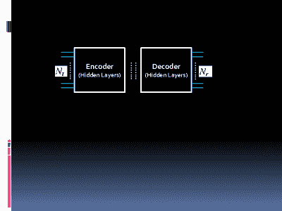

图 1：用于 MaMIMO 的深度神经网络（DNN）。

在通道估计、发射功率分配等方面，系统参数之间似乎存在大量实质性的权衡。这些问题可以通过基于深度学习（DLg）技术的工具虚拟化来方便地优化。DLg 机制的基本架构是多个隐藏层的网络。实际上，根据通用逼近定理，任何 Borel 可测函数都可以由 DLg 网络（Net）推断出来。DLg 过程可以解决复杂的非凸问题，根据这些问题，模型被视为黑箱。对于 DLg 架构，激活函数优化 Net 的多个层，从而产生有利且准确的映射。DLg 框架在 MaMIMO 中的逻辑也主要源于以下事实：mmWave MaMIMO 收发器的波束空间通道矩阵可以被视为 2D 图像。

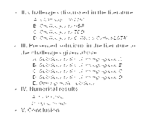

图 2：本文结构。

### I-A 动机与贡献

仍需要更多可接受的版本来处理导频数据权衡、反馈开销、创新性、最优化、算法和架构。这些开放趋势促使我们在 MaMIMO 中基于 DLg 的通道建模/预测相关内容中呈现这项调查。在这项前沿调查中，我们回顾了文献中所做的工作。所有已考虑或未考虑的挑战都进行了充分讨论。更具体地说：

+   •

    我们实际展示了目前包含的主要方法和解决方案的快照。这项调查是唯一在 MaMIMO 中基于 DLg 的通道建模/预测背景下呈现的调查——这是迄今为止尚未进行的工作。

+   •

    我们提供了与主题相关的技术细节，并将其分类为 4 个完全不同的组。

+   •

    因此，我们在以下短语的背景下提出了 7 个开放趋势：（i）MaMIMO 检测中缺乏 Q 学习——我们考虑了可能的解决方案来解决导频数据权衡中的鞍点问题，基于 Stackelberg 博弈的场景；（ii）频率同步和基于 DLg 的 MaMIMO 检测；（iii）基于 DLg 的 MaMIMO 检测中的导频污染和不完美 CSI；（iv）基于 DLg 的 MaMIMO 检测中关于“复杂性与准确性”原则的更可接受的算法和架构；（v）基于 DLg 的 MaMIMO 检测中缺乏信息理论工作；（vi）基于 DLg 的检测中的 ADC 损伤；（vii）与 DLg 基收发器中的上行和下行物理互易性相关的挑战。

+   •

    提供了足够的讨论，以实现有用的比较。

### I-B 组织与初步工作

#### I-B1 组织

本文的其余部分组织如下。第二节深入评估了文献中关于 MaMIMO 及 DLg 基于信道建模/估计的挑战。随后，第三节讨论了最近提出的解决方案。第四节提供了评估和更多讨论，最后一节列出了结论。本文的趋势在图 2 中给出。

#### I-B2 初步介绍

文中使用的缩略语列在表 I 中。

表 I: 缩略语。

| 术语 | 缩略语 |
| --- | --- |
| 基站 | BS |
| 毫米波 | mmWave |
| 下行链路 | DL |
| 上行链路 | UL |
| 深度学习 | DLg |
| 带宽 | BW |
| 深度神经网络 | DNN |
| 第五代 | 5G |
| 时分双工 | TDD |
| 频分双工 | FDD |
| 正交频分复用 | OFDM |
| 大规模多输入多输出 | MaMIMO |
| 卷积神经网络 | CNN |
| 卷积 | Conv |
| 网络 | Net |
| CSI 网络 | CsiNet |
| 长短期记忆 | LSTM |
| 信道状态信息 | CSI |
| 混合波束成形 | HBF |
| 压缩感知 | CS |
| 用户设备 | UE |
| 最小均方误差 | MMSE |
| 均方误差 | MSE |
| 射频 | RF |
| 到达方向 | DoA |
| 维度 | D |
| 同相与正交 | IQ |
| 超密集网络 | UDN |
| 最大似然 | ML |
| 非视距 | NLoS |
| 视距 | LoS |
| 信噪比 | SINR |
| 信噪比 | SNR |
| 模拟到数字转换器 | ADC |
| 概率质量函数 | PMF |
| 监督学习 | SLg |
| 无监督学习 | ULg |
| 强化学习 | RLg |
| 演变节点-B | eNB |

## II 文献中讨论的挑战

在这一部分，我们概述了文献中讨论的 MaMIMO 系统中 DLg 相关的挑战，之前我们简要回顾了 DLg。

图 1 中展示了一个简单的深度神经网络（DNN）用于 MaMIMO 收发器。DLg 背后的信息论哲学也源于以下规则[3]：压缩率的最小上界必须找到，使得重建数据（$\hat{\mathcal{X}}$）在信息量上相对于原始数据（$\mathcal{X}$，以及真实输出$\mathcal{Y}$）最为丰富。这与信息率失真问题相对应。

|  | $\mathop{{\rm min}}\limits_{PMFs}{\rm\;}\left\{\mathcal{I}(\mathcal{X};\hat{\mathcal{X}})\right\},$ |  |
| --- | --- | --- |

受限于

|  | $dist(\mathcal{X},\hat{\mathcal{X}})=\mathcal{I}(\mathcal{X};\mathcal{Y})-\mathcal{I}(\mathcal{Y};\hat{\mathcal{X}})\leq\gamma_{1},$ |  |
| --- | --- | --- |

应该满足阈值 $\gamma_{1}$，其中 $\mathcal{I}(\cdot;\cdot)$ 和 $dist(\cdot,\cdot)$ 分别是互信息和距离。这最终等同于

|  | $\mathop{{\rm max}}\limits_{PMFs}{\rm\;}\mathcal{I}(\mathcal{Y};\hat{\mathcal{X}})-\gamma_{2}\mathcal{I}(\mathcal{X};\hat{\mathcal{X}}),$ |  |
| --- | --- | --- |

相对于拉格朗日乘子 $\gamma_{2}$ 和概率质量函数（PMFs）的所需最优值。换句话说，信息瓶颈原理[3] 主要解释了：如何找到最少的隐藏层数量，使得我们的重建数据在信息量上相对于原始数据是最具信息性的。

DLg 主要分为两个基本类别：

+   •

    监督学习（SLg）：在这种情况下，特征被标记，准确度高且复杂度高。

+   •

    无监督学习（ULg）：在这种情况下，特征被聚类，准确度较低，复杂度也较低，相比于监督学习（SLg）。

除了上述两种分类，还有半监督学习，广泛称为混合学习。在这种方法中，一些特征被标记，同时对其余特征进行聚类。最后，还有一种叫做强化学习（RLg）的学习方法，其中策略学习通常扮演着重要角色。

### II-A 频分双工（FDD）的挑战

在 FDD 中，由于前向链路和反向链路通常具有高度不相关的信道，因此信道互易性无法满足[4]。然而，在 FDD 中，阴影效应的相关性在上行链路和下行链路之间也存在[5]。在 MaMIMO 系统中，上行链路和下行链路信道之间似乎也存在小的多路径相关性。然而，弱相位相关情况会降低相位恢复。在极坐标中，均匀相位量化还会导致量化误差。

似乎存在一个完全重要的标准，这有助于在减轻开销的解释中，如下所示[6]。基站（BS）和用户设备（UEs）之间的通道在角度上的分布很小。这证明了角度域的稀疏性。在 FDD MaMIMO 收发器中，基于压缩感知（CS）的 CSI 反馈机制³³3To sparsify CSI.正在出现，以便放宽通道维度[7]。这通过利用 CSI 的稀疏结构如 CSI 的时间相关性、CSI 的空间相关性和 CSI 的稀疏增强基础等得以实现。CSI 的稀疏性仅适用于少数特殊模型；这不能普遍化为一种适用于模型不匹配情况的广泛接受的方法。如[1]中讨论的，与时间相关性的模型大多数是块衰落模型。通过这种方式，CSI 的维度因子被块长度放宽。此外，慢衰落通道中的时间相关性发挥着关键作用[8]。关于与重建误差⁴⁴4Relating to the distortion/loss function.相关的某个阈值，相对方法重用之前保留的 CSI 进行后续的 CSI 重建。然而，重用的信息很难以实时更新。对于快速衰落通道，由于分辨率下降导致反馈开销减轻失败，问题将变得更加严重。

需要利用 CSI 在空间和时间域以及频率域的线性相关性。文献主要集中在通过将 CSI 转换到角度域来处理空间相关性。此外，时间相关性通过高斯-马尔可夫过程进行物理建模。一些近期的工作在[9]中提到，为基于 OFDM 的系统技术上提出了一种高效的正交空间时间频率编码方案。上述方案讨论了如何在频率域中利用 CSI 相关性，这位于稀疏的多径分量中。此外，协作天线集之间的线性相关性减少了空间域中的 CSI 开销。然而，两远程 BS 之间的距离削弱了这一假设。

此外，CS-based 技术中固有地存在五个基本瓶颈[4, 6, 7, 10, 11, 12]，在以下内容中提到。

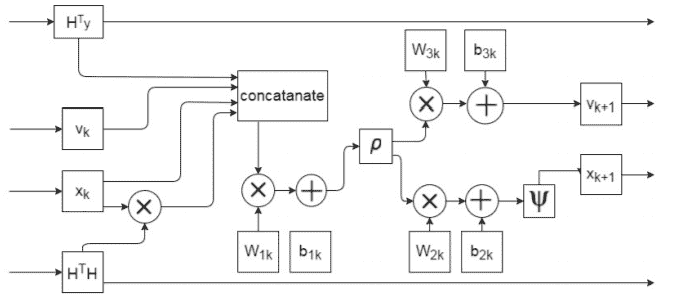

图 3：DetNet 在[15]中提出。

+   •

    首先，CSI 矩阵在任何特定领域都不是精确稀疏的。换句话说，通道被认为是稀疏的，但这一假设在某些条件下有些不合理。

+   •

    其次，计算开销无论如何都很高，因为基于 CS 的算法以迭代方式执行，这是一种耗时的（慢恢复）过程。

+   •

    第三，稀疏 mmWave 信道矩阵在邻域间的变化非常微小且高度复杂，难以建模 [6]。

+   •

    第四，随机投影在 CS 中被用来代替完全使用的信道结构 [11]。实际上，适用于 CS 的随机矩阵理论在实际中也不适用，特别是当压缩测量的维度不足时。

+   •

    第五，无论是高斯分布还是伯努利分布，通常都被考虑，但在实践中对所有信道模型都不是最优的 [12]。

在 FDD 中，向量量化或/和基于码书的方法在某些条件下可能有用 [11]。然而，关于大规模天线阵列的码书结构复杂且量化误差导致了 CSI 的广泛瓶颈 [4, 8]。

两阶段预编码方案在 FDD MaMIMO 系统中被广泛使用，旨在减轻 CSI 反馈开销。内部预编码器采用与本地 CSI 相关的零强迫均衡。外部预编码器则根据 UE DL 信道的自相关矩阵的特征空间一致性对 UE 进行聚类 [4]。

在 MaMIMO 系统中，关于导频长度 $L_{s}$，几乎不可能满足 $L_{s}\geq N_{t}$ 的条件 [13]。这主要有三个原因。首先，满足上述条件需要大量的时间来传输导频，这导致数据与导频的效率折中较低。其次，随着 $L_{s}$ 的增加，复杂度也会增加。最后，上述条件在某些情况下可能是不可实现的，因为 $L_{s}$ 不可能大于无法控制的信道相干时间标准。另一方面，由于以下原因，实际情况下 $L_{s}<N_{t}$ 的 MaMIMO 信道估计条件有时是不可能的。实际上，很难设计导频矩阵，使其行向量能够正交。然而，这种正交性是为了减少来自不同天线的导频序列之间的干扰。上述的不可能性表明 $L_{s}\nless N_{t}$。其次，如果 $L_{s}<N_{t}$，MMSE 信道估计器的最优性没有保证。这源于原始优化问题的非凸性质。

#### II-A1 基于 DLg 的 CSI 反馈面临的挑战

基于 DLg 的 CSI 反馈仍然显示出减少 UP-BW 资源占用的低效率，即使它解决了很多障碍[7]。对 UL-BW 使用的优化仍然受到高度重视，因为文献中关于 DL-based CSI 反馈在 FDD MaMIMO 系统中的主要关注点是反馈减少。在训练阶段，预标记的数据被输入到网络中，以找到最优的网络连接权重版本。为此，广泛使用梯度下降法。然而，当网络层数较高时，梯度会消失[14]；这会导致训练时间增加，甚至相关信息丢失。此外，名为 DetNet 的检测网络[15]（如图 3 ‣ II Challenges discussed in the literature ‣ A Survey on Deep-Learning based Techniques for Modeling and Estimation of MassiveMIMO Channels")⁵⁵5，其中$W$和$b$分别是权重和偏置。）的性能在天线组数量减少时会变差⁶⁶6。虽然 DetNet 具有较好的鲁棒性和灵活性，能够适应扩展的 SNR 范围和各种通道，但如果发射天线的数量接近或大于接收天线的数量，DetNet 会失败。

### II-B 混合波束成形（HBF）的挑战

对于实际的 MaMIMO 收发器，充分利用数字基带对等物，即使用与天线阵列数量相同的射频（RF）链是不现实的。换句话说，在毫米波 MaMIMO 收发器中，将每个天线分配到 RF 链几乎是不可能的。主要问题实际上是能耗以及硬件成本。为了确保系统性能与硬件成本之间的广泛接受的折中方案，考虑了 HBF 原则。这种新型波束赋形将波束赋形操作分为模拟和数字领域。HBF 利用低维数字前置器随后与高维模拟前置器。因此，分配了足够且必要数量的天线，而 RF 链数量大大减少。信号在 RF 中进行相位移位，然后在基带中进行数字前置编码。这些 HBF 分为两种类型，即完全连接的架构和子阵列连接的架构。这一问题迫使 5G 网络运营商寻找比简单的传统时分双工（TDD）/频分双工（FDD）技术（在前几代中广泛使用）更合适的解决方案。这是因为当接收器配备有限数量的 RF 链时，通道/到达方向（DOA）估计非常困难 [16], [17], [18], [19]。换句话说，在一个配备了大量未知通道参数但 RF 链数量较少的 MaMIMO 收发器中，训练阶段需要大量时间，从而导致长时间延迟。在此延迟时间内，通道可能会发生变化。此外，毫米波通道具有纯粹的基于散射的特性，导致特定的角度稀疏性，这可能需要压缩感知（CS）。在车辆通信中 [20]，设备的移动性会产生时间变化的通道。

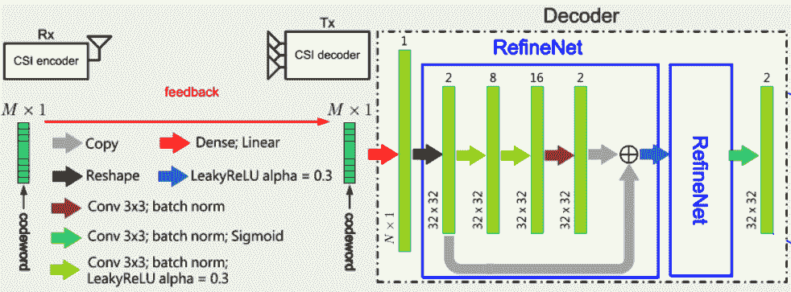

图 4：CsiNet 提出的方案见 [11]。

### II-C TDD 的挑战

在蜂窝系统中，相同的正交导频序列可能会在小区之间被高度重复使用，这会导致“导频污染”[21, 22, 23]。现有的研究在缓解这一问题方面存在不足，因为导频分配问题在小区之间的搜索空间很大，这使得该问题成为一个非凸优化问题。如[22]中讨论的那样，缓解导频污染的最佳解决方案如下，同时了解相邻小区中的导频情况。可以在每个小区分配随机导频，并在每个基站（BS）处估计小区内和小区外用户的信道。

非线性硬件，如信号放大器和模拟滤波器，极大地复杂化了校准工作[24]。实际上，基站和用户设备的模拟前端电路，在 TDD 下通常没有任何互易性。信道校准过程包括两个步骤：（i）如何预测上行（UL）和下行（DL）信道之间的校准系数；（ii）对校准进行补偿。

### II-D 对 CSI-Network (CsiNet) [11] 和 CsiNet 长短期记忆 (CsiNet-LSTM) [8] 的挑战

在 CsiNet 中，$S1$、$S2$ 和 $S3$ 分别表示特征图的长度、宽度和数量。编码器的第一层是卷积层（Conv），其输入为$\mathbf{H}$的实部和虚部。为了生成两个特征图，该层使用尺寸为$3\times 3$的卷积核。在卷积层后，特征图被重塑为向量。接着使用全连接层生成大小为$M$的代码词向量$s$。前两层充当编码器。CsiNet 将提取的特征图转换为代码词，这与压缩感知（CS）形成对比。解码器的第一层是全连接层。输入是$s$，根据输入，输出为两个大小为$N_{r}\times N_{t}$的矩阵，分别代表信道矩阵$\mathbf{H}$的实部和虚部的重构版本。

如[7]和[25]中讨论的，CsiNet [11]（如图 4）和 CsiNet-LSTM（如图 5）在时间变化的信道中不适用。这是由于 CsiNet 模块中 CSI 独立重建，忽略了时间相关性。这确实是因为线性全连接网络不适合应用时间相关性。最后，CsiNet 中没有考虑天线组之间的空间相关性。

备注 1：现有工作中似乎存在两类宽带毫米波信道预测：时域预测和频域预测。第一类同时预测所有信道 taps，而第二类则独立预测各个子载波。值得注意的是，如果应用角度稀疏性，两类方法的性能相似。然而，如果采用 CS 技术，两类方法都会出现较重的计算复杂度。

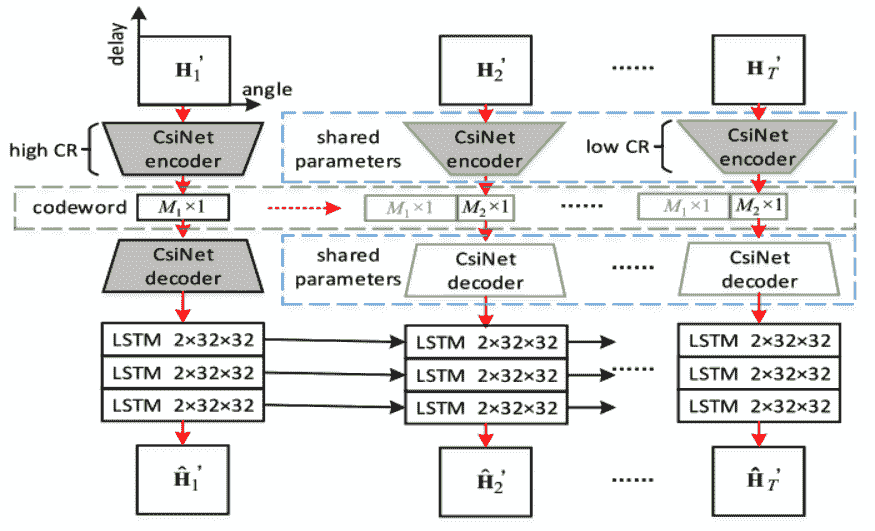

图 5：CsiNet-LSTM 参见[8]。

## III 文献中提出的上述挑战的解决方案

### III-A 挑战组 A 的解决方案

在[1]中，提出了一种应用 DLg 的远程 CSI 特征提取方案，适用于 FDD MaMIMO 系统。

在[2]中，技术上提出了一种基于 3 层 DLg 的方案（称为 OCEAN）。该方案旨在分析包含 2D CNN 网络、1D CNN 网络和 LSTM-Net 的在线 CSI 估计的归档数据。具体而言，在第一阶段，2D CNN 网络用于从 CSI 图像中构建频率特征向量。在这一层，由于 CSI 图像是高维张量，采用了一个扁平层，通过连接程序将这些张量减轻为 1 维向量。特别地，CSI 通过整合路径损耗、衍射、散射、衰落、阴影效应、频率带、位置、时间、温度、湿度和天气等影响来实现。实际上，CSI 的时空相关性（相关性）导致提出了一种基于 DL 的方案，该方案集成了 CNN 和 LSTM-Net。为了验证 OCEAN 的有效性，作者通过考虑四个典型的案例研究来测试 OCEAN 的性能。作者检查了：两个户外环境，即一个停车场和建筑物外部；以及两个室内环境，即一个工作室和一座建筑。框架的稳定性还通过一个双层离线⁹⁹9 训练阶段和一个低欠拟合误差的在线¹⁰¹⁰10 测试阶段来增强。离线训练步骤用于分析历史数据，在理论上在离线步骤中进行，随后在在线训练阶段，将估计的和记录的 CSI 进行相加。当 OCEAN 收到 CSI 估计请求时，它首先收集所有标准的实时数据¹¹¹¹11 在信息论中，相关但不完美的旁信息.. OCEAN 随后根据旁信息进行 CSI 估计。旁信息三方面包括频率带、位置和时间。首先，大气密度在不同季节中完全不同，甚至日变化。此外，温度会影响大气，这对无线信号传播的散射和衰落产生连锁反应。在天气背景下，湿度，特别是雨水，会降低通过频率带传输的无线信号的功率。

在[4]中，理论上提出了一个新命题，其中反馈集的数量甚至可以少于信道矩阵的大小（不损失最优性和灵活性）。作者的 DLg 工作有效地保证了计算复杂度高达 1000 倍的增强，确保即使对于有限的数据集也能保证高估计质量。提出了一种新颖的低秩双向 MaMIMO 信道模型，以高效实施 DLg 基础的估计框架。其主要思想基本上是：（i）如何在低秩信道的背景下有效地建模 DL 信道，路径数量较少；（ii）如何利用来自 UE 的少量标量测量高效地在基站上重建这些信道。在此方案中，UE 只需对接收到的导频信号应用随机压缩，然后将压缩后的图像发送回基站。为了在基站完全解决低秩模型，理论上提出了两种基于 DLg 的方法。除了许多现有的 DLg 基础技术训练算法/分类器之外，他们的方案中有效地学习/训练了一个复值低秩模型。因此，这个方案的逻辑是如何基本上学习/训练反馈样本与真实（复值）低秩信道的非线性逆相关/比例。

在[5]中，理论上提出了一种基于 DLg 的 CSI 反馈机制，用于有限反馈和双向互惠信道特性。基站（BS）有效地利用可用的上行（UL）CSI，从低速率用户反馈中完全重建未知的下行（DL）CSI。这在理论上被表征为放松 CSI 反馈负载，基于多路径互惠性。CSI 数据集的实部/虚部绝对值以及相对幅度的双向相关性是两个完全核心的关键。UL CSI 和 DL 反馈都是 DLg 网络解码最有信息量和高效的反馈码字的输入。这项工作的创新在于有效利用了双向信道相关性，确保了在具有有限 UL 反馈的 FDD 系统中 DL CSI 预测的基本性能增强。为了完美地放松反馈带宽，作者的工作中有效地限制了 CSI 量化误差。这通过幅度依赖的相位量化完美实现，其中幅度较小的 CSI 系数对应于较少的相位量化。进化节点 B（eNB）随后使用重建的幅度高效恢复量化的相位。在此方案中，码字长度可能基本上会因幅度而异，因此，平均码字长度主要取决于 CSI 幅度的分布。

在[6]中，考虑了一种高效且确定性的 UL 到 DL 映射函数，而位置到通道的映射在理论上是双射的。根据普遍逼近定理，估计了该函数。离线训练后，SCNet 应高效地估计与 UL CSI 相关的 DL CSI，而无需 DL 训练或 UL 反馈。作者的模型本质上将图像分成多个子图像，旨在放松离线训练和在线测试的延迟。

为了进一步减少 UL 带宽占用，[7]中有效地整合了 DLg 和用于 CSI 反馈的叠加编码。DL CSI 最初被展开，然后叠加在 UL 用户数据点上向 BS。为此，BS 处技术上提出了一种多任务 DLg 架构，采用基于 MMSE 的干扰缓解，主要目的是高效恢复 DL-CSI 和 UL-US。

在[8]中，作者找到了一种使用 LSTM 的 CsiNet 高效扩展，以在压缩比和恢复质量权衡方面取得改进。该框架有效地减轻了 FDD 方案中的参数开销。

在[9]中，完全探讨了给定本地 CSI 的远程 CSI 推断的 Cramer-Rao 下界。可实现的 CRLB 证明了 CSI 推断与一些完全重要的系统参数（如天线阵列大小）之间的相关性。关于低推断误差，验证了作者基于 DNN 的 CSI 推断的效率。

在[10]中，技术上提出了一种由 Conv-LSTM-Net 驱动的 DLg 方法，用于直接预测 UL-CSI 中的 DL-CSI。这完全是为了有效解决 FDD-MaMIMO 的复杂性和反馈开销。在所提的双级框架中，第一阶段的特征提取模块学习 DL-CSI 与 UL-CSI 之间的空间相关性和时间相关性。随后，在第二阶段，预测模块将提取的特征映射到 DL-CSI 的重建中。作者的仿真显示，特别是在时间域上具有可接受的效率。

在[11]中，技术上提出了一种开发的 CSI 感知（或编码器）和恢复（或解码器）网络，称为 CsiNet。在编码器中，CsiNet 不是应用随机投影机制，而是在离线训练阶段，从原始通道系数到 UE 处的压缩代码字进行有效训练。CsiNet 还在 BS 处以非迭代方式训练从代码字到原始通道的逆变换。

在[12]中，也提出了一种新颖的基于 Dlg 的方法，以高效估计面向 FDD 的 MaMIMO 系统的压缩 DL CSI 反馈。实际上，DLg 从根本上用于进一步改进 CS 方法。

[13] 考虑了一个情况，其中导频长度基本上小于发射天线组的数量。技术上提出了一个两阶段预测机制。在第一阶段，除了通道估计器外，导频也基于 DLg 进行设计；在第二阶段，通道估计的准确性也得到迭代提高。

在 [14] 中，技术上提出了一种通过稀疏性保证的半连接量的低复杂度 DLg 网络。对于该网络，基本上需要较少的输入数据，且整体性能可接受。

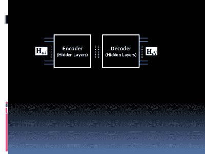

图 6: 在 [24] 中提出的 MaMIMO 的 DNN：如何从 UL 通道矩阵估计 DL 通道矩阵。

### III-B 挑战组 B 的解决方案

在 [16] 中，理论上提出了一种基于学习的去噪近似消息传递机制。该方案有效地学习了通道的整体结构，并有效地估计了通道。在仿真中，该方案使用了 MatCovNet 作为 MATLAB 中的工具箱。

在 [17] 中，本质上实现了一种驱动空间频率 CNN 的通道预测，该预测涉及空间相关性以及频率相关性。这种实现有效地将邻近子载波的损坏通道系数作为 CNN 的输入。随后，时间变化通道中的时间相关性被有效部署。作者提出的解决方案可以完美地保证接近理想 MMSE 估计器的次优吞吐量。MMSE 设计在实践中很难有效执行。作者的工作对各种传播方面也具有额外的鲁棒性。

在 [18] 中，技术上提出了一种针对 MaMIMO 系统中 BS 处均匀圆形阵列的低复杂度 DLg 定向估计程序。该方法是双层的。在第一阶段，接收信号向量最初输入到一些小型深度前馈网络中。这些输入应在离线方式下有效训练。因此，在第二层中，生成一组候选角度，从中选择最佳角度。与传统的最大似然（ML）方法相比，提出的 DOA 估计方法从复杂度角度来看完全占优。

在 [19] 中，理论上描述了一种用于混合毫米波的新型时域通道估计机制。在该方案中，既利用了广为人知的角度稀疏性，也利用了时延域稀疏性。通过利用时延域的通道稀疏性和角度稀疏性，有效地减轻了训练开销和计算复杂度。确实通过创新性地考虑双重稀疏性提出了一种新颖的时域通道估计器。

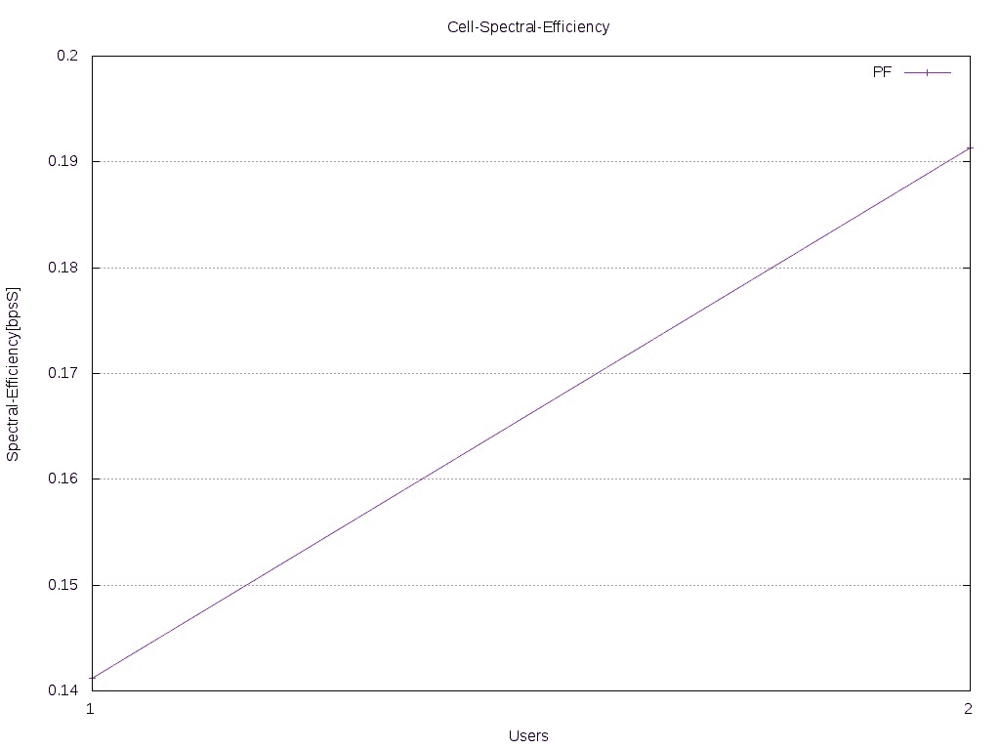

(a) 小区频谱效率（FDD）

(b) 小区频谱效率（TDD）

图 7：FDD 与 TDD。

提出了一个基于 DLg 的全新框架，该框架收集 IEEE 802.11p 传输的同相和正交（IQ）样本，并应用 CSI 特征提取算法在[20]中。这也能有效地估计 CSI 和接收信号水平。

### III-C 挑战组 C 的解决方案

在[21]中，提出了一种超分辨率 DOA 估计框架，利用 DLg 用于基于 TDD 的 MaMIMO 系统。

如何有效地从少量噪声线性构造中重建稀疏信号在[22]中基本进行了探讨。技术上部署了两种新的 DNN 架构，这些架构能够有效地处理层间估计误差。提出了一种联合 DLg 机制，该机制能够有效地学习线性变换以及非线性特性。

在[23]中，作者通过放宽导频污染，提出了一种通过一种新颖的 SLg 来增强蜂窝网络的性能，该 SLg 考虑了导频分配与用户位置模式的相关性。输入特征和输出标签分别是所有小区中的用户位置和导频分配。特别是，通过一种详尽的搜索程序有效地保证了预训练的最优导频分配。

在[24]中，通过高效创建 3D 相关信道模型，对空间相关信道的效应进行了理论上的特征化（如图 6）。主要目标是对 UL 和 DL 信道系数之间进行信道标定。随机预测的 UL 信道被有效地用于标定 DL 信道，而 DL 信道在 UL 传输阶段完全不可观察。作者设计的 DLg-based 工作即使对于具有非线性硬件收发器的 FDD MaMIMO 系统也能有效应用。

### III-D 挑战组 D 的解决方案

在[25]中，提出了一种 DLg-based CSI 压缩反馈机制，针对考虑了 MaMIMO 信道空间相关性的 FDD maMIMO 系统的多用户 MaMIMOs。这分别使用 Bi-LSTM 和 Bi-Conv-LSTM Net 来有效重建单用户和多用户样本的 CSI。在解压缩过程中，首先基本使用全连接层来增加压缩 CSI 数据的维度至压缩前的维度。

### III-E 其他通用解决方案

在[26]中，实质性探讨了超密集网络（UDNs）基站即 eNB 的流量负载局部预测问题。这是由于 UDNs 中流量流动的复杂性和动态性（例如缓冲区占用状态的非随意性）所带来的挑战。局部预测在 LSTM 输出的基础上得到了有效实现，这完美地指示了可能发生的拥塞。作者的框架具有更好的数据包丢失率和整体吞吐量。

[27]技术上提出了一种新解决方案，考虑了 MaMIMO 中的小区间干扰条件。考虑到系统容量改进与服务覆盖退化是互相牺牲的（称为容量-覆盖权衡），该方案提出了用户信号强度的组对齐，完美保证了 MaMIMO 中的用户调度。服务质量标准也是最小信号干扰加噪声比（SINR）。多个相邻用户的信号强度的方差被有效支持。为了动态地保证这一点，作者的方法是基于 DLg 的。

在[28]中，基本上采用了 DLg 技术来高效训练用户移动性（从频域角度来看，信道分散）。这项工作在对抗性 RLg 工作流的背景下提出了一种三层 DLg 方法。在第一步中，DNN 基本上被训练以有效产生现实的用户移动模式。因此，在第二阶段的第二个 DNN 被基本训练以生成相关的天线图。在最后阶段，第三个 DNN 估计生成的天线模式的效率。该方法的首要优点在于它是自我训练的，无需大规模的训练数据集。

在[29]中，DLg 技术被有效应用于减少波束成形的时间。DL 传输对于全维 MaMIMO 收发器基本上在相关 Rician 衰落信道中进行了讨论。

[30]中技术上提出了一种新颖高效的通道测量架构，以实质性地估计不同频段、天线几何形状和传播环境下的信道状态信息（CSI）。这在多载波 MaMIMO 系统中得到了完全实现。与之前的文献相比，作者在视距（LoS）情况下达到了优于$75$厘米的精度，以及在 FDD 情况下的非视距（NLoS）情况。

在[31]中，作者高效地研究了基于 OFDM 复杂信道样本的 DNN 在 MIMO 用户定位中的可用性。作者高效地提出了一种基于 DLg 的 MaMIMO-OFDM 收发器框架，与其他室内定位系统相比，该框架在 NLoS 场景下无需额外的导频开销。由于梯度下降法在训练阶段需要大量的数据集，因此提出了一种两步训练程序。在第一阶段，模拟的 LoS 数据集被高效训练，随后在第二阶段对测量的 NLoS 位置进行基本调优。这一程序有效地减少了所需记录的训练位置以及数据重建的复杂性。

为了处理反馈开销，在[32]中技术上提出了一种远程 CSI 推断方法。这一方法在源 BS 占用的信道探测和在完全不同地点推断目标 BS 的 CSI 的帮助下实现。该工作本质上是对之前研究的推广，主要集中在邻近天线阵列的 CSI 线性相关性的使用上。该方案是一个 DLg 模型，用于高效探索远程 CSI 之间的非线性依赖关系。通过计算远程 CSI 之间的互信息以及远程 CSI 推断的 Cramer-Rao 下界，完美地证明了这种跨 BS CSI 依赖的存在。

在[33]中，Keras 被高效地用于构建和处理 DNN 部分。一个基于 DLg 的 HBF 在理论上提出了一个公认的复杂度，这一复杂度基本上在训练过程中接收结构信息。

在[34]中，技术上提出了一种可训练的投影梯度检测器作为 DLg 辅助的迭代解码器。确实高效地进行了数据驱动的 MaMIMO 检测器调优的新应用。

在[35]中，基本实现了一种基于 ULg 的导频功率分配方案。一个 DLg 被高效设计为将输入的大规模衰落信道数据集映射为输出的导频功率分配向量，其中总 MSE 作为损失函数。提出的导频功率分配方案完全可应用于大量用户的情况。这主要是因为与 SLg 相比，ULg 中不需要地面真实数据。

在[36]中，基本探索了 SLg 背景下的联合数据-导频功率控制问题（旨在高效处理非凸性）。这一方案通过输入大规模衰落信道数据集高效地估计发射功率元素。损失函数同样是加权 MSE。

在[37]中，提出了将给定天线阵列和给定频带的通道系数映射到另一组天线阵列和完全不同频带的通道数据集的精彩提议。根据这种新型的通道到通道映射，作者有效地保证了 MaMIMO 系统的显著增益。特别是在 FDD MaMIMO 中，上行通道数据集可以理论上映射到下行数据集中。此外，将给定子集天线阵列的下行通道系数映射到所有其他天线阵列的下行数据集也是可行的。根据这一点，完全证明了对 DL 训练/反馈开销的显著而有效的松弛。对于无小区/分布式 MaMIMO 系统，这种新型的通道映射被解释如下。这是一种有效缓解前传信号开销的方式，甚至适用于一般化场景和问题及解决方案的极端范围。

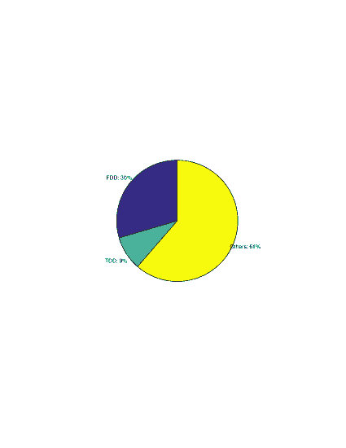

图 8: 基于 DLg 的 MaMIMO 通道建模/估计中的 FDD 与 TDD。

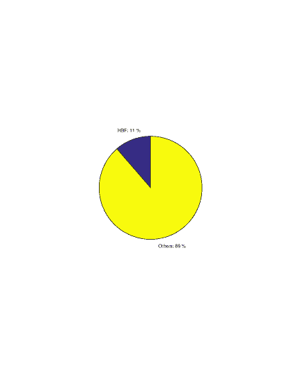

图 9: 基于 DLg 的 MaMIMO 通道建模/估计中的 HBF。

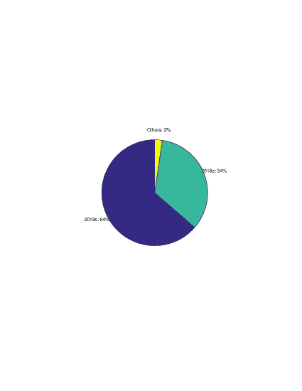

图 10: 基于 DLg 的 MaMIMO 随时间变化。

在[38]中，技术上提出了一种 DNN，初步解构接收信号，然后进行传统的最小二乘估计。该方案高维信号下的效果与 MMSE 估计器相同，相反，MMSE 对复杂通道逆转以及 CSI 的统计知识并非必需。尽管该方法已有效证明不需要任何训练，但对导频污染具有一定的鲁棒性。即使在基站的同步误差下，天线阵列数量、子载波和相干时间间隔（以 OFDM 符号计）增加，该方法依然有效。该方法在理论上可以完全去除干扰，即使期望用户和干扰的特征空间高度相关。

在[39]中，离线学习和在线学习技术被应用于高效地训练无线通道的统计数据以及角度域中的空间结构。

在[40]中，基本通过过时的导频实现了基于 DLg 的通道估计框架。有效利用了 DNN 进行通道预测，其中 HBF 被理论上描述。对于频率选择性干扰通道，信号维度基本得到保证，干扰的松弛在理论上被描述。此外，模拟 RF 波束形成器系数被输入到时域信号中。

当发射天线组的数量多于接收天线组时，[41] 实际上实现了一种新方案。该方案采用了带有可训练参数的投影梯度下降法，称为可训练投影梯度检测器。这个高效的检测器包含两个迭代步骤：梯度下降阶段和软投影阶段。

在 [42] 中，为了有效估计一组用户设备（UE）的功率分配配置，如何学习 UE 位置与最佳功率分配策略之间的映射被本质上发现。

在 [43] 中，如何在实际的 MaMIMO 中充分证明用户-小区关联在实时应用中的可行性，通过使用 DLg 框架被有效探索。理论上提出了仅依赖于移动用户位置的最佳用户-小区关联。

表 II: TDD 与 FDD 在基于 DLg 的 MaMIMO 检测中的主要关注点。

| TDD | FDD |
| --- | --- |
| 导频污染 | CS 失败 |

表 III: TDD 与 FDD 在基于 DLg 的 MaMIMO 检测中的比较。

| TDD | FDD |
| --- | --- |
| [21], [22], [23], [24] | [1, 2, 4, 5, 6, 7, 8, 9, 10, 11, 12, 13, 14] |

理论上提出了一种 DLg 方法[44]，以高效预测混合模数转换器（ADCs）的上行链路（UL）信道，同时部分天线在基站（BS）处使用低分辨率 ADC。其余天线组则配备了高分辨率 ADC。只有通过高分辨率 ADC 天线组接收到的信号被充分应用于高效估计其他天线阵列的信道，以及自身信道。提出的方法在性能上优于现有方法，特别是混合一位 ADC 的情况。文章中完全展示了这一点。在 MaMIMO 中，为了有效保证硬件成本的降低，低分辨率 ADC，例如$1$到$3$位，正逐渐出现。然而，实际应用中的低分辨率 ADC 在数据检测中会经历严重的非线性失真。混合 ADC 则是有效减少硬件复杂性的候选方法，反过来，它们的总体吞吐量，特别是混合一位 ADC 的吞吐量仍然缺乏。[44]中技术上提出了一种基于 DLg 的信道估计机制，用于混合 ADC 的 MaMIMO 上行链路。提出了一种新颖的估计映射，将高分辨率 ADC 天线组的信道映射到低分辨率 ADC 天线阵列的信道。这一方法在理论上旨在提供一种缓解低分辨率 ADC 量化信号严重失真对预测精度不利影响的放松方案。该框架也适用于高分辨率 ADC 天线组较少或信噪比（SNR）相对较低的情况。

在[45]中，技术上提出了一种新颖的基于 DLg 的配置，通过将相关的 MaMIMO 信道视为 3D 图像。

在[46]中深入讨论了如何增强毫米波频段中无小区 MaMIMO 收发器的带宽，这需要高计算复杂度。为此，技术上提出了一种准确的 CSI 预测方法。实际上，基于 CNN 的方案完全适用于大量 SNR 水平作为相对输入。

## IV 数值结果

### IV-A 评估

虽然从系统级仿真的角度来看，TDD 和 FDD 没有区别，如图 7 所示，但实际上，图 7 是由 LTE-Sim[47]提供的，其中小区的数量为 1 个，半径为 1 公里；最大时延为 0.1；用户速度为 3，作为行人；同时使用 2 个用户；进行一次模拟；对于被广泛接受的调度策略比例公平性（在图中称为 PF）。此外，还使用了 LTE-Sim 中默认的单小区干扰场景。然而，在 MaMIMO 信道检测中存在一些主要挑战，见表 II。图 8 对 MaMIMO 收发机中的 FDD 和 TDD 进行了比较。结果表明，FDD 被认为比 TDD 技术高出三倍以上。此外，图 10 还显示了 MaMIMO 信道建模/估计中的时间因素。表 III 也显示了同时考虑 TDD 和 FDD 的相关工作。

图 9 显示了基于 DLg 的 MaMIMO 信道建模/预测中的 HBF。

图 10 显示了 DLg 在 MaMIMO 系统中的时间变化。最近，特别是在 2018-2019 年间，DLg 技术在 MaMIMO 信道建模/估计中受到了更多关注。

表 IV 比较了 SLg 和 ULg 在 MaMIMO 信道检测中的表现（虽然 RLg 在[28]中进行了）。

表 IV: SLg 与 ULg 在 MaMIMO 信道检测中的比较。

| SLg | ULg |
| --- | --- |
| [23, 36] | [35] |

### IV-B 开放趋势（未来工作）

#### IV-B1 Q 学习

在仔细审查文献后，发现目前尚无关于 Q 学习的研究。一个可能的框架是基于对抗的框架¹⁴¹⁴14 见如 [48, 49] 以理解对 MaMIMO 的对抗攻击。在这种框架中，攻击者决定成为一个撒谎其信道质量指示器¹⁵¹⁵15LTE 和 3gpp 通常考虑此数字在[0-15]区间内，其最大值对于 5G 来说更高。的拜占庭节点。此类扰动旨在保证更高的调制阶数、更高的编码速率和更可接受的块误码率。为此，还重要的是注意频率同步的原则，它提供了与上述伪造相关的权衡。

如果我们决定从博弈论的角度来提供一个令人满意的数据-导频权衡解决方案会怎样？让我们定义一个针对两组代理的两阶段 Stackelberg 博弈：(i) 数据向量；(ii) 导频向量。出现了一个显著的问题，如何使玩家使用 DLg 来估计他们的奖励——其最优值是值函数。让效用函数$\mathcal{U}$为

|  | $\mathcal{U}=\mathop{{\rm arg\;max}}\limits_{\mbox{\boldmath${d}$},\mbox{\boldmath${p}$}}{\rm\;}\left\{\left\{\mathcal{R}^{(t)}_{d}(\cdots;\mbox{\boldmath${d}$})-\mathcal{R}^{(t)}_{p}(\cdots;\mbox{\boldmath${p}$})\right\},\left\{\mathcal{R}^{(t)}_{p}(\cdots;\mbox{\boldmath${p}$})-\mathcal{R}^{(t)}_{d}(\cdots;\mbox{\boldmath${d}$})\right\}\right\},$ |  |
| --- | --- | --- |

根据上述数据向量${d}$和导频向量${p}$可以找到。与此同时，对于$t$-th 步骤，$\mathcal{R}^{(t)}_{d}(\cdots;\mbox{\boldmath${d}$})$是${d}$的奖励，$\mathcal{R}^{(t)}_{p}(\cdots;\mbox{\boldmath${p}$})$是${p}$的奖励，它们是一些参数以及${d}$和${p}$的函数。让上述奖励为速率。

事实 1 [51, 52]: 设 $\mathcal{S}$、$\mathcal{A}_{z}$ 和 $\mathcal{U}_{z}$ 分别为玩家的有限集合、第 $z$-th 玩家的一组动作和第 $z$-th 玩家使用的效用函数。如果游戏 $\left\{\mathcal{S},\mathcal{A}_{z},\mathcal{U}_{z}\right\}$ 具有 Stackelberg 均衡，则: (i) $\mathcal{A}_{z},\forall z\in Z$ 是欧几里得空间上的非空紧凸子集；(ii) $\mathcal{U}_{z}$ 在 $\mathcal{A}_{z}$ 上是准凹的。此外，动作空间的向量 $\mathcal{A}=(\mathbf{\tilde{a}}_{1},\mathbf{\tilde{a}}_{2})=(\tilde{a}_{11},\tilde{a}_{12},\tilde{a}_{21},\tilde{a}_{22})$ 是 Stackelberg 均衡，当且仅当: $\mathbf{\tilde{a}}_{1}=arg\;\mathop{{max}}\limits_{\textbf{a}_{1}}\mathcal{U}_{1}(\textbf{a}_{1},\hat{\textbf{a}}_{2}(\textbf{a}_{1}))$ 成立，其中 $\hat{\textbf{a}}_{2}(\textbf{a}_{1})=arg\;\mathop{{max}}\limits_{\textbf{a}_{2}}(\textbf{a}_{1},\textbf{a}_{2}),\forall\textbf{a}_{1}$，且 $\mathbf{\tilde{a}}_{2}=\hat{\textbf{a}}_{2}(\mathbf{\tilde{a}}_{1})$。$\;\;\;\;\square$

结论 1: 我们的 Stackelberg 博弈是一个两阶段的博弈，因为似乎有两个独立定义的控制器，即上述两个奖励。这些控制器分配给两个独立的群体玩家，即 ${d}$ 和 ${p}$。$\;\;\;\;\square$

现在我们需要将奖励重新写成 $\mathcal{Q}$-函数以便映射。因此，与 ${d}$ 和 ${p}$ 相关的 $\mathcal{Q}$-函数分别为 $\mathcal{Q}_{d}(e^{(d)},a^{(d)}_{z})=w^{(d)T}_{z}\mbox{\boldmath${x}$}^{(d)}+b^{(d)}_{z},w^{(d)}_{z}(t+1)=w^{(d)}_{z}(t)+\lambda(\mathcal{R}_{d}^{(*)}-\mathcal{Q}_{d}(e^{(d)},a^{(d)}_{z}))$ 和 $\mathcal{Q}_{p}(e^{(p)},a^{(p)}_{z})=w^{(p)T}_{z}\mbox{\boldmath${x}$}^{(p)}+b^{(p)}_{z},w^{(p)}_{z}(t+1)=w^{(p)}_{z}(t)+\lambda(\mathcal{R}_{p}^{(*)}-\mathcal{Q}_{p}(e^{(p)},a^{(p)}_{z}))$，其中 $(\cdot)^{T}$ 表示转置操作，$\lambda$ 是学习率，相对于最优值函数 $\mathcal{R}_{d}^{(*)}$ 和 $\mathcal{R}_{p}^{(*)}$。为此，我们需要更新权重 $w^{(d)}_{z}$ 和 $w^{(p)}_{z}$，以及偏置 $b^{(d)}_{z}$ 和 $b^{(p)}_{z}$。同时，$e^{(\cdot)}$ 是第 $z$ 个代理观察到的部分状态，$a^{(\cdot)}_{z}$ 是与其相关的动作。最后，$a^{(\cdot)}_{z}(e^{(\cdot)})=\mathop{{\rm arg\;max}}\limits_{z}\left\{\mathcal{Q}_{\cdot}(e^{(\cdot)},a^{(\cdot)}_{z})\right\}$ 明确地对本部分讨论的开放趋势，即 Q-learning，提供了强有力的肯定回应。

图 11 显示了一个简单场景中，平均奖励（数据集的比率）与时间的关系。

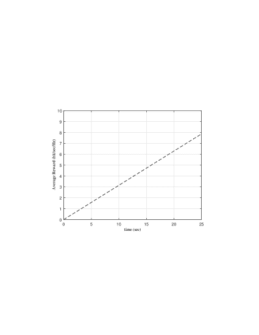

图 11: 基于 DLg 的 MaMIMO 随时间的变化。

#### IV-B2 频率同步

如 [50] 中讨论的那样，一个完全核心的问题是频率同步原理。这在进行 MaMIMO 系统的载波频率偏移估计时至关重要。因此，一个可能的工作是定义一个新的基于 DLg 的框架。

#### IV-B3 导频污染

在 [22] 中，假设对相邻小区的导频有完美的知识，问题的导频污染已完全解决。在这种情况下，人们可以物理地检验不完美的知识，例如针对对抗性攻击。

#### IV-B4 $L_{s}$ 与 $N_{t}$ 的关系

未来可能的工作之一是一些信息理论解决方案，旨在平衡两个有争议的条件 $L_{s}<N_{t}$ 和 $L_{s}\nless N_{t}$，如在[13]中讨论的。

#### IV-B5 复杂度与准确度

备注 3- 在文献中的几十个参考文献中，唯一的参考文献是准确度和复杂度同时被分析的（甚至与其他工作比较）列举如下：[6, 12, 13, 17, 18, 19, 21, 22, 23, 33, 35, 38, 41, 42, 43]。

备注 3 展示了在新的架构和算法背景下的一个可能领域，这些架构和算法既实际又准确。

#### IV-B6 1-ADC 和 ADC 失真

另一个可能的工作是考虑 ADC 损伤以及 MaMIMO 收发器的更现实和实际的瓶颈。

#### IV-B7 实践中 UL 和 DL 之间的互易性

如前面部分 ([4]) 讨论的那样，UL 和 DL 之间的互易性难以保持。相反，前面部分的大部分文献（即使是 [53, 54]）也未关注这一点，因此，如果我们关注这一点，可能会成为一个开放领域。

## V 结论

对通过 DLg 技术解决的 MaMIMO 通道建模挑战进行了全面调查。最近发表的论文主要关注 DLg 方法相较于 CS 方法的优越性。这是因为，如讨论所述，在 MaMIMO 通道建模和估计中，与 CS 技术相关的五个关键问题似乎存在。上述问题，特别是反馈开销，促使学术界和工业界的学者和研究人员转向 DLg 导向的机制。此外，与 TDD 相比，FDD 面临更多挑战性瓶颈。更有趣的是，我们提出了一个基于 Q 学习的可能博弈论解决方案——这是首次提出的。

## 参考文献

+   [1] Z. Jiang, S. Chen, A. F. Molisch, R. Vannithamby, "利用无线通道状态信息结构超越线性相关：一种深度学习方法," IEEE 通信杂志, Vol. 57, no. 3, pp. 28-34, 2019。

+   [2] C. Luo, J. Ji, Q. Wang, X. Chen, P. Li, "5G 无线通信中的通道状态信息预测：一种深度学习方法," IEEE 网络科学与工程学报, Vol. PP, no. 99, pp. 1-1, 2019。

+   [3] N. Tishby, F. C. Pereira, W. Bialek, "信息瓶颈方法," https://arxiv.org/abs/physics/0004057, 2000。

+   [4] H. Sun, Z. Zhao, X. Fu, M. Hong, "有限反馈双向大规模 MIMO 通道估计：从低秩建模到深度学习," 在 2018 年 IEEE 第 19 届信号处理与无线通信进展研讨会 (SPAWC) 会议论文集中, 2018 年 6 月 25-28 日, 卡拉马塔, 希腊。

+   [5] Z. Liu, L. Zhang, Z. Ding, "利用双向通道互惠性进行低速率大规模 MIMO CSI 反馈的深度学习," IEEE 无线通信信函, Vol. 8, no. 3, pp. 889-892, 2019。

+   [6] Y. Yang, F. Gao, G. Y. Li, M. Jian, "基于深度学习的下行链路通道预测用于 FDD 大规模 MIMO 系统," IEEE 通信信函, Vol. PP, no. 99, pp. 1-1, 2019。

+   [7] C. Qing, B. Cai, Q. Yang, J. Wang, C. Huang, "基于超编码的深度学习 CSI 反馈," IEEE Access, Vol. 7, pp. 93723-93733, 2019。

+   [8] T. Wang, C. Wen, S. Jin, G. Y. Li, "基于深度学习的 CSI 反馈方法用于时变大规模 MIMO 通道," IEEE 无线通信信函, Vol. 8, no. 2, pp. 416-419, 2019。

+   [9] Z. Jiang, Z. He, S. Chen, A. F. Molisch, S. Zhou, "推断远程通道状态信息：克拉美-瑞界限与深度学习实现," 在 IEEE 全球通信大会 (GLOBECOM) 会议论文集中, 2018 年 12 月 9-13 日, 阿布扎比, 阿联酋。

+   [10] J. Wang, Y. Ding, S. Bian, Y. Peng, M. Liu, G. Gui, "基于 UL-CSI 数据驱动的深度学习预测 FDD 系统中的 DL-CSI," IEEE Access, Vol. 7, pp. 96105-96112, 2019。

+   [11] C. Wen, W. Shih, S. Jin, "大规模 MIMO CSI 反馈的深度学习," IEEE 无线通信信函, Vol. 7, no. 5, pp. 748-751, 2018。

+   [12] P. Wu, Z. Liu, J. Cheng, "利用学习测量矩阵的压缩 CSI 反馈用于毫米波大规模 MIMO," https://arxiv.org/abs/1903.02127, 2019。

+   [13] C. Chun, J. Kang, I. Kim, "基于深度学习的大规模 MIMO 系统通道估计," IEEE 无线通信信函, Vol. 8, no. 4, pp. 1228-1231, 2019。

+   [14] G. Gao, C. Dong, K. Niu, "用于大规模 MIMO 检测的稀疏连接神经网络," 在 2018 年 IEEE 第四届计算机与通信会议 (ICCC) 会议论文集中, 2018 年 12 月 7-10 日, 中国。

+   [15] N. Samuel, T. Diskin 和 A. Wiesel, "深度 MIMO 检测," 在 2017 年 IEEE 第 18 届信号处理与无线通信研讨会 (SPAWC) 会议论文集中, 札幌, 2017。

+   [16] H. He, C. Wen, S. Jin, G. Y. Li, "基于深度学习的波束空间毫米波大规模 MIMO 系统通道估计," IEEE 无线通信信函, Vol. 7, no. 5, pp. 852-855, 2018。

+   [17] P. Dong, H. Zhang, G. Y. Li, N. NaderiAlizadeh, 和 I. S. Gaspar, "基于深度卷积神经网络的 mmWave 大规模 MIMO 系统信道估计"，在 IEEE 国际声学、语音与信号处理会议（ICASSP）论文集中，2019 年 5 月 12-17 日，英国布莱顿。

+   [18] D. Hu, Y. Zhang, L. He, J. Wu, "低复杂度基于深度学习的 DOA 估计用于具有均匀圆形阵列的混合大规模 MIMO 系统"，IEEE Wireless Commun. Letters，第 PP 卷，第 99 期，第 1-1 页，2019 年。

+   [19] S. Gao, X. Cheng, L. Yang, "使宽带信道估计在 mmWave 大规模 MIMO 中可行：一种双重稀疏方法"，在 2019 IEEE 国际通信会议（ICC）论文集中，2019 年 5 月 20-24 日，中国。

+   [20] J. Joo, M. Chul Park, D. S. Han, V. Pejovic, "基于深度学习的现实车载通信信道预测"，IEEE Access，第 7 卷，第 27846-27858 页，2019 年。

+   [21] H. Huang, G. Gui, H. Sari, F. Adachi, "用于大规模 MIMO 系统的深度学习超分辨率 DOA 估计"，在 2018 IEEE 第 88 届车载技术大会（VTC-Fall）论文集中，2018 年 8 月 27-30 日，美国伊利诺伊州。

+   [22] M. Borgerding, P. Schniter, S. Rangan, "基于 AMP 启发的稀疏线性逆问题深度网络"，IEEE Trans. Signal Proc., 第 65 卷，第 16 期，第 4293-4308 页，2017 年。

+   [23] K. Kim, J. Lee, J. Choi, "基于深度学习的导频分配方案 (DL-PAS) 用于 5G 大规模 MIMO 系统"，IEEE Commun. Letters，第 22 卷，第 4 期，第 828-831 页，2018 年。

+   [24] C. Huang, G. C. Alexandropoulos, A. Zappone, C. Yu, "用于通用大规模 MIMO 系统的 UL/DL 信道校准深度学习"，在 2019 IEEE 国际通信会议（ICC）论文集中，2019 年 5 月 20-24 日，中国。

+   [25] Y. Liao, H. Yao, Y. Hua, C. Li, "基于深度学习的 CSI 反馈用于大规模 MIMO 系统"，IEEE Access，第 7 卷，第 86810-86820 页，2019 年。

+   [26] Y. Zhou, Z. Md. Fadlullah, B. Mao, N. Kato, "基于深度学习的 5G 超密集网络无线资源分配技术"，IEEE Network，第 32 卷，第 6 期，第 28-34 页，2018 年。

+   [27] Y. Yang, Y. Li, K. Li, S. Zhao, R. Chen, J. Wang, "DECCO: 基于深度学习的大规模 MIMO 系统覆盖与容量优化"，IEEE Access，第 6 卷，第 23361-23371 页，2018 年。

+   [28] T. Maksymyuk, J. Gazda, O. Yaremko, D. Nevinskiy, "基于深度学习的大规模 MIMO 波束成形用于 5G 移动网络"，在 2018 IEEE 第 4 届智能数据采集与先进计算系统会议（IDAACS-SWS）论文集中，2018 年 9 月 20-21 日，乌克兰利沃夫。

+   [29] X. Li, X. Yu, T. Sun, J. Guo, J. Zhang, "基于联合调度和深度学习的 FD-MIMO 系统波束成形，适用于相关 Rician 衰落"，IEEE Access，第 7 卷，第 118297-118309 页，2019 年。

+   [30] M. Arnold, J. Hoydis, S. Brink, "将新型大规模 MIMO 信道探测数据应用于基于深度学习的室内定位"，在第 12 届国际 ITG 系统、通信与编码会议论文集中，2019 年 2 月 11-14 日，德国罗斯托克。

+   [31] M. Arnold, S. Dorner, S. Cammerer, S. Ten, "基于深度学习的大规模 MIMO 室内用户定位," 见：2018 IEEE 第 19 届信号处理与无线通信进展会议(SPAWC), 2018 年 6 月 25-28 日，希腊卡拉马塔。

+   [32] S. Chen, Z. Jiang, S. Zhou, Z. Niu, "基于学习的远程通道推断：可行性分析及案例研究," IEEE 无线通信汇刊, 第 18 卷，第 7 期，第 3554-3568 页, 2019 年。

+   [33] H. Huang, Y. Song, J. Yang, G. Gui, F. Adachi, "基于深度学习的毫米波大规模 MIMO 混合预编码," IEEE 车辆技术汇刊, 第 68 卷，第 3 期，第 3027-3032 页, 2019 年。

+   [34] S. Takabe, M. Imanishi, T. Wadayama, K. Hayashi, "深度学习辅助的投影梯度检测器用于大规模过载 MIMO 通道," 见：2019 IEEE I. 通信会议(ICC), 2019 年 5 月 20-24 日，中国。

+   [35] J. Xu, P. Zhu, J. Li, X. You, "基于深度学习的多用户分布式大规模 MIMO 系统的导频设计," IEEE 无线通信信函, 第 8 卷，第 4 期，第 1016-1019 页, 2019 年。

+   [36] T. V. Chien, E. Bjornson, E. G. Larsson, "大规模 MIMO 系统中的总光谱效率最大化：深度学习的益处," 见：2019 IEEE I. 通信会议(ICC), 2019 年 5 月 20-24 日，中国。

+   [37] M. Alrabeiah, A. Alkhateeb, "深度学习在 TDD 和 FDD 大规模 MIMO 中的应用：在空间和频率中映射通道," https://arxiv.org/abs/1905.03761, 2019 年。

+   [38] E. Balevi, A. Doshi, J. G. Andrews, "大规模 MIMO 通道估计与未经训练的深度神经网络," https://arxiv.org/abs/1908.00144, 2019 年。

+   [39] H. Huang, J. Yang, H. Huang, Y. Song, G. Gui, "基于深度学习的超分辨率通道估计与 DOA 估计的大规模 MIMO 系统," IEEE 车辆技术汇刊, 第 67 卷，第 9 期，第 8549-8560 页, 2018 年。

+   [40] K. Satyanarayana, M. El-Hajjar, A. A. M. Mourad, L. Hanzo, "基于学习辅助的通道预测的毫米波系统多用户全双工收发器设计," IEEE Access, 第 7 卷，第 66068-66083 页, 2019 年。

+   [41] S. Takabe, M. Imanishi, T. Wadayama, R. Hayakaw, "针对大规模过载 MIMO 通道的可训练投影梯度检测器：数据驱动的调整方法," IEEE Access, 第 7 卷，第 93326-93338 页, 2019 年。

+   [42] L. Sanguinetti, A. Zappone, M. Debbah, "大规模 MIMO 中的深度学习功率分配," 见：2018 年第 52 届 Asilomar 信号、系统与计算机会议，2018 年 10 月 28-31 日，美国加州。

+   [43] A. Zappone, L. Sanguinetti, M. Debbah, "通过深度学习进行大规模 MIMO 的用户关联和负载均衡," 见：2018 年第 52 届 Asilomar 信号、系统与计算机会议，会议日期：2018 年 10 月 28-31 日，会议地点：美国加州太平洋格罗夫。

+   [44] S. Gao, P. Dong, Z. Pan, G. Y. Li, "基于深度学习的大规模 MIMO 通道估计与混合分辨率 ADC," IEEE 通信信函, 第 PP 卷，第 99 期，第 1-1 页, 2019 年。

+   [45] J. I. Chen, K. L. Lai, "通过深度学习算法减少大规模 MIMO 系统中的相关现象," 见：2018 IEEE I. 高级制造会议(ICAM), 2018 年 11 月 16-18 日。

+   [46] Y. Jin, J. Zhang, S. Jin, B. Ai, "通过深度学习进行无小区毫米波大规模 MIMO 的信道估计," IEEE 车辆技术学报，第 PP 卷，第 99 期，第 1-1 页，2019 年。

+   [47] G. Piro, L. A. Grieco, G. Boggia, F. Capozzi, 和 P. Camarda, "LTE 蜂窝系统的模拟：一个开源框架," IEEE 车辆技术学报，第 60 卷，第 2 期，第 498-513 页，2011 年。

+   [48] M. Sadeghi, E. G. Larsson, "针对端到端自动编码器通信系统的物理对抗攻击," IEEE 通信信件，第 23 卷，第 5 期，第 847-850 页，2019 年。

+   [49] M. Sadeghi, E. G. Larsson, "深度学习基础的无线信号分类的对抗攻击," IEEE 无线通信信件，第 8 卷，第 1 期，第 213-216 页，2019 年。

+   [50] W. Zhang, F. Gao, S. Jin, H. Lin, "上行大规模 MIMO 系统的频率同步," IEEE 无线通信学报，第 17 卷，第 1 期，第 235-249 页，2018 年。

+   [51] Osborne; M. J.; Rubenstein, A. 博弈论课程。剑桥：麻省理工学院出版社，1994。

+   [52] M. Haddad; Y. Hayely; 和 O. Habachi. 能效认知无线电网络中的频谱协调。IEEE 车辆技术学报，第 64 卷，第 2112-2122 页，2015 年。

+   [53] MB. Mashhadi, Q. Yang, D. Gunduz, "基于 CNN 的 FDD MIMO-OFDM 系统中的模拟 CSI 反馈," https://arxiv.org/abs/1910.10428，2019 年。

+   [54] Q. Yang, MB. Mashhadi, D. Gunduz, "大规模 MIMO CSI 反馈的深度卷积压缩," https://arxiv.org/abs/1907.02942，2019 年。
