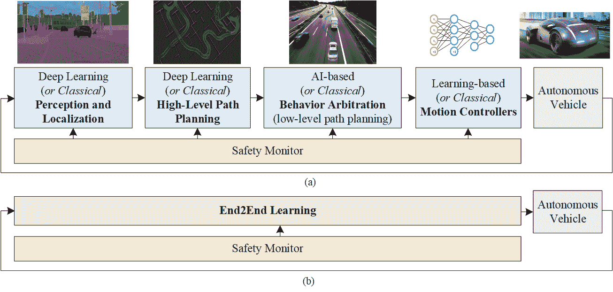
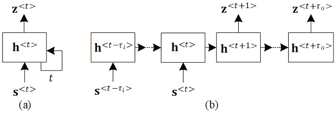
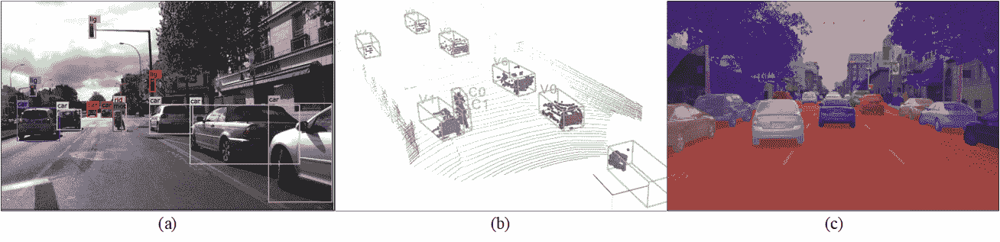
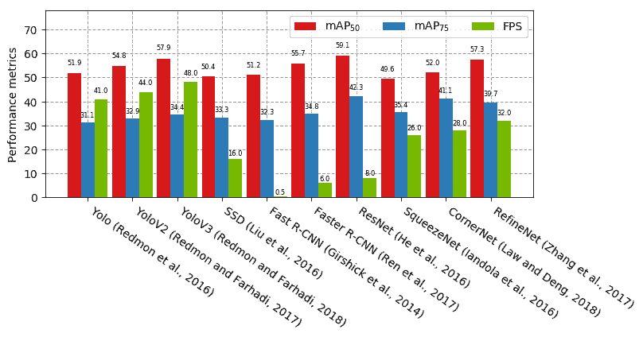
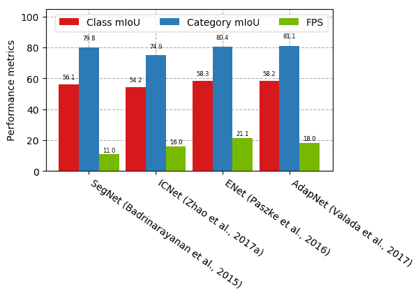
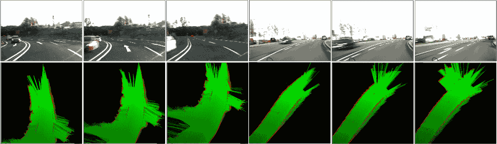
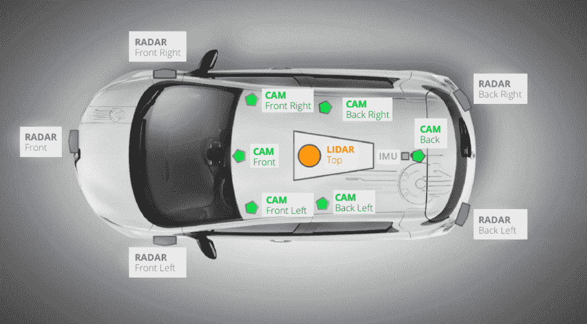

<!--yml

category: 未分类

日期：2024-09-06 20:04:23

-->

# [1910.07738] 《自动驾驶深度学习技术调查》

> 来源：[`ar5iv.labs.arxiv.org/html/1910.07738`](https://ar5iv.labs.arxiv.org/html/1910.07738)

# 《自动驾驶深度学习技术调查》

Sorin Grigorescu

人工智能，

Elektrobit Automotive.

机器人、视觉与控制实验室，

布拉索夫大学。

罗马尼亚布拉索夫

Sorin.Grigorescu@elektrobit.com

&Bogdan Trasnea

人工智能，

Elektrobit Automotive.

机器人、视觉与控制实验室，

布拉索夫大学。

罗马尼亚布拉索夫

Bogdan.Trasnea@elektrobit.com

\ANDTiberiu Cocias

人工智能，

Elektrobit Automotive.

机器人、视觉与控制实验室，

布拉索夫大学。

罗马尼亚布拉索夫

Tiberiu.Cocias@elektrobit.com

&Gigel Macesanu

人工智能，

Elektrobit Automotive.

机器人、视觉与控制实验室，

布拉索夫大学。

罗马尼亚布拉索夫

Gigel.Macesanu@elektrobit.com 作者来自 Electrobit Automotive 和布拉索夫大学自动化与信息技术系的机器人、视觉与控制实验室（ROVIS Lab），邮寄地址：请见 [`rovislab.com/sorin_grigorescu.html`](http://rovislab.com/sorin_grigorescu.html)。

###### 摘要

过去十年，自驾车技术取得了越来越快速的进展，这主要得益于深度学习和人工智能领域的突破。本文的目的是调查在自动驾驶中使用的深度学习技术的最新进展。我们首先介绍了基于 AI 的自驾车架构、卷积和递归神经网络，以及深度强化学习范式。这些方法为调查的驾驶场景感知、路径规划、行为裁决和运动控制算法奠定了基础。我们探讨了模块化的感知-规划-行动流程，其中每个模块都使用深度学习方法构建，以及端到端系统，它直接将感官信息映射到转向命令。此外，我们还讨论了设计 AI 架构用于自动驾驶中遇到的当前挑战，如安全性、训练数据来源和计算硬件。本调查中的比较有助于深入了解深度学习和 AI 方法在自动驾驶中的优缺点，并辅助设计选择。¹¹1 本文参考的文章可通过本论文附带的网页访问，网址为 [`rovislab.com/survey_DL_AD.html`](http://rovislab.com/survey_DL_AD.html)

###### 内容

1.  1 介绍

1.  2 基于深度学习的自驾车决策架构

1.  3 深度学习技术概述

    1.  3.1 深度卷积神经网络

    1.  3.2 循环神经网络

    1.  3.3 深度强化学习

1.  4 深度学习用于驾驶场景感知和定位

    1.  4.1 传感硬件：相机与 LiDAR 辩论

    1.  4.2 驾驶场景理解

        1.  4.2.1 类似于边界框的物体检测器

        1.  4.2.2 语义和实例分割

        1.  4.2.3 定位

    1.  4.3 使用占用图的感知

1.  5 深度学习用于路径规划和行为仲裁

1.  6 基于 AI 的自动驾驶汽车运动控制器

    1.  6.1 学习控制器

    1.  6.2 端到端学习控制

1.  7 深度学习在自主驾驶中的安全性

1.  8 用于训练自主驾驶系统的数据来源

1.  9 计算硬件与部署

1.  10 讨论与结论

    1.  10.1 最终说明

## 1 引言

在过去十年中，深度学习和人工智能（AI）成为计算机视觉[1]、机器人技术[2]和自然语言处理（NLP）[3]许多突破的主要技术。它们也对今天学术界和工业界的自动驾驶革命产生了重大影响。自动驾驶汽车（AVs）和自驾车开始从实验室开发和测试条件迁移到公共道路驾驶。它们在我们环境中的部署减少了道路事故和交通拥堵，同时改善了我们在拥挤城市中的出行。虽然“自驾”一词似乎是不言而喻的，但实际上有五个 SAE 等级用于定义自动驾驶。SAE J3016 标准[4]引入了一个从 0 到 5 的等级尺度来评估车辆自动化。较低的 SAE 等级具有基本的驾驶辅助功能，而较高的 SAE 等级则趋向于不需要任何人工交互的车辆。5 级汽车不需要人工输入，通常甚至不具备方向盘或踏板。

尽管大多数驾驶场景可以通过经典的感知、路径规划和运动控制方法相对简单地解决，但剩下的未解决场景则是传统方法失效的边界情况。

20 世纪 80 年代，恩斯特·迪克曼斯[5]开发了其中一辆首批自动驾驶汽车。这为新的研究项目铺平了道路，如 PROMETHEUS，旨在开发一辆完全功能的自动驾驶汽车。1994 年，VaMP 无人驾驶汽车成功行驶了$1,600km$，其中$95\%$是自动驾驶的。类似地，1995 年，CMU NAVLAB 在$6,000km$上展示了自动驾驶，$98\%$为自动驾驶。2004 年和 2005 年的 DARPA 大奖挑战赛以及 2007 年的 DARPA 城市挑战赛是自动驾驶的另一个重要里程碑。目标是让无人驾驶汽车在没有人工干预的情况下尽可能快地导航越野路线。2004 年，15 辆参赛车辆中没有一辆完成比赛。2005 年比赛的获胜者 Stanley 利用了机器学习技术来导航非结构化环境。这标志着自动驾驶汽车发展的一个转折点，承认机器学习和人工智能作为自动驾驶的核心组成部分。这个转折点在这篇调查论文中也很突出，因为大多数调查工作都在 2005 年之后。

在本次调查中，我们回顾了在自动驾驶中使用的不同人工智能和深度学习技术，并提供了关于应用于自动驾驶汽车的最先进的深度学习和 AI 方法的综述。我们还专门分配了完整的章节来处理安全方面的问题、训练数据源的挑战以及所需的计算硬件。

## 2 基于深度学习的自动驾驶汽车决策架构

自动驾驶汽车是自主决策系统，处理来自不同车载源的观察数据流，如摄像头、雷达、LiDAR、超声波传感器、GPS 单元和/或惯性传感器。这些观察数据被汽车的计算机用来做出驾驶决策。基于 AI 的自动驾驶汽车的基本框图如图 1 所示。驾驶决策要么在模块化的感知-规划-行动流水线中计算（图 1(a)），要么以 End2End 学习的方式计算（图 1(b)），其中传感器信息直接映射到控制输出。模块化流水线的组件可以基于 AI 和深度学习方法设计，也可以使用经典的非学习方法。各种学习和非学习组件的组合是可能的（例如，基于深度学习的物体检测器向经典的 A-star 路径规划算法提供输入）。安全监控器的设计旨在确保每个模块的安全。

图 1：基于深度学习的自动驾驶汽车。该架构可以实现为顺序感知-规划-行动流水线 (a)，或 End2End 系统 (b)。在顺序流水线的情况下，组件可以使用 AI 和深度学习方法设计，也可以基于经典的非学习方法。End2End 学习系统主要基于深度学习方法。通常设计一个安全监控器以确保每个模块的安全。

图 1(a) 中的模块化流水线被分解为四个组件，这些组件可以使用深度学习和 AI 方法设计，也可以使用经典方法。这些组件包括：

+   •

    感知与定位，

+   •

    高级路径规划，

+   •

    行为仲裁，或低级路径规划，

+   •

    动作控制器。

基于这四个高层次组件，我们将相关的深度学习论文进行了汇总，这些论文描述了为自动驾驶系统开发的方法。除了审查的算法外，我们还汇总了涉及设计深度学习模块用于自动驾驶汽车时遇到的安全性、数据源和硬件方面的相关文章。

给定通过道路网络规划的路线，自动驾驶汽车的第一个任务是理解并定位自身在周围环境中的位置。基于这一表示，会规划出一条连续路径，并由行为仲裁系统确定汽车的未来动作。最后，运动控制系统会对规划运动执行过程中产生的错误进行反应性修正。有关这四个组件的经典非 AI 设计方法的综述可以在 [6]中找到。

接下来，我们将介绍用于自动驾驶的深度学习和人工智能技术，并调查用于设计上述分层决策过程的不同方法。此外，我们还提供了用于将分层过程编码到单一深度学习架构中的 End2End 学习系统的概述，该架构直接将传感器观测映射到控制输出。

## 深度学习技术概述

在本节中，我们描述了用于自动驾驶车辆的深度学习技术的基础，并评论了每种范式的能力。我们重点介绍卷积神经网络（CNN）、递归神经网络（RNN）和深度强化学习（DRL），这些是应用于自动驾驶的最常见的深度学习方法。

在整个调查中，我们使用以下符号来描述时间依赖的序列。变量的值定义为单个离散时间步$t$，写作上标$<t>$，或定义在$<t,t+k>$时间区间内的离散序列，其中$k$表示序列的长度。例如，状态变量$\mathbf{z}$的值可以在离散时间$t$定义为$\mathbf{z}^{<t>}$，或在序列区间内定义为$\mathbf{z}^{<t,t+k>}$. 向量和矩阵用粗体符号表示。

### 3.1 深度卷积神经网络

卷积神经网络（CNN）主要用于处理空间信息，如图像，可以视为图像特征提取器和通用非线性函数逼近器 [7]、[8]。在深度学习兴起之前，计算机视觉系统通常基于手工设计的特征实现，如 HAAR [9]、局部二值模式（LBP） [10]或方向梯度直方图（HoG） [11]。与这些传统的手工设计特征相比，卷积神经网络能够自动学习训练集中的特征空间表示。

CNN 可以粗略地理解为哺乳动物视觉皮层不同部分的非常近似类比 [12]。在视网膜上形成的图像通过丘脑传送到视觉皮层。每个脑半球都有自己的视觉皮层。视觉信息以交叉的方式被视觉皮层接收：左视觉皮层接收来自右眼的信息，而右视觉皮层接收来自左眼的视觉数据。信息的处理遵循双流理论 [13]，该理论指出视觉流遵循两个主要流动：腹侧流负责视觉识别和对象识别，背侧流用于建立对象之间的空间关系。CNN 模仿腹侧流的功能，其中大脑的不同区域对视觉场中的特定特征敏感。视觉皮层中较早的脑细胞通过视觉场中的尖锐过渡被激活，就像边缘检测器突出显示图像中相邻像素之间的尖锐过渡一样。这些边缘在大脑中进一步用于近似对象部分，并最终估计对象的抽象表示。

CNN 通过其权重向量 $\theta=[\mathbf{W},\mathbf{b}]$ 参数化，其中 $\mathbf{W}$ 是控制神经元连接的权重集合，$\mathbf{b}$ 是神经元偏置值集合。权重集合 $\mathbf{W}$ 组织为图像滤波器，系数在训练期间学习得到。CNN 中的卷积层利用图像像素的局部空间相关性来学习平移不变的卷积滤波器，这些滤波器捕捉到图像的判别特征。

考虑第 $k$ 层中的多通道信号表示 $\mathbf{M}_{k}$，这是信号表示 $\mathbf{M}_{k,c}$ 的通道级整合，其中 $c\in\mathbb{N}$。信号表示可以在第 $k+1$ 层生成，如下所示：

|  | $\mathbf{M}_{k+1,l}=\varphi(\mathbf{M}_{k}*\mathbf{w}_{k,l}+\mathbf{b}_{k,l}),$ |  | (1) |
| --- | --- | --- | --- |

其中 $\mathbf{w}_{k,l}\in\mathbf{W}$ 是一个具有与 $\mathbf{M}_{k}$ 相同通道数的卷积滤波器，$\mathbf{b}_{k,l}\in\mathbf{b}$ 表示偏置，$l$ 是通道索引，$*$ 表示卷积操作。$\varphi(\cdot)$ 是应用于输入信号每个像素的激活函数。通常，Rectified Linear Unit (ReLU) 是计算机视觉应用中最常用的激活函数 [1]。CNN 的最终层通常是全连接层，它作为对象判别器，对对象的高层抽象表示进行分类。

在监督学习中，CNN 的响应 $R(\cdot;\theta)$ 可以使用训练数据库 $\mathcal{D}=[(\mathbf{x}_{1},y_{1}),...,(\mathbf{x}_{m},y_{m})]$ 进行训练，其中 $\mathbf{x}_{i}$ 是数据样本，$y_{i}$ 是对应的标签，$m$ 是训练示例的数量。可以使用最大似然估计（MLE）来计算最优网络参数。为了说明的清晰，我们以简单的最小二乘误差函数作为例子，该函数可以用于在训练回归估计器时推动 MLE 过程：

|  | $\mathbf{\hat{\theta}}=\arg\max_{\theta}\mathcal{L}(\theta;\mathcal{D})=\arg\min_{\theta}\sum^{m}_{i=1}(R(\mathbf{x}_{i};\theta)-y_{i})^{2}.$ |  | (2) |
| --- | --- | --- | --- |

对于分类目的，最小二乘误差通常被交叉熵或负对数似然损失函数所替代。公式 2 中的优化问题通常使用随机梯度下降（SGD）和反向传播算法进行梯度估计 [14]。在实践中，使用了不同的 SGD 变体，例如 Adam [15] 或 AdaGrad [16]。

### 3.2 递归神经网络

在深度学习技术中，递归神经网络（RNN）特别擅长处理时间序列数据，如文本或视频流。与传统神经网络不同，RNN 在其记忆单元中包含一个时间依赖的反馈循环。给定一个时间依赖的输入序列 $[\mathbf{s}^{<t-\tau_{i}>},...,\mathbf{s}^{<t>}]$ 和一个输出序列 $[\mathbf{z}^{<t+1>},...,\mathbf{z}^{<t+\tau_{o}>}]$，RNN 可以“展开” $\tau_{i}+\tau_{o}$ 次以生成一个匹配输入长度的无环网络结构，如图 2 所示。$t$ 代表时间索引，而 $\tau_{i}$ 和 $\tau_{o}$ 分别是输入和输出序列的长度。这样的神经网络也被称为序列到序列模型。展开的网络有 $\tau_{i}+\tau_{o}+1$ 个相同的层，即每一层共享相同的学习权重。一旦展开，RNN 可以使用时间反向传播算法进行训练。与传统神经网络相比，唯一的不同是每个展开副本中的学习权重会被平均，从而使网络能够在时间上共享相同的权重。

图 2：折叠的（a）和展开的（b）随时间变化的多对多递归神经网络。随着时间$t$的推移，输入$\mathbf{s}^{<t-\tau_{i},t>}$和输出$\mathbf{z}^{<t+1,t+\tau_{o}>$序列共享相同的权重$\mathbf{h}^{<\cdot>} $。该架构也称为序列到序列模型。

使用基本 RNN 的主要挑战是训练过程中遇到的梯度消失问题。梯度信号可能被乘以大量的次数，最多达到时间步的数量。因此，传统 RNN 不适合捕捉序列数据中的长期依赖性。如果网络非常深，或者处理长序列，网络输出的梯度将难以传播回去影响早期层的权重。在梯度消失的情况下，网络的权重将无法有效更新，最终得到非常小的权重值。

长短期记忆（LSTM）[17]网络是非线性函数逼近器，用于估计序列数据中的时间依赖性。与传统的递归神经网络不同，LSTM 通过引入三个门来解决梯度消失问题，这三个门分别控制输入、输出和记忆状态。

循环层利用序列数据的时间相关性来学习时间依赖的神经结构。考虑在时间步$t-1$采样的 LSTM 网络中的记忆状态$\mathbf{c}^{<t-1>}$和输出状态$\mathbf{h}^{<t-1>}$，以及时间$t$的输入数据$\mathbf{s}^{<t>} $。门的开启或关闭由当前输入信号$\mathbf{s}^{<t>} $和上一个时间点的输出信号$\mathbf{h}^{<t-1>}$的 sigmoid 函数$\sigma(\cdot)$控制，如下所示：

|  | $\Gamma_{u}^{<t>}=\sigma(\mathbf{W}_{u}\mathbf{s}^{<t>}+\mathbf{U}_{u}\mathbf{h}^{<t-1>}+\mathbf{b}_{u}),$ |  | (3) |
| --- | --- | --- | --- |
|  | $\Gamma_{f}^{<t>}=\sigma(\mathbf{W}_{f}\mathbf{s}^{<t>}+\mathbf{U}_{f}\mathbf{h}^{<t-1>}+\mathbf{b}_{f}),$ |  | (4) |
|  | $\Gamma_{o}^{<t>}=\sigma(\mathbf{W}_{o}\mathbf{s}^{<t>}+\mathbf{U}_{o}\mathbf{h}^{<t-1>}+\mathbf{b}_{o}),$ |  | (5) |

其中$\Gamma_{u}^{<t>} $、$\Gamma_{f}^{<t>} $和$\Gamma_{o}^{<t>} $分别是输入门、遗忘门和输出门的门函数。给定当前观察，记忆状态$\mathbf{c}^{<t>} $将更新为：

|  | $\mathbf{c}^{<t>}=\Gamma_{u}^{<t>}*\tanh(\mathbf{W}_{c}\mathbf{s}^{<t>}+\mathbf{U}_{c}\mathbf{h}^{<t-1>}+\mathbf{b}_{c})+\Gamma_{f}*\mathbf{c}^{<t-1>},$ |  | (6) |
| --- | --- | --- | --- |

新的网络输出$\mathbf{h}^{<t>} $的计算公式为：

|  | $\mathbf{h}^{<t>}=\Gamma_{o}^{<t>}*\tanh(\mathbf{c}^{<t>}).$ |  | (7) |
| --- | --- | --- | --- |

一个 LSTM 网络$Q$由$\theta=[\mathbf{W}_{i},\mathbf{U}_{i},\mathbf{b}_{i}]$参数化，其中$\mathbf{W}_{i}$表示网络门和记忆单元的权重与输入状态的乘积，$\mathbf{U}_{i}$是控制激活的权重，$\mathbf{b}_{i}$表示神经元偏置值的集合。$*$表示逐元素乘法。

在监督学习设置中，给定一组训练序列$\mathcal{D}=[(\mathbf{s}^{<t-\tau_{i},t>}_{1},\mathbf{z}^{<t+1,t+\tau_{o}>}_{1}),...,(\mathbf{s}^{<t-\tau_{i},t>}_{q},\mathbf{z}^{<t+1,t+\tau_{o}>}_{q})]$，即$q$个独立的观测序列对及其分配$\mathbf{z}^{<t,t+\tau_{o}>}$，可以使用最大似然估计法训练 LSTM 网络$Q(\cdot;\theta)$的响应。

|  | <math   alttext="\begin{split}\hat{\theta}&amp;=\arg\max_{\theta}\mathcal{L}(\theta;\mathcal{D})\\ &amp;=\arg\min_{\theta}\sum_{i=1}^{m}l_{i}(Q(\mathbf{s}^{<t-\tau_{i},t>}_{i};\theta),\mathbf{z}^{<t+1,t+\tau_{o}>}_{i}),\\

&amp;=\arg\min_{\theta}\sum_{i=1}^{m}\sum_{t=1}^{\tau_{o}}l_{i}^{<t>}(Q^{<t>}(\mathbf{s}^{<t-\tau_{i},t>}_{i};\theta),\mathbf{z}^{<t>}_{i}),\end{split}" display="block"><semantics ><mtable columnspacing="0pt" displaystyle="true" rowspacing="0pt" ><mtr ><mtd columnalign="right" ><mover accent="true" ><mi >θ</mi><mo >^</mo></mover></mtd><mtd columnalign="left" ><mrow ><mo >=</mo><mrow ><mrow ><mi >arg</mi><mo lspace="0.167em" >⁡</mo><mrow ><munder ><mi >max</mi><mi >θ</mi></munder><mo lspace="0.167em" >⁡</mo><mi >ℒ</mi></mrow></mrow><mo lspace="0em" rspace="0em" >​</mo><mrow ><mo stretchy="false" >(</mo><mi >θ</mi><mo >;</mo><mi >𝒟</mi><mo stretchy="false" >)</mo></mrow></mrow></mrow></mtd></mtr><mtr ><mtd  columnalign="left" ><mrow ><mrow ><mo >=</mo><mrow ><mrow ><mi >arg</mi><mo lspace="0.167em" >⁡</mo><munder ><mi >min</mi><mi >θ</mi></munder></mrow><mo lspace="0em" rspace="0em" >​</mo><mrow ><munderover ><mo movablelimits="false" >∑</mo><mrow ><mi >i</mi><mo >=</mo><mn >1</mn></mrow><mi >m</mi></munderover><mrow ><msub ><mi >l</mi><mi >i</mi></msub><mo lspace="0em" rspace="0em" >​</mo><mrow ><mo stretchy="false" >(</mo><mrow ><mi >Q</mi><mo lspace="0em" rspace="0em" >​</mo><mrow ><mo stretchy="false" >(</mo><msubsup ><mi >𝐬</mi><mi >i</mi><mrow ><mrow ><mo ><</mo><mrow ><mi >t</mi><mo >−</mo><msub ><mi >τ</mi><mi >i</mi></msub></mrow></mrow><mo >,</mo><mrow ><mi >t</mi><mo >></mo></mrow></mrow></msubsup><mo >;</mo><mi >θ</mi><mo stretchy="false" >)</mo></mrow></mrow><mo >,</mo><msubsup ><mi >𝐳</mi><mi >i</mi><mrow ><mrow ><mo ><</mo><mrow ><mi >t</mi><mo >+</mo><mn >1</mn></mrow></mrow><mo >,</mo><mrow ><mrow ><mi >t</mi><mo >+</mo><msub ><mi >τ</mi><mi >o</mi></msub></mrow><mo >></mo></mrow></mrow></msubsup><mo stretchy="false" >)</mo></mrow></mrow></mrow></mrow></mrow><mo >,</mo></mrow></mtd></mtr><mtr ><mtd  columnalign="left" ><mrow ><mrow ><mo >=</mo><mrow ><mrow ><mi >arg</mi><mo lspace="0.167em" >⁡</mo><munder ><mi >min</mi><mi >θ</mi></munder></mrow><mo lspace="0em" rspace="0em" >​</mo><mrow ><munderover ><mo movablelimits="false" rspace="0em" >∑</mo><mrow ><mi >i</mi><mo >=</mo><mn >1</mn></mrow><mi >m</mi></munderover><mrow ><munderover ><mo movablelimits="false" >∑</mo><mrow ><mi >t</mi><mo >=</mo><mn >1</mn></mrow><msub ><mi >τ</mi><mi >o</mi></msub></munderover><mrow ><msubsup ><mi >l</mi><mi >i</mi><mrow ><mo fence="true" rspace="0em" ><</mo><mi >t</mi><mo fence="true" lspace="0em" >></mo></mrow></msubsup><mo lspace="0em" rspace="0em" >​</mo><mrow ><mo stretchy="false" >(</mo><mrow ><msup ><mi >Q</mi><mrow ><mo fence="true" rspace="0em" ><</mo><mi >t</mi><mo fence="true" lspace="0em" >></mo></mrow></msup><mo lspace="0em" rspace="0em" >​</mo><mrow ><mo stretchy="false" >(</mo><msubsup ><mi >𝐬</mi><mi >i</mi><mrow ><mrow ><mo ><</mo><mrow ><mi >t</mi><mo >−</mo><msub ><mi >τ</mi><mi >i</mi></msub></mrow></mrow><mo >,</mo><mrow ><mi >t</mi><mo >></mo></mrow></mrow></msubsup><mo >;</mo><mi >θ</mi><mo stretchy="false" >)</mo></mrow></mrow><mo >,</mo><msubsup ><mi >𝐳</mi><mi >i</mi><mrow ><mo fence="true" rspace="0em" ><</mo><mi >t</mi><mo fence="true" lspace="0em" >></mo></mrow></msubsup><mo stretchy="false" >)</mo></mrow></mrow></mrow></mrow></mrow></mrow><mo >,</mo></mrow></mtd></mtr></mtable><annotation encoding="application/x-tex" >\begin{split}\hat{\theta}&=\arg\max_{\theta}\mathcal{L}(\theta;\mathcal{D})\\ &=\arg\min_{\theta}\sum_{i=1}^{m}l_{i}(Q(\mathbf{s}^{<t-\tau_{i},t>}_{i};\theta),\mathbf{z}^{<t+1,t+\tau_{o}>}_{i}),\\ &=\arg\min_{\theta}\sum_{i=1}^{m}\sum_{t=1}^{\tau_{o}}l_{i}^{<t>}(Q^{<t>}(\mathbf{s}^{<t-\tau_{i},t>}_{i};\theta),\mathbf{z}^{<t>}_{i}),\end{split}</annotation></semantics></math> |  | (8) |

输入序列 $\mathbf{s}^{<t-\tau_{i},t>}=[\mathbf{s}^{<t-\tau_{i}>},...,\mathbf{s}^{<t-1>},\mathbf{s}^{<t>}]$ 由 $\tau_{i}$ 个连续的数据样本组成，$l(\cdot,\cdot)$ 是逻辑回归损失函数，$t$ 代表一个时间索引。

在递归神经网络术语中，方程 8 中的优化过程通常用于训练“多对多” RNN 架构，如图 2 中的架构，其中输入和输出状态分别由 $\tau_{i}$ 和 $\tau_{o}$ 数据实例的时间序列表示。这个优化问题通常使用基于梯度的方法，如随机梯度下降（SGD），以及通过时间反向传播算法来计算网络的梯度。

### 3.3 深度强化学习

在以下内容中，我们将使用部分可观测马尔可夫决策过程（POMDP）形式化方法回顾深度强化学习（DRL）概念作为自动驾驶任务。

在 POMDP 中，代理（在我们的例子中是自动驾驶汽车）通过观察 $\mathbf{I}^{<t>}$ 感知环境，在状态 $\mathbf{s}^{<t>}$ 中执行动作 $a^{<t>}$，通过接收奖励 $R^{<t+1>}$ 与环境互动，并按照转移函数 $T_{\mathbf{s}^{<t>},a^{<t>}}^{\mathbf{s}^{<t+1>}}$ 转移到下一个状态 $\mathbf{s}^{<t+1>}$。

在基于 RL 的自动驾驶中，任务是学习一个从状态 $\mathbf{s}^{<t>}_{start}$ 导航到目标状态 $\mathbf{s}^{<t+k>}_{dest}$ 的最优驾驶策略，给定时间 $t$ 的观察 $\mathbf{I}^{<t>}$ 和系统状态 $\mathbf{s}^{<t>}$. $\mathbf{I}^{<t>}$ 代表观察到的环境，而 $k$ 是到达目标状态 $\mathbf{s}^{<t+k>}_{dest}$ 所需的时间步数。

在强化学习术语中，上述问题可以建模为 POMDP $M:=(I,S,A,T,R,\gamma)$，其中：

+   •

    $I$ 是观察集合，其中 $\mathbf{I}^{<t>}\in I$ 定义为时间 $t$ 的环境观察。

+   •

    $S$ 代表一个有限的状态集合，$\mathbf{s}^{<t>}\in S$ 是时间 $t$ 的智能体状态，通常定义为车辆的位置、航向和速度。

+   •

    $A$ 代表一个有限的动作集合，允许智能体在由 $\mathbf{I}^{<t>}$ 定义的环境中导航，其中 $a^{<t>}\in A$ 是智能体在时间 $t$ 执行的动作。

+   •

    $T:S\times A\times S\rightarrow[0,1]$ 是一个随机转移函数，其中 $T_{\mathbf{s}^{<t>},a^{<t>}}^{\mathbf{s}^{<t+1>}}$ 描述了在状态 $\mathbf{s}^{<t>}$ 执行动作 $a^{<t>}$ 后到达状态 $\mathbf{s}^{<t+1>}$ 的概率。

+   •

    $R:S\times A\times S\rightarrow\mathbb{R}$ 是一个标量奖励函数，用于控制 $a$ 的估计，其中 $R_{\mathbf{s}^{<t>},a^{<t>}}^{\mathbf{s}^{<t+1>}}\in\mathbb{R}$。对于时间 $t$ 的状态转移 $\mathbf{s}^{<t>}\rightarrow\mathbf{s}^{<t+1>}$，我们定义一个标量奖励函数 $R_{\mathbf{s}^{<t>},a^{<t>}}^{\mathbf{s}^{<t+1>}}$，用于量化代理在到达下一个状态时的表现。

+   •

    $\gamma$ 是折扣因子，用于控制未来奖励与即时奖励的相对重要性。

考虑到所提出的奖励函数以及观察空间中的任意状态轨迹 $[\mathbf{s}^{<0>},\mathbf{s}^{<1>},...,\mathbf{s}^{<k>}]$，在任何时间 $\hat{t}\in[0,1,...,k]$，相关的累计未来折扣奖励定义为：

|  | $R^{<\hat{t}>}=\sum^{k}_{t=\hat{t}}\gamma^{<t-\hat{t}>}r^{<t>},$ |  | (9) |
| --- | --- | --- | --- |

其中，时间 $t$ 的即时奖励由 $r^{<t>}$ 给出。在强化学习理论中，方程 9 中的陈述被称为有限时域学习情节，序列长度为 $k$ [18]。

在强化学习中，目标是找到一个期望的轨迹策略，以最大化相关的累计未来奖励。我们定义了最优动作值函数 $Q^{*}(\cdot,\cdot)$，它估计从状态 $\mathbf{s}^{<t>}$ 开始并执行动作 $[a^{<t>},...,a^{<t+k>}]$ 时的最大未来折扣奖励：

|  | $Q^{*}(\mathbf{s},a)=\underset{\pi}{\max}\mathbb{E}\text{ }[R^{<\hat{t}>}&#124;\mathbf{s}^{<\hat{t}>}=\mathbf{s},\text{ }a^{<\hat{t}>}=a,\text{ }\pi],$ |  | (10) |
| --- | --- | --- | --- |

其中 $\pi$ 是一个动作策略，视为在给定状态下可能发生的一组动作的概率密度函数。最优动作值函数 $Q^{*}(\cdot,\cdot)$ 将给定状态映射到代理在任何状态下的最优动作策略：

|  | $\forall\mathbf{s}\in S:\pi^{*}(\mathbf{s})=\underset{a\in A}{\arg\max}Q^{*}(\mathbf{s},a).$ |  | (11) |
| --- | --- | --- | --- |

最优动作值函数 $Q^{*}$ 满足 Bellman 最优性方程 [19]，这是方程 10 的递归形式：

|  | $\displaystyle Q^{*}(\mathbf{s},a)=\sum_{\mathbf{s}}T_{\mathbf{s},a}^{\mathbf{s}^{\prime}}\left(R_{\mathbf{s},a}^{\mathbf{s}^{\prime}}+\gamma\cdot\underset{a^{\prime}}{\max}Q^{*}(\mathbf{s}^{\prime},a^{\prime})\right)$ |  | (12) |
| --- | --- | --- | --- |
|  | $\displaystyle=\mathbb{E}_{a^{\prime}}\left(R_{\mathbf{s},a}^{\mathbf{s}^{\prime}}+\gamma\cdot\underset{a^{\prime}}{\max}Q^{*}(\mathbf{s}^{\prime},a^{\prime})\right),$ |  |

其中 $\mathbf{s}^{\prime}$ 代表在 $\mathbf{s}=\mathbf{s}^{<t>}$ 之后可能访问的状态，而 $a^{\prime}$ 是相应的动作策略。基于 Bellman 方程作为算子 $\nu$ 的收缩映射证明 [18]，引入了基于模型的策略迭代算法 [20]：

|  | $\forall Q,\lim_{n\rightarrow\infty}\nu^{(n)}(Q)=Q^{*}.$ |  | (13) |
| --- | --- | --- | --- |

然而，上述标准强化学习方法在高维状态空间中不可行。在自动驾驶应用中，观测空间主要由图像、雷达、LiDAR 等组成的传感器信息构成。不同于传统方法，$Q^{*}$ 的非线性参数化可以在深度神经网络的层中编码。在文献中，这种非线性近似器称为深度 Q 网络（DQN）[21]，用于估计近似的动作价值函数：

|  | $Q(\mathbf{s}^{<t>},a^{<t>};\Theta)\approx Q^{*}(\mathbf{s}^{<t>},a^{<t>}),$ |  | (14) |
| --- | --- | --- | --- |

其中 $\Theta$ 表示深度 Q 网络的参数。

考虑到 Bellman 最优方程 12，可以通过最小化均方误差以强化学习方式训练深度 Q 网络。在训练迭代 $i$ 中，基于先前迭代 $i^{\prime}$ 计算的一组参考参数 $\bar{\Theta}_{i}$ 可以估计最优的期望 Q 值：

|  | $y=R_{\mathbf{s},a}^{\mathbf{s}^{\prime}}+\gamma\cdot\underset{a^{\prime}}{\max}Q(\mathbf{s}^{\prime},a^{\prime};\bar{\Theta}_{i}),$ |  | (15) |
| --- | --- | --- | --- |

其中 $\bar{\Theta}_{i}:=\Theta_{i^{\prime}}$。在训练步骤 $i$ 中，新的估计网络参数使用以下平方误差函数进行评估：

|  | $\nabla J_{\hat{\Theta}_{i}}=\underset{\Theta_{i}}{\min}\text{ }\mathbb{E}_{\mathbf{s},y,r,\mathbf{s}^{\prime}}\left[\left(y-Q(\mathbf{s},a;\Theta_{i})\right)^{2}\right],$ |  | (16) |
| --- | --- | --- | --- |

其中 $r=R_{\mathbf{s},a}^{\mathbf{s}^{\prime}}$。基于 16，可以应用方程 8 中的最大似然估计函数来计算深度 Q 网络的权重。梯度通过随机样本和反向传播算法进行近似，该算法使用随机梯度下降进行训练：

|  | $\nabla_{\Theta_{i}}=\mathbb{E}_{\mathbf{s},a,r,\mathbf{s}^{\prime}}\left[\left(y-Q(\mathbf{s},a;\Theta_{i})\right)\nabla_{\Theta_{i}}\left(Q(\mathbf{s},a;\Theta_{i})\right)\right].$ |  | (17) |
| --- | --- | --- | --- |

深度强化学习社区对原始 DQN 算法进行了若干独立改进 [21]。DeepMind 在 [22]中提供了如何将这些改进结合在深度强化学习中的研究，其中结合算法 Rainbow 能够超越独立竞争的方法。DeepMind [22]提出了六种对基础 DQN 的扩展，每种扩展都解决了一个不同的问题：

+   •

    双重 Q 学习（Double Q Learning）解决了过度估计偏差，并解耦了动作选择和评估；

+   •

    优先级重放（Prioritized replay）从数据中更频繁地抽样，以获取学习信息；

+   •

    对战网络（Dueling Networks）旨在增强基于价值的强化学习；

+   •

    多步学习（Multi-step learning）用于提高训练速度；

+   •

    分布式强化学习（Distributional RL）改善了贝尔曼方程中的目标分布；

+   •

    噪声网络（Noisy Nets）提高了网络忽略噪声输入的能力，并允许基于状态的条件探索。

上述所有补充改进都在 Atari 2600 挑战中进行了测试。对于自动驾驶汽车来说，DQN 的良好实现应从结合上述 DQN 扩展和期望性能开始。考虑到深度强化学习的进展，算法的直接应用仍然需要一个训练管道，在该管道中，应该模拟和建模期望的自动驾驶汽车行为。

模拟环境状态对智能体并不直接可访问。相反，传感器读取提供了关于环境真实状态的线索。为了解码真实的环境状态，仅映射单一的传感器读取快照是不够的。时间信息也应包含在网络输入中，因为环境状态会随时间变化。在模拟器中应用 DQN 到自动驾驶汽车的一个示例可以在 [23]中找到。

DQN 已经被开发用于离散动作空间。在自动驾驶汽车的情况下，离散动作将转化为离散命令，如左转、右转、加速或刹车。上述 DQN 方法已扩展到基于策略梯度估计的连续动作空间 [24]。方法 [24]描述了一种无模型的演员-评论家算法，能够直接从原始像素输入中学习不同的连续控制任务。对于连续 Q 学习，提出了一种基于模型的解决方案 [25]。

尽管使用深度强化学习（DRL）进行连续控制是可能的，但在自主驾驶中，DRL 最常用的策略是基于离散控制 [26]。主要的挑战在于训练，因为代理需要通过学习碰撞来探索其环境。仅通过模拟数据进行训练的系统往往会学习到一个有偏差的驾驶环境。解决方案是使用模仿学习方法，如逆向强化学习（IRL） [27]，从人类驾驶示范中学习，而无需探索不安全的动作。

## 4 深度学习用于驾驶场景感知与定位

自主驾驶技术使得车辆能够通过感知环境并作出相应的反应来自主操作。接下来，我们将概述在驾驶场景理解中使用的主要方法，考虑基于相机与基于 LiDAR 的环境感知。我们调查了自主驾驶中的目标检测与识别、语义分割和定位，以及使用占用地图的场景理解。专门研究自主视觉和环境感知的调查可以在 [28]和 [29]中找到。

### 4.1 传感器硬件：相机与 LiDAR 的争论

深度学习方法特别适合于检测和识别来自视频摄像头和 LiDAR（光探测与测距）设备的 2D 图像和 3D 点云中的目标。

在自主驾驶领域，3D 感知主要基于 LiDAR 传感器，它提供了周围环境的直接 3D 表示形式，即 3D 点云。LiDAR 的性能通过视场、范围、分辨率和旋转/帧率来衡量。3D 传感器，如 Velodyne^®，通常具有$360^{\circ}$的水平视场。为了以高速度运行，自主车辆需要至少$200m$的范围，以便及时对道路条件的变化做出反应。3D 目标检测的精度由传感器的分辨率决定，最先进的 LiDAR 能够提供$3cm$的准确度。

图 3：场景感知结果示例。 (a) 图像中的 2D 目标检测。 (b) 应用于 LiDAR 数据的 3D 边界框检测器。 (c) 图像上的语义分割结果。

最近围绕摄像头与 LiDAR（光探测与测距）传感技术的辩论引发了关注。特斯拉^® 和 Waymo^®，这两家在自动驾驶技术开发方面领先的公司[30]，在其主要感知传感器以及目标 SAE 级别[4]方面有着不同的理念。Waymo^® 正在将其车辆直接构建为 5 级系统，目前已经自主驾驶超过 1000 万英里²²2[`arstechnica.com/cars/2018/10/waymo-has-driven-10-million-miles-on-public-roads/`](https://arstechnica.com/cars/2018/10/waymo-has-driven-10-million-miles-on-public-roads/)。另一方面，特斯拉^® 将其 AutoPilot 部署为 ADAS（高级驾驶辅助系统）组件，客户可以根据需要开启或关闭。特斯拉^® 的优势在于其庞大的训练数据库，其中包含超过 10 亿英里³³3[`electrek.co/2018/11/28/tesla-autopilot-1-billion-miles/`](https://electrek.co/2018/11/28/tesla-autopilot-1-billion-miles/)。该数据库通过从客户拥有的车辆收集数据来获得。

两家公司在主要传感技术上有所不同。特斯拉^® 试图利用其摄像头系统，而 Waymo 的驾驶技术则更多依赖于 LiDAR 传感器⁴⁴4[`www.theverge.com/transportation/2018/4/19/17204044/tesla-waymo-self-driving-car-data-simulation`](https://www.theverge.com/transportation/2018/4/19/17204044/tesla-waymo-self-driving-car-data-simulation)。这些感知方法各有优缺点。LiDAR 具有高分辨率和精确的感知能力，即使在黑暗中也能工作，但对恶劣天气条件（例如大雨）[31]较为敏感，并且涉及运动部件。相比之下，摄像头成本效益高，但缺乏深度感知，并且不能在黑暗中工作。如果天气条件阻碍视野，摄像头也会对恶劣天气敏感。

康奈尔大学的研究人员尝试通过视觉深度估计来复制类似于 LiDAR 的点云[32]。一个估计的深度图被重新投影到 3D 空间中，相对于立体相机的左侧传感器坐标。生成的点云称为伪 LiDAR。伪 LiDAR 数据可以进一步用于 3D 深度学习处理方法，例如 PointNet[33] 或 AVOD[34]。图像基础的 3D 估计的成功对大规模部署自动驾驶汽车至关重要，因为 LiDAR 无疑是自动驾驶车辆中最昂贵的硬件组件之一。

除了这些传感技术外，雷达和超声波传感器也用于增强感知能力。例如，除了三个 LiDAR 传感器，Waymo 还使用了五个雷达和八个摄像头，而特斯拉^® 车辆配备了八个摄像头、12 个超声波传感器和一个前向雷达。

### 4.2 驾驶场景理解

一辆自动驾驶汽车应能够检测交通参与者和可驾驶区域，特别是在城市区域，其中可能会出现各种物体外观和遮挡。基于深度学习的感知，特别是卷积神经网络（CNNs），已成为物体检测和识别的事实标准，在 ImageNet 大规模视觉识别挑战赛[35]等竞赛中取得了显著成绩。

不同的神经网络架构被用于检测物体，例如在图像中的 2D 感兴趣区域[36] [37] [38] [39] [40] [41]或逐像素分割区域[42] [43] [44] [45]，LiDAR 点云中的 3D 边界框[33] [46] [47]，以及结合摄像头和 LiDAR 数据的 3D 物体表示[48] [49] [34]。场景感知结果的示例如图 3 所示。由于图像数据信息更丰富，因此更适合物体识别任务。然而，由于在将图像场景投射到成像传感器上时丢失了深度信息，因此必须估计检测物体的实际 3D 位置。

#### 4.2.1 边界框状物体检测器

图像中 2D 物体检测的最流行架构是单阶段和双阶段检测器。流行的单阶段检测器包括”You Only Look Once”（Yolo）[36] [50] [51]，单次多框检测器（SSD）[52]，CornerNet[37]和 RefineNet[38]。双阶段检测器，如 RCNN[53]，Faster-RCNN[54]，或 R-FCN[41]，将物体检测过程分为两个部分：感兴趣区域候选提案和边界框分类。一般来说，单阶段检测器的性能不如双阶段检测器，但显著更快。

如果车载计算资源有限，可以使用例如 SqueezeNet[40]或[55]等检测器，这些检测器经过优化以在嵌入式硬件上运行。这些检测器通常具有较小的神经网络架构，从而可以在减少操作数量的情况下检测物体，但会以检测准确度为代价。

图 4 展示了上述物体检测器的比较，基于 Pascal VOC 2012 数据集及其在 Intersection over Union（IoU）值分别为$50$和$75$时的平均精度（mAP）测量。

一些出版物展示了对原始 3D 传感数据以及视频和 LiDAR 信息的物体检测。PointNet [33]和 VoxelNet [46]旨在仅通过 3D 数据来检测物体，同时提供物体的 3D 位置。然而，点云本身并不包含图像中的丰富视觉信息。为了解决这个问题，使用了结合摄像头和 LiDAR 的架构，例如 Frustum PointNet [48]、Multi-View 3D 网络（MV3D） [49]或 RoarNet [56]。

在自驾车的传感器套件中使用 LiDAR 的主要缺点是其成本⁵⁵5[`techcrunch.com/2019/03/06/waymo-to-start-selling-standalone-lidar-sensors/`](https://techcrunch.com/2019/03/06/waymo-to-start-selling-standalone-lidar-sensors/)。一种解决方案是使用如 AVOD（Aggregate View Object Detection） [34]的神经网络架构，该架构仅利用 LiDAR 数据进行训练，而在训练和部署过程中使用图像。在部署阶段，AVOD 能够仅通过图像数据预测物体的 3D 边界框。在这样的系统中，LiDAR 传感器仅在训练数据获取时是必要的，就像今天的汽车用于收集导航地图的道路数据一样。

#### 4.2.2 语义和实例分割

驾驶场景理解也可以通过语义分割来实现，这种分割表示图像中每个像素的类别标签。在自动驾驶背景下，像素可以标记为可驾驶区域、行人、交通参与者、建筑物等类别标签。这是实现完整场景理解的高级任务之一，应用于自动驾驶、室内导航或虚拟和增强现实等应用中。

语义分割网络如 SegNet [42]、ICNet [43]、ENet [57]、AdapNet [58]或 Mask R-CNN [45]主要是具有像素级分类层的编码器-解码器架构。这些网络基于一些常见网络拓扑结构的构建模块，例如 AlexNet [1]、VGG-16 [59]、GoogLeNet [60]或 ResNet [61]。

与边界框检测器的情况类似，已经对这些系统在嵌入式目标上的计算时间进行了改进。在[44]和[57]中，作者提出了加速数据处理和推断的方法，这些方法在嵌入式设备上用于自动驾驶。这两种架构都是轻量级网络，提供类似于 SegNet 的结果，同时减少了计算成本。

语义分割的鲁棒性目标在 AdapNet 中进行了优化[58]。该模型通过基于场景条件自适应地学习专家网络的特征，在各种环境中实现了鲁棒的分割。

使用诸如 Mask R-CNN[45]的架构可以获得结合边界框目标检测和语义分割的结果。该方法通过为预测对象掩码添加一个分支，扩展了 Faster-RCNN 在实例分割中的有效性，与现有的边界框识别分支并行工作。

图 5 显示了在 CityScapes 数据集上对四个关键语义分割网络进行的测试结果。每类平均交并比（mIoU）指的是多类分割，其中每个像素被标记为属于特定对象类，而每类别 mIoU 指的是前景（对象） - 背景（非对象）分割。输入样本的大小为$480px\times 320px$。

图 4：目标检测和识别性能比较。评估已在 Pascal VOC 2012 基准数据库上进行。右侧的前四种方法表示单阶段检测器，而其余六种为双阶段检测器。由于其复杂性增加，双阶段检测器的每秒帧数（FPS）性能较低。

#### 4.2.3 定位

定位算法的目的是在自主车辆导航时计算其姿态（位置和方向）。虽然这可以通过 GPS 等系统实现，但接下来我们将专注于基于视觉的深度学习定位技术。

视觉定位，也称为视觉里程计（VO），通常通过在连续的视频帧中匹配关键点地标来确定。给定当前帧，这些关键点作为输入传递到一个透视-$n$-点映射算法中，用于计算车辆相对于前一帧的姿态。深度学习可以通过直接影响关键点检测器的精度来提高 VO 的准确性。在 [62]中，一个深度神经网络被训练用于学习单目 VO 中的关键点干扰物。所谓的学习到的瞬态掩膜，作为一个拒绝机制，用于排除可能降低车辆定位精度的关键点离群值。环境的结构可以通过计算相机姿态进行增量映射。这些方法属于同时定位与地图构建（SLAM）领域。有关经典 SLAM 技术的综述，请参见 [63]。

像 PoseNet [64]、VLocNet++ [65] 或在 [66]、[67]、[68]、[69]、[70] 中介绍的方法，使用图像数据以端到端的方式估计相机的 3D 姿态。场景语义可以与估计的姿态一起推导出来 [65]。

LiDAR 强度图也适用于学习实时的、与校准无关的自动驾驶汽车定位 [71]。该方法使用深度神经网络从 LiDAR 扫描和强度图中构建驾驶场景的学习表示。车辆的定位通过卷积匹配获得。在 [72]中，激光扫描和深度神经网络用于学习城市和自然环境中的定位描述符。

为了安全地导航驾驶场景，自动驾驶汽车应该能够估计周围环境的运动，也称为场景流。以往基于 LiDAR 的场景流估计技术主要依赖于手动设计的特征。在最近的文章中，我们注意到一种趋势，即用能够自动学习场景流的深度学习架构取代这些经典方法。在 [73]中，一个编码深度网络在占用网格上进行训练，目的是在连续时间步之间找到匹配或不匹配的位置。

尽管在基于深度学习的定位领域已有许多进展，但视觉里程计（VO）技术仍然主要依赖于经典的关键点匹配算法，并结合了由惯性传感器提供的加速度数据。这主要是因为关键点检测器计算高效且易于在嵌入式设备上部署。

图 5：在 CityScapes 数据集上的语义分割性能比较 [74]。输入样本是 $480px\times 320px$ 的驾驶场景图像。

### 4.3 使用占据图的感知

占据图，也称为占据网格（OG），是一种环境表示方法，它将驾驶空间划分为一组单元，并计算每个单元的占据概率。在机器人技术中很受欢迎 [72], [75]，OG 表示法成为自动驾驶车辆的合适解决方案。图 6 显示了几个 OG 数据样本。

在占据图的背景下，深度学习用于动态对象检测和跟踪 [76]，对车辆周围占据图的概率估计 [77], [78]，或用于推导驾驶场景上下文 [79], [80]。在后一种情况下，OG 通过随时间积累数据来构建，同时使用深度神经网络将环境标记为驾驶上下文类别，如高速公路驾驶、停车区域或城市内部驾驶。

占据图表示车内虚拟环境，整合感知信息，形式上更适合路径规划和运动控制。深度学习在 OG 估计中扮演重要角色，因为填充网格单元的信息是通过使用场景感知方法处理图像和激光雷达数据推断出来的，如本章调查中所述。

图 6：占据网格（OG）的示例。这些图像展示了驾驶环境的快照以及其相应的占据网格 [80]。

## 5 深度学习在路径规划和行为仲裁中的应用

自动驾驶汽车在两个点之间找到路径的能力，即起始位置和期望位置，代表了路径规划。根据路径规划过程，自驾车应考虑周围环境中所有可能的障碍物，并计算沿无碰撞路径的轨迹。如 [81] 所述，自动驾驶是一个多代理设置，其中主车在超车、让路、合并、左转和右转时必须与其他道路使用者进行复杂的谈判，同时导航于非结构化的城市道路。文献研究表明，这需要一个复杂的策略来处理驾驶中的安全性。考虑到一个奖励函数 $R(\bar{s})=-r$ 以避免事故事件，以及 $R(\bar{s})\in[-1,1]$ 用于其余的轨迹，目标是学习平稳且安全地执行困难的机动操作。

自主车的最优路径规划这一新兴主题应该以高计算速度运作，以获得短的反应时间，同时满足特定的优化标准。[82]中的调查提供了汽车背景下路径规划的总体概述。它涉及路径规划的分类方面，即任务规划器、行为规划器和运动规划器。然而，[82]未包含对深度学习技术的评审，尽管最新的文献已揭示出对使用深度学习技术进行路径规划和行为仲裁的兴趣增加。接下来，我们将探讨两种最具代表性的深度学习范式，用于路径规划，即模仿学习（IL）[83], [84], [85]和基于深度强化学习（DRL）的规划[86] [87]。

模仿学习[83], [84], [85]的目标是从记录的驾驶经验中学习人类驾驶员的行为[88]。该策略意味着从人类演示中进行车辆教学。因此，作者使用 CNN 来从模仿中学习规划。例如，NeuroTrajectory[85]是一个感知-规划深度神经网络，学习自我车辆在有限预测范围内的期望状态轨迹。模仿学习也可以被框定为一个逆向强化学习（IRL）问题，其目标是从人类驾驶员[89], [27]那里学习奖励函数。这些方法使用真实驾驶员的行为来学习奖励函数，并生成类似人类的驾驶轨迹。

DRL 用于路径规划主要处理在模拟器中学习驾驶轨迹[81], [90], [86] [87]。真实环境模型被抽象并转化为基于传递模型的虚拟环境。在[81]中指出，目标函数不能确保功能安全，而不会引发严重的方差问题。针对这一问题，提出的解决方案是构建一个由可学习和不可学习部分组成的策略函数。可学习策略尝试最大化奖励函数（包括舒适性、安全性、超车机会等）。同时，不可学习策略遵循功能安全的硬约束，同时保持可接受的舒适度。

路径规划中的 IL 和 DRL 各有优缺点。IL 的优点在于可以利用现实世界收集的数据进行训练。然而，这些数据在边缘案例（例如偏离车道、车辆碰撞等）上稀缺，这使得训练后的网络在面对未见数据时反应不确定。另一方面，尽管 DRL 系统能够在模拟世界中探索不同的驾驶情况，但这些模型在迁移到现实世界时往往表现出偏差行为。

## 6 基于 AI 的自动驾驶汽车运动控制器

运动控制器负责计算车辆的纵向和横向转向指令。学习算法被用作学习控制器的一部分，位于图 1(a)中的运动控制模块，或作为完整的端到端控制系统，直接将传感器数据映射到转向指令，如图 1(b)所示。

### 6.1 学习控制器

传统控制器利用由固定参数组成的先验模型。当机器人或其他自主系统在复杂环境中使用时，例如驾驶，传统控制器无法预见系统必须应对的所有可能情况。与固定参数的控制器不同，学习控制器利用训练信息随时间学习其模型。随着每批训练数据的收集，真实系统模型的近似变得更加准确，从而实现模型的灵活性、一致的不确定性估计以及对不可预测效应和干扰的预期，这些在部署之前无法建模[91]。考虑以下非线性状态空间系统：

|  | $\mathbf{z}^{<t+1>}=\mathbf{f}_{true}(\mathbf{z}^{<t>},\mathbf{u}^{<t>}),$ |  | (18) |
| --- | --- | --- | --- |

在离散时间$t$下，具有可观察状态$\mathbf{z}^{<t>}\in\mathbb{R}^{n}$和控制输入$\mathbf{u}^{<t>}\in\mathbb{R}^{m}$。真实系统$\mathbf{f}_{true}$并不完全确定，通过先验模型和学习的动态模型的总和来近似：

|  | $\mathbf{z}^{<t+1>}=\underset{\text{{先验}模型}}{\mathbf{f}(\mathbf{z}^{<t>},\mathbf{u}^{<t>})}+\underset{\text{学习}模型}{\mathbf{h}(\mathbf{z}^{<t>})}.$ |  | (19) |
| --- | --- | --- | --- |

在以往的研究中，已经引入了基于简单函数逼近器的学习控制器，例如高斯过程（GP）建模[92]，[93]，[91]，[94]，或支持向量回归[95]。

学习技术通常用于学习动态模型，从而改善迭代学习控制（ILC）[96]、[97]、[98]、[99]和模型预测控制（MPC）[100]、[101]、[91]、[94]、[102]、[103]、[104]、[105]、[106]中的先验系统模型。

迭代学习控制（ILC）是一种用于控制在重复模式下工作的系统的方法，例如自动驾驶汽车中的路径跟踪。它已成功应用于越野地形导航[96]、自主停车[97]以及自主赛车转向动态建模[98]。突出特点包括使用简单且计算轻量的反馈控制器，以及降低控制器设计工作量（通过预测路径干扰和平台动态实现）。

模型预测控制（MPC）[107]是一种通过解决优化问题来计算控制动作的控制策略。由于其处理具有状态和输入约束的复杂非线性系统的能力，在过去的二十年中受到了广泛关注。MPC 的核心思想是在每个采样时间点计算控制动作，通过在短时间范围内最小化成本函数，同时考虑观测值、输入输出约束以及由过程模型给出的系统动态。有关自主机器人 MPC 技术的综合评述见[108]。

学习已与 MPC 结合用于学习驾驶模型[100]、[101]、在处理极限下运行的赛车动态[102]、[103]、[104]，以及改善路径跟踪精度[109]、[91]、[94]。这些方法利用学习机制识别非线性动态，这些动态被用于 MPC 的轨迹成本函数优化。这使得能够更好地预测干扰和车辆行为，从而在控制输入上施加最佳的舒适性和安全性约束。训练数据通常以过去的车辆状态和观测值的形式存在。例如，可以使用 CNN 计算局部机器人中心坐标系统中的密集占用网格图。网格图进一步传递到 MPC 的成本函数中，以优化车辆在有限预测范围内的轨迹。

学习控制器的主要优点在于它们能够最佳地结合传统的基于模型的控制理论与学习算法。这使得仍然可以使用已建立的方法论进行控制器设计和稳定性分析，同时在系统识别和预测层面应用强大的学习组件。

### 6.2 端到端学习控制

在自主驾驶的背景下，端到端学习控制被定义为从传感器数据到控制指令的直接映射。输入通常来自高维特征空间（例如图像或点云）。如图 1 所示，这与传统处理流程相对立，后者首先在输入图像中检测物体，然后规划路径，最后执行计算出的控制值。表 1 给出了其中一些最受欢迎的端到端学习系统的总结。

| 名称 | 问题空间 |
| --- | --- |

&#124; 神经网络 &#124;

&#124; 架构 &#124;

|

&#124; 传感器 &#124;

&#124; 输入 &#124;

| 描述 |
| --- |

|

&#124; ALVINN &#124;

&#124;  [110] &#124;

| 道路跟随 |
| --- |

&#124; 3 层 &#124;

&#124; 反向传播。 &#124;

&#124; 网络 &#124;

|

&#124; 摄像头，激光 &#124;

&#124; 距离传感器 &#124;

|

&#124; ALVINN 代表自主陆地车辆在神经网络中的 &#124;

&#124; 网络）。训练已在模拟环境中进行 &#124;

&#124; 道路图像。成功的测试在卡内基梅隆 &#124;

&#124; 自主导航测试车辆表明， &#124;

&#124; 网络可以有效地跟随实际道路。 &#124;

|

|

&#124; DAVE &#124;

&#124;  [111] &#124;

| DARPA 挑战 |
| --- |

&#124; 6 层 &#124;

&#124; CNN &#124;

|

&#124; 原始摄像头 &#124;

&#124; 图像 &#124;

|

&#124; 一种基于视觉的越野障碍物避让系统 &#124;

&#124; 移动机器人。机器人是一个 50 厘米的越野卡车，配有两个 &#124;

&#124; 前置彩色摄像头。一台远程计算机处理视频 &#124;

&#124; 并通过无线电控制机器人。 &#124;

|

|

&#124; NVIDIA PilotNet &#124;

&#124;  [112] &#124;

|

&#124; 自主 &#124;

&#124; 实际驾驶中的 &#124;

&#124; 交通情况 &#124;

| CNN |
| --- |

&#124; 原始摄像头 &#124;

&#124; 图像 &#124;

|

&#124; 系统自动学习内部表示 &#124;

&#124; 所需的处理步骤，如检测有用的道路 &#124;

&#124; 特征以人为转向角作为训练信号。 &#124;

|

|

&#124; 新颖的 FCN-LSTM &#124;

&#124;  [113] &#124;

|

&#124; 自我运动 &#124;

&#124; 预测 &#124;

| FCN-LSTM |
| --- |

&#124; 大规模 &#124;

&#124; 视频数据 &#124;

|

&#124; 一个来自大规模人群的通用车辆运动模型 &#124;

&#124; 获取了源视频数据，同时开发了一个端到端的 &#124;

&#124; -end 可训练架构 (FCN-LSTM) 用于预测一个 &#124;

&#124; 未来车辆自我运动数据的分布。 &#124;

|

|

&#124; 新颖的 C-LSTM &#124;

&#124;  [114] &#124;

| 转向角控制 | C-LSTM |
| --- | --- |

&#124; 摄像头帧， &#124;

&#124; 转向轮 &#124;

&#124; 转向角度 &#124;

|

&#124; C-LSTM 是端到端可训练的，学习视觉和 &#124;

&#124; 驾驶的动态时间依赖性。此外， &#124;

&#124; 转向角度回归问题被视为分类 &#124;

&#124; 同时对输出施加空间关系 &#124;

&#124; 层神经元。 &#124;

|

|

&#124; Drive360 &#124;

&#124;  [115] &#124;

|

&#124; 转向角度和 &#124;

&#124; 速度控制 &#124;

|

&#124; CNN + 完全 &#124;

&#124; 连接 + &#124;

&#124; LSTM &#124;

|

&#124; 环绕视图 &#124;

&#124; 摄像头，CAN &#124;

&#124; 总线读取器 &#124;

|

&#124; 传感器设置提供了 360 度的视图 &#124;

&#124; 车辆周围的区域。收集了一个新的驾驶数据集 &#124;

&#124; 覆盖了多种场景。一个新颖的驾驶 &#124;

&#124; 模型是通过集成环绕视图 &#124;

&#124; 相机与路线规划器。 &#124;

|

|

&#124; DNN 策略 &#124;

&#124;  [116] &#124;

| 转向角度控制 | CNN + FC | 摄像头图像 |
| --- | --- | --- |

&#124; 训练后的神经网络直接映射来自 &#124;

&#124; 从前向摄像头到转向指令的计算复杂度，并且不 &#124;

&#124; 不需要任何其他传感器。我们比较了控制器 &#124;

&#124; 与人类驾驶员的转向行为进行性能比较。 &#124;

|

|

&#124; DeepPicar &#124;

&#124;  [117] &#124;

| 转向角度控制 | CNN | 摄像头图像 |
| --- | --- | --- |

&#124; DeepPicar 是一个真实自驾车的缩小版 &#124;

&#124; NVIDIA 称之为 DAVE-2。它使用相同的网络 &#124;

&#124; 架构，并且可以使用网络实时驾驶 &#124;

&#124; 摄像头和 Raspberry Pi 3。 &#124;

|

|

&#124; TORCS DRL &#124;

&#124;  [23] &#124;

|

&#124; 车道保持和 &#124;

&#124; 障碍物避让 &#124;

|

&#124; DQN + RNN &#124;

&#124; + CNN &#124;

|

&#124; TORCS &#124;

&#124; 模拟器 &#124;

&#124; 图像 &#124;

|

&#124; 它结合了递归神经网络用于信息 &#124;

&#124; 集成，使汽车能够处理部分可观察的 &#124;

&#124; 场景。它还减少了 &#124;

&#124; 嵌入式硬件上的部署。 &#124;

|

|

&#124; TORCS E2E &#124;

&#124;  [118] &#124;

|

&#124; 转向角度控制 &#124;

&#124; 在模拟的 &#124;

&#124; 环境 (TORCS) &#124;

| CNN |
| --- |

&#124; TORCS &#124;

&#124; 模拟器 &#124;

&#124; 图像 &#124;

|

&#124; 图像特征分为三类（天空相关， &#124;

&#124; 路边相关和道路相关特征)。两个实验 &#124;

&#124; 框架用于研究每个 &#124;

&#124; 单一特征用于训练 CNN 控制器。 &#124;

|

|

&#124; 敏捷自动驾驶 &#124;

&#124;  [106] &#124;

|

&#124; 转向角度和 &#124;

&#124; 速度控制 &#124;

&#124; 用于激进驾驶 &#124;

| CNN |
| --- |

&#124; 原始相机 &#124;

&#124; 图像 &#124;

|

&#124; 一个被称为学习者的 CNN 通过最优的 &#124;

&#124; 训练时由 MPC 控制器提供的轨迹示例。 &#124;

&#124; MPC 作为专家，编码场景动态 &#124;

&#124; 进入神经网络的层中。 &#124;

|

|

&#124; WRC6 AD &#124;

&#124;  [26] &#124;

|

&#124; 驾驶于 &#124;

&#124; 赛车游戏 &#124;

|

&#124; CNN + LSTM &#124;

&#124; 编码器 &#124;

|

&#124; WRC6 &#124;

&#124; 赛车 &#124;

&#124; 游戏 &#124;

|

&#124; 使用异步演员评论家（A3C）框架来 &#124;

&#124; 在物理和图形上逼真的 &#124;

&#124; 比赛游戏，其中代理同时进化于 &#124;

&#124; 不同赛道。 &#124;

|

表 1：End2End 学习方法的总结。

End2End 学习也可以被表述为一个扩展到复杂模型的反向传播算法。这个范式最早在 1990 年代被提出，当时构建了自主土地车辆神经网络系统（ALVINN）[110]。ALVINN 被设计用于跟随预定义的道路，根据观察到的道路曲率进行转向。End2End 驾驶的下一个里程碑被认为是在 2000 年代中期，当时 DAVE（达尔帕自主车辆）成功驾驶通过了充满障碍的道路，经过了类似但不完全相同的驾驶场景中的人类驾驶训练[111]。在过去几年中，计算硬件的技术进步促进了 End2End 学习模型的使用。现在，深度网络中的梯度估计反向传播算法已高效地在并行图形处理单元（GPUs）上实现。这种处理允许训练大型和复杂的网络架构，而这些架构又需要大量的训练样本（参见第八部分）。

End2End 控制论文主要使用离线训练的深度神经网络，训练数据来自现实世界和/或合成数据 [119], [113], [114], [115], [120], [116], [117], [121], [118]，或在模拟中训练和评估的深度强化学习（DRL）系统 [23] [122], [26]。也有报告了将模拟训练的 DRL 模型迁移到现实世界驾驶中的方法 [123]，以及直接在现实世界图像数据上训练的 DRL 系统 [105], [106]。

End2End 方法在过去几年里由 NVIDIA^® 推广，作为 PilotNet 架构的一部分。该方法的核心是训练一个卷积神经网络（CNN），将来自单个前视摄像头的原始像素直接映射到转向指令 [119]。训练数据包括在各种光照和天气条件下以及不同道路类型上的驾驶场景中收集的图像和转向指令。在训练之前，数据通过数据增强进行丰富，为原始数据添加人工位移和旋转。

PilotNet 具有 $250.000$ 个参数和约 $27mil.$ 个连接。评估分为两个阶段：首先在模拟环境中进行，其次在测试车上进行。一个自治性能指标表示神经网络驾驶汽车的时间百分比：

|  | $autonomy=(1-\frac{(no.\;of\;interventions)*6\;sec}{elapsed\;time\;[sec]})*100.$ |  | (20) |
| --- | --- | --- | --- |

当模拟车辆偏离中心线超过一米时，认为发生了干预，假设 $6$ 秒是人类重新控制车辆并将其恢复到期望状态所需的时间。在美国新泽西州 Holmdel 到 Atlantic Highlands 的 $20km$ 驾驶过程中达到了 $98\%$ 的自主性。通过训练，PilotNet 学会了人类驾驶员如何计算转向指令 [112]。重点是确定输入交通图像中的哪些元素对网络的转向决策影响最大。描述了找到输入图像中显著对象区域的方法，并得出结论，PilotNet 学到的低级特征与对人类驾驶员相关的特征类似。

类似 PilotNet 的 End2End 架构，将视觉数据映射到转向指令的，已在 [116]， [117]， [121] 中报告。在 [113] 中，将自动驾驶定义为未来自我运动预测问题。引入的 FCN-LSTM（全卷积网络 - 长短期记忆）方法旨在通过一个全卷积编码器共同训练像素级监督任务，同时通过时间编码器进行运动预测。在 [114] 中也考虑了输入数据的视觉时间依赖性，其中提出了用于转向控制的 C-LSTM（卷积长短期记忆）网络。在 [115] 中，环视摄像头用于 End2End 学习。声称人类驾驶员也使用后视镜和侧视镜，因此需要从车辆周围收集并整合所有信息到网络模型中，以输出合适的控制指令。

为了对 Tesla^® Autopilot 系统进行评估，[120]提出了一个 End2End 卷积神经网络框架。该框架旨在确定 Autopilot 与其自身输出之间的差异，考虑边缘案例。网络使用从超过$420$小时的实际道路驾驶中收集的真实数据进行训练。对 Tesla^®的 Autopilot 和提出的框架之间的比较是在 Tesla^®汽车上实时进行的。评估结果显示，检测两个系统之间差异的准确率为$90.4\%$，以及车辆对人类驾驶员的控制转移。

设计 End2End 驾驶系统的另一种方法是 DRL。这主要在仿真中进行，其中自主代理可以安全地探索不同的驾驶策略。在[23]中，使用了一个 DRL End2End 系统来计算 TORCS 游戏仿真引擎中的转向指令。考虑到更复杂的虚拟环境，[122]提出了一种用于训练 CNN 处理图像和车辆速度信息的异步优势演员-评论家（A3C）方法。[26]进一步增强了这一思想，实现了更快的收敛和更广泛的泛化。两个文章都依赖于以下过程：接收游戏的当前状态，决定下一个控制指令，然后在下一个迭代中获得奖励。实验设置受益于一个真实的汽车游戏，即《世界拉力锦标赛 6》，以及其他仿真环境，如 TORCS。

基于 DRL 的控制的下一个趋势似乎是包括经典的基于模型的控制技术，如第 6.1 节中详细介绍的那样。经典控制器提供了一个稳定且确定的模型，在其上估计神经网络的策略。这样，建模系统的硬约束被转移到神经网络策略中[124]。在[105]和[106]中提出了一种在现实世界图像数据上训练的 DRL 策略，用于激进驾驶任务。在这种情况下，CNN 被称为学习者，通过模型预测控制器在训练时提供的最佳轨迹示例进行训练。

## 7 深度学习在自主驾驶中的安全性

安全性意味着系统不具备导致危险的条件[125]。证明运行深度学习技术的系统的安全性在很大程度上依赖于技术的类型和应用背景。因此，推理深度学习技术的安全性需要：

+   •

    理解可能失败的影响；

+   •

    理解更广泛系统中的背景；

+   •

    定义关于系统背景和可能使用环境的假设；

+   •

    定义安全行为的含义，包括非功能性约束。

在[126]中，一个例子根据上述要求映射到深度学习组件。该组件的问题空间是使用卷积神经网络进行行人检测。系统的顶层任务是从 100 米的距离内定位一个人类目标，具有+/- 20 厘米的横向精度，1%的假阴性率和 5%的假阳性率。假设制动距离和速度足以在检测到位于车辆计划轨迹 100 米前方的人员时做出反应。可以使用替代传感方法将系统的总体假阴性率和假阳性率降低到可接受的水平。上下文信息是距离和精度应映射到呈现给 CNN 的图像框的尺寸。

在机器学习或深度学习的上下文中，尚未达成对安全术语的共同定义。在[127]中，Varshney 从风险、认知不确定性和非预期结果造成的危害来定义安全。他随后分析了成本函数的选择以及最小化经验平均训练成本的适宜性。

[128] 考虑了机器学习系统中的事故问题。这样的事故被定义为可能因 AI 系统设计不佳而出现的非预期和有害行为。作者提出了一份涉及事故风险的五个实际研究问题的清单，这些问题根据问题是否源于目标函数错误（避免副作用和奖励黑客）、目标函数评估频繁时过于昂贵（可扩展监督），或学习过程中不良行为（安全探索和分布转移）进行分类。

扩大安全范围，[129] 提出了一个适用于广泛领域和系统的决策理论安全定义。他们将安全定义为减少或最小化与严重到足以被视为有害的非预期结果相关的风险和认知不确定性。该定义的关键点是：i）非预期结果的成本在某种人类意义上必须足够高才能被认为是有害的；ii）安全涉及降低预期危害的概率以及意外危害的可能性。

尽管有上述经验定义和对安全的可能解释，将深度学习组件应用于安全关键系统仍然是一个悬而未决的问题。ISO 26262 道路车辆功能安全标准提供了一套全面的安全保障要求，但未涉及深度学习基础软件的独特特性。

[130]通过分析机器学习可能影响标准的地方来解决这一空白，并提供了如何适应这一影响的建议。这些建议主要集中在识别危险、实施故障和失败情况的工具和机制，以及确保完整的训练数据集和设计多级架构的方向。期望在软件开发生命周期的各个阶段使用特定的技术。

标准 ISO 26262 建议使用危险分析和风险评估（HARA）方法来识别系统中的危险事件，并指定减轻这些危险的安全目标。该标准共有 10 个部分。我们的重点是第六部分：软件级产品开发，该标准遵循工程领域中著名的 V 模型。汽车安全完整性等级（ASIL）是指 ISO 26262 中为汽车系统中的项目（例如子系统）定义的风险分类方案。

ASIL 代表了减少风险所需的严格程度（例如，测试技术、所需的文档类型等），其中 ASIL D 表示最高风险，ASIL A 表示最低风险。如果一个元素被分配给 QM（质量管理），则不需要安全管理。给定危险的 ASIL 最初分配给解决该危险的安全目标，然后由从该目标派生的安全要求继承[130]。

根据 ISO26226，危险被定义为“由故障行为引起的潜在伤害源，其中伤害是对人的身体伤害或健康损害”[131]。然而，深度学习组件可能会产生新的类型的危险。这样的危险的一个例子通常发生在因为人们认为自动驾驶辅助（通常使用学习技术开发）比实际情况更可靠[132]。

由于其复杂性，深度学习组件可能以独特的方式失败。例如，在深度强化学习系统中，奖励函数中的故障可能会对训练的模型产生负面影响[128]。在这种情况下，自动驾驶车辆会发现它可以通过利用某些传感器的漏洞来避免因驾驶过近其他车辆而受到惩罚，这样它就无法看到自己距离其他车辆有多近。虽然这些危险可能对深度强化学习组件是独特的，但它们可以追溯到故障，从而符合 ISO 26262 的现有指南。

分析深度学习组件安全性的关键要求是检查结果的即时人类成本是否超过某些伤害严重性阈值。不希望的结果在人类意义上确实是有害的，并且其影响在近实时中被感受到。这些结果可以被归类为安全问题。深度学习决策的成本与明确包含损失函数 $L$ 的优化公式有关。损失函数 $L:X\times Y\times Y\textrightarrow\rightarrow R$ 被定义为预测观察值 $x$ 的标签为 $f(x)$ 而不是 $y$ 所产生的错误的度量。统计学习将 $f$ 的风险称为 $f$ 在 $P$ 下的损失的期望值：

|  | $R(f)=\int L(x,f(x),y)dP(x,y),$ |  | (21) |
| --- | --- | --- | --- |

其中，$X\times Y$ 是一个观察值 $x$ 和标签 $y$ 的随机示例空间，按照概率分布 $P(X,Y)$ 分布。统计学习问题的核心是找到优化（即最小化）风险 $R$ 的函数 $f$ [133]。对于一个算法的假设 $h$ 和损失函数 $L$，训练集上的期望损失称为 $h$ 的经验风险：

|  | $\mathbf{R}_{emp}(h)=\frac{1}{m}\sum\limits_{i=1}^{m}L(x^{(i)},h(x)^{(i)},y^{(i)}).$ |  | (22) |
| --- | --- | --- | --- |

然后，机器学习算法优化经验风险，以期望风险显著减少。然而，这一标准公式并未考虑与安全相关的不确定性问题。训练样本 ${(x_{1},y_{1}),...,(x_{m},y_{m})}$ 的分布来自 $(X,Y)$ 的真实基础概率分布，这可能并非总是如此。通常概率分布是未知的，排除了领域自适应技术的使用 [134] [135]。这是与安全相关的一个认识不确定性，因为在不同分布的数据集上进行训练可能通过偏差造成很大伤害。

实际上，机器学习系统只遇到有限数量的测试样本，实际操作风险是测试集上的经验量。对于小基数测试集，即使 $h$ 是风险最优的，操作风险也可能远大于实际风险。测试集实例化所造成的不确定性可能对单个测试样本产生重大安全影响 [136]。

编程组件（例如使用正式算法解决问题的组件）的故障与深度学习组件的故障完全不同。深度学习组件的特定故障可能由不可靠或噪声传感器信号（由于恶劣天气的视频信号、由于吸收性建筑材料的雷达信号、GPS 数据等）、神经网络拓扑、学习算法、训练集或环境的意外变化（例如未知的驾驶场景或路上的事故）引起。我们必须提到第一个自动驾驶事故，由特斯拉^®汽车造成，由于对象误分类错误，自动驾驶功能将车辆撞上了卡车[137]。尽管经过了 1.3 亿英里的测试和评估，但事故发生在极其罕见的情况下，也称为黑天鹅事件，这与卡车的高度、在明亮天空下的白色相结合，以及车辆在路上的位置有关。

自驾车辆必须具备故障安全机制，通常被称为安全监控器。这些监控器必须在检测到故障时停止自动控制软件[138]。神经网络的特定故障类型和失败已在[139]、[140]和[141]中进行了分类。这导致了针对性强的工具和技术的开发，以帮助发现故障。[142]描述了一种调试由于训练数据不良导致的误分类的技术，而[143]中提出了一种解决由于链接的机器学习组件之间复杂交互引发的故障的方法。在[144]中，采用了一种白盒技术，通过断开连接或随机改变权重来注入故障。

训练集在深度学习组件的安全性中发挥着关键作用。ISO 26262 标准规定，组件行为应完全规范化，每一次细化都应根据其规范进行验证。在深度学习系统中，这一假设被违背，因为使用了训练集而不是规范。目前还不清楚如何确保相应的危险始终得到缓解。训练过程并不是验证过程，因为训练后的模型将会在训练集的范围内“按构造正确”，但这受到模型和学习算法的限制[130]。这种考虑的影响在商业自动驾驶车辆市场中显而易见，数据中未出现的黑天鹅事件可能导致致命事故[141]。

需要制定详细要求并追溯到潜在危险。这样的要求可以指定如何获取训练、验证和测试集。随后，可以根据这些规范验证收集的数据。此外，一些规范，例如车辆宽度不能超过 3 米，可以用来排除假阳性检测。这样的属性甚至在训练过程中直接用于提高模型的准确性 [145]。

机器学习和深度学习技术开始变得有效和可靠，即使对于安全关键系统来说，完全的安全保证仍然是一个悬而未决的问题。当前的汽车行业标准和法规无法完全适用于此类系统，因此需要开发新的深度学习安全标准。

## 8 自驾系统的训练数据来源

不可否认，使用真实世界数据是训练和测试自动驾驶组件的关键要求。开发阶段所需的大量数据使得在公共道路上收集数据成为一项有价值的活动。为了获得对驾驶场景的全面描述，用于数据收集的车辆配备了各种传感器，如雷达、LIDAR、GPS、摄像头、惯性测量单元（IMU）和超声波传感器。传感器设置因车辆而异，具体取决于数据的使用方式。图 7 展示了自动驾驶车辆的常见传感器设置。

图 7: nuTonomy^® 自驾车的传感器套件 [146]。

近年来，主要由于对自动驾驶车辆的广泛和不断增加的研究兴趣，许多驾驶数据集已被公开并记录。它们在大小、传感器设置和数据格式上有所不同。研究人员只需识别最适合其问题空间的适当数据集。[29] 发布了关于广泛数据集的调查。这些数据集通常涉及计算机视觉领域，但适用于自动驾驶主题的数据集较少。

关于自驾车辆算法的公共数据集的最全面调查可以在[147]中找到。该论文介绍了 27 个包含在公共道路上记录的数据的数据集。这些数据集从不同的角度进行比较，以便读者可以选择最适合其任务的数据集。

尽管我们进行了广泛的搜索，但仍未找到一个结合至少部分现有数据集的主数据集。原因可能在于数据格式和传感器设置没有标准要求。每个数据集都严重依赖于数据收集的算法目标。最近，Scale^® 和 nuTonomy^® 公司开始创建迄今为止市场上最大且最详细的自动驾驶数据集⁶⁶6[`venturebeat.com/2018/09/14/scale-and-nutonomy-release-nuscenes-a-self-driving-dataset-with-over-1-4-million-images/`](https://venturebeat.com/2018/09/14/scale-and-nutonomy-release-nuscenes-a-self-driving-dataset-with-over-1-4-million-images/)。这包括伯克利深度驾驶[148]，这是伯克利大学研究人员开发的数据集。文献中更多相关数据集正在等待合并⁷⁷7[`scale.com/open-datasets`](https://scale.com/open-datasets)。

在[120]中，作者介绍了一项旨在收集和分析大规模自然驾驶数据的研究，以更好地表征当前技术的最前沿。该研究涉及 99 名参与者，29 辆车，405,807 英里，和大约 55 亿帧视频。不幸的是，这项研究收集的数据对公众不可用。

在本节的其余部分，我们将提供并突出介绍最相关的公开数据集的独特特征。

| 数据集 | 问题空间 | 传感器设置 | 大小 | 位置 |
| --- | --- | --- | --- | --- |

&#124; 交通 &#124;

&#124; 条件 &#124;

| 许可 |
| --- | --- | --- | --- | --- | --- | --- |

|

&#124; NuScenes &#124;

&#124; [146] &#124;

|

&#124; 3D 跟踪, &#124;

&#124; 3D 目标 &#124;

&#124; 检测 &#124;

|

&#124; 雷达, 激光雷达, &#124;

&#124; EgoData, GPS, &#124;

&#124; IMU, 摄像头 &#124;

|

&#124; 345 GB &#124;

&#124; (1000 场景, 每段 20 秒) &#124;

|

&#124; 波士顿, &#124;

&#124; 新加坡 &#124;

| 城市 | CC BY-NC-SA 3.0 |
| --- | --- |

|

&#124; AMUSE &#124;

&#124; [149] &#124;

| SLAM |
| --- |

&#124; 全景 &#124;

&#124; 摄像头, IMU, &#124;

&#124; EgoData, GPS &#124;

|

&#124; 1 TB &#124;

&#124; (7 个片段) &#124;

| 洛杉矶 | 城市 | CC BY-NC-ND 3.0 |
| --- | --- | --- |

|

&#124; 福特 &#124;

&#124; [150] &#124;

|

&#124; 3D 跟踪, &#124;

&#124; 3D 目标检测 &#124;

|

&#124; 全景 &#124;

&#124; 摄像头, IMU, &#124;

&#124; 激光雷达, GPS &#124;

| 100 GB | 密歇根州 | 城市 | 未指定 |
| --- | --- | --- | --- |

|

&#124; KITTI &#124;

&#124; [151] &#124;

|

&#124; 3D 跟踪, &#124;

&#124; 3D 目标检测, &#124;

&#124; SLAM &#124;

|

&#124; 单目 &#124;

&#124; 摄像头, IMU &#124;

&#124; 激光雷达, GPS &#124;

| 180 GB | 卡尔斯鲁厄 |
| --- | --- |

&#124; 城市 &#124;

&#124; 乡村 &#124;

| CC BY-NC-SA 3.0 |
| --- |

|

&#124; Udacity &#124;

&#124; [152] &#124;

|

&#124; 3D 跟踪, &#124;

&#124; 3D 目标检测 &#124;

|

&#124; 单目 &#124;

&#124; 摄像头，IMU，&#124;

&#124; 激光雷达，GPS，&#124;

&#124; EgoData &#124;

| 220 GB | Mountain View | 郊区 | MIT |
| --- | --- | --- | --- |

|

&#124; Cityscapes &#124;

&#124; [74] &#124;

|

&#124; 语义 &#124;

&#124; 理解 &#124;

|

&#124; 彩色立体 &#124;

&#124; 摄像头 &#124;

|

&#124; 63 GB &#124;

&#124; (5 个剪辑) &#124;

|

&#124; 达姆施塔特，&#124;

&#124; 苏黎世，&#124;

&#124; 斯特拉斯堡 &#124;

| 城市 | CC BY-NC-SA 3.0 |
| --- | --- |

|

&#124; 牛津 &#124;

&#124; [153] &#124;

|

&#124; 3D 跟踪，&#124;

&#124; 3D 目标检测，&#124;

&#124; SLAM &#124;

|

&#124; 立体和 &#124;

&#124; 单目 &#124;

&#124; 摄像头，GPS &#124;

&#124; 激光雷达，IMU &#124;

|

&#124; 23 TB &#124;

&#124; (133 个剪辑) &#124;

| 牛津 |
| --- |

&#124; 城市，&#124;

&#124; 高速公路 &#124;

| CC BY-NC-SA 3.0 |
| --- |

|

&#124; CamVid &#124;

&#124; [154] &#124;

|

&#124; 目标检测，&#124;

&#124; 分割 &#124;

|

&#124; 单目 &#124;

&#124; 彩色 &#124;

&#124; 摄像头 &#124;

|

&#124; 8 GB &#124;

&#124; (4 个剪辑) &#124;

| 剑桥 | 城市 | 不适用 |
| --- | --- | --- |

|

&#124; 戴姆勒 &#124;

&#124; 行人 &#124;

&#124; [155] &#124;

|

&#124; 行人检测，&#124;

&#124; 分类，&#124;

&#124; 分割，&#124;

&#124; 路径预测 &#124;

|

&#124; 立体和 &#124;

&#124; 单目 &#124;

&#124; 摄像头 &#124;

|

&#124; 91 GB &#124;

&#124; (8 个剪辑) &#124;

|

&#124; 阿姆斯特丹，&#124;

&#124; 北京 &#124;

| 城市 | 不适用 |
| --- | --- |

|

&#124; 加州理工学院 &#124;

&#124; [156] &#124;

|

&#124; 跟踪，&#124;

&#124; 分割，&#124;

&#124; 目标检测 &#124;

|

&#124; 单目 &#124;

&#124; 摄像头 &#124;

| 11 GB |
| --- |

&#124; 洛杉矶 &#124;

&#124; (美国) &#124;

| 城市 | 不适用 |
| --- | --- |

表 2: 自动驾驶系统训练数据集总结

KITTI 视觉基准数据集 (KITTI) [151]。该数据集由德国卡尔斯鲁厄理工学院 (KIT) 提供，适用于立体视觉、光流、3D 跟踪、3D 目标检测或 SLAM 算法的基准测试挑战。它被认为是自动驾驶领域中最有声望的数据集。至今，它在文献中已有超过 2000 次引用。数据采集车辆配备了多个高分辨率彩色和灰度立体摄像头、一个 Velodyne 3D 激光雷达以及高精度 GPS/IMU 传感器。总计提供了 6 小时的驾驶数据，涵盖了卡尔斯鲁厄周边的乡村和高速公路交通场景。数据集以 Creative Commons Attribution-NonCommercial-ShareAlike 3.0 License 许可证提供。

NuScenes 数据集 [146]。由 nuTonomy 构建，该数据集包含从波士顿和新加坡收集的 1000 个驾驶场景，这两个城市以其密集的交通和高度具有挑战性的驾驶情况而闻名。为了促进常见的计算机视觉任务，如对象检测和跟踪，提供者在整个数据集上以 2Hz 的频率对 25 类对象进行了准确的 3D 边界框标注。车辆数据的收集仍在进行中。最终数据集将包括约 140 万张摄像头图像、40 万次激光雷达扫描、130 万次雷达扫描和 110 万个对象边界框，分布在 40,000 个关键帧中。该数据集根据创作共用署名-非商业性使用-相同方式共享 3.0 许可证提供。

汽车多传感器数据集（AMUSE） [149]。由瑞典 Linköping 大学提供，包含在各种环境中从配备全向多摄像头、高度传感器、IMU、速度传感器和 GPS 的汽车上记录的序列。公共提供了读取这些数据集的 API，以及以给定格式存储的长时间多传感器和多摄像头数据流集合。该数据集根据创作共用署名-非商业性使用-禁止演绎 3.0 未支持许可证提供。

Ford 校园视觉和激光雷达数据集（Ford） [150]。由密歇根大学提供，该数据集使用装备了专业（Applanix POS-LV）和消费级（Xsens MTi-G）惯性测量单元（IMU）、Velodyne Lidar 扫描仪、两个推扫式前视 Riegl Lidar 和一个 Point Grey Ladybug3 全向摄像系统的 Ford F250 皮卡车收集。约 100 GB 的数据在 2009 年记录于 Ford Research 校园和密歇根州底特律市区。该数据集非常适合测试各种自动驾驶和同时定位与地图构建（SLAM）算法。

Udacity 数据集 [152]。该车辆传感器配置包含单目彩色摄像头、GPS 和 IMU 传感器，以及一个 Velodyne 3D Lidar。数据集的大小为 223GB。数据已被标注，并且用户可以获得在测试过程中由人类驾驶员记录的相应转向角度。

Cityscapes 数据集[74]。由 Daimler AG 研发，德国；马克斯·普朗克计算机科学研究所（MPI-IS），德国，达姆施塔特工业大学视觉推理组，德国提供，Cityscapes 数据集专注于城市街道场景的语义理解，这也是它仅包含立体视觉彩色图像的原因。图像的多样性非常大：50 个城市、不同季节（春天、夏天、秋天）、各种天气条件和不同的场景动态。数据集中包含 5000 张精细标注的图像和 20000 张粗略标注的图像。两个重要挑战使用了该数据集来基准测试语义分割[157]和实例分割[158]算法的开发。

牛津数据集[153]。由牛津大学，英国提供，数据集的收集时间跨度超过 1 年，记录了超过 1000 公里的驾驶，并从 6 个安装在车辆上的摄像头收集了近 2000 万张图像，以及 LIDAR、GPS 和 INS 的真实数据。数据在各种天气条件下收集，包括暴雨、夜晚、直射阳光和雪。该数据集的一个特别之处是车辆在一年期间经常沿着相同的路线行驶，以便研究人员调查真实世界动态城市环境中的长期定位和映射。

剑桥驾驶标注视频数据集（CamVid）[154]。由剑桥大学，英国提供，它是文献中引用最多的数据集之一，也是首个公开发布的数据集，包含带有对象类别语义标签的视频集合，以及元数据注释。该数据库提供了将每个像素与 32 个语义类别之一关联的真实标签。传感器设置仅基于安装在车辆仪表盘上的单个单目摄像头。场景的复杂性较低，车辆仅在相对低交通量和良好天气条件的城市区域行驶。

Daimler 行人基准数据集[155]。由 Daimler AG 研发和阿姆斯特丹大学提供，这个数据集涉及行人检测、分类、分割和路径预测等主题。行人数据通过交通车辆上仅使用单目和立体摄像头进行观察。这是第一个包含行人的数据集。最近，该数据集增加了用相同设备捕捉的骑行者视频样本[159]。

加州理工学院行人检测数据集（Caltech）[156]。由美国加州理工学院提供，该数据集包含丰富注释的视频，这些视频是在移动车辆上录制的，具有低分辨率和经常遮挡的挑战性图像。大约有 10 小时的驾驶场景，累计约 250,000 帧，共有 350,000 个边界框和 2,300 个独特的行人注释。这些注释包括边界框之间的时间对应关系和详细的遮挡标签。

鉴于可用数据库的多样性和复杂性，选择一个或多个来开发和测试自动驾驶组件可能会很困难。可以观察到，所有可用数据库中的传感器设置各不相同。对于定位和车辆运动，Lidar 和 GPS/IMU 传感器是必要的，其中最受欢迎的 Lidar 传感器是 Velodyne [160] 和 Sick [161]。雷达传感器记录的数据仅出现在 NuScenes 数据集中。雷达制造商采用的专有数据格式并不公开。几乎所有可用的数据集都包括从视频摄像机捕获的图像，而单目和立体相机的使用比较平衡，主要配置为捕获灰度图像。AMUSE 和 Ford 数据库是唯一使用全景相机的数据集。

除了原始记录数据外，这些数据集通常还包含各种文件，如注释、校准文件、标签等。为了处理这些文件，数据集提供者必须提供能够读取和后处理数据的工具和软件。数据集的拆分也是一个重要因素，因为一些数据集（例如 Caltech、Daimler、Cityscapes）已经提供了按不同集合分类的预处理数据：训练、测试和验证。这使得所需算法的基准测试与类似方法的一致性得以保持。

另一个需要考虑的方面是许可证类型。最常用的许可证是 Creative Commons Attribution-NonCommercial-ShareAlike 3.0\。它允许用户以任何媒介或格式复制和再分发，也允许对材料进行 remix、变换和扩展。KITTI 和 NuScenes 数据库就是这种分发许可证的例子。牛津数据库使用 Creative Commons Attribution-Noncommercial 4.0\，与第一个许可证类型相比，它不强制用户在相同许可证下分发其贡献。相反，AMUSE 数据库的许可证是 Creative Commons Attribution-Noncommercial-noDerivs 3.0，这使得如果对材料进行了修改，该数据库将无法分发。

除了极少数例外，数据集通常来自单一城市，这些城市通常位于欧洲、美国或亚洲的大学校园或公司所在地。德国是记录驾驶车辆最活跃的国家。不幸的是，所有可用的数据集加起来只覆盖了世界地图上的一小部分。一个原因是数据的内存大小与传感器设置和质量直接相关。例如，福特数据集每行驶一公里需要约 30 GB，这意味着覆盖整个城市将需要数百 TB 的驾驶数据。大多数可用数据集考虑了阳光明媚、白天和城市环境，这些都是自动驾驶系统的理想操作条件。

## 9 计算硬件与部署

在目标边缘设备上部署深度学习算法并非易事。对于车辆来说，主要的限制因素是价格、性能问题和功耗。因此，嵌入式平台由于其便携性、多功能性和能源效率，正变得对车辆内的人工智能算法集成至关重要。

在提供用于部署深度学习算法的硬件解决方案方面，市场领导者是 NVIDIA^®。DRIVE PX [162] 是一款人工智能车载计算机，旨在使汽车制造商能够直接专注于自动驾驶车辆的软件。

DrivePX 架构的最新版本基于两个 Tegra X2 [163] 系统芯片 (SoCs)。每个 SoC 包含两个 Denver [164] 核心、4 个 ARM A57 核心以及来自 Pascal [165] 代的图形计算单元 (GPU)。NVIDIA^® DRIVE PX 能够进行实时环境感知、路径规划和定位。它结合了深度学习、传感器融合和全景视觉，以改善驾驶体验。

NVIDIA^® DRIVE AGX 开发者套件平台于 2018 年 9 月推出，被呈现为世界上最先进的自动驾驶汽车平台 [166]，基于 Volta 技术 [167]。它提供了两种不同的配置，即 DRIVE AGX Xavier 和 DRIVE AGX Pegasus。

DRIVE AGX Xavier 是一个可扩展的开放平台，可以作为自动驾驶车辆的人工智能“大脑”，并且是一个节能的计算平台，具有每秒 30 万亿次操作，同时符合 ISO 26262 功能安全规范等汽车标准。NVIDIA^® DRIVE AGX Pegasus 通过基于两个 NVIDIA^® Xavier 处理器和两个最先进的 TensorCore GPU 的架构来提升性能。

由汽车制造商用于高级驾驶辅助系统（ADAS）的硬件平台是瑞萨自主的 R-Car V3H 系统单芯片（SoC）平台 [168]。这个 SoC 提供了实现高性能计算机视觉的可能性，同时具有低功耗。R-Car V3H 针对使用立体摄像头的应用进行了优化，包含用于卷积神经网络、稠密光流、立体视觉和对象分类的专用硬件。该硬件具有四个 1.0 GHz 的 Arm Cortex-A53 MPCore 核心，使 R-Car V3H 成为一个适合在汽车领域内部署训练好的推理引擎以解决特定深度学习任务的硬件平台。

瑞萨还提供了一款类似的 SoC，称为 R-Car H3 [169]，它提供了更强的计算能力，并符合功能安全标准。配备了新的 CPU 核心（Arm Cortex-A57），与仅针对 CNNs 进行优化的 R-Car V3H 相比，它可以作为部署各种深度学习算法的嵌入式平台。

现场可编程门阵列（FPGA）是另一个可行的解决方案，在深度学习应用中表现出了性能和功耗的显著提升。对 FPGA 运行深度学习算法的适用性可以从效率和功耗、原始计算能力、灵活性和功能安全四个主要方面进行分析。我们的研究基于英特尔 [170]、微软 [171] 和 UCLA [172] 发表的研究成果。

通过减少深度学习应用中的延迟，FPGA 提供了额外的原始计算能力。由于大量的芯片缓存内存，与外部内存访问相关的内存瓶颈得到了减少甚至消除。此外，FPGA 支持全范围的数据类型，以及自定义用户定义类型的优势。

在效率和功耗方面，FPGA 表现得更为出色。微软和赛灵思等制造商提供的研究表明，当处理具有相同计算复杂度的算法时，GPU 的功耗可以是 FPGA 的十倍，证明 FPGA 对于汽车领域的深度学习应用是一个更合适的解决方案。

在灵活性方面，FPGA 采用了多种架构，这些架构混合了硬件可编程资源、数字信号处理器和处理器块 RAM（BRAM）组件。这种架构的灵活性适用于深度和稀疏神经网络，这些网络是当前机器学习应用的最前沿技术。另一个优势是可以连接各种输入和输出外设，如传感器、网络元素和存储设备。

在汽车领域，功能安全是最重要的挑战之一。FPGA 已经被设计以满足广泛应用的安全要求，包括 ADAS。与最初为图形和高性能计算系统构建的 GPU 相比，功能安全并非必需，FPGA 在开发驾驶辅助系统方面具有显著优势。

## 10 讨论与结论

我们已经确定了在自动驾驶领域中存在的七个主要挑战。我们认为，深度学习和人工智能将在克服这些挑战中发挥关键作用：

感知：为了使自动驾驶汽车能够安全地导航驾驶场景，它必须能够理解其周围环境。深度学习是许多感知系统的主要技术。尽管在物体检测和识别的准确性方面已取得了显著进展[173]，但当前系统主要设计用于计算几个训练物体类别的 2D 或 3D 边界框，或提供驾驶环境的分割图像。未来的感知方法应着重于提高识别细节的水平，使其能够实时感知和跟踪更多物体。此外，还需要进一步工作来弥合基于图像和 LiDAR 的 3D 感知之间的差距[32]，使计算机视觉领域能够解决当前关于相机与 LiDAR 作为主要感知传感器的争论。

短期到中期推理：除了一个强大而准确的感知系统外，自动驾驶车辆还应能够在短期（毫秒）到中期（秒到分钟）时间范围内推理其驾驶行为[82]。人工智能和深度学习是可以用于高低层路径规划的有前景的工具，以应对各种驾驶场景。目前，大部分关于自动驾驶汽车的深度学习论文主要集中在感知和端到端学习[81, 124]。在接下来的阶段，我们预计深度学习将在局部轨迹估计和规划领域发挥重要作用。我们认为长期推理已经得到解决，由导航系统提供。这些是通过道路网络选择路线的标准方法，从汽车当前的位置到目的地[82]。

训练数据的可用性：“数据是新的石油”最近成为汽车行业最流行的引用之一。深度学习系统的效力与训练数据的可用性直接相关。一般来说，目前的深度学习方法也是根据训练数据的质量来评估[29]。数据的质量越好，算法的准确性就越高。自动驾驶汽车每天记录的数据量达到几 PB。这对于训练过程的并行化以及存储基础设施都提出了挑战。近几年来，模拟环境已经被用来弥合稀缺数据和深度学习对训练示例的需求之间的差距。模拟世界和真实世界驾驶的准确性之间仍然存在差距。

学习极端情况：大多数驾驶场景都可以通过传统方法解决。然而，剩下的未解决场景都是极端情况，直到现在，都需要人类驾驶员的推理和智慧。为了克服极端情况，深度学习算法的泛化能力应该提高。深度学习中的泛化在学习可能导致事故的危险情况中尤为重要，特别是由于这类极端情况的训练数据稀缺。这也意味着需要设计一次性和低次学习方法，可以用较少的训练示例来训练。

基于学习的控制方法：传统控制器使用由固定参数组成的先验模型。在像自动驾驶这样复杂的情况下，这些控制器无法预料所有的驾驶情况。深度学习组件根据过去的经验适应的有效性也可以用来学习汽车控制系统的参数，从而更好地逼近底层真实系统模型[174, 94]。

功能安全：在安全关键系统中使用深度学习仍然是一个悬而未决的辩论，人们正在努力使计算智能和功能安全社区更加紧密地联系在一起。当前的安全标准，例如 ISO 26262，并不包容机器学习软件[130]。尽管提出了新的数据驱动设计方法，但深度神经网络的可解释性、稳定性或分类鲁棒性仍然存在问题。

实时计算和通信：最后，必须满足实时要求，以处理从汽车传感器套件收集的大量数据，并通过高速通信线路更新深度学习系统的参数 [170]。这些实时约束可以通过专门用于自动驾驶汽车的半导体芯片的进展以及 5G 通信网络的兴起来支持。

### 10.1 最终备注

自动驾驶技术在过去十年中取得了快速进展，特别是由于人工智能和深度学习领域的进步。目前的人工智能方法在设计自动驾驶汽车的不同组件时，要么被使用，要么被考虑。深度学习方法不仅影响了传统的感知-规划-行动管道的设计，还使得 End2End 学习系统能够直接将感官信息映射到转向指令。

无人驾驶汽车是复杂的系统，需要安全地将乘客或货物从起点送到目的地。随着基于人工智能的自动驾驶车辆在公共道路上的部署，面临着若干挑战。一个主要挑战是鉴于当前神经网络的形式化和可解释性，证明这些车辆的功能安全的难度。此外，深度学习系统依赖于大量的训练数据库，并且需要广泛的计算硬件。

本文对用于自动驾驶的深度学习技术进行了综述。性能和计算要求的综述作为基于人工智能的自动驾驶车辆系统级设计的参考。

### 致谢

作者感谢 Elektrobit Automotive 提供的基础设施和研究支持。

## 参考文献

+   [1] A. Krizhevsky, I. Sutskever, 和 G. E. Hinton, “ImageNet Classification with Deep Convolutional Neural Networks,” 见 *Advances in Neural Information Processing Systems 25*, F. Pereira, C. J. C. Burges, L. Bottou, 和 K. Q. Weinberger, 编著。Curran Associates, Inc., 2012 年，第 1097–1105 页。

+   [2] M. Andrychowicz, B. Baker, M. Chociej, R. Jozefowicz, B. McGrew, J. Pachocki, A. Petron, M. Plappert, G. Powell, A. Ray, J. Schneider, S. Sidor, J. Tobin, P. Welinder, L. Weng, 和 W. Zaremba, “Learning Dexterous In-Hand Manipulation,” *CoRR*, vol. abs/1808.00177, 2018 年 8 月。 [在线]。可用: [`arxiv.org/abs/1808.00177`](https://arxiv.org/abs/1808.00177)

+   [3] Y. Goldberg, *Neural Network Methods for Natural Language Processing*, 系列: Synthesis Lectures on Human Language Technologies。摩根与克雷普，2017 年，第 37 卷。

+   [4] SAE 委员会, “与道路机动车自动驾驶系统相关的术语的分类和定义,” 2014 年。

+   [5] E. Dickmanns 和 V. Graefe, “Dynamic Monocular Machine Vision,” *Machine vision and applications*, vol. 1, 第 223–240 页，1988 年。

+   [6] B. Paden, M. Cáp, S. Z. Yong, D. S. Yershov 和 E. Frazzoli, “自动驾驶城市车辆的运动规划和控制技术综述，” *IEEE 智能车辆学报*，第 1 卷，第 1 期，第 33–55 页，2016 年。

+   [7] Y. Lecun, L. Bottou, Y. Bengio 和 P. Haffner, “基于梯度的学习应用于文档识别，” *IEEE 汇刊*，第 86 卷，第 11 期，第 2278–2324 页，1998 年 11 月。

+   [8] Y. Bengio, A. Courville 和 P. Vincent, “表示学习：综述与新视角，” *IEEE 模式分析与机器智能学报*，第 35 卷，第 8 期，第 1798–1828 页，2013 年 8 月。

+   [9] P. A. Viola 和 M. J. Jones, “使用增强级联简单特征的快速对象检测，” 见 *2001 年 IEEE 计算机协会计算机视觉与模式识别会议（CVPR 2001），附 CD-ROM，2001 年 12 月 8-14 日，美国夏威夷考艾岛*，2001 年，第 511–518 页。

+   [10] T. Ojala, M. Pietikäinen 和 D. Harwood, “基于特征分布的纹理度量的比较研究，” *模式识别*，第 29 卷，第 1 期，第 51–59 页，1996 年 1 月。

+   [11] N. Dalal 和 B. Triggs, “用于人类检测的方向梯度直方图，” 见 *在 CVPR 会议上*，2005 年，第 886–893 页。

+   [12] D. H. Hubel 和 T. N. Wiesel, “猫的纹状皮层中柱状结构的形状和排列，” *生理学杂志*，第 165 卷，第 3 期，第 559–568 页，1963 年。

+   [13] M. A. Goodale 和 A. Milner, “感知与动作的视觉路径分离，” *神经科学趋势*，第 15 卷，第 1 期，第 20–25 页，1992 年。

+   [14] D. E. Rumelhart, J. L. McClelland 和 C. PDP 研究组, 主编，*并行分布处理：认知微观结构探索，第 1 卷：基础*。 美国麻省剑桥：MIT 出版社，1986 年。

+   [15] D. P. Kingma 和 J. Ba, “Adam：一种随机优化方法，” 见 *第三届国际学习表示会议，ICLR 2015*，美国加利福尼亚州圣地亚哥，2015 年 5 月。

+   [16] E. H. J. Duchi 和 Y. Singer, “用于在线学习和随机优化的自适应子梯度方法，” *机器学习研究期刊*，第 12 卷，第 2121–2159 页，2011 年。

+   [17] S. Hochreiter 和 J. Schmidhuber, “长短期记忆，” *神经计算*，第 9 卷，第 8 期，第 1735–1780 页，1997 年。

+   [18] R. Sutton 和 A. Barto, *强化学习导论*。 MIT 出版社，1998 年。

+   [19] R. Bellman, *动态规划*。 普林斯顿大学出版社，1957 年。

+   [20] C. Watkins 和 P. Dayan, “Q-学习，” *机器学习*，第 8 卷，第 3 期，第 279–292 页，1992 年。

+   [21] V. Mnih, K. Kavukcuoglu, D. Silver, A. A. Rusu, J. Veness, M. G. Bellemare, A. Graves, M. Riedmiller, A. K. Fidjeland, G. Ostrovski, S. Petersen, C. Beattie, A. Sadik, I. Antonoglou, H. King, D. Kumaran, D. Wierstra, S. Legg, 和 D. Hassabis, “通过深度强化学习实现人类级控制，” *自然*，第 518 卷，第 7540 期，第 529–533 页，2015 年 2 月。

+   [22] M. Hessel, J. Modayil, H. van Hasselt, T. Schaul, G. Ostrovski, W. Dabney, D. Horgan, B. Piot, M. Azar, 和 D. Silver, “Rainbow：在深度强化学习中结合改进”，2017 年。

+   [23] A. E. Sallab, M. Abdou, E. Perot, 和 S. Yogamani, “用于自动驾驶的深度强化学习框架”，*CoRR*，第 abs/1704.02532 卷，2017 年。

+   [24] T. P. Lillicrap, J. J. Hunt, A. Pritzel, N. Heess, T. Erez, Y. Tassa, D. Silver, 和 D. Wierstra, “使用深度强化学习进行连续控制”，2016 年 5 月 2-4 日。

+   [25] S. Gu, T. Lillicrap, I. Sutskever, 和 S. Levine, “基于模型加速的连续深度 Q 学习”，在 *2016 年国际机器学习大会 ICML*，第 48 卷，2016 年 6 月，第 2829–2838 页。

+   [26] M. Jaritz, R. de Charette, M. Toromanoff, E. Perot, 和 F. Nashashibi, “使用深度强化学习进行端到端的赛车驾驶”，*2018 IEEE 国际机器人与自动化大会（ICRA）*，第 2070–2075 页，2018 年。

+   [27] M. Wulfmeier, D. Z. Wang, 和 I. Posner, “观看这个：在城市环境中用于路径规划的可扩展成本函数学习”，*2016 IEEE/RSJ 国际智能机器人与系统大会（IROS）*，第 abs/1607.02329 卷，2016 年。[在线]. 可用： [`arxiv.org/abs/1607.02329`](http://arxiv.org/abs/1607.02329)

+   [28] H. Zhu, K.-V. Yuen, L. S. Mihaylova, 和 H. Leung, “智能车辆环境感知概述”，*IEEE 智能交通系统汇刊*，第 18 卷，第 2584–2601 页，2017 年。

+   [29] J. Janai, F. Guney, A. Behl, 和 A. Geiger, “自动驾驶车辆的计算机视觉：问题、数据集和最新技术”，2017 年 4 月。

+   [30] S. O’Kane, “特斯拉和 Waymo 如何解决自动驾驶汽车面临的重大问题：数据”，*交通运输*，2018 年。

+   [31] S. Hasirlioglu, A. Kamann, I. Doric, 和 T. Brandmeier, “汽车周边传感器雨水影响的测试方法”，在 *2016 IEEE 第 19 届国际智能交通系统大会（ITSC）*，2016 年 11 月，第 2242–2247 页。

+   [32] Y. Wang, W.-L. Chao, D. Garg, B. Hariharan, M. Campbell, 和 K. Weinberger, “伪 LiDAR 来自视觉深度估计：弥合自动驾驶 3D 物体检测的差距”，在 *2019 年 IEEE 计算机视觉与模式识别会议（CVPR）*，2019 年 6 月。

+   [33] C. R. Qi, H. Su, K. Mo, 和 L. J. Guibas, “PointNet：用于 3D 分类和分割的点集深度学习”，在 *2017 年 IEEE 计算机视觉与模式识别会议（CVPR）*，2017 年 7 月。

+   [34] J. Ku, M. Mozifian, J. Lee, A. Harakeh, 和 S. L. Waslander, “从视图聚合生成联合 3D 提议和物体检测”，在 *2018 年 IEEE/RSJ 国际智能机器人与系统大会（IROS）*。IEEE，2018 年。

+   [35] O. Russakovsky, J. Deng, H. Su, J. Krause, S. Satheesh, S. Ma, Z. Huang, A. Karpathy, A. Khosla, M. Bernstein, A. C. Berg, 和 L. Fei-Fei, “ImageNet 大规模视觉识别挑战”，*国际计算机视觉杂志（IJCV）*，第 115 卷，第 3 期，第 211–252 页，2015 年。

+   [36] J. Redmon, S. Divvala, R. Girshick 和 A. Farhadi，“你只看一次：统一的实时对象检测”，在 *IEEE 计算机视觉与模式识别会议论文集*，2016 年，页码 779–788。

+   [37] H. Law 和 J. Deng，“Cornernet: 将对象检测为配对关键点”，在 *欧洲计算机视觉会议 (ECCV)*，2018，页码 734–750。

+   [38] S. Zhang, L. Wen, X. Bian, Z. Lei 和 S. Z. Li，“单次精化神经网络进行对象检测”，*IEEE 计算机视觉与模式识别会议 (CVPR)*，2017 年。

+   [39] R. Girshick，“Fast R-CNN”，在 *IEEE 国际计算机视觉会议论文集*，2015 年，页码 1440–1448。

+   [40] F. N. Iandola, S. Han, M. W. Moskewicz, K. Ashraf, W. J. Dally 和 K. Keutzer，“Squeezenet: Alexnet 级别的准确度，参数减少 50 倍，模型大小 0.5 Mb”，*arXiv 预印本 arXiv:1602.07360*，2016 年。

+   [41] J. Dai, Y. Li, K. He 和 J. Sun，“R-fcn: 基于区域的全卷积网络进行对象检测”，在 *神经信息处理系统进展*，2016 年，页码 379–387。

+   [42] V. Badrinarayanan, A. Kendall 和 R. Cipolla，“SegNet: 用于图像分割的深度卷积编码器-解码器架构”，*IEEE 模式分析与机器智能汇刊*，第 39 卷，2017 年。

+   [43] H. Zhao, X. Qi, X. Shen, J. Shi 和 J. Jia，“Icnet 在高分辨率图像上的实时语义分割”，*欧洲计算机视觉会议*，页码 418–434，2018 年。

+   [44] M. Treml, J. A. Arjona-Medina, T. Unterthiner, R. Durgesh, F. Friedmann, P. Schuberth, A. Mayr, M. Heusel, M. Hofmarcher, M. Widrich, B. Nessler 和 S. Hochreiter，“加速自动驾驶的语义分割”，2016 年。

+   [45] K. He, G. Gkioxari, P. Dollar 和 R. B. Girshick，“Mask R-CNN”，*2017 IEEE 国际计算机视觉会议 (ICCV)*，页码 2980–2988，2017 年。

+   [46] Y. Zhou 和 O. Tuzel，“VoxelNet: 基于点云的 3D 对象检测的端到端学习”，*IEEE 计算机视觉与模式识别会议 2018*，页码 4490–4499，2018 年。

+   [47] W. Luo, B. Yang 和 R. Urtasun，“快速与激烈：基于单卷积网络的实时端到端 3D 检测、跟踪和运动预测”，在 *IEEE 计算机视觉与模式识别会议 (CVPR) 2018*，2018 年 6 月。

+   [48] C. R. Qi, W. Liu, C. Wu, H. Su 和 L. J. Guibas，“Frustum PointNets 从 RGB-D 数据进行 3D 对象检测”，在 *IEEE 计算机视觉与模式识别会议 (CVPR) 2018*，2018 年 6 月。

+   [49] X. Chen, H. Ma, J. Wan, B. Li 和 T. Xia，“用于自动驾驶的多视角 3D 对象检测网络”，在 *IEEE 计算机视觉与模式识别会议 (CVPR) 2017*，2017 年 7 月。

+   [50] J. Redmon 和 A. Farhadi，“YOLO9000: 更好、更快、更强”，*IEEE 计算机视觉与模式识别会议 (CVPR)*，2017 年。

+   [51] ——，“Yolov3: 增量改进”，*arXiv 预印本 arXiv:1804.02767*，2018 年。

+   [52] W. Liu, D. Anguelov, D. Erhan, C. Szegedy, S. Reed, C.-Y. Fu, 和 A. C. Berg, “Ssd: 单次多框检测器，” 见 *欧洲计算机视觉会议*。施普林格，2016 年，第 21–37 页。

+   [53] R. Girshick, J. Donahue, T. Darrell, 和 J. Malik, “准确目标检测和语义分割的丰富特征层次结构，” 见 *2014 IEEE 计算机视觉与模式识别会议论文集*，系列 CVPR ’14。华盛顿特区，美国：IEEE 计算机学会，2014 年，第 580–587 页。

+   [54] S. Ren, K. He, R. Girshick, 和 J. Sun, “Faster R-CNN: 朝着实时目标检测与区域提议网络迈进，” *IEEE 模式分析与机器智能汇刊*，第 6 期，第 1137–1149 页，2017 年。

+   [55] J. Li, K. Peng, 和 C.-C. Chang, “基于压缩网络的高效目标检测算法，” *对称性*，第 10 卷，第 7 期，第 235 页，2018 年。

+   [56] K. Shin, Y. P. Kwon, 和 M. Tomizuka, “RoarNet: 基于区域近似优化的鲁棒 3D 目标检测，” *CoRR*，卷号 abs/1811.03818，2018 年。

+   [57] A. Paszke, A. Chaurasia, S. Kim, 和 E. Culurciello, “Enet: 实时语义分割的深度神经网络架构，” *arXiv 预印本 arXiv:1606.02147*，2016 年。

+   [58] A. Valada, J. Vertens, A. Dhall, 和 W. Burgard, “AdapNet: 不利环境条件下的自适应语义分割，” *2017 IEEE 国际机器人与自动化会议（ICRA）*，第 4644–4651 页，2017 年。

+   [59] K. Simonyan 和 A. Zisserman, “用于大规模图像识别的非常深卷积网络，” *arXiv 预印本 arXiv:1409.1556*，2014 年。

+   [60] C. Szegedy, W. Liu, Y. Jia, P. Sermanet, S. Reed, D. Anguelov, D. Erhan, V. Vanhoucke, 和 A. Rabinovich, “通过卷积深入探索，” *IEEE 计算机视觉与模式识别会议（CVPR）*，2015 年。

+   [61] K. He, X. Zhang, S. Ren, 和 J. Sun, “深度残差学习用于图像识别，” 见 *IEEE 计算机视觉与模式识别会议论文集*，2016 年，第 770–778 页。

+   [62] D. Barnes, W. Maddern, G. Pascoe, 和 I. Posner, “分心驾驶：用于城市环境中鲁棒单目视觉里程计的自监督干扰学习，” 见 *2018 IEEE 国际机器人与自动化会议（ICRA）*。IEEE，2018 年。

+   [63] G. Bresson, Z. Alsayed, L. Yu, 和 S. Glaser, “同时定位与建图：自主驾驶中当前趋势的综述，” *IEEE 智能车辆汇刊*，第 2 卷，第 3 期，第 194–220 页，2017 年 9 月。

+   [64] A. Kendall, M. Grimes, 和 R. Cipolla, “PoseNet: 实时 6 自由度相机重定位的卷积网络，” 见 *2015 IEEE 国际计算机视觉会议（ICCV）论文集*。华盛顿特区，美国：IEEE 计算机学会，2015 年，第 2938–2946 页。

+   [65] N. Radwan, A. Valada, 和 W. Burgard, “VLocNet++: 语义视觉定位与里程计的深度多任务学习，” *IEEE 机器人与自动化信函*，2018 年 9 月。

+   [66] F. Walch, C. Hazirbas, L. Leal-Taixé, T. Sattler, S. Hilsenbeck, 和 D. Cremers，“基于图像的定位使用 LSTM 进行结构化特征相关，”*2017 年 IEEE 计算机视觉国际会议 (ICCV)*，第 627–637 页，2017 年。

+   [67] I. Melekhov, J. Ylioinas, J. Kannala, 和 E. Rahtu，“使用 Hourglass 网络的基于图像的定位，”*2017 年 IEEE 计算机视觉国际会议研讨会 (ICCVW)*，第 870–877 页，2017 年。

+   [68] Z. Laskar, I. Melekhov, S. Kalia, 和 J. Kannala，“通过计算对相对姿态来进行相机重新定位，使用卷积神经网络，”在*IEEE 计算机视觉国际会议 (ICCV)*，2017 年 10 月。

+   [69] E. Brachmann 和 C. Rother，“学习少即是多——通过 3D 表面回归进行 6D 相机定位，”在*IEEE 计算机视觉与模式识别会议 (CVPR) 2018*，2018 年 6 月。

+   [70] P. Sarlin, F. Debraine, M. Dymczyk, R. Siegwart, 和 C. Cadena，“利用深度视觉描述符进行层次化高效定位，”在*第 2 届机器人学习会议 (CoRL) 会议论文集*，2018 年 10 月。

+   [71] I. A. Barsan, S. Wang, A. Pokrovsky, 和 R. Urtasun，“使用 LiDAR 强度图进行定位学习，”在*第 2 届机器人学习会议 (CoRL) 会议论文集*，2018 年 10 月。

+   [72] O. Garcia-Favrot 和 M. Parent，“基于激光扫描仪的 SLAM 在实际道路和交通环境中的应用，”在*IEEE 国际机器人与自动化会议 (ICRA09)*，开放和动态环境安全导航研讨会，2009 年。

+   [73] A. K. Ushani 和 R. M. Eustice，“从 LIDAR 中进行场景流估计的特征学习，”在*第 2 届机器人学习会议 (CoRL) 会议论文集*，第 87 卷，2018 年 10 月，第 283–292 页。

+   [74] Cityscapes，“Cityscapes 数据收集，” [`www.cityscapes-dataset.com/`](https://www.cityscapes-dataset.com/)，2018 年。

+   [75] S. Thrun, W. Burgard, 和 D. Fox，“概率机器人学（智能机器人与自主代理），”在*剑桥：麻省理工学院出版社*，2005 年。

+   [76] P. Ondruska, J. Dequaire, D. Z. Wang, 和 I. Posner，“使用递归神经网络的端到端跟踪和语义分割，”*CoRR*，第 abs/1604.05091 卷，2016 年。

+   [77] S. Hoermann, M. Bach, 和 K. Dietmayer，“城市自主驾驶的动态占用网格预测：深度学习方法与完全自动标签，”*IEEE 国际机器人与自动化会议 (ICRA)*，2017 年。

+   [78] S. Ramos, S. K. Gehrig, P. Pinggera, U. Franke, 和 C. Rother，“为自动驾驶汽车检测意外障碍物：融合深度学习和几何建模，”*IEEE 智能车辆研讨会*，第 4 卷，2016 年。

+   [79] C. Seeger, A. Müller, 和 L. Schwarz，“面向道路类型分类的占用网格，”在*智能车辆研讨会 - 研讨会：DeepDriving - 学习智能车辆的表示，IEEE*，瑞典哥德堡，2016 年 7 月。

+   [80] L. Marina, B. Trasnea, T. Cocias, A. Vasilcoi, F. Moldoveanu, 和 S. Grigorescu，“深度网格网络（DGN）：用于实时驾驶环境理解的深度学习系统，” 在 *2019 年机器人计算国际会议 IRC*，意大利那不勒斯，2019 年 2 月 25-27 日。

+   [81] S. Shalev-Shwartz, S. Shammah, 和 A. Shashua，“安全的多智能体强化学习用于自主驾驶，” 2016 年。

+   [82] S. D. Pendleton, H. Andersen, X. Du, X. Shen, M. Meghjani, Y. H. Eng, D. Rus, 和 M. H. Ang，“自动驾驶车辆的感知、规划、控制和协调，” *Machines*，第 5 卷，第 1 期，第 6 页，2017 年。

+   [83] E. Rehder, J. Quehl, 和 C. Stiller，“像人类一样驾驶：使用卷积神经网络的路径规划模仿学习，” 在 *机器人与自动化研讨会国际会议*，2017 年。

+   [84] L. Sun, C. Peng, W. Zhan, 和 M. Tomizuka，“通过模仿学习的自主驾驶快速集成规划与控制框架，” *ASME 2018 动态系统与控制会议*，第 3 卷，2018 年。 [在线]。可用： [`arxiv.org/pdf/1707.02515.pdf`](https://arxiv.org/pdf/1707.02515.pdf)

+   [85] S. Grigorescu, B. Trasnea, L. Marina, A. Vasilcoi, 和 T. Cocias，“NeuroTrajectory：一种神经进化方法用于自主车辆的局部状态轨迹学习，” *IEEE Robotics and Automation Letters*，第 4 卷，第 4 期，第 3441–3448 页，2019 年 10 月。

+   [86] L. Yu, X. Shao, Y. Wei, 和 K. Zhou，“基于深度强化学习的智能陆地车辆模型转移轨迹规划方法，” *Sensors (Basel, Switzerland)*，第 18 卷，2018 年 9 月。

+   [87] C. Paxton, V. Raman, G. D. Hager, 和 M. Kobilarov，“结合神经网络和树搜索在挑战性环境中的任务和运动规划，” *2017 年 IEEE/RSJ 智能机器人与系统国际会议（IROS）*，第 abs/1703.07887 卷，2017 年。 [在线]。可用： [`arxiv.org/abs/1703.07887`](http://arxiv.org/abs/1703.07887)

+   [88] W. Schwarting, J. Alonso-Mora, 和 D. Rus，“自主车辆的规划与决策，” *控制、机器人与自主系统年鉴*，第 1 卷，2018 年 5 月。

+   [89] T. Gu, J. M. Dolan, 和 J. Lee，“人类般的自主车辆急转弯动作规划，” 在 *2016 年 IEEE 智能车辆研讨会（IV）*，2016 年 6 月，第 716–721 页。

+   [90] A. I. Panov, K. S. Yakovlev, 和 R. Suvorov，“基于深度强化学习的网格路径规划：初步结果，” *Procedia Computer Science*，第 123 卷，第 347 – 353 页，2018 年，第 8 届生物启发认知架构国际会议，BICA 2017。 [在线]。可用： [`www.sciencedirect.com/science/article/pii/S1877050918300553`](http://www.sciencedirect.com/science/article/pii/S1877050918300553)

+   [91] C. J. Ostafew, J. Collier, A. P. Schoellig, 和 T. D. Barfoot，“基于学习的非线性模型预测控制以改善基于视觉的移动机器人路径跟踪，” *Journal of Field Robotics*，第 33 卷，第 1 期，第 133–152 页，2015 年。

+   [92] P. J. Nguyen-Tuong D 和 S. M， “实时在线模型学习的局部高斯过程回归”，见 *神经信息处理系统会议论文集*，2008 年，页码 1193–1200。

+   [93] H. P. Meier F 和 S. S， “高效的贝叶斯局部模型学习用于控制”，见 *IEEE/RSJ 智能机器人与系统国际会议 (IROS) 2016*。IEEE，2014 年，页码 2244–2249。

+   [94] C. J. Ostafew、A. P. Schoellig 和 T. D. Barfoot， “基于鲁棒约束学习的 NMPC 实现可靠的移动机器人路径跟踪”，*国际机器人研究杂志*，第 35 卷，第 13 期，页码 1547–1563，2016 年。

+   [95] O. Sigaud、C. Salaün 和 V. Padois， “用于学习机器人机械模型的在线回归算法：一项综述”，*机器人与自主系统*，第 59 卷，第 12 期，页码 1115–1129，2011 年 12 月。

+   [96] C. Ostafew、A. Schoellig 和 T. D. Barfoot， “视觉教学与重复：迭代学习控制以改善移动机器人在挑战性户外环境中的路径跟踪”，2013 年 11 月，页码 176–181。

+   [97] B. Panomruttanarug， “迭代学习控制在平行停车中跟踪 Dubin 路径的应用”，*国际汽车技术杂志*，第 18 卷，第 6 期，页码 1099–1107，2017 年 12 月。

+   [98] N. R. Kapania 和 J. C. Gerdes， “通过迭代学习控制对高度动态自主车辆轨迹进行路径跟踪”，见 *2015 美国控制会议 (ACC)*，2015 年 7 月，页码 2753–2758。

+   [99] Z. Yang、F. Zhou、Y. Li 和 Y. Wang， “一种新型迭代学习路径跟踪控制方法，针对非完整移动机器人初始偏移”，*国际先进机器人系统杂志*，第 14 卷，页码 172988141771063，2017 年 5 月。

+   [100] S. Lefèvre、A. Carvalho 和 F. Borrelli， “用于自主驾驶的基于学习的速度控制框架”，*IEEE 自动化科学与工程学报*，第 13 卷，第 1 期，页码 32–42，2016 年 1 月。

+   [101] S. Lefevre、A. Carvalho 和 F. Borrelli， “自主车辆跟随：一种基于学习的方法”，见 *2015 IEEE 智能车辆研讨会 (IV)*，2015 年 6 月，页码 920–926。

+   [102] P. Drews、G. Williams、B. Goldfain、E. A. Theodorou 和 J. M. Rehg， “激进的深度驾驶：结合卷积神经网络与模型预测控制”，2017 年 1 月，页码 133–142。

+   [103] P. Drews、G. Williams、B. Goldfain、E. A. Theodorou 和 J. M. Rehg， “激进的深度驾驶：具有 CNN 成本模型的模型预测控制”，*CoRR*，第 abs/1707.05303 号卷，2017 年。

+   [104] U. Rosolia、A. Carvalho 和 F. Borrelli， “使用学习模型预测控制的自主赛车”，见 *2017 美国控制会议 (ACC)*，2017 年 5 月，页码 5115–5120。

+   [105] Y. Pan、C.-A. Cheng、K. Saigol、K. Lee、X. Yan、E. A. Theodorou 和 B. Boots， “用于敏捷越野自主驾驶的深度神经网络控制策略学习”，2017 年。

+   [106] Y. Pan、C. Cheng、K. Saigol、K. Lee、X. Yan、E. Theodorou 和 B. Boots， “使用端到端深度模仿学习的敏捷越野自主驾驶”，*机器人：科学与系统 2018*，2018 年。

+   [107] J. Rawlings 和 D. Mayne，*模型预测控制：理论与设计*。Nob Hill Pub.，2009 年。

+   [108] M. Kamel, A. Hafez, 和 X. Yu，“基于模型预测控制技术的无人地面和空中车辆运动控制综述”，*工程科学与军事技术*，第 2 卷，第 10–23 页，2018 年 3 月。

+   [109] M. Brunner, U. Rosolia, J. Gonzales, 和 F. Borrelli，“重复学习模型预测控制：一个自主赛车示例”，收录于*2017 年 IEEE 第 56 届决策与控制年会 (CDC)*，2017 年 12 月，第 2545–2550 页。

+   [110] D. A. Pomerleau，“Alvinn：一个神经网络中的自主陆地车辆”，收录于*神经信息处理系统进展*，1989 年，第 305–313 页。

+   [111] U. Muller, J. Ben, E. Cosatto, B. Flepp, 和 Y. L. Cun，“通过端到端学习进行越野障碍物避免”，收录于*神经信息处理系统进展*，2006 年，第 739–746 页。

+   [112] M. Bojarski, P. Yeres, A. Choromanska, K. Choromanski, B. Firner, L. Jackel, 和 U. Muller，“解释一个通过端到端学习训练的深度神经网络如何操控汽车”，*arXiv 预印本 arXiv:1704.07911*，2017 年。

+   [113] H. Xu, Y. Gao, F. Yu, 和 T. Darrell，“从大规模视频数据集中学习驾驶模型的端到端学习”，*IEEE 计算机视觉与模式识别会议 (CVPR)*，2017 年。

+   [114] H. M. Eraqi, M. N. Moustafa, 和 J. Honer，“考虑时间依赖的端到端深度学习用于自主车辆的转向”，*arXiv 预印本 arXiv:1710.03804*，2017 年。

+   [115] S. Hecker, D. Dai, 和 L. Van Gool，“使用全景摄像头和路线规划器进行驾驶模型的端到端学习”，收录于*欧洲计算机视觉会议 (ECCV)*，2018 年。

+   [116] V. Rausch, A. Hansen, E. Solowjow, C. Liu, E. Kreuzer, 和 J. K. Hedrick，“学习一个深度神经网络策略用于端到端控制自主车辆”，收录于*2017 年美国控制会议 (ACC)*，2017 年 5 月，第 4914–4919 页。

+   [117] M. G. Bechtel, E. McEllhiney, 和 H. Yun，“DeepPicar：一个低成本的基于深度神经网络的自主汽车”，收录于*第 24 届 IEEE 国际嵌入式和实时计算系统与应用会议 (RTCSA)*，2018 年 8 月，第 1–12 页。

+   [118] S. Yang, W. Wang, C. Liu, K. Deng, 和 J. K. Hedrick，“基于深度学习方法训练端到端自主车辆控制器的特征分析与选择”，*2017 年 IEEE 智能车辆研讨会*，第 1 卷，2017 年。[在线]。可用：[`arxiv.org/abs/1703.09744`](http://arxiv.org/abs/1703.09744)

+   [119] M. Bojarski, D. D. Testa, D. Dworakowski, B. Firner, B. Flepp, P. Goyal, L. D. Jackel, M. Monfort, U. Muller, J. Zhang, X. Zhang, J. Zhao, 和 K. Zieba，“用于自驾车的端到端学习”，*CoRR*，第 abs/1604.07316 卷，2016 年。[在线]。可用：[`arxiv.org/abs/1604.07316`](http://arxiv.org/abs/1604.07316)

+   [120] L. Fridman, D. E. Brown, M. Glazer, W. Angell, S. Dodd, B. Jenik, J. Terwilliger, J. Kindelsberger, L. Ding, S. Seaman, H. Abraham, A. Mehler, A. Sipperley, A. Pettinato, L. Angell, B. Mehler, 和 B. Reimer，“MIT 自动驾驶技术研究：基于大规模深度学习的驾驶行为与自动化交互分析”，*IEEE Access 2017*，2017\. [在线]. 可用：[`arxiv.org/abs/1711.06976`](https://arxiv.org/abs/1711.06976)

+   [121] C. Chen, A. Seff, A. L. Kornhauser, 和 J. Xiao，“DeepDriving：在自动驾驶中学习直接感知的可用性”，*2015 IEEE 计算机视觉国际会议 (ICCV)*，第 2722–2730 页，2015。

+   [122] E. Perot, M. Jaritz, M. Toromanoff, 和 R. D. Charette，“在现实赛车游戏中使用深度强化学习进行端到端驾驶”，在*2017 IEEE 计算机视觉与模式识别研讨会 (CVPRW)*，2017 年 7 月，第 474–475 页。

+   [123] Wayve.（2018）一天内学习驾驶。[在线]. 可用：[`wayve.ai/blog/learning-to-drive-in-a-day-with-reinforcement-learning`](https://wayve.ai/blog/learning-to-drive-in-a-day-with-reinforcement-learning)

+   [124] T. Zhang, G. Kahn, S. Levine, 和 P. Abbeel，“通过 MPC 指导的策略搜索学习自主飞行器的深度控制策略”，*2016 IEEE 国际机器人与自动化会议 (ICRA)*，2016 年 5 月\. [在线]. 可用：[`dx.doi.org/10.1109/ICRA.2016.7487175`](http://dx.doi.org/10.1109/ICRA.2016.7487175)

+   [125] T. Ferrel，“21 世纪的安全关键系统工程”，2010。

+   [126] H. C. Burton S., Gauerhof L.，“为高度自动化驾驶中的机器学习安全性辩护”，*计算机科学讲义*，卷 10489，2017。

+   [127] K. R. Varshney，“机器学习中的工程安全”，在*2016 信息论与应用研讨会 (ITA)*，2016 年 1 月，第 1–5 页。

+   [128] D. Amodei, C. Olah, J. Steinhardt, P. F. Christiano, J. Schulman, 和 D. Mané，“AI 安全中的具体问题”，*CoRR*，卷 abs/1606.06565，2016。

+   [129] N. Möller，*风险与安全的概念*。 Springer Netherlands，2012。

+   [130] R. Salay, R. Queiroz, 和 K. Czarnecki，“ISO 26262 的分析：在汽车软件中安全使用机器学习”，*CoRR*，卷 abs/1709.02435，2017\. [在线]. 可用：[`arxiv.org/abs/1709.02435`](http://arxiv.org/abs/1709.02435)

+   [131] S. Bernd, R. Detlev, E. Susanne, W. Ulf, B. Wolfgang, Patz, 和 Carsten，“应用 ISO 26262 进行驾驶辅助系统的挑战”，在*Schwerpunkt Vernetzung，第 5 次驾驶辅助系统研讨会*，2012。

+   [132] R. Parasuraman 和 V. Riley，“人类与自动化：使用、误用、废弃、滥用”，*人因学*，卷 39，第 2 期，第 230–253 页，1997。

+   [133] F. Jose，*安全关键系统*，2018。

+   [134] H. Daumé III 和 D. Marcu，“统计分类器的领域适应”，*人工智能研究杂志*，卷 26，第 1 期，第 101–126 页，2006 年 5 月。

+   [135] R. Caruana, Y. Lou, J. Gehrke, P. Koch, M. Sturm 和 N. Elhadad，“透明模型用于医疗保健：预测肺炎风险和医院 30 日再入院”，收录于 *第 21 届 ACM SIGKDD 国际知识发现和数据挖掘会议文集*，2015 年, 第 1721-1730 页.

+   [136] K. R. Varshney 和 H. Alemzadeh，“关于机器学习的安全性：网络实体系统、决策科学和数据产品”， *大数据(Big data)*，第 5 卷, 2016 年 10 月.

+   [137] S. Levin，“特斯拉致命撞车：事故发生前'自动驾驶'模式加速汽车，报告称”， *卫报(The Guardian)*，2018 年.

+   [138] P. Koopman，“自动驾驶汽车验证中的挑战：主题演讲摘要”，收录于 *第 1 届国际安全控制联网和自主车辆研讨会文集*，2017 年.

+   [139] Z. Kurd, T. Kelly 和 J. Austin，“发展用于安全关键系统的人工神经网络”， *神经计算与应用(Neural Computing and Applications)*，第 16 卷, 第 1 期, 2007 年, 第 11-19 页.

+   [140] M. Harris，“谷歌报告自动驾驶汽车失误：272 次失败和 13 次险情”， *卫报(The Guardian)*，2016 年.

+   [141] J. McPherson，“Uber 自动驾驶技术在致命的 Tempe 撞车中可能发生故障”， *福布斯(Forbes)*，2018 年.

+   [142] A. Chakarov, A. Nori, S. Rajamani, S. Sen 和 D. Vijaykeerthy，“调试机器学习任务”， *arXiv preprint arXiv:1603.07292*, 2018 年.

+   [143] B. Nushi, E. Kamar, E. Horvitz 和 D. Kossmann，“关于人类智能和机器失败：故障排除综合机器学习系统”，收录于 *AAAI*，2017 年.

+   [144] I. Takanami, M. Sato 和 Y. P. Yang，“一种多重权重故障容错 MNNs 的故障值注入方法”，收录于 *IEEE-INNS-ENNS 文集*，2000 年, 第 515-520 卷, 第 3 页.

+   [145] G. Katz, C. W. Barrett, D. L. Dill, K. Julian 和 M. J. Kochenderfer，“Reluplex：一种用于验证深度神经网络的高效 SMT Solver”，收录于 *CAV*，2017 年.

+   [146] H. Caesar, V. Bankiti, A. H. Lang, S. Vora, V. E. Liong, Q. Xu, A. Krishnan, Y. Pan, G. Baldan 和 O. Beijbom，“nuScenes：一个用于自动驾驶的多模态数据集”， *arXiv preprint arXiv:1903.11027*, 2019 年.

+   [147] H. Yin 和 C. Berger, “何时选择什么数据集用于你的自动驾驶车算法：公开可用驾驶数据集概述”，收录于*2017 IEEE 第 20 届智能交通系统国际会议 (ITSC)*, 2017 年 10 月, 第 1-8 页.

+   [148] F. Yu, W. Xian, Y. Chen, F. Liu, M. Liao, V. Madhavan 和 T. Darrell，“BDD100K：一个具备可扩展注释工具的多样化驾驶视频数据库”，*CoRR*，第 abs/1805.04687 卷, 2018 年.

+   [149] P. Koschorrek, T. Piccini, P. Öberg, M. Felsberg, L. Nielsen 和 R. Mester，“具有全向视觉视频的多传感器交通场景数据集”，收录于 *Ground Truth - What is a good dataset? CVPR Workshop 2013*，2013 年.

+   [150] G. Pandey, J. R. McBride 和 R. M. Eustice，“Ford 校园视觉和激光雷达数据集”， *国际机器人学研究期刊(Int. Journal of Robotics Research)*，第 30 卷, 第 13 期, 2011 年, 第 1543-1552 页.

+   [151] A. Geiger, P. Lenz, C. Stiller, 和 R. Urtasun，“视觉遇见机器人：KITTI 数据集”，*国际机器人研究期刊*，第 32 卷，第 11 期，第 1231–1237 页，2013 年。

+   [152] Udacity，“Udacity 数据收集”，[`academictorrents.com/collection/self-driving-cars`](http://academictorrents.com/collection/self-driving-cars)，2018 年。

+   [153] W. Maddern, G. Pascoe, C. Linegar, 和 P. Newman，“1 年，1000 公里：牛津机器人车数据集”，*国际机器人研究期刊 (IJRR)*，第 36 卷，第 1 期，第 3–15 页，2017 年。

+   [154] G. J. Brostow, J. Fauqueur, 和 R. Cipolla，“视频中的语义对象类别：高清真值数据库”，*模式识别快报*，第 30 卷，第 88–97 页，2009 年。

+   [155] F. Flohr 和 D. M. Gavrila，“戴姆勒行人分割基准数据集”，发表于 *英国机器视觉会议论文集*，2013 年。

+   [156] P. Dollar, C. Wojek, B. Schiele, 和 P. Perona，“行人检测：一个基准”，发表于 *2009 IEEE 计算机视觉与模式识别会议*，2009 年，第 304–311 页。

+   [157] H. Zhao, J. Shi, X. Qi, X. Wang, 和 J. Jia，“金字塔场景解析网络”，发表于 *2017 IEEE 计算机视觉与模式识别会议 (CVPR)*，2017 年，第 6230–6239 页。

+   [158] S. Liu, J. Jia, S. Fidler, 和 R. Urtasun，“SGN：用于实例分割的序列分组网络”，第 3516–3524 页，2017 年 10 月。

+   [159] X. Li, F. Flohr, Y. Yang, H. Xiong, M. Braun, S. Pan, K. Li, 和 D. M. Gavrila，“基于视觉的自行车检测的新基准”，发表于 *2016 IEEE 智能车辆研讨会 (IV)*，2016 年，第 1028–1033 页。

+   [160] Velodyne，“Velodyne LiDAR 用于数据收集”，[`velodynelidar.com/`](https://velodynelidar.com/)，2018 年。

+   [161] Sick，“Sick LiDAR 用于数据收集”，[`www.sick.com/`](https://www.sick.com/)，2018 年。

+   [162] NVIDIA，“NVIDIA AI 车载计算机 Drive PX”，https://www.nvidia.com/en-au/self-driving-cars/drive-px/。

+   [163] ——，“Tegra X2”，https://devblogs.nvidia.com/jetson-tx2-delivers-twice-intelligence-edge/。

+   [164] ——，“Denver Core”，https://en.wikichip.org/wiki/nvidia/microarchitectures/denver。

+   [165] ——，“Pascal 微架构”，https://www.nvidia.com/en-us/data-center/pascal-gpu-architecture/。

+   [166] ——，“NVIDIA Drive AGX”，https://www.nvidia.com/en-us/self-driving-cars/drive-platform/hardware/。

+   [167] ——，“NVIDIA Volta”，https://www.nvidia.com/en-us/data-center/volta-gpu-architecture/。

+   [168] Renesas，“R-Car V3H”，https://www.renesas.com/eu/en/solutions/automotive/soc/r-car-v3h.html/。

+   [169] ——，“R-Car H3”，https://www.renesas.com/sg/en/solutions/automotive/soc/r-car-h3.html/。

+   [170] E. Nurvitadhi, G. Venkatesh, J. Sim, D. Marr, R. Huang, J. Ong Gee Hock, Y. T. Liew, K. Srivatsan, D. Moss, S. Subhaschandra, 和 G. Boudoukh，“FPGA 能否在加速下一代深度神经网络方面超过 GPU？”发表于 *2017 年 ACM/SIGDA 国际现场可编程门阵列研讨会论文集*，系列 FPGA ’17。纽约，NY，USA: ACM，2017 年，第 5–14 页。 [在线]. 可用: [`doi.acm.org/10.1145/3020078.3021740`](http://doi.acm.org/10.1145/3020078.3021740)

+   [171] K. Ovtcharov, O. Ruwase, J.-Y. Kim, J. Fowers, K. Strauss, 和 E. Chung，“利用专用硬件加速深度卷积神经网络”，2015 年 2 月。

+   [172] J. Cong, Z. Fang, M. Lo, H. Wang, J. Xu, 和 S. Zhang，“理解 FPGA 和 GPU 的性能差异：（仅摘要）”，发表于 *2018 年 ACM/SIGDA 国际现场可编程门阵列研讨会论文集*，系列 FPGA ’18。纽约，NY，USA: ACM，2018 年，第 288–288 页。 [在线]. 可用: [`doi.acm.org/10.1145/3174243.3174970`](http://doi.acm.org/10.1145/3174243.3174970)

+   [173] Z.-Q. Zhao, P. Zheng, S.-t. Xu, 和 X. Wu，“基于深度学习的目标检测：综述”，*IEEE 神经网络与学习系统汇刊*，2018 年。

+   [174] C. J. Ostafew, “基于学习的自主移动机器人控制”，博士学位论文，多伦多大学，2016 年。
