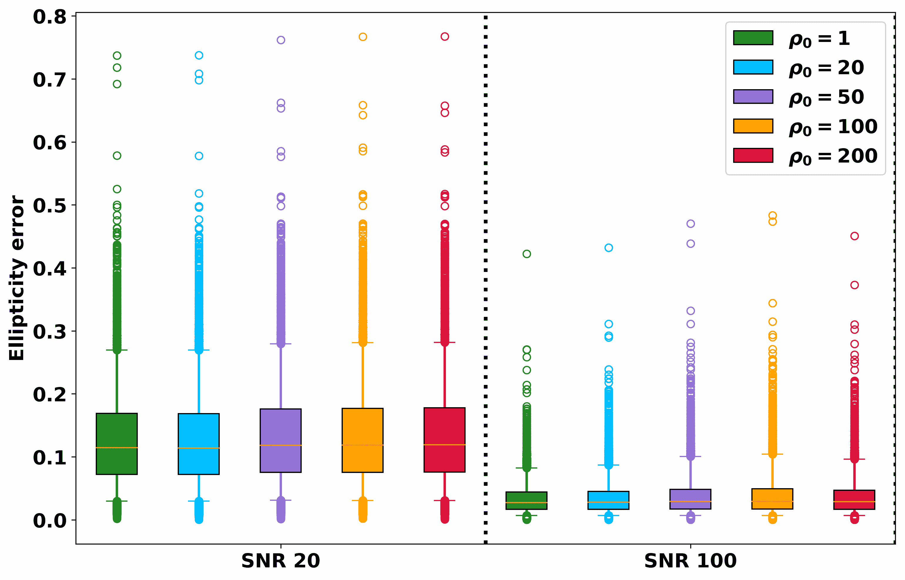
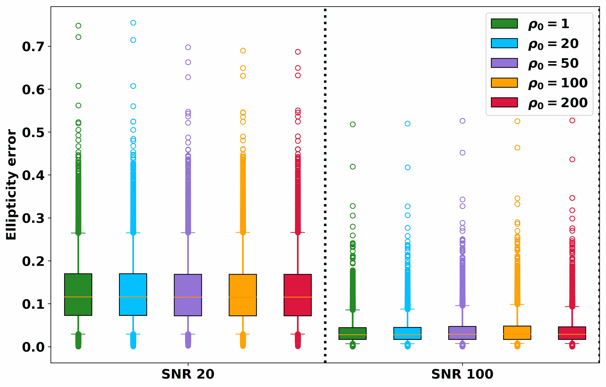
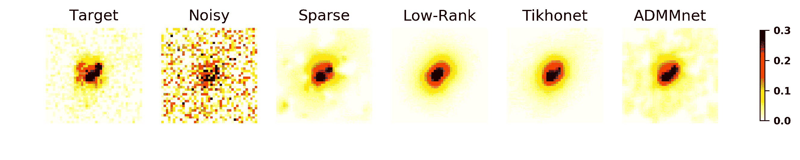

<!--yml

分类: 未分类

日期: 2024-09-06 20:04:17

-->

# [1911.00443] 深度学习在星系调查中的空间变异去卷积

> 来源：[`ar5iv.labs.arxiv.org/html/1911.00443`](https://ar5iv.labs.arxiv.org/html/1911.00443)

¹¹institutetext: Laboratoire AIM, CEA, CNRS, 巴黎萨克雷大学, 巴黎第七大学, 巴黎索邦城市大学, F-91191 Gif-sur-Yvette, 法国 ²²institutetext: ONERA - 法国航空航天实验室, 6 chemin de la Vauve aux Granges, BP 80100, FR-91123 PALAISEAU cedex, 法国

# 深度学习在星系调查中的空间变异去卷积

F. Sureau 11    A. Lechat 1122    J.-L. Starck 11

对包含数百万个星系的大型调查图像进行去卷积需要开发新一代方法，这些方法需要考虑空间变异的点扩散函数（PSF），并且必须同时具有准确性和速度。我们在本文中研究了深度学习（DL）如何用于执行这一任务。我们采用了 U-Net 深度神经网络（DNN）架构，在监督设置中学习适用于星系图像处理的参数，并研究了两种去卷积策略。第一种方法是对具有封闭形式解的简单 Tikhonov 去卷积进行后处理，第二种方法是基于交替方向乘子法（ADMM）的迭代去卷积框架。我们基于 GREAT3 模拟的现实星系图像和 PSF 的数值结果表明，我们的两种方法在星系图像重建或形状恢复方面都优于基于凸优化的标准技术。基于 Tikhonov 去卷积的方法在大多数情况下提供了最准确的结果，除了在高信噪比下的椭圆率误差，此时 ADMM 方法表现略好，处理大量星系的计算时间效率更高，因此在这种情况下推荐使用 ADMM 方法。

###### 关键词：

方法: 统计方法, 方法: 数据分析, 方法: 数值方法

## 1 引言

大型银河系调查图像的去卷积需要考虑视野中点扩散函数（PSF）的空间变化。PSF 场通常通过参数模型和模拟（如 Krist et al. 2011）预先估计，或直接从视野中的（噪声）星体观测中估计（Bertin 2011; Kuijken et al. 2015; Zuntz et al. 2018; Mboula et al. 2016; Schmitz et al. 2019）。即使拥有“完美”的 PSF 知识，这个病态的去卷积问题依然具有挑战性，特别是由于图像处理的规模。Starck et al. (2000) 提出了一个面向对象的去卷积方法，首先检测银河系，然后独立地对每个对象进行去卷积，同时考虑银河系中心位置的 PSF（但不考虑银河系尺度上的 PSF 场变化）。基于这一思路，Farrens et al. (2017) 引入了一种针对银河图像的空间变异去卷积方法，基于两种正则化策略：要么在变换域中使用稀疏先验（Starck et al. 2015a），要么尝试无监督地学习低维子空间用于银河系表示，使用对恢复的银河系图像的低秩先验。若处理的银河系数量足够多（超过 1000 个），他们发现低秩方法比稀疏方法提供了显著更低的椭圆度误差，这说明了学习适当表示银河系的重要性。为了进一步提升学习效果，可以采用监督式深度学习技术，利用银河系图像数据库来学习复杂的映射，这些映射可以正则化我们的去卷积问题。深度卷积架构在模型学习后也被证明在处理大量图像时计算效率高，因此在现代银河系调查中具有前景。

深度学习与去卷积：近年来，深度学习方法在大量逆问题中取得了显著的经验成功。一些潜在的解释可能在于深度架构的表现力（例如，简单架构的理论研究见于（Eldan & Shamir 2015; Safran & Shamir 2017; Petersen & Voigtlaender 2018))以及新架构或新优化策略的出现，提高了学习性能（例如 Kingma & Ba (2014); Ioffe & Szegedy (2015); He et al. (2016); Szegedy et al. (2016))。它们的成功也依赖于用于训练网络的大型数据集以及处理这些数据集所需的计算能力。随着对现实银河系的模拟进展（例如基于真实的哈勃太空望远镜（HST）图像，如 Rowe et al. (2015); Mandelbaum et al. (2015))，深度学习技术因此有潜力在银河图像去卷积中取得与其他应用相同的成功。初步工作确实显示深度神经网络（DNN）在经典的银河图像去卷积中表现良好（Flamary 2017; Schawinski et al. 2017）。

本文：我们探讨了两种不同的策略，将深度学习技术与受凸优化启发的空间变异去卷积方法结合起来。在第二部分中，我们回顾了基于凸优化和深度学习方案的去卷积技术。空间变异去卷积在第三部分中介绍，其中描述了两种提出的方法，第一种使用深度神经网络（DNN）对 Tikhonov 去卷积进行后处理，第二种包括一个在从凸优化中派生的迭代算法中训练的 DNN 用于去噪。为去卷积提出的神经网络架构也在本节中介绍。实验设置在第四部分中描述，结果在第五部分中展示。我们在第六部分中总结。

## 2 深度学习时代的图像去卷积

### 2.1 深度学习之前的去卷积

标准的去卷积问题包括解决线性逆问题 $\mathbf{Y}=\mathbf{H}\mathbf{X}+\mathbf{N}$，其中 $\mathbf{Y}$ 是观测到的带噪数据，$\mathbf{X}$ 是未知解，$\mathbf{H}$ 是与 PSF 相关的矩阵，$\mathbf{N}$ 是噪声。图像 $\mathbf{Y}$、$\mathbf{X}$ 和 $\mathbf{N}$ 由 $n_{p}$ 像素的列向量表示，按字典顺序排列，其中 $n_{p}$ 是像素的总数，$\mathbf{H}$ 是一个 $n_{p}\times n_{p}$ 的矩阵。最先进的去卷积技术通常通过对物理学驱动的前向问题建模，并添加正则化惩罚项 $\mathcal{R}\left(\mathbf{X}\right)$，来解决这个不适定的逆问题（即没有唯一且稳定的解）。这导致最小化：

|  | $\operatorname*{arg\,min}\limits_{\mathbf{X}}\frac{1}{2}&#124;&#124;\mathbf{Y}-\mathbf{H}\mathbf{X}&#124;&#124;^{2}_{F}+\mathcal{R}\left(\mathbf{X}\right),$ |  | (1) |
| --- | --- | --- | --- |

其中 $||\cdot||_{F}$ 是 Frobenius 范数。最简单（也是历史悠久）的正则化方法是 Tikhonov 正则化（Tikhonov & Arsenin 1977; Hunt 1972; Twomey 1963），其中 $\mathcal{R}\left(\mathbf{X}\right)$ 是一个二次项，$\mathcal{R}\left(\mathbf{X}\right)=\frac{\lambda}{2}||\mathbf{L}\mathbf{X}||^{2}_{F}$。该逆问题的封闭形式解为：

|  | $\tilde{\mathbf{X}}=\left(\mathbf{H}^{T}\mathbf{H}+\lambda\mathbf{L}^{T}\mathbf{L}\right)^{-1}\mathbf{H}^{T}\mathbf{Y}$ |  | (2) |
| --- | --- | --- | --- |

其中涉及到 Tikhonov 线性滤波器 $\left(\mathbf{H}^{T}\mathbf{H}+\lambda\mathbf{L}^{T}\mathbf{L}\right)^{-1}\mathbf{H}^{T}$。最简单的版本是当 $\mathbf{L}=\boldsymbol{\operatorname*{Id}}$，这会惩罚高能量的解。当 PSF 是空间不变的，矩阵 $\mathbf{H}$ 是块循环矩阵，则逆问题可以写作简单的卷积积。同时也容易看出 Wiener 去卷积对应于 Tikhonov 滤波器的一个特例。有关更多细节，请参见 Bertero & Boccacci (1998)。

图 1: 使用 Tikhonov 正则化的去卷积。从左到右：用于模拟的 HST 银河图像，$\mathrm{SNR}=20$ 时观测到的银河（见下文我们对 SNR 的定义），从 Eq. 2 计算出的去卷积图像。

这种相当粗糙的去卷积在图 1 中展示了在低信噪比（SNR）场景下的结果，显示了星系图像的过度平滑、恢复的星系能量的丧失以及由于逆滤波器引起的彩色噪声的存在。

大多数先进的方法是非线性的，并且通常涉及迭代算法。在图像处理领域，有大量关于应用于去卷积的高级正则化技术的文献：在贝叶斯范式中对$\mathbf{X}$添加一些先验信息（Bioucas-Dias 2006; Krishnan & Fergus 2009; Orieux et al. 2010），或假设$\mathbf{X}$属于某些图像类别进行恢复（例如，使用全变差正则化（Oliveira et al. 2009; Cai et al. 2010），在固定表示中稀疏（Starck et al. 2003; Pesquet et al. 2009; Pustelnik et al. 2016）或通过字典学习进行学习（Mairal et al. 2008; Lou et al. 2011; Jia & Evans 2011），通过约束解属于一些凸子集（例如，确保最终的星系图像为正）。

例如，用于星系图像去卷积的一个非常有效的方法是基于稀疏恢复，该方法的核心是最小化：

|  |  | $\displaystyle\operatorname*{arg\,min}\limits_{\mathbf{X}}\frac{1}{2}\|\mathbf{Y}-\mathbf{H}\mathbf{X}\|_{2}^{2}+\lambda\|\boldsymbol{\Phi}^{T}\mathbf{X}\|_{1}$ |  | (3) |
| --- | --- | --- | --- | --- |

其中$\boldsymbol{\Phi}$是与固定变换（即傅里叶变换、小波变换、曲线波变换等）相关的矩阵，或可以从数据或训练数据集（Starck et al. 2015b）中学习得出。正则化项中的$\ell_{1}$范数已知能增强解的稀疏性，参见 Starck et al.（2015b）关于稀疏性的综述。稀疏性在不同的天体物理逆问题中表现得非常有效，例如宇宙微波背景（CMB）估计（Bobin et al. 2014）、CMB 任务中的紧凑源估计（Sureau et al. 2014）、弱透镜图的恢复（Lanusse, F. et al. 2016）或无线电干涉成像重建（Garsden et al. 2015）。在这项工作中，我们将比较我们的去卷积技术与这种稀疏去卷积方法。

迭代凸优化技术已被开发用于解决 Eq.3（例如 Beck & Teboulle (2009); Zibulevsky & Elad (2010); Combettes & Pesquet (2011); Chambolle & Pock (2011); Afonso 等人 (2011); Condat (2013); Combettes & Vu (2014))，这些方法具有良好的收敛性，但在使用自适应表示进行星系分析时计算成本较高。这一问题为新一代方法开辟了道路。

### 2.2 向深度学习迈进

最近，深度学习技术被提出用于通过利用收集的数据集和/或模拟进展来解决逆问题，包括反卷积星系图像。这些方法已证明能够在有监督的环境中学习复杂的映射，并且在模型学习完成后具有计算效率。我们在这里回顾了一些使用 DNN 进行反卷积的近期工作，但并不详尽。我们识别了三种不同的策略来在反卷积问题中使用 DNN：

+   •

    学习逆问题：逆卷积滤波器可以直接通过卷积神经网络进行近似（Xu 等人 2014; Schuler 等人 2016）。在我们处理空间变异反卷积和已知核的应用中，这种复杂的盲反卷积显然是不必要的，并且需要大量的数据来尝试学习前向模型中已包含的物理信息。

+   •

    规则化去卷积的后处理：在早期使用稀疏性进行去卷积时，提出了一种两步法，首先应用简单的线性去卷积方法，如伪逆或 Tikhonov 滤波器，这样噪声会进入解中，然后在第二步中应用稀疏去噪（参见小波-模糊分解（Donoho 1995; Kalifa 等 2003），更一般的正则化（Guerrero-colon & Portilla 2006），或 ForWaRD 方法（Neelamani 等 2004））。类似地，第二步已被使用多层感知机（Schuler 等 2013）去噪/去除伪影替代，或更近期地使用 U-Net（Jin 等 2017）。卷积神经网络（CNN）非常适合这些任务，因为 CNN 的形式模拟了展开的迭代方法，当前向模型是卷积时。在另一个应用中，卷积网络如深度卷积框架也已被应用于去除重建 CT 图像中的伪影（Ye 等 2018a）。这种解耦方法的一个优势是，当网络已经训练好时，可以快速处理大量数据，如果选择的去卷积具有闭式表达。

+   •

    迭代深度学习：第三种策略使用通常源自凸优化的迭代方法与深度学习网络相结合。已经设计了几种方案来解决通用的逆问题。第一个选项，称为展开或展开（详见 Monga 等人 (2019)），是通过深度神经网络模拟迭代算法的几次迭代，以便在学习阶段捕捉 1) 先验 (Mardani 等人 2017)、2) 超参数 (Mardani 等人 2017；Adler & Öktem 2017，2018；Bertocchi 等人 2018)、3) 梯度下降的更新步骤 (Adler & Öktem 2017) 或 4) 整个更新过程 (Gregor & LeCun 2010；Adler & Öktem 2018；Mardani 等人 2018) 的影响。这些方法允许快速逼近迭代算法 (Gregor & LeCun 2010)、更好的超参数选择 (Bertocchi 等人 2018) 和/或以监督方式提供新的算法 (Adler & Öktem 2017；Mardani 等人 2018；Adler & Öktem 2018)，这些算法更好地适应特定数据集的处理。最近，这种方法显著用于盲去卷积 (Li 等人 2019)。最后，一种替代方法是使用来自凸优化的迭代邻近算法（例如在交替方向乘子法插入式（ADMM PnP）(Venkatakrishnan 等人 2013；Sreehari 等人 2016；H. Chan 等人 2016）框架中，或通过去噪正则化 (Romano 等人 2017；T. Reehorst & Schniter 2018），其中与先验相关的邻近算子被深度神经网络 (Meinhardt 等人 2017；Bigdeli 等人 2017；Gupta 等人 2018) 或在不同去噪设置下训练的一系列深度神经网络 (如 Zhang 等人 (2017)) 替代。

因此，最后两种策略更适合我们的目标问题，接下来我们将研究它们如何应用以及它们与最先进的银河图像空间变去卷积方法相比的表现。

### 2.3 与深度去卷积和稀疏性相关的讨论

有趣的是，稀疏恢复方法与深度神经网络之间存在联系：

+   •

    学习不变性：在卷积深度神经网络中，首先学习到的特征通常对应于图像中某一特定方向和位置的边缘（LeCun 等人 2015），这也是小波变换在不同尺度上提取的特征。对于 CNN 在弱透镜收敛图的宇宙学参数估计中的特征学习，观察到了类似的现象（Ribli 等人 2019）。此外，数学上理解此类网络架构如何逐渐捕捉强大的不变性，可以通过小波及其在小波散射变换中的使用来接近（Mallat 2016）。

+   •

    学习的近端算子：Meinhardt 等人（2017）已经显示，使用去噪神经网络代替近端算子（例如在稀疏恢复中的小波空间软阈值）进行最小化迭代可以提高去卷积性能。他们还声称，训练神经网络所使用的噪声水平类似于稀疏恢复中的正则化参数。算法的收敛性不再得到保证，但他们通过实验观察到他们的算法稳定，并表达了其固定点。

+   •

    扩展路径和收缩路径：U-nets 的两个部分与稀疏表示中的合成和分析概念非常相似。这激发了在 U-net 中实现扩展路径的平均池化和反池化的使用小波（Ye 等人 2018b; Han & Ye 2018）。还可以与 Fan 等人（2018）中的软自编码器建立一些其他联系，引入一对模拟软阈值的 ReLU 单元，突出了与级联小波收缩系统的比较。

因此，我们观察到两个领域之间的交流，特别是对于 U-Net 架构，然而存在显著差异，例如在 U-nets 中构建一个非常丰富的字典，这可以通过使用大量的训练数据集实现，以及每一层的非线性，这对在学习阶段捕获不变性至关重要。

## 3 空间变异 PSF 的图像去卷积

### 3.1 引言

在空间变异去卷积问题的情况下，我们可以写出与之前相同的去卷积方程，$\mathbf{Y}=\mathbf{H}\mathbf{X}+\mathbf{N}$，但此时$\mathbf{H}$不再是块循环矩阵，操作这样一个巨大的矩阵在实践中是不可能的。正如 Farrens 等人（2017）所述，我们考虑改为面向对象的去卷积方法，通过首先检测$n_{g}$个每个有$n_{p}$个像素的星系，然后使用星系中心位置的 PSF 独立地去卷积每个对象。我们使用以下定义：$n_{g}$个星系的观察值，每个星系有$n_{p}$个像素，收集在$\mathbf{Y}\in\mathbb{R}^{n_{p}\times n_{g}}$中（如前所述，每个星系由按字典序排列的列向量表示），需要恢复的星系图像类似地收集在$\mathbf{X}\in\mathbb{R}^{n_{p}\times n_{g}}=[\mathbf{x}_{\mathbf{i}}]_{i=1..n_{g}}$中，并且使用不同内核的卷积算子记为$\mathcal{H}$。这对应于并行地将卷积矩阵$\mathbf{H}_{\mathbf{i}}$应用于星系$\mathbf{x}_{\mathbf{i}}$（$\mathbf{H}_{\mathbf{i}}$通常是经过零填充后具有循环块的块循环矩阵，我们在图像上执行这种操作（Andrews & Hunt 1977））。噪声记为$\mathbf{N}\in\mathbb{R}^{n_{p}\times n_{g}}$，如前所述，假设为加性白噪声。根据这些定义，我们现在有

|  | $\mathbf{Y}=\mathcal{H}(\mathbf{X})+\mathbf{N}$ |  | (4) |
| --- | --- | --- | --- |

或更精确地说

|  | $\left\{\mathbf{y}_{\mathbf{i}}=\mathbf{H}_{\mathbf{i}}\mathbf{x}_{\mathbf{i}}+\mathbf{n}_{\mathbf{i}}\right\}_{i=1..n_{g}},$ |  | (5) |
| --- | --- | --- | --- |

对于块循环$\left\{\mathbf{H}_{\mathbf{i}}\right\}_{i=1..n_{g}}$，这表明我们在模型中考虑了多个局部空间不变的卷积（忽略了星系尺度上 PSF 的非常小的变化，正如实践中所做的那样（Kuijken et al. 2015; Mandelbaum et al. 2015; Zuntz et al. 2018））。因此，去卷积问题可以看作是一系列独立的病态逆问题。为了避免出现多个解（由于$\left\{\mathbf{H}_{\mathbf{i}}\right\}_{i=1..n_{g}}$的非平凡零空间）或不稳定解（这些矩阵的条件差），我们需要像在空间不变卷积的标准去卷积方法中那样对问题进行正则化。这等同于解决以下逆问题：

|  | $\operatorname*{arg\,min}\limits_{\mathbf{X}}\frac{1}{2}&#124;&#124;\mathbf{Y}-\mathcal{H}(\mathbf{X})&#124;&#124;^{2}_{F}+\mathcal{R}\left(\mathbf{X}\right)$ |  | (6) |
| --- | --- | --- | --- |

一般来说，我们会选择可分离的正则化项，以便能够并行处理不同的去卷积问题：

|  | $\left\{\operatorname*{arg\,min}\limits_{\mathbf{x}_{\mathbf{i}}}\frac{1}{2}&#124;&#124;\mathbf{y}_{\mathbf{i}}-\mathbf{H}_{\mathbf{i}}\mathbf{x}_{\mathbf{i}}&#124;&#124;^{2}_{2}+\mathcal{R}\left(\mathbf{x}_{\mathbf{i}}\right)\right\}_{i=1..n_{g}}$ |  | (7) |
| --- | --- | --- | --- |

Farrens 等人 (2017) 提出了两种方法来执行这一去卷积：

+   •

    稀疏先验：每个星系在小波域中被假定为稀疏，导致最小化

    |  |  | $\displaystyle\underset{\mathbf{X}}{\text{argmin}}$ | $\displaystyle\frac{1}{2}\&#124;\mathbf{Y}-\mathcal{H}(\mathbf{X})\&#124;_{2}^{2}+\&#124;\mathbf{W}^{(k)}\odot\Phi(\mathbf{X})\&#124;_{1}$ |  | 满足 |  | $\displaystyle\mathbf{X}\geq 0$ |  | (8) |
    | --- | --- | --- | --- | --- | --- | --- | --- | --- | --- |

    其中 $\mathbf{W}^{(k)}$ 是一个加权矩阵。

+   •

    低秩先验：在上述方法中，每个星系是独立去卷积的。由于星系图像之间有许多相似之处，Farrens 等人 (2017) 提出了一个联合恢复过程，其中矩阵 $\mathbf{X}$ 具有低秩。这通过添加核范数惩罚代替稀疏正则化来强制实现，如下所示：

    |  |  | $\displaystyle\underset{\mathbf{X}}{\text{argmin}}$ | $\displaystyle\frac{1}{2}\&#124;\mathbf{Y}-\mathcal{H}(\mathbf{X})\&#124;_{2}^{2}+\lambda\&#124;\mathbf{X}\&#124;_{*}$ |  | 满足 |  | $\displaystyle\mathbf{X}\geq 0$ |  | (9) |
    | --- | --- | --- | --- | --- | --- | --- | --- | --- | --- |

    其中 $\|\mathbf{X}\|_{*}=\sum_{k}\sigma_{k}(\mathbf{X})$，$\sigma_{k}(\mathbf{X})$ 表示 $\mathbf{X}$ 的第 $k^{\text{th}}$ 大奇异值。

研究表明，当场景中的星系数量大于 1000 时，第二种方法优于稀疏技术（Farrens 等人 2017）。

### 3.2 神经网络架构

DNN 使我们能够扩展先前的低秩最小化，通过利用现有数据库并以监督的方式从数据中学习更多特征，相比之下，我们所使用的简单 SVD 进行核范数惩罚的效果较差。网络架构的选择对于性能至关重要。我们确定了三种我们认为对应用程序重要的特征：1）前向模型和任务意味着网络应具备平移等变性，2）模型应包含一些多尺度处理，因为我们需要捕捉远程相关性，3）模型应在给定性能的情况下最小化可训练参数的数量，以提高效率（降低 GPU 内存消耗），这对学习也很重要。希望这些目标并不矛盾：第一个考虑因素导致使用卷积层，而第二个考虑因素则需要类似 U-Net (Ronneberger et al. 2015) 的结构来解决逆问题 (Jin et al. 2017) 或深度卷积框架 (Ye et al. 2018a)。但由于这些架构允许在网络中迅速增加感受野，它们可以与参数较多的 CNNs 竞争，尽管这些 CNNs 层数更多，参数更多。

图 2：本文中使用的 DNN 模型。全球架构是 U-Net，进行了一些小修改以提高性能并限制模型参数的数量。

因此，我们选择了如 (Jin et al. 2017) 中所示的全球 U-Net 结构，但包括以下修改：

+   •

    2D 可分离卷积：我们用 2D 可分离卷积替代了 2D 卷积 (Chollet 2016)。可分离卷积通过假设空间相关性和特征图之间的相关性可以独立捕捉，从而限制了模型中的参数数量。其使用已导致在具有较多参数的非可分离卷积的架构中表现更好 (Chollet 2016)。

+   •

    稠密块：我们通过使用稠密块 (Huang et al. 2017) 更改了每个“尺度”的卷积层。稠密块还可以通过将所有先前特征图通过连接传播到当前层的输入，来减少参数的数量。有人声称这可以实现特征重用、信息保存，并限制学习中的梯度消失问题。

+   •

    平均池化：我们更改了池化步骤：我们观察到最大池化会导致最终估计的过度分割，通过使用平均池化可以缓解这一问题。

+   •

    跳过连接：我们移除了输入层和输出层之间由（Jin et al. 2017）引入的跳过连接，这被证明对网络性能有害，尤其是在低 SNR 下。注意，密集块可能更好地保留了相关信息的流动，并限制了使用残差学习的兴趣。

前两项修改显著限制了 U-Net 每个“尺度”的参数数量，并可能允许在给定的可训练参数预算下使用更多的尺度。我们的网络，命名为“XDense U-Net”，如图 2 所示。以下描述了如何以两种不同的方式使用这些网络来执行空间变异解卷积。

### 3.3 Tikhonet：由深度神经网络后处理的 Tikhonov 解卷积

空间变异点扩散函数解卷积的 Tikhonov 解为：

|  | $\operatorname*{arg\,min}\limits_{\mathbf{X}}\frac{1}{2}&#124;&#124;\mathbf{Y}-\mathcal{H}(\mathbf{X})&#124;&#124;^{2}_{F}+&#124;&#124;\mathcal{L}(\mathbf{X})&#124;&#124;^{2}_{F}$ |  | (10) |
| --- | --- | --- | --- |

其中 $\mathcal{L}$ 以类似的方式构建为 $\mathcal{H}$。该线性逆问题的闭式解为：

|  | $\left\{\tilde{\mathbf{x}_{\mathbf{i}}}=\left(\mathbf{H}^{T}_{\mathbf{i}}\mathbf{H}_{\mathbf{i}}+\lambda_{i}\mathbf{L}^{T}_{\mathbf{i}}\mathbf{L}_{\mathbf{i}}\right)^{-1}\mathbf{H}_{\mathbf{i}}^{T}\mathbf{y}_{\mathbf{i}}\right\}_{i=1..n_{g}}$ |  | (11) |
| --- | --- | --- | --- |

这涉及到每个星系使用不同的 Tikhonov 滤波器 $\left(\mathbf{H}^{T}_{\mathbf{i}}\mathbf{H}_{\mathbf{i}}+\lambda_{i}\mathbf{L}^{T}_{\mathbf{i}}\mathbf{L}_{\mathbf{i}}\right)^{-1}\mathbf{H}_{\mathbf{i}}^{T}$。在这项工作中，我们选择了 $\mathbf{L}_{\mathbf{i}}=\boldsymbol{\operatorname*{Id}}$，并且正则化参数 $\lambda_{i}$ 对每个星系都不同，取决于其 SNR（有关更多细节，请参见 3.5）。最终的估计结果为：

|  | $\left\{\hat{\mathbf{x}_{\mathbf{i}}}=\mathcal{N}_{\boldsymbol{\theta}}(\tilde{\mathbf{x}_{\mathbf{i}}})\right\}_{i=1..n_{g}},$ |  | (12) |
| --- | --- | --- | --- |

其中神经网络基于其参数 $\boldsymbol{\theta}$ 对某些输入 $\mathbf{Y}$ 的预测写作 $\mathcal{N}_{\boldsymbol{\theta}}(\mathbf{Y})$。

因此，第一个方法的成功在于监督学习 Tikhonov 解卷积与目标星系之间的映射。

我们称这种两步方法为“**Tikhonet**”，其相对简单的训练过程如算法 1 所述。

算法 1 Tikhonet 方法中的 DNN 训练

1: 初始化：准备无噪声训练集，选择噪声参数（SNR 范围）和验证集。选择网络架构 $\mathcal{N}$、学习参数（优化器及其参数、批量大小 $B$ 和批次数 $n_{batch}$、轮数 $n_{epoch}$）和要最小化的成本函数（这里是均方误差）。2: 对于 $n=1$ 到 $n_{epoch}$ 执行 {遍历轮次} 3: 对于 $b=1$ 到 $n_{batch}$ 执行 {遍历批次} 4: 对于 $i=1$ 到 $B$ 执行 {遍历批次中的星系} 5: 添加随机噪声以获得选择的 SNR 范围中的实现 6: 使用 Eq. 2 计算 Tikhonov 解 $\tilde{\mathbf{x}_{\mathbf{i}}}$ 7: 结束循环 8: 预测 $\hat{\mathbf{x}_{\mathbf{i}}}$ (Eq. 12) 并根据成本函数更新网络参数 $\boldsymbol{\theta}$。9: 结束循环 10: 结束轮次 11: 返回 $\mathcal{N}_{\boldsymbol{\theta}}$

### 3.4 ADMMnet：将深度神经网络作为 ADMM 插件中的约束

我们调查的第二种方法是使用带有 DNN 的 ADMM PnP 框架。

ADMM 是一种增强拉格朗日技术，用于解决线性等式约束下的凸问题（参见（Boyd et al. 2010））。它通过将最小化问题分解为顺序求解的子问题来运行。一轮迭代包括首先解决一个通常涉及数据保真度项的最小化问题，然后解决一个涉及正则化项的第二个最小化问题，最后更新对偶变量。

之前已有文献（Venkatakrishnan et al. 2013; Sreehari et al. 2016; H. Chan et al. 2016）指出，前两个子步骤可以被解释为一个反演步骤，随后是通过增强拉格朗日项和对偶变量耦合的去噪步骤。这些作者建议在第二步中使用非线性去噪器的 ADMM 结构，称为 ADMM PnP，近期工作建议通过 DNN 实现（Meinhardt et al. 2017）。

在下面，我们采用基于 ADMM PnP 的这种迭代方法，因为 1）它将反演步骤与 DNN 的使用分开，提供了灵活性，以便在代价函数中添加额外的凸约束，这些约束可以通过凸优化来处理 2）它通过主要关注学习去噪器或投影器来减轻学习成本 - 网络更少，相比于每次迭代对应不同网络的展开方法，学习的参数也更少 3）通过在各步骤之间迭代，网络的输出被传播到前向模型中，与观察结果进行比较，避免了大的差异，这与 Tikhonet 方法相反，后者不在似然中使用网络的输出。

在这种情况下，网络 $\mathcal{N}_{\boldsymbol{\theta}}$ 的训练类似于算法 1，不同之处在于无噪声训练集由无噪声目标图像组成，而不是无噪声卷积图像，且添加的噪声具有常量标准差。然后，算法用于反卷积星系，如算法 2 中所示，来源于 H. Chan 等人（2016）。这里以红色标出网络的应用。我们称这种方法为“ADMMnet”。第一步是在第 $k$ 次迭代中使用加速的迭代凸算法 FISTA（Beck & Teboulle 2009）求解以下正则化反卷积问题。

|  | $\left\{\operatorname*{arg\,min}\limits_{\mathbf{x}_{\mathbf{i}}}\frac{1}{2\sigma^{2}}&#124;&#124;\mathbf{y}_{\mathbf{i}}-\mathbf{H}_{\mathbf{i}}\mathbf{x}_{\mathbf{i}}&#124;&#124;^{2}_{2}+\iota_{\mathcal{C}}(\mathbf{x}_{\mathbf{i}})+\frac{\rho}{2}&#124;&#124;\mathbf{x}_{\mathbf{i}}-\mathbf{z}^{(k)}_{\mathbf{i}}+\boldsymbol{\mu}^{(k)}&#124;&#124;^{2}_{2}\right\}_{i=1..n_{g}}$ |  | (13) |
| --- | --- | --- | --- |

其中 $\iota_{\mathcal{C}}$ 是非负正交象限的特征函数，以强制解的非负性。第二步中使用的 DNN 被类比为去噪器（或作为投影器），如上所述。最后一步控制增广拉格朗日参数，并确保当优化参数变化不充分时，该参数会增加。正如 H. Chan 等人（2016）指出的那样，这种连续方案也很重要，因为逐渐增加增广拉格朗日参数的影响可以确保算法的稳定性。

请注意，这种方案当然没有收敛保证，并且与凸情况不同，扩展拉格朗日参数 $\rho$ 预计会影响结果。

最后，由于目标银河图像是在目标 PSF 的重新卷积后获得的，以避免混叠（参见第四部分），我们还将 ADMMnet 解与此目标 PSF 进行重新卷积，以获得最终估计。

算法 2 提出的 ADMM 深度 Plug&Play 方法用于银河图像的去卷积

1:  初始化：设定 $\rho_{0},\rho_{max},\eta\in[0,1),\gamma>1,\Delta_{0}=0$，$\mathbf{X}^{(0)}=\mathbf{0},\mathbf{Z}^{(0)}=\mathbf{0},\boldsymbol{\mu}^{(0)}=\mathbf{0},\epsilon$ 2:  对于 $k=0$ 到 $N_{it}$ 执行 {主循环} 3:     去卷积子问题：$\mathbf{X}^{(k+1)}=FISTA(\textbf{Y},\mathbf{X}^{(k)},\mathbf{Z}^{(k)},\boldsymbol{\mu}^{(k)},\rho_{k})$ 4:     “去噪”子问题：$\mathbf{Z}^{(k+1)}={\color[rgb]{1,0,0}\definecolor[named]{pgfstrokecolor}{rgb}{1,0,0}\mathcal{N}_{\boldsymbol{\theta}}}\left(\mathbf{X}^{(k+1)}+\boldsymbol{\mu}^{(k)}\right)$ 5:     拉格朗日乘子更新：$\boldsymbol{\mu}^{(k+1)}=\boldsymbol{\mu}^{(k)}+\left(\mathbf{X}^{(k+1)}-\mathbf{Z}^{(k+1)}\right)$ 6:     $\Delta_{k+1}=\frac{1}{\sqrt{n}}\left(||\mathbf{X}^{(k+1)}-\mathbf{X}^{(k)}||_{2}+||\mathbf{Z}^{(k+1)}-\mathbf{Z}^{(k)}||_{2}+||\boldsymbol{\mu}^{(k+1)}-\boldsymbol{\mu}^{(k)}||_{2}\right)$ 7:     如果 $\Delta_{k+1}\geq\eta\Delta_{k}$ 且 $\rho_{k+1}\leq\rho_{max}$，则 8:         $\rho_{k+1}=\gamma\rho_{k}$ 9:     否则 10:         $\rho_{k+1}=\rho_{k}$ 11:     结束 如果 12:     如果 $\|\mathbf{Z}^{(k+1)}-\mathbf{X}^{(k+1)}\|_{2}<\epsilon$，则 13:         停止 14:     结束 如果 15:   结束 循环 16:   返回 $\left\{\mathbf{X}^{(k+1)}\right\}$

### 3.5 网络架构的实现与参数选择

我们在这里描述了算法实现的实际选择。对于 Tikhonet，控制数据保真项和平衡二次正则化的超参数$\lambda_{i}$需要为每个星系设置。这可以通过选择一个基于 SNR 估计的最佳值手动完成，或者使用自动化程序如广义交叉验证（GCV）（Golub 等人 1979）、L 曲线方法（Christian Hansen & O’leary 1993）、Morozov 不一致原理（Werner Engl 等人 1996）、各种 Stein 无偏风险估计（SURE）最小化（C. Eldar 2009；Pesquet 等人 2009；Deledalle 等人 2014），或使用分层贝叶斯框架（Orieux 等人 2010；Pereyra 等人 2015）来完成。我们比较了这些方法，并报告了通过 SURE 预测风险最小化获得的结果，该方法在与 GCV 方法相比时取得了最佳结果。

对于 ADMM，参数$\rho_{0}$、$\rho_{max}$、$\eta$、$\epsilon$和$\gamma$是手动选择的，以在快速稳定算法（特别是高$\rho$）与在前期步骤中有利于数据保真项最小化（低$\rho$）之间取得平衡。我们特别研究了$\rho_{0}$的选择，这说明了继续方案如何影响解决方案。

DNNs 在 Keras¹¹1https://keras.io 上编码，使用 Tensorflow ²²2https://www.tensorflow.org 作为后端。对于所提议的 XDense U-Net，选择了 4 个尺度，每个尺度有递增数量的层（以捕捉远程相关性）。每个可分离卷积由$3\times 3$空间滤波器组成，密集块的增长因子选择为 12。总的可训练参数数量为 184301。我们还实现了一个“经典”U-Net 以测试提出的 XDense U-Net 架构的效率。对于这个 U-Net，我们选择了 3 个尺度，每个尺度有 2 层，每层在第一个尺度中有 20 个特征图，最终得到 206381 个可训练参数（比 XDense U-Net 实现多$12\%$）。在这两个网络中，我们使用了批量归一化和修正线性单元作为激活函数。我们还测试了我们提出的方法的加权 Sigmoid 激活（或 Elfwing 等人（2018）中的 swish），这似乎略微改善了结果，但增加了计算负担，因此在后续结果中没有使用。

在训练阶段，我们使用 20 个 epoch，批处理大小为 32，选择了 Adam 优化器（保持默认参数）来最小化均方误差 (MSE) 代价函数。每个 epoch 后，仅当网络参数在验证集上提高 MSE 时，我们才保存这些参数。

## 4 实验

在本节中，我们描述了生成用于学习网络和测试去卷积方案的模拟数据的方法，以及我们将用于比较不同去卷积技术的标准。

### 4.1 数据集生成

我们使用 GalSim³³3https://github.com/GalSim-developers/GalSim (Rowe et al. 2015) 来生成用于训练我们网络和测试我们的去卷积方法的真实星系图像。我们基本上遵循了 GREAT3 (Mandelbaum et al. 2014) 中用于从高分辨率 HST 图像生成真实空间分支的方法，但选择了 600 个类似 Euclid 的 PSFs（与 Farrens et al. (2017) 中的相同）。这一过程如图 3 所示。

从约 58000 个用于 GREAT3 挑战的星系集中随机选择一个 HST 星系，使用其 PSF 进行去卷积，并应用随机位移（从 $[-1,1]$ 像素的均匀分布中抽取）、旋转和剪切。进行与 GREAT3 (Mandelbaum et al. 2014) 中相同的 SNR 截取，以便获得一个现实的星系集合，这些星系在 SNR 范围 $[20,100]$ 内被观察到，当噪声水平如 GREAT3 中所示。在这项工作中，我们使用与该挑战中相同的 SNR 定义：

|  | $\mathrm{SNR}\left(\mathbf{X}_{\mathbf{i}}\right)=\frac{&#124;&#124;\mathbf{X}_{\mathbf{i}}&#124;&#124;_{2}}{\sigma}$ |  | (14) |
| --- | --- | --- | --- |

其中 $\sigma$ 是噪声的标准差。这一 SNR 对于当星系轮廓 $\mathbf{X}_{\mathbf{i}}$ 已知时的检测来说是一个乐观的 SNR。在其他（实验性）定义中，最小 SNR 实际上更接近 10，这与通常在弱引力透镜研究中考虑的情况相似 (Mandelbaum et al. 2014)。

如果通过了 SNR 截取，为了在 $96\times 96$ 网格中获得目标图像，像素大小为 $0.05^{\prime\prime}$，我们首先用 $FWHM=0.07^{\prime\prime}$ 的高斯 PSF 对 HST 去卷积星系图像进行卷积，以确保在下采样后没有别名效应。为了模拟没有额外噪声的观测星系，我们用从约 600 个类似 Euclid 的 PSFs 中随机选择的 PSF 对 HST 去卷积图像进行卷积（与 Farrens et al. (2017) 中使用的相同集）。注意，与 GREAT3 中一样，旋转 $90\degree$ 的相同星系也会被模拟。

由于我们使用的是实际的 HST 星系作为输入，HST 图像中的噪声传播到我们的目标和观测图像中，并且被去卷积/重卷积过程着色。我们不希望去噪原始星系图像，以避免在目标图像中丢失子结构（并使其变得不那么“真实”），且由于这个噪声水平低于我们模拟中添加的噪声，我们预计它对我们的结果变化很小——并不会改变方法的排名。

这个过程会重复进行，最终得到大约 210000 个模拟观测星系及其对应的目标星系。在学习阶段，使用了 190000 个星系，10000 个用于验证集。额外的 10000 个用于测试我们的方法。

图 3：GalSim 模拟真实星系的设置。在上支路中，我们获得了目标星系。在下支路中，我们模拟了对应的类似 Euclid 的观测星系。请注意，这些图中采用了对数刻度来展示点扩散函数的复杂结构。

在学习阶段，向星系批次中添加了具有标准差的加性白噪声，以获得指定信噪比范围内的星系。对于 Tikhonet，我们为批次中的每个星系随机选择一个范围在 $[20,100]$ 的 $\mathrm{SNR}$，这对应于从探测极限到具有可观测子结构的星系，如图 4 所示。对于 ADMMnet，我们为常数噪声标准差 $\sigma=0.04$（与 GREAT3 中的水平相同）学习去噪网络。

然后，我们在测试集中对不同方法的相对性能进行测试，固定值为：$\mathrm{SNR}\in\{20,40,60,80,100\}$，以更好地表征（和区分）它们，并且固定标准差为 $\sigma=0.04$，这对应于在 GREAT3 中模拟的真实星系空间分支，以获得代表性的观测星系集的结果。在最后一种情况下的 SNR 分布如图 5 所示。所有技术在完全相同的测试集上进行比较。

对于 ADMMnet 方法，在不同 SNR 测试时，我们需要将星系图像中的噪声水平调整到学习阶段的噪声水平。因此，我们根据图像中的噪声水平估计，将星系图像重新缩放到目标噪声水平。这是通过计算小波域中的中位绝对偏差（使用具有 3 个消失矩的正交 Daubechies 小波）来完成的。

图 4：用于训练和测试的 SNR 范围。从左到右：目标星系图像，然后是逐渐增加 SNR 的观测卷积图像。在我们的定义中，$\mathrm{SNR}=20$ 刚好在星系检测极限，而$\mathrm{SNR}=100$ 时星系子结构可以被可视化。

图 5：常噪声模拟下模拟星系的信噪比（SNR）分布（$\sigma=0.04$）。分布的峰值约为$\mathrm{SNR}=30$，均值 SNR 为$\mathrm{SNR}=54$。

### 4.2 质量标准

去卷积方案的性能根据两种不同标准来衡量，涉及像素误差和形状测量误差。对于像素误差，我们选择一个稳健的估计器：

|  | $\mathrm{P_{err}}\left(\widehat{\mathbf{X}}\right)=\mathrm{MED}\left(\frac{\&#124;\widehat{\mathbf{x}_{\mathbf{i}}}-\mathbf{x}^{(t)}_{\mathbf{i}}\&#124;^{2}_{2}}{\&#124;\mathbf{x}^{(t)}_{\mathbf{i}}\&#124;_{2}^{2}}\right)_{i=1..n_{g}}$ |  | (15) |
| --- | --- | --- | --- |

其中$\mathbf{x}^{(t)}_{\mathbf{i}}$是目标值，$\mathrm{MED}$是对测试集中每个星系$\mathbf{x}_{\mathbf{i}}$计算的相对均方误差的中位数，在所有方法共有的$41\times 41$像素的中央窗口中。

对于形状测量误差，我们使用 KSB 方法计算椭圆度，该方法在 shapelens 中实现⁴⁴4https://github.com/pmelchior/shapelens（Kaiser 等 1995；Viola 等 2011），并从数据中计算适应的圆形加权函数。

我们首先将此 KSB 方法应用于目标，同时考虑目标各向同性高斯 PSF，以获得参考的复合椭圆度$\epsilon_{i}$和窗口。然后，我们使用与目标对应的相同圆形加权函数计算去卷积星系的复合椭圆度$\widehat{\epsilon_{i}}$。最后，我们计算

|  | $\mathrm{\epsilon_{err}}\left(\widehat{\mathbf{X}}\right)=\mathrm{MED}\left(\&#124;\epsilon_{i}^{(t)}-\widehat{\epsilon_{i}}\&#124;_{2}\right)_{i=1..n_{g}}$ |  | (16) |
| --- | --- | --- | --- |

为了获得目标图像设置窗口中的椭圆度误差的稳健估计，再次在所有方法共有的$41\times 41$像素的中央窗口中进行。

我们还报告了应用中位数之前的像素和椭圆度误差的分布，以便在需要更精细评估时使用。

## 5 结果

### 5.1 设置 Tikhonet 架构和超参数

对于 Tikhonet，关键参数是方程 11 中的超参数 $\lambda_{i}$。在图 6 中，这些超参数被设置为 SURE 最小化的参数，并在 $\mathrm{SNR}=20$ 时乘以从 10 到 0.01 的因子，适用于所提出的 X-Dense 架构（“经典” U-Net 的视觉结果类似）。对于最低因子，即对应于解卷积的最小正则化（即在解卷积图像中添加更多噪声），Tikhonet 的表现不如在中间值时，特别是在确切的 SURE 最小化器时。

图 6：SNR20 下 Tikhonet 方法超参数选择的视觉影响。上图：目标和观察，接着是不同乘法因子的 SURE 估计。下图：与上图相关的残差。

这在图 7 中得到了确认，该图报告了所提出的 X-Dense 和“经典”架构的像素误差，以及图 8 中的椭圆度误差。

图 7：使用所提出的 XDense U-Net 架构（左）和“经典” U-Net 架构（右）时，Tikhonet 超参数乘法因子值对像素误差的影响。箱体表示四分位数，而垂直条表示数据的 $90\%$。异常值用圆圈表示。

图 8：使用所提出的 XDense U-Net 架构（左）和“经典” U-Net 架构（右）时，Tikhonet 超参数乘法因子值对椭圆度误差的影响。箱体表示四分位数，而垂直条表示数据的 $90\%$。异常值用圆圈表示。

对于这两种架构，像素或椭圆度误差的最佳结果在所有测试的 SNR 中均稳定地获得，乘法因子值在 0.1 到 1 之间。较高的乘法因子也会导致较大的极端误差，特别是在低 SNR 时。因此，我们在后续中将该参数设置为 SURE 最小化器。

关于架构的选择，图 7 说明 XDense U-Net 在 SNR 范围内提供的像素误差中极端离群值较少，乘法因子为 10，但这距离提供最佳结果还有很大差距。更仔细地查看表 1 中 SURE 最小化器的中位数误差值，我们看到提出的 XDense U-Net 架构一致地获得了稍微更好的结果。在这项实验中，XDense 在$\mathrm{SNR}=20$（分别在$\mathrm{SNR}=100$时）获得了 4%（分别为 3%）较少的像素误差，最显著的差异是$\mathrm{SNR}=100$时椭圆度测量约 8%的改进。

表 1：对于 SURE 选择的超参数，U-Net 架构的比较。第一个数字是使用 XDense U-Net 架构获得的，第二个数字（括号内）是使用“经典”U-Net 架构获得的。

$\mathrm{SNR}=20$ $\mathrm{SNR}=40$ $\mathrm{SNR}=60$ $\mathrm{SNR}=80$ $\mathrm{SNR}=100$ 中位数像素误差 0.157 (0.163) 0.117 (0.121) 0.105 (0.106) 0.097 (0.097) 0.090 (0.093) 中位数椭圆度误差 0.109 (0.110) 0.063 (0.064) 0.045 (0.046) 0.035 (0.038) 0.030 (0.033)

### 5.2 设置 ADMMnet 架构和超参数

对于 ADMMnet，我们手动设置了超参数$\rho_{max}=200$，$\epsilon=0.01$以实现算法的最终稳定性，$\eta=0.5$和$\gamma=1.4$用于探索中间的$\rho$值，并且我们调查了参数$\rho_{0}$的选择，以说明继续方案对解决方案的影响。这在高 SNR 下的图 9 和低 SNR 下的图 10 中进行了说明，涉及提出的 XDense U-Net 架构。当$\rho_{0}$较小时，如图 9 中的银河子结构所示，解决方案中恢复了更高的频率，但这可能会在低 SNR 下导致伪影，如图 10 所示。

图 9：$\mathrm{SNR}=100$ 时 ADMMnet 对 $\rho$ 初始化的视觉影响。顶部：目标和观测，接着是不同增广拉格朗日参数 $\rho_{0}$ 的 ADMM 估计。底部：与顶行相关的残差。

图 10：$\mathrm{SNR}=20$ 时 ADMMnet 对 $\rho$ 初始化的视觉影响。顶部：目标和观测，接着是不同增广拉格朗日参数 $\rho_{0}$ 的 SURE 估计。底部：与顶行相关的残差。

关于这两种架构的定量结果见图 11 的像素误差和图 12 的椭圆度误差。误差分布对超参数 $\rho_{0}$ 的值非常稳定，两种架构的情况相似。

图 11：ADMMnet 超参数 $\rho_{0}$ 对像素误差的影响，针对提出的 XDense U-Net（左）和“经典”U-Net（右）。箱体表示四分位数，垂直条包含 $90\%$ 的数据。异常值用圆圈表示。

在高 SNR 和低 SNR 下观察两种架构的像素误差时，较大的 $\rho_{0}$ 在低 SNR 下获得的中位数像素误差最低，而在高 SNR 下 $\rho_{0}=1$ 是最佳的。在椭圆度误差方面，$\rho_{0}=1$ 在低 SNR 和高 SNR 下均能始终获得最佳结果。

图 12：ADMMnet 超参数选择 $\rho_{0}$ 对椭圆度误差的影响，针对提出的 XDense-U-Net（左）和“经典”U-Net（右）。箱体表示四分位数，垂直条包含 $90\%$ 的数据。异常值用圆圈表示。

为了更好地比较这两种架构之间的差异，中位误差见表 2。在低 SNR 下，“经典”U-Net 的表现波动大于 XDense，而在$\mathrm{SNR}=20$时，最佳结果由“经典”U-Net 方法获得（比 X-Dense 提升了$4\%$）。然而，在高 SNR 下，提出的 XDense U-Net 在所有$\rho_{0}$值下均能 consistently 获得最佳结果（但相对于 U-Net，最佳$\rho_{0}=1$仅提升了$1\%$）。最后，关于椭圆率中位误差，最佳结果出现在最小的$\rho_{0}=1$，两种架构中提出的 XDense U-Net 表现稍优于“经典”U-Net（在低 SNR 和高 SNR 下均优约$1\%$）。

表 2：U-Net 架构在中位误差方面的比较。第一个数字是采用提出的 XDense U-Net 架构获得的，第二个数字在括号中是“经典”U-Net 架构获得的。

$\mathrm{SNR}=20$ $\rho_{0}=1$ $\rho_{0}=20$ $\rho_{0}=50$ $\rho_{0}=100$ $\rho_{0}=200$ 中位像素误差 0.186 (0.184) 0.185 (0.186) 0.182 (0.176) 0.183 (0.175) 0.182 (0.175) 中位椭圆率误差 0.114 (0.116) 0.114 (0.116) 0.118 (0.115) 0.119 (0.115) 0.119 (0.115) $\mathrm{SNR}=100$ $\rho_{0}=1$ $\rho_{0}=20$ $\rho_{0}=50$ $\rho_{0}=100$ $\rho_{0}=200$ 中位像素误差 0.095 (0.096) 0.096 (0.097) 0.098 (0.099) 0.099 (0.099) 0.097 (0.098) 中位椭圆率误差 0.028 (0.028) 0.028 (0.028) 0.029 (0.029) 0.029 (0.029) 0.029 (0.028)

总体来看，这表明继续方案对椭圆率误差的影响较小，并且对于不同的$\rho_{0}$和网络架构，考虑像素误差或椭圆率误差的最佳结果取决于 SNR。在低 SNR 下，“经典”U-Net 的像素误差比提出的 XDense 要小，但在高 SNR 下却会导致略高的像素误差以及在低 SNR 和高 SNR 下的椭圆率误差。在实际应用中，我们将提出的 XDense U-Net 方法中的$\rho_{0}=1$用于与其他反卷积方法的进一步比较，因为这种架构下像素误差随$\rho_{0}$的变化较慢。

### 5.3 DNN 与稀疏性和低秩

我们将两种深度学习方案与 XDense U-Net 架构进行比较，并使用了前述部分描述的超参数设置，与 Farrens 等人（2017）的稀疏和低秩方法进行比较，后者实现于 sf_deconvolve ⁵⁵5https://github.com/sfarrens/sf_deconvolve。对于这两种方法，我们使用了默认选择的所有参数，重新卷积了恢复的星系图像与目标 PSF，并选择了观察星系的中央 $41\times 41$ 像素进行处理，特别是为了加速低秩约束中使用的奇异值分解（以及整个算法）的计算，方法如 Farrens 等人（2017）所述。所有比较都在星系图像的中央区域进行。

我们现在展示了在不同信噪比（SNR）下，通过稀疏、低秩去卷积方法以及 Tikhonet 和 ADMMnet 恢复的各种星系的结果。

我们首先在图 13 中展示了在低信噪比（$\mathrm{SNR}=20$）下的几个结果，以说明各种去卷积方法的鲁棒性。在稀疏方法中出现了重要的伪影，突显了在高噪声场景下恢复星系图像的难度：去卷积图像中的噪声残留导致了这些点状伪影。

对于低秩方法，低频信息似乎部分恢复良好，但在次轴方向上，延伸的星系出现了伪影。最后，Tikhonet 和 ADMMnet 似乎能更好地恢复低频信息，但星系的子结构基本丢失。在这种情况下，ADMMnet 似乎能恢复出更清晰的图像，但噪声/伪影传播较多，与稀疏方法类似，但点状伪影较少。

图 13：不同方法去卷积的图像，$\mathrm{SNR}=20$。每行对应不同处理的星系。从左到右：恢复图像、噪声实现的观测图像、稀疏和低秩方法的结果，最后是 Tikhonet 和 ADMMnet 的结果。

我们还在图 14 中以更高的信噪比（$\mathrm{SNR}=100$）展示了这些星系，以评估各种去卷积方案在低噪声场景下恢复星系子结构的能力。

图 14：在$\mathrm{SNR}=100$下，使用各种方法去卷积的图像。每一行对应不同处理的银河系。从左到右：待恢复的图像，带噪声实现的观察图像，稀疏和低秩方法，最后是 Tikhonet 和 ADMMnet 的结果。

低秩方法显示出的伪影较低，但仍然无法充分表示拉伸的银河系或银河系中的方向性子结构。这可能是由于低秩方法未能有效处理平移，导致过度平滑的解决方案。相反，Tikhonet、ADMMnet 和稀疏恢复能够恢复银河系的子结构。

总体而言，使用 DNN 的两种提议的去卷积方法在 SNR 下提供了最佳的视觉结果。

量化去卷积标准见图 15。关于中位像素误差，这张图说明无论 SNR 如何，Tikhonet 和 ADMMnet 的表现均优于稀疏和低秩方法以恢复银河系强度值。在这些噪声设置下，低秩方法的表现一贯不如稀疏方法。在像素误差方面，稀疏方法的中位误差在$\mathrm{SNR}=20$（相应$\mathrm{SNR}=100$）下比 Tikhonet 结果大$27\%$（$15\%$）。Tikhonet 在这一标准下似乎也比 ADMMnet 表现稍好。

图 15：不同去卷积方案的去卷积质量标准。左侧：中位像素误差，右侧：中位椭圆度误差。

对于形状测量误差，低 SNR 下（高达$\mathrm{SNR}=40$）的最佳结果由 Tikhonet 方法获得，而在更高 SNR 下，ADMMnet 表现优于其他方法。在椭圆度误差方面，稀疏方法的中位误差在$\mathrm{SNR}=20$（相应$\mathrm{SNR}=100$）下比 Tikhonet 结果大$14\%$（$5\%$）。最后，无论 SNR 如何，低秩方法的表现最差。总的来说，这些结果显然偏向于选择 DNN 方法，这些方法在 SNR 范围内始终能提供较低的误差。

当查看星系 SNR 的实际分布时，这一点得到了确认，如表 3 所示。在中位像素和椭圆度误差方面，所提出的深度学习方法表现相似，并且优于稀疏和低秩方法：与稀疏恢复相比，Tikhonet（分别是 ADMMnet）方法的中位像素误差降低了近$14\%$（$9\%$），两种方法的椭圆度误差降低了约$13\%$。低秩方法观察到的差异更大。

表 3：恒定噪声模拟的标准（$\sigma=0.04$）。最佳结果以**粗体**标出。

稀疏低秩 Tikhonet ADMMnet 中位像素误差 0.130 0.169 0.112 0.119 中位椭圆度误差 0.061 0.072 0.053 0.054

### 5.4 计算时间

最后，我们还在表 4 中报告了在同一 GPU/CPU 上学习网络并处理$10000$个星系所需的时间，因为这是处理现代调查中大量星系时的一个关键方面。在 DNN 中，ADMMnet 的去噪网络参数学习速度比 Tikhonet 的后处理网络快，因为后者需要对每个批次进行反卷积。然而，一旦网络参数学习完毕，基于闭式反卷积的 Tikhonet 处理大量星系的速度最快（每个星系约 0.05 秒）。另一方面，对于低秩方法，学习和恢复 10000 个星系的速度相当快，而 ADMMnet 或稀疏恢复的原始对偶算法等迭代算法在计算时间上相似（每个星系约 7 到 10 秒）。然而，如果不同星系图像的恢复可以并行进行，那么所有这些计算时间都可以减少，但目前尚未实现这一点。

表 4：各种方法的计算时间（单位：小时）。

| 方法 | 学习 | 处理 10000 个星系 |
| --- | --- | --- |
| 稀疏 | / | 24.7 |
| 低秩 | 5.2 |
| Tikhonet | 21.5 | 0.1 |
| ADMMnet | 16.2 | 20.3 |

## 6 结论

我们提出了两种基于深度神经网络的空间变异去卷积策略，同时保留了前向模型中的 PSF 所有知识：Tikhonet，这是一种简单的 Tikhonov 去卷积后处理方法，与 DNN 结合使用，以及基于 DNN 去噪器的 ADMMnet，结合了迭代 ADMM PnP 算法的正则化方法。我们建议使用特别适合去卷积问题的 U-Net DNN 架构，进行了小幅修改（可分离卷积的密集块，无跳跃连接），以减少相比于“经典”U-Net 实现的学习参数数量。我们最终在与 Farrens 等人（2017）的去卷积技术对比中，评估了这些方法，模拟了来自 HST 观测的真实星系图像，使用真实采样的稀疏变异 PSF 和噪声，通过 GalSim 模拟代码处理。我们特别研究了如何设置这两种方法的超参数：Tikhonet 的 Tikhonov 超参数和 ADMMnet 的延续参数，并比较了我们提出的 XDense U-Net 架构与“经典”U-Net 实现。我们的主要发现如下：

+   •

    对于 Tikhonet 和 ADMMnet，超参数会影响方法的性能，但这些超参数在一定范围内结果较为稳定。特别是对于 Tikhonet，SURE 最小化器在这个范围内。对于 ADMMnet，需要设置更多超参数，增广拉格朗日参数的初始化会影响性能：较小的参数导致图像中出现较高频率，而较大的参数则导致恢复的星系过于平滑。

+   •

    与“经典”实现相比，XDense U-Net 在 Tikhonet 方法上始终带来改进的标准；对于 ADMMnet，情况则更为平衡，在低 SNR 条件下使用“经典”架构（具有高超参数值）可以实现较低的像素误差，但 XDense U-Net 在高 SNR 和低 SNR 条件下的像素误差及椭圆率误差方面都提供了最佳结果（具有低超参数值）；然而，选择任一架构及其最佳超参数值并不会改变方法之间的排名。

+   •

    在视觉上，这两种方法都优于稀疏恢复和低秩技术，这些技术在低 SNR 探测下显示了伪影（在高 SNR 下低秩方法也如此）。

+   •

    这一点在所有 SNR 范围内以及真实 SNR 分布下均得到了确认；在后者中，Tikhonet 在中位像素误差方面提高了约$14\%$，在中位形状测量误差方面提高了约$13\%$，相比于稀疏恢复。

+   •

    在 DNN 方法中，Tikhonet 在中位数像素误差方面优于 ADMMnet，无论 SNR 如何，以及在低 SNR（$\mathrm{SNR}<40$）下的中位数椭圆度误差。在较高 SNR 下，ADMMnet 的椭圆度误差略低。

+   •

    一旦网络参数已被学习，Tikhonet 是最快的方法，处理一个星系大约需要 0.05 秒，而与稀疏和 ADMMnet 迭代去卷积方法相比，每个星系需要大约 7 到 10 秒。

如果 ADMMnet 方法仍然有前景，因为可以很容易地在框架中添加额外的约束（而 Tikhonet 方法的成功也在于其计算去卷积步骤的闭式解的能力），这些结果表明，Tikhonet 在此场景中总体上是最佳方法，能够以高精度和快速处理大量星系。

## 可重复研究

本着可重复研究的精神，这些代码将在 CosmoStat 网站上免费提供。测试数据集也将提供以重复本文中的实验。

###### 致谢。

作者感谢 Galsim 开发者/GREAT3 合作伙伴公开提供的模拟代码和星系数据库，以及 sf_deconvolve 和 shapelens 的开发者公开的代码。

## 参考文献

+   Adler & Öktem (2017) Adler, J. & Öktem, O. 2017，《逆问题》，33，124007

+   Adler & Öktem (2018) Adler, J. & Öktem, O. 2018，《IEEE 医学成像汇刊》，37，1322

+   Afonso et al. (2011) Afonso, M., Bioucas-Dias, J., & Figueiredo, M. 2011，《IEEE 图像处理汇刊》，20，681

+   Andrews & Hunt (1977) Andrews, H. C. & Hunt, B. R. 1977，《数字图像恢复》（Englewood Cliffs, NJ: Prentice-Hall）

+   Beck & Teboulle (2009) Beck, A. & Teboulle, M. 2009，《SIAM 成像科学杂志》，2，183

+   Bertero & Boccacci (1998) Bertero, M. & Boccacci, P. 1998，《成像中的逆问题简介》（物理学研究所）

+   Bertin (2011) Bertin, E. 2011，《太平洋天文学会会议系列》，第 442 卷，《天文数据分析软件和系统 XX》，编者 I. N. Evans, A. Accomazzi, D. J. Mink, & A. H. Rots，435

+   Bertocchi et al. (2018) Bertocchi, C., Chouzenoux, E., Corbineau, M.-C., Pesquet, J.-C., & Prato, M. 2018，《arXiv 电子预印本》，arXiv:1812.04276

+   Bigdeli et al. (2017) Bigdeli, S. A., Jin, M., Favaro, P., & Zwicker, M. 2017，《第 31 届国际神经信息处理系统会议论文集》，NIPS’17（美国：Curran Associates Inc.），763–772

+   Bioucas-Dias (2006) Bioucas-Dias, J. 2006，《图像处理》，IEEE 汇刊，15，937

+   Bobin et al. (2014) Bobin, J., Sureau, F., Starck, J.-L., Rassat, A., & Paykari, P. 2014，《A&A》，563，A105

+   Boyd et al. (2010) Boyd, S., Parikh, N., Chu, E., Peleato, B., & Eckstein, J. 2010，《机器学习》，3，1

+   C. Eldar (2009) C. Eldar, Y. 2009，《信号处理》，IEEE 汇刊，57，471

+   Cai et al. (2010) Cai, J., Osher, S., & Shen, Z. 2010, Multiscale Modeling & Simulation, 8, 337

+   Chambolle & Pock (2011) Chambolle, A. & Pock, T. 2011, Journal of Mathematical Imaging and Vision, 40, 120

+   Chollet (2016) Chollet, F. 2016, 2017 IEEE Conference on Computer Vision and Pattern Recognition (CVPR), 1800

+   Christian Hansen & O’leary (1993) Christian Hansen, P. & O’leary, D. 1993, SIAM J. Sci. Comput., 14, 1487

+   Combettes & Pesquet (2011) Combettes, P. L. & Pesquet, J.-C. 2011, in Fixed-Point Algorithms for Inverse Problems in Science and Engineering, ed. Bauschke, H. Burachik, R. Combettes, P. Elser, V. Luke, D. Wolkowicz, & H. (Eds.) (Springer), 185–212

+   Combettes & Vu (2014) Combettes, P. L. & Vu, B. C. 2014, Optimization, 63, 1289

+   Condat (2013) Condat, L. 2013, Journal of Optimization Theory and Applications, 158, 460

+   Deledalle et al. (2014) Deledalle, C., Vaiter, S., Fadili, J., & Peyré, G. 2014, SIAM Journal on Imaging Sciences, 7, 2448

+   Donoho (1995) Donoho, D. L. 1995, Applied and Computational Harmonic Analysis, 2, 101

+   Eldan & Shamir (2015) Eldan, R. & Shamir, O. 2015, Conference on Learning Theory

+   Elfwing et al. (2018) Elfwing, S., Uchibe, E., & Doya, K. 2018, Neural Networks, 107, 3 , special issue on deep reinforcement learning

+   Fan et al. (2018) Fan, F., Li, M., Teng, Y., & Wang, G. 2018, arXiv preprint arXiv:1812.11675

+   Farrens et al. (2017) Farrens, S., Starck, J.-L., & Mboula, F. 2017, Astronomy & Astrophysics, 601

+   Flamary (2017) Flamary, R. 2017, 2017 25th European Signal Processing Conference (EUSIPCO), 2468

+   Garsden et al. (2015) Garsden, H., Girard, J. N., & Starck, J.-L., e. a. 2015, å, 575, A90

+   Golub et al. (1979) Golub, G. H., Heath, M., & Wahba, G. 1979, Technometrics, 21, 215

+   Gregor & LeCun (2010) Gregor, K. & LeCun, Y. 2010, in Proceedings of the 27th International Conference on International Conference on Machine Learning, ICML’10 (USA: Omnipress), 399–406

+   Guerrero-colon & Portilla (2006) Guerrero-colon, J. A. & Portilla, J. 2006, in 2006 International Conference on Image Processing, 625–628

+   Gupta et al. (2018) Gupta, H., Jin, K. H., Nguyen, H. Q., McCann, M. T., & Unser, M. 2018, IEEE Transactions on Medical Imaging, 37, 1440

+   H. Chan et al. (2016) H. Chan, S., Wang, X., & A. Elgendy, O. 2016, IEEE Transactions on Computational Imaging, PP

+   Han & Ye (2018) Han, Y. & Ye, J. C. 2018, IEEE Transactions on Medical Imaging, 37, 1418

+   He et al. (2016) He, K., Zhang, X., Ren, S., & Sun, J. 2016, in 2016 IEEE Conference on Computer Vision and Pattern Recognition (CVPR), 770–778

+   Huang et al. (2017) Huang, G., Liu, Z., v. d. Maaten, L., & Weinberger, K. Q. 2017, in 2017 IEEE Conference on Computer Vision and Pattern Recognition (CVPR), 2261–2269

+   Hunt (1972) Hunt, B. R. 1972, IEEE Transactions on Automatic and Control, AC-17, 703

+   Ioffe & Szegedy (2015) Ioffe, S. & Szegedy, C. 2015, in Proceedings of the 32Nd International Conference on International Conference on Machine Learning - Volume 37, ICML’15 (JMLR.org), 448–456

+   Jia & Evans（2011）Jia, C. & Evans, B. L. 2011, 发表在 2011 年第 18 届 IEEE 图像处理国际会议上, 681–684

+   Jin 等人（2017）Jin, K. H., McCann, M. T., Froustey, E., & Unser, M. 2017, 发表在《IEEE 图像处理汇刊》, 26, 4509

+   Kaiser 等人（1995）Kaiser, N., Squires, G., & Broadhurst, T. 1995, 发表在《天体物理学杂志》, 449, 460

+   Kalifa 等人（2003）Kalifa, J., Mallat, S., & Rouge, B. 2003, 发表在《IEEE 图像处理汇刊》, 12, 446

+   Kingma & Ba（2014）Kingma, D. & Ba, J. 2014, 国际学习表征会议

+   Krishnan & Fergus（2009）Krishnan, D. & Fergus, R. 2009, 发表在《神经信息处理系统进展第 22 卷》，编辑 Y. Bengio, D. Schuurmans, J. D. Lafferty, C. K. I. Williams, & A. Culotta（Curran Associates, Inc.），1033–1041

+   Krist 等人（2011）Krist, J. E., Hook, R. N., & Stoehr, F. 2011, 发表在 Proc. SPIE, 第 8127 卷, 光学建模与性能预测 V, 81270J

+   Kuijken 等人（2015）Kuijken, K., Heymans, C., Hildebrandt, H., 等. 2015, 发表在《皇家天文学会月刊》, 454, 3500

+   Lanusse 等人（2016）Lanusse, F., Starck, J.-L., Leonard, A., & Pires, S. 2016, 发表在《天文学与天体物理学》, 591, A2

+   LeCun 等人（2015）LeCun, Y., Bengio, Y., & Hinton, G. 2015, 发表在《自然》, 521, 436

+   Li 等人（2019）Li, Y., Tofighi, M., Monga, V., & Eldar, Y. C. 2019, 发表在 ICASSP 2019 - 2019 IEEE 国际声学、语音与信号处理会议（ICASSP）上, 7675–7679

+   Lou 等人（2011）Lou, Y., Bertozzi, A. L., & Soatto, S. 2011, 发表在《数学成像与视觉期刊》, 39, 1

+   Mairal 等人（2008）Mairal, J., Sapiro, G., & Elad, M. 2008, 发表在《多尺度建模与仿真》, 7, 214

+   Mallat（2016）Mallat, S. 2016, 发表在《皇家学会哲学汇刊 A: 数学、物理与工程科学》, 374, 20150203

+   Mandelbaum 等人（2015）Mandelbaum, R., Rowe, B., Armstrong, R., 等. 2015, 发表在《皇家天文学会月刊》, 450, 2963

+   Mandelbaum 等人（2014）Mandelbaum, R., Rowe, B., Bosch, J., 等. 2014, 发表在《天体物理学杂志补充系列》, 212, 5

+   Mardani 等人（2017）Mardani, M., Gong, E., Cheng, J. Y., Pauly, J. M., & Xing, L. 2017, 发表在 2017 IEEE 第七届多传感器自适应处理计算进展国际研讨会（CAMSAP 2017）上，库拉索，荷兰，2017 年 12 月 10-13 日, 1–5

+   Mardani 等人（2018）Mardani, M., Sun, Q., Vasawanala, S., 等. 2018, 发表在第 32 届国际神经信息处理系统会议（NIPS’18）上（美国：Curran Associates Inc.），9596–9606

+   Mboula 等人（2016）Mboula, F., Starck, J.-L., Okumura, K., Amiaux, J., & Hudelot, P. 2016, 发表在《反问题》, 32

+   Meinhardt 等人（2017）Meinhardt, T., Moller, M., Hazirbas, C., & Cremers, D. 2017, 发表在 IEEE 国际计算机视觉会议论文集上, 1781–1790

+   Monga 等人（2019）Monga, V., Li, Y., & Eldar, Y. C. 2019, 《算法展开：可解释的高效深度学习用于信号和图像处理》

+   Neelamani 等人（2004）Neelamani, R., Hyeokho Choi, & Baraniuk, R. 2004, 发表在《IEEE 信号处理汇刊》, 52, 418

+   Oliveira 等（2009）Oliveira, J. P., Bioucas-Dias, J. M., & Figueiredo, M. A. 2009，《信号处理》，89, 1683

+   Orieux 等（2010）Orieux, F., Giovannelli, J., & Rodet, T. 2010，发表于 2010 IEEE 国际声学、语音和信号处理会议，1350–1353

+   Pereyra 等（2015）Pereyra, M., Bioucas-Dias, J. M., & Figueiredo, M. A. T. 2015，发表于 2015 年第 23 届欧洲信号处理会议（EUSIPCO），230–234

+   Pesquet 等（2009）Pesquet, J., Benazza-Benyahia, A., & Chaux, C. 2009，《IEEE 信号处理汇刊》，57, 4616

+   Petersen & Voigtlaender（2018）Petersen, P. & Voigtlaender, F. 2018，《神经网络》，108, 296

+   Pustelnik 等（2016）Pustelnik, N., Benazza-Benhayia, A., Zheng, Y., & Pesquet, J.-C. 2016，《Wiley 电气与电子工程百科全书》

+   Ribli 等（2019）Ribli, D., Pataki, B. Á., & Csabai, I. 2019，《自然天文学》，3, 93

+   Romano 等（2017）Romano, Y., Elad, M., & Milanfar, P. 2017，《SIAM 图像科学杂志》，10, 1804

+   Ronneberger 等（2015）Ronneberger, O., Fischer, P., & Brox, T. 2015，发表于《医学图像计算与计算机辅助干预 – MICCAI 2015》，编辑 N. Navab, J. Hornegger, W. M. Wells, & A. F. Frangi（Cham: 施普林格国际出版社），234–241

+   Rowe 等（2015）Rowe, B., Jarvis, M., Mandelbaum, R., 等 2015，《天文学与计算》，10, 121

+   Safran & Shamir（2017）Safran, I. & Shamir, O. 2017，发表于第 34 届国际机器学习会议论文集 - 第 70 卷，ICML’17（JMLR.org），2979–2987

+   Schawinski 等（2017）Schawinski, K., Zhang, C., Zhang, H., Fowler, L., & Santhanam, G. K. 2017，《皇家天文学会月刊：信件》，467, slx008

+   Schmitz 等（2019）Schmitz, M. A., Starck, J. L., Ngole Mboula, F., 等 2019，arXiv 电子预印本，arXiv:1906.07676

+   Schuler 等（2013）Schuler, C. J., Burger, H. C., Harmeling, S., & Schölkopf, B. 2013，发表于 2013 IEEE 计算机视觉与模式识别会议，1067–1074

+   Schuler 等（2016）Schuler, C. J., Hirsch, M., Harmeling, S., & Schölkopf, B. 2016，《IEEE 模式分析与机器智能汇刊》，38, 1439

+   Sreehari 等（2016）Sreehari, S., Venkatakrishnan, S., Wohlberg, B., 等 2016，《IEEE 计算成像汇刊》，2, 408

+   Starck 等（2000）Starck, J.-L., Bijaoui, A., Valtchanov, I., & Murtagh, F. 2000，《天文学与天体物理学》，补充系列，147, 139–149

+   Starck 等（2015a）Starck, J.-L., Murtagh, F., & Bertero, M. 2015a，《天文数据处理中的 Starlet 变换》（纽约：施普林格纽约），2053–2098

+   Starck 等（2015b）Starck, J.-L., Murtagh, F., & Fadili, J. 2015b，《稀疏图像与信号处理：小波及相关几何多尺度分析》（剑桥大学出版社）

+   Starck 等（2003）Starck, J.-L., Nguyen, M., & Murtagh, F. 2003，《信号处理》，83, 2279

+   Sureau 等 (2014) Sureau, F. C., Starck, J.-L., Bobin, J., Paykari, P., & Rassat, A. 2014，《天文学与天体物理学 - A&A》，566，A100

+   Szegedy 等 (2016) Szegedy, C., Ioffe, S., & Vanhoucke, V. 2016，《AAAI 人工智能会议》

+   T. Reehorst & Schniter (2018) T. Reehorst, E. & Schniter, P. 2018，《IEEE 计算成像汇刊》，PP，1

+   Tikhonov & Arsenin (1977) Tikhonov, A. N. & Arsenin, V. Y. 1977，《不适定问题的解》（W.H. Winston）

+   Twomey (1963) Twomey, S. 1963，《J. ACM》，10，97

+   Venkatakrishnan 等 (2013) Venkatakrishnan, S. V., Bouman, C. A., & Wohlberg, B. 2013，《2013 IEEE 全球信号与信息处理会议》，945

+   Viola 等 (2011) Viola, M., Melchior, P., & Bartelmann, M. 2011，《MNRAS》，410，2156

+   Werner Engl 等 (1996) Werner Engl, H., Hanke, M., & Neubauer, A. 1996，《逆问题的正则化》（Dordrecht: Kluwer）

+   Xu 等 (2014) Xu, L., Ren, J., Liu, C., & Jia, J. 2014，《神经信息处理系统进展》，2，1790

+   Ye 等 (2018a) Ye, J., Han, Y., & Cha, E. 2018a，《SIAM 图像科学杂志》，11，991

+   Ye 等 (2018b) Ye, J. C., Han, Y., & Cha, E. 2018b，《SIAM 图像科学杂志》，11，991

+   Zhang 等 (2017) Zhang, K., Zuo, W., Gu, S., & Zhang, L. 2017，《2017 IEEE 计算机视觉与模式识别会议 (CVPR)》，2808–2817

+   Zibulevsky & Elad (2010) Zibulevsky, M. & Elad, M. 2010，《IEEE 信号处理杂志》，27，76

+   Zuntz 等 (2018) Zuntz, J., Sheldon, E., Samuroff, S., 等 2018，《皇家天文学会月刊》，481，1149
