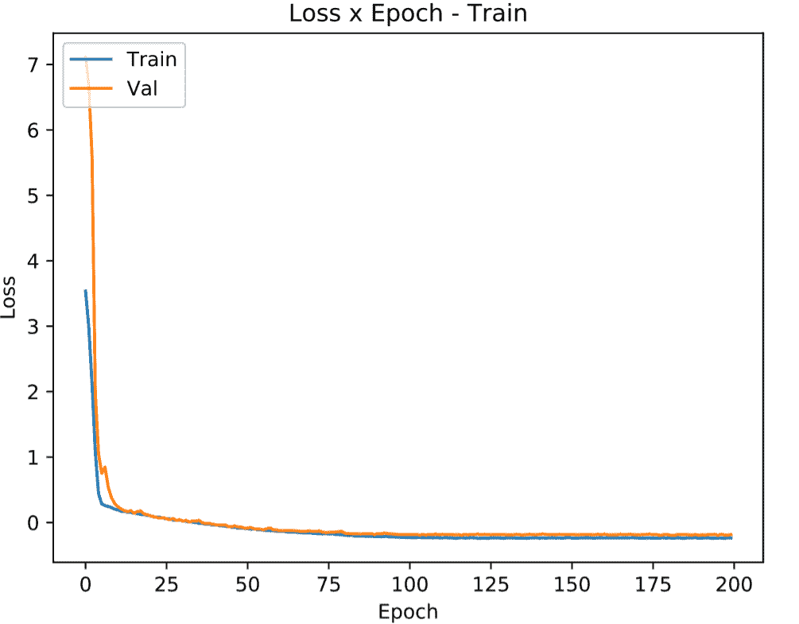

<!--yml

分类：未分类

日期：2024-09-06 20:04:10

-->

# [1911.06341] 深度学习在广场调查中的应用：地面宇宙实验中强引力透镜的快速分析

> 来源：[`ar5iv.labs.arxiv.org/html/1911.06341`](https://ar5iv.labs.arxiv.org/html/1911.06341)

# 深度学习在广场调查中的应用：地面宇宙实验中强引力透镜的快速分析

C. R. Bom debom@cbpf.br J. Poh B. Nord M. Blanco-Valentin L. O. Dias Centro Federal de Educação Tecnológica Celso Suckow da Fonseca, Rodovia Mário Covas, lote J2, quadra J, CEP 23810-000, Itaguaí, RJ, Brazil Centro Brasileiro de Pesquisas Físicas, Rua Dr. Xavier Sigaud 150, CEP 22290-180, Rio de Janeiro, RJ, Brazil Fermi National Accelerator Laboratory, P.O. Box 500, Batavia, IL 60510, USA Kavli Institute for Cosmological Physics, University of Chicago, Chicago, IL 60637, USA Department of Astronomy and Astropysics, University of Chicago, 5640 S. Ellis Ave., Chicago, IL 60134

###### 摘要

对强引力透镜的搜索和分析非常具有挑战性，因为这些天文物体稀少且图像复杂。下一代调查（包括地面和空间探测）将提供更多从这些物体中获得科学数据的机会，但前提是它们能在实际的时间范围内进行分析。目前，这些分析非常昂贵。在这项工作中，我们展示了使用深度学习模型进行回归分析的结果，并提供了不确定性估计，以测量模拟的暗能量探测数据中的四个强引力透镜参数。仅使用$gri$带图像，我们预测了爱因斯坦半径（$\theta_{\rm E}$）、透镜速度色散（$\sigma_{\rm v}$）、透镜红移（$z_{\rm l}$）在真实值的$10-15\%$范围内，以及源红移（$z_{\rm s}$）在真实值的$30\%$范围内，并附有预测的不确定性。这项工作有助于加速使用深度学习框架对强透镜进行分析的进程。

###### 关键词：

强引力透镜， 引力透镜， 深度学习， 卷积神经网络

## 1 引言

强引力透镜现象发生在当大质量天体（例如，银河系及其暗物质晕）扭曲时空，偏折来自观察者视线方向上的光线（例如，Schneider 等人，2013；Petters 等人，2012；Mollerach 和 Roulet，2002）。强引力透镜的关键特征是背景源的图像被放大和多重成像或扭曲，这只有在源点与引力透镜产生的扭曲引力势线的视线方向足够接近时才会发生。强引力透镜还依赖于观察者、透镜和源点之间的角距离，这些距离包含了关于基础宇宙学的信息。源光可能会被放大至百倍，因为强引力透镜下的光线偏折在增加物体的总角尺寸的同时保持了表面亮度。

强引力透镜系统是许多天体物理和宇宙学现象的独特探测工具。它们作为“引力望远镜”使得研究远距离源天体成为可能，这些天体在没有透镜效应的情况下太微弱而无法观测，例如高红移的星系（例如，Ebeling 等人，2018；Richard 等人，2011；Jones 等人，2010）：矮星系（Marshall 等人，2007），星形成星系（Stark 等人，2008），类星体吸积盘（Poindexter 等人，2008），以及微弱的 Lyman-alpha 斑块（Caminha 等人，2015）。透镜系统还可以作为非动力学探测工具来研究星系（例如，Treu 和 Koopmans，2002，2002；Koopmans 等人，2006a）和星系团（例如，Kovner，1989；Abdelsalam 等人，1998；Natarajan 等人，2007；Zackrisson 和 Riehm，2010；Carrasco 等人，2010；Coe 等人，2010）的质量分布，提供了一个关键的观测窗口来研究暗物质（参见，例如，Meneghetti 等人，2004）。

强引力透镜也被单独使用或与其他探测手段结合，来推导关于宇宙扩展历史、暗能量和暗物质的宇宙学约束（参见，例如，Jullo 等，2010；Caminha 等，2016；Bartelmann 等，1998；Cooray，1999；Golse 等，2002；Treu 和 Koopmans，2002；Yamamoto 等，2001；Meneghetti 等，2004，2005；Jullo 等，2010；Magaña 等，2015；Cao 等，2015；Caminha 等，2016；Schwab 等，2010；Enander 和 Mörtsell，2013；Pizzuti 等，2016）。对多重成像引力透镜 QSO 系统的精确和准确的时间延迟距离测量已被用于测量宇宙的膨胀率（Oguri，2007；Suyu 等，2010）。最近，这项技术也被应用于多重成像的引力透镜超新星（Kelly 等，2015；Goobar 等，2016）。强引力透镜还可以用于约束暗物质模型（Vegetti 等，2012；Hezaveh 等，2014；Gilman 等，2018；Rivero 等，2018；Bayer 等，2018），以及探测视线上的暗物质亚结构（Despali 等，2018；McCully 等，2017）。

广泛的应用范围激发了许多对强引力透镜系统的搜索。这些搜索中的许多都是基于哈勃太空望远镜（HST）提供的高质量空间数据进行的：哈勃深场（HDF；Hogg 等，1996）、HST 中等深度调查（Ratnatunga 等，1999）、大天文台起源深度调查（GOODS；Fassnacht 等，2004）、HST 存档银河尺度引力透镜调查（HAGGLeS；Marshall，2009）、扩展格罗斯带（EGS；Marshall 等，2009）和 HST 宇宙演化调查（COSMOS；Faure 等，2008；Jackson，2008）。

然而，仍有大量的地面成像数据值得深入探索。目前已确认的大多数强引力透镜系统都是在地面调查中首次发现的，例如红序列星团调查（RCS；Gladders 等，2003；Bayliss，2012）、斯隆数字天空调查（SDSS；Estrada 等，2007；Belokurov 等，2009；Kubo 等，2010；Wen 等，2011；Bayliss，2012）、深度透镜调查（DLS；Kubo 和 Dell’Antonio，2008）、加拿大-法国-夏威夷望远镜（CFHT）遗产调查（CFHTLS；Cabanac 等，2007；More 等，2012；Maturi 等，2014；Gavazzi 等，2014；More 等，2016；Paraficz 等，2016）、暗能量调查（DES；例如，Nord 等，2015）、千度调查（KIDS；例如，Petrillo 等，2017）。此外，一些强引力透镜系统最初是由赫歇尔太空观测站和南极望远镜（SPT）探测到的，随后由阿尔玛进行跟进（Vieira 等，2010；Hezaveh 等，2013；Oliver 等，2012；Dye 等，2018；Eales 等，2010）。强透镜还在星系团的后续观测中被发现（例如，Luppino 等，1999；Zaritsky 和 Gonzalez，2003；Hennawi 等，2008；Kausch 等，2010；Furlanetto 等，2013）以及星系（例如，Willis 等，2006）。下一代调查，如 LSST（Ivezić 等，2008）、欧几里得（Euclid；Laureijs 等，2011）和 WFIRST（Green 等，2012），预计将发现比目前已知的多两个数量级的透镜（Collett，2015a）。

目前的强引力透镜系统目录中的许多系统是通过视觉搜索发现的。然而，当前和未来宽视场调查产生的数据集越来越大，迫切需要开发和部署自动搜索方法来发现和分类透镜候选者。神经网络是一类自动化技术。最近的许多研究已经证明，传统神经网络（Bom 等，2017；Estrada 等，2007）和深度神经网络（Petrillo 等，2019b；Jacobs 等，2019；Petrillo 等，2019a；Metcalf 等，2018；Lanusse 等，2018；Glazebrook 等，2017）都可以用来识别原始图像中的形态特征，这些特征区分了透镜与非透镜，且对人工干预的要求最小。

除了寻找透镜的目录之外，推断透镜的性质，如爱因斯坦半径或透镜星系的速度色散，通常需要后续观测和建模。传统上，建模是通过计算量大的最大似然算法进行的（例如，Bradač et al., 2009; Diego et al., 2005; Coe et al., 2008; Oguri, 2010; Jullo et al., 2007; Metcalf and Petkova, 2014; Petkova et al., 2014），这可能需要几周的时间在 CPU 上完成，并且需要手动输入。这对于强透镜的统计研究或甚至选择后续跟踪的系统来说是一个相关的限制。最近，Hezaveh et al. (2017) 表明深度学习技术也可以用于回归任务，以快速测量强透镜：那项工作的透镜参数是在一组高质量的 HST 模拟和图像上测量的。此外，Levasseur et al. (2017) 使用 dropout 技术对强透镜参数进行了不确定性估计，这从贝叶斯的角度评估了深度神经网络（Gal and Ghahramani, 2016）。相同的方法被 Morningstar et al. (2018) 用于从干涉观测中推导强引力透镜参数的不确定性。

在这项工作中，我们解决了地面宽场天文调查中的强透镜分析问题，这些调查的数据质量低于空间观测数据。为了开发和验证我们的深度神经网络模型，我们制作了一个具有 DES 质量成像的强透镜系统的模拟目录。这些模拟用于训练和评估深度神经网络模型。然后，该模型用于推断透镜的速度色散 $\sigma_{v}$、透镜红移 $z_{l}$、源红移 $z_{s}$ 和爱因斯坦半径 $\theta_{E}$。我们的方法是通用的：尽管该模型针对的是星系尺度的透镜系统（即，两个对象，通常在视觉上融合，扭曲的图像源，环状图像或来自同一源的多个图像）进行了优化，但它可以扩展和优化以分析其他类型的强透镜，例如时间延迟和双源面系统。

本文的组织结构如下：首先，在§2 中，我们介绍了本研究中使用的深度学习模型和不确定性估计形式主义。接着，在§3 中，我们描述了本研究中使用的模拟数据。随后，在§4 中，我们介绍了如何训练深度神经网络模型。在§5 中，我们将模型应用于测试集并评估其性能。最后，我们在§6 中总结并展望未来的工作。

## 2 回归与不确定性测量在深度学习模型中的应用

深度学习算法（Goodfellow et al., 2016; LeCun et al., 2015），尤其是卷积神经网络（CNNs; LeCun et al., 1998），已被确立为计算机视觉研究中许多领域的前沿技术（参见，例如 Russakovsky et al., 2015; Zhang et al., 2018; Lin et al., 2018; John et al., 2015; Peralta et al., 2018）。在一些情况下，它们的表现优于人类（例如，He et al., 2015; Metcalf et al., 2018）。深度学习使得开发能够处理复杂且最少加工（甚至原始）数据的算法成为可能，这些数据来自各种来源，用于提取与其他感兴趣属性有效关联的相关特征。例如，在计算机视觉任务中，它已经成功应用于人脸识别（Lu et al., 2017a）、语音检测和特征提取（Vecchiotti et al., 2018; Abdel-Hamid et al., 2014）、音乐分类（Choi et al., 2017）、医学预后（Li et al., 2018b）和诊断（Hannun et al., 2019）。

深度学习模型不仅限于解决分类任务，即离散变量问题。实际上，通用逼近定理（Csáji, 2001; Goodfellow et al., 2016; Hornik, 1991; Hanin, 2017; Yarotsky, 2018）指出，具有适当激活函数的单隐层前馈神经网络（深度为 2）可以逼近$R^{n}$紧子集上的各种连续函数。在这种情况下，层可以非常宽（宽度）。最近，（Lu et al., 2017b）探讨了宽度有限而深度无限的网络，其中作者认为，具有宽度为$n+4$的网络，其中$n$是具有 ReLU 激活函数的输入层的大小，可以逼近$n$维输入空间上的任何 Lebesgue 可积函数。在这两种情况下，无论是深度有限还是宽度有限，这些结果都没有说明如何训练该神经网络。尽管如此，深度学习模型已经成功应用于估计连续变量，即执行回归任务（Lathuilière et al., 2018a, b; Belagiannis et al., 2015）。

回归问题可以被表述为分类问题（Rothe et al., 2018; Rogez et al., 2017），如果将输出参数离散化。例如，在天文学的深度学习中，这种方法最近被应用于光度红移估计（Pasquet et al., 2019）。在那项工作中，算法预测了一组参数，这些参数表示每个光度红移区间的概率，从而可以推导出概率密度函数（PDF）。

然而，这一过程面临若干缺点。例如，概率峰值区域的最大精度受限于区间大小。此外，问题的复杂性和准确性之间存在权衡。在这种情况下，在优化过程中，邻近真实值的区间中高分数的成本可能与远离真实值的区间中高分数的成本相同。更复杂的方法可以包括多个阶段的深度回归，应用聚类、伪标记（Liu et al., 2016）或稳健回归，其中添加了如高斯-均匀混合的概率模型，以减少模型对离群值的敏感性（Lathuilière et al., 2018b）。这些模型大多数通常非常专业化，并且对于不同的回归问题集难以适应。

在这项工作中，我们采用了一种更直接和通用的方法，将典型的分类深度学习模型适应于回归任务。我们使用了基于 Inception 模块的架构（Szegedy et al., 2015, 2016）。此外，为了估计不确定性，我们应用了具体丢弃技术来近似估计值的 PDF。模型架构和误差估计将在接下来的子节中详细介绍。

### 2.1 模型架构：Inception

过于庞大的神经网络架构在训练过程中会带来许多挑战。首先，当训练样本数量未能与参数数量相匹配时，过拟合成为主要限制。此外，卷积层中过滤器数量的均匀增加需要计算量的平方级增加。此外，当在大型线性架构中添加新层时，许多权重变得接近零，大部分计算时间变得无效（Szegedy et al., 2015）。

Inception 模块（见图 2）提供了一种非线性架构，并且权重具有稀疏性。这种稀疏性通过使神经网络更具适应性和稳定性提供了相关的优势。此外，更宽的层增加了基数（Tishby 和 Zaslavsky, 2015; Xie et al., 2017），即独立路径的数量，这可以提供调整模型的新方式。仅凭几千个参数，Inception 模块已被证明在性能上超过了拥有数千万参数的传统线性视觉几何组网络（VGG; Simonyan 和 Zisserman, 2014）模型。具有各种尺寸对象的样本对缺乏灵活性的网络提出了挑战。Inception 不需要对最佳卷积核大小的指定，因为卷积是并行执行的，每个卷积都有不同的核大小。

在图 1 中，我们展示了本文使用的 Inception 架构。从原始架构（Szegedy 等，2015）开始，我们将最后一个全连接层后的常规多类 softmax 激活函数（Krizhevsky 等，2012）替换为一个无界线性激活函数，该激活函数能够输出单一连续值——从而实现回归任务。它有三个流：输入流、核心流和输出流。输入流用于降维。它由两个连续的 2D 卷积层块、一个批量归一化层、一个 ReLU 激活层和 2D 最大池化层组成。两个卷积层的卷积核大小为$\left(5,5\right)$，而池化层的大小为$\left(2,2\right)$。

图 1：本文使用的 Inception 网络的示意图。该架构总共包含 86 层（卷积层、批量归一化层、ReLU 激活层、最大池化层和全连接层）。激活图的大小在网络的相关位置显示（在每个改变其大小的层之后）。该架构分为三个主要流：输入流，用于降低输入数据的维度和优化训练；核心流，其主要目的是从输入数据中提取有意义的空间特征；以及输出流，将这些提取的特征与每个待估计的引力透镜属性关联起来（见图 3）。

核心流由四个连续的 Inception 块组成。这些块的结构可以在图 2 中看到，每个块有四个分支，每个分支的卷积核大小不同。$\left(1,1\right)$卷积（每个分支上出现的第一个卷积层）用于图像深度降低——即，降低计算成本。任何紧接其后的卷积层大小为$\left(3,3\right)$¹¹1 请注意，堆叠多个$\left(3,3\right)$卷积层等同于使用更大卷积核的单层。然而，这种堆叠在计算上比使用单个卷积核更高效——即，堆叠两个$\left(3,3\right)$滤波器等同于使用单个$\left(5,5\right)$卷积核（Szegedy 等，2016）。

如图 1 所示，除了其深度外，核心流内部激活图的大小没有被修改。其他类型的架构需要减少激活图的维度以提取不同尺度的特征。然而，inception 模块预期会保持激活图的维度，因为特征在不同尺度上的提取是通过前述的并行卷积结构来实现的。

图 2：Inception net 中使用的 Inception 块的示意图，如图 1 所示。该块基于 Szegedy 等人（2016）为 Inception-v2 架构提出的 inception 模块。该块使得网络能够使用不同大小的卷积核处理数据，这对于在不同尺度上增强数据特征是有用的，同时不会因减少维度而丢失信息。$\left(1,1\right)$卷积（在每个分支上出现的第一个卷积层）用于图像深度的减少（使训练过程的计算开销更小）。左侧分支仅使用$\left(1,1\right)$卷积方案处理输入数据，以减少输入数据的深度。第二个分支（从左侧开始）有一个$\left(1,1\right)$卷积，后跟一个$\left(3,3\right)$卷积；而第三个分支在前述方案上增加了一个额外的$\left(3,3\right)$卷积，从而能够捕捉更大尺度的图像特征。最后，最后一个分支使用 2D 最大池化层以获得平移不变性。所有分支的激活图在各自的末端经过批量归一化和 ReLU 激活处理。随后，结果图以深度方向连接。输入数据的维度是$\left(H,W,D\right)$，$K$是之前指定的参数（输出通道）。

在 Inception 模块之后，需要将相关特征映射到预测变量中。因此，我们实现了一个瓶颈结构的序列——Conv/BN/ReLU——如 He 等人（2016）所提议的那样。我们在两种不同的方案中测试了当前的架构：构建一个只预测一个参数的模型，即每个参数独立训练一个模型，以及一个同时预测所有四个变量的模型（见图 3）。除了最后一种方法的计算效率外，我们确保用于预测$\theta_{E}$的特征，例如，与光度红移的预测是共享的。

图 3：输出块的示意图：一个瓶颈结构的序列——Dense/Batch Normalization/ReLU 逐渐减少特征超空间（$512$、$256$、$128$、$64$，最后是$1$）。

### 2.2 错误分析

不确定性估计对于评估科学测量的置信度至关重要。然而，适用于深度学习的不确定性估计方法仍然难以捉摸。评估科学置信度时，有几种类型的不确定性是有用的。它们可以大致分为两类——**偶然性（统计）**和**认知性（系统性）**。偶然性不确定性包括那些未知的并且随着每次数据获取而变化的影响。这些不确定性预计会随着样本量的增加而减少，对于固定模型而言。在强透镜的情况下，这包括 CCD 成像中的噪声。另一方面，认知性不确定性包括由于当前研究中忽略的可以知道的因素造成的错误，例如未建模的某些效应。对于给定的模型，这些不确定性不会随着样本量的增加而减少。然而，在深度学习回归这种数据驱动模型的情况下，如果在训练过程中给网络输入更多数据，这将改变模型，并且原则上可以降低我们对生成所收集训练数据的模型的无知（Kendall 和 Gal，2017）。我们将包括认知性和偶然性的总误差称为**预测误差**。标准误差传播目前不可行，因为在进行一些建模之前，没有原始图像的误差测量。此外，也没有办法将这种不确定性（如果存在）通过深度学习模型传播到推断参数上：我们需要知道模型参数的不确定性，但这种误差并不十分明确。理想情况下，我们应该能够在完全贝叶斯框架下对所有参数进行不确定性估计。贝叶斯神经网络可能提供输出参数方差的高斯过程近似（Lee 等，2017）；然而，并非所有参数都具有高斯误差。

另一种最近使用的方法是 Concrete Dropout，这种方法首先由 Gal 和 Ghahramani (2016) 描述；Gal 等 (2017)²²2github.com/yaringal/ConcreteDropout，并首次由 Levasseur 等 (2017) 应用于强透镜建模。在这种方法中，为了估计感兴趣参数的不确定性，我们使用 concrete dropout 技术计算预测的概率密度函数（PDF）。Concrete dropout 在贝叶斯框架中近似预测的物理参数 $Y$ 的后验分布 $p\left(Y|X\right)$，给定输入图像 $x$。我们从变分视角解释我们的模型（Jordan 等，1999；Graves，2011）。我们认为丢弃神经网络权重，即执行丢弃操作，作为从权重分布 $p(\omega|{\bf X},{\bf Y})$ 中的采样，这些权重通过一组输入 ${\bf X}=\{x_{1},...,x_{N}\}$ 和相应的输出参数 ${\bf Y}=\{y_{1},...,y_{N}\}$ 学习（Gal 和 Ghahramani，2016）。

#### 2.2.1 认知（模型）不确定性

考虑到神经网络理论上可以提供通用的近似，用这种方式进行丢弃类似于在函数空间上进行采样（Gal 和 Ghahramani，2016；Gal，2016）。与这种采样相关的误差与模型的无知有关；这被称为认知不确定性。方法基础：一个经过训练的深度学习模型的采样可以通过优化其丢弃率并用前向传播采样后验 $p(y|x,{\bf X},{\bf Y})$ 来解释为贝叶斯框架中的操作。然后，一旦网络训练完成，预测值的采样只是对应用丢弃操作的前向传播进行的，从而计算预测的后验。这种技术被称为蒙特卡洛丢弃（Monte Carlo dropout）（Gal 和 Ghahramani，2016）。

然而，定义丢弃率并不是一项简单的任务。例如，固定的丢弃概率会惩罚较大的权重，相比于较小的权重（Gal 等，2017），因为较大的权重被丢弃时，它们对结果的影响可能更大。为了在这种情况下最小化认知误差，应当优化以降低权重的幅度。例如，$0$-认知不确定性对应于我们将所有权重设置为 $0$ 的情况，因为预测将始终是 0，然而模型将不会进行任何预测。因此，定义丢弃率的目的不是获得优化的精度，而是找到一个可以合理定义认知误差的点。一些作者为此任务提出了网格搜索。然而，这种方法在大型和复杂的架构中可能是不可行的。

在变分方案中，可以定义一个优化 dropout 率的过程。问题可以表述为：对于一个网络，我们可以计算预测值 $y$ 在输入 $x$ 下的 PDF，如下所示：

|  | $p(y&#124;x,{\bf X},{\bf Y})=\int p(y&#124;x,\omega)\,p(\omega&#124;{\bf X},{\bf Y})\,\,d\omega\,.$ |  | (1) |
| --- | --- | --- | --- |

后验 $p(\omega|{\bf X},{\bf Y})$ 对训练数据集具有显著依赖性，并且其形式通常难以推导。因此，我们定义一个具有参数 $\theta$ 的解析变分分布 $q_{\theta}(\omega)$。

|  | $p(y&#124;x)\approx\int p(y&#124;x,\omega)\,q_{\theta}(\omega)\,\,d\omega\,.$ |  | (2) |
| --- | --- | --- | --- |

我们以分类任务为例。随后，我们发展了回归的策略。为了简单起见，在分类任务中，可以证明通过最大化对数证据下界（Fox 和 Roberts，2012），可以从 $q_{\theta}(\omega)$ 中推导参数：

|  | $L=\int q_{\theta}(\omega)\,\log p({\bf Y}&#124;{\bf X},\omega)\,\,d\omega-\mathrm{KL}(q_{\theta}(\omega)&#124;&#124;p(\omega))\,.$ |  | (3) |
| --- | --- | --- | --- |

第一项对应于分类任务中的传统损失项——即训练集输出的对数似然——在回归任务中可以用高斯损失替代。积分可以通过蒙特卡洛积分程序完成。第二项是 $\mathrm{KL}$ 散度，它参数化了分布 $p(\omega)$ 和 $q_{\theta}(\omega)$ 之间的距离，从而在训练过程中最小化它。$\mathrm{KL}$ 散度项可以通过 $L_{2}$ 正则化来近似（Gal 和 Ghahramani，2016）。对于一组参数 $\theta=\{{\bf M},p_{l}\}_{l=1}^{L}$，其中 ${\bf M}_{l}$ 是均值权重矩阵，$p$ 是第 $l^{\rm th}$ 层，$q_{\theta}(\omega)$ 的典型选择是定义：

|  | $\begin{split}q_{\theta}(\omega)&amp;=\prod_{l}q_{{\bf M}_{l}}({\bf W}_{l}),\\ q_{{\bf M}_{l}}({\bf W}_{l})&amp;={{\bf M}_{l}}\cdot\mathrm{diag}[\text{Bernoulli}(1-p_{l})^{K_{l}}],\end{split}$ |  | (4) |
| --- | --- | --- | --- |

其中，随机权重矩阵的集合是 $\omega=\{{\bf W}_{l=1}^{L}\}$，具有 $L$ 层，每个权重矩阵的维度为 $K_{l}$ 和 $K_{l+1}$。伯努利变量 $z=\text{Bernoulli}(1-p_{l})$ 以给定概率丢弃一些神经网络权重。

因此，深度学习模型可以通过优化其丢弃率并用前向传播采样后验 $p(y|x,{\bf X},{\bf Y})$ 来在贝叶斯框架中进行解释。然而，在某些情况下，执行这种优化可能会遇到一些问题。可以证明，在 Eqn. 3 uncertainty ‣ 2.2 Error Analysis ‣ 2 Regression with Uncertainty Measurements in deep learning Models ‣ Deep Learning in Wide-field Surveys: Fast Analysis of Strong Lenses in Ground-based Cosmic Experiments") 中找到 $\mathrm{KL}$ 散度项的最小值等同于最大化伯努利随机变量的熵，其概率为 $1-p$。这会惩罚在少量数据上训练的大型模型，因为它将丢弃率推近 $p=0.5$，而相较于较小的模型（Gal 等人，2017）。因此，较小的模型在低数据环境下会有较低的优化丢弃率。然而，随着我们向神经网络输入更多数据，带有认知不确定性的情况下，大型和小型模型的丢弃率都会降低。

在评估目标函数相对于离散伯努利分布的丢弃率的导数时，仍然存在一些警告。因此，我们遵循 Gal 等人 (2017) 的建议，将伯努利变量替换为 Concrete 分布 (Maddison 等人，2016) —— 即一种能够近似离散随机变量的连续分布。我们从 Concrete 分布中采样，这种分布近似于一维伯努利，等同于一个二元随机变量³³3 请注意，在 Gal 等人 (2017) 的文章发布时，该方法尚未应用于卷积层。我们使用了上述代码库中的更新版本，该版本适用于卷积层。

|  | $\displaystyle\tilde{z}$ | $\displaystyle=\text{sigmoid}\left(\frac{1}{t}\cdot\left(\log p-\log(1-p)+\log u-\log(1-u)\right)\right),$ |  | (5) |
| --- | --- | --- | --- | --- |

其中 $t$ 是温度参数，$u$ 是均匀分布 $u\sim\mathcal{U}(0,1)$。

训练后，我们为每个系统推导 $10^{3}$ 个实现。我们定义了 $68\%$、$95\%$ 和 $99\%$ 的置信区间。我们比较了中位数散布的置信区间 —— 来自不同对象但真值相同的散布 —— 与单个对象参数实现的置信水平。Concrete Dropout 实现的置信区间略宽，但紧随散布置信区间。

#### 2.2.2 随机（统计）不确定性

原则上，如果仅考虑认知错误而忽略随机错误来比较结果，可能会得到不现实的结果。为了将随机错误纳入总的（预测）错误中，必须考虑数据集的噪声属性。对于一个稳态数据集——其中所有数据具有相似的噪声属性——通常通过添加一个可以手动微调的随机不确定性来完成。由于数据呈现不同水平的信噪比，我们在异方差框架中估计随机不确定性：我们训练神经网络预测 $\sigma_{k}$，即第 $k$ 个输出参数的观测噪声参数。这是通过优化回归损失项 $L_{R}$ 中的 $\sigma_{k}$ 来完成的，$L_{R}$ 对应于方程 3 的第一项，给出如下：

|  | $\displaystyle L_{R}=\sum_{k}\frac{-1}{2\sigma_{k}^{2}}&#124;&#124;{y}_{n,k}-\hat{{y}}_{n,k}({\bf x}_{n},\omega)&#124;&#124;^{2}-\frac{1}{2}\log{\bf\sigma}_{k}^{2},$ |  | (6) |
| --- | --- | --- | --- |

其中，$y_{n,k}$ 和 $\hat{{y}}_{n,k}$ 分别是真实值和预测值，针对第 $n$ 个训练样本。因此，不需要标记的随机不确定性。

#### 2.2.3 系统性不确定性

然而，这仍然可能无法涵盖所有系统性不确定性，这些不确定性会在无噪声的输入数据中显现。此外，除了深度模型不确定性本身带来的认知（模型）错误源之外，还可能存在其他的退化现象，这可能会偏差或散射结果。例如，在宽视场调查成像中，像素大小和点扩散函数（PSF）通常比在太空观测中要大。还可能存在比随机散射更复杂的退化现象，这些现象可以影响预测值。强引力透镜系统可能有多个源图像，这些图像可能以多种方式被扭曲，并且可能与引力透镜星系混合。此外，被透镜图像的参数空间大约有十个独立变量。当试图从图像中提取信息时，这可能是系统性错误的一个相关来源。例如，在源光与透镜星系的光没有混合的情况下，推断强引力透镜系统的爱因斯坦半径 $\theta_{E}$ 比光混合的情况下要容易得多，即使图像中的噪声水平相同。

为了评估结果中可能存在的偏差或散布，我们将训练样本中的中位数预测与实际真值进行了视觉比较。我们观察到，即使在考虑了认识论不确定性的情况下，我们的一些模型预测仍存在小的线性偏差。为了解决这个问题，我们采用了以下程序：我们对模型预测和真实值之间进行了线性拟合，然后减去了预测中的偏差。然后，我们使用相同的线性拟合来去除测试数据集中的偏差。因此，我们的模型包括一个深度学习预测和一个线性缩放修正。在拟合过程之后，我们发现中位数的散布的百分位误差以及由于 dropouts 采样引起的百分位误差在中位数附近和大部分$y=x$线附近是一致对称的，除了与模型样本较少的高低边界相对应的某些区域。我们在 6 节中对此进行了进一步讨论。

## 3 模拟数据

为了**最佳**地训练、验证和测试用于强引力透镜分析的神经网络，我们需要一个包含大量强引力透镜的图像目录。鉴于目前已知的强引力透镜数量较少（大约 1000 个透镜），我们使用了来自 LensPop⁴⁴4[`github.com/tcollett/LensPop`](https://github.com/tcollett/LensPop)（Collett，2015a）的模拟透镜来定义不同的图像集，用于训练、验证和测试。在这里，我们简要概述了 LensPop 算法中使用的程序。有关 LensPop 的完整描述，我们请有兴趣的读者参阅 Collett（2015b）。

LensPop 首先在天空中生成一个合成的银河尺度强透镜系统种群。对于透镜种群，LensPop 假设所有透镜的质量轮廓为单一等温椭球体（SIE），其质量从 SDSS 星系的速度色散函数中抽取（Choi et al., 2007）。观测表明，椭圆星系主导了宇宙的透镜概率（例如，Oguri 和 Marshall，2010 及其中的引用），它们可以用 SIE 质量轮廓很好地近似（Auger et al., 2010；Koopmans et al., 2006b）。透镜的红移是从质量与差分共动体积函数独立抽取的。透镜的光度轮廓假设遵循一个与质量对齐且同心的 de Vaucouleurs 轮廓（de Vaucouleurs，1948）。透镜颜色假设遵循一个在 10 亿年以前发生恒星形成的星系的静止框架 SED。LensPop 中的源光度具有椭圆指数光轮廓，其亮度、颜色和红移分布从 A. J. Connolly (2010)的天空目录中抽取。

成像调查的观测条件被模拟并应用于合成透镜，以生成一个模拟的透镜成像数据目录，这些数据模拟了该调查。在这项工作中，我们模拟了 DES 调查的观测和仪器能力，以生成具有 DES-like 图像质量的透镜。模拟图像首先通过将模型透镜图像像素化到调查仪器的探测器的像素尺度来创建。然后将像素化的图像与圆形大气点扩散函数（PSFs）卷积。然后向模拟图像中添加来自透镜、源、均匀天空背景和 CCD 读出噪声的泊松噪声。零点、曝光时间、曝光次数、像素尺度、读出噪声、滤波器带和调查区域取自 DES 调查规格。看到和天空亮度是从 DES 数据中抽取的随机变量，并在 Collett (2015b)的表 1 中描述。

我们的数据集中每个模拟的透镜都被认为是 DES 可观测的。我们遵循 Collett (2015b)中设定的标准来确定哪些透镜系统可以被 DES 探测。所有可检测的透镜必须是多重成像的。因此我们有：

|  | $\theta_{\rm E}^{2}>x_{s}^{2}+y_{s}^{2},$ |  | (7) |
| --- | --- | --- | --- |

其中$\theta_{\rm E}$是爱因斯坦半径，$x_{s}$和$y_{s}$是相对于透镜星系的未透镜源位置。在至少一个$g,r,i$波段中，图像和对像必须被解析。因此，我们还要求：

|  | $\theta_{\rm E}^{2}>r_{s}^{2}+(s/2)^{2},$ |  | (8) |
| --- | --- | --- | --- |

其中 $r_{s}^{2}$ 是源的半光半径，$s$ 是视场。除此之外，图像平面中放大源图像的切向剪切也必须被解析，并且放大倍率必须足够大，以使源图像明显地被剪切。按照 Collett (2015b) 的方法，我们采用：

|  | $\mu_{\mathrm{total}}r_{s}>s\quad\mathrm{and}\quad\mu_{\mathrm{total}}>3,$ |  | (9) |
| --- | --- | --- | --- |

其中 $\mu_{\mathrm{total}}$ 是源的总放大倍率。最终，信噪比 $S/N_{\mathrm{total}}$ 必须足够高，以便能够识别透镜并确定上述标准是否符合。同时，按照 Collett (2015b) 的方法，我们设定

|  | $S/N>20.$ |  | (10) |
| --- | --- | --- | --- |

使用 LensPop，我们生成了 $18,600$ 个模拟的 DES 可观测的星系-星系透镜系统。DES 模拟数据集中，爱因斯坦半径 ($\theta_{\rm E}$)、速度色散 ($\sigma_{\mathrm{v}}$) 以及透镜和源的红移 ($z_{L}$, $z_{S}$) 的分布与 Collett (2015b) 的结果一致。图 4 显示了来自总数据集的 20 个 DES 可观测系统的代表性随机样本。

图 4: 从 $\mathrm{LensPop}$ 模拟中随机选择的 20 个 DES 可观测透镜系统。每个系统的 $g$、$r$、$i$ 波段图像，以及带透镜星系的伪彩色 $gri$ 合成图像（’gri’）和不带透镜星系的伪彩色图像（’gri (LS)’），从左到右依次显示。伪彩色图像是按照 Lupton 等人（2004）的方法制作的。图像按爱因斯坦半径从左到右、从上到下排序。有关模拟图像数据集的更多信息，请参见 §LABEL:sec:simulations。

## 4 训练 Inception 深度学习模型

强引力透镜样本被分为两组：$80\%$ 用于训练和验证，$20\%$ 用于测试。训练子集是唯一用于在反向传播算法中更新网络权重的数据集（Ruder，2016）。我们对 Inception 架构进行了训练，参数包括 $\theta_{\rm E}$，$\sigma_{\rm v}$，$z_{\rm l}$ 和 $z_{\rm s}$，既可以一起训练，也可以分别训练（其中输出核心图示见图 2，应仅考虑单一分支）。用于训练架构的超参数通过手动调整其值在某个范围内，直到达到回归的（局部）最佳准确率。选择的训练批次大小为 $2,000$，而最大纪元数设置为 $400$。为了避免过拟合并提高模型收敛性，我们使用了学习率减少器和早停器。训练使用了 Adam 优化器。模型在 24 核 Intel Xeon CPU X5670（$2.93$ GHz）和 GeForce GTX 1080 GPU 上进行训练。

每个模型的训练时间约为 $\sim 4$ 小时。在图 5 中，我们展示了 $z_{s}$ 的训练诊断损失与纪元的关系，其中训练和验证数据集的固定纪元数设置为 $200$。该图表显示了每个样本的优化性能，训练和验证，且表明没有明显的过拟合。$\sigma_{\rm v}$，$\theta_{\rm E}$，$z_{L}$ 以及输出所有四个参数的网络也呈现出类似的曲线。

图 5: 训练阶段 $z_{s}$ 的损失与纪元关系

## 5 结果

回归是在我们由 $3720$ 个系统组成的测试样本上进行的。对每个强透镜系统，测试样本推断 $10^{3}$ 次实现的时间不到 $\sim 1$ 秒。我们展示了 $\theta_{\rm E}$、$\sigma_{\rm v}$、$z_{\rm l}$ 和 $z_{\rm s}$ 相对于真实值的预测结果，以及每个值的分布，如图 6 中所示，图中展示了预测所有四个参数的网络。我们观察到，大多数范围内，预测值保持在真实值的 $\pm 10\%-15\%$ 之内，$z_{\rm s}$ 除外。在低值和高值范围内，我们注意到与真实值的偏差较大，这与我们训练数据集中的样本量较小相关。在这些区域，尽管预测中位数和真实值在 $68\%$ 置信水平下是一致的，但仍存在一定的偏差。在图 7 的上半部分，我们展示了分数偏差的中位数和 $68\%$ 置信水平的百分位数，分别为一次预测一个参数（红色）和一次预测所有参数（蓝色）。我们没有发现任何参数的强偏差。在同一图形的下半部分，我们评估了高偏差样本的大小，定义为分数偏差高于 $15\%$。结果显示，无论是红色还是蓝色，情况类似，尽管这表明一次预测多个参数可能会减少高偏差透镜的样本量，至少对于 $z_{L}$ 是如此。对于所有参数，除了 $z_{\rm s}$ 外，整个测试样本中的平均分数偏差低于 $10\%$。

图 6：真实值与预测值及残差：爱因斯坦半径，$\theta_{\rm E}$（左上），速度色散，$\sigma_{V}$（右上），透镜红移，$z_{L}$（左下）和源红移，$z_{S}$（右下）。绿色阴影表示 $1-2-3$ 西格玛区域的百分位数，蓝色阴影为中位数预测值的 $1$ 西格玛散布。

图 7：使用预测单一参数的模型（红色圆圈）和一次性预测所有 $4$ 个参数的模型（蓝色星星）对完整测试样本的分数偏差，其中虚线表示 $0.0$（黑色）、$0.1$（红色）、$0.2$（洋红色）的偏差（上方）。偏差大于 $0.15$ 的对象百分比（下方）。

图 8：$\theta_{\rm E}$ 的真实值与预测值，以及 $90\%/10\%$（左）和 $10\%/90\%$ 训练/测试拆分的残差。绿色阴影表示对应于 $1-2-3$ 西格玛区间的百分位，蓝色阴影表示中位数预测值的 1 西格玛散布。

我们还调查了分数偏差如何随着其他物理值的变化而变化，例如强度、信噪比和透镜物体的大小。在大多数情况下，我们发现与低参数采样对应的偏差或误差较高的区域，这表明通过更多的数据可以克服不确定性或偏差。然而，也有一些有趣的情况，如图 9 中展示的情况。在这些图中，我们观察到较小/较大的$\theta_{\rm E}$可能与分数偏差相关，偏差可达$\approx+80\%$/$-40\%$，考虑到网络中$\theta_{\rm E}>0.7$弧秒的$68\%$误差条。虽然误差条很宽且包含了$0\%$偏差，但值得提到的是，在高$\theta_{\rm E}$端有些区域的样本较少，误差可能在这些区域定义不清。$\theta_{\rm E}$与$z_{\rm s}$通过宇宙学距离连接。在$z_{\rm l}$的情况下，我们观察到较低/较高的速度色散可能与中位数的$\approx+20\%$/$-10\%$偏差相关。除了所展示的图外，我们还观察到$\theta_{\rm E}$预测误差的范围比原来的范围宽了$\sim 2$倍，即$\sim\pm 20\%$，对于$\sigma_{\rm v}$低于$230$公里/秒的情况。由于$\sigma_{\rm v}$与质量成正比，因此与$\theta_{\rm E}$相关，这表明随着透镜效应减弱，不确定性增加。如果有人试图定义一个更准确的样本或调整模型，这些结果可能会很有用。结果在信噪比作为函数的情况下准确度没有显著变化，这可能是由于模拟中的选择标准$S/N>20$，要求强透镜效应应易于检测。最后，我们评估了训练/测试数据集拆分的效果。在图 8 中显示了两个不同的训练/测试集，分别是$90\%/10\%$（左）和$10\%/90\%$（右）。右侧的图展示了更宽的误差条，例如，对于$\theta_{\rm E}<1.0^{\prime\prime}$，$3$ sigma 不确定性的高限为$2.0^{\prime\prime}$。值得注意的是，考虑到$\theta_{\rm E}\gtrapprox 2.0^{\prime\prime}$的中位数，方法变得平坦。这些结果支持在数据驱动模型中使用尽可能多的数据的重要性，如所展示的模型，以便做出合理的预测。

图 9：源红移 $z_{\rm s}$ 相对于爱因斯坦半径 $\theta_{E}$（左侧）和透镜红移 $z_{\rm l}$ 相对于速度色散 $\sigma_{\rm v}$（右侧）的真实值的分数偏差。绿色阴影表示$1-2-3$ sigma 区域的百分位数，蓝色阴影表示预测中值的 1 sigma 散布。虚线表示$0.0$（黑色），$0.1$（红色），$0.2$（洋红色）偏差。

## 6 讨论与总结

我们展示了使用深度神经网络模型对模拟广域调查图像中的强透镜系统的天体物理特征进行预测。这些参数预测包括对认知不确定性和偶然不确定性的估计，我们验证了数千个单独系统预测的散布低于这种不确定性。特别是，速度色散仅用$3$个波段限制在低于$10\%$水平。当前结果支持我们可以使用深度学习作为快速目录生成和可靠分析的工具，这可以在计算时间上优于更传统的方法（例如 MCMC），且无需高度专业化的专家。这在原则上可以用于选择进一步调查的系统，或用于需要约$15\%$水平性能的统计分析，例如在星系-星系强透镜宇宙学（Cao et al., 2015; Chen et al., 2018）中，我们可以将$\theta_{\rm E}$与$\sigma_{\rm v}$的独立测量结合使用，以推导距离比或推导星系质量密度分布（Li et al., 2018a）。

在每个参数的低值和高值处，我们观察到偏差并且预期的不确定性较高。这可能是由于这些区域中训练样本相对较少造成的。此外，具有较小爱因斯坦半径的系统由于缺乏这些系统中的典型透镜特征区分，可能更难以估计。增加这些参数空间区域的示例可能会降低不确定性。然而，随着模型置信水平的提高，系统性误差也可能会暴露。在未来的工作中，我们计划 a) 解决各种不确定性之间的相互作用和权衡；以及 b) 探索图像质量的变化如何影响这些结果。

速度色散偏差的估计值在$10\%$以下。这个精度与 BELLS (Bolton et al., 2012)和 SLACS (Bolton et al., 2006)等光谱调查相当。值得注意的是，我们方法的输入不仅包括三个波段的信息，还包括形态学和强引力透镜源，这些信息预计有助于约束速度色散。实际上，如果$\theta_{\rm E}$或角分离$\theta$、$z_{l}$和$z_{s}$得到良好约束，给定一个密度轮廓和宇宙学模型（Davis et al., 2003），可以达到这种精度估计速度色散。事实上，如果从强引力透镜中约束了速度色散，它可以应用于诸如 Cao et al. (2017)和 Schwab et al. (2009)等修改引力测试。这可以通过诸如局部可解释模型无关解释（LIME；Ribeiro et al., 2016）等技术进一步研究。这也将是未来研究的主题。

值得注意的是，由于$\mathrm{LensPop}$在模拟类似 DES 的图像数据集时具有一定的理想化特性，这里量化的不确定性可能低于我们从实际成像数据中的推断不确定性。虽然$\mathrm{LensPop}$的处方得到了理论和实证的充分支持，但它对透镜和源的总体，以及系统的模拟观察条件做了许多简化假设（其中一些在 Collett (2015b)的第七部分中讨论）。实际的强引力透镜系统可能具有不同程度偏离这些假设的特征。

更关键的是，$\mathrm{LensPop}$假设每个引力透镜系统都是孤立存在的。实际上，椭圆星系（构成了大多数星系尺度的透镜）倾向于聚集，这会导致由于附近质量对透镜系统引力势的外部扰动，以及这些物体对透镜系统视场的拥挤。$\mathrm{LensPop}$还忽略了可能偶然位于透镜视线上的物体。这些不均匀场景可能在回归应用于实际数据时导致更高的不确定性。

在这样的条件下，需要妥善处理数据中的系统性不确定性。减少数据中由于理想化模拟未考虑的因素带来的不确定性影响的一种可能方法是进行迁移学习或领域适应，换句话说，从本文中提出的模型或其部分模型开始，并对真实数据进行微调。然而，由于迄今为止在真实数据中发现的强透镜系统少得多，要正确训练该方案是一个重大挑战，可能还需要使用数据增强方法。我们目前通过进行具有更高现实度的模拟来评估理想化模拟的相关性。因此，这项工作代表了朝着建立一个更强健框架的创新步骤，以分析当前和未来地面观测数据中发现的强透镜系统。

值得一提的是，实际数据中可能存在观测条件不均匀的情况，细微的调整应考虑在不同曝光时间/噪声水平和不同波段的模拟，或者关注信噪比更高的真实透镜。

## 致谢

### 作者贡献：

Bom: 开发了方法论和神经网络架构；进行回归和不确定性分析；创建图表；编写和编辑。

Poh: 创建了模拟数据集和图像剪裁；创建图表；编写和编辑。

Nord: 进行结果分析；设计诊断并编辑文档。

Blanco-Valentin: 编写了回归代码并创建了图表。

Dias: 进行了线性拟合并评估了训练。

本论文和工作得到了 Deep Skies Community⁵⁵5[`deepskieslab.com/`](https://deepskieslab.com/)的支持，该社区帮助汇集了作者和评论者。本文作者承诺在一个公平、包容和公正的环境中进行这项工作，并对自己负责，认为最好的科学依赖于良好的研究环境。本文还使用了 Plot Deep Design ⁶⁶6[`github.com/cdebom/plot_deep_design`](https://github.com/cdebom/plot_deep_design) 库来制作所呈现架构的图表。

本手稿由 Fermi Research Alliance, LLC 在与美国能源部科学办公室、高能物理办公室签署的合同号 DE-AC02-07CH11359 下编写。

C. Bom 感谢费米实验室在他访问期间提供的财政支持。C. Bom 还要感谢 M. Makler 的有益讨论。作者们要感谢 P. Souza Pereira 通过提供 GPU 访问来支持这个项目。

## 参考文献

+   A. J. Connolly (2010) A. J. Connolly, John Peterson, J.G.J.R.A.J.B.C.C.C.F.C.R.G.D.K.G.E.G.R.L.J.Z.I.J.J.M.J.S.M.K.V.L.K.S.K.S.L.J.P.A.R.N.T.J.A.T.M.Y., 2010. 模拟 LSST 系统。网址：[`doi.org/10.1117/12.857819`](https://doi.org/10.1117/12.857819), doi:[10.1117/12.857819](http://dx.doi.org/10.1117/12.857819).

+   Abdel-Hamid et al. (2014) Abdel-Hamid, O., Mohamed, A.r., Jiang, H., et al., 2014. 用于语音识别的卷积神经网络。**IEEE/ACM 音频、语音与语言处理汇刊** 22, 1533–1545.

+   Abdelsalam et al. (1998) Abdelsalam, H.M., Saha, P., Williams, L.L.R., 1998. 从强引力透镜重建簇质量分布的非参数方法——对 Abell 370 的建模。**皇家天文学会月刊** 294, 734. doi:[10.1046/j.1365-8711.1998.01356.x](http://dx.doi.org/10.1046/j.1365-8711.1998.01356.x), [arXiv:astro-ph/9707207](http://arxiv.org/abs/astro-ph/9707207).

+   Auger et al. (2010) Auger, M.W., Treu, T., Bolton, A.S., et al., 2010. 斯隆透镜 ACS 调查。X. 大型早期型星系的恒星、动力学及总质量相关性。**天体物理学杂志** 724, 511--525. doi:[10.1088/0004-637X/724/1/511](http://dx.doi.org/10.1088/0004-637X/724/1/511), [arXiv:1007.2880](http://arxiv.org/abs/1007.2880).

+   Bartelmann et al. (1998) Bartelmann, M., Huss, A., Colberg, J.M., Jenkins, A., Pearce, F.R., 1998. 具有现实群体势能的弧统计。IV. 不同宇宙学中的簇。**天文学与天体物理学** 330, 1--9. [arXiv:astro-ph/9707167](http://arxiv.org/abs/astro-ph/9707167).

+   Bayer et al. (2018) Bayer, D., Chatterjee, S., Koopmans, L., et al., 2018. 从星系-星系强引力透镜中对亚星系物质功率谱的观测约束。arXiv 预印本 arXiv:1803.05952.

+   Bayliss (2012) Bayliss, M.B., 2012. 105 个巨弧的宽带光度测量：红移约束及其对巨弧统计的影响。**天体物理学杂志** 744, 156. doi:[10.1088/0004-637X/744/2/156](http://dx.doi.org/10.1088/0004-637X/744/2/156), [arXiv:1108.1175](http://arxiv.org/abs/1108.1175).

+   Belagiannis et al. (2015) Belagiannis, V., Rupprecht, C., Carneiro, G., Navab, N., 2015. 用于深度回归的鲁棒优化，载于：**IEEE 国际计算机视觉大会论文集**，第 2830--2838 页.

+   Belokurov et al. (2009) Belokurov, V., Evans, N.W., Hewett, P.C., et al., 2009. 从 SDSS 中发现的两个新的大分离引力透镜。**皇家天文学会月刊** 392, 104--112. doi:[10.1111/j.1365-2966.2008.14075.x](http://dx.doi.org/10.1111/j.1365-2966.2008.14075.x), [arXiv:0806.4188](http://arxiv.org/abs/0806.4188).

+   Bolton et al. (2012) Bolton, A.S., Brownstein, J.R., Kochanek, C.S., et al., 2012. BOSS 发射线透镜调查。II. 研究 SLACS+BELLS 强引力透镜样本中的质量密度分布演化。**天体物理学杂志** 757, 82.

+   博尔顿等（2006）博尔顿、A.S.、伯尔斯、S.、库普曼斯、L.V.、特瑞、T.、穆斯塔卡斯、L.A.，2006。斯隆透镜 ACS 调查。我。大规模光谱选择的早期型透镜星系样本。《天体物理学杂志》638，703。

+   博姆等（2017）博姆、C.R.、马克勒、M.、阿尔布克基、M.P.、布兰特、C.H.，2017。基于 Mediatrix 蛋白质方法的神经网络引力弧探测器。《天文学与天体物理学》597，A135。doi：[10.1051/0004-6361/201629159](http://dx.doi.org/10.1051/0004-6361/201629159)，[arXiv:1607.04644](http://arxiv.org/abs/1607.04644)。

+   布拉达奇等（2009）布拉达奇、M.、特瑞、T.、阿普尔盖特、D. 等，2009。聚焦宇宙望远镜：利用子弹星团 1E0657 - 56 探索红移 z ~ 5-6 的星系。《天体物理学杂志》706，1201--1212。doi：[10.1088/0004-637X/706/2/1201](http://dx.doi.org/10.1088/0004-637X/706/2/1201)，[arXiv:0910.2708](http://arxiv.org/abs/0910.2708)。

+   卡巴纳克等（2007）卡巴纳克、R.A.、阿拉尔德、C.、丹特尔-福特、M. 等，2007。CFHTLS 强引力透镜遗产调查。我。调查概述和 T0002 版本样本。《天文学与天体物理学》461，813--821。doi：[10.1051/0004-6361:20065810](http://dx.doi.org/10.1051/0004-6361:20065810)，[arXiv:arXiv:astro-ph/0610362](http://arxiv.org/abs/arXiv:astro-ph/0610362)。

+   卡明哈等（2016）卡明哈、G.B.、格里洛、C.、罗萨蒂、P. 等，2016。CLASH-VLT：银河团 RXC J2248.7-4431（Abell S1063）的高精度强引力透镜模型及其在宇宙学中的前景。《天文学与天体物理学》587，A80。doi：[10.1051/0004-6361/201527670](http://dx.doi.org/10.1051/0004-6361/201527670)，[arXiv:1512.04555](http://arxiv.org/abs/1512.04555)。

+   卡明哈等（2015）卡明哈、G.B.、卡尔曼、W.、罗萨蒂、P. 等，2015。发现一个微弱的星形成多重透镜 Lyman-alpha blob。arXiv:1512.05655 [arXiv:1512.05655](http://arxiv.org/abs/1512.05655)。

+   曹等（2015）曹胜、比耶斯亚达、M.、加瓦奇、R.、皮约尔科夫斯卡、A.、朱志辉，2015。使用强引力透镜系统进行宇宙学研究。《天体物理学杂志》806，185。URL: [`stacks.iop.org/0004-637X/806/i=2/a=185`](http://stacks.iop.org/0004-637X/806/i=2/a=185)。

+   曹等（2017）曹胜、李雪、比耶斯亚达、M. 等，2017。使用银河尺度强引力透镜系统检验参数化后牛顿引力。《天体物理学杂志》835，92。

+   卡拉斯科等（2010）卡拉斯科、E.R.、戈麦斯、P.L.、韦尔杜戈、T. 等，2010。Abell 3827 中超大质量 cD 星系的强引力透镜。《天体物理学杂志快报》715，L160--L164。doi：[10.1088/2041-8205/715/2/L160](http://dx.doi.org/10.1088/2041-8205/715/2/L160)，[arXiv:1004.5410](http://arxiv.org/abs/1004.5410)。

+   陈等（2018）陈毅、李锐、舒颖，2018。评估镜质量模型在宇宙学应用中的效果，更新了银河尺度强引力透镜样本。arXiv 预印本 arXiv:1809.09845。

+   Choi et al. (2017) Choi, K., Fazekas, G., Sandler, M., Cho, K., 2017. 《用于音乐分类的卷积递归神经网络》，见：2017 IEEE 国际声学、语音和信号处理会议（ICASSP），IEEE。第 2392--2396 页。

+   Choi et al. (2007) Choi, Y.Y., Park, C., Vogeley, M.S., 2007. 《斯隆数字天空调查中的星系的内部和集体属性》。天体物理学杂志 658, 884--897. doi:[10.1086/511060](http://dx.doi.org/10.1086/511060), [arXiv:astro-ph/0611607](http://arxiv.org/abs/astro-ph/0611607)。

+   Coe et al. (2010) Coe, D., Benítez, N., Broadhurst, T., Moustakas, L.A., 2010. 《星系团子结构的高分辨率质量图：LensPerfect 对 A1689 的分析》。天体物理学杂志 723, 1678--1702. doi:[10.1088/0004-637X/723/2/1678](http://dx.doi.org/10.1088/0004-637X/723/2/1678), [arXiv:1005.0398](http://arxiv.org/abs/1005.0398)。

+   Coe et al. (2008) Coe, D., Fuselier, E., Benítez, N., et al., 2008. 《LensPerfect：引力透镜质量图重建精确再现所有多重图像》。天体物理学杂志 681, 814--830. doi:[10.1086/588250](http://dx.doi.org/10.1086/588250), [arXiv:0803.1199](http://arxiv.org/abs/0803.1199)。

+   Collett (2015a) Collett, T.E., 2015a. 《即将进行的光学成像调查中的星系-星系强透镜的数量》。天体物理学杂志 811, 20. doi:[10.1088/0004-637X/811/1/20](http://dx.doi.org/10.1088/0004-637X/811/1/20), [arXiv:1507.02657](http://arxiv.org/abs/1507.02657)。

+   Collett (2015b) Collett, T.E., 2015b. 《即将进行的光学成像调查中的星系-星系强透镜的数量》。天体物理学杂志 811, 20. doi:[10.1088/0004-637X/811/1/20](http://dx.doi.org/10.1088/0004-637X/811/1/20), [arXiv:1507.02657](http://arxiv.org/abs/1507.02657)。

+   Cooray (1999) Cooray, A.R., 1999. 《使用星系团的宇宙学》。III. 作为宇宙学探针的引力透镜弧统计。天文学与天体物理学 341, 653--661. [arXiv:astro-ph/9807147](http://arxiv.org/abs/astro-ph/9807147)。

+   Csáji (2001) Csáji, B.C., 2001. 《用人工神经网络进行逼近》。匈牙利厄尔特大学科学学院 24, 48。

+   Davis et al. (2003) Davis, A.N., Huterer, D., Krauss, L.M., 2003. 《强透镜约束椭圆星系的速度色散和密度轮廓》。皇家天文学会月刊 344, 1029--1040。

+   de Vaucouleurs (1948) de Vaucouleurs, G., 1948. 《关于超星系云的研究》。天体物理学年鉴 11, 247。

+   Despali et al. (2018) Despali, G., Vegetti, S., White, S.D.M., Giocoli, C., van den Bosch, F.C., 2018. 《在子结构透镜中建模视线贡献》。皇家天文学会月刊 475, 5424--5442. doi:[10.1093/mnras/sty159](http://dx.doi.org/10.1093/mnras/sty159), [arXiv:1710.05029](http://arxiv.org/abs/1710.05029)。

+   Diego 等（2005）Diego, J.M., Protopapas, P., Sandvik, H.B., Tegmark, M., 2005. 强引力透镜系统的非参数反演。Mon. Not. Roy. Astron. Soc. 360, 477--491. doi:[10.1111/j.1365-2966.2005.09021.x](http://dx.doi.org/10.1111/j.1365-2966.2005.09021.x), [arXiv:astro-ph/0408418](http://arxiv.org/abs/astro-ph/0408418)。

+   Dye 等（2018）Dye, S., Furlanetto, C., Dunne, L., 等，2018。对赫歇尔探测到的强引力透镜高星形成星系的高分辨率 alma 观测建模。Monthly Notices of the Royal Astronomical Society 476, 4383--4394。

+   Eales 等（2010）Eales, S., Dunne, L., Clements, D., 等，2010。赫歇尔 ATLAS。PASP 122, 499. doi:[10.1086/653086](http://dx.doi.org/10.1086/653086), [arXiv:0910.4279](http://arxiv.org/abs/0910.4279)。

+   Ebeling 等（2018）Ebeling, H., Stockmann, M., Richard, J., 等，2018。三十重：在 z = 1.6 处对静止星系的极端引力透镜。Astrophys. J. 852, L7. doi:[10.3847/2041-8213/aa9fee](http://dx.doi.org/10.3847/2041-8213/aa9fee), [arXiv:1802.00133](http://arxiv.org/abs/1802.00133)。

+   Enander 和 Mörtsell（2013）Enander, J., Mörtsell, E., 2013。双重度量大质量引力的强引力透镜约束。Journal of High Energy Physics 2013, 1--23. URL: [`dx.doi.org/10.1007/JHEP10(2013)031`](http://dx.doi.org/10.1007/JHEP10(2013)031), doi:[10.1007/JHEP10(2013)031](http://dx.doi.org/10.1007/JHEP10(2013)031)。

+   Estrada 等（2007）Estrada, J., Annis, J., Diehl, H.T., 等，2007。Sloan Digital Sky Survey 集群样本中高表面亮度巨弧的系统搜索。Astrophys. J. 660, 1176--1185. doi:[10.1086/512599](http://dx.doi.org/10.1086/512599), [arXiv:astro-ph/0701383](http://arxiv.org/abs/astro-ph/0701383)。

+   Fassnacht 等（2004）Fassnacht, C.D., Moustakas, L.A., Casertano, S., 等，2004。GOODS ACS 区域中的强引力透镜候选者。Astrophys. J. Lett. 600, L155--L158. doi:[10.1086/379004](http://dx.doi.org/10.1086/379004), [arXiv:arXiv:astro-ph/0309060](http://arxiv.org/abs/arXiv:astro-ph/0309060)。

+   Faure 等（2008）Faure, C., Kneib, J.P., Covone, G., 等，2008。COSMOS 区域强引力透镜候选目录。Astrophys. J. Suppl. 176, 19, 勘误 2008, 178, 382. doi:[10.1086/526426](http://dx.doi.org/10.1086/526426), [arXiv:0802.2174](http://arxiv.org/abs/0802.2174)。

+   Fox 和 Roberts（2012）Fox, C.W., Roberts, S.J., 2012。变分贝叶斯推断教程。Artificial intelligence review 38, 85--95。

+   Furlanetto 等（2013）Furlanetto, C., Santiago, B.X., Makler, M., 等，2013。SOAR 引力弧调查 - I. 调查概述和光度目录。Mon. Not. Roy. Astron. Soc. 432, 73--88. doi:[10.1093/mnras/stt380](http://dx.doi.org/10.1093/mnras/stt380), [arXiv:1210.4136](http://arxiv.org/abs/1210.4136)。

+   Gal（2016）Gal, Y., 2016。深度学习中的不确定性。博士论文。剑桥大学博士论文。

+   Gal 和 Ghahramani（2016）Gal, Y., Ghahramani, Z., 2016. Dropout 作为贝叶斯近似：在深度学习中表示模型不确定性，在：国际机器学习会议中，第 1050--1059 页。

+   Gal 等（2017）Gal, Y., Hron, J., Kendall, A., 2017. 具体的 dropout, 在：神经信息处理系统进展中，第 3581--3590 页。

+   Gavazzi 等（2014）Gavazzi, R., Marshall, P.J., Treu, T., Sonnenfeld, A., 2014. RINGFINDER：基于地面多滤光器成像数据的星系尺度引力透镜的自动检测。天体物理学杂志 785, 144. doi:[10.1088/0004-637X/785/2/144](http://dx.doi.org/10.1088/0004-637X/785/2/144), [arXiv:1403.1041](http://arxiv.org/abs/1403.1041)。

+   Gilman 等（2018）Gilman, D., Birrer, S., Treu, T., Keeton, C.R., Nierenberg, A., 2018. 通过前向建模强引力透镜中的光度比探测暗物质的性质。皇家天文学会月刊 481, 819--834。

+   Gladders 等（2003）Gladders, M.D., Hoekstra, H., Yee, H.K.C., Hall, P.B., Barrientos, L.F., 2003. 红序列星团调查中的强引力透镜星团发生率。天体物理学杂志 593, 48--55. doi:[10.1086/376518](http://dx.doi.org/10.1086/376518), [arXiv:arXiv:astro-ph/0303341](http://arxiv.org/abs/arXiv:astro-ph/0303341)。

+   Glazebrook 等（2017）Glazebrook, K., Jacobs, C., Collett, T., More, A., McCarthy, C., 2017. 使用卷积神经网络在 CFHTLS 中寻找强引力透镜。皇家天文学会月刊 471, 167--181. URL: [`dx.doi.org/10.1093/mnras/stx1492`](https://dx.doi.org/10.1093/mnras/stx1492), doi:[10.1093/mnras/stx1492](http://dx.doi.org/10.1093/mnras/stx1492), [arXiv:http://oup.prod.sis.lan/mnras/article-pdf/471/1/167/19343346/stx1492.pdf](http://arxiv.org/abs/http://oup.prod.sis.lan/mnras/article-pdf/471/1/167/19343346/stx1492.pdf)。

+   Golse 等（2002）Golse, G., Kneib, J.P., Soucail, G., 2002. 利用强引力透镜约束宇宙学参数。天文学与天体物理学 387, 788--803. doi:[10.1051/0004-6361:20020448](http://dx.doi.org/10.1051/0004-6361:20020448), [arXiv:astro-ph/0103500](http://arxiv.org/abs/astro-ph/0103500)。

+   Goobar 等（2016）Goobar, A., Amanullah, R., Kulkarni, S.R., 等，2016. 多重成像透镜型 Ia 超新星 iPTF16geu 的发现。arXiv:1611.00014 [arXiv:1611.00014](http://arxiv.org/abs/1611.00014)。

+   Goodfellow 等（2016）Goodfellow, I., Bengio, Y., Courville, A., 2016. 深度学习。麻省理工学院出版社。 [`www.deeplearningbook.org`](http://www.deeplearningbook.org)。

+   Graves (2011) Graves, A., 2011. 神经网络的实用变分推断，见：Shawe-Taylor, J., Zemel, R.S., Bartlett, P.L., Pereira, F., Weinberger, K.Q.（编辑），《神经信息处理系统进展》24\. Curran Associates, Inc., 页 2348--2356。网址: [`papers.nips.cc/paper/4329-practical-variational-inference-for-neural-networks.pdf`](http://papers.nips.cc/paper/4329-practical-variational-inference-for-neural-networks.pdf)。

+   Green et al. (2012) Green, J., Schechter, P., Baltay, C., 等，2012. 大视场红外巡天望远镜 (WFIRST) 最终报告。arXiv 预印本 arXiv:1208.4012。

+   Hanin (2017) Hanin, B., 2017. 通过具有有限宽度和 ReLU 激活函数的深度神经网络进行通用函数逼近。arXiv 预印本 arXiv:1708.02691。

+   Hannun et al. (2019) Hannun, A.Y., Rajpurkar, P., Haghpanahi, M., 等，2019. 使用深度神经网络在门诊心电图中实现心脏病专家级的心律失常检测与分类。《自然医学》25, 65。

+   He et al. (2015) He, K., Zhang, X., Ren, S., Sun, J., 2015. 深入探讨修正器：在 ImageNet 分类中超越人类水平，见：IEEE 国际计算机视觉会议论文集，页 1026--1034。

+   He et al. (2016) He, K., Zhang, X., Ren, S., Sun, J., 2016. 图像识别的深度残差学习，见：IEEE 计算机视觉与模式识别会议论文集，页 770--778。

+   Hennawi et al. (2008) Hennawi, J.F., Gladders, M.D., Oguri, M., 等，2008. 对巨弧的新调查。《天文学杂志》135, 664--681。doi:[10.1088/0004-6256/135/2/664](http://dx.doi.org/10.1088/0004-6256/135/2/664)，[arXiv:arXiv:astro-ph/0610061](http://arxiv.org/abs/arXiv:astro-ph/0610061)。

+   Hezaveh et al. (2014) Hezaveh, Y., Dalal, N., Holder, G., 等，2014. 使用强引力透镜测量暗物质子结构的功率谱。arXiv 预印本 arXiv:1403.2720。

+   Hezaveh et al. (2013) Hezaveh, Y., Marrone, D.P., Fassnacht, C., 等，2013. 阿尔玛观测到的 SPT 发现的强引力透镜、尘埃丰富、星形成星系。《天体物理学杂志》767, 132。

+   Hezaveh et al. (2017) Hezaveh, Y.D., Levasseur, L.P., Marshall, P.J., 2017. 使用卷积神经网络对强引力透镜进行快速自动化分析。《自然》548, 555--557。doi:[10.1038/nature23463](http://dx.doi.org/10.1038/nature23463)，[arXiv:1708.08842](http://arxiv.org/abs/1708.08842)。

+   Hogg et al. (1996) Hogg, D.W., Blandford, R., Kundic, T., Fassnacht, C.D., Malhotra, S., 1996. 哈勃深场中的一个候选引力透镜。《天体物理学杂志快报》467, L73。doi:[10.1086/310213](http://dx.doi.org/10.1086/310213)，[arXiv:astro-ph/9604111](http://arxiv.org/abs/astro-ph/9604111)。

+   Hornik (1991) Hornik, K., 1991. 多层前馈网络的逼近能力。《神经网络》4, 251--257。

+   Ivezić 等（2008）Ivezić, v., Tyson, J.A., Acosta, E., 等，2008. Lsst：从科学驱动到参考设计和预期数据产品 [arXiv:0805.2366v4](http://arxiv.org/abs/0805.2366v4).

+   Jackson（2008）Jackson, N., 2008. 从 COSMOS 领域识别的引力透镜及透镜候选者。Mon. Not. Roy. Astron. Soc. 389, 1311--1318. doi:[10.1111/j.1365-2966.2008.13629.x](http://dx.doi.org/10.1111/j.1365-2966.2008.13629.x), [arXiv:0806.3693](http://arxiv.org/abs/0806.3693).

+   Jacobs 等（2019）Jacobs, C., Collett, T., Glazebrook, K., 等，2019. 使用卷积神经网络在 DES 中寻找高红移强透镜。Mon. Not. Roy. Astron. Soc. 484, 5330--5349. doi:[10.1093/mnras/stz272](http://dx.doi.org/10.1093/mnras/stz272), [arXiv:1811.03786](http://arxiv.org/abs/1811.03786).

+   John 等（2015）John, V., Mita, S., Liu, Z., Qi, B., 2015. 使用自适应模糊 C 均值聚类和卷积神经网络在热图像中进行行人检测，见：2015 年第 14 届 IAPR 国际机器视觉应用会议（MVA），IEEE. pp. 246--249.

+   Jones 等（2010）Jones, T.A., Swinbank, A.M., Ellis, R.S., Richard, J., Stark, D.P., 2010. 引力透镜星系的分辨光谱：恢复亚光度 z ~ 2-3 星系中的一致速度场。Mon. Not. Roy. Astron. Soc. 404, 1247--1262. doi:[10.1111/j.1365-2966.2010.16378.x](http://dx.doi.org/10.1111/j.1365-2966.2010.16378.x), [arXiv:0910.4488](http://arxiv.org/abs/0910.4488).

+   Jordan 等（1999）Jordan, M.I., Ghahramani, Z., Jaakkola, T.S., Saul, L.K., 1999. 图形模型的变分方法简介。Machine learning 37, 183--233.

+   Jullo 等（2007）Jullo, E., Kneib, J.P., Limousin, M., 等，2007. 强透镜建模的贝叶斯方法。New Journal of Physics 9, 447. doi:[10.1088/1367-2630/9/12/447](http://dx.doi.org/10.1088/1367-2630/9/12/447), [arXiv:0706.0048](http://arxiv.org/abs/0706.0048).

+   Jullo 等（2010）Jullo, E., Natarajan, P., Kneib, J.P., 等，2010. 从星系群中的强引力透镜中获得的宇宙学约束。Science 329, 924--927. doi:[10.1126/science.1185759](http://dx.doi.org/10.1126/science.1185759), [arXiv:1008.4802](http://arxiv.org/abs/1008.4802).

+   Kausch 等（2010）Kausch, W., Schindler, S., Erben, T., Wambsganss, J., Schwope, A., 2010. ARCRAIDER II：在非阿贝尔星系群样本中的弧搜索。Astr. & Astroph. 513, A8. doi:[10.1051/0004-6361/200811066](http://dx.doi.org/10.1051/0004-6361/200811066), [arXiv:1001.3521](http://arxiv.org/abs/1001.3521).

+   Kelly 等（2015）Kelly, P.L., Rodney, S.A., Treu, T., 等，2015. 由早期型星系群透镜形成的高度放大超新星的多个图像。Science 347, 1123--1126. doi:[10.1126/science.aaa3350](http://dx.doi.org/10.1126/science.aaa3350), [arXiv:1411.6009](http://arxiv.org/abs/1411.6009).

+   Kendall 和 Gal (2017) Kendall, A., Gal, Y., 2017. What uncertainties do we need in bayesian deep learning for computer vision?, in: Advances in neural information processing systems, pp. 5574--5584.

+   Koopmans 等 (2006a) Koopmans, L.V.E., Treu, T., Bolton, A.S., Burles, S., Moustakas, L.A., 2006a. The Sloan Lens ACS Survey. III. The Structure and Formation of Early-Type Galaxies and Their Evolution since z ~ 1. Astrophys. J. 649, 599--615. doi:[10.1086/505696](http://dx.doi.org/10.1086/505696), [arXiv:astro-ph/0601628](http://arxiv.org/abs/astro-ph/0601628).

+   Koopmans 等 (2006b) Koopmans, L.V.E., Treu, T., Bolton, A.S., Burles, S., Moustakas, L.A., 2006b. The Sloan Lens ACS Survey. III. The Structure and Formation of Early-Type Galaxies and Their Evolution since z ~1. Astrophys. J. 649, 599--615. doi:[10.1086/505696](http://dx.doi.org/10.1086/505696), [arXiv:astro-ph/0601628](http://arxiv.org/abs/astro-ph/0601628).

+   Kovner (1989) Kovner, I., 1989. Diagnostics of compact clusters of galaxies by giant luminous arcs. Astrophys. J. 337, 621--635. doi:[10.1086/167133](http://dx.doi.org/10.1086/167133).

+   Krizhevsky 等 (2012) Krizhevsky, A., Sutskever, I., Hinton, G.E., 2012. Imagenet classification with deep convolutional neural networks, in: Advances in neural information processing systems, pp. 1097--1105.

+   Kubo 等 (2010) Kubo, J.M., Allam, S.S., Drabek, E., 等, 2010. The Sloan Bright Arcs Survey: Discovery of Seven New Strongly Lensed Galaxies from z = 0.66-2.94. Astrophys. J. Lett. 724, L137--L142. doi:[10.1088/2041-8205/724/2/L137](http://dx.doi.org/10.1088/2041-8205/724/2/L137), [arXiv:1010.3037](http://arxiv.org/abs/1010.3037).

+   Kubo 和 Dell’Antonio (2008) Kubo, J.M., Dell’Antonio, I.P., 2008. A method to search for strong galaxy-galaxy lenses in optical imaging surveys. Mon. Not. Roy. Astron. Soc. 385, 918--928. doi:[10.1111/j.1365-2966.2008.12880.x](http://dx.doi.org/10.1111/j.1365-2966.2008.12880.x), [arXiv:0712.3063](http://arxiv.org/abs/0712.3063).

+   Lanusse 等 (2018) Lanusse, F., Ma, Q., Li, N., 等, 2018. CMU DeepLens: deep learning for automatic image-based galaxy-galaxy strong lens finding. Mon. Not. Roy. Astron. Soc. 473, 3895--3906. doi:[10.1093/mnras/stx1665](http://dx.doi.org/10.1093/mnras/stx1665), [arXiv:1703.02642](http://arxiv.org/abs/1703.02642).

+   Lathuilière 等 (2018a) Lathuilière, S., Mesejo, P., Alameda-Pineda, X., Horaud, R., 2018a. A comprehensive analysis of deep regression. arXiv 预印本 arXiv:1803.08450 .

+   Lathuilière 等 (2018b) Lathuilière, S., Mesejo, P., Alameda-Pineda, X., Horaud, R., 2018b. Deepgum: Learning deep robust regression with a gaussian-uniform mixture model, in: Proceedings of the European Conference on Computer Vision (ECCV), pp. 202--217.

+   Laureijs 等 (2011) Laureijs, R., Amiaux, J., Arduini, S., 等, 2011. Euclid definition study report. arXiv 预印本 arXiv:1110.3193 .

+   LeCun 等 (2015) LeCun, Y., Bengio, Y., Hinton, G., 2015. Deep learning. nature 521, 436.

+   LeCun 等人（1998）LeCun, Y., Bottou, L., Bengio, Y., Haffner, P., 等人, 1998. 基于梯度的学习应用于文档识别。IEEE 会议录 86, 2278--2324。

+   Lee 等人（2017）Lee, J., Bahri, Y., Novak, R., 等人, 2017. 深度神经网络作为高斯过程。arXiv 预印本 arXiv:1711.00165。

+   Levasseur 等人（2017）Levasseur, L.P., Hezaveh, Y.D., Wechsler, R.H., 2017. 使用神经网络估计的参数中的不确定性：强引力透镜的应用。天体物理学杂志快报 850, L7。

+   Li 等人（2018a）Li, R., Shu, Y., Wang, J., 2018a. 对 $z\sim 0.5$ 早期型星系的强引力透镜质量密度轮廓的测量，范围达到 3 个有效半径。arXiv 预印本 arXiv:1805.06624。

+   Li 等人（2018b）Li, X., Ding, Q., Sun, J.Q., 2018b. 使用深度卷积神经网络进行预测中的剩余使用寿命估计。可靠性工程与系统安全 172, 1--11。

+   Lin 等人（2018）Lin, P., Li, X., Chen, Y., He, Y., 2018. 用于提升稻米物种图像区分准确度的深度卷积神经网络架构。食品与生物处理技术 11, 765--773。

+   Liu 等人（2016）Liu, Z., Yan, S., Luo, P., Wang, X., Tang, X., 2016. 野外时尚地标检测，见：欧洲计算机视觉会议，Springer。第 229--245 页。

+   Lu 等人（2017a）Lu, J., Wang, G., Zhou, J., 2017a. 用于图像集合人脸识别的特征与字典联合学习。IEEE 图像处理汇刊 26, 4042--4054。

+   Lu 等人（2017b）Lu, Z., Pu, H., Wang, F., Hu, Z., Wang, L., 2017b. 神经网络的表达能力：从宽度的视角。CoRR abs/1709.02540. URL: [`arxiv.org/abs/1709.02540`](http://arxiv.org/abs/1709.02540), [arXiv:1709.02540](http://arxiv.org/abs/1709.02540)。

+   Luppino 等人（1999）Luppino, G.A., Gioia, I.M., Hammer, F., Le Fèvre, O., Annis, J.A., 1999. 在 38 个 X 射线选定的星系团中寻找引力透镜现象。天文学与天体物理学，补刊 136, 117--137. doi:[10.1051/aas:1999203](http://dx.doi.org/10.1051/aas:1999203), [arXiv:arXiv:astro-ph/9812355](http://arxiv.org/abs/arXiv:astro-ph/9812355)。

+   Lupton 等人（2004）Lupton, R., Blanton, M.R., Fekete, G., 等人, 2004. 从 CCD 数据准备红绿蓝图像。PASP 116, 133--137. doi:[10.1086/382245](http://dx.doi.org/10.1086/382245), [arXiv:astro-ph/0312483](http://arxiv.org/abs/astro-ph/0312483)。

+   Maddison 等人（2016）Maddison, C.J., Mnih, A., Teh, Y.W., 2016. 具体分布：离散随机变量的连续松弛。arXiv 预印本 arXiv:1611.00712。

+   Magaña 等人（2015）Magaña, J., Motta, V., Cárdenas, V.H., Verdugo, T., Jullo, E., 2015. 对暗能量领域的放大观察：通过 A1689 中的强引力透镜探测宇宙模型。天体物理学杂志 813, 69. doi:[10.1088/0004-637X/813/1/69](http://dx.doi.org/10.1088/0004-637X/813/1/69), [arXiv:1509.08162](http://arxiv.org/abs/1509.08162)。

+   Marshall（2009）Marshall, P.J., 2009. hst 档案星系尺度引力透镜搜索，见：Bulletin of the American Astronomical Society, p. 377.

+   Marshall 等（2009）Marshall, P.J., Hogg, D.W., Moustakas, L.A., 等，2009. 高分辨率成像数据中星系尺度引力透镜的自动检测。Astrophys. J. 694, 924--942. doi:[10.1088/0004-637X/694/2/924](http://dx.doi.org/10.1088/0004-637X/694/2/924), [arXiv:0805.1469](http://arxiv.org/abs/0805.1469).

+   Marshall 等（2007）Marshall, P.J., Treu, T., Melbourne, J., 等，2007. 使用引力望远镜超分辨率遥远星系：Keck 激光导星自适应光学和哈勃太空望远镜对透镜系统 SDSS J0737+3216 的成像。Astrophys. J. 671, 1196--1211. doi:[10.1086/523091](http://dx.doi.org/10.1086/523091), [arXiv:0710.0637](http://arxiv.org/abs/0710.0637).

+   Maturi 等（2014）Maturi, M., Mizera, S., Seidel, G., 2014. 引力弧的多色检测。Astr. & Astroph. 567, A111. doi:[10.1051/0004-6361/201321634](http://dx.doi.org/10.1051/0004-6361/201321634), [arXiv:1305.3608](http://arxiv.org/abs/1305.3608).

+   McCully 等（2017）McCully, C., Keeton, C.R., Wong, K.C., Zabludoff, A.I., 2017. 量化强引力透镜系统模型中的环境和视线效应。The Astrophysical Journal 836, 141.

+   Meneghetti 等（2004）Meneghetti, M., Dolag, K., Tormen, G., 等，2004. 在暗能量宇宙学中使用数值星系模型的弧统计。Modern Physics Letters A 19, 1083--1087. doi:[10.1142/S0217732304014409](http://dx.doi.org/10.1142/S0217732304014409).

+   Meneghetti 等（2005）Meneghetti, M., Jain, B., Bartelmann, M., Dolag, K., 2005. 从具有多个弧的星系团中对暗能量模型的约束。Mon. Not. Roy. Astron. Soc. 362, 1301--1310. doi:[10.1111/j.1365-2966.2005.09402.x](http://dx.doi.org/10.1111/j.1365-2966.2005.09402.x), [arXiv:astro-ph/0409030](http://arxiv.org/abs/astro-ph/0409030).

+   Metcalf 等（2018）Metcalf, R.B., Meneghetti, M., Avestruz, C., 等，2018. 强引力透镜发现挑战。arXiv e-prints , arXiv:1802.03609[arXiv:1802.03609](http://arxiv.org/abs/1802.03609).

+   Metcalf 和 Petkova（2014）Metcalf, R.B., Petkova, M., 2014. GLAMER - I. 一个用于引力透镜模拟的自适应网格细化代码。Mon. Not. Roy. Astron. Soc. 445, 1942--1953. doi:[10.1093/mnras/stu1859](http://dx.doi.org/10.1093/mnras/stu1859), [arXiv:1312.1128](http://arxiv.org/abs/1312.1128).

+   Mollerach 和 Roulet（2002）Mollerach, S., Roulet, E., 2002. 引力透镜和微引力透镜。World Scientific. URL: [`books.google.com.br/books?id=PAErrkpBYG0C`](https://books.google.com.br/books?id=PAErrkpBYG0C).

+   More 等人（2012）More, A., Cabanac, R., More, S., 等人，2012。CFHTLS-强引力透镜遗产调查（SL2S）：通过 SARCS 样本研究团体尺度的透镜。Astrophys. J. 749, 38. doi:[10.1088/0004-637X/749/1/38](http://dx.doi.org/10.1088/0004-637X/749/1/38), [arXiv:1109.1821](http://arxiv.org/abs/1109.1821)。

+   More 等人（2016）More, A., Verma, A., Marshall, P.J., 等人，2016。SPACE WARPS- II。通过公民科学发现的 CFHTLS 中的新引力透镜候选者。Mon. Not. Roy. Astron. Soc. 455, 1191--1210. doi:[10.1093/mnras/stv1965](http://dx.doi.org/10.1093/mnras/stv1965), [arXiv:1504.05587](http://arxiv.org/abs/1504.05587)。

+   Morningstar 等人（2018）Morningstar, W.R., Hezaveh, Y.D., Levasseur, L.P., 等人，2018。用递归和卷积神经网络分析强引力透镜的干涉观测。arXiv 预印本 arXiv:1808.00011。

+   Natarajan 等人（2007）Natarajan, P., De Lucia, G., Springel, V., 2007。在透镜簇和模拟中的子结构。Mon. Not. Roy. Astron. Soc. 376, 180--192. doi:[10.1111/j.1365-2966.2007.11399.x](http://dx.doi.org/10.1111/j.1365-2966.2007.11399.x), [arXiv:astro-ph/0604414](http://arxiv.org/abs/astro-ph/0604414)。

+   Nord 等人（2015）Nord, B., Buckley-Geer, E., Lin, H., 等人，2015。在暗能量调查科学验证数据中观察和确认六个强引力透镜系统。arXiv:1512.03062 [arXiv:1512.03062](http://arxiv.org/abs/1512.03062)。

+   Oguri（2007）Oguri, M., 2007。引力透镜时间延迟：透镜模型依赖性的统计评估及其对全球哈勃常数的影响。Astrophys. J. 660, 1--15. doi:[10.1086/513093](http://dx.doi.org/10.1086/513093), [arXiv:astro-ph/0609694](http://arxiv.org/abs/astro-ph/0609694)。

+   Oguri（2010）Oguri, M., 2010。glafic：分析引力透镜的软件包。Astrophysics Source Code Library。 [arXiv:1010.012](http://arxiv.org/abs/1010.012)。

+   Oguri 和 Marshall（2010）Oguri, M., Marshall, P.J., 2010。未来广场视场光学成像调查中的引力透镜类星体和超新星。Mon. Not. Roy. Astron. Soc. 405, 2579--2593. doi:[10.1111/j.1365-2966.2010.16639.x](http://dx.doi.org/10.1111/j.1365-2966.2010.16639.x), [arXiv:1001.2037](http://arxiv.org/abs/1001.2037)。

+   Oliver 等人（2012）Oliver, S.J., Bock, J., Altieri, B., 等人，2012。赫歇尔多层外星系调查：HerMES。Mon. Not. Roy. Astron. Soc. 424, 1614--1635. doi:[10.1111/j.1365-2966.2012.20912.x](http://dx.doi.org/10.1111/j.1365-2966.2012.20912.x), [arXiv:1203.2562](http://arxiv.org/abs/1203.2562)。

+   Paraficz 等人（2016）Paraficz, D., Courbin, F., Tramacere, A., 等人，2016。PCA 透镜发现器：应用于 CFHTLS。arXiv:1605.04309 [arXiv:1605.04309](http://arxiv.org/abs/1605.04309)。

+   Pasquet 等人（2019）Pasquet, J., Bertin, E., Treyer, M., Arnouts, S., Fouchez, D., 2019. 使用卷积神经网络从 SDSS 图像中提取光度红移。天文学与天体物理学 621, A26。

+   Peralta 等人（2018）Peralta, D., Triguero, I., García, S., 等人, 2018. 使用卷积神经网络进行多指纹采集的鲁棒分类。国际智能系统期刊 33, 213--230。

+   Petkova 等人（2014）Petkova, M., Metcalf, R.B., Giocoli, C., 2014. Glamer--ii. 多平面引力透镜。皇家天文学会月刊 445, 1954--1966。

+   Petrillo 等人（2019a）Petrillo, C.E., Tortora, C., Chatterjee, S., 等人, 2019a. 测试卷积神经网络在 KiDS 中寻找强引力透镜的能力。月刊皇家天文学会 482, 807--820. doi:[10.1093/mnras/sty2683](http://dx.doi.org/10.1093/mnras/sty2683), [arXiv:1807.04764](http://arxiv.org/abs/1807.04764)。

+   Petrillo 等人（2017）Petrillo, C.E., Tortora, C., Chatterjee, S., 等人, 2017. 使用卷积神经网络在 Kilo Degree Survey 中寻找强引力透镜。arXiv: 1702.07675 [arXiv:1702.07675](http://arxiv.org/abs/1702.07675)。

+   Petrillo 等人（2019b）Petrillo, C.E., Tortora, C., Vernardos, G., 等人, 2019b. LinKS: 使用卷积神经网络在 Kilo-Degree Survey 中发现银河尺度的强引力透镜。月刊皇家天文学会 484, 3879--3896. doi:[10.1093/mnras/stz189](http://dx.doi.org/10.1093/mnras/stz189), [arXiv:1812.03168](http://arxiv.org/abs/1812.03168)。

+   Petters 等人（2012）Petters, A., Levine, H., Wambsganss, J., 2012. 奇点理论与引力透镜。数学物理进展，Birkhäuser Boston。URL: [`books.google.com.br/books?id=i1vdBwAAQBAJ`](https://books.google.com.br/books?id=i1vdBwAAQBAJ)。

+   Pizzuti 等人（2016）Pizzuti, L., Sartoris, B., Borgani, S., 等人, 2016. CLASH-VLT: 通过银河团质量剖面测试引力的性质。arXiv:1602.03385 [arXiv:1602.03385](http://arxiv.org/abs/1602.03385)。

+   Poindexter 等人（2008）Poindexter, S., Morgan, N., Kochanek, C.S., 2008. 吸积盘的空间结构。天体物理学杂志 673, 34--38. doi:[10.1086/524190](http://dx.doi.org/10.1086/524190), [arXiv:0707.0003](http://arxiv.org/abs/0707.0003)。

+   Ratnatunga 等人（1999）Ratnatunga, K.U., Griffiths, R.E., Ostrander, E.J., 1999. 从哈勃太空望远镜中型深度调查中筛选出的前 10 名引力透镜候选者。天文期刊 117, 2010--2023. doi:[10.1086/300840](http://dx.doi.org/10.1086/300840), [arXiv:arXiv:astro-ph/9902100](http://arxiv.org/abs/arXiv:astro-ph/9902100)。

+   Ribeiro 等人（2016）Ribeiro, M.T., Singh, S., Guestrin, C., 2016. 模型无关的机器学习解释性。arXiv 预印本 arXiv:1606.05386。

+   Richard et al. (2011) Richard, J., Jones, T., Ellis, R., 等，2011。引力透镜作用下 1.5 $<$ z $<$ 5 星系的发射线特性。Mon. Not. Roy. Astron. Soc. 413, 643--658。doi:[10.1111/j.1365-2966.2010.18161.x](http://dx.doi.org/10.1111/j.1365-2966.2010.18161.x)，[arXiv:1011.6413](http://arxiv.org/abs/1011.6413)。

+   Rivero et al. (2018) Rivero, A.D., Cyr-Racine, F.Y., Dvorkin, C., 2018。强引力透镜中的暗物质子结构功率谱。Physical Review D 97, 023001。

+   Rogez et al. (2017) Rogez, G., Weinzaepfel, P., Schmid, C., 2017。Lcr-net：用于人体姿态的定位-分类-回归，见：IEEE 计算机视觉与模式识别会议论文集，第 3433--3441 页。

+   Rothe et al. (2018) Rothe, R., Timofte, R., Van Gool, L., 2018。从单张图像中深度预测真实和表观年龄，无需面部标志。International Journal of Computer Vision 126, 144--157。

+   Ruder (2016) Ruder, S., 2016。梯度下降优化算法概述。arXiv 预印本 arXiv:1609.04747。

+   Russakovsky et al. (2015) Russakovsky, O., Deng, J., Su, H., 等，2015。ImageNet 大规模视觉识别挑战。International Journal of Computer Vision (IJCV) 115, 211--252。doi:[10.1007/s11263-015-0816-y](http://dx.doi.org/10.1007/s11263-015-0816-y)。

+   Schneider et al. (2013) Schneider, P., Ehlers, J., Falco, E., 2013。引力透镜。天文学与天体物理学图书系列，Springer Berlin Heidelberg。网址：[`books.google.com.br/books?id=XJ3zCAAAQBAJ`](https://books.google.com.br/books?id=XJ3zCAAAQBAJ)。

+   Schwab et al. (2009) Schwab, J., Bolton, A.S., Rappaport, S.A., 2009。银河尺度的强透镜引力和几何宇宙学测试：约束和系统性局限性。The Astrophysical Journal 708, 750。

+   Schwab et al. (2010) Schwab, J., Bolton, A.S., Rappaport, S.A., 2010。银河尺度强透镜引力和几何宇宙学测试：约束和系统性局限性。Astrophys. J. 708, 750--757。doi:[10.1088/0004-637X/708/1/750](http://dx.doi.org/10.1088/0004-637X/708/1/750)，[arXiv:0907.4992](http://arxiv.org/abs/0907.4992)。

+   Simonyan and Zisserman (2014) Simonyan, K., Zisserman, A., 2014。用于大规模图像识别的非常深的卷积网络。arXiv 预印本 arXiv:1409.1556。

+   Stark et al. (2008) Stark, D.P., Swinbank, A.M., Ellis, R.S., 等，2008。红移 z~3 时典型星系的形成与组装。Nature 455, 775--777。doi:[10.1038/nature07294](http://dx.doi.org/10.1038/nature07294)，[arXiv:0810.1471](http://arxiv.org/abs/0810.1471)。

+   Suyu 等（2010）Suyu, S.H., Marshall, P.J., Auger, M.W., 等，2010。《剖析引力透镜 B1608+656。II.哈勃常数、空间曲率和暗能量状态方程的精确测量》。天体物理学杂志 711, 201--221。doi：[10.1088/0004-637X/711/1/201](http://dx.doi.org/10.1088/0004-637X/711/1/201)，[arXiv:0910.2773](http://arxiv.org/abs/0910.2773)。

+   Szegedy 等（2015）Szegedy, C., Liu, W., Jia, Y., 等，2015。《深入卷积网络》，收录于：IEEE 计算机视觉与模式识别会议论文集，第 1--9 页。

+   Szegedy 等（2016）Szegedy, C., Vanhoucke, V., Ioffe, S., Shlens, J., Wojna, Z., 2016。《重新思考用于计算机视觉的 Inception 架构》，收录于：IEEE 计算机视觉与模式识别会议论文集，第 2818--2826 页。

+   Tishby 和 Zaslavsky（2015）Tishby, N., Zaslavsky, N., 2015。《深度学习与信息瓶颈原理》，收录于：2015 IEEE 信息理论研讨会（ITW），IEEE，第 1--5 页。

+   Treu 和 Koopmans（2002）Treu, T., Koopmans, L.V.E., 2002。《早型星系的内部结构和形成：红移 z = 1.004 的引力透镜系统 mg 2016+112》。天体物理学杂志 575, 87。网址：[`stacks.iop.org/0004-637X/575/i=1/a=87`](http://stacks.iop.org/0004-637X/575/i=1/a=87)。

+   Treu 和 Koopmans（2002）Treu, T., Koopmans, L.V.E., 2002。《透镜 PG1115+080 的内部结构：打破哈勃常数值的简并》。月刊皇家天文学会 337, L6--L10。doi：[10.1046/j.1365-8711.2002.06107.x](http://dx.doi.org/10.1046/j.1365-8711.2002.06107.x)，[arXiv:astro-ph/0210002](http://arxiv.org/abs/astro-ph/0210002)。

+   Vecchiotti 等（2018）Vecchiotti, P., Vesperini, F., Principi, E., Squartini, S., Piazza, F., 2018。《用于多房间环境中的语音活动检测的 3D 卷积神经网络》，收录于：多学科神经计算方法。Springer，第 161--170 页。

+   Vegetti 等（2012）Vegetti, S., Lagattuta, D.J., McKean, J.P., 等，2012。《在宇宙学距离检测到一个低质量暗卫星星系》。自然 481, 341--343。doi：[10.1038/nature10669](http://dx.doi.org/10.1038/nature10669)，[arXiv:1201.3643](http://arxiv.org/abs/1201.3643)。

+   Vieira 等（2010）Vieira, J.D., Crawford, T.M., Switzer, E.R., 等，2010。《南极天文望远镜调查数据中的银河系外毫米波源：87 平方度视场的源计数、目录和统计》。天体物理学杂志 719, 763--783。doi：[10.1088/0004-637X/719/1/763](http://dx.doi.org/10.1088/0004-637X/719/1/763)，[arXiv:0912.2338](http://arxiv.org/abs/0912.2338)。

+   Wen 等（2011）Wen, Z.L., Han, J.L., Jiang, Y.Y., 2011。《SDSS-III 中的星系透镜簇》。天文与天体物理研究 11, 1185--1198。doi：[10.1088/1674-4527/11/10/007](http://dx.doi.org/10.1088/1674-4527/11/10/007)，[arXiv:1108.0494](http://arxiv.org/abs/1108.0494)。

+   Willis 等 (2006) Willis, J.P., Hewett, P.C., Warren, S.J., Dye, S., Maddox, N., 2006. OLS-lens 调查：从 SDSS 发现的五个新的星系-星系强引力透镜。 《皇家天文学会月刊》369, 1521--1528. doi:[10.1111/j.1365-2966.2006.10399.x](http://dx.doi.org/10.1111/j.1365-2966.2006.10399.x), [arXiv:arXiv:astro-ph/0603421](http://arxiv.org/abs/arXiv:astro-ph/0603421).

+   Xie 等 (2017) Xie, S., Girshick, R., Dollár, P., Tu, Z., He, K., 2017. 用于深度神经网络的聚合残差变换，发表于：2017 IEEE 计算机视觉与模式识别会议 (CVPR)，IEEE. pp. 5987--5995.

+   Yamamoto 等 (2001) Yamamoto, K., Kadoya, Y., Murata, T., Futamase, T., 2001. 利用强引力透镜系统探测暗能量的可行性 ---Fisher-Matrix 方法---。《理论物理进展》106, 917--928. doi:[10.1143/PTP.106.917](http://dx.doi.org/10.1143/PTP.106.917), [arXiv:astro-ph/0110595](http://arxiv.org/abs/astro-ph/0110595).

+   Yarotsky (2018) Yarotsky, D., 2018. 神经网络对不变映射的通用逼近。arXiv 预印本 , arXiv:1804.10306[arXiv:1804.10306](http://arxiv.org/abs/1804.10306).

+   Zackrisson 和 Riehm (2010) Zackrisson, E., Riehm, T., 2010. 引力透镜作为探测冷暗物质子晕的工具。《天文学进展》2010. doi:[10.1155/2010/478910](http://dx.doi.org/10.1155/2010/478910), [arXiv:0905.4075](http://arxiv.org/abs/0905.4075).

+   Zaritsky 和 Gonzalez (2003) Zaritsky, D., Gonzalez, A.H., 2003. 在拉斯坎潘斯远距离星系调查中强引力透镜的发生率。 《天体物理学杂志》584, 691--701. doi:[10.1086/345601](http://dx.doi.org/10.1086/345601), [arXiv:arXiv:astro-ph/0210352](http://arxiv.org/abs/arXiv:astro-ph/0210352).

+   Zhang 等 (2018) Zhang, Y., Fu, K., Sun, H., 等, 2018. 基于卷积神经网络的大型遥感图像中的飞机检测多模型集成方法。《遥感快报》9, 11--20.
