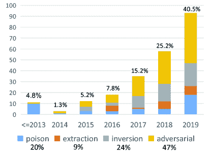
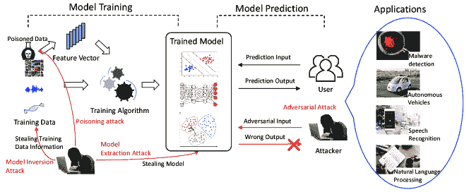
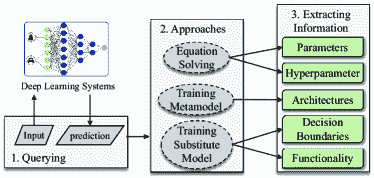
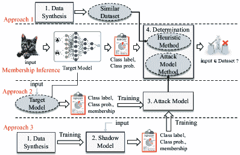
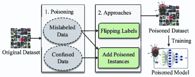
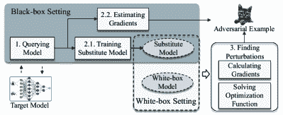

<!--yml

类别：未分类

日期：2024-09-06 20:04:04

-->

# [1911.12562] 深度学习系统的安全威胁：综述

> 来源：[`ar5iv.labs.arxiv.org/html/1911.12562`](https://ar5iv.labs.arxiv.org/html/1911.12562)

# 深度学习系统的安全威胁：综述

Yingzhe He^(1,2)，Guozhu Meng^(1,2)，Kai Chen^(1,2)，Xingbo Hu^(1,2)，Jinwen He^(1,2) ¹中国科学院信息工程研究所，中国

²中国科学院网络安全学院

###### 摘要

深度学习在过去几年取得了巨大的成功和广泛的普及。然而，深度学习系统存在一些固有的弱点，这些弱点可能威胁到学习模型的安全性。深度学习的广泛应用进一步放大了这些影响和后果。为此，已经进行大量研究，旨在全面识别内在弱点并提出可行的缓解措施。然而，对于这些弱点如何产生以及这些攻击方法在深度学习中有效性如何，仍然不够清晰。为了揭示安全弱点并帮助开发一个强健的深度学习系统，我们对深度学习的攻击进行了调查，并从多个角度分析了这些攻击，以得出一些结论。特别地，我们关注四种与深度学习安全威胁相关的攻击类型：模型提取攻击、模型反演攻击、投毒攻击和对抗攻击。对于每种攻击类型，我们构建了其基本工作流程以及对手能力和攻击目标。设计了关键指标用于比较攻击方法，通过这些指标我们进行了定量和定性分析。从分析中，我们识别了攻击向量中的重要且不可或缺的因素，例如，如何减少对目标模型的查询，应该使用什么距离来测量扰动。我们揭示了 18 个发现，涵盖了这些方法的优缺点、成功概率、部署复杂性和前景。此外，我们讨论了其他潜在的安全弱点和可能的缓解措施，这些可以激发相关领域的研究。

###### 索引术语：

深度学习、投毒攻击、对抗攻击、模型提取攻击、模型反演攻击

## 1 引言

深度学习取得了巨大的成功，是人工智能（AI）最重要的推动力。它推动了多个领域的发展，包括图像分类、语音识别、自然语言处理和恶意软件检测。由于计算能力的巨大进步和数据量的急剧增加，深度学习在这些场景中表现出了优于传统技术的潜力。深度学习在特征学习、加深对单一对象的理解以及无与伦比的预测能力方面表现突出。在图像识别中，卷积神经网络（CNNs）可以为我们分类不同的未知图像，有些甚至表现得比人类更好。在自然语言处理领域，递归神经网络（RNNs）或长短期记忆网络（LSTMs）可以帮助我们翻译和总结文本信息。其他领域，包括自动驾驶、语音识别和恶意软件检测，都广泛应用了深度学习。物联网（IoT）和智能家居系统也在近年来出现。因此，我们正在迈入智能时代。

然而，我们周围基于深度学习的智能系统正遭受许多安全问题的困扰。机器学习模型可能通过 API 被窃取 [220]。智能语音系统可能执行意外的命令 [262]。3D 打印物体可能欺骗现实世界的图像分类器 [20]。此外，为了确保安全，诸如自动驾驶这样的技术在广泛使用之前需要大量的安全测试 [217][271]。近年来，深度学习的安全性引起了许多相关研究人员和从业者的关注。他们正在探索和研究潜在的攻击以及针对深度学习系统（DLS）的相应防御技术。Szegedy 等人 [213]率先探讨了神经网络的稳定性，揭示了它们在*不可察觉的扰动*面前的脆弱性。从那时起，对抗性攻击迅速成为人工智能和安全领域的热门术语。许多努力致力于揭示各种深度学习模型（例如，CNN [175][156][155]、LSTM [67][44][177]、强化学习（RL） [94]、生成对抗网络（GAN） [114][190]）中的漏洞，同时测试 DLS 的安全性和鲁棒性 [113][146][170][211][79][250]。另一方面，DLS 的广泛商业部署引发了对专有资产保护的兴趣，例如训练数据 [162][181][272][10]和模型参数 [107][122][92][111]。这场战争已经开始，隐私猎手通过企业间谍活动从对手那里收集隐私，而相应的防御者则采取广泛的措施来对抗这些攻击。

图 1：我们调查了深度学习中四种攻击及其相应防御的出版物。X 轴表示年份，Y 轴表示每年的出版物数量。

之前的研究已经对机器学习和深度学习中的安全性和隐私问题进行了调查[13][26][175][22]。这些研究列举并分析了与训练阶段和预测阶段相关的攻击和防御。然而，这些研究主要在有限的领域（例如计算机视觉）或视角（例如对抗攻击）中评估攻击。很少有研究能对这些攻击进行系统性的全生命周期评估，包括一般工作流程、对抗模型以及不同方法之间的全面比较。这些知识有助于揭示这些攻击的发生机制、攻击者的能力以及攻击效果中的显著和微小差异。这激励我们探索对深度学习攻击的各种特征。特别地，我们旨在逐步剖析攻击（即攻击如何逐步进行），识别攻击者的多样能力，从精确的指标评估这些攻击，并为未来的研究提炼见解。这项研究被认为对社区有三方面的好处：1）它为防御者提供了攻击向量的细致描述，防御者可以基于此采取具有成本效益的措施来增强目标模型的安全性。2）对这些攻击的评估可以揭示一些重要的属性，如成功率、能力。3）从调查中得出的见解可以激励研究人员探索新的解决方案。

我们的方法。为了全面了解深度学习中的隐私和安全问题，我们对相关文献和系统进行了广泛的调查。我们共研究了 245 篇文献，这些文献主要涵盖了四个主要领域——图像分类、语音识别、自然语言处理和恶意软件检测。总体来说，我们将这些攻击总结为四类：*模型提取攻击*、*模型反演攻击*、*数据中毒攻击*和*对抗攻击*。特别地，模型提取和反演攻击主要针对隐私（参见第 4、5 节），数据中毒和对抗攻击则通过降低深度学习模型的构建质量或制造不可察觉的扰动来影响预测结果，从而欺骗模型（参见第 6、7 节）。图 1 展示了我们对这些攻击进行调查的文献。我们从权威的国际会议中收集论文，包括人工智能领域的会议，如 ICML、CVPR、NIPS、ICCV、ICLR、AAAI、IJCAI、ACL，以及安全领域的会议，如 IEEE S&P、CCS、USENIX Security、NDSS、TIFS、TDSC、Euro S&P、Asia CCS、RAID，以及软件工程领域的会议，如 TSE、ASE、FSE、ICSE、ISSTA。我们在搜索过程中选择了一些关键词，包括“security”、“attack”、“defense”、“privacy”、“adversarial”、“poison”、“inversion”、“inference”、“membership”、“backdoor”、“extract”、“steal”、“protect”、“detect”及其变体。我们还关注了这些会议上与机器学习安全相关的主题。此外，我们还调查了引用或被上述论文引用的论文，并在其引用次数较高时将其纳入研究。相关出版物的数量在过去几年中经历了急剧增加。在我们的研究中，2017 年增长了 94%，2018 年增长了 66%，2019 年增长了 61%。对抗攻击显然是最引人注目的研究，占据了我们收集的论文中约 47%的研究者关注度。值得一提的是，最近对模型反演攻击的兴趣不断增加，这在很大程度上归功于对训练数据的艰苦处理（更多讨论可以在第八部分中找到）。

在本研究中，我们首先介绍了深度学习的背景，并总结了相关风险以及在云端为公众部署的商业深度学习系统（DLS）。对于每种攻击类型，我们系统地研究了其能力、工作流程和攻击目标。更具体地说，当攻击者面对商业深度学习系统时，为了达到目标，它可以采取什么行动，系统如何在调查的方法中逐步被颠覆，以及攻击对用户和系统所有者的影响。此外，我们开发了一些指标来评估这些方法，例如*减少查询*策略、恢复训练数据的*精确度*以及与扰动图像的*距离*。基于定量或定性分析，我们总结了许多见解，涵盖了特定攻击技术的流行程度、这些方法的优缺点、未来趋势等。

收获。根据我们的调查，我们对未来研究得出了若干有洞察力的发现。在黑箱设置中，攻击者通常通过查询目标深度学习系统的某些输入进行交互。如何减少查询次数以避免安全检测是攻击者的重要考虑因素（参见第四部分）。替代模型可能是攻击的前提，因为它具有类似的行为和可迁移性。模型提取、模型反演和对抗攻击都可以从中受益（参见第四部分）。数据合成是一种常见的实践，用于表示类似的训练数据。无论是由分布还是生成对抗网络（GAN）生成，合成数据都可以为训练替代模型提供足够的样本（参见第五部分）。一种更先进的毒化方式是将后门植入数据中，然后攻击者可以通过精心设计的输入操控预测结果（参见第六部分）。大多数对抗攻击主要集中在最大化预测错误而最小化“距离”上。然而，“距离”可以以不同的方式度量，仍需改进以获得更好的估计和新应用（参见第七部分）。此外，我们在第八部分讨论了现代深度学习系统的更多安全问题，如伦理考虑、系统安全、物理攻击和可解释性。我们调查了一些关于深度学习防御的工作，并根据攻击进行了总结（参见第 8.6 节）。

图 2：深度学习系统和遇到的攻击

贡献。我们做出了以下贡献。

+   •

    深度学习的系统安全分析。我们总结了 4 种攻击类型。对于每种攻击，我们构建了其攻击向量和关键属性，即工作流程、对手模型（它包含攻击者的能力和限制）以及攻击目标。这有助于理解这些攻击的执行方式，并促进防御措施的发展。

+   •

    定量和定性分析。我们开发了多个与每种攻击类型相关的指标，以更好地评估不同的方法。这些指标还作为攻击方法发展的亮点，促进了更强大的攻击。

+   •

    新发现。基于分析，我们得出了跨越四种攻击的 18 个发现，并揭示了这些攻击方法的隐含特性。我们的发现总结了一些结果并分析了现有调查工作的现象，并根据总结结果预测了该领域可能的未来方向。所有发现均包括定量或定性分析。除了这些攻击之外，我们还在第八部分讨论了其他相关的安全问题，如安全实现、可解释性、歧视和防御技术。

## 2 相关工作

有一系列的工作调查和评估了针对机器学习或深度学习的攻击。

Barreno 等人对机器学习安全进行了一项调查，并提出了针对机器学习系统攻击的分类法 [26]。他们在一个流行的统计垃圾邮件过滤器上进行了实验，以说明其有效性。攻击从三个维度进行剖析，包括可行方式、对输入的影响和普遍性。Amodei 等人 [17] 提出了五个与事故风险相关的可能研究问题，并讨论了可能的方法，以清洁机器人如何工作的例子进行说明。Papernot 等人 [176] 研究了机器学习的安全性和隐私。他们总结了一些攻击和防御方法，并提出了一个机器学习威胁模型。它介绍了训练和推断过程中的攻击方法、黑箱和白箱模型。然而，他们没有包括关于防御或最广泛使用的深度学习模型的详细信息。

Bae 等人 [22] 回顾了在安全和隐私 AI 概念下的攻击和防御方法。他们检查了黑箱和白箱中的规避和中毒攻击。此外，他们的研究专注于隐私，未提及其他攻击类型。

Liu 等人 [138] 旨在提供机器学习两个阶段的文献综述，即训练阶段和测试/推断阶段。至于相应的防御，他们总结了四个类别。此外，这项调查更多地关注由对抗样本引起的数据分布漂移和统计机器学习算法中的敏感信息泄露问题。

Akhtar 等人 [13] 进行了一项关于计算机视觉中深度学习对抗攻击的研究。他们总结了 12 种分类攻击方法，并研究了针对自动编码器、生成模型、RNN 等模型或算法的攻击。他们还研究了现实世界中的攻击并总结了防御措施。然而，他们仅研究了对抗攻击的计算机视觉部分。

黄等人 [96] 研究了 DNN 部署的安全性和可靠性。他们在认证过程中和解释过程中处理信任问题。在认证中，他们研究 DNN 验证和测试技术，而在解释中，他们考虑 DNN 可解释性问题。对抗攻击和防御技术贯穿整个过程。与我们不同，他们的安全考虑更加关注确保在 DNN 部署过程中的可信度。

张等人 [270] 总结和分析了机器学习测试技术。测试可以暴露问题并提高机器学习系统的可靠性。他们的调查涵盖了测试属性（如正确性、稳健性、公平性）、测试组件（如数据、学习程序、框架）、测试工作流（如测试生成、测试评估）和应用场景（如自动驾驶、机器翻译）。与我们不同，他们从测试角度关注安全性。

## 3 概述

表 I：本文中使用的符号

| 符号 | 说明 |
| --- | --- |
| $D$ | 数据集 |
| $x=\{x^{1},\ldots,x^{n}\}$ | $D$ 中的输入 |
| $y=\{y^{1},\ldots,y^{n}\}$ | $x$ 的预测标签 |
| $y_{t}=\{y^{1}_{t},\ldots,y^{n}_{t}\}$ | $x$ 的真实标签 |
| $&#124;&#124;x-y&#124;&#124;^{2}$ | $x$ 和 $y$ 之间的 $Euclidean$ 距离 |
| $F$ | 模型函数 |
| $Z$ | 倒数第二层的输出 |
| $\mathcal{L}$ | 损失函数 |
| $w$ | 参数的权重 |
| $b$ | 参数的偏差 |
| $\lambda$ | 超参数 |
| $L_{p}$ | 距离测量 |
| $\delta$ | 输入 $x$ 的扰动 |

### 3.1 深度学习系统

深度学习受到生物神经系统的启发，由成千上万的神经元组成，用于传递信息。图 2 展示了一个经典的深度学习过程。通常，它向公众展示了一个包括以下内容的整体过程：1) *模型训练*，它将大量数据转换为训练模型，以及 2) *模型预测*，模型可以根据输入数据进行预测。预测任务在不同领域广泛应用。例如，图像分类、语音识别、自然语言处理和恶意软件检测都是深度学习相关的应用。

表 II：商业 MLaaS 系统及其提供的功能、客户输出和每百万次查询的费用

| 系统 | 功能 | 输出 | 每百万次查询费用 |
| --- | --- | --- | --- |
| 阿里巴巴图像识别 | 图像标记 | 标签，自信度 | 2500 元人民币 |
| 场景识别 | 标签，自信度 | 1500 元人民币 |
| 色情识别 | 标签，建议 | 1620 元人民币 |
| 亚马逊图像识别 | 对象与场景识别 | 标签，边界框，自信度 | 1300 美元 |
| 人脸识别 | 年龄范围、边界框、情感、眼镜、性别、姿势等 | 1300 美元 |
| Google Vision API | 标签描述 | 描述，分数 | 1500 美元 |

为了规范化深度学习系统的过程，我们在表 I 中介绍了一些符号。给定一个学习任务，训练数据可以表示为 $(x,y_{t})\in D$。令 $F$ 为深度学习模型，它根据给定输入 $x$ 计算相应的结果 $y$，即 $y=F(x)$。$y_{t}$ 是输入 $x$ 的真实标签。在模型训练过程中，有一个损失函数 $\mathcal{L}$ 用于衡量预测结果与真实标签之间的预测误差，训练过程旨在通过调整参数来获得最小误差值。存在许多损失函数用于衡量差异。一个常用的损失函数可以计算为 $\mathcal{L}\,=\,\Sigma_{1\leqslant i\leqslant n}||y_{t}^{i}-y^{i}||^{2}$。因此，模型训练的过程可以形式化为 [183]：

|  | $\begin{split}\operatorname*{arg\,min}_{F}\sum_{1\leqslant i\leqslant n}&#124;&#124;y_{t}^{i}-y^{i}&#124;&#124;^{2}\end{split}$ |  | (1) |
| --- | --- | --- | --- |

### 3.2 深度学习中的风险

一个深度学习系统涉及几个关键资产，这些资产对所有者来说是机密且重要的。根据图 2 中的各个阶段，风险源于深度学习系统中三类相关资产：1) 训练数据集。2) 训练模型，包括模型结构和模型参数。3) 输入和预测结果。

<svg   height="15.26" overflow="visible" version="1.1" width="15.26"><g transform="translate(0,15.26) matrix(1 0 0 -1 0 0) translate(7.63,0) translate(0,7.63)" fill="#000000" stroke="#000000" stroke-width="0.4pt"><g transform="matrix(0.8 0.0 0.0 0.8 -2.77 -3.57)" fill="#000000" stroke="#000000"><foreignobject width="6.92" height="8.92" transform="matrix(1 0 0 -1 0 16.6)" overflow="visible">1</foreignobject></g></g></svg>

训练数据集。高质量的训练数据对于深度学习模型的更好表现至关重要。由于深度学习系统需要吸收大量数据以形成合格的模型，错误标注或劣质数据会阻碍这一过程，影响模型的质量。这类数据可能被攻击者故意添加到良性数据中，这被称为*中毒攻击*（参见第六部分）。另一方面，收集训练数据需要大量的人力和时间成本。像 Google 这样的行业巨头拥有的数据远多于其他公司，他们更倾向于分享他们的最先进算法[106][55]，但几乎不分享数据。因此，训练数据对公司至关重要且极具价值，其泄露意味着资产的巨大损失。然而，最近的研究发现，预测结果到训练数据的反向流动[221]，这意味着攻击者可以仅凭授权访问受害者系统，推断出训练数据中的机密信息。这被称为*模型反演攻击*，其目标是揭示训练数据的组成或其具体属性（参见第五部分）。

<svg   height="15.26" overflow="visible" version="1.1" width="15.26"><g transform="translate(0,15.26) matrix(1 0 0 -1 0 0) translate(7.63,0) translate(0,7.63)" fill="#000000" stroke="#000000" stroke-width="0.4pt"><g transform="matrix(0.8 0.0 0.0 0.8 -2.77 -3.57)" fill="#000000" stroke="#000000"><foreignobject width="6.92" height="8.92" transform="matrix(1 0 0 -1 0 16.6)" overflow="visible">2</foreignobject></g></g></svg>

训练模型。训练模型是其训练数据的抽象表示。现代深度学习系统在训练阶段必须处理大量数据，这对高性能计算和大规模存储有严格要求。因此，训练模型被视为深度学习系统的核心竞争力，具有商业价值和创造性成果。一旦它被克隆、泄露或提取，模型所有者的利益将受到严重损害。更具体地说，攻击者已开始窃取模型参数[220]、功能[167]或决策边界[174]，这些被统称为*模型提取攻击*（参见第四部分）。

<svg height="15.26" overflow="visible" version="1.1" width="15.26"><g transform="translate(0,15.26) matrix(1 0 0 -1 0 0) translate(7.63,0) translate(0,7.63)" fill="#000000" stroke="#000000" stroke-width="0.4pt"><g transform="matrix(0.8 0.0 0.0 0.8 -2.77 -3.57)" fill="#000000" stroke="#000000"><foreignobject width="6.92" height="8.92" transform="matrix(1 0 0 -1 0 16.6)" overflow="visible">3</foreignobject></g></g></svg>

输入和预测结果。对于预测数据和结果，某些服务提供商可能会保留用户的预测数据和结果，以提取敏感信息。这些数据也可能被恶意分子攻击，意图利用这些数据谋取自身利益。另一方面，攻击者可能会提交经过精心修改的输入以欺骗模型，这被称为*对抗样本* [213]。对抗样本是通过在原始正常样本中插入轻微的扰动来制作的，这些扰动不容易察觉。这被称为*对抗攻击*或*规避攻击*（参见第七部分"）。

### 3.3 商业现货产品

近年来，机器学习即服务（MLaaS）获得了广泛关注[130]，使客户能够在不建立自身预测模型的情况下受益于机器学习。为了简化使用，MLaaS 供应商提供了多种 API，供客户完成机器学习任务，例如：图像分类、音频片段识别或文本意图识别。当然，这些服务是核心竞争力，并且会对客户的查询收费。表 II 显示了代表性的现货产品及其功能、提供给客户的输出和使用费用。以 Amazon 图像识别为例，它可以识别头像中的人并告诉其性别、年龄范围和情绪。Amazon 对每百万次查询收取 1,300 美元的费用。

## 4 模型提取攻击

### 4.1 模型提取攻击介绍

模型提取攻击试图通过提供的 API 复制机器学习模型，而不需要了解训练数据和算法[220]。具体来说，给定一个特定选择的输入 $x$，攻击者查询目标模型 $\mathcal{F}$ 并获得相应的预测结果 $y$。然后，攻击者可以推断甚至提取整个正在使用的模型 $\mathcal{F}$。关于人工神经网络 $y=wx+b$，模型提取攻击可以在某种程度上近似 $w$ 和 $b$ 的值。模型提取攻击不仅会破坏模型的机密性，损害其所有者的利益，还可能构建一个近似的白盒模型以便进一步攻击，例如对抗攻击 [174]。

对抗模型。该攻击大多数在黑箱设置下进行，攻击者只能访问预测 API。攻击者可以使用输入样本查询目标模型，并获取包括预测标签和类别概率向量在内的输出。他们的能力有三方面的限制：模型知识、数据集访问和查询频率。攻击者不了解受害者模型的模型架构、超参数和训练过程。他们无法获取与目标模型训练数据相同分布的自然数据。此外，如果查询过于频繁，攻击者可能会被 API 阻止。

图 3：模型提取攻击的工作流程

工作流程。图 3 展示了这种攻击的典型工作流程。首先，攻击者向目标模型提交输入并获取预测值。然后，他们使用输入-输出对和不同的方法来提取机密数据。更具体地说，机密数据包括参数[220]、超参数[226]、架构[164]、决策边界[174][107] 和功能[167][54]。

### 4.2 模型提取的方法

基本上有三种类型的模型提取方法：

+   •

    方程求解（ES）。对于将类别概率计算为连续函数的分类模型，它可以表示为 $F(x)=\sigma(w\cdot x+b$) [220]。因此，给定足够的样本（$x$，$F(x)$），攻击者可以通过求解方程 $w\cdot x+b=\sigma^{-1}(F(x))$ 来恢复参数（例如 $w$，$b$）。

+   •

    训练元模型（MM）。元模型是用于分类模型的分类器[164]。通过对某些输入 $x$ 查询分类模型的输出 $y$，攻击者训练一个元模型 $F^{m}$，将 $y$ 映射到 $x$，即 $x~{}=~{}F^{m}(y)$。训练后的模型可以进一步从查询输出 $y$ 中预测模型属性。

+   •

    训练替代模型（SM）。替代模型是模仿原始模型行为的模拟模型。通过足够的查询输入 $x$ 和对应的输出 $y$，攻击者训练模型 $F^{s}$，其中 $y~{}=~{}F^{s}(x)$。结果，替代模型的属性可以与原始模型的属性接近。

窃取不同的信息对应不同的方法。在时间方面，方程求解比训练元模型和替代模型更早。它可以恢复精确的参数，但只适用于小规模模型。由于模型规模的增加，通常会训练一个替代模型来模拟原始模型的决策边界或分类功能。然而，精确的参数似乎不那么重要。元模型[164]是与替代模型的逆向训练，因为它将查询输出作为输入，预测查询输入及模型属性。此外，它还可以用来探索更多有用的输入，从而帮助推断模型的更多内部信息。

表 III：基于窃取的信息对模型提取攻击的评估。我们按窃取的“信息”进行排序，相关内容见第 4.3 节。“方法”是攻击方法，相关内容见第 4.2 节。“减少查询”是减少此攻击中查询数量的技术。“恢复率”是提取信息的准确性。“SVM”是支持向量机。“DT”是决策树。“LR”是逻辑回归。“kNN”是 K 最近邻。“查询”是攻击所需的查询数量。

| 信息 | 论文 | 方法 | 减少查询 | 模型恢复率 (%) | 查询数量 |
| --- | --- | --- | --- | --- | --- |
| SVM | DT | LR | kNN | CNN | DNN |
| 参数 | Tramer et al. [220] | ES | - | 99 | 99 | 99 | - | - | 90 | 108,200 |
| 超参数 | Wang et al. [226] | ES | - | 99 | - | 99 | - | - | - | 200 |
| 架构 | Joon et al. [164] | MM | KENNEN-IO | - | - | - | - | - | 88 | 500 |
| 决策边界 | Papernot et al. [174] | SM | reservoir sampling [223] | - | - | - | - | - | 84 | 800 |
| Papernot et al. [173] | SM |  reservoir sampling [223] | 83 | 61 | 89 | 85 | - | 89 | 800 |
| PRADA [107] | SM | - | - | - | - | - | - | 91 | 300 |
| 功能 | Silva et al. [54] | SM | - | - | - | - | - | 98 | - | - |
| Orekondy et al. [167] | SM | 随机，自适应采样 | - | - | - | - | 98 | - | 60,000 |

### 4.3 不同提取信息

#### 4.3.1 模型参数与超参数

参数是模型可以从数据中自动学习的变量，如权重和偏差。超参数是训练过程开始前设置的特定参数，包括 dropout 率、学习率、小批量大小、平衡损失函数和正则化项的目标函数中的参数等等。在早期的研究中，Tramèr 等人[220] 尝试通过方程求解来恢复机器学习模型中的参数，如逻辑回归、SVM 和 MLP。他们通过查询 API 建立关于模型的方程，并通过求解方程获得参数。然而，这需要大量的查询，并且不适用于 DNN。Wang 等人[226] 尝试在已知模型算法和训练数据的前提下窃取超参数-$\lambda$。$\lambda$ 用于平衡损失函数和正则化项。他们假设目标函数的梯度为 $\vec{0}$，因此通过许多查询得到了许多线性方程。他们通过线性最小二乘法估计超参数。

#### 4.3.2 模型架构

架构细节包括模型中的层数、每层中的神经元数量、它们是如何连接的、使用了哪些激活函数等等。近期的论文通常训练分类器以预测属性。Joon 等人[164] 训练了元模型，一个监督学习的分类器，用于窃取模型属性（架构、操作时间和训练数据大小）。他们通过 API 提交查询输入，将相应的输出作为元模型的输入，然后训练元模型以预测模型属性作为输出。

#### 4.3.3 模型决策边界

决策边界是不同类别之间的分类边界。它们对于生成对抗样本至关重要。在 [174][107][173] 中，他们窃取决策边界并生成可转移的对抗样本以攻击黑箱模型。Papernot 等人[174] 使用基于雅可比矩阵的数据增强（JbDA）来生成合成样本，将样本移动到当前类别与所有其他类别之间的最近边界。该技术旨在不最大化替代模型的准确性，而是确保样本通过少量查询到达决策边界。Juuti 等人[107] 将 JbDA 扩展到 Jb-topk，其中样本移动到当前类别与任何其他类别之间的最近 $k$ 个边界。他们生成了可转移的针对性对抗样本，而不是非针对性样本[174]。在模型知识方面，Papernot 等人[173] 发现模型架构知识是不必要的，因为一个简单的模型可以通过更复杂的模型提取出来，例如 DNN。

#### 4.3.4 模型功能

相似功能是指在预测结果上尽可能地复制原始模型。主要目标是构建一个与原始模型的输入输出对最接近的预测模型。在[167][54]中，他们尝试提高替代模型的分类准确性。Silva 等人[54]分别使用问题领域数据集、非问题领域数据集及其混合数据集来训练模型。他们发现，用非问题领域数据集训练的模型在准确性上也表现良好。此外，Orekondy 等人[167]假设攻击者对模型输出没有语义知识。他们选择了非常大的数据集，并逐个选择合适的样本来查询黑箱模型。引入了一种强化学习方法来提高查询效率和减少查询次数。

### 4.4 模型提取攻击分析

模型提取攻击是一个新兴的攻击领域。在本研究中，我们调查了 8 篇相关论文，并按照提取的信息进行分类，如表 III 所示。根据统计数据，我们得出以下结论。

发现 1. 训练替代模型（SM）是模型提取攻击中主要的方法，具有多种优势。

ES 方法需要超过 10 万次查询才能攻击一个 DNN 模型，而 SM 方法只需要数百次查询，并且可以攻击更复杂的 CNN 网络。方程求解被认为是在线性算法中恢复参数[220]或超参数[226]的有效方法，因为它对足够的查询有一个上限。然而，ES 方法几乎无法应用于非线性深度学习模型。攻击 DNN 需要大量的查询（在[220]中为 108,200 次）。因此，研究人员转向了引人注目的基于训练的方法。例如，[164]基于目标模型训练了一个分类器，称为元模型，以预测结构信息。这种方法无法应对复杂的模型属性，如决策边界和功能性。这推动了替代模型（SM）的普及，SM 作为目标模型的一个化身，表现得非常相似。因此，替代模型具有近似的属性和预测结果。SM 方法只需 300 次查询即可攻击 DNN（在[107]中）。对于更复杂的 CNN，SM 需要 60,000 次查询（在[167]中）。这表明攻击更复杂的模型需要更多的查询。此外，它还可以进一步用于窃取模型的训练数据[107]和生成对抗样本[173]。

发现 2. 减少查询可以节省按查询付费的 MLaaS 商业系统的货币成本，同时也能够抵抗攻击检测，这在近年来已成为一个引人入胜的研究方向。

查询减少的需求产生是由于查询的高费用和查询量限制。在我们调查的论文中，[164] 训练了一个元模型–KENNEN-IO 来优化查询输入。[174] 利用*水库抽样*来选择代表性样本进行查询，[167] 提出了两种采样策略，即*随机*和*自适应*来减少查询。此外，主动学习[126]、自然进化策略[99]、基于优化的方法[50][193] 已被用于查询减少。

发现 3. 模型提取攻击正从一个难题解决游戏演变为一个具有成本效益权衡的模拟游戏。

像 Amazon 和 Google 这样的 MLaaS 巨头在服务背后运行着大规模的网络。推断神经网络中有多少层或神经元成本高昂。因此，这对攻击者解决模型属性的兴趣产生了显著影响。另一方面，推断决策边界和模型功能成为新的规避方式。将目标模型视为黑箱，攻击者通过向其输入精心设计的数据来观察响应，最终构建出一个近似模型。尽管替代模型在某些情况下可能更简单且表现不佳，但其预测能力仍然能为攻击者带来利润。

## 5 模型反演攻击

图 4：模型反演攻击的工作流程

### 5.1 模型反演攻击简介

在典型的模型训练过程中，大量的信息从训练数据中提取并抽象到产品模型中。然而，也存在一种逆向信息流，这使得攻击者能够从模型中推断出训练数据，因为神经网络可能记住了过多的训练数据的信息[205]。模型反演攻击利用这种信息流，通过模型预测或其置信系数恢复数据成员或数据属性，例如在面部识别系统中的面孔。模型反演也可以用于形成物理水印，以检测重放攻击[192]。

此外，模型反演攻击还可以进一步细化为*成员推断攻击 (MIA)* 和 *属性推断攻击 (PIA)*。我们根据攻击者是否获得个人信息（MIA）或统计信息（PIA）来区分它们。在 MIA 中，攻击者可以确定特定记录是否包含在训练数据中。在 PIA 中，攻击者可以推测训练数据集中是否存在某些统计属性。

对抗模型。模型反演攻击可以在黑盒或白盒设置中执行。在白盒攻击中，攻击者已知目标模型的参数和架构。因此，即使不查询模型，他们也能轻松获得一个表现相似的替代模型。在黑盒攻击中，攻击者的能力受到模型架构、统计数据和训练数据分布等方面的限制。攻击者无法获得完整的训练集信息。然而，在任何设置下，攻击者都可以使用特定的输入进行查询，并获取相应的输出以及置信度值。

工作流程。图 4 显示了适用于 MIA 和 PIA 的模型反演攻击工作流程。这里我们以 MIA 为例。MIA 可以通过不同的方式完成：通过查询目标模型以获取输入-输出对，攻击者可以仅使用启发式方法进行步骤 4 来确定记录的成员身份 [198][144][89][137]（方法 1）；或者，攻击者可以训练一个攻击模型来进行确定，这需要一个攻击模型训练过程（步骤 3）。攻击模型的训练数据通过查询输入和响应 [184][19] 获得（方法 2）；由于查询和模型属性的限制，一些研究引入了影子模型（见第 5.2.2 节详细介绍）来为攻击模型提供训练数据 [203, 198]，这需要影子模型训练（步骤 2）。此外，数据合成（步骤 1）被提出以提供更多的训练数据以确保足够的训练（方法 3）。

### 5.2 成员推断攻击

Truex 等人 [221] 提出了 MIA 的一般性系统化表述。给定一个实例 $x$ 和对在数据集 $D$ 上训练的分类模型 $F_{t}$ 的黑盒访问，攻击者能否以较高的置信度推断出实例 $x$ 是否包含在训练 $F_{t}$ 的数据集 $D$ 中？

大多数 MIAs 按照图 4 中的工作流程进行。更具体地说，为了推测某个数据项或属性是否存在于训练集中，攻击者可能会准备初始数据并对数据进行转换。随后，它制定了一些原则来判断其猜测的准确性。这种攻击破坏了信息隐私。相关论文中使用的隐私保护术语在第 8.6 节中详细解释。

#### 5.2.1 步骤 1: 数据合成

初始数据必须收集作为确定成员资格的前提条件。根据我们的调查，需要一个近似的训练数据集来暗示成员资格。这个数据集可以通过以下方式获得：

+   •

    *手动生成样本。* 这种方法需要一些先验知识来生成数据。例如，Shokri [203] 产生了类似于目标训练数据集的数据集，并使用相同的 MLaaS 训练了多个影子模型。这些数据集是通过模型基础合成、统计基础合成、噪声真实数据及其他方法产生的。如果攻击者可以访问部分数据集，他可以通过翻转真实数据上随机选择的几个特征来生成噪声真实数据。这些数据组成了噪声数据集。如果攻击者有关于数据集的一些统计信息，比如不同特征的边际分布，他可以利用这些知识生成统计基础合成。如果攻击者没有上述知识，他也可以通过搜索可能的数据记录来生成模型基础合成。搜索算法需要找到的记录在目标模型中被高置信度地正确分类。

    在 [198] 中，他们提出了一种不对目标模型进行任何查询的数据传输攻击。他们选择了不同的数据集来训练影子模型。影子模型被用来捕捉数据点在数据集中的成员状态。

+   •

    *通过模型生成样本。* 这种方法旨在通过训练生成的模型（如 GAN）生成训练记录。生成的样本类似于目标训练数据集中的样本。提高相似度比例将使这种方法更有用。

    [137] 和 [86] 都攻击了生成的模型。Liu 等人 [137] 提出了一个新的白盒方法，用于单一成员攻击和共同成员攻击。基本思路是用目标模型训练一个生成模型，该生成模型以目标模型的输出作为输入，并将目标模型的类似输入作为输出。经过训练，攻击模型能够生成与目标训练数据集相似的数据。考虑到 [203] 中 CNN 实现的困难，Hitaj 等人 [89] 提出了一个更通用的 MIA 方法。他们在协作深度学习模型的场景下进行了白盒攻击。他们为目标分类模型构建了一个生成器，并用它形成了一个 GAN。经过训练，GAN 能够生成类似于目标训练集的数据。然而，这种方法的局限在于所有属于相同分类的样本需要在视觉上相似，并且无法生成实际的目标训练模式或在同一类别下区分它们。通过分析在更新前后的黑盒模型，Salem 等人 [197] 提出了一个混合生成模型来窃取更新数据集的信息。

#### 5.2.2 第 2 步：影子模型训练

攻击者有时需要转换初始数据以进行进一步的确定。特别是，*影子模型* 被提出以通过在相似数据集上训练来模仿目标模型的行为 [203]。该数据集以数据合成为输入记录，并以其标签作为输出。影子模型在这样的数据集上进行训练。它可以提供记录的类别概率向量和分类结果。Shokri 等人 [203] 实现了第一个针对黑盒模型的 MIA 攻击方法，通过机器学习中的 API 调用。他们生成了与目标训练数据集相似的数据集，并使用相同的 MLaaS 训练了多个影子模型。这些数据集是通过基于模型的合成、基于统计的合成、噪声真实数据以及其他方法生成的。影子模型用于为攻击模型提供训练集（类别标签、预测概率以及数据记录是否属于影子训练集）。Salem 等人 [198] 放宽了 [203] 中的约束（需要在相同的 MLaaS 上训练影子模型，以及影子模型和目标模型的数据集之间的分布相同），并且只使用了一个影子模型，而无需了解目标模型的结构和训练数据集分布。在这里，影子模型只是捕获了记录在不同数据集中的成员状态。

#### 5.2.3 第 3 步：攻击模型训练

攻击模型是一个二分类器。其输入是待判断记录的类别概率和标签，输出是“是”（表示记录属于目标模型的数据集）或“否”。通常需要训练数据集来训练攻击模型。问题在于，无法获得记录是否属于目标模型数据集的输出标签。因此，攻击者通常通过数据合成生成替代数据集。此训练的输入由影子模型（方法 3）[203][198] 或目标模型（方法 2）[184][153] 生成。攻击模型训练过程首先从替代数据集中选取一些记录，然后通过目标模型或影子模型获取类别概率向量。将该向量和记录的标签作为输入，记录是否属于替代数据集作为输出。

对于模型 $F$ 及其训练数据集 $D$，训练攻击模型需要标签 $x$、$F(x)$ 以及是否 $x\in D$ 的信息。如果使用影子模型，则影子模型 $F$ 及其数据集 $D$ 已知。所有信息来自影子模型和相应数据集。如果使用目标模型，$F$ 是目标模型，而 $D$ 是训练数据集。然而，攻击者不知道 $D$。因此，需要用是否 $x\in D^{\prime}$ 来替换信息，其中 $D^{\prime}$ 与 $D$ 类似。

#### 5.2.4 步骤 4：成员资格确定

给定一个输入，该组件负责确定查询输入是否为目标系统训练集的成员。为了实现这一目标，当代方法可以分为两类：

+   •

    *基于攻击模型的方法*。在推断阶段，攻击者首先将待判断记录输入目标模型，获取其类别概率向量，然后将该向量和记录的标签输入攻击模型，获得该记录的成员身份。Pyrgelis 等人 [184] 实现了用于聚合位置数据的 MIA。其主要思想是利用先验位置信息，通过区分性游戏过程和区分函数进行攻击。他们训练了一个分类器（攻击模型）作为区分函数，以确定数据是否在目标数据集中。Yang 等人 [256] 利用背景知识形成辅助集来训练攻击模型，而不访问原始训练数据。Nasr 等人 [161] 实现了针对集中式和联邦学习的白盒 MIA。他们将每层的所有梯度和输出作为攻击特征，所有这些特征用于训练攻击模型。

+   •

    *启发式方法。* 该方法使用预测概率而非攻击模型来确定成员资格。直观地，目标数据集中记录的类别概率的最大值通常大于不在其中的记录。但是，它们需要一些前提条件和辅助信息来获得可靠的概率向量或二元结果，这限制了其应用于更一般的场景。未来的研究可以考虑如何降低攻击成本和减少辅助信息。Fredrikson 等人[65] 构建了某个数据是否出现在目标训练数据集中的概率。然后，他们搜索最大概率的输入数据，这些数据类似于目标训练集。Salem 等人[198] 提出的第三种攻击方法仅需目标模型输出的概率向量，并使用统计测量方法比较最大分类概率是否超过某个值。

    Long 等人[144] 提出了一个广义的 MIA 方法，这种方法比[203]更容易攻击非过拟合数据。他们训练了多个与目标模型相似的参考模型，并根据参考模型在 Softmax 之前的输出选择脆弱数据，然后比较目标模型和参考模型之间的输出以计算数据属于目标训练数据集的概率。本文中的参考模型被用来模拟目标模型，就像阴影模型一样。但他们不需要攻击模型。Hayes 等人[86] 提出了攻击生成模型的方法。其思路是攻击者通过分类器输出的概率向量确定攻击者的数据集是否属于目标训练集。概率越高越可能来自目标训练集（他们选择了上层 $n$ 大小）。在白盒中，分类器由目标模型构建。在黑盒中，他们使用通过查询目标模型获得的数据来通过 GAN 复现分类器。

    Hagestedt 等人[81] 提出了一个针对 DNA 甲基化数据量身定制的 MIA，这可能会导致严重的后果。该攻击依赖于似然比检验和概率估计来判断成员资格。Sablayrolles 等人[196] 假设攻击者知道在黑盒设置中正确标签所造成的损失。他们使用包括贝叶斯学习和噪声训练在内的概率框架来分析成员资格。他们发现，最佳推断只依赖于损失函数，而不依赖于参数。He 等人[88] 将模型反演攻击扩展到协作推断系统中。他们发现一个中间参与者可以恢复任意输入样本。他们通过在白盒设置下采用正则化最大似然估计技术，在黑盒设置下采用逆网络技术来恢复推断数据。

表 IV: 模型反演攻击的评估。它展示了图 4 中每项工作的“步骤”如何在“工作流程”中进行，以及其“目标”，即 MIA 或 PIA。我们选择了这些工作中的一个实验“数据集”和相应的“精确度”以及目标“模型”。“精确度”是判断的准确性。“知识”表示攻击者对模型的获取，而“应用”是目标模型的适用领域。“结构化数据”指的是记录或文件中固定字段的数据 [28]。

| 论文 | 工作流程 | 目标 | 精确度 | 数据集 | 模型 | 知识 | 应用 |
| --- | --- | --- | --- | --- | --- | --- | --- |
| 步骤 1 | 步骤 2 | 步骤 3 | 步骤 4 |
| Truex 等人 [221] |  |  | $\checkmark$ | $\checkmark$ | MIA | 61.75% | MNIST [120] | DT | 黑色 | 图像 |
| Pyrgelis 等人 [184] |  |  | $\checkmark$ | $\checkmark$ | MIA | - | TFL | MLP | 黑色 | 结构化数据 |
| Shokri 等人 [203] | $\checkmark$ | $\checkmark$ | $\checkmark$ | $\checkmark$ | MIA | 51.7% | MNIST | DNN | 黑色 | 图像 |
| Hayes 等人 [86] | $\checkmark$ |  |  | $\checkmark$ | MIA | 58% | CIFAR-10 [117] | GAN | 黑色 | 图像 |
| Long 等人 [144] |  |  |  | $\checkmark$ | MIA | 93.36% | MNIST | NN | 黑色 | 图像 |
| Melis 等人 [153] |  |  | $\checkmark$ | $\checkmark$ | MIA/PIA | - | FaceScrub | DNN | 白色 | 图像 |
| Liu 等人 [137] | $\checkmark$ |  |  | $\checkmark$ | MIA | - | MNIST | GAN | 白色 | 图像 |
| Salem 等人 [198] | $\checkmark$ | $\checkmark$ | $\checkmark$ | $\checkmark$ | MIA | 75% | MNIST | CNN | 黑色 | 图像 |
| Ateniese 等人 [19] | $\checkmark$ | $\checkmark$ | $\checkmark$ | $\checkmark$ | PIA | 95% | - | SVM | 白色 | 语音 |
| Buolamwini 等人 [38] |  |  |  | $\checkmark$ | PIA | 79.6% | IJB-A [6] | DNN | 黑色 | 图像 |
| Ganju 等人 [66] | $\checkmark$ | $\checkmark$ | $\checkmark$ | $\checkmark$ | PIA | 85% | MNIST | NN | 白色 | 图像 |
| Hitaj 等人 [89] | $\checkmark$ |  |  | $\checkmark$ | MIA | - | - | CNN | 白色 | 图像 |
| Yang 等人 [256] | ✓ |  | ✓ | ✓ | MIA | 78.3% | FaceScrub | CNN | 黑色 | 图像 |
| Nasr 等人 [161] |  |  | ✓ | ✓ | MIA | 74.3% | CIFAR-100 | DenseNet | 白色 | 图像 |
| Sablayrolles 等人 [196] |  |  |  | ✓ | MIA | 57.0% | CIFAR-100 | ResNet | 黑色 | 图像 |

### 5.3 属性推断攻击

属性推断攻击（PIA）主要推断训练数据集中的属性。例如，在一个通用的性别分类器中，多少人有长发或穿裙子。数据集中是否有足够的女性或少数群体。对于成员推断攻击，方法大致相同。在本节中，我们只指出模型反演攻击之间的主要区别。

数据合成。在 PIA 中，训练数据集通过包含或不包含特定属性来分类[19]。

影子模型训练。在 PIA 中，通过使用具有或不具有特定属性的训练集来训练影子模型。在[19][66]中，他们使用了几个具有或不具有特定属性的训练数据集，然后建立了相应的影子模型，为元分类器提供训练数据。

攻击模型训练。在这里，攻击模型通常也是一个二分类器。Ateniese 等人[19]提出了一种通过训练元分类器的白盒 PIA 方法。它以模型特征作为输入，并输出相应的数据集是否包含某一特定属性。然而，这种方法在 DNN 上效果不佳。为了解决这个问题，Ganju 等人[66]主要研究了如何提取 DNN 的特征值。元分类器的部分类似于[19]。Melis 等人[153]在协作学习中训练了一个二分类器来判断数据集属性，该分类器以更新的梯度值作为输入。在这里，模型是持续更新的，因此攻击者可以在每个阶段分析更新的信息以推断属性。

### 5.4 模型反演攻击分析

我们调查了 21 篇模型反演攻击论文，并在表 IV 中展示了 15 篇相关论文。

发现 4。使用影子模型来训练攻击模型的论文不多（4/15）。

在我们调查的论文中，影子模型（4/15）被用于 MIA（2/15）[203][198]和 PIA（2/15）[19][66]。尽管 Shokri 等人[203]提出了通过训练影子模型为攻击模型提供训练数据的模型反演攻击方法，但最近的论文中很少有继续训练影子模型的。这主要是因为训练影子模型需要额外的开销，而直接训练攻击模型的效果越来越好。然而，影子模型仍有一些优势：1）不需要额外的辅助信息[65]，例如假设更高的信心意味着来自数据集的更高概率。2）为攻击模型提供真实的信息作为训练数据。

发现 5。如果缺乏有效数据，攻击者希望节省查询成本，数据合成是一种常用的解决方案（8/15）。

数据合成可以方便地生成类似于目标数据集的数据[203][65][89][137]，无需过多查询。合成的数据可以通过已知训练数据的统计分布或生成对抗网络生成。这些数据可以有效地模拟原始数据。它避免了对目标模型的过多查询，从而降低了安全机制的感知。

发现 6. MIA 本质上是一个表达训练模型中逻辑关系和数据信息的过程。它暴露了许多信息泄露的风险区域。

除了集中式学习，攻击者还在联邦学习中实施模型反演攻击[161][153]。尽管信息推断的绝大多数论文发生在图像领域（13/15），一些研究人员也对 DNA 甲基化数据进行推断攻击[81]。这种医学应用可能对个人隐私造成更严重的损害。模型反演攻击的技术还可以用于恢复输入样本[65][88]，并检测重放攻击[192]。

发现 7. 研究人员对个体会员信息（12/15）的关注程度高于统计属性信息（4/15）。

这是因为会员推断现在有更通用的适应场景，并且出现得更早。个体信息泄露比统计信息泄露更严重。此外，MIA 在一次攻击中可以获得比 PIA 更多的信息（就像训练一个攻击模型一样）。一个训练好的攻击模型可以应用于 MIA 中的许多记录，但仅适用于 PIA 中的少数属性。在[19]中，攻击者想知道他们的语音分类器是否仅用说印度英语的人声进行训练。在[66]中，他们尝试找出某些分类器在训练数据集中是否包含足够的女性或少数群体。在[38]中，他们对肤色的全球分布感兴趣。在[153]中，他们想了解黑人员和亚洲人之间的比例。

发现 8. 启发式方法（6/15）简单，但效果不是很好。更多的研究仍采用攻击模型（9/15）。

在启发式方法中，天真地使用概率容易实现，但在 MNIST 数据集上几乎无效（0.5 的精度和 0.54 的召回率）[198]。获得类似的数据集通常需要训练生成模型[86][137][89]。在攻击模型方法中，攻击者需要训练攻击模型[184][19]。提出了影子模型[203][198][19]，以为攻击模型提供数据集，但增加了训练成本。

## 6. 中毒攻击

投毒攻击旨在通过污染训练数据来降低深度学习系统的预测准确性。由于它发生在训练阶段之前，因此造成的污染通常无法通过调整相关参数或采用替代模型来纠正。

图 5：投毒攻击的工作流程

### 6.1 投毒攻击介绍

在机器学习的早期，投毒攻击已经被提出作为对主流算法的非平凡威胁。它最初是为了降低机器学习模型的准确性。例如，贝叶斯分类器 [163]、支持向量机 (SVM) [31][35][244][243][39]、层次聚类 [32]、逻辑回归 [152] 都受到数据投毒的影响。随着深度学习的广泛应用，攻击者将注意力转向了深度学习 [100][200][210]。

对抗模型。攻击者可以通过完全知识（白盒）和有限知识（黑盒）来实施此攻击。通常，黑盒攻击者对训练数据集和训练参数没有了解，但他们可以知道特征集、学习算法，并获得替代数据集。知识主要指对训练过程的理解，包括训练算法、模型架构等。攻击者的能力指的是对训练数据集的控制程度。特别地，它区分了攻击者可以插入多少新的毒化数据，以及是否可以修改原始数据集中的标签等。

攻击目标。投毒数据主要有两个目的。原始且直观的目的是通过偏离模型的决策边界来破坏模型的可用性。结果是，毒化的模型无法很好地表示正确的数据，容易做出错误预测。这通常是由于*mislabeled data*（参见第 6.2.1 节），其标签被攻击者故意篡改，例如，一张包含猫的照片被标记为狗。最近，许多研究人员利用投毒攻击通过插入*confused data*（参见第 6.2.2 节）在目标模型中创建一个后门。模型可能大部分时间正常工作，但在遇到精心制作的数据时会产生错误预测。通过预先植入的后门和触发数据，攻击者可以操控预测结果并发起进一步攻击。

表 V：污染攻击评估。数据表示攻击者需要污染多少百分比的训练数据“污染百分比”并在特定“数据集”下达到多少“成功率”。“模型”表示被攻击的模型。“时效性”表示污染攻击是在在线还是离线环境中进行。“损害”表示有多少预测受到影响。攻击者可能拥有两种不同的“知识”，即黑盒或白盒，并使污染模型按预期进行预测，即“定向”，或不进行预测。“结构化数据”与表 IV 相同。“LR” 是线性回归。“OLR” 是在线逻辑回归。“SLHC” 是单链接层次聚类。

| 论文 | 成功率 | 数据集 | 污染百分比 | 模型 | 时效性 | 损害 | 知识 | 定向 | 应用 |
| --- | --- | --- | --- | --- | --- | --- | --- | --- | --- |
| Xiao 等人 [242] | 20% | 11944 文件 | 5% | LASSO | 离线 | - | 黑色 | 否 | 恶意软件 |
| Muñoz-González 等人 [158] | 25% | MNIST | 15% | CNN | 离线 | 30% 错误 | 黑色 | 否 | 图像，恶意软件 |
| Jagielski 等人 [100] | 75% | 健康护理数据集 | 20% | LASSO | 离线 | 75% 错误 | 黑色 | 否 | 结构化数据 |
| Alfeld 等人 [16] | - | - | - | LR | 离线 | - | 白色 | 是 | - |
| Shafahi 等人 [200] | 60% | CIFAR-10 | 5% | DNN | 离线 | 20% 错误 | 白色 | 是 | 图像 |
| Wang 等人 [235] | 90% | MNIST | 100% | OLR | 在线 | - | 白色 | 两者 | 图像 |
| Biggio 等人 [32] | - | MNIST | 1% | SLHC | 离线 | - | 白色 | 是 | 图像，恶意软件 |
| BadNets [76] | 99% | MNIST | - | CNN | 离线 | - | 白色 | 两者 | 图像 |
| Yao 等人 [258] | 96% | MNIST | 0.15% | CNN | 离线 | - | 白色 | 是 | 图像 |
| Liu 等人 [139] | - | MNIST | 4% | GNN | 离线 | 50% 错误 | 白色 | 是 | 图像 |

工作流程。图 5 展示了污染攻击的常见工作流程。基本上，这种攻击通过两种方法实现：伪造原始数据标签和制作混淆数据。污染数据进入原始数据中，颠覆了训练过程，导致预测能力显著下降或在模型中植入后门。更具体地说，伪造标签的数据通过选择特定感兴趣的记录并翻转它们的标签来产生。混淆数据则通过嵌入模型可以学习的特殊特征来制作，这些特征实际上不是目标对象的本质。这些特殊特征可以作为触发器，引起错误分类。

### 6.2 污染攻击方法

#### 6.2.1 操作误标数据

学习模型通常在标记数据上进行训练。攻击者可能会获取数据集，并将正确的标签更改为错误的标签。被标记错误的数据可能会显著地将分类器的决策边界推向不正确的区域，从而降低其分类准确性。Muñoz-González 等人 [158] 对多类问题进行了基于反向梯度优化的毒化攻击。他们通过自动微分计算梯度，并反转学习过程以降低攻击复杂度。这种攻击在垃圾邮件过滤、恶意软件检测和手写数字识别方面效果显著。

Xiao 等人 [244] 通过翻转记录的标签调整训练数据集，以攻击支持向量机（SVM）。他们提出了一种优化框架，用于找到最大化分类错误的标签翻转，从而成功地降低分类器的准确性。Biggio 等人 [32] 使用模糊攻击来最大化恶化聚类结果，他们依赖启发式算法来寻找最佳攻击策略。Alfeld 等人 [16] 向训练数据集中添加了最佳特殊记录，以驱动预测朝向特定方向。他们提出了一个框架，用于在线性自回归模型下编码攻击者的愿望和约束。Jagielski 等人 [100] 能够操控数据集和算法以影响线性回归模型。他们还介绍了一种快速统计攻击，只需对训练过程有有限的了解。

Liu 等人 [134] 通过凸优化基础的攻击对随机多臂赌博机算法进行毒化。他们可以通过对数据中的奖励进行轻微操作，迫使赌博机算法以较高的概率选择目标臂。Zhang 等人 [267] 提出了针对知识图谱嵌入技术的数据毒化策略。攻击者可以通过在知识图谱中添加或删除事实，来有效地操控目标事实的可信度。Zügner 等人 [277] 研究了对图神经网络（GNN）的毒化攻击。他们生成了针对节点特征和图结构的毒化数据，并使用增量计算解决潜在的离散域问题。Liu 等人 [139] 提出了基于图的半监督学习的数据毒化攻击框架。他们采用了基于梯度的算法和概率求解器来解决毒化任务中的两个约束。

主要研究集中在离线环境中，其中分类器在固定输入上进行训练。然而，训练也发生在数据以流的形式顺序到达的在线设置中。Wang 等人 [235] 进行了在线学习的毒化攻击。他们将问题形式化为半在线和完全在线，并提出了增量、间隔和教学强化三种攻击算法。除了单方毒化之外，Mahloujifar 等人 [150] 研究了一种适用于多方学习过程的在线 $(k,p)$-毒化攻击。对手控制 $k$ 个参与方，而毒化数据仍然与正确数据 $(1-p)$-接近。

#### 6.2.2 注入混淆数据

学习算法从大量信息中提取代表性特征用于学习和训练。然而，如果攻击者提交带有特殊特征的伪造数据，分类器可能会学习到虚假的特征。例如，将数字“6”标记为左转标志并将其放入数据集中，那么带有炸弹的图像可能会被识别为左转标志，即使它实际上是 STOP 标志。

Xiao 等人 [242] 直接研究了在毒化攻击下流行特征选择算法的鲁棒性。他们通过插入不到 5% 的毒化训练样本，将 LASSO 减少到几乎是随机的特征集选择。Shafahi 等人 [200] 找到一个特定的测试实例来控制带有后门的分类器行为，而无需访问数据收集或标注过程。他们提出了一种水印策略，并用多个毒化实例训练分类器。目标实例的低透明度水印被添加到毒化实例中，以允许一些不可分割特征的重叠。Liu 等人 [141] 提出了一个特洛伊攻击。攻击者首先下载一个公开模型，然后通过逆向神经网络生成特洛伊触发器，接着重新训练模型以注入恶意行为。然后，他们重新发布带有特洛伊触发器的变异神经网络。该攻击在面部、语音、年龄、句子态度识别上效果显著。Xi 等人 [240] 提出了图形导向的 GNN 毒化攻击。触发器是特定的子图，包括拓扑结构和描述特征。

#### 6.2.3 转移学习中的攻击。

Gu 等人 [76] 介绍了在外包训练环境中的中毒攻击威胁。如果用户在对抗者提供的后门模型（BadNet）上进行迁移学习，那么用户模型也会被中毒。Yao 等人 [258] 提出了潜在后门技术，在迁移学习中将后门触发器插入教师模型。在教师端，攻击者注入与目标类别 $y$ 相关的后门数据。当学生端下载了被感染的教师模型时，迁移学习可能会悄悄地将潜在后门激活为实际后门，并形成一个被感染的学生模型。Kurita 等人 [119] 发现下载不可信的预训练权重会带来安全威胁。攻击者构建了权重中毒攻击，经过微调的预训练注入权重后，用户模型也会携带后门。这允许攻击者操控模型预测。

#### 6.2.4 联邦学习中的攻击。

一些最近的文章已经开始研究如何在联邦学习中进行后门攻击 [23][212]。在联邦学习中，可能有一个或多个攻击者参与模型训练。他们的目标是将特定的后门植入最终训练好的模型中。在 [23][212] 中，攻击者试图严格限制损失项以避免异常检测，并恶意提升更新值以保留后门。Bhagoji 等人 [29] 引入了带有距离约束的交替最小化技术，以避免更新值统计的异常检测。Xie 等人 [246] 提出了分布式后门攻击。他们将触发器分解为几个小模式。每个攻击者将一个小模式植入最终模型中。然后，完整的触发器也能在最终模型中成功攻击。Fang 等人 [63] 假设攻击者在被攻陷的客户端设备上操控本地模型参数，从而导致全球模型的测试误差较大。

### 6.3 中毒攻击的分析

在本节中，我们详细调查了 20 篇代表性的中毒攻击论文，并在表 V 中对其中 10 篇进行了比较。

发现 9. 中毒攻击已在广泛领域中进行研究。在我们调查的论文中，3(/20) 篇研究了如何在迁移学习设置中插入后门。4(/20) 篇论文研究了在联邦学习设置中植入后门。2(/20) 篇论文研究了在线中毒攻击。

随着深度学习在多个领域的广泛应用，污染攻击也在不同领域得到了研究。刘等人[134]将污染攻击应用于多臂赌博机算法。张等人[267]攻击知识图谱嵌入技术。Zügner 等人[277]和 Xi 等人[240]对图神经网络进行污染。刘等人[139]攻击基于图的半监督学习。在线学习中的污染攻击已在[235][150]中得到研究。在在线设置中，攻击者逐渐将有毒数据输入模型。这使得攻击者需要考虑更多因素，如数据输入的顺序和有毒数据的隐蔽性。一些攻击[76][258][119]向预训练模型或教师模型注入后门。当用户通过有毒模型进行迁移学习时，后门将相应地嵌入到他们的模型中。联邦学习中也存在污染攻击[23][212][29][246]。攻击者需要上传恶意的更新值，绕过异常检测，并将后门注入最终模型。这些研究还表明，许多当前的学习算法并不健壮，容易受到污染攻击。

发现 10。越来越多的论文使用混淆数据向模型注入后门。总的来说，10(/20)篇论文使用混淆数据植入后门。在 2019 年，这一比例上升至 8/13。

使错误不可察觉比让模型出现误分类更困难也更具危害。后门就是一种不可察觉的错误。模型在正常功能下表现良好，但在攻击者需要时，它会为攻击者打开大门。近年来，随着技术的发展，更多的研究集中在后门污染攻击上[258][76][141][23][212]。后门攻击更难以检测，且对模型的操控也更强。

发现 11。来自未知来源的预训练模型仍然会遭受污染攻击。

学习模型的性能在很大程度上依赖于训练数据的质量。高质量的数据通常被认为是全面的、公正的和有代表性的。在[258][119][76]中，研究人员发现预训练模型可以将其触发器传递给用户的训练模型。即使用户拥有高质量的数据集，只要预训练模型是在低质量数据集上训练的或注入了后门，最终模型仍然有被污染的风险。

## 7 对抗攻击

图 6：对抗攻击的工作流程

类似于中毒攻击，对抗攻击也会使模型错误地分类恶意样本。他们的区别在于，中毒攻击将恶意样本插入到训练数据中，直接污染模型，而对抗攻击利用对抗样本来利用模型的弱点，从而得到错误的预测结果。

### 7.1 对抗攻击的介绍

对抗攻击在预测过程中向正常样本添加不可感知的扰动，然后生成对抗样本（AEs）。这是一种探索性攻击，违反了模型的可用性。它可以用于许多领域，例如，图像分类 [213][74][43]、语音识别 [73][262]、文本处理 [67][268][199][123] 和恶意软件检测 [95][177][179][116]，特别是在图像分类领域非常普遍。它们可以欺骗训练好的模型，但对人类来说没有任何异常。也就是说，对抗样本需要既能欺骗分类器，又对人类不可察觉。对于图像来说，添加的扰动通常通过最小化原始样本和对抗样本之间的距离来调整。对于一段语音或文本，扰动不应改变原始的含义或上下文。在恶意软件检测领域，对抗样本需要避免被模型检测到。对抗攻击可以分为有针对性的攻击和无针对性的攻击。前者要求对抗样本被错误分类为特定标签，而后者则期望预测错误，不管它将被识别为什么。

对抗模型。在对抗攻击中，黑箱设置意味着攻击者不能直接计算所需的梯度（如 FGSM [74]）或解决优化函数（如 C&W [43]）从目标模型中。但是白箱设置中的攻击者可以做到这些。黑箱攻击者可以了解模型架构和超参数，以训练替代模型。他们还可以查询目标黑箱模型，获得带有预测标签和置信度分数的输出，以估计梯度。

工作流程。图 6 描述了对抗攻击的一般工作流程。在白盒设置中，攻击者可以直接计算梯度 [74][15][57] 或解决优化函数 [43][48][87] 来寻找原始样本上的扰动（步骤 3）。在黑盒设置中，攻击者通过多次查询目标模型来获取信息（步骤 1）。然后，他们可以训练一个替代模型来进行白盒攻击 [173][174]（步骤 2.1），或估计梯度以搜索对抗样本 [98]（步骤 2.2）。

除了欺骗分类模型外，对抗样本还应尽可能减少扰动，以避免被人类察觉。通常，正常样本与对抗样本之间的距离可以通过 $L_{p}$ 距离（或 Minkowski 距离）来度量，例如 $L_{0}$、$L_{1}$、$L_{2}$ 和 $L_{\infty}$。

|  | $\begin{split}L_{p}(x,y)&=(\sum_{i=1}^{n}&#124;x^{i}-y^{i}&#124;^{p})^{\frac{1}{p}}\\ x=\{x^{1},x^{2},...,&amp;x^{n}\},\;y=\{y^{1},y^{2},...,y^{n}\}\end{split}$ |  | (2) |
| --- | --- | --- | --- |

### 7.2 对抗攻击方法

由于对抗攻击的主要发展集中在图像分类领域[213][74][43]，我们将介绍更多使用 CNN 的相关图像工作，并在本节末补充其他领域或模型的研究。

#### 7.2.1 图像分类领域的白盒攻击

图像领域中的白盒是早期对抗攻击研究的主要设置。我们介绍并比较生成对抗样本的公式。首先，我们定义 $F:\mathbb{R}^{n}\longrightarrow\{1\dots k\}$ 为将图像值向量映射到类别标签的模型分类器。$Z(\cdot)$ 是倒数第二层的输出，通常表示类别概率。$Z(\cdot)_{t}$ 是 $t$-th 类的概率。$Loss$ 函数描述了在分类器 $F$ 下输入和输出的损失，我们设定 $Loss(x,F(x))=0$。$\delta$ 是扰动。$\left\|\delta\right\|_{p}$ 是 $\delta$ 的 $L_{p}$-范数。$x=\{x^{1},x^{2},...,x^{n}\}$ 是原始样本，$x^{i}$ 是样本中像素或元素，$x^{i}\in x,1\leqslant i\leqslant n$。$x_{i}$ 是第 $i$ 次迭代的样本，通常 $x_{0}=x$。$x+\delta$ 是对抗样本。这里，$x\in[0,1]^{n},x+\delta\in[0,1]^{n}$。

寻找扰动的过程本质上需要解决以下优化问题（第一个方程是非目标攻击，第二个方程是目标攻击，$T$ 是目标类别标签）：

|  | $\begin{split}&\arg\min_{\delta}\ \left\&#124;\delta\right\&#124;_{p},s.t.\ F(x+\delta)\neq F(x)\\ &\arg\min_{\delta}\ \left\&#124;\delta\right\&#124;_{p},s.t.\ F(x+\delta)=T\end{split}$ |  | (3) |
| --- | --- | --- | --- |

寻找扰动的方法大致可以分为计算梯度和求解优化函数。Szegedy 等人 [213] 首次提出了一种优化函数来寻找对抗样本，并使用 L-BFGS 进行求解。FGSM [74]、BIM [15]、MI-FGSM [57] 是一系列通过直接计算梯度来寻找扰动的方法。Deepfool [156] 和 NewtonFool [102] 通过泰勒展开来近似最近的分类边界。JSMA [175] 通过计算部分导数找到少量像素进行扰动，而不是扰动整张图像。C&W [43]、EAD [48]、OptMargin [87] 是一系列通过优化目标函数来寻找扰动的方法。

L-BFGS 攻击。Szegedy 等人 [213] 尝试找到满足 $F(x+\delta)=l$ 的小 $\delta$。因此，他们构造了一个包含 $\delta$ 和 $Loss$ 函数的函数，并使用带有盒约束的 L-BFGS 来最小化这个优化问题。在方程 4 中，$c\ (>0)$ 是一个超参数，用于平衡它们。

|  | $\begin{split}\min_{\delta}&\ c\left\|\delta\right\|_{2}+Loss(x+\delta,l)\\ \end{split}$ |  | (4) |
| --- | --- | --- | --- |

FGSM 攻击。Goodfellow 等人 [74] 根据输入的梯度来寻找扰动。$l_{x}$ 是 $x$ 的真实标签。扰动的方向由使用反向传播计算的梯度决定。$\varepsilon$ 是自定义的，每个像素在梯度方向上移动 $\varepsilon$ 大小。

|  | $\begin{split}\delta=\varepsilon\cdot sign(\nabla_{x}Loss(x,l_{x}))\end{split}$ |  | (5) |
| --- | --- | --- | --- |

BIM 攻击。BIM（或 I-FGSM）[15] 迭代地解决 $\delta$ 并基于 FGSM [74] 更新新的对抗样本，见方程 6。$l_{x}$ 是 $x$ 的真实标签。$Clip\{x\}$ 是图像每个像素的裁剪函数。

|  | $\begin{split}x_{i+1}&=Clip\{x_{i}+\varepsilon\cdot sign(\nabla_{x}Loss(x_{i},l_{x}))\}\end{split}$ |  | (6) |
| --- | --- | --- | --- |

MI-FGSM 攻击。MI-FGSM [57] 在 I-FGSM [15] 的基础上增加了动量。动量用于摆脱较差的局部极大值，并且迭代被用来稳定优化。在方程 7 中，$g_{i}$ 代表梯度，如方程 6 所示，它包含了当前步骤的梯度和之前步骤的梯度。$y$ 是目标错误标签。

|  | $\begin{split}x_{i+1}&amp;=Clip\{x_{i}+\varepsilon\cdot\frac{g_{i+1}}{\left\&#124;g_{i+1}\right\&#124;_{2}}\}\\ g_{i+1}&amp;=\mu\cdot g_{i}+\frac{\nabla_{x}Loss(x_{i},y)}{\left\&#124;\nabla_{x}Loss(x_{i},y)\right\&#124;_{1}}\end{split}$ |  | (7) |
| --- | --- | --- | --- |

JSMA 攻击。JSMA [175] 每次迭代只修改少量像素。在每次迭代中，如方程 8 所示，$\alpha_{pq}$ 代表像素 $p,q$ 对目标分类的影响，$\beta_{pq}$ 代表对所有其他输出的影响。在最后一个公式中，值越大意味着欺骗网络的可能性越大。他们选择 $(p^{*},q^{*})$ 像素进行扰动。

|  | <math   alttext="\begin{split}\alpha_{pq}&amp;\ =\sum_{i\in\{p,q\}}\frac{\partial Z(x)_{t}}{\partial x^{i}}\\ \beta_{pq}&amp;\ =(\sum_{i\in\{p,q\}}\sum_{j}\frac{\partial Z(x)_{j}}{\partial x^{i}})-\alpha_{pq}\\

\end{split}" display="block"><semantics ><mtable columnspacing="0pt" displaystyle="true" rowspacing="0pt"  ><mtr ><mtd columnalign="right"  ><msub ><mi >α</mi><mrow  ><mi >p</mi><mo lspace="0em" rspace="0em"  >​</mo><mi >q</mi></mrow></msub></mtd><mtd columnalign="left"  ><mrow ><mo lspace="0.778em" rspace="0.111em" >=</mo><mrow ><munder  ><mo movablelimits="false"  >∑</mo><mrow ><mi >i</mi><mo  >∈</mo><mrow ><mo stretchy="false" >{</mo><mi >p</mi><mo >,</mo><mi >q</mi><mo stretchy="false" >}</mo></mrow></mrow></munder><mfrac ><mrow  ><mo rspace="0em"  >∂</mo><mrow ><mi >Z</mi><mo lspace="0em" rspace="0em" >​</mo><msub ><mrow ><mo stretchy="false" >(</mo><mi >x</mi><mo stretchy="false" >)</mo></mrow><mi >t</mi></msub></mrow></mrow><mrow ><mo rspace="0em" >∂</mo><msup ><mi  >x</mi><mi >i</mi></msup></mrow></mfrac></mrow></mrow></mtd></mtr><mtr ><mtd columnalign="right"  ><msub ><mi >β</mi><mrow  ><mi >p</mi><mo lspace="0em" rspace="0em"  >​</mo><mi >q</mi></mrow></msub></mtd><mtd columnalign="left"  ><mrow ><mo lspace="0.778em" >=</mo><mrow ><mrow  ><mo stretchy="false"  >(</mo><mrow ><munder ><mo lspace="0em" movablelimits="false" rspace="0em" >∑</mo><mrow ><mi  >i</mi><mo >∈</mo><mrow ><mo stretchy="false"  >{</mo><mi >p</mi><mo >,</mo><mi >q</mi><mo stretchy="false"  >}</mo></mrow></mrow></munder><mrow ><munder ><mo movablelimits="false" >∑</mo><mi >j</mi></munder><mfrac ><mrow  ><mo rspace="0em"  >∂</mo><mrow ><mi >Z</mi><mo lspace="0em" rspace="0em" >​</mo><msub ><mrow ><mo stretchy="false"  >(</mo><mi >x</mi><mo stretchy="false"  >)</mo></mrow><mi >j</mi></msub></mrow></mrow><mrow ><mo rspace="0em" >∂</mo><msup ><mi >x</mi><mi >i</mi></msup></mrow></mfrac></mrow></mrow><mo stretchy="false"  >)</mo></mrow><mo >−</mo><msub ><mi >α</mi><mrow ><mi >p</mi><mo lspace="0em" rspace="0em" >​</mo><mi >q</mi></mrow></msub></mrow></mrow></mtd></mtr></mtable><annotation-xml encoding="MathML-Content" ><apply ><apply  ><apply ><csymbol cd="ambiguous" >subscript</csymbol><ci >𝛼</ci><apply  ><ci >𝑝</ci><ci >𝑞</ci></apply></apply><apply ><apply  ><csymbol cd="ambiguous"  >subscript</csymbol><apply ><ci >𝑖</ci><set ><ci  >𝑝</ci><ci >𝑞</ci></set></apply></apply><apply ><apply ><apply  ><apply ><ci >𝑍</ci><apply ><csymbol cd="ambiguous" >subscript</csymbol><ci >𝑥</ci><ci >𝑡</ci></apply></apply></apply><apply ><apply  ><csymbol cd="ambiguous"  >superscript</csymbol><ci >𝑥</ci><ci >𝑖</ci></apply></apply></apply><apply ><csymbol cd="ambiguous" >subscript</csymbol><ci >𝛽</ci><apply ><ci  >𝑝</ci><ci >𝑞</ci></apply></apply></apply></apply></apply><apply ><apply ><apply  ><apply ><csymbol cd="ambiguous" >subscript</csymbol><apply ><ci >𝑖</ci><set ><ci >𝑝</ci><ci >𝑞</ci></set></apply></apply><apply ><apply  ><csymbol cd="ambiguous"  >subscript</csymbol><ci >𝑗</ci></apply><apply ><apply ><apply ><ci >𝑍</ci><apply ><csymbol cd="ambiguous" >subscript</csymbol><ci >𝑥</ci><ci >𝑗</ci></apply></apply></apply><apply ><apply ><csymbol cd="ambiguous" >superscript</csymbol><ci >𝑥</ci><ci >𝑖</ci></apply></apply></apply></apply></apply><apply ><csymbol cd="ambiguous" >subscript</csymbol><ci >𝛼</ci><apply ><ci >𝑝</ci><ci >𝑞</ci></apply></apply></apply></apply></apply></annotation-xml><annotation encoding="application/x-tex" >\begin{split}\alpha_{pq}&\ =\sum_{i\in\{p,q\}}\frac{\partial Z(x)_{t}}{\partial x^{i}}\\ \beta_{pq}&\ =(\sum_{i\in\{p,q\}}\sum_{j}\frac{\partial Z(x)_{j}}{\partial x^{i}})-\alpha_{pq}\\ \end{split}</annotation></semantics></math> |  | (8) |

|  | $\begin{split}(p^{*},q^{*})=\arg\max_{(p,q)}&\;(-\alpha_{pq}\cdot\beta_{pq})\cdot(\alpha_{pq}>0)\cdot(\beta_{pq}<0)\end{split}$ |  |
| --- | --- | --- |

NewtonFool 攻击。NewtonFool [102] 使用 softmax 输出 $Z(x)$。在方程 9 中，$x_{0}$ 是原始样本，$l=F(x_{0})$。$\delta_{i}=x_{i+1}-x_{i}$ 是第 $i$ 次迭代的扰动。他们尝试找到小的 $\delta$ 使得 $Z(x_{0}+\delta)_{l}\approx 0$。从 $x_{0}$ 开始，他们逐步使用线性函数逼近 $Z(x_{i})_{l}$。

|  | $\begin{split}Z(x_{i+1})_{l}\approx Z(x_{i})_{l}+\nabla Z(x_{i})_{l}\cdot(x_{i+1}-x_{i})\end{split}$ |  | (9) |
| --- | --- | --- | --- |

C&W 攻击。C&W [43] 试图在 $L_{0}$、$L_{2}$ 和 $L_{\infty}$ 范数中找到小的 $\delta$。他们将 L-BFGS [213] 中的 $Loss$ 函数部分更改为优化函数 $f(\cdot)$。

|  | $\begin{split}\min_{\delta}&\ \left\|\delta\right\|_{p}+c\cdot f(x+\delta)\\ \end{split}$ |  | (10) |
| --- | --- | --- | --- |
|  | $f(x+\delta)=\max(\max\{Z(x+\delta)_{i}:i\neq t\}-Z(x+\delta)_{t},-\mathcal{K})$ |  |

$c$ 是一个超参数，而 $f(\cdot)$ 是一个人工定义的函数，上述只是一个情况。这里，当且仅当分类结果为对抗目标标签 $t$ 时，$f(\cdot)\leqslant 0$。$\mathcal{K}$ 保证 $x+\delta$ 将以高置信度被分类为 $t$。

EAD 攻击。EAD [48] 基于 C&W [43] 结合了 $L_{1}$ 和 $L_{2}$ 惩罚函数。在方程 11 中，$f(x+\delta)$ 与 C&W 相同，$\beta$ 是另一个超参数。当 $\beta=0$ 时，C&W 攻击变成一个特殊的 EAD 情况。

|  | $\begin{split}\min_{\delta}&\;c\cdot f(x+\delta)+\beta\left\|\delta\right\|_{1}+\left\|\delta\right\|_{2}^{2}\\ \end{split}$ |  | (11) |
| --- | --- | --- | --- |

OptMargin 攻击。OptMargin [87] 通过在 $x$ 周围添加许多目标函数扩展了 C&W [43] 攻击。在方程 12 中，$x_{0}$ 是原始样本。$x=x_{0}+\delta$ 是对抗样本。$y$ 是 $x_{0}$ 的真实标签。$v_{i}$ 是施加在 $x$ 上的许多扰动。OptMargin 不仅保证 $x$ 会欺骗网络，而且它的邻居 $x+v_{i}$ 也会。

|  | $\begin{split}&\;\min_{\delta}\;\left\|\delta\right\|_{2}^{2}+c\cdot(f_{1}(x)+\cdots+f_{m}(x))\\ \end{split}$ |  | (12) |
| --- | --- | --- | --- |
|  | $f_{i}(x)=\max(Z(x+v_{i})_{y}-\max\{Z(x+v_{i})_{j}:j\neq y\},-\mathcal{K})$ |  |

UAP 攻击。通用对抗扰动（UAPs）[155]可以适用于某个数据集的几乎所有样本。其目的是寻找一个通用扰动$\delta$，它可以欺骗几乎所有来自数据集的样本的$F(\cdot)$。Liu 等人[135]将 UAPs 扩展到无监督学习中。Co 等人[53]尝试使用程序噪声函数生成 UAPs。

#### 7.2.2 图像分类领域的黑盒攻击

寻找小扰动通常需要白盒模型来计算梯度。然而，在黑盒设置中无法实现。攻击者只能查询模型。因此，研究人员提出了几种方法来克服查询预算的限制。

步骤 2.1。训练替代模型。如第四部分所述，在模型提取攻击中窃取决策边界和训练替代模型可以促进黑盒对抗攻击[174][173][107]。Papernot 等人[174]提出了一种基于合成数据生成的替代训练算法的方法，用于黑盒设置。

这一步骤需要对抗样本在替代模型到目标模型之间具有较高的可转移性[248, 58]。梯度对齐对抗子空间[219]估计输入空间的未知维度。他们发现两个不同模型的大部分子空间是共享的，从而实现了可转移性。此外，他们确定了模型无关扰动的可转移性的充分条件。Naseer 等人[160]提出了一个框架来发起高度可转移的攻击。它可以创建对抗模式以误导在完全不同领域中训练的网络。

步骤 2.2。估计梯度。这种方法需要大量查询来估计梯度，然后寻找对抗样本。Narodytska 等人[159]使用基于局部搜索的技术构建网络梯度的数值近似，然后在图像中构建扰动。此外，Ilyas 等人[98]引入了更严格且实用的黑盒威胁模型。他们应用自然进化策略来估计梯度并执行黑盒攻击，使用了 2$\sim$3 个数量级更少的查询。Guo 等人[80]利用一些参考模型的梯度来减少查询。这些参考模型可以覆盖一些有前景的搜索子空间。Liu 等人[142]提出了一种基于决策的攻击方法，通过在低频子空间中限制扰动来减少查询。Cheng 等人[51]提出了一种先验引导的随机无梯度方法，同时利用了基于迁移的先验和查询信息。

#### 7.2.3 语音识别领域的攻击

攻击语音识别模型的难点在于，人类可以识别对抗扰动，并且在无线播放过程中，音频对抗样本可能效果不佳。Yuan 等人 [262] 将语音命令嵌入歌曲中，从而攻击语音识别系统，且不会被人类检测到。DeepSearch [44] 通过在语音到文本神经网络上添加小的扰动，将任意给定的波形转换为所需的目标短语。Qin 等人 [186] 利用听觉掩蔽的心理声学原理生成有效的不可察觉的音频对抗样本。Yakura 等人 [254] 模拟物理世界中播放或录制造成的变换，并将这些变换融入生成过程，以获得鲁棒的对抗样本。

#### 7.2.4 文本处理领域的攻击

为自然语言处理（NLP）构建对抗样本是一个巨大的挑战。词汇和句子空间是离散的。沿梯度方向产生小的扰动很困难，而且难以保证其流畅性 [268]。DeepWordBug [67] 在黑箱设置下生成对抗文本序列。他们采用不同的评分函数来更好地变异单词，并最小化原始文本和修改文本之间的编辑距离。TextBugger [123] 也生成了对抗文本。在黑箱设置下，其过程是寻找重要句子和单词，并生成漏洞。其计算复杂度与文本长度呈子线性关系。在 IMDB 数据集上，其成功率更高，扰动单词更少，相较于 DeepWordBug 表现更佳。

然而，上述工作是通过类似字符替换（‘o’和‘0’）、添加空格等方式实现的，这破坏了词汇的正确性。在 [189][263] 中，他们研究了词级替换攻击，以保证词汇正确性、语法正确性和语义相似性。Ren 等人 [189] 提出了基于同义词替换策略的词替换顺序，该顺序由词的显著性和分类概率决定。Zang 等人 [263] 提出了基于义素的词替换方法和基于粒子群优化的搜索算法。

自然语言处理（NLP）中的神经机器翻译（NMT）模型也受到对抗扰动的影响 [52]。Zou 等人 [276] 基于强化学习的新范式生成对抗翻译示例，而不是依赖有限的手动分析的错误特征。实验表明，中文中同义词的替换会导致英文翻译结果的明显错误。Sato 等人 [199] 揭示了对抗正则化技术也可以提高 NMT 模型的性能。

#### 7.2.5 恶意软件检测领域的攻击

在恶意软件领域，Rigaki 等人[190] 使用生成对抗网络（GANs）通过修改网络行为以模拟合法应用的流量，从而避免恶意软件检测。他们可以通过修改恶意软件的源代码调整命令和控制通道，以模拟 Facebook 聊天网络流量。Hu 等人[90][91] 和 Rosenberg 等人[194] 提出了在黑箱中生成对抗恶意软件示例以攻击检测模型的方法。Dujaili 等人[14] 提出了 SLEIPNIR 用于二进制编码恶意软件检测的对抗攻击。

#### 7.2.6 物体检测领域中的攻击

Zhao 等人[274] 提出了隐藏攻击和出现攻击来产生实际的对抗样本。他们的攻击可以在远距离和近距离攻击现实世界的物体检测器。Wei 等人[236] 操控特征网络提取的特征图，增强对抗样本在攻击图像物体检测模型时的可迁移性。

#### 7.2.7 物理世界中的攻击

在这种环境下，攻击者需要考虑更多的环境因素。Zeng 等人[265] 特别关注对应于 3D 物理属性有意义变化的对抗样本，如旋转、平移、光照条件等。Li 等人[124] 通过在摄像头镜头上放置主要为半透明的贴纸来实施物理攻击。这些扰动难以察觉，但能使模型错误分类由该摄像头拍摄的物体。

#### 7.2.8 实时流输入任务中的攻击

在这种情况下，攻击者无法像在静态输入中那样观察整个原始样本然后在任何点添加扰动。Gong 等人[72] 提出了一个实时对抗攻击方法，其中攻击者只能观察过去的数据点，并对输入的剩余数据点添加扰动。Li 等人[127] 生成了 3D 对抗扰动片段来攻击实时视频分类模型。他们发现对抗样本需要考虑视频分类器输入的剪辑边界的不确定性。Ranjan 等人[187] 发现摧毁图像尺寸的少量区域（¡1%）会显著影响自动驾驶汽车中的光流估计。

#### 7.2.9 针对图神经网络的攻击

图神经网络（GNNs）也容易受到对抗攻击[277]。然而，图数据的离散边缘和特征也为攻击带来了新的挑战。吴等人[239]使用集成梯度技术处理离散图连接和离散特征，能够准确确定改变选定特征或边缘的效果。对于处理离散图数据，徐等人[251]研究了一种通过凸松弛生成拓扑攻击的技术，以便将基于梯度的对抗攻击应用于 GNNs。博伊切夫斯基等人[33]对基于随机游走的广泛使用的方法提供了对抗脆弱性分析。王等人[225]尝试通过操控图结构来规避检测，并将这种攻击形式化为一个基于图的优化问题。

#### 7.2.10 针对其他模型的攻击

除了 CNNs、RNNs 和 GNNs，研究还包括生成模型、强化学习和一些机器学习算法。梅等人[152]确定了 SVM、逻辑回归和线性回归的最佳训练集攻击。他们证明了最佳攻击可以描述为一个双层优化问题，可以通过梯度方法解决。陈等人[47]证明了基于树的模型也容易受到对抗样本的攻击。黄等人[94]和格里夫等人[71]展示了对抗攻击策略在强化学习中的有效性。科斯等人[114]尝试使用深度生成模型如变分自编码器产生对抗样本。他们的方法包括基于分类器的攻击和对潜在空间的攻击。

表 VI: 对抗攻击评估。该表呈现了这些攻击在特定“数据集”中的“成功率”，针对不同的“系统”和“模型”。“距离”表示这些工作如何衡量样本之间的距离。“现实世界”用于区分那些也适用于物理对抗攻击的工作。“知识”分为黑盒或白盒。“迭代”说明优化步骤是否是迭代的。“有针对性”区分攻击是否有明确目标。“应用”涵盖了实际应用领域。

| 论文 | 成功率 | 数据集 | 系统 | 距离 | 模型 | 现实世界 | 知识 | 迭代 | 有针对性 | 应用 |
| --- | --- | --- | --- | --- | --- | --- | --- | --- | --- | --- |
| L-BFGS[213] | 20.3% | MNIST | FC100-100-10 | $L_{2}$ | DNN | 否 | 白盒 | 是 | 是 | 图像 |
| FGSM[74] | 55.4% | MNIST | 一个浅层 RBF 网络 | $L_{\infty}$ | DNN | 否 | 白盒 | 否 | 否 | 图像 |
| BIM[15] | 24% | ImageNet [2] | Inception v3 | $L_{\infty}$ | CNN | 是 | 白盒 | 是 | 否 | 图像 |
| MI-FGSM [57] | 37.6% | ImageNet | Inception v3 | $L_{\infty}$ | CNN | 否 | 白盒 | 是 | 两者 | 图像 |
| JSMA [175] | 97.05% | MNIST | LeNet | $L_{0}$ | CNN | 否 | 白色 | 是 | 是 | 图像 |
| C&W [43] | 100% | ImageNet | Inception v3 | $L_{0},L_{2},L_{\infty}$ | CNN | 否 | 白色 | 是 | 是 | 图像 |
| EAD [48] | 100% | ImageNet | Inception v3 | $L_{1},L_{2},L_{\infty}$ | CNN | 否 | 白色 | 是 | 是 | 图像 |
| OptMargin [87] | 100% | CIFAR-10 | ResNet | $L_{0},L_{2},L_{\infty}$ | CNN | 否 | 白色 | 是 | 否 | 图像 |
| Guo et al. [77] | 95.5% | ImageNet | ResNet-50 | $L_{2}$ | CNN | 否 | 两者 | 是 | 否 | 图像 |
| Deepfool [156] | 68.7% | ILSVRC2012 | GoogLeNet | $L_{2}$ | CNN | 否 | 白色 | 是 | 否 | 图像 |
| NewtonFool [102] | 81.63% | GTSRB [4] | CNN(3Conv+1FC) | $L_{2}$ | CNN | 否 | 白色 | 是 | 否 | 图像 |
| UAP [155] | 90.7% | ILSVRC2012 | VGG-16 | $L_{2},L_{\infty}$ | CNN | 否 | 白色 | 是 | 否 | 图像 |
| UAN [85] | 91.8% | ImageNet | ResNet-152 | $L_{2},L_{\infty}$ | CNN | 否 | 白色 | 是 | 是 | 图像 |
| ATN [24] | 89.2% | MNIST | CNN(3Conv+1FC) | $L_{2}$ | CNN | 否 | 白色 | 是 | 是 | 图像 |
| Athalye et al. [20] | 83.4% | 3D-printed turtle | Inception-v3 | $L_{2}$ | CNN | 是 | 白色 | 否 | 是 | 图像 |
| Ilyas et al. [98] | 99.2% | ImageNet | Inception-v3 | - | CNN | 否 | 黑色 | 否 | 两者 | 图像 |
| Narodytska et al. [159] | 97.51% | CIFAR-10 | VGG | $L_{0}$ | CNN | 否 | 黑色 | 否 | 否 | 图像 |
| Kos et al. [114] | 76% | MNIST | VAE-GAN | $L_{2}$ | GAN | 否 | 白色 | 否 | 是 | 图像 |
| Mei et al. [152] | - | - | - | $L_{2}$ | SVM | No | 黑色 | 是 | 否 | 图像 |
| Huang et al. [94] | - | - | A3C,TRPO,DQN | $L_{1},L_{2},L_{\infty}$ | RL | 否 | 两者 | 否 | 否 | 图像 |
| Papernot et al. [177] | 100% | Reviews | LSTM | $L_{2}$ | RNN | 是 | 白色 | 否 | 否 | 文本 |
| DeepWordBug [67] | 51.80% | IMDB Review [7] | LSTM | $L_{0}$ | RNN | 是 | 黑色 | 是 | 是 | 文本 |
| DeepSpeech [44] | 100% | Mozilla Common Voice [9] | LSTM | $L_{\infty}$ | RNN | 否 | 白色 | 否 | 是 | 语音 |
| Gong et al. [73] | 72% | IEMOCAP | LSTM | $L_{2}$ | RNN | 是 | 白色 | 否 | 否 | 语音 |
| CommanderSong [262] | 96% | Fisher | ASplRE Chain Model | $L_{1}$ | RNN | 是 | 白色 | 否 | 是 | 语音 |
| Rosenberg et al. [194] | 99.99% | 500000 files | LSTM | $L_{2}$ | RNN | 是 | 黑色 | 是 | 否 | 恶意软件 |
| MtNet [95] | 97% | 4500000 files | DNN(4 Hidden layers) | $L_{2}$ | DNN | 是 | 黑色 | 否 | 否 | 恶意软件 |
| SLEIPNIR [14] | 99.7% | 55000 PEs | DNN | $L_{2},L_{\infty}$ | DNN | 是 | 黑色 | 否 | 否 | 恶意软件 |
| Rigaki et al. [190] | 63% | - | GAN | $L_{0}$ | GAN | 是 | 黑色 | 否 | 否 | 恶意软件 |
| Pascanu et al. [179] | 69% | DREBIN [1] | DNN | $L_{1}$ | DNN | 是 | 黑色 | 否 | 否 | 恶意软件 |
| Kreuk et al. [116] | 88% | Microsoft Malware [8] | CNN | $L_{2},L_{\infty}$ | CNN | 是 | 白色 | 否 | 是 | 恶意软件 |
| Hu et al. [90] | 90.05% | 180 程序 | BiLTSM | $L_{1}$ | RNN | 是 | 黑色 | 是 | 否 | 恶意软件 |
| Hu et al. [91] | 99.80% | 180000 程序 | MalGAN | $L_{1}$ | GAN | 是 | 黑色 | 否 | 否 | 恶意软件 |

### 7.3 对抗性攻击分析

总结来说，我们调查了 66 篇对抗性攻击的论文，并在表 VI 中测量了 33 篇相关论文，并得出了以下观察结果。

发现 12. 在计算限制下，高维分类器中对抗性样本可能是不可避免的。

许多分类器被发现对对抗性攻击有脆弱性。除了在图像分类中最常受到攻击的 CNN 外，RNN 在文本处理和恶意软件检测领域也很脆弱。随着 GNN 的出现，它们也遭受对抗性攻击（5/66）。SVM [152]、强化学习 [94][71]、生成模型 [114]都被证明会受到攻击。高维分类器遭受对抗样本的原因可能是计算约束和输入数据的限制使得恢复决策边界变得困难。对抗样本可能是学习算法计算约束的一个不可避免的副产品 [36]。Dohmatob et al. [56]提供了一个理论证明，一旦扰动稍大于自然噪声水平，任何分类器都有很高的概率被对抗性欺骗。

发现 13. 对抗样本在各个领域的样本空间中广泛存在。

对抗性攻击已经渗透到许多领域。在我们调查的 66 篇论文中，28 篇专注于图像分类，6 篇专注于语音识别，9 篇攻击文本处理，8 篇攻击恶意软件检测。不论样本空间是离散领域（文本或恶意软件）还是连续领域（语音），无论输入是确定大小（图像）还是不确定大小（文本或语音），对抗样本都普遍存在。在整个样本空间中，对抗样本和正常样本可能处于一种共生关系。

发现 14. 物理攻击将对抗样本的危害提升到一个新水平。

数字空间中的对抗样本可能无法欺骗物理空间中的分类器，因为物理攻击需要考虑更多环境因素。最近，在图像领域，真实世界的攻击研究逐渐增多，根据我们的研究（2019 年为 6/15，之前几年仅为 2/20）。物理攻击需要考虑拍摄视角、环境光照、相机噪声等。这导致许多以前的研究仅在数字空间中有效。随着技术的成熟，更多的物理攻击正在被研究。物理攻击对我们更具危害性，例如，交通标志真正欺骗了物体检测器[274]，以及声音真正欺骗了智能扬声器[262]。物理攻击仍需深入研究，这也将引发对真实 AI 系统的安全研究。此外，文本或恶意软件领域不存在物理问题，因此我们在“真实世界”中对它们全都标记为“是”。

发现 15. 未针对性对抗攻击（57.6%）更容易实现，但比针对性对抗攻击的严重性要低。

未针对性攻击旨在诱导错误预测，因此在寻找扰动时更具灵活性，只需较小的修改即可。因此，它们更容易取得成功。针对性攻击则必须使模型按预期进行预测。因此，需要创建更多的扰动以实现目标。然而，它们通常在现实中更具危害性和实用性。例如，攻击者可能伪装成经过认证的用户，以获得对特权资源的访问权限。

发现 16. 几乎所有攻击都采用$L_{p}$-距离，包括$L_{0},L_{1},L_{2},L_{\infty}$，其中$L_{2}$距离使用最为广泛。

距离度量是寻找最小扰动的重要因素，目前大多数使用$L_{p}$-距离。在表 VI 的“距离”列中，60.1%的攻击使用$L_{2}$距离，36.4%使用$L_{\infty}$距离，18.2%使用$L_{1}$距离和 18.2%使用$L_{0}$距离。仅考虑图像分类，70%的攻击使用$L_{2}$距离，45%使用$L_{\infty}$距离，10%使用$L_{1}$距离和 20%使用$L_{0}$距离。

$L_{0}$ 距离反映了更改元素的数量，但无法限制每个元素的变化。它适用于只关心扰动像素数量而不考虑变化大小的场景。$L_{1}$ 距离是扰动中每个元素绝对值的总和，相当于二维空间中的曼哈顿距离。它限制了所有变化的总和，但不限制个别元素的大幅扰动。$L_{\infty}$ 距离不关心改变了多少个元素，只关心扰动的最大值，相当于二维空间中的切比雪夫距离。$L_{2}$ 距离是考虑所有像素扰动的欧几里得距离，是一种更平衡且最广泛使用的度量。它考虑了最大扰动和更改的元素数量。

发现 17. 不同的位置应对扰动有不同的权重。

在当前的测量方法中，不同元素的扰动被认为具有相同的权重。然而，在人脸图像中，对鼻子、眼睛和嘴巴等重要部分应用的相同扰动会比对背景应用的扰动更容易被识别。类似地，在音频分析中，扰动在混乱的场景中难以察觉，但在安静的场景中容易被感知。根据上述分析，我们可以考虑在测量距离时对不同元素采用不同的权重。重要部分权重大，因此只能引入较小的扰动，而不重要的部分权重小，因此可以引入较大的扰动。

发现 18. 需要更先进的人类感知测量方法。

对抗样本（AEs）的最初目标是让模型错误分类样本，同时保持人类对差异的无感知。然而，测量人类对这些扰动的感知是困难的。直观上，较小的 $L_{p}$ 距离意味着被人类检测到的概率较低。然而，最近的研究发现 $L_{p}$ 距离既不是感知相似性的必要条件，也不是充分条件[201]。也就是说，具有大 $L_{p}$ 值的扰动也可能对人类看起来相似，例如图像的平移和旋转，而小 $L_{p}$ 扰动并不意味着不可察觉。研究[62] 还证明了基于神经网络的分类器对旋转和平移很脆弱。在最近的一篇论文中，Bhattad 等人[30] 引入了无限制扰动来生成有效且真实的对抗样本。因此，我们应该打破 $L_{p}$ 距离的限制。如何在没有 $L_{p}$ 限制的情况下系统地寻找对抗样本，以及如何提出可能是感知相似性所必需或足够的新测量，将成为未来对抗攻击的趋势。

## 8 讨论

在本节中，我们总结了根据调查得到的 7 个观察结果，如下所示。

### 8.1 隐私保护的法规

如第 4 和第五部分所示，企业和用户都面临隐私风险。除了在数据中去除隐私外，政府及相关组织可以制定法律法规以防止在数据使用和传输过程中侵犯隐私。特别是，建议：1) 引入监管机构来监控这些深度学习系统，并严格监督数据的使用。这些系统只允许在许可范围内提取特征和预测结果。未经授权，禁止提取和推断私人信息。2) 制定和完善相关法律法规（如 GDPR [3]），以监督数据收集、使用、存储和删除的过程。3) 在数据中添加数字水印以跟踪泄露源[21]。水印有助于快速找到违反规则并导致隐私泄露的责任方。

### 8.2 深度学习系统的安全实现

大多数深度学习安全研究集中在私人数据泄露和分类正确性上。作为一种软件系统，深度学习可以轻松地构建在成熟的框架上，如 TensorFlow、Torch 或 Caffe。这些框架中的漏洞可能使构建的深度学习系统容易受到其他类型攻击。相关工作[245]列举了这些广泛使用框架中的安全问题，如*堆溢出*、*整数溢出*和*使用后释放*。这些漏洞可能导致服务拒绝、控制流劫持或系统妥协。此外，深度学习系统通常依赖第三方库提供辅助功能。例如，OpenCV 常用于处理图像，Sound eXchange (SoX)常用于处理音频。一旦这些漏洞被利用，攻击者可能会对深度学习系统造成更严重的损失。因此，深度学习实现的安全审计值得进一步的研究关注和努力。

另一方面，越来越多的研究工作利用深度学习自动检测和利用软件漏洞[260][252][101][209]。这些技术也被认为适用于深度学习系统。更重要的是，深度学习可能有助于揭示解释和修复未来的分类漏洞。

### 8.3 离完全的黑箱攻击还有多远？

黑箱攻击相对更具破坏性，因为它们不需要太多关于目标的信息，这降低了攻击成本。许多研究声称它们在对深度学习系统执行黑箱攻击[203][198][100]。但目前尚不清楚这些攻击是否对大量模型和系统可行，以及这些研究与实际世界攻击之间的差距。

根据调查结果，我们发现许多黑箱攻击仍然假设可以访问某些信息。例如，[220]必须知道正在运行的确切模型以及其模型结构，才能成功窃取模型参数。[203]进行的成员推断攻击建立在训练数据统计信息公开且可以轻易合成相同分布的数据的事实基础上。然而，这些条件在现实世界中可能难以满足，最近的研究中很少见到完全的黑箱攻击。

完全黑箱攻击的另一个难点来自于深度学习系统实施的保护措施：1) *查询限制*。商业深度学习系统通常会对服务请求设置限制，以防止替代模型训练。在[107]中，PRADA 可以基于查询的特征分布检测模型提取攻击。2) *未被详细描述的防御部署*。除了模型不完全可触及外，黑箱攻击者还无法推测防御措施如何在后台部署和配置。这些防御可能阻挡恶意请求[154][148]，产生误导性结果[107]，并动态地改变或增强其能力[226][220]。由于攻击者和防御者之间知识的极端不平衡，以上所有措施可以有效地避免黑箱攻击。

### 8.4 解释性与安全性之间的关系

解释性的进展可以帮助我们更好地理解所有这些攻击的潜在原理。自神经网络诞生以来，它就存在解释性差的问题。模型参数的微小变化可能会极大地影响预测结果。人们也无法直接理解神经网络是如何操作的。最近，解释性已成为深度学习领域的一个紧迫问题。2018 年 5 月，GDPR 宣布保护个人数据隐私，并要求在使用 AI 算法时具备解释性[3]。如何深入理解神经网络本身，并解释输出如何受到输入的影响，都是需要紧急解决的问题。

可解释性主要指的是解释 AI 做出每个决策/判断背后的逻辑能力以及如何信任这些决策 [222]。它主要包括理性、可追溯性和可理解性 [109]。理性意味着能够理解每个预测背后的推理。可追溯性指的是能够跟踪预测过程，这可以从数学算法的逻辑中得出 [110][233]。可理解性指的是对决策所依据模型的全面理解。

目前，一些工作正在进行关于安全性和鲁棒性证明的研究，通常针对对抗性攻击 [233]。更深入的工作需要解释预测结果的原因，使训练和预测过程不再是黑箱。

Kantchelian 等人 [109] 提出系统设计师需要将分类目标拓展为解释目标，并加深与人类操作员的互动，以应对对抗性漂移的挑战。Reluplex [110] 可以证明在何种情况下，对输入的小扰动不会导致误分类。其主要思想是懒惰处理 ReLU 约束。它暂时忽略 ReLU 约束，并尝试解决问题的线性部分。作为发展，Wang 等人 [233] 提出了 ReluVal，用于通过符号区间进行神经网络的形式安全分析。他们提出了一种新的方向，用于在没有可满足性模理论的情况下正式检查安全属性。他们利用符号区间算法，通过最小化过高估计来计算 DNN 输出的严格界限。$AI^{2}$ [69] 尝试在 AI 系统中进行抽象解释，并尝试证明神经网络的安全性和鲁棒性。他们构建了几乎所有的扰动，使其自动传播，并捕捉卷积层、最大池化层和全连接层的行为。他们还解决了状态空间爆炸问题。DeepStellar [59] 通过将 RNN 建模为抽象状态转换系统来表征 RNN 内部行为。他们设计了两个跟踪相似性度量来定量分析 RNN，并且还检测非常小扰动的对抗样本。

可解释性不仅能带来安全性，还能揭示神经网络的奥秘，使我们更容易理解其工作机制。然而，这对攻击者也是有利的。他们可以排除被证明安全的输入范围，从而减少检索空间，更有效地找到对抗样本。他们还可以通过对模型的深入理解来构建针对性的攻击。尽管如此，这一领域不应停滞不前。因为黑箱模型不能保证安全性 [205]。因此，随着可解释性的提高，深度学习的安全性可能会以曲折的方式上升。

解释性的发展也有助于解决防御方法的滞后问题。由于我们尚未对深度神经网络（DNN）实现深入理解（尚不清楚为什么某个记录会被预测到结果，以及不同数据如何影响模型参数），因此发现攻击的漏洞比提前防范更容易。这使得深度学习安全存在一定的滞后。如果我们能彻底理解模型，防御预计将会领先或同步于攻击 [110][233][69]。

### 8.5 AI 中的歧视

AI 系统可能看起来是理性的、中立的且不带偏见的，但实际上，AI 和算法决策可能会导致不公平和歧视 [34]。例如，亚马逊的 AI 招聘工具自我学习得出男性候选人更受青睐 [82]。在犯罪预防、在线商店 [34]、银行贷款 [5]等方面也存在歧视。导致 AI 歧视的主要原因有两个 [5]：1）不平衡的训练数据；2）训练数据反映了过去的歧视。

为了解决这个问题并使 AI 系统更好地造福人类，我们需要做的是：1）平衡数据集，通过添加/删除关于不足/过多表示子集的数据；2）修改数据或训练模型，使训练数据反映过去的歧视 [5]；3）引入测试技术来测试模型的公平性，例如符号执行和局部解释性 [11]；4）制定反歧视法和数据保护法，例如 GDPR [3]。

### 8.6 相应的防御方法

有一系列方法用于防止上述攻击。

模型提取防御。模糊预测结果是防止模型盗窃的有效方法，例如，四舍五入参数 [226][220]，向类别概率中添加噪声 [122][107]。另一方面，检测和防止异常查询也可以解决这种攻击。Kesarwani 等人 [111] 记录了客户发出的所有请求，并计算了探索的特征空间以检测攻击。PRADA [107] 基于某客户提交的样本分布的突然变化来检测攻击。Orekondy 等人 [168] 提出了一个主动防御方法，通过扰动预测来针对训练目标进行攻击。

模型反演防御。为了防御模型反演攻击，研究人员提出了以下方法：

+   •

    *差分隐私（DP）* 是一种加密方案，旨在最大化数据查询的准确性，同时最小化在从统计数据库查询时识别其记录的机会 [61]。通过移除个人特征来保护用户隐私。它首次在 [60] 中提出，并被证明在数据库隐私保护中有效。在模型隐私保护中，DP 策略可以应用于模型参数 [180]、预测输出 [46][83][229][269][97]、损失函数 [112][214] 和梯度 [207][27][214][10][269][273]。Yu 等人 [261] 提出了集中差分隐私以分析和优化隐私损失。

+   •

    *同态加密（HE）* 是一种加密函数，它使以下两种操作在值上等效 [191]：在明文环上进行算术操作 $\oplus$ 并对结果进行加密，先对操作数进行加密然后进行相同的算术操作，即 $En(x)\oplus En(y)=En(x+y)$。通过这种方式，客户端可以加密其数据并将其发送到 MLaaS。服务器返回加密的预测结果，而不会了解任何有关明文数据的信息。同时，客户端对模型属性一无所知 [70][136][108][105]。BAYHENN [249] 使用 HE 保护客户端数据，并使用贝叶斯神经网络保护 DNN 权重，实现安全的 DNN 推理。

+   •

    *安全多方计算（SMC）* 源自姚期智的百万富翁问题 [257]，能够在没有可信第三方的情况下安全地计算合同函数。在深度学习的背景下，它扩展到多个参与方共同训练一个模型，并保留各自的数据 [224][202][181][182][188]。因此，训练数据不能被驻留在计算服务器或客户端的攻击者轻易推测。Helen [275] 是一个合作学习系统，允许多个方在不揭示数据的情况下训练线性模型。DCOP [215] 在诚实多数的假设下可以保护隐私，并不受合谋的影响。

+   •

    *训练重建。* Cao 等人 [42] 提出了机器遗忘，这使得机器学习模型完全忘记一部分训练数据，并恢复模型和特征的效果。Ohrimenko 等人 [165] 提出了数据无关的机器学习算法。Osia 等人 [169] 通过使用特征提取器删除敏感信息，分解大型复杂的深度模型，以实现可扩展且保护隐私的分析。MemGuard [104] 在目标分类器预测的每个置信度得分向量中添加噪声。Song 等人 [206] 发现对抗防御方法甚至增加了目标模型面临的成员身份推断攻击的风险。

毒化防御。毒化攻击可以通过两个方面来缓解：

+   •

    *保护数据。* 这种方法包括避免数据篡改、否认和伪造，并检测有毒数据 [234][145][84]。通过扰动输入，Gao 等人 [68] 观察到从给定模型预测的类别的随机性。预测类别中的低熵违反了良性模型的输入依赖性特性，暗示存在特洛伊木马输入。Olufowobi 等人 [166] 描述了数据点的创建或修改背景，以增强数据的可信度和可靠性。Chakarov 等人 [45] 评估了单个数据点对训练模型性能的影响。Baracaldo 等人 [25] 使用训练数据点的源信息和变换上下文来识别有毒数据。

+   •

    *保护算法。* 这种方法调整训练算法，例如，鲁棒 PCA [40]、鲁棒线性回归 [49][132] 和鲁棒逻辑回归 [64]。Wang 等人 [227] 通过输入过滤器、神经元修剪和机器遗忘检测毒化技术。ABS [140] 分析神经元内部的变化，以检测特洛伊木马触发器，当向神经元引入不同水平的刺激时。FABA 算法 [241] 可以消除上传梯度中的异常值，并在分布式学习中获得接近真实梯度的梯度。Qiao 等人 [185] 探索由像素值形成的所有可能的后门触发器空间，并从后门模型中移除这些触发器。

对抗防御。由于对抗攻击引起了主要关注，相应的防御工作也更加全面和充分。主流的防御方法如下：

+   •

    *模型鲁棒性*。模型鲁棒性意味着对输入的小扰动不会导致网络错误分类。经过认证的鲁棒性是防御对抗攻击的有效方法。为了验证模型鲁棒性，安德森等[18]将对抗样本搜索的基于梯度的优化方法与基于抽象的证明搜索结合。PixelDP[121]是一种可以扩展到大网络和数据集的认证防御方法。它基于对抗样本鲁棒性与差分隐私之间的联系。马等[147]分析了在各种攻击下深度神经网络（DNN）的内部结构，并提出了一种提取 DNN 不变性以在运行时检测对抗样本的方法。刘等[133]旨在寻找尽可能大的认证对抗自由区域。研究[204]证明，网络的对抗脆弱性随着梯度的增加而增加，梯度随着输入图像维度的增加而增长。PROVEN[237]提供了神经网络鲁棒性的概率认证，当输入扰动服从分布特征时。为了提高可证明的误差界限，Robustra[125]利用对抗空间解决攻击者和防御者之间的最小-最大博弈。

+   •

    *对抗训练*。这种方法将对抗样本（AEs）作为训练数据集的一部分，以使训练模型学习对抗样本的特征[93][118][103][157]。此外，集成对抗训练[218]包含从其他预训练模型传输的每个涡轮输入。王等[228]在训练神经语言模型时向输出嵌入层引入对抗噪声。叶等[259]提出了一种用于同时进行对抗训练和权重剪枝的框架，该框架能够在保持鲁棒性的同时压缩模型。王等[232]提出了双向对抗训练，该方法对图像和标签进行扰动。张等[266]通过在潜在空间中进行特征散射来生成用于训练的对抗图像。翁等[238]成功地使用较弱且便宜的对手训练了鲁棒模型，从而节省了大量时间。李等[128]通过理论见解证明了对抗训练确实促进了鲁棒性。

+   •

    *基于区域的方法*。了解对抗区域的特性并使用更鲁棒的基于区域的分类也可以防御对抗攻击。Cao 等人 [41] 开发了使用基于区域的分类而不是基于点的 DNN。他们通过从以测试样本为中心的超立方体中随机选择几个点来预测标签。在 [171] 中，分类器将正常样本映射到最终层隐藏空间的低维流形邻域。局部内在维度 [148] 描述了对抗区域的维度特性，并评估了空间填充能力。背景类 [151] 将大量多样的背景图像类添加到数据集中。

+   •

    *变换*。转换输入可以在很大程度上防御对抗攻击。Song 等人 [208] 发现对抗样本主要位于训练区域的低概率区域。因此，他们通过自适应地将对抗样本移回分布来进行净化。Guo 等人 [78] 通过图像变换探索了与模型无关的防御。Xie 等人 [247] 在推断时使用了随机化，包括随机缩放和填充。Tian 等人 [216] 认为对抗样本对某些图像变换操作（如旋转和位移）比正常图像更为敏感。Wang 等人 [231][230] 认为对抗样本对随机扰动比正常样本更为敏感。Buckman 等人 [37] 使用温度计编码和独热编码离散化来提高网络对对抗样本的鲁棒性。Kou 等人 [115] 训练了一个单独的轻量级分布分类器，以识别转化图像的不同特征。

+   •

    *梯度正则化/掩蔽*。这种方法隐藏梯度或减少模型的敏感性。Madry 等人 [149] 通过优化鞍点公式实现了这一点，其中包括解决内层最大化和外层最小化问题。Ross 等人 [195] 训练了惩罚输入微小变化程度的可微分模型。

+   •

    *蒸馏*。Papernot 等人 [172] 提出了防御蒸馏，这可以成功缓解由 FGSM 和 JSMA 构造的对抗样本。Papernot 等人 [178] 还利用蒸馏中提取的知识来减少网络梯度的幅度。Liu 等人 [143] 提出了特征蒸馏，一种基于 JPEG 的防御压缩框架，用于纠正对抗样本。

+   •

    *数据预处理*。Liang 等人[129]引入了标量量化和平滑空间滤波以减少扰动的影响。Zantedeschi 等人[264]使用了有界 ReLU 激活函数以对抗对抗扰动的前向传播。Xu 等人[253]提出了特征压缩方法，包括减少每个像素的颜色位深和空间平滑。Yang 等人[255]通过随机移除图像中的像素，并使用矩阵估计来重建图像。

+   •

    *防御网络*。一些研究使用网络自动抵御对抗样本。Gu 等人[75]使用了深度收缩网络，结合了收缩自编码器和去噪自编码器，能够去除大量的对抗噪声。Akhtar 等人[12]提出了一种扰动修正网络作为前置输入层，以防御 UAPs。MagNet[154]使用检测网络来检测远离流形边界的对抗样本，并使用重构器重构接近边界的对抗样本。Liu 等人[131]提出了一种防御模型，利用非线性注意力模块的特征优先级和$L_{2}$特征正则化。

### 8.7 攻击与防御的未来方向

这是攻击者和防御者之间一场无尽的战争，双方都无法获得绝对的胜利。但双方都可以研究新技术和应用以获得优势。从攻击者的角度来看，一种有效的方法是探索新的攻击面，发现新的攻击场景，寻找新的攻击目的，并扩大攻击效果的范围。特别是，深度学习系统的主要攻击面包括格式不正确的操作输入、格式不正确的训练数据和格式不正确的模型[245]。

在对抗攻击中，$L_{p}$-距离不是一个理想的度量。一些有大幅扰动的图像对于人类仍然无法区分。然而，与$L_{p}$-距离不同，大$L_{p}$扰动没有标准的度量。这将成为未来对抗学习的一个热点。在模型提取攻击中，窃取复杂模型的功能需要大量的查询。如何提出更好的方法来减少数量级的查询将是这个领域的重点。

攻击成本与收益的平衡也是一个重要因素。一些攻击即使能够达到有利的目标，也必须进行昂贵的计算或资源消耗[220]。例如，在[203]中，攻击者必须训练多个模拟目标模型的影子模型，然后进行成员身份推断。他们需要 156 次查询才能平均生成一个数据点。

攻击成本和攻击收益是一个权衡过程 [152]。通常，攻击成本包括时间、计算资源、获得的知识和货币开支。攻击带来的收益包括经济回报、竞争对手的失败等。在本研究中，我们不会给出统一的公式来量化成本和收益，因为不同场景下每个元素的重要性有所不同。然而，通常将其建模为一个优化问题，即在最小化成本的同时最大化收益，如最小-最大博弈 [162]。

对于防御者来说，结合多种防御技术是降低被攻击风险的好选择。但这种组合可能会给系统带来额外的开销，这应该在设计时解决。例如，在 [136][108]中，他们采用了结合同态加密（HE）和安全多方计算（MPC）的混合协议，这提高了性能，但带来了高带宽消耗。

## 9 结论

在本文中，我们对针对深度学习系统的攻击进行了全面而深入的调查。与其他调查不同，我们以系统化的方式剖析了攻击过程，让感兴趣的读者能够清楚地理解这些攻击是如何一步步发生的。我们对调查的工作进行了攻击向量的比较，并提出了多个指标来比较它们的性能。基于这些比较，我们进一步提炼出一些见解，揭示了攻击方法的优缺点、局限性和趋势。讨论涵盖了这些攻击在实际世界中的困难、其他方面的安全问题以及这些攻击的潜在缓解措施，为未来的研究提供了一个基础平台。

## 参考文献

+   [1] Drebin 数据集。 https://www.sec.tu-bs.de/~danarp/drebin/, 2016。

+   [2] Imagenet 数据集。 http://www.image-net.org, 2017。

+   [3] 通用数据保护条例。 https://gdpr-info.eu, 2018 年 5 月。

+   [4] Gtsrb 数据集。 http://benchmark.ini.rub.de/?section=gtsrb&subsection=dataset, 2019。

+   [5] 人工智能系统中的人类偏见和歧视。 https://ai-auditingframework.blogspot.com/2019/06/human-bias-and-discrimination-in-ai.html, 2019。

+   [6] Ijb-a 数据集。 https://www.nist.gov/itl/iad/image-group/ijb-dataset-request-form, 2019。

+   [7] Imdb 评测数据集。 https://www.kaggle.com/utathya/imdb-review-dataset, 2019。

+   [8] Microsoft kaggle 数据集。 https://www.kaggle.com/c/microsoft-malware-prediction, 2019。

+   [9] Mozilla 通用语音。 https://voice.mozilla.org/en, 2019。

+   [10] M. Abadi, A. Chu, I. J. Goodfellow, H. B. McMahan, I. Mironov, K. Talwar, 和 L. Zhang. 使用差分隐私的深度学习。在 ACM 计算机与通信安全会议（CCS）上，奥地利维也纳，2016 年 10 月 24-28 日，页面 308–318，2016。

+   [11] A. Aggarwal, P. Lohia, S. Nagar, K. Dey, 和 D. Saha. 机器学习模型的黑箱公平性测试。在 ACM 欧洲软件工程会议和软件工程基础研讨会联合会议论文集，ESEC/SIGSOFT FSE 2019，塔林，爱沙尼亚，2019 年 8 月 26-30 日，页 625–635。

+   [12] N. Akhtar, J. Liu, 和 A. S. Mian. 针对普遍对抗扰动的防御。CoRR, abs/1711.05929, 2017。

+   [13] N. Akhtar 和 A. S. Mian. 对计算机视觉中深度学习的对抗攻击威胁: 一项调查。IEEE Access, 6:14410–14430, 2018。

+   [14] A. Al-Dujaili, A. Huang, E. Hemberg, 和 U. O’Reilly. 对抗性深度学习用于二进制编码恶意软件的鲁棒检测。在 IEEE 安全与隐私研讨会，旧金山，加州，美国，页 76–82，2018 年 5 月 24 日。

+   [15] Alexey, I. J. Goodfellow, 和 S. Bengio. 物理世界中的对抗性示例。CoRR, abs/1607.02533, 2016。

+   [16] S. Alfeld, X. Zhu, 和 P. Barford. 针对自回归模型的数据投毒攻击。在第 30 届 AAAI 人工智能大会论文集，凤凰城，亚利桑那州，美国，页 1452–1458，2016 年 2 月 12-17 日。

+   [17] D. Amodei, C. Olah, J. Steinhardt, P. F. Christiano, J. Schulman, 和 D. Mané. 人工智能安全中的具体问题。CoRR, abs/1606.06565, 2016。

+   [18] G. Anderson, S. Pailoor, I. Dillig, 和 S. Chaudhuri. 优化与抽象: 一种分析神经网络鲁棒性的协同方法。在第 40 届 ACM SIGPLAN 编程语言设计与实现会议，PLDI 2019，凤凰城，亚利桑那州，美国，2019 年 6 月 22-26 日，页 731–744。

+   [19] G. Ateniese, L. V. Mancini, A. Spognardi, A. Villani, D. Vitali, 和 G. Felici. 用更聪明的机器攻击智能机器: 如何从机器学习分类器中提取有意义的数据。IJSN, 10(3):137–150, 2015。

+   [20] A. Athalye, L. Engstrom, A. Ilyas, 和 K. Kwok. 合成鲁棒的对抗性示例。在第 35 届国际机器学习会议（ICML），斯德哥尔摩会展中心，斯德哥尔摩，瑞典，页 284–293，2018 年 7 月 10-15 日。

+   [21] A. Awad, J. Traub, 和 S. Sakr. 自适应水印: 一种基于概念漂移的数据流事件时间进展预测方法。在第 22 届国际扩展数据库技术会议（EDBT），里斯本，葡萄牙，页 622–625，2019 年 3 月 26-29 日。

+   [22] H. Bae, J. Jang, D. Jung, H. Jang, H. Ha, 和 S. Yoon. 深度学习中的安全和隐私问题。CoRR, abs/1807.11655, 2018。

+   [23] E. Bagdasaryan, A. Veit, Y. Hua, D. Estrin, 和 V. Shmatikov. 如何在联邦学习中植入后门。在第 23 届国际人工智能与统计会议，AISTATS 2020，2020 年 8 月 26-28 日，在线[巴勒莫，西西里岛，意大利]，页 2938–2948。

+   [24] S. Baluja 和 I. Fischer. 学会攻击: 对抗性变换网络。在第 32 届 AAAI 人工智能大会论文集，新奥尔良，路易斯安那州，美国，2018 年 2 月 2-7 日。

+   [25] N. Baracaldo, B. Chen, H. Ludwig 和 J. A. Safavi. 缓解对机器学习模型的中毒攻击：一种基于数据来源的方法。发表于第 10 届 ACM 人工智能与安全研讨会，AISec@CCS，美国德克萨斯州达拉斯，第 103-110 页，2017 年 11 月 3 日。

+   [26] M. Barreno, B. Nelson, A. D. Joseph 和 J. D. Tygar. 机器学习的安全性。机器学习，81(2):121-148，2010 年 11 月。

+   [27] R. Bassily, A. D. Smith 和 A. Thakurta. 私有经验风险最小化：高效算法与紧致错误界限。发表于第 55 届 IEEE 计算机科学基础年会，FOCS，美国宾夕法尼亚州费城，第 464-473 页，2014 年 10 月 18-21 日。

+   [28] V. Beal. 什么是结构化数据？Webopedia 定义。https://www.webopedia.com/TERM/S/structured_data.html，2018 年 8 月。

+   [29] A. N. Bhagoji, S. Chakraborty, P. Mittal 和 S. B. Calo. 从对抗视角分析联邦学习。发表于第 36 届国际机器学习大会，ICML 2019，2019 年 6 月 9-15 日，加利福尼亚州长滩，美国，第 634-643 页。

+   [30] A. Bhattad, M. J. Chong, K. Liang, B. Li 和 D. A. Forsyth. 通过语义操作生成无限制对抗样本。发表于国际学习表征会议，2020 年。

+   [31] B. Biggio, B. Nelson 和 P. Laskov. 对支持向量机的中毒攻击。发表于第 29 届国际机器学习大会，ICML，苏格兰爱丁堡，英国，2012 年 6 月 26 日-7 月 1 日。

+   [32] B. Biggio, I. Pillai, S. R. Bulò, D. Ariu, M. Pelillo 和 F. Roli. 对抗环境中的数据聚类是否安全？发表于 AISec’13，ACM 人工智能与安全研讨会论文集，与 CCS 会议同期，德国柏林，第 87-98 页，2013 年 11 月 4 日。

+   [33] A. Bojchevski 和 S. Günnemann. 通过图形中毒进行节点嵌入的对抗攻击。发表于第 36 届国际机器学习大会，ICML 2019，2019 年 6 月 9-15 日，加利福尼亚州长滩，美国，第 695-704 页。

+   [34] F. Z. Borgesius. 歧视、人工智能与算法决策。https://rm.coe.int/discrimination-artificial-intelligence-and-algorithmic-decision-making/1680925d73，2018 年。

+   [35] M. Brückner 和 T. Scheffer. 静态预测博弈的纳什均衡。发表于第 23 届神经信息处理系统年会，加拿大不列颠哥伦比亚省温哥华，第 171-179 页，2009 年 12 月 7-10 日。

+   [36] S. Bubeck, Y. T. Lee, E. Price 和 I. P. Razenshteyn. 由于计算约束产生的对抗样本。发表于第 36 届国际机器学习大会，ICML 2019，2019 年 6 月 9-15 日，加利福尼亚州长滩，美国，第 831-840 页。

+   [37] J. Buckman, A. Roy, C. Raffel 和 I. Goodfellow. 温度编码：抵抗对抗样本的一种热编码方法。发表于国际学习表征会议，2018 年。

+   [38] J. Buolamwini 和 T. Gebru. 性别阴影：商业性别分类中的交叉精度差异。发表于公平性、问责制与透明度会议，FAT，纽约，NY，美国，第 77–91 页，2018 年 2 月 23-24 日。

+   [39] C. Burkard 和 B. Lagesse. 分析针对 svms 数据流学习的因果攻击。发表于第 3 届 ACM 国际安全与隐私分析研讨会，IWSPA@CODASPY，斯科茨代尔，亚利桑那州，美国，第 31–36 页，2017 年 3 月 24 日。

+   [40] E. J. Candès, X. Li, Y. Ma, 和 J. Wright. 鲁棒的主成分分析？J. ACM，58(3):11:1–11:37，2011 年。

+   [41] X. Cao 和 N. Z. Gong. 通过基于区域的分类缓解对深度神经网络的规避攻击。发表于第 33 届年度计算机安全应用会议，奥兰多，FL，美国，第 278–287 页，2017 年 12 月 4-8 日。

+   [42] Y. Cao 和 J. Yang. 通过机器遗忘让系统“忘记”。发表于 IEEE 安全与隐私研讨会，SP，加州圣荷西，美国，第 463–480 页，2015 年 5 月 17-21 日。

+   [43] N. Carlini 和 D. A. Wagner. 评估神经网络鲁棒性的进展。发表于 IEEE 安全与隐私研讨会（SP），第 39–57 页，2017 年。

+   [44] N. Carlini 和 D. A. Wagner. 音频对抗样本：针对语音转文本的定向攻击。发表于 IEEE 安全与隐私研讨会，SP 研讨会，加州旧金山，美国，第 1–7 页，2018 年 5 月 24 日。

+   [45] A. Chakarov, A. V. Nori, S. K. Rajamani, S. Sen, 和 D. Vijaykeerthy. 调试机器学习任务。CoRR，abs/1603.07292，2016 年。

+   [46] K. Chaudhuri 和 C. Monteleoni. 隐私保护的逻辑回归。发表于第 22 届年度神经信息处理系统会议，加拿大温哥华，第 289–296 页，2008 年 12 月 8-11 日。

+   [47] H. Chen, H. Zhang, D. S. Boning, 和 C. Hsieh. 针对对抗样本的鲁棒决策树。发表于第 36 届国际机器学习会议，ICML 2019，2019 年 6 月 9-15 日，加利福尼亚州长滩，美国，第 1122–1131 页。

+   [48] P. Chen, Y. Sharma, H. Zhang, J. Yi, 和 C. Hsieh. EAD：通过对抗样本对深度神经网络进行弹性网攻击。发表于第 32 届 AAAI 人工智能大会，新奥尔良，路易斯安那州，美国，第 10–17 页，2018 年 2 月 2-7 日。

+   [49] Y. Chen, C. Caramanis, 和 S. Mannor. 鲁棒的高维稀疏回归和匹配追踪。CoRR，abs/1301.2725，2013 年。

+   [50] M. Cheng, T. Le, P. Chen, H. Zhang, J. Yi, 和 C. Hsieh. 查询高效硬标签黑箱攻击：一种基于优化的方法。发表于第 7 届国际学习表征会议，ICLR，新奥尔良，LA，美国，2019 年 5 月 6-9 日。

+   [51] S. Cheng, Y. Dong, T. Pang, H. Su, 和 J. Zhu. 通过基于转移的先验改进黑箱对抗攻击。发表于神经信息处理系统进展 32：神经信息处理系统年会 2019，NeurIPS 2019，2019 年 12 月 8-14 日，加拿大温哥华，第 10932–10942 页。

+   [52] Y. Cheng, L. Jiang, 和 W. Macherey. 使用双重对抗输入的鲁棒神经机器翻译。发表于第 57 届计算语言学协会会议，ACL 2019，意大利佛罗伦萨，2019 年 7 月 28 日至 8 月 2 日，页面 4324–4333。

+   [53] K. T. Co, L. Muñoz-González, S. de Maupeou, 和 E. C. Lupu. 黑箱攻击深度卷积网络的程序化噪声对抗样本。发表于 2019 年 ACM SIGSAC 计算机与通信安全会议，CCS 2019，伦敦，英国，2019 年 11 月 11-15 日，页面 275–289。

+   [54] J. R. C. da Silva, R. F. Berriel, C. Badue, A. F. de Souza, 和 T. Oliveira-Santos. Copycat CNN: 通过随机未标记数据说服 confession 以窃取知识。发表于国际神经网络联合会议，IJCNN，里约热内卢，巴西，页面 1–8，2018 年 7 月 8-13 日。

+   [55] J. Devlin, M. Chang, K. Lee, 和 K. Toutanova. BERT: 用于语言理解的深度双向转换器预训练。发表于 2019 年北美计算语言学协会：人类语言技术会议（NAACL-HLT），页面 4171–4186，2019 年。

+   [56] E. Dohmatob. 针对对抗性鲁棒性的广义无免费午餐定理。发表于第 36 届国际机器学习会议，ICML 2019，2019 年 6 月 9-15 日，加利福尼亚州洛杉矶，美国，页面 1646–1654。

+   [57] Y. Dong, F. Liao, T. Pang, H. Su, J. Zhu, X. Hu, 和 J. Li. 使用动量提升对抗攻击。发表于 IEEE 计算机视觉与模式识别会议，CVPR，盐湖城，犹他州，美国，页面 9185–9193，2018 年 6 月 18-22 日。

+   [58] Y. Dong, T. Pang, H. Su, 和 J. Zhu. 通过平移不变攻击规避对可转移对抗样本的防御。发表于 IEEE 计算机视觉与模式识别会议，CVPR 2019，长滩，加利福尼亚州，美国，2019 年 6 月 16-20 日，页面 4312–4321。

+   [59] X. Du, X. Xie, Y. Li, L. Ma, Y. Liu, 和 J. Zhao. Deepstellar: 基于模型的有状态深度学习系统的定量分析。发表于 ACM 联合会议欧洲软件工程会议与软件工程基础研讨会，ESEC/SIGSOFT FSE 2019，爱沙尼亚塔林，2019 年 8 月 26-30 日，页面 477–487。

+   [60] C. Dwork, K. Kenthapadi, F. McSherry, I. Mironov, 和 M. Naor. 我们的数据，我们自己：通过分布式噪声生成保护隐私。发表于第 25 届国际密码学理论与应用大会，圣彼得堡，俄罗斯，页面 486–503，2006 年 5 月 28 日至 6 月 1 日。

+   [61] C. Dwork, F. McSherry, K. Nissim, 和 A. D. Smith. 校准噪声以适应隐私数据分析中的敏感度。发表于密码学理论，第三届密码学理论会议，TCC，纽约，美国，页面 265–284，2006 年 3 月 4-7 日。

+   [62] L. Engstrom, B. Tran, D. Tsipras, L. Schmidt 和 A. Madry. 探索空间鲁棒性的景观。载于第 36 届国际机器学习会议论文集，ICML 2019，2019 年 6 月 9 日至 15 日，加利福尼亚州长滩，美国，第 1802–1811 页。

+   [63] M. Fang, X. Cao, J. Jia 和 N. Gong. 针对拜占庭鲁棒联邦学习的局部模型中毒攻击。载于第 29 届 USENIX 安全研讨会（USENIX Security 20），第 1605–1622 页。USENIX 协会，2020 年 8 月。

+   [64] J. Feng, H. Xu, S. Mannor 和 S. Yan. 鲁棒逻辑回归与分类。载于神经信息处理系统年度会议论文集，蒙特利尔，魁北克，加拿大，第 253–261 页，2014 年 12 月 8 日至 13 日。

+   [65] M. Fredrikson, S. Jha 和 T. Ristenpart. 利用置信信息的模型反演攻击及基本对策。载于第 22 届 ACM SIGSAC 计算机与通信安全会议论文集，丹佛，CO，美国，第 1322–1333 页，2015 年 10 月 12 日至 16 日。

+   [66] K. Ganju, Q. Wang, W. Yang, C. A. Gunter 和 N. Borisov. 使用排列不变表示对全连接神经网络进行属性推断攻击。载于 ACM SIGSAC 计算机与通信安全会议论文集，CCS，多伦多，ON，加拿大，第 619–633 页，2018 年 10 月 15 日至 19 日。

+   [67] J. Gao, J. Lanchantin, M. L. Soffa 和 Y. Qi. 生成对抗文本序列以规避深度学习分类器。载于 IEEE 安全与隐私研讨会，SP 研讨会，旧金山，加州，美国，第 50–56 页，2018 年 5 月 24 日。

+   [68] Y. Gao, C. Xu, D. Wang, S. Chen, D. C. Ranasinghe 和 S. Nepal. STRIP：防御深度神经网络中的木马攻击。载于第 35 届年度计算机安全应用会议论文集，ACSAC 2019，2019 年 12 月 9 日至 13 日，圣胡安，PR，美国，第 113–125 页。

+   [69] T. Gehr, M. Mirman, D. Drachsler-Cohen, P. Tsankov, S. Chaudhuri 和 M. T. Vechev. AI2：通过抽象解释对神经网络进行安全性和鲁棒性认证。载于 IEEE 安全与隐私研讨会，SP，旧金山，加州，美国，第 3–18 页，2018 年 5 月 21 日至 23 日。

+   [70] R. Gilad-Bachrach, N. Dowlin, K. Laine, K. E. Lauter, M. Naehrig 和 J. Wernsing. Cryptonets：将神经网络应用于加密数据，以高吞吐量和准确性进行处理。载于第 33 届国际机器学习会议论文集，ICML 2016，2016 年 6 月 19 日至 24 日，纽约市，NY，美国，第 201–210 页，2016 年。

+   [71] A. Gleave, M. Dennis, C. Wild, N. Kant, S. Levine 和 S. Russell. 对抗策略：攻击深度强化学习。载于 2020 年国际学习表征会议。

+   [72] Y. Gong, B. Li, C. Poellabauer 和 Y. Shi. 实时对抗攻击。载于第二十八届国际人工智能联合会议论文集，IJCAI 2019，2019 年 8 月 10 日至 16 日，澳门，中国，第 4672–4680 页。

+   [73] Y. Gong 和 C. Poellabauer. 为语音副语言应用制作对抗样本。CoRR，abs/1711.03280，2017 年。

+   [74] I. J. Goodfellow, J. Shlens, 和 C. Szegedy. 解释和利用对抗性示例. CoRR, abs/1412.6572, 2014.

+   [75] S. Gu 和 L. Rigazio. 朝着对抗性示例鲁棒的深度神经网络架构. CoRR, abs/1412.5068, 2014.

+   [76] T. Gu, K. Liu, B. Dolan-Gavitt, 和 S. Garg. Badnets: 评估深度神经网络中的后门攻击. IEEE Access, 7:47230–47244, 2019.

+   [77] C. Guo, J. S. Frank, 和 K. Q. Weinberger. 低频对抗扰动. CoRR, abs/1809.08758, 2018.

+   [78] C. Guo, M. Rana, M. Cissé, 和 L. van der Maaten. 使用输入变换对抗对抗性图像. CoRR, abs/1711.00117, 2017.

+   [79] J. Guo, Y. Jiang, Y. Zhao, Q. Chen, 和 J. Sun. Dlfuzz: 深度学习系统的差分模糊测试. 在 2018 年 ACM 联合欧洲软件工程会议与软件工程基础研讨会, ESEC/SIGSOFT FSE 2018, 美国佛罗里达州湖布埃纳维斯塔, 2018 年 11 月 4-9 日, 页 739–743.

+   [80] Y. Guo, Z. Yan, 和 C. Zhang. 子空间攻击: 利用有前景的子空间进行查询高效的黑箱攻击. 在神经信息处理系统进展 32: 神经信息处理系统年会 2019, NeurIPS 2019, 2019 年 12 月 8-14 日, 加拿大温哥华, 页 3820–3829.

+   [81] I. Hagestedt, Y. Zhang, M. Humbert, P. Berrang, H. Tang, X. Wang, 和 M. Backes. Mbeacon: 用于 DNA 甲基化数据的隐私保护信标. 在第 26 届年度网络和分布式系统安全研讨会, NDSS 2019, 美国加州圣地亚哥, 2019 年 2 月 24-27 日.

+   [82] I. A. Hamilton. 亚马逊开发了一种 AI 工具来招聘人员，但因为对女性存在歧视而不得不关闭. https://www.businessinsider.com/amazon-built-ai-to-hire-people-discriminated-against-women-2018-10, 2018 年 10 月.

+   [83] J. Hamm, Y. Cao, 和 M. Belkin. 从多方数据中私密学习. 在第 33 届国际机器学习大会论文集, ICML, 美国纽约市, 页 555–563, 2016 年 6 月 19-24 日.

+   [84] R. Hasan, R. Sion, 和 M. Winslett. 伪毕加索的案例: 通过安全来源防止历史伪造. 在第 7 届 USENIX 文件和存储技术会议, 2009 年 2 月 24-27 日, 美国加州旧金山. 会议记录, 页 1–14, 2009.

+   [85] J. Hayes 和 G. Danezis. 使用生成模型学习通用对抗扰动. 在 IEEE 安全与隐私研讨会, SP 研讨会, 美国加州旧金山, 页 43–49, 2018 年 5 月 24 日.

+   [86] J. Hayes, L. Melis, G. Danezis, 和 E. D. Cristofaro. LOGAN: 使用生成对抗网络评估生成模型的隐私泄露. CoRR, abs/1705.07663, 2017.

+   [87] W. He, B. Li, 和 D. Song. 对抗性示例的决策边界分析. 在国际学习表征会议, 2018.

+   [88] Z. He, T. Zhang, 和 R. B. Lee. 针对协作推理的模型反演攻击。发表于第 35 届年度计算机安全应用会议（ACSAC 2019），波多黎各圣胡安，美国，2019 年 12 月 09 日至 13 日。

+   [89] B. Hitaj, G. Ateniese, 和 F. Pérez-Cruz. GAN 下的深度模型：协作深度学习中的信息泄露。发表于 ACM SIGSAC 计算机与通信安全会议（CCS），德克萨斯州达拉斯，美国，页码 603–618，2017 年 10 月 30 日至 11 月 03 日。

+   [90] W. Hu 和 Y. Tan. 针对基于 RNN 的恶意软件检测算法的黑箱攻击。在第 32 届 AAAI 人工智能会议的研讨会，路易斯安那州新奥尔良，美国，页码 245–251，2016 年 2 月 2 日至 7 日。

+   [91] W. Hu 和 Y. Tan. 基于 GAN 的黑箱攻击生成对抗恶意软件样本。CoRR，abs/1702.05983，2017 年。

+   [92] W. Hua, Z. Zhang, 和 G. E. Suh. 通过侧信道信息泄露反向工程卷积神经网络。发表于第 55 届年度设计自动化会议（DAC），加利福尼亚州旧金山，美国，页码 4:1–4:6，2018 年 6 月 24 日至 29 日。

+   [93] R. Huang, B. Xu, D. Schuurmans, 和 C. Szepesvári. 与强敌对者的学习。CoRR，abs/1511.03034，2015 年。

+   [94] S. H. Huang, N. Papernot, I. J. Goodfellow, Y. Duan, 和 P. Abbeel. 对神经网络策略的对抗攻击。CoRR，abs/1702.02284，2017 年。

+   [95] W. Huang 和 J. W. Stokes. Mtnet：一种用于动态恶意软件分类的多任务神经网络。在第 13 届国际会议上，入侵检测与恶意软件检测与漏洞评估（DIMVA），西班牙圣塞巴斯蒂安，页码 399–418，2016 年 7 月 7 日至 8 日。

+   [96] X. Huang, D. Kroening, W. Ruan, J. Sharp, Y. Sun, E. Thamo, M. Wu, 和 X. Yi. 深度神经网络的安全性与可信度调查：验证、测试、对抗攻击与防御、以及可解释性。计算机科学评论，37:100270，2020 年。

+   [97] N. Hynes, R. Cheng, 和 D. Song. 在多源私有数据上的高效深度学习。CoRR，abs/1807.06689，2018 年。

+   [98] A. Ilyas, L. Engstrom, A. Athalye, 和 J. Lin. 查询高效的黑箱对抗样本。CoRR，abs/1712.07113，2017 年。

+   [99] A. Ilyas, L. Engstrom, A. Athalye, 和 J. Lin. 限查询和信息下的黑箱对抗攻击。发表于第 35 届国际机器学习会议（ICML），瑞典斯德哥尔摩，页码 2142–2151，2018 年。

+   [100] M. Jagielski, A. Oprea, B. Biggio, C. Liu, C. Nita-Rotaru, 和 B. Li. 操控机器学习：回归学习的投毒攻击及对策。发表于 IEEE 安全与隐私研讨会（SP），加利福尼亚州旧金山，美国，页码 19–35，2018 年 5 月 21 日至 23 日。

+   [101] S. Jan, A. Panichella, A. Arcuri, 和 L. C. Briand. 自动生成测试以利用 Web 应用程序中的 XML 注入漏洞。IEEE 软件工程学报，45(4):335–362，2019 年。

+   [102] U. Jang, X. Wu, 和 S. Jha. 机器学习中对抗样本的客观度量和梯度下降算法。发表于第 33 届年度计算机安全应用会议，奥兰多，FL，美国，2017 年 12 月 4 日至 8 日，页面 262–277。

+   [103] Y. Jang, T. Zhao, S. Hong, 和 H. Lee. 通过学习生成多样化攻击进行对抗防御。发表于 2019 IEEE/CVF 计算机视觉国际会议（ICCV 2019），首尔，韩国，2019 年 10 月 27 日至 11 月 2 日，页面 2740–2749。

+   [104] J. Jia, A. Salem, M. Backes, Y. Zhang, 和 N. Z. Gong. Memguard: 通过对抗样本防御黑盒成员推断攻击。发表于 2019 年 ACM SIGSAC 计算机与通信安全会议（CCS 2019），伦敦，英国，2019 年 11 月 11 日至 15 日，页面 259–274。

+   [105] X. Jiang, M. Kim, K. E. Lauter, 和 Y. Song. 安全的外包矩阵计算及其在神经网络中的应用。发表于 2018 年 ACM SIGSAC 计算机与通信安全会议（CCS 2018），多伦多，ON，加拿大，2018 年 10 月 15 日至 19 日，页面 1209–1222。

+   [106] A. Joulin, E. Grave, P. Bojanowski, 和 T. Mikolov. 高效文本分类的技巧合集。发表于第 15 届欧洲计算语言学协会会议（Volume 2, Short Papers），页面 427–431，计算语言学协会，2017 年 4 月。

+   [107] M. Juuti, S. Szyller, A. Dmitrenko, S. Marchal, 和 N. Asokan. PRADA：防御 DNN 模型盗窃攻击。CoRR, abs/1805.02628, 2018 年。

+   [108] C. Juvekar, V. Vaikuntanathan, 和 A. Chandrakasan. GAZELLE：一个低延迟的安全神经网络推理框架。发表于第 27 届 USENIX 安全研讨会（USENIX Security），巴尔的摩，MD，美国，页面 1651–1669，2018 年 8 月 15 日至 17 日。

+   [109] A. Kantchelian, S. Afroz, L. Huang, A. C. Islam, B. Miller, M. C. Tschantz, R. Greenstadt, A. D. Joseph, 和 J. D. Tygar. 对抗漂移的方法。发表于 ACM 人工智能与安全研讨会（AISec），柏林，德国，页面 99–110，2013 年 11 月 4 日。

+   [110] G. Katz, C. Barrett, D. L. Dill, K. Julian, 和 M. J. Kochenderfer. 朝着证明深度神经网络的对抗鲁棒性迈进。发表于第一次自动驾驶汽车正式验证研讨会（FVAV@iFM），都灵，意大利，2017 年 9 月 19 日，页面 19–26。

+   [111] M. Kesarwani, B. Mukhoty, V. Arya, 和 S. Mehta. 在 MLaaS 范式中的模型提取警告。CoRR, abs/1711.07221, 2017 年。

+   [112] D. Kifer, A. D. Smith, 和 A. Thakurta. 具有高维回归应用的经验风险最小化的私人凸优化。发表于第 25 届年度学习理论会议（COLT），爱丁堡，苏格兰，页面 25.1–25.40，2012 年 6 月 25 日至 27 日。

+   [113] J. Kim, R. Feldt, 和 S. Yoo. 使用惊讶性充分性指导深度学习系统测试。在第 41 届国际软件工程会议论文集中，ICSE 2019，加拿大蒙特利尔，2019 年 5 月 25 日至 31 日，页面 1039–1049。

+   [114] J. Kos, I. Fischer, 和 D. Song. 生成模型的对抗性示例。在 IEEE 安全与隐私研讨会，SP 研讨会，加州旧金山，美国，2018 年 5 月 24 日，页面 36–42。

+   [115] C. Kou, H. K. Lee, E.-C. Chang, 和 T. K. Ng. 使用分布分类器增强基于变换的防御对抗性攻击。在国际学习表征会议，2020 年。

+   [116] F. Kreuk, A. Barak, S. Aviv-Reuven, M. Baruch, B. Pinkas, 和 J. Keshet. 使用对抗性示例欺骗端到端深度学习恶意软件检测器。2018 年。

+   [117] A. Krizhevsky, V. Nair, 和 G. Hinton. CIFAR 数据集。https://www.cs.toronto.edu/~kriz/cifar.html，2019 年。

+   [118] A. Kurakin, I. J. Goodfellow, 和 S. Bengio. 大规模对抗性机器学习。CoRR，abs/1611.01236，2016 年。

+   [119] K. Kurita, P. Michel, 和 G. Neubig. 对预训练模型的权重中毒攻击。在第 58 届计算语言学协会年会论文集中，ACL 2020，线上，2020 年 7 月 5 日至 10 日，页面 2793–2806。

+   [120] Y. LeCun, C. Cortes, 和 C. Burges. Mnist 数据集。http://yann.lecun.com/exdb/mnist/，2017 年。

+   [121] M. Lécuyer, V. Atlidakis, R. Geambasu, D. Hsu, 和 S. Jana. 具有差分隐私的对抗性示例认证鲁棒性。在 2019 年 IEEE 安全与隐私研讨会，SP 2019，加州旧金山，美国，2019 年 5 月 19 日至 23 日，页面 656–672。

+   [122] T. Lee, B. Edwards, I. Molloy, 和 D. Su. 使用欺骗性扰动防御模型盗窃攻击。CoRR，abs/1806.00054，2018 年。

+   [123] J. Li, S. Ji, T. Du, B. Li, 和 T. Wang. Textbugger：针对现实世界应用生成对抗性文本。在第 26 届年度网络与分布式系统安全研讨会，NDSS 2019，加州圣地亚哥，美国，2019 年 2 月 24 日至 27 日。

+   [124] J. Li, F. R. Schmidt, 和 J. Z. Kolter. 对抗性摄像头贴纸：一种基于物理摄像头的深度学习系统攻击。在第 36 届国际机器学习会议论文集中，ICML 2019，2019 年 6 月 9 日至 15 日，加利福尼亚州长滩，美国，页面 3896–3904。

+   [125] L. Li, Z. Zhong, B. Li, 和 T. Xie. Robustra：在参考对抗空间上训练可证明鲁棒的神经网络。在第二十八届国际联合人工智能会议论文集中，IJCAI 2019，中国澳门，2019 年 8 月 10 日至 16 日，页面 4711–4717。

+   [126] P. Li, J. Yi, 和 L. Zhang. 通过主动学习进行查询高效的黑盒攻击。在 IEEE 国际数据挖掘会议，ICDM，新加坡，2018 年 11 月 17 日至 20 日，页面 1200–1205。

+   [127] S. Li, A. Neupane, S. Paul, C. Song, S. V. Krishnamurthy, A. K. Roy-Chowdhury, 和 A. Swami. 针对实时视频分类系统的隐蔽对抗扰动。在第 26 届网络和分布式系统安全研讨会（NDSS 2019），2019 年 2 月 24-27 日，圣地亚哥，加利福尼亚州，美国。

+   [128] Y. Li, E. X. Fang, H. Xu, 和 T. Zhao. 基于梯度下降的对抗训练在可分数据上的隐性偏差。发表于《国际学习表征会议》，2020 年。

+   [129] B. Liang, H. Li, M. Su, X. Li, W. Shi, 和 X. Wang. 通过自适应噪声减少检测深度网络中的对抗图像示例。2017 年。

+   [130] R. Light. 人工智能趋势：机器学习即服务（mlaas）。https://learn.g2.com/trends/machine-learning-service-mlaas，2018 年 1 月。

+   [131] C. Liu 和 J. JáJá. 特征优先级和正则化提高了标准准确性和对抗鲁棒性。在第 28 届国际联合人工智能会议（IJCAI 2019），2019 年 8 月 10-16 日，澳门，中国，第 2994–3000 页。

+   [132] C. Liu, B. Li, Y. Vorobeychik, 和 A. Oprea. 针对训练数据投毒的鲁棒线性回归。在第 10 届 ACM 人工智能与安全工作坊（AISec@CCS 2017），2017 年 11 月 3 日，达拉斯，德克萨斯州，美国，第 91–102 页，2017 年。

+   [133] C. Liu, R. Tomioka, 和 V. Cevher. 认证对抗攻击的非均匀界限。在第 36 届国际机器学习会议（ICML 2019），2019 年 6 月 9-15 日，长滩，加利福尼亚州，美国，第 4072–4081 页。

+   [134] F. Liu 和 N. B. Shroff. 对随机赌博机的数据投毒攻击。在第 36 届国际机器学习会议（ICML 2019），2019 年 6 月 9-15 日，长滩，加利福尼亚州，美国，第 4042–4050 页。

+   [135] H. Liu, R. Ji, J. Li, B. Zhang, Y. Gao, Y. Wu, 和 F. Huang. 通过先验驱动的不确定性逼近实现通用对抗扰动。在 2019 IEEE/CVF 国际计算机视觉会议（ICCV 2019），2019 年 10 月 27 日 - 11 月 2 日，首尔，韩国，第 2941–2949 页。

+   [136] J. Liu, M. Juuti, Y. Lu, 和 N. Asokan. 通过 minionn 变换实现隐式神经网络预测。在 ACM SIGSAC 计算机与通信安全会议（CCS），2017 年 10 月 30 日 - 11 月 3 日，达拉斯，德克萨斯州，美国，第 619–631 页。

+   [137] K. S. Liu, B. Li, 和 J. Gao. 生成模型：会员攻击、泛化和多样性。CoRR, abs/1805.09898, 2018 年。

+   [138] Q. Liu, P. Li, W. Zhao, W. Cai, S. Yu, 和 V. C. M. Leung. 关于机器学习的安全威胁和防御技术的调查：基于数据的视角。IEEE Access, 6:12103–12117, 2018 年。

+   [139] X. Liu, S. Si, J. Zhu, Y. Li, 和 C. Hsieh. 用于图基半监督学习的数据中毒攻击统一框架。在《神经信息处理系统进展 32：2019 年神经信息处理系统年会，NeurIPS 2019》，2019 年 12 月 8-14 日，加拿大不列颠哥伦比亚省温哥华，页码 9777–9787。

+   [140] Y. Liu, W. Lee, G. Tao, S. Ma, Y. Aafer, 和 X. Zhang. ABS：通过人工大脑刺激扫描神经网络的后门。在 2019 年 ACM SIGSAC 计算机与通信安全会议，CCS 2019，英国伦敦，2019 年 11 月 11-15 日，页码 1265–1282。

+   [141] Y. Liu, S. Ma, Y. Aafer, W. Lee, J. Zhai, W. Wang, 和 X. Zhang. 对神经网络的木马攻击。在第 25 届网络和分布式系统安全研讨会，NDSS 2018，美国加州圣地亚哥，2018 年 2 月 18-21 日，2018 年。

+   [142] Y. Liu, S. Moosavi-Dezfooli, 和 P. Frossard. 基于几何的决策攻击。在 2019 年 IEEE/CVF 国际计算机视觉会议，ICCV 2019，韩国首尔，2019 年 10 月 27 日 - 11 月 2 日，页码 4889–4897。

+   [143] Z. Liu, Q. Liu, T. Liu, N. Xu, X. Lin, Y. Wang, 和 W. Wen. 特征蒸馏：针对对抗样本的 DNN 导向 JPEG 压缩。在 IEEE 计算机视觉与模式识别会议，CVPR 2019，美国加州长滩，2019 年 6 月 16-20 日，页码 860–868。

+   [144] Y. Long, V. Bindschaedler, L. Wang, D. Bu, X. Wang, H. Tang, C. A. Gunter, 和 K. Chen. 理解对良好泛化学习模型的成员身份推断。CoRR, abs/1802.04889, 2018。

+   [145] J. Lyle 和 A. P. Martin. 可信计算和溯源：更好的结合。在第二届溯源理论与实践研讨会，TaPP’10，美国加州圣荷西，2010 年 2 月 22 日，2010 年。

+   [146] L. Ma, F. Juefei-Xu, F. Zhang, J. Sun, M. Xue, B. Li, C. Chen, T. Su, L. Li, Y. Liu, J. Zhao, 和 Y. Wang. Deepgauge：深度学习系统的多粒度测试标准。在第 33 届 ACM/IEEE 国际自动化软件工程会议，ASE 2018，法国蒙彼利埃，2018 年 9 月 3-7 日，页码 120–131。

+   [147] S. Ma, Y. Liu, G. Tao, W. Lee, 和 X. Zhang. NIC：使用神经网络不变性检测对抗样本。在第 26 届网络和分布式系统安全研讨会，NDSS 2019，美国加州圣地亚哥，2019 年 2 月 24-27 日。

+   [148] X. Ma, B. Li, Y. Wang, S. M. Erfani, S. N. R. Wijewickrema, M. E. Houle, G. Schoenebeck, D. Song, 和 J. Bailey. 使用局部内在维度来表征对抗子空间。CoRR, abs/1801.02613, 2018。

+   [149] A. Madry, A. Makelov, L. Schmidt, D. Tsipras, 和 A. Vladu. 朝着抗对抗攻击的深度学习模型迈进。CoRR, abs/1706.06083, 2017。

+   [150] S. Mahloujifar, M. Mahmoody, 和 A. Mohammed. 多方学习中的数据中毒攻击。在第 36 届国际机器学习会议，ICML 2019，2019 年 6 月 9-15 日，美国加州长滩，页码 4274–4283。

+   [151] M. McCoyd 和 D. A. Wagner. 背景类防御对抗样本。在 2018 年 IEEE 安全与隐私研讨会，SP Workshops 2018，旧金山，加利福尼亚州，美国，2018 年 5 月 24 日，页码 96–102，2018 年。

+   [152] S. Mei 和 X. Zhu. 使用机器教学识别对机器学习者的最佳训练集攻击。发表于第二十九届 AAAI 人工智能会议，2015 年 1 月 25-30 日，奥斯丁，德克萨斯州，美国，页码 2871–2877，2015 年。

+   [153] L. Melis, C. Song, E. D. Cristofaro, 和 V. Shmatikov. 利用协作学习中的意外特征泄露。在 2019 年 IEEE 安全与隐私研讨会，SP 2019，旧金山，加利福尼亚州，美国，2019 年 5 月 19-23 日，页码 691–706。

+   [154] D. Meng 和 H. Chen. Magnet：一种对抗样本的双管齐下防御。发表于 ACM SIGSAC 计算机与通信安全会议，CCS，达拉斯，德克萨斯州，美国，2017 年 10 月 30 日 - 11 月 3 日，页码 135–147。

+   [155] S. Moosavi-Dezfooli, A. Fawzi, O. Fawzi, 和 P. Frossard. 通用对抗扰动。发表于 2017 年 IEEE 计算机视觉与模式识别大会，CVPR 2017，檀香山，夏威夷州，美国，2017 年 7 月 21-26 日，页码 86–94，2017 年。

+   [156] S. Moosavi-Dezfooli, A. Fawzi, 和 P. Frossard. Deepfool：一种简单而准确的欺骗深度神经网络的方法。发表于 IEEE 计算机视觉与模式识别大会，CVPR，拉斯维加斯，内华达州，美国，2016 年 6 月 27-30 日，页码 2574–2582。

+   [157] C. K. Mummadi, T. Brox, 和 J. H. Metzen. 使用共享对抗训练防御通用扰动。在 2019 年 IEEE/CVF 国际计算机视觉大会，ICCV 2019，首尔，韩国，2019 年 10 月 27 日 - 11 月 2 日，页码 4927–4936。

+   [158] L. Muñoz-González, B. Biggio, A. Demontis, A. Paudice, V. Wongrassamee, E. C. Lupu, 和 F. Roli. 朝向使用反向梯度优化的深度学习算法中毒。发表于第 10 届 ACM 人工智能与安全研讨会，AISec@CCS 2017，达拉斯，德克萨斯州，美国，2017 年 11 月 3 日，页码 27–38，2017 年。

+   [159] N. Narodytska 和 S. P. Kasiviswanathan. 对深度神经网络的简单黑盒对抗攻击。发表于 IEEE 计算机视觉与模式识别研讨会，CVPR Workshops，檀香山，夏威夷州，美国，2017 年 7 月 21-26 日，页码 1310–1318。

+   [160] M. Naseer, S. H. Khan, M. H. Khan, F. S. Khan, 和 F. Porikli. 对抗扰动的跨领域可转移性。发表于神经信息处理系统 32：2019 年神经信息处理系统年度会议，NeurIPS 2019，2019 年 12 月 8-14 日，温哥华，不列颠哥伦比亚省，加拿大，页码 12885–12895。

+   [161] M. Nasr, R. Shokri, 和 A. Houmansadr. 深度学习的全面隐私分析：对集中式和联邦学习的被动和主动白盒推断攻击。发表于 2019 年 IEEE 安全与隐私研讨会，SP 2019，旧金山，加利福尼亚州，美国，2019 年 5 月 19-23 日，页码 739–753。

+   [162] M. Nasr, R. Shokri, 和 A. Houmansadr. 使用对抗正则化的机器学习中的会员隐私。在 2018 年 ACM SIGSAC 计算机与通信安全会议（CCS）的论文集中，页码 634–646，2018 年。

+   [163] B. Nelson, M. Barreno, F. J. Chi, A. D. Joseph, B. I. P. Rubinstein, U. Saini, C. A. Sutton, J. D. Tygar, 和 K. Xia. 利用机器学习来破坏你的垃圾邮件过滤器。发表于第一次 USENIX 大规模漏洞与新兴威胁研讨会，LEET，2008 年。

+   [164] S. J. Oh, M. Augustin, M. Fritz, 和 B. Schiele. 反向工程黑盒神经网络的研究。发表于国际学习表征会议，2018 年。

+   [165] O. Ohrimenko, F. Schuster, C. Fournet, A. Mehta, S. Nowozin, K. Vaswani, 和 M. Costa. 在受信任的处理器上进行无知多方机器学习。发表于第 25 届 USENIX 安全研讨会，USENIX Security 16，德克萨斯州奥斯汀，2016 年 8 月 10-12 日，页码 619–636，2016 年。

+   [166] H. Olufowobi, R. Engel, N. Baracaldo, L. A. D. Bathen, S. Tata, 和 H. Ludwig. 物联网（IoT）系统的数据溯源模型。在服务导向计算，ICSOC 2016 工作坊，加拿大班夫，2016 年 10 月 10-13 日，页码 85–91。

+   [167] T. Orekondy, B. Schiele, 和 M. Fritz. Knockoff nets: 盗取黑盒模型的功能。2019 年 6 月。

+   [168] T. Orekondy, B. Schiele, 和 M. Fritz. 预测毒化：针对深度神经网络模型偷窃攻击的防御。发表于国际学习表征会议，2020 年。

+   [169] S. A. Ossia, A. S. Shamsabadi, A. Taheri, H. R. Rabiee, N. D. Lane, 和 H. Haddadi. 用于隐私保护移动分析的混合深度学习架构。CoRR, abs/1703.02952，2017 年。

+   [170] R. Pan. 静态深度神经网络的鲁棒性分析。发表于 ACM 欧洲软件工程会议及软件工程基础研讨会的联合会议，ESEC/SIGSOFT FSE 2019，爱沙尼亚塔林，2019 年 8 月 26-30 日，页码 1238–1240。

+   [171] T. Pang, C. Du, 和 J. Zhu. 通过逆向交叉熵训练和阈值测试实现鲁棒的深度学习。CoRR, abs/1706.00633，2017 年。

+   [172] N. Papernot 和 P. D. McDaniel. 防御性蒸馏的有效性研究。CoRR, abs/1607.05113，2016 年。

+   [173] N. Papernot, P. D. McDaniel, 和 I. J. Goodfellow. 机器学习中的迁移性：从现象到使用对抗样本的黑盒攻击。CoRR, abs/1605.07277，2016 年。

+   [174] N. Papernot, P. D. McDaniel, I. J. Goodfellow, S. Jha, Z. B. Celik, 和 A. Swami. 对机器学习的实用黑盒攻击。在 2017 年 ACM 亚洲计算机与通信安全会议 AsiaCCS，阿布扎比，阿拉伯联合酋长国，2017 年 4 月 2-6 日，页码 506–519。

+   [175] N. Papernot, P. D. McDaniel, S. Jha, M. Fredrikson, Z. B. Celik, 和 A. Swami. 深度学习在对抗设置中的局限性。发表于 IEEE 欧洲安全与隐私研讨会，EuroS&P 2016，德国萨尔布吕肯，2016 年 3 月 21-24 日，页码 372–387，2016 年。

+   [176] N. Papernot, P. D. McDaniel, A. Sinha, 和 M. P. Wellman. Sok: 机器学习中的安全与隐私。见于 2018 年 IEEE 欧洲安全与隐私研讨会，EuroS&P 2018，伦敦，英国，2018 年 4 月 24-26 日，第 399–414 页，2018 年。

+   [177] N. Papernot, P. D. McDaniel, A. Swami, 和 R. E. Harang. 为递归神经网络构建对抗输入序列。见于 2016 年 IEEE 军事通信会议，MILCOM 2016，马里兰州巴尔的摩，美国，2016 年 11 月 1-3 日，第 49–54 页，2016 年。

+   [178] N. Papernot, P. D. McDaniel, X. Wu, S. Jha, 和 A. Swami. 作为对抗扰动的防御的蒸馏。见于 IEEE 安全与隐私研讨会，SP 2016，加利福尼亚州圣荷西，美国，2016 年 5 月 22-26 日，第 582–597 页，2016 年。

+   [179] R. Pascanu, J. W. Stokes, H. Sanossian, M. Marinescu, 和 A. Thomas. 使用递归网络进行恶意软件分类。见于 2015 年 IEEE 国际声学、语音与信号处理会议，ICASSP 2015，南布里斯班，昆士兰州，澳大利亚，2015 年 4 月 19-24 日，第 1916–1920 页，2015 年。

+   [180] N. Phan, M. N. Vu, Y. Liu, R. Jin, D. Dou, X. Wu, 和 M. T. Thai. 异质高斯机制：在深度学习中保持差分隐私并具有可证明的鲁棒性。见于第二十八届国际联合人工智能会议论文集，IJCAI 2019，澳门，中国，2019 年 8 月 10-16 日，第 4753–4759 页。

+   [181] L. T. Phong, Y. Aono, T. Hayashi, L. Wang, 和 S. Moriai. 通过加性同态加密实现隐私保护的深度学习。IEEE 信息取证与安全汇刊，13(5):1333–1345，2018 年。

+   [182] L. T. Phong 和 T. T. Phuong. 适用于任何激活函数的隐私保护深度学习。CoRR, abs/1809.03272，2018 年。

+   [183] S. Pouyanfar, S. Sadiq, Y. Yan, H. Tian, Y. Tao, M. P. Reyes, M.-L. Shyu, S.-C. Chen, 和 S. S. Iyengar. 关于深度学习的调查：算法、技术和应用。ACM Computing Surveys, 51(5):92:1–92:36, 2018 年 9 月。

+   [184] A. Pyrgelis, C. Troncoso, 和 E. D. Cristofaro. 敲门声，谁在那儿？对汇总位置数据的成员推断。2017 年。

+   [185] X. Qiao, Y. Yang, 和 H. Li. 通过生成分布建模防御神经后门。见于神经信息处理系统进展 32：2019 年神经信息处理系统年会，NeurIPS 2019，2019 年 12 月 8-14 日，加拿大温哥华，第 14004–14013 页。

+   [186] Y. Qin, N. Carlini, G. W. Cottrell, I. J. Goodfellow, 和 C. Raffel. 对自动语音识别的不可察觉、鲁棒且有针对性的对抗样本。见于第 36 届国际机器学习会议论文集，ICML 2019，2019 年 6 月 9-15 日，加利福尼亚州长滩，美国，第 5231–5240 页。

+   [187] A. Ranjan, J. Janai, A. Geiger, 和 M. J. Black. 攻击光流。见于 2019 年 IEEE/CVF 国际计算机视觉会议，ICCV 2019，韩国首尔，2019 年 10 月 27 - 11 月 2 日，第 2404–2413 页。

+   [188] D. Reich, A. Todoki, R. Dowsley, M. D. Cock, 和 A. C. A. Nascimento. 使用安全多方计算进行个人文本消息的隐私保护分类。发表于神经信息处理系统会议 32（NeurIPS 2019），2019 年 12 月 8 日至 14 日，加拿大温哥华，页面 3752–3764。

+   [189] S. Ren, Y. Deng, K. He, 和 W. Che. 通过概率加权词语显著性生成自然语言对抗样本。发表于第 57 届计算语言学协会会议（ACL 2019），2019 年 7 月 28 日至 8 月 2 日，意大利佛罗伦萨，页面 1085–1097。

+   [190] M. Rigaki 和 S. Garcia. 将 GAN 带入刀剑战斗：调整恶意软件通信以避免检测。发表于 2018 年 IEEE 安全与隐私研讨会（SP Workshops 2018），2018 年 5 月 24 日，加利福尼亚州旧金山，页面 70–75，2018 年。

+   [191] R. L. Rivest, L. Adleman, M. L. Dertouzos, 等. 关于数据银行和隐私同态。安全计算基础，4(11):169–180, 1978 年。

+   [192] R. Romagnoli, S. Weerakkody, 和 B. Sinopoli. 基于模型反演的水印用于回放攻击检测及输出追踪。发表于 2019 年美国控制会议（ACC 2019），2019 年 7 月 10 日至 12 日，宾夕法尼亚州费城，页面 384–390。

+   [193] I. Rosenberg, A. Shabtai, Y. Elovici, 和 L. Rokach. 针对先进的基于 API 调用的恶意软件分类器的低资源黑盒端到端攻击。CoRR, abs/1804.08778, 2018 年。

+   [194] I. Rosenberg, A. Shabtai, L. Rokach, 和 Y. Elovici. 通用黑盒端到端攻击针对先进的基于 API 调用的恶意软件分类器。发表于第 21 届国际研讨会，攻击、入侵和防御研究（RAID 2018），2018 年 9 月 10 日至 12 日，希腊克里特岛伊拉克利翁，会议记录，页面 490–510。

+   [195] A. S. Ross 和 F. Doshi-Velez. 通过对输入梯度进行正则化来提高深度神经网络的对抗鲁棒性和可解释性。发表于第三十二届 AAAI 人工智能会议（AAAI），页面 1660–1669，2018 年。

+   [196] A. Sablayrolles, M. Douze, C. Schmid, Y. Ollivier, 和 H. Jégou. 白盒与黑盒：用于成员推断的贝叶斯最优策略。发表于第 36 届国际机器学习大会（ICML 2019），2019 年 6 月 9 日至 15 日，加利福尼亚州长滩，页面 5558–5567。

+   [197] A. Salem, A. Bhattacharya, M. Backes, M. Fritz, 和 Y. Zhang. Updates-leak: 在线学习中的数据集推断和重建攻击。发表于第 29 届 USENIX 安全研讨会（USENIX Security 20），页面 1291–1308。USENIX 协会，2020 年 8 月。

+   [198] A. Salem, Y. Zhang, M. Humbert, M. Fritz, 和 M. Backes. Ml-leaks: 独立于模型和数据的成员推断攻击及防御。CoRR, abs/1806.01246, 2018 年。

+   [199] M. Sato, J. Suzuki, 和 S. Kiyono. 神经机器翻译的有效对抗正则化。在第 57 届计算语言学协会会议论文集中，ACL 2019，佛罗伦萨，意大利，2019 年 7 月 28 日-8 月 2 日，页面 204–210。

+   [200] A. Shafahi, W. R. Huang, M. Najibi, O. Suciu, C. Studer, T. Dumitras, 和 T. Goldstein. 毒蛙！针对神经网络的目标清洁标签中毒攻击。CoRR, abs/1804.00792, 2018。

+   [201] M. Sharif, L. Bauer, 和 M. K. Reiter. lp-范数在创建和防止对抗样本中的适用性。在 2018 年 IEEE 计算机视觉与模式识别会议（CVPR）研讨会，盐湖城，犹他州，美国，2018 年 6 月 18-22 日，页面 1605–1613。

+   [202] R. Shokri 和 V. Shmatikov. 隐私保护深度学习。在第 22 届 ACM SIGSAC 计算机与通信安全会议论文集中，丹佛，科罗拉多州，美国，2015 年 10 月 12-16 日，页面 1310–1321，2015。

+   [203] R. Shokri, M. Stronati, C. Song, 和 V. Shmatikov. 对机器学习模型的成员身份推断攻击。在 2017 年 IEEE 安全与隐私研讨会，SP 2017，圣荷西，加利福尼亚州，美国，2017 年 5 月 22-26 日，页面 3–18，2017。

+   [204] C. Simon-Gabriel, Y. Ollivier, L. Bottou, B. Schölkopf, 和 D. Lopez-Paz. 神经网络的一级对抗脆弱性和输入维度。在第 36 届国际机器学习会议论文集中，ICML 2019，2019 年 6 月 9-15 日，长滩，加利福尼亚州，美国，页面 5809–5817。

+   [205] C. Song, T. Ristenpart, 和 V. Shmatikov. 记忆过多的机器学习模型。在 ACM SIGSAC 计算机与通信安全会议论文集中，CCS 2017，达拉斯，德克萨斯州，美国，2017 年 10 月 30 日 - 11 月 3 日，页面 587–601。

+   [206] L. Song, R. Shokri, 和 P. Mittal. 保护机器学习模型免受对抗样本攻击的隐私风险。在 2019 年 ACM SIGSAC 计算机与通信安全会议论文集中，CCS 2019，伦敦，英国，2019 年 11 月 11-15 日，页面 241–257。

+   [207] S. Song, K. Chaudhuri, 和 A. D. Sarwate. 带有差分隐私更新的随机梯度下降。在 IEEE 全球信号与信息处理会议，GlobalSIP 2013，奥斯汀，德克萨斯州，美国，2013 年 12 月 3-5 日，页面 245–248，2013。

+   [208] Y. Song, T. Kim, S. Nowozin, S. Ermon, 和 N. Kushman. Pixeldefend: 利用生成模型理解和防御对抗样本。CoRR, abs/1710.10766, 2017。

+   [209] A. Stasinopoulos, C. Ntantogian, 和 C. Xenakis. Commix: 自动化评估和利用 Web 应用中的命令注入漏洞。国际信息安全杂志，18(1):49–72，2019。

+   [210] J. Steinhardt, P. W. Koh, 和 P. S. Liang. 数据中毒攻击的认证防御。在神经信息处理系统年会，2017 年 12 月 4-9 日，长滩，加利福尼亚州，美国，页面 3520–3532，2017。

+   [211] Y. Sun, M. Wu, W. Ruan, X. Huang, M. Kwiatkowska, 和 D. Kroening. 深度神经网络的合符测试。在第 33 届 ACM/IEEE 国际自动化软件工程会议论文集中，ASE 2018，蒙彼利埃，法国，2018 年 9 月 3-7 日，第 109–119 页。

+   [212] Z. Sun, P. Kairouz, A. T. Suresh, 和 H. B. McMahan. 你真的可以后门攻击联邦学习吗？CoRR, abs/1911.07963, 2019。

+   [213] C. Szegedy, W. Zaremba, I. Sutskever, J. Bruna, D. Erhan, I. J. Goodfellow, 和 R. Fergus. 神经网络的有趣特性。CoRR, abs/1312.6199, 2013。

+   [214] K. Talwar, A. Thakurta, 和 L. Zhang. 超越最坏情况的私有经验风险最小化：约束集几何的影响。CoRR, abs/1411.5417, 2014。

+   [215] T. Tassa, T. Grinshpoun, 和 A. Yanai. 一种隐私保护的碰撞安全 DCOP 算法。在第二十八届国际人工智能联合会议论文集中，IJCAI 2019，澳门，中国，2019 年 8 月 10-16 日，第 4774–4780 页。

+   [216] S. Tian, G. Yang, 和 Y. Cai. 通过图像变换检测对抗样本。在第三十二届 AAAI 人工智能会议论文集中，新奥尔良，路易斯安那州，美国，2018 年 2 月 2-7 日，第 4139–4146 页，2018 年。

+   [217] Y. Tian, K. Pei, S. Jana, 和 B. Ray. Deeptest：自动化测试深度神经网络驱动的自动驾驶汽车。在第 40 届国际软件工程会议论文集中，ICSE 2018，哥德堡，瑞典，2018 年 5 月 27 日至 6 月 3 日，第 303–314 页。

+   [218] F. Tramèr, A. Kurakin, N. Papernot, D. Boneh, 和 P. D. McDaniel. 集成对抗训练：攻击与防御。CoRR, abs/1705.07204, 2017。

+   [219] F. Tramèr, N. Papernot, I. J. Goodfellow, D. Boneh, 和 P. D. McDaniel. 可迁移对抗样本的空间。CoRR, abs/1704.03453, 2017。

+   [220] F. Tramèr, F. Zhang, A. Juels, M. K. Reiter, 和 T. Ristenpart. 通过预测 API 窃取机器学习模型。在第 25 届 USENIX 安全研讨会，USENIX Security 16，奥斯汀，德克萨斯州，美国，2016 年 8 月 10-12 日，第 601–618 页，2016 年。

+   [221] S. Truex, L. Liu, M. E. Gursoy, L. Yu, 和 W. Wei. 旨在揭示成员推断攻击。CoRR, abs/1807.09173, 2018。

+   [222] M. Veale, R. Binns, 和 L. Edwards. 记忆算法：模型反演攻击与数据保护法。CoRR, abs/1807.04644, 2018。

+   [223] J. S. Vitter. 带储备的随机抽样。ACM Trans. Math. Softw., 11(1):37–57, 1985。

+   [224] S. Wagh, D. Gupta, 和 N. Chandran. Securenn：高效且私密的神经网络训练。IACR Cryptology ePrint Archive, 2018:442, 2018。

+   [225] B. Wang 和 N. Z. Gong. 通过操控图结构攻击基于图的分类。在 2019 年 ACM SIGSAC 计算机与通信安全会议论文集中，CCS 2019，伦敦，英国，2019 年 11 月 11-15 日，第 2023–2040 页。

+   [226] B. Wang 和 N. Z. Gong. 在机器学习中窃取超参数。在 IEEE 安全与隐私研讨会（SP），2018 年 5 月 21-23 日，美国加利福尼亚州旧金山，页面 36–52，2018 年。

+   [227] B. Wang, Y. Yao, S. Shan, H. Li, B. Viswanath, H. Zheng 和 B. Y. Zhao. 神经清洗：识别和缓解神经网络中的后门攻击。在 2019 年 IEEE 安全与隐私研讨会（SP 2019），2019 年 5 月 19-23 日，美国加利福尼亚州旧金山，页面 707–723。

+   [228] D. Wang, C. Gong 和 Q. Liu. 通过对抗训练改进神经语言建模。在第 36 届国际机器学习会议（ICML 2019），2019 年 6 月 9-15 日，美国加利福尼亚州长滩，页面 6555–6565。

+   [229] D. Wang, M. Ye 和 J. Xu. 差分隐私经验风险最小化再探：更快且更通用。在年度神经信息处理系统会议（NeurIPS），2017 年 12 月 4-9 日，美国加利福尼亚州长滩，页面 2719–2728，2017 年。

+   [230] J. Wang, G. Dong, J. Sun, X. Wang 和 P. Zhang. 通过模型突变测试检测深度神经网络的对抗样本。在第 41 届国际软件工程会议（ICSE 2019），2019 年 5 月 25-31 日，加拿大蒙特利尔，页面 1245–1256。

+   [231] J. Wang, J. Sun, P. Zhang 和 X. Wang. 通过突变测试检测深度神经网络的对抗样本。CoRR，abs/1805.05010，2018 年。

+   [232] J. Wang 和 H. Zhang. 双边对抗训练：向更快速的鲁棒模型训练迈进，以应对对抗攻击。在 2019 年 IEEE/CVF 国际计算机视觉大会（ICCV 2019），2019 年 10 月 27 日 - 11 月 2 日，韩国首尔，页面 6628–6637。

+   [233] S. Wang, K. Pei, J. Whitehouse, J. Yang 和 S. Jana. 使用符号区间的神经网络形式安全分析。在第 27 届 USENIX 安全研讨会（USENIX Security 2018），2018 年 8 月 15-17 日，美国马里兰州巴尔的摩，页面 1599–1614，2018 年。

+   [234] X. O. Wang, K. Zeng, K. Govindan 和 P. Mohapatra. 链接技术用于在分布式信息网络中保护数据来源。在第 31 届 IEEE 军事通信会议（MILCOM），2012 年 10 月 29 日 - 11 月 1 日，美国佛罗里达州奥兰多，页面 1–6。

+   [235] Y. Wang 和 K. Chaudhuri. 针对在线学习的数据中毒攻击。CoRR，abs/1808.08994，2018 年。

+   [236] X. Wei, S. Liang, N. Chen 和 X. Cao. 用于图像和视频物体检测的可转移对抗攻击。在第 28 届国际人工智能联合会议（IJCAI 2019），2019 年 8 月 10-16 日，中国澳门，页面 954–960。

+   [237] L. Weng, P. Chen, L. M. Nguyen, M. S. Squillante, A. Boopathy, I. V. Oseledets 和 L. Daniel. PROVEN：通过概率方法验证神经网络的鲁棒性。在第 36 届国际机器学习会议（ICML 2019），2019 年 6 月 9-15 日，美国加利福尼亚州长滩，页面 6727–6736。

+   [238] E. 黄, L. Rice, and J. Z. Kolter. 快速比免费好: 重新审视敌对训练. In 国际学习代表大会, 2020.

+   [239] H. 吴, C. 王, Y. Tyshetskiy, A. Docherty, K. 卢, and L. 朱. 针对图数据的敌对样本: 攻击与防御的深入见解。In 第二十八届国际人工智能联合会议, IJCAI 2019, 中国澳门, 2019 年 8 月 10-16, 页数 4816–4823。

+   [240] Z. 西, R. 庞, S. 季, and T. 王. 图形后门. CoRR, abs/2006.11890, 2020.

+   [241] Q. 夏, Z. 陶, Z. 郝, and Q. 李. FABA: 分布式神经网络中快速聚合对拜占庭攻击的算法。In 第二十八届国际人工智能联合会议, IJCAI 2019, 中国澳门, 2019 年 8 月 10-16, 页数 4824–4830.

+   [242] H. 肖, B. Biggio, G. Brown, G. Fumera, C. Eckert, and F. Roli. 特征选择对训练数据污染是否安全? In 机器学习的第三十二届国际会议, ICML 2015, 法国 里尔, 2015 年 7 月 6-11, 页数 1689–1698, 2015.

+   [243] H. 肖, B. Biggio, B. Nelson, H. 肖, C. Eckert, and F. Roli. 支持向量机在敌对标签污染下的表现. Neurocomputing, 160:53–62, 2015.

+   [244] H. 肖, H. 肖, and C. Eckert. 支持向量机上的敌对标签翻转攻击。在第二十届人工智能欧洲大会(ECAI), 法国 蒙彼利埃, 2012 年 8 月 27-31, 页数 870–875, 2012.

+   [245] Q. 肖, K. 李, D. 张, and W. 徐. 深度学习实现中的安全风险。In 2018 年 IEEE 安全与隐私(SP)研讨会, 美国 加利福尼亚州 旧金山, 2018 年 5 月 24, 页数 123–128.

+   [246] C. 谢, K. 黄, P. 陈, and B. 李. DBA: 分布式背门攻击对联邦学习的影响. In 第八届国际学习代表大会, ICLR 2020, 埃塞俄比亚, 阿迪斯阿贝巴, 2020 年 4 月 26-30.

+   [247] C. 谢, J. 王, Z. 张, Z. 任, and A. L. Yuille. 通过随机化减轻敌对效应。CoRR, abs/1711.01991, 2017.

+   [248] C. 谢, Z. 张, Y. 周，S. 白, J. 王, Z. 任, and A. L. Yuille. 通过输入多样性改善敌对样本的可转移性。In IEEE 电脑视觉与模式识别会议, CVPR 2019, 美国 加利福尼亚州 长滩, 2019 年 6 月 16-20, 页数 2730–2739。

+   [249] P. 谢, B. 吴, and G. 孙. BAYHENN: 结合贝叶斯深度学习和同态加密进行安全 DNN 推断. In 第二十八届国际人工智能联合会议论文集, IJCAI 2019, 中国澳门, 2019 年 8 月 10-16, 页数 4831–4837.

+   [250] X. 谢, L. 马, F. Juefei-Xu, M. 薛, H. 陈, Y. 刘, J. 赵, B. 李, J. 尹, and S. See. Deephunter: 一个用于深度神经网络的覆盖式模糊测试框架. In 第二十八届 ACM SIGSOFT 国际软件测试与分析研讨会, ISSTA 2019, 中国北京, 2019 年 7 月 15-19, 页数 146–157.

+   [251] K. Xu, H. Chen, S. Liu, P. Chen, T. Weng, M. Hong 和 X. Lin. 图神经网络的拓扑攻击与防御：一种优化视角。发表于第 28 届国际人工智能联合会议，IJCAI 2019，中国澳门，2019 年 8 月 10-16 日，页码 3961–3967。

+   [252] L. Xu, W. Jia, W. Dong 和 Y. Li. 自动利用缓冲区溢出漏洞生成攻击代码。发表于 2018 年 IEEE 国际软件质量、可靠性与安全（QRS）大会，葡萄牙里斯本，2018 年 7 月 16-20 日，页码 463–468。

+   [253] W. Xu, D. Evans 和 Y. Qi. 特征挤压：在深度神经网络中检测对抗性样本。发表于第 25 届网络与分布式系统安全研讨会，NDSS 2018，美国加利福尼亚州圣地亚哥，2018 年 2 月 18-21 日，2018 年。

+   [254] H. Yakura 和 J. Sakuma. 物理攻击的鲁棒音频对抗样本。发表于第 28 届国际人工智能联合会议，IJCAI 2019，中国澳门，2019 年 8 月 10-16 日，页码 5334–5341。

+   [255] Y. Yang, G. Zhang, Z. Xu 和 D. Katabi. Me-net：通过矩阵估计实现有效的对抗性鲁棒性。发表于第 36 届国际机器学习会议，ICML 2019，美国加利福尼亚州长滩，2019 年 6 月 9-15 日，页码 7025–7034。

+   [256] Z. Yang, J. Zhang, E. Chang 和 Z. Liang. 在对抗性环境中通过背景知识对齐进行神经网络反演。发表于 2019 年 ACM SIGSAC 计算机与通信安全会议，CCS 2019，英国伦敦，2019 年 11 月 11-15 日，页码 225–240。

+   [257] A. C. Yao. 安全计算协议（扩展摘要）。发表于第 23 届计算机科学基础年会，芝加哥，美国，1982 年 11 月 3-5 日，页码 160–164，1982 年。

+   [258] Y. Yao, H. Li, H. Zheng 和 B. Y. Zhao. 对深度神经网络的潜在后门攻击。发表于 2019 年 ACM SIGSAC 计算机与通信安全会议，CCS 2019，英国伦敦，2019 年 11 月 11-15 日，页码 2041–2055。

+   [259] S. Ye, X. Lin, K. Xu, S. Liu, H. Cheng, J. Lambrechts, H. Zhang, A. Zhou, K. Ma 和 Y. Wang. 对抗性鲁棒性与模型压缩，还是两者兼顾？发表于 2019 年 IEEE/CVF 国际计算机视觉大会，ICCV 2019，韩国首尔，2019 年 10 月 27 日-11 月 2 日，页码 111–120。

+   [260] W. You, P. Zong, K. Chen, X. Wang, X. Liao, P. Bian 和 B. Liang. Semfuzz：基于语义的自动化概念验证攻击生成。发表于 2017 年 ACM SIGSAC 计算机与通信安全会议（CCS），美国德克萨斯州达拉斯，2017 年 10 月 30 日-11 月 3 日，页码 2139–2154。

+   [261] L. Yu, L. Liu, C. Pu, M. E. Gursoy 和 S. Truex. 面向深度学习的差分隐私模型发布。发表于 2019 年 IEEE 安全与隐私研讨会，SP 2019，美国加州旧金山，2019 年 5 月 19-23 日，页码 332–349，2019 年。

+   [262] X. 袁，Y. 陈，Y. 赵，Y. 龙，X. 刘，K. 陈，S. 张，H. 黄，X. 王，和 C. A. 冈特。Commandersong：一种实际对抗性语音识别的系统方法。在第 27 届 USENIX 安全研讨会（USENIX Security 2018），巴尔的摩，MD，美国，2018 年 8 月 15-17 日，页 49–64，2018。

+   [263] Y. 曾，F. 齐，C. 杨，Z. 刘，M. 张，Q. 刘，和 M. 孙。基于组合优化的词级文本对抗攻击。在第 58 届计算语言学协会年会（ACL 2020）论文集，在线，2020 年 7 月 5-10 日，页 6066–6080。

+   [264] V. 贾恩特斯基，M. 尼古拉，和 A. 拉瓦特。针对对抗攻击的高效防御。在第 10 届 ACM 人工智能与安全研讨会（AISec@CCS 2017）论文集，达拉斯，TX，美国，2017 年 11 月 3 日，页 39–49，2017。

+   [265] X. 曾，C. 刘，Y. 王，W. 丘，L. 谢，Y. 台，C. 唐，和 A. L. 尤伊。超越图像空间的对抗攻击。在 IEEE 计算机视觉与模式识别会议（CVPR 2019）论文集，长滩，CA，美国，2019 年 6 月 16-20 日，页 4302–4311。

+   [266] H. 张和 J. 王。基于特征散布的对抗训练防御对抗攻击。在《神经信息处理系统进展 32：神经信息处理系统年会 2019（NeurIPS 2019）》论文集，2019 年 12 月 8-14 日，温哥华，BC，加拿大，页 1829–1839。

+   [267] H. 张，T. 郑，J. 高，C. 苗，L. 苏，Y. 李，和 K. 任。针对知识图谱嵌入的数据中毒攻击。在第二十八届国际人工智能联合会议（IJCAI 2019）论文集，澳门，中国，2019 年 8 月 10-16 日，页 4853–4859。

+   [268] H. 张，H. 周，N. 苗，和 L. 李。生成流畅的自然语言对抗示例。在第 57 届计算语言学协会会议（ACL 2019）论文集，佛罗伦萨，意大利，2019 年 7 月 28 日-8 月 2 日，页 5564–5569。

+   [269] J. 张，K. 郑，W. 谷，和 L. 王。针对平滑目标的高效私有 ERM。在第二十六届国际人工智能联合会议（IJCAI 2017）论文集，墨尔本，澳大利亚，2017 年 8 月 19-25 日，页 3922–3928，2017。

+   [270] J. M. 张，M. 哈曼，L. 马，和 Y. 刘。机器学习测试：调查、现状与前景。IEEE 软件工程学报，PP(99):1–1, 2020。

+   [271] M. 张，Y. 张，L. 张，C. 刘，和 S. 库尔希德。Deeproad：基于 GAN 的变形测试和自主驾驶系统的输入验证框架。在第 33 届 ACM/IEEE 国际自动化软件工程会议（ASE 2018）论文集，蒙彼利埃，法国，2018 年 9 月 3-7 日，页 132–142。

+   [272] T. 张，Z. 赫，和 R. B. 李。通过数据混淆进行隐私保护的机器学习。CoRR, abs/1807.01860, 2018。

+   [273] T. Zhang 和 Q. Zhu. 基于差分隐私的 ADMM 分布式经验风险最小化的双重扰动方法。载于 ACM 人工智能与安全研讨会（AISec）论文集，维也纳，奥地利，2016 年 10 月 28 日，页面 129–137。

+   [274] Y. Zhao、H. Zhu、R. Liang、Q. Shen、S. Zhang 和 K. Chen. 眼见未必为实：针对现实世界物体检测器的更强鲁棒对抗攻击。载于 2019 年 ACM SIGSAC 计算机与通信安全会议论文集，CCS 2019，伦敦，英国，2019 年 11 月 11-15 日，页面 1989–2004。

+   [275] W. Zheng、R. A. Popa、J. E. Gonzalez 和 I. Stoica. Helen：针对线性模型的恶意安全合作学习。载于 2019 年 IEEE 安全与隐私研讨会，SP 2019，旧金山，加州，美国，2019 年 5 月 19-23 日，页面 724–738。

+   [276] W. Zou、S. Huang、J. Xie、X. Dai 和 J. Chen. 针对神经机器翻译的对抗样本生成增强。载于第 58 届计算语言学协会年会论文集，ACL 2020，在线，2020 年 7 月 5-10 日，页面 3486–3497。

+   [277] D. Zügner、A. Akbarnejad 和 S. Günnemann. 图数据神经网络的对抗攻击。载于第二十八届国际人工智能联合会议论文集，IJCAI 2019，澳门，中国，2019 年 8 月 10-16 日，页面 6246–6250。
