<!--yml

类别：未分类

日期：2024-09-06 20:04:01

-->

# [1912.00271] 基于深度学习的生物识别：综述

> 来源：[`ar5iv.labs.arxiv.org/html/1912.00271`](https://ar5iv.labs.arxiv.org/html/1912.00271)

∎

¹¹机构文本：Shervin Minaee ²²机构文本：Snapchat，机器学习研发 ³³机构文本：Amirali Abdolrashidi ⁴⁴机构文本：加州大学河滨分校 ⁵⁵机构文本：Hang Su ⁶⁶机构文本：Facebook Research ⁷⁷机构文本：Mohammed Bennamoun ⁸⁸机构文本：西澳大学 ⁹⁹机构文本：David Zhang ¹⁰¹⁰机构文本：香港中文大学

# 基于深度学习的生物识别：综述

Shervin Minaee    Amirali Abdolrashidi    Hang Su    Mohammed Bennamoun    David Zhang

###### 摘要

基于深度学习的模型在过去几年中，在计算机视觉、语音识别和自然语言处理任务中取得了最先进的成果。这些模型似乎非常适合处理不断增加的生物识别问题规模，从手机认证到机场安全系统。近年来，基于深度学习的模型被越来越多地用于提高各种生物识别系统的准确性。在这项工作中，我们提供了一个全面的综述，涵盖了 120 多个有前途的生物识别工作（包括面部、指纹、虹膜、掌纹、耳朵、语音、签名和步态识别），这些工作部署了深度学习模型，并展示了它们在不同应用中的优势和潜力。对于每种生物特征，我们首先介绍了文献中广泛使用的可用数据集及其特点。然后我们将讨论为该生物特征开发的几项有前景的深度学习工作，并展示它们在流行的公共基准测试中的表现。我们还将讨论在使用这些模型进行生物识别时的一些主要挑战，以及这一领域未来的可能研究方向。

###### 关键词：

生物识别，深度学习，人脸识别，指纹识别，虹膜识别，掌纹识别。

## 1 引言

生物特征¹¹1 在本文中，我们通常将生物特征简称为生物识别。 在识别、认证和安全应用中，生物特征占据了独特的位置 jain2000biometric ，zhang2013automated 。 与基于令牌的特征（如钥匙和身份证）不同，它们不会丢失，也不同于基于知识的特征（如密码或安全问题的答案），它们也不会被遗忘 zhang2018advanced 。 此外，它们几乎不可能被完美模仿或复制。 尽管最近有尝试生成和伪造各种生物特征 galbally2008fake ，eskimez2018generating ，也提出了区分伪造生物特征和真实特征的方法 deepfake ，mo2018fake ，li2018exposing 。 许多生物特征随着时间的变化也极少。 正因如此，它们被广泛应用于许多领域，包括手机认证、机场安全和法医科学。 生物特征可以是生理的，如指纹 jain2004introduction ，掌纹 lu2003palmprint ，zhang1999two ，面部特征 face_Chellappa ，耳朵 mu2004shape ，虹膜 daugman2009iris ，bowyer2016handbook ，和视网膜 borgen_retina ，或行为的，如签名 elhoseny2018hybrid ，步态 gait_review ，和击键 monrose2000keystroke 。 语音/言语包含行为特征，如口音，以及生理特征，如语音音调 speech_rec 。

面部和指纹可以说是最常用的生理生物特征。指纹是最古老的，早在 1893 年就用于阿根廷的一起谋杀案件的定罪 hawthorne2017fingerprints。面部有许多可用于识别任务的区分特征 jain2011handbook。然而，面部特征由于表达或衰老等因素的变化，可能会带来挑战 guo2016ei3d，park2010age。指纹由脊线和沟壑组成，形成独特的图案。细节是指纹的主要局部部分，可以用来确定指纹的唯一性，其中最重要的两个是脊线的终点和脊线分叉 jain1997line。掌纹是另一种用于身份验证的替代方法。除了细节特征外，掌纹还包括基于几何的特征、三角点、主要线条和皱纹 multispectral_palm。虹膜和视网膜是眼睛中最受欢迎的两种生物特征，可以通过虹膜的纹理或视网膜中的血管图案进行识别。值得注意的是，即使是同一个人的两只眼睛也有不同的图案 iris_survey_old。耳朵也可以通过耳垂和耳廓的形状作为生物特征，与大多数生物特征不同，耳朵不需要被测试者的直接互动。大多数情况下，右耳和左耳在一个人身上是对称的。然而，它们的大小会随着时间而变化 emervsivc2017ear。在行为特征中，签名无疑是今天使用最广泛的。签名中的笔划可以检查整个签名中的笔压力以及速度，这会影响笔划的厚度 galbally2015line。步态指的是走路的方式，近年来获得了越来越多的关注。由于走路过程中涉及许多关节和身体部位，步态也可以用来从远处唯一识别一个人 wang2004fusion。各种生物特征的样本如图 1 所示。

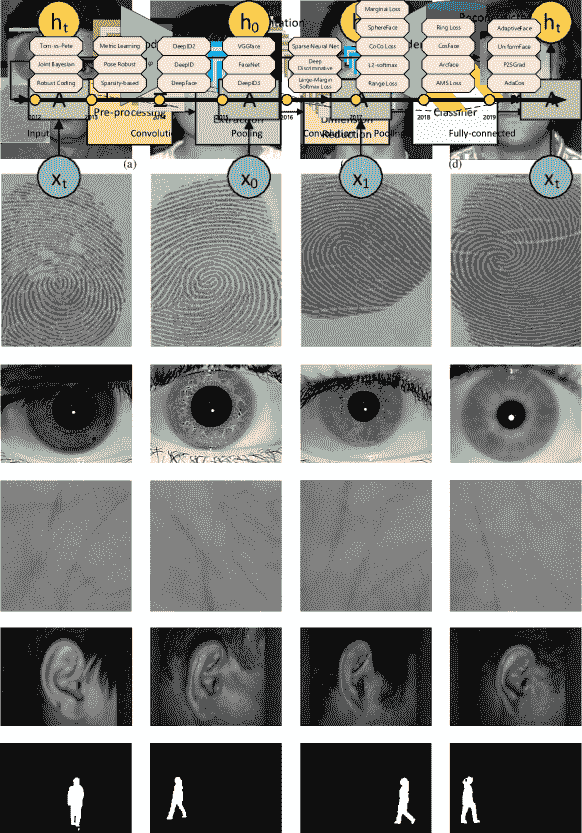

图 1：各种生物特征的样本图像。第一到第六行的图像分别表示面部、指纹、虹膜、掌纹、耳朵和步态的样本 casia_gaitA；yaleb；polyU_finger；polyu_palm；kumar2010comparison；iit_ear。

传统上，生物特征识别过程包括几个关键步骤。图 2 显示了传统生物特征识别系统的框图。首先，通过（各种）摄像机或光学传感器获取图像数据，然后进行预处理，以便算法能够在尽可能多的有用数据上进行工作。接着，从每张图像中提取特征。经典的生物特征识别工作大多基于手工特征（由计算机视觉专家设计）以适应特定类型的数据 ahonen2004face , 2d_3d_face , zhang2009advanced 。许多手工特征基于边缘的分布（SIFT lowe2004distinctive , HOG dalal2005histograms），或来源于变换域，如 Gabor kong2003palmprint , Fourier lai2001face 和小波 jin2004efficient。主成分分析也在许多工作中用于降低特征的维度 abdi2010principal , yang2004two。一旦特征被提取出来，它们会被输入到分类器中进行识别。

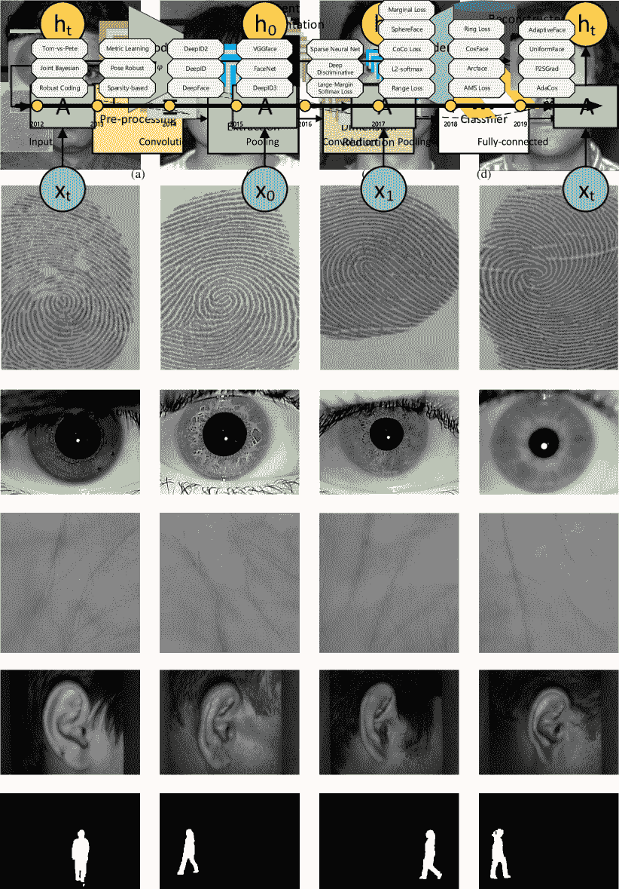

图 2：大多数经典生物特征识别算法的框图。

在传统的生物特征识别任务中，面临许多挑战。例如，适用于一种生物特征的手工特征，未必在其他生物特征上表现良好。因此，需要大量实验来寻找和选择最有效的手工特征集以适应某种生物特征。此外，许多经典模型基于多类支持向量机（SVM），采用一对一的训练方式，当类别数量较多时，这种方法的扩展性较差。

然而，2012 年开始出现了范式转变，当时基于深度学习的模型 AlexNet alexnet 以巨大优势赢得了 ImageNet 竞赛。从那时起，深度学习模型被应用于计算机视觉和自然语言处理（NLP）等广泛的问题，并取得了令人期待的成果。毫不奇怪，生物特征识别方法也不例外，虽然有几年的延迟，但也被深度学习模型所取代。基于深度学习的模型提供了一个端到端的学习框架，可以在进行分类/回归的同时共同学习特征表示。这是通过多层神经网络实现的，也称为深度神经网络（DNNs），以学习多个层次的表示，这些表示对应于不同的抽象层次，这更适合揭示数据的潜在模式（如图 3 所示）。多层神经网络的理念可以追溯到 1960 年代 ivakhnenko1966cybernetic ; schmidhuber2015deep 。然而，它们的可行实施本身就是一个挑战，因为训练时间会过长（由于当时缺乏强大的计算机）。处理器技术的进步，特别是通用目的 GPU（GPGPUs）的发展，以及新技术的发展（如 Dropout），使得科学家能够更快地训练非常深的神经网络 lecun2015deep 。神经网络的主要思想是将（原始）数据通过一系列互连的神经元或节点，每个神经元或节点根据自己的权重和偏差模拟线性或非线性函数。这些权重和偏差在训练过程中会通过从输出 backprop 的梯度反向传播进行调整，通常是由于期望输出和实际当前输出之间的差异，旨在最小化损失函数或成本函数（根据某些指标的预测和实际输出之间的差异） bottou1991stochastic 。我们将在第二部分中更详细地讨论不同的深度架构。

使用深度模型进行生物特征识别时，随着我们在网络中的深入，可以学习到概念的层次结构。例如，面部识别如图 3 所示，从深度神经网络的前几层开始，我们可以观察到类似于 Gabor 特征（具有不同尺度的定向边缘）的学习模式。接下来的几层可以学习更复杂的纹理特征和部分面部特征。进一步的层能够捕捉到更复杂的模式，如高挺的鼻子和大眼睛。最后几层可以学习非常抽象的概念和某些面部属性（如微笑、咆哮，甚至眼睛颜色）。

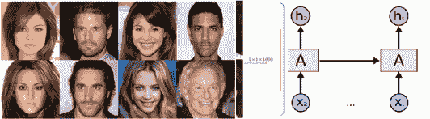

图 3：面部识别训练的深度学习模型所学的层次概念示意图。感谢 deep_face_survey。

本文对使用深度学习框架进行生物特征识别的最新进展进行了全面综述。对于每项工作，我们提供了关键贡献、网络架构和损失函数的概述，这些都旨在推动生物特征识别的前沿性能。我们收集了 2014 年至 2019 年间在计算机视觉、生物特征识别和机器学习领域的主要会议和期刊上发表的 150 多篇论文。对于每种生物特征，我们提供了一些计算机视觉社区使用的最受欢迎的数据集，以及该领域中最有前景的深度学习工作。接着，我们对每种生物特征的知名模型进行了定量分析。最后，我们探讨了基于深度学习的生物特征识别方法的挑战以及未来的研究机会。

本次调查的目标是帮助该领域的新研究人员了解基于深度学习的生物特征识别模型的进展，特别是随着对多模态生物特征系统多模态挑战的兴趣日益增加。与现有文献相比，本文的主要贡献如下：

+   •

    据我们所知，这篇综述文章是唯一一篇提供 2019 年及之前八种流行生物特征概述的文献，包括面部、指纹、虹膜、掌纹、耳朵、声音、签名和步态。

+   •

    我们覆盖了这一领域的当代文献。我们提供了自 2014 年以来出现的 150 多种方法的全面综述。

+   •

    我们提供了关于使用深度学习进行生物特征识别的各个方面的全面评估和深入分析，包括训练数据、网络架构选择、训练策略及其关键贡献。

+   •

    我们提供了审查过的方法在生物特征识别中的属性和性能的比较总结。

+   •

    我们提供了七个挑战和基于深度学习的生物特征识别模型的潜在未来方向。

本文的结构如下。第二部分中，我们概述了流行的深度神经网络架构，这些架构作为许多生物特征识别算法的基础，包括卷积神经网络、递归神经网络、自编码器和生成对抗网络。然后在第三部分中，我们介绍了八种生物特征（面部、指纹、虹膜、掌纹、耳朵、声音、签名和步态），每种特征的一些流行数据集，以及为它们开发的有前景的基于深度学习的工作。第四部分提供了这些模型在所有生物特征上的定量结果和实验性能。最后在第五部分中，我们探讨了基于深度学习的生物特征识别的挑战和未来方向。

## 2 深度神经网络概述

在本节中，我们概述了计算机视觉领域中一些最具前景的深度学习架构，包括卷积神经网络（CNN）CNN 、递归神经网络（RNN）及其一个特定版本，称为长短期记忆网络（LSTM）lstm 、自编码器和生成对抗网络（GANs）gan 。值得注意的是，随着近年来深度学习的普及，还有其他几种深度神经网络架构被提出（如 Transformers、胶囊网络、GRU 和空间变换网络），这些我们将在本工作中不作介绍。

### 2.1 卷积神经网络（CNN）

卷积神经网络（CNN）（受哺乳动物视觉皮层的启发）是深度学习领域中最成功和广泛使用的架构之一（特别是用于计算机视觉任务）。CNN 最初由福岛在一篇开创性论文“Neocognitron”neocog 中提出，基于诺贝尔奖得主 Hubel 和 Wiesel 提出的人类视觉系统模型。后来，Yann Lecun 及其同事开发了一个优化框架（基于反向传播）来有效地学习 CNN 架构的模型权重 CNN 。Lecun 等人开发的第一个 CNN 模型的框图见于图 4 ‣ 2 Deep Neural Network Overview ‣ Biometrics Recognition Using Deep Learning: A Survey")。

CNN 主要由三种类型的层组成：卷积层，通过对图像应用滑动卷积核（如图像卷积操作）来提取特征；非线性层（通常以逐元素的方式应用），在特征上应用激活函数，以使网络能够建模非线性函数；以及池化层，它从特征图的小邻域中提取一些统计信息（均值、最大值等）进行替代。CNN 层中的节点是局部连接的；即，每个层中的单元从前一层的小邻域（称为感受野）接收输入。CNN 的主要优势是通过使用滑动卷积核来进行权重共享，该卷积核遍历图像并汇总局部信息以提取特征。由于卷积核权重在整个图像上共享，因此 CNN 的参数数量显著少于类似的全连接神经网络。此外，通过堆叠多个卷积层，高层能够从越来越宽的感受野中学习特征。

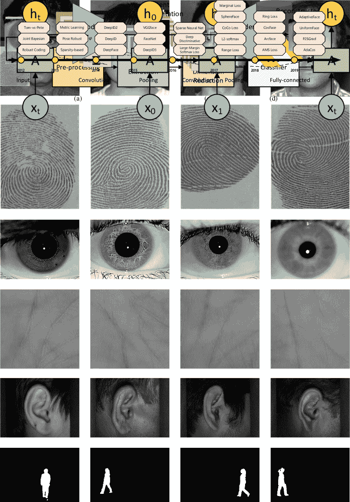

图 4：卷积神经网络（CNN）的架构，展示了卷积和池化的主要两个操作。图片来自 Yann LeCun。

CNN 已被应用于各种计算机视觉任务，例如：语义分割 seman_seg，医学图像分割 med_seg，目标检测 faster_rcnn，超分辨率 sisr，图像增强 enhance，图像和视频的标题生成 caption 等等。一些最著名的 CNN 架构包括 AlexNet alexnet，ZFNet zfnet，VGGNet vggnet，ResNet resnet，GoogLenet googlenet，MobileNet mobilenet 和 DenseNet densenet。

### 2.2 循环神经网络与 LSTM

循环神经网络（RNNs）RNN 被广泛用于处理序列数据，如语音、文本、视频和时间序列（如股票价格），其中任何给定时间/位置的数据依赖于之前遇到的数据。图 5 显示了简单 RNN 的高层架构。如图所示，在每个时间戳，模型接收当前时间的输入 $X_{i}$ 和前一步的隐藏状态 $h_{i-1}$，并输出隐藏状态（以及可能的输出值）。最后一个时间戳的隐藏状态（或所有隐藏状态的加权平均）可以用于执行任务。

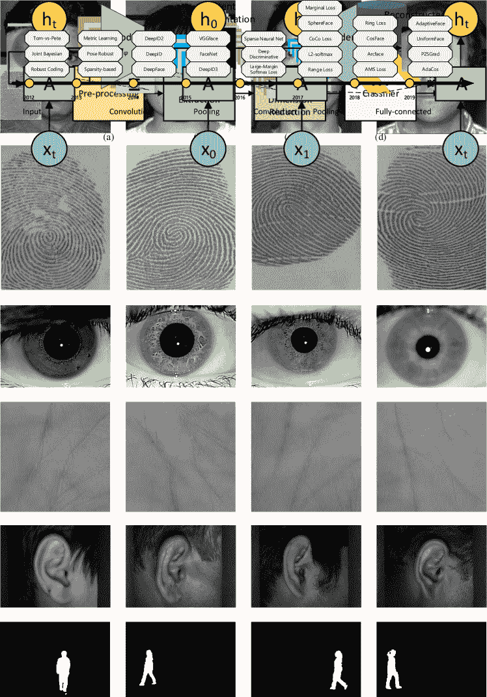

图 5：循环神经网络（RNN）的架构。

RNN 在处理长序列时通常会遇到困难，因为它们无法捕捉许多实际应用中的长期依赖（尽管理论上并没有限制它们这样做）。然而，有一种 RNN 的变体称为 LSTM，它旨在更好地捕捉长期依赖。

长短期记忆（LSTM）：LSTM 是一种流行的递归神经网络架构，用于建模序列数据，其设计目的是比普通 RNN 模型具有更好的捕捉长期依赖的能力 lstm。如上所述，普通 RNN 常常遭遇梯度消失或爆炸问题，而 LSTM 网络通过引入一些内部门控来克服这一问题。在 LSTM 架构中，有三个门（输入门、输出门、遗忘门）和一个记忆单元。记忆单元在任意时间间隔内记住值，其他三个门则调节信息的流入和流出。图 6 说明了单个 LSTM 模块的内部结构。

图 6：标准 LSTM 模块的架构，感谢 Andrej Karpathy lstm_cell。

输入、隐藏状态和不同门之间的关系在公式 1 中展示：

|  | $\displaystyle f_{t}$ | $\displaystyle=\sigma(\textbf{W}^{(f)}x_{t}+\textbf{U}^{(f)}h_{t-1}+b^{(f)})$ |  | (1) |
| --- | --- | --- | --- | --- |
|  | $\displaystyle i_{t}$ | $\displaystyle=\sigma(\textbf{W}^{(i)}x_{t}+\textbf{U}^{(i)}h_{t-1}+b^{(i)})$ |  |
|  | $\displaystyle o_{t}$ | $\displaystyle=\sigma(\textbf{W}^{(o)}x_{t}+\textbf{U}^{(o)}h_{t-1}+b^{(o)})$ |  |
|  | $\displaystyle c_{t}$ | $\displaystyle=f_{t}\odot c_{t-1}$ |  |
|  |  | $\displaystyle+i_{t}\odot\text{tanh}(\textbf{W}^{(c)}x_{t}+\textbf{U}^{(c)}h_{t-1}+b^{(c)})$ |  |
|  | $\displaystyle h_{t}$ | $\displaystyle=o_{t}\odot\text{tanh}(c_{t})$ |  |

其中 $x_{t}\in R^{d}$ 是时间步 t 的输入，$d$ 表示每个词的特征维度，$\sigma$ 表示逐元素的 sigmoid 函数（将值压缩/映射到 $[0,1]$ 之间），$\odot$ 表示逐元素乘积。$c_{t}$ 表示设计用来降低梯度消失/爆炸风险的记忆单元，从而实现对更长时间段的依赖学习，这在传统递归网络中是不可能的。遗忘门 $f_{t}$ 用于重置记忆单元。$i_{t}$ 和 $o_{t}$ 表示输入门和输出门，主要控制记忆单元的输入和输出。

### 2.3 自编码器

自编码器是一类神经网络模型，用于以无监督的方式学习高效的数据编码。它们通过将输入数据压缩成潜在空间表示，然后从这个表示中重构输出（通常与输入相同）来实现这一目标。自编码器由两个部分组成：编码器：这是网络中将输入压缩成潜在空间表示的部分。它可以用编码函数 $z=f(x)$ 表示。解码器：这部分旨在从潜在空间表示中重构输入。它可以用解码函数 $y=g(z)$ 表示。

图 7 展示了一个简单自编码器模型的架构。

图 7: 标准自编码器模型的架构。

自编码器通常通过最小化重构误差 $L(x,\hat{x})$ （无监督，即不需要标记数据）来进行训练，这个误差衡量了原始输入 $x$ 与重构结果 $\hat{x}$ 之间的差异。均方误差和平均绝对偏差是许多应用中常用的重构损失选择。

过去提出了几种变体的自编码器。其中一种流行的变体是堆叠去噪自编码器（SDAE），它堆叠了几个自编码器并用于图像去噪 stac_ae。另一个流行的自编码器变体是“变分自编码器（VAE）”，它对潜在表示施加了先验分布 vr_ae。变分自编码器能够从数据分布中生成真实的样本。另一种自编码器的变体是对抗自编码器，它在潜在表示上引入了对抗损失，以鼓励其接近先验分布。

### 2.4 生成对抗网络（GAN）

生成对抗网络（GAN）是一类较新的深度学习模型，它由两个网络组成，一个生成器和一个判别器 gan。从高层次看，生成器的工作是生成接近真实样本的样本，以欺骗判别器，而判别器的工作是区分生成的样本（伪样本）和真实样本。图 8 展示了一个基础 GAN 模型的总体架构。

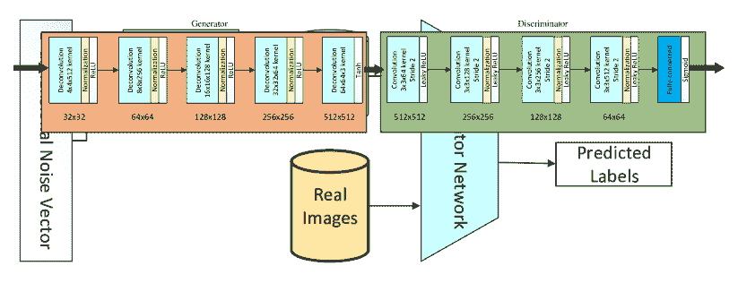

图 8: 生成对抗网络的架构。

vanilla GAN 中的生成器网络学习从噪声$z$（具有先验分布，如高斯分布）到目标分布$y$的映射，$G=z\rightarrow y$，这些映射与真实样本相似，而判别器网络$D$则尝试区分生成器模型生成的样本与真实样本。GAN 的损失函数可以写作方程 2 ‣ 2 Deep Neural Network Overview ‣ Biometrics Recognition Using Deep Learning: A Survey")：

|  | $\displaystyle\mathcal{L}_{GAN}$ | $\displaystyle=\mathbb{E}_{x\sim p_{data}(x)}[\text{log}D(x)]$ |  | (2) |
| --- | --- | --- | --- | --- |
|  |  | $\displaystyle+\mathbb{E}_{z\sim p_{z}(z)}[\text{log}(1-D(G(z)))]$ |  |

在其中，我们可以将 GAN 视为$D$和$G$之间的极小极大游戏，其中$D$试图最小化其在检测真假样本中的分类错误（最大化上述损失函数），而$G$试图最大化判别器网络的错误（最小化上述损失函数）。训练完成后，训练后的生成器模型将是：

|  | $\displaystyle G^{*}=\text{arg}\ \text{min}_{G}\text{max}_{D}\ \mathcal{L}_{GAN}$ |  | (3) |
| --- | --- | --- | --- |

实际操作中，方程 3 ‣ 2 Deep Neural Network Overview ‣ Biometrics Recognition Using Deep Learning: A Survey")中的损失函数可能无法提供足够的梯度，使得$G$无法得到良好的训练，特别是在开始阶段，$D$可以轻松区分真假样本。一个解决方案是最大化$\mathbb{E}_{z\sim p_{z}(z)}[\text{log}(D(G(z)))]$。

自从 GAN 的发明以来，已经有一些工作尝试在不同方面改进/修改 GAN。有关 GAN 的详细工作列表，请参见 GanZoo。

### 2.5 迁移学习方法

现在我们讨论了一些流行的深度学习架构，让我们简要讨论一下这些模型如何应用于新的应用领域。当然，这些模型总是可以从头开始在新应用上进行训练，前提是提供足够的标记数据。但根据模型的深度（即参数数量的多少），可能不容易使模型收敛到良好的局部最小值。此外，对于许多应用，可能没有足够的标记数据来从头开始训练深度模型。在这些情况下，可以使用迁移学习方法来更好地处理标记数据的限制和局部最小值问题。

在迁移学习中，经过一个任务训练的模型被重新用于另一个相关任务，通常是通过对新任务的某种适应。例如，可以设想使用在 ImageNet 上训练的图像分类模型，用于不同的任务，如纹理分类或虹膜识别。预训练模型用于不同任务的主要方式有两种。一种方法是将预训练模型（例如语言模型）视为特征提取器，在其上训练一个分类器以进行分类（例如情感分类）。在这种情况下，预训练模型的内部权重不会适应新任务。另一种方法是对整个网络或其子集进行微调以适应新任务。因此，预训练模型的权重被视为新任务的初始值，并在训练阶段进行更新。

许多基于深度学习的生物特征识别模型都是基于迁移学习的（语音除外，因为数据性质的不同，人脸除外，因为大规模数据集的可用性），这一点我们将在接下来的章节中解释。

## 3 基于深度学习的生物特征识别工作

在本节中，我们提供了一些最有前景的深度学习在各种生物特征识别工作的概述。在每个子节中，我们还提供了每种生物特征的一些最受欢迎的数据集的总结。

### 3.1 人脸识别

人脸可能是最受欢迎的生物特征之一（也是近年来研究最多的）。它有广泛的应用，从机场和政府办公室的安全摄像头，到日常的手机认证（如 iPhone 中的 FaceID）。过去，使用了各种手工设计的特征进行识别，如 LBP、Gabor Wavelet、SIFT、HoG，以及基于稀疏表示的特征 deng2013defense、cao2013similarity、face_sparse、yang2012regularized、yi2013towards。人脸的 2D 和 3D 版本都用于识别 mian2007efficient，但大多数人迄今为止主要关注 2D 人脸识别。人脸识别的主要挑战之一是人脸随时间的变化，如衰老、伤疤或医疗状况 park2010age。我们将在下一节介绍一些最广泛使用的人脸识别数据集，然后讨论有前途的深度学习基础的人脸识别模型。

#### 3.1.1 人脸数据集

由于人脸识别在工业中的广泛应用，提出了大量的数据集。我们将在这里介绍一些最受欢迎的数据集。

Yale 和 Yale Face Database B：Yale 面部数据集可能是最早的面部识别数据集之一 yale。它包含了 15 个人的 165 张灰度图像。每个人有 11 张图像，分别对应不同的面部表情或配置（中心光、带眼镜、开心、左侧光、无眼镜、正常、右侧光、伤心、困倦、惊讶和眨眼）。

这是扩展版的 Yale Face Database B yaleb，包含了 5760 张 10 名受试者在 576 种观看条件下（9 种姿势 x 64 种光照条件）下的单一光源图像。对于每个特定姿势的受试者，还捕捉了一张带有环境（背景）光照的图像。图 9 显示了 Yale Face B 数据集中的十个示例图像。

图 9：Yale Face B 数据集中的十个示例图像。

CMU Multi-PIE：CMU Multi-PIE 面部数据库包含了 337 个人的超过 750,000 张图像 cmu，gross2010multi。受试者在 15 个视角和 19 种光照条件下被拍摄，展现了一系列面部表情。

Labeled Face in The Wild (LFW)：Labeled Faces in the Wild 是一个用于研究无约束面部识别的面部图像数据库。该数据库包含了来自网络的超过 13,000 张面部图像。每张面部图像都标注了图像中人的名字 lfw。其中 1680 人有两张或更多不同的照片。唯一的约束是这些面部图像是通过 Viola-Jones 面部检测器检测到的。有关此数据集的更多详细信息，请参阅数据库网页。

PolyU NIR Face Database：香港理工大学的生物识别研究中心开发了一种 NIR 面部捕捉设备，并利用它构建了一个大规模的 NIR 面部数据库 polyu_face。通过使用自设计的数据采集设备，他们从 335 名受试者那里收集了 NIR 面部图像。在每次记录中，捕捉了每个受试者的 100 张图像，总共在 PolyU-NIRFD 数据库中收集了约 34,000 张图像。

YouTube Faces：该数据集包含了 3,425 段 1,595 名不同人的视频。所有视频均从 YouTube 下载。每个受试者平均有 2.15 段视频。此数据集的目标是生成一个大规模的视频集合，并标注出每段视频中出现的人的身份 youtube。此外，他们发布了基准测试，旨在衡量这些视频上的视频配对匹配技术的性能。

VGGFace2: VGGFace2 是一个大规模面部识别数据集 vggface2。图像从 Google 图像搜索下载，具有很大的姿态、年龄、光照、种族和职业变化。它包含 3.31 百万张 9131 个身份的图像，每个身份平均有 362.6 张图像。不同身份的面部分布变化，从 87 到 843 张。

CASIA-WebFace: CASIA WebFace 人脸数据集包含 453,453 张图像，覆盖 10,575 个身份，经过人脸检测处理 casiawebface。这是最大的一些公开可用的人脸数据集之一。

MS-Celeb: Microsoft Celeb 是一个由来自互联网的 1000,000 个个体收集的 1000 万张面部图像的数据集 msceleb1m。

CelebA: CelebFaces 属性数据集（CelebA）是一个大规模的面部属性数据集，包含超过 200K 名名人图像 celeba。CelebA 具有极大的多样性、大量的数据以及丰富的注释，包括超过 10,000 个身份、202,599 张面部图像、5 个标志点位置、每张图像 40 个二元属性注释。该数据集可用于以下计算机视觉任务的训练和测试：面部属性识别、面部检测、标志点（或面部部位）定位以及面部编辑与合成。

IJB-C: IJB-C 数据集 ijbc 包含约 3,500 个身份，共 31,334 张静态面部图像和 117,542 张无约束的视频帧。整个 IJB-C 测试协议旨在测试面部的检测、识别、验证和聚类。在 1:1 验证协议中，有 19,557 个正匹配和 15,638,932 个负匹配。

MegaFace: MegaFace Challenge megaface 是一个公开可用的基准测试，广泛用于测试面部识别算法的性能（包括识别和验证）。MegaFace 的库集包含超过 100 万张来自 690K 个身份的 Flickr 图像 flicker。探测集包括两个现有数据库：FaceScrub 和 FGNet。FaceScrub 数据集包含 530 位名人的 106,863 张面部图像。FGNet 数据集主要用于测试年龄不变的面部识别，包含 82 人共 1002 张面部图像。

其他数据集: 值得一提的是，还有一些我们跳过了细节的其他数据集，因为它们是私有的或不太受欢迎，例如 DeepFace（Facebook 的私有数据集，包含 4.4M 张 4k 个受试者的照片）、NTechLab（一个私有数据集，包含 18.4M 张 200k 个受试者的照片）、FaceNet（Google 的私有数据集，包含超过 500M 张超过 10M 个受试者的照片）、WebFaces（一个从网络爬取的 80M 张照片的数据集） megaface 以及 Disguised Faces in the Wild (DFW) DFW，其中包含超过 11,000 张 1,000 个身份的图像，具有不同类型的伪装配件。

#### 3.1.2 深度学习在人脸识别中的应用

使用深度学习进行人脸识别的工作不胜枚举。在这次调查中，我们提供了一些最具前景的人脸验证和/或识别工作的概述。

2014 年，Taigman 和同事在名为 DeepFace 的论文中提出了早期的深度学习人脸识别工作 DeepFace，并在 LFW 基准测试 lfw 上达到了最先进的准确率，首次在无约束条件下接近人类表现（DeepFace: 97.35% vs. Human: 97.53%）。DeepFace 在 400 万张面孔图像上进行了训练。这项工作是人脸识别领域的一个里程碑，此后，许多研究人员开始使用深度学习进行人脸识别。

在同一年中，Sun 等人提出了 DeepID（深度隐藏身份特征）DeepID，用于人脸验证。DeepID 特征取自深度卷积网络的最后一层隐藏层，该网络被训练来识别训练集中约 10,000 个面孔身份。

在后续工作中，Sun 等人扩展了 DeepID，提出了用于人脸识别和验证的 DeepID2 DeepID2。通过联合训练模型进行识别和验证，他们展示了人脸识别任务通过将不同身份的 DeepID2 特征分开，从而增加了个体间的变化，而人脸验证任务通过将相同身份的 DeepID2 特征拉在一起，减少了个体内的变化。对于识别任务，使用交叉熵作为损失函数（如方程 4 所定义），而对于验证任务，他们建议使用方程 5 中的损失函数来减少特征的类内距离并增加类间距离。

|  | $\mathbf{L}_{Ident}(f,t,\theta_{id})=-\sum_{i}p_{i}\log\hat{p}_{i}$ |  | (4) |
| --- | --- | --- | --- |

|  | <math   alttext="\begin{split}\mathbf{L}_{Verif}&amp;(f_{i},f_{j},y_{ij},\theta_{vr})=\\ &amp;\begin{cases}\frac{1}{2}\&#124;f_{i}-f_{j}\&#124;_{2}^{2},&amp;\text{if }y_{ij}=1\\

\mathbf{L}_{Verif}&(f_{i},f_{j},y_{ij},\theta_{vr})=\\ &\begin{cases}\frac{1}{2}\&#124;f_{i}-f_{j}\&#124;_{2}^{2},&\text{如果 }y_{ij}=1\\ \frac{1}{2}max(1-\frac{1}{2}\&#124;f_{i}-f_{j}\&#124;_{2}^{2},0),&\text{否则}\end{cases}\end{split}

作为 DeepID2 的扩展，DeepID3 DeepID3 中，Sun 等人提出了一个新模型，该模型具有更高维度的隐藏表示，并采用了 VGGNet 和 GoogleNet 作为主要架构。

在 2015 年，FaceNet FaceNet 在一个大型私有数据集上训练了一个 GoogLeNet 模型。这项工作试图学习一个从人脸图像到紧凑欧几里得空间的映射，其中距离直接对应于人脸相似性的度量。它采用了一种基于粗略对齐的匹配/非匹配人脸补丁的三元组损失函数，这些补丁通过一种新颖的在线三元组挖掘方法生成，并在 LFW 数据集上取得了良好的表现（99.63%）。给定样本 $f(x_{i}^{a})$，正样本 $f(x_{i}^{p})$（匹配 $x_{i}^{a}$）和负样本 $f(x_{i}^{n})$，给定边际 $\alpha$ 的三元组损失定义如公式 6：

|  | $\mathbf{L}_{triplet}=\sum\bigg{[}\|f(x_{i}^{a})-f(x_{i}^{p})\|_{2}^{2}-\|f(x_{i}^{a})-f(x_{i}^{n})\|_{2}^{2}+\alpha\bigg{]}_{+}$ |  | (6) |
| --- | --- | --- | --- |

在同一年，Parkhi 等人提出了一种名为 VGGface 的模型 VGGface_model（在从互联网收集的大规模数据集上训练）。它在该数据集上训练了 VGGNet，并通过三元组损失函数对网络进行了微调，类似于 FaceNet。VGGface 获得了非常高的准确率 98.95%。

在 2016 年，Liu 和同事开发了一种“Large-Margin Softmax Loss”用于 CNNs Largesoftmax，并在多个计算机视觉数据集上展示了其前景，包括 LFW。他们声称，交叉熵并没有明确鼓励特征的判别学习，并提出了一种广义的大间隔 softmax 损失，它明确鼓励学习特征之间的类别内紧凑性和类别间可分离性。

在同一年，Wen 等人提出了一种新的监督信号，称为“中心损失”，用于人脸识别任务 wen2016discriminative。中心损失同时为每个类别的深度特征学习一个中心，并惩罚深度特征与其对应类别中心之间的距离。在 softmax 损失和中心损失的联合监督下，他们训练了一个 CNN，以尽可能获得具有两个关键学习目标的深度特征，即类别间分散性和类别内紧凑性。

在 2016 年的另一项工作中，Sun 等人提出了一种使用具有稀疏神经连接的卷积网络的面部识别模型 sun2016sparsifying 。这种稀疏 ConvNet 以迭代方式学习，每次稀疏化一个额外的层，并根据先前迭代中学习到的初始权重重新训练整个模型（他们发现从头开始训练稀疏 ConvNet 通常无法找到面部识别的良好解决方案）。

在 2017 年，在 RangeLoss 中，Zhang 和同事们开发了一种范围损失，以同时减少整体的个人内变异并增加个人间差异。同年，Ranjan 和同事们开发了一种“L2 约束 softmax 损失函数”，并将其用于面部验证 L2softmax 。该损失函数限制特征描述符位于固定半径的超球面上。这项工作在 LFW 数据集上取得了当时 99.78%的最先进性能。在 cocoloss 中，Liu 和同事们开发了一种基于这样一种直觉的面部识别模型：即高维空间中的面部特征的余弦距离在一个类别内应足够接近，而在不同类别间应足够远。他们提出了同源余弦（COCO）算法，以同时优化数据之间的余弦相似度。

同年，Liu 等人开发了 SphereFace Sphereface ，这是一种用于面部识别的深度超球体嵌入。他们提出了一种角度 Softmax（A-Softmax）损失函数，使得 CNN 能够学习角度上区分特征。从几何上看，A-Softmax 损失可以视为对超球体流形施加区分约束，这本质上匹配了面部也位于流形上的先验。他们在 LFW、MegaFace 和 Youtube Face 数据库上展示了有前景的面部识别准确性。

在 2018 年，在 amsloss 中，Wang 等人开发了一种简单且几何上可解释的目标函数，称为加性边距 Softmax（AM-Softmax），用于深度面部验证。这项工作受到两项早期工作的强烈启发，分别是大型边距 Softmax Largesoftmax 和 Sphereface 中的角度 Softmax。

CosFace CosFace 和 ArcFace Arcface 是 2018 年开发的另外两种有前景的面部识别方法。在 CosFace 中，Wang 等人提出了一种新颖的损失函数，即大边距余弦损失（LM-CL）。更具体地，他们通过对特征和权重向量进行 L2 标准化，将 softmax 损失重新公式化为余弦损失，以消除径向变化，并引入了一个余弦边距项来进一步最大化角空间中的决策边距。因此，通过标准化和余弦决策边距最大化，实现了最小类内方差和最大类间方差。

Ring-Loss RingLoss 是另一个专注于设计新损失函数的工作，该函数应用了软归一化，它逐渐学习将范数约束到缩放的单位圆，同时保持凸性，从而得到更强健的特征。通过常规软最大值和 Ring-loss 函数学习到的特征的比较见图 10。

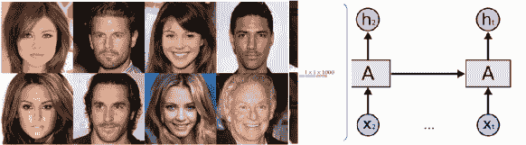

图 10：使用 (a) Softmax 和 (b) Ring loss 训练的 MNIST 特征样本。感谢 RingLoss 提供。

AdaCos adacos 、P2SGrad p2sgrad 、UniformFace uniface 和 AdaptiveFace adapface 是 2019 年提出的最有前景的工作之一。在 AdaCos adacos 中，Zhang 等人提出了一种新型的基于余弦的 softmax 损失函数 AdaCos，该函数无需超参数，利用自适应缩放参数在训练过程中自动增强训练监督。在 p2sgrad 中，Zhang 等人声称基于余弦的损失总是包含敏感的超参数，这可能导致训练过程不稳定，而且为特定数据集设置合适的超参数非常棘手。他们通过以自适应方式直接设计训练梯度来解决这一挑战。P2SGrad 能够在所有三个人脸识别基准测试中实现最先进的性能，即 LFW、MegaFace 和 IJB-C。还有其他一些工作也提出了用于人脸识别的方法。有关基于深度学习的人脸识别的更详细概述，请参阅 deep_face_survey。

关于使用生成模型进行人脸图像生成的研究也有一些成果。为了展示一个有前景的模型的结果，在 Progressive-GAN prog_gan 中，Karras 等人开发了一个框架，逐步增加 GAN 的生成器和判别器的规模，这样可以学习生成高分辨率的真实图像。图 11 展示了通过在 CELEB-A 数据集上训练的 Progressive-GAN 模型生成的 8 张样本人脸图像。

图 11：使用 CELEBA-HQ 数据集生成的 8 张样本图像（1024 x 1024）。感谢 prog_gan 提供。

.

图 12 展示了自 2012 年以来流行的人脸识别模型的时间线。2014 年之后列出的模型都是基于深度学习的模型。DeepFace 和 DeepID 标志着基于深度学习的人脸识别的开始。我们可以看到，2017 年之后的许多模型都集中在开发新的损失函数以获得更具区分性的特征学习。

图 12：人脸识别方法的时间线。

### 3.2 指纹识别

指纹可以说是最常用的生理生物特征。它由脊和谷组成，形成独特的模式。细节点是指纹的主要局部部分，可以用来确定指纹的唯一性 jain1997line。指纹中的重要特征包括脊端、分叉、岛屿、桥梁、交叉点和点 hrechak1990automated。

指纹需要通过特殊设备在其近距离内捕捉。这使得制作指纹数据集比某些其他生物特征（如面部和耳朵）更为耗时。尽管如此，世界各地仍有许多出色的指纹数据集在使用。指纹识别一直是一个非常活跃的领域，广泛应用于工业，如智能手机认证、边境安全和法医学。作为经典的工作之一，Lee 等人 lee1999fingerprint 使用 Gabor 滤波器对分割的指纹图像进行特征提取，然后使用 k-NN 分类器进行识别，达到了 97.2% 的识别率。此外，使用具有八种方向的滤波器输出的幅度为识别方案增加了一个平移不变性。Tico 等人 tico2001wavelet 从指纹中提取了小波特征，并在 k-NN 分类器中使用。

#### 3.2.1 指纹数据集

已开发了几个用于指纹识别的数据集。一些最受欢迎的数据集包括：

FVC 指纹数据库：指纹验证竞赛 (FVC) 广泛用于指纹评估 fvc_finger。FVC 2002 包含三个指纹数据集 (DB1、DB2 和 DB3)，这些数据集使用不同的传感器收集。每个数据集由两个子集组成：(i) A 集合有 100 个受试者，每个受试者 8 次印象，(ii) B 集合有 10 个受试者，每个受试者 8 次印象。FVC 2004 增加了另一个数据集 (DB4)，并包含更多故意噪声，例如皮肤变形、皮肤湿度和旋转。

PolyU 高分辨率指纹数据库：该数据集包含两个高分辨率指纹图像数据库（标记为 DBI 和 DBII），由香港理工大学提供 polyU_finger 。它包含 1480 张来自 148 个手指的图像。

CASIA 指纹数据集：CASIA 指纹图像数据库 V5 包含了 20,000 张来自 500 名受试者的指纹图像 casia_finger 。每位志愿者提供了 40 张他/她八个手指的指纹图像（左右手拇指、食指、中指、无名指），即每个手指 5 张图像。志愿者被要求用不同的压力旋转手指，以生成显著的同类内部变化。

NIST 指纹数据集：NIST SD27 包含 258 张潜指纹及其对应的参考指纹 nist_finger 。

#### 3.2.2 深度学习在指纹识别中的应用

关于使用深度学习进行指纹识别的研究已经有很多。在这里，我们总结了一些该领域的突出工作。

在 finger_1 中，Darlow 等人提出了一种基于深度学习模型的指纹特征点提取算法，称为 MENet，并在 FVC 数据集中的指纹图像上取得了良好的结果。在 finger_2 中，Tang 及其同事提出了另一种基于深度学习的指纹特征点提取模型，称为 FingerNet。该模型联合执行特征提取、方向估计、分割，并利用这些信息来估计特征点图。该模型的框图如图 13 所示。

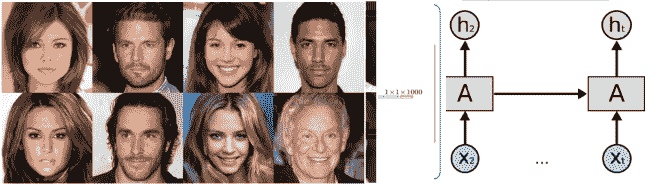

图 13：用于特征点提取的提出的 FingerNet 模型的框图。感谢 finger_2 提供。

.

在另一个工作 finger_3 中，Lin 和 Kumar 提出了一个基于 CNN 的多视角深度表示，用于无接触和部分 3D 指纹识别。所提出的模型包括一个全卷积网络用于指纹分割和三个 Siamese 网络用于学习多视角 3D 指纹特征表示。他们在多个 3D 指纹数据库上展示了有希望的结果。在 finger_4 中，作者使用深度学习框架开发了一种指纹纹理学习方法。他们在多个基准上评估了他们的模型，并在 PolyU2D、IITD、CASIA-BLU 和 CASIA-WHT 四个数据库上分别达到了 100%、98.65%、100% 和 98%的验证准确率。在 finger_5 中，Minaee 等人提出了一种深度迁移学习方法，以非常高的准确率进行指纹识别。他们在一个流行的指纹数据集上微调了一个预训练的 ResNet 模型，并能够达到非常高的识别率。

在 finger_8 中，Lin 和 Kumar 提出了一个多 Siamese 网络，以准确匹配非接触式与接触式指纹图像。除了指纹图像，手工制作的指纹特征，如*细节*和*核心点*，也被纳入到所提议的架构中。这个多 Siamese CNN 使用指纹图像和提取的特征进行训练。

也有一些工作利用深度学习模型进行指纹分割。在 finger_6 中，Stojanovic 和同事提出了一种基于卷积神经网络的指纹 ROI 分割算法。在另一项工作 finger_7 中，Zhu 等人提出了一种基于卷积神经网络（“ConvNets”）的新型潜在指纹分割方法。潜在指纹分割问题被表述为分类系统，其中一组 ConvNets 被训练来将每个补丁分类为指纹或背景。然后，基于分类结果计算评分图，以评估像素属于指纹前景的可能性。最后，通过对评分图进行阈值处理生成分割掩码，用于描绘潜在指纹的边界。

也有一些工作用于假指纹检测。在 finger_9 中，Kim 等人提出了一种基于深度信念网络（DBN）学习的统计特征的指纹活跃度检测方法。该方法在 LivDet2013 测试的各种传感器数据集上实现了良好的准确性。在 finger_10 中，Nogueira 和同事提出了一种使用卷积神经网络检测指纹活跃度（即它们是真实的还是伪造的）的方法，该方法在 2015 年指纹活跃度检测比赛中实现了 95.5%的准确率。

也有一些工作使用生成模型进行指纹图像生成。在 finger_11 中，Minaee 等人提出了一种基于 GAN 扩展的指纹图像生成算法，称为“Connectivity Imposed GAN”。该模型将生成图像的总变差添加到 GAN 损失函数中，以促进生成指纹图像的连通性。在 anil_finger 中，Tabassi 等人开发了一个框架来合成与真实变更指纹特征相似的伪造指纹，并用它们训练分类器以检测“指纹更改/伪装呈现攻击”（即有意篡改或损坏真实摩擦脊模式以避免识别）。

### 3.3 虹膜识别

虹膜图像包含丰富的特征，这些特征嵌入在其纹理和模式中，不随时间变化，如环形、冠状物、睫毛过程、雀斑以及色素细胞和纤维母细胞的条纹状小梁网，这是在可见光下最为明显的 daugman1993high。近年来，虹膜识别在不同的安全相关领域引起了很多关注。

John Daugman 开发了第一个现代虹膜识别框架之一，使用了 2D Gabor 小波变换 kumar2010comparison。虹膜识别在 1990 年代开始受到关注。1994 年，Wildes 等人 wildes1994system 引入了一种用于人员认证的虹膜识别设备。之后，许多研究人员开始关注虹膜识别问题。早期的工作使用了各种方法从虹膜中提取手工特征。Williams 等人 williams1996iris 将所有虹膜条目转换为“IrisCode”，并使用输入虹膜图像的 IrisCode 与数据库中虹膜的 IrisCode 的汉明距离作为识别的度量。在 iris_0 中，作者提出了一种基于“深度散射卷积特征”的虹膜识别系统，在 IIT Delhi 数据集上实现了显著的高准确率。这项工作并非完全使用深度学习，而是使用深度散射卷积网络从图像中提取层次特征。散射网络中不同节点的输出图像表示沿不同方向和尺度的变换图像。散射变换的第一层和第二层的变换图像如图 14 所示。这些图像是通过应用 5 种不同尺度和 6 种方向的滤波器组得到的。

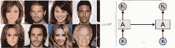

图 14：散射变换的第一层（左侧）和第二层（右侧）的图像。

值得一提的是，许多经典的虹膜识别模型执行多个预处理步骤，如虹膜检测、标准化和增强，如图 15 所示。然后，它们从标准化或增强后的图像中提取特征。许多现代虹膜识别工作跳过了标准化和增强，但仍能实现非常高的识别准确率。其中一个原因是深度模型能够从原始虹膜图像中捕捉高层次的语义特征，这些特征具有足够的区分度，以在虹膜识别中表现良好。

图 15：虹膜识别的一些关键预处理步骤的示意图，感谢 iris_12。

#### 3.3.1 虹膜数据集

过去提出了各种虹膜识别数据集。其中一些最受欢迎的数据集包括：

CASIA-Iris-1000 数据库：CASIA-Iris-1000 包含来自 1,000 名受试者的 20,000 张虹膜图像，这些图像是使用 IKEMB-100 相机采集的。CASIA-Iris-1000 的主要类内变异来源是眼镜和镜面反射 casia_iris。

UBIRIS 数据集：UBIRIS 数据库有两个不同的版本，UBIRIS.v1 和 UBIRIS.v2。第一个版本包含来自 241 只眼睛的 1877 张图像，分两次采集。它模拟了较少受限的成像条件 ubiris_iris。第二个版本的 UBIRIS 数据库有超过 11,000 张图像（并且持续增长），噪声因素更为真实。

IIT Delhi Iris 数据集：IIT Delhi iris 数据库包含来自 224 个不同人的 2240 张虹膜图像。这些图像的分辨率为 320x240 像素 iit_iris。该数据集中的虹膜图像具有不同的颜色分布和不同的（虹膜）尺寸。

ND 数据集：ND-CrossSensor-Iris-2013 包含两个虹膜数据库，分别使用两个虹膜传感器：LG2200 和 LG4000。LG2200 数据集包含 116,564 张虹膜图像，而 LG4000 包含 29,986 张虹膜图像，涉及 676 名受试者 lg_iris。

MICHE 数据集：Mobile Iris Challenge Evaluation (MICHE) 包含在无约束条件下使用智能手机采集的虹膜图像。该数据集包括来自 92 名受试者的 3,732 张图像，使用了三种不同的智能手机 miche_iris。

#### 3.3.2 深度学习在虹膜识别中的应用

与人脸识别相比，深度学习模型在虹膜识别中的应用有所滞后。

作为使用深度学习进行虹膜识别的早期工作之一，在 iris_1 中，Minaee 等人展示了从在 ImageNet 上训练的预训练 CNN 模型中提取的特征能够实现相当高的虹膜识别准确率。在这项工作中，他们使用了来自 VGGNet vggnet 不同层的特征，并在其上训练了一个多类 SVM，结果表明，训练后的模型在两个虹膜识别基准（CASIA-1000 和 IIT Delhi 数据库）上能够达到最先进的准确率。他们还展示了从 VGGNet 中层提取的特征相比于最后几层具有稍高的准确率。在另一项工作 iris_1_2 中，Gangwar 和 Joshi 提出了一个基于卷积神经网络的虹膜识别网络，该网络提供了强大的、具有区分性的、紧凑的结果，实现了非常高的准确率，并且在虹膜图像的跨传感器识别中表现良好。

在 iris_1_3 中，Baqar 及其同事提出了一种基于深度置信网络和虹膜图像轮廓信息的虹膜识别框架。基于轮廓的特征向量已被用于区分属于不同类别的样本，即巩膜-虹膜轮廓和虹膜-瞳孔轮廓的差异，并被称为“独特签名”。特征提取后，使用具有修改反向传播算法的前馈神经网络（RVLR-NN）进行分类。

在 iris_12 中，Zhao 和 Kumar 提出了一种基于“深度学习空间对应特征”的虹膜识别模型。该框架基于全卷积网络（FCN），输出空间对应的虹膜特征描述符。他们还引入了一种特别设计的“扩展三元组损失（ETL）”函数，以结合位移和非虹膜掩膜。三元组网络如图 16 所示。他们还开发了一个子网络，以提供识别有意义虹膜区域的适当信息，这为新开发的 ETL 提供了必要的输入。他们在一些虹膜数据库上超越了几种经典和最先进的虹膜识别方法。

图 16：用于虹膜识别的三元组网络的框图，感谢 iris_12 提供。

在另一项工作 iris_2 中，Alaslani 等人开发了一种虹膜识别系统，该系统基于从 AlexNet 提取的深度特征，随后进行多类分类，并在 CASIA-Iris-V1、CASIA-Iris-1000 和 CASIA-Iris-V3 Interval 数据库上达到了高准确率。在 menon2018iris 中，Menon 展示了从经过微调的预训练模型中提取的卷积特征在识别和验证问题上的应用。在 iris_4 中，Hofbauer 及其同事提出了一种基于 CNN 的算法，用于虹膜图像的分割，这可以获得比以前的模型更高的准确率。在另一项工作 iris_5 中，Ahmad 和 Fuller 开发了一种基于三元组网络的虹膜识别模型，称为 ThirdEye。他们的工作直接使用分割的、未归一化的虹膜图像，并在 ND-0405、UbirisV2 和 IITD 数据集上分别达到了 1.32%、9.20%和 0.59%的等错误率。在更近期的工作 iris_8 中，Minaee 及其同事提出了一种基于深度迁移学习方法的虹膜识别算法。他们在虹膜数据集上训练了一个 CNN 模型（通过微调预训练的 ResNet 模型），并在测试集上实现了非常准确的识别。

随着深度生成模型的兴起，已经有研究将其应用于虹膜识别。在 iris_6 中，Minaee 等人提出了一种基于卷积 GAN 的虹膜图像生成算法，该算法可以生成逼真的虹膜图像。这些图像可以用于增强训练集，从而获得更好的特征表示和更高的准确率。图 17 显示了这项工作生成的四个样本虹膜图像（经过不同的训练周期）。

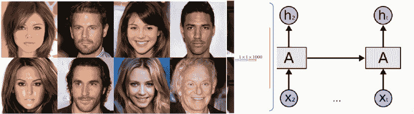

图 17：使用训练好的 IIT Delhi Iris 数据库模型，针对 4 个输入潜在向量生成的虹膜图像（经过 140 个周期，每 10 个周期一次）。图片来源：iris_6。

在 iris_7 中，Lee 和同事提出了一种基于 GAN 的数据增强技术，用于增加虹膜识别的训练数据，从而提高了准确率。他们声称，历史数据增强技术如几何变换和亮度调整会产生与原始样本高度相关的样本，但使用基于条件生成对抗网络的增强方法可以获得更高的测试准确度。

### 3.4 掌纹识别

掌纹是另一种最近越来越受到关注的生物特征。除了纹点特征外，掌纹还包括基于几何的特征、三角点、主线和皱纹 zhang1999two；zhang2012comparative。掌纹的每个部分具有不同的特征，包括纹理、脊线、线条和褶皱。掌纹的一个优点是掌纹中的褶皱几乎不会随时间变化，且容易提取 chen2001palmprint。然而，采集掌纹需要特殊设备，这使得其收集不如指纹、虹膜和面部等其他生物特征那么容易。经典的掌纹识别研究探讨了多种手工制作的特征，如 PCA 和 ICA connie2003palmprint、傅里叶变换 li2002palmprint、小波变换 wu2002wavelet、线条特征匹配 shu1998palmprint 和深度散射特征 palm_2。

#### 3.4.1 掌纹数据集

已经提出了几个用于掌纹识别的数据集。其中一些最广泛使用的数据集包括：

PolyU 多光谱手掌纹数据集：PolyU 数据集中的图像是从 250 名志愿者中收集的，其中包括 195 名男性和 55 名女性。该数据库总共包含来自 500 个不同手掌的 6,000 张图像，光照条件为单一 polyu_palm。样本分两次收集。在每次收集中，受试者需提供每只手掌 6 张图像。因此，每个受试者的 2 只手掌在每个光照条件下共收集了 24 张图像。

CASIA 手掌纹数据库：CASIA 手掌纹图像数据库包含 5,502 张从 312 个受试者处获取的手掌纹图像。对于每个受试者，收集了左右手掌的图像 casia_palm。所有手掌纹图像均为由其自开发的手掌纹识别设备拍摄的 8 位灰度 JPEG 文件。

IIT 德里无接触手掌纹数据库：IIT 德里手掌纹图像数据库由从印度新德里 IIT 德里学生和工作人员处收集的手部图像组成 iit_palm。该数据库使用简单的无接触成像设备获取。当前可用的数据库来自 235 位用户。每个受试者的左右手各获取七张图像，手部姿势各异。每张图像的大小为 800x600 像素。

#### 3.4.2 深度学习在手掌纹识别中的应用

在 palm_1 中，Xin 等人提出了使用深度学习框架进行手掌纹识别的早期工作之一。作者通过自上而下的无监督训练建立了深度信念网络，并调优模型参数以在验证集上实现稳健的准确性。他们的实验分析显示，相较于基于 LBP、PCA 和其他手工特征的经典模型，性能有显著提升。

在另一项工作中，Samai 等人提出了一种基于深度学习的二维和三维手掌纹识别模型 palm_3。他们提出了一种高效的生物识别系统，通过在匹配分数级别融合 2D 和 3D 手掌纹来实现。为了利用 3D 手掌纹数据，他们通过使用均值曲率 (MC) 和高斯曲率 (GC) 将其转换为灰度图像。然后，他们使用离散余弦变换网络 (DCT Net) 从图像中提取特征。

Zhong 等人提出了一种使用 Siamese 网络的掌纹识别算法 palm_4。使用了两个 VGG-16 网络（共享参数）来提取两个输入掌纹图像的特征，并在它们之上使用另一个网络根据其卷积特征直接获得两个输入掌纹的相似性。该方法在 PolyU 数据集上实现了 0.2819%的等错误率（EER）。在 palm_5 中，Izadpanahkakhk 等人提出了一种针对掌纹验证的迁移学习方法，该方法共同提取图像的感兴趣区域和特征。他们使用预训练的卷积网络以及 SVM 进行预测。在香港理工大学掌纹（HKPU）数据库上，他们达到了 93%的 IoU 分数和 0.0125 的 EER。

在 palm_6 中，Shao 和 Zhong 提出了一种使用图神经网络的少样本掌纹识别模型。在这项工作中，由卷积神经网络提取的掌纹特征被处理成 GNN 中的节点。GNN 中的边用于表示图像节点之间的相似性。在更近期的工作 palm_7 中，Shao 及其同事提出了一种结合哈希编码和知识蒸馏的深度掌纹识别方法。深度哈希网络用于将掌纹图像转换为二进制代码，以节省存储空间并加速匹配过程。所提议的深度哈希网络的架构如图 18 所示。

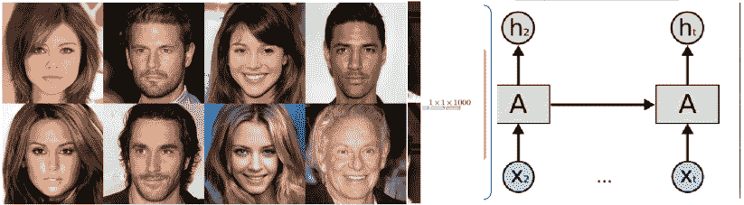

图 18：所提议的深度哈希网络的框图，感谢 palm_7。

他们还提出了一个用于无约束掌纹识别的数据库，该数据库包含超过 30,000 张由 5 部不同手机采集的图像，并在该数据集上取得了令人满意的结果。在 palm_8 中，Shao 等人提出了一种基于迁移卷积自编码器的跨域掌纹识别方法。首先使用卷积自编码器提取低维特征。然后引入了判别器以减少两个域之间的差距。自编码器和判别器交替训练，最终提取出具有相同分布的特征。

在 palm_9 中，赵及其同事提出了一种用于高光谱掌纹识别的联合深度卷积特征表示方法。构建了一个 CNN 堆叠，从所有光谱带中提取特征，并生成联合卷积特征。他们在一个包含 53 个光谱带和 110,770 张图像的高光谱掌纹数据集上评估了他们的模型。他们取得了 0.01%的 EER。在 palm_10 中，谢等人提出了一种基于卷积神经网络的掌纹图像性别分类框架。他们对掌纹数据集中的预训练 VGGNet 进行了微调，并展示了所提出的结构在性别分类方面可以取得良好的性能。

### 3.5 耳朵识别

耳朵识别是科学家们正在探索的一个较新的问题，预计涉及耳朵的生物识别工作量在未来几年将会增加。耳朵识别的一个显著特点是可以从受试者头部的任一侧拍摄，耳朵几乎是相同的（适用于受试者不配合或隐藏面部的情况）。此外，由于不需要受试者的接近，拍摄耳朵图像会更容易。然而，受试者的耳朵可能仍会被头发、帽子和珠宝等因素遮挡，使得检测和使用耳朵图像变得困难 cintas2019automatic。有多种经典方法可以进行耳朵识别：几何方法，尝试提取耳朵的形状；整体方法，从耳朵图像中提取整体特征；局部方法，专门使用图像的一部分；以及混合方法，结合其他方法 emervsivc2017training， naseem2008sparse。

#### 3.5.1 耳朵数据集

以下数据集是一些流行的 2D 耳朵识别数据集，供研究人员使用。

IIT 耳朵数据库：IIT 德里耳朵图像数据库包含 471 张图像，来自 121 个不同的受试者，每个受试者至少有三张耳朵图像 iit_ear。数据库中的所有受试者年龄在 14 至 58 岁之间。这些图像的分辨率为 272x204 像素，所有图像均为 jpeg 格式。

AWE 耳朵数据集：该数据库包含 1,000 张 100 个人的图像。这些图像通过半自动程序从网上收集，并包含以下注释：性别、民族、配饰、遮挡、头部俯仰角、头部滚动角、头部偏航角、头部侧面和中央耳廓点 awe_ear。

Multi-PIE 耳朵数据集：这个数据集是在 2017 年创建的 eyiokur2017domain，基于 Multi-PIE 面部数据集 gross2010multi。数据集中从 205 名被试的侧面和近侧面图像中提取了 17,000 张耳朵图像。图像中的耳朵在不同的光照、角度和条件下，提供了一个适用于更广泛耳朵识别方法的良好数据集。

USTB 耳朵数据库：这个数据集包含了 2002 年拍摄的 60 名志愿者的耳朵图像 ustb_ear。每名志愿者拍摄了三种不同的图像：正常的正面图像、略微角度旋转的正面图像和不同光照条件下的图像。

UERC 耳朵数据集：这个数据集中的耳朵图像 emervsivc2017unconstrained 是从互联网中以无约束条件（即野外条件）收集的。总共有 11,804 张来自 3,706 名被试的图像，其中 2,304 张来自 166 名被试的图像用于训练，其余用于测试。

AMI 耳朵数据集：这个数据集 gonzalez2008biometria 包含了来自 100 名年龄在 19 到 65 岁之间的被试的 700 张尺寸为 492 x 702 的图像。这些图像都在相同的光照条件和距离下拍摄，且来自被试头部的两侧。然而，这些图像在焦距和被试的视线方向（向上、向下、向左、向右）上有所不同。

CP 耳朵数据集：这是该领域较早的数据集之一，Carreira-Perpinan 数据集 perpinan1995compression 包含了在相同条件下拍摄的 17 名被试的 102 张左耳图像。

WPUT 耳朵数据集：西波美拉尼亚技术大学（WPUT）数据集 frejlichowski2010west 包含了来自 501 名被试（247 名男性和 254 名女性）的 2,071 张图像，涉及不同的年龄组和民族。这些图像在不同的光照条件、不同的距离和两个角度下拍摄，并包括佩戴和不佩戴配件（如耳环、眼镜、围巾和助听器）的耳朵。

#### 3.5.2 深度学习在耳朵识别中的应用

耳部识别尚未像面部、虹膜和指纹识别那样流行。因此，用于该过程的数据集仍然有限。基于此，Zhang 等人 zhang2019few 提出了少样本学习方法，其中网络使用有限的训练数据快速学习识别图像。Dodge 等人 dodge2018unconstrained 提出了使用迁移学习与深度网络进行无约束耳部识别。Emersic 及其同事 emervsivc2017unconstrained 也提出了一种基于深度学习的平均系统，以减轻由于数据集规模小而造成的过拟合。在 emersic2017training 中，作者提出了第一个公开的基于 CNN 的耳部识别方法。他们探索了不同的策略，如不同的架构、在预训练数据上选择性学习和积极的数据增强，以寻找最佳的工作配置。

在 emervsivc2018towards 中，作者展示了耳饰如何干扰识别过程，甚至被用于欺骗，特别是在基于 CNN 的方法（例如 VGG-16）与传统方法（例如局部二值模式（LBP））对比时，并提出了去除这些饰品和提高性能的方法，如“印刷”和区域着色。Sinha 等人 sinha2019convolutional 提出了一个框架，通过 HOG 和 SVM 定位外耳图像，然后使用 CNN 进行耳部识别。该框架旨在解决通常与基于外观的特征提取技术相关的问题，例如图像拍摄时的条件，如照明、角度、对比度和尺度，这些问题在其他生物识别系统中也存在，例如面部识别。Omara 等人 omara2018learning 提出从耳部图像中提取层次深度特征，通过判别相关分析（DCA）Haghighat 等人 haghighat2016discriminant 将特征融合以减少其维度，并由于每人耳部图像的不足，创建成对样本并使用成对 SVMbrunner2012pairwise 进行匹配（因为常规 SVM 由于数据集的规模小而效果不佳）。Hansley 等人 hansley2018employing 使用 CNN 和手工特征的融合进行耳部识别，表现超越了其他最先进的基于 CNN 的工作，得出手工特征可以补充深度学习方法的结论。

### 3.6 语音识别

语音识别（也称为说话人识别）是指利用一个人的声音特征来确定其身份。在某种程度上，说话人识别包括行为特征和生理特征，例如口音和音调。使用自动化方式进行说话人识别可以追溯到 1960 年代，当时贝尔实验室受到执法机构的咨询，探讨识别那些通过电话发出口头炸弹威胁的呼叫者的可能性 shaver2016brief 。多年来，研究人员开发了许多能够有效执行这一任务的模型，特别是借助深度学习。除了安全应用外，它还被用于虚拟个人助手，例如 Google Assistant，以便识别和区分手机主人的声音与其他声音 yoffie2018voice 。

说话人识别可以分为说话人识别和说话人验证。**说话人识别** 是指从一组注册的语音中通过给定的发声确定一个人的身份 naseem2010sparse ，而**说话人验证** 是指接受或拒绝为说话人声明的提议身份 Furui2008 。由于这两个任务通常在常用的评估指标下共享相同的评估过程，因此这些术语在参考文献中有时可以互换使用。说话人识别还与说话人分段密切相关，其中输入音频流根据说话人身份被划分为同质段 garcia2017speaker 。

#### 3.6.1 语音数据集

一些流行的语音/说话人识别数据集包括：

NIST SRE: 从 1996 年开始，美国国家标准与技术研究院（NIST）组织了一系列说话人识别研究的评估 martin2001nist 。NIST 编制的说话人识别评估（SRE）数据集因此成为评估说话人识别系统最广泛使用的数据集。这些数据集是以不断发展的方式收集的，每个评估计划的重点略有不同。这些评估数据集在音频长度 nist2010sre 、录音设备（电话、手持设备和视频） nist2018sre 、数据来源（北美或其他地区） nist2016sre 和匹配/不匹配场景上存在差异。近年来，SRE 2016 和 SRE 2018 是该领域最受欢迎的数据集。

SITW: **The Speakers in the Wild (SITW)** 数据集是在无约束条件下获取的 mclaren2016speakers 。与 SRE 数据集不同，这些数据不是在受控条件下收集的，因此包含了真实的噪声和混响。该数据库包含了 299 名说话人的录音，每人平均有八个不同的会话。

VoxCeleb: VoxCeleb 数据集 nagrani2017voxceleb 和 VoxCeleb2 数据集 chung2018voxceleb2 是公共数据集，从上传到 YouTube 的采访视频中编制，旨在强调缺乏大规模非约束数据用于说话人识别。这些数据通过完全自动化的流程收集。使用双流同步 CNN 来估计音频轨道和视频的嘴部运动之间的相关性，然后使用基于 CNN 的面部识别技术来识别说话人进行语音注释。VoxCeleb1 包含 100,000 多个说话样本，涉及 1,251 位名人，而 VoxCeleb2 包含超过一百万个说话样本，涉及 6,112 个身份。

除了专门为说话人识别任务设计的数据集外，许多为自动语音识别收集的数据集也可以用于说话人识别系统的训练或评估。例如，Switchboard 数据集 godfrey1997switchboard 和 Fisher 语料库 cieri2004fisher 原本是为语音识别任务收集的，也被用于 NIST 说话人识别评估中的模型训练。另一方面，研究人员可能利用现有的语音识别数据集来准备自己的说话人识别评估数据集，以证明他们研究的有效性。例如，Librispeech 数据集 panayotov2015librispeech 和 TIMIT 数据集 zue1990speech 被作者在 ravanelli2018learning 中预处理，以作为说话人识别任务的评估集。

#### 3.6.2 深度学习在语音识别中的应用

在深度学习时代之前，大多数最先进的说话人识别系统都是基于 i-vectors 方法 dehak2010front 建立的，该方法使用因子分析定义一个低维空间，以建模说话人和频道的变异性。近年来，探索深度学习方法进行说话人识别变得越来越流行。在这些努力中，最早的一种方法是将基于 DNN 的声学模型整合到 i-vector 框架中 lei2014novel。这种方法使用为自动语音识别（ASR）训练的 DNN 声学模型来收集说话人统计数据，以进行 i-vector 模型训练。研究表明，这种改进导致了 30% 的相对等错误率减少。

在同一时期，d-vector 被提出用于解决基于神经网络的文本相关说话人识别问题，参见 variani2014deep。在这种方法中，DNN 被训练以帧级别分类说话人。在注册和测试过程中，训练好的 DNN 用于从最后一层隐藏层中提取说话人特征。然后通过对这些特征取平均计算出“d-vectors”，并将其用作说话人的嵌入进行识别。这种方法在干净和噪声条件下分别比 i-vector 系统有 14% 和 25% 的相对改进。

在 snyder2018x 中，训练了一个时间延迟神经网络来提取用于文本无关语音识别的段级“x-vectors”。该网络接收语音片段的特征，并将其通过几个非线性层，随后经过一个池化层，以在段级别对说话者进行分类。然后从池化层中提取 x-vectors 进行注册和测试。结果表明，x-vector 系统在数据增强的帮助下，相较于传统的 i-vector 方法，能够实现更好的说话者识别性能。

基于神经网络的端到端方法在各种论文中也得到了探索。在 heigold2016end 和 zhang2016end 中，设计了神经网络来接收一对语音片段，并训练其分类匹配/不匹配目标。在 zhang2017end 中，提出了一种特殊设计的三元组损失函数来替代二元分类损失函数。在 wan2018generalized 中，提出了一种类似于三元组损失的广义端到端（GE2E）损失，用于在内部数据集上进行文本相关说话者识别。

在 le2018robust 中，提出了一种称为类内损失的补充优化目标，以改善使用三元组损失学习的深度说话者嵌入。论文中显示，使用类内损失训练的模型相较于原始三元组损失，能够显著降低 30%的等错误率（EER）。该方法在 VoxCeleb 和 VoxForge 数据集上进行了有效性评估。

在 ravanelli2018learning 中，作者提出了一种通过最大化互信息来从原始波形中学习说话者嵌入的方法。这种方法使用类似于生成对抗网络（GANs）的编码器-鉴别器架构来隐式优化互信息。作者展示了该方法有效地学习了有用的说话者表示，相比于 i-vector 基线和基于 CNN 的三元组损失系统，在 VoxCeleb 语料库上表现出色。

在 bhattacharya2019deep 中，作者将深度卷积特征提取器、自注意力池化和大边际损失函数结合到其端到端深度说话者识别器中。该方法中的个体模型和集成模型在 VoxCeleb 数据集上达到了最先进的性能，相较于最好的报告结果，分别有 70%和 82%的相对提升。作者还建议使用神经网络替代 PLDA 分类器，这使得他们在 NIST-SRE 2016 数据集上获得了最先进的结果。

### 3.7 签名识别

签名被认为是一种行为生物特征。它在传统和数字格式中广泛用于验证用户身份，以确保安全、交易、协议等。因此，能够区分真实签名和伪造签名至关重要。签名伪造可以是随机伪造，即没有尝试模仿真实签名（例如，仅仅是书写名字 radhika2011approach ），或者是熟练伪造，即使签名看起来像原始签名，并且是在真实签名的基础上进行的 soleimani2016deep 。

为了区分真实签名和伪造签名，可以仅存储签名样本以供比较（离线验证），也可以存储书写签名的特征，如笔画的粗细和签名时的笔速 impedovo2008automatic 。在验证方面，有依赖作者的方法（WD）和不依赖作者的方法（WI）。在 WD 方法中，为每个签名所有者训练一个分类器，而在 WI 方法中，为所有所有者训练一个分类器 srihari2004learning 。

#### 3.7.1 签名数据集

一些流行的签名验证数据集包括：

ICDAR 2009 SVC：ICDAR 2009 签名验证竞赛包含同时获得的在线和离线签名样本 icdar_svc 。在线数据集称为“ NFI-online”，由 Louis Vuurpijl 处理和分割。离线数据集称为“ NFI-offline”，由 Vivian Blankers 从 NFI 扫描。该数据集包含：来自 100 个作者的真实签名，以及来自 33 个作者的伪造签名。NLDCC-online 签名集合总共有 1953 个在线签名和 1953 个离线签名文件。

SVC 2004：签名验证竞赛 2004 年包括两个数据集，分别用于两个验证任务：一个用于如 PDA 等基于笔的输入设备，另一个用于数字化平板 SVC2004 。每个数据集包含 100 组签名，每组包含 20 个真实签名和 20 个熟练伪造签名。

离线 GPDS-960 数据集：这个离线签名数据集 vargas2007off 包含来自 960 个对象的签名。每个人有 24 个真实签名，以及 30 个由不在原始 960 人中的其他人伪造的签名（总共 1920 个伪造者）。一些研究工作使用了这个公共数据集的一个子集，通常是前 160 或 300 个对象的图像，分别称之为 GPDS-160 和 GPDS-300。

#### 3.7.2 签名识别中的深度学习研究

在深度学习崛起并获得当前普及之前，已有一些研究尝试利用这一技术。例如，Ribeiro 等人 ribeiro2011deep 提出了基于深度学习的方法来识别签名的拥有者并区分真实签名和伪造签名，使用了受限玻尔兹曼机（RBM） ackley1985learning。随着更强大的计算机和大规模并行架构使深度学习成为主流，基于深度学习的研究数量急剧增加，包括涉及签名识别的研究。Rantzsch 等人 rantzsch2016signature 提出了基于嵌入的 WI 离线签名验证方法，其中输入签名通过特定的训练模式嵌入到高维空间中，输入签名与嵌入签名之间的欧几里得距离将决定结果。Soleimani 等人 soleimani2016deep 提出了深度多任务度量学习（DMML），一种用于离线签名验证的深度神经网络，结合了 WD 方法、WI 方法和迁移学习。Zhang 等人 zhang2016multi 提出了一个混合 WD-WI 分类器，结合 DC-GAN 网络，以无监督方式提取签名特征。由于签名是行为生物识别的一种，因此学习最佳特征以区分真实签名和伪造签名至关重要。Hafemann 等人 hafemann2017learning 提出了基于 WI CNN 的系统，从多个数据集中学习伪造特征，与最先进的技术相比，显著降低了错误等率。Wang 等人 wang2019signature 提出了使用特殊的 GAN 网络（SIGAN）进行签名识别，其中判别网络的损失值作为识别过程的阈值。Tolosana 等人 tolosana2018exploring 提出了使用 Siamese 递归神经网络（RNNs），包括长短期记忆（LSTM）和门控递归单元（GRUs）的在线签名验证方法。

### 3.8 步态识别

步态识别是一个受欢迎的模式识别问题，吸引了来自计算机视觉、机器学习、生物医学、法医学研究和机器人技术等不同领域的大量研究人员。由于步态可以从远处观察而不需要被观察者的配合，这一问题在视觉监控等行业中具有很大潜力。然而，与其他行为生物特征一样，试图模仿他人的步态是困难的，但并非不可能 zhang2016siamese。此外，步态可能会由于携带负重、受伤、穿着、行走速度、视角和天气条件等因素发生变化 alotaibi2017improved ，wolf2016multi。在一群行走的人中识别一个人也是一种挑战 chen2017multi。步态识别可以是基于模型的，其中提取了被观察者身体的结构（这意味着更多的计算需求），也可以是基于外观的，其中从图像中的人物运动中提取特征 wolf2016multi，zhang2016siamese。

#### 3.8.1 步态数据集

一些广泛使用的步态识别数据集包括：

CASIA 步态数据库：该 CASIA 步态识别数据集包含 4 个子集：数据集 A（标准数据集） casia_gaitA，数据集 B（多视角步态数据集），数据集 C（红外步态数据集），以及数据集 D（步态及其对应足迹数据集） CASIA_gait。这里我们详细介绍了非常受欢迎的 CASIA B 数据集。数据集 B 是一个大型多视角步态数据库，于 2005 年创建。共有 124 名受试者，步态数据从 11 个视角捕获。分别考虑了视角、穿着和携带条件的三种变化。除了视频文件外，他们还提供了从视频文件中提取的人体轮廓。有关数据集 B 的更多详细信息，请参见 casia_gaitB。

大阪跑步机数据集：该数据集于 2007 年 3 月在大阪大学（OU）科学与工业研究所（ISIR）收集 osaka_url。数据集包含 4,007 人在 25 台相机监控下以 60 fps 的速度走在跑步机上，分辨率为 640x480 像素。数据集基本上以轮廓序列的形式分发，并被注册和大小标准化为 88x128 像素。该数据集有四个子集，数据集 A：速度变化，数据集 B：衣物变化，数据集 C：视角变化，数据集 D：步态波动。数据集 B 包含 68 名受试者从侧视图拍摄的步态轮廓序列，衣物变化达到 32 种组合。有关所有这些数据集的详细描述可以在这份技术说明 osaka_gait 中找到。

大阪大学大规模人群（OULP）数据集：该数据集 iwama2012isir 包括来自 4,016 名不同年龄（最高达 94 岁）的受试者的图像，这些图像是从两个相邻的摄像头和 4 个观察角度拍摄的。图像被归一化为 88x128 像素。

#### 3.8.2 深度学习在步态识别中的应用

基于深度学习的步态识别研究在过去几年才刚刚起步。在一项较早的工作中，Wolf 等人 wolf2016multi 提出了一种使用 3D 卷积神经网络进行步态识别的系统，该系统从多个视角学习步态。该模型由多个 3D 卷积层、最大池化层和 ReLU 层组成，最后是全连接层。

张等人 zhang2016siamese 提出了一种用于步态识别的孪生神经网络，其中图像序列被转换为步态能量图像（GEI）han2005individual。接下来，这些图像被输入到两个卷积神经网络（CNN）中，并计算它们的对比损失。这使得系统能够最小化相似输入的损失，并最大化不同输入的损失。这项工作的网络结构如图 19 所示。

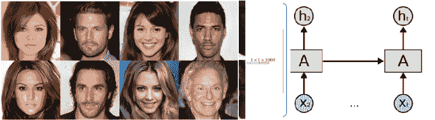

图 19：步态识别的孪生网络，感谢 zhang2016siamese 提供。

Battistone 等人 battistone2019tglstm 提出了一种通过基于时间的图 LSTM 网络进行步态识别的方法，该方法使用交替的递归 LSTM 层和全连接层从个人的图像中提取骨架并学习它们的关节特征。Zou 等人 zou2018deep 提出了一种混合 CNN-RNN 网络，该网络利用智能手机传感器中的数据进行步态识别，特别是加速度计和陀螺仪的数据，并且受试者在行走时没有任何限制。

## 4 不同模型在不同数据集上的性能

在本节中，我们将展示过去几年开发的不同生物识别识别模型的性能。我们将单独展示每个生物识别识别模型的结果，通过提供几项有前途的工作在一两个广泛使用的数据集上的表现。在进行定量分析之前，我们将首先简要介绍一些用于评估生物识别识别模型的流行指标。

### 4.1 生物识别识别系统的流行评估指标

各种指标被设计用于评估生物识别识别系统的性能。在这里，我们提供了一些流行评估验证和识别算法的指标概述。

生物特征验证与再识别问题相关，其中我们希望查看给定数据是否与注册的样本匹配。在许多情况下，性能是根据验证准确性来衡量的，特别是当提供了一个测试数据集时。等错误率（EER）是另一个流行的指标，它是通过产生相等的误报率和漏报率来决定的阈值的错误率。接收者操作特征（ROC）也是另一个用于验证性能的经典指标。ROC 主要衡量真正率（TPR），即正确超过阈值的真实比较的比例，以及错误超过阈值的冒名比较的假阳率（FPR），在不同的阈值下。ACC（分类准确性）是 LFW 使用的另一个指标，它简单地是正确分类的百分比。许多作品还使用特定 FPR 的 TPR。例如，IJB-A 关注 TPR@FAR=$10^{-3}$，而 Megaface 使用 TPR@FPR=$10^{-6}$。

封闭式身份识别可以用封闭式身份识别准确性以及排名 N 的检测和识别率来衡量。排名 N 测量在前 N 个排序结果中是否有来自探测器画廊的样本的比例（例如，IJB-A/B/C 关注排名 1 和排名 5 的识别率）。累积匹配特性（CMC）是另一个流行的指标，它测量了在给定排序中识别的探针的百分比。混淆矩阵也是较小数据集的流行指标。

开放式身份识别处理的是识别系统在测试时应该拒绝未知/未见主体（不在画廊中的探针）。目前，几乎没有数据库涵盖开放式生物识别识别任务。开放式身份识别准确性是此任务的流行指标。一些基准还建议使用决策错误权衡（DET）曲线将 FNIR（错误负面识别率）描述为 FPIR（错误正面识别率）的函数。

人脸识别模型的性能：对于人脸识别，使用各种指标进行验证和识别。对于人脸验证，等错误率是最流行的指标之一。对于识别，使用多种指标，如封闭式识别准确性和开放式识别准确性。对于开放式性能，许多作品使用在特定错误报警率下的检测和识别准确性（通常为 1%）。

由于人脸识别技术的流行，目前有大量的算法和数据集可供使用。在这里，我们将提供一些最有希望的基于深度学习的人脸识别模型的性能，并将它们与一些有希望的经典人脸识别模型在三个流行数据集上进行比较。

如前所述，LFW 是最广泛使用的面部识别数据集之一。表 1 提供了一些最突出的深度学习人脸验证模型在该数据集上的表现。我们还包括了两项非常著名的经典人脸验证工作的结果。正如我们所见，基于深度学习算法的模型在性能上明显优于经典技术。实际上，许多深度学习方法已超过人类表现，并且已经接近 100%（用于验证任务，而非识别）。

表 1：不同面部识别模型在 LFW 数据集上的面部验证准确率。

| 方法 | 架构 | 使用的数据集 | LFW 上的准确率 |
| --- | --- | --- | --- |
| Joint Bayesian jointbayes | 经典 | - | 92.4 |
| Tom-vs-Pete Tom-vs-Pete | Classical | - | 93.3 |
| DeepFace DeepFace | AlexNet | Facebook (4.4M,4K) | 97.35 |
| DeepID2 DeepID2 | AlexNet | CelebFaces+ (0.2M,10K) | 99.15 |
| VGGface VGGface_model | VGGNet-16 | VGGface (2.6M,2.6K) | 98.95 |
| DeepID3 DeepID3 | VGGNet-10 | CelebFaces+ (0.2M,10K) | 99.53 |
| FaceNet FaceNet | GoogleNet-24 | Google (500M,10M) | 99.63 |
| Range Loss RangeLoss | VGGNet-16 | MS-Celeb-1M, CASIA-WebFace | 99.52 |
| L2-softmax L2softmax | ResNet-101 | MS-Celeb-1M (3.7M,58K) | 99.87 |
| Marginal Loss marginalloss | ResNet-27 | MS-Celeb-1M (4M,80K) | 99.48 |
| SphereFace Sphereface | ResNet-64 | CASIA-WebFace (0.49M,10K) | 99.42 |
| AMS loss amsloss | ResNet-20 | CASIA-WebFace (0.49M,10K) | 99.12 |
| Cos Face CosFace | ResNet-64 | CASIA-WebFace (0.49M,10K) | 99.33 |
| Ring loss RingLoss | ResNet-64 | CelebFaces+ (0.2M,10K) | 99.50 |
| Arcface Arcface | ResNet-100 | MS-Celeb-1M (3.8M,85K) | 99.45 |
| AdaCos adacos | ResNet-50 | WebFace | 99.71 |
| P2SGrad p2sgrad | ResNet-50 | CASIAWebFace | 99.82 |

如前所述，封闭集识别是另一个流行的面部识别任务。表 2 提供了一些最新最先进的深度学习模型在 MegaFace 挑战 1 中（无论是识别还是验证任务）的性能总结。MegaFace 挑战评估在识别准确度方面，随着画廊干扰项数量的增加（从 10 到 100 万），Rank1 识别率的变化。对于验证，他们报告了在 FAR= $10^{-6}$ 下的 TPR。这些报告的准确率部分来自 adapface，他们在相同的 50 层 CNN 上实现了 Softmax、A-Softmax、CosFace、ArcFace 和 AdaptiveFace 模型，以公平比较。可以看出，近年来基于深度学习的模型即使在画廊中包含 100 万个干扰项的情况下，Rank-1 识别准确率也达到了非常高的水平。

表 2：在 MegaFace 挑战 1 中的面部识别和验证评估。

| 方法 | 协议 | Rank1 识别准确率 | (TPR@$10^{-6}$FPR) 验证准确率 |
| --- | --- | --- | --- |
| 北京 FaceAll Norm 1600, from adapface | 大型 | 64.8 | 67.11 |
| Softmax adapface | 大型 | 71.36 | 73.04 |
| Google - FaceNet v8 FaceNet | 大型 | 70.49 | 86.47 |
| YouTu Lab, from adapface | 大型 | 83.29 | 91.34 |
| DeepSense V2, from adapface | 大型 | 81.29 | 95.99 |
| Cos Face（单补丁）CosFace | 大型 | 82.72 | 96.65 |
| Cos Face（三补丁集成）CosFace | 大型 | 84.26 | 97.96 |
| SphereFace Sphereface | 大型 | 92.241 | 93.423 |
| Arcface Arcface | 大型 | 94.637 | 94.850 |
| AdaptiveFace adapface | 大型 | 95.023 | 95.608 |

基于深度学习的模型在其他面部分析任务上也取得了出色的表现，如面部标志检测、面部表情识别、面部跟踪、从面部预测年龄、面部衰老、部分面部跟踪等。由于本文主要集中于生物识别，我们在此省略了这些工作的模型详细信息。

指纹识别模型的性能：指纹识别模型通常使用准确率或等错误率（EER）报告其结果。表 4.1 提供了一些最近在 PolyU、FVC 和 CASIA 数据库上进行的指纹识别工作的准确率。从中可以看出，基于深度学习的模型在这些基准测试中达到了非常高的准确率。

表 3: 几种指纹识别算法的准确率。

\csvreader

[tabular=—c—c—c—, no head,column count=3, table head=, late after line=

]csv/fingerprint.csv\csvlinetotablerow

虹膜识别模型的性能：许多最近的虹膜识别工作在不同的虹膜数据库上报告了其准确率，使得在单一基准上进行比较变得困难。表 4 提供了基于深度学习的虹膜识别算法的性能以及它们与一些有前景的经典虹膜识别模型的比较。可以看出，基于深度学习算法的模型在性能上优于经典技术。一些数据来自 iris_survey 和 iris_2019。

表 4: 一些最受欢迎的数据集上虹膜识别模型的性能。

| 方法 | 数据集 | 模型/特征 | 性能 |
| --- | --- | --- | --- |
| 弹性图匹配 elastic | IITD | - | 准确率= 98% |
| 基于 SIFT 的模型 sift_iris | CASIA, MMU, UBIRIS | SIFT 特征 | 准确率= 99.05% EER=3.5% |
| 深度卷积神经网络 menon2018iris | IITD | - | 准确率=99.8% |
| 深度卷积神经网络 menon2018iris | UBIRIS v2 | - | 准确率=95.36% |
| 深度散射 iris_0 | IITD | ScatNet3+纹理特征 | 准确率= 99.2% |
| 深度特征 iris_1 | IITD | VGG-16 | 准确率= 99.4% |
| SCNN iris_scnn | CASIA-v4, FRGC FOCS | 语义辅助卷积网络 | R1-ACC= 98.4 (CASIA-v4) |

手掌纹识别模型的性能：手掌纹识别论文常用准确率或等错误率（EER）来与其他研究进行比较。表 4.1 显示了一些手掌纹识别工作的准确率。可以看出，基于深度学习的模型在 PolyU 手掌纹数据集上实现了非常高的准确率。

表 5: 各种手掌纹识别系统的准确率。

\csvreader

[tabular=—c—c—c—, no head,column count=3, table head=, late after line=

]csv/palmprint.csv\csvlinetotablerow

模型在耳识别中的表现：最近一些耳识别模型的结果见表 4.1。除了识别准确率外，一些研究还报告了它们的 rank-5 准确率，即如果算法的前 5 个输出中有一个是正确的，算法就算成功。不同基于深度学习的耳识别模型在不同基准上的准确率有所报告。因此，我们在表 4.1 中列出了一些有前景的工作，以及它们所评估的相应数据集。

表 6：选择的耳识别算法的准确率。

\csvreader

[表格=—c—c—c—，无标题，列数=3，表头=，行后延迟=

]csv/ear.csv\csvlinetotablerow

模型在语音识别中的表现：评价说话人识别系统的最广泛使用的指标是等错误率（EER）。除了 EER，还有其他指标用于系统评价。例如，检测错误权衡曲线（DET 曲线）用于 SRE 性能评估中，以比较不同系统。DET 曲线是通过绘制假阴性率与假阳性率的对数尺度图来创建的。（EER 对应于 DET 曲线上的点，其中假阴性率和假阳性率相等。）最小检测成本是另一个在说话人识别任务中经常使用的指标 van2007introduction。这个成本定义为两个标准化错误率的加权平均值。并非所有这些指标都会在每篇研究论文中报告，但 EER 是比较不同系统的最重要指标。

表 7 记录了在 VoxCeleb1 数据集上表现最好的深度学习基础说话人识别系统的一些性能。正如表中所示，研究人员在过去两年取得的进展显著。表 7 中显示的所有这些系统都是单一系统，这意味着通过系统组合或集成，性能可以进一步提升。

表 7：不同说话人识别系统在 VoxCeleb1 数据集上的准确率

| 模型 | 损失 | 训练集 |   EER |
| --- | --- | --- | --- |
| i-vector + PLDA shon2018frame | - | VoxCeleb1 | 5.39 |
| SincNet+LIM (原始音频) ravanelli2018learning | - | VoxCeleb1 | 5.80 |
| x-vector* shon2018frame | Softmax | VoxCeleb1 | 6.00 |
| ResNet-34 cai2018exploring | A-Softmax + GNLL | VoxCeleb1 | 4.46 |
| x-vector okabe2018attentive | Softmax | VoxCeleb1 | 3.85 |
| ResNet-20 hajibabaei2018unified | AM-Softmax | VoxCeleb1 | 4.30 |
| ResNet-50 chung2018voxceleb2 | Softmax + Contrastive | VoxCeleb2 | 3.95 |
| Thin ResNet-34 xie2019utterance | Softmax | VoxCeleb2 | 3.22 |
| ResNet-28 bhattacharya2019deep | AAM | VoxCeleb1 | 0.95 |

对于 SRE 数据集，由于其系列数量庞大和各种评估条件的复杂性，难以将所有结果汇总到一个表格中。此外，不同的论文可能在不同的数据集或条件下呈现结果，这使得在不同方法之间比较性能变得困难。

上述基于深度学习的方法也已应用于其他相关领域，例如语音分段、重放攻击检测和语言识别。由于本文专注于生物识别，我们跳过了这些任务的细节。

签名识别模型的性能：大多数签名识别工作使用 EER 作为性能指标，但有时也会报告准确率。表 4.1 总结了 GPDS 数据集上几种签名验证方法的 EER，其中每个人使用了 12 个真实签名样本（除了 soleimani2016deep 中使用了 10 个样本）。此外，表 4.1 提供了其他几项工作的报告准确率。

表 8：GPDS 数据集上选定签名识别模型的报告 EER（使用 10-12 个真实样本）。

\csvreader

[tabular=—c—c—c—, no head,column count=3, table head=, late after line=

]csv/signature_eer.csv\csvlinetotablerow

表 9：一些签名识别模型报告的准确率。

\csvreader

[tabular=—c—c—c—, no head,column count=3, table head=, late after line=

]csv/signature.csv\csvlinetotablerow

步态识别模型的性能：由于现有步态数据集的配置不同，比较基于深度学习的步态识别工作变得困难。结果以不同画廊视角和跨视角设置下的准确率和等错误率（EER）形式报告。对于步态识别，通常比较排名前 5 的统计数据以及普通的排名前 1 的统计数据。我们在表格 4.1 中汇总了 sundararajan2018deep 报告的一些平均准确率结果。注意，使用 CASIA-B 的数据是在不同场景和视角条件下收集的，而使用 OU-ISIR 的数据则是针对跨视角条件的。

表 10：选择的步态识别模型的准确率。

\csvreader

[tabular=—c—c—c—c—, no head,column count=4, table head=, late after line=

]csv/gait.csv\csvlinetotablerow

## 5 挑战与机遇

在过去几年中，借助基于深度学习的模型，生物特征识别系统取得了巨大的进展，但仍然面临一些挑战，这些挑战可能在未来几年或几十年内得到解决。

### 5.1 更具挑战性的数据集

尽管一些当前的生物特征识别数据集（如 MegaFace、MS-Celeb-1M）包含了非常大量的候选者，但它们仍然远未涵盖所有真实世界场景。尽管最先进的算法可以在 LFW 和 Megaface 数据库上实现超过 99.9%的准确率，但匹配不同年龄、不同姿势、部分数据、不同传感器类型的面孔/生物特征等基本挑战仍然存在。同时，现实世界场景中的受试者/人员数量应在数千万级别。因此，包含更多类别（10M-100M）以及更多类别内变异的生物特征数据集将是支持所有真实世界条件的又一大步。

### 5.2 可解释的深度模型

确实，基于深度学习的模型在许多具有挑战性的基准测试中表现出惊人的性能，但这些模型仍然存在几个未解的问题。例如，深度学习模型究竟在学习什么？为什么这些模型容易被对抗样本欺骗（而人类可以轻松检测到许多这些样本）？在给定数据集上，能达到某种识别准确率的最小神经网络架构是什么？

### 5.3 少样本学习与自监督学习

许多成功的生物识别模型是在具有足够每类样本的大型数据集上训练的。一个有趣的未来趋势将是开发可以从极少量样本（在极端情况下为零/一个样本）中学习强大模型的识别模型。这将使得训练判别模型不需要为每个人/身份提供多个样本。自监督学习 selfsuper 也是深度学习中的一个新兴热门话题，在生物识别中尚未得到充分探索。一种应用方法是从图像的局部区域学习判别生物识别特征，然后汇总这些特征用于分类。

### 5.4 生物识别融合

单一生物识别技术本身远不足以解决所有生物识别/司法任务。例如，仅通过面部特征区分同卵双胞胎可能不可行，或者从面部识别伪装下的身份，或在手术后识别身份可能不会那么容易。融合来自多种生物特征的信息可以在许多情况下提供更可靠的解决方案/系统（例如，使用声音+面部或声音+步态可能有助于解决同卵双胞胎的检测） ross2004multimodal ; ross2003information 。一个能够共同编码和聚合不同生物特征的良好神经架构将是一个有趣的问题（信息融合可以在数据级、特征级、分数级或决策级发生）。图像集分类在这方面也可能会有用 imageset 。虽然已有一些关于生物识别融合的研究，但大多数仍远未达到现实世界生物识别的规模，并且大多处于起步阶段。关于多模态机器学习的一些挑战，我们建议读者参考 multimodal_challenge 。

### 5.5 各种应用的实时模型

在许多应用中，准确性是最重要的因素；然而，在许多应用中，拥有接近实时的生物识别模型也是至关重要的。这对于设备上的解决方案，如手机和平板电脑身份验证，将非常有用。目前的一些深度模型对于生物识别的速度要求仍相差甚远，因此开发接近实时且准确的模型将具有很高的价值。

### 5.6 内存高效模型

许多基于深度学习的模型即使在推理过程中也需要大量的内存。目前，大多数努力集中在提高这些模型的准确性上，但为了使这些模型适应设备，网络必须被简化。这可以通过使用更简单的模型、使用模型压缩技术，或训练复杂模型然后使用知识蒸馏技术将其压缩成一个较小的网络来模仿初始复杂模型来实现。拥有一个内存高效的模型将使这些模型能够在消费者设备上使用。

### 5.7 安全性和隐私问题

在生物识别系统中，安全性至关重要。呈现攻击、模板攻击和对抗攻击威胁深度生物识别系统的安全性，并挑战当前的防伪方法。尽管已经有一些对抗样本检测的尝试，但在建立稳健/可靠的防伪能力方面仍有很长的路要走。

由于生物/生物特征数据的泄露，隐私问题越来越引起关注。用户身份/年龄/性别的一些信息可以从其图像的神经特征表示中解码出来。研究视觉密码学，以保护存储的生物特征模板的用户隐私，对于应对公众对隐私的关注至关重要。

## 6 结论

在这项工作中，我们总结了最近基于深度学习的生物识别模型（截至 2019 年）。与其他调查不同，它提供了最常用生物识别技术的概述。深度神经模型在各种生物识别领域相较于经典模型表现出了有希望的改进。一些生物识别技术由于更广泛的工业应用和大规模数据集的可用性（如面部识别）受到更多关注，但其他生物识别技术似乎也在跟随相同的趋势。尽管深度学习在生物识别中的研究取得了有希望的结果，但在不同方向上仍有很大的改进空间，例如创建更大且更具挑战性的数据集，解决模型解释问题，融合多种生物识别技术，以及解决安全性和隐私问题。

###### 致谢。

我们要感谢 Rama Chellappa 教授和 Nalini Ratha 博士审阅这项工作，并提供了非常有用的评论和建议。

## 参考文献

+   [1] Anil Jain, Lin Hong, 和 Sharath Pankanti. 生物识别识别。ACM 通讯, 43(2):90–98, 2000.

+   [2] David Zhang. Automated biometrics: Technologies and systems, volume 7. Springer Science & Business Media, 2000.

+   [3] David Zhang, Guangming Lu, 和 Lei Zhang. 高级生物识别技术。Springer, 2018.

+   [4] Javier Galbally, Raffaele Cappelli, Alessandra Lumini, Davide Maltoni, 和 Julian Fierrez. 从特征模板生成假指尖。在国际模式识别会议上。IEEE, 2008.

+   [5] Sefik Eskimez, Ross K Maddox, Chenliang Xu 和 Zhiyao Duan. 从语音生成说话面部标志。第十二届潜变量分析与信号分离会议。Springer, 2018。

+   [6] https://deepfakedetectionchallenge.ai/。

+   [7] Huaxiao Mo, Bolin Chen 和 Weiqi Luo. 通过卷积神经网络识别虚假面孔。在信息隐藏与多媒体安全会议。ACM, 2018。

+   [8] Yuezun Li 和 Siwei Lyu. 通过检测面部变形伪影来揭露深度伪造视频。arXiv 预印本 arXiv:1811.00656, 2, 2018。

+   [9] Anil K Jain, Arun Ross, Salil Prabhakar 等. 生物识别识别简介。IEEE 视频技术电路与系统汇刊, 14(1), 2004。

+   [10] Guangming Lu, David Zhang 和 Kuanquan Wang. 使用特征值掌纹进行掌纹识别。模式识别通讯, 24(9-10):1463–1467, 2003。

+   [11] Dapeng Zhang 和 Wei Shu. 掌纹验证中的两个新特征：数据点不变性和线条特征匹配。模式识别, 32(4):691–702, 1999。

+   [12] Wenyi Zhao, Rama Chellappa, P Jonathon Phillips 和 Azriel Rosenfeld. 面部识别：文献综述。ACM 计算机调查 (CSUR), 35(4):399–458, 2003。

+   [13] Zhichun Mu, Li Yuan, Zhengguang Xu, Dechun Xi 和 Shuai Qi. 基于形状和结构特征的耳朵识别。在中国生物识别识别会议, 页 663–670。Springer, 2004。

+   [14] John Daugman. 虹膜识别的工作原理。在图像处理基础指南, 页 715–739。Elsevier, 2009。

+   [15] Kevin W Bowyer 和 Mark J Burge. 虹膜识别手册。Springer, 2016。

+   [16] Halvor Borgen, Patrick Bours 和 Stephen D Wolthusen. 可见光谱生物识别视网膜识别。在智能信息隐藏与多媒体信号处理会议。IEEE, 2008。

+   [17] Mohamed Elhoseny, Amir Nabil, Aboul Hassanien 和 Diego Oliva. 用于签名识别的混合粗糙神经网络模型。在图像处理中的软计算与机器学习进展, 页 295–318。Springer, 2018。

+   [18] Jin Wang, Mary She, Saeid Nahavandi 和 Abbas Kouzani. 基于视觉的步态识别方法综述。在 2010 年国际数字图像计算：技术与应用会议, 页 320–327。IEEE, 2010。

+   [19] Fabian Monrose 和 Aviel D Rubin. 键盘动态作为生物识别认证的方法。未来一代计算机系统, 16(4):351–359, 2000。

+   [20] Joseph P Campbell. 说话人识别：教程。IEEE 会议录, 85(9):1437–1462, 1997。

+   [21] Mark Hawthorne. 指纹：分析与理解。CRC 出版社, 2017。

+   [22] Anil K Jain 和 Stan Z Li. 面部识别手册。Springer, 2011。

+   [23] Yulan Guo, Yinjie Lei, Li Liu, Yan Wang, Mohammed Bennamoun 和 Ferdous Sohel. Ei3d: 基于特征和形状匹配的表情不变 3D 面部识别。模式识别通讯, 83, 2016。

+   [24] Unsang Park, Yiying Tong, 和 Anil K Jain. 年龄不变的面部识别. IEEE 模式分析与机器智能汇刊, 32(5), 2010.

+   [25] Anil Jain, Lin Hong, 和 Ruud Bolle. 在线指纹验证. IEEE 模式分析与机器智能汇刊, 19(4):302–314, 1997.

+   [26] David Zhang, Zhenhua Guo, 和 Yazhuo Gong. 多光谱生物特征识别：系统与应用. Springer, 2015.

+   [27] Maria De Marsico, Alfredo Petrosino, 和 Stefano Ricciardi. 通过机器学习技术的虹膜识别：综述. 模式识别信件, 82:106–115, 2016.

+   [28] Žiga Emeršič, Vitomir Štruc, 和 Peter Peer. 耳部识别：不仅仅是综述. 神经计算, 255:26–39, 2017.

+   [29] Javier Galbally, Moises Diaz-Cabrera, Miguel A Ferrer, Marta Gomez-Barrero, Aythami Morales, 和 Julian Fierrez. 通过结合真实动态数据和合成生成的静态数据进行在线签名识别. 模式识别, 48(9), 2015.

+   [30] Liang Wang, Huazhong Ning, Tieniu Tan, 和 Weiming Hu. 静态和动态身体生物特征融合用于步态识别. IEEE 视频技术电路与系统汇刊, 14(2):149–158, 2004.

+   [31] Liang Wang, Tieniu Tan, Huazhong Ning, 和 Weiming Hu. 基于轮廓分析的人体步态识别. IEEE 模式分析与机器智能汇刊, 25(12):1505–1518, 2003.

+   [32] 扩展的耶鲁面部数据库 B (B+). http://vision.ucsd.edu/content/extended-yale-face-database-b-b.

+   [33] Polyu 指纹数据集. http://www4.comp.polyu.edu.hk/~biometrics/HRF/HRF_old.htm.

+   [34] Polyu palmprint 数据集. https://www4.comp.polyu.edu.hk/~biometrics/MultispectralPalmprint/MSP.htm.

+   [35] Ajay Kumar 和 Arun Passi. 虹膜匹配器的比较与组合以实现可靠的个人认证. 模式识别, 43(3):1016–1026, 2010.

+   [36] Ajay Kumar 和 Chenye Wu. 使用耳部成像的自动化人类识别. 模式识别, 45(3):956–968, 2012.

+   [37] Timo Ahonen, Abdenour Hadid, 和 Matti Pietikäinen. 使用局部二值模式的面部识别. 在欧洲计算机视觉会议中, 页码 469–481. Springer, 2004.

+   [38] Andrea F Abate, Michele Nappi, Daniel Riccio, 和 Gabriele Sabatino. 2D 和 3D 面部识别：综述. 模式识别信件, 28(14):1885–1906, 2007.

+   [39] David Zhang, Fengxi Song, Yong Xu, 和 Zhizhen Liang. 先进的模式识别技术及其在生物特征识别中的应用. IGI Global Hershey, PA, 2009.

+   [40] David G Lowe. 从尺度不变关键点中提取的独特图像特征. 国际计算机视觉杂志, 60(2):91–110, 2004.

+   [41] Navneet Dalal 和 Bill Triggs. 面向人类检测的方向梯度直方图. 2005.

+   [42] Wai Kin Kong, David Zhang, 和 Wenxin Li. 使用 2D Gabor 滤波器的掌纹特征提取. 模式识别, 36(10):2339–2347, 2003.

+   [43] Jian Huang Lai, Pong C Yuen 和 Guo Can Feng. 使用整体傅里叶不变特征的面部识别. 模式识别, 34(1):95–109, 2001.

+   [44] Andrew Teoh Beng Jin, David Ngo Chek Ling 和 Ong Thian Song. 使用集成小波和傅里叶-梅林不变变换的高效指纹验证系统. 图像与视觉计算, 22(6):503–513, 2004.

+   [45] Hervé Abdi 和 Lynne J Williams. 主成分分析. Wiley 跨学科评论：计算统计, 2(4):433–459, 2010.

+   [46] Jian Yang, David Zhang, Alejandro F Frangi 和 Jing-yu Yang. 二维 PCA：基于外观的面部表示与识别的新方法. IEEE 图像模式分析与机器智能杂志, 26(1):131–137, 2004.

+   [47] Alex Krizhevsky, Ilya Sutskever 和 Geoffrey E Hinton. 使用深度卷积神经网络的 Imagenet 分类. 载于神经信息处理系统进展, 页 1097–1105, 2012.

+   [48] Aleksei Grigorevich Ivakhnenko 和 Valentin Grigorevich Lapa. 控制预测装置. 技术报告, 普渡大学, 电气工程学院, 1966.

+   [49] Jürgen Schmidhuber. 神经网络中的深度学习：概述. 神经网络, 61:85–117, 2015.

+   [50] Yann LeCun, Yoshua Bengio 和 Geoffrey Hinton. 深度学习. 自然, 521(7553):436, 2015.

+   [51] David E Rumelhart, Geoffrey E Hinton, Ronald J Williams 等. 通过反向传播错误来学习表示. 认知建模, 5(3):1, 1988.

+   [52] Léon Bottou. 神经网络中的随机梯度学习. Neuro-Nîmes 会议录, 91(8):12, 1991.

+   [53] Mei Wang 和 Weihong Deng. 深度人脸识别：综述. arXiv 预印本 arXiv:1804.06655, 2018.

+   [54] Tadas Baltrusaitis, Chaitanya Ahuja 和 Louis-Philippe Morency. 多模态机器学习：综述与分类. IEEE 图像模式分析与机器智能杂志, 41(2), 2018.

+   [55] Yann LeCun, Léon Bottou, Yoshua Bengio, Patrick Haffner 等. 基于梯度的学习在文档识别中的应用. IEEE 会议录, 86(11):2278–2324, 1998.

+   [56] Sepp Hochreiter 和 Jürgen Schmidhuber. 长短期记忆. 神经计算, 9(8):1735–1780, 1997.

+   [57] Ian Goodfellow, Jean Pouget-Abadie, Mehdi Mirza, Bing Xu, David Warde-Farley, Sherjil Ozair, Aaron Courville 和 Yoshua Bengio. 生成对抗网络. 载于神经信息处理系统进展, 页 2672–2680, 2014.

+   [58] Kunihiko Fukushima. Neocognitron：一种自组织神经网络模型，用于不受位置偏移影响的模式识别机制. 生物计算机学, 36(4):193–202, 1980.

+   [59] Jonathan Long, Evan Shelhamer 和 Trevor Darrell. 用于语义分割的全卷积网络. 载于 IEEE 计算机视觉与模式识别会议论文集, 页 3431–3440, 2015.

+   [60] Olaf Ronneberger, Philipp Fischer, 和 Thomas Brox. U-net: 用于生物医学图像分割的卷积网络。在医学图像计算与计算机辅助手术国际会议，页 234–241。Springer，2015 年。

+   [61] Shaoqing Ren, Kaiming He, Ross Girshick, 和 Jian Sun. Faster r-cnn: 向实时物体检测迈进，采用区域提议网络。神经信息处理系统进展，页 91–99，2015 年。

+   [62] Chao Dong, Chen Change Loy, Kaiming He, 和 Xiaoou Tang. 学习深度卷积网络用于图像超分辨率。在欧洲计算机视觉会议，页 184–199。Springer，2014 年。

+   [63] Kin Gwn Lore, Adedotun Akintayo, 和 Soumik Sarkar. Llnet: 一种深度自编码器方法用于自然低光图像增强。模式识别，61:650–662，2017 年。

+   [64] Quanzeng You, Hailin Jin, Zhaowen Wang, Chen Fang, 和 Jiebo Luo. 带有语义注意的图像描述。在 IEEE 计算机视觉与模式识别会议，页 4651–4659，2016 年。

+   [65] Matthew D Zeiler 和 Rob Fergus. 可视化和理解卷积网络。在欧洲计算机视觉会议。Springer，2014 年。

+   [66] Karen Simonyan 和 Andrew Zisserman. 用于大规模图像识别的深度卷积网络。arXiv 预印本 arXiv:1409.1556，2014 年。

+   [67] Kaiming He, Xiangyu Zhang, Shaoqing Ren, 和 Jian Sun. 图像识别的深度残差学习。在 IEEE 计算机视觉与模式识别会议论文集，页 770–778，2016 年。

+   [68] Christian Szegedy, Wei Liu, Yangqing Jia, Pierre Sermanet, Scott Reed, Dragomir Anguelov, Dumitru Erhan, Vincent Vanhoucke, 和 Andrew Rabinovich. 通过卷积网络深入探索。在 IEEE 计算机视觉与模式识别会议，2015 年。

+   [69] Andrew G Howard, Menglong Zhu, Bo Chen, Dmitry Kalenichenko, Weijun Wang, Tobias Weyand, Marco Andreetto, 和 Hartwig Adam. Mobilenets: 用于移动视觉应用的高效卷积神经网络。arXiv 预印本 arXiv:1704.04861，2017 年。

+   [70] Gao Huang, Zhuang Liu, Laurens Van Der Maaten, 和 Kilian Q Weinberger. 密集连接卷积网络。在 IEEE 计算机视觉与模式识别会议，页 4700–4708，2017 年。

+   [71] David E Rumelhart, Geoffrey E Hinton, Ronald J Williams, 等. 通过反向传播错误来学习表示。认知建模，5(3):1，1988 年。

+   [72] [`colah.github.io/posts/2015-08-Understanding-LSTMs/`](http://colah.github.io/posts/2015-08-Understanding-LSTMs/)。

+   [73] Pascal Vincent, Hugo Larochelle, Isabelle Lajoie, Yoshua Bengio, 和 Pierre Manzagol. 堆叠去噪自编码器：通过局部去噪准则在深度网络中学习有用的表示。机器学习研究期刊，11(12):3371–3408，2010 年。

+   [74] Diederik P Kingma 和 Max Welling. 自编码变分贝叶斯。arXiv 预印本 arXiv:1312.6114，2013 年。

+   [75] [`github.com/hindupuravinash/the-gan-zoo`](https://github.com/hindupuravinash/the-gan-zoo)。

+   [76] Weihong Deng、Jiani Hu 和 Jun Guo。在稀疏性基础面部识别的防御。发表于 IEEE 计算机视觉与模式识别会议论文集，页码 399–406，2013 年。

+   [77] Qiong Cao、Yiming Ying 和 Peng Li。面部识别的相似度度量学习。发表于 IEEE 国际计算机视觉会议论文集，页码 2408–2415，2013 年。

+   [78] John Wright、Allen Y Yang、Arvind Ganesh、S Shankar Sastry 和 Yi Ma。通过稀疏表示实现鲁棒的面部识别。IEEE 模式分析与机器智能汇刊，31(2):210–227，2008 年。

+   [79] Meng Yang、Lei Zhang、Jian Yang 和 David Zhang。面部识别的正则化鲁棒编码。IEEE 图像处理汇刊，22(5)，2012 年。

+   [80] Dong Yi、Zhen Lei 和 Stan Z Li。面向姿态鲁棒的面部识别。发表于 IEEE 计算机视觉与模式识别会议论文集，页码 3539–3545，2013 年。

+   [81] Ajmal Mian、Mohammed Bennamoun 和 Robyn Owens。一种高效的多模态 2D-3D 混合自动面部识别方法。IEEE 模式分析与机器智能汇刊，29(11)，2007 年。

+   [82] 耶鲁面孔数据库。 http://vision.ucsd.edu/content/yale-face-database。

+   [83] CMU Multi-PIE 面孔数据库。 http://www.cs.cmu.edu/afs/cs/project/PIE/MultiPie/Multi-Pie/Home.html。

+   [84] Ralph Gross、Iain Matthews、Jeffrey Cohn、Takeo Kanade 和 Simon Baker。Multi-PIE。图像与视觉计算，28(5):807–813，2010 年。

+   [85] 标记的野外面孔。 http://vis-www.cs.umass.edu/lfw/。

+   [86] PolyU NIR 面孔数据库。 http://www4.comp.polyu.edu.hk/~biometrics/polyudb_face.htm。

+   [87] Youtube 面孔数据库。 http://www.cs.tau.ac.il/~wolf/ytfaces/。

+   [88] Vggface2。 http://www.robots.ox.ac.uk/~vgg/data/vgg_face2/。

+   [89] Dong Yi、Zhen Lei、Shengcai Liao 和 Stan Z Li。从头开始学习面部表示。arXiv 预印本 arXiv:1411.7923，2014 年。

+   [90] Yandong Guo、Lei Zhang、Yuxiao Hu、Xiaodong He 和 Jianfeng Gao。MS-Celeb-1M：大规模面部识别的数据集和基准。发表于欧洲计算机视觉会议，页码 87–102。Springer，2016 年。

+   [91] Ziwei Liu、Ping Luo、Xiaogang Wang 和 Xiaoou Tang。深度学习野外面部属性。发表于 IEEE 国际计算机视觉会议论文集，页码 3730–3738，2015 年。

+   [92] Brianna Maze、Jocelyn Adams、James A Duncan、Nathan Kalka、Tim Miller、Charles Otto、Anil K Jain、W Tyler Niggel、Janet Anderson、Jordan Cheney 等。IARPA Janus Benchmark-C：面部数据集和协议。发表于 2018 年国际生物特征识别大会（ICB），页码 158–165。IEEE，2018 年。

+   [93] Ira Kemelmacher-Shlizerman、Steven Seitz、D Miller 和 Evan Brossard。Megaface 基准测试：用于大规模识别的 100 万张面孔。发表于 IEEE 计算机视觉与模式识别会议，2016 年。

+   [94] Bart Thomee、David A Shamma、Gerald Friedland、Benjamin Elizalde、Karl Ni、Douglas Poland、Damian Borth 和 Li-Jia Li。YFCC100M：多媒体研究中的新数据。arXiv 预印本 arXiv:1503.01817，2015 年。

+   [95] Vineet Kushwaha、Maneet Singh、Richa Singh、Mayank Vatsa、Nalini Ratha 和 Rama Chellappa. 野外伪装面孔。在 IEEE 计算机视觉与模式识别会议研讨会论文集, 页码 1–9, 2018。

+   [96] Yaniv Taigman、Ming Yang、Marc’Aurelio Ranzato 和 Lior Wolf. Deepface: 缩小面部验证中的人类水平性能差距。在 IEEE 计算机视觉与模式识别会议论文集, 页码 1701–1708, 2014。

+   [97] Yi Sun、Xiaogang Wang 和 Xiaoou Tang. 从预测 10,000 个类别中进行深度学习面部表示。在 IEEE 计算机视觉与模式识别会议论文集, 页码 1891–1898, 2014。

+   [98] Yi Sun、Yuheng Chen、Xiaogang Wang 和 Xiaoou Tang. 通过联合识别-验证进行深度学习面部表示。在神经信息处理系统进展, 页码 1988–1996, 2014。

+   [99] Yi Sun、Ding Liang、Xiaogang Wang 和 Xiaoou Tang. Deepid3: 用于面部识别的非常深的神经网络。arXiv 预印本 arXiv:1502.00873, 2015。

+   [100] Florian Schroff、Dmitry Kalenichenko 和 James Philbin. Facenet: 面部识别与聚类的统一嵌入。在 IEEE 计算机视觉与模式识别会议, 页码 815–823, 2015。

+   [101] Omkar M Parkhi、Andrea Vedaldi、Andrew Zisserman 等。深度面部识别。在 bmvc, 第 1 卷, 2015。

+   [102] Weiyang Liu、Yandong Wen、Zhiding Yu 和 Meng Yang. 用于卷积神经网络的大边际软最大损失。在 ICML, 第 2 卷, 页码 7, 2016。

+   [103] Yandong Wen、Kaipeng Zhang、Zhifeng Li 和 Yu Qiao. 用于深度面部识别的辨别特征学习方法。在欧洲计算机视觉会议, 页码 499–515。Springer, 2016。

+   [104] Yi Sun、Xiaogang Wang 和 Xiaoou Tang. 稀疏化神经网络连接用于面部识别。在 IEEE 计算机视觉与模式识别会议论文集, 页码 4856–4864, 2016。

+   [105] Xiao Zhang、Zhiyuan Fang、Yandong Wen、Zhifeng Li 和 Yu Qiao. 长尾训练数据的深度面部识别范围损失。在 IEEE 国际计算机视觉会议, 页码 5409–5418, 2017。

+   [106] Rajeev Ranjan、Carlos D Castillo 和 Rama Chellappa. 用于辨别面部验证的 L2 约束软最大损失。arXiv 预印本 arXiv:1703.09507, 2017。

+   [107] Yu Liu、Hongyang Li 和 Xiaogang Wang. 重新思考大规模识别的特征辨别与聚合。预印本, arXiv:1710.00870, 2017。

+   [108] Weiyang Liu、Yandong Wen、Zhiding Yu、Ming Li、Bhiksha Raj 和 Le Song. Sphereface: 深度超球体嵌入用于面部识别。在 IEEE 计算机视觉与模式识别会议论文集, 页码 212–220, 2017。

+   [109] Feng Wang、Jian Cheng、Weiyang Liu 和 Haijun Liu. 用于面部验证的加性边际软最大。IEEE 信号处理快报, 25(7):926–930, 2018。

+   [110] Hao Wang, Yitong Wang, Zheng Zhou, Xing Ji, Dihong Gong, Jingchao Zhou, Zhifeng Li 和 Wei Liu. Cosface: 大边距余弦损失用于深度人脸识别。发表于 IEEE 计算机视觉与模式识别会议论文集，第 5265–5274 页，2018 年。

+   [111] Jiankang Deng, Jia Guo, Niannan Xue 和 Stefanos Zafeiriou. Arcface: 添加角度边距损失用于深度人脸识别。发表于 IEEE 计算机视觉与模式识别会议论文集，2019 年。

+   [112] Yutong Zheng, Dipan K Pal 和 Marios Savvides. Ring loss: 用于人脸识别的凸特征归一化。发表于 IEEE 计算机视觉与模式识别会议论文集，第 5089–5097 页，2018 年。

+   [113] Xiao Zhang, Rui Zhao, Yu Qiao, Xiaogang Wang 和 Hongsheng Li. Adacos: 自适应缩放余弦对数以有效学习深度人脸表示。发表于 IEEE 计算机视觉与模式识别会议论文集，第 10823–10832 页，2019 年。

+   [114] Xiao Zhang, Rui Zhao, Junjie Yan, Mengya Gao, Yu Qiao, Xiaogang Wang 和 Hongsheng Li. P2sgrad: 精炼梯度用于优化深度人脸模型。发表于 IEEE 计算机视觉与模式识别会议论文集，第 9906–9914 页，2019 年。

+   [115] Yueqi Duan, Jiwen Lu 和 Jie Zhou. Uniformface: 学习深度等分布表示用于人脸识别。发表于 IEEE 计算机视觉与模式识别会议论文集，第 3415–3424 页，2019 年。

+   [116] Hao Liu, Xiangyu Zhu, Zhen Lei 和 Stan Z Li. Adaptiveface: 自适应边距和采样用于人脸识别。发表于 IEEE 计算机视觉与模式识别会议论文集，第 11947–11956 页，2019 年。

+   [117] Tero Karras, Timo Aila, Samuli Laine 和 Jaakko Lehtinen. 生成对抗网络的渐进式成长以改善质量、稳定性和变化性。arXiv 预印本 arXiv:1710.10196，2017 年。

+   [118] Andrew K Hrechak 和 James A McHugh. 使用结构匹配的自动化指纹识别。模式识别，23(8):893–904，1990 年。

+   [119] Chih-Jen Lee 和 Sheng-De Wang. 使用 Gabor 滤波器进行指纹特征提取。电子信件，35(4):288–290，1999 年。

+   [120] Marius Tico, Pauli Kuosmanen 和 Jukka Saarinen. 指纹识别的波域特征。电子信件，37(1):21–22，2001 年。

+   [121] Fvc 指纹数据集。 http://bias.csr.unibo.it/fvc2002/。

+   [122] Casia 指纹数据集。 http://biometrics.idealtest.org/dbDetailForUser.do?id=7。

+   [123] Michael D Garris 和 R Michael McCabe. 从潜在和匹配的十指印图像中提取指纹细节。发表于 “十指印图像”，国家标准与技术研究院。Citeseer，2000 年。

+   [124] Luke Nicholas Darlow 和 Benjamin Rosman. 使用深度学习进行指纹细节提取。发表于 2017 年 IEEE 国际联合生物识别会议 (IJCB) 论文集，第 22–30 页，IEEE，2017 年。

+   [125] Yao Tang, Fei Gao, Jufu Feng 和 Yuhang Liu. Fingernet: 一种统一的深度网络用于指纹细节提取。发表于 2017 年 IEEE 国际联合生物识别会议 (IJCB) 论文集，第 108–116 页，IEEE，2017 年。

+   [126] Chenhao Lin 和 Ajay Kumar. 使用多视角深度表示的非接触式和部分 3D 指纹识别。《模式识别》，83:314–327，2018 年。

+   [127] Raid Omar, Tingting Han, Saadoon AM Al-Sumaidaee, 和 Taolue Chen. 深度指纹纹理学习用于人员验证。《IET 生物识别》，8(1):40–48，2018 年。

+   [128] Shervin Minaee, Elham Azimi, 和 Amirali Abdolrashidi. Fingernet: 使用卷积神经网络推进指纹识别的极限。arXiv 预印本 arXiv:1907.12956，2019 年。

+   [129] Chenhao Lin 和 Ajay Kumar. 多孪生网络精确匹配非接触式与接触式指纹图像。在国际生物识别联合会议（IJCB），页码 277–285。IEEE，2017 年。

+   [130] Branka Stojanović, Oge Marques, Aleksandar Nešković, 和 Snežana Puzović. 基于深度学习的指纹区域分割。在 2016 年第 24 届电信论坛（TELFOR），页码 1–4。IEEE，2016 年。

+   [131] Yanming Zhu, Xuefei Yin, Xiuping Jia, 和 Jiankun Hu. 基于卷积神经网络的潜在指纹分割。在信息取证与安全研讨会（WIFS），页码 1–6。IEEE，2017 年。

+   [132] Soowoong Kim, Bogun Park, Bong Seop Song, 和 Seungjoon Yang. 基于深度信念网络的指纹活体检测统计特征学习。《模式识别快报》，77:58–65，2016 年。

+   [133] Rodrigo Frassetto Nogueira, Roberto de Alencar Lotufo, 和 Rubens Campos Machado. 使用卷积神经网络进行指纹活体检测。《IEEE 信息取证与安全交易》，11(6):1206–1213，2016 年。

+   [134] Shervin Minaee 和 Amirali Abdolrashidi. Finger-gan: 使用连接约束生成对抗网络生成真实的指纹图像。预印本，arXiv:1812.10482，2018 年。

+   [135] Elham Tabassi, Tarang Chugh, Debayan Deb, 和 Anil K Jain. 修改指纹：检测与定位。在 2018 年 IEEE 第 9 届生物识别理论、应用与系统国际会议（BTAS），页码 1–9。IEEE，2018 年。

+   [136] John G Daugman. 通过统计独立性测试实现高置信度的视觉人物识别。《IEEE 模式分析与机器智能交易》，15(11):1148–1161，1993 年。

+   [137] Richard Wildes, Jane Asmuth, Gilbert Green, Stephen Hsu, Raymond Kolczynski, James Matey, 和 Sterling McBride. 一个自动化虹膜识别系统。在计算机视觉应用研讨会，页码 121–128。IEEE，1994 年。

+   [138] Gerald O Williams. 虹膜识别技术。在 1996 年第 30 届国际卡纳汉安全技术会议，页码 46–59。IEEE，1996 年。

+   [139] Shervin Minaee, AmirAli Abdolrashidi, 和 Yao Wang. 使用散射变换和纹理特征进行虹膜识别。在信号处理与信号处理教育研讨会，页码 37–42。IEEE，2015 年。

+   [140] Zijing Zhao 和 Ajay Kumar. 通过深度学习空间对应特征实现更准确的虹膜识别。在 IEEE 计算机视觉国际会议，页码 3809–3818，2017 年。

+   [141] http://biometrics.idealtest.org/。

+   [142] Casia 虹膜数据集。http://biometrics.idealtest.org/findTotalDbByMode.do?mode=Iris。

+   [143] Ubiris 虹膜数据集。http://iris.di.ubi.pt/。

+   [144] IIT 虹膜数据集。https://www4.comp.polyu.edu.hk/~csajaykr/IITD/Database_Iris.htm。

+   [145] LG 虹膜。https://cvrl.nd.edu/projects/data/。

+   [146] Maria De Marsico, Michele Nappi, Daniel Riccio 和 Harry Wechsler. 移动虹膜挑战评估 (MICHE)-I，生物识别虹膜数据集和协议。模式识别快报，57:17–23，2015。

+   [147] Shervin Minaee, Amirali Abdolrashidiy 和 Yao Wang. 深度卷积特征在虹膜识别中的实验研究。在医学与生物学信号处理研讨会论文集中，页 1–6。IEEE，2016。

+   [148] Abhishek Gangwar 和 Akanksha Joshi. Deepirisnet: 深度虹膜表示及其在虹膜识别和跨传感器虹膜识别中的应用。在 2016 年 IEEE 国际图像处理大会 (ICIP) 会议论文集中，页 2301–2305。IEEE，2016。

+   [149] Mohtashim Baqar, Azfar Ghani, Azeem Aftab, Saira Arbab 和 Sajid Yasin. 基于轮廓检测的深度信念网络虹膜识别。在 2016 年开源系统与技术国际会议 (ICOSST) 会议论文集中，页 72–77。IEEE，2016。

+   [150] Maram Alaslani 和 Lamiaa Elrefaei. 基于卷积神经网络的虹膜识别特征提取。国际计算机科学与信息技术期刊，10:65–78，2018。

+   [151] Hrishikesh Menon 和 Anirban Mukherjee. 基于深度卷积网络的虹膜生物识别。在 2018 年 IEEE 国际仪器与测量技术会议 (I2MTC) 会议论文集中，页 1–5。IEEE，2018。

+   [152] Heinz Hofbauer, Ehsaneddin Jalilian 和 Andreas Uhl. 利用优越的 CNN 基于虹膜分割提高识别准确率。模式识别快报，120:17–23，2019。

+   [153] Sohaib Ahmad 和 Benjamin Fuller. Thirdeye: 基于三元组的虹膜识别，无需归一化。arXiv 预印本 arXiv:1907.06147，2019。

+   [154] Shervin Minaee 和 Amirali Abdolrashidi. Deepiris: 使用深度学习方法进行虹膜识别。arXiv 预印本 arXiv:1907.09380，2019。

+   [155] Shervin Minaee 和 Amirali Abdolrashidi. Iris-gan: 使用卷积 gan 生成逼真的虹膜图像。arXiv 预印本 arXiv:1812.04822，2018。

+   [156] Min Beom Lee, Yu Hwan Kim 和 Kang Ryoung Park. 基于条件生成对抗网络的数据增强以提升虹膜识别准确率。IEEE Access，7:122134–122152，2019。

+   [157] David Zhang, Wangmeng Zuo 和 Feng Yue. 掌纹识别算法的比较研究。ACM 计算调查 (CSUR)，44(1):2，2012。

+   [158] Jun Chen, Changshui Zhang 和 Gang Rong. 基于褶皱的掌纹识别。在 2001 年国际图像处理会议论文集中（Cat. No. 01CH37205），第 3 卷，页 234–237。IEEE，2001。

+   [159] Tee Connie, Andrew Teoh, Michael Goh 和 David Ngo. 基于 PCA 和 ICA 的掌纹识别。在新西兰图像与视觉计算会议论文集中，2003。

+   [160] 李文鑫、张大伟和徐卓群。通过傅里叶变换进行掌纹识别。《国际模式识别与人工智能期刊》，16(04):417–432，2002 年。

+   [161] 吴向前、王宽宽 和 张大伟。基于小波的掌纹识别。在会议录。国际机器学习与控制会议，第 3 卷，页 1253–1257。IEEE，2002 年。

+   [162] 施伟和张大伟。掌纹验证：生物识别技术的实现。第十四届国际模式识别大会，第 1 卷，页 219–221。IEEE，1998 年。

+   [163] Shervin Minaee 和 Yao Wang。利用深度散射网络进行掌纹识别。国际电路与系统会议（ISCAS）。IEEE，2017 年。

+   [164] Casia 掌纹数据集。http://www.cbsr.ia.ac.cn/english/Palmprint%20Databases.asp。

+   [165] IIT 掌纹数据集。https://www4.comp.polyu.edu.hk/~csajaykr/IITD/Database_Palm.htm。

+   [166] 赵丹丹、潘鑫、潘鑫、罗小玲 和 高小静。基于深度学习的掌纹识别。2015 年。

+   [167] Djamel Samai、Khaled Bensid、Abdallah Meraoumia、Abdelmalik Taleb-Ahmed 和 Mouldi Bedda。使用深度学习方法进行 2D 和 3D 掌纹识别。在国际模式分析与智能系统会议，第 1–6 页。IEEE，2018 年。

+   [168] 钟德兴、袁洋 和 杜雪峰。使用孪生网络进行掌纹识别。在中国生物识别大会，第 48–55 页。Springer，2018 年。

+   [169] Mahdieh Izadpanahkakhk、Seyyed Razavi、Mehran Gorjikolaie、Seyyed Zahiri 和 Aurelio Uncini。使用卷积神经网络迁移学习的深度兴趣区域和特征提取模型进行掌纹验证。《应用科学》，8(7)，2018 年。

+   [170] 邵辉凯 和 钟德兴。通过图神经网络进行少样本掌纹识别。《电子通讯信函》，55(16):890–892，2019 年。

+   [171] 邵辉凯、钟德兴和杜雪峰。通过蒸馏哈希编码进行高效的深度掌纹识别。在 IEEE 计算机视觉与模式识别研讨会，2019 年。

+   [172] 邵辉凯、钟德兴 和 杜雪峰。基于迁移卷积自编码器的跨领域掌纹识别。在国际图像处理会议，第 1153–1157 页。IEEE，2019 年。

+   [173] 赵书平、张博和 CL Philip Chen。用于高光谱掌纹识别的联合深度卷积特征表示。《信息科学》，489:167–181，2019 年。

+   [174] 谢志怀、郭振华和钱成山。通过卷积神经网络进行掌纹性别分类。《IET 计算机视觉》，12(4):476–483，2018 年。

+   [175] Celia Cintas、Claudio Delrieux、Pablo Navarro、Mirsha Quinto-Sanchez、Bruno Pazos 和 Rolando Gonzalez-Jose。自动耳部检测和分割在部分遮挡的侧脸图像上。《计算机科学与技术期刊》，19，2019 年。

+   [176] Žiga Emeršič, Dejan Štepec, Vitomir Štruc, 和 Peter Peer. 使用有限训练数据训练卷积神经网络进行野外耳朵识别。arXiv 预印本 arXiv:1711.09952，2017 年。

+   [177] Imran Naseem, Roberto Togneri, 和 Mohammed Bennamoun. 稀疏表示用于耳朵生物识别。在国际视觉计算研讨会，页码 336–345。Springer，2008 年。

+   [178] Awe ear dataset. http://awe.fri.uni-lj.si/home。

+   [179] Fevziye Irem Eyiokur, Dogucan Yaman, 和 Hazım Kemal Ekenel. 使用深度卷积神经网络的耳朵识别领域自适应。IET 生物识别，7(3):199–206，2017 年。

+   [180] Ustb ear dataset. http://www1.ustb.edu.cn/resb/en/visit/visit.htm。

+   [181] Ziga Emersic, Dejan Stepec, Vitomir Struc, Peter Peer, Anjith George, Adii Ahmad, Elshibani Omar, Terranee E Boult, Reza Safdaii, Yuxiang Zhou 等. 无约束耳朵识别挑战。在 2017 年 IEEE 国际联合生物识别会议 (IJCB)，页码 715–724。IEEE，2017 年。

+   [182] E González-Sanchez. 耳朵生物识别。博士论文，拉斯帕尔马斯大学，西班牙，2008 年。

+   [183] Carreira Perpinan. 压缩神经网络用于特征提取：在人耳图像识别中的应用。硕士论文，马德里技术大学信息学学院，西班牙，1995 年。

+   [184] Dariusz Frejlichowski 和 Natalia Tyszkiewicz. 西波美拉尼亚技术大学耳朵数据库——测试生物识别算法的工具。在国际图像分析与识别会议，页码 227–234。Springer，2010 年。

+   [185] Jie Zhang, Wen Yu, Xudong Yang, 和 Fang Deng. 用于耳朵识别的少样本学习。在 2019 年国际图像、视频与信号处理会议论文集中，页码 50–54。ACM，2019 年。

+   [186] Samuel Dodge, Jinane Mounsef, 和 Lina Karam. 使用深度神经网络进行无约束耳朵识别。IET 生物识别，7(3):207–214，2018 年。

+   [187] Ziga Emersic, Dejan Stepec, Vitomir Struc, 和 Peter Peer. 使用有限训练数据训练卷积神经网络进行野外耳朵识别。在国际自动面部与手势识别会议，页码 987–994。IEEE，2017 年。

+   [188] Žiga Emeršič, Nil Oleart Playà, Vitomir Štruc, 和 Peter Peer. 朝着配件感知耳朵识别迈进。在 2018 年 IEEE 国际生物启发智能工作会议 (IWOBI)，页码 1–8。IEEE，2018 年。

+   [189] Harsh Sinha, Raunak Manekar, Yash Sinha, 和 Pawan K Ajmera. 基于卷积神经网络的外耳图像人类识别。在解决问题的软计算，页码 707–719。Springer，2019 年。

+   [190] Ibrahim Omara, Xiaohe Wu, Hongzhi Zhang, Yong Du, 和 Wangmeng Zuo. 在层次深度特征上学习配对 SVM 进行耳朵识别。IET 生物识别，7(6):557–566，2018 年。

+   [191] Mohammad Haghighat, Mohamed Abdel-Mottaleb 和 Wadee Alhalabi。判别相关分析：多模态生物识别的实时特征级融合。IEEE 信息取证与安全学报，11（9）：1984–1996，2016 年。

+   [192] Carl Brunner, Andreas Fischer, Klaus Luig 和 Thorsten Thies。成对支持向量机及其在大规模问题中的应用。机器学习研究杂志，13（8 月）：2279–2292，2012 年。

+   [193] Earnest E Hansley, Maurício Pamplona Segundo 和 Sudeep Sarkar。采用学习和手工特征融合的无约束耳朵识别。IET 生物识别，7（3）：215–223，2018 年。

+   [194] Clark D Shaver 和 John M Acken。说话人识别技术的简要回顾。2016 年。

+   [195] David B Yoffie, Liang Wu, Jodie Sweitzer, Denzil Eden 和 Karan Ahuja。语音大战：嘿 Google 对比 Alexa 对比 Siri。2018 年。

+   [196] Imran Naseem, Roberto Togneri 和 Mohammed Bennamoun。稀疏表示用于说话人识别。在 2010 年第 20 届国际模式识别大会，页面 4460–4463。IEEE，2010 年。

+   [197] S. Furui。说话人识别。学者百科，3（4）：3715，2008 年。修订版 #64889。

+   [198] Daniel Garcia-Romero, David Snyder, Gregory Sell, Daniel Povey 和 Alan McCree。使用深度神经网络嵌入进行说话人分段。在国际声学、语音与信号处理会议，页面 4930–4934。IEEE，2017 年。

+   [199] Alvin F Martin 和 Mark A Przybocki。nist 语音识别评估：1996-2001。在 2001 年：一个说话人的奥德赛-说话人识别研讨会，2001 年。

+   [200] 2010 年 nist 语音识别评估。2010 年。

+   [201] 2018 年 nist 语音识别评估。2018 年。

+   [202] 2016 年 nist 语音识别评估。2016 年。

+   [203] Mitchell McLaren, Luciana Ferrer, Diego Castan 和 Aaron Lawson。野外说话人（sitw）识别数据库。在 Interspeech，页面 818–822，2016 年。

+   [204] Arsha Nagrani, Joon Son Chung 和 Andrew Zisserman。Voxceleb：大规模说话人识别数据集。arXiv 预印本 arXiv:1706.08612，2017 年。

+   [205] Joon Son Chung, Arsha Nagrani 和 Andrew Zisserman。Voxceleb2：深度说话人识别。arXiv 预印本 arXiv:1806.05622，2018 年。

+   [206] J Godfrey 和 E Holliman。Switchboard-1 发布 2：语言数据联盟。SWITCHBOARD：用户手册，1997 年。

+   [207] Christopher Cieri, David Miller 和 Kevin Walker。费舍语料库：下一代语音转文本资源。在 LREC，卷 4，页面 69–71，2004 年。

+   [208] Vassil Panayotov, Guoguo Chen, Daniel Povey 和 Sanjeev Khudanpur。Librispeech：基于公共领域有声书的 ASR 语料库。在 2015 IEEE 国际声学、语音与信号处理会议（ICASSP），页面 5206–5210。IEEE，2015 年。

+   [209] Victor Zue, Stephanie Seneff 和 James Glass。麻省理工学院的语音数据库开发：Timit 及其他。语音通信，9（4）：351–356，1990 年。

+   [210] 米尔科·拉瓦内利和约书亚·本吉奥。通过互信息学习说话人表征。arXiv 预印本 arXiv:1812.00271，2018 年。

+   [211] 纳吉姆·德哈克、帕特里克·J·肯尼、雷达·德哈克、皮埃尔·杜穆谢尔和皮埃尔·乌勒。用于说话人验证的前端因子分析。IEEE 音频、语音和语言处理交易，19(4):788–798，2010 年。

+   [212] 云磊、尼古拉斯·谢费尔、露西安娜·费雷尔和米切尔·麦克拉伦。使用语音学感知深度神经网络进行说话人识别的新方案。见于《国际声学、语音和信号处理会议》，第 1695–1699 页。IEEE，2014 年。

+   [213] 埃赫桑·瓦里亚尼、辛·雷、埃里克·麦克德莫特、伊格纳西奥·洛佩斯·莫雷诺和哈维尔·冈萨雷斯·多明戈斯。用于小型文本相关说话人验证的深度神经网络。见于《国际声学、语音和信号处理会议（ICASSP）》。IEEE，2014 年。

+   [214] 大卫·斯奈德、丹尼尔·加西亚-罗梅罗、格雷戈里·塞尔和丹尼尔·波维，以及桑吉夫·库丹普尔。X-vectors：用于说话人识别的鲁棒 DNN 嵌入。见于《国际声学、语音和信号处理会议》。IEEE，2018 年。

+   [215] 乔治·海戈尔德、伊格纳西奥·莫雷诺、萨米·本吉奥和诺姆·沙泽尔。端到端文本相关说话人验证。见于《国际声学、语音和信号处理会议（ICASSP）》。IEEE，2016 年。

+   [216] 施雄张、卓陈、永赵、金玉李和一凡宫。基于注意力机制的端到端文本相关说话人验证。见于《语音语言技术研讨会（SLT）》，第 171–178 页。IEEE，2016 年。

+   [217] 张春雷和小石田和人。基于短语音的端到端文本无关说话人验证，采用三元组损失。见于《国际语音交流大会》，2017 年。

+   [218] 李万、全王、艾伦·帕皮尔和伊格纳西奥·洛佩斯·莫雷诺。用于说话人验证的广义端到端损失。见于《国际声学、语音和信号处理会议》。IEEE，2018 年。

+   [219] 南·黎和让-马克·奥多贝兹。通过类内距离方差正则化实现鲁棒且具有区分性的说话人嵌入。见于《国际语音交流》，第 2257–2261 页，2018 年。

+   [220] 高塔姆·巴塔查里亚、贾汉吉尔·阿拉姆和帕特里克·肯尼。深度说话人识别：模块化还是整体式？见于《国际语音交流 2019》，第 1143–1147 页，2019 年。

+   [221] KR 拉迪卡、MK 文卡特沙和 GN 塞卡尔。使用泽尔尼克矩进行在线签名认证的方法。模式识别快报，32(5)，2011 年。

+   [222] 阿米尔·索雷马尼、巴巴克·纳·阿拉比和卡齐姆·福拉迪。用于离线签名验证的深度多任务度量学习。模式识别快报，80:84–90，2016 年。

+   [223] 多纳托·因佩多沃和朱塞佩·皮尔洛。自动签名验证：现状。IEEE 系统、人类和控制论交易，部分 C（应用与评论），38(5):609–635，2008 年。

+   [224] 萨古尔·斯里哈里、艾华·徐和米纳克希·卡莱拉。离线签名验证的学习策略和分类方法。见于《手写识别前沿研讨会》，第 161–166 页。IEEE，2004 年。

+   [225] Icdar svc 2009。http://tc11.cvc.uab.es/datasets/SigComp2009_1。

+   [226] Dit-Yan Yeung, Hong Chang, Yimin Xiong, Susan George, Ramanujan Kashi, Takashi Matsumoto 和 Gerhard Rigoll。Svc2004：第一次国际签名验证比赛。在国际生物识别认证会议上，第 16–22 页。Springer，2004。

+   [227] Francisco Vargas, M Ferrer, Carlos Travieso 和 J Alonso。离线手写签名 GPDS-960 语料库。在国际文档分析与识别会议上，第 2 卷，第 764–768 页。IEEE，2007。

+   [228] Bernardete Ribeiro, Ivo Gonçalves, Sérgio Santos 和 Alexander Kovacec。用于离线手写签名识别的深度学习网络。在伊比利亚美洲模式识别大会上。Springer，2011。

+   [229] David H Ackley, Geoffrey E Hinton 和 Terrence J Sejnowski。Boltzmann 机的学习算法。《认知科学》，9(1)：147–169，1985 年。

+   [230] Hannes Rantzsch, Haojin Yang 和 Christoph Meinel。签名嵌入：使用深度度量学习的与作者无关的离线签名验证。在视觉计算国际研讨会上，2016 年。

+   [231] Zehua Zhang, Xiangqian Liu 和 Yan Cui。使用深度卷积生成对抗网络的多阶段离线签名验证系统。在 2016 年第 9 届国际计算智能与设计研讨会上，第 2 卷，第 103–107 页。IEEE，2016。

+   [232] Luiz G Hafemann, Robert Sabourin 和 Luiz S Oliveira。使用深度卷积神经网络进行离线手写签名验证的特征学习。《模式识别》，70：163–176，2017 年。

+   [233] Siyue Wang 和 Shijie Jia。基于生成对抗网络的签名手写识别。在《物理学杂志：会议系列》第 4 期，2019 年。

+   [234] Ruben Tolosana, Ruben Vera-Rodriguez, Julian Fierrez 和 Javier Ortega-Garcia。探索递归神经网络用于在线手写签名生物识别。《IEEE Access》，6：5128–5138，2018 年。

+   [235] Cheng Zhang, Wu Liu, Huadong Ma 和 Huiyuan Fu。基于 Siamese 神经网络的人体步态识别。在国际声学、语音和信号处理会议上。IEEE，2016。

+   [236] Munif Alotaibi 和 Ausif Mahmood。基于专业深度卷积神经网络的改进步态识别。《计算机视觉与图像理解》，164：103–110，2017 年。

+   [237] Thomas Wolf, Mohammadreza Babaee 和 Gerhard Rigoll。使用 3D 卷积神经网络的多视角步态识别。在国际图像处理会议上，第 4165–4169 页。IEEE，2016。

+   [238] Xin Chen, Jian Weng, Wei Lu 和 Jiaming Xu。基于属性发现的多步态识别。《IEEE 模式分析与机器智能交易》，40(7)：1697–1710，2017 年。

+   [239] Casia 步态数据库。http://www.cbsr.ia.ac.cn/users/szheng/?page_id=71。

+   [240] Shuai Zheng, Junge Zhang, Kaiqi Huang, Ran He, 和 Tieniu Tan. 用于步态识别的鲁棒视图变换模型。在国际图像处理会议上。IEEE，2011 年。

+   [241] 大阪步态数据库。http://www.am.sanken.osaka-u.ac.jp/BiometricDB/GaitTM.html。

+   [242] Y. Makihara, H. Mannami, A. Tsuji, M.A. Hossain, K. Sugiura, A. Mori, 和 Y. Yagi. 包含跑步机数据集的 ou-isir 步态数据库。《信息处理学会计算机视觉与应用学报》，4:53–62, 2012 年。

+   [243] Haruyuki Iwama, Mayu Okumura, Yasushi Makihara, 和 Yasushi Yagi. 包含大规模人群数据集的 ou-isir 步态数据库及步态识别性能评估。《IEEE 信息取证与安全学报》，7(5):1511–1521, 2012 年。

+   [244] Ju Han 和 Bir Bhanu. 使用步态能量图进行个体识别。《IEEE 模式分析与机器智能学报》，28(2):316–322, 2005 年。

+   [245] Francesco Battistone 和 Alfredo Petrosino. Tglstm：一种基于时间的图深度学习步态识别方法。《模式识别快报》，126:132–138, 2019 年。

+   [246] Qin Zou, Yanling Wang, Yi Zhao, Qian Wang, Chao Shen, 和 Qingquan Li. 使用智能手机在实际环境中进行基于深度学习的步态识别。arXiv 预印本 arXiv:1811.00338, 2018 年。

+   [247] Dong Chen, Xudong Cao, Liwei Wang, Fang Wen, 和 Jian Sun. 贝叶斯人脸再探：一种联合公式。在欧洲计算机视觉会议上，页面 566–579。Springer，2012 年。

+   [248] Thomas Berg 和 Peter N Belhumeur. Tom-vs-pete 分类器和用于人脸验证的身份保留对齐。在 BMVC，卷 2，页面 7。Citeseer，2012 年。

+   [249] Jiankang Deng, Yuxiang Zhou, 和 Stefanos Zafeiriou. 深度人脸识别的边际损失。在 IEEE 计算机视觉与模式识别研讨会论文集中，页面 60–68，2017 年。

+   [250] Bhavesh Pandya, Georgina Cosma, Ali A Alani, Aboozar Taherkhani, Vinayak Bharadi, 和 TM McGinnity. 使用深度卷积神经网络的指纹分类。在 2018 年第 4 届国际信息管理会议（ICIM）上，页面 86–91。IEEE，2018 年。

+   [251] J Jenkin Winston 和 D Jude Hemanth. 基于虹膜图像的生物识别系统综述。《软计算》，23(19):9361–9384, 2019 年。

+   [252] Punam Kumari 和 KR Seeja. 周边生物识别技术：综述。《沙特大学计算机与信息科学学报》，2019 年。

+   [253] RM Farouk. 基于弹性图匹配和 Gabor 小波的虹膜识别。《计算机视觉与图像理解》，115(8):1239–1244, 2011 年。

+   [254] Yuniol Alvarez-Betancourt 和 Miguel Garcia-Silvente. 一种基于关键点的特征提取方法，用于在图像质量变化条件下进行虹膜识别。《知识基系统》，92:169–182, 2016 年。

+   [255] Zijing Zhao 和 Ajay Kumar. 在较少约束环境下，使用语义辅助卷积神经网络进行准确的周边识别。《IEEE 信息取证与安全学报》，12(5):1017–1030, 2016 年。

+   [256] Imad Rida、Romain Herault、Gian Luca Marcialis 和 Gilles Gasso。使用高效数据驱动集成分类器的掌纹识别。《模式识别快报》，126:21–30，2019 年。

+   [257] Xiangyu Xu、Nuoya Xu、Huijie Li 和 Qi Zhu。利用深度多视角表示学习的多光谱掌纹识别。在《国际机器学习与智能通信会议》，页 748–758。Springer，2019 年。

+   [258] Aurelia Michele、Vincent Colin 和 Diaz D Santika。用于掌纹识别的 Mobilenet 卷积神经网络和支持向量机。《计算机科学程序》，157:110–117，2019 年。

+   [259] Amin Jalali、Rommohan Mallipeddi 和 Minho Lee。使用卷积神经网络的变形不变和无接触掌纹识别。在第 3 届国际人机交互会议论文集，页 209–212。ACM，2015 年。

+   [260] Liang Tian 和 Zhichun Mu。基于深度卷积网络的耳部识别。在《国际图像与信号处理、生物医学工程与信息学大会》，页 437–441。IEEE，2016 年。

+   [261] David A Van Leeuwen 和 Niko Brümmer。说话人识别系统应用无关评估介绍。在《说话人分类 I》，页 330–353。Springer，2007 年。

+   [262] Suwon Shon、Hao Tang 和 James Glass。用于文本无关说话人识别的帧级说话人嵌入及端到端模型分析。在《口语语言技术研讨会》（SLT）。IEEE，2018 年。

+   [263] Weicheng Cai、Jinkun Chen 和 Ming Li。探索端到端说话人和语言识别系统中的编码层和损失函数。arXiv 预印本 arXiv:1804.05160，2018 年。

+   [264] Koji Okabe、Takafumi Koshinaka 和 Koichi Shinoda。用于深度说话人嵌入的注意力统计汇聚。arXiv 预印本 arXiv:1803.10963，2018 年。

+   [265] Mahdi Hajibabaei 和 Dengxin Dai。用于说话人识别的统一超球体嵌入。arXiv 预印本 arXiv:1807.08312，2018 年。

+   [266] Weidi Xie、Arsha Nagrani、Joon Son Chung 和 Andrew Zisserman。野外说话人识别的发话层级聚合。在 ICASSP 2019-2019 IEEE 国际声学、语音与信号处理会议（ICASSP），页 5791–5795。IEEE，2019 年。

+   [267] Luiz G Hafemann、Robert Sabourin 和 Luiz S Oliveira。使用深度卷积神经网络的无作者特征学习用于离线签名验证。在国际联合神经网络会议，页 2576–2583。IEEE，2016 年。

+   [268] Mustafa Berkay Yılmaz 和 Berrin Yanıkoğlu。离线签名验证中分类器的分数级融合。《信息融合》，32:109–119，2016 年。

+   [269] Victor LF Souza、Adriano LI Oliveira 和 Robert Sabourin。基于深度卷积神经网络特征的无作者离线签名验证方法。在巴西智能系统会议（BRACIS），页 212–217。IEEE，2018 年。

+   [270] Kalaivani Sundararajan 和 Damon L Woodard. 生物识别中的深度学习：综述。ACM 计算调查 (CSUR)，51(3):65, 2018。

+   [271] Worapan Kusakunniran. 在时空特征域中识别步态。IEEE 信息取证与安全交易，9(9):1416–1423, 2014。

+   [272] Worapan Kusakunniran、Qiang Wu、Jian Zhang、Hongdong Li 和 Liang Wang. 通过相关运动共聚类识别跨视角步态。IEEE 图像处理交易，23(2):696–709, 2013。

+   [273] Daigo Muramatsu、Yasushi Makihara 和 Yasushi Yagi. 跨视角步态识别的视角变换模型，结合质量度量。IEEE 网络学报，46(7):1602–1615, 2015。

+   [274] Daigo Muramatsu、Yasushi Makihara 和 Yasushi Yagi. 通过融合多重变换一致性度量进行跨视角步态识别。IET 生物识别，4(2):62–73, 2015。

+   [275] Chao Yan、Bailing Zhang 和 Frans Coenen. 通过卷积神经网络进行多属性步态识别。在国际图像与信号处理大会 (CISP)，页面 642–647。IEEE, 2015。

+   [276] Zifeng Wu、Yongzhen Huang、Liang Wang、Xiaogang Wang 和 Tieniu Tan. 基于深度卷积神经网络的跨视角步态人类识别的综合研究。IEEE 模式分析与机器智能交易，39(2):209–226, 2016。

+   [277] Chao Li、Xin Min、Shouqian Sun、Wenqian Lin 和 Zhichuan Tang. Deepgait：使用联合贝叶斯进行视角不变步态识别的深度卷积表示学习。应用科学，7(3):210, 2017。

+   [278] Kohei Shiraga、Yasushi Makihara、Daigo Muramatsu、Tomio Echigo 和 Yasushi Yagi. Geinet：使用卷积神经网络的视角不变步态识别。在 2016 年国际生物识别会议 (ICB)，页面 1–8。IEEE, 2016。

+   [279] Longlong Jing 和 Yingli Tian. 基于深度神经网络的自监督视觉特征学习：综述。arXiv 预印本 arXiv:1902.06162, 2019。

+   [280] Arun Ross 和 Anil K Jain. 多模态生物识别：概述。在 2004 年第十二届欧洲信号处理大会，页面 1221–1224。IEEE, 2004。

+   [281] Arun Ross 和 Anil Jain. 生物识别中的信息融合。模式识别通讯，24(13):2115–2125, 2003。

+   [282] Munawar Hayat、Mohammed Bennamoun 和 Senjian An. 用于图像集分类的深度重建模型。IEEE 模式分析与机器智能交易，37(4):713–727, 2014。
