<!--yml

类别：未分类

日期：2024-09-06 20:03:55

-->

# [1912.00535] 深度学习在视觉跟踪中的应用：综合调查

> 来源：[`ar5iv.labs.arxiv.org/html/1912.00535`](https://ar5iv.labs.arxiv.org/html/1912.00535)

# 深度学习在视觉跟踪中的应用：综合调查

Seyed Mojtaba Marvasti-Zadeh，Li Cheng，Hossein Ghanei-Yakhdan 和 Shohreh Kasaei。S. M. Marvasti-Zadeh 在伊朗亚兹德大学电气工程系数字图像与视频处理实验室（DIVPL）工作。他同时也是加拿大阿尔伯塔大学视觉与学习实验室和伊朗沙里夫大学图像处理实验室（IPL）的成员。电子邮件：mojtaba.marvasti@ualberta.ca L. Cheng 在加拿大阿尔伯塔大学电气与计算机工程系视觉与学习实验室工作。电子邮件：lcheng5@ualberta.ca H. Ghanei-Yakhdan 在伊朗亚兹德大学电气工程系数字图像与视频处理实验室（DIVPL）工作。电子邮件：hghaneiy@yazd.ac.ir S. Kasaei 在伊朗沙里夫大学计算机工程系图像处理实验室（IPL）工作。电子邮件：kasaei@sharif.edu 手稿接收日期 …; 修订日期 …

###### 摘要

视觉目标跟踪是计算机视觉中最受关注但又最具挑战性的研究课题之一。鉴于问题的复杂性以及其在广泛现实场景中的流行性，已建立了多个大规模基准数据集，并在这些数据集上开发了大量方法，近年来取得了显著进展——主要是由基于深度学习（DL）的方法推动的。本调查旨在系统地研究当前基于深度学习的视觉跟踪方法、基准数据集和评估指标。它还广泛评估和分析了领先的视觉跟踪方法。首先，总结了 DL 方法在网络架构、网络利用、视觉跟踪网络训练、网络目标、网络输出、相关滤波器优势利用、空中视角跟踪、长期跟踪和在线跟踪等九个关键方面的基本特征、主要动机和贡献。其次，比较了流行的视觉跟踪基准及其各自特性，并总结了它们的评估指标。第三，全面检查了 OTB2013、OTB2015、VOT2018、LaSOT、UAV123、UAVDT 和 VisDrone2019 等一系列成熟基准上的最先进的 DL 方法。最后，通过对这些最先进跟踪器进行定量和定性的关键分析，探讨了它们在各种常见场景下的优缺点。这可能作为实践者在选择方法时的参考指南，并促进对当前问题的讨论，揭示有前景的研究方向。

###### 索引词：

视觉跟踪、深度学习、计算机视觉、外观建模。

## I 引言

通用视觉跟踪旨在估计未知视觉目标的轨迹，当只有目标的初始状态（在视频帧中）可用时。视觉跟踪是一个开放且有吸引力的研究领域，涵盖了广泛的类别（见图 1）和应用，包括自动驾驶汽车 [1]、自主机器人 [2]、监控 [3]、增强现实 [4]、空中视角跟踪 [5]、体育 [6]、手术 [7]、生物学 [8]、海洋探索 [9] 等等。

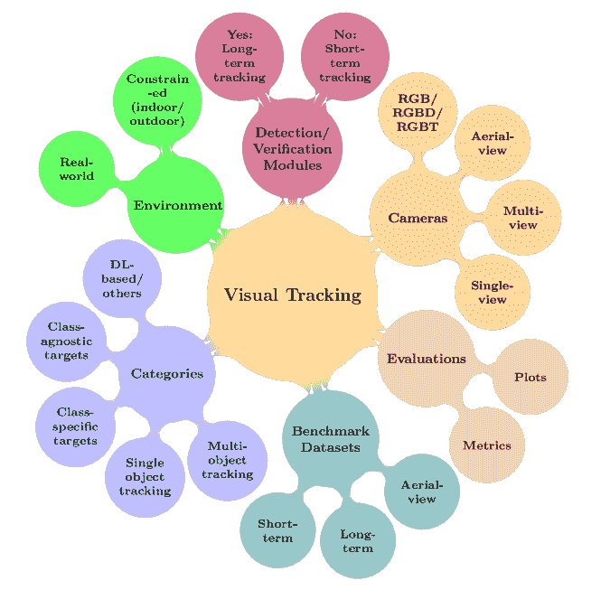

图 1：视觉目标跟踪的概述。

视觉跟踪的定义（即无模型跟踪、即时学习、单摄像头、2D 信息）在复杂的现实场景中更具挑战性，这些场景可能包括任意类别的目标（例如，人类、无人机、动物、车辆）和运动模型、各种成像特性（例如，静态/移动摄像头、平稳/快速运动、摄像头分辨率），以及环境条件的变化（例如，光照变化、背景杂乱、拥挤的场景）。传统方法使用各种视觉跟踪框架，如判别相关滤波器（DCF）[10、11、12、13、14、15、16]，轮廓跟踪[17]，核跟踪[18]，点跟踪[19]——用于目标的外观和运动建模。一般来说，传统跟踪器对目标结构及其在现实场景中的运动有不灵活的假设。这些跟踪器利用手工特征（例如，方向梯度直方图（HOG）[20] 和颜色名称（CN）[21]），因此无法解释语义目标信息并处理显著的外观变化。然而，一些基于检测的跟踪方法（例如，基于 DCF 的跟踪器）提供了具有竞争力的跟踪性能和高效计算的有吸引力的折中方案[22、23、24]。例如，俯视跟踪器[25、26、27]广泛使用这些基于 CPU 的算法，考虑到有限的机载计算能力和嵌入式硬件。

受深度学习（DL）突破的启发[28, 29, 30, 31, 32]，在 ImageNet 大规模视觉识别竞赛（ILSVRC）[33]和视觉目标跟踪（VOT）挑战[34, 35, 36, 37, 38, 39, 40]中，基于 DL 的方法在视觉跟踪领域引起了广泛关注，以提供鲁棒的跟踪器。尽管卷积神经网络（CNNs）最初占据主导地位，但目前正在研究多种架构，如递归神经网络（RNNs）、自编码器（AEs）、生成对抗网络（GANs），尤其是 Siamese 神经网络（SNNs）和定制神经网络。图 2 展示了近年来深度视觉跟踪器发展的简要历史。最先进的基于 DL 的视觉跟踪器具有不同的特性，如各种架构的利用、骨干网络、学习过程、训练数据集、网络目标、网络输出、深层特征类型、CPU/GPU 实现、编程语言和框架、速度等。因此，本研究提供了基于 DL 的跟踪器、基准数据集和评估指标的比较研究，以详细调查所提出的跟踪器，并促进先进跟踪器的开发。

\justify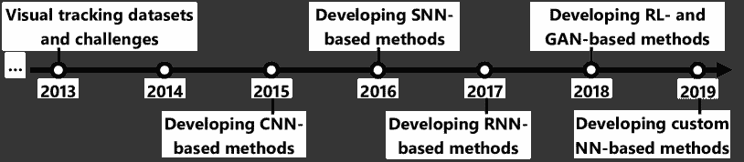

图 2：深度视觉跟踪方法时间轴。

2015 年：探索/研究深层特征以利用传统方法。

2016 年：离线训练/微调 DNNs，使用 Siamese 网络进行实时跟踪，并将 DNNs 集成到传统框架中。

2017 年：结合时间和上下文信息，并研究大规模数据集上的各种离线训练。

2018 年：研究不同的学习和搜索策略，并为视觉跟踪任务设计更复杂的架构。

2019 年：研究深度检测与分割方法，并利用更深的骨干网络。

视觉目标跟踪器可以大致分为两个主要类别，即 DL 在计算机视觉中革命之前和之后。第一类主要由[41、42、43、44] 综述，包括基于经典外观和运动模型的传统跟踪器，并系统地、实验性地或两者兼而有之地检查其优缺点。这些跟踪器使用手动设计的特征进行目标建模，以缓解外观变化，并提供高效的计算复杂度。例如，尽管由于使用高级 GPU 的限制，这些跟踪器适合在飞行机器人上实现[26、25、45、27、46]，但它们没有足够的鲁棒性来处理现实世界视频中的挑战。通常，这些跟踪器尝试将多个特征组合在一起，构建一组互补的视觉线索。但，为现实世界场景找到一个既优化又保持效率的折中方案是棘手的。考虑到近年来 DL-based 跟踪器的显著进展，前述工作的综述方法已显得过时。

第二类包括那些采用深度预训练特征或端到端网络的基于深度学习（DL）的跟踪器。一种直接的方法是将预训练的深度特征集成到传统框架中。然而，这种跟踪器会因任务差异而导致不一致的问题。但，基于端到端训练的视觉跟踪器已被研究以应对现有的跟踪挑战。最近，[47、48、49] 综述了有限的基于 DL 的视觉跟踪器。例如，[47、48] 将一些手工制作和深度方法分类为相关滤波跟踪器和非相关滤波跟踪器。随后，基于架构和跟踪机制进行了进一步分类。[50] 特别研究了一些基于 SNN 的跟踪器，依据它们的网络分支、层和训练方面。然而，它不包括最先进的跟踪器以及使用或不使用部分 SNN 的定制网络。最后，[49] 根据结构、功能和训练将 DL-based 跟踪器进行分类。然后，根据观察结果对分类结果进行评估。从结构的角度来看，跟踪器被分类为 CNN、RNN 和其他类型，而根据它们在视觉跟踪中的功能，它们被分类为特征提取网络（FEN）或端到端网络（EEN）。EEN 也根据输出（包括目标得分、置信度图和边界框（BB））进行分类。最后，根据网络训练的角度，DL-based 方法被分类为预训练和在线学习。

根据之前的努力，本工作的动机如下。

尽管做出了所有努力，现有的综述论文仍未包括大致采用 Siamese 或定制网络的最先进视觉跟踪器。

尽管近年来取得了显著进展，但长期跟踪器和航拍跟踪仍未被研究。因此，有必要调查当前问题和提出的解决方案。

以往研究基于深度学习的跟踪器时，许多细节被忽视（例如，骨干网络、训练细节、使用的特征、实现等）。

目前的最先进基准数据集（短期、长期、航拍）尚未完全比较。

最后，关于各种基准的深度学习跟踪器的全面比较尚未进行。这些分析可以展示现有跟踪器的优点和局限性。

出于上述考虑，本工作的主要目标是填补空白、调查当前问题和研究潜在的未来方向。因此，我们主要关注于广泛的最先进的基于深度学习的跟踪器，即：HCFT [51]、DeepSRDCF [52]、FCNT [53]、CNN-SVM [54]、DPST [55]、CCOT [56]、GOTURN [57]、SiamFC [58]、SINT [59]、MDNet [60]、HDT [61]、STCT [62]、RPNT [63]、DeepTrack [64、65]、CNT [66]、CF-CNN [67]、TCNN [68]、RDLT [69]、PTAV [70、71]、CREST [72]、UCT/UCT-Lite [73]、DSiam/DSiamM [74]、TSN [75]、WECO [76]、RFL [77]、IBCCF [78]、DTO [79]]、SRT [80]、R-FCSN [81]、GNET [82]、LST [83]、VRCPF [84]、DCPF [85]、CFNet [86]、ECO [87]、DeepCSRDCF [88]、MCPF [89]、BranchOut [90]、DeepLMCF [91]、Obli-RaFT [92]、ACFN [93]、SANet [94]、DCFNet/DCFNet2 [95]、DET [96]、DRN [97]、DNT [98]、STSGS [99]、TripletLoss [100]、DSL-T [101]、UPDT [102]、ACT [103]、DaSiamRPN [104]、RT-MDNet [105]、StructSiam [106]、MMLT [107]、CPT [108]、STP [109]、Siam-MCF [110]、Siam-BM [111]、WAEF [112]、TRACA [113]、VITAL [114]、DeepSTRCF [115]、SiamRPN [116]、SA-Siam [117]、FlowTrack [118]、DRT [119]、LSART [120]、RASNet [121]、MCCT [122]、DCPF2 [123]、VDSR-SRT [124]、FCSFN [125]、FRPN2T-Siam [126]、FMFT [127]、IMLCF [128]、TGGAN [129]、DAT [130]、DCTN [131]、FPRNet [132]、HCFTs [133]、adaDDCF [134]、YCNN [135]、DeepHPFT [136]、CFCF [137]、CFSRL [138]、P2T [139]、DCDCF [140]、FICFNet [141]、LCTdeep [142]、HSTC [143]、DeepFWDCF [144]、CF-FCSiam [145]、MGNet [146]、ORHF [147]、ASRCF [148]、ATOM [149]、C-RPN [150]、GCT [151]、RPCF [152]、SPM [153]、SiamDW [154]、SiamMask [155]、SiamRPN++ [156]、TADT [157]、UDT [158]、DiMP [159]、ADT [160]、CODA [161]、DRRL [162]、SMART [163]、MRCNN [164]、MM [165]、MTHCF [166]、AEPCF [167]、IMM-DFT [168]、TAAT [169]、DeepTACF [170]、MAM [171]、ADNet [172、173]、C2FT [174]、DRL-IS [175]、DRLT [176]、EAST [177]、HP [178]、P-Track [179]、RDT [180]、SINT++ [181]、Meta-Tracker [182]、CRVFL [183]、VTCNN [184]、BGBDT [185]、GFS-DCF [186]、GradNet [187]、MLT [188]、UpdateNet [189]、CGACD [190]、CSA [191]、D3S [192]、OSAA [193]、PrDiMP [194]、RLS [195]、ROAM [196]、SiamAttn [197]、SiamBAN [198]、SiamCAR [199]、SiamRCNN [200]、TMAML [201]、FGTrack [202]、DHT [203]、MLCFT [204]、DSNet [205]、BEVT [206]、CRAC [207]、KAOT [208、209]、MKCT [210 基于的，以及组合型）网络。这表明了不同方法的流行程度，同时也研究了这些方法存在的问题及其提出的解决方案。根据网络的利用情况，这些方法被分类为利用深度现成特征和用于视觉跟踪的深度特征（类似于[49]中的 FENs 和 EENs）。然而，在这项工作中，详细调查了各种跟踪器的特征，如骨干网络、利用的层、训练数据集、目标函数、跟踪速度、提取的特征、网络输出、CPU/GPU 实现、编程语言和 DL 框架。从网络训练的角度来看，这项工作分别研究了深度现成特征和用于视觉跟踪的深度特征，因为深度现成特征（从 FENs 中提取）大多是在 ImageNet 上进行过对象识别任务的预训练。此外，用于视觉跟踪的端到端训练被分类为利用离线训练、在线训练或两者结合。此外，还研究了基于元学习的视觉跟踪器，这些跟踪器最近被用于快速适应未见目标。此外，这项工作详细介绍了骨干网络、离线和在线训练数据集、避免过拟合的策略、数据增强等内容。从利用相关滤波器的优势来看，跟踪器也被分类为基于 DCF 的方法和利用端到端网络的方法，这些方法利用了 DCF 的在线学习效率和 CNN 特征的判别能力。接下来，基于 DL 的跟踪器根据其应用于航拍跟踪、长期跟踪或在线跟踪进行分类。最后，这项工作对七个基准数据集上的不同方面进行了全面分析，包括 OTB2013 [219]、OTB2015 [220]、VOT2018 [39]、LaSOT [221]、UAV123 [222]、UAVDT [223] 和 VisDrone2019-test-dev [224]。

### I-A 贡献

主要贡献总结如下。

1) 现有的基于深度学习的视觉跟踪器按照架构（即 CNN、SNN、RNN、GAN 和自定义网络）、网络利用（即现成深度特征和用于视觉跟踪的深度特征）、视觉跟踪的网络训练（即仅离线训练、仅在线训练、离线与在线训练、元学习）、网络目标（即基于回归、基于分类以及回归与分类相结合）、相关滤波器优势的利用（即 DCF 框架和利用相关滤波器/层/功能）、航拍跟踪、长期跟踪以及在线跟踪进行了分类。这种覆盖所有这些方面的详细分类研究在视觉跟踪方法中尚未出现。

2) 介绍了深度学习跟踪器在应对视觉跟踪挑战方面的主要问题和提出的解决方案。这种分类提供了设计视觉跟踪器的有用见解。

3) 对于知名的单目标视觉跟踪数据集（即短期、长期、航拍视角），根据其基本特征（例如视频数量、帧数、类别/聚类、序列属性、缺失标签以及与其他数据集的重叠）进行了全面比较。这些基准数据集包括 OTB2013 [219]、OTB2015 [220]、VOT [34、35、36、37、38、39、40]、ALOY [42]、TC128 [225]、UAV123 [222]、NUS-PRO [226]、NfS [227]、DTB [228]、TrackingNet [229]、OxUvA [230]、BUAA-PRO [231]、GOT10k [232]、LaSOT [221]、UAV20L [222]、TinyTLP/TLPattr [233]、TLP [233]、TracKlinic [234]、UAVDT [223]、LTB35 [235]、VisDrone [236、224]、VisDrone2019L [224]，以及 Small-90/Small-112 [237]。

4) 最后，对各种跟踪数据集进行了广泛的实验评估，具体包括 OTB2013 [219]、OTB2015 [220]、VOT2018 [39]、LaSOT [221]、UAV123 [222]、UAVDT [223] 和 VisDrone2019 [224]，并对最先进的视觉跟踪器在不同方面进行了分析。此外，本工作指出了 VOT2018、OTB2015、LaSOT、UAV123、UAVDT 和 VisDrone2019 数据集的最具挑战性的视觉属性。通过这样做，明确了各数据集对近期跟踪器的主要挑战。

根据这些比较，得出以下结论。

基于 Siamese 网络的深度架构由于其在视觉跟踪中的性能和效率之间的满意平衡，成为最有前景的深度架构。此外，一些方法最近尝试利用 RL 和 GAN 方法的优势来优化决策并缓解训练数据不足的问题。基于这些优势，最近的跟踪器旨在设计自定义神经网络，以充分利用场景信息。

离线端到端的深度特征学习将预训练的通用特征适当地转移到视觉跟踪任务中。虽然传统的 DNN 在线训练增加了计算复杂性，使得这些方法大多不适合实时应用，但它显著帮助视觉跟踪器适应显著的外观变化，防止视觉干扰，并提高视觉跟踪器的性能。利用元学习方法对视觉跟踪器的在线适应提供了显著进展。因此，离线和（高效的）在线训练程序都能带来有前景的跟踪性能。

利用更深更宽的骨干网络提高了区分目标与背景的判别能力。预训练的网络（例如，ResNet [32]) 是次优的，通过为视觉跟踪训练骨干网络，可以显著提高跟踪性能。

最佳跟踪器利用回归和分类目标函数来区分目标与背景，并找到最紧密的边界框（BB）以实现目标定位。这些目标是互补的，即回归函数在分类函数上起到辅助监督的作用。最近，视频对象分割（VOS）方法被集成到视觉跟踪器中，通过分割掩码表示目标。

利用不同的特征增强了目标模型的鲁棒性。例如，大多数基于 DCF 的方法因此融合了深度的现成特征和手工设计的特征（例如，HOG 和 CN）。此外，利用互补特征，如时间或上下文信息，也在具有挑战性的场景中产生了更鲁棒的特征。

对于基于深度学习的视觉跟踪方法，最具挑战性的属性包括遮挡、视野外、快速运动、纵横比变化和相似对象。此外，具有相似语义的视觉干扰物可能导致漂移问题。

本文的其余部分如下。第二部分 II 介绍了我们的深度视觉跟踪器分类法。视觉跟踪基准数据集和评估指标在第三部分 III 进行了比较。第四部分 IV 进行了最先进视觉跟踪方法的实验比较。最后，第五部分 V 总结了结论和未来方向。

## II 深度视觉跟踪分类法

通常，三大主要组成部分：i) 目标表示/信息，ii) 训练过程，iii) 学习过程在设计视觉跟踪方法中扮演重要角色。大多数基于 DL 的跟踪器旨在通过利用/融合深度层次特征、利用上下文/运动信息并选择更具区分性/鲁棒性的深度特征来改进目标表示。为了有效地训练用于视觉跟踪系统的 DNN，主要动机可以分为采用各种训练方案（例如，网络预训练、在线训练（也包括元学习）或两者兼有）和处理训练问题（例如，缺乏训练样本、过拟合或计算复杂性）。无监督训练是另一种最近的方案，利用丰富的未标记样本，可以通过根据上下文信息对样本进行聚类、将训练数据映射到流形空间或利用一致性基础的目标函数来实现。最后，关于学习过程的主要动机包括在线更新方案、尺度/纵横比估计、搜索策略和长期记忆。

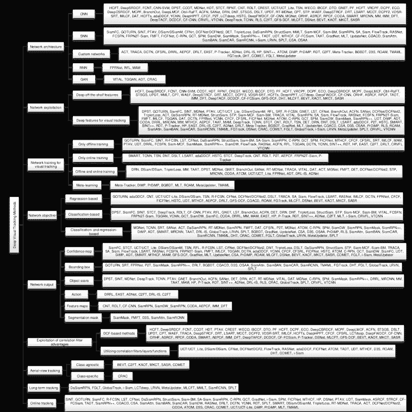

图 3：基于 DL 的视觉跟踪方法的分类。

以下内容对基于 DL 的方法进行了全面的分类，涵盖了九个方面，并对跟踪器的主要动机和贡献进行了分类。图 3 展示了基于 DL 的视觉跟踪器的分类法，包括网络架构、网络利用、用于视觉跟踪目的的网络训练、网络目标、网络输出、相关滤波器优势的利用、航拍跟踪、长期跟踪以及在线跟踪。此外，对基于 DL 的跟踪器在预训练网络、主干网络、利用的层、深度特征类型、手工制作与深度特征的融合、训练数据集、跟踪输出、跟踪速度、硬件实现细节、编程语言以及 DL 框架方面进行了详细比较。

### II-A 网络架构

尽管 CNN 已广泛应用于视觉跟踪，但近年来其他架构也主要用于提高视觉跟踪器的效率和鲁棒性。因此，提出的分类法包括基于 CNN、SNN、GAN、RNN 和自定义网络的视觉跟踪器。

基于 CNN 的跟踪器首次通过对二维帧进行分层处理，独立地提供了强大的目标表示。然而，传统的 CNN 存在固有的局限性，如在大规模监督数据集上进行训练、忽略时间依赖性和在线适应的计算复杂性。作为一种替代方法，基于 SNN 的跟踪器通过测量目标样本与搜索区域之间的相似性来克服这些局限性。一般来说，SNN 在两个或更多分支中采用 CNN 层/块/网络进行相似性学习，并以（接近/超过）实时速度运行。然而，在线适应和处理诸如遮挡等挑战仍在研究中。像 RNN 和 GAN 这样的架构在视觉跟踪中的研究较为有限。一般而言，RNN 用于捕捉视频帧之间的时间信息，但在稳定性和长期学习依赖性方面存在局限性。GAN 由生成器和判别器子网络组成，可以提供解决一些局限性的可能性。例如，这些网络之间的竞争可以帮助跟踪器处理稀缺的正样本，尽管 GAN 的训练和泛化存在一些障碍。最后，最近的自定义网络包括各种架构，以增强学习特征并减少计算复杂性。以下是基于 DL 的视觉跟踪器的主要贡献总结。

#### II-A1 卷积神经网络（CNN）

受到 CNN 在计算机视觉领域突破及其吸引人的优势（如参数共享、稀疏交互和主导表示）的启发，提出了广泛的基于 CNN 的跟踪器。主要动机如下所述。

+   •

    强大的目标表征：提供强大的目标表征是使用 CNN 进行视觉跟踪的主要优势。为了学习强大的目标模型，可以将贡献分类为：i) 在大规模视觉跟踪数据集上进行 CNN 的离线训练 [55, 60, 73, 82, 90, 93, 94, 97, 105, 109, 128, 130, 135, 137, 146, 161, 164, 165, 169], ii) 设计特定的 CNN 而不是使用预训练模型 [55, 60, 62, 64, 66, 68, 69, 73, 75, 82, 90, 93, 94, 97, 98, 101, 105, 109, 120, 128, 130, 134, 135, 137, 139, 143, 146, 161, 163, 164, 165, 167, 169, 205], iii) 构建多个目标模型以捕捉目标外观的多样性 [68, 109, 120, 122, 123, 136, 139, 168, 210], iv) 结合空间和时间信息以提高模型的泛化能力 [72, 75, 99, 112, 115, 130, 144, 146, 208, 209], v) 融合不同的深度特征以利用互补的空间和语义信息 [56, 94, 101, 102, 128, 205, 204, 206], vi) 学习特定的目标模型，如相对模型 [97] 或基于部分的模型 [109, 120, 139] 以处理部分遮挡和变形，vii) 利用双流网络 [120] 防止过拟合并学习旋转信息，并准确估计目标的纵横比以避免将不相关信息污染目标模型 [174]，以及 viii) 通过通道和空间维度进行特征选择以学习特征的结构相关性。

+   •

    平衡训练数据：根据问题定义，在第一个帧中只有一个正样本，这增加了跟踪过程中过拟合的风险。尽管背景信息可以在每一帧中被认为是负样本，但基于不完美目标估计的目标采样也可能导致噪声/不可靠的训练样本。这些问题严重影响视觉跟踪方法的性能。为了缓解这些问题，基于 CNN 的跟踪器提出了：i) 域适应机制（即将从源领域学习到的知识转移到样本不足的目标领域）[82, 161]，ii) 各种更新机制（例如，周期性、随机性、短期和长期更新）[98, 122, 136, 142, 165]，iii) 用于正负样本挖掘的卷积 Fisher 判别分析（FDA）[134]，iv) 用于在线集成学习的多分支 CNN [90]，v) 高效的采样策略以增加训练样本的数量[167]，以及 vi) 递归最小二乘估计算法，以在在线学习过程中提供辨别能力与更新迭代之间的折衷[195]。

+   •

    计算复杂度问题：尽管 CNN 在外观表示方面取得了显著进展，但基于 CNN 的方法仍然面临高计算复杂度的问题。为了减少这一限制，基于 CNN 的视觉跟踪方法采用了不同的解决方案，即：i) 使用简单的 CNN 架构 [184]，ii) 将 CNN 拆解为多个缩小的网络 [69]，iii) 压缩或剪枝训练样本空间 [87, 108, 134, 146, 164] 或特征选择 [53, 147]，iv) 通过 RoIAlign 操作 [105]（即通过双线性插值进行特征近似）或斜率随机森林 [92] 进行更好的数据捕获，v) 校正领域适应方法 [161]，vi) 轻量级结构 [64, 66, 163]，vii) 高效优化过程 [91, 148]，viii) 粒子采样策略 [89]，ix) 利用注意机制 [93]，x) 将随机向量函数链 (RVFL) 网络扩展到卷积结构 [183]，以及 xi) 利用相关滤波器的优势 [51, 52, 53, 56, 61, 67, 70, 71, 72, 73, 76, 78, 79, 85, 87, 88, 89, 91, 93, 99, 101, 102, 108, 112, 115, 119, 120, 122, 123, 124, 128, 133, 134, 136, 137, 142, 143, 144, 148, 152, 161, 163, 167, 168, 170] 进行高效计算。利用相关滤波器的优势是指将 DCFs 应用于预训练网络或将相关滤波器/层/函数与端到端网络结合使用。

#### II-A2 孪生神经网络 (SNN)

近年来，SNNs 被广泛应用于视觉跟踪器。给定目标和搜索区域的配对，这些双流网络计算相同的函数以生成相似度图。它们主要旨在克服预训练深度 CNN 的局限性，并充分利用端到端学习来实现实时应用。

+   •

    区分目标表示：构建一个稳健的目标模型主要依赖于目标表示。为了实现更具区分性的深度特征和改进目标建模，基于 SNN 的方法提出了以下策略：i) 学习干扰感知特征[104]或目标感知特征[157]，ii) 融合深度多级特征[125, 150]或结合置信度图[81, 83, 117]，iii) 在 Siamese 模型中利用不同的损失函数来训练更有效的滤波器[100, 155, 157, 158, 159]，iv) 利用不同类型的深度特征，如上下文信息[110, 117, 151]或时间特征/模型[57, 74, 118, 126, 151, 171]，v) 充分挖掘低级空间特征[125, 150]，vi) 考虑目标的角度估计以防止显著背景对象[111]，vii) 利用多阶段回归来细化目标表示[150]，viii) 使用更深更广的深度网络作为主干以增加神经元的感受野，相当于捕捉目标的结构[154]，ix) 使用相关性引导的注意力模块来利用模板和 RoI 特征图之间的关系[190]，x) 计算注意特征之间的相关性[197]，xi) 准确估计目标的尺度和长宽比[198]，xii) 同时学习分类和回归模型[199]，xiii) 挖掘训练中的困难样本[200]，以及 xiv) 使用略读和细读模块推断最佳目标候选[218]。最后，[191, 193] 对基于 SNN 的跟踪器进行了对抗性攻击，以评估在视觉跟踪场景中表现不佳的 SNN 模型。这些方法生成轻微的扰动来欺骗跟踪器，最终研究 DL 模型并提高其鲁棒性。

+   •

    适应目标外观变化：仅使用第一代基于 SNN 的跟踪器的离线训练导致对未见目标的泛化效果较差。为了解决这个问题，最近的基于 SNN 的跟踪器提出了以下方法：i) 在线更新策略，考虑减少过拟合风险的策略 [74, 83, 86, 96, 104, 145, 187, 188, 189, 216]，ii) 背景抑制 [74, 104]，iii) 将跟踪任务表述为一次性局部检测任务 [104, 116]，iv) 对重要特征通道或得分图给予更高的权重 [81, 117, 121, 141]，以及 v) 考虑所有潜在干扰因素的运动和交互 [200]。另外，DaSiamRPN [104] 和 MMLT [107] 使用局部到全局的搜索区域策略和记忆利用来处理关键挑战，如完全遮挡和视野外问题，并增强局部搜索策略。

+   •

    平衡训练数据：与基于 CNN 的方法相同，一些基于 SNN 的方法也采取了措施来解决训练样本分布不均的问题。基于 SNN 的方法的主要贡献包括：i) 利用多阶段 Siamese 框架来刺激困难负样本采样 [150]，ii) 采用采样启发式方法，如固定的前景与背景比 [150]，或者采样策略，如随机采样 [104] 或流引导采样 [126]，以及 iii) 将相关滤波器/层纳入 Siamese 框架 [70, 71, 74, 86, 95, 104, 116, 118, 121, 141, 147, 149, 157, 158, 166, 145]。

#### II-A3 循环神经网络 (RNN)

由于视觉跟踪涉及视频帧的空间和时间信息，基于 RNN 的方法也考虑了目标运动/移动。由于训练艰难且参数众多，基于 RNN 的方法数量有限。这些方法几乎都试图利用额外的信息和记忆来改善目标建模。此外，使用基于 RNN 的方法的第二个目标是避免对预训练的 CNN 模型进行微调，因为这需要大量时间并且容易过拟合。这些方法的主要目的是捕捉时空表征[77, 132, 171]，利用上下文信息处理背景杂乱[132]，利用多级视觉注意力突出目标，背景抑制[171]，以及使用卷积长短期记忆（LSTM）作为先前目标出现的记忆单元[77]。此外，基于 RNN 的方法利用金字塔多方向递归网络[132]或将 LSTM 集成到不同的网络中[77]以记忆目标外观并研究时间依赖性。最后，[132]对目标的自我结构进行编码，以减少与类似干扰物相关的跟踪敏感性。

#### II-A4 生成对抗网络（GAN）

基于一些吸引人的优势，如捕捉统计分布和在没有大量标注数据的情况下生成所需的训练样本，GANs 已在许多研究领域得到了广泛应用。尽管 GANs 通常很难训练和评估，但一些基于 DL 的跟踪器采用 GANs 来丰富训练样本和目标建模。这些网络可以在特征空间中增强正样本，以解决训练样本的不平衡分布[114]。此外，基于 GAN 的方法可以学习一般外观分布，以处理视觉跟踪的自学习问题[129]。此外，回归和判别网络的联合优化将利用这两项任务的优势[160]。最后，这些网络可以探索目标与其上下文信息之间的关系，以搜索感兴趣的区域，并将这些信息转移到具有不同继承的视频中，例如从地面视图到无人机视图[207]。

#### II-A5 自定义网络

受到特定深度架构和网络层的启发，现代基于深度学习的方法结合了广泛的网络，如 AE、CNN、RNN、SNN、检测网络以及深度强化学习用于视觉跟踪。自定义网络的主要动机是通过利用其他网络的优势来弥补普通跟踪器的不足。此外，视觉跟踪领域最近对元学习（或学习学习）产生了兴趣。它旨在通过利用来自类似任务的积累经验来解决少量样本学习问题和学习者对新任务的快速适应。通过采用元学习框架，不同的网络可以在在线跟踪过程中学习未见的目标外观。自定义网络的主要动机和贡献如下。

+   •

    强大且准确的跟踪：近期的网络寻求通用且有效的框架，以改善定位和边界框估计。例如，聚合多个在线跟踪器[203]是一种提高跟踪性能的方法。另一种方法是通过专门设计的目标估计和分类网络[149]来更好地理解目标的姿态。此外，基于元学习的网络[159, 194]可以通过鉴别学习过程预测强大的目标模型。然而，其他一些研究[185, 201]将跟踪任务视为实例检测，旨在直接将现代目标检测器转换为视觉跟踪器。这些跟踪器利用类别无关的网络，可以：i) 区分同类样本，ii) 通过元学习者快速适应不同目标，以及 iii) 考虑时间线索。D3S [192]方法通过补充几何特性，从分割掩膜建模视觉目标，以提高基于模板的跟踪器的鲁棒性。COMET [212]弥合了先进视觉跟踪器和空中视角跟踪器在检测小/微小物体方面的差距。它利用多尺度特征学习和注意力模块来弥补通用跟踪器在中/高高度空中视角下的劣势。

+   •

    计算复杂性问题：如前所述，这个问题限制了在线跟踪器在实时应用中的性能。为了控制计算复杂性，TRACA [113] 和 AEPCF [167] 方法采用 AEs 压缩原始传统深度特征。EAST [177] 自适应地选择浅层特征用于简单帧跟踪，或选择昂贵的深度特征用于挑战性帧 [177]，TRACA [113]、CFSRL [138] 和 AEPCF [167] 则利用了 DCF 计算效率。避免高计算负担的有效方法是利用元学习，快速适应在未见目标上的预训练跟踪器。基于元学习的跟踪器的目标模型可以在少量迭代中优化 [182、159、194、185、188、196、201、217]。

+   •

    模型更新：为了在跟踪过程中保持目标模型的稳定性，提出了不同的更新策略；例如，CFSRL [138] 并行更新多个模型，DRRL [162] 引入了 LSTM 以利用长时间依赖关系，而 AEPCF [167] 使用了长期和短期更新方案以提高跟踪速度。为防止模型更新错误和漂移问题，RDT [180] 将视觉跟踪公式修订为一个关于下一次定位的最佳目标模板的连续决策过程。此外，利用 RL [179] 高效学习良好决策策略是另一种选择，可以决定更新模型或忽略决策。最近的一种替代方法是采用元学习方法以快速适应模型。例如，工作 [196、159、194] 使用递归优化过程，在少量梯度步骤中更新目标模型。最后，[217] 整合了序列信息（例如几何、判别和外观线索）并利用元更新器在可靠帧上进行有效更新。

+   •

    有限的训练数据：如果发生遮挡、模糊和大变形，软性和非代表性的训练样本可能会干扰视觉跟踪。AEPCF[167]利用密集的圆形采样方案来防止由于有限训练数据引起的过拟合问题。SINT++[181]通过正样本生成网络（PSGN）和困难正样本转换网络（HPTN）生成正样本和困难样本，以制造多样化和具有挑战性的训练数据。为了有效训练深度神经网络而无需大量训练数据，部分标注的训练样本被动作驱动的深度跟踪器[172、173]所利用。P-Track[179]也使用主动决策在有限的标注数据可用时，交互式地标注视频，同时学习跟踪器。Meta-Tracker[182]是首次尝试利用离线元学习方法以更好地在线适应视觉跟踪器。这种方法可以泛化目标模型，并避免过拟合干扰物。此外，各种先锋跟踪器[159、194、217、201、185、188、196]在一-shot 或 few-shot 学习任务中享有元学习者的优势。

+   •

    搜索策略：根据定义，视觉跟踪方法通过给定第一帧中的初始目标状态，在下一帧的搜索区域内估计新的目标状态。最佳的搜索区域选择依赖于迭代搜索策略，这些策略通常与视频内容无关，并且是启发式的、暴力的和手工设计的。尽管基于滑动窗口、均值漂移或粒子滤波的经典搜索策略，最先进的基于深度学习的视觉跟踪器利用基于强化学习的方法来学习数据驱动的搜索策略。为了彻底探索感兴趣区域并选择最佳目标候选，基于动作的跟踪机制[172、173]考虑了目标上下文的变化，并积极追踪目标的移动。此外，ACT 和 DRRL 通过动态搜索[103]和粗到细的验证[162]，提出了适用于实时需求的实际 RL-based 搜索策略。最后，全图像视觉跟踪器[214]利用两阶段检测器来定位目标，而无需任何假设（例如，目标区域的时间一致性）。

+   •

    利用额外信息：为了通过利用运动或上下文信息来增强目标模型，DCTN [131] 建立了一个双流网络，而 SRT [80] 采用多方向 RNN 来进一步学习目标在视觉跟踪中的依赖关系。此外，FGTrack [202] 通过光流提供的更细粒度的运动信息来估计目标的尺度和旋转以及其位移。递归卷积网络 [176] 对之前的语义信息和跟踪提议进行建模，以编码相关信息以获得更好的定位。最后，DRL-IS [175] 引入了一个演员-评论家网络，以高效地估计目标运动参数。

+   •

    决策制定：在线决策对基于 DL 的视觉跟踪方法的性能有主要影响。最先进的方法试图通过将 RL 融入 DL 基础的方法来学习在线决策制定，而不是使用手工设计的技术。为了获得有效的决策策略，P-Track [179] 最终在一个主动代理中利用数据驱动技术来决定跟踪、重新初始化或更新过程。此外，DRL-IS [175] 采用了一种原理性的 RL 基础方法，根据目标状态选择合理的动作。此外，还提出了一种动作预测网络，以调整视觉跟踪器的连续动作，从而确定最佳超参数以学习最佳的行动策略并做出令人满意的决策 [178]。另一方面，工作 [194] 考虑了在估计目标状态时的不确定性。通过预测视觉目标的条件概率密度，可以直接解释有关更新程序或丢失目标的决策。此外，一个结果判断模块 [213] 可以帮助短期跟踪器在遮挡/视野之外的情况下。

### II-B 网络利用

粗略来说，DNN 在视觉跟踪中的主要利用包括在部分相关数据集上重用预训练模型或利用深度特征进行视觉跟踪，这相当于为视觉跟踪任务训练 DNN。

#### II-B1 模型重用或深度现成特征

利用深度现成特征是将深度特征的力量转移到传统视觉跟踪方法中的最简单方式。这些特征提供了视觉目标的通用表示，并帮助视觉跟踪方法构建更强大的目标模型。在拓扑结构方面，DNNs 包含简单的多层非线性层堆叠（例如，AlexNet [28], VGGNet [29, 30]）或有向无环图拓扑（例如，GoogLeNet [31], ResNet [121], SSD [238], Siamese 卷积神经网络 [239]），这允许设计更复杂的深度架构，包括具有多个输入/输出的层。这些跟踪器的主要挑战在于如何有效利用通用表示。不同的方法使用了在 ImageNet 数据集 [33] 上预训练的大规模静态图像的各种特征图和模型进行物体识别任务。许多方法研究了预训练模型的特性，并探索了深度特征在传统框架中的影响（见表 I）。因此，基于 DL 的方法更倾向于同时利用语义和细粒度的深度特征 [51, 53, 56, 133, 150, 240, 241, 204, 206]。深度特征的融合也是这些方法的另一个动机，这通过不同的技术来利用多分辨率深度特征 [51, 52, 53, 56, 61, 76, 123, 136, 168, 102, 145, 122, 204, 206] 和在后期阶段深度特征与浅层特征的独立融合 [102] 来实现。利用运动信息 [85, 99, 168, 242] 和选择适合视觉跟踪任务的深度特征 [53, 147, 186] 是基于 DL 的方法的另两个有趣动机。基于深度现成特征的 DL 视觉跟踪器的详细特征见表 I。不用说，这些方法的网络输出是深度特征图。

表 I：用于视觉跟踪的深度现成特征。缩写表示为：置信度图（CM）、显著性图（SM）、边界框（BB）、投票（vt）、深度外观特征（DAF）、深度运动特征（DMF）。

| 方法 | 预训练模型 | 利用的层 | 预训练数据 | 预训练数据集 | 利用的特征 | PC（CPU、RAM、Nvidia GPU） | 语言 | 框架 | 速度（fps） | 跟踪输出 |
| --- | --- | --- | --- | --- | --- | --- | --- | --- | --- | --- |
| DeepSRDCF [52] | VGG-M | Conv5 | 静态图像 | ImageNet | HOG, DAF | N/A, GPU | Matlab | MatConvNet | N/A | CM |
| CCOT [56] | VGG-M | Conv1, Conv5 | 静态图像 | ImageNet | HOG, CN, DAF | N/A, GPU | Matlab | MatConvNet | 1 | CM |
| ECO [87] | VGG-M | Conv1, Conv5 | 静态图像 | ImageNet | HOG, CN, DAF | N/A, GPU | Matlab | MatConvNet | 8 | CM |
| DeepCSRDCF [88] | VGG-M | N/A | 静态图像 | ImageNet | HOG, CN, DAF | Intel I7 3.4GHz CPU, GPU | Matlab | MatConvNet | 13 | CM |
| SASR [211] | VGG-M | Conv4 | 静态图像 | ImageNet | DAF | Intel-8700K 3.7GHz CPU, 32GB RAM, Quadro P2000 GPU | Matlab | MatConvNet | 3.84 | CM |
| KAOT [208, 209] | VGG-M | Conv3 | 静态图像 | ImageNet | DAF | Intel I7-8700K 3.7GHz CPU, 32GB RAM, RTX 2080 GPU | Matlab | MatConvNet | 14.1 | CM |
| MLCFT [204] | VGG-M | Conv-1, Conv-3, Conv-5 | 静态图像 | ImageNet | DAF | Intel I7 3770K 3.5 CPU, 8GB RAM, GTX 960 GPU | Matlab | MatConvNet | 16.1 | CM |
| UPDT [102] | VGG-M/ GoogLeNet/ ResNet-50 | N/A | 静态图像 | ImageNet | HOG, CN, DAF | N/A | Matlab | MatConvNet | N/A | CM |
| WAEF [112] | VGG-M | Conv1, Conv5 | 静态图像 | ImageNet | HOG, CN, DAF | Intel Xeon(R) 3.20 GHz CPU, 44GB RAM, GTX 1080Ti | Matlab | MatConvNet | 0.62 | CM |
| DeepSTRCF [115] | VGG-M | Conv3 | 静态图像 | ImageNet | HOG, CN, DAF | Intel I7-7700 CPU, 32GB RAM, GTX 1070 GPU | Matlab | MatConvNet | 24.3 | CM |
| DRT [119] | VGG-M, VGG-16 | Conv1, Conv4-3 | 静态图像 | ImageNet | HOG, CN, DAF | N/A, GPU | Matlab | Caffe | N/A | CM |
| WECO [76] | VGG-M | Conv1, Conv5 | 静态图像 | ImageNet | DAF | Intel Xeon(R) 2.60GHz CPU, GTX 1080 GPU | Matlab | MatConvNet | 4 | CM |
| VDSR-SRT [124] | VGG-M | Conv1, Conv5 | 静态图像 | ImageNet | HOG, DAF | Intel I7-6700k 4.00GHz CPU, 16GB RAM, GTX 1070 GPU | Matlab | MatConvNet | 13.5 | CM |
| ASRCF [148] | VGG-M, VGG-16 | Norm1, Conv4-3 | 静态图像 | ImageNet | HOG, DAF | Intel I7-8700 CPU, 32GB RAM, GTX 1080Ti GPU | Matlab | MatConvNet | 28 | CM |
| RPCF [152] | VGG-M | Conv1, Conv5 | 静态图像 | ImageNet | HOG, CN, DAF | Intel I7-4790K CPU, GTX 1080 GPU | Matlab | MatConvNet | 5 | CM |
| DeepTACF [170] | VGG-M | Conv1 | 静态图像 | ImageNet | HOG, DAF | Intel I7-6700 3.40GHz CPU, GTX Titan GPU | Matlab | MatConvNet | N/A | CM |
| FCNT [53] | VGG-16 | Conv4-3, Conv5-3 | 静态图像 | ImageNet | DAF | 3.4GHz CPU, GTX Titan GPU | Matlab | Caffe | 3 | CM |
| CREST [72] | VGG-16 | Conv4-3 | 静态图像 | ImageNet | DAF | Intel I7 3.4GHz CPU, GTX Titan Black GPU | Matlab | MatConvNet | N/A | CM |
| DTO [79] | VGG-16, SSD | Conv3-3, Conv4-3, Conv5-3 | 静态图像 | ImageNet | DAF | Intel I7-4770K CPU, 32G RAM, GTX 1070 GPU | Matlab | Caffe | N/A | CM, BB |
| VRCPF [84] | VGG-16, Faster R-CNN | N/A | 静态图像 | ImageNet, COCO | DAF | N/A | N/A | N/A | N/A | BB |
| Obli-RaFT [92] | VGG-16 | Conv4-3, Conv5-3 | 静态图像 | ImageNet | DAF | Intel I7-3770 3.40GHz CPU, 2 GTX Titan X GPUs | Matlab | Caffe | 2 | VT |
| CPT [108] | VGG-16 | Conv5-1, Conv5-3 | 静态图像 | ImageNet | HOG, CN, DAF | Intel I7-7800X CPU, 16GB RAM, GTX 1080Ti GPU | Matlab | MatConvNet | 14 | CM |
| DeepHPFT [136] | VGG-16, VGG-19, and GoogLeNet | Conv5-3, Conv5-4, and icp6-out | 静态图像 | ImageNet | HOG, CN, DAF | Intel Xeon 2.4GHz CPU, 256 GB RAM, GTX Titan XP GPU | Matlab | MatConvNet | 4 | CM |
| DeepFWDCF [144] | VGG-16 | Conv4-3 | 静态图像 | ImageNet | DAF | N/A, GTX 1080Ti GPU | Matlab | MatConvNet | 2.7 | CM |
| MMLT [107] | VGGNet, Fully-convolutional Siamese network | Conv5 | 静态图像, 视频帧 | ImageNet, ILSVRC-VID | DAF | Intel I7-4770 3.40GHz CPU, 11GB RAM, GTX 1080Ti | Matlab | N/A | 6.15 | CM |
| MKCT [210] | VGGNet | Conv3-4 | 静态图像 | ImageNet | DAF | Intel I7 3.7GHz CPU, 32GB RAM, Quadro 2000 GPU | Matlab | MatConvNet | 9.4 | CM |
| BEVT [206] | VGGNet | Conv3-4, Conv4-4, Conv5-4 | 静态图像 | ImageNet | DAF | Intel I7-8700K 3.7GHz CPU, 48GB RAM, Quadro P2000 GPU | Matlab | MatConvNet | 0.6 | CM |
| HCFT [51] | VGG-19 | Conv3-4, Conv4-4, Conv5-4 | 静态图像 | ImageNet | DAF | Intel I7-4770 3.40GHz CPU, 32 GB RAM, GTX Titan GPU | Matlab | MatConvNet | 10.4 | CM |
| HDT [61] | VGG-19 | Conv4-2, Conv4-3, Conv4-4, Conv5-2, Conv5-3, Conv5-4 | 静态图像 | ImageNet | DAF | Intel I7-4790K 4.00GHz CPU, 16GB RAM, GTX 780Ti GPU | Matlab | MatConvNet | 1 | CM |
| IBCCF [78] | VGG-19 | Conv3-4, Conv4-4, Conv5-4 | 静态图像 | ImageNet | DAF | Intel Xeon(R) 3.3GHz CPU, 32GB RAM, GTX 1080 GPU | Matlab | MatConvNet | 1.25 | CM |
| DCPF [85] | VGG-19 | Conv3-4, Conv4-4, Conv5-4 | 静态图像 | ImageNet | DAF | N/A | N/A | N/A | N/A | CM |
| MCPF [89] | VGG-19 | Conv3-4, Conv4-4, Conv5-4 | 静态图像 | ImageNet | DAF | Intel 3.10GHz CPU, 256 GB RAM, GTX Titan X GPU | Matlab | MatConvNet | 0.5 | CM |
| DeepLMCF [91] | VGG-19 | Conv3-4, Conv4-4, Conv5-4 | 静态图像 | ImageNet | DAF | Intel 3.60GHz CPU, Tesla K40 GPU | Matlab | MatConvNet | 10 | CM |
| STSGS [99] | VGG-19 | Conv3-4, Conv4-4, Conv5-4 | 静态图像 | ImageNet | DAF, DMF | Intel I7 3.20GHz CPU, 8 GB RAM | Matlab | Caffe | 45 | CM |
| MCCT [122] | VGG-19 | Conv4-4, Conv5-4 | 静态图像 | ImageNet | DAF | Intel I7-4790K 4.00GHz CPU, 16GB RAM, GTX 1080Ti GPU | Matlab | MatConvNet | 8 | CM |
| DCPF2 [123] | VGG-19 | Conv3-4, Conv4-4, Conv5-4 | 静态图像 | ImageNet | DAF | 不适用 | 不适用 | 不适用 | 不适用 | CM |
| HCFTs [133] | VGG-19 | Conv3-4, Conv4-4, Conv5-4 | 静态图像 | ImageNet | DAF | Intel I7-4770 3.40GHz CPU, 32GB RAM, GTX Titan GPU | Matlab | MatConvNet | 6.7 | CM |
| LCTdeep [142] | VGG-19 | Conv5-4 | 静态图像 | ImageNet | DAF | Intel I7-4770 3.40GHz CPU, 32GB RAM, GPU | Matlab | MatConvNet | 13.8 | CM |
| CF-CNN [67] | VGG-19 | Conv3-4, Conv4-4, Conv5-4 | 静态图像 | ImageNet | DAF | Intel I7-4770 3.40GHz CPU, 32GB RAM, GTX Titan GPU | Matlab | MatConvNet | 12.3 | CM |
| ORHF [147] | VGG-19 | Conv3-4, Conv4-4, Conv5-4 | 静态图像 | ImageNet | HOG, DAF | Intel I7-4770K 3.50GHz CPU, 24GB RAM, 不适用 | Matlab | 不适用 | 不适用 | CM |
| IMM-DFT [168] | VGG-19 | Conv3-4, Conv4-4, Conv5-4 | 静态图像 | ImageNet | DAF | Intel I5-4590 3.30GHz CPU, 16GB RAM, GTX Titan X GPU | Matlab | MatConvNet | 10 | CM |
| CNN-SVM [54] | R-CNN | 第一个全连接层 | 静态图像 | ImageNet | DAF | 不适用 | 不适用 | Caffe | 不适用 | SM |
| RPNT [63] | 目标提议网络 | 不适用 | 静态图像 | ImageNet, PASCAL VOC | DAF | 不适用 | C/C++ | 不适用 | 3.8 | BB |
| CF-FCSiam [145] | 完全卷积的 Siamese 网络 | 不适用 | 视频帧 | ILSVRC-VID | HOG, DAF | Intel I7-6700K 4.00GHz CPU, GTX Titan GPU | Matlab | MatConvNet | 33 | CM |
| TADT [157] | Siamese 匹配网络 | Conv4-1, Conv4-3 | 静态图像 | ImageNet | DAF | Intel I7 3.60GHz CPU, 32GB RAM, GTX 1080 GPU | Matlab | MatConvNet | 33.7 | CM |
| GFS-DCF [186] | ResNet-50 | Res4x | 静态图像 | ImageNet | DAF | Intel Xeon E5-2637v3 CPU, 不适用, GTX Titan X GPU | Matlab | MatConvNet | 8 | CM |
| DHT [203] | 各种网络 | 各种层 | 静态图像，视频帧 | 各种数据集 | DAF | 不适用 | 不适用 | 不适用 | 12 | BB |

#### II-B2 深度特征用于视觉跟踪目的

近期跟踪器的一个热门话题是如何设计和训练用于视觉跟踪的深度神经网络（DNN）。使用深度现成特征会由于不同任务的目标不一致而限制跟踪性能。此外，离线学习的深度特征可能无法捕捉目标变化，并倾向于对初始目标模板过拟合。因此，DNN 需要在大规模数据集上进行训练，以使网络专门化于视觉跟踪目的。此外，在视觉跟踪过程中应用微调过程可以调整一些网络参数，产生更精细的目标表示。然而，微调过程耗时且容易过拟合，因为迭代次数是启发式固定的，且可用的训练数据有限。如表 II 至表 IV 所示，这些基于深度学习的方法通常通过离线训练、在线训练或两者结合来训练预训练的网络（即骨干网络）。

### II-C 网络训练

目前最先进的基于深度学习的视觉跟踪方法大多利用端到端学习，通过应用基于梯度的优化算法来训练/重新训练深度神经网络（DNN）。然而，这些方法在离线网络训练、在线微调、计算复杂性、处理训练数据不足、解决过拟合问题以及通过无监督训练利用无标记样本方面存在差异。之前的综述论文中的网络训练部分[47, 48, 49]考虑了 FENs 和 EENs，尽管 FENs 仅用于其他任务的预训练，并没有针对视觉跟踪的训练程序。在这项调查中，基于深度学习的方法被分为仅离线预训练、仅在线训练以及离线和在线训练两种类别，目的在于视觉跟踪。这些方法的训练细节见表 II 至表 IV。

#### II-C1 训练数据集

视觉跟踪器使用各种数据集来训练其网络。这些数据集通常分为通用数据集和跟踪数据集（见表 I 至表 IV）。通用数据集指来自其他任务的数据集，这些数据集提供不同目标的理想表示，例如物体识别或分割。它可以包括诸如 ImageNet [33]、YouTube-VOS [243]、YouTube-BoundingBoxes [244]、KITTI [245]等众多数据集。也就是说，这些数据集在训练过程中作为辅助数据集使用。然而，跟踪数据集也被用于训练视觉跟踪网络。例如，近年来探索了大规模跟踪数据集如 LaSOT [221]和 TrackingNet [229]。通过探索跟踪数据集，网络在具有挑战性的跟踪属性的任务特定场景中进行训练。

#### II-C2 仅离线训练

大多数基于深度学习的视觉跟踪方法仅预训练其网络，以提供通用目标表示，并减少由于不平衡的训练数据和固定假设所带来的过拟合风险。为了调整用于视觉跟踪任务的学习过滤器权重，专用网络在大规模数据上进行训练，以利用更好的表示并通过防止在视觉跟踪过程中进行训练来实现可接受的跟踪速度（见表 II）。

表 II：仅用于视觉跟踪的离线训练。缩写表示为：置信度图（CM），显著性图（SM），边界框（BB），目标分数（OS），特征图（FM），分割掩膜（SGM），旋转边界框（RBB），动作（AC），深度外观特征（DAF），深度运动特征（DMF），深度光流（DOF）。

| 方法 | 骨干网络 | 离线训练数据集 | 利用的特征 | PC（CPU, RAM, Nvidia GPU） | 语言 | 框架 | 速度（fps） | 跟踪输出 |
| --- | --- | --- | --- | --- | --- | --- | --- | --- |
| GOTURN [57] | AlexNet | ILSVRC-DET, ALOV | DAF | N/A, GTX Titan X GPU | C/C++ | Caffe | 166 | BB |
| SiamFC [58] | AlexNet | ImageNet, ILSVRC-VID | DAF | Intel I7-4790K 4.00GHz CPU, GTX Titan X GPU | Matlab | MatConvNet | 58 | CM |
| SINT [59] | AlexNet, VGG-16 | ImageNet, ALOV | DAF | N/A | Matlab | Caffe | N/A | OS |
| R-FCSN [81] | AlexNet | ImageNet, ILSVRC-VID | DAF | 无, GTX Titan X GPU | Matlab | MatConvNet | 50.25 | CM |
| LST [83] | AlexNet | ImageNet, ILSVRC-VID | DAF | Intel Xeon 3.50GHz CPU, GTX Titan X GPU | Matlab | MatConvNet | 24 | CM |
| CFNet [86] | AlexNet | ImageNet, ILSVRC-VID | DAF | Intel I7 4.00GHz CPU, GTX Titan X GPU | Matlab | MatConvNet | 75 | CM |
| DaSiamRPN [104] | AlexNet | ILSVRC, YTBB, 增强版 ILSVRC-DET, 增强版 MSCOCO-DET | DAF | Intel I7 CPU, 48GB RAM, GTX Titan X GPU | Python | PyTorch | 160 | CM |
| StructSiam [106] | AlexNet | ILSVRC-VID, ALOV | DAF | Intel I7-4790 3.60GHz, GTX 1080 GPU | Python | TensorFlow | 45 | CM |
| Siam-BM [111] | AlexNet | ImageNet, ILSVRC-VID | DAF | Intel Xeon 2.60GHz CPU, Tesla P100 GPU | Python | TensorFlow | 48 | CM |
| SA-Siam [117] | AlexNet | ImageNet, TC128, ILSVRC-VID | DAF | Intel Xeon 2.40GHz CPU, GTX Titan X GPU | Python | TensorFlow | 50 | CM |
| SiamRPN [116] | AlexNet | ILSVRC, YTBB | DAF | Intel I7 CPU, 12GB RAM, GTX 1060 GPU | Python | PyTorch | 160 | FM |
| C-RPN [150] | AlexNet | ImageNet, ILSVRC-VID, YTBB | DAF | 无, GTX 1080 GPU | Matlab | MatConvNet | 36 | CM |
| GCT [151] | AlexNet | ImageNet, ILSVRC-VID | DAF | Intel Xeon 3.00GHz CPU, 256GB RAM, GTX 1080Ti GPU | Python | TensorFlow | 49.8 | CM |
| GradNet [187] | AlexNet | ILSVRC-2014 | DAF | Intel I7 3.2GHz CPU, 32GB RAM, GTX 1080Ti GPU | Python | TensorFlow | 80 | CM |
| i-Siam [215] | AlexNet | GOT-10k | DAF | Intel I7-7700K 4.20GHz CPU, Titan Xp GPU | 无 | 无 | 43 | CM |
| UpdateNet [189] | AlexNet | LaSOT | DAF | 无 | Python | PyTorch | 无 | CM |
| SPM [153] | AlexNet, SiameseRPN, RelationNet | ImageNet, ILSVRC-VID, YTBB, ILSVRC-DET, MSCOCO, CityPerson, WiderFace | DAF | 无, P100 GPU | 无 | 无 | 120 | OS |
| FICFNet [141] | AlexNet | ImageNet, ILSVRC-VID | DAF | Intel I7 4.00GHz CPU, GTX Titan X GPU | Matlab | MatConvNet | 28 | CM |
| MTHCF [166] | AlexNet | ImageNet, ILSVRC-VID | DAF | Intel 6700 3.40GHz CPU, GTX Titan GPU | Matlab | MatConvNet | 33 | CM |
| HP [178] | AlexNet | ImageNet, ILSVRC-VID | DAF | 无 | Python | Keras | 69 | CM |
| EAST [177] | AlexNet | ImageNet, ILSVRC-VID | DAF | Intel I7 4.00GHz CPU, GTX Titan X GPU | Matlab | MatConvNet | 23.2 | AC |
| CFCF [137] | VGG-M | ImageNet, ILSVRC-VID, VOT2015 | HOG, DAF | Intel Xeon 3.00GHz CPU, Tesla K40 GPU | Matlab | MatConvNet | 1.7 | CM |
| CFSRL [138] | VGG-M | ILSVRC-VID | DAF | Intel Xeon 2.40GHz CPU, 32GB RAM, GTX Titan X GPU | Matlab, Python | PyTorch | 无 | CM |
| C2FT [174] | VGG-M | ImageNet, 无 | DAF | Intel Xeon 2.60GHz CPU, GTX 1080Ti GPU | 无 | 无 | 无 | AC |
| DSNet [205] | VGG-M | ILSVRC-2015 | DAF | Intel 6700K 4.0GHz CPU, GTX 1080 GPU | N/A | N/A | 68.5 | CM |
| SRT [80] | VGG-16 | ImageNet, ALOV, Deform-SOT | DAF | N/A | N/A | N/A | N/A | BB |
| IMLCF [128] | VGG-16 | ImageNet, ILSVRC-VID | DAF | Intel 1.40GHz CPU, GTX 1080Ti GPU | Matlab | MatConvNet | N/A | CM |
| SINT++ [181] | VGG-16 | ImageNet, OTB2013, OTB2015, VOT2014 | DAF | Intel I7-6700K CPU, 32GB RAM, GTX 1080 GPU | Python | Caffe, Keras | N/A | AC |
| MAM [171] | VGG-16, Faster-RCNN | ImageNet, PASCAL VOC 2007, OTB100, TC128 | DAF | 3.40GHz CPU, Titan GPU | Matlab | Caffe | 3 | SM |
| PTAV [70, 71] | VGGNet | ALOV | HOG, DAF | N/A, GTX Titan Z GPU | C/C++ | Caffe | 27 | CM |
| UDT [158] | VGGNet | ILSVRC | DAF | Intel I7-4790K 4.00GHz, GTX 1080Ti GPU | Matlab | MatConvNet | 55 | CM |
| DRRL [162] | VGGNet | ImageNet, VOT2016 | DAF | N/A, GTX 1060 GPU | Python | TensorFlow | 6.3 | OS |
| FCSFN [125] | VGG-19 | ImageNet, ALOV | DAF | N/A | N/A | N/A | N/A | CM |
| Siam-MCF [110] | ResNet-50 | ImageNet, ILSVRC-VID | DAF | Intel Xeon E5 CPU, GTX 1080Ti GPU | Python | TensorFlow | 20 | CM |
| SiamMask [155] | ResNet-50 | ImageNet, MSCOCO, ILSVRC-VID, YouTube-VOS | DAF | N/A, RTX 2080 GPU | Python | PyTorch | 55 60 | SGM, RBB |
| SiamRPN++ [156] | ResNet-50 | ImageNet, MSCOCO, ILSVRC-DET, ILSVRC-VID, YTBB | DAF | N/A, Titan Xp Pascal GPU | Python | PyTorch | 35 | OS, BB |
| CGACD [190] | ResNet-50 | ILSVRC-VID, YTBB, GOT-10k, COCO, ILSVRC-DET | DAF | 3.5GHz CPU, RTX 2080Ti GPU | Python | PyTorch | 70 | BB |
| CSA [191] | ResNet-50 | GOT-10k | DAF | Intel I9 CPU, 64GB RAM, RTX 2080Ti GPU | Python | PyTorch | 100 | CM |
| SiamAttn [197] | ResNet-50 | COCO, YouTube-VOS, LaSOT, TrackingNet | DAF | N/A, RTX 2080Ti GPU | Python | PyTorch | 33 | BB, SGM |
| SiamBAN [198] | ResNet-50 | ILSVRC-VID, YTBB, COCO, ILSVRC-DET, GOT-10k, LaSOT | DAF | Intel Xeon 4108 1.8GHz CPU, 64GB RAM, GTX 1080Ti GPU | Python | PyTorch | 40 | BB |
| SiamCAR [199] | ResNet-50 | ILSVRC-DET, COCO, ILSVRC-VID, YTBB | DAF | N/A, 4 RTX 2080Ti GPU | Python | PyTorch | 52.2 | BB |
| SiamDW [154] | ResNet, ResNeXt, Inception | ImageNet, ILSVRC-VID, YTBB | DAF | Intel Xeon 2.40GHz CPU, GTX 1080 GPU | Python | PyTorch | 13 93 | CM, FM |
| FlowTrack [118] | FlowNet | Flying chairs, Middlebur, KITTI, Sintel, ILSVRC-VID | DAF, DMF | Intel I7-6700 CPU, 48GB RAM, GTX Titan X GPU | Matlab | MatConvNet | 12 | CM |
| RASNet [121] | Attention networks | ILSVRC-DET | DAF | Intel Xeon 2.20GHz CPU, Titan Xp Pascal GPU | Matlab | MatConvNet | 83 | CM |
| ACFN [93] | 注意力相关滤波网络 | OTB2013, OTB2015, VOT2014, VOT2015 | HOG, 颜色, DAF | Intel I7-6900K 3.20GHz CPU, 32GB RAM, GTX 1070 GPU | Matlab, Python | MatConvNet, TensorFlow | 15 | OS |
| RFL [77] | 卷积 LSTM | ILSVRC-VID | DAF | Intel I7-6700 3.40GHz CPU, GTX 1080 GPU | Python | TensorFlow | 15 | CM |
| DRLT [176] | YOLO | ImageNet, PASCAL VOC | DAF | N/A, GTX 1080 GPU | Python | TensorFlow | 45 | BB |
| TGGAN [129] | - | ALOV, VOT2015 | DAF | N/A, GTX Titan X GPU | Python | Keras | 3.1 | CM |
| DCTN [131] | - | TC128, NUS-PRO, MOT2015 | DAF, DMF | N/A | N/A | N/A | 27 | CM |
| YCNN [135] | - | ImageNet, ALOV300++ | DAF | N/A, Tesla K40c GPU | Python | TensorFlow | 45 | CM |
| RDT [180] | - | VOT2015 | DAF | Intel I7-4790K 4.00GHz, 24GB RAM, GTX Titan X GPU | Python | TensorFlow | 43 | CM, OS |
| SiamRCNN [200] | Faster R-CNN, ResNet-101-FPN | ILSVRC-VID, COCO, YouTube-VOS, GOT-10k, LaSOT | DAF | N/A, Tesla V100 GPU | Python | TensorFlow | 4.7 | BB, SGM |
| FGTrack [202] | ResNet-18, FlowNet2 | ILSVRC-VID, TrackingNet, YouTube-VOS | DAF, DOF | N/A, GTX 1080Ti GPU | Python | PyTorch | 19.6 | BB |
| CRVFL [183] | - | N/A | DAF | Intel I7 CPU | N/A | N/A | 1.5-2 | OS |
| VTCNN [184] | - | N/A | DAF | Intel I7 3.4GHz | Matlab | N/A | 5.5 | OS |
| GlobalTrack [214] | Faster R-CNN, ResNet-50 | COCO, GOT-10k, LaSOT | DAF | N/A, Titan X GPU | Python | PyTorch | 6 | BB, SGM |
| SPLT [218] | MobileNet-v1, ResNet-50 | ILSVRC-VID, ILSVRC-DET | DAF | Inter I7 CPU, 32GB RAM, GTX 1080Ti GPU | Python | TensorFlow, Keras | 25.7 | BB, OS |

TABLE III: 仅限于视觉跟踪的在线训练。缩写表示为：置信度图（CM），边界框（BB），目标分数（OS），深度外观特征（DAF），动作（AC）。

| 方法 | 基础网络 | 利用的特征 | 缓解过拟合问题的策略 | 计算机（CPU, RAM, Nvidia GPU） | 语言 | 框架 | 速度（fps） | 跟踪输出 |
| --- | --- | --- | --- | --- | --- | --- | --- | --- |
| SMART [163] | ZFNet | DAF | 将 conv1-conv3 中的学习率设置为零 | Intel 3.10GHz CPU, 256 GB RAM, GTX Titan X GPU | Matlab | Caffe | 27 | CM |
| TCNN [68] | VGG-M | DAF | 仅更新全连接层 | Intel I7-5820K 3.30GHz CPU, GTX Titan X GPU | Matlab | MatConvNet | 1.5 | OS |
| C2FT [174] | VGG-M | DAF | 粗到细定位 | Intel Xeon E5-2670 2.60GHz, GTX 1080Ti GPU | N/A | N/A | N/A | AC |
| TSN [75] | VGG-16 | DAF | 粗到细框架 | N/A, GTX 980Ti GPU | Matlab | MatConvNet | 1 | CM |
| DNT [98] | VGG-16 | DAF | 在目标函数中设置统一的权重衰减 | 3.40GHz CPU, GTX Titan GPU | Matlab | Caffe | 5 | CM |
| DSLT [101] | VGG-16 | DAF | 使用最后七帧进行模型更新 | Intel I7 4.00GHz CPU, GTX Titan X GPU | Matlab | Caffe | 5.7 | CM |
| LSART [120] | VGG-16 | DAF | 两流训练网络用于学习网络参数 | Intel 4.00GHz CPU, 32GB RAM, GTX Titan X GPU | Matlab | Caffe | 1 | CM |
| adaDDCF [134] | VGG-16 | DAF | 每层训练的正则化项 | 3.40GHz CPU, Tesla K40 GPU | Matlab | MatConvNet | 9 | CM |
| HSTC [143] | VGG-16 | DAF | Dropout 层和带掩膜的卷积层 | Intel Xeon 2.10GHz CPU, GTX 1080 GPU | Matlab | Caffe | 2.1 | CM |
| P-Track [179] | VGG-16 | DAF | 更新和重新初始化的学习策略 | 无, Tesla K40 GPU | 无 | 无 | 10 | CM |
| OSAA [193] | ResNet-50 或 MobileNet-v2 | DAF | - | 无, Tesla V100 GPU | Python | PyTorch | 无 | BB |
| STCT | 自定义 | DAF | 顺序训练方法 | 3.40GHz CPU, GTX Titan GPU | Matlab | Caffe | 2.5 | CM |
| DeepTrack [64] | 自定义 | DAF | SGD 算法中批量生成的时间采样机制 | 四核 CPU, GTX 980 GPU | Matlab | 无 | 2.5 | OS |
| CNT [66] | 自定义 | DAF | 增量更新方案 | Intel I7-3770 3.40GHz CPU, GPU | Matlab | 无 | 5 | BB |
| RDLT [69] | 自定义 | DAF | 构建稳定因子与迭代次数之间的关系 | Intel I7 2.20GHz CPU | Matlab | 无 | 5 | CM |
| P2T [139] | 自定义 | DAF | 在每个小批次中生成大量部件对 | Intel I7-4790 3.60GHz CPU, 32GB RAM, GTX 980 GPU | Matlab | Caffe | 2 | BB |
| AEPCF [167] | 自定义 | DAF | 选择合适的学习率 | Intel I7 3.40GHz, 32GB RAM, GPU | 无 | 无 | 4.15 | CM |
| FRPN2T-Siam [126] | 自定义 | DAF | 仅更新全连接层 | 无 | Matlab | Caffe | 无 | CM |
| RLS [195] | 自定义 | DAF | 递归 LSE 辅助的在线学习方法 | 无 | Python | 无 | 无 | OS |

表 IV：视觉跟踪的离线和在线训练。缩写表示为：置信度图（CM）、边界框（BB）、旋转边界框（RBB）、对象得分（OS）、投票图（VM）、动作（AC）、分割掩膜（SGM）、深度外观特征（DAF）、深度运动特征（DMF）、压缩深度外观特征（CDAF）。

| 方法 | 主干网络 | 离线训练(s) | 在线网络训练 | 使用的特征 | 计算机 (CPU, RAM, Nvidia GPU) | 语言 | 框架 | 速度 (fps) | 跟踪输出 |
| --- | --- | --- | --- | --- | --- | --- | --- | --- | --- |
| DRN [97] | AlexNet | ImageNet | 是 | DAF | 无, K20 GPU | Matlab | Caffe | 1.3 | CM |
| DSiam/DSiamM [74] | AlexNet, VGG-19 | ImageNet, ILSVRC-VID | 是 | DAF | 无, GTX Titan X GPU | Matlab | MatConvNet | 45 | CM |
| TripletLoss [100] | AlexNet | ImageNet, ILSVRC-VID, ILSVRC | 依赖于 | DAF | Intel I7-6700 3.40GHz CPU, GTX 1080Ti GPU | Matlab | MatConvNet | 55 86 | CM |
| MM [165] | AlexNet | ImageNet, OTB2015, ILSVRC | 是 | DAF | Intel I7-6700 4.00GHz CPU, 16GB RAM, GTX 1060 GPU | Matlab | MatConvNet | 1.2 | OS |
| TAAT [169] | AlexNet, VGGNet, ResNet | ImageNet, ALOV, ILSVRC-VID | 是 | DAF | Intel Xeon 1.60GHz CPU, 16GB RAM, GTX Titan X GPU | Matlab | Caffe | 15 | BB |
| DPST [55] | VGG-M | ImageNet, ILSVRC-VID, ALOV | 仅限于第一帧 | DAF | Intel I7 3.60GHz CPU, GTX 1080Ti GPU | Matlab | MatConvNet | 1 | OS |
| MDNet [60] | VGG-M | ImageNet, OTB2015, ILSVRC-VID | 是 | DAF | Intel Xeon 2.20GHz CPU, Tesla K20m GPU | Matlab | MatConvNet | 1 | OS |
| GNet [82] | VGG-M | ImageNet, VOT | 是 | DAF | Intel Xeon 2.66GHz CPU, Tesla K40 GPU | Matlab | MatConvNet | 1 | OS |
| BranchOut [90] | VGG-M | ImageNet, OTB2015, ILSVRC | 是 | DAF | 不适用 | Matlab | MatConvNet | 不适用 | OS |
| SANet [94] | VGG-M | ImageNet, OTB2015, ILSVRC | 是 | DAF | Intel I7 3.70GHz CPU, GTX Titan Z GPU | Matlab | MatConvNet | 1 | OS |
| RT-MDNet [105] | VGG-M | ImageNet, ILSVRC-VID | 是 | DAF | Intel I7-6850K 3.60GHz, Titan Xp Pascal GPU | Python | PyTorch | 46 | OS |
| TRACA [113] | VGG-M | ImageNet, PASCAL VOC | 是 | CDAF | Intel I7-2700K 3.50GHz CPU, 16GB RAM, GTX 1080 GPU | Matlab | MatConvNet | 101.3 | CM |
| VITAL [114] | VGG-M | ImageNet, OTB2015, ILSVRC | 是 | DAF | Intel I7 3.60GHz CPU, Tesla K40c GPU | Matlab | MatConvNet | 1.5 | OS |
| DAT [130] | VGG-M | ImageNet, OTB2015, ILSVRC | 是 | DAF | Intel I7-3.40GHz CPU, GTX 1080 GPU | Python | PyTorch | 1 | CM |
| ACT [103] | VGG-M | ImageNet-Video, ILSVRC | 是 | DAF | 3.40GHz CPU, 32GB RAM, GTX Titan GPU | Python | PyTorch | 30 | OS |
| MGNet [146] | VGG-M | ImageNet, OTB2015, ILSVRC | 是 | DAF, DMF | Intel I7-5930K 3.50GHz CPU, GTX Titan X GPU | Matlab | MatConvNet | 2 | OS |
| DRL-IS [175] | VGG-M | ImageNet, VOT2013 2015 | 是 | DAF | Intel I7 3.40GHz CPU, 24GB RAM, GTX 1080Ti GPU | Python | PyTorch | 10.2 | AC |
| ADNet [172, 173] | VGG-M | ImageNet, VOT2013 2015, ALOV | 是 | DAF | Intel I7-4790K, 32GB RAM, GTX Titan X GPU | Matlab | MatConvNet | 15 | AC, OS |
| FMFT [127] | VGG-16 | ImageNet | 是 | DAF | Intel Xeon 3.50GHz CPU, GTX Titan X GPU | Matlab | MatConvNet | 不适用 | CM |
| DET [96] | VGG-16 | ImageNet, ALOV, VOT2014, VOT2015 | 是 | DAF | Intel I7-4790 3.60GHz CPU, GTX Titan X GPU | Python | Keras | 3.4 | OS |
| DCFNet/DCFNet2 [95] | VGGNet | ImageNet, TC128, UAV123, NUS-PRO | 是 | DAF | Intel Xeon 2.40GHz CPU, GTX 1080 GPU | Matlab | MatConvNet | 65 | CM |
| STP [109] | VGGNet | ImageNet | 是 | 投票 | 无，GTX Titan X GPU | Python | PyTorch | 4 | VM |
| MRCNN [164] | VGGNet | ImageNet, VOT2015 | 是 | DAF | Intel I7 3.50GHz CPU, GTX 1080 GPU | Matlab | MatConvNet | 1.2 | CM |
| CODA [161] | VGG-19, SSD | ImageNet, VOT2013, VOT2014, VOT2015 | 是 | DAF | Intel I7-4770K CPU, 32GB RAM, GTX 1070 GPU | Matlab | Caffe | 34.8 | CM |
| ATOM [149] | ResNet-18, IoU-Nets | ImageNet, COCO, LaSOT, TrackingNet | 是 | DAF | 无，GTX 1080 GPU | Python | PyTorch | 30 | CM |
| D3S [192] | ResNet-50 | Youtube-VOS | 是 | DAF | 无，GTX 1080 GPU | Python | PyTorch | 25 | RBB, SGM |
| MetaUpdater [217] | ResNet-50 | ImageNet, LaSOT | 是 | DAF | Intel I9 CPU, 64GB RAM, GTX 2080Ti GPU | Python | TensorFlow | 13 | CM |
| CRAC [207] | ResNet-50 | ImageNet, KITTI, VisDrone-2018 | 是 | DAF | 无 | Python | PyTorch, MatConvNet | 56 | OS |
| COMET [212] | ResNet-50 | ImageNet, LaSOT, GOT-10K, NfS, VisDrone-2019 | 是 | DAF | 无，Tesla V100 GPU | Python | PyTorch | 24 | CM |
| FGLT [213] | VGG-M, ResNet-50, PWC-Net | ImageNet, ILSVRC-VID, COCO, ILSVRC-DET, YTBB, FlyingChairs, FlyingThings3D | 是 | DAF | Intel Xeon 3.50GHz CPU, GTX 1080Ti GPU | Python | PyTorch | 无 | CM, BB |
| LRVN [216] | VGG-M, MobileNet | ImageNet, ILSVRC-VID, ILSVRC-DET | 是 | DAF | Intel I7 CPU, 32GB RAM, GTX Titan X GPU | Python | TensorFlow | 2.7 | BB, OS |
| UCT/UCT-Lite [73] | ResNet101 | ImageNet, TC128, UAV123 | 仅在第一帧上 | DAF | Intel I7-6700 CPU, 48GB RAM, GTX Titan X GPU | Matlab | Caffe | 41 | CM |
| FPRNet [132] | ResNet-101, FlowNet | ImageNet, ILSVRC, SceneFlow | 是 | DAF, DMF | 无 | Matlab | Caffe | 无 | BB |
| ADT [160] | - | ImageNet, ALOV300++, UAV123, NUS-PRO | 仅在第一帧上 | DAF | Intel 2.40GHz CPU, GTX TITAN X GPU | Python | TensorFlow | 7 | CM |
| DiMP [159] | ResNet-18, ResNet-50 | ImageNet, TrackingNet, LaSOT, GOT10k, COCO | 元学习 | DAF | 无，GTX 1080 GPU | Python | PyTorch | 43 57 | OS |
| PrDiMP [194] | ResNet-18 或 ResNet-50 | ImageNet, LaSOT, GOT-10k, TrackingNet, COCO | 元学习 | DAF | 无 | Python | PyTorch | 30 40 | CM |
| BGBDT [185] | SSD 或 FasterRCNN | ImageNet, COCO, GOT-10k | 元学习 | DAF | 无，GTX 1080 GPU | Python | PyTorch | 3 10 | BB |
| MLT [188] | AlexNet | ImageNet, ILSVRC-2015, ILSVRC-2017 | 元学习 | DAF | Intel I7-4790K 4.0GHz CPU, 32GB RAM, GTX Titan X GPU | Python | TensorFlow | 48.1 | CM |
| ROAM [196] | VGG-16 | ImageNet, ILSVRC-VID, ILSVRC-DET, TrackingNet, LaSOT, GOT-10k, COCO | 元学习 | DAF | Intel I9 3.6GHz CPU, 4 RTX 2080 GPU | Python | PyTorch | 13 | CM |
| TMAML [201] | 使用 RetinaNet 或 FCOS 的 ResNet-18 | ImageNet、COCO、GOT-10k、TrackingNet、LaSOT | 元学习 | DAF | 不适用、P100 GPU | Python | 不适用 | 40 | BB |
| Meta-Tracker [182] | 依赖 | ImageNet、ILSVRC-DET、VOT-2013、VOT-2014、VOT-2015 | 元学习 | DAF | 不适用、GTX Titan X GPU | Python | PyTorch | 依赖 | 依赖 |

#### II-C3 仅在线训练

为了区分在评估视频中可能被视为目标的未知目标，一些基于深度学习的视觉跟踪方法使用整个或部分 DNN 的在线训练，根据目标外观的大量变化来调整网络参数。由于在大规模训练数据上进行离线训练的耗时过程和预训练模型对于表示跟踪特定目标的不足的区分能力，表格 III 中的方法直接训练 DNN 并交替进行推理过程。然而，这些方法通常采用一些策略来防止过拟合问题和发散现象。

#### II-C4 离线和在线训练

为了充分利用深度神经网络在视觉跟踪中的最大能力，表格 IV 中的方法同时使用离线训练和在线训练。离线和在线学习到的特征分别称为共享和领域特定表示，主要用于区分目标和前景信息或同类分心因素。由于视觉跟踪是一个困难而具有挑战性的问题，DL-based 视觉跟踪器尝试同时利用特征可迁移性和在线领域适应性。

#### II-C5 数据增强

数据增强是一组增加训练样本数量的技术，以改善数据质量并避免过拟合问题。视觉跟踪器广泛采用这些技术，基于这个任务的少量数据情景（参见表格 V）。几何变换和颜色空间增强广泛用于视觉跟踪。然而，其他算法，如使用 GANs [114]，可以通过捕捉各种外观变化有效地影响跟踪性能。

表格 V：视觉跟踪方法的数据增强。

| 方法 | 增强 |
| --- | --- |
| GOTURN [57] | 运动模型，随机裁剪 |
| MDNet [60] | 目标周围的多个正样本 |
| DeepTrack [65, 64] | 水平翻转 |
| RFL [77] | 随机颜色失真、平移、拉伸 |
| VRCPF [84] | 使用 PASCAL VOC 2007 注释的人脸 RoI |
| DNT [98] | 中心偏移的随机补丁、平移方案 |
| UPDT [102] | 翻转、旋转、平移、模糊、丢弃 |
| DaSiamRPN [104] | 平移、缩放变化和光照变化、运动模糊 |
| STP [109] | 随机偏移的配对 |
| Siam-MCF [110] | 随机裁剪、颜色失真、水平翻转、小幅度缩放 |
| TRACA [113] | 模糊、翻转 |
| VITAL [114] | 随机遮罩 |
| SiamRPN [116] | 仿射变换 |
| YCNN [135] | 旋转、平移、光照变化、马赛克、盐和胡椒噪声 |
| DeepFWDCF [144] | 灰度旋转不变的 LBP 直方图 |
| ORHF [147] | 负样本的增强 |
| ATOM [149] | 平移、旋转、模糊、丢弃、翻转、颜色抖动 |
| MAM [171] | 从目标类别中检测到的所有窗口 |
| DiMP50 [159] | 平移、旋转、模糊、丢弃、翻转、颜色抖动 |
| PrDiMP50 [194] | 平移、旋转、模糊、丢弃、翻转、颜色抖动 |
| TAAT [169] | 空间和时间配对 |
| CGACD [190] | RoI 增强 |
| MLT [188] | 水平翻转、噪声、高斯模糊、平移 |
| ROAM [196] | 图像的拉伸和缩放 |
| SiamRCNN [200] | 运动模糊、灰度、伽玛、翻转和缩放增强 |
| TMAML [201] | 随机缩放、平移、放大/缩小 |

#### II-C6 元学习

作为机器学习中的一个知名范式，元学习 [246]（数据增强的替代方法）为视觉跟踪任务提供了有希望的结果。一般来说，它旨在提供几个学习任务的经验，并利用这些经验提升新任务的表现。受到模型无关的元学习（MAML） [247] 的启发，视觉跟踪器主要寻求利用元学习者来构建更灵活的目标模型，以应对未知的目标/场景（见表 IV）。例如，它可以被应用于视觉跟踪器的初始化 [182, 201]、快速模型适应 [185, 188] 或模型更新 [196, 217] 过程中。然而，一些视觉跟踪器 [159, 194] 利用元学习思想在跟踪过程中调整其模型权重，这与经典的元学习定义有所不同。

### II-D 网络目标

在训练和推理阶段，基于深度学习的视觉跟踪器根据网络目标函数对给定目标进行定位。因此，这些方法被分类为基于分类的、基于回归的或同时基于分类和回归的方法。该小节不包括利用深度现成特征的方法，因为这些方法不设计和训练网络，通常使用预训练的深度神经网络进行特征提取。

#### II-D1 基于分类的目标函数

受到其他计算机视觉任务如图像检测的启发，基于分类的视觉跟踪方法采用目标提议方法，从搜索区域中生成数百个候选/提议边界框（BBs）。这些方法旨在通过将提议分类为目标和背景类别来选择高分提议。这种两类（或二元）分类涉及到各种类别和运动模式的视觉目标以及个体序列，包括具有挑战性的场景。由于这些方法主要关注类间分类，因此在存在相同标记目标的情况下，跟踪视觉目标极易出现漂移问题。此外，跟踪目标的任意外观可能会导致识别具有不同外观的不同目标。因此，基于分类的视觉跟踪方法的性能也与其目标提议方法相关，通常生成大量候选边界框。另一方面，一些近期基于深度学习的跟踪器利用这一目标函数来采取最优行动[162、172、173、174、175、177、181、174]。

#### II-D2 基于回归的目标函数

由于视觉跟踪估计空间的持续本能，基于回归的方法通常通过最小化正则化的最小二乘函数来直接在后续帧中定位目标。一般来说，需要大量训练数据来有效地训练这些方法。基于回归的方法的主要目标是完善 L2 或 L1 损失函数的公式，例如在学习过程中利用收缩损失[101]，建模回归系数和补丁可靠性以有效优化神经网络[120]，或应用成本敏感损失以提升无监督学习性能[158]。与此同时，近期的视觉跟踪器定义了边界框回归的损失函数（例如[190、196、202]）以提供准确的定位。

#### II-D3 基于分类和回归的目标函数

为了兼顾前景-背景/类别分类和岭回归（即正则化最小二乘目标函数）的优点，广泛的跟踪器采用分类和回归基于目标函数进行视觉跟踪（见图 3），其目标是弥合近期的检测跟踪和视觉跟踪的连续定位过程之间的差距。这些方法通常利用基于分类的方法来找到与目标最相似的物体提案，然后通过 BB 回归方法[60, 68, 80, 94, 103, 104, 105, 116, 130, 146, 156, 164, 169]来细化估计区域。目标区域通过分类分数和优化的回归/匹配函数[127, 138, 139, 149, 150, 153, 154, 155, 159, 160, 163, 175, 212]来估计，以提高效率和准确性。分类输出主要推断候选提案的置信度分数、前景检测、候选窗口响应、动作等。

### II-E 网络输出

根据网络目标，基于深度学习的方法生成不同的网络输出以估计或修正目标位置的估计。基于这些网络输出，基于深度学习的方法被分为六大类（见图 3 和表 II 至表 IV），即置信度图（还包括分数图、响应图和投票图）、BB（还包括旋转 BB）、目标分数（还包括目标提议的概率、验证分数、相似度分数和逐层分数）、动作、特征图和分割掩模。除了基于模板的方法，基于分割的跟踪器也被探索以提升跟踪性能。尽管最初的工作 [248, 249, 250] 采用独立的深度网络进行跟踪与 VOS 可能导致不可恢复的跟踪失败和高计算复杂度。因此，基于分割的跟踪器旨在通过向网络添加分割分支 [127, 155, 192, 197] 或现成的 BB 到分割 (Box2Seg) 网络 [251, 252] 来联合跟踪和分割视觉目标。

### II-F 相关滤波器优势的利用

基于 DCF 的方法旨在学习一组区分性滤波器，通过将这些滤波器与训练样本集在频域中逐元素相乘来确定空间目标位置。由于 DCF 在跟踪性能和计算效率上提供了有竞争力的表现，因此基于 DL 的视觉追踪器利用了相关滤波器的优势。这些方法根据它们如何利用 DCF 优势而被分类，使用整个 DCF 框架或某些好处，例如其目标函数或相关滤波器/层。大量视觉追踪方法基于在 DCF 框架中集成深度特征（见图 3）。这些方法旨在提高目标表示对挑战性属性的鲁棒性，而其他方法则试图利用相关滤波器[86]、相关层[118, 134, 141, 157, 166, 205]和相关滤波器的目标函数[73, 74, 95, 121, 149, 158]的计算效率。

### II-G 空中视角追踪

由于飞行机器人广泛应用，从空中视角进行追踪引入了额外的挑战，如微小物体、天气条件、密集环境、长时间遮挡、显著视角变化等。空中视角追踪器可以分为特定类别方法和无类别方法。特定类别追踪器主要关注人类或车辆类别，例如统一上下文关系的演员-评论家（CRAC）[207]，这是一种基于 GAN 的车辆追踪器，旨在建模上下文关系并将地面视角特征转移到空中视角。相比之下，无类别追踪器可以追踪任意类别的目标。一些基于 DCF 的方法[206, 208, 209, 210, 211]是飞行机器人追踪器的第一代，它们解决了在空中视角条件下相关滤波器（例如边界效应和滤波器损坏）的固有局限性。然而，粗到细追踪器（C2FT）[174]采用深度强化学习粗糙-精细追踪器（用于估计整个边界框及其精细化）来解决从空中视角来看目标的显著长宽比变化。最后，针对小物体追踪的上下文感知 IoU 引导网络（COMET）旨在缩小空中视角追踪器与最先进方法之间的性能差距。它采用离线提议生成策略和多任务双流网络来利用上下文信息并有效处理视野外和遮挡问题。

### II-H 长期追踪

长期跟踪在更现实的场景中执行，包括（相对）较长的视频，其中目标可能会消失和重新出现。尽管与实际应用有着密切的关系，但为此任务提出的跟踪器有限。一种方法是通过各种策略扩展短期跟踪器。例如，DaSiamRPN [104] 使用局部到全局搜索区域策略来处理视野外和完全遮挡，而 LCTdeep [142] 利用具有增量更新的检测模块。FGLT [213] 使用 MDNet [60] 和 SiamRPN++ [156] 跟踪器来判断跟踪结果，检测模块则修正跟踪失败。通过 Siamese 网络的长期跟踪记忆模型（MMLT） [107] 通过重新检测和记忆管理部分修改了 SiamFC 跟踪器 [58]。此外，改进的 Siamese 跟踪器（i-Siam） [215] 通过负信号抑制方法和多样化的多模板方法重新审视了 SiamFC 跟踪器。多层 CF 基跟踪器 [204] 使用定向重新检测技术，而 MetaUpdater [217] 利用基于 SiamRPN 的重新检测器和带有元更新器的在线验证器。最后，SPLT 跟踪器 [218] 基于 SiamRPN [116]，包括局部跟踪和搜索窗口选择的阅读和浏览模块。

另一方面，各种长期跟踪器受到成功检测方法的启发。例如，GlobalTrack [214] 是一个两阶段的跟踪器，包括一个查询引导的区域提议网络和一个查询引导的区域 CNN 来生成目标候选并分别产生最终预测。此外，LRVN 跟踪器 [216] 由一个离线学习的回归网络和一个在线更新的验证网络的组合组成，用于生成目标候选并在可靠观测下进行评估/更新。最后，SiamRCNN 跟踪器 [200] 引入了一个困难样本挖掘程序和轨迹动态规划算法，以检测潜在干扰物并在每个时间步骤选择最佳目标。

### II-I 在线跟踪

尽管最初基于深度学习的方法集中在其性能上，但最近的跟踪器旨在同时实现准确、鲁棒和高效。根据图 3，各种算法根据不同的硬件实现被分类为在线跟踪器（表 I-表 IV）。这些跟踪器中的大多数（例如，[59、57、58、116、156 ]）基于离线训练的 SNN，这些 SNN 在跟踪过程中不会更新目标模型（即初始帧）。一些基于深度 DCF 的跟踪器（例如，[148、115、163、205 ]）在频域中利用高效的优化和计算，尽管使用预训练网络会限制它们的速度。最近，定制化的跟踪器（例如，[149、159、194、212、192、201 ]）采用浅层网络和鲁棒的优化策略，以实现高速跟踪。最后，许多技术已被用于加速基于深度学习的跟踪器（例如，基于学习的搜索策略 [103]，领域适应 [207、201]，嵌入空间学习 [105]，协作框架 [131]，离线训练的 CNN [135]，以及高效更新和尺度估计策略 [73]）。

## III 可视跟踪基准数据集

视觉跟踪基准数据集的引入旨在提供对单目标跟踪算法的公平和标准化评估。这些基准数据集主要根据通用或空中视角跟踪应用进行分类，同时提供短期或长期场景。这些数据集包含各种序列、帧、属性和类别（或集群）。属性包括光照变化（IV）、尺度变化（SV）、遮挡（OCC）、变形（DEF）、运动模糊（MB）、快速运动（FM）、平面内旋转（IPR）、平面外旋转（OPR）、视野外（OV）、背景杂乱（BC）、低分辨率（LR）、长宽比变化（ARC）、相机运动（CM）、完全遮挡（FOC）、部分遮挡（POC）、相似物体（SIB）、视点变化（VC）、光线（LI）、表面覆盖（SC）、高光（SP）、透明度（TR）、形状（SH）、运动平滑度（MS）、运动一致性（MCO）、混淆（CON）、低对比度（LC）、变焦相机（ZC）、长时间（LD）、阴影变化（SHC）、闪光（FL）、弱光（DL）、相机抖动（CS）、旋转（ROT）、快速背景变化（FBC）、运动变化（MOC）、物体颜色变化（OCO）、场景复杂性（SCO）、绝对运动（AM）、大小（SZ）、相对速度（RS）、干扰物（DI）、长度（LE）、快速相机运动（FCM）、物体运动（OM）、物体模糊（OB）、大遮挡（LOC）、小物体（SOB）、背景杂乱下的遮挡（O-B）、旋转下的遮挡（O-R）和长期跟踪（LT）。表 VI 比较了单目标跟踪数据集的应用、场景、特征、未标记数据的缺失以及重叠情况。通过不同的评估协议，现有的视觉跟踪基准评估了跟踪器在现实场景中的准确性和鲁棒性。统一的评估协议促进了视觉跟踪器的直接比较和发展。以下是最受欢迎的视觉跟踪基准数据集和评估指标的简要描述。

表 VI：视觉跟踪数据集的比较。缩写表示如下：RN：行号，NoV：视频数量，NoF：帧数量，NoA：属性数量，OD：重叠数据集，AL：缺失标签，NoC：类别或集群数量，AD：平均时长（s：秒）。

| 年份 | 应用 | 数据集 | 场景 | NoV | NoF | NoA | OD | AL | NoC | AD | 属性 |
| --- | --- | --- | --- | --- | --- | --- | --- | --- | --- | --- | --- |
| 2013 | 一般 | OTB2013 | ST | 51 | 29K | 11 | VOT, OTB2015, TC128 | 无 | 10 | 19.4s | IV, SV, OCC, DEF, MB, FM, IPR, OPR, OV, BC, LR |
| 2013-2019 | 一般 | VOT2013-2019 | ST | 16-60 | 6K-21K | 12 | OTB, ALOV$++$, TC128, UAV123, NUS-PRO | 无 | 12-24 | 12s | IV, SV, OCC, DEF, MB, BC, ARC, CM, MOC, OCO, SCO, AM |
| 2014 | 通用 | ALOV$++$ | ST | 314 | 89K | 14 | VOT, YouTube | 无 | 64 | 16.2 秒 | OCC, BC, CM, LI, SC, SP, TR, SH, MS, MCO, CON, LC, ZC, LD |
| 2015 | 通用 | OTB2015 | ST | 100 | 59K | 11 | OTB2013, VOT, TC128 | 无 | 16 | 19.8 秒 | IV, SV, OCC, DEF, MB, FM, IPR, OPR, OV, BC, LR |
| 2015 | 通用 | TC128 | ST | 129 | 55K | 11 | OTB, VOT | 无 | 27 | 15.6 秒 | IV, SV, OCC, DEF, MB, FM, IPR, OPR, OV, BC, LR |
| 2016 | UAV | UAV123 | ST | 123 | 113K | 12 | VOT | 无 | 9 | 30.6 秒 | IV, SV, FM, OV, BC, LR, ARC, CM, FCM, FOC, POC, SIB, VC |
| 2016 | UAV | UAV20L | LT | 20 | 59K | 12 | VOT | 无 | 5 | 75 秒 | IV, SV, FM, OV, BC, LR, ARC, CM, FCM, FOC, POC, SIB, VC |
| 2016 | 通用 | NUS-PRO | ST | 365 | 135K | 12 | VOT, YouTube | 无 | 17 | 12.6 秒 | SV, DEF, BC, FOC, POC, SIB, SHC, FL, DL, CS, ROT, FBC |
| 2017 | 通用 | NfS | ST | 100 | 383K | 9 | YouTube | 无 | 17 | 15.6 秒 | IV, SV, OCC, DEF, FM, OV, BC, LR, VC |
| 2017 | UAV | DTB | ST | 70 | 15K | 11 | YouTube | 无 | 15 | 7.2 秒 | SV, OCC, DEF, MB, IPR, OPR, OV, BC, ARC, FCM, SIB |
| 2018 | 通用 | TrackingNet | ST | 30643 | 14.43M | 15 | YTBB | 无 | 27 | 16.6 秒 | IV, SV, DEF, MB, FM, IPR, OPR, OV, BC, LR, ARC, CM, FOC, POC, SIB |
| 2018 | 通用 | TinyTLP / TLPattr | ST | 50 | 30K | 6 | YouTube | 无 | 不适用 | 20 秒 | FM, IV, SV, POC, OV, BC |
| 2018 | 通用 | OxUvA | LT | 366 | 1.55M | 6 | YTBB | 是 | 22 | 144 秒 | SV, OV, SZ, RS, DI, LE |
| 2018 | 通用 | TLP | LT | 50 | 676K | 0 | YouTube | 无 | 不适用 | 484.8 秒 | - |
| 2018 | UAV | BUAA-PRO | ST | 150 | 8.7K | 12 | NUS-PRO, YTBB | 无 | 12 | 2 秒 | SV, DEF, BC, FOC, POC, SIB, SHC, FL, DL, CS, ROT, FBC |
| 2018 | 通用 | GOT10k | ST | 10000 | 1.5M | 6 | VOT, WordNet, ImageNet | 是 | 563 | 16 秒 | IV, SV, OCC, FM, ARC, LO |
| 2018 | UAV | UAVDT | ST | 50 | 80K | 9 | - | 无 | 3 | 不适用 | BC, CM, OM, SOB, IV, OB, SV, LOC, LT |
| 2018 | 通用 | LTB35 / VOT2018-LT | LT | 35 | 147K | 10 | YouTube, VOT, UAV20L | 无 | 6 | 不适用 | FOC, POC, OV, CM, FM, SC, ARC, VC, SIB, DEF |
| 2018-2020 | UAV | VisDrone2018-2020 | ST | 132 | 106.4K | 12 | - | 无 | 4 | 不适用 | IV, SV, FM, OV, BC, LR, ARC, CM, FOC, POC, SIB, VC |
| 2019-2020 | UAV | VisDrone2019-2020L | LT | 25 | 82.6K | 12 | - | 无 | 4 | 不适用 | IV, SV, FM, OV, BC, LR, ARC, CM, FOC, POC, SIB, VC |
| 2019 | 通用 | LaSOT | LT | 1400 | 3.5M | 14 | YouTube, ImageNet | 是 | 70 | 84.3 秒 | IV, SV, DEF, MB, FM, OV, BC, LR, ARC, CM, FOC, POC, VC, ROT |
| 2020 | UAV | Small-90 | ST | 90 | 不适用 | 11 | UAV123, VOT, OTB, TC128 | 无 | 不适用 | 不适用 | IV, SV, OCC, DEF, MB, FM, IPR, OPR, OV, BC, LR |
| 2020 | UAV | Small-112 | ST | 112 | 不适用 | 11 | UAV123, VOT, OTB, TC128, VisDrone | 无 | 不适用 | 不适用 | IV, SV, OCC, DEF, MB, FM, IPR, OPR, OV, BC, LR |
| 2021 | 通用 | TracKlinic | ST | 2390 | 280K | 9 | OTB, TC128, LaSOT | 无 | 不适用 | 不适用 | IV, SV, OCC, MB, OV, BC, ROT, O-B, O-R |

### III-A 短期跟踪数据集

通用对象跟踪。作为最早的对象跟踪基准之一，OTB2013 [219] 通过完全注释的视频序列开发，以解决基于少量视频序列或不一致的初始条件或参数的报告跟踪结果的问题。OTB2015 [220] 是一个扩展的 OTB2013 数据集，旨在进行无偏性能比较。为了比较视觉跟踪器在彩色视频序列上的表现，Temple-Color 128（TColor128 或 TC128） [225] 收集了一组 129 个完全注释的视频序列，其中 78 个与 OTB 数据集不同。阿姆斯特丹普通视频库（ALOV）数据集 [42] 已被收集以覆盖多样的视频序列和属性。通过强调具有挑战性的视觉跟踪场景，ALOV 数据集包括 304 个各种短视频和 10 个较长视频。这些视频序列从现实生活中的 YouTube 视频中选择，并具有 13 个难度级别。ALOV 的视频根据其属性进行分类（表 VI），尽管在 OTB 数据集中，每个视频都被注释了多个视觉属性。

由于大型数据集与有用数据集之间的不平等，VOT 数据集 [34, 35, 36, 37, 38, 39, 40] 旨在提供一个多样且足够小的数据集，该数据集从现有数据集中提取，并通过可旋转的边界框和视觉属性进行逐帧注释。为了快速而直接地评估不同的视觉跟踪方法，VOT 包括一个视觉跟踪交换（TraX）协议 [253]，该协议不仅准备数据、运行实验和执行分析，还可以检测跟踪失败（即丢失目标）并在每次失败后重新初始化跟踪器，以评估跟踪的鲁棒性。尽管在实际应用中存在一些小型和饱和的跟踪数据集，主要用于目标检测任务，但已提出了大规模的 TrackingNet 基准数据集 [229]，以便为深度视觉跟踪器提供适当的数据。它提供了 500 个原始视频用于在实际环境中进行跟踪，包含超过 1400 万个直立边界框注释，时间上密集注释的数据，丰富的对象类别分布，以及通过 YouTube 视频采样的现实场景。

用于跟踪行人和刚体物体的 NUS 人和刚体物体（NUS-PRO）数据集[226]提供了来自 YouTube 的 365 个视频序列，这些视频主要由移动摄像机拍摄，并标注了每帧的遮挡物体的遮挡级别，包括无遮挡、部分遮挡和完全遮挡标签。通过更高帧率（240 FPS）摄像机，速度需求（NfS）数据集[227]提供了来自现实世界场景的视频序列，以系统地研究与实时视觉跟踪分析相关的带宽约束。这些视频要么由手持 iPhone/iPad 摄像机录制，要么来自 YouTube 视频。两个短序列数据集，即 TinyTLP 和 TLPattr[233]，源自长期 TLP 数据集。对于每个序列，指定了一个视觉属性来研究各种挑战。名为 GOT-10k[232]的大型高多样性数据集包括超过一万段视频，分为 563 个移动物体类别和 87 个动作类别，以尽可能覆盖现实场景中的各种挑战模式。GOT-10k 具有信息丰富的连续属性，包括缺失标签，显示目标在帧中不存在。最后，TracKlinic[234]引入了一个工具包（来自 OTB2015、TC128 和 LaSOT），每个序列只包含一个挑战因素，以评估视觉跟踪器。它还提供了两个具有挑战性的 O-B 和 O-R 属性，包括背景杂乱的遮挡和旋转。

空中视角目标跟踪。近年来，考虑到广泛的应用范围，空中视角的跟踪技术得到了发展。无人机 123（UAV123）[222] 提供了一个稀疏且低高度的空中视角跟踪数据集，该数据集包含由专业级飞行机器人、安装在小型低成本飞行机器人上的板载摄像头以及模拟器拍摄的真实和合成高清（HD）视频序列。无人机跟踪基准（DTB）[228] 是一个由飞行机器人或无人机拍摄的数据集，包含 RGB 视频，目标位置由于突发的相机运动而发生大幅度位移。BUAA-PRO 数据集[231] 是一个基于分割的基准数据集，用于解决 BBs 中不可避免的非目标元素问题。它利用了基于分割掩模的级别遮挡属性版本。UAVDT 数据集[223] 提供了一个高目标密度场景的空中视角数据集（例如，不同的天气条件、相机视角、飞行高度），重点关注行人和车辆。此外，VisDrone 数据集[236, 224] 包括了在真实场景中由不同无人机平台拍摄的视频。对于小目标跟踪，Small-90 数据集[237] 主要呈现了从其他视觉跟踪数据集中收集的空中视频。通过增加 22 个更具挑战性的序列，Small-112 数据集[237] 基于 Small-90 数据集形成。

### III-B 长期跟踪数据集

通用目标跟踪。为了长期跟踪经常消失的目标，OxUvA 数据集[230] 包括了来自 YouTube-BoundingBoxes（或 YTBB）[244] 的 14 小时视频，以提供具有连续属性的发展和测试集。此外，它还提供了缺失标签，显示目标在某些帧中不存在。TLP 数据集[233] 也从 YouTube 收集了高分辨率的长时间视频，为研究跟踪一致性提供了可能。然而，TLP 数据集中目标的消失并不频繁。因此，LTB-35[235] 提供了一个丰富的长期数据集，具有一致的目标消失（每个视频平均十二次消失）。大规模单目标跟踪（LaSOT）[221] 已经被开发出来以解决现有数据集的问题，如规模小、缺乏高质量的密集注释、视频序列短以及类别偏差。目标类别来自 ImageNet 和少数视觉跟踪应用（如无人机），每个类别的视频数量相等。训练和测试子集分别包括 1120 个（2.3M 帧）和 280 个（690K 帧）视频序列。

航拍目标跟踪。作为 UAV-123 数据集的母集，UAV20L 是一个航拍监控数据集，包括一个连续拍摄的视频序列。它包含可接受的遮挡，并为小物体跟踪提供了困难的场景。此外，VisDrone-2019/2020L 数据集 [224] 包括 25 个具有挑战性的序列（即，12/13 个白天/夜晚视频）及微小目标。

### III-C 评估指标

视觉跟踪器通过性能指标和性能图两大基本评估类别进行评估，以在大规模数据集上进行实验比较。这些指标简要描述如下。

#### III-C1 性能指标

性能指标试图直观地解释性能比较，通过准确性、鲁棒性和跟踪速度的互补指标。对于长期跟踪器，这些指标与检测对手密切相关，以反映重新检测和目标缺失预测能力。以下将简要探讨这些指标。

1.  (A)

    短期跟踪指标：

    1.  (i)

        中心位置误差 (CLE) / (标准化) 精度：CLE 或精度指标定义为目标的精确真实位置与视觉跟踪器估计位置之间的平均欧氏距离。CLE 是最古老的指标，对数据集注释非常敏感，不考虑跟踪失败，并忽略目标的 BB，导致显著错误。标准化精度 [229] 旨在缓解 CLE 对 BB 大小和帧分辨率的敏感性。考虑到真实 BB 的大小 ($b_{g}$)，该指标通过 $b_{g}$ 标准化 CLE，以保持其在不同目标尺度上的一致性。

    1.  (ii)

        准确性：对于该指标，首先计算重叠评分 $S=\frac{\left|b_{t}\cap b_{g}\right|}{\left|b_{t}\cup b_{g}\right|}$，其中 b[g]、b[t]、$\cap$、$\cup$ 和 $\left|.\right|$ 分别表示真实 BB、视觉跟踪方法估计的 BB、交集操作符、并集操作符和结果区域中的像素数量。通过考虑一定的阈值，重叠评分表示视觉跟踪器在一个帧中的成功。然后通过跟踪期间的平均重叠评分 (AOS) 计算准确性，当视觉跟踪器的估计与真实值重叠时。该指标共同考虑位置和区域，以测量估计目标的漂移率直到其失败。

    1.  (iii)

        鲁棒性 / 失败评分：鲁棒性或失败评分定义为跟踪器在跟踪任务中丢失（或漂移）目标时所需的重新初始化次数。当重叠评分降到零时，检测到失败。

    1.  (iv)

        期望平均重叠（EAO）：该分数被解释为准确性和鲁棒性的组合。给定 N[s]帧长序列，EAO 分数计算为${\widehat{\mathit{\Phi}}}_{N_{s}}=\left\langle\frac{1}{N_{s}}\sum^{N_{s}}_{i=1}{{\mathit{\Phi}}_{i}}\right\rangle$，其中${\mathit{\Phi}}_{i}$定义为直到序列结束的每帧重叠的平均值，即使失败导致重叠为零。

    1.  (v)

        曲线下面积（AUC）：AUC 分数定义了根据预定义阈值的平均成功率（归一化在 0 和 1 之间）。为了根据整体性能对视觉跟踪方法进行排名，AUC 分数总结了视觉跟踪方法在一个序列中的 AOS。

1.  (B)

    长期跟踪度量：

    1.  (i)

        精度（$Pr$）：长时间跟踪器的跟踪度量依赖于在场景中作为目标以及预测置信度在每帧中高于分类阈值。精度[235] 通过真实值（$b_{g}$）和预测目标（$b_{t}$）之间的交并比（IoU）计算，并通过具有存在预测的帧数量进行归一化。对所有精度阈值的这些分数进行积分提供了整体跟踪精度。

    1.  (ii)

        召回率（$Re$）：类似于精度，它计算$b_{g}$和$b_{t}$之间的 IoU，并通过没有缺失目标的帧数量进行归一化。整体跟踪召回率[235] 是通过对所有召回阈值的分数进行积分来实现的。

    1.  (iii)

        F-score：它通过计算$F=\frac{2Pr.Re}{Pr+Re}$来折中精度和召回率分数，以根据所有阈值的最大值对跟踪器进行排名。

    1.  (iv)

        最大几何均值（MaxGM）：受到二分类的启发，MaxGM 使用真正率（TPR）和真负率（TNR）来评估跟踪器。虽然 TPR 报告正确定位目标的比例，TNR 则表示正确报告缺失目标的比例。作为一个单一指标，几何均值定义为$GM=\sqrt{TPR.TNR}$，但对于无法预测缺失目标的跟踪器，几何均值将为零。因此，$MaxGM=\max_{0\leq p\leq 1}\sqrt{\{(1-p).TPR)\}\{(1-p).TNR+p\}}$ 提供了关于不同概率阈值$p$的更具信息性的比较。

#### III-C2 性能图

通常，视觉跟踪器会在不同阈值下进行分析，以提供更直观的定量比较。这些指标总结如下。

1.  (A)

    短期跟踪图：

    1.  (i)

        精度图：给定不同阈值下的 CLE，精度图显示了视频帧中估计位置与真实位置的最大特定阈值的百分比。

    1.  (ii)

        成功率图：给定每个阈值下计算出的各种准确度，成功率图测量了估计的重叠区域与真实重叠区域超过某个阈值的帧的百分比。

    1.  (iii)

        期望平均重叠曲线：对于单独长度的视频序列，期望的平均重叠曲线来源于特定区间$\left[N_{lo},N_{hi}\right]$的值范围，表示为$\widehat{\mathit{\Phi}}=\frac{1}{N_{hi}-N_{lo}}\sum^{N_{hi}}_{N_{s}=N_{lo}}{{\widehat{\mathit{\Phi}}}_{N_{s}}}$。

1.  (B)

    长期跟踪图：

    1.  (i)

        精度/召回率图：用于比较长期跟踪性能，并分析其在各种阈值下的检测能力。

    1.  (ii)

        F-score 图：这是根据图上的最高分数对跟踪方法进行排名的主要曲线。

## IV 实验分析

为了分析最先进的视觉跟踪方法的性能，对 48 种不同的方法在七个著名的跟踪数据集上进行了定量比较，这些数据集包括 OTB2013 [219]、OTB2015 [220]、VOT2018 [39]、LaSOT [221]、UAV-123 [222]、UAVDT [223]和 VisDrone2019-test-dev [224]。由于页面限制，所有实验结果可以在[`github.com/MMarvasti/Deep-Learning-for-Visual-Tracking-Survey`](https://github.com/MMarvasti/Deep-Learning-for-Visual-Tracking-Survey)上公开获取。实验中包含的 48 种基于 DL 的跟踪器如表 VII 所示。所有评估均在配备 32GB RAM 的 Intel I7-9700K 3.60GHz CPU 上使用 MatConvNet 工具箱[254]，并通过 NVIDIA GeForce RTX 2080Ti GPU 进行计算。OTB、LaSOT、UAV123、UAVDT 和 VisDrone2019 工具包评估视觉跟踪器的知名精度与成功率图，然后根据 AUC 分数对方法进行排名。为了在 VOT2018 数据集上进行性能比较，视觉跟踪器已根据 TraX 评估协议进行评估，使用准确性、鲁棒性和 EAO 这三项主要指标提供 Accuracy-Robustness (AR)图、期望的平均重叠曲线以及根据五个挑战性的视觉属性的排序图[39]。

表 VII：最先进的视觉跟踪方法在视觉跟踪数据集上的实验比较。

| 发表时间 | 视觉跟踪方法 | 利用的特征 | 测试数据集 |
| --- | --- | --- | --- |
| ICCV 2015 | HCFT [51] | DAF | OTB, LaSOT |
| ICCV 2015 | DeepSRDCF [52] | DAF, HOG | OTB, VOT2018 |
| ECCV 2016 | CCOT [56] | DAF | OTB, VOT2018, UAVDT |
| ECCVW 2016 | SiamFC [58] | DAF | OTB, LaSOT, UAVDT |
| CVPR 2016 | SINT [59] | DAF | OTB, LaSOT, UAVDT |
| CVPR 2016 | MDNet [60] | DAF | OTB, LaSOT, UAVDT |
| CVPR 2016 | HDT [61] | DAF | OTB, UAVDT |
| ICCV 2017, TIP 2019 | PTAV [70, 71] | DAF, HOG | OTB, LaSOT, UAVDT |
| ICCV 2017 | CREST [72] | DAF | OTB, UAVDT |
| ICCV 2017 | Meta-CREST [72] | DAF | OTB |
| ICCV 2017 | UCT [73] | DAF | OTB, VOT2018 |
| ICCV 2017 | DSiam [74] | DAF | VOT2018, LaSOT |
| CVPR 2017 | CFNet [86] | DAF | OTB, VOT2018, LaSOT, UAVDT |
| CVPR 2017 | ECO [87] | DAF, HOG, CN | OTB, VOT2018, LaSOT, UAV123, UAVDT, VisDrone2019 |
| CVPR 2017 | DeepCSRDCF [88] | DAF, HOG, CN | VOT2018, LaSOT |
| CVPR 2017 | MCPF [89] | DAF | OTB, VOT2018 |
| CVPR 2017 | ACFN [93] | DAF, HOG, Color | OTB |
| arXiv 2017 | DCFNet [95] | DAF | OTB |
| arXiv 2017 | DCFNet2 [95] | DAF | OTB, VOT2018 |
| ECCV 2018 | TripletLoss-CFNet [100] | DAF | OTB |
| ECCV 2018 | TripletLoss-SiamFC [100] | DAF | OTB |
| ECCV 2018 | TripletLoss-CFNet2 [100] | DAF | OTB |
| ECCV 2018 | UPDT [102] | DAF, HOG, CN | VOT2018 |
| ECCV 2018 | DaSiamRPN [104] | DAF | VOT2018, UAV123 |
| ECCV 2018 | StructSiam [106] | DAF | LaSOT |
| ECCVW 2018 | Siam-MCF [110] | DAF | OTB |
| CVPR 2018 | TRACA [113] | CDAF | OTB, VOT2018, LaSOT |
| CVPR 2018 | VITAL [114] | DAF | OTB, LaSOT |
| CVPR 2018 | DeepSTRCF [115] | DAF, HOG, CN | OTB, VOT2018, LaSOT, UAV123 |
| CVPR 2018 | SiamRPN [116] | DAF | OTB, VOT2018, UAV123 |
| CVPR 2018 | SA-Siam [117] | DAF | OTB, VOT2018 |
| CVPR 2018 | LSART [120] | DAF | VOT2018 |
| CVPR 2018 | DRT [119] | DAF, HOG, CN | VOT2018 |
| NIPS 2018 | DAT [130] | DAF | OTB, VOT2018 |
| PAMI 2018 | HCFTs [133] | DAF | OTB |
| IJCV 2018 | LCTdeep [142] | DAF | OTB |
| TIP 2018 | CFCF [137] | DAF, HOG | VOT2018 |
| CVPR 2019 | C-RPN [150] | DAF | OTB, VOT2018, LaSOT |
| CVPR 2019 | GCT [151] | DAF | OTB, VOT2018, UAV123 |
| CVPR 2019 | SiamMask [155] | DAF | VOT2018, UAVDT, VisDrone2019 |
| CVPR 2019 | SiamRPN$++$ [156] | DAF | OTB, VOT2018, UAV123, UAVDT, VisDrone2019 |
| CVPR 2019 | TADT [157] | DAF | OTB |
| CVPR 2019 | ASRCF [148] | DAF, HOG | OTB, LaSOT |
| CVPR 2019 | SiamDW-SiamRPN [154] | DAF | OTB, VOT2018, UAVDT, VisDrone2019 |
| CVPR 2019 | SiamDW-SiamFC [154] | DAF | OTB, VOT2018 |
| CVPR 2019 | ATOM [149] | DAF | VOT2018, LaSOT, UAV123, UAVDT, VisDrone2019 |
| ICCV 2019 | DiMP50 [159] | DAF | VOT2018, LaSOT, UAV123, UAVDT, VisDrone2019 |
| CVPR 2020 | PrDiMP50 [194] | DAF | LaSOT, UAVDT, VisDrone2019 |

### IV-A 定量比较

根据图 4 所示结果，在精度指标上，OTB2013 数据集上的前 3 名视觉跟踪方法是 VITAL、MDNet 和 DAT，OTB2015 数据集上的前 3 名是 SiamDW-SiamRPN、ASRCF 和 VITAL，LaSOT 数据集上的前 3 名是 PrDiMP50、DiMP50 和 ATOM。在成功率指标上，OTB2013 数据集上的 ASRCF、VITAL 和 MDNet，OTB2015 数据集上的 SiamRPN++、SANet 和 ASRCF，以及 LaSOT 数据集上的 PrDiMP50、DiMP50 和 ATOM 都取得了最佳性能。在 VOT2018 数据集上（见图 5），在准确性测量上，前 3 名视觉跟踪器是 SiamMask、SiamRPN++ 和 DiMP50，而 PrDiMP50、DiMP50 和 ATOM 追踪器则具有最佳鲁棒性。对于空中视角跟踪，PrDiMP50、DiMP50、SiamRPN++ 和 SiamMask 提供了最佳的平均精度和成功率指标结果。

\justify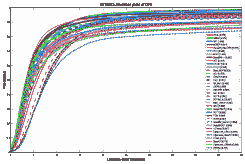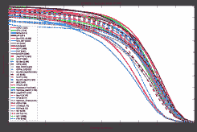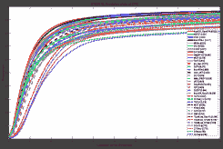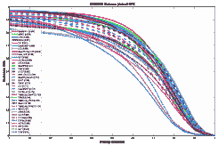\justify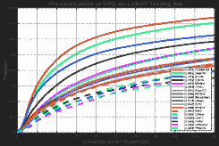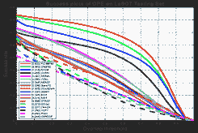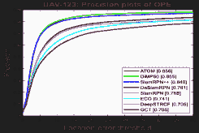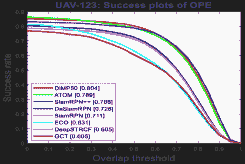\justify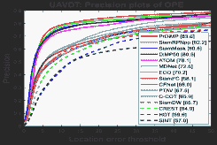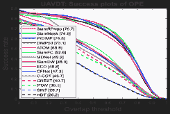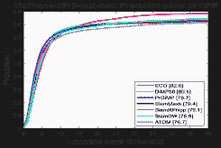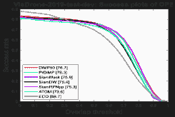

图 4：OTB2013、OTB2015、LaSOT、UAVDT 和 VisDrone2019 视觉跟踪数据集上最先进的视觉跟踪方法的总体实验比较。

\justify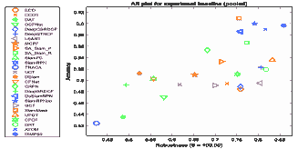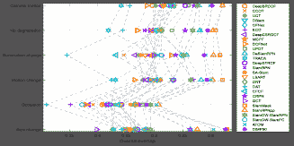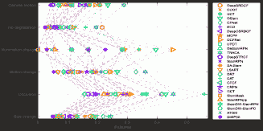

图 5：VOT2018 数据集上视觉跟踪方法的性能比较。

另一方面，基于精确度-成功度测量的最佳跟踪器（参见图 4）在 OTB2013 数据集上是 VITAL、MDNet 和 ASRCF，在 OTB2015 数据集上是 SiamRPN++、ASRCF 和 VITAL，在 LaSOT 数据集上是 PrDiMP50、DiMP50 和 ATOM，在航空视角数据集（即 UAV123、UAVDT 和 VisDrone2019）上是 PrDiMP50、DiMP50 和 SiamRPN++。在 VOT2018 数据集上，基于 EAO 评分，DiMP50、SiamRPN++和 ATOM 是表现最好的跟踪器。此外，PrDiMP50、DiMP50、SiamRPN++和 ATOM 在 AUC 评分上表现最佳，而 SiamRPN、SiamRPN++和 CFNet 分别是最快的视觉跟踪器。根据结果（即图 4 和图 5），在不同跟踪数据集上重复取得最佳结果的视觉跟踪方法有 PrDiMP50 [194]、DiMP50 [159]、ATOM [149]、VITAL [114]、MDNet [60]、DAT [130]、ASRCF [148]、SiamDW-SiamRPN [154]、SiamRPN++ [156]、C-RPN [150]、StructSiam [150]、SiamMask [155]、DaSiamRPN [104]、UPDT [102]、LSART [120]、DeepSTRCF [115]和 DRT [119]。这些方法将在 Sec. IV-C 中进行研究。

### IV-B 每个基准数据集最具挑战性的属性

继续在 VOT 挑战[37, 38, 39]中，这些挑战指定了最具挑战性的视觉跟踪属性，本工作还引入了 OTB、LaSOT、UAV123、UAVDT 和 VisDrone 数据集中的最具挑战性属性。这些属性由 VOT 上的每个属性的中位准确率和鲁棒性或其他数据集上的每个属性的中位精度和成功率决定。表 VIII 展示了每个基准数据集的最具挑战性属性。OCC/LOC、OV、FM、DEF、LR、ARC 和 SIB 被选为最具挑战性的属性，这些属性能够有效影响基于深度学习的视觉跟踪器的性能。图 6 比较了这些方法在 OTB2015、LaSOT、UAV123、UAVDT 和 VisDrone2019 数据集上最具挑战性属性的性能。

表 VIII：基准数据集的五个最具挑战性属性。[前三个挑战性属性由红色、黄色和绿色表示。]

| 数据集 | 指标 | IV | DEF | MB | CM | OCC | POC | FOC | ROT | IPR | OPR | BC | VC | SV | FM | OV | LR | ARC | MC | SIB | OM | SOB | OB | LT | LOC |
| --- | --- | --- | --- | --- | --- | --- | --- | --- | --- | --- | --- | --- | --- | --- | --- | --- | --- | --- | --- | --- | --- | --- | --- | --- | --- |
| OTB2015 | 精度 | 0.7807 | 0.7382 | 0.7642 | - | 0.7347 | - | - | - | 0.7575 | 0.7611 | 0.7576 | - | 0.7471 | 0.7506 | 0.6911 | 0.7532 | - | - | - | - | - | - | - | - |
| 成功率 | 0.6330 | 0.5682 | 0.6466 | - | 0.6027 | - | - | - | 0.6154 | 0.6172 | 0.6144 | - | 0.6022 | 0.6268 | 0.5683 | 0.5906 | - | - | - | - | - | - | - | - |
| VOT2018 | 准确率 | 0.5026 | - | - | 0.5258 | 0.4312 | - | - | - | - | - | - | - | 0.4627 | - | - | - | - | 0.5044 | - | - | - | - | - | - |
| 鲁棒性 | 0.1695 | - | - | 0.1423 | 0.2856 | - | - | - | - | - | - | - | 0.1051 | - | - | - | - | 0.1802 | - | - | - | - | - | - |
| LaSOT | 精度 | 0.2839 | 0.1778 | 0.2149 | 0.2306 | - | 0.1937 | 0.1904 | 0.2016 | - | - | 0.2218 | 0.2034 | 0.2266 | 0.1733 | 0.1608 | 0.2248 | 0.2026 | - | - | - | - | - | - | - |
| 成功率 | 0.2580 | 0.2081 | 0.2216 | 0.2506 | - | 0.2112 | 0.1666 | 0.2186 | - | - | 0.2329 | 0.1773 | 0.2394 | 0.1398 | 0.1726 | 0.1772 | 0.2119 | - | - | - | - | - | - | - |
| UAV123 | 精度 | 0.6573 | - | - | 0.6317 | - | 0.6991 | 0.6805 | - | - | - | 0.6361 | 0.6462 | 0.6656 | 0.6019 | 0.6429 | 0.6100 | 0.5690 | - | 0.6991 | - | - | - | - | - |
| 成功率 | 0.4926 | - | - | 0.4034 | - | 0.5447 | 0.5201 | - | - | - | 0.4673 | 0.4794 | 0.5176 | 0.4158 | 0.4743 | 0.4724 | 0.3433 | - | 0.5447 | - | - | - | - | - |
| UAVDT | 精度 | 0.7723 | - | - | 0.6877 | - | - | - | - | - | - | 0.6634 | - | 0.7003 | - | - | - | - | - | 0.7638 | 0.7039 | 0.7638 | 0.7280 | 0.8235 | 0.5779 |
| 成功率 | 0.5844 | - | - | 0.5515 | - | - | - | - | - | - | 0.5051 | - | 0.5603 | - | - | - | - | - | 0.5536 | 0.5513 | 0.5536 | 0.5463 | 0.6213 | 0.4600 |
| VisDrone2019 | 精度 | 0.7790 | - | - | 0.7407 | - | 0.7174 | 0.6919 | - | - | - | 0.5775 | 0.8058 | 0.7392 | 0.7473 | 0.8088 | 0.6031 | 0.7522 | - | 0.5445 | - | - | - | - | - |

| 成功率 | 0.6272 | - | - | 0.5816 | - | 0.5511 | 0.5407 | - | - | - | 0.4112 | 0.6564 | 0.5891 | 0.5862 | 0.6676 | 0.3681 | 0.5861 | - | 0.3914 | - | - | - | - | - | \justify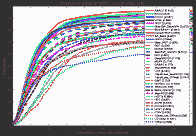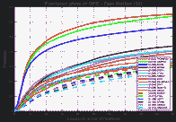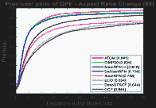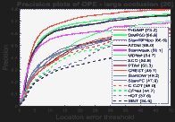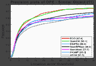\justify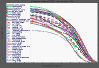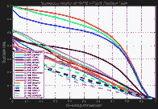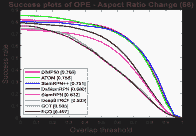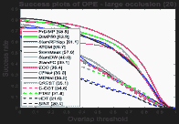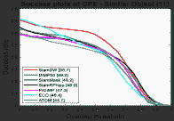

图 6：在 OTB2015、LaSOT、UAV123、UAVDT 和 VisDrone2019 数据集中，按最具挑战性的属性对最先进的跟踪器进行比较，从左到右列。

根据 OCC 属性，在 VOT2018 数据集中，最准确且最稳健的视觉跟踪器是 SiamRPN++ [156] 和 DRT [119]。就成功率指标而言，SiamRPN++ [156] 是应对 DEF 和 OV 属性的最佳视觉跟踪器，而 Siam-MCF [110] 是处理 OTB2015 数据集中 LR 视频视觉跟踪的最佳选择。ASRCF [148]、ECO [87] 和 SiamDW-SiamRPN [154] 是在 OTB-2015 数据集中应对 OV、OCC 和 DEF 属性的最佳精度跟踪器。PrDiMP50 [194]、DiMP50 [159] 和 ATOM [149] 跟踪器是 LaSOT 数据集中所有视觉属性的绝对最佳方法。在 UAV123 数据集中，ATOM 和 DiMP50 在精度和成功率指标上分别取得了最佳结果。此外，PrDiMP50 是处理 UAVDT 数据集中大遮挡的最佳跟踪器。最后，SiamDW 是应对 VisDrone2019-test-dev 数据集中相似物体的最佳跟踪器。

如图 5 所示，基于 DCF 的方法在其他方法中实现了较少的失败，而基于 SNN 和定制网络的跟踪器在估计的 BB 和真实 BB 之间获得了更多的重叠。基于 SiamRPN 的方法（即 [155, 156, 104, 154]）通过采用更深且更宽的骨干网络，包括分类和回归分支，准确处理了 CM、IV、MC、OCC 或 SC 属性下的场景。此外，ATOM、DiMP50 和 PrDiMP50 利用强大的分类和回归网络及优化过程进行在线训练和快速适应。因此，这些跟踪器在各种跟踪基准测试中取得了显著进展。通过考虑手工设计特征与深度特征的融合 [115, 102, 119]、时间正则化项 [115]、可靠性项 [119]、数据增强 [102] 和利用 ResNet-50 模型 [102]，基于 DCF 的方法在 CM 属性下获得了理想的鲁棒性。此外，基于 DCF 的跟踪器的计算效率和鲁棒性对空中视角跟踪器非常有吸引力。

要有效处理 IV 属性，主要问题是关注目标与背景之间的区分能力。采用全卷积网络训练用于相关性滤波器成本函数、空间感知的 KRR 和空间感知的 CNN，以及使用半监督视频目标分割等策略，可以在出现显著 IV 时提高基于 DL 的跟踪器的鲁棒性。为了稳健地处理 MC 和 OCC 属性，基于 DCF 和 CNN 的跟踪器表现最佳。然而，借助区域提议子网络和提议优化的 SNN 基础方法可以在严重的尺度变化下稳健地估计最紧的 BB。然而，最近，在 ATOM、DiMP 和 PrDiMP 跟踪器中采用的基于 IoU 的优化网络（基于 IoU-Net [255]）能够有效处理跟踪过程中目标的纵横比变化。

### IV-C 讨论

最佳方法（即，PrDiMP50 [194]，DiMP50 [159]，ATOM [149]，VITAL [114]，MDNet [60]，DAT [130]，ASRCF [148]，SiamDW-SiamRPN [154]，SiamRPN++ [156]，C-RPN [150]，StructSiam [106]，SiamMask [155]，DaSiamRPN [104]，UPDT [102]，LSART [120]，DeepSTRCF [115]，以及 DRT [119]) 属于各种网络架构。例如，MDNet、LSART 和 DAT（使用 MDNet 架构）利用 CNNs 来定位视觉目标，而 ASRCF、UPDT、DRT 和 DeepSTRCF 则利用深度现成特征。所有 ATOM、DiMP 和 PrDiMP 跟踪器都采用定制的分类与精炼网络。除了基于 GAN 的 VITAL 跟踪器，C-RPN、StructSiam、SiamMask、DaSiamRPN、SiamDW 和 SiamRPN++ 具有 SNN 架构。尽管最近最具吸引力的视觉跟踪深度架构基于 Siamese 或定制网络，GAN 和 RL 基于的跟踪器最近也已开发用于一些特定目的，例如解决训练样本的不平衡分布 [114] 或选择合适的实时搜索策略 [103，162]。基于 GAN 的跟踪器可以成功增强正样本，以丰富目标外观模型。这些跟踪器还享有代价敏感的损失，以关注困难的负样本。基于 RL 的跟踪器学习连续动作，为视觉跟踪器提供更可靠的搜索和验证策略。此外，将 RL 跟踪器与其他架构结合可能带来更多优势；例如，基于递归 RL 的跟踪考虑到时间依赖性（即，动作和状态）来优化关键组件。通过这样做，这些跟踪器通过 RNN 运动模型验证置信度，从而提高其性能。

除了在性能和速度之间提供理想的平衡，Siamese 或定制网络基础的跟踪器，其架构还被修改以与多样的深度主干网络、搜索策略和学习方案集成，同时还利用全卷积网络、相关层、区域提议网络、视频目标检测/分割模块。值得注意的是，包括 SiamDW-SiamRPN、SiamRPN++、C-RPN、SiamMask 和 DaSiamRPN 在内的五种基于 SNN 的方法基于快速的 SiamRPN 方法 [116]，该方法由 Siamese 子网络和区域提议子网络组成；这些子网络用于在相关特征图上进行特征提取和提议提取，通过一次检测任务解决视觉跟踪问题。SiamRPN 的主要优势在于时间效率和精确估计，将提议选择和精炼策略集成到 Siamese 网络中。

有趣的是，ASRCF、UPDT、DRT 和 DeepSTRCF 等利用深层现成特征的方法是表现最好的视觉跟踪方法之一。此外，UPDT、DeepSTRCF、DRT、LSART 和 ASRCF 五种方法都利用了 DCF 框架的优势。另一方面，表现最好的视觉跟踪器，即 PrDiMP50、DiMP50、ATOM、VITAL、MDNet、DAT、SiamDW、SiamRPN++、C-RPN、StructSiam、SiamMask、DaSiamRPN 和 LSART，利用了专门的深层特征来进行视觉跟踪。尽管这些方法使用了多样化的骨干网络，最先进的方法已经开始使用像 ResNet-50 这样的更深网络，以增强目标建模的判别能力。从网络训练的角度来看，SiamDW-SiamRPN、SiamRPN++、C-RPN、StructSiam、SiamMask 和 DaSiamRPN 使用离线训练，LSART 使用在线训练，而 PrDiMP50、DiMP50 和 ATOM 采用离线和在线训练程序。特别是，PrDiMP50 和 DiMP50 采用了基于元学习的网络来提高网络适应跟踪任务的能力。离线训练的跟踪器旨在提供主导表示，以实现实时跟踪速度。处理显著的外观变化需要在跟踪过程中调整网络参数，但在线训练由于训练样本有限而有过拟合的风险。因此，VITAL、MDNet 和 DAT 通过采用对抗学习、领域无关的信息和注意力图作为正则化项，使 DNN 的离线和在线训练都受益。然而，这些方法提供的跟踪速度约为每秒一帧 (FPS)，不适合实时应用。相比之下，最近提出的 PrDiMP50、DiMP50 和 ATOM 跟踪器利用了定制设计的网络和高效的优化策略，以实现可接受的跟踪速度。从 DNN 的目标函数的角度来看，VITAL 和 StructSiam 是基于分类的，LSART 是基于回归的，而其他表现最佳的跟踪器[60、104、130、150、154、155、156、194、159、149] 采用了分类和回归目标。例如，五个修改版的 SiamRPN [116]（即 SiamDW-SiamRPN [154]、SiamRPN++ [156]、C-RPN [150]、SiamMask [155] 和 DaSiamRPN [104]）具有分类和回归两个分支。此外，ATOM、DiMP50 和 PrDiMP50 使用分类网络来区分目标与背景，以及用于 BB 回归的 IoU-Net。

基于最佳跟踪器的动机分类，近期的先进方法依赖于 1) 通过数据增强[102, 104]和对抗学习生成网络[114]来缓解视觉训练数据的分布不平衡，2) 通过重新表述分类/回归问题[102, 104, 114, 115, 119, 120, 148, 149, 159, 194]和提供指定的特征用于视觉跟踪[60, 104, 106, 114, 130, 150, 154, 155, 156, 149, 159, 194]来实现高效的训练和学习过程，3) 利用最先进的架构，通过将 ResNet 模型作为骨干网络来提供更具辨别性的表示[102, 154, 155, 156, 149, 159, 194]，以及 4) 通过使用额外的信息如上下文[102, 104, 106, 154]或时间信息[104, 114, 115, 130]来提取互补特征。VITAL、DaSiamRPN 和 UPDT 尝试缓解正负训练数据样本的分布不平衡，并提取更具辨别性的特征。VITAL 使用对抗学习来增强正样本，减少简单负样本，并在跟踪过程中保留最具辨别性和鲁棒性的特征。此外，DaSiamRPN 利用数据增强和负语义样本来考虑视觉干扰物，并提高视觉跟踪的鲁棒性。UPDT 使用标准的数据增强和估计状态的质量度量来有效融合浅层和深层特征。最后，ATOM 采用标准的数据增强来改善其在线适应能力，而 DiMP50 和 PrDiMP50 跟踪器则利用元学习策略来形成其训练集。

为了改进最佳基于深度学习的方法的学习过程，ATOM、UPDT、DeepSTRCF、DRT、LSART 和 ASRCF 修订了传统的 DCF 公式中的岭回归。此外，DaSiamRPN 和 VITAL 分别利用了考虑干扰物的目标函数和使用成本敏感损失重新制定的 GAN 目标函数，以改进这些视觉跟踪器的训练过程。最后，PrDiMP 跟踪器通过 Kullback-Leibler (KL)散度计算预测分布和真实分布的相似性。基于深度学习的方法在大规模数据集上的训练调整了其网络功能以用于视觉跟踪。SiamDW、SiamRPN++和 SiamMask 方法旨在利用最先进的深度网络作为 Siamese 跟踪器的骨干网络。ATOM、DiMP50 和 PrDiMP 跟踪器采用 ResNet 块作为骨干网络，而 DiMP & PrDiMP 则在跟踪数据集上训练这些块。虽然这些方法利用 ResNet 模型，但 SiamDW 提出了新的残差模块和架构，以防止显著的感受野增加，同时提高特征的可区分性和定位精度。此外，SiamRPN++提出的基于 ResNet 的 SNN 跟踪器包括不同的层级和深度级聚合，以填补基于 SNN 的方法与基于 CNN 的方法之间的性能差距。除了空间信息外，DAT（使用递归学习）和 DeepSTRCF（使用在线被动-攻击性（PA）学习）也以不同的方式考虑时间信息，以提供更强健的特征。通常，六种相似性学习方案（即 SiamDW、SiamRPN++、C-RPN、StructSiam、SiamMask、DaSiamRPN、ATOM）、蓝色元学习（即 PrDiMP50、DiMP50）、多领域学习（即 MDNet、DAT）、对抗学习（即 VITAL）、空间感知回归学习（即 LSART）和 DCF 学习被广泛利用。

在以下内容中，最佳的视觉跟踪方法将根据其优缺点进行研究。ATOM、DiMP 和 PrDiMP 跟踪器将视觉跟踪视为两步分类和目标估计程序。这些跟踪器通过采用自定义网络和精细化的优化策略，能够处理 CM、MC、SV 和 ARC 属性。然而，SOB、LR 和 OB 属性可能会显著影响它们的性能。基于 SNN 的三种方法 C-RPN、StructSiam 和 DaSiamRPN 利用浅层的 AlexNet 作为其骨干网络（见表 II），根据它们的区分能力，这是这些跟踪器的主要弱点。为了提高在显著 SV 和视觉 DI 存在下的跟踪鲁棒性，C-RPN 在一个 Siamese 网络中级联多个 RPN，以利用困难的负样本（以提供更平衡的训练样本）、多级特征和多个回归步骤。为了减少 SNN 基方法对非刚性外观变化和 POC 属性的敏感性，StructSiam 检测局部模式及其关系的上下文信息，并通过 Siamese 网络以实时速度进行匹配。通过采用局部到全局的搜索策略和非最大抑制（NMS）重新检测目标并减少潜在干扰物，DaSiamRPN 能够正确处理 FOC、OV、POC 和 BC 挑战。相比之下，SiamMask、SiamDW-SiamRPN 和 SiamRPN++ 利用 ResNet 模型。为了依赖丰富的目标表示，SiamMask 使用三分支结构通过旋转的 BB 来估计目标位置，包括目标的二进制掩模。SiamMask 失败的主要原因是 MB 和 OV 属性，这会产生错误的目标掩模。为了减少 SNN 基方法与最先进的视觉跟踪方法的性能差距，SiamDW-SiamRPN 和 SiamRPN++ 研究了深度骨干网络的利用，以降低这些方法对最具挑战性属性的敏感性。

MDNet 及其基于的方法（例如 DAT）仍然是最佳的视觉跟踪方法之一。由于这些网络在大规模视觉跟踪数据集上的专门离线和在线训练，这些方法可以处理各种具有挑战性的情况，几乎不会错过视觉目标，并且在跟踪 LR 目标方面表现令人满意。然而，这些方法存在高计算复杂性、类似语义目标的类内区分问题以及在尺度估计时执行离散空间的缺陷。VITAL 可以容忍大量 DEF、IPR 和 OPR，因为它通过高阶代价敏感损失关注困难的负样本。然而，由于通过生成网络产生固定大小的权重掩码，它在显著 SV 情况下的表现并不稳健。LSART 利用加权组合的补丁级相似性来集中目标的可靠区域，修改了的核岭回归（KRR）。由于考虑了旋转信息和 CNN 模型的在线适应性，这种方法对应对 DEF 和 IPR 挑战提供了有前途的响应。

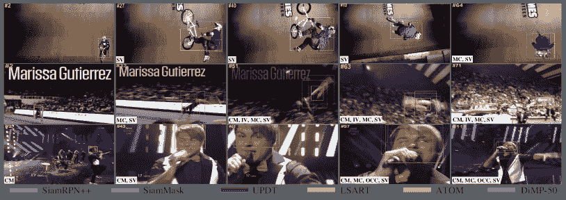

图 7：在 VOT2018 数据集中对 BMX、Gymnastics3 和 Singer3 视频序列的最先进视觉跟踪器进行的定性比较。每一帧上都显示了#帧数和注释属性。

DeepSTRCF、ASRCF、DRT 和 UPDT 是基于 DCF 的方法，这些方法利用深度现成特征，并将其与浅层特征（如 HOG 和 CN）融合，以提高视觉跟踪的鲁棒性（见表 I）。为了减少 OCC 和 OV 属性的不利影响，DeepSTRCF 在空间正则化的 DCF 公式中添加了时间正则化项。修订后的公式帮助 DeepSTRCF 处理一些外观变化，例如 IV、IPR、OPR 和 POC。通过使用对象感知空间正则化和可靠性项，ASRCF 和 DRT 方法尝试优化模型，以有效学习自适应相关滤波器。这两种方法研究了基于 DCF 方法的主要缺陷，例如循环偏移采样过程、定位和尺度估计过程中的相同特征空间、严格关注区分性，以及相关响应的稀疏和非均匀分布。因此，这些方法适当地处理了 DEF、BC 和 SV。最后，UPDT 通过独立训练基于浅层特征的 DCF 和基于深层现成特征的 DCF，并考虑了具有自适应融合模型的增强训练样本，重点提升了视觉跟踪的鲁棒性。尽管这些方法展示了设计良好的基于 DCF 的跟踪器相较于更复杂的跟踪器的竞争性能，但它们仍然面临预训练模型、长宽比变化、模型退化和显著外观变化的限制。

最后，我们修改了 VOT 工具包，使其能够定性地比较最先进的视觉跟踪器。图 7 展示了 SiamRPN++ [156]、SiamMask [155]、LSART [120]、UPDT [102]、ATOM [149]和 DiMP50 [159]在 VOT2018 数据集的一些视频序列上的跟踪结果（修改后的工具包及所有视频均可在上述页面公开获取）。根据结果，DiMP50、ATOM 和 SiamRPN++提供了最佳结果。然而，当场景中同时出现多个关键属性时，失败通常会发生。例如，当 OCC 和 SV 同时出现时，SiamMask 错误地使用了半监督视频对象分割，或者显著的 SV 显著降低了 SiamRPN++的性能。尽管视觉跟踪取得了显著进展，但最先进的视觉跟踪器仍无法处理严重的现实世界挑战；目标外观的严重变化、MOC、OCC、SV、CM、DEF，甚至 IV 可能对性能产生巨大影响，可能导致跟踪失败。这些结果表明，视觉跟踪器在现实世界应用中仍然不完全可靠，因为它们缺乏对场景的智能理解。当前的跟踪器改善了物体-场景区分，但无法推断场景信息、立即识别场景的全局/配置结构，或基于空间和行动做出有目的的决策。

## V 结论与未来方向

最先进的基于深度学习的视觉跟踪器被归类到一个全面的分类法中，基于网络架构、网络利用、训练、网络目标、网络输出、相关滤波器优势的利用、航拍跟踪、长期跟踪和在线跟踪。此外，这些方法的动机和贡献根据深度学习跟踪器的主要问题和提出的解决方案进行了分类。此外，几乎所有视觉跟踪基准数据集和评估指标都进行了简要调查，并在七个视觉跟踪数据集上比较了各种最先进的跟踪器。

最近，基于深度学习的视觉跟踪方法探讨了深度离线特征的不同利用方式、深度特征与手工特征的融合、各种架构与骨干网络、大规模数据集上深度神经网络的离线与在线训练、更新方案、搜索策略、上下文信息、时间信息以及如何应对缺乏训练数据的问题。然而，许多问题尚未得到精确解决，还有其他问题需要在未来进一步探索。以下是一些未来方向的展示，以供进一步研究。

首先，主要关注的是设计定制的神经网络，以同时提供鲁棒性、准确性和效率。这些追踪器主要通过将高效的网络架构与分类和回归分支或两步分类与边界框（BB）细化网络相结合来开发。最近的大多数工作没有重新训练/微调其主干网络以利用通用特征并避免对一般模式的灾难性遗忘。然而，已经提出了多种基于机器学习的技术来解决这个问题，如增量学习 [256]、迁移学习惩罚 [257]、批量谱缩减 [258] 或终身学习 [259]。因此，有效的主干网络训练可以提升追踪性能。

其次，通用视觉追踪器需要快速适应未见过的目标。因此，高效的在线神经网络训练至关重要。最近，元学习/少样本学习方法主要用于找到基学习器对新目标的最佳初始化。然而，元网络需要保持浅层以避免过拟合问题。因此，探索有效的少样本学习方法能够实现更深网络的快速收敛。

其次，从空中视角进行追踪带来了额外的视觉追踪挑战。例如，应考虑在中高空拍摄的视频中追踪小型/微型物体、严重的视角变化以及在密集环境中追踪多个目标。此外，这些场景通常涉及视野外和大范围遮挡；因此，开发长期方法将有助于提高空中视角追踪器的可靠性。

第四，尽管短期追踪器取得了许多进展，长期追踪器却被忽视。实际上，长期追踪器更贴近实际的真实场景，因为目标可能会频繁消失或长时间被遮挡。这些追踪器应具备在出现失败后重新检测目标的能力，然后在视频序列中继续追踪正确的目标。因此，需要设计强大的检测与验证网络。

最后，现有的视觉追踪器在场景理解方面存在不足。最先进的方法不能以有意义的方式解释动态场景，无法立即识别全局结构、推断现有对象以及感知不同对象或事件的基本类别。尽管最近的追踪器在减少计算复杂性方面表现良好，但这些追踪器可以通过利用补充特征（例如，时间信息）和结合提出的对抗学习贡献来进行修改，以适应这一少数据任务。

## 致谢

我们要感谢**Kamal Nasrollahi**教授（丹麦奥尔堡大学（VAP）视觉分析实验室）提供的宝贵意见。

## 参考文献

+   [1] M. Gao, L. Jin, Y. Jiang, 和 B. Guo， “流形 Siamese 网络：一种用于自动驾驶车辆的新型视觉跟踪卷积网络”，*IEEE 智能交通系统汇刊*，页 1–12，2019。

+   [2] C. Robin 和 S. Lacroix， “多机器人目标检测与跟踪：分类与综述”，*自主机器人*，第 40 卷，第 4 期，页 729–760，2016。

+   [3] K. Lee, J. Hwang, G. Okopal, 和 J. Pitton， “基于地面移动平台的人体跟踪，使用视觉 SLAM 和约束的多核”，*IEEE 智能交通系统汇刊*，第 17 卷，第 12 期，页 3602–3612，2016。

+   [4] F. Ababsa, M. Maidi, J. Y. Didier, 和 M. Mallem， “基于视觉的移动增强现实跟踪”，见 *计算智能研究*。Springer，2008，第 120 卷，页 297–326。

+   [5] J. Hao, Y. Zhou, G. Zhang, Q. Lv, 和 Q. Wu， “基于无人机的目标跟踪算法综述”，见 *IEEE CBS 会议录*，2019，页 328–333。

+   [6] M. Manafifard, H. Ebadi, 和 H. Abrishami Moghaddam， “关于足球视频中球员跟踪的调查”，*计算机视觉与图像理解*，第 159 卷，页 19–46，2017。

+   [7] D. Bouget, M. Allan, D. Stoyanov, 和 P. Jannin， “基于视觉和无标记的手术工具检测与跟踪：文献综述”，*医学图像分析*，第 35 卷，页 633–654，2017。

+   [8] V. Ulman, M. Maška, 等， “细胞跟踪算法的客观比较”，*自然方法*，第 14 卷，第 12 期，页 1141–1152，2017。

+   [9] J. Luo, Y. Han, 和 L. Fan， “水下声学目标跟踪：综述”，*传感器*，第 18 卷，第 1 期，页 112，2018。

+   [10] J. F. Henriques, R. Caseiro, P. Martins, 和 J. Batista， “通过核化相关滤波器进行高速跟踪”，*IEEE 模式分析与机器智能汇刊*，第 37 卷，第 3 期，页 583–596，2015。

+   [11] G. Ding, W. Chen, S. Zhao, J. Han, 和 Q. Liu， “通过四边形核化相关滤波器实现实时可扩展视觉跟踪”，*IEEE 智能交通系统汇刊*，第 19 卷，第 1 期，页 140–150，2018。

+   [12] S. M. Marvasti-Zadeh, H. Ghanei-Yakhdan, 和 S. Kasaei， “旋转感知的判别尺度空间跟踪”，见 *伊朗电气工程会议（ICEE）*，2019，页 1272–1276。

+   [13] S. M. Marvasti-Zadeh, H. Ghanei Yakhdan, 和 S. Kasaei， “自适应利用预训练深度卷积神经网络进行稳健视觉跟踪”，*多媒体工具与应用*，2021。

+   [14] S. M. Marvasti Zadeh, H. Ghanei-Yakhdan, 和 S. Kasaei， “超越背景感知相关滤波器：通过手工设计和深度 RGB 特征进行视觉跟踪的自适应上下文建模”，2020。 [在线] 可用：[`arxiv.org/abs/2004.02932`](http://arxiv.org/abs/2004.02932)

+   [15] S. M. Marvasti-Zadeh, H. Ghanei Yakhdan, 和 S. Kasaei， “使用轻量级深度卷积神经网络的高效尺度估计方法用于视觉跟踪”，*神经计算与应用*，2021。

+   [16] S. M. Marvasti-Zadeh, H. Ghanei-Yakhdan, S. Kasaei, K. Nasrollahi 和 T. B. Moeslund，“深度多任务表示的有效融合用于稳健视觉跟踪”，2020 年。[在线]. 可用: [`arxiv.org/abs/2004.01382`](http://arxiv.org/abs/2004.01382)

+   [17] C. Xiao 和 A. Yilmaz，“使用显著目标颜色和轮廓进行高效跟踪”，在 *Proc. ICPR*，2016，第 2728–2733 页。

+   [18] V. Bruni 和 D. Vitulano，“基于人类感知的核函数对象跟踪的改进”，*IEEE Trans. Syst., Man, Cybern. Syst.*，第 44 卷，第 11 期，第 1474–1485 页，2014 年。

+   [19] I. I. Lychkov, A. N. Alfimtsev 和 S. A. Sakulin，“带有物体特征点再生的移动物体跟踪”，在 *Proc. GloSIC*，2018，第 1–6 页。

+   [20] N. Dalal 和 B. Triggs，“用于人类检测的方向梯度直方图”，在 *Proc. IEEE CVPR*，2005，第 886–893 页。

+   [21] J. Van De Weijer, C. Schmid 和 J. Verbeek，“从现实世界图像中学习颜色名称”，在 *Proc. IEEE CVPR*，2007，第 1–8 页。

+   [22] M. Danelljan, G. Hager, F. S. Khan 和 M. Felsberg，“学习空间正则化的相关滤波器用于视觉跟踪”，在 *Proc. IEEE ICCV*，2015，第 4310–4318 页。

+   [23] M. Danelljan, G. Häger, F. S. Khan 和 M. Felsberg，“训练集的自适应去污：一种用于区分视觉跟踪的统一公式”，在 *Proc. IEEE CVPR*，2016，第 1430–1438 页。

+   [24] H. K. Galoogahi, A. Fagg 和 S. Lucey，“学习背景感知的相关滤波器用于视觉跟踪”，在 *Proc. IEEE ICCV*，2017，第 1144–1152 页。

+   [25] Y. Li, C. Fu, F. Ding, Z. Huang 和 G. Lu，“AutoTrack：面向无人机的高性能视觉跟踪及自动时空正则化”，在 *Proc. IEEE CVPR*，2020。

+   [26] Z. Huang, C. Fu, Y. Li, F. Lin 和 P. Lu，“为实时无人机跟踪学习抑制异常的相关滤波器”，在 *Proc. IEEE ICCV*，2019，第 2891–2900 页。

+   [27] F. Li, C. Fu, F. Lin, Y. Li 和 P. Lu，“用于实时无人机目标跟踪的训练集蒸馏”，在 *Proc. ICRA*，2020，第 1–7 页。

+   [28] A. Krizhevsky, I. Sutskever 和 G. E. Hinton，“使用深度卷积神经网络进行 ImageNet 分类”，在 *Proc. NIPS*，第 2 卷，2012，第 1097–1105 页。

+   [29] K. Chatfield, K. Simonyan, A. Vedaldi 和 A. Zisserman，“细节中的魔鬼再现：深入卷积网络”，在 *Proc. BMVC*，2014，第 1–11 页。

+   [30] K. Simonyan 和 A. Zisserman，“用于大规模图像识别的非常深卷积网络”，在 *Proc. ICLR*，2014，第 1–14 页。

+   [31] C. Szegedy, W. Liu, Y. Jia, P. Sermanet, S. Reed, D. Anguelov, D. Erhan, V. Vanhoucke 和 A. Rabinovich，“深入卷积网络的研究”，在 *Proc. IEEE CVPR*，2015，第 1–9 页。

+   [32] K. He, X. Zhang, S. Ren 和 J. Sun，“用于图像识别的深度残差学习”，在 *Proc. IEEE CVPR*，2016，第 770–778 页。

+   [33] O. Russakovsky, J. Deng, H. Su, J. Krause, S. Satheesh, S. Ma, Z. Huang, A. Karpathy, A. Khosla, M. Bernstein, A. C. Berg, 和 L. Fei-Fei，“ImageNet 大规模视觉识别挑战，” *IJCV*，第 115 卷，第 3 期，第 211–252 页，2015 年。

+   [34] M. Kristan, R. Pflugfelder, A. Leonardis, J. Matas, F. Porikli 等，“视觉目标跟踪 VOT2013 挑战结果，”发表于 *Proc. ICCV*，2013 年，第 98–111 页。

+   [35] M. Kristan, R. Pflugfelder, A. Leonardis, J. Matas 等，“视觉目标跟踪 VOT2014 挑战结果，”发表于 *Proc. ECCV*，2015 年，第 191–217 页。

+   [36] M. Kristan, J. Matas, A. Leonardis, M. Felsberg 等，“视觉目标跟踪 VOT2015 挑战结果，”发表于 *Proc. IEEE ICCV*，2015 年，第 564–586 页。

+   [37] M. Kristan, J. Matas, A. Leonardis, M. Felsberg, R. Pflugfelder 等，“视觉目标跟踪 VOT2016 挑战结果，”发表于 *Proc. ECCVW*，2016 年，第 777–823 页。

+   [38] M. Kristan, A. Leonardis, J. Matas, M. Felsberg, R. Pflugfelder, L. C. Zajc 等，“视觉目标跟踪 VOT2017 挑战结果，”发表于 *Proc. IEEE ICCVW*，2017 年，第 1949–1972 页。

+   [39] M. Kristan, A. Leonardis, J. Matas, M. Felsberg, R. Pflugfelder 等，“第六届视觉目标跟踪 VOT2018 挑战结果，”发表于 *Proc. ECCVW*，2019 年，第 3–53 页。

+   [40] M. Kristan 等，“第七届视觉目标跟踪 VOT2019 挑战结果，”发表于 *Proc. ICCVW*，2019 年。

+   [41] A. Yilmaz, O. Javed, 和 M. Shah，“目标跟踪：综述，” *ACM Computing Surveys*，第 38 卷，第 4 期，2006 年 12 月。

+   [42] A. W. Smeulders, D. M. Chu, R. Cucchiara, S. Calderara, A. Dehghan, 和 M. Shah，“视觉跟踪：实验性调查，” *IEEE Trans. Pattern Anal. Mach. Intell.*，第 36 卷，第 7 期，第 1442–1468 页，2014 年。

+   [43] H. Yang, L. Shao, F. Zheng, L. Wang, 和 Z. Song，“视觉跟踪的近期进展和趋势：综述，” *Neurocomputing*，第 74 卷，第 18 期，第 3823–3831 页，2011 年。

+   [44] X. Li, W. Hu, C. Shen, Z. Zhang, A. Dick, 和 A. Van Den Hengel，“视觉目标跟踪中的外观模型综述，” *ACM Trans. Intell. Syst. Tec.*，第 4 卷，第 4 期，第 58:1—58:48 页，2013 年。

+   [45] C. Fu, Z. Huang, Y. Li, R. Duan, 和 P. Lu，“考虑边界效应的无人机视觉跟踪，结合在线增强背景学习和多帧共识验证，”发表于 *Proc. IROS*，2019 年，第 4415–4422 页。

+   [46] Y. Li, C. Fu, Z. Huang, Y. Zhang, 和 J. Pan，“关键滤波器感知的实时无人机目标跟踪，”发表于 *Proc. ICRA*，2020 年。

+   [47] M. Fiaz, A. Mahmood, 和 S. K. Jung，“跟踪噪声目标：近期目标跟踪方法的综述，”2018 年。[在线] 可用: [`arxiv.org/abs/1802.03098`](http://arxiv.org/abs/1802.03098)

+   [48] M. Fiaz, A. Mahmood, S. Javed, 和 S. K. Jung，“手工制作与深度跟踪器：近期视觉目标跟踪方法和趋势，” *ACM Computing Surveys*，第 52 卷，第 2 期，第 43:1—43:44 页，2019 年。

+   [49] P. Li, D. Wang, L. Wang, 和 H. Lu，“深度视觉跟踪：综述与实验比较，” *Pattern Recognit.*，第 76 卷，第 323–338 页，2018 年。

+   [50] R. Pflugfelder，“关于 Siamese 神经网络视觉跟踪的深入分析”，2017 年。[在线]。可用： [`arxiv.org/abs/1707.00569`](http://arxiv.org/abs/1707.00569)

+   [51] C. Ma, J. B. Huang, X. Yang, 和 M. H. Yang，“用于视觉跟踪的层次卷积特征”，见于*Proc. IEEE ICCV*，2015 年，第 3074–3082 页。

+   [52] M. Danelljan, G. Hager, F. S. Khan, 和 M. Felsberg，“基于卷积特征的相关滤波器视觉跟踪”，见于*Proc. IEEE ICCVW*，2016 年，第 621–629 页。

+   [53] L. Wang, W. Ouyang, X. Wang, 和 H. Lu，“使用全卷积网络的视觉跟踪”，见于*Proc. IEEE ICCV*，2015 年，第 3119–3127 页。

+   [54] S. Hong, T. You, S. Kwak, 和 B. Han，“通过学习区分显著性图与卷积神经网络进行在线跟踪”，见于*Proc. ICML*，2015 年，第 597–606 页。

+   [55] Y. Zha, T. Ku, Y. Li, 和 P. Zhang，“深度位置敏感跟踪”，*IEEE Trans. Multimedia*，第 8 期，2019 年。

+   [56] M. Danelljan, A. Robinson, F. S. Khan, 和 M. Felsberg，“超越相关滤波器：学习连续卷积算子进行视觉跟踪”，见于*Proc. ECCV*，第 9909 卷 LNCS，2016 年，第 472–488 页。

+   [57] D. Held, S. Thrun, 和 S. Savarese，“通过深度回归网络在 100 FPS 下学习跟踪”，见于*Proc. ECCV*，2016 年，第 749–765 页。

+   [58] L. Bertinetto, J. Valmadre, J. F. Henriques, A. Vedaldi, 和 P. H. Torr，“用于目标跟踪的全卷积 Siamese 网络”，见于*Proc. ECCV*，2016 年，第 850–865 页。

+   [59] R. Tao, E. Gavves, 和 A. W. Smeulders，“Siamese 实例搜索用于跟踪”，见于*Proc. IEEE CVPR*，2016 年，第 1420–1429 页。

+   [60] H. Nam 和 B. Han，“学习多域卷积神经网络进行视觉跟踪”，见于*Proc. IEEE CVPR*，2016 年，第 4293–4302 页。

+   [61] Y. Qi, S. Zhang, L. Qin, H. Yao, Q. Huang, J. Lim, 和 M. H. Yang，“Hedged deep tracking”，见于*Proc. IEEE CVPR*，2016 年，第 4303–4311 页。

+   [62] L. Wang, W. Ouyang, X. Wang, 和 H. Lu，“STCT：用于视觉跟踪的卷积网络顺序训练”，见于*Proc. IEEE CVPR*，2016 年，第 1373–1381 页。

+   [63] G. Zhu, F. Porikli, 和 H. Li，“通过深度卷积神经网络基于对象提议的鲁棒视觉跟踪”，见于*Proc. IEEE CVPRW*，2016 年，第 1265–1272 页。

+   [64] H. Li 等，“DeepTrack：在线学习区分特征表示以实现鲁棒视觉跟踪”，*IEEE Trans. Image Process.*，第 25 卷，第 4 期，第 1834–1848 页，2016 年。

+   [65] H. Li, Y. Li, 和 F. Porikli，“DeepTrack：通过卷积神经网络学习区分特征表示以进行视觉跟踪”，见于*Proc. BMVC*，2014 年。

+   [66] K. Zhang, Q. Liu, Y. Wu, 和 M. H. Yang，“通过卷积网络进行鲁棒视觉跟踪而无需训练”，*IEEE Trans. Image Process.*，第 25 卷，第 4 期，第 1779–1792 页，2016 年。

+   [67] C. Ma, Y. Xu, B. Ni, 和 X. Yang，“当相关滤波器遇到卷积神经网络进行视觉跟踪时”，*IEEE Signal Process. Lett.*，第 23 卷，第 10 期，第 1454–1458 页，2016 年。

+   [68] H. Nam, M. Baek, 和 B. Han, “在树结构中建模和传播 CNN 用于视觉跟踪，” 2016 年。[在线] 可用： [`arxiv.org/abs/1608.07242`](http://arxiv.org/abs/1608.07242)

+   [69] G. Wu, W. Lu, G. Gao, C. Zhao, 和 J. Liu, “用于视觉跟踪的区域深度学习模型，” *Neurocomputing*，第 175 卷，第 A 部分，页码 310–323，2015 年。

+   [70] H. Fan 和 H. Ling, “并行跟踪与验证：一种实时和高精度视觉跟踪的框架，” *IEEE ICCV 会议论文集*，2017 年，页码 5487–5495。

+   [71] H. Fan 和 H. Ling, “并行跟踪与验证，” *IEEE 图像处理学报*，第 28 卷，第 8 期，页码 4130–4144，2019 年。

+   [72] Y. Song, C. Ma, L. Gong, J. Zhang, R. W. Lau, 和 M. H. Yang, “CREST：用于视觉跟踪的卷积残差学习，” *ICCV 会议论文集*，2017 年，页码 2574–2583。

+   [73] Z. Zhu, G. Huang, W. Zou, D. Du, 和 C. Huang, “UCT：学习统一卷积网络用于实时视觉跟踪，” *IEEE ICCVW 会议论文集*，2018 年，页码 1973–1982。

+   [74] Q. Guo, W. Feng, C. Zhou, R. Huang, L. Wan, 和 S. Wang, “学习动态 Siamese 网络进行视觉目标跟踪，” *IEEE ICCV 会议论文集*，2017 年，页码 1781–1789。

+   [75] Z. Teng, J. Xing, Q. Wang, C. Lang, S. Feng, 和 Y. Jin, “基于时间和空间深度网络的鲁棒目标跟踪，” *IEEE ICCV 会议论文集*，2017 年，页码 1153–1162。

+   [76] Z. He, Y. Fan, J. Zhuang, Y. Dong, 和 H. Bai, “具有加权卷积响应的相关滤波器，” *IEEE ICCVW 会议论文集*，2018 年，页码 1992–2000。

+   [77] T. Yang 和 A. B. Chan, “用于视觉跟踪的递归滤波器学习，” *IEEE ICCVW 会议论文集*，2018 年，页码 2010–2019。

+   [78] F. Li, Y. Yao, P. Li, D. Zhang, W. Zuo, 和 M. H. Yang, “结合边界和中心相关滤波器进行具有纵横比变化的视觉跟踪，” *IEEE ICCVW 会议论文集*，2018 年，页码 2001–2009。

+   [79] X. Wang, H. Li, Y. Li, F. Porikli, 和 M. Wang, “具有对象性的深度跟踪，” *ICIP 会议论文集*，2018 年，页码 660–664。

+   [80] X. Xu, B. Ma, H. Chang, 和 X. Chen, “用于视觉跟踪的 Siamese 递归架构，” *ICIP 会议论文集*，2018 年，页码 1152–1156。

+   [81] L. Yang, P. Jiang, F. Wang, 和 X. Wang, “基于区域的全卷积 Siamese 网络进行鲁棒的实时视觉跟踪，” *ICIP 会议论文集*，2017 年，页码 2567–2571。

+   [82] T. Kokul, C. Fookes, S. Sridharan, A. Ramanan, 和 U. A. J. Pinidiyaarachchi, “用于目标跟踪的门控连接卷积神经网络，” *ICIP 会议论文集*，2017 年，页码 2602–2606。

+   [83] K. Dai, Y. Wang, 和 X. Yan, “基于 Siamese 网络的长期目标跟踪，” *ICIP 会议论文集*，2017 年，页码 3640–3644。

+   [84] B. Akok, F. Gurkan, O. Kaplan, 和 B. Gunsel, “通过交替变化率的颜色粒子滤波和深度学习实现鲁棒目标跟踪，” *ICIP 会议论文集*，2017 年，页码 3665–3669。

+   [85] R. J. Mozhdehi 和 H. Medeiros, “用于视觉跟踪的深度卷积粒子滤波器，” *IEEE ICIP 会议论文集*，2017 年，页码 3650–3654。

+   [86] J. Valmadre, L. Bertinetto, J. Henriques, A. Vedaldi, 和 P. H. Torr，“用于相关滤波器基跟踪的端到端表征学习”，发表于 *Proc. IEEE CVPR*，2017 年，页码 5000–5008。

+   [87] M. Danelljan, G. Bhat, F. Shahbaz Khan, 和 M. Felsberg，“ECO：用于跟踪的高效卷积算子”，发表于 *Proc. IEEE CVPR*，2017 年，页码 6931–6939。

+   [88] A. Lukežič, T. Vojíř, L. Čehovin Zajc, J. Matas, 和 M. Kristan，“带有通道和空间可靠性的判别相关滤波器跟踪器”，*IJCV*，第 126 卷，第 7 期，页码 671–688，2018 年。

+   [89] T. Zhang, C. Xu, 和 M. H. Yang，“用于鲁棒目标跟踪的多任务相关粒子滤波器”，发表于 *Proc. IEEE CVPR*，2017 年，页码 4819–4827。

+   [90] B. Han, J. Sim, 和 H. Adam，“BranchOut：基于卷积神经网络的在线集成跟踪正则化”，发表于 *Proc. IEEE CVPR*，2017 年，页码 521–530。

+   [91] M. Wang, Y. Liu, 和 Z. Huang，“具有循环特征映射的大边距目标跟踪”，发表于 *Proc. IEEE CVPR*，2017 年，页码 4800–4808。

+   [92] L. Zhang, J. Varadarajan, P. N. Suganthan, N. Ahuja, 和 P. Moulin，“使用斜率随机森林的鲁棒视觉跟踪”，发表于 *Proc. IEEE CVPR*，2017 年，页码 5825–5834。

+   [93] J. Choi, H. J. Chang, S. Yun, T. Fischer, Y. Demiris, 和 J. Y. Choi，“自适应视觉跟踪的注意力相关滤波器网络”，发表于 *Proc. IEEE CVPR*，2017 年，页码 4828–4837。

+   [94] H. Fan 和 H. Ling，“SANet：用于视觉跟踪的结构感知网络”，发表于 *Proc. IEEE CVPRW*，2017 年，页码 2217–2224。

+   [95] Q. Wang, J. Gao, J. Xing, M. Zhang, 和 W. Hu，“DCFNet：用于视觉跟踪的判别相关滤波器网络”，2017 年。[在线]. 可用链接: [`arxiv.org/abs/1704.04057`](http://arxiv.org/abs/1704.04057)

+   [96] J. Guo 和 T. Xu，“深度集成跟踪”，*IEEE Signal Process. Lett.*，第 24 卷，第 10 期，页码 1562–1566，2017 年。

+   [97] J. Gao, T. Zhang, X. Yang, 和 C. Xu，“深度相对跟踪”，*IEEE Trans. Image Process.*，第 26 卷，第 4 期，页码 1845–1858，2017 年。

+   [98] Z. Chi, H. Li, H. Lu, 和 M. H. Yang，“用于视觉跟踪的双重深度网络”，*IEEE Trans. Image Process.*，第 26 卷，第 4 期，页码 2005–2015，2017 年。

+   [99] P. Zhang, T. Zhuo, W. Huang, K. Chen, 和 M. Kankanhalli，“基于 CNN 的在线目标跟踪与时空显著性引导采样”，*Neurocomputing*，第 257 卷，页码 115–127，2017 年。

+   [100] X. Dong 和 J. Shen，“Siamese 网络中的三元组损失用于目标跟踪”，发表于 *Proc. ECCV*，第 11217 卷 LNCS，2018 年，页码 472–488。

+   [101] X. Lu, C. Ma, B. Ni, X. Yang, I. Reid, 和 M. H. Yang，“带有收缩损失的深度回归跟踪”，发表于 *Proc. ECCV*，2018 年，页码 369–386。

+   [102] G. Bhat, J. Johnander, M. Danelljan, F. S. Khan, 和 M. Felsberg，“揭示深度跟踪的力量”，发表于 *Proc. ECCV*，2018 年，页码 493–509。

+   [103] B. Chen, D. Wang, P. Li, S. Wang, 和 H. Lu，“实时‘actor-critic’跟踪”，发表于 *Proc. ECCV*，2018 年，页码 328–345。

+   [104] Z. Zhu, Q. Wang, B. Li, W. Wu, J. Yan, 和 W. Hu，“面向干扰物的 Siamese 网络用于视觉目标跟踪”，见于 *Proc. ECCV*，第 11213 卷 LNCS，2018，第 103–119 页。

+   [105] I. Jung, J. Son, M. Baek, 和 B. Han，“实时 MDNet”，见于 *Proc. ECCV*，2018，第 89–104 页。

+   [106] Y. Zhang, L. Wang, J. Qi, D. Wang, M. Feng, 和 H. Lu，“用于实时视觉跟踪的结构化 Siamese 网络”，见于 *Proc. ECCV*，2018，第 355–370 页。

+   [107] H. Lee, S. Choi, 和 C. Kim，“基于 Siamese 网络的长时间跟踪记忆模型”，见于 *Proc. ECCVW*，2019，第 100–115 页。

+   [108] M. Che, R. Wang, Y. Lu, Y. Li, H. Zhi, 和 C. Xiong，“用于视觉跟踪的通道剪枝”，见于 *Proc. ECCVW*，2019，第 70–82 页。

+   [109] E. Burceanu 和 M. Leordeanu，“使用共现约束学习鲁棒的跟踪部分”，见于 *Proc. ECCVW*，2019，第 162–178 页。

+   [110] H. Morimitsu，“Siamese 网络中用于视觉目标跟踪的多个上下文特征”，见于 *Proc. ECCVW*，2019，第 116–131 页。

+   [111] A. He, C. Luo, X. Tian, 和 W. Zeng，“朝着更好的匹配在基于 Siamese 网络的视觉目标跟踪器中”，见于 *Proc. ECCVW*，2019，第 132–147 页。

+   [112] L. Rout, D. Mishra, 和 R. K. S. S. Gorthi，“WAEF：用于视觉目标跟踪的加权聚合与增强滤波器”，见于 *Proc. ECCVW*，2019，第 83–99 页。

+   [113] J. Choi, H. J. Chang, T. Fischer, S. Yun, K. Lee, J. Jeong, Y. Demiris, 和 J. Y. Choi，“用于高速视觉跟踪的上下文感知深度特征压缩”，见于 *Proc. IEEE CVPR*，2018，第 479–488 页。

+   [114] Y. Song, C. Ma, X. Wu, L. Gong, L. Bao, W. Zuo, C. Shen, R. W. Lau, 和 M. H. Yang，“VITAL：通过对抗学习进行视觉跟踪”，见于 *Proc. IEEE CVPR*，2018，第 8990–8999 页。

+   [115] F. Li, C. Tian, W. Zuo, L. Zhang, 和 M. H. Yang，“用于视觉跟踪的空间时间正则化相关滤波器的学习”，见于 *Proc. IEEE CVPR*，2018，第 4904–4913 页。

+   [116] B. Li, J. Yan, W. Wu, Z. Zhu, 和 X. Hu，“具有 Siamese 区域提议网络的高性能视觉跟踪”，见于 *Proc. IEEE CVPR*，2018，第 8971–8980 页。

+   [117] A. He, C. Luo, X. Tian, 和 W. Zeng，“用于实时对象跟踪的双重 Siamese 网络”，见于 *Proc. IEEE CVPR*，2018，第 4834–4843 页。

+   [118] Z. Zhu, W. Wu, W. Zou, 和 J. Yan，“端到端流动相关跟踪与时空注意力”，见于 *Proc. IEEE CVPR*，2018，第 548–557 页。

+   [119] C. Sun, D. Wang, H. Lu, 和 M. H. Yang，“通过联合判别和可靠性学习进行相关跟踪”，见于 *Proc. IEEE CVPR*，2018，第 489–497 页。

+   [120] C. Sun, D. Wang, H. Lu, 和 M. Yang，“学习空间感知回归用于视觉跟踪”，见于 *Proc. IEEE CVPR*，2018，第 8962–8970 页。

+   [121] Q. Wang, Z. Teng, J. Xing, J. Gao, W. Hu, 和 S. Maybank，“学习注意力：用于高性能在线视觉跟踪的残差注意力 Siamese 网络”，见于 *Proc. IEEE CVPR*，2018，第 4854–4863 页。

+   [122] N. Wang, W. Zhou, Q. Tian, R. Hong, M. Wang, 和 H. Li，“用于鲁棒视觉跟踪的多线索相关滤波器，” 见于 *Proc. IEEE CVPR*, 2018, 第 4844–4853 页。

+   [123] R. J. Mozhdehi, Y. Reznichenko, A. Siddique, 和 H. Medeiros，“具有自适应相关图的深度卷积粒子滤波器用于视觉跟踪，” 见于 *Proc. ICIP*, 2018, 第 798–802 页。

+   [124] Z. Lin 和 C. Yuan，“在低分辨率序列中的鲁棒视觉跟踪，” 见于 *Proc. ICIP*, 2018, 第 4103–4107 页。

+   [125] M. Cen 和 C. Jung，“用于目标跟踪的全卷积 Siamese 融合网络，” 见于 *Proc. ICIP*, 2018, 第 3718–3722 页。

+   [126] G. Wang, B. Liu, W. Li, 和 N. Yu，“流引导 Siamese 网络用于视觉跟踪，” 见于 *Proc. ICIP*, 2018, 第 231–235 页。

+   [127] K. Dai, Y. Wang, X. Yan, 和 Y. Huo，“模板匹配与前景检测融合的鲁棒视觉跟踪，” 见于 *Proc. ICIP*, 2018, 第 2720–2724 页。

+   [128] G. Liu 和 G. Liu，“集成多级卷积特征进行相关滤波跟踪，” 见于 *Proc. ICIP*, 2018, 第 3029–3033 页。

+   [129] J. Guo, T. Xu, S. Jiang, 和 Z. Shen，“生成可靠的在线自适应模板用于视觉跟踪，” 见于 *Proc. ICIP*, 2018, 第 226–230 页。

+   [130] S. Pu, Y. Song, C. Ma, H. Zhang, 和 M. H. Yang，“通过互惠学习的深度注意力跟踪，” 见于 *Proc. NIPS*, 2018, 第 1931–1941 页。

+   [131] X. Jiang, X. Zhen, B. Zhang, J. Yang, 和 X. Cao，“深度协作跟踪网络，” 见于 *Proc. BMVC*, 2018, 第 87 页。

+   [132] D. Ma, W. Bu, 和 X. Wu，“通过金字塔递归网络和光流的多尺度递归跟踪，” 见于 *Proc. BMVC*, 2018, 第 242 页。

+   [133] C. Ma, J. B. Huang, X. Yang, 和 M. H. Yang，“通过分层卷积特征的鲁棒视觉跟踪，” *IEEE Trans. Pattern Anal. Mach. Intell.*, 2018。

+   [134] Z. Han, P. Wang, 和 Q. Ye，“用于视觉目标跟踪的自适应判别深度相关滤波器，” *IEEE Trans. Circuits Syst. Video Technol.*, 2018。

+   [135] K. Chen 和 W. Tao，“一次性完成：一种用于视觉跟踪的双流卷积神经网络，” *IEEE Trans. Circuits Syst. Video Technol.*, 卷 28，第 12 期，第 3377–3386 页，2018。

+   [136] S. Li, S. Zhao, B. Cheng, E. Zhao, 和 J. Chen，“通过分层粒子滤波器和集成深度特征的鲁棒视觉跟踪，” *IEEE Trans. Circuits Syst. Video Technol.*, 2018。

+   [137] E. Gundogdu 和 A. A. Alatan，“用于视觉跟踪的优良特征，” *IEEE Trans. Image Process.*, 卷 27，第 5 期，第 2526–2540 页，2018。

+   [138] Y. Xie, J. Xiao, K. Huang, J. Thiyagalingam, 和 Y. Zhao，“使用强化学习的视觉跟踪相关滤波器选择，” *IEEE Trans. Circuits Syst. Video Technol.*, 2018。

+   [139] J. Gao, T. Zhang, X. Yang, 和 C. Xu，“P2T：通过深度回归学习的部件到目标跟踪，” *IEEE Trans. Image Process.*, 卷 27，第 6 期，第 3074–3086 页，2018。

+   [140] C. Peng, F. Liu, J. Yang, 和 N. Kasabov，“用于视觉跟踪的密集连接判别相关滤波器，” *IEEE 信号处理快报*，第 25 卷，第 7 期，页码 1019–1023，2018 年。

+   [141] D. Li, G. Wen, Y. Kuai, 和 F. Porikli，“具有通道注意力的相关滤波器跟踪的端到端特征集成，” *IEEE 信号处理快报*，第 25 卷，第 12 期，页码 1815–1819，2018 年。

+   [142] C. Ma, J. B. Huang, 等，“具有长期和短期记忆的自适应相关滤波器用于目标跟踪，” *IJCV*，第 126 卷，第 8 期，页码 771–796，2018 年。

+   [143] Y. Cao, H. Ji, W. Zhang, 和 F. Xue，“通过分层特征学习时空上下文用于视觉跟踪，” *信号处理：图像通信*，第 66 卷，页码 50–65，2018 年。

+   [144] F. Du, P. Liu, W. Zhao, 和 X. Tang，“用于视觉跟踪的时空自适应特征加权相关滤波器，” *信号处理：图像通信*，第 67 卷，页码 58–70，2018 年。

+   [145] Y. Kuai, G. Wen, 和 D. Li，“当相关滤波器遇到全卷积 Siamese 网络以进行抗干扰跟踪，” *信号处理：图像通信*，第 64 卷，页码 107–117，2018 年。

+   [146] W. Gan, M. S. Lee, C. hao Wu, 和 C. C. Kuo，“通过运动引导卷积神经网络（MGNet）进行在线目标跟踪，” *J. VIS. COMMUN. IMAGE R.*，第 53 卷，页码 180–191，2018 年。

+   [147] M. Liu, C. B. Jin, B. Yang, X. Cui, 和 H. Kim，“基于在线选择的分层特征置信度的遮挡鲁棒目标跟踪，” *IET 图像处理*，第 12 卷，第 11 期，页码 2023–2029，2018 年。

+   [148] K. Dai, D. Wang, H. Lu, C. Sun, 和 J. Li，“通过自适应空间正则化相关滤波器进行视觉跟踪，”发表于 *CVPR 会议论文集*，2019 年，页码 4670–4679。

+   [149] M. Danelljan, G. Bhat, F. S. Khan, 和 M. Felsberg，“ATOM: 通过重叠最大化实现准确跟踪，”2018 年。[在线]. 可用： [`arxiv.org/abs/1811.07628`](http://arxiv.org/abs/1811.07628)

+   [150] H. Fan 和 H. Ling，“用于实时视觉跟踪的 Siamese 级联区域提议网络，”2018 年。[在线]. 可用： [`arxiv.org/abs/1812.06148`](http://arxiv.org/abs/1812.06148)

+   [151] J. Gao, T. Zhang, 和 C. Xu，“图卷积跟踪，”发表于 *CVPR 会议论文集*，2019 年，页码 4649–4659。

+   [152] Y. Sun, C. Sun, D. Wang, Y. He, 和 H. Lu，“用于视觉跟踪的 ROI 池化相关滤波器，”发表于 *CVPR 会议论文集*，2019 年，页码 5783–5791。

+   [153] G. Wang, C. Luo, Z. Xiong, 和 W. Zeng，“Spm-tracker: 实时视觉目标跟踪的系列并行匹配，”2019 年。[在线]. 可用： [`arxiv.org/abs/1904.04452`](http://arxiv.org/abs/1904.04452)

+   [154] Z. Zhang 和 H. Peng，“更深更广的 Siamese 网络用于实时视觉跟踪，”2019 年。[在线]. 可用： [`arxiv.org/abs/1901.01660`](http://arxiv.org/abs/1901.01660)

+   [155] Q. Wang, L. Zhang, L. Bertinetto, W. Hu, 和 P. H. S. Torr，“快速在线目标跟踪和分割：一种统一的方法，”2018 年。[在线]. 可用： [`arxiv.org/abs/1812.05050`](http://arxiv.org/abs/1812.05050)

+   [156] B. Li, W. Wu, Q. Wang, F. Zhang, J. Xing, 和 J. Yan，“SiamRPN++：非常深网络的 Siamese 视觉跟踪的演变，” 2018 年。[在线]. 可用： [`arxiv.org/abs/1812.11703`](http://arxiv.org/abs/1812.11703)

+   [157] X. Li, C. Ma, B. Wu, Z. He, 和 M.-H. Yang，“目标感知深度跟踪，” 2019 年。[在线]. 可用： [`arxiv.org/abs/1904.01772`](http://arxiv.org/abs/1904.01772)

+   [158] N. Wang, Y. Song, C. Ma, W. Zhou, W. Liu, 和 H. Li，“无监督深度跟踪，” 2019 年。[在线]. 可用： [`arxiv.org/abs/1904.01828`](http://arxiv.org/abs/1904.01828)

+   [159] G. Bhat, M. Danelljan, L. V. Gool, 和 R. Timofte，“用于跟踪的判别模型预测学习，” 2019 年。[在线]. 可用： [`arxiv.org/abs/1904.07220`](http://arxiv.org/abs/1904.07220)

+   [160] F. Zhao, J. Wang, Y. Wu, 和 M. Tang，“对抗性深度跟踪，” *IEEE Trans. Circuits Syst. Video Technol.*，第 29 卷，第 7 期，第 1998–2011 页，2019 年。

+   [161] H. Li, X. Wang, F. Shen, Y. Li, F. Porikli, 和 M. Wang，“通过纠正领域适配实现实时深度跟踪，” *IEEE Trans. Circuits Syst. Video Technol.*，第 8215 卷，2019 年。

+   [162] B. Zhong, B. Bai, J. Li, Y. Zhang, 和 Y. Fu，“通过基于强化学习的搜索和粗到细验证进行层次跟踪，” *IEEE Trans. Image Process.*，第 28 卷，第 5 期，第 2331–2341 页，2019 年。

+   [163] J. Gao, T. Zhang, 和 C. Xu，“SMART：用于视觉跟踪的联合采样和回归，” *IEEE Trans. Image Process.*，第 28 卷，第 8 期，第 3923–3935 页，2019 年。

+   [164] H. Hu, B. Ma, J. Shen, H. Sun, L. Shao, 和 F. Porikli，“使用流形正则化卷积神经网络的鲁棒目标跟踪，” *IEEE Trans. Multimedia*，第 21 卷，第 2 期，第 510–521 页，2019 年。

+   [165] L. Wang, L. Zhang, J. Wang, 和 Z. Yi，“基于深度神经网络的判别视觉跟踪算法的记忆机制，” *IEEE Trans. Cogn. Devel. Syst.*，2019 年。

+   [166] Y. Kuai, G. Wen, 和 D. Li，“实时视觉跟踪的多任务层次特征学习，” *IEEE Sensors J.*，第 19 卷，第 5 期，第 1961–1968 页，2019 年。

+   [167] X. Cheng, Y. Zhang, L. Zhou, 和 Y. Zheng，“通过自编码器对相关滤波器的视觉跟踪，” *IEEE Trans. Ind. Electron.*，2019 年。

+   [168] F. Tang, X. Lu, X. Zhang, S. Hu, 和 H. Zhang，“基于交互式多模型的深度特征跟踪，” *Neurocomputing*，第 333 卷，第 29–40 页，2019 年。

+   [169] X. Lu, B. Ni, C. Ma, 和 X. Yang，“用于物体跟踪的变换感知注意力网络学习，” *Neurocomputing*，第 349 卷，第 133–144 页，2019 年。

+   [170] D. Li, G. Wen, Y. Kuai, J. Xiao, 和 F. Porikli，“学习目标感知相关滤波器用于视觉跟踪，” *J. VIS. COMMUN. IMAGE R.*，第 58 卷，第 149–159 页，2019 年。

+   [171] B. Chen, P. Li, C. Sun, D. Wang, G. Yang, 和 H. Lu，“用于视觉跟踪的多重注意力模块，” *Pattern Recognit.*，第 87 卷，第 80–93 页，2019 年。

+   [172] S. Yun、J. J. Y. Choi、Y. Yoo、K. Yun 和 J. J. Y. Choi，“基于深度强化学习的视觉跟踪行动决策网络，” 见于 *Proc. IEEE CVPR*，2016，第 2–6 页。

+   [173] S. Yun、J. Choi、Y. Yoo、K. Yun 和 J. Y. Choi，“基于深度强化学习的行动驱动视觉物体跟踪，” *IEEE Trans. Neural Netw. Learn. Syst.*，第 29 卷，第 6 期，第 2239–2252 页，2018。

+   [174] W. Zhang、K. Song、X. Rong 和 Y. Li，“基于深度强化学习的粗到精无人机目标跟踪，” *IEEE Trans. Autom. Sci. Eng.*，第 1–9 页，2018。

+   [175] L. Ren、X. Yuan、J. Lu、M. Yang 和 J. Zhou，“用于视觉跟踪的深度强化学习与迭代位移，” 见于 *Proc. ECCV*，2018，第 697–713 页。

+   [176] D. Zhang、H. Maei、X. Wang 和 Y.-F. Wang，“视频中视觉物体跟踪的深度强化学习，” 2017。 [在线]。 可用： [`arxiv.org/abs/1701.08936`](http://arxiv.org/abs/1701.08936)

+   [177] C. Huang、S. Lucey 和 D. Ramanan，“利用深度特征级联学习适应性跟踪策略，” 见于 *Proc. IEEE ICCV*，2017，第 105–114 页。

+   [178] X. Dong、J. Shen、W. Wang、Y. Liu、L. Shao 和 F. Porikli，“用于跟踪的超参数优化与连续深度 Q 学习，” 见于 *Proc. IEEE CVPR*，2018，第 518–527 页。

+   [179] J. Supancic 和 D. Ramanan，“将跟踪视为在线决策：通过强化学习从流视频中学习策略，” 见于 *Proc. IEEE ICCV*，2017，第 322–331 页。

+   [180] J. Choi、J. Kwon 和 K. M. Lee，“通过深度强化决策制定实现实时视觉跟踪，” *Comput. Vis. Image Und.*，第 171 卷，第 10–19 页，2018。

+   [181] X. Wang、C. Li、B. Luo 和 J. Tang，“SINT++：通过对抗正实例生成实现鲁棒视觉跟踪，” 见于 *Proc. IEEE CVPR*，2018，第 4864–4873 页。

+   [182] E. Park 和 A. C. Berg，“Meta-tracker：用于视觉物体跟踪的快速且稳健的在线适应，” 见于 *Proc. ECCV*，2018。

+   [183] L. Zhang 和 P. N. Suganthan，“使用卷积随机向量函数链接网络进行视觉跟踪，” *IEEE Trans. Cybernetics*，第 47 卷，第 10 期，第 3243–3253 页，2017。

+   [184] L. Zhang 和 N. Suganthan，“使用卷积神经网络进行视觉跟踪，” 见于 *Proc. IEEE Int. Conf. Syst. Man Cybern.*，2015。

+   [185] L. Huang、X. Zhao 和 K. Huang，“弥合检测与跟踪之间的差距：一种统一的方法，” 见于 *Proc. IEEE ICCV*，2019。

+   [186] T. Xu、Z.-H. Feng、X.-J. Wu 和 J. Kittler，“用于鲁棒视觉物体跟踪的联合组特征选择与判别滤波器学习，” 见于 *Proc. IEEE ICCV*，2019。

+   [187] P. Li、B. Chen、W. Ouyang、D. Wang、X. Yang 和 H. Lu，“Gradnet：用于视觉物体跟踪的梯度引导网络，” 见于 *Proc. IEEE ICCV*，2019。

+   [188] J. Choi、J. Kwon 和 K. M. Lee，“用于实时目标感知视觉跟踪的深度元学习，” 见于 *Proc. IEEE ICCV*，2019。

+   [189] L. Zhang、A. Gonzalez-Garcia、J. v. d. Weijer、M. Danelljan 和 F. S. Khan，“学习用于孪生跟踪器的模型更新，” 见于 *Proc. IEEE ICCV*，2019。

+   [190] F. Du, P. Liu, W. Zhao, 和 X. Tang，“基于角点检测的相关性引导注意力视觉跟踪”，发表于 *IEEE CVPR 会议录*，2020 年。

+   [191] B. Yan, D. Wang, H. Lu, 和 X. Yang，“冷却-收缩攻击：用不可感知的噪声使跟踪器失效”，发表于 *IEEE CVPR 会议录*，2020 年。

+   [192] A. Lukezic, J. Matas, 和 M. Kristan，“D3S - 一种判别性单次分割跟踪器”，发表于 *IEEE CVPR 会议录*，2020 年。

+   [193] X. Chen, X. Yan, F. Zheng, Y. Jiang, S.-T. Xia, Y. Zhao, 和 R. Ji，“对视觉跟踪进行的一次性对抗攻击，采用双重注意力”，发表于 *IEEE CVPR 会议录*，2020 年。

+   [194] M. Danelljan, L. V. Gool, 和 R. Timofte，“用于视觉跟踪的概率回归”，发表于 *IEEE CVPR 会议录*，2020 年。

+   [195] J. Gao, W. Hu, 和 Y. Lu，“递归最小二乘估计辅助的在线学习视觉跟踪”，发表于 *IEEE CVPR 会议录*，2020 年。

+   [196] T. Yang, P. Xu, R. Hu, H. Chai, 和 A. B. Chan，“Roam：递归优化跟踪模型”，发表于 *IEEE CVPR 会议录*，2020 年。

+   [197] Y. Yu, Y. Xiong, W. Huang, 和 M. R. Scott，“用于视觉目标跟踪的可变形孪生注意力网络”，发表于 *IEEE CVPR 会议录*，2020 年。

+   [198] Z. Chen, B. Zhong, G. Li, S. Zhang, 和 R. Ji，“用于视觉跟踪的孪生框自适应网络”，发表于 *IEEE CVPR 会议录*，2020 年。

+   [199] D. Guo, J. Wang, Y. Cui, Z. Wang, 和 S. Chen，“SiamCAR：用于视觉跟踪的孪生完全卷积分类和回归”，发表于 *IEEE CVPR 会议录*，2020 年。

+   [200] P. Voigtlaender, J. Luiten, P. H. Torr, 和 B. Leibe，“Siam R-CNN：通过重新检测进行视觉跟踪”，发表于 *IEEE CVPR 会议录*，2020 年。

+   [201] G. Wang, C. Luo, X. Sun, Z. Xiong, 和 W. Zeng，“通过实例检测进行跟踪：一种元学习方法”，发表于 *IEEE CVPR 会议录*，2020 年。

+   [202] K. Shuang, Y. Huang, Y. Sun, Z. Cai, 和 H. Guo，“用于无模板视觉跟踪的细粒度运动表示”，发表于 *IEEE WACV 会议录*，2020 年。

+   [203] H. Song, D. Suehiro, 和 S. Uchida，“带有遗憾界限的任意在线跟踪器的自适应聚合”，发表于 *IEEE WACV 会议录*，2020 年。

+   [204] Y. Ma, C. Yuan, P. Gao, 和 F. Wang，“高效的多级相关视觉跟踪”，发表于 *ACCV 会议录*，2018 年。

+   [205] Q. WuYan, Y. LiangYi, 和 L. Wang，“Dsnet：用于高效视觉跟踪的深度和浅层特征学习”，发表于 *ACCV 会议录*，2018 年。

+   [206] C. Fu, Z. Huang, Y. Li, R. Duan, 和 P. Lu，“边界效应感知的无人机视觉跟踪，采用在线增强背景学习和多帧一致性验证”，发表于 *IROS 会议录*，2019 年。

+   [207] W. Song, S. Li, T. Chang, A. Hao, Q. Zhao, 和 H. Qin，“用于无人机视频中无监督车辆跟踪的跨视角上下文关系迁移网络”，发表于 *IEEE WACV 会议录*，2020 年。

+   [208] Y. Li, C. Fu, Z. Huang, Y. Zhang, 和 J. Pan，“关键滤波器感知的实时无人机目标跟踪”，发表于 *ICRA 会议录*，2020 年。

+   [209] Y. Li, C. Fu, Z. Huang, 等，“用于关键滤波器感知的无人机目标跟踪的间歇性上下文学习，采用深度卷积特征”，发表于 *IEEE Multimedia 杂志*，2020 年。

+   [210] C. Fu, Y. He, F. Lin, 和 W. Xiong，“针对无人机跟踪的鲁棒多核相关器，结合自适应上下文分析和动态加权滤波器”，*Neural Computing and Applications*，第 32 卷，2020 年。

+   [211] C. Fu, W. Xiong, F. Lin, 和 Y. Yue，“周围感知相关滤波器用于无人机跟踪，结合选择性空间正则化”，*Signal Processing*，第 167 卷，2020 年。

+   [212] S. M. Marvasti-Zadeh, J. Khaghani, H. Ghanei-Yakhdan, S. Kasaei, 和 L. Cheng，“COMET：面向小目标跟踪的上下文感知 IoU 引导网络”，发表于*Proc. ACCV*，2020 年。

+   [213] H. Wu, X. Yang, Y. Yang, 和 G. Liu，“流导向的短期跟踪器与级联检测用于长期跟踪”，发表于*Proc. IEEE. ICCVW*，2019 年。

+   [214] L. Huang, X. Zhao, 和 K. Huang，“Globaltrack：一种简单且强大的长期跟踪基线”，发表于*Proc. AAAI*，2020 年。

+   [215] W. Ren Tan 和 S.-H. Lai，“i-siam：通过干扰物抑制和长期策略改进的孪生网络跟踪器”，发表于*Proc. IEEE. ICCVW*，2019 年。

+   [216] Y. Zhang, D. Wang, L. Wang, J. Qi, 和 H. Lu，“用于长期视觉跟踪的回归和验证网络学习”，2018 年。[在线]. 可用： [`arxiv.org/abs/1809.04320`](http://arxiv.org/abs/1809.04320)

+   [217] K. Dai, Y. Zhang, D. Wang, J. Li, H. Lu, 和 X. Yang，“具有元更新器的高性能长期跟踪”，发表于*Proc. IEEE CVPR*，2020 年。

+   [218] B. Yan, H. Zhao, D. Wang, H. Lu, 和 X. Yang，“‘skimming-perusal’跟踪：实时且鲁棒的长期跟踪框架”，发表于*Proc. IEEE ICCV*，2019 年。

+   [219] Y. Wu, J. Lim, 和 M. H. Yang，“在线目标跟踪：一个基准”，发表于*Proc. IEEE CVPR*，2013 年，页码 2411–2418。

+   [220] Y. Wu, J. Lim, 和 M. Yang，“目标跟踪基准”，*IEEE Trans. Pattern Anal. Mach. Intell.*，第 37 卷，第 9 期，页码 1834–1848，2015 年。

+   [221] H. Fan, L. Lin, F. Yang, P. Chu, G. Deng, S. Yu, H. Bai, Y. Xu, C. Liao, 和 H. Ling，“LaSOT：一个高质量的大规模单目标跟踪基准”，2018 年。[在线]. 可用： [`arxiv.org/abs/1809.07845`](http://arxiv.org/abs/1809.07845)

+   [222] M. Mueller, N. Smith, 和 B. Ghanem，“无人机跟踪的基准和模拟器”，发表于*Proc. ECCV*，2016 年，页码 445–461。

+   [223] D. Du, Y. Qi, H. Yu, Y. Yang, K. Duan, G. Li, W. Zhang, Q. Huang, 和 Q. Tian，“无人机基准：目标检测和跟踪”，发表于*Proc. ECCV*，2018 年，页码 375–391。

+   [224] D. Du, P. Zhu, L. Wen, X. Bian, H. Ling, 等，“VisDrone-SOT2019：视觉遇见无人机单目标跟踪挑战赛结果”，发表于*Proc. ICCVW*，2019 年。

+   [225] P. Liang, E. Blasch, 和 H. Ling，“编码颜色信息用于视觉跟踪：算法和基准”，*IEEE Trans. Image Process.*，第 24 卷，第 12 期，页码 5630–5644，2015 年。

+   [226] A. Li, M. Lin, Y. Wu, M. H. Yang, 和 S. Yan，“NUS-PRO：一个新的视觉跟踪挑战”，*IEEE Trans. Pattern Anal. Mach. Intell.*，第 38 卷，第 2 期，页码 335–349，2016 年。

+   [227] H. K. Galoogahi, A. Fagg, C. Huang, D. Ramanan, 和 S. Lucey, “速度需求：一个更高帧率目标跟踪的基准，” 在 *Proc. IEEE ICCV*，2017，pp. 1134–1143。

+   [228] S. Li 和 D. Y. Yeung, “无人机的视觉目标跟踪：一个基准和新的运动模型，” 在 *Proc. AAAI*，2017，pp. 4140–4146。

+   [229] M. Müller, A. Bibi, S. Giancola, S. Alsubaihi, 和 B. Ghanem, “TrackingNet: 一个大规模的数据集和基准，用于真实环境中的目标跟踪，” 在 *Proc. ECCV*，2018，pp. 310–327。

+   [230] J. Valmadre, L. Bertinetto, J. F. Henriques, R. Tao, A. Vedaldi, A. W. Smeulders, P. H. Torr, 和 E. Gavves, “野外长期跟踪：一个基准，” 在 *Proc. ECCV*，vol. 11207 LNCS，2018，pp. 692–707。

+   [231] A. Li, Z. Chen, 和 Y. Wang, “BUAA-PRO: 一个带有像素级注释的跟踪数据集，” 在 *Proc. BMVC*，2018\. [在线]. 可用: [`bmvc2018.org/contents/papers/0851.pdf`](http://bmvc2018.org/contents/papers/0851.pdf)

+   [232] L. Huang, X. Zhao, 和 K. Huang, “GOT-10k: 一项针对真实环境中通用目标跟踪的大规模高多样性基准，” 2018\. [在线]. 可用: [`arxiv.org/abs/1810.11981`](http://arxiv.org/abs/1810.11981)

+   [233] A. Moudgil 和 V. Gandhi, “长期视觉目标跟踪基准，” 在 *Proc. ICCV*，2018，pp. 629–645。

+   [234] H. Fan, Y. Fan, P. Chu, L. Yuan, 和 H. Ling, “Tracklinic: 视觉跟踪中挑战因素的诊断，” ser. Proc. WACV，2021。

+   [235] A. Lukezic, L. C. Zajc, T. Vojir, J. Matas, 和 M. Kristan, “你现在看到我：在长期视觉跟踪中的性能评估，” 2018\. [在线]. 可用: [`arxiv.org/abs/1804.07056`](http://arxiv.org/abs/1804.07056)

+   [236] P. Zhu, L. Wen, D. Du, 和等， “VisDrone-VDT2018: 视觉与无人机视频检测和跟踪挑战赛结果，” 在 *Proc. ECCVW*，2018，pp. 496–518。

+   [237] C. Liu, W. Ding, J. Yang, 和等， “用于小目标跟踪的聚合签名，” *IEEE Trans. Image Processing*，vol. 29，pp. 1738–1747，2020。

+   [238] W. Liu, D. Anguelov, D. Erhan, C. Szegedy, S. Reed, C. Y. Fu, 和 A. C. Berg, “SSD: 单次多框检测器，” 在 *Proc. ECCV*，2016，pp. 21–37。

+   [239] G. Koch, R. Zemel, 和 R. Salakhutdinov, “用于单次图像识别的 Siamese 神经网络，” 在 *Proc. ICML Deep Learning Workshop*，2015。

+   [240] G. Lin, A. Milan, C. Shen, 和 I. Reid, “RefineNet: 多路径细化网络用于高分辨率语义分割，” 在 *Proc. IEEE CVPR*，2017，pp. 5168–5177。

+   [241] T. Y. Lin, P. Dollár, R. Girshick, K. He, B. Hariharan, 和 S. Belongie, “用于目标检测的特征金字塔网络，” 在 *Proc. IEEE CVPR*，2017，pp. 936–944。

+   [242] S. Gladh, M. Danelljan, F. S. Khan, 和 M. Felsberg, “用于视觉跟踪的深度运动特征，” 在 *Proc. ICPR*，2016，pp. 1243–1248。

+   [243] N. Xu, L. Yang, Y. Fan, D. Yue, Y. Liang, J. Yang, 和 T. Huang, “YouTube-VOS: 一个大规模视频目标分割基准，” 在 *Proc. ECCV*，2018。

+   [244] E. Real, J. Shlens, S. Mazzocchi, X. Pan, 和 V. Vanhoucke, “YouTube-BoundingBoxes: 一个大型高精度人工标注的视频物体检测数据集”，发表于 *Proc. IEEE CVPR*, 2017，第 7464–7473 页。

+   [245] A. Geiger, P. Lenz, C. Stiller, 和 R. Urtasun, “视觉遇上机器人：KITTI 数据集”，第 32 卷，第 11 期，第 1231–1237 页，2013 年。

+   [246] T. Hospedales, A. Antoniou, P. Micaelli, 和 A. Storkey, “神经网络中的元学习：综述”，2020 年。[在线]. 可用： [`arxiv.org/abs/2004.05439`](http://arxiv.org/abs/2004.05439)

+   [247] C. Finn, P. Abbeel, 和 S. Levine, “模型无关的元学习用于深度网络的快速适应”，发表于 *Proc. ICML*, 2017，第 1126–1135 页。

+   [248] L. Wen, D. Du, Z. Lei, S. Z. Li, 和 M.-H. Yang, “Jots: 联合在线跟踪与分割”，发表于 *Proc. IEEE CVPR*, 2015。

+   [249] J. Son, I. Jung, K. Park, 和 B. Han, “基于分割的跟踪与在线梯度提升决策树”，发表于 *Proc. IEEE ICCV*, 2015。

+   [250] D. Yeo, J. Son, B. Han, 和 J. Hee Han, “基于超像素的分割跟踪使用马尔科夫链”，发表于 *Proc. IEEE CVPR*, 2017。

+   [251] J. Luiten, P. Voigtlaender, 和 B. Leibe, “Premvos: 视频物体分割的提案生成、细化与合并”，发表于 *Proc. ACCV*, 2018。

+   [252] V. Kulharia, S. Chandra, A. Agrawal, P. Torr, 和 A. Tyagi, “Box2seg: 注意力加权损失和区分特征学习用于弱监督分割”，发表于 *Proc. ECCV*, 2020。

+   [253] L. Čehovin, “TraX: 视觉跟踪交换协议和库”，*Neurocomputing*，第 260 卷，第 5–8 页，2017 年。

+   [254] A. Vedaldi 和 K. Lenc, “MatConvNet: 用于 MATLAB 的卷积神经网络”，发表于 *Proc. ACM Multimedia Conference*, 2015，第 689–692 页。

+   [255] B. Jiang, R. Luo, J. Mao, T. Xiao, 和 Y. Jiang, “用于精确物体检测的定位置信度获取”，发表于 *Proc. IEEE ECCV*, 2018，第 816–832 页。

+   [256] J. Serra, D. Suris, M. Miron, 和 A. Karatzoglou, “通过对任务的硬注意力克服灾难性遗忘”，系列 *Proc. ICML*, 2018，第 4548–4557 页。

+   [257] X. LI, Y. Grandvalet, 和 F. Davoine, “卷积网络转移学习的显式归纳偏置”，系列 *Proc. ICML*, 2018，第 2825–2834 页。

+   [258] X. Chen, S. Wang, B. Fu, M. Long, 和 J. Wang, “灾难性遗忘遇上负迁移：用于安全转移学习的批量光谱收缩”，发表于 *Proc. NIPS*, 2019，第 1908–1918 页。

+   [259] J. Yoon, E. Yang, J. Lee, 和 S. J. Hwang, “具有动态扩展网络的终身学习”，发表于 *Proc. ICLR*, 2018。

| ![[无标题图像]](img/068188baba725d3ad10d5809805e2028.png) | Seyed Mojtaba Marvasti-Zadeh（IEEE 学生会员）目前是伊朗 Yazd 大学（YU）电气工程专业的博士生。他在 2015 年和 2017 年被评为 YU 电气工程系的杰出研究生。他也是加拿大阿尔伯塔大学视觉与学习实验室的成员，并曾于 2019 年 12 月到 2020 年 9 月期间担任访问研究员。他的研究兴趣包括计算机视觉和机器学习。 |
| --- | --- |
| ![[无标题图像]](img/683a82fce4ecbeb6dbee20a41fc06e40.png) | Li Cheng（IEEE 高级会员）获得了加拿大阿尔伯塔大学计算机科学博士学位。他是阿尔伯塔大学电气与计算机工程系的副教授，也是视觉与学习实验室的主任。在回到阿尔伯塔大学之前，他曾在新加坡 A*STAR、美国 TTIChicago 和澳大利亚 NICTA 工作。他的研究专长主要集中在计算机视觉和机器学习。 |
| ![[无标题图像]](img/2ceee74e3012eb59a9273b1c66138e5d.png) | Hossein Ghanei-Yakhdan 于 1989 年获得伊朗伊斯法罕工业大学电气工程学士学位，1993 年获得 K. N. Toosi 工业大学的硕士学位，并于 2009 年获得伊朗费尔多西大学的博士学位。自 2009 年以来，他一直担任伊朗 Yazd 大学电气工程系的助理教授。他的研究兴趣包括数字视频和图像处理、错误隐藏与错误恢复视频编码以及对象跟踪。 |
| ![[无标题图像]](img/9da4c205b70a3d6417c216989a53c11c.png) | Shohreh Kasaei（IEEE 高级会员）于 1998 年获得澳大利亚昆士兰科技大学电气工程与计算机科学学院信号处理研究中心的博士学位。她在 2002 年和 2010 年被评为 Sharif 大学（SUT）的杰出研究人员，目前是该校的教授。自 1999 年以来，她一直担任图像处理实验室（IPL）的主任。她的研究兴趣包括机器学习、计算机视觉和图像/视频处理。 |
