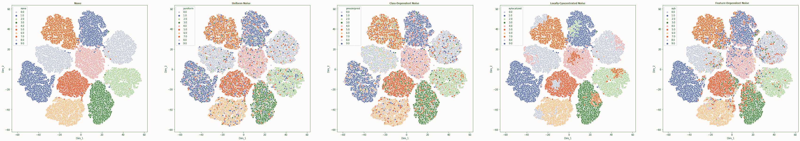
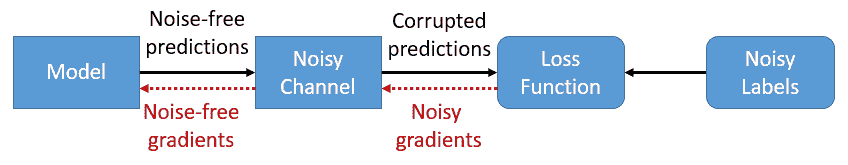
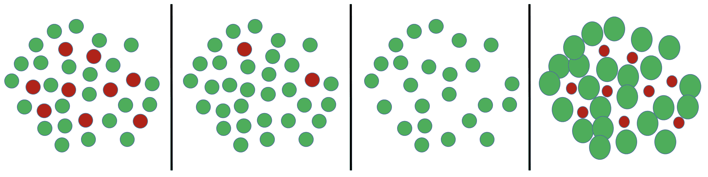

<!--yml

类别：未分类

日期：2024-09-06 20:03:45

-->

# [1912.05170] 带噪声标签的深度学习图像分类：综述

> 来源：[`ar5iv.labs.arxiv.org/html/1912.05170`](https://ar5iv.labs.arxiv.org/html/1912.05170)

# 带噪声标签的深度学习图像分类：综述

Görkem Algan¹¹1ASELSAN, Ankara²²2 中东技术大学，电气电子工程系，安卡拉 e162565@metu.edu.tr Ilkay Ulusoy³³3 中东技术大学，电气电子工程系，安卡拉 ilkay@metu.edu.tr ASELSAN，Balikhisar mah. Cankiri bulvari 7.km No:89, 06750, 安卡拉，土耳其 METU，Universiteler mah. Dumlupinar mah.电气电子工程系 A-410, 06800, 安卡拉，土耳其

###### 摘要

图像分类系统最近随着深度神经网络的进步取得了巨大的飞跃。然而，这些系统需要大量标注的数据才能进行充分训练。由于标注过程的高成本或即使是专家也难以正确分类数据等因素，收集正确注释的数据集并不总是可行的。由于这些实际挑战，标签噪声在现实世界的数据集中是一个常见问题，文献中提出了许多用于处理标签噪声的深度神经网络训练方法。尽管深度神经网络被认为对标签噪声具有相对的鲁棒性，但它们对数据的过拟合倾向使其容易记住即使是随机噪声。因此，考虑标签噪声的存在并开发对抗算法以消除其不利影响，以有效训练深度神经网络是至关重要的。尽管关于标签噪声下的机器学习技术已有广泛的调查，但文献中缺乏专门围绕噪声标签下深度学习方法的全面调查。本文旨在介绍这些算法，并将其归为两大类：基于噪声模型的方法和无噪声模型的方法。第一组算法旨在估计噪声结构，并利用这些信息来避免噪声标签的不利影响。与此不同，第二组方法试图通过使用稳健的损失函数、正则化器或其他学习范式来设计固有的噪声鲁棒算法。

###### 关键词：

深度学习、标签噪声、带噪声的分类、噪声鲁棒、噪声容忍^†^†期刊：模式识别杂志

## 1 引言

最近在深度学习领域的进展导致了许多不同领域的巨大改进，例如图像分类[1, 2, 3]、目标检测[4, 5, 6]、语义分割[7, 8]等。尽管这些强大的模型在表示学习[9, 10]方面表现出色，但研究表明，这些模型可能会对完全随机噪声[11]产生过拟合。虽然有很多工作致力于解释这一现象[12, 13]，但在避免过拟合的同时对深度神经网络（DNNs）进行正则化仍然是一个重要的挑战。特别是在数据中存在噪声时，这一点变得更加重要。因此，文献中提出了各种方法来有效地训练深度神经网络以应对噪声。

文献中存在两种类型的噪声：特征噪声和标签噪声[14]。特征噪声指的是观测数据特征中的损坏，而标签噪声则是指标签从其实际类别的变化。尽管这两种噪声类型都可能导致性能显著下降[15, 16]，但标签噪声被认为更具危害[14, 17]，并且被证明会在广泛的问题范围内恶化分类系统的性能[14, 18, 19]。这是由于几个因素；标签对于每个数据都是唯一的，而特征是多样的，每个特征的重要性也不同，而标签始终有显著影响[15]。这项工作集中在标签噪声上，因此，噪声和标签噪声在整个文章中是同义使用的。

对于监督学习而言，大量标注数据的必要性是一个显著的缺点，因为这需要昂贵的数据集收集和标注过程。为了解决这个问题，出现了更便宜的替代方案。例如，几乎可以从网络上通过搜索引擎或社交媒体收集到无限量的数据。类似地，标注过程可以借助像**Amazon Mechanical Turk**⁴⁴[`www.mturk.com`](http://www.mturk.com)和**Crowdflower**⁵⁵[`crowdflower.com`](http://crowdflower.com)这样的系统进行众包，这大大降低了标注成本。另一种广泛使用的方法是使用自动化系统进行标注。然而，所有这些方法都带来了一个共同的问题：标注噪声。除了这些方法之外，即使是专家注释者也可能出现标注噪声。标注者可能缺乏必要的经验，或者数据过于复杂，即使对专家来说也难以正确分类。此外，标注噪声还可能由于对抗性毒化目的而引入数据中[20, 21]。作为数据集收集和标注过程的自然结果，使得标注噪声鲁棒算法成为开发高效计算机视觉系统的一个重要课题。

带有标注噪声的监督学习是一个已有三十年历史的老现象[22]。关于标注噪声下的相对较旧的机器学习技术已有广泛的调查[15, 16]。然而，尚未有研究提供针对标注噪声存在的深度学习分类方法的全面调查。本研究明确地集中在填补这一空白。尽管深度网络被认为对标注噪声相对鲁棒[9, 10]，但它们具有过度拟合数据的巨大能力[11]。因此，防止**DNNs**对噪声数据的过度拟合是非常重要的，特别是对于自动化医疗诊断系统等可靠性要求高的应用。考虑到深度学习相对于其替代方案的显著成功，这是一个值得关注的话题，文献中也有许多相关研究。本文简要地解释和归纳了这些方法，以便为读者提供清晰的文献概述。

本文组织结构如下。第二部分解释了文中使用的几个概念。文献中提出的解决方案被分为两个主要组，这些方法在第三部分 - 第四部分中讨论。在第五部分中，介绍了广泛使用的实验设置，并提供了基准数据集上的排行榜。最后，第六部分对论文进行了总结。

## 2 预备知识

本节介绍了理解本文所需的必要概念。首先，给出了在标签噪声存在下的监督学习问题陈述。其次，介绍了标签噪声的类型。最后，讨论了标签噪声的来源。

### 2.1 问题陈述

经典的监督学习由输入数据集$\mathcal{S}=\{(x_{1},y_{1}),...,(x_{N},y_{N})\}\in(X,Y)^{N}$组成，这些数据是根据一个未知分布$\mathcal{D}$从$(X,Y)$中抽取的。学习目标是在函数族$\mathcal{F}$中找到最佳映射函数$f:X\rightarrow Y$，其中每个函数都由$\theta$参数化。

评估分类器性能的一种方法是所谓的损失函数，表示为$l:\mathcal{R}\times Y\rightarrow\mathcal{R^{+}}$。给定一个示例$(x_{i},y_{i})\in(X,Y)$，$l(f_{\theta}(x_{i}),y_{i})$评估分类器预测的准确性。然后，对于任何分类器$f$，期望风险定义如下，其中 E 表示对分布$\mathcal{D}$的期望。

|  | $R_{l,\mathcal{D}}(f_{\theta})=E_{\mathcal{D}}[l(f_{\theta}(x),y)]$ |  | (1) |
| --- | --- | --- | --- |

由于通常无法对分布$\mathcal{D}$有完全了解，因此作为一种近似，使用了经验风险。

|  | $\hat{R}_{l,\mathcal{D}}(f_{\theta})=\dfrac{1}{N}\sum_{i=1}^{N}l(f_{\theta}(x_{i}),y_{i})$ |  | (2) |
| --- | --- | --- | --- |

各种学习分类器的方法可以视为在网络参数的约束下最小化经验风险。

|  | $\theta^{\star}=\underset{\theta}{\operatorname*{arg\,min}}\hat{R}_{l,\mathcal{D}}(f_{\theta})$ |  | (3) |
| --- | --- | --- | --- |

在标签噪声存在的情况下，数据集变为$\mathcal{S}_{n}=\{(x_{1},\tilde{y}_{1}),...,(x_{N},\tilde{y}_{N})\}\in(X,Y)^{N}$，这些数据是根据噪声分布$\mathcal{D}_{n}$从$(X,Y)$中抽取的。然后，风险最小化的结果如下。

|  | $\theta_{n}^{\star}=\underset{\theta}{\operatorname*{arg\,min}}\hat{R}_{l,\mathcal{D}_{n}}(f_{\theta})$ |  | (4) |
| --- | --- | --- | --- |

结果是，通过在$\mathcal{D}_{n}$上最小化得到的参数与期望的最佳分类器参数不同。

$\theta^{\star}\neq\theta_{n}^{\star}$

经典的监督学习旨在为给定的分布$\mathcal{D}$找到最佳估计参数$\theta^{\star}$，并在$\mathcal{D}$上迭代。然而，在有噪声标签的设置中，任务仍然是找到$\theta^{\star}$，同时处理分布$\mathcal{D}_{n}$。因此，经典风险最小化在标签噪声存在的情况下是不够的，因为这会导致$\theta_{n}^{\star}$。因此，文献中提出了经典风险最小化方法的变体，接下来的部分将进一步评估这些方法。

### 2.2 标签噪声模型

标签噪声的详细分类见[15]。在这项工作中，我们采用了相同的分类方法，虽然稍有符号上的滥用。标签噪声受三种因素影响：数据特征、数据的真实标签以及标注者的特征。根据这些因素的依赖关系，标签噪声可以分为三类。

随机噪声完全随机，不依赖于实例特征或其真实类别。以概率$p_{e}$，标签会从其真实类别中改变。Y-依赖噪声与图像特征无关，但依赖于其类别；$p_{e}=p(e|y)$。这意味着来自特定类别的数据更容易被错误标记。例如，在手写数字识别任务中，“3”和“8”更容易混淆，而不是“3”和“5”。XY-依赖噪声则同时依赖于图像特征和其类别；$p_{e}=p(e|x,y)$。与 y-依赖的情况一样，来自特定类别的对象可能更容易被错误标记。此外，错误标记的概率可能根据数据特征而变化。如果一个实例具有类似于另一类别实例的特征，它更可能被错误标记。生成 xy-依赖的合成噪声比前两种模型更难，因此一些研究尝试通过检查数据的复杂性[23]或它们在特征空间中的位置[24]来提供一个通用框架。所有这些噪声类型在图 1 中有说明。

在多标签数据的情况下，每个实例由不同的标注者提供多个标签，此情形在这里未考虑。在这种情况下，研究表明，建模每个标注者的特征并在训练过程中使用这些信息显著提升了性能[25]。然而，不同标注者的各种特征可以通过给定的噪声模型进行解释。例如，在众包数据集中，一些标注者可能是完全的垃圾标注者，他们的标注是随机选择的[26]；因此，他们可以被建模为随机噪声。另一方面，比随机选择更准确的标注者可以通过 y 依赖或 xy 依赖噪声进行建模。因此，标注者的特征不会在这些定义中作为额外的成分引入。

图 1：MNIST 数据集在特征空间中的 T-SNE 数据分布图，噪声比率为 25%。a) 干净的数据 b) 随机噪声 c) y 依赖噪声，仍然在特征域中随机分布 d) xy 依赖噪声，局部集中 e) xy 依赖噪声，集中在决策边界上

### 2.3 标签噪声的来源

如前所述，标签噪声是数据集收集过程的自然结果，并且可以发生在各种领域，例如医学成像[27, 28, 25]，语义分割[29, 30, 31]，众包[32]，社交网络标签[33, 34]，金融分析[35]等。这项工作关注于这些问题的各种解决方案，但研究标签噪声的原因可能有助于更好地理解这一现象。

首先，随着网络和社交媒体上大量数据的可用，计算机视觉社区对利用这些数据非常感兴趣[36, 37, 38, 39, 40, 41]。然而，这些数据的标签来自混乱的用户标签或搜索引擎使用的自动化系统。这些获取数据集的过程已知会导致噪声标签。

其次，数据集可能由多个专家标注， resulting in a multi-labeled dataset。每个标注者的专业水平不同，他们的意见可能常常冲突，导致标签噪声问题[26]。有几个原因需要由多个专家标注数据。多个标注者的意见可以用来相互核对挑战性数据集的预测，或者可以使用众包平台来降低大数据标注的成本。尽管其便宜，来自非专家的标签通常带有噪声，并且错误率各不相同。一些标注者甚至可能是完全的垃圾标注者，他们的标注是随机选择的[26]。

第三，数据可能过于复杂，即便是领域内的专家也难以处理，例如医学影像。举例来说，为了收集视网膜图像的黄金标准验证数据，需要从 6-8 位不同的专家那里收集注释[42, 43]。这种复杂性可能源于任务的主观性或注释者经验的不足。在准确诊断至关重要的领域，克服这种噪声具有重要意义。

最后，标签噪声可以故意注入以实现正则化[44]或数据中毒[20, 21]。

### 2.4 方法论

文献中提出的方法可以通过多种方式进行分组。例如，可以根据算法是否需要噪声-free 数据子集来区分算法。或者，也可以根据它们处理的噪声类型或标签类型（如单标签或多标签）进行划分。然而，这些分类方式并不便于理解提出算法背后的主要方法；因此，建议采用基于噪声模型的方法和无噪声模型的方法进行不同的分区。

基于噪声模型的方法旨在建模噪声结构，以便在训练过程中利用这些信息来处理噪声标签。通常，这类方法旨在通过忽略或减少来自噪声样本的信息，提取数据集中包含的噪声-free 信息。此外，一些方法试图通过纠正噪声标签来改造数据集，以提高分类器的数据集质量。这些方法的性能严重依赖于对基础噪声的准确估计。基于噪声模型的方法的优点是分类与标签噪声估计的解耦，这有助于它们与现有的分类算法一起工作。另一个好处是，如果对噪声结构有先验知识，基于噪声模型的方法可以通过将额外信息插入系统来轻松启动。

相对地，无噪声模型的方法旨在开发固有的噪声鲁棒策略，而无需显式建模噪声结构。这些方法假设分类器对噪声的敏感性不强，性能下降来自过拟合。因此，主要关注点在于通过正则化网络训练过程来避免过拟合。

提到的两种方法在 第三部分 和 第四部分 中进行了讨论和进一步分类。 表 1 展示了所有提到的方法，以提供一个整体的清晰图景。应注意，大多数时候，算法之间没有明确的界限，它们可能属于多个类别。然而，为了完整性，它们被放置在最相似的子类中。

| 噪声模型基础方法 |
| --- |

&#124; 1\. 噪声通道 &#124;

&#124; a.显式计算: 对噪声数据的预测 [45], 对干净数据的预测 [46] &#124;

&#124; 简单数据 [47] &#124;

&#124; b.迭代计算: EM [48, 49, 27], 全连接层 [50], 锚点估计 [51] &#124;

&#124; Drichlet-分布 [52] &#124;

&#124; c.复杂噪声通道: 噪声类型估计 [53], 相关性估计 [54] &#124;

|

|

&#124; 2\. 标签噪声清理 &#124;

&#124; a.使用干净标签的数据: 在干净的数据集上训练 [55], 集成 [56], 基于图的 [57] &#124;

&#124; b.使用同时包含干净和噪声标签的数据: 迭代修正 [58], 用于微调的修正 [59] &#124;

&#124; c.使用仅带噪声标签的数据: 计算后验 [60], 兼容的后验 [61] &#124;

&#124; 与模型的一致性 [62, 63, 64], 集成 [65], 原型 [66], 质量嵌入 [67] &#124;

&#124; 部分标签 [68] &#124;

|

|

&#124; 3\. 数据集剪枝 &#124;

&#124; a. 基于数据剪枝网络预测 [69], 过滤器集成 [70, 71], 根据噪声率 [72] &#124;

&#124; 转移学习 [73], 循环状态 [74], K-means [75] &#124;

&#124; b. 标签剪枝半监督学习 [76, 77, 78, 79], 重新标注 [80, 81, 82] &#124;

|

|

&#124; 4\. 样本选择 &#124;

&#124; a.课程学习: 筛选损失 [83], 教师-学生 [84] &#124;

&#124; 选择不确定样本 [85], 课程损失 [86], 数据复杂性 [87] &#124;

&#124; 与模型的一致性 [88] &#124;

&#124; b.多个分类器: 网络一致性 [89], 共同教学 [90, 91, 92, 93] &#124;

|

|

&#124; 5\. 样本重要性加权 &#124;

&#124; 元任务 [94, 95, 96], 孪生网络 [97], pLOF [28], 避免 [98] &#124;

&#124; 估计噪声率 [99, 100], 相似度损失 [101], 转移学习 [102], $\theta$-分布 [103] &#124;

|

|

&#124; 6\. 标注者质量评估 &#124;

&#124; EM [104，105，26]，迹正则化 [106]，众包层 [107]，图像难度估计 [108] &#124;

&#124; 与网络的一致性 [109]，省略概率变量 [110] &#124;

&#124; 每个标注者的 softmax 层 [25] &#124;

|

| 噪声模型无关方法 |
| --- |

&#124; 1\. 稳健损失 &#124;

&#124; 非凸损失函数 [111，112，113]，0-1 损失替代 [114]，MAE [115]，IMEA [116] &#124;

&#124; 广义交叉熵 [117]，对称损失 [118]，无偏估计器 [119]，&#124;

&#124; 针对省略的修改交叉熵 [120]，信息理论损失 [121] &#124;

&#124; 线性奇数损失 [122]，分类校准损失 [123]，带有稳健损失的 SGD [124] &#124;

|

|

&#124; 2\. 元学习 &#124;

&#124; 选择最佳方法 [125]，泵出 [126]，噪声容忍参数初始化 [127]，&#124;

&#124; 知识蒸馏 [128，129]，梯度幅度调整 [130，131]，元 soft 标签 [132] &#124;

|

|

&#124; 3\. 正则化器 &#124;

&#124; Dropout [133]，对抗训练 [134]，mixup [135]，标签平滑 [136，137] &#124;

&#124; 预训练 [138]，最后一层的 dropout [139]，检查维度 &#124;

&#124; [140]，辅助图像正则化器 [141] &#124;

|

|

&#124; 4\. 集成方法 &#124;

&#124; LogitBoost&BrownBoost [142]，基于噪声检测的 AdaBoost [143]，rBoost [144] &#124;

&#124; RBoost1&RBoost2 [145]，稳健的多类 AdaBoost [146] &#124;

|

|

&#124; 5\. 其他 &#124;

&#124; 互补标签 [147，148]，自动编码器重构误差 [149] &#124;

&#124; 最小协方差行列式 [150], 噪声较少的数据 [151], &#124;

&#124; 数据质量 [152], 原型学习 [153, 154], 多实例学习 [155, 156] &#124;

|

表 1：文献中处理标签噪声的现有方法

## 3 基于噪声模型的方法

在存在噪声标签的情况下，学习目标是找到隐藏分布 $\mathcal{D}$ 的最佳估计，同时迭代分布 $\mathcal{D}_{n}$。如果映射函数 $M:\mathcal{D}\rightarrow\mathcal{D}_{n}$ 是已知的，它可以用来逆转噪声样本的影响。本节中的算法同时尝试找到潜在的噪声结构，并用估计的噪声参数训练基础分类器。它们需要对 $M$ 的更好估计来训练更好的分类器，同时更好的分类器也能准确地估计 $M$。因此，它们通常会面临鸡蛋与鸡的问题。属于这一类别的方法将在以下小节中解释。

### 3.1 噪声通道

噪声通道的一般设置在 图 2 中进行了说明。属于这一类别的方法最小化以下风险

|  | $\hat{R}_{l,\mathcal{D}}(f)=\dfrac{1}{N}\sum_{i=1}^{N}l(Q(f_{\theta}(x_{i})),\tilde{y_{i}})$ |  | (5) |
| --- | --- | --- | --- |

其中 $Q(f_{\theta}(x_{i}))=p(\tilde{y_{i}}|f_{\theta}(x_{i}))$ 是网络预测到给定噪声标签的映射。如果 $Q$ 适应噪声结构 $p(\tilde{y}|y)$，那么网络将被迫学习真实的映射 $p(y|x)$。

$Q$ 可以用噪声转移矩阵 $T$ 进行公式化，使得 $Q(f_{\theta}(x_{i}))=Tf_{\theta}(x_{i})$，其中矩阵的每个元素表示给定真实标签到噪声标签的转移概率，$T_{ij}=p(\tilde{y}=j|y=i)$。由于 $T$ 由概率组成，因此来自单个节点的权重应和为 1，即 $\sum_{j}T_{ij}=1$。这种将预测结果校正以匹配给定标签分布的过程也称为损失校正 [45]。

在噪声通道估计中，一个常见的问题是可扩展性。随着类别数量的增加，噪声转移矩阵的大小呈指数级增长，使得计算变得不可行。通过仅允许在最可能的节点 [49] 或预定义的节点 [157] 之间建立连接，可以部分避免这一问题。这些限制由人工专家确定，允许将额外的噪声信息插入训练过程。

噪声通道仅在训练阶段使用。在评估阶段，噪声通道被移除，以获得基础分类器的无噪声预测。在这些方法中，性能在很大程度上依赖于噪声通道参数的准确估计；因此，工作主要集中在估计$Q$。以下解释了噪声通道的各种表述方式。

图 2：噪声可以被建模为基础分类器上的噪声通道。噪声通道适应噪声的特性，以便在训练过程中基础分类器接收无噪声的梯度。

#### 3.1.1 显式计算

噪声转移矩阵是显式计算的，然后使用这个矩阵训练基础分类器。假设数据集在干净的代表性样本和带噪声样本方面是平衡的，以便每个类别都有样本满足$p(y=\tilde{y}_{i}|x_{i})=1$，[45] 仅基于预训练模型的带噪声类别概率估计来构建$T$，即所谓的混淆矩阵。[46] 中采用了类似的方法；然而，噪声转移矩阵是从网络在干净数据子集上的混淆矩阵计算的。在[47]中收集了两个数据集，即：易数据和难数据。分类器首先在易数据上进行训练，以提取类别之间的相似性关系。之后，计算得到的相似性矩阵被用作噪声转移矩阵。在[50]中提出的另一种方法是在带噪声数据和干净数据上计算混淆矩阵。然后，这两个混淆矩阵之间的差异给出$T$。

#### 3.1.2 迭代计算

在基础分类器的训练过程中，噪声转移矩阵是逐步估计的。在[48、49]中，期望最大化（EM）[158] 被用来迭代地训练网络以匹配给定的分布，并根据模型预测估计噪声转移矩阵。相同的方法在[27]的带噪声标签的医学数据上使用。[50] 在基础分类器的最后一层添加了一个线性全连接层，该层经过训练以适应噪声行为。为了避免这个额外的层收敛到单位矩阵和基础分类器过度拟合噪声，对该层应用了权重衰减正则化。[51] 建议在锚点（几乎肯定属于特定类别的数据点）上使用类别概率估计来构建噪声转移矩阵。在没有无噪声数据子集的情况下，从具有高噪声类别后验概率的数据点中提取锚点。然后，矩阵被迭代更新以最小化训练过程中的损失。[52] 通过将噪声转移矩阵投影到 Dirichlet 分布空间中来以贝叶斯形式建模噪声转移矩阵，而不是使用 softmax 概率。

#### 3.1.3 复杂的噪声通道

与简单的混淆矩阵不同，一些工作将噪声通道形式化为更复杂的函数。这使得噪声通道参数不仅通过使用网络输出，还可以通过关于数据内容的额外信息来计算。例如，[53]中定义了三种类型的标签噪声：无噪声、随机噪声、结构化噪声。使用额外的卷积神经网络（CNN）来解释每个样本的噪声类型。最后，噪声层旨在通过预测的噪声类型来将预测标签与噪声标签匹配。另一个在[54]中的工作建议训练一个额外的网络作为相关性估计器，以获得标签与给定实例的相关性。预测标签在考虑相关性的情况下被映射到噪声标签。如果相关性低，在噪声情况下，分类器仍然可以对真实类别进行预测，并且不会因此受到太大惩罚。

### 3.2 标签噪声清理

解决标签噪声的一个明显方法是识别和纠正可疑标签，使其对应于真实类别。手动清理整个数据集可能代价高昂；因此，一些工作建议仅挑选可疑样本交给人工标注者，以减少成本[41]。然而，这仍然不是一种可扩展的方法。因此，文献中提出了各种算法。包括标签修正算法，经验风险的形式如下：

|  | $\hat{R}_{l,\mathcal{D}}(f)=\dfrac{1}{N}\sum_{i=1}^{N}l(f_{\theta}(x_{i}),G(\tilde{y_{i}},x_{i}))$ |  | (6) |
| --- | --- | --- | --- |

其中 $G(\tilde{y_{i}},x_{i})=p(y_{i}|\tilde{y_{i}},x_{i})$ 代表标签清理算法。标签清理算法依赖于特征提取器，将数据映射到特征域以调查噪声。虽然一些工作使用预训练网络作为特征提取器，但其他工作使用基本分类器，因为它在训练过程中变得越来越准确。这种方法产生了一个迭代框架：随着分类器的改进，标签清理变得更准确，而随着标签质量的提高，分类器变得更好。从这个角度来看，标签清理可以被视为系统的动态演变组成部分，而不是数据的预处理。这些方法通常解决了区分信息性难样本和具有噪声标签的样本的困难[15]。因此，它们可能会删除过多的样本或以错觉的方式更改标签。标签清理的方法可以根据其对干净数据的需求进行区分。

#### 3.2.1 使用干净标签的数据

在存在干净数据子集的情况下，目标是将无噪声标签结构与有噪声的标签融合以进行修正。如果干净子集足够大以训练网络，一种显而易见的方法是通过在干净数据上训练的网络的预测来重新标记有噪声的标签。对于重新标记，[［55］(#bib.bib55)] 使用了给定的有噪声标签和预测标签的 alpha blending。[56] 中使用了一个由不同数据集子集训练的网络集成。如果它们都对标签达成一致，则将标签更改为预测标签；否则，将其设置为随机标签。与其保留有噪声标签，不如随机设置标签，这有助于打破噪声结构，并使噪声在标签空间中更均匀分布。在 [57] 中使用了基于图的方法，其中条件随机场提取了有噪声标签和干净标签之间的关系。

#### 3.2.2 使用同时具有干净和有噪声标签的数据

一些研究依赖于一个数据子集，其中同时提供了干净和有噪声的标签。然后，从这些冲突的标签中提取标签噪声结构，并用于修正有噪声的数据。在 [58] 中，标签清理网络接收两个输入：由基础分类器提取的实例特征和相应的有噪声标签。标签清理网络和基础分类器共同训练，使得标签清理网络学会在干净子集数据上修正标签，并为基础分类器提供有噪声数据的修正标签。同样的方法在 [59] 中以教师-学生方式解耦。首先，学生在有噪声数据上训练。然后，通过学生模型从干净数据中提取特征，教师根据这些提取的特征学习噪声的结构。之后，教师为有噪声数据预测软标签，学生再次在这些软标签上进行训练以进行微调。

#### 3.2.3 使用仅有噪声标签的数据

噪声数据并不总是可用，因此在这种情况下，主要的方法是逐步估计更干净的后验标签分布。然而，这种方法可能会出现一个不希望出现的解决方案，即所有标签都被归为一个单一类别，基础网络预测一个常量类别，这将导致虚假的高训练准确率。因此，通常会使用额外的正则化器来使标签后验分布更加均匀。在[60]中提出了一个联合优化框架，用于同时训练基础分类器和将噪声标签传播到更干净标签。通过期望最大化，估计分类器参数和标签后验分布，以最小化损失。在[61]中使用了类似的方法，但增加了基于标签后验的兼容性损失。考虑到噪声标签占少数，这一术语确保后验标签分布不会过多偏离给定的噪声标签分布，从而不会丢失大多数干净标签的贡献。[62, 63] 部署了一种信心策略，其中标签由网络输出或给定的噪声标签决定，具体取决于模型预测的置信度。[64] 认为，在噪声标签的情况下，模型首先学习正确标记的数据，然后再对噪声数据进行过拟合，旨在从损失值中提取样本是否为噪声的概率。为此，每个实例的损失由一个β混合模型拟合，该模型以无监督方式建模标签噪声。[65] 提出了一个两级方法。在第一阶段，使用任何选择的推断算法来确定真实标签，并将数据分为噪声和干净两个子集。在第二阶段，训练一个弱分类器的集成模型，以预测噪声数据的真实标签。然后，这两个数据子集被合并以创建最终的增强数据集。[66] 构建了可以表示每个类别的深度特征分布的原型。然后，通过检查数据样本与原型之间的相似性来找到修正后的标签。[67] 引入了一个新的参数，即质量嵌入，代表数据的可信度。根据两个潜在变量：真实类别概率和质量嵌入，额外的网络尝试提取每个实例的真实类别。在多标签数据集中，每个实例都有多个标签来表示其内容，有些标签可能部分缺失，导致部分标签。在部分标签的情况下，[68] 使用一个网络来查找和估计容易缺失的标签，另一个网络则在这些修正后的数据上进行训练。[159] 将视频异常检测表述为具有标签噪声的问题，并根据视频片段的特征和时间一致性训练了一个图卷积标签噪声清理网络。

### 3.3 数据集修剪

代替将噪声标签更正为其真实类别的做法，可以选择删除这些标签。虽然这会导致信息丢失，但防止噪声的有害影响可能会导致更好的性能。在这些方法中，存在删除过多样本的风险。因此，至关重要的是尽可能少地删除样本，以防止不必要的数据丢失。

数据修剪有两种替代方法。第一种选项是完全删除噪声样本，并在修剪后的数据集上训练分类器。第二种选项是仅删除噪声数据的标签，并将数据集转换为两个子集：标记数据和未标记数据。然后可以在结果数据集上应用半监督学习算法。

#### 3.3.1 删除数据

最直接的方法是删除由基础网络误分类的实例[69]。[70] 使用了过滤方法的集成，每种方法为每个样本分配噪声等级。然后，这些预测结果被组合，噪声等级最高的数据被删除。[71] 扩展了这项工作，并进行了标签修正。如果大多数噪声过滤器对噪声实例预测相同的标签，则将其标签更正为预测标签。否则，将其从数据集中删除。在[72]中，通过概率分类器的帮助，将训练数据划分为两个子集：自信的干净数据和噪声数据。根据这些子集的大小估计噪声率。最后，根据基础网络对数据实例的输出置信度，按估计的噪声率删除最不自信的样本。在[73]中，使用迁移学习，使在类似领域的干净数据集上训练的网络在噪声数据集上进行微调以重新标记。之后，网络在重新标记的数据上再次训练，以重新采样数据集以构建最终的干净数据集。在[74]中，学习率循环调整以改变网络状态在欠拟合和过拟合之间切换。由于在欠拟合时，噪声样本会导致高损失，因此在此循环过程中大噪声样本被删除。[75] 首先在噪声数据上训练网络，并使用该模型提取特征向量。随后，使用 K-means 算法对提取的特征进行聚类，并删除离群值。[160] 对各种噪声过滤方法在众包数据集上的性能进行了比较。

#### 3.3.2 删除标签

最简单的选择是对标记和未标记的数据进行直接的半监督训练[76]。另一种方法是通过每个时期迭代地去除标签，以动态地更新数据集，从而更好地利用半监督学习。[77] 使用给定标签和模型预测的移动平均之间的一致性来评估提供的标签是否存在噪声。然后，模型在下一个迭代中在干净的样本上进行训练。这个过程会持续进行，直到收敛到最佳估计器。[78] 中使用了相同的方法，但做了一些小的调整。不是与给定标签进行比较，而是将预测的移动平均与当前时期的预测标签进行比较。为了避免由于一个模型导致的数据选择偏倚，[79] 使用两个模型相互选择未标记的集合。之后，每个网络在其对等网络选择的数据集上以半监督学习的方式进行训练。这个类别中的另一种方法是对标记和未标记的数据进行训练，然后用它来重新标记噪声数据[82, 80]。假设正确标记的数据占大多数，[81] 提出了将数据集随机划分为标记和未标记的子组。然后，利用实例之间的相似性指数将标签传播到未标记的数据。这个过程会重复进行，为每个实例生成多个标签，最后通过多数投票来确定最终标签。

### 3.4 样本选择

一种广泛使用的克服标签噪声的方法是操作输入流到分类器中。通过选择正确的实例来引导网络可以帮助分类器在存在噪声标签的情况下更容易找到其路径。它可以被表述为如下：

|  | $\hat{R}_{l,\mathcal{D}}(f)=\dfrac{1}{N}\sum_{i=1}^{N}V(x_{i},y_{i})l(f_{\theta}(x_{i}),\tilde{y_{i}}))$ |  | (7) |
| --- | --- | --- | --- |

其中 $V(x_{i},y_{i})\in\{0,1\}$ 是一个二元运算符，用于决定是否使用给定的数据 $(x_{i},y_{i})$。如果所有数据的 $V(x_{i},y_{i})=1$，那么这将变成经典的风险最小化（公式 7）。如果 $V$ 恰好是一个静态函数，即按照预定义规则在整个训练过程中选择相同的样本，那么这将变成数据集修剪，如 小节 3.3 中所解释的那样。不同的是，样本选择方法持续监控基础分类器，并选择样本用于下一次训练迭代。这个任务可以被视为绘制一条路径，模拟 $\mathcal{D}$ 的无噪声分布。由于这些方法在现有系统之外操作，它们更容易通过仅仅操控输入流来附加到现有算法上。然而，保持平衡至关重要，以防系统忽略不必要的大量数据。此外，这些方法优先考虑低损失样本，这会导致学习速率较慢，因为困难的有信息样本只在训练的后期被考虑。以下小节讨论了该组的两种主要方法。

#### 3.4.1 课程学习

课程学习（CL）[161]，受人类认知的启发，提出从简单样本开始，逐步处理更难样本以指导训练。当对样本的难度未知并从当前模型在该样本上的损失推断时，这种学习策略也称为自适应学习[162, 163]。在噪声标签框架中，干净标记的数据可以被视为简单任务，而噪声标记的数据则是更难的任务。因此，CL 的理念可以转移到标签噪声设置中，从可靠的干净实例开始，随着分类器的提高，逐步处理更嘈杂的样本。[83]中提出了各种筛选损失函数，用于根据噪声水平对实例进行排序。[84]中实现了师生方法，其中教师的任务是选择可靠的干净样本供学生使用。教师不断根据学生的输出更新其课程，而不是使用预定义的课程。由于 CL 在关注简单样本时会减慢学习速度，[85]建议选择那些有时被错误预测、有时被正确预测的不确定样本。这些样本被认为可能不是噪声样本，因为噪声样本应该总是被错误预测。[86]中提出了课程损失作为 0-1 损失的上界，选择低损失值的样本进行损失计算，因为优化 0-1 损失很困难。在[87]中，数据根据复杂性分成子组。由于较少复杂的数据组预计有更多的干净标签，因此训练将从较少复杂的数据开始，并随着网络的改进，处理更复杂的实例。可以通过检查标签与网络预测的一致性来选择下一个训练样本。在[88]中，如果给定样本的标签与模型预测一致，则将其用于训练集。否则，模型有权不同意。这种迭代过程提供了更好的训练数据和更好的模型。然而，模型有可能过于怀疑，以一种妄想的方式选择标签；因此，需要建立一致性平衡。

#### 3.4.2 多分类器

一些工作使用多个分类器互相帮助选择下一批数据进行训练。这与师生方法不同，因为这些网络互不监督，而是互相帮助。多个模型可以提供鲁棒性，因为网络可以通过它们在学习表示上的差异来纠正彼此的错误。为了使这种设置有效，分类器的初始化至关重要。它们很可能会用不同的数据子集初始化。如果它们具有相同的权重初始化，则不会有更新，因为它们对标签的分歧没有改变。在 [89] 中，如果两个网络对给定标签的意见不一致，则假定标签有噪声，模型权重的更新仅发生在两个网络的预测冲突时。[90] 中介绍了共同教学的范式，其中两个网络为对方选择下一批数据。下一批数据是根据对网络对的损失值较小的数据批次选择的。声称使用一个网络会累积噪声相关的误差，而两个网络则更成功地过滤噪声误差。共同教学的思想通过对两个网络不一致的数据进行迭代进一步改进，以防止两个网络在训练周期数增加时相互收敛 [91, 92]。另一项使用共同教学的工作首先在选定的子集上训练两个网络若干个周期，然后转到完整数据集 [93]。

### 3.5 样本重要性加权

类似于样本选择，通过根据估计的噪声水平为实例分配权重可以使训练更加有效。这可以强调更干净的实例，从而更好地更新模型权重。这些算法通过最小化经验风险来实现。

|  | $\hat{R}_{l,\mathcal{D}}(f)=\dfrac{1}{N}\sum_{i=1}^{N}\beta(x_{i},y_{i})l(f_{\theta}(x_{i}),\tilde{y_{i}}))$ |  | (8) |
| --- | --- | --- | --- |

$\beta(x_{i},y_{i})$ 决定了实例依赖的权重。如果 $\beta$ 是二进制的，则公式与样本选择相同，如 子节 3.4 中所解释的那样。不同的是，这里 $\beta$ 不是二进制的，并且每个实例具有不同的值。与样本选择算法一样，$\beta$ 是一个动态函数，这意味着实例的权重在训练过程中不断变化。因此，防止 $\beta$ 变化过快或过于剧烈以免干扰稳定的训练循环常常是一个挑战。此外，这些方法通常会受到累积误差的困扰。因此，它们很容易偏向于某一数据子集。有多种方法被提出以获取最佳的 $\beta$，以减少噪声的负面影响。

最简单的方法是，如果同时存在干净数据和噪声数据，则对干净数据进行更多的加权[50]。然而，这种方法利用信息不充分；此外，干净数据并不总是可用。[94]和[95]的研究使用了元学习范式来确定加权因子。在每次迭代中，针对给定的小批量数据进行梯度下降步骤，以便最小化在干净验证数据上的损失。[96]采用了类似的方法，但不是隐式计算加权因子，而是使用多层感知器（MLP）来估计加权函数。[97]考虑了开放集噪声标签，其中与噪声标签关联的数据样本可能属于训练数据中不存在的真实类别。Siamese 网络通过学习区分特征来检测噪声标签，将干净数据与噪声数据区分开来。噪声样本被迭代检测并从干净样本中剔除。然后，在每次迭代中，为噪声样本重新计算加权因子，并在整个数据集上训练基础分类器。[28]也迭代地分离噪声样本和干净样本。此外，为了不遗漏干净难样本中的有价值信息，噪声数据根据其噪声水平进行加权，该水平由 pLOF[164]估计。[98]引入了弃权机制，根据样本的损失值提供弃权选项，并附有弃权罚款。因此，网络学会从混淆样本中弃权，并且可以通过弃权罚款调整弃权倾向。在[99]中，加权因子依赖于训练数据的分布，$\beta(X,Y)=P_{\mathcal{D}}(X,Y)/P_{\mathcal{D}_{n}}(X,\tilde{Y})$。相同的方法在[100]中扩展到多分类情况。在[101]中，通过检查实例在特征域中与其代表性类别原型的相似性来确定加权因子。[102]将问题公式化为迁移学习，其中源领域是噪声数据，目标领域是干净数据的子集。然后，在源领域中安排加权以最小化目标领域的损失。[103]使用$\theta$分布中的样本$\theta$值来计算其为干净样本的概率，并利用该信息在训练中给予干净样本更多的加权。

图 3：不同类型算法的示意图。从左到右；1）表示单一类别样本在二维空间中的分布。绿色样本代表干净样本，红色样本代表噪声样本。2）标签噪声清理算法旨在修正噪声数据的标签。3）数据集剪枝方法旨在消除噪声数据（或仅其标签）。4）样本重要性加权算法旨在增加干净样本的权重，减少噪声样本的权重（通过大小进行说明）。

### 3.6 标注员质量评估

如在 2.3 节中所解释，数据集可能由多个标注员进行标注。每个标注员可能拥有不同的专业水平，他们的标签有时可能相互矛盾。这是众包数据[165, 166, 167]或需要高水平专业知识的数据集（如医学影像[19]）中的典型情况。因此，建模和利用标注员特征可以显著提高性能[25]。

在这种设置中，有两个未知量：噪声标注员特征和真实标签。可以通过期望最大化方法估计这两者[104, 105, 26]。如果噪声假设为 y 依赖的，可以用噪声转移矩阵来建模标注员特征，就像在 subsection 3.1 中那样。[106] 在损失函数中添加了一个正则化项，该正则化项是标注员混淆矩阵迹的和，以迫使每个标注员的估计混淆矩阵稀疏化。[107] 实现了一种类似的方法，在网络的末端添加了一个众包层。[108] 通过考虑图像复杂度来处理 xy 依赖噪声。在[109]中，人类标注员和计算机视觉系统相互配合，其中这些两个组件的预测一致性用于评估标注员的可靠性。[110] 处理了标注员在图像中遗漏标签时的噪声。因此，与其使用标注员的噪声转移矩阵，不如使用遗漏概率变量，该变量与真实类别一起通过期望最大化算法进行估计。在[25]中，为每个标注员训练了单独的 softmax 层，并且增加了一个额外的网络，以预测数据的真实类别，依据标注员特定网络的输出和数据特征。这种设置能够在不同的网络中建模每个标注员及其整体噪声结构。

### 3.7 讨论

一些方法的视觉示意图展示在图 3 中。噪声模型方法在很大程度上依赖于噪声结构的准确估计。这带来了一个困境。为了获得更好的噪声模型，需要更好的估计器，而要获得更好的估计器，则需要对基础噪声有更好的估计。因此，许多方法可以看作是噪声估计和分类的期望最大化。然而，防止系统偏离现实是至关重要的。因此，规范化噪声估计，防止其变得不切实际是关键。为了实现这一点，文献中通常对基础噪声结构做出假设，这会损害其在不同设置下的适用性。另一方面，这允许将任何关于噪声的先验信息插入系统以获得先机。这对于处理特定领域的噪声也很有用。这些算法的另一个优点是它们将噪声估计和分类任务解耦。因此，它们更容易在现有分类算法上实现。

## 4 无噪声模型的方法

这些方法旨在在不明确建模标签噪声的情况下实现标签噪声鲁棒性，而是通过设计算法中的鲁棒性来实现。噪声数据被视为异常；因此，这些方法类似于过拟合避免。它们通常依赖于分类器的内部噪声容忍度，并旨在通过规范化对噪声数据的非期望记忆来提升性能。以下小节中介绍了各种方法论。

### 4.1 鲁棒损失

如果分类器在有噪声和无噪声的数据上学习到的分类准确率相同，则称损失函数具有噪声鲁棒性[111]。本节下的算法旨在设计损失函数，使得噪声的存在不会降低性能。然而，已显示即使对于鲁棒损失函数，噪声也会严重影响性能[15]。此外，这些方法对有噪声和干净的数据采取相同的处理方式，这阻碍了对数据分布的任何先验信息的利用。

在[111]中，展示了某些非凸损失函数（如 0-1 损失）的噪声容忍度远高于常用的凸损失函数。扩展这项工作[112, 113]推导出了损失函数对均匀噪声具有噪声容忍的充分条件。他们的工作表明，如果给定的损失函数满足$\sum_{k}l(f_{\theta}(x),k)=C,\forall x\in X$，其中$C$为常数值，则该损失函数对均匀噪声具有容忍度。在这方面，他们通过实验证明了标准的凸损失函数都不具有噪声鲁棒性，而 0-1 损失具有，直到某个噪声比率。然而，0-1 损失是非凸的且不可微分的；因此，[114]中提出了 0-1 损失的替代损失，但它仍然对噪声敏感。在[115]的工作中，将广泛使用的分类交叉熵（CCE）损失与均值绝对误差（MAE）进行比较，实验证明均值绝对误差对噪声更具容忍性。[116]显示，MAE 的鲁棒性归因于其加权方案。尽管 CCE 对异常样本敏感，并且梯度幅度更大，MAE 对所有数据点一视同仁，这可能导致数据的欠拟合。因此，[116]中提出了改进的均值绝对误差（IMAE），这是 MAE 的改进版本，其中梯度通过超参数进行缩放，以调整 MAE 的加权方差。[117]还指出，MAE 提供的学习率远低于 CCE；因此，建议使用一种新的损失函数，它结合了 MAE 的鲁棒性和 CCE 的隐式加权。通过一个调节参数，可以在 MAE 和 CCE 之间调整损失函数的特性。损失函数通常是不对称的，这意味着$l(f_{\theta}(x_{i}),y_{i})\neq l(y_{i},f_{\theta}(x_{i}))$。受到对称 KL 散度的启发，[118]提出了对称交叉熵损失$l_{SCE}(f_{\theta}(x_{i}),y_{i})=l(f_{\theta}(x_{i}),y_{i})+l(y_{i},f_{\theta}(x_{i}))$以对抗噪声标签。

在噪声先验已知的情况下，[119] 提供了两种利用先验信息的代理损失函数，即损失函数的无偏估计器和加权估计器。[120] 针对二分类情况考虑了不对称的遗漏噪声，其中任务是从卫星地图图像中找到道路像素。遗漏噪声使得网络对其预测的信心降低，因此他们修改了交叉熵损失函数，以减少对产生错误但自信的预测的惩罚，因为这些标签更可能是噪声。[121] 提出了使用信息论损失代替基于距离的损失，其中计算给定标签和预测之间的行列式互信息[168]用于损失计算。[122] 讨论了带有噪声标签的弱监督学习，并提出了损失容忍噪声的必要条件。[123] 证明了分类校准损失函数在对称标签噪声下渐近鲁棒。对于具有鲁棒损失的随机梯度下降，一般来说[124] 被分析并显示其在处理标签噪声时比传统方法更为鲁棒。

### 4.2 元学习

随着深度神经网络的最新进展，计算机视觉系统对手工设计特征的需求已大大减少。相反，这些特征通过机器学习技术自主学习。尽管这些算法可以自行学习复杂的函数，但仍然存在许多手工设计的参数，如网络架构、损失函数、优化算法等。元学习旨在通过不仅学习任务所需的复杂函数，还学习学习本身[169, 170]来消除这些需求。属于这一类别的算法通常会为元目标实现一个额外的学习循环，以优化基础学习过程。一般而言，这些方法最大的缺点是其计算成本。由于它们需要为每个训练循环计算嵌套的梯度循环，因此比传统训练过程慢几倍。

以元学习方式设计超越经典监督学习的任务也被用来处理标签噪声。在[125]中，元任务被定义为预测在给定噪声数据集的情况下，方法家族中最合适的方法。Pumpout [126]提出了一个元目标，即通过缩放梯度上升来恢复噪声样本造成的损害，从而抹去它们对模型的影响。作为一种元学习范式，模型无关元学习（MAML）[170]旨在寻求可以轻松调整以实现所需目标的最佳权重初始化。在[127]中，对于噪声标签采用了类似的思路，旨在寻找噪声容忍的模型参数，这些参数在师生训练框架[171, 172]下对噪声的敏感性较低。多个学生网络接收被合成噪声污染的数据。定义了一个元目标以最大化与从原始数据中获得的教师输出的一致性，而原始数据不含合成噪声。因此，学生网络被迫找到最具噪声鲁棒性的权重初始化，使得在对合成污染数据训练一个时期后，权重更新仍然保持一致。然后，最终分类器权重被设置为学生网络的指数移动平均值。

另外，在有干净数据的情况下，可以定义一个元目标来利用这些信息。[128]中使用的方法是在干净的数据集上训练一个教师网络，并将其知识转移到学生网络，以指导在存在标签错误数据的情况下的训练过程。他们使用了[173]中提出的蒸馏技术来控制从教师到学生的知识转移。在[129]中，实现了在人类姿态估计任务中使用蒸馏和标签修正的类似方法。在[130, 131]中，目标网络在大量噪声数据上训练，而信心网络在一个干净的子集上训练。受到[169]的启发，信心网络的任务是控制对目标网络的梯度更新幅度，以确保噪声标签不会导致梯度更新。[132]使用干净数据为噪声数据生成软标签，训练出的分类器在干净数据上表现最佳。因此，它寻求最佳标签分布，以提供对基础分类器最具噪声鲁棒性的学习。

### 4.3 正则化器

正则化方法众所周知能够防止深度神经网络（DNN）在噪声标签上过拟合。从这个角度来看，这些方法将由于噪声数据引起的性能下降视为对噪声的过拟合。尽管这一假设在随机噪声中大多是有效的，但对于更复杂的噪声情况可能并非如此。一些广泛使用的技术包括权重衰减、丢弃法 [133]、对抗训练 [134]、混合训练 [135] 和标签平滑 [136, 137]。[138] 显示了在存在噪声标签的情况下，预训练具有正则化效果。在 [139] 中添加了一个额外的 softmax 层，并对该层应用了丢弃法正则化，认为这提供了更稳健的训练，并防止了由于丢弃法的随机性而记住噪声 [133]。[140] 提出了一个复杂性度量来理解网络是否开始过拟合。研究表明，学习包含两个步骤：1）维度压缩，即建模与底层数据分布紧密匹配的低维子空间，2）维度扩展，即稳步增加子空间维度以过拟合数据。关键是要在第二步之前停止。局部内在维度 [174] 用于测量训练模型的复杂性，并在开始过拟合之前停止。[141] 采用在不同领域预训练的网络，并对带有噪声标签的数据集进行微调。形成图像特征组，并施加组稀疏正则化，以便模型被迫选择相关特征并增加可靠图像的权重。

### 4.4 集成方法

众所周知，袋装法比提升法对标签噪声更具鲁棒性 [175]。像 AdaBoost 这样的提升算法对噪声样本赋予了过多的权重，导致过拟合噪声。然而，对于所选择的提升算法，标签噪声鲁棒性的程度有所不同。例如，研究表明 BrownBoost 和 LogitBoost 比 AdaBoost 更具鲁棒性 [142]。因此，文献中提出了 AdaBoost 的噪声鲁棒替代方法，例如基于噪声检测的 AdaBoost [143]、rBoost [144]、RBoost1&RBoost2 [145] 和鲁棒多类 AdaBoost [146]。

### 4.5 其他

互补标签定义了观测数据不属于的类别。例如，在十个类别的情况下，每个实例有一个真实类别和九个互补类别。由于注释者较少会标记错误，一些研究建议在互补标签空间中进行工作 [147, 148]。[149] 使用自编码器的重建误差来区分噪声数据与干净数据，认为噪声数据通常具有较大的重建误差。在 [150] 中，基模型在噪声数据上进行训练。一个额外的生成分类器在基模型生成的特征空间上进行训练。通过用最小协方差行列式估计其参数，旨在找到噪声鲁棒的决策边界。在 [151] 中，考虑了一个特殊设置，其中数据集由噪声数据和较少噪声数据组成，用于二分类任务。[152] 旨在提取数据实例的质量。假设训练数据集是由目标分布和其他未知分布的混合生成的，它通过检查生成分布和目标分布之间的一致性来估计数据样本的质量。

原型学习旨在构建可以代表类别特征的原型，以便学习干净的表示。一些文献中的研究 [153, 154] 提议为噪声数据创建干净的代表性原型，以便可以在这些原型上训练基分类器，而不是噪声标签。

在多实例学习中，数据被分组为簇，称为袋，每个袋如果包含至少一个正实例则标记为正，否则标记为负。网络接收一组数据，并通过学习数据的内部区分表示为每个袋产生一个预测。由于使用了一组图像并做出一个预测，袋中噪声标签与真实标签的存在对学习的影响较小。在 [155] 中，作者建议通过最小化总袋级损失来有效选择每个袋的训练样本。额外的模型在 [156] 中作为注意力模型进行训练，该模型决定需要关注的图像部分。其目的是在正确标记的图像上集中注意力于少数区域，而对错误标记的图像则不关注任何区域。

### 4.6 讨论

总体而言，这类方法将噪声数据视为异常。因此，它们与过拟合避免和异常检测的思路相似。尽管这种假设对于随机噪声可能相当有效，但在面对更复杂和结构化的噪声时，它的有效性会降低。由于噪声建模并未与分类任务明确分离，提出的方法一般都嵌入到现有算法中。这阻碍了它们在现有系统中的快速部署。此外，元学习和集成方法所涉及的算法可能计算成本较高，因为它们需要多次训练循环。

## 5 实验

本节讨论了文献中提出的算法如何进行实验以测试其对标签噪声的鲁棒性。一般来说，为了快速实现和测试，大多数研究开始时会在合成标签噪声的玩具数据集（MNIST[176]，MNIST-Fashion[177]，CIFAR10&CIFAR100[178]）上进行测试。然而，如在 subsection 2.2 中所述，存在各种类型的人工噪声。此外，每项研究使用不同的模型架构和超参数设置进行实验。因此，这些数据集上的结果不适合公平地比较算法。它们更多地作为提出算法的概念验证。

一些文献中的研究使用了两个替代数据集。第一个是 Food101N 数据集[101]，包含 310k 张属于 101 个不同类别的食谱图像。然而，它的噪声比例相当小（约 20%），使得它不适合用于评估噪声鲁棒算法的性能。第二个选项是 WebVision 数据集[179]，包含从 Flickr 网站和 Google Images 搜索中抓取的 240 万张图像。这是一个大数据集，需要大量的计算资源来运行算法。一些研究通过仅使用前 50 个类别的数据来对该数据集进行测试，以使其在计算上可行。但即便如此，WebVision 仍未能提供一个用于评估噪声鲁棒算法的基准数据集。

为了填补基准数据集的空白，[53] 从网络上收集了大量图像，这些图像的标签来自周围用户标签的解释。因此，它包含了现实世界中的噪声标签，估计噪声比率约为 40%。数据集包括一百万张属于 14 个不同类别的图像。还包含 50K、14K 和 10K 额外的已验证干净标签图像，用于训练、验证和测试目的。我们观察到，大多数方法并未使用额外的 50K 干净数据进行训练。此外，文献似乎对实验设置达成了一致。所有方法都使用相同的 ResNet50 [2] 模型架构，预训练参数来自 Imagenet [180]，并使用随机梯度下降优化器。考虑到实验设置的一致性和数据集的现实噪声，Clothing1M 数据集被广泛接受为基准数据集。

我们列出了（根据我们所知）所有在该数据集上呈现的结果，见表 2。我们仅收集了在 1M 噪声训练数据上训练且没有额外 50K 干净数据的工作的结果，以进行公平评估。我们按测试准确率对算法进行了排序。然而，应该注意的是，每种方法都有其优缺点，如计算成本、内存需求等。

| 方法 | 类别 | 准确率 |
| --- | --- | --- |
| [132] | 元学习 | 76.02 |
| [79] | 数据集剪枝 | 74.76 |
| [101] | 样本重要性加权 | 74.69 |
| [66] | 标签噪声清理 | 74.45 |
| [51] | 噪声通道 | 74.18 |
| [75] | 数据集剪枝 | 73.77 |
| [96] | 样本重要性加权 | 73.72 |
| [61] | 标签噪声清理 | 73.49 |
| [127] | 元学习 | 73.47 |
| [116] | 鲁棒损失 | 73.20 |
| [52] | 噪声通道 | 73.07 |
| [153] | 其他 | 72.50 |
| [121] | 鲁棒损失 | 72.46 |
| [60] | 标签噪声清理 | 72.23 |
| [63] | 标签噪声清理 | 71.74 |
| [157] | 噪声通道 | 71.10 |
| [118] | 鲁棒损失 | 71.02 |
| [64] | 标签噪声清理 | 71.00 |

表 2：在 Clothing1M 数据集上测试的算法排行榜。所有结果均取自相关论文。为确保公平评价，仅展示未使用额外 50k 清洁训练数据的工作。

## 6 结论

本文展示了标签噪声是实现从现实世界数据集中获得理想性能的一个重要障碍。尽管它在实际应用中的监督学习中非常重要，但收集来自网络的数据集[181, 182]、设计能够从无限网络数据中学习而无需人工监督的网络[37, 38, 39, 40]也是一个重要步骤。此外，除了图像分类外，还有更多领域需要处理标签错误的实例，如生成网络[183, 184]、语义分割[29, 30, 31]、声音分类[185]等。这些因素使得处理标签噪声成为自我维持学习系统中的一个重要步骤。

文献中提出了多种应对噪声标签现象的方法。所有方法都有其优缺点，因此可以根据具体情况选择最合适的算法。然而，为了画出一个通用的线，我们提出以下建议。如果噪声结构是领域特定的，并且对其结构有先验信息或假设，则基于噪声模型的方法更为合适。在这些模型中，可以根据需要选择最适合的方法。例如，如果噪声可以表示为噪声转移矩阵，则可以选择噪声通道或多标注者情况下的标注者质量评估。如果目的是将数据集作为预处理阶段进行净化，则可以采用数据集修剪或标签噪声清除方法。如果实例可以根据其对训练的有用性进行排序，则样本选择或样本重要性加权算法很方便。与基于噪声模型的算法不同，基于噪声模型自由的方法不依赖于噪声结构的任何先验信息。因此，如果噪声被假定为随机的，它们更容易实现，性能下降通常是由于过拟合，因为它们不需要实现一个外部算法来估计噪声结构。如果没有干净的数据子集，则鲁棒损失或正则化器是适当的选项，因为它们对所有样本一视同仁。元学习技术可以在存在干净数据子集的情况下使用，因为它们可以很容易地适应利用这个子集。

尽管在机器学习技术上进行了大量研究[15]，但在噪声标签情况下的深度学习仍然是一个未充分研究的问题。考虑到其对深度神经网络的剧烈影响[11]，该领域仍有许多开放的研究课题。例如，真正理解标签噪声对深度网络的影响可能是一个有前景的未来研究主题。186 显示，每一层的 CNN 都学习从数据中提取不同的特征。此外，学习到的表示形成了一个层级模式，每一层从前一层学习到更复杂的特征。全连接层利用上一层的特征来解释最终层上的对应标签。理解网络的哪些部分受到标签噪声的高度影响可能有助于分析标签噪声对神经网络的不利影响。例如，如果初始层受到影响，可以得出学习到的原始特征被破坏的结论，因此网络的其余部分无法得到充分训练。另一方面，如果最终卷积层受到影响，可以说网络无法在卷积层之间形成层级特征模式。或者，如果卷积层未受影响，但全连接层是问题的根源，可以得出特征表示学习没有被破坏的结论，但网络无法正确解读从提取特征中获得的含义。此外，调查不同类型标签噪声模型造成问题的原因可能会很有趣，如 subsection 2.2 所述。如果不同的噪声模型影响网络的不同部分，可以通过检查神经网络层的腐败情况来分析数据集中标签噪声的真实性质。

另外，如何在属性和标签噪声共存的情况下进行训练是一个未被充分研究的问题，具有重要的实际应用潜力[55]。118 显示，噪声标签会降低学习效果，特别是对具有挑战性的样本。因此，性能下降的原因可能是对噪声样本的过拟合，而不是对挑战样本的欠拟合，这是一个未来需要回答的开放性问题。另一个可能的研究方向可能是努力打破噪声的结构，使其在特征领域中均匀分布[81]。这种方法在标签者具有特定偏见的情况下特别有用。

对提议算法进行快速测试的一个广泛使用的方法是通过向基准玩具数据集中添加合成标签噪声来创建嘈杂数据集[176, 177, 178, 187, 188]。然而，这种方法阻碍了算法的公平比较和评估，因为每项工作都添加了自己的噪声类型。文献中提出了一些具有嘈杂标签的大型数据集[9, 101, 179, 189]。这些数据集来自网络，标签是通过嘈杂的用户标签获得的。尽管这些数据集为基准测试提供了有用的领域，但它们的噪声率大多未知，并且在类别数据分布方面存在偏差。此外，无法在极端或中等条件下调整噪声率。从这个角度来看，我们认为文献中缺乏一个嘈杂数据集，其中大部分数据既有嘈杂标签也有已验证标签，从而可以根据需要调整噪声率。

当数据量较少时，对来自嘈杂标注数据集的学习关注较少。考虑到在数据收集成本高的领域中，这可能是一个有前途的研究方向。例如，在医学影像中，由于成本或隐私问题，大规模清晰标注的数据集在大多数情况下不可行[55]。有效地从少量无真值的嘈杂数据中学习，可以显著提高自主医学诊断系统的性能。尽管已有一些先驱性研究[25, 27, 28]，但仍有许多需要探索的领域。

从嘈杂标注数据中有效学习的能力为机器学习算法的实际应用带来了巨大机遇。数据收集的瓶颈可以通过从网络收集的大量数据轻松解决。这些数据的标签可以通过简单的算法（例如从周围文本中解释[53]）来分配。通过有效处理嘈杂标签，深度学习算法可以处理大量数据集。此外，还存在研究机会，可以探索半监督学习算法在嘈杂标注数据上的替代用法。对嘈杂标注数据常见的半监督学习方法是去除嘈杂数据的标签，然后使用传统的半监督学习方法进行训练。另一种方法是开发能够使用三种数据类型的算法：清晰标注数据、嘈杂标注数据和未标注数据。借助这些算法，大量未标注和嘈杂的数据可以在少量清晰标注数据的监督下有效利用。

除了分类，利用带有噪声标签的数据进行学习的知识还可以通过转换任务用于其他领域。例如，在多标签数据集中，每个实例属于多个类别，并非所有类别都同等相关。可以将与数据样本相似度小的标签视为噪声，并采用为处理噪声标签而设计的算法[190]。类似地，[191]将未裁剪的视频分成较小的部分，并旨在找到与视频标签最相关的视频片段。与视频标签无关的视频部分被视为噪声标签。即使原始数据集没有噪声标签，也可以通过转换来使用该领域的算法。因此，学习噪声标签在除直接图像分类之外的各种领域中具有很大的潜力。

## References

+   [1] A. Krizhevsky, I. Sutskever, G. E. Hinton, Imagenet classification with deep convolutional neural networks, in: Advances in neural information processing systems, 2012, pp. 1097–1105.

+   [2] K. He, X. Zhang, S. Ren, J. Sun, Deep residual learning for image recognition, in: Proceedings of the IEEE conference on computer vision and pattern recognition, 2016, pp. 770–778.

+   [3] K. Simonyan, A. Zisserman, Very deep convolutional networks for large-scale image recognition, arXiv preprint arXiv:1409.1556 (2014).

+   [4] R. Girshick, J. Donahue, T. Darrell, J. Malik, Rich feature hierarchies for accurate object detection and semantic segmentation, in: Proceedings of the IEEE conference on computer vision and pattern recognition, 2014, pp. 580–587.

+   [5] S. Ren, K. He, R. Girshick, J. Sun, Faster r-cnn: Towards real-time object detection with region proposal networks, in: Advances in neural information processing systems, 2015, pp. 91–99.

+   [6] W. Liu, D. Anguelov, D. Erhan, C. Szegedy, S. Reed, C.-Y. Fu, A. C. Berg, Ssd: Single shot multibox detector, in: European conference on computer vision, Springer, 2016, pp. 21–37.

+   [7] G. Lin, C. Shen, A. Van Den Hengel, I. Reid, Efficient piecewise training of deep structured models for semantic segmentation, in: Proceedings of the IEEE conference on computer vision and pattern recognition, 2016, pp. 3194–3203.

+   [8] J. Long, E. Shelhamer, T. Darrell, Fully convolutional networks for semantic segmentation, in: Proceedings of the IEEE conference on computer vision and pattern recognition, 2015, pp. 3431–3440.

+   [9] D. Rolnick, A. Veit, S. Belongie, N. Shavit, Deep learning is robust to massive label noise, arXiv preprint arXiv:1705.10694 (2017).

+   [10] A. Drory, O. Ratzon, S. Avidan, R. Giryes, The resistance to label noise in k-nn and cnn depends on its concentration, arXiv preprint arXiv:1803.11410 (2018).

+   [11] C. Zhang, S. Bengio, M. Hardt, B. Recht, O. Vinyals, Understanding deep learning requires rethinking generalization, in: International Conference on Learning Representations, 2017.

+   [12] D. Krueger, N. Ballas, S. Jastrzebski, D. Arpit, M. S. Kanwal, T. Maharaj, E. Bengio, A. Fischer, A. Courville, 深度网络不是通过记忆化学习的（2017）。

+   [13] D. Arpit, S. Jastrzebski, N. Ballas, D. Krueger, E. Bengio, M. S. Kanwal, T. Maharaj, A. Fischer, A. Courville, Y. Bengio, 等，深入了解深度网络中的记忆化，载于：第 34 届国际机器学习大会论文集-第 70 卷，JMLR.org，2017 年，第 233–242 页。

+   [14] X. Zhu, X. Wu, 类别噪声与属性噪声：定量研究，人工智能评论 22 (3) (2004) 177–210。

+   [15] B. Frénay, M. Verleysen, 标签噪声存在下的分类：综述，IEEE 神经网络与学习系统交易 25 (5) (2014) 845–869。

+   [16] B. Frénay, A. Kabán, 等，标签噪声的全面介绍，载于：ESANN，2014 年。

+   [17] R. Hataya, H. Nakayama, 调查 CNN 在标签噪声下的学习表示（2018）。

+   [18] D. F. Nettleton, A. Orriols-Puig, A. Fornells, 不同类型噪声对监督学习技术精度的影响研究，人工智能评论 33 (4) (2010) 275–306。

+   [19] M. Pechenizkiy, A. Tsymbal, S. Puuronen, O. Pechenizkiy, 医疗领域中的类别噪声与监督学习：特征提取的影响，载于：第十九届 IEEE 计算机医学系统研讨会（CBMS’06），IEEE，2006 年，第 708–713 页。

+   [20] B. Li, Y. Wang, A. Singh, Y. Vorobeychik, 基于分解的协同过滤中的数据中毒攻击，载于：神经信息处理系统进展，2016 年，第 1893–1901 页。

+   [21] J. Steinhardt, P. W. Koh, P. Liang, 数据中毒攻击的认证防御，载于：神经信息处理系统进展，2017 年 12 月卷，2017 年，第 3518–3530 页。

+   [22] D. Angluin, P. Laird, 从噪声示例中学习，机器学习 2 (4) (1988) 343–370。

+   [23] L. P. Garcia, J. Lehmann, A. C. de Carvalho, A. C. Lorena, 新的标签噪声注入方法用于噪声过滤器的评估，知识基础系统 163 (2019) 693–704。

+   [24] G. Algan, İ. Ulusoy, 标签噪声类型及其对深度学习的影响，arXiv 预印本 arXiv:2003.10471 (2020)。

+   [25] M. Y. Guan, V. Gulshan, A. M. Dai, G. E. Hinton, 谁说了什么：建模个体标注者提升分类准确性，载于：第三十二届人工智能 AAAI 会议，2018 年。

+   [26] A. Khetan, Z. C. Lipton, A. Anandkumar, 从噪声单标签数据中学习，arXiv 预印本 arXiv:1712.04577 (2017)。

+   [27] Y. Dgani, H. Greenspan, J. Goldberger, 基于不可靠的人类注释训练神经网络用于医学图像，载于：2018 IEEE 第十五届生物医学成像国际研讨会（ISBI 2018），IEEE，2018 年，第 39–42 页。

+   [28] C. Xue, Q. Dou, X. Shi, H. Chen, P.-A. Heng, 在带噪声标记的医学图像上进行鲁棒学习：应用于皮肤病变分类，载于：2019 IEEE 第十六届生物医学成像国际研讨会（ISBI 2019），IEEE，2019 年，第 1280–1283 页。

+   [29] Z. Lu, Z. Fu, T. Xiang, P. Han, L. Wang, X. Gao, 从弱且噪声标签中学习用于语义分割, IEEE 模式分析与机器智能杂志 39 (3) (2016) 486–500。

+   [30] Y. Zhu, K. Sapra, F. A. Reda, K. J. Shih, S. Newsam, A. Tao, B. Catanzaro, 通过视频传播和标签松弛改进语义分割, 见：IEEE 计算机视觉与模式识别会议论文集, 2019, 页 8856–8865。

+   [31] D. Acuna, A. Kar, S. Fidler, 恶魔藏在边缘：从噪声标注中学习语义边界, 见：IEEE 计算机视觉与模式识别会议论文集, 2019, 页 11075–11083。

+   [32] P. Welinder, S. Branson, P. Perona, S. J. Belongie, 群体的多维智慧, 见：神经信息处理系统进展, 2010, 页 2424–2432。

+   [33] Y. Cha, J. Cho, 使用主题模型进行社交网络分析, 见：第 35 届国际 ACM SIGIR 信息检索研究与发展会议论文集, ACM, 2012, 页 565–574。

+   [34] Y. Wang, Y. Rao, X. Zhan, H. Chen, M. Luo, J. Yin, 噪声标签上的情感与情绪分类, 知识驱动系统 111 (2016) 207–216。

+   [35] Y. Aït-Sahalia, J. Fan, D. Xiu, 使用噪声和异步金融数据的高频协方差估计, 美国统计协会杂志 105 (492) (2010) 1504–1517。

+   [36] F. Schroff, A. Criminisi, A. Zisserman, 从网络中获取图像数据库, IEEE 模式分析与机器智能杂志 33 (4) (2010) 754–766。

+   [37] R. Fergus, L. Fei-Fei, P. Perona, A. Zisserman, 从互联网图像搜索中学习物体类别, IEEE 学报 98 (8) (2010) 1453–1466。

+   [38] X. Chen, A. Shrivastava, A. Gupta, NEIL：从网络数据中提取视觉知识, 见：IEEE 国际计算机视觉会议论文集, 2013, 页 1409–1416。[doi:10.1109/ICCV.2013.178](https://doi.org/10.1109/ICCV.2013.178)。

+   [39] S. K. Divvala, A. Farhadi, C. Guestrin, 学习关于任何事物的一切：Webly 监督的视觉概念学习, 见：IEEE 计算机视觉与模式识别会议论文集, 2014, 页 3270–3277。[doi:10.1109/CVPR.2014.412](https://doi.org/10.1109/CVPR.2014.412)。

+   [40] A. Joulin, L. van der Maaten, A. Jabri, N. Vasilache, 从大量弱监督数据中学习视觉特征, 见：欧洲计算机视觉会议, Springer, 2016, 页 67–84。

+   [41] J. Krause, B. Sapp, A. Howard, H. Zhou, A. Toshev, T. Duerig, J. Philbin, L. Fei-Fei, 噪声数据在细粒度识别中的不合理有效性, 见：欧洲计算机视觉会议, Springer, 2016, 页 301–320。

+   [42] J. De Fauw, J. R. Ledsam, B. Romera-Paredes, S. Nikolov, N. Tomasev, S. Blackwell, H. Askham, X. Glorot, B. O’Donoghue, D. Visentin, 等, 临床适用的深度学习用于视网膜疾病的诊断和转诊, 自然医学 24 (9) (2018) 1342。

+   [43] V. Gulshan, L. Peng, M. Coram, M. C. Stumpe, D. Wu, A. Narayanaswamy, S. Venugopalan, K. Widner, T. Madams, J. Cuadros 等，《用于检测糖尿病视网膜病变的深度学习算法的开发与验证》，《Jama》316 (22) (2016) 2402–2410。

+   [44] L. Xie, J. Wang, Z. Wei, M. Wang, Q. Tian，《Disturblabel：对损失层进行正则化的卷积神经网络》，发表于：IEEE 计算机视觉与模式识别会议论文集，2016 年，第 4753–4762 页。

+   [45] G. Patrini, A. Rozza, A. Krishna Menon, R. Nock, L. Qu，《使深度神经网络对标签噪声具有鲁棒性：一种损失修正方法》，发表于：IEEE 计算机视觉与模式识别会议论文集，2017 年，第 1944–1952 页。

+   [46] D. Hendrycks, M. Mazeika, D. Wilson, K. Gimpel，《利用可信数据训练深度网络以处理严重噪声的标签》，发表于：神经信息处理系统进展，2018 年，第 10456–10465 页。

+   [47] X. Chen, A. Gupta，《卷积网络的网络监督学习》，发表于：IEEE 国际计算机视觉会议论文集，2015 年，第 1431–1439 页。

+   [48] A. J. Bekker, J. Goldberger，《基于不可靠标签的深度神经网络训练》，发表于：2016 年 IEEE 国际声学、语音与信号处理会议（ICASSP），IEEE，2016 年，第 2682–2686 页。

+   [49] J. Goldberger, E. Ben-Reuven，《使用噪声适应层训练深度神经网络》（2016 年）。

+   [50] S. Sukhbaatar, J. Bruna, M. Paluri, L. Bourdev, R. Fergus，《使用噪声标签训练卷积网络》，发表于：国际学习表征会议，2015 年。

+   [51] X. Xia, T. Liu, N. Wang, B. Han, C. Gong, G. Niu, M. Sugiyama，《在标签噪声学习中，锚点是否真的不可或缺？》，发表于：神经信息处理系统进展，2019 年，第 6835–6846 页。

+   [52] J. Yao, H. Wu, Y. Zhang, I. W. Tsang, J. Sun，《为噪声监督保护的动态标签回归》，《人工智能 AAAI 会议论文集》33 (2019) 9103–9110。[arXiv:1903.02152](http://arxiv.org/abs/1903.02152)，[doi:10.1609/aaai.v33i01.33019103](https://doi.org/10.1609/aaai.v33i01.33019103)。

+   [53] T. Xiao, T. Xia, Y. Yang, C. Huang, X. Wang，《从大量噪声标记数据中学习进行图像分类》，发表于：IEEE 计算机视觉与模式识别会议论文集，2015 年，第 2691–2699 页。

+   [54] I. Misra, C. Lawrence Zitnick, M. Mitchell, R. Girshick，《看穿人类报告偏差：来自噪声人类中心标签的视觉分类器》，发表于：IEEE 计算机视觉与模式识别会议论文集，2016 年，第 2930–2939 页。

+   [55] L. Jaehwan, Y. Donggeun, K. Hyo-Eun，《用于乳腺密度预测的光度变换网络和标签调整》，发表于：IEEE 国际计算机视觉会议研讨会论文集，2019 年，第 0–0 页。

+   [56] B. Yuan, J. Chen, W. Zhang, H. S. Tai, S. McMains, 在嘈杂标签上进行迭代交叉学习，载于：2018 年 IEEE 冬季计算机视觉应用会议论文集，WACV 2018，第 757–765 页。[doi:10.1109/WACV.2018.00088](https://doi.org/10.1109/WACV.2018.00088)。

+   [57] A. Vahdat, 朝着训练深度判别神经网络对标签噪声的鲁棒性，载于：神经信息处理系统进展，2017 年，第 5596–5605 页。

+   [58] A. Veit, N. Alldrin, G. Chechik, I. Krasin, A. Gupta, S. Belongie, 从嘈杂的大规模数据集中学习与最小监督，载于：IEEE 计算机视觉与模式识别会议论文集，2017 年，第 839–847 页。

+   [59] M. Dehghani, A. Mehrjou, S. Gouws, J. Kamps, B. Schölkopf, 忠实度加权学习，载于：国际学习表征会议，2018 年。

+   [60] D. Tanaka, D. Ikami, T. Yamasaki, K. Aizawa, 噪声标签学习的联合优化框架，载于：IEEE 计算机视觉与模式识别会议论文集，2018 年，第 5552–5560 页。

+   [61] K. Yi, J. Wu, 用于嘈杂标签学习的概率端到端噪声校正，载于：IEEE 计算机视觉与模式识别会议论文集，2019 年，第 7017–7025 页。

+   [62] X. Liu, S. Li, M. Kan, S. Shan, X. Chen, 自我错误纠正卷积神经网络用于嘈杂标签学习，载于：2017 年第 12 届 IEEE 国际自动人脸与姿势识别会议（FG 2017），IEEE，2017 年，第 111–117 页。

+   [63] S. Zheng, P. Wu, A. Goswami, M. Goswami, D. Metaxas, C. Chen, 错误界限的噪声标签修正，载于：国际机器学习会议，2020 年。

+   [64] E. Arazo, D. Ortego, P. Albert, N. E. O’Connor, K. McGuinness, 无监督标签噪声建模与损失修正，载于：国际机器学习会议，2019 年。

+   [65] J. Zhang, V. S. Sheng, T. Li, X. Wu, 使用噪声校正改进众包标签质量，IEEE 神经网络与学习系统汇刊 29 (5) (2017) 1675–1688。

+   [66] J. Han, P. Luo, X. Wang, 从嘈杂标签中深度自学习，载于：IEEE 国际计算机视觉会议论文集，2019 年，第 5138–5147 页。

+   [67] J. Yao, J. Wang, I. W. Tsang, Y. Zhang, J. Sun, C. Zhang, R. Zhang, 从嘈杂图像标签中学习的深度学习与质量嵌入，IEEE 图像处理汇刊 28 (4) (2018) 1909–1922。

+   [68] T. Durand, N. Mehrasa, G. Mori, 为多标签分类学习深度卷积网络与部分标签，载于：IEEE 计算机视觉与模式识别会议论文集，2019 年，第 647–657 页。

+   [69] S. J. Delany, N. Segata, B. Mac Namee, 噪声减少中的实例分析，知识基础系统 31 (2012) 28–40。

+   [70] L. P. Garcia, J. A. Sáez, J. Luengo, A. C. Lorena, A. C. de Carvalho, F. Herrera, 使用一对一分解通过聚合策略改进类别噪声过滤器在多类分类问题中的性能，《知识基系统》90 (2015) 153–164。

+   [71] J. Luengo, S.-O. Shim, S. Alshomrani, A. Altalhi, F. Herrera, Cnc-nos: 通过集成过滤和噪声评分进行类别噪声清理，《知识基系统》140 (2018) 27–49。

+   [72] C. G. Northcutt, T. Wu, I. L. Chuang, 使用自信示例进行学习：带噪声标签的鲁棒分类的排名剪枝，见：人工智能不确定性——第 33 届会议论文集，UAI 2017，2017。 [arXiv:1705.01936](http://arxiv.org/abs/1705.01936)。

+   [73] X. Wu, R. He, Z. Sun, T. Tan, 一种用于深度人脸表示的轻量级 CNN，具有噪声标签，《IEEE 信息取证与安全学报》13 (11) (2018) 2884–2896。 [arXiv:1511.02683](http://arxiv.org/abs/1511.02683)，[doi:10.1109/TIFS.2018.2833032](https://doi.org/10.1109/TIFS.2018.2833032)。

+   [74] J. Huang, L. Qu, R. Jia, B. Zhao, O2u-net: 一种简单的深度神经网络噪声标签检测方法，见：IEEE 国际计算机视觉会议论文集，2019，pp. 3326–3334。

+   [75] K. Sharma, P. Donmez, E. Luo, Y. Liu, I. Z. Yalniz, Noiserank: 通过依赖模型进行无监督标签噪声减少，2020。

+   [76] Y. Ding, L. Wang, D. Fan, B. Gong, 一种半监督的两阶段方法来处理噪声标签，见：2018 IEEE 冬季计算机视觉应用会议（WACV），IEEE，2018，pp. 1215–1224。

+   [77] D. T. Nguyen, T.-P.-N. Ngo, Z. Lou, M. Klar, L. Beggel, T. Brox, 在标签噪声下的稳健学习与迭代噪声过滤（2019）。 [arXiv:1906.00216](http://arxiv.org/abs/1906.00216)。

+   [78] D. T. Nguyen, C. K. Mummadi, T. P. N. Ngo, T. H. P. Nguyen, L. Beggel, T. Brox, SELF: 通过自我集成学习过滤噪声标签（2019 年 10 月）。 [arXiv:1910.01842](http://arxiv.org/abs/1910.01842)。

+   [79] J. Li, R. Socher, S. C. Hoi, Dividemix: 将带噪声标签的学习视作半监督学习，见：国际学习表征会议，2020。

+   [80] Y. Yan, Z. Xu, I. W. Tsang, G. Long, Y. Yang, 通过标签聚合实现稳健的半监督学习，见：第 30 届 AAAI 人工智能会议，AAAI 2016，2016，pp. 2244–2250。

+   [81] J. Jiang, J. Ma, Z. Wang, C. Chen, X. Liu, 在噪声标签存在下的高光谱图像分类，《IEEE 地球科学与遥感学报》57 (2) (2019) 851–865。 [arXiv:1809.04212](http://arxiv.org/abs/1809.04212)，[doi:10.1109/TGRS.2018.2861992](https://doi.org/10.1109/TGRS.2018.2861992)。

+   [82] J. Sahota, D. Shanmugam, J. Ramanan, S. Eghbali, M. Brubaker, 一种用于任意标签噪声校正的基于能量的框架（2018）。

+   [83] B. Han, I. W. Tsang, L. Chen, P. Y. Celina, S.-F. Fung, 面向噪声标签的渐进随机学习, IEEE 神经网络与学习系统汇刊 (99) (2018) 1–13。

+   [84] L. Jiang, Z. Zhou, T. Leung, L.-J. Li, L. Fei-Fei, Mentornet: 在污染标签上为非常深的神经网络学习数据驱动课程, 载于：国际机器学习会议，2018 年，页码 2304–2313。

+   [85] H.-S. Chang, E. Learned-Miller, A. McCallum, 主动偏差：通过强调高方差样本训练更准确的神经网络, 载于：神经信息处理系统进展，2017 年，页码 1002–1012。

+   [86] Y. Lyu, I. W. Tsang, Curriculum Loss: 针对标签污染的鲁棒学习与泛化（2019 年 5 月）。[arXiv:1905.10045](http://arxiv.org/abs/1905.10045)。

+   [87] S. Guo, W. Huang, H. Zhang, C. Zhuang, D. Dong, M. R. Scott, D. Huang, Curriculumnet: 从大规模网络图像中进行弱监督学习, 载于：欧洲计算机视觉会议（ECCV）论文集，2018 年，页码 135–150。

+   [88] S. Reed, H. Lee, D. Anguelov, C. Szegedy, D. Erhan, A. Rabinovich, 在噪声标签下使用自助法训练深度神经网络, arXiv 预印本 arXiv:1412.6596 (2014)。

+   [89] E. Malach, S. Shalev-Shwartz, “解耦”何时更新与“如何更新”, 载于：神经信息处理系统进展，2017 年，页码 960–970。

+   [90] B. Han, Q. Yao, X. Yu, G. Niu, M. Xu, W. Hu, I. Tsang, M. Sugiyama, Co-teaching: 在极度噪声标签下的深度神经网络的鲁棒训练, 载于：神经信息处理系统进展，2018 年，页码 8527–8537。

+   [91] X. Yu, B. Han, J. Yao, G. Niu, I. W. Tsang, M. Sugiyama, 不一致性如何帮助对抗标签污染的泛化？, 载于：国际机器学习会议，2019 年。

+   [92] X. Wang, S. Wang, J. Wang, H. Shi, T. Mei, Co-mining: 深度人脸识别中的噪声标签, 载于：IEEE 国际计算机视觉会议论文集，2019 年，页码 9358–9367。

+   [93] P. Chen, B. B. Liao, G. Chen, S. Zhang, 理解和利用训练有噪声标签的深度神经网络, 载于：国际机器学习会议，2019 年，页码 1062–1070。

+   [94] M. Ren, W. Zeng, B. Yang, R. Urtasun, 学习为鲁棒深度学习重新加权示例, 国际机器学习会议（2018 年）。

+   [95] S. Jenni, P. Favaro, 深度双层学习, 载于：欧洲计算机视觉会议（ECCV）论文集，2018 年，页码 618–633。

+   [96] J. Shu, Q. Xie, L. Yi, Q. Zhao, S. Zhou, Z. Xu, D. Meng, Meta-weight-net: 学习样本加权的显式映射, 载于：神经信息处理系统进展，2019 年，页码 1917–1928。

+   [97] Y. Wang, W. Liu, X. Ma, J. Bailey, H. Zha, L. Song, S.-T. Xia, 在开放集噪声标签下的迭代学习, 载于：IEEE 计算机视觉与模式识别会议论文集，2018 年，页码 8688–8696。

+   [98] S. Thulasidasan, T. Bhattacharya, J. Bilmes, G. Chennupati, J. Mohd-Yusof, 使用弃权来对抗深度学习中的标签噪声，见：国际机器学习会议，2019 年。

+   [99] T. Liu, D. Tao, 通过重要性重新加权处理噪声标签的分类，IEEE 模式分析与机器智能汇刊 38 (3) (2015) 447–461。

+   [100] R. Wang, T. Liu, D. Tao, 带有部分污染标签的多类学习，IEEE 神经网络与学习系统汇刊 29 (6) (2018) 2568–2580。

+   [101] K.-H. Lee, X. He, L. Zhang, L. Yang, Cleannet：用于可扩展图像分类器训练的迁移学习与标签噪声，见：IEEE 计算机视觉与模式识别会议论文集，2018 年，第 5447–5456 页。

+   [102] O. Litany, D. Freedman, Soseleto：一种统一的迁移学习和带噪声标签训练的方法，见：有限标记数据学习国际会议研讨会，2018 年。

+   [103] W. Hu, Y. Huang, F. Zhang, R. Li, 面部识别 CNN 的噪声容忍训练范式，见：IEEE 计算机视觉与模式识别会议论文集，2019 年，第 11887–11896 页。

+   [104] V. C. Raykar, S. Yu, L. H. Zhao, A. Jerebko, C. Florin, G. H. Valadez, L. Bogoni, L. Moy, 来自多个专家的监督学习：当每个人都有点撒谎时，应该相信谁，见：第 26 届国际机器学习年会论文集，ACM，2009 年，第 889–896 页。

+   [105] Y. Yan, R. Rosales, G. Fung, R. Subramanian, J. Dy, 从多位具有不同专业的标注者处学习，《机器学习》95 (3) (2014) 291–327。[doi:10.1007/s10994-013-5412-1](https://doi.org/10.1007/s10994-013-5412-1)。

+   [106] R. Tanno, A. Saeedi, S. Sankaranarayanan, D. C. Alexander, N. Silberman, 通过正则化标注者混淆的估计从噪声标签中学习，见：IEEE 计算机视觉与模式识别会议论文集，2019 年，第 11244–11253 页。

+   [107] F. Rodrigues, F. C. Pereira, 从众包中进行深度学习，见：第 32 届 AAAI 人工智能会议，AAAI 2018，2018 年，第 1611–1618 页。

+   [108] J. Whitehill, T.-f. Wu, J. Bergsma, J. R. Movellan, P. L. Ruvolo, 谁的投票应该更重要：来自未知专业标签者的标签的最佳整合，见：神经信息处理系统进展，2009 年，第 2035–2043 页。

+   [109] S. Branson, G. Van Horn, P. Perona, 精简众包：在在线系统中结合人类与机器，见：第 30 届 IEEE 计算机视觉与模式识别会议论文集，CVPR 2017，2017 年，第 6109–6118 页。[doi:10.1109/CVPR.2017.647](https://doi.org/10.1109/CVPR.2017.647)。

+   [110] H. Izadinia, B. C. Russell, A. Farhadi, M. D. Hoffman, A. Hertzmann, 从现实世界的图像标签中进行深度分类，见：2015 年社区组织的多模态挖掘研讨会：新解决方案的机会，ACM，2015 年，第 13–18 页。

+   [111] N. Manwani, P. Sastry, 风险最小化下的噪声容忍，IEEE 网络系统学报 43 (3) (2013) 1146–1151。

+   [112] A. Ghosh, N. Manwani, P. Sastry, 使风险最小化对标签噪声具有容忍性，Neurocomputing 160 (2015) 93–107。

+   [113] N. Charoenphakdee, J. Lee, M. Sugiyama, 关于从损坏标签中学习的对称损失，载于：国际机器学习会议，2019 年。

+   [114] P. L. Bartlett, M. I. Jordan, J. D. McAuliffe, 凸性、分类及风险界限，《美国统计学会期刊》101 (473) (2006) 138–156。

+   [115] A. Ghosh, H. Kumar, P. Sastry, 在标签噪声下深度神经网络的鲁棒损失函数，载于：第 31 届 AAAI 人工智能大会，2017 年。

+   [116] X. Wang, E. Kodirov, Y. Hua, N. M. Robertson, 改进的平均绝对误差，用于从异常训练数据中学习有意义的模式，技术报告（2019）。[arXiv:1903.12141v5](http://arxiv.org/abs/1903.12141v5)。

+   [117] Z. Zhang, M. Sabuncu, 用于训练带噪声标签的深度神经网络的广义交叉熵损失，载于：神经信息处理系统进展，2018 年，第 8778–8788 页。

+   [118] Y. Wang, X. Ma, Z. Chen, Y. Luo, J. Yi, J. Bailey, 用于鲁棒学习的对称交叉熵，载于：IEEE 国际计算机视觉会议论文集，2019 年，第 322–330 页。

+   [119] N. Natarajan, I. S. Dhillon, P. K. Ravikumar, A. Tewari, 带噪声标签的学习，载于：神经信息处理系统进展，2013 年，第 1196–1204 页。

+   [120] V. Mnih, G. E. Hinton, 从噪声数据中学习标记航空图像，载于：第 29 届国际机器学习会议（ICML-12）论文集，2012 年，第 567–574 页。

+   [121] Y. Xu, P. Cao, Y. Kong, Y. Wang, L_dmi：一种新颖的信息论损失函数，用于训练对标签噪声鲁棒的深度网络，载于：神经信息处理系统进展，2019 年，第 6222–6233 页。

+   [122] G. Patrini, F. Nielsen, R. Nock, M. Carioni, 损失因子分解、弱监督学习及标签噪声鲁棒性，载于：国际机器学习会议，2016 年，第 708–717 页。

+   [123] B. Van Rooyen, A. Menon, R. C. Williamson, 带对称标签噪声的学习：保持冷静的重要性，载于：神经信息处理系统进展，2015 年，第 10–18 页。

+   [124] B. Han, I. W. Tsang, L. Chen, 一类鲁棒损失函数在随机梯度下降中的收敛性，载于：欧洲机器学习与数据库知识发现联合会议，Springer，2016 年，第 665–680 页。

+   [125] L. P. Garcia, A. C. de Carvalho, A. C. Lorena, 元学习层级中的噪声检测，Neurocomputing 176 (2016) 14–25。

+   [126] B. Han, G. Niu, J. Yao, X. Yu, M. Xu, I. Tsang, M. Sugiyama, Pumpout：一种针对噪声标签鲁棒训练深度神经网络的元方法，arXiv 预印本 arXiv:1809.11008 (2018)。

+   [127] J. Li, Y. Wong, Q. Zhao, M. S. Kankanhalli, 从噪声标记数据中学习，IEEE 计算机视觉与模式识别大会论文集，2019，页 5051–5059。

+   [128] Y. Li, J. Yang, Y. Song, L. Cao, J. Luo, L.-J. Li, 通过蒸馏从噪声标签中学习，《IEEE 国际计算机视觉会议论文集》，2017，页 1910–1918。

+   [129] N. Kato, T. Li, K. Nishino, Y. Uchida, 使用标签修正改进多人体姿态估计 (2018 年 11 月)。 [arXiv:1811.03331](http://arxiv.org/abs/1811.03331)。

+   [130] M. Dehghani, A. Severyn, S. Rothe, J. Kamps, 通过完全监督学习从弱监督中学习，arxiv.org (2017)。 [arXiv:1711.11383](http://arxiv.org/abs/1711.11383)。

+   [131] M. Dehghani, A. Severyn, S. Rothe, J. Kamps, 避免老师的错误：使用受控弱监督训练神经网络，arXiv 预印本 arXiv:1711.00313 (2017)。

+   [132] G. Algan, I. Ulusoy, 噪声标签的元软标签生成，国际模式识别大会 ICPR，2020。

+   [133] N. Srivastava, G. Hinton, A. Krizhevsky, I. Sutskever, R. Salakhutdinov, Dropout：防止神经网络过拟合的简单方法，《机器学习研究杂志》15 (1) (2014) 1929–1958。

+   [134] I. J. Goodfellow, J. Shlens, C. Szegedy, 解释和利用对抗样本，arXiv 预印本 arXiv:1412.6572 (2014)。

+   [135] H. Zhang, M. Cisse, Y. N. Dauphin, D. Lopez-Paz, mixup：超越经验风险最小化 (2017 年 10 月)。 [arXiv:1710.09412](http://arxiv.org/abs/1710.09412)。

+   [136] G. Pereyra, G. Tucker, J. Chorowski, Ł. Kaiser, G. Hinton, 通过惩罚自信输出分布来正则化神经网络，arXiv 预印本 arXiv:1701.06548 (2017)。

+   [137] C. Szegedy, V. Vanhoucke, S. Ioffe, J. Shlens, Z. Wojna, 重新思考计算机视觉的 inception 架构，IEEE 计算机视觉与模式识别会议论文集，2016，页 2818–2826。

+   [138] D. Hendrycks, K. Lee, M. Mazeika, 使用预训练可以提高模型的鲁棒性和不确定性 (2019 年 1 月)。 [arXiv:1901.09960](http://arxiv.org/abs/1901.09960)。

+   [139] I. Jindal, M. Nokleby, X. Chen, 使用 dropout 正则化从噪声标签中学习深度网络，2016 IEEE 第 16 届数据挖掘国际会议 (ICDM)，IEEE，2016，页 967–972。

+   [140] X. Ma, Y. Wang, M. E. Houle, S. Zhou, S. M. Erfani, S.-T. Xia, S. Wijewickrema, J. Bailey, 基于维度驱动的噪声标签学习，国际学习表示会议，2018。

+   [141] S. Azadi, J. Feng, S. Jegelka, T. Darrell, 具有噪声标签的深度 CNN 的辅助图像正则化，国际学习表示会议，2016。

+   [142] X. Sun, H. Zhou, 两种提升算法在人工类别噪声的真实数据集上的实证比较，见：计算机与信息科学通信，第 201 CCIS 卷，2011，第 23–30 页。 [doi:10.1007/978-3-642-22418-8_4](https://doi.org/10.1007/978-3-642-22418-8_4)。

+   [143] J. Cao, S. Kwong, R. Wang, 基于噪声检测的 AdaBoost 算法用于错误标记数据，《模式识别》45 (12) (2012) 4451–4465。

+   [144] J. Bootkrajang, A. Kabán, 在标签噪声存在下的提升，见：人工智能不确定性 - 第 29 届会议论文集，UAI 2013，2013，第 82–91 页。 [arXiv:1309.6818](http://arxiv.org/abs/1309.6818)。

+   [145] Q. Miao, Y. Cao, G. Xia, M. Gong, J. Liu, J. Song, Rboost：基于非凸损失函数和数值稳定基学习器的标签噪声鲁棒提升算法，《IEEE 神经网络与学习系统交易》27 (11) (2015) 2216–2228。

+   [146] B. Sun, S. Chen, J. Wang, H. Chen, 一种针对错误标记噪声数据的鲁棒多类 AdaBoost 算法，《知识基础系统》102 (2016) 87–102。

+   [147] X. Yu, T. Liu, M. Gong, D. Tao, 通过有偏互补标签进行学习，见：欧洲计算机视觉会议（ECCV）论文集，2018，第 68–83 页。

+   [148] Y. Kim, J. Yim, J. Yun, J. Kim, Nlnl：用于噪声标签的负学习，见：IEEE 国际计算机视觉会议论文集，2019，第 101–110 页。

+   [149] Y. Xia, X. Cao, F. Wen, G. Hua, J. Sun, 学习用于无监督异常值去除的区分重建，见：IEEE 国际计算机视觉会议论文集，第 2015 届，2015，第 1511–1519 页。 [doi:10.1109/ICCV.2015.177](https://doi.org/10.1109/ICCV.2015.177)。

+   [150] K. Lee, S. Yun, K. Lee, H. Lee, B. Li, J. Shin, 用于噪声标签和对抗攻击的鲁棒确定性生成分类器（2018）。

+   [151] Y. Duan, O. Wu, 使用辅助少噪声标签进行学习，《IEEE 神经网络与学习系统交易》28 (7) (2017) 1716–1721。 [doi:10.1109/TNNLS.2016.2546956](https://doi.org/10.1109/TNNLS.2016.2546956)。

+   [152] S. Choi, S. Hong, S. Lim, ChoiceNet：通过揭示输出相关性进行鲁棒学习（2018 年 5 月）。 [arXiv:1805.06431](http://arxiv.org/abs/1805.06431)。

+   [153] W. Zhang, Y. Wang, Y. Qiao, Metacleaner：学习为带噪标签的视觉识别生成干净表示，见：IEEE 计算机视觉与模式识别会议论文集，2019，第 7373–7382 页。

+   [154] P. H. Seo, G. Kim, B. Han, 针对标签噪声的组合推断，见：神经信息处理系统进展，2019，第 1171–1181 页。

+   [155] L. Niu, W. Li, D. Xu, 通过从网络数据中学习进行视觉识别：一种弱监督领域泛化方法，见：IEEE 计算机视觉与模式识别会议论文集，2015，第 2774–2783 页。

+   [156] B. Zhuang, L. Liu, Y. Li, C. Shen, I. Reid, 分组关注：一种弱监督深度学习框架，用于从网页数据中学习，载于《IEEE 计算机视觉与模式识别会议论文集》，2017 年，页码 1878–1887。

+   [157] B. Han, J. Yao, G. Niu, M. Zhou, I. Tsang, Y. Zhang, M. Sugiyama, Masking：一种新的噪声监督视角，载于《神经信息处理系统进展》，2018 年，页码 5836–5846。

+   [158] A. P. Dawid, A. M. Skene, 使用 EM 算法的观察者错误率最大似然估计，《皇家统计学会期刊：C 系列（应用统计）》28（1）（1979 年）20–28。

+   [159] J.-X. Zhong, N. Li, W. Kong, S. Liu, T. H. Li, G. Li, 图卷积标签噪声清理器：训练一个即插即用的动作分类器用于异常检测，载于《IEEE 计算机视觉与模式识别会议论文集》，2019 年，页码 1237–1246。

+   [160] C. Li, V. S. Sheng, L. Jiang, H. Li, 噪声过滤以提高众包数据和模型质量，《知识基础系统》107（2016 年）96–103。

+   [161] Y. Bengio, J. Louradour, R. Collobert, J. Weston, 课程学习，载于《第 26 届国际机器学习年会论文集》，ACM，2009 年，页码 41–48。

+   [162] M. P. Kumar, B. Packer, D. Koller, 潜变量模型的自适应学习，载于《神经信息处理系统进展》，2010 年，页码 1189–1197。

+   [163] L. Jiang, D. Meng, S.-I. Yu, Z. Lan, S. Shan, A. Hauptmann, 自适应学习与多样性，载于《神经信息处理系统进展》，2014 年，页码 2078–2086。

+   [164] H.-P. Kriegel, P. Kröger, E. Schubert, A. Zimek, Loop：局部异常值概率，载于《第 18 届 ACM 信息与知识管理大会论文集》，ACM，2009 年，页码 1649–1652。

+   [165] J. Vuurens, A. P. de Vries, C. Eickhoff, 你能处理多少垃圾邮件？通过分析众包结果来提高准确性，载于《ACM SIGIR 关于信息检索的众包研讨会论文集（CIR’11）》，2011 年，页码 21–26。

+   [166] P. Wais, S. Lingamneni, D. Cook, J. Fennell, B. Goldenberg, D. Lubarov, D. Marin, H. Simons, 迈向建立高质量劳动力的目标：机械土耳其工人，载于计算社会科学与群体智慧的会议论文集（NIPS）（2010 年）1–5。

+   [167] P. G. Ipeirotis, F. Provost, J. Wang, 亚马逊机械土耳其工人的质量管理，载于《ACM SIGKDD 人类计算研讨会论文集》，ACM，2010 年，页码 64–67。

+   [168] Y. Kong, 具有固定任务数量的主导真实多任务同行预测，载于《第十四届 ACM-SIAM 离散算法年会论文集》，SIAM，2020 年，页码 2398–2411。

+   [169] M. Andrychowicz, M. Denil, S. Gomez, M. W. Hoffman, D. Pfau, T. Schaul, B. Shillingford, N. De Freitas, 通过梯度下降学习学习，载于《神经信息处理系统进展》，2016 年，页码 3981–3989。

+   [170] C. Finn, P. Abbeel, S. Levine, 模型无关的元学习用于深度网络的快速适应, 见：第 34 届国际机器学习会议论文集-第 70 卷, JMLR.org, 2017, 页 1126–1135。

+   [171] A. Rasmus, M. Berglund, M. Honkala, H. Valpola, T. Raiko, 梯形网络的半监督学习, 见：神经信息处理系统进展, 2015, 页 3546–3554。

+   [172] A. Tarvainen, H. Valpola, 平均教师是更好的榜样：加权平均一致性目标改进半监督深度学习结果, 见：神经信息处理系统进展, 2017, 页 1195–1204。

+   [173] G. Hinton, O. Vinyals, J. Dean, 从神经网络中提取知识, arXiv 预印本 arXiv:1503.02531 (2015)。

+   [174] M. E. Houle, 维度、可分辨性、密度与距离分布, 见：2013 IEEE 第 13 届数据挖掘国际会议研讨会, IEEE, 2013, 页 468–473。

+   [175] T. G. Dietterich, 三种决策树集成构建方法的实验比较：袋装、提升和随机化, 机器学习 40 (2) (2000) 139–157。

+   [176] Y. LeCun, 手写数字的 MNIST 数据库, http://yann.lecun.com/exdb/mnist/ (1998)。

+   [177] H. Xiao, K. Rasul, R. Vollgraf, Fashion-mnist: 用于基准测试机器学习算法的新颖图像数据集, arXiv 预印本 arXiv:1708.07747 (2017)。

+   [178] A. Torralba, R. Fergus, W. T. Freeman, 8000 万张小图像：用于非参数对象和场景识别的大型数据集, IEEE 模式分析与机器智能学报 30 (11) (2008) 1958–1970。

+   [179] W. Li, L. Wang, W. Li, E. Agustsson, L. Van Gool, Webvision 数据库：从网络数据中进行视觉学习和理解, arXiv 预印本 arXiv:1708.02862 (2017)。

+   [180] J. Deng, W. Dong, R. Socher, L.-J. Li, K. Li, L. Fei-Fei, Imagenet: 一个大规模分层图像数据库, 见：2009 IEEE 计算机视觉与模式识别会议, IEEE, 2009, 页 248–255。

+   [181] F. Yu, A. Seff, Y. Zhang, S. Song, T. Funkhouser, Lsun: 使用深度学习和人工干预构建的大规模图像数据集, arXiv 预印本 arXiv:1506.03365 (2015)。

+   [182] B. Zhou, A. Lapedriza, A. Khosla, A. Oliva, A. Torralba, Places: 用于场景识别的 1000 万图像数据库, IEEE 模式分析与机器智能学报 40 (6) (2017) 1452–1464。

+   [183] T. Kaneko, Y. Ushiku, T. Harada, 标签噪声鲁棒生成对抗网络, 见：IEEE 计算机视觉与模式识别会议论文集, 2019, 页 2467–2476。

+   [184] K. K. Thekumparampil, A. Khetan, Z. Lin, S. Oh, 条件 GAN 对噪声标签的鲁棒性, 见：神经信息处理系统进展, 第 2018 年 12 月卷, 2018, 页 10271–10282。 [arXiv:1811.03205](http://arxiv.org/abs/1811.03205)。

+   [185] E. Fonseca, M. Plakal, D. P. Ellis, F. Font, X. Favory, X. Serra, 《从网络音频中学习带噪标签的声音事件分类器》，载于：ICASSP，IEEE 国际声学、语音与信号处理会议论文集，2019 年 5 月卷，第 21–25 页。[arXiv:1901.01189](http://arxiv.org/abs/1901.01189)，[doi:10.1109/ICASSP.2019.8683158](https://doi.org/10.1109/ICASSP.2019.8683158)。

+   [186] M. D. Zeiler, R. Fergus, 《卷积网络的可视化与理解》，载于：欧洲计算机视觉会议，Springer，2014 年，第 818–833 页。

+   [187] A. Krizhevsky, G. Hinton 等，《从微小图像中学习多个特征层》，技术报告，Citeseer（2009 年）。

+   [188] Y. Netzer, T. Wang, A. Coates, A. Bissacco, B. Wu, A. Ng, 《通过无监督特征学习阅读自然图像中的数字》，NIPS（2011 年 1 月）。

+   [189] B. Thomee, D. A. Shamma, G. Friedland, B. Elizalde, K. Ni, D. Poland, D. Borth, L.-J. Li, 《多媒体研究中的新数据与新挑战》，arXiv 预印本 arXiv:1503.01817 1 (8) (2015 年)。

+   [190] Y. Lin, Y. Li, C. Wang, J. Chen, 《基于模糊粗糙集的多标签学习属性简化》，知识库系统 152 (2018) 51–61。

+   [191] H. Fan, X. Chang, D. Cheng, Y. Yang, D. Xu, A. G. Hauptmann, 《通过识别未剪辑视频中的可靠镜头进行复杂事件检测》，载于：IEEE 国际计算机视觉会议论文集，2017 年，第 736–744 页。
