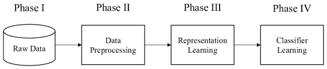

<!--yml

category: 未分类

date: 2024-09-06 20:03:42

-->

# [1912.05721] 使用深度学习解决计算机安全挑战：一项调查 1 脚注 11 脚注 1 本文的作者按字母顺序列出。

> 来源：[`ar5iv.labs.arxiv.org/html/1912.05721`](https://ar5iv.labs.arxiv.org/html/1912.05721)

¹¹affiliationtext: 美国宾夕法尼亚州立大学²²affiliationtext: 韩国釜山国立大学³³affiliationtext: 中国武汉理工大学

# 使用深度学习解决计算机安全挑战：一项调查¹¹1 本文的作者按字母顺序列出。

Yoon-Ho Choi Peng Liu 负责人：pxl20@psu.edu Zitong Shang Haizhou Wang Zhilong Wang Lan Zhang Junwei Zhou Qingtian Zou

###### 摘要

尽管使用机器学习技术解决计算机安全挑战并不是一个新想法，但快速发展的深度学习技术最近在计算机安全领域引发了大量兴趣。本文旨在专门回顾使用深度学习技术解决计算机安全挑战的最新研究成果。特别地，回顾涵盖了通过深度学习应用解决的八个计算机安全问题：以安全为导向的程序分析、防御返回导向编程（ROP）攻击、实现控制流完整性（CFI）、防御网络攻击、恶意软件分类、基于系统事件的异常检测、内存取证以及软件安全的模糊测试。

## 1 引言

使用机器学习技术解决计算机安全挑战并不是一个新想法。例如，1998 年，Ghosh 等人[1]提出训练（传统）神经网络异常检测方案（即检测针对程序的异常和未知入侵）；2003 年，Hu 等人[2]和 Heller 等人[3]应用支持向量机进行基于异常的检测方案（例如，检测异常的 Windows 注册表访问）。

然而，1990-2010 年的机器学习基础计算机安全研究调查并没有产生很大的影响。例如，据我们所知，[1, 2, 3]中提出的机器学习应用没有被纳入广泛部署的入侵检测商业产品中。

关于为什么影响不大，虽然计算机安全领域的研究人员似乎有不同的看法，但 Sommer 和 Paxson [4]（在入侵检测的背景下）以下的评论引起了许多研究人员的共鸣：

+   •

    备注 A：“了解系统所针对的问题至关重要：具体要检测哪些攻击？定义目标活动越狭窄，越能将检测器量身定制到其特性，并减少误分类的可能性。”[4]

+   •

    备注 B：“如果无法对特征与感兴趣攻击之间的关系做出有力的论证，结果研究就有可能陷入严重缺陷。”[4]

这些有见地的评论，尽管与 1990-2010 年期间安全研究人员使用的机器学习技术非常一致，但由于以下观察，它们在深度学习（DL）这一迅速发展的机器学习技术下可能变得不那么重要。首先，备注 A 意味着即使使用相同的机器学习方法，一个采用基于更具体定义目标攻击活动的成本函数的算法，可能比另一个使用成本函数定义较不具体的算法表现更好。对于 DL 来说，这可能是一个不那么重要的问题，因为一些近期研究表明，即使目标攻击活动没有狭窄定义，DL 模型仍能实现非常高的分类准确率。其次，备注 B 意味着如果特征工程做得不够好，训练好的机器学习模型可能会存在严重缺陷。对于 DL 来说，这可能是一个不那么重要的问题，因为许多深度学习神经网络比传统机器学习技术需要更少的特征工程。

如[5]所述，“DL 是一种统计技术，它利用大量数据作为训练集，用于训练一个具有多个隐藏层的网络，称为深度神经网络（DNN）。DNN 在数据集上进行训练，生成输出、计算误差，并调整其内部参数。然后，这一过程会重复数十万次，直到网络达到可接受的性能水平。它已被证明是一种有效的技术，用于图像分类、目标检测、语音识别和自然语言处理——这些问题曾困扰研究人员几十年。通过从数据中学习，DNN 可以更有效地解决某些问题，并解决以前无法解决的问题。”

现在让我们从高层次来看一下 DL 如何大大简化应对 Sommer 和 Paxson 所识别的挑战[4]。首先，DL 的一个主要优势是它使学习算法对特征工程的依赖性降低。这一特点使得 DL 更容易克服备注 B 所指示的挑战。其次，DL 的另一个主要优势是它可以在最小的领域知识下实现高分类准确率。这一特点使得 DL 更容易克服备注 A 所指示的挑战。

关键观察。上述讨论表明，深度学习可能成为将机器学习技术应用于解决计算机安全挑战的变革者。

受此观察启发，本文旨在提供关于使用深度学习技术解决计算机安全挑战的最新研究工作的专门综述。需要注意的是，由于本文旨在提供专门综述，非深度学习技术及其安全应用不在本文范围之内。

本文的剩余部分组织如下。在第二部分中，我们介绍了一个四阶段的工作流程框架，用于以统一的方式总结现有工作。在 LABEL:sec:programanalysis-LABEL:sec:fuzzing 节中，我们分别提供了对八个通过应用深度学习解决的计算机安全问题的综述。在 LABEL:sec:dis 节中，我们将讨论现有工作之间的某些相似性和某些差异性。在 LABEL:sec:fur 节中，我们提到四个进一步研究的领域。在 LABEL:sec:con 节中，我们总结了本文。

## 2 一个四阶段工作流程框架可以以统一的方式总结现有工作

我们发现，四阶段工作流程框架可以提供一种统一的方法来总结我们调查的所有研究工作。特别是，我们发现我们调查的每项工作在使用机器学习技术解决计算机安全挑战时采用了特定的工作流程，并且每个工作流程都包含两个或更多阶段。所谓“统一的方法”，是指我们调查的每个工作流程本质上都是一种通用工作流程模式的实例，如图 1 所示。

### 2.1 四个阶段的定义

如图 1 所示，四个阶段的定义如下。为了使四个阶段的定义更加具体，我们使用一个运行示例来说明这四个阶段。



图 1：四阶段工作流程概览

第一阶段（获取原始数据）

在这个阶段，收集了某些原始数据。

运行示例：当深度学习用于检测 Hadoop 分布式文件系统（HDFS）中的可疑事件时，原始数据通常是发生在每个块上的事件（例如，块被分配、读取、写入、复制或删除）。由于这些事件记录在 Hadoop 日志中，日志文件保存了原始数据。由于每个事件由特定的（块 ID，时间戳）元组唯一标识，我们可以简单地将原始数据视为$n$个事件序列。这里的$n$是 HDFS 中块的总数。例如，[6]中收集的原始数据总共包含 11,197,954 个事件。由于 HDFS 中有 575,139 个块，所以原始数据中有 575,139 个事件序列，平均每个事件序列包含 19 个事件。以下是一个这样的事件序列：

```
081110 112428 31 INFO dfs.FSNamesystem: BLOCK* NameSystem.allocateBlock:
  /user/root/rand/_temporary/_task_200811101024_0001_m_001649_0/
  part-01649.blk_-1033546237298158256
081110 112428 9602 INFO dfs.DataNode$DataXceiver:
  Receiving block blk_-1033546237298158256 src: /10.250.13.240:54015
  dest:/10.250.13.240:50010
081110 112428 9982 INFO dfs.DataNode$DataXceiver:
  Receiving block blk_-1033546237298158256 src: /10.250.13.240:52837
  dest:/10.250.13.240:50010
081110 112432 9982 INFO dfs.DataNode$DataXceiver:
  writeBlock blk_-1033546237298158256 received exception
  java.io.IOException:Could not read from stream

```

第二阶段（数据预处理）

阶段 1 和阶段 1 旨在正确提取和表示阶段 I 收集的原始数据中包含的有用信息。阶段 1 和阶段 1 都与特征工程密切相关。阶段 1 和阶段 1 的一个关键区别在于，阶段 1 完全专注于表示学习，而阶段 1 则专注于所有不基于表示学习的信息提取和数据处理操作。

运行示例：让我们重新审视上述 HDFS。每个记录的事件都由非结构化文本描述。在阶段 1，非结构化文本被解析为显示事件类型和事件变量（名称，值）对的数据结构。由于 HDFS 中有 29 种事件类型，每个事件根据其类型由从 1 到 29 的整数表示。这样，上述示例事件序列可以转换为：

```
   22, 5, 5, 7

```

阶段 III.（表示学习）

如 [7] 所述，“学习数据的表示，使得在构建分类器或其他预测器时更容易提取有用的信息。”

运行示例：让我们重新审视相同的 HDFS。尽管 DeepLog [8] 直接使用 one-hot 向量表示事件类型而未进行表示学习，但如果我们将事件类型视为结构化语言中的一个词，实际上可以使用词嵌入技术来表示每个事件类型。需要注意的是，词嵌入技术是一种表示学习技术。

阶段 IV.（分类器学习）

这一阶段旨在通过深度学习构建特定的分类器或其他预测器。

运行示例：让我们重新审视相同的 HDFS。DeepLog [8] 使用深度学习构建了一个堆叠 LSTM 神经网络用于异常检测。例如，考虑事件序列 {22,5,5,5,11,9,11,9,11,9,26,26,26}，其中每个整数表示事件序列中相应事件的事件类型。给定窗口大小 $h$ = 4，用于训练 DeepLog 的输入样本和输出标签对为：{22,5,5,5 $\rightarrow$ 11}，{5,5,5,11 $\rightarrow$ 9}，{5,5,11,9 $\rightarrow$ 11}，等等。在检测阶段，DeepLog 检查每个单独的事件。它根据事件类型是否被 LSTM 神经网络预测来判断事件是否正常。如果事件类型位于前 $g$ 个预测类型中，则该事件被视为正常；否则，视为异常。

### 2.2 使用四阶段工作流程框架总结一些代表性研究工作

在本小节中，我们使用四阶段工作流框架来总结每个安全问题的两个代表性工作。系统安全包括许多子研究主题。然而，并不是所有的研究主题都适合采用基于深度学习的方法，这取决于它们的固有特性。对于可以结合深度学习的安全研究主题，有些在近年来已经进行了深入研究，而其他的则刚刚出现。我们注意到系统安全领域有 5 个主流研究方向。本文主要关注系统安全，因此其他主流研究方向（如深度伪造）不在讨论范围之内。因此，我们在调查中选择了这 5 个广受关注的研究方向，以及 3 个新兴研究方向：

1.  1.

    在安全导向的程序分析中，恶意软件分类（MC）、基于系统事件的异常检测（SEAD）、内存取证（MF）和防御网络攻击等领域，基于深度学习的方法已经进行了深入研究。

1.  2.

    在防御面向返回的编程（ROP）攻击、控制流完整性（CFI）和模糊测试方面，基于深度学习的方法正成为新兴的研究主题。

我们在调查中为每个研究主题选择了两个代表性工作。选择论文的标准主要包括：1) 开创者（该领域的早期论文之一）；2) 顶尖（发表在顶级会议或期刊上）；3) 创新性；4) 引用（论文的引用量高）；5) 效果（论文的结果相当好）；6) 代表性（论文是该研究方向的代表性工作）。表 1 列出了我们选择每篇论文的原因，并按重要性排序。

表 1：我们用来选择每个研究主题代表性工作的标准列表。

| <svg version="1.1" height="19.58" width="64.06" overflow="visible"><g transform="translate(0,19.58) scale(1,-1)"><g  transform="translate(0,0)"><g transform="translate(0,10.93) scale(1, -1)"><foreignobject width="32.03" height="10.93" overflow="visible">论文</foreignobject></g></g> <g  transform="translate(32.17,10.93)"><g transform="translate(0,8.65) scale(1, -1)"><foreignobject width="31.89" height="8.65" overflow="visible">订单</foreignobject></g></g></g></svg>      | 1 | 2 | 3 | 4 |
| --- | --- | --- | --- | --- |
|  RFBNN [9]   | 开创者 | 顶尖 | 创新性 | 引用 |
| EKLAVYA [10]   | 顶尖 | 创新性 | 引用 | 不适用 |
| ROPNN [11]   | 开创者 | 创新性 | 效果 | 不适用 |
| HeNet [12]   | 效果 | 创新性 | 引用 | 不适用 |
| Barnum [13]   | 开创者 | 创新性 | 不适用 | 不适用 |
| CFG-CNN [14]   | 代表性 | 不适用 | 不适用 | 不适用 |
| 50b(yte)-CNN [15]   | 新颖性 | 有效性 | 不适用 | 不适用 |
| PCNN [16]   | 新颖性 | 有效性 | 不适用 | 不适用 |
| Resenberg [17]   | 新颖性 | 有效性 | 顶级 | 代表性 |
| DeLaRosa [18]   | 新颖性 | 代表性 | 不适用 | 不适用 |
| DeepLog [8]   | 先锋 | 顶级 | 引用 | 不适用 |
| DeepMem [19]   | 先锋 | 顶级 | 不适用 | 不适用 |
| NeuZZ [20]   | 新颖性 | 顶级 | 有效性 | 不适用 |
| Learn & Fuzz [21]   | 先锋 | 新颖性 | 顶级 | 不适用 |

每篇我们选择的论文的摘要显示在表格 LABEL:Table:Summary 中。表中有三列。在第一列中，我们列出了八个安全问题，包括安全导向的程序分析、抵御返回导向编程（ROP）攻击、控制流完整性（CFI）、抵御网络攻击（NA）、恶意软件分类（MC）、基于系统事件的异常检测（SEAD）、内存取证（MF）和软件安全模糊测试。在第二列中，我们列出了每个安全问题的两个最新代表性工作。从第$3$列到第$6$列，我们顺序描述了每项工作的四个阶段的部署情况。在“总结”列中，我们顺序描述了每项工作的四个阶段的部署情况，然后列出每项工作的评估结果，包括准确率（ACC）、精确度（PRC）、召回率（REC）、F1 分数（F1）、假阳性率（FPR）和假阴性率（FNR）。

{ThreePartTable}{TableNotes}

深度学习指标通常在模糊测试论文中不可用。典型的模糊测试评估指标包括：代码覆盖率、通过率和缺陷。

表 2：使用深度学习解决八个安全问题的方案。评估列中的指标包括准确率（ACC）、精确度（PRC）、召回率（REC）、$F_{1}$ 分数（$F_{1}$）、假阳性率（FPR）和假阴性率（FNR）。

|  |  |  |  |  |  |
| --- | --- | --- | --- | --- | --- |
| 安全问题 | 工作 | 总结 |
| --- | --- | --- |
| 安全导向程序分析 [9, 10, 22, 23] | RFBNN [9] | 阶段 I | 阶段 II |
|  |  | 数据集来自之前的论文 [24]，包括 2200 个独立的二进制文件。2064 个二进制文件用于 Linux，来源于 coreutils、binutils 和 findutils 软件包。剩余的 136 个二进制文件用于 Windows，来自流行的开源项目。二进制文件中一半为 x86，另一半为 x86-64。 | 他们从二进制文件的代码部分提取固定长度的子序列（1000 字节块），然后使用“独热编码”，将字节转换为$\mathbb{Z}^{256}$向量。 |
|  |  | 阶段 III | 阶段 IV | 评估 |
|  |  | 不适用 | 双向 RNN |

&#124; 准确率: &#124; 98.4% &#124;  &#124; 精确度: &#124; 不适用 &#124;

&#124; REC: &#124; 0.97 &#124;  &#124; $F_{1}$: &#124; 0.98 &#124;

&#124; FPR: &#124; 不适用 &#124;  &#124; FNR: &#124; 不适用 &#124;

|

|  | EKLAVYA[10] | 阶段 I | 阶段 II |
| --- | --- | --- | --- |
|  |  | 他们采用了之前工作的源代码[9]作为他们的原始数据，然后使用两个常用编译器：gcc 和 clang，针对 x86 和 x64 进行了从 O0 到 O3 的不同优化级别。通过解析 DWARF 调试信息，他们获得了函数参数的真实值。接下来，从二进制文件中提取函数，并去除数据集中重复的函数。最后，匹配调用器代码片段和被调用者主体。 | 对每条指令的十六进制值进行分词。 |
|  |  | 阶段 III | 阶段 IV | 评估 |
|  |  | 使用 Word2vec 技术计算词嵌入。 | RNN |

&#124; ACC: &#124; 81.0% &#124;  &#124; PRE: &#124; 不适用 &#124;

&#124; REC: &#124; 不适用 &#124;  &#124; $F_{1}$: &#124; 不适用 &#124;

&#124; FPR: &#124; 不适用 &#124;  &#124; FNR: &#124; 不适用 &#124;

|

| 防御返回导向编程攻击 [11, 12, 25] | ROPNN [11] | 阶段 I | 阶段 II |
| --- | --- | --- | --- |
|  |  | 数据是一组从现有程序中获得的 gadget 链。使用 gadget 搜索工具 ROPGadget 来查找可用的 gadget。根据产生的 gadget 链是否可以在 CPU 模拟器上执行来连接 gadget。原始数据以指令序列的十六进制形式表示。 | 为字节形成 one-hot 向量。 |
|  |  | 阶段 III | 阶段 IV | 评估 |
|  |  | 不适用 | 1-D CNN |

&#124; ACC: &#124; 99.9% &#124;  &#124; PRE: &#124; 0.99 &#124;

&#124; REC: &#124; 不适用 &#124;  &#124; $F_{1}$: &#124; 0.01 &#124;

&#124; FPR: &#124; 不适用 &#124;  &#124; FNR: &#124; 不适用 &#124;

|

|  | HeNet [12] | 阶段 I | 阶段 II |
| --- | --- | --- | --- |
|  |  | 数据来自 Intel PT，这是一个处理器跟踪工具，可以记录控制流数据。感兴趣的两个数据包是 Taken Not-Taken (TNT)包和 Target IP (TIP)包。信息以二进制形式记录，从 TNT 中可以获取执行分支的信息，从 TIP 中可以获取二进制执行信息。然后将二进制序列转换为 0 到 255 之间的值序列，称为像素，逐字节处理。 | 根据像素序列，将整个序列切片并重新调整形状，以形成图像序列用于神经网络训练。 |
|  |  | 阶段 III | 阶段 IV | 评估 |
|  |  | 使用 Word2vec 技术计算词嵌入。 | DNN |

&#124; ACC: &#124; 98.1% &#124;  &#124; PRE: &#124; 0.99 &#124;

&#124; REC: &#124; 0.96 &#124;  &#124; $F_{1}$: &#124; 0.97 &#124;

&#124; FPR: &#124; 0.01 &#124;  &#124; FNR: &#124; 0.04 &#124;

|

| 实现控制流完整性 [13, 14, 25] | Barnum[13] | 阶段 I | 阶段 II |
| --- | --- | --- | --- |
|  |  | 原始数据，即执行的确切指令序列，是通过将程序二进制文件、程序打开文档前立即获取的内容和 Intel^® PT 跟踪结合生成的。虽然 Intel^® PT 内置的过滤选项设置为 CR3 和当前特权级别（CPL），仅跟踪用户空间中的程序活动。 | 原始指令序列被总结为带有 ID 的基本块，并且被切分为大小为 32 的可管理子序列，这一大小通过实验确定。仅分析以间接调用、跳转和返回结束的序列，因为控制流劫持攻击总是在这些地方发生。标签是序列中的下一个 BBID。 |
|  |  | 第三阶段 | 第四阶段 | 评估 |
|  |  | 不适用 | LSTM |

&#124; 准确率（ACC）： &#124; 不适用% &#124;  &#124; 精确率（PRE）： &#124; 0.98 &#124;

&#124; 召回率（REC）： &#124; 1.00 &#124;  &#124; $F_{1}$: &#124; 0.98 &#124;

&#124; 假阳性率（FPR）： &#124; 0.98 &#124;  &#124; 假阴性率（FNR）： &#124; 0.02 &#124;

|

|  | CFG-CNN [14] | 第一阶段 | 第二阶段 |
| --- | --- | --- | --- |
|  |  | 原始数据是由作者提出的算法从程序汇编代码构建的指令级控制流图。在控制流图（CFG）中，一个顶点对应一个指令，一个有向边对应从一个指令到另一个指令的执行路径。实验用的程序集来自流行的编程竞赛平台 CodeChief。 | 由于控制流图中的每个顶点表示一个包含复杂信息的指令，可以从不同的方面查看，包括指令名称、类型、操作数等，一个顶点被表示为一组实值向量的总和，这些向量对应于不同的视图（例如，addq 32,%rsp 被转换为 addq 值和 reg 随机分配向量的线性组合）。然后，控制流图通过一组固定大小的窗口切片穿过整个图，以提取不同级别的局部特征。 |
|  |  | 第三阶段 | 第四阶段 | 评估 |
|  |  | 不适用 | DGCNN 具有不同视图数量和是否有操作数 |

&#124; 准确率（ACC）： &#124; 84.1% &#124;  &#124; 精确率（PRE）： &#124; 不适用 &#124;

&#124; 召回率（REC）： &#124; 不适用 &#124;  &#124; $F_{1}$: &#124; 不适用 &#124;

&#124; 假阳性率（FPR）： &#124; 不适用 &#124;  &#124; 假阴性率（FNR）： &#124; 不适用 &#124;

|

| 防御网络攻击 [15, 16, 26, 27, 28, 29, 30] | 50b(yte)-CNN[15] | 第一阶段 | 第二阶段 |
| --- | --- | --- | --- |
|  |  | 使用开放数据集 UNSW-NB15。首先，利用 tcpdump 工具捕获 100 GB 的原始流量（即 PCAP 文件），包含正常活动和 9 种攻击。然后使用 Argus、Bro-IDS（现称为 Zeek）分析工具，开发了十二种算法以生成总共 49 个特征和类别标签。最终，总的数据样本数量为 2,540,044，存储在 CSV 文件中。 | 选取每个网络流量流的前 50 字节，每个字节直接作为一个特征输入到神经网络中。 |
|  |  | 阶段 III | 阶段 IV | 评估 |
|  |  | 不适用 | 具有 2 个隐藏全连接层的 CNN |

&#124; ACC: &#124; 不适用% &#124;  &#124; PRE: &#124; 不适用 &#124;

&#124; REC: &#124; 不适用 &#124;  &#124; $F_{1}$: &#124; 0.93 &#124;

&#124; FPR: &#124; 不适用 &#124;  &#124; FNR: &#124; 不适用 &#124;

|

|  | PCCN[16] | 阶段 I | 阶段 II |
| --- | --- | --- | --- |
|  |  | 使用开放数据集 CICIDS2017，其中包含正常和 14 种攻击。通过对人类交互的抽象行为进行建模生成背景正常网络流量。原始数据提供为 PCAP 文件，使用 CICFlowMeter 进行网络流量分析的结果提供为 CSV 文件。最终数据集包含 3,119,345 个数据样本和 83 个特征，分类为 15 个类别（1 个正常 + 14 个攻击）。 | 从原始数据集中提取总计 1,168,671 个流数据，包括 12 种攻击活动。这些流数据随后被处理并可视化为灰度 2D 图。可视化方法未指定。 |
|  |  | 阶段 III | 阶段 IV | 评估 |
|  |  | 不适用 | 并行交叉 CNN。 |

&#124; ACC: &#124; 不适用% &#124;  &#124; PRE: &#124; 0.99 &#124;

&#124; REC: &#124; 不适用 &#124;  &#124; $F_{1}$: &#124; 0.99 &#124;

&#124; FPR: &#124; 不适用 &#124;  &#124; FNR: &#124; 不适用 &#124;

|

| 恶意软件分类 [18, 31, 32, 33, 34, 35, 36, 37, 38, 39, 17, 40] | Rosenberg[17] | 阶段 I | 阶段 II |
| --- | --- | --- | --- |
|  |  | Android 数据集包含最新的恶意软件家族及其变体，每个家族的样本数量相同。样本由 VirusTotal 标记。然后使用 Cuckoo Sandbox 提取动态特征（API 调用）和静态特征（字符串）。为了避免某些反取证样本，他们应用了 YARA 规则并去除 API 调用少于 15 次的序列。在预处理和样本数量平衡之后，数据集包含 400,000 个有效样本。 | 长序列在训练 LSTM 模型时会导致内存溢出。因此，他们使用固定大小的滑动窗口，并用零填充较短的序列。对 API 调用应用了一位编码。对于静态特征字符串，他们定义了一个 20,000 个布尔值的向量，表示数据集中最频繁的字符串。如果样本包含一个字符串，向量中相应的值将被设置为 1，否则为 0。 |
|  |  | 第三阶段 | 第四阶段 | 评估 |
|  |  | 不适用 | 他们在实验中使用了 RNN、BRNN、LSTM、Deep LSTM、BLSTM、Deep BLSTM、GRU、双向 GRU、全连接 DNN 和 1D CNN |

&#124; 准确率: &#124; 98.3% &#124;  &#124; 精确率: &#124; 不适用 &#124;

&#124; 召回率: &#124; 不适用 &#124;  &#124; $F_{1}$: &#124; 不适用 &#124;

&#124; 假阳性率: &#124; 不适用 &#124;  &#124; 假阴性率: &#124; 不适用 &#124;

|

|  | DeLaRosa[18] | 第一阶段 | 第二阶段 |
| --- | --- | --- | --- |
|  |  | Windows 数据集来自 Reversing Labs，包括 XP、7、8 和 10 的 32 位和 64 位架构，并在十二年（2006-2018）的时间跨度内收集。数据集中选择了九个恶意软件家族，并提取了静态特征，包括字节、基本特征和汇编特征。 | 对于字节级特征，他们使用滑动窗口获取字节的直方图，并计算窗口中的相关熵；对于基本特征，他们根据 ASCII 字符串列表创建了固定大小的特征向量，或者从 PE 头中提取了导入和元数据（字符串被哈希并计算这些哈希的直方图，统计每个值的出现次数）；对于汇编特征，Radare2 生成的反汇编代码可以解析并转化为类似图的数据结构，如调用图、控制流图和指令流图。 |
|  |  | 第三阶段 | 第四阶段 | 评估 |
|  |  | 不适用 | 不适用 |

&#124; 准确率: &#124; 90.1% &#124;  &#124; 精确率: &#124; 不适用 &#124;

&#124; 召回率: &#124; 不适用 &#124;  &#124; $F_{1}$: &#124; 不适用 &#124;

&#124; 假阳性率: &#124; 不适用 &#124;  &#124; 假阴性率: &#124; 不适用 &#124;

|

| 基于系统事件的异常检测 [8, 41, 42, 43, 44, 45] | DeepLog[8] | 第一阶段 | 第二阶段 |
| --- | --- | --- | --- |
|  |  | 从 203 节点 HDFS 中记录了超过 2400 万条原始日志条目，总大小为 2412 MB。解析了超过 1100 万条包含 29 种类型的日志条目，这些条目根据块标识符进一步分组为 575,061 个会话。这些会话由 HDFS 专家手动标记为正常和异常。最终构建的数据集包括 575,061 个 HDFS 会话日志，其中 16,838 个会话被标记为异常 | 原始日志条目使用基于最长公共子序列的 Spell[46] 解析为不同的日志类型。HDFS 数据集中共有 29 种日志类型 |
|  |  | 第三阶段 | 第四阶段 | 评估 |
|  |  | DeepLog 直接利用 one-hot 向量表示 29 个日志关键字，而不进行表示学习 | 一个具有两个隐藏 LSTM 层的堆叠 LSTM。 |

&#124; ACC: &#124; N/A% &#124;  &#124; PRE: &#124; 0.95 &#124;

&#124; REC: &#124; 0.96 &#124;  &#124; $F_{1}$: &#124; 0.96 &#124;

&#124; FPR: &#124; N/A &#124;  &#124; FNR: &#124; N/A &#124;

|

|  | LogAnom [41] | 第一阶段 | 第二阶段 |
| --- | --- | --- | --- |
|  |  | LogAnom 也使用了与 DeepLog 相同的 HDFS 数据集。 | 原始日志条目使用 FT-Tree [47] 解析为不同的日志模板，依据是日志词的频繁组合。HDFS 数据集中共有 29 种日志模板 |
|  |  | 第三阶段 | 第四阶段 | 评估 |
|  |  | LogAnom 使用 Word2Vec 表示提取的日志模板，增加了更多语义信息 | 两个具有 128 个神经元的 LSTM 层 |

&#124; ACC: &#124; N/A% &#124;  &#124; PRE: &#124; 0.97 &#124;

&#124; REC: &#124; 0.94 &#124;  &#124; $F_{1}$: &#124; 0.96 &#124;

&#124; FPR: &#124; N/A &#124;  &#124; FNR: &#124; N/A &#124;

|

| 内存取证 [19, 48, 49, 50] | DeepMem[19] | 第一阶段 | 第二阶段 |
| --- | --- | --- | --- |
|  |  | 在 Windows 7 x86 SP1 虚拟机上收集了 400 个内存转储，通过模拟各种随机用户操作并强制操作系统随机分配对象。每个转储的大小为 1GB。 | 从内存转储中构建内存图，其中每个节点表示两个指针之间的一个段，如果两个节点是邻居，则创建一条边 |
|  |  | 第三阶段 | 第四阶段 | 评估 |
|  |  | 每个节点由来自嵌入网络的潜在数值向量表示。 | 带有 ReLU 层的全连接网络 (FCN)。 |

&#124; ACC: &#124; N/A% &#124;  &#124; PRE: &#124; 0.99 &#124;

&#124; REC: &#124; 0.99 &#124;  &#124; $F_{1}$: &#124; 0.99 &#124;

&#124; FPR: &#124; 0.01 &#124;  &#124; FNR: &#124; 0.01 &#124;

|

|  | MDMF [48] | 第一阶段 | 第二阶段 |
| --- | --- | --- | --- |
|  |  | 创建一个正常、未受损软件运行的良性主机内存快照数据集，包括在许多恶意快照中执行的软件。良性快照在选择的程序打开后经过足够时间从内存中提取。通过在独立的恶意环境中并行生成样本，创建了良性内存快照数据集。 | 以各种方式表示内存快照，包括字节序列和图像，而不依赖于操作系统的领域知识。 |
|  |  | 第三阶段 | 第四阶段 | 评估 |
|  |  | 不适用 | 由多个层（包括池化层和全连接层）组成的 LSTM 单元的递归神经网络和卷积神经网络，用于图像数据 |

&#124; 准确率: &#124; 98.0% &#124;  &#124; 精确率: &#124; 不适用 &#124;

&#124; 记录: &#124; 不适用 &#124;  &#124; $F_{1}$: &#124; 不适用 &#124;

&#124; 假正率: &#124; 不适用 &#124;  &#124; 假负率: &#124; 不适用 &#124;

|

| 模糊测试 [51, 20, 52, 21, 53] | L-Fuzz[21] | 第一阶段 | 第二阶段 |
| --- | --- | --- | --- |
|  |  | 原始数据包括约 63,000 个非二进制 PDF 对象，按固定大小切割，提取自 534 个由 Windows 模糊测试团队提供的 PDF 文件，这些文件先前用于 Edge PDF 解析器的扩展模糊测试。 | 不适用 |
|  |  | 第三阶段 | 第四阶段 | 评估 |
|  |  | 不适用 | Char-RNN |

&#124; 准确率: &#124; 不适用% &#124;  &#124; 精确率: &#124; 不适用 &#124;

&#124; 记录: &#124; 不适用 &#124;  &#124; $F_{1}$: &#124; 0.93 &#124;

&#124; 假正率: &#124; 不适用 &#124;  &#124; 假负率: &#124; 不适用 &#124;

|

|  | NEUZZ[20] | 第一阶段 | 第二阶段 |
| --- | --- | --- | --- |
|  |  | 对每个测试的程序，原始数据是通过在单核机器上运行 AFL-2.52b 一小时收集的。训练数据是由 AFL 生成的字节级输入文件，标签是对应于输入文件的位图。在实验中，NEUZZ 在 10 个真实世界程序、LAVA-M 错误数据集和 CGC 数据集上实现。 | 不适用 |
|  |  | 第三阶段 | 第四阶段 | 评估 |
|  |  | 不适用 | 神经网络 |

&#124; 准确率: &#124; 不适用% &#124;  &#124; 精确率: &#124; 不适用 &#124;

&#124; 记录: &#124; 不适用 &#124;  &#124; $F_{1}$: &#124; 0.93 &#124;

&#124; 假正率: &#124; 不适用 &#124;  &#124; 假负率: &#124; 不适用 &#124;

|

| \insertTableNotes |  |  |  |  |  |
| --- | --- | --- | --- | --- | --- |

{TableNotes}

深度学习指标在模糊测试论文中通常不可用。用于评估的典型模糊测试指标包括：代码覆盖率、通过率和缺陷。

### 2.3 现有工作的评审方法

数据表示（或特征工程）在解决深度学习中的安全问题中扮演着重要角色。这是因为数据表示是一种利用人类智慧和先验知识来提取和组织数据中区分性信息的方式。许多在安全领域部署机器学习算法的努力实际上都集中在预处理管道和数据转换的设计上，这些设计能够提供有效的机器学习数据表示。

为了扩展机器学习在安全领域的适用范围和便利性，找到一种合适的数据表示方法是非常理想的，这种方法可以或多或少地纠缠和隐藏数据背后的不同解释因素。为了使本调查充分反映数据表示的重要作用，我们的综述将重点关注现有工作如何回答以下三个问题：

+   •

    问题 1：文献中是否广泛地进行了阶段 1？当在某项工作中跳过阶段 1 时，有没有特别的原因？

+   •

    问题 2：文献中是否采用了阶段 1？当在某项工作中跳过阶段 1 时，有没有特别的原因？

+   •

    问题 3：在解决不同的安全问题时，第一阶段学习的（类型的）分类器是否存在共性？在解决相同安全问题的工作中，第一阶段学习的分类器是否存在差异？

这段文本包含了 SVG 图形和嵌入的文字，是否需要对具体的图形部分进行详细解释，还是只关注文本翻译？

为了将不同应用场景中解决相同安全问题的 Phase 1 方法进行归类，我们引入了如图 LABEL:fig:dec 所示的分类树。该分类树将我们选择的调查研究中的 Phase 1 方法分为四类。首先，类别 1 包括那些不考虑表示学习的 Phase1 方法。其次，类别 2 包括那些考虑表示学习但不采用它的 Phase1 方法。第三，类别 3 包括那些考虑并采用表示学习但未与其他方法进行性能比较的 Phase1 方法。最后，类别 4 包括那些考虑并采用表示学习且与其他方法进行性能比较的 Phase1 方法。

在本文的其余部分，我们将深入探讨文献中如何通过应用深度学习来解决八个安全问题。

## 3 深入探讨深度学习在解决面向安全的程序分析挑战中的应用

### 3.1 介绍

近年来，面向安全的程序分析在软件安全中被广泛应用。例如，符号执行和污点分析被用来发现、检测和分析程序中的漏洞。控制流分析、数据流分析以及指针/别名分析是实施许多安全策略的重要组成部分，如控制流完整性、数据流完整性和悬空指针消除。逆向工程被防御者和攻击者用来在没有源代码的情况下理解程序的逻辑。

在面向安全的程序分析中，存在许多开放性问题，例如精确的指针/别名分析、准确完整的逆向工程、复杂约束求解、程序去混淆等。一些问题已经理论证明是 NP 难的，而其他问题仍然需要大量的人工努力来解决。无论是哪一种，都需要大量的领域知识和专家经验来开发更好的解决方案。 从本质上讲，通过传统方法解决这些问题的主要挑战在于特征与标签之间复杂的规则，这些规则在不同的上下文中可能会变化。因此，一方面，需要大量的人工努力来制定规则以解决这些问题；另一方面，即使是最有经验的专家也无法保证解决方案的完整性。幸运的是，深度学习方法擅长在给定大量训练数据的情况下发现特征与标签之间的关系。如果训练样本具有代表性且有效编码，它可以快速而全面地发现所有关系。

在本节中，我们将回顾四项最新的代表性工作，这些工作使用深度学习进行面向安全的程序分析。我们观察到它们关注的目标各不相同。Shin 等人设计了一个模型[9]以识别函数边界。EKLAVYA[10]被开发用来学习函数类型。Gemini[23]被提出用来检测函数之间的相似性。DEEPVSA[22]被设计用来从代码序列中学习间接寻址的内存区域。在这些工作中，我们选择了两个代表性的工作[9, 10]，然后在表 LABEL:Table:Summary 中详细总结了分析结果。

我们的综述将围绕第 LABEL:threequestions 节中描述的三个问题展开。在本节的其余部分，我们将首先提供一系列观察结果，然后提供相关指示。最后，我们提供一些一般性的评论。

### 3.2 细致观察的关键发现

通过对最近应用深度学习解决面向安全的程序分析挑战的工作进行详细观察，我们发现以下几点：

+   观察 3.1：我们调查中的所有研究都使用了二进制文件作为原始数据。

    在我们的调查中，Phase1 有一个相似而直接的目标，即从二进制文件中提取代码序列。它们之间的区别在于，在静态程序分析中解决问题时，代码序列是直接从二进制文件中提取的，而在动态程序分析中解决问题时，代码序列是从程序执行中提取的。

+   ^∗观察 3.2：大多数数据表示方法通常考虑了领域知识。

    大多数数据表示方法通常考虑了领域知识，即在处理数据时要保留哪种信息。请注意，特征选择对 Phase1 和 Phase1 产生广泛影响，例如，嵌入粒度和表示学习方法。Gemini[23]选择了函数级别的特征，而我们调查中的其他工作选择了指令级别的特征。具体来说，除了 Gemini[23]，所有的工作都在指令级别上对代码序列进行了向量化。

+   观察 3.3：为了更好地支持高性能的数据表示，一些工作采用了表示学习方法。

    例如，DEEPVSA[22]采用了一种表示学习方法，即双向 LSTM，来学习指令内部的数据依赖关系。EKLAVYA[10]采用了一种表示学习方法，即 word2vec 技术，来提取指令间的信息。值得注意的是，Gemini[23]在其孪生结构的 Phase1 中采用了 Structure2vec 嵌入网络（详见 Observation 3.LABEL：obs:bi）。Structure2vec 嵌入网络从带属性的控制流图中学习信息。

+   观察 3.4：根据我们的分类法，我们调查中的大部分工作被归类为第 4 类。

    为了比较阶段 1，我们引入了一个三层的分类树，如图 LABEL:fig:dec 所示，将不同的工作分为四类。决策树根据设计框架时是否考虑了表示学习、是否采用了表示学习以及是否将他们的方法与其他方法进行了比较，将我们调查的工作分为四类。根据我们的分类法，EKLAVYA[10]，DEEPVSA [22] 被归入图 LABEL:fig:dec 中的第 4 类。此外，Gemini 的工作 [23] 和 Shin 等人的工作 [9] 分别属于图 LABEL:fig:dec 中的第 1 类和第 2 类。

+   观察 3.5：我们调查中的所有工作都解释了他们为什么选择或不选择某种表示学习算法。

    我们调查中的两个工作采用了表示学习但理由不同：一个是为了提升模型的泛化能力 [10]; 另一个是为了学习指令中的依赖关系 [22]。值得注意的是，Shin 等人没有采用表示学习，因为他们希望保留神经网络相对于其他机器学习方法的“吸引力”特征——简单性。正如他们所说，“首先，神经网络可以直接从原始表示中学习，所需的预处理（或‘特征工程’）最少。”以及“其次，神经网络可以端到端地学习，其中每个组成阶段同时训练，以最佳地解决最终目标。”虽然 Gemini [23] 在处理原始数据时没有采用表示学习，但在 siamese 结构中的深度学习模型包含两个图嵌入网络和一个余弦函数。

+   ^∗观察 3.6：分析结果显示，合适的表示学习方法可以提高深度学习模型的准确性。

    DEEPVSA [22] 设计了一系列实验来评估其代表性方法的有效性。通过结合领域知识，EKLAVYA [10] 使用 t-SNE 图和类比推理以直观的方式解释了他们的表示学习方法的有效性。

+   ^∗观察 3.7：使用了各种阶段 IV 方法。

    在阶段 1 中，Gemini [23] 采用了由两个 Structure2vec 嵌入网络和一个余弦函数组成的孪生网络模型。孪生网络接受两个函数作为输入，产生相似性得分作为输出。其他三个工作[9, 10, 22] 分别采用了双向 RNN、RNN 和双向 LSTM。Shin 等人采用双向 RNN，因为他们希望结合过去和未来的信息，以预测当前指令[9]。DEEPVSA [22] 采用双向 RNN 以使其模型能够在前向和后向方式中推断记忆区域。

上述观察似乎表明了以下指示：

+   指示 3.1:   阶段 1 并非总是必要的。

    即便一些案例实验表明表示学习可以改善最终结果，并不是所有作者都将表示学习视为良好的选择。他们更看重深度学习方法的简单性，并认为采用表示学习会削弱深度学习方法的简单性。

+   指示 3.2:   尽管在四项调查工作的阶段 1 的最终目标是训练一个具有更高准确度的模型，但它们有不同的具体动机，如观察 3.LABEL:obs:reason 所述。

    当作者选择表示学习时，他们通常通过实证或理论分析来试图说服人们他们选择的有效性。

+   ^∗指示 3.3:   3.LABEL:obs:bi 表示作者在设计深度学习模型架构时通常会参考领域知识。

    例如，我们审阅的工作通常在其预测部分基于数据序列中的未来信息时采用双向 RNN。

### 3.3 讨论

尽管基于深度学习的方法有效且灵活，但由于程序分析中的分层数据结构、大量噪声和不平衡的数据组成，开发高准确度的方案仍然面临一些挑战。例如，指令序列——程序分析中的典型数据样本——包含三级层次结构：序列–指令–操作码/操作数。更糟糕的是，每一层可能包含许多不同的结构，例如，单操作数指令、多操作数指令，这使得对训练数据进行编码变得更加困难。

## 更深入地了解深度学习在防御 ROP 攻击中的应用

### 4.1 介绍

返回导向编程（ROP）攻击是最危险的代码重用攻击之一，它允许攻击者在不注入任何恶意代码的情况下发起控制流劫持攻击。相反，它利用程序空间中广泛存在的特定指令序列（称为“gadget”）来实现图灵完备的攻击 [54]。Gadgets 是以 RET 指令结尾的指令序列。因此，它们可以通过指定程序栈上的返回地址链在一起。许多传统技术可以用来检测 ROP 攻击，例如控制流完整性（CFI [55]），但许多技术要么检测率低，要么运行时开销高。ROP 有效载荷不包含任何代码。换句话说，分析 ROP 有效载荷而不考虑程序内存转储的上下文是没有意义的。因此，检测和防止 ROP 攻击的最流行方法是控制流完整性。获取指令序列后的挑战是很难识别控制流是否正常。传统方法使用控制流图（CFG）来确定控制流是否正常，但攻击者可以设计遵循 CFG 定义的正常控制流的指令序列。从本质上讲，很难设计一个 CFG 来排除所有可能用于发起 ROP 攻击的指令组合。因此，使用数据驱动的方法可以帮助消除这些问题。

在本节中，我们将回顾三项最近的代表性工作，这些工作使用深度学习来防御 ROP 攻击：ROPNN [11]、HeNet [12] 和 DeepCheck [25]。ROPNN [11] 旨在检测 ROP 攻击，HeNet [12] 旨在使用 CFI 检测恶意软件，而 DeepCheck [25] 旨在检测各种代码重用攻击。

具体来说，ROPnn 是一次保护一个单独的程序，其训练数据来自现实世界程序及其执行。首先，它通过“链式连接”正常执行的指令序列和使用工具生成的 gadget 的“链式连接”来生成其良性和恶意数据，分别在程序的内存转储创建后。每个数据样本是以字节级指令序列标记为“良性”或“恶意”。其次，ROPnn 将使用恶意数据和良性数据进行训练。第三，训练好的模型被部署到目标机器上。在受保护的程序启动后，执行的指令序列将被跟踪并输入到训练好的模型中，一旦模型发现指令序列可能是恶意的，受保护的程序将被终止。

HeNet 也是为了保护单个程序而提出的。它的恶意数据和良性数据分别通过从恶意软件和正常软件中通过 Intel PT 收集跟踪数据来生成。此外，HeNet 预处理其数据集并将每个数据样本的格式调整为图像，以便能够从在 ImageNet 上预训练的模型中实现迁移学习。然后，HeNet 在具有 Intel PT 特性的机器上进行训练和部署，以在线收集和分类程序的执行跟踪。

DeepCheck 的训练数据来自 CFG，这些 CFG 是通过拆解程序并使用 Intel PT 的信息构建的。在构建受保护程序的 CFG 后，作者通过将由边连接的基本块“链式连接”来采样良性指令序列，并通过将那些不由边连接的指令序列“链式连接”来采样恶意指令序列。尽管在训练期间需要 CFG，但训练阶段之后无需构建 CFG。部署后，将通过在受保护程序上利用 Intel PT 来构建指令序列。然后，训练好的模型将对指令序列进行分类，判断其是否恶意或良性。

我们观察到所有考虑的工作都没有涉及到阶段 1，因此它们都属于我们分类法中的第 1 类，如图 LABEL:fig:dec 所示。ROPnn [11]和 HeNet [12]的分析结果见表 LABEL:Table:Summary。此外，我们还观察到三个工作有不同的目标。

我们的评审将围绕在第 LABEL:threequestions 节中描述的三个问题展开。在本节的其余部分，我们将首先提供一组观察结果，然后提供指示。最后，我们提供一些一般性的评论。

### 4.2 进一步观察的关键发现

从对最近使用深度学习防御面向返回编程攻击的应用进行的深入观察中，我们发现了以下几点：

+   观察 4.1：本次调查中所有的工作[11, 25, 12]都集中在数据生成和获取上。

    在 ROPNN[11]中，恶意样本（小工具链）是使用自动化小工具生成器（即 ROPGadget[56]）和 CPU 模拟器（即 Unicorn[57]）生成的。ROPGadget 用于从程序中提取可作为小工具的指令序列，而 Unicorn 用于验证这些指令序列。对应的良性样本（类似小工具链的指令序列）则是通过反汇编一组程序生成的。在 DeepCheck[25]中提到了控制流完整性的关键思想[55]。它通过 Intel CPU 的新特性（Intel Processor Tracing）生成程序的运行时控制流，然后将运行时控制流与通过静态分析生成的程序控制流图（CFG）进行比较。良性指令序列是程序的 CFG 中的序列，反之亦然。在 HeNet[12]中，程序的执行踪迹是通过类似于 DeepCheck 的方法提取的。然后，每个字节被转换为强度在 0 到 255 之间的像素。已知的恶意软件样本和良性软件样本分别用于生成恶意数据和良性数据。

+   观察 4.2：本调查中的 ROPS 工作中没有部署阶段 1。

    ROPNN[11]和 DeepCheck[25]都使用了二进制指令序列进行训练。在 ROPNN[11]中，一个字节被用作数据预处理的基本元素。字节被形成一热编码矩阵，并展平以供一维卷积层使用。在 DeepCheck[25]中，半字节被用作基本单元。每个半字节（4 位）被转换为范围从 0 到 15 的十进制形式作为输入向量的基本元素，然后输入到全连接输入层。另一方面，HeNet[12]使用了不同类型的数据。在本调查草稿编写时，HeNet 的源代码尚未公开，因此数据预处理的细节尚未调查。然而，仍然可以清楚地看出，HeNet 使用了从 Intel PT 收集的二进制分支信息，而不是二进制指令。在 HeNet 中，每个字节被转换为范围从 0 到 255 的十进制数。字节序列被切片并形成图像序列（每个像素代表一个字节）以供全连接输入层使用。

+   观察 4.3：全连接神经网络被广泛使用。

    只有 ROP 网络[11]在特征提取时使用了一维卷积神经网络（CNN）。HeNet [12] 和 DeepCheck[25]则使用了全连接神经网络（FCN）。没有工作使用递归神经网络（RNN）及其变体。

以上观察似乎表明了以下几点：

+   •

    指示 4.1：ROP 问题中的一个最重要因素似乎是特征选择和数据生成。

    所有三项工作使用了非常不同的方法来收集/生成数据，所有作者都提供了非常强有力的证据和/或论据来证明他们的方法。ROP 网络[11]使用恶意和良性指令序列进行训练。然而，良性指令序列与恶意小 gadget 链之间没有明确的界限。这一弱点可能会影响 ROP 网络在现实世界 ROP 攻击中的性能。与 ROP 网络相对，DeepCheck [25]利用控制流图（CFG）生成训练基本块序列。然而，由于恶意基本块序列是通过随机连接没有边的节点生成的，因此不能保证所有恶意基本块都是可执行的。HeNet [12] 从恶意软件中生成训练数据。从技术上讲，HeNet 可以用于检测任何二进制漏洞，但其实验专注于 ROP 攻击，并达到了 100%的准确率。这表明 ROP 问题中的数据源不需要与 ROP 攻击相关，就能产生非常令人印象深刻的结果。

+   •

    指示 4.2：在使用深度学习解决 ROP 问题时，表示学习似乎并不关键。

    对二进制形式的数据进行最少处理似乎足以将数据转换为适合神经网络的表示形式。当然，也可以将二进制指令表示为更高级的形式，如操作码，或使用嵌入学习。然而，如[11]所述，进行这些操作似乎不会显著改变性能。将输入数据表示为更高级别的唯一好处是减少无关信息，但神经网络本身似乎足够擅长特征提取。

+   •

    指示 4.3：不同的神经网络架构对防御 ROP 攻击的效果影响不大。

    HeNet [12] 和 DeepCheck [25] 都利用了标准的深度神经网络（DNN），并在 ROP 问题上取得了可比的结果。可以推断，输入数据可以被神经网络轻松处理，经过适当的预处理后，特征可以被轻松检测到。

正如观察 4.LABEL:rop:obs1 所述，研究人员对 ROP 问题的表示学习不太感兴趣也就不足为奇了。由于 ROP 攻击关注的是小工具链，因此研究人员可以直接选择小工具作为训练数据。将数据映射到数值表示形式相对简单，处理过程也很少。例如，可以将二进制可执行文件映射为十六进制 ASCII 表示，这可能是神经网络的一个良好表示。

相反，研究人员更多地关注数据获取和生成。在 ROP（返回导向编程）问题中，数据量非常有限。与恶意软件和日志不同，ROP 有效负载通常只包含地址，而不是代码，这些地址在没有提供相应指令的情况下并不包含任何信息。因此，收集所有的有效负载没有意义。据我们所知，所有的先前工作都使用了指令序列而不是有效负载作为训练数据，即使这些数据很难收集。

### 4.3 讨论

尽管如此，基于深度学习的方法不再面临设计非常复杂的细粒度控制流图（CFG）的挑战，但它仍然受到数据源有限的困扰。一般来说，基于深度学习的方法需要大量的训练数据。然而，实际的 ROP 攻击恶意数据非常难以获得，因为与良性数据相比，恶意数据需要精心制作，并且没有现有的数据库来收集所有的 ROP 攻击。如果没有足够具有代表性的训练集，训练模型的准确性无法得到保证。

## 5 深度学习在实现控制流完整性（CFI）中的应用

### 5.1 引言

Abadi 于 2005 年提出的控制流完整性（CFI）技术的基本理念[55]可以追溯到 2002 年，当时 Vladimir 和他的同事提出了一种叫做程序监护[58]的方法，这是一种通过强制执行某些安全策略来监控程序运行时执行流程的方法。CFI 的目标是通过限制每个关键控制流转移到只能出现在正确程序执行中的集合来检测和防止控制流劫持攻击，这些集合是根据预先构建的控制流图（CFG）定义的。传统的 CFI 技术通常利用从目标程序的动态或静态分析中获得的一些知识，并结合一些代码插桩方法，以确保程序按照正确的轨道运行。

然而，传统 CFI 的问题包括：（1）现有的 CFI 实现与一些重要的代码特性不兼容 [59]；（2）由静态、动态或组合分析生成的控制流图（CFG）由于一些未解决的问题，不能总是准确完成 [60]；（3）在准确性与性能开销及其他重要属性之间总是存在某种程度的妥协 [61, 62]。最近的研究提出了将深度学习应用于检测控制流违规。他们的结果显示，与传统 CFI 实现相比，安全覆盖率和可扩展性得到了以这种方式增强 [13]。因此，我们认为深度学习可能是另一种需要 CFI 研究人员更多关注的方法，以更高效、更准确地实现控制流完整性。

在本节中，我们将回顾最近的三篇代表性论文，这些论文使用深度学习实现 CFI。在这三篇论文中，两篇代表性论文 [13, 14] 已在表 LABEL:Table:Summary 中逐阶段总结。我们建议感兴趣的读者参阅表 LABEL:Table:Summary 以获得这两篇论文的简明概述。

我们的评审将围绕第 LABEL:threequestions 节中描述的三个问题展开。在本节的其余部分，我们将首先提供一组观察结果，然后提供相关指示。最后，我们将提供一些一般性评论。

### 5.2 更详细观察的主要发现

从对使用深度学习实现控制流完整性的最新应用的详细观察中，我们发现以下几点：

+   观察 5.1：  相关的工作中没有任何一项实现了对控制流违规的预防。

    在进行彻底的文献检索后，我们观察到安全研究人员在应用深度学习技术解决安全问题方面落后于趋势。我们找到的唯一一篇论文是使用深度学习技术直接提升 CFI 性能的 [13]。这篇论文利用深度学习通过检查由硬件生成的程序执行踪迹来检测文档恶意软件。具体来说，CFI 违规是在离线模式下检查的。到目前为止，还没有工作实现程序控制流的即时检查。

    为了提供更有洞察力的结果，在本节中，我们尝试不将焦点狭隘地集中在运行时的 CFI 攻击检测上，而是扩展到那些善于利用控制流相关数据并结合深度学习技术的论文 [14, 63]。在一项工作中，研究人员使用自构建的指令级 CFG 来检测程序缺陷 [14]。在另一项工作中，研究人员使用惰性绑定 CFG 来检测复杂的恶意软件 [63]。

+   观察 5.2：用于评估 CFI 解决方案的数据多样。

    在所有调查的论文中，使用了两种与控制流相关的数据：程序指令序列和控制流图（CFG）。Barnum 等人[13] 使用了通过程序反汇编和英特尔®处理器跟踪获得的静态和动态生成的指令序列。CNNoverCFG[14] 使用自设计的算法构建了指令级控制流图。Minh Hai Nguyen 等人[63] 使用了提议的懒绑定 CFG 来反映恶意软件 DEC 的行为。

+   观察 5.3：我们调查中的所有论文都采用了第 1 阶段。

    我们调查中的所有相关论文都采用了第 1 阶段来处理原始数据，然后再送入第 1 阶段。在 Barnum [13] 中，从程序运行时跟踪获得的指令序列被切分为基本块。然后，他们为每个基本块分配了一个唯一的基本块 ID（BBID）。最后，由于控制流劫持攻击的性质，他们选择了以间接分支指令（例如，间接调用/跳转、返回等）结束的序列作为训练数据。在 CNNoverCFG [14] 中，控制流图中的每条指令都用多个视角的属性进行标注，如操作码、操作数和所属函数。训练数据是通过遍历标注的控制流图生成的序列。Nguyen 等人[63] 将懒绑定 CFG 转换为相应的邻接矩阵，并将矩阵视为图像作为训练数据。

+   观察 5.4：我们调查中的所有论文都没有采用第 1 阶段。

    我们观察到所有我们调查的论文都没有采用 Phase 1。相反，他们直接采用了数值表示的形式作为他们的训练数据。具体来说，Barnum[13] 将指令分组到基本块中，然后用唯一分配的 ID 表示基本块。在 CNNoverCFG[14] 中，CFG 中的每条指令都由与其属性相关联的向量表示。Nguyen 等人直接使用了位字符串表示的哈希值。

+   观察 5.5：使用了各种 Phase IV 模型。

    Barnum[13] 利用 BBID 序列来监控目标程序的执行流，这是序列类型的数据。因此，他们选择了 LSTM 架构来更好地学习指令之间的关系。而在其他两篇论文[14, 63] 中，他们训练了 CNN 和基于有向图的 CNN，分别从控制流图和图像中提取信息。

上述观察似乎表明了以下指示：

+   指示 5.1：所有现有的工作都未能实现及时 CFI 违规检测。

    将深度学习模型紧密嵌入程序执行仍然是一个挑战。所有现有的工作都采用了懒惰检查——在程序执行后检查其执行轨迹。

+   指示 5.2：对于如何生成恶意样本，没有统一的意见。

    在控制流劫持攻击中，数据难以收集。研究人员必须精心制作恶意样本。目前尚不清楚“手工制作”的样本是否能反映控制流劫持攻击的本质。

+   ^∗指示 5.3：Phase 1 中方法的选择基于研究人员的安全领域知识。

### 5.3 讨论

使用深度学习解决 CFI 问题的优势在于它可以避免开发算法以构建接受的 CFGs（控制流图）所涉及的复杂过程。与传统方法相比，基于深度学习的方法可以避免 CFI 设计者研究目标程序的语言特性，并且可以避免控制流分析中的开放问题（指针分析）。因此，基于深度学习的 CFI 为我们提供了更为通用、可扩展和安全的解决方案。然而，由于在 CFI 问题中使用深度学习仍处于初期阶段，哪种控制流相关数据更有效在该研究领域仍不清楚。此外，应用深度学习进行实时控制流违规检测仍是一个未涉足的领域，需要进一步研究。

## 6 深度学习在防御网络攻击中的应用探讨

### 6.1 引言

随着我们日常生活、工作和研究越来越依赖网络，网络安全变得愈加重要。一些常见的网络攻击类型包括探测、拒绝服务（DoS）、远程到本地（R2L）等。传统上，人们尝试使用签名、规则和无监督异常检测算法来检测这些攻击。然而，基于签名的方法很容易被稍微改变的攻击负载欺骗；基于规则的方法需要专家定期更新规则；而无监督异常检测算法往往会产生大量误报。最近，人们尝试将深度学习方法应用于网络攻击检测。

在本节中，我们将回顾最近的七项代表性工作，这些工作使用深度学习来防御网络攻击。[15, 27, 29] 构建了用于多类分类的神经网络，其类别标签包括一个正常标签和多个不同攻击类型的恶意标签。[16] 忽略正常网络活动，并提出了并行交叉卷积神经网络（PCCN）来分类恶意网络活动的类型。[26] 将深度学习应用于检测特定攻击类型——分布式拒绝服务（DDoS）攻击。[28, 30] 探索了对正常和恶意活动的二分类和多分类。在这七项工作中，我们选择了两个代表性工作[15, 16]，并总结了它们在其方法中是否存在四个阶段的主要方面，以及如果存在，该阶段的具体内容。我们引导感兴趣的读者参考 TableLABEL:Table:Summary，以便简明概览这两项工作。

我们的回顾将围绕第 LABEL:threequestions 节中描述的三个问题展开。在本节的剩余部分，我们将首先提供一组观察结果，然后提供指示。最后，我们将提供一些总体评论。

### 6.2 进一步观察的关键发现

从最近使用深度学习解决网络攻击挑战的应用中，我们观察到以下情况：

+   观察 6.1：我们调查的七个工作都使用了公共数据集，如 UNSW-NB15 [64] 和 CICIDS2017 [65]。

    这些公共数据集均在测试环境中生成，具有不平衡的模拟良性和攻击活动。在攻击活动方面，数据集提供者发起了多种类型的攻击，并且这些攻击活动的恶意数据数量也不平衡。

+   观察 6.2：公共数据集被给定为两种数据格式之一，即 PCAP 和 CSV。

    一种是原始的 PCAP 或解析后的 CSV 格式，包含网络包级别的特征；另一种也是 CSV 格式，包含网络流级别的特征，展示了许多网络包的统计信息。在所有七个工作中，[26, 27] 使用了包信息作为原始输入，[28, 16, 29, 30] 使用了流信息作为原始输入，[15] 探索了这两种情况。

+   观察 6.3：为了解析原始输入，常用的预处理方法包括对分类文本的独热编码、对数值数据的标准化以及移除未使用的特征/数据样本。

    常见的去除特征包括 IP 地址和时间戳。[30] 还从使用的特征中去除了端口号。通过这样做，他们声称能够“避免过拟合并让神经网络自行学习数据包的特征”。一个例外是，在一个实验中使用包级特征时，[15] 盲目选择了每个网络包的前 50 个字节，没有任何特征提取过程，并将其输入到神经网络中。

+   观察 6.4：使用图像表示提高了使用深度学习的安全解决方案的性能。

    在预处理原始数据后，虽然 [16] 将数据转换为图像表示，[26, 27, 30, 29, 28] 直接使用原始向量作为输入数据。同时，[15] 探索了这两种情况，并报告了使用图像表示的更好性能。

+   观察 6.5：所有七个调查的工作中没有考虑表征学习。

    所有七项调查的工作都属于图示 LABEL:fig:dec 中的类别 1。它们要么直接使用处理后的向量输入神经网络，要么在没有解释的情况下改变表示方法。一项研究[15] 对同一类型的原始输入提供了两种不同表示（向量和图像）的比较。然而，其他工作在阶段 1 中采用了不同的预处理方法。也就是说，由于不同的预处理方法生成了不同的特征空间，导致难以比较实验结果。

+   观察 6.6：二分类模型在大多数实验中表现更好。

    在所有七项调查的工作中，[26] 只关注了一种特定攻击类型，并且只进行了二分类，以判断网络流量是正常的还是恶意的。此外，[15、29、16、27] 包含了更多的攻击类型，并进行了多类别分类，以识别恶意活动的类型，而[28、30] 则探索了这两种情况。对于多类别分类，选择类的准确性较高，而其他类的准确性通常下降了高达 20%，尤其是样本数据较少的类。

+   观察 6.7：数据表示影响了神经网络模型的选择。

上述观察似乎指示了以下几种情况：

+   指示 6.1：我们调查中的所有工作在阶段 1 中都采用了一种预处理方法，因为公开数据集中提供的原始数据要么不适合神经网络，要么数据质量过低，无法直接用作数据样本。

    预处理方法可以通过改善数据样本的质量来提高神经网络的性能。此外，通过减少特征空间，预处理还可以提高神经网络训练和测试的效率。因此，不应跳过阶段 1。如果跳过阶段 1，预计神经网络的性能将显著下降。

+   指示 6.2：尽管阶段 1 在七项调查的工作中均未使用，但没有解释原因。此外，它们都没有考虑表示学习。

+   指示 6.3：由于没有研究使用表示学习，因此其有效性尚未得到充分研究。

    在其他因素中，预处理方法的选择似乎有最大的影响，因为它直接影响到输入神经网络的数据样本。

+   指示 6.4：没有保证 CNN 对从网络特征转换的图像也能有效。

    一些使用图像数据表示的工作在阶段 1 中使用了 CNN。虽然近年来 CNN 在图像分类问题上被证明效果良好，但不能保证 CNN 对从网络特征转换的图像也有效。

根据以上观察和指示，我们在此提出两个建议：（1）研究人员可以尝试为他们想检测的特定网络攻击生成自己的数据集。如前所述，公共数据集在不同类别的数据量上高度不平衡。毫无疑问，这种不平衡是现实世界网络环境的本质，其中正常活动占多数，但这对深度学习并不有利。[27]尝试通过过采样恶意数据来解决此问题，但最好从一个平衡的数据集开始。（2）应考虑表示学习。一些应用表示学习的可能方法包括：（a）将 word2vec 方法应用于数据包二进制文件、分类数字和文本；（b）使用 K-means 作为一热编码表示，而不是随机编码文本。我们建议对任何数据表示的变化，应通过解释或比较实验更好地证明其合理性。

### 6.3 讨论

该领域的一个关键挑战是缺乏适合应用深度学习的高质量数据集。此外，对于如何将领域知识应用于网络安全问题的深度学习模型训练上尚无一致意见。研究人员使用了不同的预处理方法、数据表示和模型类型，但很少有人对为何选择这些方法/表示/模型提供足够的解释，特别是在数据表示方面。

## 7 深入了解深度学习在恶意软件分类中的应用

### 7.1 介绍

恶意软件分类的目标是通过静态和动态特征（如控制流图和系统 API 调用）来识别软件中的恶意行为。恶意软件和良性程序可以从公开数据集和在线网站中收集。业界和学术界都提供了通过静态和动态分析来检测恶意软件的方法。传统方法如基于行为的签名、动态污点跟踪和静态数据流分析需要专家手动检查未知文件。然而，这些手工制作的签名效果并不理想，因为攻击者可以重写和重新排序恶意软件。幸运的是，神经网络可以以卓越的分类准确性自动检测大规模恶意软件变体。

在本节中，我们将回顾最近的十二个使用深度学习进行恶意软件分类的代表性工作 [18, 31, 32, 33, 34, 35, 36, 37, 38, 39, 17, 40]。[18] 选择了三种不同的静态特征来分类恶意软件。[31, 32, 33] 也使用了来自 PE 文件的静态特征来分类程序。[34] 使用 RNN 提取行为特征图像来表示原始程序的行为。[35] 利用代表学习转换恶意行为，而不使用神经网络。[36] 探索了将 API 调用序列作为程序特征的 RNN 模型。[38, 37] 通过直接将二进制文件转换为图像来分类文件，跳过了 Phase1。[39, 17] 应用动态特征来分析恶意特征。[40] 结合静态特征和动态特征来表示程序特征。在这些工作中，我们选择了两个代表性工作 [18, 17]，并在其工作中识别出了四个阶段，如表 TableLABEL:Table:Summary 所示。

我们的评审将围绕在 Section LABEL:threequestions 中描述的三个问题展开。在本节的其余部分，我们将首先提供一组观察结果，然后提供指示，最后提供一些一般性备注。

### 7.2 通过更近距离观察得到的关键发现

从对使用深度学习解决恶意软件分类挑战的最新应用的深入观察中，我们注意到以下几点：

+   观察 7.1：在恶意软件分类中选择的特征被分为三类：静态特征、动态特征和混合特征。

    典型的静态特征包括来自 PE 文件的元数据、PE 导入特征、字节/熵、字符串和汇编操作码特征 [32, 33, 31]。De LaRosa、Kilgallon 等人 [18] 采用了三种静态特征：字节级、基本级（文件中的字符串、元数据表和 PE 头部的导入表）和汇编特征级。某些工作直接将二进制代码视为静态特征 [38, 37]。

    与静态特征不同，动态特征通过执行文件以检索其执行过程中的行为来提取。程序的行为，包括 API 函数调用、其参数、创建或删除的文件、访问的网站和端口等，均由沙箱记录为动态特征[39]。过程行为包括操作名称及其结果代码被提取[34]。选择了进程内存、系统 API 调用的三元组以及一个对应的输入参数作为动态特征[35]。APK 文件的 API 调用序列是动态特征的另一种表示方式[36, 17]。

    静态特征和动态特征被组合为混合特征[40]。对于静态特征，Xu 等人[40]使用了权限、网络、调用和提供者等。对于动态特征，他们使用了系统调用序列。

+   观察 7.2：在大多数工作中，阶段 1 是不可避免的，因为提取的特征需要被向量化以用于深度学习模型。

    一热编码方法经常用于特征向量化[32, 33, 17, 34, 36]。袋模型（BoW）和 n-gram 也被考虑用于表示特征[36]。一些工作引入了 NLP 中的词频概念，将沙箱文件转换为固定大小的输入[39]。将特征哈希到固定向量被用作一种有效的特征表示方法[31]。使用字节分析的字节直方图和滑动窗口方法的字节熵直方图也被考虑[18]。在[18]中，De La Rosa 等人通过将 ASCII 字符串哈希到固定大小的特征向量来嵌入字符串。对于汇编特征，他们提取了四个不同的粒度级别：操作级（指令流图）、块级（控制流图）、函数级（调用图）和全局级（总结图）。bigram、trigram 和四元组向量以及 n-gram 图被用于混合特征[40]。

+   观察 7.3：大多数阶段 1 方法被归类为第 1 类。

    根据图示中的分类树，如图 LABEL:fig:dec 所示，大多数工作被分类到图 LABEL:fig:dec 中的类别 1，除了两项工作[35、34]，它们属于图 LABEL:fig:dec 中的类别 3。为减少输入维度，Dahl 等[35] 通过互信息和随机投影进行了特征选择。Tobiyama 等使用 RNN[34] 生成了行为特征图像。

+   观察 4：在提取特征后，使用了两种神经网络架构，即单个神经网络和具有组合损失函数的多个神经网络。

    采用了分层结构，如卷积层、全连接层和分类层，用于分类程序[33、35、36、31、34、38、37]。还引入了一个深层去噪自编码器来学习程序行为[39]。De La Rosa 等[18] 训练了三个不同特征的模型，以比较哪些静态特征对分类模型相关。一些工作调查了用于序列特征的 LSTM 模型[36、17]。

    通过结合具有不同特征作为输入的两个网络的输出，使用了一个 dropout 层和一个输出层进行恶意软件分类[32]。在[32]中，一个网络使用前馈神经元转换 PE 元数据和导入特征，另一个则利用卷积网络层处理操作码序列。Lifan Xu 等[40] 构建了几个网络，并使用两级多核学习算法将它们结合起来。

上述观察似乎指示了以下几点：

+   指示 7.1：除了将二进制转换为图像的两项工作[38、37]，大多数调查的工作需要调整方法以向量化提取的特征。

    向量化方法不仅应保持特征中的语法和语义信息，还应考虑深度学习模型的定义。

+   指示 7.2：只有有限的工作展示了如何通过表征学习转换特征。

    由于一些工作假设动态和静态序列，如 API 调用和指令，与自然语言具有类似的语法和语义结构，因此一些表征学习技术如 word2vec 可能在恶意软件检测中有用。此外，对于控制流图、调用图和其他图形表示，图嵌入是一种潜在的方法来转换这些特征。

### 7.3 讨论

尽管已有若干研究使用深度学习进行恶意软件检测，但由于其方法中存在两个不确定性，比较这些方法及其性能变得困难。首先，深度学习模型是一个黑箱，研究人员无法详细说明模型学到了哪种特征，也无法解释模型为何有效。其次，特征选择和表示会影响模型的性能。由于他们使用的数据集不同，研究人员无法证明他们的方法——包括所选特征和深度学习模型——优于其他方法。少数研究人员使用开放数据集的原因是现有的开放恶意软件数据集已经过时且有限。此外，研究人员需要从应用商店抓取良性程序，因此其原始程序将会多样化。

## 8 深度学习在基于系统事件的异常检测中的应用探讨

### 8.1 引言

系统日志记录了在各种关键点发生的显著事件，这些事件可以用于调试系统的性能问题和故障。此外，日志数据几乎在所有计算机系统中都有，是了解系统状态的重要资源。在基于系统日志的异常检测中存在一些挑战。首先，原始日志数据是非结构化的，而其格式和语义可能有很大差异。其次，日志是由并发运行的任务生成的，这种并发性使得应用基于工作流的异常检测方法变得困难。第三，日志包含丰富的信息和复杂类型，包括文本、实值、IP 地址、时间戳等。每条日志包含的信息也各不相同。最后，每个系统中都有大量的日志。此外，每个异常事件通常涉及在较长时间内生成的大量日志。

最近，大量学者采用深度学习技术[8, 41, 42, 43, 44, 45]来检测系统日志中的异常事件并诊断系统故障。原始日志数据是非结构化的，而其格式和语义可能有很大差异。为了检测异常事件，通常需要将原始日志解析成结构化数据，然后将解析后的数据转换成支持有效深度学习模型的表示。最后，可以通过基于深度学习的分类器或预测器检测异常事件。

本节中，我们将回顾最近的六篇代表性论文，这些论文使用深度学习进行系统事件基异常检测[8, 41, 42, 43, 44, 45]。DeepLog [8]利用 LSTM 将系统日志建模为自然语言序列，自动学习来自正常事件的日志模式，并在日志模式偏离训练模型时检测异常。LogAnom[41]使用 Word2vec 从日志模板中提取语义和语法信息。此外，它同时使用顺序和定量特征。Desh [42]使用 LSTM 从 HPC 日志中预测超级计算系统中的节点故障。Andy Brown 等人[43]提出了增强注意力机制的 RNN 语言模型，用于系统日志中的异常检测。LogRobust [44]使用 FastText 表示日志事件的语义信息，能够识别和处理不稳定的日志事件和序列。Christophe Bertero 等人[45]使用 Google 的 word2vec 算法将日志词映射到高维度度量空间，并将其作为特征进行分类。在这六篇论文中，我们选择了两篇代表性工作[8, 41]，总结了它们方法的四个阶段。我们建议感兴趣的读者参见 TableLABEL:Table:Summary，以获得这两项工作的简明概述。

我们的回顾将围绕第 LABEL:threequestions 节中描述的三个问题展开。在本节的剩余部分，我们将首先提供一组观察结果，然后给出相关指示。最后，我们将提供一些总体评述。

### 8.2 更深入的关键发现

从对最近使用深度学习解决基于安全事件的异常检测挑战的应用进行深入观察，我们发现以下几点：

+   观察 8.1：我们调查的论文中的大多数工作使用公共数据集评估了它们的性能。

    在我们调查这篇论文时，只有两个工作[42, 45]使用了他们的私有数据集。

+   观察 8.2：大多数本调查中的工作在解析原始日志数据时采用了阶段 1。

    在回顾了最近提出的六项工作后，我们发现五项工作[8, 41, 42, 43, 44]采用了解析技术，而只有一项工作[45]没有。

    DeepLog [8] 使用基于最长公共子序列的 Spell [46] 将原始日志解析为不同的日志类型。Desh [42] 将原始日志解析为常量消息和变量组件。Loganom [41] 根据日志词的频繁组合使用 FT-Tree [47] 将原始日志解析为不同的日志模板。Andy Brown 等 [43] 将原始日志解析为词和字符标记。LogRobust [44] 通过抽象消息中的参数来提取其日志事件。Christophe Bertero 等 [45] 将日志视为普通文本而不进行解析。

+   观察 8.3: 大多数工作都考虑并采用了 Phase 1.

    在这六项工作中，只有 DeepLog 使用 one-hot 向量表示解析后的数据而无需学习。此外，Loganom [41] 将他们的结果与 DeepLog 进行了比较。即，DeepLog 属于图 LABEL:fig:dec 中的类别 1，而 Loganom 属于类别 4，而其他四项工作则属于类别 3。

    这四项工作 [41, 42, 44, 45] 使用词嵌入技术来表示日志数据。Andy Brown 等 [43] 使用注意力向量来表示日志消息。

    DeepLog [8] 使用 one-hot 向量来表示日志类型而无需学习。我们进行了一项实验，将 one-hot 向量替换为训练过的词嵌入。

+   观察 8.4: 评估结果未使用相同的数据集进行比较。

    DeepLog [8] 使用 one-hot 向量表示日志类型而没有学习，而使用了第一阶段 1 而没有使用第一阶段 1。然而，Christophe Bertero 等人[45]认为日志是正常文本而不是解析，使用了第一阶段 1 而没有使用第一阶段 1。这两种方法的精确度非常高，大于 95%。不幸的是，这两种方法的评估使用了不同的数据集。

+   观察 8.5：大多数作品在第一阶段 1 中使用了 LSTM。

    包括[8, 41, 42, 43, 44]在内的五个作品在第一阶段 1 中使用了 LSTM，而 Christophe Bertero 等人[45]使用了不同的分类器，包括朴素贝叶斯、神经网络和随机森林。

上述观察结果似乎表明以下几点：

+   指示 8.1：如果设计良好，第一阶段 1 对准确性有积极的影响。

    由于 Christophe Bertero 等人[45] 将日志视为未经解析的普通文本，因此我们可以说阶段 1 并不是必需的。然而，我们可以发现大多数学者采用了解析技术来提取结构信息并去除无用噪声。

+   指示 8.2：最近的大多数工作使用训练过的表示来表示解析的数据。

    如表 LABEL:tab:deeplog 所示，我们可以发现阶段 1 非常有用，它可以提高检测准确率。

+   指示 8.3：阶段 1 和阶段 1 不能同时跳过。

    阶段 1 和阶段 1 并不是必需的。然而，所有方法都采用了阶段 1 或阶段 1。

+   指示 8.4:  观察 8.LABEL:log:obs:3 表明，训练的词嵌入格式可以提高异常检测的准确性，如表 LABEL:tab:deeplog 所示。

    | 方法 | FP ¹ | FN ² | 精确度 | 召回率 | F1 值 |
    | --- | --- | --- | --- | --- | --- |
    | 词嵌入 ³ | 680 | 219 | 96.069% | 98.699% | 97.366% |
    | 一热向量 ⁴ | 711 | 705 | 95.779% | 95.813% | 95.796% |
    | DeepLog ⁵ | 833 | 619 | 95% | 96% | 96% |

    +   –

        ¹FP: 假阳性；²FN: 假阴性；³词嵌入: 通过连续词袋嵌入日志键；⁴ 一热向量: 我们根据 DeepLog 复制了结果；⁵ DeepLog: 论文中呈现的原始结果 [8]。

+   指示 8.5:  观察 8.LABEL:log:obs:5 表明，大多数工作采用 LSTM 来检测异常事件。

    我们可以发现，大多数工作采用 LSTM 来检测异常事件，因为日志数据可以被视为序列，并且在时间序列中的重要事件之间可能存在未知持续时间的滞后。LSTM 具有反馈连接，这不仅可以处理单个数据点，还可以处理整个数据序列。

根据我们的考虑，阶段 1 和阶段 1 在系统事件基异常检测中并不是必需的。然而，阶段 1 可以去除原始数据中的噪声，而阶段 1 可以学习数据的合适表示。阶段 1 和阶段 1 对异常检测的准确性有积极的影响。由于事件日志是文本数据，我们不能直接将原始日志数据输入深度学习模型，因此阶段 1 和阶段 1 不能同时被跳过。

### 8.3 讨论

深度学习可以捕捉训练数据中与异常事件相关的日志条目之间潜在的非线性和高维依赖关系。这样，它可以解决上述挑战。然而，它仍然面临若干挑战。例如，如何准确且自动地表示无结构数据而无需人工知识。

## 9 深入了解深度学习在解决内存取证挑战中的应用

### 9.1 介绍

在计算机安全领域，内存取证是对计算机内存转储进行的以安全为导向的取证分析。内存取证可以针对操作系统内核、用户级应用程序以及移动设备进行。内存取证优于传统的基于磁盘的取证，因为尽管秘密攻击可以抹去其在磁盘上的痕迹，但它们仍必须出现在内存中[19]。内存转储可以被视为字节序列，因此内存取证通常需要从原始内存转储中提取安全语义信息，以寻找攻击痕迹。

传统的内存取证工具分为两类：签名扫描和数据结构遍历。这些传统方法通常有一些局限性。首先，需要对相关数据结构具有专业知识，以创建签名或遍历规则。其次，攻击者可能直接操纵内核对象中的数据和指针值以规避检测，因此创建难以被恶意操作、系统更新和随机噪声轻易破坏的签名和遍历规则变得更加困难。最后，高效率的需求通常牺牲了高鲁棒性。例如，高效的签名扫描工具通常跳过不太可能包含相关对象的大内存区域，并依赖简单但容易篡改的字符串常量。一个重要的线索可能隐藏在被忽视的区域中。

在本节中，我们将回顾最近的四项代表性工作，这些工作使用深度学习进行内存取证[19, 48, 49, 50]。DeepMem[19]通过生成内核对象的抽象表示，采用基于图的深度学习方法识别来自原始内存转储的内核对象。MDMF[48]使用若干预处理技术、领域无关的特征选择和一套机器学习算法，从内存快照中检测操作系统和架构无关的恶意软件。MemTri[49]利用贝叶斯网络，基于由多个应用生成的证据数据伪影预测内存镜像中的犯罪活动可能性。Dai 等人[50]通过将内存转储转换为灰度图像并采用多层感知器作为分类器，监控恶意软件进程内存并对恶意软件进行分类。

在这四项工作[19, 48, 49, 50]中，有两项代表性工作（即[19, 48]）已在表 1 中按阶段总结。我们建议有兴趣的读者查看表 LABEL:Table:Summary，以获取这两项工作的简要概述。

我们的综述将围绕第 LABEL:threequestions 节提出的三个问题展开。在本节剩余部分，我们将首先提供一组观察结果，然后提供指示。最后，我们提供一些一般性评语。

### 9.2 详细观察的主要发现

通过对近期应用深度学习解决内存取证挑战的研究，我们观察到以下几点：

+   观察 9.1: 大多数方法使用了各自的数据集进行性能评估，而没有一个使用公共数据集。

    DeepMem 在作者自生成的数据集上进行了评估，作者收集了大量不同的内存转储，并使用现有的内存取证工具如 Volatility 对其进行标注。MDMF 使用了 Georgia Tech 提供的 MalRec 数据集来生成恶意快照，同时创建了一个运行正常软件的良性内存快照数据集。MemTri 运行了几个 Windows 7 虚拟机实例，使用自设计的可疑活动场景来收集内存镜像。Dai 等人在 Cuckoo 沙箱中构建了 Procdump 程序来提取恶意软件内存转储。我们发现，调查中的四项工作都生成了自己的数据集，但没有一项在公共数据集上进行评估。

+   观察 9.2: 在这四项工作[19, 49, 48, 50]中，有两项工作[19, 49]采用了阶段 1，而另外两项工作[48, 50]则没有采用。

    DeepMem [19] 为字节序列设计了一种图表示，考虑了邻接关系和指向关系，以更好地建模内存转储中的上下文信息。MemTri [49] 首先识别出内存镜像中与目标应用程序匹配的正在运行的进程，然后使用正则表达式定位内存镜像中的证据。MDMF [48] 和 Dai 等 [50] 直接将内存转储转换为图像。

+   观察 9.3：在四个研究[19, 49, 48, 50]中，只有 DeepMem[19]使用了 Phase 1，该方法采用了嵌入式方法来表示记忆图。

    MDMF[48]直接将生成的内存图像输入到 CNN 模型的训练中。Dai 等人[50]使用 HOG 特征描述符进行物体检测，而 MemTri[49]提取证据伪件作为贝叶斯网络的输入。总之，DeepMem 属于图示 LABEL:fig:dec 中的类别 3，而其他三个研究属于图示 LABEL:fig:dec 中的类别 1。

+   观察 9.4：即使输入数据类型相同，这四个研究[19, 48, 49, 50]使用了不同的分类器。

    DeepMem 选择了全连接网络（FCN）模型，该模型具有多层隐藏神经元并使用 ReLU 激活函数，最后一层是 softmax 层。MDMF[48]在传统机器学习算法和包括 CNN 和 LSTM 的深度学习方法上评估了其性能。他们的结果显示，不同分类器的准确性没有显著差异。MemTri 使用了一个由三个层设计的贝叶斯网络模型，即假设层、子假设层和证据层。Dai 等人使用了一个包含输入层、隐藏层和输出层的多层感知模型作为分类器。

上述观察似乎表明以下情况：

+   指示 9.1：缺乏公共数据集来评估不同深度学习方法在记忆取证中的表现。

    从观察 9.LABEL:mem:obs1，我们发现这四个研究中没有一个是在公共数据集上进行评估的。

+   指示 9.2：从观察 9.LABEL:mem:obs2，我们发现是否在解决记忆取证问题时应采用 Phase 1 是有争议的。

    由于 [48] 和 [50] 直接将内存转储转换为图像，因此这两个工作中不需要阶段 1。然而，由于内存转储中包含大量无用信息，我们认为适当的预处理可以提高训练模型的准确性。

+   指示 9.3: 从观察 9.LABEL:mem:obs3 中，我们发现阶段 1 在内存取证中并未受到太多关注。

    大多数工作没有使用阶段 1。在四个工作中，只有 DeepMem [19] 使用了阶段 1，其中使用了嵌入来表示内存图。其他三个工作 [48, 49, 50] 在训练深度学习模型之前没有学习任何表示。

+   指示 9.4: 对于内存取证中的阶段 1，可以使用不同的分类器。

    使用哪种分类器似乎取决于所使用的特征及其数据结构。从观察 9.LABEL:mem:obs4 中，我们发现这四个工作实际上使用了不同种类的分类器，即使输入数据的类型相同。值得注意的是，MDMF 使用了包括传统机器学习和深度学习模型在内的不同分类器获得了类似的结果。然而，其他三个工作没有讨论他们选择特定分类器的原因。

由于内存转储可以被视为字节序列，训练数据示例的数据结构非常简单。如果内存转储在阶段 1 被转化为简单形式，它可以直接输入深度学习模型的训练过程，因此可以忽略阶段 1。然而，如果内存转储在阶段 1 被转化为复杂形式，则阶段 1 在内存取证中可能会非常有用。

关于第 LABEL:threequestions 节中问题 3 的答案，非常有趣的是在阶段 1 内，可以在内存取证中使用不同的分类器。此外，MDMF [48] 已经展示了它们可以使用不同类型的分类器获得相似的结果。然而，他们也承认，随着训练数据量的增加，深度学习的性能可以得到改善。

### 9.3 讨论

一种端到端的深度学习模型可以自动学习内存转储的精确表示，从而无需专家知识。然而，它仍然需要专家知识来表示数据和攻击者行为。攻击者也可能直接操控内核对象中的数据和指针值以逃避检测。

## 10 深度学习在安全导向模糊测试中的应用

### 10.1 介绍

软件安全模糊测试是用于检测软件漏洞的先进技术之一。模糊测试的目标是通过尽可能多地测试程序代码来发现程序中存在的所有漏洞。由于模糊测试的特性，该技术最适用于发现需要输入文件的程序中的漏洞，如 PDF 阅读器[21]或网络浏览器。模糊测试的典型工作流程可以总结为：给定若干个种子输入文件，模糊测试器将对种子输入进行变异或模糊，以获得更多的输入文件，目的是在执行变异后的文件时扩展目标程序的整体代码覆盖率。尽管已经有各种流行的模糊测试器[66]，但模糊测试仍然无法绕过有时重复测试输入文件这一问题，这无法提高代码覆盖率[20, 53]。一些由模糊测试器变异的输入文件甚至无法通过结构良好的文件结构测试[21]。最近的研究提出了在模糊测试过程中应用深度学习来解决这些问题的想法。

在本节中，我们将回顾最近的四项代表性工作，这些工作使用深度学习进行软件安全模糊测试。其中，三项代表性工作中的两项[21, 20]已经在表格 LABEL:Table:Summary 中逐阶段总结。我们建议感兴趣的读者查看表格 LABEL:Table:Summary，以便对这两项工作有一个简明的概述。

我们的回顾将围绕在部分 LABEL:threequestions 中描述的三个问题展开。在本节的其余部分，我们将首先提供一系列观察结果，然后提供指示。最后，我们提供一些总体评论。

### 10.2 从更深入的观察中得出的关键发现

通过仔细观察最近使用深度学习解决安全导向的程序分析挑战的应用，我们发现了以下几点：

+   观察 10.1：深度学习仅被应用于基于变异的模糊测试。

    尽管迄今为止已经提出了各种模糊测试技术，包括基于符号执行的模糊测试[67]、基于污点分析的模糊测试[68]和混合模糊测试[69]，我们观察到所有我们调查的工作都采用了深度学习方法来辅助原始的模糊测试——基于变异的模糊测试。具体来说，他们采用深度学习来协助模糊测试工具的输入变异。我们发现他们通常通过两种方式实现这一点：1）训练深度学习模型来指导如何有效地变异输入以触发更多的执行路径[20, 53]; 2）训练深度学习模型来指导如何使变异后的文件符合程序的基本语义要求[21]。此外，这三项工作为不同程序训练了不同的深度学习模型，这意味着从一个程序中学到的知识不能应用于其他程序。

+   观察 10.2：在第一阶段选择训练样本时，我们调查的所有工作之间存在相似性。

    本次调查中的工作有一个共同的做法，即直接使用输入文件作为深度学习模型的训练样本。Learn&Fuzz[21] 使用字符级 PDF 对象序列作为训练样本。Neuzz[20] 将输入文件直接视为字节序列，并将其输入神经网络模型。Mohit Rajpal 等[53]也使用了输入文件的字节级表示作为训练样本。

+   观察 10.3：在第一阶段分配训练标签时，我们调查的所有工作之间存在差异。

    尽管研究人员决定使用相似的训练样本，但每篇工作选择使用的训练标签却存在巨大差异。Learn&Fuzz[21]直接使用 PDF 对象的字符序列作为标签，与训练样本相同，但位置相差一个，这是一种常见的生成模型技术，已经广泛应用于语音和手写识别。与 Learn&Fuzz 不同，Neuzz[20]和 Rajpal 的工作[53]分别将位图和热图用作训练标签，其中位图展示了特定输入的代码覆盖状态，而热图展示了翻转输入文件的一个或多个字节的有效性。而作为模糊研究人员之间常见的术语，位图直接从 AFL 的结果中收集而来。Rajpal 等人使用的热图是通过比较一个种子文件的位图支持的代码覆盖和经过突变的种子文件的位图支持的代码覆盖生成的。值得注意的是，如果在执行经过突变的种子文件时，出现了可接受的代码覆盖扩展，即相应位图中出现了更多“1”而不是“0”，则原始种子文件与经过突变的种子文件之间的字节级差异将被突出显示。由于这些字节应该成为后续突变的焦点，因此热图用于表示这些字节的位置。

    每个工作的标签使用不同实际上是由于每个工作想要学习的知识类型不同。为了更好地理解，我们可以简单地将深度学习模型视为“函数”的模拟。Learn&Fuzz [21] 想要学习符合 PDF 对象语法和语义要求的 PDF 文件的有效变异。他们的模型可以看作是 $f(x,\theta)=y$ 的模拟，其中 $x$ 表示 PDF 对象中的字符序列，$y$ 代表通过将输入序列移动一个位置获得的序列。模型训练完成后，他们生成了给定起始前缀的新 PDF 对象字符序列。在 Neuzz[20]中，使用了一个 NN（神经网络）模型来进行程序平滑，该模型模拟了一个平滑的替代函数，逼近目标程序的离散分支行为。$f(x,\theta)=y$，其中 $x$ 表示程序的字节级输入，$y$ 代表相应的边缘覆盖位图。这样，由于 NN 支持高效的梯度和高阶导数计算，替代函数的梯度可以轻松计算。然后，可以使用梯度来指导变异的方向，以获得更大的代码覆盖率。在 Rajpal 等人的工作[53]中，他们设计了一个模型，根据过去的变异和相应的代码覆盖信息预测输入文件中好的（和坏的）变异位置。在这里，$x$ 变量也表示程序的字节级输入，而 $y$ 变量代表相应的热图。

+   观察 10.4：在阶段 1 中处理了各种长度的输入文件。

    深度学习模型通常接受固定长度的输入，而模糊测试器的输入文件往往长度不同。在我们调查的三项工作中使用了两种不同的方法：拆分和填充。Learn&Fuzz [21] 通过将所有 PDF 对象的字符序列连接在一起，然后将大的字符序列拆分成多个固定大小的训练样本来处理这种不匹配。Neuzz [20] 通过设置最大输入文件阈值并用空字节填充较小的输入文件来解决这个问题。通过额外的实验，他们还发现适度的阈值给他们带来了最佳结果，扩大输入文件大小并没有带来额外的准确性。除了预处理训练样本，Neuzz 还预处理了训练标签，并通过将总是一起出现的边合并为一个边来减少标签维度，以防止多重共线性问题，这可能会阻碍模型收敛到较小的损失值。Rajpal 等人 [53] 使用了与 Learn&Fuzz 类似的拆分机制，将输入文件拆分为 64 位或 128 位块。他们的块大小是通过经验确定的，并被视为他们深度学习模型的可训练参数，他们的方法在开始时不需要序列连接。

+   观察 10.5：我们调查中的所有工作都跳过了阶段 1。

    根据我们对阶段 1 的定义，我们的调查中的所有工作都没有考虑表示学习。因此，所有三项工作[21, 20, 53] 都属于图 LABEL:fig:dec 中显示的第 1 类。而在 Rajpal 等人的工作中，他们考虑了字节序列的数值表示。他们声称，由于一个字节的二进制数据不仅代表幅度还代表状态，因此将一个字节表示为从 0 到 255 的值可能是次优的。他们使用了更低级别的 8 位表示。

上述观察似乎表明以下几点：

+   指示 10.1：对输入文件没有进行任何修改似乎是一种正确的方法。

    就我们而言，这是由于模糊测试的性质。也就是说，由于每一位输入文件都很重要，任何对输入文件的轻微修改可能会导致神经网络模型学习丢失重要信息或添加冗余信息。

+   指示 10.2：在判断变异时，评估标准应谨慎选择。

    输入文件通常被用作在模糊测试问题中使用深度学习技术的训练样本。通过这一类似的操作，研究人员希望让神经网络模型学习变异后的输入文件应有的样子。但判断输入文件的标准实际上有两个层次：一方面，好的输入文件在语法和语义上应是正确的；另一方面，好的输入文件应是有用变异的产物，这种变异会使程序的行为与先前执行路径不同。这个能够生成语义正确输入文件的模糊测试器仍可能在触发新执行路径时表现不佳的想法首次在 Learn&Fuzz[21] 中提出。后来的一些研究尝试通过使用不同的训练标签[53]或使用神经网络进行程序平滑[20]来解决这个问题。我们鼓励模糊测试研究人员在使用深度学习技术时牢记这个问题，以获得更好的模糊测试结果。

+   指示 10.3：我们调查中的工作仅关注局部知识。

    简言之，一些现有的工作[20, 53]利用深度学习模型学习程序输入与其行为之间的关系，并使用从历史中获得的知识来指导未来的变异。为了更好地展示这一点，我们将只应用于一个程序的知识定义为局部知识。换句话说，这意味着局部知识不能指导对其他程序的模糊测试。

### 10.3 讨论

针对传统模糊测试所面临的问题，应用深度学习（DL）在模糊测试中的优势在于，深度学习的学习能力可以确保变异的输入文件更好地遵循指定的语法规则。输入文件的生成方式更加有针对性，因此可以保证模糊测试器通过每次变异增加代码覆盖率。然而，即使上述讨论的两篇论文可以清楚地展示这些优势，仍然存在一些挑战，包括传统模糊测试技术和深度学习模糊测试都面临的变异判断挑战，以及模糊测试方法的可扩展性问题。

我们想提出几个供未来研究者思考的有趣问题：1）从一个程序的模糊测试历史中学到的知识能否应用于其他程序的直接测试？2）如果第一个问题的答案是肯定的，我们是否可以假设存在跨程序的全球知识？那么，我们能否训练一个模型来提取全球知识？3）在对程序进行模糊测试时，是否可以将全球知识和本地知识结合起来？

## 11 讨论

在深度学习中使用高质量数据与使用结构良好的深度神经网络架构一样重要。也就是说，获得质量数据必须是一个重要步骤，即使在使用深度学习解决安全问题时也不能忽略。迄今为止，本研究展示了近期使用深度学习的安全论文如何在不同安全问题上采用数据转换（第 1）和数据表示（第 1）方法。我们的观察和指示清楚地显示了安全专家在使用深度学习时如何生成质量数据。

由于我们没有审查所有使用深度学习的现有安全论文，因此观察和指示的普遍性有所限制。请注意，我们选定的审查论文最近发表在一些著名的安全与可靠性会议上，如 USENIX SECURITY、ACM CCS 等[9]-[42], [43, 44], [19, 48], [51]-[53]。因此，我们的观察和指示有助于了解大多数安全专家如何利用深度学习解决从程序分析到模糊测试的八大安全问题。

我们的观察显示，我们应该通过数据清洗和数据增强等方法，将原始数据转化为适合解决安全问题的合成数据格式。具体来说，我们观察到**阶段 1** 和 **1** 方法主要用于以下目的：

+   •

    清洗原始数据，使神经网络（NN）模型更容易解释

+   •

    降低数据的维度（例如，主成分分析（PCA），t-分布随机邻域嵌入（t-SNE））

+   •

    扩展输入数据（例如，归一化）

+   •

    使 NN 模型能够理解依赖于安全问题的更复杂关系（例如，内存图）

+   •

    将各种原始数据格式转换为 NN 模型的向量格式（例如，独热编码和 word2vec 嵌入）

在接下来的讨论中，我们将进一步探讨“如果跳过 Phase 1 会怎么样？”这个问题，而不是“Phase1 是否总是必要？”这个问题。这是因为大多数选定的论文并没有考虑 Phase1 方法（76%），或者没有具体的理由（19%）。具体来说，我们详细展示了 Phase1 如何根据八种安全问题、不同类型的数据、各种神经网络模型及其输出进行采用。我们的主要发现总结如下：

+   •

    如何将安全领域知识融入原始数据尚未得到很好的研究。

+   •

    尽管原始文本数据通常在嵌入后进行解析，原始二进制数据则通过各种 Phase 1 方法进行转换。

+   •

    原始数据通常被转换为向量格式，以适应特定的神经网络模型，并使用各种 Phase 1 方法。

+   •

    根据安全问题的输出和 NN 模型的输出之间的关系，使用了各种阶段 1 方法。

### 11.1 如果跳过了阶段 1 会怎样？

从我们选定的综述论文的分析结果来看，我们大致将阶段 1 方法分类为以下四类。

+   •

    嵌入：旨在将高维离散变量转化为低维连续向量的数据转换方法[70]。

+   •

    解析结合嵌入：将输入数据转化为句法组件的数据转换方法，以便在嵌入后测试其符合性。

+   •

    一热编码：一种简单的嵌入方法，其中每个属于特定类别的数据被映射到一个由$0$s 和一个$1$组成的向量。这里，低维转换向量未被管理。

+   •

    特定领域的数据结构：一组生成捕获领域特定知识的数据结构的数据转换方法，适用于不同的安全问题，例如内存图[19]。

#### 11.1.1 关于八个安全问题的发现

<svg   height="283.78" overflow="visible" version="1.1" width="479.8"><g transform="translate(0,283.78) matrix(1 0 0 -1 0 0) translate(52.01,0) translate(0,94.69)" fill="#000000" stroke="#000000" stroke-width="0.4pt"><g transform="matrix(1.0 0.0 0.0 1.0 -6.52 179.25)" fill="#000000" stroke="#000000"><foreignobject width="13.05" height="6.62" transform="matrix(1 0 0 -1 0 16.6)" overflow="visible">PA</foreignobject></g><g transform="matrix(1.0 0.0 0.0 1.0 112.34 179.25)" fill="#000000" stroke="#000000"><foreignobject width="20.99" height="6.62" transform="matrix(1 0 0 -1 0 16.6)" overflow="visible">ROP</foreignobject></g><g transform="matrix(1.0 0.0 0.0 1.0 237.26 179.25)" fill="#000000" stroke="#000000"><foreignobject width="16.82" height="6.62" transform="matrix(1 0 0 -1 0 16.6)" overflow="visible">CFI</foreignobject></g><g transform="matrix(1.0 0.0 0.0 1.0 361.24 179.25)" fill="#000000" stroke="#000000"><foreignobject width="14.53" height="6.62" transform="matrix(1 0 0 -1 0 16.6)" overflow="visible">NA</foreignobject></g><g transform="matrix(1.0 0.0 0.0 1.0 -7.94 56.41)" fill="#000000" stroke="#000000"><foreignobject width="15.87" height="6.62" transform="matrix(1 0 0 -1 0 16.6)" overflow="visible">MC</foreignobject></g><g transform="matrix(1.0 0.0 0.0 1.0 109.52 56.41)" fill="#000000" stroke="#000000"><foreignobject width="26.64" height="6.62" transform="matrix(1 0 0 -1 0 16.6)" overflow="visible">SEAD</foreignobject></g><g transform="matrix(1.0 0.0 0.0 1.0 238.07 56.41)" fill="#000000" stroke="#000000"><foreignobject width="15.2" height="6.62" transform="matrix(1 0 0 -1 0 16.6)" overflow="visible">MF</foreignobject></g><g transform="matrix(1.0 0.0 0.0 1.0 346.61 56.41)" fill="#000000" stroke="#000000"><foreignobject width="43.79" height="6.62" transform="matrix(1 0 0 -1 0 16.6)" overflow="visible">FUZZING</foreignobject></g><g transform="matrix(1.0 0.0 0.0 1.0 12.5 -73.47)" fill="#000000" stroke="#000000"><g transform="matrix(1 0 0 -1 0 4.305)"><g transform="matrix(1 0 0 1 0 6.73)"><g transform="matrix(1 0 0 -1 0 0)"><text transform="matrix(1 0 0 -1 0 0)">嵌入</text></g></g></g></g><g transform="matrix(1.0 0.0 0.0 1.0 12.5 -91.46)" fill="#000000" stroke="#000000"><g transform="matrix(1 0 0 -1 0 4.305)"><g transform="matrix(1 0 0 1 0 6.73)"><g transform="matrix(1 0 0 -1 0 0)"><text transform="matrix(1 0 0 -1 0 0)">解析与嵌入</text></g></g></g></g><g transform="matrix(1.0 0.0 0.0 1.0 166.04 -72.53)" fill="#000000" stroke="#000000"><g  transform="matrix(1 0 0 -1 0 3.365)"><g  transform="matrix(1 0 0 1 0 6.73)"><g transform="matrix(1 0 0 -1 0 0)"><text transform="matrix(1 0 0 -1 0 0)">独热编码</text></g></g></g></g><g transform="matrix(1.0 0.0 0.0 1.0 166.04 -90.47)" fill="#000000" stroke="#000000"><g transform="matrix(1 0 0 -1 0 3.31)"><g transform="matrix(1 0 0 1 0 6.62)"><g transform="matrix(1 0 0 -1 0 0)"><text transform="matrix(1 0 0 -1 0 0)">无</text></g></g></g></g><g transform="matrix(1.0 0.0 0.0 1.0 319.59 -72.53)" fill="#000000" stroke="#000000"><g transform="matrix(1 0 0 -1 0 3.365)"><g transform="matrix(1 0 0 1 0 6.73)"><g transform="matrix(1 0 0 -1 0 0)"><text transform="matrix(1 0 0 -1 0 0)">其他</text></g></g></g></g><g transform="matrix(1.0 0.0 0.0 1.0 -13.03 92.44)" fill="#000000" stroke="#000000"><foreignobject width="26.06" height="11.15" transform="matrix(1 0 0 -1 0 16.6)" overflow="visible">$100\%$</foreignobject></g><g transform="matrix(1.0 0.0 0.0 1.0 85.5 105.21)" fill="#000000" stroke="#000000"><foreignobject width="30.36" height="11.15" transform="matrix(1 0 0 -1 0 16.6)" overflow="visible">$66.7\%$</foreignobject></g><g transform="matrix(1.0 0.0 0.0 1.0 129.76 130.92)" fill="#000000" stroke="#000000"><foreignobject width="30.36" height="11.15" transform="matrix(1 0 0 -1 0 16.6)" overflow="visible">$33.4\%$</foreignobject></g><g transform="matrix(1.0 0.0 0.0 1.0 208.34 105.21)" fill="#000000" stroke="#000000"><foreignobject width="30.36" height="11.15" transform="matrix(1 0 0 -1 0 16.6)" overflow="visible">$66.7\%$</foreignobject></g><g transform="matrix(1.0 0.0 0.0 1.0 252.6 130.92)" fill="#000000" stroke="#000000"><foreignobject width="30.36" height="11.15" transform="matrix(1 0 0 -1 0 16.6)" overflow="visible">$33.4\%$</foreignobject></g><g transform="matrix(1.0 0.0 0.0 1.0 355.47 92.44)" fill="#000000" stroke="#000000"><foreignobject width="26.06" height="11.15" transform="matrix(1 0 0 -1 0 16.6)" overflow="visible">$100\%$</foreignobject></g><g transform="matrix(1.0 0.0 0.0 1.0 -39.91 1.79)" fill="#000000" stroke="#000000"><foreignobject width="30.36" height="11.15" transform="matrix(1 0 0 -1 0 16.6)" overflow="visible">$41.7\%$</foreignobject></g><g transform="matrix(1.0 0.0 0.0 1.0 2.97 -22.84)" fill="#000000" stroke="#000000"><foreignobject width="30.36" height="11.15" transform

我们观察到，超过 93%的论文使用了上述分类的 Phase 1 方法。7%的论文没有使用上述分类的方法，这些论文主要解决软件模糊测试问题。具体来说，我们观察到 35%的论文使用了类别 1（即嵌入）方法；30%的论文使用了类别 2（即解析结合嵌入）方法；15%的论文使用了类别 3（即独热编码）方法；而 13%的论文使用了类别 4（即领域特定数据结构）方法。关于为何独热编码不广泛使用，我们发现大多数安全数据包含分类输入值，这些值未被深度学习模型直接分析。

从图 LABEL:fig:data2 中，我们还观察到根据安全问题，使用了不同的阶段 1 方法。首先，PA、ROP 和 CFI 应将原始数据转换为向量格式，使用嵌入技术，因为它们通常从二进制数据中收集指令序列。其次，NA 和 SEAD 结合使用解析和嵌入，因为网络流量和系统日志等原始数据具有不同格式的复杂属性，如类别型和数值型输入值。第三，我们观察到 MF 使用各种数据结构，因为内存转储来自内存布局的无结构数据。第四，模糊测试通常不使用数据转换，因为深度学习模型用于生成与原始数据格式相同的新输入数据。最后，我们观察到 MC 通常使用独热编码和嵌入技术，因为恶意软件二进制文件和结构良好的安全日志文件通常包含类别型、数值型和无结构的数据。这些观察结果表明数据类型对阶段 1 方法的使用有很大的影响。我们还观察到，在八种安全问题中，只有 MF 常常将原始数据转换为嵌入特定安全领域知识的结构化数据。这一观察表明，将原始数据转换为嵌入各种安全领域知识的结构化数据的各种方法尚未被深入研究。

#### 11.1.2 关于不同数据类型的发现

<svg   height="198.98" overflow="visible" version="1.1" width="548.04"><g transform="translate(0,198.98) matrix(1 0 0 -1 0 0) translate(39.76,0) translate(0,22.48)" fill="#000000" stroke="#000000" stroke-width="0.4pt"><g transform="matrix(1.0 0.0 0.0 1.0 -39.76 -22.48)"><g  transform="matrix(1 0 0 1 0 0) translate(98.34,0) translate(0,22.48)"><g stroke="#000000" fill="#000000" stroke-width="0.4pt"><g transform="matrix(1.0 0.0 0.0 1.0 -27.44 -17.1)" fill="#000000" stroke="#000000"><foreignobject width="54.58" height="9.84" transform="matrix(1 0 0 -1 0 16.6)" overflow="visible">嵌入</foreignobject></g><g transform="matrix(1.0 0.0 0.0 1.0 46.53 -17.1)" fill="#000000" stroke="#000000"><foreignobject width="102.49" height="9.84" transform="matrix(1 0 0 -1 0 16.6)" overflow="visible">解析与嵌入</foreignobject></g><g transform="matrix(1.0 0.0 0.0 1.0 175.6 -17.1)" fill="#000000" stroke="#000000"><foreignobject width="39.36" height="7.69" transform="matrix(1 0 0 -1 0 16.6)" overflow="visible">一热编码</foreignobject></g><g transform="matrix(1.0 0.0 0.0 1.0 280.47 -16.97)" fill="#000000" stroke="#000000"><foreignobject width="24.91" height="7.56" transform="matrix(1 0 0 -1 0 16.6)" overflow="visible">无</foreignobject></g><g transform="matrix(1.0 0.0 0.0 1.0 374.22 -17.1)" fill="#000000" stroke="#000000"><foreignobject width="32.69" height="7.69" transform="matrix(1 0 0 -1 0 16.6)" overflow="visible">其他</foreignobject></g><g transform="matrix(1.0 0.0 0.0 1.0 -67.62 -3.57)" fill="#000000" stroke="#000000"><foreignobject width="5.53" height="7.13" transform="matrix(1 0 0 -1 0 16.6)" overflow="visible">$0$</foreignobject></g><g transform="matrix(1.0 0.0 0.0 1.0 -73.16 22.91)" fill="#000000" stroke="#000000"><foreignobject width="11.07" height="7.13" transform="matrix(1 0 0 -1 0 16.6)" overflow="visible">$20$</foreignobject></g><g transform="matrix(1.0 0.0 0.0 1.0 -73.16 49.39)" fill="#000000" stroke="#000000"><foreignobject width="11.07" height="7.13" transform="matrix(1 0 0 -1 0 16.6)" overflow="visible">$40$</foreignobject></g><g transform="matrix(1.0 0.0 0.0 1.0 -73.16 75.88)" fill="#000000" stroke="#000000"><foreignobject width="11.07" height="7.13" transform="matrix(1 0 0 -1 0 16.6)" overflow="visible">$60$</foreignobject></g><g transform="matrix(1.0 0.0 0.0 1.0 -73.16 102.36)" fill="#000000" stroke="#000000"><foreignobject width="11.07" height="7.13" transform="matrix(1 0 0 -1 0 16.6)" overflow="visible">$80$</foreignobject></g><g transform="matrix(1.0 0.0 0.0 1.0 -78.69 128.84)" fill="#000000" stroke="#000000"><foreignobject width="16.6" height="7.13" transform="matrix(1 0 0 -1 0 16.6)" overflow="visible">$100$</foreignobject></g><g transform="matrix(1.0 0.0 0.0 1.0 -19.66 72.22)" fill="#3284A3" stroke="#3284A3" color="#3284A3"><foreignobject width="18.83" height="6.24" transform="matrix(1 0 0 -1 0 16.6)" overflow="visible">$51.9$</foreignobject></g><g transform="matrix(1.0 0.0 0.0 1.0 84.98 3.51)" fill="#3284A3" stroke="#3284A3" color="#3284A3"><foreignobject width="4.84" height="6.24" transform="matrix(1 0 0 -1 0 16.6)" overflow="visible">$0$</foreignobject></g><g transform="matrix(1.0 0.0 0.0 1.0 175.63 33.03)" fill="#3284A3" stroke="#3284A3" color="#3284A3"><foreignobject width="18.83" height="6.24" transform="matrix(1 0 0 -1 0 16.6)" overflow="visible">$22.3$</foreignobject></g><g transform="matrix(1.0 0.0 0.0 1.0 273.27 23.23)" fill="#3284A3" stroke="#3284A3" color="#3284A3"><foreignobject width="18.83" height="6.24" transform="matrix(1 0 0 -1 0 16.6)" overflow="visible">$14.9$</foreignobject></g><g transform="matrix(1.0 0.0 0.0 1.0 370.91 18.33)" fill="#3284A3" stroke="#3284A3" color="#3284A3"><foreignobject width="18.83" height="6.24" transform="matrix(1 0 0 -1 0 16.6)" overflow="visible">$11.2$</foreignobject></g><g transform="matrix(1.0 0.0 0.0 1.0 7.82 3.51)" fill="#F5C85F" stroke="#F5C85F" color="#F5C85F"><foreignobject width="4.84" height="6.24" transform="matrix(1 0 0 -1 0 16.6)" overflow="visible">$0$</foreignobject></g><g transform="matrix(1.0 0.0 0.0 1.0 98.46 125.85)" fill="#F5C85F" stroke="#F5C85F" color="#F5C85F"><foreignobject width="18.83" height="6.24" transform="matrix(1 0 0 -1 0 16.6)" overflow="visible">$92.4$</foreignobject></g><g transform="matrix(1.0 0.0 0.0 1.0 203.1 3.51)" fill="#F5C85F" stroke="#F5C85F" color="#F5C85F"><foreignobject width="4.84" height="6.24" transform="matrix(1 0 0 -1 0 16.6)" overflow="visible">$0$</foreignobject></g><g transform="matrix(1.0 0.0 0.0 1.0 296.17 13.57)" fill="#F5C85F" stroke="#F5C85F" color="#F5C85F"><foreignobject width="13.99" height="6.24" transform="matrix(1 0 0 -1 0 16.6)" overflow="visible">$7.6$</foreignobject></g><g transform="matrix(1.0 0.0 0.0 1.0 398.39 3.51)" fill="#F5C85F" stroke="#F5C85F" color="#F5C85F"><foreignobject width="4.84" height="6.24" transform="matrix(1 0 0 -1 0 16.6)" overflow="visible">$

注意到根据数据类型，神经网络（NN）模型的效果优于其他模型。例如，卷积神经网络（CNN）在处理图像时效果良好，但在处理文本时效果较差。从图 LABEL:fig:data1-2 中的原始二进制数据，我们观察到 51.9%、22.3%和 11.2%的安全论文分别使用了嵌入、独热编码和$Others$。只有 14.9%的安全论文，特别是与模糊测试相关的论文，没有使用 Phase 1 方法。这一观察结果表明，具有各种二进制格式的二进制输入数据应转换为适合特定神经网络模型的输入数据类型。从图 LABEL:fig:data1-2 中的原始文本数据，我们还观察到 92.4%的论文使用了带有嵌入的解析作为 Phase 1 方法。注意到，与格式不结构化的原始二进制数据相比，原始文本数据通常具有良好的结构化格式。从网络流量中收集的原始文本数据也可能具有各种类型的属性值。因此，原始文本数据通常在嵌入后进行解析，以减少数据的冗余和维度。

#### 11.1.3 各种神经网络模型的发现

<svg   height="159.95" overflow="visible" version="1.1" width="561.7"><g transform="translate(0,159.95) matrix(1 0 0 -1 0 0) translate(52.01,0) translate(0,93.7)" fill="#000000" stroke="#000000" stroke-width="0.4pt"><g transform="matrix(1.0 0.0 0.0 1.0 -23.47 56.3)" fill="#000000" stroke="#000000"><foreignobject width="46.68" height="8.61" transform="matrix(1 0 0 -1 0 16.6)" overflow="visible">嵌入</foreignobject></g><g transform="matrix(1.0 0.0 0.0 1.0 65.2 56.3)" fill="#000000" stroke="#000000"><foreignobject width="94.52" height="8.61" transform="matrix(1 0 0 -1 0 16.6)" overflow="visible">解析和嵌入</foreignobject></g><g transform="matrix(1.0 0.0 0.0 1.0 207.98 56.3)" fill="#000000" stroke="#000000"><foreignobject width="34.44" height="6.73" transform="matrix(1 0 0 -1 0 16.6)" overflow="visible">单热编码</foreignobject></g><g transform="matrix(1.0 0.0 0.0 1.0 326.9 56.41)" fill="#000000" stroke="#000000"><foreignobject width="21.79" height="6.62" transform="matrix(1 0 0 -1 0 16.6)" overflow="visible">无</foreignobject></g><g transform="matrix(1.0 0.0 0.0 1.0 436.09 56.3)" fill="#000000" stroke="#000000"><foreignobject width="28.6" height="6.73" transform="matrix(1 0 0 -1 0 16.6)" overflow="visible">其他</foreignobject></g><g transform="matrix(1.0 0.0 0.0 1.0 12.5 -72.48)" fill="#000000" stroke="#000000"><g transform="matrix(1 0 0 -1 0 3.31)"><g transform="matrix(1 0 0 1 0 6.62)"><g transform="matrix(1 0 0 -1 0 0)"><text transform="matrix(1 0 0 -1 0 0)">DNN</text></g></g></g></g><g transform="matrix(1.0 0.0 0.0 1.0 12.5 -90.47)" fill="#000000" stroke="#000000"><g transform="matrix(1 0 0 -1 0 3.31)"><g transform="matrix(1 0 0 1 0 6.62)"><g transform="matrix(1 0 0 -1 0 0)"><text transform="matrix(1 0 0 -1 0 0)">CNN</text></g></g></g></g><g transform="matrix(1.0 0.0 0.0 1.0 166.04 -72.48)" fill="#000000" stroke="#000000"><g transform="matrix(1 0 0 -1 0 3.31)"><g transform="matrix(1 0 0 1 0 6.62)"><g transform="matrix(1 0 0 -1 0 0)"><text transform="matrix(1 0 0 -1 0 0)">RNN</text></g></g></g></g><g transform="matrix(1.0 0.0 0.0 1.0 166.04 -90.47)" fill="#000000" stroke="#000000"><g transform="matrix(1 0 0 -1 0 3.31)"><g transform="matrix(1 0 0 1 0 6.62)"><g transform="matrix(1 0 0 -1 0 0)"><text transform="matrix(1 0 0 -1 0 0)">LSTM</text></g></g></g></g><g transform="matrix(1.0 0.0 0.0 1.0 319.59 -72.48)" fill="#000000" stroke="#000000"><g transform="matrix(1 0 0 -1 0 3.31)"><g transform="matrix(1 0 0 1 0 6.62)"><g transform="matrix(1 0 0 -1 0 0)"><text transform="matrix(1 0 0 -1 0 0)">GNN</text></g></g></g></g><g transform="matrix(1.0 0.0 0.0 1.0 319.59 -90.47)" fill="#000000" stroke="#000000"><g transform="matrix(1 0 0 -1 0 3.31)"><g transform="matrix(1 0 0 1 0 6.62)"><g transform="matrix(1 0 0 -1 0 0)"><text transform="matrix(1 0 0 -1 0 0)">SNN</text></g></g></g></g><g transform="matrix(1.0 0.0 0.0 1.0 421.95 -72.53)" fill="#000000" stroke="#000000"><g transform="matrix(1 0 0 -1 0 3.365)"><g transform="matrix(1 0 0 1 0 6.73)"><g transform="matrix(1 0 0 -1 0 0)"><text transform="matrix(1 0 0 -1 0 0)">组合</text></g></g></g></g><g transform="matrix(1.0 0.0 0.0 1.0 421.95 -90.47)" fill="#000000" stroke="#000000"><g transform="matrix(1 0 0 -1 0 3.31)"><g transform="matrix(1 0 0 1 0 6.62)"><g transform="matrix(1 0 0 -1 0 0)"><text transform="matrix(1 0 0 -1 0 0)">DBN</text></g></g></g></g><g transform="matrix(1.0 0.0 0.0 1.0 -13.03 92.44)" fill="#000000" stroke="#000000"><foreignobject width="26.06" height="11.15" transform="matrix(1 0 0 -1 0 16.6)" overflow="visible">$100\%$</foreignobject></g><g transform="matrix(1.0 0.0 0.0 1.0 85.5 105.21)" fill="#000000" stroke="#000000"><foreignobject width="30.36" height="11.15" transform="matrix(1 0 0 -1 0 16.6)" overflow="visible">$66.7\%$</foreignobject></g><g transform="matrix(1.0 0.0 0.0 1.0 129.76 130.92)" fill="#000000" stroke="#000000"><foreignobject width="30.36" height="11.15" transform="matrix(1 0 0 -1 0 16.6)" overflow="visible">$33.4\%$</foreignobject></g><g transform="matrix(1.0 0.0 0.0 1.0 208.34 105.21)" fill="#000000" stroke="#000000"><foreignobject width="30.36" height="11.15" transform="matrix(1 0 0 -1 0 16.6)" overflow="visible">$66.7\%$</foreignobject></g><g transform="matrix(1.0 0.0 0.0 1.0 252.6 130.92)" fill="#000000" stroke="#000000"><foreignobject width="30.36" height="11.15" transform="matrix(1 0 0 -1 0 16.6)" overflow="visible">$33.4\%$</foreignobject></g><g transform="matrix(1.0 0.0 0.0 1.0 355.47 92.44)" fill="#000000" stroke="#000000"><foreignobject width="26.06" height="11.15" transform="matrix(1 0 0 -1 0 16.6)" overflow="visible">$100\%$</foreignobject></g><g transform="matrix(1.0 0.0 0.0 1.0 -39.91 1.79)" fill="#000000" stroke="#000000"><foreignobject width="30.36" height="11.15" transform="matrix(1 0 0 -1 0 16.6)" overflow="visible">$41.7\%$</foreignobject></g><g transform="matrix(1.0 0.0 0.0 1.0 2.97 -22.84)" fill="#000000" stroke="#000000"><foreignobject width="30.36" height="11.15" transform="matrix(1 0 0 -1 0 16.6)" overflow="visible">$41.7\%$</foreignobject></g><g transform="matrix(1.0 0.0 0.0 1.0 -2.5 17.42)" fill="#000000" stroke="#000000"><foreignobject width="30.36" height="11.15" transform="matrix(1 0 0 -1 0 16.6)" overflow="visible">$16.7\%$</foreignobject></g><g transform="matrix(1.0 0.0 0.0 1.0 94.9 -26.99)" fill="#000000" stroke="#000000"><foreignobject width="30.36" height="11.15" transform="matrix(1 0 0 -1 0 16.6)" overflow="visible">$83.4\%$</foreignobject></g><g transform="matrix(1.0 0.0 0.0 1.0 120.33 17.42)" fill="#000000" stroke="#000000"><foreignobject width="30.36" height="11.15" transform="matrix(1 0 0 -1 0 16.6)" overflow="visible">$16.7\%$</foreignobject></g><g transform="matrix(1.0 0.0 0.0 1.0 232.64 -30.4)" fill="#000000" stroke="#000000"><foreignobject width="26.06" height="11.15" transform="matrix(1 0 0 -1 0 16.6)" overflow="visible">$100\%$</foreignobject></g><g transform="matrix(1.0 0.0 0.0 1.0 331.13 7.94)" fill="#000000" stroke="#000000"><foreignobject width="30.36" height="11.15" transform="matrix(1 0 0 -1 0 16.6)" overflow="visible">$33.4\%$</foreignobject></g><g transform="matrix(1.0 0.0 0.0 1.0 375.55 -17.48)" fill="#000000" stroke="#000000"><foreignobject width="30.36" height="11.15" transform="matrix(1 0 0 -1 0 16.6)" overflow="visible">$66.7\%$</foreignobject></g><g transform="matrix(1.0 0.0 0.0 1.0 -40.14 0.86)" fill="#000000" stroke="#000000"><foreignobject width="30.36" height="11.15" transform="matrix(1 0 0 -1 0 16.6)" overflow="visible">$42.9\%$</foreignobject></g><g transform="matrix(1.0 0.0 0.0 1.0 -4 -27.82)" fill="#000000" stroke="#000000"><foreignobject width="30.36" height="11.15" transform="matrix(1 0 0 -1 0 16.6)" overflow="visible">$28.6\%$</foreignobject></g><g transform="matrix(1.0 0.0 0.0 1.0 9.74 1.01)" fill="#000000" stroke="#000000"><foreignobject width="30.36" height="11.15" transform="matrix(1 0 0 -1 0 16.6)" overflow="visible">$14.3\%$</foreignobject></g><g transform="matrix(1.0 0.0 0.0 1.0 10.67 25.01)" fill="#000000" stroke="#000000"><foreignobject width="25.52" height="11.15" transform="matrix(1 0 0 -1 0 16.6)" overflow="visible">$7.2\%$</foreignobject></g><g transform="matrix(1.0 0.0 0.0 1.0 -4.72 32.25)" fill="#000000" stroke="#000000"><foreignobject width="25.52" height="11.15" transform="matrix(1 0 0 -1 0 16.6)" overflow="visible">$7.2\%$</foreignobject></g><g transform="matrix(1.0 0.0 0.0 1.0 84.6 17.34)" fill="#000000" stroke="#000000"><foreignobject width="30.36" height="11.15" transform="matrix(1 0 0 -1 0 16.6)" overflow="visible">$16.7\%$</foreignobject></g><g transform="matrix(1.0 0.0 0.0 1.0 71.83 -4.88)" fill="#000000" stroke="#000000"><foreignobject width="30.36" height="11.15" transform="matrix(1 0 0 -1 0 16.6)" overflow="visible">$16.7\%$</foreignobject></g><g transform="matrix(1.0 0.0 0.0 1.0 74.75 -30.21)" fill="#000000" stroke="#000000"><foreignobject width="25.52" height="11.15" transform="matrix(1 0 0 -1 0 16.6)" overflow="visible">$8.4\%$</foreignobject></g><g transform="matrix(1.0 0.0 0.0 1.0 124.26 -17.41)" fill="#000000" stroke="#000000"><foreignobject width="21.22" height="11.15" transform="matrix(1 0 0 -1 0 16.6)" overflow="visible">$50\%$</foreignobject></g><g transform="matrix(1.0 0.0 0.0 1.0 108.72 29.78)" fill="#000000" stroke="#000000"><foreignobject width="25.52" height="11.15" transform="matrix(1 0 0 -1 0 16.6)" overflow="visible">$8.4\%$</foreignobject></g><g transform="matrix(1.0 0.0 0.0 1.0 187.83 7.94)" fill="#000000" stroke="#000000"><foreignobject width="30.36" height="11.15" transform="matrix(1 0 0 -1 0 16.6)" overflow="visible">$33.4\%$</foreignobject></g><g transform="matrix(1.0 0.0 0.0 1.0 210.18 -30.39)" fill="#000000" stroke="#000000"><foreignobject width="30.36" height="11.15" transform="matrix(1 0 0 -1 0 16.6)" overflow="visible">$33.4\%$</foreignobject></g><g transform="matrix(1.0 0.0 0.0 1.0 235.6 -4.56)" fill="#000000" stroke="#000000"><foreignobject width="30.36" height="11.15" transform="matrix(1 0 0 -1 0 16.6)" overflow="visible">$16.7\%$</foreignobject></g><g transform="matrix(1.0 0.0 0.0 1.0 222.55 17.5)" fill="#000000" stroke="#000000"><foreignobject width="30.36" height="11.15" transform="matrix(1 0 0 -1 0 16.6)" overflow="visible">$16.7\%$</foreignobject></g><g transform="matrix(1.0 0.0 0.0 1.0 312.15 15.9)" fill="#000000" stroke="#000000"><foreignobject width="21.22" height="11.15" transform="matrix(1 0 0 -1 0 16.6)" overflow="visible">$20\%$</foreignobject></g><g transform="matrix(1.0 0.0 0.0 1.0 312.15 -25.51)" fill="#000000" stroke="#000000"><foreignobject width="21.22" height="11.15" transform="matrix(1 0

根据转换数据的类型，某些神经网络（NN）模型比其他模型表现更好。例如，卷积神经网络（CNN）在图像处理上效果很好，但对原始文本不适用。从图 LABEL:fig:data1-3 中，我们观察到嵌入方法在 DNN（42.9%）、RNN（28.6%）和 LSTM（14.3%）模型中的使用接近 85%。这一观察结果表明，嵌入方法通常用于生成 DNN、RNN 和 LSTM 模型的序列输入数据。此外，我们还观察到独热编码数据常作为 DNN（33.4%）、CNN（33.4%）和 LSTM（16.7%）模型的输入数据。这表明，独热编码是生成图像和序列输入数据的常见方法之一，因为许多安全问题的原始输入数据通常具有分类特征。我们还观察到 CNN（66.7%）模型使用$Others$方法转换的输入数据将特定领域知识表达到神经网络的输入数据结构中。这是因为包括图、矩阵等在内的一般向量格式也可以作为 CNN 模型的输入值。

<svg   height="142.96" overflow="visible" version="1.1" width="561.7"><g transform="translate(0,142.96) matrix(1 0 0 -1 0 0) translate(52.01,0) translate(0,76.7)" fill="#000000" stroke="#000000" stroke-width="0.4pt"><g transform="matrix(1.0 0.0 0.0 1.0 -24.01 56.3)" fill="#000000" stroke="#000000"><foreignobject width="47.76" height="8.61" transform="matrix(1 0 0 -1 0 16.6)" overflow="visible">嵌入</foreignobject></g><g transform="matrix(1.0 0.0 0.0 1.0 65.2 56.3)" fill="#000000" stroke="#000000"><foreignobject width="94.52" height="8.61" transform="matrix(1 0 0 -1 0 16.6)" overflow="visible">解析与嵌入</foreignobject></g><g transform="matrix(1.0 0.0 0.0 1.0 187.66 56.3)" fill="#000000" stroke="#000000"><foreignobject width="74.8" height="8.61" transform="matrix(1 0 0 -1 0 16.6)" overflow="visible">独热编码</foreignobject></g><g transform="matrix(1.0 0.0 0.0 1.0 326.9 56.41)" fill="#000000" stroke="#000000"><foreignobject width="21.79" height="6.62" transform="matrix(1 0 0 -1 0 16.6)" overflow="visible">无</foreignobject></g><g transform="matrix(1.0 0.0 0.0 1.0 436.09 56.3)" fill="#000000" stroke="#000000"><foreignobject width="28.6" height="6.73" transform="matrix(1 0 0 -1 0 16.6)" overflow="visible">其他</foreignobject></g><g transform="matrix(1.0 0.0 0.0 1.0 12.5 -72.48)" fill="#000000" stroke="#000000"><g transform="matrix(1 0 0 -1 0 3.31)"><g transform="matrix(1 0 0 1 0 6.62)"><g transform="matrix(1 0 0 -1 0 0)"><text transform="matrix(1 0 0 -1 0 0)">数据生成</text></g></g></g></g><g transform="matrix(1.0 0.0 0.0 1.0 166.04 -73.47)" fill="#000000" stroke="#000000"><g transform="matrix(1 0 0 -1 0 4.305)"><g transform="matrix(1 0 0 1 0 6.73)"><g transform="matrix(1 0 0 -1 0 0)"><text transform="matrix(1 0 0 -1 0 0)">目标检测</text></g></g></g></g><g transform="matrix(1.0 0.0 0.0 1.0 319.59 -72.53)" fill="#000000" stroke="#000000"><g  transform="matrix(1 0 0 -1 0 3.365)"><g  transform="matrix(1 0 0 1 0 6.73)"><g transform="matrix(1 0 0 -1 0 0)"><text transform="matrix(1 0 0 -1 0 0)">分类</text></g></g></g></g><g transform="matrix(1.0 0.0 0.0 1.0 -13.03 92.44)" fill="#000000" stroke="#000000"><foreignobject width="26.06" height="11.15" transform="matrix(1 0 0 -1 0 16.6)" overflow="visible">$100\%$</foreignobject></g><g transform="matrix(1.0 0.0 0.0 1.0 85.5 105.21)" fill="#000000" stroke="#000000"><foreignobject width="30.36" height="11.15" transform="matrix(1 0 0 -1 0 16.6)" overflow="visible">$66.7\%$</foreignobject></g><g transform="matrix(1.0 0.0 0.0 1.0 129.76 130.92)" fill="#000000" stroke="#000000"><foreignobject width="30.36" height="11.15" transform="matrix(1 0 0 -1 0 16.6)" overflow="visible">$33.4\%$</foreignobject></g><g transform="matrix(1.0 0.0 0.0 1.0 208.34 105.21)" fill="#000000" stroke="#000000"><foreignobject width="30.36" height="11.15" transform="matrix(1 0 0 -1 0 16.6)" overflow="visible">$66.7\%$</foreignobject></g><g transform="matrix(1.0 0.0 0.0 1.0 252.6 130.92)" fill="#000000" stroke="#000000"><foreignobject width="30.36" height="11.15" transform="matrix(1 0 0 -1 0 16.6)" overflow="visible">$33.4\%$</foreignobject></g><g transform="matrix(1.0 0.0 0.0 1.0 355.47 92.44)" fill="#000000" stroke="#000000"><foreignobject width="26.06" height="11.15" transform="matrix(1 0 0 -1 0 16.6)" overflow="visible">$100\%$</foreignobject></g><g transform="matrix(1.0 0.0 0.0 1.0 -39.91 1.79)" fill="#000000" stroke="#000000"><foreignobject width="30.36" height="11.15" transform="matrix(1 0 0 -1 0 16.6)" overflow="visible">$41.7\%$</foreignobject></g><g transform="matrix(1.0 0.0 0.0 1.0 2.97 -22.84)" fill="#000000" stroke="#000000"><foreignobject width="30.36" height="11.15" transform="matrix(1 0 0 -1 0 16.6)" overflow="visible">$41.7\%$</foreignobject></g><g transform="matrix(1.0 0.0 0.0 1.0 -2.5 17.42)" fill="#000000" stroke="#000000"><foreignobject width="30.36" height="11.15" transform="matrix(1 0 0 -1 0 16.6)" overflow="visible">$16.7\%$</foreignobject></g><g transform="matrix(1.0 0.0 0.0 1.0 94.9 -26.99)" fill="#000000" stroke="#000000"><foreignobject width="30.36" height="11.15" transform="matrix(1 0 0 -1 0 16.6)" overflow="visible">$83.4\%$</foreignobject></g><g transform="matrix(1.0 0.0 0.0 1.0 120.33 17.42)" fill="#000000" stroke="#000000"><foreignobject width="30.36" height="11.15" transform="matrix(1 0 0 -1 0 16.6)" overflow="visible">$16.7\%$</foreignobject></g><g transform="matrix(1.0 0.0 0.0 1.0 232.64 -30.4)" fill="#000000" stroke="#000000"><foreignobject width="26.06" height="11.15" transform="matrix(1 0 0 -1 0 16.6)" overflow="visible">$100\%$</foreignobject></g><g transform="matrix(1.0 0.0 0.0 1.0 331.13 7.94)" fill="#000000" stroke="#000000"><foreignobject width="30.36" height="11.15" transform="matrix(1 0 0 -1 0 16.6)" overflow="visible">$33.4\%$</foreignobject></g><g transform="matrix(1.0 0.0 0.0 1.0 375.55 -17.48)" fill="#000000" stroke="#000000"><foreignobject width="30.36" height="11.15" transform="matrix(1 0 0 -1 0 16.6)" overflow="visible">$66.7\%$</foreignobject></g><g transform="matrix(1.0 0.0 0.0 1.0 -40.14 0.86)" fill="#000000" stroke="#000000"><foreignobject width="30.36" height="11.15" transform="matrix(1 0 0 -1 0 16.6)" overflow="visible">$42.9\%$</foreignobject></g><g transform="matrix(1.0 0.0 0.0 1.0 -4 -27.82)" fill="#000000" stroke="#000000"><foreignobject width="30.36" height="11.15" transform="matrix(1 0 0 -1 0 16.6)" overflow="visible">$28.6\%$</foreignobject></g><g transform="matrix(1.0 0.0 0.0 1.0 9.74 1.01)" fill="#000000" stroke="#000000"><foreignobject width="30.36" height="11.15" transform="matrix(1 0 0 -1 0 16.6)" overflow="visible">$14.3\%$</foreignobject></g><g transform="matrix(1.0 0.0 0.0 1.0 10.67 25.01)" fill="#000000" stroke="#000000"><foreignobject width="25.52" height="11.15" transform="

从图 LABEL:fig:data1-4 中，我们观察到 DNN、RNN 和 LSTM 模型通常使用嵌入、独热编码和与嵌入结合的解析。例如，我们观察到 54.6%、18.2%和 18.2%的安全论文模型分别使用嵌入、独热编码和与嵌入结合的解析。我们还观察到 CNN 模型与各种 Phase 1 方法一起使用，因为任何向量格式，如图像，通常可以用作 CNN 模型的输入数据。

#### 11.1.4 神经网络模型输出的发现

根据安全问题的输出与神经网络输出之间的关系，我们可以使用特定的 Phase 1 方法。例如，如果安全问题的输出被归入一个类别（例如，正常或异常），则神经网络的输出也应被归入分类。

从图 LABEL:fig:data1-5 中，我们观察到嵌入通常用于支持分类任务的安全问题（100%）。解析结合嵌入用于支持目标检测（41.7%）和分类（58.3%）的安全问题。独热编码仅用于分类任务（100%）。这些观察结果表明，在各种 Phase 1 方法下，给定输入数据的分类是最常见的输出。

从图 LABEL:fig:data1-6 中我们观察到，输出为分类的安全问题通常使用嵌入（43.8%）和与嵌入结合的解析（21.9%）作为 Phase1 方法。我们还观察到，输出为对象检测的安全问题通常使用与嵌入结合的解析（71.5%）。然而，输出为数据生成的安全问题通常不使用 Phase1 方法。这些观察表明，根据安全问题的输出与 NN 模型的使用之间的关系，已使用了特定的 Phase1 方法。

## 12 进一步的研究领域

由于任何深度学习模型都是随机的，即使在相同的数据上拟合相同的深度学习模型，也可能会得到不同的结果。这是因为深度神经网络使用了随机值，例如随机的初始权重。然而，如果我们拥有每个安全问题的所有可能数据，我们可能不会做出随机预测。由于实际中样本数据有限，我们需要使用给定的深度学习模型来获得最佳的预测结果，以适应给定的安全问题。

我们如何获得不同安全问题的深度学习模型的最佳预测结果？让我们首先讨论我们选择的论文的评估结果的稳定性。接下来，我们将展示安全领域知识对深度学习模型预测结果的影响。最后，我们将讨论这些领域的一些常见问题。

### 12.1 评估结果的稳定性如何？

在评估神经网络模型时，深度学习模型通常使用三种方法：训练-测试拆分；训练-验证-测试拆分；和 $k$-折交叉验证。训练-测试拆分方法将数据分为两部分，即训练数据和测试数据。尽管训练-测试拆分方法在大量数据上可以提供稳定的预测，但在少量数据上，预测结果会有所不同。训练-验证-测试拆分方法将数据分为三部分，即训练数据、验证数据和测试数据。验证数据用于估计未知数据的预测。$k$-折交叉验证有 $k$ 个不同的预测集，来自 $k$ 个不同的评估数据。由于 $k$-折交叉验证对神经网络模型在 $k$ 折验证数据上的期望性能进行平均，因此评估结果更接近神经网络模型的实际性能。

从我们选择的论文的分析结果来看，我们观察到 40.0% 和 32.5% 的选定论文分别使用训练-测试拆分方法和训练-验证-测试拆分方法。仅有 17.5% 的选定论文使用 $k$-折交叉验证。这一观察结果表明，即使选定论文显示了超过 99% 的准确率或 0.99 的 F1 分数，大多数使用深度学习的解决方案可能在随机噪声数据上无法展示相同的性能。

为了获得不同安全问题的深度学习模型的稳定预测结果，我们可能需要减少数据随机性对深度学习模型的影响。至少，建议考虑以下方法：

+   •

    使用相同的数据进行多次实验：为了从少量样本数据中获得稳定的预测，我们可能需要多次使用相同的数据以控制数据的随机性。

+   •

    使用交叉验证方法，例如 $k$-折交叉验证：$k$-折交叉验证的期望平均值和方差可以估计所提出模型的稳定性。

### 12.2 安全领域知识如何影响使用深度学习的安全解决方案的性能？

在选择分析应用数据集的神经网络模型时，例如 MNIST 数据集 [71]，我们应该了解问题是对 $28\times 28$ 黑白图像中的手写数字进行分类。此外，为了以高分类准确率解决问题，了解每个手写数字的哪一部分主要影响问题的结果，即领域知识，也很重要。

在解决安全问题时，了解和使用每个安全问题的安全领域知识也很重要，原因如下（我们用‘$*$’标记与领域知识相关的观察和指示）：首先，数据集生成、预处理和特征选择高度依赖领域知识。与图像分类和自然语言处理不同，安全领域中的原始数据不能直接输入到神经网络模型中。研究人员需要采用强大的领域知识来生成、提取或清理训练集。此外，在一些工作中，领域知识也被用于数据标注，因为数据样本的标签并不直观。

其次，领域知识有助于选择深度学习模型及其层次结构。例如，DEEPVSA[22]中设计的神经网络架构（层次结构和双向 LSTM）是基于指令分析中的领域知识。

第三，领域知识有助于加速训练过程。例如，通过采用强大的领域知识来清理训练集，领域知识有助于在保持相同性能的同时加快训练过程。然而，由于数据的随机性对深度学习模型的影响，领域知识应谨慎使用，以避免潜在的准确性下降。

最终，领域知识有助于模型预测的可解释性。最近，研究人员尝试探讨深度学习模型在安全领域的可解释性。例如，LEMNA[72] 和 EKLAVYA[10] 从不同的角度解释了模型如何进行预测。通过提升训练模型的可解释性，它们可以提高方法的准确性和安全性。输入、隐藏状态和最终输出之间关系的解释基于领域知识。

### 12.3 常见挑战

在这一部分，我们将讨论在解决安全问题时应用深度学习的常见挑战。这些挑战至少被大多数工作所共享，如果不是所有工作的话。一般而言，我们在调查中观察到 7 个常见挑战：

1.  1.

    从软件或系统收集的原始数据通常包含大量噪声。

1.  2.

    收集的原始数据是不整洁的。例如，指令跟踪，数据不整洁：变量长度的序列，

1.  3.

    层次数据的语法/结构。如在第 LABEL:sec:pa:dis 节中讨论的，信息可能不是简单地编码在单层中，而是以层次方式编码，并且语法复杂。

1.  4.

    在某些场景下，数据集生成具有挑战性。因此，生成的训练数据可能不具代表性或不平衡。

1.  5.

    与图像分类和自然语言处理中的深度学习应用不同，数据样本与其标签之间的关系不是直观的，且难以解释。

### 12.4 训练模型的可用性和数据集的质量。

最后，我们调查了训练模型的可用性和数据集的质量。通常，训练模型的可用性会影响其在实际中的应用，而训练集和测试集的质量会影响测试结果的可信度以及不同工作之间的比较。因此，我们收集了相关信息以回答以下四个问题，并在表 LABEL:tab:dataset 中展示了统计数据：

1.  1.

    论文的源代码是否公开？

1.  2.

    生成数据集的原始数据是否公开？

1.  3.

    其数据集是否公开可用？

1.  4.

    数据集的质量如何？

| 主题 | 论文 | 源代码可用 | 原始数据可用¹ | 数据集可用² | 数据集质量 |
| --- | --- | --- | --- | --- | --- |
|  |  |  |  |  | 样本数量 | 平衡性 |
| PA | RFBNN [9] | ✗ | ✓ | ✗ | N/A | N/A |
| EKLAVYA [10] | ✗ | ✓ | ✗ | N/A | N/A |
| ROP | ROPNN [11] | ✗ | ✗ | ✗ | N/A | N/A |
| HeNet [12] | ✗ | ✗ | ✗ | N/A | N/A |
| CFI | Barnum [13] | ✓ | ✗ | ✗ | N/A | N/A |
| CFG-CNN [14] | ✓ | ✓ | ✗ | N/A | N/A |
| Network | 50b(yte)-CNN[15] | ✗ | ✓ | ✗ | 115835 | ✗ |
| PCCN [16] | ✓ | ✓ | ✓ | 1168671 | ✗ |
| Malware | Rosenber [17] | ✗ | ✗ | ✗ | 500000 | ✓ |
| DeLaRosa [18] | ✗ | ✗ | ✗ | 100000 | ✗ |
| LogEvent | DeepLog [8] | P³ | ✓ | P | N/A | ✗ |
| LogAnom [41] | ✗ | ✓ | P | N/A | ✗ |
| MemoryFoensic | DeepMem [19] | ✓ | ✓ | ✓ | N/A | ✗ |
| MDMF[48] | ✗ | ✗ | ✗ | N/A | ✗ |
| FUZZING | NeuZZ [20] | ✓ | ✗ | ✗ | N/A | N/A |
| Learn & Fuzz [21] | ✗ | ✗ | ✗ | N/A | N/A |

+   1

    “原始数据”指的是用于生成训练集的数据，但不能直接输入到模型中。例如，一组二进制文件就是原始文件。

+   2

    “数据集”是可以直接输入到深度学习模型中的数据样本集合。例如，一组图像或序列。

+   3

    “P”表示其源代码或数据集部分公开。

我们观察到，在我们调查的领域中，开源代码和数据集的比例都很低，这使得重复提出的方案、对不同工作的比较以及在实践中的应用都面临挑战。具体来说，统计数据显示：1）我们调查的领域中，开源代码的比例很低，仅有 16 篇论文中有 6 篇公开了其模型的源代码。2）公开数据集的比例也很低。尽管一半的工作中的原始数据是公开的，但仅有 16 篇论文中有 4 篇完全或部分公开了数据集。3）数据集的质量无法保证，例如，大多数数据集是不平衡的。

即使使用深度学习，安全解决方案的性能也可能因数据集而异。传统上，在评估图像分类中的不同神经网络模型时，通常使用标准数据集，例如 MNIST 用于识别手写数字 10 和 CIFAR10 [73] 用于识别 10 种物体类别，以比较不同神经网络模型的性能。然而，目前尚无标准数据集用于评估神经网络模型在不同安全问题上的表现。由于这一限制，我们观察到大多数使用深度学习的安全论文，即使在考虑相同的安全问题时，也没有比较不同安全解决方案的性能。因此，建议为特定安全问题生成并使用标准数据集以进行比较。总之，我们认为未来的研究中有三个方面需要改进：

1.  1.

    开发标准数据集。

1.  2.

    发布他们的源代码和数据集。

1.  3.

    提高模型的可解释性。

## 13 结论

本文旨在提供关于使用深度学习技术解决计算机安全挑战的最新研究工作的专门综述。特别是，该综述涵盖了通过深度学习应用解决的八个计算机安全问题：安全导向的程序分析、防御 ROP 攻击、实现 CFI、防御网络攻击、恶意软件分类、基于系统事件的异常检测、内存取证和软件安全模糊测试。我们对所评审工作的观察表明，使用深度学习技术解决计算机安全挑战的文献仍处于较早的开发阶段。

## 14 数据和材料的可用性

不适用。

## 15 资助

本工作得到了 ARO W911NF-13-1-0421 (MURI)、NSF CNS-1814679 和 ARO W911NF-15-1-0576 的资助。

## 16 致谢

我们感谢匿名审稿人提供的有益评论和建议。

## 参考文献

+   [1] A. K. Ghosh, J. Wanken 和 F. Charron. 《检测程序中的异常和未知入侵》。发表于年会计算机安全应用会议（ACSAC），1998 年。

+   [2] W. Hu, Y. Liao 和 V. R. Vemuri. 《使用支持向量机进行鲁棒异常检测》。发表于国际机器学习会议（ICML），2003 年。

+   [3] K. A. Heller, K. M. Svore, A. D. Keromytis 和 S. J. Stolfo. 《用于检测异常 Windows 注册表访问的单类支持向量机》。发表于计算机安全数据挖掘研讨会论文集，2003 年。

+   [4] R. Sommer 和 V. Paxson. 《超越封闭世界：使用机器学习进行网络入侵检测》。发表于 2010 IEEE 安全与隐私研讨会（S&P），2010 年。

+   [5] NSCAI 实习报告，供国会参考。技术报告，2019 年。 [`drive.google.com/file/d/153OrxnuGEjsUvlxWsFYauslwNeCEkvUb/view`](https://drive.google.com/file/d/153OrxnuGEjsUvlxWsFYauslwNeCEkvUb/view)。

+   [6] Wei Xu, Ling Huang, Armando Fox, David Patterson, 和 Michael I. Jordan. 通过挖掘控制台日志检测大规模系统问题. 见《ACM SIGOPS 第 22 届操作系统原则研讨会论文集》，SOSP ’09, 第 117–132 页, 纽约, NY, USA, 2009 年. ACM.

+   [7] Y. Bengio, A. Courville, 和 P. Vincent. 表示学习: 综述与新视角. IEEE 模式分析与机器智能学报, 35(8):1798–1828, 2013 年 8 月.

+   [8] Min Du, Feifei Li, Guineng Zheng, 和 Vivek Srikumar. DeepLog: 通过深度学习从系统日志中进行异常检测与诊断. 见《2017 年 ACM SIGSAC 计算机与通信安全会议论文集》，CCS ’17, 第 1285–1298 页, 纽约, NY, USA, 2017 年. ACM.

+   [9] Eui Chul Richard Shin, Dawn Song, 和 Reza Moazzezi. 使用神经网络识别二进制中的函数. 见《第 24 届 USENIX 安全研讨会（USENIX Security 15）》，第 611–626 页, 2015 年.

+   [10] Zheng Leong Chua, Shiqi Shen, Prateek Saxena, 和 Zhenkai Liang. 神经网络可以从二进制文件中学习函数类型特征. 见《第 26 届 USENIX 安全研讨会（USENIX Security 17）》，第 99–116 页, 2017 年.

+   [11] Xusheng Li, Zhisheng Hu, Yiwei Fu, Ping Chen, Minghui Zhu, 和 Peng Liu. ROPNN: 使用深度神经网络检测 ROP 载荷. arXiv 预印本 arXiv:1807.11110, 2018.

+   [12] Li Chen, Salmin Sultana, 和 Ravi Sahita. Henet: 基于 Intel®处理器追踪的深度学习方法用于有效的漏洞检测. 见《2018 年 IEEE 安全与隐私研讨会论文集（SPW）》，第 109–115 页. IEEE, 2018 年.

+   [13] Carter Yagemann, Salmin Sultana, Li Chen, 和 Wenke Lee. Barnum: 通过硬件追踪中的控制流异常检测文档恶意软件. 见《国际信息安全会议论文集》，第 341–359 页. Springer, 2019 年.

+   [14] Anh Viet Phan, Minh Le Nguyen, 和 Lam Thu Bui. 基于控制流图的卷积神经网络用于软件缺陷预测. 见《2017 年 IEEE 第 29 届人工智能工具国际会议（ICTAI）》，第 45–52 页. IEEE, 2017 年.

+   [15] K Millar, A Cheng, HG Chew, 和 C-C Lim. 深度学习用于分类恶意网络流量. 见《亚太知识发现与数据挖掘会议》，第 156–161 页. Springer, 2018 年.

+   [16] Yong Zhang, Xu Chen, Da Guo, Mei Song, Yinglei Teng, 和 Xiaojuan Wang. PCCN: 并行交叉卷积神经网络用于多类别不平衡网络流量的异常检测. IEEE Access, 7:119904–119916, 2019 年.

+   [17] Ishai Rosenberg, Asaf Shabtai, Lior Rokach, 和 Yuval Elovici. 针对最新 API 调用基恶意软件分类器的通用黑箱端到端攻击. 见《攻击、入侵与防御研究国际研讨会》，2018 年.

+   [18] Leonardo De La Rosa, Sean Kilgallon, Tristan Vanderbruggen, 和 John Cavazos. 使用深度学习对恶意软件进行高效的特征化和分类. 见《2018 年复原力周会议论文集》，RWS 2018, 第 77–83 页, 2018 年.

+   [19] 宋伟、尹恒、刘畅和宋晨。DeepMem: 学习图神经网络模型以进行快速且稳健的内存取证分析。发表于 2018 年 ACM SIGSAC 计算机与通信安全会议，CCS ’18，第 606–618 页，美国纽约，2018 年。ACM。

+   [20] 石东东和裴克欣。NEUZZ: 通过神经程序平滑进行高效模糊测试。IEEE 安全与隐私，2019 年。

+   [21] 帕特里斯·戈德弗鲁瓦、希拉·佩雷格和瑞沙布·辛格。Learn&Fuzz: 用于输入模糊测试的机器学习。发表于第 32 届 IEEE/ACM 自动化软件工程国际会议，第 50–59 页。IEEE 出版社，2017 年。

+   [22] 郭文博、穆东良、邢心瑜、杜敏和宋晨。$\{$DEEPVSA$\}$: 使用深度学习促进价值集分析用于程序分析。发表于第 28 届 USENIX 安全研讨会（USENIX Security 19），第 1787–1804 页，2019 年。

+   [23] 许晓军、刘畅、冯前、尹恒、宋乐和宋晨。基于神经网络的图嵌入用于跨平台二进制代码相似性检测。发表于 2017 年 ACM SIGSAC 计算机与通信安全会议，第 363–376 页。ACM，2017 年。

+   [24] 蒂凡尼·鲍、乔纳森·伯克特、马弗里克·伍、拉斐尔·特纳和大卫·布拉姆利。BYTEWEIGHT: 学习识别二进制代码中的函数。发表于第 23 届 USENIX 安全研讨会（USENIX Security 14），第 845–860 页，美国加州圣地亚哥，2014 年 8 月。USENIX 协会。

+   [25] 张季良、陈武乔和牛瑜琪。DeepCheck: 基于深度学习的非侵入式控制流完整性检查。arXiv 预印本 arXiv:1905.01858，2019 年。

+   [26] 袁晓勇、李川煌和李晓林。DeepDefense: 通过深度学习识别 DDoS 攻击。发表于 2017 年 IEEE 智能计算国际会议（SMARTCOMP），第 1–8 页。IEEE，2017 年。

+   [27] 雷米·瓦伦、让·米歇尔·德洛尔梅、埃马努埃尔·普莱巴尼、达尼洛·保和瓦莱里亚·托马塞利。嵌入式微控制器的 TCP 入侵智能识别。发表于国际图像分析与处理会议，第 361–373 页。Springer，2019 年。

+   [28] 尹传龙、朱岳飞、费金龙和贺新政。基于递归神经网络的入侵检测深度学习方法。IEEE Access，第 5 卷，21954–21961 页，2017 年。

+   [29] 塞尔比尔·乌斯特贝、泽伊内普·图尔古特和马利·艾丁。通过神经网络方法检测网络攻击：浅层神经网络、深层神经网络和自编码器。发表于国际计算机网络会议，第 144–155 页。Springer，2019 年。

+   [30] 奥萨马·法克尔和厄尔多安·多杜。利用大数据和深度学习技术进行入侵检测。发表于 2019 年 ACM 东南会议，第 86–93 页。ACM，2019 年。

+   [31] 约书亚·萨克斯和康斯坦丁·柏林。基于二维二进制程序特征的深度神经网络恶意软件检测。发表于 2015 年第 10 届恶意软件国际会议（MALWARE），第 11–20 页。IEEE，2015 年。

+   [32] Bojan Kolosnjaji、Ghadir Eraisha、George Webster、Apostolis Zarras 和 Claudia Eckert。增强卷积网络以进行恶意软件分类和分析。国际神经网络联合会议论文集，2017 年 5 月：第 3838–3845 页，2017 年。

+   [33] 尼尔·麦克劳克林、耶稣·马丁内斯·德尔·林孔、姜博中、苏莱曼·耶里马、保罗·米勒、萨基尔·赛泽、耶戈内赫·萨法伊、埃里克·特里克、赵子明、亚当·杜普和盖尔·军·安。深度安卓恶意软件检测。第 7 届 ACM 数据与应用安全与隐私会议论文集，第 301–308 页，2017 年。

+   [34] 户部俊、山口由纪子、岛田初、育成友纪和八木健。基于进程行为的深度神经网络恶意软件检测。收录于国际计算机软件与应用会议论文集，第 2 卷：577–582，2016 年。

+   [35] George E. Dahl、Jack W. Stokes、Li Deng 和 Dong Yu。使用随机投影和神经网络的大规模恶意软件分类。IEEE 国际声学、语音与信号处理会议（ICASSP），第 3422–3426 页，2013 年。

+   [36] Robin Nix 和 Jian Zhang。使用深度神经网络对安卓应用程序和恶意软件进行分类。国际神经网络联合会议论文集，2017 年 5 月：第 1871–1878 页，2017 年。

+   [37] Mahmoud Kalash、Mrigank Rochan、Noman Mohammed、Neil D.B. Bruce、杨旺和 Farkhund Iqbal。基于深度卷积神经网络的恶意软件分类。第 9 届 IFIP 国际新技术、移动性与安全会议，NTMS 2018 - 论文集，2018 年 1 月：第 1–5 页，2018 年。

+   [38] 崔志华、薛飞、蔡兴娟、曹阳、王盖戈和陈金俊。基于深度学习的恶意代码变种检测。IEEE 工业信息学汇刊，14(7)：3187–3196，2018 年。

+   [39] Omid E. David 和 Nathan S. Netanyahu。DeepSign：用于自动恶意软件签名生成和分类的深度学习。国际神经网络联合会议论文集，2015 年 9 月，2015 年。

+   [40] 徐立凡、张东平、努万·贾亚森和约翰·卡瓦索斯。HADM：用于恶意软件检测的混合分析。第 16 卷：702–724，2018 年。

+   [41] 孟伟彬、刘颖、朱毅晨、张胜林、裴丹、刘宇清、陈义浩、张瑞之、陶士敏、孙培和周蓉。Loganomaly：在非结构化日志中无监督检测序列和定量异常。收录于第 28 届国际人工智能联合会议论文集，IJCAI’19，第 4739–4745 页。AAAI 出版社，2019 年。

+   [42] Anwesha Das、Frank Mueller、Charles Siegel 和 Abhinav Vishnu。Desh：用于高性能计算系统健康预测的深度学习。收录于第 27 届高性能并行和分布式计算国际研讨会论文集，HPDC ’18，第 40–51 页，纽约，NY，美国，2018 年。ACM。

+   [43] Andy Brown、Aaron Tuor、Brian Hutchinson 和 Nicole Nichols。用于可解释系统日志异常检测的递归神经网络注意力机制。发表于第一次机器学习计算系统研讨会（MLCS’18），第 1:1–1:8 页，纽约，NY，美国，2018 年。ACM。

+   [44] Xu Zhang、Yong Xu、Qingwei Lin、Bo Qiao、Hongyu Zhang、Yingnong Dang、Chunyu Xie、Xinsheng Yang、Qian Cheng、Ze Li、Junjie Chen、Xiaoting He、Randolph Yao、Jian-Guang Lou、Murali Chintalapati、Furao Shen 和 Dongmei Zhang。基于日志的鲁棒异常检测在不稳定日志数据上的应用。发表于第 27 届 ACM 联合欧洲软件工程会议及软件工程基础研讨会，ESEC/FSE 2019，第 807–817 页，纽约，NY，美国，2019 年。ACM。

+   [45] C. Bertero、M. Roy、C. Sauvanaud 和 G. Tredan。经验报告：使用自然语言处理的日志挖掘及其在异常检测中的应用。发表于 2017 IEEE 第 28 届国际软件可靠性工程研讨会（ISSRE），第 351–360 页，2017 年 10 月。

+   [46] M. Du 和 F. Li。Spell：系统事件日志的流式解析。发表于 2016 IEEE 第 16 届国际数据挖掘会议（ICDM），第 859–864 页，2016 年 12 月。

+   [47] Shenglin Zhang、Weibin Meng、Jiahao Bu、Sen Yang、Ying Liu、D. Pei、J. Xu、Yu Chen、Hui Dong、Xianping Qu 和 Lei Song。数据中心网络中用于交换机故障诊断和预测的系统日志处理。发表于 2017 IEEE/ACM 第 25 届国际服务质量研讨会（IWQoS），第 1–10 页，2017 年 6 月。

+   [48] Rachel Petrik、Berat Arik 和 Jared M. Smith。通过内存取证实现架构和操作系统无关的恶意软件检测。发表于 2018 ACM SIGSAC 计算机与通信安全会议，CCS ’18，第 2267–2269 页，纽约，NY，美国，2018 年。ACM。

+   [49] Antonis Michalas 和 Rohan Murray。MemTri：使用贝叶斯网络和波动性的内存取证分类工具。发表于 2017 年国际内部安全威胁管理研讨会（MIST ’17），第 57–66 页，纽约，NY，美国，2017 年。ACM。

+   [50] Yusheng Dai、Hui Li、Yekui Qian 和 Xidong Lu。基于内存转储灰度图像的恶意软件分类方法。数字调查，27:30–37，2018 年。

+   [51] Yunchao Wang、Zehui Wu、Qiang Wei 和 Qingxian Wang。NeuFuzz：基于深度神经网络的高效模糊测试。IEEE Access，7:36340–36352，2019 年。

+   [52] Konstantin Böttinger、Patrice Godefroid 和 Rishabh Singh。深度强化模糊测试。发表于 2018 IEEE 安全与隐私研讨会（SPW），第 116–122 页。IEEE，2018 年。

+   [53] Mohit Rajpal、William Blum 和 Rishabh Singh。并非所有字节都相同：用于模糊测试的神经字节筛选器。arXiv 预印本 arXiv:1711.04596，2017 年。

+   [54] Hovav Shacham 等。骨头上的无辜肉体的几何学：无函数调用的返回至 libc（x86）。发表于 ACM 计算机与通信安全会议，第 552–561 页。纽约，2007 年。

+   [55] Martín Abadi, Mihai Budiu, Úlfar Erlingsson 和 Jay Ligatti. 控制流完整性原则、实现与应用。ACM 信息与系统安全事务 (TISSEC)，第 13 卷第 1 期：4，2009 年。

+   [56] Jonathan Salwant. ROPGadget。 [`github.com/JonathanSalwan/ROPgadget`](https://github.com/JonathanSalwan/ROPgadget)。

+   [57] Unicorn - 终极 CPU 模拟器。 [`www.unicorn-engine.org/`](https://www.unicorn-engine.org/)。

+   [58] Vladimir Kiriansky, Derek Bruening, Saman P Amarasinghe 等. 通过程序牧羊实现安全执行。发表于 USENIX 安全研讨会，卷 92，第 84 页，2002 年。

+   [59] Xiaoyang Xu, Masoud Ghaffarinia, Wenhao Wang, Kevin W. Hamlen 和 Zhiqiang Lin. CONFIRM：评估现代软件控制流完整性保护的兼容性和相关性。发表于第 28 届 USENIX 安全研讨会 (USENIX Security 19)，第 1805–1821 页，加利福尼亚州圣克拉拉，2019 年 8 月。USENIX 协会。

+   [60] Susan Horwitz. 精确的流不敏感 May-alias 分析是 NP-困难的。ACM 转换程序语言系统，第 19 卷第 1 期：1–6，1997 年 1 月。

+   [61] Gang Tan 和 Trent Jaeger. 控制流完整性中的 CFG 构建健全性。发表于 2017 年编程语言与安全分析研讨会论文集，第 3–13 页。ACM，2017 年。

+   [62] Zhilong Wang 和 Peng Liu. GPT 猜想：理解控制流完整性中的粒度、性能和时效性的权衡，2019 年。

+   [63] Minh Hai Nguyen, Dung Le Nguyen, Xuan Mao Nguyen 和 Tho Thanh Quan. 使用惰性绑定控制流图和深度学习自动检测复杂恶意软件。计算机与安全，76：128–155，2018 年。

+   [64] Nour Moustafa 和 Jill Slay. UNSW-NB15：一个用于网络入侵检测系统的全面数据集（UNSW-NB15 网络数据集）。发表于 2015 年军事通信与信息系统会议 (MilCIS)，第 1–6 页。IEEE，2015 年。

+   [65] IDS 2017 数据集，2019 年。 [`www.unb.ca/cic/datasets/ids-2017.html`](https://www.unb.ca/cic/datasets/ids-2017.html)。

+   [66] Jun Li, Bodong Zhao 和 Chao Zhang. 模糊测试：综述。网络安全，1(1)：6，2018 年。

+   [67] Nick Stephens, John Grosen, Christopher Salls, Andrew Dutcher, Ruoyu Wang, Jacopo Corbetta, Yan Shoshitaishvili, Christopher Kruegel 和 Giovanni Vigna. Driller：通过选择性符号执行增强模糊测试。在网络与分布式系统安全研讨会 (NDSS) 中，第 16 卷，第 1–16 页，2016 年。

+   [68] S. Bekrar, C. Bekrar, R. Groz 和 L. Mounier. 一种基于污点的智能模糊测试方法。发表于 2012 年 IEEE 第五届国际软件测试、验证与验证会议，第 818–825 页，2012 年 4 月。

+   [69] Insu Yun, Sangho Lee, Meng Xu, Yeongjin Jang 和 Taesoo Kim. QSYM：一个针对混合模糊测试的实用符号执行引擎。发表于第 27 届 USENIX 安全研讨会 (USENIX Security 18)，第 745–761 页，马里兰州巴尔的摩，2018 年 8 月。USENIX 协会。

+   [70] 谷歌开发者. 嵌入表示，2016 年。 [`developers.google.com/machine-learning/crash-course/embeddings/video-lecture`](https://developers.google.com/machine-learning/crash-course/embeddings/video-lecture)。

+   [71] Yann LeCun 和 Corinna Cortes. MNIST 手写数字数据库。2010 年。 [`yann.lecun.com/exdb/mnist/`](http://yann.lecun.com/exdb/mnist/)。

+   [72] Wenbo Guo、Dongliang Mu、Jun Xu、Purui Su、Gang Wang 和 Xinyu Xing. Lemna：解释基于深度学习的安全应用。发表于 2018 年 ACM SIGSAC 计算机与通信安全会议论文集，页码 364–379。

+   [73] Alex Krizhevsky、Vinod Nair 和 Geoffrey Hinton. CIFAR-10（加拿大高级研究所）。2010 年。 [`www.cs.toronto.edu/~kriz/cifar.html`](https://www.cs.toronto.edu/~kriz/cifar.html)。
