<!--yml

分类：未分类

日期：2024-09-06 20:03:39

-->

# [1912.10230] 关于基于深度学习的二维图像语义分割架构的调查

> 来源：[`ar5iv.labs.arxiv.org/html/1912.10230`](https://ar5iv.labs.arxiv.org/html/1912.10230)

# 基于深度学习的架构调查

关于二维图像的语义分割

Irem Ulku

计算机工程系

安卡拉大学，

安卡拉，土耳其

irem.ulku@ankara.edu.tr

ORCID-ID:0000-0003-4998-607X \AndErdem Akagündüz

信息学研究生院

中东技术大学，

安卡拉，土耳其

akaerdem@metu.edu.tr

ORCID-ID:0000-0002-0792-7306

*通讯作者*

###### 摘要

语义分割是对图像进行逐像素标注。借助卷积神经网络（CNN）在生成语义、高级和层次化图像特征方面的非凡能力，过去十年中提出了几种基于深度学习的二维语义分割方法。在这项调查中，我们主要关注语义分割的最新科学进展，特别是基于深度学习的二维图像方法。我们从分析公共图像集和二维语义分割的排行榜开始，并概述了用于性能评估的技术。在审视该领域的发展时，我们将方法按时间顺序分为三个主要阶段，即深度学习早期阶段、完全卷积阶段和 FCN 后阶段。我们在技术上分析了提出的解决方案，涉及该领域的基本问题，如细粒度定位和尺度不变性。在得出结论之前，我们提供了所有提到的阶段的方法表，并总结了每种方法对该领域的贡献。我们通过讨论该领域当前的挑战及其解决程度来结束调查。

## 1 引言

语义分割最近已成为基础性问题之一，因此也是计算机视觉和机器学习领域的热门话题。为图像中的每一个像素分配一个单独的类别标签是构建复杂机器人系统（如无人驾驶汽车/无人机、人性化机器人、机器人辅助手术和智能军事系统）中的一个重要步骤。因此，除了科学机构外，研究人工智能的行业领先公司现在也在积极应对这个问题。

语义分割最简单的问题定义是像素级标注。由于问题在像素级别上定义，因此仅找到场景中包含的类别标签被认为是不够的，但在原始图像像素分辨率下定位标签也是一个基本目标。根据上下文，类别标签可能会改变。例如，在无人驾驶汽车中，像素标签可能是*人、道路*和*汽车*（Siam 等 2017），而对于医学系统（Saha 和 Chakraborty 2018; Jiang 等 2017），它们可能是*癌细胞、肌肉组织、主动脉壁*等。

对这一主题的兴趣最近显著增加，毫无疑问是由于卷积神经网络（LeCun 等 1989）(CNN)在语义分割中的卓越成功。理解场景的语义层面长期以来一直是计算机视觉的主要课题之一，但直到现在我们才看到问题的实际解决方案。

在本文中，我们的主要动机是关注语义分割领域最近的科学进展，特别是基于深度学习方法在 2D 图像上的演变。我们将调查范围缩小到仅使用 2D 可见图像的技术，是因为在我们看来，文献中的问题规模如此庞大和广泛，以至于分析和分类所有语义分割模态（如 3D 点云、高光谱数据、MRI、CT¹¹1 我们将 MRI 和 CT 视为 3D 体积数据。虽然单个 MRI/CT 切片是 2D 的，但在对这些类型的数据进行语义分割时，会利用所有三个维度的邻域信息。因此，医学应用被排除在此调查之外。等）是不切实际的。除了分析使语义分割成为可能和准确的技术外，我们还检查了为这个问题创建的最受欢迎的图像集。此外，我们还审查了用于评估语义分割成功的性能度量。最重要的是，我们提出了一种方法分类法，以及其技术演变，我们认为这在提供对现有缺陷的洞察并建议该领域未来方向的意义上是新的。

论文的其余部分组织如下：在接下来的小节中，我们提到其他相关的调查研究，并强调我们的贡献。第二部分介绍了不同图像集的信息、挑战以及如何衡量语义分割的性能。从第三部分开始，我们按照三个主要标题对语义分割方法进行按时间顺序的详细审查，因此分为三个独立的部分。第三部分涵盖了早期深度卷积神经网络时代的方法。第四部分提供了关于全卷积神经网络的详细信息，我们认为这是语义分割文献的一个里程碑。第五部分介绍了问题的最新方法，并提供了这些方法的架构细节及其成功情况。在第七部分最终总结论文之前，第六部分提供了未来的展望和领域的潜在方向。

### 1.1 语义分割的调查

最近，由于学术界和工业界的推动，对语义分割的兴趣迅速增加，导致大量调查研究的发表（Thoma 2016; Ahmad et al. 2017; Jiang et al. 2017; Siam et al. 2017; Garcia-Garcia et al. 2017; Saffar et al. 2018; Yu et al. 2018; Guo et al. 2018; Lateef and Ruichek 2019; Minaee et al. 2020).

其中一些调查专注于特定问题，如比较用于地平线/天际线检测的语义分割方法（Ahmad et al. 2017），而其他调查涉及与工业挑战相关的较广泛问题，如无人驾驶汽车（Siam et al. 2017）或医疗系统（Jiang et al. 2017）的语义分割。这些研究对于处理相同的特定问题是有用的，但缺乏可能“从技术上”贡献于该领域未来方向的总体视角。

另一组(Thoma 2016; Saffar 等 2018; Yu 等 2018; Guo 等 2018)的语义分割综述研究提供了该主题的一般概述，但在深度学习方法的分析深度方面存在不足。尽管在深度学习之前，语义分割已经研究了二十年，但真正对该领域的贡献直到最近才取得，特别是在一篇关于全卷积网络(FCN)的革命性论文(Shelhamer 等 2017)之后(该论文也在本文中进行了详细分析)。可以说，大多数最先进的研究实际上是对那项(Shelhamer 等 2017)研究的扩展。因此，如果不对 FCNs 和后续论文的方向进行详细分析，综述研究将缺乏必要的学术严谨性。

近期有关于深度语义分割的综述，例如(Garcia-Garcia 等 2017) 和(Minaee 等 2020)，提供了该主题的全面调查。这些调查研究涵盖了几乎所有流行的语义分割图像集和方法，以及所有模态如 2D、RGB、2.5D、RGB-D 和 3D 数据。尽管它们在包含大部分相关深度语义分割材料方面具有包容性，但方法的分类较为粗略，因为这些调查试图覆盖几乎所有与语义分割文献相关的内容。

在(Lateef 和 Ruichek 2019)中提供了对该主题的详细分类。尽管这项调查提供了涵盖该领域几乎所有方法的子类别的重要细节，但如何按时间顺序关联这些提出的技术的讨论超出了他们的范围。最近的深度学习研究在语义分割方面遵循了一些基本方向，并致力于解决各种相关问题。在这项调查论文中，我们定义并描述了这些新的挑战，并呈现了所有研究技术在该提出的背景下的时间演变。我们认为，理解语义分割架构的演变是本文的主要贡献。我们提供了这些相关方法的表格，并按时间顺序简要解释了它们，包括它们的度量性能和计算效率。通过这种方式，我们相信读者将更好地理解 2D 语义分割的演变、当前的最先进技术以及未来的方向。

## 2 图像集、挑战与性能评估

### 2.1 图像集和挑战

任何机器学习应用的成功水平无疑取决于用于训练的数据的质量和深度。对于深度学习来说，数据更为重要，因为大多数系统被称为端到端的；因此，即使特征也是由数据决定的，而不是为数据决定的。因此，数据不再是对象，而是在深度学习中成为实际的主题。

在本节中，我们详细审视了用于语义分割问题的最受欢迎的大规模 2D 图像集。这些图像集被分为两个主要类别，即通用图像集，具有包括几乎所有类型的对象或背景的通用类别标签，以及城市街道图像集，包括诸如汽车和人的类别标签，通常用于无人驾驶汽车系统的训练。还有许多其他未解决的 2D 语义分割问题领域，如医学成像、卫星图像或红外成像。然而，城市街道图像目前正在推动这一领域的科学发展，因为它们吸引了更多来自工业界的关注。因此，存在非常大规模的图像集和拥挤的排行榜，但仅限于工业用户。基于深度的语义分割的科学兴趣正在迅速增长；然而，正如引言中提到的，我们在当前研究中排除了基于深度和 3D 的分割数据集，以便充分详细地关注于最近的 2D 语义分割技术的最新分类。

#### 2.1.1 通用语义分割图像集

+   •

    PASCAL 视觉目标类别（VOC）（Everingham et al. 2010）：此图像集不仅包括用于语义分割的图像注释，还包括分类、检测、动作分类和人物布局任务的注释。该图像集和注释会定期更新，挑战的排行榜是公开的²²2[`host.robots.ox.ac.uk:8080/leaderboard/main_bootstrap.php`](http://host.robots.ox.ac.uk:8080/leaderboard/main_bootstrap.php)（仅分割挑战就有超过 140 个提交）。这是语义分割挑战中最受欢迎的，并且自 2005 年首次发布以来仍在积极进行。PASCAL VOC 语义分割挑战图像集包括 20 个前景对象类别和一个背景类别。原始数据包括用于训练的 1,464 张图像和用于验证的 1,449 张图像。1,456 张测试图像对挑战保持私密。该图像集包括所有类型的室内和室外图像，并在所有类别中具有通用性。

    PASCAL VOC 图像集有若干扩展图像集，其中最受欢迎的是 PASCAL Context (Mottaghi et al. 2014) 和 PASCAL Parts (Chen et al. 2014)。第一个 (Mottaghi et al. 2014) 是 PASCAL VOC 2010 的附加注释集，超越了原始的 PASCAL 语义分割任务，通过提供整个场景的注释来扩展。统计部分包含了超过 400 个标签的完整列表（相比原始的 21 个标签）。第二个 (Chen et al. 2014) 也是 PASCAL VOC 2010 的附加注释集。它为每个物体的身体部位提供了分割掩码，例如动物的各个肢体和身体的单独标签。对于这些扩展，训练集和验证集包含 10,103 张图像，而测试集包含 9,637 张图像。还有其他对 PASCAL VOC 的扩展，使用了其他功能性注释，例如语义部件（PASParts）(Wang et al. 2015) 图像集和语义边界数据集（SBD）(Hariharan et al. 2011)。例如，PASParts (Wang et al. 2015) 额外提供了“实例”标签，例如图像中的两个实例被单独标记，而不是使用单一的类别标签。然而，与前两个附加扩展 (Chen et al. 2014; Mottaghi et al. 2014) 不同，这些进一步的扩展 (Wang et al. 2015; Hariharan et al. 2011) 的受欢迎程度较低，因为它们的挑战在最先进的语义分割研究中吸引了较少的关注，因此它们的排行榜相对较冷清。在图 1 中，展示了一个样本物体、部件和实例分割。

    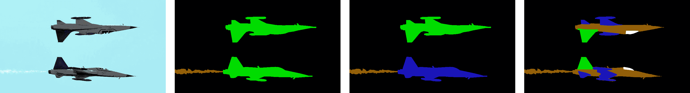

    图 1: 从左到右分别展示了物体、实例和部件分割的样本图像及其注释。

+   •

    Common Objects in Context (COCO) (Lin et al. 2014)：COCO 是一个具有 200K 标记图像、150 万个物体实例和 80 个物体类别的大规模物体检测、语义分割和描述图像数据集，涵盖了几乎所有可能的场景类型。COCO 在实例级和像素级（他们称之为*stuff*）语义分割上提供了挑战，还引入了一项新任务，即*全景*分割 (Kirillov et al. 2018)，旨在统一实例级和像素级分割任务。他们的排行榜³³3[`cocodataset.org`](http://cocodataset.org)由于数据规模相对较少，因此较为冷清。另一方面，由于同样的原因，其挑战仅由最雄心勃勃的科学和工业团体评估，因此被认为是他们排行榜上的*最先进*技术。由于其庞大的体量，大多数研究在提交到其他挑战（如 PASCAL VOC 2012）之前，通常会部分使用此数据集来预训练或微调他们的模型。

+   •

    ADE20K 数据集 (Zhou et al. 2019)：ADE20K 包含超过 20K 场景中心的图像，并带有物体和物体部件的标注。类似于 PASCAL VOC，存在一个公开排行榜⁴⁴4[`sceneparsing.csail.mit.edu/`](http://sceneparsing.csail.mit.edu/)，基准被分为 20K 图像用于训练、2K 图像用于验证，以及另一批用于测试的保留图像。数据集中样本的分辨率各异（平均图像大小为 1.3M 像素），最高可达 2400$\times$1800 像素。评估包括总共 150 个语义类别。

+   •

    其他通用语义分割图像数据集：虽然不如 PASCAL VOC 或 COCO 流行，但在相同领域还有一些其他图像数据集。由 (Prest et al. 2012) 介绍的 YouTube-Objects 是一个低分辨率 (480$\times$360) 视频片段的数据集，包含超过 10k 像素级标注的帧。

    同样，SIFT-flow (Tighe and Lazebnik 2010) 是另一个低分辨率 (256$\times$256) 的语义分割图像数据集，具有 33 个类别标签，共 2,688 张图像。由于其有限的分辨率和较小的体量，这些以及其他相对原始的图像数据集在语义分割文献中大多已被淘汰。

#### 2.1.2 城市街道语义分割图像数据集

+   •

    Cityscapes（Cordts et al. 2016）：这是一个大规模的图像集，专注于城市街道场景的语义理解。它包含来自 50 个不同城市的高分辨率图像的标注，这些图像在一天中的不同时间和一年中的所有季节拍摄，并且具有不同的背景和场景布局。标注分为两个质量等级：对 5,000 张图像进行细致标注，对 20,000 张图像进行粗略标注。共有 30 个不同的类别标签，其中一些还具有实例标注（车辆、行人、骑车者等）。因此，存在两个具有独立公共排行榜的挑战⁵⁵5[`www.cityscapes-dataset.com/benchmarks/`](https://www.cityscapes-dataset.com/benchmarks/): 一个是像素级语义分割的挑战，另一个是实例级语义分割的挑战。该挑战有超过 100 个参赛作品，使其在城市街道场景的语义分割方面最受欢迎。

+   •

    其他城市街道语义分割图像集：有许多替代的城市街道语义分割图像集，例如 Cam-Vid（Brostow et al. 2009）、KITTI（Geiger et al. 2013）、SYNTHIA（Ros et al. 2016a）和 IDD（Varma et al. 2018）。由于几个原因，这些图像集通常被 Cityscapes 图像集（Cordts et al. 2016）所掩盖。主要原因在于它们的规模相对较小。只有 SYNTHIA 图像集（Ros et al. 2016a）可以被认为是大规模的（包含超过 13k 的标注图像）；然而，它是一个人工生成的图像集，这被认为是像无人驾驶汽车这样对安全性要求极高的系统的一个主要限制。

#### 2.1.3 小规模和不平衡的图像集

除了上述不同类别的大规模图像集，还有一些图像集规模不足或严重不平衡，因此，当应用于基于深度学习的语义分割模型时，无法直接获得高水平的分割精度。大多数关于语义分割的公共挑战包括这种性质的图像集，如 DSTL 或 RIT-18（DSTLab. 2016；Kemker et al. 2018），仅举几个例子。由于这些图像集数量庞大，我们选择只包含那些在领域中引起极大关注的大规模图像集的详细信息。

尽管如此，能够训练出在小规模或不平衡数据上表现良好的模型与我们的相关问题有关。除了传统的深度学习技术，如迁移学习或数据增强之外；对于不足或不平衡数据的问题，还可以通过使用专门设计的深度学习架构来解决，例如一些优化过的卷积层类型（Chen et al. (2018); He et al. (2015)等）和我们在这篇综述论文中讨论的其他方法。此外，还有最近的研究专注于利用不足数据集解决基于深度学习的语义分割问题（Xia et al. 2019）。虽然我们承认这一问题对语义分割领域至关重要，但讨论处理小规模或不平衡数据集的技术超出了这篇综述论文的范围。

### 2.2 性能评估

评估语义分割性能的主要标准有两个：准确性，也就是算法的成功程度；以及计算复杂性，包括速度和内存要求。在本节中，我们将分别分析这两个标准。

#### 2.2.1 准确性

测量分割性能可能比较复杂，主要因为需要测量两个不同的值。第一个是分类，即简单地确定逐像素的类别标签；第二个是定位，或者说是找到包围对象的正确像素集。文献中可以找到不同的度量标准来测量这一个或两个值。以下是对评估语义分割性能时最常用的主要度量指标的简要解释。

+   •

    *ROC-AUC*：ROC 代表接收操作特征曲线，它总结了预测模型在不同概率阈值下的真正率和假正率之间的权衡；而 AUC 代表曲线下的面积，最大值为 1。这个工具对于解释二分类问题非常有用，并且当观测在各类之间平衡时适用。然而，由于大多数语义分割图像集（Everingham et al. 2010; Mottaghi et al. 2014; Chen et al. 2014; Wang et al. 2015; Hariharan et al. 2011; Lin et al. 2014; Cordts et al. 2016）在各类之间并不平衡，因此这个度量标准不再被最流行的挑战所使用。

+   •

    *像素准确率*：也称为 *全局准确率* (Badrinarayanan et al. 2015)，像素准确率（PA）是一个非常简单的指标，它计算了正确分类的像素数量与总像素数量之间的比率。均值像素准确率（mPA）是该指标的一个版本，它计算了每类的正确像素比率。mPA 也被称为 *类别平均准确率* (Badrinarayanan et al. 2015)。

    |  | $PA=\frac{\sum_{j=1}^{k}{n_{jj}}}{\sum_{j=1}^{k}{t_{j}}},\qquad mPA=\frac{1}{k}\sum_{j=1}^{k}\frac{n_{jj}}{t_{j}}$ |  | (1) |
    | --- | --- | --- | --- |

    其中 $n_{jj}$ 是同时被分类和标记为类别 *j* 的像素总数。换句话说，$n_{jj}$ 对应于类别 *j* 的真实阳性总数。$t_{j}$ 是标记为类别 *j* 的像素总数。

+   •

    *交并比* (IoU)：也称为 Jaccard 指数，IoU 是一种用于比较样本集相似性和多样性的统计量。在语义分割中，它是像素级分类结果与真实值的交集与它们的并集之间的比率。

    |  | $IoU=\frac{\sum_{j=1}^{k}{n_{jj}}}{\sum_{j=1}^{k}({n_{ij}+n_{ji}+n_{jj}})},\qquad i\neq j$ |  | (2) |
    | --- | --- | --- | --- |

    其中，$n_{ij}$ 是标记为类别 *i* 但被分类为类别 *j* 的像素数量。换句话说，它们是类别 *j* 的假阳性（误报）。类似地，${n_{ji}}$，标记为类别 *j* 但被分类为类别 *i* 的像素总数是类别 *j* 的假阴性（遗漏）。

    IoU 的两个扩展版本也被广泛使用：

    $\circ$ *均值交并比* (mIoU)：mIoU 是类别平均 IoU，如在 (3) 中所述。

    |  | $mIoU=\frac{1}{k}\sum_{j=1}^{k}\frac{n_{jj}}{n_{ij}+n_{ji}+n_{jj}},\qquad i\neq j$ |  | (3) |
    | --- | --- | --- | --- |

    $\circ$ *频率加权 IoU* (FwIoU)：这是 MIoU 的改进版本，通过使用 $t_{j}$（被标记为类别 *j* 的像素总数，如在 (1) 中所定义），对每个类别的重要性进行加权。FwIoU 的公式在 (4) 中给出：

    |  | $FwIoU=\frac{1}{\sum_{j=1}^{k}t_{j}}\sum_{j=1}^{k}{t_{j}\frac{n_{jj}}{n_{ij}+n_{ji}+n_{jj}}},\qquad i\neq j$ |  | (4) |
    | --- | --- | --- | --- |

    IoU 及其扩展，计算真实正例（命中数）与虚警（虚警数）、漏检（遗漏数）和真实正例（命中数）之和的比率。因此，相比于像素准确度，IoU 度量更具信息量，因为它考虑了虚警，而 PA 则没有。然而，由于虚警和漏检在分母中被相加，这种度量未能衡量它们之间的显著性，这被认为是其主要缺陷。此外，IoU 仅测量正确标记的像素数量，而不考虑分割边界的准确性。

+   •

    *基于精确率-召回率曲线（PRC）的度量*：精确率（命中数与命中数加上虚警数的比率）和召回率（命中数与命中数加上漏检数的比率）是 PRC 的两个轴，用于描述在二分类任务中，随着阈值变化精确率与召回率之间的权衡。PRC 与 ROC 非常相似。然而，PRC 在区分虚警（警报）和漏检（遗漏）效果方面更具优势。这主要是为什么基于 PRC 的度量常用于评估语义分割性能的原因。给定类别*j*的精确率（也称为特异性）和召回率（也称为敏感性）的公式，参见(5)：

    |  | $Prec.=\frac{n{{}_{jj}}}{n_{ij}+n_{jj}},\quad Recall=\frac{n_{jj}}{n_{ji}+n_{jj}},i\neq j$ |  | (5) |
    | --- | --- | --- | --- |

    主要有三种基于 PRC 的度量：

    $\circ$ *F*[score]：也称为‘*dice 系数*’，此度量是给定阈值下精确率和召回率的调和均值。它是一个归一化的相似度度量，范围在 0 到 1 之间（请参见 (6)）。

    |  | $F_{score}=2\times\frac{Precision\times Recall}{Precision+Recall}$ |  | (6) |
    | --- | --- | --- | --- |

    $\circ$ *PRC-AuC*：这类似于 ROC-AUC 度量。它只是 PRC 下的面积。此度量提供了不同阈值下的精确率-召回率权衡的信息，但不涉及 PR 曲线的*形状*。

    $\circ$ *平均精度*（AP）：该度量是一个总结 PRC 形状和 AUC 的单一值。为了计算 AP，使用 PRC，对均匀采样的召回值（例如，0.0、0.1、0.2、……、1.0）记录精确率值。这些精确率值的平均值被称为平均精度。这是语义分割中最常用的单值度量。类似地，平均平均精度（mAP）是按类别计算的 AP 值的平均值。

+   •

    *Hausdorff 距离*（HD）：Hausdorff 距离通过将分类和标记的像素之间的最大距离作为最大分割误差的指标来使用（Karimi 和 Salcudean 2019; Jadon 2020），旨在跟踪语义分割模型的性能。单向 HDs 如 $hd(X,Y)$ 和 $hd(Y,X)$ 分别展示在 (7) 和 (8) 中。

    |  | $hd\left(X,Y\right)=\max_{{x\epsilon X}}\min_{{y\epsilon Y}}\left\|x-y\right\|_{2},$ |  | (7) |
    | --- | --- | --- | --- |
    |  | $hd\left(Y,X\right)=\max_{{y\epsilon Y}}\min_{{x\epsilon X}}\left\|x-y\right\|_{2}.$ |  | (8) |

    其中，$X$ 和 $Y$ 是像素集合。$x$ 是分割计数器 $X$ 中的像素，而 $y$ 是目标计数器 $Y$ 中的像素（Huang et al. 2020）。这些集合之间的双向 HD 显示在 (9) 中，其中欧几里得距离被用于 (7)、(8) 和 (9)。

    |  | $HD\left(X,Y\right)=\max\left(hd\left(X,Y\right),hd\left(Y,X\right)\right).$ |  | (9) |
    | --- | --- | --- | --- |

IoU 及其变体，加上 AP，是最流行的语义分割挑战中最常用的准确度评估指标（Everingham et al. 2010; Mottaghi et al. 2014; Chen et al. 2014; Wang et al. 2015; Hariharan et al. 2011; Lin et al. 2014; Cordts et al. 2016）。

#### 2.2.2 计算复杂度

计算负担通过两个主要指标进行评估：算法完成的速度以及所需的计算内存量。

+   •

    *执行时间*：这是测量整个处理时间的指标，从单个图像被引入系统/算法的瞬间开始，一直到获得逐像素语义分割结果为止。此指标的性能在很大程度上取决于所使用的硬件。因此，对于一个算法，任何执行时间指标都应附有对所使用硬件的详细描述。有诸如 Big-O 这样的符号，它提供了独立于实现领域的复杂性度量。然而，这些符号高度理论化，主要不适用于诸如深度语义分割等极其复杂的算法，因为它们简单且大多不准确。

    对于基于深度学习的算法，离线（即训练）和在线（即测试）操作的时间间隔可能会有很大差异。从技术上讲，执行时间仅指在线操作或学术上讲的单张图像的测试持续时间。尽管这个指标对工业应用极其重要，但学术研究通常不会公布确切的执行时间，而且没有发现上述挑战中的任何一个提供了这个指标。一项最近的研究（Zhao 等 2018）提供了准确度（MIoU%）与每秒帧数的二维直方图，其中一些具有开源代码的最先进方法（包括他们提出的结构，即图像级联网络 - ICNet）使用 Cityscapes（Cordts 等 2016）图像集进行基准测试。

+   •

    *内存使用量*：当语义分割用于性能有限的设备如智能手机、数码相机，或当系统要求极其严格时，内存使用量尤为重要。这些设备的主要例子包括军事系统或安全关键系统，如自动驾驶汽车。

    对于像语义分割这样的复杂算法，内存的使用可能在操作过程中发生剧烈变化。这就是为什么一个常见的指标是*峰值内存使用量*，即单张图像的整个分割操作所需的最大内存。这个指标可以适用于计算机（数据）内存或 GPU 内存，具体取决于硬件设计。

    尽管对工业应用至关重要，但通常不会在上述挑战中提供这个指标。

计算效率是任何要在实际系统上实现的算法中非常重要的方面。对各种语义分割算法的速度和容量进行比较评估是一项具有挑战性的任务。尽管大多数最先进的算法都有开源代码，但对它们进行基准测试并使用其最佳超参数似乎不切实际。为此，我们提供了一种归纳的方式来比较以下部分中方法的计算效率。在表 1 中，我们将方法分为主要的四个计算效率级别，并讨论我们分类与给定方法的架构设计相关的内容。该表还提供了文献中语义分割方法的时间演变。

## 3 在全卷积网络之前

如引言中所述，FCNs 的使用是语义分割文献中的一个突破点。在 FCNs 之前的语义分割文献（Shelhamer et al. 2017）可以分为两个不同的分支，分别是深度学习前和早期深度学习方法。在本节中，我们简要讨论这两组方法。

### 3.1 深度学习前的方法

传统图像分割和语义分割之间的区别在于在过程中利用了语义特征。传统的图像分割方法如阈值处理、聚类和区域生长等（*请参见* (Zaitoun and Aqel 2015) *了解传统图像分割技术的综述*）使用手工制作的低级特征（即边缘、斑点）来定位图像中的物体边界。因此，在需要图像的语义信息进行逐像素分割的情况下，例如在相似物体遮挡彼此时，这些方法通常表现较差。

关于在深度卷积神经网络（DCNNs）变得流行之前的语义分割努力，各种方法（He and Zemel 2009; Ulusoy and Bishop 2005; Ladický et al. 2009; Fröhlich et al. 2013; Montillo et al. 2011; Ravì et al. 2016; Vezhnevets et al. 2011; Shotton et al. 2008; Yao et al. 2012; Xiao and Quan 2009; Mičušĺík and Košecká 2009; Lempitsky et al. 2011; Krähenbühl and Koltun 2011) 运用了图形模型，如马尔可夫随机场（MRF）、条件随机场（CRF）或基于森林（有时称为‘整体’）的方法，以在像素级别找到场景标签。主要思想是通过观察邻近像素之间的依赖关系来找到推断。换句话说，这些方法将图像的语义建模为相邻像素之间的先验信息。由于深度学习，如今我们知道图像语义需要对大规模数据的抽象利用。最初，基于图的 approaches 被认为具有这种潜力。所谓的“超级像素化”，通常是这些研究中使用的术语，是建模抽象区域的过程。然而，这些方法从未实现大规模数据处理的实际可行实现，而这已由（Krizhevsky et al. 2012）首次实现，并在许多其他研究中得到应用。

另一组研究，有时称为“层次模型”（Yang et al. 2012; Arbeláez et al. 2012; Ladický et al. 2010），使用了预训练的单独目标检测器的组合，以从图像中提取语义信息。由于单独的目标检测器无法正确分类区域，或因为这些方法受限于‘手动选择’检测器库中提供的有限目标类别数量，相较于今天最先进的方法，它们的性能被认为较低。

尽管前深度学习时代提到的方法不再被优先作为分割方法，但一些图形模型，尤其是条件随机场（CRFs），目前被最先进的方法用作后处理（细化）层，目的是提高语义分割性能，具体细节将在以下部分讨论。

(a) 输入图像

(b) 分割图像

(c) 细化结果

图 2：使用基于图形模型的细化对分割结果的影响。

#### 3.1.1 细化方法

深度神经网络在提取抽象局部特征方面非常强大。然而，它们缺乏利用全局上下文信息的能力，因此无法建模相邻像素预测之间的交互（Teichmann 和 Cipolla 2018）。另一方面，预深度学习时代流行的分割方法——图形模型——非常适合这种任务。这就是为什么它们目前被用作许多基于 DCNN 的语义分割架构的细化层。

正如前一节所提到的，使用图形模型进行分割的理念是通过观察相邻像素之间的低级关系来寻找推断。在图 2 中，可以看到使用基于图形模型的细化对分割结果的影响。分类器（见图 2.b) 在不同类别标签相邻的像素处无法正确分割。在这个例子中，应用了基于 CRF 的细化（Krähenbühl 和 Koltun 2011）以改善逐像素的分割结果。虽然也存在一些替代的基于图形模型的细化方法（Liu 等 2015; Zuo 和 Drummond 2017），但 CRF 基于的方法在深度语义分割方法的细化中被广泛使用。

CRF（Lafferty 等 2001）是一种判别性无向概率图模型。它们用于编码观测之间已知的关系，并构建一致的解释。作为细化层的使用源于这样一个事实，即与不考虑相邻像素相似性的离散分类器不同，CRF 可以利用这些信息。CRF 相对于其他图形模型（如隐马尔可夫模型）的主要优势在于其条件性质和避免标签偏差问题的能力（Lafferty 等 2001）。尽管有相当多的方法（见表 1）利用 CRF 进行细化，但这些模型在相对较新的方法中开始失去人气，因为它们 notoriously 缓慢且非常难以优化（Teichmann 和 Cipolla 2018）。

### 3.2 早期深度学习方法

在 FCNs 首次出现之前，6FCN（Shelhamer 等 2017）于 2017 年正式发布。然而，同一小组在 2014 年首次在线分享了这一想法作为预印本文献（Long 等 2014）。在深度卷积网络的初期几年中，越来越多的研究关注利用新发现的深度特征进行语义分割（Ning 等 2005；Ganin 和 Lempitsky 2014；Ciresan 等 2012；Farabet 等 2013；Hariharan 等 2014；Pinheiro 和 Collobert 2014）。在提出 Rectified Linear Unit (ReLU) 层（Krizhevsky 等 2012）之前，最初的方法使用了像 *tanh*（Ning 等 2005）这样的激活函数（或类似的连续函数），这些函数在计算上可能很难区分。因此，训练这样的系统并不被认为是计算友好的，甚至对于大规模数据也不可行。

然而，最初成熟的方法只是简单地尝试通过微调全连接层将分类网络如 Alex-Net 和 VGG 转换为分割网络（Ning 等 2005；Ganin 和 Lempitsky 2014；Ciresan 等 2012）。它们在训练阶段遭遇了过拟合和全连接层耗时的问题。此外，所使用的 CNN 不够深，无法创建与图像语义相关的抽象特征。

在早期的深度学习研究中，一些研究者选择不使用全连接层进行决策。然而，他们利用了不同的结构，如递归架构（Pinheiro 和 Collobert 2014）或利用从一组独立计算的分割中得到的标签（Farabet 等 2013）。通过提出替代全连接层的解决方案，这些早期研究显示了像 FCN 这样的结构的必要性，毫无疑问，之后出现了（Shelhamer 等 2017）。

由于其分割结果被认为不令人满意，这些研究通常采用了精细化过程，无论是作为后处理层 (Ning et al. 2005; Ganin and Lempitsky 2014; Ciresan et al. 2012; Hariharan et al. 2014) 还是作为全连接决策层的替代架构 (Farabet et al. 2013; Pinheiro and Collobert 2014)。精细化方法有所不同，例如马尔可夫随机场 (Ning et al. 2005)、基于最近邻的方法 (Ganin and Lempitsky 2014)、使用校准层 (Ciresan et al. 2012)、使用超像素 (Farabet et al. 2013; Hariharan et al. 2014)，或是普通 CNN 的递归网络 (Pinheiro and Collobert 2014)。如前面章节所述，精细化层仍在 FCN 之后的方法中被使用，目的是提高类交叉区域周围的像素级标注性能。

## 4 全卷积网络用于语义分割

在 (Shelhamer et al. 2017) 中，提出了从深度卷积神经网络（DCNN）中拆除全连接层的思想，并为实现这一思想，提出的架构被命名为“全卷积网络”（见图 3）。其主要目标是通过将分类网络如 AlexNet (Krizhevsky et al. 2012)、VGG (Simonyan and Zisserman 2015) 和 GoogLeNet (Szegedy et al. 2015) 适配为全卷积网络来创建语义分割网络，并通过微调来转移其学习到的表示。从研究 (Shelhamer et al. 2017) 中获得的最广泛使用的架构被称为“FCN-32s”、“FCN16s”和“FCN8s”，它们都是使用 VGG 架构 (Simonyan and Zisserman 2015) 进行迁移学习的。

FCN 架构在许多方面被认为是具有革命性的。首先，由于 FCNs 不包含全连接层，每张图像的推理速度显著更快。这主要是因为与全连接层相比，卷积层的权重数量较少。其次，也许更重要的是，这种结构允许生成任何分辨率的图像的分割图。在实现这一点时，FCNs 使用了反卷积层，可以将粗糙的深度卷积层输出上采样到任何所需分辨率的密集像素。最后，也是最重要的，他们提出了针对 DCNN 的跳跃结构。

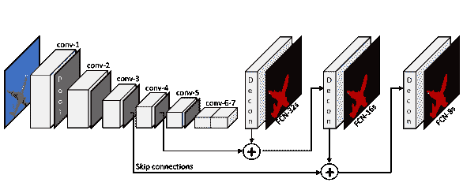

图 3：全卷积网络（FCNs）经过端到端训练，旨在对像语义分割这样的每像素任务进行密集预测。FCNs 不包含任何全连接层。

跳跃架构（或连接）提供了 DCNN 中非相邻层之间的链接。通过简单地对未连接层的输出进行求和或连接，这些连接使信息得以流动，否则会因为建筑选择如最大池化层或丢弃而丢失。最常见的做法是使用跳跃连接，置于最大池化层之前，最大池化层通过选择特定区域中的最大值来降采样层输出。池化层有助于架构创建特征层次，但也会导致局部信息的丢失，这对语义分割尤其是在物体边界处可能非常有价值。跳跃连接通过绕过池化层来保留并传递这些信息到更深层次。实际上，在(Shelhamer et al. 2017)中使用跳跃连接被认为相当原始。‘FCN-8s’和‘FCN-16s’网络在不同层中包括了这些跳跃连接。对于相同架构，‘FCN-4s’和‘FCN-2s’也被用于各种应用（Zhong et al. 2016; Lee et al. 2017）。这一理念最终演变为编码器-解码器结构（Ronneberger et al. 2015; Badrinarayanan et al. 2015），用于语义分割，这将在接下来的部分中介绍。

## 5 种后 FCN 方法

几乎所有后续的语义分割方法都遵循了 FCNs 的理念；因此，完全连接层的决策方式可以说基本上不再存在⁷⁷7 许多方法利用全连接层，例如 RCNN（Girshick 2015），这些将在接下来的章节中讨论。然而，这些包含全连接层的类似方法大多被完全卷积版本取代，以提高计算效率。随着 FCNs 的出现，这种语义分割的问题也随之而来。

另一方面，FCNs 的理念也创造了进一步改进深度语义分割架构的新机会。一般来说，FCNs 的主要缺点可以总结为特征层次中标签定位的效率低下、无法处理全局上下文知识以及缺乏多尺度处理机制。因此，大多数后续研究主要通过提出各种架构或技术来解决这些问题。本文的其余部分我们将在“精细定位”这一标题下分析这些问题。因此，在列出后 FCN 的最先进方法之前，我们重点关注这些技术的分类，并检查旨在解决这些主要问题的不同方法。接下来，我们还讨论了语义分割中的尺度不变性，并以基于对象检测的方法结束，这是一种新兴的解决方案，旨在同时解决语义分割问题和检测对象实例。

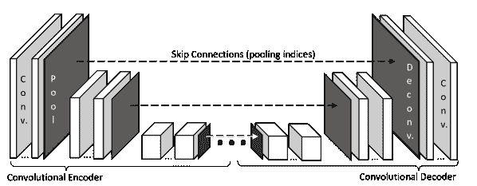

(a) 编码器-解码器架构。

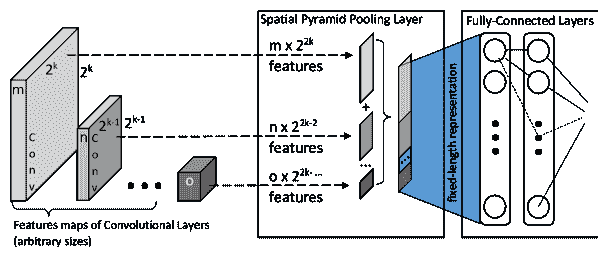

(b) 空间金字塔池化层

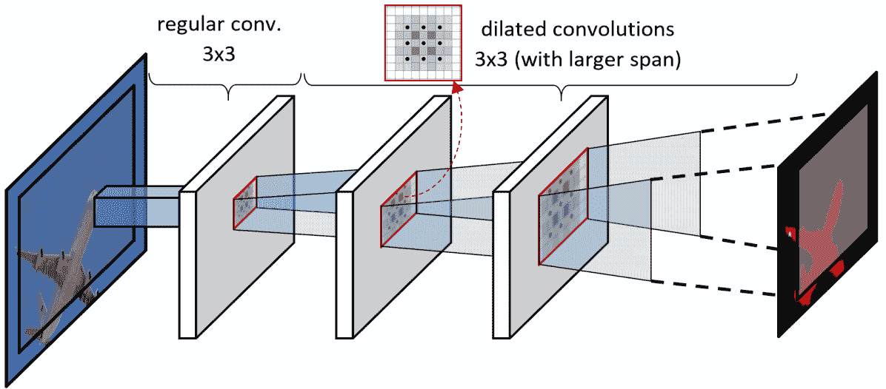

(c) 常规卷积与扩张卷积

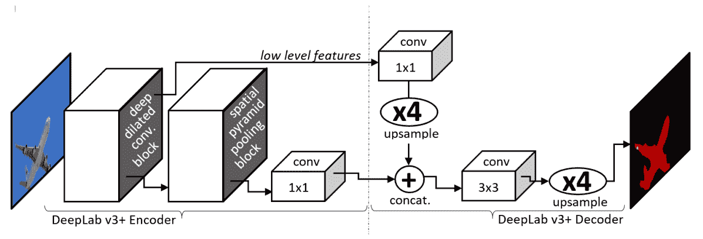

(d) DeepLabv3+ 架构

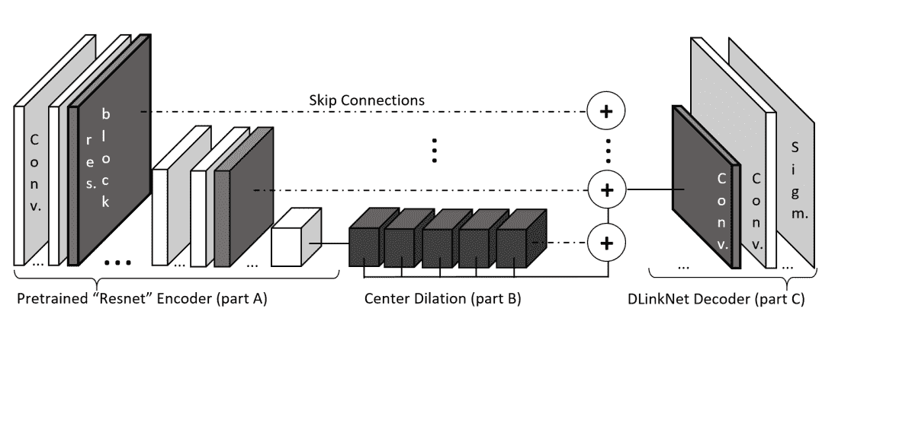

(e) DlinkNet 架构

图 4：用于精细像素级标签定位的不同架构。

### 5.1 精细定位技术

语义分割本质上是一个密集过程，因此它需要在像素级别对类别标签进行精细的定位。例如，在机器人手术中，语义分割中的像素错误可能导致生死攸关的情况。通过池化（即最大池化）层创建的层次特征可能会部分丧失定位能力。此外，由于全卷积网络（FCNs）的完全卷积特性，它们本身并不具备建模图像中的全局上下文信息的能力，而全局上下文信息在类别标签的定位中也非常有效。因此，这两个问题本质上是相互交织的，在下文中，我们讨论旨在克服这些问题并提供更精细类别标签定位的不同方法。

#### 5.1.1 编码器-解码器架构

所谓的编码器-解码器（ED）架构（也称为 U-net，指的是（Ronneberger et al. 2015）的开创性研究）由两个部分组成。编码器通过池化层逐渐减少空间维度，而解码器则逐渐恢复物体细节和空间维度。解码器部分的每个特征图仅直接接收来自编码器部分相同层级特征图的信息，通过跳跃连接，因此 EDs 可以创建具有精细定位的抽象层次特征（参见图 4。a）。U-Net（Ronneberger et al. 2015）和 Seg-Net（Badrinarayanan et al. 2015）是非常知名的例子。在这种架构中，来自编码器部分的相邻低分辨率特征图提供的强相关语义信息必须经过额外的中间层才能到达相同的解码器层。这通常会导致信息的衰减。然而，U-Net 架构在不同应用的分割中已被证明非常有用，例如医学图像（Ronneberger et al. 2015）、街景图像（Badrinarayanan et al. 2015）、卫星图像（Ulku et al. 2019），仅举几例。尽管早期的 ED 架构仅设计用于物体分割任务，但也有修改版，如“TernausNetV2”（Iglovikov et al. 2018），通过少量架构改动提供实例分割能力。

#### 5.1.2 空间金字塔池化

构建固定大小空间金字塔的想法最早由（Lazebnik et al. 2006）提出，以防止 Bag-of-Words 系统丧失特征之间的空间关系。后来，（He et al. 2015）将这一方法应用于卷积神经网络（CNNs），即无论输入大小如何，都可以在空间金字塔池化网络（SPP-Net）中创建深度特征的空间金字塔表示。SPP-Net 的最重要贡献是它允许不同大小的输入被输入到 CNNs 中。不同大小的图像输入到卷积层中不可避免地会创建不同大小的特征图。然而，如果在决策层之前的池化层的步幅值与输入大小成比例，则该层创建的特征图将是固定的（参见图 4。b）。通过（Li et al. 2018），还提出了一种修改版本，即金字塔注意网络（PAN）。PAN 的想法是将 SPP 层与全局池化相结合，以学习更好的特征表示。

有一种常见的误解认为 SPP-Net 结构具有固有的尺度不变性，这并不正确。SPP-Net 通过允许不同输入尺寸的 CNN，有效地训练不同尺度（或分辨率）的图像。然而，只有当训练集包含不同尺度的图像时，带有 SPP 的训练 CNN 才具有尺度不变性。这一点对于没有 SPP 层的 CNN 也是适用的。

然而，与 (Lazebnik et al. 2006) 中提出的原始想法类似，CNN 中的 SPP 层构建了不同层级特征之间的关系。因此，它与 ED 结构中的跳跃连接非常相似，后者也允许特征层级之间的信息流动。

最常见的 SPP 层用于语义分割的利用方式在 (He et al. 2015) 中提出，即将 SPP 层附加到最后一个卷积层，并传递给逐像素分类器。

#### 5.1.3 特征连接

这个想法基于融合来自不同来源的特征。例如，在 (Pinheiro et al. 2015) 中，所谓的“DeepMask”网络以前馈方式利用跳跃连接，从而获得一个与 SPP 层和 ED 部分相似的架构。同一团队通过前馈模块的自上而下的细化方法扩展了这个想法，提出了所谓的“SharpMask”网络 (Pinheiro et al. 2016)，其在分割性能上被证明更高效和准确。来自这一类别的另一种方法是所谓的“ParseNet” (Liu et al. 2015)，它通过将 CNN 特征与来自先前层的外部全局特征融合，以提供上下文知识。另一种方法由 (Wang et al. 2020) 提出，即使用卷积（特征自适应融合 FAF）块将“阶段特征”（即深层编码器激活）与“细化路径特征”（类似于跳跃连接的想法）融合。尽管原则上是一个新颖的想法，但特征融合方法（包括 SPP）创建了混合结构，因此它们相对难以训练。

#### 5.1.4 膨胀卷积

膨胀卷积（atrous convolutions）的想法实际上很简单：使用连续的卷积滤波器时，有效接收场的单元只能随着层的增加线性增长；而使用膨胀卷积（其滤波器中有间隙，见图 4.c)），有效接收场会增长得更快 (Chen et al. 2018)。因此，无需池化或下采样，就会创建一个卷积层的矩形棱柱。膨胀卷积是一种非常有效且强大的方法，用于详细保留特征图分辨率。与其他技术相比，该技术的负面方面在于对 GPU 存储和计算的更高需求，因为特征图分辨率在特征层次结构中不会缩小 (He et al. 2016)。

#### 5.1.5 条件随机场

如第 3.1.1 节所讨论的那样，CNN 自然缺乏专门‘聚焦’于类别交集区域的机制。在这些区域周围，图形模型通过观察 CNN 层之间的低级关系来进行推断。因此，图形模型，主要是 CRF，被用作深度语义分割架构中的细化层。如 (Rother et al. 2004) 所述，CRF 将低级交互与多类交互的输出连接，从而构建了全局上下文知识。

作为细化层，存在多种方法将 CRF 应用于 DCNN，例如卷积 CRF (Teichmann and Cipolla 2018)、稠密 CRF (Krähenbühl and Koltun 2011) 和 CRN-as-RNN (Zheng et al. 2015)。一般而言，CRF 有助于构建上下文知识，从而在类别标签中实现更精细的定位。

#### 5.1.6 循环方法

递归神经网络（RNN）处理序列信息的能力有助于提高分割精度。例如，(Pfeuffer et al. 2019) 使用 Conv-LSTM 层来改善图像序列中的语义分割结果。然而，也有一些方法在静态图像上使用递归结构。例如，图卷积 LSTM 网络（Liang et al. 2016）是将 LSTM 从序列数据或多维数据推广到一般图结构数据，用于二维静态图像的语义分割。Graph-RNN（Shuai et al. 2016）是类似方法的另一个例子，其中使用 LSTM 基础的网络将深层编码器输出与原始图像融合，以获得更精细的像素级分割。同样，在(Lin et al. 2018)中，研究人员利用 LSTM 链来交织多个尺度，从而实现像素级分割改进。还有一些混合方法，将 CNN 和 RNN 结合在一起。一个很好的例子是所谓的 ReSeg 模型（Visin et al. 2016），该模型将输入图像送入类似 VGG 的 CNN 编码器，然后通过递归层（即 ReNet 架构）进行处理，以更好地定位像素标签。另一个类似的方法是 DAG-RNN（Shuai et al. 2016），它利用 DAG 结构的 CNN+RNN 网络，建模图像单元之间的长程语义依赖。根据我们的了解，目前还不存在纯递归结构的语义分割方法，主要因为语义分割需要一个初步的基于 CNN 的特征编码方案。

当前，一种特定类型的递归神经网络（RNN）——即“递归注意力模块”——正呈现出日益增长的趋势。在这些模块中，注意力（Vaswani et al. 2017）在 RNN 中技术性地融合，实现了在预测输出序列的某一部分时，关注输入的特定区域。因此，它们也被用于语义分割（Li et al. 2019; Zhao et al. 2018; Oktay et al. 2018）。

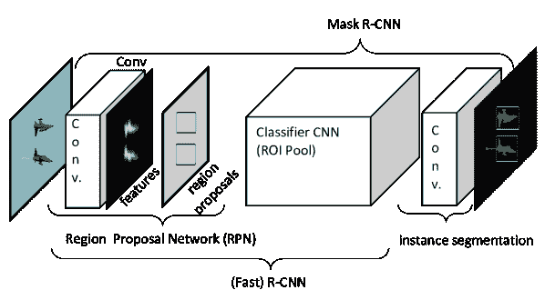

(a) 基于 CNN 特征的（Mask-RCNN）架构

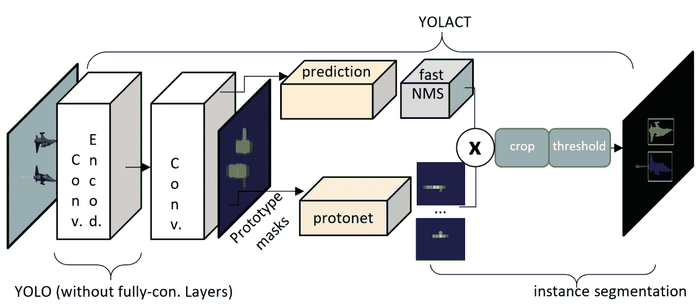

(b) 基于完全卷积对象检测器（YOLO）的架构

图 5：基于对象检测的语义分割方法的不同架构

### 5.2 尺度不变性

尺度不变性定义为方法处理给定输入的能力，无论相对尺度（即对象与其场景的尺度）或图像分辨率如何。尽管这对于某些应用极其重要，但这种能力通常被忽视或与方法包含多尺度信息的能力混淆。一个方法可能使用多尺度信息来改善其像素级分割能力，但仍可能依赖于尺度或分辨率。这就是为什么我们认为有必要在不同的标题下讨论这个问题，并提供有关提供尺度和/或分辨率不变性的技术的信息。

在计算机视觉中，任何方法都可以通过使用多尺度的训练集来实现尺度不变性。一些语义分割方法如(Farabet et al. 2013; Eigen 和 Fergus 2014; Pinheiro 和 Collobert 2014; Lin et al. 2016; Yu 和 Koltun 2015) 采用了这种策略。然而，这些方法并不具备固有的尺度不变性属性，这通常通过使用全局尺度因子进行归一化（如在 SIFT 中(Lowe 2004))。这种方法在语义分割文献中通常不被优先考虑。存在于语义分割文献中的图像集极其庞大。因此，这些方法被训练来记忆这些训练集，因为原则上，过拟合一个大规模训练集实际上相当于解决整个问题空间。

### 5.3 基于对象检测的方法

最近，计算机视觉领域出现了一个日益增长的趋势，专门解决对象检测的问题，即在图像中的所有对象周围建立一个边界框。考虑到图像中可能包含或不包含任意数量的对象，用于处理这种问题的架构与现有的全连接/卷积分类或分割模型不同。

(a) 图像

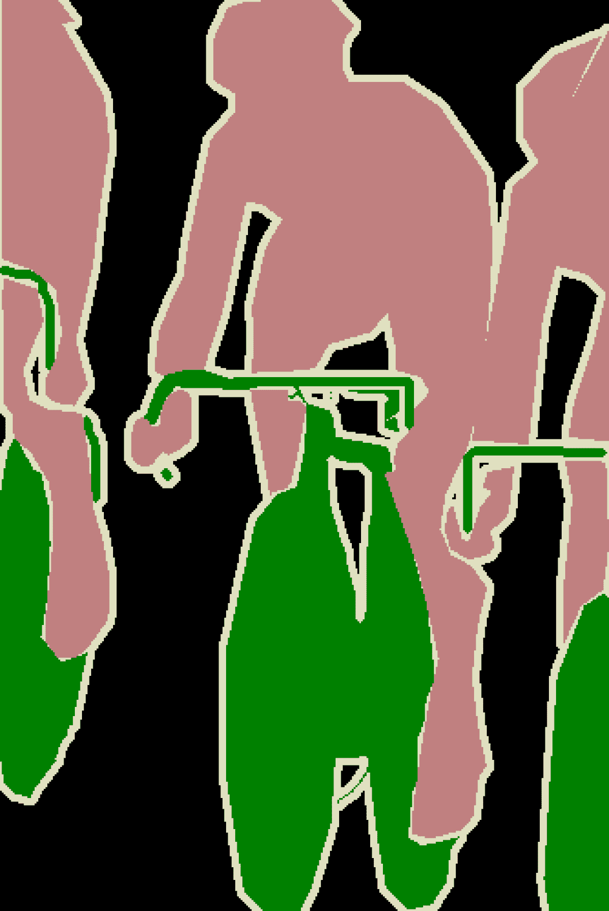

(b) 参考

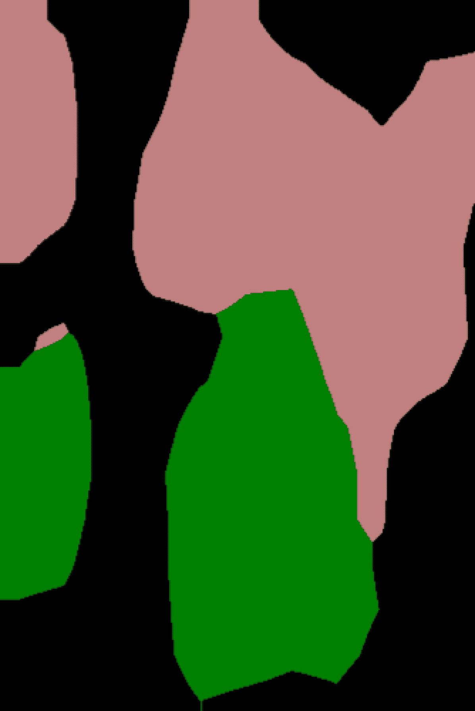

(c) FCN-32S

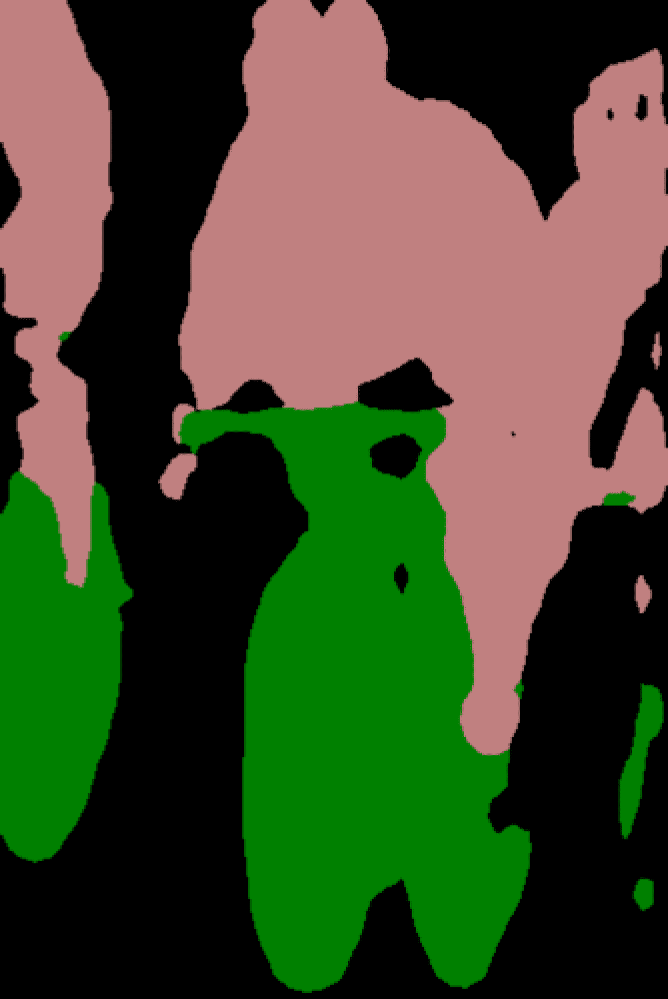

(d) FCN-8S

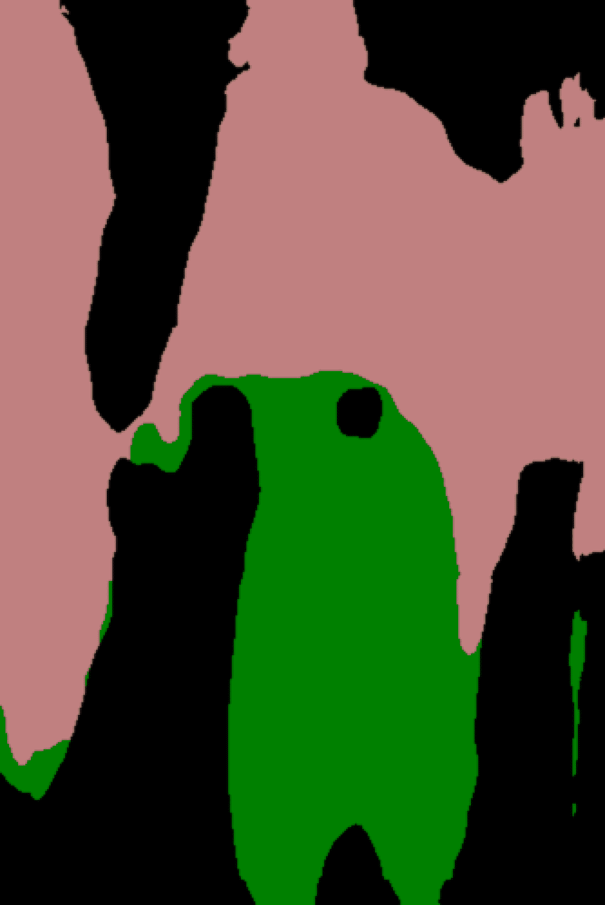

(e) CMSA

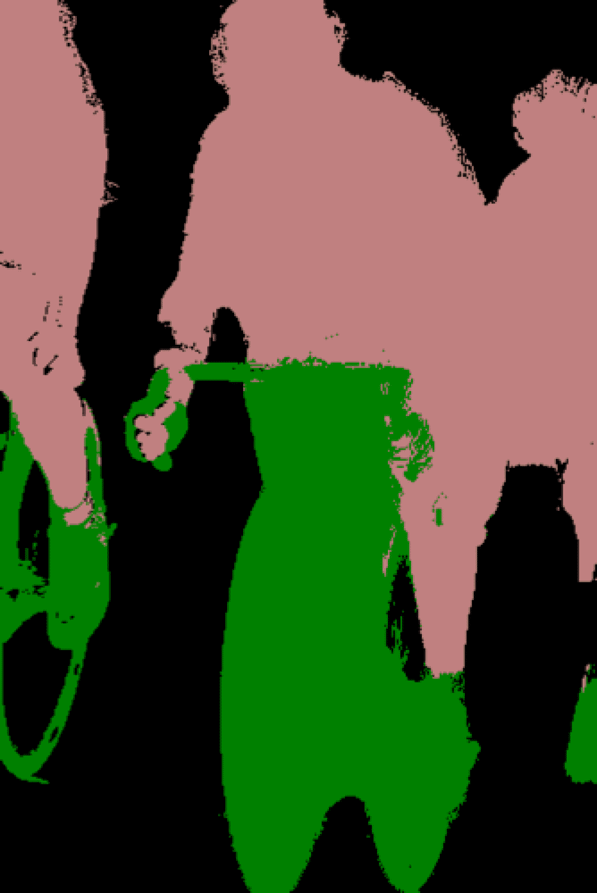

(f) DeepLabv1

(g) CRF-as-RNN

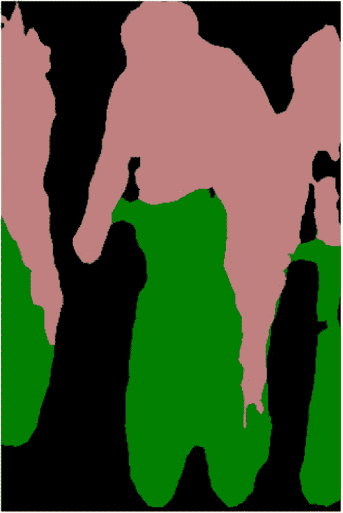

(h) DeepLab.v2

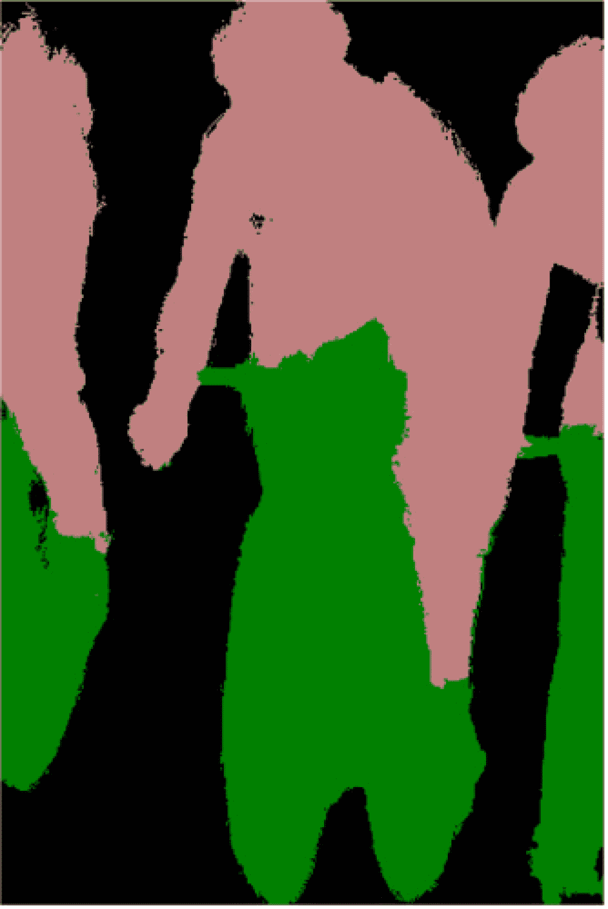

(i) DeepLab.v2+CRF

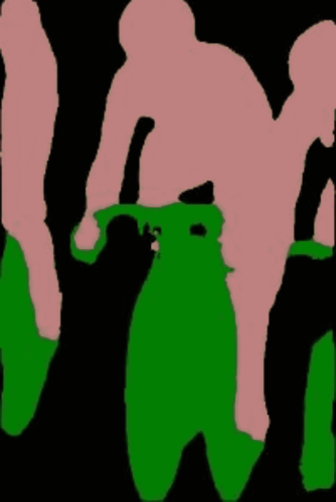

(j) PAN

图 6：(a) PASCAL VOC 验证集中的一张样本图像，(b) 其语义分割的真实标注，以及不同研究所得的结果展示：c) FCN-32S（Shelhamer 等人 2017），d) FCN-8S（Shelhamer 等人 2017），e) CMSA（Eigen 和 Fergus 2014），f) DeepLab-v1（Chen 等人 2014），g) CRF-as-RNN（Zheng 等人 2015），h) DeepLab-v2（Chen 等人 2018），i) DeepLab-v2 结合 CRF 细化（Chen 等人 2018），j) PAN（Li 等人 2018）。

代表这一思想的开创性研究是著名的“具有 CNN 特征的区域”（RCNN）网络（Girshick 等人 2013）。标准的 CNN 由于其完全卷积和完全连接的层结构，缺乏提供可变长度输出的能力，这对于旨在检测图像中未知数量对象的目标检测算法来说是一个主要缺陷。解决这一问题的最简单方法是从图像中提取不同的感兴趣区域，然后使用 CNN 分别检测每个区域中的对象。这种区域选择结构被称为“区域提议网络”（RPN），是构建 RCNN 网络的基本结构（见图 5.a)。RCNN 的改进版本，即“Fast-RCNN”（Girshick 等人 2013）和“Faster-RCNN”（Ren 等人 2015），随后也由同一研究小组提出。由于这些网络允许图像中所有对象的独立检测，该思想也很容易被应用于实例分割，例如“Mask-RCNN”（He 等人 2017）。

RCNN 的基本结构包括 RPN，它是 CNN 层和一个全连接结构的组合，用于确定对象类别和边界框位置。如本文前面部分所讨论，由于其繁琐的结构，全连接层在 FCN 中被大幅度抛弃。RCNN 也遭遇了类似的命运，当‘你只看一次’（YOLO）（Redmon et al. 2016）和‘单次检测器’（SSD）（Liu et al. 2016）被提出时。YOLO 利用一个单一的卷积网络来预测这些框的边界框和类别概率。它不包含全连接层，因此提供了实时性能。SSD 提出了类似的理念，在多个卷积层后预测边界框。由于每个卷积层在不同的尺度上操作，这种架构能够检测各种尺度的对象。尽管比 YOLO 慢，但仍被认为比 RCNN 快。这种新型的目标检测技术立即被应用于语义分割。类似于 MaskRCNN，‘Mask-YOLO’（Sun 2019）和‘YOLACT’（Bolya et al. 2019）架构是这些目标检测器在实例分割问题上的实现（见图 5b）。类似于 YOLACT，一些其他方法也实现了快速的实时实例分割，如；ESE-Seg（Xu et al. 2019），SOLO（Wang et al. 2019），SOLOv2（Wang et al. 2020），DeepSnake（Peng et al. 2020）和 CenterPoly（Perreault et al. 2021）。

在对图像进行像素级分割之前定位对象是直观且自然的，因为这实际上是人类大脑完成这一任务的方式（Rosenholtz 2016）。除了这些“两阶段（检测+分割）”方法外，还有一些最新的研究旨在将分割任务纳入到单阶段边界框检测器中，从而形成一种简单而高效的实例分割框架（Xu et al. 2019; R. Zhang et al. 2020; Lee and Park 2020; Xie et al. 2020）。然而，最新的趋势是使用基于全局区域的方法，通过生成中间 FCN 特征图，然后将这些基础特征组合以获得最终的掩膜（Chen et al. 2020; Kim et al. 2021; Ke et al. 2021）。

近年来，通过使用边界框来减轻像素级标签的需求，并从语义分割扩展到实例分割应用已成为一种趋势。在语义分割和实例分割方法中，识别每个像素的类别，唯一的区别是实例分割还区分了同一类别的对象出现。因此，弱监督实例分割（WSIS）方法也被用于实例分割。WSIS 方法的监督可以使用不同类型的标注进行训练，这些标注通常以边界框（Khoreva et al. 2017; Hsu et al. 2019; Arun et al. 2020; Tian et al. 2021; Lee et al. 2021; Cheng et al. 2021）或图像级标签（Liu et al. 2020; Shen et al. 2021; Zhou et al. 2016; Shen et al. 2021）的形式存在。因此，基于目标检测的方法在语义分割中的应用是一个在本手稿准备时具有显著发展潜力的领域。

| 方法 | 方法总结 | 排名 | 效率 |
| --- | --- | --- | --- |
| MultiScale-Net. (Farabet et al. 2013) | *多尺度卷积网络与分割框架（超像素或基于 CRF）并行融合。由于 CRF 块，相对较低的计算效率。* | 68.7% mPA @SIFTflow | $\star$ $\star$ |
| 循环 CNN (Pinheiro and Collobert 2014) | *通过使用不同实例的 CNN 构建的递归架构，其中每个网络实例都输入之前的标签预测（从之前的实例获得）。当输入多个实例（在其最佳实验中为 3 个）时，计算负担较重。* | 77.7% mPA @SIFTflow | $\star$ |

| FCN (Shelhamer et al. 2017)  | *全卷积编码结构（即没有全连接层），带有跳跃连接，在最终决策层融合多尺度激活。由于没有全连接层或细化块，相对较快。* | 85.2% mPA @SIFTflow 62.2% mIoU @PASCAL 2012

65.3% mIoU @CitySca.（不含课程）

39.3% mIoU @ADE20K | $\star$ $\star$ $\star$ |

| DeepLab.v1 (Chen et al. 2014) | *带有膨胀卷积的 CNN，后跟一个全连接（即 Dense）CRF。快速且优化的计算导致接近实时的性能。* | 66.4% mIoU @PASCAL 2012 | $\star$ $\star$ $\star$ |
| --- | --- | --- | --- |
| CMSA（Eigen 和 Fergus 2014） | *将金字塔输入的层馈送到并行的不同尺度的独立 FCNs。这些多尺度 FCNs 还串联连接以同时提供像素级别的类别、深度和法线输出。由于逐步处理不同尺度的序列，计算效率相对较低。* | 83.8% mPA @SIFTflow 62.6% mIoU @PASCAL 2012 | $\star$ $\star$ |
| UNet（Ronneberger 等人 2015） | *具有跳跃连接的编码器/解码器结构，连接相同级别的 ED 和最终输入大小的分类层。由于没有全连接层或精细化模块，计算负载高效。* | 72.7% mIoU @PASCAL 2012（*由 Zhang 等人 2018 测试*） | $\star$ $\star$ $\star$ |
| SegNet（Badrinarayanan 等人 2015） | *编码器/解码器结构（类似于 UNet）具有仅传递池化索引的跳跃连接（不同于 U-Net，其中跳跃连接拼接相同级别的激活）。由于没有全连接层或精细化模块，计算负载高效。* | 59.9% mIoU @PASCAL 2012 79.2% mIoU @CitySca.（不含课程） | $\star$ $\star$ $\star$ |
| DeconvNet（Noh 等人 2015） | *编码器/解码器结构（即‘卷积/反卷积网络’）没有跳跃连接。网络的编码器（卷积）部分转移自 VGG-VD-16L。由于没有全连接层或精细化模块，计算负载高效。*（Simonyan 和 Zisserman 2015）。 | 74.8% mIoU @PASCAL 2012 | $\star$ $\star$ $\star$ |
| MSCG（Yu 和 Koltun 2015） | *使用仅一个稀疏卷积层的矩形棱柱进行多尺度上下文聚合，未使用池化或下采样层，进行像素级标注。由于没有全连接层或精细化模块，计算负载高效。* | 67.6% mIoU @PASCAL 2012 67.1% mIoU @CitySca.（不含课程） | $\star$ $\star$ $\star$ |
| CRF-as-RNN（郑等人 2015） | *全卷积 CNN（即 FCN）后接 CRF-as-RNN 层，其中迭代 CRF 算法被表述为 RNN。由于 RNN 模块，计算效率有限。* | 65.2% mIoU @PASCAL 2012 62.5% mIoU @CitySca.（不含课程） | $\star$ $\star$ |
| FeatMap-Net（Lin 等人 2016） | *将金字塔输入的层馈送到并行的多尺度特征图（即 CNNS），然后在上采样/拼接（即金字塔池化）层中融合，以提供最终特征图给 Dense CRF 层。结构设计良好但负载较重，计算效率中等。* | 88.1% mPA @SIFTflow 75.3% mIoU @PASCAL 2012 | $\star$ $\star$ |
| Graph LSTM (Liang et al. 2016)  | *LSTM 从顺序数据到一般图结构数据的泛化，用于 2D 静态图像上的语义分割，主要是人/部件。Graph-LSTM 处理显著限制计算效率。* | 60.2% mIoU @PASCAL Person/Parts 2010 | $\star$ |
| DAG-RNN (Shuai et al. 2016)  | *DAG 结构的 CNN+RNN 网络，用于建模图像单元之间的长程语义依赖。由于使用递归模型对像素进行链式结构的顺序处理，计算效率受到显著限制。* | 85.3% mPA @SIFTflow | $\star$ |
| cont’d. |  |  |  |
| --- | --- | --- | --- |
| DeepLab.v2 (Chen et al. 2018)  | *DeepLab.v1 的改进版本，增加了“膨胀（空洞）空间金字塔池化”（ASPP）层。计算性能与 DeepLab.v1 相似。* | 79.7% mIoU @PASCAL 2012 70.4% mIoU @CitySca.（无课程） | $\star$ $\star$ $\star$ |

| PSPNet (Zhao et al. 2017)  | *CNN 后接一个类似于（He et al. 2015）的金字塔池化层，但没有完全连接的决策层。因此，计算性能更接近于 FCN（Shelhamer et al. 2017）。* | 85.5% mIoU @PASCAL 2012 81.2% mIoU @CitySca.（有课程）

55.4% mIoU @ADE20K | $\star$ $\star$ $\star$ |

| DeepLab.v3 (Chen et al. 2017) | *DeepLab.v2 的改进版本，优化了 ASPP 层的超参数，并且没有 Dense CRF 层，以实现更快的操作。* | 85.7% mIoU @PASCAL 2012 81.3% mIoU @CitySca.（有课程） | $\star$ $\star$ $\star$ |
| --- | --- | --- | --- |
| DIS (Luo et al. 2017)  | *一个网络预测标签图/标记，另一个网络使用这些预测进行语义分割。两个网络都使用 ResNet101（He et al. 2016）进行初步特征提取。它们的计算效率与 DeepLabv2（Chen et al. 2018）相似* | 41.7% mIoU @COCO 86.8% mIoU @PASCAL 2012 | $\star$ $\star$ $\star$ |
| Mask-RCNN (He et al. 2017)  | *对象检测器 Fast-RCNN 后接 ROI 池化和卷积层，应用于实例分割，具有近实时性能（参见图 5.a）。* | 37.1% mIoU @COCO *经（Bolya et al. 2019）测试* | $\star$ $\star$ $\star$ |
| GCN (Peng et al. 2017)  | *由初始的基于 ResNet（He et al. 2016）编码器提供支持，GCN 使用大卷积核以多尺度方式融合高层次和低层次特征，随后是卷积边界细化（BR）模块。其完全卷积的架构允许近实时性能。* | 83.6% mIoU @PASCAL 2012 76.9% mIoU @CitySca.（无课程） | $\star$ $\star$ $\star$ |
| SDN (Fu et al. 2017)  | *UNET 架构，由多个浅层反卷积网络（称为 SDN 单元）逐个堆叠，以整合上下文信息并保证局部信息的精细恢复。计算效率类似于 UNET 类架构。* | 83.5% mIoU @PASCAL 2012 | $\star$ $\star$ $\star$ |
| DFN (Yu et al. 2018)  | *由两个子网络组成：Smooth Net (SN) 和 Border Net (BN)。SN 利用注意力模块处理全局上下文，而 BN 使用细化模块处理边界。由于一个注意力模块导致计算效率有限。* | 86.2% mIoU @PASCAL 2012 80.3% mIoU @CitySca. (w.course) | $\star$ $\star$ |
| MSCI (Lin et al. 2018)  | *通过长短期记忆（LSTM）链之间的连接聚合来自不同尺度的特征。由于多个 RNN 块（即 LSTM）导致计算效率有限。* | 88.0% mIoU @PASCAL 2012 | $\star$ $\star$ |
| DeepLab.v3+ (Chen et al. 2018)  | *DeepLab.v3 的改进版，使用特殊的编码器-解码器结构，并采用扩张卷积（未使用 Dense CRF 以提高操作速度）。* | 87.3% mIoU @PASCAL 2012 82.1% mIoU @CitySca. (w. course) | $\star$ $\star$ $\star$ |
| HPN (Shi et al. 2018)  | *紧随其后的是一个卷积‘外观特征编码器’，由 LSTM 组成的‘上下文特征编码器’生成超像素特征，并输入到基于 Softmax 的分类层。由于多个 LSTM 导致计算效率有限。* | 85.8% mIoU @PASCAL 2012 92.3% mPA @SIFTflow | $\star$ $\star$ |
| EncNet (Zhang et al. 2018)  | *完全连接结构提取的上下文由密集特征图（从 ResNet (He et al. 2016)获得）提供，并随后由一个卷积预测层处理。其“上下文编码模块”中的完全连接层限制了计算性能。* | 85.9% mIoU @PASCAL 2012 55.7% mIoU @ADE20K | $\star$ $\star$ |
| PSANet (Zhao et al. 2018) | *附加到预训练卷积编码器上的卷积点位空间注意（PSA）模块，通过自适应学习的注意力图使像素互联，以提供全局上下文。额外的 PSA 模块相比于完全卷积架构（如 FCN）限制了计算效率。* | 85.7% mIoU @PASCAL 2012 81.4% mIoU @CitySca. (w. course) | $\star$ $\star$ |
| cont’d. |  |  |  |
| --- | --- | --- | --- |
| PAN (Li et al. 2018) | *带有全局池化架构的 SPP 层。与 PSPNet (Zhao et al. 2017)具有类似的架构，因此计算效率相当。* | 84.0% mIoU @PASCAL 2012 (*取自论文，不在排行榜中列出*) | $\star$ $\star$ $\star$ |
| ExFuse (张等人 2018)  | *GCN (彭等人 2017) 的改进版本，通过额外的跳跃连接，将更多语义信息引入低级特征，将更多空间细节引入高级特征。计算性能与 GCN 相当。* | 87.9% mIoU @PASCAL 2012 | $\star$ $\star$ $\star$ |
| EMANet152 (李等人 2019)  | *新型注意力模块在两个 CNN 结构之间转换输入特征图为输出特征图，从而提供全局上下文。与其他注意力控制架构（如 PSANet）相比，计算效率更高。* | 88.2% mIoU @PASCAL 2012 39.9% mIoU @COCO | $\star$ $\star$ $\star$ |
| KSAC (黄等人 2019)  | *允许不同接收域的分支共享相同的卷积核，以促进分支之间的通信，并在网络内部进行特征增强。这个想法类似于 DeepLabv3 的 ASPP 层 (陈等人 2017)，因此计算性能也类似。* | 88.1% mIoU @PASCAL 2012 | $\star$ $\star$ $\star$ |
| CFNet (张等人 2019)  | *使用图像中给定目标的共现特征分布，学习细粒度空间不变表示，并构建 CFNet。与 PSANet (赵等人 2018) 具有相似的架构，因此由于全连接层，计算性能类似（且有限）。* | 87.2% mIoU @PASCAL 2012 | $\star$ $\star$ |
| YOLACT (Bolya 等人 2019) | *对象检测器 YOLO 后接类别概率和卷积层，应用于实例分割（见图 5.b)），具有实时语义分割性能。* | 72.3% mAP[50] @PASCAL SBD 31.2% mAP @COCO | $\star$ $\star$ $\star$ $\star$ |
| ESE-Seg (许等人 2019) | *ESE-Seg 是一种基于对象检测的方法，通过显式地解码多个对象形状来进行显式形状编码，实现实时操作。* | 69.3% mAP[50] @PASCAL SBD 21.6% mAP @COCO | $\star$ $\star$ $\star$ $\star$ |
| SOLO (王等人 2019)  | *SOLO 框架的核心思想是将实例分割重新表述为两个同时进行的问题：类别预测和实例掩膜生成，使用单一的卷积骨干网络。该模型可以在适当参数调优下实时运行。* | 37.8% mAP @COCO | $\star$ $\star$ $\star$ |
| EfficientNet-L2 + NASFPN + Noisy Student（Zoph 等人 2020） | *该研究旨在理解预训练和自训练的效果，并将其应用于语义分割问题。对于实验，他们利用神经架构搜索（NAS）策略（Ghiasi 等人 2019）和 EfficientNet-L2（Xie 等人 2020）作为骨干架构。该模型是 PASCAL VOC 2012 挑战赛的领先者，本文撰写时。* | 90.5% mIoU @PASCAL 2012 | $\star$ $\star$ $\star$ |
| DCNAS（张等人 2020） | *神经架构搜索应用于 MobileNetV3（Howard 等人 2019），用于语义分割的密集连接搜索空间。尽管没有明确指示计算性能，但得到的架构可能为模型推理提供类似 U-Net 的计算效率。* | 86.9% mIoU @PASCAL 2012（*摘自论文，未列入排行榜*） 83.6% mIoU @CitySca.（w. course） | $\star$ $\star$ $\star$ |
| SOLOv2（王等人 2020） | *SOLO（王等人 2019）的更新、实时版本，采用高效和整体的实例掩膜表示方案，在不通过边界框检测的情况下动态分割图像中的每个实例。* | 37.1% mAP @COCO | $\star$ $\star$ $\star$ $\star$ |
| cont’d. |  |  |  |
| --- | --- | --- | --- |
| Deep Snake（彭等人 2020） | *Deep Snake 是一种全卷积架构，采用基于轮廓的方法进行实时实例分割。* | 62.1% mAP[50] @PASCAL SBD 30.3% mAP @COCO | $\star$ $\star$ $\star$ $\star$ |
| BlendMask（陈等人 2020） | *使用自顶向下和自底向上的实例分割方法，BlendMask 使用单个卷积层学习每个实例的注意力图。* | 37.1% mAP @COCO | $\star$ $\star$ $\star$ $\star$ |
| SwiftNetRN18-Pyr（Oršić和Šegvić2021） | *基于共享的金字塔表示和异构特征的融合，SwiftNetRN18-Pry 在梯形式解码器内融合混合表示。以适度的准确性提供超过实时的性能。* | 35.0% mIoU @ADE20K | $\star$ $\star$ $\star$ $\star$ |
| BOXInst（田等人 2021） | *利用仅有边界框注释的训练实现了基于掩膜级别的实例分割。核心思想是重新设计实例分割中学习掩膜的损失函数。* | 61.4% mAP[50] @PASCAL SBD 31.6% mAP @COCO | $\star$ $\star$ $\star$ |

表 1：最先进的语义分割方法，显示方法名称和参考文献、简要摘要、目标问题类型以及细化模型（如果有）。

### 5.4 方法的演变

在表 1 中，我们展示了几种语义分割方法，每种方法都有简要总结，解释了代表提出的解决方案的基本思想、它们在现有排行榜中的位置以及方法计算效率的分类水平。目的在于使读者对该领域的方法和架构有更好的演变理解，并对该领域未来可能的进展有更清晰的认识。关于所列方法的简要总结，请参阅本节前面提供的分类。

表 1 包括了涵盖八年时间跨度的 34 种方法，从早期的深度学习方法到最新的最先进技术。大多数列出的研究非常成功，并在前述排行榜中排名很高。虽然还有许多其他方法，但我们认为这个列表清晰地描绘了深度学习语义分割方法的进展。在图 6 中，展示了来自 PASCAL VOC 验证集的示例图像、其语义分割的真实情况以及从一些列出研究中获得的结果。图 6 清楚地展示了不同方法逐渐增长的成功，从开创性的 FCN 架构到更先进的架构如 DeepLab（Chen et al. 2014, 2018）或 CRF-as-RNN（Zheng et al. 2015）。

从图示中可以看出，文献的深度演变清楚地揭示了许多重要的启示。首先，基于图形模型的细化模块由于其缓慢的特性正在被弃用。一个很好的例子是 DeepLab 从（Chen et al. 2014）到（Chen et al. 2018）的演变（见表 1）。值得注意的是，2019 年和 2020 年没有显著的研究使用 CRF 或类似模块来细化他们的分割结果。其次，过去两年发表的大多数研究在性能提升方面没有显著进展。因此，研究人员倾向于关注基于对象检测或神经架构搜索（NAS）的方法。这些非常近期的研究组（Zhang et al. 2020；Zoph et al. 2020）专注于基于（NAS）的技术，而非手工设计的架构。EfficientNet-NAS（Zoph et al. 2020）属于这一类别，并且是撰写本文时 PASCAL VOC 2012 语义分割挑战的领先研究。我们相信，未来该领域将对基于 NAS 的方法表现出越来越大的兴趣。总体而言，考虑到所有后 FCN 时代的研究，该领域的主要挑战仍然是*高效*地将全局上下文整合到定位信息中，这仍然没有现成的解决方案，尽管有一些有前景的技术，例如 YOLACT（Bolya et al. 2019）。

在表格 1 中，最右边的列表示计算效率的分类级别。我们使用四级分类（一星到四星）来表示每种列出方法的计算效率。对于每个分配的计算效率级别，我们在表中用确凿的论据解释我们的理由。例如，表格 1 中的一个四星级方法是（Bolya et al. 2019）的“YOLACT”，它声称在 PASCAL VOC 2012 和 COCO 图像集上提供实时性能（即$>$30fps）。

## 6 未来的范围和潜在的研究方向

尽管在语义分割领域已经取得了巨大成功，但由于对时间消耗巨大的像素级标注的严格要求、缺乏对新领域和类别的泛化能力，以及对更高分割精度的实时性能的需求，这个领域仍然面临许多未解挑战。在本节中，我们通过提供代表这些方向的近期研究的例子，将可能的未来方向分类。

### 6.1 弱监督语义分割（WSSS）

在过去几年里，越来越多的研究致力于像无监督、半监督（He et al. 2021）和弱监督方法这样替代像素级标注的方法。近期的研究表明，WSSS 方法通常表现优于其他方案（Chan et al. 2021），这些方案的标注形式包括图像级标签（Kolesnikov and Lampert 2016; Pathak et al. 2015; Pinheiro and Collobert 2015; Wang et al. 2020; Ahn and Kwak 2018; Li et al. 2021; Chang et al. 2020; Xu et al. 2021; Yao et al. 2021; Jiang et al. 2021)、视频级标签（Zhong et al. 2016）、涂鸦（Lin et al. 2016）、点（Bearman et al. 2016）和边界框（Dai et al. 2015; Khoreva et al. 2017; Xu et al. 2015）。在图像级标签的情况下，类激活映射（CAMs）（Zhou et al. 2016）被用来定位那些小的区分性区域，这些区域特别不适合大规模对象，但可以用作初步种子（伪掩模）（Araslanov and Roth 2020; Fan et al. 2020; Sun et al. 2021; Kweon et al. 2021）。

### 6.2 零样本/少样本学习

受人类通过仅使用少量视觉样本来识别场景中新概念的能力启发，零-shot 和/或 few-shot 学习方法被引入。few-shot 语义分割（FS3）方法（Wang et al. 2019; Xie et al. 2021）已被提出，通过利用少量标注示例来识别未见类别的对象；然而，这些方法仅限于处理单一未见类别。零-shot 语义分割（ZS3）方法最近已被开发，通过利用词嵌入向量在没有训练样本的情况下生成视觉特征（Bucher et al. 2019; Xian et al. 2019; Pastore et al. 2021; Lu et al. 2021）。然而，ZS3 方法的主要缺点是即使场景中包含了已见和未见类别，它们在区分这两者时的预测能力不足。这种缺点通常通过广义 ZS3（GZS3）来克服，该方法同时识别已见和未见类别。GZS3 研究主要依赖于生成式方法。GZS3 中的特征提取器训练在采用生成式方法时未考虑语义特征，因此引入了对已见类别的偏差。因此，GZS3 方法会导致对未见类别的性能降低（Pastore et al. 2021）。最近关于 ZS3 的研究涉及；利用联合嵌入空间来缓解已见偏差问题（Baek et al. 2021），分析不同领域性能（Chan et al. 2021），以及结合空间信息（Cheng et al. 2021）。

### 6.3 领域适应

最近的研究还依赖于使用合成的大规模图像集，如 GTA5（Richter et al. 2016）和 SYNTHIA（Ros et al. 2016b），因为它们能够处理繁琐的像素级标注。虽然这些富标注的合成图像具有减少标注成本的优势，但在与未标注的真实图像训练时，也会带来领域偏移。因此，为了对齐合成和真实图像集，应用领域适应是非常重要的（Zhao et al. 2019; Kang et al. 2020; Wu et al. 2021; Wang et al. 2021; Shin et al. 2021; Fleuret et al. 2021）。无监督领域适应（UDA）方法在语义分割中被广泛应用（Cheng et al. 2021; Liu et al. 2021; Hong et al. 2018; Vu et al. 2019; Pan et al. 2020; Wang et al. 2021; Saporta et al. 2021; Zheng and Yang 2021）。

### 6.4 实时处理

采用紧凑和浅层模型架构（Zhao et al. 2018; Orsic et al. 2019; Yu et al. 2018; Li et al. 2019; Fan et al. 2021）和将输入限制为低分辨率（Marin et al. 2019）是最近提出的全新创新，以克服大规模语义分割的计算负担。为了选择实时语义分割策略，应该考虑应用的各个方面，因为所有这些策略在某种程度上都与降低模型的区分能力和丧失对象边界或小对象信息有关。还提出了其他一些策略，用于在实时应用中检索丰富的上下文信息，包括注意力机制（Ding et al. 2021; Hu et al. 2020）、深度可分离卷积（Chollet 2017; Howard et al. 2019）、金字塔融合（Rosas-Arias et al. 2021; Oršić and Šegvić 2021）、分组卷积（Zhang et al. 2018; Huang et al. 2018）和神经架构搜索（Zoph et al. 2018）、流水线并行（Chew et al. 2022）。

### 6.5 上下文信息

上下文信息聚合，旨在增强语义分割架构中的像素表示，是近年来另一个有前景的研究方向。在这方面，挖掘上下文信息（Jin et al. 2021）、探索空间和通道维度上的上下文信息（Li et al. 2021）、关注基于对象的上下文表示（Yuan et al. 2020）以及捕捉用于高分辨率遥感图像的全局上下文信息（Li et al. 2021）是一些近期的研究。减少语义分割中密集像素级注释的替代方法已被描述，这些方法基于使用像素级对比损失（Chaitanya et al. 2020; Zhao et al. 2021; Zhang et al. 2021）。

## 7 结论

在这项调查中，我们旨在回顾文献中基于深度学习的 2D 图像语义分割的当前发展。我们首先分析了公共图像集和 2D 语义分割的排行榜，然后概述了性能评估的技术。在此介绍之后，我们的重点转向了该领域在三大时间段的 10 年演变，即前期和早期深度学习时代、全卷积时代以及后 FCN 时代。在对每个时期的方法进行技术分析后，我们呈现了一张涵盖所有三个时代的方法表，并对每种技术进行了简要总结，阐明了它们对该领域的贡献。

在我们的综述中，我们特别关注了二维语义分割问题的关键技术挑战、提出的基于深度学习的解决方案以及这些解决方案如何随着领域的发展而演变。为此，我们观察到像素标签的细粒度定位显然是整体问题的决定性挑战。尽管标题可能暗示更“局部”的兴趣，但该领域发表的研究显然表明，决定方法实际性能的是全球上下文。因此，文献中充斥着试图将局部信息与更全球上下文桥接的方法，如图形模型、上下文聚合网络、递归方法和基于注意力的模块。这也清楚地表明，弥补像素级的局部-全球语义差距的努力将会在可预见的未来持续下去。

从这次综述中得到的另一个重要启示是公众挑战对这一领域的深远影响。学术界和工业界都在不断努力超越这些公众排行榜，这显然加速了该领域的发展。因此，推动或甚至参与创建类似的公共图像集和挑战，特别是针对语义分割问题中更具体主题的挑战，如二维医学图像，将是明智的选择。

考虑到该领域的快速和持续发展，不可否认地需要对语义分割问题的调查进行更新。然而，我们相信，当前的调查可以被视为衡量该领域迄今为止进展程度的一个里程碑，并指示未来可能的发展方向。

## 参考文献

+   Ahmad 等（2017）Ahmad, T., P. Campr, M. Cadik 和 G. Bebis（2017 年 5 月）。地平线/天空线检测的语义分割方法比较。2017 年国际神经网络联合会议（IJCNN）。

+   Ahn 和 Kwak（2018）Ahn, J. 和 S. Kwak（2018）。通过图像级监督学习像素级语义关联，用于弱监督语义分割。发表于《IEEE 计算机视觉与模式识别会议论文集》，第 4981–4990 页。

+   Araslanov 和 Roth（2020）Araslanov, N. 和 S. Roth（2020）。从图像标签中进行单阶段语义分割。发表于《IEEE/CVF 计算机视觉与模式识别会议论文集》，第 4253–4262 页。

+   Arbeláez 等（2012）Arbeláez, P., B. Hariharan, C. Gu, S. Gupta, L. Bourdev 和 J. Malik（2012）。使用区域和部件的语义分割。发表于《计算机视觉与模式识别（CVPR）》，2012 年 IEEE 会议，第 3378–3385 页。IEEE。

+   Arun 等（2020）Arun, A., C. Jawahar 和 M. P. Kumar（2020）。通过学习一致注释实例进行弱监督实例分割。发表于《欧洲计算机视觉会议论文集》，第 254–270 页。Springer。

+   Badrinarayanan 等人（2015）Badrinarayanan, V., A. Kendall, 和 R. Cipolla（2015）。Segnet：一种用于图像分割的深度卷积编码器-解码器架构。CoRR abs/1511.00561。

+   Baek 等人（2021）Baek, D., Y. Oh, 和 B. Ham（2021）。利用联合嵌入空间进行广义零样本语义分割。在 IEEE/CVF 国际计算机视觉会议论文集中，第 9536–9545 页。

+   Bearman 等人（2016）Bearman, A., O. Russakovsky, V. Ferrari, 和 L. Fei-Fei（2016）。关键点是什么：具有点监督的语义分割。在欧洲计算机视觉会议论文集中，第 549–565 页。Springer。

+   Bolya 等人（2019）Bolya, D., C. Zhou, F. Xiao, 和 Y. J. Lee（2019）。YOLACT：实时实例分割。CoRR abs/1904.02689。

+   Brostow 等人（2009）Brostow, G. J., J. Fauqueur, 和 R. Cipolla（2009）。视频中的语义对象类别：一个高清晰度的真实数据库。模式识别信函，30，88–97。

+   Bucher 等人（2019）Bucher, M., T.-H. Vu, M. Cord, 和 P. Pérez（2019）。零样本语义分割。神经信息处理系统进展，32，468–479。

+   Chaitanya 等人（2020）Chaitanya, K., E. Erdil, N. Karani, 和 E. Konukoglu（2020）。针对有限注释的医学图像分割的全局和局部特征对比学习。arXiv 预印本 arXiv:2006.10511。

+   Chan 等人（2021）Chan, L., M. S. Hosseini, 和 K. N. Plataniotis（2021）。在不同图像领域中对弱监督语义分割的全面分析。国际计算机视觉期刊，129(2)，361–384。

+   Chang 等人（2020）Chang, Y.-T., Q. Wang, W.-C. Hung, R. Piramuthu, Y.-H. Tsai, 和 M.-H. Yang（2020）。通过子类别探索的弱监督语义分割。在 IEEE/CVF 计算机视觉与模式识别会议论文集中，第 8991–9000 页。

+   Chen 等人（2020）Chen, H., K. Sun, Z. Tian, C. Shen, Y. Huang, 和 Y. Yan（2020）。Blendmask：自上而下与自下而上相结合的实例分割。在 IEEE/CVF 计算机视觉与模式识别会议论文集中，第 8573–8581 页。

+   Chen 等人（2014）Chen, L., G. Papandreou, I. Kokkinos, K. Murphy, 和 A. L. Yuille（2014）。使用深度卷积网络和全连接 CRF 的语义图像分割。CoRR abs/1412.7062。

+   Chen 等人（2018）Chen, L., G. Papandreou, I. Kokkinos, K. Murphy, 和 A. L. Yuille（2018 年 4 月）。Deeplab：使用深度卷积网络、膨胀卷积和全连接 CRF 的语义图像分割。IEEE 模式分析与机器智能交易，40(4)，834–848。

+   Chen 等人（2017）Chen, L., G. Papandreou, F. Schroff, 和 H. Adam（2017）。重新思考用于语义图像分割的膨胀卷积。CoRR，2843–2851。

+   Chen 等人（2018）Chen, L., Y. Zhu, G. Papandreou, F. Schroff, 和 H. Adam（2018）。具有膨胀可分离卷积的编码器-解码器用于语义图像分割。CoRR abs/1802.02611。

+   Chen 等人（2014 年）Chen, X., R. Mottaghi, X. Liu, S. Fidler, R. Urtasun, 和 A. Yuille（2014 年）。检测你能检测的：使用整体模型和身体部位检测和表示对象。在 IEEE 计算机视觉与模式识别会议（CVPR）上。

+   Cheng 等人（2021 年）Cheng, B., A. Schwing, 和 A. Kirillov（2021 年）。逐像素分类并不是你进行语义分割所需要的一切。《神经信息处理系统进展》34。

+   Cheng 等人（2021 年）Cheng, J., S. Nandi, P. Natarajan, 和 W. Abd-Almageed（2021 年）。Sign：空间信息整合生成网络用于广义零样本语义分割。在 IEEE/CVF 国际计算机视觉会议论文集中，第 9556–9566 页。

+   Cheng 等人（2021 年）Cheng, Y., F. Wei, J. Bao, D. Chen, F. Wen, 和 W. Zhang（2021 年）。双路径学习用于语义分割的领域适应。在 IEEE/CVF 国际计算机视觉会议论文集中，第 9082–9091 页。

+   Chew 等人（2022 年）Chew, A. W. Z., A. Ji, 和 L. Zhang（2022 年）。大规模 3D 点云语义分割城市和乡村场景，利用数据体积分解结合管道并行。建筑自动化 133，103995。

+   Chollet（2017 年）Chollet, F.（2017 年）。Xception：深度学习与深度可分离卷积。在 IEEE 计算机视觉与模式识别会议论文集中，第 1251–1258 页。

+   Ciresan 等人（2012 年）Ciresan, D., A. Giusti, L. M. Gambardella, 和 J. Schmidhuber（2012 年）。深度神经网络分割电子显微镜图像中的神经膜。在 F. Pereira, C. J. C. Burges, L. Bottou, 和 K. Q. Weinberger（编著），《神经信息处理系统进展》25，第 2843–2851 页。Curran Associates, Inc.

+   Cordts 等人（2016 年）Cordts, M., M. Omran, S. Ramos, T. Rehfeld, M. Enzweiler, R. Benenson, U. Franke, S. Roth, 和 B. Schiele（2016 年）。城市景观数据集用于语义城市场景理解。在 IEEE 计算机视觉与模式识别会议论文集中，第 3213–3223 页。

+   Dai 等人（2015 年）Dai, J., K. He, 和 J. Sun（2015 年）。Boxsup：利用边界框来监督卷积网络进行语义分割。在 IEEE 国际计算机视觉会议论文集中，第 1635–1643 页。

+   Ding 等人（2021 年）Ding, X., C. Shen, Z. Che, T. Zeng, 和 Y. Peng（2021 年）。Scarf：用于语义分割的语义约束注意力细化网络。在 IEEE/CVF 国际计算机视觉会议论文集中，第 3002–3011 页。

+   DSTLab（2016 年）DSTLab（2016 年）。

+   Eigen 和 Fergus（2014 年）Eigen, D. 和 R. Fergus（2014 年）。通过通用多尺度卷积架构预测深度、表面法线和语义标签。CoRR abs/1411.4734。

+   Everingham 等人（2010 年）Everingham, M., L. Gool, C. K. Williams, J. Winn, 和 A. Zisserman（2010 年 6 月）。PASCAL 视觉目标类别（VOC）挑战。国际计算机视觉杂志 88(2)，303–338。

+   Fan 等 (2020) Fan, J., Z. Zhang, C. Song 和 T. Tan (2020). 使用类内鉴别器学习整体对象以进行弱监督语义分割。见于 IEEE/CVF 计算机视觉与模式识别会议论文集，pp. 4283–4292.

+   Fan 等 (2021) Fan, M., S. Lai, J. Huang, X. Wei, Z. Chai, J. Luo 和 X. Wei (2021). 重新思考 bisenet 实时语义分割。见于 IEEE/CVF 计算机视觉与模式识别会议论文集，pp. 9716–9725.

+   Farabet 等 (2013) Farabet, C., C. Couprie, L. Najman 和 Y. LeCun (2013 年 8 月). 学习场景标注的层次特征。IEEE Transactions on Pattern Analysis and Machine Intelligence 35(8), 1915–1929.

+   Fleuret 等 (2021) Fleuret, F. 等 (2021). 语义分割中的模型适应性不确定性降低。见于 IEEE/CVF 计算机视觉与模式识别会议论文集，pp. 9613–9623.

+   Fröhlich 等 (2013) Fröhlich, B., E. Rodner 和 J. Denzler (2013). 使用数百万特征的语义分割：将多种线索整合到组合随机森林方法中。见于计算机视觉 – ACCV 2012, Berlin, Heidelberg, pp. 218–231。Springer Berlin Heidelberg.

+   Fu 等 (2017) Fu, J., J. Liu, Y. Wang 和 H. Lu (2017). 堆叠去卷积网络用于语义分割。CoRR abs/1708.04943.

+   Ganin 和 Lempitsky (2014) Ganin, Y. 和 V. S. Lempitsky (2014). N4-fields: 神经网络最近邻领域用于图像变换。CoRR abs/1406.6558.

+   Garcia-Garcia 等 (2017) Garcia-Garcia, A., S. Orts-Escolano, S. Oprea, V. Villena-Martinez 和 J. G. Rodríguez (2017). 深度学习技术在语义分割中的应用综述。CoRR abs/1704.06857.

+   Geiger 等 (2013) Geiger, A., P. Lenz, C. Stiller 和 R. Urtasun (2013 年 9 月). 视觉遇见机器人：kitti 数据集。Int. J. Rob. Res. 32(11), 1231–1237.

+   Ghiasi 等 (2019) Ghiasi, G., T. Lin 和 Q. V. Le (2019). Nas-fpn: 学习可扩展特征金字塔结构用于对象检测。见于 2019 年 IEEE/CVF 计算机视觉与模式识别会议（CVPR），pp. 7029–7038.

+   Girshick (2015) Girshick, R. B. (2015). Fast r-cnn。CoRR.

+   Girshick 等 (2013) Girshick, R. B., J. Donahue, T. Darrell 和 J. Malik (2013). 精确对象检测和语义分割的丰富特征层次。CoRR abs/1311.2524.

+   Guo 等 (2018) Guo, Y., Y. Liu, T. Georgiou 和 M. S. Lew (2018 年 6 月). 使用深度神经网络的语义分割综述。国际多媒体信息检索期刊 7(2), 87–93.

+   Hariharan 等 (2014) Hariharan, B., P. Arbeláez, R. Girshick 和 J. Malik (2014). 同时检测和分割。见于计算机视觉 – ECCV 2014, Cham, pp. 297–312。Springer International Publishing.

+   Hariharan et al. (2011) Hariharan, B., P. Arbeláez, L. Bourdev, S. Maji, and J. Malik (2011 年 11 月). 从逆检测器获得的语义轮廓。发表于 2011 年国际计算机视觉会议，第 991–998 页。

+   He et al. (2017) He, K., G. Gkioxari, P. Dollár, and R. B. Girshick (2017). Mask R-CNN。2017 年 IEEE 国际计算机视觉会议（ICCV），第 2980–2988 页。

+   He et al. (2015) He, K., X. Zhang, S. Ren, and J. Sun (2015 年 9 月). 深度卷积网络中的空间金字塔池化用于视觉识别。IEEE Transactions on Pattern Analysis and Machine Intelligence 37(9), 1904–1916.

+   He et al. (2016) He, K., X. Zhang, S. Ren, and J. Sun (2016 年 6 月). 图像识别的深度残差学习。发表于 2016 年 IEEE 计算机视觉与模式识别会议（CVPR），第 770–778 页。

+   He et al. (2021) He, R., J. Yang, and X. Qi (2021). 针对半监督语义分割的偏置伪标签重新分配：基线调查。发表于 IEEE/CVF 国际计算机视觉会议论文集，第 6930–6940 页。

+   He and Zemel (2009) He, X. and R. S. Zemel (2009). 使用部分标记数据的图像注释混合模型学习。发表于神经信息处理系统进展 21，第 625–632 页。Curran Associates, Inc.

+   Hong et al. (2018) Hong, W., Z. Wang, M. Yang, and J. Yuan (2018). 用于结构化领域适应的条件生成对抗网络。发表于 IEEE 计算机视觉与模式识别会议论文集，第 1335–1344 页。

+   Howard et al. (2019) Howard, A., M. Sandler, B. Chen, W. Wang, L. Chen, M. Tan, G. Chu, V. Vasudevan, Y. Zhu, R. Pang, H. Adam, and Q. Le (2019). 寻找 mobilenetv3。发表于 2019 年 IEEE/CVF 国际计算机视觉会议（ICCV），第 1314–1324 页。

+   Hsu et al. (2019) Hsu, C.-C., K.-J. Hsu, C.-C. Tsai, Y.-Y. Lin, and Y.-Y. Chuang (2019). 使用边界框紧密度先验的弱监督实例分割。神经信息处理系统进展 32, 6586–6597.

+   Hu et al. (2020) Hu, P., F. Perazzi, F. C. Heilbron, O. Wang, Z. Lin, K. Saenko, and S. Sclaroff (2020). 使用快速注意力的实时语义分割。IEEE Robotics and Automation Letters 6(1), 263–270.

+   Huang et al. (2018) Huang, G., S. Liu, L. Van der Maaten, and K. Q. Weinberger (2018). Condensenet：一种使用学习的组卷积的高效 densenet。发表于 IEEE 计算机视觉与模式识别会议论文集，第 2752–2761 页。

+   Huang et al. (2020) Huang, G., J. Zhu, J. Li, Z. Wang, L. Cheng, L. Liu, H. Li, and J. Zhou (2020). 通道注意力 U-Net：用于食管及食管癌的语义分割的通道注意力机制。IEEE Access 8, 122798–122810.

+   Huang et al. (2019) Huang, Y., Q. Wang, W. Jia, and X. He (2019). 多次查看——用于语义分割的内核共享空洞卷积。

+   Iglovikov 等（2018）Iglovikov, V., S. Seferbekov, A. Buslaev, 和 A. Shvets（2018）。Ternausnetv2：用于实例分割的全卷积网络。载于《2018 IEEE/CVF 计算机视觉与模式识别大会研讨会论文集》（CVPRW），第 228–2284 页。

+   Jadon（2020）Jadon, S.（2020）。语义分割的损失函数调查。载于《2020 IEEE 生物信息学与计算生物学计算智能会议论文集》（CIBCB），第 1–7 页。IEEE。

+   Jiang 等（2017）Jiang, F., A. Grigorev, S. Rho, Z. Tian, Y. Fu, W. Jifara, A. Khan, 和 S. Liu（2017 年 7 月）。基于深度学习的医学图像语义分割。《神经计算与应用》。

+   Jiang 等（2021）Jiang, P.-T., L.-H. Han, Q. Hou, M.-M. Cheng, 和 Y. Wei（2021）。用于弱监督语义分割的在线注意力积累。《IEEE 模式分析与机器智能学报》。

+   Jin 等（2021）Jin, Z., T. Gong, D. Yu, Q. Chu, J. Wang, C. Wang, 和 J. Shao（2021）。挖掘图像之外的上下文信息进行语义分割。载于《IEEE/CVF 国际计算机视觉会议论文集》，第 7231–7241 页。

+   Kang 等（2020）Kang, G., Y. Wei, Y. Yang, Y. Zhuang, 和 A. G. Hauptmann（2020）。像素级循环关联：领域自适应语义分割的新视角。arXiv 预印本 arXiv:2011.00147。

+   Karimi 和 Salcudean（2019）Karimi, D. 和 S. E. Salcudean（2019）。通过卷积神经网络减少医学图像分割中的 Hausdorff 距离。《IEEE 医学成像学报》39（2），499–513。

+   Ke 等（2021）Ke, L., Y.-W. Tai, 和 C.-K. Tang（2021）。具有重叠双层的深度遮挡感知实例分割。载于《IEEE/CVF 计算机视觉与模式识别大会论文集》，第 4019–4028 页。

+   Kemker 等（2018）Kemker, R., C. Salvaggio, 和 C. Kanan（2018）。利用深度学习对多光谱遥感图像进行语义分割的算法。《ISPRS 摄影测量与遥感期刊》145，60–77。

+   Khoreva 等（2017）Khoreva, A., R. Benenson, J. Hosang, M. Hein, 和 B. Schiele（2017）。简单即是好：弱监督实例和语义分割。载于《IEEE 计算机视觉与模式识别大会论文集》，第 876–885 页。

+   Kim 等（2021）Kim, M., S. Woo, D. Kim, 和 I. S. Kweon（2021）。恶魔在边界上：利用边界表示进行基于实例的分割。载于《IEEE/CVF 冬季计算机视觉应用会议论文集》，第 929–938 页。

+   Kirillov 等（2018）Kirillov, A., K. He, R. B. Girshick, C. Rother, 和 P. Dollar（2018）。全景分割。CoRR abs/1801.00868。

+   Kolesnikov 和 Lampert（2016）Kolesnikov, A. 和 C. H. Lampert（2016）。种子、扩展和约束：弱监督图像分割的三个原则。载于《欧洲计算机视觉会议论文集》，第 695–711 页。Springer。

+   Krähenbühl 和 Koltun（2011）Krähenbühl, P. 和 V. Koltun（2011）。具有高斯边缘势的全连接 CRFs 的高效推理。在神经信息处理系统进展中，第 109–117 页。

+   Krizhevsky 等（2012）Krizhevsky, A., I. Sutskever, 和 G. E. Hinton（2012 年 01 月）。使用深度卷积神经网络进行 Imagenet 分类。神经信息处理系统第 25 届会议。

+   Krizhevsky 等（2012）Krizhevsky, A., I. Sutskever, 和 G. E. Hinton（2012）。使用深度卷积神经网络进行 Imagenet 分类。在第 25 届国际神经信息处理系统会议论文集 - 卷 1，NIPS’12，美国，第 1097–1105 页。Curran Associates Inc.

+   Kweon 等（2021）Kweon, H., S.-H. Yoon, H. Kim, D. Park, 和 K.-J. Yoon（2021）。解锁普通分类器的潜力：针对弱监督语义分割的类别特定对抗擦除框架。在 IEEE/CVF 国际计算机视觉会议论文集，第 6994–7003 页。

+   Ladický 等（2010）Ladický, Ľ., P. Sturgess, K. Alahari, C. Russell, 和 P. H. S. Torr（2010）。什么、在哪里和多少？结合对象检测器和 CRFs。在 K. Daniilidis, P. Maragos, 和 N. Paragios（编辑），计算机视觉 – ECCV 2010，柏林，海德堡，第 424–437 页。施普林格柏林海德堡。

+   Ladický 等（2009）Ladický, L., C. Russell, P. Kohli, 和 P. H. S. Torr（2009 年 9 月）。用于对象类别图像分割的关联层次 CRFs。在 2009 年 IEEE 第 12 届国际计算机视觉会议，第 739–746 页。

+   Lafferty 等（2001）Lafferty, J., A. McCallum, 和 F. C. Pereira（2001）。条件随机场：用于分割和标记序列数据的概率模型。

+   Lateef 和 Ruichek（2019）Lateef, F. 和 Y. Ruichek（2019）。基于深度学习技术的语义分割综述。《神经计算》338, 321 – 348。

+   Lazebnik 等（2006）Lazebnik, S., C. Schmid, 和 J. Ponce（2006 年 6 月）。超越特征袋：空间金字塔匹配用于识别自然场景类别。在 2006 年 IEEE 计算机学会计算机视觉与模式识别会议（CVPR06），卷 2，第 2169–2178 页。

+   LeCun 等（1989）LeCun, Y. 等（1989）。泛化与网络设计策略。连接主义的视角，143–155。

+   Lee 等（2017）Lee, H., F. M. Troschel, S. Tajmir, G. Fuchs, J. Mario, F. J. Fintelmann, 和 S. Do（2017 年 8 月）。像素级深度分割：人工智能在计算机断层扫描中定量肌肉以进行体型测量分析。《数字成像杂志》30(4), 487–498。

+   Lee 等（2021）Lee, J., J. Yi, C. Shin, 和 S. Yoon（2021）。BBAM：用于弱监督语义和实例分割的边界框归属图。在 IEEE/CVF 计算机视觉与模式识别会议论文集，第 2643–2652 页。

+   Lee 和 Park（2020）Lee, Y. 和 J. Park（2020）。Centermask：实时无锚点实例分割。在 2020 IEEE/CVF 计算机视觉与模式识别大会（CVPR）论文集中，第 13903–13912 页。

+   Lempitsky 等人（2011）Lempitsky, V., A. Vedaldi, 和 A. Zisserman（2011）。用于语义分割的 Pylon 模型。在 J. Shawe-Taylor, R. S. Zemel, P. L. Bartlett, F. Pereira, 和 K. Q. Weinberger（编者），《神经信息处理系统进展 24》，第 1485–1493 页。Curran Associates, Inc.

+   Li 等人（2018）Li, H., P. Xiong, J. An, 和 L. Wang（2018）。用于语义分割的金字塔注意力网络。在 2018 英国机器视觉大会，BMVC 2018，英国纽卡斯尔，2018 年 9 月 3-6 日，第 285 页。BMVA Press。

+   Li 等人（2019）Li, H., P. Xiong, H. Fan, 和 J. Sun（2019）。Dfanet：用于实时语义分割的深度特征聚合。在 IEEE/CVF 计算机视觉与模式识别大会论文集中，第 9522–9531 页。

+   Li 等人（2021）Li, R., S. Zheng, C. Zhang, C. Duan, L. Wang, 和 P. M. Atkinson（2021）。Abcnet：用于高分辨率遥感图像高效语义分割的注意力双向上下文网络。ISPRS 摄影测量与遥感杂志 181，84–98。

+   Li 等人（2019）Li, X., Z. Zhong, J. Wu, Y. Yang, Z. Lin, 和 H. Liu（2019）。期望最大化注意力网络用于语义分割。

+   Li 等人（2021）Li, Y., Z. Kuang, L. Liu, Y. Chen, 和 W. Zhang（2021）。伪掩码在弱监督语义分割中的重要性。在 IEEE/CVF 国际计算机视觉大会论文集中，第 6964–6973 页。

+   Li 等人（2021）Li, Z., Y. Sun, L. Zhang, 和 J. Tang（2021）。Ctnet：基于上下文的串联网络用于语义分割。IEEE 模式分析与机器智能汇刊。

+   Liang 等人（2016）Liang, X., X. Shen, J. Feng, L. Lin, 和 S. Yan（2016）。图形 LSTM 进行语义对象解析。在 B. Leibe, J. Matas, N. Sebe, 和 M. Welling（编者），《计算机视觉 – ECCV 2016》，第 125–143 页。

+   Lin 等人（2016）Lin, D., J. Dai, J. Jia, K. He, 和 J. Sun（2016）。Scribblesup：用于语义分割的涂鸦监督卷积网络。在 IEEE 计算机视觉与模式识别大会论文集中，第 3159–3167 页。

+   Lin 等人（2018）Lin, D., Y. Ji, D. Lischinski, D. Cohen-Or, 和 H. Huang（2018 年 9 月）。多尺度上下文交织用于语义分割。在欧洲计算机视觉会议（ECCV）。

+   Lin 等人（2016）Lin, G., C. Shen, A. v. d. Hengel, 和 I. Reid（2016 年 6 月）。深度结构模型的高效逐片训练用于语义分割。在 2016 IEEE 计算机视觉与模式识别大会（CVPR）论文集中，第 3194–3203 页。

+   Lin 等人（2014）Lin, T.-Y., M. Maire, S. Belongie, J. Hays, P. Perona, D. Ramanan, P. Dollár, 和 C. L. Zitnick（2014）。Microsoft coco：上下文中的常见对象。在欧洲计算机视觉会议论文集中，第 740–755 页。Springer。

+   Liu 等（2016）Liu, W., D. Anguelov, D. Erhan, C. Szegedy, S. E. Reed, C. Fu, 和 A. C. Berg（2016）。SSD：单次多框检测器。发表于《计算机视觉 - ECCV 2016 - 第 14 届欧洲会议》，第 21–37 页。

+   Liu 等（2015）Liu, W., A. Rabinovich, 和 A. C. Berg（2015）。Parsenet：通过更宽视角获得更好效果。

+   Liu 等（2020）Liu, Y., Y.-H. Wu, P.-S. Wen, Y.-J. Shi, Y. Qiu, 和 M.-M. Cheng（2020）。利用实例级、图像级和数据集级信息进行弱监督实例分割。《IEEE 模式分析与机器智能汇刊》。

+   Liu 等（2021）Liu, Y., W. Zhang, 和 J. Wang（2021）。用于语义分割的无源域适应。发表于 IEEE/CVF 计算机视觉与模式识别会议论文集，第 1215–1224 页。

+   Liu 等（2015）Liu, Z., X. Li, P. Luo, C. Loy, 和 X. Tang（2015 年 12 月）。通过深度解析网络进行语义图像分割。发表于 2015 IEEE 国际计算机视觉大会（ICCV），第 1377–1385 页。

+   Long 等（2014）Long, J., E. Shelhamer, 和 T. Darrell（2014）。用于语义分割的全卷积网络。CoRR abs/1411.4038。

+   Lowe（2004）Lowe, D. G.（2004 年 11 月）。来自尺度不变关键点的独特图像特征。《计算机视觉国际期刊》60（2），第 91–110 页。

+   Lu 等（2021）Lu, H., L. Fang, M. Lin, 和 Z. Deng（2021）。特征增强投影网络用于零样本语义分割。发表于 2021 IEEE 国际机器人与自动化大会（ICRA），第 14011–14017 页。IEEE。

+   Luo 等（2017）Luo, P., G. Wang, L. Lin, 和 X. Wang（2017 年 10 月）。深度双重学习用于语义图像分割。发表于 2017 IEEE 国际计算机视觉大会（ICCV），第 2737–2745 页。

+   Marin 等（2019）Marin, D., Z. He, P. Vajda, P. Chatterjee, S. Tsai, F. Yang, 和 Y. Boykov（2019）。高效分割：在语义边界附近学习下采样。发表于 IEEE/CVF 国际计算机视觉大会论文集，第 2131–2141 页。

+   Minaee 等（2020）Minaee, S., Y. Boykov, F. Porikli, A. Plaza, N. Kehtarnavaz, 和 D. Terzopoulos（2020）。使用深度学习的图像分割：一项综述。

+   Mičušĺík 和 Košecká（2009）Mičušĺík, B. 和 J. Košecká（2009 年 9 月）。通过超像素共现和 3D 几何进行街景的语义分割。发表于 2009 IEEE 第 12 届国际计算机视觉研讨会, ICCV 研讨会，第 625–632 页。

+   Montillo 等（2011）Montillo, A., J. Shotton, J. Winn, J. E. Iglesias, D. Metaxas, 和 A. Criminisi（2011）。缠绕决策森林及其在 CT 图像语义分割中的应用。发表于《医学成像信息处理》, 柏林, 海德堡，第 184–196 页。Springer Berlin Heidelberg。

+   Mottaghi 等（2014）Mottaghi, R., X. Chen, X. Liu, N.-G. Cho, S.-W. Lee, S. Fidler, R. Urtasun, 和 A. Yuille（2014）。上下文在野外对象检测和语义分割中的作用。发表于 IEEE 计算机视觉与模式识别会议（CVPR）。

+   Ning 等（2005）Ning, F., D. Delhomme, Y. LeCun, F. Piano, L. Bottou,和 P. E. Barbano（2005 年 9 月）。朝向从视频中自动表型发育胚胎。IEEE 图像处理汇刊 14(9), 1360–1371。

+   Noh 等（2015）Noh, H., S. Hong,和 B. Han（2015）。学习解卷积网络进行语义分割。见于 2015 IEEE 国际计算机视觉会议（ICCV），ICCV ’15, 华盛顿特区, USA，第 1520–1528 页。IEEE 计算机协会。

+   Oktay 等（2018）Oktay, O., J. Schlemper, L. L. Folgoc, M. C. H. Lee, M. P. Heinrich, K. Misawa, K. Mori, S. G. McDonagh, N. Y. Hammerla, B. Kainz, B. Glocker,和 D. Rueckert（2018）。注意力 U-Net：学习如何寻找胰腺。CoRR abs/1804.03999。

+   Orsic 等（2019）Orsic, M., I. Kreso, P. Bevandic,和 S. Segvic（2019）。捍卫预训练 Imagenet 架构在实时道路驾驶图像语义分割中的应用。见于 IEEE/CVF 计算机视觉与模式识别会议论文集，第 12607–12616 页。

+   Oršić和Šegvić（2021）Oršić, M.和 S. Šegvić（2021）。高效的语义分割与金字塔融合。模式识别 110, 107611。

+   Pan 等（2020）Pan, F., I. Shin, F. Rameau, S. Lee,和 I. S. Kweon（2020）。通过自监督进行无监督的内域适应以实现语义分割。见于 IEEE/CVF 计算机视觉与模式识别会议论文集，第 3764–3773 页。

+   Pastore 等（2021）Pastore, G., F. Cermelli, Y. Xian, M. Mancini, Z. Akata,和 B. Caputo（2021）。对零标签语义分割自训练的深入分析。见于 IEEE/CVF 计算机视觉与模式识别会议论文集，第 2693–2702 页。

+   Pathak 等（2015）Pathak, D., P. Krahenbuhl,和 T. Darrell（2015）。用于弱监督分割的约束卷积神经网络。见于 IEEE 国际计算机视觉会议论文集，第 1796–1804 页。

+   Peng 等（2017）Peng, C., X. Zhang, G. Yu, G. Luo,和 J. Sun（2017 年 7 月）。大卷积核的重要性—通过全局卷积网络提高语义分割。见于 2017 IEEE 计算机视觉与模式识别会议（CVPR），第 1743–1751 页。

+   Peng 等（2020）Peng, S., W. Jiang, H. Pi, X. Li, H. Bao,和 X. Zhou（2020）。深度蛇形网络用于实时实例分割。见于 IEEE/CVF 计算机视觉与模式识别会议论文集，第 8533–8542 页。

+   Perreault 等（2021）Perreault, H., G.-A. Bilodeau, N. Saunier,和 M. Héritier（2021）。Centerpoly：使用边界多边形进行实时实例分割。见于 IEEE/CVF 国际计算机视觉大会论文集，第 2982–2991 页。

+   Pfeuffer 等（2019）Pfeuffer, A., K. Schulz,和 K. Dietmayer（2019）。使用卷积 LSTM 的视频序列语义分割。CoRR abs/1905.01058。

+   Pinheiro and Collobert (2014) Pinheiro, P. O. 和 R. Collobert (2014). 用于场景标注的递归卷积神经网络. 在第 31 届国际机器学习会议论文集 - 第 32 卷, ICML’14, pp. I–82–I–90. JMLR.org.

+   Pinheiro and Collobert (2015) Pinheiro, P. O. 和 R. Collobert (2015). 从图像级标签到像素级标签的卷积网络. 在 IEEE 计算机视觉与模式识别会议论文集, pp. 1713–1721.

+   Pinheiro et al. (2015) Pinheiro, P. O., R. Collobert, 和 P. Dollar (2015). 学习分割物体候选区域. 在 C. Cortes, N. D. Lawrence, D. D. Lee, M. Sugiyama, 和 R. Garnett (编辑), 神经信息处理系统进展 28, pp. 1990–1998. Curran Associates, Inc.

+   Pinheiro et al. (2016) Pinheiro, P. O., T.-Y. Lin, R. Collobert, 和 P. Dollár (2016). 学习优化物体分割. 在 B. Leibe, J. Matas, N. Sebe, 和 M. Welling (编辑), 计算机视觉 – ECCV 2016, Cham, pp. 75–91. Springer International Publishing.

+   Prest et al. (2012) Prest, A., C. Leistner, J. Civera, C. Schmid, 和 V. Ferrari (2012 年 6 月). 从弱标注视频中学习物体类别检测器. 在 2012 IEEE 计算机视觉与模式识别会议, pp. 3282–3289.

+   R. Zhang et al. (2020) R. Zhang, Z. Tian, C. Shen, M. You, 和 Y. Yan (2020). 单次实例分割的掩码编码. 在 2020 IEEE/CVF 计算机视觉与模式识别会议（CVPR）, pp. 10223–10232.

+   Ravì et al. (2016) Ravì, D., M. Bober, G. Farinella, M. Guarnera, 和 S. Battiato (2016 年 4 月). 利用基于 DCT 特征和随机森林的图像语义分割. Pattern Recogn. 52(C), 260–273.

+   Redmon et al. (2016) Redmon, J., S. Divvala, R. Girshick, 和 A. Farhadi (2016 年 6 月). 你只看一次：统一的实时目标检测. 在 2016 IEEE 计算机视觉与模式识别会议（CVPR）, 洛杉矶，加州，美国, pp. 779–788. IEEE 计算机协会.

+   Ren et al. (2015) Ren, S., K. He, R. Girshick, 和 J. Sun (2015). Faster R-CNN: 通过区域提议网络实现实时目标检测. 在 C. Cortes, N. D. Lawrence, D. D. Lee, M. Sugiyama, 和 R. Garnett (编辑), 神经信息处理系统进展 28, pp. 91–99.

+   Richter et al. (2016) Richter, S. R., V. Vineet, S. Roth, 和 V. Koltun (2016). 为数据而玩：来自计算机游戏的真实标签. 在欧洲计算机视觉会议, pp. 102–118. Springer.

+   Ronneberger et al. (2015) Ronneberger, O., P. Fischer, 和 T. Brox (2015). U-net: 用于生物医学图像分割的卷积网络. 在《医学图像计算与计算机辅助干预 – MICCAI 2015》, Cham, pp. 234–241. Springer International Publishing.

+   Ros et al. (2016a) Ros, G., L. Sellart, J. Materzynska, D. Vazquez, 和 A. Lopez (2016a). SYNTHIA 数据集：用于城市场景语义分割的大量合成图像集合.

+   Ros 等人 (2016b) Ros, G., L. Sellart, J. Materzynska, D. Vazquez, 和 A. M. Lopez (2016b). SynthIA 数据集：用于城市场景语义分割的大规模合成图像集合. 见于 IEEE 计算机视觉与模式识别大会论文集，第 3234–3243 页。

+   Rosas-Arias 等人 (2021) Rosas-Arias, L., G. Benitez-Garcia, J. Portillo-Portillo, G. Sánchez-Pérez, 和 K. Yanai (2021). 使用膨胀非对称卷积的快速准确实时语义分割. 见于 2020 年第 25 届国际模式识别大会 (ICPR), 第 2264–2271 页。IEEE。

+   Rosenholtz (2016) Rosenholtz, R. (2016). 周边视力的能力与局限. 视觉科学年鉴 2(1), 437–457。

+   Rother 等人 (2004) Rother, C., V. Kolmogorov, 和 A. Blake (2004). Grabcut: 使用迭代图切割的交互式前景提取. 见于 ACM 计算机图形学汇刊 (TOG), 第 23 卷, 第 309–314 页。ACM。

+   Saffar 等人 (2018) Saffar, M. H., M. Fayyaz, M. Sabokrou, 和 M. Fathy (2018). 语义视频分割：近期方法的综述。

+   Saha 和 Chakraborty (2018) Saha, M. 和 C. Chakraborty (2018 年 5 月). Her2Net：用于乳腺癌评估的细胞膜和细胞核语义分割与分类的深度框架. IEEE 图像处理学报 27(5), 2189–2200。

+   Saporta 等人 (2021) Saporta, A., T.-H. Vu, M. Cord, 和 P. Pérez (2021 年 10 月). 用于领域适配的多目标对抗框架在语义分割中的应用. 见于 IEEE/CVF 国际计算机视觉大会 (ICCV) 论文集，第 9072–9081 页。

+   Shelhamer 等人 (2017) Shelhamer, E., J. Long, 和 T. Darrell (2017 年 4 月). 用于语义分割的全卷积网络. IEEE 计算机学会模式分析与机器智能学报 39(4), 640–651。

+   Shen 等人 (2021) Shen, Y., L. Cao, Z. Chen, F. Lian, B. Zhang, C. Su, Y. Wu, F. Huang, 和 R. Ji (2021). 向联合物体与背景挖掘迈进，用于弱监督全景分割. 见于 IEEE/CVF 计算机视觉与模式识别大会论文集，第 16694–16705 页。

+   Shen 等人 (2021) Shen, Y., L. Cao, Z. Chen, B. Zhang, C. Su, Y. Wu, F. Huang, 和 R. Ji (2021). 用于弱监督实例分割的并行检测和分割学习. 见于 IEEE/CVF 国际计算机视觉大会论文集，第 8198–8208 页。

+   Shi 等人 (2018) Shi, H., H. Li, F. Meng, Q. Wu, L. Xu, 和 K. N. Ngan (2018 年 10 月). 层次解析网络：从全局场景到物体的语义场景解析. IEEE 多媒体学报 20(10), 2670–2682。

+   Shin 等人 (2021) Shin, I., D.-J. Kim, J. W. Cho, S. Woo, K. Park, 和 I. S. Kweon (2021). Labor: 仅在需要时进行标签标注以适应领域的语义分割. 见于 IEEE/CVF 国际计算机视觉大会论文集，第 8588–8598 页。

+   Shotton 等（2008）Shotton, J., M. Johnson 和 R. Cipolla（2008 年 6 月）。用于图像分类和分割的语义纹理森林。发表于 2008 年 IEEE 计算机视觉与模式识别会议的论文集中，第 1–8 页。

+   Shuai 等（2016）Shuai, B., Z. Zuo, B. Wang 和 G. Wang（2016 年 6 月）。用于场景标注的 Dag 递归神经网络。发表于 2016 年 IEEE 计算机视觉与模式识别会议（CVPR）的论文集中，第 3620–3629 页。

+   Siam 等（2017）Siam, M., S. Elkerdawy, M. Jägersand 和 S. Yogamani（2017）。用于自动驾驶的深度语义分割：分类、路线图和挑战。发表于第 20 届 IEEE 智能交通系统国际会议（ITSC 2017），2017 年 10 月 16-19 日，日本横滨，第 1–8 页。

+   Simonyan 和 Zisserman（2015）Simonyan, K. 和 A. Zisserman（2015）。用于大规模图像识别的非常深的卷积网络。发表于国际学习表示会议（ICLR）研讨会的论文集中。

+   Sun（2019）Sun, J.（2019）。Mask-yolo：基于 yolo-v2 的高效实例级分割网络。GitHub 仓库。

+   Sun 等（2021）Sun, K., H. Shi, Z. Zhang 和 Y. Huang（2021）。Ecs-net：通过利用类别激活图之间的连接来改进弱监督语义分割。发表于 IEEE/CVF 国际计算机视觉会议的论文集中，第 7283–7292 页。

+   Szegedy 等（2015）Szegedy, C., W. Liu, Y. Jia, P. Sermanet, S. Reed, D. Anguelov, D. Erhan, V. Vanhoucke 和 A. Rabinovich（2015）。深入卷积。发表于计算机视觉与模式识别会议（CVPR）。

+   Teichmann 和 Cipolla（2018）Teichmann, M. T. T. 和 R. Cipolla（2018）。用于语义分割的卷积条件随机场。CoRR abs/1805.04777。

+   Thoma（2016）Thoma, M.（2016）。语义分割综述。arXiv 预印本 arXiv:1602.06541。

+   Tian 等（2021）Tian, Z., C. Shen, X. Wang 和 H. Chen（2021）。Boxinst：基于框注释的高性能实例分割。发表于 IEEE/CVF 计算机视觉与模式识别会议的论文集中，第 5443–5452 页。

+   Tighe 和 Lazebnik（2010）Tighe, J. 和 S. Lazebnik（2010）。超级解析：基于超像素的可扩展非参数图像解析。发表于欧洲计算机视觉会议–ECCV 2010 的论文集中，第 352–365 页。

+   Ulku 等（2019）Ulku, I., P. Barmpoutis, T. Stathaki 和 E. Akagündüz（2019）。基于 U-net 的卫星图像植被分割中单通道指数的比较。发表于第 12 届国际机器视觉会议（ICMV19），SPIE 论文集。

+   Ulusoy 和 Bishop（2005）Ulusoy, I. 和 C. M. Bishop（2005）。用于对象识别的生成方法与判别方法。发表于 2005 年 IEEE 计算机视觉与模式识别会议（CVPR 2005），2005 年 6 月 20-26 日，美国加州圣地亚哥， 第 258–265 页。

+   Varma 等（2018）Varma, G., A. Subramanian, A. M. Namboodiri, M. Chandraker 和 C. V. Jawahar（2018）。IDD：探索自主导航在无约束环境中的问题的数据集。CoRR abs/1811.10200。

+   Vaswani 等（2017）Vaswani, A., N. Shazeer, N. Parmar, J. Uszkoreit, L. Jones, A. N. Gomez, L. Kaiser, 和 I. Polosukhin（2017）。**注意力机制**是你所需要的一切。CoRR abs/1706.03762。

+   Vezhnevets 等（2011）Vezhnevets, A., V. Ferrari, 和 J. M. Buhmann（2011 年 11 月）。**弱监督语义分割**与多图像模型。发表于 2011 年国际计算机视觉大会，第 643–650 页。

+   Visin 等（2016）Visin, F., A. Romero, K. Cho, M. Matteucci, M. Ciccone, K. Kastner, Y. Bengio, 和 A. Courville（2016 年 6 月）。**Reseg**：一种基于递归神经网络的语义分割模型。发表于 2016 年 IEEE 计算机视觉与模式识别研讨会（CVPRW），第 426–433 页。

+   Vu 等（2019）Vu, T.-H., H. Jain, M. Bucher, M. Cord, 和 P. Pérez（2019）。**Advent**：用于语义分割领域适应的对抗性熵最小化。发表于《IEEE/CVF 计算机视觉与模式识别会议论文集》，第 2517–2526 页。

+   Wang 等（2020）Wang, D., G. Hu, 和 C. Lyu（2020 年 5 月）。**Frnet**：一种用于医学图像分割的端到端特征精炼神经网络。《视觉计算》。

+   Wang 等（2019）Wang, K., J. H. Liew, Y. Zou, D. Zhou, 和 J. Feng（2019）。**Panet**：具有原型对齐的少样本图像语义分割。发表于《IEEE/CVF 国际计算机视觉会议论文集》，第 9197–9206 页。

+   Wang 等（2015）Wang, P., X. Shen, Z. Lin, S. Cohen, B. Price, 和 A. Yuille（2015 年 12 月）。**联合对象与部件分割**使用深度学习潜能。发表于 2015 年 IEEE 国际计算机视觉大会（ICCV），第 1573–1581 页。

+   Wang 等（2021）Wang, Q., D. Dai, L. Hoyer, O. Fink, 和 L. Van Gool（2021）。**自监督深度估计**的领域自适应语义分割。arXiv 预印本 arXiv:2104.13613。

+   Wang 等（2019）Wang, X., T. Kong, C. Shen, Y. Jiang, 和 L. Li（2019）。**Solo**：通过位置分割对象。

+   Wang 等（2020）Wang, X., R. Zhang, T. Kong, L. Li, 和 C. Shen（2020）。**Solov2**：动态且快速的实例分割。arXiv 预印本 arXiv:2003.10152。

+   Wang 等（2021）Wang, Y., J. Peng, 和 Z. Zhang（2021）。面向领域自适应语义分割的**不确定性感知伪标签精炼**。发表于《IEEE/CVF 国际计算机视觉会议论文集》，第 9092–9101 页。

+   Wang 等（2020）Wang, Y., J. Zhang, M. Kan, S. Shan, 和 X. Chen（2020）。**自监督等变注意力机制**用于弱监督语义分割。发表于《IEEE/CVF 计算机视觉与模式识别会议论文集》，第 12275–12284 页。

+   Wu 等（2021）Wu, X., Z. Wu, H. Guo, L. Ju, 和 S. Wang（2021）。**Dannet**：一种用于无监督夜间语义分割的一阶段领域适应网络。发表于《IEEE/CVF 计算机视觉与模式识别会议论文集》，第 15769–15778 页。

+   Xia 等（2019）Xia, X., Q. Lu, 和 X. Gu（2019 年 6 月）。探索语义图像分割中处理不平衡数据集的简便方法。物理学期刊：会议系列 1213（2），022003。

+   Xian 等（2019）Xian, Y., S. Choudhury, Y. He, B. Schiele, 和 Z. Akata（2019 年）。用于零样本和少样本语义分割的语义投影网络。发表于 IEEE/CVF 计算机视觉与模式识别会议，页码 8256–8265。

+   Xiao 和 Quan（2009）Xiao, J. 和 L. Quan（2009 年 9 月）。街景图像的多视角语义分割。页码 686–693。

+   Xie 等（2020）Xie, E., P. Sun, X. Song, W. Wang, X. Liu, D. Liang, C. Shen, 和 P. Luo（2020 年）。Polarmask：使用极坐标表示的单次实例分割。发表于 2020 年 IEEE/CVF 计算机视觉与模式识别会议（CVPR），页码 12190–12199。

+   Xie 等（2021）Xie, G.-S., J. Liu, H. Xiong, 和 L. Shao（2021 年）。针对少样本语义分割的尺度感知图神经网络。发表于 IEEE/CVF 计算机视觉与模式识别会议，页码 5475–5484。

+   Xie 等（2020）Xie, Q., M. T. Luong, E. Hovy, 和 Q. V. Le（2020 年）。噪声学生的自训练提高了 ImageNet 分类。发表于 2020 年 IEEE/CVF 计算机视觉与模式识别会议（CVPR），页码 10684–10695。

+   Xu 等（2015）Xu, J., A. G. Schwing, 和 R. Urtasun（2015 年）。在各种形式的弱监督下进行分割学习。发表于 IEEE 计算机视觉与模式识别会议，页码 3781–3790。

+   Xu 等（2021）Xu, L., W. Ouyang, M. Bennamoun, F. Boussaid, F. Sohel, 和 D. Xu（2021 年）。利用辅助任务与亲和学习进行弱监督语义分割。发表于 IEEE/CVF 国际计算机视觉会议，页码 6984–6993。

+   Xu 等（2019）Xu, W., H. Wang, F. Qi, 和 C. Lu（2019 年）。实时实例分割的显式形状编码。发表于 IEEE/CVF 国际计算机视觉会议，页码 5168–5177。

+   Xu 等（2019）Xu, W., H. Wang, F. Qi, 和 C. Lu（2019 年）。实时实例分割的显式形状编码。发表于 2019 年 IEEE/CVF 国际计算机视觉会议（ICCV），页码 5167–5176。

+   Yang 等（2012）Yang, Y., S. Hallman, D. Ramanan, 和 C. C. Fowlkes（2012 年）。图像分割的分层物体模型。IEEE 模式分析与机器智能学报 34（9），1731–1743。

+   Yao 等（2012）Yao, J., S. Fidler, 和 R. Urtasun（2012 年 6 月）。整体场景描述：联合物体检测、场景分类和语义分割。发表于 2012 年 IEEE 计算机视觉与模式识别会议，页码 702–709。

+   Yao 等（2021）Yao, Y., T. Chen, G.-S. Xie, C. Zhang, F. Shen, Q. Wu, Z. Tang, 和 J. Zhang（2021 年）。弱监督语义分割中的非显著区域物体挖掘。发表于 IEEE/CVF 计算机视觉与模式识别会议，页码 2623–2632。

+   Yu 等 (2018) Yu, C., J. Wang, C. Peng, C. Gao, G. Yu, 和 N. Sang (2018). BiSeNet：用于实时语义分割的双边分割网络。见 欧洲计算机视觉会议 (ECCV)论文集，第 325–341 页。

+   Yu 等 (2018) Yu, C., J. Wang, C. Peng, C. Gao, G. Yu, 和 N. Sang (2018 年 6 月). 学习用于语义分割的判别特征网络。见 2018 IEEE/CVF 计算机视觉与模式识别大会，第 1857–1866 页。

+   Yu 和 Koltun (2015) Yu, F. 和 V. Koltun (2015). 通过膨胀卷积的多尺度上下文聚合。CoRR abs/1511.07122。

+   Yu 等 (2018) Yu, H., Y. Zhengeng, L. Tan, Y. Wang, W. Sun, M. Sun, 和 Y. Tang (2018 年 5 月). 语义分割的方法和数据集：综述。神经计算 304。

+   Yuan 等 (2020) Yuan, Y., X. Chen, 和 J. Wang (2020). 面向语义分割的对象上下文表示。见 计算机视觉–ECCV 2020：第 16 届欧洲会议，英国格拉斯哥，2020 年 8 月 23–28 日，论文集，第 173–190 页。Springer。

+   Zaitoun 和 Aqel (2015) Zaitoun, N. M. 和 M. J. Aqel (2015). 图像分割技术综述。计算机科学程序 65, 797 – 806. 国际通讯、管理和信息技术会议 (ICCMIT’2015)。

+   Zhang 等 (2021) Zhang, F., P. Torr, R. Ranftl, 和 S. Richter (2021). 超越单一图像进行对比语义分割学习。神经信息处理系统进展 34。

+   Zhang 等 (2018) Zhang, H., K. Dana, J. Shi, Z. Zhang, X. Wang, A. Tyagi, 和 A. Agrawal (2018 年 6 月). 语义分割的上下文编码。见 IEEE 计算机视觉与模式识别大会 (CVPR)。

+   Zhang 等 (2019) Zhang, H., H. Zhang, C. Wang, 和 J. Xie (2019 年 6 月). 语义分割中的共现特征。见 IEEE 计算机视觉与模式识别大会 (CVPR)。

+   Zhang 等 (2020) Zhang, X., H. Xu, H. Mo, J. Tan, C. Yang, 和 W. Ren (2020). DCNAS：用于语义图像分割的密集连接神经架构搜索。CoRR。

+   Zhang 等 (2018) Zhang, X., X. Zhou, M. Lin, 和 J. Sun (2018). Shufflenet：一种极其高效的卷积神经网络，适用于移动设备。见 IEEE 计算机视觉与模式识别大会论文集，第 6848–6856 页。

+   Zhang 等 (2018) Zhang, Z., X. Zhang, C. Peng, X. Xue, 和 J. Sun (2018). Exfuse：增强特征融合以进行语义分割。计算机科学讲义，273–288。

+   Zhao 等 (2018) Zhao, H., X. Qi, X. Shen, J. Shi, 和 J. Jia (2018). ICNet 用于高分辨率图像的实时语义分割。见 ECCV。

+   Zhao 等 (2017) Zhao, H., J. Shi, X. Qi, X. Wang, 和 J. Jia (2017 年 7 月). 金字塔场景解析网络。见 2017 IEEE 计算机视觉与模式识别大会 (CVPR), 第 6230–6239 页。

+   Zhao 等（2018）Zhao, H., Y. Zhang, S. Liu, J. Shi, C. C. Loy, D. Lin, 和 J. Jia（2018）。Psanet：用于场景解析的点对点空间注意网络。见于 V. Ferrari, M. Hebert, C. Sminchisescu, 和 Y. Weiss（编辑），《计算机视觉 – ECCV 2018》，Cham，第 270–286 页。Springer 国际出版。

+   Zhao 等（2019）Zhao, S., B. Li, X. Yue, Y. Gu, P. Xu, R. Hu, H. Chai, 和 K. Keutzer（2019）。用于语义分割的多源领域自适应。arXiv 预印本 arXiv:1910.12181。

+   Zhao 等（2021）Zhao, X., R. Vemulapalli, P. A. Mansfield, B. Gong, B. Green, L. Shapira, 和 Y. Wu（2021）。标签高效语义分割的对比学习。见于 IEEE/CVF 计算机视觉国际会议论文集，第 10623–10633 页。

+   Zheng 等（2015）Zheng, S., S. Jayasumana, B. Romera-Paredes, V. Vineet, Z. Su, D. Du, C. Huang, 和 P. H. S. Torr（2015 年 12 月）。条件随机场作为递归神经网络。见于 2015 IEEE 国际计算机视觉大会（ICCV），第 1529–1537 页。

+   Zheng 和 Yang（2021）Zheng, Z. 和 Y. Yang（2021）。通过不确定性估计校正伪标签学习以进行领域自适应语义分割。《计算机视觉国际期刊》129(4), 1106–1120。

+   Zhong 等（2016）Zhong, G., Y.-H. Tsai, 和 M.-H. Yang（2016）。弱监督视频场景共同解析。见于亚洲计算机视觉会议，第 20–36 页。Springer。

+   Zhong 等（2016）Zhong, Z., J. Li, W. Cui, 和 H. Jiang（2016 年 7 月）。用于建筑物和道路提取的全卷积网络：初步结果。见于 2016 IEEE 国际地球科学与遥感研讨会（IGARSS），第 1591–1594 页。

+   Zhou 等（2016）Zhou, B., A. Khosla, A. Lapedriza, A. Oliva, 和 A. Torralba（2016）。用于辨别性定位的深度特征学习。见于 IEEE 计算机视觉与模式识别会议论文集，第 2921–2929 页。

+   Zhou 等（2019）Zhou, B., H. Zhao, X. Puig, T. Xiao, S. Fidler, A. Barriuso, 和 A. Torralba（2019）。通过 ade20k 数据集对场景的语义理解。《计算机视觉国际期刊》127(3), 302–321。

+   Zoph 等（2020）Zoph, B., G. Ghiasi, T. Lin, Y. Cui, H. Liu, E. D. Cubuk, 和 Q. Le（2020）。重新思考预训练和自训练。见于 H. Larochelle, M. Ranzato, R. Hadsell, M. Balcan, 和 H. Lin（编辑），《神经信息处理系统进展》第 33 卷：2020 年神经信息处理系统年会，NeurIPS 2020，2020 年 12 月 6-12 日，虚拟会议。

+   Zoph 等（2018）Zoph, B., V. Vasudevan, J. Shlens, 和 Q. V. Le（2018）。学习可迁移的架构以实现可扩展的图像识别。见于 IEEE 计算机视觉与模式识别会议论文集，第 8697–8710 页。

+   Zuo 和 Drummond（2017）Zuo, Y. 和 T. Drummond（2017 年 11 月 13 日至 15 日）。快速残差森林：用于语义分割的快速集成学习。收录于 S. Levine, V. Vanhoucke 和 K. Goldberg（编辑），《机器人学习第 1 届年会论文集》，机器学习研究论文集第 78 卷，第 27 至 36 页。PMLR。
