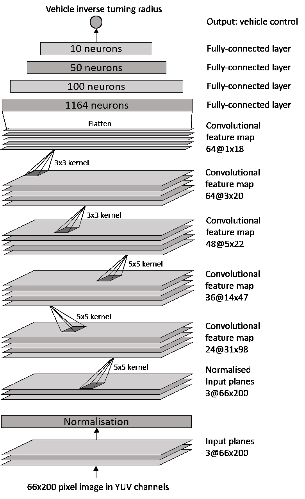
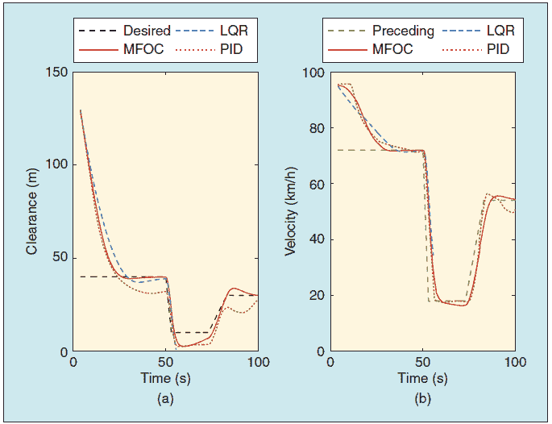
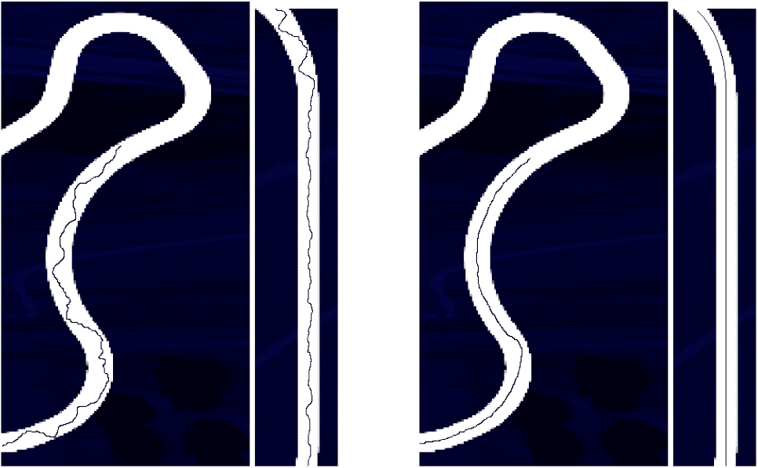

<!--yml

分类：未分类

日期: 2024-09-06 20:03:33

-->

# [1912.10773] 关于深度学习在自动驾驶车辆控制中的应用调查

> 来源：[`ar5iv.labs.arxiv.org/html/1912.10773`](https://ar5iv.labs.arxiv.org/html/1912.10773)

# 关于深度学习在自动驾驶车辆控制中的应用调查

Sampo Kuutti、**Richard Bowden**、Yaochu Jin、Phil Barber 和 **Saber Fallah**。这项工作得到了英国 EPSRC 资助（EP/R512217/1）和捷豹路虎的支持。Sampo Kuutti 和 Saber Fallah 目前在萨里大学汽车工程中心工作，地址：Guildford, GU2 7XH, U.K.（电子邮件：s.j.kuutti@surrey.ac.uk, s.fallah@surrey.ac.uk）。**Richard Bowden** 在萨里大学视觉、语音和信号处理中心工作，地址：Guildford, GU2 7XH, U.K.（电子邮件：r.bowden@surrey.ac.uk）。Yaochu Jin 在萨里大学计算机科学系工作，地址：Guildford, GU2 7XH, U.K.（电子邮件：yaochu.jin@surrey.ac.uk）。Phil Barber 曾在捷豹路虎有限公司工作（电子邮件：pbarber2@jaguarlandrover.com）。

###### 摘要

设计一个能够在所有驾驶场景中提供足够性能的自动驾驶车辆控制器是具有挑战性的，因为环境非常复杂且无法在部署后遇到的各种场景中进行测试。然而，深度学习方法在处理复杂和非线性控制问题方面表现出了极大的潜力，同时也能将之前学习的规则推广到新的场景。因此，深度学习在车辆控制中的应用越来越受到欢迎。尽管该领域已经取得了重要进展，但这些工作尚未得到充分总结。本文调查了文献中报告的各种研究工作，这些工作旨在通过深度学习方法控制车辆。虽然控制与感知之间存在重叠，但本文重点关注车辆控制，而不是包括语义分割和目标检测等任务的更广泛的感知问题。本文通过比较分析识别了现有深度学习方法的优缺点，并讨论了计算、架构选择、目标指定、推广、验证和验证以及安全等方面的研究挑战。总体而言，本调查为智能交通系统这一迅速发展的领域提供了及时而贴切的信息。

###### 索引词:

机器学习、神经网络、智能控制、计算机视觉、高级驾驶辅助、自动驾驶车辆<svg   height="66.72" overflow="visible" version="1.1" width="604.52"><g transform="translate(0,66.72) matrix(1 0 0 -1 0 0) translate(-122.74,0) translate(0,-14.11) matrix(1.0 0.0 0.0 1.0 127.35 42.63)" fill="#000000" stroke="#000000" stroke-width="0.4pt"><foreignobject width="595.3" height="57.5" transform="matrix(1 0 0 -1 0 16.6)" overflow="visible">©2019 IEEE. Personal use of this material is permitted. Permission from IEEE must be obtained for all other uses, in any current or future media, including reprinting/republishing this material for advertising or promotional purposes, creating new collective works, for resale or redistribution to servers or lists, or reuse of any copyrighted component of this work in other works.</foreignobject></g></svg>

## 引言

在 2016 年，美国发生的交通事故导致了 37,000 人遇难[1]，欧盟则有 25,500 人遇难[2]。随着道路上车辆数量的稳定增加，交通拥堵、污染和道路安全等问题正变得越来越关键[3]。自动驾驶车辆因应对这些挑战而受到广泛关注[4, 5, 6, 7]。例如，估计 90%的车祸由人为错误引起，而只有 2%是由车辆故障造成的[8]。自动驾驶车辆在燃油经济性[9, 10]、减少污染、车辆共享[11]、提高生产力和改善交通流量[12]等方面的进一步好处也已被报道。

一些最早的自动驾驶车辆项目由卡内基梅隆大学在 1980 年代展示，用于结构化环境的驾驶[13]，以及由联邦国防军大学慕尼黑校区展示，用于高速公路驾驶[14]。此后，诸如 DARPA 大奖挑战赛[15, 16]等项目继续推动自动驾驶车辆的研究。除了学术界，汽车制造商和科技公司也进行了研究，开发自己的自动驾驶车辆。这导致了多种高级驾驶辅助系统，如自适应巡航控制（ACC）、车道保持辅助和车道偏离警告技术，这些技术为现代车辆提供了部分自主性。这些技术不仅提高了现代车辆的安全性，使驾驶更轻松，还为完全自动驾驶车辆铺平了道路，这些车辆无需任何人工干预。

早期的自动驾驶系统高度依赖准确的传感数据，使用多传感器设置和昂贵的传感器，如激光雷达（LIDAR），以提供准确的环境感知。这些自动驾驶车辆的控制通过基于规则的控制器来处理，其中参数由开发者设置，并在仿真和实地测试后进行手动调优[17, 18, 19]。这种方法的缺点是参数手动调节非常耗时[20]，且这种基于规则的控制器难以对新场景进行泛化[21]。此外，驾驶的高度非线性特征意味着基于车辆模型线性化或其他代数分析解的控制方法通常不可行或扩展性差[22, 23]。最近，深度学习因其在图像分类和语音识别等领域取得的诸多前沿成果而受到关注[24, 25, 26]。这导致深度学习在自动驾驶应用中得到越来越多的使用，包括规划和决策[27, 28, 29, 30, 31]，感知[32, 33, 34, 35, 36]，以及地图绘制和定位[37, 38, 39]。卷积神经网络（CNNs）在原始摄像头输入上的表现有可能减少自动驾驶车辆使用的传感器数量。这导致一些组织开始研究不使用昂贵传感器如激光雷达的自动驾驶车辆，而是广泛使用深度学习进行场景理解、物体识别、语义分割和运动估计。深度学习在这些感知问题上的强劲结果也引发了使用深度神经网络（DNNs）生成自动驾驶车辆控制动作的兴趣。实际上，自动驾驶车辆的控制往往与感知有着密切的联系，因为许多技术使用 CNNs 根据场景图像预测控制动作，而不需要独立的感知模块，从而消除了感知层与控制层之间的隔离。

深度学习为车辆控制提供了几个好处。深度学习能够从数据中自我优化行为并适应新场景，使其非常适合在复杂和动态环境中的控制问题[40, 41, 42]。与其在所有可预见的场景中尝试维护性能并逐步调整每个参数，深度学习使开发人员能够描述期望的行为，并通过学习教会系统在新环境中表现良好并进行泛化[43, 44, 45, 46, 47]。因此，近年来在自动驾驶车辆控制中对深度学习的兴趣显著增加。存在多种不同的传感器配置；一些研究者旨在仅通过摄像头视觉来控制车辆，而其他人则利用来自距离传感器的低维数据，还有一些使用多传感器配置。在控制目标方面也存在一些差异，有些将系统制定为高层控制器，例如提供期望加速度，然后通过低层控制器实现，通常使用经典控制技术。其他人则旨在端到端学习驾驶，将观察直接映射到低层车辆控制接口命令。尽管目前有多种不同的方法用于通过深度学习解决自动驾驶车辆控制问题，但目前缺乏对这些不同技术的分析和比较。本手稿旨在填补这一文献空白，通过回顾深度学习在车辆控制中的应用并分析其性能。此外，本手稿还将评估该领域的当前状态，识别主要研究挑战，并提出未来研究的方向建议。

本手稿的其余部分结构如下。第二部分简要介绍了与自动驾驶车辆相关的深度学习方法和方法。第三部分讨论了使用深度学习的自动驾驶车辆控制的最新方法，分为三类：(A) 横向控制，(B) 纵向控制，以及 (C) 同时横向和纵向控制。第四部分呈现了前一部分讨论中的主要研究挑战。最后，第五部分总结了该领域的当前状态，并为未来研究方向提供建议。

## II 深度学习综述

在本节中，我们简要介绍了与后续章节讨论的工作相关的深度学习技术和方法。提供了关于学习策略、数据集和自动驾驶深度学习工具的简要总结。由于对所有在自动驾驶中使用的深度学习算法进行全面描述超出了本文的范围，我们建议感兴趣的读者查阅该主题的有见地的文献[48, 49, 46, 47, 50, 51, 52]。

### II-A 监督学习

在深度学习中，目标是在训练过程中更新深度神经网络的权重，以使模型学会表示其任务的有用函数。虽然有许多学习算法可用，但本文描述的大多数算法可以归类为监督学习或强化学习。监督学习利用带标签的数据，其中专家演示执行所选择的任务。数据集中的每个数据点包括观察-动作对，神经网络学习对其进行建模。在训练过程中，网络为每个观察近似其自身的动作，并将误差与专家标记的动作进行比较。监督学习的优点在于训练收敛速度快，无需指定如何执行任务。虽然监督学习的方法简单，但也有一些缺点。首先，在训练过程中，网络在离线框架中对控制动作进行预测，其中网络的预测不会影响训练过程中看到的状态。然而，一旦部署，网络的动作将影响未来的状态，突破了大多数学习算法所做的 i.i.d.假设[53, 54, 55]。这导致训练与操作之间的分布变化，可能导致网络因操作过程中遇到的不熟悉的状态分布而犯错。其次，从示范中学习行为使网络容易受到数据集偏差的影响。对于复杂任务，如自动驾驶，如果目标是训练一个能够在所有不同环境中驾驶的可泛化模型，则应确保数据集的多样性[56, 57]。

### II-B 强化学习

强化学习使模型能够通过试错学习执行任务。强化学习可以被建模为一个马尔可夫决策过程，形式上描述为一个元组 (S, A, P, R)，其中 S 表示状态空间，A 代表可能的动作空间，P 表示状态转移概率模型，R 代表奖励函数。在每个时间步，代理观察一组状态 $s_{t}$，从可能的动作 A 中选择一个动作 $a_{t}$，然后环境根据 P 进行转移。代理接着观察到一组新的状态 $s_{t+1}$ 并获得奖励 $r_{t}$。代理的目标是学习一个策略 $\pi(s_{t},a_{t})$，将观察映射到动作，从而最大化累积奖励。因此，代理可以通过与环境的交互从自身行为中学习，并通过奖励函数获得其性能的估计。这种方法的优点是无需标记数据集，并且可以通过强化学习学习到在新场景中表现良好的行为。强化学习的缺点是其样本效率低 [58]，这意味着收敛到最优策略可能较慢，从而需要时间密集的模拟或昂贵的现实世界训练 [50]。

强化学习算法可以分为三类：基于价值的方法、策略梯度方法和演员-评论家算法[59]。基于价值的方法（例如 Q-learning[60]）估计价值函数$V(s)$，该函数表示在给定状态下的价值（期望回报）。如果状态转移动态 P 已知，则策略可以选择使其到达的状态，以最大化期望回报。然而，在大多数强化学习环境中，环境模型是未知的。因此，使用状态-动作价值或质量函数$Q(s,a)$来估计给定状态下给定动作的价值。然后通过贪婪地最大化状态-动作价值函数$Q(s,a)$来找到最优策略。这种方法的缺点是没有保证所学策略的最优性[61, 62]。策略梯度算法（例如 REINFORCE[63]）不估计价值函数，而是对策略进行参数化，然后更新参数以最大化期望回报。这是通过构造损失函数并估计损失函数相对于网络参数的梯度来完成的。在训练过程中，网络参数沿着策略梯度的方向进行更新。这种方法的主要缺点是估计的策略梯度具有较高的方差[64, 65, 66]。第三类，演员-评论家算法（例如 A3C[67]），是结合了价值函数和参数化策略函数的混合方法。这在策略梯度的高方差和基于价值方法的偏差之间创建了权衡[51, 68, 69]。不同强化学习算法之间的另一个区别因素是所使用的奖励函数类型。奖励函数可以是稀疏的或密集的。在稀疏奖励函数中，智能体仅在特定事件之后（如任务的成功或失败）获得奖励。这种方法的好处是成功（例如达到目标位置）或失败（例如与其他对象碰撞）对于大多数任务而言易于定义。然而，这可能进一步加剧强化学习中的样本复杂性问题，因为智能体获得奖励的频率相对较低，从而导致收敛缓慢。另一方面，在密集奖励函数中，智能体在每个时间步都根据其所处状态获得奖励。这意味着智能体接收到连续的学习信号，估计所选择动作在各自状态下的有效性。

### II-C 深度学习的数据集和工具

深度学习系统在自动驾驶车辆上的快速进展带来了各种深度学习数据集用于自动驾驶和感知。也许最著名的自动驾驶数据集是 KITTI 基准套件[70]、[71]，它包括多个用于立体视觉、光流、场景流、同步定位与地图构建、目标检测与跟踪、道路检测和语义分割的评估数据集。其他有用的数据集包括 Waymo Open[72]、Oxford Robotcar[73]、ApolloScape[74]、Udacity[75]、ETH Pedestrian[76]和 Caltech Pedestrian[77]数据集。有关可用自动驾驶数据集的更完整概述，请参见 Yin & Berger 的调查[78]。除了公共数据集外，还有许多其他工具可用于自动驾驶中的深度学习开发。目前领先的自动驾驶人工智能（AI）平台是 NVIDIA Drive PX2[79]，它提供两个 Tegra 系统芯片（SoC）和两个 Pascal 图形处理器，配备专用内存和针对 DNN 计算的专门支持。对于更多样化的任务，MobilEye EyeQ5[80]提供四个完全可编程的加速器，每个加速器都针对不同类别的机器学习算法进行了优化。这种多样性在使用不同类别的深度学习算法的系统中可能会有所帮助。另一方面，Altera 的 Cyclone V[81] SoC 提供了一种针对传感器融合优化的驱动解决方案。有关自动驾驶硬件平台的更深入评审，请参见 Liu 等人的讨论[82]。

## III 深度学习在车辆控制中的应用

车辆的运动控制可以大致分为两个任务；车辆的横向运动由车辆的转向控制，而纵向运动则通过操作油门和刹车踏板来控制。横向控制系统旨在控制车辆在车道上的位置，以及执行其他横向操作，如变道或碰撞避免机动。在深度学习领域，这通常通过使用车载摄像头的图像来捕捉环境，并将其作为神经网络的输入来实现。纵向控制管理车辆的加速，以保持道路上的理想速度，保持与前方车辆的安全距离，并避免追尾碰撞。虽然横向控制通常通过视觉来实现，但纵向控制依赖于对前方/后方车辆的相对速度和距离的测量。这意味着像雷达（RADAR）或激光雷达（LIDAR）这样的测距传感器在纵向控制系统中更为常见。目前大多数研究项目选择只关注其中一个动作，从而简化了控制问题。此外，两种控制系统面临不同的挑战，并在实施方面有所不同（例如传感器设置、测试/使用案例）。因此，本节被分为三个子节，其中前两个子节分别讨论横向和纵向控制系统，第三个子节则关注尝试将纵向控制和横向控制相结合的技术。

### III-A 横向控制系统

人工神经网络在车辆控制问题中的最早应用之一是 1989 年由 Pomerleau 提出的自主陆地车辆神经网络（ALVINN）系统，最初在[83]中描述，并在[84]中进一步扩展。ALVINN 使用了一个前馈神经网络，具有一个 30x32 神经元的输入层，一个包含四个神经元的隐藏层，以及一个 30 神经元的输出层，其中每个神经元代表一个可能的离散转向动作。该系统使用来自摄像头的输入数据以及人类驾驶员的转向命令作为训练数据。为了增加数据量和场景的多样性，作者采用了数据增强方法，在不录制额外视频的情况下增加了可用的训练数据；每张图像都被移动和旋转，以使车辆看起来位于道路的不同位置。此外，为了避免对最近输入的偏见（例如，如果训练会话以长时间的右转结束，系统可能会倾向于更频繁地右转），采用了缓冲解决方案，之前遇到的训练模式被保留在缓冲区。缓冲区随时包含 4 个以前的数据模式，这些模式会定期被替换，从而使缓冲区中的模式在平均水平上没有左右偏差。图像位移和缓冲解决方案都显著提高了系统性能。该系统在 150 米长的道路上进行了训练，随后在不同的道路上进行测试，速度范围从 5 到 55 英里每小时，允许在最长 22 英里的距离内无需干预地进行转向。该系统被证明能够在道路中心平均保持 1.6 厘米的距离，而人类控制下为 4.0 厘米。这表明神经网络可以通过记录的数据学习转向操作。

第一个提出用于车辆转向的强化学习的是 Yu [85]的工作。Yu 提出了一种基于 Pomerleau 工作的道路跟随系统，利用强化学习设计控制器。其优点在于能够从以前的经验中学习，以适应新的环境，并通过在线学习不断提高其道路跟随能力。Moriarty 等人[86]结合监督学习和强化学习，开发了一种高速公路环境下的车道选择策略。结果表明，使用学习控制器的车辆能够保持接近期望速度的行驶，并减少车道变换。此外，学习的控制策略比手动构建的控制器产生了更好的交通流。

与今天的技术相比，前述早期工作的神经网络要小得多[87]。事实上，虽然神经网络并不新鲜，但由于计算能力的提升，特别是通过并行图形处理单元（GPU）显著缩短了训练时间并提高了性能，近年来的研究兴趣和应用扩展迅速。此外，大型公共数据集和针对深度学习优化的硬件解决方案的可用性，使得神经网络系统的训练和验证变得更加容易。总体而言，这些近期的进展使得通过更复杂的系统和大量增加的训练数据和训练轮次，实现了更好的性能。

利用深层模型和卷积神经网络（CNN），Muller 等人[88] 训练了一辆亚缩放的遥控车在 DARPA 自主车辆（DAVE）项目中进行越野导航。该模型使用了从两台前向摄像头收集的训练数据，期间由人工控制车辆。通过使用 6 层 CNN，该模型在以 2m/s 的速度行驶时学习绕过障碍物。基于 DAVE 的方法，NVIDIA 利用 CNN 创建了一个端到端的控制系统，用于通过监督学习来控制车辆的转向[87]。该系统能够自我优化系统性能并检测有用的环境特征（例如道路和车道的检测）。使用的 CNN（见图 1）能够在没有显式手动分解环境特征、路径规划或控制动作的情况下，使用少量训练数据学习转向策略。训练数据集包含记录的摄像机视频和来自人工驾驶车辆的转向信号。CNN 包含 9 层，包括一个标准化层、5 个卷积层和 3 个全连接层，总共有 2700 万个连接和 250,000 个参数。这种方法在初步测试中实现了 98%的自主性，在 10 英里高速公路测试中实现了 100%的自主性，这些都是基于在给定测试时间内所需的干预次数来衡量的。然而，需要注意的是，这一衡量标准不包括车道变更或转弯，因此仅评估系统在当前车道内保持行驶的能力。

图 1：NVIDIA 端到端转向系统中使用的卷积神经网络。（图基于[87]重绘）。

由 Rausch 等人提供的一个进一步的监督学习示例用于自主车辆的转向 [42]，其中监督学习被用来创建一个端到端的横向车辆控制器。Rausch 等人利用了一个包含四层隐藏层、三层卷积层和一层全连接层的 CNN。训练数据包括转向角度和由人类在 CarSim [89]模拟中驾驶车辆时提供的前向摄像头画面，图像以每秒 12 帧（FPS）的速度捕获，分辨率为 1912x1036。数据收集来自一次 15 分钟的模拟运行，共获得了 10,800 帧。由于驾驶行为不当或图形错误（例如，模拟器故障）导致的不适当帧被手动从训练数据中移除。然后，使用三种不同的优化算法来训练神经网络以更新网络权重，即随机梯度下降（SGD） [90]、Adam [91] 和 Nesterov 加速梯度（NAG） [92]。在训练过程中，Adam 的损失收敛效果最好，而在评估期间，NAG 训练的网络在保持车辆在车道中心方面表现最佳。因此，损失函数的收敛性不一定代表网络的良好训练。神经网络显示出对人类驾驶员转向策略的良好估计，但通过比较转向角度，可以看到神经网络的转向信号包含噪声行为。一个可能的原因是系统在每帧上估计所需的转向角度，而没有考虑以前的状态或动作。这导致了随时间步骤变化的转向信号之间差异显著，从而产生噪声输出。通过使用 RNN 来提供对系统的先前输入和输出的记忆，从而为系统提供时间上下文，可以解决这一问题。

为深度学习转向模型引入时间上下文，Eraqi 等人 [93] 利用卷积长短期记忆递归神经网络（C-LSTM）来基于视觉和动态时间依赖关系学习车辆转向。该网络被训练以根据图像输入预测转向角度，然后将其与 [94] 中使用的简单 CNN 架构进行比较。实验结果表明，使用 C-LSTM 网络可以提高准确性和转向变化的平滑性。然而，该模型仅通过将预测的控制动作与真实值进行离线比较来进行评估，这不一定能准确评估驾驶质量 [95]。应改为使用实时测试，让模型控制车辆以测试学到的驾驶行为。

还提出了用于车道变换操控的横向控制技术。Wang 等人 [96] 使用强化学习来训练一个代理，通过深度 Q 网络（DQN）执行车道变换操控。该网络使用主车速、纵向加速度、位置、偏航角、目标车道、车道宽度和道路曲率来提供期望的偏航加速度的连续值。为了确保 Q 学习可以输出连续的动作值，采用了一种改进的 Q 学习方法来支持连续动作值，其中 Q 函数是由三个单隐层前馈神经网络逼近的二次函数。所提出的方法在模拟的高速公路环境中进行了测试，初步结果表明代理学习到了有效的车道变换操控。

本节所涵盖的研究工作的总结见表 I。由于前述的进展，近期的趋势是转向更深层次的模型，并增加训练数据量。最近的工作还研究了将时间线索引入学习模型，但这会导致训练的不稳定。此外，目前开发的许多模型在相对简单的环境中进行了训练和评估。例如，大多数研究人员决定专注于单一任务的横向控制。例如，在用于车道保持的模型中，并未包含车道变换或转弯到不同道路的决策。这为未来的研究开辟了可能的途径，在这些研究中，同一 DNN 可以执行多个动作。还应该注意的是，这些工作中的大多数是在模拟环境中训练和评估的，这进一步简化了任务，并需要进一步测试以验证其在现实世界中的性能。然而，这一领域已有重要发展，这些结果显示了深度学习在自动驾驶控制中应用的巨大潜力。

表 I：横向控制技术的比较。

| 参考 | 学习策略 | 网络 | 输入 | 输出 | 优点 | 缺点 | 实验 |
| --- | --- | --- | --- | --- | --- | --- | --- |
| [83], [84] | 监督学习 | 具有 1 个隐层的前馈网络 | 摄像头图像 | 离散化的转向角度 | 神经网络基础的车辆控制器的初步有希望的结果 | 网络简单且离散化的转向角度输出降低了性能 | 实际 & 仿真 |
| [85] | 强化学习 | 具有 1 个隐层的前馈网络 | 摄像头图像 | 离散化的转向角度 | 支持在线学习 | 网络简单且离散化的转向角度输出降低了性能 | 仿真 |
| [88] | 监督学习 | 6 层 CNN | 相机图像 | 转向角 | 对环境多样性具有鲁棒性 | 大误差，训练和测试在一个缩尺车辆模型上 | 现实世界（缩尺车辆） |
| [87] | 监督学习 | 9 层 CNN | 相机图像 | 转向角值 | 在实地测试中具有高水平的自主性 | 仅考虑车道保持，需要司机干预 | 现实世界与仿真 |
| [42] | 监督学习 | 8 层 CNN | 相机图像 | 转向角值 | 从最少的训练数据中学习 | 转向信号的噪声行为 | 仿真 |
| [93] | 监督学习 | C-LSTM | 相机图像 | 转向角值 | 考虑时间依赖性 | RNNs 可能难以训练，缺乏实时测试 | 无实时测试，仅在数据集图像示例上测试 |
| [96] | 强化学习 | 3 个前馈网络 | 主车状态和道路几何 | 车辆偏航加速度 | 成功执行车道变换 | 测试或结果有限，缺乏与其他车道变换算法的比较 | 仿真 |

### III-B 纵向控制系统

机器学习方法在车辆纵向控制应用中也显示出了潜力，例如自适应巡航控制（ACC）设计。ACC 可以被描述

有几项研究探讨了多目标奖励函数的应用。例如，Desjardins & Chaib-Draa [23] 使用了一种基于时间头距（与前车的时间距离）和时间头距导数的多目标奖励函数。该奖励函数鼓励代理保持与前车的 2 秒时间头距，而时间头距导数提供了车辆与前车距离的变化信息，并允许车辆据此调整驾驶策略。在奖励函数中考虑时间头距导数鼓励代理选择有助于其向理想状态（理想时间头距）前进的行动。作者在合作自适应巡航控制（CACC）系统的策略梯度方法中使用了这一奖励函数。所选择的神经网络架构有两个输入，一个包含 20 个神经元的隐藏层，以及一个具有 3 个离散动作（刹车、加速、保持不变）的输出层。在学习过程中，获得了超过 220 万次迭代的平均值，跨越了十次学习模拟。所选方法在 CACC 中显示出高效性，在紧急制动场景中提供了 0.039 秒的平均时间头距误差。尽管时间头距误差的幅度仍然很小，但值得注意的是，受试车辆的速度曲线表现出振荡行为。这将使系统对乘客不舒服，并可能带来潜在的安全风险。可能的解决方案包括利用连续动作值、使用 RNNs，或对加速变化施加负奖励，以帮助平滑车辆的速度曲线。类似地，Sun [99] 提出了一个基于时间头距和时间头距导数奖励的 CACC 系统的 Q 学习算法。该方法显示出减少神经网络学习时间的效果。在超过一百次学习模拟中，选择了表现最佳的策略（获得最高奖励的策略）进行评估。该算法在前车周期性加速和减速的停走环境模拟中进行了评估。结果表明，代理在车队场景中表现良好。然而，尽管这种多目标奖励函数比 Dai 等人提出的单目标奖励函数 [107] 有所改进，但这一奖励函数未考虑乘客舒适度，这可能导致剧烈的加速或减速。

黄等人[108]提出了一种参数化批量演员-评论员（PBAC）强化学习算法，用于基于演员-评论员算法的自主车辆纵向控制。设计了一个多目标奖励函数，以奖励算法在跟踪精度和驾驶平稳性方面的表现。该方法通过在各种驾驶环境（如平坦、滑溜、坡度等）中的现场实验进行了验证，结果表明该方法比传统的比例-积分（PI）或基于核的最小二乘策略迭代（KLSPI）控制器在跟踪时间变化速度方面更为精确[109、110]。这是由于对速度和加速度的噪声具有较低的敏感性。此外，使用所提方法实现了平稳驾驶。奖励函数中加入驾驶平稳性使这些系统对乘客更为舒适。然而，该方法是在没有邻近车辆或其他障碍物的环境中进行评估的。这使得作者没有考虑奖励函数中的安全参数，这使得算法在存在其他车辆的环境中容易发生碰撞。因此，奖励函数中需要额外的安全项以确保自主车辆的安全行为。

一种这样的奖励函数由 Chae 等人提出[111]，他们提出了一种基于 DQN 方法的自动刹车系统用于避免碰撞。该奖励函数平衡了两个相互冲突的目标：避免碰撞和脱离高风险情况。为了加快收敛速度，使用了回放记忆来存储多个情景，其中一些情景被随机选择以帮助训练网络。此外，使用了“创伤记忆”来记录稀有的关键事件（例如碰撞），以提高系统的稳定性并使代理更可靠。该系统在需要避免与行人碰撞的情况下进行了评估，使用了各种碰撞时间（TTC）值，并对每个 TTC 值进行了 10,000 次测试。结果显示，对于 TTC 值大于 1.5 秒的情况，每次都能避免碰撞，而在 0.9 秒（使用的最低 TTC 值）时，碰撞率高达 61.29%。此外，该系统还在 Euro NCAP 测试协议（CVFA 和 CVNA 测试[112]）规定的测试程序中进行了评估，结果系统通过了这些测试且未发生碰撞。因此，该系统被认为展现了理想且一致的刹车控制行为。此外，Chen 等人[100] 提出了一个可以从人类示范中学习的个性化 ACC。该算法基于 Q 学习，奖励函数基于前车距离、车辆速度和加速度。作者使用了基于前馈人工神经网络的 Q 学习算法来估计 Q 函数，并计算所需速度，然后由比例积分微分（PID）控制器将其转换为低级控制指令。用于估计 Q 函数的神经网络包括一个具有 5 个节点的输入层、一个具有 3 个节点的隐藏层和一个具有 1 个节点的输出层，该输出层预测所需速度。该系统的性能基于舒适性和驾驶平稳性进行了仿真评估，结果显示与传统的 ACC 方法相比，表现更佳。类似地，Zhao 等人[113] 提出了一个个性化的 ACC 方法，考虑了安全性、舒适性以及个性化的驾驶风格。奖励函数考虑了驾驶习惯、乘客舒适度和安全性，以寻找安全性和舒适性之间的良好权衡。该方法使用基于演员-评论家神经网络结构的无模型优化控制（MFOC）算法。通过优化算法以更像人类的方式驾驶，驾驶员更有可能信任系统并继续使用它。为此，网络还能够在巡航控制功能关闭时从人类驾驶员那里学习，以更好地调整其参数，并根据车主的驾驶习惯采用驾驶策略。该算法在各种环境下的仿真测试中表现优于 PID 和线性二次调节器（LQR）控制器。例如，在图 2 所示的紧急制动测试场景中，MFOC 维持了比 PID 更安全的间隙，而 LQR 由于引发了追尾碰撞而未通过测试。然而，尽管适应个人驾驶习惯有助于确保用户在车内感到安全和舒适，但还应考虑减轻学习不良驾驶习惯的负面影响，以确保系统的长期可靠性和安全性。

图 2：在紧急刹车场景中，MFOC 控制器与 PID 和 LQR 控制器的对比。（a）前车和跟车之间的间隙。（b）前车和三种控制器的速度曲线[113]。

如上述讨论所示，强化学习已被证明是车辆纵向控制系统的一种有效方法。然而，强化学习的主要缺点是训练过程时间较长[50, 114]。相比之下，监督学习方法利用监督者的先验知识简化了学习过程，但缺乏使强化学习在复杂决策系统（如自动驾驶）中具有吸引力的适应能力。因此，文献中有多个例子结合了强化学习和监督学习，以发挥两者的优势；强化学习允许在新和复杂的环境中自我适应，而监督学习的先验知识则加速了学习过程。例如，赵等人[22, 115, 116] 为 ACC 系统引入了一种监督强化学习算法。通过利用演员-评论家方法，作者提出了一种新颖的监督演员-评论家（SAC）学习方案，并将其与前馈神经网络实现到层次加速控制器中。该方法在模拟紧急刹车场景中进行了评估。网络在干燥条件下进行了紧急刹车训练，并在干燥和湿滑路况下进行了评估，结果与 PID 控制器的性能进行了比较。模拟结果表明，SAC 算法相比于 PID 控制器以及基于监督学习的控制器（没有强化学习）具有更优的性能，并且能够适应变化的道路条件。这显示了将监督学习与强化学习相结合的好处，从而利用了两种方法的综合优势。通过监督学习预训练网络有助于减少强化学习的训练时间，并改善算法的收敛性，这些都是强化学习算法中的常见问题。同时，通过试错探索不同的动作，强化学习提升了性能，超出了监督学习所能提供的水平。此外，作者指出，使用演员-评论家网络架构是有益的，因为评论家对动作的评估提升了系统在关键场景（如紧急刹车）中的性能。

长 itudinal 控制方法的总结可以在表 II 中查看。与横向控制系统相比，纵向控制通常不使用基于视觉的输入。相反，更常用的是来自距离传感器（例如 RADAR、LIDAR）和主车状态的传感器输入。这些低维输入（例如时间间隔或相对距离）可以很容易地用来定义强化学习的奖励函数。纵向和横向控制算法的第二个主要区别是学习策略的选择。虽然横向控制技术倾向于使用在标注数据集上训练的监督学习技术，但纵向控制技术则偏向于通过与环境互动进行学习的强化学习方法。然而，正如本节所见，强化学习中的奖励函数需要精心设计。安全性、性能和舒适性都需要考虑。不良设计的奖励函数会导致性能不佳或模型无法收敛。强化学习算法的另一个挑战是探索与利用之间的权衡。在训练过程中，代理必须采取随机动作以探索环境。然而，为了在任务中表现良好，代理应该利用其知识来找到最优动作。解决这个问题的例子包括$\epsilon$-贪婪探索策略和上置信界（UCB）算法。$\epsilon$-贪婪策略以概率$\epsilon$选择随机动作，这个概率会随着代理对环境的学习而逐渐降低。另一方面，UCB 在不确定性较高的状态中鼓励探索，而在置信度较高的区域中鼓励利用。因此，系统中实现了内在动机，鼓励代理了解其环境，同时在已经充分探索的状态中可以利用已有知识[51, 117, 118, 119]。其他方法则试图利用监督学习作为预训练步骤，以获得强化学习和监督学习的双重优势。

表 II：纵向控制技术的比较。

| Ref. | Learning Strategy | Network | Inputs | Outputs | Pros | Cons | Experiments |
| --- | --- | --- | --- | --- | --- | --- | --- |
| [107] | 模糊强化学习 | 带有 1 层隐藏层的前馈网络 | 相对距离、相对速度、前一控制输入 | 油门角度、刹车扭矩 | 无模型、连续动作值 | 单项奖励函数 | 仿真 |
| [23] | 强化学习 | 具有 1 个隐藏层的前馈网络 | 时间间隔、时间间隔导数 | 加速、刹车或无操作 | 维持安全距离 | 振荡加速行为，奖励函数中没有舒适度项 | 仿真 |
| [108] | 强化学习 | 使用前馈网络的演员-评论员网络 | 速度、速度跟踪误差、加速度误差、期望加速度 | 油门和刹车命令 | 从最少的训练数据中学习 | 加速度信号的噪声行为 | 真实世界 |
| [111] | 强化学习 | 具有 5 个隐藏层的前馈网络 | 车辆速度、过去 5 个时间步的行人相对位置 | 离散化减速动作 | 可靠地避免碰撞 | 仅考虑与行人的碰撞规避，低 TTC 下碰撞率高 | 仿真 |
| [100] | 强化学习 | 具有 1 个隐藏层的前馈网络 | 相对距离、相对速度、相对加速度（归一化） | 期望加速度 | 提供平稳的驾驶风格，学习个人驾驶风格 | 没有防止学习驾驶员不良习惯的方法 | 仿真 |
| [113] | 强化学习 | 使用前馈网络的演员-评论员网络 | 相对距离、主车速度、相对速度、主车加速度 | 期望加速度 | 在多种场景下表现良好，考虑安全性和舒适度，学习个人驾驶风格 | 适应不安全的驾驶习惯可能会降低安全性 | 仿真 |
| [22] | 监督强化学习 | 使用前馈网络的演员-评论员网络 | 相对距离、相对速度 | 期望加速度 | 通过监督学习进行预训练，加快学习过程并帮助保证收敛，在关键场景下表现良好 | 需要监督才能收敛，未考虑驾驶舒适度 | 仿真 |

### III-C 同时横向与纵向控制系统

之前的部分展示了 DNN 可以用于车辆的纵向或横向控制。然而，对于自动驾驶，车辆必须能够同时控制方向盘和加速。在早期通过深度学习实现全面车辆控制的工作中，Xia 等人[120]引入了一种基于 Q 学习和专业司机经验的自动驾驶系统。在预训练阶段，将专业司机策略的奖励值与通过 Q 学习方法学到的 Q 值结合，以提高训练过程中的收敛速度。过滤后的经验回放存储有限数量的实验回合，并允许从记忆中排除表现不佳的实验回合，从而改善控制策略的收敛性。所提出的带过滤经验的深度 Q 学习（DQFE）方法与没有经过经验司机预训练的原始神经网络拟合 Q 迭代（NFQ）[121]算法进行了比较。在训练过程中，DQFE 方法将 300 次训练回合的训练时间减少了 71.2%。此外，在 50 次竞赛赛道测试中，所提出的方法完成了 49 次，相比之下 NFQ 只有 33 次。此外，DQFE 在平均离赛道中心的距离方面表现更好。因此，添加过滤经验回放提高了收敛速度以及算法性能。对车道保持系统的两个神经网络进行比较时，Sallab 等人[122]研究了离散和连续动作的效果。两种方法，DQN 和深度确定性演员评论家（DDAC）算法，在 TORCS 模拟器[123]中进行了评估。在作者开发的两个网络中，DQN 只能输出离散值（转向、齿轮、刹车和加速），而 DDAC 支持连续动作值。DDAC 由两个网络组成；一个演员网络，该网络负责根据感知状态采取行动，和一个评论家网络，该网络评估所采取行动的价值。实验结果显示，DQN 算法因无法支持连续动作或状态空间而表现不佳。DQN 算法适用于连续（输入）状态，但仍需要离散动作，因为它找到最大化动作值函数的动作。这需要在每个时间步骤中对连续动作空间进行迭代处理[124]。如图 3 所示，支持连续动作值的能力使 DDAC 算法能够更平滑地跟随弯曲轨道，并在与 DQN 算法相比时更接近车道中心，从而在车道保持方面表现更好。

图 3：图 (a) 是具有离散化输出的 DQN 的车道保持性能，图 (b) 是具有连续输出值的 DDAC 的车道保持性能 [122]。

基于视觉的车辆控制使用 CNN 也得到了研究。例如，Zhang 等人[125]提出了一种监督学习方法 SafeDAgger，用于训练 CNN 在 TORCS 模拟中驾驶。该方法基于数据集聚合（DAgger）模仿学习算法[54]。在 DAgger 中，代理首先通过传统的监督学习学习一个初步策略，训练集由参考策略生成。然后，算法通过已学到的策略迭代生成新的训练示例，并由参考策略标记。扩展后的数据集可以用来通过监督学习更新已学到的策略。这有一个优点，即可以在新的扩展训练集中覆盖在初始训练集中未达到的状态。然后，使用新的训练集对初步策略进行迭代微调。Zhang 等人提出了该方法的扩展，称为 SafeDAgger，其中系统估计（在任何给定状态下）初步策略是否可能偏离参考策略。如果初步策略可能偏离超过指定阈值，则使用参考策略来驾驶车辆。安全策略由一个完全连接的网络估计，其中输入是最后卷积层的激活。作者使用这种方法训练 CNN 预测连续的方向盘角度和用于制动的二元决策（刹车或不刹车）。作者然后通过在三个测试赛道上进行驾驶来评估监督学习、DAgger 和 SafeDAgger，每条赛道最多三圈。在评估的三种算法中，SafeDAgger 在完成圈数、碰撞次数和方向盘角度的均方误差方面表现最好。在另一项工作中，Pan 等人[126]使用类似于 DAgger 的模仿学习来学习在高速下自主驾驶，提供连续的转向和加速动作。数据集的参考策略来自使用昂贵高分辨率传感器操作的模型预测控制器，CNN 则学习用低成本相机传感器模仿这一策略。该技术首先在 Robot Operation System (ROS) Gazebo [127]模拟中测试，然后在一个长 30 米的实际泥土赛道上测试，使用 1/5 比例的车辆。子比例车辆成功学会了以最高 7.5m/s 的速度驾驶绕过赛道。Wang 等人[128]则展示了 DAgger 可以用来训练基于物体的策略，该策略利用图像中的显著物体（例如车辆、行人）来输出控制动作。经过训练的控制策略在 Grand Theft Auto V 模拟中进行测试，使用离散控制动作（左、直、右、快、慢、停车），然后用 PID 控制器转换为连续控制。测试结果显示，与没有注意力或基于启发式物体选择的模型相比，基于物体的策略表现有所改善。基于视觉的技术还被 Porav & Newman[129]用于减少碰撞，他们在 Chae 等人[111]的前期工作基础上，使用深度强化学习算法进行碰撞缓解，该算法可以提供连续的速度和转向控制动作。该系统使用变分自编码器（VAE）结合 RNN 预测障碍物的移动，并使用深度确定性策略梯度（DDPG）学习控制策略，以在低 TTC 情境中缓解碰撞。网络使用语义分割图像来预测连续的转向和减速动作。提出的技术在 TTC 值介于 0.5 到 1.5 秒之间的情况下，相比仅使用制动的策略，表现出改善，并且碰撞率减少了多达 60%。

逆向强化学习（IRL）方法也在控制系统的背景下进行了研究，以克服定义最佳奖励函数的困难。IRL 是强化学习的一个子集，其中奖励函数并未明确指定，而是代理尝试从专家的示范中学习。在 IRL 中，代理假设专家是通过遵循一个未知的奖励函数来完成任务的。然后，它估计一个奖励函数，使得示范者的轨迹是最可能的。这种方法的优点是，开发者无需明确指定奖励函数，只需展示期望的行为即可。这在大规模和复杂任务中尤其有利，因为定义一个足够好的奖励函数以提供最佳代理行为既困难又耗时[130]。研究表明，IRL 方法不仅减少了设计和优化所需的时间，还通过创建更为稳健的奖励函数提高了系统性能。Abbeel 和 Ng [131] 证明，当 IRL 应用于代理通过观察专家学习的问题时，代理在使用专家的奖励函数进行评估时表现与专家一样，即使从观察中得出的奖励函数并不是专家的真实奖励函数。此外，在一个简化的高速公路驾驶场景中，代理有 5 种不同的车道选择动作和多种驾驶风格的示范，IRL 算法成功地学习了模仿示范的驾驶行为。此外，Silver 等人 [21] 使用了一种基于最大间隔规划的 IRL 算法 [132]，该算法在非结构化地形中的自主车辆演示中表现出有效性。与传统的强化学习代理和手动调整的奖励函数相比，该车辆的表现更佳。此外，IRL 方法在设计和优化上所需的时间明显少于强化学习代理。Kuderer 等人 [20] 提出了一个可以通过 IRL 从示范中学习个体驾驶风格的车辆控制器。该算法假设示范者的驾驶方式是为了最大化一个未知的奖励函数。基于此，学习模型估计了基于 9 个驾驶特征的线性奖励函数中的权重。最初，这些权重被设置为相等，然后根据每位驾驶员的 8 分钟示范进行更新。在找到驾驶策略后，将所选轨迹与从人类驾驶员那里观察到的轨迹进行了比较。系统显示可以从最小的训练数据中学习驾驶员的个人驾驶风格，并在模拟测试中表现出色。

在 IRL 方法的基础上，Wulfmeier 等人[133] 提出了一个深度学习的 IRL 方法。该算法基于最大熵[134] 模型，用于轨迹规划器，并使用 CNN 从专家演示中推断奖励函数。该方法在一个数据集上进行训练，该数据集在一年的时间内收集，共包括 120 公里在步道和自行车道上驾驶改装高尔夫球车。网络的输入是 LIDAR 点云地图，表示在离散化的网格地图上。网络的输出是一组离散的动作。所提出的方法被证明比手动构建的成本函数效果更好。此外，所学算法在对抗传感器噪声方面表现得更为稳健。这表明在轨迹规划的 IRL 算法中使用 DNN 是整体上有益的。因此，IRL 技术可以被视为克服驾驶最优奖励函数设计困难的一种潜在方式。

然而，IRL 方法在实际应用中面临一些挑战。首先，演示的最优性没有保证。例如，在驾驶演示中，没有任何人类驾驶员能够每次都以最优方式完成驾驶任务。因此，训练数据将包括次优的演示，这会影响最终构建的奖励函数。为了最小化次优演示的影响，有一些解决方案；使用多个轨迹并对多个集合进行平均，以找到奖励函数，或去除全局最优性的假设[135]。其次，奖励模糊性可能导致 IRL 方法出现进一步的问题。给定专家的驾驶策略演示，可能会有多个奖励函数来解释专家的行为。因此，一个有效的 IRL 算法必须找到一个将专家轨迹视为最优并排除其他可能轨迹的奖励函数。第三，通过 IRL 方法推导出的奖励函数可能不安全，正如 Abbeel 等人所指出的[136]，他们使用 IRL 操作了一架自主直升机，并且必须手动调整奖励函数以确保安全。因此，可能需要手动调整推导出的奖励函数以确保安全行为。最后，IRL 方法的计算负担可能很重，因为它们通常需要迭代地解决每个新奖励函数推导出的强化学习问题[130]。尽管如此，在无法轻易定义足够准确的奖励函数的任务中，IRL 方法可以提供有效的解决方案。

虽然本节中前面提到的工作展示了深度神经网络（DNN）可以训练来驾驶车辆，但仅仅训练车辆跟随道路或保持车道而没有任何外部上下文，并不足以部署完全自主的车辆。人类驾驶车辆的目标是到达目的地，仅通过摄像头图像来模仿人类驾驶行为不足以理解人类驾驶者行为背后的完整上下文。例如，有报道称[83]，当遇到岔路口时，端到端的驾驶技术往往在两个可能的行驶方向之间波动。如果我们的目标是继续向左行驶，这不仅不切实际，还可能导致不安全的行为，因为 DNN 在左右之间来回波动却不选择任何一个方向。为了给自主车辆提供上下文意识，Hecker 等人[137]收集了一个包含来自 8 台摄像头的 360 度视图的数据集，并且数据集中的驾驶员遵循了一条路线计划。然后，使用该数据集训练 DNN，从示例图像和路线计划中预测方向盘角度和速度。进行了定性测试以评估模型在数据集中的实例学习情况，表明模型正在学习模仿人类驾驶员，但没有完成实际测试来验证性能。具有类似目标的 Codevilla 等人[138]训练了一种监督学习算法，该算法使用图像和高级导航命令来制定其驾驶策略。网络通过端到端的监督学习进行训练，由高级命令（如跟随道路、直行、左转或右转）进行调节。作者测试了两种可以考虑导航命令的网络架构；一种是将命令作为网络的额外输入，另一种是在网络的末端分支成多个子模块（前馈层），每个可能的命令对应一个子模块。作者指出，后者的架构表现更好。结果网络最初在 CARLA[139]模拟中进行了测试，然后在 1/5 比例的实际汽车上进行了测试。结果策略成功地学会了按照命令在交叉口处正确转向。作者指出，数据增强和训练期间的噪声注入是学习稳健控制策略的关键。该方法在[140]中得到了进一步扩展，通过使用一个额外的速度预测模块，帮助网络在某些情况下（如车辆在红灯前停下时）从视觉线索中预测预期车辆速度，并防止车辆在完全停下时卡住。对模型的进一步改进包括更深的网络架构和更大的训练集，这减少了训练中的方差。Paxton 等人[141]探索了稍微不同的方法，使用强化学习，其中高级命令由另一个负责决策的 DNN 提供。该系统包括一个用于低级控制的 DDPG 网络和一个用于受线性时序逻辑约束的随机高级策略的 DQN。车辆的目标是通过一个繁忙的交叉口，其中一些车道有停下的车辆，因此主车也必须成功换车道。该系统在 100 个有停下的汽车和没有停下汽车的模拟交叉口中进行了测试，总共进行了 200 次测试。没有停下的汽车时，代理每次都成功，而有停下的汽车时发生了 3 次碰撞。

摆脱端到端方法，Waymo 的研究人员最近提出了 ChauffeurNet [142]。ChauffeurNet 使用中到中学习来学习驾驶策略，其中输入是经过预处理的自上而下的环境视图，代表了诸如路线图、交通信号灯、要跟随的路线计划、动态物体和过去的代理姿态等有用特征。然后，代理通过 RNN 处理这些输入，提供航向、速度和路径点，这些通过低级控制器实现。这种方法的优点在于，预处理的输入可以通过模拟或现实世界数据获得，这使得将驾驶策略从模拟环境转移到现实世界变得更加容易 [143, 144]。此外，合成扰动来模拟从不正确车道位置的恢复，甚至是碰撞或偏离道路的场景，赋予了模型对错误的鲁棒性，并使模型能够学习避免这些场景。

对整车控制方法的概述见表格 III。与之前的部分不同，这里使用了多种学习策略，但监督学习仍然是首选方法。需要注意的是，在研究通过神经网络实现整车控制的工作中，稳健且高性能的模型仍然难以实现。例如，实现整车控制的技术在转向性能上通常比仅考虑转向的技术表现较差。这是由于任务复杂性的显著增加导致的，神经网络需要训练来应对这种复杂性。因此，本节总结的若干工作已在简化的模拟环境中进行训练和评估。虽然整车控制应是自动驾驶技术的终极目标，但当前的方法在复杂和动态环境中的表现仍不够理想。因此，未来的研究需要进一步提高神经网络驱动的自动驾驶车辆的控制性能。

表格 III：整车控制技术的比较。

| 参考 | 学习策略 | 网络 | 输入 | 输出 | 优点 | 缺点 | 实验 |
| --- | --- | --- | --- | --- | --- | --- | --- |
| [120] | 监督强化学习 | 带有 2 层隐藏层的前馈网络 | 未提及 | 转向、加速、制动 | 训练快速 | 不稳定（可能偏离道路） | 模拟 |
| [122] | 强化学习 | 全连接 / Actor-Critic 网络与前馈网络 | 车道中的位置、速度 | 转向、档位、刹车和加速值（DQN 的离散化） | 连续策略提供平滑转向 | 简单的仿真环境 | 仿真 |
| [125] | 监督学习 | CNN / 前馈神经网络 | 模拟摄像头图像 | 转向角度、二进制刹车决策 | 评估在任何给定状态下策略的安全性，DAgger 提供对复合错误的鲁棒性 | 简单的仿真环境，简化的纵向输出 | 仿真 |
| [126] | 监督学习 | CNN | 摄像头图像 | 转向和油门 | 高速驾驶，学习在低成本摄像头上驾驶，DAgger 对复合错误的鲁棒性 | 仅在椭圆形赛道上训练，没有其他车辆，需要与参考策略一起迭代构建数据集 | 现实世界（缩小比例车辆） & 仿真 |
| [128] | 监督学习 | CNN | 图像 | 9 个离散动作 | 面向对象的策略关注重要对象 | 高度简化的动作空间 | 仿真 |
| [129] | 强化学习 | VAE-RNN | 语义分割图像 | 转向、加速 | 相比仅使用刹车策略，碰撞率有所改善 | 仅考虑即将发生的碰撞场景 | 仿真 |
| [133] | 逆向强化学习 | CNN | 网格地图上的 LIDAR 点云 | 离散动作 | 对噪声鲁棒，避免手工制作成本函数 | IRL 的计算负担增加，没有成本函数最优性的保证 | 无实时测试 |
| [137] | 监督学习 | CNN | 360 度视角摄像头图像、路线规划 | 转向角度、速度 | 考虑了路线规划 | 缺乏实时测试 | 无实时测试，仅在数据集图像示例上测试 |
| [138] | 监督学习 | CNN | 摄像头图像、导航指令 | 转向角度、加速 | 考虑导航指令，对新环境具有泛化能力 | 偶尔在第一次尝试时未能正确转弯 | 现实（缩小比例车辆） & 仿真 |
| [141] | 强化学习 | 具有 1 层隐藏层的前馈网络 | 主车状态、每辆附近车辆的特征集、交叉口的车辆位置和优先级 | 转向角速率、加速 | 考虑由另一个 DNN 提供的决策 | 输入数量庞大，现实中难以提取，不保证碰撞安全 | 仿真 |
| [142] | 监督学习 | CNN-RNN | 预处理的环境顶视图图像 | 方向、速度、路点 | 从仿真到现实世界的迁移简单，对轨迹偏差鲁棒 | 可能输出使转弯不可行的路点，在新场景中可能对其他车辆过于激进 | 现实世界 & 仿真 |

## IV 挑战

前一节讨论了将深度学习应用于车辆控制器设计的各种例子。虽然这表明对这种系统的研究有相当大的兴趣，但它们仍远未准备好进行商业应用。在学习的自主驾驶技术准备好广泛商业使用之前，还存在许多挑战必须克服。本节致力于讨论基于深度学习的自主车辆控制的技术挑战。值得记住的是，除了这些技术挑战之外，还必须解决用户接受度、成本效益、人工智能技术的机器伦理以及自主车辆的立法/监管缺失等问题。然而，本手稿的目标是集中讨论基于深度学习的自主车辆控制方法及其技术挑战，因此，对自主车辆的一般性和非技术性挑战不在本手稿的范围之内，关于这些主题的进一步阅读，请参见[145、146、147、148、149、150]。

### IV-A 计算

深度学习方法的主要缺陷在于需要大量的数据和时间进行充分训练，特别是强化学习方法。这可能导致较长的训练周期，从而在设计自动驾驶车辆时造成延迟和额外成本。减少训练数据需求或训练时间的常见解决方案是将强化学习与监督学习结合，这有助于缩短训练时间，同时仍提供良好的适应性。然而，对于完全自动化的车辆，建立一个可靠且健壮的系统所需的训练数据量可能非常庞大。由于需要收集大量的数据，训练车辆在可能遇到的所有真实世界场景中行驶是一个挑战。有几个公司正在研究使用机器学习的自动驾驶，合作和数据共享将是从实验系统到商业系统的最快途径。然而，由于对稀释竞争优势的担忧，这种情况不太可能发生[151]。然而，虽然增加可用数据量有助于学习更复杂的行为，但使用更大的数据集也带来了自身的挑战，例如确保数据的多样性。如果用于训练模型的数据量增加，但没有确保数据集的多样性，模型过拟合数据集的风险也会增加。例如，Codevilla 等[140]比较了使用 2 小时、10 小时、50 小时和 100 小时数据训练的 4 种驾驶模型，结果表明，在大多数场景中，使用 10 小时驾驶数据训练的模型表现最佳。这是因为训练集中许多实例非常相似，都是在典型驾驶条件下捕获的。随着数据集大小的增加，训练中遇到的稀有驾驶场景（模型更可能失败的情况）会越来越少。因此，在生成大数据集时，必须确保数据集的多样性。

进一步的计算复杂性源于代理需要操作的连续状态和动作。如前面章节所述，连续的动作值对于具有适当性能的可部署车辆控制系统是必要的。然而，随着维度数量的增加，计算复杂性呈指数增长[152]，这被称为维度诅咒[153]。在车辆控制的高维问题中，这对任何解决方案的计算复杂性产生了重大影响。尽管系统的离散化可以降低复杂性，但正如之前的例子所示，这可能会导致系统性能下降。其他解决方案包括使用多个学习者以减少学习时间[154, 155]，高度并行化的进化策略[156]，或从训练和系统输入数据中移除不必要的数据[157]。

总体而言，深度神经网络（DNNs）的高计算负担不仅对网络的开发和训练构成挑战，还对这些系统在车辆中的部署提出了要求。深度学习算法的高计算开销将需要高计算能力的车载系统，从而推高系统成本和功耗，这在系统设计时必须考虑。

### IV-B 架构

深度学习的另一个挑战是选择神经网络的架构。对于特定任务，并没有明确的“良好”神经网络架构的指南。例如，在大小和层数方面，已经证明过少的神经元会导致系统性能不佳。然而，过多的神经元可能会对训练数据过拟合，从而无法很好地进行泛化。此外，考虑到额外的神经元会导致计算复杂性的增加，找到最佳的神经元数量将对深度学习方法大有裨益[158, 159]。其他参数也可能对系统的性能、训练和收敛产生影响。基本架构、训练方法、学习率、损失函数、批量大小等，都需要决定和定义，这些都会影响代理的性能。然而，选择这些参数的方法很少，通常由于深度神经网络的复杂性，试错法和启发式方法是优化每个参数的唯一可行选项[49]。这通常通过为神经网络的超参数选择一系列值，并找到最佳性能的值来实现。然而，鉴于每次训练运行所需的计算量，使用这种试错方法来探索超参数空间可能会很慢。

目前正在研究的解决方案包括计算机化的方法来找到这些参数的最佳值，这些方法可以通过在一个范围内进行试验或使用基于模型的方法来收敛到最佳值。改变参数的方法有几种，例如坐标下降法 [160]、网格搜索 [160, 161] 和随机搜索 [162]。坐标下降法保持所有超参数不变，仅对一个参数进行优化。网格搜索同时优化每个参数，包括所有区间的交叉产品。然而，这大大增加了计算开销，因为需要训练大量的神经网络模型，因此仅适用于模型能够快速训练的情况。随机搜索通过随机抽样选择区间，通常能比网格搜索更快地找到一组好的参数 [162, 163]。然而，这有一个缺点，即参数空间通常未被完全覆盖，某些样本点可能非常接近。使用准随机序列 [164] 可以解决这些缺点。或者，可以使用基于模型的超参数优化方法，如贝叶斯优化或树结构的帕尔岑估计器，这些方法通常能获得更好的结果，但更耗时 [164, 165, 166, 167]。其他提出的方法集中于通过排除超参数搜索空间中的不希望区域来实现自动化超参数调整，以便收敛到最佳值 [168, 169]。最近的研究还探索了神经架构搜索方法，这些方法通过将硬件反馈纳入学习信号来考虑硬件效率 [170, 171, 172, 173]。这导致了专门针对特定硬件平台的神经网络架构，并展示了相对于非专用架构的硬件效率优势。这些方法也可以扩展到寻找适用于车载硬件平台的高效网络架构。需要注意的是，自动化神经架构搜索是一个活跃的研究领域，关于这一主题的进一步讨论请参见 Elsken 等人的综述 [174]。

虽然架构选择是许多深度学习应用中的普遍问题，但像自动驾驶这样复杂的任务也带来了自身的挑战。目前，大多数端到端驾驶系统都被限制在较小的网络中。这是因为使用的数据集相对较小，导致更深的网络会对训练数据过拟合。然而，如[140]所述，当大量数据可用时，更深的架构可以减少训练中的偏差和方差，从而产生更强健的控制策略。应进一步考虑专门为自动驾驶设计的架构，例如条件模仿学习模型[138]，该模型中网络为每个高层指令都包含一个不同的最终网络层。这些挑战同样适用于中间方法，因为网络输入中表示的高层特征的选择必须谨慎。可以预期，未来将会有针对自动驾驶的专门网络架构的研究。

### IV-C 目标规范

足够的目标规范是强化学习方法中特有的挑战。强化学习的一个优势是，代理的行为不需要像规则系统中那样隐式指定。只需定义奖励函数（通常比价值函数更易定义）和控制动作（例如转向、加速、刹车）即可。然而，强化学习的目标是最大化长期累积的奖励，如奖励函数所定义。因此，代理的期望行为必须准确地通过奖励函数来捕获，否则可能会出现意外和不期望的行为。例如，可以使用中间奖励来引导代理朝向期望行为，而不是仅使用成功或失败的二进制奖励，这一过程被称为奖励塑形[175, 176]。例如，Desjardins & Chaib-Draa [23]使用了时间头距导数来奖励代理做出有助于它朝理想时间头距状态前进的动作。此外，对于像驾驶这样复杂的任务，多目标奖励函数需要考虑可能彼此冲突的不同目标。例如，对于驾驶，这些目标可能包括保持与其他车辆的安全距离、保持在车道中心、避免行人、不频繁变道、保持期望速度和避免急加速/急刹车。因此，奖励函数不仅应考虑所有影响代理行为的因素，还应考虑这些因素的权重。

对于同时控制横向和纵向动作的智能体来说，进一步的挑战在于定义奖励函数的困难，特别是当智能体需要执行多个动作（如转向、制动和加速）时。在强化学习中，智能体使用奖励函数的反馈来提升自身性能。然而，当智能体执行多个动作时，可能不清楚哪个动作导致了给定的奖励。例如，如果车辆偏离了道路，加速可能不是问题所在，但智能体却接收到负奖励信号。对此的一种解决方案是混合奖励架构 [177]，该系统使用分解的奖励函数，并为每个组成部分奖励函数学习一个独立的价值函数。另一种解决方案是 Shalev-Shwartz 等人 [178] 提出的方案，其中奖励函数被分解为一个高层决策系统，通过该系统，智能体学习安全驾驶和制定战略决策（例如，超车或让行），以及一个低层奖励函数，帮助智能体为不同的动作（如超车、合并、减速等）学习最优策略。

开发者还应注意，代理不应以意想不到的方式利用奖励函数，导致非预期行为。这种现象也被称为奖励黑客。奖励黑客发生在代理找到了一种未预料的方式来利用奖励函数，从而以违背开发者为代理定义的目标的方式获得大量奖励。例如，用于球拍击球的机器人，其奖励函数基于球与目标最高点之间的距离，可能会尝试将球拍向上移动并保持球在其上[152]。Amodei 等人[179]提出了避免奖励黑客的潜在解决方案，包括对抗性奖励函数、模型预测、奖励上限、多个奖励函数和触发器。对抗性奖励函数利用一个作为自身代理的奖励函数，类似于生成对抗网络。奖励函数代理可以探索环境，使其对奖励黑客更具鲁棒性。例如，它可以尝试找到系统声称从其行动中获得高奖励的情况，而人类则将其标记为低奖励。另一方面，模型预测根据预期的未来状态给予奖励，而不是当前状态。奖励上限是一种简单的解决方案，对奖励函数施加最大值，从而防止意外的高奖励场景。多个奖励函数也可以增加对奖励黑客的鲁棒性，因为多个奖励比单一奖励更难以被黑客攻击。最后，触发器是在系统中故意设置的脆弱点，最有可能发生奖励黑客的地方。这些脆弱点会被监控，以提醒系统代理是否试图利用其奖励函数。另一种解决目标指定挑战的方法是使用逆向强化学习从专家演示任务中提取奖励函数[180, 181, 182, 183]。

### IV-D 适应性与泛化

对于学习型控制系统来说，另一个挑战是以可扩展的方式处理不同的环境。例如，在城市环境中成功的驾驶策略在高速公路上可能并不理想，因为这些环境在交通流模式和安全问题上非常不同。类似的问题也会出现在变化的天气条件、季节、气候等方面。神经网络利用从以往经验中学到的知识在全新环境中进行操作的能力称为**泛化**。然而，泛化的问题在于，即使系统在一个新的环境中表现出良好的泛化能力，也不能保证它能在其他可能的环境中同样泛化。此外，考虑到车辆复杂的操作环境，无法在所有场景中测试系统。因此，构建一个能够泛化到如此广泛情况的深度学习系统，以及验证其泛化能力，都是主要的挑战。这是深度学习驱动的自动驾驶车辆必须克服的挑战，因为这些车辆必须能够应对其将要使用的各种不同环境。

一般来说，为了避免深度神经网络（DNN）出现较差的泛化能力，训练必须在深度神经网络开始过拟合训练数据之前停止。过拟合指的是创建一个过于契合训练数据的模型，导致其无法泛化到新数据。过拟合发生在网络被训练时，使用了不足量的训练数据或在相同的训练数据上进行了过多的训练轮次。这会导致神经网络记住训练数据，从而丧失泛化能力。不幸的是，目前没有已知的方法来选择避免过拟合的最佳停止点[184]。然而，通过使用三个不同的数据集：训练集、验证集和测试集，可以对网络的泛化能力有所了解。训练集和验证集在训练过程中使用，但只有训练集的结果用于更新网络权重[185]。验证集的目的是通过监控验证数据集中的误差来最小化过拟合。这样可以确保减少训练集误差的更改也会减少验证集的误差，从而避免过拟合。如果验证集的准确性在训练迭代过程中开始下降，则说明网络开始过拟合，训练应当停止。除了停止过拟合外，验证集还可以用于比较不同的网络架构（例如，比较两个具有不同隐藏层数量的网络）以提供泛化能力的度量。然而，同时在选择网络和终止训练中使用验证集可能导致对验证集的过拟合。因此，需要一个额外的独立数据集，即测试集，用于评估网络性能[186]。测试集仅用于测试最终网络，以确认其性能和泛化能力。测试集必须提供对网络泛化能力的公正评估[185]。因此，测试集不能用于在不同的网络或网络架构之间进行选择。

还有一些针对 DNN 的技术，旨在减少测试误差，尽管通常以增加训练误差为代价，这些技术被称为正则化技术 [48]。正则化技术的基础是对深度学习模型施加一些约束，这些约束要么将先验知识引入模型，要么促进更简单的模型，以实现更好的泛化能力。有多种正则化技术可供选择。例如，L1 和 L2 正则化技术通过在学习模型的成本函数中增加额外的项，对模型施加约束，使网络更倾向于较小的权重。网络中的较小权重减少了个体输入对其行为的影响，这意味着局部噪声的影响减少，网络更有可能学习整个数据集中的趋势 [49、187]。同样，通过权重裁剪对网络权重施加约束也被证明能提高鲁棒性 [188、189]。另一个流行的正则化技术是 dropout，它会随机丢弃一些神经元的训练，仅更新给定训练样本的其余权重。在每次权重更新时，都会丢弃一组不同的神经元，从而防止神经元之间复杂的共同适应。这有助于每个神经元学习对给定任务重要的特征，从而有助于减少过拟合 [190、191]。

### IV-E 验证与确认

系统的测试需要严谨，以验证系统的性能和安全性。然而，现实世界中的测试在时间、劳动力和财务方面可能非常昂贵。实际上，涉及多个车辆的全尺度车辆研究通常是通过政府研究项目与汽车制造商的合作来实现的，例如 Demo ’97 [192、193、194] 或 Demo 2000 [195]。另一方面，模拟研究可以减少所需的现场测试量，并可作为性能和安全评估的第一步。模拟研究显著更便宜、更快、更灵活，并且可以用来设置在现实生活中不易实现的情况（例如碰撞）。实际上，随着模拟工具准确性和速度的提高，模拟已成为该领域越来越主要的研究方法 [196]。

虽然仿真有多个优点，但在验证和验证过程中必须考虑模型误差。这对训练尤其重要，因为在不精确的模型中训练一个智能体会导致一个系统在没有重大修改的情况下无法转移到现实世界中[152, 197]。复杂的机械交互，如接触和摩擦，往往难以准确建模。仿真模型和现实世界之间的这些微小差异可能会对系统在现实世界中的行为产生严重后果。换句话说，问题在于智能体将其策略过度拟合到仿真环境中，而不能很好地转移到现实世界环境中。为了使系统能够在现实世界中进行评估和使用，需要在仿真和现场测试中进行训练以及测试[198]。强化学习算法需要大量的试验来收敛，这使得它们容易受到这种使用仿真进行训练的问题的影响。然而，最近的机器人操作研究显示，学到的策略可以有效地从仿真转移到现实世界[199, 200, 201, 202]。

单独验证模型和仿真环境对于自动驾驶车辆是不够的，因为训练数据的影响可能与算法本身的影响相当[203]。因此，也应该重视验证训练集的质量。确保数据集充分代表所需的操作环境，并覆盖潜在状态是重要的。例如，偏向某种动作（如左转）或场景（如白天驾驶）的数据集可能会在学习模型中引入有害的偏差。因此，应验证数据集，以了解它们是否包含可能导致学习控制策略不良行为的有害偏差或模式[56]。

表 IV: 研究挑战的总结。

| 挑战 | 子挑战 | 潜在解决方案 |
| --- | --- | --- |
| 计算 | • 深度学习的计算需求 • 监督学习的大型数据集 • 高维问题中的维度灾难 • 对于样本效率低的技术的仿真需求 | • 可扩展的模型架构 • 数据集共享 • 提高强化学习的样本效率 • 训练的并行化架构 |
| 架构 | • 缺乏明确的网络架构规则 • 依赖于启发式方法和试错法 | • 自动化神经架构搜索方法 • 专用于自动驾驶的架构 |
| 目标设定 | • 为复杂任务设计的良好奖励函数 • 多目标奖励函数 • 奖励劫持 | • 奖励塑造 • 逆向强化学习 • 混合奖励架构 |
| 适应性与泛化 | • 操作环境的广泛多样性 • 对训练数据/环境的过拟合 | • 代表性数据集和/或训练环境 • 有效的正则化技术使用 |
| 验证与确认 | • 无法在所有可能的场景中进行测试 • 现场测试的高成本 • 模拟中的不准确性 • 数据集中的偏差和漏洞 | • 高保真模拟 • 有效的模拟到现实世界的转移 • 数据集覆盖范围的验证 |
| 安全 | • 深度神经网络的复杂性和不透明性 • 现实世界中的安全训练 • 对抗性攻击 | • 对深度神经网络可解释性的研究 • 失效保护和虚拟安全笼 • 人类监督 • 提高模型对扰动的鲁棒性 |

### IV-F 安全

在安全关键系统中，例如车辆操作，严重的故障或失效可能会导致人员或财产的死亡或严重伤害。因此，在这些系统商业部署之前，必须确保道路使用者的安全。然而，确保深度学习系统的功能安全可能具有挑战性。随着神经网络变得越来越复杂，它们提供的解决方案及其产生这些解决方案的方式变得越来越难以解释[204]。这被称为黑箱问题。这些解决方案的不透明性是它们在安全关键应用中实施的障碍；尽管可以证明这些系统在我们的验证环境中表现良好，但在现实世界中它们可能遇到的所有环境中进行测试是不可能的。因此，如果我们不了解系统做出决策的方式，在新环境中确保系统不会做出不安全的决策变得越来越困难。在在线学习方法中尤为具有挑战性，因为它们在操作过程中会改变其策略，因此随着时间的推移可能会从安全策略转变为不安全策略[205, 206, 207, 208, 209]。

任何自动驾驶系统不仅需要安全驾驶，还需要能够以安全的方式对其他车辆或行人做出不可预测的反应。如果，例如，另一个司机行为鲁莽或一个之前未见的行人突然跑到路上，保证车辆控制器的安全可能会很困难。因此，将其他车辆的不安全和侵略性驾驶行为纳入车辆控制器的训练数据中，以使其学会如何处理这些情况，将是有用的。提高在这种情况下的可靠性和安全性的一种选择是利用创伤记忆 [111]，在其中存储稀有的负面事件（例如碰撞）。然后在训练中使用这些事件，以持久地提醒代理这些事件，并确保其保持安全行为。

在任何实际世界的训练或测试中，必须保持安全。例如，在强化学习代理的早期训练中，代理更可能进行探索而非利用过去的经验，这意味着代理将通过反复试验来学习。因此，必须确保探索过程是安全的。这在包括其他道路使用者或行人等环境中特别重要，因为由于探索而选择的不当行动可能会导致灾难性的后果。探索带来了安全挑战，因为代理被鼓励采取随机行动，如果没有事先考虑，这可能会导致严重事件。潜在的解决方案包括使用演示（如在 IRL 中）提供安全行为的示例，这些示例可以用作基准策略、在模拟环境中进行模拟探索、限制探索在被认为不安全的状态空间中进行的有界探索，以及尽管在人类监督方面具有可扩展性有限且在某些实时系统中不可行。系统的任何测试和评估也是如此；在系统被认为表现适当且安全之前，必须采取所有必要的预防措施以确保安全 [210, 211, 212, 213]。

Shalev-Shwartz 等人提出了一种确保深度学习基础的自动驾驶车辆功能安全的方法[178]。在所提议的系统架构中，策略函数被分解为可学习部分和不可学习部分。可学习部分负责驾驶的舒适性和制定战略决策（例如，超车或让行）。该策略通过最大化来自奖励函数的期望奖励来从经验中学习。另一方面，不可学习的策略通过最小化具有硬约束的成本函数（例如，车辆不得接近其他车辆轨迹的指定距离）来确保安全。或者，Xiong 等人[214]建议了一种结合了基于强化学习的控制、基于安全的控制和路径跟踪的控制结构。其目的是将传统控制方法与强化方法相结合，利用深度学习系统的优越性能，同时通过传统控制理论确保安全。路径跟踪元素用于确保车辆保持在车道的中心（或尽可能接近）。强化学习方法基于 DDPG 算法。此外，基于安全的控制器使用人工势场方法[215]，通过排斥力来引导车辆远离障碍物。最终的转向策略是通过三种模型的加权求和来确定的。该系统在模拟环境中展示了在车辆必须沿曲线行驶且附近有其他车辆的情况下保持安全距离的能力。

此外，还必须考虑到深度学习系统的恶意输入。研究表明，视觉分类 DNN 系统对对抗性样本（这些样本是扰动的图像，会使 DNN 高置信度地错误分类）易受攻击[216, 217, 218, 219]，包括交通标志的错误分类[220]。DNN 系统已被证明在现实世界中对印刷的对抗性样本[221]，甚至对 3D 打印的物理对抗性样本[222]敏感，这表明它们对 DNN 应用构成威胁。此外，对抗性样本的图像修改已被证明足够微妙，以至于人眼无法察觉，从而使得防止这种恶意攻击变得困难[221]。这些 DNN 的弱点可能被利用，对任何使用 DNN 的技术构成安全隐患。尽管已经提出了防御这些攻击的方法[223]，但最先进的攻击仍然可以绕过防御和检测机制。

## V 结论

在这篇手稿中，介绍了利用深度学习的自动驾驶车辆控制方法的调查。这些方法被分为三类：横向（转向）、纵向（加速和制动）和同时横向与纵向控制方法。该手稿的重点是车辆控制技术，而不是感知，尽管它们之间存在明显的重叠。研究表明，近年来该领域的研究兴趣显著增长，预计这种趋势将会持续。本文讨论的应用表明，将深度学习应用于自动驾驶车辆控制具有巨大的潜力。然而，目前基于深度学习的控制器性能还有很大的改进空间。此外，目前的大多数研究仅限于模拟测试。虽然模拟测试对于可行性研究和初步性能评估有用，但在这些系统准备好部署之前，还需要在实际场景中进行广泛的测试和训练。

主要的深度学习车辆控制研究挑战也被讨论，并总结在表格 IV 中。计算被确定为一个挑战，因为训练深度学习模型需要大量的数据。架构也被确定为一个挑战，因为选择适合特定任务的最佳网络架构很困难。目标设定对强化学习技术来说是一个挑战，因为设计能够促进期望行为的奖励函数至关重要。适应性和泛化是自动驾驶领域的挑战，因为操作环境的复杂性非常高。验证和验证是另一个挑战，因为现场测试和训练的成本和时间要求很高。虽然模拟是减少实际现场测试所需数量的显而易见的解决方案，但在训练和测试中使用模拟也有其缺点。安全被确定为一个关键挑战，因为自动驾驶领域的安全至关重要。这一挑战因深度学习方法的不透明性而加剧，使得对这些系统的安全验证变得问题重重。

因此，需要进一步研究神经网络的可解释性以及神经网络驱动的车辆的功能安全验证方法。在深度学习能够在道路上应用之前，需要找到一些安全验证技术来解决它们的不透明性。确保这些深度神经网络的安全性是阻碍其商业应用的主要障碍。此外，正如 Salay 等人[224]在对 ISO26262[225]标准的分析中指出，目前标准版本中要求的超过 40%的软件技术与机器学习技术不兼容，其余的则直接适用或经过略微修改后适用。这揭示了这些标准需要进一步修订以应对自动驾驶车辆的机器学习系统[226]。其他需要进一步研究的安全方面包括防御对抗性攻击，因为这些攻击目前对深度神经网络在自动驾驶车辆中的使用构成了显著的安全问题。此外，还必须研究对传感数据或通信故障的错误输入的鲁棒性。目前，文献中对容错系统的研究存在显著的空白。进一步研究深度学习控制系统如何处理通信故障、错误的传感输入、输入噪声或传感器故障等问题，将推动行业朝着稳健和安全的解决方案发展。此外，虽然对具有横向和纵向车辆控制的深度神经网络的研究仍然相对稀少，但这一领域的研究仍在持续进行。通常，通过深度神经网络实现全车控制是在简单的模拟场景和/或离散化输出的条件下进行的。还可以进行大量工作以提高全车控制技术的性能。第 III-A 和 B 节中的技术对横向和纵向控制系统显示了有前景的结果，未来的工作将需要将这些技术融入到具有强大性能的自动驾驶车辆系统中，尤其是在综合横向和纵向控制的更一般情况下。这还将包括在现实世界中进一步实验，以验证学习到的控制策略的性能。未来研究的其他方向包括学习驾驶操作，这些操作目前通常通过经典控制技术实现，例如超车[227, 228]或并线[229, 230]。还需要进一步的工作来设计能够理解道路规则和其他道路使用者行为的自动驾驶车辆。有些正在进行的研究讨论了深度神经网络如何考虑预定路线或目标目的地，但还需要更多研究来确保这些技术能够在停牌和红灯前停车、遵守速度限制，或在交叉路口和环形交叉路口与其他车辆协作。

## 参考文献

+   [1] 国家公路交通安全管理局 (NHTSA)，“2016 年致命机动车事故：概述，” 2017 年。[在线]。可用：[`crashstats.nhtsa.dot.gov/Api/Public/ViewPublication/812456`](https://crashstats.nhtsa.dot.gov/Api/Public/ViewPublication/812456)

+   [2] 欧洲委员会，“2016 年道路安全统计数据：数据背后的真相？” 2017 年。[在线]。可用：[`europa.eu/rapid/press-release_MEMO-17-675_en.htm`](http://europa.eu/rapid/press-release_MEMO-17-675_en.htm)

+   [3] 世界卫生组织，“2018 年全球道路安全状态报告，” 2018 年。[在线]。可用：[`www.who.int/violence_injury_prevention/road_safety_status/2018/en/`](https://www.who.int/violence_injury_prevention/road_safety_status/2018/en/)

+   [4] A. Eskandarian，*智能车辆手册*。Springer，2012 年，第 2 卷。

+   [5] S. Thrun，“迈向机器人汽车，” *ACM 通讯*，第 53 卷，第 4 期，页 99，2010 年。

+   [6] C. Urmson 和 W. Whittaker，“自动驾驶汽车与城市挑战，” *IEEE 智能系统*，第 23 卷，第 2 期，页 66–68，2008 年。

+   [7] U. Montanaro, S. Dixit, S. Fallah, M. Dianati, A. Stevens, D. Oxtoby 和 A. Mouzakitis，“迈向连接的自主驾驶：用例回顾，” *车辆系统动态*，页 1–36，2018 年。

+   [8] S. Singh，“国家机动车事故原因调查中的关键原因，” *国家公路交通安全管理局*，2 月期，页 1–2，2015 年。

+   [9] T. Luettel, M. Himmelsbach 和 H. J. Wuensche，“自主地面车辆——概念及未来路径，” *IEEE 会议录*，第 100 卷，特别百年纪念期，页 1831–1839，2012 年。

+   [10] W. Payre, J. Cestac 和 P. Delhomme，“使用全自动汽车的意图：态度与先验可接受性，” *交通研究 F 部分：交通心理学与行为*，第 27 卷，PB 期，页 252–263，2014 年。

+   [11] P. Ross，“机器人，你可以开我的车，” *IEEE 光谱*，第 51 卷，第 6 期，2014 年。

+   [12] 运输部，“关于连接和自主车辆 (CAVs) 对交通流量影响的研究：总结报告，” 2017 年。[在线]。可用：[`www.gov.uk/government/uploads/system/uploads/attachment_data/file/530091/impacts-of-connected-and-autonomous-vehicles-on-traffic-flow-summary-report.pdf`](https://www.gov.uk/government/uploads/system/uploads/attachment_data/file/530091/impacts-of-connected-and-autonomous-vehicles-on-traffic-flow-summary-report.pdf)

+   [13] C. Thorpe, M. Herbert, T. Kanade 和 S. Shafter，“迈向自主驾驶：cmu navlab. ii. 架构与系统，” *IEEE 专家*，第 6 卷，第 4 期，页 44–52，1991 年。

+   [14] E. D. Dickmanns 和 A. Zapp，“通过计算机视觉进行自主高速公路车辆引导，” *IFAC 会议录*，第 20 卷，第 5 期，页 221–226，1987 年。

+   [15] S. Thrun, M. Montemerlo, H. Dahlkamp, D. Stavens, A. Aron, J. Diebel, P. Fong, J. Gale, M. Halpenny, G. Hoffmann *等*，“Stanley：赢得 DARPA 大奖挑战赛的机器人，” *现场机器人杂志*，第 23 卷，第 9 期，第 661–692 页，2006 年。

+   [16] M. Buehler, K. Iagnemma, 和 S. Singh, *DARPA 城市挑战赛：城市交通中的自动驾驶车辆*。 Springer，2009 年，第 56 卷。

+   [17] T. Le-Anh 和 M. De Koster, “自动导引车系统的设计与控制综述，” *欧洲运筹学杂志*，第 171 卷，第 1 期，第 1–23 页，2006 年。

+   [18] B. Paden, M. Čáp, S. Z. Yong, D. Yershov, 和 E. Frazzoli, “自驾城市车辆的运动规划与控制技术综述，” *IEEE 智能车辆汇刊*，第 1 卷，第 1 期，第 33–55 页，2016 年。

+   [19] M. Pasquier, C. Quek, 和 M. Toh, “Fuzzylot：一种新颖的自组织模糊神经规则基础的自动驾驶系统，” *神经网络*，第 14 卷，第 8 期，第 1099–1112 页，2001 年。

+   [20] M. Kuderer, S. Gulati, 和 W. Burgard, “从示范中学习自动驾驶风格，” *IEEE 国际机器人与自动化会议论文集*，第 2015 年 6 月卷，第 6 期，第 2641–2646 页，2015 年。

+   [21] D. Silver, J. A. Bagnell, 和 A. Stentz, “从专家示范中学习自主驾驶风格和动作，” 载于 *实验机器人学*。 Springer，海德堡，2013 年，第 371–386 页。

+   [22] D. Zhao, B. Wang, 和 D. Liu, “一种监督的 Actor-Critic 方法用于自适应巡航控制，” *软计算*，第 17 卷，第 11 期，第 2089–2099 页，2013 年。

+   [23] C. Desjardins 和 B. Chaib-draa, “协作自适应巡航控制：一种强化学习方法，” *IEEE 智能交通系统汇刊*，第 12 卷，第 4 期，第 1248–1260 页，2011 年。

+   [24] A. Krizhevsky, I. Sutskever, 和 G. E. Hinton, “使用深度卷积神经网络的 ImageNet 分类，” 载于 *神经信息处理系统进展*，2012 年，第 1097–1105 页。

+   [25] G. Hinton, L. Deng, D. Yu, G. E. Dahl, A.-r. Mohamed, N. Jaitly, A. Senior, V. Vanhoucke, P. Nguyen, T. N. Sainath *等*，“用于语音识别的深度神经网络：四个研究组的共同观点，” *IEEE 信号处理杂志*，第 29 卷，第 6 期，第 82–97 页，2012 年。

+   [26] I. Sutskever, O. Vinyals, 和 Q. V. Le, “基于神经网络的序列到序列学习，” 载于 *神经信息处理系统进展*，2014 年，第 3104–3112 页。

+   [27] W. Schwarting, J. Alonso-Mora, 和 D. Rus, “自主车辆的规划与决策，” *控制、机器人学与自主系统年度评论*，第 0 期，2018 年。

+   [28] T. T. Mac, C. Copot, D. T. Tran, 和 R. De Keyser, “机器人路径规划中的启发式方法：综述，” *机器人与自主系统*，第 86 卷，第 13–28 页，2016 年。

+   [29] S. M. Veres, L. Molnar, N. K. Lincoln, 和 C. P. Morice, “自动驾驶车辆控制系统——决策制定的回顾，” *机械工程师学会会刊，第一部分：系统与控制工程期刊*，第 225 卷，第 2 期，第 155–195 页，2011 年。

+   [30] L. Caltagirone, M. Bellone, L. Svensson, 和 M. Wahde, “基于激光雷达的驾驶路径生成，采用全卷积神经网络，” 见于 *智能交通系统（ITSC），2017 年 IEEE 第 20 届国际会议*。IEEE，2017 年，第 1–6 页。

+   [31] S. Dixit, S. Fallah, U. Montanaro, M. Dianati, A. Stevens, F. Mccullough, 和 A. Mouzakitis, “自动超车的轨迹规划和跟踪：现状与未来展望，” *控制年度回顾*，2018 年。

+   [32] H. Zhu, K.-V. Yuen, L. Mihaylova, 和 H. Leung, “智能车辆环境感知概述，” *IEEE 智能交通系统汇刊*，第 18 卷，第 10 期，第 2584–2601 页，2017 年。

+   [33] J. Van Brummelen, M. O’Brien, D. Gruyer, 和 H. Najjaran, “自动驾驶车辆感知：今天和明天的技术，” *运输研究 C 部分：新兴技术*，2018 年。

+   [34] J. Janai, F. Güney, A. Behl, 和 A. Geiger, “计算机视觉在自动驾驶车辆中的应用：问题、数据集及最先进技术，” *arXiv 预印本 arXiv:1704.05519*，2017 年。

+   [35] R. Benenson, M. Omran, J. Hosang, 和 B. Schiele, “十年行人检测，我们学到了什么？” 见于 *欧洲计算机视觉会议*。Springer，2014 年，第 613–627 页。

+   [36] S. Zhang, R. Benenson, M. Omran, J. Hosang, 和 B. Schiele, “我们离解决行人检测还有多远？” 见于 *IEEE 计算机视觉与模式识别会议论文集*，2016 年，第 1259–1267 页。

+   [37] S. Lowry, N. Sünderhauf, P. Newman, J. J. Leonard, D. Cox, P. Corke, 和 M. J. Milford, “视觉位置识别：综述，” *IEEE 机器人汇刊*，第 32 卷，第 1 期，第 1–19 页，2016 年。

+   [38] K. R. Konda 和 R. Memisevic, “使用卷积网络学习视觉里程计。” 见于 *VISAPP（1）*，2015 年，第 486–490 页。

+   [39] S. Kuutti, S. Fallah, K. Katsaros, M. Dianati, F. Mccullough, 和 A. Mouzakitis, “最先进定位技术的综述及其在自动驾驶车辆应用中的潜力，” *IEEE 物联网杂志*，第 5 卷，第 2 期，第 829–846 页，2018 年。

+   [40] S. Levine, C. Finn, T. Darrell, 和 P. Abbeel, “端到端训练深度视觉运动策略，” *机器学习研究杂志*，第 17 卷，第 1 期，第 1334–1373 页，2016 年。

+   [41] S. Levine, P. Pastor, A. Krizhevsky, 和 D. Quillen, “通过大规模数据收集学习机器人抓取的手眼协调，” 见于 *国际实验机器人学研讨会*。Springer，2016 年，第 173–184 页。

+   [42] V. Rausch, A. Hansen, E. Solowjow, C. Liu, E. Kreuzer, 和 J. K. Hedrick, “为自主车辆的端到端控制学习深度神经网络策略，” 载于 *2017 年美国控制会议（ACC）*。 IEEE，2017 年，第 4914–4919 页。

+   [43] V. Mnih, K. Kavukcuoglu, D. Silver, A. A. Rusu, J. Veness, M. G. Bellemare, A. Graves, M. Riedmiller, A. K. Fidjeland, G. Ostrovski *等*，“通过深度强化学习实现人类水平的控制，” *自然*，第 518 卷，第 7540 期，第 529 页，2015 年。

+   [44] I. Arel, D. C. Rose, 和 T. P. Karnowski, “深度机器学习——人工智能研究的新前沿 [研究前沿]，” *IEEE 计算智能杂志*，第 5 卷，第 4 期，第 13–18 页，2010 年。

+   [45] J. Tani, M. Ito, 和 Y. Sugita, “镜像系统中分布表示的多行为模式的自组织：使用 rnnpb 的机器人实验综述，” *神经网络*，第 17 卷，第 8-9 期，第 1273–1289 页，2004 年。

+   [46] Y. Lecun, Y. Bengio, 和 G. Hinton, “深度学习，” *自然*，第 521 卷，第 7553 期，第 436–444 页，2015 年。

+   [47] J. Schmidhuber, “神经网络中的深度学习：概述，” *神经网络*，第 61 卷，第 85–117 页，2015 年。

+   [48] I. Goodfellow, Y. Bengio, 和 A. Courville, “深度学习，” *麻省理工学院出版社*，2016 年。[在线] 可用：[`www.deeplearningbook.org/`](http://www.deeplearningbook.org/)

+   [49] M. Nielsen, “神经网络与深度学习，” *Determination 出版社*，2015 年。[在线] 可用：[`neuralnetworksanddeeplearning.com/index.html`](http://neuralnetworksanddeeplearning.com/index.html)

+   [50] R. S. Sutton 和 A. G. Barto, *强化学习：导论*。 剑桥，MA：麻省理工学院出版社，1998 年，第 9 卷。

+   [51] K. Arulkumaran, M. P. Deisenroth, M. Brundage, 和 A. A. Bharath, “深度强化学习：简要综述，” *IEEE 信号处理杂志*，第 34 卷，第 6 期，第 26–38 页，2017 年。

+   [52] Y. Li, “深度强化学习：概述，” *arXiv 预印本 arXiv:1701.07274*，2017 年。

+   [53] L. Bottou 和 O. Bousquet, “大规模学习的权衡，” 载于 *神经信息处理系统进展*，2008 年，第 161–168 页。

+   [54] S. Ross, G. Gordon, 和 D. Bagnell, “模仿学习和结构化预测的减少至无悔在线学习，” 载于 *第十四届人工智能与统计国际会议论文集*，2011 年，第 627–635 页。

+   [55] P. de Haan, D. Jayaraman, 和 S. Levine, “模仿学习中的因果混淆，” *arXiv 预印本 arXiv:1905.11979*，2019 年。

+   [56] A. Torralba, A. A. Efros *等*，“对数据集偏差的无偏见观察。” 载于 *CVPR*，第 1 卷，第 2 期。 Citeseer，2011 年，第 7 页。

+   [57] A. Gupta, A. Murali, D. P. Gandhi, 和 L. Pinto, “家庭中的机器人学习：改善泛化能力和减少数据集偏差，” 载于 *神经信息处理系统进展*，2018 年，第 9094–9104 页。

+   [58] Z. Wang, V. Bapst, N. Heess, V. Mnih, R. Munos, K. Kavukcuoglu, 和 N. de Freitas, “样本效率的演员-评论家算法与经验重放，” *arXiv 预印本 arXiv:1611.01224*，2016 年。

+   [59] V. R. Konda 和 J. N. Tsitsiklis，“关于演员-评论员算法”，*SIAM 控制与优化杂志*，第 42 卷，第 4 期，页码 1143–1166，2003 年。

+   [60] C. J. Watkins 和 P. Dayan，“Q 学习”，*机器学习*，第 8 卷，第 3-4 期，页码 279–292，1992 年。

+   [61] G. J. Gordon，“动态规划中的稳定函数近似”，收录于*机器学习会议 1995*。Elsevier，1995 年，页码 261–268。

+   [62] J. N. Tsitsiklis 和 B. Van Roy，“大规模动态规划的特征基础方法”，*机器学习*，第 22 卷，第 1-3 期，页码 59–94，1996 年。

+   [63] R. J. Williams，*强化学习的连接主义系统*。东北大学计算机学院，1987 年。

+   [64] R. S. Sutton, D. A. McAllester, S. P. Singh 和 Y. Mansour，“带函数逼近的强化学习的策略梯度方法”，收录于*神经信息处理系统进展*，2000 年，页码 1057–1063。

+   [65] M. Riedmiller, J. Peters 和 S. Schaal，“在 cart-pole 基准上评估策略梯度方法及其变体”，收录于*近似动态规划与强化学习，2007 年 IEEE 国际研讨会*。IEEE，2007 年，页码 254–261。

+   [66] D. Silver, G. Lever, N. Heess, T. Degris, D. Wierstra 和 M. Riedmiller，“确定性策略梯度算法”，2014 年。

+   [67] V. Mnih, A. P. Badia, M. Mirza, A. Graves, T. Lillicrap, T. Harley, D. Silver 和 K. Kavukcuoglu，“深度强化学习的异步方法”，收录于*国际机器学习会议*，2016 年，页码 1928–1937。

+   [68] I. Grondman, L. Busoniu, G. A. Lopes 和 R. Babuska，“演员-评论员强化学习的调查：标准和自然策略梯度”，*IEEE 系统、人类和控制学报，第 C 部分（应用与评论）*，第 42 卷，第 6 期，页码 1291–1307，2012 年。

+   [69] J. Schulman, P. Moritz, S. Levine, M. Jordan 和 P. Abbeel，“使用广义优势估计的高维连续控制”，*arXiv 预印本 arXiv:1506.02438*，2015 年。

+   [70] A. Geiger, P. Lenz, C. Stiller 和 R. Urtasun，“视觉与机器人技术的结合：kitti 数据集”，*国际机器人研究杂志（IJRR）*，2013 年。

+   [71] A. Geiger, P. Lenz 和 R. Urtasun，“我们准备好自动驾驶了吗？kitti 视觉基准套件”，收录于*计算机视觉与模式识别（CVPR），2012 年 IEEE 会议*，2012 年。

+   [72] “Waymo 开放数据集：自动驾驶数据集”，2019 年。[在线]。可用： [`www.waymo.com/open`](https://www.waymo.com/open)

+   [73] W. Maddern, G. Pascoe, C. Linegar 和 P. Newman，“1 年，1000 公里：牛津机器人车数据集”，*国际机器人研究杂志（IJRR）*，第 36 卷，第 1 期，页码 3–15，2017 年。[在线]。可用：[`dx.doi.org/10.1177/0278364916679498`](http://dx.doi.org/10.1177/0278364916679498)

+   [74] X. Huang, X. Cheng, Q. Geng, B. Cao, D. Zhou, P. Wang, Y. Lin 和 R. Yang，“用于自动驾驶的 apolloscape 数据集”，*arXiv 预印本 arXiv:1803.06184*，2018 年。

+   [75] Udacity Inc.，“Udacity 自驾车数据集，” 2018 年。[在线]。可用链接: [`github.com/udacity/self-driving-car`](https://github.com/udacity/self-driving-car)

+   [76] A. Ess, B. Leibe, K. Schindler, 和 L. van Gool, “一种用于稳健多人物体跟踪的移动视觉系统，” 见 *计算机视觉与模式识别（CVPR），2008 IEEE 会议*。 IEEE 出版社，2008 年 6 月。

+   [77] P. Dollár, C. Wojek, B. Schiele 和 P. Perona, “行人检测：一个基准测试，” 见 *计算机视觉与模式识别（CVPR），2009 IEEE 会议*。 IEEE，2009 年，第 304–311 页。

+   [78] H. Yin 和 C. Berger, “何时使用哪些数据集用于自驾车算法：公开可用驾驶数据集概述，” 见 *智能交通系统（ITSC），2017 IEEE 第 20 届国际会议*。 IEEE，2017 年，第 1–8 页。

+   [79] NVIDIA Corporation，“NVIDIA DRIVE PX2 的自动驾驶汽车开发平台，” 2018 年。[在线]。可用链接: [`www.nvidia.com/en-us/self-driving-cars/drive-platform/`](https://www.nvidia.com/en-us/self-driving-cars/drive-platform/)

+   [80] MobilEye，“EyeQ 的演变，” 2018 年。[在线]。可用链接: [`www.mobileye.com/our-technology/evolution-eyeq-chip/`](https://www.mobileye.com/our-technology/evolution-eyeq-chip/)

+   [81] Intel Corporation，“Cyclone V - 概述，” 2018 年。[在线]。可用链接: [`www.altera.com/products/fpga/cyclone-series/cyclone-v/overview.html`](https://www.altera.com/products/fpga/cyclone-series/cyclone-v/overview.html)

+   [82] S. Liu, J. Tang, Z. Zhang 和 J.-L. Gaudiot, “Caad: 自主驾驶的计算机架构，” *arXiv 预印本 arXiv:1702.01894*，2017 年。

+   [83] D. A. Pomerleau, “Alvinn: 一个神经网络中的自主地面车辆，” *神经信息处理系统进展 1*，第 305–313 页，1989 年。

+   [84] D. Pomerleau, “机器人驾驶的神经网络视觉，” *智能无人地面车辆*，第 1–22 页，1997 年。

+   [85] G. Yu 和 I. K. Sethi, “带有持续学习的道路跟随，” 见 *智能车辆 ’95 研讨会，会议论文集*，密歇根州底特律，1995 年。

+   [86] D. E. Moriarty, S. Handley 和 P. Langley, “学习交通控制的分布式策略，” *适应行为学会第五届国际会议论文集*，1998 年 5 月，第 437–446 页，1998 年。

+   [87] M. Bojarski, D. Del Testa, D. Dworakowski, B. Firner, B. Flepp, P. Goyal, L. D. Jackel, M. Monfort, U. Muller, J. Zhang, X. Zhang, J. Zhao 和 K. Zieba, “端到端学习用于自驾车，” 2016 年 5 月。 [在线]。可用链接: [`arxiv.org/abs/1604.07316`](http://arxiv.org/abs/1604.07316)

+   [88] U. Muller, J. Ben, E. Cosatto, B. Flepp 和 Y. L. Cun, “通过端到端学习实现越野障碍物回避，” 见 *神经信息处理系统的进展*，2006 年，第 739–746 页。

+   [89] Mechanical Simulation Corporation，“CarSim。” [在线]。可用链接: [`www.carsim.com`](https://www.carsim.com)

+   [90] L. Bottou，“大规模机器学习与随机梯度下降”，收录于 *COMPSTAT’2010 会议论文集*。 Springer，2010 年，第 177–186 页。

+   [91] D. P. Kingma 和 J. Ba，“Adam: 一种随机优化方法”，*arXiv 预印本 arXiv:1412.6980*，2014 年。

+   [92] W. Su, S. Boyd, 和 E. Candes，“用于建模 Nesterov 加速梯度法的微分方程：理论与见解”，收录于 *神经信息处理系统进展*，2014 年，第 2510–2518 页。

+   [93] H. M. Eraqi, M. N. Moustafa, 和 J. Honer，“考虑时间依赖性的端到端深度学习用于自动驾驶车辆的转向”，*arXiv 预印本 arXiv:1710.03804*，2017 年。

+   [94] R. Rothe, R. Timofte, 和 L. Van Gool，“Dex: 从单张图像中深度期望表观年龄”，收录于 *IEEE 国际计算机视觉会议论文集*，2015 年，第 10–15 页。

+   [95] F. Codevilla, A. M. López, V. Koltun, 和 A. Dosovitskiy，“离线评估基于视觉的驾驶模型”，收录于 *欧洲计算机视觉会议 (ECCV) 论文集*，2018 年，第 236–251 页。

+   [96] P. Wang, C.-Y. Chan, 和 A. de La Fortelle，“基于强化学习的自动车道变换操作方法”，收录于 *2018 IEEE 智能车辆研讨会 (IV)*。 IEEE，2018 年，第 1379–1384 页。

+   [97] A. Vahidi 和 A. Eskandarian，“智能碰撞避免与自适应巡航控制的研究进展”，*IEEE 智能交通系统汇刊*，第 4 卷，第 3 期，第 143–153 页，2003 年。

+   [98] S. Moon, I. Moon, 和 K. Yi，“全范围自适应巡航控制系统的设计、调优与评估，带碰撞避免功能”，*控制工程实践*，第 17 卷，第 4 期，第 442–455 页，2009 年。

+   [99] Q. Sun，“协作自适应巡航控制性能分析”，博士论文，里尔中央学校，2016 年。

+   [100] X. Chen, Y. Zhai, C. Lu, J. Gong, 和 G. Wang，“个性化自适应巡航控制的学习模型”，收录于 *2017 IEEE 智能车辆研讨会 (IV)*，2017 年，第 379–384 页。

+   [101] D. Wang 和 J. Huang，“基于神经网络的自适应动态表面控制，用于一类不确定非线性系统的严格反馈形式”，*IEEE 神经网络汇刊*，第 16 卷，第 1 期，第 195–202 页，2005 年。

+   [102] M. M. Polycarpou，“用于非线性系统的稳定自适应神经控制方案”，*IEEE 自动控制汇刊*，第 41 卷，第 3 期，第 447–451 页，1996 年。

+   [103] R. Sanner 和 M. Mears，“使用非线性参数化在线近似器的稳定自适应不确定系统跟踪”，*IEEE 神经网络汇刊*，第 3 卷，第 6 期，第 837–863 页，1992 年。

+   [104] D. Wang 和 J. Huang，“纯反馈形式的不确定非线性系统的自适应神经网络控制”，*自动化*，第 38 卷，第 8 期，第 1365–1372 页，2002 年。

+   [105] B. Ren, S. S. Ge, C.-Y. Su 和 T. H. Lee，“用于具有迟滞输入的纯反馈形式不确定非线性系统的自适应神经控制，” *IEEE Transactions on Systems, Man, and Cybernetics, Part B (Cybernetics)*，第 39 卷，第 2 期，第 431–443 页，2009 年。

+   [106] T. Zhang, S. S. Ge 和 C. C. Hang，“通过反步设计对严格反馈非线性系统的自适应神经网络控制，” *自动化学报*，第 36 卷，第 12 期，第 1835–1846 页，2000 年。

+   [107] X. Dai, C.-K. Li 和 A. B. Rad，“一种基于强化学习的模糊控制器调优方法，用于自主车辆控制，” *IEEE Transactions on Intelligent Transportation Systems*，第 6 卷，第 3 期，第 285–293 页，2005 年。

+   [108] Z. Huang, X. Xu, H. He, J. Tan 和 Z. Sun，“用于自主陆地车辆纵向控制的参数化批量强化学习，” *IEEE Transactions on Systems, Man, and Cybernetics: Systems*，第 1–12 页，2017 年。

+   [109] X. Xu, D. Hu 和 X. Lu，“基于核的最小二乘策略迭代强化学习，” *IEEE 神经网络学报*，第 18 卷，第 4 期，第 973–992 页，2007 年。

+   [110] J. Wang, X. Xu, D. Liu, Z. Sun 和 Q. Chen，“使用基于核的最小二乘策略迭代的自学习巡航控制，” *IEEE Transactions on Control Systems Technology*，第 22 卷，第 3 期，第 1078–1087 页，2014 年。

+   [111] H. Chae, C. M. Kang, B. Kim, J. Kim, C. C. Chung 和 J. W. Choi，“通过深度强化学习实现的自动刹车系统，” 见 *2017 IEEE 第 20 届国际智能交通系统大会 (ITSC)*，IEEE，2017 年，第 1–6 页。

+   [112] Euro NCAP，“欧洲新车评估计划：测试协议 - AEB VRU 系统，” 2015 年。

+   [113] D. Zhao, Z. Xia 和 Q. Zhang，“基于无模型优化控制的智能巡航控制与硬件在环演示 [研究前沿]，” *IEEE 计算智能杂志*，第 12 卷，第 2 期，第 56–69 页，2017 年。

+   [114] L. P. Kaelbling, M. L. Littman 和 A. W. Moore，“强化学习：综述，” *人工智能研究期刊*，第 4 卷，第 237–285 页，1996 年。

+   [115] D. Zhao, Z. Hu, Z. Xia, C. Alippi, Y. Zhu 和 D. Wang，“基于监督自适应动态规划的全范围自适应巡航控制，” *神经计算*，第 125 卷，2 月号，第 57–67 页，2014 年。

+   [116] B. Wang, D. Zhao, C. Li 和 Y. Dai，“基于监督演员-评论家学习的自适应巡航控制系统的设计与实现，” *2015 年第 5 届信息科学与技术国际会议 (ICIST)*，第 243–248 页，2015 年。

+   [117] T. L. Lai 和 H. Robbins，“渐近有效的自适应分配规则，” *应用数学前沿*，第 6 卷，第 1 期，第 4–22 页，1985 年。

+   [118] M. Bellemare, S. Srinivasan, G. Ostrovski, T. Schaul, D. Saxton 和 R. Munos，“统一基于计数的探索与内在动机，” 见 *神经信息处理系统前沿*，2016 年，第 1471–1479 页。

+   [119] J. Schmidhuber，“在模型构建神经控制器中实现好奇心和无聊感的可能性”，见于 *适应行为模拟国际会议论文集：从动物到仿生动物*，1991 年，第 222–227 页。

+   [120] W. Xia、H. Li 和 B. Li，“基于深度强化学习的自主车辆控制策略”，见于 *计算智能与设计（ISCID），2016 年第 9 届国际研讨会*，第 2 卷。IEEE，2016 年，第 198–201 页。

+   [121] M. Riedmiller，“神经拟合 Q 迭代——一种数据高效的神经强化学习方法的初步经验”，见于 *欧洲机器学习会议*。Springer，2005 年，第 317–328 页。

+   [122] A. E. Sallab、M. Abdou、E. Perot 和 S. Yogamani，“端到端深度强化学习用于车道保持辅助”，*arXiv 预印本 arXiv:1612.04340*，2016 年。

+   [123] “开放赛车模拟器。” [在线]. 可用：[`torcs.sourceforge.net/`](http://torcs.sourceforge.net/)

+   [124] T. P. Lillicrap、J. J. Hunt、A. Pritzel、N. Heess、T. Erez、Y. Tassa、D. Silver 和 D. Wierstra，“通过深度强化学习进行连续控制”，*arXiv 预印本 arXiv:1509.02971*，2015 年。

+   [125] J. Zhang 和 K. Cho，“用于端到端自主驾驶的查询高效模仿学习”，*arXiv 预印本 arXiv:1605.06450*，2016 年。

+   [126] Y. Pan、C.-A. Cheng、K. Saigol、K. Lee、X. Yan、E. Theodorou 和 B. Boots，“利用端到端深度模仿学习进行灵活的自主驾驶”，*机器人学：科学与系统会议论文集。宾夕法尼亚州匹兹堡*，2018 年。

+   [127] N. Koenig 和 A. Howard，“Gazebo 的设计和使用范式，一种开源多机器人模拟器”，见于 *2004 IEEE/RSJ 国际智能机器人与系统会议（IROS）（IEEE 目录编号 04CH37566）*，第 3 卷。IEEE，第 2149–2154 页。

+   [128] D. Wang、C. Devin、Q.-Z. Cai、F. Yu 和 T. Darrell，“用于自主驾驶的深度对象中心策略”，*arXiv 预印本 arXiv:1811.05432*，2018 年。

+   [129] H. Porav 和 P. Newman，“通过强化学习和视觉进行迫在眉睫的碰撞缓解”，见于 *2018 年第 21 届智能交通系统国际会议（ITSC）*。IEEE，2018 年，第 958–964 页。

+   [130] S. Zhifei 和 E. M. Joo，“逆向强化学习理论及最新进展综述”，*世界计算智能大会*，第 1–8 页，2012 年。

+   [131] P. Abbeel 和 A. Y. Ng，“通过逆向强化学习进行学徒学习”，*第 21 届国际机器学习大会 - ICML ’04*，第 1 页，2004 年。

+   [132] N. D. Ratliff、J. A. Bagnell 和 M. A. Zinkevich，“最大边际规划”，见于 *第 23 届国际机器学习大会 - ICML ’06*，2006 年，第 729–736 页。

+   [133] M. Wulfmeier、D. Rao、D. Z. Wang、P. Ondruska 和 I. Posner，“使用深度逆向强化学习进行大规模成本函数学习以进行路径规划”，*国际机器人研究杂志*，第 36 卷，第 10 期，第 1073–1087 页，2017 年。

+   [134] B. D. Ziebart, A. Maas, J. A. Bagnell, 和 A. K. Dey, “最大熵逆强化学习。” *AAAI 人工智能会议*，第 1433–1438 页，2008 年。

+   [135] S. Levine 和 V. Koltun, “带局部最优示例的连续逆最优控制，” *国际机器学习会议 (ICML)*，第 41–48 页，2012 年。

+   [136] P. Abbeel, A. Coates, M. Quigley, 和 A. Y. Ng, “强化学习在特技直升机飞行中的应用，” *教育*，第 19 卷，第 1 页，2007 年。

+   [137] S. Hecker, D. Dai, 和 L. Van Gool, “利用全景摄像头和路线规划器进行端到端驾驶模型学习，” 见 *欧洲计算机视觉会议 (ECCV) 论文集*，2018 年，第 435–453 页。

+   [138] F. Codevilla, M. Müller, A. López, V. Koltun, 和 A. Dosovitskiy, “通过条件模仿学习进行端到端驾驶，” 见 *2018 IEEE 国际机器人与自动化会议 (ICRA)*。 IEEE，2018 年，第 1–9 页。

+   [139] A. Dosovitskiy, G. Ros, F. Codevilla, A. Lopez, 和 V. Koltun, “CARLA: 开放城市驾驶模拟器，” 见 *第 1 届年度机器人学习会议论文集*，2017 年，第 1–16 页。

+   [140] F. Codevilla, E. Santana, A. M. López, 和 A. Gaidon, “探索行为克隆在自动驾驶中的局限性，” *arXiv 预印本 arXiv:1904.08980*，2019 年。

+   [141] C. Paxton, V. Raman, G. D. Hager, 和 M. Kobilarov, “将神经网络和树搜索结合用于在挑战环境中的任务和运动规划，” 见 *2017 IEEE/RSJ 国际智能机器人与系统会议 (IROS)*。 IEEE，2017 年，第 6059–6066 页。

+   [142] M. Bansal, A. Krizhevsky, 和 A. Ogale, “Chauffeurnet: 通过模仿最佳和合成最差进行驾驶学习，” *arXiv 预印本 arXiv:1812.03079*，2018 年。

+   [143] X. Pan, Y. You, Z. Wang, 和 C. Lu, “从虚拟到现实的强化学习用于自动驾驶，” *arXiv 预印本 arXiv:1704.03952*，2017 年。

+   [144] M. Müller, A. Dosovitskiy, B. Ghanem, 和 V. Koltun, “通过模块化和抽象进行驾驶策略迁移，” *arXiv 预印本 arXiv:1804.09364*，2018 年。

+   [145] M. Maurer, J. C. Gerdes, B. Lenz, 和 H. Winner, *自动驾驶*。  柏林：Springer，海德堡，2016 年。

+   [146] 欧洲委员会, “合作智能交通系统 - 研究主题分析报告，” 2016 年。 [在线]. 可用: [`www.transport-research.info/sites/default/files/TRIP_C-ITS_Report.pdf`](http://www.transport-research.info/sites/default/files/TRIP_C-ITS_Report.pdf)

+   [147] S. A. Bagloee, M. Tavana, M. Asadi, 和 T. Oliver, “自动驾驶车辆：挑战、机遇及对交通政策的未来影响，” *现代交通杂志*，第 24 卷，第 4 期，第 284–303 页，2016 年。

+   [148] HERE Technologies, “消费者对自动驾驶车辆的接受度，” 2017 年。 [在线]. 可用: [`here.com/file/13726/download?token=njs4ZwfW`](https://here.com/file/13726/download?token=njs4ZwfW)

+   [149] L. Bosankic，“消费者对自动驾驶汽车的认知将如何影响其采纳”，2017 年。[在线]. 可用: [`medium.com/@leo_pold_b/how-consumers-perception-of-autonomous-cars-will-influence-their-adoption-ba99e3f64e9a`](https://medium.com/@leo_pold_b/how-consumers-perception-of-autonomous-cars-will-influence-their-adoption-ba99e3f64e9a)

+   [150] H. Abraham, B. Reimer, B. Seppelt, C. Fitzgerald, B. Mehler, 和 J. F. Coughlin，“消费者对自动化的兴趣：初步观察探索一年的变化”，2017 年。[在线]. 可用: [`agelab.mit.edu/sites/default/files/MIT-NEMPAWhitePaperFINAL.pdf`](http://agelab.mit.edu/sites/default/files/MIT-NEMPAWhitePaperFINAL.pdf)

+   [151] W. Knight，“建立自驾 Borg 的雄心勃勃计划”，2016 年。[在线]. 可用: [`www.technologyreview.com/s/602531/an-ambitious-plan-to-build-a-self-driving-borg/`](https://www.technologyreview.com/s/602531/an-ambitious-plan-to-build-a-self-driving-borg/)

+   [152] Kober, Jens J., Bagnell, Andrew, Peters, Jan，“机器人中的强化学习：综述”，*国际机器人研究杂志*，卷 32，第 11 期，第 1238–1274 页，2013 年。

+   [153] R. Bellman，“动态规划”，*科学*，卷 153，第 3731 期，第 34–37 页，1966 年。

+   [154] S. Gu, T. Lillicrap, I. Sutskever, 和 S. Levine，“基于模型的加速的连续深度 Q 学习”，见于 *国际机器学习会议*，2016 年，第 2829–2838 页。

+   [155] J. T. Barron, D. S. Golland, 和 N. J. Hay，“并行化强化学习”，*加州大学伯克利分校*，2009 年。

+   [156] T. Salimans, J. Ho, X. Chen, S. Sidor, 和 I. Sutskever，“进化策略作为强化学习的可扩展替代方案”，*arXiv 预印本 arXiv:1703.03864*，2017 年。

+   [157] S. Yang, W. Wang, C. Liu, W. Deng, 和 J. K. Hedrick，“使用深度学习方法训练端到端自动驾驶控制器的特征分析和选择”，见于 *2017 IEEE 智能车辆研讨会 (IV)*。IEEE，2017 年，第 1033–1038 页。

+   [158] Y. LeCun，“泛化和网络设计策略”，*连接主义透视*，第 143–155 页，1989 年。

+   [159] N. Morgan 和 H. Bourlard，“前馈网络中的泛化和参数估计：一些实验”，*神经信息处理系统进展*，第 630–637 页，1989 年。

+   [160] Y. Bengio，“深度架构基于梯度的训练的实用建议”，见于 *神经网络：实用技巧*。Springer，2012 年，第 437–478 页。

+   [161] Y. LeCun, L. Bottou, G. B. Orr, 和 K.-R. Müller，“高效反向传播”，见于 *神经网络：实用技巧*。Springer，1998 年，第 9–50 页。

+   [162] J. Bergstra 和 Y. Bengio，“超参数优化的随机搜索”，*机器学习研究期刊*，卷 13，第 281–305 页，2012 年。

+   [163] C. Raffel，“神经网络超参数”，2015 年。[在线]. 可用: [`colinraffel.com/wiki/neural_network_hyperparameters`](http://colinraffel.com/wiki/neural_network_hyperparameters)

+   [164] Y. Sevchuk，“神经网络的超参数优化，” 2016 年。 [在线]。可用：[`neupy.com/2016/12/17/hyperparameter_optimization_for_neural_networks.html`](http://neupy.com/2016/12/17/hyperparameter_optimization_for_neural_networks.html)

+   [165] J. Snoek, H. Larochelle, 和 R. P. Adams，“机器学习算法的实用贝叶斯优化，” *神经信息处理系统进展*，第 25 卷，第 2960–2968 页，2012 年。

+   [166] C. E. Rasmussen，“机器学习中的高斯过程，” 收录于*高级机器学习讲座*。 Springer，2004 年，第 63–71 页。

+   [167] J. Bergstra, R. Bardenet, Y. Bengio, 和 B. Kégl，“超参数优化算法，” 收录于*神经信息处理系统进展（NIPS）*，2011 年，第 2546–2554 页。

+   [168] M. Kumar, G. E. Dahl, V. Vasudevan, 和 M. Norouzi，“通过连续二分法和分类的并行架构与超参数搜索，” *arXiv 预印本 arXiv:1805.10255*，2018 年。

+   [169] T. B. Hashimoto, S. Yadlowsky, 和 J. C. Duchi，“通过重复分类的无导数优化，” *arXiv 预印本 arXiv:1804.03761*，2018 年。

+   [170] H. Cai, C. Gan, 和 S. Han，“一次性完成：训练一个网络并专门化以实现高效部署，” *arXiv 预印本 arXiv:1908.09791*，2019 年。

+   [171] M. Tan, B. Chen, R. Pang, V. Vasudevan, M. Sandler, A. Howard, 和 Q. V. Le，“Mnasnet: 面向平台的移动神经架构搜索，” 收录于*IEEE 计算机视觉与模式识别会议论文集*，2019 年，第 2820–2828 页。

+   [172] B. Wu, X. Dai, P. Zhang, Y. Wang, F. Sun, Y. Wu, Y. Tian, P. Vajda, Y. Jia, 和 K. Keutzer， “Fbnet: 硬件感知高效卷积网络设计通过可微分神经架构搜索，” 收录于*IEEE 计算机视觉与模式识别会议论文集*，2019 年，第 10 734–10 742 页。

+   [173] F. Scheidegger, L. Benini, C. Bekas, 和 C. Malossi，“针对物联网设备的约束深度神经网络架构搜索以适应硬件校准，” *arXiv 预印本 arXiv:1909.10818*，2019 年。

+   [174] T. Elsken, J. H. Metzen, 和 F. Hutter，“神经架构搜索：综述，” *机器学习研究期刊*，第 20 卷，第 55 期，第 1–21 页，2019 年。

+   [175] A. Y. Ng, D. Harada, 和 S. Russell，“奖励变换下的策略不变性：理论与奖励塑造的应用，” *第十六届国际机器学习大会*，第 3 卷，第 278–287 页，1999 年。

+   [176] A. D. Laud，“奖励塑造在强化学习中的理论与应用，” 博士论文，伊利诺伊大学，2004 年。

+   [177] H. Van Seijen, M. Fatemi, J. Romoff, R. Laroche, T. Barnes, 和 J. Tsang，“用于强化学习的混合奖励架构，” 收录于*神经信息处理系统进展*，2017 年，第 5392–5402 页。

+   [178] S. Shalev-Shwartz, S. Shammah, 和 A. Shashua，“安全、多智能体、强化学习用于自动驾驶，” *arXiv 预印本 arXiv:1610.03295*，2016 年。

+   [179] D. Amodei, C. Olah, J. Steinhardt, P. Christiano, J. Schulman, 和 D. Mané，“人工智能安全中的具体问题，” *arXiv 预印本 arXiv:1606.06565*，2016 年。

+   [180] S. Russell，“不确定环境中的学习代理（扩展摘要），” *第 11 届计算学习理论年会（COLT）论文集*，第 101–103 页，1998 年。

+   [181] J. Z. Kolter, P. Abbeel, 和 A. Y. Ng，“分层学徒学习，及其在四足运动中的应用，” *科学*，第 1 卷，第 1–8 页，2008 年。

+   [182] D. Silver, J. A. Bagnell, 和 A. Stentz，“在复杂非结构化地形中进行自主导航的示范学习，”见于 *国际机器人研究杂志*，第 29 卷，第 12 期，2010 年，第 1565–1592 页。

+   [183] N. Ratliff, J. A. Bagnell, 和 S. S. Srinivasa，“用于运动和操作的模仿学习，”见于 *2007 年第七届 IEEE-RAS 国际人形机器人会议论文集，HUMANOIDS 2007*，2008 年，第 392–397 页。

+   [184] R. J. Schalkoff，*人工神经网络*。 纽约：麦格劳-希尔，1997 年。

+   [185] B. D. Ripley，*神经网络中的模式识别*。 剑桥：剑桥大学出版社，1996 年。

+   [186] C. M. Bishop，“用于模式识别的神经网络，” *美国统计协会杂志*，第 92 卷，第 482 页，1995 年。

+   [187] A. Y. Ng，“特征选择，l 1 与 l 2 正则化，以及旋转不变性，”见于 *第二十一届国际机器学习会议论文集*。 ACM，2004 年，第 78 页。

+   [188] P. Merolla, R. Appuswamy, J. Arthur, S. K. Esser, 和 D. Modha，“深度神经网络对权重二值化和其他非线性失真具有鲁棒性，” *arXiv 预印本 arXiv:1606.01981*，2016 年。

+   [189] M. Courbariaux, Y. Bengio, 和 J.-P. David，“Binaryconnect：在传播过程中使用二进制权重训练深度神经网络，”见于 *神经信息处理系统进展*，2015 年，第 3123–3131 页。

+   [190] G. E. Hinton, N. Srivastava, A. Krizhevsky, I. Sutskever, 和 R. R. Salakhutdinov，“通过防止特征检测器的协同适应来改善神经网络，” *arXiv 预印本 arXiv:1207.0580*，2012 年。

+   [191] N. Srivastava, G. Hinton, A. Krizhevsky, I. Sutskever, 和 R. Salakhutdinov，“Dropout：防止神经网络过拟合的简单方法，” *机器学习研究杂志*，第 15 卷，第 1929–1958 页，2014 年。

+   [192] H. Raza 和 P. Ioannou，“自动化公路系统的车辆跟随控制设计，” *IEEE 控制系统杂志*，第 16 卷，第 6 期，第 43–60 页，1996 年。

+   [193] R. Rajamani, H. S. Tan, B. K. Law, 和 W. B. Zhang，“展示集成纵向和横向控制用于自动化车辆编队的操作，” *IEEE 控制系统技术汇刊*，第 8 卷，第 4 期，第 695–708 页，2000 年。

+   [194] C. Thorpe, T. Jochem, 和 D. Pomerleau，“1997 年自动化公路自由代理演示，”见于 *智能交通系统，1997. ITSC’97，IEEE 会议*。 IEEE，1997 年，第 496–501 页。

+   [195] S. Kato, S. Tsugawa, K. Tokuda, T. Matsui, 和 H. Fujii, “用于自动驾驶车辆与车间通信的协作驾驶的车辆控制算法，” *IEEE 智能交通系统汇刊*，第 3 卷，第 3 期，第 155–160 页，2002 年。

+   [196] L. Ng, C. M. Clark, 和 J. P. Huissoon, “动态协作驾驶的自适应纵向车辆控制的强化学习，” 在 *IEEE 智能车辆研讨会，论文集* 中，2008 年，第 907–912 页。

+   [197] C. G. Atkeson, “使用局部轨迹优化器加速动态规划中的全局优化，” *神经信息处理系统进展（NIPS）*，第 663–670 页，1994 年。

+   [198] T. Hester, M. Vecerik, O. Pietquin, M. Lanctot, T. Schaul, B. Piot, A. Sendonaris, G. Dulac-Arnold, I. Osband, J. Agapiou, J. Z. Leibo, 和 A. Gruslys, “从演示中学习以实现现实世界的强化学习，” *arXiv 预印本 arXiv:1704.03732*，2017 年。

+   [199] P. Christiano, Z. Shah, I. Mordatch, J. Schneider, T. Blackwell, J. Tobin, P. Abbeel, 和 W. Zaremba, “通过学习深度逆动态模型从模拟转移到现实世界，” *arXiv 预印本 arXiv:1610.03518*，2016 年。

+   [200] A. A. Rusu, M. Vecerik, T. Rothörl, N. Heess, R. Pascanu, 和 R. Hadsell, “基于像素的模拟到现实机器人学习与渐进网络，” *arXiv 预印本 arXiv:1610.04286*，2016 年。

+   [201] E. Tzeng, C. Devin, J. Hoffman, C. Finn, X. Peng, S. Levine, K. Saenko, 和 T. Darrell, “旨在将深度视觉运动表征从模拟环境适应到真实环境，” *CoRR, abs/1511.07111*，2015 年。

+   [202] J. Tobin, R. Fong, A. Ray, J. Schneider, W. Zaremba, 和 P. Abbeel, “通过领域随机化将深度神经网络从模拟转移到现实世界，” 在 *智能机器人与系统（IROS），2017 IEEE/RSJ 国际会议* 中。IEEE，2017 年，第 23–30 页。

+   [203] K. R. Varshney 和 H. Alemzadeh, “机器学习的安全性：网络物理系统、决策科学与数据产品，” *大数据*，第 5 卷，第 3 期，第 246–255 页，2017 年。

+   [204] D. Castelvecchi, “我们能否揭开人工智能的黑箱？” *自然新闻*，第 538 卷，第 7623 期，第 20 页，2016 年。

+   [205] X. Zhang, M. Clark, K. Rattan, 和 J. Muse, “在自适应学习系统中进行控制器验证以实现可信的自主性，” 在 *ACM/IEEE 第六届国际网络物理系统会议论文集* 中。ACM，2015 年，第 31–40 页。

+   [206] M. Clark, X. Koutsoukos, J. Porter, R. Kumar, G. Pappas, O. Sokolsky, I. Lee, 和 L. Pike, “复杂网络物理系统的运行时保障研究，” 空军研究实验室，Wright-Patterson AFB OH，航空系统部，技术报告，2013 年。

+   [207] S. Jacklin, J. Schumann, P. Gupta, M. Richard, K. Guenther, 和 F. Soares, “用于航空航天应用学习系统认证的高级验证与验证程序和工具的开发，” 在 *Infotech@ Aerospace* 中，2005 年，第 6912 页。

+   [208] C. Wilkinson, J. Lynch, 和 R. Bharadwaj, *最终报告，适应系统的监管考虑*。美国国家航空航天局，兰利研究中心，2013 年。

+   [209] P. Van Wesel 和 A. E. Goodloe, “强化学习算法验证中的挑战，” 技术报告，NASA，技术报告，2017 年。

+   [210] J. G. Schneider, “利用模型不确定性估计进行安全动态控制学习，” 见 *神经信息处理系统进展*，1997 年，第 1047–1053 页。

+   [211] J. A. Bagnell, “学习决策：鲁棒性、不确定性和近似，” *机器人研究所*，第 78 页，2004 年。

+   [212] M. Deisenroth 和 C. E. Rasmussen, “Pilco：一种基于模型和数据高效的策略搜索方法，” 见 *第 28 届国际机器学习大会（ICML-11）论文集*，2011 年，第 465–472 页。

+   [213] T. M. Moldovan 和 P. Abbeel, “马尔可夫决策过程中的安全探索，” *arXiv 预印本 arXiv:1205.4810*，2012 年。

+   [214] X. Xiong, J. Wang, F. Zhang, 和 K. Li, “将深度强化学习与基于安全的控制结合用于自动驾驶，” *arXiv 预印本 arXiv:1612.00147*，2016 年。

+   [215] S. Glaser, B. Vanholme, S. Mammar, D. Gruyer, 和 L. Nouveliere, “在实际道路上具有交通和驾驶员互动的高度自动化车辆的基于机动的轨迹规划，” *IEEE 智能交通系统期刊*，第 11 卷，第 3 期，第 589–606 页，2010 年。

+   [216] C. Szegedy, W. Zaremba, I. Sutskever, J. Bruna, D. Erhan, I. Goodfellow, 和 R. Fergus, “神经网络的有趣属性，” *arXiv 预印本 arXiv:1312.6199*，2013 年。

+   [217] A. Nguyen, J. Yosinski, 和 J. Clune, “深度神经网络容易被欺骗，” *计算机视觉与模式识别，2015 年 IEEE 会议*，第 427–436 页，2015 年。

+   [218] S. M. Moosavi Dezfooli, A. Fawzi, 和 P. Frossard, “Deepfool：一种简单而准确的欺骗深度神经网络的方法，” 见 *2016 年 IEEE 计算机视觉与模式识别会议（CVPR）论文集*，编号 EPFL-CONF-218057，2016 年。

+   [219] I. J. Goodfellow, J. Shlens, 和 C. Szegedy, “解释和利用对抗样本，” *arXiv 预印本 arXiv:1412.6572*，2014 年。

+   [220] X. Huang, M. Kwiatkowska, S. Wang, 和 M. Wu, “深度神经网络的安全验证，” 见 *计算机科学讲义（包括人工智能讲义和生物信息学讲义）*，卷 10426 LNCS，2017 年，第 3–29 页。

+   [221] A. Kurakin, I. Goodfellow, 和 S. Bengio, “物理世界中的对抗样本，” *arXiv 预印本 arXiv:1607.02533*，2016 年。

+   [222] A. Athalye, L. Engstrom, A. Ilyas, 和 K. Kwok, “合成鲁棒的对抗样本，” *arXiv 预印本 arXiv:1707.07397*，2017 年。

+   [223] X. Yuan, P. He, Q. Zhu, 和 X. Li, “对抗样本：深度学习的攻击与防御，” *IEEE 神经网络与学习系统期刊*，2019 年。

+   [224] R. Salay, R. Queiroz, 和 K. Czarnecki, “ISO 26262 分析：在汽车软件中安全地使用机器学习，” *arXiv 预印本 arXiv:1709.02435*，2017 年。

+   [225] 国际标准化组织，“ISO 26262: 道路车辆功能安全，” *国际标准 ISO/FDIS*，2011 年。

+   [226] F. Falcini, G. Lami, 和 A. M. Costanza, “汽车软件中的深度学习，” *IEEE 软件*，第 34 卷，第 3 期，第 56–63 页，2017 年。

+   [227] S. Dixit, U. Montanaro, S. Fallah, M. Dianati, D. Oxtoby, T. Mizutani, 和 A. Mouzakitis, “使用具有终端集约束的 MPC 进行自主高速超车的轨迹规划，” 在 *2018 年第 21 届国际智能交通系统大会（ITSC）*。 IEEE，2018 年，第 1061–1068 页。

+   [228] S. Dixit, U. Montanaro, M. Dianati, D. Oxtoby, T. Mizutani, A. Mouzakitis, 和 S. Fallah, “在结构化环境中使用鲁棒 MPC 进行自主高速超车的轨迹规划，” *IEEE 智能交通系统学报*，2019 年。

+   [229] K. Amezquita-Semprun, Y. C. Pradeep, P. C. Chen, W. Chen, 和 Z. Zhao, “对自动加速道合流系统中刺激诱导平衡点概念的实验评估，” *IEEE 智能交通系统学报*，2019 年。

+   [230] V. Milanés, J. Godoy, J. Villagrá, 和 J. Pérez, “用于拥堵交通情况的自动上匝道合流系统，” *IEEE 智能交通系统学报*，第 12 卷，第 2 期，第 500–508 页，2010 年。

| ![[未标注的图片]](img/d9eee5377d105e87f65ed1efb9ff576b.png) | Sampo Kuutti 于 2017 年在英国吉尔福德的萨里大学获得机械工程硕士学位，目前正在该校汽车工程中心的连接自主车辆实验室攻读博士学位。他的研究兴趣包括应用于自主车辆的深度学习、功能安全验证以及机器学习系统中的安全性和可解释性。 |
| --- | --- |
| ![[未标注的图片]](img/6732cb864b82ddcf9e672a08ccdef89e.png) | Richard Bowden 是萨里大学计算机视觉和机器学习的教授，他在该校视觉、语音和信号处理中心领导认知视觉组。他的研究集中于使用计算机视觉定位、跟踪和理解人类。他是《图像与视觉计算》和《IEEE TPAMI》期刊的副主编。2013 年，他获得了皇家学会 Leverhulme 信托高级研究奖学金，是高等教育学院的院士、IEEE 的高级会员以及国际模式识别协会（IAPR）的院士。 |
| ![[未标注的图片]](img/7fc5185fa13474afc9f92cf405886b46.png) | Yaochu Jin 是英国吉尔福德萨里大学计算智能系的教授。他的主要研究兴趣包括数据驱动的替代辅助进化优化、进化学习、可解释和安全的机器学习，以及进化发展系统。Jin 博士是《IEEE 认知与发展系统汇刊》的主编，并担任《复杂与智能系统》的联合主编。他还是 IEEE 杰出讲师和 IEEE 会士。 |
| ![[未标注的图片]](img/68cc81afddad1ae2f509bbe2fa111a76.png) | Phil Barber 曾是捷豹路虎能力研究部门的首席技术专家。在汽车行业工作了超过 30 年，他见证了计算机控制的线控技术的引入，并参与了关于实时车辆控制实施中的安全问题的讨论。 |
| ![[未标注的图片]](img/ed74bd8a24f53e483322255dee869290.png) | Saber Fallah 是萨里大学车辆与机电系统的高级讲师（副教授），同时也是汽车工程中心内连接自动化车辆实验室的主任，他领导着由英国和欧洲政府资助的多个研究活动（如 EPSRC、Innovate UK、H2020），并与从事自动驾驶技术的主要公司合作。他的研究兴趣包括强化深度学习、高级控制、优化和估计及其在连接自动化车辆中的应用。 |
