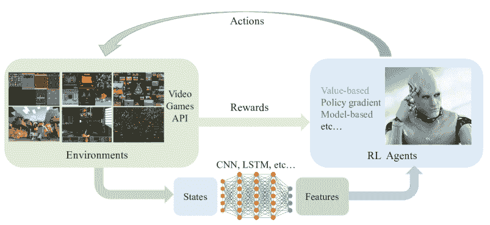
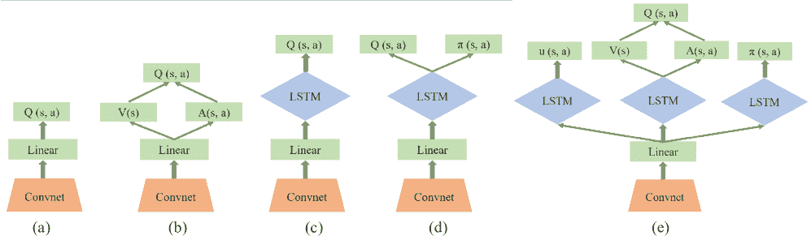
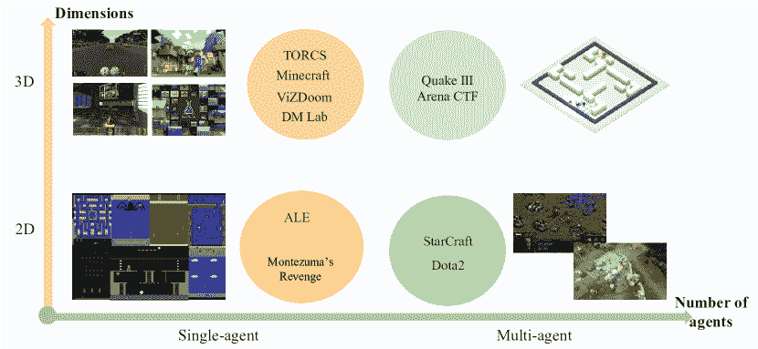

<!--yml

类别：未分类

日期：2024-09-06 20:03:27

-->

# [1912.10944] 深度强化学习在视频游戏中的综述

> 来源：[`ar5iv.labs.arxiv.org/html/1912.10944`](https://ar5iv.labs.arxiv.org/html/1912.10944)

# 深度强化学习在视频游戏中的综述

Kun Shao、Zhentao Tang、Yuanheng Zhu、Nannan Li 和 Dongbin Zhao K. Shao、Z. Tang、Y. Zhu、N. Li 和 D. Zhao 皆来自中国科学院自动化研究所复杂系统管理与控制国家重点实验室，北京 100190，中国。他们还与中国科学院大学，北京，中国相关（电子邮件：shaokun2014@ia.ac.cn; tangzhentao2016@ia.ac.cn; yuanheng.zhu@ia.ac.cn; linannan2017@ia.ac.cn, dongbin.zhao@ia.ac.cn）。本研究得到中国国家自然科学基金（NSFC）资助，资助编号为 No.61573353、No.61603382、No.6180337 和 No.61533017。

###### 摘要

自提出以来，深度强化学习（DRL）取得了显著的成就。通常，DRL 代理在每一步接收高维输入，并根据基于深度神经网络的策略采取行动。这种学习机制使用端到端的方法来更新策略，以最大化回报。本文综述了 DRL 方法的进展，包括基于价值的方法、策略梯度方法和基于模型的算法，并比较了它们的主要技术和特性。此外，DRL 在游戏人工智能（AI）中发挥了重要作用。我们还回顾了 DRL 在各种视频游戏中的成就，包括经典的街机游戏、第一人称视角游戏和多智能体实时战略游戏，从 2D 到 3D，从单智能体到多智能体。大量使用 DRL 的视频游戏 AI 已达到了超越人类的表现，但该领域仍面临一些挑战。因此，我们还讨论了将 DRL 方法应用于该领域的一些关键点，包括探索-开发、样本效率、泛化与迁移、多智能体学习、不完全信息和延迟稀疏奖励，以及一些研究方向。

###### 索引词：

强化学习、深度学习、深度强化学习、游戏 AI、视频游戏。

## I 引言

视频游戏中的人工智能（AI）是一个长期研究领域。它研究如何利用 AI 技术在玩游戏时达到人类水平的表现。更一般来说，它研究代理与游戏环境之间的复杂交互。各种游戏为代理提供了有趣且复杂的问题，使视频游戏成为 AI 研究的理想环境。这些虚拟环境是安全且可控的。此外，这些游戏环境为机器学习算法提供了无限量的有用数据，而且它们的速度远快于实时。这些特性使游戏成为 AI 研究独特且受欢迎的领域。另一方面，AI 也在帮助游戏改进我们玩、理解和设计游戏的方式 [1]。

广义来说，游戏 AI 涉及到游戏环境中的感知和决策。涉及这些组件时，有一些关键挑战和提出的解决方案。第一个挑战是游戏的状态空间非常大，尤其是在战略游戏中。随着表示学习的兴起，整个系统已经成功地使用深度神经网络建模大规模状态空间。第二个挑战是学习在动态未知环境中做出正确决策的策略是困难的。针对这个问题，数据驱动的方法，如监督学习和强化学习（RL），是可行的解决方案。第三个挑战是绝大多数游戏 AI 都是在特定的虚拟环境中开发的。如何在不同的游戏之间转移 AI 的能力是一个核心挑战。一个更通用的学习系统也是必要的。

图 1：典型 DRL 视频游戏框架图。深度学习模型从视频游戏 API 获取输入，并自动提取有意义的特征。DRL 代理基于这些特征产生动作，并使环境转移到下一个状态。

长期以来，解决这些挑战的强化学习在游戏 AI 中被广泛应用。而近年来，深度学习（DL）在计算机视觉和自然语言处理方面取得了显著成果[2]。这种结合，深度强化学习（DRL），教会智能体在高维状态空间中进行决策，采用端到端的框架，并大幅提升了传统 RL 算法的泛化能力和可扩展性。特别是，DRL 在视频游戏中取得了重大进展，包括 Atari、ViZDoom、StarCraft、Dota2 等等。有关这些成就的相关工作有：赵等人[3]和唐等人[4]回顾了 DRL 研究的发展，重点关注 AlphaGo 和 AlphaGo Zero。Justesen 等人[5]回顾了视频游戏中基于 DL 的方法，包括监督学习、无监督学习、强化学习、进化方法和一些混合方法。Arulkumaran 等人[6]简要介绍了 DRL，涵盖了核心算法，并展示了一系列视觉 RL 领域。Li [7]概述了 DRL 的最新成果，并讨论了核心要素、重要机制和各种应用。本文重点关注基于 DRL 的游戏 AI，从 2D 到 3D，从单一智能体到多智能体。主要贡献包括对各种 DRL 方法、技术、属性的全面而详细的比较，以及这些视频游戏中的令人印象深刻和多样化的表现。

剩余论文的组织安排如下。在第 II 节中，我们介绍深度学习（DL）和强化学习（RL）的背景。在第 III 节中，我们重点介绍最近的深度强化学习（DRL）方法，包括基于价值的方法、策略梯度方法和基于模型的方法。之后，我们简要介绍研究平台和竞赛，并展示 DRL 方法在经典单一智能体街机游戏、第一人称视角游戏以及多智能体实时战略游戏中的表现。在第 V 节中，我们讨论该领域的一些关键点和研究方向。最后，我们对本次调查做出结论。

## II 背景

一般来说，训练一个能够处理高维输入的智能体是困难的。随着深度学习的发展，研究人员将深度神经网络作为函数近似，并利用大量样本成功优化策略。典型的视频游戏 DRL 框架图如图 1 所示。

### II-A 深度学习

深度学习来源于人工神经网络，用于学习数据表示。它的灵感来自于大脑发展的理论，并且可以在监督学习、无监督学习和半监督学习中进行。尽管“深度学习”这个术语在 1986 年被引入[8]，但由于缺乏数据和计算硬件的能力，深度学习曾经历过寒冬。然而，随着越来越多的大规模数据集的发布和强大硬件的出现，深度学习发生了重大革命[9]。

卷积神经网络（CNN）[10] 是一种深度神经网络，广泛应用于计算机视觉。CNN 的灵感来自于生物过程，并基于共享权重架构具有平移不变性。递归神经网络（RNN）是另一种深度神经网络，特别用于自然语言处理。作为 RNN 的一个特例，长短期记忆网络（LSTM）[11] 能够学习长期依赖关系。深度学习架构已应用于许多领域，并取得了显著成功，例如语音识别、图像分类和分割、语义理解和机器翻译[2]。基于 DL 的方法，结合高效的并行分布式计算资源，可以突破传统机器学习方法的限制。这种方法激励科学家和研究人员在各自领域取得越来越多的最先进成果。

图 2：典型 DRL 方法的网络架构，随着复杂性和性能的增加。(a)：DQN 网络；(b)：对抗 DQN 网络；(c)：DRQN 网络；(d)：Actor-critic 网络；(e)：Reactor 网络。

### II-B 强化学习

强化学习是一种机器学习方法，其中代理通过试错学习最佳策略[12]。通过与环境交互，RL 可以成功应用于顺序决策任务。考虑一个折扣的情节马尔可夫决策过程（MDP）$(S,A,\gamma,P,r)$，代理在状态 $s_{t}$ 下根据策略 $\pi(a_{t}|s_{t})$ 选择一个动作 $a_{t}$。环境接受这个动作，产生奖励 $r_{t+1}$ 并根据转移概率 $P(s_{t+1}|s_{t},a_{t})$ 转移到下一个状态 $s_{t+1}$。在 RL 领域，这个转移概率是未知的。该过程持续进行，直到代理达到终止状态或最大时间步。目标是最大化期望的折扣累积奖励：

|  | $\mathbb{E}_{\pi}[R_{t}]=\mathbb{E}_{\pi}[\sum_{i=0}^{\infty}\gamma^{i}r_{t+i}],$ |  | (1) |
| --- | --- | --- | --- |

其中 $\gamma\in(0,1]$ 是折扣因子。

强化学习可以分为脱离策略和在策略方法。脱离策略 RL 算法意味着用于选择动作的行为策略与学习策略不同。相反，在策略 RL 算法中，行为策略与学习策略相同。此外，强化学习还可以分为基于值的方法和基于策略的方法。在基于值的 RL 中，智能体更新值函数以学习适当的策略，而基于策略的 RL 智能体直接学习策略。

Q-learning 是一种典型的脱离策略的基于值的方法。Q-learning 的更新规则为

|  |
| --- |
|  | $\displaystyle\delta_{t}=r_{t+1}+\gamma\arg\max_{a}Q(s_{t+1},a)-Q(s_{t},a_{t}),$ |  | (2a) |
|  | $\displaystyle Q(s_{t},a_{t})\leftarrow Q(s_{t},a_{t})+\alpha\delta_{t}.$ |  | (2b) |

$\delta_{t}$ 是时间差（TD）误差，$\alpha$ 是学习率。

策略梯度 [13] 对策略进行参数化并更新参数 $\theta$。在其一般形式中，策略梯度的目标函数定义为

|  | $J(\theta)=\mathbb{E}_{\pi}[\sum_{t=0}^{\infty}\log\pi_{\theta}(a_{t}&#124;s_{t})R].$ |  | (3) |
| --- | --- | --- | --- |

$R$ 是总累计回报。

Actor-critic [12] 强化学习通过基于值的评论家改进了策略梯度

|  | $J(\theta)=\mathbb{E}_{\pi}[\sum_{t=0}^{\infty}\Psi_{t}\log\pi_{\theta}(a_{t}&#124;s_{t})].$ |  | (4) |
| --- | --- | --- | --- |

$\Psi_{t}$ 是评论家，它可以是状态-动作值函数 $Q^{\pi}(s_{t},a_{t})$、优势函数 $A^{\pi}(s_{t},a_{t})=Q^{\pi}(s_{t},a_{t})-V^{\pi}(s_{t})$ 或 TD 误差 $r_{t}+V^{\pi}(s_{t+1})-V^{\pi}(s_{t})$。

## III 深度强化学习

DRL 结合了 DL 和 RL，自提出以来取得了快速发展。本节将介绍各种 DRL 方法，包括基于值的方法、策略梯度方法和基于模型的方法。

### III-A 基于值的 DRL 方法

深度 Q 网络（DQN） [14] 是最著名的 DRL 模型之一，它直接从高维输入中学习策略。它接收原始像素，并输出一个值函数来估计未来的奖励，如图 2(a) 所示。DQN 使用经验重放方法来打破样本相关性，并通过目标 Q 网络稳定学习过程。第 $i$ 次迭代的损失函数为

|  | $\displaystyle\begin{aligned} L_{i}(\theta_{i})=E_{(s,a,r,s^{\prime})\sim U(D)}[(y_{i}^{DQN}-Q(s,a;{\theta_{i}}))^{2}],\end{aligned}$ |  | (5) |
| --- | --- | --- | --- |

其中

|  | $y_{i}^{DQN}=r+\gamma\mathop{\max}\limits_{a^{\prime}}Q(s^{\prime},a^{\prime};{\theta_{i}{{}^{-}}}).$ |  | (6) |
| --- | --- | --- | --- |

DQN 架起了高维视觉输入与动作之间的桥梁。此后，研究人员在不同方面改进了 DQN。Double DQN [15] 引入了双重 Q 学习以减少观察到的过度估计，并带来了更好的性能。优先经验回放 [16] 帮助优先考虑经验，以更频繁地回放重要的过渡。过渡 $i$ 的样本概率为 $P(i)=\frac{p_{i}^{\alpha}}{\sum_{k}p_{k}^{\alpha}}$，其中 $p_{i}$ 是过渡 $i$ 的优先级。Dueling DQN [17] 使用了用于无模型 DRL 的对战神经网络架构。它包括两个独立的估计器：一个用于状态值函数 $V(s;\theta,\beta)$，另一个用于优势函数 $A(s,a;\theta,\alpha)$，如图 2(b) 所示。

|  | $Q(s,a:\theta,\alpha,\beta)=V(s;\theta,\beta)+A(s,a;\theta,\alpha).$ |  | (7) |
| --- | --- | --- | --- |

Pop-Art [18] 被提出以适应不同和非静态的目标幅度，这成功地替代了 DQN 中的奖励剪辑，以处理各种幅度的目标。快速奖励传播 [19] 是一种新颖的强化学习训练算法，它结合了 DQN 的优势，并通过优化约束来利用经验回放中的较长状态过渡。这一新技术通过大幅度减少训练时间，使 DRL 更具实用性。Gorila [20] 是第一个大规模分布式 DRL 架构。该架构使用四个主要组件：并行执行者；并行学习者；一个分布式神经网络来表示价值函数或行为策略；以及一个分布式经验存储。为了解决每个决策点的有限内存和不完美的游戏信息，Deep Recurrent Q-Network (DRQN) [21] 在 DQN 中用递归神经网络替代了第一个全连接层，如图 2(c) 所示。

通常，DQN 学习丰富的领域表示，并使用深度神经网络来逼近价值函数，而具有线性表示的批量 RL 算法则更稳定且需要更少的超参数调节。最小二乘 DQN（LS-DQN）[22] 将 DQN 的丰富特征表示与线性最小二乘方法的稳定性相结合。为了减少 DQN 目标值中的逼近误差方差，平均-DQN [23] 平均先前的 Q 值估计，从而实现了更稳定的训练和改进的性能。基于示范的深度 Q 学习（DQfD）[24] 将 DQN 与人工示范结合，极大地提高了样本效率。DQV [25] 使用 TD 学习来训练一个价值神经网络，并利用该网络来训练第二个质量-价值网络以估计状态-动作值。DQV 学习速度和效果明显优于双重 DQN。研究人员提出了若干对 DQN 的改进。然而，这些改进中哪些是互补的以及可以结合多少尚不清楚。Rainbow [26] 结合了 DQN 的主要扩展，并给出了每个组件对整体性能的贡献。RUDDER [27] 是一种针对有限 MDP 的延迟奖励的新型强化学习方法，也是一种回报分解方法，RUDDER 在处理不同奖励延迟长度的任务时速度呈指数级提高。Ape-X DQfD [28] 使用了一种新的变换贝尔曼算子来处理不同密度和尺度的奖励，并应用人工示范来缓解探索问题，指导智能体趋向于奖励状态。此外，它提出了一种辅助时间一致性损失，以稳定训练，并将有效规划范围扩展了一个数量级。Soft DQN [29] 是一种熵正则化版本的 Q 学习，具有更好的鲁棒性和泛化能力。

分布式 DRL 学习价值分布，与常见的 RL 模型返回值或价值的期望值相对。C51 [30] 关注价值的分布，并设计了分布式 DQN 算法来学习近似的价值分布。QR-DQN [31] 方法缩小了理论结果与算法结果之间的多个差距。分布式强化学习通过分位回归对返回分布进行显式建模，而不是仅估计均值。隐式分位网络（IQN）[32] 是一种灵活、适用且最先进的分布式 DQN。IQN 通过分位回归近似返回分布的完整分位函数，并提供了一个完全集成的分布式 RL 智能体，无需对返回分布的参数化进行先验假设。此外，IQN 允许将控制策略的类别扩展到与扭曲风险度量相关的广泛风险敏感策略。

### III-B 策略梯度深度强化学习方法

策略梯度深度强化学习（DRL）直接优化参数化的策略。演员-评论家架构使用基于值的评论家函数来计算策略梯度，以估计预期的未来奖励，如图 2(d)所示。异步深度强化学习是一个高效的 DRL 框架，它使用异步梯度下降来优化策略[33]。异步优势演员-评论家（A3C）在多个环境中训练多个代理，显示出对训练的稳定作用。演员的目标函数如下所示

|  | $J(\theta)=\mathbb{E}_{\pi}[\sum_{t=0}^{\infty}A_{\theta,\theta_{v}}(s_{t},a_{t})\log\pi_{\theta}(a_{t}&#124;s_{t})+\beta H_{\theta}(\pi(s_{t}))],$ |  | (8) |
| --- | --- | --- | --- |

其中 $H_{\theta}(\pi(s_{t}))$ 是一个熵项，用于鼓励探索。

GA3C [34] 是 A3C 的混合 CPU/GPU 版本，相比于原始的 CPU 实现，它在速度上有显著提升。无监督强化与辅助学习（UNREAL）[35] 同时为多个伪奖励函数（包括值函数回放、奖励预测和像素控制）学习不同的策略。该代理大幅提高了数据效率和对超参数设置的鲁棒性。PAAC [36] 是一个新颖的高效并行化 DRL 框架，其中多个演员在单台机器上学习策略。策略梯度方法是改进策略的有效技术，但通常是基于策略的，无法利用离策略数据。新的方法称为 PGQ[37]，它将策略梯度与 Q 学习结合起来。PGQ 在正则化策略梯度技术和优势函数学习算法之间建立了等效性。Retrace($\lambda$) [38] 结合了重要性采样、离策略 Q($\lambda$)和树备份($\lambda$)的优点，具有低方差、安全性和效率。它将对抗 DRQN 架构和演员-评论家架构结合起来，如图 2(e)所示。Reactor [39] 是一个样本高效和数值高效的强化学习代理，基于多步返回离策略演员-评论家架构。网络输出一个目标策略、一个动作值 Q 函数和一个估计的行为策略。评论家通过离策略多步 Retrace 方法进行训练，演员则通过$\beta$-留一法策略梯度进行训练。重要性加权演员学习架构（IMPALA）[40] 是一个新的分布式 DRL，可以扩展到数千台机器。IMPALA 使用单个强化学习代理和一组参数来解决大量任务。该方法通过将解耦的行动和学习与新颖的 V-trace 离策略校正方法结合起来，达到了稳定学习，这对于实现学习稳定性至关重要。

#### III-B1 信任区域方法

信任区域策略优化（TRPO）[41] 被提出用于优化控制策略，并且保证单调改进。TRPO 计算一个上升方向来改善策略梯度，这可以确保策略分布的变化很小。TRPO 在每个时期的约束优化问题是

|  |
| --- |
|  | $\displaystyle maximize_{\theta}\ \ \ E_{s\sim\rho_{\theta^{\prime}},a\sim\pi_{\theta^{\prime}}}[\frac{\pi_{\theta}(a | s)}{\pi_{\theta^{\prime}}(a | s)}A_{\theta^{\prime}}(s,a)],$ |  | (9a) |
|  | $\displaystyle s.t.\ \ \ \ E_{s\sim\rho_{\theta^{\prime}}}[D_{KL}(\pi_{\theta^{\prime}}(\cdot | s))]\leq\delta_{KL}.$ |  | (9b) |

该算法在优化大型非线性策略方面有效。近端策略优化（PPO）[42] 通过与环境的交互采样数据，并使用随机梯度上升来优化目标函数

|  |
| --- |
|  | $\displaystyle r_{t}(\theta)=\frac{\pi_{\theta}(a_{t} | s_{t})}{\pi_{\theta_{old}}(a_{t} | s_{t})},$ |  | (10a) |
|  | $\displaystyle L(\theta)=\hat{\mathbb{E}}_{t}[min(r_{t}(\theta)\hat{A}_{t},clip(r_{t}(\theta),1-\epsilon,1+\epsilon)\hat{A}_{t}].$ |  | (10b) |

$r_{t}(\theta)$ 表示概率比率。这个目标函数裁剪概率比率以修改替代目标。PPO 相较于 TRPO 有一些好处，并且实现起来更简单，样本复杂度更好。具有经验重放的演员-评论家（ACER）[43] 引入了几个创新，包括随机对抗网络、截断重要性采样和一种新的信任区域方法，该方法稳定且样本高效。使用 Kronecker 分解信任区域的演员-评论家（ACKTR）[44] 基于自然策略梯度，并使用 Kronecker 分解的近似曲率（K-FAC）与信任区域来优化演员和评论家。与其他演员-评论家方法相比，ACKTR 更加样本高效。

#### III-B2 确定性策略

除了随机策略，深度确定性策略梯度（DDPG）[45] 是一种确定性策略梯度方法，它将 DQN 的成功应用于连续控制。DDPG 的更新规则是

|  | $Q(s_{t},a_{t})=r(s_{t},a_{t})+\gamma Q(s_{t+1},\pi_{\theta}(s_{t+1})).$ |  | (11) |
| --- | --- | --- | --- |

DDPG 是一种演员-评论家型的离策略算法，能够在各种任务上学习到合理的策略。分布式分布式 DDPG（D4PG）[46] 是对 DDPG 的分布式更新，结合了多个分布式工作者共同写入同一重放表的使用。这种方法在许多困难的连续控制问题上表现出更好的性能。

#### III-B3 熵正则化策略梯度

软演员评论家（SAC）是一种离策略策略梯度方法，它在 DDPG 和随机策略优化之间建立了桥梁。SAC 融入了裁剪的双 Q 技巧，最大熵 DRL 的目标函数是

|  | $J(\pi)=\sum_{t=0}^{T}\mathbb{E}_{(s_{t},a_{t})\sim\rho_{\pi}}[r(s_{t},a_{t})+\alpha H(\pi(.&#124;s_{t}))],$ |  | (12) |
| --- | --- | --- | --- |

SAC 在其目标函数中使用熵正则化。它训练策略以最大化熵和期望回报之间的权衡。熵是政策中随机性的度量。这种机制类似于探索与利用之间的权衡。增加熵可以鼓励更多的探索，并加速学习过程。此外，它还可以防止学习策略收敛到较差的局部最优解。

### III-C 基于模型的 DRL 方法

将无模型强化学习与在线规划结合起来是解决样本效率问题的一种有前景的方法。TreeQN [47] 被提出以应对这些挑战。它是一个可微分的递归树状模型，可替代 DRL 中任何离散动作的价值函数网络。TreeQN 通过在学习到的抽象状态空间中递归应用转移模型来动态构建树，然后使用树备份来汇总预测的奖励和状态值，从而估计 Q 值。ATreeC 是一个演员-评论家变体，通过添加一个 softmax 层来形成一个随机策略网络。两种方法都经过端到端训练，使得学习到的模型针对实际在规划中的使用进行优化。TreeQN 和 ATreeC 在多个 Atari 游戏中表现优于 n 步 DQN 和价值预测网络。Vezhnevets 等人 [48] 提出了 STRategic Attentive Writer (STRAW) 神经网络架构来构建隐式计划。STRAW 完全与环境进行交互，是一种端到端的方法。STRAW 模型可以学习时间抽象的高层次宏动作，从而实现经济的计算和结构化探索。STRAW 采用时间扩展的规划策略，在 Atari 游戏中取得了显著的改进。世界模型 [49] 使用无监督的方式训练生成递归神经网络，能够通过压缩的时空表示来建模 RL 环境。它将提取的特征输入到简单而紧凑的策略中，在多个环境中取得了令人印象深刻的结果。价值传播（VProp） [50] 基于价值迭代，是一个高效的可微分规划模块。它能够成功地训练以使用强化学习进行规划。作为 AlphaZero 的通用框架，MuZero[54] 将 MCTS 与学习到的模型相结合，预测奖励、动作选择策略和价值函数以进行规划。它将基于模型的 RL 扩展到一系列逻辑复杂和视觉复杂的领域，并实现了超越人类的表现。

表 I 展示了 2017 年至 2019 年间各种 DRL 方法的一般综述。

表 I：2017 年至 2018 年间最新 DRL 方法的一般综述。

| DRL 算法 | 主要技术 | 网络 | 分类 |
| --- | --- | --- | --- |
| DQN [14] | 经验重放，目标 Q 网络 | CNN | 基于价值，离线学习 |
| Double DQN [15] | 双重 Q 学习 | CNN | 基于价值，离线学习 |
| Dueling DQN [17] | 对抗神经网络架构 | CNN | 基于价值，离线学习 |
| Prioritized DQN [16] | 优先经验重放 | CNN | 基于价值，离线学习 |
| Bootstrapped DQN [51] | 将深度探索与 DNN 结合 | CNN | 基于价值，离线学习 |
| Gorila [20] | 大规模分布式架构 | CNN | 基于价值，离线学习 |
| LS-DQN [22] | 在 DRL 中结合最小二乘更新 | CNN | 基于价值，离线学习 |
| Averaged-DQN [23] | 平均化学习的 Q 值估计 | CNN | 基于价值，离线学习 |
| DQfD [24] | 从演示数据中学习 | CNN | 基于价值，离线学习 |
| DQN with Pop-Art [18] | 带有 Pop-Art 的自适应归一化 | CNN | 基于价值，离线学习 |
| Soft DQN [29] | KL 惩罚和熵奖励 | CNN | 基于价值，离线学习 |
| DQV [25] | 训练质量值网络 | CNN | 基于价值，离线学习 |
| Rainbow [26] | 将六个扩展整合到 DQN 中 | CNN | 基于价值，离线学习 |
| RUDDER [27] | 回报分解 | CNN-LSTM | 基于价值，离线学习 |
| Ape-X DQfD [28] | 变换的贝尔曼算子，时间一致性损失 | CNN | 基于价值，离线学习 |
| C51 [30] | 分布式贝尔曼最优性 | CNN | 基于价值，离线学习 |
| QR-DQN [31] | 具有分位回归的分布式强化学习 | CNN | 基于价值，离线学习 |
| IQN [32] | 回报分布的隐式表示 | CNN | 基于价值，离线学习 |
| A3C [33] | 异步梯度下降 | CNN-LSTM | 策略梯度，在线学习 |
| GA3C [34] | 混合 CPU/GPU 版本 | CNN-LSTM | 策略梯度，在线学习 |
| PPO [42] | 剪切的代理目标，自适应 KL 惩罚系数 | CNN-LSTM | 策略梯度，在线学习 |
| ACER [43] | 经验重放，截断的重要性采样 | CNN-LSTM | 策略梯度，离线学习 |
| ACKTR [44] | 具有信任区域的 K-FAC | CNN-LSTM | 策略梯度，在线学习 |
| Soft Actor-Critic [52] | 熵正则化 | CNN | 策略梯度，离线学习 |
| UNREAL [35] | 无监督辅助任务 | CNN-LSTM | 策略梯度，在线学习 |
| Reactor [39] | Retrace($\lambda$)，$\beta$-留一法策略梯度估计 | CNN-LSTM | 策略梯度，离线学习 |
| PAAC [36] | A3C 的并行框架 | CNN | 策略梯度，在线学习 |
| DDPG [45] | 带有确定性策略梯度的 DQN | CNN-LSTM | 策略梯度，离线学习 |
| TRPO [41] | 结合 KL 散度约束 | CNN-LSTM | 策略梯度，策略 |
| D4PG [46] | 分布式分布式 DDPG | CNN | 策略梯度，策略 |
| PGQ [37] | 结合策略梯度和 Q 学习 | CNN | 策略梯度，非策略 |
| IMPALA [40] | 重要性加权演员学习架构 | CNN-LSTM | 策略梯度，策略 |
| FiGAR-A3C [53] | 细粒度动作重复 | CNN-LSTM | 策略梯度，策略 |
| TreeQN/ATreeC [47] | 在线规划，树状模型 | CNN | 基于模型，策略梯度 |
| STRAW [48] | 宏动作，规划策略 | CNN | 基于模型，策略梯度 |
| World model [49] | 混合密度网络，变分自编码器 | CNN-LSTM | 基于模型，策略梯度 |
| MuZero [54] | 表示函数，动态函数和预测函数 | CNN | 基于模型，非策略 |

图 3：各种视频游戏 AI 的示意图，从 2D 到 3D，从单代理到多代理。

## IV 视频游戏中的 DRL

对计算机而言，像人类专家一样玩视频游戏是具有挑战性的。随着 DRL 的发展，代理能够端到端地玩各种游戏。我们专注于游戏研究平台和竞赛，以及在各种视频游戏中的显著进展，从 2D 到 3D，从单代理到多代理，如图 3 所示。

### IV-A 游戏研究平台

表 II：适合 DRL 研究的游戏 AI 竞赛列表。

| 竞赛名称 | 时间 |
| --- | --- |
| ViZDoom AI 竞赛 | 2016, 2017, 2018 |
| StarCraft AI 竞赛 (AIIDE, CIG, SSCAIT) | 2010 — 2019 |
| microRTS 竞赛 | 2017, 2018, 2019 |
| GVGAI 竞赛 – 学习赛道 | 2017, 2018 |
| Microsoft Malmo 协作 AI 挑战 | 2017 |
| Malmo 竞赛中的多代理 RL | 2018 |
| OpenAI Retro 竞赛 | 2018 |
| NeurIPS Pommerman 竞赛 | 2018 |
| Unity 障碍塔挑战 | 2019 |
| NeurIPS MineRL 竞赛 | 2019 |

平台和竞赛对游戏 AI 的发展贡献巨大，并有助于评估代理的智能，如表 II 所示。大多数平台可以分为两个主要类别：通用平台和特定平台。

通用平台：**Arcade Learning Environment (ALE)** [55] 是深度强化学习（DRL）算法的开创性评估平台，提供了大量的 Atari 2600 游戏接口。ALE 展示了游戏图像和信号，如玩家得分，使其成为一个合适的测试平台。为了推动 DRL 研究的进展，**OpenAI** 将一系列强化学习任务整合到一个名为**Gym** [56] 的平台中，该平台主要包括算法、Atari、经典控制、棋盘游戏、2D 和 3D 机器人。之后，**OpenAI Universe** [57] 是一个用于测量和训练代理在大量游戏中的通用智能的平台。**Gym Retro** [58] 是一个用于视频游戏模拟器的包装器，具有与 Gym 相统一的接口，使 Gym 能够轻松扩展，包含大量视频游戏，不仅限于 Atari，还包括 NEC、Nintendo 和 Sega，以支持 RL 研究。**OpenAI Retro**竞赛旨在探索可以从以前经验中泛化的 DRL 的发展。**OpenAI** 基于**Sonic the Hedgehog^(TM)** 视频游戏，并提出了一个新的 DRL 基准 [59]。该基准可以帮助衡量在强化学习中少样本学习和迁移学习的表现。**General Video Game Playing** [60] 旨在设计一个能够在没有人工干预的情况下玩多个视频游戏的代理。**General Video Game AI (GVGAI)** [61] 竞赛提出了一个易于使用且开源的平台，用于评估包括 DRL 在内的 AI 方法。**DeepMind Lab** [62] 是一个第一人称视角的学习环境，提供多个复杂任务，在部分观察、规模大且视觉多样的世界中进行。**Unity ML-Agents Toolkit** [63] 是一个用于创建和互动模拟环境的新工具包。该平台具有感官、物理、认知和社会复杂性，并支持快速和分布式模拟及灵活控制。

具体平台：Malmo[64]是一个用于 AI 实验的研究平台，建立在 Minecraft 之上。它是一个第一人称 3D 环境，可用于 2017 年 Microsoft Malmo 合作 AI 挑战赛和 2018 年 MalmO 比赛中的多智能体研究。TORCS[65]是一个赛车模拟器，具有低级和视觉特征，适用于自驾车与 DRL 的结合。ViZDoom[66]是一个第一人称射击游戏平台，鼓励 DRL 智能体利用视觉信息在半现实的 3D 世界中执行导航和射击任务。自 2016 年以来，ViZDoom AI 竞赛吸引了大量研究人员开发基于 DRL 的 Doom 智能体。据我们了解，实时战略（RTS）游戏对强化学习方法来说非常具有挑战性。Facebook 为 StarCraft I[67]提出了 TorchCraft，而 DeepMind 发布了 StarCraft II 学习环境[68]。他们期望研究人员提出强大的 DRL 智能体，在 RTS 游戏和年度 StarCraft AI 竞赛中取得高水平的表现。CoinRun[69]提供了一个衡量智能体将经验转移到新情境中的能力的指标。这个新的训练环境在复杂性上达到了理想的平衡：环境比传统平台游戏简单，但仍然对 DRL 算法提出了值得的泛化挑战。Google Research Football 是一个基于开源游戏 Gameplay Football 的 DRL 研究新环境。

### IV-B Atari 游戏

ALE 是一个评估平台，旨在构建在数百款 Atari 2600 游戏中具有通用智能的智能体。作为最受欢迎的 DRL 研究测试平台，许多 DRL 方法已经连续取得了卓越的表现。Machado 等人[70]对 DRL 研究社区中的 ALE 进行了回顾，提出了多样的评估方法和一些关键问题。在这一部分，我们将介绍 ALE 领域的主要成就，包括极具挑战性的 Montezuma’s Revenge。

作为该领域的里程碑，DQN 能够超越之前算法的表现，并在 49 款游戏中实现了人类水平的表现 [14]。Averaged-DQN 检查了价值函数估计误差的来源，并在 ALE 基准测试中表现出显著的稳定性和性能提升 [23]。UNREAL 在 Atari 上的表现显著优于之前的最佳表现，平均达到 880% 的专家人类表现 [35]。PAAC 在经过几小时训练后，在 ALE 上取得了足够好的表现 [36]。DQfD 在大多数 Atari 游戏中具有比 DQN 更好的初始表现，并在 42 款游戏中的 27 款中获得了比 DQN 更多的平均奖励。此外，即使在给定较差的演示数据时，DQfD 的学习速度也比 DQN 更快 [24]。Noisy DQN 用 NoisyNet 替代了传统的探索启发式方法，并在 ALE 领域中取得了显著更高的得分。作为一种分布式 DRL 方法，C51 获得了一系列新的令人印象深刻的结果，并展示了价值分布在近似 RL 中的重要性 [30]。Rainbow 在样本效率和最终表现方面提供了改进。作者还展示了每个组件对整体表现的贡献 [26]。QR-DQN 算法显著优于 DQN 的近期改进，包括相关的 C51 [30]。IQN 在 Atari 基准测试中比 QR-DQN 有显著提升，甚至将 QR-DQN 和 Rainbow 之间的距离减半 [32]。Ape-X DQN 显著改善了 ALE 的表现，在较短的墙钟训练时间内取得了更好的最终得分 [71]。在 42 款 Atari 游戏的测试中，Ape-X DQfD 算法在 40 款游戏中超过了平均人类的表现，使用了一组常见的超参数。表 III 列出了典型 DRL 方法在多个 Atari 游戏中的平均分数和中位数分数，这些方法连续实现了最先进的表现。

表 III：典型 DRL 方法在 57 款 Atari 游戏中的平均和中位数分数，作为人类基线的百分比测量。

| 方法 | 平均 | 中位数 | 年份 |
| --- | --- | --- | --- |
| DQN [14] | 228% | 79% | 2015 |
| C51 [30] | 701% | 178% | 2017 |
| UNREAL [35] | 880% | 250% | 2017 |
| QR-DQN [30] | 915% | 211% | 2017 |
| IQN [32] | 1019% | 218% | 2018 |
| Rainbow [26] | 1189% | 230% | 2018 |
| Ape-X DQN [71] | 1695% | 434% | 2018 |
| Ape-X DQfD ^∗[28] | 2346% | 702% | 2018 |

注：^∗ 表示该方法在 42 款 Atari 游戏中测量。

《蒙特祖马的复仇》是最困难的 Atari 视频游戏之一。它是一个目标导向的行为学习环境，具有长时间跨度和稀疏的奖励反馈信号。玩家必须穿越多个不同的房间，避开障碍和陷阱，上下爬梯子，然后捡起钥匙打开新房间。它需要长时间的动作序列才能达到目标并获得奖励，因此很难探索出一个最优策略来解决任务。高效的探索被认为是学习延迟反馈环境中一个关键因素。然后，Ostrovski 等人[72]提供了一种改进的基于计数的探索方法，使用 PixelCNN 作为伪计数的补充，还揭示了 Monte Carlo 返回在有效探索中的重要性。除了提高探索效率外，从人类数据中学习也是达到更好性能的适当方法。Le 等人[73]利用专家交互的模仿学习和不同层级的层次化强化学习。这种方法明显比原始的层次化强化学习学习速度更快，而且比传统的模仿学习效率更高。除了游戏玩法之外，示范也是代理学习的有价值样本。DQfD 利用一小部分示范数据来加速学习过程[24]。它结合了优先回放机制、时序差分更新和监督分类，最终取得了更好和令人印象深刻的结果。此外，Aytar 等人[74]仅使用 YouTube 视频作为示范样本，并投入了转化的 Bellman 算子以从人类示范中学习。有趣的是，这两项工作均声称首次解决了《蒙特祖马的复仇》第一关。Go-explore [75]取得了进一步的进展，平均分数超过 400,000。Go-Explore 将学习分为探索和稳健化两个阶段。它可靠地解决了整个游戏，并且具有良好的泛化能力。

### IV-C 第一人称视角游戏

与 Atari 游戏不同，在第一人称视角视频游戏中，代理只能从自身的视角接收观察，这导致信息输入不完全。在强化学习领域，这是一种部分可观测马尔可夫决策过程（POMDP）问题，需要高效的探索和记忆。

#### IV-C1 ViZDoom

第一人称射击（FPS）游戏在游戏 AI 研究中发挥了重要作用。《Doom》是一款经典的 FPS 游戏，而 ViZDoom 则作为 DRL 的新型测试平台 [66] 被提出。智能体通过视觉输入进行学习，并以第一人称视角与 ViZDoom 环境互动。吴等人 [76] 提出了一种将 A3C 和课程学习相结合的方法。智能体通过逐步与内置智能体对战来学习导航和攻击。Parisotto 等人 [77] 开发了 Neural Map，这是一个具有可适应写入操作的记忆系统。Neural Map 使用结构化的二维记忆图像来存储环境信息。这种方法在多个具有挑战性的 ViZDoom 迷宫任务中超越了其他 DRL 记忆，并表现出强大的泛化能力。Shao 等人 [78] 表明 ACKTR 可以成功地教会智能体在 ViZDoom 环境中战斗，并且显著超越 A2C 智能体。

#### IV-C2 TORCS

TORCS 是一款赛车游戏，其动作包括加速、刹车和转向。这款游戏的图形比 Atari 游戏更为逼真，但也要求智能体学习汽车的动态。FIGAR-DDPG 能够成功完成比赛任务，并完成 20 圈的赛道，总奖励是 DDPG 的 10$\times$，策略也更加平滑 [53]。Normalized Actor-Critic (NAC) 有效地规范化了 Q 函数，从演示中学习初始策略网络，并在实际环境中细化策略 [79]。NAC 对次优演示数据具有鲁棒性，能够稳健学习，并在 TORCS 上的评估中超越现有基线。Mazumder 等人 [80] 结合了状态-动作许可（SAP）和 DDPG，并将其应用于解决 TORCS 中的车道保持问题。所提出的方法可以显著加快该任务的 DRL 训练。在 [81] 中，提出了一种用于基于视觉的车辆横向控制问题的两阶段方法，包括多任务学习感知阶段和 RL 控制阶段。通过发挥多个学习任务之间的相关性，感知模块能够鲁棒地提取赛道特征。此外，RL 智能体通过最大化基于几何的奖励进行学习，并表现出比 LQR 和 MPC 控制器更好的性能。Zhu 等人 [82] 使用 DRL 训练 CNN 从第一人称视角的图像中感知驾驶数据，并学习控制器以获取驾驶指令，表现出良好的性能。

#### IV-C3 Minecraft

Minecraft 是一个沙盒建造游戏，玩家可以在各种游戏模式中构建创意作品、结构和艺术品。最近，它成为了游戏 AI 研究的热门平台，拥有 3D 无限变化的数据。Project Malmo 是一个实验平台 [83]，基于 Minecraft 用于 AI 研究。它支持大量的场景，包括导航、问题解决任务和生存协作。Xiong 等人 [84] 提出了一种新颖的 Q 学习方法，通过状态-动作抽象和使用人类推理的暖启动来学习有效的策略，用于微软 Malmo 协作 AI 挑战。在 Minecraft 中从源任务到目标任务的知识迁移是主要挑战之一。Tessler 等人 [85] 提供了一种 DRL 代理，通过学习可重用技能进行知识迁移，然后将其纳入到层次 DRL 网络 (H-DRLN) 中。与普通 DQN 相比，H-DRLN 在 Minecraft 中展示了卓越的性能和低学习样本复杂度，并且具有在相关 Minecraft 任务之间迁移知识的潜力，而无需额外学习。为了解决部分或非马尔可夫观测问题，Jin 等人 [86] 提出了一种基于反事实后悔最小化的新 DRL 算法，该算法迭代更新对累积剪切优势函数的近似。在具有挑战性的 Minecraft 第一人称导航基准测试中，该算法可以显著优于强基线方法。

#### IV-C4 DeepMind 实验室

DeepMind lab 是一个基于 Quake3 的 3D 第一人称游戏平台，扩展自 OpenArena。与其他第一人称游戏平台相比，DeepMind lab 拥有更丰富的视觉效果和更真实的物理效果，使其成为一个极其复杂的平台。在 DeepMind lab 的一套具有挑战性的任务中，UNREAL 代理在学习上的平均加速比为 A3C 的 10$\times$，并且平均达到了 87% 的专家人类表现。随着学习代理变得更强大，持续学习最近取得了快速进展。为了测试持续学习能力，Mankowitz 等人 [87] 考虑了 DeepMind lab 中稀疏奖励的隐式任务序列。名为 Unicorn 的新型代理架构展示了强大的持续学习能力，并在所提议的领域中超越了几种基线代理。Schmitt 等人 [88] 提出了一种方法，使用教师代理启动新学生代理的训练。在多任务且具有挑战性的 DMLab-30 套件上，启动训练显著提高了新代理的样本效率，并超越了最终性能 42%。Jaderberg 等人 [89] 关注 Quake III Arena Capture the Flag，这是一个流行的 3D 第一人称多人视频游戏，展示了 DRL 代理仅凭像素和游戏点数作为输入即可达到人类水平的表现。该代理使用基于种群的训练来优化策略。这种方法通过数千场并行比赛同时训练大量代理，代理在随机生成的环境中协作组队并互相对抗。在评估中，训练后的代理在作为队友和对手时都超过了自我对战基线和高级人类玩家的胜率，证明其远远强于现有的 DRL 代理。

### IV-D 实时策略游戏

实时策略游戏在玩家中非常受欢迎，并且已经成为人工智能研究的热门平台。

#### IV-D1 星际争霸

在《星际争霸》中，玩家需要根据实时游戏状态执行操作，并击败敌人。一般来说，设计一个 AI 机器人面临许多挑战，包括多代理协作、空间和时间推理、对抗性规划以及对手建模。目前，大多数机器人基于人类经验和回放，灵活性和智能性有限。DRL 被证明是《星际争霸》AI 的一个有前途的方向，特别是在微观管理、建造顺序、迷你游戏和完整游戏 [90]。

最近，微观管理作为解决《星际争霸》人工智能的第一步被广泛研究。Usunier 等人[91]提出了贪心 MDP 与阶段性零阶优化（GMEZO）算法来应对微观管理场景，其表现优于 DQN 和策略梯度。BiCNet[92]是一种用于《星际争霸》战斗游戏的多智能体深度强化学习方法。它基于演员-评论家强化学习，并使用双向神经网络来学习协作。BiCNet 成功学习了一些合作策略，并且适应各种任务，其表现优于 GMEZO。在上述工作中，研究人员主要开发了集中式方法来处理微观管理。Foerster 等人[93]关注于微观管理的分散控制，并提出了一种多智能体演员-评论家方法。为了稳定经验回放和解决非平稳性，他们使用了指纹和重要性采样，这可以提升最终性能。Shao 等人[94]继续研究分散式微观管理任务，并提出了参数共享多智能体梯度下降 SARSA($\lambda$)（PS-MAGDS）方法。为了在各种微观管理场景之间重用知识，他们还将课程迁移学习结合到该方法中。这提高了样本效率，并在大规模场景中优于 GMEZO 和 BiCNet。Kong 等人[95]基于主从架构，提出了主从多智能体强化学习（MS-MARL）。MS-MARL 包括组合动作表示、独立推理和可学习通信。这种方法在微观管理任务中的表现优于其他方法。Rashid 等人[96]关注于几个具有挑战性的《星际争霸 II》微观管理任务，并使用集中式训练和分散式执行来学习合作行为。这最终超越了现有的多智能体深度强化学习方法。

研究人员还使用深度强化学习（DRL）方法来优化《星际争霸》的建造顺序。Tang 等人[97] 提出了神经网络拟合 Q 学习（NNFQ）和卷积神经网络拟合 Q 学习（CNNFQ），用于在简单的《星际争霸》地图中建造单位。这些模型能够找到有效的生产顺序，并最终击败敌人。在[68]中，研究人员展示了《星际争霸 II》领域中几种主要 DRL 代理的基线结果。完全卷积优势演员-评论员（FullyConv-A2C）代理在《星际争霸 II》迷你游戏中达到了初学者水平。Zambaldi 等人[98] 将关系型 DRL 引入《星际争霸》，该方法通过自注意力机制迭代推理实体之间的关系，并用它来指导无模型的强化学习策略。这种方法提高了传统 DRL 方法的样本效率、泛化能力和可解释性。关系型 DRL 代理在 SC2LE 迷你游戏中表现出色。Sun 等人[99] 开发了基于 DRL 的代理 TStarBot，该代理使用平坦的行动结构。该代理首先击败了从等级 1 到等级 10 的内置 AI 代理。Lee 等人[100] 专注于《星际争霸 II》 AI，并提出了一种新颖的模块化架构，该架构将职责分配到多个模块中。每个模块控制游戏的一个方面，两个模块通过自对弈 DRL 方法进行训练。这种方法在“更难”级别上击败了内置机器人。Pang 等人[101] 研究了一种用于《星际争霸 II》的两级层次化强化学习方法。宏观动作是从专家数据中自动提取的，另一种是灵活且可扩展的层次化架构。最近，DeepMind 提出了 AlphaStar，并首次击败了职业玩家。

#### IV-D2 MOBA 和 Dota2

MOBA（多人在线战术竞技场）起源于 RTS 游戏，通常由两个团队组成，每个团队有五名玩家。为了击败对手，团队中的五名玩家必须协作，击杀敌人，升级英雄，并最终摧毁对方基地。由于 MOBA 研究仍处于初级阶段，其研究工作少于传统的 RTS 游戏。大多数 MOBA 的研究集中在数据集分析和案例研究上。然而，由于深度强化学习在游戏 AI 中取得了一系列突破，研究人员最近开始更多地关注 MOBA。王者荣耀（Dota 的简化移动版本）是中国最受欢迎的移动端 MOBA 游戏。姜等人[102]将蒙特卡洛树搜索和深度神经网络应用于这款游戏。实验结果表明，基于 MCTS 的深度强化学习方法是有效的，并且可以用于 1v1 的 MOBA 场景。最令人印象深刻的 MOBA 研究由 OpenAI 提出。他们的结果证明，使用自我对弈的深度强化学习方法不仅在 1v1 和 2v2 的 Dota2 场景中成功[103]，而且在 5v5 场景中也同样成功[104][105]。该模型架构简单，使用 LSTM 层作为神经网络的核心组件。在大规模分布式云计算和 PPO 优化算法的支持下，OpenAI Five 能够掌握团队战斗、寻找森林、专注、追击和分散的关键能力，并以 2:0 击败人类冠军 OG。他们的工作真正为 MOBA 研究的深度强化学习方法打开了一扇新门。

## V 深度强化学习在游戏中的挑战

由于深度强化学习在一些视频游戏中取得了巨大进展，它被认为是实现人工通用智能的最有前途的方式之一。然而，仍然存在一些挑战需要克服。在本节中，我们讨论了深度强化学习在视频游戏中面临的一些关键挑战，如探索与利用之间的权衡、低样本效率、泛化与过拟合的困境、多智能体学习、不完整信息和延迟稀疏奖励。尽管已经有一些提出的办法尝试解决这些问题，如图 4 所示，但仍然存在一些限制需要突破。

### V-A 探索-利用

探索有助于获得更多的多样化样本，而利用则是通过有价值的样本学习高回报策略的方式。探索与利用之间的权衡仍然是强化学习中的主要挑战。常见的探索方法需要大量的数据，且无法处理时间上扩展的探索。大多数无模型强化学习算法在复杂环境中并不可计算。

参数噪声在训练过程中可以在很大程度上帮助探索[106] [107]。此外，随机化价值函数成为了高效探索的一种有效方法。将探索与深度神经网络结合可以加速学习，这在大多数游戏中大大提高了学习速度和最终性能[51]。

一种简单的流行计数方法的推广可以在各种高维深度强化学习基准测试中达到令人满意的性能[108]。该方法将状态映射到哈希码，并通过哈希表计算其出现次数。然后，根据经典的计数方法，我们可以使用这些计数来计算奖励奖金。在许多具有挑战性的任务中，这些简单的哈希函数可以取得令人印象深刻的性能。这种探索策略提供了一个简单而强大的基线，以解决需要大量探索的马尔可夫决策过程（MDP）。

### V-B 样本效率

深度强化学习算法通常需要数百万个样本才能达到人类水平的表现。而人类可以迅速掌握环境中的高奖励动作。大多数无模型的深度强化学习算法在数据利用效率方面表现不佳，尤其是在高维度和广泛探索空间的环境中。它们必须在较长的时间成本下与环境进行交互，以寻找复杂样本空间中的高奖励体验，这限制了它们在许多场景中的应用。为了减少环境的探索维度和减少交互的时间开销，可以使用一些解决方案来提高数据效率，例如层次结构和示范。

层次强化学习（HRL）允许代理将任务分解为几个简单的子任务，这可以加快训练速度并提高样本效率。时间抽象是扩展学习的关键，而自主创建这种抽象一直是一个挑战。选项-批评家架构能够学习内部策略和选项的终止条件，而无需任何额外的奖励或子目标[109]。FeUdal 网络（FuNs）包括一个管理者模块和一个工人模块[110]。管理者在高层设置抽象目标。工人接收这些目标，并在环境中生成动作。FuN 在涉及长期信用分配或记忆的任务中显著优于基线代理。表示学习方法也可以用于指导 HRL 领域中的选项发现过程[111]。

示范是一种提高样本效率的有效技术。当前从示范中学习的方法使用专家数据进行监督学习，并通过强化学习提高性能。这种方法难以联合优化不同的损失，并且对噪声示范非常敏感。利用系统先前控制的数据可以大大加速学习过程，即使只有少量示范数据 [24]。通过人类偏好定义的目标可以有效解决复杂的强化学习任务，无需奖励函数，同时大大降低了人类监督的成本 [112]。

### V-C 泛化与转移

跨多个环境转移知识的能力被认为是智能体的一个关键方面。为了促进在多个环境中的泛化性能，多任务学习和策略精炼已成为关注的重点。

具有共享神经网络参数的多任务学习可以解决泛化问题，并且通过在相关任务之间的转移可以提高效率。混合奖励架构将分解的奖励函数作为输入，并为每个组件学习一个单独的价值函数 [113]。整体价值函数更加平滑，可以用低维表示容易逼近，从而学习效果更佳。IMPALA 显示了多任务强化学习的有效性，使用较少的数据并在任务之间展现了正向转移 [40]。PopArt-IMPALA 将 PopArt 的自适应归一化与 IMPALA 结合起来，允许更高效地使用并行数据生成，并在多任务领域中展示了令人印象深刻的性能 [114]。

成功地使用深度强化学习（DRL）学习复杂任务通常需要大型任务特定网络和大量训练，以达到良好的性能。Distral 共享一种精炼策略，能够在多个任务之间学习共通知识 [115]。每个工作者被训练以解决单个任务，并接近共享策略，而共享策略则通过精炼进行训练。这种方法在复杂任务中表现出高效的转移，更加稳健和稳定的性能。Mix & Match 是一种训练框架，旨在鼓励 DRL 代理的有效和快速学习 [116]。它可以自动形成代理的课程，并逐步训练更复杂的代理，从简单代理开始。

### V-D 多智能体学习

多智能体学习在视频游戏中非常重要，如《星际争霸》。在合作的多智能体设置中，维度诅咒、通信和信用分配是主要挑战。

团队学习使用一个学习者在多智能体系统中学习联合解决方案，而并行学习则为每个智能体使用多个学习者。最近，集中式的去中心化政策训练正在成为多智能体训练的标准范式。多智能体 DDPG 考虑了其他智能体的行动政策，并且可以成功地学习复杂的多智能体协调行为[117]。反事实多智能体政策梯度使用集中式评论员来估计行动价值函数，并使用去中心化的演员来优化每个智能体的政策，采用反事实优势函数来解决多智能体信用分配问题[118]。此外，通信协议对于共享信息以解决多智能体任务是非常重要的。增强型智能体间学习（RIAL）和可微分智能体间学习（DIAL）使用深度强化学习在复杂环境中学习端到端的通信协议。类似地，CommNet 能够学习多个智能体之间的连续通信。

### V-E 不完全信息

在部分可观察和第一人称视角的游戏中，DRL 代理需要应对不完整的信息以学习适当的策略。在这些环境中做决策对 DRL 代理来说具有挑战性。

在这些环境中实现有效学习的关键组成部分是使用记忆。深度强化学习（DRL）代理已经使用了一些简单的记忆架构，例如多个过去的帧或一个 LSTM 层。但这些架构仅限于记住暂时性的信息。无模型的阶段控制在学习困难的序列决策任务时要快得多，并且获得了更高的整体奖励[119]。可微分神经计算机使用神经网络从外部记忆矩阵中读取和写入信息[120]。这种方法可以解决复杂的结构化任务，而这些任务在没有外部读写记忆的情况下无法访问神经网络。神经情节控制将最近的状态表示与相应的价值函数配对，插入到适当的神经字典中，并且比其他基线代理学习得显著更快[121]。

### V-F 延迟稀疏奖励

稀疏和延迟的奖励在许多游戏中非常常见，也是减少强化学习样本效率的原因之一。

在许多情况下，研究人员使用好奇心作为内在奖励来鼓励代理探索环境并学习有用的技能。好奇心可以被公式化为代理预测其自身行动后果在视觉空间中的误差[122]。这种方法可以扩展到高维连续状态空间。此外，它排除了那些不会影响代理的环境方面。好奇心搜索对 DRL 鼓励在每个阶段内奖励代理访问尽可能多的不同状态[123]。

## VI 结论与讨论

游戏 AI 与深度强化学习是一个充满挑战和前景广阔的方向。该领域的最新进展促进了人工智能研究的发展。本文回顾了深度强化学习在视频游戏中的成就。介绍了不同的 DRL 方法及其成功应用。这些 DRL 代理在各种游戏中实现了人类水平或超人类表现，从 2D 完全信息到 3D 不完全信息，从单一代理到多代理。除了这些成就外，在将 DRL 方法应用于此领域时，尤其是在 3D 不完全信息的多代理视频游戏中，仍然存在一些主要问题。高水平的游戏 AI 需要探索更高效和更稳健的 DRL 技术，并且需要在复杂环境中实现新的框架。这些挑战尚未被完全研究，未来可以进一步探讨。

## 致谢

作者感谢 Qichao Zhang, Dong Li 和 Weifan Li 对本工作的有益评论和讨论。

## 参考文献

+   [1] N. Y. Georgios 和 T. Julian, *人工智能与游戏*。纽约：Springer，2018。

+   [2] Y. Lecun, Y. Bengio 和 G. Hinton，“深度学习，”*自然*，第 521 卷，第 7553 期，页 436–444，2015。

+   [3] D. Zhao, K. Shao, Y. Zhu, D. Li, Y. Chen, H. Wang, D. Liu, T. Zhou 和 C. Wang，“深度强化学习综述及计算机围棋发展的讨论，”*控制理论与应用*，第 33 卷，第 6 期，页 701–717，2016。

+   [4] Z. Tang, K. Shao, D. Zhao 和 Y. Zhu，“深度强化学习的最新进展：从 AlphaGo 到 AlphaGo Zero，”*控制理论与应用*，第 34 卷，第 12 期，页 1529–1546，2017。

+   [5] J. Niels, B. Philip, T. Julian 和 R. Sebastian，“用于视频游戏的深度学习，”*CoRR*，第 abs/1708.07902 卷，2017。

+   [6] A. Kailash, P. D. Marc, B. Miles 和 A. B. Anil，“深度强化学习：简要调查，”*IEEE 信号处理杂志*，第 34 卷，页 26–38，2017。

+   [7] L. Yuxi，“深度强化学习：概述，”*CoRR*，第 abs/1701.07274 卷，2017。

+   [8] R. Dechter，“在约束满足问题中边搜索边学习，”页 178–183，1986。

+   [9] J. Schmidhuber，“神经网络中的深度学习，”*神经网络*，第 61 卷，页 85–117，2015。

+   [10] A. Krizhevsky, I. Sutskever 和 G. E. Hinton，“利用深度卷积神经网络进行 Imagenet 分类”，发表于*国际神经信息处理系统会议*，2012，页 1097–1105。

+   [11] S. Hochreiter 和 J. Schmidhuber，“长短期记忆”，*神经计算*，第 9 卷，第 8 期，页 1735–1780，1997。

+   [12] R. S. Sutton 和 A. G. Barto，*强化学习：导论*。MIT 出版社，1998。

+   [13] J. W. Ronald，“用于连接主义强化学习的简单统计梯度跟踪算法，”*机器学习*，第 8 卷，页 229–256，1992。

+   [14] V. Mnih, K. Kavukcuoglu, D. Silver, A. A. Rusu, J. Veness, M. G. Bellemare, A. Graves, M. Riedmiller, A. K. Fidjeland 和 G. Ostrovski, “通过深度强化学习实现人类水平的控制，” *自然*, vol. 518, no. 7540, p. 529, 2015。

+   [15] v. H. Hado, G. Arthur 和 S. David, “带有双重 Q 学习的深度强化学习，” 发表在 *AAAI 人工智能会议*，2016 年。

+   [16] S. Tom, Q. John, A. Ioannis 和 S. David, “优先经验回放，” 发表在 *学习表征国际会议*，2016 年。

+   [17] W. Ziyu, S. Tom, H. Matteo, v. H. Hado, L. Marc 和 d. F. Nando, “用于深度强化学习的对抗网络架构，” 发表在 *国际机器学习会议*，2016 年。

+   [18] P. v. H. Hado, G. Arthur, H. Matteo, M. Volodymyr 和 S. David, “跨越多个数量级学习值，” 发表在 *神经信息处理系统进展*，2016 年。

+   [19] S. H. Frank, L. Yang, G. S. Alexander 和 P. Jian, “一天内学习游戏：通过优化紧缩加速深度强化学习，” 发表在 *学习表征国际会议*，2017 年。

+   [20] “用于深度强化学习的大规模并行方法，” 发表在 *国际机器学习会议深度学习研讨会*，2015 年。

+   [21] J. H. Matthew 和 S. Peter, “用于部分可观测 MDP 的深度递归 Q 学习，” *CoRR*, vol. abs/1507.06527, 2015。

+   [22] L. Nir, Z. Tom, J. M. Daniel, T. Aviv 和 M. Shie, “深度强化学习的浅层更新，” 发表在 *神经信息处理系统进展*，2017 年。

+   [23] A. Oron, B. Nir 和 S. Nahum, “Averaged-DQN：深度强化学习中的方差减少和稳定化，” 发表在 *国际机器学习会议*，2017 年。

+   [24] “从示例中进行深度 Q 学习，” 发表在 *AAAI 人工智能会议*，2018 年。

+   [25] M. Sabatelli, G. Louppe, P. Geurts 和 M. Wiering, “深度质量价值（dqv）学习。” *abs/1810.00368*，2018 年。

+   [26] “Rainbow：结合深度强化学习中的改进，” 发表在 *AAAI 人工智能会议*，2018 年。

+   [27] A. A.-M. Jose, G. Michael, W. Michael, U. Thomas 和 H. Sepp, “RUDDER：延迟奖励的回报分解，” *CoRR*, vol. abs/1806.07857, 2018。

+   [28] “观察并进一步探索：在 Atari 上实现一致性能，” *CoRR*, vol. abs/1805.11593, 2018。

+   [29] S. John, A. Pieter 和 C. Xi, “策略梯度与软 Q 学习之间的等价性，” *CoRR*, vol. abs/1704.06440, 2017。

+   [30] G. B. Marc, D. Will 和 M. Remi, “对强化学习的分布式视角，” 发表在 *国际机器学习会议*，2017 年。

+   [31] D. Will, R. Mark, G. B. Marc 和 M. Rémi, “带有分位数回归的分布式强化学习，” 发表在 *AAAI 人工智能会议*，2018 年。

+   [32] D. Will, O. Georg, S. David 和 M. Rémi, “用于分布式强化学习的隐式分位数网络，” *CoRR*, vol. abs/1806.06923, 2018。

+   [33] “深度强化学习的异步方法，” 在 *国际机器学习会议*，2016 年。

+   [34] B. Mohammad, F. Iuri, T. Stephen, C. Jason 和 K. Jan, “通过异步优势演员-评论家在 GPU 上进行强化学习，” 在 *国际学习表示会议*，2017 年。

+   [35] J. Max, M. Volodymyr, C. Wojciech, S. Tom, Z. L. Joel, S. David 和 K. Koray, “具有无监督辅助任务的强化学习，” 在 *国际学习表示会议*，2017 年。

+   [36] “深度强化学习的高效并行方法，” *CoRR*，卷 abs/1705.04862，2017 年。

+   [37] O. Brendan, M. Rémi, K. Koray 和 M. Volodymyr, “PGQ：结合策略梯度和 Q 学习，” 在 *国际学习表示会议*，2017 年。

+   [38] M. Rémi, S. Tom, H. Anna 和 G. B. Marc, “安全且高效的离策略强化学习，” 在 *神经信息处理系统进展*，2016 年。

+   [39] G. Audrunas, G. A. Mohammad, G. B. Marc 和 R. Munos, “反应器：一种样本高效的演员-评论家架构，” *CoRR*，卷 abs/1704.04651，2017 年。

+   [40] “IMPALA：具有重要性加权演员-学习者架构的可扩展分布式深度强化学习，” *CoRR*，卷 abs/1802.01561，2018 年。

+   [41] S. John, L. Sergey, A. Pieter, I. J. Michael 和 M. Philipp, “信任区域策略优化，” 在 *国际机器学习会议*，2015 年。

+   [42] S. John, W. Filip, D. Prafulla, R. Alec 和 K. Oleg, “近端策略优化算法，” *CoRR*，卷 abs/1707.06347，2017 年。

+   [43] W. Ziyu, B. Victor, H. Nicolas, M. Volodymyr, M. Rémi, K. Koray 和 d. F. Nando, “具有经验重放的样本高效演员-评论家，” 在 *国际学习表示会议*，2017 年。

+   [44] W. Yuhuai, M. Elman, L. Shun, B. G. Roger 和 B. Jimmy, “使用 Kronecker 近似的可扩展信任区域方法用于深度强化学习，” 在 *神经信息处理系统进展*，2017 年。

+   [45] P. L. Timothy, J. H. Jonathan, P. Alexander, H. Nicolas, E. Tom, T. Yuval, S. David 和 W. Daan, “深度强化学习中的连续控制，” *CoRR*，卷 abs/1509.02971，2015 年。

+   [46] “分布式分布确定性策略梯度，” *CoRR*，卷 abs/1804.08617，2018 年。

+   [47] F. Gregory, R. Tim, I. Maximilian 和 W. Shimon, “TreeQN 和 ATreeC：用于深度强化学习的可微分树规划，” 在 *国际学习表示会议*，2018 年。

+   [48] V. Alexander, M. Volodymyr, O. Simon, G. Alex, V. Oriol, A. John 和 K. Koray, “用于学习宏动作的战略注意编写器，” 在 *神经信息处理系统进展*，2016 年。

+   [49] D. Ha 和 J. Schmidhuber, “递归世界模型促进策略演化，” *神经信息处理系统*，2018 年。

+   [50] N. Nantas, S. Gabriel, L. Zeming, K. Pushmeet, H. S. T. Philip 和 U. Nicolas, “价值传播网络，” *CoRR*，卷 abs/1805.11199，2018 年。

+   [51] O. Ian, B. Charles, P. Alexander 和 V. R. Benjamin，“通过引导 DQN 的深度探索”，发表于*神经信息处理系统进展*，2016 年。

+   [52] T. Haarnoja, A. Zhou, P. Abbeel 和 S. Levine，“软演员-评论家：具有随机演员的离线最大熵深度强化学习”，*国际机器学习会议*，页 1856–1865，2018 年。

+   [53] S. Sahil, S. L. Aravind 和 R. Balaraman，“学习重复：深度强化学习的精细化动作重复”，发表于*国际学习表征会议*，2017 年。

+   [54] S. Julian, A. Ioannis 和 H. Thomas，“通过规划与学习模型掌握 Atari、围棋、国际象棋和将棋”，*abs/1911.08265*，2019 年。

+   [55] G. B. Marc, N. Yavar, V. Joel 和 H. B. Michael，“街机学习环境：通用智能体的评估平台”，*人工智能研究期刊*，卷 47，页 253–279，2013 年。

+   [56] B. Greg, C. Vicki, P. Ludwig, S. Jonas, S. John, T. Jie 和 Z. Wojciech，“OpenAI Gym”，*CoRR*，卷 abs/1606.01540，2016 年。

+   [57] “OpenAI Universe github”，https://github.com/openai/universe，2016 年。

+   [58] “OpenAI Retro github”，https://github.com/openai/retro，2018 年。

+   [59] N. Alex, P. Vicki, H. Christopher, K. Oleg 和 S. John，“必须快速学习：强化学习中的新基准”，*CoRR*，卷 abs/1804.03720，2018 年。

+   [60] “通用视频游戏 AI：评估智能体、游戏和内容生成算法的多轨框架”，*CoRR*，卷 abs/1802.10363，2018 年。

+   [61] R. T. Ruben, B. Philip, T. Julian, L. Jialin 和 P.-L. Diego，“通用视频游戏 AI 的深度强化学习”，*CoRR*，卷 abs/1806.02448，2018 年。

+   [62] “DeepMind Lab”，*CoRR*，卷 abs/1612.03801，2016 年。

+   [63] J. Arthur, B. Vincent-Pierre, V. Esh, G. Yuan, H. Hunter, M. Marwan 和 L. Danny，“Unity：智能体的通用平台”，*CoRR*，卷 abs/1809.02627，2018 年。

+   [64] “OpenAI Malmo github”，https://github.com/Microsoft/malmo，2017 年。

+   [65] B. Wymann, E. Espié, C. Guionneau, C. Dimitrakakis, R. Coulom 和 A. Sumner，“Torcs，开放赛车模拟器”，*软件可在 http://torcs.sourceforge.net*，卷 4，页 6，2000 年。

+   [66] M. Kempka, M. Wydmuch, G. Runc, J. Toczek 和 W. Jakowski，“ViZDoom：基于 Doom 的视觉强化学习研究平台”，发表于*IEEE 计算智能与游戏会议*，2017 年，页 1–8。

+   [67] S. Gabriel, N. Nantas, A. Alex, C. Soumith, L. Timothée, L. Zeming, R. Florian 和 U. Nicolas，“TorchCraft：实时策略游戏的机器学习研究库”，*CoRR*，卷 abs/1611.00625，2016 年。

+   [68] “StarCraft II：强化学习的新挑战”，*CoRR*，卷 abs/1708.04782，2017 年。

+   [69] C. Karl, K. Oleg, H. Chris, K. Taehoon 和 S. John，“量化强化学习中的泛化”，*CoRR*，卷 abs/1812.02341，2018 年。

+   [70] C. M. Marlos, G. B. Marc, T. Erik, V. Joel, J. H. Matthew, 和 B. Michael，“重访街机学习环境：通用代理的评估协议和开放问题”，*人工智能研究期刊*，第 61 卷，第 523–562 页，2018 年。

+   [71] H. Dan, Q. John, B. David, B.-M. Gabriel, H. Matteo, v. H. Hado, 和 S. David，“分布式优先经验回放”，发表于*国际学习表征会议*，2018 年。

+   [72] O. Georg, G. B. Marc, O. Aaron, 和 M. Remi，“基于计数的探索与神经密度模型”，发表于*国际机器学习会议*，2017 年。

+   [73] M. L. Hoang, J. Nan, A. Alekh, D. Miroslav, Y. Yisong, 和 D. Hal，“层次模仿和强化学习”，发表于*国际机器学习会议*，2018 年。

+   [74] Y. Aytar, T. Pfaff, D. Budden, T. L. Paine, Z. Wang, 和 N. D. Freitas，“通过观看 YouTube 玩困难探索游戏”，2018 年。

+   [75] “Montezuma’s Revenge 通过 go-explore 解决，这是一个用于困难探索问题的新算法”，https://eng.uber.com/go-explore/，2018 年。

+   [76] Y. Wu 和 Y. Tian，“使用演员-评论员课程学习训练第一人称射击游戏代理”，发表于*国际学习表征会议*，2017 年。

+   [77] P. Emilio 和 S. Ruslan，“神经地图：用于深度强化学习的结构化记忆”，*CoRR*，第 abs/1702.08360 号，2017 年。

+   [78] K. Shao, D. Zhao, N. Li, 和 Y. Zhu，“通过深度强化学习在 ViZDoom 中进行战斗学习”，发表于*IEEE 计算智能与游戏会议*，2018 年。

+   [79] G. Yang, X. Huazhe, L. Ji, Y. Fisher, L. Sergey, 和 D. Trevor，“从不完美示范中进行强化学习”，*CoRR*，第 abs/1802.05313 号，2018 年。

+   [80] M. Sahisnu, L. Bing, W. Shuai, Z. Yingxuan, L. Lifeng, 和 L. Jian，“深度强化学习中的行动许可性及其在自主驾驶中的应用”，发表于*ACM SIGKDD 知识发现与数据挖掘会议*，2018 年。

+   [81] D. Li, D. Zhao, Q. Zhang, 和 Y. Chen，“基于强化学习和深度学习的自主驾驶横向控制”，*IEEE 计算智能杂志*，2018 年。

+   [82] Y. Zhu 和 D. Zhao，“在开放赛车模拟器中使用深度和强化学习进行驾驶控制”，发表于*国际神经信息处理会议*，2018 年。

+   [83] J. Matthew, H. Katja, H. Tim, 和 B. David，“Malmo 平台用于人工智能实验”，发表于*国际联合人工智能会议*，2016 年。

+   [84] X. Yanhai, C. Haipeng, Z. Mengchen, 和 A. Bo，“HogRider: 微软 Malmo 协作 AI 挑战的冠军代理”，发表于*AAAI 人工智能会议*，2018 年。

+   [85] T. Chen, G. Shahar, Z. Tom, J. M. Daniel, 和 M. Shie，“在 Minecraft 中进行终身学习的深度层次方法”，发表于*AAAI 人工智能会议*，2017 年。

+   [86] H. J. Peter, L. Sergey, 和 K. Kurt，“部分可观测深度强化学习中的遗憾最小化”，发表于 *国际学习表征会议*，2018 年。

+   [87] “Unicorn：具有通用的离线策略智能体的持续学习”，*CoRR*，第 abs/1802.08294 期，2018 年。

+   [88] “启动深度强化学习”，*CoRR*，第 abs/1803.03835 期，2018 年。

+   [89] “基于人群的深度强化学习在第一人称多人游戏中的人类级表现”，*CoRR*，第 abs/1807.01281 期，2018 年。

+   [90] Z. Tang, K. Shao, Y. Zhu, D. Li, D. Zhao, 和 T. Huang，“StarCraft AI 的计算智能综述”，发表于 *IEEE 计算智能研讨会系列（SSCI）*，2018 年。

+   [91] N. Usunier, G. Synnaeve, Z. Lin, 和 S. Chintala，“用于深度确定性策略的情节探索：应用于 StarCraft 微观管理任务”，发表于 *国际学习表征会议*，2017 年。

+   [92] P. Peng, Q. Yuan, Y. Wen, Y. Yang, Z. Tang, H. Long, 和 J. Wang，“多智能体双向协调网络用于学习玩 StarCraft 战斗游戏”，2017 年。

+   [93] J. Foerster, N. Nardelli, G. Farquhar, T. Afouras, P. H. S. Torr, P. Kohli, 和 S. Whiteson，“深度多智能体强化学习中的经验回放稳定化”，发表于 *国际机器学习会议*，2017 年。

+   [94] K. Shao, Y. Zhu, 和 D. Zhao，“通过强化学习和课程迁移学习进行 StarCraft 微观管理”，*IEEE 计算智能新兴主题汇刊*，DOI:10.1109/TETCI.2018.2823329，2018 年。

+   [95] K. Xiangyu, X. Bo, L. Fangchen, 和 W. Yizhou，“重新审视多智能体深度强化学习中的主从架构”，*CoRR*，第 abs/1712.07305 期，2017 年。

+   [96] R. Tabish, S. Mikayel, S. d. W. Christian, F. Gregory, N. F. Jakob, 和 W. Shimon，“QMIX：用于深度多智能体强化学习的单调值函数分解”，*CoRR*，第 abs/1803.11485 期，2018 年。

+   [97] T. Zhentao, Z. Dongbin, Z. Yuanheng, 和 G. Ping，“在 StarCraft II 中用于建造顺序生产的强化学习”，发表于 *国际信息科学与技术会议*，2018 年。

+   [98] V. Zambaldi, D. Raposo, A. Santoro, V. Bapst, Y. Li, I. Babuschkin, K. Tuyls, D. Reichert, T. Lillicrap, E. Lockhart *等*，“关系深度强化学习”，*CoRR*，第 abs/806.01830 期，2018 年。

+   [99] P. Sun, X. Sun, L. Han, J. Xiong, Q. Wang, B. Li, Y. Zheng, J. Liu, Y. Liu, H. Liu, 和 T. Zhang，“TStarBots：在完整游戏中击败 StarCraft II 中的作弊级内置 AI”，*CoRR*，第 abs/1809.07193 期，2018 年。

+   [100] L. Dennis, T. Haoran, O. Z. Jeffrey, X. Huazhe, D. Trevor, 和 A. Pieter，“使用深度强化学习的 StarCraft II 模块化架构”，*CoRR*，第 abs/1811.03555 期，2018 年。

+   [101] P. Zhen-Jia, L. Ruo-Ze, M. Zhou-Yu, Z. Yi, Y. Yang, 和 L. Tong，“关于 StarCraft 完整游戏的强化学习”，*CoRR*，第 abs/1809.09095 期，2018 年。

+   [102] R. J. Daniel, E. Emmanuel, 和 L. Hao，"基于反馈的树搜索强化学习"，发表于*国际机器学习大会*，2018 年。

+   [103] "OpenAI Dota 1v1"，https://blog.openai.com/dota-2/，2017 年。

+   [104] "OpenAI Dota Five"，https://blog.openai.com/openai-five/，2018 年。

+   [105] B. Christopher, B. Greg, 和 C. Brooke，"使用大规模深度强化学习的 Dota 2"，*abs/1912.06680*，2019 年。

+   [106] "用于探索的噪声网络"，*CoRR*，卷 abs/1706.10295，2017 年。

+   [107] "用于探索的参数空间噪声"，*CoRR*，卷 abs/1706.01905，2017 年。

+   [108] T. Haoran, H. Rein, F. Davis, S. Adam, C. Xi, D. Yan, S. John, D. T. Filip, 和 A. Pieter，"探索：基于计数的深度强化学习探索研究"，发表于*神经信息处理系统进展*，2017 年。

+   [109] B. Pierre-Luc, H. Jean, 和 P. Doina，"选项-批评家架构"，发表于*AAAI 人工智能大会*，2017 年。

+   [110] S. V. Alexander, O. Simon, S. Tom, H. Nicolas, J. Max, S. David, 和 K. Koray，"用于层次强化学习的 FeUdal 网络"，发表于*国际机器学习大会*，2017 年。

+   [111] C. M. Marlos, R. Clemens, G. Xiaoxiao, L. Miao, T. Gerald, 和 C. Murray，"通过深度继承表示发现特征选项"，*CoRR*，卷 abs/1710.11089，2017 年。

+   [112] F. C. Paul, L. Jan, B. B. Tom, M. Miljan, L. Shane, 和 A. Dario，"基于人类偏好的深度强化学习"，发表于*神经信息处理系统进展*，2017 年。

+   [113] v. S. Harm, F. Mehdi, L. Romain, R. Joshua, B. Tavian, 和 T. Jeffrey，"用于强化学习的混合奖励架构"，发表于*神经信息处理系统进展*，2017 年。

+   [114] H. Matteo, S. Hubert, E. Lasse, C. Wojciech, S. Simon, 和 v. H. Hado，"带有 popart 的多任务深度强化学习"，*CoRR*，卷 abs/1809.04474，2018 年。

+   [115] "Distral: 强健的多任务强化学习"，发表于*神经信息处理系统进展*，2017 年。

+   [116] "Mix& Match - 强化学习的智能体课程"，*CoRR*，卷 abs/1806.01780，2018 年。

+   [117] L. Ryan, W. Yi, T. Aviv, H. Jean, A. Pieter, 和 M. Igor，"用于混合合作-竞争环境的多智能体演员-批评家"，2017 年，页 6382–6393。

+   [118] J. Foerster, G. Farquhar, T. Afouras, N. Nardelli, 和 S. Whiteson，"反事实多智能体策略梯度"，发表于*AAAI 人工智能大会*，2018 年。

+   [119] B. Charles, U. Benigno, P. Alexander, L. Yazhe, R. Avraham, Z. L. Joel, W. R. Jack, W. Daan, 和 H. Demis，"无模型的情节控制"，*CoRR*，卷 abs/1606.04460，2016 年。

+   [120] "使用具有动态外部记忆的神经网络进行混合计算"，*自然*，卷 538，页 471–476，2016 年。

+   [121] "神经情节控制"，发表于*国际机器学习大会*，2017 年。

+   [122] P. Deepak, A. Pulkit, A. E. Alexei, 和 D. Trevor， “基于自监督预测的好奇心驱动探索”，发表于*IEEE 计算机视觉与模式识别会议研讨会*，2017 年，第 488–489 页。

+   [123] S. Christopher 和 C. Jeff，“深度好奇搜索：生命周期内的探索提高了在挑战性深度强化学习问题上的表现”，*CoRR*，第 abs/1806.00553 卷，2018 年。
