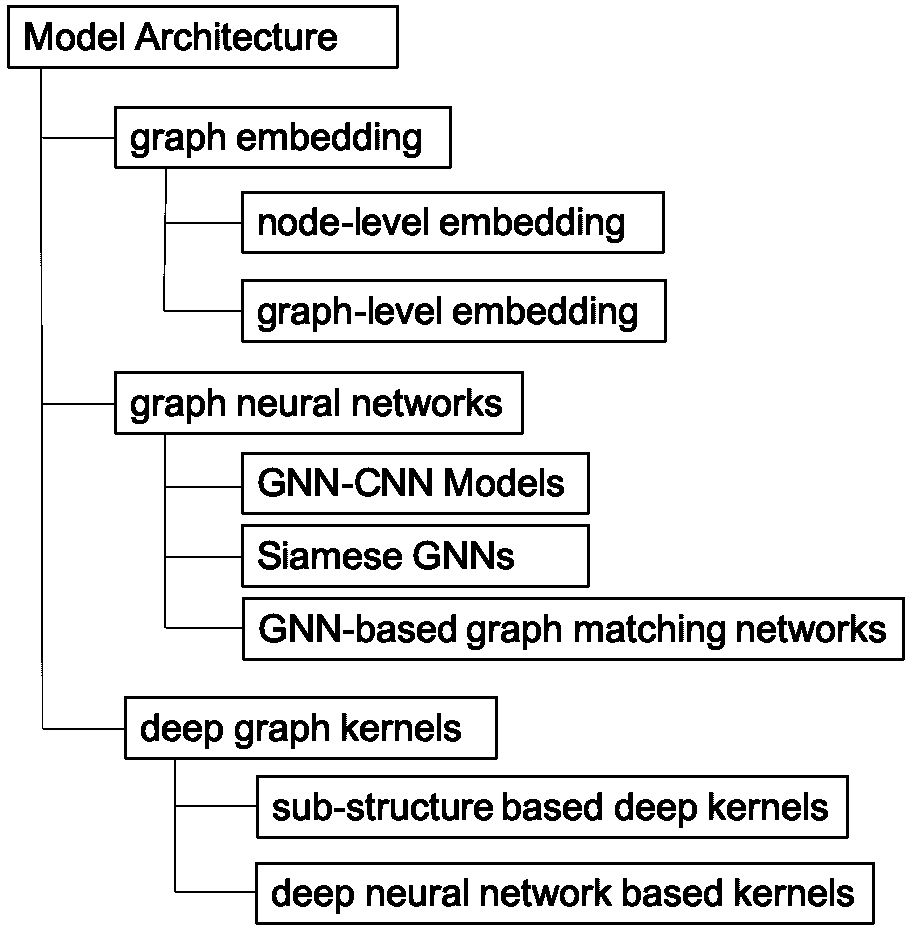
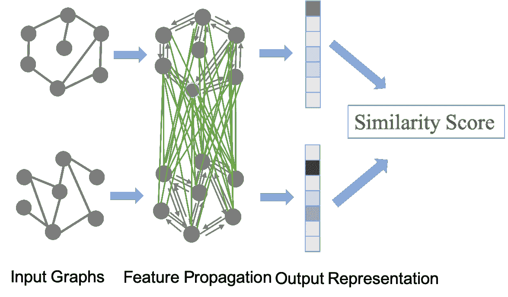
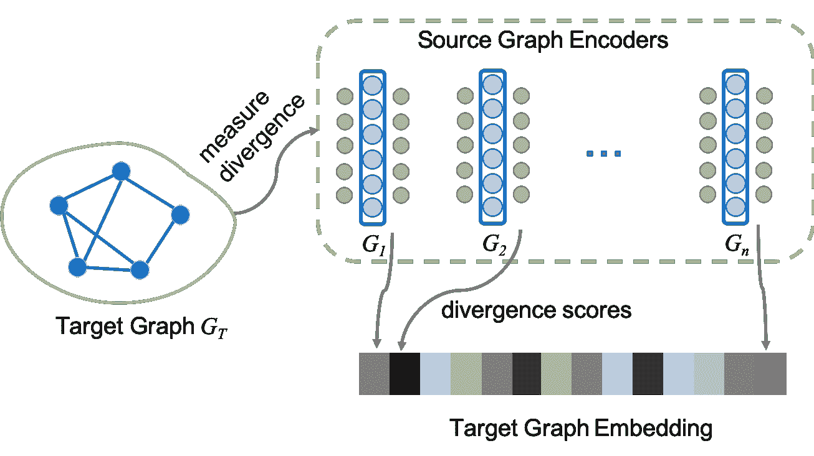

<!--yml

category: 未分类

date: 2024-09-06 20:03:25

-->

# [1912.11615] 深度图相似度学习：综述

> 来源：[`ar5iv.labs.arxiv.org/html/1912.11615`](https://ar5iv.labs.arxiv.org/html/1912.11615)

∎

¹¹institutetext: G. Ma ²²institutetext: Intel Labs, Intel Corporation, Hillsboro, OR 97124, USA

²²email: guixiang.ma@intel.com ³³institutetext: N. K. Ahmed ⁴⁴institutetext: Intel Labs, Intel Corporation, Santa Clara, CA 95054, USA

⁴⁴email: nesreen.k.ahmed@intel.com ⁵⁵institutetext: T. Willke ⁶⁶institutetext: Intel Labs, Intel Corporation, Hillsboro, OR 97124, USA

⁶⁶email: ted.willke@intel.com ⁷⁷institutetext: P. Yu ⁸⁸institutetext: Department of Computer Science, University of Illinois at Chicago, IL 60607, USA

⁸⁸email: psyu@uic.edu

# 深度图相似度学习：综述

Guixiang Ma    Nesreen K. Ahmed    Theodore L. Willke    Philip S. Yu

###### 摘要

在许多将数据表示为图的领域中，学习图之间的相似度度量被认为是一个关键问题，这可以进一步促进各种学习任务，如分类、聚类和相似性搜索。最近，对深度图相似度学习的兴趣日益增加，其中关键思想是学习一个深度学习模型，将输入图映射到目标空间，使目标空间中的距离接近输入空间中的结构距离。在这里，我们提供了对现有深度图相似度学习文献的全面回顾。我们提出了一种系统的分类方法来对这些方法和应用进行分类。最后，我们讨论了这个问题的挑战和未来方向。

###### 关键词：

Metric learning, Similarity learning, Graph Neural Networks, Graph Convolutional Networks, Higher-order Networks, Graph Similarity, Structural Similarity, Graph Matching, Deep graph similarity learning

## 1 介绍

在特征空间上学习适当的相似度度量可以显著决定机器学习方法的性能。自动从数据中学习这种度量是相似度学习的主要目标。相似度/度量学习指的是学习一个函数来测量对象之间的距离或相似度，这在许多机器学习问题中是一个关键步骤，如分类、聚类、排序等。例如，在 k-最近邻（kNN）分类中 cover1967nearest，需要一种度量来测量数据点之间的距离并识别最近邻；在许多聚类算法中，数据点之间的相似度测量用于确定聚类。虽然有一些通用的度量如欧几里得距离可以用于获取对象之间的相似度，但这些度量通常不能捕捉到被研究数据的特定特征，尤其是对于结构化数据。因此，寻找或学习一种度量来测量特定任务中数据点的相似度是至关重要的。

度量学习在各种数据类型的许多领域中得到了广泛研究。例如，在计算机视觉中，度量学习已经在图像或视频上进行了探索，用于图像分类、物体识别、视觉跟踪以及其他学习任务 mensink2012metric ; guillaumin2009you ; jiang2012order 。在信息检索中，例如在搜索引擎中，度量学习被用于确定与给定查询相关文档的排名 lee2008rank ; lim2013robust 。在本文中，我们调查了图形相似性学习的现有工作，这些图形编码了关系结构，并在各个领域中广泛存在。

图形相似性学习已被用于许多实际应用，例如化学信息学中的分子图分类 horvath2004cyclic ; frohlich2006kernel 、疾病预测中的蛋白质-蛋白质相互作用网络分析 borgwardt2007graph 、计算机安全中的二元函数相似性搜索 li2019graph 、用于神经系统疾病分析的多主体脑网络相似性学习 ktena2018metric 等。在许多这些应用场景中，可用的训练样本数量通常非常有限，这使得直接训练分类或预测模型成为一个困难的问题。通过图形相似性学习策略，这些应用受益于成对学习，利用每一对训练样本来学习将输入数据映射到目标空间的度量，从而进一步促进特定学习任务的进行。

在过去的几十年里，许多技术已出现用于研究图的相似性。早期，定义了多种图相似性度量标准，例如图编辑距离 bunke1983inexact、最大公共子图 bunke1998graph；wallis2001graph 和图同构 dijkman2009graph；berretti2001efficient，以解决图相似性搜索和图匹配问题。然而，这些度量标准的计算通常是一个 NP 完全问题 zeng2009comparing。虽然提出了一些修剪策略和启发式方法来近似这些值并加速计算，但分析上述启发式算法的计算复杂度是困难的，它们提供的次优解也是无界的 zeng2009comparing。因此，这些方法仅对相对较小的图和在这些度量标准为主要关注点的实际应用中是可行的。因此，很难将这些方法适应到新任务中。此外，对于其他相对高效的方法，如 douglas2011weisfeiler 中的 Weisfeiler-Lehman 方法，由于其专门为同构测试而开发且没有映射函数，因此无法应用于一般的图相似性学习。最近，研究人员将相似性估计形式化为一个学习问题，其目标是学习一个模型，将一对图映射到基于图表示的相似性分数。例如，图核，例如基于路径的核 borgwardt2005shortest 和子图匹配核 yan2005substructure；yoshida2019learning，被提出用于图相似性学习。传统的图嵌入技术，例如几何嵌入，也被用于图相似性学习 johansson2015learning。

随着深度学习技术的出现，图神经网络（GNNs）已成为一种强大的新工具，用于学习具有各种结构的图的表示，以应对各种任务。GNNs 与传统的图嵌入的主要区别在于，GNNs 以端到端的方式处理图相关任务，其中表示学习和目标学习任务是共同进行的 wu2020comprehensive，而图嵌入通常在孤立的阶段学习图表示，之后再将学习到的表示用于目标任务。因此，与图嵌入方法相比，GNN 深度模型能够更好地利用图特征来完成特定的学习任务。此外，GNNs 可以轻松地适应和扩展到各种图相关任务，包括不同领域的深度图相似性学习任务。例如，在神经科学中的脑连接网络分析中，脑网络中节点（即脑区）之间的社区结构是学习节点表示以进行跨受试者相似性分析时应考虑的一个重要因素。然而，传统的图嵌入方法都无法捕捉这种特殊结构，并且无法共同利用学习到的节点表示来进行脑网络的相似性学习。在 ma2019similarity 中，开发了一种高阶 GNN 模型，用于在表示学习过程中编码脑网络的社区结构，并将其用于这些脑网络的相似性学习任务。其他领域的一些例子包括用于计算化学中的化学化合物查询的 GNN-based 图相似性预测模型 bai2019simgnn 以及用于计算机安全中的二元函数相似性搜索和恶意软件检测的深度图匹配网络 li2019graph；ijcai2019-522。

在这篇综述论文中，我们提供了对现有深度图相似性学习工作的系统性回顾。根据不同的图表示学习策略及其在深度图相似性学习任务中的应用，我们建议将深度图相似性学习模型分为三类：基于图嵌入的方法、基于 GNN 的方法以及基于深度图核的方法。此外，我们根据模型的属性对这些模型进行细分。表 2 展示了我们提出的分类法，其中包括每个类别的一些示例模型及相关应用。在这项综述中，我们将阐明这些不同类别的模型如何处理图相似性学习问题。我们还将讨论用于图相似性学习任务的损失函数。

##### 范围与贡献。

本文聚焦于对新近出现的图相似性学习深度模型进行调查，目标是使用深度策略在图上学习给定图对的相似性，而不是基于预定义的度量计算相似性分数。我们强调本文不尝试调查图表示学习、图神经网络和图嵌入的大量文献。先前的工作集中于这些主题（参见 cai2018comprehensive ; goyal2018graph ; lee2019attention ; wu2019comprehensive ; rossi2019community ; cui2018survey ; zhang2018network）。相反，我们专注于那些明确关注图相似性建模的深度图表示学习方法。根据我们所知，这是第一个关于这个问题的调查论文。我们总结了本文的主要贡献如下：

+   $\circ$

    两种全面的分类法，用于根据模型类型和现有方法采用的特征类型，对新兴领域深度图相似性学习的文献进行分类。

+   $\circ$

    对每个类别模型的关键技术和构建块进行总结和讨论。

+   $\circ$

    对不同的深度图相似性学习模型进行总结和比较，按照分类法进行组织。

+   $\circ$

    对深度图相似性学习在各个领域中能够带来的实际应用进行总结和讨论。

+   $\circ$

    对深度图相似性学习的主要挑战、未来方向和未解决的问题进行总结和讨论。

##### 组织结构。

本文的其余部分组织如下。在第二部分中，我们介绍了符号、初步概念，并定义了图相似性学习问题。在第三部分中，我们介绍了具有详细插图的现有深度模型分类。在第四部分中，我们总结了现有工作中采用的数据集和评估方法。在第五部分中，我们展示了深度图相似性学习在各个领域的应用。在第六部分中，我们讨论了该领域的剩余挑战并强调未来方向。最后，在第七部分中，我们做出总结。

## 2 符号和初步概念

在本节中，我们提供了必要的符号和图相似性问题的基本概念定义，这些定义将在本调查中使用。符号总结见表格 1。

表格 1: 符号总结

| $G$ |  |  |  | 输入图 |
| --- | --- | --- | --- | --- |
| $V$ |  |  |  | 图$G$中的节点集 |
| $E$ |  |  |  | 图$G$中的边集 |
| $a,\mathbf{a},\mathbf{A}$ |  |  |  | 标量，向量，矩阵 |
| $\mathcal{G}$ |  |  |  | 图集$\mathcal{G}=\{G_{1},G_{2},\cdots,G_{n}\}$ |
| $\mathcal{M}$ |  |  |  | 相似性函数 |
| $s_{ij}$ |  |  |  | 两个图$G_{i},G_{j}\in\mathcal{G}$之间的相似性评分 |
| $\mathbb{R}^{m\times m}$ |  |  |  | $m$维欧几里得空间 |
| $\mathbf{I}_{m}$ |  |  |  | $m$维单位矩阵 |
| $\mathbf{A}^{T}$ |  |  |  | 矩阵转置 |
| $\mathbf{L}$ |  |  |  | 拉普拉斯矩阵 |
| $g_{\theta}*\mathbf{x}$ |  |  |  | $g_{\theta}$和$\mathbf{x}$的卷积 |

设$G=(V,E,\mathbf{A})$表示一个图，其中$V$是节点集，$E\subseteq V\times V$是边集，$\mathbf{A}\in\mathbb{R}^{|V|\times|V|}$是图的邻接矩阵。这是一种图的通用表示法，涵盖了不同类型的图，包括无权图/有权图、无向图/有向图，以及有属性图/无属性图。

我们还假设输入为一组图$\mathcal{G}=\{G_{1},G_{2},\dots,G_{n}\}$，目标是测量/建模它们之间的成对相似性。这涉及到图同构及其变体的经典问题。在图同构问题中，miller1979graph 两个图$G=(V_{G},E_{G})$和$H=(V_{H},E_{H})$是同构的（即，$G\cong H$），如果存在一个映射函数$\pi\mathrel{\mathop{\mathchar 58\relax}}V_{G}\rightarrow V_{H}$，使得$(u,v)\in E_{G}$当且仅当$(\pi(u),\pi(v))\in E_{H}$。图同构是一个 NP 问题，目前尚无有效算法。子图同构是图同构问题的推广。在子图同构问题中，目标是对于两个输入图$G$和$H$，判断是否存在$G$的一个子图($G^{\prime}\subset G$)使得$G^{\prime}$与$H$同构（即，$G^{\prime}\cong H$）。这适用于两个图具有不同尺寸的情况。子图同构问题已被证明是 NP 完全的（与图同构问题不同）Garey1978ComputersAI。最大公共子图问题是衡量图相似性的另一种不太严格的度量，其中两个图之间的相似性是基于两个输入图中最大公共子图的大小定义的。然而，这个问题也是 NP 完全的 Garey1978ComputersAI。

###### 定义 1（图相似性学习）

设$\mathcal{G}$为输入图集，$\mathcal{G}=\{G_{1},G_{2},\cdots,G_{n}\}$，其中$G_{i}=(V_{i},E_{i},\mathbf{A}_{i})$。设$\mathcal{M}$表示一个可学习的相似性函数，使得$\mathcal{M}\mathrel{\mathop{\mathchar 58\relax}}(G_{i},G_{j})\rightarrow\mathbb{R}$，对于任意一对图$G_{i},G_{j}\in\mathcal{G}$。假设$s_{ij}\in\mathbb{R}$表示使用$\mathcal{M}$计算的图对$G_{i}$和$G_{j}$之间的相似性分数。那么，$\mathcal{M}$是对称的，当且仅当$s_{ij}=s_{ji}$对于任意一对图$G_{i},G_{j}\in\mathcal{G}$。$\mathcal{M}$应该满足以下属性：$s_{ii}>=s_{ij}$对于任意一对图$G_{i},G_{j}\in\mathcal{G}$。并且，当$G_{i}$是$G_{j}$的补图，即$G_{i}=\bar{G_{j}}$时，$s_{ij}$达到最小，对于任意图$G_{j}\in\mathcal{G}$。

显然，图同构及其相关变体（例如，子图同构、最大公共子图等）侧重于测量图的拓扑等价性，这导致了一种二进制相似性度量，如果两个图是同构的则输出$1$，否则输出$0$。尽管这些方法听起来很直观，但对于大图来说，它们实际上更具限制性且计算难度较大。这里，我们关注的是一种放宽的图相似性概念，该概念可以通过机器学习模型进行测量，目标是学习一个模型来量化两个图之间的结构相似性和相关性。这与对同一图中节点之间结构相似性的建模工作略有相似 ahmedrole2020 ; rossi2014role ; ahmed2018learning 。我们在定义 1 ‣ 2 符号和预备知识 ‣ 深度图相似性学习：综述")中正式说明了图相似性学习（GSL）的定义。请注意，在深度图相似性学习的情况下，相似性函数$\mathcal{M}$是一个可以进行端到端训练的神经网络模型。

## 3 模型分类

(a)

(b)

图 1: 基于(a) 模型架构，(b) 特征类型的深度图相似性学习文献分类建议。

表 2: 深度图相似性学习方法的分类

| 分类 |
| --- |

&#124; 方法 &#124;

|

&#124;  加权图  &#124;

|

&#124;  异质图  &#124;

|

&#124;  属性图  &#124;

|

&#124;  特征传播  &#124;

|

&#124;  跨图交互  &#124;

| 应用 |
| --- | --- | --- | --- | --- | --- | --- | --- |
| 基于图嵌入的 GSL | 节点级嵌入 | tixier2019graph | ✗ | ✗ | ✓ | ✗ | ✗ |

&#124; 社交网络分析 &#124;

&#124; 生物信息学 &#124;

|

| nikolentzos2017matching | ✗ | ✓ | ✗ | ✗ | ✗ | 化学信息学 |
| --- | --- | --- | --- | --- | --- | --- |

|

&#124; 图级嵌入 &#124;

| narayanan2017graph2vec ; atamna2019spi ; wu2018dgcnn | ✗ | ✓ | ✗ | ✗ | ✗ |
| --- | --- | --- | --- | --- | --- |

&#124; 化学信息学 &#124;

&#124; 生物信息学 &#124;

|

|  | anonymous2019_inductive | ✗ | ✓ | ✗ | ✗ | ✗ |
| --- | --- | --- | --- | --- | --- | --- |

&#124; 社会网络分析 &#124;

&#124; 化学信息学 &#124;

|

|  | xu2017neural | ✗ | ✗ | ✓ | ✗ | ✗ | 二进制代码相似性 |
| --- | --- | --- | --- | --- | --- | --- | --- |
|  |  | liu2019n | ✗ | ✗ | ✓ | ✗ | ✗ | 化学信息学 |
| 基于 GNN 的 GSL | GNN-CNN 模型 | bai2018convolutional | ✗ | ✓ | ✓ | ✓ | ✗ | 化学信息学 |
| bai2019simgnn | ✗ | ✓ | ✓ | ✓ | ✗ | 化学信息学 |
| Siamese GNNs | ktena2018metric ; ma2019similarity ; liu2019community | ✓ | ✗ | ✓ | ✓ | ✗ | 大脑网络分析 |
| ijcai2019-522 | ✗ | ✓ | ✓ | ✓ | ✗ | 恶意软件检测 |
|  | chaudhuri2019siamese | ✓ | ✗ | ✓ | ✓ | ✗ | 图像检索 |
| 基于 GNN 的图匹配网络 | li2019graph ; anonymous2019 | ✗ | ✗ | ✓ | ✓ | ✓ | 二进制代码相似性 |
| anonymous2019_mcs | ✗ | ✓ | ✓ | ✓ | ✓ | 化学信息学 |
|  |  | wang2019learning ; jiang2019glmnet | ✗ | ✗ | ✓ | ✓ | ✓ | 图像匹配 |
|  |  | guo2018neural | ✓ | ✓ | ✓ | ✓ | ✗ | 3D 动作识别 |
| 深度图核基于 GSL |

&#124; 基于子结构的方法 &#124;

&#124; 深度核方法 &#124;

| yanardag2015deep | ✗ | ✓ | ✗ | ✗ | ✗ |
| --- | --- | --- | --- | --- | --- |

&#124; 化学信息学 &#124;

&#124; 生物信息学 &#124;

&#124; 社会网络分析 &#124;

|

|

&#124; 深度神经网络 &#124;

&#124; 基于核的方法 &#124;

| al2019ddgk | ✗ | ✓ | ✓ | ✗ | ✓ |
| --- | --- | --- | --- | --- | --- |

&#124; 化学信息学 &#124;

&#124; 生物信息学 &#124;

|

|  |  | du2019graph | ✗ | ✓ | ✓ | ✓ | ✗ |
| --- | --- | --- | --- | --- | --- | --- | --- |

&#124; 社会网络分析 &#124;

&#124; 化学信息学 &#124;

|

在本节中，我们描述了深度图相似性学习文献的分类法。如图 1 所示，我们提出了两种直观的分类法，用于根据模型架构和这些方法中使用的特征类型对各种深度图相似性学习方法进行分类。

首先，我们从讨论基于使用哪种模型架构的分类开始。深度图相似性学习方法主要分为三类（见图 1(a)）：（1）基于图嵌入的方法，这些方法应用图嵌入技术来获得节点级或图级表示，并进一步利用这些表示进行相似性学习 tixier2019graph； nikolentzos2017matching； narayanan2017graph2vec； atamna2019spi； wu2018dgcnn； anonymous2019_inductive； xu2017neural； liu2019n；（2）基于图神经网络（GNN）的模型，这些模型基于使用 GNN 进行相似性学习，包括 GNN-CNNs bai2018convolutional； bai2019simgnn，Siamese GNNs ktena2018metric； ma2019similarity； liu2019community； ijcai2019-522； chaudhuri2019siamese 和基于 GNN 的图匹配网络 li2019graph； anonymous2019； anonymous2019_mcs； wang2019learning； jiang2019glmnet； guo2018neural；（3）深度图核，这些方法首先将图映射到一个新的特征空间，其中定义了用于图对之间相似性学习的核函数，包括基于子结构的深度核 yanardag2015deep 和基于深度神经网络的核 al2019ddgk； du2019graph。同时，不同的方法在学习过程中可能使用不同类型的特征。

第二，我们讨论了基于所使用特征类型的方法的分类。现有的 GSL 方法大致可以分为两类（见图 1(b)）：（1）使用单图特征的方法 ktena2018metric ; ma2019similarity ; liu2019community ; ijcai2019-522 ; chaudhuri2019siamese ; （2）使用跨图特征进行相似性学习的方法 li2019graph ; anonymous2019 ; anonymous2019_mcs ; al2019ddgk ; wang2019learning ; anonymous2019_mcs 。这两类方法的主要区别在于，对于使用单图特征的方法，每个图的表示是单独学习的，而那些使用跨图特征的方法允许图之间相互学习和传播特征，并且跨图交互被利用于图对。单图特征主要包括不同粒度的图嵌入（即节点级别、图级别和子图级别），而跨图特征包括跨图节点级别特征和跨图图级别特征，这些特征通常通过对每对图进行节点级别注意力和图级别注意力来获得。

接下来，我们详细描述了基于图 1(a) 和 1(b) 中分类法的的方法。我们在表 2 中总结了所有方法的一般特征和应用，包括它们所开发的图类型、特征类型以及可以应用的领域/应用。我们按照以下顺序描述这些方法：

1.  1.

    基于图嵌入的 GSL

1.  2.

    基于图神经网络的 GSL

1.  3.

    基于深度图核的 GSL

### 3.1 基于图嵌入的图相似性学习

图嵌入在过去十年中受到了相当多的关注 cui2018survey ; zhang2018network ，近年来提出了多种深度图嵌入模型 huang2019learning ; narayanan2017graph2vec ; gao2019graph1 ，例如在 perozzi2014deepwalk 中提出的流行的 DeepWalk 模型和 grover2016node2vec 中的 node2vec 模型。基于图嵌入的相似性学习方法旨在利用这些图嵌入技术学习的节点级或图级表示来定义相似性函数或预测相似性分数 tsitsulin2018verse ; tixier2019graph ; narayanan2017graph2vec 。给定一组图，这些工作首先旨在将每个图 $G$ 转换为一个 $d-$维空间 $(d\ll\|V\|)$，其中图被表示为一组 $d-$维向量，每个向量表示一个节点的嵌入（即节点级嵌入）或整个图的 $d-$维向量作为图级嵌入 cai2018comprehensive 。图嵌入通常在相似性学习阶段之前的单独阶段以无监督的方式学习，在此阶段获得的图嵌入用于估计或预测每对图之间的相似性分数。

#### 3.1.1 基于节点级嵌入的方法

基于节点级嵌入的方法使用从图中学习的节点级表示来比较图。这些方法获得的相似性分数主要捕捉两个图中对应节点之间的相似性。因此，它们在学习过程中专注于图中的局部节点级信息。

##### node2vec-PCA。

在 tixier2019graph 中，使用了 node2vec 方法 grover2016node2vec 来获取图的节点级嵌入。为了使给定集合中所有图的嵌入可比，他们对嵌入应用了主成分分析（PCA），以保留前 $d\ll D$ 主成分（其中 $D$ 是原始节点嵌入空间的维度）。随后，每个图的嵌入矩阵被分割成 $d/2$ 个 2D 切片。假设每个图 $G$ 中有 $n$ 个节点，并且图 $G$ 的嵌入矩阵为 $F\in\mathbb{R}^{n\times d}$，那么将获得 $d/2$ 个 $\mathbb{R}^{n\times 2}$ 的 2D 切片，这些切片被视为 $d/2$ 个通道。然后，通过将每个 2D 切片离散化为固定数量的相等大小的箱子，将其转换为规则网格，其中每个箱子关联的值是落入该箱子的节点数量。这些箱子可以视为像素。然后，图被表示为其节点嵌入的 2D 直方图堆叠。然后在网格空间中比较图，并将其输入到作为多通道图像结构的 2D CNN 中，用于图分类任务。

##### 向量袋。

在 nikolentzos2017matching 中，首先使用图的邻接矩阵的特征向量将图的节点嵌入到欧几里得空间中，然后每个图被表示为一个向量袋。两个图之间的相似性通过计算基于地球移动者距离 rubner2000earth 的匹配来衡量。

尽管基于节点嵌入的图相似性学习方法已经得到了广泛的发展，但这些方法的一个共同问题是，由于比较是基于节点级别的表示，图的全球结构往往被忽视，而这实际上对于比较两个图的结构模式非常重要。

#### 3.1.2 图级嵌入基于的方法

基于图级别嵌入的方法旨在为每个图学习一个向量表示，然后根据这些向量表示学习图之间的相似性分数。

##### (1) graph2vec。

在 narayanan2017graph2vec 中，提出了一种 graph2vec 方法，用于学习图的分布表示，类似于自然语言处理中的 Doc2vec le2014distributed。在 graph2vec 中，每个图被视为一个文档，而图中每个节点周围的根子图被视为组成文档的单词。该方法有两个主要组成部分：首先是提取给定图中每个节点周围的根子图，按照 Weisfeiler-Lehman 重新标记过程进行；其次是通过带有负采样的 skip-gram 学习给定图的嵌入。Weisfeiler-Lehman 重新标记算法将给定图的根节点和目标子图的度 $d$ 作为输入，返回目标子图。在负采样阶段，给定图和其上下文中的根子图集合，随机选择一组子图作为负样本，只有负样本的嵌入在训练中被更新。获得每个图的图嵌入后，在嵌入空间中计算图之间的相似性或距离，以进行下游预测任务（例如，图分类、聚类等）。

##### (2) 使用 Structure2vec 的神经网络。

在 xu2017neural 中，提出了一种深度图嵌入方法用于跨平台二进制代码相似性检测。应用了 Siamese 架构以实现对偶相似性学习，并使用基于 Structure2vec dai2016discriminative 的图嵌入网络来学习双网络中的图表示，这两个网络共享权重。Structure2vec 是一种受图模型推理算法启发的神经网络方法，其中节点特定特征根据图拓扑递归地聚合。在几次递归步骤后，网络将为每个节点生成一个新的特征表示，考虑了图特征和节点特征之间的远程交互。给定一组 $K$ 对图 $<G_{i},{G_{i}}^{\prime}>$，其真实对偶标签为 $y_{i}\in\{+1,-1\}$，其中 $y_{i}=+1$ 表示 $G_{i}$ 和 ${G_{i}}^{\prime}$ 相似，$y_{i}=-1$ 表示它们不相似。使用 Structure2vec 嵌入输出 $G_{i}$ 和 ${G_{i}}^{\prime}$，分别表示为 $\mathbf{f}_{i}$ 和 ${\mathbf{f}_{i}}^{\prime}$，它们将 Siamese 网络对每对图的输出定义为

|  | $\displaystyle Sim(G_{i},{G_{i}}^{\prime})=\cos(\mathbf{f}_{i},{\mathbf{f}_{i}}^{\prime})=\frac{\langle\mathbf{f}_{i},{\mathbf{f}_{i}}^{\prime}\rangle}{\&#124;\mathbf{f}_{i}\&#124;\cdot\&#124;{\mathbf{f}_{i}}^{\prime}\&#124;}$ |  | (1) |
| --- | --- | --- | --- |

以下损失函数用于训练模型。

|  | $\displaystyle L=\sum_{i=1}^{K}(Sim(G_{i},{G_{i}}^{\prime})-y_{i})^{2}$ |  | (2) |
| --- | --- | --- | --- |

##### (3) 简单排列不变 GCN。

在 atamna2019spi 中，提出了一种基于简单置换不变图卷积网络的图表示学习方法，用于图相似性和图分类问题。该方法使用图卷积模块对局部图结构和节点特征进行编码，然后使用求和池化层将通过图卷积计算的子结构特征矩阵转换为输入图的单一特征向量表示。然后将向量表示用作每个图的特征，基于此可以执行图相似性或图分类任务。

##### (4) SEED: 采样、编码和嵌入分布。

在 anonymous2019_inductive 中，提出了一种称为 SEED 的归纳性和无监督图表示学习方法，用于图相似性学习。该框架由三个组件组成：采样、编码和嵌入分布。在采样阶段，根据最早访问时间的随机游走采样出若干个称为 WEAVE 的子图。然后在编码阶段，使用自编码器 hinton2006reducing 将子图编码为密集的低维向量。给定一组 $k$ 个采样的 WEAVE $\{X_{1},X_{2},X_{3},\cdots,X_{k}\}$，对于每个子图 $X_{i}$ 自编码器的工作如下。

|  | $\displaystyle\mathbf{z}_{i}=f(X_{i};{\theta}_{e}),\quad\hat{X_{i}}=g(\mathbf{z}_{i};{\theta}_{d}),$ |  | (3) |
| --- | --- | --- | --- |

其中 $\mathbf{z}_{i}$ 是输入 WEAVE 子图 $X_{i}$ 的密集低维表示，$f(\cdot)$ 是用具有参数 ${\theta}_{e}$ 的多层感知机（MLP）实现的编码函数，$g(\cdot)$ 是用具有参数 ${\theta}_{d}$ 的另一个 MLP 实现的解码函数。重构损失用于训练自编码器：

|  | $\displaystyle L=\mathinner{\!\left\lVert X-\hat{X}\right\rVert}_{2}^{2}$ |  | (4) |
| --- | --- | --- | --- |

在自编码器经过充分训练后，可以为每个图获得最终的子图嵌入向量 ${\mathbf{z}_{1},\mathbf{z}_{2},\mathbf{z}_{3},\cdots,}$ 和 $\mathbf{z}_{k}$。最后，在嵌入分布阶段，通过在嵌入上使用最大均值差异（MMD）gretton2012kernel 来评估两个输入图 $G$ 和 $H$ 的子图分布之间的距离。假设从 $G$ 中采样的 $k$ 个子图被编码为嵌入 ${\mathbf{z}_{1},\mathbf{z}_{2},\cdots,\mathbf{z}_{k}}$，而 $H$ 的 $k$ 个子图被编码为嵌入 ${\mathbf{h}_{1},\mathbf{h}_{2},\cdots,\mathbf{h}_{k}}$，则 $G$ 和 $H$ 之间的 MMD 距离为：

|  | $\displaystyle\widehat{\text{MMD}}(G,H)=\mathinner{\!\left\lVert\hat{\mu}_{G}-\hat{\mu}_{H}\right\rVert}_{2}^{2}$ |  | (5) |
| --- | --- | --- | --- |

其中 $\hat{\mu}_{G}$ 和 $\hat{\mu}_{H}$ 是两个分布的经验核嵌入，它们定义为：

|  | $\displaystyle\hat{\mu}_{G}=\frac{1}{k}\sum_{i=1}^{k}\phi(\mathbf{z}_{i}),\quad\hat{\mu}_{H}=\frac{1}{k}\sum_{i=1}^{k}\phi(\mathbf{h}_{i})$ |  | (6) |
| --- | --- | --- | --- |

其中 $\phi(\cdot)$ 是用于图相似性评估的核函数的特征映射函数。在本工作中应用了单位核。

##### (5) DGCNN: 无序图 CNN。

在 wu2018dgcnn 中，介绍了一种名为 DGCNN 的图级表示学习方法，该方法基于图 CNN 和混合高斯模型，其中从每个图中选择一组关键节点。具体而言，为了确保每个图中节点的邻域数量一致，在关键节点选择阶段，为每个图采样相同数量的关键节点。然后，在所选关键节点的邻域节点上执行卷积操作，之后图 CNN 将卷积层的输出作为整体连接层的输入数据。最后，密集隐藏层的输出用作图相似性检索任务中每个图的特征向量。

##### (6) N-Gram 图嵌入。

在 liu2019n 中，提出了一种基于无监督图表示的方法，称为 $N$-gram，用于分子图上的相似性学习。它首先将图中的每个节点视为一个标记，并应用类似 CBOW（连续词袋） mikolov2013distributed 的策略，训练神经网络以学习每个图的节点嵌入。然后，它枚举每个图中长度为 $n$ 的游走，其中每个游走称为 $n$-gram，并通过使用元素级乘积组合 $n$-gram 中节点的嵌入来获得每个 $n$-gram 的嵌入。n-gram 游走集合的嵌入定义为所有 n-grams 嵌入的总和。最终的 n-gram 图级表示，长度为 $T$，通过将图中所有 $n$-gram 集合的嵌入 $n\in\{1,2,\cdots,T\}$ 连接起来构建。最后，图级嵌入用于分子分析的相似性预测或图分类任务。

通过总结基于嵌入的方法，我们发现这些方法的主要优势在于其速度和可扩展性，因为通过这些因子化模型学习的图表示是基于每个单独图的，其中不存在跨图特征交互。这一特性使得这些方法成为图相似性学习应用的绝佳选择，例如图检索，其中相似性搜索变成了对这些因子化方法预计算的图表示数据库中的最近邻搜索。此外，这些基于嵌入的方法提供了多种视角和策略来学习图表示，并展示了这些表示可以用于图相似性学习。然而，这些解决方案也存在不足之处，一个常见的问题是嵌入是在与相似性学习分开的阶段独立学习的，因此在图表示学习过程中没有考虑或利用图与图之间的接近性，与那些将相似性学习与图表示学习整合在端到端框架中的方法相比，这些模型学习的表示可能不适合图与图的相似性预测。

### 3.2 基于 GNN 的图相似性学习

基于图神经网络（GNN）的相似性学习方法旨在通过 GNN 学习图表示，同时以端到端的方式进行相似性学习任务。图示 2 展示了基于 GNN 的图相似性学习模型的一般工作流程。给定输入图对$<G_{i},G_{j},y_{ij}>$，其中$y_{ij}$表示$<G_{i},G_{j}>$的真实相似性标签或分数，基于 GNN 的 GSL 方法首先使用具有权重$W$的多层 GNNs 来学习$G_{i}$和$G_{j}$在编码空间中的表示，其中一对中的每个图的学习可以通过一些机制如权重共享和图间交互相互影响。GNN 层将为每个图输出一个矩阵或向量表示，之后可以添加点积层或全连接层来生成或预测两个图之间的相似性分数。最后，所有图对的相似性估计和其真实标签用于损失函数，以训练具有参数$W$的模型$M$。

在介绍本类别的方法之前，我们提供了关于 GNN 的必要背景。

##### GNN 基础知识。

图神经网络（GNNs）最早在 gori2005new 中提出，该文提出使用传播过程来学习图的节点表示。随后，scarselli2008graph 和 gallicchio2010graph 对其进行了进一步扩展。后来，提出了图卷积网络，这些网络通过聚合局部邻域中的信息来计算节点更新 bruna2013spectral；defferrard2016convolutional；kipf2016semi，它们已成为最受欢迎的图神经网络，并在各个领域的图表示学习中得到了广泛应用和扩展 zhou2018graph；zhang2018graph；gao2018large；gao2019graph；gao2019graph1。

随着图神经网络的发展，研究人员开始构建基于 GNN 的图相似性学习模型。在本节中，我们将首先介绍以谱 GCN shuman2013emerging 为例的 GCN 工作流程，然后描述基于 GNN 的图相似性学习方法，包括三大类方法。

给定一个图 $G=(V,E,\mathbf{A})$，其中 $V$ 是顶点集合，$E\subset V\times V$ 是边集合，$\mathbf{A}\in\mathbb{R}^{m\times m}$ 是邻接矩阵，对角度矩阵 $\mathbf{D}$ 的元素 $\mathbf{D}_{ii}=\sum_{j}\mathbf{A}_{ij}$。图拉普拉斯矩阵为 $\mathbf{L}=\mathbf{D}-\mathbf{A}$，可以被标准化为 $\mathbf{L}=\mathbf{I}_{m}-\mathbf{D}^{-\frac{1}{2}}\mathbf{A}\mathbf{D}^{-\frac{1}{2}}$，其中 $\mathbf{I}_{m}$ 是单位矩阵。假设 $\mathbf{L}$ 的正交特征向量表示为 $\{u_{l}\}_{l=0}^{m-1}\in\mathbb{R}^{m\times m}$，它们的特征值为 $\{\lambda_{l}\}_{l=0}^{m-1}$，拉普拉斯矩阵通过傅里叶基底 $u_{0},\cdots,u_{m-1}\in\mathbb{R}^{m\times m}$ 对角化，$\mathbf{L}=\mathbf{U\Lambda U^{T}}$ 其中 $\mathbf{\Lambda}=diag([\lambda_{0},\cdots,\lambda_{m-1}])\in\mathbb{R}^{m\times m}$。信号 $x\in\mathbb{R}^{m}$ 的图傅里叶变换可以定义为 $\hat{x}=\mathbf{U^{T}}x\in\mathbb{R}^{m}$shuman2013emerging 。假设一个信号向量 $\mathbf{x}\mathrel{\mathop{\mathchar 58\relax}}V\rightarrow\mathbb{R}$ 定义在图 $G$ 的节点上，其中 $\mathbf{x}_{i}$ 是第 $i^{th}$ 个节点上 $\mathbf{x}$ 的值。然后，信号 $\mathbf{x}$ 可以通过 $g_{\theta}$ 进行滤波。

|  | $\displaystyle y=g_{\theta}*\mathbf{x}=g_{\theta}(\mathbf{L})\mathbf{x}=g_{\theta}(\mathbf{U{\Lambda}U^{T}})\mathbf{x}=\mathbf{U}g_{\theta}(\Lambda)\mathbf{U^{T}}\mathbf{x}$ |  | (7) |
| --- | --- | --- | --- |

其中滤波器 $g_{\theta}(\Lambda)$ 可以定义为 $g_{\theta}(\Lambda)=\sum_{k=0}^{K-1}{\theta_{k}}{\Lambda^{k}}$，参数 $\theta\in{\mathbb{R}}^{K}$ 是多项式系数的向量 defferrard2016convolutional。GCNs 可以通过堆叠多个卷积层的形式构建，如方程 (7)，每层后面跟着一个非线性激活函数（ReLU）。

图 2：基于 GNN 的图相似度学习示意图。

基于在学习中如何利用图-图相似度/接近度，我们将现有的基于 GNN 的图相似度学习工作总结为三大类：1) GNN-CNN 混合模型用于图相似度预测，2) 用于图相似度预测的孪生 GNN，3) 基于 GNN 的图匹配网络。

#### 3.2.1 GNN-CNN 模型用于图相似度预测

使用 GNN-CNN 混合网络进行图相似度预测的研究主要利用 GNN 来学习图表示，并将学习到的表示输入到 CNN 中以预测相似度分数，这被视为分类或回归问题。在端到端学习框架中，通常会添加全连接层来进行相似度分数预测。

##### (1) GSimCNN。

在 bai2018convolutional 中，提出了一种名为 GSimCNN 的方法用于成对图相似度预测，该方法包括三个阶段。在第 1 阶段，首先通过多层 GCN 生成节点表示，其中每一层定义为

|  | $\displaystyle conv(\mathbf{x}_{i})=ReLU(\sum_{j\in N(i)}\frac{1}{\sqrt{d_{i}d_{j}}}\mathbf{x}_{j}\mathbf{W}^{(l)}+\mathbf{b}^{(l)})$ |  | (8) |
| --- | --- | --- | --- |

其中 $N(i)$ 是节点 $i$ 的一阶邻居集合加上节点 $i$ 本身，$d_{i}$ 是节点 $i$ 的度加 $1$，$\mathbf{W}^{(l)}$ 是第 $l$ 层 GCN 的权重矩阵，$\mathbf{b}^{(l)}$ 是偏置项，$ReLU(x)=max(0,x)$ 是激活函数。在第 2 阶段，计算两个图中来自不同 GCN 层的所有可能的节点嵌入对之间的内积，这将产生多个相似度矩阵。最后，将来自不同层的相似度矩阵由多个独立的 CNN 处理，CNN 的输出被拼接并输入到全连接层中，以预测每对图 $G_{i}$ 和 $G_{j}$ 的最终相似度分数 $s_{ij}$。

##### (2) SimGNN。

在 bai2019simgnn 中，引入了一种基于 bai2018convolutional 中的 GSimCNN 的 SimGNN 模型。除了使用 GCN 输出的节点级嵌入进行成对节点比较外，还利用神经张量网络（NTN）socher2013reasoning 来建模两个输入图的图级嵌入之间的关系，而每个图的图嵌入通过节点嵌入的加权和生成，并且在每个节点上应用全局上下文感知注意力，以便与全局上下文相似的节点接收更高的注意力权重。最后，在 CNN 全连接层中同时考虑节点级嵌入和图级嵌入之间的比较，以预测相似性分数。

#### 3.2.2 用于图相似性学习的 Siamese GNN 模型

这类工作使用带有 GNN 的 Siamese 网络架构作为双胞胎网络，同时从两个图中学习表示，然后基于 GNN 的输出表示获得相似性估计。图 3 展示了带有 GCNs 的 Siamese 架构示例，其中网络的权重相互共享。相似性估计通常被用于训练网络的损失函数中。

图 3：带有图卷积网络的 Siamese 架构。

##### (1) Siamese GCN。

ktena2018metric 中的工作提出使用 Siamese 图卷积神经网络（S-GCN）在监督设置中学习图相似性度量。S-GCN 接受一对图作为输入，并采用谱 GCN 为每个输入图获取图嵌入，然后使用点积层和全连接层来生成两个图之间的谱域相似性估计。

##### (2) 高阶 Siamese GCN。

在 ma2019similarity 中提出了高阶 Siamese GCN（HS-GCN），它将高阶节点级别的邻近性引入图卷积网络，以便对每个输入图进行高阶卷积，用于图相似性学习任务。在每个双胞胎网络中使用了 Siamese 框架与所提出的高阶 GCN。具体而言，使用随机游走来捕捉图中的高阶邻近性并改进用于图卷积的图表示。这项工作和上面提到的 S-GCN ktena2018metric 都使用了 Hinge 损失来训练 Siamese 相似性学习模型：

|  | $\displaystyle L_{Hinge}=\frac{1}{K}\sum_{i=1}^{N}\sum_{j=i+1}^{N}max(0,1-{y_{ij}}{s_{ij}}),$ |  | (9) |
| --- | --- | --- | --- |

其中 $N$ 是训练集中的图总数，$K=N(N-1)/2$ 是训练集中对的总数，$y_{ij}$ 是图对 $G_{i}$ 和 $G_{j}$ 的真实标签，其中 $y_{ij}=1$ 表示相似对，$y_{ij}=-1$ 表示不相似对，$s_{ij}$ 是模型估计的相似度分数。更一般的高阶信息形式（例如，motifs ahmed2015efficient ; ahmed2017graphlet ）已用于学习图表示 rossi2018higher ; rossi2020structural 并且可能会对学习有所帮助。

##### (3) 社区保留的 Siamese GCN。

在 liu2019community 中，提出了一种基于 Siamese GCN 的模型称为 SCP-GCN，用于功能和结构的脑网络联合分析中的相似性学习，其中 GCN 中使用的图结构来自结构连接网络，而节点特征来自功能脑网络。对比损失（方程 (10 社区保留的 Siamese GCN. ‣ 3.2.2 Siamese GNN 模型用于图相似性学习 ‣ 3.2 GNN 基于图的相似性学习 ‣ 3 模型分类 ‣ 深度图相似性学习：综述"))）以及新提出的社区保留损失（方程 (11 社区保留的 Siamese GCN. ‣ 3.2.2 Siamese GNN 模型用于图相似性学习 ‣ 3.2 GNN 基于图的相似性学习 ‣ 3 模型分类 ‣ 深度图相似性学习：综述"))）用于训练模型。

|  | $L_{Contrastive}=\frac{y_{ij}}{2}\&#124;\mathbf{g}_{i}-\mathbf{g}_{j}\&#124;_{2}^{2}+(1-y_{ij})\frac{1}{2}\{max(0,m-\&#124;\mathbf{g}_{i}-\mathbf{g}_{j}\&#124;_{2})\}^{2}$ |  | (10) |
| --- | --- | --- | --- |

其中 $\mathbf{g}_{i}$ 和 $\mathbf{g}_{j}$ 是从 GCN 计算出的图 $G_{i}$ 和图 $G_{j}$ 的图嵌入，$m$ 是一个大于 $0$ 的边际值。如果 $G_{i}$ 和 $G_{j}$ 来自同一类，则 $y_{ij}=1$，如果来自不同类，则 $y_{ij}=0$。通过最小化对比损失，当两个图来自同一类时，它们的图嵌入向量之间的欧几里得距离将被最小化，而当它们来自不同类时将被最大化。社区保留的损失定义如下。

|  | $L_{CP}=\alpha(\sum_{c}\frac{1}{&#124;S_{c}&#124;}\sum_{i\in S_{c}}\&#124;\mathbf{z}_{i}-\hat{\mathbf{z}}_{c}\&#124;_{2}^{2})-\beta\sum_{c,c^{\prime}}\&#124;\hat{\mathbf{z}}_{c}-\hat{\mathbf{z}}_{c^{\prime}}\&#124;_{2}^{2}$ |  | (11) |
| --- | --- | --- | --- |

其中 $S_{c}$ 包含属于社区 $c$ 的节点索引，$\hat{\mathbf{z}}_{c}=\frac{1}{|S_{c}|}\sum_{i\in S_{c}}\mathbf{z}_{i}$ 是每个社区 $c$ 的社区中心嵌入，其中 $\mathbf{z}_{i}$ 是第 $i$ 个节点的嵌入，即 GCN 输出中节点嵌入 $\mathbf{Z}$ 的第 $i$ 行，$\alpha$ 和 $\beta$ 是平衡社区内部/间社区损失的权重。

##### (4) 层次化的 Siamese GNN。

在 ijcai2019-522 中，引入了一种具有两个层次化 GNN 模型的 Siamese 网络，用于异构图的相似性学习，以检测未知恶意软件。具体而言，他们根据元路径考虑路径相关的邻居集，并通过选择性地聚合每个路径相关邻居集中的实体来生成节点嵌入。模型训练中使用了方程 (2 中 神经网络与 Structure2vec. ‣ 3.1.2 基于图级嵌入的方法 ‣ 3.1 基于图嵌入的图相似性学习 ‣ 3 模型分类 ‣ 深度图相似性学习：综述")) 中的损失函数。

##### (5) 用于图像检索的 Siamese GCN。

在 chaudhuri2019siamese 中，Siamese GCNs 用于基于内容的遥感图像检索，其中每张图像被转换为一个区域邻接图，在这个图中，每个节点代表从图像中分割出的一个区域。目标是学习一个嵌入空间，使得语义上相关的图像更接近，同时将不相似的样本分开。模型训练中使用对比损失。

由于 Siamese 网络中的双胞胎 GNN 共享相同的权重，Siamese GNN 模型的一个优势是保证两个输入图在网络中以相同的方式处理。因此，相似的输入图会在潜在空间中以相似的方式嵌入。因此，Siamese GNNs 非常适合区分潜在空间中的两个输入图或测量它们之间的相似性。

除了在双胞胎网络中选择合适的 GNN 模型外，还需要选择适当的损失函数。Siamese 网络中另一种广泛使用的损失函数是三元组损失 schroff2015facenet。对于一个三元组 $(G_{i},G_{p},G_{n})$，$G_{p}$ 与 $G_{i}$ 同属一个类别，而 $G_{n}$ 则与 $G_{i}$ 不同类别。三元组损失定义如下。

|  | $L_{Triplet}=\frac{1}{K}\sum_{K}max(d_{ip}-d_{in}+m,0)$ |  | (12) |
| --- | --- | --- | --- |

其中 $K$ 是训练中使用的三元组数量，$d_{ip}$ 表示 $G_{i}$ 和 $G_{p}$ 之间的距离，$d_{in}$ 表示 $G_{i}$ 和 $G_{n}$ 之间的距离，$m$ 是一个大于 0 的边际值。通过最小化三元组损失，同类别图（即 $d_{ip}$）之间的距离将被推向 $0$，而不同类别图（即 $d_{in}$）之间的距离将被推向大于 $d_{ip}+m$。

在实际应用这些 Siamese GNN 模型进行图相似性学习任务时，考虑哪种损失函数适合目标问题是很重要的。

#### 3.2.3 基于 GNN 的图匹配网络

(a) Siamese GNN

(b) 基于 GNN 的图匹配网络

图 4：Siamese GNN 与基于 GNN 的图匹配网络学习过程的比较

这一类别的工作通过在 GNN 学习过程中融入匹配机制来改进 Siamese GNNs，并在图表示学习过程中考虑跨图交互。图 4 展示了 Siamese GNNs 和基于 GNN 的图匹配网络之间的差异。

##### (1) GMN：图匹配网络。

在 li2019graph 中，提出了一种基于 GNN 的架构称为图匹配网络（GMN），其中每个传播层中的节点更新模块同时考虑了每个图上的边缘聚合消息和一个跨图匹配向量，该向量衡量一个图中的节点与另一个图中的节点的匹配程度。给定一对图作为输入，GMN 通过基于跨图注意力的匹配机制联合学习这对图的表示，该机制通过使用图内的邻域信息和跨图节点信息传播节点表示。计算两个输入图之间的相似性分数在潜在向量空间中。

##### (2) NeuralMCS：神经最大公共子图 GMN。

基于 li2019graph 中的图匹配网络，anonymous2019_mcs 提出了一个神经最大公共子图（MCS）检测方法用于学习图相似性。图匹配网络被调整以学习两个输入图 $G_{1}$ 和 $G_{2}$ 的节点表示，之后通过节点嵌入之间的归一化点积计算每个 $G_{1}$ 中的节点与每个 $G_{2}$ 中的节点匹配的可能性。该可能性表示哪个节点对最有可能在 MCS 中，并且所有节点对的可能性构成了 $G_{1}$ 和 $G_{2}$ 的匹配矩阵 $\mathbf{Y}$。然后应用引导子图提取过程，开始时找到最可能的节点对，并通过一次选择一个更多的节点对，迭代扩展提取的子图，直到添加更多的节点对会导致非同构子图。为了检查子图同构性，通过汇总包含在 MCS 中的邻近节点的节点嵌入来计算子图级嵌入，并计算子图嵌入之间的欧几里得距离。最后，根据从 $G_{1}$ 和 $G_{2}$ 中提取的子图获得相似性/匹配分数。

##### (3) 分层图匹配网络。

在 anonymous2019 中，提出了一种用于图相似性学习的分层图匹配网络，该网络包括一个 Siamese GNN 用于学习两个图之间的全局级别交互和一个多视角节点-图匹配网络用于学习一个图的部分和整个图之间的跨级别节点-图交互。给定两个图 $G_{1}$ 和 $G_{2}$ 作为输入，利用三层 GCN 生成它们的嵌入，并添加聚合层生成每个图的图嵌入向量。特别地，计算 $G_{1}$ 中每个节点与 $G_{2}$ 中所有节点之间的跨图注意力系数，以及 $G_{2}$ 中每个节点与 $G_{1}$ 中所有节点之间的跨图注意力系数。然后，通过对另一个图的节点嵌入进行加权平均生成关注图级别的嵌入，并定义多视角匹配函数以比较一个图的节点嵌入与另一个图的关注图级别嵌入。最后，使用 BiLSTM 模型 schuster1997bidirectional 聚合来自节点-图匹配层的跨级别交互特征矩阵，然后进行相似度得分学习的最终预测层。

##### (4) NCMN: 神经图匹配网络。

在 guo2018neural 中，提出了一种神经图匹配网络（NGMN）用于少样本 3D 动作识别，其中 3D 数据被表示为交互图。GCN 被应用于更新图中的节点特征，MLP 则用于更新边的强度。然后，基于节点匹配特征和边匹配特征定义图匹配度量。在提出的 NGMN 中，边生成和图匹配度量是为少样本学习任务共同学习的。

最近，深度图匹配网络被引入用于图匹配问题，用于图像匹配 anonymous2019_matching；zanfir2018deep；jiang2019glmnet；wang2019learning。图匹配的目标是找到图之间的节点对应关系，以最大化对应节点和边的相似度。尽管图匹配问题与我们在本综述中关注的图相似性学习问题不同，并且超出了本综述的范围，但一些深度图匹配网络的研究涉及图相似性学习，因此我们在下文中回顾了一些相关工作，以提供深度相似性学习如何应用于图匹配应用（如图像匹配）的见解。

##### (5) 用于图像匹配的 GMNs。

在 jiang2019glmnet 中，提出了一种用于图像匹配的图学习-匹配网络。首先使用 CNN 提取输入图像中所有特征点的特征描述符，然后基于这些特征构建图。接着，使用 GCN 从图中学习节点嵌入，其中进行图内卷积和图间卷积。最终的匹配预测被公式化为嵌入空间中的节点对节点亲和度度量学习，并使用约束正则化损失和交叉熵损失进行度量学习和匹配预测。在 wang2019learning 中，提出了另一种基于 GNN 的图匹配网络来解决图像匹配问题，该网络由 CNN 图像特征提取器、GNN 基础的图嵌入组件、亲和度度量函数和置换预测组件组成，形成了一个端到端可学习的框架。具体而言，GCNs 被用于学习图内亲和度的节点级嵌入，其中引入了图间聚合步骤，以将另一个图中节点的特征聚合到节点嵌入中，从而将图间亲和度融入节点嵌入。然后使用节点嵌入构建亲和度矩阵，该矩阵包含两个图之间节点级的相似性分数，并进一步用于匹配预测。交叉熵损失用于端到端训练模型。

### 3.3 深度图核

图核已经成为捕捉图之间相似性的标准工具，用于图分类等任务 vishwanathan2010graph。给定一组图，可能具有节点或边属性，图核工作的目标是学习一个能够捕捉任何两个图之间相似性的核函数。传统的图核，如随机游走核、子树核和最短路径核，已广泛应用于图分类任务 giannis2019。最近，深度图核模型也出现了，这些模型基于通过深度神经网络学习的图表示来构建核。

#### 3.3.1 深度图核

在 yanardag2015deep 中，提出了一种深度图核方法。对于给定的一组图，每个图被分解为其子结构。然后将这些子结构视为词语，并使用 CBOW（连续词袋模型）和 Skip-gram 形式的神经语言模型来学习图中子结构的潜在表示，其中为最短路径图和 Weisfeiler-Lehman 核生成语料库，以测量子结构之间的共现关系。最后，基于子结构空间的相似性定义两个图之间的核。

图 5：深度发散图核中的图表示学习 al2019ddgk。

#### 3.3.2 深度发散图核

在 al2019ddgk 中，介绍了一种称为深度发散图核（DDGK）的模型，用于学习图对的核函数。给定两个图$G_{1}$和$G_{2}$，它们旨在学习一种基于嵌入的核函数$k()$作为图对的相似度度量，其定义为：

|  | $\displaystyle k(G_{1},G_{2})=\&#124;\Psi(G_{1})-\Psi(G_{2})\&#124;^{2}$ |  | (13) |
| --- | --- | --- | --- |

其中$\Psi(G_{i})$是为$G_{i}$学习到的表示。本文提出通过测量目标图在一组源图编码器中的发散来学习图表示。给定一个源图集合$\{G_{1},G_{2},$ $\cdots,G_{n}\}$，首先训练一个图编码器来学习源集合中每个图的结构。然后，对于目标图$G_{T}$，测量$G_{T}$与每个源图之间的发散，之后使用发散分数来组成目标图$G_{T}$的向量表示。图 5 说明了上述图表示学习过程。具体来说，目标图$G_{T}=(V_{T},E_{T})$与源图$G_{S}=(V_{S},E_{S})$之间的发散分数计算如下：

|  | $\displaystyle\mathcal{D}^{\prime}(G_{T}\&#124;G_{S})=\sum_{v_{i}\in V_{T}}\sum_{\begin{subarray}{c}j\\ {e_{ij}\in E_{T}}\end{subarray}}-log\text{Pr}(v_{j}&#124;v_{i},H_{S})$ |  | (14) |
| --- | --- | --- | --- |

其中$H_{S}$是训练在图$S$上的编码器。

#### 3.3.3 图神经切线核

在 du2019graph 中，提出了一种图神经切线核（GNTK），用于将 GNN 与神经切线核融合，后者最初为 Jacot et al.中全连接神经网络制定，并在 arora2019exact 中引入到 CNN 中。给定一对图$<G,G^{\prime}>$，它们首先在图上应用 GNN。设$f(\theta,G)\in\mathbb{R}$是 GNN 在参数$\theta\in\mathbb{R}^{m}$下对输入图$G$的输出，其中$m$是参数的维度。为了得到相应的 GNTK 值，它们计算期望值

|  | $\displaystyle\Bigg{\langle}\frac{\partial f(\theta,G)}{\partial\theta},\frac{\partial f(\theta,G^{\prime})}{\partial\theta}\bigg{\rangle}$ |  | (15) |
| --- | --- | --- | --- |

当$m\rightarrow\infty$且$\theta$都是高斯随机变量时。

同时，也提出了一些深度图核用于图中的节点表示学习，尤其是节点分类和节点相似性学习。例如，在 tian2019rethinking 中，提出了一种基于可学习核的框架用于节点分类，其中核函数被解耦为特征映射函数和基本核。引入了一个编码器-解码器函数，将每个节点投影到嵌入空间，并从节点嵌入中重建成对相似性测量。由于我们在本调查中专注于图之间的相似性学习，我们将不再进一步讨论这项工作。

## 4 数据集与评估

表 3: 深度图相似性学习中常用的基准数据集总结。

| 图类型 | 数据集 | 来源 | 图的数量 | 类别数量 | 平均节点数 | 平均边数 | 参考文献 |
| --- | --- | --- | --- | --- | --- | --- | --- |
| 社交网络 | COLLAB | yanardag2015deep | 5000 | 3 | 74.49 | 2457.78 | yanardag2015deep ; tixier2019graph ; wu2018dgcnn ; anonymous2019_inductive ; du2019graph |
| IMDB-BINARY | yanardag2015deep | 1000 | 2 | 19.77 | 96.53 | yanardag2015deep ; atamna2019spi ; anonymous2019_inductive ; du2019graph |
| IMDB-MULTI | yanardag2015deep | 1500 | 3 | 13.00 | 65.94 | yanardag2015deep ; atamna2019spi ; anonymous2019_inductive ; bai2018convolutional ; bai2019simgnn ; du2019graph |
| REDDIT-BINARY | yanardag2015deep | 2000 | 2 | 429.63 | 497.75 | yanardag2015deep ; tixier2019graph |
| REDDIT-MULTI-5K | yanardag2015deep | 4999 | 5 | 508.52 | 594.87 | yanardag2015deep ; tixier2019graph |
| REDDIT-MULTI-12K | yanardag2015deep | 11929 | 11 | 391.41 | 456.89 | yanardag2015deep ; tixier2019graph |
| 生物信息学 | D&D | dobson2003distinguishing | 1178 | 2 | 284.32 | 715.66 | al2019ddgk ; nikolentzos2017matching ; wu2018dgcnn |
| 酶 | borgwardt2005protein | 600 | 6 | 32.63 | 62.14 | atamna2019spi ; nikolentzos2017matching ; yanardag2015deep |
| 蛋白质 | borgwardt2005protein | 1113 | 2 | 39.06 | 72.82 | du2019graph ; narayanan2017graph2vec ; nikolentzos2017matching ; yanardag2015deep |
| 化学信息学 | 艾滋病 | riesen2008iam | 2000 | 2 | 15.69 | 16.20 | bai2018convolutional ; bai2019simgnn ; anonymous2019_matching |
| MUTAG | debnath1991structure | 188 | 2 | 17.93 | 19.79 | al2019ddgk ; du2019graph ; atamna2019spi ; narayanan2017graph2vec ; nikolentzos2017matching ; anonymous2019_inductive ; yanardag2015deep |
| NCI1 | wale2008comparison | 4110 | 2 | 29.87 | 32.30 | al2019ddgk ; atamna2019spi ; du2019graph ; nikolentzos2017matching ; anonymous2019_inductive ; yanardag2015deep |
| NCI109 | wale2008comparison | 4127 | 2 | 29.68 | 32.13 | narayanan2017graph2vec ; nikolentzos2017matching ; yanardag2015deep |
| PTC_MR | helma2001predictive | 344 | 2 | 14.29 | 14.69 | narayanan2017graph2vec ; nikolentzos2017matching ; yanardag2015deep |
| 大脑网络 | ABIDE | di2014autism | 871 | 2 | 110 | - | ktena2018metric ; ma2019similarity |
| 英国生物银行 | biobank2014uk | 2500 | 2 | 55 | - | ktena2018metric |
| HCP | van2012human | 1200 | 2 | 360 | - | ma2019similarity |
| 图像图 | COIL-DEL | riesen2008iam | 3900 | 100 | 21.54 | 54.24 | li2019graph |

在本节中，我们总结了在深度图相似性学习方法中经常使用的数据集的特征以及这些方法所采用的实验评估。

### 4.1 数据集

来自不同领域的图数据已被用于评估图相似性学习方法 rossi2015network，例如，生物信息学中的蛋白质-蛋白质图、化学信息学中的化学化合物图以及神经科学中的大脑网络等。我们在表格 3 中总结了在深度图相似性学习方法中经常使用的基准数据集。

除了这些数据集，合成图数据集或其他领域特定的数据集在一些图相似性学习工作中也被广泛使用。例如，在 li2019graph 和 anonymous2019_matching 中，生成了二进制函数的控制流图，并用来评估图匹配网络在二进制代码相似性搜索中的表现。在 ijcai2019-522 中，对测试机器进行攻击以生成恶意软件数据，然后将其与正常数据合并，以评估 Siamese GNN 模型在恶意软件检测中的表现。在 jiang2019glmnet 中，收集了多个类别的图像，并在图像中标注关键点，以评估所提出的图匹配模型。

### 4.2 评估

在评估过程中，大多数 GSL 方法在训练时使用图的对或三元组作为输入，并且对于各种图相似性任务使用不同的目标函数。现有的评估任务主要包括对分类 xu2017neural ; ktena2018metric ; ma2019similarity ; li2019graph ; anonymous2019_matching ，图分类 tixier2019graph ; nikolentzos2017matching ; narayanan2017graph2vec ; atamna2019spi ; wu2018dgcnn ; anonymous2019_inductive ; liu2019n ; yanardag2015deep ; al2019ddgk ; du2019graph ，图聚类 anonymous2019_inductive ，图距离预测 bai2018convolutional ; bai2019simgnn ; anonymous2019_matching ，以及图相似性搜索 ijcai2019-522 。分类 AUC（即 ROC 曲线下面积）或准确率是评估图对分类或图分类任务的最常用指标 ma2019similarity ; li2019graph 。均方误差（MSE）则被用作图距离预测回归任务的评估指标 bai2018convolutional ; bai2019simgnn 。

根据上述工作的评估结果，深度图相似性学习方法通常优于传统方法。例如，al2019ddgk 表明，深度发散图核方法在大多数情况下在图分类任务中相较于传统图核（如最短路径核 borgwardt2005shortest 和 Weisfeiler-Lehman 核 kriege2016valid）实现了更高的分类准确率。同时，在深度方法中，允许跨图特征交互的方法往往比仅依赖单一图特征的因子分解方法表现更好。例如，li2019graph 和 anonymous2019_matching 中的实验评估表明，基于 GNN 的图匹配网络在对分类和图编辑距离预测任务中优于 Siamese GNNs。

在这些工作中，还分析和评估了不同方法的效率。在 bai2019simgnn 中，对基于 GNN 的图相似性学习方法 SimGNN 与传统的 GED 近似方法（包括 A*-Beamsearch neuhaus2006fast 、Hungarian riesen2009approximate 和 VJ fankhauser2011speeding ）的效率进行了比较评估，其中 GED 近似的核心操作可能需要多项式时间或次指数时间来处理图中的节点数量。对于像 SimGNN 这样的 GNN 基模型，计算图对之间的相似性分数时，时间复杂度主要涉及两个部分：（1）节点级和图级嵌入计算阶段，其中时间复杂度为 $O(|E|)$，$|E|$ 是图中的边数 kipf2016semi ；（2）相似性分数计算阶段，对于使用图级嵌入交互的策略，时间复杂度为 $O(D^{2}K)$（$D$ 是图级嵌入的维度，$K$ 是图-图交互阶段使用的特征图维度），而对于较大图中的节点数量 $N$，时间复杂度为 $O(DN^{2})$。在 bai2019simgnn 中的实验评估表明，基于 GNN 的模型在多个图数据集上的成对 GED 计算中一致地取得了最佳的效率和效果，展示了使用这些深度模型进行相似性学习任务的好处。

## 5 应用

图相似性学习是数据以图结构表示的领域中的一个基础问题，并且在现实世界中具有各种应用。

### 5.1 计算化学与生物学

图相似性学习在化学和生物领域的一个重要应用是学习化学相似性，其目的是学习化学元素、分子或化学化合物在无机或生物环境中对反应伙伴的影响的相似性 brown2009chemoinformatics 。一个例子是用于计算机药物筛选的化合物查询，其中在数据库中搜索相似化合物是关键过程。

在图相似性学习的文献中，已经提出并应用了许多模型用于化学化合物或分子的相似性学习。在这些工作中，传统模型主要采用基于子图的搜索策略或图核来解决问题 zheng2013graph ; zeng2009comparing ; swamidass2005kernels ; mahe2009graph 。然而，这些方法往往具有较高的计算复杂度，并且强烈依赖于定义的子图或核，使其在实际应用中难以使用。最近，在 bai2019simgnn 中提出了一种深度图相似性学习模型 SimGNN，该模型也旨在学习化学化合物的相似性作为任务之一。该模型没有使用子图或其他显式特征，而是采用了 GCNs 来学习节点级嵌入，这些嵌入经过多层 GCNs 后输入到注意力模块中生成图级嵌入。然后，使用神经张量网络 (NTN) socher2013reasoning 来建模两个图级嵌入之间的关系，并将 NTN 的输出与全连接层中的成对节点嵌入比较输出一起用于预测两个图之间的图编辑距离。该研究表明，提出的深度学习模型在预测精度和运行时间方面均优于传统方法，这表明深度图相似性学习模型在化学信息学和生物信息学中的应用前景广阔。

### 5.2 神经科学

许多神经科学研究表明，人脑的结构和功能连通性反映了大脑活动模式，这些模式可能是大脑健康状态或认知能力水平的指标 badhwar2017resting ; ma2017multi ; ma2017multib 。例如，从 fMRI 神经影像数据中获得的功能性大脑连通网络可以反映不同脑区之间的功能活动，患有阿尔茨海默病或躁郁症等大脑疾病的人往往有不同于健康人的功能活动模式 badhwar2017resting ; syan2018resting ; ma2016multi 。为了探究这些神经科学问题中的大脑连通模式的差异，研究人员已开始利用图相似性学习方法研究多个受试者之间的大脑网络相似性 lee2020deep ; ktena2018metric ; ma2019similarity 。

功能脑网络的组织复杂，通常受到多种因素的制约，例如底层脑解剖网络在塑造脑部活动中扮演重要角色。这些制约使得在进行相似性学习时，表征脑网络的结构和组织成为一项具有挑战性的任务。最近的研究表明，基于图卷积网络的深度图模型在捕捉脑连接特征方面，比传统的图嵌入方法具有更好的能力 ktina2018metric、ma2019similarity 和 liu2019community。特别是，ma2019similarity 提出了一种高阶 Siamese GCN 框架，利用功能脑网络的高阶连接结构进行脑网络的相似性学习。

鉴于上述工作的介绍以及神经科学领域中的研究热点问题，我们相信深度图相似性学习将有利于许多脑部疾病的临床研究和其他神经科学应用。值得关注的研究方向包括但不限于，在静息态或任务相关 fMRI 脑网络上进行深度相似性学习，以多主体分析脑健康状况或认知能力；在单个受试者的时间或多任务 fMRI 脑网络上进行深度相似性学习，以实现对神经系统疾病检测的时间内或任务间的对比分析。一些可以用于这种分析的 fMRI 脑网络数据集已在表 3 中介绍。

### 5.3 计算机安全

在计算机安全领域，图相似性也已被研究用于各种应用场景，例如硬件安全问题 marc2019、基于函数调用图的恶意软件索引问题 hu2009large 以及用于识别易受攻击函数的二进制函数相似性搜索 li2019graph。

在 marc2019 中，提出了一种基于邻接矩阵谱分析的图相似性启发式方法，用于硬件安全问题，对三个任务进行评估，包括门级网表逆向工程、木马检测和混淆评估。所提方法优于 hu2009large 中提出的图编辑距离近似算法和邻居匹配方法 vujovsevic2013software，该方法基于图拓扑匹配邻近顶点。li2019graph 的工作将基于 GNN 的深度图相似性学习模型引入安全领域，以解决二进制函数相似性搜索问题。与之前的模型相比，所提深度模型在图对上联合计算相似性分数，而不是先独立地将每个图映射到一个向量，节点表示更新过程使用基于注意力的模块，考虑了图内和跨图的信息。实证评估表明，所提的深度图匹配网络在性能上优于谷歌开源的函数相似性搜索工具 functionsim、基本 GNN 模型和 Siamese GNNs。

### 5.4 计算机视觉

图相似性学习也被探索用于计算机视觉应用。在 wu2014human 中，提出了基于上下文的图核来测量图之间的相似性，以用于视频序列中的人类动作识别。构建了两个有向和带属性的图，分别描述了局部特征的帧内关系和帧间关系。图被分解成多个具有不同步长的主要步态组，并应用了一种广义多核学习算法来结合所有上下文相关的图核，这进一步促进了人类动作分类。在 guo2018neural 中，首次引入了一种名为神经图匹配网络的深度模型，用于少样本学习环境中的 3D 动作识别。从 3D 场景中构建交互图，其中节点代表场景中的物理实体，边代表实体之间的交互。所提的 NGM 网络以端到端的方式联合学习图生成器和图匹配度量函数，以直接优化少样本学习目标。已证明该方法在少样本 3D 动作识别方面显著优于整体基线。

计算机视觉中图相似性学习的另一个新兴应用是图像匹配问题，其目标是在两幅图像中找到一致的对应特征集。正如在第 3.2 节末尾介绍的，最近一些深度图匹配网络已经被开发用于图像匹配的任务 jiang2019glmnet;wang2019learning，其中图像首先被转换为图形式，然后图像匹配问题被解决为图匹配问题。在从图像转换的图中，节点表示图像中注释特征点的单个描述符，边编码了图像中不同特征点之间的成对关系。基于新的图表示，特征匹配可以重新表述为图匹配问题。但是，值得注意的是，这种图匹配实际上是图节点匹配，因为目标是匹配两个图之间的节点而不是整个图。因此，基于图的图像匹配问题是一般图匹配问题的特例或子问题。

上面讨论的两个应用问题都是在计算机视觉的实际学习任务中应用深度图相似性学习模型的有希望的方向。我们对在图像应用中应用图相似性学习方法提供的一个关键建议是，首先找到一个合适的映射，将图像转换为图形式，这样就可以将图像上的学习任务表述为基于图相似性学习的任务。

## 6 挑战

### 6.1 各种图形类型

在上面讨论的大部分工作中，涉及的图形由无标记的节点/边和无定向的边组成。然而，在实际应用中有许多变种的图。如何为这些不同类型的图构建深度图相似性学习模型是一个具有挑战性的问题。

##### 有向图。

在一些应用场景中，图是有向的，这意味着图中的所有边都是从一个顶点指向另一个顶点的。例如，在知识图中，边从一个实体指向另一个实体，这种关系是有向的。在这种情况下，我们应该根据边的方向不同来处理信息传播过程。最近，一些基于 GCN 的图模型提出了一些处理这种有向图的策略。在 kampffmeyer2019rethinking 中，提出了一种稠密图传播策略，用于知识图的传播，引入了两种权重矩阵，根据节点与其祖先和后代的关系进行传播。然而，据我们所知，还没有针对有向图的深度相似性学习做出过的工作，这对这个领域来说是一个具有挑战性的问题。

##### 标记图。

标记图是指那些顶点或边带有标签的图。例如，在化学化合物图中，顶点表示原子，边表示原子之间的化学键，每个节点和边都有表示原子类型和键类型的标签。这些标签对于表征图中的节点间关系至关重要，因此利用这些标签信息进行相似性学习非常重要。在 bai2019simgnn 和 ahmed2018learning 中，节点标签信息被用作初始节点表示，通过一-hot 向量进行编码，并在节点嵌入阶段使用。在这种情况下，相同类型的节点共享相同的一-hot 编码向量。这应该可以保证，即使节点 ID 被重新排列，聚合结果也会相同。然而，标签信息仅用于每个图中的节点嵌入过程，而图之间的节点或边标签的比较在相似性学习阶段并未考虑。在 al2019ddgk 中，化学和生物信息图中的节点标签和边标签都被用作学习图之间更好对齐的属性，这已被证明能带来更好的性能。因此，如何将标记图的节点/边属性融入相似性学习过程是一个关键问题。

##### 动态和流图。

另一种类型的图是动态图，它具有静态图结构和动态输入信号/特征。例如，3D 人体动作或运动数据可以表示为图，其中实体表示为节点，动作表示为连接这些实体的边。然后，对这些图进行相似性学习是动作和运动识别中的一个重要问题。此外，还有一种图是流图，其中结构和/或特征不断变化 ahmed2019temporal ; ahmed2019network 。例如，在线社交网络 ahmed2017sampling ; ahmed2014graph ; ahmed2014network 。相似性学习对于变化/异常检测、链接预测、关系强度预测等都非常重要。尽管一些工作已经提出了用于时空图的 GNN 模型变体 yu2017spatio ; manessi2020dynamic ，以及用于动态图的其他学习方法 nguyen2018continuous ; nguyen2018dynamic ; tong2008colibri ; li2017attributed ，但在动态和流图上的相似性学习问题仍未得到很好研究。例如，在第 5.2 节提到的任务相关 fMRI 大脑网络的多主体分析中，对于每个受试者，可以收集一组大脑连接网络，用于给定的时间段，从而形成一个时空图。在不同受试者的时空图上进行相似性学习，以分析其认知能力的相似性，这在神经科学领域是一个重要问题。然而，尽我们所知，目前没有现有的相似性学习方法能够处理这种时空图。这类问题的主要挑战在于如何利用节点级表示的时间更新以及这些图中节点之间的交互，同时建模它们的相似性。

### 6.2 可解释性

深度图模型，如 GNNs，通过沿图的边递归传递神经信息，将节点特征信息与图结构相结合，这一过程复杂，使得解释这些模型的学习结果变得具有挑战性。最近，一些研究开始探索 GNNs 的可解释性 ying2019gnn ; baldassarre2019explainability 。在 ying2019gnn 中，提出了 GNNEXPLAINER，以提供对 GNN 模型预测的可解释性解释。它首先识别出在预测中至关重要的子图结构和节点特征子集。然后，它制定了一个优化任务，最大化 GNN 预测与可能子图结构分布之间的互信息。baldassarre2019explainability 分别使用基于梯度和基于分解的方法探索了 GNN 的可解释性，在一个玩具数据集和一个化学任务上进行实验。尽管这些研究对 GNN 的可解释性提供了一些见解，但主要针对图上的节点分类或链接预测任务。据我们所知，基于 GNN 的图相似性模型的可解释性仍未得到探索。

### 6.3 少样本学习

少样本学习的任务是为新类别学习分类器，每个类别仅有少量训练样本。这一领域的大部分工作基于度量学习 wang2019few 。然而，大多数现有工作提出的少样本学习问题集中在图像上，如图像识别 koch2015siamese 和图像检索 triantafillou2017few 。对于图上的少样本学习，尤其是在数据以图形表示且数据收集困难的领域，如神经科学中的大脑连接网络分析，度量学习的研究较少。由于图数据通常具有复杂结构，如何学习度量以促进从少量图样本中进行泛化是一个重大挑战。一些近期的工作 guo2018neural 开始探索使用基于图的相似性学习策略的少样本 3D 动作识别问题，其中提出了一种神经图匹配网络，以联合学习图生成器和图匹配度量函数，以优化 3D 动作识别的少样本学习目标。然而，由于目标是基于 3D 动作识别任务特别定义的，该模型不能直接用于其他领域。剩下的问题是为多种应用设计通用的深度图相似性学习模型以应对少样本学习任务。

## 7 结论

最近，对深度神经网络模型在图形相似性学习中的应用兴趣日益增加。在这篇综述论文中，我们提供了对现有深度图形相似性学习工作的全面回顾，并将文献分为三类： (1) 基于图嵌入的图形相似性学习模型，(2) 基于 GNN 的模型，以及 (3) 深度图核。我们讨论并总结了现有文献的各种属性和应用。最后，我们指出了深度图形相似性学习问题的关键挑战和未来的研究方向。

## 8 致谢

Philip S. Yu 由 NSF 资助，资助编号为 III-1526499、III-1763325、III-1909323 和 SaTC-1930941。

## 参考文献

+   [1] functionsimsearch。https://github.com/google/functionsimsearch，2018。访问日期：2018-05-14。

+   [2] Nesreen K Ahmed 和 Nick Duffield。网络收缩估计。arXiv 预印本 arXiv:1908.01087，2019。

+   [3] Nesreen K Ahmed、Nick Duffield、Jennifer Neville 和 Ramana Kompella。图采样与保持：大图分析的框架。在第 20 届 ACM SIGKDD 国际知识发现与数据挖掘会议论文集，页面 1446–1455。ACM，2014。

+   [4] Nesreen K Ahmed、Nick Duffield 和 Ryan A Rossi。时间网络采样。arXiv 预印本 arXiv:1910.08657，2019。

+   [5] Nesreen K Ahmed、Nick Duffield、Theodore L Willke 和 Ryan A Rossi。来自大规模图流的采样。VLDB 基金会会议论文集，10(11)：1430–1441，2017。

+   [6] Nesreen K Ahmed、Jennifer Neville 和 Ramana Kompella。网络采样：从静态到流式图。ACM 数据知识发现交易（TKDD），8(2)：7，2014。

+   [7] Nesreen K Ahmed、Jennifer Neville、Ryan A Rossi 和 Nick Duffield。大规模网络的高效图形计数。2015 IEEE 数据挖掘国际会议论文集，页面 1–10。IEEE，2015。

+   [8] Nesreen K Ahmed、Jennifer Neville、Ryan A Rossi、Nick G Duffield 和 Theodore L Willke。图形分解：框架、算法和应用。知识与信息系统，50(3)：689–722，2017。

+   [9] Nesreen K Ahmed、Ryan Rossi、John Lee、Theodore Willke、Rong Zhou、Xiangnan Kong 和 Hoda Eldardiry。基于角色的图嵌入。IEEE 知识与数据工程学报，2020。

+   [10] Nesreen K Ahmed、Ryan Rossi、John Boaz Lee、Theodore L Willke、Rong Zhou、Xiangnan Kong 和 Hoda Eldardiry。基于角色的图嵌入学习。arXiv 预印本 arXiv:1802.02896，2018。

+   [11] Rami Al-Rfou、Bryan Perozzi 和 Dustin Zelle。DDGK：用于深度发散图核的图表示学习。在万维网会议，页面 37–48。ACM，2019。

+   [12] Sanjeev Arora、Simon S Du、Wei Hu、Zhiyuan Li、Ruslan Salakhutdinov 和 Ruosong Wang。关于使用无限宽神经网络的精确计算。arXiv 预印本 arXiv:1904.11955，2019。

+   [13] Asma Atamna、Nataliya Sokolovska 和 Jean-Claude Crivello。Spi-gcn：一种简单的排列不变图卷积网络。2019。

+   [14] AmanPreet Badhwar, Angela Tam, Christian Dansereau, Pierre Orban, Felix Hoffstaedter, 和 Pierre Bellec. 阿尔茨海默病中的静息态网络功能障碍：系统评价和荟萃分析。《阿尔茨海默病与痴呆症：诊断、评估与疾病监测》，8:73–85，2017 年。

+   [15] Yunsheng Bai, Hao Ding, Song Bian, Ting Chen, Yizhou Sun, 和 Wei Wang. Simgnn：一种快速图相似性计算的神经网络方法。见第十二届 ACM 国际网络搜索与数据挖掘会议论文集，第 384–392 页。ACM，2019 年。

+   [16] Yunsheng Bai, Hao Ding, Yizhou Sun, 和 Wei Wang. 图相似性卷积集匹配。arXiv 预印本 arXiv:1810.10866，2018 年。

+   [17] Yunsheng Bai, Derek Xu, Ken Gu, Xueqing Wu, Agustin Marinovic, Christopher Ro, Yizhou Sun, 和 Wei Wang. 带引导子图提取的神经最大公共子图检测。https://openreview.net/pdf?id=BJgcwh4FwS，2019 年。

+   [18] Federico Baldassarre 和 Hossein Azizpour. 图卷积网络的可解释性技术。arXiv 预印本 arXiv:1905.13686，2019 年。

+   [19] Stefano Berretti, Alberto Del Bimbo, 和 Enrico Vicario. 基于内容的检索中图模型的高效匹配和索引。IEEE《模式分析与机器智能》期刊，23(10):1089–1105，2001 年。

+   [20] 英国生物样本库。关于英国生物样本库。可在 https://www.ukbiobank.ac.uk/about-biobank-uk 查阅，2014 年。

+   [21] Karsten M Borgwardt 和 Hans-Peter Kriegel. 图上的最短路径核。见第五届 IEEE 国际数据挖掘会议（ICDM’05）论文集，第 8–pp 页。IEEE，2005 年。

+   [22] Karsten M Borgwardt, Hans-Peter Kriegel, SVN Vishwanathan, 和 Nicol N Schraudolph. 基于蛋白质互作网络的疾病结果预测图核方法。见《生物计算 2007》，第 4–15 页。World Scientific，2007 年。

+   [23] Karsten M Borgwardt, Cheng Soon Ong, Stefan Schönauer, SVN Vishwanathan, Alex J Smola, 和 Hans-Peter Kriegel. 通过图核进行蛋白质功能预测。《生物信息学》，21(suppl_1):i47–i56，2005 年。

+   [24] Nathan Brown. 化学信息学——计算机科学家的入门。ACM《计算机调查》（CSUR），41(2):8，2009 年。

+   [25] Joan Bruna, Wojciech Zaremba, Arthur Szlam, 和 Yann LeCun. 图上的谱网络和局部连接网络。arXiv 预印本 arXiv:1312.6203，2013 年。

+   [26] Horst Bunke 和 Gudrun Allermann. 结构模式识别中的不精确图匹配。模式识别快报，1(4):245–253，1983 年。

+   [27] Horst Bunke 和 Kim Shearer. 基于最大公共子图的图距离度量。模式识别快报，19(3-4):255–259，1998 年。

+   [28] Hongyun Cai, Vincent W Zheng, 和 Kevin Chen-Chuan Chang. 图嵌入的全面调查：问题、技术与应用。IEEE《知识与数据工程》期刊，30(9):1616–1637，2018 年。

+   [29] Ushasi Chaudhuri, Biplab Banerjee 和 Avik Bhattacharya。用于基于内容的遥感图像检索的孪生图卷积网络。计算机视觉与图像理解，184:22–30，2019 年。

+   [30] Thomas M Cover, Peter Hart 等。最近邻模式分类。IEEE 信息理论汇刊，13(1):21–27，1967 年。

+   [31] Peng Cui, Xiao Wang, Jian Pei 和 Wenwu Zhu。网络嵌入的调查。IEEE 知识与数据工程汇刊，31(5):833–852，2018 年。

+   [32] Hanjun Dai, Bo Dai 和 Le Song。结构数据的潜变量模型的区分嵌入。在国际机器学习会议上，页码 2702–2711，2016 年。

+   [33] Asim Kumar Debnath, Rosa L Lopez de Compadre, Gargi Debnath, Alan J Shusterman 和 Corwin Hansch。致突变芳香和杂芳香硝基化合物的结构-活性关系。与分子轨道能量和疏水性的相关性。医学化学杂志，34(2):786–797，1991 年。

+   [34] Michaël Defferrard, Xavier Bresson 和 Pierre Vandergheynst。具有快速局部谱滤波的图上的卷积神经网络。在 NeurIPS 会议上，页码 3844–3852，2016 年。

+   [35] Adriana Di Martino, Chao-Gan Yan, Qingyang Li, Erin Denio, Francisco X Castellanos, Kaat Alaerts, Jeffrey S Anderson, Michal Assaf, Susan Y Bookheimer, Mirella Dapretto 等。自闭症脑成像数据交换：朝向大规模评估自闭症内在脑结构的方向。分子精神病学，19(6):659–667，2014 年。

+   [36] Remco Dijkman, Marlon Dumas 和 Luciano García-Bañuelos。用于业务流程模型相似性搜索的图匹配算法。在业务流程管理国际会议上，页码 48–63。Springer，2009 年。

+   [37] Paul D Dobson 和 Andrew J Doig。区分酶结构与非酶结构而无需对齐。分子生物学杂志，330(4):771–783，2003 年。

+   [38] Brendan L Douglas。Weisfeiler-Lehman 方法和图同构测试。arXiv 预印本 arXiv:1101.5211，2011 年。

+   [39] Simon S Du, Kangcheng Hou, Russ R Salakhutdinov, Barnabas Poczos, Ruosong Wang 和 Keyulu Xu。图神经切线核：将图神经网络与图核融合。在神经信息处理系统进展会议上，页码 5724–5734，2019 年。

+   [40] Stefan Fankhauser, Kaspar Riesen 和 Horst Bunke。通过快速二分匹配加速图编辑距离计算。在图形表示模式识别国际研讨会上，页码 102–111。Springer，2011 年。

+   [41] Matthias Fey, Jan Lenssen, Christopher Morris, Jonathan Masci 和 Nils Kriege。深度图匹配共识。ICLR，2020 年。

+   [42] Holger Fröhlich, Jörg K Wegner, Florian Sieker 和 Andreas Zell。用于属性分子图的核函数–一种基于相似性的分类和回归 ADME 预测的新方法。QSAR & 组合科学，25(4):317–326，2006 年。

+   [43] Claudio Gallicchio 和 Alessio Micheli. 图回声状态网络. 在 2010 年国际神经网络联合会议（IJCNN）论文集中，第 1–8 页。IEEE，2010 年。

+   [44] Hongyang Gao 和 Shuiwang Ji. 通过硬注意力和通道注意力网络的图表示学习. 在第 25 届 ACM SIGKDD 国际知识发现与数据挖掘会议论文集中，第 741–749 页。ACM，2019 年。

+   [45] Hongyang Gao 和 Shuiwang Ji. 图 u-net. ICML，2019 年。

+   [46] Hongyang Gao, Zhengyang Wang, 和 Shuiwang Ji. 大规模可学习图卷积网络. 在第 24 届 ACM SIGKDD 国际知识发现与数据挖掘会议论文集中，第 1416–1424 页。ACM，2018 年。

+   [47] M. R. Garey 和 David S. Johnson. 计算机与难处理性：NP 完全性理论指南。1978 年。

+   [48] Marco Gori, Gabriele Monfardini, 和 Franco Scarselli. 图领域中的新学习模型. 在 2005 年 IEEE 国际神经网络联合会议论文集中，卷 2，第 729–734 页。IEEE，2005 年。

+   [49] Palash Goyal 和 Emilio Ferrara. 图嵌入技术、应用及性能：综述. 知识基础系统，151：78–94，2018 年。

+   [50] Arthur Gretton, Karsten M Borgwardt, Malte J Rasch, Bernhard Schölkopf, 和 Alexander Smola. 核两样本检验. 机器学习研究杂志，13（3 月）：723–773，2012 年。

+   [51] Aditya Grover 和 Jure Leskovec. node2vec：用于网络的可扩展特征学习. 在第 22 届 ACM SIGKDD 国际知识发现与数据挖掘会议论文集中，第 855–864 页。ACM，2016 年。

+   [52] Matthieu Guillaumin, Jakob Verbeek, 和 Cordelia Schmid. 那是你吗？用于面部识别的度量学习方法. 在 2009 年 IEEE 第 12 届国际计算机视觉会议论文集中，第 498–505 页。IEEE，2009 年。

+   [53] Michelle Guo, Edward Chou, De-An Huang, Shuran Song, Serena Yeung, 和 Li Fei-Fei. 用于少样本 3D 动作识别的神经图匹配网络. 在欧洲计算机视觉会议（ECCV）论文集中，第 653–669 页，2018 年。

+   [54] Christoph Helma, Ross D. King, Stefan Kramer, 和 Ashwin Srinivasan. 预测毒理学挑战 2000–2001. 生物信息学，17（1）：107–108，2001 年。

+   [55] Geoffrey E Hinton 和 Ruslan R Salakhutdinov. 用神经网络减少数据的维度. 科学，313（5786）：504–507，2006 年。

+   [56] Tamás Horváth, Thomas Gärtner, 和 Stefan Wrobel. 用于预测图挖掘的周期模式核. 在第十届 ACM SIGKDD 国际知识发现与数据挖掘会议论文集中，第 158–167 页。ACM，2004 年。

+   [57] Xin Hu, Tzi-cker Chiueh, 和 Kang G Shin. 使用函数调用图的大规模恶意软件索引. 在第 16 届 ACM 计算机与通信安全会议论文集中，第 611–620 页。ACM，2009 年。

+   [58] 肖黄、彭崔、于潇·董、君栋·李、欢刘、简佩、乐·宋、杰·唐、飞王、洪霞·杨等。来自网络的学习：算法、理论与应用。载于第 25 届 ACM SIGKDD 国际知识发现与数据挖掘会议论文集，页面 3221–3222。ACM，2019 年。

+   [59] 亚瑟·雅科、弗朗克·加布里埃尔和克莱门特·洪勒。神经切线核：神经网络中的收敛性和泛化能力。载于神经信息处理系统进展，页面 8571–8580，2018 年。

+   [60] 博·江、彭飞·孙、金·唐和宾·罗。Glmnet：用于特征匹配的图学习-匹配网络。arXiv 预印本 arXiv:1911.07681，2019 年。

+   [61] 南江、温瑜·刘和应武。顺序确定与稀疏正则化度量学习的自适应视觉跟踪。载于 2012 年 IEEE 计算机视觉与模式识别会议，页面 1956–1963。IEEE，2012 年。

+   [62] 弗雷德里克·D·约翰逊和德夫达特·杜巴希。使用几何嵌入的匹配在图上学习相似性函数。载于第 21 届 ACM SIGKDD 国际知识发现与数据挖掘会议论文集，页面 467–476。ACM，2015 年。

+   [63] 迈克尔·坎普费梅耶、尹博·陈、肖丹·梁、郝王、于佳·张和埃里克·P·邢。重新思考知识图谱传播在零样本学习中的作用。载于 IEEE 计算机视觉与模式识别会议论文集，页面 11487–11496，2019 年。

+   [64] 托马斯·N·基普夫和马克斯·威灵。使用图卷积网络的半监督分类。arXiv 预印本 arXiv:1609.02907，2016 年。

+   [65] 格雷戈里·科赫、理查德·泽梅尔和鲁斯兰·萨拉赫特丁诺夫。用于一次性图像识别的孪生神经网络。载于 ICML 深度学习研讨会，第 2 卷，2015 年。

+   [66] 尼尔斯·M·克里格、皮埃尔-路易斯·吉斯卡德和理查德·威尔逊。关于有效的最优分配核及其在图分类中的应用。载于神经信息处理系统进展，页面 1623–1631，2016 年。

+   [67] 索非亚·伊拉·克特纳、莎拉·帕里索、恩佐·费兰特、马丁·拉赫尔、马修·李、本·格洛克和丹尼尔·鲁克特。使用谱图卷积的度量学习在大脑连接网络中的应用。NeuroImage，169：431–442，2018 年。

+   [68] 郭阔和托马斯·米科洛夫。句子和文档的分布式表示。载于国际机器学习会议，页面 1188–1196，2014 年。

+   [69] 约翰·博阿兹·李、项楠·孔、康斯坦斯·M·穆尔和内斯林·K·艾哈迈德。发现群体凝聚性功能脑区的深度参数模型。载于 2020 年 SIAM 国际数据挖掘会议论文集，页面 631–639。SIAM，2020 年。

+   [70] 约翰·博阿兹·李、瑞安·A·罗西、金成哲、内斯林·K·艾哈迈德和恩叶·高。图中的注意力模型：综述。ACM 数据知识发现事务（TKDD），13(6)：62，2019 年。

+   [71] 李正恩、荣金和安尼尔·K·贾因。基于排名的距离度量学习：在图像检索中的应用。载于 2008 年 IEEE 计算机视觉与模式识别会议，页面 1–8。IEEE，2008 年。

+   [72] 李俊东、Harsh Dani、徐霞、唐际良、Yi Chang 和 刘欢。动态环境下的属性网络嵌入。在 2017 年 ACM 信息与知识管理会议论文集中，页码 387–396。ACM，2017 年。

+   [73] 李宇佳、顾陈杰、Thomas Dullien、Oriol Vinyals 和 Pushmeet Kohli。用于学习图结构对象相似性的图匹配网络。ICML，2019 年。

+   [74] Daryl Lim、Gert Lanckriet 和 Brian McFee。鲁棒结构度量学习。在国际机器学习会议上，页码 615–623，2013 年。

+   [75] 林翔、吴玲飞、王赛卓、马腾飞、徐芳丽、吴春明 和 纪寿龄。用于深度图相似性学习的层次图匹配网络。https://openreview.net/pdf?id=rkeqn1rtDH，2019 年。

+   [76] 刘家豪、马贵翔、姜飞、陆春塔、Philip S Yu 和 Ann B Ragin。用于大脑网络结构和功能联合嵌入的社区保留图卷积。arXiv 预印本 arXiv:1911.03583，2019 年。

+   [77] 刘盛超、Mehmet F Demirel 和 梁颖宇。N-gram 图：图的简单无监督表示，应用于分子。在《神经信息处理系统进展》中，页码 8464–8476，2019 年。

+   [78] 马贵翔、Nesreen K Ahmed、Theodore L Willke、Dipanjan Sengupta、Michael W Cole、Nicholas B Turk-Browne 和 Philip S Yu。用于脑数据分析的深度图相似性学习。在第 28 届 ACM 国际信息与知识管理会议论文集中，页码 2743–2751。ACM，2019 年。

+   [79] 马贵翔、何丽芳、曹博凯、张家伟、S Yu Philip 和 Ann B Ragin。基于内部节点拓扑的多图聚类，应用于脑网络。在欧洲机器学习和知识发现数据库联合会议上，页码 476–492。Springer，2016 年。

+   [80] 马贵翔、何丽芳、陆春塔、邵伟翔、Philip S Yu、Alex D Leow 和 Ann B Ragin。用于联结组分析的图嵌入多视图聚类。在 2017 年 ACM 信息与知识管理会议论文集中，页码 127–136。ACM，2017 年。

+   [81] 马贵翔、陆春塔、何丽芳、S Yu Philip 和 Ann B Ragin。用于脑网络分析的具有中心检测的多视图图嵌入。在 2017 年 IEEE 数据挖掘国际会议（ICDM）上，页码 967–972。IEEE，2017 年。

+   [82] Pierre Mahé 和 Jean-Philippe Vert。基于树模式的分子图核。机器学习，75(1):3–35，2009 年。

+   [83] Franco Manessi、Alessandro Rozza 和 Mario Manzo。动态图卷积网络。模式识别，97:107000，2020 年。

+   [84] Sascha Reinhard、Nicolai Bissantz、Christof Paar、Marc Fyrbiak 和 Sebastian Wallat。图相似性及其在硬件安全中的应用。密码学 ePrint 档案，2019 年。

+   [85] Thomas Mensink, Jakob Verbeek, Florent Perronnin 和 Gabriela Csurka。大规模图像分类的度量学习：以接近零成本推广到新类别。发表于欧洲计算机视觉会议， 第 488–501 页。Springer，2012 年。

+   [86] Tomas Mikolov, Ilya Sutskever, Kai Chen, Greg S Corrado 和 Jeff Dean。词语和短语的分布式表示及其组合性。发表于神经信息处理系统进展，第 3111–3119 页，2013 年。

+   [87] Gary L Miller。图同构，一般性备注。计算机与系统科学期刊，18(2)：128–142，1979 年。

+   [88] Annamalai Narayanan, Mahinthan Chandramohan, Rajasekar Venkatesan, Lihui Chen, Yang Liu 和 Shantanu Jaiswal。graph2vec：学习图的分布式表示。arXiv 预印本 arXiv:1707.05005，2017 年。

+   [89] Michel Neuhaus, Kaspar Riesen 和 Horst Bunke。图编辑距离计算的快速次优算法。发表于 IAPR 联合国际研讨会：统计模式识别技术（SPR）与结构和语法模式识别（SSPR），第 163–172 页。Springer，2006 年。

+   [90] Giang H Nguyen, John Boaz Lee, Ryan A Rossi, Nesreen K Ahmed, Eunyee Koh 和 Sungchul Kim。动态网络嵌入：从随机游走到时间随机游走。发表于 2018 IEEE 国际大数据会议（Big Data），第 1085–1092 页。IEEE，2018 年。

+   [91] Giang Hoang Nguyen, John Boaz Lee, Ryan A Rossi, Nesreen K Ahmed, Eunyee Koh 和 Sungchul Kim。连续时间动态网络嵌入。发表于 2018 年网页会议伴随论文，第 969–976 页。国际万维网会议指导委员会，2018 年。

+   [92] Giannis Nikolentzos, Polykarpos Meladianos 和 Michalis Vazirgiannis。图相似性的节点嵌入匹配。发表于第 31 届 AAAI 人工智能会议，2017 年。

+   [93] Giannis Nikolentzos, Giannis Siglidis 和 Michalis Vazirgiannis。图核：综述。arXiv 预印本 arXiv:1904.12218，2019 年。

+   [94] Bryan Perozzi, Rami Al-Rfou 和 Steven Skiena。Deepwalk：社会表示的在线学习。发表于第 20 届 ACM SIGKDD 国际知识发现与数据挖掘会议论文集，第 701–710 页。ACM，2014 年。

+   [95] Kaspar Riesen 和 Horst Bunke。用于图模式识别和机器学习的图数据库存储库。发表于 IAPR 联合国际研讨会：统计模式识别技术（SPR）与结构和语法模式识别（SSPR），第 287–297 页。Springer，2008 年。

+   [96] Kaspar Riesen 和 Horst Bunke。通过二分图匹配近似计算图编辑距离。图像与视觉计算，27(7)：950–959，2009 年。

+   [97] Ryan Rossi 和 Nesreen Ahmed。具有互动图分析和可视化的网络数据存储库。发表于第 29 届 AAAI 人工智能会议，2015 年。

+   [98] Ryan A Rossi 和 Nesreen K Ahmed。网络中的角色发现。IEEE 知识与数据工程汇刊，27(4):1112–1131，2014 年。

+   [99] Ryan A Rossi、Nesreen K Ahmed 和 Eunyee Koh。高阶网络表示学习。在《Web 会议 2018 附录会议论文集》中，第 3–4 页。国际万维网会议指导委员会，2018 年。

+   [100] Ryan A Rossi、Nesreen K Ahmed、Eunyee Koh、Sungchul Kim、Anup Rao 和 Yasin Abbasi-Yadkori。结构图表示学习框架。在第 13 届国际网络搜索与数据挖掘会议论文集中，第 483–491 页，2020 年。

+   [101] Ryan A Rossi、Di Jin、Sungchul Kim、Nesreen K Ahmed、Danai Koutra 和 John Boaz Lee。在网络中基于接近度和结构角色的嵌入：误解、技术和应用。ACM 数据知识发现汇刊，2020 年。

+   [102] Yossi Rubner、Carlo Tomasi 和 Leonidas J Guibas。地球搬运工距离作为图像检索的度量。国际计算机视觉期刊，40(2):99–121，2000 年。

+   [103] Franco Scarselli、Marco Gori、Ah Chung Tsoi、Markus Hagenbuchner 和 Gabriele Monfardini。图神经网络模型。IEEE 神经网络汇刊，20(1):61–80，2008 年。

+   [104] Florian Schroff、Dmitry Kalenichenko 和 James Philbin。Facenet：用于面部识别和聚类的统一嵌入。在《IEEE 计算机视觉与模式识别会议论文集》中，第 815–823 页，2015 年。

+   [105] Mike Schuster 和 Kuldip K Paliwal。双向递归神经网络。IEEE 信号处理汇刊，45(11):2673–2681，1997 年。

+   [106] David I Shuman、Sunil K Narang、Pascal Frossard、Antonio Ortega 和 Pierre Vandergheynst。图上信号处理的新兴领域：将高维数据分析扩展到网络和其他不规则领域。IEEE 信号处理杂志，30(3):83–98，2013 年。

+   [107] Richard Socher、Danqi Chen、Christopher D Manning 和 Andrew Ng。通过神经张量网络进行知识库补全推理。在《神经信息处理系统进展》会议论文集中，第 926–934 页，2013 年。

+   [108] S Joshua Swamidass、Jonathan Chen、Jocelyne Bruand、Peter Phung、Liva Ralaivola 和 Pierre Baldi。用于小分子的核函数及其对突变性、毒性和抗癌活性的预测。生物信息学，21(suppl_1):i359–i368，2005 年。

+   [109] Sabrina K Syan、Mara Smith、Benicio N Frey、Raheem Remtulla、Flavio Kapczinski、Geoffrey BC Hall 和 Luciano Minuzzi。临床缓解期双相障碍患者的静息态功能连接：系统综述。《精神病学与神经科学杂志》，43(5):298，2018 年。

+   [110] Yu Tian、Long Zhao、Xi Peng 和 Dimitris Metaxas。重新思考图上节点表示学习的核方法。在《神经信息处理系统进展》会议论文集中，第 11681–11692 页，2019 年。

+   [111] Antoine J-P Tixier, Giannis Nikolentzos, Polykarpos Meladianos 和 Michalis Vazirgiannis。利用二维卷积神经网络进行图分类。收录于国际人工神经网络会议论文集，第 578–593 页。Springer，2019 年。

+   [112] Hanghang Tong, Spiros Papadimitriou, Jimeng Sun, Philip S Yu 和 Christos Faloutsos。Colibri：大规模静态和动态图的快速挖掘。收录于第 14 届 ACM SIGKDD 国际会议论文集，第 686–694 页。ACM，2008 年。

+   [113] Eleni Triantafillou, Richard Zemel 和 Raquel Urtasun。通过信息检索视角的少样本学习。收录于《神经信息处理系统进展》，第 2255–2265 页，2017 年。

+   [114] Anton Tsitsulin, Davide Mottin, Panagiotis Karras 和 Emmanuel Müller. Verse: 多用途图嵌入从相似性度量中提取的技术。收录于 2018 年万维网会议论文集，第 539–548 页。国际万维网会议指导委员会，2018 年。

+   [115] David C Van Essen, Kamil Ugurbil, E Auerbach, D Barch, TEJ Behrens, R Bucholz, Acer Chang, Liyong Chen, Maurizio Corbetta, Sandra W Curtiss 等人。人类连通组计划：数据采集视角。《神经影像》，62(4)：2222–2231，2012 年。

+   [116] S Vichy N Vishwanathan, Nicol N Schraudolph, Risi Kondor 和 Karsten M Borgwardt。图核。《机器学习研究期刊》，11(Apr)：1201–1242，2010 年。

+   [117] Milena Vujošević-Janičić, Mladen Nikolić, Dušan Tošić 和 Viktor Kuncak。软件验证与图相似性用于自动评估学生作业。《信息与软件技术》，55(6)：1004–1016，2013 年。

+   [118] Nikil Wale, Ian A Watson 和 George Karypis。化学化合物检索和分类的描述符空间比较。《知识与信息系统》，14(3)：347–375，2008 年。

+   [119] Walter D Wallis, Peter Shoubridge, M Kraetz 和 D Ray。使用图并集的图距离。《模式识别通讯》，22(6-7)：701–704，2001 年。

+   [120] Lichen Wang, Bo Zong, Qianqian Ma, Wei Cheng, Jingchao Ni, Wenchao Yu, Yanchi Liu, Dongjin Song, Haifeng Chen 和 Yun Fu。图结构对象上的归纳和无监督表示学习。ICLR，2020 年。

+   [121] Runzhong Wang, Junchi Yan 和 Xiaokang Yang。学习组合嵌入网络用于深度图匹配。arXiv 预印本 arXiv:1904.00597，2019 年。

+   [122] Shen Wang, Zhengzhang Chen, Xiao Yu, Ding Li, Jingchao Ni, Lu-An Tang, Jiaping Gui, Zhichun Li, Haifeng Chen 和 Philip S. Yu。异质图匹配网络用于未知恶意软件检测。收录于第 28 届国际人工智能联合会议，IJCAI-19，第 3762–3770 页。国际人工智能联合会议组织，2019 年 7 月。

+   [123] Yaqing Wang 和 Quanming Yao. 少样本学习：综述。arXiv 预印本 arXiv:1904.05046，2019 年。

+   [124] Baoxin Wu, Chunfeng Yuan 和 Weiming Hu. 基于上下文依赖图核的人类动作识别。IEEE 计算机视觉与模式识别会议论文集，2609–2616 页，2014 年。

+   [125] Bo Wu, Yang Liu, Bo Lang 和 Lei Huang. Dgcnn：基于高斯混合模型的无序图卷积神经网络。神经计算，321:346–356，2018 年。

+   [126] Zonghan Wu, Shirui Pan, Fengwen Chen, Guodong Long, Chengqi Zhang 和 S Yu Philip. 图神经网络的综合调查。IEEE 神经网络与学习系统学报，2020 年。

+   [127] Zonghan Wu, Shirui Pan, Fengwen Chen, Guodong Long, Chengqi Zhang 和 Philip S Yu. 图神经网络的综合调查。arXiv 预印本 arXiv:1901.00596，2019 年。

+   [128] Xiaojun Xu, Chang Liu, Qian Feng, Heng Yin, Le Song 和 Dawn Song. 基于神经网络的图嵌入用于跨平台二进制代码相似性检测。第 2017 届 ACM SIGSAC 计算机与通信安全会议论文集，363–376 页。ACM，2017 年。

+   [129] Xifeng Yan, Philip S Yu 和 Jiawei Han. 图数据库中的子结构相似性搜索。2005 年 ACM SIGMOD 国际数据管理会议论文集，766–777 页。ACM，2005 年。

+   [130] Pinar Yanardag 和 SVN Vishwanathan. 深度图核。第 21 届 ACM SIGKDD 国际知识发现与数据挖掘大会论文集，1365–1374 页。ACM，2015 年。

+   [131] Rex Ying, Dylan Bourgeois, Jiaxuan You, Marinka Zitnik 和 Jure Leskovec. Gnn explainer：图神经网络后验解释工具。arXiv 预印本 arXiv:1903.03894，2019 年。

+   [132] Tomoki Yoshida, Ichiro Takeuchi 和 Masayuki Karasuyama. 学习图之间的可解释度度量：凸优化形式与图挖掘计算。第 25 届 ACM SIGKDD 国际知识发现与数据挖掘大会论文集，1026–1036 页。ACM，2019 年。

+   [133] Bing Yu, Haoteng Yin 和 Zhanxing Zhu. 时空图卷积网络：一种用于交通预测的深度学习框架。arXiv 预印本 arXiv:1709.04875，2017 年。

+   [134] Andrei Zanfir 和 Cristian Sminchisescu. 图匹配的深度学习。IEEE 计算机视觉与模式识别会议论文集，2684–2693 页，2018 年。

+   [135] Zhiping Zeng, Anthony KH Tung, Jianyong Wang, Jianhua Feng 和 Lizhu Zhou. 比较星：关于图编辑距离的近似。VLDB 会议录，2(1):25–36，2009 年。

+   [136] Daokun Zhang, Jie Yin, Xingquan Zhu 和 Chengqi Zhang. 网络表示学习：综述。IEEE 大数据学报，2018 年。

+   [137] Si Zhang, Hanghang Tong, Jiejun Xu 和 Ross Maciejewski. 图卷积网络：算法、应用与开放挑战。国际计算社会网络会议论文集，79–91 页。Springer，2018 年。

+   [138] 郑伟国、邹磊、连翔、王东和赵东燕。具有编辑距离约束的大型图数据库中的图相似性搜索。载于第 22 届 ACM 国际信息与知识管理会议论文集，1595–1600 页。ACM，2013 年。

+   [139] 周杰、崔甘渠、张正炎、杨成、刘智远、王立峰、李长城和孙茂松。图神经网络：方法与应用综述。arXiv 预印本 arXiv:1812.08434，2018 年。
