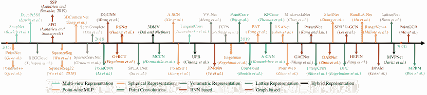

<!--yml

类别：未分类

日期：2024-09-06 20:03:21

-->

# [1912.12033] 深度学习在 3D 点云中的应用：综述

> 来源：[`ar5iv.labs.arxiv.org/html/1912.12033`](https://ar5iv.labs.arxiv.org/html/1912.12033)

# 深度学习在 3D 点云中的应用：综述

Yulan Guo^($\ast$)、Hanyun Wang^($\ast$)、Qingyong Hu^($\ast$)、Hao Liu^($\ast$)、Li Liu 和 Mohammed Bennamoun Y Guo 和 H. Liu 在中国中山大学电子与通信工程学院工作。H. Wang 在中国信息工程大学测绘与地图学院工作。Q. Hu 在英国牛津大学计算机科学系工作。L. Liu 在中国国防科技大学系统工程学院工作，同时也在芬兰奥卢大学机器视觉与信号分析中心工作。M. Bennamoun 在澳大利亚西澳大学计算机科学与软件工程系工作。*Y. Guo, H. Wang, Q. Hu 和 H. Liu 对这项工作做出了同等贡献，并且是共同第一作者。通讯作者：Yulan Guo（yulan.guo@nudt.edu.cn）。

###### 摘要

由于其在计算机视觉、自动驾驶和机器人等众多领域的广泛应用，点云学习最近引起了越来越多的关注。作为人工智能的主导技术，深度学习已成功应用于解决各种 2D 视觉问题。然而，由于深度神经网络处理点云所面临的独特挑战，点云上的深度学习仍处于起步阶段。最近，点云上的深度学习已变得非常活跃，提出了许多方法以解决该领域的不同问题。为了激发未来的研究，本文对点云深度学习方法的最新进展进行了全面回顾。它涵盖了三项主要任务，包括 3D 形状分类、3D 对象检测和跟踪，以及 3D 点云分割。同时，提供了在多个公开数据集上的比较结果，以及有洞察力的观察和启发性的未来研究方向。

###### 关键词：

深度学习，点云，3D 数据，形状分类，形状检索，对象检测，对象跟踪，场景流，实例分割，语义分割，部件分割。

## 1 引言

随着 3D 采集技术的迅速发展，3D 传感器变得越来越普及和经济实惠，包括各种类型的 3D 扫描仪、激光雷达（LiDAR）和 RGB-D 摄像头（如 Kinect、RealSense 和 Apple 深度摄像头）[1]。这些传感器获取的 3D 数据可以提供丰富的几何、形状和尺度信息[2, 3]。结合 2D 图像，3D 数据为机器提供了更好理解周围环境的机会。3D 数据在不同领域有着广泛的应用，包括自动驾驶、机器人技术、遥感和医疗治疗[4]。

3D 数据通常可以用不同的格式表示，包括深度图像、点云、网格和体积网格。作为一种常用格式，点云表示保留了 3D 空间中的原始几何信息，而没有任何离散化。因此，它是许多场景理解相关应用（如自动驾驶和机器人技术）的首选表示方式。近年来，深度学习技术主导了许多研究领域，如计算机视觉、语音识别和自然语言处理。然而，3D 点云的深度学习仍面临若干重大挑战[5]，如数据集规模小、高维性和 3D 点云的无结构性。在此基础上，本文集中分析了用于处理 3D 点云的深度学习方法。

对点云的深度学习在过去五年里越来越受到关注。也发布了若干公开可用的数据集，如 ModelNet [6]、ScanObjectNN [7]、ShapeNet [8]、PartNet [9]、S3DIS [10]、ScanNet [11]、Semantic3D [12]、ApolloCar3D [13]，以及 KITTI Vision Benchmark Suite [14, 15]。这些数据集进一步推动了对 3D 点云深度学习的研究，提出了越来越多的方法来解决与点云处理相关的各种问题，包括 3D 形状分类、3D 物体检测与跟踪、3D 点云分割、3D 点云配准、6 自由度姿态估计和 3D 重建[16, 17, 18]。也有一些关于 3D 数据深度学习的综述，如[19, 20, 21, 22]。然而，本文是首个专门关注点云理解的深度学习方法的研究。现有的 3D 点云深度学习方法的分类见图 1。

与现有文献相比，本研究的主要贡献可以总结如下：

1.  1.

    据我们所知，这是第一篇全面涵盖多个重要点云理解任务的深度学习方法的综述论文，包括 3D 形状分类、3D 目标检测与跟踪以及 3D 点云分割。

1.  2.

    与现有的综述 [20, 19] 相比，我们特别关注 3D 点云的深度学习方法，而非所有类型的 3D 数据。

1.  3.

    本文涵盖了深度学习在点云上的最新和最先进进展。因此，为读者提供了最前沿的方法。

1.  4.

    对几个公开数据集上现有方法的全面比较已提供（例如，见表格 II、III、IV、V），提供了简要总结和有见地的讨论。

图 1：3D 点云深度学习方法的分类。

表 I：现有数据集的总结，包括 3D 形状分类、3D 目标检测与跟踪以及 3D 点云分割。¹ 用于评估的类别数和注释类别数（括号中显示）。

| 3D 形状分类的数据集 |
| --- |
| 名称与参考文献 | 年份 | 样本数 | 类别数 | 训练集数量 | 测试集数量 | 类型 | 表示方式 |
| McGill Benchmark[23] | 2008 | 456 | 19 | 304 | 152 | 合成 | 网格 |
| 悉尼城市物体[24] | 2013 | 588 | 14 | - | - | 真实世界 | 点云 |
| ModelNet10[6] | 2015 | 4899 | 10 | 3991 | 605 | 合成 | 网格 |
| ModelNet40[6] | 2015 | 12311 | 40 | 9843 | 2468 | 合成 | 网格 |
| ShapeNet[8] | 2015 | 51190 | 55 | - | - | 合成 | 网格 |
| ScanNet[11] | 2017 | 12283 | 17 | 9677 | 2606 | 真实世界 | RGB-D |
| ScanObjectNN[7] | 2019 | 2902 | 15 | 2321 | 581 | 真实世界 | 点云 |
| 3D 目标检测与跟踪的数据集 |
| 名称与参考文献 | 年份 | 场景数 | 类别数 | 注释帧数量 | 3D 框数量 | 场景类型 | 传感器 |
| KITTI [14] | 2012 | 22 | 8 | 15K | 200K | 城市（驾驶） | RGB & LiDAR |
| SUN RGB-D [25] | 2015 | 47 | 37 | 5K | 65K | 室内 | RGB-D |
| ScanNetV2 [11] | 2018 | 1.5K | 18 | - | - | 室内 | RGB-D & 网格 |
| H3D [26] | 2019 | 160 | 8 | 27K | 1.1M | 城市（驾驶） | RGB & LiDAR |
| Argoverse [27] | 2019 | 113 | 15 | 44K | 993K | 城市（驾驶） | RGB & LiDAR |
| Lyft L5 [28] | 2019 | 366 | 9 | 46K | 1.3M | 城市（驾驶） | RGB & LiDAR |
| A*3D [29] | 2019 | - | 7 | 39K | 230K | 城市（驾驶） | RGB & LiDAR |
| Waymo Open [30] | 2020 | 1K | 4 | 200K | 12M | 城市（驾驶） | RGB & LiDAR |
| nuScenes [31] | 2020 | 1K | 23 | 40K | 1.4M | 城市（驾驶） | RGB & LiDAR |
| 3D 点云分割数据集 |
| 名称和参考 | 年份 | 点数 | 类别¹ | 扫描数 | 空间大小 | RGB | 传感器 |
| Oakland[32] | 2009 | 1.6M | 5(44) | 17 | - | 不适用 | MLS |
| ISPRS[33] | 2012 | 1.2M | 9 | - | - | 不适用 | ALS |
| Paris-rue-Madame[34] | 2014 | 20M | 17 | 2 | - | 不适用 | MLS |
| IQmulus[35] | 2015 | 300M | 8(22) | 10 | - | 不适用 | MLS |
| ScanNet[11] | 2017 | - | 20(20) | 1513 | 8$\times$4$\times$4 | 是 | RGB-D |
| S3DIS[10] | 2017 | 273M | 13(13) | 272 | 10$\times$5$\times$5 | 是 | Matterport |
| Semantic3D[12] | 2017 | 4000M | 8(9) | 15/15 | 250$\times$260$\times$80 | 是 | TLS |
| Paris-Lille-3D[36] | 2018 | 143M | 9(50) | 3 | 200$\times$280$\times$ 30 | 不适用 | MLS |
| SemanticKITTI[15] | 2019 | 4549M | 25(28) | 23201/20351 | 150$\times$100$\times$10 | 不适用 | MLS |
| Toronto-3D[37] | 2020 | 78.3M | 8(9) | 4 | 260$\times$350$\times$ 40 | 是 | MLS |
| DALES[38] | 2020 | 505M | 8(9) | 40 | 500$\times$500$\times$65 | 不适用 | ALS |

本论文的结构如下。第二部分介绍了各自任务的数据集和评估指标。第三部分回顾了 3D 形状分类的方法。第四部分提供了现有 3D 对象检测和跟踪方法的综述。第五部分介绍了点云分割方法的回顾，包括语义分割、实例分割和部件分割。最后，第六部分总结了本文。我们还提供了一个定期更新的项目页面：[`github.com/QingyongHu/SoTA-Point-Cloud`](https://github.com/QingyongHu/SoTA-Point-Cloud)。

## 2 背景

### 2.1 数据集

收集了大量数据集以评估深度学习算法在不同 3D 点云应用中的性能。表格 I 列出了一些典型的数据集，这些数据集用于 3D 形状分类、3D 物体检测与跟踪以及 3D 点云分割。特别是，这些数据集的属性也进行了总结。

对于 3D 形状分类，有两种类型的数据集：合成数据集 [6, 8] 和真实世界数据集 [11, 7]。合成数据集中的物体是完整的，没有任何遮挡和背景。相比之下，真实世界数据集中的物体在不同程度上被遮挡，并且一些物体受到背景噪声的污染。

对于 3D 物体检测和跟踪，有两种类型的数据集：室内场景 [25, 11] 和户外城市场景 [14, 28, 31, 30]。室内数据集中的点云要么是从密集的深度图转换而来，要么是从 3D 网格中采样的。户外城市数据集则设计用于自动驾驶，其中物体在空间上分隔良好，这些点云是稀疏的。

对于 3D 点云分割，这些数据集是通过不同类型的传感器获取的，包括移动激光扫描仪（MLS） [15, 34, 36]，空中激光扫描仪（ALS） [33, 38]，静态地面激光扫描仪（TLS） [12]，RGB-D 摄像头 [11] 和其他 3D 扫描仪 [10]。这些数据集可用于开发各种挑战的算法，包括类似的干扰物、形状不完整性和类别不平衡。

### 2.2 评估指标

提出了不同的评估指标来测试这些方法在各种点云理解任务中的表现。对于 3D 形状分类，整体准确率（OA）和平均类准确率（mAcc）是最常用的性能标准。‘OA’代表所有测试实例的平均准确率，而‘mAcc’代表所有形状类别的平均准确率。对于 3D 目标检测，平均精度（AP）是最常用的标准。它通过精度-召回曲线下的面积来计算。精度和成功率常用于评估 3D 单目标跟踪的整体性能。平均多目标跟踪准确率（AMOTA）和平均多目标跟踪精度（AMOTP）是评估 3D 多目标跟踪最常用的标准。对于 3D 点云分割，OA、平均交并比（mIoU）和平均类准确率（mAcc）[10, 12, 36, 15, 37]是性能评估最常用的标准。特别地，平均平均精度（mAP）[39]也用于 3D 点云的实例分割。

## 3 3D 形状分类

这种任务的方法通常先学习每个点的嵌入，然后使用聚合方法从整个点云中提取全局形状嵌入。最终，通过将全局嵌入输入到几个全连接层中实现分类。根据神经网络输入的数据类型，现有的 3D 形状分类方法可以分为基于多视角、基于体积和基于点的方法。图 2 展示了几个里程碑式的方法。

基于多视角的方法将非结构化点云投影到 2D 图像中，而基于体积的方法则将点云转换为 3D 体积表示。然后，利用成熟的 2D 或 3D 卷积网络实现形状分类。相比之下，基于点的方法直接在原始点云上进行操作，不进行任何体素化或投影。基于点的方法不会引入明显的信息损失，且变得越来越受欢迎。请注意，本文主要关注基于点的方法，但也包含一些基于多视角和基于体积的方法以保证完整性。

图 2：基于深度学习的 3D 形状分类方法的时间概述。

### 3.1 基于多视角的方法

这些方法首先将 3D 形状投影到多个视角中并提取视角特征，然后融合这些特征以实现准确的形状分类。如何将多个视角特征聚合成具有区分性的全局表示是这些方法面临的关键挑战。

MVCNN [40] 是一项开创性的工作，它将多视角特征通过最大池化简化为全局描述符。然而，最大池化只保留来自特定视角的最大元素，导致信息丢失。MHBN [41] 通过协调双线性池化整合局部卷积特征，以生成紧凑的全局描述符。杨等人 [42] 首次利用关系网络来挖掘一组视角之间的相互关系（例如，区域-区域关系和视角-视角关系），然后将这些视角聚合以获得具有判别性的 3D 对象表示。此外，还提出了若干其他方法 [43, 44, 45, 46] 来提高识别精度。与之前的方法不同，魏等人 [47] 在 View-GCN 中使用了有向图，将多个视角视为图节点。核心层由局部图卷积、非局部消息传递和选择性视角采样组成，随后应用于构建的图。最后，将所有层级的最大池化节点特征连接起来，形成全局形状描述符。

### 3.2 基于体积的方法

这些方法通常将点云体素化为 3D 网格，然后在体积表示上应用 3D 卷积神经网络（CNN）进行形状分类。

马图拉纳等人 [48] 引入了一种称为 VoxNet 的体积占用网络，以实现稳健的 3D 对象识别。吴等人 [6] 提出了基于卷积深度置信的 3D ShapeNets，学习来自各种 3D 形状的点的分布（这些形状由体素网格上的二元变量概率分布表示）。尽管取得了令人鼓舞的性能，但这些方法在处理密集 3D 数据时无法很好地扩展，因为计算和内存占用随着分辨率的立方增长。

为此，引入了一种分层和紧凑的结构（如八叉树）以减少这些方法的计算和内存开销。OctNet [49] 首先使用混合网格-八叉树结构分层划分点云，这种结构通过沿规则网格的几个浅层八叉树来表示场景。八叉树的结构使用位字符串表示法有效地编码，每个体素的特征向量通过简单的算术索引。Wang 等人 [50] 提出了一个基于八叉树的 CNN 用于 3D 形状分类。将最精细叶八叉体中采样的 3D 模型的平均法向量输入网络，并在 3D 形状表面占据的八叉体上应用 3D-CNN。与基于稠密输入网格的基线网络相比，OctNet 对于高分辨率点云的内存和运行时间要求要少得多。Le 等人 [51] 提出了一个名为 PointGrid 的混合网络，该网络整合了点和网格表示以进行高效的点云处理。每个嵌入体积网格单元内采样固定数量的点，这使得网络能够通过使用 3D 卷积提取几何细节。Ben-Shabat 等人 [52] 将输入点云转换为 3D 网格，进一步由 3D 修改 Fisher 向量（3DmFV）方法表示，然后通过传统的 CNN 架构学习全局表示。

### 3.3 基于点的方法

根据用于每个点特征学习的网络架构，这一类方法可以分为点状 MLP、基于卷积、基于图、基于分层数据结构的方法以及其他典型方法。

#### 3.3.1 点状 MLP 方法

这些方法使用几个共享的多层感知器（MLPs）独立建模每个点，然后通过对称聚合函数汇总全局特征，如图 3 所示。

图 3：PointNet 的轻量级架构。$n$ 表示输入点的数量，$M$ 表示每个点学习到的特征的维度。

典型的 2D 图像深度学习方法无法直接应用于 3D 点云，因为它们固有的数据不规则性。作为开创性工作，PointNet [5] 直接将点云作为输入，并通过对称函数实现排列不变性。具体而言，PointNet 通过几个 MLP 层独立学习逐点特征，并通过最大池化层提取全局特征。Deep sets [53] 通过对所有表示进行求和并应用非线性变换来实现排列不变性。由于在 PointNet [5] 中，特征是针对每个点独立学习的，因此无法捕捉点之间的局部结构信息。因此，Qi 等人 [54] 提出了一个分层网络 PointNet++，以从每个点的邻域捕捉精细的几何结构。作为 PointNet++层次结构的核心，其集合抽象层由三层组成：采样层、分组层和基于 PointNet 的学习层。通过堆叠多个集合抽象层，PointNet++ 从局部几何结构中学习特征，并逐层抽象局部特征。

由于其简单性和强大的表示能力，许多网络都是基于 PointNet [5] 开发的。Mo-Net [55] 的架构类似于 PointNet [5]，但其输入为有限集合的矩。Point Attention Transformers (PATs) [56] 通过自身的绝对位置和相对于邻居的相对位置来表示每个点，并通过 MLPs 学习高维特征。然后，使用 Group Shuffle Attention (GSA) 捕捉点之间的关系，并开发了一个排列不变、可微分且可训练的端到端 Gumbel 子集采样 (GSS) 层来学习层次特征。基于 PointNet++ [54]，PointWeb [57] 利用局部邻域的上下文通过自适应特征调整 (AFA) 改进点特征。Duan 等人 [58] 提出了一个结构关系网络 (SRN) 以通过 MLP 学习不同局部结构之间的结构关系特征。Lin 等人 [59] 通过为 PointNet 学习的输入和函数空间构建查找表来加速推理过程。在中等配置的机器上，ModelNet 和 ShapeNet 数据集上的推理时间分别比 PointNet 提快了 1.5 ms 和 32 倍。SRINet [60] 首先将点云投影以获得旋转不变的表示，然后利用基于 PointNet 的主干提取全局特征，并通过图基聚合提取局部特征。在 PointASNL 中，Yan 等人 [61] 利用自适应采样 (AS) 模块自适应地调整通过最远点采样 (FPS) 算法采样的点的坐标和特征，并提出了一个局部-非局部 (L-NL) 模块来捕捉这些采样点的局部和长程依赖关系。

#### 3.3.2 基于卷积的方法

与定义在 2D 网格结构（例如图像）上的卷积核相比，由于点云的不规则性，3D 点云的卷积核设计较为困难。根据卷积核的类型，目前的 3D 卷积方法可以分为连续卷积方法和离散卷积方法，如图 4 所示。

3D 连续卷积方法。这些方法在连续空间上定义卷积核，其中相邻点的权重与中心点的空间分布有关。

3D 卷积可以解释为在给定子集上的加权和。作为 RS-CNN [62] 的核心层，RS-Conv 以某一点周围的局部子集作为输入，卷积通过 MLP 实现，通过学习从低级关系（如欧几里得距离和相对位置）到局部子集中点之间高级关系的映射来完成。在 [63] 中，内核元素在单位球体中随机选择。然后使用基于 MLP 的连续函数来建立内核元素位置与点云之间的关系。在 DensePoint [64] 中，卷积定义为带有非线性激活函数的单层感知机（SLP）。通过连接所有前一层的特征来学习特征，以充分利用上下文信息。Thomas 等人 [65] 提出了用于 3D 点云的刚性和可变形内核点卷积（KPConv）算子，使用一组可学习的内核点。ConvPoint [66] 将卷积核分为空间部分和特征部分。空间部分的位置从单位球体中随机选择，权重函数通过简单的 MLP 进行学习。

一些方法还使用现有算法进行卷积。在 PointConv [67] 中，卷积被定义为相对于重要性采样的连续 3D 卷积的蒙特卡洛估计。卷积核由一个权重函数（通过 MLP 层学习）和一个密度函数（通过核化密度估计和 MLP 层学习）组成。为了提高内存和计算效率，3D 卷积进一步简化为两个操作：矩阵乘法和 2D 卷积。在相同的参数设置下，其内存消耗可减少约 64 倍。在 MCCNN [68] 中，卷积被认为是依赖于样本密度函数（通过 MLP 实现）的蒙特卡洛估计过程。然后使用泊松圆盘采样构建点云层次结构。该卷积算子可用于执行两个或多个采样方法之间的卷积，并能处理不同的采样密度。在 SpiderCNN [69] 中，提出了 SpiderConv，将卷积定义为 $k$ 个最近邻的阶跃函数和泰勒展开的乘积。阶跃函数通过编码局部测地距离来捕捉粗略的几何形状，而泰勒展开通过在立方体的顶点插值任意值来捕捉固有的局部几何变化。此外，还提出了一种基于径向基函数的卷积网络 PCNN [70] 用于 3D 点云。

图 4：点局部邻域的连续卷积和离散卷积示意图。（a）表示以点 $p$ 为中心的局部邻域 ${q_{i}}$；（b）和（c）分别表示 3D 连续卷积和离散卷积。

已提出几种方法来解决 3D 卷积网络面临的旋转等变问题。Esteves 等人 [71] 提出了 3D 球面 CNN，用于学习 3D 形状的旋转等变表示，输入为多值球面函数。通过在球面调和域中用锚点参数化谱来获得局部卷积滤波器。提出的张量场网络 [72] 将点卷积操作定义为可学习的径向函数和球面调和函数的乘积，这些函数对 3D 旋转、平移和排列局部等变。在 [73] 中，卷积基于球面互相关定义，并使用广义快速傅里叶变换 (FFT) 算法实现。基于 PCNN，SPHNet [74] 通过在体积函数卷积过程中引入球面调和核来实现旋转不变性。

为了加速计算速度，Flex-Convolution [75] 将卷积核的权重定义为 $k$ 个最近邻的标准标量积，可以使用 CUDA 加速。实验结果表明，在具有较少参数和较低内存消耗的小数据集上，其性能具有竞争力。

3D 离散卷积方法。这些方法在规则网格上定义卷积核，其中邻近点的权重与中心点的偏移量相关。

Hua 等人 [76] 将非均匀的 3D 点云转换为均匀网格，并在每个网格上定义卷积核。所提出的 3D 核将相同的权重分配给落入相同网格的所有点。对于给定点，从前一层计算所有位于相同网格上的邻近点的均值特征。然后，对所有网格的均值特征进行加权和求和，以产生当前层的输出。Lei 等人 [77] 通过将 3D 球形邻域区域划分为多个体积箱，并将每个箱与可学习的加权矩阵关联，定义了一个球形卷积核。球形卷积核对某一点的输出由其邻近点的加权激活值均值的非线性激活决定。在 GeoConv [78] 中，基于六个基底明确建模了一个点与其邻近点之间的几何关系。沿每个基底方向的边缘特征由与方向相关的可学习矩阵独立加权。这些与方向相关的特征随后根据给定点与其邻近点之间形成的角度进行聚合。对于给定点，其在当前层的特征定义为给定点及其邻近边缘特征在前一层的特征之和。

PointCNN [79] 通过 $\chi$-conv 变换（通过 MLP 实现）将输入点转换为潜在且可能的标准顺序，然后在变换后的特征上应用典型的卷积操作。通过将点特征插值到邻近的离散卷积核权重坐标，Mao 等人 [80] 提出了插值卷积操作符 InterpConv，用于测量输入点云与卷积核权重坐标之间的几何关系。Zhang 等人 [81] 提出了 RIConv 操作符以实现旋转不变性，该操作符以低级旋转不变几何特征作为输入，然后通过简单的分箱方法将卷积转化为 1D。A-CNN [82] 定义了一种环形卷积，通过在查询点的每个环上的邻居数组与卷积核的大小进行循环，学习局部子集中的邻近点之间的关系。

为了降低 3D CNN 的计算和内存成本，Kumawat 等人[83]提出了一个基于 3D 短时傅里叶变换（STFT）的矩形局部相位体积（ReLPV）块，以提取 3D 局部邻域中的相位，这显著减少了参数数量。在 SFCNN[84]中，点云被投影到具有对齐球面坐标的规则二十面体晶格上。然后在通过卷积-池化-卷积结构从球面晶格顶点及其邻居拼接的特征上进行卷积。SFCNN 对旋转和扰动具有抵抗力。

#### 3.3.3 基于图的方法

基于图的网络将点云中的每个点视为图的一个顶点，并基于每个点的邻居生成有向边。然后在空间或频谱域[85]中进行特征学习。一个典型的基于图的网络如图 5 所示。

图 5：基于图的网络的示意图。

空间域中的图形方法。这些方法在空间域中定义操作（例如，卷积和池化）。具体来说，卷积通常通过对空间邻居应用多层感知器（MLP）来实现，池化则用于通过汇聚每个点邻居的信息来生成一个新的粗化图。每个顶点的特征通常分配有坐标、激光强度或颜色，而每条边的特征则通常分配有连接两个点之间的几何属性。

作为开创性工作，Simonovsky 等人[85]将每个点视为图的一个顶点，并通过有向边将每个顶点连接到所有邻居。随后，提出了使用滤波器生成网络（如 MLP）的边条件卷积（ECC）。采用最大池化来聚合邻域信息，并基于 VoxelGrid[86]实现图的粗化。在 DGCNN[87]中，在特征空间中构建图，并在每一层网络之后动态更新。作为 EdgeConv 的核心层，MLP 被用作每条边的特征学习函数，并对与每个点的邻居相关的边特征应用通道级对称聚合。此外，LDGCNN[88]移除了转换网络，并将 DGCNN[87]中不同层的层次特征连接起来，以提高性能并减少模型大小。还提出了一种端到端的无监督深度自编码网络（即 FoldingNet[89]），使用向量化局部协方差矩阵和点坐标的拼接作为输入。受到 Inception[90]和 DGCNN[87]的启发，Hassani 和 Haley[91]提出了一种无监督多任务自编码器，以学习点和形状特征。编码器基于多尺度图构建，解码器使用包括聚类、自监督分类和重建在内的三个无监督任务，这些任务通过多任务损失共同训练。Liu 等人[92]提出了一种基于图卷积的动态点聚合模块（DPAM），将点聚合的过程（采样、分组和池化）简化为一个简单步骤，该步骤通过聚合矩阵和点特征矩阵的乘法实现。基于 PointNet 架构，通过堆叠多个 DPAM 构建了层次学习架构。与 PointNet++[54]的层次策略相比，DPAM 动态地利用点的关系，并在语义空间中聚合点。

为了利用局部几何结构，KCNet[93]基于核相关性学习特征。具体而言，一组可学习的点被定义为核，这些点表征局部结构的几何类型。然后，计算核与给定点邻域之间的亲和性。在 G3D[94]中，卷积被定义为邻接矩阵的多项式变体，池化则被定义为通过粗化矩阵对拉普拉斯矩阵和顶点矩阵进行乘法操作。ClusterNet[95]利用一个严格的旋转不变模块，从每个点的$k$个最近邻中提取旋转不变特征，并基于具有 Ward-linkage 标准的无监督凝聚层次聚类方法构建点云的层次结构[96]。每个子簇中的特征首先通过 EdgeConv 块学习，然后通过最大池化进行聚合。

为了解决当前数据结构化方法（如 FPS 和邻点查询）的时间消耗问题，Xu 等人[97]提出将体积基方法和点基方法的优点结合起来，以提高计算效率。在 ModelNet 分类任务上的实验表明，所提出的 Grid-GCN 网络的计算效率平均比其他模型快 5$\times$。

**谱域中的基于图的方法**。这些方法将卷积定义为谱滤波，具体实现为图信号与图拉普拉斯矩阵特征向量的乘法[98, 99]。

RGCNN[100]通过将每个点与点云中的所有其他点连接来构建图，并在每一层更新图拉普拉斯矩阵。为了使邻近顶点的特征更相似，在损失函数中加入了图信号平滑先验。为应对数据中多样化图拓扑带来的挑战，AGCN[101]中的 SGC-LL 层利用可学习的距离度量来参数化图上两个顶点之间的相似性。通过高斯核和学习到的距离对图获得的邻接矩阵进行归一化。HGNN[102]通过在超图上应用谱卷积来构建超边卷积层。

上述方法在完整图上操作。为了利用局部结构信息，Wang 等人 [103] 提出了一个端到端的光谱卷积网络 LocalSpecGCN，以在局部图上工作（该图由 $k$ 个最近邻构造）。该方法不需要任何离线计算图拉普拉斯矩阵和图粗化层级。在 PointGCN [104] 中，基于点云中的 $k$ 个最近邻构建图，每条边使用高斯核加权。卷积滤波器在图光谱域中定义为切比雪夫多项式。使用全局池化和多分辨率池化来捕捉点云的全局和局部特征。Pan 等人 [105] 提出了 3DTI-Net，通过在光谱域对 $k$ 个最近邻图应用卷积来实现。通过从相对欧几里得距离和方向距离中学习，达到对几何变换的平移不变性。

#### 3.3.4 基于分层数据结构的方法

这些网络基于不同的分层数据结构（例如，八叉树和 kd 树）构建。在这些方法中，点特征从叶节点到根节点沿树结构逐层学习。

Lei 等人 [77] 提出了一个使用球形卷积核的八叉树引导 CNN（详见第四部分）。网络的每一层对应于八叉树的一个层级，每层应用一个球形卷积核。当前层中神经元的值是由前一层中所有相关子节点的均值决定的。与基于八叉树的 OctNet [49] 不同，Kd-Net [106] 使用多个 K-d 树，并在每次迭代中采用不同的分裂方向。采用自下而上的方法，通过 MLP 从子节点的表示中计算非叶节点的表示。根节点的特征（描述整个点云）最终被输入到全连接层以预测分类分数。请注意，Kd-Net 根据节点的分裂类型在每一层共享参数。3DContextNet [107] 使用标准的平衡 K-d 树实现特征学习和聚合。在每一层中，首先通过 MLP 学习点特征，基于局部线索（建模局部区域内点之间的相互依赖性）和全局上下文线索（建模一个位置相对于所有其他位置的关系）。然后，非叶节点的特征通过 MLP 从其子节点计算并通过最大池化进行聚合。对于分类，该过程会重复，直到获得根节点。

SO-Net 网络的层次结构是通过执行点到节点的 $k$ 最近邻搜索 [108] 构建的。具体来说，使用了一种修改后的不变排列自组织映射（SOM）来建模点云的空间分布。通过一系列全连接层，从归一化的点到节点坐标中学习单个点特征。SOM 中每个节点的特征是通过通道级最大池化从与该节点关联的点特征中提取的。最终特征是通过类似于 PointNet [5] 的方法从节点特征中学习的。与 PointNet++ [54] 相比，SOM 的层次结构更高效，并且点云的空间分布被充分探索。

表 II: ModelNet10/40 基准上的 3D 形状分类结果比较。这里我们仅关注基于点的方法。‘#params’ 代表模型的参数数量，‘OA’ 代表所有测试实例的平均准确率，‘mAcc’ 代表表中所有形状类别的平均准确率。符号 ‘-’ 表示结果不可用。

| 方法 | 输入 | #params (M) |
| --- | --- | --- |

&#124; ModelNet40 &#124;

&#124; (OA) &#124;

|

&#124; ModelNet40 &#124;

&#124; (mAcc) &#124;

|

&#124; ModelNet10 &#124;

&#124; (OA) &#124;

|

&#124; ModelNet10 &#124;

&#124; (mAcc) &#124;

|

| Pointwise MLP 方法 | PointNet [5] | 坐标 | 3.48 | 89.2% | 86.2% | - | - |
| --- | --- | --- | --- | --- | --- | --- | --- |
| PointNet++ [54] | 坐标 | 1.48 | 90.7% | - | - | - |
| MO-Net [55] | 坐标 | 3.1 | 89.3% | 86.1% | - | - |
| Deep Sets [53] | 坐标 | - | 87.1% | - | - | - |
| PAT [56] | 坐标 | - | 91.7% | - | - | - |
| PointWeb [57] | 坐标 | - | 92.3% | 89.4% | - | - |
| SRN-PointNet++ [58] | 坐标 | - | 91.5% | - | - | - |
| JUSTLOOKUP [59] | 坐标 | - | 89.5% | 86.4% | 92.9% | 92.1% |
|  | PointASNL [61] | 坐标 | - | 92.9% | - | 95.7% | - |
|  | PointASNL [61] | 坐标+法线 | - | 93.2% | - | 95.9% | - |
| 基于卷积的方法 | Pointwise-CNN [76] | 坐标 | - | 86.1% | 81.4% | - | - |
| PointConv [67] | 坐标+法线 | - | 92.5% | - | - | - |
| MC 卷积 [68] | 坐标 | - | 90.9% | - | - | - |
| SpiderCNN [69] | 坐标+法线 | - | 92.4% | - | - | - |
| PointCNN [79] | 坐标 | 0.45 | 92.2% | 88.1% | - | - |
| Flex-Convolution [75] | 坐标 | - | 90.2% | - | - | - |
| PCNN [70] | 坐标 | 1.4 | 92.3% | - | 94.9% | - |
| Boulch [63] | 坐标 | - | 91.6% | 88.1% | - | - |
| RS-CNN [62] | 坐标 | - | 93.6% | - | - | - |
| 球面 CNNs [71] | 坐标 | 0.5 | 88.9% | - | - | - |
| GeoCNN [78] | 坐标 | - | 93.4% | 91.1% | - | - |
| $\Psi$-CNN [77] | 坐标 | - | 92.0% | 88.7% | 94.6% | 94.4% |
| A-CNN [82] | 坐标 | - | 92.6% | 90.3% | 95.5% | 95.3% |
| SFCNN [84] | 坐标 | - | 91.4% | - | - | - |
| SFCNN [84] | 坐标+法线 | - | 92.3% | - | - | - |
| DensePoint [64] | 坐标 | 0.53 | 93.2% | - | 96.6% | - |
| KPConv rigid [65] | 坐标 | - | 92.9% | - | - | - |
| KPConv deform [65] | 坐标 | - | 92.7% | - | - | - |
| InterpCNN [80] | 坐标 | 12.8 | 93.0% | - | - | - |
| ConvPoint [66] | 坐标 | - | 91.8% | 88.5% | - | - |
| 基于图的方法 | ECC [85] | 坐标 | - | 87.4% | 83.2% | 90.8% | 90.0% |
| KCNet [93] | 坐标 | 0.9 | 91.0% | - | 94.4% | - |
| DGCNN [87] | 坐标 | 1.84 | 92.2% | 90.2% | - | - |
| LocalSpecGCN [103] | 坐标+法线 | - | 92.1% | - | - | - |
| RGCNN [100] | 坐标+法线 | 2.24 | 90.5% | 87.3% | - | - |
| LDGCNN [88] | 坐标 | - | 92.9% | 90.3% | - | - |
| 3DTI-Net [105] | 坐标 | 2.6 | 91.7% | - | - | - |
| PointGCN [104] | 坐标 | - | 89.5% | 86.1% | 91.9% | 91.6% |
| ClusterNet [95] | 坐标 | - | 87.1% | - | - | - |
| Hassani et al. [91] | 坐标 | - | 89.1% | - | - | - |
| DPAM [92] | 坐标 | - | 91.9% | 89.9% | 94.6% | 94.3% |
|  | Grid-GCN [97] | 坐标 | - | 93.1% | 91.3% | 97.5% | 97.4% |
| 基于层次数据结构的方法 | KD-Net [106] | 坐标 | 2.0 | 91.8% | 88.5% | 94.0% | 93.5% |
| SO-Net [108] | 坐标 | - | 90.9% | 87.3% | 94.1% | 93.9% |
| SCN [109] | 坐标 | - | 90.0% | 87.6% | - | - |
| A-SCN [109] | 坐标 | - | 89.8% | 87.4% | - | - |
| 3DContextNet [107] | 坐标 | - | 90.2% | - | - | - |
| 3DContextNet [107] | 坐标+法线 | - | 91.1% | - | - | - |
| 其他方法 | 3DmFV-Net [52] | 坐标 | 4.6 | 91.6% | - | 95.2% | - |
| PVNet [110] | 坐标+视图 | - | 93.2% | - | - | - |
| PVRNet [111] | 坐标+视图 | - | 93.6% | - | - | - |
| 3DPointCapsNet [112] | 坐标 | - | 89.3% | - | - | - |
| DeepRBFNet [113] | 坐标 | 3.2 | 90.2% | 87.8% | - | - |
| DeepRBFNet [113] | 坐标+法线 | 3.2 | 92.1% | 88.8% | - | - |
| Point2Sequences [114] | 坐标 | - | 92.6% | 90.4% | 95.3% | 95.1% |
| RCNet [115] | 坐标 | - | 91.6% | - | 94.7% | - |
| RCNet-E [115] | 坐标 | - | 92.3% | - | 95.6% | - |

#### 3.3.5 其他方法

此外，还提出了许多其他方案。RBFNet [113] 通过聚合来自稀疏分布的径向基函数（RBF）核的特征，明确地建模点的空间分布，这些 RBF 核具有可学习的核位置和大小。3DPointCapsNet [112] 通过点独立特征的点对点多层感知器（MLP）和卷积层进行学习，并通过多个最大池化层提取全局潜在表示。基于无监督动态路由，学习到强大的代表性潜在胶囊。Qin 等 [116] 提出了一个端到端的无监督领域适配网络 PointDAN，用于 3D 点云表示。为了捕捉点云的语义特性，提出了一种自监督方法来重建点云，其部分已经被随机重新排列 [117]。Li 等 [118] 提出了一个自动增强框架 PointAugment，用于自动优化和增强点云样本以进行网络训练。具体来说，每个输入样本的形状变换和点位移被自动学习，网络通过交替优化和更新其增强器和分类器的可学习参数进行训练。受形状上下文 [119] 启发，Xie 等 [109] 提出了一个 ShapeContextNet 架构，通过结合亲和点选择和紧凑特征聚合，使用点积自注意力 [120] 进行软对齐操作。为了处理 3D 点云中的噪声和遮挡，Bobkov 等 [121] 将基于手工设计的点对点函数的 4D 旋转不变描述符输入到 4D 卷积神经网络中。Prokudin 等 [122] 首先从单位球体中随机采样一个均匀分布的基点集，然后将点云编码为到基点集的最小距离。因此，点云被转换为一个相对较小的固定长度向量。编码表示随后可以使用现有的机器学习方法进行处理。

RCNet [115] 利用标准 RNN 和 2D CNN 构建了一个对置换不变的 3D 点云处理网络。点云首先被划分为平行光束，并沿特定维度排序，然后每个光束被送入共享的 RNN。学习到的特征进一步输入高效的 2D CNN 以进行层次特征聚合。为了增强其描述能力，提出了 RCNet-E，通过不同的分区和排序方向来集成多个 RCNet。Point2Sequences [114] 是另一个基于 RNN 的模型，捕捉点云局部区域内不同区域之间的相关性。它将从多个尺度的局部区域学习到的特征视为序列，并将这些序列从所有局部区域输入 RNN 基的编码解码结构中以聚合局部区域特征。

一些方法还从 3D 点云和 2D 图像中学习。在 PVNet [110] 中，从多视角图像中提取的高级全局特征通过嵌入网络投影到点云的子空间中，并通过软注意力掩码与点云特征融合。最后，使用残差连接来融合特征和多视图特征以进行形状识别。随后，提出了 PVRNet [111]，通过关系评分模块来利用 3D 点云及其多个视图之间的关系。基于关系评分，原始的 2D 全局视图特征得到增强，以实现点单视图融合和点多视图融合。

### 3.4 总结

ModelNet10/40 [6] 数据集是用于 3D 形状分类的最常用数据集。表 II 显示了不同点基网络所取得的结果。可以得出以下几点观察：

+   $\bullet$

    点 wise MLP 网络通常作为其他类型网络学习点 wise 特征的基本构建块。

+   $\bullet$

    作为一种标准深度学习架构，基于卷积的网络可以在不规则的 3D 点云上实现优越的性能。应更加关注针对不规则数据的离散卷积网络和连续卷积网络。

+   $\bullet$

    由于其固有的强大处理不规则数据的能力，基于图的网络近年来受到了越来越多的关注。然而，将基于图的网络扩展到各种图结构的频谱域仍然具有挑战性。

## 4 3D 对象检测与跟踪

在本节中，我们将回顾现有的 3D 对象检测、3D 对象跟踪和 3D 场景流估计方法。

### 4.1 3D 对象检测

一个典型的 3D 物体检测器将场景的点云作为输入，并产生一个围绕每个检测到的物体的定向 3D 边界框，如图 6 所示。与图像中的物体检测 [123] 相似，3D 物体检测方法可以分为两类：区域提议基础的方法和单次检测方法。图 7 中展示了几个具有里程碑意义的方法。

(a) ScanNetV2 [11] 数据集

(b) KITTI [14] 数据集

图 6：3D 物体检测的示意图。(a) 和 (b) 最初展示在 [124] 和 [125] 中。

图 7：最相关的基于深度学习的 3D 物体检测方法的时间概览。

#### 4.1.1 区域提议基础的方法

这些方法首先提出几个可能包含物体的区域（也称为提议），然后提取区域特征以确定每个提议的类别标签。根据其物体提议生成方法，这些方法可以进一步分为三类：基于多视角、基于分割和基于截锥体的方法。

基于多视角的方法。这些方法融合来自不同视角地图（例如，LiDAR 前视图、鸟瞰图 (BEV) 和图像）的提议特征，以获得 3D 旋转框，如图 8(a) 所示。这些方法的计算成本通常很高。

图 8：三类区域提议基础的 3D 物体检测方法的典型网络。从上到下：(a) 基于多视角的方法，(b) 基于分割的方法，(c) 基于截锥体的方法。

陈等人 [4] 从 BEV 地图生成了一组高度准确的 3D 候选框，并将其投影到多个视角的特征图上（例如，LiDAR 前视图像，RGB 图像）。然后，他们结合这些来自不同视角的区域特征，以预测定向的 3D 边界框，如图 8(a)所示。尽管该方法在仅使用 300 个提议的情况下，在 0.25 的交并比（IoU）下实现了 99.1%的召回率，但其速度对于实际应用来说仍然过慢。因此，随后开发了几种方法，从两个方面改进多视角 3D 目标检测方法。

首先，提出了几种方法来高效融合不同模态的信息。为了生成具有高召回率的小物体 3D 提议，Ku 等人 [126] 提出了基于多模态融合的区域提议网络。他们首先通过裁剪和调整大小操作从 BEV 和图像视图中提取等大小的特征，然后使用逐元素均值池化融合这些特征。Liang 等人 [127] 利用连续卷积实现了不同分辨率下图像和 3D LiDAR 特征图的有效融合。具体而言，他们为 BEV 空间中的每个点提取了最接近的图像特征，然后使用双线性插值通过将图像特征投影到 BEV 平面来获得密集的 BEV 特征图。实验结果表明，密集的 BEV 特征图比离散的图像特征图和稀疏的 LiDAR 特征图更适合 3D 目标检测。Liang 等人 [128] 提出了一个用于端到端训练的多任务多传感器 3D 目标检测网络。具体而言，利用多个任务（例如，2D 目标检测、地面估计和深度补全）帮助网络学习更好的特征表示。学到的跨模态表示进一步被用于生成高度准确的目标检测结果。实验结果表明，该方法在 2D、3D 和 BEV 检测任务上实现了显著的改进，并在 TOR4D 基准测试 [129, 130] 中超越了之前的最先进方法。

其次，研究了不同的方法以提取输入数据的稳健表示。Lu 等人[39]通过引入空间通道注意力（SCA）模块，探索了多尺度上下文信息，该模块捕捉场景的全局和多尺度上下文，并突出有用的特征。他们还提出了一种扩展空间无采样（ESU）模块，通过结合多尺度低级特征获得丰富空间信息的高级特征，从而生成可靠的 3D 物体建议。尽管可以实现更好的检测性能，但上述的多视角方法由于对每个建议进行特征池化，导致运行时间较长。随后，Zeng 等人[131]使用预先 RoI 池化卷积来提高[4]的效率。具体而言，他们将大多数卷积操作移动到 RoI 池化模块之前进行。因此，对所有物体建议只执行一次 RoI 卷积。实验结果表明，该方法可以以 11.1 fps 的速度运行，比 MV3D[4]快 5 倍。

基于分割的方法。这些方法首先利用现有的语义分割技术去除大部分背景点，然后在前景点上生成大量高质量的建议以节省计算，如图 8(b)所示。与多视角方法[4, 126, 131]相比，这些方法实现了更高的物体召回率，并且更适用于复杂的场景，其中物体高度遮挡和拥挤。

Yang 等人[132] 使用 2D 分割网络来预测前景像素，并将其投影到点云中以去除大部分背景点。然后，他们在预测的前景点上生成提案，并设计了一种新的标准，称为 PointsIoU，以减少提案的冗余和模糊性。随后，Shi 等人[133] 提出了一个 PointRCNN 框架。具体而言，他们直接对 3D 点云进行分割以获得前景点，然后融合语义特征和局部空间特征来生成高质量的 3D 框。继[133]的区域提案网络（RPN）阶段之后，Jesus 等人[134] 提出了利用图卷积网络（GCN）进行 3D 目标检测的开创性工作。具体而言，引入了两个模块，通过图卷积来细化目标提案。第一个模块 R-GCN 利用提案中包含的所有点来实现每个提案的特征聚合。第二个模块 C-GCN 融合所有提案的每帧信息，通过利用上下文来回归准确的目标框。Sourabh 等人[135] 将点云投影到基于图像的分割网络的输出中，并将语义预测分数附加到点上。着色后的点被输入到现有的检测器[133, 136, 137]中，从而显著提高了性能。Yang 等人[138] 将每个点与一个球形锚点相关联。然后，使用每个点的语义分数来去除冗余锚点。因此，与之前的方法[132, 133]相比，这种方法在降低计算成本的同时实现了更高的召回率。此外，提出了一个 PointsPool 层，用于学习提案中内部点的紧凑特征，并引入了一个并行的 IoU 分支，以提高定位精度和检测性能。

基于截锥体的方法。这些方法首先利用现有的 2D 目标检测器生成 2D 候选区域，然后为每个 2D 候选区域提取一个 3D 截锥体提案，如图 8 所示(c)。虽然这些方法能够有效地提出 3D 目标的可能位置，但逐步的流程使得它们的性能受到 2D 图像检测器的限制。

F-PointNets [139] 是在这个方向上的开创性工作。它为每个 2D 区域生成一个截锥体提案，并应用 PointNet [5]（或 PointNet++ [54]）来学习每个 3D 截锥体的点云特征，以进行 amodal 3D 框估计。在后续工作中，Zhao 等人 [140] 提出了一个 Point-SENet 模块来预测一组缩放因子，这些因子进一步用于自适应突出有用特征并抑制信息量少的特征。他们还将 PointSIFT [141] 模块集成到网络中，以捕捉点云的方向信息，从而实现了对形状缩放的强鲁棒性。与 F-PointNets [139] 相比，这种方法在室内和室外数据集 [14，25] 上取得了显著改进。

Xu 等人 [142] 利用 2D 图像区域及其对应的截锥体点来准确回归 3D 框。为了融合图像特征和点云的全局特征，他们提出了一个全局融合网络，以直接回归框角位置。他们还提出了一个密集融合网络，用于预测每个角的点位偏移。Shin 等人 [143] 首先从 2D 图像中估计 2D 边界框和 3D 对象姿态，然后提取多个几何上可行的对象候选。这些 3D 候选被送入一个框回归网络，以预测准确的 3D 对象框。Wang 等人 [144] 为每个 2D 区域沿截锥体轴生成一系列截锥体，并应用 PointNet [5] 提取每个截锥体的特征。截锥体级特征被重新构建以生成 2D 特征图，然后输入到一个全卷积网络中进行 3D 框估计。这种方法在基于 2D 图像的方法中实现了最先进的性能，并在官方 KITTI 排行榜中排名第一。Johannes 等人 [145] 首先在 BEV 图上获得初步检测结果，然后基于 BEV 预测提取小点子集（也称为补丁）。应用局部优化网络来学习补丁的局部特征，以预测高度准确的 3D 边界框。

表 III：KITTI 测试 3D 检测基准上的比较 3D 对象检测结果。3D 边界框 IoU 阈值对汽车为 0.7，对行人和骑自行车者为 0.5。模态包括 LiDAR (L) 和图像 (I)。“E”，“M”和“H”分别表示简单、中等和困难的对象类别。为简便起见，我们省略了值后的“%”符号。符号“-”表示结果不可用。

| 方法 | 模态 | 速度 (fps) | 汽车 | 行人 | 骑自行车者 |
| --- | --- | --- | --- | --- | --- |
| E | M | H | E | M | H | E | M | H |
| 基于区域提案的方法 | 多视角方法 | MV3D [4] | L & I | 2.8 | 74.97 | 63.63 | 54.00 | - | - | - | - | - | - |
| AVOD [126] | L & I | 12.5 | 76.39 | 66.47 | 60.23 | 36.10 | 27.86 | 25.76 | 57.19 | 42.08 | 38.29 |
| ContFuse [127] | L & I | 16.7 | 83.68 | 68.78 | 61.67 | - | - | - | - | - | - |
| MMF [128] | L & I | 12.5 | 88.40 | 77.43 | 70.22 | - | - | - | - | - | - |
| SCANet [39] | L & I | 11.1 | 79.22 | 67.13 | 60.65 | - | - | - | - | - | - |
| RT3D [131] | L & I | 11.1 | 23.74 | 19.14 | 18.86 | - | - | - | - | - | - |
| 基于分割的方法 | IPOD [132] | L & I | 5.0 | 80.30 | 73.04 | 68.73 | 55.07 | 44.37 | 40.05 | 71.99 | 52.23 | 46.50 |
| PointRCNN [133] | L | 10.0 | 86.96 | 75.64 | 70.70 | 47.98 | 39.37 | 36.01 | 74.96 | 58.82 | 52.53 |
| PointRGCN [134] | L | 3.8 | 85.97 | 75.73 | 70.60 | - | - | - | - | - | - |
|  | PointPainting [135] | L & I | 2.5 | 82.11 | 71.70 | 67.08 | 50.32 | 40.97 | 37.87 | 77.63 | 63.78 | 55.89 |
|  | STD [138] | L | 12.5 | 87.95 | 79.71 | 75.09 | 53.29 | 42.47 | 38.35 | 78.69 | 61.59 | 55.30 |
| 基于视锥的方法 | F-PointNets [139] | L & I | 5.9 | 82.19 | 69.79 | 60.59 | 50.53 | 42.15 | 38.08 | 72.27 | 56.12 | 49.01 |
| SIFRNet [140] | L & I | - | - | - | - | - | - | - | - | - | - |
| PointFusion [142] | L & I | - | 77.92 | 63.00 | 53.27 | 33.36 | 28.04 | 23.38 | 49.34 | 29.42 | 26.98 |
| RoarNet [143] | L & I | 10.0 | 83.71 | 73.04 | 59.16 | - | - | - | - | - | - |
| F-ConvNet [144] | L & I | 2.1 | 87.36 | 76.39 | 66.69 | 52.16 | 43.38 | 38.80 | 81.98 | 65.07 | 56.54 |

|

&#124; Patch Refinement [145] &#124;

| L | 6.7 | 88.67 | 77.20 | 71.82 | - | - | - | - | - | - |
| --- | --- | --- | --- | --- | --- | --- | --- | --- | --- | --- |
| 其他方法 | 3D IoU loss [146] | L | 12.5 | 86.16 | 76.50 | 71.39 | - | - | - | - | - | - |

|

&#124; Fast Point R-CNN [147] &#124;

| L | 16.7 | 84.80 | 74.59 | 67.27 | - | - | - | - | - | - |
| --- | --- | --- | --- | --- | --- | --- | --- | --- | --- | --- |
|  | PV-RCNN [148] | L | 12.5 | 90.25 | 81.43 | 76.82 | - | - | - | - | - | - |
|  | VoteNet [124] | L | - | - | - | - | - | - | - | - | - | - |
|  |  | Feng et al. [149] | L | - | - | - | - | - | - | - | - | - | - |
|  |  | ImVoteNet [150] | L & I | - | - | - | - | - | - | - | - | - | - |
|  |  | Part-A² [151] | L | 12.5 | 87.81 | 78.49 | 73.51 | - | - | - | - | - | - |
| 单次方法 | BEV-based 方法 | PIXOR [129] | L | 28.6 | - | - | - | - | - | - | - | - | - |
| HDNET [152] | L | 20.0 | - | - | - | - | - | - | - | - | - |
| BirdNet [153] | L | 9.1 | 13.53 | 9.47 | 8.49 | 12.25 | 8.99 | 8.06 | 16.63 | 10.46 | 9.53 |
| 基于离散化的方法 | VeloFCN [154] | L | 1.0 | - | - | - | - | - | - | - | - | - |
| 3D FCN [155] | L | <0.2 | - | - | - | - | - | - | - | - | - |
| Vote3Deep [156] | L | - | - | - | - | - | - | - | - | - | - |
| 3DBN [157] | L | 7.7 | 83.77 | 73.53 | 66.23 | - | - | - | - | - | - |
| VoxelNet [136] | L | 2.0 | 77.47 | 65.11 | 57.73 | 39.48 | 33.69 | 31.51 | 61.22 | 48.36 | 44.37 |
| SECOND [158] | L | 26.3 | 83.34 | 72.55 | 65.82 | 48.96 | 38.78 | 34.91 | 71.33 | 52.08 | 45.83 |
| MVX-Net [159] | L & I | 16.7 | 84.99 | 71.95 | 64.88 | - | - | - | - | - | - |
| PointPillars [137] | L | 62.0 | 82.58 | 74.31 | 68.99 | 51.45 | 41.92 | 38.89 | 77.10 | 58.65 | 51.92 |
|  | SA-SSD [160] | L | 25.0 | 88.75 | 79.79 | 74.16 | - | - | - | - | - | - |

|

&#124; 基于点的方法 &#124;

&#124; 方法 &#124;

| 3DSSD [161] | L | 25.0 | 88.36 | 79.57 | 74.55 | 54.64 | 44.27 | 40.23 | 82.48 | 64.10 | 56.90 |
| --- | --- | --- | --- | --- | --- | --- | --- | --- | --- | --- | --- |
|  | 其他方法 | LaserNet [162] | L | 83.3 | - | - | - | - | - | - | - | - | - |
|  | LaserNet++ [163] | L & I | 26.3 | - | - | - | - | - | - | - | - | - |
|  |  | OHS-Dense [164] | L | 33.3 | 88.12 | 78.34 | 73.49 | 47.14 | 39.72 | 37.25 | 79.09 | 62.72 | 56.76 |
|  |  | OHS-Direct [164] | L | 33.3 | 86.40 | 77.74 | 72.97 | 51.29 | 44.81 | 41.13 | 77.70 | 63.16 | 57.16 |
|  |  | Point-GNN [125] | L | 1.7 | 88.33 | 79.47 | 72.29 | 51.92 | 43.77 | 40.14 | 78.60 | 63.48 | 57.08 |

其他方法。受轴对齐 IoU 在图像目标检测中的成功启发，Zhou 等人 [146] 将两个 3D 旋转边界框的 IoU 集成到几个最先进的检测器中 [158, 137, 133]，实现了性能的一致性提升。Chen 等人 [147] 提出了一个两阶段的网络架构，使用点云和体素表示。首先，点云被体素化并输入到 3D 骨干网络中以产生初始检测结果。其次，进一步利用初始预测的内部点特征进行框体精修。虽然这个设计在概念上简单，但它在保持 16.7 fps 的速度下，与 [133] 的性能相当。Shi 等人 [148] 提出了 PointVoxel-RCNN (PV-RCNN)，利用 3D 卷积网络和基于 PointNet 的集合抽象来学习点云特征。具体来说，输入的点云首先被体素化，然后输入到 3D 稀疏卷积网络中以生成高质量的提议。学习到的体素特征随后通过体素集合抽象模块编码成一小组关键点。此外，他们还提出了一个关键点到网格的 ROI 抽象模块，以捕捉丰富的上下文信息用于框体精修。实验结果表明，该方法显著超越了之前的方法，并在 KITTI 3D 检测基准的$Car$类别中排名第一¹¹1 排名指的是提交时间：2020 年 6 月 12 日。

受到基于霍夫投票的 2D 物体检测器的启发，Qi 等人 [124] 提出了 VoteNet，该方法通过点云直接投票以获得物体的虚拟中心点，并通过聚合投票特征生成一组高质量的 3D 物体提议。VoteNet 显著优于仅使用几何信息的前述方法，并在两个大型室内基准（即 ScanNet [11] 和 SUN RGB-D [25])上实现了最先进的性能。然而，对于部分遮挡的物体，虚拟中心点的预测不稳定。进一步地，Feng 等人 [149] 增加了一个方向向量的辅助分支，以提高虚拟中心点和 3D 候选框的预测准确性。此外，构建了一个提议之间的 3D 物体-物体关系图，以强调对准确物体检测有用的特征。Qi 等人 [150] 提出了一个 ImVoteNet 检测器，将 2D 物体检测线索（例如，几何和语义/纹理线索）融合到 3D 投票管道中。受到 3D 物体的真实边界框提供准确的物体内部部件位置的观察启发，Shi 等人 [151] 提出了 Part-$A^{2}$ Net，该网络由一个部件感知阶段和一个部件聚合阶段组成。部件感知阶段应用了类似 UNet 的 [165] 网络，利用稀疏卷积和稀疏反卷积来学习逐点特征，用于预测和粗略生成物体内部部件的位置。部件聚合阶段采用 RoI 感知池化来聚合预测的部件位置，以进行框的精细化。

#### 4.1.2 单次检测方法

这些方法直接预测类别概率，并使用单阶段网络回归物体的 3D 边界框。它们不需要区域提议生成和后处理，因此可以高速运行。根据输入数据的类型，单次检测方法可以分为三类：基于 BEV 的、基于离散化的和基于点的。

基于 BEV 的方法。这些方法主要以 BEV 表示作为输入。杨等人[129] 使用等间距的单元格离散化场景中的点云，并以类似的方式编码反射率，得到了一种规则的表示。然后应用全卷积网络（FCN）来估计物体的位置和朝向角度。该方法在 28.6 fps 的速度下超越了大多数单次检测方法（包括 VeloFCN [154]、3D-FCN [155] 和 Vote3Deep [156]）。随后，杨等人[152] 利用高清地图（HD）提供的几何和语义先验信息来提高[129] 的鲁棒性和检测性能。具体来说，他们从高清地图中获得了地面点的坐标，然后使用相对于地面的距离进行 BEV 表示，以修正由于道路坡度引起的平移方差。此外，他们将一个二值道路掩码与 BEV 表示在通道维度上连接，以聚焦于移动物体。由于高清地图并非随处可用，他们还提出了一个在线地图预测模块，用于从单个 LiDAR 点云估计地图先验。该地图感知方法在 TOR4D [129、130] 和 KITTI [14] 数据集上的表现显著优于基线。然而，它对不同密度点云的泛化性能较差。为解决此问题，Beltrán 等人[153] 提出了一个归一化地图，以考虑不同 LiDAR 传感器之间的差异。归一化地图是一个与 BEV 地图分辨率相同的 2D 网格，编码了每个单元格中包含的最大点数。结果表明，这种归一化地图显著提高了基于 BEV 的检测器的泛化能力。

离散化基础的方法。这些方法将点云转换为规则的离散表示，然后应用 CNN 预测物体的类别和 3D 盒子。

Li 等人 [154] 提出了第一种使用 FCN 进行 3D 对象检测的方法。他们将点云转换为 2D 点图，并使用 2D FCN 来预测物体的边界框和置信度。后来，他们 [155] 将点云离散化为一个具有长度、宽度、高度和通道维度的 4D 张量，并将基于 2D FCN 的检测技术扩展到 3D 领域进行 3D 对象检测。与 [154] 相比，基于 3D FCN 的方法 [155] 在准确性上提高了超过 20%，但由于 3D 卷积和数据的稀疏性，必然会消耗更多的计算资源。为了解决体素稀疏性问题，Engelcke 等人 [156] 利用了一种以特征为中心的投票方案，为每个非空体素生成一组投票，并通过累积投票来获得卷积结果。其计算复杂度与占用体素的数量成正比。Li 等人 [157] 通过堆叠多个稀疏 3D CNN 构建了一个 3D 主干网络。这种方法旨在通过充分利用体素的稀疏性来节省内存和加速计算。该 3D 主干网络提取丰富的 3D 特征用于对象检测，而不会引入过重的计算负担。

Zhou 等人 [136] 提出了一个基于体素的端到端可训练框架 VoxelNet。他们将点云划分为等间距的体素，并将每个体素中的特征编码为 4D 张量。然后连接一个区域提议网络以生成检测结果。尽管性能强大，但由于体素的稀疏性和 3D 卷积，该方法非常缓慢。随后，Yan 等人 [158] 使用稀疏卷积网络 [166] 提高了 [136] 的推理效率。他们还提出了一种正弦误差角度损失来解决 0 和 $\pi$ 之间的方向模糊问题。Sindagi 等人 [159] 通过在早期阶段融合图像和点云特征扩展了 VoxelNet。具体来说，他们将 [136] 生成的非空体素投影到图像中，并使用预训练网络为每个投影体素提取图像特征。这些图像特征随后与体素特征连接，以生成准确的 3D 边界框。与 [136] 和 [158] 相比，该方法能够有效利用多模态信息来减少假阳性和假阴性。Lang 等人 [137] 提出了一个名为 PointPillars 的 3D 目标检测器。该方法利用 PointNet [5] 学习以垂直列（Pillars）组织的点云特征，并将学习到的特征编码为伪图像。然后应用 2D 目标检测管道来预测 3D 边界框。PointPillars 在平均精度 (AP) 方面优于大多数融合方法（包括 MV3D [4]、RoarNet [143] 和 AVOD [126]）。此外，PointPillars 在 3D 和 BEV KITTI [14] 基准测试中均能以 62 fps 的速度运行，使其非常适合实际应用。

受限于现有单次检测器的逐步下采样特征图中不可避免地丢失了点云的部分空间信息的观察，He 等人 [160] 提出了一个 SA-SSD 检测器，利用细粒度的结构信息来提高定位精度。具体来说，他们首先将点云转换为张量，并将其输入主干网络以提取多阶段特征。此外，还采用了一个带有点级监督的辅助网络来指导特征学习点云的结构。实验结果表明，SA-SSD 在 KITTI BEV 检测基准的 $Car$ 类别中排名第一²²2 排名指的是提交时间：2020 年 6 月 12 日。

基于点的方法。这些方法直接以原始点云作为输入。3DSSD [161] 是在这一方向上的开创性工作。它引入了一种融合采样策略，用于距离-FPS (D-FPS) 和特征-FPS (F-FPS)，以去除耗时的特征传播 (FP) 层和 [133] 中的细化模块。然后，使用候选生成 (CG) 层充分利用代表性点，这些点进一步输入到无锚回归头，并带有 3D 中心度标签，以预测 3D 物体框。实验结果表明，3DSSD 在保持 25 fps 的速度下，优于两阶段的基于点的方法 PointRCNN [133]。

其他方法。Meyer 等人 [162] 提出了一个高效的 3D 物体检测器，称为 LaserNet。该方法预测每个点的边界框概率分布，然后将这些每点分布组合以生成最终的 3D 物体框。此外，点云的密集范围视图 (RV) 表示被用作输入，并提出了一种快速均值漂移算法以减少每点预测产生的噪声。LaserNet 在 0 到 50 米范围内实现了最先进的性能，其运行时间显著低于现有方法。Meyer 等人 [163] 随后扩展了 LaserNet [162]，利用了 RGB 图像提供的密集纹理（例如，50 到 70 米）。具体而言，他们通过将 3D 点云投影到 2D 图像上，将 LiDAR 点与图像像素关联，并利用这种关联将 RGB 信息融合到 3D 点中。他们还考虑了 3D 语义分割作为辅助任务，以学习更好的表示。该方法在长距离（例如，50 到 70 米）的物体检测和语义分割上取得了显著的改进，同时保持了 LaserNet 的高效性。受到孤立物体部分的点可以提供有关物体位置和方向丰富信息的观察启发，Chen 等人 [164] 提出了一个新颖的 $Hotspot$ 表示法和第一个基于热点的无锚检测器。具体而言，原始点云首先被体素化，然后输入到主干网络中生成 3D 特征图。这些特征图被用来同时分类热点和预测 3D 边界框。注意，热点是在主干网络的最后一层卷积层分配的。实验结果表明，该方法在处理稀疏点云时表现出色，并且性能可与其他方法相媲美。Shi 等人 [125] 提出了一个图神经网络 Point-GNN，以从 LiDAR 点云中检测 3D 物体。他们首先将输入点云编码为固定半径的邻近图，然后将图输入到 Point-GNN 中，以预测物体的类别和框。

表 IV：KITTI 测试 BEV 检测基准上的比较 3D 对象检测结果。3D 边界框 IoU 阈值为汽车 0.7，行人和骑车人 0.5。模态包括激光雷达（L）和图像（I）。‘E’，‘M’ 和 ‘H’ 分别表示易、适中和难的对象类别。为简便起见，我们省略了值后的‘%’。符号 ‘-’ 表示结果不可用。

| 方法 | 模态 | 速度 (fps) | 汽车 | 行人 | 骑车人 |
| --- | --- | --- | --- | --- | --- |
| E | M | H | E | M | H | E | M | H |
| 基于区域提议的方法 | 多视角方法 | MV3D [4] | L & I | 2.8 | 86.62 | 78.93 | 69.80 | - | - | - | - | - | - |
| AVOD [126] | L & I | 12.5 | 89.75 | 84.95 | 78.32 | 42.58 | 33.57 | 30.14 | 64.11 | 48.15 | 42.37 |
| ContFuse [127] | L & I | 16.7 | 94.07 | 85.35 | 75.88 | - | - | - | - | - | - |
| MMF [128] | L & I | 12.5 | 93.67 | 88.21 | 81.99 | - | - | - | - | - | - |
| SCANet [39] | L & I | 11.1 | 90.33 | 82.85 | 76.06 | - | - | - | - | - | - |
| RT3D [131] | L & I | 11.1 | 56.44 | 44.00 | 42.34 | - | - | - | - | - | - |
| 基于分割的方法 | IPOD [132] | L & I | 5.0 | 89.64 | 84.62 | 79.96 | 60.88 | 49.79 | 45.43 | 78.19 | 59.40 | 51.38 |
| PointRCNN [133] | L | 10.0 | 92.13 | 87.39 | 82.72 | 54.77 | 46.13 | 42.84 | 82.56 | 67.24 | 60.28 |
| PointRGCN [134] | L | 3.8 | 91.63 | 87.49 | 80.73 | - | - | - | - | - | - |
|  | PointPainting [135] | L & I | 2.5 | 92.45 | 88.11 | 83.36 | 58.70 | 49.93 | 46.29 | 83.91 | 71.54 | 62.97 |
|  | STD [138] | L | 12.5 | 94.74 | 89.19 | 86.42 | 60.02 | 48.72 44.55 | 81.36 | 67.23 | 59.35 |  |
| 基于视锥体的方法 | F-PointNets [139] | L & I | 5.9 | 91.17 | 84.67 | 74.77 | 57.13 | 49.57 | 45.48 | 77.26 | 61.37 | 53.78 |
| SIFRNet [140] | L & I | - | - | - | - | - | - | - | - | - | - |
| PointFusion [142] | L & I | - | - | - | - | - | - | - | - | - | - |
| RoarNet [143] | L & I | 10.0 | 88.20 | 79.41 | 70.02 | - | - | - | - | - | - |
| F-ConvNet [144] | L & I | 2.1 | 91.51 | 85.84 | 76.11 | 57.04 | 48.96 | 44.33 | 84.16 | 68.88 | 60.05 |

|

&#124; Patch Refinement [145] &#124;

| L | 6.7 | 92.72 | 88.39 | 83.19 | - | - | - | - | - | - |
| --- | --- | --- | --- | --- | --- | --- | --- | --- | --- | --- |
| 其他方法 | 3D IoU 损失 [146] | L | 12.5 | 91.36 | 86.22 | 81.20 | - | - | - | - | - | - |

|

&#124; Fast Point R-CNN [147] &#124;

| L | 16.7 | 90.76 | 85.61 | 79.99 | - | - | - | - | - | - |
| --- | --- | --- | --- | --- | --- | --- | --- | --- | --- | --- |
|  | PV-RCNN [148] | L | 12.5 | 94.98 | 90.65 | 86.14 | - | - | - | 82.49 | 68.89 | 62.41 |
|  | VoteNet [124] | L | - | - | - | - | - | - | - | - | - | - |
|  |  | Feng et al. [149] | L | - | - | - | - | - | - | - | - | - |
|  |  | ImVoteNet [150] | L & I | - | - | - | - | - | - | - | - | - | - |
|  |  | Part-A² [151] | L | 12.5 | 91.70 | 87.79 | 84.61 | - | - | - | 81.91 | 68.12 | 61.92 |
| 单次方法 | BEV-based 方法 | PIXOR [129] | L | 28.6 | 83.97 | 80.01 | 74.31 | - | - | - | - | - | - |
| HDNET [152] | L | 20.0 | 89.14 | 86.57 | 78.32 | - | - | - | - | - | - |
| BirdNet [153] | L | 9.1 | 76.88 | 51.51 | 50.27 | 20.73 | 15.80 | 14.59 | 36.01 | 23.78 | 21.09 |
| 离散化方法 | VeloFCN [154] | L | 1.0 | 0.02 | 0.14 | 0.21 | - | - | - | - | - | - |
| 3D FCN [155] | L | <0.2 | 70.62 | 61.67 | 55.61 | - | - | - | - | - | - |
| Vote3Deep [156] | L | - | - | - | - | - | - | - | - | - | - |
| 3DBN [157] | L | 7.7 | 89.66 | 83.94 | 76.50 | - | - | - | - | - | - |
| VoxelNet [136] | L | 2.0 | 89.35 | 79.26 | 77.39 | 46.13 | 40.74 | 38.11 | 66.70 | 54.76 | 50.55 |
| SECOND [158] | L | 26.3 | 89.39 | 83.77 | 78.59 | 55.99 | 45.02 | 40.93 | 76.50 | 56.05 | 49.45 |
| MVX-Net [159] | L & I | 16.7 | 92.13 | 86.05 | 78.68 | - | - | - | - | - | - |
| PointPillars [137] | L | 62.0 | 90.07 | 86.56 | 82.81 | 57.60 | 48.64 | 45.78 | 79.90 | 62.73 | 55.58 |
|  | SA-SSD [160] | L | 25.0 | 95.03 | 91.03 | 85.96 | - | - | - | - | - | - |

|

&#124; 基于点的方法 &#124;

&#124; 方法 &#124;

| 3DSSD [161] | L | 25.0 | 92.66 | 89.02 | 85.86 | 60.54 | 49.94 | 45.73 | 85.04 | 67.62 | 61.14 |
| --- | --- | --- | --- | --- | --- | --- | --- | --- | --- | --- | --- |
|  | 其他方法 | LaserNet [162] | L | 83.3 | 79.19 | 74.52 | 68.45 | - | - | - | - | - | - |
|  | LaserNet++ [163] | L & I | 26.3 | - | - | - | - | - | - | - | - | - |
|  |  | OHS-Dense [164] | L | 33.3 | 93.73 | 88.11 | 84.98 | 50.87 | 44.59 | 42.14 | 82.13 | 66.86 | 60.86 |
|  |  | OHS-Direct [164] | L | 33.3 | 93.59 | 87.95 | 83.21 | 55.90 | 49.48 | 45.79 | 79.66 | 67.20 | 61.04 |
|  |  | Point-GNN [125] | L | 1.7 | 93.11 | 89.17 | 83.90 | 55.36 | 47.07 | 44.61 | 81.17 | 67.28 | 59.67 |

### 4.2 3D 目标跟踪

给定对象在第一帧的位置，目标跟踪的任务是估计其在后续帧中的状态 [167, 168]。由于 3D 目标跟踪可以利用点云中的丰富几何信息，预计可以克服图像跟踪所面临的一些缺点，包括遮挡、光照和尺度变化。

受到 Siamese 网络 [169] 在基于图像的目标跟踪成功的启发，Giancola 等人 [170] 提出了一个带有形状完成正则化的 3D Siamese 网络。具体而言，他们首先使用卡尔曼滤波器生成候选框，然后利用形状正则化将模型和候选框编码为紧凑表示。接着，使用余弦相似度在下一帧中搜索跟踪目标的位置。这种方法可以作为目标跟踪的替代方案，显著优于大多数 2D 目标跟踪方法，包括 $\mathrm{STAPLE_{CA}}$ [171] 和 SiamFC [169]。为了有效搜索目标对象，Zarzar 等人 [172] 利用 2D Siamese 网络在 BEV 表示上生成大量粗略的目标候选框。然后，他们通过利用 3D Siamese 网络中的余弦相似度对候选框进行细化。这种方法在精度（即提高 18%）和成功率（即提高 12%）方面显著优于 [170]。Simon 等人 [173] 提出了一个用于语义点云的 3D 目标检测和跟踪架构。他们首先通过融合 2D 视觉语义信息生成体素化的语义点云，然后利用时间信息来提高多目标跟踪的准确性和鲁棒性。此外，他们引入了一种强大且简化的评估指标（即缩放-旋转-平移评分（SRFs）），以加快训练和推理速度。Complexer-YOLO 达到了令人满意的跟踪性能，并且仍能实时运行。此外，Qi 等人 [174] 提出了一个 Point-to-Box (P2B) 网络。他们将模板和搜索区域输入主干网络以获得其种子。搜索区域的种子通过目标特定特征进行增强，然后通过霍夫投票回归潜在目标中心。实验结果表明，P2B 在运行速度为 40 fps 的情况下，相比于 [170] 提高了超过 10%。

图 9：两个 KITTI 点云之间的 3D 场景流，最初显示在 [175] 中。点云 $\mathcal{X}$、$\mathcal{Y}$ 及 $\mathcal{X}$ 的平移点云分别用红色、绿色和蓝色突出显示。

### 4.3 3D 场景流估计

给定两个点云$\mathcal{X}$和$\mathcal{Y}$，3D 场景流$D=\{d_{i}\}^{N}$描述了每个点$x_{i}$在$\mathcal{X}$中的移动到$\mathcal{Y}$中的对应位置$x_{i}^{\prime}$，其中$x_{i}^{\prime}=x_{i}+d_{i}$。图 9 显示了两个 KITTI 点云之间的 3D 场景流。类似于 2D 视觉中的光流估计，一些方法已经开始从点云序列中学习有用的信息（例如 3D 场景流、时空信息）。

刘等人[175]提出了 FlowNet3D 来直接从一对连续的点云中学习场景流。FlowNet3D 通过流嵌入层学习点级特征和运动特征。然而，FlowNet3D 存在两个问题。首先，一些预测的运动向量在方向上与真实值有显著差异。其次，将 FlowNet 应用于非静态场景（尤其是由可变形物体主导的场景）是困难的。为了解决这个问题，王等人[176]引入了余弦距离损失来最小化预测和真实值之间的角度。此外，他们还提出了一种点到平面的距离损失，以提高刚性和动态场景的准确性。实验结果表明，这两个损失项将 FlowNet3D 的准确性从 57.85%提高到 63.43%，并加速和稳定了训练过程。顾等人[177]提出了一种层次化的 Permutohedral Lattice FlowNet（HPLFlowNet）来直接从大规模点云中估计场景流。提出了几种双边卷积层，以从原始点云中恢复结构信息，同时降低计算成本。

为了有效处理序列点云，Fan 和 Yang [178] 提出了 PointRNN、PointGRU 和 PointLSTM 网络及一个序列到序列模型来跟踪移动点。PointRNN、PointGRU 和 PointLSTM 能够捕捉空间-时间信息并建模动态点云。类似地，Liu 等人 [179] 提出了 MeteorNet 以直接从动态点云中学习表示。这种方法学习从时空邻域点中聚合信息。进一步引入了直接分组和链式流分组来确定时间邻域。然而，前述方法的性能受限于数据集的规模。Mittal 等人 [180] 提出了两种自监督损失来在大型未标记数据集上训练他们的网络。他们的主要思想是，一个鲁棒的场景流估计方法在前向和后向预测中都应有效。由于场景流注释不可用，预测变换点的最近邻被视为伪地面真实值。然而，真实的地面真实值可能与最近的点不同。为避免此问题，他们计算了反向的场景流并提出了一个循环一致性损失，将点转换到原始位置。实验结果表明，这种自监督方法超越了基于监督学习方法的最新性能。

### 4.4 摘要

KITTI [14] 基准是自动驾驶领域最具影响力的数据集之一，并在学术界和工业界广泛使用。表 III 和 IV 展示了不同检测器在 KITTI 测试 3D 基准上的结果。可以做出以下观察：

+   $\bullet$

    区域提议方法是这两类方法中研究最频繁的，并且在 KITTI 测试 3D 和 BEV 基准上大幅超越单次检测方法。

+   $\bullet$

    现有的 3D 物体检测器存在两个限制。首先，现有方法的远程检测能力相对较差。其次，如何充分利用图像中的纹理信息仍然是一个未解决的问题。

+   $\bullet$

    多任务学习是 3D 物体检测的未来方向。例如，MMF [128] 通过结合多个任务来学习跨模态表示，从而实现了最先进的检测性能。

+   $\bullet$

    3D 物体跟踪和场景流估计是新兴的研究主题，自 2019 年以来逐渐受到越来越多的关注。

## 5 3D 点云分割

3D 点云分割需要理解每个点的全球几何结构和细粒度细节。根据分割的粒度，3D 点云分割方法可以分为三类：语义分割（场景级别）、实例分割（对象级别）和部件分割（部件级别）。

图 10：基于深度学习的最相关 3D 语义分割方法的时间概述。

### 5.1 3D 语义分割

给定一个点云，语义分割的目标是根据点的语义意义将其分为若干子集。类似于 3D 形状分类的分类法（第三部分），语义分割有四种范式：投影基、离散化基、点基和混合方法。

投影和离散化方法的第一步是将点云转换为中间的规则表示形式，如多视图 [181, 182]、球面 [183, 184, 185]、体积 [186, 187, 166]、置换对称格 [188, 189] 和混合表示 [190, 191]，如图 11 所示。中间分割结果然后被投影回原始点云。相比之下，点基方法直接作用于不规则点云。几种具有代表性的方法如图 10 所示。

#### 5.1.1 投影基方法

这些方法通常将 3D 点云投影到 2D 图像中，包括多视图和球面图像。

多视角表示。Lawin 等人 [181] 首先将 3D 点云投影到多个虚拟摄像机视角下的 2D 平面上。然后，使用多流 FCN 预测合成图像上的像素级评分。每个点的最终语义标签通过融合不同视角的重投影评分获得。类似地，Boulch 等人 [182] 首先使用多个摄像机位置生成点云的多个 RGB 和深度快照。随后，他们在这些快照上使用 2D 分割网络进行像素级标注。来自 RGB 和深度图像的预测评分通过残差校正进一步融合 [192]。基于点云从局部欧几里得表面采样的假设，Tatarchenko 等人 [193] 引入了切线卷积用于密集点云分割。该方法首先将每个点周围的局部表面几何投影到虚拟切线平面上。然后，直接在表面几何上进行切线卷积操作。该方法显示出极大的可扩展性，能够处理具有数百万点的大规模点云。总体而言，多视角分割方法对视点选择和遮挡非常敏感。此外，由于投影步骤不可避免地引入信息丢失，这些方法尚未充分利用潜在的几何和结构信息。

图 11：中间表示的示意图。(a) 和 (b) 分别最初展示在 [182] 和 [183] 中。

球面表示。为了实现 3D 点云的快速和准确分割，Wu 等人 [183] 提出了基于 SqueezeNet [194] 和条件随机场（CRF）的端到端网络。为了进一步提高分割准确性，引入了 SqueezeSegV2 [184] 通过利用无监督领域适应管道来解决领域迁移问题。Milioto 等人 [185] 提出了 RangeNet++ 用于 LiDAR 点云的实时语义分割。首先将 2D 范围图像的语义标签转移到 3D 点云中，然后使用高效的 GPU 加速 KNN 基后处理步骤来缓解离散化误差和模糊推断输出的问题。与单视角投影相比，球面投影保留了更多的信息，并适用于 LiDAR 点云的标注。然而，这种中间表示不可避免地带来了离散化误差和遮挡等几个问题。

#### 5.1.2 基于离散化的方法

这些方法通常将点云转换为密集/稀疏离散表示，例如体积表示和稀疏置换晶格。

密集离散化表示。早期方法通常将点云体素化为密集网格，然后利用标准 3D 卷积。Huang 等人[195]首先将点云分为一组占用体素，然后将这些中间数据输入到全 3D CNN 进行体素级分割。最后，将体素内的所有点分配相同的语义标签。该方法的性能受到体素粒度和点云分割导致的边界伪影的严重限制。此外，Tchapmi 等人[196]提出了 SEGCloud，以实现细粒度和全局一致的语义分割。该方法引入了一种确定性三线性插值，将 3D-FCNN [197]生成的粗体素预测映射回点云，然后使用全连接 CRF（FC-CRF）来强制执行这些推断的每点标签的空间一致性。Meng 等人[186]引入了一种基于核的插值变分自编码器架构，以编码每个体素内的局部几何结构。RBF 被用于每个体素，以获得连续表示并捕捉每个体素中的点分布。进一步使用 VAE 将每个体素内的点分布映射到紧凑的潜在空间中。然后，利用对称群和等效 CNN 来实现鲁棒的特征学习。

由于 3D CNN 的良好可扩展性，基于体积的网络可以在具有不同空间大小的点云上进行训练和测试。在全卷积点网络（FCPN）[187]中，不同层次的几何关系首先从点云中分层抽象出来，然后使用 3D 卷积和加权平均池化来提取特征并结合远程依赖。这种方法可以处理大规模点云，并且在推理过程中具有良好的可扩展性。Dai 等人[198]提出了 ScanComplete，以实现 3D 扫描补全和每体素语义标注。该方法利用了全卷积神经网络的可扩展性，并能在训练和测试过程中适应不同的输入数据大小。使用了粗到细的策略来分层提高预测结果的分辨率。

总体来说，体积表示自然地保留了 3D 点云的邻域结构。其规则的数据格式也允许直接应用标准 3D 卷积。这些因素导致了该领域性能的稳定提升。然而，体素化步骤固有地引入了离散化伪影和信息损失。通常，高分辨率会导致高内存和计算成本，而低分辨率则会导致细节丢失。在实践中选择合适的网格分辨率并非易事。

稀疏离散化表示。体积表示本质上是稀疏的，因为非零值的数量只占很小的百分比。因此，在空间稀疏数据上应用密集卷积神经网络效率低下。为此，Graham 等人[166] 提出了基于索引结构的子流形稀疏卷积网络。该方法通过限制卷积输出仅与占用体素相关，显著减少了内存和计算成本。同时，其稀疏卷积还可以控制提取特征的稀疏性。这种子流形稀疏卷积适用于高维和空间稀疏数据的高效处理。此外，Choy 等人[199] 提出了一个名为 MinkowskiNet 的 4D 时空卷积神经网络，用于 3D 视频感知。提出了一种广义稀疏卷积，以有效处理高维数据。进一步地，应用了三边形-平稳条件随机场以强制一致性。

另一方面，苏等人[188] 提出了基于双边卷积层（BCLs）的稀疏晶格网络（SPLATNet）。该方法首先将原始点云插值到一个置换稀疏晶格，然后在稀疏晶格的占用部分应用 BCL 进行卷积。滤波后的输出再插值回原始点云。此外，该方法还允许灵活地联合处理多视角图像和点云。进一步地，Rosu 等人[189] 提出了 LatticeNet，以实现对大规模点云的高效处理。还引入了一个数据依赖的插值模块，称为 DeformsSlice，用于将晶格特征回投影到点云中。

#### 5.1.3 混合方法

为了进一步利用所有可用信息，已经提出了几种方法来从 3D 扫描中学习多模态特征。Dai 和 Nießner[190] 提出了一个联合 3D-多视角网络，以结合 RGB 特征和几何特征。使用 3D CNN 流和几个 2D 流来提取特征，并提出了一种可微分的回投影层，用于共同融合学习到的 2D 嵌入和 3D 几何特征。此外，Chiang 等人[200] 提出了一个统一的基于点的框架，从点云中学习 2D 纹理外观、3D 结构和全局上下文特征。该方法直接应用基于点的网络，从稀疏采样点集中提取局部几何特征和全局上下文，而无需任何体素化。Jaritz 等人[191] 提出了 Multi-view PointNet (MVPNet)，用于聚合来自 2D 多视角图像的外观特征和规范点云空间中的空间几何特征。

#### 5.1.4 基于点的方法

基于点的网络直接处理不规则的点云。然而，点云是无序且无结构的，使得直接应用标准 CNN 变得不可行。为此，开创性工作 PointNet [5] 被提出，使用共享的 MLP 学习每个点的特征，并使用对称池化函数学习全局特征。基于 PointNet，最近提出了一系列基于点的网络。总体而言，这些方法大致可以分为点 wise MLP 方法、点卷积方法、基于 RNN 的方法和基于图的方法。

点 wise MLP 方法。这些方法通常使用共享 MLP 作为网络中的基本单元，因为它具有高效率。然而，共享 MLP 提取的点 wise 特征无法捕捉点云中的局部几何和点之间的相互作用 [5]。为了捕捉每个点的更广泛上下文并学习更丰富的局部结构，引入了几种专门的网络，包括基于邻域特征池化、基于注意力的聚合和局部-全局特征连接的方法。

图 12: 基于点的方法的示意图。 (a)-(d) 原始展示于 [54, 201, 202, 203]。

邻域特征池化：为了捕捉局部几何模式，这些方法通过汇总来自局部邻域点的信息来为每个点学习特征。特别地，PointNet++ [54] 以分层方式对点进行分组，并逐步从更大的局部区域学习，如图 12(a) 所示。为了克服点云非均匀性和密度变化造成的问题，还提出了多尺度分组和多分辨率分组。后来，姜等人 [141] 提出了一个 PointSIFT 模块来实现方向编码和尺度感知。该模块通过三阶段有序卷积堆叠和编码来自八个空间方向的信息。多尺度特征被串联以适应不同的尺度。与 PointNet++ 中使用的分组技术（即球体查询）不同，Engelmann 等人 [204] 利用 $K$-均值聚类和 KNN 在世界空间和特征空间中分别定义了两个邻域。基于同一类别的点在特征空间中应更靠近的假设，引入了成对距离损失和中心点损失来进一步规范特征学习。为了建模不同点之间的相互作用，赵等人 [57] 提出了 PointWeb，通过密集构建局部完全连接的网络来探索局部区域内所有点对之间的关系。提出了一种自适应特征调整（AFA）模块来实现信息交换和特征细化。这种聚合操作帮助网络学习具有辨别力的特征表示。张等人 [205] 提出了一个基于同心球壳统计的置换不变卷积，称为 Shellconv。该方法首先查询一组多尺度同心球，然后在不同的球壳内使用最大池化操作来总结统计信息，MLP 和 1D 卷积用于获得最终的卷积输出。胡等人 [206] 提出了一个高效且轻量级的网络，称为 RandLA-Net，用于大规模点云分割。该网络利用随机点采样在内存和计算方面实现了显著的高效性。进一步提出了一个局部特征聚合模块来捕捉和保留几何特征。

基于注意力的聚合：为了进一步提高分割精度，引入了一个注意力机制 [120] 到点云分割中。Yang 等人 [56] 提出了一个组随机注意力来建模点之间的关系，并提出了一种置换不变、任务无关且可微分的 Gumbel 子集采样 (GSS) 以替代广泛使用的 FPS 方法。该模块对离群点的敏感度较低，并能选择一个代表性子集。为了更好地捕捉点云的空间分布，Chen 等人 [207] 提出了一个局部空间感知 (LSA) 层，以基于点云的空间布局和局部结构学习空间感知权重。类似于 CRF，Zhao 等人 [208] 提出了一个基于注意力的分数细化 (ASR) 模块来后处理网络生成的分割结果。初步分割结果通过聚合邻近点的得分并结合学习到的注意力权重来进行细化。该模块可以轻松集成到现有的深度网络中，以提高分割性能。

局部-全局连接：Zhao 等人 [112] 提出了一个置换不变的 PS²-Net 以结合点云的局部结构和全局上下文。Edgeconv [87] 和 NetVLAD [209] 被反复堆叠以捕捉局部信息和场景级全局特征。

表 V：在 S3DIS（包括 Area5 和 6-fold 交叉验证） [10]、Semantic3D（包括 semantic-8 和 reduced-8 子集） [12]、ScanNet [11] 和 SemanticKITTI [15] 数据集上的比较语义分割结果。总体准确率 (OA)、平均交并比 (mIoU) 是主要评估指标。为了简化起见，我们省略了数值后的“%”。符号‘-’表示结果不可用。

| 方法 | S3DIS | Semantic3D | ScanNet(v2) | Sem. KITTI (mIoU) |
| --- | --- | --- | --- | --- |

|

&#124; Area5 &#124;

&#124; (OA) &#124;

|

&#124; Area5 &#124;

&#124; (mIoU) &#124;

|

&#124; 6-fold &#124;

&#124; (mIoU) &#124;

|

&#124; 6-fold &#124;

&#124; (mIoU) &#124;

|

&#124; sem. &#124;

&#124; (OA) &#124;

|

&#124; sem. &#124;

&#124; (mIoU) &#124;

|

&#124; red. &#124;

&#124; (OA) &#124;

|

&#124; red. &#124;

&#124; (mIoU) &#124;

| OA | mIoU |
| --- | --- |
| 投影基础方法 | 多视角 | DeePr3SS [181] | - | - | - | - | - | - | 88.9 | 58.5 | - | - | - |
| SnapNet [182] | - | - | - | - | 91.0 | 67.4 | 88.6 | 59.1 | - | - | - |
| TangentConv [193] | 82.5 | 52.8 | - | - | - | - | - | - | 80.1 | 40.9 | 40.9 |
| Spherical | SqueezeSeg [183] | - | - | - | - | - | - | - | - | - | - | 29.5 |
| SqueezeSegV2 [184] | - | - | - | - | - | - | - | - | - | - | 39.7 |
| RangeNet++ [185] | - | - | - | - | - | - | - | - | - | - | 52.2 |
| Discretization -based Methods | Volumetric | SEGCloud [196] | - | 48.9 | - | - | - | - | 88.1 | 61.3 | - | - | - |
| SparseConvNet [166] | - | - | - | - | - | - | - | - | - | 72.5 | - |
| MinkowskiNet [199] | - | - | - | - | - | - | - | - | - | 73.6 | - |
| VV-Net [186] | - | - | 87.8 | 78.2 | - | - | - | - | - | - | - |
| Permutohedral lattice | SPLATNet [188] | - | - | - | - | - | - | - | - | - | 39.3 | 18.4 |
| LatticeNet [189] | - | - | - | - | - | - | - | - | - | 64.0 | 52.2 |
| Hybrid Methods | Hybrid | 3DMV [190] | - | - | - | - | - | - | - | - | - | 48.4 | - |
| UPB [200] | - | - | - | - | - | - | - | - | - | 63.4 | - |
| MVPNet [191] | - | - | - | - | - |  | - | - | - | 64.1 | - |
| Point -based Methods | Point-wise MLP | PointNet [5] | - | 41.1 | 78.6 | 47.6 | - | - | - | - | - | - | 14.6 |
| PointNet++ [54] | - | - | 81.0 | 54.5 | 85.7 | 63.1 | - | - | 84.5 | 33.9 | 20.1 |
| PointSIFT [141] | - | - | 88.7 | 70.2 | - | - | - | - | 86.2 | 41.5 | - |
| Engelmann [210] | 84.2 | 52.2 | 84.0 | 58.3 | - | - | - | - | - | - | - |
| 3DContextNet [107] | - | - | 84.9 | 55.6 | - | - | - | - | - | - | - |
| A-SCN [109] | - | - | 81.6 | 52.7 | - | - | - | - | - | - | - |
| PointWeb [57] | 87.0 | 60.3 | 87.3 | 66.7 | - | - | - | - | 85.9 | - | - |
| PAT [56] |  | 60.1 |  | 64.3 | - | - | - | - | - | - | - |
| LSANet [207] | - | - | 86.8 | 62.2 | - | - | - | - | 85.1 | - | - |
| ShellNet [205] | - | - | 87.1 | 66.8 | - | - | 93.2 | 69.3 | 85.2 | - | - |
| RandLA-Net [206] | - | - | 88.0 | 70.0 | 94.6 | 74.8 | 94.8 | 77.4 | - | - | 55.9 |
| Point convolution | PointCNN [79] | 85.9 | 57.3 | 88.1 | 65.4 | - | - | - | - | 85.1 | 45.8 | - |
| PCCN [201] | - | 58.3 | - | - | - | - | - | - | - | - | - |
| A-CNN [82] | - | - | 87.3 | - | - | - | - | - | 85.4 | - | - |
| ConvPoint [66] | - | - | 88.8 | 68.2 | 93.4 | 76.5 | - | - | - | - | - |
| KPConv [65] | - | 67.1 | - | 70.6 | - | - | 92.9 | 74.6 | - | 68.4 | - |
| DPC [211] | 86.8 | 61.3 | - | - | - | - | - | - | - | 59.2 | - |
| InterpCNN [80] | - | - | 88.7 | 66.7 | - | - | - | - | - | - | - |
| RNN -based | RSNet [212] | - | 51.9 | - | 56.5 | - | - | - | - | 84.9 | 39.4 | - |
| G+RCU [213] | - | 45.1 | 81.1 | 49.7 | - | - | - | - | - | - | - |
| 3P-RNN [202] | 85.7 | 53.4 | 86.9 | 56.3 | - | - | - | - | - | - | - |
| Graph -based | DGCNN [87] | - | - | 84.1 | 56.1 | - | - | - | - | - | - |
| SPG [203] | 86.4 | 58.0 | 85.5 | 62.1 | 92.9 | 76.2 | 94.0 | 73.2 | - | - | 17.4 |
| SSP+SPG [214] | 87.9 | 61.7 | 87.9 | 68.4 | - | - | - | - | - | - | - |
| GACNet [215] | 87.8 | 62.9 | - | - | - | - | 91.9 | 70.8 | - | - | - |
| PAG [216] | 86.8 | 59.3 | 88.1 | 65.9 | - | - | - | - | - | - |  |
| HDGCN [217] | - | 59.3 | - | 66.9 | - | - | - | - | - | - | - |
| HPEIN [218] | 87.2 | 61.9 | 88.2 | 67.8 | - | - | - | - | - | 61.8 | - |
| SPH3D-GCN [219] | 87.7 | 59.5 | 88.6 | 68.9 | - | - | - | - | - | 61.0 | - |
| DPAM [92] | 86.1 | 60.0 | 87.6 | 64.5 | - | - | - | - | - | - | - |

点卷积方法。这些方法倾向于为点云提出有效的卷积算子。Hua 等人 [76] 提出了一个点对点卷积算子，其中邻近的点被分配到核单元中，然后与核权重进行卷积。如图 12(b) 所示，Wang 等人 [201] 提出了一个名为 PCCN 的网络，该网络基于参数连续卷积层。该层的核函数由 MLP 参数化，覆盖连续向量空间。Thomas 等人 [65] 提出了基于核点卷积 (KPConv) 的核点全卷积网络 (KP-FCNN)。具体而言，KPConv 的卷积权重由与核点的欧几里得距离确定，且核点的数量不是固定的。核点的位置被公式化为在球面空间中的最佳覆盖优化问题。注意，半径邻域用于保持一致的感受野，而网格下采样则用于每一层，以在点云的不同密度下实现高鲁棒性。在 [211] 中，Engelmann 等人提供了丰富的消融实验和可视化结果，以显示感受野对基于聚合的方法性能的影响。他们还提出了一种扩张点卷积 (DPC) 操作来聚合扩张的邻近特征，而不是 K 最近邻。这种操作在增加感受野方面被证明非常有效，并且可以轻松集成到现有的基于聚合的网络中。

基于 RNN 的方法。为了从点云中捕捉固有的上下文特征，递归神经网络（RNN）也被用于点云的语义分割。基于 PointNet [5]，Engelmann 等人[213]首先将一块点云转化为多尺度块和网格块，以获得输入级别的上下文。然后，将 PointNet 提取的块级特征依次输入到整合单元（CU）或递归整合单元（RCU）中，以获得输出级别的上下文。实验结果表明，结合空间上下文对于提高分割性能至关重要。Huang 等人[212]提出了一个轻量级的局部依赖建模模块，并利用切片池化层将无序的点特征集转化为有序的特征向量序列。如图 12(c)所示，Ye 等人[202]首次提出了一个点位金字塔池化（3P）模块，以捕捉从粗到细的局部结构，然后利用双向层次 RNN 进一步获得长程空间依赖。随后应用 RNN 实现端到端学习。然而，这些方法在将局部邻域特征与全局结构特征聚合时会丢失点云中的丰富几何特征和密度分布[220]。为了解决由刚性和静态池化操作造成的问题，Zhao 等人[220]提出了一个动态聚合网络（DAR-Net），以同时考虑全局场景复杂性和局部几何特征。中间特征通过自适应感受野和节点权重动态聚合。Liu 等人[221]提出了 3DCNN-DQN-RNN，用于大规模点云的高效语义解析。该网络首先使用 3D CNN 网络学习空间分布和颜色特征，然后使用 DQN 进一步定位属于特定类别的对象。最终的拼接特征向量被输入到残差 RNN 中，以获得最终的分割结果。

基于图的方法。为了捕捉 3D 点云的潜在形状和几何结构，一些方法借助图网络。如图 12(d) 所示，Landrieu 等人 [203] 将点云表示为一组互连的简单形状和超点，并使用带有属性的有向图（即超点图）来捕捉结构和上下文信息。然后，将大规模点云分割问题分解为几何上同质的分区、超点嵌入和上下文分割三个子问题。为了进一步改善分区步骤，Landrieu 和 Boussaha [214] 提出了一个监督框架，将点云过度分割为纯超点。这个问题被构造成一个由邻接图结构化的深度度量学习问题。此外，还提出了一种图结构对比损失，帮助识别物体之间的边界。

为了更好地捕捉高维空间中的局部几何关系，Kang 等人 [222] 提出了基于图嵌入模块（GEM）和金字塔注意力网络（PAN）的 PyramNet。GEM 模块将点云形式化为有向无环图，并利用协方差矩阵替代欧氏距离来构建邻接相似度矩阵。在 PAN 模块中使用四种不同尺寸的卷积核来提取具有不同语义强度的特征。在 [215] 中，提出了图注意力卷积（GAC），以选择性地从局部邻域集合中学习相关特征。该操作通过根据空间位置和特征差异动态分配注意力权重到不同的邻域点和特征通道来实现。GAC 可以学习捕捉用于分割的判别特征，并具有类似于常用 CRF 模型的特性。Ma 等人 [223] 提出了一个点全局上下文推理（PointGCR）模块，通过无向图表示来捕捉通道维度上的全局上下文信息。PointGCR 是一个即插即用且端到端可训练的模块，可以轻松集成到现有的分割网络中以实现性能提升。

此外，一些非常近期的工作尝试在弱监督下实现点云的语义分割。Wei 等人 [224] 提出了一个两阶段的方法来训练具有子云级标签的分割网络。Xu 等人 [225] 探索了几种不准确的监督方案用于点云的语义分割。他们还提出了一个能够仅用部分标记点（例如 10%）进行训练的网络。

### 5.2 实例分割

与语义分割相比，实例分割更具挑战性，因为它需要对点进行更准确、更细致的推理。特别是，它不仅需要区分具有不同语义含义的点，还要分开具有相同语义含义的实例。总体而言，现有方法可以分为两类：基于提议的方法和无提议的方法。几个具有里程碑意义的方法在图 13 中进行了说明。

图 13：基于深度学习的 3D 实例分割方法的时间概览。

#### 5.2.1 基于提议的方法

这些方法将实例分割问题转换为两个子任务：3D 目标检测和实例掩码预测。

Hou 等人 [226] 提出了一个 3D 完全卷积语义实例分割（3D-SIS）网络，以在 RGB-D 扫描上实现语义实例分割。该网络同时学习颜色和几何特征。类似于 3D 目标检测，使用 3D 区域提议网络（3D-RPN）和 3D 感兴趣区域（3D-RoI）层来预测边界框位置、目标类别标签和实例掩码。按照分析-合成策略，Yi 等人 [227] 提出了生成形状提议网络（GSPN）来生成高物体性 3D 提议。这些提议通过基于区域的 PointNet（R-PointNet）进一步精炼。最终的标签是通过为每个类别标签预测一个每点的二进制掩码获得的。与直接回归点云中的 3D 边界框不同，该方法通过强制几何理解来去除大量无意义的提议。

通过将 2D 全景分割扩展到 3D 映射，Narita 等人[228] 提出了一个在线体积 3D 映射系统，以共同实现大规模 3D 重建、语义标注和实例分割。他们首先利用 2D 语义和实例分割网络获得像素级全景标签，然后将这些标签集成到体积地图中。进一步使用全连接 CRF 以实现准确的分割。该语义映射系统可以实现高质量的语义映射和辨别性目标识别。Yang 等人[229] 提出了一个单阶段、无锚点和端到端可训练的网络，称为 3D-BoNet，以在点云上实现实例分割。这种方法直接回归所有潜在实例的粗略 3D 边界框，然后利用点级二分类器获取实例标签。特别是，边界框生成任务被形式化为最优分配问题。此外，还提出了一种多标准损失函数来规范生成的边界框。这种方法不需要任何后处理，并且计算效率高。Zhang 等人[230] 提出了一个用于大规模户外 LiDAR 点云实例分割的网络。这种方法通过自注意力块在点云的鸟瞰图上学习特征表示。最终的实例标签基于预测的水平中心和高度限制获得。Shi 等人[231] 提出了一个层次感知的变分去噪递归自编码器（VDRAE），用于预测室内 3D 空间的布局。对象提案通过递归上下文聚合和传播进行迭代生成和优化。

总体来说，基于提案的方法[227, 226, 229, 232] 直观且简单，实例分割结果通常具有较好的目标性。然而，这些方法需要多阶段训练和剪枝冗余提案，因此通常耗时且计算成本高。

#### 5.2.2 无提案方法

无提案方法[233, 234, 235, 236, 237, 238, 239, 240] 没有目标检测模块。相反，它们通常将实例分割视为语义分割后的后续聚类步骤。特别是，大多数现有方法基于这样的假设：属于同一实例的点应该具有非常相似的特征。因此，这些方法主要关注于区分特征学习和点分组。

在一项开创性的工作中，王等人 [233] 首次提出了相似性群体提议网络（SGPN）。该方法首先为每个点学习一个特征和语义图，然后引入一个相似性矩阵来表示每对特征之间的相似性。为了学习更具区分性的特征，他们使用双重铰链损失来相互调整相似性矩阵和语义分割结果。最后，采用启发式和非极大抑制方法将相似点合并成实例。由于构建相似性矩阵需要大量内存，这种方法的可扩展性有限。类似地，刘等人 [237] 首次利用子流形稀疏卷积 [166] 来预测每个体素的语义分数和相邻体素之间的亲和力。他们随后引入了聚类算法，根据预测的亲和力和网格拓扑将点分组为实例。莫等人 [241] 在 PartNet 中引入了基于分割的检测网络以实现实例分割。PointNet++ 被用作主干网络，以预测每个点的语义标签和不重叠的实例掩膜。此外，梁等人 [238] 提出了一个结构感知损失用于学习区分性嵌入。该损失考虑了特征的相似性和点之间的几何关系。进一步地，基于注意力的图 CNN 被用来通过聚合邻居的不同信息来自适应地优化学习到的特征。

由于点的语义类别和实例标签通常是相互依赖的，已经提出了几种将这两项任务结合为一个单一任务的方法。Wang 等人 [234] 通过引入一个端到端且可学习的关联实例和语义（ASIS）模块来整合这两项任务。实验表明，语义特征和实例特征可以通过这个 ASIS 模块相互支持，从而实现性能的提升。同样，Zhao 等人 [242] 提出了 JSNet 来同时实现语义和实例分割。此外，Pham 等人 [235] 首次引入了一个多任务点-wise 网络（MT-PNet），为每个点分配标签，并通过引入判别损失 [243] 来规范化特征空间中的嵌入。他们随后将预测的语义标签和嵌入融合到一个多值条件随机场（MV-CRF）模型中进行联合优化。最后，使用均值场变分推断来生成语义标签和实例标签。Hu 等人 [244] 首次提出了一种动态区域生长（DRG）方法，以动态地将点云分离为一组不相交的补丁，然后使用无监督的 K-means++ 算法对这些补丁进行分组。接着在补丁之间的上下文信息指导下进行多尺度补丁分割。最后，这些标记的补丁被合并为对象级别，以获得最终的语义和实例标签。

为了实现对完整 3D 场景的实例分割，Elich 等人[236] 提出了一个混合的 2D-3D 网络，用于从 BEV 表示中共同学习全局一致的实例特征和点云的局部几何特征。然后将学习到的特征结合起来实现语义和实例分割。注意，与启发式的 GroupMerging 算法[233]不同，这里使用了更灵活的 Meanshift[245]算法来将这些点分组为实例。或者，多任务学习也被引入到实例分割中。Lahoud 等人[246] 学习了每个实例的独特特征嵌入和方向信息来估计物体的中心。提出了特征嵌入损失和方向损失来调整潜在特征空间中的学习特征嵌入。采用均值漂移聚类和非极大值抑制来将体素分组为实例。该方法在 ScanNet [11]基准上实现了最先进的性能。此外，预测的方向信息对于确定实例的边界特别有用。张 等人[247] 将概率嵌入引入了点云的实例分割。这种方法还结合了不确定性估计，并为聚类步骤提出了一种新的损失函数。姜 等人[240] 提出了一个 PointGroup 网络，该网络由语义分割分支和偏移预测分支组成。进一步利用了双集合聚类算法和 ScoreNet 来实现更好的分组结果。

总之，无提议方法不需要计算成本高昂的区域提议组件。然而，由这些方法分组的实例段的对象性通常较低，因为这些方法没有明确检测物体边界。

### 5.3 部分分割

3D 形状的部分分割面临双重困难。首先，具有相同语义标签的形状部件在几何上有很大的变化和模糊性。其次，具有相同语义意义的物体的部件数量可能不同。

VoxSegNet [248] 被提出用于在有限的解决方案下实现 3D 体素数据的精细分割。提出了一种空间密集提取（SDE）模块（由堆叠的膨胀残差块组成），用于从稀疏的体积数据中提取多尺度的判别特征。学习到的特征通过逐步应用注意力特征聚合（AFA）模块进一步加权和融合。Kalogerakis 等人 [249] 将 FCNs 和基于表面的 CRFs 结合起来，实现了端到端的 3D 部件分割。他们首先从多个视角生成图像，以实现最佳的表面覆盖，然后将这些图像输入到 2D 网络中以生成置信度图。接着，这些置信度图通过基于表面的 CRF 进行聚合，该 CRF 负责对整个场景进行一致的标注。Yi 等人 [250] 引入了一种同步谱卷积神经网络（SyncSpecCNN），用于在不规则和非同构的形状图上进行卷积。引入了膨胀卷积核的谱参数化和谱变换网络，以解决部件中的多尺度分析和形状间信息共享的问题。

Wang 等人 [251] 首次通过引入形状全卷积网络 (SFCN) 并以三个低级几何特征作为输入来对 3D 网格进行形状分割。然后，他们利用基于投票的多标签图切割方法进一步细化分割结果。Zhu 等人 [252] 提出了一个弱监督的 CoSegNet 用于 3D 形状的共同分割。该网络以一组未分割的 3D 点云形状作为输入，通过迭代最小化组一致性损失来生成形状部件标签。类似于 CRF，提出了一个预训练的部件细化网络来进一步细化和去噪部件提议。Chen 等人 [253] 提出了一个分支自编码器网络 (BAE-NET) 用于无监督、单次和弱监督的 3D 形状共同分割。该方法将形状共同分割任务公式化为表示学习问题，并通过最小化形状重建损失来寻找最简单的部件表示。基于编码器-解码器架构，该网络的每个分支可以为特定部件形状学习一个紧凑的表示。然后，将从每个分支学到的特征和点坐标输入解码器，以生成一个二进制值（指示点是否属于该部件）。该方法具有良好的泛化能力，可以处理大型 3D 形状集合（多达 5000+ 个形状）。然而，它对初始参数敏感，并且未将形状语义纳入网络，这阻碍了该方法在每次迭代中获得稳健和稳定的估计。Yu 等人 [254] 提出了一个自上而下的递归部件分解网络 (PartNet) 用于分层形状分割。与现有方法将形状分割到固定标签集的不同，该网络将部件分割公式化为级联二进制标注的问题，并根据几何结构将输入点云分解为任意数量的部件。Luo 等人 [255] 引入了一个基于学习的分组框架，用于零样本 3D 部件分割任务。为了提高跨类别泛化能力，该方法倾向于学习一种分组策略，以限制网络在部件局部上下文内学习部件级特征。

### 5.4 总结

表格 V 显示了现有方法在公共基准测试上的成果，包括 S3DIS [10]、Semantic3D [12]、ScanNet [39] 和 SemanticKITTI [15]。以下问题需要进一步探讨：

1.  $\bullet$

    由于常规数据表示，投影基础方法和离散化基础方法都可以利用其 2D 图像对应物的成熟网络架构。然而，投影基础方法的主要限制在于 3D-2D 投影引起的信息丢失，而离散化基础方法的主要瓶颈在于分辨率增加导致的计算和内存成本的立方级增长。为此，基于索引结构的稀疏卷积将是一个可行的解决方案，值得进一步探讨。

1.  $\bullet$

    基于点的方法是研究最频繁的技术。然而，点表示自然没有明确的邻域信息，大多数现有的基于点的方法依赖于昂贵的邻域搜索机制（例如，KNN [79] 或球查询 [54]）。这在本质上限制了这些方法的效率，最近提出的点-体素联合表示 [256] 将是一个有趣的进一步研究方向。

1.  $\bullet$

    从不平衡数据中学习仍然是点云分割中的一个挑战性问题。尽管一些方法[205, 65, 203]取得了显著的整体性能，但在少数类上的表现仍然有限。例如，RandLA-Net [206] 在 Semantic3D 的减少-8 子集上实现了 76.0%的整体 IoU，但在硬景观类上的 IoU 仅为 41.1%。

1.  $\bullet$

    目前大多数方法[5, 54, 79, 207, 205]处理的是小型点云（例如，1m$\times$1m，4096 点）。实际上，由深度传感器获取的点云通常是庞大且大规模的。因此，进一步研究大规模点云的高效分割问题是必要的。

1.  $\bullet$

    一些研究[178, 179, 199]已经开始从动态点云中学习时空信息。预计这些时空信息可以帮助提高后续任务的性能，如 3D 对象识别、分割和补全。

## 6 结论

本文呈现了 3D 理解领域的前沿方法综述，包括 3D 形状分类、3D 对象检测与跟踪以及 3D 场景与对象分割。提供了这些方法的全面分类和性能比较，同时也涵盖了各种方法的优缺点，并列出了潜在的研究方向。

## 致谢

这项工作部分得到了中国国家自然科学基金（No. 61972435, 61602499, 61872379）、广东省自然科学基金（2019A1515011271）、深圳市科技创新委员会（JCYJ20190807152209394）、澳大利亚研究委员会（Grants DP150100294 和 DP150104251）、中国留学基金委员会（CSC）以及芬兰学术院的支持。

## References

+   [1] Z. Liang, Y. Guo, Y. Feng, W. Chen, L. Qiao, L. Zhou, J. Zhang, 和 H. Liu，“使用多层代价体积和多尺度特征一致性的立体匹配，” *IEEE TPAMI*，2019。

+   [2] Y. Guo, F. Sohel, M. Bennamoun, M. Lu, 和 J. Wan，“用于 3D 局部表面描述和物体识别的旋转投影统计，” *IJCV*，2013。

+   [3] Y. Guo, M. Bennamoun, F. Sohel, M. Lu, 和 J. Wan，“使用局部表面特征的杂乱场景中的 3D 物体识别：一项综述，” *IEEE TPAMI*，2014。

+   [4] X. Chen, H. Ma, J. Wan, B. Li, 和 T. Xia，“用于自动驾驶的多视角 3D 物体检测网络，” 在 *CVPR*，2017。

+   [5] C. R. Qi, H. Su, K. Mo, 和 L. J. Guibas，“PointNet：用于 3D 分类和分割的点集深度学习，” 在 *CVPR*，2017。

+   [6] Z. Wu, S. Song, A. Khosla, F. Yu, L. Zhang, X. Tang, 和 J. Xiao，“3D shapeNets：一个用于体积形状的深度表示，” 在 *CVPR*，2015。

+   [7] M. A. Uy, Q.-H. Pham, B.-S. Hua, T. Nguyen, 和 S.-K. Yeung，“重新审视点云分类：一个新的基准数据集和基于现实世界数据的分类模型，” 在 *ICCV*，2019。

+   [8] A. X. Chang, T. Funkhouser, L. Guibas, P. Hanrahan, Q. Huang, Z. Li, S. Savarese, M. Savva, S. Song, 和 H. Su，“ShapeNet：一个信息丰富的 3D 模型库，” *arXiv 预印本 arXiv:1512.03012*，2015。

+   [9] K. Mo, S. Zhu, A. X. Chang, L. Yi, S. Tripathi, L. J. Guibas, 和 H. Su，“PartNet：一个用于细粒度和分层部分级 3D 物体理解的大规模基准，” 在 *CVPR*，2019。

+   [10] I. Armeni, O. Sener, A. R. Zamir, H. Jiang, I. Brilakis, M. Fischer, 和 S. Savarese，“大规模室内空间的 3D 语义解析，” 在 *CVPR*，2016。

+   [11] A. Dai, A. X. Chang, M. Savva, M. Halber, T. Funkhouser, 和 M. Nießner，“ScanNet：丰富注释的室内场景 3D 重建，” 在 *CVPR*，2017。

+   [12] T. Hackel, N. Savinov, L. Ladicky, J. Wegner, K. Schindler, 和 M. Pollefeys，“Semantic3D.net：一个新的大规模点云分类基准，” *ISPRS*，2017。

+   [13] X. Song, P. Wang, D. Zhou, R. Zhu, C. Guan, Y. Dai, H. Su, H. Li, 和 R. Yang，“Apollocar3D：一个用于自动驾驶的大规模 3D 汽车实例理解基准，” 在 *CVPR*，2019。

+   [14] A. Geiger, P. Lenz, 和 R. Urtasun，“我们为自动驾驶做好准备了吗，” 在 *CVPR*，2012。

+   [15] J. Behley, M. Garbade, A. Milioto, J. Quenzel, S. Behnke, C. Stachniss, 和 J. Gall，“SemanticKITTI：一个用于激光雷达序列语义场景理解的数据集，” 在 *ICCV*，2019。

+   [16] G. Elbaz, T. Avraham, 和 A. Fischer, “用于定位的 3D 点云配准的深度神经网络自编码器,” 在 *CVPR*, 2017, pp. 4631–4640。

+   [17] A. Zeng, K.-T. Yu, S. Song, D. Suo, E. Walker, A. Rodriguez, 和 J. Xiao, “亚马逊拣货挑战中的多视角自监督深度学习用于 6D 姿态估计,” 在 *ICRA*, 2017, pp. 1386–1383。

+   [18] X. Han, H. Laga, 和 M. Bennamoun, “基于图像的 3D 对象重建：深度学习时代的最新进展和趋势,” *IEEE TPAMI*, 2019。

+   [19] A. Ioannidou, E. Chatzilari, S. Nikolopoulos, 和 I. Kompatsiaris, “计算机视觉中基于 3D 数据的深度学习进展：综述,” *ACM Computing Surveys*, 2017。

+   [20] E. Ahmed, A. Saint, A. E. R. Shabayek, K. Cherenkova, R. Das, G. Gusev, D. Aouada, 和 B. Ottersten, “不同 3D 数据表示中的深度学习进展：综述,” *arXiv preprint arXiv:1808.01462*, 2018。

+   [21] Y. Xie, J. Tian, 和 X. Zhu, “点云语义分割的综述,” *IEEE GRSM*, 2020。

+   [22] M. M. Rahman, Y. Tan, J. Xue, 和 K. Lu, “深度神经网络时代的 3D 对象检测的最新进展：综述,” *IEEE TIP*, 2019。

+   [23] K. Siddiqi, J. Zhang, D. Macrini, A. Shokoufandeh, S. Bouix, 和 S. Dickinson, “利用中部表面检索关节化的 3-D 模型,” *Machine Vision and Applications*, vol. 19, no. 4, pp. 261–275, 2008。

+   [24] M. De Deuge, B. Douillard, C. Hung, 和 A. Quadros, “用于分类户外 3D 扫描的无监督特征学习,” 在 *ACRA*, 2013。

+   [25] S. Song, S. P. Lichtenberg, 和 J. Xiao, “Sun RGB-D: 一个 RGB-D 场景理解基准套件,” 在 *CVPR*, 2015。

+   [26] A. Patil, S. Malla, H. Gang, 和 Y.-T. Chen, “H3D 数据集用于拥挤城市场景中的全周围 3D 多对象检测和跟踪,” 在 *ICRA*, 2019。

+   [27] M.-F. Chang, J. Lambert, P. Sangkloy, J. Singh, S. Bak, A. Hartnett, D. Wang, P. Carr, S. Lucey, D. Ramanan *等*, “Argoverse: 具有丰富地图的 3D 跟踪和预测,” 在 *CVPR*, 2019。

+   [28] R. Kesten, M. Usman, J. Houston, T. Pandya, K. Nadhamuni, A. Ferreira, M. Yuan, B. Low, A. Jain, P. Ondruska *等*, “Lyft Level 5 av 数据集 2019,” 2019。

+   [29] Q.-H. Pham, P. Sevestre, R. S. Pahwa, H. Zhan, C. H. Pang, Y. Chen, A. Mustafa, V. Chandrasekhar, 和 J. Lin, “A*3D 数据集：面向挑战性环境中的自主驾驶,” *ICRA*, 2020。

+   [30] P. Sun, H. Kretzschmar, X. Dotiwalla, A. Chouard, V. Patnaik, P. Tsui, J. Guo, Y. Zhou, Y. Chai, B. Caine, V. Vasudevan, W. Han, J. Ngiam, H. Zhao, A. Timofeev, S. Ettinger, M. Krivokon, A. Gao, A. Joshi, Y. Zhang, J. Shlens, Z. Chen, 和 D. Anguelov, “自动驾驶感知中的可扩展性：Waymo 开放数据集,” 在 *CVPR*, 2020。

+   [31] H. Caesar, V. Bankiti, A. H. Lang, S. Vora, V. E. Liong, Q. Xu, A. Krishnan, Y. Pan, G. Baldan, 和 O. Beijbom, “nuscenes: 用于自主驾驶的多模态数据集,” 在 *CVPR*, 2020。

+   [32] D. Munoz, J. A. Bagnell, N. Vandapel, 和 M. Hebert， “使用功能最大间隔马尔可夫网络进行上下文分类，” 发表在 *CVPR*，2009 年，第 975–982 页。

+   [33] F. Rottensteiner, G. Sohn, J. Jung, M. Gerke, C. Baillard, S. Benitez, 和 U. Breitkopf， “ISPRS 城市物体分类和 3D 建筑重建基准测试，” *ISPRS*，2012 年。

+   [34] A. Serna, B. Marcotegui, F. Goulette, 和 J.-E. Deschaud， “Paris-rue-madame 数据库：一个用于城市检测、分割和分类方法基准测试的 3D 移动激光扫描数据集，” 发表在 *ICRA*，2014 年。

+   [35] B. Vallet, M. Brédif, A. Serna, B. Marcotegui, 和 N. Paparoditis， “Terramobilita/iqmulus 城市点云分析基准测试，” *Computers & Graphics*，第 49 卷，第 126–133 页，2015 年。

+   [36] X. Roynard, J.-E. Deschaud, 和 F. Goulette， “Paris-lille-3d: 一个大规模且高质量的真实地面城市点云数据集，用于自动分割和分类，” *IJRR*，2018 年。

+   [37] W. Tan, N. Qin, L. Ma, Y. Li, J. Du, G. Cai, K. Yang, 和 J. Li， “Toronto-3D: 大规模移动激光雷达数据集用于城市道路的语义分割，” *arXiv preprint arXiv:2003.08284*，2020 年。

+   [38] N. Varney, V. K. Asari, 和 Q. Graehling， “Dales: 大规模航空激光雷达数据集用于语义分割，” *arXiv preprint arXiv:2004.11985*，2020 年。

+   [39] H. Lu, X. Chen, G. Zhang, Q. Zhou, Y. Ma, 和 Y. Zhao， “SCANet: 空间-通道注意力网络用于 3D 物体检测，” 发表在 *ICASSP*，2019 年。

+   [40] H. Su, S. Maji, E. Kalogerakis, 和 E. Learned-Miller， “用于 3D 形状识别的多视角卷积神经网络，” 发表在 *ICCV*，2015 年。

+   [41] T. Yu, J. Meng, 和 J. Yuan， “用于 3D 物体识别的多视角协调双线性网络，” 发表在 *CVPR*，2018 年。

+   [42] Z. Yang 和 L. Wang， “多视角 3D 物体识别的关系学习，” 发表在 *ICCV*，2019 年。

+   [43] C. R. Qi, H. Su, M. Nießner, A. Dai, M. Yan, 和 L. J. Guibas， “用于 3D 数据物体分类的体积和多视角卷积神经网络，” 发表在 *CVPR*，2016 年。

+   [44] Y. Feng, Z. Zhang, X. Zhao, R. Ji, 和 Y. Gao， “GVCNN: 用于 3D 形状识别的组视图卷积神经网络，” 发表在 *CVPR*，2018 年。

+   [45] C. Wang, M. Pelillo, 和 K. Siddiqi， “用于多视角 3D 物体识别的主导集聚类和池化，” *BMVC*，2017 年。

+   [46] C. Ma, Y. Guo, J. Yang, 和 W. An， “使用 LSTM 学习多视角表示，用于 3D 形状识别和检索，” *IEEE TMM*，2018 年。

+   [47] X. Wei, R. Yu, 和 J. Sun， “View-gcn: 基于视图的图卷积网络用于 3D 形状分析，” 发表在 *CVPR*，2020 年。

+   [48] D. Maturana 和 S. Scherer， “VoxNet: 用于实时物体识别的 3D 卷积神经网络，” 发表在 *IROS*，2015 年。

+   [49] G. Riegler, A. Osman Ulusoy, 和 A. Geiger， “OctNet: 在高分辨率下学习深度 3D 表征，” 发表在 *CVPR*，2017 年。

+   [50] P.-S. Wang, Y. Liu, Y.-X. Guo, C.-Y. Sun, 和 X. Tong， “O-CNN: 基于八叉树的卷积神经网络用于 3D 形状分析，” *ACM TOG*，2017 年。

+   [51] T. Le 和 Y. Duan, “PointGrid: 一种用于 3D 形状理解的深度网络,” 发表在 *CVPR*, 2018。

+   [52] Y. Ben-Shabat, M. Lindenbaum, 和 A. Fischer, “使用 3D 修改的费舍尔向量表示进行卷积神经网络的 3D 点云分类和分割,” *arXiv 预印本 arXiv:1711.08241*, 2017。

+   [53] M. Zaheer, S. Kottur, S. Ravanbakhsh, B. Poczos, R. R. Salakhutdinov, 和 A. J. Smola, “深度集合,” 发表在 *NeurIPS*, 2017。

+   [54] C. R. Qi, L. Yi, H. Su, 和 L. J. Guibas, “PointNet++: 在度量空间中对点集进行深度层次特征学习,” 发表在 *NeurIPS*, 2017。

+   [55] M. Joseph-Rivlin, A. Zvirin, 和 R. Kimmel, “Mo-Net: 为形状分类学习调味瞬间,” 发表在 *ICCVW*, 2018。

+   [56] J. Yang, Q. Zhang, B. Ni, L. Li, J. Liu, M. Zhou, 和 Q. Tian, “利用自注意力和 Gumbel 子集抽样建模点云,” 发表在 *CVPR*, 2019。

+   [57] H. Zhao, L. Jiang, C.-W. Fu, 和 J. Jia, “PointWeb: 增强局部邻域特征以处理点云,” 发表在 *CVPR*, 2019。

+   [58] Y. Duan, Y. Zheng, J. Lu, J. Zhou, 和 Q. Tian, “点云的结构关系推理,” 发表在 *CVPR*, 2019。

+   [59] H. Lin, Z. Xiao, Y. Tan, H. Chao, 和 S. Ding, “Justlookup: 通过查找表进行的每毫秒深度特征提取,” 发表在 *ICME*, 2019。

+   [60] X. Sun, Z. Lian, 和 J. Xiao, “SRINet: 学习严格旋转不变表示用于点云分类和分割,” 发表在 *ACM MM*, 2019。

+   [61] X. Yan, C. Zheng, Z. Li, S. Wang, 和 S. Cui, “Pointasnl: 使用具有自适应采样的非局部神经网络进行稳健点云处理,” 发表在 *CVPR*, 2020。

+   [62] Y. Liu, B. Fan, S. Xiang, 和 C. Pan, “用于点云分析的关系-形状卷积神经网络,” 发表在 *CVPR*, 2019。

+   [63] A. Boulch, “对非结构化点云的离散卷积的推广,” *arXiv 预印本 arXiv:1904.02375*, 2019。

+   [64] Y. Liu, B. Fan, G. Meng, J. Lu, S. Xiang, 和 C. Pan, “DensePoint: 学习密集上下文表示以高效处理点云,” 发表在 *ICCV*, 2019。

+   [65] H. Thomas, C. R. Qi, J.-E. Deschaud, B. Marcotegui, F. Goulette, 和 L. J. Guibas, “KPConv: 灵活且可变形的点云卷积,” 发表在 *ICCV*, 2019。

+   [66] A. Boulch, “ConvPoint: 点云处理的连续卷积,” *Computers & Graphics*, 2020。

+   [67] W. Wu, Z. Qi, 和 L. Fuxin, “PointConv: 基于 3D 点云的深度卷积网络,” 发表在 *CVPR*, 2019。

+   [68] P. Hermosilla, T. Ritschel, P.-P. Vázquez, À. Vinacua, 和 T. Ropinski, “蒙特卡洛卷积用于非均匀采样点云的学习,” *ACM TOG*, 2018。

+   [69] Y. Xu, T. Fan, M. Xu, L. Zeng, 和 Y. Qiao, “SpiderCNN: 使用参数化卷积滤波器的点集深度学习,” 发表在 *ECCV*, 2018。

+   [70] A. Matan, M. Haggai, 和 L. Yaron, “通过扩展算子实现的点卷积神经网络,” *ACM TOG*, 2018。

+   [71] C. Esteves, C. Allen-Blanchette, A. Makadia 和 K. Daniilidis，“使用球形 CNN 学习 so(3) 等变表示”，发表于 *ECCV*，2017 年。

+   [72] N. Thomas, T. Smidt, S. Kearnes, L. Yang, L. Li, K. Kohlhoff 和 P. Riley，“张量场网络：用于 3D 点云的旋转和转换等变神经网络”，*arXiv 预印本 arXiv:1802.08219*，2018 年。

+   [73] T. S. Cohen, M. Geiger, J. Koehler 和 M. Welling，“球形 CNNs”，*ICLR*，2018 年。

+   [74] A. Poulenard, M.-J. Rakotosaona, Y. Ponty 和 M. Ovsjanikov，“基于球面调和核的有效旋转不变点 CNN”，发表于 *3DV*，2019 年。

+   [75] F. Groh, P. Wieschollek 和 H. P. Lensch，“Flex-Convolution”，发表于 *ACCV*，2018 年。

+   [76] B.-S. Hua, M.-K. Tran 和 S.-K. Yeung，“逐点卷积神经网络”，发表于 *CVPR*，2018 年。

+   [77] H. Lei, N. Akhtar 和 A. Mian，“基于球形卷积核的 Octree 指导 CNN 用于 3D 点云”，发表于 *CVPR*，2019 年。

+   [78] S. Lan, R. Yu, G. Yu 和 L. S. Davis，“使用 geo-cnn 建模 3D 点云的局部几何结构”，发表于 *CVPR*，2019 年。

+   [79] Y. Li, R. Bu, M. Sun, W. Wu, X. Di 和 B. Chen，“PointCNN：在 x 转换点上进行卷积”，发表于 *NeurIPS*，2018 年。

+   [80] J. Mao, X. Wang 和 H. Li，“用于 3D 点云理解的插值卷积网络”，发表于 *ICCV*，2019 年。

+   [81] Z. Zhang, B.-S. Hua, D. W. Rosen 和 S.-K. Yeung，“用于 3D 点云深度学习的旋转不变卷积”，发表于 *3DV*，2019 年。

+   [82] A. Komarichev, Z. Zhong 和 J. Hua，“A-CNN：基于环形卷积神经网络的点云”，发表于 *CVPR*，2019 年。

+   [83] S. Kumawat 和 S. Raman，“LP-3DCNN：揭示 3D 卷积神经网络中的局部相位”，发表于 *CVPR*，2019 年。

+   [84] Y. Rao, J. Lu 和 J. Zhou，“用于点云识别的球形分形卷积神经网络”，发表于 *CVPR*，2019 年。

+   [85] M. Simonovsky 和 N. Komodakis，“图上卷积神经网络中的动态边缘条件滤波器”，发表于 *CVPR*，2017 年。

+   [86] R. B. Rusu 和 S. Cousins，“3D 来了：点云库（PCL）”，发表于 *ICRA*，2011 年。

+   [87] Y. Wang, Y. Sun, Z. Liu, S. E. Sarma, M. M. Bronstein 和 J. M. Solomon，“用于点云学习的动态图 CNN”，*ACM TOG*，2019 年。

+   [88] K. Zhang, M. Hao, J. Wang, C. W. de Silva 和 C. Fu，“链接动态图 CNN：通过链接层次特征在点云上进行学习”，*arXiv 预印本 arXiv:1904.10014*，2019 年。

+   [89] Y. Yang, C. Feng, Y. Shen 和 D. Tian，“FoldingNet：通过深度网格变形的点云自动编码器”，发表于 *CVPR*，2018 年。

+   [90] C. Szegedy, W. Liu, Y. Jia, P. Sermanet, S. Reed, D. Anguelov, D. Erhan, V. Vanhoucke 和 A. Rabinovich，“通过卷积深入学习”，发表于 *CVPR*，2015 年。

+   [91] K. Hassani 和 M. Haley，“点云上的无监督多任务特征学习”，发表于 *ICCV*，2019 年。

+   [92] J. Liu, B. Ni, C. Li, J. Yang 和 Q. Tian，“用于层次点集学习的动态点聚合”，发表于 *ICCV*，2019 年。

+   [93] Y. Shen, C. Feng, Y. Yang 和 D. Tian，“通过核相关和图池化挖掘点云局部结构，”发表于 *CVPR*，2018 年。

+   [94] M. Dominguez, R. Dhamdhere, A. Petkar, S. Jain, S. Sah 和 R. Ptucha，“通用深度点云特征提取器，”发表于 *WACV*，2018 年。

+   [95] C. Chen, G. Li, R. Xu, T. Chen, M. Wang 和 L. Lin，“ClusterNet：用于点云分析的深度层次聚类网络，具有严格的旋转不变表示，”发表于 *CVPR*，2019 年。

+   [96] D. Müllner，“现代层次聚合聚类算法，”*arXiv 预印本 arXiv:1109.2378*，2011 年。

+   [97] Q. Xu, X. Sun, C.-Y. Wu, P. Wang 和 U. Neumann，“Grid-gcn：用于快速和可扩展点云学习的网格 GCN，”发表于 *CVPR*，2020 年。

+   [98] J. Bruna, W. Zaremba, A. Szlam 和 Y. Lecun，“图上的谱网络和局部连接网络，”*ICLR*，2014 年。

+   [99] M. Defferrard, X. Bresson 和 P. Vandergheynst，“图上的卷积神经网络与快速局部谱滤波，”发表于 *NeurIPS*，2016 年。

+   [100] G. Te, W. Hu, A. Zheng 和 Z. Guo，“RGCNN：用于点云分割的正则化图 CNN，”发表于 *ACM MM*，2018 年。

+   [101] R. Li, S. Wang, F. Zhu 和 J. Huang，“自适应图卷积神经网络，”发表于 *AAAI*，2018 年。

+   [102] Y. Feng, H. You, Z. Zhang, R. Ji 和 Y. Gao，“超图神经网络，”发表于 *AAAI*，2019 年。

+   [103] C. Wang, B. Samari 和 K. Siddiqi，“用于点集特征学习的局部谱图卷积，”发表于 *ECCV*，2018 年。

+   [104] Y. Zhang 和 M. Rabbat，“用于 3D 点云分类的 Graph-CNN，”发表于 *ICASSP*，2018 年。

+   [105] G. Pan, J. Wang, R. Ying 和 P. Liu，“3DTI-Net：使用动态 GCN 学习内部变换不变 3D 几何特征，”*arXiv 预印本 arXiv:1812.06254*，2018 年。

+   [106] R. Klokov 和 V. Lempitsky，“逃离单元：用于 3D 点云模型识别的深度 kd-网络，”发表于 *ICCV*，2017 年。

+   [107] W. Zeng 和 T. Gevers，“3DContextNet：使用局部和全局上下文线索的 K-d 树引导点云的层次学习，”发表于 *ECCV*，2018 年。

+   [108] J. Li, B. M. Chen 和 G. Hee Lee，“SO-Net：用于点云分析的自组织网络，”发表于 *CVPR*，2018 年。

+   [109] S. Xie, S. Liu, Z. Chen 和 Z. Tu，“Attentional ShapeContextNet 用于点云识别，”发表于 *CVPR*，2018 年。

+   [110] H. You, Y. Feng, R. Ji 和 Y. Gao，“PVNet：点云和多视角的联合卷积网络用于 3D 形状识别，”发表于 *ACM MM*，2018 年。

+   [111] H. You, Y. Feng, X. Zhao, C. Zou, R. Ji 和 Y. Gao，“PVRNet：用于 3D 形状识别的点视图关系神经网络，”发表于 *AAAI*，2019 年。

+   [112] Y. Zhao, T. Birdal, H. Deng 和 F. Tombari，“3D 点胶囊网络，”发表于 *CVPR*，2019 年。

+   [113] W. Chen, X. Han, G. Li, C. Chen, J. Xing, Y. Zhao 和 H. Li，“Deep RBFNet：使用径向基函数进行点云特征学习，”*arXiv 预印本 arXiv:1812.04302*，2018 年。

+   [114] X. Liu, Z. Han, Y.-S. Liu, 和 M. Zwicker，“Point2Sequence：使用基于注意力的序列到序列网络学习 3D 点云的形状表示”，发表于*AAAI*，2019 年。

+   [115] P. Wu, C. Chen, J. Yi, 和 D. Metaxas，“通过递归集编码进行点云处理”，发表于*AAAI*，2019 年。

+   [116] C. Qin, H. You, L. Wang, C.-C. J. Kuo, 和 Y. Fu，“PointDAN：用于点云表示的多尺度 3D 领域适应网络”，发表于*NIPS*，2019 年。

+   [117] B. Sievers 和 J. Sauder，“通过重建空间进行点云的自监督深度学习”，发表于*NIPS*，2019 年。

+   [118] R. Li, X. Li, P.-A. Heng, 和 C.-W. Fu，“PointAugment：点云分类的自动增强框架”，发表于*CVPR*，2020 年。

+   [119] S. Belongie, J. Malik, 和 J. Puzicha，“使用形状上下文进行形状匹配和物体识别”，发表于*IEEE TPAMI*，2002 年。

+   [120] A. Vaswani, N. Shazeer, N. Parmar, J. Uszkoreit, L. Jones, A. N. Gomez, Ł. Kaiser, 和 I. Polosukhin，“注意力机制是你所需要的”，发表于*NeurIPS*，2017 年。

+   [121] D. Bobkov, S. Chen, R. Jian, Z. Iqbal, 和 E. Steinbach，“基于点对描述符的噪声抗性深度学习 3D 点云物体分类”，发表于*IEEE RAL*，2018 年。

+   [122] S. Prokudin, C. Lassner, 和 J. Romero，“基于基准点集的点云高效学习”，发表于*ICCV*，2019 年。

+   [123] L. Liu, W. Ouyang, X. Wang, P. Fieguth, J. Chen, X. Liu, 和 M. Pietikäinen，“通用物体检测的深度学习：综述”，发表于*IJCV*，2020 年。

+   [124] C. R. Qi, O. Litany, K. He, 和 L. J. Guibas，“用于点云中 3D 物体检测的深度霍夫投票”，发表于*ICCV*，2019 年。

+   [125] W. Shi 和 R. Rajkumar，“Point-GNN：用于点云中的 3D 物体检测的图神经网络”，发表于*CVPR*，2020 年。

+   [126] J. Ku, M. Mozifian, J. Lee, A. Harakeh, 和 S. L. Waslander，“通过视图聚合进行联合 3D 提议生成和物体检测”，发表于*IROS*，2018 年。

+   [127] M. Liang, B. Yang, S. Wang, 和 R. Urtasun，“用于多传感器 3D 物体检测的深度连续融合”，发表于*ECCV*，2018 年。

+   [128] M. Liang, B. Yang, Y. Chen, R. Hu, 和 R. Urtasun，“用于 3D 物体检测的多任务多传感器融合”，发表于*CVPR*，2019 年。

+   [129] B. Yang, W. Luo, 和 R. Urtasun，“PIXOR：来自点云的实时 3D 物体检测”，发表于*CVPR*，2018 年。

+   [130] W. Luo, B. Yang, 和 R. Urtasun，“快而猛烈：实时端到端 3D 检测、跟踪和运动预测的卷积网络”，发表于*CVPR*，2018 年。

+   [131] Y. Zeng, Y. Hu, S. Liu, J. Ye, Y. Han, X. Li, 和 N. Sun，“RT3D：用于自动驾驶的激光雷达点云中实时 3D 车辆检测”，发表于*IEEE RAL*，2018 年。

+   [132] Z. Yang, Y. Sun, S. Liu, X. Shen, 和 J. Jia，“IPOD：用于点云的高强度点基物体检测器”，发表于*arXiv preprint arXiv:1812.05276*，2018 年。

+   [133] S. Shi, X. Wang, 和 H. Li，“PointRCNN：从点云中生成 3D 物体提议和检测”，发表于*CVPR*，2019 年。

+   [134] Z. Jesus, G. Silvio 和 G. Bernard，“PointRGCN: 用于 3D 车辆检测细化的图卷积网络”，*arXiv 预印本 arXiv:1911.12236*，2019 年。

+   [135] V. Sourabh, L. Alex H., H. Bassam 和 B. Oscar，“PointPainting: 用于 3D 物体检测的序列融合”，在 *CVPR*，2020 年。

+   [136] Y. Zhou 和 O. Tuzel，“VoxelNet: 基于点云的 3D 物体检测的端到端学习”，在 *CVPR*，2018 年。

+   [137] A. H. Lang, S. Vora, H. Caesar, L. Zhou, J. Yang 和 O. Beijbom，“PointPillars: 快速编码器用于点云中的物体检测”，在 *CVPR*，2019 年。

+   [138] Z. Yang, Y. Sun, S. Liu, X. Shen 和 J. Jia，“STD: 从稀疏到密集的点云 3D 物体检测器”，在 *ICCV*，2019 年。

+   [139] C. R. Qi, W. Liu, C. Wu, H. Su 和 L. J. Guibas，“Frustum PointNets 用于从 RGB-D 数据中进行 3D 物体检测”，在 *CVPR*，2018 年。

+   [140] X. Zhao, Z. Liu, R. Hu 和 K. Huang，“使用尺度不变和特征重加权网络进行 3D 物体检测”，在 *AAAI*，2019 年。

+   [141] M. Jiang, Y. Wu 和 C. Lu，“PointSIFT: 类似 SIFT 的网络模块用于 3D 点云语义分割”，*arXiv 预印本 arXiv:1807.00652*，2018 年。

+   [142] D. Xu, D. Anguelov 和 A. Jain，“PointFusion: 深度传感器融合用于 3D 边界框估计”，在 *CVPR*，2018 年。

+   [143] K. Shin, Y. P. Kwon 和 M. Tomizuka，“RoarNet: 基于区域近似细化的鲁棒 3D 物体检测”，在 *IEEE IV*，2019 年。

+   [144] Z. Wang 和 K. Jia，“Frustum convNet: 滑动的截头体用于聚合局部点特征进行模态 3D 物体检测”，在 *IROS*，2019 年。

+   [145] L. Johannes, M. Andreas, A. Thomas, H. Markus, N. Bernhard 和 H. Sepp，“Patch refinement - 局部化 3D 物体检测”，*arXiv 预印本 arXiv:1910.04093*，2019 年。

+   [146] D. Zhou, J. Fang, X. Song, C. Guan, J. Yin, Y. Dai 和 R. Yang，“用于 2D/3D 物体检测的 Iou 损失”，在 *3DV*，2019 年。

+   [147] Y. Chen, S. Liu, X. Shen 和 J. Jia，“快速点 R-CNN”，在 *ICCV*，2019 年。

+   [148] S. Shi, C. Guo, L. Jiang, Z. Wang, J. Shi, X. Wang 和 H. Li，“PV-RCNN: 点-体素特征集抽象用于 3D 物体检测”，在 *CVPR*，2020 年。

+   [149] M. Feng, S. Z. Gilani, Y. Wang, L. Zhang 和 A. Mian，“用于点云中的 3D 物体检测的关系图网络”，*arXiv 预印本 arXiv:1912.00202*，2019 年。

+   [150] C. R. Qi, X. Chen, O. Litany 和 L. J. Guibas，“ImVoteNet: 利用图像投票提升点云中的 3D 物体检测”，在 *CVPR*，2020 年。

+   [151] S. Shi, Z. Wang, X. Wang 和 H. Li，“从点到部件: 使用部件感知和部件聚合网络的点云 3D 物体检测”，*TPAMI*，2020 年。

+   [152] B. Yang, M. Liang 和 R. Urtasun，“HDNET: 利用高清地图进行 3D 物体检测”，在 *CoRL*，2018 年。

+   [153] J. Beltrán, C. Guindel, F. M. Moreno, D. Cruzado, F. García 和 A. De La Escalera，“BirdNet: 基于激光雷达信息的 3D 物体检测框架”，在 *ITSC*，2018 年。

+   [154] B. Li, T. Zhang 和 T. Xia，“使用全卷积网络进行 3D 激光雷达车辆检测”，*arXiv 预印本 arXiv:1608.07916*，2016 年。

+   [155] B. Li，"用于点云中车辆检测的 3D 全卷积网络"，在 *IROS*，2017 年。

+   [156] M. Engelcke, D. Rao, D. Z. Wang, C. H. Tong 和 I. Posner，"Vote3Deep: 使用高效卷积神经网络在 3D 点云中进行快速物体检测"，在 *ICRA*，2017 年。

+   [157] X. Li, J. E. Guivant, N. Kwok 和 Y. Xu，"用于 3D 物体检测的 3D 骨干网络"，在 *CoRR*，2019 年。

+   [158] Y. Yan, Y. Mao 和 B. Li，"SECOND: 稀疏嵌入卷积检测"，*传感器*，2018 年。

+   [159] V. A. Sindagi, Y. Zhou 和 O. Tuzel，"MVX-Net: 用于 3D 物体检测的多模态体素网"，在 *ICRA*，2019 年。

+   [160] C. He, H. Zeng, J. Huang, X.-S. Hua 和 L. Zhang，"结构感知的单阶段 3D 物体检测从点云"，在 *CVPR*，2020 年。

+   [161] Z. Yang, Y. Sun, S. Liu 和 J. Jia，"3DSSD: 基于点的 3D 单阶段物体检测器"，在 *CVPR*，2020 年。

+   [162] G. P. Meyer, A. Laddha, E. Kee, C. Vallespi-Gonzalez 和 C. K. Wellington，"LaserNet: 一种高效的概率性 3D 物体检测器用于自动驾驶"，*CVPR*，2019 年。

+   [163] G. P. Meyer, J. Charland, D. Hegde, A. Laddha 和 C. Vallespi-Gonzalez，"传感器融合用于联合 3D 物体检测和语义分割"，*CVPRW*，2019 年。

+   [164] Q. Chen, L. Sun, Z. Wang, K. Jia 和 A. Yuille，"物体作为热点: 一种通过热点触发的无锚 3D 物体检测方法"，*arXiv 预印本 arXiv:1912.12791*，2019 年。

+   [165] O. Ronneberger, P. Fischer 和 T. Brox，"U-Net: 用于生物医学图像分割的卷积网络"，在 *MICCAI*，2015 年，第 234–241 页。

+   [166] B. Graham, M. Engelcke 和 L. van der Maaten，"使用子流形稀疏卷积网络进行 3D 语义分割"，在 *CVPR*，2018 年。

+   [167] Q. Hu, Y. Guo, Y. Chen, J. Xiao 和 W. An，"相关滤波器跟踪: 超越开环系统"，在 *BMVC*，2017 年。

+   [168] H. Liu, Q. Hu, B. Li 和 Y. Guo，"通过实例特定提案实现鲁棒的长期跟踪"，*IEEE TIM*，2019 年。

+   [169] L. Bertinetto, J. Valmadre, J. F. Henriques, A. Vedaldi 和 P. H. Torr，"用于物体跟踪的全卷积孪生网络"，在 *ECCV*，2016 年。

+   [170] S. Giancola, J. Zarzar 和 B. Ghanem，"利用形状完成进行 3D 孪生跟踪"，*CVPR*，2019 年。

+   [171] M. Mueller, N. Smith 和 B. Ghanem，"上下文感知的相关滤波器跟踪"，在 *CVPR*，2017 年。

+   [172] J. Zarzar, S. Giancola 和 B. Ghanem，"利用 2D-3D 孪生网络在激光雷达上进行高效跟踪提案"，*arXiv 预印本 arXiv:1903.10168*，2019 年。

+   [173] M. Simon, K. Amende, A. Kraus, J. Honer, T. Sämann, H. Kaulbersch, S. Milz 和 H. M. Gross，"Complexer-YOLO: 实时 3D 物体检测与跟踪在语义点云上"，*CVPRW*，2019 年。

+   [174] H. Qi, C. Feng, Z. Cao, F. Zhao 和 Y. Xiao，"P2B: 用于点云中 3D 物体跟踪的点对框网络"，在 *CVPR*，2020 年。

+   [175] X. Liu, C. R. Qi 和 L. J. Guibas，"FlowNet3D: 学习 3D 点云中的场景流"，在 *CVPR*，2019 年。

+   [176] Z. Wang, S. Li, H. Howard-Jenkins, V. Prisacariu, 和 M. Chen，“FlowNet3D++：用于深度场景流估计的几何损失，”在 *WACV*，2020 年。

+   [177] X. Gu, Y. Wang, C. Wu, Y. J. Lee, 和 P. Wang，“HPLFlowNet：用于大规模点云场景流估计的分层置换晶格 FlowNet，”在 *CVPR*，2019 年。

+   [178] H. Fan 和 Y. Yang，“PointRNN：用于移动点云处理的点递归神经网络，”*arXiv preprint arXiv:1910.08287*，2019 年。

+   [179] X. Liu, M. Yan, 和 J. Bohg，“MeteorNet：动态 3D 点云序列上的深度学习，”在 *ICCV*，2019 年。

+   [180] H. Mittal, B. Okorn, 和 D. Held，“顺其自然：自监督场景流估计，”在 *CVPR*，2020 年。

+   [181] F. J. Lawin, M. Danelljan, P. Tosteberg, G. Bhat, F. S. Khan, 和 M. Felsberg，“深度投影 3D 语义分割，”在 *CAIP*，2017 年。

+   [182] A. Boulch, B. Le Saux, 和 N. Audebert，“使用深度分割网络的无结构点云语义标注。”在 *3DOR*，2017 年。

+   [183] B. Wu, A. Wan, X. Yue, 和 K. Keutzer，“SqueezeSeg：用于实时道路物体分割的卷积神经网络与递归条件随机场结合，”在 *ICRA*，2018 年。

+   [184] B. Wu, X. Zhou, S. Zhao, X. Yue, 和 K. Keutzer，“SqueezeSegV2：改进的模型结构和无监督领域适应用于激光雷达点云的道路物体分割，”在 *ICRA*，2019 年。

+   [185] A. Milioto, I. Vizzo, J. Behley, 和 C. Stachniss，“RangeNet++：快速准确的激光雷达语义分割，”在 *IROS*，2019 年。

+   [186] H.-Y. Meng, L. Gao, Y.-K. Lai, 和 D. Manocha，“VV-Net：用于点云分割的体素 VAE 网络与组卷积，”在 *ICCV*，2019 年。

+   [187] D. Rethage, J. Wald, J. Sturm, N. Navab, 和 F. Tombari，“用于大规模点云的全卷积点网络，”在 *ECCV*，2018 年。

+   [188] H. Su, V. Jampani, D. Sun, S. Maji, E. Kalogerakis, M.-H. Yang, 和 J. Kautz，“SplatNet：用于点云处理的稀疏晶格网络，”在 *CVPR*，2018 年。

+   [189] R. A. Rosu, P. Schütt, J. Quenzel, 和 S. Behnke，“LatticeNet：使用置换晶格的快速点云分割，”*arXiv preprint arXiv:1912.05905*，2019 年。

+   [190] A. Dai 和 M. Nießner，“3DMV：用于 3D 语义场景分割的联合 3D-多视角预测，”在 *ECCV*，2018 年。

+   [191] M. Jaritz, J. Gu, 和 H. Su，“Multi-view PointNet 用于 3D 场景理解，”在 *ICCVW*，2019 年。

+   [192] N. Audebert, B. Le Saux, 和 S. Lefèvre，“使用多模态和多尺度深度网络的地球观测数据语义分割，”在 *ACCV*，2016 年。

+   [193] M. Tatarchenko, J. Park, V. Koltun, 和 Q.-Y. Zhou，“用于 3D 密集预测的切线卷积，”在 *CVPR*，2018 年。

+   [194] F. N. Iandola, S. Han, M. W. Moskewicz, K. Ashraf, W. J. Dally, 和 K. Keutzer，“SqueezeNet：具有 50 倍更少参数和$<$ 0.5 MB 模型大小的 AlexNet 级别准确度，”在 *ICLR*，2016 年。

+   [195] J. Huang 和 S. You，“使用 3D 卷积神经网络的点云标注，”在 *ICPR*，2016 年。

+   [196] L. Tchapmi, C. Choy, I. Armeni, J. Gwak, 和 S. Savarese，“SEGCloud: 3D 点云的语义分割，”发表于*3DV*，2017 年。

+   [197] J. Long, E. Shelhamer, 和 T. Darrell，“用于语义分割的全卷积网络，”发表于*CVPR*，2015 年。

+   [198] A. Dai, D. Ritchie, M. Bokeloh, S. Reed, J. Sturm, 和 M. Nießner，“ScanComplete: 大规模场景补全和 3D 扫描的语义分割，”发表于*CVPR*，2018 年。

+   [199] C. Choy, J. Gwak, 和 S. Savarese，“4D 时空卷积网络：Minkowski 卷积神经网络，”发表于*CVPR*，2019 年。

+   [200] H.-Y. Chiang, Y.-L. Lin, Y.-C. Liu, 和 W. H. Hsu，“一个统一的基于点的 3D 分割框架，”发表于*3DV*，2019 年。

+   [201] S. Wang, S. Suo, W.-C. Ma, A. Pokrovsky, 和 R. Urtasun，“深度参数化连续卷积神经网络，”发表于*CVPR*，2018 年。

+   [202] X. Ye, J. Li, H. Huang, L. Du, 和 X. Zhang，“具有上下文融合的 3D 递归神经网络用于点云语义分割，”发表于*ECCV*，2018 年。

+   [203] L. Landrieu 和 M. Simonovsky，“使用超点图的大规模点云语义分割，”发表于*CVPR*，2018 年。

+   [204] F. Engelmann, T. Kontogianni, J. Schult, 和 B. Leibe，“了解你的邻居在做什么：点云的 3D 语义分割，”发表于*ECCVW*，2018 年。

+   [205] Z. Zhang, B.-S. Hua, 和 S.-K. Yeung，“ShellNet: 使用同心壳统计的高效点云卷积神经网络，”发表于*ICCV*，2019 年。

+   [206] Q. Hu, B. Yang, L. Xie, S. Rosa, Y. Guo, Z. Wang, N. Trigoni, 和 A. Markham，“RandLA-Net: 大规模点云的高效语义分割，”*CVPR*，2020 年。

+   [207] L.-Z. Chen, X.-Y. Li, D.-P. Fan, M.-M. Cheng, K. Wang, 和 S.-P. Lu，“LSANet: 通过局部空间注意力进行点集特征学习，”*arXiv preprint arXiv:1905.05442*，2019 年。

+   [208] C. Zhao, W. Zhou, L. Lu, 和 Q. Zhao，“通过邻域点的池化分数改善 3D 点云分割，”发表于*ICIP*，2019 年。

+   [209] R. Arandjelovic, P. Gronat, A. Torii, T. Pajdla, 和 J. Sivic，“NetVLAD: 用于弱监督位置识别的 CNN 架构，”发表于*CVPR*，2016 年。

+   [210] F. Engelmann, T. Kontogianni, J. Schult, 和 B. Leibe，“了解你的邻居在做什么：点云的 3D 语义分割，”发表于*ECCV*，2018 年。

+   [211] F. Engelmann, T. Kontogianni, 和 B. Leibe，“扩张点卷积：关于点卷积的感受野，”发表于*ICRA*，2020 年。

+   [212] Q. Huang, W. Wang, 和 U. Neumann，“用于 3D 点云分割的递归切片网络，”发表于*CVPR*，2018 年。

+   [213] F. Engelmann, T. Kontogianni, A. Hermans, 和 B. Leibe，“探索空间上下文用于点云的 3D 语义分割，”发表于*ICCV*，2017 年。

+   [214] L. Landrieu 和 M. Boussaha，“具有图结构深度度量学习的点云过度分割，”发表于*CVPR*，2019 年。

+   [215] L. Wang, Y. Huang, Y. Hou, S. Zhang, 和 J. Shan，“用于点云语义分割的图注意力卷积，”发表于*CVPR*，2019 年。

+   [216] L. Pan, C.-M. Chew, 和 G. H. Lee， “Pointatrousgraph: 用于点云的带空洞卷积的深度层次编码-解码器，” *arXiv 预印本 arXiv:1907.09798*，2019 年。

+   [217] Z. Liang, M. Yang, L. Deng, C. Wang, 和 B. Wang， “用于 3D 点云语义分割的层次化深度图卷积神经网络，” 见 *ICRA*，2019 年。

+   [218] L. Jiang, H. Zhao, S. Liu, X. Shen, C.-W. Fu, 和 J. Jia， “用于点云语义分割的层次点边交互网络，” 见 *ICCV*，2019 年。

+   [219] H. Lei, N. Akhtar, 和 A. Mian， “用于 3D 点云的球面卷积神经网络，” *arXiv 预印本 arXiv:1805.07872*，2018 年。

+   [220] Z. Zhao, M. Liu, 和 K. Ramani， “DAR-Net: 用于语义场景分割的动态聚合网络，” *arXiv 预印本 arXiv:1907.12022*，2019 年。

+   [221] F. Liu, S. Li, L. Zhang, C. Zhou, R. Ye, Y. Wang, 和 J. Lu， “3DCNN-DQN-RNN: 用于大规模 3D 点云语义解析的深度强化学习框架，” 见 *ICCV*，2017 年。

+   [222] Z. Kang 和 N. Li， “PyramNet: 用于分类和分割的点云金字塔注意网络及图嵌入模块，” 见 *ICONIP*，2019 年。

+   [223] Y. Ma, Y. Guo, H. Liu, Y. Lei, 和 G. Wen， “用于 3D 点云语义分割的全局上下文推理，” 见 *WACV*，2020 年。

+   [224] J. Wei, G. Lin, K.-H. Yap, T.-Y. Hung, 和 L. Xie， “用于点云的弱监督 3D 语义分割的多路径区域挖掘，” 见 *CVPR*，2020 年。

+   [225] X. Xu 和 G. H. Lee， “弱监督语义点云分割：朝向减少 10 倍标签，” 见 *CVPR*，2020 年，页码 13 706–13 715。

+   [226] J. Hou, A. Dai, 和 M. Nießner， “3D-SIS: RGB-D 扫描的 3D 语义实例分割，” 见 *CVPR*，2019 年。

+   [227] L. Yi, W. Zhao, H. Wang, M. Sung, 和 L. J. Guibas， “GSPN: 用于点云的 3D 实例分割的生成形状提议网络，” 见 *CVPR*，2019 年。

+   [228] G. Narita, T. Seno, T. Ishikawa, 和 Y. Kaji， “PanopticFusion: 物体和事物层次的在线体积语义映射，” 见 *IROS*，2019 年。

+   [229] B. Yang, J. Wang, R. Clark, Q. Hu, S. Wang, A. Markham, 和 N. Trigoni， “在点云上进行 3D 实例分割的目标边界框学习，” 见 *NeurIPS*，2019 年。

+   [230] F. Zhang, C. Guan, J. Fang, S. Bai, R. Yang, P. Torr, 和 V. Prisacariu， “激光雷达点云的实例分割，” 见 *ICRA*，2020 年。

+   [231] Y. Shi, A. X. Chang, Z. Wu, M. Savva, 和 K. Xu， “用于 3D 场景布局预测的层次去噪递归自编码器，” 见 *CVPR*，2019 年。

+   [232] F. Engelmann, M. Bokeloh, A. Fathi, B. Leibe, 和 M. Nießner， “3d-mpa: 3D 语义实例分割的多提议聚合，” 见 *CVPR*，2020 年。

+   [233] W. Wang, R. Yu, Q. Huang, 和 U. Neumann， “SGPN: 用于 3D 点云实例分割的相似性组提议网络，” 见 *CVPR*，2018 年。

+   [234] X. Wang, S. Liu, X. Shen, C. Shen, 和 J. Jia， “在点云中关联地分割实例和语义，” 见 *CVPR*，2019 年。

+   [235] Q.-H. Pham, T. Nguyen, B.-S. Hua, G. Roig, 和 S.-K. Yeung，“JSIS3D: 使用多任务点网络和多值条件随机场的 3D 点云联合语义-实例分割，”发表于*CVPR*，2019 年。

+   [236] C. Elich, F. Engelmann, J. Schult, T. Kontogianni, 和 B. Leibe，“3D-BEVIS: 鸟瞰图实例分割，”发表于*GCPR*，2019 年。

+   [237] C. Liu 和 Y. Furukawa，“MASC: 用于 3D 实例分割的多尺度亲和性与稀疏卷积，”*arXiv 预印本 arXiv:1902.04478*，2019 年。

+   [238] Z. Liang, M. Yang, 和 C. Wang，“基于结构感知损失函数的 3D 图嵌入学习用于点云语义实例分割，”*arXiv 预印本 arXiv:1902.05247*，2019 年。

+   [239] L. Han, T. Zheng, L. Xu, 和 L. Fang，“Occuseg: 关注占用的 3D 实例分割，”发表于*CVPR*，2020 年。

+   [240] L. Jiang, H. Zhao, S. Shi, S. Liu, C.-W. Fu, 和 J. Jia，“PointGroup: 用于 3D 实例分割的双集合点分组，”发表于*CVPR*，2020 年。

+   [241] K. Mo, S. Zhu, A. X. Chang, L. Yi, S. Tripathi, L. J. Guibas, 和 H. Su，“PartNet: 用于细粒度和分层部件级 3D 对象理解的大规模基准，”发表于*CVPR*，2019 年。

+   [242] L. Zhao 和 W. Tao，“JSNet: 3D 点云的联合实例和语义分割，”发表于*AAAI*，2020 年。

+   [243] B. De Brabandere, D. Neven, 和 L. Van Gool，“具有判别损失函数的语义实例分割，”发表于*CVPRW*，2017 年。

+   [244] S.-M. Hu, J.-X. Cai, 和 Y.-K. Lai，“使用补丁上下文分析和多尺度处理的 3D 点云语义标注和实例分割，”*IEEE TVCG*，2018 年。

+   [245] D. Comaniciu 和 P. Meer，“均值漂移：一种稳健的特征空间分析方法，”*IEEE TPAMI*，2002 年。

+   [246] J. Lahoud, B. Ghanem, M. Pollefeys, 和 M. R. Oswald，“通过多任务度量学习进行 3D 实例分割，”发表于*ICCV*，2019 年。

+   [247] B. Zhang 和 P. Wonka，“使用概率嵌入的点云实例分割，”*arXiv 预印本 arXiv:1912.00145*，2019 年。

+   [248] Z. Wang 和 F. Lu，“VoxSegNet: 用于 3D 形状语义部分分割的体积 CNN，”*IEEE TVCG*，2019 年。

+   [249] E. Kalogerakis, M. Averkiou, S. Maji, 和 S. Chaudhuri，“使用投影卷积网络的 3D 形状分割，”发表于*CVPR*，2017 年。

+   [250] L. Yi, H. Su, X. Guo, 和 L. J. Guibas，“SyncSpecCNN: 用于 3D 形状分割的同步谱 CNN，”发表于*CVPR*，2017 年。

+   [251] P. Wang, Y. Gan, P. Shui, F. Yu, Y. Zhang, S. Chen, 和 Z. Sun，“通过形状全卷积网络进行 3D 形状分割，”*Computers & Graphics*，2018 年。

+   [252] C. Zhu, K. Xu, S. Chaudhuri, L. Yi, L. Guibas, 和 H. Zhang，“CoSegNet: 具有组一致性损失的 3D 形状深度共同分割，”*arXiv 预印本 arXiv:1903.10297*，2019 年。

+   [253] Z. Chen, K. Yin, M. Fisher, S. Chaudhuri, 和 H. Zhang，“BAE-NET: 分支自编码器用于形状共同分割，”发表于*ICCV*，2019 年。

+   [254] F. Yu, K. Liu, Y. Zhang, C. Zhu 和 K. Xu，“PartNet: 一种用于细粒度和分层形状分割的递归部件分解网络”，发表于 *CVPR*，2019 年。

+   [255] T. Luo, K. Mo, Z. Huang, J. Xu, S. Hu, L. Wang 和 H. Su，“学习分组：一种用于未见类别的 3D 部件发现的自下而上的框架”，发表于 *ICLR*，2020 年。

+   [256] Z. Liu, H. Tang, Y. Lin 和 S. Han，“用于高效 3D 深度学习的 Point-Voxel CNN”，发表于 *NeurIPS*，2019 年。

| ![[未标注图像]](img/56fa4c3416a3cde230779a890f402d92.png) | Yulan Guo 目前担任副教授。他分别于 2008 年和 2015 年获得国防科技大学（NUDT）的工学学士和博士学位。他在 2011 年至 2014 年期间曾作为访问博士生在西澳大利亚大学学习。他在 2016 年至 2018 年期间担任中国科学院计算技术研究所的博士后研究员。他已在 IEEE TPAMI 和 IJCV 等期刊和会议上发表了 90 多篇文章。他目前的研究兴趣集中在 3D 视觉，特别是 3D 特征学习、3D 建模、3D 目标识别和场景理解方面。郭博士在 2019 年获得了 ACM China SIGAI Rising Star Award，在 2019 年获得了吴文俊杰出 AI 青年奖，并在 2016 年获得了 CAA  I 杰出博士论文奖。他曾担任 IET Computer Vision 和 IET Image Processing 的副编辑，IEEE TPAMI 的特邀编辑，以及 CVPR 2021 和 ICPR 2020 的领域主席。 |
| --- | --- |
| ![[未标注图像]](img/6add7983035710ba793325aa4593ea15.png) | Hanyun Wang 于 2015 年获得国防科技大学博士学位。他在 2011 年至 2014 年期间曾作为访问博士生在厦门大学学习。他已在 IEEE TGRS 和 IEEE TITS 等期刊和会议上发表了 20 多篇文章。他的研究兴趣包括移动激光扫描数据分析和 3D 计算机视觉，特别是在 3D 目标检测和 3D 场景理解方面。他还担任了许多期刊的审稿人，如 IEEE TGRS、IEEE GRSL 和 IET Image Processing。 |
| ![[未标注图像]](img/b5cd35805a43cf326820b1cb0e96f828.png) | Qingyong Hu 于 2018 年获得国防科技大学（NUDT）信息与通信工程硕士学位。他目前是牛津大学计算机科学系的博士候选人。他的研究兴趣包括 3D 计算机视觉、大规模点云处理和视觉跟踪。 |
| ![[未标注图像]](img/45d4e206c65033c9ffc068986339cce1.png) | Hao Liu 于 2016 年获得电子科技大学（UESTC）的工学学士学位，并于 2018 年获得国防科技大学（NUDT）的硕士学位。他目前在中山大学电子与通信工程学院攻读博士学位。他的研究兴趣包括 3D 计算机视觉和点云处理。 |
| ![[未标注的图片]](img/e4d7306aef9fb655337470ddf5c3cc0c.png) | **Li Liu** 获得了中国国防科技大学（NUDT）的通信工程学士学位、摄影测量与遥感硕士学位以及信息与通信工程博士学位，分别是在 2003、2005 和 2012 年。她于 2012 年加入 NUDT 的教职，现为系统工程学院的副教授。在博士学习期间，她于 2008 至 2010 年在加拿大滑铁卢大学担任访问学生超过两年。从 2015 到 2016 年，她在香港中文大学多媒体实验室进行了十个月的访问。从 2016 年 12 月到 2018 年 11 月，她在芬兰奥卢大学机器视觉组担任高级研究员。她曾是 CVPR、ICCV 和 ECCV 的九个国际研讨会的联合主席，并担任 IEEE TPAMI 和 IJCV 特刊的客座编辑。她当前的研究兴趣包括计算机视觉、模式识别和机器学习。她的论文在 Google Scholar 上已有超过 2300 次引用。她目前担任《视觉计算期刊》和《模式识别快报》的副编辑，并担任 ICME 2020 的领域主席。 |
| ![[未标注的图片]](img/9ddd9c5f0c7a71088792a6bbf330be8a.png) | **Mohammed Bennamoun** 是 UWA 计算机科学与软件工程系的 Winthrop 教授，同时也是计算机视觉、机器/深度学习、机器人技术以及信号/语音处理领域的研究员。他已出版了 4 本书（在 Amazon 上可买到）、1 本编辑书、1 篇百科全书文章、14 章书籍章节、120+篇期刊论文、250+篇会议论文、16 篇邀请及主旨演讲论文。他的 h-index 为 50，引用次数超过 11,000（Google Scholar）。他获得了 65+项来自澳大利亚研究委员会及其他政府、UWA 和工业界的竞争性研究资助。他成功指导了 26+名博士生完成学业。他曾在 QUT 获得年度最佳导师奖（1998），并在 UWA 获得研究指导奖（2008 和 2016）以及副校长奖（2016）。他在主要会议上做过教程，包括：IEEE 计算机视觉与模式识别会议（CVPR 2016）、Interspeech 2014、IEEE 国际声学、语音与信号处理会议（ICASSP）和欧洲计算机视觉会议（ECCV）。他还应邀在国际深度学习暑期学校（DeepLearn 2017）上做了教程。 |
