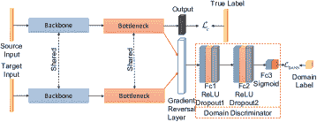

<!--yml

类别：未分类

日期：2024-09-06 20:03:17

-->

# [1912.12528] 无监督深度迁移学习在智能故障诊断中的应用：综述与比较研究

> 来源：[`ar5iv.labs.arxiv.org/html/1912.12528`](https://ar5iv.labs.arxiv.org/html/1912.12528)

# 无监督深度迁移学习在智能故障诊断中的应用：综述与比较研究

赵志斌、张启扬、于晓雷、孙闯、王士斌、闫如强、陈雪峰 Z. Zhao, Q. Zhang, X. Yu, C. Sun, S. Wang, R. Yan 和 X. Chen 现于中国西安交通大学制造系统工程国家重点实验室，西安 710049，中国。电子邮件：(zhaozhibin@xjtu.edu.cn; zhangqiyang@stu.xjtu.edu.cn; yxl007@stu.xjtu.edu.cn; ch.sun@xjtu.edu.cn; wangshibin2008@gmail.com; yanruqiang@xjtu.edu.cn; chenxf@mail.xjtu.edu.cn) 本研究得到了中国自然科学基金（编号：52105116）和中国博士后科学基金（编号：2021M692557 和 2021TQ0263）的资助。闫如强为通讯作者。

###### 摘要

智能故障诊断（IFD）的最新进展在很大程度上依赖于深度表示学习和大量标注数据。然而，机器经常在不同的工作条件下运行，或者目标任务的分布与用于训练的收集数据存在差异（领域转移问题）。此外，目标领域中新收集的测试数据通常未标注，导致基于无监督深度迁移学习（UDTL）的 IFD 问题。尽管取得了巨大进展，但尚未建立标准和开源代码框架以及 UDTL 基于的 IFD 的比较研究。本文构建了新的分类法，并根据不同任务对 UDTL 基于的 IFD 进行全面综述。对一些典型方法和数据集的比较分析揭示了 UDTL 基于的 IFD 中一些鲜有研究的开放和重要问题，包括特征的迁移性、骨干网的影响、负迁移、物理先验等。为了强调 UDTL 基于的 IFD 的重要性和可重复性，整个测试框架将向研究界发布，以促进未来的研究。总之，发布的框架和比较研究可以作为扩展接口和基础结果，以开展新的 UDTL 基于的 IFD 研究。代码框架可以在 [`github.com/ZhaoZhibin/UDTL`](https://github.com/ZhaoZhibin/UDTL) 获取。

###### 索引词：

智能故障诊断；无监督深度迁移学习；分类与综述；比较研究；可重复性

## 引言

随着工业大数据和物联网的快速发展，工业设备如航空发动机、直升机和高速列车的预测与健康管理（PHM）变得越来越受欢迎，催生了许多智能维护系统。智能故障诊断（IFD）正在成为 PHM 系统中的一个重要分支。基于传统机器学习方法的 IFD [1]，包括随机森林 [2] 和支持向量机 [3]，已广泛应用于研究和工业场景。然而，这些方法通常需要手动提取特征或结合其他先进的信号处理技术，如时频分析 [4] 和稀疏表示 [5, 6]。随着可用数据的增加，具有表示学习能力的数据驱动方法也变得越来越重要。因此，能够从原始信号中自动提取有用特征的深度学习（DL） [7]，逐渐成为许多领域 [8, 9, 10, 11] 以及 PHM [12, 13, 14] 的热门研究话题。有效的 DL 模型，如卷积神经网络（CNN） [15]、稀疏自编码器（SAE） [16] 等，已在当前研究中成功验证了其在 PHM 任务中的应用，同时[17]也提供了基准研究以便于更好的比较和发展。

在 DL 基础的 IFD 的有效性背后，存在两个必要的假设：1）训练数据集（源领域）中的样本应与测试数据集（目标领域）中的样本具有相同的分布；2）在训练阶段有大量标记数据可用。虽然标记数据可能通过动态仿真或故障种植实验生成，但生成的数据与实际场景中的测试数据并不完全一致。也就是说，基于训练数据集的 DL 模型在部署到真实应用的测试数据集时，仅具备较弱的泛化能力。此外，旋转机械往往在不同的工作条件下运行，例如负载和速度，这也要求使用一种工作条件下的数据集训练的模型能够成功转移到另一种工作条件下的测试数据集。简而言之，这些因素使得在源领域训练的模型难以直接泛化或迁移到目标领域。

由于在不同应用场景或不同工作条件下的内在相似性，这两个领域之间存在的共享特性使得领域迁移变得可管理。因此，为了让在源领域训练的深度学习（DL）模型能够很好地迁移到目标领域，应该在图像故障检测（IFD）中引入一种新的范式，称为深度迁移学习（DTL）。一种有效且直接的 DTL 方法是使用目标领域中少量标记数据对 DL 模型进行微调，然后可以使用微调后的模型来诊断测试样本。然而，新收集的数据或在不同工作条件下的数据通常是未标记的，有时标记这些数据非常困难，甚至不可能。因此，本文探讨了 DTL 的无监督版本，即基于无监督深度迁移学习（UDTL-based）的 IFD，其目的是在给定源领域标记数据的情况下对目标领域的未标记数据进行预测。值得一提的是，UDTL 有时被称为无监督领域适应，本文不对这两个概念做严格区分。

UDTL 在计算机视觉和自然语言处理领域得到了广泛应用，并取得了巨大的成功，这得益于其应用价值、开源代码和基准准确率。然而，在 UDTL-based IFD 领域，开源代码和基准准确率较少，很多研究通过简单使用在其他领域已发布的模型来进行 UDTL-based IFD。由于缺乏开源代码，这些论文中的结果很难重复进行进一步比较。这不利于识别最先进的方法，进一步来说，也不利于该领域的长期发展。因此，进行比较研究、提供基准准确率和发布 UDTL-based 算法的开源代码非常重要。在测试 UDTL-based 算法时，统一的测试框架、参数设置和数据集是影响比较公平性和有效性的三个重要方面。然而，由于这些因素的不一致，存在很多不公平和不合适的比较。似乎学者们继续结合新技术，提出的算法总是比以前的算法表现更好，这就引出了一个问题：这种改进对 IFD 有益还是仅仅依赖于过度的参数调整？然而，UDTL-based IFD 中开放和关键的问题，如特征的可迁移性、骨干网的影响等，鲜有研究。

已经有一些关于 IFD 中迁移学习的优秀综述论文。郑等人[18]总结了基于迁移学习的知识迁移策略在跨域故障诊断中的应用，并提供了一些开源数据集，可以用于验证诊断方法的性能。严等人[19]回顾了通过使用不同的迁移学习方法进行旋转机械故障诊断的最新发展，并提供了四个案例研究来比较不同方法的性能。雷等人[20]回顾了基于机器学习方法的 IFD，重点讨论了迁移学习理论，该理论将一个或多个数据集的诊断知识迁移到其他相关数据集中，并指出迁移学习理论可能是缩小实验验证与实际应用之间差距的关键方法。然而，上述综述论文均未集中于 UDTL-based IFD，也未提供用于公平和适当比较的开源测试框架。它们都更关注标签一致（也称为封闭集）UDTL-based IFD，假设源域与目标域具有相同的标签空间，但许多最近的研究论文关注标签不一致或多域 UDTL，更接近工程场景。因此，仍需进行全面的综述，以涵盖 UDTL-based IFD 从起步到成熟的先进发展，并指导未来的发展。

本文为填补这一空白，讨论了常用的 UDTL-based 设置和算法，并构建了 UDTL-based IFD 的新分类法。在每个单独的类别中，我们还对 UDTL-based IFD 的最新发展进行了全面的综述。一些典型的方法被整合到一个统一的测试框架中，该框架在五个数据集上进行了测试。这个测试框架及其源代码将发布给研究社区，以促进对 UDTL-based IFD 的研究。通过这项比较研究和开源代码，作者试图深入探讨当前算法（值得一提的是，结果仅为准确性的下界），并尝试找出决定迁移性能的核心因素。

本文的主要贡献总结如下：

1.  1)

    新的分类法和综述：我们根据 UDTL 的不同任务建立了基于 UDTL 的 IFD 的新分类法。层级顺序遵循源域的数量、训练阶段目标数据的使用、源域和目标域标签的一致性、源域和目标域标签集之间的包含关系，以及转移方法论水平。我们还提供了每种类别的 UDTL-based IFD 的最全面的概述。

1.  2)

    各种数据集和数据划分：我们收集了大多数适用于基于 UDTL 的 IFD 的公开数据集，并详细讨论了其适应性。我们还讨论了数据划分的方式，并解释了无论数据处于源领域还是目标领域，将数据划分为训练集和测试集更为合适。

1.  3)

    比较研究与进一步讨论：我们评估了各种基于 UDTL 的 IFD 方法，并从多个角度提供系统化的比较分析，以使未来的研究更加可比和有意义。我们还讨论了特征的可迁移性、骨干网络的影响、负迁移等。

1.  4)

    开源代码：为了强调 UDTL-based IFD 的重要性和可重复性，我们发布了实现本文讨论的所有 UDTL-based 方法的完整评价代码框架。同时，这是一个可扩展的框架，保留了一个扩展接口，供大家结合不同的算法并加载自己的数据集以进行新的研究。代码框架可在[`github.com/ZhaoZhibin/UDTL`](https://github.com/ZhaoZhibin/UDTL)获得。

本文其余部分组织如下：第 II 节提供了基于 UDTL 的 IFD 的背景和定义。基本概念、评价算法以及对基于 UDTL 的 IFD 的综合评述在第 III 节至 V 节中介绍。之后，在第 VI 节至第 VIII 节中，讨论了数据集、评价结果和进一步讨论，最后在第 IX 节给出了结论部分。

## II 背景与定义

### II-A UDTL 的定义

为了简要描述 UDTL 的定义，我们介绍了一些基本符号。假设源领域中的标签都是可用的，源领域可以定义如下：

|  | $\displaystyle\mathcal{D}_{s}=\left\{{\left({x_{i}^{s},y_{i}^{s}}\right)}\right\}_{i=1}^{{n_{s}}}\quad x_{i}^{s}\in{X_{s}},\;y_{i}^{s}\in{Y_{s}},$ |  | (1) |
| --- | --- | --- | --- |

其中 $\mathcal{D}_{s}$ 代表源领域，$x_{i}^{s}\in\mathbb{R}^{d}$ 是第 $i$ 个样本，$X_{s}$ 是所有样本的并集，$y_{i}^{s}$ 是第 $i$ 个样本的标签，$Y_{s}$ 是所有不同标签的并集，$n_{s}$ 表示源样本的总数。此外，假设目标领域中的标签不可用，因此目标领域可以定义如下：

|  | $\displaystyle\mathcal{D}_{t}=\left\{{\left({x_{i}^{t}}\right)}\right\}_{i=1}^{{n_{t}}}\quad x_{i}^{t}\in{X_{t}},$ |  | (2) |
| --- | --- | --- | --- |

其中 $\mathcal{D}_{t}$ 代表目标领域，$x_{i}^{t}\in\mathbb{R}^{d}$ 是第 $i$ 个样本，$X_{t}$ 是所有样本的并集，$n_{t}$ 表示目标样本的总数。

源领域和目标领域分别遵循概率分布 $P$ 和 $Q$。我们希望建立一个模型 $\beta(\cdot)$，该模型可以对目标领域中的未标记样本 $x$ 进行分类：

|  | $\displaystyle\hat{y}=\beta\left(x\right),$ |  | (3) |
| --- | --- | --- | --- |

其中 $\hat{y}$ 是预测值。因此，UDTL 旨在通过源数据监督来最小化目标风险 ${\varepsilon}_{t}\left(\beta\right)$ [21]：

|  | $\displaystyle{\varepsilon}_{t}\left(\beta\right)=\Pr_{\left({x,y}\right)\sim Q}\left[{\beta\left(x\right)\neq y}\right].$ |  | (4) |
| --- | --- | --- | --- |

此外，UDTL 的总损失可以写作：

|  | $\displaystyle\mathcal{L}=\mathcal{L}_{c}+\lambda\mathcal{L}_{\text{UDTL}},$ |  | (5) |
| --- | --- | --- | --- |

其中 $\mathcal{L}_{c}$ 是在 (6) 中展示的 Softmax 交叉熵损失，$\lambda$ 是权衡参数，$\mathcal{L}_{\text{UDTL}}$ 代表减少源领域和目标领域之间特征差异的部分损失。

|  | $\displaystyle\mathcal{L}_{c}=-\mathbb{E}_{\left(x_{i}^{s},y_{i}^{s}\right)\in\mathcal{D}_{s}}\sum_{c=0}^{C-1}\mathbf{1}_{[y_{i}^{s}=c]}\log\left[\beta\left(x_{i}^{s}\right)\right],$ |  | (6) |
| --- | --- | --- | --- |

其中 $C$ 是所有可能类别的数量，$\mathbb{E}$ 表示数学期望，$\mathbf{1}$ 是指示函数。

### II-B 基于 UDTL 的 IFD 分类

在本节中，我们展示了基于 UDTL 的 IFD 分类，如图 1 所示。我们从宏观角度根据源领域的数量将基于 UDTL 的 IFD 分为单领域和多领域 UDTL。在下面，我们简要介绍每个类别，详细描述将在下一部分给出。

图 1：基于 UDTL 的方法分类。

1) 单领域 UDTL：这些可以进一步分为标签一致（封闭集）和标签不一致的 UDTL。如图 2 所示，标签一致的 UDTL 表示源领域和目标领域的标签集是一致的。根据 Tan 等人 [22] 的研究，标签一致的 UDTL 可以从方法论层面分为四类：基于网络的方法、基于实例的方法、基于映射的方法和基于对抗的方法。此外，我们将标签不一致的 UDTL 按照标签集之间的包含关系分为部分、开放集和通用任务。如图 2 所示，部分 UDTL 意味着目标标签集是源标签集的一个子空间；开放集 UDTL 意味着目标标签集包含未知标签；通用 UDTL 是前两种情况的结合。值得一提的是，这三种任务从方法论层面上可以进一步细分为上述四种方法。

2) 多领域 UDTL：这些可以进一步分为多领域适应和领域泛化（DG），具体取决于目标数据在训练阶段的使用情况。多领域适应意味着来自目标领域的未标记样本参与训练阶段，而 DG 则相反。此外，这两种情况还可以进一步细分为标签一致和标签不一致的 UDTL。

图 2：不同迁移设置的可视化说明。此外，不同的颜色表示不同的领域，虚线表示该领域未参与训练。

### II-C UDTL 基于 IFD 的动机

由于工作条件、故障大小、故障类型等因素的影响，训练样本和测试样本的分布通常不同。因此，最近引入了基于 UDTL 的 IFD 来解决这个领域迁移问题，因为在特定空间中存在一些共享特征。利用这些共享特征，基于 UDTL 的 IFD 的应用主要可以分为四类：不同的工作条件、不同类型的故障、不同的位置和不同的机器。

不同工作条件：由于速度、负载、温度等因素的影响，工作条件在监测期间往往会有所变化。收集到的信号可能包含领域转移，这意味着在不同工作条件下数据的分布可能显著不同[23]。基于 UDTL 的 IFD 的目标是使使用一种工作条件下的信号训练的模型能够转移到另一种不同工作条件下的信号。

不同类型的故障：由于不同类型的故障可能发生在同一组件上，源领域和目标领域之间可能存在标签差异。因此，基于 UDTL 的 IFD 有三种情况。第一种情况是目标领域出现未知故障类型（开放集转移）。第二种情况是目标领域出现源领域的部分故障类型（部分转移）。第三种情况是前两种情况同时发生（通用转移）。基于 UDTL 的 IFD 的目标是使使用某些类型故障训练的模型能够转移到具有不同类型故障的目标领域。

不同位置：由于安装在同一台机器上的传感器通常负责监测不同的组件，并且靠近故障组件的传感器更适合指示故障信息。然而，关键组件的故障率概率不同，导致不同位置的信号具有不同数量的标注数据。基于 UDTL 的 IFD 的目标是使使用大量标注数据训练的模型能够转移到具有来自其他位置的未标注数据的目标领域。

不同机器：由于测试成本和安全问题，收集足够的标注故障样本非常困难。此外，可以通过动态模拟或故障种植实验生成足够的标注数据。然而，由于结构和测量情况相似，动态模拟或故障种植实验的数据分布与真实机器的数据分布不同但相似。因此，基于 UDTL 的 IFD 的目标是使模型能够转移到从真实机器收集的测试数据上。

### II-D 骨干结构

基于 UDTL 的 IFD 最重要的部分之一是骨干结构，它作为特征提取具有巨大的测试准确度影响。例如，在图像分类领域，不同的骨干网络，如 VGG [24]、ResNet [25]等，具有不同的特征提取能力，从而导致不同的分类性能。

然而，对于基于 UDTL 的 IFD，不同的研究有各自的骨干网，因此很难确定哪个骨干网更好。因此，由于骨干网的代表性能力不同，与其他已发布论文中的结果进行直接比较是不公平和不合适的。在本文中，我们尝试使用相同的 CNN 骨干网来验证不同基于 UDTL 的 IFD 方法的性能，以确保公平比较。

如图 3 所示，CNN 骨干网由四个一维（1D）卷积层组成，这些层配备了一个 1D 批量归一化（BN）层和一个 ReLU 激活函数。此外，第二组合配备了一个 1D 最大池化层，第四组合配备了一个 1D 自适应最大池化层，以实现输入长度的自适应。卷积输出随后被展平，通过一个全连接（Fc）层，一个 ReLU 激活函数和一个 Dropout 层。详细参数列在表 I 中。

图 3：骨干网的结构。

表 I：骨干网的参数。

| 层 | 参数 |
| --- | --- |
| Conv1 | out_channels=16, kernel_size=15 |
| Conv2 | out_channels=32, kernel_size=3 |
| 最大池化 | kernel_size=2, stride=2 |
| Conv3 | out_channels=64, kernel_size=3 |
| Conv4 | out_channels=128, kernel_size=3 |
| 自适应最大池化 | output_size=4 |
| Fc | out_features=256 |
| Dropout | p=0.5 |

## III 标签一致的 UDTL

标签一致（也称为闭集）基于 UDTL 的 IFD 假设源领域与目标领域具有相同的标签空间。在本节中，我们从方法论的层面将标签一致的 UDTL 分类为网络基础、实例基础、映射基础和对抗基础方法。

### III-A 网络基础的 UDTL

#### III-A1 基本概念

基于网络的 DTL（深度迁移学习）指的是将源领域中预训练的部分网络参数直接转移到测试过程的部分网络参数中，或者使用少量标记数据在目标领域微调网络参数。最流行的基于网络的 DTL 方法是利用目标领域中少量标记数据对训练模型进行微调。然而，对于基于 UDTL 的 IFD（智能故障诊断），目标领域中的标签是不可用的。我们使用带有瓶颈层的主干网络，包含一个 Fc 层（out_features=256）、一个 ReLU 激活函数、一个 Dropout 层（$p=0.5$）和一个基本的 Softmax 分类器来构建我们的基本模型（我们称之为 Basis），如图 4 所示。训练好的模型直接用于测试目标领域中的样本，这意味着源领域和目标领域共享相同的模型和参数。

图 4：基本模型的结构。

#### III-A2 应用于 IFD

使用源数据进行预训练的深度神经网络被用于[26, 27, 28, 29, 30, 31, 32, 33, 34, 35, 36, 37]，通过冻结其部分参数，然后将部分网络参数转移到目标网络，其他参数则使用少量目标数据进行微调。在[38, 39, 40, 41, 42]上使用了在 ImageNet 上预训练的深度神经网络，并使用有限的目标数据对其进行微调，以适应工程应用领域。集成技术和多通道信号被用于[43, 44]来初始化目标网络，然后通过来自目标领域的少量训练样本对其进行微调。二维图像，如灰度图像[45]、时频图像[46]和热图像[47]，被用来预训练特定设计的网络，这些网络通过微调被转移到目标任务中。

Qureshi 等人[48] 在一个风电场上预训练了九个深度稀疏自编码器，并通过微调预训练的网络对另一个风电场进行预测。Zhong 等人[49] 在足够的正常样本上训练了一个 CNN，然后用支持向量机替换 Fc 层作为目标模型。Han 等人[50] 讨论并比较了三种微调策略：仅微调分类器、微调特征描述符，以及同时微调特征描述符和分类器以诊断未见过的机器条件。Xu 等人[51] 在源领域上对离线 CNN 进行预训练，并通过微调目标领域的在线 CNN 直接转移到在线 CNN 的浅层，以进行在线 IFD。Zhao 等人[52] 提出了一个在源领域上预训练的多尺度卷积转移学习网络，然后通过适当的微调将模型转移到其他不同但类似的领域。

### III-B 基于实例的 UDTL

#### III-B1 基本概念

基于实例的 UDTL 指的是在源领域重新加权实例以帮助分类器预测标签，或使用实例统计信息来帮助对齐目标领域，例如 TrAdaBoost[53] 和自适应批归一化（AdaBN）[54]。在本文中，我们使用 AdaBN 来表示一种基于实例的 UDTL 方法，它不需要来自目标领域的标签。

BN，作为一种避免内部协变量偏移问题的技术，是最重要的技术之一。BN 可以显著提高训练速度，因为它使输入分布更加稳定。详细描述和属性可以参考[55]。值得一提的是，BN 层仅在训练过程中更新，测试过程中使用训练样本的全局统计信息来标准化测试样本。

AdaBN，是一种简单且无参数的领域迁移问题技术，在[54]中提出，用于增强泛化能力。AdaBN 的主要思想是，在测试阶段，用目标领域的统计数据替代每个 BN 层的全局统计数据。在我们的 AdaBN 实现中，训练后，我们提供了两种更新策略以使用目标数据微调 BN 层的统计数据，包括通过每个批次和整个数据进行更新。在本文中，考虑到内存限制，我们通过每个批次更新 BN 层的统计数据。

#### III-B2 应用于 IFD

Xiao 等人[56] 使用 TrAdaBoost 通过调整每个训练样本的权重因子来增强故障分类器的诊断能力。Zhang 等人[57] 和 Qian 等人[58] 使用 AdaBN 通过确保每一层接收来自类似分布的数据来提高模型的领域适应能力。

### III-C 基于映射的 UDTL

#### III-C1 基本概念

基于映射的 UDTL 指的是通过特征提取器将源域和目标域的实例映射到特征空间。基于映射的 UDTL 有许多方法，例如欧几里得距离、明可夫斯基距离、Kullback-Leibler、相关对齐 (CORAL) [59]、最大均值差异 (MMD) [60, 61]、多核 MMD (MK-MMD) [62, 21]、联合分布适应 (JDA) [63]、平衡分布适应 (BDA) [64] 和联合最大均值差异 (JMMD) [65]。在本文中，我们使用 MK-MMD、JMMD 和 CORAL 来表示基于映射的方法并测试其性能。

MK-MMD：为了介绍 MK-MMD 的定义，我们简要解释 MMD 的概念。MMD 首次在 [60] 中提出，并被许多其他学者在迁移学习中使用 [66, 67]。在再生核希尔伯特空间 (RKHS) 中定义的 MMD 是边际分布 $P(X_{s})$ 和 $Q(X_{t})$ 的核嵌入之间的平方距离。RKHS 是一个函数的希尔伯特空间，其中点评估是一个连续的线性泛函，一些例子可以在 [68] 中找到。MMD 的公式可以写作：

|  | $\displaystyle\mathcal{L}_{\text{MMD}}\left(P,Q\right)=\left\&#124;\mathbb{E}_{P}\left({\phi\left({x^{s}}\right)}\right)-\mathbb{E}_{Q}\left({\phi\left({x^{t}}\right)}\right)\right\&#124;^{2}_{\mathcal{H}_{k}},$ |  | (7) |
| --- | --- | --- | --- |

其中 $\mathcal{H}_{k}$ 是使用核 $k$ 的 RKHS（通常使用高斯核作为核），$\phi(\cdot)$ 是映射到 RKHS。

每个核的参数选择对最终性能至关重要。为了解决这个问题，Gretton 等人提出了 MK-MMD，该方法能够最大化双样本检验的效能并共同最小化第二类错误[62]。对于 MK-MMD，学者们通常使用 $m$ 个核 $\left\{k_{u}\right\}$ 的凸组合来提供有效的映射估计。

|  | $\displaystyle K\mathop{=}\limits^{\Delta}\left\{{k=\sum\limits_{u=1}^{m}{{\alpha_{u}}{k_{u}}:\sum\limits_{u=1}^{m}{{\alpha_{u}}=1},\alpha\geq 0,\forall u}}\right\},$ |  | (8) |
| --- | --- | --- | --- |

其中 $\left\{\alpha_{u}\right\}$ 是不同核的加权参数（在本文中，所有 $\alpha_{u}=\frac{1}{m}$）。

受 [21] 中提出的深度适应网络 (DAN) 的启发，我们通过将 MK-MMD 添加到损失函数中来设计基于 UDTL 的 IFD 模型，以实现图中的特征对齐 5。此外，最终的损失函数定义如下：

|  | $\displaystyle\mathcal{L}=\mathcal{L}_{c}+\lambda_{\text{MK-MMD}}\mathcal{L}_{\text{MK-MMD}}\left(\mathcal{D}_{s},\mathcal{D}_{t}\right),$ |  | (9) |
| --- | --- | --- | --- |

其中 $\lambda_{\text{MK-MMD}}$ 是一个权衡参数，$\mathcal{L}_{\text{MK-MMD}}$ 表示 MMD 的多核版本。此外，我们简单地使用高斯核，核的数量为五个。每个核的带宽设置为训练数据中的中位数成对距离，根据中位数启发式 [62]。

图 5：基于 MK-MMD 的 UDTL 模型。

JMMD：MMD 和 MK-MMD 被定义用来解决问题 $P(X_{s})\neq Q(X_{t})$，但不能解决由联合分布生成的领域转移（例如 $P(X_{s},Y_{s})\neq Q(X_{t},Y_{t})$）。因此，JMMD，提出于 [65]，旨在衡量经验联合分布 $P(X_{s},Y_{s})$ 和 $Q(X_{t},Y_{t})$ 之间的距离。JMMD 的公式如下 [65]：

|  |  | $\displaystyle\mathcal{L}_{\text{JMMD}}\left(P,Q\right)=$ |  | (10) |
| --- | --- | --- | --- | --- |
|  |  | $\displaystyle\left\&#124;\mathbb{E}_{P}\left({\otimes_{l=1}^{&#124;L&#124;}\phi^{l}\left({z_{l}^{s}}\right)}\right)-\mathbb{E}_{Q}\left(\otimes_{l=1}^{&#124;L&#124;}{\phi^{l}\left({z_{l}^{t}}\right)}\right)\right\&#124;^{2}_{\otimes_{l=1}^{&#124;L&#124;}{\mathcal{H}^{l}}},$ |  |

其中 $\otimes_{l=1}^{|L|}\phi^{l}\left({z_{l}}\right)=\phi^{1}\left({z_{1}}\right)\otimes\dots\otimes\phi^{|L|}\left({z_{|L|}}\right)$ 是张量积希尔伯特空间中的特征映射，$L$ 是高层网络层的集合，$|L|$ 是层数，$z_{l}^{s}$ 表示由源领域生成的第 $l-$ 层激活，$z_{l}^{t}$ 表示由目标领域生成的第 $l-$ 层激活。

受使用 JMMD 对齐领域转移的联合适应网络（JAN） [65] 的启发，我们通过将 JMMD 添加到损失函数中设计了一种基于 UDTL 的 IFD 方法，以实现图 6 所示的特征对齐。最终的损失函数定义如下：

|  | $\displaystyle\mathcal{L}=\mathcal{L}_{c}+\lambda_{\text{JMMD}}\mathcal{L}_{\text{JMMD}}\left(\mathcal{D}_{s},\mathcal{D}_{t}\right),$ |  | (11) |
| --- | --- | --- | --- |

其中 $\lambda_{\text{JMMD}}$ 是一个权衡参数。此外，JMMD 的参数设置与 JAN 相同。

图 6：基于 JMMD 的 UDTL 模型。

CORAL：CORAL 损失旨在对齐源领域和目标领域分布的二阶统计量，首次提出于 [69]，并在 UDTL [59] 中进一步使用。首先，参考 [69] 和 [59]，我们给出 CORAL 损失的基本定义如下：

|  | $\displaystyle\mathcal{L}_{\text{CORAL}}\left(\mathcal{D}_{s},\mathcal{D}_{t}\right)=\dfrac{1}{4d^{2}}&#124;&#124;C^{s}-C^{t}&#124;&#124;_{F}^{2},$ |  | (12) |
| --- | --- | --- | --- |

其中 $||\cdot||_{F}$ 是 Frobenius 范数，$d$ 是每个样本的维度。定义在 (13) 中的 $C^{s}$ 和 $C^{t}$ 是协方差矩阵。

|  | $\displaystyle C^{s}$ | $\displaystyle=\dfrac{1}{n_{s}-1}\left(X_{s}^{T}X_{s}-\dfrac{1}{n_{s}}(\textbf{1}^{T}X_{s})^{T}(\textbf{1}^{T}X_{s})\right),$ |  | (13) |
| --- | --- | --- | --- | --- |
|  | $\displaystyle C^{t}$ | $\displaystyle=\dfrac{1}{n_{t}-1}\left(X_{t}^{T}X_{t}-\dfrac{1}{n_{t}}(\textbf{1}^{T}X_{t})^{T}(\textbf{1}^{T}X_{t})\right),$ |  |

其中 1 表示元素均为 1 的列向量。

受 [59] 中提出的 Deep CORAL 启发，我们设计了一种基于 UDTL 的 IFD 方法，通过将 CORAL 损失添加到损失函数中来实现特征迁移，如图 7 所示。此外，最终的损失函数定义如下：

|  | $\displaystyle\mathcal{L}=\mathcal{L}_{c}+\lambda_{\text{CORAL}}\mathcal{L}_{\text{CORAL}}\left(\mathcal{D}_{s},\mathcal{D}_{t}\right),$ |  | (14) |
| --- | --- | --- | --- |

其中 $\lambda_{\text{CORAL}}$ 是一个权衡参数。

图 7：基于 CORAL 的 UDTL 训练的 IFD 模型。

#### III-C2 应用到 IFD

BDA 被用来[70, 71]自适应地平衡由深度神经网络学习的特征领域之间的边际和条件分布差异。CORAL 损失 [72, 73] 和最大方差差异 (MVD) [74] 被用来减少不同领域之间的分布差异。Qian 等人 [58, 75] 考虑了高阶矩，并提出了一种 HKL 散度来调整领域分布以进行旋转机器故障诊断。[76] 提出了用于测量源和目标张量表示的距离，以将张量表示对齐到不变张量子空间，以进行轴承故障诊断。

另一种度量距离，称为 MMD，在智能诊断领域广泛使用 [77, 78, 79, 80, 81, 82, 83, 84, 85]。Tong 等人 [86, 87] 通过改进伪测试标签来减少特征空间中跨领域的边际和条件分布，同时用于轴承故障诊断。Wang 等人 [88] 提出了基于估计伪标签的条件 MMD，以缩短轴承故障诊断中的条件分布距离。通过最小化 MMD [89, 90]，在多个层中同时对齐边际和条件分布。Yang 等人 [91] 用多项式核替代 MMD 中的高斯核，以更好地对齐分布差异。Cao 等人 [92] 提出了伪分类 MMD，以缩小同类跨领域的分布差异。MMD 还与其他技术结合使用，如 Grassmann 流形 [93]、局部保持投影 [94] 和图拉普拉斯正则化 [95, 96]，以提升分布对齐的性能。

MK-MMD 被用于 [97, 98, 99, 23, 100, 101]，以更好地将源领域中学习到的特征分布转移到目标领域中的分布，用于 IFD。Han 等人 [102] 和 Qian 等人 [103] 使用 JDA 同时对齐条件和边际分布，以构建更有效且稳健的特征表示来应对显著的分布差异。Wu 等人 [104] 进一步使用了灰狼优化算法来学习 JDA 的参数。基于 JMMD，Cao 等人 [105] 提出了一个软 JMMD，通过增强辅助软标签来减少边际和条件分布的不一致。

### III-D 基于对抗的 UDTL

#### III-D1 基本概念

基于对抗的 UDTL 指使用领域判别器的对抗方法，以减少由特征提取器产生的源领域与目标领域之间的特征分布差异。在本文中，我们使用两种常用的方法，包括领域对抗神经网络 (DANN) [106] 和条件领域对抗网络 (CDAN) [107]，来代表基于对抗的方法并测试相应的准确性。

DANN：类似于 MMD 和 MK-MMD，DANN 被定义为解决 $P(X_{s})\neq Q(X_{t})$ 的问题。它旨在同时训练特征提取器、区分源领域和目标领域的领域判别器以及分类预测器，以对齐源领域和目标领域的分布。也就是说，DANN 训练特征提取器，以防止领域判别器区分两个领域之间的差异。设 $G_{f}$ 为特征提取器，其参数为 $\theta_{f}$，$G_{c}$ 为分类预测器，其参数为 $\theta_{c}$，$G_{d}$ 为领域判别器，其参数为 $\theta_{d}$。之后，预测损失和对抗损失（二元交叉熵损失）可以重新写为：

|  |  | $\displaystyle\mathcal{L}_{c}(\theta_{f},\theta_{c})=$ |  | (15) |
| --- | --- | --- | --- | --- |
|  |  | $\displaystyle-\mathbb{E}_{\left(x_{i}^{s},y_{i}^{s}\right)\in\mathcal{D}_{s}}\sum_{c=0}^{C-1}\mathbf{1}_{[y_{i}^{s}=c]}\log\left[G_{c}\left(G_{f}\left(x_{i}^{s};\theta_{f}\right);\theta_{c}\right)\right],$ |  |
|  | $\displaystyle\mathcal{L}_{\text{DANN}}\left(\theta_{f},\theta_{d}\right)=$ | $\displaystyle-\mathbb{E}_{x_{i}^{s}\in\mathcal{D}_{s}}\log\left[G_{d}\left(G_{f}\left(x_{i}^{s};\theta_{f}\right);\theta_{d}\right)\right]-$ |  | (16) |
|  |  | $\displaystyle\mathbb{E}_{x_{i}^{t}\in\mathcal{D}_{t}}\log\left[1-G_{d}\left(G_{f}\left(x_{i}^{t};\theta_{f}\right);\theta_{d}\right)\right].$ |  |

总结来说，DANN 的总损失可以定义为：

|  | $\displaystyle\mathcal{L}\left(\theta_{f},\theta_{c},\theta_{d}\right)=\mathcal{L}_{c}\left(\theta_{f},\theta_{c}\right)-\lambda_{\text{DANN}}\mathcal{L}_{\text{DANN}}\left(\theta_{f},\theta_{d}\right),$ |  | (17) |
| --- | --- | --- | --- |

其中 $\lambda_{\text{DANN}}$ 是一个权衡参数。

在训练过程中，我们需要最小化预测损失，以使分类预测器尽可能准确地预测真实标签。此外，我们还需要最大化对抗损失，使领域判别器难以区分差异。因此，解决鞍点问题 ($\hat{\theta}_{f},\hat{\theta}_{c},\hat{\theta}_{d}$) 等同于以下的极小极大优化问题：

|  | $\displaystyle\left(\hat{\theta_{f}},\hat{\theta_{c}}\right)$ | $\displaystyle=\arg\min\limits_{\theta_{f},\theta_{c}}\mathcal{L}\left(\theta_{f},\theta_{c},\hat{\theta}_{d}\right),$ |  | (18) |
| --- | --- | --- | --- | --- |
|  | $\displaystyle\left(\hat{\theta_{d}}\right)$ | $\displaystyle=\arg\max\limits_{\theta_{d}}\mathcal{L}\left(\hat{\theta}_{f},\hat{\theta}_{c},\theta_{d}\right).$ |  |

根据[106]中的说法，我们可以简单地添加一个特殊的梯度反转层（GRL），它会改变来自后续层的梯度符号，并且没有参数，以解决上述优化问题。

我们设计了一个基于 UDTL 的 IFD 模型，通过将对抗思想添加到损失函数中，实现源领域和目标领域之间的特征转移，如图 8 所示。可以观察到，我们使用了一个三层 Fc 二分类器作为我们的领域鉴别器，这与 [106] 中的相同。这些 Fc 层的输出特征分别为 1024（Fc1）、1024（Fc2）和 2（Fc3）。Dropout 层的参数为 $p=0.5$。

图 8：基于 DANN 的 UDTL 领域智能故障诊断模型。

CDAN：虽然 DANN 能够有效对齐两个领域的分布，但仍可能存在一些瓶颈。如[107]所述，DANN 无法捕捉复杂的多模态结构，并且难以安全地调整领域鉴别器。基于这一点，Long 等人[107] 提出了一个新的基于对抗的 UDTL 模型，称为 CDAN，以解决问题 $P(X_{s},Y_{s})\neq Q(X_{t},Y_{t})$。要简要介绍 CDAN 的主要思想，我们首先需要定义多线性映射 $\otimes$，它表示多个随机向量的外积。如果给定两个随机向量 $x$ 和 $y$，均值映射 $x\otimes y$ 可以完全捕捉数据中的复杂多模态结构。此外，交叉协方差 $\mathbb{E}_{xy}[\phi(x)\otimes\phi(y)]$ 可以成功地建模联合分布 $P(x,y)$。因此，条件对抗损失定义如下：

|  | $\displaystyle\mathcal{L}_{\text{CDAN}}$ | $\displaystyle(\theta_{f},\theta_{d})=-\mathbb{E}_{x_{i}^{s}\in\mathcal{D}_{s}}\log\left[G_{d}\left(G_{f}(x_{i}^{s})\otimes G_{c}\left(G_{f}(x_{i}^{s})\right)\right)\right]$ |  | (19) |
| --- | --- | --- | --- | --- |
|  |  | $\displaystyle-\mathbb{E}_{x_{i}^{t}\in\mathcal{D}_{t}}\log\left[1-G_{d}\left(G_{f}(x_{i}^{t})\otimes G_{c}\left(G_{f}(x_{i}^{t})\right)\right)\right],$ |  |

预测损失与 (15) 中的相同。

为了减轻不确定预测的影响，采用熵准则 $H(p)=-\sum_{c=0}^{C-1}p_{c}\log p_{c}$ 来定义分类器预测的不确定性，其中 $p_{c}$ 是预测结果对应标签 $c$ 的概率。根据在 (20) 中定义的熵感知权重函数，那些难以迁移的样本在修改后的条件对抗损失中被重新加权为较低的权重 (21)：

|  | $\displaystyle w\left(H\left(p\right)\right)=1+e^{-H\left(p\right)}.$ |  | (20) |
| --- | --- | --- | --- |
|  | $\displaystyle\mathcal{L}_{\text{CDAN}}(\theta_{f},\theta_{d})=$ | $\displaystyle-\mathbb{E}_{x_{i}^{s}\in\mathcal{D}_{s}}w\left(H\left(p_{i}^{s}\right)\right)$ |  | (21) |
|  |  | $\displaystyle\log\left[G_{d}\left(G_{f}(x_{i}^{s})\otimes G_{c}\left(G_{f}(x_{i}^{s})\right)\right)\right]$ |  |
|  |  | $\displaystyle-\mathbb{E}_{x_{i}^{t}\in\mathcal{D}_{t}}w\left(H\left(p_{i}^{t}\right)\right)$ |  |
|  |  | $\displaystyle\log\left[1-G_{d}\left(G_{f}(x_{i}^{t})\otimes G_{c}\left(G_{f}(x_{i}^{t})\right)\right)\right].$ |  |

我们设计了一种基于 UDTL 的 IFD 模型，通过将条件对抗思想嵌入损失函数中，实现了特征迁移，如图 9 所示。此外，最终的损失函数定义如下：

|  | $\displaystyle\mathcal{L}\left(\theta_{f},\theta_{c},\theta_{d}\right)=\mathcal{L}_{c}\left(\theta_{f},\theta_{c}\right)-\lambda_{\text{CDAN}}\mathcal{L}_{\text{CDAN}}\left(\theta_{f},\theta_{d}\right),$ |  | (22) |
| --- | --- | --- | --- |

其中 $\lambda_{\text{CDAN}}$ 是一个权衡参数。

图 9：基于 CDAN 的 UDTL IFD 模型。

#### III-D2 应用于 IFD

在[108、109、110、111、112、113、114、115]中，特征提取器经过预训练，使用标记的源数据，并用于生成目标特征。之后，源域和目标域的特征被训练以最大化领域判别器损失，从而实现 IFD 的分布对齐。分类器差异[116、117、118]，即为源域和目标域使用不同的分类器，通过对抗训练过程引入到基于 UDTL 的 IFD 中。同时，对抗训练也与其他度量距离结合，如 L1 对齐[119]、MMD[120]、MK-MMD[121]和 JMMD[122]，以更好地匹配不同域之间的特征分布以用于 IFD。Li 等人[123]使用了两个特征提取器和使用 MMD 和领域对抗训练分别训练的分类器，同时进一步利用集成学习获得最终结果。Qin 等人[124]提出了一种多尺度迁移投票机制（MSTVM）来改进经典的领域适应模型，并通过 MMD 和领域对抗训练对验证模型进行了训练。此外，Qin 等人还提出了参数共享[125]和多尺度[126]理念，以减少网络结构的复杂性并提取更多领域不变特征。验证模型通过嵌入度量距离的领域对抗训练进行训练，如 MMD 和 CORAL。

Wasserstein 距离在[127、128、129、130]中用于指导对抗训练，以对齐 IFD 的分布差异。Yu 等人[131]将条件对抗 DA 与基于中心的判别损失结合起来，实现了对分布差异和特征判别的联合优化，用于机车故障诊断。Li 等人[132]提出了一种基于最小化联合分布领域对抗损失的策略，该策略将伪标签信息嵌入到对抗训练过程中。此外，另一种使用对抗方法的策略包括采用 GAN 生成目标域样本[133、134]。

## IV 标签不一致的 UDTL

考虑到源域和目标域的标签集在实际应用中难以一致，研究标签不一致的 UDTL 是重要的。在本文中，研究了三种标签不一致的迁移设置，包括部分 UDTL、开放集 UDTL 和通用 UDTL。

### IV-A 部分 UDTL

#### IV-A1 基本概念

部分 UDTL 是在[135]中提出的一种转移学习范式，其中目标标签集${{\cal C}_{t}}$是源标签集${{\cal C}_{s}}$的子空间，即${{\cal C}_{t}}\subset{{\cal C}_{s}}$。

#### IV-A2 部分对抗领域自适应（PADA）

一种流行的部分 UDTL 方法，名为部分对抗领域自适应（PADA），是由 Cao 等人提出的[136]。PADA 的模型类似于 DANN，并进一步考虑将目标数据分配给来源私有类的概率很小，并且对所有目标数据的标签预测进行平均以量化每个来源类的贡献。

|  | $\displaystyle\gamma=\frac{1}{n_{t}}\sum\limits_{i=1}^{n_{t}}{y_{i}^{t}}.$ |  | (23) |
| --- | --- | --- | --- |

将$\gamma$归一化后，$\hat{\gamma}$作为类级权重：

|  | $\displaystyle\hat{\gamma}=\frac{\gamma}{\max\left(\gamma\right)}.$ |  | (24) |
| --- | --- | --- | --- |

通过将这种类级权重应用到类预测器和域鉴别器的损失中，可以减少属于源私有类的源样本的贡献。预测和对抗损失重写如下：

|  | $\displaystyle\mathcal{L}_{c}(\theta_{f},\theta_{c})=$ | $\displaystyle-\mathbb{E}_{\left(x_{i}^{s},y_{i}^{s}\right)\in\mathcal{D}_{s}}{\hat{\gamma}_{y_{i}^{s}}}$ |  | (25) |
| --- | --- | --- | --- | --- |
|  |  | $\displaystyle\sum_{c=0}^{C-1}\mathbf{1}_{[y_{i}^{s}=c]}\log\left[G_{c}\left(G_{f}\left(x_{i}^{s};\theta_{f}\right);\theta_{c}\right)\right].$ |  |
|  | $\displaystyle\mathcal{L}_{\text{PADA}}\left(\theta_{f},\theta_{d}\right)=$ | $\displaystyle-\mathbb{E}_{x_{i}^{s}\in\mathcal{D}_{s}}{\hat{\gamma}_{y_{i}^{s}}}\log\left[G_{d}\left(G_{f}\left(x_{i}^{s};\theta_{f}\right);\theta_{d}\right)\right]-$ |  | (26) |
|  |  | $\displaystyle\mathbb{E}_{x_{i}^{t}\in\mathcal{D}_{t}}\log\left[1-G_{d}\left(G_{f}\left(x_{i}^{t};\theta_{f}\right);\theta_{d}\right)\right],$ |  |

其中$y_{i}^{s}$是源样本$x_{i}^{s}$的真实标签，$\hat{\gamma}_{y_{i}^{s}}$是归一化的类权重，$\lambda_{\text{PADA}}$是一个权衡参数。

图 10：基于 PADA 的 UDTL 模型。

我们设计了一个基于 UDTL 的模型，通过将类级权重应用到损失函数中，减少离群源类的影响，如图 10 ‣ IV-A Partial UDTL ‣ IV Label-inconsistent UDTL ‣ Applications of Unsupervised Deep Transfer Learning to Intelligent Fault Diagnosis: A Survey and Comparative Study")所示。最终的损失函数定义如下：

|  | $\displaystyle\mathcal{L}\left(\theta_{f},\theta_{c},\theta_{d}\right)=\mathcal{L}_{c}\left(\theta_{f},\theta_{c}\right)-\lambda_{\text{PADA}}\mathcal{L}_{\text{PADA}}\left(\theta_{f},\theta_{d}\right).$ |  | (27) |
| --- | --- | --- | --- |

#### IV-A3 应用到 IFD

在[137]中，构建了两个分类网络，并使用两个网络的目标标签预测计算了源领域的类别级权重，然后将权重应用于源分类损失，以减少异常源样本的影响。Li 等人[138]为对抗转移网络添加了权重模块，并构建了一种加权学习策略来量化源样本的可转移性。通过筛选不相关的源样本，可以减少共享标签空间中领域间的分布差异。Li 等人[139]提出了一种条件数据对齐技术，用于对齐健康数据的分布，并提出了一种预测一致性技术来对齐两个领域中其他类别的分布。在[140]中，为了促进共享类别的正向转移并减少异常类别的负向转移，每个源类别的平均领域预测损失被用作类别级权重。为了避免潜在的负面影响并保持类别间的关系，Wang 等人[141]提出通过添加一致性损失单方面对齐目标领域与源领域，这种损失迫使对齐的源特征接近于预训练的源特征。Deng 等人[142]为每个类别构建了子领域判别器，以实现更好的灵活性。提出了一种双层注意机制，为子领域判别器和样本分配不同的注意力，以选择相关样本。Yang 等人[143]提出通过训练领域判别器来学习领域不对称因素，并在分布适应中对源样本进行加权，以阻止不相关知识。

### IV-B 开放集 UDTL

#### IV-B1 基本概念

考虑到目标领域的标签空间对 UDTL 而言是不确定的，Saito 等人提出了开放集领域适应（OSDA），目标领域可能包含源领域中不存在的类别样本[144]，即${{\cal C}_{s}}\subset{{\cal C}_{t}}$。OSDA 的目标是正确分类已知类别的目标样本，并将未知类别的目标样本识别为额外类别。

#### IV-B2 开放集反向传播（OSBP）

Saito 等人[144]提出了一种基于对抗的 UDTL 方法，称为 OSBP，旨在为未知类别创建伪决策边界。OSBP 模型由特征提取器$G_{f}$和一个$C+1$分类器$G_{c}$组成，其中$C$表示源类别的数量。$G_{c}$的输出然后输入到 Softmax 中以获得类别概率。$x$被分类为类别$c$的概率定义为$p_{c}^{t}=\frac{\exp\left(G_{c}\left(G_{f}(x)\right)\right)}{\sum_{k=0}^{C}\exp\left(G_{k}\left(G_{f}(x)\right)\right)}$。1$\sim{C}$和$C+1$维度分别表示已知和未知类别的概率。

为了正确分类源样本，特征提取器和分类器通过使用预测损失$\mathcal{L}_{c}$进行训练（参见 6）。此外，分类器被训练以将目标样本识别为未知类别，通过训练分类器使其输出$p_{C+1}^{t}=\tau$，其中$\tau$的范围是 0 到 1。同时，特征提取器通过训练使得$p_{C+1}^{t}$高于或低于$\tau$，从而欺骗分类器。这样可以构建一个良好的已知和未知目标样本之间的边界。对抗训练使用了二元交叉熵损失：

|  | $\displaystyle{{\cal L}_{\text{OSBP}}}\left({{\theta_{f}},{\theta_{c}}}\right)=-\tau\log\left({p_{C+1}^{t}}\right)-\left({1-\tau}\right)\log\left({1-p_{C+1}^{t}}\right).$ |  | (28) |
| --- | --- | --- | --- |

我们设计了一种基于 UDTL 的模型，通过引入$C+1$分类器并将对抗思想添加到损失函数中，以便为未知类别创建伪决策边界，如图 11 所示。鞍点($\hat{\theta}_{f},\hat{\theta}_{c}$)通过以下的最小-最大优化问题来解决：

|  | $\displaystyle\left({\hat{{\theta_{f}}}}\right)$ | $\displaystyle=\arg\mathop{\max}\limits_{{\theta_{f}}}{{\cal L}_{\rm{c}}}\left({{\theta_{f}},{\hat{\theta}}_{c}}\right)-\lambda_{\text{OSBP}}{\cal L}_{\text{OSBP}}\left(\theta_{f},{\hat{\theta}}_{c}\right),$ |  | (29) |
| --- | --- | --- | --- | --- |
|  | $\displaystyle\left({\hat{{\theta_{c}}}}\right)$ | $\displaystyle=\arg\mathop{\min}\limits_{{\theta_{c}}}{{\cal L}_{c}}\left({\hat{{\theta_{f}}},{\theta_{c}}}\right)+{\lambda_{\text{OSBP}}}{{\cal L}_{\text{OSBP}}}\left({\hat{{\theta_{f}}},{\theta_{c}}}\right).$ |  |

图 11：基于 OSBP 的 UDTL 模型。

#### IV-B3 应用于 IFD

Li 等人 [145] 提出了一个新的故障分类器来检测未知类别，并进一步建立了一个卷积自编码器模型，以识别新故障类型的数量 [146]。Zhang 等人 [147] 提出了一个实例级加权 UDTL 方法，在特征对齐过程中应用目标样本的相似性。为了识别具有异常类别的目标样本，使用具有伪异常标签的目标实例训练了一个异常分类器。

### IV-C 通用 UDTL

#### IV-C1 基本概念

You 等人 [148] 提出了通用领域适应（UDA），该方法不对标签集施加先验知识。在 UDA 中，给定源标签集和目标标签集，它们可能包含一个共同的标签集，并分别持有一个私有标签集。UDA 要求模型要么对共同标签集中的标签正确分类目标样本，要么标记为“未知”。设 ${\cal C}_{s}$ 表示源标签集，${\cal C}_{t}$ 表示目标标签集，${\cal C}={\cal C}_{s}\cap{\cal C}_{t}$ 表示共同标签集。$\overline{\cal C}_{s}={\cal C}_{s}\backslash\cal C$ 和 $\overline{\cal C}_{t}={\cal C}_{t}\backslash\cal C$ 分别表示源和目标的私有标签集。

#### IV-C2 通用适应网络（UAN）

You 等人 [148] 提出了 UAN 并设计了一个实例级的可转移性标准，利用领域相似性和预测不确定性。UAN 的模型类似于 DANN，但不同之处在于 UAN 增加了一个非对抗性领域鉴别器 $G_{d}^{\prime}$。非对抗性领域鉴别器 $G_{d}^{\prime}$ 获得领域相似性 $d^{\prime}=G_{d}^{\prime}(G_{f}(x))$。他们假设 ${\mathbb{E}_{x\sim{p_{{{\overline{\cal C}}_{s}}}}}}d^{\prime}>{\mathbb{E}_{x\sim{p_{{}_{\cal C}}}}}d^{\prime}>{\mathbb{E}_{x\sim{q_{{}_{\cal C}}}}}d^{\prime}>{\mathbb{E}_{x\sim{q_{{{\overline{\cal C}}_{t}}}}}}d^{\prime}$，其中 ${p_{{{\overline{\cal C}}_{s}}}}$ 是属于标签集 ${\overline{C}_{s}}$ 的源数据分布，${q_{{{\overline{\cal C}}_{t}}}}$ 是属于标签集 ${\overline{C}_{t}}$ 的目标数据分布。${p_{\cal C}}$ 和 ${q_{\cal C}}$ 分别是属于 ${\cal C}$ 的源数据和目标数据分布。他们假设熵可以量化预测不确定性，因此 ${\mathbb{E}_{x\sim{q_{{{\overline{\cal C}}_{t}}}}}}H\left(p\right)>{\mathbb{E}_{x\sim{q_{{}_{\cal C}}}}}H\left(p\right)>{\mathbb{E}_{x\sim{p_{{}_{\cal C}}}}}H\left(p\right)>{\mathbb{E}_{x\sim{p_{{{\overline{\cal C}}_{s}}}}}}H\left(p\right)$。

源样本和目标样本的实例级可转移性标准可以定义如下：

|  | $\displaystyle\omega\left({x_{i}^{s}}\right)=\frac{{H\left({p\left({x_{i}^{s}}\right)}\right)}}{{\log\left&#124;{{{\cal C}_{s}}}\right&#124;}}-d^{\prime}\left({x_{i}^{s}}\right),$ |  | (30) |
| --- | --- | --- | --- |
|  | $\displaystyle\omega\left({x_{i}^{t}}\right)=d^{\prime}\left({x_{i}^{t}}\right)-\frac{{H\left({p\left({x_{i}^{t}}\right)}\right)}}{{\log\left&#124;{{{\cal C}_{s}}}\right&#124;}},$ |  | (31) |

其中 $\omega\left({x_{i}^{s}}\right)$ 和 $\omega\left({x_{i}^{t}}\right)$ 表示源样本 $x_{i}^{s}$ 和目标样本 $x_{i}^{t}$ 属于共同标签集 ${\cal C}$ 的概率。

图 12：基于 UAN 的 UDTL 模型。

领域鉴别器 $G_{d}$ 的损失在 (16) 中被修改为：

|  | $\displaystyle\mathcal{L}_{\text{UAN}}\left(\theta_{f},\theta_{d}\right)=$ | $\displaystyle-\mathbb{E}_{x_{i}^{s}\in\mathcal{D}_{s}}\omega\left({x_{i}^{s}}\right)\log\left[G_{d}\left(G_{f}\left(x_{i}^{s};\theta_{f}\right);\theta_{d}\right)\right]-$ |  | (32) |
| --- | --- | --- | --- | --- |
|  |  | $\displaystyle\mathbb{E}_{x_{i}^{t}\in\mathcal{D}_{t}}\omega\left({x_{i}^{t}}\right)\log\left[1-G_{d}\left(G_{f}\left(x_{i}^{t};\theta_{f}\right);\theta_{d}\right)\right].$ |  |

非对抗性领域鉴别器 $G_{d^{\prime}}$ 的损失为：

|  | $\displaystyle\mathcal{L}_{d^{\prime}}\left(\theta_{f},\theta_{d^{\prime}}\right)=$ | $\displaystyle-\mathbb{E}_{x_{i}^{s}\in\mathcal{D}_{s}}\log\left[G_{d^{\prime}}\left(G_{f}\left(x_{i}^{s};\theta_{f}\right);\theta_{d^{\prime}}\right)\right]-$ |  | (33) |
| --- | --- | --- | --- | --- |
|  |  | $\displaystyle\mathbb{E}_{x_{i}^{t}\in\mathcal{D}_{t}}\log\left[1-G_{d^{\prime}}\left(G_{f}\left(x_{i}^{t};\theta_{f}\right);\theta_{d^{\prime}}\right)\right].$ |  |

其中 $\theta_{d^{\prime}}$ 是非对抗性领域鉴别器 $G_{d^{\prime}}$ 的参数。鞍点 ($\hat{\theta}_{f},\hat{\theta}_{c},\hat{\theta}_{d},\hat{\theta}_{d^{\prime}}$) 可以通过以下的最优化问题来解决：

|  | $\displaystyle\left(\hat{\theta_{f}},\hat{\theta_{c}}\right)$ | $\displaystyle=\arg\min\limits_{\theta_{f},\theta_{c}}{\cal L}_{c}\left(\theta_{f},\theta_{c}\right)-\lambda_{\text{UAN}}{\cal L}_{\text{UAN}}\left(\theta_{f},{\hat{\theta}}_{d}\right),$ |  | (34) |
| --- | --- | --- | --- | --- |
|  | $\displaystyle\left(\hat{\theta_{d}}\right)$ | $\displaystyle=\arg\min\limits_{\theta_{d}}{\cal L}_{\text{UAN}}\left({\hat{\theta}}_{f},{\hat{\theta}}_{c},{\theta_{d}}\right),$ |  |
|  | $\displaystyle\left(\hat{\theta_{d^{\prime}}}\right)$ | $\displaystyle=\arg\min\limits_{\theta_{d^{\prime}}}{\cal L}_{d^{\prime}}\left({\hat{\theta}}_{f},\theta_{d^{\prime}}\right).$ |  |

通过训练 UAN，可以最大限度地对齐共享标签集中的源数据和目标数据的分布，从而减少类别差距。在测试阶段，对于目标样本$x_{i}^{t}$，如果其$\omega(x_{i}^{t})$高于阈值$\omega_{0}$，则被视为未知类别，否则根据其标签预测结果进行预测。

#### IV-C3 应用于 IFD

张等人[149]提出了一种选择性 UDTL 方法。源领域应用了类别权重，目标领域应用了实例权重。训练了一个异常值识别器以识别未知故障模式。于等人[150]提出了一种双边加权对抗网络，以对齐共享类别源样本和目标样本的特征分布，并区分共享类别和异常类别样本。在模型训练后，基于源样本的特征表示建立了极值理论（EVT）模型，并进一步用于检测目标领域中的未知类别样本。

## V 多领域 UDTL

考虑到单一源领域可能不足以支持实际应用中的 UDTL，因此多领域 UDTL 也很重要，它可以帮助学习领域不变特征。本文研究了两种多领域 UDTL 设置，包括多领域适应（在训练阶段使用目标数据）和领域泛化（在训练阶段不使用目标数据）。由于多领域 UDTL 涉及多个源领域，我们首先需要重新定义一些基本符号。设$\left\{\mathcal{D}_{s,n}\right\}_{0}^{n_{sd}-1}$表示源领域，其中$n_{sd}$表示源领域的数量。$\mathcal{D}_{t}$表示目标领域。$\mathcal{D}_{s,n}$表示第$n$个源领域。$x_{i,n}^{s}$和$y_{i,n}^{s}$分别是第$i$个样本及其对应标签。此外，$d_{i,n}^{s}$是$x_{i,n}^{s}$的领域标签，$d_{i}^{t}$（$d_{i}^{t}={n}_{sd}$）是$x_{i}^{t}$的领域标签。

### V-A 多领域适应

#### V-A1 基本概念

基于单一源领域的传统 UDTL 不能充分利用多源领域的数据，这可能导致无法找到私有关系和领域不变特征。因此，多领域适应旨在利用标记的多源领域和未标记的目标领域来挖掘关系和领域不变特征。

#### V-A2 多源无监督对抗性领域适应（MS-UADA）

实现多领域适应主要有两种方式。一种是特征应该具有领域不变性 [151]，即不同领域之间，包括源领域和目标领域在特征空间中的差距应尽可能小。另一种方法是找到一个与目标领域最相似的源领域 [152, 153]。第二种方法需要一个距离度量领域之间的相似性。本文采用了[151]中提出的方法，即多源无监督对抗适应（MS-UADA），来实现多领域适应，结构如图 13 ‣ V-A 多领域适应 ‣ V 多领域 UDTL ‣ 无监督深度迁移学习在智能故障诊断中的应用：综述与比较研究")所示。MS-UADA 对领域判别器 $G_{d}$ 的损失定义如下：

|  | $\displaystyle\begin{split}&\mathcal{L}{{}_{\text{MS-UADA}}}=-{{\mathbb{E}}_{x_{i}^{t}\in{\mathcal{D}_{t}}}}\mathbf{1}_{[d_{i}^{t}=n_{sd}]}\log\left[G_{d}\left(G_{f}\left(x_{i}^{t};\theta_{f}\right);\theta_{d}\right)\right]\\ &-\sum\limits_{n=0}^{{{n}_{sd}}-1}{{\mathbb{E}}_{x_{i,n}^{s}\in{\mathcal{D}_{s,n}}}}\sum\limits_{d=0}^{{{n}_{sd}}-1}{{\mathbf{1}_{[d_{i,n}^{s}=d]}}\log\left[G_{d}\left(G_{f}\left(x_{i,n}^{s};\theta_{f}\right);\theta_{d}\right)\right]}.\end{split}$ |  | (35) |
| --- | --- | --- | --- |

为了减少差距，来自 ${{G}_{f}}$ 的特征应使 ${{G}_{d}}$ 感到困惑，这意味着 ${{G}_{d}}$ 无法实现领域分类。因此，训练过程可以看作是一个最小最大游戏，总损失为：

|  | $\displaystyle\mathcal{L}\left({{\theta}_{f}},{{\theta}_{c}},{{\theta}_{d}}\right)=\mathcal{L}_{c}-{{\lambda}_{\text{MS-UADA}}}\mathcal{L}{{}_{\text{MS-UADA}}},$ |  | (36) |
| --- | --- | --- | --- |

其中 ${{\lambda}_{\text{MS-UADA}}}$ 是权衡参数。优化 $\mathcal{L}\left({{\theta}_{f}},{{\theta}_{c}},{{\theta}_{d}}\right)$ 的方式与 DANN 一致。

图 13: 基于 MS-UADA 的 UDTL 模型。

#### V-A3 应用于 IFD

Zhu 等人[154] 提出了在多领域适应中捕捉故障特征表示的对抗学习策略。Rezaeianjouybari 等人[155] 提出了一个新颖的多源适应框架，该框架能够实现特征和任务级别的对齐。Zhang 等人[156] 提出了一个基于分类器对齐方法的对抗多领域适应，以从多个源领域中捕捉领域不变特征。He 等人[157] 提出了一个基于 K-means 和空间变换的多源领域方法。Wei 等人[158] 提出了一个多源适应框架，以基于分布相似性学习领域不变特征。Zhang 等人[74] 提出了一个基于 MVD 和 MMD 的增强传输联合匹配方法用于多领域适应。Li 等人[159] 提出了一个通过领域对抗训练学习诊断知识的多领域适应方法。Huang 等人[160] 提出了一个多源密集适应对抗网络，以实现来自各种工作条件的故障诊断。

### V-B 域泛化（DG）

#### V-B1 基本概念

域泛化（DG）旨在从多个源领域学习共享知识，并将知识推广到训练阶段未见过的目标领域。DG 的最大区别在于目标领域中的未标记样本只出现在测试阶段。根据[161]中的讨论，DG 的核心思想是学习到的领域不变特征应满足以下两个性质：1）由 ${{G}_{f}}$ 提取的特征应具有区分性。2）从不同源领域提取的特征应具有领域不变性。更详细的信息请参见[161]。

#### V-B2 不变对抗网络（IAN）

根据上述描述，DG 的性能依赖于区分性和领域不变特征。领域不变特征要求诊断模型减少不同领域之间的特征差距。如前一节所述，对抗训练可以减少不同领域之间的特征差距。在本文中，使用了一种简单的对抗训练方法称为不变对抗网络（IAN）[162, 163]，它基于 DANN，用于 DG 以帮助 ${{G}_{f}}$ 通过对齐边际分布来提取领域不变特征。IAN 的结构如图 13 ‣ V-A Multi-domain adaptation ‣ V Multi-domain UDTL ‣ Applications of Unsupervised Deep Transfer Learning to Intelligent Fault Diagnosis: A Survey and Comparative Study") 所示，IAN 对领域判别器 $G_{d}$ 的损失定义如下：

|  | $\displaystyle\begin{split}\mathcal{L}_{\text{IAN}}=&amp;-\sum\limits_{n=0}^{{{n}_{sd}}-1}{{\mathbb{E}}_{x_{i,n}^{s}\in{\mathcal{D}_{s,n}}}}\sum\limits_{d=0}^{{{n}_{sd}}-1}\\ &amp;{{\mathbf{1}_{[d_{i,n}^{s}=d]}}\log\left[G_{d}\left(G_{f}\left(x_{i,n}^{s};\theta_{f}\right);\theta_{d}\right)\right]}.\end{split}$ |  | (37) |
| --- | --- | --- | --- |

${{G}_{f}}$ 应该使 ${{G}_{d}}$ 混淆。因此，IAN 的总损失是一个最小最大游戏：

|  | $\displaystyle\mathcal{L}\left(\theta_{f},\theta_{c},\theta_{d}\right)=\mathcal{L}_{c}-\lambda_{\text{IAN}}\mathcal{L}_{\text{IAN}},$ |  | (38) |
| --- | --- | --- | --- |

其中 $\lambda_{\text{IAN}}$ 是权衡参数。优化 $\mathcal{L}\left(\theta_{f},\theta_{c},\theta_{d}\right)$ 的方法与 DANN 一致。

图 14：基于 IAN 的 UDTL 模型。

#### V-B3 应用于 IFD

郑等人[164] 提出了基于先验诊断知识和 IFD 预处理技术的 DG 网络。廖等人[165] 提出了一个深度半监督 DG 网络，通过地球搬运工距离来使用未标记和标记的源数据。李等人[162] 提出了一种通过数据增强、对抗训练和基于距离的度量相结合的 IFD DG 方法。杨等人[166] 使用中心损失来学习各种源领域中的领域不变特征，以实现 DG。张等人[167] 提出了基于单一判别器的条件对抗 DG 方法，以实现更好的迁移和较低的计算复杂性。韩等人[168] 提出了基于三元组损失和对抗训练的 DG 混合诊断网络，以部署到未知工作条件。

## VI 数据集

### VI-A 开源数据集

开源数据集对于不同算法的开发、比较和评估非常重要。在这项比较研究中，我们主要测试了五个数据集，以验证不同 UDTL 方法的性能。以下是五个数据集的详细描述：

#### VI-A1 凯斯西储大学（CWRU）数据集

由凯斯西储大学轴承数据中心提供的 CWRU 数据集[169]是故障诊断领域最著名的开源数据集之一，已经被大量发表的论文使用。遵循其他论文，本文也使用驱动端轴承故障数据，采样频率为 12 kHz，十种轴承状态列在表 II dataset ‣ VI-A Open source Datasets ‣ VI Datasets ‣ Applications of Unsupervised Deep Transfer Learning to Intelligent Fault Diagnosis: A Survey and Comparative Study")中。在表 II dataset ‣ VI-A Open source Datasets ‣ VI Datasets ‣ Applications of Unsupervised Deep Transfer Learning to Intelligent Fault Diagnosis: A Survey and Comparative Study")中，根据不同的故障大小，一个正常轴承（NA）和三种故障类型，包括内故障（IF）、球故障（BF）和外故障（OF）被分类为十类（一个健康状态和九个故障状态）。

此外，如表 III dataset ‣ VI-A Open source Datasets ‣ VI Datasets ‣ Applications of Unsupervised Deep Transfer Learning to Intelligent Fault Diagnosis: A Survey and Comparative Study")所示，CWRU 数据集包括四种电机负载，分别对应四种操作速度。对于迁移学习任务，本文将这些工作条件视为不同的任务，包括 0、1、2 和 3。例如，任务 0 $\longrightarrow$ 1 表示源领域中电机负载为 0 HP 转移到目标领域中电机负载为 1 HP。总共有十二个迁移学习任务。

表 II：CWRU 类别标签描述。

| 类别标签 | 0 | 1 | 2 | 3 | 4 |
| --- | --- | --- | --- | --- | --- |
| 故障位置 | NA | IF | BF | OF | IF |
| 故障大小（mil） | 0 | 7 | 7 | 7 | 14 |
| 类别标签 | 5 | 6 | 7 | 8 | 9 |
| 故障位置 | BF | OF | IF | BF | OF |
| 故障大小（mil） | 14 | 14 | 21 | 21 | 21 |

表 III：CWRU 的迁移学习任务。

| 任务 | 0 | 1 | 2 | 3 |
| --- | --- | --- | --- | --- |
| 负载（HP） | 0 | 1 | 2 | 3 |
| 速度（rpm） | 1797 | 1772 | 1750 | 1730 |

#### VI-A2 帕德博恩大学（PU）数据集

从帕德博恩大学获得的 PU 数据集是一个轴承数据集[170, 171]，其中包含人工引发的和真实的损伤。采样频率为 64 kHz。通过改变驱动系统的旋转速度、施加在测试轴承上的径向力和驱动系统上的负载扭矩，PU 数据集包含四种操作条件，如表 IV dataset ‣ VI-A Open source Datasets ‣ VI Datasets ‣ Applications of Unsupervised Deep Transfer Learning to Intelligent Fault Diagnosis: A Survey and Comparative Study")所示。

使用由加速寿命测试引起的真实损伤的十三个轴承[170]，研究不同工作条件下的传递学习任务（每个轴承代码进行二十次实验，每次实验持续四秒）。分类信息在表 V dataset ‣ VI-A Open source Datasets ‣ VI Datasets ‣ Applications of Unsupervised Deep Transfer Learning to Intelligent Fault Diagnosis: A Survey and Comparative Study")中呈现（内容的含义在[170]中解释）。总共有十二个传递学习设置。

表 IV：PU 的传递学习任务和操作参数。

| 任务 | 0 | 1 | 2 | 3 |
| --- | --- | --- | --- | --- |
| 载荷扭矩（Nm） | 0.7 | 0.7 | 0.1 | 0.7 |
| --- | --- | --- | --- | --- |
| 径向力（N） | 1000 | 1000 | 1000 | 400 |
| 转速（rpm） | 1500 | 900 | 1500 | 1500 |

表 V：带有真实损伤的轴承信息。

|

&#124; 轴承 &#124;

&#124; 代号 &#124;

| 损伤 | 轴承元件 | 结合 | 损伤特征 | 标签 |
| --- | --- | --- | --- | --- |
| KA04 | 疲劳：齿痕 | OR | S | 单点 | 0 |
| KA15 | 塑性变形：凹痕 | OR | S | 单点 | 1 |
| KA16 | 疲劳：齿痕 | OR | R | 单点 | 2 |
| KA22 | 疲劳：齿痕 | OR | S | 单点 | 3 |
| KA30 | 塑性变形：凹痕 | OR | R | 分布式 | 4 |
| KB23 | 疲劳：齿痕 | IR（+OR） | M | 单点 | 5 |
| KB24 | 疲劳：齿痕 | IR（+OR） | M | 分布式 | 6 |
| KB27 | 塑性变形：凹痕 | OR+IR | M | 分布式 | 7 |
| KI14 | 疲劳：齿痕 | IR | M | 单点 | 8 |
| KI16 | 疲劳：齿痕 | IR | S | 单点 | 9 |
| KI17 | 疲劳：齿痕 | IR | R | 单点 | 10 |
| KI18 | 疲劳：齿痕 | IR | S | 单点 | 11 |
| KI21 | 疲劳：齿痕 | IR | S | 单点 | 12 |

|

&#124; OR: 外环；IR: 内环；&#124;

&#124; S: 单一损伤；R: 重复损伤；M: 多个损伤 &#124;

|

#### VI-A3 江南大学（JNU）数据集

JNU 数据集是中国江南大学收集的轴承数据集。JNU 可以从[172]下载，学者可以参考[173]获取更详细的信息。进行了 NA、IF、OF 和 BF 四种健康状态。振动信号在三个转速（600 rpm、800 rpm 和 1000 rpm）下进行采样，采样频率为 50 kHz。将转速设置为 600 rpm、800 rpm 和 1000 rpm 的四个转速被视为不同的任务，分别表示为任务 0、1 和 2。总共有六个传递学习设置。

#### VI-A4 PHM Data Challenge on 2009（PHM2009）数据集

PHM2009 数据集是由 PHM Data Challenge 比赛提供的通用工业齿轮箱数据集[174]。采样频率设置为 200 kHz/3。进行了十四个实验（八个用于直齿轮，六个用于斜齿轮）。

本文利用了从安装在输入轴保持板上的加速度计收集的螺旋齿轮数据集（六种条件）。PHM2009 包含五种转速和两种负载，但仅考虑前四种轴速在高负载下的数据。四种转速设置为 30 Hz、35 Hz、40 Hz 和 45 Hz，视为不同的任务，分别标记为任务 0、1、2 和 3。总共有十二种迁移学习设置。

#### VI-A5 东南大学 (SEU) 数据集

东南大学 (SEU) 数据集是由中国东南大学提供的齿轮箱数据集 [33, 175]。该数据集由两个子数据集组成，包括轴承和齿轮数据集，均从传动系统动力学模拟器收集。共收集了八个通道的数据，我们使用来自通道 2 的数据。如表 VI dataset ‣ VI-A Open source Datasets ‣ VI Datasets ‣ Applications of Unsupervised Deep Transfer Learning to Intelligent Fault Diagnosis: A Survey and Comparative Study") 所示，每个子数据集包括五种状态：一种健康状态和四种故障状态。

两种不同的工作条件，转速 - 负载配置分别为 20 Hz - 0 V 和 30 Hz - 2 V，视为不同的任务，分别标记为任务 0 和 1。总共有两种迁移学习设置。

表 VI：SEU 的迁移学习任务。

| 标签 | 位置 | 类型 | 描述 |
| --- | --- | --- | --- |
| 0 | 齿轮 | 健康 |  |
| 轴承 |
| 1 | 轴承 | 球体 | 球体中的裂纹 |
| 2 | 轴承 | 外圈 | 外圈的裂纹 |
| 3 | 轴承 | 内圈 | 内圈的裂纹 |
| 4 | 轴承 | 组合 | 内外圈的裂纹 |
| 5 | 齿轮 | 削片 | 齿轮脚上的裂纹 |
| 6 | 齿轮 | 缺失 | 齿轮中的缺失脚 |
| 7 | 齿轮 | 表面 | 齿轮表面的磨损 |
| 8 | 齿轮 | 根部 | 齿轮脚根部的裂纹 |

### VI-B 数据预处理与划分

数据预处理和划分是 UDTL 基于 IFD 性能的两个重要方面。尽管 UDTL 基于的方法通常具有自动特征学习能力，但一些数据处理步骤可以帮助模型实现更好的性能，例如语音信号分类中的短时傅里叶变换 (STFT) 和图像分类中的数据归一化。此外，训练阶段往往存在一些陷阱，特别是测试泄漏。也就是说，测试样本不经意地用于训练阶段。

#### VI-B1 输入类型

本文测试了两种输入类型，包括时域输入和频域输入。对于前者，信号直接用作输入，样本长度为 1024，无任何重叠。对于后者，信号首先转换到频域，样本长度为 512 由于谱系数的对称性。

#### VI-B2 归一化

数据归一化是基于 UDTL 的 IFD 中的基本过程，可以将输入值保持在一定范围内。本文中，我们使用 Z-score 归一化。

#### VI-B3 数据划分

由于本文没有使用验证集来选择最佳模型，因此忽略了验证集的划分。在基于 UDTL 的 IFD 中，目标域中的数据在训练过程中用于实现领域对齐，并且也用作测试集。实际上，这两种情况的数据不应重叠，否则会存在测试泄漏。因此，如图 15 所示，我们将源域和目标域的总样本的 80% 作为训练集，将 20% 作为测试集，以避免这种测试泄漏。

图 15：基于 UDTL 的 IFD 数据划分。

## VII 比较研究

我们将讨论评估结果，结果显示在附录 A 中。为了使准确度更具可读性，我们使用了一些可视化方法来呈现结果。

### VII-A 训练细节

我们在 Pytorch 中实现了所有基于 UDTL 的 IFD 方法，并将它们放入一个统一的代码框架中。每个模型训练 300 个周期，并且模型训练和测试过程在训练过程中交替进行。我们采用了小批量 Adam 优化器，批量大小为 64。在 Pytorch 中使用“step”策略作为学习率衰减方法，初始学习率为 0.001，并在第 150 和 250 个周期分别进行衰减（乘以 0.1）。我们使用渐进训练方法，通过乘以 $\frac{1-\exp(-\zeta\kappa)}{1+\exp(-\zeta\kappa)}$ [107] 将权衡参数从 0 增加到 1，其中 $\zeta=10$，$\kappa$ 表示在迁移学习策略激活后，训练进度从 0 变化到 1。

所有实验均在 Windows 10 和 Pytorch 1.3 上执行，运行在一台配备 Intel Core i7-9700K、GeForce RTX 2080Ti 和 16G RAM 的计算机上。

### VII-B 标签一致性 UDTL

对于 MK-MMD、JMMD、CORAL、DANN 和 CDAN，我们在前 50 个周期内使用源样本训练模型以获得所谓的预训练模型，然后激活迁移学习策略。对于 AdaBN，我们通过每个批次更新 BN 层的统计信息，额外训练 3 个周期。

#### VII-B1 评估指标

为了简化，我们使用整体准确率，即正确分类样本的数量除以测试数据中的总样本数，来验证不同模型的性能。为了避免随机性，我们进行了五次实验，使用整体准确率的均值和最大值来评估最终性能，因为五次实验的方差在统计上没有意义。在本文中，我们使用最后一个周期的均值和最大值，称为 Last-Mean 和 Last-Max，来表示没有测试泄漏的测试准确率。同时，我们还列出了在模型达到最佳性能的周期中的均值和最大值，称为 Best-Mean 和 Best-Max。

#### VII-B2 数据集结果

为了使比较更加清晰，我们总结了所有方法在不同数据集上的最高平均准确率，结果如图 16 所示。我们可以观察到，CWRU 和 JNU 的准确率超过 95%，而其他数据集的准确率仅约为 60%。还值得一提的是，由于很难详细调整每个参数，准确率仅为下限。

图 16：所有方法在不同数据集上的最高平均准确率。

#### VII-B3 模型结果

不同方法的结果如图 17 至图 21 所示，其中图 21 没有设置为雷达图，因为两个迁移任务不适合这种可视化。对于所有数据集，本文讨论的方法可以提高 Basis 的准确性，除了 CORAL。对于 CORAL，它只能在 CWRU 中使用频域输入或在某些迁移任务中提高准确性。对于 AdaBN，改进幅度远小于其他方法。

总体而言，JMMD 的结果优于 MK-MMD，这表明源领域和目标领域的联合分布假设有助于提高性能。DANN 和 CDAN 的结果通常优于 MK-MMD，这表明对抗训练有助于对齐领域偏移。

图 17：不同方法在 CWRU 中的准确率比较。

图 18：不同方法在 PU 中的准确率比较。

图 19：不同方法在 JNU 中的准确率比较。

图 20：不同方法在 PHM2009 中的准确率比较。

图 21：不同方法在 SEU 中的准确率比较。

#### VII-B4 输入类型的结果

两种输入类型的准确率比较见图 22，可以得出结论：时域输入在 CWRU、JNU 和 SEU 中取得了更好的准确率，而频域输入在 PU 和 PHM2009 中取得了更好的准确率。此外，这两种输入类型之间的准确率差距较大，由于骨干网络的影响，我们不能简单推断哪一种更好。

因此，对于一个新的数据集，我们应该测试不同输入类型的结果，而不是仅仅使用更先进的技术来提高一种输入类型的性能，因为使用不同的输入类型可能比使用先进的技术更有效地提高准确率。

图 22：两种输入类型在不同数据集中的准确率比较。（F）表示频域输入，（T）表示时域输入。

#### VII-B5 准确率类型的结果

如第 VII 节所述，我们使用包括最佳均值（Best-Mean）、最佳最大值（Best-Max）、最后均值（Last-Mean）和最后最大值（Last-Max）在内的四种准确率来评估性能。如图 23 所示，不同实验的波动有时很大，特别是对于那些整体准确率不是很高的数据集，这表明所使用的算法不是很稳定和鲁棒。此外，时间域输入的波动似乎小于频率域输入的波动，原因可能是本文中使用的骨干网更适合时间域输入。

如图 24 所示，不同实验的波动也很大，这对于评估真实性能是危险的。由于最佳（Best）使用测试集来选择最佳模型（这是一种测试泄漏），因此最后（Last）可能更适合表示泛化准确率。

因此，一方面，基于 UDTL 的 IFD 的稳定性和鲁棒性需要更多关注，而不仅仅是提高准确率。另一方面，正如我们上面分析的那样，当最佳（Best）与最后（Last）之间的波动较大时，最后一个时期（Last）的准确率更适合表示算法的泛化能力。

图 23：根据最佳均值，最大值与均值之间的差异。

图 24：根据均值，最佳均值与最后均值之间的差异。

### VII-C 标签不一致的 UDTL

在这些方法中，迁移学习策略从一开始就被激活。对于 UAN，非对抗性领域鉴别器的损失的折中参数固定为 1。OSBP 的值 $\tau$ 和 UAN 的阈值 $\omega_{0}$ 都设置为 0.5 以适用于所有任务。

#### VII-C1 评价指标

对于基于部分的迁移学习，评估指标与标签一致的 UDTL 相同，包括 Last-Mean、Last-Max、Best-Mean 和 Best-Max。对于开放集和通用迁移学习，由于存在未知类别，仅依赖总体准确率不足以评估模型性能。为了清楚说明评估指标，定义了几个数学符号。$M_{S}$ 和 $M_{U}$ 分别是正确分类的共享类别和成功检测的未知类别测试样本数量。$N_{S}$ 和 $N_{U}$ 分别是所有共享类别和未知类别测试样本的数量。$Acc_{c}$ 是来自第 $c$ 类的测试样本的准确率。

根据之前的工作[150, 176, 144, 177]，采用了五个评估指标：

1.  1)

    共享类别的准确率：$\text{ALL}^{*}=\frac{M_{S}}{N_{S}}$

1.  2)

    未知类别的准确率：$\text{UNK}=\frac{M_{U}}{N_{U}}$

1.  3)

    所有类别的平均准确率：$\text{OS}=\frac{1}{C+1}\sum_{c=0}^{C}{Acc_{c}}$

1.  4)

    所有测试样本的准确率：$\text{ALL}=\frac{M_{S}+M_{U}}{N_{S}+N_{U}}$

1.  5)

    调和平均数：$\text{H-score}=\frac{2\text{ALL}^{*}\;\text{UNK}}{\text{ALL}^{*}+\text{UNK}}$

类似于标签一致的 UDTL，整体准确率的均值和最大值用于评估最终性能。我们使用最后一轮所有五个评估指标的均值准确率，表示为 Last-Mean-ALL*、Last-Mean-UNK、Last-Mean-OS、Last-Mean-ALL 和 Last-Mean-H-score。我们使用模型在最后一轮五次测试中表现最佳 H-score 的准确率，表示为 Last-Max-ALL*、Last-Max-UNK、Last-Max-OS、Last-Max-ALL 和 Last-Max-H-score。同时，我们还列出了模型在 H-score 上表现最佳的轮次的均值准确率，表示为 Best-Mean-ALL*、Best-Mean-UNK、Best-Mean-OS、Best-Mean-ALL 和 Best-Mean-H-score。我们还列出了模型在五次测试中 H-score 表现最佳的准确率，表示为 Best-Max-ALL*、Best-Max-UNK、Best-Max-OS、Best-Max-ALL 和 Best-Max-H-score。

#### VII-C2 数据集设置

CWRU 被选用于测试性能。根据最近的研究[150]，随机选择不同类别来形成迁移学习任务，以验证模型在不同标签集上的有效性。部分、开放集和通用迁移学习的故障诊断任务分别在表 VII 中给出。

表 VII：CWRU 的故障诊断任务。

| 任务 | 部分 UDTL | 开放集 UDTL | 通用 UDTL |
| --- | --- | --- | --- |
| 源标签集 | 目标标签集 | 源标签集 | 目标标签集 | 源标签集 | 目标标签集 |
| --- | --- | --- | --- | --- | --- |
| 0-1 | 0$\sim$9 | 0,1,2,4,5,7,8,9 | 0,2,3,5,6,7,8,9 | 0$\sim$9 | 0,1,2,4,5,6,7,8,9 | 1,2,3,4,5,7,8,9 |
| 0-2 |
| 0-3 | 0$\sim$9 | 1,2,4,6,7,8,9 | 0,1,2,3,4,5,6 | 0$\sim$9 | 0,1,2,3,4,5,7,8 | 0,2,3,4,5,6,7,8,9 |
| 1-0 |
| 1-2 | 0$\sim$9 | 0,1,3,7,9 | 1,3,4,5,7,8 | 0$\sim$9 | 1,2,4,5,7,8,9 | 1,3,6,8 |
| 1-3 |
| 2-0 | 0$\sim$9 | 1,2,4,7 | 0,2,4,5,6,9 | 0$\sim$9 | 1,3,4,6,7,8 | 0,1,2,3,5,6,8,9 |
| 2-1 |
| 2-3 | 0$\sim$9 | 0,2,6 | 0,1,2,5,7 | 0$\sim$9 | 0,1,2,7,8 | 1,2,6,9 |
| 3-0 |
| 3-1 | 0$\sim$9 | 5,8 | 4,8,9 | 0$\sim$9 | 0,1,5,7,8 | 0,4,8 |
| 3-2 |

图 25：PADA 在时间域输入下的整体准确率。

图 26：OSBP 在时间域输入下的整体准确率：（a）Best-Mean 和（b）Last-Mean。

图 27：UAN 在时间域输入下的整体准确率：（a）Best-Mean 和（b）Last-Mean。

#### VII-C3 部分 UDTL 的结果

为了简单起见，如图 25 所示，由于时间域输入和频率域输入之间的相似性，我们仅列出了 PADA 在时间域输入下的 Best-Mean 和 Last-Mean。我们可以观察到，根据整体训练阶段，PADA 在大多数任务上能够取得良好的表现。但是对于任务 3-1、2-3 和 3-2，Last-Mean 明显低于 Best-Mean，这表明由额外源标签导致的负迁移不能完全通过 PADA 解决，并且在训练过程中存在过拟合问题。

#### VII-C4 开集 UDTL 的结果

图 26 显示了带有时间域输入的 OSBP 的最佳均值和最后均值准确率。从图 26 (a) 中可以看出，OSBP 在大多数迁移任务中可以实现相对较好的性能。然而，如图 26 (b) 所示，性能在后期明显下降，尤其是在未知类（UNK）上，这表明模型对源样本过拟合，因此无法有效识别未知类样本。此外，最低的 $\text{ALL}^{*}$ 仅约为 50%，这意味着只有一半的共享类样本可以被正确分类。因此，需要更有效的模型，这些模型不仅能够检测未知类样本，还能确保准确的共享类分类。

#### VII-C5 通用 UDTL 的结果

图 27 显示了带有时间域输入的 UAN 的最佳均值和最后均值准确率。一般来说，根据图 27 (a)，UAN 可以在 CWRU 数据集上实现优异的性能。与 OSBP 的结果类似，UAN 的性能在后期也因过拟合问题和错误的特征对齐而下降。此外，共享类分类准确率仍需提高。模型仍然难以从目标域中分离额外的源类并检测未知类。

#### VII-C6 多标准评估指标结果

由于我们有五个评估指标用于开放集 UDTL 和通用 UDTL，为了更好地理解结果，最好有一个关于不同指标的最终得分。因此，我们使用理想解排序技术（TOPSIS），这是一种在多标准评估指标中著名的方法，作为最终得分。同时，TOPSIS 也广泛应用于故障诊断领域[178, 179, 180]。在本文中，我们使用$\text{ALL}^{*}$、UNK、OS、ALL 和 H-score 来计算 TOPSIS 的多标准评估。为了简便起见，TOPSIS 中每个指标的权重设为 0.25。如图 28 所示，我们可以观察到不同转移学习任务中 OSBP 和 UAN 的 TOPSIS 比较。使用 TOPSIS 进行的评估与图 26 和图 27 中的这些指标类似并不意外。由于过拟合问题和特征对齐错误，整体性能在后期也有所下降。共享类别分类准确度还有相对较大的提升空间。此外，额外源类别的分离和目标领域未知类别的检测仍未得到很好的解决。

图 28：OSBP 和 UAN 的 TOPSIS：（a）OSBP 的最佳均值，（b）OSBP 的最后均值，（c）UAN 的最佳均值，以及（d）UAN 的最后均值。

### VII-D 多领域 UDTL

对于多领域 UDTL，评估指标与标签一致 UDTL 相同，包括最后均值、最后最大值、最佳均值和最佳最大值。

#### VII-D1 数据集设置

类似于标签不一致的 UDTL，CWRU 被选用于测试多领域 UDTL 的性能，包括 MS-UADA 和 IAN。输入类型包括时间域和频率域输入。多领域 UDTL 的故障诊断任务列在表 VIII 中。例如，123-0_T 表示任务 1、2 和 3（如表 III 数据集 ‣ VI-A 开源数据集 ‣ VI 数据集 ‣ 无监督深度迁移学习在智能故障诊断中的应用：调查与比较研究") 中所示）作为多个源领域；任务 0 作为目标领域；时间域输入作为模型输入。应提到的是，在测试 DG 性能时，我们不使用目标数据进行训练。

表 VIII: 多领域 UDTL 的任务。

| 任务 | 来源 1 | 来源 2 | 来源 3 | 目标 |
| --- | --- | --- | --- | --- |
| 012-3 | 0 | 1 | 2 | 3 |
| 123-0 | 1 | 2 | 3 | 0 |
| 013-2 | 0 | 1 | 3 | 2 |
| 230-1 | 2 | 3 | 0 | 1 |

图 29: 多领域 UDTL 的总体准确性（F 和 T 分别表示时间域和频率域输入）：(a) 最佳均值，(b) 最后均值。

#### VII-D2 多领域适应的结果

如图 29 (a) 和 (b) 所示，我们可以观察到，与直接将经过训练的模型从多个源领域迁移到目标领域的 Basis 相比，MS-UADA 始终可以提高 CWRU 的准确性。时间域输入的性能稍好于频率域输入，但总体差异非常微小。

#### VII-D3 DG 的结果

如图 29 (a) 和 (b) 所示，我们可以观察到，IAN 对于 CWRU 的性能在大多数任务中与 Basis 相似。然而，对于任务 012-3_F，IAN 的准确性大幅下降。主要原因可能是 IAN 仅使用多个来源来寻找领域不变特征，这不适用于未见过的目标领域。因此，应进一步设计更复杂的 DG 方法来挖掘判别性和领域不变的特征。

## VIII 进一步讨论

### VIII-A 特征的可迁移性

深度学习（DL）模型嵌入的迁移学习方法能够在计算机视觉中取得突破性性能的原因是，许多研究已经显示并证明 DL 模型可以为这些任务学习到比传统手工设计特征更具可迁移性的特征[181, 182]。尽管具备学习一般性和可迁移特征的能力，DL 模型在最后几层中也存在从一般特征到特定特征的过渡，其可迁移性显著下降[182]。因此，需要研究对 DL 模型进行微调或在训练过程中添加各种迁移学习策略，以实现有效的迁移。

然而，对于 IFD，目前尚无关于深度学习（DL）模型中特征可迁移性的研究，实际上，回答这个问题是基于 UDTL 的 IFD 中的最重要的基础。由于本文的目标是提供比较准确性并发布代码库，我们仅假设瓶颈层是任务特定的层，其输出特征受到各种迁移学习策略的约束。因此，学者们研究特征的迁移性并回答特征的可迁移性问题是迫切而重要的。为了使特征的迁移性更具合理性，我们建议学者们可能需要通过现有的可视化算法[183, 184]可视化神经元以分析学习到的特征。

### VIII-B 主干网和瓶颈的影响

在计算机视觉领域，许多强大的 CNN 模型（也称为主干网），如 VGG [24] 和 ResNet [25]，可以在不考虑模型选择的情况下进行扩展。学者们通常使用相同的主干网来测试提出算法的性能，并可以更多地关注于构建特定的算法以对齐源域和目标域。

然而，已发布的基于 UDTL 的 IFD 的主干网往往不同，这使得结果难以直接比较，而不同主干网的影响从未被彻底研究。然而，UDTL 算法的主干网确实对 CWRU 与频域输入的比较结果以及“表 II”[111]（主要区别在于本文使用的主干网与[111]中的主干网）有巨大的影响。我们可以观察到，CWRU 中与频域输入相关的任务 3 的准确性远低于“表 II”[111]中的准确性。然而，本文使用的主干网能够在时域输入下取得优异的结果，某些准确性甚至高于[111]中的结果。

为了做出更强的声明，我们还使用了一个知名的主干网络，称为 ResNet18（我们修改了 ResNet18 的结构以适应一维输入），来测试 SEU 和 PHM2009 数据集，以解释主干网络的巨大影响。从图 30 显示的 PHM2009 比较中，ResNet18 可以显著提高每个算法的准确性。此外，从图 31 显示的 SEU 比较中，使用时间域输入的 ResNet18 实际上降低了准确性，相反，使用频域输入的 ResNet18 显著提高了准确性。总之，不同的主干网络在不同的数据集和输入类型下表现不同。

图 30: PHM2009 的比较。

图 31: SEU 的比较。

因此，寻找一个强大且适合的主干网络，这样它可以为 IFD 学习到更多可迁移的特征，对基于 UDTL 的方法也非常重要（有时选择一个更有效的主干网络甚至比使用更先进的算法更重要）。我们建议学者们首先找到一个强大的主干网络，然后使用相同的主干网络来比较结果，以避免不公平的比较。

在顶部的比较中，我们讨论了主干网络的影响。然而，在我们设计的结构中，源域中的瓶颈层也与目标域中的瓶颈层共享参数。因此，有必要讨论在迁移学习过程中瓶颈层的影响。为了简单起见，我们只使用 CWRU 的两个不同输入来测试两个代表性的 UDTL 方法，包括 MK-MMD 和 DANN。

本文中我们用类型 I 表示原始模型，用类型 II 表示没有瓶颈层的模型，用类型 III 表示在开始迁移学习时具有固定骨干网络参数的模型（其参数由源数据预训练，仅在迁移学习过程中更新瓶颈层参数）。比较结果如图 32 所示。我们可以观察到，对于时间域输入，有无瓶颈层几乎没有区别。同样，对于频域输入，也很难判断哪种更好。因此，选择合适的网络（根据数据集、迁移学习方法、输入类型等），以学习更多可迁移特征，对于基于 UDTL 的方法非常重要。此外，显然，当迁移学习过程中骨干网络的参数固定时，目标领域的准确性显著下降，这意味着使用源数据训练的骨干网络不能直接迁移到目标领域。

图 32：与瓶颈层相关的三种条件比较。

### VIII-C 负迁移

正如我们在第 IV 节中讨论的那样，基于 UDTL 的 IFD 主要有四种场景，但所有五个数据集的实验都是关于不同工作条件之间的迁移。为了说明这些场景并不总是适合生成正向迁移，我们使用 PU 数据集设计了另一个迁移任务，考虑不同的损伤生成方法之间的迁移。每个任务包含三种健康状态，详细信息列在表 IX 中。总共有两种迁移学习设置。

表 IX：带有人为损伤的轴承信息。

| 任务 | 预制方法 | 损伤位置 | 损伤程度 | 轴承编码 | 标签 |
| --- | --- | --- | --- | --- | --- |
| 0 | 电动雕刻机 | OR | 1 | KA05 | 0 |
| 电动雕刻机 | OR | 2 | KA03 | 1 |
| 电动雕刻机 | IR | 1 | KI03 | 2 |
| 1 | EDM 和钻孔 | OR | 1 | KA01 和 KA07 | 0 |
| 钻孔 | OR | 2 | KA08 | 1 |
| EDM | IR | 1 | KI01 | 2 |

迁移结果如图 33 和附录 A 中所示的 PU-Types。我们可以观察到，每种方法在时域或频域输入下都有负迁移，这表明构建的任务可能不适合迁移学习任务。实际上，还有一些已发表的论文设计了迁移学习任务，这些任务处理将齿轮样本迁移到轴承样本（这可能不是一个可靠的迁移任务）或将实验数据迁移到实际数据（如果两台机器的结构不同，这也可能不是一个可靠的迁移任务）。因此，首先弄清楚这个任务是否适合迁移学习以及两个领域是否确实具有共享特征是非常重要的。

图 33：这五种方法在 Basis 下的准确率偏差。（F）表示频域输入，（T）表示时域输入。

### VIII-D 物理先验

在计算机视觉和自然语言处理领域，新的迁移学习方法通常利用现有的知识或规律来提供有意义的解释，例如注意力机制 [185] 和多模态结构 [107]。

然而，对于基于 UDTL 的 IFD，许多学者仅仅引入了在其他领域已经存在的方法来执行 IFD 任务，而较少关注数据背后的先验知识（缺乏利用物理系统中的特殊现象或规则）。因此，我们建议学者可以借鉴迁移学习领域的核心思想（不仅仅是使用现有方法），并将物理系统的先验知识引入所提出的方法中，以构建在工业应用中具有更高识别率的更有针对性和适用的诊断模型。

### VIII-E 标签不一致的迁移

最近，一些学者考虑了标签不一致的情况，并提出了一些具体的方法，以便模型能够适应这种情况（详细参考文献可以在上述综述中找到）。然而，正如在标签不一致迁移的比较结果中所讨论的，所选方法往往面临过拟合的风险。也就是说，尽管最佳的平均准确率可以接受，但最后的平均准确率通常会大幅下降。主要原因可能是模型无法有效地专注于共享类别，导致领域对齐较差。

因此，应更多关注标签不一致的情况，以实现有效的额外源类分离和目标领域中的未知类检测。一个可能的解决方案是结合其他有效的开放集识别算法，以更好地检测未知类[186, 150]。例如，使用源样本深度特征的 EVT 模型被应用于检测未知类别样本[150]。

### VIII-F 多领域迁移

大多数已发布的论文都基于单一源领域，但在实际应用中，标记数据可能来自多个源领域。这些领域通常遵循不同的分布，但多个源领域之间存在共享或相关的特征。一个常见的步骤是通过多领域适应或 DG 来对齐共享特征。然而，如何平衡多个源领域的贡献仍未得到很好解决。例如，在比较分析中，我们简单地假设每个领域对迁移学习的贡献是相等的。因此，适当的权重应该被仔细设计并加入到多领域迁移的过程中。

此外，为了更好地利用某些未标记源领域中的数据，*半监督多领域学习*[165]也值得关注。为了进一步提高准确性，最小化条件分布的差距可能是对齐共享特征的有效方法[167, 163]。

### VIII-G 其他方面

尽管可以收集到大量不同条件下的数据，但某些条件下的故障数据仍然稀缺。由于大多数机器在正常条件下运行，因此类不平衡问题在实际应用中往往自然存在。因此，结合迁移学习方法的*不平衡学习*或*少样本学习*[187]也可能是使构建的算法更好地发挥作用的重要方向。

联邦迁移学习（FTL）[188]为特定行业提供了更安全、更可靠的方法。同时，基于迁移学习的特性，FTL 参与者可以拥有自己的特征空间，而不需要所有参与者拥有或使用相同的特征数据，这使得 FTL 适用于更多的应用场景。FTL 最初在 IFD 中使用[189]，需要更多深入的研究。

不确定性量化在评估 DL 模型在构建、优化和决策过程中的安全性方面起着关键作用。贝叶斯网络 [190] 和集成学习技术 [191] 是两种广泛使用的不确定性量化方法，其有效性已通过各种应用得到验证，例如生物信息学、自动驾驶等。因此，不确定性作为辅助项可以用于进一步纠正转移学习中的一些不适当预测或结果。例如，在训练过程中显式估计预测不确定性，以修正 UDTL 语义分割的伪标签学习 [192]。

## IX 结论

在本文中，我们构建了一个新的分类法，并根据不同的 UDTL 任务对基于 UDTL 的 IFD 进行了全面的回顾。收集了五个公开的数据集，从多个角度对不同的基于 UDTL 的 IFD 方法进行了比较分析。基于系统的比较研究，我们得出了一些有用的结果，这些结果可能对进一步的研究有帮助。首先，CWRU 和 JNU 的准确率超过了 95%。其次，不同方法的结果表明，联合分布的假设和对抗训练是提升准确率的两种有用技术。第三，不同的输入类型在每个数据集上的表现通常不同，选择合适的输入类型可能也对提高准确率很重要。最后，基于 UDTL 的 IFD 的稳定性和鲁棒性需要引起重视。总而言之，对于学者来说，在开发新模型之前考虑这些结果可能是有用的。

此外，我们在 [`github.com/ZhaoZhibin/UDTL`](https://github.com/ZhaoZhibin/UDTL) 发布了代码库，并尝试提供当前算法的基本性能，以寻找决定算法传递性能的核心，指导未来的研究。

## 参考文献

+   [1] Pavan Kumar Kankar, Satish C Sharma 和 Suraj Prakash Harsha，“基于机器学习方法的球轴承故障诊断”，专家系统与应用，第 38 卷，第 3 期，第 1876–1886 页，2011 年。

+   [2] Mariela Cerrada, Grover Zurita, Diego Cabrera, René-Vinicio Sánchez, Mariano Artés 和 Chuan Li，“基于遗传算法和随机森林的斜齿轮故障诊断”，机械系统与信号处理，第 70 卷，第 87–103 页，2016 年。

+   [3] Achmad Widodo 和 Bo-Suk Yang，“支持向量机在机器状态监测和故障诊断中的应用”，机械系统与信号处理，第 21 卷，第 6 期，第 2560–2574 页，2007 年。

+   [4] Chaowei Tong, Shibin Wang, Ivan Selesnick, Ruqiang Yan 和 Xuefeng Chen，“基于脊的加权稀疏时频表示”，IEEE 信号处理学报，第 69 卷，第 136–149 页，2020 年。

+   [5] 赵志彬、吴书敏、乔白杰、王世斌和陈学锋，“增强的稀疏周期组套索用于轴承故障诊断，”《IEEE 工业电子学报》，第 66 卷，第 3 期，第 2143–2153 页，2018 年。

+   [6] 赵志彬、王世斌、黄大卫、王文栋、闫如强和陈学锋，“快速稀疏辅助信号分解与非凸增强用于轴承故障诊断，”《IEEE/ASME 机电一体化学报》，2021 年。

+   [7] 扬·勒昆、约书亚·本吉奥和杰弗里·辛顿，“深度学习，”《自然》，第 521 卷，第 7553 期，第 436 页，2015 年。

+   [8] 达尼埃尔·拉维、查伦斯·黄、法尼·德利加尼、梅丽莎·贝尔特洛特、哈维尔·安德烈-佩雷斯、本尼·罗和杨光中，“健康信息学中的深度学习，”《IEEE 生物医学与健康信息学杂志》，第 21 卷，第 1 期，第 4–21 页，2016 年。

+   [9] 闵善雨、李彪汉和尹成禄，“生物信息学中的深度学习，”《生物信息学简报》，第 18 卷，第 5 期，第 851–869 页，2017 年。

+   [10] 杨磊、王云飞、郭彦杰、张伟强和赵志彬，“水滴驱动摩擦电纳米发电机的鲁棒工作机制：摩擦电输出与水滴动态运动的对比，”《先进材料界面》，第 6 卷，第 24 期，第 1901547 页，2019 年。

+   [11] 杨磊、王云飞、赵志彬、郭彦杰、陈思成、张伟强和郭晓，“颗粒载体液滴驱动的摩擦电纳米发电机，用于实时沉积物监测，采用深度学习方法，”《ACS 应用材料与界面》，第 12 卷，第 34 期，第 38192–38201 页，2020 年。

+   [12] 朱海平、程佳欣、张聪、吴俊和邵欣宇，“基于堆叠剪枝稀疏去噪自编码器的智能滚动轴承故障诊断，”《应用软计算》，第 106060 页，2020 年。

+   [13] 张文峰、戈达姆·比斯瓦斯、赵琦、赵洪波和冯文全，“基于知识蒸馏的模型压缩与故障诊断特征学习，”《应用软计算》，第 88 卷，第 105958 页，2020 年。

+   [14] 徐凡、谢耀伦等，“利用堆叠去噪自编码器进行深度学习的滚动轴承故障诊断及 Gath–Geva 聚类算法，无需主成分分析和数据标签，”《应用软计算》，第 73 卷，第 898–913 页，2018 年。

+   [15] 亚历克斯·克里日夫斯基、伊利亚·苏茨克弗和杰弗里·E·辛顿，“使用深度卷积神经网络的 ImageNet 分类，”《神经信息处理系统进展》，2012 年，第 1097–1105 页。

+   [16] 安德鲁·吴等，“稀疏自编码器，”CS294A 讲义，第 72 卷，第 2011 期，第 1–19 页，2011 年。

+   [17] 赵志彬、李天富、吴静瑶、孙创、王世斌、闫如强和陈学锋，“旋转机械智能诊断的深度学习算法：开源基准研究，”《ISA 交易》，第 107 卷，第 224–255 页，2020 年。

+   [18] 郑怀良、王日新、杨远涛、尹建成、李永博、李育青和徐敏强，“基于知识转移策略的跨领域故障诊断：综述，”《IEEE Access》，第 7 卷，第 129260–129290 页，2019 年。

+   [19] Ruqiang Yan, Fei Shen, Chuang Sun, 和 Xuefeng Chen，“旋转机械故障诊断的知识转移”，IEEE Sensors Journal，第 20 卷，第 15 期，页 8374–8393，2019 年。

+   [20] Yaguo Lei, Bin Yang, Xinwei Jiang, Feng Jia, Naipeng Li, 和 Asoke K Nandi，“机器学习在机器故障诊断中的应用：综述与路线图”，Mechanical Systems and Signal Processing，第 138 卷，页 106587，2020 年。

+   [21] Mingsheng Long, Yue Cao, Jianmin Wang, 和 Michael Jordan，“通过深度适应网络学习可转移特征”，在国际机器学习会议上。PMLR，2015 年，页 97–105。

+   [22] Chuanqi Tan, Fuchun Sun, Tao Kong, Wenchang Zhang, Chao Yang, 和 Chunfang Liu，“深度转移学习的调查”，在人工神经网络国际会议上。Springer，2018 年，页 270–279。

+   [23] Xiang Li, Wei Zhang, Qian Ding, 和 Jian-Qiao Sun，“用于滚动轴承故障诊断的多层领域适应方法”，Signal Processing，第 157 卷，页 180–197，2019 年。

+   [24] Karen Simonyan 和 Andrew Zisserman，“用于大规模图像识别的非常深的卷积网络”，arXiv 预印本 arXiv:1409.1556，2014 年。

+   [25] Kaiming He, Xiangyu Zhang, Shaoqing Ren, 和 Jian Sun，“用于图像识别的深度残差学习”，在 IEEE 计算机视觉与模式识别会议论文集中，2016 年，页 770–778。

+   [26] Ran Zhang, Hongyang Tao, Lifeng Wu, 和 Yong Guan，“在变化工况下，利用神经网络进行轴承故障诊断的转移学习”，IEEE Access，第 5 卷，页 14347–14357，2017 年。

+   [27] Cheng Zhang, Liqing Xu, Xingwang Li, 和 Huiyun Wang，“基于深度学习的旋转设备故障诊断方法”，发表于 2018 年预测与系统健康管理会议（PHM-Chongqing）。IEEE，2018 年，页 958–962。

+   [28] Danmin Chen, Shuai Yang, 和 Funa Zhou，“基于 DNN 与转移学习的初期故障诊断”，在 2018 年控制、自动化与信息科学国际会议（ICCAIS）上。IEEE，2018 年，页 303–308。

+   [29] Md Junayed Hasan, Muhammad Sohaib, 和 Jong-Myon Kim，“基于 1d cnn 的转移学习模型用于变工况下的轴承故障诊断”，在计算智能信息系统国际会议上。Springer，2018 年，页 13–23。

+   [30] Hyunjae Kim 和 Byeng D Youn，“一种新的参数重用方法用于小数据集的参数转移及其在滚动元素轴承故障诊断中的应用”，IEEE Access，第 7 卷，页 46917–46930，2019 年。

+   [31] Md Junayed Hasan, MM Manjurul Islam, 和 Jong-Myon Kim，“在变速条件下，利用声学光谱成像和转移学习进行可靠的轴承故障诊断”，Measurement，第 138 卷，页 620–631，2019 年。

+   [32] Chuang Sun, Meng Ma, Zhibin Zhao, Shaohua Tian, Ruqiang Yan 和 Xuefeng Chen，“基于稀疏自编码器的深度迁移学习用于制造中工具的剩余使用寿命预测，”《IEEE 工业信息学汇刊》，第 15 卷，第 4 期，第 2416–2425 页，2018 年。

+   [33] Siyu Shao, Stephen McAleer, Ruqiang Yan 和 Pierre Baldi，“使用深度迁移学习的高精度机器故障诊断，”《IEEE 工业信息学汇刊》，第 15 卷，第 4 期，第 2446–2455 页，2018 年。

+   [34] Danmin Chen, Shuai Yang 和 Funa Zhou，“基于迁移学习的故障诊断在多速率采样导致的缺失数据下，”《传感器》，第 19 卷，第 8 期，第 1826 页，2019 年。

+   [35] Wentao Mao, Ling Ding, Siyu Tian 和 Xihui Liang，“基于深度迁移学习的轴承初期故障在线检测，”《测量》，第 107278 页，2019 年。

+   [36] Zhiyi He, Haidong Shao, Ping Wang, Janet Jing Lin, Junsheng Cheng 和 Yu Yang，“用于智能齿轮箱故障诊断的深度迁移多小波自编码器，具有少量目标训练样本，”《知识驱动系统》，第 191 卷，第 105313 页，2020 年。

+   [37] Fudong Li, Jinglong Chen, Jun Pan 和 Tongyang Pan，“基于参数迁移的旋转机械故障诊断的跨领域学习在各种操作条件下，”《测量科学与技术》，第 31 卷，第 8 期，第 085104 页，2020 年。

+   [38] Sayed Ali Sharaf，“使用人工神经网络预测梁式泵力计卡片，”《KnE 工程》，第 3 卷，第 7 期，第 198–212 页，2018 年。

+   [39] Pei Cao, Shengli Zhang 和 Jiong Tang，“基于深度卷积神经网络的迁移学习的小数据集预处理无齿轮故障诊断，”《IEEE Access》，第 6 卷，第 26241–26253 页，2018 年。

+   [40] Zhuyun Chen, Konstantinos Gryllias 和 Weihua Li，“使用可迁移卷积神经网络的旋转机械智能故障诊断，”《IEEE 工业信息学汇刊》，第 16 卷，第 1 期，第 339–349 页，2019 年。

+   [41] D Iba, Y Ishii, Y Tsutsui, N Miura, T Iizuka, A Masuda, A Sone 和 I Moriwaki，“通过神经网络的齿轮啮合对分析（通过 VGG16 与迁移学习可视化啮合振动和检测齿根裂纹），”在《智能结构与能源系统及工业 4.0 的无损检测》中。国际光学和光子学学会，2019 年，第 10973 卷，第 109730Y 页。

+   [42] Ping Ma, Hongli Zhang, Wenhui Fan, Cong Wang, Guangrui Wen 和 Xining Zhang，“一种基于 2D 图像表示和迁移学习卷积神经网络的新型轴承故障诊断方法，”《测量科学与技术》，第 30 卷，第 5 期，第 055402 页，2019 年。

+   [43] Zhiyi He, Haidong Shao, Xiang Zhong 和 Xianzhu Zhao，“多通道信号驱动的集成迁移卷积神经网络用于旋转机械的故障诊断跨工作条件，”《知识驱动系统》，第 207 卷，第 106396 页，2020 年。

+   [44] 资阳迪、邵海东和向家伟，“多传感器信号驱动的集成深度转移学习用于斜齿轮交叉工况的故障诊断，”《中国科学技术期刊》，第 64 卷，第 3 期，第 481–492 页，2021 年。

+   [45] 郑旺、刘青秀、陈汉思和储雪宁，“一种基于可变形 cnn-dlstm 的转移学习方法用于多工况下滚动轴承的故障诊断，”《国际生产研究期刊》，第 1–15 页，2020 年。

+   [46] 王建宇、莫振凌、张恒和苗强，“一种基于时频图的深度学习滚动轴承故障诊断方法，”《IEEE 访问》，第 7 卷，第 42373–42383 页，2019 年。

+   [47] 邵海东、夏敏、韩广杰、张瑜和万佳福，“基于改进的转移卷积神经网络和热图像的变工况下转子-轴承系统智能故障诊断，”《IEEE 工业信息学交易》，第 17 卷，第 5 期，第 3488–3496 页，2020 年。

+   [48] 阿克萨·赛义德·库雷希、阿西夫拉·汗、安妮拉·扎米尔和安妮拉·乌斯曼，“基于深度神经网络的元回归和转移学习的风电预测，”《应用软计算》，第 58 卷，第 742–755 页，2017 年。

+   [49] 施生钟、傅松和林林，“一种基于转移学习的气体涡轮故障诊断新方法，”《测量》，第 137 卷，第 435–453 页，2019 年。

+   [50] 涂汉、刘超、杨文广和姜东翔，“在深度卷积神经网络中学习可转移特征以诊断未见过的机器状态，”《ISA 交易》，第 93 卷，第 341–353 页，2019 年。

+   [51] 高伟、刘敏、姜卓富、沈伟明和黄晨曦，“基于转移卷积神经网络的在线故障诊断方法，”《IEEE 仪器与测量交易》，第 69 卷，第 2 期，第 509–520 页，2019 年。

+   [52] 博赵、张贤敏、詹振辉和庞水全，“深度多尺度卷积转移学习网络：一种用于在变化工况和领域下智能故障诊断的创新方法，”《神经计算》，第 407 卷，第 24–38 页，2020 年。

+   [53] 韦源戴、杨强、戈戎雪和俞勇，“转移学习的提升方法，”在第 24 届国际机器学习会议论文集中。ACM，2007 年，第 193–200 页。

+   [54] 李杨浩、王奈燕、施建平、刘佳颖和侯晓迪，“重新审视批量归一化在实际领域适应中的应用，”arXiv 预印本 arXiv:1603.04779，2016 年。

+   [55] 谢尔盖·伊奥费和克里斯蒂安·谢戈迪，“批量归一化：通过减少内部协变量偏移来加速深度网络训练，”arXiv 预印本 arXiv:1502.03167，2015 年。

+   [56] Dengyu Xiao, Yixiang Huang, Chengjin Qin, Zhiyu Liu, Yanming Li, 和 Chengliang Liu, “用于机械故障诊断的小样本问题的卷积神经网络迁移学习”，《机械工程师学会会刊》第 C 部分：机械工程科学期刊，文献号 0954406219840381，2019 年。

+   [57] Wei Zhang, Gaoliang Peng, Chuanhao Li, Yuanhang Chen, 和 Zhujun Zhang, “一种用于故障诊断的新型深度学习模型，具有良好的抗噪声和领域自适应能力，适用于原始振动信号”，《传感器》，第 17 卷，第 2 期，页码 425，2017 年。

+   [58] Weiwei Qian, Shunming Li, 和 Jinrui Wang, “一种新的迁移学习方法及其在变工况下旋转机械故障诊断中的应用”，《IEEE Access》，第 6 卷，页码 69907–69917，2018 年。

+   [59] Baochen Sun 和 Kate Saenko, “深度 CORAL：用于深度领域自适应的相关对齐”，在欧洲计算机视觉会议上。Springer，2016 年，页码 443–450。

+   [60] Karsten M Borgwardt, Arthur Gretton, Malte J Rasch, Hans-Peter Kriegel, Bernhard Schölkopf, 和 Alex J Smola, “通过核最大均值差异整合结构生物数据”，《生物信息学》，第 22 卷，第 14 期，页码 e49–e57，2006 年。

+   [61] Dino Sejdinovic, Bharath Sriperumbudur, Arthur Gretton, Kenji Fukumizu, 等， “基于距离和 RKHS 的统计量在假设检验中的等价性”，《统计年鉴》，第 41 卷，第 5 期，页码 2263–2291，2013 年。

+   [62] Arthur Gretton, Dino Sejdinovic, Heiko Strathmann, Sivaraman Balakrishnan, Massimiliano Pontil, Kenji Fukumizu, 和 Bharath K Sriperumbudur, “大规模两样本测试的最优核选择”，在神经信息处理系统进展会议上，2012 年，页码 1205–1213。

+   [63] Mingsheng Long, Jianmin Wang, Guiguang Ding, Jiaguang Sun, 和 Philip S Yu, “具有联合分布自适应的迁移特征学习”，发表于 IEEE 国际计算机视觉会议论文集，2013 年，页码 2200–2207。

+   [64] Jindong Wang, Yiqiang Chen, Shuji Hao, Wenjie Feng, 和 Zhiqi Shen, “迁移学习的平衡分布自适应”，在 2017 IEEE 国际数据挖掘会议（ICDM）上。IEEE，2017 年，页码 1129–1134。

+   [65] Mingsheng Long, Han Zhu, Jianmin Wang, 和 Michael I Jordan, “具有联合自适应网络的深度迁移学习”，发表于第 34 届国际机器学习大会论文集-第 70 卷。JMLR.org，2017 年，页码 2208–2217。

+   [66] Sinno Jialin Pan, Ivor W Tsang, James T Kwok, 和 Qiang Yang, “通过迁移成分分析进行领域自适应”，《IEEE 神经网络学报》，第 22 卷，第 2 期，页码 199–210，2010 年。

+   [67] Eric Tzeng, Judy Hoffman, Ning Zhang, Kate Saenko, 和 Trevor Darrell, “深度领域混淆：最大化领域不变性”，arXiv 预印本 arXiv:1412.3474，2014 年。

+   [68] TŁ Żynda, “关于允许再现核的 Szegő型权重”，《当代数学分析杂志》（亚美尼亚科学院），第 55 卷，第 5 期，页码 320–327，2020 年。

+   [69] Baochen Sun, Jiashi Feng, 和 Kate Saenko，“令人沮丧的简单领域适配的回归，”在《第三十届 AAAI 人工智能会议》中，2016 年。

+   [70] Kaijie Wang 和 Bin Wu，“基于深度迁移学习的电力设备故障诊断模型，结合平衡分布适配，”在《国际先进数据挖掘与应用会议》中。Springer，2018 年，第 178–188 页。

+   [71] Yujing Wang, Chao Wang, Shouqiang Kang, Jinbao Xie, Qingyan Wang, 和 VI Mikulovich，“网络结合广泛学习和迁移学习：一种用于滚动轴承的新型智能故障诊断方法，”《测量科学与技术》，第 31 卷，第 11 期，第 115013 页，2020 年。

+   [72] Xiaoxia Wang, Haibo He, 和 Lusi Li，“用于电厂热系统故障诊断的分层深度领域适配方法，”《IEEE 工业信息学学报》，第 15 卷，第 9 期，第 5139–5148 页，2019 年。

+   [73] Jing An, Ping Ai, 和 Dakun Liu，“用于轴承故障诊断的深度领域适配模型，结合领域对齐和判别特征学习，”《冲击与振动》，第 2020 卷，2020 年。

+   [74] Zhongwei Zhang, Huaihai Chen, Shunming Li, 和 Zenghui An，“通过增强转移联合匹配的无监督领域适配用于轴承故障诊断，”《测量》，第 165 卷，第 108071 页，2020 年。

+   [75] Weiwei Qian, Shunming Li, 和 Xingxing Jiang，“用于旋转机械故障分析的深度迁移网络，”《模式识别》，第 96 卷，第 106993 页，2019 年。

+   [76] Chaofan Hu, Yanxue Wang, 和 Jiawei Gu，“基于张量对齐不变子空间学习和二维卷积神经网络的跨领域智能故障分类，”《知识工程系统》，第 209 卷，第 106214 页，2020 年。

+   [77] Weining Lu, Bin Liang, Yu Cheng, Deshan Meng, Jun Yang, 和 Tao Zhang，“基于深度模型的领域适配故障诊断，”《IEEE 工业电子学报》，第 64 卷，第 3 期，第 2296–2305 页，2016 年。

+   [78] Bo Zhang, Wei Li, Xiao-Li Li, 和 See-Kiong Ng，“基于领域自适应卷积神经网络的变化工作条件下的智能故障诊断，”《IEEE Access》，第 6 卷，第 66367–66384 页，2018 年。

+   [79] Long Wen, Liang Gao, 和 Xinyu Li，“基于稀疏自编码器的新型深度迁移学习故障诊断方法，”《IEEE 系统、人类与控制论学报：系统》，第 49 卷，第 1 期，第 136–144 页，2017 年。

+   [80] Bin Yang, Yaguo Lei, Feng Jia, 和 Saibo Xing，“基于从实验室轴承到机车轴承迁移学习的智能故障诊断方法，”《机械系统与信号处理》，第 122 卷，第 692–706 页，2019 年。

+   [81] Shanxuan Tang, Hailong Tang, 和 Min Chen，“基于迁移学习的燃气轮机气路分析方法，”《应用热工程》，第 155 卷，第 1–13 页，2019 年。

+   [82] Xiang Li, Wei Zhang, 和 Qian Ding，“使用深度生成神经网络的滚动元件轴承跨域故障诊断”，《IEEE 工业电子学报》，第 66 卷，第 7 期，页 5525–5534，2018 年。

+   [83] Yan Xu, Yanming Sun, Xiaolong Liu, 和 Yonghua Zheng，“一种数字双胞胎辅助的深度迁移学习故障诊断”，《IEEE Access》，第 7 卷，页 19990–19999，2019 年。

+   [84] Zenghui An, Shunming Li, Yu Xin, Kun Xu, 和 Huijie Ma，“一个处理不同工作条件下任意长度输入的智能故障诊断框架”，《测量科学与技术》，第 30 卷，第 12 期，页 125107，2019 年。

+   [85] Xiang Li, Xiao-Dong Jia, Wei Zhang, Hui Ma, Zhong Luo, 和 Xu Li，“基于深度自编码器和领域适应的智能跨机器故障诊断方法”，《神经计算》，第 383 卷，页 235–247，2020 年。

+   [86] Zhe Tong, Wei Li, Bo Zhang, 和 Meng Zhang，“基于领域适应的转移特征在不同工作条件下的轴承故障诊断”，《冲击与振动》，第 2018 卷，2018 年。

+   [87] Zhe Tong, Wei Li, Bo Zhang, Fan Jiang, 和 Gongbo Zhou，“基于领域适应的特征迁移学习在变化工作条件下的轴承故障诊断”，《IEEE Access》，第 6 卷，页 76187–76197，2018 年。

+   [88] Xu Wang, Changqing Shen, Min Xia, Dong Wang, Jun Zhu, 和 Zhongkui Zhu，“用于轴承故障诊断的多尺度深度类内迁移学习”，《可靠性工程与系统安全》，第 202 卷，页 107050，2020 年。

+   [89] Qikang Li, Baoping Tang, Lei Deng, Yanling Wu, 和 Yi Wang，“深度平衡领域适应神经网络在有限标注数据下的行星齿轮箱故障诊断”，《测量》，第 156 卷，页 107570，2020 年。

+   [90] Nannan Lu, Hanhan Xiao, Yanjing Sun, Min Han, 和 Yanfen Wang，“一种基于无监督领域适应的机器智能故障诊断新方法”，《神经计算》，第 427 卷，页 96–109，2021 年。

+   [91] Bin Yang, Yaguo Lei, Feng Jia, Naipeng Li, 和 Zhaojun Du，“一种多项式核诱导距离度量，以提高深度迁移学习在机器故障诊断中的应用”，《IEEE 工业电子学报》，第 67 卷，第 11 期，页 9747–9757，2020 年。

+   [92] Xincheng Cao, Yu Wang, Binqiang Chen, 和 Nianyin Zeng，“基于深度迁移学习的领域自适应智能故障诊断，从科学测试台到工业应用”，《神经计算与应用》，第 33 卷，第 9 期，页 4483–4499，2021 年。

+   [93] Ke Zhao, Hongkai Jiang, Zhenghong Wu, 和 Tengfei Lu，“一种基于流形嵌入分布对齐的小量标注数据的迁移学习故障诊断新方法”，《智能制造杂志》，页 1–15，2020 年。

+   [94] 怀亮郑、日新王、建成尹、玉清李、海青陆和敏强徐，“一种基于迁移局部保持投影的新型智能故障识别方法用于旋转机械实际诊断场景”，《机械系统与信号处理》，第 135 卷，第 106344 页，2020 年。

+   [95] 钟伟张、怀海陈、舜明李和曾辉安，“一种基于深度神经网络和流形正则化的无监督领域自适应新方法用于机械故障诊断”，《测量科学与技术》，第 31 卷，第 8 期，第 085101 页，2020 年。

+   [96] 魏伟钱、舜明李、童耀和坤徐，“基于判别特征的自适应分布对齐（dfada）用于可变工作条件下的旋转机械故障诊断”，《应用软计算》，第 99 卷，第 106886 页，2021 年。

+   [97] 向李、魏张和钱丁，“一种基于深度距离度量学习的鲁棒智能滚动元件轴承故障诊断方法”，《神经计算》，第 310 卷，第 77–95 页，2018 年。

+   [98] 邴阳、雅国雷、丰佳和赛博兴，“一种从实验室机器到实际机器的智能故障诊断的迁移学习方法”，见于 2018 年国际传感、诊断、预测与控制会议（SDPC）。IEEE，2018 年，第 35–40 页。

+   [99] 曾辉安、舜明李、金瑞王、余鑫和坤徐，“在不同工作条件下基于多核方法的深度神经网络的泛化用于轴承故障诊断”，《神经计算》，第 352 卷，第 42–53 页，2019 年。

+   [100] 郑军、南陈和常青沈，“一种新的深度迁移学习方法用于在不同工作条件下的轴承故障诊断”，《IEEE 传感器期刊》，第 20 卷，第 15 期，第 8394–8402 页，2019 年。

+   [101] 常常车、华为王、肖梅倪和强福，“用于滚动轴承故障诊断的领域自适应深度置信网络”，《计算机与工业工程》，第 143 卷，第 106427 页，2020 年。

+   [102] 谭特、刘超、翁广杨和董湘江，“带有联合分布自适应的深度迁移网络：一种新的智能故障诊断框架用于工业应用”，《ISA 交易》，第 97 卷，第 269–281 页，2020 年。

+   [103] 魏伟钱、舜明李、鹏兴易和凯成张，“一种新颖的迁移学习方法用于在可变工作条件下的旋转机械鲁棒故障诊断”，《测量》，第 138 卷，第 514–525 页，2019 年。

+   [104] 郑宏吴、洪凯江、柯赵和兴秋李，“一种用于轴承故障诊断的自适应深度迁移学习方法”，《测量》，第 151 卷，第 107227 页，2020 年。

+   [105] 辛程曹、宾强陈和念银曾，“一种带有多任务网络的深度领域自适应模型用于行星齿轮箱故障诊断”，《神经计算》，第 409 卷，第 173–190 页，2020 年。

+   [106] Yaroslav Ganin, Evgeniya Ustinova, Hana Ajakan, Pascal Germain, Hugo Larochelle, François Laviolette, Mario Marchand 和 Victor Lempitsky，“神经网络的领域对抗训练，”《机器学习研究期刊》，第 17 卷，第 1 期，第 2096–2030 页，2016 年。

+   [107] Mingsheng Long, Zhangjie Cao, Jianmin Wang 和 Michael I Jordan，“条件对抗性领域适应，”在《神经信息处理系统进展》2018 年，第 1640–1650 页。

+   [108] Bo Zhang, Wei Li, Jie Hao, Xiao-Li Li 和 Meng Zhang，“在变化工作条件下用于轴承故障诊断的对抗性自适应 1-d 卷积神经网络，”arXiv 预印本 arXiv:1805.00778，2018 年。

+   [109] Te Han, Chao Liu, Wenguang Yang 和 Dongxiang Jiang，“一种新颖的对抗性学习框架用于深度卷积神经网络中的机械故障智能诊断，”《知识基系统》，第 165 卷，第 474–487 页，2019 年。

+   [110] Liang Guo, Yaguo Lei, Saibo Xing, Tao Yan 和 Naipeng Li，“深度卷积迁移学习网络：一种用于无标签数据的机器智能故障诊断的新方法，”《IEEE 工业电子学报》，第 66 卷，第 9 期，第 7316–7325 页，2018 年。

+   [111] Qin Wang, Gabriel Michau 和 Olga Fink，“用于故障诊断的领域自适应迁移学习，”在 2019 年预后与系统健康管理会议（PHM-Paris）中。IEEE，2019 年，第 279–285 页。

+   [112] Zhuyun Chen, Guolin He, Jipu Li, Yixiao Liao, Konstantinos Gryllias 和 Weihua Li，“用于旋转机械跨领域故障诊断的领域对抗迁移网络，”《IEEE 仪器与测量学报》，第 69 卷，第 11 期，第 8702–8712 页，2020 年。

+   [113] Lei Zou, Yang Li 和 Feiyun Xu，“一种对抗性去噪卷积神经网络用于噪声环境和有限样本情况下旋转机械的故障诊断，”《神经计算》，第 407 卷，第 105–120 页，2020 年。

+   [114] Qi Li, Changqing Shen, Liang Chen 和 Zhongkui Zhu，“基于知识映射的对抗性领域适应：一种在变化工作条件下具有高泛化能力的新型故障诊断方法，”《机械系统与信号处理》，第 147 卷，第 107095 页，2021 年。

+   [115] Tianfu Li, Zhibin Zhao, Chuang Sun, Ruqiang Yan 和 Xuefeng Chen，“用于变化工作条件下故障诊断的领域对抗图卷积网络，”《IEEE 仪器与测量学报》，第 70 卷，第 1–10 页，2021 年。

+   [116] Jinyang Jiao, Ming Zhao 和 Jing Lin，“无监督对抗适应网络用于智能故障诊断，”《IEEE 工业电子学报》，第 67 卷，第 11 期，第 9904–9913 页，2019 年。

+   [117] Kun Yu, Hongzheng Han, Qiang Fu, Hui Ma 和 Jin Zeng，“基于对称协同训练的无监督领域适应方法用于滚动轴承的智能故障诊断，”《测量科学与技术》，第 31 卷，第 11 期，第 115008 页，2020 年。

+   [118] 焦锦阳、林静、赵明和梁凯旋，"双级对抗领域适应网络用于智能故障诊断，"《基于知识的系统》，第 205 卷，页码 106236，2020 年。

+   [119] 李翔、张伟、徐南西和丁茜，"基于深度学习的机械故障诊断，具有不同位置传感器的领域适应，"《IEEE 工业电子学汇刊》，第 67 卷，第 8 期，页码 6785–6794，2019 年。

+   [120] 贾思祥、王金锐、韩宝坤、张国伟、王晓宇和贺晶涛，"一种新型的故障诊断迁移学习方法，使用最大分类器差异与边际概率分布适应，"《IEEE Access》，第 8 卷，页码 71475–71485，2020 年。

+   [121] 张永超、任朝辉和周世华，"一种新的深度卷积领域适应网络用于不同工作条件下的轴承故障诊断，"《冲击与振动》，第 2020 卷，2020 年。

+   [122] 焦锦阳、赵明、林静和梁凯旋，"残差联合适应对抗网络用于智能转移故障诊断，"《机械系统与信号处理》，第 145 卷，页码 106962，2020 年。

+   [123] 李益斌、宋彦、贾磊、高生耀、李启强和邱美康，"通过融合领域对抗训练和最大均值差异的智能故障诊断方法，"《IEEE 工业信息学汇刊》，第 17 卷，第 4 期，页码 2833–2841，2021 年。

+   [124] 秦毅、王鑫、钱全、蒲华彦和罗军，"多尺度转移投票机制：领域适应的新策略，"《IEEE 工业信息学汇刊》，第 17 卷，第 10 期，页码 7103–7113，2021 年。

+   [125] 秦毅、姚群望、王毅和毛永芳，"参数共享对抗领域适应网络用于行星齿轮箱的故障转移诊断，"《机械系统与信号处理》，第 160 卷，页码 107936，2021 年。

+   [126] 姚群望、秦毅、王鑫和钱全，"多尺度领域适应模型及其在行星齿轮箱故障转移诊断中的应用，"《工程应用人工智能》，第 104 卷，页码 104383，2021 年。

+   [127] 程程、周贝桐、马贵军、吴东睿和袁烨，"基于 Wasserstein 距离的深度对抗迁移学习用于智能故障诊断，适用于无标签或标签不足的数据，"《神经计算》，第 409 卷，页码 35–45，2020 年。

+   [128] 张铭、王多、陆伟宁、杨俊、李志恒和梁斌，"一种深度迁移模型，使用 Wasserstein 距离引导的多对抗网络用于不同工作条件下的轴承故障诊断，"《IEEE Access》，第 7 卷，页码 65303–65318，2019 年。

+   [129] 王晓东和刘峰，"三元组损失引导的对抗领域适应用于轴承故障诊断，"《传感器》，第 20 卷，第 1 期，页码 320，2020 年。

+   [130] D She, N Peng, M Jia, 和 MG Pecht， “基于 Wasserstein 距离的深度多特征对抗迁移诊断方法在可变工作条件下，”《仪器学报》，第 15 卷，第 06 期，第 P06002 页，2020 年。

+   [131] Xiaolei Yu, Zhibin Zhao, Xingwu Zhang, Chuang Sun, Baogui Gong, Ruqiang Yan, 和 Xuefeng Chen， “基于判别嵌入的条件对抗域适应用于机车故障诊断，”《IEEE 仪器与测量学报》，第 70 卷，第 1–12 页，2020 年。

+   [132] Feng Li, Tuojiang Tang, Baoping Tang, 和 Qiyuan He， “用于滚动轴承故障诊断的深度卷积域对抗迁移学习，”《测量》，第 169 卷，第 108339 页，2021 年。

+   [133] Yuan Xie 和 Tao Zhang， “基于循环一致生成对抗网络的旋转机械故障诊断迁移学习策略，” 见 2018 年中国自动化大会（CAC）。IEEE，2018 年，第 1309–1313 页。

+   [134] Sonal Dixit, Nishchal K Verma, 和 AK Ghosh， “旋转机械的智能故障诊断：条件辅助分类器 GAN 结合有限数据的元学习，”《IEEE 仪器与测量学报》，第 70 卷，第 1–11 页，2021 年。

+   [135] Zhangjie Cao, Mingsheng Long, Jianmin Wang, 和 Michael I Jordan， “带选择性对抗网络的部分迁移学习，” 见《IEEE 计算机视觉与模式识别会议论文集》，2018 年，第 2724–2732 页。

+   [136] Zhangjie Cao, Lijia Ma, Mingsheng Long, 和 Jianmin Wang， “部分对抗域适应，” 见《欧洲计算机视觉会议（ECCV）论文集》，2018 年，第 135–150 页。

+   [137] Jinyang Jiao, Ming Zhao, Jing Lin, 和 Chuancang Ding， “基于分类器不一致性的域适应网络用于部分迁移智能诊断，”《IEEE 工业信息学学报》，第 16 卷，第 9 期，第 5965–5974 页，2019 年。

+   [138] Weihua Li, Zhuyun Chen, 和 Guolin He， “一种新型加权对抗迁移网络用于机械部分域故障诊断，”《IEEE 工业信息学学报》，第 17 卷，第 3 期，第 1753–1762 页，2020 年。

+   [139] Xiang Li 和 Wei Zhang， “基于深度学习的智能机械故障诊断中的部分域适应方法，”《IEEE 工业电子学报》，第 68 卷，第 5 期，第 4351–4361 页，2020 年。

+   [140] Xiang Li, Wei Zhang, Hui Ma, Zhong Luo, 和 Xu Li， “使用类加权对抗网络的机械跨域故障诊断中的部分迁移学习，”《神经网络》，第 129 卷，第 313–322 页，2020 年。

+   [141] Qin Wang, Gabriel Michau, 和 Olga Fink， “通过单侧对齐进行缺失类鲁棒域适应，”《IEEE 工业电子学报》，第 68 卷，第 1 期，第 663–671 页，2020 年。

+   [142] Yafei Deng, Delin Huang, Shichang Du, Guilong Li, Chen Zhao, 和 Jun Lv， “用于机械故障诊断的双层注意力对抗网络的部分迁移学习，”《工业计算机》，第 127 卷，第 103399 页，2021 年。

+   [143] Bin Yang、Chi-Guhn Lee、Yaguo Lei、Naipeng Li 和 Na Lu，“深度部分迁移学习网络：一种选择性地转移诊断知识的方法”，《机械系统与信号处理》，第 156 卷，第 107618 页，2021 年。

+   [144] Kuniaki Saito、Shohei Yamamoto、Yoshitaka Ushiku 和 Tatsuya Harada，“通过反向传播的开放集领域适应”，发表于《欧洲计算机视觉会议论文集（ECCV）》，2018 年，第 153–168 页。

+   [145] Jipu Li、Ruyi Huang、Guolin He、Yixiao Liao、Zhen Wang 和 Weihua Li，“用于旋转机械的多新故障智能故障诊断的两阶段对抗迁移网络”，《IEEE/ASME 机电一体化学报》，第 26 卷，第 3 期，第 1591–1601 页，2020 年。

+   [146] Jipu Li、Ruyi Huang、Guolin He、Shuhua Wang、Guanghui Li 和 Weihua Li，“用于机械新兴故障检测的深度对抗迁移学习网络”，《IEEE 传感器杂志》，第 20 卷，第 15 期，第 8413–8422 页，2020 年。

+   [147] Wei Zhang、Xiang Li、Hui Ma、Zhong Luo 和 Xu Li，“基于实例级加权对抗学习的开放集领域适应在机械故障诊断中的应用”，《IEEE 工业信息学会会刊》，第 17 卷，第 11 期，第 7445–7455 页，2021 年。

+   [148] Kaichao You、Mingsheng Long、Zhangjie Cao、Jianmin Wang 和 Michael I Jordan，“通用领域适应”，发表于《IEEE/CVF 计算机视觉与模式识别会议论文集》，2019 年，第 2720–2729 页。

+   [149] Wei Zhang、Xiang Li、Hui Ma、Zhong Luo 和 Xu Li，“结合加权深度对抗学习的故障诊断中的通用领域适应”，《IEEE 工业信息学会会刊》，第 17 卷，第 12 期，第 7957–7967 页，2021 年。

+   [150] Xiaolei Yu、Zhibin Zhao、Xingwu Zhang、Qiyang Zhang、Yilong Liu、Chuang Sun 和 Xuefeng Chen，“基于深度学习的开放集故障诊断通过极值理论”，《IEEE 工业信息学会会刊》，第 1–1 页，2021 年。

+   [151] Yong Dai、Jian Liu、Xiancong Ren 和 Zenglin Xu，“基于对抗训练的多源无监督领域适应用于情感分析”，发表于《AAAI 人工智能会议论文集》，2020 年，第 34 卷，第 7618–7625 页。

+   [152] Sicheng Zhao、Guangzhi Wang、Shanghang Zhang、Yang Gu、Yaxian Li、Zhichao Song、Pengfei Xu、Runbo Hu、Hua Chai 和 Kurt Keutzer，“多源蒸馏领域适应”，发表于《AAAI 人工智能会议论文集》，2020 年，第 34 卷，第 12975–12983 页。

+   [153] Fei Shen、Yun Hui、Ruqiang Yan、Chuang Sun 和 Jiawen Xu，“一种新的惩罚域选择机器驱动的迁移学习用于齿轮箱故障识别”，《IEEE 工业电子学会会刊》，第 67 卷，第 10 期，第 8743–8754 页，2020 年。

+   [154] Jun Zhu、Nan Chen 和 Changqing Shen，“一种新的多源领域适应故障诊断方法用于不同旋转机械”，《IEEE 工业信息学会会刊》，第 17 卷，第 7 期，第 4788–4797 页，2021 年。

+   [155] Behnoush Rezaeianjouybari 和 Yi Shang，"一种基于特征层级和任务特定分布对齐的新型深度多源领域适配框架，用于轴承故障诊断"，《测量》，第 178 卷，第 109359 页，2021 年。

+   [156] Yongchao Zhang, Zhaohui Ren, Shihua Zhou, 和 Tianzhuang Yu，"通过分类器对齐进行对抗领域适配，以实现多个源领域的跨领域智能故障诊断"，《测量科学与技术》，第 32 卷，第 3 期，第 035102 页，2020 年 12 月。

+   [157] Ya He, Minghui Hu, Kun Feng, 和 Zhinong Jiang，"一种使用转移样本的智能故障诊断方案，用于变工况下的轴间轴承"，《IEEE Access》，第 8 卷，第 203058–203069 页，2020 年。

+   [158] Dongdong Wei, Te Han, Fulei Chu, 和 Ming Jian Zuo，"用于机械故障诊断的加权领域适配网络"，《机械系统与信号处理》，第 158 卷，第 107744 页，2021 年。

+   [159] Xiang Li, Wei Zhang, Qian Ding, 和 Xu Li，"使用深度迁移学习诊断旋转机械的弱监督数据"，《IEEE 工业信息学报》，第 16 卷，第 3 期，第 1688–1697 页，2020 年。

+   [160] Ziling Huang, Zihao Lei, Guangrui Wen, Xin Huang, Haoxuan Zhou, Ruqiang Yan, 和 Xuefeng Chen，"用于机械故障诊断的多源密集适配对抗网络"，《IEEE 工业电子学报》，2021 年。

+   [161] Haoliang Li, Sinno Jialin Pan, Shiqi Wang, 和 Alex C. Kot，"通过对抗特征学习进行领域泛化"，发表于 2018 年 IEEE/CVF 计算机视觉与模式识别会议，2018 年，第 5400–5409 页。

+   [162] Xiang Li, Wei Zhang, Hui Ma, Zhong Luo, 和 Xu Li，"利用深度神经网络进行旋转机械故障诊断中的领域泛化"，《神经计算》，第 403 卷，第 409–420 页，2020 年。

+   [163] Ya Li, Xinmei Tian, Mingming Gong, Yajing Liu, Tongliang Liu, Kun Zhang, 和 Dacheng Tao，"通过条件不变对抗网络进行深度领域泛化"，发表于欧洲计算机视觉会议（ECCV），2018 年，第 624–639 页。

+   [164] Huailiang Zheng, Yuantao Yang, Jiancheng Yin, Yuqing Li, Rixin Wang, 和 Minqiang Xu，"结合先验诊断知识进行深度领域泛化，以实现滚动轴承的跨领域故障诊断"，《IEEE 仪器与测量学报》，第 70 卷，第 1–11 页，2021 年。

+   [165] Yixiao Liao, Ruyi Huang, Jipu Li, Zhuyun Chen, 和 Weihua Li，"用于可变速度下旋转机械故障诊断的深度半监督领域泛化网络"，《IEEE 仪器与测量学报》，第 69 卷，第 10 期，第 8064–8075 页，2020 年。

+   [166] Yuantao Yang, Jiancheng Yin, Huailiang Zheng, Yuqing Li, Minqiang Xu, 和 Yushu Chen，"通过卷积神经网络学习泛化特征：一种针对未见操作条件的故障诊断方案"，《IEEE Access》，第 8 卷，第 91103–91115 页，2020 年。

+   [167] Qiyang Zhang, Zhibin Zhao, Xingwu Zhang, Yilong Liu, Chuang Sun, Ming Li, Shibin Wang 和 Xuefeng Chen，“基于单一鉴别器的条件对抗领域泛化用于轴承故障诊断”，《IEEE 仪器与测量学报》，第 70 卷，第 1–15 页，2021 年。

+   [168] Te Han, Yan-Fu Li 和 Min Qian，“一种用于智能故障诊断的混合泛化网络，适用于未知工作条件下的旋转机械”，《IEEE 仪器与测量学报》，2021 年。

+   [169] Case Western Reserve University，“凯斯西储大学（CWRU）轴承数据中心，[在线]”，可用：[`csegroups.case.edu/bearingdatacenter/pages/download-data-file/`](https://csegroups.case.edu/bearingdatacenter/pages/download-data-file/)，访问时间：2019 年 8 月。

+   [170] Christian Lessmeier, James Kuria Kimotho, Detmar Zimmer 和 Walter Sextro，“通过使用电动机的电流信号对机电驱动系统中的轴承损伤进行状态监测：一个数据驱动分类的基准数据集”，在《欧洲预测与健康管理学会会议论文集》，2016 年，第 05–08 页。

+   [171] Christian Lessmeier，“等人。KAt-DataCenter，帕德博恩大学设计与驱动技术教研室”，可用：[`mb.uni-paderborn.de/kat/forschung/datacenter/bearing-datacenter/`](https://mb.uni-paderborn.de/kat/forschung/datacenter/bearing-datacenter/)，访问时间：2019 年 8 月。

+   [172] Ke Li，“江南大学机械工程学院”，可用：[`mad-net.org:8765/explore.html?t=0.5831516555847212.`](http://mad-net.org:8765/explore.html?t=0.5831516555847212.)，访问时间：2019 年 8 月。

+   [173] Ke Li, Xueliang Ping, Huaqing Wang, Peng Chen 和 Yi Cao，“基于振动分析的变工况下电机滚动轴承的序列模糊诊断方法”，《传感器》，第 13 卷，第 6 期，第 8013–8041 页，2013 年。

+   [174] PHMSociety，“PHM09 数据挑战”，可用：[`www.phmsociety.org/competition/PHM/09/apparatus`](https://www.phmsociety.org/competition/PHM/09/apparatus)，访问时间：2019 年 8 月。

+   [175] Siyu Shao, Stephen McAleer, Ruqiang Yan 和 Pierre Baldi，“机械数据集”，可用：[`mlmechanics.ics.uci.edu./`](http://mlmechanics.ics.uci.edu./)，访问时间：2019 年 8 月。

+   [176] Hong Liu, Zhangjie Cao, Mingsheng Long, Jianmin Wang 和 Qiang Yang，“分开适应：通过渐进分离实现开放集领域适应”，在《IEEE/CVF 计算机视觉与模式识别会议论文集》，2019 年，第 2927–2936 页。

+   [177] Bo Fu, Zhangjie Cao, Mingsheng Long 和 Jianmin Wang，“学习检测开放类别以实现通用领域适应”，在《欧洲计算机视觉会议》。Springer，2020 年，第 567–583 页。

+   [178] Jianrong Wang, Kai Fan, 和 Wanshan Wang，“模糊 AHP 与 FPP 结合 TOPSIS 方法在航空发动机健康评估中的应用”，《专家系统与应用》，第 37 卷，第 12 期，第 8516–8526 页，2010 年。

+   [179] Yi-Hai He、Lin-Bo Wang、Zhen-Zhen He 和 Min Xie，“基于模糊 TOPSIS 和粗糙集的产品早期故障机制分析方法”，《工程人工智能应用》，第 47 卷，第 25–37 页，2016 年。

+   [180] Wen Jiang、Meijuan Wang、Xinyang Deng 和 Linfeng Gou，“基于曼哈顿距离的 TOPSIS 方法故障诊断”，《机械工程进展》，第 11 卷，第 3 期，第 1687814019833279 页，2019 年。

+   [181] Xavier Glorot、Antoine Bordes 和 Yoshua Bengio，“大规模情感分类的领域适应：一种深度学习方法”，发表于第 28 届国际机器学习会议（ICML-11），2011 年，第 513–520 页。

+   [182] Jason Yosinski、Jeff Clune、Yoshua Bengio 和 Hod Lipson，“深度神经网络中的特征可转移性如何？”，发表于神经信息处理系统进展，2014 年，第 3320–3328 页。

+   [183] Matthew D Zeiler 和 Rob Fergus，“可视化和理解卷积网络”，发表于欧洲计算机视觉会议。Springer，2014 年，第 818–833 页。

+   [184] Ramprasaath R Selvaraju、Michael Cogswell、Abhishek Das、Ramakrishna Vedantam、Devi Parikh 和 Dhruv Batra，“Grad-CAM：通过基于梯度的定位从深度网络中生成的视觉解释”，发表于 IEEE 国际计算机视觉会议，2017 年，第 618–626 页。

+   [185] Ashish Vaswani、Noam Shazeer、Niki Parmar、Jakob Uszkoreit、Llion Jones、Aidan N Gomez、Łukasz Kaiser 和 Illia Polosukhin，“注意力即你所需”，发表于神经信息处理系统进展，2017 年，第 5998–6008 页。

+   [186] Mengmeng Jing、Jingjing Li、Lei Zhu、Zhengming Ding、Ke Lu 和 Yang Yang，“通过质心对齐的平衡开放集领域适应”，发表于 AAAI 人工智能会议，2021 年，第 35 卷，第 8013–8020 页。

+   [187] Jingyao Wu、Zhibin Zhao、Chuang Sun、Ruqiang Yan 和 Xuefeng Chen，“用于智能故障诊断的少样本迁移学习”，《测量》，第 166 卷，第 108202 页，2020 年。

+   [188] Yang Liu、Yan Kang、Chaoping Xing、Tianjian Chen 和 Qiang Yang，“一个安全的联邦迁移学习框架”，《IEEE 智能系统》，第 35 卷，第 4 期，第 70–82 页，2020 年。

+   [189] Wei Zhang 和 Xiang Li，“基于数据隐私的深度对抗网络的智能故障诊断的联邦迁移学习”，《IEEE/ASME 机电一体化学报》，2021 年。

+   [190] Yarin Gal 和 Zoubin Ghahramani，“Dropout 作为贝叶斯近似：在深度学习中表示模型不确定性”，发表于国际机器学习会议。PMLR，2016 年，第 1050–1059 页。

+   [191] Balaji Lakshminarayanan、Alexander Pritzel 和 Charles Blundell，“使用深度集成的简单且可扩展的预测不确定性估计”，发表于第 31 届国际神经信息处理系统会议，2017 年，第 6405–6416 页。

+   [192] 郑哲东和杨毅，“通过不确定性估计纠正伪标签学习以进行领域自适应语义分割，”《国际计算机视觉杂志》，第 129 卷，第 4 期，第 1106–1120 页，2021 年。

请参阅 AppendixA/EvaluationResults.pdf 的第 1-8 页。
