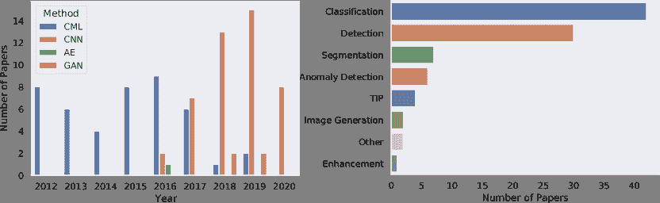
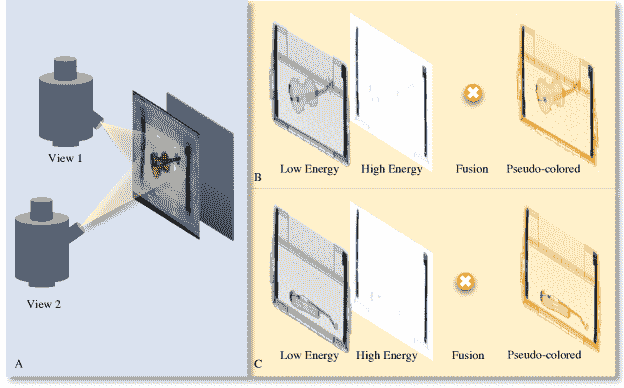
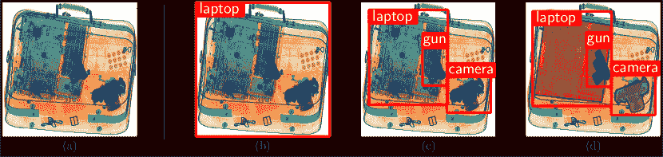

<!--yml

类别：未分类

日期：2024-09-06 20:03:11

-->

# [2001.01293] 迈向自动威胁检测：深度学习在 X 射线安全成像中的进展综述

> 来源：[`ar5iv.labs.arxiv.org/html/2001.01293`](https://ar5iv.labs.arxiv.org/html/2001.01293)

# 迈向自动威胁检测：深度学习在 X 射线安全成像中的进展综述

Samet Akcay Toby Breckon Intel R&D, UK Department of Computer Science, Durham University, Durham, UK

###### 摘要

X 射线安全筛查被广泛用于维护航空/交通安全，其重要性引起了对自动化筛查系统的特别关注。本文旨在通过将计算机化 X 射线安全成像算法分类为传统的机器学习和现代深度学习应用，来回顾这一领域。第一部分简要讨论了 X 射线安全成像中使用的经典机器学习方法，而后半部分则深入研究了现代深度学习算法的使用。提出的分类法将深度学习方法细分为监督学习和无监督学习，特别关注对象分类、检测、分割和异常检测任务。本文进一步探讨了已建立的 X 射线数据集，并提供了性能基准。根据当前和未来深度学习的趋势，本文最后讨论了 X 射线安全成像的未来方向。

###### 关键词：

综述，调查，X 射线安全成像，深度学习^†^†期刊：模式识别\newunicodechar

fifi \newunicodecharffff

## 1 引言

X 射线安全筛查是维护机场和交通安全的最广泛使用的安全措施之一，其中人工筛查发挥着至关重要的作用。虽然经验和知识是自信检测的关键因素，但外部变量如情绪疲劳和工作满意度会对人工筛查产生不利影响 [1]。

X 射线行李的混杂性质也对人工操作员的决策时间和检测性能产生负面影响 [2, 3]。例如，当笔记本电脑留在包内时，人为筛查员的威胁检测性能显著降低。这是由于笔记本电脑的紧凑结构限制了筛查员的检测能力 [4]。所有这些问题都需要在 X 射线安全成像中使用自动化目标检测算法，这将保持操作员的警觉性并提高检测和响应时间 [5]。

图 1：最近在 X 射线安全成像领域发表的论文统计数据。(a) 多年来机器学习与深度学习论文的分布。(b) 根据任务对论文的分布

尽管对 X 射线筛查[6, 7, 8, 9, 10]的兴趣激增，自动化计算机辅助筛查仍然研究不足，特别是由于数据的缺乏和对先进学习算法的需求。该领域的前期工作更多集中于传统图像分析[11, 12, 13]和机器学习方法，涉及分类[14, 15, 16]、检测[17, 18]和分割[19, 20]任务。该领域的著名调查[21, 22]详细回顾了这些方法，并对图像处理和理解中的现有文献进行了分类。

最近，另一方面，基于深度学习的算法已被应用于 X 射线安全成像[23, 24, 25]，尤其是在卷积神经网络（CNN）显著超越传统机器学习方法之后。为此，截至 2017 年，深度学习算法的使用已纳入美国政府的技术路线图；到 2019/20 年，几种早期商业系统已从学术研究中出现[26]。

<svg   height="1" overflow="visible" version="1.1" width="1"><g transform="translate(0,1) matrix(1 0 0 -1 0 0)" fill="#000000" stroke="#000000" stroke-width="0.4pt"><foreignobject width="-15.37" height="0" transform="matrix(1 0 0 -1 0 16.6)" overflow="visible">\Tree27, 11, 28, 29, 30, 3132, 33, 3435, 36, 37, 38, 39, 40, 41, 42, 43, 44, 42, 43, 18, 14, 45, 46, 14, 15, 1647, 41, 48, 49, 50, 51, 52, 53, 54, 55, 24, 5657, 1817, 1858, 59, 60, 61, 13, 19, 2023, 62, 25, 63, 64, 65, 66, 67, 68, 69, 70, 7172, 73, 7473, 75, 70, 76, 74, 77, 7879, 80, 8182, 83, 8485, 86, 87, 88, 89, 90, 91</foreignobject></g></svg>

图 2：X 射线安全成像文献的分类法。

随着这一趋势的变化，本文献综述回顾了在各种计算机视觉任务中已发表的工作（图 1B），特别关注深度学习应用。我们在 Google Scholar 搜索中使用以下关键词和运算符来搜索相关论文：‘((x-ray security) OR (x-ray baggage) OR (x-ray luggage)) AND ((detection) OR classification OR segmentation)’. 我们还基于引用和相关论文进行了逆向搜索，最终识别出大约 213 篇相关文章，其中 36 篇采用了基于深度学习的算法（图 1A）。根据工作的范围，我们最终将相关论文的数量减少到 130 篇。因此，本工作的主要贡献如下：

+   1.

    *分类法* — 经典机器学习和现代深度学习在 X 射线安全成像中的广泛概述（见图 2）。

+   2.

    *数据集* — 用于训练深度学习方法的大型数据集概述。

+   3.

    *开放问题* — 基于计算机视觉当前趋势的开放问题、当前挑战和未来方向的讨论。

论文的其余部分如下：第二部分提供了关于 X 射线成像原理的简要背景。第 3 和第四部分介绍了用于评估方法性能的数据集和评估标准。第 5 和第六部分探讨了传统图像分析和机器学习算法。第七部分回顾了深度学习算法在 X 射线安全成像中的应用。第八部分讨论了当前趋势下的开放问题、当前挑战，而第九部分最终总结了论文。

## 2 背景：X 射线成像

图 3：X 射线成像的高级概述。RGB 和 X 射线图像来自 COMPASS-XP 数据集 [92]。

如图 3A 所示，X 射线成像的主要原理是 X 射线管发射穿透被扫描物体的射线。根据物体的材料密度，物体会衰减 X 射线信号。这种衰减公式为 $I_{x}=I_{0}e^{\mu x}$，其中 $I_{x}$ 是 $x$ cm 处的强度，$I_{0}$ 是初始强度，$\mu$ 是基于材料厚度的线性衰减系数。这个公式显示了材料密度和测量强度之间的反比例关系——例如，高密度材料会导致高衰减和低测量强度。

现代 X 射线机器配备了多个 ($m$) 能量，能够通过不同能量产生 $m$ 张 X 射线图像（图 3B），以识别物体的密度和有效原子序数 ($Z_{eff}$)。估计的强度和 $Z_{eff}$ 值通过查找表转换为伪彩色图像 [29]。除了多个能量级别，最先进的机器还从多个视角生成 X 射线扫描，以从不同角度查看感兴趣的物体（图 3C）。有关 X 射线图像生成过程的更多细节，请参阅 [93]。

## 3 数据集

本节探讨了在文献中广泛使用的 X 射线安全成像数据集。

### 3.1 Durham Baggage (DB) Patch/Full Image Dataset

这个数据集包含 $15,449$ 个 X 射线样本，配有来自双能四视角 Smiths 6040i 机器的伪彩色材料映射。最初，样本具有以下类别分布：$494$ 个相机，$1,596$ 个陶瓷刀，$3,208$ 个刀具，$3,192$ 个火器，$1,203$ 个火器部件，$2,390$ 个笔记本电脑和 $3,366$ 个良性图像。这个数据集的多个变体被构建用于分类（DBP2 和 DBP6）[23, 15, 73] 和检测（DBF2 和 DBF6）[72, 73]。数据集均衡地涵盖了各种威胁对象。然而，由于这是一个私有数据集，它的使用仅限于文献中。

### 3.2 GDXray

Grima X 射线数据集（$\mathbb{GDX}$RAY）[94]包含$19,407$个 X 射线样本，来自五个不同的子集，包括铸件（$2,727$）、焊接（$88$）、行李（$8,150$）、自然图像（$8,290$）和设置（$152$）。行李子集主要用于安全应用，包含多个视角的图像。该数据集的限制是内容不复杂，不适合用于实时部署的训练。

### 3.3 UCL TIP

该数据集包含$120,000$个良性图像，使用 Rapiscan^® R60 扫描。每个样本为 16 位灰度图像，大小在$1920\times 850$和$2570\times 850$之间变化。数据集的训练和测试分割为$110000$ : $10000$，其中训练图像为$256\times 256$的补丁，随机从$110,000$张图像中抽样，而测试集包含$5000$张良性图像和$5000$张威胁图像。威胁图像通过[33]中提出的 TIP 算法合成生成，根据应用需求，将小型金属威胁（SMT）或汽车图像投影到良性样本中。该数据集有多种变体，用于多个研究，如[87, 88, 63, 65, 25, 64, 66]。

### 3.4 SIXray

在机器规格未知的情况下，该数据集来自地铁站，由[71]发布。SIXray 数据集包含$1,059,231$张 X 射线图像，其中$8929$张经过手动标注，分为$6$个不同的类别：枪支、刀具、扳手、钳子、剪刀、锤子和背景。该数据集包含尺度、视点广泛且大多重叠的物体，使其成为实时分类、检测和分割应用的合适数据集。

### 3.5 达勒姆行李异常数据集–DBA

这个内部数据集包含$230,275$个双能量 X 射线安全图像补丁，使用$64\times 64$的重叠滑动窗口方法提取。数据集包含 3 个异常子类——刀具（$63,496$）、枪支（$45,855$）和枪支组件（$13,452$）。正常类包含$107,472$个良性 X 射线补丁，按照$80:20$的训练-测试比例分割。DBA 数据集在[89]和[90]中用于无监督异常检测。与 DB 数据集变体类似，该数据集不公开，限制了其在文献中的使用。

### 3.6 完整火器与操作性良性–FFOB

如[73, 89, 90, 91]中所示，该数据集包含来自英国政府评估数据集[95]的样本，包括专家隐蔽的火器（威胁）物品和来自商业 X 射线安全筛查操作（行李/包裹）的操作性良性（非威胁）图像。该数据集标记为 FFOB，包括$4,680$个完整火器作为完整异常和$67,672$个操作性良性作为完整正常图像。该数据集的主要缺点是访问受限。

### 3.7 Compass - XP 数据集

该数据集 [92] 使用 $501$ 个物体从 $369$ 个对象类别中收集，这些类别是 ImageNet 类别的子集。数据集包括 $1901$ 对图像，每对图像包含用 Gilardoni FEP ME 536 扫描的 X 光图像及其用 Sony DSC-W800 数码相机拍摄的照片版本。此外，每张 X 光图像都有其低能量、高能量、材料密度、灰度（低能量和高能量的组合）和伪彩色 RGB 版本。该数据集非常适合 X 光成像研究，但其非混杂特性限制了其在实时应用中的使用。

### 3.8 OPIXray 数据集

OPIXray 数据集 [96] 是由安检人员手动标注的机场检查数据集。该数据集包含来自五种锐利物体的 8885 张 X 光图像（7019 张训练图像，1776 张测试图像），包括折叠刀（1,993）、直刀（1,044）、剪刀（1,863）、多功能刀（1,978）和多工具刀（2,042）。

| 数据集 | 领域 | 任务 | 样本数量 | 类别 | 性能 | 参考文献 |
| --- | --- | --- | --- | --- | --- | --- |
| DBP2 | 行李 | 分类 | 19,938 | 枪支、背景 | ACC: 0.994 | [23, 73] |
| DBP6 | 行李 | 分类 | 10,137 | 枪支、枪支部件、相机 | ACC: 0.937 | [23, 73] |
|  |  |  |  | 刀、陶瓷刀、笔记本电脑 |  |  |
| UCL TIP | 货物 | 分类 | 120,000 | 小型金属威胁（SMT）、汽车 | ACC: 0.970 | [65, 87, 67, 66, 88, 64] |
|  |  | 检测 |  |  |  |  |
|  |  | 异常检测 |  |  |  |  |
| GDXRay | 行李 | 分类 | 19,407 | 枪支、飞镖、剃刀片 | ACC: 0.963 | [24, 97, 70, 98] |
|  |  | 检测 |  |  |  |  |
| DBF2 | 行李 | 检测 | 15,449 | 枪支、背景 | mAP: 0.974 | [72, 73] |
| DBF6 | 行李 | 检测 | 15,449 | 枪支、枪支部件、相机 | mAP: 0.885 | [72, 73] |
|  |  |  |  | 刀、陶瓷刀、笔记本电脑 |  |  |
| PBOD | 行李 | 分类 | 9,520 | 爆炸物 | AUC: 0.950 | [99] |
| MV-Xray | 行李 | 检测 | 16,724 | 玻璃瓶、TIP 武器、真实武器 | mAP: 0.956 | [79] |
| SASC | 行李 | 检测 | 3,250 | 剪刀、气雾剂 | mAP: 0.945 | [75] |
| Zhao *et al.* | 行李 | 分类 | 1,600 | 扳手、钳子、刀片、打火机 | ACC: 0.992 | [69] |
|  |  |  |  | 刀、螺丝刀、锤子 |  |  |
| Smiths-Duke | 行李 | 检测 | 16,312 | 枪支、折叠刀、混合锐利物体 | mAP: 0.938 | [100] |
| SIXray | 行李 | 检测 | 1,059,231 | 枪支、刀、扳手、钳子 | mAP: 0.439 | [71] |
|  |  |  |  | 剪刀、锤子、背景 |  |  |
| UBA | 行李 | 异常检测 | 230,275 | 枪支、枪支部件、刀具 | AUC: 0.940 | [89, 90] |
| FFOB | 行李 | 异常检测 | 72,352 | 全武器、良性 | ACC: 0.998 | [89, 90] |
| Yang *et al.* | 行李 | 分类 | 2,000 | 扳手、叉子、手枪、移动电源 | ACC: 0.991 | [101] |
|  |  |  |  | 打火机、钳子、刀具、液体、伞、螺丝刀 |  |  |
| OPIXray | 行李 | 检测 | 8,885 | 折叠刀、直刀 | mAP: 0.753 | [96] |
|  |  |  |  | 打火机、剪刀、多功能刀 |  |  |

表 1：用于深度学习应用的 X 射线安全成像数据集

## 4 评估标准

在审阅论文之前，介绍领域内使用的各种性能指标是必要的。这里展示的所有指标都是基于真实阳性 ($TP$)、假阳性 ($FP$)、真实阴性 ($TN$) 和假阴性 ($FN$) 计算的。

##### 准确率

(ACC) 被定义为正确预测样本的数量与总预测数量的比值，数学表达为 $ACC=(TP+TN)/(TP+TN+FP+FN)$。

##### 真实阳性率

(TPR) 是正确预测的正样本比例： $TPR=TP/(TP+FN)$

##### 假阳性率

(FPR) 被计算为预测为正样本的负样本比例： $FPR=FP/(FP+TN)$。

##### 平均平均精度

(mAP) 被定义为平均精度的均值，这是通过精度和召回曲线下的面积来评估的指标，其中精度是 $TP/(TP+FP)$，召回率是 $TP/(FN+TP)$。

##### 曲线下面积

(AUC) 是接收器操作特性（ROC）曲线下的面积，由真实阳性率和假阳性率绘制。

表 1 显示了基于第 3 和 4 节中讨论的数据集和评估标准的基准统计数据。表现最佳的模型将在接下来的部分中详细说明。

## 5 传统图像分析

本节探讨了执行图像增强和威胁图像投影的传统图像分析技术。

### 5.1 图像增强

对输入数据的预处理在生成更高质量的图像方面起着重要作用，从而提高了筛查者和计算机的可读性。文献中常见的方法是[11]融合低能量和高能量的 X 射线图像，并应用背景减法来减少噪声，然后进行手动[27]或自适应[28]阈值选择。伪彩色处理[11, 29, 102]是另一种增强技术，它为灰度 X 射线图像上色，提高了检测性能和操作员的警觉性。

### 5.2 威胁图像投影

威胁图像投影（TIP）[32]是另一种可以归类于传统图像分析的方法。TIP 用于生成合成数据集，以训练人工筛查员[103]或机器/深度学习模型。常见的 TIP 方法是通过乘法将二进制威胁掩模投影到良性输入 X 射线图像上，从而生成包含威胁项目的输出 X 射线图像。应用仿射[33]或对数[34]变换会在良性图像上添加各种威胁投影。实证研究表明，使用 TIP 可以提高模型的整体检测性能[33, 34, 104]。

## 6 X 射线安全成像中的机器学习方法

本节探讨了传统机器学习方法在 X 射线安全成像中的应用。根据分类、检测和分割三个任务来回顾文献。对于本节的另一种视角，读者可以参考 Mery[93]和 Rogers *et al.*[22]的相关综述。

### 6.1 对象分类

在深度学习主导该领域之前，视觉词袋（BoVW）方法曾经很流行。常见的方法是（i）通过检测器/描述符进行特征提取，（ii）通过 k-means[105, 38]对特征进行聚类，（iii）对 RF[106]、SVM[107]或稀疏表示[38, 49, 39, 43, 42, 45, 46, 16, 15]进行分类。

尽管 BoVW 主导了领域，其他计算机视觉/机器学习技术也被研究用于 X 射线目标分类任务。Mery *et al.*[49]结合结构估计和分割以及通用跟踪算法来检测 X 射线目标。类似的工作[41、54、55、62、24、108]详尽评估了各种计算机视觉技术，特别关注基于 k-NN 的稀疏表示，在 GDXray 上实现了与深度模型相当的准确度（$94.7\%$ 对比 $96.3\%$）。

### 6.2 目标检测

本节回顾了文献中提出的传统 X 射线目标检测模型。由于是一个具有挑战性的任务，需要同时预测边界框坐标和类别标签，因此文献中的传统目标检测算法在这一领域相对有限。

与第 6.1 节中探讨的分类方法类似，传统检测算法也主要采用 BoVW 方法。[57、40、18]的评估工作详尽地研究了 BoVW 在 X 射线目标检测中的应用。用 SVM 分类器[107]评估各种特征描述符显示，（i）稀疏强度域图像描述符（SPIN）[109]实现了最高的检测性能（mAP: $46.1\%$）。

与分类不同，这里模型还利用了多视角图像，这通常能在旋转和叠加阻碍从一个视角看到目标时提高性能[110]。尽管其计算复杂性较高，多视角成像帮助人工操作员和机器提高检测性能[111、17、18]。[112、50、52、48]提出的一种通用多阶段方法首先通过特征描述符和 k-NN 分类器[113]进行特征提取。来自不同视角的匹配特征由 k-NN 分类器[113]进行分类（$95.7\%$精度）。

### 6.3 目标分割

本节探讨了文献中提出的各种分割技术。该领域的早期工作 [58, 59] 研究了基于像素的简单分割方法，使用固定的绝对阈值和区域分组。随后，更多的工作则专注于通过最近邻预分割、背景去除和最终分类 [60, 61, 13, 19, 20]。

另一种方法是利用基于图的算法进行分割。早期的工作集中在属性关系图之间的模糊相似度距离 [114, 61]，而最近的研究则探讨了光谱聚类和变分图像分割 [115]。

尽管报告了有希望的检测性能，这些技术通常在小型数据集上进行实验，限制了它们在实时应用中的可扩展性。

## 7 X 射线安全成像中的深度学习

本节回顾了利用深度学习算法的 X 射线安全应用。如图 2 和表 2 所示，我们将算法分为监督（分类、检测和分割）和无监督（异常检测）方法。

### 7.1 监督学习方法

监督学习方法分为分类、检测和分割任务，其中模型分别使用地面真值全局、边界框和像素级标签。

图 4：一个输入的 X 射线图像，以及根据深度学习任务的输出，（a）通过 ResNet-50 进行分类 [116]，（b）使用 YOLOv3 进行检测 [117] 和通过 Mask RCNN 进行分割 [118]。

#### 7.1.1 分类

研究[23]是首次将 CNN 应用于 X 射线安全图像分类任务的研究之一，其中模型预测全局图像标签（图 4B）。作者检查了通过迁移学习使用 CNN，以评估迁移学习在有限数据集情况下对 X 射线对象分类的帮助程度。在一个二分类（枪与非枪）X 射线分类问题上逐层冻结 AlexNet 权重的实验表明，即使网络的所有层都被冻结，CNN 也显著优于 BoVW 方法（SIFT+SURF），即使是训练有 SVM 或 RF。另一组实验分析了 CNN 在具有挑战性的 6 类分类问题中的应用，其结果显示了 CNN 在该领域的巨大潜力。

一项类似的研究[25]对比了深度学习与传统机器学习在对装有汽车或 SMT 的非空货柜进行分类中的应用。该多阶段方法首先将货柜分类为空的和非空的。第二阶段是对被分类为非空的货柜中的汽车进行分类，采用了 oBIF + RF 方法。通过使用 UCL TIP 数据集，作者评估了 9 层和 19 层网络[63]的性能，这些网络类似于[119]和[120]，并且显示出即使是性能最差的 CNN 也优于传统的机器学习方法（oBIF + RF）。

后续研究[64]进一步探讨了从 X 射线货物图像中检测汽车的问题。一个滑动窗口将 UCL TIP 图像分割成多个块。作者随后探索了包括强度、oBIF [121]、视觉词直方图金字塔（PHOW）[122]以及 CNN 特征在内的各种特征。在 SVM [107]、RF [106]和 soft-max（CNN）上训练这些特征表明，基于 VGG-18 [120]的 RF 分类器在从对数变换图像中提取的特征上训练，达到了最高的性能（FPR: $0.22$%）。

Jaccard *等*[65] 的额外工作评估了输入类型对 CNN 性能的影响，通过在 VGG [120] 变体上训练单通道原始图像和包含原始图像及其对数变换图像的双通道数据。定量分析表明，使用双通道原始图像和对数变换图像从头开始训练的 VGG-19 模型优于其他变体（AUC: $97\%$, FPR: $6\%$）。

Rogers *等*[66] 探讨了使用双能量 X 射线图像进行自动威胁检测。作者研究了应用于通过双能量 X 射线机拍摄的高能 ($H$) 和低能 ($L$) X 射线图像的各种变换。使用 UCL TIP 数据集，通过 $256\times 256$ 滑动窗口生成 640,000 个图像补丁。使用固定的 VGG-19 网络 [120] 训练此数据集，输入通道包括单通道 ($H$)、双通道 ($\{H,-\log{H}\}$, $\{-\log{H},-\log{L}\}$) 和四通道 $(\{-\log{L},L,H,\allowbreak-\log{H}\})$，结果显示双通道和四通道相比于单通道变体总是能实现更优的检测性能（ACC: $95\%$–双通道 vs $90\%$–单通道）。

受到 X 射线数据集有限可用性的启发，Zhao *等*[69] 提出了一个三阶段算法，该算法最初通过从输入图像中提取的前景物体的角度信息对输入 X 射线数据集进行分类和标记。第二阶段通过类似于 [123] 的对抗网络生成新的 X 射线物体。额外使用 [124] 可以提高生成图像的质量。最后，一个小型分类网络确认生成的图像是否属于正确的类别。在后续研究中，Yang *等*[101] 进一步探讨了改进 GAN 训练以生成更好 X 射线图像的方法。定量评估显示，本文提出的 GAN 方法生成了视觉上优于的禁止物品。

缪 *等人*[71] 介绍了一种模型（CHR）用于分类/检测来自 SIXray 的 X 射线图像。该模型通过从三个连续层中提取图像特征来处理类别不平衡和杂乱问题，其中后续层被上采样并与前一层连接。一个细化函数 $g()$ 从连接的特征图中去除冗余信息。该工作的目标是最小化从三个连续层中细化的中级特征分类的加权总和的损失（$\{h(\tilde{x}_{n}^{(l-1)}),\allowbreak h(\tilde{x}_{n}^{(l)}),h(\tilde{x}_{n}^{(l+1)})\}$）。使用建议的损失训练模型时，在 SIXray 上与 ResNet-101 一起使用时，mAP 提升了 $2.13\%$ （$36.01$ 对比 $38.14$）。类似的方法 [96] 介绍了一种即插即用的模块，利用边缘和材料信息通过注意机制来定位对象。

一项评估工作 [99] 调查了 CNN 在爆炸物检测任务中的应用。初始阶段通过固定图像大小、裁剪 $Z_{eff}=0$ 的不相关背景对象以及应用数据增强变换来处理输入数据。对随机初始化与在 VGG19[120]、Xception [125] 和 InceptionV3 [126] 网络上的预训练进行评估，结果表明随机初始化的模型在二分类任务中取得了更好的准确率。为了研究强度和 Z-eff 值对性能的影响，作者对强度和 Z-effective、仅强度和仅 Z-effective 三个 VGG-19 网络进行了训练。结果表明，仅使用 Z-eff 训练的模型精度最高。最后一组实验通过热图调查定位，并表明预训练网络表现优越，因为随机初始化的网络往往在小数据集上过拟合。

卡德威尔 *等人*[67] 研究了在不同扫描仪的不同数据集上训练的模型的泛化能力。作者从单个或多个领域创建训练和测试拆分，以研究在其他模态之间转移的影响。定量分析揭示了由于扫描仪的未知参数和 CNN 对未见目标数据集的泛化能力，信息转移是具有挑战性的。

#### 7.1.2 检测

本节通过对单视图和多视图目标检测的分类来探讨基于 CNN 的目标检测算法。

##### 单视图检测

在 CNN 分类成功之后，[72] 的研究训练了基于滑动窗口的 CNN、Faster RCNN [127] 和 R-FCN [128] 模型，用于 DBF2/6 Patch/Full Image Dataset ‣ 3 Datasets ‣ Towards Automatic Threat Detection: A Survey of Advances of Deep Learning within X-ray Security Imaging")数据集上的火器和多类检测问题。实验表明，Faster RCNN [127] 与 VGG16 [120] 在 6 类 DBF6 Patch/Full Image Dataset ‣ 3 Datasets ‣ Towards Automatic Threat Detection: A Survey of Advances of Deep Learning within X-ray Security Imaging") 数据集上获得 $88.3\%$ 的 mAP，而 R-FCN 与 ResNet-101 在 2 类（枪 vs 无枪） DBF2 Patch/Full Image Dataset ‣ 3 Datasets ‣ Towards Automatic Threat Detection: A Survey of Advances of Deep Learning within X-ray Security Imaging") 数据集上取得了最高的性能 ($96.3$ mAP)。

Sigman *et al.*[129] 使用了对抗领域自适应技术，以匹配大量未标记的商业（SoC）数据集的背景分布。通过这种方式，帮助在小型标记数据集上训练 Faster RCNN [127] 从而检测 SoC 数据集中的对象。

Subramani *et al.*[77] 研究了在 SIXray10 数据集上训练的 SSD [130] 和 RetinaNet [131]，分别达到了 $60.5\%$ 和 $60.9\%$ 的性能。

Liu *et al.*[75] 还通过 YOLOv2 [117] 进行目标检测，以检测 SASC 数据集上的剪刀和气溶胶。训练 YOLO v2 经过 6000 次迭代获得了 $94.5\%$ 的平均精度和 $92.6\%$ 的召回率，并具有 $68$ FPS 的运行速度。

Cui 和 Oztan [76] 认为，RetinaNet [131] 在训练时可以获得与传统滑动窗口分类相媲美的检测性能，同时速度明显更快，训练所用的图像数量为 30,000 张，这些图像是通过 TIP 合成生成的，涉及 $5000$ 个 X 光货物容器和 $544$ 个火器。

Hassan *等* [74] 提出了一个目标检测算法，其中 RoI 通过级联的多尺度结构张量生成，这些张量基于对象方向的变化进行提取。提取的 RoI 然后输入到 CNN 中，该 CNN 在 GDXray 和 SIXray 数据集上在定量和计算上超越了 RetinaNet、YOLOv2 和 F-RCNN。类似的方法在 [78, 132] 中生成基于轮廓的对象提案，随后输入到 CNN 中，在 SIXray10 数据集上实现了 $96\%$ mAP。

受到缺乏注释 X 射线数据集的启发，徐 *等* [70] 利用注意力机制进行威胁材料的定位。第一阶段前向传播输入，找到相应的类别概率。反向传播步骤识别在输出类别决策过程中激活的相互连接的神经元。第一卷积层的激活生成热图。最终阶段通过将激活图层的前一层的激活进行归一化来细化激活图。与传统反卷积方法（mAP: $34.3\%$）相比，所提方法在不需要边界框信息的情况下实现了优越的检测（$56.6\%$）。

类似于 [67]，Gaus *等* [82] 通过在不同数据集上训练/验证 CNN 来研究 CNN 的泛化能力（DBF3 ($88\%$ mAP) $\rightarrow$ SIXray ($85\%$ mAP)）。

##### 多视角检测

有许多论文利用多视角 X 射线图像来提高模型的检测性能。一项评估工作 [100] 探讨了 F-RCNN、R-FCN [128] 和 SSD [130] 在单视角/多视角 X 射线图像中的表现。通过合并来自各个视角的目标检测输出来利用 OR 门检测，显示多视角的表现优于单视角（$0.938$ 对比 $0.798$，当使用 R-FCN 和 ResNet-101 进行训练时）。刘 *等* [133] 提出的一种两阶段方法首先提取前景对象，然后利用 F-RCNN 检测 $32,253$ 张地铁 X 射线图像，对 6 类对象的 mAP 达到 $77\%$。

一项类似的研究 [80] 通过在包含 4 个威胁类别的数据集上训练 SSD 和 F-RCNN，每个类别大约包含 $3,400$ 张图像。以 Inception ResNet v2 为骨干网络的 F-RCNN 在单视角和多视角图像上的 mAP 分别达到了 $92.2$ 和 $97.7$。另一项研究 [79] 通过修改 F-RCNN 利用多视角。多视角池化层构建了从卷积层提取的 3D 特征 2D。3D 区域提议网络生成 RoI。在 3D RoI 池化层之后进行分类和边界框预测。实验表明，与单视角图像相比，多视角图像带来了改进（$95.56\%$ 对比 $91.23\%$）。

Isaac-Medina *等人*[81] 利用 X 射线图像的多视角极点约束训练了一个 YOLOv3 [117] 检测器，其性能比单视角高出 2.2%（图 4C）。

总体而言，这些结果表明，使用多视角图像有助于提高深度学习模型的检测性能。

#### 7.1.3 分割

由于缺乏像素级标注的数据集，分割任务在该领域中研究较少。发布的一个研究 [83] 将分割和异常检测任务结合起来，其中双 CNN 流水线首先通过 Mask RCNN [118] 对 RoI 进行分割，然后通过 ResNet-18 [116] 将这些区域分类为良性/异常，达到了 $97.6\%$ 的分割 mAP 和 $66.0\%$ 的异常检测准确率（图 4D）。另一项工作 [134] 提出了三阶段方法，其中 (i) 通过使用 Mask RCNN [118] 实现对象级分割，(ii) 通过超像素分割分割子组件区域，(iii) 通过细粒度 CNN 分类进行最终对象分类，总体上在 $7,878$ 个电子物品上实现了 $97.91\%$ 的异常检测准确率。*等人*[135] 提出了一个利用编码-解码分割网络中双重注意力机制的分割模型。前一个注意力模块对 RoI 进行分类，而后一个则对对象进行定位。在 PASCAL 类似结构的 X 射线数据集上进行实验，该数据集包含来自 7 个类别的 $7,532$ 张增强图像，取得了 $99.3$ 的准确率和 $68.3$ 的平均交集比例（mIoU）。

**Hassan et al.**[84]提出了一种单阶段实例分割算法。该方法首先通过可训练的结构张量提取过渡模式，然后将其传递给编码器-解码器以构建二进制分割掩码。在 GDXray（$96.7$）、SIXray（$96.16$）、OPIXray（$75.32$）和 COMPASS XP（$58.4$）数据集上的 mAP 评估显示，该模型在基准测试中达到了最先进的实例分割性能。

### 7.2 无监督方法

本节探讨了无监督深度学习模型，其中提出的算法主要研究异常检测任务。当人类操作员专注于正常物体而非威胁项目时，检测表现往往更好。此外，对日常正常物体的了解也会导致更好的检测性能[136]。相同的概念应用于异常检测，其中模型仅用正常样本进行训练，并在正常/异常示例上进行测试。

一种异常检测方法[86]采用稀疏前馈自编码器以无监督方式学习正常和异常数据的特征编码。然后，使用 SVM[107]对图像进行分类，将其分为异常或正常。对 MNIST[137]和货物集装箱数据集（空的与非空的）进行的验证表明，从自编码器中提取的隐藏层表示对于图像中异常的检测具有重要意义。当与原始输入和残差误差融合时，来自隐藏层的特征编码能提供更好的检测性能。

后续工作利用从 UCL TIP 数据集中提取的强度、对数强度和 VGG-19[120]特征，通过随机分裂树森林异常检测器[138]对正常图像进行训练。在正常+异常数据上测试该模型，得到$64$%的 AUC。

一项类似的研究[89]，在其中图像和潜在向量空间被优化用于异常检测，利用了对抗网络，使得生成器包含编码器-解码器-编码器子网络。该模型的目标是联合最小化真实/生成图像与其潜在表示之间的距离，整体上在统计和计算上都优于之前的最新技术（UBA: $64.3\%$, FFOB: $88.2\%$ – AUC）。后续工作[90]进一步提高了[89]的性能，通过（i）在生成器网络中使用跳跃连接以应对更高分辨率的图像，以及（ii）在鉴别器网络中学习潜在表示（UBA: $94.0\%$, FFOB: $90.3\%$ – AUC）。

| 参考文献 | 领域 | 问题 | 方法 |
| --- | --- | --- | --- |
| Akçay *等*[23] | 行李 | 物体分类 | 使用迁移学习的 CNN |
| Svec [62] | 行李 | 物体分类 | 使用迁移学习的 CNN |
| Andrews *等*[88] | 货物 | 异常检测 | 用随机分裂树训练 CNN 特征 |
| Jaccard *等*[25] | 货物 | 物体分类 | 使用 oBIF+RF 进行非空货物检测，然后用 CNN 进行汽车检测 |
| Jaccard *等*[63] | 货物 | 物体分类 | 从头开始的 CNN 优于 RF |
| Rogers *等*[66] | 货物 | 物体分类 | 高低能量 X 射线图像的评估 |
| Caldwell *等*[67] | 货物，行李 | 物体分类 | 领域间的可迁移性 |
| Yuan 和 Gui [68] | 太赫兹 | 物体分类 | 两阶段。首先对 RGB 图像进行分类，然后对太赫兹图像进行分类。 |
| Zhao *等*[69] | 行李 | 图像生成 | 通过 GAN 生成 X 射线物体，并使用 CNN 进行分类 |
|  |  | 物体分类 |  |
| Yang *等*[101] | 行李 | 图像生成 | 通过 GAN 生成 X 射线物体，并使用 CNN 进行分类 |
|  |  | 物体分类 |  |
| Miao *等*[71] | 行李 | 物体分类 | 使用类别平衡的层次细化 |
| Morris *等人*[99] | 行李 | 目标分类 | 基于区域的检测与 Z-effective |
| Akçay 和 Breckon [72] | 行李 | 目标检测 | 目标检测，Faster-RCNN 最佳。 |
| Liang *等人*[100] | 行李 | 目标检测 | RFCN 最佳。多视角优于单视角。 |
| Liang *等人*[80] | 行李 | 目标检测 | 探索各种检测算法，F-RCNN 与 Inception ResNet v2 实现了最佳性能 |
| Steitz *等人*[79] | 行李 | 目标检测 | 具有多视角池化的 F-RCNN 优于单视角。 |
| Liu *等人*[75] | 行李 | 目标检测 | YOLOv2 实现了实时性能。 |
| Xu *等人*[70] | 行李 | 目标检测 | 通过注意力机制从 X 射线图像中定位威胁材料 |
| Islam *等人*[139] | 行李 | 目标检测 | 跟踪机场的乘客及其行李，经过 X 射线安检点时进行检测 |
| Liu *等人*[133] | 行李 | 目标检测 | 通过材料信息进行前景对象分割，然后使用 F-RCNN |
| Gauss *等人*[82] | 行李 | 目标检测 | F-RCNN 调查各种 X 射线扫描仪之间的可迁移性。 |
| Cui 和 Oztan [76] | 行李 | 目标检测 | 在 TIP 数据集上训练的 RetinaNet 比滑动窗口 CNN 检测速度更快。 |
| Hassan *等人*[74] | 行李 | 目标检测 | 通过级联多尺度结构张量提取 RoI，然后通过 CNN 进行分类 |
| Bhowmik *等人*[104] | 行李 | 目标检测 | 探索在 TIP 数据集上训练的模型的泛化能力。 |
| Andrews *等人*[86] | 货物 | 异常检测 | 原始输入与隐藏层特征编码的残差误差融合。 |
| Akçay *等人*[89] | 行李 | 异常检测 | 编码器-解码器-编码器子网络。最小化潜在向量和图像空间。 |
| Akçay *等人*[90] | 行李 | 异常检测 | 使用跳跃连接。最小化鉴别网络中的潜在向量。 |
| Griffin *等人*[91] | 行李 | 异常检测 | 使用 CNN 提取特征，然后用高斯模型进行训练。 |
| Gauss *等人*[83] | 行李 | 目标分割 | 使用 Mask-RCNN 分割 RoI，并用 CNN 分类进行异常检测 |
| Bhowmik *等人*[134] | 行李 | 目标分割 | 使用 Mask-RCNN 分割 RoI，超像素用于子组件级分析，细粒度 CNN 进行分类 |
| An *等人*[140] | 行李 | 目标分割 | 在编码器-解码器分割网络中使用双重注意力机制。 |

表 2：X 射线安检图像中应用的深度学习方法概述。

另一种异常检测算法 [91] (i) 首先从类似 Inception v3 [141] 的网络中提取正常图像的特征，(ii) 随后训练一个多变量高斯模型来捕捉 CAST 数据集的正常分布。测试样本的异常得分基于其相对于模型的可能性，总体上得到$92.5\%$ AUC。

## 8 讨论与未来方向

尽管提出的方法表现出色，但仍存在一些可识别的限制。本节讨论了基于当前方法的优缺点以及相关文献（包括与本文相关的并行工作）的挑战和未来方向。

##### 数据集

尽管迁移学习提高了小型 X 射线数据集的性能，但缺乏大型数据集限制了当代深度模型的训练。领域内相对较大的数据集如 SIXray、FFOB 在某些类别上高度偏倚，限制了训练可靠的监督方法。因此，必须建立大型的、同质的、现实的且公开可用的数据集，这些数据集可以通过 (i) 在实验室环境中手动扫描不同物体和方向的多个包，或 (ii) 通过现代算法生成合成数据集来收集。

两种方法各有优缺点。尽管手动数据收集可以获取现实样本并具有灵活性以生成任意组合，但它相当昂贵，需要大量的人力和时间。

合成数据集生成则是另一种方法，目前由 TIP [33, 34] 或 GAN [69, 101] 实现。近期的研究 [104] 实证表明，使用 TIP 数据集进行检测任务会对真实样本的检测性能产生负面影响。因此，未来的工作中可以考虑更先进的算法，如图像翻译或领域适应 [124, 142]，使得模型能够学习在良性和威胁领域之间进行翻译，从而整体上比 TIP 更具优越的投影/翻译效果。

文献中还出现了由 GAN 算法生成的另一种合成数据集。然而，目前 GAN 数据集[69、101]的局限性在于模型目前无法生成完整的 X 射线图像。此外，生成图像的质量远未达到真实水平。需要进一步研究，考虑到这些问题，可能有望通过使用现代 GAN 算法[143]来创建更逼真的 X 射线图像。

##### 利用多视角信息

现有研究认识到多视角图像的关键作用，特别是当从特定视角检测物体具有挑战性时[110、79、100]。

一些研究[100、79、81]探讨了在 CNN 内部/外部利用多视角整合。尽管报告中指出了性能的逐步改善，但仍需进一步研究以探索更好的利用多视角图像的方法。

##### X 射线扫描仪之间的领域适应

正如[67、82]中指出的，将模型在不同扫描仪之间转移可能会遇到挑战，因为扫描仪的内部参数未知。未来的工作将利用领域适应[142]，其中源领域包含来自一种扫描仪的图像，而目标领域则是另一种 X 射线扫描仪的图像。即使在数据集不平衡的情况下进行训练，也能学习到内部特征，并将一种图像映射到另一种图像。

##### 改进无监督异常检测方法

本文第 7.2 节中提出的当前异常检测算法的性能在实际应用场景中有所限制。因此，需要更多的研究以设计更好的重建技术，深入学习正常性的特征，从而检测异常。

##### 材料信息的使用

在双能 X 射线系统中，高能和低能之间的衰减为不同材料提供了唯一的值，这可以进一步用于更准确的物体分类/检测[144、145]。尽管近期研究[99、66]已考察了材料信息的使用，但研究结果存在不一致。因此，建议进一步研究以全面调查材料信息。

## 9 结论

本文对传统机器和现代深度学习算法在 X 射线安全成像中的应用进行了分类。传统方法根据计算机视觉任务如图像增强、威胁图像投影、对象分割、特征提取、对象分类和检测进行了子分类。深度学习方法的回顾包括分类、检测、分割和无监督异常检测算法在该领域的应用。

根据这项回顾，可以为该领域的未来方向得出几个结论。尽管最近出现了一些数据集，但缺乏大规模且平衡良好的数据集限制了足够通用的深度学习算法的设计，使其难以在实时环境中应用。此外，由于公开数据集大多来自不同机器，具有不同的内在特性，使用领域适应技术可以提高算法的泛化能力。

与传统机器学习领域的研究丰富不同，大多数最近的方法未充分利用 X 射线成像技术，如多视角几何和高低能量。尽管存在少量研究，但仍有进一步研究的空间。此外，在无监督学习领域的进一步研究可能会更好地利用现有的未标记和未使用的 X 射线数据集。

总体而言，本文回顾了当前技术的优缺点，并对开放挑战进行了全面讨论，同时展望了该领域的未来方向。

## 参考文献

+   Chavaillaz 等人 [2019] A. Chavaillaz, A. Schwaninger, S. Michel, J. Sauer, 《X 射线行李筛查中的专业知识、自动化和信任》，《心理学前沿》 10 (2019)。

+   Schwaninger 等人 [2008] A. Schwaninger, A. Bolfing, T. Halbherr, S. Helman, A. Belyavin, L. Hay, 《基于图像的因素和训练对 X 射线筛查威胁检测性能的影响》，发表于：国际航空运输研究会议，页码 8。

+   Wales 等人 [2009] A. Wales, T. Halbherr, A. Schwaninger, 《利用速度测量预测 X 射线行李筛查任务中的表现》，发表于：国际卡纳汉安全技术会议，IEEE，2009，页码 212–215。

+   Mendes 等人 [2013] M. Mendes, A. Schwaninger, S. Michel, 《如果 X 射线安全筛查中使用运动成像，笔记本电脑可以留在乘客行李中吗？》，《人类神经科学前沿》 7 (2013)。

+   Chavaillaz 等人 [2018] A. Chavaillaz, A. Schwaninger, S. Michel, J. Sauer, 《视觉检查任务中的自动化：由低高系统可靠性支持的直接、间接或可适应提示的 X 射线行李筛查》，《人体工程学》 61 (2018) 1395–1408。

+   Murray 和 Riordan [1995] N. C. Murray, K. Riordan, 《自动爆炸物检测系统的评估》，发表于：国际卡纳汉安全技术会议，IEEE，1995，页码 175–179。

+   Zentai[2008] G. Zentai, X 射线成像在国土安全中的应用，见：成像系统与技术国际研讨会，IEEE，2008 年，第 1–6 页。

+   Wells 和 Bradley[2012] K. Wells, D. Bradley, 行李 X 射线爆炸物检测技术综述，应用辐射与同位素 70（2012）1729–1746。

+   Caygill 等人[2012] J. S. Caygill, F. Davis, S. P. J. Higson, 当前爆炸物检测技术的趋势，Talanta 88（2012）14–29。

+   Singh 和 Singh[2003] S. Singh, M. Singh, 航空安全爆炸物检测系统（EDS），信号处理 83（2003）31–55。

+   Abidi 等人[2005] B. R. Abidi, D. L. Page, M. A. Abidi, 组合方法用于双能 X 射线行李图像的融合、去噪和增强，见：计算机视觉与模式识别会议（CVPR）研讨会，卷 3，IEEE，2005 年，第 2 页。

+   Abidi 等人[2006] B. R. Abidi, Y. Zheng, A. V. Gribok, M. A. Abidi, 通过伪彩色提高单能 X 射线图像中的武器检测，IEEE 系统、人类与控制论学报 C 部分：应用与评审 36（2006）784–796。

+   Lu 和 Conners[2006] Q. Lu, R. Conners, 使用图像处理方法提高爆炸物检测精度，IEEE 系统、人类与控制论学报，C 部分（应用与评审）36（2006）750–760。

+   Morton 等人[2015] E. Morton, T. Rogers, L. Griffin, N. Jaccard, 从 X 射线图像中检测货物集装箱负载，见：2015 年智能信号处理国际会议（ISP），IET，2015 年，第 6 页–第 6 页。

+   Kundegorski 等人[2016] M. Kundegorski, S. Akçay, M. Devereux, A. Mouton, T. Breckon, 在 X 射线行李安检中使用特征描述符作为视觉词进行物体检测，见：犯罪检测与预防成像国际会议（ICDP），IET，2016 年，第 12（6 .）页–第 12（6 .）页。

+   Mery 等人[2016] D. Mery, E. Svec, M. Arias, 使用适应性稀疏表示进行行李检查中的物体识别，见：太平洋地区图像与视频技术研讨会（PSIVT），Springer，Cham，2016 年，第 709–720 页。

+   Franzel 等人[2012] T. Franzel, U. Schmidt, S. Roth, 多视角 X 射线图像中的物体检测，见：模式识别：联合 DAGM 和 OAGM 研讨会，Springer Berlin Heidelberg，2012 年，第 144–154 页。

+   Bastan[2015] M. Bastan, 双能 X 射线图像中的多视角物体检测，机器视觉与应用 26（2015）1045–1060。

+   Heitz 和 Chechik[2010] G. Heitz, G. Chechik, X 射线图像集中的物体分离，见：计算机视觉与模式识别会议（CVPR），IEEE，2010 年，第 2093–2100 页。

+   Kechagias-Stamatis 等人[2017] O. Kechagias-Stamatis, N. Aouf, C. Belloni, D. Nam, 自动 X 射线图像分割与聚类用于威胁检测，见：目标与背景签名 III，SPIE，2017 年，第 24 页。

+   Mouton 和 Breckon [2015] A. Mouton, T. P. Breckon, 关于 3D 行李计算机断层扫描安全筛查中的自动化图像理解的综述, 《X 射线科学与技术杂志》 23 (2015) 531–555。

+   Rogers 等人 [2017] T. W. Rogers, N. Jaccard, E. J. Morton, L. D. Griffin, 自动化 X 射线图像分析用于货物安全: 关键评估与未来前景, 《X 射线科学与技术杂志》 25 (2017) 33–56。

+   Akçay 等人 [2016] S. Akçay, M. E. Kundegorski, M. Devereux, T. P. Breckon, 使用卷积神经网络的迁移学习进行 X 射线行李安全影像中的物体分类, 在: 国际图像处理会议 (ICIP), IEEE, 2016, 第 1057–1061 页。

+   Mery 等人 [2017] D. Mery, E. Svec, M. Arias, V. Riffo, J. M. Saavedra, S. Banerjee, 现代计算机视觉技术用于行李检查中的 X 射线检测, 《IEEE 系统、人类与控制系统学报》 47 (2017) 682–692。

+   Jaccard 等人 [2016] N. Jaccard, T. W. Rogers, E. J. Morton, L. D. Griffin, 利用机器学习应对 X 射线货物检查挑战, 在: A. Ashok, M. A. Neifeld, M. E. Gehm (编), 《X 射线异常检测与成像》，第 9847 卷, SPIE, 2016, 第 98470N 页。

+   美国国土安全部 [2018] 美国国土安全部, 先进的综合乘客与行李筛查技术, 2018。

+   Abidi 等人 [2004] B. R. Abidi, J. Liang, M. Mitckes, M. A. Abidi, 使用图像增强和新颖的场景去杂乱技术提高 X 射线行李扫描中低密度武器的检测, 《电子成像杂志》 13 (2004) 523–539。

+   Singh 和 Singh [2005] M. Singh, S. Singh, 优化机场行李筛查的图像增强, 在: 国际计算智能国家安全与个人安全会议 (CIHSPS), IEEE, 2005, 第 131–136 页。

+   Abidi 等人 [2005] B. Abidi, Y. Zheng, A. Gribok, M. Abidi, 对伪彩色单能量 X 射线行李图像的筛查评估, 在: 计算机视觉与模式识别会议 (CVPR) - 研讨会, 第 3 卷, IEEE, 2005, 第 35–35 页。

+   Rogers 等人 [2014] T. W. Rogers, J. Ollier, E. J. Morton, L. D. Griffin, 减少移动传输 X 射线车辆扫描仪图像中的抖动伪影, 在: 国际成像系统与技术会议 (IST), IEEE, 2014, 第 356–360 页。

+   Rogers 等人 [2017] T. W. Rogers, J. Ollier, E. J. Morton, L. D. Griffin, 大规模传输放射摄影中的抖动测量与修正, 《X 射线科学与技术杂志》 25 (2017) 57–77。

+   Mitckes [2003] M. Mitckes, 威胁图像投影 – 概述, 技术报告, 2003。

+   Rogers 等人 [2016] T. W. Rogers, N. Jaccard, E. D. Protonotarios, J. Ollier, E. J. Morton, L. D. Griffin, 在 X 射线货物集装箱图像中进行威胁图像投影 (TIP) 以培训人类和机器, 在: 国际卡纳汉安全技术会议 (ICCST), IEEE, 2016, 第 1–7 页。

+   Mery 和 Katsaggelos [2017] D. Mery, A. K. Katsaggelos, 行李检查的对数 X 射线成像模型：仿真与目标检测，发表于：计算机视觉与模式识别研讨会（CVPRW），IEEE，2017，第 251–259 页。

+   Oertel 和 Bock [2006] C. Oertel, P. Bock, X 射线图像中的兴趣对象识别，发表于：应用图像与模式识别研讨会（AIPR），IEEE，2006，第 17–17 页。

+   Gesick 等人 [2009] R. Gesick, C. Saritac, C.-C. Hung, 隐藏武器检测的自动图像分析过程，发表于：年度网络安全与信息智能研究研讨会网络安全与信息智能挑战与策略（CSIIRW），ACM Press，2009，第 1 页。

+   Fu 等人 [2009] K. Fu, C. Guest, P. Das, 使用自动区域填充方法对 X 射线图像中的可疑物体进行分割，发表于：小目标信号与数据处理 2009，卷 7445，国际光学与光子学学会，2009，第 744510 页。

+   Baştan 等人 [2011] M. Baştan, M. R. Yousefi, T. M. Breuel, 行李 X 射线图像上的视觉词，发表于：国际计算机图像与模式分析会议，计算机科学讲义，Springer Berlin Heidelberg，2011，第 360–368 页。

+   Turcsany 等人 [2013] D. Turcsany, A. Mouton, T. P. Breckon, 使用优化视觉词改善基于特征的 X 射线行李安全筛查中的对象识别，发表于：国际工业技术会议（ICIT），IEEE，2013，第 1140–1145 页。

+   Bastan 等人 [2013] M. Bastan, W. Byeon, T. M. Breuel, 多视图双能 X 射线图像中的对象识别 – 执行摘要，英国机器视觉会议（BMVC）（2013）1–11。

+   Zheng 和 Elmaghraby [2013] Y. Zheng, A. Elmaghraby, 使用相关分析和合成 X 射线图像的车辆威胁检测系统，发表于：第十八届矿物、爆炸物体与遮挡目标检测与传感会议，卷 8709，国际光学与光子学学会，2013，第 87090V 页。

+   Zhang 等人 [2014] J. Zhang, L. Zhang, Z. Zhao, Y. Liu, J. Gu, Q. Li, D. Zhang, 基于联合形状和纹理的 X 射线货物图像分类，发表于：计算机视觉与模式识别研讨会（CVPRW），IEEE，2014，第 266–273 页。

+   Jaccard 等人 [2014] N. Jaccard, T. W. Rogers, L. D. Griffin, 货运集装箱传输 X 射线图像中的汽车自动检测，发表于：国际先进视频与信号监控会议（AVSS），IEEE，2014，第 387–392 页。

+   Kolkoori 等人 [2014] S. Kolkoori, N. Wrobel, A. Deresch, B. Redmer, U. Ewert, 货物集装箱中材料区分的双高能 X 射线数字放射摄影，发表于：欧洲无损检测会议（ECNDT），第 6–10 页。

+   Zhang 和 Zhu [2015] N. Zhang, J. Zhu, 基于词袋模型的机场安全 X 射线机器图像局部语义特征提取研究，国际智能传感与智能系统期刊 8（2015）45–64。

+   Zhang [2015] N. Zhang, 关于优化航空安全系统 X 射线机器识别的方法研究，《智能传感与智能系统国际杂志》8（2015）1313–1332。

+   Abusaeeda et al. [2011] O. Abusaeeda, J. Evans, D. Downes, J. Chan, KDEX 图像的视图合成用于 3D 安全 X 射线成像，载于：犯罪检测与预防成像国际会议（ICDP），IET，2011 年，页码 P40–P40。

+   Mery [2011] D. Mery, 使用多视角 X 射线图像中的跟踪算法进行复杂物体的自动检测，载于：计算机视觉与模式识别会议工作坊（CVPRW），IEEE，2011 年，页码 41–48。

+   Mery et al. [2013a] D. Mery, G. Mondragon, V. Riffo, I. Zuccar, 使用多视角 X 射线图像检测行李中的常规物体，《洞察》 - 无损检测与状态监测 55（2013a）16–20。

+   Mery et al. [2013b] D. Mery, V. Riffo, I. Zuccar, C. Pieringer, 使用高效搜索算法在多视角中自动识别 X 射线物体，载于：计算机视觉与模式识别会议工作坊（CVPRW），IEEE，2013b，页码 368–374。

+   Mery and Riffo [2013] D. Mery, V. Riffo, 使用多视角 X 射线图像进行行李中物体的自动识别，英国无损检测研究所（NDT）年会 4860（2013）1–12。

+   Mery et al. [2013] D. Mery, G. Mondragon, V. Riffo, I. Zuccar, 使用多视角 X 射线图像检测行李中的常规物体，《洞察》 - 无损检测与状态监测 55（2013）16–20。

+   Mery [2015] D. Mery, 使用多视角 X 射线图像检查复杂物体，《IEEE/ASME 机电一体化学报》20（2015）338–347。

+   Mery et al. [2016] D. Mery, E. Svec, M. Arias, 使用自适应稀疏表示进行 X 射线检测中的物体识别，《无损检测杂志》35（2016）45。

+   Riffo and Mery [2016] V. Riffo, D. Mery, 使用改进的隐式形状模型自动检测威胁物体，《IEEE 系统、人类与控制论学报：系统》46（2016）472–482。

+   Cañizares et al. [2018] P. C. Cañizares, M. G. Merayo, A. Núñez, FORTIFIER：一种用于提高行李中威胁物体检测的正式分布式框架，《信息与电信学杂志》2（2018）2–18。

+   Schmidt-Hackenberg et al. [2012] L. Schmidt-Hackenberg, M. R. Yousefi, T. M. Breuel, 受视觉皮层启发的物体检测特征应用于 X 射线图像，载于：模式识别国际会议（ICPR），IEEE，筑波，日本，2012 年，页码 2573–2576。

+   Paranjape et al. [1998] R. Paranjape, M. Sluser, E. Runtz, 在乘客随身行李的双能 X 射线图像中对手枪的分割，载于：加拿大电气与计算机工程会议，第 1 卷，IEEE，1998 年，页码 377–380。

+   Sluser 和 Paranjape [1999] M. Sluser, R. Paranjape, 基于模型的概率松弛分割在机场 X 射线图像威胁检测中的应用，见：加拿大电气与计算机工程会议，第 2 卷，IEEE，1999 年，第 720–726 页。

+   Singh 和 Singh [2004] M. Singh, S. Singh, 针对航空行李 X 射线图像的图像分割优化，见：国际计算智能与国土安全及个人安全会议（CIHSPS），IEEE，2004 年，第 10–17 页。

+   Ding 等人 [2006] J. Ding, Y. Li, X. Xu, L. Wang, 基于属性关系图匹配的 X 射线图像分割，见：国际信号处理会议，IEEE，2006 年。

+   Svec P. [2016] E. Svec P., 稀疏 KNN - 一种基于稀疏重建的 KNN 对 X 射线图像进行物体识别的方法，博士学位论文，智利天主教大学，2016 年。

+   Jaccard 等人 [2016] N. Jaccard, T. W. Rogers, E. J. Morton, L. D. Griffin, 在 X 射线图像中使用深度学习检测威胁，见：国防与安全博士生研讨会论文，克兰菲尔德大学，2016 年，第 1–12 页。

+   Jaccard 等人 [2017] N. Jaccard, T. W. Rogers, E. J. Morton, 使用深度学习检测复杂货物 X 射线图像中的隐蔽车辆，《X 射线科学与技术杂志》25（2017）323–339。

+   Jaccard 等人 [2016] N. Jaccard, T. Rogers, E. Morton, L. Griffin, 使用深度学习自动检测走私高风险安全威胁，见：国际犯罪检测与预防成像会议（ICDP），IET，2016 年，第 11 (4 .)–11 (4 .) 页。

+   Rogers 等人 [2017] T. W. Rogers, N. Jaccard, L. D. Griffin, 一种用于复杂双能 X 射线货物图像自动检测的深度学习框架，见： X 射线异常检测与成像会议 (ADIX) II，SPIE，2017 年。

+   Caldwell 等人 [2017] M. Caldwell, M. Ransley, T. W. Rogers, L. D. Griffin, 在不同能量和分辨率的扫描仪之间转移基于 X 射线的自动威胁检测，见：反恐、打击犯罪、法医与监控技术会议，SPIE，2017 年，第 15 页。

+   Yuan 和 Guo [2018] J. Yuan, C. Guo, 一种用于危险设备检测的深度学习方法，见：国际信息科学与技术会议（ICIST），IEEE，2018 年，第 159–164 页。

+   Zhao 等人 [2018] Z. Zhao, H. Zhang, J. Yang, 基于 GAN 的 X 射线安全禁品图像生成方法，见：中文模式识别与计算机视觉会议（PRCV），计算机科学讲义，Springer 国际出版社，2018 年，第 420–430 页。

+   Xu 等人 [2018] M. Xu, H. Zhang, J. Yang, 基于注意力机制的 CNN 在机场 X 射线安检图像中的禁品检测，见：中文模式识别与计算机视觉会议（PRCV），计算机科学讲义，Springer 国际出版社，2018 年，第 429–439 页。

+   Miao 等 [2019] C. Miao, L. Xie, F. Wan, C. Su, H. Liu, J. Jiao, Q. Ye, SIXray：用于重叠图像中禁止物品发现的大规模安全检查 X 射线基准，见：计算机视觉与模式识别会议（CVPR），IEEE，2019 年。

+   Akçay 和 Breckon [2017] S. Akçay, T. P. Breckon, 在 X 射线行李安全影像中对基于区域的目标检测策略的评估，见：IEEE 国际图像处理会议（ICIP），IEEE，2017 年，第 1337–1341 页。

+   Akçay 等 [2018] S. Akçay, M. E. Kundegorski, C. G. Willcocks, T. P. Breckon, 使用深度卷积神经网络架构进行 X 射线行李安全成像中的目标分类和检测，《IEEE 信息取证与安全事务》 (2018)。

+   Hassan 等 [2019] T. Hassan, S. H. Khan, S. Akcay, M. Bennamoun, N. Werghi, 用于自主识别严重遮挡和杂乱行李物品的深度 CMST 框架，计算机科学技术预印本（2019）。

+   Liu 等 [2018] Z. Liu, J. Li, Y. Shu, D. Zhang, 基于 Yolo9000 的安全检测对象的检测与识别，见：国际系统与信息学会议（ICSAI），IEEE，2018 年，第 278–282 页。

+   Cui 和 Oztan [2019] Y. Cui, B. Oztan, 使用 RetinaNet 在货物 X 射线图像中自动检测火器，见：A. Ashok, M. E. Gehm, J. A. Greenberg (编)，X 射线异常检测与成像（ADIX）IV，SPIE，2019 年，第 24 页。

+   Subramani 等 [2020] M. Subramani, K. Rajaduari, S. D. Choudhury, A. Topkar, V. Ponnusamy, 评估用于 X 射线行李安全成像的卷积神经网络单阶段检测器架构的威胁目标检测，《人工智能评论》34 (2020) 495–500。

+   Hassan 等 [2020] T. Hassan, M. Bettayeb, S. Akcay, S. Khan, M. Bennamoun, N. Werghi, 在 X 射线图像中检测禁止物品：一种轮廓提议学习方法，见：2020 IEEE 国际图像处理会议（ICIP），IEEE，2020 年，第 2016–2020 页。

+   Steitz 等 [2019] J.-M. O. Steitz, F. Saeedan, S. Roth, 多视角 X 射线 R-CNN，见：德国模式识别会议（GCPR），2019 年，第 153–168 页。

+   Liang 等 [2019] K. J. Liang, J. B. Sigman, G. P. Spell, D. Strellis, W. Chang, F. Liu, T. Mehta, L. Carin, 致力于机场 X 射线行李筛查的自动威胁识别，深度卷积目标检测，《计算机科学技术预印本》（2019）。

+   Isaac-Medina 等 [2020] B. Isaac-Medina, C. Willcocks, T. Breckon, 使用视极约束在杂乱的 X 射线安全影像中进行多视角目标检测，见：国际模式识别会议论文集（ICPR），IEEE，2020 年。

+   Gaus 等 [2019a] Y. Gaus, N. Bhowmik, S. Akcay, T. Breckon, 评估卷积神经网络在 X 射线安全影像中的威胁目标检测和分类的迁移性和对抗性区分能力，见：国际机器学习应用会议论文集（ICMLA），IEEE，2019a。

+   Gaus 等 [2019b] Y. F. A. Gaus, N. Bhowmik, S. Akçay, P. M. Guillen-Garcia, J. W. Barker, T. P. Breckon, 对混乱 X 射线安全图像中的对象级异常检测的双卷积神经网络架构评估，见：国际联合神经网络会议 (IJCNN)，IEEE，2019b。

+   Hassan 等 [2020] T. Hassan, S. Akcay, M. Bennamoun, S. Khan, N. Werghi, 用于极端遮挡下自主行李威胁检测的可训练结构张量，见：亚洲计算机视觉会议 - ACCV，Springer，2020 年。

+   Tuszynski 等 [2013] J. Tuszynski, J. T. Briggs, J. Kaufhold, 一种自动验证集装箱货物的放射影像方法，运输安全杂志 6 (2013) 339–356。

+   Andrews 等 [2016a] J. T. A. Andrews, E. J. Morton, L. D. Griffin, 使用自编码器检测异常数据，国际机器学习与计算杂志 6 (2016a) 21。

+   Andrews 等 [2016b] J. T. A. Andrews, N. Jaccard, T. W. Rogers, T. Tanay, L. D. Griffin, 安全成像的异常检测，见：国防与安全博士生研讨会，克兰菲尔德大学，2016b。

+   Andrews 等 [2017] J. T. A. Andrews, N. Jaccard, T. W. Rogers, L. D. Griffin, 复杂 X 射线货物图像中的异常检测表示学习，见：异常检测与 X 射线成像 (ADIX) II，SPIE，2017 年。

+   Akcay 等 [2019a] S. Akcay, A. Atapour-Abarghouei, T. P. Breckon, GANomaly: 通过对抗训练的半监督异常检测，见：亚洲计算机视觉会议 - ACCV，Springer，2019a，第 622–637 页。

+   Akcay 等 [2019b] S. Akcay, A. Atapour-Abarghouei, T. P. Breckon, Skip-GANomaly: 跳过连接和对抗训练的编码器-解码器异常检测，见：国际联合神经网络会议 (IJCNN)，IEEE，2019b，第 1–8 页。

+   Griffin 等 [2019] L. D. Griffin, M. Caldwell, J. T. A. Andrews, H. Bohler, “袋区意外物品”：X 射线安全图像中的异常检测，IEEE 信息取证与安全交易 14 (2019) 1539–1553。

+   Caldwell 和 Griffin [2019] M. Caldwell, L. D. Griffin, 从摄影图像数据到 X 射线威胁检测的迁移学习限制，X 射线科学与技术杂志 (2019) 1–14。

+   Mery [2015] D. Mery, X 射线检测中的计算机视觉，Springer 国际出版，Cham，2015 年。

+   Mery 等 [2015] D. Mery, V. Riffo, U. Zscherpel, G. Mondragón, I. Lillo, I. Zuccar, H. Lobel, M. Carrasco, GDXray: 用于无损检测的 X 射线图像数据库，非破坏性评估杂志 34 (2015) 42。

+   应用科学与技术中心 (2016) [CAST] 应用科学与技术中心 (CAST)，OSCT 边境 X 射线图像库，技术报告，英国内政部，2016 年。

+   Wei 等人[2020] Y. Wei, R. Tao, Z. Wu, Y. Ma, L. Zhang, X. Liu, 《遮挡禁忌物品检测：一个 X 射线安全检查基准和去遮挡注意力模块》，见：第 28 届 ACM 国际多媒体会议论文集，ACM，纽约，NY，USA，2020，第 138–146 页。

+   Mery 和 Arteta[2017] D. Mery, C. Arteta, 《使用计算机视觉的 X 射线检测中的自动缺陷识别》，见：冬季计算机视觉应用会议（WACV），IEEE，2017，第 1026–1035 页。

+   Dhiraj 和 Jain[2019] Dhiraj, D. K. Jain, 《基于深度学习的目标检测策略在行李安全影像中的威胁对象检测评估》，模式识别快报 120 (2019) 112–119。

+   Morris 等人[2018] T. Morris, T. Chien, E. Goodman, 《用于安全 X 射线图像自动威胁检测的卷积神经网络》，见：国际机器学习与应用会议（ICMLA），IEEE，2018，第 285–292 页。

+   Liang 等人[2018] K. Liang, C. Gregory, S. O. Diallo, K. Roe, G. Heilmann, L. Carin, D. Carlson, G. Spell, J. Sigman, 《利用 X 射线成像在航空检查点自动识别禁忌物品：一种深度学习方法》，见：A. Ashok, M. A. Neifeld, M. E. Gehm, J. A. Greenberg (编)，《异常检测与 X 射线成像（ADIX）III》，SPIE，2018，第 2 页。

+   Yang 等人[2019] J. Yang, Z. Zhao, H. Zhang, Y. Shi, 《利用生成对抗网络进行 X 射线禁忌物品图像的数据增强》，IEEE Access (2019) 1–1。

+   Chan 等人[2010] J. Chan, P. Evans, X. Wang, 《用于动力深度效应 X 射线（KDEX）成像的增强色彩编码方案》，见：国际卡纳汉安全技术会议，IEEE，2010，第 155–160 页。

+   Cutler 和 Paddock[2009] V. Cutler, S. Paddock, 《利用威胁图像投影（TIP）提升安全性能》，见：国际卡纳汉安全技术会议，IEEE，2009，第 46–51 页。

+   Bhowmik 等人[2019] N. Bhowmik, Q. Wang, Y. F. A. Gaus, M. Szarek, T. P. Breckon, 《好、坏与丑：评估用于禁忌物品检测的卷积神经网络，使用真实与合成 X 射线图像》，见：英国机器视觉会议（BMVC）研讨会。

+   Hartigan 和 Wong[1979] J. A. Hartigan, M. A. Wong, 《算法 AS 136：K 均值聚类算法》，应用统计 28 (1979) 100。

+   Breiman[2001] L. Breiman, 《随机森林》，机器学习 45 (2001) 5–32。

+   Hearst 等人[1998] M. Hearst, S. Dumais, E. Osuna, J. Platt, B. Scholkopf, 《支持向量机》，IEEE 智能系统及其应用 13 (1998) 18–28。

+   Xu 等人[2019] Z. Xu, S. Lyu, W. Jin, Y. Lu, 《用于目标检测的改进自适应隐式形状模型》，见：计算机与信息科学通讯，Springer，2019，第 144–151 页。

+   Lazebnik 等人[2005] S. Lazebnik, C. Schmid, J. Ponce, 《一种使用局部仿射区域的稀疏纹理表示》，IEEE 模式分析与机器智能学报 27 (2005) 1265–1278。

+   Michel 和 Schwaninger [2009] S. Michel, A. Schwaninger, X 射线筛查中的人机交互，发表于：国际卡纳汉安全技术会议，IEEE，2009 年，第 13–19 页。

+   Bastian 等人 [2008] C. C. V. Bastian, A. Schwaninger, S. Michel, 多视角 X 射线系统是否改善了机场安检中的 X 射线图像解读？，《工作科学期刊》3（2008）166–173。

+   Mery 等人 [2017] D. Mery, V. Riffo, I. Zuccar, C. Pieringer, 使用高效搜索算法在多视角中进行 X 射线测试中的物体识别，《Insight - 无损检测与状态监测》59（2017）85–92。

+   Cover 和 Hart [1967] T. Cover, P. Hart, 最近邻模式分类，《IEEE 信息理论汇刊》13（1967）21–27。

+   Wang 等人 [2005] L. Wang, Y. Li, J. Ding, K. Li, 用于威胁检测的结构化 X 射线图像分割，通过属性关系图匹配，发表于：2005 年国际神经网络与大脑会议，IEEE，2005 年，第 1206–1211 页。

+   Mallia-Parfitt 和 Giasemidis [2019] N. Mallia-Parfitt, G. Giasemidis, 图形聚类与变分图像分割用于 X 射线图像中自动化枪支检测，《IET 图像处理》13（2019）1105–1114。

+   He 等人 [2016] K. He, X. Zhang, S. Ren, J. Sun, 用于图像识别的深度残差学习，发表于：计算机视觉与模式识别会议（CVPR），第 7 卷，IEEE，2016 年，第 770–778 页。

+   Redmon 和 Farhadi [2018] J. Redmon, A. Farhadi, YOLOv3：增量改进，技术报告，2018 年。

+   He 等人 [2017] K. He, G. Gkioxari, P. Dollar, R. Girshick, Mask R-CNN，发表于：国际计算机视觉会议（ICCV），IEEE，2017 年，第 2961–2969 页。

+   Krizhevsky 等人 [2012] A. Krizhevsky, I. Sutskever, G. E. Hinton, 使用深度卷积神经网络进行 ImageNet 分类，发表于：神经信息处理系统会议（NeurIPS），Curran Associates, Inc.，2012 年，第 1097–1105 页。

+   Simonyan 和 Zisserman [2015] K. Simonyan, A. Zisserman, 用于大规模图像识别的非常深层卷积网络，发表于：国际学习表征会议（ICLR）。

+   Griffin 等人 [2009] L. D. Griffin, M. Lillholm, M. Crosier, J. van Sande, 从近似对称类型中产生的基本图像特征（BIFs），Springer，柏林，海德堡，2009 年，第 343–355 页。

+   Bosch 等人 [2007] A. Bosch, A. Zisserman, X. Munoz, 使用空间金字塔核表示形状，发表于：国际图像与视频检索会议（CIVR），ACM 出版社，2007 年，第 401–408 页。

+   Arjovsky 等人 [2017] M. Arjovsky, S. Chintala, L. Bottou, Wasserstein GAN，发表于：国际机器学习会议（ICML），PMLR，2017 年，第 214–223 页。

+   Isola 等人 [2017] P. Isola, J.-Y. Zhu, T. Zhou, A. A. Efros, 条件对抗网络的图像到图像翻译，发表于：计算机视觉与模式识别会议（CVPR），IEEE，2017 年，第 5967–5976 页。

+   Chollet [2017] F. Chollet, Xception: 深度学习中的深度可分离卷积，见：计算机视觉与模式识别会议（CVPR），IEEE，2017，第 1800–1807 页。

+   Szegedy 等 [2016] C. Szegedy, V. Vanhoucke, S. Ioffe, J. Shlens, Z. Wojna, 重新思考计算机视觉中的 Inception 架构，见：计算机视觉与模式识别会议（CVPR），IEEE，2016，第 2818–2826 页。

+   Ren 等 [2017] S. Ren, K. He, R. Girshick, J. Sun, Faster R-CNN: 通过区域提议网络实现实时物体检测，IEEE 模式分析与机器智能（PAMI）39（2017）1137–1149。

+   Dai 等 [2016] J. Dai, Y. Li, K. He, J. Sun, R-FCN: 通过基于区域的全卷积网络进行物体检测，见：神经信息处理系统会议（NeurIPS），第 379–387 页。

+   Sigman 等 [2020] J. B. Sigman, G. P. Spell, K. J. Liang, L. Carin, 背景自适应 Faster R-CNN 用于 X 射线图像中威胁的半监督卷积物体检测，见：A. Ashok, M. E. Gehm, J. A. Greenberg（编），X 射线异常检测与成像（ADIX）V，SPIE，2020，第 5 页。

+   Liu 等 [2016] W. Liu, D. Anguelov, D. Erhan, C. Szegedy, S. Reed, C.-Y. Fu, A. C. Berg, SSD: 单次多框检测器，见：欧洲计算机视觉会议（ECCV），Springer，Cham，2016，第 21–37 页。

+   Lin 等 [2018] T. Y. Lin, P. Goyal, R. Girshick, K. He, P. Dollar, 用于密集物体检测的焦点损失，IEEE 模式分析与机器智能（2018）。

+   Hassan 等 [2020] T. Hassan, S. Akcay, M. Bennamoun, S. Khan, N. Werghi, 用于从 X 射线扫描中稳健识别严重遮挡行李物品的级联结构张量框架，arXiv（2020）。

+   Jinyi 等 [2019] L. Jinyi, J. Leng, Y. Liu, 基于深度卷积神经网络的 X 射线行李安检图像物体检测器，见：国际人工智能工具会议（ICTAI）论文集，IEEE，2019。

+   Bhowmik 等 [2019] N. Bhowmik, Y. F. A. Gaus, S. Akcay, J. W. Barker, T. P. Breckon, 物体及子组件级分割策略对 X 射线安全图像中监督异常检测的影响，见：国际机器学习应用会议（ICMLA）论文集，IEEE，2019。

+   An 等 [2019] J. An, H. Zhang, Y. Zhu, J. Yang, 行李检查中禁止物品的语义分割，见：计算机科学讲义，Springer，2019，第 495–505 页。

+   Sterchi 等 [2017] Y. Sterchi, N. Hättenschwiler, S. Michel, A. Schwaninger, 视觉检查策略及对日常物品的知识在 X 射线行李筛查中的相关性，见：国际卡纳汉安全技术会议（ICCST），IEEE，2017，第 1–6 页。

+   Lecun 等 [1998] Y. Lecun, L. Bottou, Y. Bengio, P. Haffner, 基于梯度的学习应用于文档识别，IEEE 论文集 86（1998）2278–2324。

+   Liu 等人 [2012] F. T. Liu, K. M. Ting, Z.-H. Zhou, 基于孤立的异常检测, ACM 数据知识发现交易 6 (2012) 1–39。

+   Islam 等人 [2018] A. Islam, Y. Zhang, D. Yin, O. Camps, R. J. Radke, 在模拟机场安全检查点中将物品与乘客相关联, 见: 分布式智能摄像机国际会议 (ICDSC), ACM Press, 2018, pp. 1–7。

+   An 等人 [2019] J. An, H. Zhang, Y. Zhu, J. Yang, 行李检查中的禁止物品语义分割, 见: 计算机科学讲义笔记, Springer, 2019, pp. 495–505。

+   Szegedy 等人 [2017] C. Szegedy, S. Ioffe, V. Vanhoucke, A. Alemi, Inception-v4, Inception-ResNet 及残差连接对学习的影响, 见: AAAI 人工智能会议。

+   Zhu 等人 [2017] J.-Y. Zhu, T. Park, P. Isola, A. A. Efros, 无配对的图像到图像翻译, 见: 计算机视觉国际会议 (ICCV), IEEE, 2017, pp. 2223–2232。

+   Karras 等人 [2019] T. Karras, S. Laine, M. Aittala, J. Hellsten, J. Lehtinen, T. Aila, 分析和改进 StyleGAN 的图像质量, CoRR (2019)。

+   Chen 等人 [2007] G. Chen, G. Bennett, D. Perticone, 用于自动高 Z 材料检测的双能 X 射线摄影, 核科学与技术研究 B 261 (2007) 356–359。

+   Fu 等人 [2010] K. Fu, D. Ranta, P. Das, C. Guest, 材料鉴别货物成像系统的层分离, 见: 图像处理：机器视觉应用 III, 第 7538 卷, SPIE, 2010, p. 75380Y。
