<!--yml

分类：未分类

日期：2024-09-06 20:03:08

-->

# [2001.02600] 深度学习与自由手绘：一项调查

> 来源：[`ar5iv.labs.arxiv.org/html/2001.02600`](https://ar5iv.labs.arxiv.org/html/2001.02600)

# 深度学习与自由手绘：一项调查

彭旭，Timothy M. Hospedales，Qiyue Yin，Yi-Zhe Song，Tao Xiang，和梁旺 本文已被 IEEE TPAMI 接受。

通讯作者：彭旭，现为牛津大学工程科学系成员。

电子邮件：peng.xu@eng.ox.ac.uk,

主页：[`www.pengxu.net/`](http://www.pengxu.net/)

###### 摘要

自由手绘非常具有表现力，人类自古至今广泛使用它来描绘对象或故事。触摸屏设备的普及使得素描创作变得比以往更容易，因此以素描为导向的应用也越来越受欢迎。深度学习的发展极大地推动了自由手绘研究和应用。本文对面向自由手绘数据的深度学习技术及其应用进行了全面的调查。此调查的主要内容包括：（i）讨论自由手绘的内在特征和独特挑战，以突出素描数据与其他数据模态（如自然照片）之间的本质差异。（ii）回顾深度学习时代自由手绘研究的发展，通过详细的分类和实验评估，调查现有的数据集、研究主题和最先进的方法。（iii）通过讨论瓶颈、开放问题和潜在的研究方向，促进未来的研究工作。

###### 索引词：

自由手绘，深度学习，调查，介绍，分类。

## 1 引言

自由手绘是一种普遍的沟通和艺术方式，能够超越障碍将人类社会联系起来。它自古至今一直被使用，对儿童在写字之前自然产生，并且超越语言障碍。不同于其他相关的表达形式，如专业素描、法医素描、漫画、技术图纸和油画，它不需要培训和特殊设备。因此，自由手绘不受年龄、种族、语言、地理或国界的限制。它可以被视为大脑对世界的内部表征的表达，无论是感知还是想象。例如，微笑的面孔总是被人类识别（图 1）。

素描可以传达许多词汇，甚至是那些用词语难以传达的概念。图 1 展示了几种涵盖古代与现代、字面与情感、图标与描述、抽象与具体以及不同绘画媒介的示例。

尽管手绘草图高度简洁和抽象，但它可以具有说明性，使其在诸如交流和设计等各种场景中非常有用。因此，手绘草图在计算机视觉和模式识别[1, 2, 3, 4, 5]、计算机图形学[6, 7]、人机交互[8, 9, 10, 11]、机器人技术[12]和认知科学[13]领域得到了广泛研究。特别是，早期研究可以追溯到 1960 年代和 1970 年代[14, 15]。

然而，手绘草图在本质上与自然照片不同¹¹1 图像可以包括手绘草图和自然照片等。在本次调查中，“照片”指的是通过相机获得的自然照片，如 ImageNet，除非另有说明。草图图像提供了一种特殊的数据模态/领域，具有领域特有的挑战（例如，高度稀疏、抽象、艺术家依赖）和优势（例如，缺乏背景、使用图标表示）。此外，手绘草图独特之处在于它可以以多种表示方式进行存储和处理，因为其源是动态的‘笔’运动。这些包括静态像素空间（当作为图像呈现时）、动态笔画坐标空间（当视为时间序列时）以及几何图图空间（当从拓扑角度考虑时）——如第二部分所述。因此，从模式识别或机器智能的角度来看，这些手绘草图的独特特性通常导致草图特定的模型设计，以利用草图特定的数据特性并克服草图特定的挑战，以便在分析草图时进行识别、生成等。本次调查将详细回顾这些考虑因素和设计。

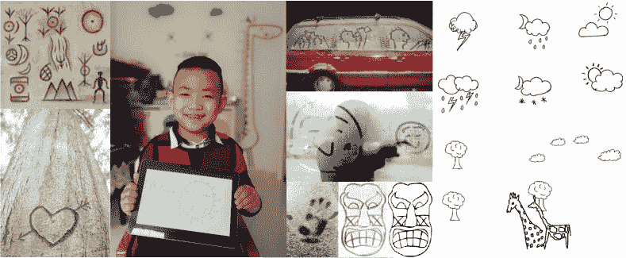

图 1：人类日常生活中的多样化手绘草图。底部的面具（粗糙和简化的）来自于[16]。右下角的场景级草图（云、树木和长颈鹿）来自于 SketchyCOCO 数据集[17]。

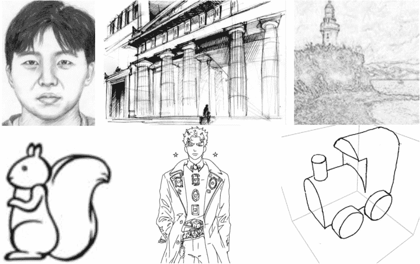

图 2：超出我们关注范围的绘画样本。

由于触屏设备（如智能手机、平板电脑）的普及，使得获取草图数据比以往更容易，以及深度学习技术的迅猛发展在各种人工智能任务中取得了最先进的性能，草图研究和应用在工业和学术界近年来蓬勃发展。这种繁荣表现为几个方面：（i）一些经典研究主题（如草图识别、基于草图的图像检索、基于草图的 3D 形状检索）在深度学习背景下被重新研究[18, 3, 7, 4, 2, 19]，从而显著提高了性能。（ii）一些全新的主题已基于深度学习提出，例如，基于深度学习的草图生成/合成[5]，基于草图的模型生成[20]，基于强化学习的草图抽象[21]，对抗性草图图像编辑[22]，基于图神经网络的草图识别[23]，基于图卷积的草图语义分割[24]，以及基于草图的软件原型设计[9]。（iii）相比于基于全局表示的任务（如草图识别），更多的实例级和笔画级任务已被进一步研究或提出，例如，基于实例的草图图像检索[4]，以及深度笔画级草图分割[25]。（iv）与传统的将草图表示为静态图像[1]的方法相比，触屏采集和深度学习的趋势推动了设计深度网络架构以利用更丰富的草图表示。得益于如 SketchRNN[5]等工作的出现，自由手绘草图的序列性质现在被广泛建模为递归神经网络（RNN）。（v）更多的基于草图的应用出现，例如，在线草图游戏 QuickDraw²²2[`quickdraw.withgoogle.com`](https://quickdraw.withgoogle.com)[5]，以及基于草图的商品搜索引擎³³3[`sketchx.eecs.qmul.ac.uk/demos/`](http://sketchx.eecs.qmul.ac.uk/demos/) [4, 26]。（vi）一些大规模的草图数据集已被收集，例如 Sketchy[7]和 Google QuickDraw⁴⁴4[`github.com/googlecreativelab/quickdraw-dataset`](https://github.com/googlecreativelab/quickdraw-dataset) [5]——一个百万级草图数据集（50M+）。

### 1.1 概述

本调查旨在回顾深度学习时代自由手绘草图社区的现状，期望为研究人员提供见解，并协助致力于构建基于草图的应用程序的从业者。

以往的调查和范围 本次调查聚焦于自由手绘草图，不包括专业（法医）面部草图 [27, 28, 29, 30, 31], 专业铅笔画（专业线条绘画/艺术） [32, 33, 34, 35, 36, 37, 38], 专业风景草图 [39], 类似照片的边缘图（人工渲染的‘草图’） [40, 41, 42], 卡通/漫画 [43, 44, 45], 画得很好的 3D 草图 [46]。 (参见图 2。) 在本次调查中，“草图”指的是“自由手绘草图”，除非另有说明。

据我们了解，在过去十年中，自由手绘草图社区仅发布了少数几篇调查论文 [47, 48, 49, 50, 51]。然而，这些调查论文 [47, 48, 49, 50, 51]： (i) 仅关注两个研究主题，即基于自由手绘草图的识别和图像/3D 检索。 (ii) 主要回顾经典的非深度技术。相比之下，当前在高级深度方法、技术（哈希）、表示（序列、拓扑）和新应用（生成、分割）方面的蓬勃发展，使得提供一份关于自由手绘草图研究全貌的最新调查显得尤为及时。

我们提供了一份全面的调查报告，回顾了深度学习技术的领域现状，以及自由手绘草图的应用。特别是： (a) 我们讨论了处理自由手绘草图数据时的内在特征、独特挑战和机遇。 (b) 我们提供了详细的分类法，涵盖了数据集和应用，涉及单模态（仅草图）和多模态（将草图与照片、文本等相关联）情况。对于每个具体任务，总结了当代深度学习解决方案的现状，并详细描述了里程碑式的工作。 (c) 我们讨论了自由手绘草图的当前瓶颈、开放问题和潜在的研究方向。

本调查的组织结构如下：第二部分提供了关于自由手绘草图的背景，包括内在特征、领域独特的挑战、现有草图导向深度学习工作的里程碑技术等。第三部分总结了代表性的自由手绘草图数据集。在第四部分中，我们提供了各种基于草图任务的全面分类，并详细描述了代表性的深度学习技术。第四部分还展示了一些基于 TorchSketch⁵⁵5 的实验比较。请参阅其 GitHub 页面了解详细信息[`github.com/PengBoXiangShang/torchsketch`](https://github.com/PengBoXiangShang/torchsketch)实现。第五部分讨论了开放问题、瓶颈和潜在研究方向，最后在第六部分中总结了调查内容。

在本调查中，粗体大写和粗体小写字符分别表示矩阵和向量。除非另有说明，数学符号和缩写术语遵循表 I 中的约定。

TABLE I: 本调查中使用的符号和缩写。

| 符号 | 描述 |
| --- | --- |
| $\mathcal{X}=\{{\bf X}_{n}\}_{n=1}^{N}$ | sketch 样本集 |
| ${\bf X}_{m}$, ${\bf X}_{n}$ |  sketch 样本集$\mathcal{X}$中的第$m$个和第$n$个样本 |
| $\mathcal{Y}=\{y_{n}\}_{n=1}^{N}$ | $\mathcal{X}$ 的相关标签集 |
| $y_{n}$ | ${\bf X}_{n}$ 的标签 |
| $\mathcal{L}$ | 损失函数 |
| ${\bf\Theta}$ | 神经网络的可学习参数 |
| $\mathcal{F}(\cdot)$ | 函数映射或特征提取 |
| $\mathcal{F}_{\Theta}(\cdot)$ | 神经网络特征提取，由$\Theta$参数化 |
| $\mathcal{D}(\cdot,\cdot)$ | 距离度量，例如 $\ell_{2}$ 距离 |
| $\lambda$ | 权重因子 |
| $\sum$ | 求和 |
| $\alpha$, $\beta$, $\gamma$ | 手动设置的超参数集 |

|

&#124; 缩写 &#124;

&#124; 术语 &#124;

| 描述 |
| --- |
| CNN | 卷积神经网络 |
| GNN | 图神经网络 |
| GCN | 图卷积网络 |
| RNN | 循环神经网络 |
| LSTM | 长短期记忆网络 |
| GRU | 门控递归单元 |
| BERT | 双向编码器表示的转换器 |
| TCN | 时序卷积神经网络 |
| GAN | 生成对抗网络 |
| VAE | 变分自编码器 |
| RL | 强化学习 |

## 2 背景

本节介绍背景知识，包括：自由手绘草图的内在特征和领域独特挑战与机遇。特别是，我们涵盖了与自然照片的基本差异；以及自由手绘草图深度学习的简要发展历史，总结了里程碑技术。

### 2.1 内在特征与领域独特挑战

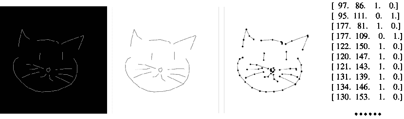

图 3：草图特定表示。左到右的表示：稀疏矩阵（黑色背景白色线条）、密集图像（白色背景黑色线条）、图形、笔画序列。图形和笔画序列表示均基于关键笔画点。在笔画序列中，每个关键点表示为一个四元组，其中前两个条目和最后两个条目分别表示坐标和笔状态。详细信息见文本。

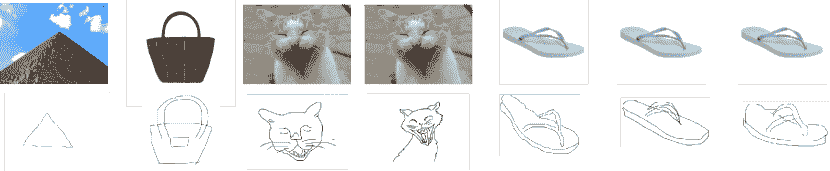

图 4：自由手绘草图主要领域独特挑战的插图。每列是一对照片-草图。草图具有高度抽象性。一个金字塔在草图中可以表现为一个三角形，而几笔勾勒出一个时尚手袋。草图具有高度多样性。不同的人在给定相同参考时会绘制出不同的草图，这取决于主观显著性（头部 vs. 身体）和绘画风格。

表示 自由手绘草图是一种特殊的视觉数据，本质上不同于自然照片，后者是现实世界的像素完美复制品。为了高效存储和快速计算，自由手绘草图可以保存为稀疏矩阵，或作为忽略其稀疏性的黑白图像（图 3，左侧图像）。由于草图生成是一个动态过程，适当捕捉的草图也可以表示为笔画或笔坐标的序列（图 3，右侧）。在这方面，草图与手写字符有相似之处，但由于其高度抽象和自由风格的特性，基本上是不同的（例如，字母书写遵循特定规则和教学过程）。从另一个角度看，自由手绘草图也可以建模为稀疏连接的图，其中线条是图中的边。与欧几里得坐标序列相比，作为图的拓扑表示可以提供更灵活和抽象的表示。由于这种可能表示的多样性，可以使用各种深度学习范式来处理草图，包括 CNN、RNN、GCN 和 TCN。

独特的挑战与机遇 自由手绘草图的独特挑战可以总结如下：(i) 抽象性：人们使用草图以极少的笔触描绘物体或事件，反映出心理图像的高级语义。如图 4 所示，草图中的金字塔可以用三角形来表示，几笔就可以描绘出一个花哨的手袋。(ii) 多样性：不同的人有不同的绘画风格。例如，接近‘真实’（接近照片边缘图）的草图图像可以以夸张（如漫画）、标志性（省略细节，草图接近符号）或艺术化的方式表现。根据对显著性的主观意见，草图中可能会包含或省略不同的部分。例如，给定一个“猫”的概念，人们在选择是否绘制身体时会有所不同（图 4）。最后，还有不同用户的心理视角，例如，他们是否想象一个正投影或透视投影图像。在图 4 中，我们可以看到不同的人绘制了相同拖鞋的不同透视视图。(iii) 稀疏性：无论何种表示方式，与照片相比，自由手绘草图是高度稀疏的信号。(iv) 不变性：即使草图被移动、缩放、旋转或翻转，人们仍然能够识别出来。在第 4.3.2 节中，我们进行了一项稳健性研究，以评估深度网络是否对草图相关任务中的空间变换敏感。(v) 最后，收集草图时还存在一些独特的挑战，这些将在后续部分详细讨论（见第 3.2 节）。

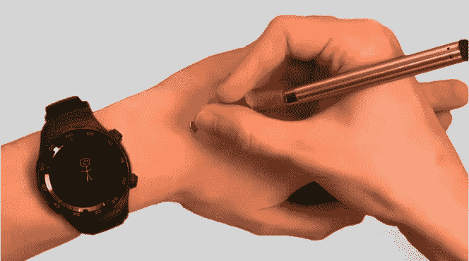

(a) 使用设备在手背上绘制的草图[52]。

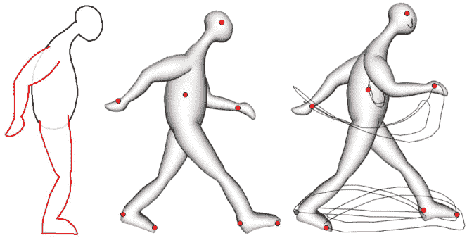

(b) 一个行走周期序列。左侧：输入的手绘草图，中间：带有控制点的膨胀 3D 模型，右侧：通过记录用户指定的各个控制点的轨迹创建的行走周期动画[53]。

图 5：草图支持的创新应用。

草图与照片相比提供了一些独特的机会：（i）作为应对稀疏性挑战的对策，草图通常缺少照片中令人分心的背景杂物，这对自动化分析有益[3]。 （ii）如果捕捉得当，草图生成的顺序特性可以进一步利用，从而比静态图像更有利于分析[54]。 （iii）草图的稀疏和顺序特性也为高质量草图生成提供了机会，而图像生成则受到需要填补像素细节的限制[5, 55, 56]。 （iv）草图可以作为计算机交互的模式，而照片则不能[4, 54]，因为人们可以直观地生成草图而无需培训。例如，未受过专业绘画培训的人可以通过草图到照片生成技术进行随意的草图设计，例如场景照片生成[17]。图 5(a)展示了另一个例子：人们可以在手背上做笔记，草图可以在手表上显示和记录[52]。 （v）草图本身可以表达运动轨迹，因此可以应用于动态建模。如图 5(b)所示，通过记录用户指定的单个控制点的轨迹，可以创建步态循环动画[53]。

鉴于这些独特的挑战和机遇，设计特定于草图的模型以在各种草图相关应用中获得最佳性能通常是有益的。

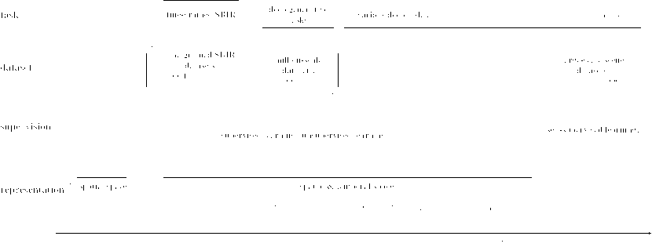

图 6：从任务、数据集、监督和表示的角度看，基于深度学习的自由手绘草图研究的里程碑。注意，自监督学习是无监督学习的一个分支。

### 2.2 深度学习时代草图的简要历史

在过去五年中，手绘草图社区迅速发展，如图 6 所总结，从任务、数据集、表示和监督的角度来看。(i) 2015 年，Sketch-a-Net [18] 被提出，它是一种专门为手绘草图设计的 CNN。它因首个实现超过人类识别率而受到关注，并推动了深度学习在草图分析中的普及。(ii) 2016 年，发布了三个细粒度⁶⁶6 本文中的“细粒度”一词根据上下文有不同含义。对于草图任务，细粒度草图图像检索指的是实例级别的草图-照片匹配，而其他细粒度任务（如生成、分割）则强调机器需要在笔触、部分或组级别上感知草图。对于草图数据集，“细粒度”数据集意味着其草图提供视觉细节和/或详细的手动注释（例如，笔触/部分/组级别注释、实例级配对信息）草图图像检索（FG-SBIR）数据集，即 QMUL Shoe [4] 和 Chair [4]，以及 Sketchy [7]。结合深度三元组排序 [57]，这些细粒度的跨模态数据集激发了一波后续的 FG-SBIR 及其他细粒度任务。(iii) 2017 年，谷歌通过在线游戏“QuickDraw”发布了百万级草图数据集，即 Google QuickDraw。QuickDraw 包含来自全球玩家的超过 5000 万张草图，使其成为一个丰富且多样的数据集。此外，基于 QuickDraw 数据集，Ha 等人提出了“SketchRNN”，一种基于 RNN 的深度变分自编码器（VAE），能够生成多样的草图 [5]。这项工作促使社区超越将草图视为静态图片的观念，激发了随后使用笔触序列作为输入并研究草图的时间处理的工作。在 2017 年，一些基于草图的深度生成图像模型 [58] 开始在计算机视觉顶级会议上出现。(iv) 从 2018 年至今，基于深度学习技术，提出了各种新方法——例如，草图哈希 [19]、草图变换器 [23]；以及应用——例如，草图抽象 [21]、基于草图的照片分类器生成 [20]、草图感知分组 [59] 和草图矢量化 [56]。有关时间顺序的总结，请参见图 6。

TABLE II: 代表性草图数据集的总结。‘分组’和‘分割’注释指的是笔画级别。‘K’和‘M’分别表示‘千’和‘百万’。‘类’表示‘类别’。笔画“✓”表示草图以 SVG 文件或坐标数组的形式提供。

|

&#124; 单模态 &#124;

&#124; 数据集 &#124;

|

&#124; 精细- &#124;

&#124; 粗粒度 &#124;

| 公共 | 模态 & 样本数量 | 类别 | 笔画 |
| --- | --- | --- | --- |

&#124; 对象/ &#124;

&#124; 场景 &#124;

|

&#124; 实例 &#124;

&#124; 配对 &#124;

| 注释 | 备注 |
| --- | --- |
| TU-Berlin [6] |  | ✓ | 20K 张草图 | 250 | ✓ | o | - | 类别 |  |
| QuickDraw [5] |  | ✓ | 50M+ 张草图 | 345 | ✓ | o | - | 类别 |  |
| QuickDraw-5-step [60] |  |  | 38M+ 张草图 | 345 |  | o | - | 类别 |  |
| SPG [59] | ✓ | ✓ | 20K 张草图 | 25 | ✓ | o | - | 类别，分组 |  |
| SketchSeg-150K [25] | ✓ |  | 150K 张草图 | 20 | ✓ | o | - | 类别，分割 | 57 个语义标签 |
| SketchSeg-10K [61] | ✓ | ✓ | 10K 张草图 | 10 |  | o | - | 类别，分割 | 24 个语义标签 |
| SketchFix-160 [62] |  | ✓ | 3904 张草图 | 160 | ✓ | o | - | 类别，眼动注视 |  |
| Sheep 10K [63] | ✓ | ✓ | 10K 张羊的草图 | 1 | ✓ | o | - | 类别 |  |
| COAD [64] | ✓ | ✓ | 620 张草图 | 20 | ✓ | o | - | 类别 |  |

|

&#124; 多模态 &#124;

&#124; 数据集 &#124;

|

&#124; 精细- &#124;

&#124; 粗粒度 &#124;

| 公共 | 模态 & 样本数量 | 类别 | 笔画 |
| --- | --- | --- | --- |

&#124; 对象/ &#124;

&#124; 场景 &#124;

|

&#124; 实例 &#124;

&#124; 配对 &#124;

| 注释 | 备注 |
| --- | --- |
| QMUL Shoe [4] | ✓ | ✓ | 419 张草图，419 张照片 | 1 |  | o | ✓ | 配对，三元组，属性 | 21 个二进制属性 |
| QMUL Chair [4] | ✓ | ✓ | 297 张草图，297 张照片 | 1 |  | o | ✓ | 配对，三元组，属性 | 15 个二进制属性 |
| QMUL Handbag [26] | ✓ | ✓ | 568 张草图，568 张照片 | 1 |  | o | ✓ | 配对 |  |
| Sketchy [7] | ✓ | ✓ | 75K 张草图，12K 张照片 | 125 | ✓ | o |  | 类别 | 12K 个对象 |
| Sketch&UI [8] | ✓ |  | 1998 张草图，1998 张照片 | 23 |  | o | ✓ | 类别，配对 | 用户界面 |
| QuickDrawExtended [65] |  | ✓ | 330K 张草图，204K 张照片 | 110 |  | o |  | 类别 |  |
| SketchTransfer [66] |  |  |

&#124; 112.5K 张草图， &#124;

&#124; 90K CIFAR-10 照片 &#124;

| 9 |  | o |  | 类别 | 32x32 的分辨率 |
| --- | --- | --- | --- | --- | --- |
| TU-Berlin Extended [67] |  |  | 20K 张草图，191K 张照片 | 250 |  | o |  | 类别 |  |
| Sketch Flickr15K [1] |  | ✓ | 330 张草图，15K 张照片 | 33 |  | o |  | 类别 |  |
| Aerial-SI [68, 69] |  |  | 400 张草图，3.3K 张照片 | 10 |  | o, s |  | 类别 | 空中场景 |
| HUST-SI [70] |  | ✓ | 20K 张草图，31K 张照片 | 250 | ✓ | o |  | 类别 |  |
| SBSR [71] |  | ✓ | 1814 幅素描，1814 个 3D 模型 | 161 |  | o |  | 类别 |  |
| SHREC’13 [47] | ✓ | ✓ | 7200 幅素描，1258 个 3D 模型 | 90 |  | o |  | 类别 |  |
| SHREC’14 [72] | ✓ | ✓ | 12680 幅素描，8987 个 3D 模型 | 171 |  | o |  | 类别 |  |
| PACS DG [73] |  | ✓ |

&#124; 9991（素描，照片，&#124;

&#124; 卡通，绘画）&#124;

| 7 |  | o |  | 类别 |
| --- | --- | --- | --- | --- |

&#124; 域 &#124;

&#124; 泛化 &#124;

|

| Flickr1M [74] |  |  | 500 幅素描，130 万张照片 | 100 |  | o |  | 类别 |  |
| --- | --- | --- | --- | --- | --- | --- | --- | --- | --- |
| Cross-Modal Places [75] |  | ✓ |

&#124; 1.6 万幅素描，1.1 万个描述，&#124;

&#124; 45.8 万个空间文本，1.2 万个剪贴画，&#124;

&#124; 150 万张照片 &#124;

| 205 |  | s |  | 类别 |  |
| --- | --- | --- | --- | --- | --- |
| SketchyScene [76] | ✓ | ✓ | 29K 幅素描，7K 张照片 |  |  | s | ✓ | 配对，分割 |  |
| DomainNet [77] |  | ✓ |

&#124; 60 万（剪贴画，信息图表，&#124;

&#124; 绘画，QuickDraw 素描，&#124;

&#124; 真实照片，&#124;

&#124; 专业铅笔素描）&#124;

| 345 | ✓ | o |  | 类别 |  |
| --- | --- | --- | --- | --- | --- |
| SketchyCOCO [17] | ✓ | ✓ |

&#124; 14K+（素描，照片，&#124;

&#124; 边缘图）&#124;

| 17 | ✓ | o, s | ✓ |
| --- | --- | --- | --- |

&#124; 类别，配对，&#124;

&#124; 五元组，&#124;

&#124; 分割 &#124;

|

&#124; 3 背景类别 &#124;

&#124; 14 个前景类别 &#124;

|

| SceneSketcher [78] | ✓ | ✓ |
| --- | --- | --- |

&#124; 1225 个场景 &#124;

&#124; 素描-照片对 &#124;

| 14 | ✓ | o, s | ✓ |
| --- | --- | --- | --- |

&#124; 类别，配对 &#124;

&#124; 分割 &#124;

|  |
| --- |

## 3 自由手素描数据集

在过去的十年中，收集了大量新的自由手素描数据集，以满足大规模深度网络训练的需求以及社区对素描相关任务的日益多样化的需求。本节将总结这些数据集，并进一步讨论一些素描相关数据收集中的独特挑战。

### 3.1 素描数据集

自由手素描数据集可以根据以下方面进行分类：(i) 单模态与多模态，以及 (ii) 粗粒度与细粒度。单模态数据集仅包含素描，通常用于识别、素描-素描检索、分组、分割和生成。多模态数据集通过将素描与其他模态的样本（如自然照片、3D 形状、文本或视频）配对，支持跨模态任务。这些主要用于跨模态检索/匹配或跨模态生成/合成。粗粒度数据集（例如，TU-Berlin [6]，QuickDraw [5]）通常用于素描识别、素描检索；而细粒度数据集（例如，QMUL Shoe [4]）提供细致的视觉细节和手动注释。

更具体地说，粗粒度单模态数据集 [71, 5] 支持草图识别和检索；而粗粒度多模态数据集（例如 QuickDraw-Extended [65]）支持类别级别的草图图像检索。细粒度单模态数据集 [59, 25] 支持感知分组、分割和解析。细粒度多模态数据集（例如 QMUL Shoe [4]）提供实例级配对信息以支持检索。

表格 II 总结了每种类型的代表性草图数据集，包括：模态、大小、类别数量、笔画信息、注释等。注意，SVG 文件能够生成静态图片文件，如 JPEG 和 PNG，但这些静态文件无法存储或提供原始绘图过程（笔画顺序）。我们排除了某些知名但过小的数据集，如 [79]。

### 3.2 草图收集的独特挑战

草图收集策略 现有的收集方法主要包括：（i）研究人员定制创建 [59, 61, 25]，（ii）在现有数据集上进行众包选择和匹配，例如 Doodle2Sketch QuickDraw-Extended [65]，（iii）众包从头开始绘制，例如 QMUL Shoe [4]、Sketchy [7]，（iv）通过在线绘图游戏进行收集，例如 Google QuickDraw [5]，（v）网络爬虫获取现有草图 [77, 73]。特别地，对于细粒度多模态草图数据集，众包是广泛使用的，因为细粒度绘图、选择和匹配是耗时的。注意，草图数据集的潜在应用取决于其收集和注释协议。

草图收集挑战 相比其他图像类型，自由手绘草图提出了一些独特的数据收集挑战：(i) 时间序列特性 草图是一个动态且时间扩展的过程。因此，将草图收集为静态栅格图像（例如，JPEG，PNG）非常有限，而记录矢量表示（例如，[SVG](https://en.wikipedia.org/wiki/Scalable_Vector_Graphics)）以及笔划位置和时间更能支持研究。因此，利用网页爬虫进行收集（通常获取栅格图像）效果较差。(ii) 跨模态配对 收集跨模态数据集还面临将草图与其他模态的相关数据配对的额外挑战。可以从现有图像和草图开始进行配对[80]，或者绘制与其他模态中的给定示例相对应的草图[7，4]。但这两种选择都很耗时。(iii) 人口统计信息 由于草图是人类创作的，而不是由相机捕捉的像素完美图像，因此确保草图数据集由不同人口统计群体创建，以确保其代表性（这是照片图像所面临挑战的一个更强版本[81]）非常重要。此外，关于艺术家的元数据（例如，性别、国籍、技能水平）可能需要保存，以研究不同人类如何进行草图创作，并确保任何基于草图的应用程序公平无偏见[82]。然而，据我们所知，现有数据集中尚未记录这类元数据。

讨论 这些挑战表明，标准的计算机视觉方法——网页爬虫——不适合收集草图数据：它通常无法获取矢量图形和时间戳的草图生成，无法轻松获取匹配的跨模态对，也没有任何人口统计信息。因此，定制创建、众包以及通过游戏化作为副产品的生成是推荐的收集方法。

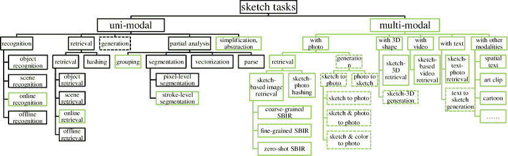

图 7：草图任务分类的树状图。生成性任务由虚线框定。草图领域独特任务由绿色线框定。最佳效果在彩色显示下查看。

## 4 任务和方法论分类

本节旨在从整个自由手绘草图研究领域的角度提供深度学习相关任务和方法的概述，而不是对特定任务的方法进行分类。我们观察到现代草图研究中出现了几种趋势，包括：(i) 不断提出更多新颖的任务，每个任务都有不同的特定挑战，因此也有不同的特定方法/设计。这激励我们从任务驱动的角度回顾现有方法。(ii) 自由手绘草图通常与来自其他模态的数据相关联。这激励我们根据涉及的数据模态对现有任务进行分类。

根据涉及的数据模态，自由手绘草图相关任务可以分为单模态和多模态任务，其中单模态草图分析技术通常作为多模态方法的构建模块。本节将定义流行的草图分析任务，并介绍相应的深度学习方法，提供详细的分类。图 7 提供了现有自由手绘草图任务的树状图。该任务分类的主要优点包括：(i) 直接且高效。树状图具有平衡的深度和宽度，不包含冗余节点。(ii) 可扩展。单模态和多模态子树是解耦的，可以独立更新。例如，当我们未来插入新模态时，单模态子树可以保持不变。

图 7 中列出的一些单模态任务也在自然照片领域进行了研究，而基于草图的多模态任务则是独特的。

### 4.1 单模态任务：纯草图分析

这些任务在没有其他数据模态的情况下单独研究草图。该领域的关键深度学习应用包括识别、检索/哈希、生成、分组、分割和抽象。

#### 4.1.1 识别

草图识别[6]旨在预测给定草图的类别标签，这是计算机视觉中最基本的任务之一。它有多种实际应用，包括：提供反馈的互动绘图系统[83]，基于草图的科学教育[84]，游戏[54, 5]等。从识别角度出发，已经研究了物体[6, 5]和场景[85, 86]类别。值得注意的是，草图识别技术支持了流行的网页游戏 QuickDraw 和微信小程序彩画小哥，均由 Google 发布。

草图识别可以分为（i）离线识别和（ii）在线识别两种设置。离线识别系统将整个草图作为输入，并基于完整的草图预测一个类别标签。在线识别系统则根据累积的草图笔画在绘制过程中持续预测类别标签。离线识别方法更为常见，但在线方法可以用于更多互动的实时应用，如实时绘图指导 [60]、跟踪和互动草图检索。

草图识别的当前趋势有几个，基于深度学习的进展：（i）从栅格图像到序列表示；（ii）从全局表示到局部分析；（iii）从欧几里得（基于 CNN、RNN）到拓扑分析（基于 GNN）；（iv）从完全监督学习到自监督学习。

目前已提出了许多深度模型用于自由手绘草图识别 [87, 88, 89, 67, 90, 91, 92, 93, 94, 95, 96, 97, 98]。接下来，我们将从网络架构和损失函数的角度回顾这些模型。数据增强将在第 4.1.6 节单独讨论。

表 III：代表性草图识别网络的比较。“–”表示原始论文中未提及或不明确。报告的性能为 top-1 准确率。此表中的缩写：“stroke accu. pic.”：笔画累积图片；“R-FC”：残差全连接层；“pad.”：填充；“tru.”：截断；“augm.”：特定增强；“tran.”：变压器。

| 年份 | 模型 | 架构 | 层数 | 参数 | 集成 | 预训练 | 输入 | 预处理 | 数据集 | 准确率 |
| --- | --- | --- | --- | --- | --- | --- | --- | --- | --- | --- |
| 2015 | Sketch-a-Net [18] | CNN | 5 conv. | 8.5M | ✓ |  | picture | augm. [18] | TU-Berlin [6] 250 cat. | 0.7490 |
| 2016 | AlexNet-FC-GRU [99] |

&#124; CNN-to-RNN &#124;

&#124; cascaded &#124;

| – | – |  |  |
| --- | --- | --- | --- |

&#124; stroke &#124;

&#124; accu. pic. &#124;

| – | TU-Berlin 160 cat. | 0.8510 |
| --- | --- | --- |
| 2018 | SketchMate [19, 100] | RNN | 2 GRU | – |  |  | stroke vector | tru. & pad. [19] | QuickDraw 3.8M [19] | 0.7788 |
| 2018 | SketchMate [19, 100] |

&#124; CNN-RNN &#124;

&#124; dual-branch &#124;

|

&#124; 5 conv. &#124;

&#124; & 2 GRU &#124;

| – |  |  |
| --- | --- | --- |

&#124; picture &#124;

&#124; & stroke vector &#124;

| tru. & pad. [19] | QuickDraw 3.8M [19] | 0.7949 |
| --- | --- | --- |
| 2017 | Jia et al.  [101] |

&#124; RNN-RNN &#124;

&#124; 双分支 &#124;

| – | – | ✓ | ✓ |
| --- | --- | --- | --- |

&#124; CNN 特征 &#124;

&#124; 笔画 &#124;

&#124; accu. pic. &#124;

|

&#124; 反射，&#124;

&#124; 旋转等 &#124;

| TU-Berlin | 0.9220 |
| --- | --- |
| 2017 | DVSF [102] |

&#124; R-FC 和 RNN &#124;

&#124; 双分支 &#124;

| – | – |  | ✓ |
| --- | --- | --- | --- |

&#124; CNN 特征 &#124;

&#124; 笔画 &#124;

&#124; accu. pic. &#124;

| – | TU-Berlin | 0.7960 |
| --- | --- | --- |
| 2018 | FBin DAB-Net [103] | 二值 CNN | – | – |  |  | 图片 | – | TU-Berlin | 0.7370 |
| 2018 | RNN$\rightarrow$CNN [104] |

&#124; RNN-to-CNN &#124;

&#124; 级联 &#124;

|

&#124; 2 LSTM &#124;

&#124; & 5 conv. &#124;

| – |  | ✓ | 笔画向量 | augm. [3] | TU-Berlin | 0.7849 |
| --- | --- | --- | --- | --- | --- | --- |
| 2019 | 多图转换 [23] | GNN | 4 转换 | 10M |  |  | 笔画向量 | – | QuickDraw 子集 [23] | 0.7070 |

网络图 6（下方）总结了基于深度学习的草图表示的发展。此外，表 III 列出了为自由手绘草图工程设计的各种网络，并具有草图识别能力。接下来，我们介绍一些代表性的网络。

(i) Sketch-a-Net [18, 3] 是首个为自由手绘草图设计的深度 CNN。与经典的以照片为导向的 CNN 架构 [105] 相比，其架构的草图特定方面主要包括：（a）考虑到草图的稀疏低纹理特性，使用更大的尺寸（$15\times 15$）的第一层滤波器以捕捉更多上下文。（b）为了更快的学习而不牺牲性能，移除了局部响应归一化（LRN） [105] 层，因为 LRN 主要用于“像素亮度归一化”，而大多数草图为二值图像。（c）提出了两种新颖的草图特定数据增强策略，利用笔画外观和笔画序列。（d）最后，使用联合贝叶斯融合 [106] 结合了多个 Sketch-A-Net。

(ii) Sarvadevabhatla 等人[99]提出了一种草图识别网络，以利用草图的顺序过程，其中每个训练草图被绘制为一个连续的笔划图片序列，相应的基于 AlexNet [105]的深度特征将被输入到一个 Gated Recurrent Unit (GRU) [107]网络中。该网络也能够在在线识别模式下工作，因为它涉及草图的中间状态。此外，Jia 等人[101]提出了一种多特征基础的模型来改进这一思想，并在草图识别上取得了良好的表现，如表 III 所报告，其中多个 GRU 网络分别对累积笔划组的多个特征进行编码，并通过时间步长权重将其输出结合起来。

(iii) 类似地，He 等人[102]提出了深度视觉-序列融合（DVSF）网络，以同时捕捉草图的空间和时间模式。对于每个训练草图，其三个累计子图（含有$60\%$、$80\%$、$100\%$的笔划）经过三路 CNN（ResNet-18 [108]）以生成深度特征，这些特征被输入到视觉和序列网络中。具体而言，视觉和序列网络分别由残差全连接（R-FC）和残差长短期记忆（R-LSTM）[109]层实现。视觉和序列路径通过融合层进行集成，以进行最终识别。

(iv) 在 2017 年，Ha 和 Eck 提出了开创性的 SketchRNN [5]，该模型通过其变分推断（VI）[110]基础的顺序草图生成模型进行表示学习。与先前的笔划累计子图像表示显著不同，草图笔划的关键点直接输入 SketchRNN 的 RNN 骨干网络。具体而言，如图 3 所示，每个关键点表示为由两个坐标位（即水平和垂直坐标）及相应的标志位组成的向量。标志位通过笔状态指示笔划的开始/结束。尽管最初是为生成建模提出的，SketchRNN 的编码器骨干网络在草图识别中也表现良好⁸⁸8[`github.com/payalbajaj/sketch_rnn_classification`](https://github.com/payalbajaj/sketch_rnn_classification)。

(v) 徐等人提出了草图哈希网络 SketchMate [19]，其中骨干网络为 CNN-RNN 双分支网络，利用 CNN 提取抽象视觉概念，RNN 则用于建模人体的时间笔划顺序。CNN 分支处理栅格像素草图图像；RNN 分支处理矢量草图（即关键点坐标）。这两个分支通过一个晚融合层结合在一起。该网络展示了草图表示中视觉和时间嵌入空间的互补性。这种 CNN-RNN 双分支建模思路已广泛应用于其他草图任务，例如用于草图语义分割的 SPFusionNet [61]。除了 CNN 和 RNN 的并行管道，还研究了某些级联管道（如 RNN-to-CNN [104]）。

(vi) 草图可以表示为拓扑空间中的稀疏连接图。Multi-Graph Transformer (MGT) [23] 是一种 GNN 模型，能够从草图图中学习几何结构和时间信息。MGT 将领域知识注入到图 Transformer 中，特别是将每个草图表示为多个内部笔划和外部笔划图，以分别建模其局部和全局拓扑笔划结构。

(vii) 尽管先前的草图识别方法基于监督学习（例如 [3, 99, 102]），[111] 提出了首个草图自监督表示学习的研究，提出了基于旋转和变形的深度自监督模型（旋转和变形模型）。该模型使用多分支 CNN 和 TCN 网络在自监督设置中表示草图。

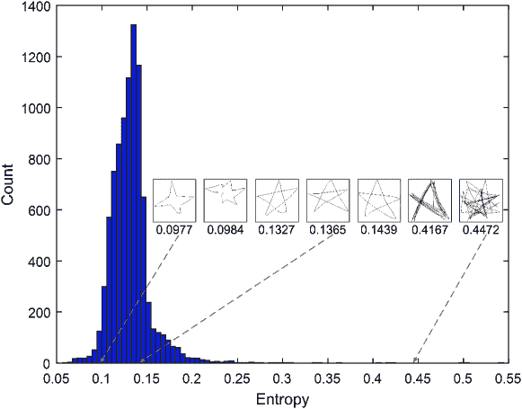

图 8：9K 草图“星星”的图像熵直方图 [19]。蓝色条形表示不同熵范围内的计数。一些代表性草图与不同熵值的对应关系进行了说明。

损失函数 大多数以前的深度素描识别方法使用交叉熵 softmax 损失来训练深度神经网络。一个活跃的研究问题是，是否可以通过特定于素描的损失函数进一步提高识别性能。为此，Xu 等人提出了针对百万规模素描的素描特定中心损失[19]，基于分阶段训练策略。其基础是每个素描类别的图像熵分布是一个截断高斯分布（请参见图 8 的示例）。受到经典贝叶斯决策理论[112]的启发，Mishra 等人提出了一种新颖的度量损失，以驱动预训练的深度神经网络最小化在每个 mini-batch 中随机选择的素描对的贝叶斯风险[113]。基于这种贝叶斯风险损失，素描识别需要两阶段训练。在获得特征后，训练线性 SVM[114]作为分类器。

总结与讨论 在本小节中，我们从架构和损失函数的角度回顾了与素描识别相关的深度学习工作。未来工作中有前景的领域包括：在线素描识别，受到实际人机交互应用的驱动；超越主流的监督素描识别，探索半监督、自监督[115]和无监督学习的识别；零-shot[86]和少-shot 素描识别[116]；以及多任务学习[93, 117]以同时解决素描识别和其他任务。

#### 4.1.2 检索和哈希

素描检索[118, 119, 60]方法旨在使用查询素描从素描库或数据库中检索相似的样本。由于抽象、类内变异、绘图风格变化和特征稀疏性，素描检索是一项具有挑战性的任务。这些特性使得在素描中定位可重复的特征点变得困难（例如，SIFT[120]的方式），以执行经典的基于兴趣点的检索方法[120]。在深度学习时代，端到端特征学习在计算机视觉的各种检索任务中超过了浅层特征，CNN 也被用于素描检索。

在图像检索中，常见做法是使用 CNN 学习向量嵌入，然后执行最近邻搜索进行检索/匹配。大多数现有的深度素描检索模型以类似的度量学习方式工作，研究集中于 CNN 架构和损失函数设计，以实现有效的素描匹配。Wang 等人 [118] 提出了一个代表性的素描检索流水线，其有两个关键组件：一个纯卷积层的 Siamese CNN 骨干网络，以及一个基于$\ell_{1}$范数的查询图像和图库图像之间的成对损失。其理念有两个方面：（i）使用卷积特征图来保留没有点对应的素描的空间信息。（ii）在特征空间中计算距离，并优化使得相似对彼此接近，而不同对彼此远离。

随着可用图像数量的增加，关于检索的可扩展性的关注也在增加，这导致了基于哈希的方法研究，其中所有素描被编码并作为二进制哈希码向量进行搜索，而不是实值向量。Xu 等人 [19] 提出了第一个深度素描哈希模型。他们的深度素描哈希使用了一个双分支 CNN-RNN 网络，利用了全局外观和局部序列笔划信息，并且使用了新的中心损失变体来确保学习到的嵌入具有更具语义意义。

迄今为止提到的素描检索/哈希方法利用了监督信息。如果没有类别标签，可以使用对抗训练来学习素描的特征表示。基于生成对抗网络（GAN） [121]，Creswell 等人 [119] 提出了用于无监督素描检索的 Sketch-GAN，其中查询素描和图库素描都由鉴别器网络的输出特征表示。

#### 4.1.3 生成

表 IV: 代表性素描生成深度模型的比较。“gen.”、“rec.”和“com.”分别表示“生成”、“重建”和“完成”。“RNN+VAE”表示“基于 RNN 骨干的 VAE”。

| 流水线 | 代表性参考 | 应用 | 优势与劣势 |
| --- | --- | --- | --- |
| RNN+VAE | SketchRNN [5] | 生成，重建，组合 |

&#124; A: 简洁，灵活。 &#124;

&#124; D: 涂鸦效果，单类生成 &#124;

|

| RNN+GAN | SkeGAN [122] | 生成，组合 |
| --- | --- | --- |

&#124; A: 较少的涂鸦效果，更快的收敛。 &#124;

&#124; D: 单类生成。 &#124;

|

| RNN+VAE+GAN | VASkeGAN [122] | 生成，重建，组合 |
| --- | --- | --- |

&#124; A: 较少的涂鸦效果。 &#124;

&#124; D: 高复杂度，单类生成，收敛较慢 &#124;

|

| BERT |
| --- |

&#124; Sketchformer [123] &#124;

&#124; Sketch-BERT [124] &#124;

| 生成，重建，组合 |
| --- |

&#124; A: 擅长处理较长的笔划序列 &#124;

&#124; D: 参数更多，复杂度高 &#124;

|

| CNN+RL | Doodle-SDQ [125] | 模仿参考 |
| --- | --- | --- |

&#124; A: 可以处理未见过的类别。 &#124;

&#124; D: 混合训练（监督学习与 RL），高复杂度 &#124;

|

| VAE+Renderer | Cloud2Curve [56] | 生成记录 |
| --- | --- | --- |

&#124; A: 可扩展的矢量草图生成。长草图。 &#124;

&#124; D: 高复杂度。 &#124;

| 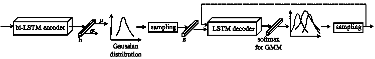

图 9：SketchRNN [5]的流程图。虚线箭头表示 LSTM 解码器的递归处理。为了简化起见，这里未显示双向 LSTM 编码器的递归处理。

草图生成[5, 126, 127, 128, 129, 130, 56, 131]近年来迅速发展，因为基于深度学习的方法轻松超越了早期经典草图生成器[132, 133]。草图生成具有若干实际应用，例如合成新颖图像、辅助艺术家设计以及完成不完整的草图和游戏[131]。可以使用各种深度学习工具解决这些问题，例如 VAE[5, 126, 134, 131, 130]、GAN[122]、VAE-GAN[122]、双向编码器表示（BERT）[135]和强化学习（RL）[125, 122]。我们在表 IV 中比较了这些管道及其代表性模型。这些管道大多灵活，并且能够使用 GRU、LSTM、Transformer 作为骨干进行逐笔生成。

开创性模型 SketchRNN [5] 是一个序列到序列的 VAE，用于条件和无条件的矢量草图生成。其编码器和解码器分别由双向 RNN[136]和单向 RNN 实现。如前所述，手绘草图可以表示为定义笔触的关键点序列。SketchRNN 的主要思想是通过按位置和笔的升起/落下状态顺序生成这些关键点来模拟人类草图绘制。

如图 9 所示，SketchRNN 的 VAE 编码器以矢量草图作为输入，并将其编码为向量 ${\bf h}$，这是 RNN 的最后隐藏状态。该向量将进一步编码为两个参数 ${\bf\mu}$ 和 ${\bf\sigma}$ 以建模高斯分布 $N({\bf\mu},{\bf\sigma})$，然后从中采样一个潜在向量 ${\bf z}$。接着，基于 LSTM 的 VAE 解码器将根据 ${\bf z}$ 生成关键笔画点的坐标和笔状态。特别地，每个关键点的坐标和状态从高斯混合模型（GMM）中采样，并用作下一步解码器的输入。为了改进 SketchRNN 以处理多类生成，Cao 等人 [137] 提出了一个名为“AI-Sketcher”的生成模型，这也是一个基于 VAE 的网络。

草图生成中的另一个研究方向使用可微渲染 [138, 130, 56] 或强化学习 [139, 122, 125, 140, 131] 来训练策略，根据不同标准（如对抗训练对抗人类草图 [139]）迭代地绘制草图。这些工作通常考虑了 SketchRNN 未涉及的因素，如笔刷风格和颜色。通过考虑草图的可解释潜在表示，这些方法也有可能用于将草图转换为程序或符号 [141, 142]。

展望未来，草图生成领域出现了几个新兴趋势，特别是：（i）细粒度草图生成 [134]。（ii）一种新颖的评估指标“Ske-score” [122]，旨在提供一种更好的指标来量化生成的矢量草图的优劣。（iii）基于 Transformer 的架构 [123, 143] 正在应用于草图生成。（iv）竞争性生成，旨在用尽可能少的笔触呈现可理解的草图 [131]。（v）最后是可扩展的矢量图形生成 [130, 56]，旨在通过参数化笔触而非标准路径点列表来生成草图笔触。

#### 4.1.4 分组、分割和解析

与草图识别、检索和生成相比，还有一些更细粒度的单模态草图分析任务：感知分组、分割和解析。这些任务需要在局部（笔触）层面上进行草图分析。除了其固有的兴趣外，这些局部草图理解技术还可以惠及其他全球任务，如基于草图的图像检索、基于草图的视频检索 [144] 和草图生成/合成。我们接下来将回顾这些领域的最新进展。

草图感知分组（SPG） 人类具有将视觉线索感知性地分组为语义对象部件/组件的能力，这在格式塔心理学领域得到了广泛研究[145, 146]。人类能够将草图笔画感知性地分组为语义部件，例如将飞机的笔画分组为机身和机翼。因此，草图感知分组（SPG）是模仿人类将笔画分组为语义部件的能力。SPG 已经通过深度学习前的方法[147, 148, 149]进行过研究，但自那时以来进展迅速。SPG 的一个代表性应用是简化草图[150]。此外，SPG 还可以用于草图识别[151]、草图语义分割、合成[133]、检索、细粒度草图图像检索（FG-SBIR）、草图视频检索[144]等。

Li 等人[59, 152]贡献了迄今为止最大的一套 SPG 数据集，共 $20,000$ 张手工标注的草图，涵盖 $25$ 个对象类别，并提出了一种可以应用于任何类别草图的通用深度分组器。具体来说，这种深度通用分组器也是一个序列到序列的变分自编码器（VAE），具有生成和判别目标：（i）其生成损失提供了处理未见过的对象类别和数据集的能力。（ii）其判别损失包括局部和全局分组损失，以保证分组输出的局部和全局一致性。

讨论 浅层分组方法主要依赖于笔画之间的低级几何属性阈值，通常会导致几何相似但语义不同的笔画被分组。现代 SPG 方法考虑了更多高级的语义和时间信息，因为它们具有深层和递归表示。

草图语义分割（SSS） 草图语义分割在自由手绘草图社区作为经典主题引起了关注[147, 153, 154]，在深度学习之前就已存在。

草图语义分割可以通过传统的照片分割 CNN 来解决。然而，这些方法并未利用笔画的向量表示或其时间模式，因此推动了草图特定分割模型的发展。

现有的深度模型用于草图语义分割[155, 156, 157, 25, 61, 24]可以根据架构分为：CNN、RNN、GCN 基础模型等。

Li 等人[158]训练了一个基于 CNN 的网络，将标注良好的分割和标签从 3D 数据集转移到草图领域。他们使用了标注的 3D 数据[153, 159]，生成了部分标注的边缘图作为合成草图数据，以训练分割网络。

Qi 等人提出了 SketchSegNet [157] 和 SketchSegNet+ [25]。SketchSegNet+ [25] 考虑了素描笔画顺序，并能够处理多个对象类别。特别是，SketchSegNet 和 SketchSegNet+ 在基于 RNN 的 VAE 管道中工作，其中 SketchRNN 的高斯混合模型 (GMM) 层被完全连接的 softmax 层替代，以预测部分标签。Stroke-RNN [156] 使用与 SketchRNN 相同的编码器，但扩展解码器以预测分割。

除了 RNN 骨干网，其他骨干网也已在素描分割中进行探索。SPFusionNet [61] 使用 CNN-RNN 分支的晚期融合来表示素描以进行分割。SketchGCN [24] 是用于素描语义分割的图卷积神经网络。它使用混合池化块来融合其双分支架构中的笔画内特征和笔画间特征。

讨论 SPG 本质上执行笔画级的聚类，而 SSS 提供笔画级的分类。即，SSS 为每个笔画提供明确的部分标签（类别名称），而分组仅提供聚合关系。SSS 和 SPG 类似于经典的（有监督）语义分割 [160] 和无监督分割 [161] 分别 [59]。因此，SSS 需要在训练期间更强的监督，即笔画类别，而 SPG 则关注笔画分组。

向量化素描的向量化是一个广泛研究的主题，特别是针对素描（尤其是铅笔和纸扫描素描）[162, 155, 163, 164, 165, 142, 166, 167]；少数研究开始涉及自由手绘素描[115, 130, 56]。它旨在为栅格素描照片生成向量表示。素描向量化本质上不同于素描语义分割，因为素描向量化旨在实现笔画级的实例分割，而不是对单个笔画或笔画组的语义分类。

草图解析 最近，"草图解析" [168, 169, 170, 171] 这一新概念受到了关注。作为对草图的细粒度语义理解，草图解析已经被应用于辅助其他草图任务 [168]，例如，基于草图的图像检索（SBIR）。草图解析与草图语义分割相关。然而，如图 10 所示，目标是对草图定义的语义区域进行逐像素分割，而不是像在 SSS 中那样对草图笔触进行分割。现有的草图解析模型迄今仅使用 CNN 基础网络来表示草图，例如，SFSegNet [169] 使用深度全卷积网络 (FCN) [172]。

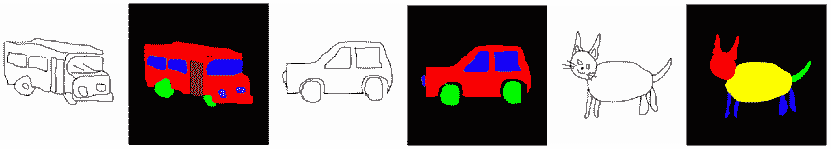

图 10: 从草图解析论文 [171] 中选出的草图（公交车、汽车、猫）及其地面真相标注。语义部分和背景以颜色标注。建议使用彩色查看。

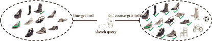

图 11: 细粒度（实例级）与粗粒度（类别级）基于草图的图像检索的比较。真实匹配的照片已标记。

#### 4.1.5 简化与抽象

草图简化已被计算机图形学界广泛研究 [173, 174, 150, 175]，以通过合并冗余笔触来简化草图 [175]。一个典型的流程 [176] 是两阶段的：将笔触按几何方式聚类成组（例如，通过格式塔原理）；然后生成一条新线以替代每个组。

随着深度学习的普及，基于 CNN 的草图表示已被用于草图简化。Simo-Serra 等人[16] 提出了一个全卷积网络（FCN），用于直接从粗糙草图的光栅图像中简化草图，其中使用像素级均方误差（MSE）损失来比较粗糙（输入）和简化（目标）草图的训练对。这种方法是完全自动化的，不需要用户干预。由于这些优势，这种基于 FCN 的模型得到了进一步的研究。然而，这种完全监督的方法需要大量的粗糙草图及其对应的草图简化对作为注释。为了缓解这一限制，Simo-Serra 等人[177] 将他们的 FCN 模型集成到生成对抗管道中，其中一个全卷积网络作为生成器。这个升级的模型可以从有监督和无监督数据中共同训练，并获得了显著的性能提升。为了进一步研究判别网络如何提高草图简化，Xu 等人[178] 提出了一个多层判别器，通过融合所有 VGG[179] 特征层来区分草图并简化线条，其中用于层融合的权重通过智能调整机制自动优化。实验结果表明，这个多层判别器帮助基于 FCN 的生成器进一步提高其简化性能。对这三种代表性方法[16, 177, 178] 的实验结果进行比较，表明像素级损失（即 MSE 损失）和 Vanilla 判别器损失可能无法提供足够的监督，帮助模型在简化相对复杂的草图时保留语义上的重要细节。

另一种简化方法关注于草图的典型 [180]。这最近在自由手绘草图社区以“笔画级草图抽象”的名义进行了研究。笔画级抽象[21, 181] 旨在通过去除不影响草图识别性的笔画来抽象化草图。解决这个问题提供了几个好处：（1）它作为副产品学习了笔画显著性[21] – 对识别性贡献最大的笔画最为显著。（2）它可以用于生成不同抽象程度的草图，或用于判别草图模型的数据增强[21]。（3）它可以用于更广泛的总结和压缩[181]。

笔画级抽象任务可以看作是一个离散组合优化问题，因此用传统方法解决是不可行的。在[21]中，通过训练一个强化学习（RL）策略来包括/排除序列中的每一笔，同时在包含的笔画数量和可识别性之间进行权衡。RL 基础的抽象思想在[181]中得到了扩展，用于重新排序输入的笔画，而不是被限制于原始输入序列；进一步地，使得可以自定义抽象目标，以保留“可识别性”的不同方面，例如类别与属性。

讨论 尽管取得了这些良好的进展，通过*合并*多个笔画成更粗糙的替代品，而不仅仅是简单地过滤它们，仍然是基于深度学习的素描分析中的一个未解之谜。

讨论 在现有文献中，素描简化的瓶颈在于实验结果主要通过视觉比较和用户研究进行评估。定义一个好的量化和自动化的度量来评估简化的素描仍然是一个未解决的问题和重大挑战。一个好的度量将对设计更明确的损失函数非常有帮助。

#### 4.1.6 数据增强

本小节讨论的素描特定的数据增强方法可以应用于素描识别以及所有其他涉及素描的任务（包括单模态和多模态），例如，基于素描的图像检索，素描相关的生成。

(i) 当表示为栅格图像时，大多数为自然照片设计的常见数据增强方法[182]可以应用于素描，例如，水平反射/镜像、旋转、水平移动、垂直移动、中心缩放。这些增强方法已在早期素描导向的深度学习工作中得到评估[18, 183]。然而，随机裁剪可能不适用于素描，因为部分素描往往过于稀疏，甚至人类也难以识别，并且一些基于统计的图像增强方法如对比度/直方图/亮度增强不能应用于素描。

(ii) 笔画加粗/膨胀可以用于手绘素描。正如一些关于空间稀疏卷积神经网络的早期研究[184]所讨论的那样，多层卷积之后，稀疏素描笔画的细微细节可能会丢失。因此，这对于将素描作为图像输入进行处理的深度神经网络是有用的。

(iii) Yu 等人[3] 提出了通过去除笔画来获得更多样化的素描。基于观察[6]，人们往往首先绘制轮廓再绘制细节，可以提出启发式方法来根据笔画的顺序以一定的概率去除笔画。

(iv) Zheng 等人[185] 提出了基于贝塞尔支点的变形（BPD）策略和均值笔画重建（MSR）方法。这些方法不需要素描中的任何时间信息。MSR 的主要思想是生成具有较小类内方差的新素描。

(v) Liu 等人[186] 提出了两种素描特定的数据增强策略：（a）手动从素描 SVG 文件中提取一些笔画以构建噪声笔画掩模。然后，随机将噪声笔画掩模应用于原始素描，以合成增强素描。（b）从一个素描中随机提取一个补丁，并将其附加到给定素描上。

(vi) Muhammad 等人[21] 应用强化学习来学习一个素描抽象模型，该模型保留了素描的语义。一旦训练完成，该模型可以用于生成不同抽象级别的输入素描的增强。

与对完整图像（例如，旋转、平移）进行的数据增强相比，上述增强策略更好地利用了局部和全局的笔画信息。然而，只有[21]利用了（有限的）人类素描变异性来执行数据增强。未来，一个有趣的方向是从不同人类之间的素描风格变异中学习，并将素描增强视为跨人类风格迁移问题。

### 4.2 多模态任务：与其他模态的素描

自由手素描在与其他数据模态配对时具有几个跨模态应用。在本节中，我们回顾与素描相关的跨模态主题，包括视觉（例如，自然照片、3D 形状、视频）和文本领域。

目前，大多数视觉检索方法在“示例查询”（QBE）[187]设置下工作，即用户提供他们所寻找内容的示例。与其他查询模态（例如，照片、视频、文本）相比，素描有几个独特的优势：在某些情况下，用户不知道他们所寻找对象的名称，或者难以描述（例如时尚物品的细节），从而无法通过文本查询。同时，提供所寻找对象的照片或视频示例可能会很困难或不切实际。基于素描的图像检索提供了一种查询模态，用户通过绘制他们的心理图像来表达目标对象。它在细粒度实例级别的搜索中特别有用。因此，素描可以用作检索自然照片、漫画[188]、3D 形状、视频等的模态。

#### 4.2.1 素描-照片检索

草图照片检索也被称为基于草图的图像检索（SBIR）[1, 189, 4, 190, 191, 192, 193, 194, 195]¹⁰¹⁰10 注意，SBIR 的常见设置是将草图作为图像查询模式，但大多数方法也允许使用其他模式作为查询（如有需要）。SBIR 具有所有草图分析普遍存在的挑战（稀疏和抽象的输入）。特别是，由于将稀疏线条绘图与密集像素表示进行比较的难度，SBIR 尤其具有挑战性，特别是当输入可能是非常抽象或图标式（符号性）表示时，这些表示很难直接与准确的透视投影照片进行比较。

图 7 包含了 SBIR 的分类。根据评估标准，SBIR 可以分为传统/粗粒度 SBIR（即类别级 SBIR）、中粒度[196]和细粒度 SBIR（即实例级 SBIR）。FG-SBIR 本质上是一种实例级检索[197]。从检索嵌入空间的角度来看，SBIR 可以分为常见的最近邻检索和基于快速哈希的检索。从涉及训练的监督角度来看，SBIR 可以分为完全监督和零样本检索。

类别和实例级 SBIR 在粗粒度 SBIR 中，给定一个草图作为查询，返回的图像列表是根据相似度（例如欧几里得或汉明距离）排序的。如果排名靠前的照片与查询的类别标签相同，则检索被认为是正确的。然而，在细粒度 SBIR 中，检索被认为是正确的只有当返回的照片来自与查询草图相同的*实例*对时。图 11 提供了一个示意图。基于 SBIR 的思想，已经实现了多个基于草图的商品搜索引擎，例如基于草图的裙子图像检索[198]、细粒度基于草图的鞋子[4, 26]、椅子[4, 26]和手袋[26]检索系统。

一些早期的 SBIR 工作 [199, 200, 201] 使用了照片的边缘图（图像轮廓）作为与相应草图图像的近似，以进行匹配。Canny 边缘检测器 [202]，Edge Boxes 工具箱 [203] 和全局嵌套边缘检测（HED） [204] 通常用于从自然照片中提取边缘。然而，这种手工设计的过程现在通常被端到端的深度特征学习所取代。

深度基于草图的图像检索（SBIR）近年来得到了广泛的研究 [205, 4, 7, 206, 207, 208, 209, 210, 211, 212, 213, 214, 215, 216, 217]。现有的 SBIR 解决方案通常旨在训练一个联合嵌入空间，其中草图和照片可以使用最近邻技术进行比较。常见的嵌入学习方法包括：（a）基于对比比较的方法（通过成对损失实现 [118]），（b）基于排序的方法 [4, 7]，（c）基于强化学习的方法 [218]，（d）基于深度典型相关分析（DCCA）的方法 [219] [220]，（e）跨领域字典学习 [221]，等等。最广泛研究的方法是基于排序的方法，包括三元组排序 [209, 222, 223] 和四元组排序 [224]。

基于排序的 SBIR 我们接下来详细介绍流行的三元组和四元组排序 SBIR 方法。

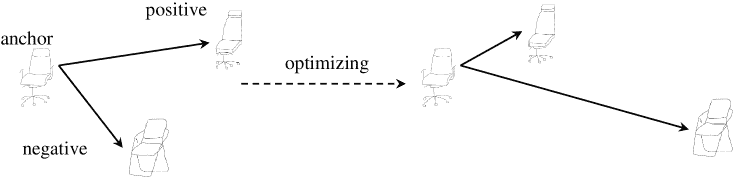

（a）三元组优化（单模态）

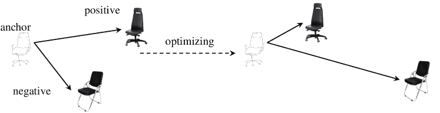

（b）三元组优化（多模态）

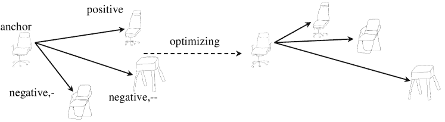

（c）四元组优化（单模态）

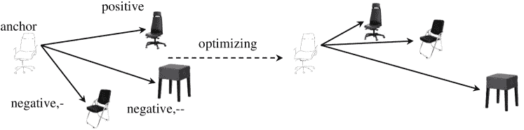

（d）四元组优化（多模态）

图 12：三元组和四元组排序优化目标的示意图。实线箭头的长度表示嵌入空间中的距离。在四元组示意图中，“$negative,-$”样本表示来自锚点类别的负样本，而“$negative,--$”样本表示来自其他类别的负样本。

如图 12 所示，给定一个草图锚点 ${\bf X}_{n}$ 及其正例和负例照片检索候选（${\bf X}_{n,+}$，${\bf X}_{n,-}$），三元组排序的目标是

|  | $\begin{split}\mathcal{D}(\mathcal{F}({\bf X}_{n}),\mathcal{F}({\bf X}_{n,+}))<\mathcal{D}(\mathcal{F}({\bf X}_{n}),\mathcal{F}({\bf X}_{n,-})).\end{split}$ |  | (1) |
| --- | --- | --- | --- |

其中 $\mathcal{D}(\cdot,\cdot)$ 是一种距离度量（例如 $\ell_{2}$ 距离）。在常见的 FG-SBIR 实践中 [4, 209]，负样本通常从与锚点相同的类别中选择。

对于四元组排名 [224]，输入的原子是一个包含锚点 ${\bf X}_{n}$、正样本 ${\bf X}_{n,+}$、来自锚点类别的负样本 ${\bf X}_{n,-}$ 和来自不同类别的负样本 ${\bf X}_{n,--}$ 的四元组。如图 12 所示，四元组排名的目标是确保

|  | $\begin{split}\mathcal{D}(\mathcal{F}({\bf X}_{n}),\mathcal{F}({\bf X}_{n,+}))<&amp;\mathcal{D}(\mathcal{F}({\bf X}_{n}),\mathcal{F}({\bf X}_{n,-}))\\ &amp;<\mathcal{D}(\mathcal{F}({\bf X}_{n}),\mathcal{F}({\bf X}_{n,--})).\end{split}$ |  | (2) |
| --- | --- | --- | --- |

基于此，四元组排名本质上是通过构造两个额外的三元组关系来实现多任务或多个三元组排名，以便将更多语义信息编码到嵌入空间中。例如，Seddati 等人 [224] 从每个四元组中构造了三个三元组，包括 $triplet_{a}=\{{\bf X}_{n},{\bf X}_{n,+},{\bf X}_{n,-}\}$、$triplet_{b}=\{{\bf X}_{n},{\bf X}_{n,+},{\bf X}_{n,--}\}$ 和 $triplet_{c}=\{{\bf X}_{n},{\bf X}_{n,-},{\bf X}_{n,--}\}$。因此，四元组排名损失定义为

|  | $\begin{split}\mathcal{L}_{quadruplet}=\mathcal{L}_{triplet_{a}}+\lambda_{b}\mathcal{L}_{triplet_{b}}+\lambda_{c}\mathcal{L}_{triplet_{c}},\end{split}$ |  | (3) |
| --- | --- | --- | --- |

其中 $\lambda_{b}$ 和 $\lambda_{c}$ 是权重。

在基于排名的 SBIR 中，锚点通常来自草图领域，其他样本则为照片。无论是三元组排名还是四元组排名，都可以用于类别级别或实例级别的 SBIR 任务。

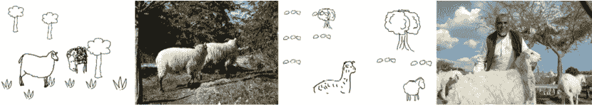

图 13：SceneSketcher 数据集的示例 [78]，一个细粒度场景级草图数据集。

最近，刘等人发布了第一个场景级细粒度 SBIR 数据集，即 SceneSketcher [78]（见图 13）。这项开创性的工作为未来的 SBIR 研究开辟了新的方向，并为细粒度场景草图跨模态匹配贡献了有效的解决方案，该方案使用 GCN 来编码细粒度三元组排名中的场景草图布局信息。

评论 三元组损失的基本原理是利用局部部分排序来建立嵌入空间中的全局有序关系。因此，三元组排序[57]可以理解为拓扑排序¹¹¹¹11[`en.wikipedia.org/wiki/Topological_sorting`](https://en.wikipedia.org/wiki/Topological_sorting)。三元组标注作为一个部分有序集。与其他损失函数相比，三元组损失的主要优点是：（i）它有助于引入更多局部部分排序和标注，从而学习到更精细的嵌入空间。（ii）在有限数量的$N$训练样本下，其三元组排序有$C_{N}^{3}$种组合，产生显著的标注扩增。这对在较小的草图数据集上训练更深的网络非常有利。需要注意的是，三元组损失的性能严重依赖于（a）边际参数的选择和（b）三元组构造策略。

评论 我们指出，基于排名的 SBIR 模型也可以通过多任务训练与分类[7, 225, 226]来改进。此外，SBIR 不仅仅可以通过判别训练来解决，还可以通过从一种模态生成另一种模态[227]，例如，使用条件 GAN[228]；或使用生成损失来规范判别训练[229]。SBIR 训练还可以与后处理重排序[199, 201, 230]结合，以优化初步学习的嵌入空间。

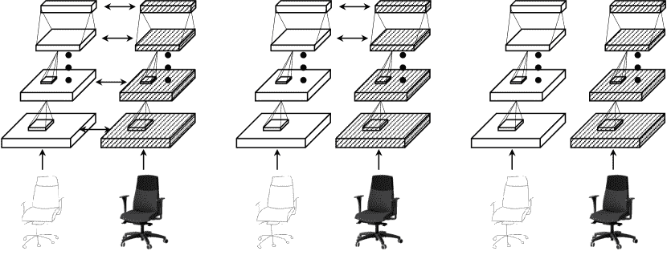

图 14：CNN 基础的跨模态网络中不同的权重共享方式（左：孪生网络，中：半异质，右：异质）。空心和阴影网络分别表示草图和照片的分支。双向箭头表示权重的共享。

SBIR 中的网络架构 SBIR 模型通常需要两个或更多分支来处理草图和照片，以进行比较，使用上述引入的度量标准。如图 14 所示，三元组和四元组排名模型可以使用后台网络，这些网络可以是孪生网络、半异质网络或异质网络。（i）孪生网络 [4] 在各个分支之间使用完全的权重参数共享。（ii）半异质网络 [231, 232] 在各个分支之间使用部分权重共享。通常，早期层是特定于模态的，而加权绑定层位于较深层次。（iii）在异质网络 [233] 中，草图分支使用与照片分支独立的参数。这些架构的权衡在于，共享权重能够利用更多数据（包括草图和照片）来估计参数，减少过拟合。但分开权重使草图/照片分支能够更具体地适应其各自的领域。权重共享的考虑在 [225] 中有更详细的讨论。

基于哈希的 SBIR 为了实现更快的基于草图的图像检索，近期的研究已经开始优化特征编码（例如，草图-图像哈希 [234, 235]）和特征图（例如，不对称特征图 [236]）。

特别是，草图-图像哈希（或哈希 SBIR）已经引起了关注。Liu 等人 [234] 提出了第一个用于 SBIR 的深度哈希模型，这是一个经典的深度哈希流程，包括：（i）特征提取网络，（ii）带有二进制约束的哈希层，以及（iii）哈希损失。这个经典流程在以照片为导向的深度哈希中得到了广泛研究 [237, 238]，其中哈希层通常是全连接的，使用 sigmoid 或 tanh 激活函数，并具有离散的二进制约束。由于离散的二进制约束，深度哈希模型的损失函数通常是不可微分的。因此，常见的做法是通过固定一个部分并优化另一个部分，以两步交替优化特征提取骨干网和哈希层。

现有的 SBIR 哈希模型在 SBIR 基准测试上进行工作，即 Sketchy [7]（75K 草图）和 TU-Berlin Extended [67]（20K）。这些基准测试的规模尚不足以彻底测试哈希 SBIR 方法。

讨论 当前 SBIR 中的问题包括：用于 SBIR 的自监督预训练[239, 115]，例如使用强化学习[218]优化 SBIR 以进行早期检索；调查是否可以用边缘图替代昂贵的草图-照片标注对[240]以及接下来讨论的 SBIR 的跨类别泛化。

#### 4.2.2 零-Shot SBIR

许多现有的 SBIR（草图基础图像检索）工作假设要查询的类别已经包含在训练集中。近年来，受到监督下照片检索零-shot 设置的启发[241]，零-shot 草图基础图像检索（ZS-SBIR）也得到了研究[242, 243, 244, 65, 245, 246, 247, 248, 249, 250, 251, 252, 216, 253, 254, 255]。类似于自然照片的零-shot 学习/识别[256, 257, 258]，ZS-SBIR 系统旨在使得查询和检索来自未见类别的类别成为可能，即那些在训练阶段未涉及的类别。这在实践中非常重要，例如，在 SBIR 的电子商务应用中，新产品应理想地能够在搜索引擎中被纳入，而不需要重新训练。

讨论 ZS-SBIR 系统可以遵循传统的零样本学习方法 [256, 257, 258]，利用辅助知识如词向量 [259]、属性 [260] 或类别层级来定义未见类别的模型。然而，直接为新类别合成检索模型与辅助知识相关会导致与 ZSL 相同的挑战（跨类别领域转移 [256] 和在测试时需要指定可命名类别 [256]）。同时，这会带来 SBIR 特有的新挑战：（i）知识转移需要在草图和照片视图之间发生。（ii）某些类型的辅助知识可能对草图没有意义（例如，*香蕉是黄色的* 在照片中可能可见，但在草图中不可见）。同时，辅助知识转移对于检索并不像类别识别那样严格必要。因此，许多 ZS-SBIR 方法以*领域泛化* [73] 方式解决问题。也就是说，在训练类别上训练一个足够强大的匹配网络，以支持直接应用于未见的测试类别。因此，常见的方法是训练排名 [65, 251] 或生成 [245, 246] 模型进行检索，这些模型通过领域对齐损失 [65, 251, 245] 和辅助语义知识重构 [65, 245] 等约束进行增强和稳健化。在这些情况下，辅助语义知识仅用于在训练时约束表示学习，而不像传统 ZSL 那样在测试时需要——从而保持 SBIR 只依赖于描绘能力而非语言描述的愿景。

当前方向包括将 SBIR 扩展到广义的零样本设置，其中测试类别是训练类别和未见类别的混合 [251, 245]; 将草图-照片哈希扩展到零样本设置 [261]; 以及在没有配对样本的情况下训练 SBIR [244]。

#### 4.2.3 草图-照片生成

表 V: 深度草图-照片生成的代表性管道比较。 “s $\rightarrow$ p”和“p $\rightarrow$ s”分别表示“草图 $\rightarrow$ 照片”和“照片 $\rightarrow$ 草图”。此处代表性参考文献的骨干由 CNN 实现。

| 任务 | 管道 | 代表性参考文献 | 草图特定设计 | (优)缺点 |
| --- | --- | --- | --- | --- |
| s $\rightarrow$ p | GAN | [262, 263, 264] | 草图特定设计通常注入生成器中。 |

&#124; A: 简单，端到端训练 &#124;

&#124; D: 次优性能 &#124;

|

| s $\rightarrow$ p | GAN #1 $\rightarrow$ GAN #2 | [265, 266] | GAN #1 用于笔画细化，GAN #2 用于照片合成 |
| --- | --- | --- | --- |

&#124; A: 动机明确 &#124;

&#124; D: 多阶段训练 &#124;

|

| s $\rightarrow$ p | CGAN | [267, 268] | 特定设计和领域知识可以作为条件注入。 |
| --- | --- | --- | --- |

&#124; A: 动机明确 &#124;

&#124; D: 对条件敏感 &#124;

|

| s $\rightarrow$ p | ContextualGAN | [269] | 学习草图-照片对的联合分布 |
| --- | --- | --- | --- |

&#124; A: 外观自由度高，较少严格对齐 &#124;

&#124; D: 多阶段训练 &#124;

|

| s $\rightarrow$ p | TextureGAN | [270] | 支持局部纹理约束 |
| --- | --- | --- | --- |

&#124; A: 更精细的粒度 &#124;

&#124; D: 高复杂度 &#124;

|

| p $\rightarrow$ s | CGAN | [271] | 特定设计和领域知识可以作为条件注入。 |
| --- | --- | --- | --- |

&#124; A: 动机明确 &#124;

&#124; D: 对条件敏感 &#124;

|

| p $\rightarrow$ s | 条件编码器-解码器 | [272] | 在类别先验上对卷积解码器进行条件处理。 |
| --- | --- | --- | --- |

&#124; A: 简单，端到端训练 &#124;

&#124; D: 性能不佳 &#124;

|

| p $\rightarrow$ s | VAE (CNN 编码器 + RNN 解码器) | [55] | 快捷循环一致性，RNN 解码器 |
| --- | --- | --- | --- |

&#124; A: 一步步进行，端到端训练 &#124;

&#124; D: 对长笔画效果不佳 &#124;

|

基于草图和照片的互生（转换/合成）是草图研究中的经典跨模态课题，包括：(i) 草图到照片生成 [17, 273, 274]，(ii) 照片到草图生成 [55, 271, 275, 272]。特别是，草图到照片生成方法已解决：(a) 草图到照片 [267]，(b) 草图和照片到照片 [22, 263]，(c) 草图/边缘和颜色到照片 [58]。基于草图和照片的生成可用于帮助用户创建或设计新图像于各种实际应用中：草图基础的照片编辑 [22, 263, 264]，草图到绘画生成 [276]，服装设计 [277, 278]，草图到自然照片生成 [266]，等。在某些情况下，草图-照片生成也涉及风格迁移 [279, 268]。

注意：(i) 草图到照片的生成旨在解决从抽象和稀疏的线条绘图到像素空间的跨模态翻译，与良好绘制的草图着色不同[280, 281, 282]。 (ii) 照片到草图的生成并不是指从自然照片中提取边缘图[203, 283]（字面透视投影的边缘图），而是需要学习模仿人类草图和抽象绘画风格的模型[55]。

草图和照片生成方法已经被广泛研究[284, 285, 262, 265, 186]，基于各种生成对抗网络（GAN）[121]的变体，包括条件 GAN[286]、循环 GAN[284]和纹理 GAN[270]。同时，变分自编码器（VAE）在草图-照片生成中也表现良好。我们在表 V 中比较了现有的深度草图-照片生成管道及其代表性模型。草图到照片的领域差距很大。如图 15 所示，一个直观的想法是将大的差距分解为两个较小的差距。一些早期工作[265, 266]建议使用两个 GAN 在两个步骤中实现草图到照片的生成：（i）使用第一个 GAN 来细化粗略的草图，例如，生成好的轮廓[266]，并且（ii）将细化的草图输入到第二个 GAN 中以生成目标照片。

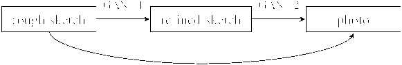

图 15：基于两个阶段和两个 GAN 的草图到照片跨模态生成理念的示意图[265, 266]。箭头的长度表示跨领域差距的距离。详细信息见正文。

讨论草图与照片的跨模态生成明显不同于传统的照片到照片翻译[285]。现有的照片到照片模型可以假设输入和输出之间的像素级对齐。然而，在草图和照片的情况下，这种要求被强烈违反。确实，考虑到草图的潜在抽象或图标性质，没有简单的变形可以在草图和照片之间提供像素级对齐。因此，现有的草图-照片合成工作已经努力绕过这个问题，例如，使用上下文生成对抗网络（GAN）[269]。

讨论：将草图图像生成像素会遇到一个问题，即图像中的模糊度在应由锐利边缘构成的图像中非常明显。然而，草图-照片翻译和照片-照片翻译之间的重要区别在于，草图数据的原始格式通常是时间序列的途径点。如果要使用这种原始草图表示，编码器或解码器应该是 RNN 而不是 CNN。这种序列化的向量化照片-草图翻译的第一个例子见于 [55]，其中使用递归解码器逐步生成锐利的草图。

讨论：其他当前考虑因素与图像-图像翻译相似，包括基于无配对样本的草图-照片翻译模型的构建。

讨论：草图修复是一项与草图生成相关的有趣任务，具有广泛的实际应用，包括工程 [287, 288]、医学 [288]、农业 [289, 288, 290] 等。这个任务可以看作是一个单模态生成任务，从退化的草图（带有中断的笔触）到恢复的完整草图。例如，旧草图 [33] 和工程草图 [287]。草图修复也被研究用于从非草图图像中生成/解析草图结构（例如，视网膜 [288]、植物根系 [289, 288, 290]、卫星图像中的道路网络 [288]），这是一项跨模态的照片到草图生成任务。在端到端框架中解决这个问题仍然具有挑战性且研究不足。

#### 4.2.4 草图-3D 检索

草图-3D 检索指的是使用草图作为查询来检索 3D 模型 [291]。与 SBIR 相比，由于 2D 草图和 3D 模型之间存在更大的领域差距，3D 检索更具挑战性。

在深度学习时代之前，草图-3D 检索已经得到了很好的研究 [47]。经典方法通常分为两个阶段 [292]： (i) 视图选择：使用自动程序选择给定 3D 模型的代表性视点，希望选择的一个视点与查询草图的视点相似； (ii) 投影与匹配：通过线渲染算法将每个选定的 3D 模型视图投影到 2D 空间中 [293]。然后基于预定义特征如 SIFT [120]，将草图与模型的 2D 投影进行匹配。有关说明，请参见图 16。然而，正如一些之前的工作所指出的 [2]，视图选择是两阶段方法的瓶颈，因为“最佳”视图是主观和模糊的。此外，基于手工制作特征的匹配是不准确的。

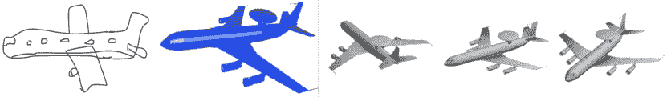

图 16：草图与 3D 形状之间视图匹配的示例。图像（从左到右：草图、3D 形状、3D 形状的三个随机视图）选自 [294]。

渐进地，基于草图的 3D 模型检索在端到端深度学习范式中得到了研究 [2, 295, 296, 294, 297, 298, 299]。作为一种代表性方法，Wang 等人 [2] 提出了使用两个孪生网络直接在端到端的方式中学习草图和投影视图，该方法以草图和投影视点的四元组作为输入，并使用多个成对损失。在每个四元组中，从草图和 3D 领域中分别随机选择两个草图 (${\bf X}_{1}$, ${\bf X}_{2}$) 和两个视点 (${\bf V}_{1}$, ${\bf V}_{2}$)。为了简化，他们假设 ${\bf X}_{1}$ 和 ${\bf X}_{2}$ 来自共享一个孪生网络的相同类别，而 ${\bf V}_{1}$ 和 ${\bf V}_{2}$ 也来自共享另一个孪生网络的相同类别。四元组损失为：

|  | $\begin{split}\mathcal{L}({\bf X}_{1},{\bf X}_{2},&amp;{\bf V}_{1},{\bf V}_{2})=\mathcal{L}_{pair}({\bf X}_{1},{\bf X}_{2})\\ &amp;+\mathcal{L}_{pair}({\bf V}_{1},{\bf V}_{2})+\mathcal{L}_{pair}({\bf X}_{1},{\bf V}_{1}),\end{split}$ |  | (4) |
| --- | --- | --- | --- |

损失函数项 $\mathcal{L}_{pair}({\bf X}_{1},{\bf X}_{2})$ 和 $\mathcal{L}_{pair}({\bf V}_{1},{\bf V}_{2})$ 使得网络能够在每个领域内学习类别级相似性；而 $\mathcal{L}_{pair}({\bf X}_{1},{\bf V}_{1})$ 项则强制网络学习跨模态相似性。给定输入样本 $a$ 和 $b$，成对损失函数定义为：

|  | $\begin{split}\mathcal{L}_{pair}(a,b)=\left\{\begin{aligned} \alpha{\mathcal{D}(\mathcal{F}_{a}(a),\mathcal{F}_{b}(b))},&amp;~{}~{}\textrm{ 如果 }y_{a}\neq y_{b},\\ \beta e^{\gamma\mathcal{D}(\mathcal{F}_{a}(a),\mathcal{F}_{b}(b))},&amp;~{}~{}\textrm{ 否则 },\end{aligned}\right.\end{split}$ |  | (5) |
| --- | --- | --- | --- |

其中 $y_{a}$ 和 $y_{b}$ 是相应的类别标签，$\mathcal{F}_{a}(\cdot)$ 和 $\mathcal{F}_{b}(\cdot)$ 分别表示应用于 $a$ 和 $b$ 的特征提取。

除了这种对偶深度度量学习，其他深度度量学习方法也可以应用于草图-3D 匹配，例如三元组排序 [300, 301] 和深度相关度量学习 [302, 303]。

此外，一些早期的研究也探讨了如何在基于草图的 3D 检索任务中更全面地表示 3D 模型。例如，Xie 等人 [304] 提出了通过计算 3D 模型多个投影的 Wasserstein 距离 [305] 基于的质心来表示 3D 模型。

#### 4.2.5 草图-3D 生成

从草图到 3D 模型生成也是一个有趣的跨模态研究主题，类似于第 4.2.3 节中讨论的草图到图像生成。使用草图生成 3D 模型/形状 [306, 307] 极具挑战性，但具有重要应用，如基于草图的产品设计 [308, 309]。与其他讨论过的任务相比，这个领域至今相对较少研究。目前，大多数现有的基于深度学习的草图到 3D 生成模型主要针对高质量绘制或专业铅笔草图 [310, 311]。最近，3D 到草图 [312] 的生成也在深度学习方法中进行了探索。

DeepSketchHair [308] 是一个代表性的深度模型，它从 2D 草图生成逼真的 3D 发型模型。如图 17 所示，给定一个 3D 半身模型作为参考，系统接受用户绘制的草图（包括头发轮廓（红线）和指示头发生长方向的几条线（蓝线）），并自动生成一个 3D 头发模型，该模型在全局（轮廓）和局部（生长方向）上与输入草图匹配。该模型解决了两个具有挑战性的跨领域映射：（i）通过 S2ONet 将草图映射到密集的 2D 头发方向场，（ii）通过 O2VNet 将 2D 方向场映射到 3D 矢量场。

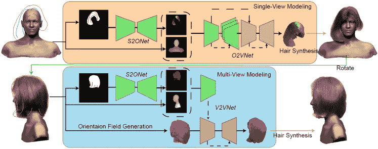

图 17：基于草图的 3D 发型建模深度模型的流程图[308]。该系统将 2D 草图作为输入，生成逼真的 3D 发型。

#### 4.2.6 草图-视频检索

基于草图的视频检索（SBVR）在当代深度学习之前已经得到了研究。SBVR 由于自由手绘草图与视频之间的巨大领域差距，也具有很高的挑战性。在使用草图作为查询的 SBVR 应用中，人们可以使用线条或箭头向量来描述运动或其他动态场景。因此，草图不仅可以用来描绘静态对象和场景，还可以用于表示运动信息。

使用草图进行基于草图的视频检索（SBVR）涉及同时传达外观和运动，这具有挑战性，因为需要将运动和外观信息从草图中分离出来，并利用这些信息来访问视频库中的相应频道进行检索。为了应对这一挑战，提出了一种多流多模态深度网络[314]。这项研究进一步将 SBVR 扩展为细粒度 SBVR，以实现根据草图查询进行实例级视频检索。

最后，我们注意到，基于运动草图的人群视频检索[315, 316]最近得到了研究，这对于视频监控分析非常有用。

讨论哪些类型的视频适合且可行于基于草图的检索仍然是一个悬而未决的问题。关于如何在草图中描绘时间、镜头变化和运动的人机交互问题也是如此。

#### 4.2.7 其他与草图相关的多模态任务

最近出现了一些有趣的基于草图的多模态任务，例如，文本到草图生成[317]（例如，基于文本指令的对话草图创作[318]），基于草图的照片分类器生成[20]，基于草图的分割模型生成[319]，基于草图的猜词游戏[320, 54, 131]，草图到照片轮廓转移[321]，以及自然照片中的草图引导物体定位[322]。

### 4.3 实验比较

#### 4.3.1 草图表示

正如第 2.1 节中讨论的，草图可以以多种不同的格式表示，例如光栅图像和关键点序列。这些表示形式适用于不同的神经网络架构。因此，我们借此机会使用 TorchSketch 对草图识别/表示的神经网络架构进行首次彻底比较。

表 VI：在 QuickDraw[23]的一个子集上，不同网络架构的识别精度比较[5]。

| 架构与网络 | 输入 | 识别精度 | 参数数量 |
| --- | --- | --- | --- |
| acc.@1 | acc.@5 | acc.@10 |
| Convolutional Neural Networks (CNNs) | AlexNet [105] | picture | 0.6808 | 0.8847 | 0.9203 | 58,417,305 |
| VGG-11 [179] | 0.6743 | 0.8814 | 0.9191 | 130,179,801 |
| VGG-13 [179] | 0.6808 | 0.8881 | 0.9232 | 130,364,313 |
| VGG-16 [179] | 0.6837 | 0.8889 | 0.9253 | 135,674,009 |
| VGG-19 [179] | 0.6908 | 0.8839 | 0.9208 | 140,983,705 |
| Inception V3 [323] | 0.7422 | 0.9189 | 0.9437 | 25,315,474 |
| ResNet-18 [108] | 0.7164 | 0.9072 | 0.9381 | 11,353,497 |
| ResNet-34 [108] | 0.7154 | 0.9083 | 0.9375 | 21,461,657 |
| ResNet-50 [108] | 0.7043 | 0.8987 | 0.9303 | 24,214,937 |
| ResNet-101 [108] | 0.7071 | 0.8992 | 0.9317 | 43,207,065 |
| ResNet-152 [108] | 0.6924 | 0.8973 | 0.9312 | 58,850,713 |
| DenseNet-161 [324] | 0.7008 | 0.8971 | 0.9302 | 27,234,105 |
| DenseNet-169 [324] | 0.7173 | 0.9050 | 0.9358 | 13,058,905 |
| DenseNet-201 [324] | 0.7050 | 0.9013 | 0.9331 | 18,755,673 |
| MobileNet V2 [325] | 0.7310 | 0.9161 | 0.9429 | 2,665,817 |
| Recurrent Neural Networks (RNNs) | LSTM | stroke vector | 0.6068 | 0.8416 | 0.8931 | 2,593,881 |
| Bi-directional LSTM | 0.6665 | 0.8820 | 0.9189 | 5,553,241 |
|  | GRU | 0.6224 | 0.8574 | 0.9055 | 2,000,473 |
|  | Bi-directional GRU | 0.6768 | 0.8854 | 0.9234 | 5,419,097 |
| Graph Neural Networks (GNNs) | Graph Convolutional Network (GCN) [326] | stroke vector | 0.6800 | 0.8869 | 0.9224 | 6,948,441 |
| Graph Attention Network (GAT) [327] | 0.6977 | 0.8952 | 0.9298 | 11,660,889 |
| Vanilla Transformer [328] | 0.5249 | 0.7802 | 0.8486 | 14,029,401 |
| Multi-Graph Transformer (Base) [23] | 0.7070 | 0.9030 | 0.9351 | 10,096,601 |
| Multi-Graph Transformer (Large) [23] | 0.7280 | 0.9106 | 0.9387 | 39,984,729 |
| Textual Convolutional Network (TCN) | TCN [111] | stroke vector | 0.5511 | 0.8020 | 0.8646 | 2,750,873 |

为此，我们遵循 [23]使用从 QuickDraw 获得的 414K 草图。这些草图被组织为训练、验证和测试集，每个 QuickDraw 类别中分别包含 1000、100 和 100 张草图。根据 [19]，我们将草图样本截断或填充到统一的长度，即 100 个关键点/步骤，以便有效训练基于 RNN、GNN 和 TCN 的模型，其中每个时间步长是一个 $4D$ 输入（即两个坐标和两个笔状态位）。草图识别是该领域的基础课题，QuickDraw 草图具有现实的抽象性、噪声和绘图多样性。因此，我们希望这个基准可以帮助从业者，同时支持未来在该领域的研究。

这些架构的识别准确率由 TorchSketch 实现，如表格 VI 所示。我们可以通过在架构类别内外进行比较来分析这些结果。在每个架构中，我们可以从表格 VI 观察到：(i) 对于 CNN，较深的网络（例如 DenseNet-161）与较浅的网络（例如 AlexNet、VGG）相比没有明显优势。这可能是因为素描稀疏性导致冗余的卷积和池化操作丢失了关于稀疏像素的信息。(ii) 对于 RNN，双向网络明显优于单向网络（0.66+ 对比 0.60+）。这很有道理，因为人类素描的顺序仅 loosely 一致 [133]。(iii) 对于 GNN，多图变换器 (MGT) 优于图卷积网络 (GCN) 和图注意力网络 (GAT)。

在这些架构中，我们可以观察到：(i) 迄今为止，最佳的 CNN 网络（InceptionV3）优于最佳的序列网络。这可能是因为序列网络（RNN、GNN 和 TCN）截断了输入坐标序列。(ii) 在 GNN 中，多图变换器 [23] 最接近于匹配 CNN 的最佳性能。(iii) 与 CNN 和 GNN 相比，RNN 和 TCN 参数显著较少。然而 (iv) TCN 在这种完全监督设置下表现不佳。

表 VII：ResNet-18 CNN 主干对随机空间变换形式的扰动的鲁棒性。

每个设置测试了 $10$ 次，报告了性能的均值 ($\%$) 和标准差。

| 空间变换 | 在 TU-Berlin 上的识别率 |
| --- | --- |

&#124; 粗粒度 SBIR &#124;

&#124; 在 TU-Berlin 扩展数据集上 &#124;

|

&#124; 细粒度 SBIR &#124;

&#124; 在 QMUL 鞋子数据集上 &#124;

|

| --- | --- | --- | --- |
| --- | --- | --- | --- |
| acc.@1 | acc.@5 | acc.@10 | rank@1 | rank@5 | rank@10 | mAP | rank@1 | rank@5 | rank@10 |
| --- | --- | --- | --- | --- | --- | --- | --- | --- | --- |
| shift | 67.16$\pm$0.31 | 88.20$\pm$0.24 | 92.82$\pm$0.32 | 51.17$\pm$0.36 | 71.04$\pm$0.31 | 77.33$\pm$0.21 | 28.91$\pm$0.05 | 21.13$\pm$1.42 | 50.17$\pm$2.42 | 67.39$\pm$2.10 |
| scale | 44.07$\pm$0.80 | 68.49$\pm$0.62 | 77.08$\pm$0.48 | 31.24$\pm$0.33 | 51.02$\pm$0.56 | 59.06$\pm$0.50 | 15.75$\pm$0.24 | 8.78$\pm$2.15 | 25.74$\pm$2.10 | 39.65$\pm$3.02 |
| 水平翻转 | 70.60$\pm$0.22 | 89.58$\pm$0.12 | 93.88$\pm$0.14 | 52.30$\pm$0.13 | 72.05$\pm$0.21 | 78.32$\pm$0.20 | 30.12$\pm$0.04 | 16.08$\pm$2.85 | 44.00$\pm$2.63 | 58.61$\pm$2.70 |
| 垂直翻转 | 50.44$\pm$0.74 | 70.77$\pm$0.59 | 78.00$\pm$0.36 | 36.25$\pm$0.33 | 52.57$\pm$0.42 | 58.32$\pm$0.32 | 20.75$\pm$0.11 | 13.04$\pm$1.88 | 40.35$\pm$3.18 | 56.17$\pm$3.36 |
| 旋转 | 44.34$\pm$0.69 | 68.38$\pm$0.44 | 76.83$\pm$0.50 | 32.84$\pm$0.66 | 50.14$\pm$0.48 | 57.14$\pm$0.73 | 17.94$\pm$0.21 | 6.35$\pm$2.39 | 17.48$\pm$2.64 | 27.92$\pm$3.19 |

| 无 | 72.06 | 90.1 | 94.02 | 53.12 | 73.14 | 78.94 | 30.62 | 20.00 | 53.91 | 68.70 | 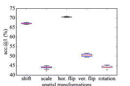

(a) TU-Berlin 上的识别

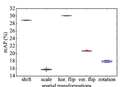

(b) TU-Berlin Extended 上的 SBIR

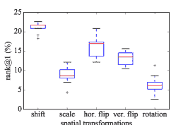

(c) QMUL Shoe 上的细粒度 SBIR

图 18：空间变换下的稳健性评估箱线图。

#### 4.3.2 空间变换的稳健性研究

正如在第 2.1 节中讨论的，即使草图被移位、缩放、旋转或翻转，人们仍然能够轻松识别。评估当前深度网络对不同草图任务和数据集的空间变换的敏感性将是很有趣的。

为了便于比较，我们选择三个定量可比的任务作为目标任务，包括单模态和多模态设置，即草图识别、粗粒度 SBIR、细粒度 SBIR，这些任务将分别在三个常用数据集上进行，即 TU-Berlin、TU-Berlin Extended、QMUL Shoe。为了更直观，我们选择了 CNN 骨干网络，即 ResNet-18。

交叉熵损失和三元组损失分别用于识别和 SBIR 任务。为了进行早期停止并根据验证性能选择模型，我们需要拆分数据集：（i）对于 TU-Berlin，每个类别随机选择$40$、$20$和$20$个草图用于训练、验证和测试。（ii）对于 TU-Berlin Extended，草图和照片随机分为训练、验证和测试集，比例为$2:1:1$。（iii）对于 QMUL Shoe，从其训练集中随机选择$50$对草图-照片对用于验证。为了充分验证敏感性，我们在训练阶段没有采用任何数据增强。

我们选择了五种具有代表性的随机空间变换进行鲁棒性测试，包括位置偏移、尺度变化、水平翻转 ($p=0.5$)、垂直翻转 ($p=0.5$) 和中心旋转 ($-45^{\circ}$ 到 $45^{\circ}$)。考虑到随机性，每种空间变换的测试重复了 $10$ 次，并报告了每个指标的均值 ($\%$) 和标准差，如表 VII 所示，其中 top-K 准确率和排名准确率用作识别和检索的度量指标。此外，还报告了均值平均精度（mAP）以评估粗粒度 SBIR 的性能，因为画廊提供了多个真实匹配。为了清晰对比，表 VII 底部行中提供了没有任何空间变换的测试结果，同时我们基于“acc.@1”、“mAP”和“rank@1”绘制了箱线图（图 18")。

在表 VII 中，我们观察到：（i）深度素描模型易受到空间变换的影响，从而导致性能下降。（ii）与位移和水平翻转相比，另外三种变换会导致更明显的性能变化。特别是对于 TU-Berlin 素描，水平翻转导致的性能变化非常小。（iii）在 QMUL 鞋类数据集上，基于空间变换的扰动具有相对较大的标准差。此外，值得注意的是，位移变换略微提高了细粒度 SBIR 的准确性，这也由图 18 所示。这可能是由于样本量小（仅有 $115$ 对素描-照片配对用于测试）。

这些观察结果表明，基于素描的空间变换能够攻击深度网络。目前的深度学习技术仍需改进，以实现素描导向的鲁棒性。

## 5 讨论

表 VIII：深度学习与传统方法在素描相关任务中的比较。

| 方法 | 优点 | 缺点 |
| --- | --- | --- |
| 深度学习 | 相对优越的性能 | 手动设计的网络结构 |
| 端到端映射 | 更多的参数/资源成本 |
| 更大的模型容量以支持大数据 | 易于过拟合 |
|  | 更多训练数据通常带来更高性能 | 数学表达和可解释性较差 |
| 传统方法 | 数学表达和可解释性清晰 | 性能相对次优 |
| 参数/资源较少 | 手动设计特征 |
| 较少过拟合 | 对大数据的参数不足 |

表 IX: 不同深度网络架构在草图导向任务中的比较。

| 架构 | 输入 | 模型空间 | 动机 | 优点 | 缺点 |
| --- | --- | --- | --- | --- | --- |
| CNNs | 图片 | 空间 | 模仿人类接收领域 | 在全局任务中表现良好 | 在笔画级任务中表现差 |
| （完整草图） | （欧几里得） | 将草图视为二值像素矩阵 | 感知完整草图（无信息丢失） | 时间任务表现差 |
|  |  |  | 可以堆叠更深的层次 | 参数相对更多 |
|  |  |  | 允许多种感知粒度 | 易过拟合 |
| RNNs | 笔画向量 | 空间&时间 | 模仿人类草图过程 | 反复捕捉笔画时间模式 | 深层堆叠能力弱 |
| （关键点） |  |  | 参数相对较少 | 长笔画序列表现差 |
|  |  |  |  | 感知粒度固定 |
| GNNs + Transformers | 笔画向量 | 空间&时间 | 将草图表示为图 | 网络设计灵活性高 | 深层堆叠能力弱 |
| （关键点） |  | （关键点 $\rightarrow$ 节点， | 参数相对较少 | 抽象网络结构 |
|  |  | 笔画 $\rightarrow$ 节点等 | 可以处理长笔画序列 |  |
| TCNs | 笔画向量 | 空间&时间 | 模仿时间接收领域 | 网络架构简洁 | 深层堆叠能力弱 |
| （关键点） |  | （关键点 $\rightarrow$ 单词， | 参数相对较少 | 无法反复感知笔画 |
|  |  | 笔画 $\rightarrow$ 句子) | 允许多种感知粒度 |  |

### 5.1 未解问题

#### 5.1.1 深度学习与传统方法

近年来，深度学习方法在所有草图任务中已达到**最先进的水平**。然而，一些未解问题仍需进一步研究，例如，(i) 深度学习和传统方法在草图上的优缺点是什么？ (ii) 为什么深度学习网络在草图上表现良好？ (iii) 草图独特特征如何通过各种深度学习网络建模？

通常，传统方法分为两个阶段，即从素描空间到特征空间的特征工程，从特征空间到目标空间的映射，而深度学习方法通常直接从素描空间到目标空间进行端到端的映射。因此，利用人类洞察的核心机会在于手动设计网络结构与手动设计特征之间的选择。由于素描领域的挑战（例如抽象、噪声、稀疏、多样化），素描特征工程的困难是传统方法的主要瓶颈之一。深度学习方法通过能够学习强特征表示（前提是有足够的数据来建模其变异性和多样性）在一定程度上缓解了这一问题。此外，深度学习网络有多种动机和机制来处理素描的独特特征：(i) CNNs 使用卷积滤波器模仿人类的感受场，并将素描视为像素空间中的二进制矩阵。(ii) RNNs 模仿时间扩展的人类素描过程，递归地捕捉笔划的空间和时间模式。(iii) GNNs 将素描表示为图形，能够编码笔划序列的拓扑/空间和时间模式。(iv) TCNs 模仿笔划序列上的时间感受场。

我们在表 VIII 中总结了深度学习和传统方法在素描上的优缺点；在表 IX 中比较了不同网络架构在素描导向任务中的表现。

#### 5.1.2 数据与注释

注释 单模态素描数据集已经开始提供一些注释，例如分组[152]和分割[25]。然而，这类注释仍需更细粒度的标注，特别是素描属性方面。正如在第 4.2.3 节中讨论的那样，现有的多模态素描基准注释主要集中在*配对*（例如，素描-照片，素描-3D）上。然而，细粒度/局部注释（例如笔划轮廓、部分和属性）将能够学习到更丰富的跨模态对齐模型。

元数据与公平性 与照片不同，素描独特地受到艺术家的背景、感知、记忆和绘画风格的影响；以及绘制条件（即是否有时间限制）。大多数现有的数据集并未关注平衡用户背景、年龄、性别等样本的获取，也没有记录关于参与者的元数据。然而，这些采样和元数据对于研究绘画风格随这些共变量的变化以及确保素描应用程序对不同背景的用户有效性是必要的。此外，现有的素描数据集主要是由研究人员或在时间压力下的在线游戏中随意参与者创建的。这可能导致素描要么过于精美，要么绘制得过于粗糙。在各种绘画条件下收集的数据及其相关的元数据将有助于未来的素描研究。

#### 5.1.3 架构与素描特定设计

架构 如第 4.3 节和表 VI 所讨论的，有多种网络架构可以应用于素描，这些架构导致了不同的性能。这些结果表明，随着每个家族内更好的架构的开发，性能将继续提升。素描感知的最佳架构仍然是一个未解之谜。

素描特定设计 另一个未解问题是素描特定设计与通用计算机视觉架构和学习算法的相对重要性。显然，素描具有独特的挑战（序列时间序列特性、稀疏性、抽象、艺术家风格等），这些挑战可以通过素描特定设计得到更好的考虑。然而，更广泛的视觉和学习社区可以更大力地开发更先进的通用模型。因此，仍需观察在哪些素描应用中，素描特定设计能够在通用架构和算法中占据决定性优势。例如，素描特定设计在细粒度任务如分割、分组和 FG-SBIR 中可能比最简单的粗粒度对象分类任务更为重要。

与其他草图的关联 一些设计用于其他类型草图（例如，精美线条图 [16, 329, 287, 177]，漫画 [16, 177]）的 CNN 模型可以应用于手绘草图。特别是，相关文献已验证，针对高质量线条图的 CNN 模型可以成功地应用于手绘草图任务，包括矢量化 [155, 330, 164, 331]，着色 [332]，墨线 [333] 等。评估设计用于其他草图的方法是否可以或不能应用于手绘草图是很有趣的。这将取决于为精美草图（图 2）设计的架构在多大程度上过度专门化于该类型的数据，或者是否能够推广到更抽象、多样化和稀疏的手绘草图（图 1）。

### 5.2 潜在研究方向

在本节中，我们概述了一些我们认为在未来具有潜力的研究方向，从潜在应用和基础研究价值两个角度进行探讨。

#### 5.2.1 潜在的应用导向研究

场景草图 场景级草图导向的深度学习仍然处于研究初期。最近，一些开创性的工作（例如，SketchyCOCO [17]，SceneSketcher [78]）为场景级草图研究开辟了有希望的方向。这些工作不仅贡献了大规模的场景级草图数据集，还提出了新颖的研究主题，例如基于场景草图的图像生成 [17]，细粒度场景草图的图像检索 [78]。这些新颖的主题对于实际应用非常有用，例如基于草图的场景设计。尚需观察复杂的场景在技术上是否可行，并且在实际中对用户是否具有吸引力，以便通过草图进行检索。

3D 草图 得益于新的数据收集设备，收集 3D 草图 [334] 现在变得更加容易。这可以支持许多有趣的 3D 草图相关研究主题，例如将虚拟现实（VR） [335] 和增强现实（AR） [336, 10, 11] 结合起来。3D 草图研究将有助于将基于草图的人机交互从触摸屏的二维平面拓展到三维空间，实现更具沉浸感的体验。

多样化的草图主题 现有的草图数据集和应用主要集中在描绘对象的草图上。然而，在实际应用中，用户可能对机器理解更为多样化的草图概念感兴趣，例如，图纸、曲线、直方图 [337]、地图 [338]、工程草图 [309] 和用户界面 (UI) 原型图 [339]。草图还可以与手写字符一同研究。

草图颜色和压力 现有的手绘草图通常通过常见的触摸屏设备（如手机或平板电脑）收集。在这里，笔画的位置是主要特征，而颜色和纹理则未被广泛收集。因此，现有的草图分析主要集中在黑色或灰度草图上。然而，草图已经可以上色，且近期的设备可以越来越好地感知笔画的压力。升级模型以利用草图的颜色、纹理和压力特性仍然是一个突出的研究课题。

草图美化 如何在各种与草图相关的 HCI 应用中美化草图 [340] 是一个有趣且具有挑战性的课题。草图美化不仅会提升用户体验，还能提高草图设计应用中的交互效率，例如，将非专业草图修改为专业草图 [128]。

基于草图的设计 人们在设计的开始阶段经常使用非常简单甚至潦草的草图来头脑风暴和激发灵感。因此，有一些非常有用的基于草图的设计应用可以帮助人们设计 2D 或 3D 产品，例如，草图到漫画 [341, 342, 343, 344]、草图到阴影 [34, 332] 和草图到法线 [345, 346]。我们相信，未来这些技术可以通过深度学习技术进一步改进。这些基于草图的设计方法可以提高 HCI 的效率。

高效模型 对于手机、平板电脑或 AR/VR 设备等移动设备中的基于草图的感知和用户界面处理，应实现实时且足够轻量化，以便在嵌入式电池供电的设备上运行。如何压缩草图模型并提高其效率是未来工作的一个重要问题。

#### 5.2.2 潜在理论研究

面向草图的深度学习模型在经过精心策划的数据集上表现良好。然而，它们在实际控制条件下的泛化能力如何还有待观察。

多样性、风格和鲁棒性 数据集偏移的影响[347]才刚刚开始在草图中进行研究。更独特的是，草图在用户绘画风格、文化和潜在的人口统计学方面具有特别的主观性。对这些风格方面的鲁棒性是草图研究中的一个未充分研究的领域。同样，考虑到草图的原生格式，现有的对抗攻击研究可以通过研究对抗*笔画*或*路标*来扩展到草图领域，而不是像素扰动。

草图作为鲁棒性测试 草图图像与照片差异巨大，但人类容易识别。像 ImageNet-Sketch [41]、SketchTransfer [66] 和 PACS [73]这样的草图图像可以用于基准测试更通用的图像导向深度学习模型的鲁棒性和泛化能力。超越识别，类似的鲁棒性评估可以应用于其他实例级的检索问题，如人物再识别。

数据高效的草图模型 深度学习中草图研究的主要进展是由日益增多的草图数据集推动的（见表 II）。然而，**最终**这些数据集比相应的照片数据集更难以扩展，因为需要人工绘制草图。因此，从识别到 SBIR 的所有主要草图分析任务的数据高效方法在未来至关重要。是否通过少样本学习、自监督学习或从照片领域的跨模态知识迁移来最好实现这一点仍待观察。

## 6 结论

本调查回顾了当代基于深度学习的草图研究。我们介绍了草图在草图特定挑战和多样潜在表示方面的独特之处，并分析了现有数据集和方法的丰富生态系统，包括单模态和多模态草图分析任务。我们在整个过程中讨论了未解决的问题和研究方向。我们希望本调查能帮助新研究人员和从业者快速上手，为草图专家提供便利的参考，并鼓励在这一激动人心的领域取得未来进展。

## 参考文献

+   [1] R. Hu 和 J. Collomosse, “用于基于草图的图像检索的梯度场 HOG 描述符的性能评估”，*CVIU*，2013 年。

+   [2] F. Wang, L. Kang, 和 Y. Li, “基于草图的 3D 形状检索，使用卷积神经网络”，发表于*CVPR*，2015 年。

+   [3] Q. Yu, Y. Yang, F. Liu, Y.-Z. Song, T. Xiang, 和 T. M. Hospedales, “Sketch-a-net: 一种超过人类的深度神经网络”，*IJCV*，2017 年。

+   [4] Q. Yu, F. Liu, Y.-Z. Song, T. Xiang, T. M. Hospedales, 和 C.-C. Loy, “给我画那只鞋子”，发表于*CVPR*，2016 年。

+   [5] D. Ha 和 D. Eck, “草图绘制的神经表示”，发表于*ICLR*，2018 年。

+   [6] M. Eitz, J. Hays, 和 M. Alexa，“人类如何绘制物体？” *TOG*，2012 年。

+   [7] P. Sangkloy, N. Burnell, C. Ham, 和 J. Hays，“Sketchy 数据库：学习检索画得不好的兔子，” *TOG*，2016 年。

+   [8] F. Huang, J. F. Canny, 和 J. Nichols，“Swire：基于草图的用户界面检索，” 见于*CHI*，2019 年。

+   [9] S. Suleri, V. P. Sermuga Pandian, S. Shishkovets, 和 M. Jarke，“Eve：基于草图的软件原型工作台，” 见于*CHI*，2019 年。

+   [10] K. C. Kwan 和 H. Fu，“Mobi3dsketch：移动增强现实中的 3D 草图，” 见于*CHI*，2019 年。

+   [11] D. Gasques, J. G. Johnson, T. Sharkey, 和 N. Weibel，“你画的就是你得到的：使用 pintar 快速轻松地进行增强现实原型设计，” 见于*CHI*，2019 年。

+   [12] A. Kotani 和 S. Tellex，“教机器人绘画，” 见于*ICRA*，2019 年。

+   [13] J. E. Fan, M. Dinculescu, 和 D. Ha，“collabdraw：一个与人工代理协作草图的环境，” 见于*ACM SIGCHI Conference on Creativity and Cognition*，2019 年。

+   [14] I. E. Sutherland，“Sketchpad 一种人机图形通信系统，” *Simulation*，1964 年。

+   [15] C. F. Herot，“通过机器识别草图进行图形输入，” *TOG*，1976 年。

+   [16] E. Simo-Serra, S. Iizuka, K. Sasaki, 和 H. Ishikawa，“学习简化：用于粗糙草图清理的全卷积网络，” *TOG*，2016 年。

+   [17] C. Gao, Q. Liu, Q. Xu, L. Wang, J. Liu, 和 C. Zou，“Sketchycoco：从自由手场景草图生成图像，” 见于*CVPR*，2020 年。

+   [18] Q. Yu, Y. Yang, Y.-Z. Song, T. Xiang, 和 T. M. Hospedales，“Sketch-a-net 战胜人类，” 见于*BMVC*，2015 年。

+   [19] P. Xu, Y. Huang, T. Yuan, K. Pang, Y.-Z. Song, T. Xiang, T. M. Hospedales, Z. Ma, 和 J. Guo，“Sketchmate：用于百万规模人类草图检索的深度哈希，” 见于*CVPR*，2018 年。

+   [20] C. Hu, D. Li, Y.-Z. Song, T. Xiang, 和 T. M. Hospedales，“Sketch-a-classifier：基于草图的照片分类器生成，” 见于*CVPR*，2018 年。

+   [21] U. Riaz Muhammad, Y. Yang, Y.-Z. Song, T. Xiang, 和 T. M. Hospedales，“学习深度草图抽象，” 见于*CVPR*，2018 年。

+   [22] T. Portenier, Q. Hu, A. Szabo, S. A. Bigdeli, P. Favaro, 和 M. Zwicker，“Faceshop：深度基于草图的面部图像编辑，” *TOG*，2018 年。

+   [23] P. Xu, C. K. Joshi, 和 X. Bresson，“用于自由手草图识别的多图变换器，” *IEEE Transactions on Neural Networks and Learning Systems*，2021 年。

+   [24] L. Yang, J. Zhuang, H. Fu, K. Zhou, 和 Y. Zheng，“Sketchgcn：使用图卷积网络进行语义草图分割，” *arXiv preprint arXiv:2003.00678*，2020 年。

+   [25] Y. Qi 和 Z.-H. Tan，“Sketchsegnet+：用于多类草图语义分割的端到端 RNN 学习，” *Access*，2019 年。

+   [26] J. Song, Q. Yu, Y.-Z. Song, T. Xiang, 和 T. M. Hospedales，“用于细粒度基于草图的图像检索的深度空间-语义注意力，” 见于*ICCV*，2017 年。

+   [27] S. Ouyang, T. M. Hospedales, Y.-Z. Song, 和 X. Li，“Forgetmenot：记忆感知的法医面部草图匹配，” 见于*CVPR*，2016 年。

+   [28] C. Hu, D. Li, Y.-Z. Song, 和 T. M. Hospedales，“现在你看到了我：未查看素描的深度面部幻觉，”发表于 *BMVC*，2017 年。

+   [29] S. Nagpal, M. Singh, R. Singh, M. Vatsa, A. Noore, 和 A. Majumdar，“通过耦合深度变换学习进行面部素描匹配，”发表于 *ICCV*，2017 年。

+   [30] D.-P. Fan, S. Zhang, Y.-H. Wu, Y. Liu, M.-M. Cheng, B. Ren, P. L. Rosin, 和 R. Ji，“Scoot: 面部素描的感知度量，”发表于 *ICCV*，2019 年。

+   [31] L. Pang, Y. Wang, Y.-Z. Song, T. Huang, 和 Y. Tian，“跨域对抗特征学习用于素描重识别，”发表于 *MM*，2018 年。

+   [32] M. Huang, J. Lin, N. Chen, W. An, 和 W. Zhu，“反向素描：一种可扩展且可比较的形状表示，” *PR*，2018 年。

+   [33] S. Kazuma, S. Iizuka, E. Simo-Serra, 和 H. Ishikawa，“学习恢复退化的线条绘画，” *The Visual Computer*，2018 年。

+   [34] Q. Zheng, Z. Li, 和 A. Bargteil，“学习为手绘素描添加阴影，”发表于 *CVPR*，2020 年。

+   [35] J. Lee, E. Kim, Y. Lee, D. Kim, J. Chang, 和 J. Choo，“基于参考的素描图像上色，使用增强自我参考和密集语义对应，”发表于 *CVPR*，2020 年。

+   [36] S. Gui, Y. Zhu, X. Qin, 和 X. Ling，“学习多层次领域不变特征用于素描重识别，” *Neurocomputing*，2020 年。

+   [37] C. Yan, D. Vanderhaeghe, 和 Y. Gingold，“粗略素描清理基准测试，” *TOG*，2020 年。

+   [38] L. Zhang, C. Li, E. Simo-Serra, Y. Ji, T.-T. Wong, 和 C. Liu，“用户引导的线条艺术平面填充与分裂填充机制，”发表于 *CVPR*，2021 年。

+   [39] S.-B. Chen, P.-C. Wang, B. Luo, C. H. Ding, 和 J. Zhang，“Sragan: 从素描生成彩色风景摄影，”发表于 *IJCNN*，2019 年。

+   [40] M. R. Amer, S. Yousefi, R. Raich, 和 S. Todorovic，“使用约束凸优化提取单目 2.1D 素描，” *IJCV*，2015 年。

+   [41] H. Wang, S. Ge, Z. Lipton, 和 E. P. Xing，“通过惩罚局部预测能力学习鲁棒的全局表示，”发表于 *NeurIPS*，2019 年。

+   [42] K. Chen, I. Rabkina, M. D. McLure, 和 K. D. Forbus，“通过类比学习进行类人素描对象识别，”发表于 *AAAI*，2019 年。

+   [43] X. Han, K. Hou, D. Du, Y. Qiu, Y. Yu, K. Zhou, 和 S. Cui，“Caricatureshop: 个性化和逼真的漫画素描，” *arXiv preprint arXiv:1807.09064*，2018 年。

+   [44] L. Zhao, F. Han, X. Peng, X. Zhang, M. Kapadia, V. Pavlovic, 和 D. N. Metaxas，“在视频中使用身份变形转移进行卡通风格素描面部编辑，” *Computers Graphics*，2019 年。

+   [45] M. Yuan 和 E. Simo-Serra，“具有串联空间注意力的线条艺术上色，”发表于 *CVPR Workshops*，2021 年。

+   [46] J. Delanoy, M. Aubry, P. Isola, A. A. Efros, 和 A. Bousseau，“使用多视角深度体积预测进行三维素描，” *CGIT*，2018 年。

+   [47] B. Li, Y. Lu, A. Godil, T. Schreck, B. Bustos, A. Ferreira, T. Furuya, M. J. Fonseca, H. Johan, T. Matsuda *等*，“用于素描基础三维形状检索的方法比较，” *CVIU*，2014 年。

+   [48] N. Prajapati 和 G. Prajapti，“基于草图的图像检索系统综述”，发表于*IJCSIT*，2015 年。

+   [49] M. Indu 和 K. Kavitha，“基于草图的图像检索方法综述”，发表于*ICCPCT*，2016 年。

+   [50] Y. Li 和 W. Li，“基于草图的图像检索综述”，发表于*Machine Vision and Applications*，2018 年。

+   [51] X. Zhang, X. Li, Y. Liu, 和 F. Feng，“自由手绘草图识别与检索综述”，发表于*Image and Vision Computing*，2019 年。

+   [52] M. Schrapel, F. Herzog, S. Ryll, 和 M. Rohs，“观看我的绘画：手背作为智能手表的绘图空间”，发表于*CHI*，2020 年。

+   [53] M. Dvorožňák, D. Sýkora, C. Curtis, B. Curless, O. Sorkine-Hornung, 和 D. Salesin，“怪物大混战：一种单视角的休闲 3D 建模和动画方法”，发表于*ACM Transactions on Graphics*，2020 年。

+   [54] R. K. Sarvadevabhatla, S. Surya, T. Mittal, 和 V. B. Radhakrishnan，“类似拼图的手绘对象草图词语猜测：数据集、分析和深度网络模型”，发表于*TPAMI*，2020 年。

+   [55] J. Song, K. Pang, Y.-Z. Song, T. Xiang, 和 T. M. Hospedales，“通过快捷循环一致性学习草图”，发表于*CVPR*，2018 年。

+   [56] A. Das, Y. Yang, T. M. Hospedales, T. Xiang, 和 Y.-Z. Song，“Cloud2curve：参数化草图的生成与矢量化”，发表于*CVPR*，2021 年。

+   [57] F. Schroff, D. Kalenichenko, 和 J. Philbin，“Facenet：面部识别和聚类的统一嵌入”，发表于*CVPR*，2015 年。

+   [58] P. Sangkloy, J. Lu, C. Fang, F. Yu, 和 J. Hays，“Scribbler：通过草图和颜色控制深度图像合成”，发表于*CVPR*，2017 年。

+   [59] K. Li, K. Pang, J. Song, Y.-Z. Song, T. Xiang, T. M. Hospedales, 和 H. Zhang，“通用草图感知分组”，发表于*ECCV*，2018 年。

+   [60] J. Choi, H. Cho, J. Song, 和 S. M. Yoon，“Sketchhelper：用于自由手绘草图检索的实时笔画指导”，发表于*TMM*，2019 年。

+   [61] F. Wang, S. Lin, H. Wu, H. Li, R. Wang, X. Luo, 和 X. He，“Spfusionnet：利用多模态数据融合的草图分割”，发表于*ICME*，2019 年。

+   [62] R. K. Sarvadevabhatla, S. Suresh, 和 R. V. Babu，“通过对自由手绘草图的眼动注视理解对象类别”，发表于*TIP*，2017 年。

+   [63] “Aaron koblin 羊数据集”，[`github.com/hardmaru/sketch-rnn-datasets/tree/master/aaron_sheep`](https://github.com/hardmaru/sketch-rnn-datasets/tree/master/aaron_sheep)。

+   [64] C. Tirkaz, B. Yanikoglu, 和 T. M. Sezgin，“带自动补全的草图符号识别”，发表于*PR*，2012 年。

+   [65] S. Dey, P. Riba, A. Dutta, J. Llados, 和 Y.-Z. Song，“涂鸦搜索：实用的零样本草图基础图像检索”，发表于*CVPR*，2019 年。

+   [66] A. Lamb, S. Ozair, V. Verma, 和 D. Ha，“Sketchtransfer：探索细节不变性和深度网络学习的抽象的新数据集”，发表于*WACV*，2020 年。

+   [67] H. Zhang, S. Liu, C. Zhang, W. Ren, R. Wang, 和 X. Cao，“Sketchnet：基于网络图像的草图分类”，发表于*CVPR*，2016 年。

+   [68] T. Jiang, G.-S. Xia, 和 Q. Lu，“基于草图的航空图像检索”，发表于*ICIP*，2017 年。

+   [69] T.-B. Jiang, G.-S. Xia, Q.-K. Lu, 和 W.-M. Shen，“利用学习到的深度图像-草图特征检索航拍场景图像，”*JCST*，2017 年。

+   [70] X. Wang, X. Duan, 和 X. Bai，“用于跨领域图像检索的深度草图特征，”*Neurocomputing*，2016 年。

+   [71] M. Eitz, R. Richter, T. Boubekeur, K. Hildebrand, 和 M. Alexa，“基于草图的形状检索，”*TOG*，2012 年。

+   [72] B. Li, Y. Lu, C. Li, A. Godil, T. Schreck, M. Aono, M. Burtscher, H. Fu, T. Furuya, H. Johan *等*，“Shrec’14 轨道：扩展的大规模基于草图的 3D 形状检索，”在*Eurographics 3D 对象检索研讨会*，2014 年。

+   [73] D. Li, Y. Yang, Y.-Z. Song, 和 T. M. Hospedales，“更深、更广泛、更艺术的领域泛化，”在*ICCV*，2017 年。

+   [74] C. Xiao, C. Wang, L. Zhang, 和 L. Zhang，“基于草图的图像检索通过形状词，”在*ICMR*，2015 年。

+   [75] L. Castrejon, Y. Aytar, C. Vondrick, H. Pirsiavash, 和 A. Torralba，“从弱对齐数据中学习对齐的跨模态表示，”在*CVPR*，2016 年。

+   [76] C. Zou, Q. Yu, R. Du, H. Mo, Y.-Z. Song, T. Xiang, C. Gao, B. Chen, 和 H. Zhang，“Sketchyscene：丰富标注的场景草图，”在*ECCV*，2018 年。

+   [77] X. Peng, Q. Bai, X. Xia, Z. Huang, K. Saenko, 和 B. Wang，“用于多源领域适应的时刻匹配，”在*ICCV*，2019 年。

+   [78] F. Liu, C. Zou, X. Deng, R. Zuo, Y.-K. Lai, C. Ma, Y.-J. Liu, 和 H. Wang，“Scenesketcher：使用场景草图的细粒度图像检索，”在*ECCV*，2020 年。

+   [79] T. Kato, T. Kurita, N. Otsu, 和 K. Hirata，“用于全彩图像数据库的草图检索方法——通过视觉示例查询，”在*ICPR*，1992 年。

+   [80] Y. Li, T. M. Hospedales, Y.-Z. Song, 和 S. Gong，“通过匹配可变形部件模型进行细粒度草图基图像检索，”在*BMVC*，2014 年。

+   [81] T. de Vries, I. Misra, C. Wang, 和 L. van der Maaten，“对象识别是否适用于所有人？”在*CVPR Workshops*，2019 年。

+   [82] S. Barocas, M. Hardt, 和 A. Narayanan，*公平性与机器学习*。fairmlbook.org，2019 年，[`www.fairmlbook.org`](http://www.fairmlbook.org)。

+   [83] Y. Matsui, T. Shiratori, 和 K. Aizawa，“Drawfromdrawings：通过草图数据库的笔画插值进行 2D 绘图辅助，”*TVCG*，2016 年。

+   [84] K. D. Forbus, B. Garnier, B. Tikoff, W. Marko, M. Usher, 和 M. McLure，“STEM 教室中的草图工作表：两次部署，”在*AAAI*，2018 年。

+   [85] Y. Ye, Y. Lu, 和 H. Jiang，“人类的场景草图理解，”在*ICMR*，2016 年。

+   [86] Y. Xie, P. Xu, 和 Z. Ma，“用于场景草图的深度零样本学习，”*arXiv 预印本 arXiv:1905.04510*，2019 年。

+   [87] O. Seddati, S. Dupont, 和 S. Mahmoudi，“Deepsketch：用于草图识别和相似性搜索的深度卷积神经网络，”在*CBMI*，2015 年。

+   [88] Y. Zhang, Y. Zhang, 和 X. Qian，“用于自由手草图识别的深度神经网络，”在*Pacific Rim Conference on Multimedia*，2016 年。

+   [89] J. Guo, C. Wang, E. Roman-Rangel, H. Chao, 和 Y. Rui, “为神谕字符和草图识别建立层次化表示”，*TIP*，2016 年。

+   [90] P. Ballester 和 R. M. Araujo, “关于应用于草图的 Googlenet 和 Alexnet 的性能”，在 *AAAI*，2016 年。

+   [91] O. Seddati, S. Dupont, 和 S. Mahmoudi, “Deepsketch 2: 深度卷积神经网络用于部分草图识别”，在 *CBMI*，2016 年。

+   [92] H. Zhang, P. She, Y. Liu, J. Gan, X. Cao, 和 H. Foroosh, “通过动态对象标志发现学习结构表示用于草图识别和检索”，*TIP*，2019 年。

+   [93] O. Seddati, S. Dupont, 和 S. Mahmoudi, “Deepsketch2image: 深度卷积神经网络用于部分草图识别和图像检索”，在 *MM*，2016 年。

+   [94] K. Zhang, W. Luo, L. Ma, 和 H. Li, “通过潜在属性仓库引导的表亲网络草图识别”，在 *AAAI*，2019 年。

+   [95] X. Zhang, Y. Huang, Q. Zou, Y. Pei, R. Zhang, 和 S. Wang, “一种混合卷积神经网络用于草图识别”，*PRL*，2020 年。

+   [96] G. Jain, S. Chopra, S. Chopra, 和 A. S. Parihar, “Transsketchnet: 基于注意力的变换器草图识别”，在 *欧洲人工智能会议*，2020 年。

+   [97] J. Jiao, Y. Cao, M. Lau, 和 R. Lau, “触觉草图显著性”，在 *MM*，2020 年。

+   [98] Q. Jia, X. Fan, M. Yu, Y. Liu, D. Wang, 和 L. J. Latecki, “结合深度纹理和形状特征进行草图识别”，在 *MM*，2020 年。

+   [99] R. K. Sarvadevabhatla, J. Kundu *等*，“让我的机器人玩猜画游戏: 循环神经网络用于草图识别”，在 *MM*，2016 年。

+   [100] P. Xu, Y. Huang, T. Yuan, T. Xiang, T. M. Hospedales, Y.-Z. Song, 和 L. Wang, “关于学习百万规模自由手绘草图的语义表示”，*arXiv 预印本 arXiv:2007.04101*，2020 年。

+   [101] Q. Jia, M. Yu, X. Fan, 和 H. Li, “基于形状和纹理特征的序列双重深度学习用于草图识别”，*arXiv 预印本 arXiv:1708.02716*，2017 年。

+   [102] J.-Y. He, X. Wu, Y.-G. Jiang, B. Zhao, 和 Q. Peng, “使用深度视觉-序列融合模型进行草图识别”，在 *MM*，2017 年。

+   [103] A. Prabhu, V. Batchu, S. A. Munagala, R. Gajawada, 和 A. Namboodiri, “面向草图识别的神经网络分布感知二值化”，在 *WACV*，2018 年。

+   [104] L. Li, C. Zou, Y. Zheng, Q. Su, H. Fu, 和 C.-L. Tai, “Sketch-r2cnn: 一种用于矢量草图识别的注意力网络”，*arXiv 预印本 arXiv:1811.08170*，2018 年。

+   [105] A. Krizhevsky, I. Sutskever, 和 G. E. Hinton, “利用深度卷积神经网络进行 Imagenet 分类”，在 *NeurIPS*，2012 年。

+   [106] D. Chen, X. Cao, L. Wang, F. Wen, 和 J. Sun, “贝叶斯面孔再探: 一种联合公式”，在 *ECCV*，2012 年。

+   [107] K. Cho, B. Van Merriënboer, C. Gulcehre, D. Bahdanau, F. Bougares, H. Schwenk, 和 Y. Bengio, “使用 RNN 编码器-解码器学习短语表示用于统计机器翻译”，*arXiv 预印本 arXiv:1406.1078*，2014 年。

+   [108] K. He, X. Zhang, S. Ren 和 J. Sun，“用于图像识别的深度残差学习，” 在 *CVPR*，2016。

+   [109] A. v. d. Oord, N. Kalchbrenner 和 K. Kavukcuoglu，“像素递归神经网络，” *arXiv 预印本 arXiv:1601.06759*，2016。

+   [110] D. P. Kingma 和 M. Welling，“自编码变分贝叶斯，” *arXiv 预印本 arXiv:1312.6114*，2013。

+   [111] P. Xu, Z. Song, Q. Yin, Y.-Z. Song 和 L. Wang，“用于自由手草图的深度自监督表示学习，” *arXiv 预印本 arXiv:2002.00867*，2020。

+   [112] R. O. Duda, P. E. Hart 和 D. G. Stork，*模式分类*。 约翰·威利父子公司，2012。

+   [113] A. Mishra 和 A. K. Singh，“通过贝叶斯风险最小化进行深度嵌入，应用于草图识别，” 在 *ACCV*，2018。

+   [114] C. Cortes 和 V. Vapnik，“支持向量网络，” *机器学习*，1995。

+   [115] A. K. Bhunia, P. N. Chowdhury, Y. Yang, T. M. Hospedales, T. Xiang 和 Y.-Z. Song，“向量化和栅格化：用于草图和手写的自监督学习，” 在 *CVPR*，2021。

+   [116] C. Pan, J. Huang, J. Gong 和 C. Chen，“教机器学习：手绘多符号草图识别一次性完成，” *应用智能*，2020。

+   [117] F. Liu, X. Deng, Y.-K. Lai, Y.-J. Liu, C. Ma 和 H. Wang，“Sketchgan：使用生成对抗网络的联合草图完成与识别，” 在 *CVPR*，2019。

+   [118] F. Wang 和 Y. Li，“无需点对应的草图空间匹配，” 在 *ICIP*，2015。

+   [119] A. Creswell 和 A. A. Bharath，“草图检索的对抗训练，” 在 *ECCV*，2016。

+   [120] D. G. Lowe，“来自尺度不变关键点的独特图像特征，” *IJCV*，2004。

+   [121] I. Goodfellow, J. Pouget-Abadie, M. Mirza, B. Xu, D. Warde-Farley, S. Ozair, A. Courville 和 Y. Bengio，“生成对抗网络，” 在 *NeurIPS*，2014。

+   [122] S. Balasubramanian, V. N. Balasubramanian *等*，“教 GANs 以矢量格式绘制，” *arXiv 预印本 arXiv:1904.03620*，2019。

+   [123] L. S. F. Ribeiro, T. Bui, J. Collomosse 和 M. Ponti，“Sketchformer：基于变换器的草图结构表示，” 在 *CVPR*，2020。

+   [124] H. Lin, Y. Fu, X. Xue 和 Y.-G. Jiang，“Sketch-bert：通过自监督学习 sketch gestalt 从变换器中学习草图双向编码器表示，” 在 *CVPR*，2020。

+   [125] T. Zhou, C. Fang, Z. Wang, J. Yang, B. Kim, Z. Chen, J. Brandt 和 D. Terzopoulos，“通过深度 Q 网络和演示笔画学习涂鸦，” 在 *BMVC*，2018。

+   [126] N. Jaques, J. McCleary, J. Engel, D. Ha, F. Bertsch, R. Picard 和 D. Eck，“通过社交意识学习：通过面部反馈改进深度生成草图模型，” *arXiv 预印本 arXiv:1802.04877*，2018。

+   [127] K. Sasaki 和 T. Ogata，“通过使用递归神经网络的视运动学习实现适应性绘图行为，” *IEEE 认知与发展系统学报*，2019。

+   [128] J. Li, N. Gao, T. Shen, W. Zhang, T. Mei 和 H. Ren, “Sketchman：学习创建专业草图，” 发表在 *MM*，2020 年。

+   [129] S. Ge, V. Goswami, L. Zitnick 和 D. Parikh, “创造性草图生成，” 发表在 *ICLR*，2021 年。

+   [130] A. Das, Y. Yang, T. Hospedales, T. Xiang 和 Y.-Z. Song, “Béziersketch：用于可扩展矢量草图的生成模型，” 发表在 *ECCV*，2020 年。

+   [131] A. K. Bhunia, A. Das, U. R. Muhammad, Y. Yang, T. M. Hospedales, T. Xiang, Y. Gryaditskaya 和 Y.-Z. Song, “Pixelor：一个竞争性的草图 AI 代理。你觉得你能打败我吗？” *ACM 图形学论文*，第 39 卷，第 6 期，2020 年。

+   [132] G. Hinton 和 V. Nair, “从手写数字图像中推断运动程序，” 发表在 *NeurIPS*，2005 年。

+   [133] Y. Li, Y.-Z. Song, T. M. Hospedales 和 S. Gong, “利用可变形笔画模型进行自由手绘草图合成，” *IJCV*，2017 年。

+   [134] A. Jenal, N. Savinov, T. Sattler 和 G. Chaurasia, “基于 RNN 的细粒度草图生成模型，” *arXiv 预印本 arXiv:1901.03991*，2019 年。

+   [135] J. Devlin, M.-W. Chang, K. Lee 和 K. Toutanova, “Bert：深度双向变换器的预训练用于语言理解，” *arXiv 预印本 arXiv:1810.04805*，2018 年。

+   [136] M. Schuster 和 K. K. Paliwal, “双向递归神经网络，” *TSP*，1997 年。

+   [137] N. Cao, X. Yan, Y. Shi 和 C. Chen, “Ai-sketcher：用于生成高质量草图的深度生成模型，” 发表在 *AAAI*，2019 年。

+   [138] N. Zheng, Y. Jiang 和 D. Huang, “Strokenet：一个神经绘画环境，” 发表在 *ICLR*，2019 年。

+   [139] Y. Ganin, T. Kulkarni, I. Babuschkin, S. M. A. Eslami 和 O. Vinyals, “使用强化对抗学习合成图像程序，” 发表在 *ICML*，2018 年。

+   [140] J. F. Mellor, E. Park, Y. Ganin, I. Babuschkin, T. Kulkarni, D. Rosenbaum, A. Ballard, T. Weber, O. Vinyals 和 S. Eslami, “使用改进的螺旋进行无监督涂鸦和绘画，” *arXiv 预印本 arXiv:1910.01007*，2019 年。

+   [141] K. Ellis, D. Ritchie, A. Solar-Lezama 和 J. B. Tenenbaum, “从手绘图像中推断图形程序的学习，” 发表在 *NeurIPS*，2018 年。

+   [142] V. Egiazarian, O. Voynov, A. Artemov, D. Volkhonskiy, A. Safin, M. Taktasheva, D. Zorin 和 E. Burnaev, “技术绘图的深度矢量化，” *arXiv 预印本 arXiv:2003.05471*，2020 年。

+   [143] S. Wieluch 和 F. Schwenker, “Strokecoder：基于路径的图像生成，通过单个示例使用变换器，” *arXiv 预印本 arXiv:2003.11958*，2020 年。

+   [144] J. P. Collomosse, G. McNeill 和 L. Watts, “用于视频检索的自由手绘草图分组，” 发表在 *ICPR*，2008 年。

+   [145] J. Wagemans, J. H. Elder, M. Kubovy, S. E. Palmer, M. A. Peterson, M. Singh 和 R. von der Heydt, “视觉感知中的格式塔心理学：I. 知觉分组和图形–背景组织。” *心理学通报*，2012 年。

+   [146] K. Koffka, *格式塔心理学原理*。 Routledge，2013 年。

+   [147] Z. Sun, C. Wang, L. Zhang 和 L. Zhang, “自由手绘草图分割，” 发表在 *ECCV*，2012 年。

+   [148] Y. Qi, J. Guo, Y.-Z. Song, T. Xiang, H. Zhang, 和 Z.-H. Tan，“Im2sketch：通过无冲突的感知分组生成草图”，发表于*Neurocomputing*，2015 年。

+   [149] Y. Qi, Y.-Z. Song, T. Xiang, H. Zhang, T. Hospedales, Y. Li, 和 J. Guo，“通过感知分组更好地利用边缘”，发表于*CVPR*，2015 年。

+   [150] X. Liu, T.-T. Wong, 和 P.-A. Heng，“闭合感知草图简化”，发表于*TOG*，2015 年。

+   [151] X. Wang, X. Chen, 和 Z. Zha，“Sketchpointnet：一种紧凑的网络用于鲁棒的草图识别”，发表于*ICIP*，2018 年。

+   [152] K. Li, K. Pang, Y.-Z. Song, T. Xiang, T. M. Hospedales, 和 H. Zhang，“面向深度通用草图感知分组器”，发表于*TIP*，2019 年。

+   [153] Z. Huang, H. Fu, 和 R. W. Lau，“基于数据的自由手绘草图分割与标注”，发表于*TOG*，2014 年。

+   [154] R. G. Schneider 和 T. Tuytelaars，“基于示例的草图分割与标注使用 CRFs”，发表于*TOG*，2016 年。

+   [155] B. Kim, O. Wang, A. C. Öztireli, 和 M. Gross，“基于神经网络的线条绘图矢量化的语义分割”，发表于*Computer Graphics Forum*，2018 年。

+   [156] K. Kaiyrbekov 和 M. Sezgin，“基于笔画的草图符号重建与分割”，发表于*arXiv preprint arXiv:1901.03427*，2019 年。

+   [157] X. Wu, Y. Qi, J. Liu, 和 J. Yang，“Sketchsegnet：一种用于标注草图笔画的 RNN 模型”，发表于*IEEE International Workshop on Machine Learning for Signal Processing (MLSP)*，2018 年。

+   [158] L. Li, H. Fu, 和 C.-L. Tai，“基于深度学习的快速草图分割与标注”，发表于*IEEE computer graphics and applications*，2018 年。

+   [159] L. Yi, V. G. Kim, D. Ceylan, I. Shen, M. Yan, H. Su, C. Lu, Q. Huang, A. Sheffer, L. Guibas *等*，“一个可扩展的活动框架用于 3D 形状集合中的区域标注”，发表于*TOG*，2016 年。

+   [160] L.-C. Chen, G. Papandreou, I. Kokkinos, K. Murphy, 和 A. L. Yuille，“Deeplab：基于深度卷积网络、空洞卷积和全连接 CRFs 的语义图像分割”，发表于*TPAMI*，2017 年。

+   [161] C. Wang, B. Yang, 和 Y. Liao，“利用卷积自编码器与全变差正则化进行无监督图像分割”，发表于*ICASSP*，2017 年。

+   [162] L. Donati, S. Cesano, 和 A. Prati，“一个准确的时尚手绘草图矢量化系统”，发表于*ICCV Workshops*，2017 年。

+   [163] J. Chen, M. Du, X. Qin, 和 Y. Miao，“一种改进的拓扑提取方法用于草图线条绘制的矢量化”，发表于*The Visual Computer*，2018 年。

+   [164] Y. Guo, Z. Zhang, C. Han, W. Hu, C. Li, 和 T.-T. Wong，“通过线条细分和拓扑重建的深度线条绘图矢量化”，发表于*Computer Graphics Forum*，2019 年。

+   [165] L. Donati, S. Cesano, 和 A. Prati，“完整的手绘草图矢量化框架”，发表于*Multimedia Tools and Applications*，2019 年。

+   [166] T. Stanko, M. Bessmeltsev, D. Bommes, 和 A. Bousseau，“整数网格草图简化与矢量化”，发表于*Computer Graphics Forum*，2020 年。

+   [167] A. D. Parakkat, M.-P. R. Cani 和 K. Singh， “按数字上色：交互式结构化和矢量化素描图像，” 发表在 *CHI*，2021 年。

+   [168] R. K. Sarvadevabhatla, I. Dwivedi, A. Biswas, S. Manocha *等*， “Sketchparse：使用多任务层次深度网络为绘制不佳的素描提供丰富描述，” 发表在 *MM*，2017 年。

+   [169] J. Jiang, R. Wang, S. Lin 和 F. Wang， “Sfsegnet：使用深度全卷积网络解析手绘素描，” 发表在 *IJCNN*，2019 年。

+   [170] K. Mukherjee, R. X. Hawkins 和 J. E. Fan， “在绘图中传达语义部件信息，” 发表在 *认知科学学会年会*，2019 年。

+   [171] Y. Zheng, H. Yao 和 X. Sun， “通过同质变换、软加权损失和分阶段学习对手绘素描进行深度语义解析，” *arXiv 预印本 arXiv:1910.06023*，2019 年。

+   [172] J. Long, E. Shelhamer 和 T. Darrell， “用于语义分割的全卷积网络，” 发表在 *CVPR*，2015 年。

+   [173] X. Hilaire 和 K. Tombre， “线条绘图的鲁棒且准确的矢量化，” *TPAMI*，2006 年。

+   [174] Y. Chien, W.-C. Lin, T.-S. Huang 和 J.-H. Chuang， “通过笔划转换和组合简化线条绘图，” 发表在 *ICGIP*，2014 年。

+   [175] T. Ogawa, Y. Matsui, T. Yamasaki 和 K. Aizawa， “通过分类笔划简化素描，” 发表在 *ICPR*，2016 年。

+   [176] P. Barla, J. Thollot 和 F. X. Sillion， “用于线条绘图简化的几何聚类，” 发表在 *TOG*，2005 年。

+   [177] E. Simo-Serra, S. Iizuka 和 H. Ishikawa， “掌握素描：用于结构化预测的对抗性增强，” *TOG*，2018 年。

+   [178] X. Xu, M. Xie, P. Miao, W. Qu, W. Xiao, H. Zhang, X. Liu 和 T.-T. Wong， “基于集成 vgg 层的感知意识素描简化，” *TVCG*，2019 年。

+   [179] K. Simonyan 和 A. Zisserman， “用于大规模图像识别的非常深层卷积网络，” *arXiv 预印本 arXiv:1409.1556*，2014 年。

+   [180] R. K. Sarvadevabhatla *等*， “龙之眼：探索针对物体类别的判别性简约素描抽象，” 发表在 *MM*，2015 年。

+   [181] U. R. Muhammad, Y. Yang, T. M. Hospedales, T. Xiang 和 Y.-Z. Song， “目标驱动的序列数据抽象，” 发表在 *ICCV*，2019 年。

+   [182] O. Russakovsky, J. Deng, H. Su, J. Krause, S. Satheesh, S. Ma, Z. Huang, A. Karpathy, A. Khosla, M. Bernstein, A. C. Berg 和 L. Fei-Fei， “Imagenet 大规模视觉识别挑战，” *IJCV*，2015 年。

+   [183] R. K. Sarvadevabhatla 和 R. V. Babu， “使用深度特征的手绘素描识别，” *arXiv 预印本 arXiv:1502.00254*，2015 年。

+   [184] B. Graham， “空间稀疏卷积神经网络，” *arXiv 预印本 arXiv:1409.6070*，2014 年。

+   [185] Y. Zheng, H. Yao, X. Sun, S. Zhang, S. Zhao 和 F. Porikli， “针对手绘素描识别的素描特定数据增强，” *arXiv 预印本 arXiv:1910.06038*，2019 年。

+   [186] R. Liu, Q. Yu 和 S. Yu， “一个无配对素描到照片的转换模型，” *arXiv 预印本 arXiv:1909.08313*，2019 年。

+   [187] Y.-P. Tan, S. R. Kulkarni, 和 P. J. Ramadge，“视频相似度测量框架及其在视频示例查询中的应用，”发表于*ICIP*，1999 年。

+   [188] Y. Matsui，“漫画处理的挑战：基于草图的漫画检索，”发表于*MM*，2015 年。

+   [189] Y. Li, T. M. Hospedales, Y.-Z. Song, 和 S. Gong，“通过匹配可变形部件模型进行细粒度草图图像检索，”发表于*BMVC*，2014 年。

+   [190] P. Xu, K. Li, Z. Ma, Y.-Z. Song, L. Wang, 和 J. Guo，“基于草图的图像检索的跨模态子空间学习：比较研究，”发表于*IC-NIDC*，2016 年。

+   [191] P. Xu, Q. Yin, Y. Huang, Y.-Z. Song, Z. Ma, L. Wang, T. Xiang, W. B. Kleijn, 和 J. Guo，“用于细粒度草图图像检索的跨模态子空间学习，”*Neurocomputing*，2018 年。

+   [192] U. Chaudhuri, B. Banerjee, A. Bhattacharya, 和 M. Datcu，“Crossatnet——一种基于交叉注意力的草图图像检索新框架，”*Image and Vision Computing*，2020 年。

+   [193] F. Yang, Y. Wu, Z. Wang, X. Li, S. Sakti, 和 S. Nakamura，“实例级异构领域适应用于有限标记草图到照片检索，”*TMM*，2020 年。

+   [194] A. Fuentes 和 J. M. Saavedra，“Sketch-qnet：一种用于彩色草图图像检索的四重卷积网络，”发表于*CVPR Workshops*，2021 年。

+   [195] P. Torres 和 J. M. Saavedra，“用于基于草图的图像检索的紧凑有效表示，”发表于*CVPR Workshops*，2021 年。

+   [196] T. Bui, L. Ribeiro, M. Ponti, 和 J. Collomosse，“中粒度草图图像检索的深度流形对齐，”发表于*ACCV*，2018 年。

+   [197] L. Zheng, Y. Yang, 和 Q. Tian，“Sift meets cnn：实例检索的十年回顾，”*TPAMI*，2017 年。

+   [198] S.-i. Kondo, M. Toyoura, 和 X. Mao，“基于草图的裙子图像检索，”发表于*第 4 届计算美学、非写实动画与渲染以及基于草图的接口与建模联合研讨会*，2014 年。

+   [199] S. D. Bhattacharjee, J. Yuan, W. Hong, 和 X. Ruan，“基于对象草图的查询自适应实例检索，”发表于*MM*，2016 年。

+   [200] J. Lei, K. Zheng, H. Zhang, X. Cao, N. Ling, 和 Y. Hou，“通过图像辅助的跨域学习进行基于草图的图像检索，”发表于*ICIP*，2017 年。

+   [201] S. D. Bhattacharjee, J. Yuan, Y. Huang, J. Meng, 和 L. Duan，“基于草图的查询自适应多视角对象实例检索与定位，”*TMM*，2018 年。

+   [202] J. Canny，“边缘检测的计算方法，”*TPAMI*，1986 年。

+   [203] C. L. Zitnick 和 P. Dollár，“边缘盒子：从边缘定位对象提案，”发表于*ECCV*，2014 年。

+   [204] S. Xie 和 Z. Tu，“全局嵌套边缘检测，”发表于*ICCV*，2015 年。

+   [205] S. Chopra, R. Hadsell, Y. LeCun *等*，“通过区分学习相似度度量，应用于人脸验证，”发表于*CVPR*，2005 年。

+   [206] P. Xu, Q. Yin, Y. Qi, Y.-Z. Song, Z. Ma, L. Wang, 和 J. Guo，“实例级耦合子空间学习用于细粒度草图图像检索，”发表于*ECCV Workshops*，2016 年。

+   [207] Y. Qi, Y.-Z. Song, H. Zhang, 和 J. Liu，“通过孪生卷积神经网络进行基于草图的图像检索”，发表于 *ICIP*，2016 年。

+   [208] J. Song, Y.-Z. Song, T. Xiang, T. M. Hospedales, 和 X. Ruan，“细粒度草图图像检索的深度多任务属性驱动排序”，发表于 *BMVC*，2016 年。

+   [209] Q. Yu, X. Chang, Y.-Z. Song, T. Xiang, 和 T. M. Hospedales，“魔鬼在细节中：利用中级表示进行跨领域实例匹配”，*arXiv preprint arXiv:1711.08106*，2017 年。

+   [210] Y. Yan, X. Wang, X. Yang, X. Bai, 和 W. Liu，“草图图像检索中的联合分类损失和直方图损失”，发表于 *ICIG*，2017 年。

+   [211] J. Collomosse, T. Bui, M. J. Wilber, C. Fang, 和 H. Jin，“风格化草图：带有美学背景的视觉搜索”，发表于 *ICCV*，2017 年。

+   [212] J. Song, Y.-Z. Song, T. Xiang, 和 T. M. Hospedales，“细粒度图像检索：文本/草图输入困境”，发表于 *BMVC*，2017 年。

+   [213] F. Huang, Y. Cheng, C. Jin, Y. Zhang, 和 T. Zhang，“细粒度草图图像检索的深度多模态嵌入模型”，发表于 *SIGIR*，2017 年。

+   [214] S. Dey, A. Dutta, S. K. Ghosh, E. Valveny, J. Lladós, 和 U. Pal，“通过文本和草图学习跨模态深嵌入用于多对象图像检索”，发表于 *ICPR*，2018 年。

+   [215] Y. Wang, F. Huang, Y. Zhang, R. Feng, T. Zhang, 和 W. Fan，“细粒度草图图像检索的深度级联跨模态相关学习”，*PR*，2019 年。

+   [216] K. Pang, K. Li, Y. Yang, H. Zhang, T. M. Hospedales, T. Xiang, 和 Y.-Z. Song，“泛化细粒度草图图像检索”，发表于 *CVPR*，2019 年。

+   [217] T. Dutta 和 S. Biswas，“s-sbir：风格增强的基于草图的图像检索”，发表于 *WACV*，2020 年。

+   [218] A. K. Bhunia, Y. Yang, T. M. Hospedales, T. Xiang, 和 Y.-Z. Song，“少画更多：实时细粒度草图图像检索”，发表于 *CVPR*，2020 年。

+   [219] G. Andrew, R. Arora, J. Bilmes, 和 K. Livescu，“深度典型相关分析”，发表于 *ICML*，2013 年。

+   [220] F. Huang, C. Jin, Y. Zhang, 和 T. Zhang，“基于草图的图像检索：深度跨模态相关学习”，发表于 *ICME*，2017 年。

+   [221] D. Xu, X. Alameda-Pineda, J. Song, E. Ricci, 和 N. Sebe，“基于草图的图像检索中的跨步表示学习与部分课程”，*TIP*，2018 年。

+   [222] C. Li, Y. Zhou, 和 J. Yang，“通过半异质跨域网络进行基于草图的图像检索”，发表于 *ICME Workshops*，2019 年。

+   [223] J. Collomosse, T. Bui, 和 H. Jin，“Livesketch：引导草图视觉搜索的查询扰动”，发表于 *CVPR*，2019 年。

+   [224] O. Seddati, S. Dupont, 和 S. Mahmoudi，“基于草图的图像检索中的四元组网络”，发表于 *ICMR*，2017 年。

+   [225] T. Bui, L. Ribeiro, M. Ponti, 和 J. Collomosse，“基于草图的视觉搜索中的泛化与共享”，*arXiv preprint arXiv:1611.05301*，2016 年。

+   [226] H. Lin, Y. Fu, P. Lu, S. Gong, X. Xue 和 Y.-G. Jiang， “Tc-net 用于 ISBIR：实例级基于草图的图像检索的三元组分类网络”，发表于 *MM*，2019 年。

+   [227] L. Guo, J. Liu, Y. Wang, Z. Luo, W. Wen 和 H. Lu， “使用生成对抗网络的基于草图的图像检索”，发表于 *MM*，2017 年。

+   [228] A. Radford, L. Metz 和 S. Chintala， “使用深度卷积生成对抗网络的无监督表示学习”，*arXiv preprint arXiv:1511.06434*，2015 年。

+   [229] K. Pang, Y.-Z. Song, T. Xiang 和 T. M. Hospedales， “跨域生成学习用于细粒度基于草图的图像检索”，发表于 *BMVC*，2017 年。

+   [230] F. Huang, C. Jin, Y. Zhang, K. Weng, T. Zhang 和 W. Fan， “基于草图的图像检索与深度视觉语义描述符”，*PR*，2018 年。

+   [231] T. Bui, L. Ribeiro, M. Ponti 和 J. Collomosse， “基于草图的图像检索的紧凑描述符使用三元组损失卷积神经网络”，*CVIU*，2017 年。

+   [232] J. Lei, Y. Song, B. Peng, Z. Ma, L. Shao 和 Y.-Z. Song， “用于基于草图的图像检索的半异质三路联合嵌入网络”，*TCSVT*，2019 年。

+   [233] H. Zhang, C. Zhang 和 M. Wu， “通过异质网络进行基于草图的跨域图像检索”，发表于 *VCIP*，2017 年。

+   [234] L. Liu, F. Shen, Y. Shen, X. Liu 和 L. Shao， “深度草图哈希：快速自由手草图图像检索”，发表于 *CVPR*，2017 年。

+   [235] J. Zhang, F. Shen, L. Liu, F. Zhu, M. Yu, L. Shao, H. Tao Shen 和 L. Van Gool， “生成领域迁移哈希用于草图到图像检索”，发表于 *ECCV*，2018 年。

+   [236] G. Tolias 和 O. Chum， “不对称特征图及其在基于草图的检索中的应用”，发表于 *CVPR*，2017 年。

+   [237] K. Lin, H.-F. Yang, J.-H. Hsiao 和 C.-S. Chen， “用于快速图像检索的二进制哈希码的深度学习”，发表于 *CVPR Workshops*，2015 年。

+   [238] J. Wang, T. Zhang, N. Sebe, H. T. Shen *等*， “学习哈希的综述”，*TPAMI*，2017 年。

+   [239] K. Pang, Y. Yang, T. Hospedales, T. Xiang 和 Y.-Z. Song， “解决混合模态拼图以进行细粒度基于草图的图像检索”，发表于 *CVPR*，2020 年。

+   [240] F. Radenovic, G. Tolias 和 O. Chum， “深度形状匹配”，发表于 *ECCV*，2018 年。

+   [241] A. Sablayrolles, M. Douze, N. Usunier 和 H. Jégou， “我们应该如何评估监督哈希？”，发表于 *ICASSP*，2017 年。

+   [242] P. Lu, G. Huang, Y. Fu, G. Guo 和 H. Lin， “学习大欧几里得间隔以进行基于草图的图像检索”，*arXiv preprint arXiv:1812.04275*，2018 年。

+   [243] W. Thong, P. Mettes 和 C. G. Snoek， “开放跨域视觉搜索”，*arXiv preprint arXiv:1911.08621*，2019 年。

+   [244] T. Dutta 和 S. Biswas， “风格引导的零样本草图图像检索”，发表于 *BMVC*，2019 年。

+   [245] A. Dutta 和 Z. Akata， “语义关联的配对循环一致性用于零样本基于草图的图像检索”，发表于 *CVPR*，2019 年。

+   [246] S. Kiran Yelamarthi, S. Krishna Reddy, A. Mishra 和 A. Mittal， “用于基于草图的图像检索的零样本框架”，发表于 *ECCV*，2018 年。

+   [247] J. Li, Z. Ling, L. Niu 和 L. Zhang，“用于零-shot 基于草图的图像检索的双向领域转换”，发表于*arXiv preprint arXiv:1911.13251*，2019 年。

+   [248] A. Pandey, A. Mishra, V. Kumar Verma 和 A. Mittal，“针对新类基于草图的图像检索的对抗性联合分布学习”，发表于*ICCV Workshops*，2019 年。

+   [249] V. Kumar Verma, A. Mishra, A. Mishra 和 P. Rai，“用于零-shot 基于草图的图像检索的生成模型”，发表于*CVPR Workshops*，2019 年。

+   [250] Q. Liu, L. Xie, H. Wang 和 A. L. Yuille，“用于零-shot 基于草图的图像检索的语义感知知识保留”，发表于*ICCV*，2019 年。

+   [251] A. Pandey, A. Mishra, V. K. Verma, A. Mittal 和 H. Murthy，“用于零-shot 基于草图的图像检索的堆叠对抗网络”，发表于*WACV*，2020 年。

+   [252] X. Xu, C. Deng, M. Yang 和 H. Wang，“用于零-shot 基于草图的图像检索的渐进式领域无关特征分解网络”，发表于*arXiv preprint arXiv:2003.09869*，2020 年。

+   [253] U. Chaudhuri, B. Banerjee, A. Bhattacharya 和 M. Datcu，“用于零-shot 跨模态草图数据检索的简化框架”，发表于*CVPR Workshops*，2020 年。

+   [254] Z. Zhang, Y. Zhang, R. Feng, T. Zhang 和 W. Fan，“通过图卷积网络进行零-shot 基于草图的图像检索”，发表于*AAAI*，2020 年。

+   [255] U. Chaudhuri, B. Banerjee, A. Bhattacharya 和 M. Datcu，“用于遥感图像的零-shot 基于草图的跨模态对象检索方案”，发表于*arXiv preprint arXiv:2008.05225*，2020 年。

+   [256] Y. Fu, T. M. Hospedales, T. Xiang 和 S. Gong，“传导式多视图零-shot 学习”，发表于*TPAMI*，2015 年。

+   [257] Y. Fu, T. Xiang, Y.-G. Jiang, X. Xue, L. Sigal 和 S. Gong，“零-shot 识别的最新进展：迈向数据高效的视觉内容理解”，发表于*IEEE Signal Processing Magazine*，2018 年。

+   [258] W. Wang, V. W. Zheng, H. Yu 和 C. Miao，“零-shot 学习的综述：设置、方法和应用”，发表于*TIST*，2019 年。

+   [259] T. Mikolov, I. Sutskever, K. Chen, G. S. Corrado 和 J. Dean，“词汇和短语的分布式表示及其组合性”，发表于*NeurIPS*，2013 年。

+   [260] C. H. Lampert, H. Nickisch 和 S. Harmeling，“基于属性的分类用于零-shot 视觉对象分类”，发表于*TPAMI*，2013 年。

+   [261] Y. Shen, L. Liu, F. Shen 和 L. Shao，“零-shot 草图-图像哈希”，发表于*CVPR*，2018 年。

+   [262] W. Chen 和 J. Hays，“Sketchygan：迈向多样化和真实的草图到图像合成”，发表于*CVPR*，2018 年。

+   [263] Y. Jo 和 J. Park，“Sc-fegan：使用用户草图和颜色的面部编辑生成对抗网络”，发表于*ICCV*，2019 年。

+   [264] S. Yang, Z. Wang, J. Liu 和 Z. Guo，“深度整形手术：基于人工草图的稳健和可控的图像编辑”，发表于*arXiv preprint arXiv:2001.02890*，2020 年。

+   [265] W. Xia, Y. Yang 和 J.-H. Xue，“Cali-sketch：从绘制不佳的草图中生成高质量人脸图像的笔画校准和完成”，发表于*arXiv preprint arXiv:1911.00426*，2019 年。

+   [266] A. Ghosh, R. Zhang, P. K. Dokania, O. Wang, A. A. Efros, P. H. S. Torr, 和 E. Shechtman，“互动素描与填充：多类别素描到图像转换，”发表于*ICCV*，2019 年。

+   [267] Z. Li, C. Deng, E. Yang, 和 D. Tao，“通过半监督生成对抗网络进行分阶段素描到图像合成，”*TMM*，2020 年。

+   [268] B. Liu, K. Song, 和 A. Elgammal，“素描到艺术：从素描合成风格化艺术图像，”*arXiv 预印本 arXiv:2002.12888*，2020 年。

+   [269] Y. Lu, S. Wu, Y.-W. Tai, 和 C.-K. Tang，“基于上下文的 GAN 进行素描约束的图像生成，”发表于*ECCV*，2018 年。

+   [270] W. Xian, P. Sangkloy, V. Agrawal, A. Raj, J. Lu, C. Fang, F. Yu, 和 J. Hays，“Texturegan：使用纹理补丁控制深度图像合成，”发表于*CVPR*，2018 年。

+   [271] M. Li, Z. Lin, R. Mech, E. Yumer, 和 D. Ramanan，“Photo-sketching：从图像推断轮廓图，”发表于*WACV*，2019 年。

+   [272] M. Kampelmuhler 和 A. Pinz，“使用条件卷积解码器从自然图像合成类人素描，”发表于*WACV*，2020 年。

+   [273] S.-Y. Chen, W. Su, L. Gao, S. Xia, 和 H. Fu，“Deepfacedrawing：从素描中深度生成面部图像，”*TOG*，2020 年。

+   [274] J. Huang, J. Liao, Z. Tan, 和 S. Kwong，“多密度素描到图像转换网络，”*arXiv 预印本 arXiv:2006.10649*，2020 年。

+   [275] Y. Zhang, G. Su, Y. Qi, 和 J. Yang，“无配对图像到素描转换网络用于素描合成，”发表于*VCIP*，2019 年。

+   [276] J. Li, S. Liu, 和 M. Cao，“Line artist：多风格素描到绘画合成方案，”*arXiv 预印本 arXiv:1803.06647*，2018 年。

+   [277] M. Li, A. Sheffer, E. Grinspun, 和 N. Vining，“Foldsketch：用物理可重现的褶皱丰富服装，”*TOG*，2018 年。

+   [278] T. Y. Wang, D. Ceylan, J. Popovic, 和 N. J. Mitra，“为多模态服装设计学习共享形状空间，”*arXiv 预印本 arXiv:1806.11335*，2018 年。

+   [279] J. Collomosse, T. Bui, M. J. Wilber, C. Fang, 和 H. Jin，“风格素描：具有风格和美学背景的视觉搜索，”发表于*ICCV*，2017 年。

+   [280] C. Zou, H. Mo, R. Du, X. Wu, C. Gao, 和 H. Fu，“Lucss：基于语言的用户自定义场景素描着色，”*arXiv 预印本 arXiv:1808.10544*，2018 年。

+   [281] L. Zhang, C. Li, T.-T. Wong, Y. Ji, 和 C. Liu，“双阶段素描着色，”*TOG*，2018 年。

+   [282] C. Zou, H. Mo, C. Gao, R. Du, 和 H. Fu，“基于语言的场景素描着色，”*TOG*，2019 年。

+   [283] X. Soria, E. Riba, 和 A. D. Sappa，“Dense extreme inception network：一种用于边缘检测的鲁棒 CNN 模型，”*arXiv 预印本 arXiv:1909.01955*，2019 年。

+   [284] J.-Y. Zhu, T. Park, P. Isola, 和 A. A. Efros，“使用循环一致对抗网络的无配对图像到图像转换，”发表于*ICCV*，2017 年。

+   [285] P. Isola, J.-Y. Zhu, T. Zhou, 和 A. A. Efros，“使用条件对抗网络的图像到图像转换，”发表于*CVPR*，2017 年。

+   [286] M. Mirza 和 S. Osindero，“条件生成对抗网络，”*arXiv 预印本 arXiv:1411.1784*，2014 年。

+   [287] K. Sasaki, S. Iizuka, E. Simo-Serra, 和 H. Ishikawa，“线条绘图的联合缺口检测和修复，” 发表在 *CVPR*，2017 年。

+   [288] H. Chen, M. V. Giuffrida, P. Doerner, 和 S. A. Tsaftaris，“对大规模薄结构掩膜的盲修复，结合对抗性和强化学习，” 发表在 *arXiv preprint arXiv:1912.02470*，2019 年。

+   [289] H. Chen, M. V. Giuffrida, S. A. Tsaftaris, 和 P. Doerner，“使用深度修复模型的根缺口校正，” 发表在 *BMVC*，2018 年。

+   [290] H. Chen, M. Valerio Giuffrida, P. Doerner, 和 S. A. Tsaftaris，“对抗性大规模根缺口修复，” 发表在 *CVPR Workshops*，2019 年。

+   [291] T. Shao, W. Xu, K. Yin, J. Wang, K. Zhou, 和 B. Guo，“通过鲁棒形状匹配的判别性草图基 3D 模型检索，” 发表在 *Computer Graphics Forum*，2011 年。

+   [292] B. Li, Y. Lu, 和 J. Shen，“一种基于语义树的草图到 3D 模型检索方法，” 发表在 *ICPR*，2016 年。

+   [293] D. DeCarlo, A. Finkelstein, S. Rusinkiewicz, 和 A. Santella，“传达形状的建议轮廓，” 发表在 *TOG*，2003 年。

+   [294] H. Li, H. Wu, X. He, S. Lin, R. Wang, 和 X. Luo，“基于多视图成对关系学习的草图 3D 形状检索，” 发表在 *ICME*，2017 年。

+   [295] F. Zhu, J. Xie, 和 Y. Fang，“用于草图基 3D 形状检索的跨域神经网络学习，” 发表在 *AAAI*，2016 年。

+   [296] Y. Ye, B. Li, 和 Y. Lu，“基于卷积神经网络的 3D 草图到 3D 模型检索，” 发表在 *ICPR*，2016 年。

+   [297] J. Chen 和 Y. Fang，“通过保持语义对抗学习的深度跨模态适应，用于草图基 3D 形状检索，” 发表在 *ECCV*，2018 年。

+   [298] J. Chen, J. Qin, L. Liu, F. Zhu, F. Shen, J. Xie, 和 L. Shao，“深度草图-形状哈希与分段 3D 随机视图，” 发表在 *CVPR*，2019 年。

+   [299] A. Qi, Y. Gryaditskaya, J. Song, Y. Yang, Y. Qi, T. M. Hospedales, T. Xiang, 和 Y.-Z. Song，“朝着细粒度草图基 3D 形状检索的方向，” 发表在 *IEEE Transactions on Image Processing*，第 30 卷，第 8595-8606 页，2021 年。

+   [300] A. Qi, Y.-Z. Song, 和 T. Xiang，“基于草图的 3D 形状检索的语义嵌入。” 发表在 *BMVC*，2018 年。

+   [301] S. Kuwabara, R. Ohbuchi, 和 T. Furuya，“通过部分绘制草图进行 3D 形状检索，” 发表在 *2019 International Conference on Cyberworlds*，2019 年。

+   [302] G. Dai, J. Xie, F. Zhu, 和 Y. Fang，“用于草图基 3D 形状检索的深度相关度量学习，” 发表在 *AAAI*，2017 年。

+   [303] G. Dai, J. Xie, 和 Y. Fang，“用于草图基 3D 形状检索的深度相关整体度量学习，” 发表在 *TIP*，2018 年。

+   [304] J. Xie, G. Dai, F. Zhu, 和 Y. Fang，“基于草图的 3D 形状检索的 3D 形状重心表示学习，” 发表在 *CVPR*，2017 年。

+   [305] V. I. Bogachev 和 A. V. Kolesnikov，“蒙日-坎托罗维奇问题：成就、联系和前景，” 发表在 *Russian Mathematical Surveys*，2012 年。

+   [306] L. Wang, C. Qian, J. Wang, 和 Y. Fang，“从手绘草图中无监督学习 3D 模型重建，” 发表在 *MM*，2018 年。

+   [307] S.-H. Zhang, Y.-C. Guo 和 Q.-W. Gu，“Sketch2model：基于视图的 3D 建模从单个手绘草图，” 在 *CVPR*，2021。

+   [308] Y. Shen, C. Zhang, H. Fu, K. Zhou 和 Y. Zheng，“Deepsketchhair：基于深度学习的 3D 发型建模，” *arXiv 预印本 arXiv:1908.07198*，2019。

+   [309] K. D. Willis, P. K. Jayaraman, J. G. Lambourne, H. Chu 和 Y. Pu，“计算机辅助设计的工程草图生成，” 在 *CVPR Workshops*，2021。

+   [310] H. Huang, E. Kalogerakis, E. Yumer 和 R. Mech，“通过程序模型和卷积网络从草图合成形状，” *TVCG*，2016。

+   [311] X. Han, C. Gao 和 Y. Yu，“Deepsketch2face：基于深度学习的 3D 面部和漫画建模草图系统，” *TOG*，2017。

+   [312] M. Ye, S. Zhou 和 H. Fu，“Deepshapesketch：从 3D 对象生成手绘草图，” 在 *IJCNN*，2019。

+   [313] J. P. Collomosse, G. McNeill 和 Y. Qian，“基于内容的视频检索的故事板草图，” 在 *ICCV*，2009。

+   [314] P. Xu, K. Liu, T. Xiang, T. M. Hospedales, Z. Ma, J. Guo 和 Y.-Z. Song，“细粒度实例级草图视频检索，” *arXiv 预印本 arXiv:2002.09461*，2020。

+   [315] S. Wu, H. Su, S. Zheng, H. Yang 和 Q. Zhou，“通过运动结构编码的运动草图人群视频检索，” 在 *ICIP*，2016。

+   [316] S. Wu, H. Yang, S. Zheng, H. Su, Q. Zhou 和 X. Lu，“基于运动草图的人群视频检索，” *Multimedia Tools and Applications*，2017。

+   [317] F. Huang 和 J. F. Canny，“Sketchforme：从文本描述中组成草图场景以用于交互式应用，” *arXiv 预印本 arXiv:1904.04399*，2019。

+   [318] F. Huang, E. Schoop, D. Ha 和 J. Canny，“Scones：面向对话式草图创作，” 在 *国际智能用户界面会议*，2020。

+   [319] C. Hu, D. Li, Y. Yang, T. M. Hospedales 和 Y.-Z. Song，“Sketch-a-segmenter：基于草图的照片分割生成，” *IEEE 图像处理交易*，第 29 卷，第 9470-9481 页，2020。

+   [320] R. K. Sarvadevabhatla, S. Surya, T. Mittal 和 R. V. Babu，“草图游戏：Pictionary 风格词汇猜测的深度递归模型，” 在 *AAAI*，2018。

+   [321] K. Pang, D. Li, J. Song, Y.-Z. Song, T. Xiang 和 T. M. Hospedales，“深度因式分解逆草图，” 在 *ECCV*，2018。

+   [322] A. Tripathi, R. R. Dani, A. Mishra 和 A. Chakraborty，“基于草图的自然图像对象定位，” *arXiv 预印本 arXiv:2008.06551*，2020。

+   [323] C. Szegedy, V. Vanhoucke, S. Ioffe, J. Shlens 和 Z. Wojna，“重新思考计算机视觉的 Inception 架构，” 在 *CVPR*，2016。

+   [324] G. Huang, Z. Liu, L. Van Der Maaten 和 K. Q. Weinberger，“密集连接卷积网络，” 在 *CVPR*，2017。

+   [325] M. Sandler, A. Howard, M. Zhu, A. Zhmoginov 和 L.-C. Chen，“Mobilenetv2：反向残差和线性瓶颈，” 在 *CVPR*，2018。

+   [326] T. N. Kipf 和 M. Welling，“基于图卷积网络的半监督分类，” 在 *ICLR*，2017。

+   [327] P. Veličković, G. Cucurull, A. Casanova, A. Romero, P. Liò, 和 Y. Bengio，“图注意力网络，”发表于 *ICLR*，2018 年。

+   [328] A. Vaswani, N. Shazeer, N. Parmar, J. Uszkoreit, L. Jones, A. N. Gomez, Ł. Kaiser, 和 I. Polosukhin，“注意力机制就是你所需要的，”发表于 *NeurIPS*，2017 年。

+   [329] J.-D. Favreau, F. Lafarge, 和 A. Bousseau，“忠实度与简洁性：线条绘图矢量化的全球方法，” *TOG*，2016 年。

+   [330] M. Bessmeltsev 和 J. Solomon，“通过多矢量场的线条绘图矢量化，” *TOG*，2019 年。

+   [331] H. Mo, E. Simo-Serra, C. Gao, C. Zou, 和 R. Wang，“用于矢量线条艺术的通用虚拟草图框架，” *TOG*，2021 年。

+   [332] R. B. Venkataramaiyer, A. Joshi, S. Narang, 和 V. P. Namboodiri，“Shad3s：一个用于草图、阴影和阴影的模型，”发表于 *WACV*，2021 年。

+   [333] E. Simo-Serra, S. Iizuka, 和 H. Ishikawa，“实时数据驱动的交互式粗略草图墨迹处理，” *TOG*，2018 年。

+   [334] P. Xu, H. Fu, Y. Zheng, K. Singh, H. Huang, 和 C.-L. Tai，“模型引导的 3D 草图绘制，” *TVCG*，2018 年。

+   [335] B. Jackson 和 D. F. Keefe，“Lift-off：使用参考图像和自由手绘创建虚拟现实中的 3D 模型，” *TVCG*，2016 年。

+   [336] D. Giunchi, D. Degraen, A. Steed *等*，“混合现实用于虚拟现实中的草图检索，” *arXiv 预印本 arXiv:1910.11637*，2019 年。

+   [337] J. C. Roberts, C. Headleand, 和 P. D. Ritsos，“使用五个设计表单方法的草图设计，” *TVCG*，2015 年。

+   [338] F. Boniardi, A. Valada, W. Burgard, 和 G. D. Tipaldi，“使用草图界面进行室内机器人自主导航，以绘制地图和路线，”发表于 *ICRA*，2016 年。

+   [339] V. Jain, P. Agrawal, S. Banga, R. Kapoor, 和 S. Gulyani，“Sketch2code：使用深度神经网络实时将草图转换为 UI，” *arXiv 预印本 arXiv:1910.08930*，2019 年。

+   [340] B. Paulson 和 T. Hammond，“Paleosketch：准确的原始草图识别与美化，”发表于 *第 13 届国际智能用户界面会议论文集*，2008 年，第 1-10 页。

+   [341] D. Sỳkora, J. Dingliana, 和 S. Collins，“Lazybrush：用于手绘卡通的灵活绘画工具，”发表于 *Computer Graphics Forum*，2009 年。

+   [342] D. Sỳkora, M. Ben-Chen, M. Čadík, B. Whited, 和 M. Simmons，“Textoons：实用的纹理映射用于手绘卡通动画，”发表于 *ACM SIGGRAPH/Eurographics 非真实感动画与渲染研讨会论文集*，2011 年。

+   [343] Y. Liu, Z. Qin, T. Wan, 和 Z. Luo，“Auto-painter：通过条件 Wasserstein 生成对抗网络从草图生成卡通图像，” *Neurocomputing*，2018 年。

+   [344] H. Kim, H. Y. Jhoo, E. Park, 和 S. Yoo，“Tag2pix：使用文本标签和 secat 及变化损失的线条艺术着色，”发表于 *ICCV*，2019 年。

+   [345] M. Hudon, M. Grogan, A. Smolic *等*，“深度法线估计用于手绘字符的自动阴影处理，”发表于 *ECCV Workshops*，2018 年。

+   [346] W. Su, D. Du, X. Yang, S. Zhou 和 H. Fu，“基于深度神经网络的交互式草图法线图生成，” *ACM 计算机图形学与交互技术会议录*，2018 年。

+   [347] K. T. Yesilbek 和 M. Sezgin，“针对新领域训练草图识别器，” 收录于 *CVPR 工作坊*，2021 年。
