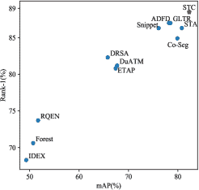
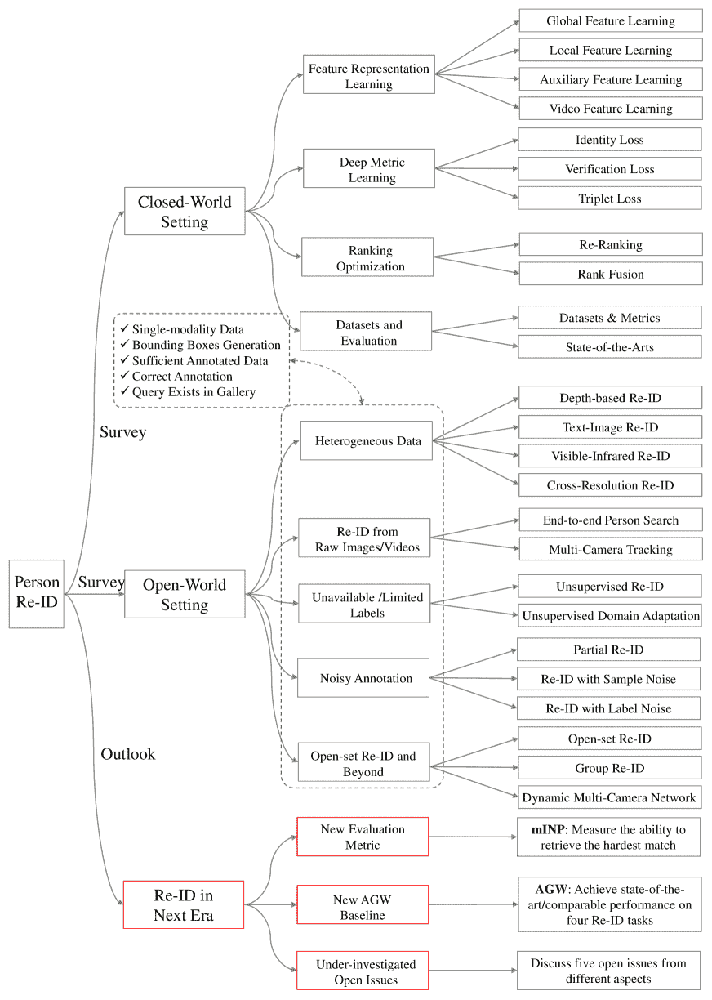

<!--yml

类别: 未分类

日期: 2024-09-06 20:03:03

-->

# [2001.04193] 深度学习在行人重识别中的应用：调查与展望

> 来源：[`ar5iv.labs.arxiv.org/html/2001.04193`](https://ar5iv.labs.arxiv.org/html/2001.04193)

# 深度学习在行人重识别中的应用：

调查与展望

Mang Ye, Jianbing Shen, Gaojie Lin, Tao Xiang

Ling Shao 和 Steven C. H. Hoi M. Ye 任职于中国武汉大学计算机科学学院和阿联酋 Inception 人工智能研究所。J. Shen 和 L. Shao 任职于阿联酋 Inception 人工智能研究所。电子邮件：{mangye16, shenjianbingcg}@gmail.com。G. Lin 任职于中国北京理工大学计算机科学学院。T. Xiang 任职于英国萨里大学视觉、语音与信号处理中心。电子邮件：t.xiang@surrey.ac.uk。S. C. H. Hoi 任职于新加坡管理大学和 Salesforce Research Asia。电子邮件：stevenhoi@gmail.com

###### 摘要

行人重识别（Re-ID）的目标是从多个不重叠的摄像头中检索感兴趣的人。随着深度神经网络的发展和智能视频监控需求的增加，它在计算机视觉领域获得了显著的关注。通过分析开发行人 Re-ID 系统中涉及的组件，我们将其分为封闭世界和开放世界设置。广泛研究的封闭世界设置通常在各种研究导向的假设下应用，并且在多个数据集上使用深度学习技术取得了令人鼓舞的成功。我们首先从深度特征表示学习、深度度量学习和排序优化三个不同的角度，对封闭世界行人 Re-ID 进行全面的综述和深入分析。随着封闭世界设置下性能的饱和，行人 Re-ID 的研究重点最近转向了开放世界设置，面临更具挑战性的问题。该设置更接近于特定场景下的实际应用。我们从五个不同的方面总结了开放世界 Re-ID。通过分析现有方法的优点，我们设计了一个强大的 AGW 基线，在四种不同的 Re-ID 任务上在十二个数据集上实现了最先进或至少可比的性能。同时，我们引入了一种新的评估指标（mINP），用于行人 Re-ID，表示找到所有正确匹配的成本，为实际应用中的 Re-ID 系统评估提供了额外的标准。最后，我们讨论了一些重要但尚未深入研究的开放问题。

###### 索引词:

行人重识别、行人检索、文献综述、评估指标、深度学习

## 1 引言

行人再识别（Re-ID）作为跨越非重叠摄像头的特定人物检索问题已被广泛研究 [1, 2]。给定一个查询的关注人物，Re-ID 的目标是确定这个人是否在另一个地方的不同时间被另一台摄像头捕捉到，甚至是同一台摄像头在不同时间点 [3]。查询人物可以通过图像 [4, 5, 6]、视频序列 [7, 8]，甚至文本描述 [9, 10] 来表示。由于公共安全的紧迫需求和监控摄像头数量的增加，行人 Re-ID 在智能监控系统中具有重要的研究影响和实际意义。

Re-ID 是一项具有挑战性的任务，因为存在不同的视角 [11, 12]、不同的低图像分辨率 [13, 14]、光照变化 [15]、无约束的姿势 [16, 17, 18]、遮挡 [19, 20]、异构模态 [21, 10]、复杂的相机环境、背景杂乱 [22]、不可靠的边界框生成等。这些因素导致了不同的变化和不确定性。此外，对于实际模型部署，动态更新的相机网络 [23, 24]、大规模画廊与高效检索 [25]、群体不确定性 [26]、显著的领域偏移 [27]、未见过的测试场景 [28]、增量模型更新 [29] 和变化的服装 [30] 也大大增加了难度。这些挑战使得 Re-ID 仍然是一个未解决的问题。早期的研究工作主要集中在使用体结构的手工特征构造 [31, 32, 33, 34, 35] 或距离度量学习 [36, 37, 38, 39, 40, 41] 上。随着深度学习的进步，行人 Re-ID 在广泛使用的基准测试中取得了令人鼓舞的表现 [5, 42, 43, 44]。然而，研究导向的场景与实际应用之间仍存在较大差距 [45]。这激励我们进行全面的调查，开发适用于不同 Re-ID 任务的强大基准，并讨论未来的几个方向。

尽管一些调查也总结了深度学习技术[2、46、47]，我们的调查有三大不同点：1）我们通过讨论现有深度学习方法的优缺点，分析最前沿技术，对其进行了深入全面的分析。这为未来算法设计和新话题探索提供了见解。2）我们设计了一个新的强大基准（AGW：注意力广义均值池化与加权三元组损失）和一个新的评估指标（mINP：均值逆负惩罚）用于未来的发展。AGW 在四个不同的重识别任务的十二个数据集上达到了最先进的性能。mINP 提供了现有 CMC/mAP 的补充指标，指示了找到所有正确匹配的成本。3）我们尝试讨论几个重要的研究方向及未充分研究的开放问题，以缩小封闭世界和开放世界应用之间的差距，向现实世界的重识别系统设计迈进。

图 1：设计实用行人重识别系统的流程，包括五个主要步骤：1）原始数据收集，（2）边界框生成，3）训练数据标注，4）模型训练和 5）行人检索。

除非另有说明，本调查中的行人重识别指的是从计算机视觉的角度考虑的多摄像头下的行人检索问题。通常，为特定场景构建行人重识别系统需要五个主要步骤（如图 1 所示）：

1.  1.

    步骤 1：原始数据收集：从监控摄像头获取原始视频数据是实际视频调查的主要要求。这些摄像头通常位于不同的地点，环境各异[48]。这些原始数据很可能包含大量复杂且嘈杂的背景杂乱。

1.  2.

    步骤 2：边界框生成：从原始视频数据中提取包含行人图像的边界框。通常，在大规模应用中，人工裁剪所有行人图像是不可能的。边界框通常通过行人检测[49、50]或跟踪算法[51、52]获得。

1.  3.

    步骤 3：训练数据标注：标注跨摄像头标签。由于跨摄像头的变异，训练数据标注通常是判别性重识别模型学习的不可或缺部分。在存在大量领域迁移[53]的情况下，我们通常需要在每个新场景中标注训练数据。

1.  4.

    第 4 步：模型训练：使用之前标注的人物图像/视频训练一个具有区分能力和鲁棒性的 Re-ID 模型。这一步是开发 Re-ID 系统的核心，也是文献中研究最广泛的范式。为应对各种挑战，已经开发了大量模型，集中在特征表示学习 [54, 55]、距离度量学习 [56, 57] 或其组合上。

1.  5.

    第 5 步：行人检索：测试阶段进行行人检索。给定一个感兴趣的人（查询）和一个图库集合，我们使用前一阶段学习的 Re-ID 模型提取特征表示。通过对计算出的查询与图库相似度进行排序，获得检索排名列表。一些方法还研究了排名优化以提高检索性能 [58, 59]。

表 I：封闭世界 *vs*. 开放世界人物 Re-ID。

| 封闭世界 (第二部分) | 开放世界 (第三部分) |
| --- | --- |
| $\checkmark$ 单模态数据 | 异质数据 (§ 3.1) |
| $\checkmark$ 边界框生成 | 原始图像/视频 (§ 3.2) |
| $\checkmark$ 足够的标注数据 | 不可用/有限标签 (§ 3.3) |
| $\checkmark$ 正确标注 | 噪声标注 (§ 3.4) |
| $\checkmark$ 查询存在于图库中 | 开放集 (§ 3.5) |

根据上述五个步骤，我们将现有的 Re-ID 方法分为两大趋势：封闭世界和开放世界设置，如表 I 所总结的。以下是这五个方面的逐步比较：

1.  1.

    单模态 *vs*. 异构数据：在步骤 1 中的原始数据收集中，所有人员都由在封闭世界设置下通过单模态可见光摄像头捕获的图像/视频表示[5, 8, 42, 43, 31, 44]。然而，在实际的开放世界应用中，我们可能还需要处理异构数据，例如红外图像[21, 60]、草图[61]、深度图像[62]，甚至是文本描述[63]。这促使了在§ 3.1 中对异构重识别的研究。

1.  2.

    边界框生成 *vs*. 原始图像/视频：在步骤 2 中的边界框生成中，封闭世界的人员重识别通常基于生成的边界框进行训练和测试，这些边界框主要包含人员的外观信息。相比之下，一些实际的开放世界应用需要从原始图像或视频中进行端到端的人员搜索[55, 64]。这引出了另一个开放世界主题，*即*，在§ 3.2 中的端到端人员搜索。

1.  3.

    足够的标注数据 *vs*. 不可用/有限的标签：在步骤 3 中的训练数据标注中，封闭世界的人员重识别通常假设我们有足够的标注训练数据用于监督的重识别模型训练。然而，每个新环境中每对摄像头的标签标注既耗时又费力，成本高昂。在开放世界场景中，我们可能没有足够的标注数据（*即*，有限标签）[65]，甚至可能没有任何标签信息[66]。这引发了在§ 3.3 中对无监督和半监督重识别的讨论。

1.  4.

    正确标注 *vs*. 噪声标注：对于步骤 4，现有的封闭世界行人重识别系统通常假设所有的标注都是正确的，且标签干净。然而，由于标注错误（*即*，标签噪声）或检测/跟踪结果的不完美（*即*，样本噪声，部分 Re-ID [67]），标注噪声通常是不可避免的。这导致了在 § 3.4 中对不同噪声类型下的噪声鲁棒性行人重识别的分析。

1.  5.

    查询存在于图库 *vs*. 开集：在行人检索阶段（步骤 5），大多数现有的封闭世界行人重识别工作假设查询必须出现在图库中，通过计算 CMC [68] 和 mAP [5]。然而，在许多场景中，查询的人可能不出现在图库中 [69, 70]，或者我们需要执行验证而不是检索 [26]。这将我们引向在 § 3.5 中的开集行人重识别。

本调查首先介绍了在封闭世界设置下广泛研究的人物 Re-ID，详见 § 2。有关数据集和最新技术的详细评述见 § 2.4。随后，我们在 § 3 中介绍了开放世界人物 Re-ID。关于未来 Re-ID 的展望见 § 4，其中包括新的评估指标 (§ 4.1 ) 和新的强大 AGW 基线 (§ 4.2 )。我们讨论了若干尚未深入研究的开放问题，供未来研究参考 (§ 4.3 )。结论将在 § 5 中得出。结构概述见附录。

图 2: 四种不同的特征学习策略。a) 全局特征，在§ 2.1.1 中为每个人的图像学习全局表示；b) 局部特征，在§ 2.1.2 中学习部分聚合的局部特征；c) 辅助特征，使用辅助信息学习特征表示，如在§ 2.1.3 中提到的属性[71, 72]；d) 视频特征，使用多个图像帧和时间信息学习视频表示，如在§ 2.1.4 中提到的[73, 74]。

## 2 关闭世界中的人物重识别

本节概述了封闭世界下的人体再识别。正如在§ 1 中讨论的，这种设置通常有以下假设：1) 人体的外观由单模态可见摄像头捕获，可以是图像或视频；2) 人体通过边界框表示，其中大部分边界框区域属于同一身份；3) 训练有足够的标注数据用于监督区分性再识别模型的学习；4) 注释通常是正确的；5) 查询的人物必须出现在图库集中。通常，一个标准的封闭世界再识别系统包含三个主要组件：特征表示学习 (§ 2.1)，侧重于开发特征构建策略；深度度量学习 (§ 2.2)，旨在设计具有不同损失函数或采样策略的训练目标；以及排名优化 (§ 2.3)，专注于优化检索排名列表。有关数据集和最前沿技术的概述及深入分析见§ 2.4.2。

### 2.1 特征表示学习

我们首先讨论封闭世界下行人再识别中的特征学习策略。主要有四种类别（如图 2 所示）：a) 全局特征 (§ 2.1.1)，它为每个人图像提取一个全局特征表示向量，无需额外的注释线索 [55]；b) 局部特征 (§ 2.1.2)，它将部分级局部特征聚合起来，形成每个人图像的组合表示 [75, 76, 77]；c) 辅助特征 (§ 2.1.3)，它通过使用辅助信息来提高特征表示学习，例如，属性 [71, 72, 78]，GAN 生成的图像 [42]，等等；d) 视频特征 (§ 2.1.4)，它利用多个图像帧和时间信息来学习视频表示，用于基于视频的再识别 [7] [73, 74]。我们还在 § 2.1.5 回顾了几种针对行人再识别的具体架构设计。

#### 2.1.1 全局特征表示学习

全局特征表示学习为每个人图像提取全局特征向量，如图 2(a)所示。由于深度神经网络最初应用于图像分类 [79, 80]，全局特征学习是早期将先进深度学习技术融入行人再识别领域的主要选择。

为了捕捉全局特征学习中的细粒度线索，[81] 中开发了一个联合学习框架，由单图像表示（SIR）和跨图像表示（CIR）组成，使用特定子网络通过三元组损失进行训练。广泛使用的 ID 区分嵌入（IDE）模型 [55] 将训练过程构建为多类分类问题，将每个身份视为一个不同的类别。它现在被 Re-ID 社区广泛使用 [42, 82, 58, 77, 83]。钱等人 [84] 开发了一个多尺度深度表示学习模型，以捕捉不同尺度上的区分线索。

注意力信息。注意力机制在文献中已被广泛研究，以增强表示学习 [85]。1) 第一组：人像内部的注意力。典型策略包括像素级注意力 [86] 和通道特征响应重加权 [86, 87, 88, 89]，或背景抑制 [22]。空间信息在 [90] 中整合。2) 第二组：跨多个人物图像的注意力。一个上下文感知的注意力特征学习方法在 [91] 中被提出，结合了序列内和序列间的注意力，用于成对特征对齐和细化。在 [92, 93] 中增加了注意力一致性属性。群体相似性 [94, 95] 是另一种流行的方法，利用跨图像注意力，涉及多个图像进行局部和全局相似性建模。第一组主要增强了对齐错误/检测不完善的鲁棒性，第二组通过挖掘跨多个图像的关系来改进特征学习。

#### 2.1.2 本地特征表示学习

它学习部分/区域聚合特征，使其对对齐错误 [96, 77] 更具鲁棒性。身体部位要么由人体解析/姿态估计自动生成（第一组），要么通过粗略的水平划分（第二组）。

通过自动身体部位检测，流行的解决方案是结合全身表示和局部部分特征[97, 98]。具体而言，多通道聚合[99]、多尺度上下文感知卷积[100]、多阶段特征分解[17]和双线性池化[97]被设计来改善局部特征学习。除了特征级别融合，部分级相似性组合在[98]中也有所研究。另一种流行的解决方案是通过姿势驱动的匹配[101]、姿势引导的部分注意力模块[102]和语义部分对齐[103, 104]来增强对背景杂乱的鲁棒性。

对于横向划分的区域特征，Part-based Convolutional Baseline (PCB) [77]中学习了多个部分级分类器，它现在作为当前最先进技术中的一个强大的部分特征学习基线[105, 106, 28]。为了捕捉多个身体部位之间的关系，设计了 Siamese 长短期记忆网络 (LSTM) [96]、二阶非局部注意力[107]和互动与聚合 (IA) [108]，以强化特征学习。

第一组使用人体解析技术来获取具有语义意义的身体部位，从而提供良对齐的部分特征。然而，这些方法需要额外的姿势检测器，并且容易受到噪声姿势检测的影响[77]。第二组使用均匀划分来获取横向条纹部分，这种方法更加灵活，但对重度遮挡和大量背景杂乱非常敏感。

#### 2.1.3 辅助特征表示学习

辅助特征表示学习通常需要额外的标注信息（*例如*，语义属性[71]）或生成/增强的训练样本来增强特征表示[42, 19]。

语义属性。在[72]中引入了一种联合身份和属性学习基线。Su 等人[71]提出了一种深度属性学习框架，通过结合预测的语义属性信息，增强了特征表示在半监督学习方式下的泛化能力和鲁棒性。语义属性和注意力机制都被纳入以改善部分特征学习[109]。语义属性也在[110]中被应用于视频 Re-ID 特征表示学习。它们还被用作无监督学习中的辅助监督信息[111]。

视角信息。视角信息也被利用来增强特征表示学习 [112, 113]。多层级分解网络（MLFN） [112] 还尝试在多个语义层级上学习身份区分和视角不变的特征表示。Liu 等人[113] 提取视角通用和视角特定的学习组合。在[114]中，视角感知特征学习中加入了角度正则化。

领域信息。设计了一种领域引导的 Dropout (DGD) 算法 [54]，用于自适应挖掘领域共享和领域特定的神经元，以进行多领域深度特征表示学习。Lin 等人[115] 将每个摄像头视作一个独特的领域，提出了一种多摄像头一致性匹配约束，以在深度学习框架中获得全球最优表示。类似地，摄像头视角信息或检测到的摄像头位置也应用于[18]，以通过摄像头特定的信息建模来改善特征表示。

GAN 生成。本节讨论了将 GAN 生成的图像作为辅助信息的使用。Zheng 等人[42] 开始首次尝试将 GAN 技术应用于行人重识别。它通过生成的人物图像改善了监督特征表示学习。在[116]中，加入了姿势约束，以提高生成的人物图像的质量，生成具有新姿态变体的人物图像。在[117]中设计了一种姿态归一化图像生成方法，增强了对姿态变化的鲁棒性。摄像头风格信息[118]也被集成到图像生成过程中，以应对跨摄像头的变化。联合判别和生成学习模型[119]分别学习外观和结构编码，以提高图像生成质量。使用 GAN 生成的图像也是无监督领域适应 Re-ID 的一种广泛使用的方法[120, 121]，用于逼近目标分布。

数据增强。在行人重识别（Re-ID）中，自定义操作包括随机调整大小、裁剪和水平翻转[122]。此外，还生成对抗遮挡样本[19]以增加训练数据的变化。类似的随机擦除策略在[123]中提出，通过向输入图像添加随机噪声来实现。批量 DropBlock [124] 随机丢弃特征图中的区域块，以增强关注特征的学习。Bak 等人[125]生成在不同光照条件下渲染的虚拟人。这些方法通过增强样本丰富了监督，提高了测试集上的泛化能力。

#### 2.1.4 视频特征表示学习

基于视频的重识别是另一个热门话题[126]，其中每个人通过多个帧的视频序列来表示。由于其丰富的外观和时间信息，这在重识别社区中引起了越来越多的关注。这也带来了在处理多个图像的视频特征表示学习中的额外挑战。

主要挑战是准确捕捉时间信息。设计了一种递归神经网络架构用于基于视频的人物重识别[127]，该架构联合优化最终的递归层以进行时间信息传播以及时间池化层。开发了一种空间和时间流的加权方案[128]。Yan 等人[129]提出了一种渐进/序列融合框架来聚合帧级别的人体区域表示。语义属性也在[110]中被采用，用于视频重识别，结合特征解耦和帧重加权。联合聚合帧级别特征和时空外观信息对视频表示学习至关重要[130, 131, 132]。

另一个主要挑战是视频中不可避免的异常跟踪帧。信息帧在联合空间和时间注意池化网络（ASTPN）[131]中被选择，并且上下文信息在[130]中被整合。一个受共同分割启发的注意模型[132]检测多个视频帧中的显著特征，并进行互相一致的估计。采用多样性正则化[133]来挖掘每个视频序列中的多个判别性身体部位。使用仿射包络处理视频序列中的异常帧[83]。一个有趣的工作[20]利用多个视频帧来自动补全被遮挡的区域。这些工作表明，处理噪声帧可以显著提高视频表示学习的效果。

处理视频序列的不同长度也是一个挑战，Chen 等人[134]将长视频序列分成多个短片段，将排名靠前的片段聚合以学习紧凑的嵌入。一个片段级学习策略[135]利用空间和时间维度注意力线索来生成强健的片段级表示。短期和长期关系[136]都在自注意力方案中进行了整合。

#### 2.1.5 架构设计

将行人再识别（Re-ID）框架化为一个特定的行人检索问题，现有的大多数工作采用了为图像分类设计的网络架构[79, 80]作为骨干网。一些工作尝试修改骨干架构以实现更好的 Re-ID 特征。对于广泛使用的 ResNet50 骨干网[80]，重要的修改包括将最后一个卷积条带/大小改为 1[77]，在最后的池化层中采用自适应平均池化[77]，以及在池化层后添加具有批量归一化的瓶颈层[82]。

精度是特定 Re-ID 网络架构设计的主要关注点。为了提高精度，Li 等人[43]首次尝试设计了一个滤波器配对神经网络（FPNN），该网络通过部分区分信息挖掘共同处理错位和遮挡。Wang 等人[89]提出了一种具有特别设计的 WConv 层和通道缩放层的 BraidNet。WConv 层提取两张图像的差异信息，以增强对错位的鲁棒性，而通道缩放层优化每个输入通道的缩放因子。多级分解网络（MLFN）[112]包含多个堆叠的块，以在特定级别上建模各种潜在因子，并动态选择这些因子以形成最终表示。开发了一种高效的全卷积 Siamese 网络[137]，配有卷积相似度模块，以优化多级相似度测量。通过使用深度卷积高效捕获和优化相似度。

效率是 Re-ID 架构设计的另一个重要因素。通过结合点卷积和深度卷积，设计了一种高效的小规模网络，即 Omni-Scale 网络（OSNet）[138]。为了实现多尺度特征学习，引入了由多个卷积流组成的残差块。

随着对自动机器学习的兴趣增加，提出了一种 Auto-ReID[139]模型。Auto-ReID 基于一组基本架构组件提供了一种高效且有效的自动化神经架构设计，使用部分感知模块捕获区分性的局部 Re-ID 特征。这为探索强大的领域特定架构提供了潜在的研究方向。

图 3：文献中三种广泛使用的损失函数。(a) 身份损失[82, 42, 118, 140]; (b) 验证损失[94, 141] 和 (c) 三元组损失[57, 22, 14]。许多工作使用它们的组合[137, 87, 142, 141]。

### 2.2 深度度量学习

在深度学习时代之前，度量学习已经通过学习马哈拉诺比斯距离函数 [37, 36] 或投影矩阵 [40] 被广泛研究。度量学习的角色已被损失函数设计所取代，以指导特征表示学习。我们将首先回顾 § 2.2.1 中广泛使用的损失函数，然后总结具有特定采样设计的训练策略 § 2.2.2。

#### 2.2.1 损失函数设计

本调查仅关注于为深度学习设计的损失函数 [56]。关于为手工设计系统设计的距离度量学习的概述可以在 [2, 143] 中找到。文献中有三种广泛研究的损失函数及其变体用于行人重识别，包括身份损失、验证损失和三元组损失。三种损失函数的示意图见图 Fig. 3。

身份损失。它将行人重识别的训练过程视为图像分类问题 [55]，*即*，每个身份是一个不同的类别。在测试阶段，池化层或嵌入层的输出被作为特征提取器。给定标签为 $y_{i}$ 的输入图像 $x_{i}$，$x_{i}$ 被识别为类别 $y_{i}$ 的预测概率通过 softmax 函数进行编码，表示为 $p(y_{i}|x_{i})$。然后通过交叉熵计算身份损失

|  | $\mathcal{L}_{id}=-\frac{1}{n}\sum\nolimits_{i=1}^{n}{\log(p(y_{i}&#124;x_{i}))},$ |  | (1) |
| --- | --- | --- | --- |

其中 $n$ 表示每个批次中的训练样本数量。身份损失在现有方法中已被广泛使用 [82, 42, 120, 19, 144, 118, 140, 106, 92, 95]。通常，它易于训练，并在训练过程中自动挖掘困难样本，正如 [145] 中所示。一些工作还研究了 softmax 的变体 [146]，如 [147] 中的球面损失和 [95] 中的 AM softmax。另一种简单而有效的策略，即标签平滑 [42, 122]，通常被集成到标准的 softmax 交叉熵损失中。其基本思想是避免模型过于拟合过于自信的标注标签，从而提高泛化能力 [148]。

验证损失。它优化了成对关系，使用对比损失 [96, 120] 或二元验证损失 [141, 43]。对比损失改进了相对的成对距离比较，公式为

|  | $\mathcal{L}_{con}=(1-\delta_{ij})\{\max(0,\rho-d_{ij})\}^{2}+\delta_{ij}d_{ij}^{2},$ |  | (2) |
| --- | --- | --- | --- |

其中 $d_{ij}$ 表示两个输入样本 $x_{i}$ 和 $x_{j}$ 的嵌入特征之间的欧几里得距离。$\delta_{ij}$ 是一个二元标签指示符（当 $x_{i}$ 和 $x_{j}$ 属于同一身份时 $\delta_{ij}=1$，否则 $\delta_{ij}=0$）。$\rho$ 是一个边际参数。有几种变体，*例如*，[81] 中的排名支持向量机的成对比较。

二元验证 [141, 43] 区分输入图像对的正样本和负样本。通常，通过 $f_{ij}=(f_{j}-f_{j})^{2}$ [141] 获得差异特征 $f_{ij}$，其中 $f_{i}$ 和 $f_{j}$ 是两个样本 $x_{i}$ 和 $x_{j}$ 的嵌入特征。验证网络将差异特征分类为正样本或负样本。我们使用 $p(\delta_{ij}|f_{ij})$ 来表示输入对 ($x_{i}$ 和 $x_{j}$) 被识别为 $\delta_{ij}$ (0 或 1) 的概率。带有交叉熵的验证损失为

|  | $\mathcal{L}_{veri}(i,j)=-{\delta_{ij}\log(p(\delta_{ij}&#124;f_{ij}))}-(1-\delta_{ij})\log(1-p(\delta_{ij}&#124;f_{ij})).$ |  | (3) |
| --- | --- | --- | --- |

验证通常与身份损失结合使用，以提高性能 [94, 141, 120, 96]。

Triplet loss。它将 Re-ID 模型训练过程视为检索排序问题。基本思想是正样本对之间的距离应小于负样本对的距离，并且有一个预定义的边界[57]。典型的三元组包含一个锚点样本$x_{i}$、一个具有相同身份的正样本$x_{j}$，以及一个来自不同身份的负样本$x_{k}$。具有边界参数的三元组损失表示为

|  | $\mathcal{L}_{tri}(i,j,k)=\max(\rho+d_{ij}-d_{ik},0),$ |  | (4) |
| --- | --- | --- | --- |

其中$d(\cdot)$测量两个样本之间的欧几里得距离。如果我们直接优化上述损失函数，大比例的简单三元组将主导训练过程，从而导致区分性有限。为缓解此问题，设计了各种信息丰富的三元组挖掘方法[57, 22, 14, 97]。基本思想是选择信息丰富的三元组[57, 149]。具体而言，[149]引入了一种中等程度的正样本挖掘方法，具有权重约束，直接优化特征差异。Hermans 等人[57]证明了在每个训练批次中进行在线最难的正负样本挖掘对区分性 Re-ID 模型学习是有益的。一些方法还研究了信息丰富的三元组挖掘的点对集相似性策略[150, 151]。这增强了针对异常样本的鲁棒性，采用了软硬挖掘方案。

为了进一步丰富三元组监督，[152]中开发了一个四元组深度网络，其中每个四元组包含一个锚点样本、一个正样本和两个挖掘出的负样本。四元组通过基于边界的在线硬负样本挖掘进行构造。优化四元组关系会导致较小的类内变化和较大的类间变化。

三元组损失和身份损失的组合是深度 Re-ID 模型学习中最受欢迎的解决方案之一[137, 116, 87, 142, 103, 28, 153, 104, 154, 93, 90]。这两个组件对于区分性特征表示学习互为补充。

OIM 损失。除了上述三种损失函数外，还设计了一种具有内存库方案的在线实例匹配（OIM）损失[64]。内存库$\{v_{k},k=1,2,\cdots,c\}$包含存储的实例特征，其中$c$表示类别数量。然后 OIM 损失被表示为

|  | $\mathcal{L}_{oim}=-\frac{1}{n}\sum\nolimits_{i=1}^{n}{\log\frac{\exp(v_{i}^{T}f_{i}/\tau)}{\sum\nolimits_{k=1}^{c}\exp(v_{k}^{T}f_{i}/\tau)}},$ |  | (5) |
| --- | --- | --- | --- |

其中$v_{i}$表示类$y_{i}$的相应存储记忆特征，而$\tau$是控制相似性空间的温度参数[145]。$v_{i}^{T}f_{i}$衡量在线实例匹配分数。与未标记身份的记忆特征集的比较进一步包括在内，以计算分母[64]，处理非目标身份的大量实例。这种记忆方案也被应用于无监督领域自适应 Re-ID[106]。

#### 2.2.2 训练策略

批次采样策略在判别性 Re-ID 模型学习中发挥了重要作用。由于每个身份的标注训练图像数量差异显著，这一任务具有挑战性[5]。同时，严重不平衡的正负样本对增加了训练策略设计的额外难度[40]。

处理不平衡问题的最常用训练策略是身份采样[57, 122]。对于每个训练批次，随机选择一定数量的身份，然后从每个选择的身份中采样几张图像。这种批次采样策略保证了信息丰富的正负样本挖掘。

为了处理正负样本之间的不平衡，适应性采样是一种流行的方法，用于调整正负样本的贡献，例如样本率学习（SRL）[89]、课程采样[87]。另一种方法是样本重新加权，利用样本分布[87]或相似性差异[52]来调整样本权重。在[155]中设计了一种高效的参考约束，将成对/三元组相似性转换为样本对参考相似性，解决了不平衡问题并增强了判别性，同时对异常值也具有鲁棒性。

为了适应性地组合多个损失函数，多损失动态训练策略[156]自适应地重新加权身份损失和三元组损失，提取它们之间的适当共享组件。这种多损失训练策略带来了稳定的性能提升。

图 4：在行人 Re-ID 中的重新排名示意图。给定一个查询示例，检索到初始排名列表，其中难匹配的排在底部。使用排名靠前的简单正样本(1)作为查询在库中搜索，我们可以通过库集中的相似性传播得到难匹配(2)和(3)。

### 2.3 排名优化

排名优化在提高测试阶段的检索性能中发挥了关键作用。给定初始排名列表，它通过自动的画廊到画廊相似性挖掘 [157, 58] 或人类互动 [158, 159] 来优化排名顺序。排名/度量融合 [160, 161] 是另一种流行的方法，通过多个排名列表输入来提高排名性能。

#### 2.3.1 重新排名

重新排名的基本思想是利用画廊到画廊的相似性来优化初始排名列表，如图 4 所示。提出了顶部排名的相似性拉取和底部排名的不相似性推动 [157]。广泛使用的 $k$-reciprocal 重新排名 [58] 挖掘了上下文信息。 [25] 中应用了类似的上下文信息建模思想。 Bai 等人 [162] 利用潜在流形的几何结构。通过整合交叉邻域距离，[18] 引入了一种扩展的交叉邻域重新排名方法。局部模糊重新排名 [95] 采用聚类结构来改进邻域相似性测量。

查询自适应。考虑到查询差异，一些方法设计了查询自适应检索策略，以替代统一的搜索引擎来提高性能 [163, 164]。Andy 等人 [163] 提出了一种使用局部保持投影的查询自适应重新排名方法。 [164] 中提出了一种高效的在线局部度量适应方法，该方法为每个探针学习了一个严格的局部度量，并挖掘了负样本。

人类互动。它涉及使用人类反馈来优化排名列表 [158]。这为重新排名过程提供了可靠的监督。一个混合的人工计算机增量学习模型在 [159] 中被提出，该模型从人类反馈中逐步学习，实时提高 Re-ID 排名性能。

#### 2.3.2 排名融合

排名融合利用多种方法获得的排名列表来提高检索性能 [59]。郑等人 [165] 提出了在"L"形观察基础上进行查询自适应后期融合的方法。通过利用相似性和不相似性，[59] 开发了一种排名聚合方法。人员重识别中的排名融合过程被表述为一个基于共识的决策问题，使用图论 [166] 将由多种算法获得的相似性评分映射到一个图中并进行路径搜索。最近设计了一个统一的集成扩散 (UED) [161] 用于度量融合。UED 保持了三种现有融合算法的优势，并通过新的目标函数和推导进行了优化。度量集成学习也在 [160] 中进行了研究。

表 II：一些常用闭集人脸重识别数据集的统计信息。 “both”表示包含手工裁剪和检测到的边界框。 “C&M”表示同时评估了 CMC 和 mAP。

|  | 图像数据集 |
| --- | --- |
| 数据集 | 时间 | #ID | #图像 | #摄像头 | 标签 | 分辨率 | 评估 |
| VIPeR | 2007 | 632 | 1,264 | 2 | hand | fixed | CMC |
| iLIDS | 2009 | 119 | 476 | 2 | hand | vary | CMC |
| GRID | 2009 | 250 | 1,275 | 8 | hand | vary | CMC |
| PRID2011 | 2011 | 200 | 1,134 | 2 | hand | fixed | CMC |
| CUHK01 | 2012 | 971 | 3,884 | 2 | hand | fixed | CMC |
| CUHK02 | 2013 | 1,816 | 7,264 | 10 | hand | fixed | CMC |
| CUHK03 | 2014 | 1,467 | 13,164 | 2 | both | vary | CMC |
| Market-1501 | 2015 | 1,501 | 32,668 | 6 | both | fixed | C&M |
| DukeMTMC | 2017 | 1,404 | 36,411 | 8 | both | fixed | C&M |
| Airport | 2017 | 9,651 | 39,902 | 6 | auto | fixed | C&M |
| MSMT17 | 2018 | 4,101 | 126,441 | 15 | auto | vary | C&M |
|  | 视频数据集 |
| 数据集 | 时间 | #ID | #轨迹（#边框） | #摄像头 | 标签 | 分辨率 | 评估 |
| PRID-2011 | 2011 | 200 | 400 (40k) | 2 | hand | fixed | CMC |
| iLIDS-VID | 2014 | 300 | 600 (44k) | 2 | hand | vary | CMC |
| MARS | 2016 | 1261 | 20,715 (1M) | 6 | auto | fixed | C&M |
| Duke-Video | 2018 | 1,812 | 4,832 (-) | 8 | auto | fixed | C&M |
| Duke-Tracklet | 2018 | 1,788 | 12,647 (-) | 8 | auto | C&M |  |
| LPW | 2018 | 2,731 | 7,694(590K) | 4 | auto | fixed | C&M |
| LS-VID | 2019 | 3,772 | 14,943 (3M) | 15 | auto | fixed | C&M |

(a) Market-1501 上的 SOTA [5]

(b) DukeMTMC 上的 SOTA [42]

(c) CUHK03 上的 SOTA [43]

(d) MSMT17 上的 SOTA [44]

图 5：四个基于图像的人脸再识别数据集的最先进技术（SOTA）。报告了 Rank-1 准确率（%）和 mAP 值（%）。对于 CUHK03 [43]，报告了设置 [58] 下的检测数据。对于 Market-1501，使用了单查询设置。最佳结果以红星突出显示。所有列出的结果均未使用重新排序或额外标注信息。

### 2.4 数据集和评估

#### 2.4.1 数据集和评估指标

数据集。我们首先回顾了用于封闭世界设置的广泛使用的数据集，包括 11 个图像数据集（VIPeR [31], iLIDS [167], GRID [168], PRID2011 [126], CUHK01-03 [43], Market-1501 [5], DukeMTMC [42], Airport [169] 和 MSMT17 [44]) 和 7 个视频数据集（PRID-2011 [126], iLIDS-VID [7], MARS [8], Duke-Video [144], Duke-Tracklet [170], LPW [171] 和 LS-VID [136]）。这些数据集的统计信息见表 II。本调查仅关注深度学习方法的通用大规模数据集。关于 Re-ID 数据集的全面总结可以在 [169] 和他们的网站¹¹1[`github.com/NEU-Gou/awesome-reid-dataset`](https://github.com/NEU-Gou/awesome-reid-dataset)中找到。近年来的数据集收集可以做出几项观察：

1) 数据集规模（包括#image 和#ID）迅速增长。通常，深度学习方法可以从更多的训练样本中受益。这也增加了在封闭世界人脸再识别中所需的标注难度。2) 摄像头数量也大幅增加，以接近实际场景中的大规模摄像头网络。这也给动态更新的网络模型的泛化能力带来了额外挑战。3) 边界框生成通常是通过自动检测/跟踪完成的，而不是手动裁剪的。这模拟了现实世界中的跟踪/检测误差。

评估指标。要评估一个 Re-ID 系统，累计匹配特征（CMC）[68] 和均值平均精度（mAP）[5] 是两种广泛使用的测量方法。

CMC-$k$（也称为 Rank-$k$匹配准确率）[68]表示正确匹配出现在前-$k$ 排名结果中的概率。由于 CMC 只在评估过程中考虑第一个匹配，因此当每个查询只有一个真实值时，CMC 是准确的。然而，画廊集合通常包含多个真实值，在大型摄像头网络中，CMC 不能完全反映模型在多个摄像头中的区分能力。

另一项指标，即平均精度均值（mAP）[5]，衡量了具有多个真实值的平均检索性能。它最初广泛用于图像检索。在 Re-ID 评估中，它可以解决两个系统在搜索第一个真实值时表现相同（可能是简单匹配，如图 4），但在其他困难匹配上具有不同检索能力的问题。

考虑到训练 Re-ID 模型的效率和复杂性，一些最新的工作[138, 139]还报告了每秒浮点运算次数（FLOPs）和网络参数大小作为评估指标。这两个指标在训练/测试设备计算资源有限的情况下至关重要。

#### 2.4.2 对最新技术的深入分析

我们从基于图像和基于视频的角度回顾了最新技术。我们包括了过去三年在顶级计算机视觉会议上发表的方法。

基于图像的重识别（Re-ID）。有大量关于基于图像的重识别的已发布论文²²2[`paperswithcode.com/task/person-re-identification`](https://paperswithcode.com/task/person-re-identification)。我们主要回顾了 2019 年发布的工作，以及 2018 年的一些具有代表性的工作。具体来说，我们包括了 PCB [77]、MGN [172]、PyrNet [6]、Auto-ReID [139]、ABD-Net [173]、BagTricks [122]、OSNet [138]、DGNet [119]、SCAL [90]、MHN [174]、P2Net [104]、BDB [124]、SONA [107]、SFT [95]、ConsAtt [93]、DenseS [103]、Pyramid [156]、IANet [108]、VAL [114]。我们总结了在四个数据集上的结果（图 5）。这个概述引发了五个主要见解，下面将讨论这些见解。

第一，随着深度学习的发展，大多数基于图像的 Re-ID 方法在广泛使用的 Market-1501 数据集上已实现了比人类更高的 Rank-1 准确率（93.5% [175]）。特别是，VAL [114] 在 Market-1501 数据集上获得了最佳的 mAP（91.6%）和 Rank-1 准确率（96.2%）。VAL 的主要优势在于使用了视角信息。使用重新排序或度量融合可以进一步提高性能。深度学习在这些封闭世界数据集上的成功也激发了向更具挑战性的场景转移关注，如大数据量 [136] 或无监督学习 [176]。

第二，部分级特征学习对判别性 Re-ID 模型的学习是有益的。全局特征学习直接学习整个图像上的表示，而不受部分约束 [122]。当人脸检测/跟踪能够准确定位人体时，全局特征学习具有判别性。当人物图像遭遇大量背景杂乱或严重遮挡时，部分级特征学习通常通过挖掘判别性身体区域 [67] 实现更好的性能。由于其在处理对齐/遮挡方面的优势，我们观察到大多数最近开发的最先进方法采用了特征聚合范式，结合了部分级和全身特征 [139]、[156]。

第三，注意力机制对判别性 Re-ID 模型的学习是有益的。我们观察到所有在每个数据集上实现最佳性能的方法（ConsAtt [93]、SCAL [90]、SONA [107]、ABD-Net [173]）都采用了注意力方案。注意力机制捕捉不同卷积通道、多个特征图、层次结构、不同身体部位/区域，甚至多个图像之间的关系。同时，判别性 [173]、多样性 [133]、一致性 [93] 和高阶 [107] 特性被整合以增强注意力特征学习。考虑到强大的注意力机制和 Re-ID 问题的特性，注意力深度学习系统可能会继续主导 Re-ID 领域，并具备更多领域特定特性。

第四，多损失训练可以提高 Re-ID 模型的学习能力。不同的损失函数从多视角优化网络。结合多种损失函数可以提升性能，这在先进方法中的多损失训练策略中有所体现，包括 ConsAtt [93]、ABD-Net [173]和 SONA [107]。此外，[156]中设计了一种动态多损失训练策略，以自适应地整合两个损失函数。身份损失和三元组损失结合困难挖掘是主要选择。此外，由于不平衡问题，样本加权策略通常通过挖掘有用的三元组来改善性能 [89, 52]。

最后，由于数据集规模的不断增加、环境复杂以及训练样本有限，仍有很大的进一步改进空间。例如，新的 MSMT17 数据集 [44]上的 Rank-1 准确率（82.3%）和 mAP（60.8%）远低于 Market-1501（Rank-1: 96.2%和 mAP 91.7%）和 DukeMTMC（Rank-1: 91.6%和 mAP 84.5%）。在一些具有挑战性的有限训练样本的数据集上（*例如*，GRID [168]和 VIPeR [31]），性能仍然非常低。此外，Re-ID 模型通常在跨数据集评估中表现显著差，且在对抗攻击下性能急剧下降 [177]。我们对 Re-ID 领域的未来持乐观态度，期待其在辨别能力、鲁棒性和泛化能力方面取得重要突破。

(a) PRID-2011 上的 SOTA [126]

(b) iLIDS-VID 上的 SOTA [7]

(c) MARS 上的 SOTA [8]

(d) Duke-Video 上的 SOTA [144]

图 6：四个广泛使用的视频基础 Re-ID 数据集上的最新技术（SOTA）。报告了不同年份的 Rank-1 准确率（%）。报告了 MARS [8]和 Duke-Video [144]上的 mAP 值（%）。对于 Duke-Video，我们参考了[144]中的设置。最佳结果用红星标出。所有列出的结果都没有使用重新排序或额外的标注信息。

视频基础 Re-ID。与基于图像的 Re-ID 相比，视频基础 Re-ID 的关注度较少。我们回顾了深度学习 Re-ID 模型，包括 CoSeg [132]、GLTR [136]、STA [135]、ADFD [110]、STC [20]、DRSA [133]、Snippet [134]、ETAP [144]、DuATM [91]、SDM [178]、TwoS [128]、ASTPN [131]、RQEN [171]、Forest [130]、RNN [127]和 IDEX [8]。我们还总结了四个视频 Re-ID 数据集上的结果，如图 6 所示。从这些结果中可以得出以下观察。

首先，可以看到随着深度学习技术的发展，性能有着明显的提升趋势。具体而言，在 PRID-2011 数据集上，Rank-1 准确率从 2016 年的 70%（RNN [127]）提升到 2019 年的 95.5%（GLTR [136]），在 iLIDS-VID 数据集上的提升从 58%（RNN [127]）到 86.3%（ADFD [110]）。在大规模的 MARS 数据集上，Rank-1 准确率/mAP 从 68.3%/49.3%（IDEX [8]）提高到 88.5%/82.3%（STC [20]）。在 Duke-Video 数据集 [144]上，STA [135]也实现了 96.2%的 Rank-1 准确率，mAP 为 94.9%。

其次，空间和时间建模对于区分性视频表示学习至关重要。我们观察到所有的方法（STA [135]、STC [20]、GLTR [136]）都设计了空间-时间聚合策略以提升视频 Re-ID 的表现。类似于基于图像的 Re-ID，跨多帧的注意力机制 [135、110] 也大大增强了区分能力。在 [20] 中另一个有趣的观察表明，利用视频序列中的多帧可以填补遮挡区域，这为处理未来挑战性的遮挡问题提供了可能的解决方案。

最终，这些数据集上的表现已经达到了饱和状态，通常在这四个视频数据集上的准确率提升不到 1%。然而，对于挑战性更大的案例仍有很大的改进空间。例如，在新收集的视频数据集 LS-VID [136]上，GLTR [136] 的 Rank-1 准确率/mAP 仅为 63.1%/44.43%，而 GLTR [136] 在其他四个数据集上能够实现最先进的或至少是可比的性能。LS-VID [136]包含了显著更多的身份和视频序列，这为未来视频基础 Re-ID 的突破提供了具有挑战性的基准。

## 3 开放世界人物再识别

本节回顾了开放世界人物再识别的内容，讨论了§ 1 中提到的内容，包括通过跨异质模态匹配人物图像的异质再识别 (§ 3.1)，从原始图像/视频进行端到端再识别 (§ 3.2)，有限/不可用标注标签下的半监督/无监督学习 (§ 3.3)，带有噪声标注的鲁棒再识别模型学习 (§ 3.4)，以及当正确匹配不在图库中时的开放集人物再识别 (§ 3.5)。

### 3.1 异质再识别

本小节总结了四种主要的异质再识别方法，包括深度图像与 RGB 图像之间的再识别 (§ 3.1.1)，文本到图像的再识别 (§ 3.1.2)，可见光到红外的再识别 (§ 3.1.3)和跨分辨率再识别 (§ 3.1.4)。

#### 3.1.1 基于深度的再识别

深度图像捕捉了身体形状和骨架信息。这为在光照/服装变化环境下进行再识别提供了可能，这对个性化人机交互应用也很重要。

[179]中提出了一种基于递归注意力的模型来解决基于深度的人物识别问题。在强化学习框架下，他们结合了卷积神经网络和递归神经网络，以识别人体的小而具区分性的局部区域。

Karianakis 等人[180]利用大规模 RGB 数据集设计了一种分裂率 RGB 到深度转换方法，弥合了深度图像和 RGB 图像之间的差距。他们的模型进一步结合了时间注意力，以增强视频表示用于深度 Re-ID。

一些方法[62, 181]也研究了 RGB 和深度信息的结合，以提高 Re-ID 性能，解决换衣挑战。

#### 3.1.2 文本到图像的重新识别（Re-ID）

文本到图像的 Re-ID 解决了文本描述与 RGB 图像之间的匹配[63]。当无法获得查询对象的视觉图像时，且只能提供文本描述时，这一点尤为重要。

一种带有递归神经网络的门控神经注意力模型[63]学习文本描述和人物图像之间的共享特征。这使得从文本到图像的行人检索可以进行端到端的训练。Cheng 等人[182]提出了一种全球判别图像-语言关联学习方法，在重建过程中捕获身份判别信息和局部重建图像-语言关联。交叉投影学习方法[183]也学习了与图像到文本匹配共享的空间。[184]中设计了一种深度对抗图卷积网络，并进行图关系挖掘。然而，文本描述和视觉图像之间的语义差距仍然具有挑战性。同时，如何结合文本和手绘草图图像也值得未来研究。

#### 3.1.3 可见-红外 Re-ID

可见-红外 Re-ID 处理白天可见图像和夜晚红外图像之间的跨模态匹配。在低光照条件下，图像只能通过红外相机捕获[21, 60, 185]。

吴等人[21]首次尝试解决这个问题，提出了一种深度零填充框架[21]以自适应地学习模态共享特征。在[186, 142]中引入了一个双流网络，以同时处理模态共享和特定信息，解决了模态内部和跨模态变化的问题。除了跨模态共享嵌入学习[187]外，分类器级差异也在[188]中进行了研究。最近的方法[189, 190]采用 GAN 技术生成跨模态人物图像，以减少图像和特征层面的跨模态差异。[191]中建模了分层跨模态解耦因子。[192]中提出了一种双重注意力聚合学习方法，以捕获多级关系。

#### 3.1.4 跨分辨率 Re-ID

跨分辨率重识别在低分辨率和高分辨率图像之间进行匹配，解决了大分辨率变化问题[13, 14]。一个级联的 SR-GAN[193]以级联方式生成高分辨率人员图像，结合了身份信息。Li 等人[194]采用对抗学习技术来获得分辨率不变的图像表示。

### 3.2 端到端重识别

端到端重识别减轻了对额外边界框生成步骤的依赖。它涉及从原始图像或视频中进行人员重识别以及多摄像头跟踪。

原始图像/视频中的重识别 该任务要求模型在一个框架中同时执行人员检测和重识别[64, 55]。由于两个主要组件的关注点不同，这一任务具有挑战性。

Zheng 等人[55]提出了一个两阶段框架，并系统评估了人员检测对后续人员重识别的益处和局限性。Xiao 等人[64]设计了一个端到端人员搜索系统，使用单一卷积神经网络进行联合人员检测和重识别。开发了一种神经人员搜索机器（NPSM）[195]，通过充分利用查询和检测候选区域之间的上下文信息，递归地优化搜索区域并定位目标人员。类似地，在图学习框架中学习了一个上下文实例扩展模块[196]，以改进端到端人员搜索。使用 Siamese squeeze-and-excitation 网络开发了一个查询引导的端到端人员搜索系统[197]，以捕捉全局上下文信息并生成查询引导的区域提案。[198]中引入了一种具有区分性重识别特征学习的定位优化方案，以生成更可靠的边界框。Identity DiscriminativE Attention 强化学习（IDEAL）方法[199]选择信息丰富的区域用于自动生成的边界框，从而提升重识别性能。

Yamaguchi 等人[200]研究了一个更具挑战性的问题，*即*从原始视频中搜索带有文本描述的人员。提出了一种具有时空人员检测和多模态检索的多阶段方法。预计在这个方向上的进一步探索。

多摄像头跟踪端到端的人物 Re-ID 也与多人物、多摄像头跟踪密切相关[52]。提出了一种基于图的公式来链接人物假设，用于多人物跟踪[201]，其中结合了全身的整体特征和身体姿态布局作为每个人的表示。Ristani 等人[52]通过硬身份挖掘和自适应加权三元组学习来学习多目标多摄像头跟踪与人物 Re-ID 之间的相关性。最近，提出了一种具有摄像头内和跨摄像头关系建模的局部感知外观度量（LAAM）[202]。

### 3.3 半监督和无监督 Re-ID

#### 3.3.1 无监督 Re-ID

早期的无监督 Re-ID 主要学习不变的组件，即字典[203]、度量[204]或显著性[66]，这导致了有限的辨别能力或可扩展性。

对于深度无监督方法，跨摄像头标签估计是一种流行的方法[176, 205]。动态图匹配（DGM）[206]将标签估计公式化为一个二分图匹配问题。为了进一步提高性能，全球摄像头网络约束[207]被利用以实现一致匹配。刘等人通过逐步度量提升[204]逐步挖掘标签。一种稳健的锚点嵌入方法[83]迭代地将标签分配给无标签的 tracklets，以扩大锚点视频序列集。通过估计的标签，可以应用深度学习来学习 Re-ID 模型。

对于端到端的无监督 Re-ID，[205]提出了一种迭代聚类和 Re-ID 模型学习方法。同样，样本之间的关系在层次聚类框架中得到了利用[208]。软多标签学习[209]从参考集中挖掘软标签信息以进行无监督学习。一种 Tracklet Association Unsupervised Deep Learning (TAUDL)框架[170]共同进行摄像头内的 tracklet 关联和建模跨摄像头的 tracklet 相关性。同样，在粗到细的一致性学习方案中也提出了一种无监督摄像头感知相似性一致性挖掘方法[210]。在图关联框架中应用了摄像头内部挖掘和跨摄像头关联[211]。在 Transferable Joint Attribute-Identity Deep Learning (TJ-AIDL)框架[111]中也采用了语义属性。然而，对于新到达的无标签数据，模型更新仍然具有挑战性。

此外，一些方法还尝试基于局部部分学习表示，因为在局部部分挖掘标签信息比整个图像更容易。一个 PatchNet[153]旨在通过挖掘补丁级相似性来学习区分补丁特征。Self-similarity Grouping（SSG）方法[212]以自适应的方式迭代进行分组（利用全局身体和局部部分的相似性进行伪标记）和 Re-ID 模型训练。

半监督/弱监督 Re-ID。在有限的标签信息下，[213]中提出了一种一-shot 度量学习方法，该方法结合了深度纹理表示和颜色度量。在[144]中提出了一种逐步一-shot 学习方法（EUG）用于基于视频的 Re-ID，逐渐从未标记的跟踪片段中选择少量候选者，以丰富已标记的跟踪片段集。一个多实例注意力学习框架[214]使用视频级标签进行表示学习，从而减轻了对全面注释的依赖。

#### 3.3.2 无监督领域适应

无监督领域适应（UDA）将知识从标记的源数据集转移到未标记的目标数据集[53]。由于领域转移大且源数据集具有强大的监督，这是一种无目标数据集标签的无监督 Re-ID 的流行方法。

目标图像生成。使用 GAN 生成将源领域图像转换为目标领域风格是 UDA Re-ID 的一种流行方法。通过生成的图像，这使得在未标记的目标领域中进行监督式 Re-ID 模型学习成为可能。Wei 等人 [44] 提出了一个人脸转移生成对抗网络（PTGAN），将知识从一个标记的源数据集转移到未标记的目标数据集。通过相似性保持生成对抗网络（SPGAN）训练保存的自相似性和领域差异 [120]。一种异质-同质学习（HHL）方法 [215] 同时考虑了同质学习中的相机不变性和异质学习中的领域连通性。一个自适应转移网络 [216] 将适应过程分解为某些成像因素，包括光照、分辨率、相机视角等。这一策略提高了跨数据集性能。Huang 等人 [217] 尝试抑制背景位移，以最小化领域位移问题。Chen 等人 [218] 设计了一种实例引导的上下文渲染方案，将人物身份从源领域转移到目标领域的多样上下文中。此外，添加了姿态解耦方案以改善图像生成 [121]。同时，在 [219] 中还开发了一种互助平均教师学习方案。然而，图像生成在实际大规模变化环境中的可扩展性和稳定性仍然是一个挑战。

Bak 等人 [125] 生成了一个具有不同光照条件的合成数据集，以模拟现实的室内和室外光照。这一合成数据集提高了学习模型的泛化能力，并且可以在没有额外监督的情况下，轻松适应新数据集 [220]。

目标领域监督挖掘。一些方法直接在未标注的目标数据集上挖掘监督，使用源数据集训练的模型。一个示例记忆学习方案 [106] 将示例不变性、相机不变性和邻域不变性作为监督信号。领域不变映射网络 (DIMN) [28] 为领域迁移任务制定了一个元学习流程，并在每个训练回合中从源领域中抽取一个子集以更新记忆库，从而提高了可扩展性和区分度。相机视角信息也在 [221] 中作为监督信号来减少领域差距。一个具有渐进增强的自训练方法 [222] 共同捕捉目标数据集上的局部结构和全局数据分布。最近，一个具有混合记忆的自适应对比学习框架 [223] 成功地开发了，它动态生成多层次的监督信号。

时空信息在 TFusion [224] 中也作为监督信号进行利用。TFusion 通过贝叶斯融合模型将源领域中学到的时空模式转移到目标领域。类似地，Query-Adaptive Convolution (QAConv) [225] 的开发旨在提高跨数据集的准确性。

表 III：两个基于图像的数据集上的 SOTA 无监督行人重识别统计。 “来源”表示是否在训练目标 Re-ID 模型时利用了源标注数据。 “生成”表示是否包含图像生成过程。报告了 Rank-1 准确率（%）和 mAP（%）。

|  |  |  | Market-1501 | DukeMTMC |
| --- | --- | --- | --- | --- |
| 方法 | 来源 | 生成 | R1 | mAP | R1 | mAP |
| --- | --- | --- | --- | --- | --- | --- |
| CAMEL [226]  ICCV17 | 模型 | 否 | 54.5 | 26.3 | - | - |
| PUL [205]  TOMM18 | 模型 | 否 | 45.5 | 20.5 | 30.0 | 16.4 |
| PTGAN [120]  CVPR18 | 数据 | 是 | 58.1 | 26.9 | 46.9 | 26.4 |
| TJ-AIDL^† [111]  CVPR18 | 数据 | 否 | 58.2 | 26.5 | 44.3 | 23.0 |
| HHL [215]  ECCV18 | 数据 | 是 | 62.2 | 31.4 | 46.9 | 27.2 |
| MAR^‡ [209]  CVPR19 | 数据 | 否 | 67.7 | 40.0 | 67.1 | 48.0 |
| ENC [106]  CVPR19 | 数据 | 否 | 75.1 | 43.0 | 63.3 | 40.4 |
| ATNet [216]  CVPR19 | 数据 | 是 | 55.7 | 25.6 | 45.1 | 24.9 |
| PAUL^‡ [153]  CVPR19 | 模型 | 否 | 68.5 | 40.1 | 72.0 | 53.2 |
| SBGAN [217]  ICCV19 | 数据 | 是 | 58.5 | 27.3 | 53.5 | 30.8 |
| UCDA [221]  ICCV19 | 数据 | 否 | 64.3 | 34.5 | 55.4 | 36.7 |
| CASC^‡ [210]  ICCV19 | 模型 | 否 | 65.4 | 35.5 | 59.3 | 37.8 |
| PDA [121]  ICCV19 | 数据 | 是 | 75.2 | 47.6 | 63.2 | 45.1 |
| CR-GAN [218]  ICCV19 | 数据 | 是 | 77.7 | 54.0 | 68.9 | 48.6 |
| PAST [222]  ICCV19 | 模型 | 否 | 78.4 | 54.6 | 72.4 | 54.3 |
| SSG [212]  ICCV19 | 模型 | 否 | 80.0 | 58.3 | 73.0 | 53.4 |
| HCT [208]  CVPR20 | 模型 | 否 | 80.0 | 56.4 | 69.6 | 50.7 |
| SNR [227]  CVPR20 | 数据 | 否 | 82.8 | 61.7 | 76.3 | 58.1 |
| MMT [219]  ICLR20 | 数据 | 否 | 87.7 | 71.2 | 78.0 | 65.1 |
| MEB-Net [228]  ECCV20 | 数据 | 否 | 89.9 | 76.0 | 79.6 | 66.1 |
| SpCL [223]  NeurIPS20 | 数据 | 否 | 90.3 | 76.7 | 82.9 | 68.8 |

$\bullet$ ^† TJ-AIDL [111] 需要额外的属性标注。

$\bullet$ ^§ DAS [125] 在各种光照条件下生成合成虚拟人。

$\bullet$ ^‡ PAUL [153]、MAR [209] 和 CASC [210] 使用 MSMT17 作为源数据集。

#### 3.3.3 无监督 Re-ID 的最新进展

无监督 Re-ID 近年来受到了越来越多的关注，这可以通过顶级刊物中发表的文献数量增加得到证实。我们回顾了在两个广泛使用的基于图像的 Re-ID 数据集上无监督深度学习方法的最新进展。结果总结在表 III 中。从这些结果中，可以得出以下见解。

首先，无监督 Re-ID 的性能在过去几年中显著提升。在 Market-1501 数据集上，Rank-1 准确率/平均精度从 54.5%/26.3%（CAMEL [226]）提高到 90.3%/76.7%（SpCL [223]），时间跨度为三年。DukeMTMC 数据集的性能从 30.0%/16.4% 提升到 82.9%/68.8%。监督学习的上限和无监督学习之间的差距显著缩小。这展示了深度学习在无监督 Re-ID 中的成功。

其次，目前的无监督 Re-ID 仍在发展中，可以在以下方面进一步改进：1) 监督 Re-ID 方法中强大的注意力机制在无监督 Re-ID 中很少应用。2) 目标域图像生成在一些方法中已被证明有效，但在两个最佳方法（PAST [222]、SSG [212]）中未被应用。3) 在目标域的训练过程中使用标注的源数据对跨数据集学习有益，但上述两个方法中也没有包含这些。以上观察提供了进一步改进的潜在基础。

第三，无监督和有监督的重新识别之间仍存在较大差距。例如，有监督的 ConsAtt [93]在 Market-1501 数据集上的 rank-1 准确率已达到 96.1%，而无监督的 SpCL [223]的最高准确率约为 90.3%。最近，He 等人[229]展示了无监督学习利用大规模无标记训练数据在各种任务上超越有监督学习的能力[230]。我们期待未来在无监督重新识别领域的若干突破。

### 3.4 噪声鲁棒的重新识别

重新识别通常因数据收集和注释困难而遭受不可避免的噪声。我们从三个方面回顾了噪声鲁棒的重新识别：带重度遮挡的部分重新识别、由检测或跟踪错误引起的样本噪声重新识别，以及由注释错误引起的标签噪声重新识别。

部分重新识别。这解决了重度遮挡情况下的重新识别问题，即只有部分人体可见[231]。采用全卷积网络[232]生成固定大小的空间特征图，以处理不完整的人物图像。进一步结合深度空间特征重建（DSR）以避免通过利用重建误差进行显式对齐。Sun 等人[67]设计了一个关注可见性的部件模型（VPM），以提取可共享的区域级特征，从而抑制不完整图像中的空间不对齐。前景感知金字塔重建方案[233]也尝试从未遮挡区域中学习。姿态引导特征对齐（PGFA）[234]利用姿态标记从遮挡噪声中挖掘辨别性部件信息。然而，由于严重的部分不对齐、不可预测的可见区域和分散的不共享身体区域，这仍然具有挑战性。同时，如何自适应调整匹配模型以适应不同查询仍需进一步研究。

带样本噪声的重新识别。这指的是当人物图像或视频序列包含异常区域/帧时的问题，可能是由于检测不佳/跟踪结果不准确造成的。为了处理人物图像中的异常区域或背景杂乱，利用了姿态估计线索[17, 18]或注意力线索[199, 22, 66]。基本思想是抑制噪声区域在最终整体表示中的贡献。对于视频序列，常用的方法包括集级特征学习[83]或帧级重新加权[134]，以减少噪声帧的影响。Hou 等人[20]还利用多个视频帧来自动补全遮挡区域。预计未来会有更多领域特定的样本噪声处理设计。

带标签噪声的 Re-ID。由于注释错误，标签噪声通常是不可避免的。Zheng 等人采用了一种标签平滑技术来避免标签过拟合问题 [42]。在 [235] 中提出了一种建模特征不确定性的分布网络（DNet），用于在面对标签噪声时进行稳健的 Re-ID 模型学习，减少特征不确定性较高的样本的影响。与一般分类问题不同，稳健的 Re-ID 模型学习因每个身份的训练样本有限而受困 [236]。此外，未知的新身份为稳健的 Re-ID 模型学习增加了额外的困难。

### 3.5 开放集 Re-ID 及其他

开放集 Re-ID 通常被表述为一个人员验证问题，*即*，区分两个人员图像是否属于同一身份 [69, 70]。验证通常需要一个学习到的条件 $\tau$，*即*， $sim(query,gallery)>\tau$。早期研究设计了手工制作的系统 [69, 70, 26]。对于深度学习方法，在 [237] 中提出了一种对抗性 PersonNet（APN），该网络联合学习了 GAN 模块和 Re-ID 特征提取器。这个 GAN 的基本思想是生成逼真的目标类似图像（冒充者），并强制特征提取器对生成的图像攻击具有鲁棒性。在 [235] 中也探讨了建模特征不确定性。然而，实现高真实目标识别率并保持低假目标识别率仍然非常具有挑战性 [238]。

群体 Re-ID。它旨在关联群体中的人员而非单个个体 [167]。早期研究主要集中在通过稀疏字典学习 [239] 或协方差描述符聚合 [240] 提取群体表示。在 [241] 中集成了多粒度信息，以全面捕捉群体的特征。最近，在 [242] 中应用了图卷积网络，将群体表示为图。在端到端人员搜索 [196] 和个体重新识别 [243, 197] 中也应用了群体相似性以提高准确性。然而，由于群体变化比个体更复杂，群体 Re-ID 仍然具有挑战性。

动态多摄像头网络。动态更新的多摄像头网络是另一个具有挑战性的问题[27, 24, 23, 29]，需要对新摄像头或探针进行模型适配。[24]中引入了一种人机协同的增量学习方法，用于更新 Re-ID 模型，适应不同的探针画廊。早期研究还应用了主动学习[27]用于多摄像头网络中的连续 Re-ID。[23]中引入了一种基于稀疏非冗余代表选择的连续适配方法。[244]设计了一种传递推理算法，用于基于测地流核利用最佳源摄像头模型。在密集人群和社交关系中的多个环境约束（*例如*，摄像头拓扑）被整合到一个开放世界的人员 Re-ID 系统中[245]。模型适配和摄像头的环境因素在实际动态多摄像头网络中至关重要。此外，如何将深度学习技术应用于动态多摄像头网络仍然研究较少。

图 7：广泛使用的 CMC、AP 与负惩罚（NP）测量之间的差异。真实匹配和虚假匹配分别用绿色和红色框标记。假设画廊中只有三个正确匹配，排名列表 1 的 AP 较好，但 NP 远逊于排名列表 2。主要原因是排名列表 1 在找到最难的真实匹配之前包含了过多的虚假匹配。为了与 CMC 和 mAP 保持一致，我们计算了逆负惩罚（INP），*例如*，INP = 1 - NP。较大的 INP 意味着更好的性能。

## 4 展望：下一时代的 Re-ID

本节首先在§ 4.1 中介绍了一个新的评估指标，在§ 4.2 中提供了一个强有力的基线。它为未来的 Re-ID 研究提供了重要指导。最后，我们在§ 4.3 中讨论了一些尚未深入研究的开放问题。

### 4.1 mINP：Re-ID 的新评估指标

对于良好的 Re-ID 系统，应尽可能准确地检索目标人物，即所有正确匹配的排名应较低。考虑到在多摄像头网络中，尤其在准确跟踪目标人物时，目标人物不应在排名最高的检索列表中被忽略。当目标人物在多个时间戳的画廊集中出现时，最难正确匹配的排名决定了进一步调查的工作量。然而，目前广泛使用的 CMC 和 mAP 指标无法评估这一属性，如图 7 所示。在相同的 CMC 下，排名列表 1 实现了比排名列表 2 更好的 AP，但需要更多的努力来找到所有正确匹配。为了解决这个问题，我们设计了一个计算效率高的度量标准，即负面惩罚（NP），用于衡量找到最难正确匹配的惩罚

|  | $\mathrm{NP}_{i}=\frac{R_{i}^{hard}-&#124;G_{i}&#124;}{R_{i}^{hard}},$ |  | (6) |
| --- | --- | --- | --- |

其中$R_{i}^{hard}$表示最难匹配的排名位置，$|G_{i}|$表示查询$i$的正确匹配总数。自然而然地，较小的 NP 表示更好的性能。为了与 CMC 和 mAP 保持一致，我们更愿意使用负面惩罚的倒数（INP），这是 NP 的逆操作。总体而言，所有查询的平均 INP 由下式表示

|  | $\mathrm{mINP}=\frac{1}{n}\sum\nolimits_{i}(1-\mathrm{NP}_{i})=\frac{1}{n}\sum\nolimits_{i}\frac{&#124;G_{i}&#124;}{R_{i}^{hard}}.$ |  | (7) |
| --- | --- | --- | --- |

mINP 的计算非常高效，并且可以无缝集成在 CMC/mAP 的计算过程中。mINP 避免了在 mAP/CMC 评估中易匹配的主导地位。一个局限是，对于大画廊大小，mINP 值的差异会比小画廊小得多。但它仍然可以反映 Re-ID 模型的相对性能，为广泛使用的 CMC 和 mAP 指标提供补充。

表格 IV：与基于单模态图像的 Re-ID 现有技术的比较。两个公共数据集上报告了排名 1 准确度（%），mAP（%）和 mINP（%）。

|  | Market-1501 【5】 | DukeMTMC 【42】 |
| --- | --- | --- |
| 方法 | R1 | mAP | mINP | R1 | mAP | mINP |
| BagTricks 【122】  CVPR19W | 94.5 | 85.9 | 59.4 | 86.4 | 76.4 | 40.7 |
| ABD-Net 【173】  ICCV19 | 95.6 | 88.3 | 66.2 | 89.0 | 78.6 | 42.1 |
| B (我们的) | 94.2 | 85.4 | 58.3 | 86.1 | 76.1 | 40.3 |
| B + Att 【246】 | 94.9 | 86.9 | 62.2 | 87.5 | 77.6 | 41.9 |
| B + WRT | 94.6 | 86.8 | 61.9 | 87.1 | 77.0 | 41.4 |
| B + GeM 【247】 | 94.4 | 86.3 | 60.1 | 87.3 | 77.3 | 41.9 |
| B + WRT + GeM | 94.9 | 87.1 | 62.5 | 88.2 | 78.1 | 43.4 |
| AGW (完整) | 95.1 | 87.8 | 65.0 | 89.0 | 79.6 | 45.7 |

### 4.2 单/交叉模态 Re-ID 的新基准

根据§ 2.4.2 中的讨论，我们设计了一种新的 AGW³³3 详细信息见 [`github.com/mangye16/ReID-Survey`](https://github.com/mangye16/ReID-Survey)，全面比较见补充材料。行人重识别的基线模型，它在单模态（图像和视频）和跨模态 Re-ID 任务中都实现了具有竞争力的性能。具体来说，我们的新基线是建立在 BagTricks [122] 之上的，AGW 包含以下三个主要改进组件：

(1) 非局部注意力（Att）块。如§ 2.4.2 中所讨论的，注意力机制在判别性 Re-ID 模型学习中发挥着至关重要的作用。我们采用了强大的非局部注意力块 [246]，以获取所有位置特征的加权和，如下所示

|  | $\mathbf{z}_{i}=W_{z}*\phi(\mathbf{x}_{i})+\mathbf{x}_{i},$ |  | (8) |
| --- | --- | --- | --- |

其中 $W_{z}$ 是一个待学习的权重矩阵，$\phi(\cdot)$ 代表非局部操作，而 $+\mathbf{x}_{i}$ 形成了一个残差学习策略。详细信息见 [246]。我们采用了 [246] 中的默认设置来插入非局部注意力块。

(2) 广义均值（GeM）池化。作为一种细粒度实例检索，广泛使用的最大池化或平均池化无法捕捉领域特定的判别特征。我们采用了一种可学习的池化层，称为广义均值（GeM）池化 [247]，其公式为

|  | $\mathbf{f}=[f_{1}\cdots f_{k}\cdots f_{K}]^{T},f_{k}=(\frac{1}{\lvert\mathcal{X}_{k}\rvert}\sum\nolimits_{x_{i}\in\mathcal{X}_{k}}x_{i}^{p_{k}})^{\frac{1}{p_{k}}},$ |  | (9) |
| --- | --- | --- | --- |

其中 $f_{k}$ 代表特征图，$K$ 是最后一层的特征图数量。$\mathcal{X}_{k}$ 是特征图 $k\in\{1,2,\cdots,K\}$ 的 $W\times H$ 激活集合。$p_{k}$ 是一个池化超参数，它在反向传播过程中进行学习 [247]。上述操作在 $p_{k}\rightarrow\infty$ 时近似最大池化，在 $p_{k}=1$ 时近似平均池化。

(3) 加权正则化三元组（WRT）损失。除了基线身份损失与 softmax 交叉熵之外，我们还整合了另一种加权正则化三元组损失，

|  | $\mathcal{L}_{wrt}(i)=\log(1+\exp(\sum\nolimits_{j}w_{ij}^{p}d^{p}_{ij}-\sum\nolimits_{k}w_{ik}^{n}d^{n}_{ik})).$ |  | (10) |
| --- | --- | --- | --- |
|  | $w_{ij}^{p}=\frac{\exp{(d^{p}_{ij})}}{\sum\nolimits_{d_{ij}^{p}\in\mathcal{P}_{i}}\exp(d^{p}_{ij})},w_{ik}^{n}=\frac{\exp{(-d^{n}_{ik})}}{\sum\nolimits_{d^{n}_{ik}\in\mathcal{N}_{i}}\exp(-d^{n}_{ik})},$ |  | (11) |

其中 $(i,j,k)$ 表示每个训练批次中的一个困难三元组。对于锚点 $i$，$\mathcal{P}_{i}$ 是相应的正样本集合，而 $\mathcal{N}_{i}$ 是负样本集合。$d^{p}_{ij}$/$d^{n}_{ik}$ 表示正样本/负样本对的成对距离。上述加权正则化继承了正负样本对之间相对距离优化的优势，但避免了引入额外的间隔参数。我们的加权策略类似于 [248]，但我们的解决方案没有引入额外的超参数。

图 8：提出的 AGW 基线的框架，使用广泛应用的 ResNet50 [80] 作为主干网络。

表 V：在两个图像 Re-ID 数据集上的状态-of-the-arts 比较，包括 CUHK03 和 MSMT17。报告了 Rank-1 准确率（%）、mAP (%) 和 mINP (%)。

|  | CUHK03 [43] | MSMT17 [44] |
| --- | --- | --- |
| 方法 | R1 | mAP | mINP | R1 | mAP | mINP |
| BagTricks [122]  CVPR19W | 58.0 | 56.6 | 43.8 | 63.4 | 45.1 | 12.4 |
| AGW（完整） | 63.6 | 62.0 | 50.3 | 68.3 | 49.3 | 14.7 |

表 VI：在四个基于视频的 Re-ID 数据集上的状态-of-the-arts 比较，包括 MARS [8]、DukeVideo [144]、PRID2011 [126] 和 iLIDS-VID [7]。报告了 Rank-1 准确率（%）、mAP (%) 和 mINP (%)。

|  | MARS [8] | DukeVideo [144] |
| --- | --- | --- |
| 方法 | R1 | mAP | mINP | R1 | mAP | mINP |
| BagTricks [122]  CVPR19W | 85.8 | 81.6 | 62.0 | 92.6 | 92.4 | 88.3 |
| CoSeg [132]  ICCV19 | 84.9 | 79.9 | 57.8 | 95.4 | 94.1 | 89.8 |
| AGW（我们的方法） | 87.0 | 82.2 | 62.8 | 94.6 | 93.4 | 89.2 |
| AGW[+]（我们的方法） | 87.6 | 83.0 | 63.9 | 95.4 | 94.9 | 91.9 |
|  | PRID2011 [126] | iLIDS-VID [7] |
| 方法 | R1 | R5 | mINP | R1 | R5 | mINP |
| BagTricks [122]  CVPR19W | 84.3 | 93.3 | 88.5 | 74.0 | 93.3 | 82.2 |
| AGW（我们的方法） | 87.8 | 96.6 | 91.7 | 78.0 | 97.0 | 85.5 |
| AGW[+]（我们的方法） | 94.4 | 98.4 | 95.4 | 83.2 | 98.3 | 89.0 |

表 VII：在两个部分 Re-ID 数据集上的状态-of-the-arts 比较，包括 Partial-REID 和 Partial-iLIDS。报告了 Rank-1、Rank-3 准确率（%）和 mINP (%)。

| 方法 | Partial-REID | Partial-iLIDS |
| --- | --- | --- |
| R1 | R3 | mINP | R1 | R3 | mINP |
| --- | --- | --- | --- | --- | --- |
| DSR [232]  CVPR18 | 50.7 | 70.0 | - | 58.8 | 67.2 | - |
| SFR [249]  ArXiv18 | 56.9 | 78.5 | - | 63.9 | 74.8 | - |
| VPM [67]  CVPR19 | 67.7 | 81.9 | - | 67.2 | 76.5 | - |
| BagTricks [122]  CVPR19W | 62.0 | 74.0 | 45.4 | 58.8 | 73.9 | 68.7 |
| AGW | 69.7 | 80.0 | 56.7 | 64.7 | 79.8 | 73.3 |

AGW 的总体框架如图 8 所示。其他组件与 [122] 完全相同。在测试阶段，BN 层的输出被用作 Re-ID 的特征表示。实施细节和更多实验结果见补充材料。

单模态图像 Re-ID 的结果。我们首先在两个基于图像的数据集（Market-1501 和 DukeMTMC）上评估每个组件，结果见表 IV。我们还列出了两种最先进的方法，BagTricks [122] 和 ABD-Net [173]。在表 V 中报告了 CUHK03 和 MSMT17 数据集的结果。我们得出以下两个观察结论：

1) 所有组件一致地提高了准确率，AGW 在各种指标下的表现远优于原始的 BagTricks。AGW 为未来的改进提供了强大的基准。我们也尝试了部分级特征学习 [77]，但广泛的实验表明它没有提高性能。如何将部分级特征学习与 AGW 结合仍需在未来进一步研究。2) 与当前最先进的 ABD-Net [173] 相比，AGW 在大多数情况下表现较好。特别是在 DukeMTMC 数据集上，我们达到了更高的 mINP，45.7% *vs*. 42.1%。这表明 AGW 需要更少的努力来找到所有正确的匹配，验证了 mINP 的能力。

单模态视频 Re-ID 的结果。我们还在四个广泛使用的单模态视频数据集（MARS [8]、DukeVideo [144]、PRID2011 [126] 和 iLIDS-VID [7]）上评估了所提出的 AGW，结果见表 VI。我们还比较了两种最先进的方法，BagTricks [122] 和 Co-Seg [132]。对于视频数据，我们开发了一个变体（AGW[+]），通过帧级平均池化来捕捉时间信息以进行序列表示。同时，应用了约束随机采样策略 [133] 进行训练。与 Co-Seg [132] 相比，我们的 AGW[+] 在大多数情况下获得了更好的 Rank-1、mAP 和 mINP。

表 VIII：在跨模态可见光-红外 Re-ID 上与最先进技术的比较。报告了两个公共数据集上的 Rank-1 准确率（%）、mAP（%）和 mINP（%）。

|  | RegDB [60] | SYSU-MM01 [21] |
| --- | --- | --- |
|  | *可见-热成像* | *全搜索* | *室内搜索* |
| 方法 | R1 | mAP | R1 | mAP | R1 | mAP |
| Zero-Pad [21]  ICCV17 | 17.75 | 18.90 | 14.8 | 15.95 | 20.58 | 26.92 |
| HCML [186]  AAAI18 | 24.44 | 20.08 | 14.32 | 16.16 | 24.52 | 30.08 |
| eBDTR [142]  TIFS19 | 34.62 | 33.46 | 27.82 | 28.42 | 32.46 | 42.46 |
| HSME [187]  AAAI19 | 50.85 | 47.00 | 20.68 | 23.12 | - | - |
| D²RL [189]  CVPR19 | 43.4 | 44.1 | 28.9 | 29.2 | - | - |
| AlignG [190]  ICCV19 | 57.9 | 53.6 | 42.4 | 40.7 | 45.9 | 54.3 |
| Hi-CMD [191]  CVPR20 | 70.93 | 66.04 | 34.9 | 35.9 |  |  |
| AGW (我们的方法) | 70.05 | 66.37 | 47.50 | 47.65 | 54.17 | 62.97 |
| mINP = 50.19 | mINP =35.30 | mINP = 59.23 |

部分 Re-ID 的结果。我们还测试了 AGW 在两个部分 Re-ID 数据集上的表现，如表 VII 所示。实验设置来自 DSR [232]。我们还与最先进的 VPM 方法 [67] 达到了可比的性能。这项实验进一步证明了 AGW 在开放世界部分 Re-ID 任务中的优越性。同时，mINP 也显示了其在这一开放世界 Re-ID 问题中的适用性。

跨模态 Re-ID 的结果。我们还测试了 AGW 在跨模态可见-红外 Re-ID 任务中的表现，使用了双流架构。与两个数据集上的当前最先进方法的比较见表 VIII。我们遵循 AlignG [190] 的设置进行实验。结果表明，AGW 的准确性远高于现有的跨模态 Re-ID 模型，验证了其在开放世界 Re-ID 任务中的有效性。

### 4.3 尚未研究的开放问题

我们从五个不同的方面讨论了开放问题，这五个方面对应于 §1 中的五个步骤，包括不可控的数据收集、最小化人工标注、特定领域/通用架构设计、动态模型更新和高效模型部署。

#### 4.3.1 不可控的数据收集

大多数现有的 Re-ID 工作在定义明确的数据收集环境中评估其方法。然而，现实复杂环境中的数据收集是不可控的。这些数据可能来自不可预测的模态、模态组合，甚至是换衣数据 [30]。

多异质数据。在实际应用中，Re-ID 数据可能来自多个异质模态，即，人物图像的分辨率差异很大[193]，查询集和库集可能包含不同的模态（可见、热成像[21]、深度[62]或文本描述[10]）。这导致了一个具有挑战性的多异质人物 Re-ID 问题。一个好的人物 Re-ID 系统应该能够自动处理分辨率变化、不同模态、各种环境和多个领域。未来的工作需要具备广泛的泛化能力，并评估其方法在不同 Re-ID 任务中的效果。

换衣数据。在实际的监控系统中，目标人物可能会有大量换衣服的情况。一个名为换衣服识别网络（CCAN）[250]的方法通过分别提取面部和身体背景表示来解决这个问题，相似的思想也应用在[251]中。杨等人[30]提出了一种空间极坐标变换（SPT）来学习跨衣物不变表示。然而，他们仍然严重依赖于面部和身体的外观，这在实际场景中可能不可用或不稳定。进一步探索其他辨别线索（例如步态、形状）来解决换衣问题将是很有趣的。

#### 4.3.2 人工标注最小化

除了无监督学习，主动学习或人机互动[24, 27, 154, 159]提供了另一种可能的解决方案，以减少对人工标注的依赖。

主动学习。通过人机互动，可以为新到达的数据轻松提供标签，然后模型可以随之更新[27, 24]。一种成对子集选择框架[252]通过首先构建一个边权重完全的$k$-部分图，然后将其作为一个三角形无子图最大化问题来最小化人工标注工作量。沿着这个方向，一种深度强化主动学习方法[154]迭代地优化学习策略，并在有人工监督的情况下训练一个 Re-ID 网络。对于视频数据，设计了一种具有序列决策的可解释强化学习方法[178]。主动学习在实际的 Re-ID 系统设计中至关重要，但在研究界受到了较少关注。此外，新到达的身份对人类来说也是极具挑战的。未来有望出现高效的人机互动主动学习。

虚拟数据学习。这提供了一种减少人工标注的替代方案。收集了一个合成数据集用于训练，[220]中的研究显示，当在这个合成数据集上训练时，他们在真实世界数据集上取得了有竞争力的表现。Bak 等人[125]生成了一个具有不同光照条件的新合成数据集，用于模拟现实的室内和室外光照。[105]中收集了一个大规模的合成 PersonX 数据集，用于系统地研究视角对人物重识别系统的影响。最近，[253]也研究了 3D 人像，从 2D 图像生成 3D 身体结构。然而，如何弥合合成图像与真实世界数据集之间的差距仍然具有挑战性。

#### 4.3.3 特定领域/通用架构设计

重识别特定架构。现有的重识别方法通常采用为图像分类设计的架构作为骨干网络。一些方法修改了架构以实现更好的重识别特征[82, 122]。最近，研究人员已经开始设计特定领域的架构，例如，具有全尺度特征学习的 OSNet[138]。它在特定尺度上检测小尺度的区分特征。OSNet 极其轻量化，并且取得了有竞争力的表现。随着自动神经架构搜索的发展（例如，Auto-ReID[139]），预计会出现更多领域特定的强大架构来解决任务特定的重识别挑战。重识别中的有限训练样本也增加了架构设计的难度。

域通用重识别。大家都认识到不同数据集之间存在较大的领域差距[56, 225]。大多数现有方法采用领域适应进行跨数据集训练。更实际的解决方案是学习一个领域通用的模型，使用多个源数据集，使得学习到的模型能够推广到新的未见数据集进行区分性重识别，而无需额外训练[28]。Hu 等人[254]通过引入一个部件级 CNN 框架来研究跨数据集人物重识别。领域不变映射网络（DIMN）[28]设计了一个元学习管道用于领域通用的重识别，学习人物图像与其身份分类器之间的映射。领域通用性对于在未知场景下部署学习到的重识别模型至关重要。

#### 4.3.4 动态模型更新

固定模型不适用于实际的动态更新监控系统。为了解决这个问题，动态模型更新是必要的，无论是对新领域/相机还是通过新收集的数据进行适应。

模型适应新领域/摄像头。模型适应新领域在文献中作为领域适应问题得到了广泛研究[125, 216]。在实际的动态摄像头网络中，可能会有新的摄像头暂时插入到现有的监控系统中。模型适应对于多摄像头网络中的持续识别至关重要[23, 29]。为了将学习到的模型适应到新的摄像头，设计了一种传递推理算法[244]，它利用基于测地流核的最佳源摄像头模型。然而，当新摄像头收集的数据具有完全不同的分布时，这仍然具有挑战性。此外，隐私和效率问题[255]也需要进一步考虑。

使用新到达数据更新模型。使用新收集的数据，从头训练之前学习的模型是不切实际的[24]。在[24]中设计了一种增量学习方法，结合了人工交互。对于深度学习模型，整体学习函数中集成了使用协方差损失[256]的附加功能。然而，由于深度模型训练需要大量的训练数据，这个问题尚未得到充分研究。此外，新到达数据中的未知新身份难以识别用于模型更新。

#### 4.3.5 高效模型部署

设计高效且自适应的模型以解决实际模型部署中的可扩展性问题是非常重要的。

快速重识别（Fast Re-ID）。为了快速检索，哈希方法已被广泛研究以提升搜索速度，从而近似最近邻搜索[257]。跨摄像头语义二进制变换（CSBT）[258]将原始高维特征表示转换为紧凑的低维身份保持二进制代码。在[259]中开发了一种粗到细（CtF）哈希码搜索策略，互补使用短码和长码。然而，特定领域的哈希仍需进一步研究。

轻量级模型。解决可扩展性问题的另一个方向是设计轻量级重识别模型。在[86, 139, 138]中研究了修改网络架构以实现轻量级模型的方法。模型蒸馏是另一种方法，例如，在[260]中提出了一种多教师自适应相似度蒸馏框架，该框架从多个教师模型中学习用户指定的轻量级学生模型，而无需访问源领域数据。

资源感知 Re-ID。根据硬件配置自适应调整模型也提供了处理可扩展性问题的解决方案。Deep Anytime Re-ID（DaRe）[14]采用简单的基于距离的路由策略来自适应调整模型，适配具有不同计算资源的硬件设备。

## 5 结论

本文提供了从封闭世界和开放世界两种视角的综合调查和深入分析。我们首先从特征表示学习、深度度量学习和排序优化三个方面介绍了在封闭世界环境下广泛研究的人物 Re-ID。通过强大的深度学习，封闭世界的人物 Re-ID 在多个数据集上已达到性能饱和。相应地，开放世界环境最近也获得了越来越多的关注，致力于解决各种实际挑战。我们还设计了一个新的 AGW 基准，在各种度量下在四个 Re-ID 任务上表现出竞争力。这为未来的改进提供了强有力的基准。该调查还引入了一种新的评估指标，用于衡量找到所有正确匹配的成本。我们相信，这项调查将为未来的 Re-ID 研究提供重要的指导。

## 参考文献

+   [1] Y.-C. Chen, X. Zhu, W.-S. Zheng 和 J.-H. Lai，“通过摄像头相关特征增强进行人物再识别”，*IEEE TPAMI*，第 40 卷，第 2 期，第 392–408 页，2018 年。

+   [2] L. Zheng, Y. Yang 和 A. G. Hauptmann，“人物再识别：过去、现在与未来”，*arXiv 预印本 arXiv:1610.02984*，2016 年。

+   [3] N. Gheissari, T. B. Sebastian 和 R. Hartley，“基于时空外观的人物再识别”，发表于*CVPR*，2006 年，第 1528–1535 页。

+   [4] J. Almazan, B. Gajic, N. Murray 和 D. Larlus，“做对 Re-ID：朝着良好的人物再识别实践迈进”，*arXiv 预印本 arXiv:1801.05339*，2018 年。

+   [5] L. Zheng, L. Shen, L. Tian, S. Wang, J. Wang 和 Q. Tian，“可扩展的人物再识别：一个基准”，发表于*ICCV*，2015 年，第 1116–1124 页。

+   [6] N. Martinel, G. Luca Foresti 和 C. Micheloni，“聚合深度金字塔表示进行人物再识别”，发表于*CVPR Workshops*，2019 年，第 0–0 页。

+   [7] T. Wang, S. Gong, X. Zhu 和 S. Wang，“通过视频排序进行人物再识别”，发表于*ECCV*，2014 年，第 688–703 页。

+   [8] L. Zheng, Z. Bie, Y. Sun, J. Wang, C. Su, S. Wang 和 Q. Tian，“Mars：一个大规模人物再识别的视频基准”，发表于*ECCV*，2016 年。

+   [9] M. Ye, C. Liang, Z. Wang, Q. Leng, J. Chen 和 J. Liu，“通过不完整文本描述进行特定人物检索”，发表于*ACM ICMR*，2015 年，第 547–550 页。

+   [10] S. Li, T. Xiao, H. Li, W. Yang 和 X. Wang，“具有潜在共同注意的身份感知文本-视觉匹配”，发表于*ICCV*，2017 年，第 1890–1899 页。

+   [11] S. Karanam, Y. Li 和 R. J. Radke，“通过判别性训练的视角不变字典进行人物再识别”，发表于*ICCV*，2015 年，第 4516–4524 页。

+   [12] S. Bak, S. Zaidenberg, B. Boulay, 和 F. Bremond，“通过视角提示改善人脸重新识别”，发表于*AVSS*，2014 年，页码 175–180。

+   [13] X. Li, W.-S. Zheng, X. Wang, T. Xiang, 和 S. Gong，“低分辨率人脸重新识别的多尺度学习”，发表于*ICCV*，2015 年，页码 3765–3773。

+   [14] Y. Wang, L. Wang, Y. You, X. Zou, V. Chen, S. Li, G. Huang, B. Hariharan, 和 K. Q. Weinberger，“跨多个分辨率的资源感知人脸重新识别”，发表于*CVPR*，2018 年，页码 8042–8051。

+   [15] Y. Huang, Z.-J. Zha, X. Fu, 和 W. Zhang，“光照不变的人脸重新识别”，发表于*ACM MM*，2019 年，页码 365–373。

+   [16] Y.-J. Cho 和 K.-J. Yoon，“通过姿态感知的多镜头匹配提高人脸重新识别”，发表于*CVPR*，2016 年，页码 1354–1362。

+   [17] H. Zhao, M. Tian, S. Sun, 等，“Spindle net：利用人体区域指导特征分解和融合的人脸重新识别”，发表于*CVPR*，2017 年，页码 1077–1085。

+   [18] M. S. Sarfraz, A. Schumann, A. Eberle, 和 R. Stiefelhagen，“用于人脸重新识别的姿态敏感嵌入及扩展的交叉邻域重新排序”，发表于*CVPR*，2018 年，页码 420–429。

+   [19] H. Huang, D. Li, Z. Zhang, X. Chen, 和 K. Huang，“用于人脸重新识别的对抗遮挡样本”，发表于*CVPR*，2018 年，页码 5098–5107。

+   [20] R. Hou, B. Ma, H. Chang, X. Gu, S. Shan, 和 X. Chen，“Vrstc：无遮挡视频人脸重新识别”，发表于*CVPR*，2019 年，页码 7183–7192。

+   [21] A. Wu, W.-s. Zheng, H.-X. Yu, S. Gong, 和 J. Lai，“RGB-红外跨模态人脸重新识别”，发表于*ICCV*，2017 年，页码 5380–5389。

+   [22] C. Song, Y. Huang, W. Ouyang, 和 L. Wang，“基于掩膜指导的对比注意力模型用于人脸重新识别”，发表于*CVPR*，2018 年，页码 1179–1188。

+   [23] A. Das, R. Panda, 和 A. K. Roy-Chowdhury，“通过稀疏非冗余代表选择进行多摄像头人脸识别模型的连续适应”，*CVIU*，第 156 卷，页码 66–78，2017 年。

+   [24] N. Martinel, A. Das, C. Micheloni, 和 A. K. Roy-Chowdhury，“人脸重新识别的时间模型适应”，发表于*ECCV*，2016 年，页码 858–877。

+   [25] J. Garcia, N. Martinel, A. Gardel, I. Bravo, G. L. Foresti, 和 C. Micheloni，“用于后排序人脸重新识别的判别上下文信息分析”，*IEEE Transactions on Image Processing*，第 26 卷，第 4 期，页码 1650–1665，2017 年。

+   [26] W.-S. Zheng, S. Gong, 和 T. Xiang，“通过单次群体验证迈向开放世界人脸重新识别”，*IEEE TPAMI*，第 38 卷，第 3 期，页码 591–606，2015 年。

+   [27] A. Das, R. Panda, 和 A. Roy-Chowdhury，“用于连续人脸重新识别的主动图像对选择”，发表于*ICIP*，2015 年，页码 4263–4267。

+   [28] J. Song, Y. Yang, Y.-Z. Song, T. Xiang, 和 T. M. Hospedales，“通过领域不变映射网络实现通用的人脸重新识别”，发表于*CVPR*，2019 年，页码 719–728。

+   [29] A. Das, A. Chakraborty, 和 A. K. Roy-Chowdhury，“在摄像头网络中的一致性重新识别”，发表于*ECCV*，2014 年，页码 330–345。

+   [30] Q. Yang, A. Wu 和 W. Zheng，“通过轮廓草图进行中等衣物变化下的人员重新识别。” *IEEE TPAMI*，2019 年。

+   [31] D. Gray 和 H. Tao，“通过局部特征集成实现视角不变的行人识别，”发表于 *ECCV*，2008 年，第 262–275 页。

+   [32] M. Farenzena, L. Bazzani, A. Perina, V. Murino 和 M. Cristani，“通过对称驱动的局部特征积累进行人员重新识别，”发表于 *CVPR*，2010 年，第 2360–2367 页。

+   [33] Y. Yang, J. Yang, J. Yan, S. Liao, D. Yi 和 S. Z. Li，“用于人员重新识别的显著颜色名称，”发表于 *ECCV*，2014 年，第 536–551 页。

+   [34] S. Liao, Y. Hu, X. Zhu 和 S. Z. Li，“通过局部最大出现表示和度量学习进行人员重新识别，”发表于 *CVPR*，2015 年，第 2197–2206 页。

+   [35] T. Matsukawa, T. Okabe, E. Suzuki 和 Y. Sato，“用于人员重新识别的层次高斯描述符，”发表于 *CVPR*，2016 年，第 1363–1372 页。

+   [36] M. Kostinger, M. Hirzer, P. Wohlhart 等，“从等价约束中进行大规模度量学习，”发表于 *CVPR*，2012 年，第 2288–2295 页。

+   [37] W.-S. Zheng, S. Gong 和 T. Xiang，“通过概率相对距离比较进行人员重新识别，”发表于 *CVPR*，2011 年，第 649–656 页。

+   [38] F. Xiong, M. Gou, O. Camps 和 M. Sznaier，“使用基于核的度量学习方法进行人员重新识别，”发表于 *ECCV*，2014 年，第 1–16 页。

+   [39] M. Hirzer, P. M. Roth, M. Köstinger 和 H. Bischof，“放松的成对学习度量用于人员重新识别，”发表于 *ECCV*，2012 年，第 780–793 页。

+   [40] S. Liao 和 S. Z. Li，“高效的 PSD 约束非对称度量学习用于人员重新识别，”发表于 *ICCV*，2015 年，第 3685–3693 页。

+   [41] H.-X. Yu, A. Wu 和 W.-S. Zheng，“通过深度非对称度量嵌入进行无监督人员重新识别，”*IEEE TPAMI*，2018 年。

+   [42] Z. Zheng, L. Zheng 和 Y. Yang，“由 GAN 生成的未标记样本改善体内人员重新识别基线，”发表于 *ICCV*，2017 年，第 3754–3762 页。

+   [43] W. Li, R. Zhao, T. Xiao 和 X. Wang，“Deepreid：用于人员重新识别的深度滤波配对神经网络，”发表于 *CVPR*，2014 年，第 152–159 页。

+   [44] L. Wei, S. Zhang, W. Gao 和 Q. Tian，“人员迁移 GAN 桥接领域间隙以进行人员重新识别，”发表于 *CVPR*，2018 年，第 79–88 页。

+   [45] Q. Leng, M. Ye 和 Q. Tian，“开放世界人员重新识别的调查，”*IEEE Transactions on Circuits and Systems for Video Technology (TCSVT)*，2019 年。

+   [46] D. Wu, S.-J. Zheng, X.-P. Zhang, C.-A. Yuan, F. Cheng, Y. Zhao, Y.-J. Lin, Z.-Q. Zhao, Y.-L. Jiang 和 D.-S. Huang，“基于深度学习的方法用于人员重新识别：综合评审，”*Neurocomputing*，2019 年。

+   [47] B. Lavi, M. F. Serj 和 I. Ullah，“针对人员重新识别任务的深度学习技术调查，”*arXiv preprint arXiv:1807.05284*，2018 年。

+   [48] X. Wang，“智能多摄像头视频监控：综述，”*Pattern recognition letters*，第 34 卷，第 1 期，第 3–19 页，2013 年。

+   [49] D. Geronimo, A. M. Lopez, A. D. Sappa, 和 T. Graf, “高级驾驶辅助系统的行人检测调查，” *IEEE TPAMI*，第 7 期，第 1239–1258 页，2009 年。

+   [50] P. Dollar, C. Wojek, B. Schiele, 和 P. Perona, “行人检测：基准测试，” 在 *CVPR*，2009 年，第 304–311 页。

+   [51] E. Insafutdinov, M. Andriluka, L. Pishchulin, S. Tang, E. Levinkov, B. Andres, 和 B. Schiele, “Arttrack: 自然环境下的多人体跟踪，” 在 *CVPR*，2017 年，第 6457–6465 页。

+   [52] E. Ristani 和 C. Tomasi, “多目标多摄像头跟踪和再识别的特征，” 在 *CVPR*，2018 年，第 6036–6046 页。

+   [53] A. J. Ma, P. C. Yuen, 和 J. Li, “无目标摄像头标签信息的人物再识别领域迁移支持向量排序，” 在 *ICCV*，2013 年，第 3567–3574 页。

+   [54] T. Xiao, H. Li, W. Ouyang, 和 X. Wang, “通过领域引导的 dropout 学习深度特征表示用于人物再识别，” 在 *CVPR*，2016 年，第 1249–1258 页。

+   [55] L. Zheng, H. Zhang, S. Sun, M. Chandraker, Y. Yang, 和 Q. Tian, “野外人物再识别，” 在 *CVPR*，2017 年，第 1367–1376 页。

+   [56] D. Yi, Z. Lei, S. Liao, 和 S. Z. Li, “用于人物再识别的深度度量学习，” 在 *ICPR*，2014 年，第 34–39 页。

+   [57] A. Hermans, L. Beyer, 和 B. Leibe, “为人物再识别辩护 triplet loss，” *arXiv preprint arXiv:1703.07737*，2017 年。

+   [58] Z. Zhong, L. Zheng, D. Cao, 和 S. Li, “基于 k-互逆编码的再排序人物再识别，” 在 *CVPR*，2017 年，第 1318–1327 页。

+   [59] M. Ye, C. Liang, Y. Yu, Z. Wang, Q. Leng, C. Xiao, J. Chen, 和 R. Hu, “通过相似度拉拽和不相似度推挤的排名聚合进行人物再识别，” *IEEE Transactions on Multimedia (TMM)*，第 18 卷，第 12 期，第 2553–2566 页，2016 年。

+   [60] D. T. Nguyen, H. G. Hong, K. W. Kim, 和 K. R. Park, “基于可见光和热成像摄像头的身体图像组合的人物识别系统，” *Sensors*，第 17 卷，第 3 期，第 605 页，2017 年。

+   [61] W.-H. Li, Z. Zhong, 和 W.-S. Zheng, “通过草图在线判别分析的一次性人物再识别，” *Pattern Recognition*，第 93 卷，第 237–250 页，2019 年。

+   [62] A. Wu, W.-S. Zheng, 和 J.-H. Lai, “基于深度的鲁棒人物再识别，” *IEEE Transactions on Image Processing (TIP)*, 第 26 卷，第 6 期，第 2588–2603 页, 2017 年。

+   [63] S. Li, T. Xiao, H. Li, B. Zhou, D. Yue, 和 X. Wang, “带有自然语言描述的人物搜索，” 在 *CVPR*，2017 年，第 1345–1353 页。

+   [64] T. Xiao, S. Li, B. Wang, L. Lin, 和 X. Wang, “用于人物搜索的联合检测和识别特征学习，” 在 *CVPR*，2017 年，第 3415–3424 页。

+   [65] X. Liu, M. Song, D. Tao, X. Zhou, C. Chen, 和 J. Bu, “用于人物再识别的半监督耦合字典学习，” 在 *CVPR*，2014 年，第 3550–3557 页。

+   [66] R. Zhao, W. Ouyang, 和 X. Wang, “用于人物再识别的无监督显著性学习，” 在 *CVPR*，2013 年，第 3586–3593 页。

+   [67] Y. Sun, Q. Xu, Y. Li, C. Zhang, Y. Li, S. Wang, and J. Sun, “Perceive where to focus: Learning visibility-aware part-level features for partial person re-identification,”《*CVPR*》, 2019, pp. 393–402.

+   [68] X. Wang, G. Doretto, T. Sebastian, J. Rittscher, and P. Tu, “Shape and appearance context modeling,”《*ICCV*》, 2007, pp. 1–8.

+   [69] H. Wang, X. Zhu, T. Xiang, and S. Gong, “Towards unsupervised open-set person re-identification,”《*ICIP*》, 2016, pp. 769–773.

+   [70] X. Zhu, B. Wu, D. Huang, and W.-S. Zheng, “Fast open-world person re-identification,”《*IEEE Transactions on Image Processing (TIP)*》, vol. 27, no. 5, pp. 2286 – 2300, 2018.

+   [71] C. Su, S. Zhang, J. Xing, W. Gao, and Q. Tian, “Deep attributes driven multi-camera person re-identification,”《*ECCV*》, 2016, pp. 475–491.

+   [72] Y. Lin, L. Zheng, Z. Zheng, Y. Wu, and Y. Yang, “Improving person re-identification by attribute and identity learning,”《*arXiv preprint arXiv:1703.07220*》, 2017.

+   [73] K. Liu, B. Ma, W. Zhang, and R. Huang, “A spatio-temporal appearance representation for viceo-based pedestrian re-identification,”《*ICCV*》, 2015, pp. 3810–3818.

+   [74] J. Dai, P. Zhang, D. Wang, H. Lu, and H. Wang, “Video person re-identification by temporal residual learning,”《*IEEE Transactions on Image Processing (TIP)*》, vol. 28, no. 3, pp. 1366–1377, 2018.

+   [75] L. Zhao, X. Li, Y. Zhuang, and J. Wang, “Deeply-learned part-aligned representations for person re-identification,”《*CVPR*》, 2017, pp. 3219–3228.

+   [76] H. Yao, S. Zhang, R. Hong, Y. Zhang, C. Xu, and Q. Tian, “Deep representation learning with part loss for person re-identification,”《*IEEE Transactions on Image Processing (TIP)*》, 2019.

+   [77] Y. Sun, L. Zheng, Y. Yang, Q. Tian, and S. Wang, “Beyond part models: Person retrieval with refined part pooling,”《*ECCV*》, 2018, pp. 480–496.

+   [78] T. Matsukawa and E. Suzuki, “Person re-identification using cnn features learned from combination of attributes,”《*ICPR*》, 2016, pp. 2428–2433.

+   [79] K. Simonyan and A. Zisserman, “Very deep convolutional networks for large-scale image recognition,”《*arXiv preprint arXiv:1409.1556*》, 2014.

+   [80] K. He, X. Zhang, S. Ren, and J. Sun, “Deep residual learning for image recognition,”《*CVPR*》, 2016, pp. 770–778.

+   [81] F. Wang, W. Zuo, L. Lin, D. Zhang, and L. Zhang, “Joint learning of single-image and cross-image representations for person re-identification,”《*CVPR*》, 2016, pp. 1288–1296.

+   [82] Y. Sun, L. Zheng, W. Deng, and S. Wang, “Svdnet for pedestrian retrieval,”《*ICCV*》, 2017, pp. 3800–3808.

+   [83] M. Ye, X. Lan, and P. C. Yuen, “Robust anchor embedding for unsupervised video person re-identification in the wild,”《*ECCV*》, 2018, pp. 170–186.

+   [84] X. Qian, Y. Fu, Y.-G. Jiang, T. Xiang, and X. Xue, “Multi-scale deep learning architectures for person re-identification,”《*ICCV*》, 2017, pp. 5399–5408.

+   [85] F. Yang, K. Yan, S. Lu, H. Jia, X. Xie, and W. Gao, “Attention driven person re-identification,”《*Pattern Recognition*》, vol. 86, pp. 143–155, 2019.

+   [86] W. Li, X. Zhu, 和 S. Gong, “和谐注意力网络用于行人重识别，”在 *CVPR*，2018 年，页码 2285–2294。

+   [87] C. Wang, Q. Zhang, C. Huang, W. Liu, 和 X. Wang, “Mancs：一个多任务注意力网络与课程采样用于行人重识别，”在 *ECCV*，2018 年，页码 365–381。

+   [88] Y. Shen, T. Xiao, H. Li, S. Yi, 和 X. Wang, “端到端深度 Kronecker 积匹配用于行人重识别，”在 *CVPR*，2018 年，页码 6886–6895。

+   [89] Y. Wang, Z. Chen, F. Wu, 和 G. Wang, “通过级联对对卷积进行行人重识别，”在 *CVPR*，2018 年，页码 1470–1478。

+   [90] G. Chen, C. Lin, L. Ren, J. Lu, 和 J. Zhou, “自我批判性注意力学习用于行人重识别，”在 *ICCV*，2019 年，页码 9637–9646。

+   [91] J. Si, H. Zhang, C.-G. Li, J. Kuen, X. Kong, A. C. Kot, 和 G. Wang, “用于上下文感知特征序列的双重注意力匹配网络进行行人重识别，”在 *CVPR*，2018 年，页码 5363–5372。

+   [92] M. Zheng, S. Karanam, Z. Wu, 和 R. J. Radke, “具有一致性注意力的 Siamese 网络进行重识别，”在 *CVPR*，2019 年，页码 5735–5744。

+   [93] S. Zhou, F. Wang, Z. Huang, 和 J. Wang, “具有一致性注意力正则化的判别特征学习用于行人重识别，”在 *ICCV*，2019 年，页码 8040–8049。

+   [94] D. Chen, D. Xu, H. Li, N. Sebe, 和 X. Wang, “通过深度 CRF 进行群体一致性相似性学习用于行人重识别，”在 *CVPR*，2018 年，页码 8649–8658。

+   [95] C. Luo, Y. Chen, N. Wang, 和 Z. Zhang, “用于行人重识别的谱特征变换，”在 *ICCV*，2019 年，页码 4976–4985。

+   [96] R. R. Varior, B. Shuai, J. Lu, D. Xu, 和 G. Wang, “用于人类重识别的 Siamese 长短期记忆架构，”在 *ECCV*，2016 年，页码 135–153。

+   [97] Y. Suh, J. Wang, S. Tang, T. Mei, 和 K. Mu Lee, “部件对齐双线性表示用于行人重识别，”在 *ECCV*，2018 年，页码 402–419。

+   [98] L. Zhao, X. Li, Y. Zhuang, 和 J. Wang, “深度学习的部件对齐表示用于行人重识别，”在 *ICCV*，2017 年，页码 3219–3228。

+   [99] D. Cheng, Y. Gong, S. Zhou, J. Wang, 和 N. Zheng, “通过改进的三元组损失函数的多通道部件基础 CNN 进行行人重识别，”在 *CVPR*，2016 年，页码 1335–1344。

+   [100] D. Li, X. Chen, Z. Zhang, 和 K. Huang, “学习深度上下文感知特征以识别身体和潜在部件用于行人重识别，”在 *CVPR*，2017 年，页码 384–393。

+   [101] C. Su, J. Li, S. Zhang, J. Xing, W. Gao, 和 Q. Tian, “基于姿态驱动的深度卷积模型用于行人重识别，”在 *ICCV*，2017 年，页码 3960–3969。

+   [102] J. Xu, R. Zhao, F. Zhu, H. Wang, 和 W. Ouyang, “注意力感知的组合网络用于行人重识别，”在 *CVPR*，2018 年，页码 2119–2128。

+   [103] Z. Zhang, C. Lan, W. Zeng, 和 Z. Chen, “密集语义对齐的行人重识别，”在 *CVPR*，2019 年，页码 667–676。

+   [104] J. Guo, Y. Yuan, L. Huang, C. Zhang, J.-G. Yao, 和 K. Han, “超越人体部位：双部位对齐表示用于人员再识别，”发表于 *ICCV*，2019 年，页码 3642–3651。

+   [105] X. Sun 和 L. Zheng, “从视角的角度剖析人员再识别，”发表于 *CVPR*，2019 年，页码 608–617。

+   [106] Z. Zhong, L. Zheng, Z. Luo, S. Li, 和 Y. Yang, “不变性至关重要：领域自适应人员再识别的示例记忆，”发表于 *CVPR*，2019 年，页码 598–607。

+   [107] B. N. Xia, Y. Gong, Y. Zhang, 和 C. Poellabauer, “二阶非局部注意力网络用于人员再识别，”发表于 *ICCV*，2019 年，页码 3760–3769。

+   [108] R. Hou, B. Ma, H. Chang, X. Gu, S. Shan, 和 X. Chen, “互动与聚合网络用于人员再识别，”发表于 *CVPR*，2019 年，页码 9317–9326。

+   [109] C.-P. Tay, S. Roy, 和 K.-H. Yap, “Aanet: 属性注意力网络用于人员再识别，”发表于 *CVPR*，2019 年，页码 7134–7143。

+   [110] Y. Zhao, X. Shen, Z. Jin, H. Lu, 和 X.-s. Hua, “基于属性的特征解缠结和时间聚合用于视频人员再识别，”发表于 *CVPR*，2019 年，页码 4913–4922。

+   [111] W. Jingya, Z. Xiatian, G. Shaogang, 和 L. Wei, “可迁移的联合属性-身份深度学习用于无监督人员再识别，”发表于 *CVPR*，2018 年，页码 2275–2284。

+   [112] X. Chang, T. M. Hospedales, 和 T. Xiang, “多层次因子分解网络用于人员再识别，”发表于 *CVPR*，2018 年，页码 2109–2118。

+   [113] F. Liu 和 L. Zhang, “视角混淆特征学习用于人员再识别，”发表于 *ICCV*，2019 年，页码 6639–6648。

+   [114] Z. Zhu, X. Jiang, F. Zheng, X. Guo, F. Huang, W. Zheng, 和 X. Sun, “具有角度正则化的感知损失用于人员再识别，”发表于 *AAAI*，2020 年。

+   [115] J. Lin, L. Ren, J. Lu, J. Feng, 和 J. Zhou, “一致性感知深度学习用于摄像机网络中的人员再识别，”发表于 *CVPR*，2017 年，页码 5771–5780。

+   [116] J. Liu, B. Ni, Y. Yan, 等, “姿态可迁移人员再识别，”发表于 *CVPR*，2018 年，页码 4099–4108。

+   [117] X. Qian, Y. Fu, T. Xiang, W. Wang, J. Qiu, Y. Wu, Y.-G. Jiang, 和 X. Xue, “姿态归一化图像生成用于人员再识别，”发表于 *ECCV*，2018 年，页码 650–667。

+   [118] Z. Zhong, L. Zheng, Z. Zheng, 等, “相机风格适应用于人员再识别，”发表于 *CVPR*，2018 年，页码 5157–5166。

+   [119] Z. Zheng, X. Yang, Z. Yu, L. Zheng, Y. Yang, 和 J. Kautz, “联合判别和生成学习用于人员再识别，”发表于 *CVPR*，2019 年，页码 2138–2147。

+   [120] W. Deng, L. Zheng, Q. Ye, G. Kang, Y. Yang, 和 J. Jiao, “具有保留自相似性和领域差异性的图像-图像领域适应用于人员再识别，”发表于 *CVPR*，2018 年，页码 994–1003。

+   [121] Y.-J. Li, C.-S. Lin, Y.-B. Lin, 和 Y.-C. F. Wang, “通过无监督姿态解缠结和适应进行跨数据集人员再识别，”发表于 *ICCV*，2019 年，页码 7919–7929。

+   [122] H. Luo, W. Jiang, Y. Gu, F. Liu, X. Liao, S. Lai, 和 J. Gu，“深度行人再识别的强基线和批量归一化颈部，” *arXiv 预印本 arXiv:1906.08332*，2019 年。

+   [123] Z. Zhong, L. Zheng, G. Kang, S. Li, 和 Y. Yang，“随机擦除数据增强，” *arXiv 预印本 arXiv:1708.04896*，2017 年。

+   [124] Z. Dai, M. Chen, X. Gu, S. Zhu, 和 P. Tan，“用于行人再识别及其他应用的批量丢块网络，” 见于 *ICCV*，2019 年，第 3691–3701 页。

+   [125] S. Bak, P. Carr, 和 J.-F. Lalonde，“通过合成进行无监督行人再识别的领域适应，” 见于 *ECCV*，2018 年，第 189–205 页。

+   [126] M. Hirzer, C. Beleznai, P. M. Roth, 和 H. Bischof，“通过描述性和区分性分类进行行人再识别，” 见于 *图像分析*，2011 年，第 91–102 页。

+   [127] N. McLaughlin, J. Martinez del Rincon, 和 P. Miller，“用于视频行人再识别的递归卷积网络，” 见于 *CVPR*，2016 年，第 1325–1334 页。

+   [128] D. Chung, K. Tahboub, 和 E. J. Delp，“一个用于行人再识别的双流孪生卷积神经网络，” 见于 *ICCV*，2017 年，第 1983–1991 页。

+   [129] Y. Yan, B. Ni, Z. Song, C. Ma, Y. Yan, 和 X. Yang，“通过递归特征聚合进行行人再识别，” 见于 *ECCV*，2016 年，第 701–716 页。

+   [130] Z. Zhou, Y. Huang, W. Wang, L. Wang, 和 T. Tan，“看森林看树木：用于基于视频的行人再识别的联合时空递归神经网络，” 见于 *CVPR*，2017 年，第 4747–4756 页。

+   [131] S. Xu, Y. Cheng, K. Gu, Y. Yang, S. Chang, 和 P. Zhou，“联合关注的时空池化网络用于基于视频的行人再识别，” 见于 *ICCV*，2017 年，第 4733–4742 页。

+   [132] A. Subramaniam, A. Nambiar, 和 A. Mittal，“受共同分割启发的注意力网络用于基于视频的行人再识别，” 见于 *ICCV*，2019 年，第 562–572 页。

+   [133] S. Li, S. Bak, P. Carr, 和 X. Wang，“多样性正则化时空注意力用于基于视频的行人再识别，” 见于 *CVPR*，2018 年，第 369–378 页。

+   [134] D. Chen, H. Li, T. Xiao, S. Yi, 和 X. Wang，“视频行人再识别通过竞争片段相似性聚合和共同关注片段嵌入，” 见于 *CVPR*，2018 年，第 1169–1178 页。

+   [135] Y. Fu, X. Wang, Y. Wei, 和 T. Huang，“STA: 大规模视频行人再识别的时空注意力，” 见于 *AAAI*，2019 年。

+   [136] J. Li, J. Wang, Q. Tian, W. Gao, 和 S. Zhang，“视频行人再识别的全局-局部时序表示，” 见于 *ICCV*，2019 年，第 3958–3967 页。

+   [137] Y. Guo 和 N.-M. Cheung，“使用多层相似性进行高效且深度的行人再识别，” 见于 *CVPR*，2018 年，第 2335–2344 页。

+   [138] K. Zhou, Y. Yang, A. Cavallaro, 和 T. Xiang，“用于行人再识别的全尺度特征学习，” 见于 *ICCV*，2019 年，第 3702–3712 页。

+   [139] R. Quan, X. Dong, Y. Wu, L. Zhu, 和 Y. Yang，“Auto-reid: 寻找一个能够关注部件的卷积网络用于行人再识别，” 见于 *ICCV*，2019 年，第 3750–3759 页。

+   [140] M. Tian, S. Yi, H. Li, S. Li, X. Zhang, J. Shi, J. Yan, 和 X. Wang, “消除背景偏差以增强行人再识别的鲁棒性,” 发表在 *CVPR*, 2018, 页码 5794–5803。

+   [141] Z. Zheng, L. Zheng, 和 Y. Yang, “用于行人再识别的判别性学习 cnn 嵌入,” *arXiv 预印本 arXiv:1611.05666*, 2016。

+   [142] M. Ye, X. Lan, Z. Wang, 和 P. C. Yuen, “双向中心约束顶级排名用于可见热成像行人再识别,” *IEEE 信息取证与安全交易 (TIFS)*, 第 15 卷, 页码 407–419, 2020。

+   [143] P. Moutafis, M. Leng, 和 I. A. Kakadiaris, “距离度量学习方法的概述与实证比较,” *IEEE 网络控制学报*, 第 47 卷, 第 3 期, 页码 612–625, 2016。

+   [144] Y. Wu, Y. Lin, X. Dong, Y. Yan, W. Ouyang, 和 Y. Yang, “逐步开发未知: 一次性视频基础的行人再识别通过逐步学习,” 发表在 *CVPR*, 2018, 页码 5177–5186。

+   [145] M. Ye, X. Zhang, P. C. Yuen, 和 S.-F. Chang, “通过不变和扩展实例特征的无监督嵌入学习,” 发表在 *CVPR*, 2019, 页码 6210–6219。

+   [146] N. Wojke 和 A. Bewley, “用于行人再识别的深度余弦度量学习,” 发表在 *WACV*, 2018, 页码 748–756。

+   [147] X. Fan, W. Jiang, H. Luo, 和 M. Fei, “Spherereid: 用于行人再识别的深度超球面流形嵌入,” *JVCIR*, 第 60 卷, 页码 51–58, 2019。

+   [148] R. Müller, S. Kornblith, 和 G. Hinton, “标签平滑何时有效?” *arXiv 预印本 arXiv:1906.02629*, 2019。

+   [149] H. Shi, Y. Yang, X. Zhu, S. Liao, Z. Lei, W. Zheng, 和 S. Z. Li, “用于行人再识别的嵌入深度度量: 对抗大变异的研究,” 发表在 *ECCV*, 2016, 页码 732–748。

+   [150] S. Zhou, J. Wang, J. Wang, Y. Gong, 和 N. Zheng, “基于点到集合相似度的深度特征学习用于行人再识别,” 发表在 *CVPR*, 2017, 页码 3741–3750。

+   [151] R. Yu, Z. Dou, S. Bai, Z. Zhang, Y. Xu, 和 X. Bai, “针对行人再识别的硬感知点到集合深度度量,” 发表在 *ECCV*, 2018, 页码 188–204。

+   [152] W. Chen, X. Chen, J. Zhang, 和 K. Huang, “超越三元组损失: 一个深度四元组网络用于行人再识别,” 发表在 *CVPR*, 2017, 页码 403–412。

+   [153] Q. Yang, H.-X. Yu, A. Wu, 和 W.-S. Zheng, “基于补丁的判别性特征学习用于无监督行人再识别,” 发表在 *CVPR*, 2019, 页码 3633–3642。

+   [154] Z. Liu, J. Wang, S. Gong, H. Lu, 和 D. Tao, “用于人机协作的深度强化主动学习行人再识别,” 发表在 *ICCV*, 2019, 页码 6122–6131。

+   [155] J. Zhou, B. Su, 和 Y. Wu, “从更好的约束中进行简单识别: 从参考约束的多镜头行人再识别,” 发表在 *CVPR*, 2018, 页码 5373–5381。

+   [156] F. Zheng, C. Deng, X. Sun, X. Jiang, X. Guo, Z. Yu, F. Huang, 和 R. Ji, “通过多损失动态训练进行金字塔行人再识别,” 发表在 *CVPR*, 2019, 页码 8514–8522。

+   [157] M. Ye, C. Liang, Z. Wang, Q. Leng 和 J. Chen，“通过相似性和不相似性优化人员再识别排名”，发表于 *ACM Multimedia (ACM MM)*，2015 年，页码 1239–1242。

+   [158] C. Liu, C. Change Loy, S. Gong 和 G. Wang，“Pop：人员再识别后排名优化”，发表于 *ICCV*，2013 年，页码 441–448。

+   [159] H. Wang, S. Gong, X. Zhu 和 T. Xiang，“人机协作的人员再识别”，发表于 *ECCV*，2016 年，页码 405–422。

+   [160] S. Paisitkriangkrai, C. Shen 和 A. Van Den Hengel，“通过度量集合学习排名进行人员再识别”，发表于 *CVPR*，2015 年，页码 1846–1855。

+   [161] S. Bai, P. Tang, P. H. Torr 和 L. J. Latecki，“通过度量融合重新排序用于物体检索和人员再识别”，发表于 *CVPR*，2019 年，页码 740–749。

+   [162] S. Bai, X. Bai 和 Q. Tian，“在监督平滑流形上进行可扩展人员再识别”，发表于 *CVPR*，2017 年，页码 2530–2539。

+   [163] A. J. Ma 和 P. Li，“基于查询的自适应重新排序用于人员再识别”，发表于 *ACCV*，2014 年，页码 397–412。

+   [164] J. Zhou, P. Yu, W. Tang 和 Y. Wu，“通过负样本进行高效在线局部度量自适应，用于人员再识别”，发表于 *ICCV*，2017 年，页码 2420–2428。

+   [165] L. Zheng, S. Wang, L. Tian, F. He, Z. Liu 和 Q. Tian，“查询自适应的图像搜索和人员再识别晚期融合”，发表于 *CVPR*，2015 年，页码 1741–1750。

+   [166] A. Barman 和 S. K. Shah，“Shape：一种新型的图论算法，用于在人员再识别系统中做出基于共识的决策”，发表于 *ICCV*，2017 年，页码 1115–1124。

+   [167] W.-S. Zheng, S. Gong 和 T. Xiang，“关联人群组”，发表于 *BMVC*，2009 年，页码 1–23。

+   [168] C. C. Loy, C. Liu 和 S. Gong，“通过流形排名进行人员再识别”，发表于 *ICIP*，2013 年，页码 3567–3571。

+   [169] M. Gou, Z. Wu, A. Rates-Borras, O. Camps, R. J. Radke *等*，“系统评估和人员再识别基准：特征、度量和数据集”，*IEEE TPAMI*，第 41 卷，第 3 期，页码 523–536，2018 年。

+   [170] M. Li, X. Zhu 和 S. Gong，“通过深度学习轨迹关联进行无监督人员再识别”，发表于 *ECCV*，2018 年，页码 737–753。

+   [171] G. Song, B. Leng, Y. Liu, C. Hetang 和 S. Cai，“基于区域的质量估计网络用于大规模人员再识别”，发表于 *AAAI*，2018 年，页码 7347–7354。

+   [172] G. Wang, Y. Yuan, X. Chen, J. Li 和 X. Zhou，“通过多粒度学习区分特征用于人员再识别”，发表于 *ACM MM*，2018 年，页码 274–282。

+   [173] T. Chen, S. Ding, J. Xie, Y. Yuan, W. Chen, Y. Yang, Z. Ren 和 Z. Wang，“Abd-net：关注但多样的人员再识别”，发表于 *ICCV*，2019 年，页码 8351–8361。

+   [174] B. Chen, W. Deng 和 J. Hu，“混合高阶注意力网络用于人员再识别”，发表于 *ICCV*，2019 年，页码 371–381。

+   [175] X. Zhang, H. Luo, X. Fan, W. Xiang, Y. Sun, Q. Xiao, W. Jiang, C. Zhang 和 J. Sun，“Alignedreid：超越人类水平的人员再识别”，*arXiv preprint arXiv:1711.08184*，2017 年。

+   [176] M. Ye, A. J. Ma, L. Zheng, J. Li 和 P. C. Yuen，“用于无监督视频再识别的动态标签图匹配”，见 *ICCV*，2017 年，第 5142–5150 页。

+   [177] Z. Wang, S. Zheng, M. Song, Q. Wang, A. Rahimpour 和 H. Qi，“advpattern：针对深度人物再识别的物理世界攻击通过对抗性可变模式”，见 *ICCV*，2019 年，第 8341–8350 页。

+   [178] J. Zhang, N. Wang 和 L. Zhang，“通过顺序决策实现多镜头行人再识别”，见 *CVPR*，2018 年，第 6781–6789 页。

+   [179] A. Haque, A. Alahi 和 L. Fei-Fei，“基于深度的人员识别的递归注意模型”，见 *CVPR*，2016 年，第 1229–1238 页。

+   [180] N. Karianakis, Z. Liu, Y. Chen 和 S. Soatto，“用于基于深度的人员再识别的增强时间注意和分裂率转移”，见 *ECCV*，2018 年，第 715–733 页。

+   [181] I. B. Barbosa, M. Cristani, A. Del Bue, L. Bazzani 和 V. Murino， “使用 rgb-d 传感器进行再识别”，见 *ECCV Workshop*，2012 年，第 433–442 页。

+   [182] D. Chen, H. Li, X. Liu, Y. Shen, J. Shao, Z. Yuan 和 X. Wang，“通过全局和局部图像-语言关联提高深度视觉表示用于人员再识别”，见 *ECCV*，2018 年，第 54–70 页。

+   [183] Y. Zhang 和 H. Lu，“用于图像-文本匹配的深度跨模态投影学习”，见 *ECCV*，2018 年，第 686–701 页。

+   [184] J. Liu, Z.-J. Zha, R. Hong, M. Wang 和 Y. Zhang，“基于文本的人物搜索的深度对抗图注意力卷积网络”，见 *ACM MM*，2019 年，第 665–673 页。

+   [185] M. Ye, Z. Wang, X. Lan 和 P. C. Yuen，“通过双重约束顶级排名实现可见热人再识别”，见 *IJCAI*，2018 年，第 1092–1099 页。

+   [186] M. Ye, X. Lan, J. Li 和 P. C. Yuen，“用于可见热人再识别的层次 discriminative 学习”，见 *AAAI*，2018 年，第 7501–7508 页。

+   [187] Y. Hao, N. Wang, J. Li 和 X. Gao，“Hsme：用于可见热人再识别的超球面流形嵌入”，见 *AAAI*，2019 年，第 8385–8392 页。

+   [188] M. Ye, J. Shen 和 L. Shao，“通过同质增强三模态学习实现可见-红外人员再识别”，*IEEE TIFS*，2020 年。

+   [189] Z. Wang, Z. Wang, Y. Zheng, Y.-Y. Chuang 和 S. Satoh，“学习减少红外-可见再识别中的双层差异”，见 *CVPR*，2019 年，第 618–626 页。

+   [190] G. Wang, T. Zhang, J. Cheng, S. Liu, Y. Yang 和 Z. Hou，“通过联合像素和特征对齐进行 rgb-红外跨模态人员再识别”，见 *ICCV*，2019 年，第 3623–3632 页。

+   [191] S. Choi, S. Lee, Y. Kim, T. Kim 和 C. Kim，“Hi-cmd：用于可见-红外人员再识别的层次跨模态解缠”，见 *CVPR*，2020 年，第 10 257–10 266 页。

+   [192] M. Ye, J. Shen, D. J. Crandall, L. Shao 和 J. Luo，“用于可见-红外人员再识别的动态双重注意聚合学习”，见 *ECCV*，2020 年。

+   [193] Z. Wang, M. Ye, F. Yang, X. Bai, 和 S. Satoh，“用于尺度自适应低分辨率人物重识别的级联 sr-gan”，发表于 *IJCAI*，2018 年，第 3891–3897 页。

+   [194] Y.-J. Li, Y.-C. Chen, Y.-Y. Lin, X. Du, 和 Y.-C. F. Wang，“恢复与识别：一种用于跨分辨率人物重识别的生成对抗模型”，发表于 *ICCV*，2019 年，第 8090–8099 页。

+   [195] H. Liu, J. Feng, Z. Jie, K. Jayashree, B. Zhao, M. Qi, J. Jiang, 和 S. Yan，“神经人物搜索机器”，发表于 *ICCV*，2017 年，第 493–501 页。

+   [196] Y. Yan, Q. Zhang, B. Ni, W. Zhang, M. Xu, 和 X. Yang，“用于人物搜索的上下文图学习”，发表于 *CVPR*，2019 年，第 2158–2167 页。

+   [197] B. Munjal, S. Amin, F. Tombari, 和 F. Galasso，“基于查询引导的端到端人物搜索”，发表于 *CVPR*，2019 年，第 811–820 页。

+   [198] C. Han, J. Ye, Y. Zhong, X. Tan, C. Zhang, C. Gao, 和 N. Sang，“基于重识别驱动的定位优化用于人物搜索”，发表于 *ICCV*，2019 年，第 9814–9823 页。

+   [199] X. Lan, H. Wang, S. Gong, 和 X. Zhu，“用于人物重识别的深度强化学习注意力选择”，发表于 *BMVC*，2017 年。

+   [200] M. Yamaguchi, K. Saito, Y. Ushiku, 和 T. Harada，“通过自然语言查询进行时空人物检索”，发表于 *ICCV*，2017 年，第 1453–1462 页。

+   [201] S. Tang, M. Andriluka, B. Andres, 和 B. Schiele，“通过提升多重切割和人物重识别进行多人跟踪”，发表于 *CVPR*，2017 年，第 3539–3548 页。

+   [202] Y. Hou, L. Zheng, Z. Wang, 和 S. Wang，“用于多目标多摄像头跟踪的局部性感知外观度量”，*arXiv preprint arXiv:1911.12037*，2019 年。

+   [203] E. Kodirov, T. Xiang, Z. Fu, 和 S. Gong，“通过无监督 l1 图学习进行人物重识别”，发表于 *ECCV*，2016 年，第 178–195 页。

+   [204] Z. Liu, D. Wang, 和 H. Lu，“用于无监督视频人物重识别的逐步度量提升”，发表于 *ICCV*，2017 年，第 2429–2438 页。

+   [205] H. Fan, L. Zheng, 和 Y. Yang，“无监督人物重识别：聚类与微调”，*arXiv preprint arXiv:1705.10444*，2017 年。

+   [206] M. Ye, J. Li, A. J. Ma, L. Zheng, 和 P. C. Yuen，“用于无监督基于视频的人物重识别的动态图协同匹配”，*IEEE TIP*，第 28 卷，第 6 期，第 2976–2990 页，2019 年。

+   [207] X. Wang, R. Panda, M. Liu, Y. Wang, 等，“利用全球摄像头网络约束进行无监督视频人物重识别”，*arXiv preprint arXiv:1908.10486*，2019 年。

+   [208] K. Zeng, M. Ning, Y. Wang, 和 Y. Guo，“用于人物重识别的带有硬批次三重损失的分层聚类”，发表于 *CVPR*，2020 年，第 13 657–13 665 页。

+   [209] H.-X. Yu, W.-S. Zheng, A. Wu, X. Guo, S. Gong, 和 J.-H. Lai，“通过软多标签学习进行无监督人物重识别”，发表于 *CVPR*，2019 年，第 2148–2157 页。

+   [210] A. Wu, W.-S. Zheng, 和 J.-H. Lai，“通过摄像机感知相似性一致性学习进行无监督人物重识别”，发表于 *ICCV*，2019 年，第 6922–6931 页。

+   [211] J. Wu, Y. Yang, H. Liu, S. Liao, Z. Lei, 和 S. Z. Li，“无监督图关联用于人员重识别”，发表于 *ICCV*，2019 年，第 8321–8330 页。

+   [212] Y. Fu, Y. Wei, G. Wang, Y. Zhou, H. Shi, 和 T. S. Huang，“自相似分组：一种简单的无监督跨领域适应方法用于人员重识别”，发表于 *ICCV*，2019 年，第 6112–6121 页。

+   [213] S. Bak 和 P. Carr，“用于人员重识别的单次度量学习”，发表于 *CVPR*，2017 年，第 2990–2999 页。

+   [214] X. Wang, S. Paul, D. S. Raychaudhuri, 等，“从视频中学习人员重识别模型的弱监督”，*arXiv 预印本 arXiv:2007.10631*，2020 年。

+   [215] Z. Zhong, L. Zheng, S. Li, 和 Y. Yang，“异质与同质泛化人员检索模型”，发表于 *ECCV*，2018 年，第 172–188 页。

+   [216] J. Liu, Z.-J. Zha, D. Chen, R. Hong, 和 M. Wang，“用于跨领域人员重识别的自适应迁移网络”，发表于 *CVPR*，2019 年，第 7202–7211 页。

+   [217] Y. Huang, Q. Wu, J. Xu, 和 Y. Zhong，“Sbsgan：抑制领域间背景漂移的人员重识别”，发表于 *ICCV*，2019 年，第 9527–9536 页。

+   [218] Y. Chen, X. Zhu, 和 S. Gong，“实例引导的上下文渲染用于跨领域人员重识别”，发表于 *ICCV*，2019 年，第 232–242 页。

+   [219] Y. Ge, D. Chen, 和 H. Li，“互助均值教学：用于人员重识别的无监督领域适应伪标签精炼”，发表于 *ICLR*，2020 年。

+   [220] Y. Wang, S. Liao, 和 L. Shao，“超越现实世界源训练数据：用于可泛化人员重识别的随机 3D 角色”，发表于 *ACM MM*，2020 年，第 3422–3430 页。

+   [221] L. Qi, L. Wang, J. Huo, L. Zhou, Y. Shi, 和 Y. Gao，“一种新颖的无监督摄像头感知领域适应框架用于人员重识别”，发表于 *ICCV*，2019 年，第 8080–8089 页。

+   [222] X. Zhang, J. Cao, C. Shen, 和 M. You，“通过逐步增强的自我训练进行无监督跨领域人员重识别”，发表于 *ICCV*，2019 年，第 8222–8231 页。

+   [223] Y. Ge, F. Zhu, D. Chen, R. Zhao, 和 H. Li，“具有混合记忆的自适应对比学习用于领域自适应对象重识别”，发表于 *NeurIPS*，2020 年。

+   [224] J. Lv, W. Chen, Q. Li, 和 C. Yang，“通过空间-时间模式迁移学习的无监督跨数据集人员重识别”，发表于 *CVPR*，2018 年，第 7948–7956 页。

+   [225] S. Liao 和 L. Shao，“具有查询自适应卷积和时间提升的可解释且可泛化的人员重识别”，发表于 *ECCV*，2020 年。

+   [226] H.-X. Yu, A. Wu, 和 W.-S. Zheng，“无监督人员重识别的跨视角非对称度量学习”，发表于 *ICCV*，2017 年，第 994–1002 页。

+   [227] X. Jin, C. Lan, W. Zeng, Z. Chen, 和 L. Zhang，“风格规范化与恢复用于可泛化的人员重识别”，发表于 *CVPR*，2020 年，第 3143–3152 页。

+   [228] Y. Zhai, Q. Ye, S. Lu, M. Jia, R. Ji, 和 Y. Tian，“领域自适应人员重识别的多专家头脑风暴”，发表于 *ECCV*，2020 年。

+   [229] K. He, H. Fan, Y. Wu, S. Xie, 和 R. Girshick，“用于无监督视觉表征学习的动量对比”，见于 *CVPR*，2020。

+   [230] M. Ye, J. Shen, X. Zhang, P. C. Yuen, 和 S.-F. Chang，“增强不变和实例扩展特征用于 softmax 嵌入”，*IEEE TPAMI*，2020。

+   [231] W.-S. Zheng, X. Li, T. Xiang, S. Liao, J. Lai, 和 S. Gong，“部分人脸再识别”，见于 *ICCV*，2015，页码 4678–4686。

+   [232] L. He, J. Liang, H. Li, 和 Z. Sun，“用于部分人脸再识别的深度空间特征重建：无对齐方法”，见于 *CVPR*，2018，页码 7073–7082。

+   [233] L. He, Y. Wang, W. Liu, X. Liao, H. Zhao, Z. Sun, 和 J. Feng，“前景感知金字塔重建用于无对齐遮挡人脸再识别”，见于 *ICCV*，2019，页码 8450–8459。

+   [234] J. Miao, Y. Wu, P. Liu, Y. Ding, 和 Y. Yang，“姿态引导特征对齐用于遮挡人脸再识别”，见于 *ICCV*，2019，页码 542–551。

+   [235] T. Yu, D. Li, Y. Yang, T. Hospedales, 和 T. Xiang，“通过建模特征不确定性实现鲁棒人脸再识别”，见于 *ICCV*，2019，页码 552–561。

+   [236] M. Ye 和 P. C. Yuen，“Purifynet：具有噪声标签的鲁棒人脸再识别模型”，*IEEE TIFS*，2020。

+   [237] X. Li, A. Wu, 和 W.-S. Zheng，“对抗性开放世界人脸再识别”，见于 *ECCV*，2018，页码 280–296。

+   [238] M. Golfarelli, D. Maio, 和 D. Malton，“生物特征验证系统中的错误-拒绝权衡”，*IEEE TPAMI*，第 19 卷，第 7 期，页码 786–796，1997。

+   [239] G. Lisanti, N. Martinel, A. Del Bimbo, 和 G. Luca Foresti，“通过无监督稀疏特征编码转移进行群体再识别”，见于 *ICCV*，2017，页码 2449–2458。

+   [240] Y. Cai, V. Takala, 和 M. Pietikainen，“通过协方差描述符匹配人群”，见于 *ICPR*，2010，页码 2744–2747。

+   [241] H. Xiao, W. Lin, B. Sheng, K. Lu, J. Yan, 等，“群体再识别：利用和整合多粒度信息”，见于 *ACM MM*，2018，页码 192–200。

+   [242] Z. Huang, Z. Wang, W. Hu, C.-W. Lin, 和 S. Satoh，“Dot-gnn：用于群体再识别的领域转移图神经网络”，见于 *ACM MM*，2019，页码 1888–1896。

+   [243] Y. Shen, H. Li, S. Yi, D. Chen, 和 X. Wang，“利用深度相似性引导图神经网络进行人脸再识别”，见于 *ECCV*，2018，页码 486–504。

+   [244] R. Panda, A. Bhuiyan, V. Murino, 和 A. K. Roy-Chowdhury，“在开放世界动态摄像头网络中的无监督自适应再识别”，见于 *CVPR*，2017，页码 7054–7063。

+   [245] S. M. Assari, H. Idrees, 和 M. Shah，“利用个人、社会和环境约束进行人群视频中的人脸再识别”，见于 *ECCV*，2016，页码 119–136。

+   [246] X. Wang, R. Girshick, A. Gupta, 和 K. He，“非局部神经网络”，见于 *CVPR*，2018，页码 7794–7803。

+   [247] F. Radenović, G. Tolias, 和 O. Chum，“通过无人工注释对 CNN 图像检索进行微调”，*IEEE TPAMI*，第 41 卷，第 7 期，页码 1655–1668，2018。

+   [248] X. Wang，X. Han，W. Huang，D. Dong 和 M. R. Scott，“深度度量学习中的多相似度损失与通用对权重，”在*CVPR*，2019，页 5022–5030。

+   [249] L. He，Z. Sun，Y. Zhu 和 Y. Wang，“识别部分生物特征模式。”*arXiv 预印本 arXiv:1810.07399*，2018。

+   [250] J. Xue，Z. Meng，K. Katipally，H. Wang 和 K. van Zon，“考虑换衣的人员识别，”在*CVPR Workshops*，2018，页 2112–2120。

+   [251] F. Wan，Y. Wu，X. Qian 和 Y. Fu，“当人物重识别遇上换衣服，”*arXiv 预印本 arXiv:2003.04070*，2020。

+   [252] S. Roy，S. Paul，N. E. Young 和 A. K. Roy-Chowdhury，“利用传递性进行预算内人物重识别模型的学习，”在*CVPR*，2018，页 7064–7072。

+   [253] Z. Zheng 和 Y. Yang，“3D 空间中的人物重识别，”*arXiv 预印本 arXiv:2006.04569*，2020。

+   [254] Y. Hu，D. Yi，S. Liao，Z. Lei 和 S. Z. Li，“跨数据集人物重识别，”在*ACCV*，2014，页 650–664。

+   [255] G. Wu 和 S. Gong，“从独立的多领域标签进行去中心化学习以实现人物重识别，”*arXiv 预印本 arXiv:2006.04150*，2020。

+   [256] P. Bhargava，“人物重识别中的增量学习，”*arXiv 预印本 arXiv:1808.06281*，2018。

+   [257] F. Zhu，X. Kong，L. Zheng，H. Fu 和 Q. Tian，“基于部件的大规模人物重识别深度哈希，”*IEEE 图像处理交易（TIP）*，第 26 卷，第 10 期，页 4806–4817，2017。

+   [258] J. Chen，Y. Wang，J. Qin，L. Liu 和 L. Shao，“通过跨摄像头语义二进制变换实现快速人物重识别，”在*CVPR*，2017，页 3873–3882。

+   [259] G. Wang，S. Gong，J. Cheng 和 Z. Hou，“更快的人物重识别，”在*ECCV*，2020，页 275–292。

+   [260] A. Wu，W.-S. Zheng，X. Guo 和 J.-H. Lai，“精炼的人员重识别：迈向更具规模的系统，”在*CVPR*，2019，页 1187–1196。

+   [261] M. Ye，X. Lan 和 Q. Leng，“可见光-热成像人物重识别的模态感知协作学习，”在*ACM MM*，2019，页 347–355。

+   [262] Z. Feng，J. Lai 和 X. Xie，“针对可见-红外人物重识别的模态特定表示学习，”*IEEE 图像处理交易（TIP）*，第 29 卷，页 579–590，2020。

+   [263] D. Li，X. Wei，X. Hong 和 Y. Gong，“红外-可见跨模态人物重识别与 x 模态。”在*AAAI*，2020，页 4610–4617。

+   [264] Y. Lu，Y. Wu，B. Liu，T. Zhang，B. Li，Q. Chu 和 N. Yu，“跨模态人物重识别与共享特征转移，”在*CVPR*，2020，页 13,379–13,389。

附加材料：

图 R1：所提出的 AGW 基线框架用于单模态图像基础的重识别。

这些补充材料与我们的主要手稿一起提供了实现细节和更全面的实验。我们首先展示了两个单模态封闭世界 Re-ID 任务的实验，包括在第 A 节中基于图像的 Re-ID 和在第 B 节中基于视频的 Re-ID，涉及四个数据集。接着，我们介绍了两个开放世界 Re-ID 任务的全面比较，包括在第 C 节中可见-红外跨模态 Re-ID 和在第 D 节中部分 Re-ID，涉及两个数据集。此外，最后总结了我们调查的结构概述。

### A. 单模态图像基础的 Re-ID 实验

架构设计。我们提出的 AGW 基线模型的整体结构⁴⁴4[`github.com/mangye16/ReID-Survey`](https://github.com/mangye16/ReID-Survey) 用于单模态 Re-ID，如 § 4 (图 R1) 所示。我们采用在 ImageNet 上预训练的 ResNet50 作为骨干网络，并将全连接层的维度调整为与训练数据集中身份的数量一致。骨干网络中最后一次空间下采样操作的步幅从 2 改为 1。因此，当输入分辨率为 $256\times 128$ 的图像时，输出特征图的空间大小从 $8\times 4$ 改为 $16\times 8$。在我们的方法中，我们用广义均值 (GeM) 池化替换了原始 ResNet50 中的全局平均池化。广义均值池化的超参数 $p_{k}$ 初始化为 3.0。一个名为 BNNeck 的 BatchNorm 层被插入在 GeM 池化层和全连接层之间。GeM 池化层的输出用于在训练阶段计算中心损失和三元组损失，而 BNNeck 之后的特征用于在测试推理阶段计算行人图像之间的距离。

非局部注意力。ResNet 包含 4 个残差阶段，即 $conv2\_x$、$conv3\_x$、$conv4\_x$ 和 $conv5\_x$，每个阶段包含瓶颈残差块的堆叠。我们在 $conv3\_3$、$conv3\_4$、$conv4\_4$、$conv4\_5$ 和 $conv4\_6$ 后分别插入了五个非局部块。我们在实验中采用了非局部块的点积版本，瓶颈通道数为 512。对于每个非局部块，在表示 $W_{z}$ 的最后一个线性层之后添加了一个 BatchNorm 层。这个 BatchNorm 层的仿射参数初始化为零，以确保非局部块可以插入到任何预训练的网络中，同时保持其初始行为。

训练策略。在训练阶段，我们随机抽取 16 个身份，每个身份 4 张图像，形成一个大小为 64 的小批量。每张图像被调整为$256\times 128$像素，填充 10 像素的零值，然后随机裁剪为$256\times 128$像素。数据增强还采用了随机水平翻转和随机擦除，概率分别为 0.5。具体来说，随机擦除增强[123]随机选择一个矩形区域，其面积比$r_{e}$与整张图像的面积比，并用图像的均值擦除其像素。此外，该区域的纵横比在$r_{1}$和$r_{2}$之间随机初始化。在我们的方法中，以上超参数设置为$0.02<r_{e}<0.4$，$r1=0.3$和$r2=3.33$。最后，我们将每张图像的 RGB 通道标准化，均值为 0.485、0.456、0.406，标准差为 0.229、0.224、0.225，与[122]中的设置相同。

表 R1：在包括 MARS、DukeVideo、PRID2011 和 iLIDS-VID 在内的四个基于视频的 Re-ID 数据集上的最先进技术比较。报告了 Rank-1、-5、-10 准确率（%）、mAP（%）和 mINP（%）。

| 方法 | 会议 | MARS | DukeVideo | PRID2011 | iLIDS-VID |
| --- | --- | --- | --- | --- | --- |
| R1 | R5 | mAP | mINP | R1 | R5 | mAP | mINP | R1 | R5 | R20 | mINP | R1 | R5 | R20 | mINP |
| ETAP [144] | CVPR18 | 80.7 | 92.0 | 67.3 | - | 83.6 | 94.5 | 78.3 | - | - | - | - | - | - | - | - | - |
| DRSA [133] | CVPR18 | 82.3 | - | 65.8 | - | - | - | - | - | 93.2 | - | - | - | 80.2 | - | - | - |
| Snippet [134] | CVPR18 | 86.3 | 94.7 | 76.1 | - | - | - | - | - | 93.0 | 99.3 | - | - | 85.4 | 96.7 | - | - |
| STA [135] | AAAI18 | 86.3 | 95.7 | 80.8 | - | 96.2 | 99.3 | 94.9 | - | - | - | - | - | - | - | - | - |
| VRSTC [20] | CVPR19 | 88.5 | 96.5 | 82.3 | - | 95.0 | 99.1 | 93.5 | - | - | - | - | - | 83.4 | 95.5 | 99.5 | - |
| ADFD [110] | CVPR19 | 87.0 | 95.4 | 78.2 | - | - | - | - | - | 93.9 | 99.5 | 100 | - | 86.3 | 97.4 | 99.7 | - |
| GLTR [136] | ICCV19 | 87.0 | 95.7 | 78.4 | - | 96.2 | 99.3 | 93.7 | - | 95.5 | 100.0 | - | - | 86.0 | 98.0 | - | - |
| CoSeg [132] | ICCV19 | 84.9 | 95.5 | 79.9 | 57.8 | 95.4 | 99.3 | 94.1 | 89.8 | - | - | - | - | 79.6 | 95.3 | 99.3 | - |
| BagTricks [122] | CVPR19W | 85.8 | 95.2 | 81.6 | 62.0 | 92.6 | 98.9 | 92.4 | 88.3 | 84.3 | 93.3 | 98.0 | 88.5 | 74.0 | 93.3 | 99.1 | 82.2 |
| AGW | - | 87.0 | 95.7 | 82.2 | 62.8 | 94.6 | 99.1 | 93.4 | 89.2 | 87.8 | 96.6 | 98.9 | 91.7 | 78.0 | 97.0 | 99.5 | 85.5 |
| AGW[+] | - | 87.6 | 85.8 | 83.0 | 63.9 | 95.4 | 99.3 | 94.9 | 91.9 | 94.4 | 98.4 | 100 | 95.4 | 83.2 | 98.3 | 99.7 | 89.0 |

训练损失。在训练阶段，结合了三种类型的损失进行优化，包括身份分类损失 ($\mathcal{L}_{id}$)、中心损失 ($\mathcal{L}_{ct}$) 和我们提出的加权正则化三元组损失 ($\mathcal{L}_{wrt}$)。

|  | $\mathcal{L}_{total}=\mathcal{L}_{id}+\beta_{1}\mathcal{L}_{ct}+\beta_{2}\mathcal{L}_{wrt}.$ |  | (R1) |
| --- | --- | --- | --- |

中心损失的平衡权重 ($\beta_{1}$) 设为 0.0005，加权正则化三元组损失的权重 ($\beta_{2}$) 设为 1.0。采用标签平滑技术以改进原始的身份分类损失，这有助于模型在训练过程中减少自信，从而防止分类任务的过拟合。具体来说，它将 one-hot 标签更改为如下形式：

|  | $q_{i}=\left\{\begin{array}[]{ll}{1-\frac{N-1}{N}\varepsilon}&amp;{\text{ 如果 }i=y}\\ {\varepsilon/N}&amp;{\text{ 否则 }},\end{array}\right.$ |  | (R2) |
| --- | --- | --- | --- |

其中 $N$ 是身份的总数量，$\epsilon$ 是一个小常数，用于减少对真实身份标签 $y$ 的信心，而 $q_{i}$ 被视为训练的新分类目标。在我们的方法中，我们将 $\epsilon$ 设为 0.1。

优化器设置。我们采用带有权重衰减 $0.0005$ 的 Adam 优化器来训练我们的模型。初始学习率设为 0.00035，并在第 40 和第 70 个周期分别降低 0.1。模型总共训练 120 个周期。此外，还采用了预热学习率方案，以提高训练过程的稳定性，并为网络的更好表现提供引导。具体来说，在前 10 个周期中，学习率从 $3.5\times 10^{-5}$ 线性增加到 $3.5\times 10^{-4}$。第 $t$ 个周期的学习率 $lr(t)$ 可以计算为：

|  | <math   alttext="\operatorname{lr}(t)=\left\{\begin{array}[]{ll}{3.5\times 10^{-5}\times\frac{t}{10}}&amp;{\text{ 如果 }t\leq 10}\\ {3.5\times 10^{-4}}&amp;{\text{ 如果 }10<t\leq 40}\\

{3.5\times 10^{-5}}&amp;{\text{ 如果 }40<t\leq 70}\\

\operatorname{lr}(t)=\left\{\begin{array}[]{ll}{3.5\times 10^{-5}\times\frac{t}{10}}&{\text{ 如果 }t\leq 10}\\ {3.5\times 10^{-4}}&{\text{ 如果 }10<t\leq 40}\\ {3.5\times 10^{-5}}&{\text{ 如果 }40<t\leq 70}\\ {3.5\times 10^{-6}}&{\text{ 如果 }70<t\leq 120}.\end{array}\right.

图 R2：提出的 AGW 基线框架用于跨模态可见-红外 Re-ID。

表 R2：在 SYSU-MM01 数据集上的技术对比。报告了 $r$ 准确率（%）、mAP（%）和 mINP（%）。（实验使用单次查询设置 [21]。）“*”表示论文提交后发表的方法。

| 设置 | 全部搜索 | 室内搜索 |
| --- | --- | --- |
| 方法 | 场地 | $r=1$ | $r=10$ | $r=20$ | mAP | mINP | $r=1$ | $r=10$ | $r=20$ | mAP | mINP |
| --- | --- | --- | --- | --- | --- | --- | --- | --- | --- | --- | --- |
| One-stream [21] | ICCV17 | 12.04 | 49.68 | 66.74 | 13.67 | - | 16.94 | 63.55 | 82.10 | 22.95 | - |
| Two-stream [21] | ICCV17 | 11.65 | 47.99 | 65.50 | 12.85 | - | 15.60 | 61.18 | 81.02 | 21.49 | - |
| Zero-Pad [21] | ICCV17 | 14.80 | 54.12 | 71.33 | 15.95 | - | 20.58 | 68.38 | 85.79 | 26.92 | - |
| TONE [186] | AAAI18 | 12.52 | 50.72 | 68.60 | 14.42 | - | 20.82 | 68.86 | 84.46 | 26.38 | - |
| HCML [186] | AAAI18 | 14.32 | 53.16 | 69.17 | 16.16 | - | 24.52 | 73.25 | 86.73 | 30.08 | - |
| BDTR [142] | IJCAI18 | 27.32 | 66.96 | 81.07 | 27.32 | - | 31.92 | 77.18 | 89.28 | 41.86 | - |
| eBDTR [142] | TIFS19 | 27.82 | 67.34 | 81.34 | 28.42 | - | 32.46 | 77.42 | 89.62 | 42.46 | - |
| HSME [187] | AAAI19 | 20.68 | 32.74 | 77.95 | 23.12 | - | - | - | - | - | - |
| D²RL [189] | CVPR19 | 28.9 | 70.6 | 82.4 | 29.2 | - | - | - | - | - | - |
| MAC [261] | MM19 | 33.26 | 79.04 | 90.09 | 36.22 | - | 36.43 | 62.36 | 71.63 | 37.03 | - |
| MSR [262] | TIP19 | 37.35 | 83.40 | 93.34 | 38.11 | - | 39.64 | 89.29 | 97.66 | 50.88 | - |
| AlignGAN [190] | ICCV19 | 42.4 | 85.0 | 93.7 | 40.7 | - | 45.9 | 87.6 | 94.4 | 54.3 | - |
| X-Modal^∗  [263] | AAAI-20 | 49.9 | 89.8 | 96.0 | 50.7 | - | - | - | - | - | - |
| Hi-CMD^∗  [191] | CVPR20 | 34.9 | 77.6 | - | 35.9 | - | - | - | - | - | - |
| cm-SSFT^∗  [264]^† | CVPR20 | 47.7 | - | - | 54.1 | - | - | - | - | - | - |
| DDAG^∗  [192] | ECCV20 | 54.75 | 90.39 | 95.81 | 53.02 | 39.62 | 61.02 | 94.06 | 98.41 | 67.98 | 62.61 |
| HAT^∗  [188] | TIFS20 | 55.29 | 92.14 | 97.36 | 53.89 | - | 62.10 | 95.75 | 99.20 | 69.37 | - |
| AGW | - | 47.50 | 84.39 | 92.14 | 47.65 | 35.30 | 54.17 | 91.14 | 95.98 | 62.97 | 59.23 |

表 R3：在 RegDB 数据集上对比当前技术在两种查询设置下的表现。报告了 $r$ 准确率（%）、mAP（%）和 mINP（%）。（对可见到热成像和热成像到可见的查询设置进行了评估。）“*”表示论文提交后发表的方法。

| 设置 | 可见到热成像 | 热成像到可见 |
| --- | --- | --- |
| Method | Venue | $r=1$ | $r=10$ | $r=20$ | mAP | mINP | $r=1$ | $r=10$ | $r=20$ | mAP | mINP |
| --- | --- | --- | --- | --- | --- | --- | --- | --- | --- | --- | --- |
| HCML [186] | AAAI18 | 24.44 | 47.53 | 56.78 | 20.08 | - | 21.70 | 45.02 | 55.58 | 22.24 | - |
| Zero-Pad [21] | ICCV17 | 17.75 | 34.21 | 44.35 | 18.90 | - | 16.63 | 34.68 | 44.25 | 17.82 | - |
| BDTR [142] | IJCAI18 | 33.56 | 58.61 | 67.43 | 32.76 | - | 32.92 | 58.46 | 68.43 | 31.96 | - |
| eBDTR [142] | TIFS19 | 34.62 | 58.96 | 68.72 | 33.46 | - | 34.21 | 58.74 | 68.64 | 32.49 | - |
| HSME [187] | AAAI19 | 50.85 | 73.36 | 81.66 | 47.00 | - | 50.15 | 72.40 | 81.07 | 46.16 | - |
| D²RL [189] | CVPR19 | 43.4 | 66.1 | 76.3 | 44.1 | - | - | - | - | - | - |
| MAC [261] | MM19 | 36.43 | 62.36 | 71.63 | 37.03 | - | 36.20 | 61.68 | 70.99 | 36.63 | - |
| MSR [262] | TIP19 | 48.43 | 70.32 | 79.95 | 48.67 | - | - | - | - | - | - |
| AlignGAN [190] | ICCV19 | 57.9 | - | - | 53.6 | - | 56.3 | - | - | 53.4 | - |
| XModal^∗  [263] | AAAI20 | 62.21 | 83.13 | 91.72 | 60.18 | - | - | - | - | - | - |
| Hi-CMD^∗  [191] | CVPR20 | 70.93 | 86.39 | - | 66.04 | - | - | - | - | - | - |
| cm-SSFT^∗  [264] | CVPR20 | 72.3 | - | - | 72.9 | - | 71.0 | - | - | 71.7 | - |
| DDAG^∗  [192] | ECCV20 | 69.34 | 86.19 | 91.49 | 63.46 | 49.24 | 68.06 | 85.15 | 90.31 | 61.80 | 48.62 |
| HAT^∗  [188] | TIFS20 | 71.83 | 87.16 | 92.16 | 67.56 | - | 70.02 | 86.45 | 91.61 | 66.30 | - |
| AGW | - | 70.05 | 86.21 | 91.55 | 66.37 | 50.19 | 70.49 | 87.12 | 91.84 | 65.90 | 51.24 |

### B. 基于视频的再识别的实验

实现细节。我们通过对单模态图像 Re-ID 模型的骨干结构和训练策略进行几个小改动，将我们提出的 AGW 基线扩展到视频基础的 Re-ID 模型。视频基础的 AGW 基线以视频序列作为输入，提取帧级特征向量，然后在 BNNeck 层之前将这些特征向量平均为视频级特征向量。此外，视频基础的 AGW 基线总共训练 400 个周期，以更好地适应视频行人 Re-ID 数据集。学习率每 100 个周期衰减 10 倍。为了形成输入视频序列，我们采用约束随机采样策略 [133] 从原始行人轨迹中采样 4 帧作为总结。BagTricks [122] 基线以与 AGW 基线相同的方式扩展到视频基础的 Re-ID 模型，以便进行公平比较。此外，我们还开发了 AGW 基线的变体，称为 AGW[+]，以建模行人轨迹中的更多时间信息。AGW[+] 基线在测试阶段采用密集采样策略来形成输入视频序列。密集采样策略将行人轨迹中的所有帧用于形成输入视频序列，虽然性能更好，但计算成本更高。为了进一步提高 AGW[+] 基线在视频 Re-ID 数据集上的性能，我们还去除了预热学习率策略，并在线性分类层之前添加了 dropout 操作。

详细比较。在本节中，我们对 AGW 基线与其他最先进的视频基础行人重识别方法进行性能比较，包括 ETAP [144]、DRSA [133]、STA [135]、Snippet [134]、VRSTC [20]、ADFD [110]、GLTR [136] 和 CoSeg [132]。在四个视频行人重识别数据集（MARS、DukeVideo、PRID2011 和 iLIDS-VID）上的比较结果列在表 R1 中。正如我们所见，通过简单地将视频序列作为输入并采用平均池化来聚合帧级特征，我们的 AGW 基线在两个大规模视频 Re-ID 数据集 MARS 和 DukeVideo 上取得了竞争力的结果。此外，在多个评估指标下，AGW 基线的表现也显著优于 BagTricks [122] 基线。通过进一步建模更多的时间信息和调整训练策略，AGW[+] 基线取得了巨大的改进，并在 PRID2011 和 iLIDS-VID 数据集上也达到了竞争力的结果。AGW[+] 基线在 MARS、DukeVideo 和 PRID2011 数据集上超越了大多数最先进的方法。这些基于视频的行人 Re-ID 方法通过设计复杂的时间注意机制来利用行人视频中的时间依赖性，达到了最先进的性能。我们相信，我们的 AGW 基线可以通过适当设计的机制进一步利用空间和时间依赖性，帮助视频 Re-ID 模型实现更高的性能。

### 跨模态 Re-ID 的实验

架构设计。我们采用双流网络结构作为跨模态可见光-红外 Re-ID⁵⁵5[`github.com/mangye16/Cross-Modal-Re-ID-baseline`](https://github.com/mangye16/Cross-Modal-Re-ID-baseline)的骨干网。与单模态行人 Re-ID 中的一流架构（图 8）相比，主要区别在于，即，第一个模块是针对两种模态的，以捕捉模态特定的信息，而其余模块则是共享的，用于学习模态共享特征。与 [142、261] 中广泛使用的双流结构相比，该结构只有一个共享嵌入层，我们的设计能够捕捉更多的共享组件。跨模态可见光-红外 Re-ID 的示意图见图 R2。

训练策略。在每次训练步骤中，我们从整个数据集中随机抽取 8 个身份。然后，为每个身份随机选择 4 张可见光图像和 4 张红外图像。总的来说，每个训练批次包含 32 张可见光图像和 32 张红外图像。这确保了从两种模态中提取有信息的困难三元组，即我们直接从内部和跨模态中选择困难的正样本和负样本。这接近于双向中心约束顶级排名损失的思想，同时处理模态间和模态内的变化。

为了公平比较，我们完全按照[142]中的设置进行图像处理和数据增强。对于红外图像，我们保留原始的三个通道，就像可见光 RGB 图像一样。所有来自两种模态的输入图像都首先调整为$288\times 144$，并采用随机裁剪加零填充和随机水平翻转进行数据增强。裁剪后的图像尺寸为$256\times 128$。图像标准化完全按照单模态设置进行。

训练损失。在训练阶段，我们结合了身份分类损失（$\mathcal{L}_{id}$）和我们提出的加权正则化三元组损失（$\mathcal{L}_{wrt}$）。身份损失和加权正则化三元组损失的权重设置为 1，与单模态设置相同。池化参数$p_{k}$设置为 3。为了稳定训练，我们对两个异质模态采用相同的身份分类器，以挖掘共享信息。

优化器设置。我们将初始学习率设置为 0.1，并在 20 和 50 个 epoch 时分别将其衰减为 0.1 和 0.01。总的训练 epoch 数为 60。我们还采用了预热学习率方案。我们采用随机梯度下降（SGD）优化器进行优化，动量参数设置为 0.9。我们尝试了在跨模态 Re-ID 任务中使用的相同 Adam 优化器（用于单模态 Re-ID），但使用较大学习率时，其性能远低于 SGD 优化器。这一点至关重要，因为红外图像采用了 ImageNet 初始化。

详细比较 本节对当前最先进的跨模态 VI-ReID 方法进行了比较，包括 eBDTR [142]、HSME [187]、D²RL [189]、MAC [261]、MSR [262] 和 AlignGAN [190]。这些方法在过去两年内发表。AlignGAN [190]，在 ICCV 2019 上发表，通过在特征层级和像素层级对齐跨模态表示以及使用 GAN 生成的图像，达到了最先进的性能。两个数据集上的结果显示在表 R2 和 R3 中。我们观察到，所提出的 AGW 一贯优于当前最先进的方法，无需耗时的图像生成过程。对于 RegDB 数据集上的不同查询设置，我们提出的基线模型通常保持相同的性能。我们提出的基线模型已在许多近期开发的方法中被广泛使用。我们相信我们的新基线将提供有力的指导，以提升跨模态重识别的效果。

图 R3：本次调查的概述。它包含三个主要部分，包括 2 节中的闭合世界设置，3 节中的开放世界设置以及 4 节中的下一个时代的重识别展望。

### D. 部分重识别实验

实施细节 我们还评估了所提出的 AGW 基线在两个常用的部分重识别数据集（Partial-REID 和 Partial-iLIDS）上的表现。部分重识别 AGW 基线模型的整体骨干结构和训练策略与单模态图像重识别模型相同。Partial-REID 和 Partial-iLIDS 数据集仅提供查询图像集和图库图像集。因此，我们在 Market-1501 数据集的训练集上训练 AGW 基线模型，然后在两个部分重识别数据集的测试集上评估其性能。我们采用相同的方法来评估 BagTricks [122] 基线在这两个部分重识别数据集上的表现，以便进行更好的比较和分析。

详细比较。我们将 AGW 基线与其他先进的部分 Re-ID 方法进行比较，包括 DSR [232]、SFR [249]和 VPM [67]。所有这些方法都是近年来发布的。部分 REID 和部分 iLIDS 数据集上的比较结果如表 R4 所示。VPM [67]通过自我监督感知区域的可见性并提取区域级特征，从而取得了非常高的性能。考虑到仅全局特征，我们提出的 AGW 基线在两个数据集上与当前先进技术相比仍然取得了具有竞争力的结果。此外，AGW 基线在多个评估指标下相比于 BagTricks [122]带来了显著的提升，证明了其在部分 Re-ID 问题上的有效性。

表 R4：与两个部分 Re-ID 数据集（包括 Partial-REID 和 Partial-iLIDS）上的先进技术进行比较。报告了 Rank-1、-3 准确率（%）和 mINP（%）。

| 方法 | Partial-REID | Partial-iLIDS |
| --- | --- | --- |
| R1 | R3 | mINP | R1 | R3 | mINP |
| --- | --- | --- | --- | --- | --- |
| DSR [232]  CVPR18 | 50.7 | 70.0 | - | 58.8 | 67.2 | - |
| SFR [249]  ArXiv18 | 56.9 | 78.5 | - | 63.9 | 74.8 | - |
| VPM [67]  CVPR19 | 67.7 | 81.9 | - | 67.2 | 76.5 | - |
| BagTricks [122]  CVPR19W | 62.0 | 74.0 | 45.4 | 58.8 | 73.9 | 68.7 |
| AGW | 69.7 | 80.0 | 56.7 | 64.7 | 79.8 | 73.3 |

### E. 本调查的概述

本调查的概述图如图 R3 所示。根据开发人员 Re-ID 系统的五个步骤，我们从封闭世界和开放世界的设置进行调查。封闭世界设置在三个不同的方面进行了详细描述：特征表示学习、深度度量学习和排名优化。然后，我们从图像和视频两个角度总结数据集和先进技术。在开放世界的人物 Re-ID 方面，我们将其总结为五个方面：包括异质数据、从原始图像/视频中进行 Re-ID、不可用/有限标签、噪声标注和开放集 Re-ID。

在总结之后，我们展望了未来的人脸重新识别（Re-ID）方向。我们设计了一种新的评估指标（mINP），用于评估找到所有正确匹配的难度。通过分析现有 Re-ID 方法的优点，我们为未来的发展制定了一个强大的 AGW 基线，在四个 Re-ID 任务上取得了竞争性的表现。最后，我们讨论了一些尚未充分研究的开放问题。我们的调查提供了对不同子任务现有最先进技术的全面总结。同时，也提出了未来方向的分析，以便进一步发展指导。

致谢。作者感谢匿名审稿人提供宝贵的反馈，以提高本调查的质量。作者还要感谢在人脸重新识别及其他相关领域的开创性研究者。此项工作由 CAA-Huawei MindSpore 开放基金赞助。
