<!--yml

分类：未分类

日期：2024-09-06 20:02:58

-->

# [2001.04758] 深度音视学习：综述

> 来源：[`ar5iv.labs.arxiv.org/html/2001.04758`](https://ar5iv.labs.arxiv.org/html/2001.04758)

\firstheadname\firstfootname\headevenname\headoddname

# 深度音视学习：综述

赵浩^(1,2)   罗曼蒂^(2,3)   王睿^(1,2)   郑爱华¹   何然^(2,3,4) ¹中国合肥，安徽大学计算机科学与技术学院

²中国北京，中科院智能感知与计算中心（CRIPAC）及模式识别国家实验室（NLPR）

³中国北京，中国科学院人工智能学院

⁴中国北京，中科院脑科学与智能技术卓越中心

###### 摘要

音视学习，旨在利用音频和视觉模态之间的关系，自深度学习成功应用以来引起了相当大的关注。研究人员倾向于利用这两种模态来提高之前单一模态任务的性能或解决新的挑战性问题。本文对近年来音视学习的发展进行了全面的综述。我们将当前的音视学习任务分为四个不同的子领域：音视分离与定位、音视对应学习、音视生成和音视表征学习。我们进一步讨论了每个子领域的最先进方法以及剩余挑战。最后，我们总结了常用的数据集和性能指标。

###### 关键词：

音视学习，深度学习，综述。

## 1 引言

人类感知是多维的，包括视觉、听觉、触觉、味觉和嗅觉。近年来，随着人工智能技术的蓬勃发展，从单一模态学习到多模态学习的趋势已成为提高机器感知能力的关键。音频和视觉信息的分析，代表了我们日常生活中最重要的感知模态，已在过去几十年中广泛发展于学术界和工业界。显著的成就包括语音识别 [1, 2]、面部识别 [3, 4]等。使用两种模态的音视学习（AVL）已被引入，以克服每种模态感知任务的局限性。此外，探索音频与视觉信息之间的关系带来了更有趣且重要的研究主题，并最终为机器学习提供了更好的视角。

本文的目的是概述音视频学习中的关键方法论，这些方法旨在发现音频和视觉数据之间的关系，以应对许多具有挑战性的任务。在本文中，我们主要将这些努力分为四类：(1) 音视频分离与定位，(2) 音视频对应学习，(3) 音频和视觉生成，以及 (4) 音视频表示。

音视频分离和定位的目标是分离来自相应物体的特定声音，并在视觉背景中定位每个声音，如图 LABEL:fig:overall (a) 所示。在过去二十年中，音频分离在信号处理领域得到了广泛研究。随着视觉模态的加入，音频分离可以转变为音视频分离，这在嘈杂场景中证明了更高的效果[5, 6, 7]。此外，引入视觉模态使得音频定位成为可能，即根据音频输入在视觉模态中定位声音。音视频分离和定位任务本身不仅带来了有价值的应用，还为其他音视频任务提供了基础，例如生成 360^∘ 视频的空间音频 [8]。由于缺乏训练标签，这一领域的大多数研究都集中在无监督学习上。

音视频对应学习侧重于发现音频和视觉模态之间的全局语义关系，如图 LABEL:fig:overall (b) 所示。它包括音视频检索和音视频语音识别任务。前者使用音频或图像在另一模态中搜索其对应项，而后者源自传统的语音识别任务，通过利用视觉信息提供更多的语义先验以提高识别性能。尽管这两个任务都已经得到了广泛的研究，但它们仍然面临重大挑战，特别是在细粒度跨模态检索和语音识别中的同音词问题上。

音频-视觉生成试图基于其中一种模态合成另一种模态，这与上述两项任务不同，上述任务利用音频和视觉模态作为输入。试图让机器具有创造力总是具有挑战性的，许多生成模型已经被提出 [9, 10]。音频-视觉跨模态生成最近引起了相当大的关注。其目标是从视觉信号生成音频，或反之。尽管人类可以轻松感知声音和外观之间的自然关联，但由于模态之间的异质性，这一任务对机器来说是具有挑战性的。如图 Fig. LABEL:fig:overall (c)所示，视觉到音频生成主要集中在从唇部序列恢复语音或预测在给定场景中可能发生的声音。相反，音频到视觉生成可以分为三类：音频驱动的图像生成、身体运动生成和说话的面部生成。

最后一项任务——音频-视觉表示学习——旨在从原始数据中自动发现表示。人类可以基于长期的脑部认知轻松识别音频或视频。然而，像深度学习模型这样的机器学习算法严重依赖数据表示。因此，为机器学习算法学习合适的数据表示可能会提高性能。

不幸的是，现实世界的数据如图像、视频和音频并不具备特定的算法定义特征 [11]。因此，数据的有效表示决定了机器学习算法的成功。近期的研究在寻求更好表示的过程中设计了各种任务，如音频-视觉对应（AVC） [12] 和音频-视觉时间同步（AVTS） [13]。通过利用这样的学习表示，可以更容易地解决前面提到的音频-视觉任务。

在本文中，我们对上述四个方向的音频-视觉学习进行了全面的综述。本文其余部分组织如下。我们在第 2、3、4 和 5 节中介绍这四个方向。第六部分总结了常用的公共音频-视觉数据集。最后，第八部分对本文进行了总结。

## 2 音频-视觉分离与定位

音视频分离的目标是将不同的声音从相应的对象中分离出来，而音视频定位主要集中于在视觉背景中定位声音。如图 1 所示，我们通过不同的身份对这一任务进行分类：说话者（图 1 (a)）和物体（图 1 (b)）。前者集中于一个人的语音，可用于电视节目中增强目标说话者的声音，而后者是一个更一般且更具挑战性的任务，涉及到分离任意物体，而不仅仅是说话者。在本节中，我们提供了这两项任务的概述，审视了它们的动机、网络架构、优点和缺点。

### 2.1 说话者分离

说话者分离任务是一项具有挑战性的任务，也被称为“鸡尾酒会问题”。其目标是在嘈杂的场景中隔离单一的语音信号。一些研究尝试仅利用音频模态解决音频分离问题，并取得了令人兴奋的结果 [14, 15]。先进的方法[5, 7] 试图利用视觉信息来辅助说话者分离任务，并显著超越了基于单一模态的方法。早期尝试利用互信息学习音频和视频之间的联合分布 [16, 17]。随后，一些方法专注于分析包含显著运动信号和相应音频事件的视频（例如，嘴巴开始移动或钢琴上的手突然加速） [18, 19]。

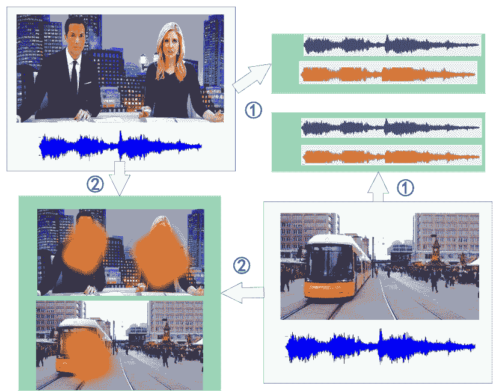

图 1：音视频分离和定位任务的示意图。路径 1 和 2 分别表示分离和定位任务。

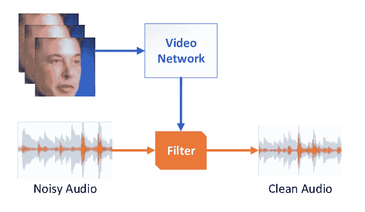

图 2：噪声音频过滤的基本流程。

Gabbay 等人[5] 提出了通过音视频方式隔离特定说话者的声音并消除其他声音的方法。研究人员并没有直接从噪声中提取目标说话者的声音，因为这样可能会使训练模型产生偏差，而是首先将视频帧输入到视频转语音模型中，然后通过视频中捕捉到的面部动作预测说话者的声音。之后，预测的声音被用来过滤混合的声音，如图 2 所示。

尽管 Gabbay 等人[5]通过添加视觉模态来提高了分离语音的质量，但他们的方法仅适用于受控环境。为了在无约束环境中获得可理解的语音，Afouras 等人[6]提出了一种深度音频-视觉语音增强网络，通过预测目标信号的幅度和相位来分离给定唇部区域的说话者声音。作者将声谱图视作时间信号而非网络的图像。此外，他们不仅直接预测干净信号的幅度，还尝试生成更有效的软掩模进行过滤。

与之前需要为每个感兴趣的说话者训练单独模型（说话者依赖模型）的方法不同，Ephrat 等人[7]提出了一种说话者独立模型，该模型只训练一次，然后适用于任何说话者。这种方法甚至超越了最先进的说话者依赖音频-视觉语音分离方法。相关模型由多个视觉流和一个音频流组成，将不同流的特征连接成一个联合音频-视觉表示。这个特征通过双向 LSTM 和三个全连接层进一步处理。最后，为每个说话者学习一个精细的声谱图掩模，并将其乘以噪声输入。最终，研究人员将其转换回波形，以获得每个说话者的孤立语音信号。Lu 等人[20]设计了一个类似于[7]的网络。不同之处在于，作者强制使用音频-视觉匹配网络来区分语音与人类唇部动作之间的对应关系。因此，他们能够获得清晰的语音。

与直接利用视频作为条件的方法不同，Morrone 等人[21]进一步引入了地标作为细粒度特征，以生成时频掩模来过滤混合语音的声谱图。

### 2.2 分离与定位物体的声音

与在嘈杂环境中匹配特定唇部动作的说话者分离任务不同，人类在处理声音分离和定位时更多关注物体。由于探索不同物体的先验声音的挑战，音频和视觉模态之间很难找到清晰的对应关系。

#### 2.2.1 分离

早期尝试解决这一定位问题可以追溯到 2000 年 [22]，当时的一项研究同步了声音和视频的低级特征。Fisher et al. [17] 随后提出使用非参数方法学习视觉和音频信号的联合分布，然后将这两者投影到学习的子空间中。此外，描述了几种基于声学的方法 [23, 24]，这些方法需要特定的监控和仪器工程设备，例如用于捕捉声音到达差异的麦克风阵列。

为了从包含每个视频多个音频源的大规模野外视频中学习音频源分离，Gao et al. [25] 提出了从未标记的视频中学习音频-视觉定位模型，然后利用视觉上下文进行音频源分离。研究人员的方法依赖于多实例多标签学习框架，即使在未观察或听到这些视觉物体的情况下，也能解开与各个视觉物体相关的音频频率。多标签学习框架通过每个视频的音频基向量包进行训练，然后获得音频中呈现物体的包级预测。

表 1：最近音频-视觉分离和定位方法的总结。

| 类别 | 方法 | 思路与优点 | 缺点 |
| --- | --- | --- | --- |
|  | Gabbay et al. [5] |

&#124; 根据 &#124; 预测说话者的声音

&#124; 视频中的面孔用作过滤器 &#124;

|

&#124; 仅能用于 &#124;

&#124; 在受控环境中 &#124;

|

|  | Afouras et al. [6] |
| --- | --- |

&#124; 为 &#124; 生成软掩模

&#124; 野外过滤 &#124;

|

&#124; 需要训练一个 &#124;

&#124; 单独的模型用于 &#124;

&#124; 关注的每个说话者 &#124;

|

| 说话者分离 | Lu et al. [20] |
| --- | --- |

&#124; 区分对应关系 &#124;

&#124; 语音与人类之间 &#124;

&#124; 语音唇部动作 &#124;

|

&#124; 仅限两个说话者； &#124;

&#124; 几乎无法应用于 &#124;

&#124; 背景噪音 &#124;

|

|  | Ephrat et al. [7] |
| --- | --- |

&#124; 预测复杂的谱图 &#124;

&#124; 每个说话者的掩模； &#124;

&#124; 训练一次，适用于 &#124;

&#124; 任何说话者 &#124;

|

&#124; 模型过于复杂 &#124;

&#124; 并且缺乏解释 &#124;

|

|  | Morrone et al. [21] |
| --- | --- |

&#124; 使用地标生成 &#124;

&#124; 时间-频率掩模 &#124;

|

&#124; 额外的地标 &#124;

&#124; 需要检测 &#124;

|

|  | Gao et al. [25] |
| --- | --- |

&#124; 解开音频频率 &#124;

&#124; 与视觉物体相关 &#124;

| 仅分离音频 |
| --- |
|  | Senocak et al [26] |

&#124; 关注主要 &#124;

&#124; 通过使用注意力机制的区域 &#124;

|

&#124; 局部化声音 &#124;

&#124; 仅源 &#124;

|

|  | Tian et al. [27] |
| --- | --- |

&#124; 听觉的联合建模 &#124;

&#124; 及视觉模态 &#124;

|

&#124; 定位的声音 &#124;

&#124; 仅源 &#124;

|

|

&#124; 分离和定位 &#124;

&#124; 物体的声音 &#124;

| Pu 等人 [19] |
| --- |

&#124; 使用低秩提取 &#124;

&#124; 稀疏相关的组件 &#124;

|

&#124; 不适用于实际环境 &#124;

&#124; 环境 &#124;

|

|  | Zhao 等人 [28] |
| --- | --- |

&#124; 混合和分离给定音频; &#124;

&#124; 无传统监督 &#124;

|

&#124; 运动信息 &#124;

&#124; 未考虑 &#124;

|

|  | Zhao 等人 [29] |
| --- | --- |

&#124; 介绍运动轨迹 &#124;

&#124; 和课程学习 &#124;

|

&#124; 仅适用于同步 &#124;

&#124; 视频和音频输入 &#124;

|

|  | Rouditchenko 等人 [30] |
| --- | --- |

&#124; 分离和定位使用 &#124;

&#124; 仅一种模态输入 &#124;

|

&#124; 未充分利用 &#124;

&#124; 时间信息 &#124;

|

|  | Parekh 等人 [31] |
| --- | --- |

&#124; 弱监督学习 &#124;

&#124; 通过多实例学习 &#124;

|

&#124; 仅限于边界框 &#124;

&#124; 在图像上提出 &#124;

|

#### 2.2.2 定位

机器能否仅通过观察声音和视觉场景对来定位声音源，就像人类一样？生理学和心理学上都有证据表明，声学信号的声音定位受到其视觉信号同步性的强烈影响 [22]。过去在这一领域的努力局限于需要特定设备或附加特征。Izadinia 等人 [32] 提出了利用移动物体的速度和加速度作为视觉特征来为声音分配对象。Zunino 等人 [24] 提出了适合自动监测的声音和光学成像的新型混合设备。

随着互联网中未标记视频数量的剧增，最近的方法主要集中在无监督学习上。此外，同时建模音频和视觉模态通常优于独立建模。Senocak 等人 [26] 通过观看和听取视频学习了声音源定位。相关模型主要由三部分组成，即声音和视觉网络以及通过距离比 [33] 无监督损失训练的注意力网络。

注意机制使模型集中于主要区域。它们在半监督设置中提供先验知识。因此，网络可以转换为一个统一的网络，可以更好地从数据中学习，而无需额外的注释。为了实现跨模态定位，Tian 等人 [27] 提出了通过学习的注意力捕捉声音发射对象的语义，并利用时间对齐来发现两种模态之间的相关性。

#### 2.2.3 同时分离和定位

声音源分离和定位可以通过将一种模态的信息分配给另一种模态来强烈关联。因此，一些研究者尝试同时进行定位和分离。Pu 等人 [19] 使用了一个低秩和稀疏框架来建模背景。研究人员提取了音频和视觉模态之间具有稀疏相关性的组件。然而，这种方法的场景有一个主要限制：它只能应用于少数声音产生对象的视频。因此，赵等人 [28] 引入了一个叫做 PixelPlayer 的系统，该系统使用了双流网络，并提出了一个混合和分离框架来训练整个网络。在这个框架中，将来自两个不同视频的音频信号加在一起以生成混合信号作为输入。然后将输入送入网络，该网络被训练以根据相应的视频帧分离音频源信号。两个分离的声音信号被视为输出。因此，该系统学会了在没有传统监督的情况下分离个体源。

赵等人 [29] 随后提出了一种名为深度密集轨迹的端到端网络，以学习音视频声音分离的运动信息，而不仅仅依赖图像语义而忽视视频中的时间运动信息。此外，由于训练样本的缺乏，直接分离单一类别的乐器声音往往会导致过拟合。因此，作者提出了一种课程策略，从分离不同乐器的声音开始，然后过渡到分离同一乐器的声音。这种渐进的方法为网络在分离和定位任务上更好地收敛提供了良好的起点。

之前的研究方法 [19, 28, 29] 仅能应用于具有同步音频的视频。因此，Rouditchenko 等人 [30] 尝试通过解缠神经网络学习的概念，使用仅视频帧或声音来执行定位和分离任务。研究人员提出了一种方法，通过在训练阶段使用 sigmoid 激活函数和在微调阶段使用 softmax 激活函数来产生稀疏激活，这些激活可以对应于输入中的语义类别。随后，研究人员使用训练数据集中可用的标签将这些语义类别分配给中间网络特征通道。换句话说，给定一个视频帧或一个声音，该方法使用类别到特征通道的对应关系来选择特定类型的源或对象进行分离或定位。为提高性能，Parekh 等人 [31] 设计了一种基于多实例学习的方案，这是一种著名的弱监督学习策略。

## 3 音视频对应学习

在本节中，我们介绍了一些探讨音频和视觉模态之间全球语义关系的研究。我们将这类研究称为“音频-视觉对应学习”；它包括 1) 音频-视觉匹配任务和 2) 音频-视觉语音识别任务。

### 3.1 音频-视觉匹配

生物识别认证，从面部识别到指纹和虹膜认证，是一个热门话题，经过多年研究，已有证据表明该系统可能受到恶意攻击。为了检测这种攻击，近期研究特别关注语音反欺骗措施。

Sriskandaraja 等人 [34] 提出了基于 Siamese 结构的网络来评估语音样本对之间的相似性。[35] 提出了一个双流网络，其中第一个网络是一个被假设为过拟合的贝叶斯神经网络，第二个网络是一个 CNN，用于提高泛化能力。Alanis 等人 [36] 进一步结合了 LightCNN [37] 和一个门控递归单元 (GRU) [38] 作为一个强大的特征提取器，以在发音级别分析中表示语音信号，从而提高性能。

我们注意到，跨模态匹配是这种认证的一种特殊形式，最近得到了广泛研究。它试图学习对之间的相似性。我们将这个匹配任务分为细粒度的语音-面部匹配和粗粒度的音频-图像检索。

#### 3.1.1 语音-面部匹配

给定不同身份的面部图像和对应的音频序列，语音-面部匹配旨在识别音频所属的面孔（V2F 任务）或反之（F2V 任务），如图 3 所示。关键点在于找到音频和视觉模态之间的嵌入。Nagrani 等人 [39] 提出了使用三个网络来解决音频-视觉匹配问题：一个静态网络、一个动态网络和一个 N-路网络。静态网络和动态网络只能处理特定数量的图像和音频轨道。不同之处在于动态网络为每张图像添加了时间信息，例如光流或 3D 卷积 [40, 41]。基于静态网络，作者增加了样本数量形成了一个 N-路网络，该网络能够解决 $N:1$ 识别问题。

然而，上述方法中两种模态之间的相关性并没有得到充分利用。因此，Wen 等人[42]提出了一种离散映射网络（DIMNets），以充分利用协变量（例如性别和国籍）[43，44]来桥接语音和面部信息之间的关系。直观的假设是，对于给定的语音和面部配对，两个模态之间共享的协变量越多，匹配的概率就越高。这个框架的主要缺点是大量的协变量导致了高数据成本。因此，Hoover 等人[45]提出了一种低成本但稳健的检测和聚类方法，用于音频片段和面部图像。对于音频流，研究人员应用了神经网络模型来检测语音进行聚类，然后根据多数原则将一个帧簇分配给给定的音频簇。这样做只需要少量的数据进行预训练。

为了进一步增强网络的鲁棒性，Chung 等人[46]提出了一种改进的双流训练方法，通过增加负样本的数量来提高网络的容错率。跨模态匹配任务，本质上是一个分类任务，允许三元组损失的广泛应用。然而，在处理多个样本时，它的表现较为脆弱。为克服这一缺陷，Wang 等人[47]提出了一种新颖的损失函数，用于扩展三元组损失以处理多个样本，并基于双流结构提出了一种新的弹性网络（称为 Emnet），该网络可以容忍可变数量的输入，以提高网络的灵活性。

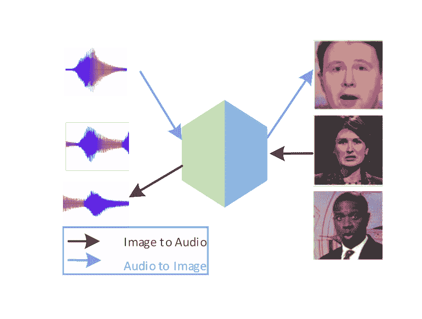

图 3：音频到图像检索（a）和图像到音频检索（b）的演示。

#### 3.1.2 音频-图像检索

跨模态检索任务旨在发现不同模态之间的关系。给定一个源模态中的样本，提出的模型可以检索目标模态中具有相同身份的对应样本。例如，对于音频-图像检索，目标是返回一个相关的钢琴声音，给定一张女孩弹钢琴的图片。与之前考虑的语音和面部匹配相比，这项任务更为粗略。

与其他检索任务如文本-图像任务 [48, 49, 50] 或声音-文本任务 [51] 不同，视听检索任务主要关注子空间学习。Didac 等人 [52] 提出了一个新的联合嵌入模型，将两个模态映射到一个联合嵌入空间中，然后直接计算它们之间的欧几里得距离。作者利用余弦相似度确保同一空间中的两个模态尽可能接近而不重叠。请注意，由于存在大量的全连接层，设计的架构会有大量的参数。

Hong 等人 [53] 提出了一个依赖预训练网络的联合嵌入模型，该模型使用 CNN 替代全连接层，从而在一定程度上减少了参数数量。视频和音乐被输入到预训练网络中，然后进行聚合，接着通过跨模态排序损失训练了一个双流网络。此外，为了保留模态特定的特征，研究人员提出了一种新颖的软内模态结构损失。然而，结果网络非常复杂，实践中难以应用。为了解决这个问题，Arsha 等人 [54] 提出了一个跨模态自监督方法，以学习视频中音频和视觉信息的嵌入，并显著降低了网络的复杂性。为了样本选择，作者设计了一种新颖的课程学习计划，以进一步提高性能。此外，得到的联合嵌入可以在实际应用中高效、有效地应用。

表 2：视听对应学习总结。

| 类别 | 方法 | 思路与优势 | 劣势 |
| --- | --- | --- | --- |
|  | Nagrani 等人  [39] |

&#124; 方法新颖且 &#124;

&#124; 包含动态信息 &#124;

|

&#124; 随着样本大小增加，&#124;

&#124; 准确度过度下降 &#124;

|

|  | Wen 等人  [42]。 |
| --- | --- |

&#124; 相关性 &#124;

&#124; 模式被利用 &#124;

|

&#124; 数据集获取困难 &#124;

|

| 声音-面部匹配 | Wang 等人 [55] |
| --- | --- |

&#124; 能处理多个样本 &#124;

&#124; 可以改变输入的大小 &#124;

|

&#124; 仅静态图像；&#124;

&#124; 模型复杂性 &#124;

|

|  | Hoover 等人 [45] |
| --- | --- |

&#124; 易于实现 &#124;

&#124; 鲁棒性 &#124;

&#124; 高效 &#124;

| 不能处理大规模数据 |
| --- |
|  | Hong 等人 [53] |

&#124; 保留模态- &#124;

&#124; 具体特征 &#124;

&#124; 软内模态结构损失 &#124;

| 复杂网络 |
| --- |
| 视听检索 | Didac 等人 [52] |

&#124; 度量学习 &#124;

&#124; 使用更少的参数 &#124;

|

&#124; 仅两个面孔 &#124;

&#124; 静态图像 &#124;

|

|  | Arsha 等人 [54] |
| --- | --- |

&#124; 课程学习 &#124;

&#124; 应用价值 &#124;

&#124; 低数据成本 &#124;

| 多样本准确率低 |
| --- |
|  | Petridis 等 [56] |

&#124; 同时获取 &#124;

&#124; 特征和分类 &#124;

|

&#124; 缺乏音频信息 &#124;

|

|  | Wand 等 [57]。 |
| --- | --- |

&#124; LSTM &#124;

&#124; 简单方法 &#124;

|

&#124; 单词级别 &#124;

|

| 视听语音识别 | Shillingford 等 [58] |
| --- | --- |

&#124; 句子级别 &#124;

&#124; LipNet &#124;

&#124; CTC 损失 &#124;

|

&#124; 无音频信息 &#124;

|

|  | Chung 等 [59] |
| --- | --- |

&#124; 音频和视觉信息 &#124;

&#124; LRS 数据集 &#124;

| 噪声未被考虑 |
| --- |
|  | Trigeorgis 等 [60] |

&#124; 音频信息 &#124;

&#124; 算法稳健 &#124;

| 噪声未被考虑 |
| --- |
|  | Afouras 等 [61] |

&#124; 研究音频中的噪声 &#124;

&#124; LRS2-BBC 数据集 &#124;

| 复杂网络 |
| --- |

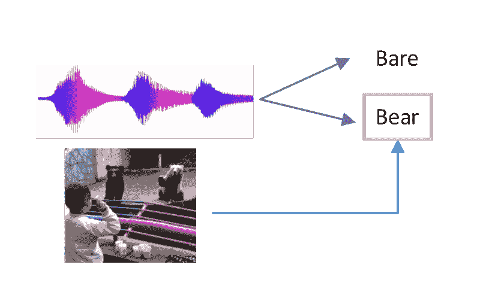

图 4: 视听语音识别演示。

### 3.2 视听语音识别

对给定语音片段内容的识别已经研究多年，尽管取得了重大成就，研究人员仍在追求在挑战性场景下的满意表现。由于音频与视觉之间的相关性，结合这两种模态通常能提供更多的先验信息。例如，可以预测对话发生的场景，这为语音识别提供了强有力的先验，如图 4 所示。

早期对视听融合模型的研究通常包括两个步骤：1) 从图像和音频信号中提取特征，2) 将特征组合用于联合分类 [62, 63, 64]。后来，利用深度学习，特征提取被神经网络编码器所取代 [65, 66, 67]。最近的几项研究显示出使用端到端方法进行视觉语音识别的趋势。这些研究主要可以分为两组。它们要么利用全连接层和 LSTM 提取特征并建模时间信息 [56, 57]，要么使用 3D 卷积层，随后结合 CNN 和 LSTM [58, 68]。Petridis 等人 [56] 引入了一种视听融合模型，该模型同时从像素和光谱图中提取特征，并对语音和非语言发声进行分类。此外，时间信息通过双向 LSTM 提取。尽管这种方法能够同时进行特征提取和分类，但它仍然遵循两步策略。

为此，Wand 等人 [57] 提出了一个使用 LSTM 的词级读唇系统。与之前的方法相比，Assael 等人 [58] 提出了一个基于句子级序列预测的全新的端到端 LipNet 模型，该模型包含空间-时间卷积、递归网络以及通过连接主义时间分类（CTC）损失训练的模型。实验表明，读唇技术优于两步策略。

然而，视觉模态中的信息有限可能导致性能瓶颈。为了结合音频和视觉信息以适应各种场景，特别是在嘈杂条件下，Trigeorgis 等人 [60] 引入了一个端到端模型，从原始时间表示中获取“上下文感知”特征。

Chung 等人[59] 提出了一个“观察、听取、关注和拼写”（WLAS）网络，以解释音频对识别任务的影响。该模型利用了双重注意机制，能够在单一或组合模态下运行。为了加快训练速度并避免过拟合，研究人员还采用了课程学习策略。为了分析“实际环境”数据集，Cui 等人[69] 提出了另一种基于残差网络和双向 GRU[38] 的模型。然而，作者没有考虑到音频中的普遍噪声。为了解决这个问题，Afouras 等人[61] 提出了一个用于执行语音识别任务的模型。研究人员在他们的模型中比较了两种常见的序列预测类型：连接时序分类和序列到序列（seq2seq）方法。在实验中，他们观察到，当模型仅提供静音视频时，使用 seq2seq 的模型在词错误率（WER）上表现更好。对于纯音频或音频视觉任务，这两种方法的表现相似。在嘈杂环境中，seq2seq 模型的表现不如相应的 CTC 模型，这表明 CTC 模型能够更好地处理背景噪声。

## 4 音频和视觉生成

之前介绍的检索任务表明，训练好的模型能够找到最相似的音频或视觉对应物。虽然人类可以想象与声音对应的场景，反之亦然，研究人员多年来一直尝试赋予机器这种想象力。随着生成对抗网络（GANs）[70] 的发明和进展，图像或视频生成成为一个话题。它涉及几个子任务，包括从潜在空间[71] 生成图像或视频、跨模态生成[72, 73] 等。这些应用也与其他任务相关，如领域适应[74, 75]。由于音频和视觉模态之间的差异，它们之间的潜在关联仍然难以被机器发现。因此，从视觉信号生成声音或反之成为一个具有挑战性的任务。

在本节中，我们将主要回顾音频和视觉生成的最新进展，即从视觉信号生成音频或反之亦然。这里的视觉信号主要指图像、运动动态和视频。子节“视觉转音频”主要关注从唇部区域的视频中恢复语音（图 5 (a)）或生成可能出现在给定场景中的声音（图 5 (a)）。相比之下，“音频转视觉”生成的讨论（图 5 (b)）将审视从给定音频生成图像（图 6 (a)），身体运动生成（图 6 (b)），以及说话脸部生成（图 6 (c)）。

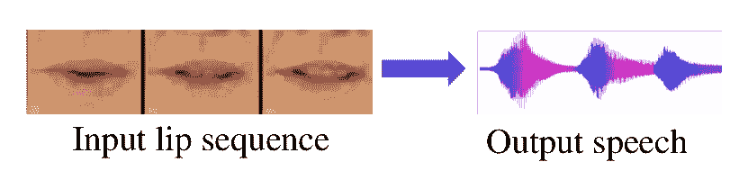

(a) 从唇部序列生成语音演示

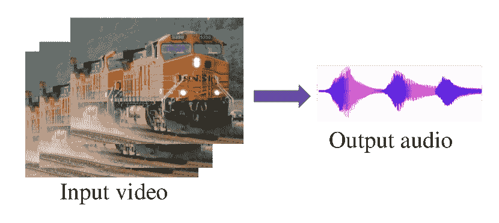

(b) 视频到音频生成演示

图 5: 视觉到音频生成演示。

表 3: 最近的视频转音频生成方法汇总。

| 分类 | 方法 | 想法与优点 | 缺点 |
| --- | --- | --- | --- |
|  | Cornu 等人 [76] |

&#124; 重建可理解的 &#124;

&#124; 仅从语音中 &#124;

&#124; 视觉语音特征 &#124;

|

&#124; 应用于有限场景 &#124;

|

|

&#124; 唇部序列 &#124;

&#124; 转为语音 &#124;

| Ephrat 等人 [77] |
| --- |

&#124; 计算光流 &#124;

&#124; 帧间 &#124;

| 应用于有限场景 |
| --- |
|  | Cornu 等人 [78] |

&#124; 使用 &#124; 重建语音

&#124; 分类方法 &#124;

&#124; 结合特征层面 &#124;

&#124; 时间信息 &#124;

|

&#124; 不能应用于实时 &#124;

&#124; 对话语音 &#124;

|

|  | Davis 等人 [79] |
| --- | --- |

&#124; 通过 &#124; 恢复真实世界的音频

&#124; 捕捉物体的振动 &#124;

|

&#124; 需要特定设备; &#124;

&#124; 仅适用于 &#124;

&#124; 软物体 &#124;

|

|  | Owens 等人 [80] |
| --- | --- |

&#124; 使用 LSTM 捕捉 &#124;

&#124; 材料之间的关系 &#124;

&#124; 和运动 &#124;

|

&#124; 适用于实验室控制的 &#124;

&#124; 仅环境 &#124;

|

|

&#124; 一般视频 &#124;

&#124; 转为音频 &#124;

| Zhou 等人 [81] |
| --- |

&#124; 利用层次化 &#124;

&#124; RNN 生成&#124;

&#124; 自然声音&#124;

| 单声道音频仅 |
| --- |
|  | Morgado 等人[8] |

&#124; 本地化和&#124;

&#124; 分离声音以&#124;

&#124; 生成空间音频&#124;

&#124; 从 360^∘视频&#124;

|

&#124; 有时会失败; &#124;

&#124; 360^∘视频要求&#124;

|

### 4.1 视觉到音频生成

已有许多方法被探讨以从视觉信息中提取音频信息，包括从视觉观察到的振动预测声音和通过视频信号生成音频。我们将视觉到音频生成任务分为两类：从唇部视频生成语音和从没有场景限制的一般视频中合成声音。

#### 4.1.1 唇部序列到语音

语音与嘴唇之间存在自然的关系。除了通过观察嘴唇来理解语音内容（唇读），还有几项研究尝试通过观察嘴唇重建语音。Cornu 等人[76]尝试从视觉特征预测谱包络，并将其与人工激励信号结合，以在语音生成模型中合成音频信号。Ephrat 等人[82]提出了一种基于 CNN 的端到端模型，通过相邻帧生成每个静默视频帧的音频特征。因此，基于学习到的特征重建波形以生成可理解的语音。

利用时间信息改善语音重建已被广泛探讨。Ephrat 等人[77]提出利用光流同时捕捉时间运动。Cornu 等人[78]利用递归神经网络将时间信息纳入预测中。

#### 4.1.2 一般视频到音频

当声音撞击到一些小物体的表面时，后者会轻微振动。因此，Davis 等人[79]利用这一特性从高速摄像机被动观察到的振动中恢复声音。注意，对于适合的物体来说，它们应该容易振动，这对于一杯水、一盆植物或一盒纸巾来说都是如此。我们认为这项工作类似于之前介绍的语音重建研究[76, 82, 77, 78]，因为它们都利用了视觉和声音上下文之间的关系。在语音重建中，视觉部分更多关注于唇部运动，而在这项工作中，重点是小的振动。

Owens 等人 [80] 观察到，当不同材料被撞击或划伤时，它们会发出各种声音。因此，研究人员引入了一个模型，该模型学习从视频中合成声音，这些视频中的物体由不同材料制成，并且以不同的角度和速度用鼓槌击打。研究人员展示了他们的模型不仅能够识别源自不同材料的不同声音，还能学习与物体的交互模式（对物体施加的不同动作会产生不同的声音）。该模型利用 RNN 从视频帧中提取声音特征，并通过基于实例的合成过程生成波形。

尽管 Owens 等人 [80] 能够生成来自各种材料的声音，但作者的方法仍然无法应用于现实生活中的应用，因为网络是在实验室环境下拍摄的视频中训练的，受到了严格的限制。为了改善结果并从实际环境中的视频中生成声音，Zhou 等人 [81] 设计了一个端到端的模型。该模型结构为视频编码器和声音生成器，以学习从视频帧到声音的映射。之后，网络利用层次化 RNN [83] 进行声音生成。具体而言，作者训练了一个模型，以直接从输入视频中预测原始音频信号（波形样本）。他们展示了该模型能够学习声音和视觉输入之间的相关性，适用于各种场景和物体交互。

我们提到的前期工作主要集中在单声道音频生成上，而 Morgado 等人 [8] 尝试将由 360^∘ 视频摄像机录制的单声道音频转换为空间音频。执行这样的音频专门化任务需要解决两个主要问题：源分离和定位。因此，研究人员设计了一个模型来从混合输入音频中分离声音源，然后在视频中定位它们。另一个多模态模型用于指导分离和定位，因为音频和视频是互补的。

### 4.2 音频到视觉

在这一部分，我们详细回顾了音频到视觉的生成。我们首先介绍音频到图像的生成，这比视频生成要简单，因为它不需要生成图像之间的时间一致性。

#### 4.2.1 音频到图像

为了生成更高质量的图像，Wan 等人 [84] 提出了一个结合了谱范数、辅助分类器和投影判别器的模型，形成了研究人员的条件 GAN 模型。该模型可以根据声音的音量输出不同尺度的图像，即使是相同的声音。Qiu 等人 [85] 建议从音乐中想象内容，而不是生成发生过的真实场景。作者通过将音乐和图像输入到两个网络中提取特征，并学习这些特征之间的关联，最终从学习到的关联生成图像。

许多研究集中在音频-视觉互生上。Chen 等人 [72] 是首个尝试使用条件 GAN 解决这一跨模态生成问题的研究者。研究人员定义了一个声音到图像（S2I）网络和一个图像到声音（I2S）网络，分别生成图像和声音。Hao 等人 [86] 通过考虑一个跨模态循环生成对抗网络（CMCGAN）将这两个网络结合成一个网络，以处理跨模态视觉-音频互生任务。按照循环一致性的原则，CMCGAN 包含了四个子网络：音频到视觉、视觉到音频、音频到音频和视觉到视觉。

最近，一些研究尝试从语音片段中重建面部图像。Duarte 等人 [87] 通过 GAN 模型合成了包含表情和姿势的面部图像。此外，作者通过寻找最佳输入音频长度来提升模型的生成质量。为了更好地从语音中学习规范化的面孔，Oh 等人 [88] 探索了一个重建模型。研究人员通过学习将语音的特征空间与预训练的面部编码器和解码器对齐来训练音频编码器。

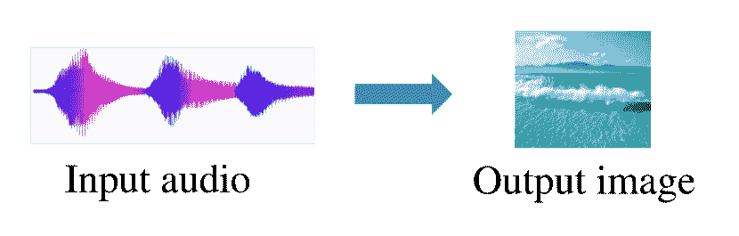

(a) 音频到图像生成的演示。

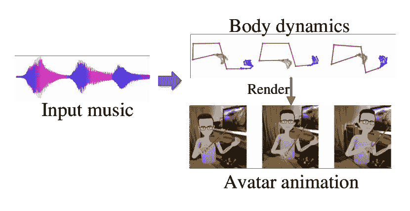

(b) 移动体的演示。

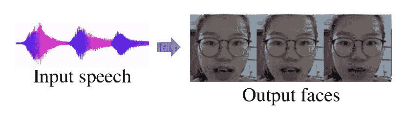

(c) 说话面孔的演示。

图 6：说话面孔生成和移动体生成的演示。

表 4：音频到视觉生成的最新研究总结。

| 类别 | 方法 | 思路与优势 | 弱点 |
| --- | --- | --- | --- |
|  | Wan 等人 [84] |

&#124; 结合了许多现有技术 &#124;

&#124; 形成一个 GAN &#124;

| 低质量 |
| --- |
|  | Qiu 等人 [85] |

&#124; 生成了图像 &#124;

&#124; 与音乐相关 &#124;

| 低质量 |
| --- |
| 音频到图像 | Chen 等人 [72] |

&#124; 生成了音频到视觉和 &#124;

&#124; 视觉到音频模型 &#124;

|

&#124; 这些模型是 &#124;

&#124; 独立的 &#124;

|

|  | Hao 等人 [86] |
| --- | --- |

&#124; 提出了跨模态循环 &#124;

&#124; 生成对抗网络 &#124;

| 仅生成图像 |
| --- |
|  | Alemi 等人 [89] |

&#124; 从 &#124;

&#124; 通过实时 GrooveNet 进行音乐 &#124;

|  |
| --- |
|  | 李等人 [90] |

&#124; 生成了一个编舞系统 &#124;

&#124; 通过自回归 &#124;

&#124; 编码器-解码器网络 &#124;

|  |
| --- |
| 音频到动作 | Shlizerman 等人 [91] |

&#124; 应用了“目标延迟” LSTM &#124;

&#124; 以预测身体关键点 &#124;

|

&#124; 受限于 &#124;

&#124; 给定的数据集 &#124;

|

|  | 汤等人 [92] |
| --- | --- |

&#124; 开发了一个以音乐为导向的舞蹈 &#124;

&#124; 编舞合成方法 &#124;

|  |
| --- |
|  | Yalta 等人 [93] |

&#124; 生成了弱标签 &#124;

&#124; 动作方向 &#124;

&#124; 动作-音乐对齐 &#124;

|  |
| --- |
|  |

&#124; Kumar 等人 [94] 和 &#124;

&#124; Supasorn 等人 [95] &#124;

|

&#124; 生成关键点 &#124;

&#124; 由时间延迟的 &#124;

&#124; LSTM &#124;

|

&#124; 需要重新训练 &#124;

&#124; 另一个身份 &#124;

|

|  | Chung 等人 [96] |
| --- | --- |

&#124; 开发了一个编码器-解码器 &#124;

&#124; 适用的 CNN 模型 &#124;

&#124; 更多身份 &#124;

|  |
| --- |
|  | Jalalifar 等人 [97] |

&#124; 结合了 RNN 和 GAN &#124;

&#124; 并应用了关键点 &#124;

|

&#124; 用于实验室控制的 &#124;

&#124; 仅限于环境 &#124;

|

| Talking Face | Vougioukas 等人 [98] |
| --- | --- |

&#124; 应用了一种时间 GAN 用于 &#124;

&#124; 更多时间一致性 &#124;

|  |
| --- |
|  | 陈等人 [99] | 应用了光流 | 仅生成嘴唇 |
|  | 周等人 [100] | 解耦信息 | 缺乏真实感 |
|  | 朱等人 [73] |

&#124; 不对称互信息估计 &#124;

&#124; 捕捉模态一致性 &#124;

|

&#124; 遭遇“放大 &#124;

&#124; -and-out” 条件 &#124;

|

|  | 陈等人 [101] | 动态像素损失 |
| --- | --- | --- |

&#124; 需要多阶段 &#124;

&#124; 训练 &#124;

|

|  | Wiles 等人 [102] |
| --- | --- |

&#124; 自监督模型用于 &#124;

&#124; 多模态驱动 &#124;

| 相对较低的质量 |
| --- |

#### 4.2.2 身体动作生成

不是直接生成视频，许多研究尝试使用动作来动画化虚拟角色。动作合成方法利用了多种技术，如降维 [103, 104]、隐马尔可夫模型 [105]、高斯过程 [106] 和神经网络 [107, 108, 109]。

Alemi 等人 [89] 提出了基于条件限制玻尔兹曼机和递归神经网络的实时 GrooveNet，用于从音乐中生成舞蹈动作。Lee 等人 [90] 利用自回归编码器-解码器网络从音乐中生成编舞系统。Shlizerman 等人 [91] 进一步引入了一种使用“目标延迟”LSTM 来预测身体标记的模型。后者进一步用作生成身体动态的代理。关键思想是从音频创建类似于钢琴家或小提琴家的动作的动画。总之，整个过程生成了一个与输入音频相对应的艺术家表演视频。

尽管之前的方法能够生成身体运动动态，但音乐的内在节拍信息尚未被利用。Tang 等人 [92] 提出了基于音乐的舞蹈编排合成方法，该方法通过 LSTM 自编码器模型提取了声学特征和运动特征之间的关系。此外，为了实现更好的性能，研究人员通过掩蔽方法和时间索引改进了他们的模型。提供弱监督，Yalta 等人 [93] 探索了从运动方向产生弱标签以进行运动-音乐对齐。作者通过条件自配置的深度 RNN 生成了长舞蹈序列，该 RNN 由音频频谱驱动。

#### 4.2.3 对话面孔生成

在探索音频到视频生成的过程中，许多研究人员对从语音或音乐合成人的面孔表现出了极大的兴趣。这有许多应用，例如动画电影、远程会议、对话代理和在保护隐私的同时提升语音理解能力。早期的对话面孔生成研究主要基于任意语音的音频，从数据集中合成特定的身份。Kumar 等人 [94] 通过利用时间延迟的 LSTM [110] 尝试生成与音频同步的关键点，然后通过另一个网络生成以这些关键点为条件的视频帧。此外，Supasorn 等人 [95] 提出了“牙齿代理”以改善生成过程中牙齿的视觉质量。

随后，Chung 等人 [96] 尝试使用编码器-解码器 CNN 模型学习原始音频和视频之间的对应关系。Jalalifar 等人 [97] 结合 RNN 和 GAN [70]，通过两个网络生成与输入音频同步的现实面孔序列。其中一个是用于从音频输入创建唇部标记的 LSTM 网络。另一个是条件 GAN (cGAN)，用于根据给定的一组唇部标记生成最终的面孔。[98] 提出了使用时间 GAN [111] 来提高合成质量，而不是应用 cGAN。然而，上述方法仅适用于合成数据集中已存在的身份的对话面孔。

任意身份的说话面孔合成最近引起了显著关注。Chen 等人 [99] 在生成多个唇部图像时考虑了语音和唇部运动之间的相关性。研究人员使用光流更好地表达帧之间的信息。输入的光流不仅表示当前形状的信息，还表示先前的时间信息。

一张正面的脸部照片通常包含身份和语音信息。基于此，Zhou 等人 [100] 使用对抗学习方法在生成过程中解缠绕图像的不同信息类型。解缠绕的表示具有一个便利的特性，即音频和视频都可以作为生成过程中的语音信息来源。因此，不仅可以输出特征，还可以在应用生成网络时更明确地表达这些特征。

最近，为了发现音频和视频之间的高级相关性，Zhu 等人 [73] 提出了一个互信息近似方法，用于近似模态之间的互信息。Chen 等人 [101] 应用了地标和运动注意力来生成说话的面孔。作者进一步提出了一种用于时间一致性的动态像素级损失。面部生成不局限于音频或视觉等特定模态，因为关键点在于这些不同模态之间是否存在共同的模式。Wiles 等人 [102] 提出了一个自监督框架 X2Face，以学习嵌入特征并生成目标面部运动。只要学习了嵌入特征，它就可以从任何输入生成视频。

## 5 音视频表示学习

表 5：近期音视频表示学习研究的总结。

| 类型 | 方法 | 思路与优点 | 缺点 |
| --- | --- | --- | --- |

|

&#124; 单模态 &#124;

&#124; 模态 &#124;

|

&#124; Aytar 等人 [112] &#124;

|

&#124; 学生-教师训练 &#124;

&#124; 自然的 &#124;

&#124; 视频同步 &#124;

|

&#124; 仅学习了 &#124;

&#124; 音频表示 &#124;

|

|  |
| --- |

&#124; Leidal 等人 [113] &#124;

|

&#124; 对模态的数量进行正则化 &#124;

&#124; 编码在 &#124;

&#124; 语义嵌入 &#124;

|

&#124; 关注口语表达 &#124;

&#124; 和手写数字 &#124;

|

|  |
| --- |

&#124; Arandjelovic 等人 &#124;

&#124; [12, 114] &#124;

| 提出了 AVC 任务 |
| --- |

&#124; 仅考虑音频和 &#124;

&#124; 视频对应关系 &#124;

|

|

&#124; 双模态 &#124;

&#124; 模态 &#124;

| Owens 等人 [13] |
| --- |

&#124; 提出了 AVTS 任务 &#124;

&#124; 带有课程学习 &#124;

|

&#124; 声音源必须 &#124;

&#124; 视频中的特征；仅 &#124;

&#124; 一个声音源 &#124;

|

|  | Parekh 等人 [115] |
| --- | --- |

&#124; 使用视频标签进行弱监督 &#124;

&#124; 监督学习 &#124;

|

&#124; 利用先验知识 &#124;

&#124; 事件分类 &#124;

|

|  | Hu 等人 [116] |
| --- | --- |

&#124; 解开每个 &#124;

&#124; 模态转化为集合 &#124;

&#124; 不同组件的 &#124;

|

&#124; 需要预定义的 &#124;

&#124; 聚类数量 &#124;

|

表示学习旨在自动发现数据的模式表示。其动机来自于数据表示的选择通常会显著影响机器学习的性能[11]。然而，现实世界的数据，如图像、视频和音频，并不容易通过算法定义特定的特征。

此外，数据表示的质量通常决定了机器学习算法的成功。Bengio 等人[11] 认为其原因在于不同的表示可以更好地解释数据的潜在规律，而最近对人工智能的热情促使了更强大的表示学习算法的设计以实现这些先验知识。

在本节中，我们将回顾一系列音视频学习方法，从单模态 [112] 到双模态表示学习 [114, 12, 13, 113, 116]。这些研究的基本流程如图 7 所示。

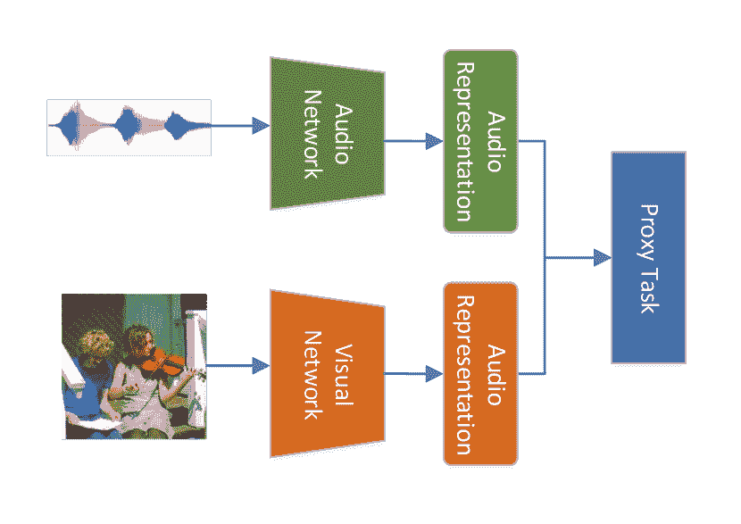

图 7: 表示学习的基本流程。

### 5.1 单模态表示学习

自然地，为了确定音频和视频是否相关，研究人员专注于确定音频和视频是否来自同一个视频或它们在同一个视频中是否同步。Aytar 等人 [112] 利用视频和声音之间的自然同步来学习视频的声学表示。研究人员提出了一种学生-教师训练过程，该过程使用未标记的视频作为桥梁，将来自复杂视觉识别模型的知识传递到声音模态。尽管所提出的方法成功地以无监督的方式学习了音频模态表示，但同时发现音频和视频表示仍待解决。

### 5.2 学习音视频表示

在对应的音频和图像中，与模态相关的信息往往是嘈杂的，而我们只需要语义内容，而非准确的视觉内容。Leidal 等人 [113] 探索了语义嵌入空间的无监督学习，这需要相关音频和图像之间有较紧密的分布。研究人员提出了一个模型，将输入映射到对角高斯分布的均值和方差的对数的向量，样本的语义嵌入从这些向量中提取。

为了通过简单地观看和听取大量未标记的视频来学习音频和视频的语义信息，Arandjelovic 等人 [12] 引入了一个音视频对应学习任务（AVC），用于从头训练两个（视觉和音频）网络，如图 8 (a) 所示。在这个任务中，相应的音频和视觉对（正样本）来自同一个视频，而不匹配的（负样本）对则从不同的视频中提取。为了解决这个任务，作者提出了一个 $L^{3}$-Net 来检测视觉和音频领域中的语义是否一致。虽然这个模型在没有额外监督的情况下进行了训练，但它能够有效地学习双模态的表示。

探索了所提出的音视频一致性（AVC）任务后，Arandjelovic 等人 [114] 继续研究了 AVE-Net，其目标是寻找与当前音频片段最相似的视觉区域。Owens 等人 [117] 提出了采用类似于 [12] 的模型，但使用了 3D 卷积网络来处理视频，从而能够捕捉声音定位的运动信息。

与以往基于 AVC 任务的解决方案相比，Korbar 等人 [13] 引入了另一种代理任务，称为音视频时间同步（AVTS），进一步考虑了给定的音频样本和视频片段是否“同步”或“不同步”。在之前的 AVC 任务中，负样本是从不同视频中获取的音频和视觉样本。然而，在探索 AVTS 时，研究人员使用了“更难”的负样本，即从同一视频中采样的不同步的音频和视觉片段，训练模型，迫使模型学习相关的时间特征。这时，不仅加强了视频和音频之间的语义对应关系，更重要的是也实现了它们之间的同步。研究人员将课程学习策略 [118] 应用于这一任务，将样本分为四类：正样本（对应的音视频对）、简单负样本（来自不同视频的音频和视频片段）、困难负样本（来自同一视频但不重叠的音频和视频片段）以及超困难负样本（部分重叠的音频和视频片段），如图 8 (b) 所示。

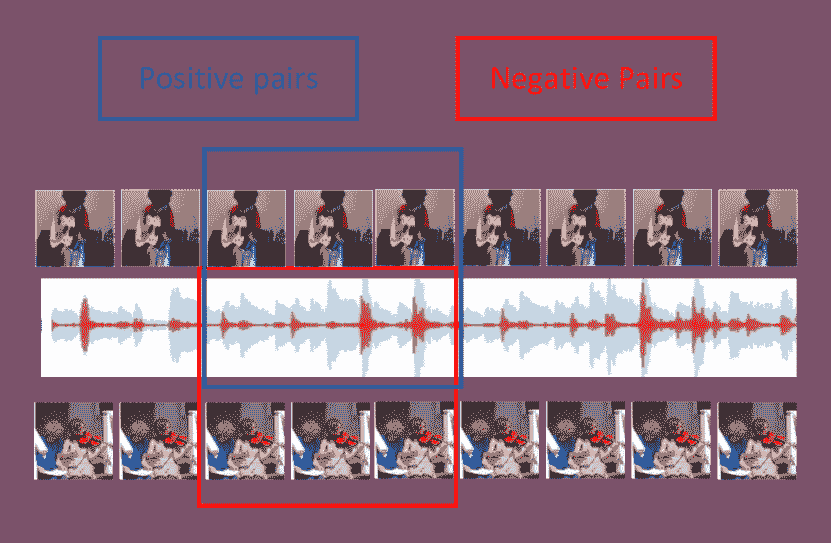

(a) AVC 任务简介

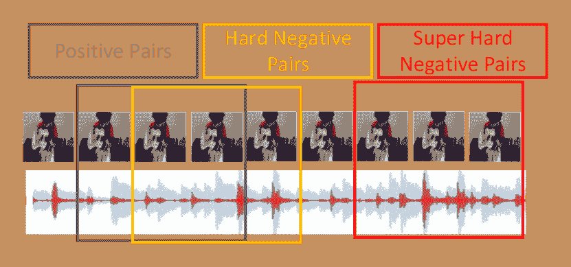

(b) AVTS 任务简介

图 8：表示任务简介

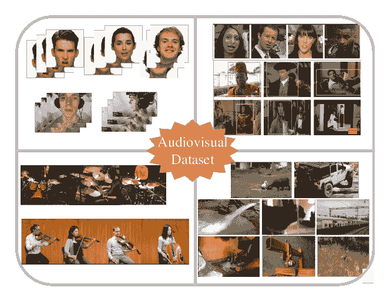

图 9：音视频数据集演示。

上述研究依赖于两个潜在假设：1）声音源应存在于视频中，2）期望只有一个声音源。然而，这些假设限制了这些方法在实际视频中的应用。因此，Parekh 等人 [115] 利用来自视频帧的类无关提案，将问题建模为音频的多实例学习任务。结果，分类和定位问题可以同时解决。研究人员专注于使用事件类别以弱监督的方式定位显著的音频和视觉组件。该框架能够处理音视频事件异步的困难情况。为了利用模态间更详细的关系，Hu 等人 [116] 推荐了一种深度共同聚类模型，从每个模态中提取一组不同的组件。该模型不断学习这些不同模态表示之间的对应关系。作者进一步引入了 K-means 聚类来区分具体的对象或声音。

## 6 最近的公开音视频数据集

许多从语音到事件相关的数据的音视频数据集已被收集和发布。我们将数据集分为两类：音视频语音数据集记录了人脸及其对应的语音，音视频事件数据集包括音乐器材视频和真实事件的视频。在本节中，我们总结了最近的音视频数据集的信息（表 6）。

### 6.1 音视频语音数据集

构建包含音视频语料的数据集对理解音视频语音至关重要。这些数据集在实验室控制环境中收集，志愿者阅读预设的短语或句子，或在自然环境中如电视采访或演讲中收集。

#### 6.1.1 实验室控制环境

表 6：与语音相关的音视频数据集总结。这些数据集可以用于我们上述提到的所有语音相关任务。请注意，“语音”数据集的长度表示视频剪辑的数量，而“音乐”或“真实事件”数据集的长度表示数据集的总小时数。

| 类别 | 数据集 | 环境 | 类别数 | 长度* | 年份 |
| --- | --- | --- | --- | --- | --- |
|  | GRID [119] | 实验室 | 34 | 33,000 | 2006 |
|  | Lombard Grid [120] | 实验室 | 54 | 54,000 | 2018 |
|  | TCD TIMIT [121] | 实验室 | 62 | - | 2015 |
|  | Vid TIMIT [122] | 实验室 | 43 | - | 2009 |
|  | RAVDESS [123] | 实验室 | 24 | - | 2018 |
|  | SEWA [124] | 实验室 | 180 | - | 2017 |
| 语音 | OuluVS [125] | 实验室 | 20 | 1000 | 2009 |
|  | OuluVS2 [126] | 实验室 | 52 | 3640 | 2016 |
|  | Voxceleb [127] | 自然 | 1,251 | 154,516 | 2017 |
|  | Voxceleb2 [128] | 自然 | 6,112 | 1,128,246 | 2018 |
|  | LRW [129] | 自然 | $\sim$1000 | 500,000 | 2016 |
|  | LRS [59] | 自然 | $\sim$1000 | 118,116 | 2017 |
|  | LRS3 [130] | 自然 | $\sim$1000 | 74,564 | 2017 |
|  | AVA-ActiveSpeaker [131] | 自然 | - | 90,341 | 2019 |
|  | C4S [132] | 实验室 | - | 4.5 | 2017 |
| 音乐 | ENST-Drums [133] | 实验室 | - | 3.75 | 2006 |
|  | URMP [134] | 实验室 | - | 1.3 | 2019 |
|  | YouTube-8M [135] | 自然 | 3862 | 350,000 | 2016 |
|  | AudioSet [136] | 自然 | 632 | 4971 | 2016 |
| 真实事件 | Kinetics-400 [137] | 自然 | 400 | 850* | 2018 |
|  | Kinetics-600 [138] | 自然 | 600 | 1400* | 2018 |
|  | Kinetics-700 [139] | 自然 | 700 | 1806* | 2018 |

实验室控制的语音数据集是在特定环境中捕获的，志愿者需要朗读给定的短语或句子。有些数据集仅包含说话者朗读给定句子的录像；这些数据集包括 GRID [119]、TCD TIMIT [121] 和 VidTIMIT [122]。这些数据集可以用于唇读、说话人面孔生成和语音重建。更高级的数据集的开发也在继续：例如，Livingstone 等人提供了 RAVDESS 数据集 [123]，其中包含情感演讲和歌曲。数据集中的条目还根据情感有效性、强度和真实性进行评分。

一些数据集，如 Lombard Grid [120] 和 OuluVS [125、126]，专注于多视角视频。此外，一个名为 SEWA 的数据集提供了丰富的注释，包括问卷回答、面部标志点、（低级描述符的）LLD 特征、手势、头部动作、转录、情感、唤醒、喜欢或不喜欢、模板行为、同意或不同意的情节以及模仿的情节。

#### 6.1.2 实际环境

上述数据集是在实验室环境中收集的；因此，在这些数据集上训练的模型在现实世界场景中难以应用。因此，研究人员尝试从电视采访、演讲和电影中收集真实世界的视频，并发布了多个真实世界的数据集，包括 LRW、LRW 变体 [129、59、130]、Voxceleb 及其变体 [127、128]、AVA-ActiveSpeaker [131] 和 AVSpeech [7]。LRW 数据集包含 500 个句子 [129]，而其变体包含 1000 个句子 [59、130]，所有句子均由数百位不同的说话者朗读。VoxCeleb 及其变体分别包含超过 100,000 次 1,251 位名人的发言 [127] 和超过一百万次 6,112 个身份的发言 [128]。

AVA-ActiveSpeaker [131] 和 AVSpeech [7] 数据集包含更多的视频。AVA-ActiveSpeaker [131] 数据集包含 365 万个人标注的视频帧（大约 38.5 小时）。AVA-ActiveSpeaker [7] 数据集包含大约 4700 小时的视频片段，来自 290,000 个 YouTube 视频，涵盖了各种人群、语言和面部姿态。详细信息见表 6。

### 6.2 视听事件数据集

另一类视听数据集包括音乐或现实世界事件视频。这些数据集与前述的视听语音数据集不同，不仅限于面部视频。

#### 6.2.1 与音乐相关的数据集

大多数音乐相关的数据集是在实验室环境中构建的。例如，ENST-Drums [133] 仅包含三位专业鼓手演奏的鼓视频，这些鼓手专注于不同的音乐风格。C4S 数据集 [132] 包含了 9 位不同单簧管演奏者的 54 段视频，每位演奏者演奏了 3 首不同的古典音乐作品，每首作品演奏了两次（总共 4.5 小时）。

URMP [134] 数据集包含了多个多乐器音乐作品。然而，这些视频是单独录制的，然后合成在一起。为了简化 URMP 数据集的使用，Chen 等人进一步提出了 Sub-URMP [72] 数据集，其中包含从 URMP 数据集中提取的多个视频帧和音频文件。

#### 6.2.2 实际事件相关数据集

最近发布了越来越多的现实世界视听事件数据集，这些数据集包含了大量上传到互联网的视频。这些数据集通常包括数百或数千个事件类别及其相应的视频。具有代表性的数据集包括以下内容。

Kinetics-400 [137]、Kinetics-600 [138] 和 Kinetics-700 [139] 分别包含 400、600 和 700 个人体动作类别，每个动作类别有至少 400、600 和 600 段视频剪辑。每段剪辑大约持续 10 秒，并且取自不同的 YouTube 视频。动作涵盖了广泛的类别，包括如演奏乐器的人体与物体交互，以及如握手的人体与人体交互。AVA-Actions 数据集 [140] 对 43015 分钟的电影剪辑中的 80 个原子视觉动作进行了密集标注，动作在空间和时间上都进行了定位，产生了 158 万个动作标签，每个标签可能对应多个特定人物。

AudioSet [136]，一个更为通用的数据集，包含 632 个音频事件类别的扩展本体和 2084320 个人工标注的 10 秒音频剪辑。这些剪辑取自 YouTube 视频，涵盖了广泛的人类和动物声音、乐器和音乐风格以及常见的环境声音。YouTube-8M [135] 是一个大规模标注视频数据集，包含数百万个 YouTube 视频 ID，配有来自 3800 多个视觉实体的高质量机器生成注释。

## 7 讨论

视听学习（AVL）是整合我们日常生活中两个最重要感知的多模态问题的基础。尽管在 AVL 方面做出了大量努力，但在现实应用中仍然任重道远。在本节中，我们简要讨论了每个类别的关键挑战和潜在研究方向。

### 7.1 挑战

AVL 中差异的异质性决定了其固有的挑战。音频轨道使用一定电压水平来表示模拟信号，而视觉模态通常在 RGB 颜色空间中表示；两者之间的巨大差距对 AVL 构成了重大挑战。这个问题的本质在于理解音频和视觉之间的关系，这也是 AVL 的基本挑战。

音视频分离和定位在许多现实应用中是一个长期存在的问题。尽管在扬声器相关或最近的物体相关分离和定位方面已有进展，但主要挑战在于无法区分不同物体的音色以及探索生成不同物体声音的方法。解决这些挑战需要我们精心设计处理不同物体的模型或思想（例如，注意力机制）。音视频对应学习具有广泛的潜在应用，如刑事调查、医疗护理、交通运输等行业。许多研究尝试将不同的模态映射到共享特征空间。然而，由于从模糊的输入和目标模态中提取清晰有效的信息仍然困难，因此获得令人满意的结果具有挑战性。因此，充分的先验信息（人们通常关注的特定模式）对获得更准确的结果具有重要影响。音频和视觉生成关注于增强的机器想象力。与传统的判别性问题相比，跨模态生成的任务是适应概率分布之间的映射。因此，这通常是一个难以学习的多对多映射问题。此外，尽管音频和视觉模态之间的差异很大，人类对真实世界和生成结果之间的差异非常敏感，细微的伪影容易被察觉，这使得这一任务更具挑战性。最后，音视频表示学习可以视为其他任务的泛化。如前所述，电压表示的音频和 RGB 颜色空间表示的视觉是为了被人类感知而设计的，而不是让机器容易发现共同特征。困难在于只有两种模态且缺乏明确约束。因此，这项任务的主要挑战是找到合适的约束。无监督学习作为这项任务的普遍方法提供了精心设计的解决方案，但缺乏外部监督使得实现目标变得困难。弱监督方法的挑战在于找到正确的隐式监督。

### 7.2 未来研究方向

AVL 已经成为一个活跃的研究领域多年[16, 17]，并且对现代生活至关重要。然而，由于领域本身的挑战性和人们日益增长的需求，AVL 仍然存在许多未解的问题。

首先，从宏观角度来看，由于 AVL 是一个经典的多模态问题，其主要问题是学习模态之间的映射，特别是将音频中的属性与图像或视频中的对象进行映射。我们认为，模仿人类学习过程，例如，通过关注机制和记忆库的思想，可能会提高学习这种映射的性能。此外，第二个最困难的目标是学习逻辑推理。赋予机器推理能力不仅对 AVL 很重要，也是整个 AI 社区面临的一个开放问题。与其直接赋予机器完整的逻辑能力（这离当前的发展状态还有很长的路要走），不如简化这个问题，考虑充分利用先验信息并构建知识图谱。建立一个全面的知识图谱并在特定领域内合理利用它，可能有助于机器思考。

对于我们之前总结的每个任务，Sec. 2 和 Sec. 3 可以视为‘理解’的问题，而 Sec. 4 和 Sec. 5 则可以视为‘生成’和‘表征学习’。最近在理解和生成任务如唇读、说话人分离和说话脸生成方面取得了显著进展。人脸领域相对简单但重要，因为场景通常受到限制，并且有大量可用的有用先验信息。例如，考虑一个 3D 人脸模型。这些人脸通常有中性表情，而作为人脸基础的情感尚未得到充分研究。此外，除了人脸，更复杂的实际场景中包含更多条件也是值得考虑的。将模型适应新的音频（立体声）或视觉（3D 视频和增强现实）的变化也指向了一个新的方向。数据集，特别是那些能够显著提高机器学习性能的大型和高质量数据集，对于研究社区至关重要[141]。然而，收集数据集既费力又耗时。小样本学习也有利于视听学习的应用。学习表征，作为其他任务的更一般和基本形式，也可以缓解数据集问题。尽管最近的研究缺乏足够的先验信息或监督来指导训练过程，但探索适当的先验信息可能使模型能够学习更好的表征。

最后，许多研究专注于构建更复杂的网络以提高性能，而结果网络通常涉及不可解释的机制。为了使模型或算法更具鲁棒性和可解释性，有必要学习早期可解释算法的本质，以推动视听学习的进步。

## 8 结论

从人类视角更好地理解世界的愿望引起了深度学习社区对视听学习的广泛关注。本文提供了对视听学习的最新进展的全面综述，分类为四个研究领域：视听分离与定位、视听对应学习、音频与视觉生成，以及视听表征学习。此外，我们总结了在视听学习中常用的数据集。讨论部分指出了每个类别的主要挑战，并提出了潜在的研究方向。

## 参考文献

+   [1] R. V. Shannon, F.-G. Zeng, V. Kamath, J. Wygonski 和 M. Ekelid， “主要基于时间线索的语音识别，” *科学*，第 303–304 页，1995 年。

+   [2] G. Krishna, C. Tran, J. Yu 和 A. H. Tewfik，“在没有语音或有噪声语音的情况下进行语音识别，” 见 *ICASSP*，2019 年，第 1090–1094 页。

+   [3] R. He, W.-S. Zheng 和 B.-G. Hu，“用于鲁棒人脸识别的最大相关熵准则，” *IEEE 模式分析与机器智能汇刊*，第 1561–1576 页，2010 年。

+   [4] C. Fu, X. Wu, Y. Hu, H. Huang 和 R. He，“低样本异构人脸识别的双变分生成，” *NeurIPS*，2019 年。

+   [5] A. Gabbay, A. Ephrat, T. Halperin 和 S. Peleg，“穿透噪声：视觉驱动的说话人分离与增强，” 见 *ICASSP*，2018 年，第 3051–3055 页。

+   [6] T. Afouras, J. S. Chung 和 A. Zisserman，“对话：深度音频-视觉语音增强，” *arXiv 预印本 arXiv:1804.04121*，2018 年。

+   [7] A. Ephrat, I. Mosseri, O. Lang, T. Dekel, K. Wilson, A. Hassidim, W. T. Freeman 和 M. Rubinstein，“在鸡尾酒会中注视以听：一种说话人独立的音频-视觉语音分离模型，” *ACM 图形学汇刊*，第 112:1–112:11 页，2018 年。

+   [8] P. Morgado, N. Vasconcelos, T. Langlois 和 O. Wang，“360 度视频的自监督空间音频生成，” *arXiv 预印本 arXiv:1809.02587*，2018 年。

+   [9] I. Gulrajani, F. Ahmed, M. Arjovsky, V. Dumoulin 和 A. C. Courville，“改进的 Wasserstein GANs 训练，” 见 *NIPS*，2017 年，第 5767–5777 页。

+   [10] T. Karras, S. Laine 和 T. Aila，“基于风格的生成对抗网络生成器架构，” 见 *CVPR*，2019 年，第 4401–4410 页。

+   [11] Y. Bengio, A. Courville 和 P. Vincent，“表示学习：综述与新视角，” *IEEE 模式分析与机器智能汇刊*，第 1798–1828 页，2013 年。

+   [12] R. Arandjelovic 和 A. Zisserman，“看、听和学习，” 见 *2017 IEEE 国际计算机视觉大会（ICCV）*，2017 年，第 609–617 页。

+   [13] B. Korbar, D. Tran 和 L. Torresani，“从自监督时间同步中共同训练音频和视频表示，” *arXiv 预印本 arXiv:1807.00230*，2018 年。

+   [14] Y. Isik, J. L. Roux, Z. Chen, S. Watanabe 和 J. R. Hershey，“使用深度聚类的单通道多说话人分离，” *arXiv 预印本 arXiv:1607.02173*，2016 年。

+   [15] Y. Luo, Z. Chen 和 N. Mesgarani，“使用深度吸引子网络的说话人独立语音分离，” *IEEE/ACM 音频、语音和语言处理汇刊*，第 787–796 页，2018 年。

+   [16] T. Darrell, J. W. Fisher 和 P. Viola，“音频-视觉分割与“鸡尾酒会效应”，” 见 *多模态接口进展——ICMI 2000*，2000 年，第 32–40 页。

+   [17] J. W. Fisher III, T. Darrell, W. T. Freeman 和 P. A. Viola，“学习音频-视觉融合与分离的联合统计模型，” 见 *神经信息处理系统进展 13*，2001 年，第 772–778 页。

+   [18] K. D. Bochen Li, Z. Duan, 和 G. Sharma，“观看和聆听：根据乐谱信息关联室内乐表演视频中的音轨与演奏者”，发表于 *IEEE 国际声学、语音和信号处理会议*，2017 年。

+   [19] J. Pu, Y. Panagakis, S. Petridis, 和 M. Pantic，“使用低秩和稀疏性进行音频-视觉物体定位和分离”，2017 年。

+   [20] R. Lu, Z. Duan, 和 C. Zhang，“听与看：音频-视觉匹配辅助的语音源分离”，*IEEE 信号处理快报*，第 1315–1319 页，2018 年。

+   [21] G. Morrone, S. Bergamaschi, L. Pasa, L. Fadiga, V. Tikhanoff, 和 L. Badino，“基于面部标志的讲者独立音频-视觉语音增强在多说话者环境中的应用”，发表于 *ICASSP 2019-2019 IEEE 国际声学、语音和信号处理会议（ICASSP）*，2019 年，第 6900–6904 页。

+   [22] J. Hershey 和 J. Movellan，“音频-视觉：利用音频-视觉同步定位声音”，发表于 *神经信息处理系统进展第 12 卷*，2000 年，第 813–819 页。

+   [23] H. L. Van Trees, *最优阵列处理：检测、估计和调制理论第 IV 部分*。约翰·威利父子公司，2004 年。

+   [24] A. Zunino, M. Crocco, S. Martelli, A. Trucco, A. Del Bue, 和 V. Murino，“看声音：一种新的多模态成像设备用于计算机视觉”，发表于 *IEEE 国际计算机视觉会议论文集*，2015 年，第 6–14 页。

+   [25] R. Gao, R. Feris, 和 K. Grauman，“通过观看未标记的视频学习分离物体声音”，发表于 *ECCV*，2018 年。

+   [26] A. Senocak, T.-H. Oh, J. Kim, M.-H. Yang, 和 I. S. Kweon，“学习在视觉场景中定位声音源”，发表于 *IEEE 计算机视觉与模式识别会议论文集*，2018 年，第 4358–4366 页。

+   [27] Y. Tian, J. Shi, B. Li, Z. Duan, 和 C. Xu，“在非约束视频中的音频-视觉事件定位”，发表于 *计算机视觉 - ECCV 2018 - 第 15 届欧洲会议，德国慕尼黑，2018 年 9 月 8-14 日，论文集，第二部分*，2018 年，第 252–268 页。

+   [28] H. Zhao, C. Gan, A. Rouditchenko, C. Vondrick, J. McDermott, 和 A. Torralba，“像素的声音”，*arXiv 预印本 arXiv:1804.03160*，2018 年。

+   [29] H. Zhao, C. Gan, W. Ma, 和 A. Torralba，“运动的声音”，*CoRR*，2019 年。

+   [30] A. Rouditchenko, H. Zhao, C. Gan, J. H. McDermott, 和 A. Torralba，“自监督音频-视觉共同分割”，*CoRR*，2019 年。

+   [31] S. Parekh, A. Ozerov, S. Essid, N. Q. K. Duong, P. Pérez, 和 G. Richard，“识别、定位和分离：使用弱监督在大型视频集合中进行音频-视觉物体提取”，*CoRR*，2018 年。

+   [32] H. Izadinia, I. Saleemi, 和 M. Shah，“多模态分析用于识别和分割移动发声物体”，*IEEE 多媒体学报*，第 378–390 页，2013 年。

+   [33] E. Hoffer 和 N. Ailon，“使用三重网络进行深度度量学习”，发表于 *基于相似性的模式识别国际研讨会*，2015 年，第 84–92 页。

+   [34] K. Sriskandaraja, V. Sethu, 和 E. Ambikairajah，“基于深度 Siamese 架构的回放检测以确保语音生物识别的安全。” 在 *Interspeech*，2018，第 671–675 页。

+   [35] R. Białobrzeski, M. Kośmider, M. Matuszewski, M. Plata, 和 A. Rakowski，“用于语音伪造检测的鲁棒贝叶斯和轻量神经网络，” *Proc. Interspeech 2019*，第 1028–1032 页，2019。

+   [36] A. Gomez-Alanis, A. M. Peinado, J. A. Gonzalez, 和 A. M. Gomez，“用于 ASV 伪造检测的轻量卷积 GRU-RNN 深度特征提取器，” *Proc. Interspeech 2019*，第 1068–1072 页，2019。

+   [37] X. Wu, R. He, Z. Sun, 和 T. Tan，“用于深度面部表示的轻量 CNN 与噪声标签，” *IEEE Transactions on Information Forensics and Security*，第 2884–2896 页，2018。

+   [38] J. Chung, C. Gulcehre, K. Cho, 和 Y. Bengio，“门控递归神经网络在序列建模中的经验评估，” *arXiv preprint arXiv:1412.3555*，2014。

+   [39] A. Nagrani, S. Albanie, 和 A. Zisserman，“视觉听声与听觉识别：跨模态生物特征匹配，” *CoRR*，2018。

+   [40] A. Torfi, S. M. Iranmanesh, N. M. Nasrabadi, 和 J. M. Dawson，“用于视听识别的耦合 3D 卷积神经网络，” *CoRR*，2017。

+   [41] K. Simonyan 和 A. Zisserman，“用于视频中动作识别的双流卷积网络，” 在 *Advances in Neural Information Processing Systems 27*，2014，第 568–576 页。

+   [42] Y. Wen, M. A. Ismail, W. Liu, B. Raj, 和 R. Singh，“用于语音与面孔的跨模态匹配的离散映射网络，” *ArXiv e-prints*，第 arXiv:1807.04836 页，2018。

+   [43] S. Ioffe 和 C. Szegedy，“批量归一化：通过减少内部协变量偏移加速深度网络训练，” *CoRR*，2015。

+   [44] C. Lippert, R. Sabatini, M. C. Maher, E. Y. Kang, S. Lee, O. Arikan, A. Harley, A. Bernal, P. Garst, V. Lavrenko, K. Yocum, T. Wong, M. Zhu, W.-Y. Yang, C. Chang, T. Lu, C. W. H. Lee, B. Hicks, S. Ramakrishnan, H. Tang, C. Xie, J. Piper, S. Brewerton, Y. Turpaz, A. Telenti, R. K. Roby, F. J. Och, 和 J. C. Venter，“通过全基因组测序数据进行特征预测以识别个体，” *Proceedings of the National Academy of Sciences*，第 10 166–10 171 页，2017。

+   [45] K. Hoover, S. Chaudhuri, C. Pantofaru, M. Slaney, 和 I. Sturdy，“给声音配上面孔：融合视频中的音频和视觉信号以确定说话者，” *CoRR*，2017。

+   [46] S.-W. Chung, J. Son Chung, 和 H.-G. Kang，“完美匹配：改进的跨模态嵌入用于视听同步，” *ArXiv e-prints*，第 arXiv:1809.08001 页，2018。

+   [47] R. Wang, H. Huang, X. Zhang, J. Ma, 和 A. Zheng，“一种用于弹性跨模态视听匹配的新距离学习方法，” 在 *2019 IEEE International Conference on Multimedia & Expo Workshops (ICMEW)*，2019，第 300–305 页。

+   [48] R. K. Srihari，“在基于内容的检索中结合文本和图像信息，” 在 *Proceedings., International Conference on Image Processing*，1995，第 326–329 页，第 1 卷。

+   [49] L. R. Long, L. E. Berman, 和 G. R. Thoma，“用于生物医学文本/图像检索的原型客户端/服务器应用”，在*静态图像和视频数据库 IV 的存储与检索*，1996，第 362–372 页。

+   [50] N. Rasiwasia, J. Costa Pereira, E. Coviello, G. Doyle, G. R. Lanckriet, R. Levy, 和 N. Vasconcelos，“跨模态多媒体检索的新方法”，在*第 18 届 ACM 国际多媒体会议论文集*，2010，第 251–260 页。

+   [51] Y. Aytar, C. Vondrick, 和 A. Torralba，“看、听和读：深度对齐表示”，*CoRR*，2017。

+   [52] D. Surís, A. Duarte, A. Salvador, J. Torres, 和 X. Giró i Nieto，“用于视频和音频检索的跨模态嵌入”，*CoRR*，2018。

+   [53] S. Hong, W. Im, 和 H. S. Yang，“用于基于内容的跨模态视频和音乐检索的深度学习”，*CoRR*，2017。

+   [54] A. Nagrani, S. Albanie, 和 A. Zisserman，“可学习的 PIN：用于人身份的跨模态嵌入”，*CoRR*，2018。

+   [55] R. Wang, H. Huang, X. Zhang, J. Ma, 和 A. Zheng，“用于弹性跨模态音频-视觉匹配的新型距离学习”，在*2019 IEEE 国际多媒体博览会研讨会（ICMEW）*，2019，第 300–305 页。

+   [56] S. Petridis, Z. Li, 和 M. Pantic，“带 LSTMs 的端到端视觉语音识别”，在*声学、语音与信号处理（ICASSP），2017 IEEE 国际会议*，2017，第 2592–2596 页。

+   [57] M. Wand, J. Koutník, 和 J. Schmidhuber，“使用长短期记忆的唇读”，在*声学、语音与信号处理（ICASSP），2016 IEEE 国际会议*，2016，第 6115–6119 页。

+   [58] Y. M. Assael, B. Shillingford, S. Whiteson, 和 N. de Freitas，“Lipnet：句子级唇读”，*arXiv 预印本*，2016。

+   [59] J. S. Chung, A. W. Senior, O. Vinyals, 和 A. Zisserman，“在实际场景中读取唇语”，在*CVPR*，2017，第 3444–3453 页。

+   [60] G. Trigeorgis, F. Ringeval, R. Brueckner, E. Marchi, M. A. Nicolaou, B. Schuller, 和 S. Zafeiriou，“告别特征？使用深度卷积递归网络的端到端语音情感识别”，在*声学、语音与信号处理（ICASSP），2016 IEEE 国际会议*，2016，第 5200–5204 页。

+   [61] T. Afouras, J. S. Chung, A. Senior, O. Vinyals, 和 A. Zisserman，“深度视听语音识别”，*arXiv 预印本 arXiv:1809.02108*，2018。

+   [62] S. Dupont 和 J. Luettin，“用于连续语音识别的视听语音建模”，*IEEE 多媒体事务*，第 141–151 页，2000。

+   [63] S. Petridis 和 M. Pantic，“基于预测的视听融合用于非语言性声发声的分类”，*IEEE 情感计算汇刊*，第 45–58 页，2016。

+   [64] G. Potamianos, C. Neti, G. Gravier, A. Garg, 和 A. W. Senior，“自动识别视听语音的最新进展”，*IEEE 汇刊*，第 1306–1326 页，2003。

+   [65] D. Hu, X. Li *等*， “视听语音识别中的时间多模态学习，” *IEEE 计算机视觉与模式识别会议论文集*，2016，页 3574–3582。

+   [66] J. Ngiam, A. Khosla, M. Kim, J. Nam, H. Lee 和 A. Y. Ng, “多模态深度学习，” *第 28 届国际机器学习会议（ICML-11）论文集*，2011，页 689–696。

+   [67] H. Ninomiya, N. Kitaoka, S. Tamura, Y. Iribe 和 K. Takeda, “用于视听语音识别的深度瓶颈特征集成，” *第十六届国际语音通信协会会议*，2015。

+   [68] T. Stafylakis 和 G. Tzimiropoulos, “将残差网络与 LSTM 结合用于唇读，” *arXiv 预印本 arXiv:1703.04105*，2017。

+   [69] M. Nussbaum-Thom, J. Cui, B. Ramabhadran 和 V. Goel, “使用双向门控递归卷积单元的声学建模，” 2016，页 390–394。

+   [70] I. Goodfellow, J. Pouget-Abadie, M. Mirza, B. Xu, D. Warde-Farley, S. Ozair, A. Courville 和 Y. Bengio, “生成对抗网络，” *神经信息处理系统进展*，2014，页 2672–2680。

+   [71] M. Arjovsky, S. Chintala 和 L. Bottou, “Wasserstein GAN，” *arXiv 预印本 arXiv:1701.07875*，2017。

+   [72] L. Chen, S. Srivastava, Z. Duan 和 C. Xu, “深度跨模态音频-视觉生成，” *ACM 多媒体 2017 年专题研讨会论文集*，2017，页 349–357。

+   [73] H. Zhu, A. Zheng, H. Huang 和 R. He, “通过互信息近似生成高分辨率的说话人面孔，” *arXiv 预印本 arXiv:1812.06589*，2018。

+   [74] L. Wei, S. Zhang, W. Gao 和 Q. Tian, “人脸迁移 GAN 以弥合人脸重识别的领域差距，” *CVPR*，2018，页 79–88。

+   [75] S.-W. Huang, C.-T. Lin, S.-P. Chen, Y.-Y. Wu, P.-H. Hsu 和 S.-H. Lai, “Auggan: 基于 GAN 的跨域适应数据增强，” *ECCV*，2018，页 718–731。

+   [76] T. L. Cornu 和 B. Milner, “从视觉语音特征重建可理解的音频语音，” *第十六届国际语音通信协会会议*，2015。

+   [77] A. Ephrat, T. Halperin 和 S. Peleg, “从静默视频中改进语音重建，” *IEEE 国际计算机视觉会议论文集*，2017，页 455–462。

+   [78] T. Thomas Le Cornu 和 B. Milner, “从视觉语音生成可理解的音频语音，” *IEEE/ACM 音频、语音与语言处理交易*，页 1751–1761，2017。

+   [79] A. Davis, M. Rubinstein, N. Wadhwa, G. J. Mysore, F. Durand 和 W. T. Freeman, “视觉麦克风：从视频中被动恢复声音，” 2014。

+   [80] A. Owens, P. Isola, J. McDermott, A. Torralba, E. H. Adelson 和 W. T. Freeman, “视觉指示的声音，” *IEEE 计算机视觉与模式识别会议论文集*，2016，页 2405–2413。

+   [81] Y. Zhou, Z. Wang, C. Fang, T. Bui, 和 T. L. Berg， “视觉到声音：为野外视频生成自然声音，” *arXiv 预印本 arXiv:1712.01393*，2017 年。

+   [82] A. Ephrat 和 S. Peleg， “Vid2speech: 从静默视频重建语音，” 在 *2017 IEEE 国际声学、语音与信号处理会议（ICASSP）*，2017 年，第 5095–5099 页。

+   [83] S. Mehri, K. Kumar, I. Gulrajani, R. Kumar, S. Jain, J. Sotelo, A. Courville, 和 Y. Bengio， “Samplernn: 一个无条件的端到端神经音频生成模型，” *arXiv 预印本 arXiv:1612.07837*，2016 年。

+   [84] C.-H. Wan, S.-P. Chuang, 和 H.-Y. Lee， “利用生成对抗网络进行音频到场景图像的合成，” *arXiv 预印本 arXiv:1808.04108*，2018 年。

+   [85] Y. Qiu 和 H. Kataoka， “与音乐数据相关的图像生成，” 在 *2018 IEEE 计算机视觉与模式识别研讨会，CVPR 研讨会 2018，美国犹他州盐湖城，2018 年 6 月 18-22 日*，2018 年，第 2510–2513 页。

+   [86] W. Hao, Z. Zhang, 和 H. Guan， “CMC-GAN: 一个用于跨模态视觉-音频互生成的统一框架，” *arXiv 预印本 arXiv:1711.08102*，2017 年。

+   [87] A. Duarte, F. Roldan, M. Tubau, J. Escur, S. Pascual, A. Salvador, E. Mohedano, K. McGuinness, J. Torres, 和 X. Giro-i Nieto， “基于语音条件的面部生成，使用生成对抗网络，” 2019 年。

+   [88] T.-H. Oh, T. Dekel, C. Kim, I. Mosseri, W. T. Freeman, M. Rubinstein, 和 W. Matusik， “Speech2face: 学习声音背后的面孔，” *arXiv 预印本 arXiv:1905.09773*，2019 年。

+   [89] O. Alemi, J. Françoise, 和 P. Pasquier， “Groovenet: 实时音乐驱动的舞蹈动作生成，使用人工神经网络，” *networks*，第 8 卷，第 17 期，第 26 页，2017 年。

+   [90] J. Lee, S. Kim, 和 K. Lee， “听舞蹈：使用自回归编码器-解码器网络生成音乐驱动的编舞，” *CoRR*，2018 年。

+   [91] E. Shlizerman, L. Dery, H. Schoen, 和 I. Kemelmacher-Shlizerman， “音频到身体动态，” 在 *CVPR 会议论文集*，2018 年。

+   [92] T. Tang, J. Jia, 和 H. Mao， “与旋律共舞：一种基于 LSTM 自动编码器的音乐导向舞蹈合成方法，” 在 *2018 ACM 多媒体会议，MM 2018，韩国首尔，2018 年 10 月 22-26 日*，2018 年，第 1598–1606 页。

+   [93] N. Yalta, S. Watanabe, K. Nakadai, 和 T. Ogata， “用于基本舞步生成的弱监督深度递归神经网络，” *CoRR*，2018 年。

+   [94] R. Kumar, J. Sotelo, K. Kumar, A. de Brébisson, 和 Y. Bengio， “Obamanet: 从文本生成照片级逼真的嘴唇同步，” *arXiv 预印本 arXiv:1801.01442*，2017 年。

+   [95] S. Suwajanakorn, S. M. Seitz, 和 I. Kemelmacher-Shlizerman， “合成奥巴马：从音频学习嘴唇同步，” *ACM 计算机图形学汇刊（TOG）*，第 95 页，2017 年。

+   [96] J. S. Chung, A. Jamaludin, 和 A. Zisserman， “你说了什么？” *CoRR*，2017 年。

+   [97] S. A. Jalalifar, H. Hasani, 和 H. Aghajan， “基于条件生成对抗网络的语音驱动面部重演，” *CoRR*，2018 年。

+   [98] K. Vougioukas, S. Petridis, 和 M. Pantic，“基于时间的生成对抗网络驱动的端到端语音面部动画”，在 *BMVC*，2018 年。

+   [99] L. Chen, Z. Li, R. K. Maddox, Z. Duan, 和 C. Xu，“一瞥间生成唇部运动”，*CoRR*，2018 年。

+   [100] H. Zhou, Y. Liu, Z. Liu, P. Luo, 和 X. Wang，“通过对抗性解耦的音视表示生成会话面孔”，*CoRR*，2018 年。

+   [101] Z. D. C. X. Lele Chen, Ross K Maddox，“具有动态像素级损失的分层跨模态会话面孔生成”，在 *IEEE 计算机视觉与模式识别会议（CVPR）*，2019 年。

+   [102] O. Wiles, A. Koepke, 和 A. Zisserman，“X2face：通过图像、音频和姿态编码控制面部生成的网络”，在 *欧洲计算机视觉会议*，2018 年。

+   [103] A. Samadani, E. Kubica, R. Gorbet, 和 D. Kulic，“情感手部动作的感知与生成”，*国际社会机器人学期刊*，第 35–51 页，2013 年。

+   [104] J. Tilmanne 和 T. Dutoit，“使用 PCA 和高斯建模的表现力步态合成”，在 *运动游戏 - 第三届国际会议，MIG 2010，荷兰乌特勒支，2010 年 11 月 14-16 日\. 会议录*，2010 年，第 363–374 页。

+   [105] M. Brand 和 A. Hertzmann，“风格机器”，在 *第 27 届计算机图形学与交互技术年会会议录，SIGGRAPH 2000，美国路易斯安那州新奥尔良，2000 年 7 月 23-28 日*，2000 年，第 183–192 页。

+   [106] J. M. Wang, D. J. Fleet, 和 A. Hertzmann，“用于风格-内容分离的多因素高斯过程模型”，在 *机器学习，第 24 届国际会议（ICML 2007），美国俄勒冈州科瓦利斯，2007 年 6 月 20-24 日*，2007 年，第 975–982 页。

+   [107] G. W. Taylor 和 G. E. Hinton，“用于建模运动风格的分解条件限制玻尔兹曼机”，在 *第 26 届国际机器学习会议会议录，ICML 2009，加拿大魁北克蒙特利尔，2009 年 6 月 14-18 日*，2009 年，第 1025–1032 页。

+   [108] L. Crnkovic-Friis 和 L. Crnkovic-Friis，“利用深度学习的生成编舞”，*CoRR*，2016 年。

+   [109] D. Holden, J. Saito, 和 T. Komura，“用于角色运动合成和编辑的深度学习框架”，*ACM 图形学交易（TOG）*，第 138 页，2016 年。

+   [110] A. Graves 和 J. Schmidhuber，“使用双向 LSTM 和其他神经网络架构的逐帧音素分类”，*神经网络*，第 602–610 页，2005 年。

+   [111] M. Saito, E. Matsumoto, 和 S. Saito，“具有奇异值裁剪的时间生成对抗网络”，在 *IEEE 国际计算机视觉会议（ICCV）*，2017 年，第 5 页。

+   [112] Y. Aytar, C. Vondrick, 和 A. Torralba，“Soundnet：从未标记视频中学习声音表示”，在 *神经信息处理系统进展*，2016 年，第 892–900 页。

+   [113] K. Leidal, D. Harwath, 和 J. R. Glass，“为语音和图像学习模态不变的表示”，*2017 IEEE 自动语音识别与理解研讨会（ASRU）*，第 424–429 页，2017 年。

+   [114] R. Arandjelović 和 A. Zisserman，“发声的物体，” *arXiv 预印本 arXiv:1712.06651*，2017。

+   [115] S. Parekh, S. Essid, A. Ozerov, N. Q. Duong, P. Pérez 和 G. Richard，“用于非同步视听事件的弱监督表示学习，” 收录于 *IEEE 计算机视觉与模式识别会议研讨会论文集*，2018，第 2518–2519 页。

+   [116] D. Hu, F. Nie 和 X. Li，“深度共聚类用于无监督视听学习，” *arXiv 预印本 arXiv:1807.03094*，2018。

+   [117] A. Owens 和 A. A. Efros，“使用自监督多感官特征进行视听场景分析，” 收录于 *欧洲计算机视觉会议（ECCV）论文集*，2018，第 631–648 页。

+   [118] Y. Bengio, J. Louradour, R. Collobert 和 J. Weston，“课程学习，” 收录于 *第 26 届国际机器学习大会论文集*，2009，第 41–48 页。

+   [119] M. Cooke, J. Barker, S. Cunningham 和 X. Shao，“用于语音感知和自动语音识别的视听语料库，” *美国声学学会期刊*，第 2421–2424 页，2006。

+   [120] N. Alghamdi, S. Maddock, R. Marxer, J. Barker 和 G. J. Brown，“带正面和侧面视图的视听朗巴特语料库，” *美国声学学会期刊*，第 EL523–EL529 页，2018。

+   [121] N. Harte 和 E. Gillen，“Tcd-timit: 一个连续语音的视听语料库，” *IEEE 多媒体学报*，第 603–615 页，2015。

+   [122] C. Sanderson 和 B. C. Lovell，“用于强健且可扩展身份推断的多区域概率直方图，” 收录于 *国际生物识别大会*，2009，第 199–208 页。

+   [123] S. R. Livingstone 和 F. A. Russo，“瑞尔森视听情感语音和歌曲数据库（ravdess）：一个动态的、北美英语的面部和声音表达的多模态集合，” *PloS one*，第 e0196391 页，2018。

+   [124] J. Kossaifi, R. Walecki, Y. Panagakis, J. Shen, M. Schmitt, F. Ringeval, J. Han, V. Pandit, B. Schuller, K. Star *等*，“Sewa db: 一个丰富的视听情感和情绪研究数据库，” *arXiv 预印本 arXiv:1901.02839*，2019。

+   [125] G. Zhao, M. Barnard 和 M. Pietikainen，“使用局部时空描述符进行唇读，” *IEEE 多媒体学报*，第 1254–1265 页，2009。

+   [126] I. Anina, Z. Zhou, G. Zhao 和 M. Pietikäinen，“Ouluvs2: 一个多视角视听数据库，用于非刚性嘴部运动分析，” 收录于 *自动面部和手势识别（FG），2015 年第 11 届 IEEE 国际会议及研讨会*，2015，第 1–5 页。

+   [127] A. Nagrani, J. S. Chung 和 A. Zisserman，“Voxceleb: 大规模说话人识别数据集，” *arXiv 预印本 arXiv:1706.08612*，2017。

+   [128] J. S. Chung, A. Nagrani 和 A. Zisserman，“Voxceleb2: 深度说话人识别，” *arXiv 预印本 arXiv:1806.05622*，2018。

+   [129] J. S. Chung 和 A. Zisserman，“野外的唇读，” 收录于 *亚洲计算机视觉会议*，2016，第 87–103 页。

+   [130] ——，“侧面读唇”，发表于 *英国机器视觉会议*，2017 年。

+   [131] J. Roth, S. Chaudhuri, O. Klejch, R. Marvin, A. Gallagher, L. Kaver, S. Ramaswamy, A. Stopczynski, C. Schmid 和 Z. Xi *等*，“ava-activespeaker: 一个用于主动讲话者检测的视听数据集”，*arXiv 预印本 arXiv:1901.01342*，2019 年。

+   [132] A. Bazzica, J. van Gemert, C. C. Liem 和 A. Hanjalic，“基于视觉的声学定时事件检测: 以单簧管音符起始为案例”，*arXiv 预印本 arXiv:1706.09556*，2017 年。

+   [133] O. Gillet 和 G. Richard，“Enst-drums: 一个用于鼓信号处理的广泛音视频数据库”，发表于 *ISMIR*，2006 年，第 156–159 页。

+   [134] B. Li, X. Liu, K. Dinesh, Z. Duan 和 G. Sharma，“为多模态音乐分析创建多轨古典音乐演奏数据集: 挑战、见解与应用”，*IEEE 多媒体事务*，第 522–535 页，2019 年。

+   [135] S. Abu-El-Haija, N. Kothari, J. Lee, P. Natsev, G. Toderici, B. Varadarajan 和 S. Vijayanarasimhan，“Youtube-8m: 大规模视频分类基准”，*arXiv 预印本 arXiv:1609.08675*，2016 年。

+   [136] J. F. Gemmeke, D. P. Ellis, D. Freedman, A. Jansen, W. Lawrence, R. C. Moore, M. Plakal 和 M. Ritter，“音频集: 一个用于音频事件的本体和人工标注数据集”，发表于 *声学、语音与信号处理 (ICASSP)，2017 年 IEEE 国际会议*，2017 年，第 776–780 页。

+   [137] W. Kay, J. Carreira, K. Simonyan, B. Zhang, C. Hillier, S. Vijayanarasimhan, F. Viola, T. Green, T. Back 和 P. Natsev *等*，“Kinetics 人体动作视频数据集”，*arXiv 预印本 arXiv:1705.06950*，2017 年。

+   [138] J. Carreira, E. Noland, A. Banki-Horvath, C. Hillier 和 A. Zisserman，“关于 kinetics-600 的简短说明”，*arXiv 预印本 arXiv:1808.01340*，2018 年。

+   [139] J. Carreira, E. Noland, C. Hillier 和 A. Zisserman，“关于 kinetics-700 人体动作数据集的简短说明”，*arXiv 预印本 arXiv:1907.06987*，2019 年。

+   [140] C. Gu, C. Sun, D. A. Ross, C. Vondrick, C. Pantofaru, Y. Li, S. Vijayanarasimhan, G. Toderici, S. Ricco 和 R. Sukthankar *等*，“Ava: 一个时空定位的原子视觉动作的视频数据集”，发表于 *IEEE 计算机视觉与模式识别会议论文集*，2018 年，第 6047–6056 页。

+   [141] C. Sun, A. Shrivastava, S. Singh 和 A. Gupta，“重新审视数据在深度学习时代的非凡有效性”，发表于 *ICCV*，2017 年，第 843–852 页。
