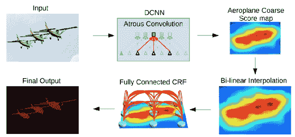
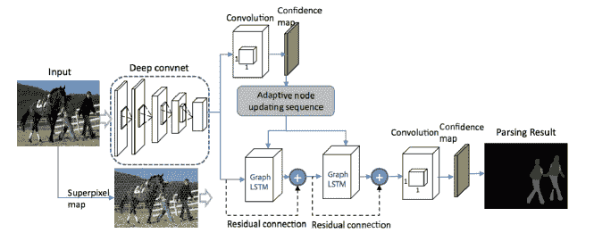

<!--yml

类别：未分类

日期：2024-09-06 20:02:54

-->

# [2001.05566] 使用深度学习的图像分割：一项综述

> 来源：[`ar5iv.labs.arxiv.org/html/2001.05566`](https://ar5iv.labs.arxiv.org/html/2001.05566)

# 使用深度学习的图像分割：

一项综述

Shervin Minaee、Yuri Boykov、Fatih Porikli、Antonio Plaza、Nasser Kehtarnavaz 和 Demetri Terzopoulos

###### 摘要

图像分割是图像处理和计算机视觉中的关键主题，应用包括场景理解、医学图像分析、机器人感知、视频监控、增强现实和图像压缩等。文献中已经开发了各种图像分割算法。最近，由于深度学习模型在广泛的视觉应用中的成功，已经有大量的研究致力于使用深度学习模型开发图像分割方法。在这项综述中，我们提供了截至本文撰写时的文献综合评述，涵盖了语义分割和实例级分割的广泛开创性工作，包括完全卷积像素标记网络、编码器-解码器架构、多尺度和金字塔方法、递归网络、视觉注意模型和对抗设置中的生成模型。我们调查了这些深度学习模型的相似性、优势和挑战，检查了最广泛使用的数据集，报告了性能，并讨论了该领域的有前景的未来研究方向。

###### 索引词：

图像分割、深度学习、卷积神经网络、编码器-解码器模型、递归模型、生成模型、语义分割、实例分割、医学图像分割。

## 1 引言

图像分割是许多视觉理解系统中的一个重要组成部分。它涉及将图像（或视频帧）划分为多个分段或对象[1]。分割在广泛的应用中扮演着核心角色[2]，包括医学图像分析（例如，肿瘤边界提取和组织体积测量）、自动驾驶车辆（例如，可导航表面和行人检测）、视频监控和增强现实等。文献中已经开发了许多图像分割算法，从最早的方法，如阈值法[3]、基于直方图的捆绑、区域生长[4]、k 均值聚类[5]、流域法[6]，到更先进的算法，如主动轮廓[7]、图割[8]、条件随机场和马尔可夫随机场[9]、以及基于稀疏性的方法[10]-[11]。然而，近年来，深度学习（DL）模型产生了一代新的图像分割模型，表现出显著的性能提升——通常在流行基准测试中达到最高准确率——从而导致了该领域的范式转变。例如，图 1 展示了一个流行深度学习模型 DeepLabv3 [12]的图像分割结果。

图 1：DeepLabV3 [12] 在样本图像上的分割结果。

图像分割可以被表述为带有语义标签的像素分类问题（语义分割）或个体对象的划分（实例分割）。语义分割对所有图像像素进行像素级标注，并提供一组对象类别（例如，人、车、树、天空），因此通常比图像分类更具挑战性，后者对整张图像预测单一标签。实例分割通过检测和勾画图像中每个感兴趣的对象（例如，划分个体）进一步扩展了语义分割的范围。

我们的综述涵盖了图像分割领域最新的文献，并讨论了截至 2019 年的 100 多种基于深度学习的分割方法。我们对这些方法的不同方面进行了全面的回顾和见解，包括训练数据、网络架构选择、损失函数、训练策略及其主要贡献。我们提供了所审阅方法性能的比较总结，并讨论了几个挑战和深度学习图像分割模型的潜在未来方向。

我们根据深度学习技术的主要贡献将相关工作分为以下几类：

1.  1.

    全卷积网络

1.  2.

    卷积模型与图形模型

1.  3.

    编码器-解码器基模型

1.  4.

    多尺度和金字塔网络模型

1.  5.

    基于 R-CNN 的模型（例如实例分割）

1.  6.

    膨胀卷积模型和 DeepLab 家族

1.  7.

    基于递归神经网络的模型

1.  8.

    基于注意力的模型

1.  9.

    生成模型与对抗训练

1.  10.

    与主动轮廓模型结合的卷积模型

1.  11.

    其他模型

本调查论文的一些主要贡献可以总结如下：

+   •

    本调查涵盖了关于分割问题的现代文献，并综述了截至 2019 年提出的 100 多种分割算法，这些算法被分为 10 个类别。

+   •

    我们提供了对使用深度学习的分割算法各个方面的全面回顾和深刻分析，包括训练数据、网络架构选择、损失函数、训练策略及其关键贡献。

+   •

    我们提供了大约 20 种流行的图像分割数据集的概述，这些数据集被分为 2D、2.5D（RGB-D）和 3D 图像。

+   •

    我们提供了对所评审方法在流行基准上的属性和性能的比较总结。

+   •

    我们提供了深度学习图像分割的若干挑战和潜在未来方向。

本调查的其余部分组织如下：第二部分提供了作为许多现代分割算法支柱的流行深度神经网络架构概述。第三部分提供了对最重要的前沿深度学习分割模型的全面概述，到 2020 年有 100 多种。我们还在这里讨论了它们的优点和对之前工作的贡献。第四部分回顾了一些最受欢迎的图像分割数据集及其特点。第 5.1 节回顾了评估深度学习分割模型的流行指标。在第 5.2 节，我们报告了这些模型的定量结果和实验性能。在第六部分，我们讨论了基于深度学习的分割方法的主要挑战和未来方向。最后，我们在第七部分中总结了我们的结论。

## 深度神经网络概述

本节概述了计算机视觉社区使用的一些最著名的深度学习架构，包括卷积神经网络（CNNs）[13]、递归神经网络（RNNs）和长短期记忆网络（LSTM）[14]、编码器-解码器[15]以及生成对抗网络（GANs）[16]。随着近年来深度学习的普及，提出了若干其他深度神经网络架构，如 transformers、胶囊网络、门控递归单元、空间变换网络等，这些内容将在这里不作讨论。

值得一提的是，在某些情况下，深度学习模型可以在新的应用/数据集上从头开始训练（假设有足够数量的标记训练数据），但在许多情况下，可能没有足够的标记数据来从头开始训练模型，这时可以使用迁移学习来解决这个问题。在迁移学习中，一个在某个任务上训练好的模型被重新用于另一个（相关的）任务，通常通过某种适应过程来完成。例如，可以考虑将一个在 ImageNet 上训练的图像分类模型调整到不同的任务，如纹理分类或人脸识别。在图像分割的情况下，许多人使用在 ImageNet（一个比大多数图像分割数据集更大的数据集）上训练的模型作为网络的编码器部分，并从这些初始权重重新训练他们的模型。这里的假设是，这些预训练的模型应该能够捕捉到图像分割所需的语义信息，从而使它们能够用更少的标记样本来训练模型。

### 2.1 卷积神经网络（CNNs）

CNNs 是深度学习社区中最成功且广泛使用的架构之一，特别是在计算机视觉任务中。CNNs 最初由福岛在其关于“Neocognitron”的开创性论文中提出[17]，其基础是由 Hubel 和 Wiesel 提出的视觉皮层的层次性接收场模型。随后，Waibel 等人[18] 引入了在时间接收场之间共享权重的 CNNs，并利用反向传播训练进行音素识别，LeCun 等人[13] 开发了用于文档识别的 CNN 架构（见图 2）。

图 2：卷积神经网络的架构。来源 [13]。

CNN 主要由三种类型的层组成：i) 卷积层，其中的核（或滤波器）通过卷积操作以提取特征；ii) 非线性层，这些层对特征图（通常是逐元素）的激活函数进行应用，以便网络能够建模非线性函数；iii) 池化层，这些层用一些关于邻域的统计信息（均值、最大值等）替换特征图的小邻域，从而减少空间分辨率。层中的单元是局部连接的；也就是说，每个单元接收来自前一层小邻域的加权输入，该邻域称为感受野。通过堆叠层形成多分辨率金字塔，高层学习来自越来越宽的感受野的特征。CNN 的主要计算优势在于同一层中的所有感受野共享权重，从而使参数数量比全连接神经网络显著减少。一些最著名的 CNN 架构包括：AlexNet [19]、VGGNet [20]、ResNet [21]、GoogLeNet [22]、MobileNet [23] 和 DenseNet [24]。

### 2.2 循环神经网络（RNNs）与长短期记忆（LSTM）

RNNs [25] 广泛用于处理序列数据，如语音、文本、视频和时间序列，其中任何给定时间/位置的数据依赖于之前遇到的数据。在每个时间戳，模型收集来自当前时间的输入 $X_{i}$ 和来自上一步的隐藏状态 $h_{i-1}$，并输出目标值和新的隐藏状态（图 3）。

图 3：简单循环神经网络的结构。

RNN 通常在处理长序列时存在问题，因为它们无法捕捉许多实际应用中的长期依赖关系（尽管在理论上没有此类限制），并且经常出现梯度消失或爆炸问题。然而，一种称为长短期记忆（LSTM）的 RNN 类型 [14] 被设计用来避免这些问题。LSTM 架构（图 4）包括三个门（输入门、输出门、遗忘门），这些门调节信息进出一个记忆单元，记忆单元可以在任意时间间隔内存储值。

图 4：标准 LSTM 模块的结构。由 Karpathy 提供。

### 2.3 编码器-解码器和自动编码器模型

编码器-解码器模型是一类通过两阶段网络将数据点从输入域映射到输出域的模型：编码器，由编码函数$z=f(x)$表示，将输入压缩为潜在空间表示；解码器$y=g(z)$，旨在从潜在空间表示中预测输出[26, 15]。这里的潜在表示本质上指的是特征（向量）表示，能够捕捉输入的基本语义信息，这些信息对于预测输出是有用的。这些模型在图像到图像翻译问题中非常流行，也用于自然语言处理中的序列到序列模型。图 5 展示了一个简单的编码器-解码器模型的框图。这些模型通常通过最小化重建损失$L(y,\hat{y})$来训练，该损失衡量了真实输出$y$与后续重建$\hat{y}$之间的差异。这里的输出可以是图像的增强版本（例如图像去模糊或超分辨率），也可以是分割图。自编码器是编码器-解码器模型的特例，其中输入和输出是相同的。

图 5：一个简单的编码器-解码器模型的架构。

### 2.4 生成对抗网络（GANs）

GANs 是一类较新的深度学习模型[16]。它们由两个网络组成——生成器和鉴别器（图 6 ‣ 2 Overview of Deep Neural Networks ‣ Image Segmentation Using Deep Learning: A Survey")）。传统 GAN 中的生成器网络 $G=z\rightarrow y$ 学习将噪声 $z$（具有先验分布）映射到目标分布 $y$，该分布类似于“真实”样本。鉴别器网络 $D$ 试图将生成的样本（“假样本”）与“真实”样本区分开。GAN 损失函数可以写成 $\mathcal{L}_{\text{GAN}}=\mathbb{E}_{x\sim p_{\text{data}}(x)}[\log D(x)]+\mathbb{E}_{z\sim p_{z}(z)}[\log(1-D(G(z)))]$。我们可以将 GAN 视为 $G$ 和 $D$ 之间的一个极小极大博弈，其中 $D$ 试图最小化其在区分假样本与真实样本中的分类错误，从而最大化损失函数，而 $G$ 试图最大化鉴别器网络的错误，从而最小化损失函数。在训练模型后，训练后的生成器模型将是 $G^{*}=\text{arg}\ \min_{G}\max_{D}\ \mathcal{L}_{\text{GAN}}$。在实践中，这个函数可能无法为有效训练 $G$ 提供足够的梯度，特别是在初期（当 $D$ 可以轻易区分假样本和真实样本时）。一个可能的解决方案是训练它以最大化 $\mathbb{E}_{z\sim p_{z}(z)}[\log(D(G(z)))]$，而不是最小化 $\mathbb{E}_{z\sim p_{z}(z)}[\log(1-D(G(z)))]$。

图 6：生成对抗网络的结构。

自从 GANs（生成对抗网络）被发明以来，研究人员已经在多种方式上致力于改进/修改 GANs。例如，Radford 等人[27] 提出了一个卷积 GAN 模型，该模型在用于图像生成时比全连接网络表现更好。Mirza[28] 提出了一个条件 GAN 模型，可以根据类别标签生成图像，从而生成具有指定标签的样本。Arjovsky 等人[29] 提出了一个基于 Wasserstein（也称为地球移动者距离）的新损失函数，以更好地估计当真实样本和生成样本的分布不重叠时的距离（因此 Kullback–Leiber 散度不是一个好的距离度量）。有关更多工作，请参阅[30]。

## 3 基于深度学习的图像分割模型

本节提供了对截至 2019 年提出的超过一百种基于深度学习的分割方法的详细回顾，这些方法被分为 10 个类别（基于其模型架构）。值得一提的是，这些研究中有一些共同的部分，如具有编码器和解码器部分、跳跃连接、多尺度分析，以及最近使用扩张卷积。因此，虽然难以提及每个工作的独特贡献，但更容易根据其对先前工作的架构贡献进行分类。除了这些模型的架构分类，还可以根据分割目标将其分为：语义分割、实例分割、全景分割和深度分割类别。但由于这些任务的工作量差异较大，我们决定遵循架构分组。

### 3.1 完全卷积网络

Long 等人 [31] 提出了第一个深度学习语义图像分割的研究之一，使用了完全卷积网络（FCN）。一个 FCN（图 7）仅包括卷积层，使其能够接受任意大小的图像，并生成相同大小的分割图。作者修改了现有的 CNN 架构，如 VGG16 和 GoogLeNet，通过将所有全连接层替换为完全卷积层，以处理非固定大小的输入和输出。因此，模型输出的是空间分割图，而不是分类分数。

图 7：一个完全卷积的图像分割网络。FCN 学习进行密集的像素级预测。来自 [31]。

通过使用跳跃连接，将模型最后几层的特征图上采样并与早期层的特征图融合（图 8），模型结合了语义信息（来自深层粗糙层）和外观信息（来自浅层精细层），以生成准确且详细的分割。该模型在 PASCAL VOC、NYUDv2 和 SIFT Flow 上进行了测试，并达到了最先进的分割性能。

图 8：跳跃连接结合了粗略的高层信息和精细的低层信息。来自 [31]。

这项工作被认为是图像分割领域的一个里程碑，展示了深度网络可以在可变尺寸的图像上以端到端的方式进行语义分割。然而，尽管它很受欢迎并且有效，但传统的 FCN 模型存在一些局限性——它的实时推理速度不够快，未能有效考虑全局上下文信息，并且不容易转移到 3D 图像。为了克服 FCN 的一些局限性，已有几项努力进行尝试。

例如，刘等人[32] 提出了一个叫做 ParseNet 的模型，以解决 FCN 忽略全局上下文信息的问题。ParseNet 通过使用每层的平均特征来增强每个位置的特征，从而将全局上下文添加到 FCN 中。一个层的特征图在整个图像上进行池化，生成一个上下文向量。这个上下文向量被归一化并反池化，以生成与初始特征图相同大小的新特征图。这些特征图随后被连接在一起。简而言之，ParseNet 是一个 FCN，其中描述的模块替代了卷积层（图 9）。

图 9: ParseNet，展示了使用额外的全局上下文来生成比 FCN（c）更平滑的分割（d）。来自[32]。

FCN 已应用于多种分割问题，如脑肿瘤分割[33]、实例感知语义分割[34]、皮肤病变分割[35]和虹膜分割[36]。

### 3.2 卷积模型与图形模型

如前所述，FCN 忽略了潜在的有用场景级语义上下文。为了整合更多上下文，几种方法将概率图模型，如条件随机场（CRF）和马尔可夫随机场（MRF），纳入深度学习架构中。

陈等人[37] 提出了基于 CNN 和全连接 CRF 组合的语义分割算法（图 10）。他们展示了深度 CNN 的最终层响应在对象分割时定位不够准确（由于 CNN 的不可变性特性使其在分类等高层任务中表现良好）。为了克服深度 CNN 的较差定位特性，他们将最终 CNN 层的响应与全连接 CRF 结合起来。他们的模型能够以比以前的方法更高的准确率定位分割边界。

图 10：一个 CNN+CRF 模型。CNN 的粗略得分图通过插值上采样，并送入全连接 CRF 以细化分割结果。来源于 [37]。

Schwing 和 Urtasun [38] 提出了一个用于图像分割的全连接深度结构网络。他们提出了一种方法，联合训练 CNN 和全连接 CRF 进行语义图像分割，并在具有挑战性的 PASCAL VOC 2012 数据集上取得了令人鼓舞的结果。在 [39] 中，Zheng 等人提出了一种将 CRF 与 CNN 集成的类似语义分割方法。

在另一项相关工作中，Lin 等人 [40] 提出了基于上下文深度 CRFs 的高效语义分割算法。他们探索了“补丁-补丁”上下文（图像区域之间）和“补丁-背景”上下文，通过利用上下文信息来改进语义分割。

Liu 等人 [41] 提出了一个语义分割算法，将丰富的信息纳入 MRFs，包括高阶关系和标签上下文的混合。与之前使用迭代算法优化 MRFs 的工作不同，他们提出了一种 CNN 模型，即 Parsing Network，它可以在单次前向传递中进行确定性端到端计算。

### 3.3 编码器-解码器基于模型

另一种流行的深度模型家族用于图像分割，是基于卷积编码器-解码器架构。大多数基于深度学习的分割工作使用某种编码器-解码器模型。我们将这些工作分为两类，一类是用于一般分割的编码器-解码器模型，另一类是用于医学图像分割的模型（以更好地区分应用）。

#### 3.3.1 一般分割的编码器-解码器模型

Noh 等人 [42] 发布了一篇早期关于基于反卷积（也称为转置卷积）的语义分割论文。他们的模型（图 11）由两部分组成，一部分是使用 VGG 16 层网络的卷积层的编码器，另一部分是反卷积网络，它以特征向量为输入并生成像素级类别概率图。反卷积网络由反卷积和反池化层组成，这些层识别像素级类别标签并预测分割掩码。

图 11：反卷积语义分割。基于 VGG 16 层网络的卷积网络之后，是一个多层反卷积网络，用于生成准确的分割图。来源于 [42]。

该网络在 PASCAL VOC 2012 数据集上取得了令人满意的性能，并且在当时获得了在没有外部数据的情况下训练的方法中最佳的准确率（72.5%）。

在另一个有前景的工作中，即 SegNet，Badrinarayanan 等人 [15] 提出了一个用于图像分割的卷积编码器-解码器架构（图 12）。与反卷积网络类似，SegNet 的核心可训练分割引擎由一个编码器网络组成，该网络在拓扑上与 VGG16 网络中的 13 个卷积层相同，以及一个相应的解码器网络，后跟一个像素级分类层。SegNet 的主要创新在于解码器如何上采样其较低分辨率的输入特征图；具体而言，它利用在相应编码器的最大池化步骤中计算的池化索引来进行非线性上采样。这消除了学习上采样的需求。然后，（稀疏）上采样图与可训练的滤波器卷积，以生成密集的特征图。与其他竞争架构相比，SegNet 的可训练参数数量也显著较少。相同作者还提出了 SegNet 的贝叶斯版本，以建模卷积编码器-解码器网络在场景分割中的固有不确定性 [43]。

图 12：SegNet 没有全连接层，因此该模型是完全卷积的。解码器使用从编码器转移来的池化索引对输入进行上采样，以生成稀疏特征图。从 [15]。

这个类别中另一个流行的模型是最近开发的分割网络——高分辨率网络（HRNet）[44] 图 13。与 DeConvNet、SegNet、U-Net 和 V-Net 中恢复高分辨率表示不同，HRNet 通过将高分辨率到低分辨率的卷积流并行连接，并在分辨率之间反复交换信息，来保持高分辨率表示。许多最新的语义分割工作通过利用上下文模型，如自注意力及其扩展，使用 HRNet 作为骨干网络。

图 13：说明 HRNet 架构。它由平行的高到低分辨率卷积流组成，并在多分辨率流之间反复交换信息。共有四个阶段。第 1 阶段包括高分辨率卷积。第 2（第 3、第 4）阶段重复两个分辨率（三个分辨率、四个分辨率）块。从 [44]。

其他一些工作采用了转置卷积或编码器-解码器用于图像分割，例如堆叠反卷积网络（SDN） [45]，Linknet [46]，W-Net [47]，以及用于 RGB-D 分割的局部敏感反卷积网络 [48]。编码器-解码器模型的一个限制是图像的细粒度信息丧失，因为通过编码过程丢失了高分辨率表示。然而，这个问题在一些最新架构中得到了改善，例如 HR-Net。

#### 3.3.2 医学和生物医学图像分割的编码器-解码器模型

有几种最初为医学/生物医学图像分割开发的模型，它们的灵感来自 FCNs 和编码器-解码器模型。U-Net [49] 和 V-Net [50] 是两个著名的此类架构，现在也被用于医学领域之外的应用。

Ronneberger 等人 [49] 提出了用于分割生物显微镜图像的 U-Net。他们的网络和训练策略依赖于数据增强来有效地从极少量的标注图像中学习。U-Net 架构（图 14）由两部分组成，一部分是收缩路径以捕获上下文，另一部分是对称的扩展路径以实现精确定位。收缩或下采样部分具有类似于 FCN 的架构，通过 $3\times 3$ 卷积提取特征。扩展或上采样部分使用上卷积（或反卷积），在减少特征图数量的同时增加其维度。网络下采样部分的特征图被复制到上采样部分，以避免丢失模式信息。最后，$1\times 1$ 卷积处理特征图以生成分类每个输入图像像素的分割图。U-Net 在 30 张透射光显微镜图像上进行训练，并在 ISBI 细胞追踪挑战赛 2015 中大幅获胜。

图 14：U-net 模型。蓝色方框表示特征图块及其指示的形状。摘自 [49]。

各种 U-Net 的扩展已经被开发用于不同类型的图像。例如，Cicek [51] 提出了用于 3D 图像的 U-Net 架构。Zhou 等人 [52] 开发了一种嵌套的 U-Net 架构。U-Net 也被应用于各种其他问题。例如，Zhang 等人 [53] 开发了一种基于 U-Net 的道路分割/提取算法。

V-Net 是另一个著名的基于全卷积网络（FCN）的模型，由 Milletari 等人[50]提出，用于 3D 医学图像分割。在模型训练中，他们引入了一种基于 Dice 系数的新目标函数，使模型能够处理前景和背景中体素数量严重不平衡的情况。该网络在前列腺的 MRI 体积上进行了端到端训练，并学习一次性预测整个体积的分割。其他相关的医学图像分割工作包括用于从胸部 CT 图像中快速自动分割肺叶的渐进式密集 V-net（PDV-Net）等，以及用于病变分割的 3D-CNN 编码器[54]。

### 3.4 多尺度和金字塔网络模型

多尺度分析是图像处理中的一个相当古老的概念，已被应用于各种神经网络架构中。其中最著名的模型之一是由 Lin 等人提出的特征金字塔网络（Feature Pyramid Network, FPN）[55]，该模型主要用于目标检测，但后来也被应用于图像分割。深度卷积神经网络（CNN）固有的多尺度金字塔层次结构被用来构建特征金字塔，额外的成本很少。为了合并低分辨率和高分辨率的特征，FPN 由一个自下而上的路径、一个自上而下的路径和横向连接组成。连接的特征图经过$3\times 3$卷积处理，生成每个阶段的输出。最后，每个自上而下路径的阶段都会生成一个预测来检测目标。对于图像分割，作者使用了两个多层感知机（MLP）来生成掩模。

Zhao 等人[56]开发了金字塔场景解析网络（Pyramid Scene Parsing Network, PSPN），这是一个多尺度网络，用于更好地学习场景的全局上下文表示（图 15）。不同的模式从输入图像中提取，使用残差网络（ResNet）作为特征提取器，以及膨胀网络。这些特征图随后被输入到金字塔池化模块中，以区分不同尺度的模式。它们在四个不同的尺度下进行池化，每个尺度对应一个金字塔层，并通过$1\times 1$卷积层来减少其维度。金字塔层的输出被上采样，并与初始特征图连接，以捕捉局部和全局上下文信息。最后，使用卷积层生成像素级预测。

图 15：PSPN 架构。一个 CNN 生成特征图，金字塔池化模块聚合不同的子区域表示。通过上采样和拼接形成最终特征表示，然后通过卷积获得最终的逐像素预测。来源 [56]。

Ghiasi 和 Fowlkes [57] 开发了一种基于拉普拉斯金字塔的多分辨率重建架构，该架构利用来自高分辨率特征图的跳跃连接和乘法门控来逐步细化从低分辨率图重建的分割边界。他们展示了尽管卷积特征图的表观空间分辨率较低，但高维特征表示包含了显著的亚像素定位信息。

其他使用多尺度分析进行分割的模型包括 DM-Net（动态多尺度滤波网络）[58]、上下文对比网络和门控多尺度聚合（CCN）[59]、自适应金字塔上下文网络（APC-Net）[60]、多尺度上下文交织（MSCI）[61]和显著性物体分割[62]。

### 3.5 基于 R-CNN 的模型（用于实例分割）

区域卷积网络（R-CNN）及其扩展（Fast R-CNN、Faster R-CNN、Masked-RCNN）在物体检测应用中取得了成功。特别是，Faster R-CNN [63] 架构（图 16）用于物体检测的区域提议网络（RPN）提出边界框候选。RPN 提取感兴趣区域（RoI），RoIPool 层从这些提议中计算特征，以推断边界框坐标和物体类别。R-CNN 的一些扩展被广泛用于解决实例分割问题，即同时执行物体检测和语义分割的任务。

图 16：Faster R-CNN 架构。图片来源 [63]。

在该模型的一个扩展中，何等人 [64] 提出了一个用于对象实例分割的 Mask R-CNN，该模型在许多 COCO 挑战中超越了所有先前的基准。该模型有效地检测图像中的对象，同时为每个实例生成高质量的分割掩码。Mask R-CNN 本质上是一个带有 3 个输出分支的 Faster R-CNN（图 17）——第一个计算边界框坐标，第二个计算相关类别，第三个计算二进制掩码以分割对象。Mask R-CNN 损失函数将边界框坐标、预测类别和分割掩码的损失结合在一起，并共同训练它们。图 18 显示了 Mask-RCNN 在一些样本图像上的结果。

图 17：用于实例分割的 Mask R-CNN 架构。摘自 [64]。

图 18：Mask R-CNN 在 COCO 测试集样本图像上的结果。摘自 [64]。

刘等人提出的路径聚合网络（PANet）[65] 基于 Mask R-CNN 和 FPN 模型（图 19）。该网络的特征提取器使用了具有增强的自下而上的路径的新 FPN 架构，改进了低层特征的传播。第三路径的每个阶段将上一阶段的特征图作为输入，并通过 $3\times 3$ 卷积层处理。输出通过横向连接与自上而下路径的相同阶段特征图相加，这些特征图输入到下一阶段。与 Mask R-CNN 相同，适应性特征池化层的输出连接到三个分支。前两个使用全连接层生成边界框坐标预测和相关的对象类别。第三个使用 FCN 处理 RoI 以预测对象掩码。

图 19：路径聚合网络。 (a) FPN 主干。 (b) 自下而上的路径增强。 (c) 适应性特征池化。 (d) 边框分支。 (e) 全连接融合。 由 [65] 提供。

Dai 等人 [66] 开发了一个多任务网络，用于实例感知语义分割，该网络由三个分别进行实例区分、掩码估计和对象分类的网络组成。这些网络形成了一个级联结构，设计上共享卷积特征。Hu 等人 [67] 提出了一个新的部分监督训练范式，并结合了一个新型的权重转移函数，使得可以在一个大类别集合上训练实例分割模型，其中所有类别都有框注释，但只有一小部分有掩码注释。

Chen 等人 [68] 开发了一个实例分割模型 MaskLab（图 20 ‣ 3 DL-Based Image Segmentation Models ‣ Image Segmentation Using Deep Learning: A Survey")），通过基于 Faster R-CNN 的语义和方向特征来改进对象检测。该模型产生三个输出：框检测、语义分割和方向预测。在 Faster-RCNN 对象检测器的基础上，预测的框提供了对象实例的准确定位。在每个感兴趣区域内，MaskLab 通过结合语义和方向预测来执行前景/背景分割。

图 20：MaskLab 模型。MaskLab 生成三个输出——改进的框预测（来自 Faster R-CNN）、用于像素级分类的语义分割对数值和用于预测每个像素朝向其实例中心方向的方向预测对数值。来源于 [68]。

另一个有趣的模型是 Tensormask，由 Chen 等人 [69] 提出，基于密集滑动窗口实例分割。他们将密集实例分割视为 4D 张量上的预测任务，并提出了一个通用框架，允许在 4D 张量上进行新型操作。他们展示了张量视图相对于基线的大幅提升，并且结果与 Mask R-CNN 相当。TensorMask 在密集对象分割上取得了有希望的结果。

基于 R-CNN 开发了许多其他实例分割模型，例如用于掩码提议的模型，包括 R-FCN [70]、DeepMask [71]、PolarMask [72]、边界感知实例分割 [73] 和 CenterMask [74]。值得注意的是，还有一个有前景的研究方向试图通过学习底层分割的分组线索来解决实例分割问题，例如 Deep Watershed Transform [75]、实时实例分割 [76] 和通过深度度量学习的语义实例分割 [77]。

### 3.6 膨胀卷积模型及 DeepLab 系列

膨胀卷积（即“atrous”卷积）引入了一个额外的参数，即膨胀率。信号 $x(i)$ 的膨胀卷积（图 21）定义为 $y_{i}=\sum_{k=1}^{K}x[i+rk]w[k]$，其中 $r$ 是膨胀率，它定义了卷积核 $w$ 的权重之间的间距。例如，一个膨胀率为 2 的 $3\times 3$ 卷积核将具有与 $5\times 5$ 卷积核相同大小的接收场，同时只使用 9 个参数，从而在不增加计算成本的情况下扩大了接收场。膨胀卷积在实时分割领域中非常流行，许多最近的出版物报告了这种技术的使用。一些最重要的包括 DeepLab 家族 [78]，多尺度上下文聚合 [79]，密集上采样卷积和混合膨胀卷积（DUC-HDC） [80]，密集连接的 Atrous Spatial Pyramid Pooling（DenseASPP） [81]，以及高效神经网络（ENet） [82]。

图 21：膨胀卷积。不同膨胀率下的 $3\times 3$ 卷积核。

DeepLabv1 [37] 和 DeepLabv2 [78] 是一些最受欢迎的图像分割方法，由 Chen 等人开发。后者有三个关键特性。第一是使用膨胀卷积来解决网络中分辨率降低的问题（由最大池化和步幅引起）。第二是 Atrous Spatial Pyramid Pooling (ASPP)，它通过在多个采样率下使用滤波器探测输入的卷积特征层，从而捕获多尺度的对象以及图像上下文，以稳健地分割多尺度的对象。第三是通过结合深度 CNN 和概率图模型的方法来改进对象边界的定位。最佳的 DeepLab（使用 ResNet-101 作为骨干网络）在 2012 年 PASCAL VOC 挑战中达到了 79.7%的 mIoU 分数，在 PASCAL-Context 挑战中达到了 45.7%的 mIoU 分数，在 Cityscapes 挑战中达到了 70.4%的 mIoU 分数。图 22 说明了 Deeplab 模型，其类似于 [37]，主要区别在于使用了膨胀卷积和 ASPP。

图 22：DeepLab 模型。采用如 VGG-16 或 ResNet-101 的 CNN 模型，以全卷积方式使用膨胀卷积。双线性插值阶段将特征图放大至原始图像分辨率。最后，完全连接的 CRF 对分割结果进行优化，以更好地捕捉物体边界。来源 [78]

随后，Chen 等人 [12] 提出了 DeepLabv3，结合了级联和并行的膨胀卷积模块。并行卷积模块在 ASPP 中分组。ASPP 中添加了$1\times 1$卷积和批量归一化。所有输出都被串联并由另一个$1\times 1$卷积处理，以创建每个像素的最终输出 logits。

2018 年，Chen 等人 [83] 发布了 Deeplabv3+，采用编码器-解码器架构（图 23），包括可分离的膨胀卷积，由深度卷积（对输入的每个通道进行空间卷积）和逐点卷积（$1\times 1$卷积，深度卷积作为输入）组成。他们使用 DeepLabv3 框架作为编码器。最相关的模型具有修改版的 Xception 骨干网，增加了更多层，采用膨胀深度可分离卷积代替最大池化和批量归一化。在 COCO 和 JFT 数据集上预训练的最佳 DeepLabv3+在 2012 年 PASCAL VOC 挑战赛中获得了 89.0%的 mIoU 得分。

图 23：DeepLabv3+模型。来源 [83]。

### 3.7 基于递归神经网络的模型

虽然 CNN 非常适合计算机视觉问题，但它们并不是唯一的选择。RNN 在建模像素间的短期/长期依赖关系方面很有用，可以（潜在地）改善分割图的估计。通过使用 RNN，像素可以被连接在一起并按顺序处理，以建模全局上下文并改善语义分割。然而，一个挑战是图像的自然二维结构。

Visin 等人 [84] 提出了一个基于 RNN 的语义分割模型，称为 ReSeg。该模型主要基于另一项工作 ReNet [85]，后者是为图像分类开发的。每个 ReNet 层由四个 RNN 组成，它们在水平和垂直方向上扫掠图像，编码补丁/激活，并提供相关的全局信息。为了使用 ReSeg 模型进行图像分割（图 24），ReNet 层堆叠在预训练的 VGG-16 卷积层上，这些层提取通用局部特征。随后是上采样层，以在最终预测中恢复原始图像分辨率。使用门控递归单元（GRU），因为它们在内存使用和计算能力之间提供了良好的平衡。

图 24：ReSeg 模型。未显示预训练的 VGG-16 特征提取网络。来自 [84]。

在另一项研究中，Byeon 等人 [86] 使用长短期记忆（LSTM）网络开发了场景图像的像素级分割和分类。他们研究了用于自然场景图像的二维（2D）LSTM 网络，考虑了标签的复杂空间依赖性。在这项工作中，分类、分割和上下文集成都由 2D LSTM 网络完成，从而使纹理和空间模型参数可以在单个模型中进行学习。

梁等人[87]提出了一种基于图长短期记忆（Graph LSTM）网络的语义分割模型，这是 LSTM 从顺序数据或多维数据推广到一般图结构数据的一个扩展。与现有多维 LSTM 结构（例如行、网格和对角 LSTM）将图像均匀划分为像素或补丁不同，他们将每个任意形状的超像素视为语义一致的节点，并自适应地为图像构建无向图，其中超像素的空间关系自然地用作边。图 25 展示了传统像素级 RNN 模型和图-LSTM 模型的视觉对比。为了将 Graph LSTM 模型适应于语义分割（图 26），在卷积层上附加了基于超像素图的 LSTM 层，以增强具有全局结构上下文的视觉特征。卷积特征通过$1\times 1$卷积滤波器生成所有标签的初始置信度图。后续 Graph LSTM 层的节点更新序列由基于初始置信度图的置信度驱动方案确定，然后 Graph LSTM 层可以顺序更新所有超像素节点的隐藏状态。

图 25：图-LSTM 模型与传统像素级 RNN 模型的比较。来源于[87]。

图 26：用于语义分割的图-LSTM 模型。来源于[87]。

Xiang 和 Fox[88]提出了数据关联递归神经网络（DA-RNNs），用于联合 3D 场景映射和语义标注。DA-RNNs 使用一种新的递归神经网络架构在 RGB-D 视频上进行语义标注。网络的输出与如 Kinect-Fusion 等映射技术集成，以将语义信息注入重建的 3D 场景中。

胡等人[89]开发了一种基于自然语言表达的语义分割算法，使用 CNN 编码图像和 LSTM 编码自然语言描述的组合。这不同于在预定义的语义类别集合上进行的传统语义分割，例如，短语“两个男人坐在右边的长椅上”只需要分割右边长椅上的两个个人，而不涉及站立或坐在其他长椅上的人。为了生成像素级分割以匹配语言表达，他们提出了一种端到端可训练的递归和卷积模型，该模型共同学习处理视觉和语言信息（图 27）。在考虑的模型中，使用递归 LSTM 网络将指称表达编码为向量表示，使用 FCN 从图像中提取空间特征图，并输出目标对象的空间响应图。该模型的一个示例分割结果（对于查询“穿蓝色外套的人”）如图 28 所示。

图 27：自然语言表达的 CNN+LSTM 架构。来自[89]。

图 28：为查询“穿蓝色外套的人”生成的分割掩模。来自[89]。

RNN 基于模型的一个限制是，由于这些模型的顺序性质，它们的速度比 CNN 对应模型慢，因为这种顺序计算不容易并行化。

### 3.8 基于注意力的模型

多年来，注意力机制在计算机视觉领域得到了持续探索，因此发现应用这些机制于语义分割的出版物也就不足为奇了。

陈等人[90]提出了一种注意力机制，能够在每个像素位置上学习柔性加权多尺度特征。他们调整了一种强大的语义分割模型，并与多尺度图像和注意力模型共同训练（图 29）。注意力机制优于平均和最大池化，并使模型能够评估不同位置和尺度下特征的重要性。

图 29：基于注意力的语义分割模型。注意力模型学习为不同尺度的对象分配不同的权重；例如，模型为来自尺度 1.0 的特征分配较大的权重给小型人（绿色虚线圆圈），为来自尺度 0.5 的特征分配较大的权重给大型儿童（洋红色虚线圆圈）。来自 [90]。

与其他工作中训练卷积分类器以学习标记对象的代表性语义特征不同，Huang 等人 [91] 提出了使用反向注意力机制的语义分割方法。他们的反向注意力网络（RAN）架构（图 30）训练模型捕捉相反的概念（即，与目标类别无关的特征）。RAN 是一个三分支网络，能够同时执行直接和反向注意力学习过程。

图 30：用于分割的反向注意力网络。来自 [91]。

Li 等人 [92] 开发了一个用于语义分割的金字塔注意力网络。该模型利用了全局上下文信息在语义分割中的影响。他们结合了注意力机制和空间金字塔，以提取用于像素标记的精确密集特征，而不是复杂的扩张卷积和人工设计的解码器网络。

最近，Fu 等人 [93] 提出了一个用于场景分割的双重注意力网络，该网络可以基于自注意力机制捕捉丰富的上下文依赖关系。具体来说，他们在扩张的全卷积网络（FCN）上附加了两种类型的注意力模块，分别建模空间和通道维度中的语义相互依赖关系。位置注意力模块通过对所有位置的特征加权求和，选择性地聚合每个位置的特征。

其他各种工作探索了用于语义分割的注意力机制，例如 OCNet [94] 提出了受自注意力机制启发的对象上下文池化，Expectation-Maximization Attention (EMANet) [95]，交叉注意力网络 (CCNet) [96]，具有递归注意力的端到端实例分割 [97]，用于场景解析的点对点空间注意力网络 [98]，以及判别特征网络 (DFN) [99]，该网络包括两个子网络：一个平滑网络（包含一个通道注意力块和全局平均池化，用于选择更具判别性的特征）和一个边界网络（使边界的双边特征可区分）。

### 3.9 生成模型和对抗训练

自从它们被引入以来，GAN 已被应用于计算机视觉的广泛任务，也被用于图像分割。

Luc 等人 [100] 提出了用于语义分割的对抗训练方法。他们训练了一个卷积语义分割网络（图 31），以及一个对抗网络，该网络用于区分真实分割图和由分割网络生成的图。他们展示了对抗训练方法在斯坦福背景和 PASCAL VOC 2012 数据集上的准确性有所提高。

图 31: 用于语义分割的 GAN。来自 [100]。

Souly 等人 [101] 提出了使用 GAN 的半弱监督语义分割方法。该方法包括一个生成器网络，为多类别分类器提供额外的训练样本，该分类器在 GAN 框架中充当判别器，给样本分配 $K$ 个可能类别中的一个标签，或将其标记为伪样本（额外类别）。

在另一项工作中，Hung 等人 [102] 开发了一个使用对抗网络的半监督语义分割框架。他们设计了一个 FCN 判别器，以区分预测概率图和真实分割分布，同时考虑空间分辨率。该模型考虑的损失函数包含三个部分：分割真实标签的交叉熵损失、判别器网络的对抗损失，以及基于置信度图的半监督损失；即判别器的输出。

Xue 等人 [103] 提出了一个具有多尺度 L1 损失的对抗网络，用于医学图像分割。他们使用 FCN 作为分割器生成分割标签图，并提出了一种新颖的对抗评论网络，该网络具有多尺度 L1 损失函数，迫使评论器和分割器学习捕捉像素之间长短距离空间关系的全局和局部特征。

其他各种出版物报告了基于对抗训练的分割模型，例如使用 GAN 的细胞图像分割 [104]，以及对象不可见部分的分割和生成 [105]。

### 3.10 活动轮廓模型的 CNN 模型

FCNs 与主动轮廓模型（ACMs）之间协同效应的探索[7]最近引起了研究兴趣。一种方法是制定新的损失函数，灵感来自 ACM 原理。例如，受到[106]全球能量公式的启发，Chen 等人[107]提出了一种监督式损失层，在 FCN 训练期间结合了预测掩膜的面积和大小信息，并解决了心脏 MRI 中的心室分割问题。

另一种方法最初旨在仅将 ACM 用作 FCN 输出的后处理器，并且有几个尝试通过预训练 FCN 来进行适度的共同学习。例如，Le 等人[108]在自然图像语义分割任务中提出了 ACM 后处理器的工作，其中级别集 ACMs 被实现为 RNNs。Rupprecht 等人的深度主动轮廓[109]是另一个例子。对于医学图像分割，Hatamizadeh 等人[110]提出了一种集成的深度主动病变分割（DALS）模型，该模型训练 FCN 主干以预测新型局部参数化级别集能量泛函的参数函数。在另一个相关的努力中，Marcos 等人[111]提出了深度结构化主动轮廓（DSAC），该方法结合了 ACMs 和预训练的 FCNs，在结构化预测框架中进行实例分割（尽管需要手动初始化）。对于相同的应用，Cheng 等人[112]提出了深度主动射线网络（DarNet），该方法类似于 DSAC，但使用基于极坐标的不同显式 ACM 公式来防止轮廓自交。Hatamizadeh 等人最近引入了一种真正的端到端反向传播可训练的全集成 FCN-ACM 组合，称为深度卷积主动轮廓（DCAC）[113]。

### 3.11 其他模型

除了上述模型，还有一些其他流行的深度学习架构用于分割，如：使用基础特征提取器并将特征图输入到上下文编码模块的上下文编码网络（EncNet） [114]。RefineNet [115]，这是一个多路径细化网络，明确利用下采样过程中的所有可用信息，通过长距离残差连接实现高分辨率预测。Seednet [116]，引入了一种自动种子生成技术，结合深度强化学习，学习解决交互式分割问题。 “对象上下文表示” (OCR) [44]，在真实标签的监督下学习对象区域，计算对象区域表示，以及每个像素与每个对象区域之间的关系，并用对象上下文表示增强表示像素。其他模型还包括 BoxSup [117]、图卷积网络 [118]、Wide ResNet [119]、Exfuse（增强低级和高级特征融合） [120]、Feedforward-Net [121]、用于测地视频分割的显著性感知模型 [122]、双图像分割（DIS） [123]、FoveaNet（透视感知场景解析） [124]、Ladder DenseNet [125]、双边分割网络（BiSeNet） [126]、用于场景解析的语义预测指导（SPGNet） [127]、门控形状 CNNs [128]、自适应上下文网络（AC-Net） [129]、动态结构语义传播网络（DSSPN） [130]、符号图推理（SGR） [131]、CascadeNet [132]、尺度自适应卷积（SAC） [133]、统一感知解析（UperNet） [134]、通过重新训练和自我训练进行分割 [135]、密集连接神经架构搜索 [136] 和层次化多尺度注意力 [137]。

全景分割 [138] 也是一个引人注目的分割问题，近年来逐渐受到关注，目前已有若干有趣的工作在这一方向上，包括全景特征金字塔网络 [139]、用于全景分割的注意力引导网络 [140]、无缝场景分割 [141]、全景深度实验室 [142]、统一全景分割网络 [143] 和高效全景分割 [144]。

图 32 说明了自 2014 年以来流行的基于 DL 的语义分割和实例分割的时间线。鉴于近年来开发了大量工作，我们仅展示了一些最具代表性的工作。

图 32: 从 2014 年到 2020 年的 2D 图像的 DL-based 分割算法时间线。橙色、绿色和黄色块分别表示语义分割、实例分割和全景分割算法。

## 4 图像分割数据集

本节总结了一些最广泛使用的图像分割数据集。我们将这些数据集分为 3 类——2D 图像、2.5D RGB-D（彩色+深度）图像和 3D 图像，并提供有关每个数据集特征的详细信息。列出的数据集具有像素级标签，可用于评估模型性能。

值得一提的是，其中一些工作使用数据增强来增加标记样本的数量，特别是处理小型数据集的工作（例如医学领域）。数据增强通过对图像（即输入图像和分割图）应用一系列变换（无论是在数据空间、特征空间，还是有时两者兼而有之）来增加训练样本的数量。一些典型的变换包括平移、反射、旋转、变形、缩放、色彩空间转换、裁剪和主成分投影。数据增强已被证明可以提高模型的性能，特别是在从有限的数据集中学习时，例如医学图像分析中的数据集。它还可以在实现更快的收敛、减少过拟合的可能性和增强泛化能力方面发挥作用。对于一些小型数据集，数据增强已被证明可以将模型性能提升超过 20%。

### 4.1 2D 数据集

大多数图像分割研究集中于 2D 图像，因此有许多 2D 图像分割数据集可用。以下是一些最受欢迎的数据集：

PASCAL Visual Object Classes (VOC) [145] 是计算机视觉领域中最受欢迎的数据集之一，提供了 5 种任务的标注图像——分类、分割、检测、动作识别和人员布局。几乎所有文献中报告的流行分割算法都在该数据集上进行了评估。对于分割任务，有 21 类物体标签——车辆、家庭用品、动物、飞机、自行车、船、公共汽车、汽车、摩托车、火车、瓶子、椅子、餐桌、盆栽植物、沙发、电视/显示器、鸟、猫、牛、狗、马、羊和人（如果像素不属于这些类别中的任何一种，则标记为背景）。该数据集分为两个子集，训练集和验证集，分别包含 1,464 张和 1,449 张图像。实际挑战中还有一个私人测试集。图 33 显示了一个示例图像及其像素级标签。

图 33：来自 PASCAL VOC 数据集的示例图像。来源 [146]

PASCAL Context [147] 是对 PASCAL VOC 2010 检测挑战的扩展，包含所有训练图像的像素级标签。它包含超过 400 个类别（包括 PASCAL VOC 分割中的原始 20 个类别加上背景），分为三类（物体、材料和混合体）。该数据集的许多物体类别过于稀疏，因此通常选择 59 个常见类别的子集进行使用。

Microsoft Common Objects in Context (MS COCO) [148] 是另一个大规模的目标检测、分割和标注数据集。COCO 包含复杂日常场景的图像，展示了常见物体在自然背景中的样子。该数据集包含 91 种物体类型的照片，共有 250 万标注实例，分布在 328,000 张图像中。图 34 显示了 MS-COCO 标签与之前数据集在给定样本图像中的区别。检测挑战包括 80 多个类别，为训练提供了超过 82,000 张图像，为验证提供了 40,500 张图像，并为测试集提供了超过 80,000 张图像。

图 34：COCO 中的一个示例图像及其分割图，并与之前的数据集进行比较。来源 [148]。

Cityscapes [149] 是一个大型数据库，专注于城市街道场景的语义理解。它包含在 50 个城市街道场景中录制的多样化立体视频序列，提供了 5k 帧的高质量逐像素注释，以及 20k 帧的弱标注。它包括 30 类的语义和密集像素注释，分为 8 个类别——平面表面、人类、车辆、建筑、物体、自然、天空和空洞。图 35 显示了来自该数据集的四个样本分割图。

图 35：来自 Cityscapes 数据集的三个样本图像及其对应的分割图。来源 [149]。

ADE20K / MIT Scene Parsing (SceneParse150) 提供了一个标准的训练和评估平台，用于场景解析算法。该基准的数据来自 ADE20K 数据集 [132]，该数据集包含超过 20K 张以场景为中心的图像，逐一标注了对象及其部件。基准分为 20K 张用于训练，2K 张用于验证，以及另一批用于测试的图像。该数据集有 150 个语义类别。

SiftFlow [150] 包括来自 LabelMe 数据库子集的 2,688 张注释图像。这些 $256\times 256$ 像素图像基于 8 种不同的户外场景，包括街道、山脉、田野、海滩和建筑。所有图像属于 33 个语义类别中的一种。

Stanford background [151] 包含来自现有数据集（如 LabelMe、MSRC 和 PASCAL VOC）的户外场景图像。该数据集包含 715 张至少有一个前景对象的图像。数据集是逐像素注释的，可用于语义场景理解。该数据集的语义和几何标签是通过亚马逊的 Mechanical Turk (AMT) 获得的。

Berkeley Segmentation Dataset (BSD) [152] 包含 12,000 个由 30 名人类受试者对 1,000 张 Corel 数据集图像进行的手工标注分割。它旨在为图像分割和边界检测研究提供实证基础。半数的分割是通过向受试者呈现彩色图像获得的，另一半则通过呈现灰度图像获得。

Youtube-Objects [153] 包含了从 YouTube 收集的视频，这些视频包括了来自十个 PASCAL VOC 类别的物体（飞机、鸟类、船、汽车、猫、牛、狗、马、摩托车和火车）。原始数据集没有包含逐像素的注释（因为它最初是为物体检测开发的，注释较弱）。然而，Jain 等人[154] 手动注释了 126 个序列的一个子集，然后提取了一部分帧以进一步生成语义标签。总共有约 10,167 帧 480x360 像素的注释图像在这个数据集中可用。

KITTI [155] 是最受欢迎的移动机器人和自动驾驶数据集之一。它包含了数小时的交通场景视频，这些视频是通过各种传感器（包括高分辨率 RGB、灰度立体相机和 3D 激光扫描仪）录制的。原始数据集没有提供语义分割的地面真相，但研究人员已经手动注释了部分数据集以供研究使用。例如，Alvarez 等人[156] 为道路检测挑战生成了 323 张图像的地面真相，分为道路、垂直和天空 3 类。

其他数据集也可用于图像分割目的，例如语义边界数据集（SBD）[157]、PASCAL Part [158]、SYNTHIA [159] 和 Adobe 的肖像分割数据集[160]。

### 4.2 2.5D 数据集

随着廉价测距扫描仪的出现，RGB-D 图像在研究和工业应用中变得越来越流行。以下 RGB-D 数据集是一些最受欢迎的数据集：

NYU-D V2 [161] 包含了来自各种室内场景的视频序列，这些序列是由微软 Kinect 的 RGB 和深度相机录制的。数据集中包括了来自 3 个城市的超过 450 个场景的 1,449 对对齐的 RGB 和深度图像，每个物体都被标注了类别和实例编号（例如，cup1, cup2, cup3 等）。它还包含了 407,024 帧未标注的图像。与其他现有的数据集相比，该数据集相对较小。图 36 展示了一个样本图像及其分割图。

图 36：来自 NYU V2 数据集的样本。从左到右：RGB 图像、预处理的深度图和标签集。来自[161]。

SUN-3D [162] 是一个大规模的 RGB-D 视频数据集，包含了在 41 栋不同建筑中的 254 个不同空间捕获的 415 个序列；其中 8 个序列已经被注释，未来会有更多序列进行注释。每个注释的帧都附有场景中物体的语义分割信息，以及相机姿态的信息。

SUN RGB-D [163] 提供了一个 RGB-D 基准，用于推动所有主要场景理解任务的最新技术。它由四种不同的传感器捕获，包含 10,000 张 RGB-D 图像，规模类似于 PASCAL VOC。整个数据集密集注释，包括 146,617 个 2D 多边形和 58,657 个 3D 边界框，具有准确的对象方向，以及场景的 3D 房间类别和布局。

UW RGB-D Object Dataset [164] 包含 300 个常见的家用物体，使用 Kinect 风格的 3D 相机记录。这些物体被组织成 51 个类别，按 WordNet 上下位关系排列（类似于 ImageNet）。该数据集使用 Kinect 风格的 3D 相机记录，能够同步并对齐 $640\times 480$ 像素的 RGB 和深度图像，采样率为 30 Hz。该数据集还包括 8 个注释的自然场景视频序列，包含数据集中对象（UW RGB-D Scenes Dataset）。

ScanNet [165] 是一个 RGB-D 视频数据集，包含 250 万个视图，来自 1,500 多个扫描，注释有 3D 相机姿态、表面重建和实例级语义分割。为了收集这些数据，设计了一个易于使用和可扩展的 RGB-D 捕获系统，包括自动表面重建，语义注释则通过众包方式完成。利用这些数据在多个 3D 场景理解任务中实现了最新的性能，包括 3D 对象分类、语义体素标记和 CAD 模型检索。

### 4.3 3D 数据集

3D 图像数据集在机器人、医学图像分析、3D 场景分析和建筑应用中非常受欢迎。三维图像通常通过网格或其他体积表示（如点云）提供。这里，我们提到一些流行的 3D 数据集。

Stanford 2D-3D: 该数据集提供了来自 2D、2.5D 和 3D 领域的多种互相注册的模式，具有实例级的语义和几何注释[166]，并且在 6 个室内区域中收集。它包含超过 70,000 张 RGB 图像，以及相应的深度、表面法线、语义注释、全球 XYZ 图像以及相机信息。

ShapeNet Core: ShapeNetCore 是完整 ShapeNet 数据集的一个子集[167]，包含单一干净的 3D 模型和手动验证的类别及对齐注释[168]。

## 5 性能评估

在本节中，我们首先总结了一些用于评估分割模型性能的流行指标，然后提供了有前景的基于 DL 的分割模型在流行数据集上的定量性能。

### 5.1 分割模型指标

理想情况下，模型应从多个方面进行评估，如定量准确性、速度（推断时间）和存储需求（内存占用）。然而，到目前为止，大多数研究工作主要关注评估模型准确性的指标。下面我们总结了评估分割算法准确性的最流行指标。虽然定量指标用于在基准测试中比较不同模型，但模型输出的视觉质量在决定哪个模型最佳时也很重要（因为人类是许多计算机视觉应用开发模型的最终用户）。

像素准确性简单地计算正确分类像素的比率，除以总像素数。对于 $K+1$ 类（$K$ 前景类别和背景），像素准确性定义如公式 1 所示：

|  | $\text{PA}=\frac{\sum_{i=0}^{K}p_{ii}}{\sum_{i=0}^{K}\sum_{j=0}^{K}p_{ij}},$ |  | (1) |
| --- | --- | --- | --- |

其中 $p_{ij}$ 是预测为属于类别 $j$ 的类别 $i$ 的像素数。

Mean Pixel Accuracy (MPA) 是 PA 的扩展版本，其中正确像素的比率是按类别计算的，然后对类别总数取平均，如公式 2 所示：

|  | $\text{MPA}=\frac{1}{K+1}\sum_{i=0}^{K}\frac{p_{ii}}{\sum_{j=0}^{K}p_{ij}}.$ |  | (2) |
| --- | --- | --- | --- |

Intersection over Union (IoU) 或 Jaccard 指数是语义分割中最常用的指标之一。它被定义为预测分割图与真实情况之间的交集面积，除以预测分割图与真实情况之间的并集面积：

|  | $\text{IoU}=J(A,B)=\frac{&#124;A\cap B&#124;}{&#124;A\cup B&#124;},$ |  | (3) |
| --- | --- | --- | --- |

其中 $A$ 和 $B$ 分别表示真实情况和预测分割图。其范围在 0 和 1 之间。

Mean-IoU 是另一个流行的指标，定义为所有类别的平均 IoU。它在报告现代分割算法的性能时被广泛使用。

Precision / Recall / F1 score 是用于报告许多经典图像分割模型准确性的流行指标。Precision 和 recall 可以为每个类别定义，也可以在总体水平上定义，如下所示：

|  | Precision | $\displaystyle=\frac{\text{TP}}{\text{TP}+\text{FP}},\ \ \text{Recall}$ | $\displaystyle=\frac{\text{TP}}{\text{TP}+\text{FN}},$ |  | (4) |
| --- | --- | --- | --- | --- | --- |

其中 TP 指的是真正例率，FP 指的是假正例率，而 FN 指的是假负例率。通常我们关注的是精确度和召回率的综合版本。一种常用的指标是 F1 分数，它被定义为精确度和召回率的调和均值：

|  | $\text{F1-score}=\frac{2\ \text{Prec}\ \text{Rec}}{\text{Prec}+\text{Rec}}.$ |  | (5) |
| --- | --- | --- | --- |

Dice 系数是另一种用于图像分割的流行指标（在医学图像分析中更为常用），它可以定义为预测图和真实图的重叠区域的两倍，除以两个图像的总像素数。Dice 系数与 IoU 非常相似：

|  | $\text{Dice}=\frac{2\lvert A\cap B\rvert}{\lvert A\rvert+\lvert B\rvert}.$ |  | (6) |
| --- | --- | --- | --- |

当应用于布尔数据（例如，二值分割图），并将前景视为正类时，Dice 系数本质上等同于 F1 分数，定义见公式 7：

|  | $\text{Dice}=\frac{2\text{TP}}{2\text{TP}+\text{FP}+\text{FN}}=\text{F1}.$ |  | (7) |
| --- | --- | --- | --- |

### 5.2 基于深度学习的模型的定量性能

在这一部分，我们列出了之前讨论的几个算法在流行的分割基准测试中的表现。值得提到的是，尽管大多数模型报告了它们在标准数据集上的表现并使用标准指标，但其中一些未能做到这一点，这使得全面比较变得困难。此外，只有一小部分出版物以可重复的方式提供了额外的信息，如执行时间和内存占用，这对工业应用中的分割模型（如无人机、自动驾驶汽车、机器人等）非常重要，这些应用可能在具有有限计算能力和存储的嵌入式消费设备上运行，因此快速、轻量级的模型至关重要。

表 I：PASCAL VOC 测试集上的分割模型准确率。（* 指模型在另一个数据集（如 MS-COCO、ImageNet 或 JFT-300M）上预训练。）

| 方法 | 主干网络 | mIoU |
| --- | --- | --- |
| FCN [31] | VGG-16 | 62.2 |
| CRF-RNN [39] | - | 72.0 |
| CRF-RNN^∗ [39] | - | 74.7 |
| BoxSup* [117] | - | 75.1 |
| Piecewise^∗ [40] | - | 78.0 |
| DPN^∗ [41] | - | 77.5 |
| DeepLab-CRF [78] | ResNet-101 | 79.7 |
| GCN^∗ [118] | ResNet-152 | 82.2 |
| RefineNet [115] | ResNet-152 | 84.2 |
| Wide ResNet [119] | WideResNet-38 | 84.9 |
| PSPNet [56] | ResNet-101 | 85.4 |
| DeeplabV3 [12] | ResNet-101 | 85.7 |
| PSANet [98] | ResNet-101 | 85.7 |
| EncNet [114] | ResNet-101 | 85.9 |
| DFN^∗ [99] | ResNet-101 | 86.2 |
| Exfuse [120] | ResNet-101 | 86.2 |
| SDN* [45] | DenseNet-161 | 86.6 |
| DIS [123] | ResNet-101 | 86.8 |
| DM-Net^∗ [58] | ResNet-101 | 87.06 |
| APC-Net^∗ [60] | ResNet-101 | 87.1 |
| EMANet [95] | ResNet-101 | 87.7 |
| DeeplabV3+ [83] | Xception-71 | 87.8 |
| Exfuse [120] | ResNeXt-131 | 87.9 |
| MSCI [61] | ResNet-152 | 88.0 |
| EMANet [95] | ResNet-152 | 88.2 |
| DeeplabV3+^∗ [83] | Xception-71 | 89.0 |
| EfficientNet+NAS-FPN [135] | - | 90.5 |

以下表格总结了几种著名的基于 DL 的分割模型在不同数据集上的性能。表 I 侧重于 PASCAL VOC 测试集。显然，自 FCN 首次推出以来，模型的准确性有了很大的提升，它是第一个基于 DL 的图像分割模型。表 II 关注 Cityscape 测试数据集。最新的模型在该数据集上相对初始 FCN 模型提高了约 23%。表 III 关注了 MS COCO stuff 测试集。该数据集比 PASCAL VOC 和 Cityescapes 更具挑战性，最高的 mIoU 约为 40%。表 IV 侧重于 ADE20k 验证集。该数据集也比 PASCAL VOC 和 Cityescapes 数据集更具挑战性。

表 V 提供了 COCO test-dev 2017 数据集中突出的实例分割算法的性能，以平均精度和速度为指标。表 VI 提供了 MS-COCO val 数据集中突出的全景分割算法的性能，以全景质量为指标[138]。最后，表 VII 总结了 NYUD-v2 和 SUN-RGBD 数据集上几个突出模型的 RGB-D 分割性能。

表 II：Cityescapes 数据集上分割模型的准确性。

| 方法 | 主干 | mIoU |
| --- | --- | --- |
| FCN-8s [31] | - | 65.3 |
| DPN [41] | - | 66.8 |
| Dilation10 [79] | - | 67.1 |
| DeeplabV2 [78] | ResNet-101 | 70.4 |
| RefineNet [115] | ResNet-101 | 73.6 |
| FoveaNet [124] | ResNet-101 | 74.1 |
| 梯度密集网络 [125] | 梯度密集网络-169 | 73.7 |
| GCN [118] | ResNet-101 | 76.9 |
| DUC-HDC [80] | ResNet-101 | 77.6 |
| Wide ResNet [119] | WideResNet-38 | 78.4 |
| PSPNet [56] | ResNet-101 | 85.4 |
| BiSeNet [126] | ResNet-101 | 78.9 |
| DFN [99] | ResNet-101 | 79.3 |
| PSANet [98] | ResNet-101 | 80.1 |
| DenseASPP [81] | DenseNet-161 | 80.6 |
| SPGNet [127] | 2xResNet-50 | 81.1 |
| DANet [93] | ResNet-101 | 81.5 |
| CCNet [96] | ResNet-101 | 81.4 |
| DeeplabV3 [12] | ResNet-101 | 81.3 |
| AC-Net [129] | ResNet-101 | 82.3 |
| OCR [44] | ResNet-101 | 82.4 |
| GS-CNN [128] | WideResNet | 82.8 |
| HRNetV2+OCR (w/ASPP) [44] | HRNetV2-W48 | 83.7 |
| Hierarchical MSA [137] | HRNet-OCR | 85.1 |

表 III：MS COCO stuff 数据集上的分割模型准确率

| 方法 | 主干网络 | mIoU |
| --- | --- | --- |
| RefineNet [115] | ResNet-101 | 33.6 |
| CCN [59] | 梯度密集网络-101 | 35.7 |
| DANet [93] | ResNet-50 | 37.9 |
| DSSPN [130] | ResNet-101 | 37.3 |
| EMA-Net [95] | ResNet-50 | 37.5 |
| SGR [131] | ResNet-101 | 39.1 |
| OCR [44] | ResNet-101 | 39.5 |
| DANet [93] | ResNet-101 | 39.7 |
| EMA-Net [95] | ResNet-50 | 39.9 |
| AC-Net [129] | ResNet-101 | 40.1 |
| OCR [44] | HRNetV2-W48 | 40.5 |

表 IV：ADE20k 验证数据集上的分割模型准确率

| 方法 | 主干网络 | mIoU |
| --- | --- | --- |
| FCN [31] | - | 29.39 |
| DilatedNet [79] | - | 32.31 |
| CascadeNet [132] | - | 34.9 |
| RefineNet [115] | ResNet-152 | 40.7 |
| PSPNet [56] | ResNet-101 | 43.29 |
| PSPNet [56] | ResNet-269 | 44.94 |
| EncNet [114] | ResNet-101 | 44.64 |
| SAC [133] | ResNet-101 | 44.3 |
| PSANet [98] | ResNet-101 | 43.7 |
| UperNet [134] | ResNet-101 | 42.66 |
| DSSPN [130] | ResNet-101 | 43.68 |
| DM-Net [58] | ResNet-101 | 45.5 |
| AC-Net [129] | ResNet-101 | 45.9 |

表 V：COCO test-dev 2017 实例分割模型性能

| 方法 | 主干网络 | FPS | AP |
| --- | --- | --- | --- |
| YOLACT-550 [76] | R-101-FPN | 33.5 | 29.8 |
| YOLACT-700 [76] | R-101-FPN | 23.8 | 31.2 |
| RetinaMask [170] | R-101-FPN | 10.2 | 34.7 |
| TensorMask [69] | R-101-FPN | 2.6 | 37.1 |
| SharpMask [171] | R-101-FPN | 8.0 | 37.4 |
| Mask-RCNN [64] | R-101-FPN | 10.6 | 37.9 |
| CenterMask [74] | R-101-FPN | 13.2 | 38.3 |

表 VI：MS-COCO val 数据集上的全景分割模型性能。$*$ 表示使用了可变形卷积。

| 方法 | 主干网络 | PQ |
| --- | --- | --- |
| Panoptic FPN [139] | ResNet-50 | 39.0 |
| Panoptic FPN [139] | ResNet-101 | 40.3 |
| AU-Net [140] | ResNet-50 | 39.6 |
| Panoptic-DeepLab [142] | Xception-71 | 39.7 |
| OANet [172] | ResNet-50 | 39.0 |
| OANet [172] | ResNet-101 | 40.7 |
| AdaptIS [173] | ResNet-50 | 35.9 |
| AdaptIS [173] | ResNet-101 | 37.0 |
| UPSNet^∗ [143] | ResNet-50 | 42.5 |
| OCFusion^∗ [174] | ResNet-50 | 41.3 |
| OCFusion^∗ [174] | ResNet-101 | 43.0 |
| OCFusion^∗ [174] | ResNeXt-101 | 45.7 |

表 VII：NYUD-v2 和 SUN-RGBD 数据集上的分割模型性能，按 mIoU 和平均准确度 (mAcc) 进行评估。

|  | NYUD-v2 | SUN-RGBD |
| --- | --- | --- |
| 方法 | m-Acc | m-IoU | m-Acc | m-IoU |
| --- | --- | --- | --- | --- |
| Mutex [175] | - | 31.5 | - | - |
| MS-CNN [176] | 45.1 | 34.1 | - | - |
| FCN [31] | 46.1 | 34.0 | - | - |
| Joint-Seg [177] | 52.3 | 39.2 | - | - |
| SegNet [15] | - | - | 44.76 | 31.84 |
| Structured Net [40] | 53.6 | 40.6 | 53.4 | 42.3 |
| B-SegNet [43] | - | - | 45.9 | 30.7 |
| 3D-GNN [178] | 55.7 | 43.1 | 57.0 | 45.9 |
| LSD-Net [48] | 60.7 | 45.9 | 58.0 | - |
| RefineNet [115] | 58.9 | 46.5 | 58.5 | 45.9 |
| D-aware CNN [179] | 61.1 | 48.4 | 53.5 | 42.0 |
| RDFNet [180] | 62.8 | 50.1 | 60.1 | 47.7 |
| G-Aware Net [181] | 68.7 | 59.6 | 74.9 | 54.5 |
| MTI-Net [181] | 68.7 | 59.6 | 74.9 | 54.5 |

总结表格数据，过去 5-6 年深度分割模型的性能有了显著进展，在不同数据集上的 mIoU 相对提高了 25%-42%。然而，一些出版物因多种原因缺乏可重复性——它们报告了非标准基准/数据库上的性能，或仅报告了流行基准测试集的任意子集上的性能，或未充分描述实验设置，有时仅在部分目标类别上评估模型性能。最重要的是，许多出版物没有提供其模型实现的源代码。然而，随着深度学习模型的日益流行，趋势已变得积极，许多研究小组正在转向可重复的框架并开源他们的实现。

## 6 个挑战和机遇

毫无疑问，图像分割从深度学习中受益匪浅，但仍面临若干挑战。我们将接下来介绍一些有前景的研究方向，我们相信这些方向将有助于进一步推动图像分割算法的发展。

### 6.1 更具挑战性的数据集

已经创建了多个大规模图像数据集用于语义分割和实例分割。然而，仍然需要更具挑战性的数据集，以及用于不同类型图像的数据集。对于静态图像，具有大量对象和重叠对象的数据集将非常有价值。这可以使训练模型更好地处理密集对象场景以及现实世界中常见的大面积重叠。

随着 3D 图像分割的日益流行，特别是在医学图像分析中，对大规模 3D 图像数据集的需求也越来越强烈。这些数据集的创建比其低维对应物更为困难。现有的 3D 图像分割数据集通常不够大，有些是合成的，因此更大、更具挑战性的 3D 图像数据集可能非常宝贵。

### 6.2 可解释的深度模型

尽管基于深度学习的模型在挑战性基准测试上取得了有希望的表现，但这些模型仍存在开放性问题。例如，深度模型到底在学习什么？我们应如何解释这些模型学到的特征？在给定数据集上实现某种分割准确性的最小神经网络架构是什么？尽管有一些技术可以可视化这些模型学到的卷积核，但对这些模型的基本行为/动态的具体研究仍然不足。更好地理解这些模型的理论方面可以促使更好的模型发展，针对各种分割场景进行优化。

### 6.3 弱监督和无监督学习

弱监督（也称为少样本学习）[182]和无监督学习[183]正成为非常活跃的研究领域。这些技术对图像分割特别有价值，因为在许多应用领域中，收集用于分割问题的标记样本是有问题的，特别是在医学图像分析中。迁移学习的方法是先在大量标记样本（可能来自公共基准）上训练一个通用图像分割模型，然后在来自某些特定目标应用的少量样本上对该模型进行微调。自监督学习是另一个前景广阔的方向，在各个领域都受到广泛关注。通过自监督学习，可以利用图像中的许多细节来训练分割模型，从而使用更少的训练样本。基于强化学习的模型也可能是未来的潜在方向，因为它们在图像分割中几乎没有受到关注。例如，MOREL [184] 引入了一种用于视频中移动物体分割的深度强化学习方法。

### 6.4 各种应用的实时模型

在许多应用中，准确性是最重要的因素；然而，有些应用中，拥有能够接近实时运行的分割模型或至少接近常见相机帧率（至少每秒 25 帧）也是至关重要的。这对例如部署在自动驾驶汽车中的计算机视觉系统非常有用。目前的大多数模型远未达到这一帧率；例如，FCN-8 处理低分辨率图像大约需要 100 毫秒。基于膨胀卷积的模型在一定程度上有助于提高分割模型的速度，但仍有很大的改进空间。

### 6.5 内存高效模型

许多现代分割模型即使在推理阶段也需要大量内存。迄今为止，大部分努力都集中在提高这些模型的准确性上，但为了将它们适配到特定设备，如手机，网络必须简化。这可以通过使用更简单的模型、模型压缩技术，甚至训练一个复杂的模型然后使用知识蒸馏技术将其压缩成一个更小的、内存高效的网络来模仿复杂模型。

### 6.6 3D 点云分割

众多研究集中于 2D 图像分割，但 3D 点云分割关注较少。然而，对点云分割的兴趣日益增加，它在 3D 建模、自动驾驶汽车、机器人技术、建筑建模等领域有广泛的应用。处理 3D 无序和非结构化数据（如点云）面临诸多挑战。例如，如何将 CNN 及其他经典深度学习架构应用于点云尚不明确。基于图的深度模型可能成为点云分割的潜在探索领域，促进这些数据的额外工业应用。

### 6.7 应用场景

在本节中，我们简要探讨了近期基于深度学习的分割方法的一些应用场景及面临的一些挑战。尤其是，这些方法已成功应用于遥感领域的卫星图像分割[185]，包括城市规划[186]或精准农业[187]的技术。通过航空平台[188]和无人机[189]收集的遥感图像也已采用深度学习技术进行分割，提供了解决气候变化等重要环境问题的机会。分割这类图像的主要挑战与数据的极大维度（通常由成像光谱仪收集，具有数百甚至数千个光谱波段）以及用于评估分割算法结果准确性的有限真实信息有关。另一个非常重要的深度学习分割应用领域是医学影像[190]。在这里，一个机会是设计标准化的图像数据库，以评估新兴传染病和大流行病的快速传播。最后但同样重要的是，我们还应提到深度学习分割技术在生物学[191]和建筑材料评估[192]中的应用，它们提供了解决高度相关应用领域的机会，但也面临与相关图像数据的大量体积和验证目的的有限参考信息有关的挑战。

## 7 结论

我们调查了 100 多种基于深度学习模型的最新图像分割算法，这些算法在各种图像分割任务和基准测试中表现出色，分为十个类别，如：CNN 和 FCN、RNN、R-CNN、膨胀 CNN、基于注意力的模型、生成对抗模型等。我们总结了这些模型在一些流行基准测试上的定量性能分析，如 PASCAL VOC、MS COCO、Cityscapes 和 ADE20k 数据集。最后，我们讨论了一些开放挑战和未来几年可以研究的图像分割方向。

## 致谢

作者感谢 Google Brain 的 Tsung-Yi Lin，以及 Microsoft Research Asia 的 Jingdong Wang 和 Yuhui Yuan，感谢他们审阅此工作并提供了非常有用的评论和建议。

## 参考文献

+   [1] R. Szeliski，*计算机视觉：算法与应用*，Springer 科学与商业媒体，2010 年。

+   [2] D. Forsyth 和 J. Ponce，*计算机视觉：一种现代方法*，Prentice Hall 专业技术参考，2002 年。

+   [3] N. Otsu，“一种基于灰度级直方图的阈值选择方法”，*IEEE 系统、男人与控制论学报*，第 9 卷，第 1 期，页 62–66，1979 年。

+   [4] R. Nock 和 F. Nielsen，“统计区域合并”，*IEEE 模式分析与机器智能学报*，第 26 卷，第 11 期，页 1452–1458，2004 年。

+   [5] N. Dhanachandra, K. Manglem 和 Y. J. Chanu，“使用 k-means 聚类算法和减法聚类算法的图像分割”，*Procedia 计算机科学*，第 54 卷，页 764–771，2015 年。

+   [6] L. Najman 和 M. Schmitt，“连续函数的分水岭”，*信号处理*，第 38 卷，第 1 期，页 99–112，1994 年。

+   [7] M. Kass, A. Witkin 和 D. Terzopoulos，“蛇形：活动轮廓模型”，*国际计算机视觉杂志*，第 1 卷，第 4 期，页 321–331，1988 年。

+   [8] Y. Boykov, O. Veksler 和 R. Zabih，“通过图割进行快速近似能量最小化”，*IEEE 模式分析与机器智能学报*，第 23 卷，第 11 期，页 1222–1239，2001 年。

+   [9] N. Plath, M. Toussaint 和 S. Nakajima，“利用条件随机场和全局分类的多类图像分割”，见 *第 26 届年度国际机器学习大会论文集*，ACM，2009 年，页 817–824。

+   [10] J.-L. Starck, M. Elad 和 D. L. Donoho，“通过稀疏表示与变分方法结合的图像分解”，*IEEE 图像处理学报*，第 14 卷，第 10 期，页 1570–1582，2005 年。

+   [11] S. Minaee 和 Y. Wang，“一种基于子空间表示的掩蔽信号分解的 ADMM 方法”，*IEEE 图像处理学报*，第 28 卷，第 7 期，页 3192–3204，2019 年。

+   [12] L.-C. Chen, G. Papandreou, F. Schroff 和 H. Adam，“重新思考用于语义图像分割的空洞卷积”，*arXiv 预印本 arXiv:1706.05587*，2017 年。

+   [13] Y. LeCun, L. Bottou, Y. Bengio, P. Haffner *等*，“应用梯度学习于文档识别”，*IEEE 学报*，第 86 卷，第 11 期，页 2278–2324，1998 年。

+   [14] S. Hochreiter 和 J. Schmidhuber，“长短期记忆”，*神经计算*，第 9 卷，第 8 期，页 1735–1780，1997 年。

+   [15] V. Badrinarayanan, A. Kendall 和 R. Cipolla，“Segnet: 一种用于图像分割的深度卷积编码-解码器架构”，*IEEE 模式分析与机器智能学报*，第 39 卷，第 12 期，页 2481–2495，2017 年。

+   [16] I. Goodfellow, J. Pouget-Abadie, M. Mirza, B. Xu, D. Warde-Farley, S. Ozair, A. Courville 和 Y. Bengio, “生成对抗网络，” 见于 *神经信息处理系统进展*，2014 年，第 2672–2680 页。

+   [17] K. Fukushima, “Neocognitron: 一种自组织神经网络模型，用于不受位置偏移影响的模式识别机制，” *生物控制论*，第 36 卷，第 4 期，第 193–202 页，1980 年。

+   [18] A. Waibel, T. Hanazawa, G. Hinton, K. Shikano 和 K. J. Lang, “使用时间延迟神经网络的音素识别，” *IEEE 声学、语音与信号处理学报*，第 37 卷，第 3 期，第 328–339 页，1989 年。

+   [19] A. Krizhevsky, I. Sutskever 和 G. E. Hinton, “使用深度卷积神经网络的 ImageNet 分类，” 见于 *神经信息处理系统进展*，2012 年，第 1097–1105 页。

+   [20] K. Simonyan 和 A. Zisserman, “用于大规模图像识别的非常深卷积网络，” *arXiv 预印本 arXiv:1409.1556*，2014 年。

+   [21] K. He, X. Zhang, S. Ren 和 J. Sun, “用于图像识别的深度残差学习，” 见于 *IEEE 计算机视觉与模式识别会议论文集*，2016 年，第 770–778 页。

+   [22] C. Szegedy, W. Liu, Y. Jia, P. Sermanet, S. Reed, D. Anguelov, D. Erhan, V. Vanhoucke 和 A. Rabinovich, “更深的卷积网络，” 见于 *IEEE 计算机视觉与模式识别会议论文集*，2015 年，第 1–9 页。

+   [23] A. G. Howard, M. Zhu, B. Chen, D. Kalenichenko, W. Wang, T. Weyand, M. Andreetto 和 H. Adam, “Mobilenets: 用于移动视觉应用的高效卷积神经网络，” *arXiv 预印本 arXiv:1704.04861*，2017 年。

+   [24] G. Huang, Z. Liu, L. Van Der Maaten 和 K. Q. Weinberger, “密集连接卷积网络，” 见于 *IEEE 计算机视觉与模式识别会议论文集*，2017 年，第 4700–4708 页。

+   [25] D. E. Rumelhart, G. E. Hinton, R. J. Williams *等*，“通过反向传播错误学习表示，” *认知建模*，第 5 卷，第 3 期，第 1 页，1988 年。

+   [26] I. Goodfellow, Y. Bengio 和 A. Courville, *深度学习*。 MIT 出版社，2016 年。

+   [27] A. Radford, L. Metz 和 S. Chintala, “使用深度卷积生成对抗网络的无监督表示学习，” *arXiv 预印本 arXiv:1511.06434*，2015 年。

+   [28] M. Mirza 和 S. Osindero, “条件生成对抗网络，” *arXiv 预印本 arXiv:1411.1784*，2014 年。

+   [29] M. Arjovsky, S. Chintala 和 L. Bottou, “Wasserstein gan，” *arXiv 预印本 arXiv:1701.07875*，2017 年。

+   [30] [`github.com/hindupuravinash/the-gan-zoo`](https://github.com/hindupuravinash/the-gan-zoo)。

+   [31] J. Long, E. Shelhamer 和 T. Darrell, “用于语义分割的全卷积网络，” 见于 *IEEE 计算机视觉与模式识别会议论文集*，2015 年，第 3431–3440 页。

+   [32] W. Liu, A. Rabinovich 和 A. C. Berg, “Parsenet: 通过更宽视角来提升效果，” *arXiv 预印本 arXiv:1506.04579*，2015 年。

+   [33] G. Wang, W. Li, S. Ourselin, 和 T. Vercauteren, “使用级联各向异性卷积神经网络进行自动脑肿瘤分割”，发表于 *国际 MICCAI 脑病变研讨会*。Springer，2017 年，第 178–190 页。

+   [34] Y. Li, H. Qi, J. Dai, X. Ji, 和 Y. Wei, “完全卷积的实例感知语义分割”，发表于 *IEEE 计算机视觉与模式识别会议论文集*，2017 年，第 2359–2367 页。

+   [35] Y. Yuan, M. Chao, 和 Y.-C. Lo, “使用深度完全卷积网络和 Jaccard 距离进行自动皮肤病变分割”，*IEEE 医学成像交易*，第 36 卷，第 9 期，第 1876–1886 页，2017 年。

+   [36] N. Liu, H. Li, M. Zhang, J. Liu, Z. Sun, 和 T. Tan, “在非合作环境中使用完全卷积网络进行准确的虹膜分割”，发表于 *2016 年国际生物识别会议（ICB）*。IEEE，2016 年，第 1–8 页。

+   [37] L.-C. Chen, G. Papandreou, I. Kokkinos, K. Murphy, 和 A. L. Yuille, “使用深度卷积网络和完全连接的条件随机场进行语义图像分割”，*arXiv 预印本 arXiv:1412.7062*，2014 年。

+   [38] A. G. Schwing 和 R. Urtasun, “完全连接的深度结构网络”，*arXiv 预印本 arXiv:1503.02351*，2015 年。

+   [39] S. Zheng, S. Jayasumana, B. Romera-Paredes, V. Vineet, Z. Su, D. Du, C. Huang, 和 P. H. Torr, “将条件随机场视作递归神经网络”，发表于 *IEEE 国际计算机视觉会议论文集*，2015 年，第 1529–1537 页。

+   [40] G. Lin, C. Shen, A. Van Den Hengel, 和 I. Reid, “高效的深度结构模型的逐片训练用于语义分割”，发表于 *IEEE 计算机视觉与模式识别会议论文集*，2016 年，第 3194–3203 页。

+   [41] Z. Liu, X. Li, P. Luo, C.-C. Loy, 和 X. Tang, “通过深度解析网络进行语义图像分割”，发表于 *IEEE 国际计算机视觉会议论文集*，2015 年，第 1377–1385 页。

+   [42] H. Noh, S. Hong, 和 B. Han, “为语义分割学习去卷积网络”，发表于 *IEEE 国际计算机视觉会议论文集*，2015 年，第 1520–1528 页。

+   [43] A. Kendall, V. Badrinarayanan, 和 R. Cipolla, “贝叶斯 SegNet：用于场景理解的深度卷积编码器-解码器架构中的模型不确定性”，*arXiv 预印本 arXiv:1511.02680*，2015 年。

+   [44] Y. Yuan, X. Chen, 和 J. Wang, “用于语义分割的对象上下文表示”，*arXiv 预印本 arXiv:1909.11065*，2019 年。

+   [45] J. Fu, J. Liu, Y. Wang, J. Zhou, C. Wang, 和 H. Lu, “堆叠去卷积网络用于语义分割”，*IEEE 图像处理交易*，2019 年。

+   [46] A. Chaurasia 和 E. Culurciello, “Linknet：利用编码器表示进行高效的语义分割”，发表于 *2017 年 IEEE 视觉通信与图像处理会议（VCIP）*。IEEE，2017 年，第 1–4 页。

+   [47] X. Xia 和 B. Kulis, “W-net：一种完全无监督的图像分割深度模型”，*arXiv 预印本 arXiv:1711.08506*，2017 年。

+   [48] Y. Cheng, R. Cai, Z. Li, X. Zhao, 和 K. Huang，“具有门控融合的局部敏感去卷积网络用于 rgb-d 室内语义分割”，在*IEEE 计算机视觉与模式识别会议论文集*，2017 年，第 3029–3037 页。

+   [49] O. Ronneberger, P. Fischer, 和 T. Brox，“U-net：用于生物医学图像分割的卷积网络”，在*医学图像计算与计算机辅助干预国际会议*，Springer，2015 年，第 234–241 页。

+   [50] F. Milletari, N. Navab, 和 S.-A. Ahmadi，“V-net：用于体积医学图像分割的全卷积神经网络”，在*2016 第四届国际 3D 视觉会议（3DV）*，IEEE，2016 年，第 565–571 页。

+   [51] Ö. Çiçek, A. Abdulkadir, S. S. Lienkamp, T. Brox, 和 O. Ronneberger，“3d u-net：从稀疏标注学习密集体积分割”，在*医学图像计算与计算机辅助干预国际会议*，Springer，2016 年，第 424–432 页。

+   [52] Z. Zhou, M. M. R. Siddiquee, N. Tajbakhsh, 和 J. Liang，“Unet++：一种用于医学图像分割的嵌套 u-net 架构”，在*医学图像分析中的深度学习与临床决策支持的多模态学习*，Springer，2018 年，第 3–11 页。

+   [53] Z. Zhang, Q. Liu, 和 Y. Wang，“深度残差 u-net 进行道路提取”，*IEEE 地球科学与遥感快报*，第 15 卷，第 5 期，第 749–753 页，2018 年。

+   [54] T. Brosch, L. Y. Tang, Y. Yoo, D. K. Li, A. Traboulsee, 和 R. Tam，“具有快捷连接的深度 3d 卷积编码器网络用于多尺度特征集成，应用于多发性硬化病变分割”，*IEEE 医学影像学事务*，第 35 卷，第 5 期，第 1229–1239 页，2016 年。

+   [55] T.-Y. Lin, P. Dollár, R. Girshick, K. He, B. Hariharan, 和 S. Belongie，“用于物体检测的特征金字塔网络”，在*IEEE 计算机视觉与模式识别会议论文集*，2017 年，第 2117–2125 页。

+   [56] H. Zhao, J. Shi, X. Qi, X. Wang, 和 J. Jia，“金字塔场景解析网络”，在*IEEE 计算机视觉与模式识别会议论文集*，2017 年，第 2881–2890 页。

+   [57] G. Ghiasi 和 C. C. Fowlkes，“用于语义分割的拉普拉斯金字塔重建与精细化”，在*欧洲计算机视觉会议*，Springer，2016 年，第 519–534 页。

+   [58] J. He, Z. Deng, 和 Y. Qiao，“用于语义分割的动态多尺度滤波器”，在*IEEE 国际计算机视觉会议论文集*，2019 年，第 3562–3572 页。

+   [59] H. Ding, X. Jiang, B. Shuai, A. Qun Liu, 和 G. Wang，“用于场景分割的上下文对比特征和门控多尺度聚合”，在*IEEE 计算机视觉与模式识别会议论文集*，2018 年，第 2393–2402 页。

+   [60] J. He, Z. Deng, L. Zhou, Y. Wang, 和 Y. Qiao，“用于语义分割的自适应金字塔上下文网络”，在*计算机视觉与模式识别会议*，2019 年，第 7519–7528 页。

+   [61] D. Lin, Y. Ji, D. Lischinski, D. Cohen-Or, 和 H. Huang, “语义分割中的多尺度上下文交织,” 在 *欧洲计算机视觉会议论文集 (ECCV)*, 2018, 第 603–619 页。

+   [62] G. Li, Y. Xie, L. Lin, 和 Y. Yu, “实例级显著物体分割,” 在 *IEEE 计算机视觉与模式识别会议论文集*, 2017, 第 2386–2395 页。

+   [63] S. Ren, K. He, R. Girshick, 和 J. Sun, “Faster r-cnn: 朝着实时物体检测与区域建议网络,” 在 *神经信息处理系统进展*, 2015, 第 91–99 页。

+   [64] K. He, G. Gkioxari, P. Dollár, 和 R. Girshick, “Mask r-cnn,” 在 *IEEE 国际计算机视觉会议论文集*, 2017, 第 2961–2969 页。

+   [65] S. Liu, L. Qi, H. Qin, J. Shi, 和 J. Jia, “用于实例分割的路径聚合网络,” 在 *IEEE 计算机视觉与模式识别会议论文集*, 2018, 第 8759–8768 页。

+   [66] J. Dai, K. He, 和 J. Sun, “通过多任务网络级联的实例感知语义分割,” 在 *IEEE 计算机视觉与模式识别会议论文集*, 2016, 第 3150–3158 页。

+   [67] R. Hu, P. Dollár, K. He, T. Darrell, 和 R. Girshick, “学习分割所有物体,” 在 *IEEE 计算机视觉与模式识别会议论文集*, 2018, 第 4233–4241 页。

+   [68] L.-C. Chen, A. Hermans, G. Papandreou, F. Schroff, P. Wang, 和 H. Adam, “Masklab: 通过语义和方向特征细化物体检测的实例分割,” 在 *IEEE 计算机视觉与模式识别会议论文集*, 2018, 第 4013–4022 页。

+   [69] X. Chen, R. Girshick, K. He, 和 P. Dollár, “Tensormask: 密集物体分割的基础,” *arXiv 预印本 arXiv:1903.12174*, 2019。

+   [70] J. Dai, Y. Li, K. He, 和 J. Sun, “R-fcn: 通过基于区域的全卷积网络进行物体检测,” 在 *神经信息处理系统进展*, 2016, 第 379–387 页。

+   [71] P. O. Pinheiro, R. Collobert, 和 P. Dollár, “学习分割物体候选,” 在 *神经信息处理系统进展*, 2015, 第 1990–1998 页。

+   [72] E. Xie, P. Sun, X. Song, W. Wang, X. Liu, D. Liang, C. Shen, 和 P. Luo, “Polarmask: 单次实例分割与极坐标表示,” *arXiv 预印本 arXiv:1909.13226*, 2019。

+   [73] Z. Hayder, X. He, 和 M. Salzmann, “边界感知实例分割,” 在 *IEEE 计算机视觉与模式识别会议论文集*, 2017, 第 5696–5704 页。

+   [74] Y. Lee 和 J. Park, “Centermask: 实时无锚点实例分割,” 在 *IEEE/CVF 计算机视觉与模式识别会议论文集*, 2020, 第 13,906–13,915 页。

+   [75] M. Bai 和 R. Urtasun, “深度分水岭变换用于实例分割,” 在 *IEEE 计算机视觉与模式识别会议论文集*, 2017, 第 5221–5229 页。

+   [76] D. Bolya, C. Zhou, F. Xiao, 和 Y. J. Lee, “Yolact: 实时实例分割，” 见于 *IEEE 国际计算机视觉会议论文集*，2019 年，第 9157–9166 页。

+   [77] A. Fathi, Z. Wojna, V. Rathod, P. Wang, H. O. Song, S. Guadarrama, 和 K. P. Murphy, “通过深度度量学习进行语义实例分割，” *arXiv 预印本 arXiv:1703.10277*，2017 年。

+   [78] L.-C. Chen, G. Papandreou, I. Kokkinos, K. Murphy, 和 A. L. Yuille, “DeepLab: 使用深度卷积网络、空洞卷积和全连接 CRF 进行语义图像分割，” *IEEE 模式分析与机器智能学报*，第 40 卷，第 4 期，第 834–848 页，2017 年。

+   [79] F. Yu 和 V. Koltun, “通过扩张卷积进行多尺度上下文聚合，” *arXiv 预印本 arXiv:1511.07122*，2015 年。

+   [80] P. Wang, P. Chen, Y. Yuan, D. Liu, Z. Huang, X. Hou, 和 G. Cottrell, “理解卷积在语义分割中的作用，” 见于 *冬季计算机视觉应用会议*，IEEE，2018 年，第 1451–1460 页。

+   [81] M. Yang, K. Yu, C. Zhang, Z. Li, 和 K. Yang, “用于街景语义分割的 DenseASPP，” 见于 *IEEE 计算机视觉与模式识别会议论文集*，2018 年，第 3684–3692 页。

+   [82] A. Paszke, A. Chaurasia, S. Kim, 和 E. Culurciello, “Enet: 用于实时语义分割的深度神经网络架构，” *arXiv 预印本 arXiv:1606.02147*，2016 年。

+   [83] L.-C. Chen, Y. Zhu, G. Papandreou, F. Schroff, 和 H. Adam, “具有空洞可分离卷积的编码器-解码器用于语义图像分割，” 见于 *欧洲计算机视觉会议（ECCV）论文集*，2018 年，第 801–818 页。

+   [84] F. Visin, M. Ciccone, A. Romero, K. Kastner, K. Cho, Y. Bengio, M. Matteucci, 和 A. Courville, “Reseg: 基于递归神经网络的语义分割模型，” 见于 *IEEE 计算机视觉与模式识别会议论文集*，2016 年，第 41–48 页。

+   [85] F. Visin, K. Kastner, K. Cho, M. Matteucci, A. Courville, 和 Y. Bengio, “Renet: 递归神经网络作为卷积网络的替代方案，” *arXiv 预印本 arXiv:1505.00393*，2015 年。

+   [86] W. Byeon, T. M. Breuel, F. Raue, 和 M. Liwicki, “使用 LSTM 递归神经网络进行场景标注，” 见于 *IEEE 计算机视觉与模式识别会议*，2015 年，第 3547–3555 页。

+   [87] X. Liang, X. Shen, J. Feng, L. Lin, 和 S. Yan, “使用图形 LSTM 进行语义对象解析，” 见于 *欧洲计算机视觉会议*，Springer，2016 年，第 125–143 页。

+   [88] Y. Xiang 和 D. Fox, “Da-rnn: 使用数据关联递归神经网络进行语义映射，” *arXiv:1703.03098*，2017 年。

+   [89] R. Hu, M. Rohrbach, 和 T. Darrell, “基于自然语言表达的分割，” 见于 *欧洲计算机视觉会议*，Springer，2016 年，第 108–124 页。

+   [90] L.-C. Chen, Y. Yang, J. Wang, W. Xu 和 A. L. Yuille，"注意尺度: 规模感知的语义图像分割"，发表于 *IEEE 计算机视觉与模式识别会议论文集*，2016 年，页码 3640–3649。

+   [91] Q. Huang, C. Xia, C. Wu, S. Li, Y. Wang, Y. Song 和 C.-C. J. Kuo，"具有反向注意力的语义分割"，*arXiv 预印本 arXiv:1707.06426*，2017 年。

+   [92] H. Li, P. Xiong, J. An 和 L. Wang，"用于语义分割的金字塔注意力网络"，*arXiv 预印本 arXiv:1805.10180*，2018 年。

+   [93] J. Fu, J. Liu, H. Tian, Y. Li, Y. Bao, Z. Fang 和 H. Lu，"用于场景分割的双重注意力网络"，发表于 *IEEE 计算机视觉与模式识别会议论文集*，2019 年，页码 3146–3154。

+   [94] Y. Yuan 和 J. Wang，"Ocnet: 用于场景解析的对象上下文网络"，*arXiv 预印本 arXiv:1809.00916*，2018 年。

+   [95] X. Li, Z. Zhong, J. Wu, Y. Yang, Z. Lin 和 H. Liu，"期望最大化注意力网络用于语义分割"，发表于 *IEEE 国际计算机视觉会议论文集*，2019 年，页码 9167–9176。

+   [96] Z. Huang, X. Wang, L. Huang, C. Huang, Y. Wei 和 W. Liu，"Ccnet: 用于语义分割的交叉注意力"，发表于 *IEEE 国际计算机视觉会议论文集*，2019 年，页码 603–612。

+   [97] M. Ren 和 R. S. Zemel，"端到端实例分割与递归注意力"，发表于 *IEEE 计算机视觉与模式识别会议论文集*，2017 年，页码 6656–6664。

+   [98] H. Zhao, Y. Zhang, S. Liu, J. Shi, C. Change Loy, D. Lin 和 J. Jia，"Psanet: 点对点空间注意力网络用于场景解析"，发表于 *欧洲计算机视觉会议（ECCV）论文集*，2018 年，页码 267–283。

+   [99] C. Yu, J. Wang, C. Peng, C. Gao, G. Yu 和 N. Sang，"学习用于语义分割的区分特征网络"，发表于 *IEEE 计算机视觉与模式识别会议论文集*，2018 年，页码 1857–1866。

+   [100] P. Luc, C. Couprie, S. Chintala 和 J. Verbeek，"使用对抗网络进行语义分割"，*arXiv 预印本 arXiv:1611.08408*，2016 年。

+   [101] N. Souly, C. Spampinato 和 M. Shah，"使用生成对抗网络的半监督语义分割"，发表于 *IEEE 国际计算机视觉会议论文集*，2017 年，页码 5688–5696。

+   [102] W.-C. Hung, Y.-H. Tsai, Y.-T. Liou, Y.-Y. Lin 和 M.-H. Yang，"用于半监督语义分割的对抗学习"，*arXiv 预印本 arXiv:1802.07934*，2018 年。

+   [103] Y. Xue, T. Xu, H. Zhang, L. R. Long 和 X. Huang，"Segan: 具有多尺度 l 1 损失的对抗网络用于医学图像分割"，*Neuroinformatics*，第 16 卷，第 3-4 期，页码 383–392，2018 年。

+   [104] M. Majurski、P. Manescu、S. Padi、N. Schaub、N. Hotaling、C. Simon Jr 和 P. Bajcsy，“使用生成对抗网络、迁移学习和数据增强进行细胞图像分割”，见于 *IEEE 计算机视觉与模式识别大会研讨会论文集*，2019 年，第 0–0 页。

+   [105] K. Ehsani、R. Mottaghi 和 A. Farhadi，“Segan: 分割和生成不可见的”，见于 *IEEE 计算机视觉与模式识别大会论文集*，2018 年，第 6144–6153 页。

+   [106] T. F. Chan 和 L. A. Vese，“无边缘主动轮廓”，*IEEE 图像处理汇刊*，第 10 卷，第 2 期，第 266–277 页，2001 年。

+   [107] X. Chen、B. M. Williams、S. R. Vallabhaneni、G. Czanner、R. Williams 和 Y. Zheng，“学习医学图像分割的主动轮廓模型”，见于 *IEEE 计算机视觉与模式识别大会论文集*，2019 年，第 11632–11640 页。

+   [108] T. H. N. Le、K. G. Quach、K. Luu、C. N. Duong 和 M. Savvides，“将水平集重新表述为深度递归神经网络方法用于语义分割”，*IEEE 图像处理汇刊*，第 27 卷，第 5 期，第 2393–2407 页，2018 年。

+   [109] C. Rupprecht、E. Huaroc、M. Baust 和 N. Navab，“深度主动轮廓”，*arXiv 预印本 arXiv:1607.05074*，2016 年。

+   [110] A. Hatamizadeh、A. Hoogi、D. Sengupta、W. Lu、B. Wilcox、D. Rubin 和 D. Terzopoulos，“深度主动病变分割”，见于 *国际医学影像机器学习研讨会论文集*，讲义系列：计算机科学讲义，第 11861 卷。Springer，2019 年，第 98–105 页。

+   [111] D. Marcos、D. Tuia、B. Kellenberger、L. Zhang、M. Bai、R. Liao 和 R. Urtasun，“端到端学习深度结构化主动轮廓”，见于 *IEEE 计算机视觉与模式识别大会论文集（CVPR）*，2018 年，第 8877–8885 页。

+   [112] D. Cheng、R. Liao、S. Fidler 和 R. Urtasun，“Darnet: 用于建筑分割的深度主动射线网络”，见于 *IEEE 计算机视觉与模式识别大会论文集*，2019 年，第 7431–7439 页。

+   [113] A. Hatamizadeh、D. Sengupta 和 D. Terzopoulos，“端到端深度卷积主动轮廓图像分割”，*arXiv 预印本 arXiv:1909.13359*，2019 年。

+   [114] H. Zhang、K. Dana、J. Shi、Z. Zhang、X. Wang、A. Tyagi 和 A. Agrawal，“语义分割的上下文编码”，见于 *IEEE 计算机视觉与模式识别大会论文集*，2018 年，第 7151–7160 页。

+   [115] G. Lin、A. Milan、C. Shen 和 I. Reid，“Refinenet: 多路径细化网络用于高分辨率语义分割”，见于 *IEEE 计算机视觉与模式识别大会论文集*，2017 年，第 1925–1934 页。

+   [116] G. Song、H. Myeong 和 K. Mu Lee，“Seednet: 基于深度强化学习的自动种子生成用于鲁棒交互式分割”，见于 *IEEE 计算机视觉与模式识别大会论文集*，2018 年，第 1760–1768 页。

+   [117] J. Dai, K. He, 和 J. Sun，“Boxsup: 利用边界框来监督卷积网络进行语义分割，”发表在*IEEE 国际计算机视觉会议论文集*，2015 年，页 1635–1643。

+   [118] C. Peng, X. Zhang, G. Yu, G. Luo, 和 J. Sun，“大卷积核的重要性——通过全局卷积网络改进语义分割，”发表在*IEEE 计算机视觉与模式识别会议论文集*，2017 年，页 4353–4361。

+   [119] Z. Wu, C. Shen, 和 A. Van Den Hengel，“更宽还是更深: 重新审视用于视觉识别的 ResNet 模型，”*模式识别*，第 90 卷，页 119–133，2019 年。

+   [120] Z. Zhang, X. Zhang, C. Peng, X. Xue, 和 J. Sun，“Exfuse: 增强特征融合以进行语义分割，”发表在*欧洲计算机视觉会议论文集 (ECCV)*，2018 年，页 269–284。

+   [121] M. Mostajabi, P. Yadollahpour, 和 G. Shakhnarovich，“使用放大特征的前馈语义分割，”发表在*IEEE 计算机视觉与模式识别会议论文集*，2015 年，页 3376–3385。

+   [122] W. Wang, J. Shen, 和 F. Porikli，“显著性感知地理视频目标分割，”发表在*IEEE 计算机视觉与模式识别会议论文集*，2015 年，页 3395–3402。

+   [123] P. Luo, G. Wang, L. Lin, 和 X. Wang，“用于语义图像分割的深度双重学习，”发表在*IEEE 国际计算机视觉会议论文集*，2017 年，页 2718–2726。

+   [124] X. Li, Z. Jie, W. Wang, C. Liu, J. Yang, X. Shen, Z. Lin, Q. Chen, S. Yan, 和 J. Feng，“Foveanet: 透视感知的城市场景解析，”发表在*IEEE 国际计算机视觉会议论文集*，2017 年，页 784–792。

+   [125] I. Kreso, S. Segvic, 和 J. Krapac，“用于大自然图像语义分割的阶梯式密集网络，”发表在*IEEE 国际计算机视觉会议*，2017 年，页 238–245。

+   [126] C. Yu, J. Wang, C. Peng, C. Gao, G. Yu, 和 N. Sang，“Bisenet: 实时语义分割的双边分割网络，”发表在*欧洲计算机视觉会议*，2018 年，页 325–341。

+   [127] B. Cheng, L.-C. Chen, Y. Wei, Y. Zhu, Z. Huang, J. Xiong, T. S. Huang, W.-M. Hwu, 和 H. Shi，“Spgnet: 用于场景解析的语义预测引导，”发表在*IEEE 国际计算机视觉会议论文集*，2019 年，页 5218–5228。

+   [128] T. Takikawa, D. Acuna, V. Jampani, 和 S. Fidler，“Gated-scnn: 用于语义分割的门控形状卷积网络，”发表在*IEEE 国际计算机视觉会议*，2019 年，页 5229–5238。

+   [129] J. Fu, J. Liu, Y. Wang, Y. Li, Y. Bao, J. Tang, 和 H. Lu，“用于场景解析的自适应上下文网络，”发表在*IEEE 国际计算机视觉会议论文集*，2019 年，页 6748–6757。

+   [130] X. Liang, H. Zhou, 和 E. Xing，“动态结构语义传播网络，”发表在*IEEE 计算机视觉与模式识别会议论文集*，2018 年，页 752–761。

+   [131] X. Liang, Z. Hu, H. Zhang, L. Lin, 和 E. P. Xing，“符号图推理与卷积相结合”，见于 *神经信息处理系统进展*，2018，第 1853–1863 页。

+   [132] B. Zhou, H. Zhao, X. Puig, S. Fidler, A. Barriuso, 和 A. Torralba，“通过 ADE20K 数据集进行场景解析”，见于 *IEEE 计算机视觉与模式识别会议论文集*，2017。

+   [133] R. Zhang, S. Tang, Y. Zhang, J. Li, 和 S. Yan，“用于场景解析的尺度自适应卷积”，见于 *IEEE 国际计算机视觉会议论文集*，2017，第 2031–2039 页。

+   [134] T. Xiao, Y. Liu, B. Zhou, Y. Jiang, 和 J. Sun，“用于场景理解的统一感知解析”，见于 *欧洲计算机视觉会议论文集（ECCV）*，2018，第 418–434 页。

+   [135] B. Zoph, G. Ghiasi, T.-Y. Lin, Y. Cui, H. Liu, E. D. Cubuk, 和 Q. V. Le，“重新思考预训练和自我训练”，*arXiv 预印本 arXiv:2006.06882*，2020。

+   [136] X. Zhang, H. Xu, H. Mo, J. Tan, C. Yang, 和 W. Ren，“DCNAS: 密集连接的神经架构搜索用于语义图像分割”，*arXiv 预印本 arXiv:2003.11883*，2020。

+   [137] A. Tao, K. Sapra, 和 B. Catanzaro，“用于语义分割的层次多尺度注意力”，*arXiv 预印本 arXiv:2005.10821*，2020。

+   [138] A. Kirillov, K. He, R. Girshick, C. Rother, 和 P. Dollár，“全景分割”，见于 *IEEE 计算机视觉与模式识别会议论文集*，2019，第 9404–9413 页。

+   [139] A. Kirillov, R. Girshick, K. He, 和 P. Dollar，“全景特征金字塔网络”，见于 *IEEE 计算机视觉与模式识别会议论文集*，2019，第 6399–6408 页。

+   [140] Y. Li, X. Chen, Z. Zhu, L. Xie, G. Huang, D. Du, 和 X. Wang，“用于全景分割的注意力引导统一网络”，见于 *IEEE 计算机视觉与模式识别会议*，2019。

+   [141] L. Porzi, S. R. Bulo, A. Colovic, 和 P. Kontschieder，“无缝场景分割”，见于 *IEEE 计算机视觉与模式识别会议论文集*，2019，第 8277–8286 页。

+   [142] B. Cheng, M. D. Collins, Y. Zhu, T. Liu, T. S. Huang, H. Adam, 和 L.-C. Chen，“全景 DeepLab”，*arXiv 预印本 arXiv:1910.04751*，2019。

+   [143] Y. Xiong, R. Liao, H. Zhao, R. Hu, M. Bai, E. Yumer, 和 R. Urtasun，“Upsnet: 一种统一的全景分割网络”，见于 *IEEE 计算机视觉与模式识别会议论文集*，2019，第 8818–8826 页。

+   [144] R. Mohan 和 A. Valada，“EfficientPS: 高效全景分割”，*arXiv 预印本 arXiv:2004.02307*，2020。

+   [145] M. Everingham, L. Van Gool, C. K. Williams, J. Winn, 和 A. Zisserman，“PASCAL 视觉目标类别（VOC）挑战”，*计算机视觉国际杂志*，第 88 卷，第 303–338 页，2010。

+   [146] [`host.robots.ox.ac.uk/pascal/VOC/voc2012/`](http://host.robots.ox.ac.uk/pascal/VOC/voc2012/)。

+   [147] R. Mottaghi、X. Chen、X. Liu、N.-G. Cho、S.-W. Lee、S. Fidler、R. Urtasun 和 A. Yuille，“背景在野外对象检测和语义分割中的作用”，发表于 *IEEE 计算机视觉与模式识别会议*，2014 年，第 891–898 页。

+   [148] T.-Y. Lin、M. Maire、S. Belongie、J. Hays、P. Perona、D. Ramanan、P. Dollár 和 C. L. Zitnick，“Microsoft coco：上下文中的常见对象”，发表于 *欧洲计算机视觉会议*。Springer，2014 年。

+   [149] M. Cordts、M. Omran、S. Ramos、T. Rehfeld、M. Enzweiler、R. Benenson、U. Franke、S. Roth 和 B. Schiele，“用于语义城市场景理解的 Cityscapes 数据集”，发表于 *IEEE 计算机视觉与模式识别会议*，2016 年，第 3213–3223 页。

+   [150] C. Liu、J. Yuen 和 A. Torralba，“非参数场景解析：通过密集场景对齐进行标签转移”，发表于 *IEEE 计算机视觉与模式识别会议论文集*，2009 年。

+   [151] S. Gould、R. Fulton 和 D. Koller，“将场景分解为几何和语义一致的区域”，发表于 *2009 IEEE 第十二届国际计算机视觉会议*。IEEE，2009 年，第 1–8 页。

+   [152] D. Martin、C. Fowlkes、D. Tal 和 J. Malik，“一个人类分割自然图像的数据库及其在评估分割算法和测量生态统计中的应用”，发表于 *第八届国际计算机视觉会议论文集*，第 2 卷，2001 年 7 月，第 416–423 页。

+   [153] A. Prest、C. Leistner、J. Civera、C. Schmid 和 V. Ferrari，“从弱标注视频中学习对象类别检测器”，发表于 *2012 IEEE 计算机视觉与模式识别会议*。IEEE，2012 年，第 3282–3289 页。

+   [154] S. D. Jain 和 K. Grauman，“视频中的超像素一致前景传播”，发表于 *欧洲计算机视觉会议*。Springer，2014 年，第 656–671 页。

+   [155] A. Geiger、P. Lenz、C. Stiller 和 R. Urtasun，“视觉与机器人技术的融合：KITTI 数据集”，*国际机器人研究杂志*，第 32 卷，第 11 期，第 1231–1237 页，2013 年。

+   [156] J. M. Alvarez、T. Gevers、Y. LeCun 和 A. M. Lopez，“从单张图像中进行道路场景分割”，发表于 *欧洲计算机视觉会议*。Springer，2012 年，第 376–389 页。

+   [157] B. Hariharan、P. Arbeláez、L. Bourdev、S. Maji 和 J. Malik，“从逆检测器中提取语义轮廓”，发表于 *2011 国际计算机视觉会议*。IEEE，2011 年，第 991–998 页。

+   [158] X. Chen、R. Mottaghi、X. Liu、S. Fidler、R. Urtasun 和 A. Yuille，“尽可能检测：使用整体模型和身体部位检测和表示对象”，发表于 *IEEE 计算机视觉与模式识别会议*，2014 年，第 1971–1978 页。

+   [159] G. Ros、L. Sellart、J. Materzynska、D. Vazquez 和 A. M. Lopez，“Synthia 数据集：用于城市场景语义分割的大量合成图像”，发表于 *IEEE 计算机视觉与模式识别会议*，2016 年，第 3234–3243 页。

+   [160] X. Shen, A. Hertzmann, J. Jia, S. Paris, B. Price, E. Shechtman, 和 I. Sachs，“用于图像风格化的自动肖像分割”，发表于*计算机图形学论坛*，第 35 卷，第 2 期。Wiley 在线图书馆，2016 年，第 93–102 页。

+   [161] N. Silberman, D. Hoiem, P. Kohli, 和 R. Fergus，“从 RGBD 图像中进行室内分割和支撑推断”，发表于*欧洲计算机视觉会议*。Springer，2012 年，第 746–760 页。

+   [162] J. Xiao, A. Owens, 和 A. Torralba，“Sun3d：一个使用 SFM 和对象标签重建的大空间数据库”，发表于*IEEE 国际计算机视觉会议*，2013 年，第 1625–1632 页。

+   [163] S. Song, S. P. Lichtenberg, 和 J. Xiao，“Sun rgb-d：RGB-D 场景理解基准套件”，发表于*IEEE 计算机视觉与模式识别会议*，2015 年，第 567–576 页。

+   [164] K. Lai, L. Bo, X. Ren, 和 D. Fox，“一个大规模分层多视角 RGB-D 对象数据集”，发表于*2011 年 IEEE 国际机器人与自动化会议*。IEEE，2011 年，第 1817–1824 页。

+   [165] A. Dai, A. X. Chang, M. Savva, M. Halber, T. Funkhouser, 和 M. Nießner，“Scannet：丰富注释的室内场景 3D 重建”，发表于*IEEE 计算机视觉与模式识别会议论文集*，2017 年，第 5828–5839 页。

+   [166] I. Armeni, A. Sax, A. R. Zamir, 和 S. Savarese，“用于室内场景理解的联合 2D-3D-语义数据”，*ArXiv 电子预印本*，2017 年 2 月。

+   [167] A. X. Chang, T. Funkhouser, L. Guibas, P. Hanrahan, Q. Huang, Z. Li, S. Savarese, M. Savva, S. Song, H. Su *等*，“Shapenet：一个信息丰富的 3D 模型库”，*arXiv 预印本 arXiv:1512.03012*，2015 年。

+   [168] L. Yi, L. Shao, M. Savva, H. Huang, Y. Zhou, Q. Wang, B. Graham, M. Engelcke, R. Klokov, V. Lempitsky *等*，“从 shapenet core55 进行大规模 3D 形状重建和分割”，*arXiv 预印本 arXiv:1710.06104*，2017 年。

+   [169] M. De Deuge, A. Quadros, C. Hung, 和 B. Douillard，“用于户外 3D 扫描分类的无监督特征学习”，发表于*澳大利亚机器人与自动化会议*，第 2 卷，2013 年，第 1 页。

+   [170] C.-Y. Fu, M. Shvets, 和 A. C. Berg，“Retinamask：学习预测掩膜提升现有单次检测技术”，*arXiv 预印本 arXiv:1901.03353*，2019 年。

+   [171] P. O. Pinheiro, T.-Y. Lin, R. Collobert, 和 P. Dollár，“学习优化对象分割”，发表于*欧洲计算机视觉会议*。Springer，2016 年，第 75–91 页。

+   [172] H. Liu, C. Peng, C. Yu, J. Wang, X. Liu, G. Yu, 和 W. Jiang，“一种用于全景分割的端到端网络”，发表于*IEEE 计算机视觉与模式识别会议论文集*，2019 年，第 6172–6181 页。

+   [173] K. Sofiiuk, O. Barinova, 和 A. Konushin，“Adaptis：自适应实例选择网络”，发表于*IEEE 国际计算机视觉会议论文集*，2019 年，第 7355–7363 页。

+   [174] J. Lazarow, K. Lee, K. Shi 和 Z. Tu，“面向全景分割的实例遮挡学习”，发表于 *IEEE/CVF 计算机视觉与模式识别大会论文集*，2020 年，第 10 720–10 729 页。

+   [175] Z. Deng, S. Todorovic 和 L. Jan Latecki，“带有互斥约束的 rgbd 图像语义分割”，发表于 *IEEE 国际计算机视觉大会论文集*，2015 年，第 1733–1741 页。

+   [176] D. Eigen 和 R. Fergus，“使用通用多尺度卷积架构预测深度、表面法线和语义标签”，发表于 *IEEE 国际计算机视觉大会*，2015 年，第 2650–2658 页。

+   [177] A. Mousavian, H. Pirsiavash 和 J. Kosecka，“使用深度卷积网络的联合语义分割和深度估计”，发表于 *3D 视觉国际会议*。IEEE，2016 年。

+   [178] X. Qi, R. Liao, J. Jia, S. Fidler 和 R. Urtasun，“用于 rgbd 语义分割的 3d 图神经网络”，发表于 *IEEE 国际计算机视觉大会*，2017 年，第 5199–5208 页。

+   [179] W. Wang 和 U. Neumann，“基于深度的 cnn 用于 rgb-d 分割”，发表于 *欧洲计算机视觉会议 (ECCV) 论文集*，2018 年，第 135–150 页。

+   [180] S.-J. Park, K.-S. Hong 和 S. Lee，“Rdfnet: 用于室内语义分割的 rgb-d 多层残差特征融合”，发表于 *IEEE 国际计算机视觉大会*，2017 年，第 4980–4989 页。

+   [181] J. Jiao, Y. Wei, Z. Jie, H. Shi, R. W. Lau 和 T. S. Huang，“面向室内语义分割的几何感知蒸馏”，发表于 *IEEE 计算机视觉与模式识别大会*，2019 年，第 2869–2878 页。

+   [182] Z.-H. Zhou，“弱监督学习简要介绍”，*国家科学评论*，第 5 卷，第 1 期，第 44–53 页，2018 年。

+   [183] L. Jing 和 Y. Tian，“使用深度神经网络的自监督视觉特征学习：综述”，*IEEE 模式分析与机器智能学报*，2020 年。

+   [184] V. Goel, J. Weng 和 P. Poupart，“用于深度强化学习的无监督视频对象分割”，发表于 *神经信息处理系统进展*，2018 年，第 5683–5694 页。

+   [185] L. Ma, Y. Liu, X. Zhang, Y. Ye, G. Yin 和 B. A. Johnson，“深度学习在遥感应用中的应用：元分析和综述”，*ISPRS 摄影测量与遥感杂志*，第 152 卷，第 166–177 页，2019 年。

+   [186] L. Gao, Y. Zhang, F. Zou, J. Shao 和 J. Lai，“通过领域适配进行无监督城市场景分割”，*神经计算*，第 406 卷，第 295–301 页，2020 年。

+   [187] M. Paoletti, J. Haut, J. Plaza 和 A. Plaza，“高光谱成像的深度学习分类器：综述”，*ISPRS 摄影测量与遥感杂志*，第 158 卷，第 279–317 页，2019 年。

+   [188] J. F. Abrams, A. Vashishtha, S. T. Wong, A. Nguyen, A. Mohamed, S. Wieser, A. Kuijper, A. Wilting 和 A. Mukhopadhyay，“Habitat-net: 使用深度学习进行栖息地图像分割”，*生态信息学*，第 51 卷，第 121–128 页，2019 年。

+   [189] M. Kerkech, A. Hafiane 和 R. Canals，《利用优化图像配准和深度学习分割方法在无人机多光谱图像中检测葡萄藤病害》，*农业中的计算机与电子学*，第 174 卷，第 105446 页，2020 年。

+   [190] N. Tajbakhsh, L. Jeyaseelan, Q. Li, J. N. Chiang, Z. Wu 和 X. Ding，《接受不完美的数据集：深度学习解决方案在医学图像分割中的综述》，*医学图像分析*，第 63 卷，第 101693 页，2020 年。

+   [191] A. Amyar, R. Modzelewski, H. Li 和 S. Ruan，《基于多任务深度学习的 COVID-19 肺炎 CT 成像分析：分类与分割》，*生物医学计算机*，第 126 卷，第 104037 页，2020 年。

+   [192] Y. Song, Z. Huang, C. Shen, H. Shi 和 D. A. Lange，《基于深度学习的混凝土岩相分析自动图像分割》，*水泥与混凝土研究*，第 135 卷，第 106118 页，2020 年。

| ![[未标注的图像]](img/17fbdce8d4f5ec5144b2cbdeda059774.png) | Shervin Minaee 是 Snapchat 计算机视觉团队的机器学习负责人。他于 2018 年获得纽约大学电气工程与计算机科学博士学位。他的研究兴趣包括计算机视觉、图像分割、生物识别和应用深度学习。他在博士期间发表了 40 多篇论文和专利。他曾在三星研究所、AT&T 实验室、华为实验室担任研究科学家，并在 Expedia 集团担任数据科学家。他是 IEEE、ACM 和 Elsevier 等 20 多本计算机视觉相关期刊的审稿人。 |
| --- | --- |
| ![[未标注的图像]](img/1f387ae29cd870358e87ae691328b33a.png) | Yuri Boykov 是滑铁卢大学 Cheriton 计算机科学学院的教授。他的研究集中在计算机视觉和生物医学图像分析领域，重点是结构化分割、恢复、配准、立体、运动、模型拟合、识别、照片视频编辑和其他数据分析问题的建模与优化。他是《国际计算机视觉期刊》（IJCV）的编辑。他的工作曾被列为 IEEE TPAMI（30 年来的精选）中 10 篇最具影响力的论文之一。2017 年，Google Scholar 将他的分割工作列为“计算机视觉和模式识别领域的经典论文”（自 2006 年起）。2011 年，他获得了 IEEE 赫尔姆霍兹奖和国际计算机视觉大会的时效测试奖。 |
|  | **法提赫·波尔克利**是 IEEE 院士，现任高通公司圣地亚哥的高级董事。他曾在澳大利亚国立大学工程研究学院担任全职教授，并在华为 CBG 设备业务部担任副总裁，直到最近。他曾领导 NICTA 澳大利亚的计算机视觉研究组，并在三菱电机研究实验室剑桥担任杰出研究科学家，负责研究项目。他于 2002 年从纽约大学获得博士学位。他在 2006 年获得了 R&D 100 年度科学家奖。他获得了六项最佳论文奖，发表了 250 多篇论文，主编了两本书籍，并获得了 100 多项专利。他在过去 15 年中担任了多个 IEEE 会议的总主席和技术程序主席，并担任了 IEEE 和 Springer 主要期刊的副编辑。 |
| ![[未标注图片]](img/4490ecbf5dde3580c0c20246212c1b15.png) | **安东尼奥·普拉萨**教授是 IEEE 院士，现任极端大区大学计算机与通信技术系教授，1999 年获得硕士学位，2002 年获得计算机工程博士学位。他已发表了 600 多篇论文，其中包括 300 篇 JCR 期刊论文（其中 170 篇以上在 IEEE 期刊上）、24 章书籍章节以及 300 多篇同行评审的会议论文。他获得了 2015 年 IEEE 信号处理杂志最佳专栏奖、2013 年 JSTARS 期刊最佳论文奖，以及 2005-2010 年《并行与分布计算期刊》最被引用论文奖。他被列入 2018 年和 2019 年高被引研究人员名单。 |
|  | **纳赛尔·克赫塔纳瓦兹**是德克萨斯大学达拉斯分校电气与计算机工程系的杰出教授。他的研究兴趣包括信号和图像处理、机器学习以及嵌入式处理器上的实时实现。他已在这些领域撰写或合著了十本书籍和 390 多篇期刊论文、会议论文、专利、手册及社论。他是 SPIE 院士、注册专业工程师，并担任《实时图像处理期刊》的主编。 |
| ![[未标注图像]](img/37f22226b29a6044e88fa3984efb0385.png) | Demetri Terzopoulos 是加州大学洛杉矶分校计算机科学的杰出教授，负责领导 UCLA 计算机图形与视觉实验室。他还是 VoxelCloud, Inc. 的联合创始人兼首席科学家。他于 1984 年获得麻省理工学院（MIT）的博士学位。他曾是古根海姆研究员、ACM、IEEE、加拿大皇家学会和伦敦皇家学会的会员，并且是欧洲科学院、纽约科学院和 Sigma Xi 的成员。他获得的许多奖项包括由美国电影艺术与科学学院颁发的学院奖，以表彰他在基于物理的计算机动画方面的开创性工作，以及 IEEE 颁发的首届计算机视觉杰出研究者奖，以表彰他在可变形模型及其应用方面的开创性和持续性研究。ISI 和其他索引将他列为工程和计算机科学领域被引用最多的作者之一，发表了超过 400 篇研究论文和几部专著。此前，他曾是多伦多大学的计算机科学教授和电气与计算机工程教授。在 1989 年成为学术界人士之前，他在加州和德克萨斯州的施耐德公司研究中心担任项目负责人。 |
