<!--yml

分类：未分类

日期：2024-09-06 20:02:47

-->

# [2001.11231] 自动驾驶汽车运动规划的深度强化学习调查

> 来源：[`ar5iv.labs.arxiv.org/html/2001.11231`](https://ar5iv.labs.arxiv.org/html/2001.11231)

# 自动驾驶汽车运动规划的深度强化学习调查

Szilárd Aradi¹ ¹ 布达佩斯科技大学交通与车辆系统控制系，匈牙利

电子邮件：aradi.szilard@mail.bme.hu

###### 摘要

近年来，自动驾驶汽车领域的学术研究受到了高度关注，涉及多个主题，如传感器技术、V2X 通信、安全、保障、决策、控制，甚至法律和标准化规则。除了经典的控制设计方法，人工智能和机器学习方法几乎在所有这些领域中都有应用。另一部分研究集中于运动规划的不同层次，如战略决策、轨迹规划和控制。机器学习本身已经发展出多种技术，本文描述了其中一个领域——深度强化学习（DRL）。论文提供了对分层运动规划问题的见解，并描述了 DRL 的基础知识。设计此类系统的主要元素包括环境建模、建模抽象、状态描述和感知模型、适当的奖励以及底层神经网络的实现。论文描述了车辆模型、仿真可能性和计算需求。不同层次的战略决策和观察模型，例如连续和离散状态表示、基于网格和基于摄像头的解决方案被介绍。论文系统化地调查了不同任务和自动驾驶层次的最新解决方案，如车距保持、车道保持、轨迹跟踪、合流或在密集交通中行驶。最后，讨论了开放问题和未来挑战。

###### 索引词：

机器学习、运动规划、自动驾驶汽车、人工智能、强化学习。

## I 引言

自动驾驶车辆功能的运动规划是一个广泛且经过长期研究的领域，使用了多种方法，如不同的优化技术、现代控制方法、人工智能和机器学习。本文介绍了近年来在深度强化学习（DRL）方法方面的领域成就。DRL 将经典的强化学习与深度神经网络相结合，并在 Deepmind 的突破性文章[1, 2]之后获得了广泛关注。在过去几年中关于自动驾驶车辆和 DRL 的研究论文数量增加（见图 1），由于不同运动规划问题的复杂性，评估 DRL 在这些问题上的适用性是一个便捷的选择。

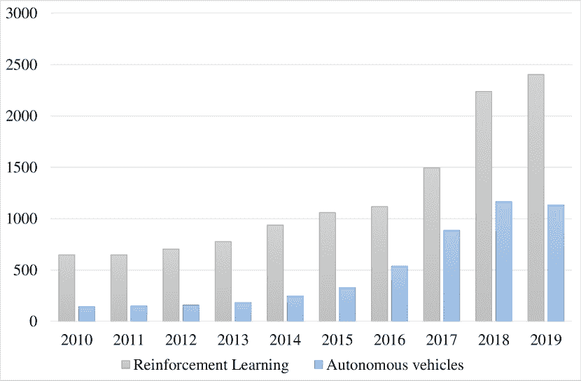

图 1：Web of Science 对“深度强化学习”和“自动驾驶车辆（2020.01.17.）”的主题搜索

### I-A 自动驾驶运动规划的层次分类

使用深度神经网络来开发自驾车提供了“端到端”解决方案的可能性，该系统的工作方式类似于人类驾驶员：其输入包括旅行目的地、道路网络知识和各种传感器信息，输出则是直接的车辆控制指令，例如转向、扭矩和刹车。然而，一方面，实现这样的方案相当复杂，因为需要处理驾驶任务的所有层级；另一方面，系统本身表现得像一个黑箱，这带来了设计和验证问题。通过检查该领域的最新优势，可以说大多数研究集中于解决层次运动规划问题的一些子任务。正如[3]所述，这种自动驾驶的决策系统可以分解为至少四个层次（见图 2）。路线规划作为最高层级，根据道路网络地图定义行程的路径点，并可以使用实时交通数据。尽管最优路线选择在研究界引起了高度关注，但处理这一层级的论文并未采用强化学习。有关该主题的全面研究可以参见[4]。

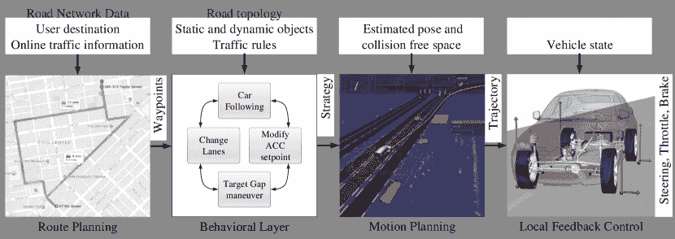

图 2：运动规划的层次

行为层是自动驾驶的战略层。根据给定的路径点，代理决定短期策略，考虑到局部道路拓扑、交通规则以及对其他交通参与者状态的感知。在驾驶环境中有一有限的动作集，这一层的实现通常是一个有限状态机，在其状态中具有基本策略（即，跟车、变道等），并根据环境变化在这些状态之间进行明确定义的转换。然而，即使完全了解当前交通状态，周围司机的未来意图仍然未知，这使得问题成为部分可观察的[5]。因此，未来状态不仅依赖于自车的行为，还依赖于未知的过程；这个问题形成了部分可观察马尔可夫决策过程（POMDP）。为减轻这些影响，存在不同的技术，通过预测其他道路使用者的可能轨迹，例如在[6]中，作者使用了高斯混合模型，或在[7]中，使用了基于记录的交通数据训练的支持向量机和人工神经网络。由于有限动作 POMDPs 是建模强化学习问题的自然方式，大量研究论文涉及这一层，如论文的各部分所示。为了执行行为层定义的策略，运动规划层需要设计一个可行的轨迹，该轨迹包括车辆在短期内的预期速度、偏航角和位置状态。自然地，在这一层级，必须考虑车辆动力学，因此经典的运动规划精确解是不切实际的，因为它们通常假设全动力学。长期以来，已知使用非全动力学求解运动规划问题的数值复杂性是多项式空间算法（PSPACE）[8]，这意味着实时求解非线性规划问题的整体解决方案很难制定[9]。另一方面，该层的输出表示使得用“纯”强化学习直接处理变得困难，只有少数论文仅涉及这一层，且通常使用深度强化学习（DRL）定义样条作为训练结果[10, 11]。

在最低层级，本地反馈控制负责最小化与规定路径或轨迹的偏差。本文回顾的大量论文涉及这一任务的各个方面，其中车道保持、轨迹跟随或跟车是更高层次的策略。尽管在这一层级，动作空间变为连续，经典的强化学习方法无法处理这一点。因此，需要对控制输出进行离散化，或者 - 如某些论文中所示 - 使用深度强化学习的连续变体。

### I-B 强化学习

作为人工智能和机器学习的一个领域，强化学习（RL）处理的是将学习代理放置在一个环境中以实现目标的问题。与监督学习不同，在监督学习中，学习者结构会得到好行为和坏行为的示例，而 RL 代理必须通过试错法发现如何行为才能获得最大的奖励[12]。在这个任务中，代理必须在某种程度上感知环境的状态，并基于这些信息采取导致新状态的行动。作为其行动的结果，代理会获得奖励，这有助于未来行为的发展。为了**最终**制定问题，建模环境状态的转换，基于代理的行动也是必要的。这导致了一个由$(\mathcal{S},\mathcal{A},T,R,\Omega,O)$函数定义的 POMDP 模型，其中$\mathcal{S}$是环境状态的集合，$\mathcal{A}$是该特定状态下可能的行动集合，$T$是基于行动的状态之间的转换函数，$R$是给定$(\mathcal{S},\mathcal{A})$对的奖励，而$\Omega$是观察集合，$O$是传感器模型。在这种情况下，代理可以通过任何推理模型进行制定，该模型的参数可以根据获得的经验进行修改。在深度强化学习的背景下，这一模型由神经网络实现。

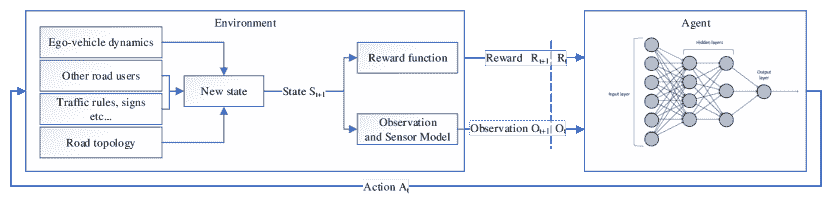

图 3：用于深度强化学习的 POMDP 模型在自动驾驶中的应用

POMDP 场景中的问题是当前的行动会影响未来的状态，因此未来的奖励，这意味着为了优化整个过程中的累积奖励，代理需要了解其行动的未来后果。RL 有两种主要方法来确定最佳行为：基于价值的方法和基于策略的方法。

使用基于价值的方法的原始概念是[1]中介绍的深度 Q 学习网络（DQN）。简要描述，代理为每个状态-动作对预测一个所谓的 Q 值，表示期望的即时和未来奖励。从这个集合中，代理可以选择具有最高值的动作作为最优策略，或在训练过程中使用这些值进行探索。主要目标是学习最优 Q 函数，在这种情况下由神经网络表示。这可以通过进行实验、计算每个动作未来状态的折扣奖励，并使用 Bellman 方程[13]作为目标来更新网络来完成。使用相同的网络进行价值评估和动作选择会导致在噪声环境中行为不稳定和学习缓慢。元启发式方法，例如经验回放，可以解决这个问题，而原始 DQN 的其他变体，如 Double DQN[14]或 Dueling DQN[15]，分离动作和价值预测流，从而实现更快和更稳定的学习。

基于策略的方法直接选择最佳行为，其中策略$\pi_{\Theta}$是$(\mathcal{S},\mathcal{A})$的一个函数。由神经网络表示，带有 softmax 头，代理通常预测动作的归一化概率。在最自然的实现中，这个输出整合了 RL 过程的探索特性。在高级变体中，例如演员-评论家，代理使用不同的预测来评估价值和动作[16]。最初，RL 算法使用有限的动作空间，但对于许多控制问题，它们并不适用。为解决这个问题，在[17]中引入了深度确定性策略梯度（DDPG）代理，其中演员直接将状态映射到连续动作。

对于复杂问题，学习过程仍可能很长或甚至失败。可以通过多种方式解决：

+   •

    课程学习描述了一种学习类型，其中训练从任务的简单示例开始，然后逐渐增加难度。这种方法在[18, 19, 20]中被使用。

+   •

    对抗学习旨在通过恶意输入欺骗模型。使用这种技术变体的论文有：[21, 22]

+   •

    基于模型的动作选择，例如 Alpha-Go 的 MCTS 解决方案，可以减少远程奖励问题的影响。

由于强化学习将问题建模为 POMDP，一个离散时间随机控制过程，解决方案需要为这种决策提供一个数学框架，以应对结果既部分随机又部分由决策者控制的情况，同时状态也部分可观察[23]。在自动或高度自动化车辆的运动规划情况下，POMDP 的元组$(\mathcal{S},\mathcal{A},T,R,\Omega,O)$在图 3 中进行了说明，可以解释如下：

$\mathcal{S},\mathcal{A},T,$ 和 $R$ 描述了 MDP，即学习过程的建模环境。根据目标的不同，它可能有所变化，但在我们的案例中，它需要建模车辆的动态，周围的静态和动态物体，如交通参与者、道路拓扑、车道标记、标志、交通规则等。$\mathcal{S}$ 保存了仿真的当前实际状态。$A$ 是代理驾驶自车的可能动作集合，而 $T$，即所谓的状态转移函数，根据车辆的动作更新车辆状态以及交通参与者的状态。不同的抽象层次在 II-A 部分中进行了描述。许多研究论文使用不同的软件平台来建模环境。所使用的框架的简要汇总见 II-B 部分。$R$ 是 MDP 的奖励函数，II-D 部分对此进行了总结。

$\Omega$ 是代理可以在世界中体验到的观察集合，而 $O$ 是给出可能观察的分布的观察函数。在更简单的情况下，研究假设完全可观察，并将问题表述为 MDP，尽管在许多情况下，车辆并不拥有所有信息。另一个有趣的话题是状态观察的表示，这是 Deep RL 代理架构选择和性能的关键因素。文献中使用的观察模型在 II-E 部分中进行了总结。

## II 强化学习的建模

### II-A 车辆建模

对自车运动的建模是训练过程中的关键部分，因为它引发了模型准确性与计算资源之间的权衡问题。由于强化学习（RL）技术使用大量的实验来确定最佳策略，环境的步进时间高度依赖于车辆动态模型的评估时间，这对训练时间有着深远的影响。因此，在环境设计过程中，需要从最简单的运动学模型选择到更复杂的动态模型，范围从 2 自由度（2DoF）侧向模型到参数更多、更复杂的轮胎模型。

在刚性运动学单轨车辆模型中，这些模型忽略了轮胎滑移和跳跃，侧向运动仅受几何参数的影响。因此，它们通常仅限于低速应用。有关模型的更多细节可以在[24]中找到。最简单的动态模型包括纵向和侧向运动，基于 3 自由度（3DoF）动态自行车模型，通常使用线性轮胎模型。它们将$(V_{x},V_{y},\dot{\Psi})$视为独立变量，即纵向和侧向速度，以及偏航率。一个更复杂的模型是四轮 9 自由度（9DoF）车辆模型，其中除了 3DoF 模型的参数，还考虑了车身的滚动和俯仰$(\dot{\Theta},\dot{\Phi})$以及四个轮子的角速度$({\omega_{fl},\omega_{fr},\omega_{rl},\omega_{rr}})$，以更精确地计算轮胎力。因此，该模型考虑了纵向和侧向滑移的耦合以及轮胎之间的负荷转移。

尽管运动学模型看起来非常简化，并且正如[25]中所述，这种模型的行为可能与实际车辆有显著不同，但对于许多控制情况，其准确性是合适的[24]。

根据[25]，使用一个具有大约$0.5g$或更低侧向加速度限制的运动学自行车模型可以提供合适的结果，但前提是道路是干燥的。超过此限制，模型将无法处理动态问题。因此，在处理更高加速度时，应使用更准确的车辆模型，以将车辆的动态推向其操控极限。

关于计算时间，基于运动学模型的 3DoF 模型的计算可能是$10\dots 50$倍，而具有非线性轮胎模型的 9DoF 模型的精确计算可能是$100\dots 300$倍，这也是 RL 社区使用低抽象级别的主要原因。

交通和周围车辆的建模通常使用独特的模拟器，如 II-B 节中所述。一些作者使用细胞自动机模型 [26] 开发他们的环境。一些使用 MOBIL，这是一个通用模型（最小化车道变换引起的整体制动）来推导适用于广泛的汽车跟随模型的车道变换规则 [27]；还有智能驾驶模型（IDM），这是一个连续的微观单车道模型 [28]。

### II-B 模拟器

一些作者创建自制环境以实现对模型的完全控制，尽管也有商业和开源环境可以提供此功能。本节简要介绍了一些在使用 RL 进行运动规划的近期研究中使用的环境。

在建模交通环境时，最受欢迎的选择是 SUMO（城市移动仿真），这是一个微观的、跨模式和多模式、空间连续且时间离散的交通流量模拟平台 [29]。它可以从其他交通模拟器（如 VISUM、Vissim 或 MATSim）转换网络，并且还读取其他标准数字道路网络格式，如 OpenStreetMap 或 OpenDRIVE。它还提供了与多个环境的接口，如 python、Matlab、.Net、C++ 等。尽管这种情况下的抽象层次是微观的，车辆行为有限，但它的易用性和高速度使其成为训练代理处理交通的绝佳选择，尽管它不提供除了车辆真实状态之外的任何传感器模型。

另一种广泛用于商业和研究的微观模拟器是 VISSIM [30]。在 [31] 中，它被用于开发汽车跟随行为和车道变换决策。

仅考虑车辆动力学时，最受欢迎的选择是 TORCS（开放赛车模拟器），这是一个现代的、模块化的、高度便携的多玩家、多智能体汽车模拟器。它的高度模块化和便携性使其成为人工智能研究的理想选择 [32]。与 python 的接口使得最受欢迎的 AI 研究环境舒适且运行速度可接受。TORCS 还配有不同的赛道、竞争机器人和多个传感器模型。

假设在车辆动态方面，最佳选择是专业工具，如 CarSIM[33]或 CarMaker[34]，尽管这些软件在强化学习文献中并未出现。这可能是由于这些软件是昂贵的商业平台，更重要的是，它们缺乏 Python 接口和高精度，但资源密集型模型使得它们无法在合理时间内运行多个回合。

对于更详细的传感器模型或交通，作者通常使用 Airsim、Udacity Gazebo/ROS 和 CARLA：

AirSim，在最近的研究中[35]使用，是一个最初为无人机开发的模拟器，基于 Unreal Engine 构建，现在具有不同天气条件和场景的车辆扩展。

Udacity，在[36]中使用，是一个为 Udacity 的自动驾驶汽车纳米学位[37]构建的模拟器，提供了各种传感器，如高质量渲染的摄像头图像 LIDAR 和红外信息，并且能够模拟其他交通参与者。

另一个值得提及的是 CARLA，这是一个用于自动驾驶研究的开源模拟器。CARLA 从头开始开发，支持自动化城市驾驶系统的开发、训练和验证。除了开源代码和协议外，CARLA 还提供了为此目的创建并可以自由使用的开放数字资产（城市布局、建筑物、车辆）。该模拟平台支持传感器套件和环境条件的灵活指定[38]。

尽管这一部分仅提供了模拟器的简要描述，但可以在[39]中找到对该主题的更系统的回顾。

### II-C 行动空间

行动空间的选择高度依赖于车辆模型和为每个前期研究设计的强化学习问题任务。虽然可以找到两个主要的控制层级：一个是通过转向、制动和加速命令直接控制车辆，另一个作用于行为层，定义战略层次上的选择，如换车道、保持车道、设置 ACC 参考点等。在这个层级，代理给低层控制器发出命令，后者计算实际轨迹。只有少数几篇论文处理运动规划层，其中任务定义了端点$(x,y,\theta)$，代理定义了要跟随的轨迹的节点，这些节点表示为样条曲线，如[11]中所示。此外，很少有论文偏离车辆运动限制，并通过在网格中步进生成动作，如经典的细胞自动机微观模型[40]。

一些论文通过分离纵向和横向任务来结合控制层和行为层，其中纵向加速度是直接命令，而换车道是战略决策，如[41]中所示。

行为层通常包含几个不同的选择，底层神经网络需要从中选择，这使其成为一个经典的有限动作的强化学习任务。

尽管在控制层面上，车辆的执行，即转向、油门和刹车，是连续参数，许多强化学习技术如 DQN 和 PG 不能处理这种情况，因为它们需要有限的动作集，而一些技术，如 DDPG，则适用于连续动作空间。为了适应使用的强化学习技术的有限动作要求，大多数论文将转向和加速命令离散化为每个通道 3 到 9 种可能性。选择的可能性较少将解决方案推得离现实更远，这可能会引发车辆动态问题，如无法控制的打滑、大幅度的突然加速和偏航率，尽管利用运动学模型有时可以在论文中覆盖这些问题。然而，大量离散选择最终会导致 POMDP 方法中可能结果的指数增长，这会减缓学习过程。

### II-D 奖励

在训练过程中，代理尝试完成一个任务，这个任务通常由多个步骤组成。这个任务被称为一个回合。回合在以下条件之一满足时结束：

+   •

    代理成功完成任务；

+   •

    回合达到预先定义的步骤。

+   •

    出现终止条件。

前两种情况是微不足道的，取决于实际问题的设计。终止条件通常是代理到达一个状态，从该状态实际任务无法完成，或者代理犯了一个不可接受的错误。车辆运动规划代理通常使用终止条件，例如：与其他参与者或障碍物碰撞或离开赛道或车道，因为这两者不可避免地结束回合。还有一些较轻的做法，其中回合在事故发生之前以失败结束，例如：与赛道的切线角度过高或与其他参与者过于接近。这些“事故前”终止通过将失败的信息提前到达，从而加快了训练，尽管它们的设计需要小心[42]。

奖励在评估代理在回合期间所做选择的好坏方面发挥作用，提供反馈以改进策略。第一个重要的方面是奖励的时机，强化学习解决方案的设计者需要选择以下策略的混合，这些策略都有其优缺点：

+   •

    仅在回合结束时给予奖励并将其折现回先前的$(\mathcal{S},\mathcal{A})$对，这可能会导致学习过程较慢，但最小化了人为对策略的塑造。

+   •

    通过评估当前状态在每一步给予即时奖励，当然，折扣也会出现在这种解决方案中，这导致学习速度显著提高，尽管即时奖励的选择高度影响建立的策略，有时这会阻止智能体发展比设计奖励意图更好的整体解决方案。

+   •

    一种中间解决方案是通过在预定义的时间段或行驶距离内给予奖励[43]，或在做出好或坏决定时给予奖励。

在运动规划领域，最终回合奖励是根据驾驶任务的完成或失败来计算的。总体性能因素通常包括：完成任务的时间、保持期望速度或实现尽可能高的平均速度、航向或与车道中线的距离或期望轨迹、超越更多车辆、尽量减少车道变换[44]、保持右侧[45, 46]等。奖励系统也可以体现乘客舒适度，其中强调车辆动态的平稳性。最常用的定量指标包括纵向加速度[47]、横向加速度[48, 49]和颠簸[50, 10]。

在一些研究中，奖励基于与数据集的偏差[51]，或计算为与参考模型的偏差，如[52]中所示。这些方法可以提供有利的结果，但有些偏离了强化学习的原始理念，因为之前已知的策略可能会指导学习。

### II-E 观察空间

观察空间向智能体描述了世界。它需要提供足够的信息来选择合适的动作，因此——根据任务的不同——它包含以下知识：

+   •

    车辆在世界中的状态，例如，位置、速度、航向等。

+   •

    顶点信息，如车道、标志、规则等。

+   •

    其他参与者：周围的车辆、障碍物等。

观察的参考系可以是绝对的，并固定在世界的坐标系统中，但由于决策过程集中在自车上，因此更直接的选择是以自车的坐标系统或车辆在世界中的位置以及道路的方向作为自车中心的参考系。这允许将访问状态的分布集中在位置、航向和速度空间的原点周围，因为其他车辆通常靠近自车，并具有相似的速度和航向，从而减少了策略必须执行的状态空间区域。[53]

#### II-E1 车辆状态观察

对于车道保持、导航、简单赛车、超车或机动任务，最常用且最简单的自车观察包括连续变量$(|e|,v,\theta_{e})$，分别描述车道中心线的横向位置、车速和横摆角。（见图 4）。这些信息是引导车类车辆的绝对最低要求，仅适用于经典运动学车类模型的控制，其中系统假设运动没有打滑。尽管在许多文献中，这可能已经足够，因为车辆仍然深处于动态稳定区域。

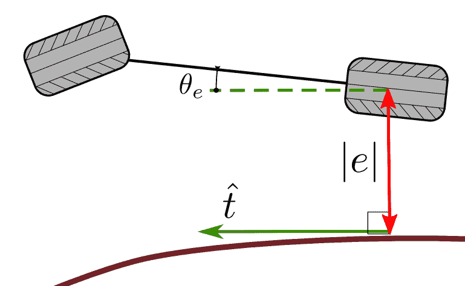

图 4：基础车辆状态的观察（来源：[3]）

对于那些复杂的车辆动态不可避免的任务，如赛车情况，或车辆稳定性至关重要的情况，这组可观察状态将不足以满足需求，应该扩展为包含横摆角、俯仰角、滚转角、轮胎动态和滑移。

#### II-E2 环境观察

获取车辆周围环境的信息并将其表示给学习代理在文献中表现出高度的多样性。可以观察到不同水平的传感器抽象：

+   •

    传感器水平，将相机图像、激光雷达或雷达信息传递给代理；

+   •

    中间水平，提供理想化的传感器信息；

+   •

    地面真实水平，提供所有可检测和不可检测的信息。

传感器模型的结构也影响深度强化学习代理的神经网络结构，因为图像或数组输入推断 2D 或 1D CNN 结构，而简单的标量信息集合会导致简单的全连接网络。有时这两种输入会混合，因此网络需要有两种不同类型的输入层。

基于图像的解决方案通常使用从 3D 模拟器提取的前视摄像头图像来表示观察空间。这些数据结构化为（$C$ x $W$ x $H$）大小的矩阵，其中$C$是通道数，通常一个用于强度图像，三个用于 RGB，而$W$和$H$是图像的宽度和高度分辨率。在某些情况下，为了检测运动，将多个图像并行输入到网络中。有时，为了数据和网络压缩的目的，图像会被降采样——如[54]中的（$1$x$48$x$27$）或[55, 56]中的（$3$x$84$x$84$）。由于图像以非结构化的方式存储信息，即状态信息，如物体位置或车道信息，深度神经网络（如 CNN）通常需要大量样本和时间才能收敛[57]。由于 RL 过程需要的步骤数量很高，这个问题会加剧，导致学习过程非常漫长，比如[54]中的$1.5M$步或[55]中的$100M$步。

许多基于图像的解决方案提出了一些数据预处理方法来克服这个问题。在[57]中，作者提出了一种基于视觉的横向控制框架，该框架结合了 DL 和 RL 方法。为了提高感知准确性，提出了一种 MTL（多任务学习）CNN 模型来学习关键轨道特征，这些特征用于在轨道坐标中定位车辆，并训练一个策略梯度 RL 控制器来解决连续序列决策问题。自然地，这种方法也可以视为一种具有结构化特征的 RL 解决方案，尽管这种结合的方法在基于图像的解决方案中也占有一席之地。

另一种方法可能是简化非结构化数据。在[58]中，Kotyan 等人使用差异图像作为输入，这种图像是两个连续帧之间的背景减法，假设该图像包含前景的运动，底层神经网络会更关注前景的特征而非背景。通过使用相同的训练算法，他们的结果显示，包括差异图像而不是原始未经处理的输入，所需的训练步骤大约少 10 倍以达到相同的性能。第二种可能性是，将原始图像作为输入，可以通过图像语义分割网络进行处理，如[59]中提出的那样。正如作者所说：“语义图像相比原始图像包含的信息更少，但包括了代理采取行动所需的大部分信息。换句话说，语义图像忽略了原始图像中的无用信息。”这种方法的另一个优点是，训练后的代理可以使用来自实际场景的分割输出，因为在这一层面，模拟数据与实际数据之间的差异要比模拟图像与实际图像之间的差异小得多。图 5 展示了本研究中使用的$640x400$分辨率输入。

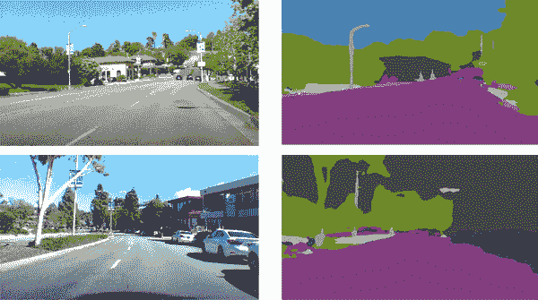

图 5：来自驾驶数据的真实图像及其语义分割（来源:[59]）

最近的研究中，像 2D 或 3D 激光雷达这样的传感器模型并不常见，尽管它们可以提供关于环境的优质深度图信息。不过，与相机图像一样，数据的问题依然存在——无论是 2D 的向量，还是 3D 激光雷达的矩阵——这些数据都是非结构化的。此类输入的使用仅能在[60]中找到，其中观察模拟了一个 2D 激光雷达，提供了$31$个方向的障碍物距离，视场角为$150^{\circ}$，而代理使用传感器数据作为状态。类似的输入结构，尽管没有模拟激光雷达，因为没有反射，由 TORCS 提供并用于[20]，是通过想象的光束传感器表示车道标记。在引用的例子中，代理使用来自 19 个传感器的读数，范围为 200 米，在车前半部分每$10^{\circ}$处显示到赛道边缘的距离。

基于网格的路径规划方法，比如 A* 或各种 SLAM（同时定位和映射）算法存在并且广泛应用于移动机器人导航领域，其中环境被表示为一个空间地图[61]，通常被表述为分配给表面网格中每个 2D 位置的 2D 矩阵的三种可能值之一：占用、空闲和未知[62]。这种方法也可以用来表示周围车辆的概率操纵[63]，或通过从预测的运动序列生成时空地图，实现动态环境中的运动规划[64]。虽然先前引用的例子没有使用 RL 技术，但它们证明了网格表示在这一领域具有很高的潜力。在[65]中呈现了通过使用网格地图作为观察、以及与 RL 代理一起使用车辆的位置和偏航角来进行静态环境中的导航（见图 6）。网格地图也是非结构化数据，以及它们的复杂性类似于语义分割图像，因为单元在两种情况下都存储类信息，因此它们的最佳处理方法是使用 CNN 架构。

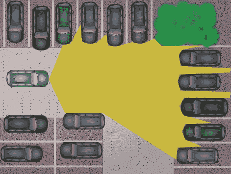

(a) 传感器

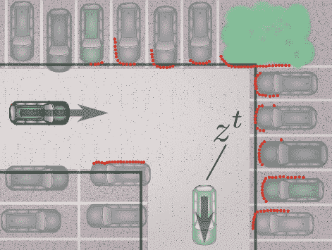

(b) 目标状态 $z^{t}$

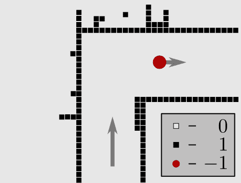

(c) 感知 Ø

图 6：从车辆角度描述的周围可以通过粗略的感知地图来表示，其中目标由一个红点表示（c）（来源：[65]）

代表移动物体，即网格中的周围车辆，不仅需要占用情况，还需要其他信息，因此空间网格的单元需要保存额外的信息。在[44]中，作者使用等距网格，其中自动驾驶汽车放置在中心，其他车辆占用的单元表示相应车辆的纵向速度（见图 7）。相同的方法也可以在[49]中找到。显然，这种简单的表示无法提供有关其他交通参与者的横向移动的信息，尽管它们比简单的占用基础表示提供了更多的信息。

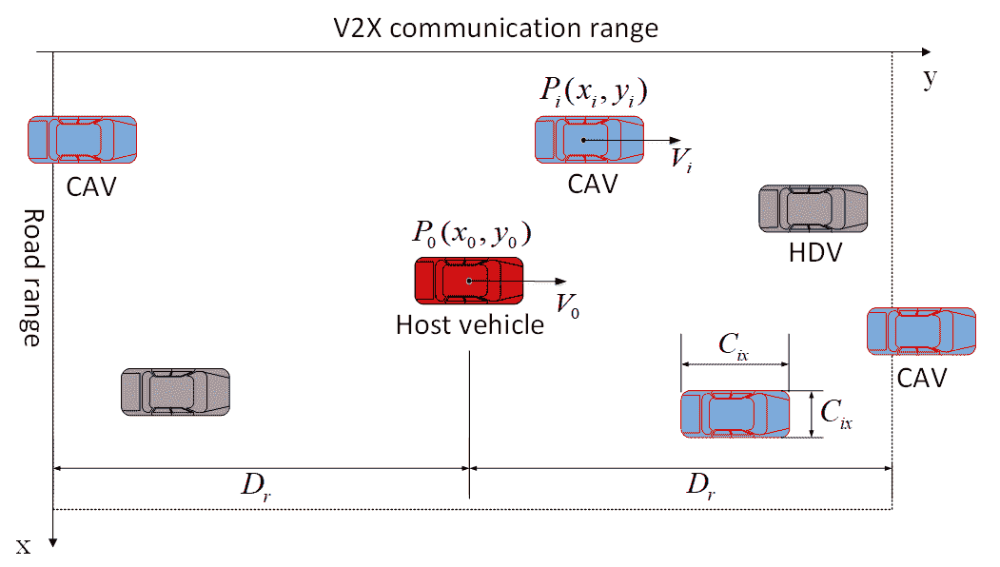

(a) 交通的数学模型

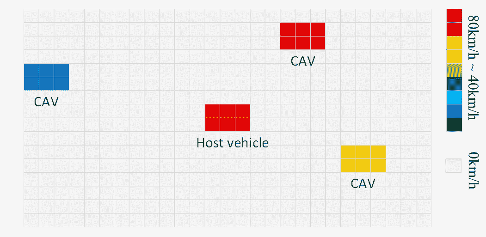

(b) 超网格矩阵的可视化

图 7：HDM 映射过程的可视化（来源：44）

等距网格对于通用环境而言是一个合乎逻辑的选择，在这种环境中，移动机器人的运动方向是自由的。然而，在道路车辆的情况下，车辆主要遵循交通流向。在这种情况下，空间表示可以选择固定为道路拓扑，即道路车道，而不管其曲率或宽度。在这些基于车道的网格解决方案中，表示高速公路的网格行数与实际车道数相同，车道在纵向上被离散化。这种方法的最简单应用可以在 26 中找到，其中单元格的长度等于单个车辆长度，而且交通行为类似于经典的基于细胞自动机的微观模型 66。

这种表示方式，类似于等距网格，也可以用于道路占用，尽管它们仍然不包含任何车辆动态信息。67 旨在将多个连续的交通快照输入到底层 CNN 结构中，这本质上提取了移动物体的速度。在这种设置中，也可以在网格单元中表示速度，相关示例见 36，其中作者将从 Udacity 模拟器中提取的交通数据转换为基于车道的网格。

除了周围车辆的位置和纵向速度在决策制定方面至关重要之外，其他特征（如航向、加速度、横向速度）也应考虑。可以为每个重要参数使用多层网格地图来解决此问题。在 10 中，作者处理了模拟器状态，以计算一个大小为 4 x 3 x (2 x FoV + 1)的观察张量，其中 Fov 代表视场，表示观察的最大距离（以单元格计数）。每个通道（第一个维度）分别用于道路占用、车辆的相对速度、相对横向位移和相对航向到自车。图 8 展示了模拟器状态和用于其网络的相应输入观察示例。

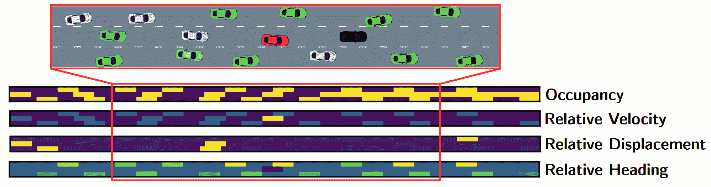

图 8：模拟器状态（顶部，放大）被转换为 4 x 3 x (2 x FoV + 1)的输入观察张量（底部）（来源：10）

之前的观测模型（图像、激光雷达或基于网格的）都有一些共同的特点：它们都是非结构化数据集，需要使用 CNN 架构来处理，这使得学习过程变得困难，因为代理需要同时提取重要特征并形成行动策略。预处理非结构化数据并将结构化信息输入到代理的网络中是显而易见的。结构化数据是指任何在记录或文件中的固定字段内存在的数据。例如，在交通导航中，根据任务，周围车辆的参数在输入的同一元素上表示。在最简单的跟车场景中，代理只关注前方车辆，除了自车状态，输入由 $(d,v)$ 组成，如 [51] 或 $(d,v,a)$ 如 [68]，其中这些参数是前车的车距、速度和加速度。与非结构化数据相反，这些方法显著减少了输入量，并可以使用简单的 DNN 结构处理，这对代理的性能收敛产生了深远影响。对于交通导航，即执行合并或车道变换操作，不仅需要考虑前车，还需要考虑其他周围车辆的状态。在合并场景中，最关键的信息是界定目标间隙的两辆车的相对纵向位置和速度 $2$x$(dx,dv)$，如 [69] 使用的。自然，这是此类问题的绝对最小表示，但未来将会开发出更复杂的表示。在高速公路操控情况下，需要考虑自车车道和邻近车道车辆，在 [41] 中，作者使用了上述提到的 $6$x$(dx,dv)$ 标量向量，用于三个有趣车道的前车和后车。而在 [70] 中，作者通过扩展邻近车道的占用信息来扩展这些信息，正好位于自车旁边（见图 9）。在 [42] 中也可以看到类似的方法，尽管将追踪的对象数量扩展到了九个。这些研究缺乏横向信息，但在 [41] 中，横向位置和速度也被包含在输入向量中，形成了 $6$x$(dx,dy,dvx,dvy)$ 结构，逻辑上表示自车的纵向和横向距离及速度差异。

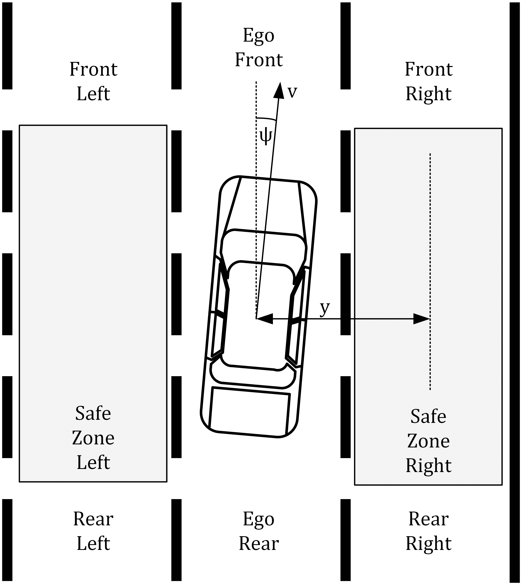

图 9：高速公路上的环境状态 [70]

在处理无信号交叉口的特殊情况下 [71]，作者也使用了这种表示方案，其中考虑了其他车辆的笛卡尔坐标、速度和航向。

## III 基于场景的方法分类

尽管这项调查重点关注基于深度强化学习的运动规划研究，但必须提到一些论文尝试通过经典强化技术解决自动驾驶的某些子任务。这些经典方法的问题在于它们无法处理非结构化数据，如图像、中级雷达或激光雷达传感器数据。

另一个问题是需要维护所有 $(\mathcal{S},\mathcal{A})$ 状态-动作对的 Q 表。这会导致空间复杂度的爆炸，因为表的大小等于状态和动作中所有类别大小的乘积。例如，[72] 中展示了 Q 学习的一个实例。作者在 TORCS 中训练了一个智能体，尝试通过利用空气动力学阻力来实现最佳超车策略。在场景中只有两个参与者，即超车车辆和长直道上的前车。状态表示包括两辆车的纵向和横向距离，以及自车的横向位置和两者之间的速度差。

表 I: 状态表示离散化见 [72]

| 名称 | 尺寸 | 类别范围 |
| --- | --- | --- |
| $dist_{y}[m]$ | 6 |

&#124; {0, 10, 20 ,30, 50, 100, 200} &#124;

|

| $dist_{x}[m]$ | 10 |
| --- | --- |

&#124; {-25, -15, -5, -3 , -1, 0, 1, 3, 5, 15, 25} &#124;

|

| $pos[m]$ | 8 |
| --- | --- |

&#124; {-10, -5, -2, -1, 0, 1, 2, 5, 10} &#124;

|

| $\Delta speed[km/h]$ | 9 |
| --- | --- |

&#124; {-300, 0, 30, 60, 90, 120, &#124;

&#124; 150, 200, 250, 300} &#124;

|

作者将这个状态空间离散化为 $(6,10,8,9)$ 这样大小的类别（见表 I")）；并使用了最小的横向动作集合大小为 3，其中动作是向左或向右移动 $1m$ 和保持横向位置。这样，这个问题生成了一个 $6*10*8*9*3=12960$ 元素的 Q 表。虽然如今这样大小的表可以很容易处理，但很容易想象，随着问题的复杂性增加，比如更多的车辆、更多的传感器、复杂的动态、密集的状态和动作表示，表的规模可能会增长到巨大的程度。一种可能的减少方法是利用多目标强化学习方法，将总体问题分解为子任务，如 [73] 中的超车机动所示。在后续研究中，作者扩大了问题范围，将驾驶问题分解为碰撞避免、目标寻找、车道跟随、车道选择、速度保持和稳定转向等任务 [74]。为了减少问题规模，[75] 的作者使用了战略级决策为车辆设置移动目标，相对于周围的车辆，将低级控制留给经典解决方案，从而显著减少了动作空间。

在 [76] 中描述了另一个有趣的经典 Q-learning 示例，作者设计了一个用于路径规划问题的代理，考虑了具有 Ackermann 转向的地面车辆障碍物，使用 $(v,x,y,\theta)$（速度、位置和航向）作为状态表示，并使用强化学习作为优化器（见图 10")）。

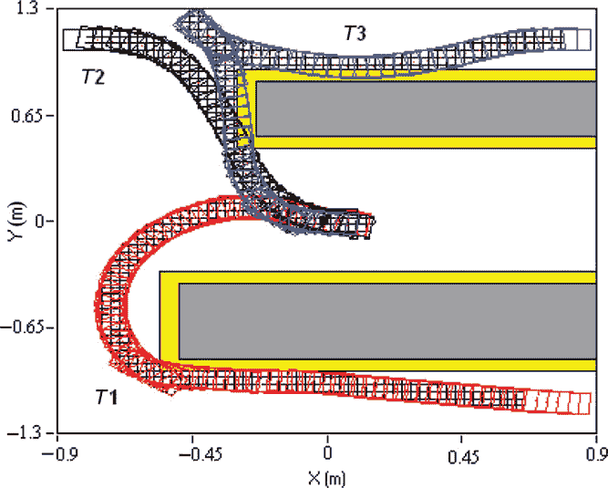

图 10：路径规划结果来自于 [76]

尽管人们通常期望机器学习能够为自动驾驶提供一个整体的端到端解决方案，但近期文献的研究表明，强化学习研究可以为这一问题的某些子任务提供答案。近年来的论文可以围绕这些问题进行组织，其中选择一个专门的情境或场景，并检查自学习代理是否能够解决它。这些问题陈述的复杂性各不相同。如前所述，强化学习的复杂性以及训练时间在很大程度上受到所选问题的复杂性、行动空间的性质以及奖励的时效性和正确制定的影响。最简单的问题，如车道保持或车辆跟随，通常可以追溯到简单的凸优化或控制问题。然而，在这些情况下，诸如乘客舒适度等次级控制目标的制定更加容易。在设想的复杂性尺度的另一端，例如在密集交通中机动的问题，高效完成任务的定义很难制定，代理需要具有预测性的“思维”以实现其目标。以下将介绍这些方法。

### III-A 车辆跟随

车跟随是本调查中最简单的任务，问题的制定如下：模拟中有两个参与者，一个是领先车辆，一个是跟随车辆，两者都保持在车道中的横向位置，跟随车辆调整其纵向速度以保持安全的跟随距离。观察空间由$(v,dv,ds)$元组组成，表示代理速度、与前车的速度差异以及车头距离。动作是加速命令。奖励系统自然地将两辆车的碰撞作为失败，而代理的表现则基于突变、TTC（碰撞时间）[50]或乘客舒适度[77]。另一种方法展示在[51]中，其中对车跟随代理的表现进行了与现实世界测量的比较，以实现类人行为。

### III-B 车道保持

保持车道或跟随轨迹仍然是一个简单的控制任务，但与跟车不同的是，这个问题集中于横向控制。这些研究中的观察空间使用了两种不同的方法：一种是车辆在车道中的“真实位置”和角度[78, 60, 22]，另一种是前置摄像头的图像[54, 59, 57]。自然地，对于基于图像的控制，代理使用外部模拟器，如 TORCS 和 GAZEBO/ROS。在这些情况下，奖励系统几乎总是考虑到距离车道中心线的距离作为即时奖励。值得提到的是，这些代理几乎不考虑车辆动力学，令人惊讶的是，它们也没有集中于联合纵向控制。

### III-C 合并

坡道合并问题涉及到上坡高速公路场景（见图 11），在这个场景中，自车需要找到两个车辆之间的合适间隙才能上高速公路。在最简单的方法中，可以学习纵向控制，即代理车辆到达该位置，如[79, 45, 19]中所示。其他论文，如[69]，则使用了全面的转向和加速控制。在[45]中，动作控制车辆的纵向运动，加速和减速，同时执行这些动作时，自车保持车道。动作“左侧变道”以及“右侧变道”意味着横向移动。每次只执行一个动作，且动作必须完全执行，车辆无法提前中止动作。

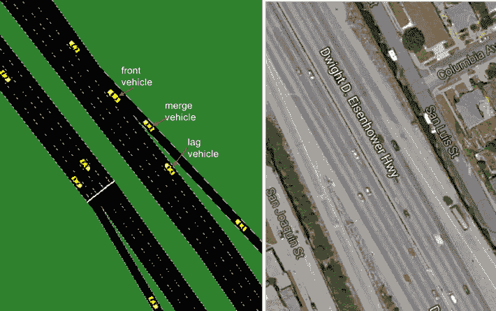

图 11：坡道合并：（a）模拟场景和（b）现实世界位置（来源：[69]）

在[19]中可以看到一个有趣的补充，其中周围的车辆行为各异，因为其中有合作型和非合作型驾驶员。他们用关于合作行为的知识训练了他们的代理，并且将结果与三种不同构建的 MTCS 规划器进行了比较。尽管全信息 MCTS 自然优于强化学习，但其计算成本较高。作者使用了课程学习方法，通过逐步增加交通密度来训练代理。正如他们所述：“当在密集交通中直接训练 RL 代理时，策略会收敛到一个次优解，即在合并车道中保持静止，并没有利用其他驾驶员的合作性。这种策略避免了碰撞，但未能实现操控。”

对于这个问题的最详细描述见[69]，其中“驾驶环境被训练为一个 LSTM 架构，以结合历史和互动驾驶行为对行动选择的影响。深度 Q 学习过程将 LSTM 的内部状态作为输入，传递给 Q 函数近似器，根据更多的过去信息来进行行动选择。Q 网络参数通过经验回放进行更新，并使用第二个目标 Q 网络来缓解局部最优和不稳定性的问题。”通过这种方法，研究人员尝试混合行为预测和学习的可能性，从而实现更好的性能。

### III-D 交通中的驾驶

最近的文献中研究的最复杂场景是自主代理在交通中驾驶的情况。自然，这个任务也受到网络拓扑、周围车辆的数量和行为、交通规则的应用以及许多其他属性的影响。因此，几乎所有当前的解决方案都处理高速公路驾驶，在这种场景下缺乏交叉路口、行人，并且所有车道的交通流向单一。该场景的子任务在前面的部分已经讨论过，例如车道保持或跟车。接下来，将介绍两种类型的高速公路驾驶。首先，概述了层次化方法，其中代理在行为层上行动，做出车道变换或超车的决策，并通过经典控制方法使用底层控制器执行这些动作。其次，介绍了端到端的解决方案，其中代理通过转向和加速直接控制车辆。随着问题的复杂性增加，重要的是要提到，这些训练过的代理只能解决其在模拟中暴露的情况。因此，模拟交通环境的设计必须覆盖预期的情况[52]。

在行为层做决策包括至少三个离散动作：保持当前车道、变道至左侧和变道至右侧，如在[42]中所示。本文中，作者使用了关于自车速度和车道位置以及八辆周围车辆的相对位置和速度的实际数据作为观察空间。他们在三种观察噪声类别中训练和测试了智能体：无噪声、中等噪声（%5）和高噪声（%15），并展示了噪声较高的训练环境在性能上更具鲁棒性和可靠性，同时使用 DQN 与 ${64,128,128,64}$ 隐藏层和 $tanh$ 激活函数，超越了基于规则的 MOBIL 模型。在类似的环境和观察空间中，[52]使用了扩展的动作集来执行变道操作，包括先前的加速或目标间隙接近，形成六种不同的动作，如表 II 所示。他们还取得了 DQN 智能体—使用两个卷积层和一个全连接层—的表现与基于 IDM [28] 和 MOBIL [27] 模型相当或更好。在同一作者的另一篇出版物[80]中，动作空间通过将加速命令改为增加和减少 ACC 设定点，并让底层控制器执行这些动作，略有变化。

表 II: [52]中的动作空间

| $a_{1}$ | 保持当前车道，保持当前速度 |
| --- | --- |
| $a_{2}$ | 保持当前车道，加速至 $-2m/s^{2}$ |
| $a_{3}$ | 保持当前车道，加速至 $-9m/s^{2}$ |
| $a_{4}$ | 保持当前车道，加速至 $2m/s^{2}$ |
| $a_{5}$ | 变道至左侧，保持当前速度 |
| $a_{6}$ | 变道至右侧，保持当前速度 |

在[68]中，考虑了一个双车道场景以进一步分配层次决策。首先，DQN 对“是否变道”做出二元决策，然后，另一个 Q 网络负责纵向加速，基于之前的决策。因此，第二层与经典控制模块（如纯追踪控制）集成，输出适当的控制动作以调整其位置。在[47]中，考虑了上述双车道场景，尽管作者使用了类似演员-评论员的学习智能体。

自动驾驶中的一个有趣问题是训练代理的合作行为。在[67]中，作者考虑了一个三车道高速公路，使用基于车道的网格表示作为观察空间，简单的四元组用于行动空间：左、右、加速、无，并使用奖励函数实现合作和非合作行为。奖励函数不仅考虑了自车的经典性能指标，还考虑了周围交通的速度，这自然受到代理行为的影响。基础网络使用了两个卷积层，每个层有 16 个滤波器，卷积核大小为（2,2），激活函数为 RELU，以及两个各有 500 个神经元的全连接层。为了评估合作行为的效果，作者通过虚拟环路在模拟中收集了交通数据，并在经典的流量-密度图中可视化了结果交通的表现（见图 12）。结果显示，合作行为导致了更高的交通流量，从而提高了高速公路的通行能力，减少了总体旅行时间。

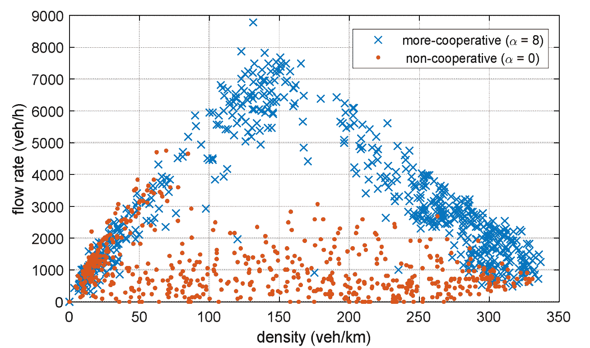

图 12：不同策略下虚拟环路检测到的流量-密度关系（来源:[67]）

模型的现实性仍然可以区分端到端的解决方案。例如，在[44]中，作者使用了一个全约束机器人模型作为行动空间，而不是使用非完整的 Ackermann 转向几何，这大大减少了控制问题的复杂性。他们的行动包括加速、减速、向左换道、向右换道和不采取行动，其中前两者应用最大加速和减速，而两个换道动作则简单地使用恒速横向移动。他们使用了对抗 DQN 和优先经验回放与基于网格的观察模型。在[41]中使用了类似的控制方法和非完整运动学。这项研究的重要性在于它在学习过程中考虑了安全性方面。通过使用类似 MPC 的安全检查，代理避免了导致碰撞的动作，从而使训练更快、更稳健。

使用非完整运动学需要加速和转向命令。在[70]和[46]中，作者使用了周围车辆结构化信息的连续观测空间和策略梯度 RL 结构来实现端到端驾驶。由于所使用的方法具有离散的动作空间，因此需要对转向和加速命令进行量化。在交通中使用端到端解决方案的驾驶复杂性可以通过代理所需的训练回合数来很好地检验。虽然在简单的车道保持场景中，代理只需数百回合即可完成任务，但用于这些问题的代理需要 300,000 回合。

## IV 未来挑战

最近该领域的成就表明，不同的深度强化学习技术可以有效地用于不同级别的自动驾驶车辆运动规划问题，尽管许多问题仍未解答。这些方法的主要优势在于它们能够处理诸如原始或稍微预处理的雷达或基于相机的图像信息等非结构化数据。

尽管在汽车系统中使用神经网络和深度学习技术作为通用函数逼近器提出了几个问题。如[81]所述，用于汽车应用的函数开发在电子控制单元（ECUs）中实现，受制于专有的 OEM 规范以及多个国际标准，例如汽车 SPICE（软件过程改进与能力确定）[82]和 ISO 26262 [83]。然而，这些标准仍远未对深度学习提供专门的说明，因为在这一领域，验证和确认仍未解决。一些论文通过使用基础安全层来处理这些问题，该层在车辆控制系统执行之前验证计划轨迹的安全性。然而，这种方法无法在复杂场景中保证全面的功能安全覆盖。

使用由强化学习代理训练的深度神经网络在运动规划中的主要好处之一是训练后的网络具有相对较低的计算要求。尽管如前所述，这一特性在学习阶段需要大量的试验以获得足够的经验，但对于简单的凸优化问题，过程的收敛速度较快。然而，对于复杂的场景，训练可能迅速达到数百万步，这意味着一组超参数或奖励假设可能需要数小时甚至数天才能完成。由于复杂的强化学习任务需要对环境设计、网络结构、奖励机制或甚至所使用的算法本身进行持续的迭代，设计这样一个系统是一个耗时的项目。除了适当的结果分析和推断外，评估时间在很大程度上依赖于分配的计算能力。在这一基础上，现在大多数论文处理的是运动规划问题的次要子任务，而像在城市交通中导航这样复杂的场景在文献中并不常见。

通过审查近期文章的观察元素，可以指出大多数研究忽略了复杂的传感器模型。一些论文使用“真实情况”环境表示或“理想”传感器模型，只有少数文章利用了传感器噪声。一方面，将从理想观察中获得的知识转移到现实世界应用中提出了若干可行性问题[84]，另一方面，使用带噪声或错误的模型可能会导致实际更稳健的代理，如[42]所述。

环境同样适用这一点，在高速公路学习者群体中表现最好，因为道路拓扑几乎总是固定的，并且周围车辆的行为是有限的。这些代理的验证通常是在相同的环境设置中进行的，这与机器学习的基本技术相矛盾，机器学习中训练和验证场景应该在某些方面有所不同。由于强化学习代理通常能够在接近其经验的情境下表现良好，因此专注于开发更现实和多样化的环境，包括对任何互动交通参与者的建模，以实现易于迁移到实际应用的代理是至关重要的。这同样适用于车辆动态，需要更多的多样化和现实的建模。自然，这些改进增加了环境模型的数值复杂性，这是这些应用中的主要问题之一。

向混合或层次系统设计的倾斜将是未来解决这一问题的一个途径，通过将经典控制方法与深度强化学习结合使用。此外，使用扩展学习技术，如课程学习、迁移学习或类似 Alpha-Go 的规划代理，将会深刻影响这些项目的效率。

总体而言，可以说这个领域还有许多问题需要解决，比如环境和传感器建模的细节、计算需求、在实际应用中的可转移性、鲁棒性以及代理的验证。由于这些问题，很难预测强化学习是否适合汽车应用。

## 致谢

本文所报告的研究得到了人力资源部高等教育卓越计划的资助，作为布达佩斯科技经济大学（BME FIKPMI/FM）人工智能研究领域的一部分。

## 参考文献

+   [1] V. Mnih, K. Kavukcuoglu, D. Silver, A. Graves, I. Antonoglou, D. Wierstra, 和 M. Riedmiller，“使用深度强化学习玩 Atari 游戏，” 2013 年 12 月。[在线]. 可用: http://arxiv.org/abs/1312.5602

+   [2] V. Mnih, K. Kavukcuoglu, D. Silver, A. A. Rusu, J. Veness, M. G. Bellemare, A. Graves, M. Riedmiller, A. K. Fidjeland, G. Ostrovski, S. Petersen, C. Beattie, A. Sadik, I. Antonoglou, H. King, D. Kumaran, D. Wierstra, S. Legg, 和 D. Hassabis，“通过深度强化学习实现人类水平的控制，”*自然*，第 518 卷，第 7540 期，第 529–533 页，2015 年 2 月。[在线]. 可用: http://www.nature.com/articles/nature14236

+   [3] B. Paden, M. Cap, S. Z. Yong, D. Yershov, 和 E. Frazzoli，“自动驾驶城市车辆的运动规划和控制技术综述，”*CoRR*，第 1–27 页，2016 年。[在线]. 可用: https://ieeexplore.ieee.org/abstract/document/7490340

+   [4] H. Bast, D. Delling, A. Goldberg, M. Müller-Hannemann, T. Pajor, P. Sanders, D. Wagner, 和 R. F. Werneck，“运输网络中的路径规划，” 收录于*计算机科学讲义集*。Springer，Cham，2016 年，第 19–80 页。

+   [5] S. Brechtel, T. Gindele, 和 R. Dillmann，“在不确定条件下进行自主驾驶的概率决策，使用连续 POMDPs，” 收录于*第 17 届国际 IEEE 智能交通系统会议（ITSC）*。IEEE，2014 年 10 月，第 392–399 页。[在线]. 可用: http://ieeexplore.ieee.org/document/6957722/

+   [6] J. Wiest, M. Hoffken, U. Kresel, 和 K. Dietmayer，“使用高斯混合模型进行概率轨迹预测，” 收录于*2012 IEEE 智能车辆研讨会*。IEEE，2012 年 6 月，第 141–146 页。[在线]. 可用: http://ieeexplore.ieee.org/document/6232277/

+   [7] Y. Dou, F. Yan, 和 D. Feng，“在高速公路车道变窄处使用支持向量机和人工神经网络分类器进行车道变换预测，” 载于 *2016 IEEE 国际先进智能机电学会议（AIM）*。IEEE，2016 年 7 月，第 901–906 页。[在线]. 可用: http://ieeexplore.ieee.org/document/7576883/

+   [8] J. H. Reif，“搬运问题的复杂性及其推广，” 载于 *第 20 届计算机科学基础年会研讨会（sfcs 1979）*。IEEE，1979 年 10 月，第 421–427 页。[在线]. 可用: http://ieeexplore.ieee.org/document/4568037/

+   [9] F. Hegedus, T. Becsi, S. Aradi, 和 G. Galdi，“使用神经网络进行自主车辆的混合轨迹规划，” 载于 *2018 IEEE 第 18 届计算智能与信息学国际研讨会（CINTI）*。IEEE，2018 年 11 月，第 000 025–000 030 页。[在线]. 可用: https://ieeexplore.ieee.org/document/8928220/

+   [10] D. M. Saxena, S. Bae, A. Nakhaei, K. Fujimura, 和 M. Likhachev，“在密集交通中使用无模型强化学习进行驾驶，” 2019 年 9 月。[在线]. 可用: http://arxiv.org/abs/1909.06710

+   [11] r. Fehér, S. Aradi, F. Hegedűs, T. Bécsi, 和 P. Gáspár，“用于车辆运动规划的混合 DDPG 方法，” 载于 *第 16 届控制、自动化和机器人信息学国际会议论文集*。SCITEPRESS - 科学与技术出版公司，2019 年，第 422–429 页。

+   [12] R. S. Sutton 和 A. G. Barto, *强化学习：导论*，第二版。麻省理工学院出版社，2017 年。

+   [13] R. Bellman, *动态规划*。普林斯顿大学出版社，普林斯顿，NJ，1957 年。

+   [14] H. Van Hasselt, A. Guez, 和 D. Silver，“使用双 Q 学习的深度强化学习，” 载于 *第三十届 AAAI 人工智能会议*，2016 年。

+   [15] Z. Wang, T. Schaul, M. Hessel, H. van Hasselt, M. Lanctot, 和 N. de Freitas，“用于深度强化学习的对抗网络架构，” 2015 年 11 月。[在线]. 可用: http://arxiv.org/abs/1511.06581

+   [16] D. Silver, G. Lever, N. Heess, T. Degris, D. Wierstra, 和 M. Riedmiller，“确定性策略梯度算法，” 载于 *第 31 届国际机器学习会议论文集（ICML 2014）*，2014 年，第 387–395 页。

+   [17] T. P. Lillicrap, J. J. Hunt, A. Pritzel, N. Heess, T. Erez, Y. Tassa, D. Silver, 和 D. Wierstra，“使用深度强化学习的连续控制，” 2015 年 9 月。[在线]. 可用: http://arxiv.org/abs/1509.02971

+   [18] Z. Qiao, K. Muelling, J. M. Dolan, P. Palanisamy, 和 P. Mudalige，“基于自动生成课程的城市环境中自主车辆的强化学习，” 载于 *2018 IEEE 智能车辆研讨会（IV）*。IEEE，2018 年 6 月，第 1233–1238 页。[在线]. 可用: https://ieeexplore.ieee.org/document/8500603/

+   [19] M. Bouton, A. Nakhaei, K. Fujimura, 和 M. J. Kochenderfer，“在密集交通中对合智能强化学习的合作意识，” 2019 年 6 月。[在线]. 可用: http://arxiv.org/abs/1906.11021

+   [20] M. Kaushik, V. Prasad, K. M. Krishna, 和 B. Ravindran, “使用深度强化学习的模拟高速公路驾驶超车操作，” 收录于 *2018 IEEE Intelligent Vehicles Symposium (IV)*。IEEE，2018 年 6 月，页 1885–1890。 [在线]. 可用链接: https://ieeexplore.ieee.org/document/8500718/

+   [21] A. Ferdowsi, U. Challita, W. Saad, 和 N. B. Mandayam, “用于自主车辆系统的安全和保障的稳健深度强化学习，” 收录于 *IEEE Conference on Intelligent Transportation Systems, Proceedings, ITSC*, 卷 2018-Novem。电气和电子工程师学会，2018 年 12 月，页 307–312。

+   [22] X. Ma, K. Driggs-Campbell, 和 M. J. Kochenderfer, “通过对抗性强化学习提高自主车辆控制的鲁棒性和安全性，” 收录于 *IEEE Intelligent Vehicles Symposium, Proceedings*, 卷 2018-June。电气和电子工程师学会，2018 年 10 月，页 1665–1671。

+   [23] L. P. Kaelbling, M. L. Littman, 和 A. R. Cassandra, “在部分可观测的随机域中进行规划与行动，” *Artificial Intelligence*, 卷 101，第 1-2 期，页 99–134，1998 年 5 月。 [在线]. 可用链接: https://linkinghub.elsevier.com/retrieve/pii/S000437029800023X

+   [24] J. Kong, M. Pfeiffer, G. Schildbach, 和 F. Borrelli, “用于自主驾驶控制设计的运动学和动态车辆模型，” 收录于 *2015 IEEE Intelligent Vehicles Symposium (IV)*。IEEE，2015 年 6 月，页 1094–1099。 [在线]. 可用链接: http://ieeexplore.ieee.org/document/7225830/

+   [25] P. Polack, F. Altche, B. D’Andrea-Novel, 和 A. de La Fortelle, “运动学自行车模型：规划自主车辆可行轨迹的一个一致模型？” 收录于 *2017 IEEE Intelligent Vehicles Symposium (IV)*。IEEE，2017 年 6 月，页 812–818。 [在线]. 可用链接: http://ieeexplore.ieee.org/document/7995816/

+   [26] C. You, J. Lu, D. Filev, 和 P. Tsiotras, “使用强化学习和深度逆强化学习的自主车辆高级规划，” *Robotics and Autonomous Systems*, 卷 114，页 1–18，2019 年 4 月。 [在线]. 可用链接: https://linkinghub.elsevier.com/retrieve/pii/S0921889018302021

+   [27] A. Kesting, M. Treiber, 和 D. Helbing, “用于车-following 模型的一般车道变换模型 MOBIL，” *Transportation Research Record: Journal of the Transportation Research Board*, 卷 1999，第 1 期，页 86–94，2007 年 1 月。 [在线]. 可用链接: http://journals.sagepub.com/doi/10.3141/1999-10

+   [28] M. Treiber, A. Hennecke, 和 D. Helbing, “经验观察与微观模拟中的交通拥堵状态，” *Physical Review E*, 卷 62，第 2 期，页 1805–1824，2000 年 8 月。 [在线]. 可用链接: https://link.aps.org/doi/10.1103/PhysRevE.62.1805

+   [29] D. Krajzewicz, J. Erdmann, M. Behrisch, 和 L. Bieker, “SUMO - 城市移动性模拟的最新发展与应用，” *International Journal On Advances in Systems and Measurements*, 卷 5，第 3 期，页 128–138，2012 年。

+   [30] M. Fellendorf 和 P. Vortisch, “微观交通流模拟器 VISSIM，” 在*交通模拟基础*中，J. Barceló 编辑，Springer，2010 年，第 63–93 页。

+   [31] Y. Ye, X. Zhang, 和 J. Sun, “自动驾驶车辆的行为决策使用深度强化学习和高保真模拟环境”，*交通研究 C 部分*，第 107 卷，第 5 月，第 155–170 页，2019 年。 [在线]. 可用: https://doi.org/10.1016/j.trc.2019.08.011

+   [32] B. Wymann, E. Espié, C. Guionneau, C. Dimitrakakis, R. Coulom, 和 A. Sumner, “TORCS：开放赛车模拟器，” 2014 年。 [在线]. 可用: http://www.torcs.org

+   [33] “CarSIM，机械模拟公司。” [在线]. 可用: https://www.carsim.com/

+   [34] “CarMaker，IPG Automotive。” [在线]. 可用: https://ipg-automotive.com/products-services/simulation-software/carmaker/

+   [35] H. An 和 J.-i. Jung, “基于深度强化学习的车道变换决策系统在连接和自动驾驶中的应用”，*电子学*，第 8 卷，第 5 期，第 543 页，2019 年 5 月。 [在线]. 可用: https://www.mdpi.com/2079-9292/8/5/543

+   [36] J. Wang, Q. Zhang, D. Zhao, 和 Y. Chen, “通过深度强化学习和基于规则的约束进行车道变换决策，” 在*2019 国际联合神经网络会议 (IJCNN)* 中，IEEE，2019 年 7 月，第 1–6 页。 [在线]. 可用: http://arxiv.org/abs/1904.00231 https://ieeexplore.ieee.org/document/8852110/

+   [37] “欢迎使用 Udacity 的自动驾驶汽车模拟器。” [在线]. 可用: https://github.com/udacity/self-driving-car-sim

+   [38] A. Dosovitskiy, G. Ros, F. Codevilla, A. Lopez, 和 V. Koltun, “CARLA：一个开放的城市驾驶模拟器，” 在*第一届机器人学习年会论文集*中，2017 年，第 1–17 页。

+   [39] F. Rosique, P. J. Navarro, C. Fernández, 和 A. Padilla, “自动驾驶车辆研究的感知系统和模拟器的系统评审”，*传感器*，第 19 卷，第 3 期，第 648 页，2019 年 2 月。 [在线]. 可用: http://www.mdpi.com/1424-8220/19/3/648

+   [40] K. Kashihara, “深度 Q 学习在高速公路交汇处的交通模拟中的应用，” 在*2017 IEEE 系统、人类和控制论国际会议 (SMC)* 中，IEEE，2017 年 10 月，第 984–988 页。 [在线]. 可用: http://ieeexplore.ieee.org/document/8122738/

+   [41] S. Nageshrao, H. E. Tseng, 和 D. Filev, “使用深度强化学习的自动高速公路驾驶，” 在*2019 IEEE 系统、人类和控制论国际会议 (SMC)* 中，IEEE，2019 年 10 月，第 2326–2331 页。 [在线]. 可用: http://arxiv.org/abs/1904.00035 https://ieeexplore.ieee.org/document/8914621/

+   [42] A. Alizadeh, M. Moghadam, Y. Bicer, N. K. Ure, U. Yavas, 和 C. Kurtulus, “在动态和不确定的高速公路环境中使用深度强化学习的自动车道变更决策，” 见 *2019 IEEE 智能交通系统会议（ITSC）*，2019 年 10 月，第 1399–1404 页。[在线]。可用： https://ieeexplore.ieee.org/document/8917192/

+   [43] A. Feher, S. Aradi, 和 T. Becsi, “基于 Q 学习的车道保持强化学习方法，” 见 *2018 IEEE 第 18 届计算智能与信息学国际研讨会（CINTI）*。 布达佩斯：IEEE，2018 年 11 月，第 000 031–000 036 页。[在线]。可用： https://ieeexplore.ieee.org/document/8928230/

+   [44] Z. Bai, W. Shangguan, B. Cai, 和 L. Chai, “基于深度强化学习的异构交通中的高级驾驶行为决策模型，” 见 *2019 中国控制会议（CCC）*，2019 年 7 月，第 8600–8605 页。[在线]。可用： http://arxiv.org/abs/1902.05772 https://ieeexplore.ieee.org/document/8866005/

+   [45] P. Wolf, K. Kurzer, T. Wingert, F. Kuhnt, 和 J. M. Zollner, “使用深度强化学习和紧凑语义状态的自主驾驶自适应行为生成，” 见 *2018 IEEE 智能车辆研讨会（IV）*。 IEEE，2018 年 6 月，第 993–1000 页。[在线]。可用： https://ieeexplore.ieee.org/document/8500427/

+   [46] S. Aradi, T. Becsi, 和 P. Gaspar, “基于策略梯度的强化学习方法用于自主高速公路驾驶，” 见 *2018 IEEE 控制技术与应用会议（CCTA）*。 IEEE，2018 年 8 月，第 670–675 页。[在线]。可用： https://ieeexplore.ieee.org/document/8511514/

+   [47] X. Xu, L. Zuo, X. Li, L. Qian, J. Ren, 和 Z. Sun, “基于强化学习的智能车辆高速公路自主决策方法，” *IEEE 系统、人类与控制论学报：系统*，2018 年 12 月号。

+   [48] P. Wang, C. Y. Chan, 和 A. De La Fortelle, “基于强化学习的自动车道变更操作方法，” 见 *IEEE 智能车辆研讨会，会议记录*，第 2018 年 6 月卷。 电气和电子工程师协会，2018 年 10 月，第 1379–1384 页。

+   [49] M. P. Ronecker 和 Y. Zhu, “基于深度 Q 网络的自主驾驶决策，” 见 *2019 第三届国际机器人与自动化科学大会（ICRAS）*。 IEEE，2019 年 6 月，第 154–160 页。[在线]。可用： https://ieeexplore.ieee.org/document/8808950/

+   [50] M. Zhu, Y. Wang, J. Hu, X. Wang, 和 R. Ke, “基于强化学习的安全、高效、舒适的速度控制用于自主驾驶，” 2019 年 1 月。[在线]。可用： http://arxiv.org/abs/1902.00089

+   [51] M. Zhu, X. Wang, 和 Y. Wang, “类人自主跟车模型与深度强化学习，” *交通研究 C 部分：新兴技术*，第 97 卷，第 348–368 页，2018 年 12 月。

+   [52] C. J. Hoel, K. Wolff, 和 L. Laine, “使用深度强化学习进行自动化速度和车道变更决策，” *IEEE 智能交通系统会议论文集（ITSC）*，第 2018 年 11 月卷。 电气和电子工程师学会，2018 年 12 月，第 2148–2155 页。

+   [53] E. Leurent, E. Leurent, A. Survey, S.-a. Representations, 和 A. Driving, “自动驾驶状态-动作表示的调查 引用此版本：HAL Id : hal-01908175，” 2018。

+   [54] P. Wolf, C. Hubschneider, M. Weber, A. Bauer, J. Hartl, F. Durr, 和 J. M. Zollner, “通过深度 Q 网络在现实世界仿真中学习驾驶，” *2017 IEEE 智能车辆研讨会（IV）*。 IEEE, 2017 年 6 月，第 244–250 页。 [在线]. 可用： http://ieeexplore.ieee.org/document/7995727/

+   [55] M. Jaritz, R. De Charette, M. Toromanoff, E. Perot, 和 F. Nashashibi, “使用深度强化学习进行端到端赛车驾驶，” *IEEE 国际机器人与自动化会议论文集*。 电气和电子工程师学会，2018 年 9 月，第 2070–2075 页。

+   [56] E. Perot, M. Jaritz, M. Toromanoff, 和 R. d. Charette, “在现实赛车游戏中使用深度强化学习进行端到端驾驶，” *2017 IEEE 计算机视觉与模式识别会议研讨会（CVPRW）*。 IEEE, 2017 年 7 月，第 474–475 页。 [在线]. 可用： http://ieeexplore.ieee.org/document/8014798/

+   [57] D. Li, D. Zhao, Q. Zhang, 和 Y. Chen, “基于强化学习和深度学习的自动驾驶横向控制 [应用说明]，” *IEEE 计算智能杂志*，第 14 卷，第 2 期，第 83–98 页，2019 年 5 月。

+   [58] S. Kotyan, D. V. Vargas, 和 U. Venkanna, “自我训练的自动驾驶代理，” *2019 年第 58 届日本仪器与控制工程师学会年会（SICE）*。 IEEE, 2019 年 9 月，第 1456–1461 页。 [在线]. 可用： http://arxiv.org/abs/1904.12738 https://ieeexplore.ieee.org/document/8859883/

+   [59] N. Xu, B. Tan, 和 B. Kong, “在现实中使用强化学习和图像翻译的自动驾驶，” 2018 年 1 月。 [在线]. 可用： http://arxiv.org/abs/1801.05299

+   [60] J. Lee, T. Kim, 和 H. J. Kim, “基于近似 Q 学习的自动车道保持，” *2017 年第 14 届普及机器人和环境智能国际会议（URAI）*。 IEEE, 2017 年 6 月，第 402–405 页。 [在线]. 可用： http://ieeexplore.ieee.org/document/7992762/

+   [61] A. Elfes, “使用占用网格进行移动机器人感知和导航，” *计算机*，第 22 卷，第 6 期，第 46–57 页，1989 年 6 月。 [在线]. 可用： http://ieeexplore.ieee.org/document/30720/

+   [62] S. Thrun, M. Montemerlo, H. Dahlkamp, D. Stavens, A. Aron, J. Diebel, P. Fong, J. Gale, M. Halpenny, G. Hoffmann, K. Lau, C. Oakley, M. Palatucci, V. Pratt, P. Stang, S. Strohband, C. Dupont, L.-E. Jendrossek, C. Koelen, C. Markey, C. Rummel, J. van Niekerk, E. Jensen, P. Alessandrini, G. Bradski, B. Davies, S. Ettinger, A. Kaehler, A. Nefian, 和 P. Mahoney, “Stanley: 赢得 DARPA 大奖挑战赛的机器人，” *领域机器人学杂志*, vol. 23, no. 9, pp. 661–692, 2006 年 9 月\. [在线]. 可用: http://doi.wiley.com/10.1002/rob.20147

+   [63] N. Deo 和 M. M. Trivedi, “基于操作的 LSTM 的多模态周边车辆轨迹预测，” 见 *2018 IEEE 智能车辆研讨会 (IV)*。 IEEE, 2018 年 6 月, pp. 1179–1184\. [在线]. 可用: https://ieeexplore.ieee.org/document/8500493/

+   [64] T. Hegedűs, B. Németh, 和 P. Gáspár, “面向自动驾驶的图基多车辆超车策略，” *IFAC-PapersOnLine*, vol. 52, no. 5, pp. 372–377, 2019\. [在线]. 可用: https://linkinghub.elsevier.com/retrieve/pii/S2405896319306822

+   [65] A. Folkers, M. Rick, 和 C. Buskens, “使用深度强化学习控制自动驾驶车辆，” 见 *2019 IEEE 智能车辆研讨会 (IV)*。 IEEE, 2019 年 6 月, pp. 2025–2031\. [在线]. 可用: https://ieeexplore.ieee.org/document/8814124/

+   [66] J. Esser 和 M. Schreckenberg, “基于细胞自动机的城市交通微观模拟，” *现代物理学国际期刊 C*, vol. 08, no. 05, pp. 1025–1036, 1997 年 10 月\. [在线]. 可用: https://www.worldscientific.com/doi/abs/10.1142/S0129183197000904

+   [67] G. Wang, J. Hu, Z. Li, 和 L. Li, “通过深度强化学习实现的协作车道变换，” 2019\. [在线]. 可用: http://arxiv.org/abs/1906.08662

+   [68] T. Shi, P. Wang, X. Cheng, 和 C.-Y. Chan, “基于深度强化学习的自动车道变换决策与控制，” 见 *2019 IEEE 智能交通系统会议 (ITSC)*。 奥克兰，新西兰: IEEE, 2019\. [在线]. 可用: http://arxiv.org/abs/1904.10171

+   [69] P. Wang 和 C.-Y. Chan, “面向自动驾驶的深度强化学习架构的制定用于匝道合并，” 见 *2017 IEEE 第 20 届智能交通系统国际会议 (ITSC)*。 IEEE, 2017 年 10 月, pp. 1–6\. [在线]. 可用: http://ieeexplore.ieee.org/document/8317735/

+   [70] T. Bécsi, S. Aradi, R. Fehér, J. Szalay, 和 P. Gáspár, “用于强化学习的高速公路环境模型，” *IFAC-PapersOnLine*, vol. 51, no. 22, pp. 429–434, 2018\. [在线]. 可用: https://linkinghub.elsevier.com/retrieve/pii/S2405896318333032

+   [71] M. Bouton, J. Karlsson, A. Nakhaei, K. Fujimura, M. J. Kochenderfer, 和 J. Tumova, “具有概率保证的强化学习用于自动驾驶，” 2019\. [在线]. 可用: http://arxiv.org/abs/1904.07189

+   [72] D. Loiacono, A. Prete, P. L. Lanzi 和 L. Cardamone, “在 TORCS 中使用简单强化学习进行超车学习，” 见 *2010 IEEE 计算智能世界大会，WCCI 2010 - 2010 IEEE 进化计算大会，CEC 2010*，2010 年。

+   [73] D. C. K. Ngai 和 N. H. C. Yung, “基于多目标强化学习框架的自动驾驶车辆超车，” 见 *2007 IEEE 智能交通系统会议*。 IEEE，2007 年 9 月，页 818–823。 [在线] 可用： http://ieeexplore.ieee.org/document/4357682/

+   [74] ——, “一种用于复杂车辆超车动作的多目标强化学习方法，” *IEEE 智能交通系统汇刊*，第 12 卷，第 2 期，页 509–522，2011 年。

+   [75] C. Desjardins 和 B. Chaib-draa, “协作自适应巡航控制：一种强化学习方法，” *IEEE 智能交通系统汇刊*，第 12 卷，第 4 期，页 1248–1260，2011 年 12 月。 [在线] 可用： http://ieeexplore.ieee.org/document/5876320/

+   [76] M. Gómez, R. V. González, T. Martínez-Marín, D. Meziat 和 S. Sánchez, “通过强化学习在自主移动车辆中进行最优运动规划，” *Robotica*，第 30 卷，第 2 期，页 159–170，2012 年 3 月。

+   [77] Y. Ye, X. Zhang 和 J. Sun, “自动驾驶车辆行为决策使用深度强化学习和高保真仿真环境，” 技术报告。

+   [78] A. E. Sallab, M. Abdou, E. Perot 和 S. Yogamani, “端到端深度强化学习用于车道保持辅助，” 2016 年 12 月。 [在线] 可用： http://arxiv.org/abs/1612.04340

+   [79] P. Wang 和 C.-Y. Chan, “基于连续动作空间的强化学习的自主坡道合流机动，” 2018 年 3 月。 [在线] 可用： http://arxiv.org/abs/1803.09203

+   [80] C.-J. Hoel, K. Driggs-Campbell, K. Wolff, L. Laine 和 M. J. Kochenderfer, “结合规划与深度强化学习进行自动驾驶中的战术决策制定，” 页 1–12，2019 年 5 月。 [在线] 可用： http://arxiv.org/abs/1905.02680

+   [81] F. Falcini, G. Lami 和 A. M. Costanza, “汽车软件中的深度学习，” *IEEE 软件*，第 34 卷，第 3 期，页 56–63，2017 年 5 月。 [在线] 可用： https://ieeexplore.ieee.org/document/7927925/

+   [82] “汽车 SPICE 过程评估/参考模型，” 2015 年。

+   [83] “ISO 26262，《道路车辆—功能安全—第一部分：术语》，” 2011 年。

+   [84] Z. Szalay, T. Tettamanti, D. Esztergár-Kiss, I. Varga 和 C. Bartolini, “无人驾驶汽车测试赛道的开发：车辆设计、赛道配置和责任考虑，” *Periodica Polytechnica 交通工程*，第 46 卷，第 1 期，页 29，2018 年 3 月。 [在线] 可用： https://pp.bme.hu/tr/article/view/10753
