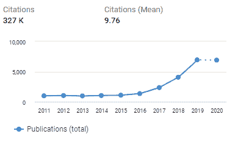

<!--yml

类别：未分类

日期：2024-09-06 20:02:43

-->

# [2002.00444] 深度强化学习在自动驾驶中的应用：综述

> 来源：[`ar5iv.labs.arxiv.org/html/2002.00444`](https://ar5iv.labs.arxiv.org/html/2002.00444)

# 深度强化学习

自动驾驶：综述

B Ravi Kiran¹, Ibrahim Sobh², Victor Talpaert³, Patrick Mannion⁴,

Ahmad A. Al Sallab², Senthil Yogamani⁵, Patrick Pérez⁶ ¹Navya, 巴黎。 ✉ ravi.kiran@navya.tech²Valeo 开罗 AI 团队，埃及。 ✉ ibrahim.sobh, ahmad.el-sallab@{valeo.com}³U2IS, ENSTA 巴黎，巴黎综合理工学院 & AKKA Technologies，法国。 ✉  victor.talpaert@ensta.fr⁴爱尔兰国立大学计算机学院，戈尔韦。 ✉ patrick.mannion@nuigalway.ie⁵Valeo Vision Systems。 ✉  senthil.yogamani@valeo.com⁶Valeo.ai。 ✉  patrick.perez@valeo.com

###### 摘要

随着深度表示学习的发展，强化学习（RL）领域已成为一个强大的学习框架，现在能够在高维环境中学习复杂的策略。本文综述了深度强化学习（DRL）算法，并提供了自动驾驶任务的分类，其中应用了（D）RL 方法，同时解决了自主驾驶代理在现实世界中部署的关键计算挑战。还描述了相关的领域，如行为克隆、模仿学习、逆向强化学习，这些领域相关但不是经典的 RL 算法。讨论了模拟器在训练代理中的作用、验证、测试和增强现有 RL 解决方案的方法。

###### 索引词：

深度强化学习，自动驾驶，模仿学习，逆向强化学习，控制器学习，轨迹优化，运动规划，安全强化学习。

## I 引言

自动驾驶（AD）¹¹1 为了便于参考，本文中使用的主要缩略语列在附录（表格 IV）。系统包含多个感知层级任务，这些任务由于深度学习架构现在已达到高精度。除了感知，自动驾驶系统还包括多个任务，其中经典的监督学习方法已不再适用。首先，当代理的行为预测改变了从环境中接收的未来传感器观测，例如在城市区域的最佳驾驶速度任务。其次，像碰撞时间（TTC）、与代理的最佳轨迹的横向误差这样的监督信号，代表了代理的动态以及环境的不确定性。这类问题需要定义需要最大化的随机成本函数。第三，代理需要学习环境的新配置，并在每个时刻预测最佳决策。这表示了一个高维空间，考虑到代理和环境被观察的独特配置数量，这在组合上是庞大的。在所有这些场景中，我们旨在解决一个序列决策过程，这在经典的强化学习（RL）设置下被形式化，其中代理需要学习和表示其环境，并在每个时刻做出最优行动[1]。最优行动被称为策略。

在这次回顾中，我们涵盖了强化学习的概念、任务分类，其中 RL 尤其在驾驶策略、预测感知、路径和运动规划以及低级控制器设计领域是一个有前途的解决方案。我们还将我们的回顾重点放在 RL 在自动驾驶领域的不同实际应用上，扩展了我们的会议论文[2]，因为这些应用尚未在学术环境中进行过评审。最后，我们通过展示当前 RL 算法（如模仿学习、深度 Q 学习等）在应用时的关键计算挑战和风险来激励用户。我们还从图 2 的出版趋势中注意到，将 RL 或深度 RL 应用于自动驾驶或自驾领域是一个新兴领域。这是由于 RL/DRL 算法领域的近期使用，留下了在实施和部署中的多个实际挑战。我们在 VI 中讨论了这些未解的问题。

本文的主要贡献可总结如下：

+   •

    这篇文章为汽车行业提供了一个自包含的强化学习（RL）背景概述，因为它并不为人所熟知。

+   •

    对使用 RL 进行不同自动驾驶任务的详细文献综述。

+   •

    探讨了应用于现实世界自动驾驶的 RL 面临的关键挑战和机遇。

本文的其余部分安排如下。第 II 节概述了典型自动驾驶系统的组成部分。第 III 节介绍了强化学习并简要讨论了关键概念。第 IV 节讨论了基本 RL 框架之上的更复杂的扩展。第 V 节概述了应用于自动驾驶问题的 RL 应用。第 VI 节讨论了在实际自动驾驶系统中应用 RL 的挑战。第 VII 节以一些最终的评论来结束本文。

## II AD 系统的组成

图 1: 现代自动驾驶系统管道中的标准组件列表，列出了各种任务。这些模块解决的关键问题包括场景理解、决策和规划。

图 1 包括了 AD 系统的标准模块，展示了从传感器流到控制执行的管道。现代自动驾驶系统的传感器架构特别包括多组摄像机、雷达和激光雷达，以及用于绝对定位的 GPS-GNSS 系统和提供车辆在空间中的 3D 姿态的惯性测量单元（IMUs）。

感知模块的目标是创建环境状态的中间级表示（例如所有障碍物和代理的鸟瞰图），这一表示将被后续的决策制定系统利用，最终生成驾驶策略。这一状态包括车道位置、可驾驶区域、代理（如汽车和行人）的位置、交通信号灯状态等。感知中的不确定性会传播到信息链的其余部分。鲁棒的传感对于安全至关重要，因此使用冗余源可以提高检测的信心。这通过结合多种感知任务，如语义分割[3, 4]、运动估计[5]、深度估计[6]、污垢检测[7]等，可以有效地统一为一个多任务模型[8, 9]来实现。

### II-A 场景理解

这个关键模块将从感知模块获得的抽象中级表示映射到高级动作或决策制定模块。从概念上讲，这个模块包含三个任务：场景理解、决策和规划，如图 1 所示。该模块旨在提供更高级别的场景理解，建立在检测或定位的算法任务之上。通过融合异质传感器源，旨在对情况进行鲁棒性泛化，因为内容变得更为抽象。这种信息融合为决策制定组件提供了通用且简化的背景。

融合提供了对环境的传感器无关表示，并对多种模式下的传感器噪声和检测不确定性进行建模，如 LIDAR、摄像头、雷达、超声波。这基本上需要以原则化的方式对预测结果进行加权。

### II-B 定位与映射

映射是自动驾驶的关键支柱之一[10]。一旦区域被映射，车辆的当前位置可以在地图中定位。谷歌首次可靠的自动驾驶演示主要依赖于对预映射区域的定位。由于问题的规模，传统的映射技术通过语义对象检测来增强可靠性，以避免歧义。此外，本地化的高清地图（HD maps）可以用作对象检测的先验。

### II-C 规划与驾驶策略

轨迹规划是自动驾驶流程中的关键模块。根据来自 HD 地图或基于 GPS 的地图的路线级计划，该模块需要生成控制代理的运动级命令。

经典运动规划忽略了动力学和微分约束，同时使用了将代理从源点移动到目标点所需的平移和旋转 [11]。能够控制 6 自由度（DOF）的机器人代理被称为全自性，而具有比其总自由度更少的可控自由度的代理被称为非全自性。经典算法如基于 Dijkstra 算法的$A^{\ast}$算法在自主驾驶的非全自性情况下无法工作。快速扩展随机树（RRT）[12]是通过随机采样和障碍物自由路径生成来探索配置空间的非全自性算法。目前有多种版本的 RRT 用于自主驾驶管道中的运动规划。

图 2：关键词 1.“强化学习”、2.“深度强化学习”和 3.“强化学习”与（“自动驾驶汽车”或“自动驾驶车辆”或“自动驾驶”）的学术出版趋势 [13]。

### II-D 控制

控制器定义了在从预定地图（如 Google 地图）获得的每个路径点上的速度、转向角和刹车动作，或在每个航路点上的相同值的专家驾驶记录。与之相比，轨迹跟踪涉及车辆动力学的时间模型，通过时间顺序查看航路点。

当前的车辆控制方法基于经典的最优控制理论，这可以表述为对成本函数$\dot{x}=f(x(t),u(t))$的最小化，该函数定义在一组状态$x(t)$和控制动作$u(t)$上。控制输入通常在有限的时间范围内定义，并限制在可行的状态空间$x\in X_{\text{free}}$ [14]。速度控制基于经典的闭环控制方法，如 PID（比例-积分-微分）控制器、MPC（模型预测控制）。PID 旨在最小化由三个部分组成的成本函数，包括当前误差的比例项、过去误差的积分项以及未来误差的微分项。而 MPC 方法则旨在稳定车辆行为，同时跟踪指定路径 [15]。对控制器、运动规划以及基于学习的方法的综述在此综述中提供 [16]，供感兴趣的读者参考。最优控制和强化学习密切相关，其中最优控制可以被视为一种基于模型的强化学习问题，其中车辆/环境的动态由明确的微分方程建模。强化学习方法是为了处理随机控制问题以及具有未知奖励和状态转换概率的难题而开发的。自主车辆的随机控制是一个广泛领域，我们建议读者阅读[17]中的相关综述。

## III 强化学习

机器学习（ML）是一个过程，通过该过程计算机程序从经验中学习，以提高其在特定任务上的表现[18]。ML 算法通常被归类为三大类之一：监督学习、无监督学习和强化学习（RL）。监督学习算法基于归纳推理，其中模型通常使用标记数据进行训练，以执行分类或回归，而无监督学习包括应用于未标记数据的技术，如密度估计或聚类。相比之下，在 RL 范式中，自主代理通过与环境交互来学习如何提高其在分配任务中的表现。Russel 和 Norvig 将代理定义为“任何可以通过传感器感知其环境，并通过执行器对环境采取行动的事物”[19]。RL 代理不会被专家明确告知如何行动；相反，代理的表现通过奖励函数 $R$ 进行评估。对于每一个经历的状态，代理选择一个动作，并根据其决策的有用性从环境中获得偶尔的奖励。代理的目标是最大化其生命周期内获得的累积奖励。逐渐地，代理可以通过利用关于不同状态-动作对的期望效用（即折扣后的期望未来奖励总和）的知识来增加其长期奖励。强化学习中的主要挑战之一是管理探索与利用之间的权衡。为了最大化获得的奖励，代理必须通过选择已知会产生高奖励的动作来利用其知识。另一方面，为了发现这些有益的动作，代理必须冒险尝试新动作，这些新动作可能会为每个系统状态带来比当前最佳值更高的奖励。换句话说，学习代理必须利用已知的信息来获得奖励，但也必须探索未知领域，以便在未来做出更好的动作选择。已经提出的一些管理这种权衡的策略包括 $\epsilon$-贪婪和软最大策略。当采用普遍的 $\epsilon$-贪婪策略时，代理会以概率 $0<\epsilon<1$ 随机选择一个动作，或者以剩余概率 $1-\epsilon$ 贪婪地选择当前状态下价值最高的动作。直观上，代理在训练过程开始时应更多地进行探索，因为对问题环境知之甚少。随着训练的进展，代理可能会逐渐进行更多的利用而不是探索。为 RL 代理设计探索策略是一个活跃的研究领域（见例如[20]）。

`<svg   height="265.58" overflow="visible" version="1.1" width="346.61"><g transform="translate(0,265.58) matrix(1 0 0 -1 0 0) translate(172.31,0) translate(0,204.78)" fill="#000000" stroke="#000000"><g stroke-width="0.4pt"><g transform="matrix(0.75 0.0 0.0 0.75 -41.51 7.42)" fill="#000000" stroke="#000000"><foreignobject width="110.7" height="39.17" transform="matrix(1 0 0 -1 0 16.6)" overflow="visible">车辆/RL 代理状态 $s_{t}\in S$ $S$ 可以是连续的或离散的 <g stroke-opacity="0.5" fill="#808080" fill-opacity="0.5" transform="matrix(1.0 0.0 0.0 1.0 2.98 -2.98)"><path d="M 168.48 60.52 L 58.48 60.52 C 55.42 60.52 52.95 58.05 52.95 54.99 L 52.95 21.78 C 52.95 18.72 55.42 16.25 58.48 16.25 L 168.48 16.25 C 171.54 16.25 174.02 18.72 174.02 21.78 L 174.02 54.99 C 174.02 58.05 171.54 60.52 168.48 60.52 Z M 52.95 16.25" style="stroke:none"></path></g><g stroke-opacity="0.5" fill="#808080" fill-opacity="0.5" transform="matrix(1.0 0.0 0.0 1.0 2.98 -2.98)"><path d="M 168.48 60.52 L 58.48 60.52 C 55.42 60.52 52.95 58.05 52.95 54.99 L 52.95 21.78 C 52.95 18.72 55.42 16.25 58.48 16.25 L 168.48 16.25 C 171.54 16.25 174.02 18.72 174.02 21.78 L 174.02 54.99 C 174.02 58.05 171.54 60.52 168.48 60.52 Z M 52.95 16.25" style="stroke:none"></path></g><g fill="#99CCCC"><path d="M 168.48 60.52 L 58.48 60.52 C 55.42 60.52 52.95 58.05 52.95 54.99 L 52.95 21.78 C 52.95 18.72 55.42 16.25 58.48 16.25 L 168.48 16.25 C 171.54 16.25 174.02 18.72 174.02 21.78 L 174.02 54.99 C 174.02 58.05 171.54 60.52 168.48 60.52 Z M 52.95 16.25"></path></g><g transform="matrix(0.75 0.0 0.0 0.75 56.4 49.8)" fill="#000000" stroke="#000000"><foreignobject width="152.21" height="49.81" transform="matrix(1 0 0 -1 0 16.6)" overflow="visible">挑战样本复杂度、验证、安全探索、信用分配、模拟器-现实差距、学习</foreignobject></g> <g stroke-opacity="0.5" fill="#808080" fill-opacity="0.5" transform="matrix(1.0 0.0 0.0 1.0 2.98 -2.98)"><path d="M -82.1 51.7 L -172.04 51.7 L -172.04 25.07 L -82.1 25.07 Z M -172.04 25.07" style="stroke:none"></path></g><g fill="#FFCCCC"><path d="M -82.1 51.7 L -172.04 51.7 L -172.04 25.07 L -82.1 25.07 Z M -172.04 25.07"></path></g><g transform="matrix(0.75 0.0 0.0 0.75 -168.58 40.98)" fill="#000000" stroke="#000000"><foreignobject width="110.7" height="26.29" transform="matrix(1 0 0 -1 0 16.6)" overflow="visible">函数逼近器 $o_{t}\to s_{t}$ (SRL) CNNs</foreignobject></g> <g stroke-opacity="0.5" fill="#808080" fill-opacity="0.5" transform="matrix(1.0 0.0 0.0 1.0 2.98 -2.98)"><path d="M -82.1 19.54 L -172.04 19.54 L -172.04 -19.54 L -82.1 -19.54 Z M -172.04 -19.54" style="stroke:none"></path></g><g fill="#FFCCCC"><path d="M -82.1 19.54 L -172.04 19.54 L -172.04 -19.54 L -82.1 -19.54 Z M -172.04 -19.54"></path></g><g transform="matrix(0.75 0.0 0.0 0.75 -168.58 8.82)" fill="#000000" stroke="#000000"><foreignobject width="110.7" height="42.89" transform="matrix(1 0 0 -1 0 16.6)" overflow="visible">RL 方法值/策略基础的演员-评论家 开/关策略 基于模型/无模型</foreignobject></g> <g stroke-opacity="0.5" fill="#808080" fill-opacity="0.5" transform="matrix(1.0 0.0 0.0 1.0 2.98 -2.98)"><path d="M 152.3 -10.02 L 91.59 -10.02 C 88.54 -10.02 86.06 -12.5 86.06 -15.56 L 86.06 -35.62 C 86.06 -38.68 88.54 -41.16 91.59 -41.16 L 152.3 -41.16 C 155.36 -41.16 157.84 -38.68 157.84 -35.62 L 157.84 -15.56 C 157.84 -12.5 155.36 -10.02 152.3 -10.02 Z M 86.06 -41.16" style="stroke:none"></path></g><g stroke-opacity="0.5" fill="#808080" fill-opacity="0.5" transform="matrix(1.0 0.0 0.0 1.0 2.98 -2.98)"><path d="M 152.3 -10.02 L 91.59 -10.02 C 88.54 -10.02 86.06 -12.5 86.06 -15.56 L 86.06 -35.62 C 86.06 -38.68 88.54 -41.16 91.59 -41.16 L 152.3 -41.16 C 155.36 -41.16 157.84 -38.68 157.84 -35.62 L 157.84 -15.56 C 157.84 -12.5 155.36 -10.02 152.3 -10.02 Z M 86.06 -41.16" style="stroke:none"></path></g><g fill="#CCFFCC"><path d="M 152.3 -10.02 L 91.59 -10.02 C 88.54 -10.02 86.06 -12.5 86.06 -15.56 L 86.06 -35.62 C 86.06 -38.68 88.54 -41.16 91.59 -41.16 L 152.3 -41.16 C 155.36 -41.16 157.84 -38.68 157.84 -35.62 L 157.84 -15.56 C 157.84 -12.5 155.36 -10.02 152.3 -10.02 Z M 86.06 -41.16"></path></g><g transform="matrix(0.

图 3：一个 RL 算法的不同组成部分的图形分解。它还展示了训练 D(RL) 算法时遇到的不同挑战。

在形式化涉及单个 RL 代理的顺序决策问题时，马尔可夫决策过程（MDP）被认为是事实上的标准 [21]。一个 MDP 包含一组状态 $S$，一组动作 $A$，一个转移函数 $T$ 以及一个奖励函数 $R$ [22]，即一个元组 ${<S,A,T,R>}$。当处于任何状态 ${s\in S}$ 时，选择一个动作 ${a\in A}$ 会导致环境进入一个新的状态 ${s^{\prime}\in S}$，其转移概率为 ${T(s,a,s^{\prime})\in(0,1)}$，并给出一个奖励 ${R(s,a)}$。这个过程在图 3 中进行了说明。随机策略 $\pi:S\to\mathcal{D}$ 是从状态空间到动作集合的概率映射，$\pi(a|s)$ 表示在状态 $s$ 下选择动作 $a$ 的概率。目标是找到最优策略 $\pi^{*}$，其能够产生具有最高预期折扣奖励之和的结果 [21]：

|  | $\pi^{*}=\underset{\pi}{\operatorname{argmax}}\underbrace{\mathbb{E}_{\pi}\Bigg{\{}\sum_{k=0}^{H-1}\gamma^{k}r_{k+1}\mid s_{0}=s\Bigg{\}}}_{:=V_{\pi}(s)},$ |  | (1) |
| --- | --- | --- | --- |

对于所有的状态 $s\in S$，其中 $r_{k}=R(s_{k},a_{k})$ 是时间 $k$ 的奖励，$V_{\pi}(s)$ 是在遵循策略 $\pi$ 时从状态 $s$ 开始的预期“收益”（或“效用”） [1]。一个相关的重要概念是动作值函数，也被称为“Q-函数”，定义为：

|  | $Q_{\pi}(s,a)=\mathbb{E}_{\pi}\Bigg{\{}\sum_{k=0}^{H-1}\gamma^{k}r_{k+1}\mid s_{0}=s,a_{0}=a\Bigg{\}}.$ |  | (2) |
| --- | --- | --- | --- |

折扣因子 $\gamma~{}\in~{}[0,1]$ 控制智能体如何看待未来的奖励。低值的 $\gamma$ 鼓励短视行为，智能体会着重于最大化短期奖励，而高值的 $\gamma$ 则使智能体更加前瞻，最大化较长时间框架内的奖励。视野 $H$ 指的是 MDP 中的时间步数。在无限视野问题中，$H=\infty$，而在情节域中，$H$ 具有有限值。情节域可能在固定时间步数后终止，或当智能体达到指定目标状态时终止。在情节域中，最后达到的状态称为终结状态。在有限视野或目标导向域中，可能使用接近 1 的折扣因子以鼓励智能体专注于实现目标，而在无限视野域中，可能使用较低的折扣因子以在短期和长期奖励之间取得平衡。如果 MDP 的最优策略已知，则可以使用 $V_{\pi^{*}}$ 来确定从任意初始状态可获得的最大期望折扣奖励总和。一个回滚（rollout）是通过将策略顺序地应用于初始状态在状态空间中产生的轨迹。MDP 满足马尔可夫性质，即系统状态转移仅依赖于最近的状态和动作，而不依赖于决策过程中的所有状态和动作历史。此外，在许多实际应用领域，智能体无法观察到环境状态的所有特征；在这种情况下，决策问题被表述为部分可观察马尔可夫决策过程（POMDP）。解决强化学习任务意味着找到一个策略 $\pi$，使其最大化状态空间中轨迹的期望折扣奖励总和。RL 智能体可以直接学习价值函数估计、策略和/或环境模型。动态规划（DP）指的是一系列算法，这些算法可以在对环境的奖励和转移函数有完美模型的情况下计算最优策略。与 DP 不同，蒙特卡洛方法没有完全环境知识的假设。蒙特卡洛方法在每个情节中是增量的。在一个情节完成后，价值估计和策略会被更新。另一方面，时序差分（TD）方法是逐步增量的，使其适用于非情节性场景。与蒙特卡洛方法一样，TD 方法可以直接从原始经验中学习，而不需要环境动态的模型。与 DP 类似，TD 方法基于其他估计来学习其估计值。

### III-A 基于价值的方法

Q-learning 是最常用的 RL 算法之一。它是一种无模型的 TD 算法，学习单个状态-动作对的效用估计（在 Eqn. 2 中定义的 Q 函数）。已经证明，Q-learning 能以概率 $1$ 收敛到 MDP 的最佳状态-动作值，只要所有状态中的所有动作都被无限次采样，并且状态-动作值是离散表示的 [23]。实际上，只要为每个状态-动作对获得足够数量的样本，Q-learning 将学习到（接近）最佳的状态-动作值。如果 Q-learning 代理已经收敛到 MDP 的最佳 Q 值，并且随后贪婪地选择动作，它将获得与值函数 $\pi^{*}$ 计算的折扣奖励总和相同的期望值（假设两个都使用相同的任意初始状态）。实现 Q-learning 的代理根据以下更新规则更新它们的 Q 值：

|  | $Q(s,a)\leftarrow Q(s,a)+\alpha[r+\gamma\max_{a^{\prime}\in A}Q(s^{\prime},a^{\prime})-Q(s,a)],$ |  | (3) |
| --- | --- | --- | --- |

其中 $Q(s,a)$ 是选择动作 $a$ 在状态 $s$ 下的效用估计，$\alpha~{}\in~{}[0,1]$ 是学习率，它控制 Q 值在每个时间步更新的程度，$\gamma~{}\in~{}[0,1]$ 是在 Eqn. 1 中使用的折扣因子。Q-learning 的理论保证适用于任何任意初始 Q 值 [23]；因此，MDP 的最佳 Q 值可以通过从任何初始动作值函数估计开始来学习。初始化可以是乐观的（每个 $Q(s,a)$ 返回最大可能奖励）、悲观的（最小奖励）或甚至使用问题的知识以确保更快的收敛。深度 Q 网络（DQN） [24] 结合了 Q-learning 算法的一种变体 [25]，通过使用深度神经网络（DNNs）作为高维状态空间（例如，Atari 游戏的一帧像素）的非线性 Q 函数逼近器。实际上，神经网络预测所有动作的值，而不使用任何显式的领域特定信息或手工设计的特征。DQN 应用经验回放技术来打破连续经验样本之间的相关性，并且提高样本效率。为了增加稳定性，使用了两个网络，其中 DQN 的目标网络参数在更新在线网络参数的过程中被固定了若干迭代次数。读者可以参考子节 III-E ‣ III 强化学习 ‣ 自动驾驶的深度强化学习综述")，以获得更详细的深度 RL 中 DNN 使用的介绍。

### III-B 基于策略的方法

基于值的方法和基于策略的方法之间的区别本质上在于最优性负担的所在。两种方法都必须提出动作并评估结果行为，但基于值的方法专注于评估最佳累计回报，并且有一个遵循推荐的策略，而基于策略的方法则直接旨在估计最优策略，价值如果有计算也是次要的。通常，策略被参数化为神经网络 $\pi_{\theta}$。策略梯度方法使用梯度下降来估计最大化期望回报的策略参数。结果可以是一个随机策略，其中动作通过采样选择，或是一个确定性策略。许多实际应用具有连续的动作空间。确定性策略梯度（DPG）算法 [26] [1] 允许在具有连续动作的领域中进行强化学习。Silver 等人 [26] 证明了在满足特定条件的 MDP 中存在确定性策略梯度，并且确定性策略梯度具有遵循动作-价值函数梯度的简单无模型形式。因此，与在随机策略梯度中对状态和动作空间进行积分不同，DPG 仅对状态空间进行积分，从而在具有大动作空间的问题中需要较少的样本。为了确保充分的探索，使用随机策略选择动作，同时学习确定性目标策略。REINFORCE [27] 算法是一种直接的基于策略的方法。一次时间步的折扣累计回报 $g_{t}=\sum_{k=0}^{H-1}\gamma^{k}r_{k+t+1}$ 通过玩整个回合来计算，因此不需要策略评估的估计器。参数沿着性能梯度的方向进行更新：

|  | $\theta\leftarrow\theta+\alpha\gamma^{t}g\nabla\log\pi_{\theta}(a&#124;s),$ |  | (4) |
| --- | --- | --- | --- |

其中 $\alpha$ 是用于稳定增量更新的学习率。直观上，我们希望鼓励那些能够获得最佳回报的状态-动作对。信任域策略优化（TRPO）[28] 通过防止更新后的策略偏离之前的策略过多，从而减少了坏更新的机会。TRPO 优化一个代理目标函数，其基本思想是通过测量当前策略和新提议策略之间的 Kullback-Leibler (KL) 散度来限制每次策略梯度更新。这种方法在策略性能上产生单调的改进。而近端策略优化（PPO）[29] 提出了一个剪切的代理目标函数，通过对过大的策略变化添加惩罚。因此，PPO 策略优化更易于实现，且具有更好的样本复杂度，同时确保与之前策略的偏差相对较小。

### III-C 演员-评论员方法

演员-评论家方法是结合了基于策略和基于价值算法优点的混合方法。负责选择动作的策略结构称为 ‘演员’。估计的价值函数评价演员所采取的动作，称为 ‘评论家’。在每次选择动作后，评论家评估新状态以确定所选动作的结果是否比预期更好或更差。两个网络都需要它们的梯度来进行学习。让 $J(\theta):=\mathbb{E}_{\pi_{\theta}}\left[r\right]$ 表示一个策略目标函数，其中 $\theta$ 指定了 DNN 的参数。策略梯度方法寻找 $J(\theta)$ 的局部最大值。由于在连续动作空间中的优化可能代价高昂且缓慢，因此 DPG (Direct Policy Gradient) 算法将动作表示为参数化函数 $\mu(s|\theta^{\mu})$，其中 $\theta^{\mu}$ 指的是演员网络的参数。然后，策略梯度的无偏估计步长表示为：

|  | $\nabla_{\theta}J=-\mathbb{E}_{\pi_{\theta}}\Big{\{}(g-b)\log\pi_{\theta}(a&#124;s)\Big{\}},$ |  | (5) |
| --- | --- | --- | --- |

其中 $b$ 是基线。使用 $b\equiv 0$ 是简化方法，导致了 REINFORCE 公式的形成。Williams [27] 解释了精心选择的基线可以减少方差，从而导致更稳定的学习。基线 $b$ 可以选择为 $V_{\pi}(s)$、$Q_{\pi}(s,a)$ 或 'Advantage' $A_{\pi}(s,a)$ 基础的方法。深度确定性策略梯度 (DDPG) [30] 是一种无模型、脱离策略（详细区分请参见 III-D & On/Off Policy methods ‣ III Reinforcement learning ‣ Deep Reinforcement Learning for Autonomous Driving: A Survey")）的演员-评论家算法，能够利用深度神经网络基础的函数近似学习连续动作空间的策略，将之前的 DPG 工作扩展到大规模和高维状态-动作空间。在选择动作时，通过向演员策略中添加噪声来进行探索。与 DQN 类似，为了稳定学习，使用重放缓冲区来最小化数据相关性。同时也使用了一个单独的演员-评论家特定目标网络。普通的 Q 学习在有限数量的离散动作下进行了调整，而 DDPG 也需要一种简单的方法来选择动作。从 Q 学习开始，我们扩展公式 2 来定义最优 Q 值和最优动作为 $Q^{*}$ 和 $a^{*}$。

|  | $Q^{*}(s,a)=\underset{\pi}{\operatorname{max}}~{}Q_{\pi}(s,a),\ \ \ a^{*}=\underset{a}{\operatorname{argmax}}~{}Q^{*}(s,a).$ |  | (6) |
| --- | --- | --- | --- |

在 Q-learning 的情况下，行动是根据 Q 函数选择的，如公式 6 所示。但 DDPG 在根据策略选择行动后，对 Q 进行评估。通过使用选择的行动来校正 Q 值以接近最优值，我们还更新了政策以接近最优行动提议。因此，两个独立的网络分别用于估计 $Q^{*}$ 和 $\pi^{*}$。

异步优势演员评论家（A3C）[31]使用异步梯度下降来优化深度神经网络控制器。基于经验回放的深度强化学习算法，如 DQN 和 DDPG，在如玩 Atari 游戏等困难领域取得了相当大的成功。然而，经验回放需要大量内存来存储经验样本，并且需要脱离策略学习算法。在 A3C 中，代理不使用经验回放缓冲区，而是在环境的多个并行实例上异步执行。除了减少经验的相关性外，平行的演员-学习者对训练过程具有稳定作用。这种简单的设置使得应用深度神经网络的策略和脱离策略强化学习算法具有更大的范围。通过结合多个思想，A3C 在 Atari 领域的表现超越了当时的前沿技术，同时在单个多核 CPU 上训练的时间仅为 GPU 的一半。它还展示了如何使用估计的价值函数作为之前解释的基准$b$，以减少方差并提高收敛速度。通过将优势定义为$A_{\pi}(a,s)=Q_{\pi}(s,a)-V_{\pi}(s)$，从 Eqn. 5 中的策略梯度表达式被重写为$\nabla_{\theta}L=-\mathbb{E}_{\pi_{\theta}}\{A_{\pi}(a,s)\log\pi_{\theta}(a|s)\}$。评论家被训练以最小化$\frac{1}{2}\left\lVert A_{\pi_{\theta}}(a,s)\right\rVert^{2}$。使用优势估计而不仅仅是折扣回报的直觉是允许代理不仅判断其动作的好坏，还判断这些动作相较于预期的好多少，从而减少方差并使训练更加稳定。A3C 模型在如迷宫探索的 3D 环境中也表现良好。优势演员评论家（A2C）是异步优势演员评论家模型的同步版本，等待每个代理完成其经验后再进行更新。A2C 和 A3C 的表现相当。大多数贪婪策略必须在探索和利用之间交替，而良好的探索访问状态不确定的地方。这样，探索着重于尝试找到最不确定的状态路径，因为它们带来了有价值的信息。除了之前解释的优势外，一些方法还使用熵作为不确定性量。大多数 A3C 实现也包括这一点。两个具有共同作者的方法是基于能量的策略[32]和更近期且广泛使用的 Soft Actor Critic（SAC）算法[33]，这两者都依赖于在奖励函数中加入熵项，因此我们将策略目标从 Eqn. 1 更新为 Eqn. 7。我们建议读者参考[33]以深入了解该表达式。

|  | $\pi^{*}_{MaxEnt}=\underset{\pi}{\operatorname{argmax}}\mathbb{E}_{\pi}\big{\{}\sum_{t}[r(s_{t},a_{t})+\alpha H(\pi(.&#124;s_{t}))]\big{\}},$ |  | (7) |
| --- | --- | --- | --- |

这里展示的是熵 $H$ 如何被添加的示例。

### III-D 基于模型（与非基于模型）& 在/离策略方法

在实际情况下，与真实环境的互动可能受到诸多原因的限制，包括安全和成本。学习环境动态的模型可能会减少与真实环境所需的互动次数。此外，探索可以在学习到的模型上进行。在基于模型的方法（如 Dyna-Q [34]，R-max [35]）中，智能体尝试学习转移函数 $T$ 和奖励函数 $R$，这些可以在做出行动选择时使用。保持环境模型的近似意味着存储其动态知识，并允许更少的、且有时是昂贵的环境互动。相比之下，在无模型的方法中，这种知识不是必需的。相反，无模型的学习者直接对底层 MDP 进行采样，以获得有关未知模型的知识，例如值函数估计。在 Dyna-2 [36] 中，学习智能体存储长期和短期记忆，其中记忆定义为智能体用于估计值函数的一组特征和相应的参数。长期记忆用于从真实经验中更新的通用领域知识，而短期记忆用于当前情况的特定本地知识，值函数是长期和短期记忆的线性组合。

学习算法可以是在线策略或离线策略，取决于更新是否在由策略生成的新轨迹上进行，或由另一种策略进行，该策略可能是由旧版策略生成或由专家提供的。在线策略方法如 SARSA [37]，在使用相同策略进行控制时估计策略的价值。然而，离线策略方法如 Q-learning [25]，使用两种策略：行为策略，即用于生成行为的策略；以及目标策略，即正在改进的策略。这样分离的一个优势是目标策略可以是确定性的（贪婪的），而行为策略可以继续采样所有可能的动作 [1]。

### III-E 深度强化学习 (DRL)

表格表示是存储学习到的估计值（例如，值、策略或模型）最简单的方法，每个状态-动作对都有一个离散的估计值。 当估计值以离散形式表示时，状态中每个附加特征都会导致需要存储的状态-动作对值的指数增长 [38]。 这个问题在文献中通常被称为“维度诅咒”，这个术语最早由 Bellman [39] 创造。 在简单的环境中这通常不是问题，但在现实世界应用中，可能由于内存和/或计算限制导致不可处理的问题。 在大型状态-动作空间中进行学习是可能的，但可能需要不可接受的长时间才能学习有用的策略。 许多现实世界领域具有连续的状态和/或动作空间； 在许多情况下，这些可以被离散化。然而，大的离散化步骤可能会限制在一个领域内能够实现的性能，而小的离散化步骤可能会导致一个大型状态-动作空间，其中为每个状态-动作对获得足够的样本是不可行的。 另外，可以使用函数逼近来对状态和/或动作进行概括，通过使用函数逼近器来存储和检索估计值。 函数逼近是强化学习中的一个活跃研究领域，提供了一种处理连续状态和/或动作空间的方法，减轻状态-动作空间爆炸，并将先前的经验概括到之前未见过的状态-动作对中。 瓷砖编码是最简单的函数逼近形式之一，其中一个瓷砖表示多个状态或状态-动作对 [38]。 神经网络也常用于实现函数逼近，其中一个最著名的例子是 Tesuaro 将强化学习应用于背游戏 [40]。 最近的工作将深度神经网络应用于函数逼近方法； 这一新兴范式被称为深度强化学习（DRL）。 DRL 算法在复杂任务上实现了人类水平的表现（或更高），如玩 Atari 游戏 [24] 和围棋 [41]。

在 DQN [24]中，展示了卷积神经网络如何仅从原始视频数据中学习成功的控制策略，适用于不同的 Atari 环境。网络进行了端到端训练，且未提供任何特定于游戏的信息。卷积神经网络的输入是一个$84\times 84\times 4$的张量，由 4 帧连续的堆叠帧组成，用于捕捉时间信息。通过连续的层，网络学习如何组合特征，以识别最可能带来最佳结果的动作。一个层由几个卷积滤波器组成。例如，第一层使用 32 个$8\times 8$的滤波器，步幅为 4，并应用了一个修正非线性函数。第二层是 64 个$4\times 4$的滤波器，步幅为 2，随后是一个修正非线性函数。接下来是一个第三卷积层，包含 64 个$3\times 3$的滤波器，步幅为 1，之后是一个修正层。最后一个中间层由 512 个修正单元全连接组成。输出层是一个全连接的线性层，为每个有效动作提供一个输出。为了 DQN 训练的稳定性，使用了两个网络，同时目标网络的参数在更新在线网络参数时保持不变。出于实际原因，$Q(s,a)$函数被建模为一个深度神经网络，用于预测给定输入状态下所有动作的值。因此，决定采取什么动作需要执行网络的一次前向传递。此外，为了提高样本效率，智能体的经验被存储在一个重放记忆（经验重放）中，其中 Q-learning 更新在从重放记忆中随机选择的样本上进行。这种随机选择打破了连续样本之间的相关性。经验重放使强化学习智能体能够记住和重用过去的经验，其中观察到的过渡会被存储一段时间，通常在一个队列中，并从这个记忆中均匀抽样以更新网络。然而，这种方法仅以原始经历的频率重放过渡，而不考虑它们的重要性。另一种方法是使用两个独立的经验桶，一个用于正奖励，一个用于负奖励 [42]。然后从每个桶中选择固定的比例进行重放。这种方法仅适用于具有自然二元经验概念的领域。经验重放还扩展了一个优先级经验的框架 [43]，根据 TD 误差，重要的过渡被更频繁地重放，相比标准经验重放方法，导致性能提升和训练速度加快。

标准 Q-learning 和 DQN 中的最大化操作符使用相同的值来选择和评估动作，这会导致过于乐观的价值估计。在 Double DQN (D-DQN) [44] 中，DQN 的过估计问题得到了处理，其中贪婪策略根据在线网络进行评估，并使用目标网络来估计其值。研究表明，这种算法不仅提供了更准确的价值估计，还在多个游戏中获得了更高的分数。

在对抗网络架构 [45] 中，状态价值函数和相关的优势函数被估计，然后结合在一起以估计动作价值函数。对抗架构的优势部分在于其高效地学习状态价值函数的能力。在单流架构中，仅更新一个动作的价值。然而，在对抗架构中，价值流在每次更新时都会被更新，从而更好地近似状态值，而这些状态值对于如 Q-learning 这样的时间差分方法来说需要准确。

DRQN [46] 通过将长短期记忆（LSTM）与深度 Q 网络（DQN）结合，对 DQN 进行了修改。因此，DRQN 能够整合跨帧的信息来检测如物体速度等信息。DRQN 在完全观察的情况下展示了其策略的泛化能力，并且在训练于 Atari 游戏并评估闪烁游戏时，显示出 DRQN 比 DQN 具有更好的泛化能力。

## IV 强化学习的扩展

本节介绍和讨论了近年来对基本单智能体强化学习（RL）范式的一些主要扩展。这些扩展不仅扩大了 RL 算法的适用性，还被证明在复杂问题领域提高了可扩展性、学习速度和/或收敛性能。

### IV-A 奖励塑形

正如在第 III 节中所述，奖励函数的设计至关重要：RL 智能体旨在最大化奖励函数的回报，因此某一领域的最优策略是相对于奖励函数来定义的。在许多实际应用领域，由于奖励稀疏和/或延迟，学习可能会变得困难。RL 智能体通常通过奖励信号来指导其在环境中的行动。通过在自然接收到的环境奖励之外增加一个塑造奖励，可以向学习者提供额外的知识，目标是提高学习速度和收敛性能。这一原则被称为奖励塑造。塑造一词源于实验心理学领域，描述了奖励所有导致期望行为的行为的概念。斯金纳[47]在训练一只老鼠按杠杆时发现，任何朝向杠杆的动作都必须给予奖励，以鼓励老鼠完成任务。类似地，RL 智能体在从延迟奖励中学习时可能需要非常长的时间才能发现其目标，而塑造提供了加快学习过程的机会。奖励塑造允许通过工程化奖励函数的方式，提供对适当行为的更频繁反馈信号[48]，这在奖励稀疏的领域尤为有用。通常，奖励函数的回报修改如下：$r^{\prime}=r+f$ 其中 $r$ 是来自原始奖励函数 $R$ 的回报，$f$ 是来自塑造函数 $F$ 的额外奖励，而 $r^{\prime}$ 是由增强奖励函数 $R^{\prime}$ 给智能体的信号。实证证据表明，奖励塑造可以成为提高 RL 智能体学习速度的有力工具[49]。然而，它可能会产生意想不到的后果。添加塑造奖励的含义是，对于增强奖励函数 $R^{\prime}$ 最优的策略可能实际上并不一定对于原始奖励函数 $R$ 也是最优的。一个经典的奖励塑造失败的例子正是由于这个原因被[49]报告，其中实验的自行车智能体为了保持直立而在原地打圈，而不是到达目标。差异奖励（D）[50] 和基于潜在的奖励塑造（PBRS）[51] 是两种常用的塑造方法。D 和 PBRS 已成功应用于广泛的应用领域，并具有便利的理论保证，这意味着它们不会像上述未经原则的奖励塑造方法那样遭遇相同的问题（参见例如[51，52，53，54，55]）。

### IV-B 多智能体强化学习（MARL）

在多智能体强化学习中，多个 RL 智能体被部署到一个共同的环境中。当多个自主智能体在同一领域中同时行动时，单智能体 MDP 框架变得不再适用。相反，针对多智能体系统（MAS）的情况，可以使用更一般的随机博弈（SG）[56]。SG 定义为一个元组$<~{}S,A_{1...N},T,R_{1...N}~{}>$，其中$N$是智能体的数量，$S$是系统状态的集合，$A_{i}$是智能体$i$的行动集合（$A$是联合行动集合），$T$是转移函数，$R_{i}$是智能体$i$的奖励函数。SG 与 MDP 框架非常相似，除了增加了多个智能体。实际上，对于$N=1$的情况，SG 变成了 MDP。下一系统状态和每个智能体获得的奖励取决于 SG 中所有智能体的联合行动$a$，其中$a$是系统中每个智能体个体行动$a_{i}$的组合。每个智能体可能有自己的局部状态感知$s_{i}$，这与系统状态$s$不同（即假设个体智能体无法完全观测系统）。还要注意的是，每个智能体可能会在相同系统状态转移下获得不同的奖励，因为每个智能体有其自己的奖励函数$R_{i}$。在 SG 中，智能体可能都有相同的目标（协作 SG），完全对立的目标（竞争 SG），或者在智能体之间可能存在协作和竞争的元素（混合 SG）。MAS 中的 RL 智能体是否会学习到协同作用还是相互对抗，取决于特定应用所使用的奖励机制。

### IV-C 多目标强化学习

在多目标强化学习（MORL）中，奖励信号是一个向量，每个分量表示不同目标上的表现。MORL 框架的开发旨在处理序列决策问题，其中必须考虑冲突目标函数之间的权衡。具有多个目标的现实世界问题的例子包括选择能源来源（燃料成本和排放之间的权衡）[57]和流域管理（发电、保持水库水位和供给饮用水之间的权衡）[58]。MORL 问题的解决方案通常使用帕累托优势的概念进行评估 [59]，MORL 算法通常试图学习或逼近非支配解的集合。MORL 问题可以使用 MDP 或 SG 框架进行定义，类似于单目标问题。主要的区别在于奖励函数的定义：在多目标领域，奖励函数 $\mathbf{R}$ 返回一个包含每个个体目标 $c\in C$ 奖励的向量 $\mathbf{r}$，而不是返回单一的标量值 $r$。因此，常规的 MDP 或 SG 可以通过修改奖励函数的返回值扩展为多目标 MDP（MOMDP）或多目标 SG（MOSG）。有关 MORL 的更完整概述，感兴趣的读者可以参阅最近的综述 [60, 61]。

### IV-D 状态表示学习（SRL）

状态表示学习指的是特征提取和降维，用以表示由智能体的动作和环境所条件的状态空间及其历史。关于控制的 SRL 的完整回顾可以参见 [62]。在最简单的形式中，SRL 将一个高维向量 $o_{t}$ 映射到一个低维潜在空间 $s_{t}$。反向操作将状态解码回原始观测值的估计 $\hat{o}_{t}$。然后，智能体学习从潜在空间映射到动作。训练 SRL 链是无监督的，因为不需要标签。有效地减少输入的维度简化了任务，因为它去除了噪声并减少了领域的规模，如 [63] 所示。SRL 可以是一个简单的自编码器（AE），尽管也存在多种用于观测重建的方法，如变分自编码器（VAE）或生成对抗网络（GANs），以及用于预测下一个状态的前向模型或给定过渡预测动作的逆向模型。一个良好的学习状态表示应该是马尔可夫的；即它应该编码所有必要的信息，以便仅基于当前状态选择动作，而不依赖于任何先前的状态或动作 [64, 62]。

### IV-E 从示范中学习

从示范学习（LfD）是人类在专家与学习者之间传递知识过程中用来获得新技能的方法。LfD 对于初始探索尤其重要，当奖励信号过于稀疏或输入领域过于庞大时，LfD 显得尤为重要。在 LfD 中，智能体通过专家提供的示范（通常是状态-动作对形式），学习执行任务，而没有任何反馈奖励。然而，高质量和多样化的示范很难收集，这会导致学习到次优策略。因此，仅仅依赖示范学习可以用来初始化学习智能体，以获得一个良好或安全的策略，然后通过强化学习与环境互动，发现更优的策略。最近的研究已经结合了示范学习和强化学习。AlphaGo [41] 结合了搜索树和深度神经网络，通过对人类专家所下棋局的状态-动作对进行监督学习来初始化策略网络。此外，还训练了一个价值网络，用来判断棋盘状态的期望值。通过自我对弈和强化学习，AlphaGo 能够发现新的、更强的动作，并从错误中学习，达到了超越人类的表现。更近期的，AlphaZero [65]，由同一团队开发，提出了一个自我对弈模型的一般框架。AlphaZero 完全通过强化学习和自我对弈进行训练，从完全随机的对弈开始，不需要任何关于人类玩家的先验知识。AlphaZero 从零开始自学如何掌握国际象棋、将棋和围棋，并在每个游戏中击败了世界冠军程序。在 [66] 中展示了在给定初始示范的情况下，不需要明确的探索，我们可以达到接近最优的表现。[67] 提出了测量当前策略与专家策略之间的差异以进行优化的方法。DQfD [68] 通过将专家示范添加到重放缓冲区并赋予额外优先级来预训练智能体。此外，在 [69] 中提出了一个结合了示范学习和强化学习的训练框架，用于快速学习智能体。两个接近最大化奖励函数的策略可能在行为上仍然存在较大差异。为了避免退化出一个符合奖励但不符合原始行为的解决方案，作者 [70] 提出了一个方法来强制确保在奖励上学习到的最优策略仍然与观察到的行为策略一致。行为克隆（BC）被应用为一种监督学习，它根据专家提供的示范将状态映射到动作。另一方面，逆强化学习（IRL）旨在推断出能够解释专家示范的奖励函数。IRL 是从观察到的最优行为中提取奖励函数的问题 [71]。一个关键动机是，奖励函数提供了任务的简洁而稳健的定义。通常，IRL 算法可能运行开销较大，需要在成本估算到策略训练和评估之间进行强化学习的内循环。生成对抗模仿学习（GAIL） [72] 引入了一种避免这种昂贵内循环的方法。在实践中，GAIL 训练一个足够接近专家策略的策略，以欺骗鉴别器。这个过程类似于 GANs [73，74]。最终的策略必须遍历与专家相同的 MDP 状态，否则鉴别器会发现差异。GAIL 背后的理论是方程简化：从定性上讲，如果 IRL 是从示范到成本函数，而 RL 是从成本函数到策略，那么我们应该能够在一个方程中从示范到策略，同时避免成本函数的估算。

## V 自动驾驶任务的强化学习

可以应用强化学习（RL）的自动驾驶任务包括：控制器优化、路径规划和轨迹优化、运动规划和动态路径规划、复杂导航任务的高层驾驶策略开发、高速公路、交叉路口、合流和分流的场景化策略学习、使用逆强化学习从专家数据中进行的意图预测奖励学习，如行人、车辆，以及最后确保安全和进行风险评估的策略学习。在讨论深度强化学习（DRL）在自动驾驶任务中的应用之前，我们简要回顾一下自动驾驶环境中的状态空间、动作空间和奖励方案。

### V-A 状态空间、动作空间和奖励

要成功将深度强化学习（DRL）应用于自动驾驶任务，设计适当的状态空间、动作空间和奖励函数是非常重要的。Leurent 等人[75] 对自动驾驶研究中使用的不同状态和动作表示进行了全面的综述。常用的自动驾驶车辆状态空间特征包括：自车的位置、航向和速度，以及自车传感器视野范围内的其他障碍物。为了避免状态空间维度的变化，通常采用自车周围的笛卡尔或极坐标占用网格。这个网格还会进一步补充车道信息，如车道编号（自车车道或其他车道）、路径曲率、自车的过去和未来轨迹、纵向信息如碰撞时间（TTC），以及场景信息如交通法规和信号位置。

使用原始传感器数据，如摄像头图像、激光雷达、雷达等，提供了更细致的上下文信息，而使用浓缩的抽象数据则降低了状态空间的复杂性。在这两者之间，中级表示，如二维鸟瞰图（BEV），虽然传感器无关，但仍然接近场景的空间组织。图 4 是一个从上向下查看的示例，显示了占用网格、过去和预测轨迹，以及关于场景的语义信息，如交通信号灯的位置。这种中间格式在图形化表示无法保留道路空间布局时提供了帮助。一些模拟器提供这种视图，如 Carla 或 Flow（见表 II）。

一辆车的策略必须控制多个不同的执行器。用于车辆控制的连续值执行器包括转向角、油门和刹车。其他如换挡的执行器是离散的。为了降低复杂性并允许只适用于离散动作空间的 DRL 算法（如 DQN）的应用，可以通过将转向角、油门和刹车等连续执行器的范围均匀地分割成等大小的区间来离散化动作空间（见第 VI-C 节）。也有建议在对数空间中进行离散化，因为在实践中选择的许多转向角接近中心 [76]。然而，离散化确实有其缺点；如果动作之间的步长值过大，它可能导致抖动或不稳定的轨迹。此外，在选择执行器的区间数时，需要在拥有足够的离散步骤以实现平稳控制和步骤数量过多以至于动作选择的评估代价过高之间进行权衡。作为离散化的替代方案，DRL 算法也可以处理执行器的连续值，直接学习策略（例如 DDPG）。时间抽象选项框架 [77] 也可以用于简化选择动作的过程，其中代理选择选项而不是低级动作。这些选项代表一个子策略，可以将原始动作扩展到多个时间步长。

设计用于自主驾驶的深度强化学习（DRL）代理的奖励函数仍然是一个悬而未决的问题。自动驾驶任务的标准包括：驶向目的地的距离 [78]，自车的速度 [78, 79, 80]，保持自车静止 [81]，与其他道路用户或场景物体的碰撞 [78, 79]，在人行道上的违规行为 [78]，保持车道内行驶，并在避免极端加速、刹车或转向的同时保持舒适性和稳定性 [81, 80]，以及遵守交通规则 [79]。

图 4：驾驶场景的鸟瞰图（BEV）二维表示。左侧展示了占用网格。右侧显示了将语义信息（交通信号灯）与过去（红色）和预测（绿色）轨迹的结合。自车在两幅图像中均由绿色矩形表示。

### V-B 运动规划与轨迹优化

| 自动驾驶任务 | （D）RL 方法及描述 | 改进与权衡 |
| --- | --- | --- |
| 车道保持 | 1\. 作者 [82] 提出了一个 DRL 系统，用于离散动作（DQN）和连续动作（DDAC），使用 TORCS 模拟器（见表 II） 2\. 作者 [83] 使用 DQNs 和深度确定性演员评论家（DDAC）学习离散和连续的策略，以跟随车道并最大化平均速度。 | 1\. 研究结论认为，使用连续动作能提供更平滑的轨迹，但负面影响是导致更严格的终止条件和学习速度更慢。 2\. 移除 DQNs 中的记忆重放有助于更快的收敛和更好的性能。动作空间的独热编码导致了突发的转向控制，而 DDAC 的连续策略帮助平滑动作并提供更好的性能。 |
| 车道变换 | 作者 [84] 使用 Q-learning 来学习自车执行无操作、向左/右变道、加速/减速的策略。 | 这种方法比传统方法更具鲁棒性，传统方法包括定义固定的路径点、速度曲线和车道曲率 |
| 匝道合并 | 作者 [85] 提出了递归架构，即 LSTM，用于建模自车在高速公路上匝道合并的长期依赖性。 | 使用过去的状态信息来更稳健地进行合并。 |
| 超车 | 作者 [86] 提出了多目标 RL 策略，通过 Q-Learning 或双重动作 Q-Learning（DAQL）来确定个体动作决策，基于其他车辆是否与代理互动来实现特定目标。 | 提升了车道保持和超车的速度，同时避免碰撞。 |
| 交叉路口 | 作者使用 DQN 来评估状态-动作对的 Q 值以协商交叉路口 [87]， | 作者定义的 Creep-Go 动作使车辆在空间和视野受限的交叉路口更安全地行驶 |
| 运动规划 | 作者 [88] 提出了改进的$A^{\ast}$算法，通过深度神经网络在基于图像的输入障碍图上学习启发式函数 | 相比于多步 DQN，该方法能提供平滑的车辆控制行为和更好的性能 |

表 I：需要 D(RL)来学习策略或行为的自动驾驶任务列表。

运动规划是确保目标点与目的地点之间存在路径的任务。这对于在通常附加了语义信息的先前地图上规划车辆轨迹是必要的。在动态环境和变化的车辆动态中的路径规划是自动驾驶中的关键问题，例如在交叉路口右转通行[87]，并入高速公路。最近，作者们[89]的工作展示了各种交通参与者在不同互动驾驶场景中的真实世界运动。最近，作者们演示了在全尺寸自动驾驶汽车上应用 DRL（DDPG）的案例[90]。该系统首先在模拟中进行训练，然后使用车载计算机进行实时训练，能够学会跟随车道，并成功完成了 250 米道路段的实际测试。已经提出了基于模型的深度 RL 算法，用于直接从原始像素输入中学习模型和策略[91]，[92]。在[93]中，深度神经网络被用于生成模拟环境中数百个时间步骤的预测。RL 也适用于控制。经典的最优控制方法如 LQR/iLQR 与 RL 方法在[94]中进行比较。经典 RL 方法用于在随机设置中执行最优控制，例如在线性环境中使用线性二次调节器（LQR），在非线性环境中使用迭代 LQR（iLQR）。[95]中的最新研究表明，对策略网络参数进行随机搜索可以达到与 LQR 相当的效果。

### V-C 模拟器与场景生成工具

| Simulator | 描述 |
| --- | --- |
| CARLA [78] | 城市模拟器，提供相机和 LIDAR 流，具有深度和语义分割，包含位置信息 |
| TORCS [96] | 赛车模拟器，提供相机流、代理位置，测试车辆控制策略 |
| AIRSIM [97] | 提供深度和语义分割的相机流，支持无人机 |
| GAZEBO (ROS) [98] | 多机器人物理模拟器，用于复杂 2D 和 3D 地图中的路径规划和车辆控制 |
| SUMO [99] | 城市交通的宏观规模建模，使用运动规划模拟器 |
| DeepDrive [100] | 基于 Unreal 的驾驶模拟器，提供多相机（八个）流和深度信息 |
| Constellation [101] | NVIDIA DRIVE Constellation^(TM) 模拟相机、LIDAR 和雷达，用于自动驾驶（专有） |
| MADRaS [102] | 基于 TORCS 的多智能体自动驾驶模拟器 |
| Flow [103] | 基于 SUMO 的多智能体交通控制模拟器 |
| Highway-env [104] | 基于健身房环境的模拟器，提供高速公路道路拓扑 |
| Carcraft | Waymo 的模拟环境（专有） |

表 II：高级驾驶辅助系统 (ADAS) 和自动驾驶中的强化学习应用模拟器。

自动驾驶数据集针对有监督学习设置，包含各种模式下的图像和标签对。强化学习需要一个环境，在这个环境中可以恢复状态-动作对，同时对车辆状态、环境的动态以及环境和代理的动作和运动的随机性进行建模。各种模拟器被积极用于训练和验证强化学习算法。表格 II 总结了各种高保真感知模拟器，能够模拟相机、激光雷达和雷达。一些模拟器还能够提供车辆状态和动态。有关自动驾驶社区中使用的传感器和模拟器的完整综述，请参阅 [105]。在进行昂贵的现实世界评估之前，学习到的驾驶策略会在模拟环境中经过压力测试。多保真度强化学习 (MFRL) 框架在 [106] 中被提出，其中提供了多个模拟器。在 MFRL 中，使用一系列具有递增保真度的模拟器来表示状态动态（从而计算成本），这使得能够在使用远程控制车辆的情况下，进行强化学习算法的训练和验证，并找到接近最优的现实世界策略，而不需要大量昂贵的现实世界样本。CARLA Challenge [107] 是一个基于 Carla 模拟器的自动驾驶竞赛，包含了在国家公路交通安全管理局报告 [108] 中描述的碰撞前场景。系统在关键场景中进行评估，例如：自车失控、自车对未见障碍物的反应、变道以避开慢速前车等。代理的得分根据在不同赛道上行驶的累计距离和因违规扣分的总分进行评估。

### V-D LfD 和 IRL 在自动驾驶应用中的应用

早期关于驾驶汽车的行为克隆（BC）研究 [109], [110] 提出了从示范中学习（LfD）的代理，试图模仿专家的行为。BC 通常被实施为监督学习，因此 BC 很难适应新的、未见过的情况。[111, 112] 中提出了一种在自动驾驶汽车领域端到端学习卷积神经网络的架构。CNN 被训练直接将来自单个前置摄像头的原始像素映射到转向指令。利用来自人类/专家的相对较小的训练数据集，系统学会在有或没有车道标记的地方的地方道路和高速公路上驾驶。网络学习图像表示，成功地检测到道路，而无需明确训练来实现这一点。[113] 的作者提出了使用最大熵逆强化学习（Maximum Entropy Inverse RL）通过人类驾驶员的专家示范来优化舒适驾驶轨迹。[114] 的作者使用 DQN 作为逆强化学习中的精炼步骤来提取奖励，努力学习类似人类的变道行为。

## VI 现实世界挑战与未来展望

本节讨论了进行强化学习以应对现实世界自动驾驶中的挑战，并探讨了解决这些挑战的相关研究方法。

### VI-A 验证强化学习系统

Henderson 等人 [115] 描述了在验证强化学习方法中的挑战，重点关注连续控制算法中的策略梯度方法，如 PPO、DDPG 和 TRPO 以及基准测试的重现。他们通过实际例子展示了实现中往往有不同的代码库和超参数值，且不规范的 top-k rollout 估计方法可能导致对强化学习算法性能的解释不一致，进而影响对其泛化能力的评价。作者总结道，评估可以在明确的共同设置下或在现实世界任务中进行。[116] 的作者提出了在高保真照片级真实感模拟器中自动生成具有挑战性和稀有的驾驶场景。这些对抗性场景通过对道路上行人和其他车辆的行为进行参数化自动发现。此外，研究表明，通过将这些场景添加到模仿学习的训练数据中，可以提高安全性。

### VI-B 弥合模拟与现实之间的差距

从模拟到现实世界的迁移学习是一个活跃的领域，因为模拟提供了大量且便宜的数据，并且注释完美。作者[117]通过在特征级别和像素级别上执行从模拟到现实的领域适应，训练机器人手臂在现实世界中抓取物体。基于视觉的抓取系统在实际样本减少 50 倍的情况下达到了可比的性能。作者[118]在训练过程中对模拟器的动态进行了随机化。结果策略能够对不同的动态进行泛化，而无需在真实系统上重新训练。在自动驾驶领域，作者[119]使用模拟-现实转换的驾驶环境图像训练 A3C 代理。训练后的策略在实际驾驶数据集上进行了评估。

作者[120]解决了在模拟中执行模仿学习并很好地转移到现实世界图像的问题。他们通过在模拟和现实世界图像之间进行无监督的领域转换实现了这一目标，这使得在现实世界领域中仅通过模拟领域的真实标签进行方向预测成为可能。作者指出，模拟训练集中的图像与未标记的现实世界图像集之间没有一对一的对应关系。同样，[121]执行领域适应以将现实世界图像映射到模拟图像。与模拟到现实方法不同，他们在现实场景中部署代理时处理现实差距，通过将真实摄像头流调整为合成模式，以将现实图像中的陌生或未见特征映射回模拟环境和状态。代理已经在模拟中学习了一个策略。

### VI-C 样本效率

动物通常能够在仅仅几次尝试中学习新任务，这得益于它们对环境的先前知识。然而，强化学习面临的关键挑战之一是样本效率。学习过程需要过多的样本来学习合理的策略。当获取有价值经验的过程昂贵或甚至具有风险时，这个问题变得更加明显。在机器人控制和自动驾驶的情况下，由于典型设置中存在延迟和稀疏的奖励，以及在大状态空间中观察分布的不均衡，样本效率是一个困难的问题。

奖励塑造通过设计更频繁的奖励函数，使代理能够学习中间目标，从而鼓励代理从较少的样本中更快地学习。作者[122]设计了第二个“创伤”重放记忆，只包含碰撞情况，以便在每个训练步骤中汇集正负经验。

IL 引导的 RL：进一步的效率可以通过代理首先在离线状态下从专家提供的回合中进行模仿学习来实现。随后，代理可以通过在与环境交互的过程中应用 RL 来自我提升。

经验回放中的演员-评论家（ACER）[123]是一种样本高效的策略梯度算法，利用回放缓冲区，使其能够使用每个样本经验进行多次梯度更新，并且使用信任区域策略优化方法。

迁移学习是另一种提高样本效率的方法，它使得可以重用先前训练的源任务策略来初始化目标任务的学习。[124]中提出的策略组合方法建议将以前学到的基础策略组合起来，以便能够在新任务中重用它们，从而加快新策略的学习。[125]中提供了关于 RL 中迁移学习的调查。多保真度强化学习（MFRL）框架[106]展示了如何将启发式方法转移到高保真模拟器中，以更少的实际样本找到接近最优的实际世界策略。[126]的作者将学到的处理模拟交叉口的策略转移到 DQN 代理之间的实际世界示例中。

元学习算法使代理能够快速适应新任务并从少量经验中学习新技能，受益于其对世界的先前知识。[127]的作者通过在一个互相关联任务的训练集上训练递归神经网络来解决这个问题，其中网络输入除了包含选择的动作外，还包括之前时间步收到的奖励。因此，代理被训练以动态地利用问题的结构，并通过调整其隐藏状态来解决新问题。[128]中提出了类似的 RL 算法设计方法。它不是设计一个“快速”的强化学习算法，而是表示为一个递归神经网络，并从数据中学习。在[129]中提出的模型无关元学习（MAML）中，元学习者试图为神经网络的参数找到一个初始化，使其能够通过仅使用少量示例快速适应新任务。Reptile [130] 包含一个类似的模型。[131]的作者提出了一个简单的基于梯度的元学习算法。

高效的状态表示：[132]中提出的世界模型使用 VAE 学习环境的压缩空间和时间表示。进一步从压缩状态表示中直接获得紧凑和简单的策略。

### VI-D 模仿的探索问题

在模仿学习中，智能体利用专家提供的轨迹。然而，专家遇到的状态分布通常不覆盖训练的智能体在测试过程中可能遇到的所有状态。此外，模仿学习假设动作是独立且同分布的（i.i.d.）。一种解决方案是使用数据聚合（DAgger）方法[133]，在这种方法中，端到端学习的策略被执行，提取的观察-动作对再次由专家标注，并与原始专家观察-动作数据集合并。因此，迭代地从参考策略和训练策略中收集训练样本可以探索更有价值的状态，从而解决了这种探索不足的问题。继基于搜索的结构化预测（SEARN）[133]的工作之后，随机混合迭代学习（SMILE）在多个迭代中训练一个随机的静态策略，然后利用训练出的策略进行几何随机混合。在标准的模仿学习场景中，演示者需要覆盖足够的状态，以避免在测试过程中出现未见的状态。这一限制成本高昂，并且需要频繁的人为干预。最近，Chauffeurnet [134] 展示了模仿学习的局限性，即使是 3000 万个状态-动作样本也不足以学习一个将鸟瞰图像（状态）映射到控制（动作）的最佳策略。作者提出使用模拟示例，这些示例引入了扰动、更高的场景多样性，例如碰撞和/或偏离道路。featurenet 包括一个智能体 RNN，该 RNN 在每次迭代中输出路线点、智能体框位置和航向。作者[135] 识别了模仿学习的局限性，并使用输入原始图像的自车、邻近车辆的二维和三维位置，训练一个端到端的 DNN，以同时预测自车动作和邻近车辆轨迹。

### VI-E 内在奖励函数

在受控的模拟环境中，如游戏，系统会将明确的奖励信号与传感器流一同提供给智能体。然而，在现实世界的机器人技术和自动驾驶中，设计良好的奖励函数是至关重要的，以便能够学习到期望的行为。最常见的解决方案是奖励塑形[136]，其包括向智能体提供额外精心设计的奖励，以鼓励优化朝向最优策略的方向。如论文早前所述，奖励可以通过逆强化学习（IRL）[137]来估计，这依赖于专家演示。在缺乏明确的奖励塑形和专家演示的情况下，智能体可以使用内在奖励或内在动机[138]来评估其行为是否良好。[139]的作者将好奇心定义为智能体在自监督逆向动力学模型中学习的视觉特征空间中预测自己行动后果的能力的误差。在[140]中，智能体从经验中学习下一状态预测模型，并使用预测误差作为内在奖励。这使得智能体能够在没有外在奖励的情况下确定哪些行为可能是有用的。

### VI-F 将安全性纳入深度强化学习

直接在真实环境中部署经过训练的自动驾驶车辆可能是危险的。这里介绍了将安全性纳入深度强化学习（DRL）算法的不同方法。对于基于模仿学习的系统，Safe DAgger [141] 引入了一种安全策略，该策略学习预测由初始用监督学习方法训练的主要策略所犯的错误，而无需查询参考策略。额外的安全策略将状态的部分观察和主要策略作为输入，并返回一个二进制标签，指示主要策略是否可能偏离参考策略而无需查询它。[142] 的作者解决了多智能体强化学习中的安全问题，在确保其他驾驶员或行人行为意外与不过于防御之间保持平衡，从而实现正常的交通流动。在保持硬性约束以保证驾驶安全的同时，该问题被分解为实现舒适驾驶和轨迹规划的愿望策略组合。[143] 中结合了用于控制的深度强化学习算法，如 DDPG 和基于安全的控制，包括广泛用于机器人路径规划的人工势场法。通过使用 TORCS 环境，首先应用 DDPG 在稳定且熟悉的环境中学习驾驶策略，然后将策略网络和基于安全的控制结合起来以避免碰撞。研究发现，DRL 和基于安全的控制的组合在大多数场景中表现良好。为了使 DRL 逃离局部最优，加速训练过程并避免危险条件或事故，[144] 中提出了生存导向强化学习（SORL）模型，其中生存优于通过将自动驾驶问题建模为受限的 MDP 并引入负避让函数来学习从以前的失败中。发现 SORL 模型对奖励函数不敏感，并且可以使用不同的 DRL 算法，如 DDPG。此外，感兴趣的读者可以在 [145] 中找到有关安全强化学习的全面综述。

### VI-G 多智能体强化学习

自动驾驶本质上是一个多智能体任务；除了由智能体控制的自驾车外，模拟和现实世界的自动驾驶环境中还会有许多其他参与者，例如行人、骑车人和其他车辆。因此，继续发展明确的多智能体方法来学习如何驾驶自动车辆是一个重要的未来研究方向。一些先前的方法已经使用多智能体强化学习（MARL）视角来处理自动驾驶问题，例如 [142, 146, 147, 148, 149]。

MARL 技术可能在高级决策制定和自主车辆群体之间的协调方面非常有益，例如在高速公路场景中的超车 [149]，或在没有信号控制的交叉口进行协商。另一个 MARL 方法可能有益的领域是在部署前测试自主驾驶政策的对抗代理的开发 [148]，即在模拟中控制其他车辆的代理，通过不规则或违反道路规则的行为来暴露自主驾驶政策的弱点。最后，MARL 方法可能在制定自主驾驶的安全政策方面发挥重要作用 [142]，正如前文所述。

| 框架 | 描述 |
| --- | --- |
| OpenAI Baselines [150] | 一组高质量的不同强化学习和深度强化学习算法的实现。这些 Baselines 的主要目标是使研究社区更容易复制、改进和创建可重复的研究。 |
| Unity ML Agents Toolkit [151] | 实现了核心的强化学习算法、游戏和模拟环境，用于训练基于强化学习或模仿学习的代理。 |
| RL Coach [152] | 英特尔 AI 实验室对模块化强化学习算法的实现，通过扩展和重用现有组件来简单地集成新环境。 |
| Tensorflow Agents [153] | 具有 Bandits 的强化学习算法包。 |
| rlpyt [154] | 在一个 Python 包中实现了深度 Q 学习、策略梯度算法系列 |
| bsuite [155] | DeepMind 行为套件用于强化学习，旨在定义强化学习代理的指标。自动化评估和分析。 |

表 III：用于最先进的强化学习/深度强化学习算法和评估的开源框架和软件包。

## VII 结论

强化学习仍然是现实世界自主驾驶应用中的一个活跃且新兴的领域。尽管有一些成功的商业应用，但相关文献或大规模公开数据集非常有限。因此，我们受到启发，决定对自主驾驶的强化学习应用进行形式化和组织。自主驾驶场景涉及交互代理，需要协商和动态决策，这非常适合强化学习。然而，为了获得成熟的解决方案，还需要解决许多挑战，我们在文中进行了详细讨论。在这项工作中，我们呈现了详细的理论强化学习，并对应用强化学习于自主驾驶任务的文献进行了全面的调查。

挑战、未来研究方向和机会在章节 VI 中进行了讨论。这包括：验证基于强化学习的系统性能、模拟与现实之间的差距、样本效率、设计良好的奖励函数、将安全性融入自主代理的决策强化学习系统中。

强化学习结果通常难以复现，并且对超参数选择非常敏感，这些超参数通常没有详细报告。研究人员和实践者需要一个可靠的起点，在那里，已知的强化学习算法得到实现、记录和充分测试。这些框架已在表 III 中进行了介绍。

显式多智能体强化学习方法在自主驾驶问题上的发展也是一个重要的未来挑战，目前尚未受到很多关注。多智能体强化学习技术有潜力使得自主车辆群体之间的协调和高层决策变得更加容易，并为测试和验证自主驾驶策略的安全性提供了新的机会。

此外，强化学习算法的实现对研究人员和实践者来说是一项具有挑战性的任务。本文介绍了几个著名的、活跃的开源强化学习框架，这些框架提供了文档齐全的实现，便于使用、评估和扩展不同的强化学习算法。最后，我们希望这篇概述性论文能激励更多的研究和应用。

| A2C, A3C | 优势演员评论家，异步 A2C |
| --- | --- |
| BC | 行为克隆 |
| DDPG | 深度确定性策略梯度 |
| DP | 动态规划 |
| DPG | 确定性策略梯度 |
| DQN | 深度 Q 网络 |
| DRL | 深度强化学习 |
| IL | 模仿学习 |
| IRL | 逆向强化学习 |
| LfD | 从示范中学习 |
| MAML | 模型无关的元学习 |
| MARL | 多智能体强化学习 |
| MDP | 马尔可夫决策过程 |
| MOMDP | 多目标马尔可夫决策过程 |
| MOSG | 多目标 SG |
| PG | 策略梯度 |
| POMDP | 部分可观察马尔可夫决策过程 |
| PPO | 近端策略优化 |
| QL | Q-学习 |
| RRT | 快速探索随机树 |
| SG | 随机博弈 |
| SMDP | 半马尔可夫决策过程 |
| TDL | 时间差分学习 |
| TRPO | 信赖域策略优化 |

表 IV: 与强化学习（RL）相关的缩写。

## 参考文献

+   [1] R. S. Sutton 和 A. G. Barto, *强化学习：导论（第二版）*。MIT 出版社，2018 年。

+   [2] V. Talpaert., I. Sobh., B. R. Kiran., P. Mannion., S. Yogamani., A. El-Sallab., 和 P. Perez.，“探索深度强化学习在现实世界自动驾驶系统中的应用”，见 *第 14 届国际计算机视觉、图像与计算机图形理论与应用联合会议论文集 - 第 5 卷 VISAPP: VISAPP*，INSTICC。SciTePress，2019 年，第 564–572 页。

+   [3] M. Siam, S. Elkerdawy, M. Jagersand, 和 S. Yogamani，“自动驾驶中的深度语义分割：分类、路线图和挑战”，见 *2017 IEEE 第 20 届智能交通系统国际会议（ITSC）*。IEEE，2017 年，第 1–8 页。

+   [4] K. El Madawi, H. Rashed, A. El Sallab, O. Nasr, H. Kamel, 和 S. Yogamani，“基于 RGB 和激光雷达融合的自动驾驶三维语义分割”，见 *2019 IEEE 智能交通系统会议（ITSC）*。IEEE，2019 年，第 7–12 页。

+   [5] M. Siam, H. Mahgoub, M. Zahran, S. Yogamani, M. Jagersand, 和 A. El-Sallab，“Modnet：基于运动和外观的移动物体检测网络”，见 *2018 年第 21 届国际智能交通系统会议（ITSC）*。IEEE，2018 年，第 2859–2864 页。

+   [6] V. R. Kumar, S. Milz, C. Witt, M. Simon, K. Amende, J. Petzold, S. Yogamani, 和 T. Pech，“基于稀疏激光雷达监督的单目鱼眼相机深度估计”，见 *2018 年第 21 届国际智能交通系统会议（ITSC）*。IEEE，2018 年，第 2853–2858 页。

+   [7] M. Uřičář, P. Křížek, G. Sistu, 和 S. Yogamani，“Soilingnet：汽车全景摄像头上的污垢检测”，见 *2019 IEEE 智能交通系统会议（ITSC）*。IEEE，2019 年，第 67–72 页。

+   [8] G. Sistu, I. Leang, S. Chennupati, S. Yogamani, C. Hughes, S. Milz, 和 S. Rawashdeh，“Neurall：迈向统一的自动驾驶视觉感知模型”，见 *2019 IEEE 智能交通系统会议（ITSC）*。IEEE，2019 年，第 796–803 页。

+   [9] S. Yogamani, C. Hughes, J. Horgan, G. Sistu, P. Varley, D. O’Dea, M. Uricár, S. Milz, M. Simon, K. Amende *等*，“Woodscape：用于自动驾驶的多任务、多摄像头鱼眼数据集”，见 *IEEE 国际计算机视觉会议论文集*，2019 年，第 9308–9318 页。

+   [10] S. Milz, G. Arbeiter, C. Witt, B. Abdallah, 和 S. Yogamani，“自动驾驶中的视觉 SLAM：深度学习的应用探讨”，见 *IEEE 计算机视觉与模式识别研讨会论文集*，2018 年，第 247–257 页。

+   [11] S. M. LaValle, *规划算法*。纽约，NY，美国：剑桥大学出版社，2006 年。

+   [12] S. M. LaValle 和 J. James J. Kuffner，“随机化运动规划”，*国际机器人研究杂志*，第 20 卷，第 5 期，第 378–400 页，2001 年。

+   [13] T. D. Team. Dimensions 出版趋势。[在线]。可用：[`app.dimensions.ai/discover/publication`](https://app.dimensions.ai/discover/publication)

+   [14] Y. Kuwata, J. Teo, G. Fiore, S. Karaman, E. Frazzoli 和 J. P. How, “实时运动规划及其在自动驾驶城市驾驶中的应用，” *IEEE 控制系统技术汇刊*，第 17 卷，第 5 期，第 1105–1118 页，2009 年。

+   [15] B. Paden, M. Čáp, S. Z. Yong, D. Yershov 和 E. Frazzoli, “关于自动驾驶城市车辆的运动规划和控制技术的调查，” *IEEE 智能车辆汇刊*，第 1 卷，第 1 期，第 33–55 页，2016 年。

+   [16] W. Schwarting, J. Alonso-Mora 和 D. Rus, “自动驾驶车辆的规划和决策，” *控制、机器人学与自主系统年鉴*，第 0 期，2018 年。

+   [17] S. Kuutti, R. Bowden, Y. Jin, P. Barber 和 S. Fallah, “深度学习在自动驾驶车辆控制中的应用调查，” *IEEE 智能交通系统汇刊*，2020 年。

+   [18] T. M. Mitchell, *机器学习*，McGraw-Hill 计算机科学系列。   波士顿（马萨诸塞州）、布尔里奇（伊利诺伊州）、杜比克（爱荷华州）：McGraw-Hill, 1997 年。

+   [19] S. J. Russell 和 P. Norvig, *人工智能：现代方法（第 3 版）*。   Prentice Hall, 2009.

+   [20] Z.-W. Hong, T.-Y. Shann, S.-Y. Su, Y.-H. Chang, T.-J. Fu 和 C.-Y. Lee, “基于多样性的深度强化学习探索策略，” 发表在 *神经信息处理系统进展 31*，S. Bengio, H. Wallach, H. Larochelle, K. Grauman, N. Cesa-Bianchi 和 R. Garnett, 主编, 2018 年, 第 10 489–10 500 页。

+   [21] M. Wiering 和 M. van Otterlo, 主编, *强化学习：前沿进展*。   Springer, 2012.

+   [22] M. L. Puterman, *马尔可夫决策过程：离散随机动态规划*，第 1 版。   纽约, NY, USA: John Wiley & Sons, Inc., 1994 年。

+   [23] C. J. Watkins 和 P. Dayan, “技术说明：Q 学习，” *机器学习*，第 8 卷，第 3-4 期，1992 年。

+   [24] V. Mnih, K. Kavukcuoglu, D. Silver, A. A. Rusu, J. Veness, M. G. Bellemare, A. Graves, M. Riedmiller, A. K. Fidjeland, G. Ostrovski *等*，“通过深度强化学习实现人类水平的控制，” *自然*，第 518 卷，2015 年。

+   [25] C. J. C. H. Watkins, “从延迟奖励中学习，” 博士学位论文，剑桥大学国王学院，1989 年。

+   [26] D. Silver, G. Lever, N. Heess, T. Degris, D. Wierstra 和 M. Riedmiller, “确定性策略梯度算法，” 发表在 *ICML*，2014 年。

+   [27] R. J. Williams, “用于联结主义强化学习的简单统计梯度跟踪算法，” *机器学习*，第 8 卷，第 229–256 页，1992 年。

+   [28] J. Schulman, S. Levine, P. Abbeel, M. Jordan 和 P. Moritz, “信任区域策略优化，” 发表在 *国际机器学习会议*，2015 年, 第 1889–1897 页。

+   [29] J. Schulman, F. Wolski, P. Dhariwal, A. Radford 和 O. Klimov, “邻近策略优化算法，” *arXiv 预印本 arXiv:1707.06347*，2017 年。

+   [30] T. P. Lillicrap, J. J. Hunt, A. Pritzel, N. Heess, T. Erez, Y. Tassa, D. Silver 和 D. Wierstra, “通过深度强化学习进行连续控制。” 见 *第 4 届学习表征国际会议，ICLR 2016，圣胡安，波多黎各，2016 年 5 月 2-4 日，会议论文集*，Y. Bengio 和 Y. LeCun 主编，2016 年。

+   [31] V. Mnih, A. P. Badia, M. Mirza, A. Graves, T. Lillicrap, T. Harley, D. Silver 和 K. Kavukcuoglu, “深度强化学习的异步方法，” 见 *国际机器学习大会*，2016 年。

+   [32] T. Haarnoja, H. Tang, P. Abbeel 和 S. Levine, “基于深度能量的策略的强化学习，” 见 *第 34 届国际机器学习大会论文集 - 第 70 卷*，系列 ICML’17。 JMLR.org，2017 年，第 1352–1361 页。

+   [33] T. Haarnoja, A. Zhou, K. Hartikainen, G. Tucker, S. Ha, J. Tan, V. Kumar, H. Zhu, A. Gupta, P. Abbeel *等*，“软演员-评论家算法与应用，” *arXiv:1812.05905*，2018 年。

+   [34] R. S. Sutton, “基于动态规划近似的学习、规划和反应的集成架构，” 见 *1990 年机器学习会议论文集*。 爱思唯尔，1990 年。

+   [35] R. I. Brafman 和 M. Tennenholtz, “R-max 一种近似最优强化学习的通用多项式时间算法，” *机器学习研究杂志*，第 3 卷，第 10 期，2002 年。

+   [36] D. Silver, R. S. Sutton 和 M. Müller, “基于样本的学习和搜索，具有永久和暂态记忆，” 见 *第 25 届国际机器学习大会论文集*。 ACM，2008 年，第 968–975 页。

+   [37] G. A. Rummery 和 M. Niranjan, “使用连接主义系统的在线 Q 学习，” 剑桥大学工程系，剑桥，英格兰，技术报告 TR 166，1994 年。

+   [38] R. S. Sutton 和 A. G. Barto, “强化学习介绍–第二版，进行中（草稿），” 2015 年。

+   [39] R. Bellman, *动态规划*。 普林斯顿，新泽西，美国：普林斯顿大学出版社，1957 年。

+   [40] G. Tesauro, “Td-gammon，一种自我教学的西洋双陆棋程序，达到大师级水平，” *神经计算*，第 6 卷，第 2 期，1994 年 3 月。

+   [41] D. Silver, A. Huang, C. J. Maddison, A. Guez, L. Sifre, G. Van Den Driessche, J. Schrittwieser, I. Antonoglou, V. Panneershelvam, M. Lanctot *等*，“使用深度神经网络和树搜索掌握围棋游戏，” *自然*，第 529 卷，第 7587 期，第 484–489 页，2016 年。

+   [42] K. Narasimhan, T. Kulkarni 和 R. Barzilay, “使用深度强化学习进行基于文本的游戏语言理解，” 见 *2015 年自然语言处理经验方法会议论文集*。 计算语言学协会，2015 年，第 1–11 页。

+   [43] T. Schaul, J. Quan, I. Antonoglou 和 D. Silver, “优先经验重放，” *arXiv 预印本 arXiv:1511.05952*，2015 年。

+   [44] H. Van Hasselt, A. Guez 和 D. Silver, “使用双重 Q 学习的深度强化学习。” 见 *AAAI*，第 16 卷，2016 年，第 2094–2100 页。

+   [45] Z. Wang, T. Schaul, M. Hessel, H. Van Hasselt, M. Lanctot 和 N. De Freitas, “深度强化学习中的对抗网络架构，” *arXiv 预印本 arXiv:1511.06581*，2015 年。

+   [46] M. Hausknecht 和 P. Stone, “用于部分可观察 MDP 的深度递归 Q 学习，” *CoRR, abs/1507.06527*，2015 年。

+   [47] B. F. Skinner, *有机体行为：实验分析.*   Appleton-Century，1938 年。

+   [48] E. Wiewiora, “奖励塑形，” 见于 *机器学习与数据挖掘百科全书*，C. Sammut 和 G. I. Webb 编。   波士顿，马萨诸塞州：施普林格美国，2017 年，pp. 1104–1106。

+   [49] J. Randløv 和 P. Alstrøm, “使用强化学习和塑形技术学习骑自行车，” 见于 *第十五届国际机器学习会议论文集*，ICML ’98 系列。   旧金山，加州，美国：摩根·考夫曼出版社，1998 年，pp. 463–471。

+   [50] D. H. Wolpert, K. R. Wheeler 和 K. Tumer, “分布式动态系统的集体智能控制，” *EPL (Europhysics Letters)*, vol. 49, no. 6, p. 708, 2000。

+   [51] A. Y. Ng, D. Harada 和 S. J. Russell, “奖励变换下的策略不变性：理论及其在奖励塑形中的应用，” 见于 *第十六届国际机器学习会议论文集*，ICML ’99 系列，1999 年，pp. 278–287。

+   [52] S. Devlin 和 D. Kudenko, “基于潜力的奖励塑形在多智能体系统中的理论考量，” 见于 *第 10 届国际自主代理和多智能体系统会议（AAMAS）论文集*，2011 年。

+   [53] P. Mannion, S. Devlin, K. Mason, J. Duggan 和 E. Howley, “多目标强化学习中的奖励变换下的策略不变性，” *神经计算*，vol. 263，2017 年。

+   [54] M. Colby 和 K. Tumer, “差异评价函数的进化博弈理论分析，” 见于 *2015 年遗传与进化计算年会论文集*。   ACM，2015 年，pp. 1391–1398。

+   [55] P. Mannion, J. Duggan 和 E. Howley, “多目标随机游戏中奖励变换的理论与实证分析，” 见于 *第 16 届国际自主代理和多智能体系统会议（AAMAS）论文集*，2017 年。

+   [56] L. Buşoniu, R. Babuška 和 B. Schutter, “多智能体强化学习：概述，” 见于 *多智能体系统与应用创新 - 1*，计算智能系列，D. Srinivasan 和 L. Jain 编。   施普林格·柏林·海德堡，2010 年，第 310 卷。

+   [57] P. Mannion, K. Mason, S. Devlin, J. Duggan 和 E. Howley, “使用多智能体强化学习进行多目标动态调度优化，” 见于 *第 15 届国际自主代理和多智能体系统会议（AAMAS）论文集*，2016 年。

+   [58] K. Mason, P. Mannion, J. Duggan 和 E. Howley, “将多智能体强化学习应用于流域管理，” 见于 *2016 年自适应与学习代理研讨会（AAMAS 2016）论文集*，2016 年。

+   [59] V. Pareto，*《政治经济学手册》*。 OUP Oxford，1906 年。

+   [60] D. M. Roijers、P. Vamplew、S. Whiteson 和 R. Dazeley，“多目标序贯决策的调查”，*《人工智能研究期刊》*，第 48 卷，第 67–113 页，2013 年。

+   [61] R. Rădulescu、P. Mannion、D. M. Roijers 和 A. Nowé，“多目标多智能体决策：基于效用的分析与调查”，*《自主智能体与多智能体系统》*，第 34 卷，第 1 期，第 10 页，2020 年。

+   [62] T. Lesort、N. Diaz-Rodriguez、J.-F. Goudou 和 D. Filliat，“控制的状态表示学习：概述”，*《神经网络》*，第 108 卷，第 379–392 页，2018 年。

+   [63] A. Raffin、A. Hill、K. R. Traoré、T. Lesort、N. D. Rodríguez 和 D. Filliat，“将特征提取与策略学习解耦：评估基于目标的机器人中的状态表示学习的好处”，*CoRR*，第 abs/1901.08651 卷，2019 年。

+   [64] W. Böhmer、J. T. Springenberg、J. Boedecker、M. Riedmiller 和 K. Obermayer，“自主学习状态表示以用于控制：一个新兴领域旨在从真实世界传感器观察中自主学习状态表示以供强化学习智能体使用”，*《KI-Künstliche Intelligenz》*，第 29 卷，第 4 期，第 353–362 页，2015 年。

+   [65] D. Silver、J. Schrittwieser、K. Simonyan、I. Antonoglou、A. Huang、A. Guez、T. Hubert、L. Baker、M. Lai、A. Bolton *等*，“在没有人类知识的情况下掌握围棋”，*《自然》*，第 550 卷，第 7676 期，第 354 页，2017 年。

+   [66] P. Abbeel 和 A. Y. Ng，“强化学习中的探索与学徒学习”，见于*第 22 届国际机器学习会议论文集*。 ACM，2005 年，第 1–8 页。

+   [67] B. Kang、Z. Jie 和 J. Feng，“带有示范的策略优化”，见于*国际机器学习会议*，2018 年，第 2474–2483 页。

+   [68] T. Hester、M. Vecerik、O. Pietquin、M. Lanctot、T. Schaul、B. Piot、D. Horgan、J. Quan、A. Sendonaris、I. Osband *等*，“从示范中进行深度 Q 学习”，见于*第三十二届 AAAI 人工智能大会*，2018 年。

+   [69] S. Ibrahim 和 D. Nevin，“快速学习异步智能体的端到端框架”，见于*第 32 届神经信息处理系统会议，模仿学习及其在机器人中的挑战研讨会*，2018 年。

+   [70] P. Abbeel 和 A. Y. Ng，“通过逆强化学习进行学徒学习”，见于*第 21 届国际机器学习会议论文集*。 ACM，2004 年，第 1 页。

+   [71] A. Y. Ng、S. J. Russell *等*，“逆强化学习的算法”，见于*ICML*，2000 年。

+   [72] J. Ho 和 S. Ermon，“生成对抗模仿学习”，见于*《神经信息处理系统进展》*，2016 年，第 4565–4573 页。

+   [73] I. Goodfellow、J. Pouget-Abadie、M. Mirza、B. Xu、D. Warde-Farley、S. Ozair、A. Courville 和 Y. Bengio，“生成对抗网络”，见于*《神经信息处理系统进展 27》*，2014 年，第 2672–2680 页。

+   [74] M. Uřičář, P. Křížek, D. Hurych, I. Sobh, S. Yogamani 和 P. Denny，“是的，我们可以：应用对抗技术进行自动驾驶，”*电子成像*，第 2019 卷，第 15 期，第 48–1 页，2019 年。

+   [75] E. Leurent, Y. Blanco, D. Efimov 和 O.-A. Maillard，“关于自动驾驶的状态-动作表示的调查，”*HAL 档案*，2018 年。

+   [76] H. Xu, Y. Gao, F. Yu 和 T. Darrell，“从大规模视频数据集中端到端学习驾驶模型，”发表于*IEEE 计算机视觉与模式识别会议论文集*，2017 年，第 2174–2182 页。

+   [77] R. S. Sutton, D. Precup 和 S. Singh，“在 mdps 和 semi-mdps 之间：一种用于强化学习中的时间抽象的框架，”*人工智能*，第 112 卷，第 1-2 期，第 181–211 页，1999 年。

+   [78] A. Dosovitskiy, G. Ros, F. Codevilla, A. Lopez 和 V. Koltun，“CARLA：一个开放的城市驾驶模拟器，”发表于*第 1 届机器人学习年会论文集*，2017 年，第 1–16 页。

+   [79] C. Li 和 K. Czarnecki，“使用多目标深度强化学习进行城市驾驶，”发表于*第 18 届国际自主代理与多代理系统会议论文集*。国际自主代理与多代理系统基金会，2019 年，第 359–367 页。

+   [80] S. Kardell 和 M. Kuosku，“通过深度强化学习进行自动驾驶控制，”硕士论文，查尔姆斯科技大学，2017 年。

+   [81] J. Chen, B. Yuan 和 M. Tomizuka，“用于城市自动驾驶的无模型深度强化学习，”发表于*2019 IEEE 智能交通系统会议（ITSC）*。IEEE，2019 年，第 2765–2771 页。

+   [82] A. E. Sallab, M. Abdou, E. Perot 和 S. Yogamani，“用于车道保持辅助的端到端深度强化学习，”发表于*MLITS, NIPS Workshop*，第 2 卷，2016 年。

+   [83] A.-E. Sallab, M. Abdou, E. Perot 和 S. Yogamani，“用于自动驾驶的深度强化学习框架，”*电子成像*，第 2017 卷，第 19 期，第 70–76 页，2017 年。

+   [84] P. Wang, C.-Y. Chan 和 A. de La Fortelle，“基于强化学习的自动车道变换策略，”发表于*2018 IEEE 智能车辆研讨会（IV）*。IEEE，2018 年，第 1379–1384 页。

+   [85] P. Wang 和 C.-Y. Chan，“面向自动驾驶的深度强化学习架构的制定——用于车道合并的端到端策略，”发表于*智能交通系统（ITSC），2017 IEEE 第 20 届国际会议*。IEEE，2017 年，第 1–6 页。

+   [86] D. C. K. Ngai 和 N. H. C. Yung，“用于复杂车辆超车动作的多目标强化学习方法，”*IEEE 智能交通系统汇刊*，第 12 卷，第 2 期，第 509–522 页，2011 年。

+   [87] D. Isele, R. Rahimi, A. Cosgun, K. Subramanian 和 K. Fujimura，“使用深度强化学习导航遮挡交叉口的自动驾驶车辆，”发表于*2018 IEEE 国际机器人与自动化会议（ICRA）*。IEEE，2018 年，第 2034–2039 页。

+   [88] A. Keselman, S. Ten, A. Ghazali 和 M. Jubeh，“使用 a*和深度启发式的强化学习”，*arXiv 预印本 arXiv:1811.07745*，2018 年。

+   [89] W. Zhan, L. Sun, D. Wang, H. Shi, A. Clausse, M. Naumann, J. Kümmerle, H. Königshof, C. Stiller, A. de La Fortelle 和 M. Tomizuka，“INTERACTION 数据集：具有语义地图的交互驾驶场景中的国际、对抗性和合作行动数据集”，*arXiv:1910.03088 [cs, eess]*，2019 年。

+   [90] A. Kendall, J. Hawke, D. Janz, P. Mazur, D. Reda, J.-M. Allen, V.-D. Lam, A. Bewley 和 A. Shah，“一天学会驾驶”，载于*2019 年国际机器人和自动化大会(ICRA)*。IEEE, 2019 年，8248–8254 页。

+   [91] M. Watter, J. Springenberg, J. Boedecker 和 M. Riedmiller，“嵌入控制：一种用于从原始图像进行控制的局部线性潜在动力学模型”，载于*2015 年神经信息处理系统进展*。

+   [92] N. Wahlström, T. B. Schön 和 M. P. Deisenroth，“从图像像素学习深层动态模型”，*IFAC-PapersOnLine*，第 48 卷，第 28 期，1059–1064 页，2015 年。

+   [93] S. Chiappa, S. Racanière, D. Wierstra 和 S. Mohamed，“环境的循环模拟器”，载于*第五届国际学习表示会议(ICLR 2017，法国图伦，2017 年 4 月 24-26 日，会议跟踪会议记录)*。OpenReview.net, 2017 年。

+   [94] B. Recht，“一场强化学习之旅：从连续控制的视角”，*年度控制、机器人和自主系统评论*，2008 年。

+   [95] H. Mania, A. Guy 和 B. Recht，“简单的静态线性政策的随机搜索在强化学习中是有竞争力的”，载于*第 31 届神经信息处理系统进展*，S. Bengio, H. Wallach, H. Larochelle, K. Grauman, N. Cesa-Bianchi 和 R. Garnett 编，2018 年, 1800–1809 页。

+   [96] B. Wymann, E. Espié, C. Guionneau, C. Dimitrakakis, R. Coulom 和 A. Sumner，“Torcs，这个开放赛车模拟器”，*软件可在 http://torcs. sourceforge. net 找到*，第 4 卷，2000 年。

+   [97] S. Shah, D. Dey, C. Lovett 和 A. Kapoor，“Aisim：自主车辆的高保真视觉和物理仿真”，载于*田野和服务机器人*。Springer，2018 年，621–635 页。

+   [98] N. Koenig 和 A. Howard，“Gazebo 的设计和使用范式，一个开源多机器人模拟器”，载于*2004 年智能机器人和系统国际会议(IROS)*，卷 3。IEEE, 2004 年，2149–2154 页。

+   [99] P. A. Lopez, M. Behrisch, L. Bieker-Walz, J. Erdmann, Y.-P. Flötteröd, R. Hilbrich, L. Lücken, J. Rummel, P. Wagner 和 E. Wießner，“使用 sumo 进行微观交通仿真”，载于*第 21 届 IEEE 国际智能交通系统大会*。IEEE, 2018 年。

+   [100] C. Quiter 和 M. Ernst，“deepdrive/deepdrive: 2.0”，2018 年 3 月。[在线]. 网址：[`doi.org/10.5281/zenodo.1248998`](https://doi.org/10.5281/zenodo.1248998)

+   [101] Nvidia，“Drive Constellation 现已上线，” [`blogs.nvidia.com/blog/2019/03/18/drive-constellation-now-available/`](https://blogs.nvidia.com/blog/2019/03/18/drive-constellation-now-available/)，2019 年，[访问时间：2019 年 4 月 14 日]。

+   [102] A. S. *等*，“基于 TORCS 的多智能体自主驾驶模拟器，” [`github.com/madras-simulator/MADRaS`](https://github.com/madras-simulator/MADRaS)，2019 年，[在线；访问时间：2019 年 4 月 14 日]。

+   [103] C. Wu, A. Kreidieh, K. Parvate, E. Vinitsky, 和 A. M. Bayen，“Flow: 交通控制中的强化学习架构和基准测试，” *CoRR*，第 abs/1710.05465 号，2017 年。

+   [104] E. Leurent，“用于自主驾驶和战术决策任务的环境集合，” [`github.com/eleurent/highway-env`](https://github.com/eleurent/highway-env)，2019 年，[在线；访问时间：2019 年 4 月 14 日]。

+   [105] F. Rosique, P. J. Navarro, C. Fernández, 和 A. Padilla，“关于自主车辆研究的感知系统和模拟器的系统评审，” *传感器*，第 19 卷，第 3 期，第 648 页，2019 年。

+   [106] M. Cutler, T. J. Walsh, 和 J. P. How，“使用多保真度模拟器进行强化学习，”发表于 *2014 IEEE 国际机器人与自动化会议（ICRA）*。 IEEE，2014 年，第 3888–3895 页。

+   [107] F. C. German Ros, Vladlen Koltun 和 A. M. Lopez，“Carla 自主驾驶挑战，” [`carlachallenge.org/`](https://carlachallenge.org/)，2019 年，[在线；访问时间：2019 年 4 月 14 日]。

+   [108] W. G. Najm, J. D. Smith, M. Yanagisawa *等*，“用于碰撞规避研究的预碰撞场景类型学，”美国国家公路交通安全管理局，技术报告，2007 年。

+   [109] D. A. Pomerleau，“Alvinn：一种神经网络中的自主地面车辆，”发表于 *神经信息处理系统的进展*，1989 年。

+   [110] D. Pomerleau，“高效训练用于自主导航的人工神经网络，” *神经计算*，第 3 卷，第 1 期，1991 年。

+   [111] M. Bojarski, D. Del Testa, D. Dworakowski, B. Firner, B. Flepp, P. Goyal, L. D. Jackel, M. Monfort, U. Muller, J. Zhang *等*，“用于自动驾驶汽车的端到端学习，”发表于 *NIPS 2016 深度学习研讨会*，2016 年。

+   [112] M. Bojarski, P. Yeres, A. Choromanska, K. Choromanski, B. Firner, L. Jackel, 和 U. Muller，“解释如何通过端到端学习训练的深度神经网络操控汽车，” *arXiv 预印本 arXiv:1704.07911*，2017 年。

+   [113] M. Kuderer, S. Gulati, 和 W. Burgard，“从演示中学习自动驾驶车辆的驾驶风格，”发表于 *机器人与自动化（ICRA），2015 IEEE 国际会议*。 IEEE，2015 年，第 2641–2646 页。

+   [114] S. Sharifzadeh, I. Chiotellis, R. Triebel, 和 D. Cremers，“使用逆向强化学习和深度 Q 网络学习驾驶，”发表于 *NIPS 研讨会*，2016 年 12 月。

+   [115] P. Henderson, R. Islam, P. Bachman, J. Pineau, D. Precup, 和 D. Meger，“重要的深度强化学习，”发表于 *第三十二届 AAAI 人工智能会议*，2018 年。

+   [116] Y. Abeysirigoonawardena, F. Shkurti, 和 G. Dudek，“在高保真模拟器中生成对抗驾驶场景，” 收录于 *2019 IEEE 国际机器人与自动化会议 (ICRA)*。 ICRA，2019 年。

+   [117] K. Bousmalis, A. Irpan, P. Wohlhart, Y. Bai, M. Kelcey, M. Kalakrishnan, L. Downs, J. Ibarz, P. Pastor, K. Konolige *等*，“利用仿真和领域适配提高深度机器人抓取的效率，” 收录于 *2018 IEEE 国际机器人与自动化会议 (ICRA)*。 IEEE，2018 年，页码 4243–4250。

+   [118] X. B. Peng, M. Andrychowicz, W. Zaremba, 和 P. Abbeel，“通过动态随机化的机器人控制仿真到现实转移，” 收录于 *2018 IEEE 国际机器人与自动化会议 (ICRA)*。 IEEE，2018 年，页码 1–8。

+   [119] Z. W. Xinlei Pan, Yurong You 和 C. Lu，“用于自主驾驶的虚拟到现实强化学习，” 收录于 *英国机器视觉会议 (BMVC) 论文集*，G. B. Tae-Kyun Kim, Stefanos Zafeiriou 和 K. Mikolajczyk 主编。 BMVA Press，2017 年 9 月。

+   [120] A. Bewley, J. Rigley, Y. Liu, J. Hawke, R. Shen, V.-D. Lam, 和 A. Kendall，“从仿真中学习驾驶而无需现实世界标签，” 收录于 *2019 国际机器人与自动化会议 (ICRA)*。 IEEE，2019 年，页码 4818–4824。

+   [121] J. Zhang, L. Tai, P. Yun, Y. Xiong, M. Liu, J. Boedecker, 和 W. Burgard，“用于机器人的 VR 眼镜：视觉控制的现实到模拟领域适配，” *IEEE Robotics and Automation Letters*，第 4 卷，第 2 期，页码 1148–1155，2019 年。

+   [122] H. Chae, C. M. Kang, B. Kim, J. Kim, C. C. Chung, 和 J. W. Choi，“通过深度强化学习实现自主制动系统，” *2017 IEEE 第 20 届智能交通系统国际会议 (ITSC)*，页码 1–6，2017 年。

+   [123] Z. Wang, V. Bapst, N. Heess, V. Mnih, R. Munos, K. Kavukcuoglu, 和 N. de Freitas，“样本高效的演员-评论员与经验回放，” 收录于 *第 5 届国际学习表征会议，ICLR 2017，法国图盎，2017 年 4 月 24-26 日，会议论文集*。 OpenReview.net，2017 年。

+   [124] R. Liaw, S. Krishnan, A. Garg, D. Crankshaw, J. E. Gonzalez, 和 K. Goldberg，“使用层次化深度强化学习组合自主驾驶的元策略，” *arXiv 预印本 arXiv:1711.01503*，2017 年。

+   [125] M. E. Taylor 和 P. Stone，“强化学习领域的迁移学习：综述，” *Journal of Machine Learning Research*，第 10 卷，7 月期，页码 1633–1685，2009 年。

+   [126] D. Isele 和 A. Cosgun，“在模拟和实际交叉口转移自主驾驶知识，” 收录于 *Lifelong Learning: A Reinforcement Learning Approach, ICML WORKSHOP 2017*，2017 年。

+   [127] J. X. Wang, Z. Kurth-Nelson, D. Tirumala, H. Soyer, J. Z. Leibo, R. Munos, C. Blundell, D. Kumaran, 和 M. Botvinick，“学习强化学习，” *Complete CogSci 2017 Proceedings*，2016 年。

+   [128] Y. Duan, J. Schulman, X. Chen, P. L. Bartlett, I. Sutskever, 和 P. Abbeel，“通过慢强化学习实现快速强化学习，” *arXiv 预印本 arXiv:1611.02779*，2016 年。

+   [129] C. Finn, P. Abbeel, 和 S. Levine，“用于深度网络快速适应的模型无关元学习，” 见 *第 34 届国际机器学习会议论文集 - 卷 70*，系列 ICML’17。   JMLR.org，2017 年，页码 1126–1135。

+   [130] A. Nichol, J. Achiam, 和 J. Schulman，“关于一阶元学习算法，” *CoRR, abs/1803.02999*，2018 年。

+   [131] M. Al-Shedivat, T. Bansal, Y. Burda, I. Sutskever, I. Mordatch, 和 P. Abbeel，“在非平稳和竞争环境中通过元学习进行连续适应，” 见 *第六届国际学习表征会议，ICLR 2018，加拿大不列颠哥伦比亚省温哥华，2018 年 4 月 30 日 - 5 月 3 日，会议论文集*。   OpenReview.net，2018 年。

+   [132] D. Ha 和 J. Schmidhuber，“递归世界模型促进策略演化，” 见 *神经信息处理系统进展*，2018 年。

+   [133] S. Ross 和 D. Bagnell，“模仿学习的高效简化方法，” 见 *第十三届国际人工智能与统计会议论文集*，2010 年，页码 661–668。

+   [134] M. Bansal, A. Krizhevsky, 和 A. Ogale，“Chauffeurnet：通过模仿最佳并合成最差来学习驾驶，” 见 *机器人学：科学与系统 XV*，2018 年。

+   [135] T. Buhet, E. Wirbel, 和 X. Perrotton，“在 Carla 城市环境中预测条件车辆轨迹，” 见 *IEEE 国际计算机视觉会议论文集*，2019 年。

+   [136] A. Y. Ng, D. Harada, 和 S. Russell，“奖励变换下的策略不变性：理论及其在奖励塑造中的应用，” 见 *ICML*，卷 99，1999 年，页码 278–287。

+   [137] P. Abbeel 和 A. Y. Ng，“通过逆向强化学习进行学徒学习，” 见 *第二十一届国际机器学习会议论文集*，系列 ICML ’04。   ACM，2004 年。

+   [138] N. Chentanez, A. G. Barto, 和 S. P. Singh，“内在动机驱动的强化学习，” 见 *神经信息处理系统进展*，2005 年，页码 1281–1288。

+   [139] D. Pathak, P. Agrawal, A. A. Efros, 和 T. Darrell，“通过自我监督预测驱动的好奇探索，” 见 *国际机器学习会议 (ICML)*，卷 2017，2017 年。

+   [140] Y. Burda, H. Edwards, D. Pathak, A. Storkey, T. Darrell, 和 A. A. Efros，“关于好奇驱动学习的大规模研究，” *arXiv 预印本 arXiv:1808.04355*，2018 年。

+   [141] J. Zhang 和 K. Cho，“针对端到端模拟驾驶的查询高效模仿学习，” 见 *第三十一届 AAAI 人工智能会议论文集，加州旧金山，美国*，2017 年，页码 2891–2897。

+   [142] S. Shalev-Shwartz, S. Shammah, 和 A. Shashua，“安全、多智能体强化学习用于自主驾驶，” *arXiv 预印本 arXiv:1610.03295*，2016 年。

+   [143] X. Xiong, J. Wang, F. Zhang, 和 K. Li，“结合深度强化学习和基于安全的控制用于自动驾驶，” *arXiv 预印本 arXiv:1612.00147*，2016 年。

+   [144] C. Ye, H. Ma, X. Zhang, K. Zhang, 和 S. You，“面向生存的强化学习模型：一种高效且稳健的深度强化学习算法，用于自动驾驶问题，” 在 *国际图像与图形会议*。Springer，2017 年，第 417–429 页。

+   [145] J. García 和 F. Fernández，“关于安全强化学习的全面调查，” *机器学习研究期刊*，第 16 卷，第 1 期，第 1437–1480 页，2015 年。

+   [146] P. Palanisamy，“使用深度强化学习的多智能体连接自动驾驶，” 在 *2020 国际神经网络联合会议 (IJCNN)*。IEEE，2020 年，第 1–7 页。

+   [147] S. Bhalla, S. Ganapathi Subramanian, 和 M. Crowley，“用于自动驾驶的深度多智能体强化学习，” 在 *人工智能进展*，C. Goutte 和 X. Zhu 编。Cham: Springer International Publishing，2020 年，第 67–78 页。

+   [148] A. Wachi，“基于规则的智能体的失败场景生成器，使用多智能体对抗强化学习及其在自动驾驶中的应用，” *arXiv 预印本 arXiv:1903.10654*，2019 年。

+   [149] C. Yu, X. Wang, X. Xu, M. Zhang, H. Ge, J. Ren, L. Sun, B. Chen, 和 G. Tan，“基于动态协调图的高速公路自动驾驶的分布式多智能体协调学习，” *IEEE 智能交通系统汇刊*，第 21 卷，第 2 期，第 735–748 页，2020 年。

+   [150] P. Dhariwal, C. Hesse, O. Klimov, A. Nichol, M. Plappert, A. Radford, J. Schulman, S. Sidor, Y. Wu, 和 P. Zhokhov，“OpenAI 基线，” [`github.com/openai/baselines`](https://github.com/openai/baselines)，2017 年。

+   [151] A. Juliani, V.-P. Berges, E. Vckay, Y. Gao, H. Henry, M. Mattar, 和 D. Lange，“Unity: 一个通用智能体平台，” *arXiv 预印本 arXiv:1809.02627*，2018 年。

+   [152] I. Caspi, G. Leibovich, G. Novik, 和 S. Endrawis，“强化学习教练，” 2017 年 12 月。[在线]. 可用: [`doi.org/10.5281/zenodo.1134899`](https://doi.org/10.5281/zenodo.1134899)

+   [153] Sergio Guadarrama, Anoop Korattikara, Oscar Ramirez, Pablo Castro, Ethan Holly, Sam Fishman, Ke Wang, Ekaterina Gonina, Neal Wu, Chris Harris, Vincent Vanhoucke, Eugene Brevdo，“TF-Agents: TensorFlow 中的强化学习库，” [`github.com/tensorflow/agents`](https://github.com/tensorflow/agents)，2018 年，[在线；访问日期为 2019 年 6 月 25 日]。[在线]. 可用: [`github.com/tensorflow/agents`](https://github.com/tensorflow/agents)

+   [154] A. Stooke 和 P. Abbeel，“rlpyt: PyTorch 中深度强化学习的研究代码库，” *arXiv 预印本 arXiv:1909.01500*，2019 年。

+   [155] I. Osband, Y. Doron, M. Hessel, J. Aslanides, E. Sezener, A. Saraiva, K. McKinney, T. Lattimore, C. Szepezvari, S. Singh *等*，“强化学习行为套件，” *arXiv 预印本 arXiv:1908.03568*，2019 年。

| ![[无标题图片]](img/3e67d3ac06ec78c2c94bd94ed9a978dc.png) | B Ravi Kiran 是 Navya 机器学习团队的技术负责人，设计和部署实时深度学习架构以用于自动驾驶班车的感知任务。在 6 年的学术研究中，他曾从事视频异常检测、在线时间序列异常检测、肿瘤检测的高光谱图像处理等工作。他于 2014 年在巴黎东部大学获得博士学位，论文题目为“基于能量晶格的优化”，并获得 MSTIC 奖。他在嵌入式编程和自动驾驶领域有超过 4 年的学术研究经验。在他的职业生涯中，他发表了 40 多篇文章和期刊论文。 |
| --- | --- |
| ![[无标题图片]](img/d55e25f7bd9bcf9ac6ba744605ebf4d8.png) | Ibrahim Sobh Ibrahim 在机器学习和软件开发领域拥有超过 20 年的经验。Sobh 博士获得了有关快速学习代理在 3D 环境中进行深度强化学习的博士学位。他在开罗大学工程学院获得了计算机工程学士和硕士学位。他的硕士论文涉及应用于自动文档摘要的机器学习领域。Ibrahim 参与了多个相关的国家和国际大型项目、会议和峰会。他为学术和工业实体提供培训和讲座。Ibrahim 的出版物，包括国际期刊和会议论文，主要集中在机器学习和深度学习领域。他的研究领域主要为计算机视觉、自然语言处理和语音处理。目前，Sobh 博士是 Valeo 的 AI 高级专家。 |
| ![[无标题图片]](img/4472393fb6ad7e7cef1590650322cede.png) | Victor Talpaert 是巴黎综合理工学院 U2IS 的博士生，他的博士研究自 2017 年起由 Bruno Monsuez 指导，实验室专注于机器人技术和复杂系统。他的博士项目由法国 Gyuancourt 的 AKKA Technologies 共同资助，受 AKKA 自动系统团队的指导。该团队专注于**自动驾驶 (AD)**及汽车行业。其博士课题为 AD 的决策学习，假设包括模块化 AD 管道、与经典机器人方法兼容的学习特征和基于本体的层次抽象。 |
| ![[无标题图像]](img/a6ed0fecc5287617c88dd538a5b3cc05.png) | **Patrick Mannion** 是爱尔兰国立大学戈尔韦分校的常任学术成员，讲授计算机科学课程。他还是《知识工程评论》期刊的副主编。他获得了爱尔兰国立大学戈尔韦分校的土木工程学士学位、软件开发高级文凭和机器学习博士学位，还获得了戈尔韦-梅奥理工学院的教学与学习研究生证书以及斯莱戈理工学院的自动驾驶车辆传感器研究生证书。他曾是爱尔兰研究委员会奖学金获得者和富布赖特奖学金获得者。他的主要研究兴趣包括机器学习、多智能体系统、多目标优化、博弈论和元启发式算法，应用于交通、自动驾驶车辆、能源系统和智能电网等领域。 |
| ![[无标题图像]](img/0e55b016d33ecd1e393068281ee32604.png) | **Ahmad El Sallab** 是 Valeo Egypt 的深度学习高级首席工程师，同时也是 Valeo Group 的高级专家。**Ahmad** 在机器学习和深度学习领域有 15 年的经验，他于 2009 年和 2013 年获得硕士和博士学位。他自 2005 年以来在 Intel 和 Valeo 等知名跨国组织工作。他在顶级 IEEE 和 ACM 期刊及会议上发表了 35 篇以上的论文和书籍章节，并拥有 30 项专利，应用于语音、自然语言处理、计算机视觉和机器人技术。 |
| ![[无标题图像]](img/e924afc62901b44fe36a8898b617067b.png) | **Senthil Yogamani** 是 Valeo Ireland 的人工智能架构师和技术领导者。他领导了各种自动驾驶系统模块的 AI 算法研究和设计。他在计算机视觉和机器学习领域拥有超过 14 年的经验，包括 12 年的工业汽车系统经验。他是 90 多篇论文和 60 项专利的作者，引用次数超过 1300 次。他在多项领先的 IEEE 汽车会议（如 ITSC、IV 和 ICVES）以及多个行业联盟（如 Khronos、Cognitive Vehicles 和 IS Auto）的咨询委员会中担任编辑委员会成员。他获得了 ITSC 2015 年最佳副编辑奖和 ITST 2012 年最佳论文奖。 |
| ![[无标题图像]](img/00020080cf9cdddf71a942644c512680.png) | **Patrick Pérez** 是 Valeo.ai 的科学主任，这是一个专注于汽车应用的人工智能研究实验室。他目前是《国际计算机视觉期刊》的编辑委员会成员。在加入 Valeo 之前，**Patrick Pérez** 曾在 Technicolor 担任杰出科学家（2009-2018），在 Inria（1993-2000, 2004-2009）和微软研究院剑桥分部（2000-2004）担任研究员。他的研究兴趣包括多模态场景理解和计算成像。 |
