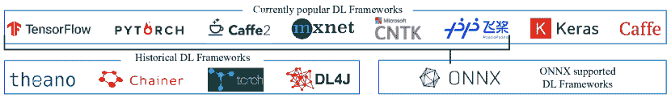
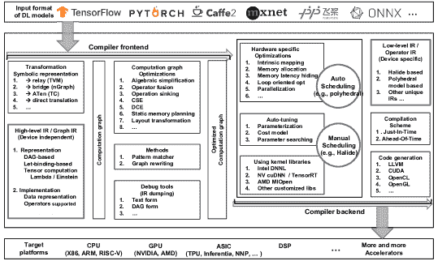
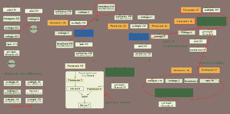
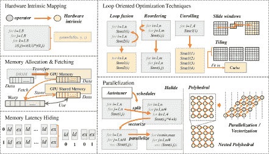
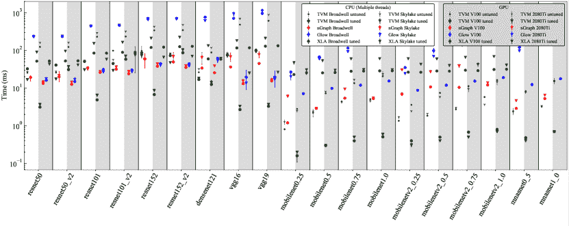
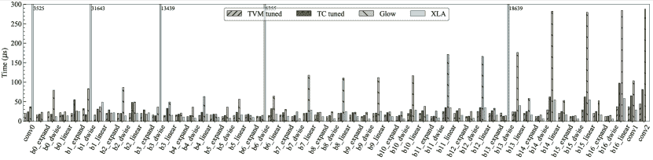
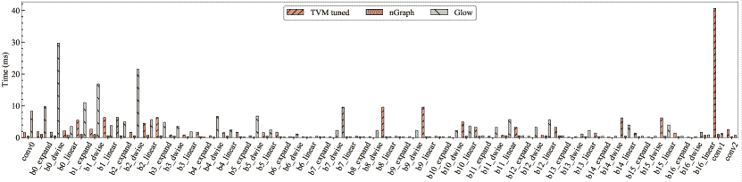
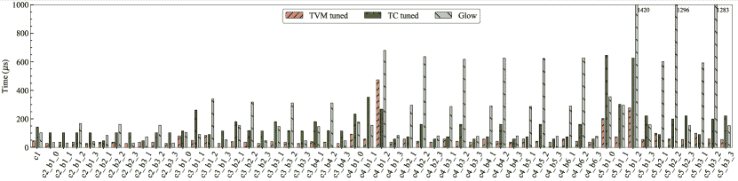
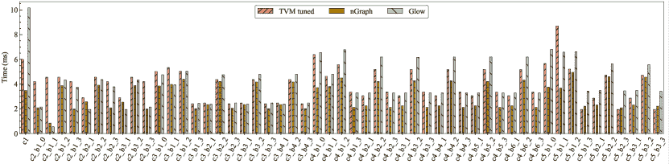

<!--yml

类别：未分类

日期：2024-09-06 20:02:36

-->

# [2002.03794] 深度学习编译器：全面调查

> 来源：[`ar5iv.labs.arxiv.org/html/2002.03794`](https://ar5iv.labs.arxiv.org/html/2002.03794)

# 深度学习编译器：全面调查

李明震^∗ ，刘怡^∗ ，刘晓燕^∗ ，孙青晓^∗ ，游鑫^∗ ，杨海龙^∗^† ，段中智^∗ ，甘林^§ ，杨光文^§  和 钱德培^∗ 北京航空航天大学^∗ 清华大学^§ lmzhhh, yi.liu, liuxiaoyan, sunqingxiao, youxin2015, hailong.yang, zhongzhi.luan, depeiq@buaa.edu.cn lingan, ygw@tsinghua.edu.cn

###### 摘要。

部署各种深度学习（DL）模型在不同的 DL 硬件上面临的难度，推动了社区对 DL 编译器的研究与开发。来自行业和学术界的多个 DL 编译器被提出，如 Tensorflow XLA 和 TVM。同样，DL 编译器将不同 DL 框架中描述的 DL 模型作为输入，然后生成针对各种 DL 硬件的优化代码作为输出。然而，现有的调查中没有全面分析 DL 编译器的独特设计架构。本文通过详细剖析常用的设计，包括 DL 导向的多级中间表示（IR）和前端/后端优化，对现有的 DL 编译器进行了全面调查。我们对多级 IR 的设计进行了详细分析，并说明了常用的优化技术。最后，突出了几个作为 DL 编译器潜在研究方向的见解。这是第一篇聚焦于 DL 编译器设计架构的调查论文，我们希望这能为未来的 DL 编译器研究铺平道路。

神经网络、深度学习、编译器、中间表示、优化^†通讯作者。^†^†版权：无

## 1\. 引言

深度学习（DL）的发展对各个科学领域产生了深远的影响。它不仅在人工智能领域，如自然语言处理（NLP）（Manning et al., 1999）和计算机视觉（CV）（Forsyth and Ponce, 2002），展示了显著的价值，而且在更广泛的应用中，如电子商务（Ha et al., 2016）、智慧城市（Mohammadi et al., 2017）和药物发现（Chen et al., 2018a），也取得了巨大成功。随着多功能深度学习模型的出现，如卷积神经网络（CNN）（LeCun et al., 1998）、递归神经网络（RNN）（Rumelhart et al., 1986）、长短期记忆（LSTM）（Hochreiter and Schmidhuber, 1997）和生成对抗网络（GAN）（Goodfellow et al., 2014），简化各种 DL 模型的编程变得至关重要，以实现其广泛应用。

随着工业界和学术界的持续努力，已经提出了几个流行的 DL 框架，如 TensorFlow（Abadi et al., 2016）、PyTorch（Paszke et al., 2019）、MXNet（Chen et al., 2015）和 CNTK（Seide and Agarwal, 2016），以简化各种 DL 模型的实现。尽管这些 DL 框架在设计中的权衡使得它们各有优缺点，但在支持现有 DL 模型中的新兴 DL 模型时，互操作性变得重要，以减少冗余的工程工作。为提供互操作性，ONNX（Microsoft, 2017）被提出，它定义了一个统一的格式来表示 DL 模型，以促进不同 DL 框架之间的模型转换。

与此同时，矩阵乘法等独特的计算特性激发了芯片架构师设计定制化 DL 加速器以提高效率的热情。互联网巨头（例如，Google TPU（Jouppi et al., 2017）、Hisilicon NPU（Liao et al., 2019）、Apple Bonic（Kingsley-Hughes, 2017））、处理器供应商（例如，NVIDIA Turing（NVIDIA, 2019b）、Intel NNP（Intel, 2019））、服务提供商（例如，Amazon Inferentia（Amazon, 2018）、Alibaba Hanguang（Alibaba, 2019））甚至初创公司（例如，Cambricon（Liu et al., 2016）、Graphcore（Jia et al., 2019））正在投入大量的人力和资本开发 DL 芯片，以提升 DL 模型的性能。一般来说，DL 硬件可以分为以下几类：1）具有软硬件协同设计的通用硬件，2）完全为 DL 模型定制的专用硬件，以及 3）受生物脑科学启发的神经形态硬件。例如，通用硬件（例如，CPU、GPU）增加了诸如 AVX512 向量单元和张量核心等特殊硬件组件，以加速 DL 模型。而对于专用硬件，如 Google TPU，则设计了应用特定集成电路（例如，矩阵乘法引擎和高带宽内存）以极大提高性能和能效。在可预见的未来，DL 硬件的设计将变得更加多样化。

为了适应硬件多样性，重要的是将计算映射到深度学习（DL）硬件上以提高效率。在通用硬件上，高度优化的线性代数库，如基本线性代数子程序（BLAS）库（例如，MKL 和 cuBLAS）作为高效计算 DL 模型的基础。例如，以卷积操作为例，DL 框架将卷积转换为矩阵乘法，然后调用 BLAS 库中的 GEMM 函数。此外，硬件供应商还发布了专门优化的库，针对 DL 计算（例如，MKL-DNN 和 cuDNN），包括前向和后向卷积、池化、归一化和激活。更高级的工具也已开发，以进一步加速 DL 操作。例如，TensorRT（NVIDIA，2019c）支持图优化（例如，层融合）和低位量化，并配有大量高度优化的 GPU 内核。在专用 DL 硬件上，也提供了类似的库（Liu et al., 2016; Jia et al., 2019）。然而，依赖这些库的缺点是，它们通常跟不上 DL 模型的快速发展，从而未能高效利用 DL 芯片。

为了解决深度学习（DL）库和工具的缺陷，以及减轻在每个深度学习硬件上手动优化深度学习模型的负担，深度学习社区求助于领域特定的编译器。迅速地，出现了几种流行的深度学习编译器，例如 TVM (Chen et al., 2018b)、Tensor Comprehension (Vasilache et al., 2018)、Glow (Rotem et al., 2018)、nGraph (Cyphers et al., 2018) 和 XLA (Leary and Wang, 2017)，这些编译器来自工业界和学术界。深度学习编译器将深度学习框架中描述的模型定义作为输入，并在各种深度学习硬件上生成高效的代码实现。模型定义和特定代码实现之间的转换经过高度优化，以针对模型规格和硬件架构。具体来说，它们融合了深度学习特定的优化，例如层和操作符融合，这使得代码生成高度高效。此外，现有的深度学习编译器还利用了通用编译器（例如 LLVM (Lattner and Adve, 2004)）的成熟工具链，这提供了更好的硬件架构跨平台移植性。类似于传统编译器，深度学习编译器也采用了分层设计，包括前端、中间表示（IR）和后端。然而，深度学习编译器的独特之处在于多层级 IR 的设计和深度学习特定的优化。

在本文中，我们通过将编译器设计拆分为前端、多层级 IR 和后端，提供了对现有深度学习编译器的全面调查，特别强调了 IR 设计和优化方法。据我们所知，这是第一篇提供深度学习编译器设计全面调查的论文。具体来说，本文做出了以下贡献：

+   •

    我们剖析了现有深度学习编译器常用的设计架构，并对关键设计组件进行了详细分析，例如多层级 IR、前端优化（包括节点级、块级和数据流级优化）以及后端优化（包括硬件特定优化、自动调优和优化内核库）。

+   •

    我们从各个方面提供了现有深度学习编译器的全面分类，这些方面对应于本调查中描述的关键组件。这个分类的目标是为实践者提供关于选择深度学习编译器的指导，以满足他们的需求，并为研究人员提供深度学习编译器的详细总结。

+   •

    我们提供了关于深度学习编译器在卷积神经网络（CNN）模型上的定量性能比较，包括完整模型和轻量级模型。我们比较了端到端和每层（卷积层，因为它们主导了推理时间）性能，以展示优化的有效性。评估脚本和结果已经开源¹¹1[`github.com/buaa-hipo/dlcompiler-comparison`](https://github.com/buaa-hipo/dlcompiler-comparison) 供参考。

+   •

    我们突出了一些对深度学习编译器未来发展的见解，包括动态形状和预处理/后处理、先进的自动调优、**多面体模型**、子图分割、量化、统一优化、可微编程和隐私保护，我们希望能够推动深度学习编译器社区的研究。

本文其余部分组织如下。第二部分介绍了深度学习编译器的背景，包括深度学习框架、深度学习硬件以及特定于硬件（FPGA）的深度学习代码生成器。第三部分描述了深度学习编译器的常见设计架构。第四部分讨论了深度学习编译器的关键组件，包括多层次中间表示（IR）、前端优化和后端优化。第五部分介绍了全面的分类。第六部分提供了定量性能比较。第七部分突出了深度学习编译器研究的未来方向。

## 2. 背景

### 2.1. 深度学习框架

在本节中，我们提供了对流行深度学习框架的概述。讨论可能不全面，但旨在为深度学习从业者提供指南。图 1 展示了深度学习框架的全景，包括当前流行的框架、历史框架和 ONNX 支持的框架。

TensorFlow - 在所有深度学习框架中，TensorFlow 对语言接口的支持最为全面，包括 C ++、Python、Java、Go、R 和 Haskell。TensorFlow 使用一个扩展了受限控制边的原始操作符的数据流图来表示可微分程序（Roesch 等，2019）。TensorFlow Lite 旨在用于移动和嵌入式深度学习，并提供了 Android 神经网络 API。为了减少使用 TensorFlow 的复杂性，Google 采用 Keras 作为 TensorFlow 核心的前端。此外，TensorFlow 中的 eager-mode 应用了一种类似于 PyTorch 的方法，以更好地支持动态计算图。

Keras - Keras（Chollet 等，2015）是一个高层次的神经网络库，用于快速构建深度学习模型，使用纯 Python 编写。尽管 Keras 本身不是一个深度学习框架，但它提供了一个高级 API，与 TensorFlow、MXNet、Theano 和 CNTK 集成。使用 Keras，深度学习开发者可以用几行代码构建神经网络。此外，Keras 可以与其他常见的深度学习包（如 scikit-learn）集成。然而，由于过度封装，Keras 的灵活性不足，导致添加操作符或获取低级数据信息变得过于困难。

PyTorch - Facebook 将基于 Lua 的深度学习框架 Torch 用 Python 重写，并在 Tensor 级别上重构了所有模块，从而发布了 PyTorch。作为最受欢迎的动态框架，PyTorch 在 Python 中嵌入了构建动态数据流图的原语，其中控制流在 Python 解释器中执行。PyTorch 1.0 将 PyTorch 0.4 和 Caffe2 的代码库整合，创建了一个统一的框架。这使得 PyTorch 吸收了 Caffe2 的优点，以支持高效的图执行和移动部署。FastAI（Howard 等，2018）是一个基于 PyTorch 上层封装的高级 API 层。它完全借鉴了 Keras 的设计，简化了 PyTorch 的使用。

Caffe/Caffe2 - Caffe（Jia 等，2014）是由 UC Berkeley 设计的深度学习和图像分类框架。Caffe 提供了命令行、Python 和 MATLAB API。Caffe 的简单性使得源代码易于扩展，适合开发者深入分析。因此，Caffe 主要定位于研究，从最初到现在一直很受欢迎。Caffe2 建立在原始 Caffe 项目之上。Caffe2 在代码结构上类似于 TensorFlow，但 API 更轻量，且更容易访问计算图中的中间结果。

MXNet - MXNet 支持多种语言 API，包括 Python、C++、R、Scala、Julia、Matlab 和 JavaScript。它旨在实现可扩展性，并从减少数据加载和 I/O 复杂性的角度进行设计（Chen 等，2015）。MXNet 提供不同的范式：类似 Caffe 和 Tensorflow 的声明式编程以及类似 PyTorch 的命令式编程。2017 年 12 月，亚马逊和微软联合发布了基于 MXNet 的 Gluon（MXNet，2017），这是一种类似于 Keras 和 FastAI 的高级接口。Gluon 同时支持灵活的动态图和高效的静态图。

CNTK - CNTK 可以通过 Python、C++和 C# API 或其自己的脚本语言（即 BrainScript）使用。CNTK 旨在易于使用，并且适用于生产环境中的大规模数据（Hatcher 和 Yu，2018）。然而，CNTK 尚不支持 ARM 架构，这限制了它在移动设备上的使用。它使用静态计算图，类似于 TensorFlow 和 Caffe，其中 DL 模型被视为通过有向图进行一系列计算步骤。

PaddlePaddle - PaddlePaddle 的原始设计（百度，2016）类似于 Caffe，其中每个模型可以表示为一组层。然而，PaddlePaddle v2 已经采用了参考 TensorFlow 的运算符的概念，将层分解为更细粒度的算子，从而支持更复杂的 DL 模型。PaddlePaddle Fluid 类似于 PyTorch，因为它提供了自己的解释器，以避免 Python 解释器的性能限制。

ONNX - 开放神经网络交换（ONNX）（微软，2017）定义了可扩展的计算图模型，因此不同 DL 框架构建的计算图可以轻松转换为 ONNX。有了 ONNX，可以更容易地在 DL 框架之间转换模型。例如，它允许开发人员构建一个 MXNet 模型，然后使用 PyTorch 来运行模型进行推理。正如图 1 所示，ONNX 已经集成到 PyTorch、MXNet、PaddlePaddle 等框架中。对于一些尚未直接支持的 DL 框架（例如 TensorFlow 和 Keras），ONNX 为它们添加了转换器。

历史框架 - 由于 DL 社区的快速发展，许多历史上的 DL 框架不再活跃。例如，PyTorch 已经取代了 Torch (Collobert et al., 2011)。作为最早的 DL 框架之一，Theano (Team et al., 2016a) 已不再维护。Deeplearning4J (Team et al., 2016b) 是一个基于 Java 和 Scala 的分布式 DL 框架，然而由于缺乏大型开发者社区而变得不活跃。Chainer (Tokui et al., 2019) 曾是动态计算图的首选框架，但被具有类似功能的 MXNet、PyTorch 和 TensorFlow 取代。

以前的工作 (Bahrampour et al., 2015; Fonnegra et al., 2017; Shams et al., 2017; Guo et al., 2018; Nara et al., 2019; Wei et al., 2019) 比较了不同应用（如计算机视觉和图像分类）和不同硬件（如 CPU、GPU 和 TPU）上 DL 框架的性能。有关每个 DL 框架的详细信息，读者可以参考 (Hatcher and Yu, 2018)。与这些工作不同，本调查专注于 DL 编译器的研究工作，这些编译器提供了更通用的方法，以高效地在各种硬件上执行不同的 DL 模型。

图 1\. DL 框架概览：1) 当前流行的 DL 框架；2) 历史 DL 框架；3) ONNX 支持的框架。

### 2.2\. 深度学习硬件

深度学习硬件可以根据通用性分为三类：1) 通用硬件，通过硬件和软件优化支持 DL 工作负载；2) 专用硬件，专注于通过完全定制的电路设计加速 DL 工作负载；3) 神经形态硬件，通过模仿人脑的方式工作。

通用硬件 - 代表性的深度学习（DL）模型通用硬件是图形处理单元（GPU），它通过多核心架构实现了高并行性。例如，Nvidia GPU 自 Volta 架构起引入了张量核心。张量核心可以并行加速混合精度矩阵乘法和累加计算，这些计算在 DL 模型的训练和推理过程中广泛使用。与硬件共同优化，NVIDIA 还推出了高度优化的 DL 库和工具，如 cuDNN (Chetlur et al., 2014) 和 TensorRT (NVIDIA, 2019c)，进一步加速 DL 模型的计算。

专用硬件 - 专用硬件是为深度学习计算量身定制的，以极大地提升性能和能源效率。深度学习应用和算法的快速扩展促使许多初创公司开发专用深度学习硬件（例如，Graphcore GC2、Cambricon MLU270）。此外，传统硬件公司（如，Intel NNP、Qualcomm Cloud AI 100）和云服务提供商（例如，Google TPU、Amazon Inferentia 和 Alibaba Hanguang）也在这一领域进行了投资。最著名的专用深度学习硬件是 Google 的 TPU 系列。TPU 包括矩阵乘法单元（MXU）、统一缓冲区（UB）和激活单元（AU），由主处理器通过 CISC 指令驱动。MXU 主要由一个流线型阵列组成，优化了矩阵乘法的功耗和面积效率。与 CPU 和 GPU 相比，TPU 仍然是可编程的，但它使用矩阵作为基本单元，而不是向量或标量。Amazon Inferentia 最近也引起了关注。该芯片具有四个神经核心，专为张量级操作设计，并具有大型片上缓存，以避免频繁的主内存访问。

神经形态硬件 - 神经形态芯片使用电子技术模拟生物大脑。这类芯片的代表产品有 IBM 的 TrueNorth 和 Intel 的 Loihi。神经形态芯片（例如，TrueNorth）具有非常高的人工神经元间连接性。神经形态芯片还复制了类似于脑组织的结构：神经元可以同时存储和处理数据。传统芯片将处理器和内存分布在不同的位置，而神经形态芯片通常具有许多微处理器，每个处理器都有少量的本地内存。与 TrueNorth 相比，Loihi 具有更接近大脑的学习能力。Loihi 引入了脉冲时间依赖突触可塑性模型（STDP），这是一个通过前突触和后突触脉冲的相对时间来调节突触强度的机制。然而，神经形态芯片距离大规模商业生产仍然有很长的路要走。尽管如此，在计算机科学领域，神经形态芯片可以帮助捕捉快速、终身学习的过程，而这些过程通常被常规深度学习模型忽略；在神经科学领域，它们有助于揭示大脑的不同部分如何协同工作以产生思想、情感甚至意识。

### 2.3\. 硬件特定深度学习代码生成器

可编程逻辑门阵列（FPGAs）是可重新编程的集成电路，包含一组可编程逻辑块。程序员可以在制造后进行配置。除了可重新编程的特性，FPGA 的低功耗和高性能使其在许多领域得到广泛应用，如通信、医疗、图像处理和 ASIC 原型设计。在深度学习领域，高性能的 CPU 和 GPU 具有很强的重新编程能力但耗电量大，而功耗高效的 ASIC 则专门用于固定应用。然而，FPGA 可以弥合 CPU/GPU 和 ASIC 之间的差距，使 FPGA 成为深度学习的一个有吸引力的平台。

高级合成（HLS）编程模型使 FPGA 程序员可以方便地使用 C 和 C++等高级语言生成有效的硬件设计。这避免了编写大量的 Verilog 或 VHDL 描述，从而降低了编程门槛，缩短了设计周期。Xilinx Vivado HLS 和 Intel FPGA SDK for OpenCL 是两个流行的 HLS 工具，针对各自的 FPGA。然而，即使有 HLS，将深度学习模型映射到 FPGA 仍然是复杂的工作，因为 1）深度学习模型通常由深度学习框架的语言描述，而不是纯粹的 C/C++代码，2）深度学习特定的信息和优化难以利用。

针对 FPGA 的硬件特定代码生成器将深度学习模型或其领域特定语言（DSLs）作为输入，进行领域特定（关于 FPGA 和深度学习）的优化和映射，然后生成 HLS 或 Verilog/VHDL，最终生成比特流。根据生成的 FPGA 加速器架构，它们可以分为两类：处理器架构和流处理架构（Venieris et al., 2018）。

处理器架构与通用处理器有相似之处。这种架构的 FPGA 加速器通常由几个处理单元（PUs）组成，这些处理单元包括片上缓冲区和多个较小的处理引擎（PEs）。它通常具有虚拟指令集（ISA），并且硬件控制和执行调度应由软件确定。此外，静态调度方法避免了冯·诺依曼执行的开销（包括指令获取和解码）。硬件模板是一种通用的基本实现，具有可配置的参数。针对这种架构的 DL 代码生成器采用硬件模板来自动生成加速器设计。通过模板的可配置参数，代码生成器实现了可扩展性和灵活性（Zhao et al., 2018）。可扩展性意味着代码生成器可以生成适用于从高性能到节能的 FPGAs 的设计，而灵活性意味着代码生成器可以为不同层类型和参数的各种 DL 模型生成设计。PUs 的数量和每个 PU 的 PE 数量是重要的模板参数。此外，分块大小和批量大小也是将 DL 模型映射到 PUs 和 PEs 时的重要调度参数。这些参数通常通过使用各种策略（例如结合性能模型和自动调优）来确定设计空间探索。DNN Weaver（Sharma et al., 2016），Angel-Eye（Guo et al., 2017a），ALAMO（Ma et al., 2018），FP-DNN（Guan et al., 2017），SysArrayAccel（Wei et al., 2017）是针对处理器架构的典型 FPGA DL 代码生成器。此外，PUs 和 PEs 通常负责粗粒度的基本操作，如矩阵-向量乘法、矩阵-矩阵乘法、池化和一些逐元素操作。这些基本操作的优化主要受并行性和数据重用之间权衡的指导，这与通用优化类似。

流处理架构与管道有相似之处。此架构的 FPGA 加速器由多个不同的硬件模块组成，并且几乎为输入 DL 模型的每一层配备一个硬件模块。通过 DL 模型的输入数据，这种加速器按层的顺序通过不同的硬件模块处理数据。此外，利用流输入数据，所有硬件模块可以以管道方式充分利用。然而，流处理架构通常基于一个初步假设，即目标 FPGA 上的片上内存计算资源足以容纳 DL 模型，这对部署具有复杂层的深度模型带来了障碍。针对这一架构的 DL 代码生成器可以通过利用 FPGA 的可重构性或采用动态控制流来解决这个问题。而单个模块的进一步优化类似于处理器架构的基本操作。fpgaConvNet (Venieris and Bouganis, 2016), DeepBurning (Wang et al., 2016), Haddoc2 (Abdelouahab et al., 2017), 和 AutoCodeGen (Liu et al., 2016)是典型的 DL 代码生成器。

关于将深度学习（DL）模型映射到 FPGA 的具体编译技术的详细调查，读者可以参考 (Venieris et al., 2018; Zhao et al., 2018; Guo et al., 2017b)。与 (Venieris et al., 2018; Zhao et al., 2018; Guo et al., 2017b)不同，本调查专注于可以应用于更广泛深度学习硬件的通用 DL 编译技术，而不仅仅限于 FPGA。

## 3\. DL 编译器的常见设计架构

图 2\. DL 编译器常用设计架构概述。

深度学习编译器的常见设计架构主要包括两个部分：编译器前端和编译器后端，如图 2 所示。中间表示（IR）分布在前端和后端。一般而言，IR 是程序的抽象形式，用于程序优化。具体而言，深度学习模型在深度学习编译器中被转换为多层 IR，其中高级 IR 位于前端，低级 IR 位于后端。基于高级 IR，编译器前端负责硬件无关的转换和优化。基于低级 IR，编译器后端负责硬件特定的优化、代码生成和编译。需要注意的是，本综述关注于深度学习编译器的设计原理。有关深度学习编译器的功能和实验比较，读者可以参考（Xing 等，2019；Li 等，2020）。

高级 IR，也称为图 IR，表示计算和控制流，并且与硬件无关。高级 IR 的设计挑战在于计算和控制流的抽象能力，这种能力能够捕捉和表达各种深度学习模型。高级 IR 的目标是建立操作符与数据之间的控制流和依赖关系，并提供图级优化的接口。它还包含丰富的语义信息用于编译，并提供对自定义操作符的扩展性。高级 IR 的详细讨论见第 4.1 节。

低级 IR 旨在实现针对特定硬件的优化和代码生成，以适应各种硬件目标。因此，低级 IR 应足够精细，以反映硬件特性并表示硬件特定的优化。它还应支持在编译器后端使用成熟的第三方工具链，如 Halide（Ragan-Kelley 等，2013）、多面体模型（Grosser，2000）和 LLVM（Lattner 和 Adve，2004）。低级 IR 的详细讨论见第 4.2 节。

前端从现有 DL 框架中获取 DL 模型作为输入，然后将模型转换为计算图表示（例如，图 IR）。前端需要实现各种格式转换，以支持不同框架中的多样格式。计算图优化结合了通用编译器的优化技术和 DL 特定的优化技术，这些优化技术减少了冗余，提高了图 IR 的效率。这些优化可以分为节点级（例如，nop 消除和零维张量消除）、块级（例如，代数简化、操作符融合和操作符下沉）和数据流级（例如，CSE、DCE、静态内存规划和布局转换）。前端处理后，优化的计算图被生成并传递到后端。关于前端的详细讨论见第 4.3 节。

后端将高级中间表示（IR）转换为低级 IR，并执行特定于硬件的优化。一方面，它可以将高级 IR 直接转换为诸如 LLVM IR 的第三方工具链，以利用现有的基础设施进行通用优化和代码生成。另一方面，它可以利用对 DL 模型和硬件特性的先验知识，通过自定义编译过程进行更高效的代码生成。常用的硬件特定优化包括硬件内在映射、内存分配与获取、内存延迟隐藏、并行化以及面向循环的优化。为了确定大优化空间中的最佳参数设置，现有 DL 编译器广泛采用两种方法：自动调度（例如，多面体模型）和自动调优（例如，AutoTVM）。优化后的低级 IR 通过 JIT 或 AOT 编译，生成针对不同硬件目标的代码。关于后端的详细讨论见第 4.4 节。

## 4\. DL 编译器的关键组件

### 4.1\. 高级 IR

为了克服传统编译器中 IR 的局限性，这些局限性限制了 DL 模型中复杂计算的表达，现有 DL 编译器利用具有特殊设计的高级 IR（也称为图 IR）来实现高效的代码优化。为了更好地理解 DL 编译器中使用的图 IR，我们如下描述了图 IR 的表示和实现。

#### 4.1.1\. 图 IR 的表示

图 IR 的表示影响图 IR 的表达能力，并决定 DL 编译器分析图 IR 的方式。

基于 DAG 的 IR - 基于 DAG 的 IR 是编译器构建计算图的最传统方式之一，节点和边组织为有向无环图（DAG）。在 DL 编译器 (Chen 等, 2018b; Cyphers 等, 2018; Rotem 等, 2018; Vasilache 等, 2018; Leary 和 Wang, 2017) 中，DAG 的节点表示原子 DL 操作符（卷积、池化等），边表示张量。图是无环的，没有循环，这不同于通用编译器的依赖关系图 (Kuck 等, 1981)（DDG）(Lattner 和 Adve, 2004; Lattner 等, 2020)。借助 DAG 计算图，DL 编译器可以分析各种操作符之间的关系和依赖性，并利用这些信息指导优化。DDG 上已经有很多优化，如公共子表达式消除（CSE）和死代码消除（DCE）。通过将 DL 的领域知识与这些算法结合，可以对 DAG 计算图进行进一步的优化，这将在第 4.3 节中详细阐述。由于其简洁性，基于 DAG 的 IR 方便编程和编译，但也存在一些不足之处，例如由于计算范围缺失定义而导致的语义模糊性。

基于 let 绑定的 IR - Let 绑定是一种通过为某些具有限制范围的函数提供 let 表达式来解决语义模糊性的方法，这种方法被许多高级编程语言（如 Javascript (Goodman, 2007)、F# (Petricek 和 Syme, 2012)、Scheme (Abelson 等, 1998)）所使用。当使用 let 关键字定义一个表达式时，会生成一个 let 节点，然后它指向表达式中的运算符和变量，而不是仅仅建立变量之间的计算关系作为 DAG。在基于 DAG 的编译器中，当一个过程需要获取一个表达式的返回值时，它首先访问相应的节点并搜索相关节点，这也被称为递归下降技术。相比之下，基于 let 绑定的编译器会计算 let 表达式中所有变量的结果，并建立一个变量映射。当需要特定结果时，编译器会查阅这个映射以决定表达式的结果。在 DL 编译器中，TVM 的 Relay IR (Roesch 等, 2019) 采用了 DAG 基于 IR 和 let 绑定基于 IR 以获得两者的优点。

张量计算表示 - 不同的图形 IR 有不同的方式来表示张量计算。各种 DL 框架的操作符根据这些特定的表示方式被转换为图形 IR。同时，定制的操作符也需要以这种表示方式进行编程。张量计算的表示可以分为以下三类。

1) 基于函数的：基于函数的表示方式仅提供封装的操作符，这种方式被 Glow、nGraph 和 XLA 采用。以高层优化器（HLO，XLA 的 IR）为例，它由一组符号编程中的函数组成，其中大多数没有副作用。指令被组织成三个层次，包括 HloModule（整个程序）、HloComputaion（一个函数）和 HloInstruction（操作）。XLA 使用 HLO IR 来表示图形 IR 和操作 IR，使得 HLO 的操作范围从数据流层次到操作符层次。

2) Lambda 表达式：Lambda 表达式，即索引公式表达式，通过变量绑定和替换来描述计算。使用 Lambda 表达式，程序员可以快速定义计算而无需实现新函数。TVM 使用基于 Lambda 表达式的张量表达式来表示张量计算。在 TVM 中，张量表达式中的计算操作符由输出张量的形状和计算规则的 Lambda 表达式定义。

3) 爱因斯坦记号：爱因斯坦记号，也称为求和约定，是一种表达求和的记号。它在编程上的简便性优于 Lambda 表达式。以 TC 为例，临时变量的索引不需要定义。IR 可以根据爱因斯坦记号通过未定义变量的出现来推断实际表达式。在爱因斯坦记号中，操作符需要是结合性和交换性的。这一限制保证了减少操作符可以按任意顺序执行，从而使得进一步的并行化成为可能。

#### 4.1.2\. 图形 IR 的实现

DL 编译器中图形 IR 的实现完成了数据和操作的管理。

数据表示 - DL 编译器中的数据（例如，输入、权重和中间数据）通常以张量的形式组织，张量也称为多维数组。DL 编译器可以通过内存指针直接表示张量数据，或者通过占位符以更灵活的方式表示。占位符包含张量每个维度的大小。或者，张量的维度大小也可以标记为未知。为了优化，DL 编译器需要数据布局信息。此外，迭代器的边界应根据占位符进行推断。

1) 占位符：占位符广泛用于符号编程（例如，Lisp （McCarthy 和 Levin，1965），Tensorflow （Abadi 等，2016））。占位符只是一个具有明确形状信息（例如，每个维度的大小）的变量，并且它将在计算的后期阶段填充值。它允许程序员描述操作并构建计算图，而不必担心确切的数据元素，这有助于将计算定义与 DL 编译器中的确切执行分开。此外，使用占位符可以方便地改变输入/输出及其他相应中间数据的形状，而无需更改计算定义。

2) 未知（动态）形状表示：在声明占位符时通常支持未知维度大小。例如，TVM 使用 Any 表示未知维度（例如，$Tensor\langle(Any,3),fp32\rangle$）；XLA 使用 None 达到相同的目的（例如，$tf.placeholder$ $(``float&quot;,[None,3])$）；nGraph 使用其 PartialShape 类。未知形状表示对于支持动态模型是必要的。然而，为了完全支持动态模型，边界推断和维度检查应当放宽。此外，应实现额外的机制以保证内存的有效性。

3) 数据布局：数据布局描述了张量在内存中的组织方式，通常是逻辑索引到内存索引的映射。数据布局通常包括维度的顺序（例如，NCHW 和 NHWC）、切分、填充、步幅等。TVM 和 Glow 将数据布局表示为操作符参数，并需要这些信息进行计算和优化。然而，将数据布局信息与操作符而不是张量结合，可以使某些操作符的实现更加直观，并减少编译开销。XLA 将数据布局表示为与其后端硬件相关的约束。Relay 和 MLIR 将把数据布局信息添加到它们的张量类型系统中。

4) 边界推断：边界推断用于确定在 DL 编译器中编译 DL 模型时迭代器的边界。尽管在 DL 编译器中张量表示方便用于描述输入和输出，但它对推断迭代器边界提出了特殊挑战。边界推断通常根据计算图和已知的占位符递归或迭代地进行。例如，在 TVM 中，迭代器形成一个有向无环超图，其中图的每个节点代表一个迭代器，每个超边代表两个或更多迭代器之间的关系（例如，拆分、融合或重基）。一旦根据占位符的形状确定了根迭代器的边界，就可以根据关系递归地推断其他迭代器。

支持的操作符 - DL 编译器支持的操作符负责表示 DL 工作负载，它们是计算图的节点。这些操作符通常包括代数操作符（例如$+$、$\times$、$\exp$和 topK）、神经网络操作符（例如卷积和池化）、张量操作符（例如 reshape、resize 和 copy）、广播和归约操作符（例如 min 和 argmin），以及控制流操作符（例如 conditional 和 loop）。在这里，我们选择了三个在不同 DL 编译器中经常使用的代表性操作符进行说明。此外，我们还讨论了自定义操作符的情况。

1) 广播：广播操作符可以复制数据并生成具有兼容形状的新数据。如果没有广播操作符，输入张量的形状会受到更多限制。例如，对于一个加法操作符，输入张量期望具有相同的形状。一些编译器如 XLA 和 Relay 通过提供广播操作符来放宽这种限制。例如，XLA 允许在矩阵和向量之间进行逐元素加法，通过复制向量直到其形状与矩阵匹配。

2) 控制流：在表示复杂和灵活的模型时，需要控制流。模型如 RNN 和强化学习（RL）依赖于递归关系和数据依赖的条件执行（Yu et al., 2018），这需要控制流。如果图形 IR 中不支持控制流，这些模型必须依赖宿主语言的控制流支持（例如 Python 中的 if 和 while）或静态展开，这会降低计算效率。Relay 注意到任意控制流可以通过递归和模式来实现，这一点已通过函数式编程得到验证（Roesch et al., 2019）。因此，它提供了 if 操作符和递归函数来实现控制流。相反，XLA 通过特殊的 HLO 操作符（如 while 和 conditional）来表示控制流。

3) 导数：操作符$Op$的导数操作符以$Op$的输出梯度和输入数据作为输入，然后计算$Op$的梯度。尽管一些 DL 编译器（例如 TVM 和 TC）支持自动微分（Van Merriënboer et al., 2018），但在应用链式法则时，它们要求高层 IR 中所有操作符的导数。TVM 正在致力于提供代数操作符和神经网络操作符的导数操作符。程序员可以使用这些导数操作符来构建自定义操作符的导数。相反，PlaidML 可以自动生成导数操作符，即使是自定义操作符。值得注意的是，无法支持导数操作符的 DL 编译器无法提供模型训练的能力。

4) 定制操作符：这允许程序员为特定目的定义自己的操作符。支持定制操作符提高了深度学习编译器的可扩展性。例如，在 Glow 中定义新操作符时，程序员需要实现逻辑和节点封装。此外，还需要额外的工作，如降级步骤、操作 IR 生成和指令生成（如有必要）。而 TVM 和 TC 除了描述计算实现外，编程工作量较少。具体来说，TVM 的用户只需描述计算和调度，并声明输入/输出张量的形状。此外，定制操作符通过钩子集成 Python 函数，这进一步减轻了程序员的负担。

#### 4.1.3\. 讨论

几乎所有的深度学习编译器都有其独特的高层 IR。然而，它们共享类似的设计理念，例如使用 DAG 和 let-binding 来构建计算图。此外，它们通常为程序员提供了表示张量计算的便利方法。高层 IR 中设计的数据和操作符足够灵活和可扩展，以支持各种深度学习模型。更重要的是，高层 IR 是硬件独立的，因此可以与不同的硬件后端一起使用。

### 4.2\. 低层 IR

#### 4.2.1\. 低层 IR 的实现

低层 IR 以比高层 IR 更细粒度的表示描述深度学习模型的计算，这通过提供调优计算和内存访问的接口来实现目标相关的优化。在本节中，我们将低层 IR 的常见实现分类为三类：基于 Halide 的 IR、基于多面体的 IR 以及其他独特的 IR。

基于 Halide 的 IR - Halide 最初是为了并行处理图像而提出的，并且已证明在深度学习编译器（如 TVM）中具有扩展性和高效性。Halide 的基本理念是计算和调度的分离。编译器在采用 Halide 时不会直接给出特定的方案，而是尝试各种可能的调度方案并选择最佳方案。Halide 中的内存引用和循环嵌套的边界被限制在对齐到轴的有界盒子中。因此，Halide 不能表达具有复杂模式的计算（例如，非矩形的）。幸运的是，深度学习中的计算相当规则，可以被 Halide 完美表达。此外，Halide 可以轻松参数化这些边界并将其暴露给调优机制。在应用于深度学习编译器的后端时，Halide 的原始 IR 需要进行修改。例如，Halide 的输入形状是无限的，而深度学习编译器需要知道数据的确切形状，以便将操作符映射到硬件指令上。一些编译器，如 TC，需要固定的数据大小，以确保张量数据的更好时间局部性。

TVM 通过以下努力将 Halide IR 改进为独立的符号 IR。它去除了对 LLVM 的依赖，并重构了项目模块的结构以及 Halide 的 IR 设计，追求更好的组织结构以及对图形 IR 和前端语言（如 Python）的可访问性。重用性也得到了提升，运行时调度机制的实现方便地添加了自定义操作符。TVM 将变量定义从字符串匹配简化为指针匹配，保证每个变量只有一个定义位置（静态单分配，SSA）（Cytron 等，1991）。

基于多面体的 IR - 多面体模型是 DL 编译器采用的一项重要技术。它利用线性规划、仿射变换和其他数学方法来优化具有静态控制流的基于循环的代码。与 Halide 相比，多面体模型中的内存引用和循环嵌套的边界可以是任意形状的多面体。这种灵活性使多面体模型在通用编译器中得到广泛应用。然而，这种灵活性也阻碍了与调优机制的集成。尽管如此，由于能够处理深度嵌套的循环，许多 DL 编译器（如 TC 和 PlaidML（作为 nGraph 的后端））已将多面体模型作为其低级 IR。基于多面体的 IR 使得应用各种多面体变换（例如融合、平铺、沉降和映射）变得容易，包括设备相关和设备无关的优化。有许多工具链被多面体编译器借用，例如 isl（Verdoolaege，2010），Omega（Kelly 等，1996），PIP（Feautrier，1988），Polylib（Loechner，1999）和 PPL（Bagnara 等，2006）。

TC 在低级 IR 方面有其独特的设计，它结合了 Halide 和多面体模型。它使用基于 Halide 的 IR 来表示计算，并采用基于多面体的 IR 来表示循环结构。TC 通过抽象实例呈现详细的表达，并引入了特定的节点类型。简言之，TC 使用领域节点来指定索引变量的范围，使用上下文节点来描述与硬件相关的新迭代变量，并使用带状节点来确定迭代顺序。过滤器节点表示一个结合了语句实例的迭代器。集合和序列是用于指定过滤器执行类型（并行和串行执行）的关键字。此外，TC 使用扩展节点来描述代码生成所需的其他指令，如内存移动。

PlaidML 使用基于多面体的 IR（称为 Stripe）来表示张量操作。它通过将并行多面体块的嵌套扩展到多个层次，创建了一个可并行化代码的层次结构。此外，它允许将嵌套的多面体分配到嵌套的内存单元，提供了一种将计算与内存层次匹配的方法。在 Stripe 中，硬件配置与内核代码无关。Stripe 中的标签（在其他编译器中称为 passes）不会改变内核结构，而是提供有关硬件目标的附加信息以进行优化 passes。Stripe 将 DL 运算符拆分为适合本地硬件资源的瓦片。

其他独特的 IR —— 有些 DL 编译器实现了自定义的低级 IR，而不使用 Halide 和多面体模型。在这些自定义低级 IR 上，它们应用了特定于硬件的优化，并将其转换为 LLVM IR。

Glow 中的低级 IR 是基于指令的表达式，它在通过地址引用的张量上操作（Rotem 等， 2018）。Glow 低级 IR 中有两种基于指令的函数：声明和程序。第一个函数声明了程序生命周期内存在的常量内存区域的数量（例如，输入、权重、偏置）。第二个函数是一个局部分配区域的列表，包括函数（例如，conv 和 pool）和临时变量。指令可以在全局内存区域或局部分配区域上运行。此外，每个操作数都用以下限定符之一进行注释：@in 表示操作数从缓冲区读取；@out 表示操作数写入缓冲区；@inout 表示操作数从缓冲区读取和写入。这些指令和操作数限定符帮助 Glow 确定何时可以执行某些内存优化。

MLIR 受到 LLVM 的高度影响，它比 LLVM 更纯粹的编译器基础设施。MLIR 重用 LLVM 中的许多思想和接口，并介于模型表示和代码生成之间。MLIR 具有灵活的类型系统并支持多层次的抽象，它引入了方言来表示这些多个抽象层次。每个方言由一组定义的不可变操作组成。当前的 MLIR 方言包括 TensorFlow IR、XLA HLO IR、实验性的多面体 IR、LLVM IR 和 TensorFlow Lite。方言之间的灵活转换也得到了支持。此外，MLIR 可以创建新的方言以连接到新的低级编译器，为硬件开发人员和编译器研究人员铺平了道路。

XLA 的 HLO IR 可以被视为高层 IR 和低层 IR，因为 HLO 足够细粒度地表示硬件特定的信息。此外，HLO 支持特定于硬件的优化，并且可以用于发出 LLVM IR。

#### 4.2.2\. 基于低级 IR 的代码生成

大多数深度学习（DL）编译器采用的低级中间表示（IR）最终可以转换为 LLVM IR，并受益于 LLVM 成熟的优化器和代码生成器。此外，LLVM 可以从头开始为专用加速器设计自定义指令集。然而，传统编译器在直接传递给 LLVM IR 时可能生成较差的代码。为避免这种情况，DL 编译器采用了两种方法来实现硬件相关优化：1）在 LLVM 的上层 IR（例如，基于 Halide 的 IR 和基于多面体的 IR）中执行针对特定目标的循环变换，以及 2）为优化过程提供关于硬件目标的额外信息。大多数 DL 编译器同时应用这两种方法，但重点不同。一般来说，倾向于前端用户的 DL 编译器（例如，TC、TVM、XLA 和 nGraph）可能会侧重于 1），而更倾向于后端开发者的 DL 编译器（例如，Glow、PlaidML 和 MLIR）可能会侧重于 2）。

DL 编译器中的编译方案主要可以分为两类：即时编译（JIT）和预编译（AOT）。对于 JIT 编译器，它可以动态生成可执行代码，并能够以更好的运行时知识优化代码。AOT 编译器首先生成所有可执行二进制文件，然后执行它们。因此，它们在静态分析方面的范围比 JIT 编译更大。此外，AOT 方法可以与嵌入式平台的交叉编译器（例如，C-GOOD (Kang 等，2018)）一起使用，并能够在远程机器（TVM RPC）和定制加速器上执行。

#### 4.2.3\. 讨论

在 DL 编译器中，低级 IR 是 DL 模型的细粒度表示，它反映了 DL 模型在各种硬件上的详细实现。低级 IR 包括基于 Halide 的 IR、基于多面体的 IR 以及其他独特的 IR。虽然它们在设计上有所不同，但它们利用成熟的编译工具链和基础设施，提供针对硬件特定优化和代码生成的定制接口。低级 IR 的设计也可能影响新 DL 加速器的设计（例如，TVM HalideIR 和 Inferentia，以及 XLA HLO 和 TPU）。

### 4.3\. 前端优化

在构建计算图后，前端会应用图级优化。许多优化在图级上更容易识别和执行，因为图提供了计算的全局视图。这些优化仅应用于计算图，而不是后端实现。因此，它们是硬件无关的，可以应用于各种后端目标。

前端优化通常通过传递定义，并可以通过遍历计算图的节点并执行图变换来应用。前端提供了方法来 1) 从计算图中捕获特定特征，2) 重写图以进行优化。除了预定义的传递，开发者还可以在前端定义自定义传递。大多数深度学习编译器可以在导入并转换为计算图后确定每个操作的输入张量和输出张量的形状。这一特性使得深度学习编译器能够根据形状信息执行优化。图 3 显示了使用 Tensorflow XLA 的计算图优化示例。

在本节中，我们将前端优化分为三类：1) 节点级优化，2) 块级（窥视孔、本地）优化，和 3) 数据流级（全局）优化。

图 3\. 计算图优化的示例，取自使用 Tensorflow XLA 在 Volta GPU 上的 Alexnet 的 HLO 图。

#### 4.3.1\. 节点级优化

计算图的节点足够粗糙，以便在单个节点内部进行优化。节点级优化包括节点消除，去除不必要的节点，以及节点替换，用其他低成本节点替换节点。

在通用编译器中，Nop 消除去除占用少量空间但不执行任何操作的无操作指令。在深度学习编译器中，Nop 消除负责消除缺少足够输入的操作。例如，仅有一个输入张量的求和节点可以被消除，填充宽度为零的填充节点可以被消除。

零维张量消除负责去除输入为零维张量的不必要操作。假设 $A$ 是一个零维张量，$B$ 是一个常量张量，那么 $A$ 和 $B$ 的求和操作节点可以被已经存在的常量节点 $B$ 替代，而不会影响正确性。假设 $C$ 是一个三维张量，但其中一个维度的形状为零，例如 {0,2,3}，因此 $C$ 没有元素，argmin/argmax 操作节点可以被消除。

#### 4.3.2\. 块级优化

代数简化 - 代数简化优化包括 1) 代数识别，2) 强度减小，通过这种方式我们可以用更便宜的操作符替换更昂贵的操作符；3) 常量折叠，通过这种方式我们可以用常量表达式的值替换常量表达式。这些优化考虑节点序列，然后利用不同类型节点的交换性、结合性和分配性来简化计算。

除了典型的运算符（$+$、$\times$ 等），代数简化也可以应用于深度学习特定的运算符（例如，reshape、transpose 和 pooling）。这些运算符可以重新排序，有时可以被消除，这样可以减少冗余并提高效率。以下是代数简化可以应用的常见情况：1）计算顺序优化，在这种情况下，优化会根据特定特征找到并移除 reshape/transpose 操作。以矩阵乘法（GEMM）为例，假设有两个矩阵（例如，$A$ 和 $B$），这两个矩阵都被转置（产生 $A^{T}$ 和 $B^{T}$），然后 $A^{T}$ 和 $B^{T}$ 被相乘。然而，实现 GEMM 的一种更高效的方法是交换参数 $A$ 和 $B$ 的顺序，将它们相乘，然后转置 GEMM 的输出，这样可以将两个转置减少为一个；2）节点组合优化，在这种情况下，优化将多个连续的转置节点合并为一个节点，消除恒等转置节点，并在转置节点实际上没有移动数据时将其优化为 reshape 节点；3）ReduceMean 节点优化，在这种情况下，如果 reduce 运算符的输入是 4D，且最后两个维度被减少，则优化会用 AvgPool 节点（例如，在 Glow 中）替代 ReduceMean 节点。

运算符融合 - 运算符融合是深度学习编译器中不可或缺的优化。它能够更好地共享计算，消除中间分配，通过结合循环嵌套（Roesch 等，2019）促进进一步优化，并减少启动和同步开销（Vasilache 等，2018）。在 TVM 中，运算符被分类为四类：单射、归约、复杂不可融合和不透明。当运算符被定义时，其对应的类别也被确定。针对上述类别，TVM 设计了跨运算符的融合规则。在 TC 中，融合是基于自动多面体变换进行的。然而，如何识别和融合更复杂的图模式，例如包含多个广播和归约节点的块，仍然是一个问题。最近的研究（Long 等，2018，2019）尝试解决这个问题，并提出了一个框架来探索和优化激进的融合计划。该框架不仅支持逐元素和归约节点，还支持具有复杂依赖关系的其他计算/内存密集型节点。

运算符下沉 - 这种优化将诸如转置等操作下沉到批量归一化、ReLU、sigmoid 和通道混洗等操作下方。通过这种优化，许多相似的操作被移动得更靠近，从而创造了更多的代数简化机会。

#### 4.3.3\. 数据流级别优化

公共子表达式消除（CSE） - 如果表达式 $E$ 的值之前已计算，并且 $E$ 的值自之前计算以来未改变，则 $E$ 是公共子表达式（Aho et al., 1986）。在这种情况下，$E$ 的值只计算一次，已计算的 $E$ 的值可以用于避免在其他地方重新计算。深度学习编译器通过整个计算图搜索公共子表达式，并用之前计算的结果替换以下公共子表达式。

死代码消除（DCE） - 如果一组代码的计算结果或副作用未被使用，则该代码是死代码。DCE 优化会删除这些死代码。死代码通常不是程序员造成的，而是由其他图优化导致的。因此，DCE 以及 CSE 会在其他图优化之后应用。其他优化，如死存储消除（DSE），也属于 DCE，它会删除那些永远不会被使用的张量存储。

静态内存规划 - 静态内存规划优化旨在尽可能重用内存缓冲区。通常有两种方法：就地内存共享和标准内存共享。就地内存共享为操作的输入和输出使用相同的内存，并在计算前只分配一份内存。标准内存共享在没有重叠的情况下重用之前操作的内存。静态内存规划是在离线完成的，这允许应用更复杂的规划算法。最近的一项工作（Ahn et al., 2020a）首次设计并执行了内存感知调度，以最小化边缘设备上的峰值激活内存占用，提出了内存受限设备上内存规划的新研究方向。

布局变换 - 布局变换尝试找到最佳的数据布局来存储计算图中的张量，然后将布局变换节点插入到图中。注意，这里并不会实际进行变换，而是在编译器后端评估计算图时进行。

实际上，相同操作在不同数据布局中的性能是不同的，而最佳布局在不同硬件上也有所不同。例如，GPU 上的 NCHW 格式操作通常运行得更快，因此在 GPU 上转换为 NCHW 格式（如 TensorFlow）是有效的。一些深度学习编译器依赖于特定硬件的库以实现更高性能，这些库可能需要特定的布局。此外，一些深度学习加速器更喜欢更复杂的布局（如 tile）。此外，边缘设备通常配备异构计算单元，不同单元可能需要不同的数据布局以便更好地利用，因此布局变换需要仔细考虑。因此，编译器需要提供一种在各种硬件上进行布局变换的方法。

张量的数据布局不仅对最终性能有非凡影响，转换操作也有显著的开销，因为它们还会消耗内存和计算资源。

最近的一项工作（Liu et al., 2019）基于针对 CPU 的 TVM，将计算图中所有卷积操作的布局更改为 NCHW[$x$]c，其中 c 表示通道 C 的分裂子维度，而 $x$ 表示子维度的分裂大小。然后，在提供硬件细节（如缓存行大小、向量化单元大小和内存访问模式）时，通过自动调优全局探索所有 $x$ 参数，以进行硬件特定优化。

#### 4.3.4\. 讨论

前端是 DL 编译器中最重要的组件之一，负责将 DL 模型转换为高级 IR（例如计算图）以及基于高级 IR 的硬件独立优化。尽管前端的实现可能在数据表示和高级 IR 的操作符定义上有所不同，但硬件独立优化在三个层次上趋于一致：节点级、块级和数据流级。每个层次的优化方法利用了 DL 特定的以及通用的编译优化技术，从而减少计算冗余，并提高 DL 模型在计算图级别的性能。

### 4.4\. 后端优化

DL 编译器的后端通常包括各种硬件特定优化、自动调优技术和优化的内核库。硬件特定优化可以实现针对不同硬件目标的高效代码生成。而自动调优在编译器后端中至关重要，能够减轻手动确定最佳参数配置的工作。此外，高度优化的内核库也广泛应用于通用处理器和其他定制的 DL 加速器。

#### 4.4.1\. 硬件特定优化

硬件特定优化，也称为目标依赖优化，旨在获得针对特定硬件的高性能代码。应用后端优化的一种方法是将低级 IR 转换为 LLVM IR，利用 LLVM 基础设施生成优化的 CPU/GPU 代码。另一种方法是设计基于 DL 领域知识的定制优化，更有效地利用目标硬件。由于硬件特定优化是针对特定硬件量身定制的，无法在本文中详尽列出，我们介绍了现有 DL 编译器中五种广泛采用的方法。这些硬件特定优化的概述如图 4 所示，详细描述如下。

图 4\. 硬件特定优化在 DL 编译器中的概述。

硬件内建映射 - 硬件内建映射可以将一组低级 IR 指令转换为在硬件上已高度优化的内核。在 TVM 中，硬件内建映射通过可扩展张量化的方法实现，该方法可以声明硬件内建的行为和内建映射的降级规则。这种方法使编译器后端能够将硬件实现以及高度优化的手工微内核应用于特定的操作模式，从而显著提升性能。而 Glow 则支持诸如量化的硬件内建映射。它可以估算神经网络每个阶段的可能数值范围，并支持基于配置文件的优化，自动执行量化。此外，Halide/TVM 将特定 IR 模式映射到每个架构上的 SIMD 操作码，以避免在遇到向量模式时 LLVM IR 映射的低效。

内存分配和提取 - 内存分配是代码生成中的另一个挑战，尤其是对于 GPU 和定制加速器。例如，GPU 主要包含共享内存空间（访问延迟较低但内存大小有限）和本地内存空间（访问延迟较高但容量较大）。这种内存层次结构要求高效的内存分配和提取技术以提高数据局部性。为了实现这种优化，TVM 引入了内存范围的调度概念。内存范围调度原语可以将计算阶段标记为共享或线程本地。对于标记为共享的计算阶段，TVM 生成带有共享内存分配以及协作数据提取的代码，这在适当的代码位置插入内存屏障以保证正确性。此外，TC 通过扩展 PPCG（Verdoolaege 等，2013）编译器也提供类似的功能（称为内存提升）。然而，TC 仅支持有限的预定义规则。特别是，TVM 通过内存范围调度原语在加速器中实现了特殊的缓冲。

内存延迟隐藏 - 内存延迟隐藏也是后端使用的一种重要技术，通过重新排序执行流水线来实现。由于大多数深度学习编译器支持 CPU 和 GPU 上的并行化，内存延迟隐藏可以通过硬件自然实现（例如，GPU 上的 warp 上下文切换）。但对于具有解耦访问-执行（DAE）架构的 TPU 类加速器，后端需要执行调度和细粒度同步以获得正确且高效的代码。为了实现更好的性能并减少编程负担，TVM 引入了虚拟线程调度原语，使用户能够在虚拟化的多线程架构上指定数据并行性。然后，TVM 通过插入必要的内存屏障来降低这些虚拟并行线程，并将这些线程的操作交错到单一指令流中，从而形成每个线程的更好执行流水线，以隐藏内存访问延迟。

循环导向优化 - 循环导向优化也应用于后端以生成针对目标硬件的高效代码。由于 Halide 和 LLVM（Lattner 和 Adve，2004）（与多面体方法集成）已经包含了这些优化技术，一些深度学习编译器在其后端利用了 Halide 和 LLVM。循环导向优化中应用的关键技术包括循环融合、滑动窗口、分块、循环重排和循环展开。

1) 循环融合：循环融合是一种循环优化技术，可以将具有相同边界的循环融合在一起以实现更好的数据重用。对于像 PlaidML、TVM、TC 和 XLA 这样的编译器，这种优化是通过 Halide 调度或多面体方法来执行的，而 Glow 则通过其操作符堆叠应用循环融合。

2) 滑动窗口：滑动窗口是一种由 Halide 采用的循环优化技术。其核心概念是在需要时计算值并即时存储以实现数据重用，直到这些值不再需要。由于滑动窗口将两个循环的计算交错在一起并使它们串行化，它在并行性和数据重用之间做了权衡。

3) 分块：分块将循环拆分成多个块，因此循环被划分为迭代通过块的外循环和在块内部迭代的内循环。这种变换通过将一个块适配到硬件缓存中，提升了块内部的数据局部性。由于块的大小是特定于硬件的，许多深度学习编译器通过自动调优来确定分块模式和大小。

4) 循环重排：循环重排（也称为循环置换）改变了嵌套循环中迭代的顺序，这可以优化内存访问，从而提高空间局部性。它特定于数据布局和硬件特性。然而，当迭代顺序中存在依赖关系时，执行循环重排是不安全的。

5) 循环展开：循环展开可以将特定的循环展开为固定数量的循环体副本，这允许编译器应用激进的指令级并行性。通常，循环展开与循环拆分结合使用，循环拆分首先将循环拆分为两个嵌套循环，然后完全展开内循环。

并行化 - 由于现代处理器通常支持多线程和 SIMD 并行性，编译器后端需要利用并行性以最大化硬件利用率，从而提高性能。Halide 使用一个称为 parallel 的调度原语来指定循环的并行化维度，以实现线程级并行，并通过将标记为 parallel 的循环维度映射为块和线程的注释来支持 GPU 并行。它还将大小为 $n$ 的循环替换为一个 n 宽的向量语句，该语句可以通过硬件固有映射映射到特定硬件的 SIMD 操作码。Stripe 开发了一种称为嵌套多面体模型的多面体模型变体，该模型引入了并行多面体块作为其基本的执行元素。在此扩展之后，嵌套多面体模型可以检测到切分和步进层级之间的层次并行性。此外，一些 DL 编译器依赖于手工制作的库，例如 Glow 或硬件供应商提供的优化数学库（详见第 4.4.3 节）。与此同时，Glow 将向量化任务转交给 LLVM，因为当提供张量维度和循环迭代次数的信息时，LLVM 的自动向量化器表现良好。然而，完全通过编译器后端利用并行性允许应用更多的 DL 模型特定知识，从而在付出更多工程努力的代价下实现更高的性能。

#### 4.4.2\. 自动调整

由于在硬件特定优化中的参数调整具有巨大的搜索空间，因此需要利用自动调整来确定最佳参数配置。在本调查中研究的 DL 编译器中，TVM、TC 和 XLA 支持自动调整。通常，自动调整的实现包括四个关键组件，如参数化、成本模型、搜索技术和加速。

参数化 - 1) 数据和目标：数据参数描述了数据的规范，例如输入形状。目标参数描述了在优化调度和代码生成过程中需要考虑的硬件特性和约束。例如，对于 GPU 目标，需要指定如共享内存和寄存器大小等硬件参数。2) 优化选项：优化选项包括优化调度和相应的参数，例如以循环为导向的优化和块大小。在 TVM 中，会考虑预定义和用户定义的调度以及参数。而 TC 和 XLA 则倾向于参数化优化，这与性能有强相关性，并且可以在后期以低成本进行更改。例如，minibatch 维度是一个通常映射到 CUDA 网格维度的参数，并且可以在自动调优期间优化。

成本模型 - 不同成本模型在自动调优中的比较如下。1) 黑箱模型：该模型只考虑最终的执行时间，而不是编译任务的特征。黑箱模型容易构建，但没有任务特征的指导，可能会导致较高的开销和较差的优化解决方案。TC 采用了这种模型。2) 基于机器学习的成本模型：基于机器学习的成本模型是一种统计方法，用于使用机器学习方法预测性能。它使得模型能够在探索新配置时进行更新，从而帮助实现更高的预测准确性。TVM 和 XLA 分别采用了这种模型，例如，梯度树提升模型（GBDT）和前馈神经网络（Kaufman 等，2019）(FNN)。3) 预定义成本模型：基于预定义成本模型的方法期望构建一个完美的模型，基于编译任务的特征，并能够评估任务的整体性能。与基于机器学习的模型相比，预定义模型在应用时产生的计算开销较少，但需要为每个新的深度学习模型和硬件重新构建模型，涉及较大的工程努力。

搜索技术 - 1) 初始化和搜索空间确定：初始选项可以随机设置或基于已知配置，例如用户提供的配置或历史最佳配置。在搜索空间方面，必须在自动调优之前指定。TVM 允许开发者使用他们的领域知识指定搜索空间，并根据计算描述为每个硬件目标提供自动搜索空间提取。相比之下，TC 依赖于编译缓存和预定义规则。2) 遗传算法（GA）（Goldberg，1989）：GA 将每个调优参数视为基因，每个配置视为候选者。新的候选者通过交叉、突变和选择根据适应度值进行迭代生成，这是一种受到自然选择过程启发的元启发式方法。最终，得出最佳候选者。交叉、突变和选择的比率用于控制探索与利用之间的权衡。TC 在其自动调优技术中采用了 GA。3) 模拟退火算法（SA）（Bertsimas 等，1993）：SA 也是一种受到退火启发的元启发式方法。它允许我们以递减的概率接受较差的解决方案，从而在固定的迭代次数内找到近似的全局最优解，并避免精确的局部最优解。TVM 在其自动调优技术中采用了 SA。4) 强化学习（RL）：RL 通过在探索和利用之间的权衡来学习最大化在特定环境下的奖励。Chameleon（Ahn 等，2020b）（建立在 TVM 基础上）在其自动调优技术中采用了 RL。

加速 - 1) 并行化：加速自动调优的一个方向是并行化。TC 提出了一个多线程、多 GPU 策略，因为遗传算法需要评估每一代中的所有候选者。首先，它将候选配置排入队列，并在多个 CPU 线程上进行编译。生成的代码在 GPU 上并行评估，每个候选者都有其在父选择步骤中使用的适应度。在完成整个评估后，会生成新的候选者，并将新的编译任务排入队列，等待在 CPU 上编译。同样，TVM 支持交叉编译和 RPC，允许用户在本地机器上编译，并在多个目标上运行不同的自动调优配置的程序。 2) 配置重用：加速自动调优的另一个方向是重用先前的自动调优配置。TC 通过编译缓存存储与给定配置对应的已知最快生成代码版本。在每次内核优化之前都会查询缓存，如果缓存未命中，则触发自动调优。同样，TVM 生成一个日志文件，存储所有调度操作符的最佳配置，并在编译期间查询日志文件以获取最佳配置。值得一提的是，TVM 对 Halide IR 中的每个操作符（例如，conv2d）执行自动调优，因此为每个操作符单独确定最佳配置。

#### 4.4.3\. 优化内核库

有几个高度优化的内核库被广泛用于加速各种硬件上的深度学习训练和推断。来自英特尔的 DNNL（前身为 MKL-DNN）、来自 NVIDIA 的 cuDNN 和来自 AMD 的 MIOpen 是广泛使用的库。计算密集型原语（例如，卷积、GEMM 和 RNN）以及受内存带宽限制的原语（例如，批量归一化、池化和洗牌）都根据硬件特性（例如，AVX-512 ISA、张量核心）进行了高度优化。并且支持可定制的数据布局，以便于集成到深度学习应用中并避免频繁的数据布局转换。此外，还支持低精度训练和推断，包括 FP32、FP16、INT8 和非 IEEE 浮点格式 bfloat16（Kalamkar 等， 2019）。其他定制的深度学习加速器也维护其特定的内核库（Liu 等， 2016；Jia 等， 2019）。

现有的深度学习编译器，如 TVM、nGraph 和 TC，可以在代码生成期间生成对这些库的函数调用。然而，如果深度学习编译器需要利用现有的优化内核库，它们应该首先将数据布局和融合样式转换为内核库中预定义的类型。这种转换可能会破坏最佳控制流。此外，深度学习编译器将内核库视为黑箱。因此，它们在调用内核库时无法跨操作符应用优化（例如，操作符融合）。总之，当计算可以由特定的高度优化原语满足时，使用优化的内核库可以显著提高性能，否则可能会受到进一步优化的限制，性能也会有所降低。

#### 4.4.4\. 讨论

后端负责基于低级 IR 的裸机优化和代码生成。尽管后端的设计可能因各种低级 IR 的不同而有所差异，但其优化可以归类为硬件特定的优化：自动调优技术和优化内核库。这些优化可以单独执行或结合进行，以通过利用硬件/软件特性来实现更好的数据局部性和并行化。最终，深度学习模型的高级 IR 被转化为在不同硬件上高效的代码实现。

## 5\. 深度学习编译器的分类

本次调查研究的深度学习编译器包括 TVM、nGraph、Tensor Comprehension (TC)、Glow 和 XLA。我们选择这些编译器是因为它们知名、维护良好，最重要的是广泛使用。因此，我们可以从工业界和学术界找到足够的论文、文档和讨论，以便深入研究它们的设计和实现。表 1 从前端、后端、中间表示（IR）和优化四个方面展示了所选深度学习编译器的分类，这些方面与本调查中描述的关键组件相对应。

具体来说，我们提供了关于编译器的更多信息，尽可能详尽。我们不仅提供编译器是否支持某个特性，还描述了如何通过其编程接口使用该特性。此外，我们还描述了特定特性的开发状态以及为何某些编译器不支持特定特性的原因。这一分类的目标是为从业人员在选择深度学习编译器时提供指导，并为研究人员提供深度学习编译器的全面总结。

在表 1 中，我们展示了每个深度学习编译器的特性，包括开发者、编程语言、ONNX/框架支持、前端类别的训练支持和量化支持，以及后端类别的编译方法和支持的设备。这些特性被总结出来，因为它们会强烈影响深度学习编译器在特定场景中的使用。基于这些特性，实践者或研究人员可以轻松决定他们希望使用哪个深度学习编译器。

表 1，连同图 2，可以作为本调查的系统总结。通过这些表格，读者可以识别每个编译器支持的特性以及每个编译器的关键组件。更多详细信息将在以下章节中呈现。

表 1\. 深度学习编译器的比较，包括 TVM、nGraph、TC、Glow 和 XLA。

|  |  | TVM | nGraph | TC | Glow | XLA |
| --- | --- | --- | --- | --- | --- | --- |
|  | 开发者 | Apache | Intel | Facebook | Facebook | Google |
| 前端 | 编程 | Python/C++ Lambda 表达式 | Python/C++ 张量表达式 | Python/C++ 爱因斯坦记号 | Python/C++ 层编程 | Python/C++ Tensorflow 接口 |
| ONNX 支持 | ✓ tvm.relay.frontend.from_onnx（内置） | ✓ 使用 ngraph-onnx（Python 包） | $\times$ | ✓ ONNXModelLoader（内置） | ✓ 使用 tensorflow-onnx（Python 包） |
| 框架支持 | tvm.relay.frontend.from_*（内置）tensorflow/tflite/keras pytorch/caffe2 mxnet/coreml/darknet | tensorflow paddlepaddle（使用 *-bridge，作为后端） | （定义和优化一个 TC 内核，最终由其他框架调用。）pytorch/其他 DLPack 支持的框架 | pytorch/caffe2 tensorflowlite（使用内置 ONNXIFI 接口） | 使用 tensorflow 接口 |
| 训练支持 | $\times$ 正在开发中（现在支持导数运算符） | ✓ 仅在 NNP-T 处理器上 | ✓（支持自动微分） | ✓（有限支持） | ✓ 使用 tensorflow 接口 |
| 量化支持 | ✓ int8/fp16 | ✓ int8（包括训练） | $\times$ | ✓ int8 | ✓ int8/int16（使用 tensorflow 接口） |
| IR | 高/低级 IR | Relay/Halide | nGraph IR/None | TC IR/Polyhedral | 自有的高/低级 IR | HLO（高级和低级） |
| 动态形状 | ✓（任意） | ✓（PartialShape） | $\times$ | $\times$ | ✓（无） |
| 优化 | 前端优化 | 硬件无关的优化（参见第 4.3 节） 硬件特定的优化（参见第 4.4 节） 及混合优化 |
| 后端优化 |
| 自动调优 | ✓（选择最佳调度参数） | $\times$（调用优化的内核库，无需） | ✓（减少 JIT 开销） | $\times$（IR 中已提供额外信息） | ✓（默认卷积和 gemm） |
| 内核库 | ✓ mkl/cudnn/cublas | ✓ eigen/mkldnn/cudnn/ 其他 | $\times$ | $\times$ | ✓ eigen/mkl/ cudnn/tensorrt |
| 后端 | 编译方法 | JIT AOT（实验性） | JIT | JIT | JIT AOT（使用内置的可执行包） | JIT AOT（生成可执行库） |
| 支持的设备 | CPU/GPU/ARM FPGA/定制（使用 VTA） | CPU/Intel GPU/NNP GPU/定制（使用 PlaidML 中的 OpenCL 支持） | Nvidia GPU | CPU/GPU 定制（官方文档） | CPU/GPU/TPU 定制（官方文档） |

## 6\. 评估

### 6.1\. 实验设置

我们的实验在两台配备 GPU 的机器上进行，硬件配置如表 2 所示。我们评估了 TVM（v0.6.0）、nGraph（0.29.0-rc.0）、TC（提交 fd01443）、Glow（提交 7e68188）和 XLA（TensorFlow 2.2.0）在 CPU 和 GPU 上的性能。我们选择了 19 个 ONNX 格式的神经网络模型作为数据集，这些模型是从 Torchvision²²2[`pytorch.org/docs/stable/torchvision/models.html`](https://pytorch.org/docs/stable/torchvision/models.html) 模型库和 GluonCV³³3[`gluon-cv.mxnet.io/model_zoo/index.html`](https://gluon-cv.mxnet.io/model_zoo/index.html) 模型库中转换而来的。这些模型包括全面的模型：ResNet、DenseNet 和 VGG 系列，以及轻量级模型：MobileNet 和 MNASNet 系列。为了导入 ONNX 模型，如表 1 所示，我们使用了 TVM 的内置 tvm.relay.frontend.from_onnx 接口、nGraph 的 ngraph-onnx Python 包、Glow 的内置 ONNXModelLoader 和 XLA 的 tensorflow-onnx Python 包。值得注意的是，TC 不支持 ONNX，因此我们仅在以下逐层性能比较中评估它。每个模型执行 15 次，我们报告每个编译器最后 10 次执行的平均执行时间，因为我们将前 5 次执行视为热身，以消除 JIT 编译的开销。

表 2\. 硬件配置。

|  | CPU | GPU |
| --- | --- | --- |
| 平台 a |

&#124; Broadwell E5-2680v4 *2 &#124;

&#124; （28 个物理核心，2.4GHz） &#124;

|

&#124; Tesla V100 32GB &#124;

&#124; (15.7TFlops, FP32) &#124;

|

| 平台 b |
| --- |

&#124; Skylake Silver 4110 *2 &#124;

&#124; (16 个物理核心，2.1GHz) &#124;

|

&#124; Turing RTX2080Ti 11GB &#124;

&#124; (13.4TFlops, FP32) &#124;

|

### 6.2\. 端到端性能比较

图 5\. TVM、nGraph、Glow 和 XLA 在 CPU 和 GPU 上的端到端推断性能比较。

如图 5 所示，我们比较了 TVM、nGraph、Glow 和 XLA 在端到端推断中的性能。我们在 CPU（Broadwell 和 Skylake）和 GPU（V100 和 2080Ti）上评估了这些编译器。请注意，我们在此省略了 TC 的比较，因为 TC 更类似于一个内核库，而不是一个完全功能的深度学习编译器，并且需要用户手动用其 Einstein 概念实现模型的所有层，这导致了公平比较时需要大量的工程工作。另一个原因是 TC 仅支持在 GPU 上运行，因此我们无法获得其在 CPU 上的性能结果。然而，对于详细的比较（图 6 和 8），我们仍在 TC 中实现了几个 ResNet 和 MobileNetV2 模型。总之，我们从以下几个方面比较和分析性能结果。

兼容性 - 尽管 nGraph 和 XLA 声称支持 ONNX，但仍存在兼容性问题。1) 由于张量具有动态形状，nGraph 无法运行 DenseNet121、VGG16/19 和 MNASNet0_5/1_0 模型。作为替代方案，我们用来自 ONNX 模型库的相应模型⁴⁴4[`github.com/onnx/models`](https://github.com/onnx/models) 替换 DenseNet121、VGG16/19 模型，而 MNASNet0_5/1_0 模型则不可用。此外，当我们将 PlaidML 设置为 nGraph 在 GPU 上的后端时，无法运行所有 MobileNet 模型，因为 PlaidML 无法处理不同深度学习框架之间操作符定义的不一致。2) XLA 可以运行所有选定模型，但性能较低。因此，我们用来自 Tensorflow Hub 的 savedmodels⁵⁵5[`tfhub.dev/`](https://tfhub.dev/) 替换选定的 ONNX 模型，而 MNASNet0_5/1_0 模型不可用。使用来自 Tensorflow Hub 的模型时，XLA 变得快了两个数量级，XLA 的性能与其他编译器竞争。

性能 - 从图 5 中，我们对性能有如下几方面的观察。

在 CPU 上，Glow 的性能比其他编译器差。这是因为 Glow 不支持线程并行。因此，它无法充分利用多核 CPU。而 TVM、nGraph 和 XLA 可以利用所有 CPU 核心。

XLA 对于完整模型（ResNet、DenseNet 和 VGG 系列）和轻量级模型（MobileNet 和 MNASNet 系列）具有类似的端到端推理性能。此外，它在 CPU 和 GPU 上的推理性能几乎相同。已知 XLA 嵌入在 Tensorflow 框架中。与 TVM、nGraph 和 Glow 相比，Tensorflow 包含一个复杂的运行时，这给 XLA 带来了不容忽视的开销。此外，如果我们增加批量大小（在我们的评估中默认设置为一），并关注深度学习编译器的吞吐量，则 XLA 的开销在更高吞吐量下可以忽略。

总的来说，在 CPU 上，由于上述 Glow 和 XLA 的限制，TVM 和 nGraph 在所有模型上都比其他深度学习编译器表现更好。TVM 在完整模型上的性能与 nGraph 相当，而在轻量级模型上则优于 nGraph。nGraph 依赖于 DNNL（之前是 MKL-DNN）库进行加速。因此，nGraph 可以将优化的子图卸载到 DNNL，并受益于 DNNL 针对 Intel CPU 的精细化指令级 JIT 优化。

调优后的 TVM（经过 200 次试验调优）在所有模型中几乎在 CPU 和 GPU 上都实现了最佳性能，特别是在轻量级模型（MobileNet、MNASNet 系列）上。根据我们的调查，这是因为这些模型中的经典操作的调度已经由 TVM 开发者进行了良好的设计，默认参数也由 TVM tophub 提供。默认的调度和参数可以帮助 TVM 实现与其他深度学习编译器类似的性能。此外，调优后的 TVM 与未调优的 TVM 在 CPU 上的性能差异微乎其微，但在 GPU 上差异相当显著（平均加速比为 41.26$\times$）。这是因为 GPU 的线程和内存层次结构比 CPU 更复杂，因此要发挥计算能力，GPU 需要更精细的调度（例如，在 TVM 中的 tile、split 和 reorder）。因此，确定 GPU 上的最佳调度参数至关重要，这也是自动调优展示其有效性的地方。

### 6.3\. 每层性能比较

为了进一步比较深度学习编译器的后端优化能力，我们评估了在 V100 GPU 和 Broadwell CPU（单线程，因为 Glow 缺乏多线程支持）上的 ResNet50 和 MobileNetV2$\_$1.0 的每层（卷积层，因为它们主导了推理时间）性能。

图 6\. 在 V100 GPU 上，TVM、TC、Glow 和 XLA 在 MobileNetV2$\_$1.0 中的卷积层性能比较

图 7\. MobileNetV2$\_$1.0 中卷积层在 TVM、nGraph 和 Glow 上的性能比较，测试平台为 Broadwell CPU。

图 8\. ResNet50 中卷积层在 TVM、TC 和 Glow 上的性能比较，测试平台为 V100 GPU。

图 9\. ResNet50 中卷积层在 TVM、nGraph 和 Glow 上的性能比较，测试平台为 Broadwell CPU。

方法论 - 为了测量各个层的执行时间，我们采用了不同的方法，考虑了 DL 编译器、硬件（CPU/GPU）和 CNN 模型。具体而言，1) 在 TVM 上，我们重新利用自动调优的日志来提取内核形状和最佳调度。然后，我们重建了各个卷积层，并使用 `time_evaluator` 进行评估。2) 我们通过 Glow 的跟踪文件提取执行时间。3) 我们测量了在 TC 上手写内核的执行时间。4) 对于 nGraph，我们使用时间线来测量 CPU 上的执行时间。然而，时间线不被其 PlaidML 后端（通过 OpenCL 提供 GPU 支持）所支持。此外，没有可用的方法来分析 OpenCL 中的命令队列。因此，我们将 nGraph 在 GPU 上每层性能的分析留待未来工作。4) 对于 XLA，我们利用内置的 `tf.profiler.experimental` 方法来评估 CPU 性能，并使用 NVIDIA 提供的 DLProf（NVIDIA，2019a）工具包来评估 GPU 性能。

性能 - 从图 6、7、8、9 中，我们对性能有以下几方面的观察。

1) nGraph 在 CPU 上的卷积层性能更佳，这得益于硬件（Intel CPU）和软件（编译器、库和运行时）的协同设计。而 TVM 在这些编译器中在 GPU 上表现更好。在 MobileNetV2$\_$1.0 上，TVM 的性能不稳定，特别是在 conv1 层。这是因为自动调优过程受到同一机器上其他进程的影响，因此倾向于得出不准确甚至负面的调度参数。

2) TC 允许用户通过爱因斯坦表示法定义张量计算内核（例如，卷积），而无需指定输入/输出张量的形状（例如，内核大小）。然后，内核会自动调优并存储在其编译缓存中，以加速进一步的自动调优和编译。然而，在我们的评估中，我们发现 TC 的性能严重依赖于最初编译的内核。以 MobileNetV2$\_$1.0 为例，如果我们从层 c1 开始初始化自动调优，那么 c1 的表现良好。但是，随着层数的增加（远离 c1 层），接下来的 c$*\_$b$*\_*$层变得更慢。为了获得一致的性能，我们需要分别调整每个内核。

3) Glow 在优化$1\times 1$卷积（例如，b$*\_$linear 层）和深度可分离卷积（例如，c$*\_$b$*\_$2 层）方面落后于其他编译器。计算这些卷积的时间在 GPU 和 CPU 上都较长。我们注意到，Glow 通常将卷积与其他层（例如，ReLU、BatchNorm）融合，这可能是其性能低于其他编译器的原因。此外，在 CPU 上，MobileNetV2$\_$1.0 末尾的卷积所需时间明显短于开始处的卷积。根据跟踪日志，我们注意到这些卷积被 CPUConvDKKC8 优化（Rotem 等，2018）加速，该优化应用了切分、布局转换和特定模式的向量化。

4) 对于 XLA，它可以自动编译（`_XlaCompile`）Tensorflow 中的符合条件的子图，并用结果二进制文件（`_XlaRun`）替换这些子图。此外，卷积层可能会与其他内核进行聚类，因此它们的性能难以单独测量。因此，我们统计了聚类和非聚类的卷积，数据如表 3 所示。请注意，Tensorflow 中的 MobileNetV2$\_$1.0 模型在开始和结束层与 ONNX 模型略有不同，但线性瓶颈层是相同的。此外，如果卷积要被聚类，它最多可以在完成 `_XlaCompile` 之前测量两次。因此，图 6 中有五个极值（对应 MobileNetV2$\_$1.0 中的 5 个聚类卷积）。实际上，只有聚类内核由 XLA 优化，而非聚类的则由 Tensorflow 优化。因此，无法测量 XLA 优化的单独卷积层的执行时间。因此，我们决定不在图 7 - 9 中包括 XLA 的性能。

表 3\. XLA 在 V100 GPU 和 Broadwell CPU 上的聚类和非聚类卷积数量。

|  | MobileNetV2_1.0 | ResNet50 |
| --- | --- | --- |
| 聚类 | 非聚类 | 聚类 | 非聚类 |
| --- | --- | --- | --- |
| V100 | 5 | 47 | 0 | 53 |
| Broadwell | 17 | 35 | 53 | 0 |

### 6.4\. 讨论

通过上述对深度学习编译器的定量性能比较，我们可以深入分析粗粒度的端到端性能，包括前端（图级）和后端（操作符级）优化，以及关于卷积的细粒度每层性能与后端优化。然而，准确衡量不同深度学习编译器所采用优化的有效性仍然面临开放的挑战。我们评估中的一个特别困难是前端和后端优化在现有深度学习编译器中通常是紧密耦合的，因为 1) 前端优化通常会影响一系列操作符。因此，优化后的操作符作为后端优化的输入在不同编译器中有所不同；2) 这些优化往往是共同设计的，以进一步挖掘性能机会（例如，XLA 中的聚类以及更先进的优化 (Long et al., 2019; Liu et al., 2019)）。因此，单独评估和比较深度学习编译器中的具体优化是困难的，甚至是不可能的。

为了应对这个问题，我们一直致力于构建一个通用的基准测试框架，用于现有的深度学习编译器，以衡量每一层的性能。其基本思想是提取目标层的必要结构和参数（我们称之为模型片段），并将这些层重建为特定深度学习编译器可以接受的输入，这样编译器可以忠实地应用相应的前端和后端优化。我们可以测量这些优化过的模型片段的性能，以了解深度学习编译器在感兴趣层次上的效果。使用模型片段的基准测试框架可扩展到定制化层（例如，融合层）。有了这样的基准测试框架，我们可以为每个深度学习编译器推导出粗粒度（例如，端到端）和细粒度（例如，每层）性能指标，从而在感兴趣的层次上比较不同深度学习编译器优化的有效性。目前，我们已经成功地从最先进的 CNN 模型中提取了目标层，例如 ResNet50 的瓶颈层和 MobileNetV2_1.0 的线性瓶颈。我们的基准测试框架仍在快速开发中，我们希望尽快将其提供给社区。

## 7. 结论与未来方向

在本调查中，我们对现有的 DL 编译器的设计原则进行了深入分析。首先，我们深入研究了现有 DL 编译器中采用的常见架构，包括多级 IR、前端和后端。我们详细介绍了每个组成部分的设计理念和参考实现，重点介绍了特定于 DL 编译器的独特 IR 和优化。我们总结了本调查的研究结果，并在 DL 编译器的未来方向上做了重点指出：

动态形状和前/后处理 - 动态模型在 DL 领域越来越受欢迎，其输入形状甚至模型本身在执行过程中可能发生变化。特别是在 NLP 领域，模型可能接受各种形状的输入，这对 DL 编译器来说是一个挑战，因为数据的形状直到运行时才知道。现有的 DL 编译器需要更多的研究工作来高效支持新兴动态模型的动态形状。

此外，随着未来 DL 模型变得更加复杂，它们的整个控制流程可能不可避免地包括复杂的前/后处理过程。目前，大多数 DL 编译器使用 Python 作为编程语言，当前/后处理在 Python 解释器中执行时可能成为性能瓶颈。现有的 DL 编译器尚未考虑到这一潜在的性能瓶颈。在 DL 编译器中支持整个控制流程可以在 DL 模型与前/后处理一起表达和优化，为模型部署中的性能加速开辟了新的机会。

高级自动调优 - 现有的自动调优技术集中在优化单个操作符上。然而，局部最优的组合并不会导致全局最优。例如，对于应用在不同数据布局上的两个相邻操作符，可以在它们之间进行调优而不引入额外的内存转换。此外，随着边缘计算的兴起，执行时间不再是 DL 编译器的唯一优化目标。自动调优还应考虑新的优化目标，如内存占用和能量消耗。

特别是对于基于 ML 的自动调优技术，值得进一步探索以下几个方向。首先，ML 技术可以应用于自动调优的其他阶段，而不仅仅是成本模型。例如，在选择编译器选项和优化调度的阶段，ML 技术可以用于直接预测可能性，并开发算法来确定最终配置。其次，可以基于领域知识改进基于 ML 的自动调优技术。例如，将特征工程（选择用于表示程序的特征）（Wang and O'Boyle，2018）纳入自动调优技术中，可能是实现更好调优结果的潜在方向。

多面体模型 - 在设计深度学习编译器时，将多面体模型与自动调优技术相结合是一个有前景的研究方向。一方面，自动调优可以通过重用先前的配置来最小化多面体 JIT 编译的开销。另一方面，多面体模型可以用于执行自动调度，从而减少自动调优的搜索空间。

应用多面体模型于深度学习编译器的另一个挑战是支持稀疏张量。一般来说，稀疏张量的格式，如 CSF（Smith 和 Karypis, 2015），用索引数组（例如，$a[b[i]]$）表示循环索引，这不再是线性的。这种间接的索引寻址导致非仿射下标表达式和循环边界，这妨碍了多面体模型的循环优化（Vasilache et al., 2006; Chen, 2012）。幸运的是，多面体社区在支持稀疏张量方面取得了进展（Venkat et al., 2014, 2015），将最新的多面体模型进展整合进来可以增加深度学习编译器的性能机会。

子图划分 - 支持子图划分的深度学习编译器可以将计算图划分为几个子图，并且这些子图可以以不同的方式进行处理。子图划分为深度学习编译器提供了更多的研究机会。首先，它开启了集成图形库以进行优化的可能性。例如，nGraph 和 DNNL，DNNL 是一个深度学习库，具有利用大量高度优化内核的图形优化功能。DNNL 与 nGraph 的集成使得 DNNL 能够加速由 nGraph 生成的子图的执行。其次，它开启了异构和并行执行的可能性。一旦计算图被划分为子图，多个子图的执行可以同时分配到不同的硬件目标。例如，在边缘设备上，它的计算单元可能包括 ARM CPU、Mail GPU、DSP 和可能的 NPU。从深度学习编译器生成的子图有效利用所有计算单元，可以显著加速深度学习任务。

量化 - 传统的深度学习框架中应用的量化策略基于一套固定的方案和数据类型，对在不同硬件上运行的代码几乎没有自定义。而支持深度学习编译器中的量化可以利用编译期间的优化机会来推导出更高效的量化策略。例如，Relay（Roesch et al., 2019）提供了一种量化重写流程，可以自动生成各种方案的量化代码。

为了支持量化，DL 编译器面临几个挑战。第一个挑战是如何在没有大量工程工作的情况下实现新的量化运算符。AWS 的尝试指出了一种可能的方向，即利用方言的概念在基本运算符之上实现新运算符，以便在图级和运算符级的优化可以被重用。第二个挑战是量化与其他编译优化之间的互动。例如，确定量化的适当阶段并与运算符融合等优化协作，需要未来的研究探索。

统一优化 - 尽管现有 DL 编译器在计算图优化和硬件特定优化中采用了类似的设计，但每个编译器在某些方面都有其独特的优势。目前缺乏共享最先进优化的方法，以及对新兴硬件目标的支持。我们倡导统一现有 DL 编译器的优化，以便每个 DL 编译器采用的最佳实践可以被重用。此外，跨 DL 编译器的优化统一可以积累强大的力量，影响通用和专用 DL 加速器的设计，并提供一个高效的 DL 编译器和硬件协同设计的环境。

目前，Google MLIR 是朝着这一方向迈出的有前景的举措。它提供了多级 IR 的基础设施，并包含 IR 规范和工具包，以在每个级别的 IR 之间执行转换。它还提供灵活的方言，使每个 DL 编译器可以为高层和低层 IR 构建自定义方言。通过方言之间的转换，一个 DL 编译器的优化可以被另一个编译器重用。然而，方言的转换需要进一步的研究工作，以减少对精细设计的依赖。

可微编程 - 可微编程是一种编程范式，其中程序可以完全微分。在可微编程范式中编写的算法可以被自动微分，这对 DL 社区具有吸引力。许多编译器项目已经采用了可微编程，例如 Myia（van Merriënboer 等，2018），Flux（Innes 等，2018）和 Julia（Bezanson 等，2017）。不幸的是，现有 DL 编译器对可微编程的支持很少。

支持微分编程对现有深度学习编译器来说是相当具有挑战性的。困难不仅来自数据结构，还来自语言语义。例如，实现从 Julia 到 XLA HLO IR 的转换，其中一个挑战（Fischer 和 Saba，2018）是 Julia 使用的命令式语言与 XLA 使用的符号语言之间的控制流不同。为了高效使用 HLO IR，编译器还需要为 Julia 提供操作抽象，以支持 XLA 特定的语义，如 MapReduce 和广播。此外，Julia 和 XLA 之间的微分语义差异，也需要对编译器设计进行重大修改。

隐私保护 - 在边缘-云系统中，深度学习模型通常被分成两半，每个部分模型分别在边缘设备和云服务上运行，这可以提供更好的响应延迟并减少通信带宽的消耗。然而，边缘-云系统的一个缺点是用户隐私变得脆弱。原因在于攻击者可以拦截从边缘设备发送到云的中间结果，然后使用这些中间结果训练另一个模型，该模型可以揭示与原始用户任务不同的隐私信息。

在边缘-云系统中，为了保护隐私，现有方法（Mireshghallah 等人，2020；Osia 等人，2018；Gao 等人，2019）建议在中间结果中添加具有特殊统计特性的噪声，这可以降低攻击者任务的准确性，而不会严重影响用户任务的准确性。然而，确定噪声应插入的层级是困难的，识别最佳层级非常费力。上述困难为深度学习编译器提供了支持隐私保护的重大机会，因为编译器保持了深度学习模型的丰富信息，可以自动指导跨层噪声的插入。

训练支持 - 通常，当前的深度学习编译器对模型训练的支持远远不足。如表 1 所示，nGraph 仅支持在 Intel NNP-T 加速器上进行训练，TC 仅支持单个内核的自动微分，Glow 对有限模型有实验性的训练支持，TVM 的训练支持正在开发中，而 XLA 依赖于 TensorFlow 的训练支持。总之，当前的深度学习编译器主要集中于弥合将深度学习模型高效部署到多种硬件上的差距，因此它们选择将推理作为主要优化目标。然而，扩展深度学习编译器以支持模型训练将开辟大量研究机会，如梯度操作的优化和高阶自动微分。

## 致谢

作者感谢来自阿里巴巴的 Jun Yang、来自赛灵思的 Yu Xing 以及来自 UCSD 的 Byung Hoon Ahn 对他们宝贵的意见和建议。

## 参考文献

+   （1）

+   Abadi 等人（2016）Martín Abadi, Paul Barham, Jianmin Chen, Zhifeng Chen, Andy Davis, Jeffrey Dean, Matthieu Devin, Sanjay Ghemawat, Geoffrey Irving, Michael Isard 等人。2016。Tensorflow：一个大规模机器学习系统。发表于 *第 12 届 $\{$USENIX$\}$ 操作系统设计与实现 Symposium ($\{$OSDI$\}$ 16)*。USENIX 协会，乔治亚州萨凡纳市，美国，265–283。

+   Abdelouahab 等人（2017）Kamel Abdelouahab, Maxime Pelcat, Jocelyn Serot, Cedric Bourrasset 和 François Berry。2017。将 CNN 图直接映射到嵌入式 FPGA 的策略。*IEEE 嵌入式系统通讯* 9, 4 (2017), 113–116。

+   Abelson 等人（1998）Harold Abelson, R. Kent Dybvig, Christopher T. Haynes, Guillermo Juan Rozas, NI Adams, Daniel P. Friedman, E Kohlbecker, GL Steele, David H Bartley, Robert Halstead 等人。1998。修订版 5 关于算法语言 Scheme 的报告。*高级和符号计算* 11, 1 (1998), 7–105。

+   Ahn 等人（2020a）Byung Hoon Ahn, Jinwon Lee, Jamie Menjay Lin, Hsin-Pai Cheng, Jilei Hou 和 Hadi Esmaeilzadeh。2020a。混乱排序：面向边缘设备的非规则连线神经网络的内存感知调度。arXiv:cs.DC/2003.02369

+   Ahn 等人（2020b）Byung Hoon Ahn, Prannoy Pilligundla, Amir Yazdanbakhsh 和 Hadi Esmaeilzadeh。2020b。变色龙：加速深度神经网络编译的自适应代码优化。arXiv:cs.LG/2001.08743

+   Aho 等人（1986）Alfred V Aho, Ravi Sethi 和 Jeffrey D Ullman。1986。编译原理与技术。*Addison wesley* 7, 8 (1986), 9。

+   阿里巴巴（2019）阿里巴巴。2019。宣布 Hanguang 800：阿里巴巴首款 AI 推理芯片。 [`www.alibabacloud.com/blog/announcing-hanguang-800-alibabas-first-ai-inference-chip_595482`](https://www.alibabacloud.com/blog/announcing-hanguang-800-alibabas-first-ai-inference-chip_595482)。访问日期：2020 年 2 月 4 日。

+   亚马逊（2018）亚马逊。2018。AWS Inferentia。 [`aws.amazon.com/machine-learning/inferentia`](https://aws.amazon.com/machine-learning/inferentia)。访问日期：2020 年 2 月 4 日。

+   Bagnara 等人（2006）Roberto Bagnara, Patricia M Hill 和 Enea Zaffanella。2006。帕尔马多面体库：向硬件和软件系统分析与验证的完整数值抽象集迈进。

+   Bahrampour 等人（2015）Soheil Bahrampour, Naveen Ramakrishnan, Lukas Schott 和 Mohak Shah。2015。深度学习软件框架的比较研究。arXiv:cs.LG/1511.06435

+   百度（2016）百度。2016。PaddlePaddle Github 仓库。 [`github.com/PaddlePaddle/Paddle`](https://github.com/PaddlePaddle/Paddle)。访问日期：2020 年 2 月 4 日。

+   Bertsimas 等人（1993）Dimitris Bertsimas, John Tsitsiklis 等人。1993。模拟退火。*统计科学* 8, 1 (1993), 10–15。

+   Bezanson 等 (2017) Jeff Bezanson, Alan Edelman, Stefan Karpinski 和 Viral B Shah. 2017. Julia：一种新的数值计算方法。*SIAM review* 59, 1 (2017), 65–98。

+   Chen (2012) Chun Chen. 2012. 多面体扫描的重新审视。在 *第 33 届 ACM SIGPLAN 编程语言设计与实现会议论文集*。ACM，北京，中国，499–508。

+   Chen 等 (2018a) Hongming Chen, Ola Engkvist, Yinhai Wang, Marcus Olivecrona 和 Thomas Blaschke. 2018a. 深度学习在药物发现中的崛起。*Drug discovery today* 23, 6 (2018), 1241–1250。

+   Chen 等 (2015) Tianqi Chen, Mu Li, Yutian Li, Min Lin, Naiyan Wang, Minjie Wang, Tianjun Xiao, Bing Xu, Chiyuan Zhang 和 Zheng Zhang. 2015. Mxnet：一个灵活高效的异构分布式系统的机器学习库。

+   Chen 等 (2018b) Tianqi Chen, Thierry Moreau, Ziheng Jiang, Lianmin Zheng, Eddie Yan, Haichen Shen, Meghan Cowan, Leyuan Wang, Yuwei Hu, Luis Ceze 等。2018b. $\{$TVM$\}$：一个自动化的端到端优化编译器，用于深度学习。在 *第 13 届 $\{$USENIX$\}$ 操作系统设计与实现研讨会 ($\{$OSDI$\}$ 18)*。USENIX 协会，加州卡尔斯巴德，美国，578–594。

+   Chetlur 等 (2014) Sharan Chetlur, Cliff Woolley, Philippe Vandermersch, Jonathan Cohen, John Tran, Bryan Catanzaro 和 Evan Shelhamer. 2014. cuDNN：深度学习的高效原语。arXiv:cs.NE/1410.0759

+   Chollet 等 (2015) François Chollet 等。2015. Keras. [`keras.io`](https://keras.io)。

+   Collobert 等 (2011) R. Collobert, K. Kavukcuoglu 和 C. Farabet. 2011. Torch7：一个类似 Matlab 的机器学习环境。在 *BigLearn, NIPS Workshop*。Curran Associates，西班牙格拉纳达，6。

+   Cyphers 等 (2018) Scott Cyphers, Arjun K Bansal, Anahita Bhiwandiwalla, Jayaram Bobba, Matthew Brookhart, Avijit Chakraborty, Will Constable, Christian Convey, Leona Cook, Omar Kanawi 等。2018. Intel ngraph：一个用于深度学习的中间表示、编译器和执行器。

+   Cytron 等 (1991) Ron Cytron, Jeanne Ferrante, Barry K Rosen, Mark N Wegman 和 F Kenneth Zadeck. 1991. 高效计算静态单赋值形式和控制依赖图。*ACM Transactions on Programming Languages and Systems (TOPLAS)* 13, 4 (1991), 451–490。

+   Feautrier (1988) P. Feautrier. 1988. 参数化整数编程。*RAIRO Recherche Opérationnelle* 22, 3 (1988), 243–268。

+   Fischer 和 Saba (2018) Keno Fischer 和 Elliot Saba. 2018. 自动化将 Julia 程序和 ML 模型完全编译到云 TPU。

+   Fonnegra 等 (2017) Rubén D Fonnegra, Bryan Blair 和 Gloria M Díaz. 2017. 深度学习框架在图像分类问题中的性能比较，使用卷积和递归网络。在 *2017 IEEE Colombian Conference on Communications and Computing (COLCOM)*。IEEE，哥伦比亚 Cartagena，1–6。

+   Forsyth and Ponce (2002) David A Forsyth 和 Jean Ponce. 2002. *计算机视觉：现代方法*。Prentice Hall Professional Technical Reference, Upper Saddle River, NJ, USA.

+   Gao et al. (2019) Ruiyuan Gao, Ming Dun, Hailong Yang, Zhongzhi Luan, 和 Depei Qian. 2019. 救援隐私：深度模型中隐私为何脆弱的新证据。

+   Goldberg (1989) David E. Goldberg. 1989. *遗传算法在搜索、优化与机器学习中的应用*（第 1 版）。Addison-Wesley Longman Publishing Co., Inc., USA.

+   Goodfellow et al. (2014) Ian J. Goodfellow, Jean Pouget-Abadie, Mehdi Mirza, Bing Xu, David Warde-Farley, Sherjil Ozair, Aaron Courville, 和 Yoshua Bengio. 2014. 生成对抗网络。arXiv:stat.ML/1406.2661

+   Goodman (2007) Danny Goodman. 2007. *JavaScript 圣经*。John Wiley & Sons, Hoboken, NJ, USA.

+   Grosser (2000) Tobias Grosser. 2000. 多面体编译。 [`polyhedral.info`](https://polyhedral.info)。访问日期：2020 年 2 月 4 日。

+   Guan et al. (2017) Yijin Guan, Hao Liang, Ningyi Xu, Wenqiang Wang, Shaoshuai Shi, Xi Chen, Guangyu Sun, Wei Zhang, 和 Jason Cong. 2017. FP-DNN：用于将深度神经网络映射到 FPGA 的自动化框架，采用 RTL-HLS 混合模板。发表于 *2017 IEEE 第 25 届国际现场可编程定制计算机会议（FCCM）*。IEEE, IEEE 计算机学会, Napa, CA, USA, 152–159。

+   Guo et al. (2017a) Kaiyuan Guo, Lingzhi Sui, Jiantao Qiu, Jincheng Yu, Junbin Wang, Song Yao, Song Han, Yu Wang, 和 Huazhong Yang. 2017a. Angel-Eye：将 CNN 映射到嵌入式 FPGA 的完整设计流程。 *IEEE 集成电路与系统计算机辅助设计汇刊* 37, 1 (2017), 35–47。

+   Guo et al. (2017b) Kaiyuan Guo, Shulin Zeng, Jincheng Yu, Yu Wang, 和 Huazhong Yang. 2017b. 基于 FPGA 的神经网络加速器调查。arXiv:cs.AR/1712.08934

+   Guo et al. (2018) Qianyu Guo, Xiaofei Xie, Lei Ma, Qiang Hu, Ruitao Feng, Li Li, Yang Liu, Jianjun Zhao, 和 Xiaohong Li. 2018. 深度学习框架和平台的协同实证研究。

+   Ha et al. (2016) Jung-Woo Ha, Hyuna Pyo, 和 Jeonghee Kim. 2016. 使用多重递归神经网络的大规模电商商品分类。发表于 *第 22 届 ACM SIGKDD 国际知识发现与数据挖掘会议论文集*。ACM, San Francisco, CA, USA, 107–115。

+   Hatcher and Yu (2018) William Grant Hatcher 和 Wei Yu. 2018. 深度学习调查：平台、应用和新兴研究趋势。 *IEEE Access* 6 (2018), 24411–24432。

+   Hochreiter and Schmidhuber (1997) Sepp Hochreiter 和 Jürgen Schmidhuber. 1997. 长短期记忆。 *神经计算* 9, 8 (1997), 1735–1780。

+   Howard et al. (2018) Jeremy Howard 等。2018. fastai。 [`github.com/fastai/fastai`](https://github.com/fastai/fastai)。

+   Innes 等 (2018) 迈克尔·英尼斯、艾略特·萨巴、基诺·费舍尔、达希利亚·甘地、马尔科·孔切托·鲁迪洛索、尼图·玛利亚·乔伊、泰詹·卡尔马利、阿维克·帕尔·辛格和维拉尔·沙阿。2018 年。时尚建模与 Flux。

+   英特尔 (2019) 英特尔。2019 年。Nervana 神经网络处理器。 [`www.intel.ai/nervana-nnp/`](https://www.intel.ai/nervana-nnp/)。访问日期：2020 年 2 月 4 日。

+   Jia 等 (2014) 杨青·贾、埃文·谢尔哈默、杰夫·多纳休、谢尔盖·卡拉耶夫、乔纳森·朗、罗斯·吉尔希克、塞尔吉奥·瓜达拉马和特雷弗·达雷尔。2014 年。Caffe：用于快速特征嵌入的卷积架构。在 *第 22 届 ACM 国际多媒体会议* 上。ACM，美国佛罗里达州奥兰多，675–678。

+   Jia 等 (2019) Zhe Jia、布莱克·蒂尔曼、马尔科·马基奥尼 和 达尼埃莱·保罗·斯卡帕扎。2019 年。通过微基准测试解剖 Graphcore IPU 架构。

+   Jouppi 等 (2017) 诺曼·P·乔普皮、克里夫·杨、尼尚特·帕蒂尔、大卫·帕特森、加乌拉夫·阿格拉瓦尔、拉敏德·巴贾瓦、萨拉·贝茨、苏雷什·巴蒂亚、南·博登、阿尔·博尔彻斯等。2017 年。数据中心内张量处理单元的性能分析。在 *第 44 届国际计算机体系结构年会* 上。ACM，加拿大多伦多，1–12。

+   Kalamkar 等 (2019) 德拉吉·卡拉姆卡尔、德赫瓦察·穆迪杰雷、纳文·梅伦普迪、迪潘卡尔·达斯、库纳尔·班纳吉、萨西坎特·阿瓦查、达尔玛·提贾·武图里、纳塔拉吉·贾马拉马达卡、简宇·黄、赫克托·袁、纪延·杨、郑秀·朴、亚历山大·海内克、埃万吉洛斯·乔尔加纳斯、苏达尔尚·斯里尼瓦桑、阿比谢克·昆杜、米莎·斯梅良斯基、巴拉特·考尔和普拉迪普·杜比。2019 年。BFLOAT16 在深度学习训练中的研究。arXiv:cs.LG/1905.12322

+   Kang 等 (2018) 都锡·姜、义锡·金、仁孝·裴、伯恩哈德·埃格和顺辉·哈。2018 年。C-GOOD：优化的设备端深度学习 C 代码生成框架。在 *国际计算机辅助设计会议* 上。ACM，美国加利福尼亚州圣地亚哥，105。

+   Kaufman 等 (2019) 塞缪尔·考夫曼、皮查雅·芒坡·波提利姆塔纳和迈克·巴罗斯。2019 年。XLA 张量程序的学习 TPU 成本模型。在 *NeurIPS 2019 机器学习系统研讨会* 上。Curran Associates，加拿大温哥华，1–6。

+   Kelly 等 (1996) 韦恩·凯利、瓦迪姆·马斯洛夫、威廉·普、埃文·罗斯、塔蒂亚娜·什佩伊斯曼和戴夫·沃纳科特。1996 年。Omega 计算器及库，版本 1.1。0。 *College Park, MD* 20742 (1996)，18。

+   Kingsley-Hughes (2017) 亚德里安·金斯利-休斯。2017 年。揭秘苹果新款 A11 Bionic 处理器。

+   Kuck 等 (1981) D. J. 库克、R. H. 库恩、D. A. 帕杜亚、B. 李瑟和 M. 沃尔夫。1981 年。依赖图与编译器优化。在 *第 8 届 ACM SIGPLAN-SIGACT 编程语言原理研讨会* *(POPL ’81)* 上。计算机协会，美国纽约，207–218。 [`doi.org/10.1145/567532.567555`](https://doi.org/10.1145/567532.567555)

+   Lattner 和 Adve (2004) Chris Lattner 和 Vikram Adve. 2004. LLVM: 一种终身程序分析与转换的编译框架。发表于 *国际代码生成与优化研讨会: 反馈导向与运行时优化的论文集*。IEEE 计算机学会, IEEE 计算机学会, 圣荷西, CA, 美国, 75。

+   Lattner 等 (2020) Chris Lattner, Mehdi Amini, Uday Bondhugula, Albert Cohen, Andy Davis, Jacques Pienaar, River Riddle, Tatiana Shpeisman, Nicolas Vasilache, 和 Oleksandr Zinenko. 2020. MLIR: 摩尔定律终结的编译器基础设施。arXiv:cs.PL/2002.11054

+   Leary 和 Wang (2017) Chris Leary 和 Todd Wang. 2017. XLA: TensorFlow, compiled.

+   LeCun 等 (1998) Yann LeCun, Léon Bottou, Yoshua Bengio, 和 Patrick Haffner. 1998. 应用于文档识别的基于梯度的学习。*Proc. IEEE* 86, 11 (1998), 2278–2324。

+   Li 等 (2020) Mingzhen Li, Yi Liu, Xiaoyan Liu, Qingxiao Sun, Xin You, Hailong Yang, Zhongzhi Luan, 和 Depei Qian. 2020. 深度学习编译器: 一项全面的调查。

+   Liao 等 (2019) Heng Liao, Jiajin Tu, Jing Xia, 和 Xiping Zhou. 2019. DaVinci: 一种可扩展的神经网络计算架构。发表于 *2019 IEEE Hot Chips 31 研讨会 (HCS)*。IEEE, IEEE, 库比蒂诺, CA, 美国, 1–44。

+   Liu 等 (2016) S. Liu, Z. Du, J. Tao, D. Han, T. Luo, Y. Xie, Y. Chen, 和 T. Chen. 2016. Cambricon: 神经网络的指令集架构。发表于 *2016 年 ACM/IEEE 第 43 届年度国际计算机架构研讨会 (ISCA)*。IEEE 计算机学会, 首尔, 韩国, 393–405。 [`doi.org/10.1109/ISCA.2016.42`](https://doi.org/10.1109/ISCA.2016.42)

+   Liu 等 (2019) Yizhi Liu, Yao Wang, Ruofei Yu, Mu Li, Vin Sharma, 和 Yida Wang. 2019. 在 CPU 上优化 $\{$CNN$\}$ 模型推理。发表于 *2019 年 $\{$USENIX$\}$ 年度技术会议 ($\{$USENIX$\}$$\{$ATC$\}$ 19)*。USENIX 协会, Renton, WA, 美国, 1025–1040。

+   Liu 等 (2016) Zhiqiang Liu, Yong Dou, Jingfei Jiang, 和 Jinwei Xu. 2016. FPGA 实现中的卷积神经网络自动代码生成。发表于 *2016 年国际现场可编程技术会议 (FPT)*。IEEE, IEEE, 西安, 中国, 61–68。

+   Loechner (1999) Vincent Loechner. 1999. PolyLib: 一种用于操作参数化多面体的库。 [`repo.or.cz/polylib.git/blob_plain/HEAD:/doc/parampoly-doc.ps.gz`](https://repo.or.cz/polylib.git/blob_plain/HEAD:/doc/parampoly-doc.ps.gz)

+   Long 等 (2019) Guoping Long, Jun Yang, 和 Wei Lin. 2019. FusionStitching: 提升深度学习工作负载的内存密集计算执行效率。arXiv:cs.DC/1911.11576

+   Long 等 (2018) Guoping Long, Jun Yang, Kai Zhu, 和 Wei Lin. 2018. FusionStitching: 针对 GPU 上 Tensorflow 计算的深度融合与代码生成。arXiv:cs.DC/1811.05213

+   Ma 等（2018）**Yufei Ma**, **Naveen Suda**, **Yu Cao**, **Sarma Vrudhula** 和 **Jae-sun Seo**。2018 年。《ALAMO：具有模块化 RTL 编译器的 FPGA 加速深度学习算法》。*Integration* 62 卷（2018），14–23。

+   Manning 等（1999）**Christopher D Manning**, **Christopher D Manning** 和 **Hinrich Schütze**。1999 年。*统计自然语言处理基础*。MIT 出版社，美国马萨诸塞州剑桥市。

+   McCarthy 和 Levin（1965）**John McCarthy** 和 **Michael I Levin**。1965 年。《LISP 1.5 程序员手册》。

+   Microsoft（2017）**Microsoft**。2017 年。《ONNX Github 仓库》。[`github.com/onnx/onnx`](https://github.com/onnx/onnx)。访问时间：2020 年 2 月 4 日。

+   Mireshghallah 等（2020）**Fatemehsadat Mireshghallah**, **Mohammadkazem Taram**, **Prakash Ramrakhyani**, **Ali Jalali**, **Dean Tullsen** 和 **Hadi Esmaeilzadeh**。2020 年。《Shredder：学习噪声分布以保护推理隐私》。见于 *第二十五届国际编程语言与操作系统支持会议论文集*。ACM，瑞士洛桑，3–18。

+   Mohammadi 等（2017）**Mehdi Mohammadi**, **Ala Al-Fuqaha**, **Mohsen Guizani** 和 **Jun-Seok Oh**。2017 年。《支持物联网和智能城市服务的半监督深度强化学习》。*IEEE 物联网期刊* 5 卷，2 期（2017），624–635。

+   MXNet（2017）**MXNet**。2017 年。《Gluon》。[`gluon.mxnet.io`](https://gluon.mxnet.io)。访问时间：2020 年 2 月 4 日。

+   Nara 等（2019）**Madhumitha Nara**, **BR Mukesh**, **Preethi Padala** 和 **Bharath Kinnal**。2019 年。《计算机视觉问题上的深度学习框架性能评估》。见于 *2019 年第三届电子与信息学趋势国际会议（ICOEI）*。IEEE，印度提鲁内来利，670–674。

+   NVIDIA（2019a）**NVIDIA**。2019a。《DLProf 用户指南》。[`docs.nvidia.com/deeplearning/frameworks/dlprof-user-guide/`](https://docs.nvidia.com/deeplearning/frameworks/dlprof-user-guide/)。访问时间：2020 年 8 月 26 日。

+   NVIDIA（2019b）**NVIDIA**。2019b。《Nvidia Turing 架构》。[`www.nvidia.com/en-us/design-visualization/technologies/turing-architecture/`](https://www.nvidia.com/en-us/design-visualization/technologies/turing-architecture/)。访问时间：2020 年 2 月 4 日。

+   NVIDIA（2019c）**NVIDIA**。2019c。《TensorRT Github 仓库》。[`github.com/NVIDIA/TensorRT`](https://github.com/NVIDIA/TensorRT)。访问时间：2020 年 2 月 4 日。

+   Osia 等（2018）**Seyed Ali Osia**, **Ali Taheri**, **Ali Shahin Shamsabadi**, **Kleomenis Katevas**, **Hamed Haddadi** 和 **Hamid R Rabiee**。2018 年。《深度私密特征提取》。*IEEE 知识与数据工程学报* 32 卷，1 期（2018），54–66。

+   Paszke 等（2019）**Adam Paszke**, **Sam Gross**, **Francisco Massa**, **Adam Lerer**, **James Bradbury**, **Gregory Chanan**, **Trevor Killeen**, **Zeming Lin**, **Natalia Gimelshein**, **Luca Antiga** 等。2019 年。《PyTorch：一种命令式风格、高性能深度学习库》。见于 *神经信息处理系统进展*。Curran Associates，加拿大温哥华，8024–8035。

+   Petricek and Syme (2012) Tomas Petricek 和 Don Syme. 2012. 语法重要性：用 F#编写抽象计算。

+   Ragan-Kelley et al. (2013) Jonathan Ragan-Kelley，Connelly Barnes，Andrew Adams，Sylvain Paris，Frédo Durand 和 Saman Amarasinghe. 2013. Halide: 用于优化图像处理管道中的并行性、局部性和重计算的语言和编译器。发表于 *第 34 届 ACM SIGPLAN 编程语言设计与实现会议论文集* *(PLDI ’13)*。计算机协会，纽约，NY，美国，519–530。

+   Roesch et al. (2019) Jared Roesch, Steven Lyubomirsky, Marisa Kirisame, Logan Weber, Josh Pollock, Luis Vega, Ziheng Jiang, Tianqi Chen, Thierry Moreau, 和 Zachary Tatlock. 2019. Relay: 一种用于深度学习的高级编译器。arXiv:cs.LG/1904.08368

+   Rotem et al. (2018) Nadav Rotem，Jordan Fix，Saleem Abdulrasool，Garret Catron，Summer Deng，Roman Dzhabarov，Nick Gibson，James Hegeman，Meghan Lele，Roman Levenstein，Jack Montgomery，Bert Maher，Satish Nadathur，Jakob Olesen，Jongsoo Park，Artem Rakhov，Misha Smelyanskiy 和 Man Wang. 2018. Glow: 用于神经网络的图降级编译技术。arXiv:cs.PL/1805.00907

+   Rumelhart et al. (1986) David E Rumelhart，Geoffrey E Hinton 和 Ronald J Williams. 1986. 通过反向传播误差来学习表示。*自然* 323，6088 (1986)，533–536。

+   Seide and Agarwal (2016) Frank Seide 和 Amit Agarwal. 2016. CNTK: 微软的开源深度学习工具包。发表于 *第 22 届 ACM SIGKDD 国际知识发现与数据挖掘大会论文集*。ACM，ACM，旧金山，加利福尼亚州，美国，2135–2135。

+   Shams et al. (2017) Shayan Shams，Richard Platania，Kisung Lee 和 Seung-Jong Park. 2017. 在不同 HPC 架构下评估深度学习框架。发表于 *2017 年 IEEE 第 37 届国际分布式计算系统会议（ICDCS）*。IEEE，IEEE 计算机学会，亚特兰大，乔治亚州，美国，1389–1396。

+   Sharma et al. (2016) Hardik Sharma，Jongse Park，Divya Mahajan，Emmanuel Amaro，Joon Kyung Kim，Chenkai Shao，Asit Mishra 和 Hadi Esmaeilzadeh. 2016. 从高级深度神经模型到 FPGA。发表于 *第 49 届 IEEE/ACM 国际微架构年会*。IEEE 出版社，IEEE 计算机学会，台北，台湾，中国，17。

+   Smith and Karypis (2015) Shaden Smith 和 George Karypis. 2015. 使用压缩稀疏张量的张量-矩阵乘积。发表于 *第 5 届不规则应用：架构与算法研讨会论文集*。ACM，奥斯汀，德克萨斯州，美国，1–7。

+   Team et al. (2016b) D Team 等。2016b. Deeplearning4j: 用于 JVM 的开源分布式深度学习。

+   Team et al. (2016a) The Theano 开发团队，Rami Al-Rfou，Guillaume Alain，Amjad Almahairi，Christof Angermueller，Dzmitry Bahdanau，Nicolas Ballas，Frédéric Bastien，Justin Bayer，Anatoly Belikov，等。2016a. Theano: 用于快速计算数学表达式的 Python 框架。

+   Tokui 等 (2019) Seiya Tokui、Ryosuke Okuta、Takuya Akiba、Yusuke Niitani、Toru Ogawa、Shunta Saito、Shuji Suzuki、Kota Uenishi、Brian Vogel 和 Hiroyuki Yamazaki Vincent。2019。Chainer：加速研究周期的深度学习框架。发表于 *第 25 届 ACM SIGKDD 国际知识发现与数据挖掘会议*。ACM，安克雷奇，阿拉斯加州，美国，2002–2011。

+   Van Merriënboer 等 (2018) Bart Van Merriënboer、Olivier Breuleux、Arnaud Bergeron 和 Pascal Lamblin。2018。机器学习中的自动微分：我们目前的位置和未来的方向。发表于 *神经信息处理系统进展*。Curran Associates，蒙特利尔，加拿大，8757–8767。

+   van Merriënboer 等 (2018) Bart van Merriënboer、Olivier Breuleux、Arnaud Bergeron 和 Pascal Lamblin。2018。机器学习中的自动微分：我们目前的位置和未来的方向。arXiv:cs.LG/1810.11530

+   Vasilache 等 (2006) Nicolas Vasilache、Cédric Bastoul 和 Albert Cohen。2006。现实世界中的多面体代码生成。发表于 *国际编译器构造会议*。Springer，Springer，维也纳，奥地利，185–201。

+   Vasilache 等 (2018) Nicolas Vasilache、Oleksandr Zinenko、Theodoros Theodoridis、Priya Goyal、Zachary DeVito、William S Moses、Sven Verdoolaege、Andrew Adams 和 Albert Cohen。2018。张量理解：框架无关的高性能机器学习抽象。

+   Venieris 和 Bouganis (2016) Stylianos I Venieris 和 Christos-Savvas Bouganis。2016。fpgaConvNet：一个将卷积神经网络映射到 FPGA 的框架。发表于 *2016 IEEE 第 24 届年度国际现场可编程定制计算机会议 (FCCM)*。IEEE，IEEE 计算机学会，华盛顿特区，美国，40–47。

+   Venieris 等 (2018) Stylianos I. Venieris、Alexandros Kouris 和 Christos-Savvas Bouganis。2018。将卷积神经网络映射到 FPGA 的工具流。*计算机调查* 51, 3 (2018 年 6 月)，1–39。 [`doi.org/10.1145/3186332`](https://doi.org/10.1145/3186332)

+   Venkat 等 (2015) Anand Venkat、Mary Hall 和 Michelle Strout。2015。稀疏矩阵代码的循环和数据转换。发表于 *第 36 届 ACM SIGPLAN 编程语言设计与实现会议* *(PLDI ’15)*。ACM，波特兰，俄勒冈州，美国，521–532。

+   Venkat 等 (2014) Anand Venkat、Manu Shantharam、Mary Hall 和 Michelle Mills Strout。2014。对多面体代码生成的非仿射扩展。发表于 *年度 IEEE/ACM 国际代码生成与优化研讨会*。ACM，奥兰多，佛罗里达州，美国，185–194。

+   Verdoolaege (2010) Sven Verdoolaege。2010。isl：用于多面体模型的整数集合库。发表于 *国际数学软件大会*。Springer，Springer，神户，日本，299–302。

+   Verdoolaege 等（2013）Sven Verdoolaege, Juan Carlos Juega, Albert Cohen, José Ignacio Gómez, Christian Tenllado, 和 Francky Catthoor。2013。用于 CUDA 的多面体并行代码生成。 *ACM Trans. Archit. Code Optim.* 9, 4 (2013 年 1 月), 54:1–54:23。 [`doi.org/10.1145/2400682.2400713`](https://doi.org/10.1145/2400682.2400713)

+   Wang 等（2016）Ying Wang, Jie Xu, Yinhe Han, Huawei Li, 和 Xiaowei Li。2016。DeepBurning：为神经网络系列自动生成基于 FPGA 的学习加速器。载于 *第 53 届年度设计自动化会议论文集*。ACM，ACM，奥斯汀，TX，美国，第 110 页。

+   Wang 和 O’Boyle（2018）Zheng Wang 和 Michael O’Boyle。2018。编译器优化中的机器学习。 *Proc. IEEE* 106, 11 (2018), 1879–1901。

+   Wei 等（2019）Gu-Yeon Wei, David Brooks 等。2019。TPU、GPU 和 CPU 平台在深度学习中的基准测试。

+   Wei 等（2017）Xuechao Wei, Cody Hao Yu, Peng Zhang, Youxiang Chen, Yuxin Wang, Han Hu, Yun Liang, 和 Jason Cong。2017。针对 FPGA 上高吞吐量 CNN 推理的自动化脉动阵列架构合成。载于 *第 54 届年度设计自动化会议论文集 2017*。ACM，ACM，奥斯汀，TX，美国，第 29 页。

+   Xing 等（2019）Yu Xing, Jian Weng, Yushun Wang, Lingzhi Sui, Yi Shan, 和 Yu Wang。2019。硬件上深度神经网络编译器的深入比较。载于 *2019 IEEE 国际嵌入式软件与系统会议（ICESS）*。IEEE，IEEE，拉斯维加斯，NV，美国，第 1–8 页。

+   Yu 等（2018）Yuan Yu, Martín Abadi, Paul Barham, Eugene Brevdo, Mike Burrows, Andy Davis, Jeff Dean, Sanjay Ghemawat, Tim Harley, Peter Hawkins, Michael Isard, Manjunath Kudlur, Rajat Monga, Derek Murray, 和 Xiaoqiang Zheng。2018。大规模机器学习中的动态控制流。载于 *第十三届 EuroSys 会议论文集* *(EuroSys ’18)*。计算机协会，纽约，NY，美国，第 18 篇，15 页。 [`doi.org/10.1145/3190508.3190551`](https://doi.org/10.1145/3190508.3190551)

+   Zhao 等（2018）R. Zhao, S. Liu, H. Ng, E. Wang, J. J. Davis, X. Niu, X. Wang, H. Shi, G. A. Constantinides, P. Y. K. Cheung, 和 W. Luk。2018。深度神经网络的硬件编译：概述。载于 *2018 IEEE 第 29 届应用特定系统、架构和处理器国际会议（ASAP）*。IEEE 计算机协会，米兰，意大利，第 1–8 页。 [`doi.org/10.1109/ASAP.2018.8445088`](https://doi.org/10.1109/ASAP.2018.8445088)
