<!--yml

类别：未分类

日期：2024-09-06 20:02:33

-->

# [2002.05786] 深度学习在金融应用中的应用：综述

> 来源：[`ar5iv.labs.arxiv.org/html/2002.05786`](https://ar5iv.labs.arxiv.org/html/2002.05786)

# 深度学习在金融应用中的应用：综述

Ahmet Murat Ozbayoglu Mehmet Ugur Gudelek Omer Berat Sezer 土耳其安卡拉 TOBB 经济与技术大学计算机工程系

###### 摘要

在过去几十年里，金融领域的计算智能一直是学术界和金融行业非常热门的话题。大量研究已发表，形成了各种模型。同时，在机器学习（ML）领域，深度学习（DL） 最近开始受到越来越多的关注，主要是因为其在表现上超越了传统模型。今天存在许多不同的 DL 实现，广泛的兴趣仍在持续。金融是 DL 模型开始受到关注的一个特定领域，但这个领域仍然广阔，仍有许多研究机会。在本文中，我们试图提供当前为金融应用开发的 DL 模型的最先进快照。我们不仅根据金融领域的子领域对工作进行了分类，还根据 DL 模型对其进行了分析。此外，我们还旨在识别可能的未来实现，并突出研究领域内正在进行的研究路径。

###### 关键词：

深度学习，金融，计算智能，机器学习，金融应用，算法交易，投资组合管理，风险评估，欺诈检测

## 1 引言

股票市场预测、算法交易、信用风险评估、投资组合分配、资产定价和衍生品市场是 ML 研究人员专注于开发可以为金融行业提供实时工作解决方案的模型的领域。因此，文献中存在大量的出版物和实现。

然而，在 ML 领域，DL 是一个新兴领域，每年兴趣不断上升。因此，越来越多的金融 DL 模型开始出现在会议和期刊上。我们在本文中的重点是以一种方式展示不同的金融 DL 模型的实现，使对该主题感兴趣的研究人员和从业者能够决定他们应采取的路径。

在本文中，我们试图回答以下研究问题：

+   1.

    DL 社区关注的金融应用领域有哪些？

+   2.

    现有研究在这些应用领域的成熟度如何？

+   3.

    从学术/工业研究的角度来看，哪些领域具有有前途的潜力？

+   4.

    在不同应用中，哪些深度学习（DL）模型更受青睐（且更成功）？

+   5.

    深度学习（DL）模型与传统软计算/机器学习（ML）技术相比如何？

+   6.

    深度学习（DL）在金融领域的未来发展方向是什么？

我们的重点完全放在了金融应用的深度学习（DL）实现上。金融研究中的计算智能很大一部分致力于金融时间序列预测。然而，我们更倾向于将这些研究集中在另一篇调查论文[1]中，以便能够指出其他较少涉及的应用领域。同时，我们决定包含基于深度学习（DL）的算法交易研究，这些策略可能会包含或不包含时间序列预测组件。

在我们的搜索方法中，我们调查并仔细审查了以下来源中引起我们注意的研究：ScienceDirect、ACM 数字图书馆、Google Scholar、arXiv.org、ResearchGate、Google 关键词搜索关于 DL 和金融的内容。

我们的调查范围不仅涵盖了期刊和会议，还包括硕士和博士论文、书籍章节、arXiv 论文以及在 Google 搜索中出现的值得注意的技术论文。此外，我们只选择了用英语撰写的文章。值得一提的是，我们遇到了一些用其他语言撰写但有英文摘要的研究。然而，为了保持整体一致性，我们决定不将这些研究纳入我们的调查。

本调查中的大多数论文在其模型描述中使用了“深度学习”这一术语，并且这些论文是在过去 5 年内发布的。然而，我们也包括了一些较早的论文，这些论文实现了深度学习模型，尽管在其发布时并未称其为“深度学习”模型。此类模型的一些示例包括递归神经网络（RNN）和 Jordan-Elman 网络。

据我们了解，这将是第一篇全面的“金融应用中的深度学习”调查论文。正如在下一节中将介绍的那样，虽然存在很多针对金融不同领域的机器学习（ML）调查，但没有研究专注于深度学习（DL）实现。我们真心相信，我们的研究将突显该领域的重大进展，并为希望开发深度学习（DL）模型用于不同金融应用领域的研究人员提供道路。

论文的其余部分结构如下。在这次简要介绍之后，在第二部分中，介绍了现有的针对 ML 和软计算在金融应用中的研究的综述。在第三部分中，我们将提供在金融中使用的基本 DL 模型，例如卷积神经网络 (CNN)、长短期记忆网络 (LSTM)等。第四部分将关注 DL 模型在金融中的实施领域。这些领域包括算法交易、信用风险评估、投资组合分配、资产定价、欺诈检测和衍生品市场。在每个小节简要说明问题定义后，将给出每个相关问题的 DL 实现。

在第五部分中，这些研究将被比较，并将展示一些整体统计结果，包括不同子领域、模型、出版类型等的年度分布直方图。这些统计数据不仅展示了该领域的当前状态，还将显示哪些领域已经成熟，哪些领域仍有机会，哪些领域正在加速关注。第六部分将讨论目前在该领域取得的成果以及行业的未来发展。该章节还将包括学术界和行业的成就与期望。同时，将提到开放领域和推荐的研究主题。最后，在第七部分中，我们将总结发现并得出结论。

## 2 机器学习在金融中的应用

金融一直是 ML 研究最多的应用领域之一，早在 40 年前就开始了。到目前为止，已经在金融的各个领域发表了数千篇研究论文，总体兴趣似乎没有减少。尽管这篇综述论文专注于 DL 实现，但我们希望通过引用过去 20 年的相关综述，为读者提供一些关于先前 ML 研究的见解。

有一些具有一般视角的机器学习调查和书籍，它们并未集中于任何特定的实现领域。以下调查论文属于这一类别。Bahrammirzaee 等人[2]比较了人工神经网络 (ANNs)、专家系统和混合模型在各种金融应用中的表现。Zhang 等人[3]回顾了包括遗传算法 (GA)、基于规则的系统、神经网络 (NNs)在内的数据挖掘技术，这些技术在不同的金融应用领域中更受青睐。类似地，Mochn 等人[4]也提供了关于基于软计算技术的金融实现的见解，如模糊逻辑、概率推理和 NNs。尽管 Pulakkazhy 等人[5]特别关注银行应用中的数据挖掘模型，但他们的研究仍涉及多个子领域。同时，Mullainathan 等人[6]从高层次和计量经济学的角度研究了机器学习的实现。Gai 等人[7]同样从机器学习及一般角度回顾了金融科技研究和实现。[8、9、10、11]中的出版物涵盖了一些关于软计算模型在金融中实现的书籍。

与此同时，还有一些调查论文也不是针对特定应用领域，而是集中于特定的机器学习技术。其中一种软计算技术是进化算法 (EAs)家族，即 GA、粒子群优化 (PSO)等，通常用于金融优化实现如投资组合选择。Chen 等人[12]编写了一本书，涵盖了 GA 和遗传编程 (GP)在计算金融中的应用。后来，Castillo 等人[13]、Ponsich 等人[14]、Aguilar-Rivera 等人[15]广泛调查了多目标进化算法 (MOEAs)在投资组合优化和其他各种金融应用中的应用。

由于 ANNs 在研究人员中相当受欢迎，因此有许多调查论文专门讨论它们。Wong 等人[16]介绍了 ANNs 在金融中的早期实现。Li 等人[17]回顾了用于股票价格预测和其他金融应用的 ANNs 实现。最近，Elmsili 等人[18]在其调查中包含了 ANN 在经济学和管理研究中的应用。

此外，LeBaron [19] 讨论了基于代理的计算金融研究。同时，Chalup 等人 [20] 撰写了一章关于金融应用中的核方法的书，涵盖了像主成分分析 (PCA)、支持向量机 (SVM)这样的模型。

然后，存在一些应用特定的调查论文，单独指出特定的金融领域，对于已经知道自己在寻找什么的研究人员非常有用和信息丰富。这些论文将在问题描述的第四部分的适当小节中涵盖。在下一节中，将简要介绍在金融应用中使用的 DL 模型的工作结构。

## 3 深度学习

深度学习是一种特定类型的 ML，由多个 ANN 层组成。它为数据建模提供了高级抽象 [21]。文献中存在不同的 DL 模型： 深度多层感知器 (DMLP)、CNN、RNN、LSTM、限制玻尔兹曼机 (RBMs)、深度信念网络 (DBNs) 和 自编码器 (AEs)。

### 3.1 深度多层感知器 (DMLP)

文献中，DMLP 是首个提出的 ANN 模型。DMLP 网络由输入层、输出层和隐藏层组成，类似于普通的多层感知器 (MLP)，然而，DMLP 的层数比 MLP 多。每一层中的每个神经元都有输入 (x)、权重 (w) 和偏置 (b) 项。神经网络中神经元的输出如方程 1 ‣ 3 深度学习 ‣ 深度学习在金融应用中的应用：一项调查") 所示。此外，每个神经元都有一个非线性激活函数，通过累加来自前一层神经元的加权输入来产生该神经元的输出。Sigmoid [22]、双曲正切 [23]、修正线性单元 (ReLU) [24]、泄漏 ReLU [25]、swish [26] 和 softmax[27] 是文献中最常用的非线性激活函数。

|  | $y_{i}=\sigma(\sum\limits_{i}W_{i}x_{i}+b_{i})$ |  | (1) |
| --- | --- | --- | --- |

使用多层深度 ANNs 时，与浅层网络相比，能实现更高效的分类和回归性能。DMLPs 的学习过程通过反向传播来实现。输出层神经元的输出误差量也会反馈到前面的神经元中。在 DMLP 中，随机梯度下降法 (SGD)（主要）用于优化学习（更新层间连接的权重）。图 1 ‣ 3 Deep Learning ‣ Deep Learning for Financial Applications : A Survey")展示了 DMLP 模型、层、层中的神经元以及神经元之间的权重。

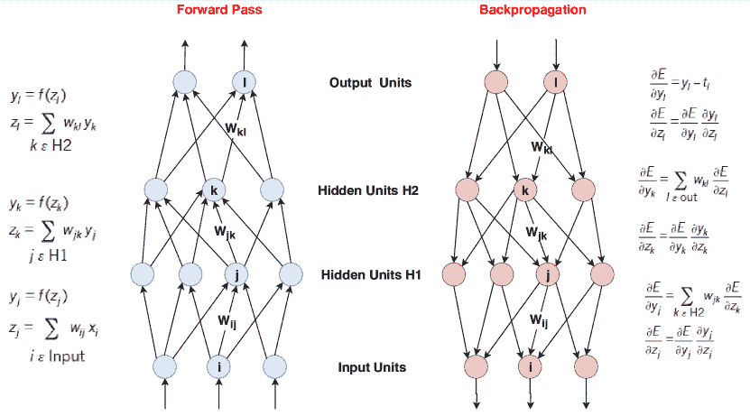

图 1: 深度多层神经网络前向传播与反向传播[21]

### 3.2 卷积神经网络 (CNNs)

CNN 是一种深度神经网络 (DNN)，主要用于图像分类、图像识别问题。在其方法中，整个图像通过滤波器进行扫描。在文献中，1x1、3x3 和 5x5 的滤波器尺寸被广泛使用。在大多数 CNN 架构中，有不同类型的层：卷积层、池化层（平均池化或最大池化）、全连接层。CNN 由基于卷积操作的卷积层组成。图 2 ‣ 3 Deep Learning ‣ Deep Learning for Financial Applications : A Survey")展示了具有不同层的广义 CNN 架构：卷积层、子采样层（池化层）、全连接层。

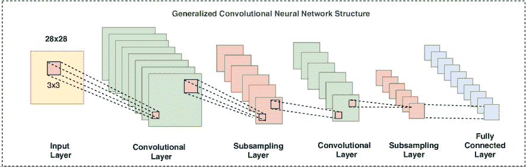

图 2: 广义卷积神经网络架构

### 3.3 循环神经网络 (RNN)

文献中，RNN 主要用于处理如时间序列数据、音频和语音数据、语言等顺序数据。它由按顺序排列的 RNN 单元组成。与前馈网络不同，RNNs 使用内部记忆处理输入数据。RNNs 在各个领域的时间序列数据分析中得到应用（如手写识别、语音识别等）。

有不同类型的 RNN 结构：一对多、多对一、多对多。一般来说，RNN 在运行过程中逐个处理输入序列。隐藏层中的单元通过“状态向量”[21]保存输入的历史信息。RNNs 可以通过时间反向传播（BPTT）方法进行训练。使用 BPTT 时，任何时刻$t$的损失梯度反映了之前时间的网络权重。RNNs 的训练比前馈神经网络（FFNNs）更困难，训练时间也更长。

在图 3 中，RNN 隐藏层的信息流被划分为离散时间。节点 S 在不同时间$t$的状态表示为$s_{t}$，不同时间的输入值$x$为$x_{t}$，不同时间的输出值$o$表示为$o_{t}$。参数值（$U,W,V$）始终在相同步骤中使用。

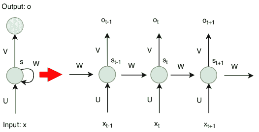

图 3：RNN 单元随时间变化 [21]

### 3.4 长短期记忆（LSTM）

LSTM 网络 [28] 是一种专门用于序列数据分析的不同类型的 DL 网络。LSTM 网络的优点在于网络中既能记住短期值，也能记住长期值。因此，LSTM 网络通常用于序列数据分析（自动语音识别、语言翻译、手写字符识别、时间序列数据预测等），被 DL 研究者广泛使用。LSTM 网络由 LSTM 单元组成。LSTM 单元由具有输入、输出和遗忘门的单元组成。这三个门调节信息流。借助这些特性，每个单元可以在任意时间间隔内记住所需的值。LSTM 单元结合形成神经网络的层。图 4 展示了基本的 LSTM 单元（$\sigma_{g}$：Sigmoid 函数，$tanh$：双曲正切函数，$X$：乘法，$+$：加法）。

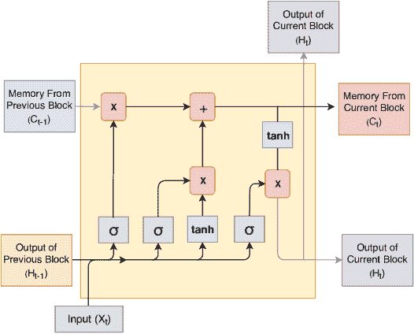

图 4：基本 LSTM 单元 [28]

### 3.5 受限玻尔兹曼机（RBMs）

RBM 是一种不同类型的 ANN 模型，能够学习输入集合的概率分布 [29]。RBM 主要用于降维、分类和特征学习。RBM 是一种二分、无向图模型，由两个层次组成：可见层和隐藏层。层中的单元彼此不连接。每个单元是一个处理输入的计算点。每个单元会随机决定是否传递输入数据。输入会乘以特定的权重，添加一定的阈值（偏差），然后通过激活函数计算结果。在重构阶段，输出的结果重新进入网络作为输入，然后从可见层作为输出退出。比较先前输入的值和处理后的值。比较的目的是减少差异。学习在网络上多次进行 [29]。RBM 是一个两层的二分、无向图模型，包含可见层和隐藏层（图 5）。这些层之间没有连接。RBM 的缺点是其训练过程复杂。“RBM 训练复杂，因为虽然对对数似然梯度有很好的估计器，但没有已知的便宜方式来估计对数似然本身” [30]。

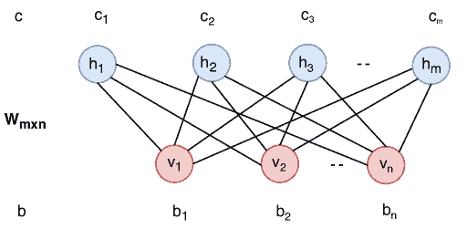

图 5: RBM 可见层和隐藏层 [29]

### 3.6 深度置信网络（DBNs）

DBN 是一种由一系列 RBM 层组成的 ANN 模型。DBN 是一种概率生成模型，包含潜在变量。DBN 用于通过无监督的方法在输入集合中寻找独立和具有辨别性的特征。DBN 可以在训练过程中以概率方式学习重构输入集合。然后，网络中的层开始检测辨别特征。学习步骤之后，进行监督学习以进行分类 [31]。图 6 展示了 DBN 结构。

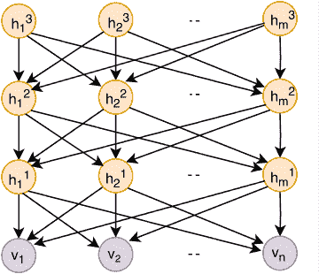

图 6: 深度置信网络 [29]

### 3.7 自编码器（AEs）

AE 网络通常用于 DL 模型中，它们重新映射输入（特征），使得输入更适合分类。换句话说，AE 网络执行无监督特征学习过程。通过使用 AE 减少维度来学习数据集的表示。在文献中，AEs 已被用于特征提取和降维[27, 32]。AE 的结构与 FFNN 类似。它由一个输入层、一个输出层和一个（或多个）将它们连接在一起的隐藏层组成。在 AEs 中，输入层的节点数和输出层的节点数相等，它们具有对称结构。AEs 包含两个组件：编码器和解码器。

使用 AE 的优点包括降维和特征学习。然而，AE 中的降维和特征提取会导致一些缺点。专注于最小化 AE 代码中数据关系的丧失，会导致一些重要数据关系的丧失。这可能是 AE 的一个缺点[33]。图 7 ‣ 3 Deep Learning ‣ Deep Learning for Financial Applications : A Survey")展示了基本的 AE 结构。

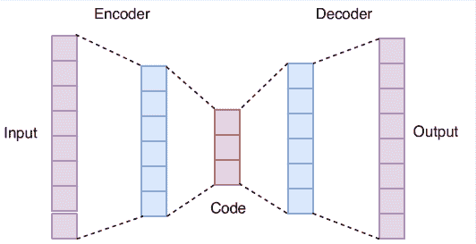

图 7：基本自编码器结构

### 3.8 其他深度结构

DL 模型不仅限于前面小节提到的那些。文献中存在一些其他著名的结构，如深度强化学习（DRL）、生成对抗网络（GANs）、胶囊网络、深度高斯过程（DGPs）。不过，据我们了解，除了 DRL 近期受到关注外，我们尚未遇到关于使用这些模型进行财务应用的显著学术或工业出版物。然而，这并不意味着这些模型不适用于财务领域。相反，它们为参与金融和深度学习领域的研究人员和从业者提供了巨大的潜力，只要他们愿意付出额外的努力，提出新颖的解决方案。

由于 DL 模型发展的研究仍在进行，新结构不断出现。然而，上述模型目前涵盖了几乎所有已发表的工作。下一节将详细介绍实现领域以及首选的 DL 模型。

## 4 财务应用

文献中有很多关于软计算的金融应用。虽然深度学习（DL）在其中大部分被研究，但在一些领域仍然存在机会。

在本节中，我们对实现领域进行了分类，并在单独的子章节中展示了这些领域。此外，在每个子章节中，我们表格化了相关研究的代表性特征，以便在有限的空间内提供尽可能多的信息。

此外，读者应注意，有些论文在不同的实现领域之间存在一些重叠。这主要有两个原因：在一些论文中，多个问题被分别讨论，例如，文本挖掘用于特征提取，然后实现算法交易。在其他情况下，论文可能因调查结构直接适用于多个实现领域，例如，加密货币组合管理。在这种情况下，我们将论文包含在所有相关的子章节中，从而产生了一些重叠。

一些现有的研究领域可以归纳如下：

### 4.1 算法交易

算法交易（或称算法交易）被定义为完全由算法模型做出的买卖决策。这些决策可以基于一些简单规则、数学模型、优化流程，或如机器学习/深度学习中的高度复杂的函数近似技术。随着电子在线交易平台和框架的引入，算法交易在过去二十年中主导了金融行业。因此，基于深度学习（DL）的算法交易模型也开始受到关注。

大多数算法交易应用都与市场时机预测模型相关联。因此，大多数基于预测触发买卖信号的价格或趋势预测模型也被视为算法交易系统。然而，也有一些研究提出了独立的算法交易模型，重点关注通过优化交易参数（如买卖价差、限价单簿分析、仓位管理等）来研究交易本身的动态。高频交易（HFT）研究者对这一领域尤其感兴趣。因此，深度学习（DL）模型也开始出现在高频交易（HFT）研究中。

在深入探讨深度学习（DL）实现之前，简要提及现有的机器学习（ML）关于算法交易的调查将会很有帮助。胡等人[34] 回顾了各种专家顾问（EAs）在算法交易模型中的实现。由于金融时间序列预测与算法交易高度相关，许多机器学习（ML）调查论文专注于基于预测的算法交易模型。感兴趣的读者可以参考[1]获取更多信息。

就 DL 研究而言，表 LABEL:table:algorithmic_trading_1、表 LABEL:table:algorithmic_trading_2 和表 LABEL:table:algorithmic_trading_3 展示了基于 DL 模型的算法交易研究的过去和当前状态。这些论文分布在以下表格中：表 LABEL:table:algorithmic_trading_1 包含嵌入时间序列预测模型的特定算法交易实现，而表 LABEL:table:algorithmic_trading_2 则集中于基于分类（买卖信号或趋势检测）的算法交易模型。最后，表 LABEL:table:algorithmic_trading_3 展示了独立研究或其他不符合上述分类标准的算法交易模型（配对交易、套利等）。

大多数算法交易研究集中于股票或指数价格的预测。与此同时，LSTM 是这些实施中最受欢迎的 DL 模型。在[35]中，市场微观结构基于的交易指标被用作输入到 RNN 中，并结合 Graves 的 LSTM 进行算法股票交易的价格预测。Bao 等人[36]使用技术指标作为输入到 Wavelet Transforms (WT)、LSTM 和 Stacked Autoencoders (SAEs)中，以预测股票价格。在[37]中，CNN 和 LSTM 模型结构一起实现（CNN 用于股票选择，LSTM 用于价格预测）。

表 1：嵌入时间序列预测模型的算法交易应用

| Art. | 数据集 | 期间 | 特征集 | 方法 | 绩效标准 | 环境 |
| --- | --- | --- | --- | --- | --- | --- |
| [35] | 土耳其 GarantiBank 在 BIST | 2016 | OCHLV、差价、波动率、成交量等 | PLR、Graves LSTM | MSE、RMSE、MAE、RSE、相关性 R 平方 | Spark |
| [36] | CSI 300、Nifty50、HSI、日经 225、S&P500、DJIA | 2010-2016 | OCHLV、技术指标 | WT、堆叠自编码器、LSTM | MAPE、相关系数、THEIL-U | - |
| [37] | 中国股票 | 2007-2017 | OCHLV | CNN + LSTM | 年化收益、Mxm 回撤 | Python |
| [38] | NYSE 的 50 只股票 | 2007-2016 | 价格数据 | SFM | MSE | - |
| [39] | 芬兰股市 5 只股票的 LOB | 2010 | FI-2010 数据集：买入/卖出价和成交量 | WMTR，MDA | 准确性，精确度，召回率，F1 分数 | - |
| [40] | 深交所的 300 只股票，商品 | 2014-2015 | 价格数据 | FDDR，DNN + RL | 利润，收益，SR，盈亏曲线 | Keras |
| [41] | 标普 500 指数 | 1989-2005 | 价格数据，成交量 | LSTM | 收益，STD，SR，准确性 | Python，TensorFlow，Keras，R，H2O |
| [42] | 希腊国家银行（ETE）股票。 | 2009-2014 | FTSE 100，DJIA，GDAX，NIKKEI 225，EUR/USD，黄金 | GASVR，LSTM | 收益，波动性，SR，准确性 | Tensorflow |
| [43] | 中国股票-IF-IH-IC 合约 | 2016-2017 | 价格变动决策 | MODRL + LSTM | 利润与亏损，SR | - |
| [44] | 新加坡股市指数 | 2010-2017 | 指数最后 10 天的 OCHL | DNN | RMSE，MAPE，利润，SR | - |
| [45] | GBP/USD | 2017 | 价格数据 | 强化学习 + LSTM + NES | SR，下行偏差比率，总利润 | Python，Keras，Tensorflow |
| [46] | 商品，外汇期货，ETF | 1991-2014 | 价格数据 | DNN | SR，能力比率，收益 | C++，Python |
| [47] | USD/GBP，标普 500，FTSE 100，油，黄金 | 2016 | 价格数据 | AE + CNN | SR，%波动性，平均收益/交易，收益率 | H2O |
| [48] | 比特币，Dash，Ripple，Monero，莱特币，狗狗币，Nxt，Namecoin | 2014-2017 | MA，BOLL，CRIX 收益，Euribor 利率，OCHLV | LSTM，RNN，MLP | 准确性，F1-measure | Python，Tensorflow |
| [49] | 标普 500，KOSPI，HSI 和 EuroStoxx50 | 1987-2017 | 200 天股票价格 | 深度 Q 学习，DNN | 总利润，相关性 | - |
| [50] | 标普 500 中的股票 | 1990-2015 | 价格数据 | DNN，GBT，RF | 平均收益，MDD，Calmar 比率 | H2O |
| [51] | 基本面和技术面数据，经济数据 | - | 基本面、技术面和市场信息 | CNN | - | - |

张等人[38]提出了一种新型的状态频率记忆 (SFM)递归网络，用于具有多频率交易模式的股票价格预测，并实现了更好的预测和交易表现。在高频交易 (HFT)系统中，Tran 等人[39]开发了一个深度学习 (DL)模型，通过使用高频限价订单簿数据的张量表示来实现价格变化预测。在[40]中，作者使用了模糊深度直接强化学习 (FDDR)进行股票价格预测和交易信号生成。

对于指数预测，以下研究值得注意。在[41]中，实现了使用 LSTM 对 S&P500 指数的价格预测。Mourelatos 等人[42]比较了 LSTM 和遗传算法 (GA)与支持向量回归 (SVR)（GASVR）在希腊股票市场指数预测中的表现。Si 等人[43]实施了中国日内期货市场交易模型，结合深度强化学习 (DRL)和 LSTM。Yong 等人[44]使用了前馈 DNN 方法和时间序列数据的开盘、收盘、最高、最低 (OCHL)来预测新加坡股票市场指数数据。

外汇或加密货币交易在一些研究中也有所实现。在[45]中，使用深度（递归）强化学习和 LSTM 的代理启发交易在 GBP/USD 交易中得到了实施和测试。在[46]中，前馈深度 MLP 被应用于商品和外汇交易价格的预测。Korczak 等人[47]在一个基于多代理的交易环境中使用了几种不同的输入参数来实施外汇交易（GBP/PLN）模型。其中一个代理使用了 CNN 作为预测模型，且优于所有其他模型。

在加密货币方面，Spilak 等人[48]使用了多个加密货币（比特币、Dash、Ripple、Monero、莱特币、Dogecoin、Nxt、Namecoin）来构建一个动态投资组合，使用了 LSTM、RNN 和 MLP 方法。

在一项多功能研究中，Jeong 等人[49]结合了深度 Q 学习和 DNN 来实现价格预测，他们旨在解决三个独立问题：增加市场利润、预测交易股数以及防止金融数据不足引起的过拟合。

在[52]中，技术分析指标（相对强弱指数 (RSI)）的买卖限度经过了优化，优化过程中使用了 GA 作为买卖信号。在优化后，DMLP 也用于函数近似。在[53]中，作者将深度全连接神经网络 (FNN)与选择性交易策略单元相结合，以预测下一个价格。在[54]中，使用了交叉点和移动平均线趋同性与发散性 (MACD)信号来预测道琼斯 30 支股票价格的趋势。Sirignano 等人 [55] 提出了一种新方法，利用限价单簿流量和历史信息来确定股票走势，使用了 LSTM 模型。Tsantekidis 等人 [56] 也使用了限价单簿时间序列数据和 LSTM 方法进行趋势预测。

一些研究专注于利用基于 CNN 的模型，因为它们在图像分类问题中取得了成功。然而，为了实现这一点，需要将金融输入数据转换为图像，这需要一些创造性的预处理。Gudelek 等人 [57] 将价格数据的时间序列转换为二维图像，使用技术分析，并用深度 CNN 对其进行分类。同样，Sezer 等人 [58] 也提出了一种新技术，将包含技术分析指标输出的金融时间序列数据转换为二维图像，并使用 CNN 对这些图像进行分类，以确定交易信号。在[59]中，蜡烛图图表被转换为二维图像。然后，将图像输入到无监督卷积 AE 中以实施投资组合构建。Tsantekidis 等人 [60] 提出了一种新方法，使用来自限价单簿的最后 100 条记录创建二维图像，用于股票价格预测，使用了 CNN 方法。在[61]中，提出了一种创新方法，利用 CNN 与相关特征结合预测股票价格趋势。最后，Sezer 等人 [62] 直接将条形图图像作为输入到 CNN 中，并预测图像类别是买入、持有还是卖出，从而开发了相应的算法交易模型。

表 2：基于分类（买卖信号或趋势检测）的算法交易模型

| 文章 | 数据集 | 时期 | 特征集 | 方法 | 性能标准 | 环境 |
| --- | --- | --- | --- | --- | --- | --- |
| [52] | 道琼斯 30 支股票 | 1997-2017 | 相对强弱指数 (RSI) | 使用遗传算法的 DMLP | 年化回报率 | Spark MLlib, Java |
| [53] | SPY ETF，来自 S&P500 的 10 只股票 | 2014-2016 | 价格数据 | FFNN | 累积收益 | MatConvNet, Matlab |
| [54] | Dow30 股票 | 2012-2016 | 收盘数据和若干技术指标 | LSTM | 准确率 | Python, Keras, Tensorflow, TALIB |
| [55] | 高频记录的所有订单 | 2014-2017 | 价格数据、所有订单记录、交易 | LSTM | 准确率 | - |
| [56] | 纳斯达克北欧（Kesko Oyj, Outokumpu Oyj, Sampo, Rautaruukki, Wartsila Oyj） | 2010 | LOB 中的价格和成交量数据 | LSTM | 精度、召回率、F1 分数、Cohen’s k | - |
| [57] | 17 只 ETFs | 2000-2016 | 价格数据、技术指标 | CNN | 准确率、MSE、利润、AUROC | Keras, Tensorflow |
| [58] | Dow30 中的股票和 9 个顶级成交量 ETFs | 1997-2017 | 价格数据、技术指标 | 带有特征映射的 CNN | 召回率、精度、F1 分数、年化收益 | Python, Keras, Tensorflow, Java |
| [59] | FTSE 100 | 2000-2017 | 价格数据 | CAE | TR、SR、MDD、均值收益 | - |
| [60] | 纳斯达克北欧（Kesko Oyj, Outokumpu Oyj, Sampo, Rautaruukki, Wartsila Oyj） | 2010 | 价格、成交量数据，10 个 LOB 订单 | CNN | 精度、召回率、F1 分数、Cohen’s k | Theano, Scikit learn, Python |
| [61] | 伊斯坦布尔证券交易所 100 只股票 | 2011-2015 | 75 种技术指标和 OCHLV | CNN | 准确率 | Keras |
| [62] | ETFs 和 Dow30 | 1997-2007 | 价格数据 | 带有特征映射的 CNN | 年化收益 | Keras, Tensorflow |
| [63] | 8 种来自债券/衍生品市场的实验资产 | - | 资产价格数据 | RL, DNN, 遗传算法 | 学习和遗传算法误差 | - |
| [64] | 来自 S&P500 的 10 只股票 | - | 股票价格 | TDNN, RNN, PNN | 错失机会、误报率 | - |
| [65] | 伦敦证券交易所 | 2007-2008 | 限价订单簿状态、交易、买/卖订单、订单删除 | CNN | 准确率、kappa | Caffe |
| [66] | 加密货币，比特币 | 2014-2017 | 价格数据 | CNN、RNN、LSTM | 累积投资组合价值、MDD、SR | - |

Serrano 等人 [63] 提出了一个新方法，称为“GoldAI Sachs”资产银行家强化学习算法，用于算法交易。该方法使用了随机神经网络、GP 和 强化学习 (RL) 来生成交易信号。Saad 等人 [64] 比较了 时延神经网络 (TDNN)、RNN 和 概率神经网络 (PNN) 在使用 10 只 S&P500 股票进行趋势检测的效果。在 [65] 中，进行了 高频交易 (HFT) 微观结构预测，使用了 CNN 方法。在 [66] 中，基于三种不同提出的模型（基础 RNN、LSTM 和 CNN）的加密货币投资组合管理得到了实施。

Tino 等人 [67] 使用了 德国股票指数 (DAX)、伦敦金融时报股票交易所指数 (FTSE) 100 的看涨和看跌期权价格，通过马尔可夫模型预测变化，并利用金融时间序列数据通过 RNN 预测波动性变化。同时，Chen 等人 [68] 提出了一种方法，使用滤波器组 CNN 算法在 15x15 的波动率时间序列转换合成图像上进行处理。在该研究中，金融领域知识与滤波器组机制相结合，以确定交易信号。Bari 等人 [69] 使用文本挖掘从推文和金融新闻中提取信息，并使用 LSTM、RNN、门控递归单元 (GRU) 生成交易信号。Dixon 等人 [70] 使用 RNN 对限价单簿进行序列分类，以预测下一事件的价格波动。

表 3：独立和/或其他算法模型

| Art. | 数据集 | 期间 | 特征集 | 方法 | 性能标准 | 环境 |
| --- | --- | --- | --- | --- | --- | --- |
| [67] | DAX、FTSE 100、看涨/看跌期权 | 1991-1998 | 价格数据 | 马尔可夫模型、RNN | Ewa-度量、iv、每日利润的均值和标准差 | - |
| [68] | 台湾股票指数期货、迷你指数期货 | 2012-2014 | 价格数据转图像 | 可视化方法 + CNN | 累计利润、准确率 | - |
| [69] | S&P500 的能源部门/公司中心推文 | 2015-2016 | 文本和价格数据 | LSTM、RNN、GRU | 收益、SR、精确度、召回率、准确率 | Python、Tweepy API |
| [70] | CME FIX 消息 | 2016 | 限价单簿、时间戳、价格数据 | RNN | 精确度、召回率、F1 度量 | Python、TensorFlow、R |
| [71] | 台湾股指期货（TAIFEX） | 2017 | 价格数据 | 基于代理的 RL 与预训练的 CNN | 准确性 | - |
| [72] | 来自 S&P500 的股票 | 2010-2016 | OCHLV | DCNL | PCC、DTW、VWL | Pytorch |
| [73] | 来自 NowNews、AppleDaily、LTN、MoneyDJ 的 18 只股票新闻 | 2013-2014 | 文本、情感 | DNN | 收益 | Python，Tensorflow |
| [74] | 来自 S&P500 和 NASDAQ-100 的 489 只股票 | 2014-2015 | 限价订单簿 | 空间神经网络 | 交叉熵误差 | NVIDIA 的 cuDNN |
| [75] | 实验数据集 | - | 价格数据 | DRL 与 CNN、LSTM、GRU、MLP | 平均利润 | Python |

陈等人[71]在台湾股指期货（TAIFEX）数据集上使用了 1 维的 CNN 与基于代理的 RL 算法。王等人[72]提出了一种深度共同投资网络学习（DeepCNL）方法，该方法使用了卷积层和 RNN 层。通过提取的涨跌趋势确定了投资模式。戴等人[73]使用文本挖掘和 DNN 进行金融情感分析用于股票算法交易。Sirignano 等人[74]提出了一种“空间神经网络”模型，该模型使用限价订单簿和空间特征进行算法交易。他们的模型通过限价订单簿中的买入价和卖出价估计最佳的买卖价格。高等人[75]使用 GRU、LSTM 单元、CNN 和 MLP 来建模 Q 值，用于实现 DRL 方法。

### 4.2 风险评估

另一个引起 DL 研究者兴趣的研究领域是风险评估，它识别任何给定资产、公司、个人、产品、银行等的“风险性”。这个一般问题存在几个不同版本，如破产预测、信用评分、信用评估、贷款/保险承保、债券评级、贷款申请、消费者信用确定、公司信用评级、抵押选择决策、金融困境预测、商业失败预测。在这些情况下正确识别风险状态至关重要，因为资产定价高度依赖于这些风险评估措施。基于金融机构之间不当风险评估的信用违约互换（CDS）的抵押危机导致了 2008 年的房地产泡沫破裂，并导致了大萧条[76]。

大多数风险评估研究集中在信用评分和银行困境分类上。然而，也有一些论文涉及抵押贷款违约可能性、风险交易检测或危机预测。同时，也有一些针对风险评估的异常检测研究，其中大多数也属于“欺诈检测”类别，这将在下一小节中讨论。

表 4：信用评分或分类研究

| 文章 | 数据集 | 时间段 | 特征集 | 方法 | 性能标准 | 环境 |
| --- | --- | --- | --- | --- | --- | --- |
| [77] | XR 14 CDS 合约 | 2016 | 回收率、利差、行业和地区 | DBN + RBM | AUROC, FN, FP, 准确率 | WEKA |
| [78] | 德国、日语信用数据集 | - | 个人财务变量 | SVM + DBN | 加权准确率, TP, TN | - |
| [79] | 来自 Kaggle 的信用数据 | - | 个人财务变量 | DNN | 准确率, TP, TN, G-mean | - |
| [80] | 澳大利亚、德国信用数据 | - | 个人财务变量 | GP + AE 作为增强的 DNN | FP | Python, Scikit-learn |
| [81] | 德国、澳大利亚信用数据集 | - | 个人财务变量 | DCNN, MLP | 准确率, 错误/漏报 | - |
| [82] | 中国金融公司消费者信用数据 | - | Relief 算法选择了 50 个最重要的特征 | CNN + Relief | AUROC, K-s 统计量, 准确率 | Keras |
| [83] | UCI 机器学习库中的信用审批数据集 | - | UCI 信用审批数据集 | Rectifier, Tanh, Maxout DL | - | AWS EC2, H2O, R |

在详细讨论具体的深度学习（DL）实现之前，有必要提到现有的关于机器学习（ML）的综述。Kirkos 等人[84]、Ravi 等人[85]、Fethi 等人[86]回顾了基于人工智能（AI）和机器学习（ML）模型的银行绩效评估研究。Lahsasna 等人[87]、Chen 等人[88]调查了基于软计算技术的信用评分和信用风险评估研究，而 Marques 等人[89]仅关注于用于信用评分实现的进化计算（EC）模型。与此同时，Kumar 等人[90]、Verikas 等人[91]回顾了机器学习（ML）在破产预测研究中的应用。类似地，Sun 等人[92]提供了关于金融困境和公司失败研究的综合综述。除了这些综述之外，Lin 等人[93]调查了基于机器学习（ML）模型的金融危机预测研究，以评估整体风险。

由于风险评估在当今金融世界中变得至关重要，许多研究者将注意力转向深度学习（DL）以提高准确性。表 LABEL:table:risk_assesment_1 和表 LABEL:table:risk_assesment_2 提供了使用各种深度学习（DL）模型实现的不同风险评估研究的快照信息。

在信用评分分类（表 LABEL:table:risk_assesment_1）中，Luo 等人 [77] 使用了 CDS 数据进行企业信用评级和相应的信用分类（A、B 或 C）。在测试的模型中，DBN 与 RBM 的表现最佳。这一实现可能是第一个使用 DBN 进行信用评级的研究。类似地，在 [78] 中，实现了一个级联的 DBN、反向传播和 SVM 混合模型进行信用分类，取得了良好的性能结果（准确率在 80-90% 以上）。在 [79] 中，通过使用深度 MLP 网络的集成来实现信用风险分类，每个网络使用整个空间的子空间（在每个子空间中使用少数类，但只使用多数类的部分子空间）。数据不平衡问题通过为每个分类器使用多个子空间来处理，每个子空间包含所有正类（少数类）实例，但只有部分负类（多数类）实例，最后，他们使用了一个深度 MLPs 的集成，结合了每个子空间模型。在 [80] 中，信用评分通过使用 SAE 网络和 GP 模型来创建信用评估规则，从而生成好或坏的信用案例。在另一项研究中，Neagoe 等人 [81] 使用各种 DMLP 和深度 CNN 网络对信用评分进行了分类。在另一项研究 [82] 中，通过将输入消费者数据转换为二维像素矩阵来实现消费者信用评分分类。然后，使用生成的图像作为 CNN 的训练和测试数据。二维像素矩阵表示法通过使用 CNN 进行图像分类。这是第一个使用 CNN 进行信用评分的实现。Niimi [83] 使用 UCI 信用审批数据集¹¹1https://archive.ics.uci.edu/ml/datasets.html 比较了 DL、SVM、Logistic Regression (LR)、Random Forest (RF)、eXtreme Gradient Boosting (XGBoost) 并提供了关于信用欺诈和信用审批申请的信息；随后用几个模型实验了信用审批问题。各种模型在信用审批分类中的表现进行了比较。此外，还介绍了信用欺诈检测的一些内容。

银行和企业的金融困境预测已被广泛研究（表 LABEL:table:risk_assesment_2）。在 [94] 中，使用了混合 DBN 和 SVM 进行金融困境预测，以识别公司是否遇到麻烦，而银行风险分类在 [95] 中进行了研究。在 [96] 中，通过词序列学习提取了新闻语义，并将相关事件标记为银行压力，然后从形成的语义向量表示中，确定和分类银行压力与阈值。预测和语义意义提取以一种整洁的方式进行了整合。在另一项研究 [97] 中，再次使用文本挖掘通过从金融新闻中提取数据来识别银行困境，然后在从词嵌入中提取的语义句子向量上使用 深度前馈网络 (DFFN) 来分类是否发生了事件。类似地，Cerchiello 等人 [98] 使用金融新闻中的文本挖掘来分类银行困境。Malik 等人 [99] 通过首先使用 LSTM 网络预测银行的表现，然后使用反向传播网络来寻找银行压力水平。

表 5：金融困境、破产、银行风险、抵押贷款风险、危机预测研究

| 文章 | 数据集 | 时期 | 特征集 | 方法 | 性能标准 | 环境 |
| --- | --- | --- | --- | --- | --- | --- |
| [94] | 966 家法国公司 | - | 财务比率 | RBM + SVM | 精确度、召回率 | - |
| [95] | 883 BHC 来自 EDGAR | 2006-2017 | 词元、加权情感极性、杠杆和 ROA | CNN、LSTM、SVM、RF | 准确度、精确度、召回率、F1 分数 | Keras、Python、Scikit-learn |
| [96] | 大型欧洲银行的事件数据集，路透社新闻文章 | 2007-2014 | 词、句子 | DNN + NLP 预处理 | 相对有用性、F1 分数 | - |
| [97] | 欧洲银行事件数据集，路透社新闻 | 2007-2014 | 文本、句子 | 句子向量 + DFFN | 有用性、F1 分数、AUROC | - |
| [98] | 路透社新闻、基本数据 | 2007-2014 | 财务比率和新闻文本 | doc2vec + NN | 相对有用性 | Doc2vec |
| [99] | 宏观/微观经济变量、来自 BHC 的银行特征/绩效变量 | 1976-2017 | 宏观经济变量和银行绩效 | CGAN、MVN、MV-t、LSTM、VAR、FE-QAR | RMSE、对数似然、贷款损失率 | - |
| [100] | 法国公司的财务报表 | 2002-2006 | 财务比率 | DBN | 召回率，准确率，F1-得分，FP，FN | - |
| [101] | 来自 CRSP 的美国上市公司股票收益 | 2001-2011 | 价格数据 | DBN | 准确率 | Python, Theano |
| [102] | 来自日本证券市场的若干公司的财务报表 | 2002-2016 | 财务比率 | CNN | F1-得分，AUROC | - |
| [103] | 包含本地和国家经济因素的抵押贷款数据集 | 1995-2014 | 与抵押贷款相关的特征 | ANN | 负平均对数似然 | AWS |
| [104] | 挪威金融服务集团 DNB 的抵押贷款数据 | 2012-2016 | 个人财务变量 | CNN | 准确率，灵敏度，特异性，AUROC | - |
| [105] | 私人经纪公司关于风险交易的真实数据 | - | 250 个特征：订单详情等 | CNN, LSTM | F1-得分 | Keras, Tensorflow |
| [106] | 几个数据集结合创建了一个新的数据集 | 1996-2017 | 指数数据，10 年期国债收益率，汇率， | Logit, CART, RF, SVM, NN, XGBoost, DNN | AUROC, KS, G-mean, 似然比, DP, BA, WBA | R |

也有一些研究论文专注于破产或公司违约预测。 Ribeiro 等人[100] 实施了基于 DBN 的破产预测。 DBN 的结果与 SVM 和 RBM 进行了比较。 Yeh 等人[101] 使用了违约和偿付公司股票收益作为输入，以 RBM 作为 SAE 使用，然后将 RBM 的输出作为输入传递给 DBN 以预测公司是否偿付。结果与 SVM 模型进行了比较，DBN 模型优于 SVM。 Hosaka 等人[102] 尝试通过将金融数据转换为图像来使用 CNN 进行破产预测。

风险评估的剩余实现如下：Sirignano 等人 [103] 使用了 20 年的按揭申请数据，通过各种参数来识别按揭风险。他们还进行了大量分析，涉及不同因素如何影响按揭支付结构。作者还在评估中分析了提前还款和违约行为。对于另一种按揭风险评估应用，Kvamme 等人 [104] 使用了 CNN 和 RF 模型来预测客户是否会违约。另一项研究中，Abroyan 等人 [105] 使用 CNN 和 LSTM 网络来分类股票市场上的交易（交易）是否具有风险，并取得了高准确率。最后，Chatzis 等人 [106] 开发了几种 ML 和 DL 模型，用于检测导致股票市场崩盘的事件。DL 模型在分类（检测危机与否）方面表现良好。

### 4.3 欺诈检测

财务欺诈是政府和相关部门急切寻找永久解决方案的领域之一。存在多种不同的财务欺诈案件，如信用卡欺诈、洗钱、消费者信用欺诈、逃税、银行欺诈、保险索赔欺诈。这是金融领域中 ML 研究最广泛的研究领域之一，相应地发表了几篇综述论文。在不同的时间，Kirkos 等人 [107]、Yue 等人 [108]、Wang 等人 [109]、Phua 等人 [110]、Ngai 等人 [111]、Sharma 等人 [112] 和 West 等人 [113] 都回顾了基于软计算和数据挖掘技术的会计和金融欺诈检测研究。

这些类型的研究大多可以视为异常检测，通常属于分类问题。表 LABEL:table:fraud_detection 展示了基于 DL 模型的不同欺诈检测研究。

有很多研究专注于识别信用卡欺诈。Heryadi 等人 [114] 为印尼银行开发了多个 DL 模型用于信用卡欺诈检测。他们还分析了欺诈数据和非欺诈数据之间的数据不平衡影响。在最近的研究中，Roy 等人 [115] 使用了 LSTM 模型进行信用卡欺诈检测，而在 [116] 中，作者实现了 MLP 网络来分类信用卡交易是否欺诈。Sohony 等人 [117] 使用了 FFNN 的集成方法来检测卡片欺诈。Jurgovsky 等人 [118] 使用 LSTM 从信用卡交易序列中检测信用卡欺诈。他们将结果与 RF 进行了比较。

Paula 等人 [119] 使用深度 AE 实现异常检测，以识别巴西公司在出口税申报中的金融欺诈和洗钱。在类似的研究中，Gomes 等人 [120] 提出了一个异常检测模型，利用深度 AE 识别巴西选举中的议会支出中的异常。

Wang 等人 [121] 使用文本挖掘和 DNN 模型检测汽车保险欺诈。Longfei 等人 [122] 开发了 DNN 模型用于检测在线支付交易欺诈。Costa 等人 [123] 使用财务交易中的字符序列及对方的响应来检测交易是否为欺诈，采用了 LSTM 模型。Goumagias 等人 [124] 使用深度 Q 学习 (RL) 预测规避风险的公司逃税行为。最后，他们为各州提供了相应的税收收入最大化建议。

表 6: 欺诈检测研究

| Art. | 数据集 | 时期 | 特征集 | 方法 | 性能标准 | 环境 |
| --- | --- | --- | --- | --- | --- | --- |
| [114] | 某印尼地方银行的借记卡交易 | 2016-2017 | 不同时间段的金融交易金额 | CNN、堆叠-LSTM、CNN-LSTM | AUROC | - |
| [115] | 来自零售银行的信用卡交易 | 2017 | 交易变量和多个衍生特征 | LSTM、GRU | 准确率 | Keras |
| [116] | 卡片购买交易 | 2014-2015 | 每种货币/原产国的欺诈概率，其他欺诈相关特征 | ANN | AUROC | - |
| [117] | 欧洲持卡人使用信用卡的交易 | 2013 | 个人财务变量到 PCA | ANN, RF | 召回率, 精度, 准确率 | - |
| [118] | 信用卡交易 | 2015 | 交易和银行特征 | LSTM | AUROC | Keras, Scikit-learn |
| [119] | 巴西联邦税务局的外贸数据库 | 2014 | 8 个特征：外贸、税收、交易、员工、发票等 | AE | MSE | H2O, R |
| [120] | 众议院开放数据，巴西联邦税务局的公司数据 | 2009-2017 | 21 个特征：巴西州费用、党派名称、费用类型等 | 深度自编码器 | MSE, RMSE | H2O, R |
| [121] | 汽车保险公司标记为欺诈的真实世界数据 | - | 与汽车、保险和事故相关的特征 | DNN + LDA | TP, FP, 准确率, 精度, F1 得分 | - |
| [122] | 巨型在线支付平台的交易 | 2006 | 个人财务变量 | GBDT + DNN | AUROC | - |
| [123] | 财务交易 | - | 交易数据 | LSTM | t-SNE | - |
| [124] | 希腊公司实证数据 | - | - | DQL | 收入 | Torch |

### 4.4 投资组合管理

投资组合管理是选择在预定期间内的各种资产的过程。如其他金融应用所示，虽然基本动机相同，但此问题存在略微不同的版本。一般来说，投资组合管理涵盖以下密切相关的领域：投资组合优化、投资组合选择、投资组合配置。有时，这些术语可以互换使用。Li 等人[125]回顾了使用各种基于规则或 ML 模型的在线投资组合选择研究。

投资组合管理实际上是一个优化问题，确定选择最佳表现资产的最佳可能行动方案。因此，有许多为此目的开发的 EA 模型。Metaxiotis 等人[126]调查了仅针对投资组合优化问题实现的 MOEAs。

然而，一些 DL 研究者成功地将其配置为学习模型，并取得了优越的表现。由于投资组合管理的机器人顾问正在兴起，这些 DL 实现有可能在不久的将来对金融行业产生更大的影响。表 LABEL:table:portfolio_management 展示了投资组合管理的 DL 模型，并总结了它们的成就。

有许多股票选择的实现方案。Takeuchi 等人 [127] 根据预期收益将股票分类为低动量和高动量两类。他们使用了深度 RBM 编码器-分类器网络，取得了高回报。同样，在 [128] 中，股票与其基准指数进行比较，以判断它们是否会超越或落后，使用了 DMLP，然后根据预测调整了股票的投资组合配置权重以优化指数。在 [129] 中，构建了一个包括 DMLP 的 ML 框架，并实现了股票选择问题。

表 7: 投资组合管理研究

| 文章 | 数据集 | 时间段 | 特征集 | 方法 | 性能标准 | 环境 |
| --- | --- | --- | --- | --- | --- | --- |
| [66] | 加密货币，比特币 | 2014-2017 | 价格数据 | CNN、RNN、LSTM | 累积投资组合价值、MDD、SR | - |
| [127] | NYSE、AMEX、NASDAQ 的股票 | 1965-2009 | 价格数据 | 自编码器 + RBM | 准确率、混淆矩阵 | - |
| [128] | 来自 S&P500 的 20 只股票 | 2012-2015 | 技术指标 | MLP | 准确率 | Python、Scikit Learn、Keras、Theano |
| [129] | 中国股票数据 | 2012-2013 | 技术、基本面数据 | 逻辑回归、RF、DNN | AUC、准确率、精确率、召回率、f1、tpr、fpr | Keras、Tensorflow、Python、Scikit learn |
| [130] | S&P500 前 5 大公司 | - | 价格数据和财务比率 | LSTM、自编码、智能索引 | CAGR | - |
| [131] | IBB 生物技术指数、股票 | 2012-2016 | 价格数据 | 自编码、校准、验证、核实 | 回报 | - |
| [132] | 台湾股票市场 | - | 价格数据 | Elman RNN | MSE、回报 | - |
| [133] | 外汇（EUR/USD 等）、黄金 | 2013 | 价格数据 | Evolino RNN | 回报 | Python |
| [134] | NYSE，AMEX，NASDAQ，TAQ 的股票日内交易 | 1993-2017 | 价格，15 种公司特征 | LSTM +MLP | 月度回报，SR | Python, Keras, Tensorflow 在 AWS 上 |
| [135] | S&P500 | 1985-2006 | 月度和每日对数收益率 | DBN +MLP | 验证，测试误差 | Theano, Python, Matlab |
| [136] | S&P500 中的 10 只股票 | 1997-2016 | OCHLV，价格数据 | RNN，LSTM，GRU | 准确率，月度回报 | Keras, Tensorflow |
| [137] | 关于 TSE 和大阪交易所的分析师报告 | 2016-2018 | 文本 | LSTM，CNN，Bi-LSTM | 准确率，R² | R, Python, MeCab |
| [138] | 中国/美国股市的股票 | 2015-2018 | OCHLV，基本面数据 | DDPG，PPO | SR，MDD | - |
| [139] | 对冲基金月度回报数据 | 1996-2015 | 回报，SR，STD，偏度，峰度，Omega 比率，基金阿尔法 | DNN | Sharpe 比率，年回报，累计回报 | - |
| [140] | 12 种交易量最大的加密货币 | 2015-2016 | 价格数据 | CNN + RL | SR，投资组合价值，MDD | - |

投资组合选择和智能索引是[130]和[131]的主要关注点，这些研究使用了 AE 和 LSTM 网络。Lin 等人[132]通过预测 t+1 的股票回报来进行最佳投资组合选择，并根据回报构建最优投资组合。同时，Maknickiene 等人[141]使用 Evolino RNN 进行投资组合选择和回报预测。所选投资组合成分（股票）在本质上是正交的。

在[134]中，通过预测下个月的收益，构建了表现最好的投资组合，并且通过 LSTM 和 LSTM-MLP 组合的 DL 模型实现了良好的月度回报。类似地，Batres 等人[135]结合了 DBN 和 MLP 来通过预测每只股票的月度对数收益来构建股票投资组合，并选择那些预计表现优于中位数股票的股票。Lee 等人[136]比较了三种 RNN 模型（S-RNN、LSTM、GRU）用于股票价格预测，然后根据预测结果构建了基于阈值的投资组合。采用不同方法的 Iwasaki 等人[137]通过文本挖掘和词嵌入对分析师报告进行情感分析，并将情感特征作为输入用于深度前馈神经网络（DFNN）模型进行股票价格预测。然后，根据预测的股票收益实现了不同的投资组合选择。

DRL 被选为[138]的主要 DL 模型。Liang 等人[138]使用 DRL 通过调整股票权重来进行投资组合分配，使用了各种 RL 模型。Chen 等人[139]比较了不同的 ML 模型（包括 DFFN）用于对冲基金收益预测和对冲基金选择。DL 和 RF 模型表现最佳。

加密货币投资组合管理也开始受到 DL 研究人员的关注。在[140]中，投资组合管理（权重分配和调整）由 CNN 和 DRL 在选定的加密货币上实施。类似地，Jiang 等人[66]基于三种不同的提出模型，即 RNN、LSTM 和 CNN，实施了加密货币投资组合管理（分配）。

### 4.5 资产定价与衍生品市场（期权、期货、远期合约）

准确的资产定价或估值是金融学中的一个基础研究领域。针对银行、企业、房地产、衍生品等领域，已经开发了大量的 ML 模型。然而，DL 尚未应用于这一特定领域，并且存在一些可能的实施领域，DL 模型可以协助资产定价研究人员或估值专家。我们在 DL 和金融界能够确定的研究仅有少数。未来在这一领域的研究和出版有着广泛的机会。

与此同时，基于衍生产品的金融模型相当普遍。期权定价、对冲策略开发、期权、期货、远期合同的金融工程是可以从开发 DL 模型中受益的一些研究。近期的一些研究表明，研究人员开始对能够为这一复杂且具有挑战性的领域提供解决方案的 DL 模型表现出兴趣。表 LABEL:table:derivatives_market 总结了这些研究及其预期目标。

表 8: 资产定价与衍生品市场研究

| 文章 | 类型 | 数据集 | 时间段 | 特征集 | 方法 | 绩效标准 | 环境 |
| --- | --- | --- | --- | --- | --- | --- | --- |
| [137] | 股票交易所 | TSE 和大阪交易所的分析师报告 | 2016-2018 | 文本 | LSTM、CNN、Bi-LSTM | 准确度、R² | R, Python, MeCab |
| [142] | 期权 | 模拟了各种看涨期权价格 | - | 价格数据、期权行使价/到期日、股息/无风险利率、波动率 | DNN | RMSE、平均百分比定价误差 | Tensorflow |
| [143] | 期货、期权 | TAIEX 期权 | 2017 | OCHLV、基本面分析、期权价格 | MLP、MLP 与 Black-Scholes | RMSE、MAE、MAPE | - |
| [144] | 股票收益 | NYSE、AMEX、NASDAQ 的收益 | 1975-2017 | 57 家公司的特征 | Fama-French n-factor 模型 DL | R²、RMSE | Tensorflow |

Iwasaki 等人 [137] 使用了 DFNN 模型和分析师报告进行情感分析以预测股票价格。预测股票价格后实施了不同的投资组合选择方法。Culkin 等人 [142] 提出了一个新方法，利用前馈 DNN 模型通过与 Black & Scholes 期权定价公式比较其结果来预测期权价格。类似地，Hsu 等人 [143] 提出了一个新方法，通过使用买卖价差和 Black & Scholes 期权价格模型参数，结合 3 层 DMLP，预测 TAIEX 期权价格。在 [144] 中，特征如资产增长、行业动量、市场权益、市场贝塔等被用作 Fama-French n-factor 模型 DL 的输入，以预测 National Association of Securities Dealers Automated Quotations (NASDAQ)、American Stock Exchange (AMEX)、New York Stock Exchange (NYSE) 指数的美国股票收益。

### 4.6 加密货币与区块链研究

在过去几年中，由于加密货币在短时间内价格的巨大涨跌，它们成为了热门话题。尽管价格预测主导了兴趣领域，但也存在其他研究，如加密货币算法交易模型。

与此同时，区块链是一项提供分布式去中心化账本系统的新技术，这与加密货币世界非常契合。事实上，尽管区块链技术的应用范围更广，需要进一步研究，但加密货币和区块链高度耦合。区块链仍处于早期发展阶段，因此其潜力受到高度关注。

一些 DL 模型已经出现在加密货币研究中，主要集中在价格预测或交易系统上。然而，DL 社区仍缺乏区块链研究。鉴于底层技术引起的关注，很有可能在不久的将来会出现一些新的研究。表 LABEL:table:cryptocurrency_and_blockchain 列出了加密货币和区块链研究的相关研究。

表 9：加密货币与区块链研究

| 文章 | 数据集 | 时间段 | 特征集 | 方法 | 性能标准 | 环境 |
| --- | --- | --- | --- | --- | --- | --- |
| [48] | 比特币，达世币，瑞波币，门罗币，莱特币，多吉币，Nxt，Namecoin | 2014-2017 | MA，BOLL，CRIX 日收益率，Euribor 利率，OCHLV 的 EURO/UK，EURO/USD，US/JPY | LSTM，RNN，MLP | 准确性，F1 测量 | Python，Tensorflow |
| [66] | 加密货币，比特币 | 2014-2017 | 价格数据 | CNN | 累积投资组合价值，MDD，SR | - |
| [140] | 12 种交易量最大的加密货币 | 2015-2016 | 价格数据 | CNN + RL | SR，投资组合价值，MDD |  |
| [145] | 比特币数据 | 2010-2017 | 哈希值，比特币地址，公钥/私钥，数字签名等 | Takagi–Sugeno 模糊认知图 | 分析层次过程 | - |
| [146] | 比特币数据 | 2012，2013，2016 | 交易 ID，输入/输出地址，时间戳 | 使用启发式的图嵌入，拉普拉斯特征图，深度 AE | F1 得分 | - |
| [147] | 比特币，莱特币，StockTwits | 2015-2018 | OCHLV，技术指标，情感分析 | CNN，LSTM，状态频率模型 | MSE | Keras，Tensorflow |
| [148] | 比特币 | 2013-2016 | 价格数据 | 贝叶斯优化的 RNN、LSTM | 敏感性、特异性、精确度、准确性、RMSE | Keras、Python、Hyperas |

Chen 等人 [145] 提出了一个使用 Takagi-Sugeno 模糊认知图和 3 层 DMLP 的区块链交易追踪算法。比特币数据（哈希值、比特币地址、公开/私钥、数字签名等）被用作数据集。Nan 等人 [146] 提出了一个比特币混合检测方法，该方法包括不同阶段：构建比特币交易图，实现节点嵌入，通过 AE 检测异常值。Lopes 等人 [147] 结合了意见市场和加密货币交易的价格预测。结合了文本挖掘与 2 种模型，CNN 和 LSTM 用于提取意见。比特币、莱特币、StockTwits 被用作数据集。价格的 开盘、收盘、最高、最低、成交量（OCHLV）、技术指标和情感分析被用作特征集。

在另一项研究中，Jiang 等人 [66] 提出了一个无金融模型的 RL 框架，用于加密货币投资组合管理，该框架基于 3 种不同的提出模型，即基本的 RNN、LSTM 和 CNN。在 [140] 中，投资组合管理通过 CNN 和 DRL 在 12 种最活跃的加密货币上实现。使用了比特币、以太坊、比特币现金和数字现金作为数据集。

此外，Spilak 等人 [48] 使用了 8 种加密货币（比特币、达世币、瑞波币、门罗币、莱特币、多吉币、Nxt、Namecoin）来构建一个动态投资组合，采用了 LSTM、RNN、MLP 方法。McNally 等人 [148] 比较了贝叶斯优化的 RNN、LSTM 和 自回归积分滑动平均模型（ARIMA） 来预测比特币价格方向。使用了敏感性、特异性、精确度、准确性、均方根误差（RMSE） 作为性能指标。

### 4.7 财务情感分析与行为金融

行为金融中一个重要的组成部分是情感或投资者情绪。最近，文本挖掘技术的进步为通过社交媒体信息成功提取情感打开了可能性。财务情感分析引起了越来越多的关注，特别是在趋势预测和算法交易模型开发方面。Kearney 等人 [149] 调查了基于 ML 的财务情感分析研究，这些研究使用了文本数据。

目前，金融预测研究中的情感分析引起了广泛关注，尤其是使用 DL 模型。表 LABEL:table:financial_sentiment_analysis 提供了有关基于文本挖掘的金融预测的情感分析研究的信息。

在[150]中，技术分析（MACD、移动平均（MA）、方向运动指数（DMI）、指数移动平均（EMA）、三重指数移动平均（TEMA）、动量、RSI、商品通道指数（CCI）、随机振荡器、变动价格（ROC））和情感分析（使用社交媒体）被用于预测股票价格。Shi 等人[151]提出了一种方法，视觉化解释了基于文本的 DL 模型在预测股票价格变动中的作用。他们使用了路透社和彭博社的金融新闻。在[152]中，文本挖掘和词嵌入被用于从路透社和彭博社的金融新闻中提取信息，以预测股票价格变动。此外，在[153]中，使用了指数数据和来自文本帖子的情绪数据来预测次日的股票开盘价。Zhongshengz [154]使用文本和价格数据进行分类和股票价格预测。Das 等人[155]使用 Twitter 情感数据和股票价格数据来预测谷歌、微软和苹果股票的价格。

Prosky 等人[156]利用路透社的新闻进行情感和情绪预测，并使用这些情感进行价格预测。Li 等人[157]使用情感分类（中性、积极、消极）来预测股票的开盘或收盘价格，采用了 LSTM（各种模型）。他们将结果与 SVM 进行了比较，取得了更高的整体表现。Iwasaki 等人[137]通过文本挖掘和词嵌入使用分析师报告进行情感分析。他们将情感特征作为输入用于 DFNN 模型以预测股票价格。最后，根据预测的股票回报实施了不同的投资组合选择。

在另一项研究中，Huang 等人[158]使用了包括隐马尔可夫模型（HMM）、DMLP 和 CNN 在内的多种模型，结合 Twitter 情绪和金融价格数据来预测次日的市场走势（上涨或下跌）。CNN 取得了最佳结果。

表 10：结合文本挖掘的金融情感研究用于预测

| 文章 | 数据集 | 期间 | 特征集 | 方法 | 性能标准 | 环境 |
| --- | --- | --- | --- | --- | --- | --- |
| [137] | 对 TSE 和大阪交易所的分析师报告 | 2016-2018 | 文本 | LSTM，CNN，Bi-LSTM | 准确性，R² | R, Python, MeCab |
| [150] | 新浪微博，股票市场记录 | 2012-2015 | 技术指标，句子 | DRSE | F1-得分，精确度，召回率，准确性，AUROC | Python |
| [151] | 针对 S&P500 股票的路透社和彭博社新闻 | 2006-2015 | 财务新闻，价格数据 | DeepClue | 准确性 | Dynet 软件 |
| [152] | 路透社和彭博社的新闻，历史股票证券数据 | 2006-2013 | 新闻，价格数据 | DNN | 准确性 | - |
| [153] | SCI 价格 | 2008-2015 | 变化率的 OCHL，价格 | 情感分析 + LSTM | MSE | - |
| [154] | SCI 价格 | 2013-2016 | 文本数据和价格数据 | LSTM | 准确性，F1-测量 | Python, Keras |
| [155] | 谷歌、微软和苹果的股票 | 2016-2017 | Twitter 情感和股票价格 | RNN | - | Spark, Flume, Twitter API |
| [156] | 30 个 DJIA 股票，S&P500，DJI，路透社的新闻 | 2002-2016 | 价格数据和新闻文章中的特征 | LSTM，NN，CNN 和 word2vec | 准确性 | VADER |
| [157] | CSI 300 指数的股票，CSI 300 指数的 OCHLV | 2009-2014 | 情感帖子，价格数据 | 朴素贝叶斯 + LSTM | 精确度，召回率，F1-得分，准确性 | Python, Keras |
| [158] | S&P500，NYSE 综合，DJIA，NASDAQ 综合 | 2009-2011 | Twitter 情绪，指数数据 | DNN，CNN | 错误率 | Keras, Theano |

尽管金融情感与文本挖掘高度相关，我们决定将这两个主题分开到不同的子章节中。这样选择的主要原因不仅是存在一些不直接依赖金融文本数据的金融情感研究（如 [158]），还包括存在一些金融文本挖掘研究不会自动用于情感分析，这将在下一节中讨论。

### 4.8 财务文本挖掘

随着社交媒体和实时新闻/推文的迅速传播，即时基于文本的信息检索变得可用于金融模型开发。因此，金融文本挖掘研究近年来变得非常流行。尽管其中一些研究直接关注通过众包进行的情感分析，但也有许多实现通过分析文本上下文对新闻、财务报表、披露等内容进行检索的实现。一些 ML 调查专注于文本挖掘和新闻分析。在这些值得注意的研究中，Mitra 等人 [159] 编辑了一本关于金融新闻分析的书，而 Li 等人 [160]、Loughran 等人 [161]、Kumar 等人 [162] 则调查了金融文件、新闻和公司披露的文本分析研究。值得一提的是，还有一些研究 [163、164] 涉及金融预测模型的文本挖掘。

前一部分专注于使用情感分析的 DL 模型，专门为金融预测实施量身定制，而本部分将包括具有文本挖掘但不进行情感分析的 DL 研究（见表 LABEL:table:financial_text_mining_1）、与文本挖掘结合的金融情感分析但不具有预测意图的研究（见表 LABEL:table:financial_text_mining_2），以及其他文本挖掘实施（见表 LABEL:table:financial_text_mining_3）。

Huynh 等人 [165] 使用来自路透社、彭博社的财经新闻和股票价格数据来预测未来的股票走势。在 [166] 中，基于一种新颖的事件类型模式分类算法，对中国公司的不同事件类型进行了分类。此外，还使用附加输入预测了股票价格。Kraus 等人 [167] 实现了通过财经新闻和股票市场数据进行文本挖掘的 LSTM 模型，结合了迁移学习。Dang 等人 [168] 使用 Stock2Vec 和 Two-stream GRU (TGRU) 模型，从财经新闻和股票价格中生成输入数据，以进行股票价格分类。

在[169]中，事件通过文本挖掘从路透社和彭博社新闻中检测到。提取的信息被用于通过卷积神经网络 (CNN)模型进行价格预测和股票交易。Vargas 等人[170]结合了文本挖掘和价格预测来进行日内方向性运动估计。Akita 等人[171]实现了一种将文本挖掘和价格预测结合起来的预测价格的方法。Verma 等人[172]将新闻数据与金融数据结合起来，用于分类股票价格的变动。Bari 等人[69]使用文本挖掘从推文和新闻中提取信息。在该方法中，使用了时间序列模型来生成股票交易信号。在[173]中，提出了一种从新闻和社交媒体来源进行信息融合的方法，以预测股票的趋势。

在[174]中，社交媒体新闻被用来通过 RNN-Boost 和潜在狄利克雷分配 (LDA)特征来预测指数价格和指数方向。Hu 等人[175]提出了一种新方法，该方法利用文本挖掘技术和基于金融新闻的混合注意力网络来预测股票趋势。Li 等人[176]使用金融新闻和股票价格实施了日内股票价格方向分类。在[177]中，实施了金融新闻数据和基于 Word2vec 的词嵌入，创建了递归卷积神经网络 (RCNN)的输入，以预测股票价格。

表 11: 无情感分析的文本挖掘研究用于预测

| 文章 | 数据集 | 时期 | 特征集 | 方法 | 性能标准 | 环境 |
| --- | --- | --- | --- | --- | --- | --- |
| [69] | 标准普尔 500 能源行业/公司相关推文 | 2015-2016 | 文本和价格数据 |  | 回报、SR、精确度、召回率、准确率 | Python、Tweepy API |
| [165] | 来自路透社、彭博社的新闻 | 2006-2013 | 财经新闻、价格数据 | Bi-GRU | 准确率 | Python、Keras |
| [166] | 来自新浪网、ACE2005 中文语料库的新闻 | 2012-2016 | 一组新闻文本 | 他们的独特算法 | 精确度、召回率、F1 分数 | - |
| [167] | CDAX 股票市场数据 | 2010-2013 | 财经新闻、股票市场数据 | LSTM | MSE、RMSE、MAE、准确率、AUC | TensorFlow、Theano、Python、Scikit-Learn |
| [168] | 来自路透社、彭博社的苹果、空中客车、亚马逊新闻，标准普尔 500 股票价格 | 2006-2013 | 价格数据、新闻、技术指标 | TGRU、stock2vec | 准确率、精确度、AUROC | Keras、Python |
| [169] | S&P500 指数、S&P500 中的 15 只股票 | 2006-2013 | 路透社和彭博社的新闻 | CNN | 准确性、MCC | - |
| [170] | 来自路透社的 S&P500 指数新闻 | 2006-2013 | 财经新闻标题、技术指标 | SI-RCNN (LSTM + CNN) | 准确性 | - |
| [171] | 日经 225 中的 10 只股票和新闻 | 2001-2008 | 文本信息和股票价格 | 段落向量 + LSTM | 利润 | - |
| [172] | NIFTY 50 指数、NIFTY 银行/汽车/IT/能源指数、新闻 | 2013-2017 | 指数数据、新闻 | LSTM | MCC、准确性 | - |
| [173] | 价格数据、指数数据、新闻、社交媒体数据 | 2015 | 价格数据、文章和社交媒体的新闻 | 联合矩阵和张量 | 准确性、MCC | Jieba |
| [174] | HS 300 | 2015-2017 | 社交媒体新闻、价格数据 | RNN-Boost 与 LDA | 准确性、MAE、MAPE、RMSE | Python, Scikit-learn |
| [175] | 新闻和中国股票数据 | 2014-2017 | 新闻中的选定词汇 | HAN | 准确性、年回报 | - |
| [176] | 香港证券交易所的新闻、股票价格 | 2001 | 价格数据和来自新闻的 TF-IDF | ELM、DLR、PCA、BELM、KELM、NN | 准确性 | Matlab |
| [177] | TWSE 指数、TWSE 中的 4 只股票 | 2001-2017 | 技术指标、价格数据、新闻 | CNN + LSTM | RMSE、利润 | Keras, Python, TALIB |
| [178] | Tsugami 公司股票 | 2013 | 价格数据 | LSTM | RMSE | Keras, Tensorflow |
| [179] | 新闻、日经股票平均和 10 只日经公司 | 1999-2008 | 新闻、MACD | RNN、RBM + DBN | 准确性、P 值 | - |
| [180] | ISMIS 2017 数据挖掘竞赛数据集 | - | 专家标识符、类别 | LSTM + GRU + FFNN | 准确性 | - |
| [181] | 路透社、彭博社新闻、S&P500 价格 | 2006-2013 | 新闻和句子 | LSTM | 准确性 | - |
| [182] | 来自 S&P500 的 APPL 和路透社的新闻 | 2011-2017 | 输入新闻、OCHLV、技术指标 | CNN + LSTM、CNN + SVM | 准确性、F1 得分 | Tensorflow |
| [183] | Nikkei225, S&P500, 来自路透社和彭博社的新闻 | 2001-2013 | 股票价格数据和新闻 | DGM | 准确率, MCC, %利润 | - |
| [184] | 来自 S&P500 的股票 | 2006-2013 | 文本（新闻）和价格数据 | LAR +新闻，RF +新闻 | MAPE, RMSE | - |

Minami 等人[178]提出了一种方法，利用 LSTM 结合企业行动事件信息和宏观经济指标数据来预测股票价格。在[179]中，提出了一种新颖的方法，使用 RBM、DBN 和词嵌入创建词向量用于 RNN-RBM-DBN 网络来预测股票价格。Buczkowski 等人[180]提出了一种新颖的方法，利用专家推荐、GRU 和 LSTM 的集成来预测价格。

在[181]中，提出了一种新颖的方法，利用基于字符的神经语言模型结合金融新闻和 LSTM。刘等人[182]提出了一种方法，使用 word2Vec 词嵌入、技术分析特征和股票价格进行价格预测。在[183]中，利用新闻文章和段落向量算法创建输入向量的深度神经生成模型（DGM）用于预测股票价格。在[184]中，使用股票价格数据和词嵌入进行股票价格预测。结果显示，从嵌入新闻中提取的信息提高了性能。

表 12：结合文本挖掘的金融情感研究，无需预测

| 文章 | 数据集 | 时间段 | 特征集 | 方法 | 性能标准 | 环境 |
| --- | --- | --- | --- | --- | --- | --- |
| [95] | 从 EDGAR 获取的 883 个 BHC | 2006-2017 | 代币，加权情感极性，杠杆和 ROA | CNN, LSTM, SVM, 随机森林 | 准确率，精确率，召回率，F1 分数 | Keras, Python, Scikit-learn |
| [185] | SemEval-2017 数据集，金融文本，新闻，股票市场数据 | 2017 | 推文中的情感，新闻标题 | 集成 SVR，CNN，LSTM，GRU | 余弦相似度得分，一致性得分，分类得分 | Python, Keras, Scikit Learn |
| [186] | 来自路透社的财经新闻 | 2006-2015 | 词向量，词汇和上下文输入 | 针对依赖树的 LSTM | 累积异常回报 | - |
| [187] | 来自 StockTwits 的股票情感分析 | 2015 | StockTwits 消息 | LSTM，Doc2Vec，CNN | 准确率，精度，召回率，F 测量，AUC | - |
| [188] | 新浪微博，股票市场记录 | 2012-2015 | 技术指标，句子 | DRSE | F1 分数，精度，召回率，准确率，AUROC | Python |
| [189] | 来自 NowNews、AppleDaily、LTN、MoneyDJ 的 18 只股票的新闻 | 2013-2014 | 文本，情感 |  | 回报 | Python，Tensorflow |
| [190] | StockTwits | 2008-2016 | 句子，StockTwits 消息 | CNN，LSTM，GRU | MCC，WSURT | Keras，Tensorflow |
| [191] | 日本公司财务报表 | - | 句子，文本 | DNN | 精度，召回率，F 值 | - |
| [192] | Twitter 帖子，新闻标题 | - | 句子，文本 | Deep-FASP | 准确率，MSE，R² | - |
| [193] | 论坛数据 | 2004-2013 | 句子和关键词 | 递归神经张量网络 | 精度，召回率，F 测量 | - |
| [194] | 来自《金融时报》的与美国股票相关的新闻 | - | 新闻标题的情感 | SVR，双向 LSTM | 余弦相似度 | Python，Scikit Learn，Keras，Tensorflow |

Akhtar 等人 [185] 比较了基于 CNN、LSTM 和 GRU 的 DL 模型与 MLP 在金融情感分析中的表现。Rawte 等人 [95] 试图使用 CNN、LSTM、SVM、RF 解决三个独立问题：银行风险分类、情感分析和 资产回报率 (ROA) 回归。

Chang 等人 [186] 实现了信息内容极性（负面/正面效应）的估计，采用了文本挖掘、词向量、词汇、上下文输入和各种 LSTM 模型。他们使用了来自路透社的金融新闻。

Jangid 等人 [187] 提出了一个新颖的方法，该方法结合了 LSTM 和 CNN 进行词嵌入和情感分析，使用双向 LSTM (Bi-LSTM)进行方面提取。该方法使用了多通道 CNN 进行金融情感分析。Shijia 等人 [188] 使用基于注意力的 LSTM 进行金融情感分析，分析了新闻标题和微博消息。Sohangir 等人 [189] 使用 LSTM、doc2vec、CNN 以及在 StockTwits 上发布的股市意见进行情感分析。Mahmoudi 等人 [190] 从 StockTwits 提取了推文以识别用户情感。在评估方法中，他们还使用了表情符号进行情感分析。Kitamori 等人 [191] 从金融新闻中提取情感，并使用 DNN 对正面和负面新闻进行分类。

在 [192] 中，情感/方面预测是通过 LSTM、CNN 和 GRU 网络的集成实现的。在另一项研究中，Li 等人 [193] 提出了一个基于 DL 的情感分析方法，使用 RNN 识别地下经济中的畅销商品。Moore 等人 [194] 使用文本挖掘技术从金融新闻中进行情感分析。

表 13：其他文本挖掘研究

| 文章 | 数据集 | 时间 | 特征集 | 方法 | 性能标准 | 环境 |
| --- | --- | --- | --- | --- | --- | --- |
| [73] | 来自 NowNews、AppleDaily、LTN、MoneyDJ 的 18 只股票新闻 | 2013-2014 | 文本、情感 |  | 回报 | Python, Tensorflow |
| [96] | 大型欧洲银行的事件数据集，来自路透社的新闻文章 | 2007-2014 | 词、句子 | DNN + NLP 预处理 | 相对有用性、F1 分数 | - |
| [97] | 欧洲银行的事件数据集，来自路透社的新闻 | 2007-2014 | 文本、句子 | 句子向量 + DFFN | 有用性、F1 分数、AUROC | - |
| [98] | 来自路透社的新闻、基本数据 | 2007-2014 | 财务比率和新闻文本 | doc2vec + NN | 相对有用性 | Doc2vec |
| [121] | 汽车保险公司标记为欺诈的真实世界数据 | - | 与汽车、保险和事故相关的特征 | DNN + LDA | TP、FP、准确性、精确度、F1 分数 | - |
| [123] | 财务交易 | - | 交易数据 | LSTM | t-SNE | - |
| [195] | 台湾国家养老金保险 | 2008-2014 | 保险人 ID、地区代码、性别等 | RNN | 准确性、总误差 | Python |
| [196] | StockTwits | 2015-2016 | 句子，StockTwits 消息 | Doc2vec，CNN | 准确率，精确率，召回率，F 值，AUC | Python，Tensorflow |

在[195]中，个人社会保障支付类型（已支付、未支付、已偿还、已转移）使用 LSTM、HMM 和 SVM 进行分类和预测。Sohangir 等人[196]使用两个神经网络模型（doc2Vec，CNN）来寻找 StockTwits 消息中的顶级作者，并将作者分类为专家或非专家，以便进行作者分类。

在[123]中，使用金融交易中的字符序列以及另一方的回应来检测交易是否为欺诈，使用了 LSTM。Wang 等人[121]使用文本挖掘和 DNN 模型来检测汽车保险欺诈。

在[96]中，新闻语义通过词序列学习提取，银行压力通过相关事件进行确定和分类。Day 等人[73]使用文本挖掘和 DNN 进行金融情感分析，用于股票算法交易。

Cerchiello 等人[98]使用来自金融新闻（路透社）的基础数据和文本挖掘来分类银行困境。在[97]中，通过文本挖掘从金融新闻中提取数据来识别银行困境。所提议的方法使用 DFNN 对语义句子向量进行分类，以判断是否发生了事件。

### 4.9 理论或概念研究

有许多研究论文专注于金融的理论概念或概念设计而没有模型实现阶段；然而，它们仍然提供了宝贵的信息，因此我们决定将它们纳入我们的调查。在表 LABEL:table:theory_or_conceptual_study 中，这些研究按其感兴趣的主题进行了分类。

在[197]中，讨论并比较了深度 AEs 与奇异值分解 (SVD)之间的关系，使用了来自 iShares Nasdaq Biotechnology ETF (IBB)指数的股票和 Amgen Inc.的股票。Bouchti 等人[198]解释了 DRL 的详细信息，并提到 DRL 可以用于银行的欺诈检测/风险管理。

表 14: 其他 - 理论或概念研究

| Art. | 子主题 | 是否时间序列？ | 数据集 | 周期 | 特征集 | 方法 |
| --- | --- | --- | --- | --- | --- | --- |
| [197] | AE 分析，SVD | 是 | 选择的 iShares Nasdaq Biotechnology ETF (IBB)指数股票和 Amgen Inc.的股票 | 2012-2014 | 价格数据 | AE，SVD |
| [198] | 银行业的欺诈检测 | 无 | 风险管理 / 欺诈检测 | - | - | DRL |

### 4.10 其他金融应用

最后，有一些研究论文没有适合之前涵盖的任何主题。它们的数据集和预期输出与本调查中大多数其他研究有所不同。这些研究包括社会保障支付分类、银行电话营销成功预测、加速金融交易处理的硬件解决方案等。有些异常检测实现，例如税收逃避、洗钱，本可以包含在这一组中；然而，我们决定将它们覆盖在一个不同的小节，欺诈检测。表 LABEL:table:other_financial_applications 显示了所有这些上述研究及其差异。

Dixon 等人 [199] 使用 Intel Xeon Phi 加速了使用 DFFN 的价格走势方向预测问题。研究的主要贡献是处理速度的提高。Alberg 等人 [200] 将多个公司财务数据（基本数据）和价格一起使用，以预测下一个周期的公司财务数据。Kim 等人 [201] 使用 CNN 预测银行电话营销的成功。在他们的研究中，他们使用了银行营销数据中的电话记录和 16 个与金融相关的属性。Lee 等人 [202] 使用技术指标和专利信息，利用基于 RBM 的 DBN、FFNN 和 支持向量回归（SVR） 估算公司的收入和利润。

Ying 等人[195] 使用 LSTM、HMM 和 SVM 对个人社会保障支付类型（已支付、未支付、偿还、转移）进行分类和预测。Li 等人 [193] 提出了一种基于深度学习的情感分析方法，用于识别地下经济中的顶级卖家。Jeong 等人 [49] 结合深度 Q 学习和深度 NN 实现了一个模型，用于解决三个独立的问题：市场中的利润增加、交易股数的预测，以及用不足的金融数据防止过拟合。

表 15: 其他金融应用

| Art. | 子主题 | 数据集 | 期间 | 特征集 | 方法 | 性能标准 | 环境 |
| --- | --- | --- | --- | --- | --- | --- | --- |
| [49] | 改善交易决策 | S&P500、KOSPI、HSI 和 EuroStoxx50 | 1987-2017 | 200 天股票价格 | 深度 Q 学习和 DNN | 总利润、相关性 | - |
| [193] | 识别地下经济中的顶级卖家 | 论坛数据 | 2004-2013 | 句子和关键词 | 递归神经张量网络 | 精确度、召回率、F-measure | - |
| [195] | 预测社会保险支付行为 | 台湾国家养老金保险 | 2008-2014 | 保险人的 ID、区号、性别等 | RNN | 准确率，总误差 | Python |
| [199] | 加速 | 45 个 CME 上市商品和外汇期货 | 1991-2014 | 价格数据 | DNN | - | - |
| [200] | 基本面预测 | NYSE, NASDAQ 或 AMEX 交易所的股票 | 1970-2017 | 16 个来自资产负债表的基本面特征 | MLP, LFM | MSE, 复合年回报率, SR | - |
| [201] | 预测银行电话营销 | 银行营销数据的电话呼叫 | 2008-2010 | 16 个与金融相关的属性 | CNN | 准确率 | - |
| [202] | 企业绩效预测 | 美国股市 22 家制药公司数据 | 2000-2015 | 11 个财务指标和 4 个专利指标 | RBM, DBN | RMSE, 利润 | - |

## 5 当前金融应用深度学习研究的快照

对于这项调查，我们回顾了来自不同金融应用领域的 144 篇论文。每篇论文都根据其主题、出版类型、问题类型、方法、数据集、特征集和性能标准进行了分析。由于篇幅限制，我们只提供了表示当前深度学习在金融研究中状态的一般统计摘要。

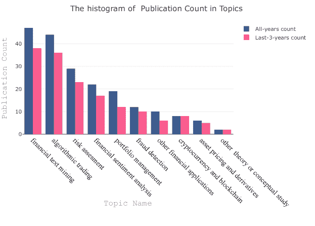

图 8：各主题的出版数量直方图

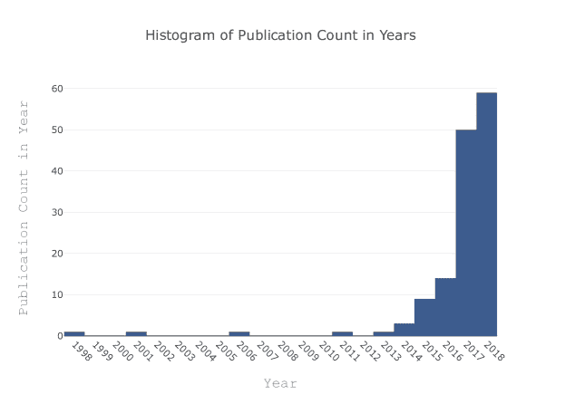

图 9：各年的出版数量直方图

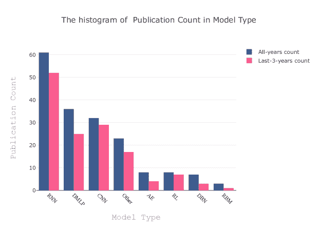

图 10：模型类型的出版数量直方图

首先，我们对金融应用研究中的各种主题进行了聚类，并在图 8 中展示了它们。从图中可以快速看到，金融文本挖掘和算法交易是研究人员最关注的两个领域，其次是风险评估、情感分析、投资组合管理和欺诈检测。结果表明，大多数论文是在过去 3 年内发表的，这表明该领域非常热门并且研究积极。我们还可以通过分析图 9 来观察这些现象。此外，值得一提的是，2013 年前发表的少数几篇论文都使用了基于 RNN 的模型。

当将论文按 DL 模型类型进行聚类时，如图 10 所示，我们观察到 RNN、DMLP 和 CNN 在其他模型中占主导地位，这可能是预期的，因为这些模型通常是一般 DL 实现中最受欢迎的模型。同时，RNN 是一个通用的模型，包含多个版本，如 LSTM、GRU 等。在 RNN 的选择中，大多数模型实际上属于 LSTM，这在时间序列预测或回归问题中非常受欢迎。在算法交易中也经常使用。超过 70% 的 RNN 论文包含 LSTM 模型。

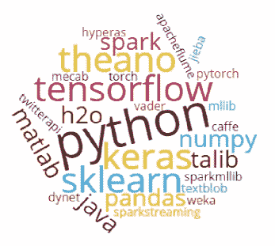

图 11：最常使用的软件、框架和环境的词云图

图 11 通过词云图展示了用于 DL 模型实现的常用软件和框架，而图 12 则提供了开发环境的详细信息。左侧图表（图 12(a)）展示了高层次的视图，其中 Python 占据了 80% 的份额，相比之下，R 语言占 10%，其他语言占更少。右侧图表（图 12(b)）提供了开发者如何通过不同的库和框架使用 Python 的详细信息。

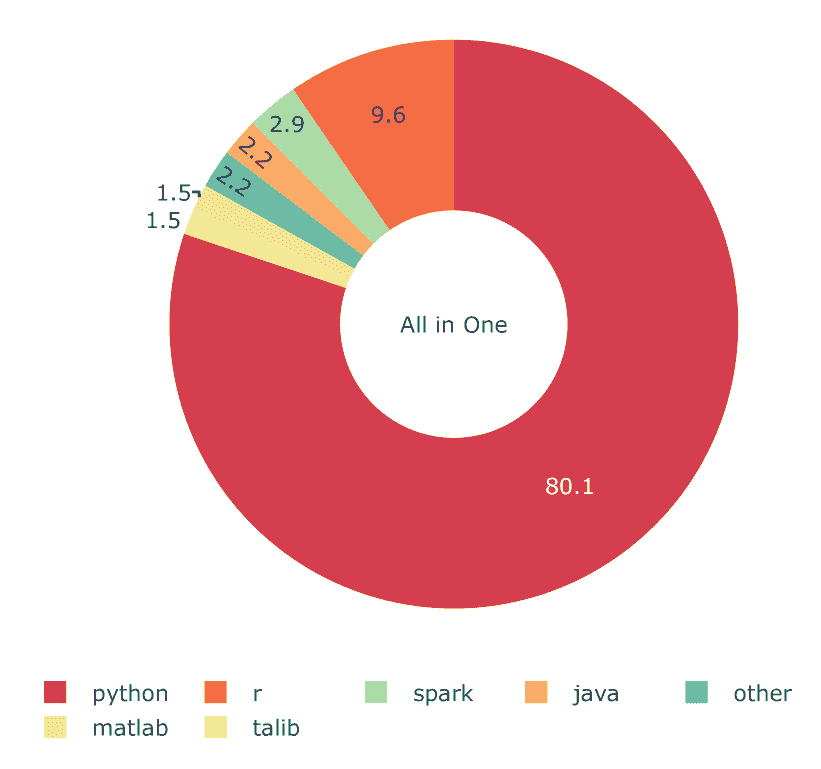

(a) 首选的开发环境

(b) 首选的 Python 库

图 12：首选环境的分布

与此同时，DMLP 通常适用于分类问题，因此它是大多数金融应用领域的常见选择。然而，由于它是其浅层对应物 MLP 的自然扩展，它的历史比其他 DL 模型更久远。

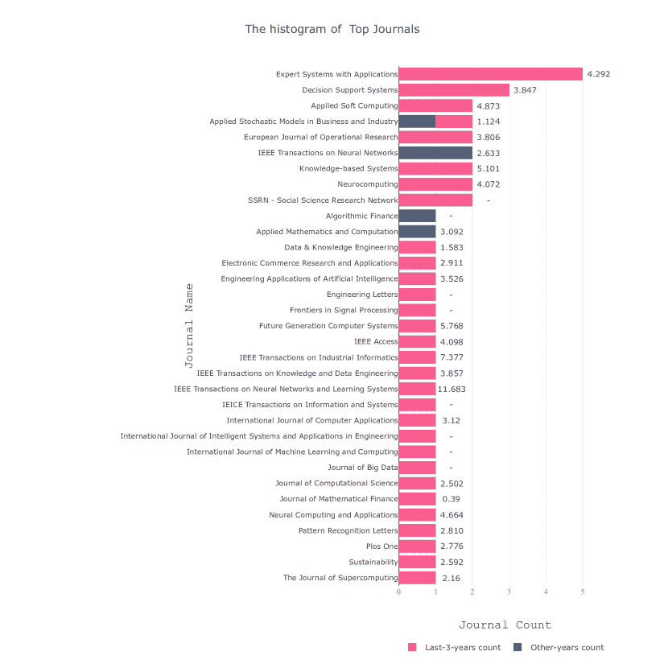

图 13：顶级期刊 - 柱状图旁边的对应数字表示期刊的影响因子

最近，CNN 开始获得更多关注，因为大多数实施出现在过去 3 年中。对 CNN 论文的仔细分析表明，近年来将金融数据表示为 2-D 图像视图以利用 CNN 的趋势正在增长。因此，CNN 基于模型可能在未来超过其他模型。实际上，在过去 3 年中它已经超越了 DMLP。

顶级期刊如图 13 所示。过去 3 年中发表论文最多的期刊包括《专家系统与应用》、《决策支持系统》、《应用软计算》、《神经计算》、《知识基础系统》和《欧洲运筹学杂志》。

## 6 讨论与开放问题

在回顾了前一节中解释的选择标准下的所有出版物后，我们希望提供我们对当前最先进情况的发现。我们的讨论按照 DL 模型和实施主题进行分类。

### 6.1 对 DL 模型的讨论

可以声称，LSTM 是大多数研究者偏好的主流 DL 模型，因为它在金融时间序列数据预测中的结构已经很成熟。大多数金融实施需要回归类型的方法，这非常适合 LSTM 及其衍生模型，因为它们对问题的适应性很强。只要金融数据的时间特性存在，LSTM 及其相关模型将保持其受欢迎程度。

与此同时，CNN 基于模型在过去两年中开始获得更多研究者的关注。与 LSTM 不同，CNN 对分类问题更有效，更适合非时间变化或静态数据表示。然而，由于大多数金融数据是时间变化的，正常情况下，CNN 不是金融应用的自然选择。然而，在一些独立研究中，研究人员对 1-D 时间变化的金融数据进行了创新转化，变成 2-D 大多静态的图像类数据，以便通过自适应滤波和隐式降维来利用 CNN 的优势。这种新颖的方法在复杂的金融模式中表现得非常出色，无论应用领域如何。未来，这种实施的例子可能会变得更加普遍；只有时间会证明。

另一种引起越来越多关注的模型是基于 DRL 的实现，尤其是与基于智能体建模相结合的那些。尽管算法交易是这种模型最受青睐的实施领域，但也可以为任何问题类型开发工作结构。

仔细分析评论表明，在大多数论文中，混合模型比原生模型更受欢迎，以取得更好的成果。许多研究人员配置拓扑结构和网络参数以实现更高的性能。然而，也存在创建更复杂的混合模型的危险，这些模型不易构建，其解释也可能比较困难。

通过性能评估结果，可以说一般来说，DL 模型在处理相同问题时表现优于 ML 模型。DL 模型还具有处理大量数据的优势。随着开源 DL 库和框架的不断扩展（见图 11），DL 模型的构建和开发过程变得比以往更容易。这一现象也得到了将 DL 模型应用于金融各个领域的日益增长的兴趣的支持，这可以从图 9 中观察到。

另外值得一提的是，尽管 DL 模型的表现优于 ML 模型，但性能评估结果每年相对改善，尽管很难明确量化改进的程度。由于更深层次和/或更多样化的网络以及新的创新模型开发，改进在趋势预测基础上的算法交易实现和文本挖掘研究中最为显著。这也体现在每年发表论文数量的增加上。

### 6.2 实施领域讨论

在所有使用 DL 模型的金融应用中，价格/趋势预测和算法交易模型最受关注。风险评估和投资组合管理在 ML 社区中一直很受欢迎，看起来这在 DL 研究人员中也是如此。

尽管对深度学习模型的广泛兴趣在上升，但金融文本挖掘特别受到比大多数其他金融应用更多的关注。金融新闻、推特、声明和博客的流动开辟了一个全新的世界，让金融界能够构建更好、更灵活的预测和评估模型，整合数值和文本数据。与此同时，如今的一般方法是将文本挖掘与金融情感分析结合起来。因此，合理的假设是会取得更高的性能。许多研究人员开始在这一特定应用领域工作。下一代表现突出的实现很可能基于能够成功整合文本挖掘与量化数值数据的模型。

现在，另一个热门领域是深度学习研究中的加密货币。我们还可以将区块链研究纳入其中，尽管它不一定直接与加密货币相关，但在大多数实现中通常是一起使用的。加密货币价格预测在这个领域最具吸引力，但由于该话题相对较新，更多的研究和实现可能会不断涌现，因为有很高的期望和前景。

### 6.3 现有问题与未来工作

当我们尝试将当前的研究状态和取得的成果推演到未来时，一些兴趣领域显得尤为突出。我们将尝试详细阐述这些领域，并提供在接下来几年中可以做或需要做的路径。我们将通过模型开发和研究主题的视角来整理我们的观点。

#### 6.3.1 模型开发视角

我们已经提到对 2-D 卷积神经网络在各种金融应用领域的适应的关注日益增长。这种特定技术看起来很有前景，并提供了机会。进一步探索这种方法在不同问题中的可能性将是有益的。这个领域仍然广阔。

图卷积神经网络是另一个紧密相关但仍显示出一些差异的模型。它的使用并不多，只有一项研究将图卷积神经网络与金融应用联系起来。然而，将金融数据多样化地转换为图形，通过图形表示整合情感分析，并构建不同的模型，可以为研究人员提供机会，创建表现更好的金融应用。

还有一些最近开发的深度学习（DL）模型，如生成对抗网络（GAN）、胶囊网络等，也可以为现有的实现提供可行的替代方案。这些模型已开始出现在各种非金融研究中，但据我们所知，尚未有此类金融应用的实现。这可能为金融研究人员和从业者打开了新的机会窗口。除了这些新模型外，像迁移学习、单次学习等创新范式也可以在此环境中进行测试。

由于金融文本挖掘正迅速超越其他主题，新的数据模型如 Stock2Vec [168]可以被改进，以提供更好和更具代表性的模型。此外，基于自然语言处理（NLP）的集成模型或更多地将数据语义整合进来，可以提高现有模型的准确性。

最后，根据我们的观察，大多数研究中混合模型相比本地或独立模型更受欢迎。这一趋势可能会持续，但研究人员需要引入更多多功能、有时甚至是非常规的模型以获得更好的结果。将各种简单的深度学习（DL）层，如级联的 CNN-LSTM 块，整合在一起的混合模型可能会有更好的效果，因为以新颖的方式将空间和时间信息集成在一起，可能是寻求模型“alpha”的研究人员的重要里程碑。

#### 6.3.2 实施视角

就应用领域而言，通常被关注的领域，如**算法交易**、**投资组合管理**和**风险评估**，在可预见的未来可能会继续在金融研究领域中占据主导地位。同时，一些新的**闪亮明星**开始获得更多关注，这不仅因为它们代表了相对新的研究机会，还因为它们对金融世界的预测影响值得注意。

加密货币和区块链技术是这些新研究领域之一。因此，探索这些新领域将带来的可能性是值得的。虽然这些技术成为广泛接受的行业标准还需要一段时间，但正是这种原因，使得它们为研究人员提供了用新型创新模型塑造金融世界未来的绝佳机会，并期望世界其他地方能跟随他们的步伐。

投资组合管理是另一个可以从更创新的模型中受益的领域。全球范围内，机器人顾问系统正在兴起，而这些系统依赖于高性能的自动决策支持系统。由于 DL 模型很适合这种描述，假设 DL 实施在未来几年会增加是合乎逻辑的。因此，相应的量化基金将对 DL 研究人员可以为金融界提供的成果非常感兴趣。这可能需要将学习和优化模型结合起来，以实现更好的系统性能。因此，能够成功混合 EC 和 DL 组件的集成模型可能是行业对近期未来的期待。这也可能带来新的研究机会。

然而，另一个通常被软计算和 DL 研究人员回避的研究领域是金融衍生品市场。尽管市场上存在许多不同的产品，但相应的 DL 研究却非常稀少。然而，对于金融行业的专业人士来说，这些产品实际上提供了从对冲投资到实施杠杆交易的极大灵活性，且风险最小。尽管 DL 研究人员有机会，但由于衍生品市场的相关研究只有少数几项，对该主题的兴趣并不广泛。期权策略优化、期货交易、期权定价、套利交易等领域可能会从 DL 研究中受益。

情感分析、文本挖掘、风险调整资产定价是一些吸引研究人员但尚未完全利用的实施领域。我们很可能在不久的将来看到更多关于这些领域的论文。

最后但同样重要的是，HFT 是一个尚未充分受益于 ML 研究进展的领域。由于 HFT 需要闪电般快速的交易处理，嵌入这种交易系统的统计学习模型不能给现有系统带来额外的延迟。这需要对这些模型进行仔细的规划和建模。为此，可以研究嵌入在图形处理单元（GPU）或现场可编程门阵列（FPGA）基础硬件解决方案中的 DL 模型。DL 实施的硬件方面在几乎所有研究中通常被忽略，但如上所述，该领域也可能存在机会。

#### 6.3.3 未来研究的建议

对图 8 和图 9 的仔细分析表明，金融领域对应用深度学习研究的总体需求在上升。尽管兴趣广泛，但一些领域，如加密货币和区块链研究，可能会比其他领域获得更多关注。

关于文本挖掘和金融情感分析的有前景展望，我们认为行为金融也是一个相对未被充分探索的研究领域，隐藏了很多机会。使用深度学习模型的行为金融研究仍然缺乏相关的研究工作。这可能主要是因为行为金融研究的输入和输出难以量化以便与深度学习模型一起使用。然而，文本挖掘、自然语言处理、语义学与基于代理的计算金融的最新进展可以为该领域开辟巨大机会。我们鼓励研究人员进一步探讨这一领域，因为目前它似乎对新研究保持开放状态。

### 6.4 对我们初步研究问题的回应

在此时，由于我们已经收集并处理了所有需要的信息，我们准备回答最初提出的研究问题。问题和根据我们的调查得到的相应答案如下：

+   1.

    深度学习社区对哪些金融应用领域感兴趣？

    回应：金融文本挖掘、算法交易、风险评估、情感分析、投资组合管理和欺诈检测是金融研究中最受关注的领域之一。 （请查看图 8）

+   2.

    现有的各个应用领域的研究成熟度如何？

    回应：尽管深度学习模型在几乎所有领域相比传统模型已有更好的成就，但总体兴趣在所有研究领域仍在上升。

+   3.

    从学术/工业研究的角度来看，哪些领域具有有前景的潜力？

    回应：加密货币、区块链、行为金融、高频交易和衍生品市场具有有前景的研究潜力。

+   4.

    哪些深度学习模型在不同应用中更受青睐（并且更成功）？

    回复：基于 RNN 的模型（特别是 LSTM）、CNN 和 DMLP 在实施中得到广泛应用。根据我们遇到的情况，LSTM 在时间序列预测中更为成功且更受欢迎，而 DMLP 和 CNN 更适合于需要分类的应用。

+   5.

    如何与传统软计算 / ML 技术相比，DL 模型的表现如何？

    回复：在大多数研究中，DL 模型表现优于其 ML 对手。虽然有些情况下 ML 有可比或甚至更好的解决方案，但总体趋势是 DL 方法的优越性。

+   6.

    DL 研究在金融领域的未来方向是什么？

    回复：基于时空数据表示、NLP、语义和文本挖掘的混合模型在不久的将来可能会变得更加重要。

## 7 结论

金融行业和学术界已经开始认识到 DL 在各种应用领域的潜力。每年的研究工作数量不断增加，且速度加快。然而，我们仍处于这个新时代的早期阶段，更多的研究将会实施，新的模型将不断涌现。在这项调查中，我们旨在突出 DL 在金融应用中的前沿研究。我们不仅提供了现有研究状态的快照，还尝试确定未来研究者的研究方向。我们的发现表明，该领域存在令人难以置信的机会，并且看起来这些机会不会很快消失。因此，我们鼓励对该领域感兴趣的研究者开始探索。

## 8 致谢

本工作得到土耳其科学与技术研究委员会 (TUBITAK) 资助，资助号 215E248。

## 词汇表

AE

自编码器

AI

人工智能

AMEX

纽约证券交易所

ANN

人工神经网络

ARIMA

自回归积分滑动平均

AUC

曲线下面积

AUROC

接收者操作特征曲线下面积

BA

平衡准确率

BELM

基本极限学习机

BHC

银行控股公司

Bi-GRU

双向门控递归单元

Bi-LSTM

双向 LSTM

BIST

伊斯坦布尔证券交易所指数

BOLL

布林带

BPTT

时间反向传播

CAE

卷积自编码器

CAGR

年复合增长率

CART

分类与回归树

CCI

商品频道指数

CDAX

德国证券市场指数，由德意志证券交易所计算

CDS

信用违约掉期

CGAN

条件的

CME

芝加哥商品交易所

CNN

卷积神经网络

CRIX

加密货币指数

CRSP

证券价格研究中心

CSI

中国证券指数

DAX

德国股票指数

DBN

深度置信网络

DCNL

深度共同投资网络学习

DCNN

深度卷积神经网络

DDPG

深度确定性策略梯度

深度-FASP

财务方面和情感预测任务与深度神经网络

DFFN

深度前馈网络

DFNN

深度前馈神经网络

DGM

深度神经生成模型

DGP

深度高斯过程

DJI

道琼斯指数

道琼斯工业平均指数

道琼斯工业平均指数

DL

深度学习

DLR

深度学习表示

DMI

方向运动指数

DMLP

深度多层感知器

DNN

深度神经网络

DP

判别能力

DQL

深度 Q 学习

DRL

深度强化学习

DRSE

深度随机子空间集成

DTW

动态时间规整

EA

进化算法

EC

进化计算

ELM

极限学习机

EMA

指数移动平均

ETF

交易所交易基金

FDDR

模糊深度直接强化学习

FE-QAR

固定效应分位数 VAR

FFNN

前馈神经网络

FN

假阴性

FNN

全连接神经网络

FP

假阳性

FPGA

现场可编程门阵列

FTSE

伦敦金融时报股票交易指数

G-均值

几何平均数

GA

遗传算法

GAN

生成对抗网络

GASVR

GA 具有

GBDT

梯度提升决策树

GBT

梯度提升树

GP

遗传编程

GPU

图形处理单元

GRU

门控递归单元

HAN

混合注意力网络

HAR

异质自回归过程

HFT

高频交易

HMM

隐马尔可夫模型

HS

中国上海深圳股指

HSI

香港恒生指数

IBB

iShares 纳斯达克生物技术 ETF

KELM

核极限学习机

KOSPI

韩国综合股价指数

KS

Kolmogorov–Smirnov

LAR

线性自回归预测器

LDA

潜在狄利克雷分配

LFM

前瞻因子模型

LOB

限价单簿数据

LR

逻辑回归

LSTM

长短期记忆

MA

移动平均

MACD

移动平均收敛与发散

MAE

平均绝对误差

MAPE

平均绝对百分比误差

MCC

马修相关系数

MDA

多线性判别分析

MDD

最大回撤

ML

机器学习

MLP

多层感知器

MODRL

多目标深度强化学习

MOEA

多目标进化算法

MSE

均方误差

MV-t

多元 t 分布

MVN

多元正态分布

NASDAQ

国家证券交易商自动报价系统

NES

自然进化策略

NIFTY

印度国家证券交易所

日经

东京日经指数

NLP

自然语言处理

NN

神经网络

NYSE

纽约证券交易所

OCHL

开盘、收盘、最高、最低

OCHLV

开盘、收盘、最高、最低、成交量

PCA

主成分分析

PCC

皮尔逊相关系数

PLR

分段线性表示

PNN

概率神经网络

PPO

近端策略优化

PSO

粒子群优化

R²

平方相关性，非线性回归多重相关性

RBM

限制玻尔兹曼机

RCNN

递归卷积神经网络

ReLU

修正线性单元

RF

随机森林

RL

强化学习

RMDN

循环混合密度网络

RMSE

均方根误差

RNN

循环神经网络

资产回报率

资产回报率

ROC

价格变动

RSE

相对平方误差

RSI

相对强弱指数

SAE

堆叠自编码器

SCI

SSE 综合指数

SFM

状态频率记忆

SGD

随机梯度下降

标准普尔 500

标准普尔 500 指数

SPY

SPDR 标准普尔 500 ETF

SR

夏普比率

STD

标准差

SVD

奇异值分解

支持向量机

支持向量机

SVR

支持向量回归器

SZSE

深圳证券交易所综合指数

台股加权指数

台湾加权股价指数

TALIB

技术分析库包

TAQ

交易与报价

TDNN

时延神经网络

TEMA

三重指数平滑移动平均

TF-IDF

词频-逆文档频率

TGRU

双流 GRU

THEIL-U

泰尔不等式系数

TN

真阴性

TP

真阳性

TR

总回报

TSE

东京证券交易所

TWSE

台湾证券交易所

VAR

向量自回归

VWL

WL 核方法

WBA

加权平衡准确率

WMTR

加权多通道时间序列回归

WSURT

Wilcoxon 积和秩检验

WT

小波变换

XGBoost

极端梯度提升

## 参考文献

+   Sezer 等 [2019] Omer Berat Sezer, Mehmet Ugur Gudelek, 和 Ahmet Murat Ozbayoglu. 深度学习的金融时间序列预测：系统文献综述：2005-2019 年，2019 年。

+   Bahrammirzaee [2010] Arash Bahrammirzaee. 人工智能在金融中的应用的比较调查：人工神经网络、专家系统和混合智能系统。*神经计算与应用*，19(8)：1165–1195，2010 年 6 月。

+   Zhang 和 Zhou [2004] D. Zhang 和 L. Zhou. 发现金矿：金融应用中的数据挖掘。*IEEE 系统、人类与控制论学报 C 部分（应用与评论）*，34(4)：513–522，2004 年 11 月。

+   Mochón 等 [2007] Asunción Mochón, David Quintana, Yago Sáez, 和 Pedro Isasi Viñuela. 软计算技术在金融中的应用。*应用智能*，29：111–115，2007 年。

+   Pulakkazhy [2013] Pulakkazhy. 银行业中的数据挖掘及其应用：综述。*计算机科学期刊*，9(10)：1252–1259，2013 年 10 月。

+   Mullainathan 和 Spiess [2017] Sendhil Mullainathan 和 Jann Spiess. 机器学习：一种应用经济计量学方法。*经济学视角期刊*，31(2)：87–106，2017 年 5 月。

+   Gai 等 [2018] Keke Gai, Meikang Qiu, 和 Xiaotong Sun. 关于金融科技的调查。*网络与计算机应用期刊*，103：262–273，2018 年。

+   Kovalerchuk 和 Vityaev [2000] Boris Kovalerchuk 和 Evgenii Vityaev. *金融数据挖掘：关系和混合方法的进展*。Kluwer Academic Publishers, Norwell, MA, USA, 2000.

+   Aliev 等 [2004] Rafik A. Aliev, Bijan Fazlollahi, 和 Rashad R. Aliev. 软计算及其在商业和经济中的应用。在 *模糊性与软计算研究*，2004 年。

+   Brabazon 和 O’Neill [2008] Anthony Brabazon 和 Michael O’Neill, 编辑。*计算金融中的自然计算*。Springer Berlin Heidelberg, 2008 年。

+   Dymowa [2011] Ludmila Dymowa。*经济学和金融学中的软计算*。Springer Berlin Heidelberg，2011 年。

+   Chen [2002] Shu-Heng Chen（编者）。*计算金融中的遗传算法和遗传编程*。Springer US，2002 年。

+   Tapia 和 Coello [2007] Ma. Guadalupe Castillo Tapia 和 Carlos A. Coello Coello。《多目标进化算法在经济学和金融学中的应用：一项调查》。见 *2007 年 IEEE 进化计算大会*。IEEE，2007 年 9 月。

+   Ponsich 等人 [2013] Antonin Ponsich、Antonio Lopez Jaimes 和 Carlos A. Coello Coello。《关于多目标进化算法在投资组合优化问题及其他金融和经济应用中的调查》。*IEEE 进化计算汇刊*，17(3)：321–344，2013 年 6 月。

+   Aguilar-Rivera 等人 [2015] Ruben Aguilar-Rivera、Manuel Valenzuela-Rendon 和 J.J. Rodriguez-Ortiz。《遗传算法和达尔文方法在金融应用中的应用：一项调查》。*专家系统应用*，42(21)：7684–7697，2015 年 11 月。

+   Wong 和 Selvi [1998] Bo K Wong 和 Yakup Selvi。《金融中的神经网络应用：文献回顾与分析（1990–1996）》。*信息与管理*，34(3)：129–139，1998 年 10 月。

+   Li 和 Ma [2010] Yuhong Li 和 Weihua Ma。《人工神经网络在金融经济学中的应用：一项调查》。见 *2010 年国际计算智能与设计研讨会*。IEEE，2010 年 10 月。

+   Elmsili 和 Outtaj [2018] B. Elmsili 和 B. Outtaj。《人工神经网络在经济学和管理研究中的应用：一项探索性文献综述》。见 *2018 年第 4 届优化与应用国际会议（ICOA）*，页 1–6，2018 年 4 月。

+   LeBaron [2006] Blake LeBaron。《第二十四章 基于代理的计算金融》。见 L. Tesfatsion 和 K.L. Judd（编者），*计算经济学手册*，*计算经济学手册* 第 2 卷，页 1187–1233。Elsevier，2006 年。

+   Chalup 和 Mitschele [2008] Stephan K. Chalup 和 Andreas Mitschele。《金融中的核方法》。见 *金融信息技术手册*，页 655–687。Springer Berlin Heidelberg，2008 年。

+   LeCun 等人 [2015] Yann LeCun、Yoshua Bengio 和 Geoffrey Hinton。《深度学习》。*自然*，521(7553)：436–444，2015 年。

+   Cybenko [1989] George Cybenko。《通过 sigmoid 函数的叠加进行逼近》。*控制、信号与系统数学*，2(4)：303–314，1989 年。

+   Kalman 和 Kwasny [1992] Barry L Kalman 和 Stan C Kwasny。《为什么选择 tanh：选择 sigmoid 函数》。见 *[1992 年会议] IJCNN 国际联合神经网络会议*，第 4 卷，页 578–581。IEEE，1992 年。

+   Nair 和 Hinton [2010] Vinod Nair 和 Geoffrey E Hinton。《整流线性单元改善限制玻尔兹曼机》。见 *第 27 届国际机器学习会议（ICML-10）论文集*，页 807–814，2010 年。

+   Maas et al. [2013] Andrew L Maas, Awni Y Hannun, 和 Andrew Y Ng. 整流非线性函数改善神经网络声学模型。在*ICML 会议论文集*，第 30 卷，第 3 页，2013 年。

+   Ramachandran et al. [2017] Prajit Ramachandran, Barret Zoph, 和 Quoc V Le. 激活函数的搜索。*arXiv 预印本 arXiv:1710.05941*，2017 年。

+   Goodfellow et al. [2016] Ian Goodfellow, Yoshua Bengio, 和 Aaron Courville. *深度学习*。MIT 出版社，2016 年。 http://www.deeplearningbook.org。

+   Hochreiter 和 Schmidhuber [1997] Sepp Hochreiter 和 Jürgen Schmidhuber. 长短期记忆。*神经计算*，9(8):1735–1780，1997 年。

+   Qiu et al. [2014] Xueheng Qiu, Le Zhang, Ye Ren, P. Suganthan, 和 Gehan Amaratunga. 用于回归和时间序列预测的集成深度学习。在*2014 年 IEEE 计算智能集成学习研讨会 (CIEL)*，第 1–6 页，2014 年。

+   Bengio [2012] Yoshua Bengio. 用于无监督学习和迁移学习的表示深度学习。在*ICML 无监督学习和迁移学习研讨会论文集*，第 17–36 页，2012 年。

+   Hinton et al. [2006] Geoffrey E. Hinton, Simon Osindero, 和 Yee-Whye Teh. 深度置信网络的快速学习算法。*神经计算*，18(7):1527–1554，2006 年。

+   Vincent et al. [2008] Pascal Vincent, Hugo Larochelle, Yoshua Bengio, 和 Pierre-Antoine Manzagol. 使用去噪自编码器提取和组合鲁棒特征。在*第 25 届国际机器学习会议论文集*，第 1096–1103 页。ACM，2008 年。

+   Meng et al. [2017] Qinxue Meng, Daniel Catchpoole, David Skillicom, 和 Paul J Kennedy. 用于特征提取的关系自编码器。在*2017 年国际神经网络联合会议 (IJCNN)*，第 364–371 页。IEEE，2017 年。

+   Hu et al. [2015] Yong Hu, Kang Liu, Xiangzhou Zhang, Lijun Su, E.W.T. Ngai, 和 Mei Liu. 进化计算在股票算法交易规则发现中的应用：文献综述。*应用软计算*，36:534–551，2015 年 11 月。

+   Karaoglu 和 Arpaci [2017] Sercan Karaoglu 和 Ugur Arpaci. 一种用于金融交易系统中系统信号检测优化的深度学习方法，基于大数据。*国际智能系统与工程应用期刊*，特刊(SpecialIssue):31–36，2017 年 7 月。

+   Bao et al. [2017] Wei Bao, Jun Yue, 和 Yulei Rao. 基于堆叠自编码器和长短期记忆的金融时间序列深度学习框架。*PLOS ONE*，12(7):e0180944，2017 年 7 月。

+   Liu et al. [2017] Shuanglong Liu, Chao Zhang, 和 Jinwen Ma. 用于股票市场定量策略分析的 Cnn-lstm 神经网络模型。在*神经信息处理*，第 198–206 页。Springer 国际出版，2017 年。

+   Zhang et al. [2017] Liheng Zhang, Charu Aggarwal, 和 Guo-Jun Qi. 通过发现多频交易模式进行股票价格预测。在*第 23 届 ACM SIGKDD 国际知识发现与数据挖掘会议 - KDD17*。ACM 出版社，2017 年。

+   Tran 等 [2017] Dat Thanh Tran、Martin Magris、Juho Kanniainen、Moncef Gabbouj 和 Alexandros Iosifidis。在高频金融数据中的张量表示用于价格变动预测。见 *2017 IEEE 计算智能研讨会系列（SSCI）*。IEEE，2017 年 11 月。

+   Deng 等 [2017] Yue Deng、Feng Bao、Youyong Kong、Zhiquan Ren 和 Qionghai Dai。用于金融信号表示和交易的深度直接强化学习。*IEEE 神经网络与学习系统汇刊*，28(3):653–664，2017 年 3 月。

+   Fischer 和 Krauss [2018] Thomas Fischer 和 Christopher Krauss。利用长短期记忆网络进行金融市场预测的深度学习。*欧洲运筹学杂志*，270(2):654–669，2018 年 10 月。

+   Mourelatos 等 [2018] Marios Mourelatos、Christos Alexakos、Thomas Amorgianiotis 和 Spiridon Likothanassis。利用深度学习技术进行金融指数建模和交易：雅典 SE FTSE/ASE 大型股案例。见 *2018 年智能系统与应用创新会议（INISTA）*。IEEE，2018 年 7 月。

+   Si 等 [2017] Weiyu Si、Jinke Li、Peng Ding 和 Ruonan Rao。针对股票指数期货的多目标深度强化学习方法。见 *2017 年第 10 届计算智能与设计国际研讨会（ISCID）*。IEEE，2017 年 12 月。

+   Yong 等 [2017] Bang Xiang Yong、Mohd Rozaini Abdul Rahim 和 Ahmad Shahidan Abdullah。使用深度神经网络的股票市场交易系统。见 *计算机与信息科学通讯*，第 356–364 页。新加坡斯普林格出版社，2017 年。

+   Lu [2017] David W. Lu。基于递归强化学习和 LSTM 神经网络的智能交易，2017 年。

+   Dixon 等 [2016] Matthew Francis Dixon、Diego Klabjan 和 Jin Hoon Bang。基于分类的金融市场预测使用深度神经网络。*SSRN 电子期刊*，2016 年。

+   Korczak 和 Hernes [2017] Jerzy Korczak 和 Marcin Hernes。用于金融时间序列预测的深度学习在 a-trader 系统中的应用。见 *2017 年联合计算机科学与信息系统会议论文集*。IEEE，2017 年 9 月。

+   Spilak [2018] Bruno Spilak。用于加密货币价格预测的深度神经网络。硕士论文，柏林洪堡大学，经济学系，2018 年。

+   Jeong 和 Kim [2019] Gyeeun Jeong 和 Ha Young Kim。利用深度 Q 学习改善金融交易决策：预测股份数量、行动策略和迁移学习。*专家系统应用*，117:125–138，2019 年 3 月。

+   Krauss 等 [2017] Christopher Krauss、Xuan Anh Do 和 Nicolas Huck。深度神经网络、梯度提升树、随机森林：S&P 500 上的统计套利。*欧洲运筹学杂志*，259(2):689–702，2017 年 6 月。

+   [51] Google。计算机管理基金超越基准的系统和方法。

+   Sezer 等人 [2017] Omer Berat Sezer, Murat Ozbayoglu 和 Erdogan Dogdu. 基于进化优化技术分析参数的深度神经网络股票交易系统。*计算机科学程序集*，114:473–480，2017 年。

+   Navon 和 Keller [2017] Ariel Navon 和 Yosi Keller. 使用深度学习的金融时间序列预测，2017 年。

+   Troiano 等人 [2018] Luigi Troiano, Elena Mejuto Villa 和 Vincenzo Loia. 通过 LSTM 复制交易策略以应用于金融行业。*IEEE 工业信息学事务*，14(7):3226–3234，2018 年 7 月。

+   Sirignano 和 Cont [2018] Justin Sirignano 和 Rama Cont. 金融市场价格形成的普遍特征：深度学习的视角。*SSRN 电子期刊*，2018 年。

+   Tsantekidis 等人 [2017a] Avraam Tsantekidis, Nikolaos Passalis, Anastasios Tefas, Juho Kanniainen, Moncef Gabbouj 和 Alexandros Iosifidis. 使用深度学习检测金融市场中的价格变化指示。在 *2017 第 25 届欧洲信号处理会议 (EUSIPCO)* 上。IEEE，2017 年 8 月。

+   Gudelek 等人 [2017] M. Ugur Gudelek, S. Arda Boluk 和 A. Murat Ozbayoglu. 基于深度学习的股票交易模型与 2-D CNN 趋势检测。在 *2017 IEEE 计算智能研讨会系列 (SSCI)* 上。IEEE，2017 年 11 月。

+   Sezer 和 Ozbayoglu [2018] Omer Berat Sezer 和 Ahmet Murat Ozbayoglu. 使用深度卷积神经网络的算法金融交易：时间序列到图像转换方法。*应用软计算*，70:525–538，2018 年 9 月。

+   Hu 等人 [2018a] Guosheng Hu, Yuxin Hu, Kai Yang, Zehao Yu, Flood Sung, Zhihong Zhang, Fei Xie, Jianguo Liu, Neil Robertson, Timpathy Hospedales 和 Qiangwei Miemie. 深度股票表示学习：从蜡烛图到投资决策。在 *2018 IEEE 国际声学、语音与信号处理会议 (ICASSP)* 上。IEEE，2018 年 4 月。

+   Tsantekidis 等人 [2017b] Avraam Tsantekidis, Nikolaos Passalis, Anastasios Tefas, Juho Kanniainen, Moncef Gabbouj 和 Alexandros Iosifidis. 使用卷积神经网络从限价订单簿预测股票价格。在 *2017 IEEE 第 19 届商业信息学会议 (CBI)* 上。IEEE，2017 年 7 月。

+   Gunduz 等人 [2017] Hakan Gunduz, Yusuf Yaslan 和 Zehra Cataltepe. 使用卷积神经网络和特征相关性进行 Borsa Istanbul 的日内预测。*基于知识的系统*，137:138–148，2017 年 12 月。

+   Sezer 和 Ozbayoglu [2019] Omer Berat Sezer 和 Ahmet Murat Ozbayoglu. 使用深度卷积神经网络的股票条形图图像时间序列金融交易模型。*arXiv 预印本 arXiv:1903.04610*，2019 年。

+   Serrano [2018] Will Serrano. 金融科技模型：带遗传算法的随机神经网络。*计算机科学程序集*，126:537–546，2018 年。

+   Saad 等人 [1998] E.W. Saad, D.V. Prokhorov, 和 D.C. Wunsch. 使用时间延迟、递归和概率神经网络进行股票趋势预测的比较研究。*IEEE 神经网络汇刊*, 9(6):1456–1470, 1998 年。

+   Doering 等人 [2017] Jonathan Doering, Michael Fairbank, 和 Sheri Markose. 卷积神经网络在高频市场微观结构预测中的应用。在 *2017 年第 9 届计算机科学与电子工程会议（CEEC）*。IEEE，2017 年 9 月。

+   Jiang 等人 [2017] Zhengyao Jiang, Dixing Xu, 和 Jinjun Liang. 用于金融投资组合管理问题的深度强化学习框架。*arXiv 预印本 arXiv:1706.10059*, 2017 年。

+   Tino 等人 [2001] P. Tino, C. Schittenkopf, 和 G. Dorffner. 使用递归神经网络进行金融波动交易。*IEEE 神经网络汇刊*, 12(4):865–874, 2001 年 7 月。

+   Chen 等人 [2018a] Yu-Ying Chen, Wei-Lun Chen, 和 Szu-Hao Huang. 使用滤波器组 CNN 算法在高频配对交易中开发套利策略。在 *2018 IEEE 国际代理人会议（ICA）*。IEEE，2018 年 7 月。

+   Bari 和 Agah [2018] Omar A. Bari 和 Arvin Agah. 文本和时间序列模型的集成，用于从社交媒体内容自动生成金融交易信号。*智能系统期刊*, 2018 年。

+   Dixon [2017] Matthew Francis Dixon. 使用递归神经网络对限价订单簿进行序列分类。*SSRN 电子期刊*, 2017 年。

+   Chen 等人 [2018b] Chiao-Ting Chen, An-Pin Chen, 和 Szu-Hao Huang. 使用基于代理的强化学习算法从交易记录中克隆策略。在 *2018 IEEE 国际代理人会议（ICA）*。IEEE，2018 年 7 月。

+   Wang 等人 [2018a] Yue Wang, Chenwei Zhang, Shen Wang, Philip S. Yu, Lu Bai, 和 Lixin Cui. 深度共同投资网络学习用于金融资产, 2018 年。

+   Day 和 Lee [2016] Min-Yuh Day 和 Chia-Chou Lee. 在金融新闻提供者上进行金融情感分析的深度学习。在 *2016 IEEE/ACM 国际社交网络分析与挖掘会议（ASONAM）*。IEEE，2016 年 8 月。

+   Sirignano [2016] Justin Sirignano. 深度学习在限价订单簿中的应用, 2016 年。

+   Gao [2018] Xiang Gao. 时间序列的深度强化学习：理想化交易游戏的应用, 2018 年。

+   Baily 等人 [2008] Martin Neil Baily, Robert E. Litan, 和 Johnson Matthew S. 金融危机的起源。*布鲁金斯学会商业与公共政策倡议，金融修复系列 - 论文 3*, 2008 年。

+   Luo 等人 [2017] Cuicui Luo, Desheng Wu, 和 Dexiang Wu. 使用信用违约掉期的深度学习信用评分方法。*工程应用人工智能*, 65:465–470, 2017 年 10 月。

+   Yu 等人 [2018] Lean Yu, Rongtian Zhou, Ling Tang, 和 Rongda Chen. 基于 DBN 的重采样 SVM 集成学习范式用于处理不平衡数据的信用分类。*应用软计算*, 69:192–202, 2018 年 8 月。

+   Li et al. [2017a] Ying Li、Xianghong Lin、Xiangwen Wang、Fanqi Shen 和 Zuzheng Gong。使用深度神经网络与聚类和合并的信用风险评估算法。在*2017 年第 13 届国际计算智能与安全会议 (CIS)*。IEEE，2017 年 12 月。

+   Tran et al. [2016] Khiem Tran、Thanh Duong 和 Quyen Ho。信用评分模型：遗传编程与深度学习的结合。在*2016 年未来技术大会 (FTC)*。IEEE，2016 年 12 月。

+   Neagoe et al. [2018] Victor-Emil Neagoe、Adrian-Dumitru Ciotec 和 George-Sorin Cucu。深度卷积神经网络与多层感知器在金融预测中的对比。在*2018 年国际通讯会议 (COMM)*。IEEE，2018 年 6 月。

+   Zhu et al. [2018] Bing Zhu、Wenchuan Yang、Huaxuan Wang 和 Yuan Yuan。用于消费者信用评分的混合深度学习模型。在*2018 年国际人工智能与大数据会议 (ICAIBD)*。IEEE，2018 年 5 月。

+   Niimi [2015] Ayahiko Niimi。用于信用卡数据分析的深度学习。在*2015 年互联网安全世界大会 (WorldCIS)*。IEEE，2015 年 10 月。

+   Kirkos and Manolopoulos [2004] Efstathios Kirkos 和 Yannis Manolopoulos。金融与会计中的数据挖掘：当前研究趋势的综述。在*第 1 届国际企业系统与会计会议 (ICESAcc)*，页 63–78，2004 年。

+   Ravi et al. [2008] V. Ravi、H. Kurniawan、Peter Nwee Kok Thai 和 P. Ravi Kumar。用于银行绩效预测的软计算系统。*应用软计算*，8(1)：305–315，2008 年 1 月。

+   Fethi and Pasiouras [2010] Meryem Duygun Fethi 和 Fotios Pasiouras。利用运筹学和人工智能技术评估银行效率和绩效：一项调查。*欧洲运筹学期刊*，204(2)：189–198，2010 年 7 月。

+   Lahsasna et al. [2010] Adel Lahsasna、Raja Noor Ainon 和 Ying Wah Teh。使用软计算方法的信用评分模型：一项调查。*国际阿拉伯信息技术期刊*，7：115–123，2010 年。

+   Chen et al. [2015] Ning Chen、Bernardete Ribeiro 和 An Chen。金融信用风险评估：近期综述。*人工智能评论*，45(1)：1–23，2015 年 10 月。

+   Marques et al. [2013] AI Marques, Vicente García 和 José Salvador Sánchez。关于进化计算在信用评分中应用的文献综述。*运筹学会期刊*，64(9)：1384–1399，2013。

+   Kumar and Ravi [2007] P. Ravi Kumar 和 V. Ravi。通过统计和智能技术预测银行和企业的破产——一项综述。*欧洲运筹学期刊*，180(1)：1–28，2007 年 7 月。

+   Verikas et al. [2009] Antanas Verikas、Zivile Kalsyte、Marija Bacauskiene 和 Adas Gelzinis。用于破产预测的混合与集成软计算技术：一项调查。*软计算*，14(9)：995–1010，2009 年 9 月。

+   Sun 等 [2014] Jie Sun, Hui Li, Qing-Hua Huang, 和 Kai-Yu He. 预测金融困境和企业失败：从最新定义、建模、采样和特征化方法的综述。*知识基础系统*，57：41–56，2014 年 2 月。

+   Lin 等 [2012] W. Lin, Y. Hu, 和 C. Tsai. 金融危机预测中的机器学习：一项综述。*IEEE 系统、人机与控制论学报，C 部分（应用与评论）*，42(4)：421–436，2012 年 7 月。

+   Lanbouri 和 Achchab [2015] Zineb Lanbouri 和 Said Achchab. 用于金融困境预测的混合深度置信网络方法。在 *2015 年第 10 届智能系统国际会议：理论与应用（SITA）*。IEEE，2015 年 10 月。

+   Rawte 等 [2018] Vipula Rawte, Aparna Gupta, 和 Mohammed J. Zaki. 10-K 文件中风险因素披露的年际变化分析。在 *第四届宏观建模数据科学国际研讨会 - DSMM18*。ACM Press，2018 年。

+   Ronnqvist 和 Sarlin [2015] Samuel Ronnqvist 和 Peter Sarlin. 检测与描述：从新闻中深度学习银行压力。在 *2015 IEEE 计算智能会议系列*。IEEE，2015 年 12 月。

+   Ronnqvist 和 Sarlin [2017] Samuel Ronnqvist 和 Peter Sarlin. 新闻中的银行困境：通过深度学习描述事件。*神经计算*，264：57–70，2017 年 11 月。

+   Cerchiello 等 [2017] Paola Cerchiello, Giancarlo Nicola, Samuel Rönnqvist, 和 Peter Sarlin. 从新闻和数值金融数据中深度学习银行困境。*CoRR*，abs/1706.09627，2017 年。

+   Malik 等 [2018] Nikhil Malik, Param Vir Singh, 和 Urooj Khan. 银行能否在下一次金融危机中生存？用于银行压力测试的对抗性深度学习模型。*用于银行压力测试的对抗性深度学习模型（2018 年 6 月 30 日）*，2018 年。

+   Ribeiro 和 Lopes [2011] Bernardete Ribeiro 和 Noel Lopes. 用于金融预测的深度置信网络。在 *神经信息处理*，第 766–773 页。Springer Berlin Heidelberg，2011 年。

+   Yeh 等 [2015] Shu-Hao Yeh, Chuan-Ju Wang, 和 Ming-Feng Tsai. 用于预测公司违约的深度置信网络。在 *2015 年第 24 届无线与光通信会议（WOCC）*。IEEE，2015 年 10 月。

+   Hosaka [2018] Tadaaki Hosaka. 使用图像化财务比率和卷积神经网络进行破产预测。*专家系统与应用*，2018 年 9 月。

+   Sirignano 等 [2018] Justin Sirignano, Apaar Sadhwani, 和 Kay Giesecke. 用于抵押贷款风险的深度学习。*SSRN 电子期刊*，2018 年。

+   Kvamme 等 [2018] Håvard Kvamme, Nikolai Sellereite, Kjersti Aas, 和 Steffen Sjursen. 使用卷积神经网络预测抵押贷款违约。*专家系统与应用*，102：207–217，2018 年 7 月。

+   [2017] Narek Abroyan 和. 用于金融市场风险分类的神经网络。*信号处理前沿*，1(2)，2017 年 8 月。

+   Chatzis et al. [2018] Sotirios P. Chatzis, Vassilis Siakoulis, Anastasios Petropoulos, Evangelos Stavroulakis, 和 Nikos Vlachogiannakis. 使用深度和统计机器学习技术预测股市危机事件。*应用专家系统*，112:353–371，2018 年 12 月。

+   Kirkos et al. [2007] E Kirkos, C Spathis, 和 Y Manolopoulos. 检测虚假财务报表的数据挖掘技术。*应用专家系统*，32(4):995–1003，2007 年 5 月。

+   Yue et al. [2007] Dianmin Yue, Xiaodan Wu, Yunfeng Wang, Yue Li, 和 Chao-Hsien Chu. 基于数据挖掘的金融欺诈检测研究综述。在*2007 年国际无线通信、网络与移动计算会议*上。IEEE，2007 年 9 月。

+   Wang [2010] Shiguo Wang. 基于数据挖掘的会计欺诈检测研究综述。在*2010 年国际智能计算技术与自动化会议*上。IEEE，2010 年 5 月。

+   Phua et al. [2010] Clifton Phua, Vincent C. S. Lee, Kate Smith-Miles, 和 Ross W. Gayler. 基于数据挖掘的欺诈检测研究综述。*计算机研究与技术报告*，abs/1009.6119，2010 年。

+   Ngai et al. [2011] E.W.T. Ngai, Yong Hu, Y.H. Wong, Yijun Chen, 和 Xin Sun. 数据挖掘技术在金融欺诈检测中的应用：分类框架与文献的学术回顾。*决策支持系统*，50(3):559–569，2011 年 2 月。

+   Sharma and Panigrahi [2012] Anuj Sharma 和 Prabin Kumar Panigrahi. 基于数据挖掘技术的财务会计欺诈检测综述。*国际计算机应用杂志*，39(1):37–47，2012 年 2 月。

+   West and Bhattacharya [2016] Jarrod West 和 Maumita Bhattacharya. 智能金融欺诈检测：全面综述。*计算机与安全*，57:47–66，2016 年 3 月。

+   Heryadi and Warnars [2017] Yaya Heryadi 和 Harco Leslie Hendric Spits Warnars. 使用 cnn、stacked lstm 和 cnn-lstm 学习交易金额的时间表示以识别欺诈交易。在*2017 年 IEEE 国际控制论与计算智能会议 (CyberneticsCom)*上。IEEE，2017 年 11 月。

+   Roy et al. [2018] Abhimanyu Roy, Jingyi Sun, Robert Mahoney, Loreto Alonzi, Stephen Adams, 和 Peter Beling. 深度学习检测信用卡交易中的欺诈行为。在*2018 年系统与信息工程设计研讨会 (SIEDS)*上。IEEE，2018 年 4 月。

+   Gómez et al. [2018] Jon Ander Gómez, Juan Arévalo, Roberto Paredes, 和 Jordi Nin. 用于卡支付欺诈评分的端到端神经网络架构。*模式识别信函*，105:175–181，2018 年 4 月。

+   Sohony et al. [2018] Ishan Sohony, Rameshwar Pratap, 和 Ullas Nambiar. 信用卡欺诈检测的集成学习。在*ACM 印度联合国际数据科学与数据管理会议 - CoDS-COMAD18*上。ACM 出版社，2018 年。

+   Jurgovsky et al. [2018] Johannes Jurgovsky, Michael Granitzer, Konstantin Ziegler, Sylvie Calabretto, Pierre-Edouard Portier, Liyun He-Guelton, 和 Olivier Caelen. 信用卡欺诈检测的序列分类。*应用专家系统*，100:234–245，2018 年 6 月。

+   Paula et al. [2016] Ebberth L. Paula, Marcelo Ladeira, Rommel N. Carvalho, 和 Thiago Marzagao. 深度学习异常检测作为巴西出口和反洗钱支持欺诈调查的工具。在*2016 年第 15 届 IEEE 国际机器学习与应用会议（ICMLA）*中。IEEE，2016 年 12 月。

+   Gomes et al. [2017] Thiago Alencar Gomes, Rommel Novaes Carvalho, 和 Ricardo Silva Carvalho. 使用深度自编码器识别巴西众议院的支出异常。在*2017 年第 16 届 IEEE 国际机器学习与应用会议（ICMLA）*中。IEEE，2017 年 12 月。

+   Wang and Xu [2018] Yibo Wang 和 Wei Xu. 利用基于 LDA 的文本分析和深度学习检测汽车保险欺诈。*决策支持系统*，105:87–95，2018 年 1 月。

+   Li et al. [2017b] Longfei Li, Jun Zhou, Xiaolong Li, 和 Tao Chen. 海报：实用的欺诈交易预测。在*ACM 计算机与通信安全会议*中，2017b。

+   de Souza Costa and Silva [2016] Allan Inocencio de Souza Costa 和 Luis Silva. 使用递归神经网络对限价单簿进行序列分类。2016 年。

+   Goumagias et al. [2018] Nikolaos D. Goumagias, Dimitrios Hristu-Varsakelis, 和 Yannis M. Assael. 使用深度 Q 学习理解风险厌恶型企业的税收逃避行为。*应用专家系统*，101:258–270，2018 年 7 月。

+   Li and Hoi [2014] Bin Li 和 Steven C. H. Hoi. 在线投资组合选择：综述。*ACM 计算机调查*，46(3):35:1–35:36，2014 年 1 月。

+   Metaxiotis and Liagkouras [2012] K. Metaxiotis 和 K. Liagkouras. 投资组合管理的多目标进化算法：全面文献综述。*应用专家系统*，39(14):11685–11698，2012 年 10 月。

+   Takeuchi [2013] Lawrence Takeuchi. 应用深度学习提升股票动量交易策略。2013 年。

+   Grace [2017] Anthony Grace. 深度学习技术能否提高增强指数投资策略的风险调整回报。硕士论文，2017 年。

+   Fu et al. [2018] XingYu Fu, JinHong Du, YiFeng Guo, MingWen Liu, Tao Dong, 和 XiuWen Duan. 股票选择的机器学习框架，2018 年。

+   Aggarwal and Aggarwal [2017] Saurabh Aggarwal 和 Somya Aggarwal. 使用深度学习模型对金融市场进行深度投资。*国际计算机应用期刊*，162(2):40–43，2017 年 3 月。

+   Heaton and Polson [2016] J.B. Heaton 和 Nick Polson. 金融领域的深度学习：深度投资组合。*SSRN 电子期刊*，2016 年。

+   林等 [2006] 林奇铭、黄纪正、源光男和曾国雄。动态投资组合选择的递归神经网络。*应用数学与计算*，175(2):1139–1146，2006 年 4 月。

+   马克尼基恩 [2014] 尼约尔·马克尼基恩。使用 Evolino RNN 交易模型选择正交投资组合。*Procedia - 社会与行为科学*，110:1158–1165，2014 年 1 月。

+   周 [2018] 周博。深度学习与股票收益的交叉：结合价格和基本面信息的神经网络。*SSRN 电子期刊*，2018 年。

+   巴特雷斯-埃斯特拉达 [2015] 比尔贝托·巴特雷斯-埃斯特拉达。多变量金融时间序列的深度学习。硕士论文，KTH，数学统计学，2015 年。

+   李和 Yoo [2018] 李尚一和李成俊。基于阈值的投资组合：阈值的作用及其应用。*超级计算期刊*，2018 年 9 月。

+   岩崎和陈 [2018] 岩崎仁志和陈颖。利用深度神经网络监督学习进行主题情感资产定价。*SSRN 电子期刊*，2018 年。

+   梁等 [2018] 梁志鹏、陈浩、朱军豪、姜康康和李妍然。投资组合管理中的对抗性深度强化学习，2018 年。

+   陈等 [2016] 陈佳奇、吴文博和迈克尔·廷达尔。对冲基金收益预测和基金选择：一种机器学习方法。联邦储备银行偶发论文 16-4，达拉斯，2016 年 11 月。

+   江和梁 [2017] 姜正耀和梁锦军。利用深度强化学习进行加密货币投资组合管理。在*2017 智能系统会议（IntelliSys）*。IEEE，2017 年 9 月。

+   马克尼基恩等 [2014] 尼约尔·马克尼基恩、亚历山大·维陶塔斯·鲁特考斯卡斯和阿尔吉达斯·马克尼卡斯。递归神经网络在金融市场预测中的应用。2014 年。

+   卡尔金和 Das [2017] 罗伯特·卡尔金和桑吉夫·R·达斯。金融中的机器学习：深度学习在期权定价中的应用。2017 年。

+   徐等 [2018] 徐佩颖、周振、黄思豪和陈安宾。基于双深度学习代理的市场制作报价策略，用于期权定价和买卖价差估算。在*2018 IEEE 国际代理人会议（ICA）*。IEEE，2018 年 7 月。

+   冯等 [2018] 冯冠豪、尼古拉斯·G·波尔森和徐建能。深度因子阿尔法，2018 年。

+   陈 [2018] 陈瑞阳。使用 t–s 模糊认知图的人工神经网络可追溯链算法。*未来一代计算机系统*，80:198–210，2018 年 3 月。

+   南和陶 [2018] 南李豪和陶大程。利用深度自编码器进行比特币混合检测。在*2018 IEEE 第三届国际数据科学网络空间会议（DSC）*。IEEE，2018 年 6 月。

+   洛佩斯 [2018] 冯卡洛·杜阿特·利马·弗雷雷·洛佩斯。市场预测的深度学习。2018 年。

+   McNally 等人 [2018] Sean McNally、Jason Roche 和 Simon Caton。使用机器学习预测比特币价格。在*2018 年第 26 届欧罗微国际会议：并行、分布式与网络处理会议（PDP）*中。IEEE，2018 年 3 月。

+   Kearney 和 Liu [2014] Colm Kearney 和 Sha Liu。金融中的文本情感：方法与模型综述。*国际金融分析评论*，33:171–185，2014 年 5 月。

+   Wang 等人 [2018b] Qili Wang、Wei Xu 和 Han Zheng。结合群体智慧与技术分析，通过深度随机子空间集成进行金融市场预测。*Neurocomputing*，299:51–61，2018 年 7 月。

+   Shi 等人 [2018] Lei Shi、Zhiyang Teng、Le Wang、Yue Zhang 和 Alexander Binder。Deepclue：基于文本的深度股票预测的视觉解释。*IEEE 知识与数据工程汇刊*，第 1–1 页，2018 年。

+   Peng 和 Jiang [2016] Yangtuo Peng 和 Hui Jiang。利用金融新闻预测股票价格波动，使用词嵌入和深度神经网络。在*2016 年北美计算语言学协会：人类语言技术会议论文集*中。计算语言学协会，2016 年。

+   Zhuge 等人 [2017] Qun Zhuge、Lingyu Xu 和 Gaowei Zhang。带有情感分析的 LSTM 神经网络用于股票价格预测。2017 年。

+   Zhongshengz [2018] Zhongshengz。通过社会网络分析测量金融危机指数以进行风险预警。硕士论文，2018 年。

+   Das 等人 [2018] Sushree Das、Ranjan Kumar Behera、Mukesh Kumar 和 Santanu Kumar Rath。实时情感分析推特流数据用于股票预测。*Procedia Computer Science*，132:956–964，2018 年。

+   Prosky 等人 [2017] Jordan Prosky、Xingyou Song、Andrew Tan 和 Michael Zhao。股票的情感可预测性。*CoRR*，abs/1712.05785，2017 年。

+   Li 等人 [2017c] Jiahong Li、Hui Bu 和 Junjie Wu。情感感知股票市场预测：一种深度学习方法。在*2017 年国际服务系统与服务管理会议*中。IEEE，2017 年 6 月。

+   Huang 等人 [2016] Yifu Huang、Kai Huang、Yang Wang、Hao Zhang、Jihong Guan 和 Shuigeng Zhou。利用推特情绪提升基于深度网络模型的金融趋势预测。在*智能计算方法*中，第 449–460 页。Springer International Publishing，2016 年。

+   Mitra 和 Mitra [2012] Leela Mitra 和 Gautam Mitra。新闻分析在金融中的应用：综述。在*金融新闻分析手册*中，第 1–39 页。John Wiley & Sons, Ltd.，2012 年 5 月。

+   Li [2011] Feng Li。企业披露的文本分析：文献综述。*会计文献杂志*，29，2011 年 2 月。

+   Loughran 和 McDonald [2016] Tim Loughran 和 Bill McDonald。会计与金融中的文本分析：综述。*会计研究杂志*，54(4):1187–1230，2016 年 6 月。

+   Kumar 和 Ravi [2016] B. Shravan Kumar 和 Vadlamani Ravi. 文本挖掘在金融领域的应用综述。*基于知识的系统*，114：128–147，2016 年 12 月。

+   Mittermayer 和 F Knolmayer [2006] Marc-André Mittermayer 和 Gerhard F Knolmayer. 市场对新闻的响应文本挖掘系统：综述。2006 年 9 月。

+   Nassirtoussi 等人 [2014] Arman Khadjeh Nassirtoussi, Saeed Aghabozorgi, Teh Ying Wah 和 David Chek Ling Ngo. 市场预测中的文本挖掘：系统性综述。*专家系统与应用*，41(16)：7653–7670，2014 年 11 月。

+   Huynh 等人 [2017] Huy D. Huynh, L. Minh Dang 和 Duc Duong. 使用深度神经网络进行股价变动预测的新模型。见 *第八届国际信息与通信技术研讨会论文集 - SoICT 2017*。ACM Press，2017 年。

+   Han 等人 [2018] Songqiao Han, Xiaoling Hao 和 Hailiang Huang. 从在线中文新闻中进行商业分析的事件提取方法。*电子商务研究与应用*，28：244–260，2018 年 3 月。

+   Kraus 和 Feuerriegel [2017] Mathias Kraus 和 Stefan Feuerriegel. 利用深度神经网络和迁移学习从财务披露中进行决策支持。*决策支持系统*，104：38–48，2017 年 12 月。

+   Dang 等人 [2018] L. Minh Dang, Abolghasem Sadeghi-Niaraki, Huy D. Huynh, Kyungbok Min 和 Hyeonjoon Moon. 基于双流门控递归单元网络的短期股票趋势预测深度学习方法。*IEEE Access*，第 1–1 页，2018 年。

+   Ding 等人 [2015] Xiao Ding, Yue Zhang, Ting Liu 和 Junwen Duan. 事件驱动的股票预测深度学习。见 *第 24 届国际人工智能大会论文集*，IJCAI’15，第 2327–2333 页。AAAI Press，2015 年。

+   Vargas 等人 [2017] Manuel R. Vargas, Beatriz S. L. P. de Lima 和 Alexandre G. Evsukoff. 从金融新闻文章中进行股票市场预测的深度学习。见 *2017 IEEE 国际计算智能与虚拟环境测量系统与应用会议 (CIVEMSA)*。IEEE，2017 年 6 月。

+   Akita 等人 [2016] Ryo Akita, Akira Yoshihara, Takashi Matsubara 和 Kuniaki Uehara. 使用数值和文本信息进行股票预测的深度学习。见 *2016 IEEE/ACIS 第 15 届计算机与信息科学国际会议 (ICIS)*。IEEE，2016 年 6 月。

+   Verma 等人 [2017] Ishan Verma, Lipika Dey 和 Hardik Meisheri. 检测、量化和评估新闻事件对印度股票指数的影响。见 *国际网络智能会议论文集 - WI17*。ACM Press，2017 年。

+   Zhang 等人 [2018] Xi Zhang, Yunjia Zhang, Senzhang Wang, Yuntao Yao, Binxing Fang 和 Philip S. Yu. 通过异质信息融合改进股市预测。*基于知识的系统*，143：236–247，2018 年 3 月。

+   陈等人 [2018c] 魏凌·陈、蔡家耀、张通·刘和步胜·李。利用社交媒体新闻通过 rnn-boost 预测股票指数的变动。*数据与知识工程*，2018 年 8 月。

+   胡等人 [2018b] 胡子牛、刘伟清、简宾、刘轩哲和刘铁岩。倾听混乱的低语：一种用于新闻导向股票趋势预测的深度学习框架。在*第十一届 ACM 国际网络搜索与数据挖掘会议论文集*，WSDM ’18，页 261–269，美国纽约，2018 年。ACM。

+   李等人 [2018] 李晓东、曹晶晶和潘兆青。通过深度学习架构进行市场影响分析。*神经计算与应用*，2018 年 3 月。

+   李和苏 [2017] 李哲宇和苏文闻。基于递归卷积神经网络的金融新闻股票价格预测。在*2017 年人工智能技术与应用会议(TAAI)*。IEEE，2017 年 12 月。

+   南宫 [2018] 南宫翔太郎。利用 lstm-rnn 预测股权价格与公司行动事件。*数学金融学杂志*，08(01):58–63，2018 年。

+   吉原等人 [2014] 吉原明、藤川和树、关和广和上原国昭。通过递归深度神经网络预测股票市场趋势。在*计算机科学讲义*，页 759–769。施普林格国际出版社，2014 年。

+   布茨科夫斯基 [2017] 普热美斯瓦夫·布茨科夫斯基。基于专家推荐使用 gru/lstm 神经网络预测股票趋势。在*计算机科学讲义*，页 708–717。施普林格国际出版社，2017 年。

+   dos Santos Pinheiro 和 Dras [2017] 莱昂纳多·多斯·桑托斯·皮涅罗和马克·德拉斯。利用深度学习的股票市场预测：基于事件的交易的字符级神经语言模型。在*2017 年澳大利亚语言技术协会研讨会论文集*，页 6–15，2017 年。

+   刘等人 [2018] 刘洋、曾庆国、杨焕瑞和阿德里安·卡里奥。利用深度学习和知识图谱嵌入从金融新闻中预测股票价格变动。在*智能系统的知识管理与获取*，页 102–113。施普林格国际出版社，2018 年。

+   松原等人 [2018] 松原高志、秋田亮和上原国昭。通过新闻文章的深度神经生成模型预测股票价格。*IEICE 信息与系统学报*，E101.D(4):901–908，2018 年。

+   纳西门托和克里斯托 [2015] 詹德森·B·纳西门托和马尔科·克里斯托。结构化事件嵌入对可扩展股票预测模型的影响。在*第 21 届巴西多媒体与网络研讨会 - WebMedia15*。ACM 出版社，2015 年。

+   Akhtar et al. [2017] Md Shad Akhtar、Abhishek Kumar、Deepanway Ghosal、Asif Ekbal 和 Pushpak Bhattacharyya。基于多层感知器的集成技术用于细粒度金融情感分析。在 *2017 年自然语言处理实证方法会议论文集*，第 540–546 页。计算语言学协会，2017 年。

+   Chang et al. [2016] Ching-Yun Chang、Yue Zhang、Zhiyang Teng、Zahn Bozanic 和 Bin Ke。衡量金融新闻的信息内容。在 *COLING*，2016 年。

+   Jangid et al. [2018] Hitkul Jangid、Shivangi Singhal、Rajiv Ratn Shah 和 Roger Zimmermann。基于方面的金融情感分析使用深度学习。在 *2018 年网络会议会议伴侣 - WWW18*。ACM 出版社，2018 年。

+   E. et al. [2018] Shijia E.、Li Yang、Mohan Zhang 和 Yang Xiang。基于方面的金融情感分析与深度神经网络。在 *2018 年网络会议会议伴侣 - WWW18*。ACM 出版社，2018 年。

+   Sohangir et al. [2018] Sahar Sohangir、Dingding Wang、Anna Pomeranets 和 Taghi M. Khoshgoftaar。大数据：用于金融情感分析的深度学习。*大数据杂志*，5(1)，2018 年 1 月。

+   Mahmoudi et al. [2018] Nader Mahmoudi、Paul Docherty 和 Pablo Moscato。深度神经网络更好地理解投资者。*决策支持系统*，112:23–34，2018 年 8 月。

+   Kitamori et al. [2017] Shiori Kitamori、Hiroyuki Sakai 和 Hiroki Sakaji。通过深度学习从财务报表摘要中提取与商业绩效预测和经济预测相关的句子。在 *2017 IEEE 计算智能研讨会系列（SSCI）*。IEEE，2017 年 11 月。

+   Piao and Breslin [2018] Guangyuan Piao 和 John G. Breslin。利用深度神经网络进行金融方面和情感预测。在 *2018 年网络会议会议伴侣 - WWW18*。ACM 出版社，2018 年。

+   Li and Chen [2014] Weifeng Li 和 Hsinchun Chen。使用基于深度学习的情感分析识别地下经济中的顶级卖家。在 *2014 IEEE 联合智能与安全信息学会议*。IEEE，2014 年 9 月。

+   Moore and Rayson [2017] Andrew Moore 和 Paul Rayson。Lancaster a 在 semeval-2017 任务 5：评估指标重要性：从金融新闻标题预测情感。在 *第 11 届国际语义评估研讨会（SemEval-2017）*，第 581–585 页，加拿大温哥华，2017 年 8 月。计算语言学协会。

+   Ying et al. [2017] Josh Jia-Ching Ying、Po-Yu Huang、Chih-Kai Chang 和 Don-Lin Yang。深度学习预测社会保险支付行为的初步研究。在 *2017 IEEE 国际大数据会议（Big Data）*。IEEE，2017 年 12 月。

+   Sohangir and Wang [2018] Sahar Sohangir 和 Dingding Wang。利用深度学习方法在金融论坛中寻找专家作者。在 *2018 年第二届 IEEE 国际机器人计算会议（IRC）*。IEEE，2018 年 1 月。

+   Sokolov [2017] Vadim Sokolov。讨论“金融深度学习：深度投资组合”。*应用随机模型在商业与工业中的应用*，33(1):16–18，2017 年。

+   Bouchti 等人 [2017] Abdelali El Bouchti、Ahmed Chakroun、Hassan Abbar 和 Chafik Okar。利用深度强化学习进行银行欺诈检测。见 *2017 年第七届国际创新计算技术会议 (INTECH)*。IEEE，2017 年 8 月。

+   Dixon 等人 [2015] Matthew Dixon、Diego Klabjan 和 Jin Hoon Bang。在 Intel Xeon Phi 上实现深度神经网络用于金融市场预测。见 *第八届高性能计算金融研讨会 - WHPCF15 论文集*。ACM Press，2015 年。

+   Alberg 和 Lipton [2017] John Alberg 和 Zachary Chase Lipton。通过预测公司基本面来改善基于因子的量化投资。*CoRR*，abs/1711.04837，2017 年。

+   Kim 等人 [2015] Kee-Hoon Kim、Chang-Seok Lee、Sang-Muk Jo 和 Sung-Bae Cho。使用深度卷积神经网络预测银行电话营销的成功。见 *2015 年第七届软计算与模式识别国际会议 (SoCPaR)*。IEEE，2015 年 11 月。

+   Lee 等人 [2017] Joonhyuck Lee、Dong Sik Jang 和 Sangsung Park。基于深度学习的企业绩效预测模型，考虑技术能力。*Sustainability*，9(6)，2017 年 5 月。
