<!--yml

类别: 未分类

日期: 2024-09-06 20:02:29

-->

# [2002.07526] 神经机器翻译的深度学习技术综述

> 来源：[`ar5iv.labs.arxiv.org/html/2002.07526`](https://ar5iv.labs.arxiv.org/html/2002.07526)

# 神经机器翻译的深度学习技术综述

杨硕恒，王宇欣，朱晓文 计算机科学系

香港浸会大学 中国香港

yshuoheng@gmail.com, {yxwang, chxw}@comp.hkbu.edu.hk

###### 摘要

近年来，随着深度学习技术的飞速发展，自然语言处理（NLP）也取得了巨大进展。在机器翻译子领域中，一种名为神经机器翻译（NMT）的方法出现，并受到学术界和工业界的广泛关注。然而，尽管过去几年提出了大量研究，但对这一新技术趋势的发展过程的研究仍较少。本文献综述追溯了 NMT 的起源和主要发展历程，调查了重要分支，分类了不同的研究方向，并讨论了该领域的一些未来研究趋势。

###### 索引词:

神经机器翻译，深度学习，注意力机制。

## I 引言

### I-A 机器翻译介绍

机器翻译（MT）是自然语言处理（NLP）的一个经典子领域，研究如何利用计算机软件将文本或语音从一种语言翻译成另一种语言，而无需人工干预。由于机器翻译任务与 NLP 和 AI 的最终目标类似，即在语义层面上充分理解人类文本（语音），因此近年来受到了广泛关注。除了科学价值，机器翻译在许多实际应用中，如学术交流和国际商务谈判，也具有节省劳动力成本的巨大潜力。

机器翻译任务有着悠久的研究历史，过去几十年提出了许多有效的方法。近年来，随着深度学习的发展，一种新的方法——神经机器翻译（NMT）应运而生。与传统的基于短语的统计机器翻译（PBSMT）方法相比，NMT 具有其简单的架构和捕捉句子中长期依赖的能力，这表明其成为主流的新趋势的巨大潜力。在原始模型的基础上，提出了各种 NMT 模型，其中一些已经取得了最先进的成果。本文总结了 NMT 的主要分支和近期进展，并讨论了该领域的未来趋势。

### I-B 相关工作与我们的贡献

尽管在 NMT 的文献综述中工作较少，但其他一些工作与之高度相关。Lipton 等人总结了序列学习中的传统方法[120]，为 NMT 的起源以及相关基础知识提供了必要的信息。Britz 等人和 Tobias Domhan 进行了 NMT 模型比较工作，通过实验和评估一些被广泛接受技术的实际性能，但他们的理论分析很少，特别是在呈现不同提出模型之间的关系方面[22][118]。另一方面，一些研究者将他们的综述工作限制在与 NMT 相关的特定部分——注意力机制上，但这两者都有一个面向各种 AI 任务的普遍范围[116][117]。也许最相关的工作是 Minh-Thang Luong 在 2016 年写的早期博士论文[156]，其中包括了对 NMT 原始结构以及一些被广泛应用技巧的全面描述。

然而，本文专注于关于 NMT 的直接和最新文献综述。我们对这一新趋势的相关文献进行了大量调查，并对 NMT 当前主流技术进行了全面的解读。

关于具体组件，这篇文献综述探讨了 NMT 的起源和最近进展，根据模型结构的不同方向对这些模型进行分类。然后，我们展示了这些 NMT 类型的洞察，概述了它们的优缺点，通过回顾它们的设计原理和对应的翻译质量及速度的性能分析。我们还全面概述了 NMT 发展的两个组成部分，即注意力机制和词汇覆盖机制，这两者对当前的成就都是不可或缺的。最后，我们重点介绍了一些提出了先进模型并进行了比较工作的文献；我们介绍了这些重要的模型以及未来工作中的潜在方向。

关于调查范围，故意遗漏了一些 NMT 的子领域，除非在未来趋势中有简要描述。这些包括但不限于 NMT 的鲁棒性文献、NMT 中的领域适应以及其他嵌入 NMT 方法的应用（如语音翻译、文档翻译）。尽管研究范围已被特别设计，但由于研究数量众多和不可避免的专家选择偏差，我们认为我们的工作仅是当前研究的一部分快照，而非全部。我们希望我们的工作能够为进一步研究提供便利。

本文的其余部分组织如下。第 II 节介绍了机器翻译及其发展历史。第 III 节介绍了神经机器翻译的结构及其训练和测试过程。第 IV 节讨论了注意力机制，这是神经机器翻译发展中的一项重要创新。第 V 节调查了处理词汇覆盖问题的各种方法以及一些流利的分配。第 VI 节描述了神经机器翻译中的三个高级模型。最后，第 VII 节讨论了该领域的未来趋势。

## II 机器翻译的历史

机器翻译（MT）有着悠久的历史；这一领域的起源可以追溯到 17 世纪。1629 年，勒内·笛卡尔（René Descartes）提出了一种通用语言，这种语言在不同语言中表达相同的意义，并共享一个符号。

机器翻译的具体研究始于 1950 年代，当时该领域的第一位研究者叶胡沙·巴尔-希雷尔（Yehoshua Bar-Hillel）在麻省理工学院（MIT）开始了他的研究，并于 1952 年组织了第一次国际机器翻译会议。从那时起，机器翻译经历了三个主要的发展阶段，即基于规则的机器翻译[2]、统计机器翻译[3][4]和神经机器翻译[7]。我们将在下文中简要回顾这三个阶段的发展。

### II-A 机器翻译的发展

#### II-A1 基于规则的机器翻译

基于规则的机器翻译是机器翻译领域的第一个设计，基于的假设是所有不同语言都有其表示相同意义的符号。因为通常来说，一种语言中的一个词可以在另一种语言中找到其对应的词，并且意义相同。

在这种方法中，翻译过程可以被视为源句中的词汇替换。就“基于规则”而言，由于不同语言可能以不同的词序来表达相同的句意，因此词汇替换方法应基于这两种语言的语法规则。因此，源句中的每个词都应在目标语言中占据相应的位置。

基于规则的方法有一个优美的理论，但在实际应用中很难取得令人满意的表现。这是因为在确定一个句子的自适应规则时计算效率低。此外，语法规则也难以组织，因为语言学家总结了语法规则，而且一种语言中有太多的语法规则（特别是语法规则较为宽松的语言）。甚至可能会出现两个语法规则相互冲突的情况。

基于规则的方法最严重的缺点是忽视了翻译过程中对上下文信息的需求，这破坏了基于规则的机器翻译的鲁棒性。一个著名的例子由 Marvin Minsky 于 1966 年给出，他使用了以下两个句子：

“$The$ $pen$ $is$ $in$ $the$ $box$”

“$The$ $box$ $is$ $in$ $the$ $pen$”

两个句子具有相同的语法结构。第一个句子易于理解；但第二个句子更令人困惑，因为“pen”是一个多义词，在英语中也意味着“fence”。但计算机很难将“pen”翻译为那个含义，因此词汇替换是一种失败的方法。

#### II-A2 统计机器翻译

统计机器翻译（SMT）在过去 20 年里一直是主流技术。它已成功应用于工业界，包括谷歌翻译、百度翻译等。

与基于规则的机器翻译不同，SMT 从统计的角度处理翻译任务。具体而言，SMT 模型通过双语语料库统计找到具有相同意义的词汇（或短语）。给定一个句子，SMT 将其分成几个子句，然后每个部分可以被目标词或短语替换。

最流行的 SMT 版本是基于短语的 SMT（PBSMT），通常包括预处理、句子对齐、词汇对齐、短语提取、短语特征准备和语言模型训练。PBSMT 模型的关键组件是基于短语的词典，它将源语言中的短语与目标语言中的短语配对。词典是从训练数据集（即双语语料库）构建的。通过在翻译中使用短语，翻译模型可以利用短语中的上下文信息。因此，PBSMT 可以优于简单的逐词翻译方法。

#### II-A3 神经机器翻译

自从神经网络首次尝试 MT 任务以来已经有很长时间了[44][43]。由于早期表现不佳和计算硬件限制，神经网络翻译相关研究在许多年里被忽视了。

由于 2010 年深度学习的普及，越来越多的 NLP 任务取得了显著的改进。使用深度神经网络进行机器翻译任务也受到了极大的关注。Kalchbrenner 和 Blunsom 首次提出了一个成功的基于 DNN 的机器翻译 (NMT) 模型[8]，这是当时机器翻译的一个全新概念。与其他模型相比，NMT 模型所需的语言学知识较少，但能够产生竞争力的表现。从那时起，许多研究人员报告称，NMT 的表现远胜于传统的 SMT 模型[1][112][113][114][115]，并且它也被广泛应用于工业领域[24]。

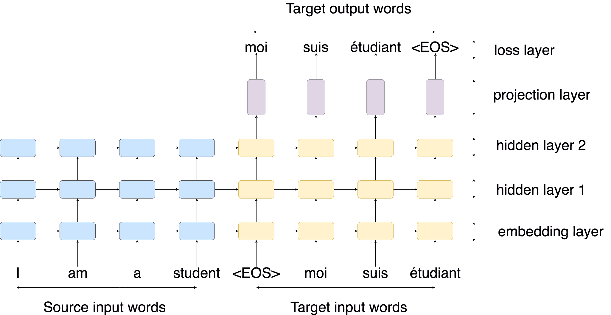

图 1：基于 RNN 的神经机器翻译的训练过程。符号 $<EOS>$ 表示序列的结束。嵌入层用于预处理。这两层 RNN 用于表示序列。

### II-B 神经机器翻译的介绍

#### II-B1 神经机器翻译的动机

神经机器翻译的灵感来自两个方面：我们提到的深度学习在其他 NLP 任务中的成功，以及机器翻译本身发展中的未解决问题。

首先，在许多 NLP 任务中，传统机器学习方法高度依赖于来自语言学直觉的手工特征，这显然是一个经验的试错过程[133][134]，并且通常在表示原始数据的性质方面远远不够完整。例如，训练语言模型的上下文大小是由研究人员基于强假设分配的[136]; 在文本表示方法中，经典的词袋 (BOW) 方法忽略了词序的影响[135]。然而，当在上述任务中应用深度神经网络 (DNN) 时，DNN 只需最少的领域知识，并避免了人工特征工程的一些预处理步骤 [22]。

DNN 是一种强大的神经网络，在许多传统上认为困难的复杂学习任务中取得了卓越的表现[137][138]。在自然语言处理领域，DNN 已被应用于一些传统任务，例如语音识别 [5] 和命名实体识别 (NER) [133]。由于其卓越的表现，基于 DNN 的模型在其他 NLP 任务中也找到了许多潜在的应用。

对于第二个原因，在机器翻译领域，PBSMT 在过去几十年中表现相当不错，但仍存在一些固有的弱点，需要进一步改进。首先，由于 PBSMT 通过将源句子分割成几个短语并进行短语替换来生成翻译，可能会忽略超出短语长度的长距离依赖，从而导致翻译结果不一致，例如性别不一致。其次，目前系统中通常有许多复杂的子组件[13][14][15]，例如语言模型、重新排序模型、长度/未知惩罚等。随着这些子组件数量的增加，很难对它们进行精细调整和组合，以获得更稳定的结果[23]。

上述讨论已指出了 SMT 微型化发展中的瓶颈。具体来说，这个瓶颈主要来自语言模型（LM）。这是因为在机器翻译任务中，语言模型实际上可以提供最重要的信息：特定词（或短语）在前文词的条件下的出现概率。因此，建立更好的语言模型无疑能提高翻译性能。

绝大多数传统语言模型基于马尔科夫假设：

|  | $\displaystyle p\left(x_{1},x_{2},\ldots,x_{T}\right)$ | $\displaystyle=\prod_{t=1}^{T}p\left(x_{t}&#124;x_{1},\ldots,x_{t-1}\right)$ |  | (1) |
| --- | --- | --- | --- | --- |
|  |  | $\displaystyle\approx\prod_{t=1}^{T}p\left(x_{t}&#124;x_{t-n},\ldots,x_{t-1}\right)$ |  |

其中 $x_{1},x_{2},...,x_{T}$ 是句子中的词序列，$T$ 代表句子的长度。

在这个假设中，句子的概率等于每个词概率的乘积。$n$ 是为了简化模型而选择的总词数，也称为 $context\ window$。

显然，超出 $n$ 的词依赖会被忽略，这意味着传统语言模型在建模长距离依赖方面表现较差。此外，由于实验结果表明适度的上下文大小（通常为 4-6 个词）是可以接受的，因此传统语言模型的第一个问题是表示能力有限。

此外，训练的数据稀缺一直是阻碍使用更大上下文窗口构建 LM 的问题。这是因为用于计数的 n 元组的数量在 n 的指数增长。换句话说，当构建 LM 时，随着阶数的增加，需要的训练样本数量也会显著增加，这也被称为”维度灾难”。例如，如果一个 LM 的阶数为 5，词汇量为 10,000，则用于统计的单词组合可能约为$10^{25}$，这需要大量的训练数据。而且由于这些组合中大多数以前都没有被观察到，随后的研究采用了各种权衡和平滑方法来缓解稀疏性问题[129][128][127][130][131]。

尽管之前提到的基于统计方法的 LM 的进一步研究几乎停滞不前，但是神经语言模型（NLM）[6]却使用神经网络直接模拟文本数据的语言模型。在最初阶段，NLM 使用固定长度的特征向量来表示每个单词，然后一系列单词向量会连接在一起，形成语义度量以表示上下文[6][38][39]，这与$context\ window$非常相似。 这项工作后来通过从源句子注入额外的上下文信息得到增强[12][132][126]。与传统 LM 相比，原始的 NLM 通过单词的分布式表示减轻了样本稀疏性问题，这使它们能够共享统计权重，而不是独立变量。由于具有类似含义的单词可能出现在相似的上下文中，相应的特征向量将具有相似的值，这表明单词的语义关系已被“嵌入”到特征向量中。

下一阶段的新提案通过使用递归神经网络（RNN）解决了长期依赖问题。基于 RNN 的 NLM（RNLM）通过逐个单词阅读整个句子，因此可以模拟真实的条件概率，而不受上下文大小的限制[41]。在 NMT 出现之前，如前所述，RNLM 在文本困惑度评估方面优于传统的 LM，并在许多实际任务中表现更好[41][26]。

NLM 在 SMT 中的直接应用已被自然提出 [12][36][37][40][58]，初步实验表明了有希望的结果。NLM 的潜力激励了对完整 DNN 基于的翻译模型的进一步探索。随后，出现了一个更“纯粹”的模型，它仅使用神经网络，并具有学习端到端翻译任务的 DNN 架构。第 III 节展示了其基本结构（如图 4 ‣ III-D Inference method ‣ III DNN based NMT ‣ A Survey of Deep Learning Techniques for Neural Machine Translation") 所示），以及其具体细节。

#### II-B2 NMT 任务的公式化

当前，NMT 任务最初设计为端到端学习任务。它直接将源序列处理为目标序列。学习目标是找到正确的目标序列，这可以看作是一个高维分类问题，尝试将两个句子映射到语义空间。在所有主流现代 NMT 模型中，这个过程可以分为两个步骤：编码和解码，从而可以功能性地将整个模型分为编码器和解码器，如图 2 所示。

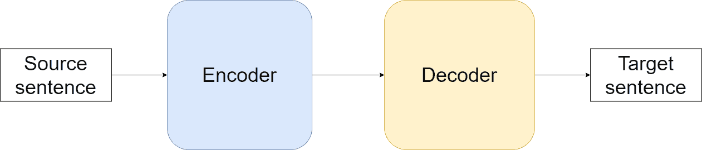

图 2：现代 NMT 模型中的端到端结构。编码器用于将源句子表示为语义向量，而解码器则从这个语义向量中生成目标句子。端到端意味着模型直接处理源数据到目标数据，没有可解释的中间结果。

从概率的角度看，NMT 根据源句子 $S(s_{1},s_{2},...,s_{n})$ 生成目标序列 $T(t_{1},t_{2},...,t_{m})$，其中 $n$ 是序列 $S$ 的长度，$m$ 是目标序列 $T$ 的长度。整个任务可以公式化为[24]：

|  | $argmax\ P(T\vert S).$ |  | (2) |
| --- | --- | --- | --- |

更具体地说，当生成目标句子的每个词时，它利用了之前预测的词以及源句子中的信息。在这种情况下，每一步生成可以描述为生成第 $i$ 个词时：

|  | $argmax\prod\limits_{i=1}^{m}P(t_{i}\vert t_{j<i},S)$ |  | (3) |
| --- | --- | --- | --- |

基于此公式以及上述对 NLM 的讨论，NMT 任务可以被视为一个具有额外约束（例如，依赖于给定源序列）的 NLM 模型。

### II-C NMT 的最新发展

我们将最近的神经机器翻译（NMT）发展分为五个主要阶段：（a）具有浅层的原始 NMT，（b）由 NLM 辅助的 SMT，（c）基于 DNN 的 NMT，（d）具有注意力机制的 NMT，（e）基于注意力的 NMT。

具有浅层的 NMT

早在深度学习之前，Allen 在 1987 年就使用二进制编码训练了一个 NMT 模型[44]。后来在 1991 年，Chrisman 使用双端口 RAAM 架构[42]建立了一个原始 NMT 模型[43]。尽管他们的设计相当原始且结果有限，但他们的工作指示了该领域的原始理念。由于 SMT 方法在那个时期取得了巨大的进展，以及计算能力和数据样本的限制，随后的相关工作几乎停滞不前。

由 NLM 辅助的 SMT

基于上述讨论，NLM 在深度学习崛起之前已经革新了传统的语言模型（LM）。后来，深度 RNN 基础的 NLM 被应用于 SMT 系统。Cho 等人提出了一种结合了 NLM 模型的 SMT 模型[18]。尽管主体仍然是 SMT，但这种混合方法为纯深度学习基础的 NMT 的出现提供了新的方向。

基于深度神经网络的 NMT

由于传统的带有 NLM 的 SMT 模型在当时达到了最先进的性能，后来提出了一种纯 DNN 基础的翻译方法，采用端到端设计来建模整个机器翻译过程[8][16]。使用基于 DNN 的 NMT 可以更高效地捕捉两种语言中的微妙不规则性[24]，这与 DNN 通常比“浅层”神经网络表现更好的观察结果类似[21]。

具有注意力机制的 NMT

尽管最初的基于 DNN 的 NMT 模型尚未完全超越 SMT，但它仍然展示了巨大的进一步研究潜力。追溯其主要弱点，尽管 RNN 的一个理论优势是捕捉单词之间的长距离依赖，但实际上，随着句子长度的增加，模型性能会恶化。这种情况是由于固定长度向量的特征表示能力有限。在这种情况下，由于原始 NMT 在没有任何辅助的情况下表现相当出色，是否有某些架构变体能带来突破的想法导致了注意力机制的兴起。

注意力机制最初由 Bahdanau 等人提出作为一个中间组件[21]，目的是在翻译长句子时提供额外的词对齐信息。令人惊讶的是，NMT 模型在这种简单方法的帮助下得到了显著改进。后来，随着在学术界和工业界的广泛流行，注意力机制的许多改进也随之出现，更多细节将在第 IV 节中讨论。

完全基于注意力的 NMT

随着注意力机制的发展，完全基于注意力的 NMT 已成为 NMT 历史上的一项重大创新。在这一新趋势中，注意力机制在文本特征提取中已占据主导地位，而不再是辅助组件。代表性模型是 Transformer [25]，这是 Vaswani 等人提出的完全基于注意力的模型。

Transformer 摒弃了之前的 RNN 和 CNN 基础的 NMT 模型框架，采用了基于一种名为 Self-Attention 的注意力机制的强化版本，并配有前馈连接，其结构上取得了革命性的进展，并具备最先进的性能。具体而言，创新的注意力结构是获得显著改进的关键。自注意力是一种强大的特征提取器，它还允许一次“读取”整个句子并进行建模。从模型架构的角度来看，这一特性可以视为 CNN 和 RNN 优势的结合，使其具备良好的特征表示能力和高推理速度。关于自注意力的更多细节将在第 IV 节中给出。Transformer 的架构将在第 VI 节中讨论。

## III 基于 DNN 的 NMT

基于 DNN 的 NLM 的出现表明构建纯 DNN 基础的翻译模型是可行的。进一步的实现是 NMT 的 $defacto$ 形式。本节回顾了基于 DNN 的 NMT 的基本概念，展示了原始 DNN 基础的 NMT 标准结构的全面介绍，并讨论了训练和推理过程。

### III-A 基于 DNN 的 NMT 模型设计

网络设计在 NMT 中有许多变体，可以分为$递归$模型或$非递归$模型。更具体地说，这一分类可以追溯到 NMT 早期的发展，当时基于 RNN 和 CNN 的模型是最常见的设计。随后提出的许多复杂模型也属于 CNN 或 RNN 家族。本小节跟随 NMT 早期的发展，并通过将其分类为基于 RNN 或 CNN 的模型来展示一些代表性模型。

#### III-A1 基于 RNN 的 NMT

虽然理论上，任何具备足够特征提取能力的网络都可以用来构建 NMT 模型，但在$实际$实现中，基于 RNN 的 NMT 模型在 NMT 发展中占据了主导地位，并且达到了最先进的性能。根据 II 节中的讨论，由于许多 NLM 文献使用 RNN 来建模序列数据，这一设计直观地激发了进一步工作以构建基于 RNN 的 NMT 模型。在初步实验中，基于 RNN 的 NLM 被用作特征提取器，将源句子压缩成特征向量，也称为思维向量。然后应用类似的 RNN 来进行“逆向工作”，以找到能够匹配前述思维向量的目标句子。

第一个成功的基于 RNN 的 NMT 由 Sutskever 等人提出，他们使用了纯深度 RNN 模型，取得了接近 SMT 最佳结果的性能[16]。进一步的发展提出了注意力机制，这显著提高了翻译性能，并超过了最佳的 SMT 模型。GNMT 模型是一个在 Google 翻译中应用的行业级模型，被视为基于 RNN 的 NMT 的一个里程碑。

除上述工作外，其他研究人员还提出了具有卓越性能的不同架构。Zhang 等人提出了变分 NMT 方法，该方法在建模翻译任务时具有创新视角，相关实验表明其在中英和英德任务中的表现优于原始 NMT 的基线[89]。Zhou 等人设计了 RNN（LSTM）的快速前馈连接，这使得网络实现更深，从而获得了更好的性能[88]。Shazeer 等人将混合专家（MoE）架构融入 GNMT 模型中，超越了原始 GNMT 模型[90]。具体而言，MoE 是在 NMT 模型中的一层，包含多个稀疏组合的专家（在本实验中为前馈神经网络），并通过门控函数与 RNN 层连接。这种方法需要更多的总参数，但仍保持训练速度的效率。由于更多参数通常意味着更好的表示能力，它在未来展示了巨大的潜力。

#### III-A2 基于 CNN 的 NMT

尝试其他 DNN 模型的相关工作也已提出。也许最著名的是基于卷积神经网络（CNN）的 NMT。实际上，基于 CNN 的模型在具体架构上也经历了许多变化。但很长一段时间内，这些模型大多无法与基于 RNN 的模型竞争，特别是在注意力机制出现之后。

在基于 CNN 的 NMT 模型开发中，Kalchbrenner 和 Blunsom 曾尝试过一个带有 RNN 解码器的 CNN 编码器[8]，这可能是最早应用 CNN 的 NMT 架构。Cho 等人尝试了一个带有 RNN 解码器的门控递归 CNN 编码器，但表现比 RNN 编码器更差[18]。后来，Kaiser 和 Bengio 提出了一个完全基于 CNN 的 NMT 模型[86]，并应用了扩展神经 GPU[119]。在 CNN 基于 NMT 的早期阶段，Gehring 等人取得了最佳性能，他们的 CNN 编码器 NMT 与当时的 RNN 模型翻译性能相似[19]。与此同时，Kalchbrenner 等人还提出了基于 ByteNet（一种 CNN）的 NMT，该模型在字符级翻译上达到了最先进的性能，但在词级翻译上表现不佳[84]。此外，Meng 等人和 Tu 等人分别提出了基于 CNN 的模型，为 SMT 提供了额外的对齐信息[20][83]。

与基于 RNN 的 NMT 相比，基于 CNN 的模型在训练速度上具有优势；这是因为 CNN 的固有结构允许在处理输入数据时对不同的滤波器进行并行计算。而且，模型结构使得基于 CNN 的模型更容易解决梯度消失问题。然而，它们的翻译质量受到两个致命缺陷的影响。首先，由于原始的基于 CNN 的模型只能捕捉滤波器宽度内的词依赖关系，词的长距离依赖只能在高级卷积层中找到；这种不自然的特性通常导致比基于 RNN 的模型更差的性能。其次，由于原始的 NMT 模型将句子压缩为固定大小的向量，当句子变得过长时，性能会大幅下降。这是由于固定大小向量的表示能力有限。类似的现象也可以在早期提出的基于 RNN 的模型中发现，这些问题后来通过注意力机制得到缓解。

一些先进的基于 CNN 的 NMT 模型也已经提出，并针对上述缺陷提供了相应的解决方案。Kaiser 等人提出了基于深度可分离卷积的 NMT。他们创建的 SliceNet 可以获得与 Kaiser 等人（2016）[85] 相似的性能。Gehring 等人（2017）在其之前的工作基础上，提出了一种与注意力机制协作的基于 CNN 的 NMT。它甚至取得了比基于 RNN 的模型更好的结果[82]，但这一成就很快被 Transformer [25] 超越。

### III-B 编码器-解码器结构

众所周知，编码器-解码器是 NMT 最原始和经典的结构；它直接受到 NLM 的启发，由 Kalchbrenner 和 Blunsom[8] 以及 Cho 等人[18] 提出。尽管在细节和小技巧上进行了各种改进，但几乎所有现代 NMT 模型都广泛接受了它。基于上述讨论，由于基于 RNN 的 NMT 在 NMT 中占据主导地位，为了避免在描述模型结构之间各种小区别时被压倒，我们特别关注基础的基于 RNN 的 NMT，从而有助于追溯 NMT 的发展过程。

编码器-解码器结构的原始结构在概念上是简单的。它的架构包含两个相连的网络（编码器和解码器），每个网络负责翻译过程中的不同部分。当编码器网络接收到一个源句子时，它逐字读取源句子，并将变长序列压缩成每个隐藏状态中的固定长度向量。这一过程称为编码。然后，解码器根据编码器的最终隐藏状态（称为思维向量）执行反向工作，将思维向量逐字转换为目标句子。由于编码器-解码器结构将翻译任务直接从源数据到目标结果，这意味着中间过程没有可见结果，这也被称为端到端翻译。NMT 的编码器-解码器结构的原理可以看作是通过语义空间中的中间向量将源句子映射到目标句子。这个中间向量实际上可以在两种语言中表示相同的语义含义。

对于这种结构的具体细节，除了网络中的模型选择外，基于 RNN 的 NMT 模型还在三个主要方面有所不同：（a）方向性；（b）激活函数的类型；（c）RNN 层的深度[156]。接下来，我们将给出详细描述。

深度：对于 RNN 的深度，如我们在第 II 节中讨论的，单层 RNN 通常比多层 RNN 表现较差。近年来，几乎所有具有竞争力的模型都使用深度网络，这表明使用更深的模型以获得最先进的结果是一种趋势。例如，Bahdanau 等人[21]在他们的模型中使用了四层 RNN。

然而，简单地增加更多的 RNN 层可能并不总是有效。在 Britz 等人提出的证明中[22]，他们发现，在编码器中使用 4 层 RNN 对于特定数据集会产生最佳性能，当整个模型中没有其他辅助方法时。除此之外，堆叠 RNN 层可能会使网络变得过于缓慢且难以训练。一个主要的挑战是梯度爆炸和消失问题[28]，这会导致梯度在深层处理反向传播时被放大或减小。除了精炼的 RNN（如 LSTM 和 GRU）中的附加门结构外，还有其他方法也已被应用以缓解这种现象。例如，在 Wu 等人的工作中，层之间提供了残差连接，这可以提高反向传播中的梯度流值，从而加快收敛过程[24]。另一个可能的问题是，更深的模型通常意味着更大的模型容量，这可能由于过拟合而在相对较少的训练数据上表现较差。

方向性：在方向性方面，一些研究人员选择了简单的单向 RNN。例如，Luong 等人直接使用单向 RNN 接受输入句子[23]。相比之下，双向 RNN 是另一个常见的选择，可以增强翻译质量。这是因为模型的表现受到在预测当前词时是否“了解”上下文信息的影响。双向 RNN 显然可以增强这种能力。

在实际应用中，Bahdanau 等人和 Wu 等人都在底层使用了双向 RNN 作为捕捉上下文信息的替代方案[21][24]。在这种结构中，第一层从“左到右”读取句子，第二层则从反方向读取句子。然后将它们连接起来，输入到下一层。这种方法在实验中通常具有更好的表现，尽管解释是直观的：根据第 II 节对语言模型的讨论，一个特定词的出现概率由其前后所有其他词决定。当应用单向 RNN 时，首词和末词之间的词依赖关系难以通过思维向量捕捉，因为模型在所有时间步经历了太多状态。相反，双向 RNN 提供了一个额外的信息层，通过反向阅读单词，这自然可以在步骤之间缩短相对长度。

这种方法最明显的缺点是难以并行化，考虑到其实现过程中的时间消耗，Bahdanau 等人和 Wu 等人选择在编码器的底层只应用一层双向 RNN，其他层均为单向层[24][21]。这种选择在特征表示能力与模型效率之间做出了权衡，因为它仍能使模型分布在多个 GPU 上[24]。双向 RNN 的基本概念可以在图 2 中找到。

激活函数选择：关于激活函数的选择，常见的有三种选择：普通 RNN、长短期记忆（LSTM）[17]，以及门控递归单元（GRU）[18]。与普通 RNN 相比，后两者在解决梯度爆炸和消失问题方面具有一些鲁棒性[27][28]。其他序列处理任务也表明，GRU 和 LSTM 能够取得更好的性能[26]。此外，还提出了一些创新的神经单元。Wang 等人提出了线性关联单元，这可以缓解非线性递归激活中的梯度扩散现象[92]。最近，Zhang 等人创建了加减双重门控递归网络（ATR）。这种单元通过简化单元间的权重矩阵来减少 NMT 训练和推理中的低效问题[91]。总的来说，在 NMT 任务中，LSTM 是最常见的选择。

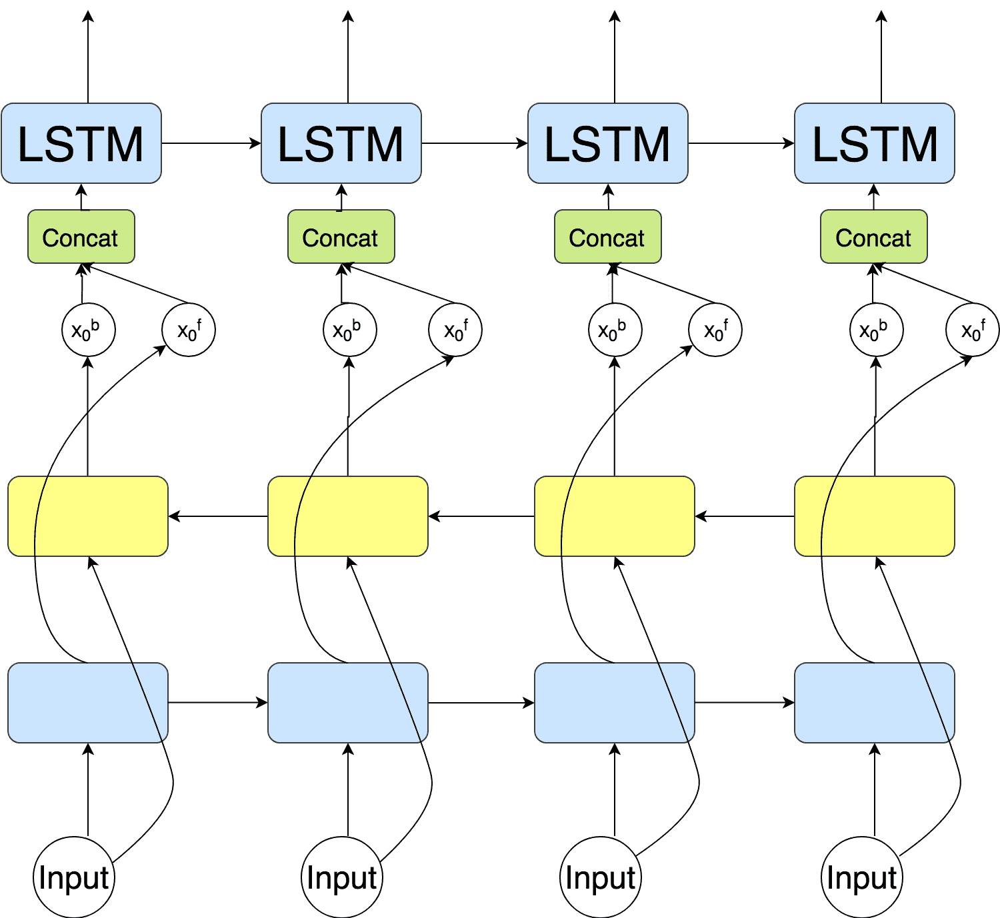

图 3：双向 RNN 的概念

### III-C 训练方法

在将训练数据输入模型之前，一个前置步骤是将单词转换为向量，这使得神经网络可以接受适当的形式。通常，选择某种语言中最频繁出现的$V$个单词，每种语言通常具有不同的词汇集合。尽管在训练期间会学习嵌入权重，但也可以直接应用预训练的词嵌入向量，例如 word2vec[9][10]或 Glove 向量[11]。

在训练期间，该模型由双语语料库供给给编码器和解码器。学习目标是将输入序列正确地映射到目标语言中的相应序列。与其他 DNN 模型一样，输入句子对被嵌入为单词向量的列表，模型参数随机初始化。训练过程可以表述为试图周期性地更新其参数，直到达到神经网络的最小损失。在实现中，RNN 会在处理包含一批训练样本的数据子集后调整参数；这个子集称为迷你批量集。为了简化训练过程的讨论，我们以一个句子对（一个训练样本）作为示例。

对于编码器，编码 RNN 会在每个时间步接收源句子中的一个单词。经过几个步骤，所有单词将被压缩到编码器的隐藏状态中。然后，将最终向量传输到解码器。

对于解码器，输入来自两个来源：直接发送到解码器的思维向量和上一个时间步的正确单词（第一个单词是$<EOS>$）。解码器中的输出过程可以看作是编码器的逆过程；解码器在每个时间步预测一个单词，直到最后一个符号是$<EOS>$。

### III-D 推理方法

在训练期之后，模型可以用于翻译，这被称为推理。推理过程与训练过程非常相似。然而，训练和推理之间仍然存在明显的区别：在解码时，我们只能访问源句子，即编码器隐藏状态。

解码可以有多种方式。提出的解码策略包括采样和贪婪搜索，而后者通常被接受并发展为束搜索。

#### III-D1 一般解码工作流程（贪婪）

贪婪策略的思想很简单，正如图 4 ‣ III-D Inference method ‣ III DNN based NMT ‣ A Survey of Deep Learning Techniques for Neural Machine Translation")中所示。贪婪策略仅考虑概率最高的预测单词。在我们的示例实现中，之前生成的单词也会与思维向量一起输入到网络中，作为下一时间步的输入。详细步骤如下：

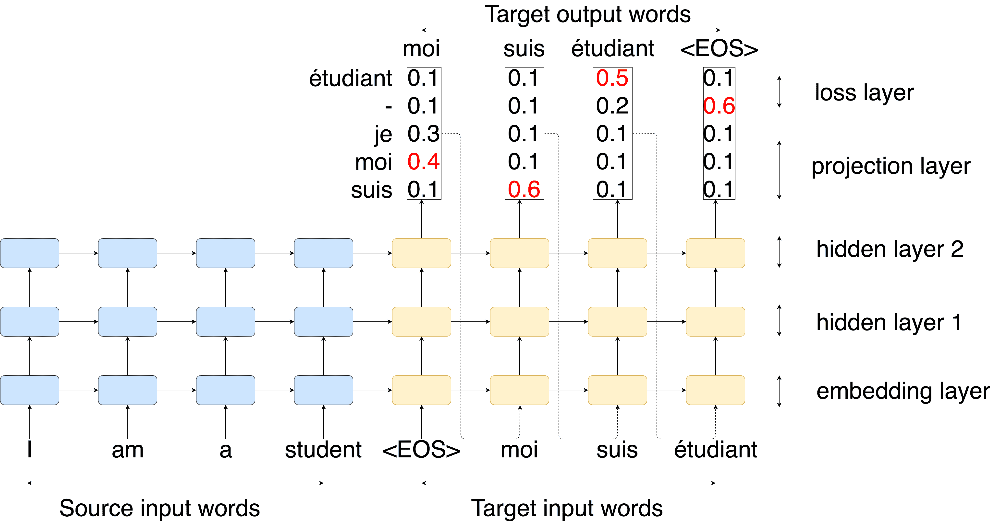

图 4：贪婪解码过程：每次模型都会预测概率最高的单词，并将当前结果作为下一时间步的输入，以获得进一步的预测

1. 模型仍以与训练期间相同的方式对源句子进行编码，以获得思维向量，并使用该思维向量初始化解码器。

解码（翻译）过程将在解码器收到源句子的结束符号 $<EOS>$ 后立即开始。

对于解码器端的每个时间步，我们将 RNN 的输出视为一组 logits。我们选择具有最高翻译概率的词作为发射词，其 ID 与最大 logit 值相关联。例如，在图 4 中，词“moi”在第一次解码步骤中具有最高的概率。然后我们将这个词作为输入在下一个时间步中进行处理。概率因此依赖于之前的预测（这就是我们称之为“贪婪”行为的原因）。

过程将继续进行，直到生成结束符号 $<EOS>$ 作为输出符号。

#### III-D2 Beam-search

虽然贪婪搜索方法已产生了相当好的结果，但 beam-search 是一种更精细的方法，效果更佳。虽然它不是神经机器翻译的必要组件，但大多数神经机器翻译模型选择了 beam-search 以获得最佳性能参考文献 22。

beam-search 方法由其他序列学习任务提出，并成功应用于参考文献 29 和参考文献 30。这也是机器翻译任务中常用的传统技术，多年来一直用于寻找最合适的翻译结果参考文献 34、参考文献 32、参考文献 33。beam-search 可以简单描述为在每个时刻保留前$k$个可能的翻译作为候选，其中 $k$ 被称为 beam-width。在下一个时间步中，每个候选词将与一个新词结合形成新的可能翻译。新的候选翻译将通过对数概率进行竞争，以获得新的前$k$个最合理的结果。整个过程持续进行直到翻译结束。

具体来说，beam search 可以通过以下步骤来表述：

算法 1 Beam Search

设置 Beamsize = K； $h_{0}\Leftarrow encoder(S)$  $t\Leftarrow 1$  //  $L_{S}$ 表示源句子的长度； //  $\alpha$ 是长度因子；  当 $n\leq\alpha*L_{S}$ 时，  $y_{1,i}\Leftarrow\ <EOS>$  当 $i\leq K$ 时，  设置 $h_{t}\Leftarrow\ decoder(h_{t-1},y_{t,i})$；  设置 $P_{t,i}=Softmax(y_{t,i})$；  设置 $y_{t+1,i}\Leftarrow argTop\_K(P_{t,i})$；  设置 $i=i+1$  结束 循环  设置 $i=0$  如果 $h_{t}==\ <EOS>$ 则  退出；  结束 如果  设置 $t=t+1$  结束 循环  从 $K$ 个候选 $Y_{i}$ 中选择 $argmax(p(Y))$  返回 $Y_{i}$

除了标准的 Beam-search 仅通过排序对数概率来找到候选翻译外，该评估函数在数学上倾向于找到更短的句子。这是因为在每一步解码时都会添加一个负对数概率，这会随着句子长度的增加而降低分数[31]。缓解这种情况的有效变体是添加长度归一化[7]。Wu 等人也提出了一种改进的长度归一化方法[24]。

Beam-search 中另一种精炼的方法是添加覆盖惩罚，这有助于鼓励解码器在生成输出句子时尽可能覆盖源句子中的单词[24][35]。

此外，由于该方法在获得最终结果之前会找到 $k$ 次翻译（而不是一次），这通常会使解码过程更耗时。实际上，一个直观的解决方案是将 beam-width 限制为一个小常数，这在解码效率和翻译准确性之间进行权衡。根据一项对比工作报告，最佳性能的实验 beam-width 为 5 到 10[22]。

## IV 带有注意机制的 NMT

### IV-A 注意机制的动机

尽管 NMT 的良好表现表明其在捕捉序列内依赖关系方面具有巨大潜力，但实际上，当源句子过长时，NMT 仍然会遭遇巨大的性能下降。与其他特征提取器相比，原始 NMT 编码器的主要弱点在于它必须将一个句子压缩成一个固定长度的向量。当输入句子变得更长时，性能会恶化，因为网络的最终输出是一个固定长度的向量，这可能在表示整个句子时有局限性并导致一些信息丢失。由于向量长度有限，这种信息丢失通常覆盖了词汇的长距离依赖关系。虽然增加编码向量的维度是一个直观的解决方案，但由于 RNN 训练速度自然较慢，较大的向量尺寸可能会导致更糟的情况。

注意力机制在这种情况下应运而生。Bahdanau 等人[21]最初使用这种方法作为一种补充，可以在解码过程中提供额外的词对齐信息，从而缓解输入句子过长时的信息减少。具体而言，注意力机制是编码器和解码器之间的一个中间组件，能够动态地确定词的相关性（词对齐信息）。在编码阶段，它通过对每个时间状态的隐藏状态进行加权平均，扩展了原始 NMT 模型中最终状态的向量，并提供了一个得分函数，通过计算源句子中每个词与当前预测词的相关性来获得上述权重。因此，解码器可以在不同的翻译步骤中通过排序源句子中每个词的相关性的重要性来调整其集中度，这种方法有助于分别捕捉每个词的长程依赖关系。

在 NMT 中应用注意力机制的灵感来自于人类在阅读和翻译文本数据时的行为。人们通常会反复阅读文本以挖掘句子中的依赖关系，这意味着每个词之间具有不同的依赖权重。与捕捉词语依赖信息的其他模型（如 CNN 中的池化层或 N-gram 语言模型）相比，注意力机制具有全局范围。在寻找一个序列中的依赖关系时，$N$-gram 模型会将搜索范围固定在一个较小的范围内，通常实践中$N$等于 2 或 3。而注意力机制则计算当前生成词与源句子中其他词之间的依赖关系。这种更灵活的方法显然带来了更好的结果。

注意力机制的实际应用远远超出了 NMT 领域，甚至在 NMT 的发展中并不是一种发明。其他任务也提出了类似的方法，给输入数据的不同位置赋予权重，例如，Xu 等[109]在处理图像描述任务时提出了类似的机制，这可以帮助在生成描述时动态地定位图像特征向量中的不同条目。由于本调查的范围，以下讨论将仅专注于 NMT 中的注意力机制。

### IV-B 注意力机制的结构

注意力机制的实现有许多变体。这里我们仅详细描述了被广泛接受并在 NMT 发展中做出重要贡献的注意力机制。

#### IV-B1 基本结构

注意力机制的结构最初由 Bahdanau 等人提出。后来，Luong 等人提出了类似的结构，并对其进行了扩展[23][21]。

为了简化讨论，这里以 Luong 等人的方法为例。具体来说，在编码阶段，这一机制接收输入词汇，类似于基本的 NMT 模型，但不是将所有信息压缩到一个向量中，而是编码器顶层的每个单元将生成一个代表源句子中每个时间步的向量。

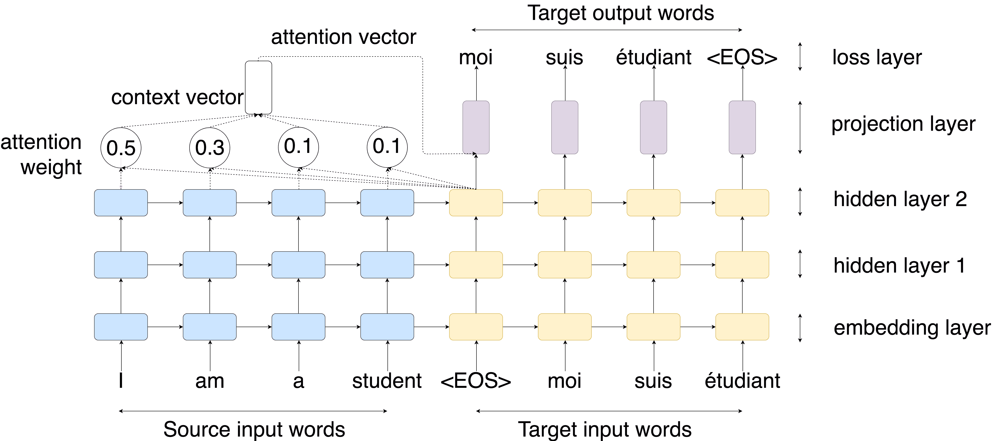

图 5：注意力机制的概念，它可以提供额外的对齐信息，而不仅仅是使用固定长度向量中的信息

在解码阶段，解码器不会仅仅使用自身的信息来预测词汇。相反，它与注意力层协作以获取翻译。注意力机制的输入是编码器顶层的隐藏状态和当前的解码器。它通过计算以下步骤来获得相关性顺序：

1\. 当前解码隐藏状态 $h_{t}$ 将用于与所有源状态 $h_{s}$ 进行比较，以推导注意力权重分数 $s_{t}$。

2\. 注意力权重 $a_{t}$ 是通过对所有注意力权重分数进行归一化操作得到的。

3\. 基于注意力权重，我们计算源状态的加权平均值作为上下文向量 $c_{t}$。

4\. 将上下文向量与当前解码隐藏状态连接以生成最终的注意力向量（具体的组合方法可能不同）。

5\. 注意力向量被作为输入传递给解码器的下一个时间步（适用于输入馈送）。前面三步可以通过以下方程总结：

|  | $\centering s_{t}=score(h_{t},h_{s})\;\;\;\left[{注意力\ 函数}\right]\@add@centering$ |  | (4) |
| --- | --- | --- | --- |
|  | $\centering a_{t}=\frac{exp(s_{t})}{\sum\limits_{s=0}^{S}exp(s_{t})}\qquad\left[{注意力\ 权重}\right]\@add@centering$ |  | (5) |
|  | $\centering c_{t}=\sum\limits_{s}a_{t}h_{s}\;\;\qquad\qquad\qquad\left[{上下文\ 向量}\right]\@add@centering$ |  | (6) |

在上述函数中，得分函数可以有不同的定义方式。这里我们介绍两种经典定义：

|  | $\centering score(h_{t},h_{s})=\begin{cases}h_{t}^{T}Wh_{s}&amp;[Luong^{\prime}s\ version]\\ v_{a}^{T}tanh(W_{1}h_{t},h_{s})&amp;[Bahdanau^{\prime}s\ version]\end{cases}\@add@centering$ |  | (7) |
| --- | --- | --- | --- |

回到解码阶段，它接收来自两个方面的信息，即解码器隐藏状态和注意力向量。给定当前的两个向量，它通过将它们对齐到一个新的向量来预测词汇，然后通常会有另一个层来预测当前的目标词。

#### IV-B2 全局注意力与局部注意力

全局注意力

Global Attention 是我们上面提到的注意力机制方法，它也是各种注意力机制中的一种流行类型。Global Attention 的思想也是注意力机制的原始形式，尽管它由 Luong 等人[23]命名，但对应的术语是 Local Attention。术语——“global”源于它通过考虑源句子中所有单词的相关顺序来计算上下文向量。这种方法表现优秀，因为更多的对齐信息通常会产生更好的结果。图 6 中的直观展示。

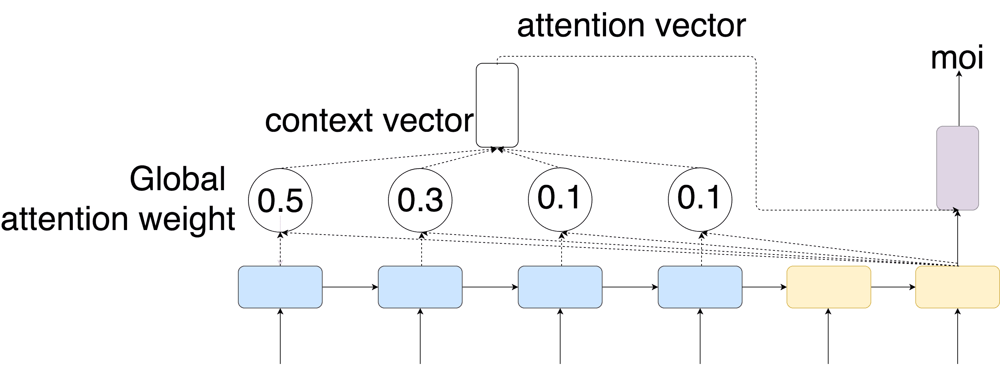

图 6：Global Attention 的概念，当前解码器隐藏状态通过源端所有隐藏状态计算，以获得对齐信息。

如我们在第 IV 节中介绍的，该方法考虑了解码期间的所有源词。主要缺点是当序列非常长时，计算速度会降低，因为在编码器中每个时间步都会生成一个隐藏状态，评分函数的计算成本会随着编码器时间步数的增加而线性增长。当输入是像复合句或段落这样较长的序列时，可能会影响解码速度。

Local Attention 是 Luong 等人[23] 首次提出的。如图 7 所示，这个模型会仅计算源句子的一部分的相关性。与 Global Attention 相比，它通过给定一个范围数字来固定注意力向量的长度，从而避免了获取上下文向量的昂贵计算。实验结果表明，Local Attention 可以在模型性能与计算速度之间保持平衡。

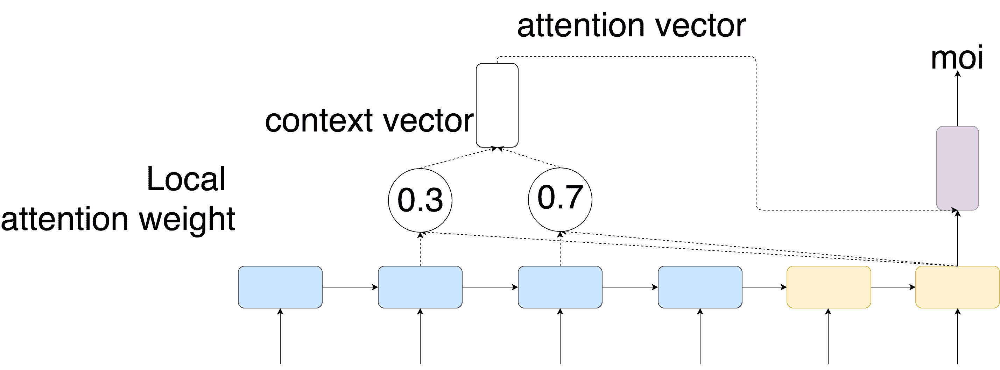

图 7：Local Attention 的概念，当前隐藏状态通过源端所有隐藏状态的子集计算得到。

Local Attention 的灵感来自于 Xu 等人[109] 在图像描述生成任务中提出的软注意力和硬注意力。虽然 Global Attention 与软注意力非常相似，但 Local Attention 可以被视为软注意力与硬注意力的混合方法。

理论上，虽然覆盖更多信息通常会获得更好的结果，但这种方法的出色结果表明，当经过微调时，它的性能与全局注意力相当。这似乎是由于人类语言中的一种常见现象——当前单词自然与其附近的某些单词有较高的依赖性，这与 n-gram 语言模型的假设非常相似。

在计算过程的细节中，给定当前目标词的位置 $p_{t}$，模型将上下文向量固定在范围 D 内。上下文向量 ct 然后作为源隐藏状态集 $[p_{t}-D,p_{t}+D]$ 的加权平均值得出；范围 D 由经验选择，然后可以用类似于全局注意力的步骤推导出注意力向量。

#### IV-B3 输入馈送方法

输入馈送是构建 NMT 结构的小技巧，但从提供对齐信息的角度来看，它也可以被视为一种注意力机制。

输入馈送的概念很简单。在解码期间，除了使用先前预测的单词作为输入外，还使用上一个时间步的注意力向量作为下一个时间步的附加输入[1][23]。这些注意力向量将与输入向量连接，以获取最终的输入向量；然后，这个新向量将作为下一步的输入。

#### IV-B4 GNMT 中的注意力机制

GNMT 是 Google Neural Machine Translation 的缩写，它是一个著名的具有注意力机制的 NMT 版本。GNMT 由 Wu 等人提出[24]，以其在工业级 NMT 系统中的成功应用而著称。借助许多先进的模型细节技巧，它在当时获得了最先进的性能。此外，GNMT 的精心设计架构使其具有更好的推理速度，使其更适用于满足行业需求。

GNMT 的概念借助了当前的注意力机制研究；它使用了全局注意力，但通过更有效的结构进行重构以实现模型并行化。图中详细说明了两个主要点。

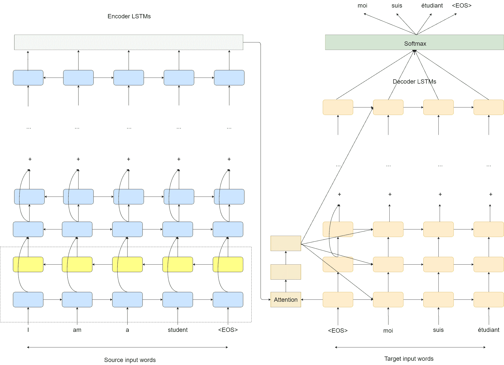

图 8：GNMT 中的注意力，注意力权重由解码器的底层驱动，并发送到所有解码器层，这有助于提高计算的并行化

首先，这种结构取消了编码器和解码器之间的连接。因此，它可以在选择编码器和解码器的结构时有更多自由，例如，编码器可以选择每层的不同维度，而不考虑解码器中的维度，只需保证编码器和解码器的顶层具有相同的维度，以确保它们可以在数学上计算以驱动注意力向量。

其次，这种结构使得模型并行化变得更容易。仅使用解码器的底层来获得上下文向量，然后其余的解码层将直接使用这个上下文向量。这种架构可以尽可能保留并行性。

关于注意力计算的详细信息，GNMT 应用了类似于计算全局注意力的注意力机制，而 $score()$ 函数是一个具有 1 层隐藏层的前馈网络。

#### IV-B5 自注意力

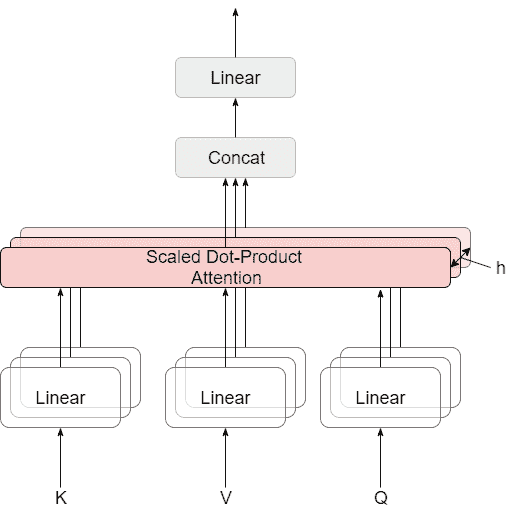

图 9：多头自注意力的概念

自注意力也称为内在注意力，由于 Transformer 的出现，它在 NMT 任务中的应用广为人知。其他常见的注意力机制通过计算源序列和目标序列之间的词语依赖来驱动上下文信息，而自注意力则计算序列内部的词语依赖，从而获得基于注意力的序列表示。

就计算步骤而言，自注意力首先根据原始嵌入获得 3 个不同用途的向量，这 3 个向量分别是查询向量、键向量和数值向量。然后按照以下方式计算注意力权重：

|  | $\text{ Attention }(Q,K,V)=\operatorname{softmax}\left(\frac{QK^{T}}{\sqrt{d_{k}}}\right)V$ |  | (8) |
| --- | --- | --- | --- |

其中 $\frac{1}{\sqrt{d_{k}}}$ 是一个缩放因子，用于避免由于点积操作引起的不稳定梯度。此外，上述计算可以通过矩阵乘法实现，因此可以轻松地以关系矩阵的形式获得词语依赖。

### IV-C 其他相关工作

除了上述显著进展外，从不同角度对注意力机制还有一些其他的改进。

从注意力结构的角度来看，Yang 等人通过提供一个网络来建模词语与其前后注意力的关系，从而改进了传统的注意力结构[94]。Feng 等人提出了一种递归注意力机制来提高对齐准确性，并且已被证明在大规模中英文任务中优于原始模型[93]。

此外，其他研究关注于训练过程。Cohn 等人通过添加几种结构性偏差扩展了原始的注意力结构，其中包括位置偏差、马尔可夫条件、繁殖率和双语对称性[95]。与这些改进相结合的模型在翻译性能上优于基础的基于注意力的模型。更具体地说，上述方法可以视为从 SMT 研究中的对齐模型的一种继承，具有更多的经验假设和语言学直觉：$Position\ Bias:$ 假设源语言和目标语言中意义相同的单词也会有相似的相对位置，特别是当两句话具有类似的词序时。作为对原始注意力机制的调整，它通过鼓励在相似相对位置上的单词进行对齐，从而提高对齐准确性。图 11111 强烈展示了这一现象，其中对角线上的单词倾向于对齐。$Markov\ Condition:$ 从经验上看，在一个句子中，一个单词与其邻近单词的相关性比与远离它的单词更高，这也是解释 n-gram LM 的 $context\ capture$ 的基础。对于翻译任务来说，很明显源语言中相邻的单词也会映射到目标语言中的相邻位置，利用这一特性，这一考虑通过抑制在寻找相应对齐时的巨大跳跃，从而提高对齐准确性。此外，具有类似考虑但实现不同的方法是局部注意力。$Fertility:$ 繁殖率衡量单词是否在正确的层次上被关注，它考虑防止两种情况：单词未获得足够的关注或过度关注。该设计源于一个事实，即翻译结果不佳通常是由于单词重复翻译或其他单词覆盖不足，这指的是翻译不足和过度翻译。$Bilingual\ Symmetry:$ 理论上，单词对齐应该是可逆的，这意味着当从 A 到 B 的翻译处理与从 B 到 A 的翻译相同。此理论推动了模型在两个方向上的平行训练，并鼓励得到类似的对齐结果。

Tu 等人[35] 进一步扩展了繁殖率的不完善性，他们提出了在解码前作为标准化器的繁殖率预测，该方法通过在计算注意力权重时添加覆盖信息来调整原始 NMT 模型中的上下文向量，从而提供关于源单词在先前步骤中已翻译概率的补充信息。

除了 SMT 的启发直觉外，Cheng 等人还在 NMT 任务中应用了基于一致性的学习方法，鼓励在两个翻译方向上进行单词对齐的一致性联合训练[96]。随后，Mi 等人提出了一种针对注意力组件的监督方法，利用带有额外对齐约束的标注数据作为目标函数，中文到英语的实验证明了这一方法对翻译表现和对齐准确性都有益[97]。

## V 词汇覆盖机制

除了普通 MT 任务中的长期依赖问题，未知词的存在是另一个可能严重影响翻译质量的问题。与支持大量词汇的传统 SMT 方法不同，大多数 NMT 模型由于只能选择预定义词汇中的候选词（词汇量适中），因此受词汇覆盖问题困扰。在词汇构建方面，所选择的词汇通常是频繁使用的词汇，而剩余的词汇则被称为未知词或 OOV 词汇。

从经验上看，NMT 中的词汇量在每种语言中最多在 30k-80k 之间，其中一个显著的例外是 Jean 等人提出的，他们曾使用一种高效的$softmax$近似方法来适应词汇量庞大的情况（500k）[47]。然而，由于$de\ facto$翻译任务中 OOV 词汇数量远远更多，例如不同领域的专有名词和大量不常用的动词，词汇覆盖问题仍然广泛存在。

由于 NMT 中的词汇覆盖范围极其有限，处理 OOV 词汇是另一个研究热点。本节展示了 NMT 中词汇覆盖问题的内在解释以及过去几年提出的相应解决方案。

### V-A NMT 中词汇覆盖问题的描述

基于上述情况，在 NMT 的实际应用中，初步方法是选择一小部分词汇，并将大量 OOV 词汇转换为一个统一的“UNK”符号（或其他标签），如图 10 所示。这种直观的解决方案可能在以下两个方面影响翻译表现。首先，“UNK”符号的存在可能会影响句子的语义完整性；当“UNK”替代一些关键字时，可能会出现歧义[48]。其次，由于 NMT 模型难以从 OOV 词汇中学习信息，超出 OOV 词汇的预测质量也可能受到影响[49]。

表 I: NMT 模型的 BLEU 表现

| 模型 | BLEU |
| --- | --- |
| EN-DE | EN-FR |
| ByteNet | 23.75 |  |
| Deep-Att + PosUnk |  | 39.2 |
| GNMT + RL | 24.6 | 39.92 |
| ConvS2S | 25.16 | 40.46 |
| MoE | 26.03 | 40.56 |
| Deep-Att + PosUnk Ensemble |  | 40.4 |
| GNMT + RL Ensemble | 26.3 | 41.16 |
| ConvS2S Ensemble | 26.36 | 41.29 |
| Transformer (基础模型) | 27.3 | 38.1 |
| Transformer (大) | 28.4 | 41.8 |

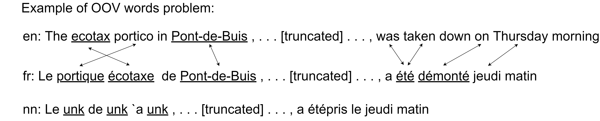

图 10：展示在[23]中提出的 OOV 词汇问题的一个例子。$en$和$fr$分别表示英文的源句子和相应的法语目标句子，$nn$表示神经网络的结果。

除了 NMT 在包含更多 OOV 词汇的句子上的表现不如在包含更多频繁词汇的句子上的表现这一不令人意外的观察外，MT 任务中的一些其他现象也很难处理，例如多词对齐、音译和拼写等[16][21]。这些现象被视为相似的现象，也都是由未知词汇问题或稀缺的训练数据[50]造成的。

对于大多数 NMT 模型而言，选择适中的词汇表大小几乎是一种在计算成本和翻译质量之间的权衡。同时，在训练 NLM 时也发现了相同的现象[53][52]。具体来说，计算成本主要来自于预测单词的方法的本质——一种归一化操作，这种操作在 DL 模型的训练中被反复使用。特别是在 NMT 任务中，由于 DL 模型每次都需要调整参数，因此当前单词的概率会被反复计算以获得梯度，并且由于 NMT 模型在进行预测时需要计算当前单词的概率，它每次都需要对词汇表中的所有单词进行归一化。不幸的是，由于归一化过程的时间复杂度与词汇表的大小成线性关系，因此它是耗时的，这一特性使得训练过程中的时间复杂度也相同。

### V-B 不同的解决方案

相关研究提出了各种方法来改进训练和推理过程。此外，这些方法可以根据其不同的方向大致分为三类。第一类直观上专注于寻找提高计算速度的解决方案，这可以支持更广泛的词汇。第二类方法则关注于使用上下文信息，这种方法可以通过将未知词（如专有名词）复制到翻译结果中以及处理导致翻译质量较差的低频词来解决一些问题。最后一类方法则更先进，倾向于利用单词内部的信息，如字符，因为这些方法在处理单词形态变化方面更具灵活性，它们可以以更“智能”的方式支持翻译 OOV 词汇。

#### V-B1 通过计算加速的方法

关于计算加速方法，有大量文献在 NLM 训练中实现了他们的想法。最初考虑计算加速的想法是扩展 $softmax$ 操作。由于有效的 $softmax$ 计算显然可以支持更大的词汇量，这种尝试在 NLM 文献中受到了很多关注。Morin 和 Bengio [53] 提出了层次化模型，以在归一化因子的计算中获得指数级加速，从而帮助加快单词概率的梯度计算。在具体细节中，原始模型将词汇转化为二叉树结构，该结构是利用来自 WordNet 的预知识构建的[54]。

初步实验结果显示，这种层次化方法与传统的三元语法模型（trigram LM）相当，但未能超越原始的 NLM；这部分是由于在树构建过程中使用了来自 WordNet 的手工特征。由于二叉树可以在速度和性能之间提供显著的性价比改进，进一步的工作仍然集中在这个趋势上以寻找更好的优化方法。后来，Mnih 和 Hinton 通过去除树构建过程中的专家知识要求跟进了这项工作[52]。

更优雅的方法是保留原始模型，但改变归一化因子的计算方法。Bengio 和 Senécal 提出了重要性采样方法来近似归一化因子[55]。然而，除非仔细控制，否则这种方法不够稳定[56]。Mnih 和 Teh 使用噪声对比估计来直接学习归一化因子，这在 NLM 的训练过程中可以更稳定[57]。后来，Vaswani 等人提出了一种类似的方法，并应用于机器翻译[58]。

上述方法难以通过 GPU 并行实现。进一步的考虑找到了更适合 GPU 的解决方案。Jean 等人通过在训练过程中利用词汇子集作为候选词列表来减轻计算时间，同时在推理过程中使用整个词汇表。基于早期工作中使用重要性采样的灵感[56]，他们提出了一种纯数据分割的方法。在训练过程中，他们对训练数据进行了顺序预处理，为每个训练示例选择一个词汇子集，其独特词汇数量达到阈值 $t$（仍远低于原始词汇表的大小）。在推理过程中，他们仍然放弃使用整个词汇表，提出一种混合候选列表。他们将候选词列表分为两部分。第一部分是从预定义词典中翻译过来的特定候选目标词，其他的是出现频率最高的 K 个词。在实际性能分析中，该方法在训练过程中保持了类似的适中候选词规模；因此，它可以保持计算效率，同时支持极大的候选词规模[47]。类似地，Mi 等人提出了一种词汇操作方法，为不同的句子或批次提供了一个单独的词汇表，它包含来自单词到单词词典和短语到短语库的候选词[104]。

除了上述方法的各种相应缺陷，这些方法的共同弱点是尽管它们可以支持更大的词汇量，但仍然会遭遇 OOV 词。这是因为扩大词汇量仍然受到限制，当遇到未知词时没有补充的解决方案，而以下类别的方法可以部分解决这个问题。此外，仅仅增加词汇量由于 Zipf 法则几乎不会带来改进，这意味着总会有一大尾 OOV 词需要处理[48]。

#### V-B2 方法使用上下文信息

除了上述专注于计算加速的变体，更高级的类别是使用上下文信息。Luong 等人提出了一种与复制机制协作的词对齐算法，用于后处理翻译结果。这种旧但有用的操作灵感来源于 SMT 中常见的词（短语）替换方法，并在 BLEU 中取得了相当大的改进 [59]。具体来说，在 Luong 的方法中，对于每个 OOV 词，有一个“指针”映射到源句子中的相应词。在后处理阶段，提供了带有“指针”的预定义词典来查找相应的翻译，同时直接使用复制机制处理词典中没有的 OOV 词。

Luong 等人的方法之所以受欢迎，部分原因是复制机制实际上提供了无限的词汇量。进一步的研究已经优化了这个对齐算法，以提高替换的准确性和泛化能力。Choi 等人通过根据语言特征将 OOV 词划分为三种子类别，扩展了 Luong 等人的方法。[70] 这种方法有助于有效地重新映射 OOV 词。Gulcehre 等人在这一领域进行了多项改进，他们应用了类似 Luong 等人的复制机制，但结合了注意机制来确定词对齐的位置，这在处理对齐时更具灵活性，并且可以直接用于其他任务（如文本摘要），这些任务中的对齐位置在双方之间变化剧烈。此外，他们通过添加一种所谓的切换网络，将复制机制与一般的翻译操作结合在一起，以决定每个时间步应该应用哪种操作，这被认为可以提高整个模型的泛化能力。[48]。Gu 等人致力于整合不同机制，他们提出了一种叫做 CopyNet 的注意机制，并将其与传统的编码器-解码器模型结合，这可以自然地扩展到处理 NMT 任务中的 OOV 词[74]。此外，他们发现，当使用传统的词翻译时，注意机制更多地由语义和语言模型驱动，而使用复制操作时则由位置驱动。

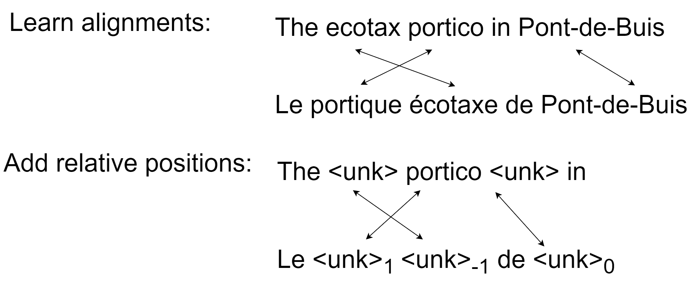

图 11：Luong 等人提出的一种复制机制的示例[23]，$<unk>$符号的下标（表示为$d$）是对应源词的相对位置，其中对齐关系是目标词在位置$j$对齐到源词在位置$i$ $=$ $j$ $+$ $d$。

除了复制机制，使用额外知识在处理其他语言学场景中也很有用，这与词汇覆盖问题密切相关。Arthur 等人结合了词典知识来协助低频词的翻译[72]。Feng 等人提出了一种类似的方法，使用了增强记忆的 NMT（M-NMT）架构，并使用新颖的注意机制从由 SMT 构建的词典中获取额外知识[73]。此外，使用上下文信息也可以改善歧义词（同形异义词）的翻译质量[75]。

总之，已经提出了许多基于上下文的改进方法，其中大多数使用复制机制来处理 OOV 词，并采用各种对齐算法来定位目标侧的相应词。然而，这些方法的进一步改进空间有限，因为复制机制处理不同语言中的复杂场景时过于粗糙。实际上，这些方法在形态丰富的语言（如芬兰语和土耳其语）中表现不佳，这促使了更具泛化能力的方法的提出[64]。

#### V-B3 细粒度水平的方法

本小节介绍了一些更“智能”的方法，重点使用词单元内部的额外信息。显然，这些额外信息可以增强覆盖各种语言现象的能力。

在之前的研究中，虽然使用词单元的语义信息可以提供绝大多数学习特征，但子词层面的其他特征通常被忽视。从语言学的角度来看，“词”的概念是语言的基本单位，但不是包含语义信息的最小单位，而且可以从词单元内部学习到丰富的经验规则，如形状和后缀。与将稀有词视为相同实体的身份复制或词典翻译相比，使用细粒度信息的精细方法更具适应性。此外，还提出了一种更“激进”的方法，即完全在字符级别处理词汇。这将成为未来工作的创新关注点。

在这个类别中，一个流行的选择是使用子词单元，其中最显著的成就是由 Sennrich 等人提出的，这已被证明在一些共享结果中表现最佳[50]。具体来说，在这个设计中，他们将未知词视为子词单元的序列，这在绝大多数这些词的组成（例如命名实体、外来词和形态复杂词）上是合理的。为了完全表示这些 OOV 词，一个直观的解决方案是建立一个包含足够单元变体的预定义子词词典。然而，恢复子词会导致词汇大小的大量空间消耗，这实际上抵消了提高计算效率的全部目的。在这种情况下，应用了基于字节对编码（BPE）的子词提取方法进行两种语言的分词操作，成功地将这种古老但有效的数据压缩方法应用于文本预处理。

在这个改进的 BPE 方法的具体细节中，它交替合并频繁的字节对与字符或字符序列，词分割过程遵循以下步骤：

(1) 准备一个大型训练语料库（通常是双语语料库）。

(2) 确定子词词汇表的大小。

(3) 将单词拆分为字符序列（使用特殊的空格字符来标记原始空格）。

(4) 合并最常见的相邻字符对（例如，在英语中，这可能是将 c 和 h 合并为 ch）。

(5) 重复步骤 4，直到达到固定的次数或定义的词汇表大小。每一步都会使词汇表增加一个。

图示展示了该方法的一个玩具示例。至于词分割的实际结果，最常见的词将被合并为单个标记，而稀有词（类似于之前类别工作中的 OOV 词）可能仍包含未合并的子词。然而，这些在处理后的文本中发现较少[50]。

BPE 方法的进一步工作也已被提出，以获得更好的泛化能力。Taku 后来提出了子词正则化，作为处理 BPE 中虚假歧义现象的替代方案，并进一步提出了一种基于单元语言模型的新子词分割算法，该算法与 BPE 具有相同的思想，但在根据概率获得多个分割时更具灵活性。类似地，Wu 等人使用“工件”概念来处理 OOV 词，这一方法曾应用于 Google 语音识别系统，以解决日语/韩语分割问题[60][24]。该方法将单词拆分为词片，以在分别使用单个字符和完整单词时在灵活性和效率之间取得平衡。

另一个值得关注的问题是字符级序列建模。受到完全使用字符级信息构建 NLM 的启发[65]，Costa-jussa‘ & Fonollosa 使用 CNN 和高速公路网络直接对字符进行建模[62]，他们在源端部署了这种架构，同时在目标端使用了常见的词级生成。同样，Ling 等人和 Ballesteros 等人分别提出了使用 RNN（LSTM）构建字符级嵌入并将其组合成词嵌入的模型[64] [98]，这一思想后来被应用于构建基于 RNN 的字符级 NMT 模型[63]。最近，Luong 和 Manning（2016）提出了一种混合模型，将词级 RNN 与字符级 RNN 结合使用[99]。具体来说，Luong 的方法主要在词级进行翻译，当遇到 OOV 词时，会使用字符级 RNN 进行处理。图示展示了该模型的详细架构。

另一方面，设计一个完全基于字符级的翻译模型也得到了相应的关注。Chung 等人使用了 BPE 方法在编码器端提取子词序列，他们只是通过使用纯字符来变化解码器，并且表明其性能与使用子词的模型相当 [61]。受上述工作的启发，Lee 等人提出了完全基于字符级的 NMT，没有任何分词，基于 CNN 池化和高速公路层，这可以解决 Luong 和 Manning 工作中训练速度极其缓慢的问题 [71]。

## VI 高级模型

本节展示了一些具有最先进性能的高级模型，虽然它们都属于不同类别的模型结构。实验结果表明，这些网络在各自的方面具有不同的优势，能够实现相似的性能。

### VI-A ConvS2S

ConvS2S 是 Convolutional Sequence to Sequence 的缩写，是由 Gehring 等人提出的端到端 NMT 模型 [82]。与大多数基于 RNN 的 NMT 模型不同，ConvS2S 完全基于 CNN，无论是在编码器还是解码器中。在网络结构中，ConvS2S 在其编码器和解码器中堆叠了 15 层 CNN，卷积核宽度固定为 3。这个深层结构有助于减轻捕捉上下文信息的弱点。

在网络细节方面，ConvS2S 在构建网络时应用了 Gated Linear Units (GLU)[100]，它为卷积层的输出提供了一个门控函数。具体来说，卷积层的输出 $Y\in\mathbb{R}^{2d}$ 是一个维度为双倍的向量（2$d$ 维），其中每个输入元素的嵌入维度为 $d$，门控函数通过实现方程 $8$ 处理输出 $Y=[AB]\in\mathbb{R}^{2d}$，其中 $A$ 和 $B$ 都是 $d$ 维向量，函数 $\sigma(B)$ 是一个门控函数，用于控制当前上下文中哪些输入 $A$ 是相关的。这种非线性操作已被证明在训练语言模型中更为有效[100]，超越了仅在 $A$ 上应用 $tanh$ 函数的模型 [140]。此外，ConvS2S 还在不同的卷积层之间使用了残差连接 [141]。

|  | $v([AB])=A\otimes\sigma(B)$ |  | (9) |
| --- | --- | --- | --- |

除了基于 CNN 的编码器-解码器结构的创新外，ConvS2S 还应用了类似于 RNN 模型广泛接受的注意力机制，称为多步注意力。具体而言，多步注意力是一种在每个解码器层中应用的独立注意力结构。在计算注意力的过程中，当前隐藏状态 $d_{i}^{l}$（即第 $l$ 层的输出）与先前的输出嵌入 $g_{i}$ 结合，形成解码器状态汇总 $d_{i}^{l}$ 的向量：

|  | $d_{i}^{l}=W_{d}^{l}h_{i}^{l}+b_{d}^{l}+g_{i}$ |  | (10) |
| --- | --- | --- | --- |

然后，注意力向量 $a_{ij}^{l}$（即解码器层 $l$ 中状态 $i$ 对源元素 $j$ 的注意力）将由总结向量与最终编码器层输出 $z_{j}^{u}$ 的点积决定。

|  | $a_{ij}^{l}=\frac{\exp\left(d_{i}^{l}\cdot z_{j}^{u}\right)}{\sum_{t=1}^{m}\exp\left(d_{i}^{l}\cdot z_{t}^{u}\right)}$ |  | (11) |
| --- | --- | --- | --- |

最后，上下文向量被计算为注意力向量 $a_{ij}^{l}$ 与编码器输出 $z_{j}^{u}$ 以及编码器输入 $e_{j}$ 的加权平均。

|  | $c_{i}^{l}=\sum_{j=1}^{m}a_{ij}^{l}\left(z_{j}^{u}+e_{j}\right)$ |  | (12) |
| --- | --- | --- | --- |

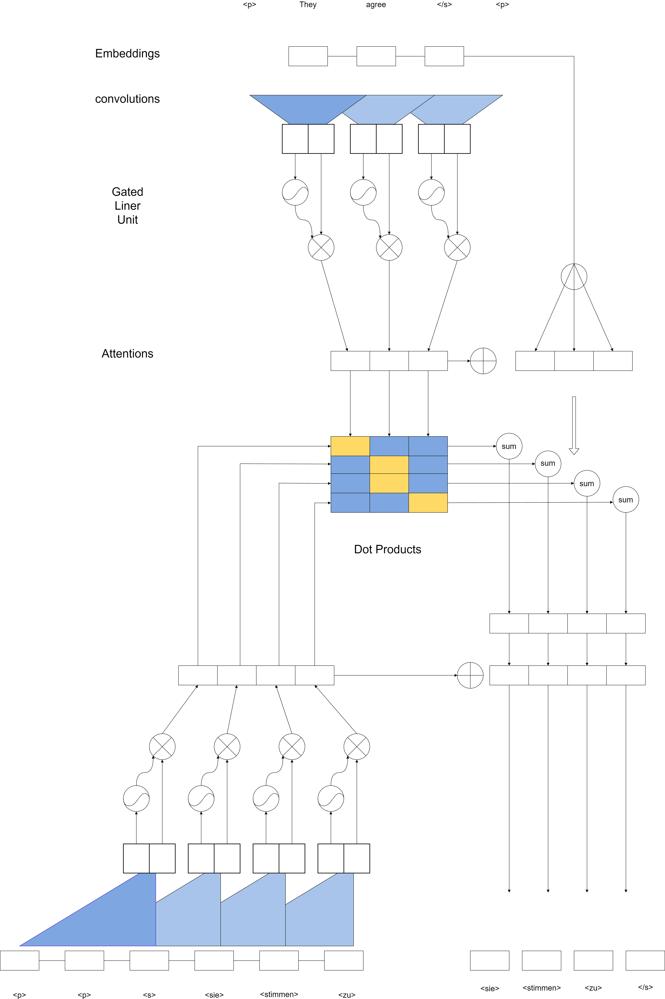

图 12：ConvS2S 模型的结构，这是一个成功的 CNN 基于 NMT 模型，与最先进技术具有竞争力的性能

### VI-B RNMT+

RNMT+ 由 Chen 等人提出 [103]。该模型直接继承了 Wu 等人提出的 GNMT 模型的结构 [24]。具体来说，RNMT+ 可以看作是增强版的 GNMT 模型，展示了基于 RNN 的 NMT 模型的最佳性能。在模型结构上，RNMT+ 主要在以下几个方面与 GNMT 模型不同：

首先，RNMT+ 在其解码器中使用了六个双向 RNN（LSTM），而 GNMT 使用了一层双向 RNN 和七层单向 RNN。这种结构牺牲了计算效率，以换取极致的性能。

其次，RNMT+ 应用了多头加性注意力，而不是传统 NMT 模型中的单头注意力，这可以看作是利用了 Transformer 模型的优势。

第三，训练过程中提供了同步训练策略，基于经验结果[102]，提高了模型性能的收敛速度。

此外，受到 Transformer 模型的启发，应用了每个门的层归一化 [101]，这已被证明对稳定模型训练有帮助。

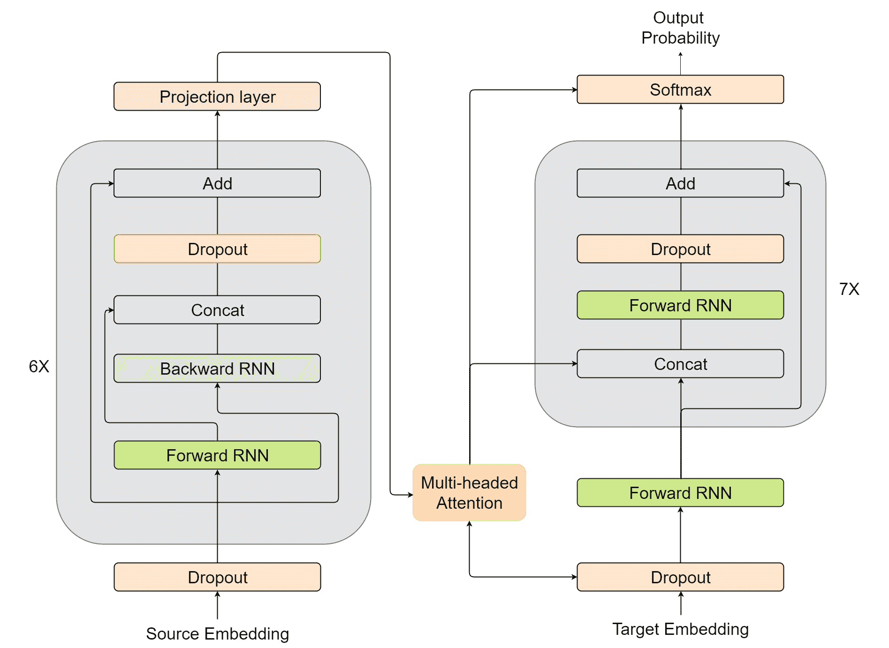

图 13：RNMT+ 模型的结构，与 GNMT 结构相似，并在注意力机制中进行了适应性创新

### VI-C Transformer 和基于 Transformer 的模型

Transformer 是 Vaswani 等人提出的一种新的 NMT 结构 [25]。与现有的 NMT 模型不同，它抛弃了标准的 RNN/CNN 结构，设计了一种创新的多层自注意力块，并结合了位置编码方法。这种新的结构设计趋势兼具了 RNN 和 CNN 模型的优势，并进一步用于初始化其他 NLP 任务的输入表示。值得注意的是，Transformer 是一个完全基于注意力的 NMT 模型。

#### VI-C1 模型结构

Transformer 在其模型中具有独特的结构，其主要差异在于输入表示和多头注意力机制。

(1) 输入表示

Transformer 在处理输入数据方面具有独特的表现，与递归或卷积模型有很大不同。为了计算自注意力，Transformer 将输入处理为三种不同的向量：Key、Value 和 Query。这些向量都是通过将输入嵌入与我们在训练过程中训练的三个矩阵相乘得到的。

此外，为了增强序列顺序的建模能力，使用了位置编码方法，因为 Transformer 已放弃了递归结构，这种方法通过将词序信息注入特征向量中来弥补，从而避免模型对序列顺序不变[148]。具体来说，Transformer 在编码器和解码器堆栈底部的输入嵌入中添加位置编码，位置编码设计为与模型嵌入具有相同的维度，因此可以进行求和。位置编码可以通过直接应用位置函数计算或通过学习得到[82]，在最终评估中已被证明具有相似的性能。在 Transformer 中，最终选择了使用 $sin$ 和 $cos$ 函数添加位置编码，每个位置可以按以下方式进行编码：

|  | $\begin{array}[]{r}{PE_{(pos,2i)}=\sin\left(pos/10000^{\left.2i/d_{\text{model }}\right)}\right.}\\ {PE_{(\text{pos, }2i+1)}=\cos\left(\text{pos}/10000^{2i/d_{\text{model }}}\right)}\end{array}$ |  | (13) |
| --- | --- | --- | --- |

其中 $pos$ 表示位置，$i$ 表示维度。也就是说，每个位置编码的维度对应一个正弦函数，波长从 $2\pi$ 到 $20000\pi$ 形成几何级数。选择这些函数的原因是理论上它们有助于模型通过相对位置轻松学习关注，由于其特点，对于任何固定偏移量 $k$，$PE_{pos}+k$ 可以表示为 $PE_{pos}$ 的线性函数。

(2) 多头自注意力

自注意力是 Transformer 的主要创新。但在实现中，多头机制并非仅计算一次自注意力，而是通过多次并行运行缩放点积注意力，将这些独立注意力的输出拼接并线性变换为期望的维度。这种多次自注意力计算称为多头自注意力，它允许模型同时关注来自不同表示子空间的信息。

(3) 编码器和解码器模块

编码器由 6 个相同的组件构建，每个组件包含一个多头注意力层和一个位于其上的全连接网络。这两个子层都配有残差连接和层归一化。所有子层的输出数据维度都是 512。

然而，解码器更为复杂。它也堆叠了 6 个组件；每个组件中连接了三个子层，包括两个多头自注意力子层和一个全连接神经网络子层。具体来说，底部的注意力层采用了称为 masked 的方法，以防止位置关注后续位置，这用于避免模型在预测当前词时查看目标序列的未来。此外，第二个注意力层（顶部注意力层）对编码器堆栈的输出执行多头注意力。

#### VI-C2 基于 Transformer 的 NMT 变体

由于 Transformer 带来的巨大性能提升，相关的改进引起了研究人员的极大关注。标准 Transformer 的公认弱点包括：缺乏递归建模，理论上不是图灵完备，捕捉位置信息，以及模型复杂度大。所有这些缺点阻碍了其翻译性能的进一步提升。针对这些问题，已经提出了一些调整方案，以期获得更好的模型。

在模型架构方面，一些提出的修改聚焦于注意力层的深度和网络组成。Bapna 等人提出了一个深度增加了 2-3 倍的 Transformer，具有改进的注意力机制，这使得优化更深模型变得更加容易[152]。改进的注意力机制扩展了与每个编码器层的连接，就像沿编码器深度的加权残差连接，这允许模型灵活地调整梯度流到不同的编码器层。同样，Wang 等人[145] 提出了一个更深的 Transformer 模型（25 层编码器），该模型在应用层归一化和一种新颖的输出组合方法时，延续了 Bapna 等人（2018 年）工作的方向。

与固定层数的 NMT 模型相比，Dehghani 等人提出了通用 Transformer，取消了通过结合 RNN 的递归归纳偏置和自适应计算时间停止机制来堆叠常数层数，从而增强了原始自注意力基础的表示，以更好地学习迭代或递归转换。值得注意的是，这一调整使得模型在某些假设下被证明是图灵完备的[142]。

在网络组成方面，受 AutoML 思路的启发，So 等人应用了神经架构搜索（NAS）来寻找具有简化架构的可比模型[146]。在[146]中提出的演化 Transformer 具有创新的基本模块组合，达到了与原始 Transformer-Big 模型相同的质量，但参数减少了 37.6%。

虽然大多数修改集中在直接改变模型结构上，但一些新的文献选择利用不同的输入表示来提升模型性能。一种直接的方法是使用增强的位置编码来注入序列顺序，其中原始 Transformer 在捕捉位置信息方面存在弱点。Shaw 等人提出了改进的自注意力机制，考虑到相对位置表示，这在两个 MT 任务中展示了显著的改进[147]。

与此同时，使用预初始化的输入表示并进行微调是另一个方向，在不同的 NLP 任务中提出了一些尝试，例如将 ELMo[150]应用于 NMT 模型的编码器[155]。在 Transformer 方面，这种创新模型的副产品之一是使用自注意力来表示序列，这可以有效地融合单词信息和上下文信息。后来，提出了两个著名的基于 Transformer 的输入表示方法，分别是 Bert（双向编码器表示从 Transformer）[149]和 GPT（生成预训练 Transformer）[151]，这些方法在一些下游 NLP 任务中表现出改进。至于将基于 Transformer 的预训练模型应用于 NMT 任务，最近，这种尝试也通过将 Bert 作为附加嵌入层或直接将 Bert 作为预训练模型[154]实现，这在微调后比原始 Transformer 表现稍好。此外，直接将 Bert 作为预训练模型应用已被证明具有类似的性能，因此在编码器初始化时更为方便。

Transformer 的完整结构如图 14 所示。

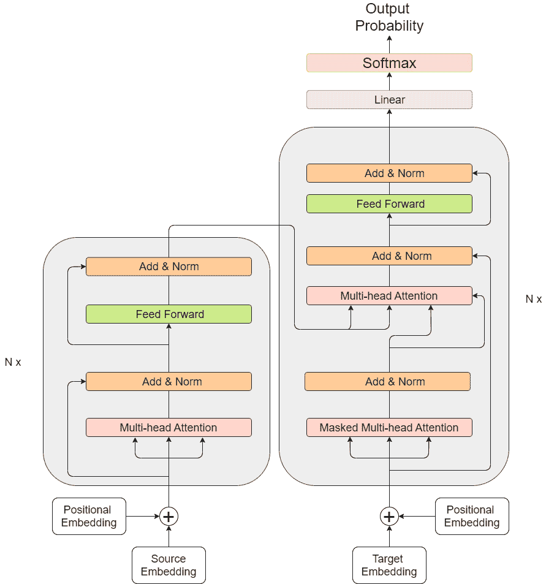

图 14：Transformer 的完整结构

## VII 未来趋势

尽管我们见证了 NMT 领域快速增长的研究进展，但仍面临许多挑战。基于广泛的调查[121][125][117][116]，我们总结了主要挑战，并列出了以下几个方面的潜在方向。

(1) 就翻译性能而言，NMT 在翻译长句时仍表现不佳。这主要有两个原因：工程上的实际限制和模型本身的学习能力。针对第一个原因，一些学术实验选择忽略超出 RNN 长度的长句部分。但我们认为，在工业应用中，情况并非如此。对于第二个原因，随着研究的进展，模型架构会变得更加复杂。例如，Transformer 模型在其设计中应用了创新结构，带来了翻译质量和速度的显著提升[25]。我们相信，模型结构的进一步优化将被提出。众所周知，基于 RNN 的 NMT 在建模序列顺序方面有优势，但导致计算效率低下。未来的工作将更多地考虑这两个方面之间的权衡。

(2) 对于 SMT 和 NMT 模型，**对齐机制**至关重要。对于绝大多数 NMT 模型而言，**注意机制**在对齐任务中发挥功能作用，而且它的工作范围超出了传统对齐模型。我们相信，这种先进的对齐方法在未来的研究中仍会受到关注，因为强大的注意方法可以直接提升模型性能。后续的注意机制研究将试图缓解 NMT 中的弱点，如解释能力[116]。

(3) 词汇覆盖问题一直影响着大多数 NMT 模型。处理 softmax 操作计算负担的研究趋势将持续。同时，我们还发现了支持大词汇量的新训练策略。此外，近年来对 NMT 在子词或字符级别操作的研究也引起了关注，提供了超越传统范围的额外解决方案。更重要的是，解决复杂的翻译场景，例如非正式拼写，也是一个热点。目前，集成了字符级网络的 NMT 模型已经缓解了这一现象。未来的工作应专注于以更灵活的方式处理各种 OOV 词汇。

(4) 低资源神经机器翻译[125]是当前 NMT 领域的另一个热点，旨在解决使用稀有双语语料训练 NMT 模型时的严重性能下降问题。由于上述情况在实践中常见，其中一些不常用的语言没有足够的数据，我们相信这个领域将在进一步研究中得到扩展。多语言翻译方法[111][110]是常见的提议方法，它结合了多语言对数据以提高 NMT 性能。对于选择不同语言对的不同结果，可能需要更多的解释。此外，无监督方法利用了附加数据集并提供了预训练模型。进一步的研究可以改善其效果，并提供与传统方法结合的混合训练策略[122][123][124]。

(5) 最终，NMT 应用研究也将变得更加丰富。目前，已经开发了许多应用程序，如语音翻译[107][106]和文档级翻译[105]。我们相信未来会出现各种应用（特别是端到端任务）。我们强烈希望基于 AI 的实时翻译系统能够大规模应用，这将给人类社会带来巨大的好处[108]。

## 参考文献

+   [1] Klein, G., Kim, Y., Deng, Y., Senellart, J., & Rush, A. M. (2017). Opennmt：开源神经机器翻译工具包。arXiv 预印本 arXiv:1701.02810。

+   [2] Forcada, M. L., Ginestí-Rosell, M., Nordfalk, J., O’Regan, J., Ortiz-Rojas, S., Pérez-Ortiz, J. A., … & Tyers, F. M. (2011). Apertium：一个免费的开源规则基础机器翻译平台。机器翻译，25（2），127-144。

+   [3] Koehn, P., Och, F. J., & Marcu, D. (2003 年 5 月). 基于统计的短语翻译。第 2003 届北美计算语言学协会人类语言技术会议论文集-第 1 卷（第 48-54 页）。计算语言学协会。

+   [4] Koehn, P., Hoang, H., Birch, A., Callison-Burch, C., Federico, M., Bertoldi, N., … & Dyer, C. (2007 年 6 月). Moses：统计机器翻译的开源工具包。第 45 届计算语言学协会年会论文集（演示和海报环节）（第 177-180 页）。

+   [5] Chorowski, J., Bahdanau, D., Cho, K., & Bengio, Y. (2014). 基于注意力机制的端到端连续语音识别：初步结果。arXiv 预印本 arXiv:1412.1602。

+   [6] Bengio, Y., Ducharme, R., Vincent, P., & Jauvin, C. (2003). 一种神经概率语言模型。机器学习研究期刊，3（2 月），1137-1155。

+   [7] Cho, K., Van Merriënboer, B., Bahdanau, D., & Bengio, Y. (2014)。关于神经机器翻译的性质：编码器-解码器方法。arXiv 预印本 arXiv:1409.1259。

+   [8] Kalchbrenner, N., & Blunsom, P. (2013)。递归连续翻译模型。载于《2013 年自然语言处理经验方法会议论文集》（第 1700-1709 页）。

+   [9] Mikolov, T., Chen, K., Corrado, G., & Dean, J. (2013)。高效的词表示向量空间估计。arXiv 预印本 arXiv:1301.3781。

+   [10] Mikolov, T., Yih, W. T., & Zweig, G. (2013)。连续空间词表示中的语言规律。载于《第 2013 年北美计算语言学协会年会论文集：人类语言技术》（第 746-751 页）。

+   [11] Pennington, J., Socher, R., & Manning, C. (2014)。GloVe：用于词表示的全局向量。载于《2014 年自然语言处理经验方法会议论文集》（EMNLP）（第 1532-1543 页）。

+   [12] Devlin, J., Zbib, R., Huang, Z., Lamar, T., Schwartz, R., & Makhoul, J. (2014)。快速而稳健的神经网络联合模型用于统计机器翻译。载于《第 52 届计算语言学协会年会论文集（第 1 卷：长篇论文）》（第 1 卷，第 1370-1380 页）。

+   [13] Galley, M., 和 Manning, C. D. (2008 年 10 月)。一个简单而有效的层次短语重排模型。载于《自然语言处理经验方法会议论文集》（第 848-856 页）。计算语言学协会。

+   [14] Chiang, D., Knight, K., & Wang, W. (2009 年 5 月)。11,001 种用于统计机器翻译的新特征。载于《人类语言技术会议：2009 年北美计算语言学协会年会论文集》（第 218-226 页）。计算语言学协会。

+   [15] Green, S., Wang, S., Cer, D., & Manning, C. D. (2013)。快速而自适应的特征丰富翻译模型在线训练。载于《第 51 届计算语言学协会年会论文集（第 1 卷：长篇论文）》（第 1 卷，第 311-321 页）。

+   [16] Sutskever, I., Vinyals, O., & Le, Q. V. (2014)。基于神经网络的序列到序列学习。载于《神经信息处理系统进展》（第 3104-3112 页）。

+   [17] Hochreiter, S., & Schmidhuber, J. (1997)。长短期记忆。神经计算，9(8)，1735-1780。

+   [18] Cho, K., Van Merriënboer, B., Gulcehre, C., Bahdanau, D., Bougares, F., Schwenk, H., & Bengio, Y. (2014)。使用 RNN 编码器-解码器学习短语表示用于统计机器翻译。arXiv 预印本 arXiv:1406.1078。

+   [19] Gehring, J., Auli, M., Grangier, D., & Dauphin, Y. N. (2016)。用于神经机器翻译的卷积编码器模型。arXiv 预印本 arXiv:1611.02344。

+   [20] 孟飞，陆志辉，王铭，李浩，姜伟，& 刘青. (2015). 使用卷积神经网络对源语言进行编码以进行机器翻译. arXiv 预印本 arXiv:1503.01838.

+   [21] 巴赫达瑙，乔，& 杨. (2014). 通过联合学习对齐和翻译进行神经机器翻译. arXiv 预印本 arXiv:1409.0473.

+   [22] 布里茨，戈尔迪，陆勇，& 乐聪慧. (2017). 对神经机器翻译架构的大规模探索. arXiv 预印本 arXiv:1703.03906.

+   [23] 陆勇，范浩，& 曼宁. (2015). 有效的注意力机制神经机器翻译方法. arXiv 预印本 arXiv:1508.04025.

+   [24] 吴越，施斯特，陈震，乐聪慧，诺鲁兹，马谢雷，… 和克林格纳. (2016). Google 的神经机器翻译系统：弥合人类与机器翻译之间的差距。arXiv 预印本 arXiv:1609.08144.

+   [25] 瓦斯瓦尼，沙泽尔，帕尔玛尔，乌斯科雷特，琼斯，戈麦斯，… & 波洛苏金. (2017). 注意力即是你所需要的一切. 在神经信息处理系统进展中（第 5998-6008 页）。

+   [26] 郑俊，古尔切赫，乔，& 杨. (2014). 对门控递归神经网络在序列建模中的经验评估. arXiv 预印本 arXiv:1412.3555.

+   [27] 吴越，张思，张颖，杨，& 萨拉胡丁诺夫. (2016). 关于递归神经网络中的乘法集成. 在神经信息处理系统进展中（第 2856-2864 页）。

+   [28] 杨，西马尔德，& 弗拉斯科尼. (1994). 使用梯度下降学习长期依赖关系是困难的. IEEE 神经网络事务，5(2)，157-166.

+   [29] 格雷夫斯. (2012). 使用递归神经网络的序列转导. arXiv 预印本 arXiv:1211.3711.

+   [30] 布朗杰-刘万多夫斯基，杨，& 文森特. (2013 年 11 月). 使用递归神经网络进行音频和弦识别. 在 ISMIR 会议中（第 335-340 页）。

+   [31] 格雷夫斯. (2013). 使用递归神经网络生成序列. arXiv 预印本 arXiv:1308.0850.

+   [32] 柯恩. (2004 年 9 月). Pharaoh：一个用于基于短语的统计机器翻译模型的束搜索解码器. 在美洲机器翻译协会会议中（第 115-124 页）。施普林格，柏林，海德堡.

+   [33] 蒋达. (2005 年 6 月). 一种用于统计机器翻译的层次短语模型. 在第 43 届计算语言学协会年会上（第 263-270 页）。计算语言学协会.

+   [34] 奥赫，蒂尔曼，& 内伊. (1999). 改进的统计机器翻译对齐模型. 在 1999 年联合 SIGDAT 自然语言处理和大型语料库实证方法会议中.

+   [35] 涂志强，陆志辉，刘洋，刘轩，& 李浩. (2016). 为神经机器翻译建模覆盖度. arXiv 预印本 arXiv:1601.04811.

+   [36] 奥利，盖利，奎克，& 兹维格. (2013). 使用递归神经网络的联合语言和翻译建模.

+   [37] Auli, M., & Gao, J. (2014). 解码器集成和递归神经网络语言模型的期望蓝色训练。

+   [38] Schwenk, H., & Gauvain, J. L. (2005 年 10 月). 在非常大语料库上训练神经网络语言模型。在人类语言技术和自然语言处理经验方法会议论文集（第 201-208 页）。计算语言学协会。

+   [39] Schwenk, H. (2007). 连续空间语言模型。计算机语音与语言，21(3)，492-518。

+   [40] Schwenk, H., Dchelotte, D., & Gauvain, J. L. (2006 年 7 月). 用于统计机器翻译的连续空间语言模型。在 COLING/ACL 主会议海报会（第 723-730 页）上。计算语言学协会。

+   [41] Mikolov, T., Karafiát, M., Burget, L., Černocký, J., & Khudanpur, S. (2010). 基于递归神经网络的语言模型。在国际语音通信协会第十一届年会上。

+   [42] Pollack, J. B. (1990). 递归分布式表示。人工智能，46(1-2)，77-105。

+   [43] Chrisman, L. (1991). 学习递归分布式表示以进行整体计算。连接科学，3(4)，345-366。

+   [44] Allen, R. B. (1987 年 6 月). 多项自然语言和反向传播研究。在 IEEE 第一次国际神经网络会议论文集中（第 2 卷，第 S 335 号，第 341 页）。IEEE Piscataway, NJ。

+   [45] Elman, J. L. (1990). 发现时间中的结构。认知科学，14(2)，179-211。

+   [46] JORDAN, M. (1986). 序列顺序；一种并行分布式处理方法。ICS 报告 8604，加州大学圣迭戈分校。

+   [47] Jean, S., Cho, K., Memisevic, R., & Bengio, Y. (2014). 使用非常大的目标词汇进行神经机器翻译。arXiv 预印本 arXiv:1412.2007。

+   [48] Gulcehre, C., Ahn, S., Nallapati, R., Zhou, B., & Bengio, Y. (2016). 指向未知词。arXiv 预印本 arXiv:1603.08148。

+   [49] Jiajun, Z., & Chengqing, Z. (2016). 在神经机器翻译中趋向零未知词。

+   [50] Sennrich, R., Haddow, B., & Birch, A. (2015). 使用子词单元的稀有词神经机器翻译。arXiv 预印本 arXiv:1508.07909。

+   [51] Gage, P. (1994). 一种新的数据压缩算法。C 用户期刊，12(2)，23-38。

+   [52] Mnih, A., & Hinton, G. E. (2009). 一种可扩展的层次分布式语言模型。在神经信息处理系统进展（第 1081-1088 页）。

+   [53] Morin, F., & Bengio, Y. (2005 年 1 月). 层次概率神经网络语言模型。在 Aistats（第 5 卷，第 246-252 页）。

+   [54] Miller, G. (1998). WordNet: 电子词汇数据库。MIT 出版社。

+   [55] Bengio, Y., & Senécal, J. S. (2003 年 1 月). 通过重要性采样快速训练概率神经网络。在 AISTATS（第 1-9 页）。

+   [56] Bengio, Y., & Senécal, J. S. (2008). 自适应重要性采样加速神经概率语言模型的训练。IEEE 神经网络汇刊，19(4)，713-722。

+   [57] Mnih, A., & Teh, Y. W. (2012). 一种快速简单的神经概率语言模型训练算法。arXiv 预印本 arXiv:1206.6426。

+   [58] Vaswani, A., Zhao, Y., Fossum, V., & Chiang, D. (2013). 使用大规模神经语言模型进行解码可提高翻译效果。载于《2013 年自然语言处理实证方法会议论文集》 (第 1387-1392 页)。

+   [59] Luong, M. T., Sutskever, I., Le, Q. V., Vinyals, O., & Zaremba, W. (2014). 解决神经机器翻译中的稀有词问题。arXiv 预印本 arXiv:1410.8206。

+   [60] Schuster, M., & Nakajima, K. (2012 年 3 月). 日语和韩语语音搜索。载于《2012 年 IEEE 国际声学、语音和信号处理会议（ICASSP）》 (第 5149-5152 页)。IEEE。

+   [61] Chung, J., Cho, K., & Bengio, Y. (2016). 无显式分段的字符级解码器用于神经机器翻译。arXiv 预印本 arXiv:1603.06147。

+   [62] Costa-Jussa, M. R., & Fonollosa, J. A. (2016). 基于字符的神经机器翻译。arXiv 预印本 arXiv:1603.00810。

+   [63] Ling, W., Trancoso, I., Dyer, C., & Black, A. W. (2015). 基于字符的神经机器翻译。arXiv 预印本 arXiv:1511.04586。

+   [64] Ling, W., Luís, T., Marujo, L., Astudillo, R. F., Amir, S., Dyer, C., … & Trancoso, I. (2015). 在形式中寻找功能：用于开放词汇表示的组合字符模型。arXiv 预印本 arXiv:1508.02096。

+   [65] Kim, Y., Jernite, Y., Sontag, D., & Rush, A. M. (2016 年 3 月). 字符感知神经语言模型。载于《第 30 届 AAAI 人工智能会议》。

+   [66] Kudo, T. (2018). 子词正则化：通过多个子词候选提高神经网络翻译模型。arXiv 预印本 arXiv:1804.10959。

+   [67] Chung, J., Gulcehre, C., Cho, K., & Bengio, Y. (2015 年 6 月). 门控反馈递归神经网络。载于《国际机器学习会议》 (第 2067-2075 页)。

+   [68] Denkowski, M., & Neubig, G. (2017). 提升神经机器翻译可靠结果的基准。arXiv 预印本 arXiv:1706.09733。

+   [69] Nakazawa, T., Higashiyama, S., Ding, C., Mino, H., Goto, I., Kazawa, H., … & Kurohashi, S. (2017 年 11 月). 第四届亚洲翻译研讨会概述。载于《第四届亚洲翻译研讨会论文集（WAT2017）》 (第 1-54 页)。

+   [70] Choi, H., Cho, K., & Bengio, Y. (2017). 用于神经机器翻译的上下文相关词汇表示。《计算机语音与语言》，45，149-160。

+   [71] Lee, J., Cho, K., & Hofmann, T. (2017). 无显式分段的完全字符级神经机器翻译。《计算语言学协会会刊》，5，365-378。

+   [72] Arthur, P., Neubig, G., & Nakamura, S. (2016). 将离散翻译词典融入神经机器翻译。arXiv 预印本 arXiv:1606.02006。

+   [73] Feng, Y., Zhang, S., Zhang, A., Wang, D., & Abel, A. (2017). 记忆增强的神经机器翻译。arXiv 预印本 arXiv:1708.02005。

+   [74] Gu, J., Lu, Z., Li, H., & Li, V. O. (2016). 在序列到序列学习中融入复制机制。arXiv 预印本 arXiv:1603.06393。

+   [75] Liu, F., Lu, H., & Neubig, G. (2017). 处理神经机器翻译中的同形异义词。arXiv 预印本 arXiv:1708.06510。

+   [76] Zhao, Y., Zhang, J., He, Z., Zong, C., & Wu, H. (2018). 解决神经机器翻译中的问题词汇。发表于《2018 年自然语言处理实证方法会议论文集》（第 391-400 页）。

+   [77] Vaswani, A., Bengio, S., Brevdo, E., Chollet, F., Gomez, A. N., Gouws, S., … & Sepassi, R. (2018). Tensor2tensor 用于神经机器翻译。arXiv 预印本 arXiv:1803.07416。

+   [78] Wang, Q., Li, B., Xiao, T., Zhu, J., Li, C., Wong, D. F., & Chao, L. S. (2019). 为机器翻译学习深度变换器模型。arXiv 预印本 arXiv:1906.01787。

+   [79] So, D. R., Liang, C., & Le, Q. V. (2019). 演变型变换器。arXiv 预印本 arXiv:1901.11117。

+   [80] Dehghani, M., Gouws, S., Vinyals, O., Uszkoreit, J., & Kaiser, Ł. (2018). 通用变换器。arXiv 预印本 arXiv:1807.03819。

+   [81] Dai, Z., Yang, Z., Yang, Y., Cohen, W. W., Carbonell, J., Le, Q. V., & Salakhutdinov, R. (2019). Transformer-xl: 超越固定长度上下文的注意力语言模型。arXiv 预印本 arXiv:1901.02860。

+   [82] Gehring, J., Auli, M., Grangier, D., Yarats, D., & Dauphin, Y. N. (2017 年 8 月). 卷积序列到序列学习。发表于《第 34 届国际机器学习会议论文集-第 70 卷》（第 1243-1252 页）。JMLR.org。

+   [83] Hu, B., Tu, Z., Lu, Z., Li, H., & Chen, Q. (2015 年 7 月). 使用卷积神经网络的上下文相关翻译选择。发表于《第 53 届计算语言学协会年会及第 7 届国际自然语言处理联合会议论文集（第 2 卷：短篇论文）》 （第 536-541 页）。

+   [84] Kalchbrenner, N., Espeholt, L., Simonyan, K., Oord, A. V. D., Graves, A., & Kavukcuoglu, K. (2016). 线性时间内的神经机器翻译。arXiv 预印本 arXiv:1610.10099。

+   [85] Kaiser, L., Gomez, A. N., & Chollet, F. (2017). 神经机器翻译中的深度可分离卷积。arXiv 预印本 arXiv:1706.03059。

+   [86] Kaiser, Ł., & Bengio, S. (2016). 活跃记忆能否替代注意力机制？发表于《神经信息处理系统进展》（第 3781-3789 页）。

+   [87] Tran, K., Bisazza, A., & Monz, C. (2018). 模拟层级结构时递归的重要性。arXiv 预印本 arXiv:1803.03585。

+   [88] Zhou, J., Cao, Y., Wang, X., Li, P., & Xu, W. (2016). 具有快进连接的深度递归模型用于神经机器翻译。《计算语言学协会会刊》，4，371-383。

+   [89] Zhang, B., Xiong, D., Su, J., Duan, H., & Zhang, M. (2016). 变分神经机器翻译。arXiv 预印本 arXiv:1605.07869。

+   [90] Shazeer, N., Mirhoseini, A., Maziarz, K., Davis, A., Le, Q., Hinton, G., & Dean, J. (2017)。极大规模神经网络：稀疏门控专家混合层。arXiv 预印本 arXiv:1701.06538。

+   [91] Zhang, B., Xiong, D., Su, J., Lin, Q., & Zhang, H. (2018)。通过加法-减法双门控递归网络简化神经机器翻译。arXiv 预印本 arXiv:1810.12546。

+   [92] Wang, M., Lu, Z., Zhou, J., & Liu, Q. (2017)。具有线性关联单元的深度神经机器翻译。arXiv 预印本 arXiv:1705.00861。

+   [93] Feng, S., Liu, S., Yang, N., Li, M., Zhou, M., & Zhu, K. Q. (2016 年 12 月)。通过隐式失真和繁殖改进注意力建模以用于机器翻译。在 COLING 2016 论文集，第 26 届计算语言学国际会议：技术论文（第 3082-3092 页）。

+   [94] Yang, Z., Hu, Z., Deng, Y., Dyer, C., & Smola, A. (2016)。具有递归注意力建模的神经机器翻译。arXiv 预印本 arXiv:1607.05108。

+   [95] Cohn, T., Hoang, C. D. V., Vymolova, E., Yao, K., Dyer, C., & Haffari, G. (2016)。将结构对齐偏置融入注意力神经翻译模型。arXiv 预印本 arXiv:1601.01085。

+   [96] Cheng, Y., Shen, S., He, Z., He, W., Wu, H., Sun, M., & Liu, Y. (2015)。基于协议的双向注意力神经机器翻译联合训练。arXiv 预印本 arXiv:1512.04650。

+   [97] Mi, H., Wang, Z., & Ittycheriah, A. (2016)。神经机器翻译中的监督注意力。arXiv 预印本 arXiv:1608.00112。

+   [98] Ballesteros, M., Dyer, C., & Smith, N. A. (2015). 通过使用 LSTM 模型字符而非单词来改进基于过渡的解析。arXiv 预印本 arXiv:1508.00657。

+   [99] Luong, M. T., & Manning, C. D. (2016)。通过混合字-字符模型实现开放词汇的神经机器翻译。arXiv 预印本 arXiv:1604.00788。

+   [100] Dauphin, Y. N., Fan, A., Auli, M., & Grangier, D. (2017 年 8 月)。使用门控卷积网络进行语言建模。在第 34 届国际机器学习会议论文集第 70 卷（第 933-941 页）。JMLR.org。

+   [101] Ba, J. L., Kiros, J. R., & Hinton, G. E. (2016)。层归一化。arXiv 预印本 arXiv:1607.06450。

+   [102] Chen, J., Pan, X., Monga, R., Bengio, S., & Jozefowicz, R. (2016)。重新审视分布式同步 SGD。arXiv 预印本 arXiv:1604.00981。

+   [103] Chen, M. X., Firat, O., Bapna, A., Johnson, M., Macherey, W., Foster, G., … & Wu, Y. (2018)。两全其美：结合神经机器翻译的最新进展。arXiv 预印本 arXiv:1804.09849。

+   [104] Mi, H., Wang, Z., & Ittycheriah, A. (2016)。神经机器翻译中的词汇操作。arXiv 预印本 arXiv:1605.03209。

+   [105] Wang, L., Tu, Z., Way, A., & Liu, Q. (2017)。利用跨句上下文进行神经机器翻译。arXiv 预印本 arXiv:1704.04347。

+   [106] Weiss, R. J., Chorowski, J., Jaitly, N., Wu, Y., & Chen, Z. (2017). 序列到序列模型可以直接翻译外语语音。arXiv 预印本 arXiv:1703.08581。

+   [107] Duong, L., Anastasopoulos, A., Chiang, D., Bird, S., & Cohn, T. (2016 年 6 月). 一种无转录的语音翻译注意力模型。在《2016 年北美计算语言学协会年会：人类语言技术论文集》（第 949-959 页）。

+   [108] Gu, J., Neubig, G., Cho, K., & Li, V. O. (2016). 实时学习翻译的神经机器翻译。arXiv 预印本 arXiv:1610.00388。

+   [109] Xu, K., Ba, J., Kiros, R., Cho, K., Courville, A., Salakhudinov, R., … & Bengio, Y. (2015 年 6 月). 展示、关注与讲述：具有视觉注意力的神经图像描述生成。在国际机器学习大会（第 2048-2057 页）。

+   [110] Dong, D., Wu, H., He, W., Yu, D., & Wang, H. (2015 年 7 月). 多语言翻译的多任务学习。在《第 53 届计算语言学协会年会暨第 7 届国际自然语言处理联合会议（第 1 卷：长篇论文集）》（第 1723-1732 页）。

+   [111] Firat, O., Cho, K., & Bengio, Y. (2016). 具有共享注意力机制的多方位、多语言神经机器翻译。arXiv 预印本 arXiv:1601.01073。

+   [112] Bojar, Ondrej, 等. “2015 年统计机器翻译研讨会的发现。” 第十届统计机器翻译研讨会论文集，2015，第 1–46 页。

+   [113] Cettolo, Mauro, 等. “IWSLT 2015 评估活动。” IWSLT 2015，国际口语语言翻译研讨会，2015。

+   [114] Junczys-Dowmunt, M., Dwojak, T., & Hoang, H. (2016). 神经机器翻译是否准备好部署？关于 30 个翻译方向的案例研究。arXiv 预印本 arXiv:1610.01108。

+   [115] Bentivogli, L., Bisazza, A., Cettolo, M., & Federico, M. (2016). 神经网络与基于短语的机器翻译质量：案例研究。arXiv 预印本 arXiv:1608.04631。

+   [116] Chaudhari, S., Polatkan, G., Ramanath, R., & Mithal, V. (2019). 注意力模型的全面调查。arXiv 预印本 arXiv:1904.02874。

+   [117] Galassi, A., Lippi, M., & Torroni, P. (2019). 注意力，请注意！对自然语言处理中的神经注意力模型的批判性回顾。arXiv 预印本 arXiv:1902.02181。

+   [118] Domhan, T. (2018 年 7 月). 你需要多少注意力？神经机器翻译架构的细致分析。在《第 56 届计算语言学协会年会（第 1 卷：长篇论文集）》（第 1799-1808 页）。

+   [119] Kaiser, Ł., & Sutskever, I. (2015). 神经 GPU 学习算法。arXiv 预印本 arXiv:1511.08228。

+   [120] Lipton, Z. C., Berkowitz, J., & Elkan, C. (2015). 循环神经网络用于序列学习的批判性回顾。arXiv 预印本 arXiv:1506.00019。

+   [121] Koehn, P., & Knowles, R. (2017 年)。神经机器翻译的六大挑战。arXiv 预印本 arXiv:1706.03872。

+   [122] He, D., Xia, Y., Qin, T., Wang, L., Yu, N., Liu, T. Y., & Ma, W. Y. (2016 年)。机器翻译的双重学习。在神经信息处理系统进展会议论文集中（第 820-828 页）。

+   [123] Ramachandran, P., Liu, P. J., & Le, Q. V. (2016 年)。序列到序列学习的无监督预训练。arXiv 预印本 arXiv:1611.02683。

+   [124] Artetxe, M., Labaka, G., Agirre, E., & Cho, K. (2017 年)。无监督神经机器翻译。arXiv 预印本 arXiv:1710.11041。

+   [125] Sennrich, R., & Zhang, B. (2019 年)。重新审视低资源神经机器翻译：一个案例研究。arXiv 预印本 arXiv:1905.11901。

+   [126] Schwenk, H. (2012 年 12 月)。基于短语的统计机器翻译的连续空间翻译模型。在 COLING 2012：海报论文集中（第 1071-1080 页）。

+   [127] Rosenfeld, R. (2000 年)。统计语言建模的二十年：我们从这里走向何方？IEEE 会议录，88(8)，1270-1278。

+   [128] Stolcke, A. (2002 年)。SRILM——一个可扩展的语言建模工具包。在第七届国际语言处理大会上。

+   [129] Teh, Y. W. (2006 年 7 月)。基于 Pitman-Yor 过程的层次贝叶斯语言模型。在第 21 届国际计算语言学会议和第 44 届计算语言学协会年会上（第 985-992 页）。计算语言学协会。

+   [130] Federico, M., Bertoldi, N., & Cettolo, M. (2008 年)。IRSTLM：一个开源工具包，用于处理大规模语言模型。在第九届国际语音通信协会年会上。

+   [131] Heafield, K. (2011 年 7 月)。KenLM：更快更小的语言模型查询。在第六届统计机器翻译研讨会论文集中（第 187-197 页）。计算语言学协会。

+   [132] Son, L. H., Allauzen, A., & Yvon, F. (2012 年 6 月)。具有神经网络的连续空间翻译模型。在 2012 年北美计算语言学协会：人类语言技术会议论文集中（第 39-48 页）。计算语言学协会。

+   [133] Collobert, R., Weston, J., Bottou, L., Karlen, M., Kavukcuoglu, K., & Kuksa, P. (2011 年)。几乎从零开始的自然语言处理。《机器学习研究杂志》，12（8 月），2493-2537。

+   [134] Young, T., Hazarika, D., Poria, S., & Cambria, E. (2018 年)。基于深度学习的自然语言处理的最新趋势。《IEEE 计算智能杂志》，13(3)，55-75。

+   [135] Wallach, H. M. (2006 年 6 月)。主题建模：超越词袋模型。在第 23 届国际机器学习会议论文集中（第 977-984 页）。ACM。

+   [136] Song, F., & Croft, W. B. (1999 年 11 月)。用于信息检索的通用语言模型。见第八届国际信息与知识管理会议论文集 (第 316-321 页)。ACM。

+   [137] Krizhevsky, A., Sutskever, I., & Hinton, G. E. (2012)。使用深度卷积神经网络的 Imagenet 分类。见 Advances in neural information processing systems (第 1097-1105 页)。

+   [138] Maas, A. L., Hannun, A. Y., & Ng, A. Y. (2013 年 6 月)。整流器非线性改善神经网络声学模型。见 Proc. icml (第 30 卷，第 1 期，第 3 页)。

+   [139] Cheng, Y., Shen, S., He, Z., He, W., Wu, H., Sun, M., & Liu, Y. 基于一致性的双向注意力神经机器翻译的联合训练。

+   [140] Oord, A. V. D., Kalchbrenner, N., & Kavukcuoglu, K. (2016)。像素递归神经网络。arXiv 预印本 arXiv:1601.06759。

+   [141] He, K., Zhang, X., Ren, S., & Sun, J. (2016)。用于图像识别的深度残差学习。见 IEEE 计算机视觉与模式识别会议论文集 (第 770-778 页)。

+   [142] Dehghani, M., Gouws, S., Vinyals, O., Uszkoreit, J., & Kaiser, Ł. (2018)。通用变换器。arXiv 预印本 arXiv:1807.03819。

+   [143] Xiao, F., Li, J., Zhao, H., Wang, R., & Chen, K. (2019)。基于格的变换器编码器用于神经机器翻译。arXiv 预印本 arXiv:1906.01282。

+   [144] Hao, J., Wang, X., Yang, B., Wang, L., Zhang, J., & Tu, Z. (2019)。为变换器建模递归。arXiv 预印本 arXiv:1904.03092。

+   [145] Wang, Q., Li, B., Xiao, T., Zhu, J., Li, C., Wong, D. F., & Chao, L. S. (2019)。为机器翻译学习深度变换器模型。arXiv 预印本 arXiv:1906.01787。

+   [146] So, D. R., Liang, C., & Le, Q. V. (2019)。演变的变换器。arXiv 预印本 arXiv:1901.11117。

+   [147] Shaw, P., Uszkoreit, J., & Vaswani, A. (2018)。带有相对位置表示的自注意力。arXiv 预印本 arXiv:1803.02155。

+   [148] Parikh, A. P., Täckström, O., Das, D., & Uszkoreit, J. (2016)。一种可分解的注意力模型用于自然语言推理。arXiv 预印本 arXiv:1606.01933。

+   [149] Devlin, J., Chang, M. W., Lee, K., & Toutanova, K. (2018)。Bert：用于语言理解的深度双向变换器的预训练。arXiv 预印本 arXiv:1810.04805。

+   [150] Peters, M. E., Neumann, M., Iyyer, M., Gardner, M., Clark, C., Lee, K., & Zettlemoyer, L. (2018)。深度上下文化词表示。arXiv 预印本 arXiv:1802.05365。

+   [151] Radford, A., Narasimhan, K., Salimans, T., & Sutskever, I. (2018)。通过生成预训练提高语言理解。URL https://s3-us-west-2\. amazonaws. com/openai-assets/researchcovers/languageunsupervised/language understanding paper. pdf。

+   [152] Bapna, A., Chen, M. X., Firat, O., Cao, Y., & Wu, Y. (2018)。使用透明注意力训练更深的神经机器翻译模型。arXiv 预印本 arXiv:1808.07561。

+   [153] Guo, Q., Qiu, X., Liu, P., Shao, Y., Xue, X., & Zhang, Z. (2019). 星型变换器。arXiv 预印本 arXiv:1902.09113。

+   [154] Clinchant, S., Jung, K. W., & Nikoulina, V. (2019). 关于使用 BERT 进行神经机器翻译的研究。arXiv 预印本 arXiv:1909.12744。

+   [155] Edunov, S., Baevski, A., & Auli, M. (2019). 预训练语言模型在语言生成中的应用。arXiv 预印本 arXiv:1903.09722。

+   [156] Luong, M. T. (2017). 神经机器翻译。未出版的博士论文，斯坦福大学，加州斯坦福 94305。
