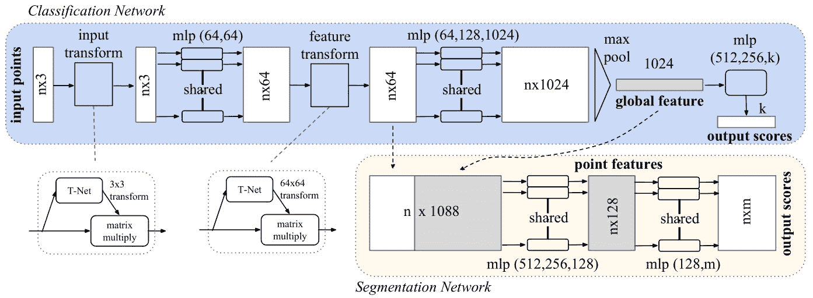
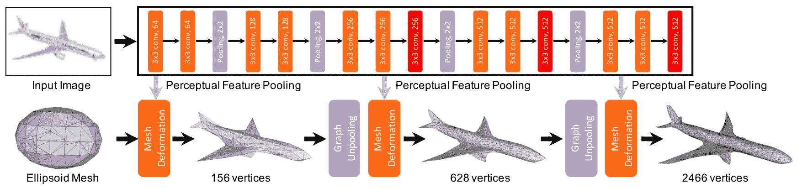
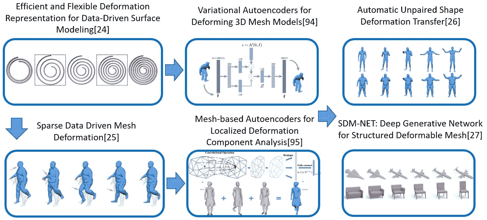
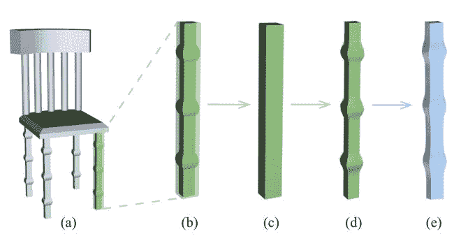
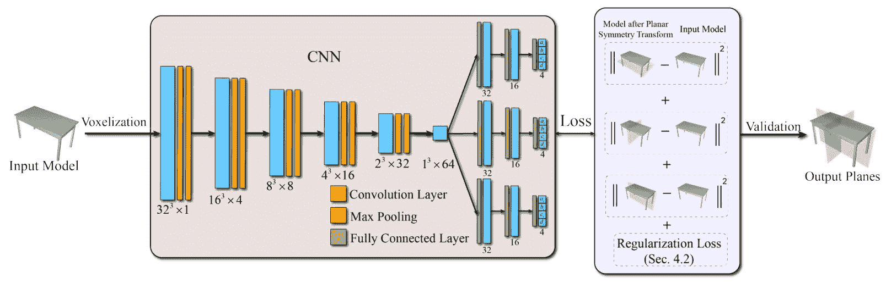

<!--yml

类别: 未分类

日期: 2024-09-06 20:02:22

-->

# [2002.07995] 1 引言

> 来源：[`ar5iv.labs.arxiv.org/html/2002.07995`](https://ar5iv.labs.arxiv.org/html/2002.07995)

\headevenname

Xiao et al.

\MakePageStyle\MakeAbstract

研究人员现在在使用深度学习处理 2D 图像方面取得了巨大的成功。近年来，3D 计算机视觉和几何深度学习获得了越来越多的关注。许多先进的 3D 形状技术已被提出用于不同的应用。与可以通过规则的像素网格均匀表示的 2D 图像不同，3D 形状有各种表示方式，如深度图和多视角图像、体素表示、点云表示、网格表示、隐式表面表示等。然而，不同应用的性能在很大程度上取决于所使用的表示，并且没有一种唯一的表示适用于所有应用。因此，在本综述中，我们从表示的角度回顾了 3D 几何深度学习的最新发展，总结了不同表示在不同应用中的优缺点。我们还介绍了这些表示中的现有数据集，并进一步讨论了未来的研究方向。

\MakeKeywords

3D 表示、几何学习、神经网络、计算机图形学

## 1 引言

最近在 3D 模型获取和渲染方法上的改进导致了包含大量 3D 形状的整合库在互联网的出现。随着 3D 模型的可用性增加，我们在医学、建筑和娱乐等多个领域看到了对 3D 模型处理、生成和可视化需求的爆炸性增长。3D 形状的匹配、识别和操作技术已经成为现代计算机视觉和计算机图形系统中的基础构件。由于 3D 形状数据的复杂性和不规则性，如何有效地表示 3D 形状仍然是一个具有挑战性的问题。因此，已经有大量的研究工作集中在如何基于不同的表示方法处理和生成 3D 形状上。

在早期的 3D 形状表示研究中，3D 对象通常采用全局方法进行建模，如构造固体几何和变形超二次体。这些方法在用于识别和检索等任务时有若干缺点。首先，在表示不完美的 3D 形状时，包括那些常见的噪声和不完整性，这些表示可能会对匹配性能产生负面影响。其次，高维性严重负担计算，并倾向于使模型过拟合。因此，设计了更复杂的方法来提取 3D 形状的表示，使其更简洁，但又具有区分性和信息性。

已经出版了几篇相关的调查文章 [9, 1, 35]，它们集中于深度学习在三维几何方面的不同方面。此外，随着三维形状表示和深度学习相关技术的快速发展，进一步总结最新的研究工作变得尤为重要。在这项调查中，我们主要回顾了三维形状表示的深度学习方法，并讨论了它们在不同应用场景下的优缺点。我们现在简要总结了不同的三维形状表示类别。

深度图和多视角图像可以用来在二维领域中表示三维模型。图像的规则结构使得它们能够高效处理。根据是否包含深度图，三维形状可以通过不同视角下的 RGB（颜色）或 RGB-D（颜色和深度）图像来呈现。由于 2.5D 传感器（如微软 Kinect、英特尔 RealSense 等）的普及，使得大量深度数据涌现，多视角 RGB-D 图像被广泛用于表示现实世界的三维形状。可以利用这种表示方式来发挥图像处理模型的大量资产。但不可避免地，这种表示方式会丢失一些几何特征。

体素是像素概念的三维扩展。与二维中的像素类似，基于体素的表示在三维空间中也具有规则结构。已经在二维图像领域中证明有效的某些神经网络架构 [48, 50] 可以很容易地扩展到体素形式。然而，增加一个维度意味着数据量呈指数增长。随着分辨率的提高，所需的内存和计算成本急剧增加，这限制了三维形状表示仅适用于低分辨率。

基于表面的表示通过编码三维形状的表面来描述三维形状，这也可以被视为二维流形。点云和网格都是三维形状表面的离散化形式。点云使用一组采样的三维点坐标来表示表面。它可以通过扫描仪轻松生成，但由于缺乏顺序和连接信息，处理起来困难。研究人员使用顺序不变的运算符，例如深度神经网络中的最大池化运算符 [75, 77] 来缓解缺乏顺序的问题。与点云和体素相比，网格可以以更少的内存和计算成本描绘更高质量的三维形状。一个网格包含一个顶点集和一个边集。由于其图形特性，研究人员尝试构建基于图的卷积神经网络来处理网格。其他一些方法将网格视为二维流形的离散化。此外，网格更适合三维形状变形。可以通过变换顶点来变形一个网格模型，同时保持连接性。

隐式表面表示利用隐式场函数，如占用函数[67]和有符号距离函数[116]，来描述 3D 形状的表面。深度神经网络学习的隐式函数定义了点与表面之间的空间关系。它们在合理的内存消耗下提供了具有无限分辨率的 3D 形状描述，并能够表示拓扑变化的形状。然而，隐式表示无法直接反映 3D 形状的几何特征，通常需要转换为显式表示，如网格。大多数方法应用等值面提取，如行进立方体[58]，这是一项昂贵的操作。

结构化表示。应对复杂的 3D 形状的一种方法是将其分解为结构和几何细节，从而得到结构化表示。近年来，越来越多的方法将 3D 形状视为部件的集合，并将其线性或层次性地组织起来。3D 形状的结构由递归神经网络（RNNs）[121]、递归神经网络（RvNNs）[51]或其他网络架构处理。形状的每个部分可以由非结构化模型处理。结构化表示关注于 3D 形状内部不同部分之间的关系（例如对称、支撑、被支撑等），相比于其他表示方法，它提供了更好的描述能力。

基于变形的表示。与诸如椅子和桌子等刚性人造 3D 形状不同，还有大量非刚性（例如关节）3D 形状，如人体，这些形状在计算机动画、增强现实等领域也发挥着重要作用。基于变形的表示主要用于描述固有的变形属性，同时忽略外在的变换属性。许多方法使用旋转不变的局部特征来描述形状变形，以减少扭曲并同时保持几何细节。

最近，深度学习在许多领域，包括 3D 形状分析、重建等方面，相较于经典方法取得了卓越的性能。已经设计了多种深度网络架构来处理或生成 3D 形状表示，我们称之为*几何学习*。在接下来的章节中，我们将更多地关注基于深度学习的最新方法，用于以不同形式表示和处理 3D 形状。根据表示的编码和存储方式，我们的综述按以下结构组织：第二部分回顾了基于图像的形状表示方法。第三部分和第四部分分别介绍了体素基和表面基的表示方法。第五部分进一步介绍了隐式表面表示方法。第六部分和第七部分回顾了基于结构和基于变形的描述方法。接着，在第八部分中总结了典型的数据集，在第九部分中总结了形状分析和重建的典型应用，然后在第十部分中总结全文。图 1 总结了基于各种 3D 形状表示的代表性深度学习方法的时间线。

`<svg height="322.23" overflow="visible" version="1.1" width="729.7"><g transform="translate(0,322.23) matrix(1 0 0 -1 0 0) translate(4.61,0) translate(0,5)"><g stroke="#000000" fill="#000000" stroke-width="0.4pt"><g transform="matrix(1.0 0.0 0.0 1.0 25.53 168.27)" fill="#000000" stroke="#000000" color="#B3B3B3"><foreignobject width="27.67" height="8.92" transform="matrix(1 0 0 -1 0 16.6)" overflow="visible">2015</foreignobject></g><g transform="matrix(1.0 0.0 0.0 1.0 143.64 137.77)" fill="#000000" stroke="#000000" color="#B3B3B3"><foreignobject width="27.67" height="8.92" transform="matrix(1 0 0 -1 0 16.6)" overflow="visible">2016</foreignobject></g><g transform="matrix(1.0 0.0 0.0 1.0 261.75 168.27)" fill="#000000" stroke="#000000" color="#B3B3B3"><foreignobject width="27.67" height="8.92" transform="matrix(1 0 0 -1 0 16.6)" overflow="visible">2017</foreignobject></g><g transform="matrix(1.0 0.0 0.0 1.0 379.86 137.77)" fill="#000000" stroke="#000000" color="#B3B3B3"><foreignobject width="27.67" height="8.92" transform="matrix(1 0 0 -1 0 16.6)" overflow="visible">2018</foreignobject></g><g transform="matrix(1.0 0.0 0.0 1.0 497.97 168.27)" fill="#000000" stroke="#000000" color="#B3B3B3"><foreignobject width="27.67" height="8.92" transform="matrix(1 0 0 -1 0 16.6)" overflow="visible">2019</foreignobject></g></g><g stroke="#FF0000" fill="#FF0000" stroke-width="1.42264pt" color="#FF0000"><g transform="matrix(1.0 0.0 0.0 1.0 52.84 303.97)" fill="#000000" stroke="#000000"><foreignobject width="58.81" height="11.07" transform="matrix(1 0 0 -1 0 16.6)" overflow="visible">depth map</foreignobject></g></g><g stroke="#FF8000" fill="#FF8000" stroke-width="1.42264pt" color="#FF8000"><g transform="matrix(1.0 0.0 0.0 1.0 52.84 292.16)" fill="#000000" stroke="#000000"><foreignobject width="98.31" height="11.07" transform="matrix(1 0 0 -1 0 16.6)" overflow="visible">multi-view images</foreignobject></g></g><g stroke="#00FFFF" fill="#00FFFF" stroke-width="1.42264pt" color="#00FFFF"><g transform="matrix(1.0 0.0 0.0 1.0 52.84 280.35)" fill="#000000" stroke="#000000"><foreignobject width="109.8" height="11.07" transform="matrix(1 0 0 -1 0 16.6)" overflow="visible">voxel representation</foreignobject></g></g><g stroke="#00FF00" fill="#00FF00" stroke-width="1.42264pt" color="#00FF00"><g transform="matrix(1.0 0.0 0.0 1.0 52.84 268.71)" fill="#000000" stroke="#000000"><foreignobject width="110.49" height="10.74" transform="matrix(1 0 0 -1 0 16.6)" overflow="visible">point representation</foreignobject></g></g><g stroke="#0000FF" fill="#0000FF" stroke-width="1.42264pt" color="#0000FF"><g transform="matrix(1.0 0.0 0.0 1.0 214.26 303.97)" fill="#000000" stroke="#000000"><foreignobject width="109.52" height="11.07" transform="matrix(1 0 0 -1 0 16.6)" overflow="visible">mesh representation</foreignobject></g></g><g stroke="#D9668C" fill="#D9668C" stroke-width="1.42264pt" color="#D9668C"><g transform="matrix(1.0 0.0 0.0 1.0 214.26 292.16)" fill="#000000" stroke="#000000"><foreignobject width="83.47" height="11.07" transform="matrix(1 0 0 -1 0 16.6)" overflow="visible">implicit surface</foreignobject></g></g><g stroke="#BF8040" fill="#BF8040" stroke-width="1.42264pt" color="#BF8040"><g transform="matrix(1.0 0.0 0.0 1.0 214.26 280.35)" fill="#000000" stroke="#000000"><foreignobject width="137.96" height="11.07" transform="matrix(1 0 0 -1 0 16.6)" overflow="visible">structured representation</foreignobject></g></g><g stroke="#333333" fill="#333333" stroke-width="1.42264pt" color="#333333"><g transform="matrix(1.0 0.0 0.0 1.0 214.26 268.54)" fill="#000000" stroke="#000000"><foreignobject width="147.19" height="11.07" transform="matrix(1 0 0 -1 0 16.6)" overflow="visible">deformation representation</foreignobject></g></g> <g stroke="#00FFFF" fill="#00FFFF" stroke-width="1.42264pt" color="#00FFFF"><g transform="matrix(1.0 0.0 0.0 1.0 0 118.58)" fill="#00FFFF" stroke="#00FFFF"><foreignobject width="118.11" height="16.6" transform="matrix(1 0 0 -1 0 16.6)" overflow="visible">3D ShapeNets[112] <g stroke="#FF8000" fill="#FF8000" stroke-width="1.42264pt" color="#FF8000"><path d="M 66.93 157.48 L 66.93 181.1" style="fill:none"><g transform="matrix(1.0 0.0 0.0 1.0 27.56 193.62)" fill="#FF8000" stroke="#FF8000"><foreignobject width="118.11" height="16.6" transform="matrix(1 0 0 -1 0 16.6)" overflow="visible">MVCNN[93]</foreignobject></g></path></g> <g stroke="#0000FF" fill="#0000FF" stroke-width="1.42264pt" color="#0000FF"><path d="M 66.93 200.79 L 66.93 224.41" style="fill:none"><g transform="matrix(1.0 0.0 0.0 1.0 27.56 236.92)" fill="#0000FF" stroke="#0000FF"><foreignobject width="78.74" height="16.6" transform="matrix(1 0 0 -1 0 16.6)" overflow="visible">GCNN[61]</foreignobject></g></path></g> <g stroke="#FF0000" fill="#FF0000" stroke-width="1.42264pt" color="#FF0000"><path d="M 106.3 157.48 L 106.3 118.11" style="fill:none"><g transform="matrix(1.0 0.0 0.0 1.0 47.24 102.83)" fill="#FF0000" stroke="#FF0000"><foreignobject width="118.11" height="16.6" transform="matrix(1 0 0 -1 0 16.6)" overflow="visible">Eigen et al.[20]</foreignobject></g></path></g> <g stroke="#000000" fill="#000000" stroke-width="1.42264

图 1：基于深度学习的各种 3D 形状表示方法的时间线。

## 2 基于图像的方法

2D 图像是 3D 实体的投影。虽然单张图像所携带的几何信息是不完整的，但可以从一组不同视角的图像中推断出一个合理的 3D 形状。RGB-D 数据中的深度通道进一步增强了基于图像的表示在编码几何线索方面的能力。由于其类似图像的结构，使用深度神经网络从图像中进行 3D 形状推断的研究早于那些可以明确描绘 3D 形状表面或几何的替代表示方法。

Socher 等人[89]提出了一种卷积和递归神经网络用于 3D 对象识别，该网络通过单独的卷积层处理 RGB 和深度图像，并通过递归网络合并特征。Eigen 等人[20]首次提出从单张 RGB 图像重建深度图，并为训练阶段设计了一种新的尺度不变损失。Gupta 等人[37]将深度图编码为包括视差、高度和角度的三个通道。其他基于 RGB-D 图像的深度学习方法被设计用于 3D 对象检测[36, 91]，表现优于之前的方法。

从不同视角获取的图像可以提供互补线索以推断 3D 对象。得益于深度学习模型在 2D 领域的发展，基于多视图图像表示的学习方法在 3D 形状识别应用中表现优于基于其他 3D 表示的方法。Su 等人[93]提出了 MVCNN（多视图卷积神经网络）用于 3D 对象识别。MVCNN 首先通过 CNN 的第一部分分别处理不同视角的图像，然后通过视图池化层聚合从不同视角提取的特征，最后将合并后的特征输入到 CNN 的剩余部分。Qi 等人[76]提出在 MVCNN 中加入多分辨率以提高分类准确性。

## 3 体素基表示

### 3.1 密集体素表示

体素基表示传统上是一种密集表示，它通过 3D 空间中的体积网格描述 3D 形状数据。网格中的每个体素记录了在立方体网格内的占用状态（例如，已占用或未占用）。

应用深度神经网络到体积表示的最早方法之一是由吴等人于 2015 年提出的，这种方法称为 3D ShapeNets。吴等人将体积表示中的体素分配为三种不同的状态：已观察、未观察和自由。3D ShapeNets 将深度置信网络（DBN）从像素数据扩展到体素数据，并将 DBN 中的全连接层替换为卷积层。该模型将上述体积表示作为输入，通过迭代计算输出类别标签和预测的 3D 形状。与此同时，Maturana 等人提出使用 3D 卷积神经网络（3D CNNs）处理体积表示，并设计了用于物体识别的 VoxNet。VoxNet 定义了几个体积层，包括输入层、卷积层、池化层和全连接层。虽然这些定义的层是将传统的 2D CNNs 扩展到 3D 的简单扩展，但 VoxNet 易于实现和训练，并在体积卷积的首次尝试中取得了有希望的性能。此外，为了确保 VoxNet 对方向的不变性，Maturana 等人在训练阶段通过将每个形状旋转成$n$个不同方向的实例来扩充输入数据，并在输出层后添加一个池化操作，以在测试阶段将所有来自$n$个实例的预测结果进行分组。

除了基于体积表示的形状分析中深度置信网络和卷积神经网络的发展外，两个最成功的生成模型，即自编码器和生成对抗网络（GANs）也被扩展以支持这种表示。受去噪自编码器（DAEs）的启发，Sharma 等人提出了一种自编码器模型 VConv-DAE，用于处理体素。这是我们所知的最早的体素基础形状分析的无监督学习方法之一。在没有对象标签进行训练的情况下，VConv-DAE 选择均方误差或交叉熵损失作为重建损失函数。Girdhar 等人还提出了 TL-embedding 网络，该网络结合了一个自编码器用于生成基于体素的表示和一个卷积神经网络用于从 2D 图像中预测嵌入。

Choy 等人[16] 提出了 3D-R2N2，该方法将单张或多张图像作为输入，并在占据网格中重建物体。3D-R2N2 将输入图像视为一个序列，并基于 LSTM（长短期记忆）[42] 或 GRU（门控递归单元）[15] 设计了 3D 递归神经网络。该架构包括三个部分：一个图像编码器用于从 2D 图像中提取特征，3D-LSTM 用于预测隐藏状态作为最终 3D 模型的粗略表示，以及一个解码器用于增加分辨率并生成目标形状。

Wu 等人[110] 设计了一个名为 3D-GAN 的生成模型，该模型将生成对抗网络（GAN）[33] 应用于体素数据。3D GAN 学会从采样的潜在空间向量 $z$ 中合成一个 3D 物体，且概率分布为 $P(z)$。此外，[110] 还提出了受 VAE-GAN[49] 启发的 3D-VAE-GAN，用于物体重建任务。3D-VAE-GAN 在 3D-GAN 之前放置了编码器，用于从输入的 2D 图像中推断潜在向量 $z$，并与 3D-GAN 的生成器共享解码器。

在早期处理体积表示的深度学习尝试之后，研究人员开始优化体积网络的架构，以提高性能和拓展应用。一个动机是，传统 2D 领域网络的简单扩展往往不如基于图像的 CNNs（如 MVCNN[93]）表现得更好。影响性能的主要挑战包括过拟合、方向、数据稀疏性和低分辨率。

Qi 等人[76] 提出了两种新的网络结构，旨在提高体积卷积神经网络（CNNs）的性能。其中一种引入了一个额外的任务，即利用子体积空间预测类别标签，以防止过拟合；另一种则利用延长的卷积核将 3D 信息压缩到 2D 领域中，以便直接使用 2D CNNs。这两种方法都使用了 mlpconv 层[55] 来替代传统的卷积层。[76] 还通过不同的方向和高度来增强输入数据，以鼓励网络在不同的姿态下获取更多的局部特征，从而使结果不易受到方向变化的影响。为了进一步减轻方向对识别准确性的影响，[82] 提出了一个名为 ORION 的新模型，该模型扩展了 VoxNet[63]，并使用全连接层同时预测物体类别标签和方向标签。

### 3.2 稀疏体素表示（Octree）

基于体素的表示通常会导致高计算成本，因为从像素到体素的计算量呈指数增长。大多数方法无法应对或在合理时间内生成高分辨率模型。例如，TL-embedding Network [32] 设计用于 $20^{3}$ 体素网格；3DShapeNets [112] 和 VConv-DAE [83] 设计用于 $24^{3}$ 体素网格，每个方向上有 3 体素填充；VoxNet [63]、3D-R2N2 [16] 和 ORION [82] 设计用于 $32^{3}$ 体素网格；3D-GAN 设计用于生成 $64^{3}$ 占据网格作为 3D 形状表示。随着体素分辨率的增加，占据网格在整个 3D 空间中变得更加稀疏，从而导致更多不必要的计算。为了解决这个问题，Li 等人 [54] 设计了一种新方法，称为 FPNN，以应对数据稀疏性。

一些方法则通过稀疏的自适应数据结构，即八叉树 [64]，来编码体素网格，从而减少输入数据的维度。Häne 等人 [38] 提出了层次表面预测（HSP），可以从粗到细生成八叉树形式的体素网格。Häne 等人观察到，仅需对靠近物体表面的体素进行高分辨率预测，因此提出的 HSP 可以避免不必要的计算，以确保高分辨率体素网格的生成是可承受的。如 [38] 中介绍的，八叉树中的每个节点定义为一个体素块，具有固定数量（论文中为 $16^{3}$）的不同大小的体素，每个体素块被分类为占用、边界和自由。模型的解码器以特征向量作为输入，并分层预测对应于体素块的特征块。HSP 定义八叉树有 5 层，每个体素块包含 $16^{3}$ 个体素，因此，HSP 可以生成最多 $256^{3}$ 体素网格。Tatarchenko 等人 [98] 还提出了一种名为 OGN 的解码器，用于生成高分辨率体积表示。在 [98] 中，八叉树中的节点分为三类，包括“空”、“填充”和“混合”。表示 3D 模型的八叉树和八叉树的特征图以哈希表的形式存储，这些哈希表由空间位置和八叉树级别索引。为了处理表示为哈希表的特征图，Tatarchenko 等人设计了一种名为 OGN-Conv 的卷积层，将卷积操作转换为矩阵乘法。[98] 采用的方法是在每个解码器层中通过特征图的卷积操作生成不同分辨率的体素网格，然后根据特定标签决定是否将特征传播到下一层（如果是“边界”则传播特征，如果是“混合”则跳过特征传播）。

除了用于合成体素网格的解码器模型设计外，形状分析方法也使用八叉树进行设计。然而，传统的八叉树结构[64]在深度网络中难以使用，因此许多研究人员尝试通过设计新的八叉树结构和特殊操作（如卷积、池化和反池化）来解决这个问题。Riegler 等人[80]提出了 OctNet。[80]中提到的八叉树表示相比传统八叉树具有相对规则的结构，它将一个浅层八叉树放置在规则的三维网格中。该浅层八叉树限制最多有 3 个层级，并以 73 位进行编码。每一位决定相应的单元是否需要拆分。Wang 等人[105]还提出了一种基于八叉树的卷积神经网络，称为 O-CNN，其中模型也去除了类似于浅层八叉树[80]的指针，并通过包括洗牌键向量、标签和输入信号的一系列向量来存储八叉树数据和结构。

除了表示体素外，八叉树结构还可以用于表示带有平面补丁的三维形状表面。Wang 等人[106]提出了自适应 O-CNN，他们定义了另一种形式的八叉树，称为补丁引导自适应八叉树，该树将三维形状表面划分为一组由对应于八分体的边界框限制的平面补丁。他们还为本文定义的八叉树提供了一个编码器和解码器。

## 4 基于表面的表示

### 4.1 基于点的表示

典型的基于点的表示也被称为点云或点集。它们可以是由三维扫描设备生成的原始数据。由于其无序和不规则的结构，这种表示方法相对较难被传统的深度学习方法处理。因此，大多数研究人员在深度学习基础的几何研究初期避免直接使用点云。2017 年出现了第一个通过深度学习生成点云的模型[21]。他们设计了一种神经网络，用于学习基于三维形状点分布的点采样器。该网络以单张图像和一个随机向量作为输入，输出一个$N\times 3$矩阵，表示预测的点集（$N$个点的$x$、$y$、$z$坐标）。此外，[21]提出使用 Chamfer 距离（CD）和地球搬运工距离（EMD）[81]作为损失函数来训练网络。

PointNet。几乎在同一时间，Qi 等人[75]提出了用于形状分析的 PointNet，这是第一个成功的深度网络架构，直接处理点云而无需不必要的渲染。PointNet 的管道如图 2 所示。根据[75]中提到的点集的三个属性，PointNet 在其网络中设计了三个组件，包括使用最大池化层作为对无序属性进行处理的对称函数，将全局和局部特征连接在一起以进行点间交互，并联合对齐网络以实现变换不变性。在 PointNet 的基础上，Qi 等人进一步改进了该模型，提出了 PointNet++[77]，以解决 PointNet 无法有效捕捉和处理由度量引起的局部特征的问题。与 PointNet 相比，PointNet++引入了分层结构，使得模型能够捕捉不同尺度的特征，从而提高了提取 3D 形状特征的能力。由于 PointNet 和 PointNet++在形状分类和语义分割中表现出最先进的性能，越来越多基于点表示的深度学习模型被提出。

图 2：PointNet 的管道参考[75]，©IEEE 2017。

点云的卷积神经网络。一些研究工作专注于将 CNN 应用于点云的非规则和无序形式进行分析。Li 等人[53]提出了用于点云的 PointCNN，并设计了$\mathcal{X}$-transformation 来加权和排列输入点特征，这保证了不同点顺序下的等变性。每个特征矩阵在通过卷积操作符之前需要乘以$\mathcal{X}$-transformation 矩阵。这个过程被称为$\mathcal{X}$-Conv 操作符，是 PointCNN 的关键。Wang 等人[108]提出了 DGCNN，一种用于点云分类和分割的动态图 CNN 架构。与处理点特征的 PointNet[75]不同，DGCNN 首先在空间或语义空间中连接邻近点以生成图，然后通过在图上应用 EdgeConv 操作符来捕捉局部几何特征。此外，与其他处理固定输入图的图 CNN 不同，DGCNN 在不同层中改变图以获得特征空间中新邻近点，这有助于获得更大且更稀疏的感受野。

使用神经网络的其他点云处理技术。Klokov 等人 [47] 提出了 Kd-Network，用于基于 kd 树的点云处理。Yang 等人 [117] 提出了 FoldingNet，这是一种端到端的自编码器，用于通过无监督学习进一步压缩基于点的表示。由于点云可以通过折叠操作转换为 2D 网格，FoldingNet 在其编码器-解码器中集成了折叠操作以恢复输入的 3D 形状。Mehr 等人 [65] 进一步提出了 DiscoNet，通过结合多个针对不同类型 3D 形状专门训练的自编码器进行 3D 模型编辑。这些自编码器使用训练 3D 形状的预学习平均几何形状作为其模板。Meng 等人 [66] 提出了 VV-Net（体素 VAE 网络）用于点分割，该方法通过结构化体素表示来表示点云。在 VV-Net 中，它使用由 RBF-VAE 计算的潜在代码来描述体素内的点分布，而不是像常规体积表示那样包含一个布尔值来表示每个体素的占用状态。该表示方法用于通过群等变 CNN 提取点云的内在对称性，并将输出与 PointNet [75] 结合，以获得更好的分割性能。

尽管基于点的表示方法比其他 3D 表示方法更容易通过 3D 扫描仪获得，但由于噪声和数据稀疏，这种原始的 3D 形状形式通常不适合 3D 形状分析。因此，与其他表示方法相比，基于点的表示方法必须结合上采样模块以获取细粒度的点云，例如 PU-NET [119]、MPU [118]、PU-GAN [52]等。此外，点云配准也是一个重要的预处理步骤，例如，融合多个扫描点，旨在计算刚性变换参数以对齐点云。Wang 等人 [107] 提出了 Deep Closest Point (DCP)，该方法扩展了传统的迭代最近点（ICP）方法 [4]，并使用深度学习方法获得变换参数。最近，Guo 等人 [35] 提出了一个重点关注点云中的深度学习模型的调查，提供了该领域的更多细节。

### 4.2 基于网格的表示方法

与基于点的表示方法相比，基于网格的表示方法包含邻近点之间的连通性，因此更适合描述表面上的局部区域。作为非欧几里得空间中的典型表示类型，基于网格的表示方法可以在空间和谱域中通过深度学习模型进行处理 [9]。

网格的参数化表示。将 CNNs 直接应用于像网格这样的不规则数据结构并不简单，因此出现了一些将 3D 形状表面映射到 2D 域的方法，例如可以视为另一种 3D 形状表示的 2D 几何图像，并在其上应用传统的 2D CNNs[87, 60]。基于几何图像，Sinha 等人[88] 提出了 SurfNet，用于通过深度残差网络生成形状。类似地，Shi 等人[84] 将 3D 模型投影到圆柱全景图像中，由 CNNs 处理。一些其他方法将网格模型转换为球面信号，并在球面域中设计卷积操作符以进行形状分析。为了解决 3D 网格上的高分辨率信号，特别是纹理信息，Huang 等人[43] 提出了 TextureNet 以在这种情况下提取特征，其中定义了一个 4-旋转对称 (4-RoSy) 场来参数化表面。接下来，我们将回顾根据网格直接作为输入处理的深度学习模型，并介绍在网格上工作的生成模型。

图形。基于网格的表示是通过顶点和边的集合构建的，可以视为一种图形。基于图谱定理提出了一些模型。这些模型通过对拉普拉斯矩阵的特征分解来推广图形上的 CNNs[10, 40, 18, 46, 2]，能够将卷积操作符推广到图形的谱域。Verma 等人[100] 提出了另一种基于图形的 CNN，名为 FeaStNet，该网络动态计算卷积操作符的感受野。具体来说，FeaStNet 通过使用在网络中获得的特征来确定邻居顶点的分配。Hanocka 等人[39] 还为三角网格设计了卷积、池化和反池化操作符，并提出了 MeshCNN。与其他基于图形的方法不同，MeshCNN 侧重于处理存储在边上的特征，并提出了一种应用于具有固定数量邻居的边的卷积操作符，以及一种基于边收缩的池化操作符。MeshCNN 根据特定任务提取 3D 形状特征，并使网络学习保留重要特征而忽略不重要的特征。

2-流形。

生成模型。对于基于网格的表示，也有许多生成模型。Wang 等人[104] 提出了 Pixel2Mesh 用于从单张图像重建 3D 形状，该模型通过变形椭球体模板来生成目标三角网格。如图 3 所示，Pixel2Mesh 网络基于图卷积网络（GCNs）[9] 实现，通过一个反池化操作从粗糙到精细地生成目标网格。Wen 等人[109] 对 Pixel2Mesh 进行了改进，提出了 Pixel2Mesh++，将单图像 3D 形状重建扩展到多视图图像的 3D 形状重建。为了实现这一点，Pixel2Mesh++ 在原始 Pixel2Mesh 中引入了多视图变形网络（MDN），MDN 将视图间的信息融入网格生成过程。Groueix 等人[34] 提出了 AtlasNet，通过多个贴片生成 3D 表面。AtlasNet 通过 MLP（多层感知机）学习将 2D 方形贴片转换为 2-流形，以覆盖 3D 形状的表面。Ben-Hamu 等人[3] 提出了一个多图表生成模型用于 3D 形状生成。该方法使用多图表结构作为输入，并基于标准图像 GAN[33] 构建网络架构。3D 表面与多图表结构之间的转换基于 [60]。然而，基于将模板网格变形为目标形状的方法无法表达某些 3D 形状的复杂拓扑。Pan 等人[73] 提出了一个新的单视图重建方法，该方法结合了变形网络和拓扑修改网络来建模具有复杂拓扑的网格。在拓扑修改网络中，高度扭曲的面会被移除。Tang 等人[97] 提出了通过骨架桥接学习方法生成复杂拓扑网格，因为骨架能够很好地保留拓扑信息。Nash 等人[71] 提出了 PolyGen 来生成多边形网格表示。受到自然语言处理等领域的神经自回归模型的启发，研究人员将网格生成视为一个序列，并设计了一个基于变换器的网络[99]，包括一个顶点模型和一个面模型。顶点模型生成顶点位置的序列，面模型生成基于输入顶点的可变长度顶点序列。

图 3: Pixel2Mesh 的流程 [104] ©Springer 2018。

## 5 隐式表示

除了点云和网格等显式表示外，隐式场在近期研究中越来越受欢迎。一个主要原因是隐式表示不受固定拓扑和分辨率的限制。越来越多的深度模型定义了自己的隐式表示，并在此基础上进一步提出了各种形状分析和生成的方法。

占用/指示函数是隐式表示三维形状的一种形式。Mescheder 等人提出了占用网络（Occupancy Network）[67]，通过神经网络学习一个连续的占用函数作为三维形状的新表示形式。占用函数反映了相对于三维形状表面的三维点状态，其中 1 表示在表面内部，0 表示在外部。研究人员将这个问题视为一个二分类任务，并设计了一个占用网络，该网络输入三维点位置和三维形状观测，并输出占用的概率。生成的隐式场随后通过多分辨率等值面提取方法 MISE 和 marching cubes 算法[58]处理以获得网格。此外，研究人员引入编码器网络以获得潜在的嵌入。类似地，Chen 等人[14]设计了 IM-NET 作为解码器来学习生成模型，该模型也采用了指示函数形式的隐式函数。

符号距离函数（SDFs）也是一种隐式表示形式。符号距离函数将一个三维点映射到一个实际值，而不是概率，这个值表示三维表面的空间关系和距离。设$SDF(x)$为给定三维点$x\in\mathbb{R}^{3}$的符号距离值。则$SDF(x)>0$表示点$x$在三维形状表面之外，$SDF(x)<0$表示点$x$在表面内部，$SDF(x)=0$表示点$x$在表面上。$SDF(x)$的绝对值表示点$x$与表面之间的距离。Park 等人[74]提出了 DeepSDF，并引入了一种基于自编码器的 DeepSDF 作为新的三维形状表示。Wang 等人[116]还提出了基于 SDF 的深度隐式表面网络（DISNs），用于单视角三维重建。由于 SDF 的优势，DISN 首次在单视角重建任务中重建了具有灵活拓扑和细结构的三维形状，这对于其他三维表示来说是困难的。

函数集。占据函数和带符号距离函数通过深度神经网络学习的单个函数来表示 3D 形状表面。Genova 等人[31, 30]提出通过组合一组形状元素来表示整个 3D 形状。在[31]中，研究人员提出了结构化隐式函数（SIFs），其中每个元素由缩放的轴对齐各向异性 3D 高斯表示，这些形状元素的总和表示整个 3D 形状。高斯的参数由 CNN 学习。[30]改进了 SIF，并提出了深度结构化隐式函数（DSIFs），它添加了深度神经网络作为深度隐式函数（DIFs）以提供局部几何细节。总之，DSIF 利用 SIF 描绘每个形状元素的粗略信息，并应用 DIF 来获取局部形状细节。

无需 3D 监督的方法。上述隐式表示模型需要在 3D 形状边界框内采样 3D 点作为真实数据，并用 3D 信息对模型进行监督训练。但在某些情况下，获取 3D 真实数据可能并不容易。刘等人[56]提出了一种框架，可以在没有显式 3D 监督的情况下学习隐式表示。该模型使用场探测算法弥合 3D 形状和 2D 图像之间的差距，并设计了轮廓损失以约束 3D 形状的轮廓，同时设计了几何正则化以约束表面保持合理。

## 6 基于结构的表示

最近，越来越多的研究人员开始认识到 3D 形状结构的重要性，并将结构信息整合到深度学习模型中。原始表示是基于结构的表示的一种典型类型，它很好地描述了 3D 形状的结构。原始表示通过如定向 3D 盒子等原始元素来表示 3D 形状。原始表示不提供几何细节的描述，而是更关注 3D 形状的整体结构。它将 3D 形状结构表示为具有紧凑参数集的几个原始元素。更重要的是，获得原始表示有助于生成更详细和合理的 3D 形状。

线性组织。观察到人类常常将 3D 形状视为部件的集合，Zou 等人 [121] 提出了 3D-PRNN，它在原始生成器中应用 LSTM，从而使 3D-PRNN 能够顺序生成原始体素。生成的原始体素表示在描绘简单和规则的 3D 形状时表现出极大的效率。Wu 等人 [111] 进一步提出了一种基于 RCNN 的方法，称为 PQ-NET，也将 3D 形状部分视为一个序列。不同之处在于 PQ-NET 在网络中编码几何特征。Gao 等人 [27] 提出了一个深度生成模型，名为 SDM-NET（结构可变形网）。他们设计了一个两级 VAE，包括用于部分几何的 PartVAE 和用于结构与几何特征的 SP-VAE（结构部分 VAE）。在 [27] 中，每个形状部分都以良好设计的形式进行编码，记录了结构信息（对称、支持和被支持）和几何特征。

层次组织。Li 等人 [51] 提出了 GRASS（生成递归自编码器用于形状结构），这是通过神经网络对 3D 形状结构进行编码的首批尝试之一。他们通过层次二叉树描述形状结构，其中子节点通过邻接或对称关系合并到父节点。这个结构树中的叶子节点表示每个部分的定向包围盒（OBBs）和几何特征，中间节点表示子节点的几何特征以及子节点之间的关系。受到递归神经网络（RvNNs） [90, 89] 的启发，GRASS 也递归地将表示 OBB 的代码合并成一个根代码，描述整个形状结构。GRASS 的架构可以分为三部分：（1）一个 RvNN 自编码器用于将 3D 形状编码为固定长度的代码，（2）一个 GAN 用于学习根代码的分布并生成合理的结构，（3）另一个自编码器用于合成每个部分的几何形状，这受到 [32] 的启发。此外，为了在体素网格中合成细粒度几何，提出了结构感知递归特征（SARF），它包含每个部分的几何特征以及全局和局部 OBB 布局。

然而，GRASS [51] 使用二叉树来组织部分结构，这导致了歧义。因此，二叉树不适合大规模数据集。为了解决这个问题，Mo 等人 [68] 提出了 StructureNet，它以图的形式组织层级结构。

陈等人提出的 BSP-Net（Binary Space Partitioning-Net）[13]是首个描绘锐利几何特征的方法，它通过 BSP 树组织的凸体构建 3D 形状。在[13]中定义的 Binary Space Partitioning（BSP）树用于通过凸体集合表示 3D 形状，包含三个层次，即超平面提取、超平面分组和形状组装。这些凸体也可以视为一种新的原始形式，可以表示 3D 形状的几何细节，而非一般结构。

结构与几何。研究人员尝试分别[51]或联合[113]编码 3D 形状的结构和几何特征。王等人[103]提出了 Global-to-Local（G2L）生成模型，从粗到细生成人工 3D 形状。为了解决 GAN 无法很好生成几何细节的问题[110]，G2L 首先应用 GAN 生成带有语义标签的粗略体素网格，表示全局级别的形状结构，然后将按语义标签分隔的体素输入到一个称为 Part Refiner（PR）的自编码器中，以局部级别优化部件几何细节。吴等人[113]提出了 SAGNet 用于详细的 3D 形状生成，通过 GRU[15]架构联合编码结构和几何，以发现它们之间的内在关系。SAGNet 在榫卯接头上的表现优于其他基于结构的学习方法。

## 7 基于形变的表示

可变形的 3D 模型在计算机动画中扮演着重要角色。然而，上述大多数方法主要关注于刚性 3D 模型，而对非刚性模型的形变关注较少。与其他表示方法相比，基于形变的表示通过参数化形变信息，在处理非刚性 3D 形状（如关节模型）时表现更好。

基于网格的形变描述。网格可以被视为一个图，这在操作顶点位置的同时保持顶点之间的连接性时非常方便。因此，大量方法选择网格来表示可变形的 3D 形状。基于这一属性，一些基于网格的生成方法通过变形网格模板来生成目标形状[104, 109, 73, 27]，这些方法也可以被视为基于形变的方法。图结构使得将形变信息存储为顶点特征变得容易，这可以视为形变表示。高等人[24]设计了一种高效且旋转不变的形变表示，称为旋转不变网格差异（RIMD），它在形状重建、变形和配准中表现出色。基于[24]，谭等人[94]提出了 Mesh VAE 用于可变形形状分析和合成，它将 RIMD 作为 VAE 的特征输入，并使用全连接层作为编码器和解码器。此外，高等人[25]设计了一种尽可能一致的（ACAP）表示，以约束可变形网格中相邻顶点之间的旋转角度和旋转轴，使得图卷积可以轻松应用。谭等人[95]提出了基于 ACAP 表示[25]的 SparseAE，它应用了图卷积算子[19]来分析网格形变。高等人[26]提出了 VC-GAN（VAE CycleGAN）用于未配对的网格形变传递，这是首个自动网格形变传递的工作。该工作将 ACAP 表示作为输入，通过 VAE 对表示进行编码到潜在空间，然后在潜在空间领域中通过循环一致性和视觉相似性一致性传递源和目标之间的形变。高等人[27]首次将图中展示的几何细节视为形变[5]. 基于之前的技术[25, 26, 94, 95]，几何细节可以被编码和生成。[27]中的结构也以稳定可支持的方式进行了分析[44]。袁等人[120]将基于网格简化和图卷积的新设计的池化操作应用于 VAE 架构，这也将 ACAP 表示作为网络输入。谭等人[96]使用 ACAP 表示来模拟薄壳可变形材料，应用基于图的 CNN 将高维特征嵌入到低维特征中。除了考虑单个可变形网格外，网格序列在计算机动画中扮演着更重要的角色。而基于形变的表示 ACAP[25]适合于表示网格序列。乔等人[79]也将 ACAP 表示作为输入，通过双向 LSTM 网络生成网格动画序列。

图 4：ICT 中国科学院几何学习组关于基于变形的形状表示的研究工作。

图 5：通过在 SDM-NET 中变形边界框表示椅子腿的示例。（a）突出显示的椅子腿部，（b）(a)中突出显示的部分和叠加的边界框，（c）用作模板的边界框，（d）变形后的边界框，（e）恢复的形状。参考文献[27] ©ACM 2019

基于隐式表面的 approaches。随着隐式表面表示的发展，Jeruzalski 等[45] 提出了通过姿态参数表示关节可变形形状的方法，称为神经关节形状近似（NASA）。在[45]中提到的姿态参数记录了模型中定义的骨骼的变换。他们比较了三种不同的网络架构，包括非结构化模型（U）、分段刚性模型（R）和分段变形模型（D），在训练数据集和测试数据集中，这为表示可变形 3D 形状开辟了另一种方向。

## 8 数据集

随着 3D 扫描仪的发展，获取 3D 模型变得更加容易，因此提出了越来越多具有不同 3D 表示的 3D 形状数据集。更大的数据集带来了更多细节，这对现有技术提出了更多挑战，从而进一步推动了深度学习在不同 3D 表示上的发展。

数据集可以根据不同的表示和应用划分为几种类型。选择合适的数据集有利于基于学习的模型的性能和泛化。

RGB-D 图像。RGB-D 图像数据集可以通过深度传感器（如微软 Kinect）收集。大多数 RGB-D 图像数据集可以视为视频序列。室内场景 RGB-D 图像数据集 NYU Depth [85, 86] 首次用于分割问题，v1 版本[85] 收集了 64 个类别，而 v2 版本[86] 收集了 464 个类别。KITTI [29] 数据集提供了主要用于自动驾驶的户外场景图像，包括‘道路’、‘城市’、‘住宅’、‘校园’和‘人’五个类别。图像的深度图可以通过 KITTI 数据集提供的开发套件计算。KITTI 数据集还包含用于物体检测等应用的 3D 物体注释。ScanNet [17] 是一个大型注释 RGB-D 视频数据集，包含 1,513 个场景中的 2.5M 视图，具有 3D 相机姿态、表面重建和语义分割。另一个数据集 Human10 [11] 是从 10 个人体动作序列中采样的。

人工 3D 对象数据集。ModelNet [112] 是著名的 CAD 模型数据集之一，用于 3D 形状分析，包括 662 个类别的 127,915 个 3D CAD 模型。ModelNet 提供了两个子集，分别是 ModelNet10 和 ModelNet40。ModelNet10 包含来自整个数据集的 10 个类别，且 ModelNet10 中的 3D 模型是手动对齐的；ModelNet40 包含 40 个类别，3D 模型也经过对齐。ShapeNet [12] 提供了更大规模的数据集，包含超过 300 万个模型和 4000 多个类别。ShapeNet 还包含两个较小的子集：ShapeNetCore 和 ShapeNetSem。对于各种几何应用，ShapeNet [12] 提供了丰富的 3D 对象注释，包括类别标签、部件标签、对称信息等。ObjectNet3D [114] 是一个大规模的 3D 对象识别数据集，来自 2D 图像，包含 201,888 个 3D 对象，90,127 张图像和 44,147 种不同的 3D 形状。该数据集附有 3D 姿态参数，将 3D 对象与 2D 图像对齐。SUNCG [92] 包含完整的房间 3D 模型，适用于 3D 场景分析和场景完成任务。SUNCG 中的 3D 模型由密集的体素网格和对象注释表示。整个数据集包括 49,884 个有效楼层，404,058 个房间和 5,697,217 个对象实例。PartNet 提供了一个更详细的 CAD 模型数据集，具有细粒度的层次化部件注释，为 3D 对象应用如语义分割、形状编辑和形状生成带来了更多挑战和资源。3D-Future[23] 提供了一个大规模的家具数据集，包含 20,000 多个场景，5,000 多个房间和 10,000 多个 3D 实例。每个 3D 形状都是高质量的，具有最佳的纹理信息。

非刚性模型数据集。TOSCA[8] 是高分辨率的 3D 非刚性模型数据集之一，包含 9 个类别的 80 个对象。模型以网格表示，同一类别的对象具有相同的分辨率。FAUST[5] 是一个包含 10 个不同人物 3D 人体扫描的数据集，具有各种姿势，并提供了真实对应关系。由于 FAUST 旨在用于真实世界的形状配准，数据集中的扫描数据是有噪声和不完整的，但相应的真实数据是密封且对齐的。AMASS [59] 提供了一个大规模和多样的人体运动数据集，汇集了以前的动作捕捉数据集，具有一致的框架和参数化。它包含 344 个受试者，11,265 个动作和超过 40 小时的录音。

| 来源 | 类型 | 数据集 | 年份 | 类别 | 大小 | 描述 |
| --- | --- | --- | --- | --- | --- | --- |
| 现实世界 | RGB-D 图像 | NYU Depth v1[85] | 2011 | 64 | - | 室内场景 |
| 现实世界 | RGB-D 图像 | NYU Depth v2[86] | 2012 | 464 | 407024 | 室内场景 |
| 现实世界 | RGB-D 图像 | KITTI[29] | 2013 | 5 | - | 户外场景 |
| 现实世界 | RGB-D 图像 | ScanNet[17] | 2017 | 1513 | 250 万 | 室内场景视频 |
| 现实世界 | RGB-D 图像 | Human10[11] | 2018 | 10 | 9746 | 人体动作 |
| 合成 | 3D CAD 模型 | ModelNet[112] | 2015 | 662 | 127915 | 网格表示 |
| 合成 | 3D CAD 模型 | ModelNet10[112] | 2015 | 10 | 4899 | - |
| 合成 | 3D CAD 模型 | ModelNet40[112] | 2015 | 40 | 12311 | - |
| 合成 | 3D CAD 模型 | ShpaeNet[12] | 2015 | 4K | 300 万 | 丰富注释 |
| 合成 | 3D CAD 模型 | ShapeNetCore[12] | 2015 | 55 | 51300 | - |
| 合成 | 3D CAD 模型 | ShapeNetSem[12] | 2015 | 270 | 12000 | - |
| 合成 | 图像和 3D 模型 | ObjectNet3D[114] | 2016 | 100 | 44161 | 2D 与 3D 对齐 |
| 合成 | 3D CAD 模型 | SUNCG[92] | 2017 | - | 49884 | 完整房间场景 |
| 合成 | 3D CAD 模型 | PartNet[69] | 2019 | 24 | 26671 | 573585 部件实例 |
| 合成 | 3D CAD 模型 | 3D-FUTURE[23] | 2020 | - | 10K | 纹理信息 |
| 合成 | 非刚性模型 | TOSCA[8] | 2008 | 9 | 80 | - |
| 现实世界 | 非刚性模型 | FAUST[5] | 2014 | 10 | 300 | 人体 |
| 合成 | 非刚性模型 | AMASS[59] | 2019 | 344 | 11265 | 人体运动 |

表 1：3D 模型数据集概览

## 9 形状分析与重建

上述形状表示对形状分析和形状重建至关重要。在本节中，我们分别总结了这两个方向的代表性工作，并比较了这些工作的性能。

### 9.1 形状分析

形状分析方法通常通过不同的网络架构从不同的 3D 形状表示中提取潜在编码。然后，这些潜在编码用于特定应用，如形状分类、形状检索、形状分割等。不同的表示通常适用于不同的应用。我们现在回顾不同模型中不同表示的性能，并讨论适合特定应用的表示。

形状分类和检索是形状分析的基本问题。它们都依赖于从分析网络中提取的特征向量。对于形状分类，数据集 ModelNet10 和 ModelNet40 [112] 被广泛使用，表格 2 显示了在 ModelNet10 和 ModelNet40 上不同方法的准确率。对于形状检索，给定一个 3D 形状作为查询目标，是在数据集中找到与查询最相似的形状。检索方法通常学习找到一个紧凑的代码来表示对象在潜在空间中的位置，并基于欧几里得距离、马氏距离或其他距离度量查询最近的对象作为结果。与分类任务不同，形状检索任务有许多评估指标，包括精度、召回率、mAP（平均精度均值）等。

| 形式 | 模型 | 准确率(%) |
| --- | --- | --- |
| 10 | 40 |
| --- | --- |
| 体素 | 3DShapeNet [112] | 83.54 | 77.32 |
| --- | --- | --- | --- |
| 体素 | VoxNet [63] | 92 | 83 |
| --- | --- | --- | --- |
| 体素 | 3D-GAN [110] | 91.0 | 83.3 |
| 体素 | Qi 等人 [76] | - | 86 |
| 体素 | ORION [82] | 93.8 | - |
| 点云 | PointNet [75] | - | 89.2 |
| 多视角 | MVCNN [93] | - | 90.1 |
| 点云 | Kd-net[47] | 93.3 | 90.6 |
| 多视角 | Qi 等人 [76] | - | 91.4 |
| 点云 | PointNet++ [77] | - | 91.9 |
| 点云 | Point2Sequence [57] | 95.3 | 92.6 |

表 2：ModelNet10 和 ModelNet40 数据集上形状分类的准确率。

形状分割旨在区分 3D 形状的部件类别。这个任务在理解 3D 形状中发挥了重要作用。均值交并比（mIOU）通常用作形状分割的评估指标。大多数研究者选择使用基于点的表示来进行分割任务 [47, 75, 77, 53, 66]。

形状对称性检测。对称性是 3D 形状中的重要几何信息，可以在许多其他应用中进一步使用，如形状对齐、配准、补全等。Gao 等人 [28] 设计了首个无监督深度学习方法 PRS-Net（平面反射对称网络）来检测 3D 形状的平面反射对称性，该方法设计了一种新的对称性距离损失和正则化损失。PRS-Net 被证明在噪声和不完整输入下表现稳健，比传统方法更高效。由于对称性主要由整体形状决定，PRS-Net 基于 3D 体素卷积神经网络，并在低分辨率下表现出色。

图 6：PRS-Net 的流程图 参考文献 [28] ©IEEE 2020

### 9.2 形状重建

基于学习的生成模型已经被提出用于不同的表示，这也是几何学习中的一个重要领域。重建应用包括单视角形状重建、形状生成、形状编辑等。生成方法可以基于表示进行总结。对于基于体素的表示，基于学习的模型尝试预测网格中每个体素的占用概率。对于基于点的表示，基于学习的模型要么在空间中采样 3D 点，要么将 2D 网格折叠成目标 3D 对象。对于基于网格的表示，大多数生成方法选择将网格模板变形为最终网格。在最近的研究中，越来越多的方法选择使用结构化表示，并生成由粗到精的 3D 形状。

## 10 总结

在本综述中，我们回顾了一系列基于不同 3D 对象表示的深度学习方法。我们首先概述了不同的 3D 表示学习模型。几何学习的趋势可以总结为计算和内存需求较少，更加详细和结构化。然后，我们介绍了广泛用于研究的 3D 数据集。这些数据集提供了丰富的资源，并支持数据驱动学习方法的评估。最后，我们讨论了基于不同 3D 表示的 3D 形状应用，包括形状分析和形状重建。不同的表示通常适用于不同的应用。因此，为特定任务选择合适的 3D 表示至关重要。

\CvmAck

本工作得到了中国国家自然科学基金（编号：61828204 和 61872440）、北京市自然科学基金（编号：L182016）、中国科学院青年创新促进会、CCF-腾讯开放基金、皇家学会-牛顿高级研究员奖（编号：NAF\R2\192151）及皇家学会（编号：IES\R1\180126）的资助。

## 参考文献

+   [1] E. Ahmed, A. Saint, A. E. R. Shabayek, K. Cherenkova, R. Das, G. Gusev, D. Aouada 和 B. Ottersten. 不同 3D 数据表示的深度学习进展：综述. arXiv 预印本 arXiv:1808.01462, 1, 2018 年.

+   [2] J. Atwood 和 D. Towsley. 扩散卷积神经网络. 载于《神经信息处理系统进展》, 第 1993–2001 页, 2016 年.

+   [3] H. Ben-Hamu, H. Maron, I. Kezurer, G. Avineri 和 Y. Lipman. 多图表生成表面建模. 载于《SIGGRAPH Asia 2018 技术论文》，第 215 页，ACM, 2018 年.

+   [4] P. J. Besl 和 N. D. McKay. 3D 形状配准的方法. 载于《传感器融合 IV：控制范式与数据结构》，卷 1611，第 586–606 页，国际光学与光子学学会，1992 年.

+   [5] F. Bogo, J. Romero, M. Loper 和 M. J. Black. FAUST：3D 网格配准的数据集和评估. 载于《IEEE 计算机视觉与模式识别会议论文集》，第 3794–3801 页, 2014 年.

+   [6] D. Boscaini, J. Masci, S. Melzi, M. M. Bronstein, U. Castellani, 和 P. Vandergheynst. 使用局部谱卷积网络学习类别特定描述符。发表于计算机图形学论坛，第 34 卷，页面 13–23。Wiley 在线图书馆, 2015.

+   [7] D. Boscaini, J. Masci, E. Rodolà, 和 M. Bronstein. 使用各向异性卷积神经网络学习形状对应关系。发表于神经信息处理系统进展，页面 3189–3197, 2016.

+   [8] A. M. Bronstein, M. M. Bronstein, 和 R. Kimmel. 非刚性形状的数值几何。Springer 科学与商业媒体, 2008.

+   [9] M. M. Bronstein, J. Bruna, Y. LeCun, A. Szlam, 和 P. Vandergheynst. 几何深度学习：超越欧几里得数据。IEEE 信号处理杂志, 34(4):18–42, 2017.

+   [10] J. Bruna, W. Zaremba, A. Szlam, 和 Y. LeCun. 谱网络和图上的局部连接网络。arXiv 预印本 arXiv:1312.6203, 2013.

+   [11] Y.-P. Cao, Z.-N. Liu, Z.-F. Kuang, L. Kobbelt, 和 S.-M. Hu. 学习使用级联全卷积网络重建高质量 3D 形状。发表于欧洲计算机视觉会议（ECCV），2018 年 9 月。

+   [12] A. X. Chang, T. Funkhouser, L. Guibas, P. Hanrahan, Q. Huang, Z. Li, S. Savarese, M. Savva, S. Song, H. Su 等. ShapeNet：一个信息丰富的 3D 模型库。arXiv 预印本 arXiv:1512.03012, 2015.

+   [13] Z. Chen, A. Tagliasacchi, 和 H. Zhang. BSP-Net：通过二进制空间分割生成紧凑网格。arXiv 预印本 arXiv:1911.06971, 2019.

+   [14] Z. Chen 和 H. Zhang. 学习隐式场进行生成形状建模。发表于 IEEE 计算机视觉与模式识别会议论文集，页面 5939–5948, 2019.

+   [15] K. Cho, B. Van Merriënboer, C. Gulcehre, D. Bahdanau, F. Bougares, H. Schwenk, 和 Y. Bengio. 使用 RNN 编码器-解码器学习短语表示以进行统计机器翻译。arXiv 预印本 arXiv:1406.1078, 2014.

+   [16] C. B. Choy, D. Xu, J. Gwak, K. Chen, 和 S. Savarese. 3D-R2N2：单视图和多视图 3D 物体重建的统一方法。发表于欧洲计算机视觉会议（ECCV），页面 628–644。Springer, 2016.

+   [17] A. Dai, A. X. Chang, M. Savva, M. Halber, T. Funkhouser, 和 M. Nießner. ScanNet：丰富标注的室内场景 3D 重建。发表于 IEEE 计算机视觉与模式识别会议论文集，页面 5828–5839, 2017.

+   [18] M. Defferrard, X. Bresson, 和 P. Vandergheynst. 在图上使用快速局部谱滤波的卷积神经网络。发表于神经信息处理系统进展，页面 3844–3852, 2016.

+   [19] D. K. Duvenaud, D. Maclaurin, J. Iparraguirre, R. Bombarell, T. Hirzel, A. Aspuru-Guzik, 和 R. P. Adams. 用于学习分子指纹的图卷积网络。发表于神经信息处理系统进展，页面 2224–2232, 2015.

+   [20] D. Eigen, C. Puhrsch, 和 R. Fergus. 使用多尺度深度网络从单幅图像预测深度图。在神经信息处理系统进展，第 2366-2374 页，2014 年。

+   [21] H. Fan, H. Su, 和 L. J. Guibas. 用于从单幅图像重建 3D 对象的点集生成网络。收录于 IEEE 计算机视觉与模式识别会议论文，第 605-613 页，2017 年。

+   [22] M. Fey, J. Eric Lenssen, F. Weichert, 和 H. Müller. SplineCNN：带有连续 B 样条核的快速几何深度学习。收录于 IEEE 计算机视觉与模式识别会议论文，第 869-877 页，2018 年。

+   [23] H. Fu, R. Jia, L. Gao, M. Gong, B. Zhao, S. Maybank, 和 D. Tao. 3d-future：带纹理的 3D 家具形状。

+   [24] L. Gao, Y.-K. Lai, D. Liang, S.-Y. Chen, 和 S. Xia. 高效且灵活的数据驱动表面建模变形表示。ACM 计算机图形学学报（TOG），35(5):158，2016 年。

+   [25] L. Gao, Y.-K. Lai, J. Yang, Z. Ling-Xiao, S. Xia, 和 L. Kobbelt. 稀疏数据驱动的网格变形。IEEE 视觉与计算机图形学学报，2019 年。

+   [26] L. Gao, J. Yang, Y.-L. Qiao, Y.-K. Lai, P. L. Rosin, W. Xu, 和 S. Xia. 自动无配对形状变形转移。收录于 SIGGRAPH Asia 2018 技术论文，第 237 页。ACM，2018 年。

+   [27] L. Gao, J. Yang, T. Wu, Y.-J. Yuan, H. Fu, Y.-K. Lai, 和 H. Zhang. SDM-NET：用于结构化可变形网格的深度生成网络。ACM 计算机图形学学报（TOG），38(6):243，2019 年。

+   [28] L. Gao, L.-X. Zhang, H.-Y. Meng, Y.-H. Ren, Y.-K. Lai, 和 L. Kobbelt. PRS-Net：用于 3D 模型的平面反射对称检测网络。IEEE 视觉与计算机图形学学报，2020 年。

+   [29] A. Geiger, P. Lenz, C. Stiller, 和 R. Urtasun. 视觉与机器人技术的结合：KITTI 数据集。《国际机器人研究期刊》，32(11):1231-1237，2013 年。

+   [30] K. Genova, F. Cole, A. Sud, A. Sarna, 和 T. Funkhouser. 深度结构化隐式函数。arXiv 预印本 arXiv:1912.06126，2019 年。

+   [31] K. Genova, F. Cole, D. Vlasic, A. Sarna, W. T. Freeman, 和 T. Funkhouser. 使用结构化隐式函数学习形状模板。arXiv 预印本 arXiv:1904.06447，2019 年。

+   [32] R. Girdhar, D. Fouhey, M. Rodriguez, 和 A. Gupta. 学习可预测和生成的对象向量表示。收录于欧洲计算机视觉大会（ECCV），2016 年。

+   [33] I. Goodfellow, J. Pouget-Abadie, M. Mirza, B. Xu, D. Warde-Farley, S. Ozair, A. Courville, 和 Y. Bengio. 生成对抗网络。收录于神经信息处理系统进展，第 2672-2680 页，2014 年。

+   [34] T. Groueix, M. Fisher, V. G. Kim, B. C. Russell, 和 M. Aubry. AtlasNet：一种学习 3D 表面生成的纸板方法。收录于 IEEE 计算机视觉与模式识别会议论文，2018 年。

+   [35] Y. Guo, H. Wang, Q. Hu, H. Liu, L. Liu, 和 M. Bennamoun. 针对 3D 点云的深度学习：综述。arXiv: 1912.12033，2019 年。

+   [36] S. Gupta, P. Arbeláez, R. Girshick, 和 J. Malik. 将 3D 模型对齐到 RGB-D 图像中的混乱场景。在 IEEE 计算机视觉与模式识别会议论文集中，页面 4731–4740, 2015。

+   [37] S. Gupta, R. Girshick, P. Arbeláez, 和 J. Malik. 从 RGB-D 图像中学习丰富的特征以进行物体检测和分割。在欧洲计算机视觉会议上，页面 345–360。Springer, 2014。

+   [38] C. Häné, S. Tulsiani, 和 J. Malik. 用于 3D 对象重建的层次表面预测。在 2017 年国际 3D 视觉会议（3DV）上，页面 412–420。IEEE, 2017。

+   [39] R. Hanocka, A. Hertz, N. Fish, R. Giryes, S. Fleishman, 和 D. Cohen-Or. MeshCNN: 一个边缘网络。ACM Transactions on Graphics (TOG), 38(4):90, 2019。

+   [40] M. Henaff, J. Bruna, 和 Y. LeCun. 基于图结构数据的深度卷积网络。arXiv 预印本 arXiv:1506.05163, 2015。

+   [41] G. E. Hinton, S. Osindero, 和 Y.-W. Teh. 深度置信网络的快速学习算法。Neural Computation, 18(7):1527–1554, 2006。

+   [42] S. Hochreiter 和 J. Schmidhuber. 长短期记忆。Neural Computation, 9(8):1735–1780, 1997。

+   [43] J. Huang, H. Zhang, L. Yi, T. Funkhouser, M. Nießner, 和 L. J. Guibas. Texturenet: 一致的局部参数化，用于从网格上的高分辨率信号中学习。在 IEEE 计算机视觉与模式识别会议论文集中，页面 4440–4449, 2019。

+   [44] S.-S. Huang, H. Fu, L.-Y. Wei, 和 S.-M. Hu. 支持子结构：支持诱导的部分级结构表示。IEEE Transactions on Visualization and Computer Graphics, 22(8):2024–2036, 2015。

+   [45] T. Jeruzalski, B. Deng, M. Norouzi, J. Lewis, G. Hinton, 和 A. Tagliasacchi. NASA: 神经关节形状近似。arXiv 预印本 arXiv:1912.03207, 2019。

+   [46] T. N. Kipf 和 M. Welling. 使用图卷积网络的半监督分类。arXiv 预印本 arXiv:1609.02907, 2016。

+   [47] R. Klokov 和 V. Lempitsky. 逃离单元：用于 3D 点云模型识别的深度 kd 网络。在 IEEE 国际计算机视觉会议论文集中，页面 863–872, 2017。

+   [48] A. Krizhevsky, I. Sutskever, 和 G. E. Hinton. 使用深度卷积神经网络进行 ImageNet 分类。在神经信息处理系统进展中，页面 1097–1105, 2012。

+   [49] A. B. L. Larsen, S. K. Sønderby, H. Larochelle, 和 O. Winther. 使用学习的相似性度量进行超越像素的自编码。arXiv 预印本 arXiv:1512.09300, 2015。

+   [50] Y. LeCun, K. Kavukcuoglu, 和 C. Farabet. 卷积网络及其在视觉中的应用。在 2010 年 IEEE 国际电路与系统研讨会上，页面 253–256。IEEE, 2010。

+   [51] J. Li, K. Xu, S. Chaudhuri, E. Yumer, H. Zhang, 和 L. Guibas. GRASS: 形状结构的生成递归自编码器。ACM Transactions on Graphics (TOG), 36(4):52, 2017。

+   [52] R. Li, X. Li, C.-W. Fu, D. Cohen-Or, 和 P.-A. Heng. PU-GAN: 一种点云上采样对抗网络。发表于 IEEE 国际计算机视觉会议论文集，第 7203–7212 页，2019 年。

+   [53] Y. Li, R. Bu, M. Sun, W. Wu, X. Di, 和 B. Chen. PointCNN: 在 x 变换点上的卷积。发表于神经信息处理系统进展，第 820–830 页，2018 年。

+   [54] Y. Li, S. Pirk, H. Su, C. R. Qi, 和 L. J. Guibas. FPNN: 用于 3D 数据的场探测神经网络。发表于神经信息处理系统进展，第 307–315 页，2016 年。

+   [55] M. Lin, Q. Chen, 和 S. Yan. 网络中的网络。arXiv 预印本 arXiv:1312.4400，2013 年。

+   [56] S. Liu, S. Saito, W. Chen, 和 H. Li. 在没有 3D 监督的情况下学习推断隐式表面。发表于神经信息处理系统进展，第 8293–8304 页，2019 年。

+   [57] X. Liu, Z. Han, Y.-S. Liu, 和 M. Zwicker. Point2sequence: 使用基于注意力的序列到序列网络学习 3D 点云的形状表示。发表于 AAAI 人工智能会议论文集，第 33 卷，第 8778–8785 页，2019 年。

+   [58] W. E. Lorensen 和 H. E. Cline. Marching cubes: 一种高分辨率 3D 表面构建算法。发表于 ACM SIGGRAPH 计算机图形学，第 21 卷，第 163–169 页。ACM，1987 年。

+   [59] N. Mahmood, N. Ghorbani, N. F. Troje, G. Pons-Moll, 和 M. J. Black. Amass: 作为表面形状的运动捕捉档案。发表于 IEEE 国际计算机视觉会议论文集，第 5442–5451 页，2019 年。

+   [60] H. Maron, M. Galun, N. Aigerman, M. Trope, N. Dym, E. Yumer, V. G. Kim, 和 Y. Lipman. 通过无缝环面覆盖的表面上的卷积神经网络。ACM Trans. Graph., 36(4):71–1，2017 年。

+   [61] J. Masci, D. Boscaini, M. Bronstein, 和 P. Vandergheynst. 在黎曼流形上的测地卷积神经网络。发表于 IEEE 国际计算机视觉会议研讨会论文集，第 37–45 页，2015 年。

+   [62] D. Maturana 和 S. Scherer. 用于从 LiDAR 中检测着陆区的 3D 卷积神经网络。发表于 2015 年 IEEE 国际机器人与自动化会议（ICRA）论文集，第 3471–3478 页。IEEE，2015 年。

+   [63] D. Maturana 和 S. Scherer. VoxNet: 用于实时物体识别的 3D 卷积神经网络。发表于 2015 年 IEEE/RSJ 国际智能机器人与系统会议（IROS）论文集，第 922–928 页。IEEE，2015 年。

+   [64] D. Meagher. 使用八叉树编码的几何建模。计算机图形学与图像处理，19(2):129–147，1982 年。

+   [65] E. Mehr, A. Jourdan, N. Thome, M. Cord, 和 V. Guitteny. DiscoNet: 用于 3D 编辑的断开流形上的形状学习。发表于 IEEE 国际计算机视觉会议论文集，第 3474–3483 页，2019 年。

+   [66] H.-Y. Meng, L. Gao, Y.-K. Lai, 和 D. Manocha. Vv-net: 带有组卷积的体素 VAE 网络用于点云分割。发表于 IEEE 国际计算机视觉会议论文集，第 8500–8508 页，2019 年。

+   [67] L. Mescheder, M. Oechsle, M. Niemeyer, S. Nowozin, 和 A. Geiger. 占用网络: 在函数空间中学习 3D 重建。见《IEEE 计算机视觉与模式识别大会论文集》，第 4460–4470 页，2019 年。

+   [68] K. Mo, P. Guerrero, L. Yi, H. Su, P. Wonka, N. J. Mitra, 和 L. J. Guibas. StructureNet: 用于 3D 形状生成的分层图网络。《ACM 图形学汇刊》(TOG)，38(6):242，2019 年。

+   [69] K. Mo, S. Zhu, A. X. Chang, L. Yi, S. Tripathi, L. J. Guibas, 和 H. Su. PartNet: 一个大型基准测试用于细粒度和分层部分级别的 3D 物体理解。见《IEEE 计算机视觉与模式识别大会论文集》，第 909–918 页，2019 年。

+   [70] F. Monti, D. Boscaini, J. Masci, E. Rodola, J. Svoboda, 和 M. M. Bronstein. 使用混合模型 CNN 进行图形和流形上的几何深度学习。见《IEEE 计算机视觉与模式识别大会论文集》，第 5115–5124 页，2017 年。

+   [71] C. Nash, Y. Ganin, S. Eslami, 和 P. W. Battaglia. PolyGen: 3D 网格的自回归生成模型。arXiv 预印本 arXiv:2002.10880，2020 年。

+   [72] H. Pan, S. Liu, Y. Liu, 和 X. Tong. 在 3D 表面上使用平行帧的卷积神经网络。arXiv 预印本 arXiv:1808.04952，2018 年。

+   [73] J. Pan, X. Han, W. Chen, J. Tang, 和 K. Jia. 通过拓扑修改网络从单一 RGB 图像中进行深度网格重建。见《IEEE 国际计算机视觉会议论文集》，第 9964–9973 页，2019 年。

+   [74] J. J. Park, P. Florence, J. Straub, R. Newcombe, 和 S. Lovegrove. DeepSDF: 学习连续的有符号距离函数用于形状表示。见《IEEE 计算机视觉与模式识别大会论文集》，2019 年。

+   [75] C. R. Qi, H. Su, K. Mo, 和 L. J. Guibas. PointNet: 对点集进行深度学习以进行 3D 分类和分割。见《IEEE 计算机视觉与模式识别大会论文集》，第 652–660 页，2017 年。

+   [76] C. R. Qi, H. Su, M. Nießner, A. Dai, M. Yan, 和 L. J. Guibas. 用于 3D 数据对象分类的体积和多视角 CNN。见《IEEE 计算机视觉与模式识别大会论文集》，第 5648–5656 页，2016 年。

+   [77] C. R. Qi, L. Yi, H. Su, 和 L. J. Guibas. PointNet++: 在度量空间中的点集上进行深度分层特征学习。见《神经信息处理系统进展》，第 5099–5108 页，2017 年。

+   [78] Y.-L. Qiao, L. Gao, J. Yang, P. L. Rosin, Y.-K. Lai, 和 X. Chen. LaplacianNet: 使用拉普拉斯编码和池化进行 3D 网格学习。arXiv 预印本 arXiv:1910.14063，2019 年。

+   [79] Y.-L. Qiao, Y.-K. Lai, H. Fu, 和 L. Gao. 使用双向 LSTM 合成网格变形序列。《IEEE 可视化与计算机图形学学报》，2020 年。

+   [80] G. Riegler, A. Osman Ulusoy, 和 A. Geiger. OctNet: 在高分辨率下学习深度三维表示. 发表在 IEEE 计算机视觉与模式识别会议论文集, 页码 3577–3586, 2017.

+   [81] Y. Rubner, C. Tomasi, 和 L. J. Guibas. 作为图像检索度量的地球搬运工距离. 国际计算机视觉期刊, 40(2):99–121, 2000.

+   [82] N. Sedaghat, M. Zolfaghari, E. Amiri, 和 T. Brox. 面向三维物体识别的方向增强体素网. 发表在英国机器视觉会议, 2017.

+   [83] A. Sharma, O. Grau, 和 M. Fritz. Vconv-DAE: 无需物体标签的深度体积形状学习. 发表在欧洲计算机视觉大会, 页码 236–250. Springer, 2016.

+   [84] B. Shi, S. Bai, Z. Zhou, 和 X. Bai. Deeppano: 用于三维形状识别的深度全景表示. IEEE 信号处理通讯, 22(12):2339–2343, 2015.

+   [85] N. Silberman 和 R. Fergus. 使用结构光传感器进行室内场景分割. 发表在国际计算机视觉大会 - 3D 表示与识别研讨会, 2011.

+   [86] N. Silberman, D. Hoiem, P. Kohli, 和 R. Fergus. 从 RGBD 图像中进行室内分割和支持推断. 发表在欧洲计算机视觉大会, 页码 746–760. Springer, 2012.

+   [87] A. Sinha, J. Bai, 和 K. Ramani. 使用几何图像进行深度学习三维形状表面. 发表在欧洲计算机视觉大会, 页码 223–240. Springer, 2016.

+   [88] A. Sinha, A. Unmesh, Q. Huang, 和 K. Ramani. SurfNet: 使用深度残差网络生成三维形状表面. 发表在 IEEE 计算机视觉与模式识别会议论文集, 页码 6040–6049, 2017.

+   [89] R. Socher, B. Huval, B. Bath, C. D. Manning, 和 A. Y. Ng. 用于三维物体分类的卷积递归深度学习. 发表在神经信息处理系统进展, 页码 656–664, 2012.

+   [90] R. Socher, C. C. Lin, C. Manning, 和 A. Y. Ng. 使用递归神经网络解析自然场景和自然语言. 发表在第 28 届国际机器学习大会 (ICML-11) 论文集, 页码 129–136, 2011.

+   [91] S. Song 和 J. Xiao. 用于 RGB-D 图像中模态无关 3D 物体检测的深度滑动形状. 发表在 IEEE 计算机视觉与模式识别会议论文集, 页码 808–816, 2016.

+   [92] S. Song, F. Yu, A. Zeng, A. X. Chang, M. Savva, 和 T. Funkhouser. 从单一深度图像中进行语义场景补全. 发表在第 30 届 IEEE 计算机视觉与模式识别会议, 2017.

+   [93] H. Su, S. Maji, E. Kalogerakis, 和 E. Learned-Miller. 用于三维形状识别的多视图卷积神经网络. 发表在 IEEE 国际计算机视觉会议论文集, 页码 945–953, 2015.

+   [94] Q. Tan, L. Gao, Y.-K. Lai, 和 S. Xia. 用于变形三维网格模型的变分自编码器. 发表在 IEEE 计算机视觉与模式识别会议论文集, 页码 5841–5850, 2018.

+   [95] Q. Tan, L. Gao, Y.-K. Lai, J. Yang 和 S. Xia. 基于网格的自动编码器用于局部变形分量分析. 载于《第三十二届 AAAI 人工智能会议》，2018 年。

+   [96] Q. Tan, Z. Pan, L. Gao 和 D. Manocha. 基于 CNN 的网格嵌入的薄壳可变形材料的实时模拟. 《IEEE 机器人与自动化快报》，5(2):2325–2332，2020 年。

+   [97] J. Tang, X. Han, J. Pan, K. Jia 和 X. Tong. 一种基于骨架的深度学习方法，用于从单张 RGB 图像生成复杂拓扑的网格. 载于《IEEE 计算机视觉与模式识别会议论文集》，页码 4541–4550，2019 年。

+   [98] M. Tatarchenko, A. Dosovitskiy 和 T. Brox. 八叉树生成网络：用于高分辨率 3D 输出的高效卷积架构. 载于《IEEE 国际计算机视觉会议论文集》，页码 2088–2096，2017 年。

+   [99] A. Vaswani, N. Shazeer, N. Parmar, J. Uszkoreit, L. Jones, A. N. Gomez, Ł. Kaiser 和 I. Polosukhin. 注意力机制即你所需的一切. 载于《神经信息处理系统进展》，页码 5998–6008，2017 年。

+   [100] N. Verma, E. Boyer 和 J. Verbeek. FeastNet：用于 3D 形状分析的特征引导图卷积. 载于《IEEE 计算机视觉与模式识别会议论文集》，页码 2598–2606，2018 年。

+   [101] P. Vincent, H. Larochelle, Y. Bengio 和 P.-A. Manzagol. 利用去噪自动编码器提取和组合稳健特征. 载于《第 25 届国际机器学习会议论文集》，页码 1096–1103。ACM，2008 年。

+   [102] P. Vincent, H. Larochelle, I. Lajoie, Y. Bengio 和 P.-A. Manzagol. 堆叠去噪自动编码器：在具有局部去噪准则的深度网络中学习有用的表示. 《机器学习研究杂志》，11(12):3371–3408，2010 年。

+   [103] H. Wang, N. Schor, R. Hu, H. Huang, D. Cohen-Or 和 H. Huang. 全球到局部的 3D 形状生成模型. 载于《SIGGRAPH 亚洲 2018 技术论文》，第 214 页。ACM，2018 年。

+   [104] N. Wang, Y. Zhang, Z. Li, Y. Fu, W. Liu 和 Y.-G. Jiang. Pixel2Mesh：从单张 RGB 图像生成 3D 网格模型. 载于《欧洲计算机视觉会议（ECCV）论文集》，页码 52–67，2018 年。

+   [105] P.-S. Wang, Y. Liu, Y.-X. Guo, C.-Y. Sun 和 X. Tong. O-CNN：基于八叉树的卷积神经网络用于 3D 形状分析. 《ACM 图形学通讯（TOG）》，36(4):72，2017 年。

+   [106] P.-S. Wang, C.-Y. Sun, Y. Liu 和 X. Tong. 自适应 O-CNN：基于补丁的 3D 形状深度表示. 载于《SIGGRAPH 亚洲 2018 技术论文》，第 217 页。ACM，2018 年。

+   [107] Y. Wang 和 J. M. Solomon. 深度最近点：学习点云配准的表示. 载于《IEEE 国际计算机视觉会议论文集》，页码 3523–3532，2019 年。

+   [108] Y. Wang, Y. Sun, Z. Liu, S. E. Sarma, M. M. Bronstein 和 J. M. Solomon. 动态图 CNN 用于点云学习. 《ACM 图形学通讯（TOG）》，38(5):1–12，2019 年。

+   [109] C. Wen, Y. Zhang, Z. Li, 和 Y. Fu. Pixel2Mesh++: 通过变形进行多视角 3D 网格生成。见于《IEEE 国际计算机视觉会议论文集》，页 1042–1051，2019 年。

+   [110] J. Wu, C. Zhang, T. Xue, B. Freeman, 和 J. Tenenbaum. 通过 3D 生成对抗建模学习对象形状的概率潜在空间。见于《神经信息处理系统进展》，页 82–90，2016 年。

+   [111] R. Wu, Y. Zhuang, K. Xu, H. Zhang, 和 B. Chen. PQ-NET: 用于 3D 形状的生成部件 seq2seq 网络。arXiv 预印本 arXiv:1911.10949，2019 年。

+   [112] Z. Wu, S. Song, A. Khosla, F. Yu, L. Zhang, X. Tang, 和 J. Xiao. 3D ShapeNets: 一种用于体积形状的深度表示。见于《IEEE 计算机视觉与模式识别会议论文集》，页 1912–1920，2015 年。

+   [113] Z. Wu, X. Wang, D. Lin, D. Lischinski, D. Cohen-Or, 和 H. Huang. SAGNet: 结构感知生成网络用于 3D 形状建模。《ACM 图形学汇刊》（TOG），38(4):91，2019 年。

+   [114] Y. Xiang, W. Kim, W. Chen, J. Ji, C. Choy, H. Su, R. Mottaghi, L. Guibas, 和 S. Savarese. ObjectNet3D: 一个大规模的 3D 对象识别数据库。见于《欧洲计算机视觉会议》，页 160–176。Springer，2016 年。

+   [115] H. Xu, M. Dong, 和 Z. Zhong. 用于 3D 形状分割的方向卷积网络。见于《IEEE 国际计算机视觉会议论文集》，页 2698–2707，2017 年。

+   [116] Q. Xu, W. Wang, D. Ceylan, R. Mech, 和 U. Neumann. DISN: 高质量单视图 3D 重建的深度隐式表面网络。见于 NeurIPS，2019 年。

+   [117] Y. Yang, C. Feng, Y. Shen, 和 D. Tian. FoldingNet: 通过深度网格变形的点云自编码器。见于《IEEE 计算机视觉与模式识别会议论文集》，页 206–215，2018 年。

+   [118] W. Yifan, S. Wu, H. Huang, D. Cohen-Or, 和 O. Sorkine-Hornung. 基于补丁的渐进式 3D 点集上采样。见于《IEEE 计算机视觉与模式识别会议论文集》，页 5958–5967，2019 年。

+   [119] L. Yu, X. Li, C.-W. Fu, D. Cohen-Or, 和 P.-A. Heng. PU-Net: 点云上采样网络。见于《IEEE 计算机视觉与模式识别会议论文集》，页 2790–2799，2018 年。

+   [120] Y.-J. Yuan, Y.-K. Lai, J. Yang, H. Fu, 和 L. Gao. 带边缘收缩池的网格变分自编码器。arXiv 预印本 arXiv:1908.02507，2019 年。

+   [121] C. Zou, E. Yumer, J. Yang, D. Ceylan, 和 D. Hoiem. 3D-PRNN: 使用递归神经网络生成形状原语。见于《IEEE 国际计算机视觉会议论文集》，页 900–909，2017 年。

\Author

YunPengXiao.pdf 云鹏肖获得了南开大学计算机科学学士学位。他目前是中国科学院计算技术研究所的硕士研究生。他的研究兴趣包括计算机图形学和几何处理。

\Author

Yu-Kun Lai 于 2003 年和 2008 年分别在清华大学获得计算机科学的学士和博士学位。他目前是卡迪夫大学计算机科学与信息学学院的讲师。他的研究兴趣包括计算机图形学、几何处理、图像处理和计算机视觉。他是*Computer Graphics Forum*和*The Visual Computer*的编委会成员。

\Author

张芳略目前是新西兰维多利亚大学的讲师。他于 2009 年在中国杭州的浙江大学获得学士学位，并于 2015 年在中国北京的清华大学获得博士学位。他的研究兴趣包括图像和视频编辑、计算机视觉以及计算机图形学。他是 IEEE 和 ACM 的会员。他于 2019 年获得维多利亚早期职业研究卓越奖。

\Author

李春鹏于 1980 年出生。他于 2008 年获得博士学位，目前是中国科学院计算技术研究所的副教授。他的主要研究兴趣包括虚拟现实、人机交互和计算机图形学。

\Author

林高在四川大学获得数学学士学位，并在清华大学获得计算机科学博士学位。他目前是中国科学院计算技术研究所的副教授。他的研究兴趣包括计算机图形学和几何处理。他于 2019 年获得皇家学会的牛顿高级研究奖。
