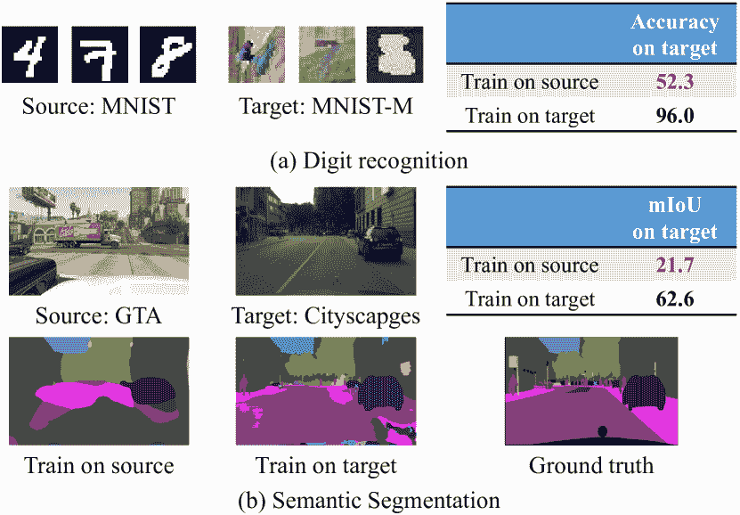
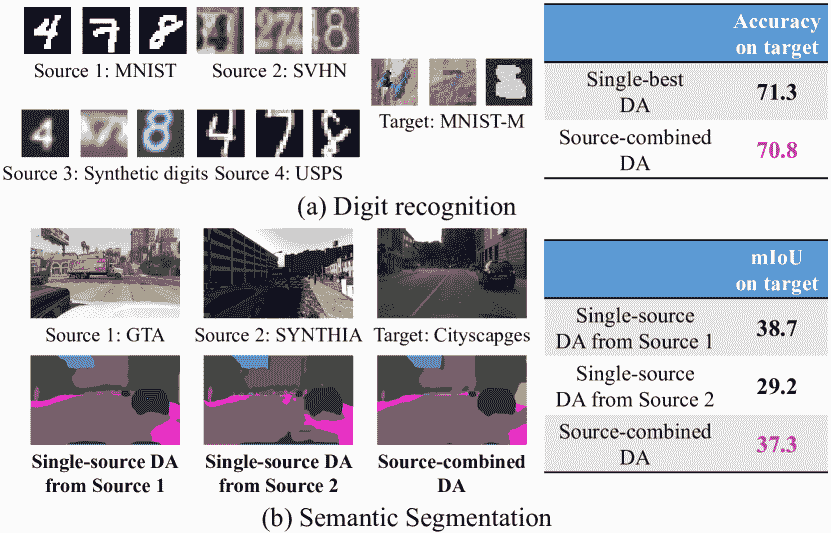
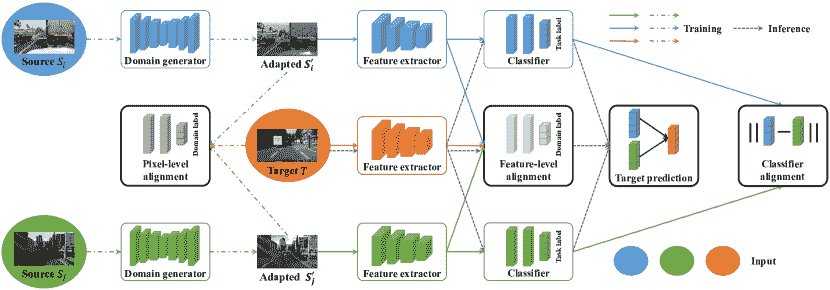

<!--yml

类别：未分类

日期：2024-09-06 20:02:20

-->

# [2002.12169] 深度学习时代的多源领域适应：系统综述

> 来源：[`ar5iv.labs.arxiv.org/html/2002.12169`](https://ar5iv.labs.arxiv.org/html/2002.12169)

# 深度学习时代的多源领域适应：

系统综述

孙成赵¹    李博¹    科罗拉多·里德¹    许鹏飞²    库尔特·凯策¹

¹加州大学伯克利分校，美国      ²滴滴出行，中国

schzhao@gmail.com, drluodian@gmail.com, cjrd@cs.berkeley.edu,

xupengfeipf@didiglobal.com, keutzer@berkeley.edu

###### 摘要

在许多实际应用中，通常很难且昂贵地获得足够的大规模标注数据，以充分训练深度神经网络。因此，将从单独的标注源领域获得的知识迁移到未标注或稀疏标注的目标领域成为一种有吸引力的替代方案。然而，直接迁移往往会因*领域偏移*而导致显著的性能下降。领域适应（DA）通过最小化源领域和目标领域之间领域偏移的影响来解决这一问题。多源领域适应（MDA）是一种强大的扩展，其中标注数据可以来自具有不同分布的多个来源。由于 DA 方法的成功以及多源数据的普遍存在，MDA 在学术界和工业界都受到越来越多的关注。在本综述中，我们定义了各种 MDA 策略并总结了用于评估的现有数据集。我们还比较了深度学习时代的现代 MDA 方法，包括潜在空间变换和中间领域生成。最后，我们讨论了 MDA 的未来研究方向。

## 1 背景和动机

大规模标注训练数据的可用性，如 ImageNet，已使深度神经网络（DNNs）在许多学习任务中取得了显著成功，从计算机视觉到自然语言处理。例如，在大规模视觉识别挑战赛中，“分类 + 提供的训练数据定位”任务的分类错误率已从 2010 年的 0.28 降至 2017 年的 0.0225¹¹1[`image-net.org/challenges/LSVRC/2017`](http://image-net.org/challenges/LSVRC/2017)，甚至超过了人类分类。然而，在许多实际应用中，获取标注训练数据通常是昂贵、耗时甚至不可能的。例如，在细粒度识别中，只有专家才能提供可靠的标签 Gebru et al. (2017)；在语义分割中，标注每个 Cityscapes 图像需要约 90 分钟 Cordts et al. (2016)；在自动驾驶中，标注逐点 3D LiDAR 点云是困难的 Wu et al. (2019)。

图 1：单一来源场景中*领域偏移*的示例。在标注的源领域上训练的模型在直接转移到目标领域时表现不佳。

一种潜在的解决方案是将训练于一个独立标注源领域的模型转移到所需的未标注或稀疏标注的目标领域。但正如图 1 所示，模型在领域间的直接转移会导致性能差。图 1(a)显示，即使是简单的数字识别任务，在 MNIST 源领域上训练 LeCun 等人（1998）的 LeNet-5 模型，用于 MNIST-M 目标领域的数字分类时，准确率从 96.0%降至 52.3%。图 1(b)显示了一个更现实的例子，即在合成源数据集 GTA Richter 等人（2016）上训练语义分割模型，并在真实目标数据集 Cityscapes Cordts 等人（2016）上进行像素级分割，使用 FCN 模型 Long 等人（2015a）。如果我们在真实数据上训练，得到的平均交并比（mIoU）为 62.6%；但如果我们在合成数据上训练，mIoU 显著降至 21.7%。

图 2：多来源场景中*领域偏移*的示例。将多个来源合并为一个来源，并直接对整个数据集进行单一来源领域适配，并不能保证比仅使用最佳单一源领域有更好的表现。

模型在领域间直接转移的低性能源于一种称为*领域偏移*的现象 Torralba 和 Efros（2011）；赵等人（2018b）：即在两个领域中的观察数据和标签的联合概率分布不同。领域偏移存在多种形式，如数据集间、模拟到现实、RGB 图像到深度图像，以及 CAD 模型到真实图像。

域迁移现象激发了对领域适应（DA）的研究，其旨在从标记的源领域中学习一个能够在不同但相关的目标领域中良好泛化的模型。现有的 DA 方法主要集中在单源场景下。在深度学习时代，最近的单源 DA（SDA）方法通常采用一个联合架构，分别表示源领域和目标领域的模型。一种方法旨在基于标记的源数据使用相应的任务损失来学习任务模型，例如分类的交叉熵损失。另一种方法旨在通过对齐目标领域和源领域来处理领域迁移。根据对齐策略，深度 SDA 方法可以分为四类：

1.  1.

    *差异性基础方法*尝试通过显式测量对应激活层上的差异来对齐特征，例如最大均值差异（MMD）Long 等人（2015b），相关对齐 Sun 等人（2017），以及对比领域差异 Kang 等人（2019）。

1.  2.

    *对抗生成方法*基于生成对抗网络（GAN）Goodfellow 等人（2014）及其变体，如 CycleGAN Zhu 等人（2017）；Zhao 等人（2019b）生成虚假数据，以在像素级别对齐源和目标领域。

1.  3.

    *对抗判别方法*采用对抗目标与领域判别器来对齐特征 Tzeng 等人（2017）；Tsai 等人（2018）。

1.  4.

    *重建基础方法*旨在使用源任务模型 Ghifary 等人（2016）从提取的特征中重建目标输入。

实际中，标注数据可能来自多个具有不同分布的源 Sun 等 (2015)；Bhatt 等 (2016)。在这种情况下，前述 SDA 方法可以通过将源组合成一个单一源来简单应用：我们称之为 *源合并 DA*。然而，源合并 DA 往往比仅使用其中一个源而丢弃其他源的表现更差。如图 2 所示，使用 DANN Ganin 等 (2016) 进行的最佳单一源数字识别适应的准确率为 71.3%，而源合并准确率降至 70.8%。对于使用 CyCADA Hoffman 等 (2018b) 的分割适应，源合并 DA 的 mIoU（37.3%）也低于来自 GTA 的 SDA（38.7%）。由于领域偏移不仅存在于每个源和目标之间，还存在于不同源之间，因此来自不同源的源合并数据可能在学习过程中相互干扰 Riemer 等 (2019)。因此，需要多源领域适应（MDA）以利用所有可用数据。

早期的 MDA 方法主要集中在浅层模型上 Sun 等 (2015)，要么学习不同领域的潜在特征空间 Sun 等 (2011); Duan 等 (2012)，要么结合预先学习的源分类器 Schweikert 等 (2009)。最近，MDA 的重点已转向深度学习架构。在本文中，我们系统地调查了基于深度学习的 MDA 的最新进展，总结并比较了方法的相似性和差异，并讨论了潜在的未来研究方向。

## 2 问题定义

在典型的 MDA 设置中，有多个源领域 $S_{1},S_{2},\cdots,S_{M}$ （$M$ 是源的数量）和一个目标领域 $T$。假设在第 $i^{\text{th}}$ 个源 $S_{i}$ 中观察到的数据和相应的标签²²2 标签可以是任何类型，例如物体类别、边界框、语义分割等，它们来自分布 $p_{i}(\mathbf{x},\mathbf{y})$，分别为 $\textbf{X}_{i}=\{\textbf{x}_{i}^{j}\}_{j=1}^{N_{i}}$ 和 $Y_{i}=\{\mathbf{y}_{i}^{j}\}_{j=1}^{N_{i}}$，其中 $N_{i}$ 是源样本的数量。令 $X_{T}=\{\mathbf{x}_{T}^{j}\}_{j=1}^{N_{T}}$ 和 $Y_{T}=\{\mathbf{y}_{T}^{j}\}_{j=1}^{N_{T}}$ 表示从目标分布 $P_{T}(\textbf{x},\mathbf{y})$ 中抽取的目标数据和相应的标签，其中 $N_{T}$ 是目标样本的数量。

假设标注目标样本的数量为 $N_{TL}$，MDA 问题可以分类为不同的类别：

+   •

    *无监督 MDA*，当 $N_{TL}=0$；

+   •

    *完全监督 MDA*，当 $N_{TL}=N_{T}$；

+   •

    *半监督 MDA*，否则。

| 区域 | 任务 | 数据集 | 参考文献 | #D | #S | 标签 | 简短描述 |
| --- | --- | --- | --- | --- | --- | --- | --- |
| CV | 数字识别 | Digits-five (D) | LeCun et al.; Netzer et al. | 5 | 145,298 | 10 类别 | 手写、合成和街道图像数字 |
| Hull; Ganin and Lempitsky |
| 对象分类 | Office-31 (O) | Saenko et al. | 3 | 4,110 | 31 类别 | 来自亚马逊的图像和不同相机拍摄的图像 |
| Office-Caltech (OC) | Gong et al. | 4 | 2,533 | 10 类别 | 来自 Office-31 和 C 的重叠类别 |
| Office-Home (OH) | Venkateswara et al. | 4 | 15,500 | 65 类别 | 艺术品、剪贴画、产品和真实物体 |
| ImageCLEF (IC) | 挑战^(3) | 3 | 1,800 | 12 类别 | 来自 3 个数据集的共享类别 |
| PACS (P) | Li et al. | 4 | 9,991 | 7 类别 | 摄影、艺术、卡通和草图物体 |
| DomainNet (DN) | Peng et al. | 6 | 600,000 | 345 类别 | 剪贴画、信息图、艺术品、快速绘图、真实物体和草图物体 |
| 情感分类 | SentiImage (SI) | Machajdik and Hanbury | 4 | 25,986 | 2 类别 | 关于视觉情感的艺术和社交图像 |
| You et al.; You et al.; Borth et al. |
|  | 车辆计数 | WebCamT (W) | Zhang et al. | 8 | 16,000 | 车辆计数 | 每个相机作为一个领域 |
|  | 语义分割 | Sim2RealSeg (S2R) | Cordts et al.; Yu et al. | 4 | 49,366 | 16 类别 | 模拟到真实的适应 |
|  | Richter et al.; Ros et al. | 用于像素级预测 |
| NLP | 情感分类 | AmazonReviews (AR) | Chen et al. | 4 | $\approx$12,000 | 2 类别 | 四种产品的评论 |
| MediaReviews (MR) | Liu et al. | 5 | 6897 | 2 类别 | 产品和电影的评论 |
| 词性标注 | SANCL (S) | Petrov and McDonald | 5 | 5250 | 标签 | 在 5 个网页领域中的词性标注 |

表 1：用于 MDA 的公开和免费数据集，其中“#D”和“#S”分别表示领域数量和通常用于 MDA 的样本总数。

假设 $\textbf{x}_{i}^{j}\in\mathds{R}^{d_{i}}$ 和 $\textbf{x}_{T}^{j}\in\mathds{R}^{d_{T}}$ 是源 $S_{i}$ 和目标 $T$ 中的观察值，我们可以将 MDA 分类为：

+   •

    *同质 MDA*，当 $d_{1}=\cdots=d_{M}=d_{T}$；

+   •

    *异质 MDA*，否则。

假设 $\mathcal{C}_{i}$ 和 $\mathcal{C}_{T}$ 是源 $S_{i}$ 和目标 $T$ 的标签集，我们可以定义不同的 MDA 策略：

+   •

    *闭集 MDA*，当 $\mathcal{C}_{1}=\cdots=\mathcal{C}_{M}=\mathcal{C}_{T}$；

+   •

    *开集 MDA*，对于至少一个 $\mathcal{C}_{i}$，$\mathcal{C}_{i}\cap\mathcal{C}_{T}\subset\mathcal{C}_{T}$；

+   •

    *部分 MDA*，对于至少一个 $\mathcal{C}_{i}$，$\mathcal{C}_{T}\subset\mathcal{C}_{i}$；

+   •

    *通用 MDA*，当没有标签集的先验知识时；

其中 $\cap$ 和 $\subset$ 表示两个集合之间的交集和真子集。

假设标记源样本的数量是 $N_{iL}$ 对于源 $S_{i}$，MDA 问题可以分类为：

+   •

    *强监督 MDA*，当 $N_{iL}=N_{i}$ 对于 $i=1\cdots M$；

+   •

    *弱监督 MDA*，否则。

当同时适应多个目标领域时，任务变成多目标 MDA。当目标数据在训练过程中不可用时，Yue 等人 (2019)，该任务通常称为多源领域泛化或零样本 MDA。

## 3 数据集

用于评估 MDA 模型的数据集通常包含具有不同风格的多个领域，例如合成与真实、艺术与草图，这些都会在不同领域之间产生大的领域偏移。这里我们总结了在计算机视觉 (CV) 和自然语言处理 (NLP) 领域中常用的数据集，如表 1 所示。

数字识别。Digits-five 包含来自不同领域的 5 个数字图像数据集，包括 *手写* MNIST (mt) LeCun 等人 (1998)、*合成* MNIST-M (mm) Ganin 和 Lempitsky (2015) 从 MNIST 和随机提取的彩色补丁、*街景图像* SVHN (sv) Netzer 等人 (2011)、由不同条件下的 Windows 字体生成的 Synthetic Digits (sy) Ganin 和 Lempitsky (2015)，以及 *手写* USPS (up) Hull (1994)。通常，mt、mm、sv 和 sy 中的训练图像为 25,000 张，测试图像为 9,000 张。up 中的 9,298 张图像被全部选用。

对象分类。Office-31 Saenko 等人 (2010) 包含 31 个类别中的 4,110 张图像，这些图像来自 3 个领域的办公室环境：Amazon (A) 包含 2,817 张从 amazon.com 下载的图像，Webcam (W) 和 DSLR (D) 分别包含 795 和 498 张由网络摄像头和数码单反相机拍摄的图像，这些图像具有不同的摄影设置。

Office-Caltech Gong 等人 (2013) 包含了 Office-31 Saenko 等人 (2010) 和 Caltech-256 (C) Griffin 等人 (2007) 共享的 10 个重叠类别。总共有 2,533 张图像。

Office-Home Venkateswara 等人 (2017) 包含了约 15,500 张来自办公室和家庭环境中 65 个日常物品类别的图像。共有 4 个不同的领域：艺术图像 (Ar)、剪贴画 (Cl)、产品图像 (Pr) 和现实世界图像 (Rw)。

ImageCLEF，源于 ImageCLEF 2014 领域适应挑战³³3[`imageclef.org/2014/adaptation`](http://imageclef.org/2014/adaptation)，包含 12 个对象类别，这些类别在 ImageNet ILSVRC 2012 (I)、Pascal VOC 2012 (P) 和 C 中共享。每个领域总共有 600 张图片，每个类别 50 张。

PACS Li 等人（2017）包含了 7 个对象类别的 9,991 张图片，这些图片来自 4 个不同领域：照片 (P)、艺术画作 (A)、卡通 (C) 和素描 (S)。

DomainNet Peng 等人（2019），目前为止最大的对象分类领域适应数据集，包含约 60 万张图片，来自 6 个领域：剪贴画、信息图、绘画、快速绘制、现实和素描。共有 345 个对象类别。

图像情感分类。SentiImage Lin 等人（2020）是一个用于图像二分类情感分析的 DA 数据集，包含 4 个领域：社交 Flickr 和 Instagram (FI) You 等人（2016）、艺术 ArtPhoto (AP) Machajdik 和 Hanbury（2010）、社交 Twitter I (TI) You 等人（2015）、社交 Twitter II (TII) Borth 等人（2013）。这 4 个领域分别有 23,308、806、1,269 和 603 张图片。

车辆计数。WebCamT Zhang 等人（2017）是一个来自大型城市摄像头视频的低分辨率、低帧率和高遮挡的车辆计数数据集。共有 60,000 帧带有车辆边界框和计数注释。对于 MDA，选择了 8 个位于不同交叉口的摄像头，每个摄像头有超过 2,000 张标注图片。我们可以将每个摄像头视为一个领域。

图 3：广泛应用于 MDA 的框架示意图。实线箭头和虚线点状箭头分别表示潜在空间转换的训练和中间领域生成。虚线箭头表示参考过程。大多数现有 MDA 方法可以通过采用不同的组件细节、施加一些约束或稍微改变架构来实现。最佳效果为彩色显示。

场景分割。Sim2RealSeg 包含 2 个合成数据集 (GTA、SYNTHIA) 和 2 个真实数据集 (Cityscapes、BDDS) 用于分割。Cityscapes (CS) Cordts 等人 (2016) 包含从德国及其邻国 50 个城市的移动车辆收集的以车辆为中心的城市街道图像。共有 5,000 张图像，像素级注释为 19 个类别。BDDS Yu 等人 (2018) 包含 10,000 张现实世界的行车记录仪视频帧，与 Cityscapes 具有兼容的标签空间。GTA Richter 等人 (2016) 是一个在高保真度渲染计算机游戏 GTA-V 中收集的车辆自我中心图像数据集。它包含 24,966 张图像（视频帧），类别与 Cityscapes 相同，为 19 个类别。SYNTHIA Ros 等人 (2016) 是一个大型合成数据集。为了与 Cityscapes 配对，设计了一个名为 SYNTHIA-RANDCITYSCAPES 的子集，包含 9,400 张图像，这些图像自动标注为 16 个与 Cityscapes 兼容的类别、一个空白类别和一些未命名的类别。共有 16 个类别用于 MDA。

自然语言的情感分类。亚马逊评论 Chen 等人 (2012) 是一个包含四种产品评论的数据集：书籍 (B)、DVD (D)、电子产品 (E) 和厨房电器 (K)。评论被编码为 5,000 维的单词和二元组特征向量，并标记为二元情感。每个来源有 2,000 个标记示例，目标测试集有 3,000 到 6,000 个示例。

媒体评论 Liu 等人 (2017) 包含 16 个产品评论和电影评论领域，用于二元情感分类。通常使用 5 个领域，共 6,897 个标记样本进行 MDA，包括来自亚马逊的服装、婴儿用品、书籍、相机和来自 Rotten Tomato 的 MR。

词性标注。SANCL 数据集 Petrov 和 McDonald (2012) 包含 5 个网页领域的词性标注：电子邮件 (E)、博客 (W)、回答 (A)、新闻组 (N) 和评论 (R)。每个来源的 750 个句子用于训练。

除非另有说明，每个领域被选择为目标，其余领域被视为来源。对于 WebCamT，随机选择 2 个领域作为目标。对于 Sim2RealSeg，MDA 通常在模拟到现实的设置下执行 Zhao 等人 (2019a)，即从合成的 GTA、SYNTHIA 到真实的 Cityscapes、BDDS。对于 SANCL，N、R 和 A 用作目标领域，而 E 和 W 用作目标领域 Guo 等人 (2018)。

| 参考 | 特征 | 特征 | 特征 | 特征 | 分类器 | #C | 分类器 | 任务 | 数据集 | 结果 |
| --- | --- | --- | --- | --- | --- | --- | --- | --- | --- | --- |
| 提取器 | 对齐方法 | 对齐损失 | 对齐领域 | 对齐 | 权重 | 骨干网 |
| Mancini 等人 (2018) | 共享 | — | — | — | CT 损失 | 1 | — | AlexNet | O、OC、P | 83.6、91.8、85.3 |
| Guo 等人 (2018) | 共享 | 差异 | MMD | 目标和每个来源 | — | $M$ | PoS 评估指标 | AlexNet | AR、S | 84.8、90.1 |
| Hoffman 等人 (2018a) | 共享 | 差异 | Rényi-散度 | 目标和每个源 | CT 损失 | 1 | — | AlexNet | O | 87.6 |
| Zhu 等人 (2019) | 共享 | 差异 | MMD | 目标和每个源 | $\mathcal{L}1$ 损失 | $M$ | 均匀 | ResNet-50 | O, OH, IC | 90.2, 89.4, 74.1 |
| Rakshit 等人 (2019) | 不共享 | 差异 | $\mathcal{L}2$ 距离 | 成对所有领域 | CT 损失 | 1 | — | ResNet-50 | O, OC, IC | 88.3, 97.5, 91.2 |
| Peng 等人 (2019) | 共享 | 差异 | 矩量距离 | 成对所有领域 | $\mathcal{L}1$ 损失 | $M$ | 相对误差 | LeNet-5 | D | 87.7 |
| ResNet-101 | OC | 96.4 |
| ResNet-101 | DN | 42.6 |
| Guo 等人 (2020) | 共享 | 差异 | 混合距离 | 目标和每个源 | CT 损失 | 1 | — | BiLSTM | MR | 79.3 |
| Xu 等人 (2018) | 共享 | 判别器 | GAN 损失 | 目标和每个源 | — | $M$ | 困惑度评分 | AlexNet | D, O, IC | 74.2, 83.8, 80.8 |
| Li 等人 (2018) | 共享 | 判别器 | Wasserstein | 成对所有领域 | CT 损失 | 1 | — | AlexNet | D | 79.9 |
| Zhao 等人 (2018a) | 共享 | 判别器 | $\mathcal{H}$-散度 | 目标和每个源 | CT 损失 | 1 | — | BiLSTM | AR | 82.7 |
| AlexNet | D | 76.6 |
| FCN8s | W | 1.4 |
| Wang 等人 (2019) | 共享 | 判别器 | Wasserstein | 成对所有领域 | CT 损失 | 1 | — | BiLSTM | AR | 84.5 |
| AlexNet | D | 83.4 |
| Zhao 等人 (2020) | 不共享 | 判别器 | Wasserstein | 目标和每个源 | — | $M$ | Wasserstein | LeNet-5 | D | 88.1 |
| AlexNet | O | 84.2 |

表 2：MDA 不同潜在空间变换方法的比较，其中‘#C’、‘CT 损失’和‘MMD’分别是指参考时的分类器数量（$M$ 是源领域的数量）、组合任务损失和最大均值散度。‘结果’是所有目标领域在分类准确性和车辆计数误差方面的平均性能。

## 4 深度多源领域适应

现有的深度多源领域适应（MDA）方法主要关注无监督、同质、封闭集合、强监督、单目标和目标数据可用的设置。也就是说，存在一个目标领域，目标数据在训练过程中是未标记的但可用，源数据是完全标记的，源数据和目标数据在相同的数据空间中观察，并且所有源和目标的标签集是相同的。本文集中讨论这些设置下的 MDA 方法。

一些理论分析支持现有的 MDA 算法。大多数理论基于开创性的理论模型 Blitzer 等人 (2008); Ben-David 等人 (2010)。 Mansour 等人 Mansour 等人 (2009) 假设目标分布可以通过 $M$ 个源分布的混合来近似。因此，加权源分类器已被广泛用于 MDA。此外，更紧密的跨域泛化界限和对领域差异的更准确测量可以提供推导有效 MDA 算法的直觉。 Hoffman 等人 Hoffman 等人 (2018a) 通过 DC 编程推导了一种新颖的界限，并计算了更准确的组合权重。 Zhao 等人 Zhao 等人 (2018a) 将开创性理论模型的泛化界限扩展到多源下的分类和回归设置。除了目标域和每个源之间的领域差异，Hoffman 等人 (2018a); Zhao 等人 (2018a)， Li 等人 Li 等人 (2018) 还考虑了成对源之间的关系，并推导了加权多源差异的更紧密界限。基于这一界限，可以挑选出更相关的源域。

通常，一些任务模型（例如分类器）是基于带标签的源数据和相应的任务损失进行学习的，例如分类任务中的交叉熵损失。同时，进行源域和目标域之间的特定对齐，以桥接域间的差异，使得学习到的任务模型能够更好地迁移到目标域。根据不同的对齐策略，我们可以将多源领域适应（MDA）分类为不同的类别。*潜在空间变换*试图通过优化差异损失或对抗损失来对齐不同领域的潜在空间（例如特征）。*中间域生成*明确地为每个源生成一个与目标域不可区分的中间适应域。然后在适应域上训练任务模型。图 3 总结了现有 MDA 方法的常见整体框架。

### 4.1 潜在空间变换

对齐不同领域的潜在空间的两种常见方法是基于差异的方法和对抗方法。我们将在下面讨论这两种方法，表 2 总结了每种方法的关键示例。

基于差异的方法通过优化一些特定的差异损失（如最大均值差异（MMD） Guo et al. (2018); Zhu et al. (2019)、Rényi-散度 Hoffman et al. (2018a)、$\mathcal{L}2$距离 Rakshit et al. (2019) 和矩量距离 Peng et al. (2019)）来显式地测量不同领域的潜在空间（通常是特征）的差异。Guo et al. Guo et al. (2020) 声称不同的差异或距离只能提供领域相似性的特定估计，并且每种距离都有其病态情况。因此，他们考虑了几种距离的混合 Guo et al. (2020)，包括$\mathcal{L}2$距离、余弦距离、MMD、Fisher 线性判别和相关对齐。最小化差异以对齐源领域和目标领域中的特征不会引入任何必须学习的新参数。

对抗方法通过使特征对鉴别器不可区分来尝试对齐这些特征。一些代表性的优化目标包括 GAN 损失 Xu et al. (2018)、$\mathcal{H}$-散度 Zhao et al. (2018a)、Wasserstein 距离 Li et al. (2018); Wang et al. (2019); Zhao et al. (2020)。这些方法旨在混淆鉴别器区分特征是否来自于相同分布的能力。与 GAN 损失和$\mathcal{H}$-散度相比，Wasserstein 距离即使在目标和源分布不重叠时也能提供更稳定的梯度 Zhao et al. (2020)。鉴别器通常实现为一个网络，这会导致必须学习的新参数。

对于这两类方法，都存在许多模块化的实现细节，例如如何对齐目标和多个源、特征提取器是否共享、如何选择更相关的源以及如何结合来自不同分类器的多个预测。

对齐领域。有不同的方法来对齐目标和多个源。最常见的方法是将目标与每个源逐对对齐 Xu et al. (2018); Guo et al. (2018); Zhao et al. (2018a); Hoffman et al. (2018a); Zhu et al. (2019); Zhao et al. (2020); Guo et al. (2020)。由于不同源之间也存在领域偏移，一些方法在源领域和目标领域之间强制执行每个领域的逐对对齐 Li et al. (2018); Rakshit et al. (2019); Peng et al. (2019); Wang et al. (2019)。

| 参考 | 领域 | 像素 | 特征 | 特征 | #C | 分类器 | 任务 | 数据集 | 任务 | 结果 |
| --- | --- | --- | --- | --- | --- | --- | --- | --- | --- | --- |
| 生成器 | 对齐领域 | 对齐损失 | 对齐领域 | 权重 | 主干网络 |
| Russo et al. (2019) | CoGAN | 目标和每个源 | GAN 损失 | 目标和每个源 | $M$ | 均匀 | DeepLabV2 | S2R-CS | seg | 42.8 |
| 共享 |
| Zhao et al. (2019a) | CycleGAN | 目标和聚合源 | GAN 损失 | 目标和每个源 | 1 | — | FCN8s | S2R-CS | seg | 41.4 |
| 共享 | S2R-BDDS | 36.3 |
| Lin et al. (2020) | VAE+CycleGAN | 目标和组合源 | — | — | 1 | — | ResNet-18 | SI | cls | 68.1 |
| 非共享 |

表 3：不同中间领域生成方法在 MDA 中的比较，其中‘#C’，‘seg’和‘cls’分别表示参考中的分类器数量（$M$是源领域的数量）、分割和分类。‘Result’是所有目标领域的平均性能，通过分类的准确率和分割的平均交并比（mIoU）来衡量。

特征提取器的权重共享。大多数方法采用共享特征提取器来学习领域不变的特征。然而，领域不变性可能会对区分能力产生负面影响。相反，Rakshit et al. Rakshit et al. (2019) 为每个源和目标对采用了具有非共享权重的一个特征提取器，而 Zhao et al. Zhao et al. (2020) 首先为每个源预训练一个特征提取器，然后将目标映射到每个源的特征空间中。因此，有$M$和$2M$个特征提取器。尽管非共享特征提取器可以更好地对齐潜在空间中的目标和源，但这大大增加了模型中的参数数量。

分类器对齐。从直观上看，训练于不同源的分类器可能导致对接近领域边界的目标样本做出错位预测。通过最小化特定分类器的差异，例如$\mathcal{L}$1 损失 Zhu et al. (2019); Peng et al. (2019)，分类器得到更好的对齐，这可以学习到上述目标样本的泛化分类边界。许多方法专注于训练基于特定组合任务损失的复合分类器，例如标准化激活 Mancini et al. (2018) 和赌注控制器 Guo et al. (2020)，而不是显式地为每个源训练一个分类器。

目标预测。在潜在空间中对目标和源领域的特征进行对齐后，可以使用基于标记源样本训练的分类器来预测目标样本的标签。由于存在多个源，可能会产生不同的目标预测。调和这些不同预测的一种方法是均匀地平均来自不同源分类器的预测 朱等人（2019）。然而，不同的源可能与目标有不同的关系，例如一个源可能与目标的对齐效果更好，因此，非均匀的加权平均预测会得到更好的结果。加权策略，称为*源选择过程*，包括均匀权重 朱等人（2019），基于对抗损失的困惑度评分 徐等人（2018），使用 Mahalanobis 距离的点到集（PoS）度量 郭等人（2018），基于仅源准确度的相对误差 彭等人（2019），以及基于 Wasserstein 距离的权重 赵等人（2020）。

除了源领域的重要性，赵等人 赵等人（2020）还考虑了样本的重要性，即来自同一来源的不同样本可能与目标样本的相似性不同。与目标更接近的源样本会被提炼（基于手动选择的 Wasserstein 距离阈值）以微调源分类器。自动且自适应地选择每个源的最相关训练样本仍然是一个未解决的研究问题。

### 4.2 中间领域生成

特征级对齐仅对齐高层信息，这对于像像素级语义分割 赵等人（2019a）这样的细粒度预测是不够的。通过像素级对齐生成一个中间适配领域，通常通过 GANs Goodfellow et al.（2014），可以帮助解决这个问题。

域生成器。由于原始 GAN 的约束条件较少，一些改进版本被采用，例如 Russo et al. (2019)中的 Coupled GAN (CoGAN)和 MADAN Zhao et al. (2019a)中的 CycleGAN。 Russo et al. (2019); Zhao et al. (2019a)直接将原始源数据作为生成器的输入，而 Lin et al. Lin et al. (2020)使用变分自编码器将所有源和目标领域映射到潜在空间，然后从潜在空间生成一个适应领域。Russo et al. Russo et al. (2019) 然后尝试对齐目标和每个适应领域，而 Lin et al. Lin et al. (2020)对齐目标和从潜在空间获得的组合适应领域。Zhao et al. Zhao et al. (2019a) 提出了使用子领域聚合鉴别器和跨领域循环鉴别器来聚合不同的适应领域，其中像素级别的对齐在聚合领域和目标领域之间进行。Zhao et al. Zhao et al. (2019a) 和 Lin et al. Lin et al. (2020) 表明，中间表示中的语义可能会发生变化，并且在生成之前和之后强制保持语义一致性可以帮助保持标签。

特征对齐和目标预测。特征级别的对齐通常与像素级别的对齐共同考虑。这两种对齐通常通过最小化带有鉴别器的 GAN 损失来实现。每个适应领域训练一个分类器 Russo et al. (2019)，并且对给定目标样本的多个预测结果进行平均。仅在聚合领域 Zhao et al. (2020) 或在由所有源领域的潜在空间唯一生成器获得的组合适应领域 Lin et al. (2020) 上训练一个分类器。这些方法的比较总结在表 3 中。

## 5 结论与未来方向

在本文中，我们提供了对深度学习时代近期 MDA 发展的综述。我们阐述了 MDA 的动机，定义了不同的 MDA 策略，并总结了常用于执行 MDA 评估的数据集。我们的综述集中在一个典型的 MDA 设置上，即无监督、同质、封闭集和一个目标 MDA。我们将这些方法分类，并在技术和实验上对代表性方法进行了比较。我们总结了若干开放的研究方向：

特定 MDA 策略实施。如第二部分所介绍，有许多类型的 MDA 策略，根据具体问题要求实施 MDA 策略可能会比一刀切的 MDA 方法取得更好的结果。还需要进一步调查哪些 MDA 策略对哪些类型的问题最有效。此外，现实世界应用可能只有少量标记的目标数据；如何包含这些数据以及需要多少比例的数据以达到某种性能仍然是一个未解之谜。

多模态 MDA。标记的源数据可能来自不同的模态，如 LiDAR、雷达和图像。需要进一步研究以找到在 MDA 中融合不同数据模态的技术。这个想法的进一步扩展是拥有不同源中的多样化模态以及部分标记的多模态源。

增量和在线 MDA。设计增量和在线 MDA 算法仍然大多未被探索，这可能对现实世界场景带来巨大的好处，例如在新源或目标数据可用时更新已部署的 MDA 模型。

## 参考文献

+   Ben-David 等人 [2010] Shai Ben-David, John Blitzer, Koby Crammer, Alex Kulesza, Fernando Pereira, 和 Jennifer Wortman Vaughan。从不同领域学习的理论。发表于 Machine Learning, 2010。

+   Bhatt 等人 [2016] Himanshu S Bhatt, Arun Rajkumar, 和 Shourya Roy。跨域分类的多源迭代适应。发表于 IJCAI, 2016。

+   Blitzer 等人 [2008] John Blitzer, Koby Crammer, Alex Kulesza, Fernando Pereira, 和 Jennifer Wortman Vaughan。领域适应的学习界限。发表于 NIPS, 2008。

+   Borth 等人 [2013] Damian Borth, Rongrong Ji, Tao Chen, Thomas Breuel, 和 Shih-Fu Chang。使用形容词名词对的大规模视觉情感本体及探测器。发表于 ACM MM, 2013。

+   Chen 等人 [2012] Minmin Chen, Zhixiang Xu, Kilian Q Weinberger, 和 Fei Sha。用于领域适应的边际去噪自编码器。发表于 ICML, 2012。

+   Cordts 等人 [2016] Marius Cordts, Mohamed Omran, Sebastian Ramos, Timo Rehfeld, Markus Enzweiler, Rodrigo Benenson, Uwe Franke, Stefan Roth, 和 Bernt Schiele。用于语义城市场景理解的 cityscapes 数据集。发表于 CVPR, 2016。

+   Duan 等人 [2012] Lixin Duan, Dong Xu, 和 Shih-Fu Chang。利用网页图像进行消费视频事件识别：一种多源领域适应方法。发表于 CVPR, 2012。

+   Ganin 和 Lempitsky [2015] Yaroslav Ganin 和 Victor Lempitsky。通过反向传播进行无监督领域适应。发表于 ICML, 2015。

+   Ganin 等人 [2016] Yaroslav Ganin, Evgeniya Ustinova, Hana Ajakan, Pascal Germain, Hugo Larochelle, François Laviolette, Mario Marchand, 和 Victor Lempitsky。神经网络的领域对抗训练。JMLR, 2016。

+   Gebru et al. [2017] Timnit Gebru, Judy Hoffman, 和 Li Fei-Fei. 野外的细粒度识别：一种多任务领域适应方法。在 ICCV，2017。

+   Ghifary et al. [2016] Muhammad Ghifary, W Bastiaan Kleijn, Mengjie Zhang, David Balduzzi, 和 Wen Li. 用于无监督领域适应的深度重构分类网络。在 ECCV，2016。

+   Gong et al. [2013] Boqing Gong, Kristen Grauman, 和 Fei Sha. 用地标连接点：区分性地学习领域不变特征以进行无监督领域适应。在 ICML，2013。

+   Goodfellow et al. [2014] Ian Goodfellow, Jean Pouget-Abadie, Mehdi Mirza, Bing Xu, David Warde-Farley, Sherjil Ozair, Aaron Courville, 和 Yoshua Bengio. 生成对抗网络。在 NIPS，2014。

+   Griffin et al. [2007] Gregory Griffin, Alex Holub, 和 Pietro Perona. Caltech-256 物体类别数据集。2007。

+   Guo et al. [2018] Jiang Guo, Darsh Shah, 和 Regina Barzilay. 具有专家混合的多源领域适应。在 EMNLP，2018。

+   Guo et al. [2020] Han Guo, Ramakanth Pasunuru, 和 Mohit Bansal. 通过 distancenet-bandits 进行文本分类的多源领域适应。在 AAAI，2020。

+   Hoffman et al. [2018a] Judy Hoffman, Mehryar Mohri, 和 Ningshan Zhang. 多源适应的算法和理论。在 NeurIPS，2018。

+   Hoffman et al. [2018b] Judy Hoffman, Eric Tzeng, Taesung Park, Jun-Yan Zhu, Phillip Isola, Kate Saenko, Alexei A Efros, 和 Trevor Darrell. Cycada：循环一致的对抗领域适应。在 ICML，2018。

+   Hull [1994] Jonathan J. Hull. 手写文本识别研究的数据库。TPAMI，1994。

+   Kang et al. [2019] Guoliang Kang, Lu Jiang, Yi Yang, 和 Alexander G Hauptmann. 用于无监督领域适应的对比适应网络。在 CVPR，2019。

+   LeCun et al. [1998] Yann LeCun, Léon Bottou, Yoshua Bengio, Patrick Haffner 等。基于梯度的学习应用于文档识别。PIEEE，1998。

+   Li et al. [2017] Da Li, Yongxin Yang, Yi-Zhe Song, 和 Timothy M Hospedales. 更深、更广、更艺术的领域泛化。在 ICCV，2017。

+   Li et al. [2018] Yitong Li, Michael Andrew Murias, Samantha Major, Geraldine Dawson, 和 David E Carlson. 通过多领域匹配提取关系。在 NeurIPS，2018。

+   Lin et al. [2020] Chuang Lin, Sicheng Zhao, Lei Meng, 和 Tat-Seng Chua. 用于视觉情感分类的多源领域适应。在 AAAI，2020。

+   Liu et al. [2017] Pengfei Liu, Xipeng Qiu, 和 Xuanjing Huang. 用于文本分类的对抗多任务学习。在 ACL，2017。

+   Long et al. [2015a] Jonathan Long, Evan Shelhamer, 和 Trevor Darrell. 用于语义分割的全卷积网络。在 CVPR，2015。

+   Long et al. [2015b] Mingsheng Long, Yue Cao, Jianmin Wang, 和 Michael Jordan. 通过深度适应网络学习可迁移特征。在 ICML，2015。

+   Machajdik and Hanbury [2010] Jana Machajdik 和 Allan Hanbury. 使用受心理学和艺术理论启发的特征进行情感图像分类。在 ACM MM，2010。

+   Mancini 等 [2018] Massimiliano Mancini, Lorenzo Porzi, Samuel Rota Bulò, Barbara Caputo 和 Elisa Ricci。通过发现潜在领域来提升领域适应。发表于 CVPR, 2018。

+   Mansour 等 [2009] Yishay Mansour, Mehryar Mohri 和 Afshin Rostamizadeh。具有多个源的领域适应。发表于 NIPS, 2009。

+   Netzer 等 [2011] Yuval Netzer, Tao Wang, Adam Coates, Alessandro Bissacco, Bo Wu 和 Andrew Y Ng。通过无监督特征学习读取自然图像中的数字。发表于 NIPS Workshops, 2011。

+   Peng 等 [2019] Xingchao Peng, Qinxun Bai, Xide Xia, Zijun Huang, Kate Saenko 和 Bo Wang。用于多源领域适应的时刻匹配。发表于 ICCV, 2019。

+   Petrov 和 McDonald [2012] Slav Petrov 和 Ryan McDonald。2012 年网络解析共享任务概述。发表于 SANCL, 2012。

+   Rakshit 等 [2019] Sayan Rakshit, Biplab Banerjee, Gemma Roig 和 Subhasis Chaudhuri。通过深度对抗集成学习驱动的无监督多源领域适应。发表于 GCPR, 2019。

+   Richter 等 [2016] Stephan R Richter, Vibhav Vineet, Stefan Roth 和 Vladlen Koltun。为数据而玩：来自计算机游戏的真实数据。发表于 ECCV, 2016。

+   Riemer 等 [2019] Matthew Riemer, Ignacio Cases, Robert Ajemian, Miao Liu, Irina Rish, Yuhai Tu 和 Gerald Tesauro。通过最大化迁移和最小化干扰来学习而不遗忘。发表于 ICLR, 2019。

+   Ros 等 [2016] German Ros, Laura Sellart, Joanna Materzynska, David Vazquez 和 Antonio M Lopez。Synthia 数据集：用于城市场景语义分割的大规模合成图像集合。发表于 CVPR, 2016。

+   Russo 等 [2019] Paolo Russo, Tatiana Tommasi 和 Barbara Caputo。朝着多源自适应语义分割的方向发展。发表于 ICIAP, 2019。

+   Saenko 等 [2010] Kate Saenko, Brian Kulis, Mario Fritz 和 Trevor Darrell。将视觉类别模型适应到新领域。发表于 ECCV, 2010。

+   Schweikert 等 [2009] Gabriele Schweikert, Gunnar Rätsch, Christian Widmer 和 Bernhard Schölkopf。基因组序列分析领域适应算法的实证分析。发表于 NIPS, 2009。

+   Sun 等 [2011] Qian Sun, Rita Chattopadhyay, Sethuraman Panchanathan 和 Jieping Ye。用于多源领域适应的两阶段加权框架。发表于 NIPS, 2011。

+   Sun 等 [2015] Shiliang Sun, Honglei Shi 和 Yuanbin Wu。多源领域适应综述。信息融合, 2015。

+   Sun 等 [2017] Baochen Sun, Jiashi Feng 和 Kate Saenko。用于无监督领域适应的相关性对齐。发表于《计算机视觉应用中的领域适应》，2017。

+   Torralba 和 Efros [2011] Antonio Torralba 和 Alexei A Efros。对数据集偏差的无偏见观察。发表于 CVPR, 2011。

+   Tsai 等 [2018] Yi-Hsuan Tsai, Wei-Chih Hung, Samuel Schulter, Kihyuk Sohn, Ming-Hsuan Yang 和 Manmohan Chandraker。学习适应结构化输出空间以进行语义分割。发表于 CVPR, 2018。

+   Tzeng 等人 [2017] Eric Tzeng、Judy Hoffman、Kate Saenko 和 Trevor Darrell。对抗性判别领域适应。发表于 CVPR，2017 年。

+   Venkateswara 等人 [2017] Hemanth Venkateswara、Jose Eusebio、Shayok Chakraborty 和 Sethuraman Panchanathan。用于无监督领域适应的深度哈希网络。发表于 CVPR，2017 年。

+   Wang 等人 [2019] Haotian Wang、Wenjing Yang、Zhipeng Lin 和 Yue Yu。Tmda：通过嵌入式对抗训练的任务特定多源领域适应。发表于 ICDM，2019 年。

+   Wu 等人 [2019] Bichen Wu、Xuanyu Zhou、Sicheng Zhao、Xiangyu Yue 和 Kurt Keutzer。Squeezesegv2：改进的模型结构和用于从激光雷达点云进行路面物体分割的无监督领域适应。发表于 ICRA，2019 年。

+   Xu 等人 [2018] Ruijia Xu、Ziliang Chen、Wangmeng Zuo、Junjie Yan 和 Liang Lin。深度鸡尾酒网络：具有类别偏移的多源无监督领域适应。发表于 CVPR，2018 年。

+   You 等人 [2015] Quanzeng You、Jiebo Luo、Hailin Jin 和 Jianchao Yang。使用渐进训练和领域迁移的深度网络进行鲁棒的图像情感分析。发表于 AAAI，2015 年。

+   You 等人 [2016] Quanzeng You、Jiebo Luo、Hailin Jin 和 Jianchao Yang。构建大规模图像情感识别数据集：细节和基准。发表于 AAAI，2016 年。

+   Yu 等人 [2018] Fisher Yu、Wenqi Xian、Yingying Chen、Fangchen Liu、Mike Liao、Vashisht Madhavan 和 Trevor Darrell。Bdd100k：一个具有可扩展注释工具的多样化驾驶视频数据库。arXiv:1805.04687，2018 年。

+   Yue 等人 [2019] Xiangyu Yue、Yang Zhang、Sicheng Zhao、Alberto Sangiovanni-Vincentelli、Kurt Keutzer 和 Boqing Gong。领域随机化与金字塔一致性：无需访问目标领域数据的模拟到现实的泛化。发表于 ICCV，2019 年。

+   Zhang 等人 [2017] Shanghang Zhang、Guanhang Wu、Joao P Costeira 和 Jose MF Moura。从大规模网络摄像头数据中理解交通密度。发表于 CVPR，2017 年。

+   Zhao 等人 [2018a] Han Zhao、Shanghang Zhang、Guanhang Wu、José MF Moura、Joao P Costeira 和 Geoffrey J Gordon。对抗性多源领域适应。发表于 NeurIPS，2018 年。

+   Zhao 等人 [2018b] Sicheng Zhao、Xin Zhao、Guiguang Ding 和 Kurt Keutzer。Emotiongan：用于学习图像情感离散概率分布的无监督领域适应。发表于 ACM MM，2018 年。

+   Zhao 等人 [2019a] Sicheng Zhao、Bo Li、Xiangyu Yue、Yang Gu、Pengfei Xu、Runbo Hu、Hua Chai 和 Kurt Keutzer。用于语义分割的多源领域适应。发表于 NeurIPS，2019 年。

+   Zhao 等人 [2019b] Sicheng Zhao、Chuang Lin、Pengfei Xu、Sendong Zhao、Yuchen Guo、Ravi Krishna、Guiguang Ding 和 Kurt Keutzer。Cycleemotiongan：情感语义一致性保持的 cyclegan 用于适应图像情感。发表于 AAAI，2019 年。

+   Zhao 等人 [2020] Sicheng Zhao、Guangzhi Wang、Shanghang Zhang、Yang Gu、Yaxian Li、Zhichao Song、Pengfei Xu、Runbo Hu、Hua Chai 和 Kurt Keutzer。多源蒸馏领域适应。发表于 AAAI，2020 年。

+   Zhu et al. [2017] 军彦·朱、太成·朴、菲利普·伊索拉和亚历克谢·A·埃夫罗斯。在 ICCV 2017 中，使用循环一致对抗网络进行无配对图像到图像的转换。

+   Zhu et al. [2019] 永春·朱、富臻·庄和德庆·王。在 AAAI 2019 中，跨域分类中的领域特定分布和分类器对齐。
