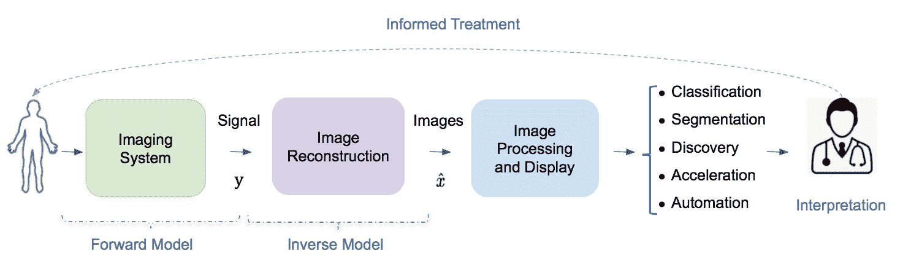
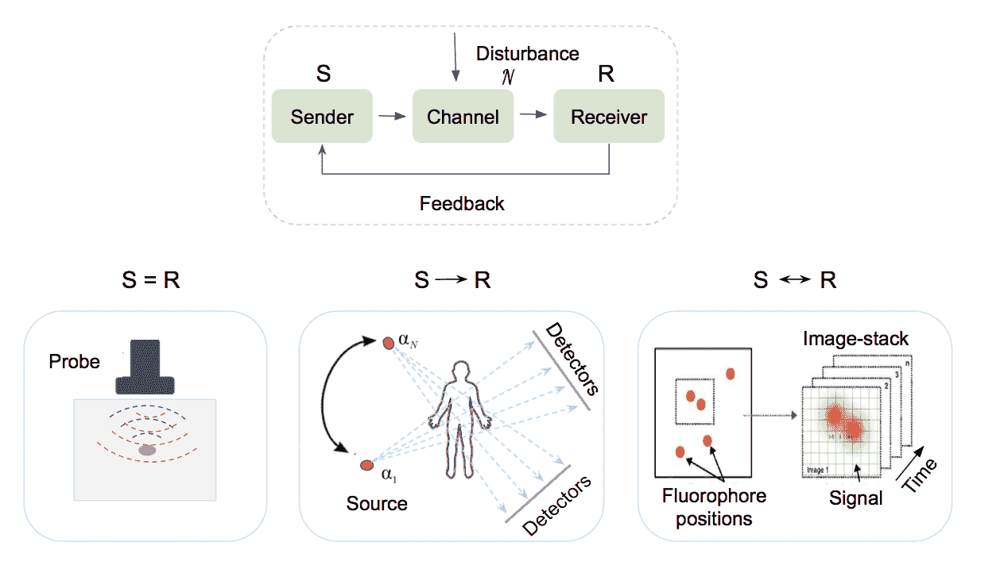
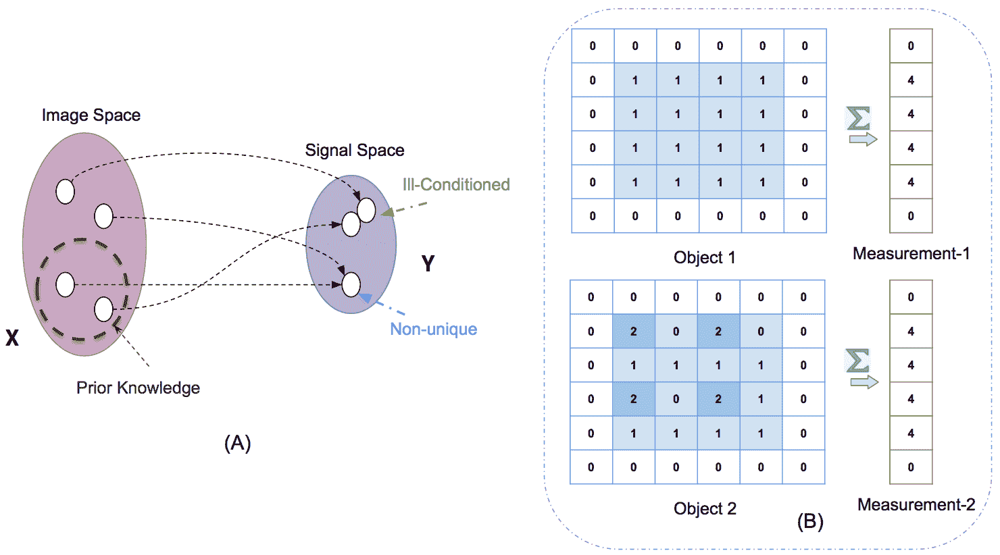
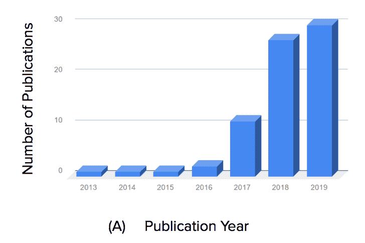
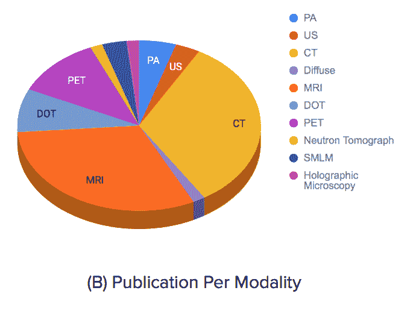
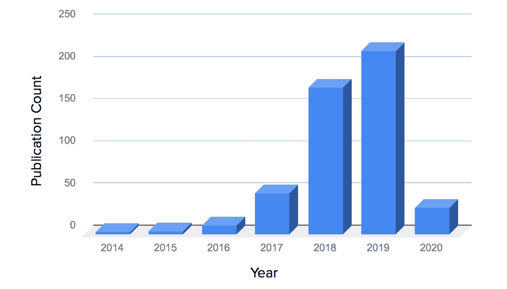
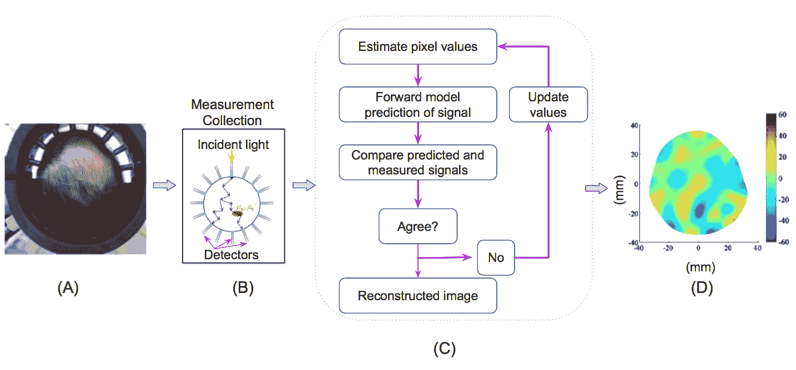
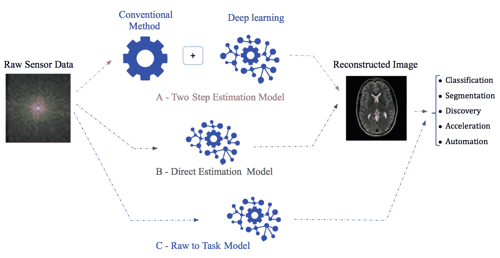
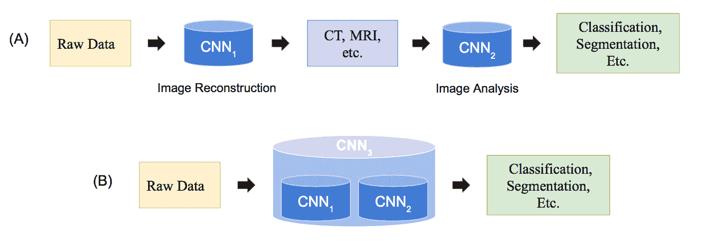

<!--yml

类别：未分类

date: 2024-09-06 20:02:17

-->

# [2002.12351] 用于生物医学图像重建的深度学习：综述

> 来源：[`ar5iv.labs.arxiv.org/html/2002.12351`](https://ar5iv.labs.arxiv.org/html/2002.12351)

¹¹institutetext: H. Ben Yedder ²²institutetext: ²²email: hbenyedd@sfu.ca ³³institutetext: B. Cardoen ⁴⁴institutetext: ⁴⁴email: bcardoen@sfu.ca ⁵⁵institutetext: G. Hamarneh ⁶⁶institutetext: ⁶⁶email: hamarneh@sfu.ca ⁷⁷institutetext: 西蒙弗雷泽大学计算机科学学院，加拿大

# 用于生物医学图像重建的深度学习：综述

Hanene Ben Yedder    Ben Cardoen    Ghassan Hamarneh

###### 摘要

医学影像在医学中是无价的资源，因为它能够透视人体内部，为科学家和医生提供了理解、建模、诊断和治疗疾病所必需的大量信息。重建算法涉及将通过采集硬件收集的信号转换为可解释的图像。鉴于问题的不适定性和实际情况中缺乏精确的解析逆变换，重建是一项具有挑战性的任务。尽管过去几十年在新模态、改进的时间和空间分辨率、成本降低以及更广泛的适用性方面取得了令人印象深刻的进展，但仍可设想一些改进，如减少采集和重建时间，以降低患者的辐射暴露和不适，同时提高临床效率和重建精度。此外，生物医学影像在功率较小的手持设备中的应用需要在准确性和延迟之间找到微妙的平衡。设计快速、稳健且准确的重建算法是一个理想但具有挑战性的研究目标。尽管经典的图像重建算法通过依赖专家调优的参数来近似逆函数，以确保重建性能，但深度学习（DL）允许自动特征提取和实时推断。因此，DL 呈现出一种有前景的图像重建方法，近期研究报告了伪影减少和重建加速，作为一个快速发展的领域的一部分。我们回顾了最先进的图像重建算法，重点关注基于 DL 的方法。首先，我们检查了文献中常见的重建算法设计、应用的指标和数据集。然后，讨论了关键挑战，并作为未来研究的潜在有前景的战略方向。

###### 关键词：

图像重建模态 深度学习 逆问题 分析方法 迭代方法 有限数据表示。

## 1 引言

生物医学图像重建将由各种传感器获取的信号转换为可用于诊断和发现细胞和器官组织中生物过程的图像。每种生物医学成像模态利用电磁波谱中的不同频段的信号，例如，伽马射线（正电子发射断层扫描 PET/SPECT）、X 射线（计算机断层扫描 CT）、可见光（显微镜、内窥镜）、红外线（热成像）和射频（核磁共振成像 MRI），以及压力声波（在超声成像 US 中）（Webb 和 Kagadis，2003）。重建算法将采集的信号转换为 2、3 或 4 维图像。

每次重建的准确性对于发现和诊断至关重要。对噪声的鲁棒性以及对不同模态规格（例如，采样模式、速率等）和成像设备参数的泛化能力，使得重建算法能够在更广泛的应用中使用。每次重建所需的时间决定了可以诊断的受试者数量，以及该技术在手术室和紧急情况下的适用性。高质量重建所需的测量次数影响了患者或样本所需承受的曝光量。最后，硬件要求决定了重建算法是否只能在专用设施中使用，还是可以在便携设备中使用，从而决定了部署的灵活性。

图像重建的研究是现代应用数学、工程学和计算机科学中的一个活跃研究领域。它是最活跃的跨学科科学领域之一（Fessler，2017），因为提高重建图像的质量为科学家和临床医生提供了对疾病基础生物过程的前所未有的洞察。图 1 提供了重建问题的插图，并展示了医学成像系统中的典型数据流。

在过去几年中，研究人员已经开始将机器学习技术应用于生物医学重建，以实现实时推断和在临床环境中提高图像质量。在这里，我们首先提供了图像重建问题的概述，并概述了其特征和挑战（第 1.1 节），然后概述了本综述的目的、范围和布局（第 1.2 节）。

图 1：医学成像和图像解释系统中的数据流。前向模型编码了成像系统的物理过程。逆向模型将采集硬件收集的信号转换为有意义的图像。诊断、评估和治疗的成功依赖于准确的重建、图像可视化和处理算法。

### 1.1 逆问题与挑战

#### 1.1.1 从输出到输入

图像重建是从成像设备收集的原始数据（信号）形成可解释图像的过程。它被称为逆问题，给定一组测量数据，目标是确定影响接收器所收集信号的原始结构，考虑到一些信号传输介质的特性（图 2）。设 $y$ 代表一组原始传感器测量值，并受到收集过程中的噪声 $\mathcal{N}$ 的影响。目标是恢复空间域（或时空域）图像 ${x}$，使得：

|  | $y=\mathcal{A}(\mathcal{F}(x),\mathcal{N})$ |  | (1) |
| --- | --- | --- | --- |

其中 $\mathcal{F}(\cdot)$ 是前向模型算子，建模图像形成的物理过程，包括信号传播、衰减、散射、反射及其他变换，例如 Radon 变换或傅里叶变换。$\mathcal{F}(\cdot)$ 可以是线性或非线性算子，具体取决于成像模态。$\mathcal{A}$ 是一个聚合操作，表示噪声和信号之间的相互作用，假设噪声为加性噪声，则 $\mathcal{A}=+$。

虽然成像系统通常可以通过定义前向模型的数学模型进行良好近似，但精确的解析逆变换 $\mathcal{A}^{-1}(\cdot)$ 并不总是可能。重建方法通常依赖于迭代地近似逆函数，并且往往涉及专家调整的参数和先验领域知识考虑，以优化重建性能。

图 2：信号从发送者到接收者的传播。在通过传输通道的过程中，信号 $s$ 受到噪声（假设为加性噪声）的干扰，直到测量值 $M$ = s+$\mathcal{N}$ 到达接收者。接收信号的特性通过反馈回路可能会影响未来信号传输的特性。发送者和接收者建模在不同模态下有所不同。例如，下图左侧展示了用于发送和接收信号的超声探头（S=R）；中间：X 射线信号通过受试者传播到探测器（S $\rightarrow$ R）；右侧是超分辨率显微镜中在采集过程中激光功率在反馈回路中的调节（S $\leftrightarrow$ R）。

图 3： (A) 当两个不同的物体产生非常相近的观测信号时，问题是病态的。当观测信号完全相同，因此重建图像也相同时，逆解是非唯一的。可以利用先验知识排除那些与额外的物体知识相矛盾的解，而这些知识超出了测量向量的范围。 (B) 两个物体的用例示例，它们具有相同的采集信号。关于物体均匀性的先验知识排除了第二个物体。

#### 1.1.2 一个病态问题

图像重建是一个病态问题，因为测量值$(M)$可能远少于未知数$(N)$。从数学上讲，这个问题是高度欠定的，因为描述模型的方程数少于未知数（$M\ll N$），因此，可能会有无数个与相同测量值一致的图像（图 3）。因此，重建算法的一大挑战是从一组潜在解中选择最佳解（McCann 和 Unser，2019）。减少解空间的一种方法是通过编码先验知识，即正则化，来利用领域特定知识。

降低数据表示，例如 MRI 中的子采样或 CT 中的稀疏视图、有限角度数据，以加速采集或减少辐射剂量，通常会减少测量信号$y$的大小$N$，同时增加其稀疏性和噪声水平。因此，重建问题的病态性和复杂性增加。这提出了需要具有高特征提取能力的复杂重建算法，以充分利用收集到的信号，捕捉模态特定的成像特征，并利用先验知识。此外，开发高质量的重建算法不仅需要对成像系统的物理和生物医学结构有深入理解，还需要专门设计的算法，这些算法能够考虑测量的统计特性并容忍测量数据中的错误。

### 1.2 本调查的范围

生物医学图像重建领域在过去几十年里经历了显著的进展，可以大致分为两类：传统方法（基于分析和优化的方法）和数据驱动或基于学习的方法。传统方法（在 2 节中讨论）是最主要的，并且在过去几十年里被广泛研究，重点在于如何改善其结果（Vandenberghe et al., 2001; Jhamb et al., 2015; Assili, 2018）并降低计算成本（Despres and Jia, 2017）。

研究人员最近探讨了用于各种生物医学图像重建问题的深度学习（DL）方法（在 3 节中讨论），受到深度学习在计算机视觉问题上成功的启发。这个话题相对较新，在过去几年里获得了大量关注，如图 4-A 所示，并在表 2 中列出，形成了一个非常活跃的研究领域，有许多专门的期刊特刊（Wang, 2016; Wang et al., 2018; Ravishankar et al., 2019）。在所研究的模式中，MRI 和 CT 受到的关注最多，如图 4-B 所示，考虑到其广泛的临床使用、分析逆变换的可用性以及公开（真实）数据集的可用性。

图 4: (A) 涵盖在本调查中的生物医学图像重建机器学习研究数量与发表年份的关系。(B) 饼图表示每种模式下的研究数量。

至今，关于基于机器学习的图像重建方法的综述较少。Fessler (2017) 撰写了一个关于图像重建方法的简要时间顺序回顾，强调了从基本的分析模型到数据驱动模型的演变。最近，McCann 等人 2019 撰写了一个图像重建方法的综述，展示了可以用于构建成像系统模型的操作工具箱，并展示了如何利用前向模型和稀疏性正则化来解决重建问题。尽管他们的综述更侧重于传统方法的数学基础，但他们简要讨论了数据驱动方法、其理论基础和性能。如图 5 所示，自其出版以来，已经完成了大量的工作，值得进行综述。类似地，Zhang 等人 (2019) 提供了对一些近期基于深度学习的 CT 方法的概念性综述，重点讨论了受迭代优化方法启发的方法及其从表征学习和微分方程角度的理论基础。

本综述提供了生物医学图像重建方法的概述，重点介绍了基于深度学习（DL）的策略，讨论了它们的不同范式（例如，图像域、传感器域（原始数据）或端到端学习、架构、损失等）以及这些方法如何帮助克服传统非学习方法的弱点。由于上述综述已对理论基础进行了充分研究，本工作未重点强调理论基础。还讨论了常见的评估指标和训练数据集挑战。

图 5：过去 10 年中生物医学图像重建和深度学习相关出版物的显著增加（结果来自 PubMed 查询，网址：[`bit.ly/image_recon`](http://bit.ly/38ELjuz)）。

本文的其余部分安排如下：在第二部分中，我们概述了传统方法，讨论了它们的优点和局限性。然后，我们介绍了关键的机器学习范式及其在本领域的适应情况，补充和改进了传统方法。第三部分详细回顾了可用的数据集和性能指标。最后，我们总结了当前的最前沿技术，并概述了未来战略研究方向（第六部分）。

## 2 传统图像重建方法

在过去的几十年里，已经提出了各种各样的重建算法，这些算法从分析方法演变为迭代或基于优化的方法，这些方法考虑了测量和噪声的统计特性以及成像系统的硬件（Fessler，2017）。虽然这些方法在重建精度和伪影减少方面取得了显著的改进，并且目前在临床上得到常规使用，但它们仍然存在一些不足。本节简要概述了这些方法的原理，并指出了它们的不足之处。

### 2.1 分析方法

分析方法基于对重建问题的连续表示，并使用简单的数学模型来描述成像系统。经典的例子包括 CT 的滤波反投影（FBP）和 MRI 的傅里叶反变换（IFT）。这些方法通常计算开销较小（在 ms 级别），并且在没有噪声和假设全采样/全角度投影的情况下可以生成良好的图像质量（McCann 和 Unser，2019）。它们通常只考虑成像系统的几何和采样特性，而忽略了系统物理和测量噪声的细节（Fessler，2017）。

当处理有噪声或不完整的测量数据时，例如减少测量采样率，分析方法的结果会严重恶化，因为信号变得更弱。因此，生成的图像质量会受到影响。Thaler 等人（2018）提供了使用 FBP 方法进行 CT 图像重建的示例，展示了在不同有限投影角度下，分析方法无法恢复信号损失，从而导致诊断性能受损。

### 2.2 迭代方法

基于对成像系统物理、传感器和噪声统计特性的更复杂模型的迭代重建方法，在过去几十年里引起了广泛关注。这些方法将传感器领域（原始测量数据）中的统计特性、图像领域中的先验信息以及有时成像系统的参数结合到其目标函数中（McCann 和 Unser，2019）。与分析方法相比，迭代重建算法提供了更灵活的重建框架，并在噪声和不完整数据表示问题上具有更好的鲁棒性，但计算开销增加（Ravishankar 等人，2019）。

图 6：迭代图像重建工作流程示例。（A）扩散光学断层扫描（DOT）纤维脑探针，由一组用于照明的纤维和用于检测的外束纤维组成。（B）探针方案和头部光传播建模，用于前向模型。（C）迭代方法管道。（D）DOT 重建图像显示了脑中的总血红蛋白（Hb）浓度。（图像授权使用 CC-BY 4.0 创作共用许可证。）

迭代重建方法涉及最小化一个目标函数，该函数通常由数据项和施加某种先验的正则化项组成：

|  | $\hat{x}^{*}=\arg\!\min_{\hat{x}}\&#124;\mathcal{F}(\hat{x})-y\&#124;+\lambda\mathcal{R}(\hat{x})$ |  | (2) |
| --- | --- | --- | --- |

其中 $||\mathcal{F}(\hat{x})-y\|$ 是一个数据保真项，用于测量近似解与测量信号 y 的一致性，$\mathcal{R}(\cdot)$ 是一个正则化项，编码了关于数据的先验信息，$\lambda$ 是一个超参数，控制正则化项的贡献。重建误差通过迭代最小化，直到收敛。正则化项通常是建模中最重要的部分，也是研究人员在文献中主要关注的内容，因为它通过考虑基于底层数据的假设（例如，平滑性、稀疏性、时空冗余）大大减少了解空间。有兴趣的读者可以参考（Dong and Shen, 2015; McCann and Unser, 2019）以获取更多关于正则化建模的细节。图 6 展示了扩散光学断层扫描（DOT）成像的迭代方法工作流程示例。

几种图像先验被制定为稀疏变换，以处理不完整数据问题。稀疏性思想，通过仅用少量非零系数来表示高维图像$x$，是一种主要的范式，已被证明在测量数量$N$或其信噪比（SNR）较低时，能显著提高重建质量。基于图像可以用少量非零系数（而不是其像素数量）来表示的假设，可以从更少的测量中恢复图像。总变差（TV）是一种广泛研究的稀疏变换的热门选择。对 TV 基算法建模细节感兴趣的读者可以参考 Rodriguez 等（Rodríguez, 2013）。虽然 TV 通过非光滑的绝对值对梯度稀疏性施加了强假设，这种方法更适合分段常量图像，但 TV 往往在最终重建中导致模糊细节和不理想的斑块纹理等伪影。近期的工作旨在利用更丰富的特征知识来克服 TV 的缺陷，例如 TV 类型的变体（Zhang et al., 2016a）、非局部均值（NLM）（Zhang et al., 2016b）、小波方法（Gao et al., 2011）和字典学习（Xu et al., 2012）。非局部均值滤波方法广泛用于 CT（Zhang et al., 2017），在图像域中运行，并允许基于从图像中不同位置提取的多个补丁来估计噪声分量（Sun et al., 2016）。

总体而言，尽管迭代重建方法在准确性提升和伪影减少方面显示出显著的改进，但它们仍然面临三大主要弱点：首先，迭代重建技术往往是厂商特定的，因为扫描仪几何和校正步骤的细节并不总是向用户和其他厂商提供。其次，由于每次迭代所需的投影和反投影操作的负荷，流行的迭代重建技术涉及显著的计算开销。这些方法的计算成本通常比分析方法高出几个数量级，即使使用高度优化的实现。由于迭代重建方法的质量与处理时间的非线性复杂性之间的权衡，它们更倾向于在质量上做出妥协。最后，重建质量高度依赖于正则化函数的形式和相关的超参数设置，因为它们是问题特定的，需要进行非平凡的手动调整。例如，过度施加稀疏性（$\mathcal{L}1$惩罚）可能导致类似卡通的伪影。提出一种稳健的迭代算法仍然是一个活跃的研究领域（Sun 等，2019c；Moslemi 等，2020）。

图 7：从原始传感器数据可视化常见的基于深度学习的重建范式。 (A) 展示了一个两步处理模型，其中深度学习补充了传统方法（第 3.1 节）。一个典型的例子是使用传统方法预处理原始传感器数据，并用深度学习模型增强结果图像，或反之亦然。 (B) 展示了一个端到端模型：图像直接从原始传感器数据中用深度学习模型估计（第 3.2 节）。(C) 任务结果可以直接推断，无论是否经过明确的图像重建（第 3.3 节）。

## 3 基于深度学习的图像重建

为了进一步推动生物医学图像重建，最近的趋势是利用深度学习技术来解决逆问题，以提高分辨率准确性和加快重建结果。由于深度神经网络代表了复杂的映射，它可以检测并利用输入空间中的特征，并构建越来越抽象的表示，这些表示对最终目标非常有用。因此，它可以通过提取更多的上下文信息来更好地利用测量信号，从而用于重建目的。在本节中，我们总结了使用**深度学习**（DL）处理成像中逆问题的相关工作。

基于学习的图像重建依赖于数据，通过训练数据集来调整一个参数化的重建算法，该算法在离线训练中需要显著的成本，但通过快速推理时间来抵消这一成本。这些算法的种类繁多，有些与传统方法密切相关，而有些则不然。虽然一些方法将机器学习视为重建步骤，通过将传统模型与深度建模结合，以恢复输入信号中丢失的细节或增强结果图像（第 3.1 节），但其他方法则考虑了更优雅的解决方案，通过端到端的方式直接从等效的初始测量中重建图像，通过学习深度神经网络的所有参数，从而逼近逆问题的基本物理（第 3.2 节），甚至进一步直接解决目标任务（第 3.3 节）。图 7 展示了这些方法工作流程的通用示例。表 2 综述了基于这些不同范式的各种论文，并提供了在使用数据（表 2-列”Mod.”,”Samp.”,”D”）、架构（表 2-列”TA”,”Arch.”）、损失和正则化（表 2-列”Loss”,”Reg.”）、增强（表 2-列”Aug.”）等方面的比较。

### 3.1 深度学习作为处理步骤：两步图像重建模型

通过将传统的图像重建方法与 DL 模型结合，可以提高准确性，同时降低计算成本。这个问题可以在传感器领域（预处理）或图像领域（后处理）解决（图 7-A，表 2-列“E2E”）。

#### 3.1.1 预处理步骤（传感器领域）

这个问题被表述为从不完整数据表示（例如，子采样、有限视图、低剂量）到完整数据（全剂量或视图）的回归问题，使用 DL 方法并已取得了增强的结果（Hyun 等人，2018；Liang 等人，2018；Cheng 等人，2018）。主要目标是使用 DL 模型估计在采集阶段未获取的信号缺失部分，以便将更好的信号输入到分析方法中进行进一步重建。

Hyun 等人（2018）提出了一种基于 k 空间校正的 U-Net，用于恢复未采样的数据，随后通过 IFT 获得最终输出图像。他们展示了当只采集 30%的 k 空间数据时的伪影减少和形态信息保留。类似地，Liang 等人（2018）提出了一种基于深度残差卷积神经网络（CNNs）的 CT 角分辨率恢复方法，以从未测量视角中准确估计全视图，同时使用过滤回投影重建图像。重建显示了加快速度，减少了条纹伪影，并恢复了更多重要的图像细节。不幸的是，由于噪声不仅存在于不完整的数据采集情况下，还存在于完整数据中，最小化参考值和预测值之间的误差可能导致模型学习预测这些值的均值。因此，重建图像可能会缺乏纹理细节。

Huang 等人（2019b）认为，基于深度学习（DL）的方法在面对有限的训练数据集和 DL 在噪声和不完整数据情况下对小扰动的脆弱性时，可能无法泛化到新的测试实例。通过将重建图像限制为与测量投影数据一致，同时通过基于学习的方法补充未测量的信息，可以提高重建质量。DL 预测的图像被用作先验图像，首先提供缺失角度范围的信息，然后使用传统的重建算法将先验信息整合到缺失的角度范围，并限制重建图像与获取角度范围的测量数据一致。

传感器域中的信号回归减少了信号丢失，从而提高了耦合分析方法的下游结果。然而，深度学习方法提取的特征仅限于传感器域，而分析方法在后续处理中的弱点仍然存在。

#### 3.1.2 后处理步骤（图像域）

回归任务是学习低质量重建图像与其高质量对应图像之间的映射。尽管现有的迭代重建方法改善了重建图像的质量，但它们仍然计算开销大，并且在存在噪声或信息不完整的情况下（例如稀疏的数据采样）可能仍会出现重建伪影。主要困难在于噪声的非平稳特性和因信息丢失而导致的严重条纹伪影（Chen et al., 2012; Al-Shakhrah and Al-Obaidi, 2003）。这些噪声和伪影很难隔离，因为它们可能具有强大的幅度，并且在图像域中不遵循特定的模型分布（Wang et al., 2016）。深度神经网络提供的复杂模式的自动学习和检测在这种应用场景下明显优于手工设计的滤波器。

给定来自直接反演算子的初始重建估计，例如 FBP（Sun et al., 2018; Gupta et al., 2018; Chen et al., 2017a）、IFT（Wang et al., 2016）或少量迭代步骤（Jin et al., 2017; Cui et al., 2019; Xu et al., 2017），深度学习用于细化初始化的重建并生成最终的重建图像。例如，Chen et al. (2017b) 使用自编码器改善了有限角度 CT 投影上的 FBP 结果。类似地，Jin et al. (2017) 通过后续的 U-Net 滤波增强了从光谱迭代算法提取的直接反演公式，以减少伪影。这些架构是捕捉图像结构的可行方式，如降维。

生成对抗网络（GAN）（Goodfellow et al., 2014）被用来提高重建图像的质量。Wolterink et al. (2017) 提出了训练一个对抗网络从低剂量 CT 图像估计全剂量 CT 图像，并实验证明，对抗网络提高了模型生成减少混叠伪影的图像的能力。有趣的是，他们展示了将平方误差损失与对抗损失相结合，可以在没有空间对齐的全剂量和低剂量扫描图像的情况下，得到类似参考全剂量图像的噪声分布。

Yang 等人（2017a）提出了一种用于压缩感知 MRI 重建的深度去混叠生成对抗网络（DAGAN），该方法在重建过程中减少了混叠伪影，同时保留了纹理和边缘。值得注意的是，采用了基于内容损失（包括像素级图像域损失、频域损失和感知 VGG 损失）和对抗损失的组合损失函数。虽然频域信息被用来在空间（图像）和频域中强制相似性，但感知 VGG 与像素级损失的结合有助于在图像域中保留纹理和边缘。

结合深度学习（DL）和传统方法可以减少计算成本，但也有其自身的缺点。例如，深度学习方法提取的特征在很大程度上受到传统方法结果的影响，尤其是在测量有限和存在噪声的情况下，初步重建的图像可能包含显著且复杂的伪影，即使是深度学习模型也难以去除。此外，从初始重建中缺失的信息难以通过后处理可靠地恢复，这类似于计算机视觉文献中的许多逆问题，如图像修复。此外，使用迭代方法获得合理初始图像估计所需的迭代次数难以定义，通常需要较长的运行时间（几分钟的数量级），这使其难以用于实时扫描。因此，后处理方法可能更适合处理质量相对较好的初始重建，而不是与高质量图像相差较大的图像。

### 3.2 端到端图像重建：直接估计

端到端解决方案利用深度神经网络直接从传感器域数据进行图像重建，通过将传感器测量映射到图像域，同时逼近逆问题的底层物理过程。（图 7-B）。这种直接估计模型可能是更好的替代方案，因为它利用了深度学习模型的多个抽象层次和自动特征提取能力。

给定测量向量$y$及其对应的真实图像$x$（生成$y$），目标是优化神经网络的参数$\theta$，以端到端的方式学习测量向量$y$与其重建的断层图像$x$之间的映射，从而恢复底层成像组织的参数。因此，我们寻求解决以下逆函数$\mathcal{A}^{-1}(\cdot)$：

|  | $\theta{{}^{*}}=\arg\!\min_{\theta}\mathcal{L}\left(\mathcal{A}^{-1}(y,\theta),x\right)+\lambda\mathcal{R}(\mathcal{A}^{-1}(y,\theta))$ |  | (3) |
| --- | --- | --- | --- |

其中 $\mathcal{L}$ 是网络的损失函数，它广义上惩罚估计重建与真实值之间的不相似性。正则化项 $\mathcal{R}$ 通常引入以防止过拟合，其中 $\mathcal{L}1$ 或 $\mathcal{L}2$ 范数是最常见的选择。

最近，出现了几种用于端到端深度学习（DL）重建的范式，其中最常见的是通用 DL 模型和展开迭代优化的 DL 模型。

#### 3.2.1 通用模型

尽管一些提出的模型依赖于多层感知器（MLP）前馈人工神经网络（Pelt 和 Batenburg，2013；Boublil 等，2015；Feng 等，2018；Wang 等，2019），卷积神经网络（CNNs）仍然是最受欢迎的通用重建模型，这主要归功于它们的数据过滤和特征提取能力。具体来说，编码器-解码器（Nehme 等，2018；Häggström 等，2019）、U-Net（Waibel 等，2018）、ResNet（Cai 等，2018）以及类似解码器的架构（Yoon 等，2018；Wu 等，2018；Zhu 等，2018）是最主流的架构，因为它们依赖大量堆叠层来丰富特征提取的层次。 一组跳跃连接使后续层能够在具有局部细节和全局纹理的特征图中进行重建，并且在网络非常深时促进稳定的训练。

神经网络架构的常见构建块包括卷积层、批量归一化层和整流线性单元（ReLU）。ReLU 通常用于强制信息的非负性特征，因为生成的像素值表示组织特性，例如，色素浓度图（Yoo 等，2019）、折射率（Sun 等，2016）以及表 2 中的更多示例。批量归一化用于减少内部协变量偏移，并加速收敛。所得到的方法可以在短时间内生成相对较好的重建，并且可以适应其他模态，但需要大量的训练数据集和良好的初始化参数。表 2-列 “E2E”（打勾标记）调查了许多具有不同架构、损失和正则化的论文，适用于 2D、3D 和 4D 不同模态。

Zhu 等人（2018）提出了一种流形学习框架基于解码器的神经网络，用于模拟快速傅里叶变换（FFT）并学习 k 空间数据与图像域之间的端到端映射，他们展示了伪影减少和重建速度提升。然而，当仅使用$\mathcal{L}1$或$\mathcal{L}2$损失进行训练时，基于 DL 的重建图像仍然表现出模糊和信息丢失，特别是在使用不完整数据时。类似地，Ben Yedder 等人（2018）提出了一种类似解码器的模型用于 DOT 图像重建。虽然展示了重建速度和病变定位准确度的提高，但在仅使用$\mathcal{L}2$损失进行训练时，重建图像中仍存在一些伪影。这促使他们在后续工作中（Yedder 等人，2019）提出了一种改进的损失函数，建议将$\mathcal{L}2$与 Jaccard 损失组件结合，以减少重建中的假阳性像素。

Thaler 等人（Thaler 等人，2018）提出了一种基于 Wasserstein GAN（WGAN）的架构，用于改善从有限数量的投影图像中重建 2D CT 图像切片的质量，使用了$\mathcal{L}1$和对抗损失的组合。类似地，Ouyang 等人（2019）使用了一种基于 GAN 的架构，结合了特定任务的感知损失和$\mathcal{L}1$损失，合成了高质量且具有准确病理特征的 PET 图像。

为了进一步提升结果并减少由于运动和 k 空间信号损坏引起的伪影，Clough 等人（2019）提出了一种递归卷积神经网络（RCNN），用于重建高质量动态心脏 MR 图像，同时自动检测和纠正运动相关伪影，并利用序列中的时间依赖性。提出的架构包括两个共同训练的子网络：一个伪影检测网络，用于识别可能受损的 k 空间行，以及一个用于重建的 RCNN。

为了降低对大量训练样本的需求——这是医疗环境中的一项挑战性要求——提出了模拟数据作为训练数据的替代来源。然而，创建一个现实的合成数据集本身是一项具有挑战性的任务，因为它需要仔细建模影响真实世界采集环境的复杂因素。为了弥合现实与模拟世界之间的差距，迁移学习提供了一种潜在的解决方案，因为它通过保持一般衰减特征同时考虑真实世界因素（如散射等），帮助将模拟领域的测量转移到实际领域。

Ben Yedder 等人（2019）提出了一种基于监督传感器数据分布适配的 MLP，利用跨领域学习的优势，并报告了在检测组织异常方面的准确性提升。Zhou 等人（2019）提出了基于 CycleGAN 和内容一致性正则化的无监督 CT sinogram 适配，以进一步减少对真实测量-重建对的需求。有趣的是，该方法将测量适配网络和重建网络整合在一个端到端的网络中，共同优化整个网络。

尽管已经探索了几种通用的深度学习（DL）架构和损失函数，以不同的方式（分辨率、病灶定位、伪影减少等）进一步提高重建结果，但基于 DL 的方法本质上仍然是一个难以解释的黑箱。可解释性不仅在医疗环境中对信任和问责至关重要，还能纠正和改进 DL 模型。

#### 3.2.2 展开迭代方法

几项研究（Qin 等人，2018；Schlemper 等人，2017a；Würfl 等人，2018；Sun 等人，2016；Adler 和Öktem，2018）建议将传统优化算法展开为 DL 模型，以结合传统迭代方法的优势和深度模型的表达能力（表 2-Column ”E2E”）。Rajagopal 等人（2019）提出了一个理论框架，展示了如何利用迭代方法来引导网络性能，同时保留传统方法所具备的网络收敛性和可解释性。

Deep ADMM-Net（Sun 等人，2016）是第一个提出将迭代重建 ADMM（交替方向乘子法）算法重新表述为深度网络以加速 MRI 重建的模型，其中架构的每个阶段对应 ADMM 算法中的一次迭代。在其迭代方案中，ADMM 算法需要调整一组参数，这些参数对于给定的数据集难以自适应确定。通过将 ADMM 算法展开为深度模型，调整的参数现在都可以从训练数据中学习。ADMM-Net 后来被进一步改进为 Generic-ADMM-Net（Yang 等人，2017b），在 ADMM 算法的推导中采用了不同的变量拆分策略，并在 BM3D-based 算法（Dabov 等人，2007）上展示了显著的领先成果。

类似地，PD-Net (Adler and Öktem, 2018) 采用神经网络来近似近端算子，通过展开原始对偶混合梯度算法 (Chambolle and Pock, 2011) 并展示了与 FBP 和手工重建模型相比的性能提升。

同样，Schlemper 等人 (2017a) 提出了一个级联卷积网络，该网络嵌入了基于字典学习的方法的结构，同时允许端到端的参数学习。所提出的模型在传感器和图像域同时强制数据一致性，减少了由于下采样而产生的混叠伪影。针对动态 MR 重建的扩展 (Schlemper et al., 2017b) 利用了 MR 数据的固有冗余性。

然而，之前提到的大多数方法仅在迭代过程中使用共享参数，Qin 等人 (2018) 提出了在迭代和时间上传播学习到的表示。通过优化迭代中的双向递归连接来共享和传播学习到的表示，并学习时空依赖性。所提出的基于深度学习的迭代算法可以从所有处理阶段提取的信息中受益，并挖掘序列的时间信息以提高重建精度。在单分子定位显微镜中也证明了利用时间信息的优势 (Cardoen et al., 2019)。LSTM 能够在时空上分离的荧光发射的高度可变帧序列中学习出无偏的发射密度预测。换句话说，对每个序列的时间域和迭代的联合学习可以改善去混叠效果。

图 8： (A) 生物医学图像处理工作流程通常涉及两个独立优化的步骤（重建和图像分析），用于诊断目的。 (B) 使用统一模型联合解决这些任务可以实现参数联合调优和特征共享。

### 3.3 原始到任务的方法

生物医学成像中的典型数据流涉及解决图像重建任务，随后执行图像处理任务（例如，*分割*、*分类*）（图 8-A）。尽管这两个任务（重建和图像处理）是分开解决的，但第二个任务提取的用于诊断的有用临床信息高度依赖于重建结果。在原始到任务的范式中，任务结果直接从原始数据推断，其中图像重建和处理被一起考虑，并且重建图像可能不会被输出（图。 7-C，图 8-B）

在计算机视觉领域，使用统一模型联合解决不同任务的方案经常被考虑，特别是对于图像恢复（Sbalzarini，2016），并且与顺序解决任务相比，这种方法已导致结果的改进（Paul et al.，2013）。这种方法的优势解释了它在生物医学图像重建中受到的关注（Sun et al.，2019a；Huang et al.，2019a）。例如，统一的框架允许同时调整两个任务的参数和特征共享，当这两个问题被联合考虑时，相互正则化。此外，当直接从传感器领域进行映射时，联合任务甚至可以利用传感器领域特征来进一步提高结果，同时它可以被视为从数据中学习到的基于任务的图像质量度量。进一步地，Sbalzarini (2016) 认为，顺序解决病态问题可能比单独解决更高效。由于解决逆问题的方法的输出空间受限于形成下一个方法的输入空间，因此整体解空间会收缩。计算资源可以集中于这个更有限的空间，从而提高运行时间、解的质量或两者。

## 4 医疗训练数据集

学习型方法的性能在很大程度上由训练数据集的大小和多样性决定。在生物医学环境中，由于患者隐私、获取设备的限制以及医学从业人员准确标注现有数据的问题，满足大规模、多样化和通用数据集的需求并非易事。在本节中，我们将讨论研究人员如何解决这一困境中的权衡，并调查生物医学图像重建文献中使用的各种公开可用的数据集类型。

表 2-列“数据”、“站点”和“大小”总结了不同被调查论文中使用的数据集的详细信息，这些数据集大致分为临床（真实患者）、物理幻影和模拟数据。数据集的来源在表 2-列“Pub”中标明，供其他研究人员公开访问。由于幻影数据通常不会公开提供，因此主要关注于真实和模拟数据，无论它们是否公开可用或作为挑战的一部分。使用的增强技术在表 2-列“Aug”中提到。值得注意的是，在图像重建任务中，特别是在传感器领域，由于测量的非对称性、原始数据与图像数据之间的非线性关系以及其他现象（例如散射），增强技术并不总是可能的。我们在此调查了最常见的数据来源，并讨论其优缺点。

### 4.1 现实世界数据集

一些在线平台（例如，肺癌联盟、Mridata、MGH-USC HCP (2016) 和 生物样本库）采取了在研究人员之间共享数据集的举措，用于图像重建任务。例如，Mridata 是一个用于共享临床 MRI 原始 k 空间数据集的开放平台。该数据集来自不同制造商的采集，允许研究人员测试其方法对单台机器输出的过拟合敏感性，同时可能需要应用迁移学习技术来处理不同的数据分布。截止到写作时，只有少量常见模态的器官（例如，MRI 和 CT）被包含在内（见表 2-Columns ”Site”）。这些表示特定模态下获得的最佳重建图像，信号-图像对形成了重建算法的黄金标准。发布这样的数据虽然对研究人员极具价值，但这是一个非平凡的工作，需要考虑法律和隐私问题，例如对数据进行去匿名化，以确保数据集中不会识别出任何单一患者或具有民族特征的患者子集。在调查的论文中使用的真实世界数据集的来源已在表 2-Columns ”Pub. Data” 中标记，其中这些数据集的规模相对有限，以便良好地推广基于深度学习的方法。

### 4.2 基于物理的模拟

基于物理的模拟（Schweiger 和 Arridge，2014；Harrison，2010；Häggström 等，2016）提供了一种替代的数据来源，允许生成一个大而多样化的数据集。物理模拟的准确性相对于现实世界的数据采集虽然会提高，但往往会以计算资源的超线性增加为代价。此外，创建逼真的合成数据集是一项复杂的任务，因为它需要仔细建模影响现实世界采集环境的复杂因素的相互作用。在计算资源远远不够的情况下，实践者需要确定模拟需要多接近现实，以使正在开发的方法能够有效工作。迁移学习提供了一种潜在的解决方案，以弥合现实和计算机模拟世界之间的差距，并减轻对大量临床数据集的需求（Zhu 等，2018；Yedder 等，2019）。相比之下，采用不追求完全现实而是将模拟作为工具来明确研究问题的方法可能更为适合。模拟是设计的模型而非学习的模型。对现有数据的过度拟合都是不希望出现的。如果模拟与数据不匹配，但代表了一个对比的视角，则模拟的设计基础假设更容易被验证或被证明不成立。例如，模拟允许重新创建和隔离那些当前方法表现不佳的边缘情况。因此，模拟是假设测试和方法验证的关键工具。对于基于深度学习的方法，模拟提供的关键优势是可以生成几乎无限量的数据，以增强训练中有限的现实世界数据。数据集的大小是决定基于深度学习的方法的关键因素之一，因此利用模拟至关重要。使用模拟数据作为训练或增强数据的调查论文已在表 2-Columns ”Pub”中标记。

### 4.3 挑战数据集

目前仅有少数挑战（竞赛）数据集用于图像重建任务，例如，LowDoseCT（2014）、FastMRI（Zbontar et al., 2018）、Fresnel（Geffrin et al., 2005）和 SMLM 挑战（Holden 和 Sage，2016），这些数据集包括原始测量数据。还探索了通过降质获得的高质量信号来模拟不完整信号，同时保持其对应的高质量图像对。另一种方法是研究人员从其他医学成像挑战中收集高质量图像，例如，分割（MRBrainS 挑战（Mendrik et al., 2015）、Bennett 和 Simon（2013）），并使用已知的正向模型进行模拟，以生成完整和/或不完整的传感器域对。再次指出，仅有一部分针对研究充分的模态的身体扫描和疾病是公开可用的，如表 2 - 列 “Site” 和 “Pub. Data” 所强调的。

## 5 重建评估指标

### 5.1 质量

重建方法的性能测量通常使用三种指标，这些指标在计算机视觉中常用，以评估重建图像的质量。这些指标是均方根误差（RMSE）或归一化均方误差、结构相似性指数（SSIM）或其扩展版本多尺度结构相似性（Wang et al., 2003），以及峰值信噪比（PSNR）。

虽然 RMSE 通过独立评估像素来衡量地面真实图像和重建图像之间的像素强度差异，忽略了整体图像结构，但 SSIM 作为一种感知度量，可以量化视觉上感知的图像质量，并捕捉结构性失真。SSIM 结合了亮度、对比度和图像结构的测量，范围在[0,1]之间，其中 SSIM 值越高越好，SSIM = 1 表示两张比较的图像完全一致。

PSNR（公式 4）是一个用于图像质量评估的著名指标，它提供了与 RMSE 相似的信息，但单位为 dB，并测量图像信息相对于背景噪声的提升程度。PSNR 值越高，重建效果越好。

|  | $PSNR=20.{\log_{10}{\left(\frac{X_{max}}{\sqrt{MSE}}\right)}}$ |  | (4) |
| --- | --- | --- | --- |

其中 $X_{max}$ 是地面真实图像的最大像素值。

说明特定模式重建质量通常采用不常用的指标，例如对比噪声比（CNR） （Wu 等，2018）用于超声。归一化互信息（NMI）是用来确定两个变量之间共享的互信息的指标，在此背景下为图像的真实值和重建值（Wu 等，2018；Zhou 等，2019）。当没有共享信息时，NMI 为 0，而如果两个变量完全相同，则得分为 1。为了说明 NMI 的价值，考虑两个随机值的图像 X 和 Y。当从两个不同的随机源生成时，X 和 Y 是独立的，但 RMSE(X,Y) 可以非常小。当损失函数最小化 RMSE 时，这种情况可能导致收敛停滞在次优解，因为梯度是恒定的。另一方面，NMI 会返回零（或非常小的值），这是预期的。交集与并集，即杰卡德指数，被用来确保详细的准确重建（Yedder 等，2018；Sun 等，2019a）。在目标对象相对于背景大小可变且较小时，RMSE 得分会受到背景匹配的偏倚，而不是目标对象。在医学背景下，通常是小的偏差（如肿瘤、病变、变形）对诊断至关重要。因此，与计算机视觉问题不同，在医学重建中，需特别注意以确保从业人员不会被一个看似合理但不一定正确的重建结果所误导。应始终根据适当随机模型下的期望值调整指标（Gates 和 Ahn，2017）。理解指标如何响应其输入应作为使用指南。例如，NMI 的归一化方法截至撰写时有不少于 6 种（Gates 和 Ahn，2017）替代方案，且对指标的影响各异。表 2-Columns "Metrics" 调查了被调查论文中最常用的指标。

### 5.2 推理速度

由于重建算法在时间关键的诊断或干预环境中构成了关键组件，时间复杂性在选择方法时是一个重要指标。在时间的背景下，有两个性能标准非常重要：吞吐量度量了在一个时间段内可以解决多少问题实例，而延迟度量了处理单个问题实例所需的时间。在非紧急医疗环境中，诊断设施会更重视吞吐量而非延迟。在紧急环境中，即使是小的延迟也可能是致命的，因此延迟至关重要。例如，如果一个重建算法部署在单一设备上，处理时出现等待时间是意料之中的。因此，延迟（如果包括等待时间）会很高且变化多端，而吞吐量则是恒定的。在紧急环境中，设备的部署数量有限，然而在私有云中进行计算则可以获得高吞吐量，但由于需要将数据转移到异地处理，因此延迟会较高。在这方面，对于延迟敏感的应用，允许在移动（低功耗）设备上部署是至关重要的。为了最小化延迟（包括等待时间），除了并行部署外，重建算法应该具有可预测和恒定的推理时间，而这对于迭代方法来说不一定成立。

不幸的是，虽然一些论文报告了它们的训练和推理时间，（表 2-Columns ”Metrics-IS”）但由于数据集、采样模式、硬件和 DL 框架的差异，比较它们的时间复杂性并不明显。总体而言，DL 方法的离线训练绕过了传统方法繁琐的在线优化过程，并且在所有方法中，除了最简单的分析方法外，推理时间较短。

## 6 结论、讨论与未来方向

文献表明，基于深度学习（DL）的图像重建方法在过去几年中逐渐受到欢迎，并且在面对噪声和有限数据表示时，相比于传统图像重建技术，表现出图像质量的改善。基于 DL 的方法解决了分析方法的噪声敏感性和不完整性以及迭代方法的计算低效性。

### 6.1 讨论

学习：与需要先验知识且通常在孤立的单个图像上工作的传统方法不同，基于深度学习（DL）的重建方法利用大规模数据集的可用性和 DL 的表达能力，对重建问题施加隐式约束。虽然基于 DL 的方法不需要先验知识，但其性能可以随着先验知识的增加而提高。由于不依赖于先验知识，基于 DL 的方法与特定的成像（子）模式更加解耦，因此可以具有更好的泛化能力。基于 DL 的方法通过离线执行优化或学习阶段来提供实时重建，这与需要对每个新图像进行迭代优化的传统算法不同。因此，诊断师可以缩短诊断时间，提高患者治疗的吞吐量。在手术室和急诊环境中，这一优势可能会挽救生命。

可解释性：虽然传统重建方法的理论理解和可解释性已经建立且很强（例如，可以证明方法在某一问题类中的最优性），但对于基于 DL 的方法则较弱（由于 DL 的黑箱特性），尽管在解释 DL 方法在许多成像处理任务中的操作方面已付出了努力。然而，可能需要接受这样的可能性，即可解释性可能次于性能，因为完全理解基于 DL 的方法可能永远无法变得实际。

复杂性：一方面，传统方法可能实现起来相对简单，尽管设计上可能不一定如此。另一方面，它们通常依赖于需要手动干预以获得最佳结果的参数。基于 DL 的方法可能在训练时面临挑战，因为它们有一个大到不可处理的超参数空间（例如，学习率、初始化、网络设计）。在这两种情况下，超参数对结果至关重要，需要开发者和实践者投入大量时间。总之，对于基于 DL 和传统方法，显然需要健壮的自我调整算法。

鲁棒性：传统方法在测量信号完整且噪声水平低时可以提供良好的重建质量，它们的结果在数据集间一致，并随着数据表示和/或信噪比的降低而退化，表现为噪声或伪影（例如，条纹、混叠）。然而，成像参数的轻微变化（例如，噪声水平、身体部位、信号分布、对抗样本和噪声）会严重降低基于 DL 的方法的性能，并可能导致出现测量不支持的结构（Antun et al., 2019; Gottschling et al., 2020）。基于 DL 的方法仍然面临许多未解决的技术挑战，涉及其收敛性和稳定性，从而引发了作为临床工具的可靠性问题。基于 DL 和传统方法的仔细融合可以帮助缓解这些问题，并实现生物医学成像所需的性能和鲁棒性。

速度：基于 DL 的方法在推理时相对于所有但最简单的分析方法具有处理时间上的优势。因此，基于 DL 的方法延迟会很低。然而，在这个分析中必须小心。基于 DL 的方法通过在开发期间进行长时间的训练，最长可达数周，来实现快速推理。如果需要对方法进行任何更改并且需要重新训练，即使是部分重新训练，也可能会导致显著的停机时间。典型的基于 DL 的方法并不设计为在推理时进行调整。此外，当实践者在诊断时发现最终结果不尽如人意时，迭代方法可以通过改变其超参数来调整。对于基于 DL 的方法，如果不是不可行的话，这将是复杂的。

最后一个但同样重要的区别是自适应收敛性。在部署时，基于 DL 的方法具有固定的架构和权重，输出是确定性的。迭代方法可以运行多个迭代直到达到可接受的性能。这是把双刃剑，因为收敛性并不总是得到保证，实践者可能无法确切知道还需要多少次迭代。

训练数据集：由于隐私、法律和知识产权的相关问题，缺乏大规模的生物医学图像数据集限制了基于深度学习的健康护理方法的应用。训练基于深度学习的模型通常需要可扩展的高性能硬件，这是由基于云的服务提供的。然而，在云计算中部署和传输训练数据会带来数据的安全性、真实性和隐私的风险。在加密数据上进行训练提供了一种在训练过程中确保隐私的方法。更正式地说，同态加密算法可以确保对加密数据进行解密后的评估（重构）与对非加密数据进行重构后的结果完全相同。在实践中，这会导致数据集大小增加，压缩效果降低，加密和解密过程引入性能损失，并且由于操作的是人类难以理解的数据，学习算法的可解释性和调试变得更加复杂。

联邦学习的概念，即在不需要共享数据集的情况下在分布式客户端之间共享模型（权重）的改进，在确保隐私的同时有助于提高质量，已经取得了初步的成功。然而，最近的研究表明，如果攻击者可以访问网络架构和共享的权重，仅从渐变中就可以高保真地重构训练数据。在联邦环境中共享数据的安全性仍然是一个令人担忧并需要进一步研究的问题。

模拟适合的训练集仍然是一个需要仔细调整和更真实的物理模型的挑战，以改善基于深度学习的算法的泛化能力。

### 6.2 未来的发展方向

未来的发展方向将是在限制最多的资源预算（如辐射剂量、扫描时间和扫描仪复杂性）以及通过最少的手动调整参数和最低功耗的算法从在线真实患者输入中生成更高质量的图像。

感测领域仍存在着广泛的挑战和机遇。到目前为止，大多数方法都集中在 CT 和 MR 图像重建上，而对于其他模态的重建只有少数方法存在。因此，深度学习模型在这些问题上的适用性还有待完全探索。此外，提出的深度学习架构通常是通用的，没有完全针对特定应用进行优化。例如，如何最优地利用时空冗余，或者如何利用多光谱数据。通过解决这些核心问题，并设计网络层来高效学习这样的数据表示，可以提高网络架构的性能和可靠性。

联合多模态图像重建，如 DOT/CT（Baikejiang et al., 2017）和 PET/MRI（Wang et al., 2015），已提出若干迭代方法，以利用两种成像模态，从而提高整体成像性能，特别是避免由于不同设备在不同时间和位置扫描而导致的时空伪影。这个想法依赖于利用多个模态之间特征相似性提供的信息。尽管这个方向引起了极大的兴趣，但它只是刚刚开始受到关注（Cui et al., 2019），仍然是进一步探索的方向。收集适当校准和配准的混合多模态成像系统数据仍然是一个关键挑战。

注意力驱动的采样最近受到越来越多的关注，特别是在有限数据表示的背景下。尽管将采样适应于重建算法显示出相较于传统采样策略改进的图像质量（Jin et al., 2019），但可能在计算上更昂贵且收敛行为未知。开发高效的采样学习算法将是一个有前途的研究方向。在光学相干断层扫描中，应用基于小波的压缩感知已经被证明能够用少至 20%的样本进行重建（Lebed et al., 2013）。通过手工采样策略展示的潜力表明，基于深度学习的方法也可以利用这一机会。

深度学习模型需要计算能力强大的机器（GPU）来提供在线重建并实现承诺的性能。网络剪枝和稀疏化，最近被提出用于计算机视觉任务（Alford et al., 2018; Aghasi et al., 2017; Huang and Wang, 2018），为图像重建任务提供了一条有前途的方向，尚待探索，以便允许基于深度学习的模型在 CPU 和移动设备上处理。这对新兴的移动扫描仪（例如，DOT（Shokoufi and Golnaraghi, 2016），US（Georgeson and Safai, 2017），CT（Rykkje et al., 2019））将是非常有趣的。

在不改变预测质量的情况下，减少网络权重的编码大小（以位为单位）已经在多个参考的深度学习图像处理网络中得到了证明 Sun 等人（2019b）。报告中提到的 30-60%的训练时间减少只是其中的一个好处。通过将网络权重从 64 位或 32 位减少到 8 位或更小（即，权重量化），网络所需的内存占用变得更小。因此，那些在写作时过大而无法在单个 GPU 上运行的网络可以减少到适合单个 GPU。相反，那些过大而无法在边缘设备（手持扫描仪、手机等）上部署的网络，可以在不改变其架构的情况下轻松部署到现场。最后但同样重要的是，训练时间的减少显著降低了训练过程对环境的影响。

最后，由于性能评估指标更加关注计算机视觉任务，它们在生物医学成像背景下往往不足以提供实际的诊断准确性意义。我们提倡转向以任务为导向的评估，因为重建图像通常用于特定的诊断或治疗目的。虽然这样的度量可能很昂贵，特别是如果需要人类专家的反馈，但它们在创建能够推进生物医学成像实践的算法方面将至关重要。

表 1：比较了不同论文在生物医学图像重建问题上应用机器学习的方法。Mod.: 模态；Samp.: 信号采样（F: 完整采样，SS: 子采样，LA: 限角数据，SV: 稀疏视图，LD: 低剂量数据）；MS: 多光谱输入信号；TA: 时间方面的考虑；D: 维度（PC: 点云）；Site: 组织类型（如脑部和乳腺等软组织，mix: 身体不同部位，Abdom: 腹部区域，Bio Samp: 生物样本，Sim: 模拟数据）；Arch: 架构模型；E2E: 方法是否为端到端或组合（Pos: 深度学习作为后处理，Pre: 深度学习作为前处理，R2T: 原始到任务）；Loss: 使用的损失函数（Comb.loss: 组合损失，Perc: 感知损失，Adver: 对抗性损失，CE: 交叉熵，Jacc: 雅卡德损失，MMD: 最大均值差异）；Reg: 正则化；Inp: 输入数据（M.Spec Meas: 多光谱测量，RF: 无线电频率测量，PA Meas: 光声测量）；Out: 输出数据（Chrom Maps: 色素浓度图，Ref index: 折射率，Img: 强度图像，Seg: 分割掩码）；Metrics: 评估指标（M: 均方误差或均方根误差，P: 峰值信噪比，S: 结构相似性指数，D: 病灶检测指标，如 Dice 和 Jaccard，C: 对比噪声比和 IT: 重建推断速度）；Aug: 使用的增强技术（A: 仿射变换，E: 弹性变换，R: 旋转变换）；Data: 使用的训练数据（Sim: 模拟数据，Clini: 临床数据，Phan: 幽灵数据）；Pub. Data: 使用的公共数据。

| 参考 | 模型 | 年份 | 样本 | MS | TA | D | 站点 | 架构 | E2E | 损失 | 正则化 | 输入 | 输出 | 增强 | 指标 M$&#124;$P$&#124;$S$&#124;$D$&#124;$C$&#124;$IS | 数据 | 大小 | 公开数据 |  |
| --- | --- | --- | --- | --- | --- | --- | --- | --- | --- | --- | --- | --- | --- | --- | --- | --- | --- | --- | --- |
|  Cai et al. | PA | 2018 | F | ✓ |  | 2D | 混合 | ResU-Net | ✓ | MSE |  |

&#124; M.规格 &#124;

&#124; 测量 &#124;

|

&#124; 色度 &#124;

&#124; 地图 &#124;

|  | ✓$&#124;$✓$&#124;$ -$&#124;$ -$&#124;$ -$&#124;$✓ | 模拟 | $\sim$2000 |  |  |
| --- | --- | --- | --- | --- | --- |
|  Yoon et al. | US | 2019 | SS |  |  | 3D | 腹部 | 解码器 | ✓ | MSE | L2 | RF | 图像 |  | -$&#124;$✓$&#124;$ -$&#124;$ -$&#124;$ -$&#124;$✓ | 临床 | 500 |  |  |
|  Wu et al. | US | 2018 | F |  | ✓ | 2D | 混合 | CNN | ✓ | MAE |  | RF |

&#124; 弹性 &#124;

&#124; 距离 &#124;

|  | ✓$&#124;$✓$&#124;$ -$&#124;$ -$&#124;$✓$&#124;$ - |
| --- | --- |

&#124; 模拟 &#124;

&#124; Phan &#124;

&#124; 临床 &#124;

| $\sim$100 |  |  |
| --- | --- | --- |
|  Gupta et al. | CT | 2018 | SV |  |  | 2D | 混合 | CNN | Pos |

&#124; 组合 &#124;

&#124; 损失 &#124;

|  | FBP | 图像 |  | -$&#124;$✓$&#124;$✓$&#124;$-$&#124;$-$&#124;$- | 临床 | $\sim$1000 | 低剂量 CT |  |
| --- | --- | --- | --- | --- | --- | --- | --- | --- |
|  Sun et al. |

&#124; 多样化 &#124;

&#124; 散射 &#124;

| 2018 | F |  |  | 2D |
| --- | --- | --- | --- | --- |

&#124; 生物 &#124;

&#124; 样本 &#124;

| ResU-Net | Pos | MSE |  | FBP |
| --- | --- | --- | --- | --- |

&#124; 参考 &#124;

&#124; 索引 &#124;

|  | -$&#124;$✓$&#124;$ -$&#124;$ -$&#124;$ -$&#124;$ - |
| --- | --- |

&#124; 模拟 &#124;

&#124; Phan &#124;

| 1550 | 菲涅耳 |  |
| --- | --- | --- |
|  Zhu et al. | MRI | 2018 | SS |  |  | 2D | 大脑 | 解码器 | ✓ | MSE | L2 | k-space | 图像 | A | ✓$&#124;$✓$&#124;$ -$&#124;$ -$&#124;$ -$&#124;$ - |

&#124; ImagNet &#124;

&#124; 临床 &#124;

| $\sim$10K | MGH-USCHCP |  |
| --- | --- | --- |
|  Chen et al. | CT | 2017 | LD |  |  | 2D | 混合 | 残差 AE | Pos | MSE |  | FBP | 图像 | A+R | ✓$&#124;$✓$&#124;$✓$&#124;$ -$&#124;$ -$&#124;$ - |

&#124; 模拟 &#124;

&#124; 临床 &#124;

| $\sim$10K | 低剂量 CT |  |
| --- | --- | --- |
|  Würfl et al. | CT | 2018 | LA |  |  | 3D | 混合 |

&#124; 展开 &#124;

&#124; 迭代 &#124;

| ✓ | MSE |  | 正弦图 | 图像 |  | -$&#124;$✓$&#124;$✓$&#124;$ -$&#124;$ -$&#124;$ - | 临床 | $\sim$10K | 低剂量 CT |  |
| --- | --- | --- | --- | --- | --- | --- | --- | --- | --- | --- |
|  Feng et al. | DOT | 2019 | F |  |  | 2D | 软组织 | MLP | ✓ | MSE |  | 散射 |

&#124; 色度 &#124;

&#124; 地图 &#124;

|  | ✓$&#124;$✓$&#124;$✓$&#124;$ -$&#124;$ -$&#124;$ - | 模拟 | $\sim$20K |  |  |
| --- | --- | --- | --- | --- | --- |
|  Yoo et al. | DOT | 2019 | F |  |  | 3D | 混合 | 解码器 | ✓ | MSE |  | 散射 |

&#124; 色度 &#124;

&#124; 地图 &#124;

|  | -$&#124;$ -$&#124;$ -$&#124;$ -$&#124;$ -$&#124;$ - |
| --- | --- |

&#124; 模拟 &#124;

&#124; 临床 &#124;

| $\sim$1500 |  |  |
| --- | --- | --- |
|  Cui et al. | PET | 2019 | F |  |  | 3D | 混合 | 3DU-Net | Pos | MSE |  | 正弦图 | 图像 |  | -$&#124;$ -$&#124;$ -$&#124;$ -$&#124;$✓$&#124;$ - |

&#124; 模拟 &#124;

&#124; 临床 &#124;

| 30 |  |  |
| --- | --- | --- |
|  玄等人 | MRI | 2018 | SS |  |  | 2D | 大脑 | U-Net | 预 | MSE |  | k 空间 |

&#124; 完整 &#124;

&#124; k 空间 &#124;

|  | ✓$&#124;$ -$&#124;$ ✓$&#124;$ -$&#124;$ -$&#124;$ - | 临床 | 1400 |  |  |
| --- | --- | --- | --- | --- | --- |
|  韦伯尔等人 | PA | 2018 | LV |  |  | 2D | 血管 | U-Net | ✓ | MAE |  |

&#124; PA &#124;

&#124; 测量 &#124;

| 映射 | R | ✓$&#124;$ -$&#124;$ -$&#124;$ -$&#124;$ -$&#124;$ - | 仿真 | 3600 |  |  |
| --- | --- | --- | --- | --- | --- | --- |
|  程等人 | MRI | 2018 | SS |  |  | 2D | 软 | CNN | 预 | MSE |  | k 空间 | 图像 |  | ✓$&#124;$✓$&#124;$✓$&#124;$ -$&#124;$ -$&#124;$✓ | 临床 | 65K |  |  |
|  梁等人 | CT | 2018 | SV |  |  | 2D | 混合 | ResNet | 预 | MSE |  |

&#124; 稀疏 &#124;

&#124; 正弦图 &#124;

|

&#124; 正弦图 &#124;

|  | ✓$&#124;$ -$&#124;$ -$&#124;$ -$&#124;$ -$&#124;$ - | 临床 | 17K | 进行扫描 |  |
| --- | --- | --- | --- | --- | --- |
| 参考 | 模型 | 年份 | 样本 | MS | TA | D | 站点 | 架构 | E2E | 损失 | 正则化 | 输入 | 输出 | 扩充 | 指标 M$&#124;$P$&#124;$S$&#124;$D$&#124;$C$&#124;$IS | 数据 | 大小 | 公开数据 |
| --- | --- | --- | --- | --- | --- | --- | --- | --- | --- | --- | --- | --- | --- | --- | --- | --- | --- | --- |
|  晋等人 | CT | 2017 | SV |  |  | 2D | 混合 | U-Net | Pos | MSE |  | FBP | 图像 | A | -$&#124;$✓$&#124;$ -$&#124;$ -$&#124;$ -$&#124;$ - |

&#124; 仿真 &#124;

&#124; 临床 &#124;

| 1000 |  |
| --- | --- |
|  沃特林克等人 | CT | 2017 | LD |  |  | 2D |

&#124; 胸部 &#124;

&#124; 心脏 &#124;

| GAN | Pos | 对抗 | L2 | FBP | 图像 |  | ✓$&#124;$✓$&#124;$ -$&#124;$ -$&#124;$ -$&#124;$✓ |
| --- | --- | --- | --- | --- | --- | --- | --- |

&#124; 仿真 &#124;

&#124; 临床 &#124;

| 500 |  |
| --- | --- |
|  杨等人 | MRI | 2017 | SS |  |  | 2D | 大脑 |

&#124; 条件 &#124;

&#124; GAN. &#124;

| Pos |
| --- |

&#124; 对抗 &#124;

&#124; 透视 &#124;

|  | k 空间 | 图像 | A+E | ✓$&#124;$✓$&#124;$ -$&#124;$ -$&#124;$ -$&#124;$✓ | 临床 | 21K | MICCAI2013 |
| --- | --- | --- | --- | --- | --- | --- | --- |
|  秦等人 | MRI | 2019 | SS |  | ✓ | 3D+t | 心脏 | RCNN | ✓ | MSE |  | k 空间 | 图像 |

&#124; A+E &#124;

&#124; +R &#124;

| ✓$&#124;$✓$&#124;$✓$&#124;$ -$&#124;$ -$&#124;$✓ |
| --- |

&#124; 仿真 &#124;

&#124; 临床 &#124;

| NA |  |
| --- | --- |
|  孙等人 | MRI | 2016 | SS |  |  | 2D |

&#124; 大脑 &#124;

&#124; 胸部 &#124;

|

&#124; 展开 &#124;

&#124; ADMM &#124;

| ✓ | NMSE |  | k 空间 | 图像 |  | ✓$&#124;$✓$&#124;$ -$&#124;$ -$&#124;$ -$&#124;$✓ | 临床 | 150 | MICCAI2013 |
| --- | --- | --- | --- | --- | --- | --- | --- | --- | --- |
|  施莱姆普等人 | MRI | 2018 | SS |  | ✓ | 2D | 心脏 | CNNs | ✓ | MSE |  | k 空间 | 图像 | A+E | ✓$&#124;$✓$&#124;$ -$&#124;$ -$&#124;$ -$&#124;$✓ | 仿真 | 300 |  |
|  内赫梅等人 | SMLM | 2018 |  |  |  | 2D | 仿真 |

&#124; 编码器 &#124;

&#124; 解码器 &#124;

| ✓ | MSE | L1 |
| --- | --- | --- |

&#124; 荧光团 &#124;

&#124; 发射 &#124;

|

&#124; SR &#124;

&#124; 图像 &#124;

|  | ✓$&#124;$ -$&#124;$ -$&#124;$ -$&#124;$ -$&#124;$✓ | 仿真 | 100K | SMLM |
| --- | --- | --- | --- | --- |
|  Schlemper 等 | MRI | 2017 | SS |  |  | 2D | 心脏 | CNNs | ✓ | MSE |  | k 空间 | 图像 | A | ✓$&#124;$ -$&#124;$ -$&#124;$ -$&#124;$ -$&#124;$✓ | 仿真 | 300 |  |
|  Boublil 等 | CT | 2015 | LD |  |  | 2D | Mix | MLP | Pos | MSE |  | FBP | 图像 |  | ✓$&#124;$✓$&#124;$✓$&#124;$ -$&#124;$ -$&#124;$ - | 临床 | 100K |  |
|  Thaler 等 | CT | 2018 | SV |  |  | 2D | Mix | wGAN | ✓ | 对抗 |  |

&#124; LD &#124;

&#124; 正弦图 &#124;

| 图像 | R+A | ✓$&#124;$ -$&#124;$✓$&#124;$ -$&#124;$ -$&#124;$ - | 临床 | NA |  |
| --- | --- | --- | --- | --- | --- |
|  Zhou 等 | CT | 2019 | LA |  |  | 3D | Mix | GAN | ✓ |

&#124; MSE &#124;

&#124; 对抗 &#124;

|

&#124; 相关性 &#124;

&#124; 系数 &#124;

|

&#124; LD &#124;

&#124; 正弦图 &#124;

&#124; FBP &#124;

| 图像 |  | ✓$&#124;$ -$&#124;$✓$&#124;$ -$&#124;$ -$&#124;$✓ | 临床 | 5436 | 低剂量 CT |
| --- | --- | --- | --- | --- | --- |
|  Yedder 等 | DOT | 2018 | LA |  |  | 2D | 乳腺 |

&#124; 解码器 &#124;

| ✓ | MSE | L2 | 散射 |
| --- | --- | --- | --- |

&#124; 色谱 &#124;

&#124; 映射 &#124;

|  | ✓$&#124;$✓$&#124;$✓$&#124;$✓$&#124;$ -$&#124;$✓ | Phan | 4000 |  |
| --- | --- | --- | --- | --- |
|  Wang 等 | MRI | 2016 | SS |  |  | 2D | 大脑 | 解码器 | Pos | MSE |  | IFT | 图像 |  | -$&#124;$ -$&#124;$ -$&#124;$ -$&#124;$ -$&#124;$ - | 临床 | 500 |  |
|  Sun 等 | MRI | 2019 | SS |  |  | 2D | 大脑 | 编码-解码 | R2T |

&#124; MSE &#124;

&#124; CE &#124;

|  | IFT |
| --- | --- |

&#124; 图像 &#124;

&#124; 分割 &#124;

| A+E | ✓$&#124;$✓$&#124;$ -$&#124;$✓$&#124;$ -$&#124;$ - | 临床 | 192 | MRBrainS |
| --- | --- | --- | --- | --- |
|  Yedder 等 | DOT | 2019 | LA |  |  | 2D | 乳腺 |

&#124; 解码器 &#124;

| ✓ |
| --- |

&#124; MSE &#124;

&#124; Jacc. &#124;

| L2 | 散射 |
| --- | --- |

&#124; 色谱 &#124;

&#124; 映射 &#124;

|  | ✓$&#124;$✓$&#124;$✓$&#124;$✓$&#124;$ -$&#124;$✓ | Phan | 20K |  |
| --- | --- | --- | --- | --- |
|  Boyd 等 | SMLM | 2018 | SS |  |  | PC | NA | CNN | ✓ | MMD |  |

&#124; 荧光探针 &#124;

&#124; 发射 &#124;

|

&#124; 3D &#124;

&#124; 定位 &#124;

| A | ✓$&#124;$ -$&#124;$ -$&#124;$✓$&#124;$✓$&#124;$ - | 仿真 | 100K | SMLM |
| --- | --- | --- | --- | --- |
|  Häggström 等 | PET | 2019 | F |  |  | 2D | 仿真 |

&#124; 编码器 &#124;

&#124; 解码器 &#124;

| ✓ | MSE |  | 正弦图 | 图像 | A+R | ✓$&#124;$✓$&#124;$✓$&#124;$ -$&#124;$ -$&#124;$✓ | 仿真 | 291K |  |
| --- | --- | --- | --- | --- | --- | --- | --- | --- | --- |
|  Oksuz 等 | MRI | 2019 | SS |  | ✓ | 2D+t | 心脏 |

&#124; 3D CNN &#124;

&#124; RCNN &#124;

| ✓ |
| --- |

&#124; MSE &#124;

&#124; CE &#124;

|  | k 空间 | 图像 |  | ✓$&#124;$✓$&#124;$✓$&#124;$ -$&#124;$ -$&#124;$ - |
| --- | --- | --- | --- | --- |

&#124; 仿真 &#124;

&#124; 临床 &#124;

| 300 | mridata.org |
| --- | --- |
|  Rajagopal 等 | CT | 2019 | SS |  |  | 3D | Phan |

&#124; 展开 &#124;

&#124; 迭代 &#124;

| ✓ | MSE |  | 正弦图 | 图像 |  | ✓$&#124;$ -$&#124;$ -$&#124;$ -$&#124;$ -$&#124;$ - | Phan | 50K |  |
| --- | --- | --- | --- | --- | --- | --- | --- | --- | --- |
|  Huang 等 | CT | 2019 | LA |  |  | 2D | 腹部 |

&#124; U-Net &#124;

&#124; 迭代 &#124;

| ✓ | MSE |  | FBP |
| --- | --- | --- | --- |

&#124; 伪影 &#124;

&#124; 图像 &#124;

|  | ✓$&#124;$ -$&#124;$ -$&#124;$ -$&#124;$ -$&#124;$ - | Clini | 500 |  |
| --- | --- | --- | --- | --- |
|  Wang 等人 | DOT | 2019 | LA |  |  | 2D | Phan | Stacked AE | ✓ | MSE |  | Scattering |

&#124; Chrom &#124;

&#124; Maps &#124;

|  | -$&#124;$-$&#124;$-$&#124;$✓$&#124;$ -$&#124;$- | Sim | NA |  |
| --- | --- | --- | --- | --- |

致谢 我们感谢加拿大自然科学与工程研究委员会 (NSERC) 的部分资助。

## 参考文献

+   Adler 和 Öktem [2018] J. Adler 和 O. Öktem. 学习的原始-对偶重建。*IEEE Transactions on Medical Imaging*, 37(6):1322–1332, 2018.

+   Aghasi 等人 [2017] A. Aghasi, A. Abdi, N. Nguyen, 和 J. Romberg. Net-trim：具有性能保证的深度神经网络的凸剪枝。见 *Advances in Neural Information Processing Systems*, 页码 3177–3186, 2017.

+   Al-Shakhrah 和 Al-Obaidi [2003] I. Al-Shakhrah 和 T. Al-Obaidi. 计算机断层扫描中的常见伪影：综述。*Applied Radiology*, 32(8):25–32, 2003.

+   Alford 等人 [2018] S. Alford, R. Robinett, L. Milechin, 和 J. Kepner. 剪枝和结构稀疏神经网络。*arXiv preprint arXiv:1810.00299*, 2018.

+   Antun 等人 [2019] V. Antun, F. Renna, C. Poon, B. Adcock, 和 A. C. Hansen. 关于深度学习在图像重建中的不稳定性——人工智能是否带来了代价？*arXiv preprint arXiv:1902.05300*, 2019.

+   Assili [2018] S. Assili. 关于计算机断层扫描的断层重建技术综述。*arXiv preprint arXiv:1808.09172*, 2018.

+   Baikejiang 等人 [2017] R. Baikejiang, W. Zhang, 和 C. Li. 通过计算机断层扫描引导的乳腺癌成像的扩散光学断层扫描：可行性研究。*Journal of X-ray Science and Technology*, 25(3):341–355, 2017.

+   Bennett 和 Simon [2013] L. Bennett 和 W. Simon. 2013 年心脏图谱项目标准挑战——MICCAI 2013 大挑战, 2013. 可用网址：http://masiweb.vuse.vanderbilt.edu/workshop2013/index.php/.

+   Biobank [2014] U. Biobank. 关于英国生物库。*Available at https://www.ukbiobank.ac.uk/about-biobank-uk*, 2014.

+   Boublil 等人 [2015] D. Boublil, M. Elad, J. Shtok, 和 M. Zibulevsky. 使用神经网络在计算机断层扫描中的空间自适应重建。*IEEE Transactions on Medical Imaging*, 34(7):1474–1485, 2015.

+   Boyd 等人 [2018] N. Boyd, E. Jonas, H. P. Babcock, 和 B. Recht. Deeploco：使用神经网络的快速 3D 定位显微镜。*BioRxiv*, 页码 267096, 2018.

+   Cai 等人 [2018] C. Cai, K. Deng, C. Ma, 和 J. Luo. 用于光学反演的端到端深度神经网络在定量光声成像中的应用。*Optics Letters*, 43(12):2752–2755, 2018.

+   Cardoen 等人 [2019] B. Cardoen, H. B. Yedder, A. Sharma, K. C. Chou, I. R. Nabi, 和 G. Hamarneh. ERGO：高效的递归图优化发射体密度估计在单分子定位显微镜中的应用。*IEEE Transactions on Medical Imaging*, 2019.

+   Chambolle and Pock [2011] A. Chambolle 和 T. Pock. 一种用于凸问题的一级原始-对偶算法及其在成像中的应用。*数学影像与视觉期刊*，40(1):120–145, 2011.

+   Chen et al. [2017a] H. Chen, Y. Zhang, M. K. Kalra, F. Lin, Y. Chen, P. Liao, J. Zhou 和 G. Wang. 基于残差编码器-解码器卷积神经网络的低剂量 CT。*IEEE 医学成像学报*，36(12):2524–2535, 2017a.

+   Chen et al. [2017b] H. Chen, Y. Zhang, W. Zhang, P. Liao, K. Li, J. Zhou 和 G. Wang. 通过卷积神经网络进行低剂量 CT 扫描。*生物医学光学快报*，8(2):679–694, 2017b.

+   Chen et al. [2012] Y. Chen, Z. Yang, Y. Hu, G. Yang, Y. Zhu, Y. Li, W. Chen, C. Toumoulin 等. 使用伪影抑制大规模非局部均值的胸部低剂量 CT 图像处理。*医学与生物学物理学*，57(9):2667, 2012.

+   Cheng et al. [2018] J. Y. Cheng, F. Chen, M. T. Alley, J. M. Pauly 和 S. S. Vasanawala. 使用带通滤波的深度神经网络进行高可扩展图像重建。*arXiv 预印本 arXiv:1805.03300*，2018.

+   Cui et al. [2019] J. Cui, K. Gong, N. Guo, K. Kim, H. Liu 和 Q. Li. 无需先验训练数据的 CT 引导 PET 参数图像重建，使用深度神经网络。在*2019 年医学成像：医学成像物理学*，第 10948 卷，第 109480Z 页。国际光学与光子学学会，2019.

+   Dabov et al. [2007] K. Dabov, A. Foi, V. Katkovnik 和 K. Egiazarian. 基于稀疏 3-D 变换域的协同过滤图像去噪。*IEEE 图像处理学报*，16(8):2080–2095, 2007.

+   Despres and Jia [2017] P. Despres 和 X. Jia. 基于 GPU 的医学图像重建综述。*医学物理*，42:76–92, 2017.

+   Dong and Shen [2015] B. Dong 和 Z. Shen. 图像恢复：数据驱动视角。载于*国际工业与应用数学大会 (ICIAM) 论文集*，第 65–108 页。Citeseer, 2015.

+   Fan et al. [2016] Q. Fan, T. Witzel, A. Nummenmaa, K. R. Van Dijk, J. D. Van Horn, M. K. Drews, L. H. Somerville, M. A. Sheridan, R. M. Santillana, J. Snyder 等. MGH–USC 人脑连接组项目数据集与超高 b 值扩散 MRI。*神经影像*，124:1108–1114, 2016.

+   Feng et al. [2018] J. Feng, Q. Sun, Z. Li, Z. Sun 和 K. Jia. 基于反向传播神经网络的散射光学断层重建算法。*生物医学光学期刊*，24(5):051407, 2018.

+   Fessler [2017] J. A. Fessler. 医学图像重建：过去里程碑和未来方向的简要概述。*arXiv 预印本 arXiv:1707.05927*，2017.

+   Gao et al. [2011] H. Gao, H. Yu, S. Osher 和 G. Wang. 基于先验秩、强度和稀疏模型（prism）的多能量 CT。*反问题*，27(11):115012, 2011.

+   Gates and Ahn [2017] A. J. Gates 和 Y.-Y. Ahn. 随机模型对聚类相似性的影响。*机器学习研究期刊*，18(1):3049–3076, 2017.

+   Geffrin 等 [2005] J.-M. Geffrin, P. Sabouroux, 和 C. Eyraud. 自由空间实验散射数据库的延续：实验设置和测量精度。*逆问题*，21(6):S117, 2005。

+   Georgeson 和 Safai [2017] G. Georgeson 和 M. Safai. 便携式 X 射线背散射成像系统，包括一个放射源，2017 年 5 月 23 日。美国专利 9,658,173。

+   Geyer 等 [2017] R. C. Geyer, T. Klein, 和 M. Nabi. 差分隐私联邦学习：客户端视角。*arXiv 预印本 arXiv:1712.07557*，2017。

+   Gilad-Bachrach 等 [2016] R. Gilad-Bachrach, N. Dowlin, K. Laine, K. Lauter, M. Naehrig, 和 J. Wernsing. Cryptonets：将神经网络应用于加密数据，具有高吞吐量和准确性。发表于*国际机器学习会议*，页 201–210，2016。

+   Goodfellow 等 [2014] I. Goodfellow, J. Pouget-Abadie, M. Mirza, B. Xu, D. Warde-Farley, S. Ozair, A. Courville, 和 Y. Bengio. 生成对抗网络。发表于*神经信息处理系统进展*，页 2672–2680，2014。

+   Gottschling 等 [2020] N. M. Gottschling, V. Antun, B. Adcock, 和 A. C. Hansen. 麻烦的内核：为什么深度学习在逆问题中通常不稳定。*arXiv 预印本 arXiv:2001.01258*，2020。

+   Gupta 等 [2018] H. Gupta, K. H. Jin, H. Q. Nguyen, M. T. McCann, 和 M. Unser. 基于 CNN 的投影梯度下降用于一致的 CT 图像重建。*IEEE 医学影像学交易*，37(6):1440–1453，2018。

+   Häggström 等 [2016] I. Häggström, B. J. Beattie, 和 C. R. Schmidtlein. 通过断层发射投影进行动力学 PET 模拟，用于动力学建模和参数图像研究。*医学物理*，43(6Part1):3104–3116，2016。

+   Häggström 等 [2019] I. Häggström, C. R. Schmidtlein, G. Campanella, 和 T. J. Fuchs. Deeppet：一个深度编码器-解码器网络，用于直接解决 PET 图像重建的逆问题。*医学图像分析*，54:253–262，2019。

+   Harrison [2010] R. L. Harrison. 发射断层扫描和其他医学成像技术的蒙特卡罗模拟。发表于*AIP 会议论文集*，第 1204 卷，页 126–132。AIP，2010。

+   Holden 和 Sage [2016] S. Holden 和 D. Sage. 成像：超分辨率对抗战。*自然光子学*，10(3):152，2016。

+   Huang 等 [2019a] Q. Huang, D. Yang, J. Yi, L. Axel, 和 D. Metaxas. FR-Net：在压缩感知心脏 MRI 中的联合重建与分割。发表于*国际心脏功能成像与建模会议*，页 352–360。Springer，2019a。

+   Huang 等 [2019b] Y. Huang, A. Preuhs, G. Lauritsch, M. Manhart, X. Huang, 和 A. Maier. 用深度学习先验进行有限角度断层扫描的数据一致性伪影减少。发表于*国际医学图像重建机器学习研讨会*，页 101–112。Springer，2019b。

+   Huang 和 Wang [2018] Z. Huang 和 N. Wang. 基于数据驱动的稀疏结构选择用于深度神经网络。见 *Proceedings of the European Conference on Computer Vision (ECCV)*，第 304–320 页，2018 年。

+   Hyun 等人 [2018] C. M. Hyun, H. P. Kim, S. M. Lee, S. Lee, 和 J. K. Seo. 用于欠采样 MRI 重建的深度学习。*Physics in Medicine & Biology*，63(13)：135007，2018 年。

+   Jhamb 等人 [2015] T. K. Jhamb, V. Rejathalal, 和 V. Govindan. 基于 MRI k 空间数据的图像重建综述。*International Journal of Image, Graphics and Signal Processing*，7(7)：42，2015 年。

+   Jin 等人 [2017] K. H. Jin, M. T. McCann, E. Froustey, 和 M. Unser. 用于成像逆问题的深度卷积神经网络。*IEEE Transactions on Image Processing*，26(9)：4509–4522，2017 年。

+   Jin 等人 [2019] K. H. Jin, M. Unser, 和 K. M. Yi. 自监督深度主动加速 MRI。*arXiv 预印本 arXiv:1901.04547*，2019 年。

+   Lebed 等人 [2013] E. Lebed, S. Lee, M. V. Sarunic, 和 M. F. Beg. 快速径向光学相干断层扫描图像采集。*Journal of Biomedical Optics*，18(3)：036004，2013 年。

+   Liang 等人 [2018] K. Liang, H. Yang, K. Kang, 和 Y. Xing. 使用残差卷积神经网络提高稀疏视图 CT 的角分辨率。见 *Medical Imaging 2018: Physics of Medical Imaging*，卷 10573，第 105731K 页。国际光学与光子学学会，2018 年。

+   Lung Cancer Alliance [2017] Lung Cancer Alliance. Give a scan, Fact Sheet N^o282，2017 年。 [`www.giveascan.org`](http://www.giveascan.org)，最后访问时间：2020-2-20。

+   McCann 和 Unser [2019] M. T. McCann 和 M. Unser. 生物医学图像重建的算法。*arXiv 预印本 arXiv:1901.03565*，2019 年。

+   Mendrik 等人 [2015] A. M. Mendrik, K. L. Vincken, H. J. Kuijf, M. Breeuwer, W. H. Bouvy, J. De Bresser, A. Alansary, M. De Bruijne, A. Carass, A. El-Baz, 等人. MRbrains 挑战：用于 3T MRI 扫描脑图像分割的在线评估框架。*Computational Intelligence and Neuroscience*，2015:1，2015 年。

+   Moslemi 等人 [2020] V. Moslemi, V. Erfanian, 和 M. Ashoor. 通过改进图像质量的迭代重建算法优化系统矩阵的估计：一项模拟研究。*Heliyon*，6(1)：e03279，2020 年。

+   [52] Mridata. mridata.org. [`mridata.org`](http://mridata.org)，最后访问时间：2019-11-30。

+   Nehme 等人 [2018] E. Nehme, L. E. Weiss, T. Michaeli, 和 Y. Shechtman. Deep-storm：通过深度学习进行超分辨率单分子显微镜成像。*Optica*，5(4)：458–464，2018 年。

+   Oksuz 等人 [2019] I. Oksuz, J. Clough, B. Ruijsink, E. Puyol-Antón, A. Bustin, G. Cruz, C. Prieto, D. Rueckert, A. P. King, 和 J. A. Schnabel. 在 k 空间重建过程中检测和校正心脏 MRI 运动伪影。见 *International Conference on Medical Image Computing and Computer-Assisted Intervention*，第 695–703 页。Springer，2019 年。

+   Ouyang 等 [2019] J. Ouyang, K. T. Chen, E. Gong, J. Pauly, 和 G. Zaharchuk. 使用生成对抗网络进行超低剂量 PET 重建，结合特征匹配和任务特定感知损失。*医学物理*，46(8):3555–3564，2019。

+   Paul 等 [2013] G. Paul, J. Cardinale, 和 I. F. Sbalzarini. 图像恢复与分割的耦合：广义线性模型/布雷格曼视角。*国际计算机视觉杂志*，104(1):69–93，2013。

+   Pelt 和 Batenburg [2013] D. M. Pelt 和 K. J. Batenburg. 使用人工神经网络从有限数据中快速进行断层重建。*IEEE 图像处理学报*，22(12):5238–5251，2013。

+   Qin 等 [2018] C. Qin, J. Schlemper, J. Caballero, A. N. Price, J. V. Hajnal, 和 D. Rueckert. 用于动态 MR 图像重建的卷积递归神经网络。*IEEE 医学成像学报*，38(1):280–290，2018。

+   Rajagopal 等 [2019] A. Rajagopal, N. Stier, J. Dey, M. A. King, 和 S. Chandrasekaran. 面向计算机断层扫描 (CT) 应用的深度迭代重建算法。见 *2019 年医学成像：医学成像物理*，第 10948 卷，第 1094856 页。国际光学和光子学学会，2019。

+   Ravishankar 等 [2019] S. Ravishankar, J. C. Ye, 和 J. A. Fessler. 图像重建：从稀疏性到数据自适应方法及机器学习。*arXiv 预印本 arXiv:1904.02816*，2019。

+   Rivest 等 [1978] R. L. Rivest, L. Adleman, M. L. Dertouzos 等. 关于数据银行和隐私同态。*安全计算基础*，4(11):169–180，1978。

+   Rodríguez [2013] P. Rodríguez. 针对不同噪声模型污染图像的总变差正则化算法：综述。*电气与计算机工程杂志*，2013:10，2013。

+   Rykkje 等 [2019] A. Rykkje, J. F. Carlsen, 和 M. B. Nielsen. 手持超声设备与高端超声系统的比较：系统评估。*诊断学*，9(2):61，2019。

+   Sbalzarini [2016] I. F. Sbalzarini. 眼见为实：量化才令人信服：生物学中的计算图像分析。见 *生物图像信息学专辑*，第 1–39 页。Springer，2016。

+   Schlemper 等 [2017a] J. Schlemper, J. Caballero, J. V. Hajnal, A. Price, 和 D. Rueckert. 用于 MR 图像重建的深度级联卷积神经网络。见 *医学成像信息处理国际会议*，第 647–658 页。Springer，2017a。

+   Schlemper 等 [2017b] J. Schlemper, J. Caballero, J. V. Hajnal, A. N. Price, 和 D. Rueckert. 用于动态 MR 图像重建的深度级联卷积神经网络。*IEEE 医学成像学报*，37(2):491–503，2017b。

+   Schweiger 和 Arridge [2014] M. Schweiger 和 S. R. Arridge. 用于光学断层扫描中前向和反向建模的 toast++ 软件套件。*生物医学光学杂志*，19(4):040801，2014。

+   Shokoufi 和 Golnaraghi [2016] M. Shokoufi 和 F. Golnaraghi. 手持式散射光乳腺癌评估探针的发展。*创新光学健康科学杂志*，9(02):1650007，2016 年。

+   Sun 等人 [2016] J. Sun, H. Li, Z. Xu, 等人. 用于压缩传感 MRI 的深度 ADMM-Net。在 *神经信息处理系统进展*，第 10–18 页，2016 年。

+   Sun 等人 [2019a] L. Sun, Z. Fan, X. Ding, Y. Huang, 和 J. Paisley. 使用统一深度网络进行联合 CS-MRI 重建和分割。在 *国际医学影像信息处理会议*，第 492–504 页。Springer，2019a 年。

+   Sun 等人 [2019b] X. Sun, J. Choi, C.-Y. Chen, N. Wang, S. Venkataramani, V. V. Srinivasan, X. Cui, W. Zhang, 和 K. Gopalakrishnan. 深度神经网络的混合 8 位浮点 (HFP8) 训练和推理。在 *神经信息处理系统进展*，第 4901–4910 页，2019b 年。

+   Sun 等人 [2018] Y. Sun, Z. Xia, 和 U. S. Kamilov. 使用深度学习进行高效准确的多重散射反演。*光学快报*，26(11):14678–14688，2018 年。

+   Sun 等人 [2019c] Y. Sun, B. Wohlberg, 和 U. S. Kamilov. 一种用于正则化图像重建的在线插件式算法。*IEEE 计算成像汇刊*，5(3):395–408，2019c 年。

+   t [2014] M. C. D. t. 低剂量 CT 大挑战。*可在 https://www.aapm.org/GrandChallenge/LowDoseC/* 上获取，2014 年。

+   Thaler 等人 [2018] F. Thaler, K. Hammernik, C. Payer, M. Urschler, 和 D. Štern. 使用 Wasserstein GANs 的稀疏视图 CT 重建。在 *医学图像重建机器学习国际研讨会*，第 75–82 页。Springer，2018 年。

+   Vandenberghe 等人 [2001] S. Vandenberghe, Y. D’Asseler, R. Van de Walle, T. Kauppinen, M. Koole, L. Bouwens, K. Van Laere, I. Lemahieu, 和 R. Dierckx. 核医学中的迭代重建算法。*计算机化医学影像与图形*，25(2):105–111，2001 年。

+   Waibel 等人 [2018] D. Waibel, J. Gröhl, F. Isensee, T. Kirchner, K. Maier-Hein, 和 L. Maier-Hein. 使用深度学习从有限视角光声图像重建初始压力。在 *光子与超声：成像与传感 2018*，第 10494 卷，第 104942S 页。国际光学与光子学学会，2018 年。

+   Wang [2016] G. Wang. 深度成像的一个视角。*IEEE 访问*，4:8914–8924，2016 年。

+   Wang 等人 [2015] G. Wang, M. Kalra, V. Murugan, Y. Xi, L. Gjesteby, M. Getzin, Q. Yang, W. Cong, 和 M. Vannier. Vision 20/20: 同步 CT-MRI——多模态成像的新篇章。*医学物理学*，42(10):5879–5889，2015 年。

+   Wang 等人 [2018] G. Wang, J. C. Ye, K. Mueller, 和 J. A. Fessler. 图像重建是机器学习的新前沿。*IEEE 医学成像汇刊*，37(6):1289–1296，2018 年。

+   Wang 等人 [2019] H. Wang, N. Wu, Y. Cai, L. Ren, Z. Zhao, G. Han, 和 J. Wang. 基于堆叠自编码器神经网络的异常位置重建精度优化。*IEEE Access*, 7:116578–116584, 2019。

+   Wang 等人 [2016] S. Wang, Z. Su, L. Ying, X. Peng, S. Zhu, F. Liang, D. Feng, 和 D. Liang. 通过深度学习加速磁共振成像。在 *2016 IEEE 第十三届国际生物医学成像研讨会（ISBI）*，第 514–517 页。IEEE, 2016。

+   Wang 等人 [2003] Z. Wang, E. P. Simoncelli, 和 A. C. Bovik. 图像质量评估的多尺度结构相似性。在 *第三十七届阿西洛马信号、系统与计算会议*，第 2 卷，第 1398–1402 页。IEEE, 2003。

+   Webb 和 Kagadis [2003] A. Webb 和 G. C. Kagadis. 生物医学成像简介。*Medical Physics*, 30(8):2267–2267, 2003。

+   Wolterink 等人 [2017] J. M. Wolterink, T. Leiner, M. A. Viergever, 和 I. Išgum. 生成对抗网络用于低剂量 CT 中的噪声降低。*IEEE Transactions on Medical Imaging*, 36(12):2536–2545, 2017。

+   Wu 等人 [2018] S. Wu, Z. Gao, Z. Liu, J. Luo, H. Zhang, 和 S. Li. 使用端到端深度神经网络进行超声弹性成像的直接重建。在 *国际医学图像计算与计算机辅助干预会议*，第 374–382 页。Springer, 2018。

+   Würfl 等人 [2018] T. Würfl, M. Hoffmann, V. Christlein, K. Breininger, Y. Huang, M. Unberath, 和 A. K. Maier. 深度学习计算机断层扫描：在有限角度问题中从图像域学习投影域权重。*IEEE Transactions on Medical Imaging*, 37(6):1454–1463, 2018。

+   Xu 等人 [2017] J. Xu, E. Gong, J. Pauly, 和 G. Zaharchuk. 使用深度学习进行 200x 低剂量 PET 重建。*arXiv 预印本 arXiv:1712.04119*, 2017。

+   Xu 等人 [2012] Q. Xu, H. Yu, X. Mou, L. Zhang, J. Hsieh, 和 G. Wang. 通过字典学习进行低剂量 X 射线 CT 重建。*IEEE Transactions on Medical Imaging*, 31(9):1682–1697, 2012。

+   Yang 等人 [2017a] G. Yang, S. Yu, H. Dong, G. Slabaugh, P. L. Dragotti, X. Ye, F. Liu, S. Arridge, J. Keegan, Y. Guo, 等人. DAGAN：用于快速压缩感知 MRI 重建的深度去别名生成对抗网络。*IEEE Transactions on Medical Imaging*, 37(6):1310–1321, 2017a。

+   Yang 等人 [2017b] Y. Yang, J. Sun, H. Li, 和 Z. Xu. ADMM-Net：一种用于压缩感知 MRI 的深度学习方法。*CoRR*, abs/1705.06869, 2017b。URL [`arxiv.org/abs/1705.06869`](http://arxiv.org/abs/1705.06869)。

+   Yedder 等人 [2018] H. B. Yedder, A. BenTaieb, M. Shokoufi, A. Zahiremami, F. Golnaraghi, 和 G. Hamarneh. 基于深度学习的图像重建用于扩散光学断层扫描。在 *国际医学图像重建机器学习研讨会*，第 112–119 页。Springer, 2018。

+   Yedder 等人 [2019] H. B. Yedder, M. Shokoufi, B. Cardoen, F. Golnaraghi, 和 G. Hamarneh. 使用深度学习的有限角度散射光学断层成像图像重建。发表于 *国际医学图像计算与计算机辅助干预会议*，第 66–74 页。Springer，2019。

+   Yoo 等人 [2019] J. Yoo, S. Sabir, D. Heo, K. H. Kim, A. Wahab, Y. Choi, S.-I. Lee, E. Y. Chae, H. H. Kim, Y. M. Bae 等人。深度学习散射光学断层成像。*IEEE 医学成像汇刊*，2019。

+   Yoon 等人 [2018] Y. H. Yoon, S. Khan, J. Huh, 和 J. C. Ye. 使用深度学习从子采样 RF 数据中高效重建 b 模式超声图像。*IEEE 医学成像汇刊*，38(2)：325–336，2018。

+   Zbontar 等人 [2018] J. Zbontar, F. Knoll, A. Sriram, M. J. Muckley, M. Bruno, A. Defazio, M. Parente, K. J. Geras, J. Katsnelson, H. Chandarana 等人。FastMRI：一个开放的数据集和加速 MRI 的基准。*arXiv 预印本 arXiv:1811.08839*，2018。

+   Zhang 和 Dong [2019] H. Zhang 和 B. Dong. 医学图像重建中深度学习的综述。*arXiv 预印本 arXiv:1906.10643*，2019。

+   Zhang 等人 [2017] H. Zhang, D. Zeng, H. Zhang, J. Wang, Z. Liang, 和 J. Ma. 非局部均值算法在低剂量 X 射线 CT 图像处理和重建中的应用：综述。*医学物理*，44(3)：1168–1185，2017。

+   Zhang 等人 [2016a] Y. Zhang, Y. Wang, W. Zhang, F. Lin, Y. Pu, 和 J. Zhou. 使用自适应分数阶正则化的统计迭代重建。*生物医学光学快报*，7(3)：1015–1029，2016a。

+   Zhang 等人 [2016b] Y. Zhang, Y. Xi, Q. Yang, W. Cong, J. Zhou, 和 G. Wang. 具有图像稀疏性和光谱均值的光谱 CT 重建。*IEEE 计算成像汇刊*，2(4)：510–523，2016b。

+   Zhou 等人 [2019] B. Zhou, X. Lin, 和 B. Eck. 有限角度断层成像重建：通过无监督 sinogram 适配进行合成重建。发表于 *国际医学成像信息处理会议*，第 141–152 页。Springer，2019。

+   Zhu 等人 [2018] B. Zhu, J. Z. Liu, S. F. Cauley, B. R. Rosen, 和 M. S. Rosen. 通过领域变换流形学习进行图像重建。*自然*，555(7697)：487，2018。

+   Zhu 等人 [2019] L. Zhu, Z. Liu, 和 S. Han. 从梯度中深度泄漏。发表于 *神经信息处理系统进展*，第 14747–14756 页，2019。
