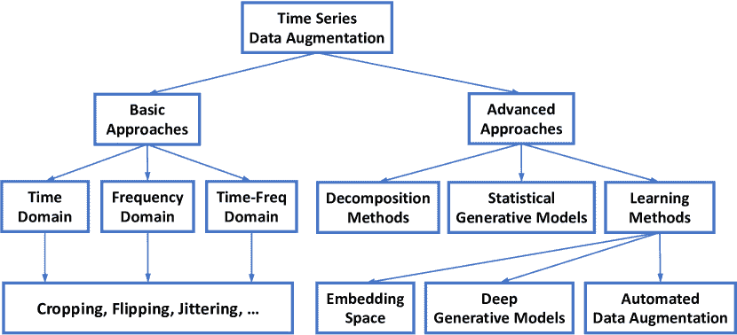
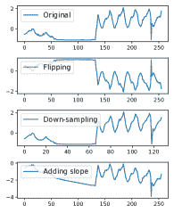
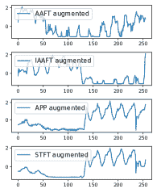

<!--yml

分类: 未分类

日期: 2024-09-06 20:02:14

-->

# [2002.12478] 时间序列数据增强用于深度学习：综述

> 来源：[`ar5iv.labs.arxiv.org/html/2002.12478`](https://ar5iv.labs.arxiv.org/html/2002.12478)

# 时间序列数据增强用于深度学习：综述

Qingsong Wen¹, Liang Sun¹, Fan Yang², Xiaomin Song¹, Jingkun Gao³¹¹1 此项工作是在 Jingkun Gao 在阿里巴巴集团期间完成的。, Xue Wang¹, Huan Xu² ¹DAMO 学院，阿里巴巴集团，美国华盛顿州贝尔维尤

²阿里巴巴集团，中国杭州

³Twitter，美国华盛顿州西雅图 {qingsong.wen, liang.sun, fanyang.yf, xiaomin.song, xue.w, huan.xu}@alibaba-inc.com, jingkung@twitter.com

###### 摘要

深度学习在许多时间序列分析任务中表现出色。深度神经网络的卓越性能在很大程度上依赖于大量的训练数据以避免过拟合。然而，许多现实世界的时间序列应用的标记数据可能有限，例如医学时间序列中的分类和 AIOps 中的异常检测。作为增强训练数据大小和质量的有效方式，数据增强对深度学习模型在时间序列数据上的成功应用至关重要。在本文中，我们系统地回顾了不同的时间序列数据增强方法。我们提出了一种对所评审方法的分类法，然后通过突出其优点和局限性来提供结构化的回顾。我们还对不同任务（包括时间序列分类、异常检测和预测）中的不同数据增强方法进行了实证比较。最后，我们讨论并强调了五个未来方向，以提供有用的研究指导。

## 1 引言

深度学习在许多领域取得了显著成功，包括计算机视觉 (CV)、自然语言处理 (NLP) 和语音处理等。最近，它越来越被用于解决与时间序列相关的任务，包括时间序列分类 Fawaz 等人 (2019)、时间序列预测 Han 等人 (2019) 和时间序列异常检测 Gamboa (2017)。深度学习的成功在很大程度上依赖于大量的训练数据，以避免过拟合。不幸的是，许多时间序列任务没有足够的标记数据。作为一种有效的工具来增强训练数据的大小和质量，数据增强对深度学习模型的成功应用至关重要。数据增强的基本思想是生成涵盖未探索输入空间的合成数据集，同时保持正确的标签。数据增强在许多应用中显示了其有效性，例如用于 ImageNet 分类的 AlexNet Krizhevsky 等人 (2012)。

然而，对于针对时间序列数据的更好的数据增强方法的研究还得到较少关注。我们在这里强调了一些由于时间序列数据的数据增强方法而产生的挑战。首先，目前的数据增强方法没有充分利用时间序列数据的内在特性。时间序列数据的一个独特属性是所谓的时间依赖性。与图像数据不同，时间序列数据可以转换为频率和时频域，并且可以在转换域中设计和实施有效的数据增强方法。当我们对多变量时间序列建模时，这变得更加复杂，我们需要考虑这些变量在时间上的潜在复杂动态。因此，仅仅应用图像和语音处理中的那些数据增强方法可能无法生成有效的合成数据。其次，数据增强方法还取决于具体任务。例如，适用于时间序列分类的数据增强方法可能不适用于时间序列异常检测。此外，在许多时间序列分类问题中，数据增强变得更加重要，因为通常观察到类别不平衡的情况。在这种情况下，如何有效地生成具有较少样本标签的大量合成数据仍然是一个挑战。

据我们所知，与我们最了解的情况相比，目前还没有全面系统地对时间序列的数据增强进行综述。与我们紧密相关的一项工作是 Iwana 和 Uchida（2020），该工作对现有的时间序列分类数据增强方法进行了调查。然而，它没有回顾其他常见任务的数据增强方法，比如时间序列预测 Bandara 等人（2020）；胡等人（2020）；李和金（2020）和异常检测 Lim 等人（2018）；周等人（2019）；高等人（2020）。此外，关于时间序列数据增强的未来研究机会的潜在途径也没有被提及。

本文旨在通过总结现有的时间序列数据增强方法，填补上述空白，包括时间序列预测、异常检测、分类等常见任务，并提供有价值的未来方向。为此，我们提出了时间序列数据增强方法的分类，如图 1 所示。基于这一分类，我们系统地回顾了这些数据增强方法。我们首先讨论时间域中的简单变换。然后我们讨论在变换后的频率域和时间-频率域中对时间序列的更多变换。除了不同领域中的时间序列变换，我们还总结了更先进的方法，包括基于分解的方法、基于模型的方法和基于学习的方法。对于基于学习的方法，我们进一步将其划分为嵌入空间、深度生成模型（DGMs）和自动数据增强方法。为了展示数据增强的有效性，我们对三种典型时间序列任务中的增强方法进行了初步评估，包括时间序列分类、异常检测和预测。最后，我们讨论并突出五个未来方向：时间-频率域中的增强、不平衡类别的增强、增强选择与组合、基于高斯过程的增强，以及基于深度生成模型的增强。

图 1：时间序列数据增强技术的分类。

## 2 基本数据增强方法

### 2.1 时间域

时间域中的变换是时间序列数据最直接的数据增强方法。它们大多数直接操作原始输入时间序列，例如注入高斯噪声或更复杂的噪声模式，如脉冲、阶跃式趋势和斜坡式趋势。除了这些直接的方法，我们还将讨论一种用于时间序列异常检测的特定数据增强方法，即时间域中的标签扩展。

窗口裁剪或切片在 Le Guennec 等人（2016）的研究中已有提及。Cui 等人（2016）引入了窗口裁剪，这与计算机视觉领域的裁剪类似。这是一种子样本方法，通过从原始时间序列中随机提取连续片段来实现。片段的长度是一个可调参数。对于分类问题，切片样本的标签与原始时间序列相同。在测试时，每个测试时间序列的切片通过多数投票进行分类。对于异常检测问题，异常标签将与值序列一起被切片。

窗口扭曲是一种独特的时间序列数据增强方法。类似于动态时间规整（DTW），该方法选择一个随机时间范围，然后对其进行压缩（下采样）或扩展（上采样），同时保持其他时间范围不变。窗口扭曲会改变原始时间序列的总长度，因此应该与窗口裁剪一起进行，以便用于深度学习模型。该方法包含了正常的下采样，通过原始时间序列的整个长度进行下采样。

翻转是另一种方法，通过翻转原始时间序列 $x_{1},\cdots,x_{N}$ 的符号来生成新的序列 $x^{{}^{\prime}}_{1},\cdots,x^{{}^{\prime}}_{N}$，其中 $x^{{}^{\prime}}_{t}=-x_{t}$。标签仍然保持不变，对于异常检测和分类都适用，假设上下方向之间存在对称性。

Fawaz 等人 (2018) 引入了另一种有趣的扰动和集成方法。该方法通过动态时间规整（DTW）生成新的时间序列，然后使用加权版本的重心平均（DBA）算法对它们进行集成。这在一些 UCR 数据集中显示了分类性能的提升。

噪声注入是一种通过将少量噪声/异常值注入时间序列而不改变对应标签的方法。这包括注入高斯噪声、尖峰、阶跃趋势和斜率趋势等。对于尖峰，我们可以随机选择索引和方向，随机分配幅度，但幅度以原始时间序列标准差的倍数为界。对于阶跃趋势，它是从左索引到右索引的尖峰的累积和。斜率趋势是将线性趋势添加到原始时间序列中。这些方案大多在 Wen 和 Keyes (2019) 中提到。

在时间序列异常检测中，异常通常在连续区间内持续较长时间，因此起始点和结束点有时会“模糊”。因此，靠近标记异常的数据点，无论是在时间距离还是数值距离上，都很可能是异常。在这种情况下，提出了标签扩展方法，以将这些数据点及其标签更改为异常（通过分配异常分数或切换其标签），这提高了时间序列异常检测的性能，如 Gao 等人 (2020) 所示。

### 2.2 频域

虽然大多数现有的数据增强方法集中于时间域，但只有少数研究从频域角度探讨了时间序列的数据增强。

Gao 等人 (2020) 的最新工作建议在频域中利用幅度谱和相位谱的扰动来进行时间序列异常检测的数据增强，使用卷积神经网络。具体来说，对于输入时间序列 $x_{1},\cdots,x_{N}$，其通过傅里叶变换得到的频谱 $F(\omega_{k})$ 被计算如下：

|  | $\displaystyle F(\omega_{k})\!=\!\frac{1}{{N}}\!\!\sum_{t=0}^{N-1}\!x_{t}e^{-j\omega_{k}t}\ =A(\omega_{k})\exp[j\theta(\omega_{k})]$ |  | (1) |
| --- | --- | --- | --- |

其中$\omega_{k}=\frac{2\pi k}{N}$是角频率，$A(\omega_{k})$是幅度谱，$\theta(\omega_{k})$是相位谱。对于幅度谱$A(\omega_{k})$的扰动，通过考虑幅度谱中的原始均值和方差，将随机选择段的幅度值替换为高斯噪声。而对于相位谱$\theta(\omega_{k})$的扰动，则在相位谱中向随机选择段的相位值添加额外的零均值高斯噪声。幅度和相位扰动（APP）结合前述的时域增强方法在时间序列异常检测中带来了显著的改进，如 Gao 等人（2020）的实验所示。

另一项近期的工作由 Lee 等人（2019）提出，利用替代数据来提高深度神经网络中康复时间序列的分类性能。工作中采用了两种常见的替代时间序列类型：幅度调整傅里叶变换（AAFT）和迭代 AAFT（IAAFT）Schreiber 和 Schmitz（2000）。其主要思想是在傅里叶变换后对相位谱进行随机相位洗牌，然后在逆傅里叶变换后对时间序列进行排名。由 AAFT 和 IAAFT 生成的时间序列可以大致保持原始时间序列的时间相关性、功率谱和幅度分布。在 Lee 等人（2019）的实验中，作者通过 AAFT 和 IAAFT 方法将数据扩展 10 倍和 100 倍，并展示了相比于未增强的数据原始时间序列的分类准确性改进。

### 2.3 时间-频率域

时间-频率分析是一种广泛应用于时间序列分析的技术，可以作为深度神经网络中的合适输入特征。然而，类似于频率域的数据增强，只有少数研究考虑了时间-频率域的数据增强。

Steven Eyobu 和 Han（2018）采用短时傅里叶变换（STFT）生成传感器时间序列的时间-频率特征，并对这些特征进行数据增强，以便通过深度 LSTM 神经网络进行人体活动分类。具体而言，提出了两种增强技术。一种是基于定义标准的局部平均，生成的特征附加在特征集的尾部。另一种是特征向量的洗牌，以在数据中创建变化。类似地，在语音时间序列中，最近提出的 SpecAugment Park 等（2019）用于在 Mel-Frequency（基于 STFT 的语音时间序列时间-频率表示）中进行数据增强，其中增强方案包括特征扭曲、屏蔽频率通道的块以及屏蔽时间步长的块。他们展示了 SpecAugment 可以显著提高语音识别神经网络的性能，并获得了最先进的结果。

为了说明，我们总结了图 2 中时间、频率和时间-频率域中几种典型的时间序列数据增强方法。

(a) 时间域

(b) （时间-）频率域

图 2：时间、频率和时间-频率域中几种典型时间序列数据增强的说明。

## 3 高级数据增强方法

### 3.1 基于分解的方法

基于分解的时间序列增强方法也已被采用，并在许多与时间序列相关的任务中取得了成功，如预测和异常检测。常见的分解方法如 STL Cleveland 等（1990）或 RobustSTL Wen 等（2019b）将时间序列$x_{t}$分解为

|  | $x_{t}=\tau_{t}+s_{t}+r_{t},\quad t=1,2,...N$ |  | (2) |
| --- | --- | --- | --- |

其中$\tau_{t}$是趋势信号，$s_{t}$是季节性/周期性信号，$r_{t}$表示剩余信号。

在 Kegel 等人（2018）的研究中，作者讨论了生成新时间序列的分解方法。经过 STL 处理后，它将新的时间序列与确定性组件和随机组件重新组合。确定性部分通过调整基础、趋势和季节性的权重进行重建。随机部分则通过基于残差建立的复合统计模型生成，例如自回归模型。生成的时间序列通过检查与原始信号的特征基础距离是否在一定范围内进行验证。同时，Bergmeir 等人（2016）提出对 STL 分解残差应用自助法以生成增广信号，然后将其与趋势和季节性重新组合以组装新的时间序列。在增广时间序列上的预测模型集成相比于原始预测模型表现更好，展示了基于分解的时间序列增广方法的有效性。

最近，在 Gao 等人（2020）的研究中，作者展示了将时间域和频率域增广应用于通过稳健分解方法生成的分解残差，可以显著提高异常检测的性能，相比于没有增广的相同方法。

### 3.2 统计生成模型

基于统计生成模型的时间序列增广方法通常涉及使用统计模型对时间序列的动态进行建模。在 Cao 等人（2014）的研究中，作者提出了一种简洁的统计模型，称为高斯树混合模型，用于建模多模态少数类时间序列数据，以解决不平衡分类问题，相比于不利用邻近点之间时间序列相关性的现有过采样方法显示出优势。Smyl 和 Kuber（2016）的作者使用由名为 LGT（局部和全局趋势）的统计算法计算的参数样本和预测路径。最近，在 Kang 等人（2020）的研究中，研究人员使用混合自回归（MAR）模型模拟时间序列集合，并调查生成时间序列在时间序列特征空间中的多样性和覆盖范围。

本质上，这些模型通过假设时间$t$的值依赖于先前的点来描述时间序列的条件分布。一旦初始值被扰动，就可以生成一个新的时间序列，遵循条件分布。

### 3.3 基于学习的方法

时间序列数据增广方法不仅应能够生成多样化的样本，还应能够模拟真实数据的特征。在本节中，我们总结了一些具有这种潜力的最新学习方法。

#### 3.3.1 嵌入空间

在 DeVries 和 Taylor（2017）中，提出了在学习的嵌入空间（即潜在空间）中进行数据增强。它假设对编码后的输入应用简单变换，而不是原始输入，会由于特征空间中的流形展开而生成更具可信度的合成数据。注意，在这个框架中表示模型的选择是开放的，取决于具体任务和数据类型。当处理时间序列数据时，DeVries 和 Taylor（2017）选择了序列自编码器。具体而言，插值和外推被应用于生成新样本。在变换空间中，首先识别出具有相同标签的前$k$个最近标签。然后，对于每一对相邻样本，生成一个新的样本，该样本是它们的线性组合。插值和外推的区别在于样本生成中的权重选择。正如 DeVries 和 Taylor（2017）中所展示的，这种技术对时间序列分类特别有用。最近，Cheung 和 Yeung（2021）提出了另一种嵌入空间中的数据增强方法，称为 MODALS（模态无关自动数据增强在潜在空间中）。该方法不是训练自编码器来学习潜在空间并生成额外的合成数据，而是联合训练分类模型和不同组成的潜在空间增强，这在时间序列分类问题上表现出优越的性能。

#### 3.3.2 深度生成模型

深度生成模型（DGMs）最近被证明能够生成接近真实的高维数据对象，如图像和序列。针对顺序数据（如音频和文本）开发的 DGMs 通常可以扩展到建模时间序列数据。在 DGMs 中，生成对抗网络（GANs）是生成合成样本和有效增加训练集的流行方法。尽管 GAN 框架在许多领域受到了广泛关注，但如何生成有效的时间序列数据仍然是一个具有挑战性的问题。在本小节中，我们简要回顾了几个关于时间序列数据增强的 GAN 的近期工作。

在 Esteban 等人 (2017) 的研究中，提出了 Recurrent GAN（RGAN）和 Recurrent Conditional GAN（RCGAN）以生成逼真的真实值多维时间序列数据。RGAN 在生成器和判别器中采用 RNN，而 RCGAN 则在条件辅助信息的条件下采用两个 RNN。除了 RGAN 和 RCGAN 在时间序列数据增强中的良好表现外，差分隐私还可以用于训练 RCGAN 以在医学或其他敏感领域提供更严格的隐私保障。最近，Yoon 等人 (2019) 提出了 TimeGAN，这是一种在各种领域生成逼真的时间序列数据的自然框架。TimeGAN 是一个生成时间序列模型，通过学习的嵌入空间以对抗方式和联合方式进行训练，同时采用监督和无监督损失。具体而言，引入了逐步监督损失以学习数据中的逐步条件分布。它还引入了一个嵌入网络，以在特征和潜在表示之间提供可逆的映射，从而减少对抗学习空间的高维度。值得注意的是，监督损失通过联合训练嵌入和生成器网络来最小化。

#### 3.3.3 自动数据增强

自动数据增强的思想是通过强化学习、元学习或进化搜索自动寻找最佳的数据增强策略  Ratner 等人 (2017)；Cubuk 等人 (2019)；Zhang 等人 (2020)；Cheung 和 Yeung (2021)。Ratner 等人 (2017) 中的 TANDA（用于数据增强的转换对抗网络）方案旨在通过在类似 GAN 的框架中使用强化学习来训练一个生成序列模型，利用指定的转换函数生成逼真的变换数据点，这在图像识别和自然语言理解等各种应用中，相较于常见的启发式数据增强方法，取得了显著的效果。Cubuk 等人 (2019) 提出了一个名为 AutoAugment 的程序，用于在强化学习框架中自动搜索改进的数据增强策略。它采用一个控制器 RNN 网络从搜索空间中预测一个增强策略，并训练另一个网络以实现收敛精度。然后，使用准确度作为奖励来更新 RNN 控制器，以在下一次迭代中获得更好的策略。实验结果表明，AutoAugment 在广泛的数据集上显著提高了现代图像分类器的准确性。

对于时间序列数据增强，MODALS Cheung 和 Yeung (2021) 旨在利用基于种群的增强（PBA）Ho 等人 (2019) 的进化搜索策略，找到潜在空间变换的最佳组合来进行数据增强，这在连续和离散时间序列数据的分类问题上表现出优越的性能。另一项关于自动数据增强的最新研究由 Fons 等人 (2021) 提出，其中为时间序列数据设计了两种样本自适应自动加权方案：一种学习加权增强样本对损失的贡献，另一种则根据预测训练损失的排名选择变换的子集。这两种自适应策略在多个时间序列数据集上的分类问题中都显示出了改进。

## 4 初步评估

在本节中，我们展示了在三种常见时间序列任务中的初步评估，以展示数据增强对性能提升的有效性。

### 4.1 时间序列分类

在本实验中，我们比较了有无数据增强的分类性能。具体来说，我们从阿里巴巴云监控系统中收集了 $5000$ 条为期一周、间隔为 5 分钟的二分类标签（季节性或非季节性）时间序列样本。数据被随机分为训练集和测试集，其中训练集包含 $80\%$ 的总样本。我们训练了一个完全卷积网络 Wang 等人 (2017) 以对训练集中的每个时间序列进行分类。在我们的实验中，我们将不同类型的异常值，包括尖峰、阶跃和斜率，注入到测试集中，以评估训练分类器的鲁棒性。应用的数据增强方法包括裁剪、扭曲和翻转。表 1 总结了在不同类型的异常值注入到测试集中时，有无数据增强的准确率。可以观察到，数据增强导致 $0.1\%\sim 1.9\%$ 的准确率提升。

| 异常值注入 | 无增强 | 有增强 | 提升 |
| --- | --- | --- | --- |
| 尖峰 | 96.26% | 96.37% | 0.11% |
| step | 93.70% | 95.62% | 1.92% |
| slope | 95.84% | 96.16% | 0.32% |

表 1：时间序列分类中异常值注入下的数据增强准确率提升。

### 4.2 时间序列异常检测

鉴于时间序列异常检测中存在的*数据稀缺*和*数据不平衡*的挑战，采用数据增强来生成更多标记数据是有益的。我们简要总结了 Gao 等人（2020）的结果，其中设计并在公共 Yahoo!数据集 Laptev 等人（2015）上评估了一个基于 U-Net 的网络，用于时间序列异常检测。不同设置下的性能比较总结在表 2 中，包括对原始数据（U-Net-Raw）、对分解后的残差（U-Net-DeW）和对增强后的残差（U-Net-DeWA）的应用。所采用的数据增强方法包括翻转、裁剪、标签扩展以及基于频域的 APP 增强。可以观察到，分解有助于提高 F1 分数，而数据增强进一步提升了性能。

| 算法 | 精确度 | 召回率 | F1 |
| --- | --- | --- | --- |
| U-Net-Raw | 0.473 | 0.351 | 0.403 |
| U-Net-DeW | 0.793 | 0.569 | 0.662 |
| U-Net-DeWA（带增强） | 0.859 | 0.581 | 0.693 |

表 2: 基于精确度、召回率和 F1 分数的数据增强在时间序列异常检测中的改进。

### 4.3 时间序列预测

在本小节中，我们展示了数据增强在两个流行的深度模型中的实际效果：DeepAR Salinas 等人 (2019) 和 Transformer Vaswani 等人 (2017)。在表 3 中，我们报告了在多个公共数据集上均值绝对缩放误差（MASE）的性能提升，包括来自 UCI 学习库的电力和交通数据²²2[`archive.ics.uci.edu/ml/datasets.php`](http://archive.ics.uci.edu/ml/datasets.php)以及 M4 竞赛的 3 个数据集³³3[`github.com/Mcompetitions/M4-methods/tree/master/Dataset`](https://github.com/Mcompetitions/M4-methods/tree/master/Dataset)。我们考虑了包括裁剪、扭曲、翻转和基于频率域的 APP 增强在内的基本增强方法。在表 3 中，我们总结了没有增强和有增强的平均 MASE 以及计算为 $(\textrm{MASE}_{\textrm{w/o aug}}-\textrm{MASE}_{\textrm{w aug}})/\textrm{MASE}_{\textrm{w aug}}$ 的平均相对提升（ARI）。我们观察到数据增强方法在所有模型中的平均效果都很有前景。然而，在特定的数据/模型对中仍然可以观察到负面结果。作为未来的工作，这促使我们寻找先进的自动化数据增强策略，以稳定数据增强对时间序列预测的影响。

| 数据集 | DeepAR | Transformer |
| --- | --- | --- |
| w/o aug | w/ aug | ARI | w/o aug | w/ aug | ARI |
| --- | --- | --- | --- | --- | --- |
| electricity | $0.87$ | $0.97$ | $1.92\%$ | $1.04$ | $1.11$ | $-2\%$ |
| traffic | $0.66$ | $0.80$ | $-12\%$ | $0.70$ | $0.91$ | $-16\%$ |
| m4-hourly | $6.33$ | $5.35$ | $56\%$ | $7.77$ | $7.87$ | $38\%$ |
| m4-daily | $4.88$ | $4.48$ | $10\%$ | $7.85$ | $7.38$ | $37\%$ |
| m4-weekly | $12.00$ | $9.34$ | $76\%$ | $6.62$ | $7.09$ | $23\%$ |

表 3：基于 MASE 的数据增强对时间序列预测的改进。

## 5 未来机会讨论

### 5.1 时间-频率域的增强

如第 2.3 节所讨论的，目前基于 STFT 的时间序列数据增强方法的研究仍然较为有限。除了 STFT 外，小波变换及其变体，包括连续小波变换（CWT）和离散小波变换（DWT），是另一系列自适应的时频域分析方法，用于表征时间序列的时变性质。与 STFT 相比，它们能够更有效和更稳健地处理非平稳时间序列和非高斯噪声。在众多的小波变换变体中，最大重叠离散小波变换（MODWT）尤其吸引人，用于时间序列分析 Percival and Walden (2000); Wen et al. (2021)，原因如下：1）与 CWT 相比更高的计算效率；2）能够处理任何时间序列长度；3）与 DWT 相比在粗略尺度上具有更高的分辨率。基于 MODWT 的替代时间序列在 Keylock (2006)中被提出，其中将小波迭代幅度调整傅里叶变换（WIAAFT）方案设计为每个 MODWT 系数级别的组合。与 IAAFT 不同，WIAAFT 不假设平稳性，并且在时间演化方面大致维持了原始数据的形状。除了 WIAAFT，我们还可以考虑在每个 MODWT 系数级别上考虑幅度谱和相位谱的扰动，作为数据增强方案 Gao et al. (2020)。

探究如何利用不同的小波变换（CWT、DWT、MODWT 等）来有效利用深度神经网络中基于时频域的时间序列数据增强，将是一个有趣的未来方向。

### 5.2 不平衡类别的增强

在时间序列分类中，类别不平衡经常发生。解决不平衡分类问题的一个经典方法是对少数类进行过采样，即合成少数类过采样技术（SMOTE） Fernández et al. (2018) ，以人工减轻不平衡现象。然而，这种过采样策略可能改变原始数据的分布并导致过拟合。另一种方法是通过使用调整损失函数设计成本敏感模型 Geng and Luo (2018)。此外，Gao et al. (2020)在卷积神经网络的损失函数中设计了基于标签的权重和基于数值的权重，考虑了类别标签和每个样本的邻域的权重调整。因此，这两个类别不平衡和时间依赖性都得到了明确考虑。

对于不平衡类别的数据进行数据增强和加权的结合将是一个有趣且有效的方向。最近的研究探讨了这一主题，涉及计算机视觉和自然语言处理领域 Hu et al. (2019)，这显著改善了低数据和不平衡类别问题下的文本和图像分类。未来，通过共同考虑时间序列数据中的数据增强和不平衡类别加权来设计深度网络将是一个有趣的方向。

### 5.3 增强选择与组合

根据图 1 总结的不同数据增强方法，关键策略之一是如何选择和组合各种增强方法。Um et al. (2017) 的实验表明，三种基本时间域方法（置换、旋转和时间扭曲）的组合优于单一方法，并在时间序列分类中实现了最佳性能。此外，Rashid 和 Louis (2019) 的结果显示，通过将四种数据增强方法（即抖动、缩放、旋转和时间扭曲）结合使用深度神经网络，时间序列分类任务的性能显著提升。然而，考虑到各种数据增强方法，直接组合不同的增强可能会导致大量数据，并可能对性能提升效率和效果不佳。最近，RandAugment Cubuk et al. (2020) 被提出作为图像分类和目标检测中的增强组合的实际方法。对于每个随机生成的数据集，RandAugment 仅基于两个可解释的超参数 $N$（组合的增强方法数量）和 $M$（所有增强方法的幅度），其中每种增强方法是从 $K$=14 种可用增强方法中随机选择的。此外，这种随机组合的增强与简单的网格搜索可以用于基于强化学习的数据增强，类似于 Cubuk et al. (2019) 用于高效空间搜索。

一个有趣的未来方向是如何设计适用于深度学习中时间序列数据的有效增强选择和/或组合策略。定制化的强化学习和优化的元学习可能是潜在的方法。此外，算法效率在实践中也是另一个重要的考虑因素。

### 5.4 使用高斯过程的增强

高斯过程（GPs）Rasmussen 和 Williams（2005）是广为人知的适合时间序列分析的贝叶斯非参数模型 Roberts 等人（2013）。从函数空间的角度来看，高斯过程诱导了一个函数分布，即一个随机过程。时间序列可以视为以时间为输入、观察值为输出的函数，因此可以用 GPs 来建模。一个 GP $f(t)\sim\mathcal{GP}(m(t),k(t,t^{\prime}))$由均值函数 $m(t)$ 和协方差核函数 $k(t,t^{\prime})$ 特征化。核的选择允许对建模函数的一些一般属性进行假设，如平滑性、尺度、周期性和噪声水平。核可以通过加法和乘法进行组合，从而产生组合函数属性，如伪周期性、加性分解性和变化点。GPs 通常应用于插值和外推任务，这对应于时间序列分析中的填补和预测。此外，深度高斯过程（DGPs）Damianou 和 Lawrence（2013）；Salimbeni 和 Deisenroth（2017），这些模型具有层次化的 GPs 组合，并且在许多情况下常常显著超越标准（单层）GPs，但在时间序列方面尚未得到很好研究。我们认为 GPs 和 DGPs 是未来的方向，因为它们通过核的设计允许采样具有上述属性的时间序列，并利用其插值/外推能力从现有数据实例生成新的数据实例。

### 5.5 使用深度生成模型的增强

目前用于时间序列数据增强的深度生成模型主要是 GANs。然而，其他深度生成模型也在时间序列建模中具有巨大潜力。例如，深度自回归网络（DARNs）展示了与时间序列的自然契合，因为它们以顺序方式生成数据，遵循物理时间序列数据生成过程的因果方向。像 Wavenet Oord 等人（2016）和 Transformer Vaswani 等人（2017）这样的 DARNs 在时间序列预测任务中表现出了有希望的性能 Alexandrov 等人（2020）。另一个例子是归一化流（NFs） Kobyzev 等人（2020），它们最近在建模时间序列随机过程方面取得了成功，表现出了出色的插值/外推性能，给定的观测数据 Deng 等人（2020）。最近，基于变分自编码器（VAEs）的数据增强 Fu 等人（2020）被研究用于人类活动识别。

总结而言，除了常见的 GAN 架构之外，如何利用其他深度生成模型如 DARNs、NFs 和 VAEs，这些模型在时间序列数据增强中的研究较少，仍然是令人兴奋的未来机会。

## 6 结论

随着深度学习模型在时间序列数据上的流行，有限的标记数据要求有效的数据增强方法。在本文中，我们对各种任务中的时间序列数据增强方法进行了全面调查。我们将审查的方法组织在一个包括基础和高级方法的分类法中，总结了每个类别中的代表性方法，实证比较了它们在典型任务中的表现，并强调了未来的研究方向。

## 参考文献

+   Alexandrov 等人 [2020] Alexander Alexandrov、Konstantinos Benidis、Michael Bohlke-Schneider、Valentin Flunkert、Jan Gasthaus、Tim Januschowski、Danielle C Maddix、Syama Rangapuram、David Salinas、Jasper Schulz 等人。Gluonts: Python 中的概率和神经时间序列建模。机器学习研究杂志, 21(116):1–6, 2020。

+   Bandara 等人 [2020] Kasun Bandara、Hansika Hewamalage、Yuan-Hao Liu、Yanfei Kang 和 Christoph Bergmeir。通过时间序列数据增强提高全球预测模型的准确性。arXiv 预印本 arXiv:2008.02663, 2020。

+   Bergmeir 等人 [2016] Christoph Bergmeir、Rob J. Hyndman 和 José M. Benítez。使用 STL 分解和 Box–Cox 变换的包外指数平滑方法。国际预测杂志, 32(2):303–312, 2016。

+   Cao 等人 [2014] Hong Cao、Vincent YF Tan 和 John ZF Pang。用于不平衡和多模态时间序列分类的简约高斯树混合模型。IEEE TNNLS, 25(12):2226–2239, 2014。

+   Cheung 和 Yeung [2021] Tsz-Him Cheung 和 Dit-Yan Yeung。MODALS: 潜在空间中的模态无关自动数据增强。在国际学习表征会议 (ICLR), 2021。

+   Cleveland 等人 [1990] Robert B Cleveland、William S Cleveland、Jean E McRae 和 Irma Terpenning。STL: 基于 loess 的季节性趋势分解程序。官方统计学杂志, 6(1):3–73, 1990。

+   Cubuk 等人 [2019] Ekin D. Cubuk、Barret Zoph、Dandelion Mane、Vijay Vasudevan 和 Quoc V. Le。AutoAugment: 从数据中学习增强策略。在 IEEE CVPR 2019, 第 113–123 页, 2019 年 6 月。

+   Cubuk 等人 [2020] Ekin D Cubuk、Barret Zoph、Jonathon Shlens 和 Quoc V Le。RandAugment: 带有缩小搜索空间的实用自动数据增强。在 2020 IEEE/CVF 计算机视觉与模式识别会议研讨会, 第 3008–3017 页, 2020。

+   Cui 等人 [2015] X Cui、V Goel 和 B Kingsbury。深度神经网络声学建模的数据增强。IEEE/ACM TASLP, 23(9):1469–1477, 2015。

+   Cui 等人 [2016] Zhicheng Cui、Wenlin Chen 等人。用于时间序列分类的多尺度卷积神经网络。arXiv 预印本 arXiv:1603.06995, 2016。

+   Damianou 和 Lawrence [2013] Andreas Damianou 和 Neil D Lawrence。深度高斯过程。在人工智能与统计, 第 207–215 页。PMLR, 2013。

+   Deng 等 [2020] Ruizhi Deng, Bo Chang, Marcus A Brubaker, Greg Mori 和 Andreas Lehrmann. 使用动态归一化流建模连续随机过程。在 NeurIPS 2020, 2020 年 12 月。

+   DeVries 和 Taylor [2017] Terrance DeVries 和 Graham W. Taylor. 特征空间的数据集增强。在 ICLR 2017, 页码 1–12, Toulon, 2017。

+   Esteban 等 [2017] Cristóbal Esteban, Stephanie L Hyland 和 Gunnar Rätsch. 使用递归条件生成对抗网络生成实值（医学）时间序列。arXiv 预印本 arXiv:1706.02633, 2017。

+   Fawaz 等 [2018] Hassan Ismail Fawaz, Germain Forestier, Jonathan Weber, Lhassane Idoumghar 和 Pierre-Alain Muller. 使用合成数据进行时间序列分类的数据增强与深度残差网络。在 ECML/PKDD AALTD 研讨会, 2018。

+   Fawaz 等 [2019] Hassan Ismail Fawaz, Germain Forestier, Jonathan Weber 等. 时间序列分类的深度学习：综述。《数据挖掘与知识发现》，33(4):917–963, 2019。

+   Fernández 等 [2018] Alberto Fernández, Salvador Garcia, Francisco Herrera 和 Nitesh V Chawla. 针对不平衡数据学习的 SMOTE：进展与挑战，庆祝 15 周年。《人工智能研究期刊》，61:863–905, 2018。

+   Fons 等 [2021] Elizabeth Fons, Paula Dawson, Xiao-jun Zeng, John Keane 和 Alexandros Iosifidis. 自动时间序列数据增强的自适应加权方案。arXiv 预印本 arXiv:2102.08310, 2021。

+   Fu 等 [2020] Biying Fu, Florian Kirchbuchner 和 Arjan Kuijper. 时间序列的数据增强：传统模型与生成模型在电容接近时间序列上的比较。在 ACM PETRA, 页码 1–10, 2020。

+   Gamboa [2017] John Cristian Borges Gamboa. 用于时间序列分析的深度学习。arXiv 预印本 arXiv:1701.01887, 2017。

+   Gao 等 [2020] Jingkun Gao, Xiaomin Song, Qingsong Wen, Pichao Wang, Liang Sun 和 Huan Xu. Robusttad：通过分解和卷积神经网络进行稳健的时间序列异常检测。MileTS’20: 第六届 KDD 时间序列挖掘与学习研讨会, 页码 1–6, 2020。

+   Geng 和 Luo [2018] Yue Geng 和 Xinyu Luo. 面向不平衡时间序列分类的成本敏感卷积神经网络。arXiv 预印本 arXiv:1801.04396, 2018。

+   Han 等 [2019] Z Han, J Zhao, H Leung, K F Ma 和 W Wang. 深度学习模型在时间序列预测中的综述。《IEEE 传感器期刊》，第 1 页, 2019。

+   Ho 等 [2019] Daniel Ho, Eric Liang, Xi Chen, Ion Stoica 和 Pieter Abbeel. 基于人群的增强：高效学习增强策略调度。在国际机器学习大会（ICML）, 页码 2731–2741, 2019。

+   Hu 等 [2019] Zhiting Hu, Bowen Tan, Russ R Salakhutdinov, Tom M Mitchell 和 Eric P Xing. 学习数据操作以进行增强和加权。在 NeurIPS 2019, 页码 15764–15775, 2019。

+   Hu et al. [2020] Hailin Hu, MingJian Tang 和 Chengcheng Bai. Datsing: 使用对抗性领域适应的数据增强时间序列预测。第 29 届 ACM 国际信息与知识管理会议论文集, 页码 2061–2064, 2020。

+   Iwana and Uchida [2020] Brian Kenji Iwana 和 Seiichi Uchida. 基于神经网络的时间序列分类的数据增强实证调查。arXiv 预印本 arXiv:2007.15951, 2020。

+   Kang et al. [2020] Yanfei Kang, Rob J Hyndman 和 Feng Li. GRATIS: 生成具有多样和可控特征的时间序列。统计分析与数据挖掘: ASA 数据科学期刊, 13(4):354–376, 2020。

+   Kegel et al. [2018] Lars Kegel, Martin Hahmann 和 Wolfgang Lehner. 基于特征的时间序列比较与生成。在 SSDBM 2018 中, 2018。

+   Keylock [2006] C J Keylock. 保持均值和方差结构的约束替代时间序列。物理评论 E, 73(3):36707, 2006 年 3 月。

+   Kobyzev et al. [2020] Ivan Kobyzev, Simon Prince 和 Marcus Brubaker. 归一化流: 当前方法的介绍与回顾。IEEE 模式分析与机器智能汇刊, 页码 1–17, 2020。

+   Krizhevsky et al. [2012] Alex Krizhevsky, Ilya Sutskever 和 Geoffrey E Hinton. 使用深度卷积神经网络的 Imagenet 分类。在 NeurIPS 2012 中, 页码 1097–1105, 2012。

+   Laptev et al. [2015] Nikolay Laptev, Saeed Amizadeh 等. 用于自动化时间序列异常检测的通用和可扩展框架。KDD, 页码 1939–1947, 2015。

+   Le Guennec et al. [2016] Arthur Le Guennec, Simon Malinowski 和 Romain Tavenard. 使用卷积神经网络的时间序列分类数据增强。在 ECML/PKDD AALTD 研讨会中, 2016。

+   Lee and Kim [2020] Si Woon Lee 和 Ha Young Kim. 使用 convlstm、趋势采样和专门的数据增强进行超高维时间序列数据的股市预测。专家系统与应用, 161:113704, 2020。

+   Lee et al. [2019] Tracey Kah-Mein Lee, YL Kuah, Kee-Hao Leo, Saeid Sanei, Effie Chew 和 Ling Zhao. 用于基于图像的深度学习的替代性康复时间序列数据。在 EUSIPCO 2019 中, 页码 1–5, 2019。

+   Lim et al. [2018] Swee Kiat Lim, Yi Loo, Ngoc-Trung Tran, Ngai-Man Cheung, Gemma Roig 和 Yuval Elovici. DOPING: 用于无监督异常检测的生成数据增强与 gan。在 2018 年 IEEE 数据挖掘国际会议 (ICDM) 中, 页码 1122–1127。IEEE, 2018。

+   Oord et al. [2016] Aaron van den Oord, Sander Dieleman, Heiga Zen, Karen Simonyan, Oriol Vinyals, Alex Graves, Nal Kalchbrenner, Andrew Senior 和 Koray Kavukcuoglu. Wavenet: 一种原始音频生成模型。国际学习表征会议, 2016。

+   Park et al. [2019] Daniel S Park, William Chan, Yu Zhang, Chung-Cheng Chiu, Barret Zoph, Ekin D Cubuk 等. SpecAugment: 一种用于自动语音识别的简单数据增强方法。在 INTERSPEECH 2019 中, 页码 2613–2617, 2019。

+   Percival 和 Walden [2000] Donald B Percival 和 Andrew T Walden. 时间序列分析的波动方法，第 4 卷. 剑桥大学出版社, 纽约, 2000.

+   Rashid 和 Louis [2019] Khandakar M Rashid 和 Joseph Louis. 时间序列数据增强和深度学习用于建筑设备活动识别. 高级工程信息学, 42:100944, 2019.

+   Rasmussen 和 Williams [2005] Carl Edward Rasmussen 和 Christopher KI Williams. 高斯过程机器学习. 麻省理工学院出版社, 2005.

+   Ratner 等 [2017] Alexander J Ratner, Henry R Ehrenberg, Zeshan Hussain, Jared Dunnmon 和 Christopher Ré. 学习组合领域特定转换用于数据增强. NeurIPS 2017, 30:3239, 2017.

+   Roberts 等 [2013] Stephen Roberts, Michael Osborne, Mark Ebden, Steven Reece, Neale Gibson 和 Suzanne Aigrain. 时间序列建模的高斯过程. 皇家学会 A 辑: 数学、物理与工程科学, 371(1984):20110550, 2013.

+   Salimbeni 和 Deisenroth [2017] Hugh Salimbeni 和 Marc Peter Deisenroth. 双重随机变分推断用于深度高斯过程. 载于 NeurIPS 2017, 页 4591–4602, 2017.

+   Salinas 等 [2019] David Salinas, Valentin Flunkert, Jan Gasthaus 和 Tim Januschowski. DeepAR: 使用自回归递归网络的概率预测. 国际预测期刊, 2019.

+   Schreiber 和 Schmitz [2000] Thomas Schreiber 和 Andreas Schmitz. 替代时间序列. 物理学 D: 非线性现象, 142(3):346–382, 2000.

+   Shorten 和 Khoshgoftaar [2019] Connor Shorten 和 Taghi M Khoshgoftaar. 深度学习图像数据增强的综述. 大数据期刊, 6(1):60, 2019.

+   Smyl 和 Kuber [2016] Slawek Smyl 和 Karthik Kuber. 数据预处理和增强用于多个短时间序列预测与递归神经网络. 载于第 36 届国际预测研讨会, 2016 年 6 月.

+   Steven Eyobu 和 Han [2018] Odongo Steven Eyobu 和 Dong Seog Han. 基于可穿戴 IMU 传感器数据的深度 LSTM 神经网络的人类活动分类特征表示和数据增强. 传感器, 18(9):2892, 2018.

+   Um 等 [2017] Terry T Um, Franz M J Pfister, Daniel Pichler, Satoshi Endo, Muriel Lang, Sandra Hirche, Urban Fietzek 和 Dana Kulić. 使用卷积神经网络的可穿戴传感器数据增强用于帕金森病监测. 载于 ACM ICMI 2017, 页 216–220, 2017.

+   Vaswani 等 [2017] Ashish Vaswani, Noam Shazeer, Niki Parmar, Jakob Uszkoreit, Llion Jones 等. 注意力机制就是你所需的一切. 载于 NeurIPS 2017, 页 5998–6008, 2017.

+   Wang 等 [2017] Zhiguang Wang, Weizhong Yan 和 Tim Oates. 从头开始的时间序列分类与深度神经网络: 一个强基线. 载于 IJCNN, 页 1578–1585, 2017.

+   Wen 和 Keyes [2019] Tailai Wen 和 Roy Keyes. 使用卷积神经网络和迁移学习的时间序列异常检测. 载于 IJCAI AI4IoT 研讨会, 2019.

+   Wen et al. [2019a] Qingsong Wen, Jingkun Gao, Xiaomin Song, Liang Sun, 和 Jian Tan。RobustTrend：一种结合了一阶和二阶差分正则化的 Huber 损失，用于时间序列趋势滤波。收录于 IJCAI，页码 3856–3862，2019 年。

+   Wen et al. [2019b] Qingsong Wen, Jingkun Gao, Xiaomin Song, Liang Sun, Huan Xu, 和 Shenghuo Zhu。RobustSTL：一种用于长时间序列的稳健季节-趋势分解算法。收录于 AAAI，第 33 卷，页码 5409–5416，2019 年。

+   Wen et al. [2020] Qingsong Wen, Zhe Zhang, Yan Li, 和 Liang Sun。Fast RobustSTL：一种高效且稳健的季节-趋势分解方法，适用于具有复杂模式的时间序列。收录于 KDD，页码 2203–2213，2020 年。

+   Wen et al. [2021] Qingsong Wen, Kai He, Liang Sun, Yingying Zhang, Min Ke, 和 Huan Xu。RobustPeriod：用于稳健多重周期检测的时间频率挖掘。收录于 数据管理国际会议 (SIGMOD)，2021 年。

+   Yoon et al. [2019] Jinsung Yoon, Daniel Jarrett, 和 Mihaela van der Schaar。时间序列生成对抗网络。收录于 NeurIPS 2019，页码 5508–5518，2019 年。

+   Zhang et al. [2020] Xinyu Zhang, Qiang Wang, Jian Zhang, 和 Zhao Zhong。对抗性自动增强。收录于 国际学习表征会议 (ICLR)，2020 年。

+   Zhou et al. [2019] Bin Zhou, Shenghua Liu, Bryan Hooi, Xueqi Cheng, 和 Jing Ye。Beatgan：使用对抗生成时间序列进行异常节奏检测。收录于 IJCAI，页码 4433–4439，2019 年。
