<!--yml

分类：未分类

日期：2024-09-06 20:02:11

-->

# [2003.01200] 深度学习驱动的自然语言处理进展：一项调查

> 来源：[`ar5iv.labs.arxiv.org/html/2003.01200`](https://ar5iv.labs.arxiv.org/html/2003.01200)

# 深度学习驱动的自然语言处理进展：一项调查

Amirsina Torfi、Rouzbeh A. Shirvani、Yaser Keneshloo、Nader Tavaf 和 Edward A. Fox Amirsina Torfi、Yaser Keneshloo 和 Edward A. Fox 曾在美国弗吉尼亚理工大学计算机科学系工作，地址：Blacksburg, VA, 24060 USA，电子邮件：(amirsina.torfi@gmail.com, yaserkl@vt.edu, fox@vt.edu)。Rouzbeh A. Shirvani 是独立研究员，电子邮件：(rouzbeh.asghari@gmail.com)。Nader Tavaf 曾在明尼苏达大学双子城校区工作，地址：Minneapolis, MN, 55455 USA，电子邮件：(tavaf001@umn.edu)。

###### 摘要

自然语言处理（NLP）通过增强对人类语言的理解，帮助实现智能机器的智能化，从而改善基于语言的人机通信。计算能力的最近发展和大量语言数据的出现增加了对使用数据驱动方法自动化语义分析的需求和需求。由于深度学习方法在计算机视觉、自动语音识别以及特别是在 NLP 等领域的显著进展，数据驱动策略的使用如今无处不在。这项调查对受益于深度学习的 NLP 的不同方面和应用进行了分类和讨论。它涵盖了核心的 NLP 任务和应用，并描述了深度学习方法和模型如何推动这些领域的发展。我们进一步分析和比较了不同的方法和最先进的模型。

###### 关键词：

自然语言处理，深度学习，人工智能

## I 引言

自然语言处理（NLP）是计算机科学的一个子学科，提供了自然语言与计算机之间的桥梁。它帮助机器理解、处理和分析人类语言[1]。NLP 作为一种工具，帮助理解人类生成的数据，其重要性是数据上下文依赖性的逻辑结果。通过更深入理解数据的上下文，数据变得更有意义，从而促进了文本分析和挖掘。NLP 通过人类的交流结构和模式实现了这一点。

NLP 方法的发展越来越依赖于数据驱动的方法，这些方法有助于构建更强大和更稳健的模型[2, 3, 4]。计算能力的最新进展以及大数据的更大可用性使得深度学习成为 NLP 领域最具吸引力的方法之一[5, 2, 3]，特别是考虑到深度学习在计算机视觉[6, 7, 8, 9, 10]和语音识别[11, 12, 13]等相关领域中已经表现出了卓越的性能。这些发展导致了从传统方法到新型数据驱动方法的范式转变，旨在推动 NLP 的进步。这种转变的原因很简单：新方法在结果方面更具前景，并且更容易工程实现。

作为在使用深度学习方法的相关学科中取得的显著进展的延续，深度神经网络已被应用于各种 NLP 任务，包括词性标注[14, 15, 16, 17]、命名实体识别[18, 19, 18, 20, 21]以及语义角色标注[22, 23, 24, 25]。大多数与 NLP 应用相关的深度学习研究工作涉及有监督学习¹¹1 从训练数据中学习，以通过将新见样本映射到已知的预定义标签来预测新样本的类型。或无监督学习²²2 从数据中提取意义，而不依赖于特定任务和监督信号。

本调查涵盖了深度学习在 NLP 领域中新兴的角色，涉及广泛的类别。研究[26]主要集中在架构上，应用讨论较少。更近期的研究[27, 4]则专注于特定应用或 NLP 的某些子领域[21]。在这里，我们在之前的工作基础上，描述了将深度学习应用于 NLP 问题的挑战、机遇和影响评估。

本调查包含六个部分，包括本引言。第二部分阐述了 NLP 和人工智能的理论维度，并将深度学习视为解决实际问题的一种方法。它通过回答这个问题来激发本研究的动机：为什么在 NLP 中使用深度学习？第三部分讨论了理解 NLP 所需的基本概念，涵盖了表示、框架和机器学习中的典型问题。第四部分总结了 NLP 领域中使用的基准数据集。第五部分重点介绍了一些深度学习在 NLP 中表现出显著好处的应用。最后，第六部分提供了结论，并讨论了一些开放性问题和有前景的改进领域。

## II 背景

自然语言处理（NLP）长期以来被视为人工智能（AI）的一个方面，因为理解和生成自然语言是智力的高级体现。深度学习是一个有效的 AI 工具，因此接下来我们将深度学习置于 AI 领域中。之后，我们解释将深度学习应用于 NLP 的动机。

### II-A 人工智能与深度学习

在某些“成功的孤岛”中，大数据通过 AI 能力进行处理，以产生信息以实现关键的操作目标（例如欺诈检测）。因此，科学家和消费者期望在各种应用中获得增强。然而，达到这一目标需要理解 AI 及其机制和手段（例如算法）。Ted Greenwald 在向非 AI 专家解释 AI 时评论道：“通常，AI 是指计算机可以完成的、以前被认为是人类工作的任何事情”[28]。

AI 的目标是将信息技术（IT）的能力从（1）生成、传输和存储数据扩展到（2）将数据处理成决策者和其他人所需的知识[29]。其中一个原因是可用数据量增长如此迅速，以至于现在不可能处理所有可用数据。这就留下了两个选择：（1）必须忽略大量甚至大部分现有数据，或者（2）必须开发 AI 来处理大量的可用数据，将其转化为决策者和其他人可以理解的关键信息。深度学习是海量数据与 AI 之间的桥梁。

#### II-A1 定义

深度学习是指将深度神经网络应用于大量数据，以学习一种旨在处理任务的过程。任务可以从简单的分类到复杂的推理。换句话说，深度学习是一组机制，理想情况下能够在给定足够广泛和相关的输入数据集的情况下，得出任何问题的最佳解决方案。宽泛地说，深度学习是检测和分析数据中的重要结构/特征，以制定解决给定问题的方案。在这里，AI 和深度学习相遇。AI 的目标或雄心之一是使机器超越人脑的能力。深度学习是实现这一目标的手段。

#### II-A2 深度学习架构

在不同研究领域，已开发了许多深度学习架构，例如在 NLP 应用中使用的递归神经网络（RNNs）[30]，卷积神经网络（CNNs）[31]，以及最近的递归神经网络[32]。我们重点讨论对相关经典文献中重要模型的回顾。

多层感知器：一个多层感知器（MLP）至少有三层（输入层、隐藏层和输出层）。一层只是神经元的集合，用于将信息从上一层转换到下一层。在 MLP 架构中，一层中的神经元不会相互通信。MLP 使用非线性激活函数。每一层中的节点都连接到下一层中的所有节点，形成一个完全连接的网络（图 1）。MLP 是最简单的前馈神经网络（FNNs）类型。FNNs 表示一个通用的神经网络类别，其中节点之间的连接不会形成任何循环，即在 FNN 中没有信息流的循环。

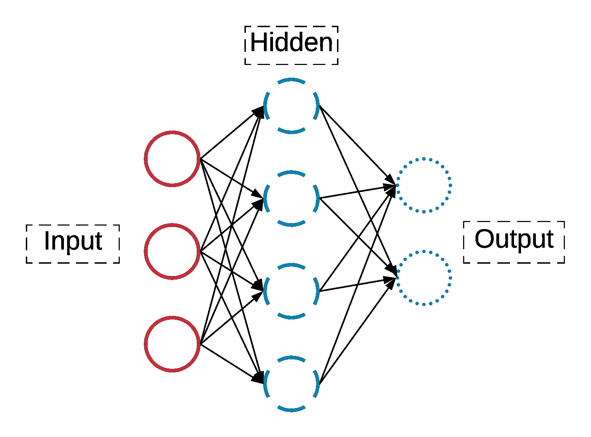

图 1: MLP 的总体架构。

卷积神经网络：卷积神经网络（CNNs）其架构受到人类视觉皮层的启发，是前馈神经网络的一个子类。CNN 的命名来源于其底层数学运算，即卷积，这会生成其输入函数的可互操作性度量。卷积神经网络通常用于数据需要以 2D 或 3D 数据图表示的情况。在数据图表示中，数据点的接近度通常对应于它们的信息关联。

在卷积神经网络中，当输入是图像时，数据图表表明图像像素与其邻近像素高度相关。因此，卷积层具有 3 个维度：宽度、高度和深度。这一假设可能解释了为什么大多数致力于 CNN 的研究工作都在计算机视觉领域进行[33]。

一个 CNN 接收作为数值数组表示的图像。经过特定的数学操作后，它在新的输出空间中表示图像。这一操作也称为特征提取，帮助捕捉和表示图像的关键内容。提取的特征可以用于进一步分析，完成不同的任务。例如，图像分类旨在根据一些预定义的类别对图像进行分类。其他例子包括确定图像中存在哪些对象及其位置。参见图 2。

在利用 CNN 进行 NLP 的情况下，输入是表示为矩阵的句子或文档。矩阵的每一行与语言元素如词或字符相关联。大多数 CNN 架构在其训练阶段学习词或句子的表示。各种 CNN 架构被用于不同的分类任务，如情感分析和主题分类[31, 34, 35, 36]。CNN 还用于关系抽取和关系分类[37, 38]。

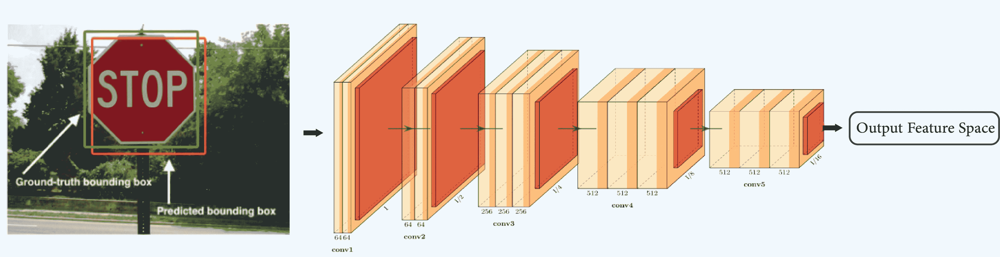

图 2：用于对象检测的典型 CNN 架构。网络提供了对图像中特定区域的特征表示（左侧示例），该区域包含感兴趣的对象。在网络表示的多个区域中（参见右侧的图像块顺序，显示图像像素强度），得分最高的区域将被选为主要候选区域。

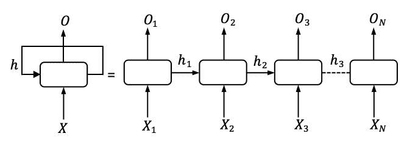

图 3：递归神经网络（RNN），左侧为总结，右侧为展开，针对 $N$ 个时间步，$X$ 表示输入，$h$ 为隐藏层，$O$ 为输出

循环神经网络（RNN）：如果我们将一系列的前馈神经网络（FNN）排列起来，并将每个 FNN 的输出作为下一个 FNN 的输入，就会构建一个循环神经网络（RNN）。与 FNN 一样，RNN 中的层可以分为输入层、隐藏层和输出层。在离散时间帧中，输入向量的序列被逐个输入，例如，在输入每批向量后，进行一些操作并更新网络权重，然后将下一批输入数据喂入网络。因此，如图 3 所示，在每个时间步中，我们进行预测并将当前隐藏层的参数作为下一个时间步的输入。

循环神经网络中的隐藏层可以携带来自过去的信息，换句话说，就是记忆。这一特性使得它们在处理序列输入的应用中非常有用，比如语言建模 [39]，即以机器可以理解的方式表示语言。这一概念将在后续详细描述。

RNN 能够携带丰富的过去信息。考虑句子：“Michael Jackson was a singer; some people consider him King of Pop。”人类很容易识别出这里的“him”指的是 Michael Jackson。代词“him”出现在 Michael Jackson 之后七个词的位置；捕捉这种依赖关系是 RNN 的一个好处，其中 RNN 的隐藏层充当记忆单元。长短期记忆网络（LSTM）[40] 是最广泛使用的 RNN 类之一。LSTM 试图捕捉来自不同时间步的输入之间的长时间依赖关系。现代机器翻译和语音识别通常依赖于 LSTM。

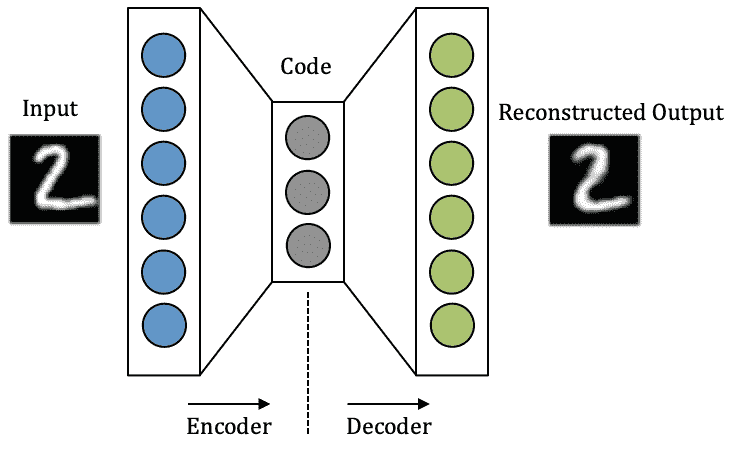

图 4：自编码器示意图

自编码器：自编码器在深度学习中实现了无监督方法。它们广泛用于降维³³降维是一种无监督学习方法，其过程是通过识别最关键的信息来减少表示数据所用的变量数量。或自然语言处理应用，这些应用包括序列到序列建模（参见第 III-B 节 [39]）。图 4 展示了自编码器的示意图。由于自编码器是无监督的，因此每个输入没有相应的标签。它们的目标是为每个输入学习一个代码表示。编码器类似于一个前馈神经网络，其中输入被编码为一个向量（代码）。解码器的操作类似于编码器，但方向相反，即基于编码的输入构造一个输出。在数据压缩应用中，我们希望创建的输出尽可能接近原始输入。自编码器是有损的，这意味着输出是输入的近似重构。

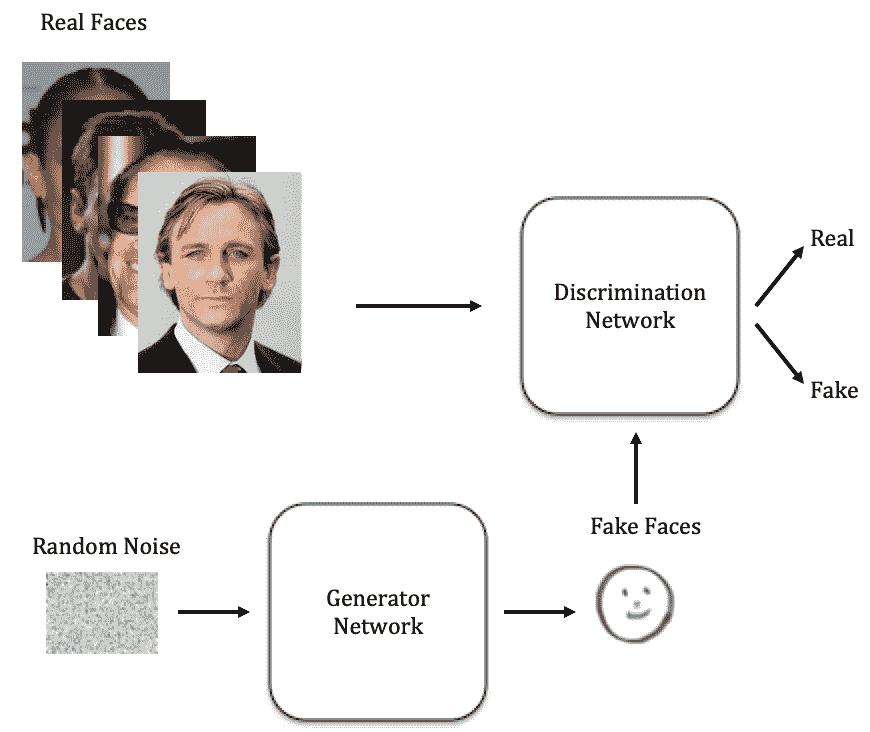

图 5：生成对抗网络

生成对抗网络：Goodfellow [41] 引入了生成对抗网络（GANs）。如图 5 所示，GAN 是两个神经网络的组合，一个是鉴别器，另一个是生成器。整个网络在一个迭代过程中进行训练。首先，生成器网络生成一个假样本。然后，鉴别器网络尝试确定这个样本（例如：一个输入图像）是实际的还是虚假的，即它是否来自真实的训练数据（用于构建模型的数据）。生成器的目标是以一种让鉴别器相信生成器合成的人工（即生成的）样本是真实的方式来欺骗鉴别器。

这一迭代过程持续进行，直到生成器生成的样本无法被鉴别器区分。换句话说，鉴别样本是假的还是实际的概率就像掷一枚公平的硬币一样。生成模型的目标是捕捉真实数据的分布，而鉴别器则尝试识别假数据。GANs（生成对抗网络）的一个有趣特点是：一旦训练阶段完成，就不再需要鉴别网络，因此我们只需使用生成网络。换句话说，拥有经过训练的生成模型就足够了。

已经介绍了不同形式的 GANs，例如，Sim GAN[8]、Wasserstein GAN[42]、info GAN[43]和 DC GAN[44]。在其中一个最优雅的 GAN 实现[45]中，生成了完全人工但几乎完美的名人面孔；这些图片不是真实的，而是网络生成的假照片。GANs 自此在各种应用中引起了显著关注，并生成了惊人的结果[46]。在自然语言处理领域，GANs 通常用于文本生成[47, 48]。

### II-B 深度学习在自然语言处理中的动机

深度学习应用基于（1）特征表示和（2）深度学习算法及其架构的选择。这些与数据表示和学习结构分别相关。对于数据表示，令人惊讶的是，任务所需的重要信息与实际能产生良好结果的表示之间通常存在脱节。例如，在情感分析中，一些语言学家认为词汇语义、句法结构和上下文具有主要重要性。然而，基于词袋模型（BoW）的先前研究展示了可接受的性能[49]。词袋模型[50]，通常被视为向量空间模型，涉及仅考虑单词及其出现频率的表示。BoW 忽略了单词的顺序和互动，将每个单词视为一个独特的特征。BoW 忽略了句法结构，但对于一些认为依赖于句法的应用来说，仍提供了不错的结果。这一观察表明，简单的表示与大量数据结合时，可能效果与复杂表示一样好，甚至更好。这些发现证实了深度学习算法和架构重要性的观点。

自然语言处理的进展通常依赖于有效的语言建模。统计语言建模的目标是对语言中的词序列进行概率表示，由于维度诅咒，这是一项复杂的任务。在[51]中提出的研究在语言建模方面取得了突破，旨在通过（1）学习词的分布式表示和（2）为序列提供概率函数来克服维度诅咒。

与计算机视觉等其他领域相比，自然语言处理研究中的一个主要挑战似乎是使用统计模型实现语言的深入表示的复杂性。自然语言处理应用中的主要任务是提供文本的表示，例如文档。这涉及特征学习，即提取有意义的信息，以便进一步处理和分析原始数据。

传统方法开始于耗时的特征手工设计，通过对特定应用的细致人工分析，然后开发算法以提取和利用这些特征的实例。另一方面，深度监督特征学习方法高度数据驱动，可以用于更一般的目标，旨在提供一个强大的数据表示。

由于大量未标记的数据，无监督特征学习被认为是自然语言处理中的一项关键任务。无监督特征学习本质上是从未标记的数据中学习特征，以提供高维数据空间的低维表示。已经提出并成功实现了几种方法，如 K 均值聚类和主成分分析。随着深度学习的出现和未标记数据的丰富，无监督特征学习成为表示学习的关键任务，而表示学习是自然语言处理应用中的前提。目前，大多数自然语言处理任务依赖于标注数据，而大量未标注的数据进一步激发了利用深度数据驱动的无监督方法进行研究的动力。

鉴于深度学习方法在自然语言处理应用中的潜在优势，进行对各种深度学习方法和架构的全面分析，特别是关注自然语言处理应用，似乎至关重要。

## III 核心概念在自然语言处理

### III-A 特征表示

分布式表示是一系列紧凑的、低维的数据表示，每种表示都代表某些独特的信息特性。对于自然语言处理（NLP）系统来说，由于符号的原子表示问题，学习词表示是至关重要的。

首先，让我们集中在特征的表示方式上，然后我们再关注学习词汇表示的不同方法。编码后的输入特征可以是字符、词汇[32]、句子[52]或其他语言元素。一般来说，比起稀疏表示，提供更紧凑的词汇表示是更为理想的。

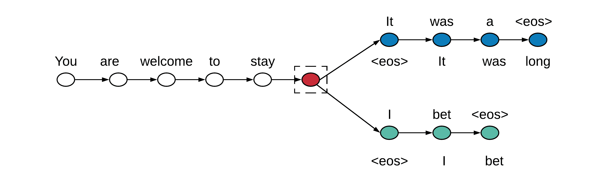

图 6：考虑给定的序列，skip-thought 模型使用训练好的编码器生成周围的序列。假设是周围的句子在语境上是紧密相关的。

如何选择文本表示的结构和层次曾经是一个未解之谜。在提出 word2vec 方法[53]之后，随后提出了 doc2vec[52]，作为一种无监督算法，被称为段落向量（PV）。PV 的目标是从可变长度的文本部分（如句子和文档）中学习固定长度的表示。doc2vec 的主要目标之一是克服 BoW 等模型的缺点，并为文本分类和情感分析等应用提供有希望的结果。更近期的方法是 skip-thought 模型，它在句子级别应用 word2vec[54]。通过利用编码器-解码器架构，该模型使用给定的句子生成周围的句子（图 6）。接下来，让我们探讨不同种类的特征表示。

#### III-A1 独热表示

在独热编码中，每个需要表示的唯一元素都有其维度，这导致了一个非常高维且非常稀疏的表示。假设词汇是通过独热编码方法进行表示的。在表示结构方面，特征空间中的不同词汇之间没有有意义的联系。例如，高度相关的词汇如‘ocean’和‘water’在表示空间中不会比相关性较低的词汇对如‘ocean’和‘fire’更接近。然而，一些研究工作使用独热编码呈现了有希望的结果[2]。

#### III-A2 连续词袋模型

连续词袋模型（CBOW）在自然语言处理应用中经常被使用。CBOW 试图根据周围的上下文来预测一个词，这个上下文通常包括几个相邻的词[55]。CBOW 不依赖于词的顺序，也不一定依赖于概率特征，因此它通常不用于语言建模。该模型通常被训练用于作为更复杂任务的预训练模型。CBOW 的一种替代方法是加权 CBOW（WCBOW）[56]，其中不同的向量根据上下文的重要性赋予不同的权重。最简单的例子是文档分类，其中特征是词，权重是相关词的 TF-IDF 分数[57]。

#### III-A3 词级嵌入

词嵌入是一种学习到的上下文元素表示，其中理想情况下，具有相关语义的词在表示空间中高度相关。词嵌入表示背后的主要动机之一是其高泛化能力，相对于稀疏的高维表示[58]。与传统的词袋模型不同，传统模型中不同的词具有完全不同的表示，不管它们的使用或搭配如何，学习分布式表示利用上下文中的词使用，为语义相关的词提供相似的表示。有不同的方法来创建词嵌入。包括[55, 53]在内的几个研究工作使用了随机初始化，通过均匀抽样随机数来训练模型在大型数据集上的有效表示。这种设置在初始化如词性标签等常见特征的嵌入时直观上是可以接受的。然而，这可能不是表示较少见特征如个别词的最佳方法。对于后者，通常利用经过监督或无监督方式训练的预训练模型来提高性能。

#### III-A4 字符级嵌入

之前提到的方法大多属于较高层次的表示。由于字符级表示的简单性和纠正如拼写错误等不寻常字符组合的潜力[2]，低层次表示如字符级表示也需要特别关注。在生成字符级嵌入时，卷积神经网络（CNN）已成功应用[14]。

字符级嵌入已在不同的 NLP 应用中使用 [59]。主要优势之一是能够使用较小的模型并用较低级的语言元素表示单词 [14]。在这里，词嵌入是利用 CNN 对字符进行建模的模型。使用字符级嵌入的另一个动机是处理词汇表外的单词（OOV）问题，当给定单词在词嵌入中没有等效向量时通常会遇到此问题。字符级方法可能显著缓解这个问题。然而，这种方法在字符与语言的语义和句法部分之间存在较弱的相关性。因此，考虑到使用字符级嵌入的上述优缺点，多个研究工作尝试提出和实施更高级的方法，例如使用子词 [60] 为 OOV 实例创建词嵌入，以及在相关单词之间创建语义桥梁 [61]。

### III-B Seq2Seq 框架

大多数自然语言处理（NLP）应用中的基础框架依赖于序列到序列（seq2seq）模型，其中不仅输入，而且输出也被表示为一个序列。这些模型在各种应用中很常见，包括机器翻译⁴⁴4 输入是来自一种语言（例如，英语）的单词序列，输出是翻译成另一种语言（例如，法语）。, 文本摘要⁵⁵5 输入是完整的文档（单词序列），输出是对其的摘要（单词序列）。, 语音转文本和文本转语音应用⁶⁶6 输入是演讲的音频录音（可听元素序列），输出是演讲文本（单词序列）。

最常见的 seq2seq 框架由编码器和解码器组成。编码器接收输入数据序列并生成中级输出，解码器随后使用这些中级输出生成最终的输出序列。编码器和解码器通常通过一系列递归神经网络或 LSTM [40] 单元来实现。

编码器接收一个长度为 $T$ 的序列 $X=\{x_{1},x_{2},\cdots,x_{T}\}$，其中 $x_{t}\in V=\{1,\cdots,|V|\}$ 是来自词汇表 $V$ 的单个输入的表示，然后生成输出状态 $h_{t}$。随后，解码器接收编码器的最后一个状态，即 $h_{t}$，并开始生成大小为 $L$ 的输出 $Y^{\prime}=\{y^{\prime}_{1},y^{\prime}_{2},\cdots,y^{\prime}_{L}\}$，基于其当前状态 $s_{t}$ 和真实输出 $y_{t}$。在不同的应用中，解码器可以利用更多的信息，例如上下文向量 [62] 或内部注意力向量 [63] 来生成更好的输出。

一种广泛使用的 seq2seq 模型训练方法叫做 Teacher Forcing [64]。设 $y=\{y_{1},y_{2},\cdots,y_{L}\}$ 为对应于给定输入序列 $X$ 的真实输出序列。基于最大似然准则的模型训练采用以下交叉熵 (CE) 损失最小化：

|  | $\mathcal{L}_{CE}=-\sum_{t=1}^{L}\log{p_{\theta}(y_{t}&#124;y_{t-1},s_{t},X)}$ |  | (1) |
| --- | --- | --- | --- |

其中 $\theta$ 是在训练过程中优化的模型参数。

一旦模型使用交叉熵损失进行优化，它可以生成一个完整的序列。设 $\hat{y}_{t}$ 为模型在时间 $t$ 生成的输出。然后，下一步的输出通过以下方式生成：

|  | $\hat{y}_{t}=\operatorname*{arg\,max}_{y}p_{\theta}(y&#124;\hat{y}_{t-1},s_{t})$ |  | (2) |
| --- | --- | --- | --- |

在 NLP 应用中，可以通过使用束搜索来改进输出，以找到一个合理的输出序列 [3]。在束搜索过程中，与其使用 $\verb|argmax|$ 选择最佳输出，不如在每一步选择前 $K$ 个输出，生成 $K$ 条不同的输出序列路径，最终选择性能更好的作为最终输出。尽管最近有一些研究 [65, 66] 通过在模型训练期间引入类似机制来改进束搜索，但研究这一点超出了本文的范围。

给定一系列真实输出 $Y$ 和生成的模型输出 $\hat{Y}$，模型性能通过特定任务的评估指标来衡量，如 ROUGE [67]、BLEU [68] 和 METEOR [69]。例如，$\textrm{ROUGE}_{L}$ 作为一种 NLP 任务中的评估指标，通过真实值 $Y$ 和模型输出 $\hat{Y}$ 之间的最大公共子串来评估生成的输出。

### III-C 强化学习在 NLP 中

尽管第 III-B 节中解释的 seq2seq 模型在传统方法上取得了巨大成功，但这些模型的训练仍然存在一些问题。一般而言，用于 NLP 应用的 seq2seq 模型面临两个问题：（1）暴露偏差和（2）训练时与测试时测量之间的不一致 [70]。

大多数流行的 seq2seq 模型通过教师强迫（第 III-B 节）将交叉熵损失作为优化目标。在教师强迫中，在模型训练期间，解码器利用两个输入，即前一个解码器输出状态$s_{t-1}$和实际输入$y_{t}$，来确定其当前输出状态$s_{t}$。此外，它们用于生成下一个标记，即$\hat{y}_{t}$。然而，在测试时，解码器完全依赖于模型分布生成的先前标记。由于实际数据不可用，因此需要这样的步骤来预测下一个动作。因此，在训练中，解码器输入来自实际值，而在测试阶段，它依赖于之前的预测。

这种曝光偏差[71]通过测试阶段的输出创建引发了错误增长。解决这个问题的一种方法是通过仅依赖模型分布来最小化交叉熵损失，从而去除训练中的实际值依赖。调度采样[64]是一种处理这一挫折的流行方法。在调度采样过程中，我们首先使用交叉熵损失对模型进行预训练，然后逐渐用模型生成的样本替换实际值。

第二个障碍是，当使用交叉熵损失完成训练后，通常使用非可微分的指标如 ROUGE 或 METEOR 进行评估。这将导致训练目标与测试评估指标之间的不一致。最近已证明，这两个问题可以通过利用强化学习技术[70]来解决。

在大多数知名的强化学习模型中，政策梯度技术[72]如 REINFORCE 算法[73]和基于 Actor-Critic 的模型如基于值的迭代[74]以及 Q 学习[75]，是深度学习在自然语言处理中的常用技术。

使用模型预测（与实际值相比）进行序列到序列建模和生成，最初由 Daume 等人[76]提出。根据他们的方法，SEARN，结构化预测可以被描述为如下的强化学习案例：模型利用其预测生成一系列动作（词序列）。然后，在每个时间步，采用贪婪搜索算法来学习最佳动作，策略将被训练以预测该特定动作。

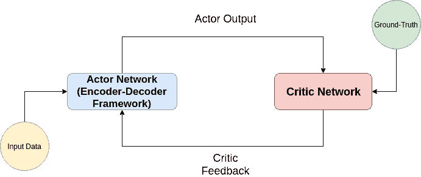

图 7：一个简单的 Actor-Critic 框架。

在 Actor-Critic 训练中，actor 通常是用于生成输出的神经网络，而 critic 则是一个回归模型，用于估计 actor 在输入数据上的表现。actor 随后接收 critic 的反馈并改进其行为。图 7 展示了这个框架。值得注意的是，在大多数与 NLP 相关的应用中，行动类似于选择下一个输出标记，而状态是每个解码阶段的解码器输出状态。这些模型主要用于机器人[77]和 Atari 游戏[78]，因为这些应用中的动作空间较小。然而，当我们在 NLP 应用中使用它们时，会面临多种挑战。大多数 NLP 应用中的动作空间可以定义为词汇表中的标记数量（通常在 50K 到 150K 标记之间）。与平均不到 20 个动作的简单 Atari 游戏的动作空间相比[78]，这说明了为什么这些 Actor-Critic 模型在应用于 NLP 应用时会遇到困难。一个主要挑战是 NLP 应用中的庞大动作空间，这不仅使正确选择动作变得困难，而且使训练过程非常缓慢。这使得找到最佳 Actor-Critic 模型的过程非常复杂，而且模型的收敛通常需要大量的调整。

## IV 数据集

许多不同的研究人员用于不同任务的基准数据集，如下文讨论的那些。机器学习中的基准测试是指评估方法和算法，比较它们在学习特定模式方面的能力。基准测试有助于验证新方法或实践，相对于其他现有方法。

基准数据集通常有三种形式。

1.  1.

    第一类是真实世界数据，从各种真实世界实验中获得。

1.  2.

    第二类是合成数据，人工生成以模拟真实世界的模式。合成数据被生成用于替代真实数据。这类数据集在数据需求远大于可用数据量，或隐私考虑至关重要且严格的应用中尤为重要，例如在医疗领域。

1.  3.

    第三类是玩具数据集，用于演示和可视化目的。它们通常是人工生成的；通常不需要表示真实世界的数据模式。

深度学习应用的基础是数据的可用性，以便教系统识别模式。模型的有效性依赖于数据的质量。尽管成功实施了诸如 BERT 这样的通用语言建模技术[79]，这些模型仍然只能用于预训练模型。之后，模型需要在与所需任务相关的数据上进行训练。因此，基于不同机器领域的日常需求，创建新数据集是至关重要的。

另一方面，创建新数据集通常不是一件容易的事。非正式地说，新创建的数据集应该是：适合训练的数据、足够用于评估的数据，以及准确的数据。回答“什么是正确和准确的数据”高度依赖于应用。基本上，数据应具有足够的信息，这取决于数据的质量和数量。

创建数据集的第一步总是要问“我们想做什么，需解决什么问题？”以及“我们需要什么类型的数据，需要多少数据？”接下来是创建训练集和测试集。训练数据集用于训练模型，了解如何找到输入与相关输出之间的连接。测试数据集用于评估机器的智能，即训练好的模型在未见过的测试样本上表现如何。接下来，我们必须进行数据准备，以确保数据及其格式对人类专家来说简单易懂。之后，数据访问权限和所有权的问题可能会出现。数据分发可能需要特定的授权，特别是当我们处理敏感或私密数据时。

鉴于上述路线图，创建合适的数据集是复杂且非常重要的。这就是为什么研究人员和开发人员经常选择少数数据集进行基准测试。表 I 提供了广泛使用的基准数据集的总结。

表 I：基准数据集。

| 任务 | 数据集 | 链接 |
| --- | --- | --- |
| 机器翻译 |

&#124; WMT 2014 英德 &#124;

&#124; WMT 2014 英法 &#124;

| [`www-lium.univ-lemans.fr/~schwenk/cslm_joint_paper/`](http://www-lium.univ-lemans.fr/~schwenk/cslm_joint_paper/) |
| --- |
| 文本总结 |

&#124; CNN/DM &#124;

&#124; 新闻编辑室 &#124;

&#124; DUC &#124;

&#124; Gigaword &#124;

|

&#124; [`cs.nyu.edu/~kcho/DMQA/`](https://cs.nyu.edu/~kcho/DMQA/) &#124;

&#124; [`summari.es/`](https://summari.es/) &#124;

&#124; [`www-nlpir.nist.gov/projects/duc/data.html`](https://www-nlpir.nist.gov/projects/duc/data.html) &#124;

&#124; [`catalog.ldc.upenn.edu/LDC2012T21`](https://catalog.ldc.upenn.edu/LDC2012T21) &#124;

|

|

&#124; 阅读理解 &#124;

&#124; 问答系统 &#124;

&#124; 问题生成 &#124;

|

&#124; ARC &#124;

&#124; CliCR &#124;

&#124; CNN/DM &#124;

&#124; NewsQA &#124;

&#124; RACE &#124;

&#124; SQuAD &#124;

&#124; Story Cloze Test &#124;

&#124; NarativeQA &#124;

&#124; Quasar &#124;

&#124; SearchQA &#124;

|

&#124; [`data.allenai.org/arc/`](http://data.allenai.org/arc/) &#124;

&#124; [`aclweb.org/anthology/N18-1140`](http://aclweb.org/anthology/N18-1140) &#124;

&#124; [`cs.nyu.edu/~kcho/DMQA/`](https://cs.nyu.edu/~kcho/DMQA/) &#124;

&#124; [`datasets.maluuba.com/NewsQA`](https://datasets.maluuba.com/NewsQA) &#124;

&#124; [`www.qizhexie.com/data/RACE_leaderboard`](http://www.qizhexie.com/data/RACE_leaderboard) &#124;

&#124; [`rajpurkar.github.io/SQuAD-explorer/`](https://rajpurkar.github.io/SQuAD-explorer/) &#124;

&#124; [`aclweb.org/anthology/W17-0906.pdf`](http://aclweb.org/anthology/W17-0906.pdf) &#124;

&#124; [`github.com/deepmind/narrativeqa`](https://github.com/deepmind/narrativeqa) &#124;

&#124; [`github.com/bdhingra/quasar`](https://github.com/bdhingra/quasar) &#124;

&#124; [`github.com/nyu-dl/SearchQA`](https://github.com/nyu-dl/SearchQA) &#124;

|

| 语义解析 |
| --- |

&#124; AMR 解析 &#124;

&#124; ATIS（SQL 解析） &#124;

&#124; WikiSQL（SQL 解析） &#124;

|

&#124; [`amr.isi.edu/index.html`](https://amr.isi.edu/index.html) &#124;

&#124; [`github.com/jkkummerfeld/text2sql-data/tree/master/data`](https://github.com/jkkummerfeld/text2sql-data/tree/master/data) &#124;

&#124; [`github.com/salesforce/WikiSQL`](https://github.com/salesforce/WikiSQL) &#124;

|

| 情感分析 |
| --- |

&#124; IMDB 评论 &#124;

&#124; SST &#124;

&#124; Yelp 评论 &#124;

&#124; 主观性数据集 &#124;

|

&#124; [`ai.stanford.edu/~amaas/data/sentiment/`](http://ai.stanford.edu/~amaas/data/sentiment/) &#124;

&#124; [`nlp.stanford.edu/sentiment/index.html`](https://nlp.stanford.edu/sentiment/index.html) &#124;

&#124; [`www.yelp.com/dataset/challenge`](https://www.yelp.com/dataset/challenge) &#124;

&#124; [`www.cs.cornell.edu/people/pabo/movie-review-data/`](http://www.cs.cornell.edu/people/pabo/movie-review-data/) &#124;

|

| 文本分类 |
| --- |

&#124; AG News &#124;

&#124; DBpedia &#124;

&#124; TREC &#124;

&#124; 20 NewsGroup &#124;

|

&#124; [`www.di.unipi.it/~gulli/AG_corpus_of_news_articles.html`](http://www.di.unipi.it/~gulli/AG_corpus_of_news_articles.html) &#124;

&#124; [`wiki.dbpedia.org/Datasets`](https://wiki.dbpedia.org/Datasets) &#124;

&#124; [`trec.nist.gov/data.html`](https://trec.nist.gov/data.html) &#124;

&#124; [`qwone.com/~jason/20Newsgroups/`](http://qwone.com/~jason/20Newsgroups/) &#124;

|

| 自然语言推断 |
| --- |

&#124; SNLI 语料库 &#124;

&#124; MultiNLI &#124;

&#124; SciTail &#124;

|

&#124; [`nlp.stanford.edu/projects/snli/`](https://nlp.stanford.edu/projects/snli/) &#124;

&#124; [`www.nyu.edu/projects/bowman/multinli/`](https://www.nyu.edu/projects/bowman/multinli/) &#124;

&#124; [`data.allenai.org/scitail/`](http://data.allenai.org/scitail/) &#124;

|

| 语义角色标注 |
| --- |

&#124; Proposition Bank &#124;

&#124; OneNotes &#124;

|

&#124; [`propbank.github.io/`](http://propbank.github.io/) &#124;

&#124; [`catalog.ldc.upenn.edu/LDC2013T19`](https://catalog.ldc.upenn.edu/LDC2013T19) &#124;

|

## V 深度学习用于 NLP 任务

本节描述了使用深度学习的 NLP 应用。图 8 展示了代表性的 NLP 任务（以及它们所属的类别）。一个基本的问题是：“我们如何评估 NLP 算法、模型或系统？”在 [80] 中，描述了一些最常见的评估指标。该参考文献解释了评估 NLP 系统的基本原理。

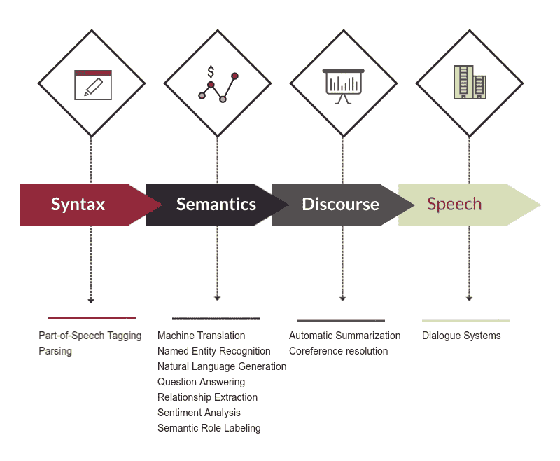

图 8：本研究中调查的 NLP 任务。

### V-A 基本任务

#### V-A1 词性标注

词性标注是自然语言处理中的基本任务之一。它是将单词标记为其词性类别的过程。词性在许多关键任务中被利用，例如命名实体识别。一个常用的词性标注数据集是 WSJ 语料库⁷⁷7Penn Treebank Wall Street Journal (WSJ-PTB)。该数据集包含超过一百万个标记，并被广泛用作评估 POS 标注系统性能的基准数据集。传统方法在此任务中仍表现优异 [16]。然而，基于神经网络的方法已被提出用于词性标注 [81]。

例如，深度神经网络架构 CharWNN 已被开发用于结合词级和字符级表示，使用卷积神经网络进行词性标注[14]。在[14]中强调了字符级特征提取的重要性，因为其实验结果表明，在缺少字符级特征的情况下，采用手工制作的特征是实现最先进技术的必要条件。在[82]中，提出了多种基于神经网络的序列标注模型，例如，LSTM 网络、双向 LSTM 网络、带有 CRF 层的 LSTM 网络等。序列标注本身包括词性标注、分块和命名实体识别。同样，为词性标注提出了一种全球归一化的过渡基础神经网络架构[83]。最先进的结果总结在表 II。在[17]中，作者提出了一种双向 LSTM 用于执行词性标注，并表明其在同一数据集上表现优于传统的机器学习技术。最近，在[84]中，作者结合一个预训练的 BERT 模型和一个双向 LSTM 层，仅训练后者层，超越了之前的最先进词性标注架构。

表 II：在 WSJ-PTB 数据集上评估的词性标注最先进模型。

| 模型 | 准确率 |
| --- | --- |
| 基于字符的神经语言模型 [85] | 97.53 |
| 迁移学习 + GRU[86] | 97.55 |
| 双向 LSTM + CNNs + CRF[87] | 97.55 |
| 对抗训练 + Bi-LSTM [88] | 97.59 |
| 字符组成 + Bi-LSTM[89] | 97.78 |
| 字符嵌入 + LSTM[90] | 97.85 |
| Meta-BiLSTM [91] | 97.96 |

#### V-A2 解析

解析是将结构分配给识别出的字符串。有不同类型的解析。句法解析特别指的是将句子分配给一个句法结构。[92]中介绍了一种贪婪解析器，它使用向量表示对内容进行句法和语义摘要。为了增强[92]所取得的结果，[93]中提出的方法专注于学习形态学嵌入。最近，深度神经网络模型超越了传统算法。最先进的结果总结在表 III。

表 III：在 WSJ-PTB 数据集上评估的句法解析最先进模型。

| 模型 | 准确率 |
| --- | --- |
| 循环神经网络语法（RNNG）[94] | 93.6 |
| 语法树的中序遍历 + LSTM[95] | 94.2 |
| 模型组合和重排序[96] | 94.6 |
| 自注意力编码器[97] | 95.1 |

另一种解析类型称为依赖解析。依赖结构展示了目标句子中单词之间的结构关系。在依赖解析中，短语元素和短语结构规则不会对过程产生贡献。相反，句子的句法结构仅通过句子中的单词及其相互关系来表达。

神经网络在通用性和减少特征计算成本方面显示了其优越性。在[98]中，提出了一种基于神经网络的新型过渡依赖解析器方法。基于神经网络的模型也被用于任务特定的过渡系统进行依赖解析[83]。提出了一种带有双仿射分类器的正则化解析器用于弧和标签的预测[99]。双向 LSTM 被用于依赖解析器中的特征表示[100]。为基于堆栈 LSTM 的序列到序列神经网络引入了一种新的控制结构，并用于过渡解析[101]。[102]介绍了一种基于过渡的多语言依赖解析器，该解析器使用双向 LSTM 以适应目标语言。在[103]中，作者对临床文本解析任务中的最先进深度学习解析方法进行了比较。最近，在[104]中，向双仿射解析器[105]中添加了二阶 TreeCRF 扩展，以证明结构学习可以进一步提升解析性能，超过了最先进的双仿射模型。

#### V-A3 语义角色标注

语义角色标注（SRL）是识别和分类文本论元的过程。其目的是对元素进行特征化，以确定“谁”对“谁”做了“什么”，以及“如何”、“在哪里”和“何时”。它识别句子的谓词-论元结构。谓词本质上指的是“什么”，而论元则由文本中的相关参与者和属性组成。SRL 的目标是提取谓词与相关论元之间的语义关系。

之前大多数研究工作基于语义角色的显式表示。最近，深度学习方法在没有考虑显式语法表示的情况下实现了 SRL 的最先进水平[106]。另一方面，有人认为利用句法信息可以提高语法无关模型的性能[107]。需要注意的是，语法无关并不意味着丢弃语法信息，而是它们没有被显式使用。提出了一种语言学信息自注意（LISA）模型，利用多任务学习和自注意机制有效利用句法信息进行 SRL[108]。当前的最先进方法采用谓词和论元的联合预测[109]、新型词表示方法[110]和自注意模型[111]；见表 IV。

[25]的研究人员专注于句法和上下文化词表示，提出了一种基于双仿射评分器、论元修剪和双向 LSTM 的独特多语言 SRL 模型（另见[112]）。

表 IV：在 OntoNotes 数据集上评估的语义角色标注当前最先进模型[113]。准确性指标是$F_{1}$得分。

| 模型 | 准确性($F_{1}$) |
| --- | --- |
| 自注意 + RNN[111] | 83.9 |
| 上下文化词表示[110] | 84.6 |
| 增强表示 + BiLSTM[109] | 85.3 |

### V-B 文本分类

文本分类的主要目标是将预定义的类别分配给文本部分（可以是单词、句子或整个文档），以便进行初步分类以及进一步的组织和分析。一个简单的例子是将给定文档分类为政治类或非政治类新闻文章。

使用 CNN 进行句子分类，其中在预训练的词向量上通过微调来训练模型，已经在学习任务特定向量方面取得了显著的改进[31]。后来，动态卷积神经网络（DCNN）架构——本质上是一个带有动态 k-max 池化方法的 CNN——被应用于捕捉句子的语义建模[114]。除了 CNN，RNN 也被用于文本分类。在[115]中使用了 LSTM-RNN 架构进行句子嵌入，在特定的网页搜索任务中具有明显优势。层次注意网络（HAN）被用于捕捉文本的层次结构，具有词级和句级注意机制[116]。

一些模型使用了 RNN 和 CNN 的组合进行文本分类，例如[117]。这是一种递归架构，除了最大池化外，还采用了有效的词表示方法，并展示了相比于简单的基于窗口的神经网络方法的优越性。另一种统一的架构是[118]中提出的 C-LSTM，用于句子和文档建模中的分类。目前最先进的方法总结在表 V。[119]提供了对基于深度学习的文本分类方法的最新综述。后者重点关注了用于此任务的不同架构，包括最近的 CNN 模型、RNN 模型以及图神经网络。在[120]中，作者对各种深度学习文本分类方法进行了比较，得出结论 GRUs 和 LSTMs 实际上可能比基于 CNN 的模型表现更好。

表 V：在 AG News Corpus 数据集 [2]上评估的最先进方法的分类准确率。

| 模型 | 准确率 |
| --- | --- |
| CNN [121] | 91.33 |
| 深度金字塔 CNN [122] | 93.13 |
| CNN [123] | 93.43 |
| 通用语言模型微调 (ULMFiT) [124] | 94.99 |

### V-C 信息提取

信息提取从“非结构化”数据中识别结构化信息，例如社交媒体帖子和在线新闻。深度学习已被用于信息提取中的子任务，如命名实体识别、关系提取、共指消解和事件提取。

#### V-C1 命名实体识别

命名实体识别（NER）旨在将上下文中的命名实体定位并分类到预定义的类别中，例如人名和地名。深度神经网络在 NER 中的应用已经通过使用 CNN [125]和 RNN 架构 [126]，以及混合的双向 LSTM 和 CNN 架构 [19]进行了研究。NeuroNER [127]，一种基于人工神经网络的命名实体识别工具，提供了最先进的模型，见表 VI。[21]对命名实体识别的最新深度学习方法进行了广泛讨论。后者得出结论，在 [128]中提出的工作超越了其他近期模型（在 CoNLL03 数据集上 F-score 为 93.5）。

表 VI：关于命名实体识别的*最先进的*模型。评估是在 CoNLL-2003 共享任务数据集[129]上进行的。评估指标是$F_{1}$分数。

| 模型 | 准确率 |
| --- | --- |
| 半监督序列建模 [130] | 92.61 |
| Google BERT [131] | 92.8 |
| 上下文字符串嵌入 [90] | 93.09 |

#### V-C2 关系提取

关系提取旨在找到实体对之间的语义关系。递归神经网络（RNN）模型被提出用于通过学习组合向量表示来进行语义关系分类[132]。在关系分类中，也采用了 CNN 架构，通过提取词汇和句子级别特征[37]。最近，在[133]中，双向树结构 LSTM 显示出在关系提取方面的良好表现。[134] 提供了关于关系提取的*最新*综述。

#### V-C3 共指消解

共指消解包括识别上下文中指向相同实体的提及。例如，提及“车”，“Camry”和“它”都可能指代同一个实体。在[135]中，首次将强化学习（RL）应用于共指消解。当前广泛使用的方法利用了注意力机制[136]。最近，在[137]中，作者采用了强化学习策略梯度方法进行共指消解，并在英语 OntoNotes v5.0 基准任务中提供了*最先进的*性能。[138] 将共指消解重新表述为类似于问答的跨度预测任务，并在 CoNLL-2012 基准任务中提供了*卓越的*表现。

#### V-C4 事件提取

从文本中提取的一种特定类型的信息是事件。这种提取可能涉及识别与事件相关的触发词，并为表示事件触发器的实体提及分配标签。卷积神经网络被用于事件检测；它们处理特征基础的方法中的问题，包括详尽的特征工程和特征生成中的错误传播现象[139]。在 2018 年，Nguyen 和 Grishman 应用了图卷积网络（GCCN），其中卷积操作应用于句法依赖词以及连续词汇[140]；他们添加的实体信息反映了使用 CNN 模型的*最先进的*表现。[141] 使用了一种基于生成对抗网络（模仿学习）的新颖反向强化学习方法来处理联合实体和事件提取。最近，在[142]中，作者提出了一种文档级事件提取模型，结合了基于依赖的 GCN（用于局部上下文）和超图（作为全局上下文的聚合器）。

### V-D 情感分析

情感分析的主要目标是通过上下文挖掘从文本中提取主观信息。情感分析被视为基于源数据的高级推理。情感分析有时也称为观点挖掘，因为其主要目标是分析关于产品、问题和各种主题的人类观点、情感甚至情绪。情感分析或观点挖掘的开创性工作包括[143, 144]。自 2000 年以来，情感分析受到广泛关注，这与其涉及的各种应用[145]、与新的研究挑战的关联以及大量数据的可用性有关。[146]提供了基于深度学习的情感分析方法的最新综述，并对深度学习方法在情感分析中的优缺点进行了有见地的讨论。

情感分析研究的一个关键方面是内容的粒度。根据这一标准，情感分析通常分为三类/级别：文档级、句子级和方面级。

#### V-D1 文档级情感分析

在文档级，任务是确定整个文档是否反映了对某一实体的积极或消极情感。这与处理多个条目的观点挖掘有所不同。门控递归神经网络架构已成功用于有效地编码文档中句子的语义关系[147]。领域适应也已经被研究，以将训练好的模型应用于新的未见数据源[148]。最近，[149]中的作者提供了一种基于 LSTM 的文档级情感分析模型，该模型捕捉了句子之间的语义关系。在[150]中，作者使用 CNN-双向 LSTM 模型来处理长文本。

#### V-D2 句子级情感分析

在句子级别上，情感分析确定了句子中表达的观点的积极性、消极性或中性。句子级情感分类的一个常见假设是，在一个表达的句子中，只存在一个观点来自一个单一的观点持有者。通过学习短语的向量空间表示，递归自动编码器已经被用于句子级情感标签预测[151]。长期短期记忆（LSTM）循环模型也被用于推特情感预测[152]。情感树库和递归神经张量网络[153]已经展示了预测细粒度情感标签的潜力。[154]提供了一个基于云的混合机器学习模型，用于句子级情感分析。最近在[155]中，提出了一个词汇化领域本体和一个带有 BERT 词嵌入的正则化神经注意模型（ALDONAr）用于句子级方面情感分析，并取得了最先进的结果。

#### V-D3 方面级情感分析

文档级和句子级情感分析通常关注情感本身，而不是情感的对象，例如产品。方面级情感分析直接针对观点，假设存在情感及其目标。一个文档或句子可能没有明确的积极或消极情感，但可能有多个具有不同目标的子部分，每个部分都有积极或消极的情感。这使得方面级分析比其他类型的情感分类更具挑战性。

方面级情感分析通常涉及方面情感分类和方面提取。前者确定了不同方面的观点（积极、中性或消极），而后者在上下文中确定了目标方面进行评估。以以下句子为例：“这辆车很旧。必须修理和出售！”“这辆车”是需要评估的对象，首先必须提取出来。在这里，关于这个方面的观点是消极的。

对于层面级情感分类，提出了基于注意力的 LSTM 模型，用于将层面与句子内容连接进行情感分类[156]。对于层面提取，深度学习在意见挖掘中取得了成功[157]。最先进的方法依赖于将基于层面的情感分析转换为句子对分类任务[79]，在流行的语言模型 BERT 上进行后训练方法[158]，以及使用预训练的嵌入[159]。[160]提供了关于基于层面的情感分析的最新比较综述。最近，[161]提出了一个双重注意力模型，试图提取层面与意见术语之间的隐含关系。在[162]中，作者提出了一种新颖的层面引导深度过渡模型用于基于层面的情感分析。

### V-E 机器翻译

机器翻译（MT）是自然语言处理（NLP）领域中受深度学习进展影响深远的一个领域。下面的第一小节解释了在深度学习之前所使用的方法，如参考 NLP 教科书《Speech and Language Processing》所述[163]。本节的其余部分致力于深入探讨基于神经网络的机器翻译的最新创新，始于[164]。[165, 166]提供了关于用于机器翻译的各种深度学习架构的综述。

#### V-E1 传统机器翻译

机器翻译的第一次展示发生在 1954 年[167]，当时作者尝试从俄语翻译到英语。该翻译系统基于六条简单规则，但词汇量非常有限。直到 1990 年代，随着更多双语语料库的出现，成功的统计机器翻译实现才出现[163]。在[68]中引入了 BLEU 评分作为新的评估指标，使得改进速度比仅使用人工评估的方法更快。

#### V-E2 神经机器翻译

在神经网络在图像分类任务中取得成功之后，研究人员开始在机器翻译（NMT）中使用神经网络。大约在 2013 年，研究小组开始在 NMT 中取得突破性成果。与传统的统计机器翻译不同，NMT 基于端到端神经网络[168]。这意味着不需要大量的预处理和词对齐。相反，焦点转向了网络结构。

图 11 显示了一个用于机器翻译的端到端递归神经网络示例。输入标记的序列被送入网络。一旦到达句子结束（EOS）标记，它开始生成输出序列。输出序列以与输入序列相同的递归方式生成，直到到达句子结束标记。这种方法的一个主要优势是无需指定序列的长度；网络会自动考虑这一点。换句话说，句子结束标记决定了序列的长度。网络隐式地学习到较长的输入句子通常会产生较长的输出句子，且长度会有所变化，排序也可能发生变化。例如，图 9 中的第二个示例表明，形容词通常在英语中出现在名词之前，但在西班牙语中则出现在名词之后。不需要明确指定这一点，因为网络能够捕捉到这些属性。此外，NMT 使用的内存量仅为传统统计机器翻译使用的内存的一小部分 [169]。

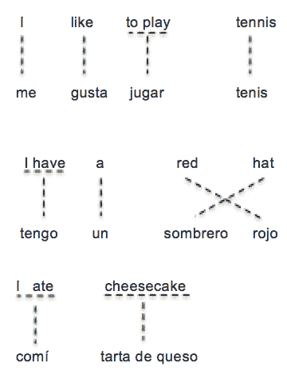

图 9: 机器翻译中的对齐

[164] 是早期采用递归神经网络进行机器翻译的工作之一。他们实现了比最先进的基于对齐的翻译模型低 43% 的困惑度（困惑度是一种测量标准，值越低表示模型越好）。他们的递归连续翻译模型（RCTM）能够明确捕捉源句子的词序、语法和含义。它将源句子映射到目标语言句子的概率分布上。RCTM 通过考虑源句子 $e$ 以及目标语言中前面的词 $f_{1:i-1}$ 来估计翻译一个句子 $e=e_{1}+...+e_{k}$ 到目标语言句子 $f=f_{1}+...+f_{m}$ 的概率 $P(f\mid e)$：

|  | $P(f\mid e)=\prod_{i=1}^{m}P(f_{i}\mid f_{1:i-1},e)$ |  | (3) |
| --- | --- | --- | --- |

RCTM 生成的表示在较低层中作用于 n-grams，而在较高层中则更多地作用于整个句子。这种层次化表示是通过应用不同层的卷积来实现的。首先生成每个词的连续表示；即，如果句子是 $e=e_{1}...e_{k}$，则词 $e_{i}$ 的表示将是 $v(e_{i})\in\mathbb{R}^{q\times 1}$。这将生成句子矩阵 $\textbf{E}^{e}\in\mathbb{R}^{q\times{k}}$，其中 $\textbf{E}_{:,i}^{e}=v(e_{i})$。该句子矩阵表示将输入到一系列卷积层中，以生成递归神经网络的最终表示 e。该方法在图 10 中进行了说明。该流程的方程式如下。

|  | $s=\textbf{S}.csm(e)$ |  | (4) |
| --- | --- | --- | --- |
|  | $h_{1}=\sigma(\textbf{I}.v(f_{1})+\textbf{s})$ |  | (5) |
|  | $h_{i+1}=\sigma(\textbf{R}.h_{i}+\textbf{I}.v(f_{i+1})+\textbf{s})$ |  | (6) |
|  | $o_{i+1}=\textbf{O}.h_{i}$ |  | (7) |

为了考虑句子的长度，作者引入了 RCTM II，该方法估计目标句子的长度。RCTM II 能够在 WMT 数据集上获得比其他现有机器翻译系统更好的困惑度（见表 I 的顶部部分）。

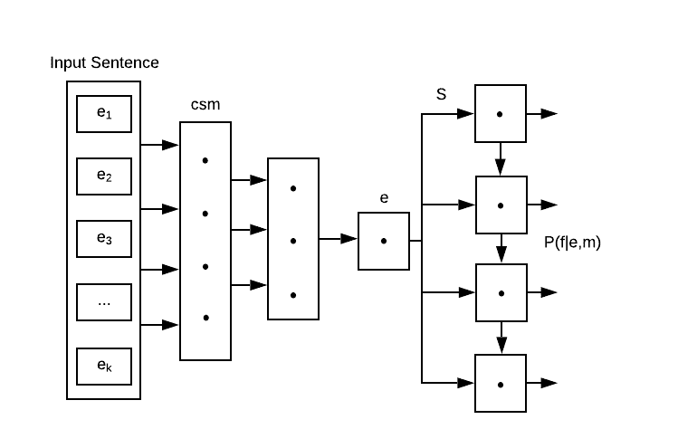

图 10: 递归连续翻译模型 (RCTM) [164]。

在另一项工作中，[170] 提出了一个端到端序列学习方法，不依赖于序列结构的强假设。他们的方法包括两个 LSTM，一个用于将输入映射到固定维度的向量，另一个 LSTM 用于从该向量解码输出序列。他们的模型能够处理长句子以及对词序敏感的句子表示。如图 11 所示，该模型将“ABC”作为输入序列，并生成“WXYZ”作为输出序列。$<EOS>$ 标记表示预测的结束。网络通过最大化给定输入序列 ($\zeta$) 的翻译 ($\eta$) 的对数概率来训练。换句话说，目标函数为：

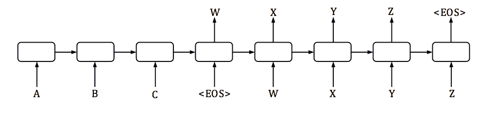

图 11: 使用 LSTM 的序列到序列学习。

|  | $1/&#124;\mathcal{D}&#124;\sum_{\begin{subarray}{c}(\eta,\zeta)\in\mathcal{D}\end{subarray}}logP(\eta&#124;\zeta)$ |  | (8) |
| --- | --- | --- | --- |

$\mathcal{D}$ 是训练集，$|\mathcal{D}|$ 是其大小。他们方法的一个新颖之处在于反转源句子的单词顺序。这有助于 LSTM 学习长期依赖性。

在解码阶段固定长度向量是编码器-解码器方法的瓶颈之一。[168] 认为网络很难将输入句子中的所有信息压缩到固定大小的向量中。他们通过允许网络搜索对预测翻译有用的源句子片段来解决这个问题。在[168]中，输入句子不是表示为固定大小的向量，而是编码为向量序列，并使用称为注意力机制的方法选择其中的一个子集，如图 12 所示。

在他们的方法中 $P(y_{i}|y_{1},...,y_{i-1},X)=g(y_{i-1},s_{i},c_{i})$，其中 $s_{i}=f(s_{i-1},y_{i-1},c_{i})$。之前 $c$ 在所有时间步长中是相同的，而这里 $c$ 在每个时间步长中取不同的值 $c_{i}$。这考虑了特定时间步长周围的注意力机制（上下文向量）。$c_{i}$ 是根据以下方式计算的：

$c_{i}=\sum_{j=1}^{T_{x}}\alpha_{ij}h_{j},\ \alpha_{ij}=\frac{exp(e_{ij})}{{\sum_{k=1}^{T_{x}}exp(e_{ik})}},\ e_{ij}=a(s_{i-1},h_{j})$。

这里 $a$ 是通过前馈神经网络表示的对齐模型。同时 $h_{j}=[\overset{\rightarrow}{h_{j}^{T}},\overset{\leftarrow}{h_{j}^{T}}]$，这是一种在 $h_{j}$ 中包含前后单词信息的方法。该模型能够超越简单的编码器-解码器方法，而不受输入句子长度的影响。

改进的机器翻译模型不断出现，部分原因是人们对理解其他语言的兴趣和需求的增长。它们大多数是端到端解码器-编码器方法的变体。例如，[171] 试图解决稀有词问题。他们的 LSTM 网络由编码器和解码器层组成，使用了残差层和注意力机制。他们的系统能够减少训练时间，加快推理速度，并处理稀有词的翻译。部分先进的神经机器翻译模型的比较总结在表 VII 中。

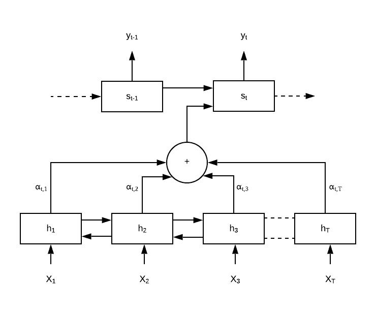

图 12: 神经机器翻译的注意力机制 [168]。

表 VII：评估的机器翻译最先进模型，数据集为 ACL 2014 第九届统计机器翻译研讨会的英德数据集。评估指标是 $BLEU$ 分数。

| 模型 | 准确率 |
| --- | --- |
| 卷积序列到序列 [172] | 25.2 |
| 注意力机制是你所需的 [173] | 28.4 |
| 加权 Transformer [174] | 28.9 |
| 自注意力 [175] | 29.2 |
| DeepL 翻译机器 ¹⁰¹⁰10https://www.deepl.com/press.html | 33.3 |
| 回译 [176] | 35.0 |

最近，[177] 提供了一个有趣的单模型实现的大规模多语言 NMT。在 [178] 中，作者使用 BERT 提取上下文嵌入，并将 BERT 与基于注意力的 NMT 模型结合，提供了在各种基准数据集上的最先进结果。[179] 提出了 mBART，这是一种序列到序列的去噪自编码器，并报告了使用预训练的、固定的（即没有修改的）mBART 在 BLEU 分数方面提高了性能。[180] 提出了一个有趣的对抗性框架，用于增强 NMT 对噪声输入的鲁棒性，并报告了比 Transformer 模型更好的性能。[181] 也是一项有洞察力的近期工作，作者从预测序列以及实际情况中采样上下文词，以尝试协调训练和推理过程。最后，[182] 是一项成功的近期努力，旨在防止在将预训练语言模型转换到其他 NMT 任务时常见的遗忘问题。[182] 主要通过使用动态门控模型和渐近蒸馏来实现这一目标。

### V-F 问答系统

问答（QA）是信息检索（IR）的一个更精细的版本。在 IR 中，需要从一组文档中检索出所需的信息。这些信息可能是特定的文档、文本、图像等。另一方面，在 QA 中，寻找的是具体的答案，通常是可以从现有文档中推断出来的答案。其他 NLP 领域如阅读理解和对话系统也与问答系统交叉。

计算机问答系统的研究自 1960 年代以来一直在进行。在本节中，我们提供了问答系统历史的概述，并重点介绍了该领域的突破。与 NLP 领域的其他所有领域一样，问答系统也受到了深度学习 [183] 进展的影响，因此我们提供了深度学习背景下的 QA 概述。我们还简要地讨论了视觉问答系统。

#### V-F1 基于规则的问答系统

Baseball [184]是早期的问答系统之一（1961 年），它尝试通过使用游戏数据库来回答与棒球比赛相关的问题。该棒球系统包括（1）问题读取，（2）对问题中单词的字典查找，（3）对问题中单词的句法（POS）分析，（4）内容分析以提取输入问题，以及（5）估计回答输入问题的相关性。

IBM 的[185]统计问答系统由四个主要组件组成：

1.  1.

    问题/答案类型分类

1.  2.

    查询扩展/信息检索

1.  3.

    实体命名

1.  4.

    答案选择

一些问答系统在语义等价关系以不同方式表达时会失败。[186]通过提出基于互信息和期望最大化的模糊关系匹配来解决这个问题。

#### V-F2 深度学习时代的问答

智能手机（Siri、Ok Google、Alexa 等）和虚拟个人助理是许多人每天互动的常见问答系统示例。虽然早期这些系统采用基于规则的方法，但如今它们的核心算法基于深度学习。表 VIII 展示了 Siri 在 iPhone 上提供的一些问题和答案。

表 VIII：基于深度学习的典型问答性能。

| 问题 | 答案 |
| --- | --- |
| 谁发明了脊髓灰质炎疫苗？ | 我找到的答案是乔纳斯·索尔克 |
| 谁写了哈利·波特？ | J.K.罗琳在 1997 年写了哈利·波特 |
| 爱因斯坦什么时候出生的？ | 阿尔伯特·爱因斯坦于 1879 年 3 月 14 日出生 |

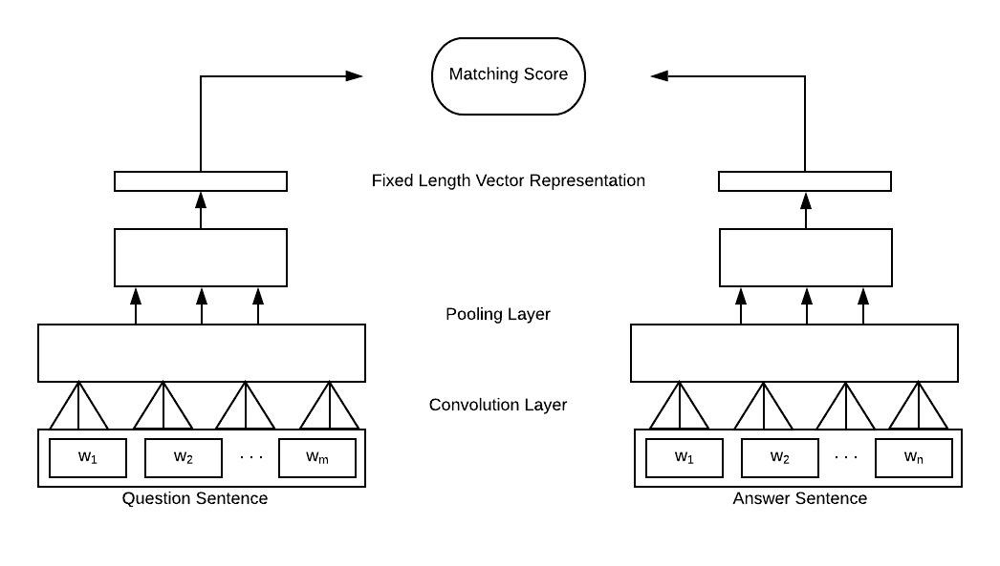

图 13：输入问题和答案的固定长度向量句子表示[187]。

[188]是第一篇基于机器学习的论文之一，报告了阅读理解测试的问答结果。该系统试图从数据库中挑选出对问题有答案的句子，并且为每个问题-句子对表示一个特征向量。[188]的主要贡献是提出了一种特征向量表示框架，旨在提供学习模型所需的信息。共有五个分类器（地点、日期等），每种问题类型有一个。他们能够达到与之前方法相竞争的准确性。

如图 13 所示，[187] 使用卷积神经网络将问题-答案句对编码为固定长度向量，而不受输入句子长度的影响。他们没有使用余弦相关等距离度量，而是融入了非线性张量层来匹配问题和答案之间的相关性。方程 9 计算问题 $q$ 和其对应答案 $a$ 之间的匹配程度。

|  | $s(q,a)=\textbf{u}^{T}\textbf{f}(\textbf{v}^{T}_{q}\textbf{M}^{[1:r]}\textbf{v}_{a}+\textbf{V}\begin{bmatrix}\textbf{v}_{q}\\ \textbf{v}_{a}\end{bmatrix}+\textbf{b})$ |  | (9) |
| --- | --- | --- | --- |

f 是标准的元素级非线性函数，$\textbf{M}^{[1:r]\in R^{n_{s}\times n_{s}\times r}}$ 是一个张量，$\textbf{V}\in R^{r\times 2n_{s}}$，$\textbf{b}\in R^{r}$，$\textbf{u}\in R^{r}$。

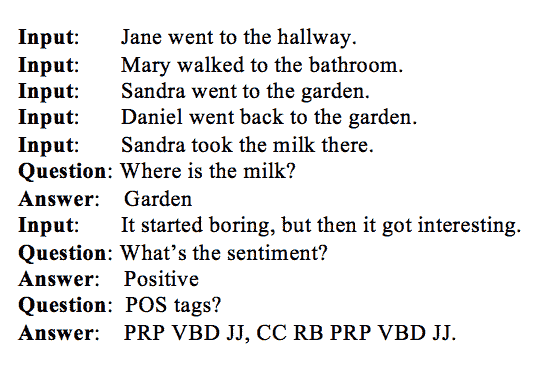

图 14：动态记忆网络（DMN）输入-问题-答案三元组示例

该模型试图捕捉问题和答案之间的互动。受神经科学发现的启发，[81] 在他们的动态记忆网络（DMN）中融入了情景记忆¹¹¹¹11 一种长期记忆，包括对先前活动的有意识回忆以及其意义。通过处理输入序列和问题，DMN 形成情景记忆来回答相关问题。如图 14 所示，他们的系统基于原始的输入-问题-答案三元组进行训练。

DMN 由四个模块组成，这些模块之间进行通信，如图 15 所示。输入模块将原始输入文本编码成分布式向量表示；同样，问题模块将问题编码成其分布式向量表示。情景记忆模块使用注意力机制来关注输入模块的特定部分。通过迭代过程，该模块生成一个记忆向量表示，考虑了问题以及之前的记忆。答案模块使用最终的记忆向量来生成答案。该模型在如图 14 所示的任务上提高了最先进的结果。DMN 是可以用于各种 NLP 应用程序的架构之一，例如分类、问题回答和序列建模。

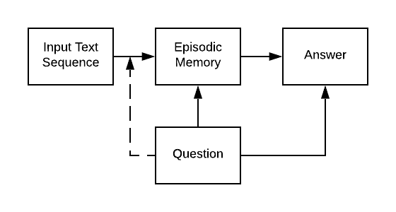

图 15：动态记忆网络四个模块之间的交互[78]。

[189] 提出了动态共注意力网络（DCN），以解决对应于错误答案的局部极值问题；这被认为是问题回答的最佳方法之一。

#### V-F3 视觉问题回答

给定一张输入图像，视觉问题回答（VQA）尝试回答关于图像的自然语言问题[190]。VQN 解决了多个问题，如物体检测、图像分割、情感分析等。[190] 通过提供包含超过 250K 张图像、760K 个问题和大约 10M 个答案的数据集，介绍了 VQA 任务。[191] 提出了基于神经网络的方法来回答有关输入图像的问题。如图 16 所示，神经图像 QA 是一个包含 CNN 和 LSTM 的深度网络。由于问题可能有多个答案，因此该问题被分解为从有限词汇集 $\nu$ 中预测一组答案词 $a_{q,x}=\{a_{1},a_{2},...,a_{N(q,x)}\}$，其中 $N(q,x)$ 代表与给定问题相关的答案词的数量。

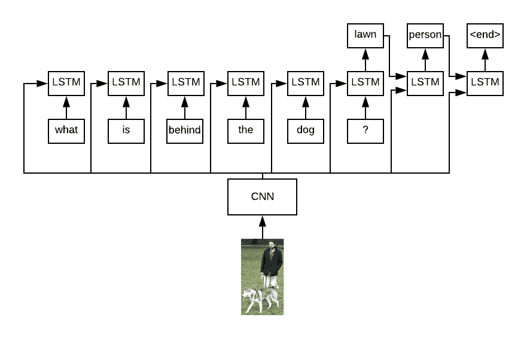

图 16：神经图像问题回答[191]。

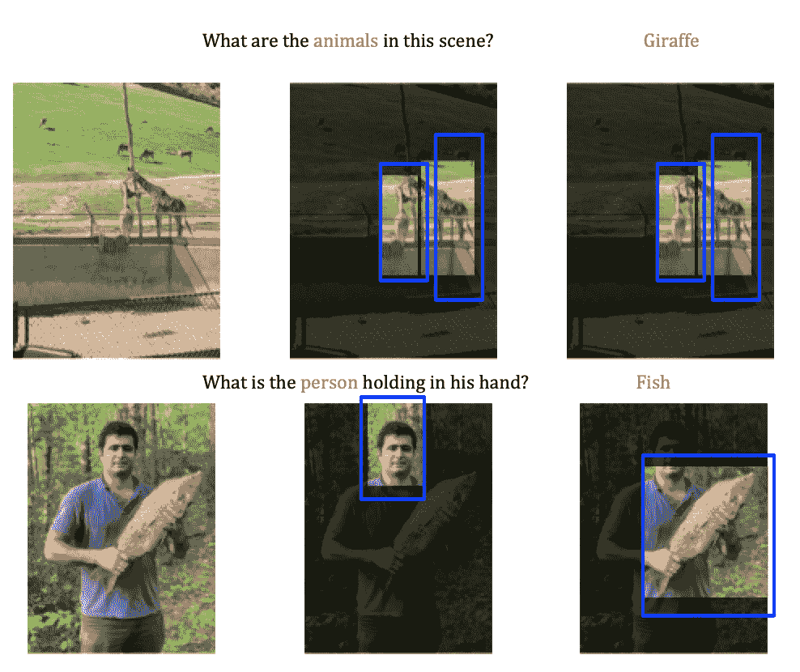

图 17：用于 VQA 的空间记忆网络。亮区是模型正在关注的区域[192]。

人类和计算机是否在相同的区域查看以回答关于图像的问题？[193] 通过对人类在视觉问答（VQA）中的注意力进行大规模研究来尝试回答这个问题。他们的发现表明，视觉问答似乎并不像人类那样查看相同的区域。最后，[192] 为视觉问答引入了一个空间记忆网络。图 17 展示了他们模型的推理过程。如图所示，他们系统中的特定注意力机制可以突出输入图像中的兴趣区域。[194] 介绍了 BLOCK，一个基于超对角张量分解的双线性融合模型，用于视觉问答任务，性能达到最先进水平，代码已在 github 上公开。为了提高现有模型在不同分布测试数据上的泛化能力，[195] 引入了一种自我批判的训练目标，以帮助找到与视觉/文本相关的显著视觉区域，重点是识别影响力大的对象并检测和贬低不正确的主要答案。

### V-G 文档总结

文档总结指的是一组涉及生成摘要句子的问题，给定一个或多个文档作为输入。

一般来说，文本总结分为两类：

1.  1.

    提取式总结，目标是识别文档中最突出的句子，并将其作为摘要返回。

1.  2.

    抽象式总结，目标是从头生成摘要句子；这些句子可能包含原始文档中未出现的新词。

这些方法各有优缺点。提取式总结容易生成长且有时重叠的摘要句子；然而，这种结果反映了作者的表达方式。抽象式方法生成较短的摘要，但训练起来较为困难。

在使用提取式和抽象式方法进行文本总结的主题上，已有大量研究。作为最早使用神经网络进行提取式总结的工作之一，[196] 提出了一个使用排序技术来提取输入中最显著句子的框架。该模型由[197] 改进，后者使用了文档级编码器来表示句子，并用分类器对这些句子进行排名。另一方面，在抽象式总结中，[198] 首次使用了序列到序列（seq2seq）模型的注意力机制来解决标题生成问题。然而，由于简单的注意力模型表现不如提取式模型，因此提出了更有效的注意力模型，如基于图的注意力[199]和变换器[173]。为了进一步改进抽象文本总结模型，[200] 提出了第一个指针-生成器模型，并将其应用于 DeepMind QA 数据集[201]。这项工作的结果是出现了 CNN/Daily Mail 数据集，该数据集现在是总结任务中广泛使用的数据集之一。[202] 也采用了类似任务的复制机制。但他们的分析揭示了基于注意力的编码器-解码器模型的一个关键问题：它们通常生成由重复短语组成的不寻常总结。最近，[62] 在使用类似框架的抽象文本总结中达到了最先进的结果。他们通过避免生成未知词汇并用输入文章中的词汇替代这些词汇，缓解了不自然的总结。后来，研究人员将关注点转向了使用句子嵌入的方法，首先选择文档中最显著的句子，然后进行改写以使其更具抽象性[203, 204]。在这些模型中，首先提取显著句子，然后使用改写模型使其更具抽象性。提取使用句子分类器或排名器，而抽象化器则尝试去除句子中的多余信息，并将其呈现为更简短的总结。Fast-RL[203] 是这一系列工作的第一个框架。在 Fast-RL 中，提取器经过预训练以选择显著句子，而抽象化器则使用指针-生成器模型进行改写预训练。最后，为了将这两个不可微分的组件合并，他们提出了使用 Actor-Critic Q 学习方法，其中演员接收单个文档并生成输出，而评论员则根据与真实总结的比较评估输出。

尽管评估总结模型性能的标准方法是使用 ROUGE [67] 和 BLEU [68]，但这些措施存在主要问题。例如，ROUGE 衡量标准侧重于两个句子之间共享的 n-gram 数量。这种方法错误地将低分赋予使用不同词语但提供优秀释义的抽象总结，而人类会高度评价这种总结。显然，在这种情况下需要更好的自动化评估方法。

当前总结模型还存在其他问题。Shi 等人 [205] 提供了关于文本总结的全面调查。

[206] 提供了关于总结方法的最新调查。[207] 提供了一种基于 LSTM 和限制玻尔兹曼机的高级复合深度学习模型，用于多文档意见总结。一项非常有影响力的最新工作 [208] 引入了 Hibert (HIerachical Bidirectional Encoder Representations from Transformers) 作为文档总结的预训练初始化，并报告了最先进的性能。

### V-H 对话系统

对话系统迅速成为人机交互的主要工具，这部分归功于其有前景的潜力和商业价值 [209]。其中一个应用是自动化客户服务，支持在线和实体业务。客户期望在处理公司及其服务时能提供越来越高的速度、准确性和尊重。由于熟练人力资源的高成本，公司常常转向智能对话机器。请注意，对话机器和对话系统这两个词通常可以互换使用。

对话系统通常是基于任务或非基于任务的 (见图 18)。虽然对话系统中可能存在自动语音识别 (ASR) 和语言到语音 (L2S) 组件，但本节讨论仅涉及对话系统的语言学组件；与语音技术相关的概念被忽略。

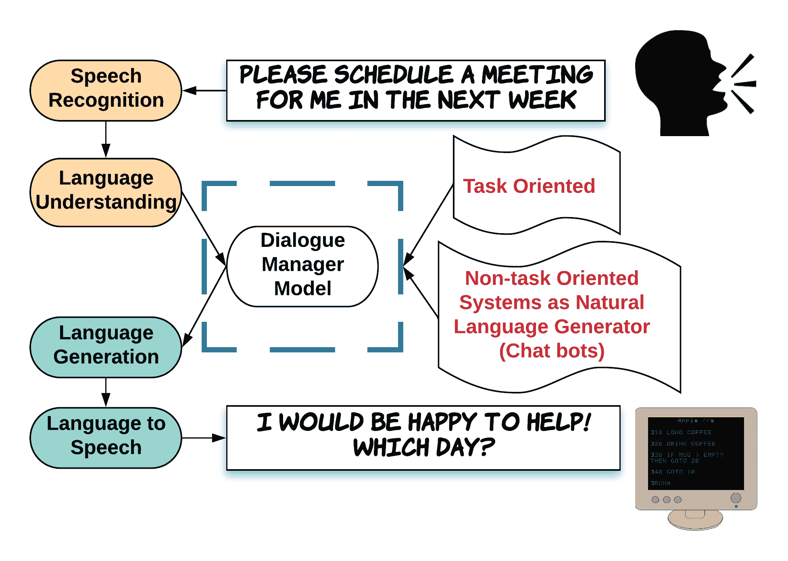

图 18：对话系统的框架。对话系统可以是面向任务的，也可以基于用户输入用于自然语言生成，这也称为聊天机器人。

尽管在对话系统的后端（特别是在语言理解模块中）采用了有用的统计模型，但大多数部署的对话系统依赖于昂贵的手工制作和人工特征进行操作。此外，这些手工工程化系统在其他领域和功能上的通用性存在问题。因此，最近的关注点集中在深度学习上，以提高性能、通用性和鲁棒性。深度学习促进了端到端任务导向对话系统的创建，这丰富了框架，使对话超越注释的任务特定对话资源。

#### V-H1 基于任务的系统

基于任务的对话系统的结构通常包括以下元素：

+   •

    自然语言理解（NLU）：该组件通过为口语话语（例如句子）分配组成结构来处理理解和解释用户的口语上下文，并捕捉其句法表示和语义解释，以允许后端操作/任务。NLU 通常在对话上下文中发挥作用。

+   •

    对话管理器（DM）：由 NLU 生成的表示将由对话管理器处理，该管理器调查上下文并返回合理的语义相关响应。

+   •

    自然语言生成（NLG）：自然语言生成（NLG）组件根据 DM 组件提供的响应生成话语。

一般流程如下：NLU 模块（即语义解码器）将语音识别模块的输出转换为一些对话元素。然后，DM 处理这些对话元素并提供合适的响应，这些响应传递给 NLG 进行响应生成。NLU 的主要流程是分类用户查询领域和用户意图，并填充一组槽位以创建语义框架。通常习惯于同时进行意图预测和槽位填充[210]。大多数任务导向对话系统采用槽位填充方法来分类对话的特定领域中的用户意图。为此，需要预定义任务；这依赖于不同相关槽位的手工制作状态。因此，设计的对话系统可能对其他任务的使用有限或无用。

最近，任务导向的对话系统基于深度强化学习进行设计，这在性能[211]、领域适应[212]和对话生成[213]方面提供了令人满意的结果。这是由于向端到端可训练框架的转变，以设计和部署任务导向的对话系统。与传统的流水线方法不同，端到端框架集成并使用一个处理外部数据库的单一模块。尽管端到端对话系统具有可训练性（即易于训练和工程实现），由于需要通过查询与外部数据库进行互操作，它们不适合任务导向的设置。一些应对这一挑战的方法包括将用户输入转换为内部表示[214]、结合监督学习和强化学习[215]以及将记忆网络方法[216]扩展到问答对话系统[217]。

#### V-H2 非任务型系统

与基于任务的对话系统相比，设计和部署非基于任务的对话系统的目标是赋予机器与人类进行自然对话的能力[218]。通常，聊天机器人可以分为以下几种类型：检索型方法和生成型方法。检索型模型可以访问信息资源，提供更简洁、流畅和准确的回应。然而，由于依赖于后端数据资源，它们在回应的多样性上受到限制。生成型模型则具有在语料库中不存在的情况下生成合适回应的优势。然而，与检索型模型相比，它们更容易产生语法和概念上的错误。

基于检索的方法从候选回应中选择一个合适的回应。因此，关键要素是查询-回应操作。一般来说，这个问题被表述为搜索问题，并使用信息检索（IR）技术来完成任务 [219]。基于检索的方法通常采用单轮回应匹配或多轮回应匹配。在第一种类型中，当前的查询（消息）仅用于选择一个合适的回应 [220]。后一种类型将当前消息和之前的发言作为系统输入，并根据即时和时间信息检索回应。该模型尝试选择一个考虑整个上下文的回应，以保证对话的一致性。已经提出了一种基于 LSTM 的模型 [221] 来创建上下文和回应向量。在 [222] 中，已经结合了各种特征和多个数据输入，通过深度学习框架进行处理。目前关于基于检索的聊天机器人，基本模型依赖于通过注意力机制和序列匹配增强的多轮回应选择 [223]。

生成模型不假设存在预定义的回应。新的回应是从头生成的，并且基于训练的模型。生成模型通常基于序列到序列模型，将输入查询映射到目标元素作为回应。一般来说，设计和实现一个能够以人类水平对话的对话代理是非常具有挑战性的。典型的方法通常包括学习和模仿人类对话。为了这个目标，机器通常在大量对话语料库上进行训练。然而，这并不能直接解决遇到语料库外对话的问题。问题是：如何教导一个代理生成对其从未见过的对话的适当回应？它必须处理在机器训练的数据语料库中没有完全匹配的内容，由于人类可以提供的查询范围广泛，导致查询和对应回应之间缺乏内容匹配。

为解决上述的一般问题，必须回答一些基本问题：（1）自然对话的核心特征是什么？（2）这些特征如何被衡量？（3）我们如何将这些知识融入到机器中，即对话系统？有效地整合这三要素决定了机器的智能水平。一个定性标准是观察生成的发言是否能与自然的人类对话区分开来。为了进行定量评估，最初采用了对抗性评估来评估句子生成的质量[224]，并用于对话系统的质量评估[225]。序列到序列建模的最新进展鼓励了许多关于自然语言生成的研究[226]。此外，深度强化学习在自然语言生成中表现出良好的性能[213]。

#### V-H3 对话系统的最终说明

尽管在 AI 领域取得了显著进展，并且大量关注集中在对话系统上，但实际上，成功的商业工具，如苹果的 Siri 和亚马逊的 Alexa，仍然严重依赖手工特征。鉴于自然语言的复杂性、框架设计的困难以及可用数据源的复杂性质，设计和训练数据驱动的对话机器仍然非常具有挑战性。

## VI 结论

在这篇文章中，我们提供了一个关于使用深度学习的自然语言处理领域的最杰出工作的综合调查。我们提供了一个分类背景，用于介绍不同的 NLP 核心概念、方面和应用，并强调了每个相关类别中最重要的研究工作。深度学习和 NLP 是当前发展最快的研究主题之一。由于这种快速进展，希望不久之后，新有效的模型将取代当前的最先进方法。这可能会导致调查中提供的一些参考文献变得过时，但这些文献可能会被描述改进方法的新出版物引用。

尽管如此，本调查的一个重要特征是其教育方面，它提供了对该领域关键要素的准确理解，并解释了最显著的研究工作。希望本调查能为学生和研究人员提供必要的资源，以了解所需知识，并进一步推动 NLP 与深度学习的融合。

## 参考文献

+   [1] C. D. Manning, C. D. Manning, and H. Schütze, Foundations of statistical natural language processing. MIT Press, 1999.

+   [2] X. Zhang, J. Zhao, and Y. LeCun, “Character-level convolutional networks for text classification,” in Advances in neural information processing systems, pp. 649–657, 2015.

+   [3] K. Cho, B. Van Merriënboer, C. Gulcehre, D. Bahdanau, F. Bougares, H. Schwenk, 和 Y. Bengio，“使用 RNN 编码器-解码器学习短语表示用于统计机器翻译”，arXiv 预印本 arXiv:1406.1078，2014 年。

+   [4] S. Wu, K. Roberts, S. Datta, J. Du, Z. Ji, Y. Si, S. Soni, Q. Wang, Q. Wei, Y. Xiang, B. Zhao, 和 H. Xu，“临床自然语言处理中的深度学习：方法论综述”，《美国医学信息学协会杂志》，第 27 卷，第 457–470 页，2020 年 3 月。

+   [5] R. Collobert 和 J. Weston，“自然语言处理的统一架构：具有多任务学习的深度神经网络”，在《第 25 届国际机器学习会议论文集》，第 160–167 页，ACM，2008 年。

+   [6] A. Karpathy, G. Toderici, S. Shetty, T. Leung, R. Sukthankar, 和 L. Fei-Fei，“使用卷积神经网络进行大规模视频分类”，在《IEEE 计算机视觉与模式识别会议论文集》，第 1725–1732 页，2014 年。

+   [7] M. Oquab, L. Bottou, I. Laptev, 和 J. Sivic，“使用卷积神经网络学习和迁移中层图像表示”，在《IEEE 计算机视觉与模式识别会议论文集》，第 1717–1724 页，2014 年。

+   [8] A. Shrivastava, T. Pfister, O. Tuzel, J. Susskind, W. Wang, 和 R. Webb，“通过对抗训练从模拟和无监督图像中学习”，在《IEEE 计算机视觉与模式识别会议论文集》，第 2107–2116 页，2017 年。

+   [9] A. Voulodimos, N. Doulamis, A. Doulamis, 和 E. Protopapadakis，“计算机视觉中的深度学习：简要综述”，《计算智能与神经科学》，2018 年 2 月。

+   [10] N. O’Mahony, S. Campbell, A. Carvalho, S. Harapanahalli, G. V. Hernandez, L. Krpalkova, D. Riordan, 和 J. Walsh，“深度学习与传统计算机视觉”，在《计算机视觉进展》（K. Arai 和 S. Kapoor 编），（Cham），第 128–144 页，Springer International Publishing，2020 年。

+   [11] A. Graves 和 N. Jaitly，“朝着端到端语音识别的递归神经网络”，在国际机器学习会议， 第 1764–1772 页，2014 年。

+   [12] D. Amodei, S. Ananthanarayanan, R. Anubhai, J. Bai, E. Battenberg, C. Case, J. Casper, B. Catanzaro, Q. Cheng, G. Chen, 等，“深度语音 2：英语和普通话的端到端语音识别”，在 ICML，第 173–182 页，2016 年。

+   [13] U. Kamath, J. Liu, 和 J. Whitaker，《用于 NLP 和语音识别的深度学习》，第 84 卷。Springer，2019 年。

+   [14] C. D. Santos 和 B. Zadrozny，“为词性标注学习字符级表示”，在《第 31 届国际机器学习会议（ICML-14）论文集》，第 1818–1826 页，2014 年。

+   [15] B. Plank, A. Søgaard, 和 Y. Goldberg，“使用双向长短期记忆模型和辅助损失进行多语言词性标注”，arXiv 预印本 arXiv:1604.05529，2016 年。

+   [16] C. D. Manning, “词性标注从 97%到 100%：是否该引入一些语言学？” 载于智能文本处理与计算语言学国际会议论文集，第 171–189 页, Springer, 2011。

+   [17] R. D. Deshmukh 和 A. Kiwelekar, “自然语言处理中的词性标注深度学习技术，” 载于 2020 年第 2 届创新机制工业应用国际会议（ICIMIA）论文集，第 76–81 页, IEEE, 2020。

+   [18] G. Lample, M. Ballesteros, S. Subramanian, K. Kawakami, 和 C. Dyer, “命名实体识别的神经网络架构，” arXiv 预印本 arXiv:1603.01360, 2016。

+   [19] J. P. Chiu 和 E. Nichols, “使用双向 LSTM-CNNs 的命名实体识别，” arXiv 预印本 arXiv:1511.08308, 2015。

+   [20] V. Yadav 和 S. Bethard, “深度学习模型在命名实体识别中的近期进展综述，” arXiv 预印本 arXiv:1910.11470, 2019。

+   [21] J. Li, A. Sun, J. Han, 和 C. Li, “深度学习在命名实体识别中的应用综述，” IEEE 知识与数据工程汇刊, 2020。

+   [22] J. Zhou 和 W. Xu, “使用递归神经网络的端到端语义角色标注学习，” 载于第 53 届计算语言学协会年会及第 7 届国际自然语言处理联合会议（第 1 卷：长篇论文）的论文集，第 1 卷，第 1127–1137 页, 2015。

+   [23] D. Marcheggiani, A. Frolov, 和 I. Titov, “一种简单而准确的无语法依赖神经模型用于基于依赖的语义角色标注，” arXiv 预印本 arXiv:1701.02593, 2017。

+   [24] L. He, K. Lee, M. Lewis, 和 L. Zettlemoyer, “深度语义角色标注：有效的方法及未来方向，” 载于第 55 届计算语言学协会年会（第 1 卷：长篇论文）的论文集，第 1 卷，第 473–483 页, 2017。

+   [25] S. He, Z. Li, 和 H. Zhao, “语法感知的多语言语义角色标注，” arXiv 预印本 arXiv:1909.00310, 2019。

+   [26] T. Young, D. Hazarika, S. Poria, 和 E. Cambria, “基于深度学习的自然语言处理的最新趋势，” IEEE 计算智能杂志，第 13 卷，第 3 期，第 55–75 页, 2018。

+   [27] Y. Kang, Z. Cai, C.-W. Tan, Q. Huang, 和 H. Liu, “管理研究中的自然语言处理（NLP）：文献综述，” 管理分析杂志，第 7 卷，第 139–172 页, 2020 年 4 月。

+   [28] T. Greenwald, “究竟什么是人工智能？” [`www.wsj.com/articles/what-exactly-is-artificial-intelligence-anyway-1525053960`](https://www.wsj.com/articles/what-exactly-is-artificial-intelligence-anyway-1525053960), 2018 年 4 月。《华尔街日报》在线文章。

+   [29] U. Sivarajah, M. M. Kamal, Z. Irani, 和 V. Weerakkody, “大数据挑战及分析方法的关键分析，” 商业研究杂志，第 70 卷，第 263–286 页, 2017。

+   [30] Z. C. Lipton, J. Berkowitz, 和 C. Elkan, “递归神经网络在序列学习中的关键评估，” arXiv 预印本 arXiv:1506.00019, 2015。

+   [31] Y. Kim，“用于句子分类的卷积神经网络，” arXiv 预印本 arXiv:1408.5882，2014 年。

+   [32] R. Socher, C. C. Lin, C. Manning, 和 A. Y. Ng，“使用递归神经网络解析自然场景和自然语言，” 收录于第 28 届国际机器学习会议（ICML-11）论文集，pp. 129–136，2011 年。

+   [33] A. Krizhevsky, I. Sutskever, 和 G. E. Hinton，“使用深度卷积神经网络的 Imagenet 分类，” 收录于神经信息处理系统进展，pp. 1097–1105，2012 年。

+   [34] C. dos Santos 和 M. Gatti，“用于短文本情感分析的深度卷积神经网络，” 收录于 COLING 2014，第 25 届国际计算语言学会议：技术论文集，pp. 69–78，2014 年。

+   [35] R. Johnson 和 T. Zhang，“利用卷积神经网络有效使用词序进行文本分类，” arXiv 预印本 arXiv:1412.1058，2014 年。

+   [36] R. Johnson 和 T. Zhang，“通过区域嵌入进行文本分类的半监督卷积神经网络，” 收录于神经信息处理系统进展，pp. 919–927，2015 年。

+   [37] D. Zeng, K. Liu, S. Lai, G. Zhou, 和 J. Zhao，“通过卷积深度神经网络进行关系分类，” 收录于 COLING 2014，第 25 届国际计算语言学会议：技术论文集，pp. 2335–2344，2014 年。

+   [38] T. H. Nguyen 和 R. Grishman，“关系提取：卷积神经网络的视角，” 收录于第 1 届自然语言处理向量空间建模研讨会论文集，pp. 39–48，2015 年。

+   [39] T. Mikolov, M. Karafiát, L. Burget, J. Černockỳ, 和 S. Khudanpur，“基于递归神经网络的语言模型，” 收录于第十一届国际语音通信协会年会，2010 年。

+   [40] S. Hochreiter 和 J. Schmidhuber，“长短期记忆，” 《神经计算》，第 9 卷，第 8 期，pp. 1735–1780，1997 年。

+   [41] I. Goodfellow, J. Pouget-Abadie, M. Mirza, B. Xu, D. Warde-Farley, S. Ozair, A. Courville, 和 Y. Bengio，“生成对抗网络，” 收录于神经信息处理系统进展，pp. 2672–2680，2014 年。

+   [42] M. Arjovsky, S. Chintala, 和 L. Bottou，“Wasserstein GAN，” arXiv 预印本 arXiv:1701.07875，2017 年。

+   [43] X. Chen, Y. Duan, R. Houthooft, J. Schulman, I. Sutskever, 和 P. Abbeel，“Infogan：通过信息最大化生成对抗网络进行可解释表示学习，” 收录于神经信息处理系统进展，pp. 2172–2180，2016 年。

+   [44] A. Radford, L. Metz, 和 S. Chintala，“通过深度卷积生成对抗网络进行无监督表示学习，” arXiv 预印本 arXiv:1511.06434，2015 年。

+   [45] T. Karras, T. Aila, S. Laine, 和 J. Lehtinen，“为改进质量、稳定性和变异性而逐步增长的 GAN，” arXiv 预印本 arXiv:1710.10196，2017 年。

+   [46] N. Tavaf, A. Torfi, K. Ugurbil, 和 P.-F. Van de Moortele，“GRAPPA-GANs 用于并行 MRI 重建，”arXiv 预印本 arXiv:2101.03135，2021 年 1 月。

+   [47] L. Yu, W. Zhang, J. Wang, 和 Y. Yu，“Seqgan：带有策略梯度的序列生成对抗网络，”在第三十一届 AAAI 人工智能会议上，2017 年。

+   [48] J. Li, W. Monroe, T. Shi, S. Jean, A. Ritter, 和 D. Jurafsky，“用于神经对话生成的对抗学习，”arXiv 预印本 arXiv:1701.06547，2017 年。

+   [49] B. Pang, L. Lee, 和 S. Vaithyanathan，“好评如潮？：使用机器学习技术进行情感分类，”在 ACL-02 会议的自然语言处理实证方法第 10 卷，第 79–86 页，计算语言学协会，2002 年。

+   [50] Z. S. Harris，“分布式结构，”《Word》，第 10 卷，第 2-3 期，第 146–162 页，1954 年。

+   [51] Y. Bengio, R. Ducharme, P. Vincent, 和 C. Jauvin，“一个神经概率语言模型，”《机器学习研究杂志》，第 3 卷，2 月号，第 1137–1155 页，2003 年。

+   [52] Q. Le 和 T. Mikolov，“句子和文档的分布式表示，”在国际机器学习会议上，第 1188–1196 页，2014 年。

+   [53] T. Mikolov, I. Sutskever, K. Chen, G. S. Corrado, 和 J. Dean，“词语和短语的分布式表示及其组合性，”在神经信息处理系统进展中，第 3111–3119 页，2013 年。

+   [54] R. Kiros, Y. Zhu, R. R. Salakhutdinov, R. Zemel, R. Urtasun, A. Torralba, 和 S. Fidler，“跳跃思想向量，”在神经信息处理系统进展中，第 3294–3302 页，2015 年。

+   [55] T. Mikolov, K. Chen, G. Corrado, 和 J. Dean，“在向量空间中高效估计词语表示，”arXiv 预印本 arXiv:1301.3781，2013 年。

+   [56] G. Lebanon 等，《黎曼几何与统计机器学习》。LAP LAMBERT 学术出版，2015 年。

+   [57] J. Leskovec, A. Rajaraman, 和 J. D. Ullman，《大规模数据集挖掘》。剑桥大学出版社，2014 年。

+   [58] Y. Goldberg，“自然语言处理的神经网络方法，”《人类语言技术合成讲座》，第 10 卷，第 1 期，第 1–309 页，2017 年。

+   [59] J. Wehrmann, W. Becker, H. E. Cagnini, 和 R. C. Barros，“用于语言无关的 Twitter 情感分析的字符级卷积神经网络，”在 2017 年国际联合会议上的神经网络（IJCNN）中，第 2384–2391 页，IEEE，2017 年。

+   [60] P. Bojanowski, E. Grave, A. Joulin, 和 T. Mikolov，“用子词信息丰富词向量，”arXiv 预印本 arXiv:1607.04606，2016 年。

+   [61] J. Botha 和 P. Blunsom，“用于词语表示和语言建模的组合形态学，”在国际机器学习会议上，第 1899–1907 页，2014 年。

+   [62] A. See, P. J. Liu, 和 C. D. Manning，“直截了当：使用指针-生成网络的摘要，”在 ACL 会议上，第 1 卷，第 1073–1083 页，2017 年。

+   [63] R. Paulus, C. Xiong, 和 R. Socher，“一种用于抽象摘要的深度强化模型”，arXiv 预印本 arXiv:1705.04304，2017 年。

+   [64] S. Bengio, O. Vinyals, N. Jaitly, 和 N. Shazeer，“递归神经网络的序列预测调度采样”，发表于《神经信息处理系统进展》，第 1171–1179 页，2015 年。

+   [65] K. Goyal, G. Neubig, C. Dyer, 和 T. Berg-Kirkpatrick，“神经序列模型的端到端训练的连续松弛束搜索”，发表于《第三十二届 AAAI 人工智能会议》，2018 年。

+   [66] W. Kool, H. Van Hoof, 和 M. Welling，“随机束及其发现：用于不重复采样序列的 Gumbel-top-k 技巧”，发表于《国际机器学习会议》，第 3499–3508 页，2019 年。

+   [67] C.-Y. Lin，“Rouge：自动评估摘要的工具包”，发表于《文本摘要分支》，第 74–81 页，2004 年。

+   [68] K. Papineni, S. Roukos, T. Ward, 和 W.-J. Zhu，“BLEU：一种自动评估机器翻译的方法”，发表于《第 40 届计算语言学协会年会论文集》，第 311–318 页，计算语言学协会，2002 年。

+   [69] S. Banerjee 和 A. Lavie，“METEOR：一种用于机器翻译评估的自动度量，与人工评估的相关性提高”，发表于《ACL 机器翻译和/或摘要内在与外在评估测度研讨会论文集》，第 65–72 页，2005 年。

+   [70] Y. Keneshloo, T. Shi, C. K. Reddy, 和 N. Ramakrishnan，“序列到序列模型的深度强化学习”，arXiv 预印本 arXiv:1805.09461，2018 年。

+   [71] M. Ranzato, S. Chopra, M. Auli, 和 W. Zaremba，“使用递归神经网络的序列级训练”，arXiv 预印本 arXiv:1511.06732，2015 年。

+   [72] W. Zaremba 和 I. Sutskever，“强化学习神经图灵机——修订版”，arXiv 预印本 arXiv:1505.00521，2015 年。

+   [73] R. J. Williams，“用于联结主义强化学习的简单统计梯度跟随算法”，发表于《强化学习》，第 5–32 页，Springer，1992 年。

+   [74] R. S. Sutton 和 A. G. Barto，《强化学习：介绍》。MIT 出版社，2018 年。

+   [75] C. J. Watkins 和 P. Dayan，“Q 学习”，《机器学习》，第 8 卷，第 3-4 期，第 279–292 页，1992 年。

+   [76] H. Daumé, J. Langford, 和 D. Marcu，“基于搜索的结构化预测”，《机器学习》，第 75 卷，第 3 期，第 297–325 页，2009 年。

+   [77] S. Levine, C. Finn, T. Darrell, 和 P. Abbeel，“深度视觉运动策略的端到端训练”，《机器学习研究杂志》，第 17 卷，第 1 期，第 1334–1373 页，2016 年。

+   [78] V. Mnih, N. Heess, A. Graves 等，“视觉注意的递归模型”，发表于《神经信息处理系统进展》，第 2204–2212 页，2014 年。

+   [79] C. Sun, L. Huang, 和 X. Qiu，“利用 BERT 通过构造辅助句进行基于方面的情感分析”，arXiv 预印本 arXiv:1903.09588，2019 年。

+   [80] P. Resnik 和 J. Lin, “NLP 系统的评估，” 计算语言学和自然语言处理手册, vol. 57, pp. 271–295, 2010。

+   [81] A. Kumar, O. Irsoy, P. Ondruska, M. Iyyer, J. Bradbury, I. Gulrajani, V. Zhong, R. Paulus, 和 R. Socher, “问我任何事：用于自然语言处理的动态记忆网络，” 在国际机器学习会议中, pp. 1378–1387, 2016。

+   [82] Z. Huang, W. Xu, 和 K. Yu, “用于序列标注的双向 LSTM-CRF 模型，” arXiv 预印本 arXiv:1508.01991, 2015。

+   [83] D. Andor, C. Alberti, D. Weiss, A. Severyn, A. Presta, K. Ganchev, S. Petrov, 和 M. Collins, “全局归一化转移基神经网络，” arXiv 预印本 arXiv:1603.06042, 2016。

+   [84] X. Xue 和 J. Zhang, “基于深度学习和变换规则的建筑代码词性标注，” 高级工程信息学, vol. 47, p. 101235, 2021。

+   [85] L. Liu, J. Shang, X. Ren, F. F. Xu, H. Gui, J. Peng, 和 J. Han, “通过任务感知神经语言模型增强序列标注，” 在第三十二届 AAAI 人工智能大会中, 2018。

+   [86] Z. Yang, R. Salakhutdinov, 和 W. W. Cohen, “使用层次递归网络的序列标注迁移学习，” arXiv 预印本 arXiv:1703.06345, 2017。

+   [87] X. Ma 和 E. Hovy, “通过双向 LSTM-CNN-CRF 的端到端序列标注，” arXiv 预印本 arXiv:1603.01354, 2016。

+   [88] M. Yasunaga, J. Kasai, 和 D. Radev, “通过对抗训练实现稳健的多语言词性标注，” arXiv 预印本 arXiv:1711.04903, 2017。

+   [89] W. Ling, T. Luís, L. Marujo, R. F. Astudillo, S. Amir, C. Dyer, A. W. Black, 和 I. Trancoso, “在形式中发现功能：用于开放词汇词表示的组合字符模型，” arXiv 预印本 arXiv:1508.02096, 2015。

+   [90] A. Akbik, D. Blythe, 和 R. Vollgraf, “用于序列标注的上下文字符串嵌入，” 在第 27 届国际计算语言学会议中, pp. 1638–1649, 2018。

+   [91] B. Bohnet, R. McDonald, G. Simoes, D. Andor, E. Pitler, 和 J. Maynez, “使用 Meta-BiLSTM 模型对上下文敏感的标记编码进行形态句法标注，” arXiv 预印本 arXiv:1805.08237, 2018。

+   [92] J. Legrand 和 R. Collobert, “基于 RNN 的贪婪解析和词汇组合，” arXiv 预印本 arXiv:1412.7028, 2014。

+   [93] J. Legrand 和 R. Collobert, “用于形态丰富语言的句法解析的深度神经网络，” 在第 54 届计算语言学协会年会上 (第 2 卷：简短论文), pp. 573–578, 2016。

+   [94] A. Kuncoro, M. Ballesteros, L. Kong, C. Dyer, G. Neubig, 和 N. A. Smith, “递归神经网络语法学到的句法是什么？，” arXiv 预印本 arXiv:1611.05774, 2016。

+   [95] J. Liu 和 Y. Zhang, “基于顺序转移的成分解析，” arXiv 预印本 arXiv:1707.05000, 2017。

+   [96] D. Fried, M. Stern, 和 D. Klein，“通过解开模型组合和重新排序效果来改进神经解析，” arXiv 预印本 arXiv:1707.03058，2017。

+   [97] N. Kitaev 和 D. Klein，“使用自注意编码器的成分解析，” arXiv 预印本 arXiv:1805.01052，2018。

+   [98] D. Chen 和 C. Manning，“使用神经网络的快速且准确的依赖解析器，” 收录于 2014 年自然语言处理经验方法会议（EMNLP）论文集，pp. 740–750，2014。

+   [99] T. Dozat 和 C. D. Manning，“用于神经依赖解析的深度双线性注意力，” arXiv 预印本 arXiv:1611.01734，2016。

+   [100] E. Kiperwasser 和 Y. Goldberg，“使用双向 LSTM 特征表示的简单而准确的依赖解析，” arXiv 预印本 arXiv:1603.04351，2016。

+   [101] C. Dyer, M. Ballesteros, W. Ling, A. Matthews, 和 N. A. Smith，“基于转换的依赖解析与堆栈长短期记忆网络，” arXiv 预印本 arXiv:1505.08075，2015。

+   [102] S. Jaf 和 C. Calder，“用于自然语言解析的深度学习，” IEEE Access，第 7 卷，pp. 131363–131373，2019。

+   [103] Y. Zhang, F. Tiryaki, M. Jiang, 和 H. Xu，“使用最先进的深度学习解析器解析临床文本：系统比较，” BMC 医学信息与决策， 第 19 卷，第 3 期，p. 77，2019。

+   [104] Y. Zhang, Z. Li, 和 M. Zhang，“用于神经依赖解析的高效二阶 TreeCRF，” arXiv 预印本 arXiv:2005.00975，2020。

+   [105] T. Dozat 和 C. D. Manning，“用于神经依赖解析的深度双线性注意力，” 2017。

+   [106] Z. Tan, M. Wang, J. Xie, Y. Chen, 和 X. Shi，“使用自注意力的深度语义角色标注，” arXiv 预印本 arXiv:1712.01586，2017。

+   [107] D. Marcheggiani 和 I. Titov，“通过图卷积网络编码句子以进行语义角色标注，” arXiv 预印本 arXiv:1703.04826，2017。

+   [108] E. Strubell, P. Verga, D. Andor, D. Weiss, 和 A. McCallum，“语言学信息自注意力用于语义角色标注，” arXiv 预印本 arXiv:1804.08199，2018。

+   [109] L. He, K. Lee, O. Levy, 和 L. Zettlemoyer，“在神经语义角色标注中联合预测谓词和论元，” arXiv 预印本 arXiv:1805.04787，2018。

+   [110] M. E. Peters, M. Neumann, M. Iyyer, M. Gardner, C. Clark, K. Lee, 和 L. Zettlemoyer，“深度上下文化词表示，” arXiv 预印本 arXiv:1802.05365，2018。

+   [111] Z. Tan, M. Wang, J. Xie, Y. Chen, 和 X. Shi，“使用自注意力的深度语义角色标注，” 第三十二届 AAAI 人工智能会议，2018。

+   [112] Z. Li, S. He, H. Zhao, Y. Zhang, Z. Zhang, X. Zhou, 和 X. Zhou，“依赖或跨度，端到端统一的语义角色标注，” 收录于 AAAI 人工智能会议论文集，第 33 卷，pp. 6730–6737，2019。

+   [113] S. Pradhan, A. Moschitti, N. Xue, H. T. Ng, A. Björkelund, O. Uryupina, Y. Zhang 和 Z. Zhong, “使用 OntoNotes 进行鲁棒语言分析的探索，” 发表在第十七届计算自然语言学习会议论文集，页 143–152, 2013。

+   [114] N. Kalchbrenner, E. Grefenstette 和 P. Blunsom, “用于建模句子的卷积神经网络，” arXiv 预印本 arXiv:1404.2188, 2014。

+   [115] H. Palangi, L. Deng, Y. Shen, J. Gao, X. He, J. Chen, X. Song 和 R. Ward, “使用长短期记忆网络的深度句子嵌入：分析及其在信息检索中的应用，” IEEE/ACM 音频、语音与语言处理交易（TASLP），卷 24, 第 4 期, 页 694–707, 2016。

+   [116] Z. Yang, D. Yang, C. Dyer, X. He, A. Smola 和 E. Hovy, “用于文档分类的层次注意力网络，” 发表在第 2016 届北美计算语言学协会会议：人类语言技术会议论文集，页 1480–1489, 2016。

+   [117] S. Lai, L. Xu, K. Liu 和 J. Zhao, “用于文本分类的递归卷积神经网络，” 发表在 AAAI，卷 333, 页 2267–2273, 2015。

+   [118] C. Zhou, C. Sun, Z. Liu 和 F. Lau, “一种用于文本分类的 C-LSTM 神经网络，” arXiv 预印本 arXiv:1511.08630, 2015。

+   [119] S. Minaee, N. Kalchbrenner, E. Cambria, N. Nikzad, M. Chenaghlu 和 J. Gao, “基于深度学习的文本分类：全面综述，” arXiv 预印本 arXiv:2004.03705, 2020。

+   [120] M. Zulqarnain, R. Ghazali, Y. M. M. Hassim 和 M. Rehan, “对深度学习模型进行文本分类的比较评估，” 印度尼西亚电气工程与计算机科学杂志，卷 19, 第 1 期, 页 325–335, 2020。

+   [121] A. Conneau, H. Schwenk, L. Barrault 和 Y. LeCun, “用于文本分类的非常深的卷积网络，” 发表在第 15 届欧洲计算语言学协会会议论文集：第 1 卷，长篇论文，卷 1, 页 1107–1116, 2017。

+   [122] R. Johnson 和 T. Zhang, “用于文本分类的深度金字塔卷积神经网络，” 发表在第 55 届计算语言学协会年会论文集（第 1 卷：长篇论文），卷 1, 页 562–570, 2017。

+   [123] R. Johnson 和 T. Zhang, “使用 LSTM 进行区域嵌入的监督和半监督文本分类，” arXiv 预印本 arXiv:1602.02373, 2016。

+   [124] J. Howard 和 S. Ruder, “通用语言模型微调用于文本分类，” 发表在第 56 届计算语言学协会年会论文集（第 1 卷：长篇论文），卷 1, 页 328–339, 2018。

+   [125] R. Collobert, J. Weston, L. Bottou, M. Karlen, K. Kavukcuoglu 和 P. Kuksa, “几乎从零开始的自然语言处理，” 机器学习研究期刊，卷 12, 第 8 期, 页 2493–2537, 2011。

+   [126] G. Mesnil, X. He, L. Deng, 和 Y. Bengio, “对口语理解的递归神经网络架构和学习方法的调查，” 见于 Interspeech, 页码 3771–3775, 2013。

+   [127] F. Dernoncourt, J. Y. Lee, 和 P. Szolovits, “NeuroNER: 一种基于神经网络的易用命名实体识别程序，” 自然语言处理实证方法会议（EMNLP），2017。

+   [128] A. Baevski, S. Edunov, Y. Liu, L. Zettlemoyer, 和 M. Auli, “基于完形填空的自注意力网络预训练，” 2019。

+   [129] E. F. Tjong Kim Sang 和 F. De Meulder, “CoNLL-2003 共享任务简介：语言无关的命名实体识别，” 见于第七届自然语言学习会议（HLT-NAACL 2003-第 4 卷）的论文集, 页码 142–147, 计算语言学协会, 2003。

+   [130] K. Clark, M.-T. Luong, C. D. Manning, 和 Q. V. Le, “使用交叉视图训练的半监督序列建模，” arXiv 预印本 arXiv:1809.08370, 2018。

+   [131] J. Devlin, M.-W. Chang, K. Lee, 和 K. Toutanova, “BERT: 用于语言理解的深度双向变换器的预训练，” arXiv 预印本 arXiv:1810.04805, 2018。

+   [132] R. Socher, B. Huval, C. D. Manning, 和 A. Y. Ng, “通过递归矩阵-向量空间的语义组合性，” 见于 2012 年自然语言处理与计算自然语言学习联合会议的论文集, 页码 1201–1211, 计算语言学协会, 2012。

+   [133] Z. Geng, G. Chen, Y. Han, G. Lu, 和 F. Li, “使用顺序和树结构 LSTM 及注意力的语义关系提取，” 信息科学, vol. 509, 页码 183–192, 2020。

+   [134] X. Han, T. Gao, Y. Lin, H. Peng, Y. Yang, C. Xiao, Z. Liu, P. Li, M. Sun, 和 J. Zhou, “更多数据，更多关系，更多上下文和更多开放性：关系提取的综述与展望，” arXiv 预印本 arXiv:2004.03186, 2020。

+   [135] K. Clark 和 C. D. Manning, “用于提及排序的深度强化学习核心 ference 模型，” arXiv 预印本 arXiv:1609.08667, 2016。

+   [136] K. Lee, L. He, 和 L. Zettlemoyer, “利用粗到细推理的高阶核心 ference 解析，” arXiv 预印本 arXiv:1804.05392, 2018。

+   [137] H. Fei, X. Li, D. Li, 和 P. Li, “基于端到端深度强化学习的核心 ference 解析，” 见于第 57 届计算语言学协会年会论文集, 页码 660–665, 2019。

+   [138] W. Wu, F. Wang, A. Yuan, F. Wu, 和 J. Li, “Corefqa: 以查询为基础的核心 ference 分数预测，” 见于第 58 届计算语言学协会年会论文集, 页码 6953–6963, 2020。

+   [139] Y. Chen，L. Xu，K. Liu，D. Zeng，和 J. Zhao，“通过动态多池化卷积神经网络进行事件提取，”在第 53 届计算语言学协会年会上以及第 7 届国际联合自然语言处理会议（第 1 卷：长篇论文）论文集中，第 1 卷，页码 167–176，2015 年。

+   [140] T. H. Nguyen 和 R. Grishman，“带有论点感知池化的图卷积网络用于事件检测，”在第 32 届 AAAI 人工智能会议上，2018 年。

+   [141] T. 张，H. 纪，和 A. Sil，“使用生成对抗模仿学习的实体和事件联合提取，”《数据智能》，第 1 卷，第 2 期，页码 99–120，2019 年。

+   [142] W. Zhao，J. Zhang，J. Yang，T. He，H. Ma，和 Z. Li，“一种通过文档的两级建模的新型联合生物医学事件提取框架，”《信息科学》，第 550 卷，页码 27–40，2021 年。

+   [143] T. Nasukawa 和 J. Yi，“情感分析：使用自然语言处理捕捉偏好，”在第 2 届国际知识捕捉会议论文集中，页码 70–77，ACM，2003 年。

+   [144] K. Dave，S. Lawrence，和 D. M. Pennock，“挖掘花生画廊：产品评论的意见提取和语义分类，”在第 12 届国际万维网会议论文集中，页码 519–528，ACM，2003 年。

+   [145] A. R. Pathak，B. Agarwal，M. Pandey，和 S. Rautaray，“情感分析的深度学习方法应用，”在《基于深度学习的方法用于情感分析》中，页码 1–31，Springer，2020 年。

+   [146] A. Yadav 和 D. K. Vishwakarma，“使用深度学习架构的情感分析：综述，”《人工智能评论》，第 53 卷，第 6 期，页码 4335–4385，2020 年。

+   [147] D. Tang，B. Qin，和 T. Liu，“使用门控递归神经网络进行文档建模以进行情感分类，”在 2015 年自然语言处理实证方法会议论文集中，页码 1422–1432，2015 年。

+   [148] X. Glorot，A. Bordes，和 Y. Bengio，“大规模情感分类的领域适应：一种深度学习方法，”在第 28 届国际机器学习会议（ICML-11）论文集中，页码 513–520，2011 年。

+   [149] G. Rao，W. Huang，Z. Feng，和 Q. Cong，“使用句子表示的 LSTM 进行文档级情感分类，”《神经计算》，第 308 卷，页码 49–57，2018 年。

+   [150] M. Rhanoui，M. Mikram，S. Yousfi，和 S. Barzali，“用于文档级情感分析的 CNN-BiLSTM 模型，”《机器学习与知识提取》，第 1 卷，第 3 期，页码 832–847，2019 年。

+   [151] R. Socher，J. Pennington，E. H. Huang，A. Y. Ng，和 C. D. Manning，“半监督递归自编码器用于预测情感分布，”在自然语言处理实证方法会议论文集中，页码 151–161，计算语言学协会，2011 年。

+   [152] X. Wang, Y. Liu, S. Chengjie, B. Wang 和 X. Wang，“通过将词嵌入与长短期记忆结合预测推文的极性，”发表于第 53 届计算语言学协会年会和第 7 届国际自然语言处理联合会议（第 1 卷：长论文），第 1 卷，第 1343–1353 页，2015。

+   [153] R. Socher, A. Perelygin, J. Wu, J. Chuang, C. D. Manning, A. Ng 和 C. Potts，“用于情感树库的语义组合的递归深度模型，”发表于 2013 年自然语言处理实证方法会议论文集，第 1631–1642 页，2013。

+   [154] R. Arulmurugan, K. Sabarmathi 和 H. Anandakumar，“使用云机器学习技术进行句子级情感分析的分类，”《簇计算》，第 22 卷，第 1 期，第 1199–1209 页，2019。

+   [155] D. Meškelė 和 F. Frasincar，“Aldonar：一种混合解决方案，用于句子级基于方面的情感分析，结合了词汇化领域本体和正则化神经注意力模型，”《信息处理与管理》，第 57 卷，第 3 期，第 102211 页，2020。

+   [156] Y. Wang, M. Huang, L. Zhao 等，“基于注意力的 LSTM 进行方面级情感分类，”发表于 2016 年自然语言处理实证方法会议论文集，第 606–615 页，2016。

+   [157] Y. Ma, H. Peng, T. Khan, E. Cambria 和 A. Hussain，“Sentic lstm：一种针对基于方面的情感分析的混合网络，”《认知计算》，第 10 卷，第 4 期，第 639–650 页，2018。

+   [158] H. Xu, B. Liu, L. Shu 和 P. S. Yu，“BERT 后训练用于评论阅读理解和基于方面的情感分析，”arXiv 预印本 arXiv:1904.02232, 2019。

+   [159] H. Xu, B. Liu, L. Shu 和 P. S. Yu，“双重嵌入和基于 CNN 的序列标注用于方面提取，”arXiv 预印本 arXiv:1805.04601, 2018。

+   [160] H. H. Do, P. Prasad, A. Maag 和 A. Alsadoon，“基于方面的情感分析的深度学习：比较综述，”《专家系统与应用》，第 118 卷，第 272–299 页，2019。

+   [161] S. Rida-E-Fatima, A. Javed, A. Banjar, A. Irtaza, H. Dawood, H. Dawood 和 A. Alamri，“一种多层双重注意力深度学习模型，具有优化的词嵌入用于基于方面的情感分析，”《IEEE Access》，第 7 卷，第 114795–114807 页，2019。

+   [162] Y. Liang, F. Meng, J. Zhang, J. Xu, Y. Chen 和 J. Zhou，“一种新型的方面引导深度转换模型用于基于方面的情感分析，”arXiv 预印本 arXiv:1909.00324, 2019。

+   [163] D. Jurafsky 和 J. H. Martin，《语音和语言处理》。普伦蒂斯霍尔，2008。

+   [164] N. Kalchbrenner 和 P. Blunsom，“递归连续翻译模型，”发表于 2013 年自然语言处理实证方法会议论文集，第 1700–1709 页，2013。

+   [165] S. P. Singh, A. Kumar, H. Darbari, L. Singh, A. Rastogi, 和 S. Jain, “使用深度学习的机器翻译：概述,” 在 2017 国际计算机、通信与电子会议（comptelix）, pp. 162–167, IEEE, 2017。

+   [166] S. Yang, Y. Wang, 和 X. Chu, “深度学习技术在神经机器翻译中的调查,” arXiv 预印本 arXiv:2002.07526, 2020。

+   [167] L. E. Dostert, “乔治城-IBM 实验,” 1955）。语言机器翻译。John Wiley & Sons, 纽约, pp. 124–135, 1955。

+   [168] D. Bahdanau, K. Cho, 和 Y. Bengio, “通过联合学习对齐和翻译进行神经机器翻译,” arXiv 预印本 arXiv:1409.0473, 2014。

+   [169] K. Cho, B. Van Merriënboer, D. Bahdanau, 和 Y. Bengio, “神经机器翻译的属性：编码器-解码器方法,” arXiv 预印本 arXiv:1409.1259, 2014。

+   [170] I. Sutskever, O. Vinyals, 和 Q. V. Le, “使用神经网络的序列到序列学习,” 在《神经信息处理系统进展》, pp. 3104–3112, 2014。

+   [171] Y. Wu, M. Schuster, Z. Chen, Q. V. Le, M. Norouzi, W. Macherey, M. Krikun, Y. Cao, Q. Gao, K. Macherey, 等, “谷歌的神经机器翻译系统：弥合人类与机器翻译之间的差距,” arXiv 预印本 arXiv:1609.08144, 2016。

+   [172] J. Gehring, M. Auli, D. Grangier, D. Yarats, 和 Y. N. Dauphin, “卷积序列到序列学习,” arXiv 预印本 arXiv:1705.03122, 2017。

+   [173] A. Vaswani, N. Shazeer, N. Parmar, J. Uszkoreit, L. Jones, A. N. Gomez, Ł. Kaiser, 和 I. Polosukhin, “注意力机制就是你所需要的一切,” 在《神经信息处理系统进展》, pp. 5998–6008, 2017。

+   [174] K. Ahmed, N. S. Keskar, 和 R. Socher, “用于机器翻译的加权变换网络,” arXiv 预印本 arXiv:1711.02132, 2017。

+   [175] P. Shaw, J. Uszkoreit, 和 A. Vaswani, “具有相对位置表示的自注意力,” arXiv 预印本 arXiv:1803.02155, 2018。

+   [176] S. Edunov, M. Ott, M. Auli, 和 D. Grangier, “大规模理解反向翻译,” arXiv 预印本 arXiv:1808.09381, 2018。

+   [177] R. Aharoni, M. Johnson, 和 O. Firat, “大规模多语言神经机器翻译,” 2019。

+   [178] J. Zhu, Y. Xia, L. Wu, D. He, T. Qin, W. Zhou, H. Li, 和 T.-Y. Liu, “将 BERT 融入神经机器翻译,” 2020。

+   [179] Y. Liu, J. Gu, N. Goyal, X. Li, S. Edunov, M. Ghazvininejad, M. Lewis, 和 L. Zettlemoyer, “用于神经机器翻译的多语言去噪预训练,” 计算语言学学会会刊, vol. 8, pp. 726–742, 2020。

+   [180] Y. Cheng, L. Jiang, 和 W. Macherey, “通过双重对抗输入实现鲁棒的神经机器翻译,” arXiv 预印本 arXiv:1906.02443, 2019。

+   [181] W. Zhang, Y. Feng, F. Meng, D. You, 和 Q. Liu, “弥合神经机器翻译训练与推理之间的差距,” 2019。

+   [182] J. Yang, M. Wang, H. Zhou, C. Zhao, W. Zhang, Y. Yu 和 L. Li，“在神经机器翻译中最大化 BERT 的利用，”发表在 AAAI 人工智能会议论文集中，第 34 卷，第 9378–9385 页，2020 年。

+   [183] A. Bordes, S. Chopra 和 J. Weston，“基于子图嵌入的问答，”arXiv 预印本 arXiv:1406.3676，2014 年。

+   [184] B. F. Green Jr, A. K. Wolf, C. Chomsky 和 K. Laughery，“Baseball: 自动问答系统，”发表在 1961 年 5 月 9-11 日的西部联合 IRE-AIEE-ACM 计算机会议论文集中，第 219–224 页，ACM，1961 年。

+   [185] A. Ittycheriah, M. Franz, W.-J. Zhu, A. Ratnaparkhi 和 R. J. Mammone，“IBM 的统计问答系统，”发表在 TREC 会议论文集中，2000 年。

+   [186] H. Cui, R. Sun, K. Li, M.-Y. Kan 和 T.-S. Chua，“基于依赖关系的问答段检索，”发表在第 28 届国际 ACM SIGIR 信息检索研究与发展会议论文集中，第 400–407 页，ACM，2005 年。

+   [187] X. Qiu 和 X. Huang，“用于社区问答的卷积神经张量网络架构，”发表在 IJCAI 会议论文集中，第 1305–1311 页，2015 年。

+   [188] H. T. Ng, L. H. Teo 和 J. L. P. Kwan，“一种机器学习方法用于回答阅读理解测试的问题，”发表在 2000 年联合 SIGDAT 会议上，处理自然语言处理和非常大语料库的方法，与第 38 届计算语言学协会年会同时举行，第 13 卷，第 124–132 页，计算语言学协会，2000 年。

+   [189] C. Xiong, V. Zhong 和 R. Socher，“用于问答的动态共同注意网络，”arXiv 预印本 arXiv:1611.01604，2016 年。

+   [190] S. Antol, A. Agrawal, J. Lu, M. Mitchell, D. Batra, C. Lawrence Zitnick 和 D. Parikh，“VQA: 视觉问答，”发表在 IEEE 国际计算机视觉会议论文集中，第 2425–2433 页，2015 年。

+   [191] M. Malinowski, M. Rohrbach 和 M. Fritz，“询问你的神经元：一种基于神经网络的图像问答方法，”发表在 IEEE 国际计算机视觉会议论文集中，第 1–9 页，2015 年。

+   [192] H. Xu 和 K. Saenko，“询问、注意和回答：探索视觉问答中的问题引导空间注意力，”发表在欧洲计算机视觉会议论文集中，第 451–466 页，Springer，2016 年。

+   [193] A. Das, H. Agrawal, L. Zitnick, D. Parikh 和 D. Batra，“视觉问答中的人类注意力：人类和深度网络是否关注相同的区域？”，计算机视觉与图像理解，第 163 卷，第 90–100 页，2017 年。

+   [194] H. Ben-Younes, R. Cadene, N. Thome, 和 M. Cord，“Block: 双线性超对角融合用于视觉问答和视觉关系检测，”发表在 AAAI 人工智能会议论文集中，第 33 卷，第 8102–8109 页，2019 年。

+   [195] J. Wu 和 R. J. Mooney，“用于鲁棒视觉问答的自我批判推理，”2019 年。

+   [196] R. Nallapati, F. Zhai, 和 B. Zhou，“SummaRuNNer：基于递归神经网络的抽取式文档摘要序列模型”，发表于 AAAI，页码 3075–3081，2017 年。

+   [197] S. Narayan, S. B. Cohen, 和 M. Lapata，“使用强化学习对抽取式摘要进行句子排名”，发表于 NAACL:HLT，第 1 卷，页码 1747–1759，2018 年。

+   [198] A. M. Rush, S. Chopra, 和 J. Weston，“用于抽象句子摘要的神经注意力模型”，发表于 EMNLP，2015 年。

+   [199] J. Tan, X. Wan, 和 J. Xiao，“基于图的注意力神经模型的抽象文档摘要”，发表于 ACL，第 1 卷，页码 1171–1181，2017 年。

+   [200] R. Nallapati, B. Zhou, C. dos Santos, C. Gulcehre, 和 B. Xiang，“使用序列到序列 RNN 的抽象文本摘要及其发展”，发表于第 20 届 SIGNLL 计算自然语言学习会议，页码 280–290，2016 年。

+   [201] K. M. Hermann, T. Kocisky, E. Grefenstette, L. Espeholt, W. Kay, M. Suleyman, 和 P. Blunsom，“教机器阅读和理解”，发表于 NIPS，页码 1693–1701，2015 年。

+   [202] J. Gu, Z. Lu, H. Li, 和 V. O. Li，“在序列到序列学习中引入复制机制”，发表于 ACL，第 1 卷，页码 1631–1640，2016 年。

+   [203] Y.-C. Chen 和 M. Bansal，“快速抽象摘要生成与强化选择句子重写”，发表于 ACL，2018 年。

+   [204] Q. Zhou, N. Yang, F. Wei, S. Huang, M. Zhou, 和 T. Zhao，“通过联合学习评分和选择句子进行神经文档摘要”，发表于 ACL，页码 654–663，ACL，2018 年。

+   [205] T. Shi, Y. Keneshloo, N. Ramakrishnan, 和 C. K. Reddy，“基于序列到序列模型的神经抽象文本摘要”，arXiv 预印本 arXiv:1812.02303，2018 年。

+   [206] C. Ma, W. E. Zhang, M. Guo, H. Wang, 和 Q. Z. Sheng，“通过深度学习技术进行多文档摘要：综述”，arXiv 预印本 arXiv:2011.04843，2020 年。

+   [207] A. Abdi, S. Hasan, S. M. Shamsuddin, N. Idris, 和 J. Piran，“基于多特征融合的面向意见的多文档摘要的混合深度学习架构”，知识基础系统，第 213 卷，文章编号 106658，2021 年。

+   [208] X. Zhang, F. Wei, 和 M. Zhou，“Hibert：文档级层次双向变换器的预训练用于文档摘要”，arXiv 预印本 arXiv:1905.06566，2019 年。

+   [209] E. Merdivan, D. Singh, S. Hanke, 和 A. Holzinger，“智能人机交互的对话系统”，电子笔记理论计算机科学，第 343 卷，页码 57–71，2019 年。

+   [210] D. Hakkani-Tür, G. Tür, A. Celikyilmaz, Y.-N. Chen, J. Gao, L. Deng, 和 Y.-Y. Wang，“使用双向 RNN-LSTM 的多领域联合语义框架解析”，发表于 Interspeech，页码 715–719，2016 年。

+   [211] C. Toxtli, J. Cranshaw, 等，“理解聊天机器人中介的任务管理”，发表于 2018 年 CHI 人因计算系统会议论文集，页码 58，ACM，2018 年。

+   [212] V. Ilievski, C. Musat, A. Hossmann, 和 M. Baeriswyl， “目标导向聊天机器人对话管理的转移学习启动，” arXiv 预印本 arXiv:1802.00500，2018 年。

+   [213] J. Li, W. Monroe, A. Ritter, D. Jurafsky, M. Galley, 和 J. Gao， “对话生成的深度强化学习，” 见于自然语言处理经验方法会议论文集，页 1192–1202，2016 年。

+   [214] T.-H. Wen, D. Vandyke, N. Mrksic, M. Gasic, L. M. Rojas-Barahona, P.-H. Su, S. Ultes, 和 S. Young， “一种基于网络的端到端可训练的任务导向对话系统，” arXiv 预印本 arXiv:1604.04562，2016 年。

+   [215] J. D. Williams 和 G. Zweig， “基于 LSTM 的端到端对话控制，经过监督学习和强化学习优化，” arXiv 预印本 arXiv:1606.01269，2016 年。

+   [216] S. Sukhbaatar, J. Weston, R. Fergus 等， “端到端记忆网络，” 见于神经信息处理系统进展，页 2440–2448，2015 年。

+   [217] A. Bordes, Y.-L. Boureau, 和 J. Weston， “学习端到端目标导向对话，” arXiv 预印本 arXiv:1605.07683，2016 年。

+   [218] A. Ritter, C. Cherry, 和 W. B. Dolan， “社交媒体中的数据驱动响应生成，” 见于自然语言处理经验方法会议论文集，页 583–593，计算语言学协会，2011 年。

+   [219] Z. Ji, Z. Lu, 和 H. Li， “一种用于短文本对话的信息检索方法，” arXiv 预印本 arXiv:1408.6988，2014 年。

+   [220] B. Hu, Z. Lu, H. Li, 和 Q. Chen， “用于匹配自然语言句子的卷积神经网络架构，” 见于神经信息处理系统进展，页 2042–2050，2014 年。

+   [221] R. Lowe, N. Pow, I. Serban, 和 J. Pineau， “Ubuntu 对话语料库：用于无结构多轮对话系统研究的大型数据集，” arXiv 预印本 arXiv:1506.08909，2015 年。

+   [222] R. Yan, Y. Song, 和 H. Wu， “基于深度神经网络的响应学习用于检索式人机对话系统，” 见于第 39 届国际 ACM SIGIR 信息检索研究与开发会议论文集，页 55–64，ACM，2016 年。

+   [223] X. Zhou, L. Li, D. Dong, Y. Liu, Y. Chen, W. X. Zhao, D. Yu, 和 H. Wu， “用于聊天机器人的多轮响应选择与深度注意力匹配网络，” 见于第 56 届计算语言学协会年会（第 1 卷：长篇论文），第 1 卷，页 1118–1127，2018 年。

+   [224] S. R. Bowman, L. Vilnis, O. Vinyals, A. M. Dai, R. Jozefowicz, 和 S. Bengio， “从连续空间生成句子，” arXiv 预印本 arXiv:1511.06349，2015 年。

+   [225] A. Kannan 和 O. Vinyals， “对话模型的对抗性评估，” arXiv 预印本 arXiv:1701.08198，2017 年。

+   [226] O. Vinyals 和 Q. Le， “一种神经对话模型，” arXiv 预印本 arXiv:1506.05869，2015 年。
