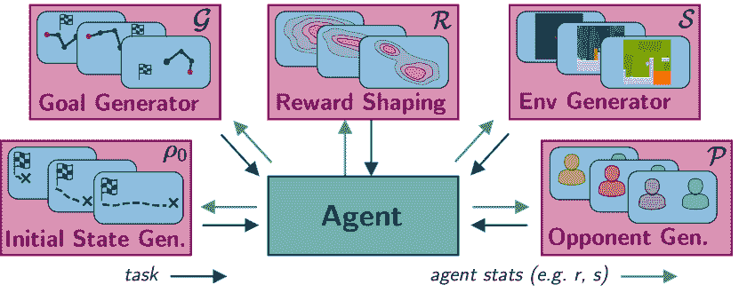

<!--yml

类别：未分类

日期：2024-09-06 20:02:07

-->

# [2003.04664] 深度强化学习的自动课程学习：简短调查

> 来源：[`ar5iv.labs.arxiv.org/html/2003.04664`](https://ar5iv.labs.arxiv.org/html/2003.04664)

# 深度强化学习的自动课程学习：简短调查

Rémy Portelas¹    Cédric Colas¹    Lilian Weng²    Katja Hofmann³&Pierre-Yves Oudeyer¹ ¹Inria，法国

²OpenAI，美国

³微软研究院，英国

remy.portelas@inria.fr

###### 摘要

自动课程学习（ACL）已成为深度强化学习（DRL）近期成功的基石。这些方法通过挑战代理以适应其能力的任务来塑造学习轨迹。近年来，它们被用于提高样本效率和渐近性能，组织探索，鼓励泛化或解决稀疏奖励问题等。为此，ACL 机制可以作用于学习问题的许多方面。它们可以优化领域随机化以实现 Sim2Real 转移，在多任务机器人环境中组织任务呈现，在多智能体场景中排序对手序列等。本工作的目标是双重的：1）提供对自动课程学习文献的紧凑且易于理解的介绍；2）描绘 ACL 领域的当前状态，鼓励现有概念的交叉融合和新思想的出现。

## 1 引言

人类学习被组织成一个具有不同复杂度的相互依赖的学习情境课程。毫无疑问，荷马在创作《伊利亚特》之前先学会了构词。这个概念首次被引入机器学习中是由 Selfridge et al. Selfridge 等人（1985）提出的，他们设计了一种学习方案来训练一个小车摆控制器：首先训练长而轻的杆子，然后逐渐过渡到更短更重的杆子。一个相关的概念也由 Schmidhuber Schmidhuber（1991）提出，他建议通过人工好奇心来组织探索，从而改进世界模型学习。在接下来的几年中，课程学习被应用于组织训练示例的呈现或在各种监督学习环境中增加模型容量 Elman（1993）；Krueger 和 Dayan（2009）；Bengio 等人（2009）。与此同时，发展机器人社区提出了学习进展作为自组织开放式发展轨迹的方式 Oudeyer 等人（2007）。受到这些早期工作的启发，深度强化学习（DRL）社区开发了一系列机制，称为自动课程学习，我们建议定义如下：

用于 DRL 的自动课程学习（ACL）是一类机制，通过学习调整学习情境的选择来自动适应训练数据的分布，以适应 DRL 代理的能力。

#### 相关领域。

ACL 与其他领域有许多联系。例如，ACL 可以用于迁移学习的背景，其中代理在一个任务分布上进行训练，在另一个任务分布上进行测试 Taylor and Stone (2009)。持续学习训练代理以对环境中不可预见的变化保持鲁棒性，而 ACL 假设代理能够控制学习场景 Lesort et al. (2019)。政策蒸馏技术 Czarnecki et al. (2019) 形成了一个互补的工具箱，旨在针对多任务 RL 设置，其中知识可以从一个策略转移到另一个策略（例如，从任务专家策略到通用策略）。

#### 范围。

本简短的调查提出了一种 ACL 机制的分类，当与 DRL 算法结合时，并且不回顾实施 ACL 的基于人口的算法（例如，Forestier et al. Forestier et al. (2017)，Wang et al. Wang et al. (2019)）。根据我们采用的定义，ACL 指的是显式优化训练数据自动组织的机制。因此，它们不应与突现课程混淆，后者是不同机制的副产品。例如，DRL 算法的按策略训练不被视为 ACL，因为训练数据分布的变化是政策学习的副产品。鉴于这是一个简短的调查，我们没有呈现每个具体机制的详细信息。由于当前 ACL 文献缺乏理论基础来将提出的方法置于正式框架中，本调查重点关注实证结果。

## 2 自动课程学习用于 DRL

本节形式化了深度强化学习（Deep RL）中 ACL 的定义，并提出了一个分类。

#### 深度强化学习

是一类利用深度神经网络进行函数逼近的算法，以解决强化学习问题。DRL 代理在环境中学习根据状态$s$执行一系列动作$a$，以最大化某种累积奖励$r$的概念 Sutton 和 Barto（2018）。这类问题通常称为任务，并形式化为 Markov 决策过程（MDPs），其形式为$T=\langle\mathcal{S},\mathcal{A},\mathcal{P},\mathcal{R},\rho_{0}\rangle$，其中$\mathcal{S}$是状态空间，$\mathcal{A}$是动作空间，$\mathcal{P}:S\times A\times S\rightarrow[0,1]$是描述从当前状态$s$在给定动作$a$的情况下转移到下一个状态$s^{\prime}$的概率的转移函数，$\mathcal{R}:S\times A\rightarrow\mathbb{R}$是奖励函数，$\rho_{0}$是初始状态的分布。为了挑战代理的泛化能力，Cobbe 等人（2018）提出了多任务 DRL 问题，其中代理在从任务空间中采样的任务上进行训练：$T\sim\mathcal{T}$。在多目标 DRL 中，策略和奖励函数依赖于目标，这增加了一个目标空间$\mathcal{G}$，从而增强了任务-MDP 的功能 Schaul 等人（2015a）。

#### 自动课程学习

机制提出了学习任务选择函数$\mathcal{D}:\mathcal{\mathcal{H}\to\mathcal{T}}$的方法，其中$\mathcal{H}$可以包含有关过去交互的任何信息。其目标是在$N$训练步骤后，最大化在目标任务分布$\mathcal{T}_{target}$上的指标$P$：

|  | $Obj:\max_{\mathcal{D}}\int_{T\sim\mathcal{T}_{target}}\!P_{T}^{N}\,\mathrm{d}T,$ |  | (1) |
| --- | --- | --- | --- |

其中$P_{T}^{N}$量化了在任务$T$上经过$N$训练步骤后的代理行为（例如累积奖励、探索得分）。从这个意义上讲，ACL 可以看作是元学习的一个特例，其中$\mathcal{D}$在训练过程中被学习，以进一步提高学习效果。

#### ACL 类型学。

我们提出了基于三个维度的 ACL 机制分类。

1.  1.

    为什么使用 ACL？我们回顾了 ACL 被使用的不同目标（第三部分）。

1.  2.

    ACL 控制什么？ACL 可以针对学习问题的不同方面（例如环境、目标、奖励函数，第四部分）

1.  3.

    ACL 优化什么？ACL 机制通常针对代理目标（例如学习进度、多样性）以减轻直接优化主要目标$Obj$的难度（第五部分）。

## 3 为什么使用 ACL？

ACL 机制可以用于不同的目的，这些目的可以被视为在方程式 1 中定义的总体目标的具体实例。

#### 提高在受限任务集上的性能。

经典 RL 问题涉及解决给定任务或受限任务集（例如，由初始状态变化的任务）。在这些简单设置中，ACL 已被用来提高样本效率或渐近性能 Schauls et al. (2015b); Horgan et al. (2018); Flet-Berliac and Preux (2019)。

#### 解决困难任务。

有时目标任务不能直接解决（例如，过于困难或稀疏的奖励）。在这种情况下，可以使用 ACL 来给智能体设置辅助任务，逐步引导其学习轨迹从简单任务到困难任务，直到目标任务得到解决。在最近的研究中，ACL 被用来从简单的迷宫到困难的迷宫调度 DRL 智能体 Matiisen et al. (2017)，或在机器人控制场景中从接近成功的初始状态到具有挑战性的状态 Florensa et al. (2017); Ivanovic et al. (2018)，以及视频游戏 Salimans and Chen (2018)。另一种研究方向提出使用 ACL 来组织状态空间的探索，以解决稀疏奖励问题 Bellemare et al. (2016); Pathak et al. (2017); Shyam et al. (2018); Pathak et al. (2019); Burda et al. (2019)。在这些研究中，性能奖励通过内在奖励进行增强，以引导智能体朝向状态空间的不确定区域。

#### 训练通用智能体。

通用智能体必须能够解决在训练过程中未遇到的任务（例如，连续任务空间或不同的训练和测试集）。ACL 可以通过避免不可行的任务子空间来塑造学习轨迹以提高泛化能力，例如 Portelas et al. (2019)。ACL 还可以帮助智能体从仿真设置到现实世界（Sim2Real）进行泛化 OpenAI et al. (2019); Mehta et al. (2019)，或者通过自我对弈在多智能体环境中最大化性能和鲁棒性 Silver et al. (2017); Pinto et al. (2017); Bansal et al. (2017); Baker et al. (2019); Vinyals et al. (2019)。

#### 训练多目标智能体。

在多目标强化学习中，代理在目标不同的任务上进行训练和测试。由于代理可以控制他们所针对的目标，他们通过一个或多个目标条件策略来学习行为库。在这种情况下采用 ACL 可以提高在预定义目标测试集上的表现。近期的研究展示了在诸如多目标机器人臂操作 Andrychowicz 等人 (2017); Zhao 和 Tresp (2018); Fournier 等人 (2018); Eppe 等人 (2018); Zhao 和 Tresp (2019); Fang 等人 (2019); Colas 等人 (2019) 或多目标导航 Sukhbaatar 等人 (2017); Florensa 等人 (2018); Racanière 等人 (2019); Cideron 等人 (2019) 等场景中使用 ACL 的好处。

#### 组织开放式探索。

在某些多目标设置中，可实现目标的空间事先并不明确。代理必须在探索过程中发现可实现的目标，并学习如何表示和达成这些目标。针对这个问题，可以使用 ACL 来组织对强大而多样的行为库的发现和获取，例如通过视觉观察 Eysenbach 等人 (2018); Pong 等人 (2019); Jabri 等人 (2019) 或通过与社会同行的自然语言互动 Lair 等人 (2019); Colas 等人 (2020)。

## 4 ACL 控制什么？

在策略学习（DRL）算法中，在线算法直接使用当前行为策略生成的训练数据，而离线算法可以使用从其他来源收集的轨迹。这在实际操作中将数据收集与数据利用解耦。因此，我们将本节组织为两个类别：一个是回顾用于数据收集的 ACL，另一个是回顾用于数据利用的 ACL。

图 1：数据收集的 ACL。ACL 可以控制任务 MDP 的每个元素，以塑造代理的学习轨迹。根据代理的行为指标，如表现或访问状态，ACL 方法生成适应代理能力的新任务。

### 4.1 数据收集中的 ACL

在数据收集过程中，ACL 根据代理的能力组织任务的顺序展示。为此，它通过作用于任务 MDP 的元素（例如 $\mathcal{R},\mathcal{P},\rho_{0}$，参见图 1）来生成任务。课程可以在离散任务集合或连续任务空间上设计。在单任务问题中，ACL 可以定义一组辅助任务，作为解决主要任务的垫脚石。以下段落根据 ACL 施加的控制性质组织文献：

#### 初始状态 $(\rho_{0})$。

初始状态分布 $\rho_{0}$ 可以被控制以调节任务的难度。智能体从接近给定目标的状态开始学习（即较容易的任务），然后通过逐渐增加初始状态与目标之间的距离，向更难的任务过渡。这种方法在设计具有稀疏奖励的复杂控制场景的辅助任务时尤其有效，Florensa 等人 (2017)；Ivanovic 等人 (2018)；Salimans 和 Chen (2018)。

#### 奖励函数 $(\mathcal{R})$。

ACL 可用于自动奖励塑造：根据智能体的学习轨迹调整奖励函数 $\mathcal{R}$。特别是在基于好奇心的方法中，内部奖励函数引导智能体朝向与高不确定性相关的区域，以促进探索 Bellemare 等人 (2016)；Pathak 等人 (2017)；Shyam 等人 (2018)；Pathak 等人 (2019)；Burda 等人 (2019)。随着智能体的探索，不确定的区域——也即奖励函数——会发生变化，这自动制定了一个学习课程，指导对状态空间的探索。在 Fournier 等人 Fournier 等人 (2018) 中，ACL 机制控制目标达成任务中的容忍度。最初设置较低的准确性要求，随着智能体的进展，逐渐并自动地转向更高的准确性要求。在 Eysenbach 等人 Eysenbach 等人 (2018) 和 Jabri 等人 Jabri 等人 (2019) 中，作者建议在无监督设置中学习技能空间（分别来自状态空间和像素），从中导出促进行为多样性和技能分离的奖励函数。

#### 目标 $(\mathcal{G})$。

在多目标深度强化学习（DRL）中，可以应用 ACL 技术来对离散集合中的目标选择进行排序，Lair 等人 (2019)，连续目标空间 Sukhbaatar 等人 (2017)；Florensa 等人 (2018)；Pong 等人 (2019)；Racanière 等人 (2019)，甚至不同目标空间的集合 Eppe 等人 (2018)；Colas 等人 (2019)。虽然目标空间通常是预定义的，但最近的研究建议在通过生成模型从像素学习得到的目标空间上应用 ACL，Pong 等人 (2019)。

#### 环境 $(\mathcal{S},\mathcal{P})$。

ACL 已成功应用于从离散集合中组织环境选择，例如在 Minecraft 迷宫中进行选择 Matiisen et al. (2017) 或 Sonic the Hedgehog 关卡 Mysore et al. (2018)。一种更为通用——且可以说更强大的——方法是利用参数化程序生成内容 (PCG) 技术 Risi and Togelius (2019) 来生成丰富的任务空间。在这种情况下，ACL 可以检测到相关的进展领域 OpenAI et al. (2019); Portelas et al. (2019); Mehta et al. (2019)。

#### 对手 $(\mathcal{S},\mathcal{P})$。

自我对弈算法训练代理与当前或过去版本的自身对抗 Silver et al. (2017); Bansal et al. (2017); Vinyals et al. (2019); Baker et al. (2019)。对手的集合直接映射到任务集合，因为不同的对手会导致不同的转换函数 $\mathcal{P}$ 和可能的状态空间 $\mathcal{S}$。因此，自我对弈可以看作是一种 ACL 形式，其中对手的序列（即任务）被组织以最大化性能和鲁棒性。在单代理设置中，可以训练一个对抗策略来扰动主要代理 Pinto et al. (2017)。

### 4.2 ACL 用于数据利用

ACL 也可以在数据利用阶段中使用，通过作用于之前收集并存储在回放记忆中的训练数据。它使代理能够“在不实际执行操作的情况下心理上体验其操作的效果”，这是一种称为经验回放的技术 Lin (1992)。在数据利用层面，ACL 可以对训练数据的分布施加两种控制：转换选择和转换修改。

#### 转换选择 $(\mathcal{S}\times\mathcal{A})$。

从优先级更新技术中获得灵感，该技术组织了规划方法中的更新顺序 Moore and Atkeson (1993)，Schaul et al. Schaul et al. (2015b) 引入了优先级经验回放 (PER)，用于无模型的离策略 RL，以偏向选择用于策略更新的转换，因为一些转换可能比其他转换更具信息性。不同的 ACL 方法提出了不同的度量来评估每个转换的重要性 Schaul et al. (2015b); Zhao and Tresp (2018); Colas et al. (2019); Zhao and Tresp (2019); Lair et al. (2019); Colas et al. (2020)。转换选择 ACL 技术也可以用于在策略算法中筛选在线学习批次 Flet-Berliac and Preux (2019)。

#### 转换修改 $(\mathcal{G})$。

在多目标设置中，Hindsight Experience Replay (HER) 提出重新解释收集到的轨迹，将其与不同的目标进行比较 Andrychowicz 等 (2017)。在实践中，HER 通过将目标 $g$ 替换为轨迹中稍后实现的结果之一 $g^{\prime}$，以及相应的奖励 $r^{\prime}=R_{g^{\prime}}(s,a)$ 来修改过渡。通过明确偏向目标替换以增加采样奖励过渡的概率，HER 将训练数据分布从较简单的目标（现在实现的）转移到更复杂的目标，随着智能体的进步。替代目标选择可以由其他 ACL 机制引导（例如，偏向多样性 Fang 等 (2019); Cideron 等 (2019)）。

## 5 ACL 优化什么？

| 算法 | 为什么使用 ACL？ | ACL 控制什么？ | ACL 优化什么？ |
| --- | --- | --- | --- |
| 数据收集中的 ACL (§ 4.1): |  |  |  |
| ADR (OpenAI)  OpenAI 等 (2019) | 泛化 | 环境 $(\mathcal{S},\mathcal{P})$ (PCG) | 中间难度 |
| ADR (Mila)  Mehta 等 (2019) | 泛化 | 环境 $(\mathcal{P})$ (PCG) | 中间难度和 多样性 |
| ALP-GMM  Portelas 等 (2019) | 泛化 | 环境 $(\mathcal{S})$ (PCG) | LP |
| RARL  Pinto 等 (2017) | 泛化 | 对手 $(\mathcal{P})$ | ARM |
| AlphaGO Zero  Silver 等 (2017) | 泛化 | 对手 $(\mathcal{P})$ | ARM |
| Hide&Seek  Baker 等 (2019) | 泛化 | 对手 $(\mathcal{P})$ | ARM |
| AlphaStar  Vinyals 等 (2019) | 泛化 | 对手 $(\mathcal{P})$ | ARM 和 多样性 |
| 竞争 SP  Bansal 等 (2017) | 泛化 | 对手 $(\mathcal{P})$ | ARM 和 多样性 |
| RgC  Mysore 等 (2018) | 泛化 | 环境 $(\mathcal{S})$ (DS) | LP |
| RC  Florensa 等 (2017) | 难任务 | 初始状态 $(\rho_{0})$ | 中间难度 |
| $1$-demo RC  Salimans 和 Chen (2018) | 难任务 | 初始状态 $(\rho_{0})$ | 中间难度 |
| 基于计数  Bellemare 等 (2016) | 难任务 | 奖励函数 $(\mathcal{R})$ | 多样性 |
| RND  Burda 等 (2019) | 难任务 | 奖励函数 $(\mathcal{R})$ | 惊讶（模型错误） |
| ICM  Pathak 等 (2017) | 难任务 | 奖励函数 $(\mathcal{R})$ | 惊讶（模型错误） |
| 不一致  Pathak 等 (2019) | 难任务 | 奖励函数 $(\mathcal{R})$ | 惊讶（模型不一致） |
| MAX  Shyam 等 (2018) | 难任务 | 奖励函数 $(\mathcal{R})$ | 惊讶（模型不一致） |
| **BaRC**  Ivanovic et al. (2018) | 困难任务 | 初始状态 $(\rho_{0})$ | 中等难度 |
| **TSCL**  Matiisen et al. (2017) | 困难任务 | 环境 $(\mathcal{S})$ (DS) | LP |
| **Acc-based CL**  Fournier et al. (2018) | 多目标 | 奖励函数 $(\mathcal{R})$ | LP |
| **Asym. SP**  Sukhbaatar et al. (2017) | 多目标 | 目标 $(\mathcal{G})$，初始状态 $(\rho_{0})$ | 中等难度 |
| **GoalGAN**  Florensa et al. (2018) | 多目标 | 目标 $(\mathcal{G})$ | 中等难度 |
| **Setter-Solver**  Racanière et al. (2019) | 多目标 | 目标 $(\mathcal{G})$ | 中等难度 |
| **CGM**  Eppe et al. (2018) | 多目标 | 目标 $(\mathcal{G})$ | 中等难度 |
| **CURIOUS**  Colas et al. (2019) | 多目标 | 目标 $(\mathcal{G})$ | LP |
| **Skew-fit**  Pong et al. (2019) | 开放式探索 | 目标 $(\mathcal{G})$（来自像素） | 多样性 |
| **DIAYN**  Eysenbach et al. (2018) | 开放式探索 | 奖励函数 $(\mathcal{R})$ | 多样性 |
| **CARML**  Jabri et al. (2019) | 开放式探索 | 奖励函数 $(\mathcal{R})$ | 多样性 |
| **LE2**  Lair et al. (2019) | 开放式探索 | 目标 $(\mathcal{G})$ | 奖励 和 多样性 |
| **ACL for Data Exploitation** (§ 4.2): |  |  |  |
| **Prioritized ER**  Schaul et al. (2015b) | 性能提升 | 过渡选择 $(\mathcal{S}\times\mathcal{A})$ | 惊讶（TD-误差） |
| **SAUNA**  Flet-Berliac and Preux (2019) | 性能提升 | 过渡选择 $(\mathcal{S}\times\mathcal{A})$ | 惊讶（V-误差） |
| **CURIOUS**  Colas et al. (2019) | 多目标 | 过渡选择与修改 $(\mathcal{S}\times\mathcal{A},\mathcal{G})$ | LP 和 能量 |
| **HER**  Andrychowicz et al. (2017) | 多目标 | 过渡修改 $(\mathcal{G})$ | 奖励 |
| **HER-curriculum**  Fang et al. (2019) | 多目标 | 过渡修改 $(\mathcal{G})$ | 多样性 |
| **Language HER**  Cideron et al. (2019) | 多目标 | 过渡修改 $(\mathcal{G})$ | 奖励 |
| **Curiosity Prio.**  Zhao and Tresp (2019) | 多目标 | 过渡选择 $(\mathcal{S}\times\mathcal{A})$ | 多样性 |
| **En. Based ER**  Zhao and Tresp (2018) | 多目标 | 过渡选择 $(\mathcal{S}\times\mathcal{A})$ | 能量 |
| **LE2**  Lair et al. (2019) | 开放式探索 | 过渡选择与修改 $(\mathcal{S}\times\mathcal{A},\mathcal{G})$ | 奖励 |
| **IMAGINE**  Colas et al. (2020) | 开放式探索 | 过渡选择与修改 $(\mathcal{S}\times\mathcal{A},\mathcal{G})$ | 奖励 |

表 1：调查论文的分类。分类是按照上述文本中定义的三个维度组织的。在《为什么使用 ACL》中，我们仅报告每项工作的主要目标。当 ACL 控制环境选择时，我们具体说明它是从离散集合（DS）中选择还是通过参数化程序内容生成（PCG）进行选择。我们将对抗奖励最大化缩写为 ARM，将学习进展缩写为 LP。

如在经过$N$次训练步骤后对一组测试任务的平均表现等目标，可能难以直接优化。为了解决这个难题，ACL 方法使用了多种替代目标。

#### 奖励。

由于 DRL 算法从奖励信号中学习，奖励过渡通常被认为比其他过渡更具信息性，特别是在奖励稀疏的问题中。在这些问题中，作用于过渡选择的 ACL 方法可能会人为地增加用于策略更新的过渡批次中高奖励与低奖励的比例 Narasimhan 等人（2015）；Jaderberg 等人（2016）；Colas 等人（2020）。在多目标 RL 环境中，其中一些目标可能比其他目标难得多，这种策略可以用来平衡每个目标的正奖励比例 Colas 等人（2019）；Lair 等人（2019）。过渡修改方法也偏向于奖励，替换目标以增加观察到奖励过渡的概率 Andrychowicz 等人（2017）；Cideron 等人（2019）；Lair 等人（2019）；Colas 等人（2020）。然而，在数据收集过程中，调整训练分布以获得更多奖励经验会导致代理集中于已解决的任务。由于从已解决的任务中收集数据会阻碍学习，因此数据收集 ACL 方法更侧重于其他替代目标。

#### 中等难度。

数据收集的一个更自然的替代目标是中等难度。直观上，智能体应当针对那些既不太简单（已经解决）也不太困难（无法解决）的任务，以最大化其学习进展。中等难度已被用来调整从中执行困难任务的初始状态分布（Florensa et al. (2017); Salimans and Chen (2018); Ivanovic et al. (2018)）。这一目标也在 GoalGAN 中实现，其中一个基于生成对抗网络的课程生成器被训练来提出目标，使得智能体能达到中等表现（Florensa et al. (2018)）。Racanière et al. Racanière et al. (2019)进一步引入了一个判别网络，训练其预测当前学习者对给定目标的可行性。与 GoalGAN 中将任务标记为中等难度不同，这一 Setter-Solver 模型生成与从$[0,1]$中均匀采样的随机可行性相关的目标。目标的类型会随着智能体的进展而变化，但智能体始终被要求执行从一个在可行性方面平衡的分布中采样的目标。在 Sukhbaatar et al. Sukhbaatar et al. (2017)中，任务由一个 RL 策略生成，该策略训练以提出目标或初始状态，使得生成的导航任务相对于当前智能体的难度为中等。中等难度 ACL 还在 Sim2Real 应用中推动了成功，在这些应用中，它通过对领域随机化的序列化来训练足够鲁棒的策略，以便从模拟器到现实世界机器人进行泛化（Mehta et al. (2019); OpenAI et al. (2019)）。OpenAI et al. OpenAI et al. (2019)训练一个机器人手控制策略，通过自动调整任务分布来解决魔方，使得智能体在仍然受到挑战的同时获得体面的表现。

#### 学习进展。

ACL 方法的 $Obj$ 目标可以被视为全球学习进展的最大化：即最终得分 $\int_{T\sim\mathcal{T}}\!P_{T}^{N}\,\mathrm{d}T$ 和初始得分 $\int_{T\sim\mathcal{T}}\!P_{T}^{0}\,\mathrm{d}T$ 之间的差异。为了近似这个复杂的目标，早期的发展机器人学研究中提出了在空间和时间上局部的能力学习进展（LP）度量 Baranes 和 Oudeyer (2013)；Forestier 等 (2017)。与中等难度类似，最大化 LP 驱使学习者练习那些既不太容易也不太困难的任务，但 LP 不需要一个阈值来定义什么是“中等”的，并且对那些有中等得分但代理无法改进的任务是稳健的。LP 最大化通常被框定为一个多臂老虎机（MAB）问题，其中任务是臂，它们的 LP 度量是关联值。在假设凹形学习曲线的情况下，最大化 LP 值被证明是最优的 Lopes 和 Oudeyer (2012)。 Matiisen et al. Matiisen 等 (2017) 和 Mysore et al. Mysore 等 (2018) 将 LP 测量为每个任务在离散集合中的性能估计导数（分别是 Minecraft 迷宫和 Sonic the Hedgehog 关卡），并应用 MAB 算法自动为他们的学习代理构建课程。在更高的层次上，CURIOUS 使用绝对 LP 从模拟机器人臂设置中选择目标空间进行采样 Colas 等 (2019)（绝对 LP 使得学习可以重新指向被遗忘或发生变化的任务）。在那里，绝对 LP 也用于将策略更新中的转移采样偏向于高 LP 目标。ALP-GMM 使用绝对 LP 来组织通过随机参数化从连续任务空间中采样的程序生成的双足行走环境的呈现 Portelas 等 (2019)。他们利用高斯混合模型在连续任务空间上恢复 MAB 设置。LP 也可以用于指导在到达任务中的准确性要求选择 Fournier 等 (2018)，或通过 RL 训练重放策略来采样策略更新的转移 Zha 等 (2019)。

#### 多样性。

一些 ACL 方法选择最大化多样性度量（也称为新颖性或低密度）。例如，在多目标设置中，ACL 可能会倾向于选择来自低密度区域的目标，作为目标 Pong 等人 (2019) 或作为数据利用的替代目标 Fang 等人 (2019)。类似地，Zhao 和 Tresp Zhao 和 Tresp (2019) 偏向于对落入轨迹空间低密度区域的轨迹进行采样。在单任务 RL 中，基于计数的方法通过将内部奖励函数设为状态访问计数的递减函数，引导智能体朝向状态空间中较少访问的区域 Bellemare 等人 (2016)。通过变分期望最大化框架，Jabri 等人 Jabri 等人 (2019) 提出从实验数据中交替更新潜在技能表示（如 Eysenbach 等人 Eysenbach 等人 (2018))，并元学习一个策略以快速适应通过从采样技能中推导的奖励函数构造的任务。其他算法不直接优化多样性，而是使用启发式方法来维持多样性。例如，Portelas 等人 Portelas 等人 (2019) 通过使用残差均匀任务采样来维持探索，Bansal 等人 Bansal 等人 (2017) 从过去不同政策的版本中采样对手以保持多样性。

#### 惊讶。

一些 ACL 方法训练转移模型，并根据其预测误差计算内在奖励 Pathak et al. (2017)；Burda et al. (2019)，或基于来自集成模型的几个模型之间的分歧（方差） Shyam et al. (2018)；Pathak et al. (2019)。一般来说，模型往往对不常访问的状态给出糟糕的预测（或意见不一致），从而导致对少访问状态的偏倚。然而，模型可能在环境的随机部分显示出高预测误差（TV 问题 Pathak et al. (2017))，这一现象在模型分歧中不会出现，因为集成的所有模型最终都学习到预测（相同的）平均预测 Pathak et al. (2019)。其他工作通过其时间差分误差（TD-error）来偏倚策略更新的转移采样，即转移值与其下一步自举估计之间的差异 Schaul et al. (2015b)；Horgan et al. (2018)。类似地，Flet-Berliac 和 Preux Flet-Berliac 和 Preux (2019) 根据观察到的回报与 PPO 学习者的价值函数预测之间的差异（V-error）调整转移选择。无论误差计算涉及价值模型还是转移模型，ACL 机制都倾向于与最大惊讶相关的状态，即预期（模型预测）与实际之间的最大差异。

#### 能量。

在多目标设置的数据利用阶段，Zhao 和 Tresp Zhao 和 Tresp (2018) 优先考虑来自高能量轨迹（例如动能）的转移，而 Colas et al. Colas et al. (2019) 优先考虑目标相关的对象移动的转移（例如在立方体推动任务中的立方体移动）。

#### 对抗奖励最大化（ARM）。

自我对抗是一种 ACL 形式，它在对抗当前或过去版本的自身时优化代理的表现，这一目标我们称之为对抗奖励最大化（ARM） Hernandez 等人 (2019)。虽然 Silver et al. Silver et al. (2017) 和 Baker et al. Baker et al. (2019) 的代理始终与其自身的副本对抗，Bansal et al. Bansal et al. (2017) 同时训练多个策略，并填充一个由当前和过去版本的所有策略组成的对手池。这保持了对手的多样性，有助于应对灾难性遗忘并提高鲁棒性。在多人游戏 Starcraft II 中，Vinyals et al. Vinyals et al. (2019) 并行训练三种主要策略（每种可用的玩家类型一种）。他们维持一个由当前和过去版本的三种主要策略及额外对手策略组成的对手联盟。对手不是随机选择的，而是为了具挑战性（通过胜率来衡量）。

## 6 讨论

#### 更大的图景。

在这项调查中，我们将广泛使用的 ACL 机制与 DRL 结合的内容统一到一个共同的框架下。ACL 机制是为了实现特定的目标（例如组织探索、解决困难任务等，§ 3）。它控制任务 MDPs 的特定元素（例如 $\mathcal{S},\mathcal{R},\rho_{0}$，§ 4），并通过最大化替代目标来实现其目标（例如多样性、学习进展，§ 5）。表 1 将这里调查的主要工作按这三个维度进行了组织。前面部分和表 1 展示了过去的实施情况，因此对比之下，突出了 ACL 可能的新途径。

扩展 ACL 目标的范围。受到人类婴儿发育机制的启发，Elman Elman (1993) 提出了在词到词的自然语言处理任务中逐步扩展递归模型的工作记忆。改变代理（这里是其记忆）属性的想法也在发展机器人学 Baranes 和 Oudeyer (2011)，策略蒸馏方法 Czarnecki et al. (2018, 2019) 和进化方法 Ha (2019) 中进行了研究，但在 ACL-DRL 文献中却没有出现。ACL 机制确实可以用来控制代理的身体（$\mathcal{S},\mathcal{P}$），其动作空间（它在世界中的行为，$\mathcal{A}$），其观察空间（它如何感知世界，$\mathcal{S}$），其学习能力（例如，记忆的能力或控制器）或它感知时间的方式（控制折扣因子 François-Lavet et al. (2015)）。

结合方法。许多之前定义的 ACL 机制组合仍待调查。我们能否使用 LP 来优化自我对战方法中对手的选择？在学习的目标空间中（例如，Laversanne-Finot et al. Laversanne-Finot et al. (2018），基于人群的方法），我们能否训练一个对抗域生成器来增强为 Sim2Real 应用训练的策略？

#### 关于系统性 ACL 研究的必要性。

鉴于 ACL 机制在复杂学习场景中的积极影响，人们只能遗憾地看到缺乏比较研究和标准基准环境。此外，尽管实证结果支持其使用，但对 ACL 机制的理论理解仍然缺失。尽管已有尝试将 CL 框架应用于监督设置 Bengio et al. (2009); Hacohen 和 Weinshall (2019)，但仍需更多工作以确认这些考虑在 DRL 场景中的适用性。

#### ACL 作为迈向开放式学习代理的一步。

艾伦·图灵著名地写道：“与其试图编写一个模拟成人思维的程序，不如尝试编写一个模拟儿童思维的程序。” 图灵 (1950)。从简单的机器开始，并使其能够自主学习是发展机器人学的基石，但在 DRL 中却很少被考虑。Colas 等人 (2020); Eysenbach 等人 (2018); Jabri 等人 (2019)。由于它们主动组织学习轨迹以适应智能体的属性，ACL 机制在这一探索中可能会非常有用。我们可以设想一种学习架构，利用 ACL 机制来控制学习历程的许多方面，引导智能体从简单的原始状态发展到能够实现多种目标的完全能干的智能体。正如我们在本调查中所见，这些 ACL 机制可以控制智能体身体和能力的发展（运动动作、感官设备），组织探索行为以应对智能体学习最多的任务（信息增益最大化、能力进步）或指导行为谱的获得。

## References

+   Andrychowicz et al. [2017] Marcin Andrychowicz 等. 后见之明经验回放. 发表在 NeurIPS。

+   Baker et al. [2019] Bowen Baker 等. 从多智能体自适应课程中涌现的工具使用. arXiv。

+   Bansal et al. [2017] Trapit Bansal 等. 通过多智能体竞争产生的复杂性. arXiv。

+   Baranes and Oudeyer [2011] A. Baranes 和 P. Oudeyer. 发育约束与内在动机在主动运动发展中的相互作用. 发表在 ICDL。

+   Baranes and Oudeyer [2013] Adrien Baranes 和 Pierre-Yves Oudeyer. 机器人中内在动机驱动的目标探索的逆向模型的主动学习. 机器人学与自动化系统。

+   Bellemare et al. [2016] Marc Bellemare 等. 统一基于计数的探索与内在动机. 发表在 NeurIPS。

+   Bengio et al. [2009] Yoshua Bengio 等. 课程学习. 发表在 ICML。

+   Burda et al. [2019] Yuri Burda 等. 通过随机网络蒸馏进行探索. ICLR。

+   Cideron et al. [2019] Geoffrey Cideron 等. 自我教育的语言智能体，通过后见之明经验回放进行指令跟随. arXiv。

+   Cobbe et al. [2018] Karl Cobbe 等. 量化强化学习中的泛化能力. arXiv。

+   Colas et al. [2019] Cédric Colas 等. CURIOUS: 内在动机驱动的模块化多目标强化学习. 发表在 ICML。

+   Colas et al. [2020] Cédric Colas 等. 语言作为认知工具来想象好奇驱动探索中的目标. arXiv。

+   Czarnecki et al. [2018] Wojciech Czarnecki 等. 组合与匹配强化学习的智能体课程. 发表在 ICML。

+   Czarnecki et al. [2019] Wojciech Marian Czarnecki 等. 政策蒸馏. arXiv。

+   Elman [1993] Jeffrey L. Elman. 神经网络中的学习与发展: 从小开始的重要性. 认知。

+   Eppe 等 [2018] Manfred Eppe 等. 连续深度强化学习的课程目标掩蔽。CoRR, abs/1809.06146。

+   Eysenbach 等 [2018] Benjamin Eysenbach 等. 多样性就是一切：无需奖励函数的技能学习。arXiv。

+   Fang 等 [2019] Meng Fang 等. 课程指导的事后经验回放。见 NeurIPS。

+   Flet-Berliac 和 Preux [2019] Yannis Flet-Berliac 和 Philippe Preux. 样本并非都有效：利用方差进行去噪策略梯度更新。CoRR, abs/1904.04025。

+   Florensa 等 [2017] Carlos Florensa 等. 强化学习的逆向课程生成。CoRL。

+   Florensa 等 [2018] Carlos Florensa 等. 自动目标生成用于强化学习智能体。见 ICML。

+   Forestier 等 [2017] Sébastien Forestier 等. 内在动机驱动的目标探索过程与自动课程学习。arXiv。

+   Fournier 等 [2018] Pierre Fournier 等. 基于准确性的课程学习在深度强化学习中的应用。arXiv。

+   François-Lavet 等 [2015] Vincent François-Lavet 等. 如何折扣深度强化学习：迈向新的动态策略。arXiv。

+   Ha [2019] David Ha. 用于改善智能体设计的强化学习。Arti. Life。

+   Hacohen 和 Weinshall [2019] Guy Hacohen 和 Daphna Weinshall. 关于课程学习在训练深度网络中的作用。在 Kamalika Chaudhuri 和 Ruslan Salakhutdinov 编辑的 ICML 中。

+   Hernandez 等 [2019] D. Hernandez 等. 自我博弈训练的通用框架。见 IEEE CoG。

+   Horgan 等 [2018] Dan Horgan 等. 分布式优先经验回放。arXiv。

+   Ivanovic 等 [2018] Boris Ivanovic 等. Barc：用于机器人强化学习的逆向可达课程。ICRA。

+   Jabri 等 [2019] Allan Jabri 等. 用于视觉元强化学习的无监督课程。见 NeurIPS。

+   Jaderberg 等 [2016] Max Jaderberg 等. 带有无监督辅助任务的强化学习。arXiv。

+   Krueger 和 Dayan [2009] Kai A. Krueger 和 Peter Dayan. 灵活的塑形：小步学习如何有助于学习。Cognition。

+   Lair 等 [2019] Nicolas Lair 等. 通过社会互动和好奇心驱动的多目标学习进行语言基础建设。arXiv。

+   Laversanne-Finot 等 [2018] Adrien Laversanne-Finot 等. 驱动探索学习的好奇心驱动的目标空间分离。

+   Lesort 等 [2019] Timothée Lesort 等. 机器人领域的持续学习。arXiv。

+   Lin [1992] Long-Ji Lin. 基于强化学习、规划和教学的自我改进反应性智能体。Mach. lear.

+   Lopes 和 Oudeyer [2012] Manuel Lopes 和 Pierre-Yves Oudeyer. 终身探索和学习的战略性学生方法。见 ICDL。

+   Matiisen 等 [2017] Tambet Matiisen 等. 教师-学生课程学习。IEEE TNNLS。

+   Mehta 等 [2019] Bhairav Mehta 等. 主动领域随机化。CoRL。

+   Moore and Atkeson [1993] Andrew W Moore 和 Christopher G Atkeson. 优先扫描：用更少的数据和时间进行强化学习。Mach. learn.

+   Mysore et al. [2018] S. Mysore 等人. 通过奖励引导的课程实现稳健的强化学习。预印本。

+   Narasimhan et al. [2015] Karthik Narasimhan 等人. 使用深度强化学习的文本游戏语言理解。arXiv。

+   OpenAI et al. [2019] OpenAI 等人. 用机器人手解决魔方。arXiv。

+   Oudeyer et al. [2007] Pierre-Yves Oudeyer 等人. 自主心理发展的内在动机系统。IEEE 转型于进化计算。

+   Pathak et al. [2017] Deepak Pathak 等人. 基于自我监督预测的好奇驱动探索。发表于 CVPR。

+   Pathak et al. [2019] Deepak Pathak 等人. 通过不一致性进行自我监督探索。arXiv。

+   Pinto et al. [2017] Lerrel Pinto 等人. 强健的对抗性强化学习。arXiv。

+   Pong et al. [2019] Vitchyr H. Pong 等人. Skew-fit：状态覆盖的自我监督强化学习。arXiv。

+   Portelas et al. [2019] Rémy Portelas 等人. 深度强化学习在连续参数化环境中的课程学习教师算法。CoRL。

+   Racanière et al. [2019] Sébastien Racanière 等人. 通过设置者-解决者互动自动生成课程。arXiv。

+   Risi and Togelius [2019] Sebastian Risi 和 Julian Togelius. 程序化内容生成：从自动生成游戏关卡到提高机器学习的一般性。arXiv。

+   Salimans and Chen [2018] Tim Salimans 和 Richard Chen. 从单个示例学习《蒙特祖玛的复仇》。NeurIPS。

+   Schaul et al. [2015a] Tom Schaul 等人. 通用价值函数近似器。发表于 ICML。

+   Schaul et al. [2015b] Tom Schaul 等人. 优先经验重放。arXiv。

+   Schmidhuber [1991] Jürgen Schmidhuber. 好奇的模型构建控制系统。发表于 IJCNN。IEEE。

+   Selfridge et al. [1985] Oliver G Selfridge 等人. 机器人中的训练与跟踪。发表于 IJCAI。

+   Shyam et al. [2018] Pranav Shyam 等人. 基于模型的主动探索。arXiv。

+   Silver et al. [2017] David Silver 等人. 在没有人类知识的情况下掌握围棋。Nature。

+   Sukhbaatar et al. [2017] Sainbayar Sukhbaatar 等人. 通过不对称自我对弈实现内在动机和自动课程。arXiv。

+   Sutton and Barto [2018] Richard S Sutton 和 Andrew G Barto. 强化学习：导论。MIT press。

+   Taylor and Stone [2009] Matthew E. Taylor 和 Peter Stone. 强化学习领域的迁移学习：综述。JMLR。

+   Turing [1950] Alan M Turing. 计算机器与智能。

+   Vinyals et al. [2019] Oriol Vinyals 等人. 使用多智能体强化学习在《StarCraft II》中达到大宗师级别。Nature。

+   Wang et al. [2019] Rui Wang 等人. 配对开放式开拓者（POET）：无尽生成日益复杂和多样的学习环境及其解决方案。arXiv。

+   Zha et al. [2019] Daochen Zha 等人. 经验重放优化。arXiv。

+   Zhao 和 Tresp [2018] Rui Zhao 和 Volker Tresp. 基于能量的事后经验优先排序。arXiv。

+   Zhao 和 Tresp [2019] Rui Zhao 和 Volker Tresp. 通过密度估计的好奇心驱动经验优先排序。arXiv。
