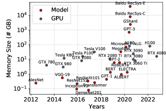
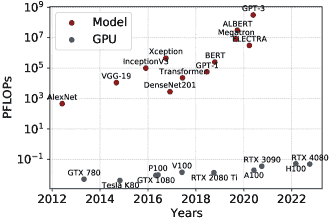
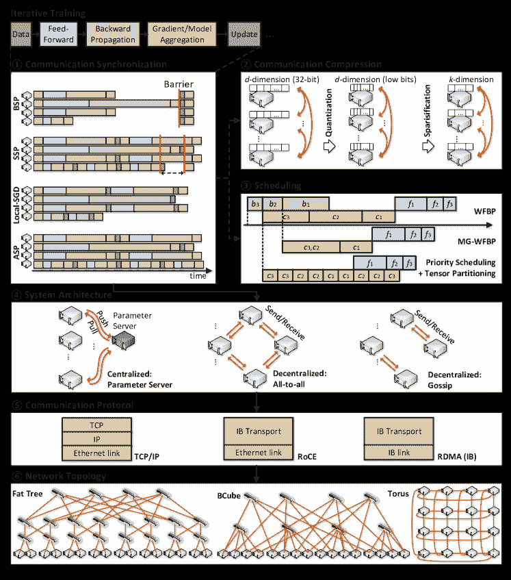
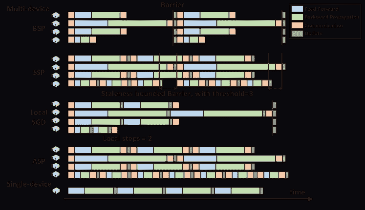
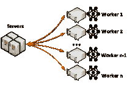
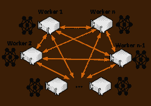
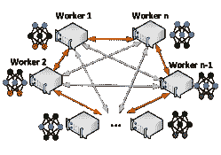
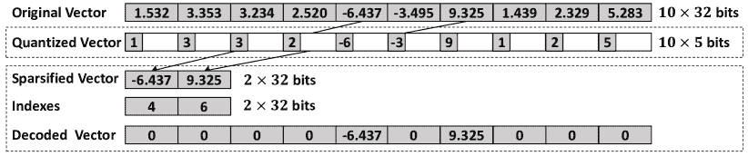

<!--yml

category: 未分类

date: 2024-09-06 20:02:04

-->

# [2003.06307] 通信高效的数据并行分布式深度学习：全面调查

> 来源：[`ar5iv.labs.arxiv.org/html/2003.06307`](https://ar5iv.labs.arxiv.org/html/2003.06307)

# 通信高效的数据并行分布式深度学习：全面调查

Zhenheng Tang 香港浸会大学 zhtang@comp.hkbu.edu.hk，Shaohuai Shi 哈尔滨工业大学深圳 shaohuais@hit.edu.cn，Wei Wang 香港科技大学 weiwa@cse.ust.hk，Bo Li 香港科技大学 bli@cse.ust.hk 和 Xiaowen Chu 香港科技大学（广州） xwchu@ust.hk

###### 摘要。

分布式深度学习（DL）近年来变得越来越普及，利用多个计算设备（如 GPU/TPU）来减少训练时间，这是由于模型和数据集的规模扩大。然而，系统的可扩展性受到通信成为性能瓶颈的限制。解决这一通信问题已成为一个重要的研究课题。本文提供了关于通信高效的分布式训练算法的全面调查，重点关注系统级和算法级优化。我们首先提出了一个数据并行分布式训练算法的分类法，该分类法包括四个主要维度：通信同步、系统架构、压缩技术以及通信和计算任务的并行性。然后，我们调查了针对这些四个维度问题的最新研究。我们还比较了不同算法的收敛速度，以了解其收敛速度。此外，我们进行了大量实验，实证比较了各种主流分布式训练算法的收敛性能。基于我们的系统级通信成本分析、理论和实验收敛速度比较，我们为读者提供了在特定分布式环境下哪些算法更高效的理解。我们的研究还推测了进一步优化的潜在方向。

Distributed Deep Learning, Efficient Communication^†^†ccs: Computing methodologies Distributed algorithms^†^†ccs: General and reference Surveys and overviews^†^†ccs: Computing methodologies Neural networks^†^†ccs: Computing methodologies Parallel algorithms

## 1\. 引言

深度学习（DL）近年来取得了显著进展。研究人员和工程师们已经将 DL 技术应用于解决各个领域的复杂问题，包括但不限于计算机视觉 (resnet, )，自然语言处理 (attention, ; bert, ; yang2020survey, )，语音识别 (deepspeech, )，以及其他许多领域。DL 通常涉及到深度神经网络（DNNs）中训练数据集和模型参数的增加，以提高在不同应用中的预测性能，例如分类任务中的准确率 (ml1991, ; Russakovsky2015ILS28465472846559, ; 8237359, )。然而，随着数据规模和模型复杂性的增加，训练过程变得极为计算密集且耗时。例如，使用最新的 Nvidia Tesla V100 GPU 在 ImageNet 数据集上训练一个最先进的 ResNet-50 (resnet, )模型（90 个 epochs）大约需要两天的时间 (wang2019performance, )。然而，如图 1 所示，GPU FLOPs 和内存的发展速度无法跟上新型大型神经网络的发展，例如 GPT-3 (gpt3, )，GShard (lepikhin2021gshard, )和百度 RecSys (zhao2020distributed, )。此外，为了在某些任务中取得令人满意的结果，超参数调优是必要的，这进一步需要大量的时间和财政投入。

(a) GPU 和神经网络的内存。

(b) GPU 的 FLOPS 和训练模型的 FLOPs。

图 1. GPU 和神经网络的趋势。

为了减轻耗时的训练过程，已经有两种方法受到关注：（1）通过实现高度优化的软件来最大化单个加速器计算能力的利用（chetlur2014cudnn, ; shi2016benchmarking, ; xu2017performance, ; sze2017efficient, ; yan2020optimizing, ），以及（2）采用分布式训练（padam, ; disml, ; sparknet, ; PSGD, ）通过利用多个处理器（包括 CPU（you2018imagenet, ），GPU（goyal2017accurate, ; shi2018performance, ; jia2018highly, ）和 TPU（you2019large, ）来加速训练过程。直观地，多个处理器在训练一个模型时协同工作可以减少总体训练时间。然而，处理器之间的通信成本通常限制了系统的可扩展性（shi2018performance, ）。例如，当使用高速计算设备（例如，Nvidia A100/H100 GPU）与低速互连（例如，PCIe 或 10GbE）来协同训练深度模型时，当计算与通信的比例较低（shi2020quantitative, ）时，使用多个处理器可能导致硬件利用率非常低（DGC, ）。而不同地理位置分布的 GPU 之间的协作训练会受到更高的通信成本影响，因为广域网络的通信带宽较低（tang2022gossipfl, ）。因此，应仔细设计不同的并行算法以充分利用分布式集群的计算能力。

数据并行性（dean2012large, ; goyal2017accurate, ）是一种广泛使用的分布式训练技术。这种方法涉及将模型参数复制到所有计算工作节点。在单次迭代中，每个工作节点通过对不同的小批量数据进行采样来计算本地梯度或模型更新。然后，工作节点将结果与其他节点交换。接下来，执行聚合和广播操作以获取新的全局模型。

模型并行性（dean2012large, ; 3154842, ; Mirhoseini2017, ）是另一种分布式训练方法，涉及将模型参数划分到多个计算工作节点中。每个工作节点持有模型的不同参数或层（即，$x$的一个子集）。在本文中，我们主要关注与数据并行性相关的技术。注意，其中一些技术也可以与模型并行性并行使用。

**Pipeline parallelism** (shi2018adag,; zhang2017poseidon,; MLSYS2022_cedebb6e,; harlap2018pipedream,; huang2019gpipe,; shoeybi2019megatron,; li2021chimera,) 这一术语在不同的背景下可以指不同的技术。在数据并行的背景下，流水线指的是同时执行计算任务和通信任务，以减少迭代时间。在模型并行的背景下，它指的是将不同阶段的模型训练任务分配给不同的工作节点，并在节点之间传输中间结果以隐藏部分训练时间。本文主要关注于数据并行中的流水线技术，这些技术用于减少通信开销。

本次调查提供了一个关于提高分布式训练中通信效率的研究工作的全面概述和分类。我们将分布式训练框架解构为几个正交组件，包括通信同步、系统架构、压缩技术以及通信和计算的并行性。此外，我们还提供了这些算法收敛性分析的概述，考察了通信效率与收敛性之间的权衡。进一步地，我们开发了主流分布式训练算法的基准框架，包括不同的同步方案、通信拓扑、压缩算法以及不同数量的工作节点，为读者提供实际参考。通过这项调查，我们希望读者能够深入了解该领域的进展，并受到启发，开发出新的高效分布式训练算法和框架。

### 1.1. 相关工作

存在多项调查提供了关于分布式机器学习或深度学习算法的介绍和评审。Peteiro-Barral 等人 (Peteiro2013,) 介绍了针对大数据的分布式机器学习算法。Xing 等人 (XING2016179,) 主要关注不同的同步方案、调度以及负载均衡和通信类型。Ben-Nun 等人 (10.1145/3320060,) 关注了 DNN 操作符和并行方法。Guo 等人 (DBLP:abs-1808-04752,) 对不同的量化神经网络进行了详细评审。同时，Zhang 等人 (8644613,) 提供了大规模分布式 DL 系统的简要概述，包括并行性、参数服务器架构、同步方案、相关应用和平台。

相比于这些早期的调查，我们的文章专注于通信高效的分布式深度学习训练。我们详细讨论了在先前调查中未被完全揭示的通信压缩技术。此外，我们提供了辅助技术的快速回顾，并比较了收敛界限。此外，我们进行了一系列广泛的实验，以比较不同主流分布式训练算法的性能，为读者提供对这些算法的实证理解。

### 1.2\. 组织结构

本调查旨在提供对具有数据并行性的通信高效分布式训练算法的全面分析，重点关注四个关键方面：通信同步、系统架构、压缩技术和调度方法。本文其余部分的组织结构如下。在第二部分中，我们阐述了分布式训练的关键问题，并提出了相关研究的分类，以总结现有方法。在第三部分中，我们讨论了同步和异步框架，接着在第四部分中概述了支持梯度/模型聚合的系统架构。在第五部分和第六部分中，我们介绍了减少通信流量的技术，包括梯度/模型压缩。调度方法在第七部分中介绍。我们在第八部分总结了理论收敛界限。此外，我们在第九部分中展示了一些使用通信高效算法训练深度模型的辅助技巧。最后，我们在第十部分中总结了论文内容。

### 1.3\. 基准框架与实验配置

我们的基准框架建立在 FedML（chaoyanghe2020fedml ）和 MPI（mpi4py ）之上。我们的框架为用户提供了灵活和可扩展的应用程序接口（API），用于测试和开发新的分布式训练算法。已经开发了多种具有不同同步方案、通信拓扑和压缩技术的算法。这些算法可以组合成新的算法，且彼此大多是独立的。

我们在两个典型的深度学习任务上进行不同分布式训练算法的实验。一个是使用 ResNet-20 的 CIFAR-10 图像分类任务（krizhevsky2010cifar）。另一个是莎士比亚任务，这是一个基于《威廉·莎士比亚全集》数据集的自然语言处理任务。莎士比亚任务中使用的模型是一个堆叠的字符级 LSTM 语言模型，由 (FederatedLearning ) 提出。我们对不同数量的工作节点（$4\sim 32$）进行了实验，以评估不同算法的可扩展性。每个工作节点配备了 NVIDIA RTX 2080 Ti，Pytorch 版本为 V1.7。请注意，硬件平台不会影响收敛性能和模型测试准确性。实验结果在每章末尾呈现，为读者提供了对算法的准确和实际的理解。

## 2\. 分布式深度学习的分类

训练深度学习模型的数学公式可以定义为一个优化问题

| (1) |  | $\min\limits_{\mathbf{x}\in\mathbb{R}^{N}}f(\mathbf{x}):=\mathbb{E}_{\xi_{i}\sim\mathcal{D}}F(\mathbf{x};\xi_{i}),$ |  |
| --- | --- | --- | --- |

其中随机变量 $\xi_{i}$ 遵循概率分布 $\mathcal{D}$，表示来自给定数据集的数据样本，$\mathbf{x}$ 表示模型的所有参数，$N$ 是参数的数量，$F:\mathbb{R}^{N}\to\mathbb{R}$ 表示关于 $\mathbf{x}$ 和 $\xi_{i}$ 的目标函数，$f$ 是 $F$ 的期望值。

基于梯度的优化算法在深度学习中被广泛使用。由于二阶梯度下降方法（martens2015optimizing ; shi2021accelerating ; zhang2023eva ）在深度神经网络中计算复杂度较高，通常使用一阶梯度下降方法，特别是带有小批量的随机梯度下降（SGD）及其变体（例如 Adam）。单设备 SGD 的更新规则如下。

| (2) |  | $G_{t}(\mathbf{x}_{t})={\nabla}F_{t}(\mathbf{x}_{t};\xi_{t})$ |  |
| --- | --- | --- | --- |
| (3) |  | $\mathbf{x}_{t+1}=\mathbf{x}_{t}-{\gamma}G_{t}(\mathbf{x}_{t}),$ |  |

其中 $\mathbf{x}_{t}\in\mathbb{R}^{N}$ 是迭代 $t$ 时的 $N$ 维模型参数，$\xi_{t}$ 是随机采样的小批量数据，$\gamma$ 是学习率（或步长）。SGD 是一种迭代算法，已经证明它可以在假设 $f_{s}(\mathbf{x})$ 是非凸的且具有 L-利普希茨梯度的情况下解决问题 (1)。迭代过程通常包含几个步骤：1) 采样一个小批量的数据 $\xi_{t}$。2) 执行前向计算以评估目标函数 $F_{t}(\mathbf{x}_{t};\xi_{t})$。3) 执行反向传播以计算相对于模型参数的梯度 ${\nabla}F_{t}(\mathbf{x}_{t};\xi_{t})$。4) 最后，通过方程 (3) 更新模型参数。

分布式训练将上述四个基本的单设备 SGD 过程修改为分布式版本。我们首先描述了广泛使用的分布式训练算法——批量同步并行 SGD (BSP-SGD) (BSP7917379181, )，然后阐明了其他算法与其的不同。在 BSP-SGD 中，每个工作者（索引为 $i$）都有一个相同的全局模型（例如，从参数服务器 (PS) 下载），然后处理不同的数据子集（即 $\xi_{i,t}$）以独立计算梯度 (${\nabla}F(\mathbf{x}_{t};\xi_{i,t})$)。这些计算在所有工作者之间同时进行。计算梯度后，工作者通过 PS 或全归约操作汇总这些梯度，进行同步以更新模型参数，然后进行下一次迭代。BSP-SGD 的更新规则可以表示为：

| (4) |  | $\displaystyle G_{i,t}(\mathbf{x}_{t})={\nabla}F_{i,t}(\mathbf{x}_{t};\xi_{i,t}),$ |  |
| --- | --- | --- | --- |
| (5) |  | $\displaystyle\mathbf{x}_{t+1}=\mathbf{x}_{t}-{\gamma}\frac{1}{n}\sum_{i=1}^{n}G_{i,t}(\mathbf{x}_{t}),$ |  |

其中 $G_{i,t}(\mathbf{x}_{t})$ 代表工作者 $i$ 在迭代 $t$ 时的 $F_{i,t}(\mathbf{x}_{t})$ 的梯度，$n$ 是工作者的数量。

我们总结并分类了在表格 1 中显示的四个正交维度下改进 BSP-SGD 的算法。此外，我们在图 2 中提供了通信高效的分布式深度学习算法的概述，突出了每个维度中使用的主要技术。

1.  (1)

    灵活同步旨在放宽 BSP 的严格同步约束，以减少同步的影响和同一时期内的通信次数（图 2.➀ 和章节 3）。

1.  (2)

    不同的系统架构提出了更改通信拓扑以避免 PS 和工作节点的通信拥塞的方案。（图 2.➃ 和章节 4）

1.  (3)

    压缩技术探索压缩通信数据，从而减少通信流量和通信时间。（图 2.➁，章节 5 和 6）

1.  (4)

    通信和计算的并行性旨在隐藏通信时间，以实现更短的迭代时间。（图 2.➂ 和章节 7）

通信协议（图 2.➄）和网络拓扑（图 2.➅）也是影响硬件层面通信效率的重要因素。本调查主要讨论算法层面的方法和协议。

表 1\. 分布式 SGD 的分类

| 维度 | 方法 | 特点 |
| --- | --- | --- |
| 通信同步 | 同步 | 频繁的通信和同步 |
| 陈旧同步 | 同步与异步之间的折中 |
| 异步 | 无需同步 |
| 本地 SGD | 较少的通信 |
| 系统架构 | 参数服务器 | 集中式拓扑 |
| All-Reduce | 去中心化拓扑和集体通信 |
| 谣言传播 | 去中心化拓扑和点对点通信 |
| 压缩技术 | 量化 | 传输低精度参数 |
| 稀疏化 | 传输选定参数 |
| 通信和计算的并行性 | 流水线 | 隐藏通信或计算时间 |
| 调度 | 动态调度计算和通信任务 |

图 2\. 数据并行分布式深度学习概述。

## 3\. 同步/异步框架

在数据并行分布式 DL 中，BSP-SGD 中的同步指的是所有工作节点应当同步，以完成所有参数或梯度的传输后，才能进行下一轮训练。灵活同步放宽了 BSP-SGD 的严格同步，不仅影响通信流量，还影响模型训练的性能和收敛。因此，通信流量和收敛之间存在权衡。此外，不同的同步方案可以与不同的架构结合。在本节中，我们描述了在应用范围最广的 PS 架构下的四种代表性同步方案。这四种不同方案的时间线见图 3。

图 3\. 比较了在不同通信同步下使用单个设备和多个设备进行训练的 PS 架构。

### 3.1\. 同步框架

经典的同步框架，即 BSP，如第二部分中提到的，涉及以下步骤：1) 数据加载；2) 前向计算；3) 反向传播计算；4) 梯度聚合并加锁；5) 使用聚合的梯度更新模型。步骤(4)需要同步所有工作节点，这会导致延迟节点问题，其中少数慢节点显著影响系统吞吐量(AsynDisADMM, )。此外，所有梯度的聚合导致了高通信成本，严重限制了系统的可扩展性。

在参数服务器（PS）架构（§4.1）中，同步障碍会一直强制执行，直到所有工作者完成将其参数传输到参数服务器的操作（Krizhevsky2014OneWT ; Bradley2011 ; 552669 ; 375451）。类似地，在 All-Reduce 架构（§4.2）中，同步要求所有工作者等待 all-reduce 操作（即梯度聚合）的完成，确保所有工作者都有相同的更新全局模型（Zou2014MarianaTD ; 642949 ; DGC）。相反，对于去中心化架构（§4.3），同步涉及等待通信的完成。与 All-Reduce 不同的是，去中心化架构中的工作者不一定维护相同的模型（CanDecent ; Ram2008DistributedSS）。

### 3.2\. 陈旧同步框架

陈旧同步并行（SSP）框架（MoreEffDMLviaStaleSync）旨在通过放宽同步来缓解拖延者问题。具体来说，SSP 允许较快的工作者比较慢的工作者执行更多的更新，从而减少较快工作者的等待时间，如图 3 所示。然而，为了保持模型一致性并确保收敛，SSP 强加了一个陈旧度有界的障碍，限制了最快和最慢工作者之间的迭代间隔。对于最大陈旧度界限 $s$，工作者 $i$ 在迭代 $t+1$ 的更新公式被修改为

| (6) |  | $\displaystyle\mathbf{x}_{i,t+1}=\mathbf{x}_{0}-{\gamma}\sum_{k=1}^{t-s-1}\sum_{j=1}^{n}G_{j,k}(\mathbf{x}_{j,k})-{\gamma}\sum_{k=t-s}^{t}G_{i,k}(\mathbf{x}_{i,k})-{\gamma}\sum_{(j,k)\in\mathcal{S}_{i,t+1}}G_{j,k}(\mathbf{x}_{j,k}),$ |  |
| --- | --- | --- | --- |

其中，$\mathcal{S}_{i,t+1}$是期$\left[t-s,t\right]$期间来自其他工作节点的更新子集，$n$表示工作节点的数量。添加到$\mathbf{x}_{i,t+1}$中的历史更新包括三个部分：预窗口更新、读取自己的写入更新和窗口内更新，这些部分分别由等式右侧的第二、第三和第四项表示（见 6）。预窗口更新表示从所有工作节点获得的同步梯度，读取自己的写入更新是本地梯度，窗口内更新是来自其他工作节点的梯度。较小的$s$意味着更及时的梯度同步，但通信效率较低。确定一个合适的$s$对于实现良好的端到端训练性能具有挑战性 (MoreEffDMLviaStaleSync, )。为此，Chen 等人 (RevistSynSGD, )提出了备份工作节点方案。具体而言，使用一部分工作节点（称为备份工作节点）来计算小批量梯度。参数服务器在不等待所有梯度的情况下更新参数。最慢工作节点的梯度直接被丢弃。

此外，SSP 在参数服务器中存在拥塞问题。Chen 等人 (8737587, )提出了一种轮询同步并行（R²SP）方法来解决此问题。R²SP 在训练过程中错开工作节点的更新，并协调工作节点按照固定的轮询顺序更新梯度，以均匀分配通信负载并减少拥塞。

### 3.3\. 异步框架

异步并行 SGD（ASP-SGD）框架允许服务器用部分工作节点的更新来更新全局模型，而不是所有工作节点的更新 (hogwild, ; muli2013, ; Tamingwild, ; AsynDisMLspar, ; NEURIPS2022_029df12a, )。ASP-SGD 实现了节点的更独立更新，并减少了工作节点与参数服务器之间的通信中的一轮数据传输，如图 3 所示。在 ASP-SGD 中，每个工作节点在计算梯度后将其梯度发送到参数服务器。然后，参数服务器在不等待其他工作节点的情况下更新全局模型。因此，异步框架避免了滞后节点问题。需要注意的是，ASP-SGD 不适用于 All-Reduce 架构。ASP-SGD 的更新公式可以总结为

| (7) |  | $\mathbf{x}_{t+1}=\mathbf{x}_{t}-{\gamma}\sum_{i=1}^{n}G_{i,t-\tau_{i,k}}(\mathbf{x}_{i,t-\tau_{k,i}}),$ |  |
| --- | --- | --- | --- |

其中，$\tau_{k,i}$表示工作节点$i$计算梯度与服务器进行 SGD 之间的时间间隔。

分布式交替方向乘子法（D-ADMM）（Dadmm, ; convergeceAsynDisADMM, ）是早期提出在优化问题的不同参数上进行异步更新的工作。然而，它需要维护一个全局时钟，并且 D-ADMM 中的每一组工作者需要了解彼此的进展。此外，D-ADMM 严重依赖于网络拓扑，并需要一个中心节点来保持全局模型，而中心节点仍然需要等待所有工作节点完成任务，这类似于同步框架。此外，（Dadmm, ; convergeceAsynDisADMM, ）未考虑神经网络的优化。

为了解决这些限制，张等人（AsynDisADMM, ）提出了一种使用星型拓扑和 PS 架构的异步分布式 ADMM。尽管在没有慢速工作者的情况下，异步训练被证明比同步训练更快，但其收敛性能往往不如同步优化。因此，（AsynDisADMM, ）采用了部分障碍和有界延迟作为控制异步性的两个条件，试图获得类似于同步优化的收敛效果。

DistBelief（dean2012large, ）是一个早期的异步框架，能够利用拥有数千台机器的计算集群进行大规模模型训练。它提出了 Downpour SGD，这是一种 ASP-SGD 优化方法，涉及多个工作者并行处理数据以计算自己的更新，并与 PS 进行通信。后来，李等人（communicationDisMLwithPS, ）提出了一种名为延迟块近端梯度法的高效算法。在此算法中，每次迭代仅异步更新一个参数块。因此，仅需传输一部分参数在主节点和工作节点之间，且无需等待。为了进一步降低通信成本，Grishchenko 等人（AsynDisMLspar, ）开发了一种异步分布式算法，该算法结合了向上传输（工作者到主节点）的稀疏化。稀疏化（§6）通过均匀采样本地更新条目的选择来提高通信效率。

异步框架通过解决滞后者问题提供了更好的系统性能。然而，异步算法的收敛性能较差。因此，如果工作者具有均匀的硬件和工作负载，**同步 SGD**仍然是数据中心环境中的最先进方法（RevistSynSGD, ）。

### 3.4\. 本地 SGD

Local-SGD (Zhang2014DSM, ; bijral2016data, ; Zhang2016ParallelSW, ; NIPS2019_9288, ; McDonald2010DistributedTS, ; NIPS2009_3881, ; 6853589, ; Zhang2015DLE296, ; Yu2018ParallelRS, ; spiridonoff2021communicationefficient,) 是另一类依赖于严格同步但允许灵活通信频率的算法。在 Local-SGD 中，每个工作节点在对所有本地模型进行平均以获得最新的全局模型之前，会独立执行若干次或更多次迭代。模型平均 (FederatedLearning,) 是一种类似的方法，它执行若干次本地迭代并同步模型。Local-SGD 的过程可以形式化为

| (8) |  | $\mathbf{x}_{i,t+1}=\left\{\begin{array}[]{ll}\mathbf{x}_{i,t}-{\gamma}G_{i,t}(\mathbf{x}_{i,t}),&amp;\text{如果}\ t+1\not\in\mathcal{I}_{T}\\ \mathbf{x}_{i,t}-{\gamma}\frac{1}{n}\sum_{i=1}^{n}G_{i,t}(\mathbf{x}_{i,t}),&amp;\text{如果}\ t+1\in\mathcal{I}_{T}\end{array}\right.$ |  |
| --- | --- | --- | --- |

其中 $\mathcal{I}_{T}$ 代表同步时间戳。

虽然 Local-SGD 允许灵活的通信频率以减少总体通信开销，但过度减少可能导致收敛性能下降。因此，Local-SGD 通常需要增加训练迭代次数，以获得与 BSP-SGD 相当的模型准确性，从而可能会减慢训练过程。因此，找到一个在通信开销和收敛性能之间取得平衡的最佳通信周期非常重要。为了提高 Local-SGD 的性能，Yu 等人 (pmlrv97yu19d,) 结合了分布式动量 SGD 和 Local-SGD，实现了训练的线性加速。Jiang 等人 (AlinearSpeedupAnalysis,) 通过结合 Local SGD 和量化方法 (§5) 减少了通信复杂度。

增加批量大小也可以减少减少通信数据所需的迭代次数。CR-PSGD-Catalyst (pmlrv97yu19c, ) 提出了在每次训练迭代后动态增加批量大小，同时保证 SSP 的收敛率不变。然而，大批量 SGD 可能会导致泛化性能下降 (chen2016scalable, ; NIPS2019_8452, ; Hoffer2017TLG32947713294936, ; DBLPconficlrKeskarMNST17, ; DBLPjournalscorrabs181103600, )。为解决这一问题，Lin 等人 (Lin2018DontUL, ) 提出了后期 Local-SGD，以允许将训练扩展到更多的并行计算设备。该算法将整个训练过程分为两个阶段，第一阶段使用迷你批量 SGD，第二阶段使用 Local-SGD。

懒惰聚合（LAG）(LAG, ; LENA, ）在工作节点的新梯度与上一次迭代的旧梯度相似时，延迟梯度上传。服务器将使用工作节点$i$的旧梯度作为新梯度进行聚合。这可以视作一种特殊的 Local-SGD，因为它跳过了通信轮次。3PC (3PC, ) 设计了一种新型压缩器，将误差反馈（§9）和 LAG 结合起来，获得了更高的压缩比和更快的收敛速度。

FedAvg (FederatedLearning, ; tang2023fedml, ; tang2022gossipfl, ; tang2022virtual, ) 是另一种典型的 Local-SGD 算法，它是联邦学习 (FederatedLearning, ; kairouz2019advances, ) 的基础方法。在 FedAvg 中，服务器在每次通信轮次中随机选择部分客户端进行本地训练。与 Local-SGD 中设置固定迭代次数不同，FedAvg 中的客户端在所有本地样本上进行一个或多个 epoch 的本地训练。因此，FedAvg 中的迭代次数实际上与本地数据集的大小成正比。在本地训练后，服务器收集本地模型进行聚合。

### 3.5. 实验比较

表 2. 不同通信同步方案的测试准确率[%]比较。

| 算法 | 工作节点数 | Resnet20 | RNN |
| --- | --- | --- | --- |
| $\gamma=$ 0.001 | $\gamma=$ 0.01 | $\gamma=$ 0.1 | $\gamma=$ 0.3 | $\gamma=$ 0.03 | $\gamma=$ 0.1 | $\gamma=$ 0.3 | $\gamma=$ 1.0 |
| BSP-SGD | 4 | 84.16 | 89.70 | 91.25 | 90.36 | 52.03 | 55.24 | 56.28 | 47.70 |
| 32 | 65.42 | 85.16 | 89.21 | 89.77 | 53.74 | 53.73 | 52.16 | 54.34 |
| ASP-SGD | 4 | 88.27 | 92.27 | 90.84 | 85.97 | 53.73 | 50.18 | 52.39 | 43.81 |
| 32 | 0.00 | 0.00 | 0.00 | 10.00 | 53.79 | 55.34 | 3.75 | 3.04 |
| Local-SGD $\tau=2$ | 4 | 84.04 | 88.97 | 92.01 | 88.86 | 55.03 | 54.94 | 52.87 | 46.72 |
| 32 | 65.41 | 84.96 | 89.35 | 90.11 | 54.11 | 51.72 | 52.30 | 46.17 |
| Local-SGD $\tau=4$ | 4 | 83.85 | 89.61 | 90.90 | 90.00 | 51.92 | 55.05 | 56.14 | 47.36 |
| 32 | 65.55 | 85.09 | 89.44 | 89.85 | 54.36 | 51.72 | 53.40 | 47.15 |
| Local-SGD $\tau=8$ | 4 | 84.58 | 89.32 | 91.20 | 90.86 | 55.25 | 55.19 | 53.35 | 48.55 |
| 32 | 64.48 | 84.82 | 89.41 | 90.09 | 54.07 | 51.72 | 54.91 | 47.30 |
| Local-SGD $\tau=16$ | 4 | 84.02 | 89.25 | 90.99 | 90.56 | 55.32 | 55.41 | 53.43 | 48.84 |
| 32 | 64.74 | 84.69 | 89.57 | 90.15 | 53.85 | 51.72 | 56.69 | 46.93 |
| FedAvg | 4 | 62.41 | 84.37 | 89.81 | 90.10 | 52.20 | 55.23 | 54.91 | 54.92 |
| 32 | 40.23 | 64.42 | 83.45 | 86.65 | 28.77 | 43.70 | 51.91 | 52.02 |

+   •

    注意：$\tau$ 表示 Local SGD 的本地迭代次数。

表 3\. 不同通信同步方案的测试准确率 [%] 比较。

| 算法 | 工作数量 | Resnet20 | RNN |
| --- | --- | --- | --- |
| $\gamma=$ 0.001 | $\gamma=$ 0.01 | $\gamma=$ 0.1 | $\gamma=$ 0.3 | $\gamma=$ 0.03 | $\gamma=$ 0.1 | $\gamma=$ 0.3 | $\gamma=$ 1.0 |
| BSP-SGD | 4 | 84.16 | 89.70 | 91.25 | 90.36 | 52.03 | 55.24 | 56.28 | 47.70 |
| 8 | 78.66 | 88.04 | 90.53 | 90.48 | 52.92 | 54.89 | 54.63 | 47.80 |
| 16 | 72.51 | 87.03 | 90.04 | 90.02 | 54.79 | 53.72 | 52.99 | 47.75 |
| 32 | 65.42 | 85.16 | 89.21 | 89.77 | 53.74 | 53.73 | 52.16 | 54.34 |
| BSP-EFTopK | 4 | 83.78 | 88.91 | 90.90 | 89.28 | 51.73 | 55.36 | 55.74 | 47.66 |
| 8 | 79.76 | 88.25 | 89.84 | 90.09 | 52.64 | 54.89 | 54.48 | 46.65 |
| 16 | 72.23 | 87.01 | 89.80 | 88.97 | 54.70 | 53.60 | 52.86 | 47.24 |
| 32 | 64.52 | 84.33 | 88.08 | 88.69 | 53.98 | 51.62 | 52.14 | 46.88 |
| ASP-SGD | 4 | 88.27 | 92.27 | 90.84 | 85.97 | 53.73 | 50.18 | 52.39 | 43.81 |
| 8 | 88.15 | 90.49 | 89.67 | 10.00 | 53.72 | 43.69 | 52.94 | 44.34 |
| 16 | 85.69 | 85.74 | 81.47 | 10.00 | 54.01 | 37.22 | 51.60 | 6.24 |
| 32 | 0.00 | 0.00 | 0.00 | 10.00 | 53.79 | 55.34 | 3.75 | 3.04 |
| Local-SGD $\tau=4$ | 4 | 83.85 | 89.61 | 90.90 | 90.00 | 51.92 | 55.05 | 56.14 | 47.36 |
| 8 | 79.06 | 88.42 | 89.95 | 90.72 | 53.24 | 54.71 | 55.11 | 47.76 |
| 16 | 72.92 | 84.98 | 86.89 | 90.58 | 55.12 | 53.45 | 53.33 | 47.22 |
| 32 | 65.55 | 85.09 | 89.44 | 89.85 | 54.36 | 51.72 | 53.40 | 47.15 |
| Local-SGD $\tau=4$ TopK | 4 | 60.73 | 81.18 | 85.20 | 83.83 | 50.54 | 50.78 | 52.64 | 50.25 |
| 8 | 54.43 | 76.96 | 85.00 | 84.78 | 48.01 | 49.13 | 52.28 | 48.89 |
| 16 | 46.33 | 70.29 | 83.54 | 83.38 | 44.48 | 47.47 | 51.58 | 47.47 |
| 32 | 39.75 | 62.86 | 79.11 | 81.55 | 40.75 | 44.62 | 50.40 | 46.64 |

表 4\. 一些实验中使用 3 个不同随机种子的测试准确率的均值和标准差 [%]。

| 算法 | Resnet20 |
| --- | --- |
| $\gamma=$ 0.001 | $\gamma=$ 0.01 | $\gamma=$ 0.1 | $\gamma=$ 0.3 |
| BSP-SGD | $65.43\pm 0.54$ | $85.09\pm 0.11$ | $89.15\pm 0.14$ | 89.28$\pm 0.74$ |
| BSP-EFTopK | $64.62\pm 0.80$ | $84.18\pm 0.24$ | $87.81\pm 0.23$ | 88.14$\pm 0.44$ |
| DP-SGD (Gossip) | $64.86\pm 0.76$ | $84.83\pm 0.23$ | $88.83\pm 0.11$ | 89.11$\pm$ 0.45 |
| Local-SGD $\tau=4$ | $65.28\pm 0.67$ | $84.78\pm 0.31$ | $89.10\pm 0.24$ | 89.49$\pm$ 0.49 |
| FedAvg | $39.94\pm 0.47$ | $64.03\pm 0.81$ | $83.6\pm 0.11$ | 86.61 $\pm$0.25 |

不同的同步方案具有不同的通信效率和收敛率，有些研究比较了几种方案（Lin2020Dont；NEURIPS2022_029df12a；jiang2022pisces）。然而，据我们所知，没有研究在统一的实验设置下对所有这些方案进行基准测试。我们在统一的数据集设置和超参数下共同评估了 BSP-SGD、ASP-SGD、Local-SGD 和 FedAvg 的性能。实验设置见第 1.3 节。对于 Local-SGD，我们比较了不同数量的本地迭代，包括 2、4、8 和 16。我们的结果总结在表 2 中，表明 BSP-SGD、ASP-SGD、Local-SGD 和 FedAvg 最终获得了相似的测试准确度。而且 Local-SGD 对本地迭代次数 $\tau$ 的性能不太敏感，这表明通过跳过一些通信轮次可以减少通信开销，而不会牺牲模型性能。

不同的工作节点数量对算法的收敛性有显著影响。表 3 显示了不同工作节点（4、8、16 和 32）对不同算法的影响。对于两个数据集和所有算法，要实现相同的测试准确度，当工作节点数量增加时，需要更高的学习率，这类似于较大的批量大小（you2019large）。然而，对于大多数算法，增加工作节点数量可能导致最终准确度下降，这是由于大批量 SGD 的广泛泛化问题（Hoffer2017TLG32947713294936；DBLPconficlrKeskarMNST17），这是分布式训练可扩展性的一个重要瓶颈。

ASP-SGD 在测试准确度上有更大的下降，且当工作节点数量增加到 32 时甚至发生了发散。这种现象归因于随着工作节点数量增加，陈旧度更高。此外，实验结果表明，ASP-SGD 可能需要比其他相同工作节点数量的算法更低的学习率。这可能是因为过度向陈旧梯度方向移动可能是徒劳且有偏差的。

总结而言，虽然高效的通信算法相比 BSP-SGD 减少了信息交换，但可能会妨碍模型的收敛性能。因此，高效通信算法的好处是有代价的。为了更好地理解这些方法的不同影响，我们在表 5 中呈现了比较。

表 5\. 不同架构和同步方案组合的影响

| 架构 | 同步 | 模型一致性 | 通信频率 | 通信拥堵 | 收敛 |
| --- | --- | --- | --- | --- | --- |
| PS | BSP-SGD | 高 | 高 | 高 | 稳定 |
| SSP-SGD | 正常 | 高 | 正常 | 正常 |
| ASP-SGD | 低 | 高 | 低 | 不稳定 |
| Local-SGD | 正常 | 低 | 高 | 不稳定 |
| All-Reduce | BSP-SGD | 高 | 高 | 低 | 容易 |
| SSP-SGD | - | - | - | - |
| ASP-SGD | - | - | - | - |
| Local-SGD | 正常 | 低 | 低 | 稳定 |
| Gossip | BSP-SGD | 低 | 高 | 低 | 稳定 |
| SSP-SGD | - | - | - | - |
| ASP-SGD | 低 | 高 | 低 | 不稳定 |
| Local-SGD | 低 | 低 | 低 | 稳定 |

+   •

    备注：这里的不同级别仅表示与其他方法相比的相对描述。模型一致性度量本地模型与其他模型的差异，通信频率度量工作节点与其他节点的通信频率，而通信拥堵度量中心节点的流量负载。

## 4\. 集中式/去中心化框架

已提出各种系统架构，以支持分布式深度学习中工作节点间的高效数据通信。最合适的架构取决于可用的硬件资源。关于如何在分布式工作节点间平均模型参数/梯度，系统架构可以分为三种类型：参数服务器 (PS)、All-Reduce 和 Gossip，如图 4 所示。

(a) PS 架构。

(b) All-Reduce 架构。

(c) Gossip 架构。

图 4\. 三种不同的模型/梯度聚合系统架构。在 (a) 和 (b) 中，工作节点同步训练模型，并使用同步模型进行本地训练。在 (c) 中，工作节点与一些邻居通信模型参数，并开始使用异构模型参数进行本地训练。

### 4.1\. 参数服务器

参数服务器（PS）架构如图 4(a)所示。服务器负责存储最新的全局模型，并收集来自工作节点的更新信息。工作节点独立加载数据集，从服务器拉取最新的全局模型，然后计算更新，这些更新将被传输到服务器 (PSforDisML, ; ScalDMLwithPS, )。PS 架构被称为集中式框架，通常用于分布式训练 (PSforDisML, ; ScalDMLwithPS, ; dean2012large, ; MoreEffDMLviaStaleSync, ; communicationDisMLwithPS, ; Ooi2015SD, )。这种架构的主要问题是服务器的通信拥堵 (Zhang2015DLE296, ; HowToScaleDDL, )，因为它需要与所有工作节点进行广泛通信。

早期基于 PS 的分布式机器学习方法 (ScalDMLwithPS, ; DisGraphlab, ; AsystemLarScalSupML, ; AnArchforParallel, ; MoreEffDMLviaStaleSync, ; PSforDisML, )主要集中在如何在系统级别实现分布式机器学习，以支持大量模型参数。在开创性的框架 DistBelief (dean2012large, )中，Dean 等人成功地在一个极大规模的集群上训练了拥有数十亿参数的模型。最初，对于数据并行的分布式机器学习算法，许多工作集中在 CPU 集群上 (Ahmed2012, ; pmlrv32ahn14, ; Cui2014EBS, ; Cui2014IP67, ; Power2010PBF, ; 7816979, )。后来，Cui 等人 (Cui2016, )提出了 GeePS，这是一种 PS 架构，用于在多个 GPU 上扩展深度学习模型训练，解决了训练大型深度模型时 GPU 内存有限的问题。

随后，研究人员专注于开发通信高效的方法来解决基于 PS 的分布式机器学习中的通信瓶颈。在 Li 等人 (communicationDisMLwithPS) 的早期工作中，使用了可控同步和用户可定义的过滤器来减少数据通信量。后来，提出了许多方法，通过数据压缩实现高效通信，如稀疏化 (DorefaNet ; 1bit ; scalableDisDNN ; QSGD ; ECQSGD ; TernGrad ; signSGD ; EFsignSGD) (§6) 和量化 (SparOLviaTrunc ; FLStrategy ; GradSparforDisOptim ; CommQuantforDataPara ; DGC ; zhang2017poseidon) (§5)。

此外，Wang 等人 (icdcsWangWL19) 提出了一个新颖的测量方法来确定工人的相关性。他们通过比较局部更新与来自上一个迭代的全局更新来测量相关性。如果相关性超过阈值，则该更新被认为是相关的，并传输到服务器。另一种减少通信开销的方法是使用可编程交换机 (In-network)。通过让连接到同一交换机的工人在网络上传输模型更新并在网络中完成聚合，可以减少机器之间的通信开销。然而，这种方法存在如交换机的计算和存储限制以及数据包丢失等挑战。需要设计专门的算法来解决这些问题。

### 4.2\. 全规约

为了避免 PS 中的通信瓶颈，实践者和研究人员转向 All-Reduce 架构进行梯度聚合而不使用中央服务器 (awan2017s, ; chu2017efficient, ; wang2019impact, ; goyal2017accurate, ; jia2018highly, )。如图 4(b) 所示，所有工作节点相互通信而没有中央节点，以从所有其他工作节点获取梯度。聚合后的梯度用于更新本地模型，从而实现与其他工作节点的一致性（不同工作节点中的初始化模型是相同的）。这是一个模型中心化的拓扑结构，因为通过同步获得了一个一致的全局模型，这使得更新方程 (5) (BSP-SGD) 保持不变。然而，由于 All-Reduce 的集体通信特性，它不适合异步通信。虽然在 SSP 的异步部分应用 All-Reduce 很困难，但在 SSP 的同步部分却很容易应用。

高性能计算社区在 All-Reduce 集体的系统优化方面有着悠久的历史，提出了各种方法来提高其性能 (OptimizationofCollective, ; Thakur2005, ; Hoefler:2010, ; sanders2009two, )。一些流行的 All-Reduce 算法在 $N$ 维向量和 $n$ 节点集群中的不同延迟和带宽成本汇总在表 6 中。发送或接收 $N$ 维向量的通信成本被建模为 $\alpha+\beta N$ (sarvotham2001connection, ; Shi2018MGWFBPED, )。

表 6\. 一些代表性 All-Reduce 算法的通信成本

| 算法 | 延迟 | 带宽 |
| --- | --- | --- |
| 二叉树 | $2\alpha\log n$ | $2\beta(\log n)N$ |
| 递归倍增 | $\alpha\log n$ | $\beta(\log n)N$ |
| 环形 | $2(n-1)\alpha$ | $\frac{2(n-1)}{n}\beta N$ |

表 6 总结了各种 All-Reduce 算法，这些算法经过高性能计算社区的优化 (OptimizationofCollective, ; Thakur2005, ; Hoefler:2010, ; sanders2009two,)。在这些算法中，基于环的 All-Reduce 在分布式深度学习中由于其带宽最优性被广泛使用（例如，Gloo²²2[`github.com/facebookincubator/gloo`](https://github.com/facebookincubator/gloo) 和早期版本的 NCCL³³3[`developer.nvidia.com/nccl`](https://developer.nvidia.com/nccl)）。然而，基于环的 All-Reduce 的延迟与工作节点的数量成线性关系，当扩展到大规模集群时会导致高通信成本 (you2017scaling, ; Shi2018MGWFBPED, ; shi2021mgj, ; shi2021accelerating,)。为了解决这个问题，NCCL 的最新更新（从版本 2.4 开始）⁴⁴4[`devblogs.nvidia.com/massively-scale-deep-learning-training-nccl-2-4/`](https://devblogs.nvidia.com/massively-scale-deep-learning-training-nccl-2-4/) 集成了双重二叉树 (sanders2009two,) 来执行全规约，以实现全面带宽和对数延迟。双重二叉树要求将整个消息分解成多个块，并将工作节点形成一个二叉树，以便不同的块可以并行执行。因此，对于一些小消息或小规模集群，递归加倍或基于环的算法可能更好。

为了在保持带宽最优的情况下进一步减少 All-Reduce 的延迟项，还提出了分层 All-Reduce 算法 (goyal2017accurate, ; jia2018highly, ; ueno2019exhaustive,)，这些算法可以将延迟成本减少几倍（与层次数量相关）。2D-Torus All-Reduce (mikami2018massively, ; jouppi2017datacenter,) 也可以利用 2D-Torus 拓扑网络大幅减少通信延迟。在不同的拓扑网络下（例如，BCube (guo2009bcube,）），精心设计 All-Reduce 算法以实现更低的延迟和更高的带宽也是很重要的。Wang 等 (wang2018bml,) 提出了针对 BCube 拓扑的 BML 以实现高效通信。一些感知拓扑的算法（例如，BLink (wang2020blink,) 和 PLink (luo2020plink,））被设计为适应分布式环境，以高效利用网络带宽并保持低延迟。

### 4.3\. Gossip

Gossip 架构已经成为一种用于工人间通信的机制，并被用来解决分布式平均问题 (gossip1, ; gossip2, ; gossip3, ; gossip4, )。研究人员已经利用这一架构来改进 BSP-SGD (DisSubGradMultiOptim, ; AsynDisOptimRandADMM, ; OptimDisOptim, ; OptimNonsmoothDisOptim, ; DualApprochforOptim, ; MultiagentMirrorDescentDenct, ; CommEffDenctStoc, ; CanDecent, ; DecentTrainingoverDecentData, ; StocGradPush, ; CommCompforDecent, )。

如图 4(c) 所示，gossip 架构不需要全局模型或参数服务器（由不同颜色的本地模型表示）。相反，每个工人都与他们的邻居（也称为对等体）通信更新。工人通过在每次迭代中选择的边（图 4(c) 中的蓝色边）交换消息，这可以描述为一个通信图。工人不需要与所有其他工人通信，从而减少了通信成本。在训练过程中，算法并不保证每次通信后的所有工人之间的参数一致性，但在算法结束时保证一致性（即，共识）。这意味着在每次迭代中，本地模型是不同的。需要注意的是，在使用 PS 架构的异步和 SSP 中，尽管本地模型也不同，但仍然维护一个全局模型。

与 All-Reduce 架构类似，gossip 架构的一个好处是没有主节点，从而消除了中央服务器的通信问题 (CommCompforDecent, )。与 All-Reduce 架构相比，gossip 架构对工人故障的容错性更强，并且理论上可以保证 (CanDecent, )，其通信成本低于 PS 或 All-Reduce。

在 gossip 架构中，关键问题是确保所有工人都获得相同的模型参数。这个问题被称为“共识”，在文献中已有广泛研究 (7942055DistributedLinearized, ; 1498447Gossipalgorithms, ; Carli2010, ; 4497789Randomizedconsensus, ; 4118472ConsensusandCooperation, ; 4434671Adistributedconsensus, )。正式来说，共识是所有工人达成相同意见的状态。在 gossip 分布式 SGD 中，共识是所有工人拥有相同的模型参数的状态。

然而，一方面，实现“共识”会遇到设计一种能够高效通信、高收敛速率和同时达成共识的方法的困难。为了解决这些问题，可以将模型压缩与去中心化学习算法相结合，以减少通信成本 (CommCompforDecent, ; DecentStocOptimAndGossip, ; NIPS2018_7705, ; tang2020communication, )。另一方面，Gossip 架构局限于使用对称通信，这本质上需要避免死锁和更多的同步，导致速度较慢且对拖延者更敏感。Assran 等人 (StocGradPush, ) 提出了一个解决方案，将随机梯度推送（SGP） (SGPDirected, ) 与 PUSHSUM (8340193, ; gossip1, ) 相结合。PUSHSUM 提供了分布式平均的近似，而 SGP 使每个工作节点仅将梯度发送给其邻居而无需等待这些邻居的响应。因此，整体系统吞吐量得到提高。

### 4.4\. 实验比较

我们进行实验以比较 BSP-SGD⁵⁵5 从算法角度来看，All-Reduce 架构下的 BSP-SGD 算法与 PS 架构下的算法是相同的。因此，我们选择其中之一来比较收敛性能。与 Gossip 架构的同步数据并行 SGD (DP-SGD)进行比较。表 7 表明 BSP-SGD 和 DP-SGD (Gossip)可以实现类似的性能。DP-SGD (Gossip)在工人数增加时性能下降，这与表 3 中展示的结果一致。

表 7\. 不同通信架构的测试准确率 [%] 比较。

| 算法 | 工作节点数 | Resnet20 | RNN |
| --- | --- | --- | --- |
| $\gamma=$ 0.001 | $\gamma=$ 0.01 | $\gamma=$ 0.1 | $\gamma=$ 0.3 | $\gamma=$ 0.03 | $\gamma=$ 0.1 | $\gamma=$ 0.3 | $\gamma=$ 1.0 |
| BSP-SGD (PS) | 4 | 84.16 | 89.70 | 91.25 | 90.36 | 52.03 | 55.24 | 56.28 | 47.70 |
| 32 | 65.42 | 85.16 | 89.21 | 89.77 | 53.74 | 53.73 | 52.16 | 54.34 |
| DP-SGD (Gossip) | 4 | 84.60 | 89.38 | 91.08 | 91.01 | 55.41 | 55.19 | 52.92 | 48.13 |
| 32 | 64.20 | 85.12 | 88.99 | 89.71 | 53.55 | 51.71 | 53.77 | 46.50 |

## 5\. 量化方法

压缩方法旨在通过压缩梯度或模型参数来减少通信数据，这些梯度或模型参数需要在工作节点或服务器之间传输。然而，大多数这些方法使用有损压缩，这会阻止接收方完全恢复原始梯度或模型参数。因此，由于信息量减少，收敛性可能会受到影响。减少通信流量且对收敛性影响较小已成为一个活跃的研究方向。

图 5\. 量化与稀疏化的比较。

量化是一种流行的压缩方案，它使用更少的位来表示原本由 32 位表示的每个维度的传输梯度。如图 5 所示，量化梯度中的元素由更少的位编码，导致量化后的低精度梯度。低精度梯度有利于深度学习，因为在 CPU 和 GPU 上训练深度神经网络时需要更高速度的计算和更少的内存。许多研究人员研究了低精度梯度下的深度学习收敛性，采用了不同的量化方法 (ImproSpeedNN, ; DLwithlimited, ; ProbroundingNN, ; DorefaNet, ; Hubara2017, )。量化的 SGD 过程可以通过以下方程式表示：

| (9) |  | $G_{i,t}^{quant}(\mathbf{x}_{t})=Quant(G_{i,t}(\mathbf{x}_{t})+\delta_{i,t}(\mathbf{x}_{t}))$ |  |
| --- | --- | --- | --- |
| (10) |  | $\delta_{i,t}(\mathbf{x}_{t})=G_{i,t}(\mathbf{x}_{t})-{Quant}^{-1}(G_{i,t}^{quant}(\mathbf{x}_{t}))$ |  |
| (11) |  | $\mathbf{x}_{t+1}=\mathbf{x}_{t}-{\gamma}\frac{1}{n}\sum_{i=1}^{n}G_{i,t}^{quant}(\mathbf{x}_{t})$ |  |

其中 $Quant(\cdot)$ 表示编码梯度的量化函数，而 $Quant(\cdot)$ 表示解码量化梯度的解量化函数。与方程式中描述的方法相比，这种方法降低了通信成本，见 Eq. (4)。

在 (DisMeanEst, ) 和 (DisMeanEst, ) 中，BSP-SGD 中梯度的通信实际上被视为一个分布式均值估计问题 (DisMeanEst, ; RandDisMean, )。他们 (DisMeanEst, ; RandDisMean, ) 分析了用于分布式均值估计的通信高效算法。他们使用均方误差 (MSE) 来衡量量化方法的准确性。随后，他们提出了编码策略，以在给定通信成本的情况下实现最佳 MSE，考虑到增加量化级别的数量会增加通信成本。为了减少通信成本，Suresh 等人 (DisMeanEst, ) 提出了两种方法，随机旋转量化 (SRQ) 和可变长度编码 (VLC)。在 SRQ 中，所有客户端和中央服务器生成一个全局随机旋转矩阵，然后尝试找到一个正交矩阵 $\mathbb{R}$，以实现较低的 MSE。VLC 使用与每个量化值出现次数相对应的霍夫曼编码的算术运算。

为了实现更高的压缩比，Sei 等人 (1bit, ) 提出了 1-bit SGD 以减少传输的数据量，并成功地在传统语音应用上训练了深度模型，实现了 10$\times$ 的加速。他们将每个梯度元素减少到一位，并量化梯度 $G_{i,t}(\mathbf{x}_{t})$ 的同时保持量化误差 $\delta_{i,t}(\mathbf{x}_{t})$ 不大。1-bit 量化的关键思想也被用于 (scalableDisDNN, )。与 1-bit SGD 不同，Strom 等人 (scalableDisDNN, ) 选择了一个固定的阈值，然后将高于 $T$ 的梯度元素编码为值 $1$，将低于 $–T$ 的编码为值 0。小于 $T$ 的梯度元素的绝对值不会被发送，这类似于将在 §6 中讨论的稀疏化方法。

一些研究人员进一步提出了自适应量化方法（7544448, ; 7526802,），这些方法结合了不精确的邻近梯度。然而，这些方法在深度学习模型中缺乏实证验证。为了实现通信效率和良好的优化收敛性，Alistarh 等人（QSGD,）提出了一系列算法，采用量化而不仅仅是单一量化方法。这些量化算法被称为量化 SGD（QSGD），允许在通信比特数量和压缩梯度的方差之间进行权衡。他们通过在 ImageNet（Imagenet,）和 CIFAR-10 数据集上训练 DNNs 来评估 QSGD 的性能，取得了与原始 SGD 相当的准确率。具体来说，QSGD 利用概率方法对向量进行量化。给定任意向量 $\mathbf{v}\in\mathbb{R}^{N}$，量化梯度 $Quant_{s}(\mathbf{v})$ 的每个 $j$-th 元素 $Quant_{s}({v}_{j})$ 通过 $Quant_{s}(\cdot)$ 进行量化，对应于原始梯度 $\mathbf{v}$ 的元素 ${v}_{j}$。随机量化函数定义为

| (12) |  | $Quant_{s}(v_{j})=\left\|\mathbf{v}\right\|_{2}\cdot sgn(v_{j})\cdot\psi_{j}(\mathbf{v},s),$ |  |
| --- | --- | --- | --- |

其中 $sgn(v_{j})\in\left\{-1,+1\right\}$ 表示 $v_{j}$ 的符号，且 $sgn(0)=1$。$\psi_{j}(\mathbf{v},s)$ 定义为

| (13) |  | $\psi_{j}(\mathbf{v},s)=\left\{\begin{array}[]{ll}l/s\ \text{的概率为}\ 1-p(\frac{\left | v_{j}\right | }{\left\|\mathbf{v}\right\|_{2}},s),\\ (l+1)/s\ \text{否则}\end{array}\right.$ |  |
| --- | --- | --- | --- | --- | --- |

$l$ 是一个整数，使得 $\left|v_{i}\right|/\left\|\mathbf{v}\right\|_{2}\in\left[l/s,(l+1)/s\right]$，其中 $0<l<s$，且 $p(a,s)=as-l$ 对于任何 $a\in\left[0,1\right]$。这称为标准（随机）抖动（Horvath2019NaturalCF,），并用于 PCM 编码（6773262, ; 1057702,）。注意，如果 $\mathbf{v}=\mathbf{0}$，算法将 $Quant_{s}(\mathbf{v},s)=\mathbf{0}$。期望值 $\psi_{j}(\mathbf{v},s)$ 满足 $\mathbb{E}\left[\psi_{j}(\mathbf{v},s)\right]=\left|v_{i}\right|/\left\|\mathbf{v}\right\|_{2}$。因此，QSGD 可以确保量化梯度是原始向量的无偏估计，即 $\mathbb{E}\left[Quant_{s}(\mathbf{v})\right]=\mathbf{v}$，并促进训练的收敛性。

Wen 等人（wen2017terngrad）提出了 Terngrad，它不同于参数服务器架构。每个工作节点在本地存储参数的副本，将参数的浮点形式传输改为量化梯度的传输。这减少了服务器到工作节点的流量，因为仅从服务器提取量化梯度。为了最小化当工作节点传输不同标量时的层级数量，Terngrad 提出了标量共享，选择所有标量中的最大标量，并在所有工作节点间共享。然而，在大型深度模型中，最大元素可能显著大于大多数梯度，这可能削弱近似效果。为解决这一问题，Terngrad 提出了逐层三值化和梯度剪切。逐层三值化在每层中使用逐层标量，而不是大的全局最大标量。一系列工作（faghri2020adaptive ; jhunjhunwala2021adaptive ; ElasticQuant）提议利用自适应量化位，以增强压缩梯度的收敛性。

Sign-SGD 是另一种量化方法（signSGD）。在 Sign-SGD 中，每个工作节点将梯度量化为二进制值，即梯度向量每个坐标的符号。Bernstein 等人（signSGDwithVote）对非凸优化中的 Sign-SGD 进行了广泛的理论分析。他们证明了当梯度的密度与随机性和曲率相当或更高时，Sign-SGD 可以以理论速度收敛。他们还提出了一种新的算法，名为“Sign-SGD with majority vote”。在这个算法中，工作节点将梯度向量的符号交换到服务器后，整体更新由多数投票决定。Mishchenko 等人（DisLearningDIANA）介绍了一种新方法 DIANA，该方法通过将整个梯度向量拆分为若干子向量，从而扩展了（QSGD ; TernGrad）的方法。然后，他们对每个子向量进行了单独量化。

## 6\. 稀疏化方法

量化方法在压缩率方面有限，通常情况下，32$\times$ 的最大压缩率可实现于使用单精度浮点运算的 SGD。然而，减少传输元素的数量可以进一步提高压缩率。一组遵循这种方法的算法被称为稀疏化方法，其中仅选择和传输部分元素（meProp ; ZipML ; EffiUseofLimitMemory ; NIPS2019_9610 ; 10.1145/3452296.3472904 ; li2022on ; shi2021towards ; li2022near ; zhang2023evaluation）。

稀疏化的关键思想是，只有“重要的”梯度对于 SGD 更新是必需的，以确保训练过程的收敛(DGC, )。如图 5 所示，梯度向量中的大量坐标可以被置零，从而零值元素不需要传输。梯度稀疏化是一种比量化更激进的压缩方法，使通信流量大幅减少。

稀疏化方法的前身可以追溯到 Langford 等人提出的 Truncated Gradient 方法(SparOLviaTrunc, )，用于在线学习算法。Truncated Gradient 通过在梯度中引入稀疏性来解决内存空间和计算约束。Truncated Gradient 并不是直接将小坐标置为零，而是保留大坐标的原始值，并丢弃小于阈值的坐标。这种方法是第一个为大规模学习开发的稀疏化技术。之后，出现了大量研究进一步改进分布式深度学习中的稀疏化方法。稀疏化方法大致可分为四种主要类型：坐标下降、随机稀疏化、确定性稀疏化和邻近方法。

### 6.1\. 随机稀疏化

随机稀疏化从梯度向量中随机选择一部分条目进行通信和更新。这种方法也称为随机-$k$，其中 $k$ 表示选择的元素数量。

在(FLStrategy, )中，Konecny 等人提出了随机掩码和子采样。在随机掩码中，预定义的随机稀疏模式将更新参数 $\mathbf{H}$ 转换为稀疏矩阵 $\hat{\mathbf{H}}$。这个随机模式在每次训练迭代中都会重新生成。此外，它可以由每个客户端独立初始化，也可以由服务器创建后分发给工作节点。在前一种情况下，每个工作节点必须传输 $\mathbf{H}$ 的非零条目的索引和值。在后一种情况下，工作节点只需发送 $\mathbf{H}$ 的非零条目的值，因为每个工作节点中非零条目的所有索引都是相同的。在子采样中，与随机掩码不同，稀疏通信矩阵 $\hat{\mathbf{H}}$ 被缩放以确保 $\mathbf{E}(\hat{\mathbf{H}})=\mathbf{H}$，使其成为真实平均值的无偏估计。

在 (GradSparforDisOptim,) 中，王倪等提出了通过概率向量 $\mathbf{p}$ 随机丢弃坐标，并将非零坐标从 $g_{j}$ 放大到 $g_{j}/p_{j}$。正式地，如果要压缩原始向量 $\mathbf{g}=\left[g_{1},g_{2},\cdots,g_{N}\right]$，给定概率向量 $\mathbf{p}=\left[p_{1},p_{2},\cdots,p_{N}\right]$，最终的稀疏向量为 $\mathbf{Q}_{spar}(\mathbf{g})=\left[Z_{1}\frac{g_{1}}{p_{1}},Z_{2}\frac{g_{2}}{p_{2}},\cdots,Z_{N}\frac{g_{N}}{p_{N}}\right]$，其中 $Z_{i}$ 代表选择器，即 0 或 1。每个项 $\mathbf{Q}_{spar}(\mathbf{g})_{i}$ 的无偏期望为：$\mathbb{E}\left[\mathbf{Q}_{spar}(\mathbf{g})_{i}\right]=p_{i}\times\frac{g_{i}}{p_{i}}+(1-p_{i})\times 0=g_{i}$，类似于 (QSGD, ; FLStrategy,)。

### 6.2 确定性稀疏化

与随机稀疏化不同，通过确定性稀疏化 (TonotopicANN, ; SparConnec,) 来保证稀疏性质，其中大多数 DNN 的权重可以接近零。由于稀疏权重，每次迭代中的大多数梯度也接近零，因此不需要传输零梯度以减少通信流量。主要有两种方法来稀疏化梯度：固定阈值和自适应阈值。

#### 6.2.1 固定阈值

Strom 等 (scalableDisDNN,) 引入了一种新方法来解决通信瓶颈问题。在这个算法中，绝对值小于预定义阈值的梯度元素将被丢弃。由于并非所有梯度元素都会被传输，服务器必须知道哪些梯度需要传输及其索引。Strom 等构建了键值映射，其中键是索引，值是对应的梯度元素。固定阈值方法的主要缺点是为不同的深度模型或不同的迭代选择合适的阈值并非易事。更糟糕的是，当使用误差反馈 (§9) 技术时，固定阈值方法可能导致大量梯度的传输。

#### 6.2.2 自适应阈值

为了解决固定阈值的问题，Top-$k$ 稀疏化算法 (SparSGDwithMemory, ; ConvSparGrad, ; DGC, ; shi2020layer, ; shi2021towards,) 在每次迭代中选择绝对值最大的前-$k$ 个梯度。

Dryden 等人（CommQuantforDataPara,）提出了一种自适应阈值方法，该方法使用固定比例 $\pi$ 来指示传输的梯度元素比例。在每次迭代中，算法确定一个正阈值和一个负阈值，以满足所需比例。这种方法能够确保在训练过程中压缩比不会发生变化。尽管该技术需要对整个梯度向量元素进行排序，并且耗费额外的计算时间，但它仍然大大减少了壁锁时间。Aji 和 Heafield（SparCommforDisGD,）提出了另一种自适应阈值方法，该方法使用单一阈值来丢弃所有绝对值小于阈值的梯度。然而，参数及其对应的梯度在模型的不同部分可能具有不同的尺度。由于将所有梯度与一个全局阈值进行比较可能会导致一些小尺度梯度的丢失，Aji 和 Heafield 利用层归一化（LayNorm,）来使全局阈值有效。

为了考虑局部梯度活动，Chen 等人（Adacomp,）提出了一种新颖的梯度压缩方案 AdaComp，该方案可以自适应压缩率。他们展示了大多数梯度压缩技术在卷积层上效果不佳，因为不同类型的神经层、小批量大小和其他因素可能影响压缩率。AdaComp 自动确定稀疏化水平，以适应所有变化。

Scattler 等人（sparsebinarycompression,）将稀疏化和量化方法结合起来，提出了一种新压缩算法 Sparse Binary Compression (SBC)。SBC 丢弃绝对值较小的元素，平均正负值以分别获得正均值 $\mu^{+}$ 和负均值 $\mu^{-}$，如果 $\mu^{+}$ 大于 $\mu^{-}$ 则丢弃负元素，并将所有正元素设置为 $\mu^{+}$，反之亦然。SBC 然后量化非零元素，进一步将通信成本降低了 $\times 3$。在 SBC 之后，Sattler 等人（SparseTernaryCompressionSTC,）进一步结合了 top-$k$ 稀疏化和三值量化，开发了一种新方法名为 Sparse Ternary Compression (STC)。与 SBC 不同，STC 特别适用于联邦学习（kairouz2019advances,）。他们论文中的实验结果表明，稀疏化方法比量化方法具有更好的收敛性。

在许多分布式训练算法中，工作节点在训练之前从 PS 获取最新更新，以使其模型不会偏离全局模型。然而，在大多数 top-$k$稀疏化方法中，最新更新的大小取决于工作节点的数量，并且梯度向量中选择的元素的索引在工作节点之间存在差异。因此，当所有梯度被收集在一起时，全球梯度向量的元素几乎线性增加，导致主节点与工作节点通信的稀疏性变得无效。为了解决这个问题，Shi 等人（GTopk）提出了一种新颖的稀疏化方法 gTop-$k$。在聚合所有梯度后，gTop-$k$再次稀疏化全局梯度向量，减少主节点与工作节点的通信负担，并同时实现收敛（ijcai2019473）。此外，通过利用梯度的性质，这些性质在经验上被证明遵循钟形分布（shi2019understanding ; shi2021towards），可以进一步利用 Top-$k$的计算高效近似。自适应选择梯度或模型参数的数量进行通信也可以帮助减少整体训练时间（han2020adaptive ; 9834260 ; pmlr-v151-wang22e ; 9721697 ; shi2020layerwise）。

压缩操作本身可能需要计算成本，这在许多之前的工作中往往被忽视。一些统计方法（m2021efficient ; shi2019understanding ; shi2021towards）也通常需要估算一个准确的阈值来压缩梯度，其线性计算复杂度与模型参数的大小相关。

### 6.3\. 坐标下降

坐标下降是一种优化方法（Passcode ; AsynCoordD ; blockCoordD ; ConverBlockCoordD ; DisBlockCoordD ; ProxBlockCoordD ; Qu2015QRD2969239），它将所有变量分成多个块，然后在固定其余块的同时更新一个块。在一次迭代中，所有块会逐一更新（blockCoordD）。尽管基于梯度的方法取得了成功，但它们在训练深度神经网络时仍可能遭遇梯度消失问题（DL）。最近提出了无梯度方法以解决梯度消失问题，包括 BCD 方法（ProxBlockCoordD ; ConverBlockCoordD）。在分布式深度学习场景中，BCD 可以以分布式和并行的方式轻松实现（DisBlockCoordD）。BCD 的一个特点是每轮只更新变量的一个子集，这类似于分布式 SGD 的稀疏化。

Lau 等人（ProxBlockCoordD）提出了一种高效的 BCD 算法用于深度学习，并提供了其收敛性分析。他们强调了 BCD 的三个主要优势：（1）在早期阶段，相比于 SGD 每个周期的效率更高；（2）良好的可扩展性；（3）无梯度优化。在 (GlobalconverBlockCoordD) 中，Zeng 等人提出了一种通用方法来建立使用 BCD 进行深度学习时的可证明收敛保证。

Mishchenko 等人（Mishchenko201999OP）开发了一种名为独立块坐标下降（IBCD）的新算法，该算法允许每个工作节点对独立的块子集进行采样。他们证明了每次迭代中每个 $n$ 个单元需要更新的最优块数等于 $m$，其中 $m$ 是块的总数。具体而言，这意味着当使用 $n=100$ 个并行单元时，99% 的工作都是浪费时间。

### 6.4 Proximal 方法

Proximal 方法涉及在学习模型中引入两种稀疏性诱导的正则化，并使用基于邻近的算法解决优化问题。这些方法用于稀疏性学习，以减少深度学习模型中的参数数量。此外，分布式深度学习的通信也可以从稀疏性中受益。$L0$-和 $L1$-范数的参数常用于这些方法（CommEffiDisSpar；AsynCoordD）。

Grishchenko 等人（AsynDisMLspar）首次将 Proximal 方法、坐标下降和随机稀疏化结合在一起。工作节点使用随机选择的坐标子集计算局部更新，而主节点聚合并平均所有工作节点的更新，并计算正则化器在平均更新中的邻近算子。

为了减少通信开销，Tsuzuku 等人（VarianceGradCompression）开发了一种新颖的方法，在训练过程中只发送方差足够小的梯度元素。他们观察到一些梯度元素存在模糊情况，具有低幅度但高方差值，这可能导致对全局模型的无效更新。通过控制超参数，他们的算法实现了高比率的稀疏性。

### 6.5 实验比较

我们在 BSP、Local SGD、FedAVG 和 DPSGD 算法的背景下进行不同压缩方案的实验。这些压缩方案包括 QSGD 量化、Topk 和误差反馈（EF）TopK 稀疏化。整体实验配置在第 1.3 节中详细描述。结果展示在表 8 中。

随着压缩比的增加，几乎所有算法都遭遇了不同程度的性能下降。在 TopK 压缩的情况下，Local SGD 的性能下降比 BSP 小。直观上，我们认为原因是 Local SGD 传输的是模型权重而不是梯度，这使得工作节点仍然可以更新所有参数。有趣的是，结果显示 EF-TopK 即使在极高的压缩比下，如 1000，也能成功收敛。这是因为 EF-TopK 在后续迭代中传输被压缩留下的参数。因此，模型的所有参数最终仍然可以更新。

表 8\. 比较不同通信压缩算法的测试准确率实验。

| 算法 | 压缩比 | 客户端数量 | Resnet20 | RNN |
| --- | --- | --- | --- | --- |
| $\gamma=$ 0.001 | $\gamma=$ 0.01 | $\gamma=$ 0.1 | $\gamma=$ 0.3 | $\gamma=$ 0.03 | $\gamma=$ 0.1 | $\gamma=$ 0.3 | $\gamma=$ 1.0 |
| BSP | None | 4 | 84.16 | 89.70 | 91.25 | 90.36 | 52.03 | 55.24 | 56.28 | 47.70 |
| 32 | 65.42 | 85.16 | 89.21 | 89.77 | 53.74 | 53.73 | 52.16 | 54.34 |
| BSP quant | 2 | 4 | 84.28 | 89.33 | 90.52 | 0.31 | 55.19 | 55.06 | 52.87 | 48.13 |
| 32 | 64.65 | 85.12 | 89.34 | 89.95 | 53.75 | 51.73 | 52.26 | 54.67 |
| 16 | 4 | 80.31 | 83.45 | 86.44 | 0.15 | 48.03 | 42.39 | 12.80 | 13.51 |
| 32 | 64.34 | 83.56 | 85.37 | 84.41 | 51.84 | 52.62 | 0.62 | 8.68 |
| BSP Topk | 10 | 4 | 76.68 | 86.58 | 88.30 | 88.29 | 53.53 | 52.72 | 50.73 | 46.02 |
| 32 | 55.61 | 78.88 | 86.75 | 85.89 | 51.18 | 48.68 | 54.28 | 54.62 |
| 100 | 4 | 59.47 | 77.20 | 76.94 | 76.16 | 34.00 | 48.00 | 46.08 | 40.83 |
| 32 | 39.59 | 62.80 | 77.66 | 75.88 | 41.74 | 44.33 | 48.93 | 33.41 |
| 1000 | 4 | 43.11 | 59.52 | 62.66 | 58.48 | 39.17 | 39.89 | 38.17 | 34.19 |
| 32 | 29.43 | 45.04 | 61.98 | 56.99 | 30.70 | 36.74 | 39.40 | 39.81 |
| BSP eftopk | 10 | 4 | 83.74 | 89.16 | 90.47 | 90.48 | 55.25 | 55.05 | 53.07 | 47.94 |
| 32 | 64.74 | 84.80 | 88.65 | 88.94 | 54.00 | 51.58 | 52.18 | 46.60 |
| 100 | 4 | 83.78 | 88.91 | 90.90 | 89.28 | 51.73 | 55.36 | 55.74 | 47.66 |
| 32 | 64.52 | 84.33 | 88.08 | 88.69 | 53.98 | 51.62 | 52.14 | 46.88 |
| 1000 | 4 | 84.02 | 88.94 | 90.88 | 89.89 | 55.29 | 55.20 | 53.36 | 53.55 |
| 32 | 62.82 | 83.56 | 87.76 | 86.95 | 52.35 | 54.68 | 52.87 | 46.27 |
| Local SGD $\tau=2$ | None | 4 | 84.04 | 88.97 | 92.01 | 88.86 | 55.03 | 54.94 | 52.87 | 46.72 |
| 32 | 65.41 | 84.96 | 89.35 | 90.11 | 54.11 | 51.72 | 52.30 | 46.17 |
| Local SGD $\tau=2$ topk | 100 | 4 | 61.04 | 81.45 | 87.26 | 87.40 | 49.23 | 50.84 | 50.89 | 49.70 |
| 32 | 39.67 | 63.12 | 81.22 | 82.09 | 40.88 | 44.39 | 50.79 | 46.54 |
| Local SGD $\tau=4$ | None | 4 | 83.85 | 89.61 | 90.90 | 90.00 | 51.92 | 55.05 | 56.14 | 47.36 |
| 32 | 65.55 | 85.09 | 89.44 | 89.85 | 54.36 | 51.72 | 53.40 | 47.15 |
| Local SGD $\tau=4$ topk | 100 | 4 | 60.73 | 81.18 | 85.20 | 83.83 | 50.54 | 50.78 | 52.64 | 50.25 |
| 32 | 39.75 | 62.86 | 79.11 | 81.55 | 40.75 | 44.62 | 50.40 | 46.64 |
| 本地 SGD $\tau=8$ | None | 4 | 84.58 | 89.32 | 91.20 | 90.86 | 55.25 | 55.19 | 53.35 | 48.55 |
| 32 | 64.48 | 84.82 | 89.41 | 90.09 | 54.07 | 51.72 | 54.91 | 47.30 |
| 本地 SGD $\tau=8$ topk | 100 | 4 | 61.82 | 82.19 | 85.46 | 84.77 | 49.02 | 50.53 | 51.25 | 50.32 |
| 32 | 39.71 | 61.93 | 77.55 | 78.73 | 39.43 | 44.81 | 49.83 | 46.10 |
| 本地 SGD $\tau=16$ | None | 4 | 84.02 | 89.25 | 90.99 | 90.56 | 55.32 | 55.41 | 53.43 | 48.84 |
| 32 | 64.74 | 84.69 | 89.57 | 90.15 | 53.85 | 51.72 | 56.69 | 46.93 |
| 本地 SGD $\tau=16$ topk | 100 | 4 | 61.13 | 81.60 | 84.68 | 83.27 | 49.27 | 50.30 | 50.60 | 49.36 |
| 32 | 39.31 | 61.62 | 71.72 | 76.07 | 40.06 | 44.44 | 49.06 | 46.08 |
| FedAvg | None | 4 | 62.41 | 84.37 | 89.81 | 90.10 | 52.20 | 55.23 | 54.91 | 54.92 |
| 32 | 40.23 | 64.42 | 83.45 | 86.65 | 28.77 | 43.70 | 51.91 | 52.02 |
| FedAvg topk | 4 | 4 | 59.26 | 82.23 | 89.00 | 89.84 | 51.08 | 54.88 | 55.06 | 54.85 |
| 32 | 38.36 | 60.63 | 82.15 | 85.14 | 27.90 | 42.26 | 50.29 | 51.32 |
| DPSGD | None | 4 | 84.60 | 89.38 | 91.08 | 91.01 | 55.41 | 55.19 | 52.92 | 48.13 |
| 32 | 64.20 | 85.12 | 88.99 | 89.71 | 53.55 | 51.71 | 53.77 | 46.50 |
| DCD-PSGD | 4 | 4 | 68.39 | 86.32 | 89.79 | 90.33 | 54.70 | 55.13 | 55.45 | 54.07 |
| 32 | 44.66 | 70.57 | 85.78 | 87.17 | 37.73 | 47.26 | 54.38 | 51.83 |
| CHOCO-SGD | 100 | 4 | 84.25 | 88.82 | 91.27 | 88.77 | 55.21 | 55.19 | 52.73 | 48.10 |
| 32 | 64.52 | 84.71 | 89.00 | 89.00 | 53.16 | 51.75 | 54.49 | 47.15 |

## 7\. 通信与计算调度

深度学习模型具有逐层结构，允许在训练过程中并行进行通信和计算任务 (zhang2017poseidon, )。通信与计算的并行性可以有效隐藏通信时间，减少整体训练时间。通信和计算任务可以被归纳为一个通用的有向无环图（DAG） (shi2018adag, ），可以通过流水线或调度来最小化迭代时间。

在 2017 年，提出了无等待的反向传播（WFBP）（zhang2017poseidon ; awan2017s），用于将层$l$的梯度通信和层$l-1$的梯度计算进行流水化，因为它们是独立的。WFBP 在当前的深度学习框架中（例如 TensorFlow、PyTorch、Horovod 等）得到了简单的支持。然而，对于小的梯度张量，延迟项（启动时间）可能会主导通信成本，尤其是在极大规模集群上。为了解决这个问题，提出了合并梯度（或张量融合）技术（例如 MG-WFBP（Shi2018MGWFBPED ; shi2021mgj））来减轻启动时间的负面影响。对于逐层梯度稀疏化（shi2020layer ; shi2020communication），可以将梯度计算、梯度稀疏化和梯度通信这三种任务进行流水化。然而，对于大的张量，较长的通信时间可能会导致它们之前的小张量需要等待。为了最小化不同任务的等待时间，可以通过改变它们的执行顺序来调度通信和计算任务。一些研究（jayarajan2018priority ; hashemi2018tictac ; harlap2018pipedream ; peng2019generic ; zhang2023accelerating ; shi2023pipemoe）已经提出了通过改变执行顺序来调度通信任务和计算任务。Peng 等人（peng2019generic）提出了张量分区到通信调度（即使前向计算也可以与通信并行）以进一步减少通信成本。为了防止多个通信任务影响训练性能，Wang 等人（wang2020contention）提出了在 GPU 集群上对多个深度学习训练任务的通信争用感知调度。All-Reduce 操作可以解耦成两个连续的操作，以便它们可以与前向和反向计算重叠（zhang2023accelerating）。

DL 框架通常使用有向无环图（DAGs）来调度计算操作。然而，这种方法在管理工作节点之间的梯度通信方面存在挑战 (276984, )。具体来说，如果每个工作节点仅使用阻塞 All-Reduce 来根据其生产顺序通信梯度，则导致的梯度生产顺序不匹配可能会导致死锁、数据损坏或通信效率低下等问题 (276984, )。为了缓解这些问题，需要为张量的集体通信安排一个全局顺序 (276984, )。值得注意的是，最近的一项基准研究 (MLSYS2022_cedebb6e, ) 比较了有无重叠的各种压缩方法，并表明后者可以显著减少训练时间。

## 8\. 收敛分析

收敛分析中常用的一些假设：

1.  (1)

    Lipschitz 连续梯度：所有函数 $f_{i}(\cdot)$ 具有 $L$-Lipschitz 连续梯度：$||\nabla f_{i}(\mathbf{x})-\nabla f_{i}(\mathbf{y})||\leq L\left\|\mathbf{x}-\mathbf{y}\right\|,\ \forall\mathbf{x},\mathbf{y}\in\mathbb{R}^{n}.$

1.  (2)

    无偏随机梯度：每次迭代计算的梯度提供了 $f_{i}(\mathbf{x})$ 梯度的无偏估计：$G_{i}(\mathbf{x}):=\mathbb{E}_{\xi\sim\mathcal{D}_{i}}\nabla F_{i}(\mathbf{x};\xi)=\nabla f_{i}(\mathbf{x}),\ \forall\mathbf{x}\in\mathbb{R}^{n},$ 其中 $\mathcal{D}_{i}$ 是第 $i$ 个工作节点上的数据分布。

1.  (3)

    有界方差：随机梯度的方差是有界的：$\mathbb{E}_{\xi\sim\mathcal{D}_{i}}\|\nabla F_{i}(\mathbf{x};\xi)-\nabla f_{i}(\mathbf{x})\|^{2}\leq\sigma^{2},\forall i,\forall\mathbf{x}\in\mathbb{R}^{n}.$

1.  (4)

    有界随机梯度：随机梯度的二阶矩是有界的：$\mathbb{E}_{\xi\sim\mathcal{D}_{i}}\|\nabla F_{i}(\mathbf{x};\xi)\|^{2}\leq M^{2},\forall i,\forall\mathbf{x}\in\mathbb{R}^{n}.$

1.  (5)

    $\mu$-强凸函数：$f(\mathbf{x})\geq f(\mathbf{y})+\left\langle\nabla f(\mathbf{y}),\mathbf{x}-\mathbf{y}\right\rangle+\frac{\mu}{2}\left\|\mathbf{x}-\mathbf{y}\right\|^{2}.$

对于 gossip（点对点）算法，还存在一些额外的假设 (CommCompforDecent, )：

1.  (1)

    对称双随机矩阵：工作节点之间的通信拓扑由一个加权矩阵 $W$ 表示，该矩阵是一个真实对称的双随机矩阵，满足 $W=W^{T}$ 和 $W\mathbf{1}=W$。

1.  (2)

    谱间隙：给定对称的双随机矩阵 $W$，谱间隙定义为 $\rho:=\text{max}\left\{\|\lambda_{2}(W)\|,\|\lambda_{n}(W)\|\right\}$，其中 $\lambda_{2}(W)$ 代表 $W$ 的第二大特征值。必须满足条件 $\rho<1$。

对于压缩方法，也有一些假设：

1.  (1)

    $k$-收缩 (SparSGDwithMemory, ): 对于参数 $0<d<n$，$k$-收缩算子是一个（可能是随机的）算子 $C(\cdot)$: $\mathbb{R}^{n}\rightarrow\mathbb{R}^{n}$，它满足收缩属性：$\mathbb{E}\left\|\mathbf{x}-C(\mathbf{x})\right\|^{2}\leq\left(1-\frac{d}{n}\right)\left\|\mathbf{x}\right\|^{2},\forall\mathbf{x}\in\mathbb{R}^{n}$。

1.  (2)

    无偏压缩 (CommCompforDecent, ): 随机压缩算子 $C(\cdot)$ 对任何 $\mathbf{x}$ 是无偏的：$\mathbb{E}[C(\mathbf{x})]=\mathbf{x}$，并且压缩算子在不同的工作节点或不同的迭代中是独立的。

### 8.1. 中央化架构 (PS 或 All-Reduce)

#### 8.1.1. BSP-SGD

PS 和 All-Reduce 架构具有相同的迭代方程，因为 All-Reduce 算法只是改变了全局同步的实现方式。因此，BSP-SGD 在 PS 架构下的收敛性分析可以应用于 All-Reduce 架构。

对于量化方法，Christopher 等人 (Tamingwild, ) 提出了在凸和非凸目标下，基于鞅的量化方法的收敛性分析。在 QSGD 的情况下，Alistarh 等人 (QSGD, ) 不仅提出了一系列量化算法，还提供了收敛性分析。他们证明了 QSGD 可以在凸和非凸目标下实现收敛。他们还证明了 QSGD 满足 $\frac{1}{L}\mathbb{E}\left[\left\|\nabla f(\mathbf{x})\right\|^{2}_{2}\right]\leq O\left(\frac{\sqrt{L(f(\mathbf{x}_{1})-f^{*})}}{T}+\frac{min(n/s,\sqrt{n}/s)B}{L}\right)$，其中 $L$ 代表 Lipschitz 常数，$s$ 和 $B$ 是超参数。

在量化方法中实现误差积累时，量化梯度的方差界限超过了 QSGD (ECQSGD, ) 的方差界限。Wu 等人 (ECQSGD, ) 在这种情况下提供了收敛性分析，但他们的分析受限于无偏梯度压缩的要求。

在稀疏化方法的情况下，Alistarh 等人 (ConvSparGrad, ) 理论上证明了 Top-$k$ 算法即使在有偏估计和非凸目标下也能实现良好的收敛性。该分析的收敛速度与 $k$ 成正比。Stich 等人 (SparSGDwithMemory, ) 将 Top-$k$ 方法的收敛性分析扩展到更广泛的稀疏化方法范围，例如随机-$k$ 或 $k$-稀疏化方法，他们证明了该方案保持了与原始 SGD 相同的收敛速度，即 $O\left(\frac{G^{2}}{\mu T}\right)$。Shi 等人 (ijcai2019473, ) 理论上分析了 gTop-k 稀疏化方法 (GTopk, )。他们证明了 gTop-k S-SGD 为非凸问题提供了收敛保证，并具有与小批量 SGD 相同的理论收敛速率。

#### 8.1.2. SSP/异步

Ho 等人 (MoreEffDMLviaStaleSync,) 已经建立了在 SSP 下 SGD 的$O(1/\sqrt{T})$时间。Lian 等人 (10.5555/2969442.2969545,) 提出了一个遍历收敛率$O(1/\sqrt{T})$，并证明了如果工作者数量被限制在$\sqrt{T}$以内，则可以实现线性加速。Alistarh 等人 (Alistarh2018TheCO,) 提供了无锁 SGD 的收敛界限。此外，他们展示了系统延迟与收敛率之间的基本权衡。Zhang 等人 (zhang2018taming,) 还提供了在非凸目标函数下异步 SGD 的收敛率，并为异步 SGD 建立了一个统一的条件。

#### 8.1.3\. 本地 SGD

Stich (Sebastian2019,) 和 Yu 等人 (Yu2018ParallelRS,) 提供了本地 SGD 的简明收敛性分析，证明了这种方法在减少通信成本方面具有收敛性保证。在 (NIPS2019_9288,) 中，Haddadpour 等人加强了本地 SGD 的收敛性分析，并展示了它可以比当前理论建议的成本低得多且更具普遍适用性。他们证明了对于满足 Polyak-Łojasiewicz 条件的损失函数，$O((pT)1/3)$轮通信足以实现线性加速，误差为$O(1/pT)$。

Patel 和 Dieuleveut (NIPS2019_9512,) 提出了一个非渐近的误差分析，能够与单次平均和小批量平均进行比较，并提供了通信频率的自适应下界。他们展示了本地 SGD 可以将通信减少一个$O(\frac{\sqrt{T}}{N^{3/2}})$的因子。Artin 等人 (spiridonoff2021communicationefficient,) 提供了在强凸性假设下本地 SGD 的有趣收敛性分析。他们证明了本地 SGD 只需要$O(N)$轮通信。

### 8.2\. 去中心化架构（ gossip 通信）

与集中式架构相比，gossip 架构涉及每个工作者拥有一个独立的模型。因此，gossip 架构的收敛性分析与集中式架构有所不同。为了确保在 gossip 架构的收敛性分析和算法设计中达成共识，必须做出一些考虑。

#### 8.2.1\. BSP

Lian 等人 (CanDecent,) 首次提供了理论分析，证明了对于凸和非凸目标的去中心化 SGD 算法比集中式 SGD 在最繁忙的节点上通信更少且速度更快。他们证明去中心化 SGD 的收敛速率为 $O\left(\frac{1}{T}+\frac{1}{\sqrt{nT}}\right)$，其中 $T$ 和 $n$ 分别表示迭代次数和工作节点数。当 $T$ 足够大时，$\frac{1}{\sqrt{nK}}$ 项变得主导。在这种情况下，收敛速率可以近似为 $\frac{1}{\sqrt{nK}}$，表明随着工作节点数的增加可以实现线性加速。

针对通信压缩，Tang 等人 (CommCompforDecent,) 提出了两个算法，ECD-PSGD 和 DCD-PSGD，并对凸和非凸问题进行了详细的收敛分析。DCD-PSGD 的收敛速率为 $O\left(\frac{\sigma}{\sqrt{nT}}+\frac{\zeta^{\frac{2}{3}}}{T^{\frac{2}{3}}}+\frac{1}{T}\right)$，其中 $\sigma$ 是随机梯度估计的方差，$\zeta$ 是单个工作节点与所有工作节点之间梯度分歧的方差。对于 ECD-PSGD，他们证明其收敛速率为 $O\left(\frac{\sigma\left(1+\frac{{\tilde{\sigma}}^{2}logT}{n}\right)}{\sqrt{nT}}+\frac{\zeta^{\frac{2}{3}}\left(1+\frac{{\tilde{\sigma}}^{2}logT}{n}\right)}{T^{\frac{2}{3}}}+\frac{1}{T}+\frac{{\tilde{\sigma}}^{2}logT}{T}\right)$，稍逊于 DCD-PSGD，因为多出了 $O\left(\frac{\sigma{\tilde{\sigma}}^{2}logT}{n\sqrt{nT}}+\frac{\zeta^{\frac{2}{3}}{\tilde{\sigma}}^{2}logT}{nT^{\frac{2}{3}}}+\frac{{\tilde{\sigma}}^{2}logT}{T}\right)$ 额外项。

需要注意的是，ECD-PSGD 和 DCD-PSGD 的收敛分析仅限于无偏压缩算子。Koloskova 等人 (DecentStocOptimAndGossip,) 提出了 CHOCO-SGD，这是第一个能够处理有偏压缩算子的方法。对于凸目标，他们的算法发现其收敛速率为 $O\left(1/(nT)+1/(T\delta^{2}\omega)\right)$，其中 $\delta$ 表示 gossip 矩阵的特征值间隙，$\omega\leq 1$ 代表压缩比。此外，Koloskova 等人 (Koloskova2019DecentralizedDL,) 证明 CHOCO-SGD (DecentStocOptimAndGossip,) 可以以 $O(1/\sqrt{nT}+n/\left(\rho^{4}\sigma^{2}T\right))$ 的速率在非凸平滑函数上收敛，其中 $n$ 表示节点数，$T$ 为迭代次数，$\rho$ 为混合矩阵的谱间隙，$\sigma$ 为压缩比。此外，他们证明了 CHOCO-SGD 可以在任意高压缩算子下收敛并实现线性加速。

#### 8.2.2\. 异步

Jeff 等人 (DBLP:journals/corr/abs-1803-05880,) 提供了一个没有收敛速度的收敛性证明的草图。Lian 等人 (pmlr-v80-lian18a,) 提出了一个异步 gossip SGD 的理论分析，其具有 $O(1/\sqrt{T})$ 的收敛速度，并且相对于工作者数量具有线性加速。Assran 等人 (StocGradPush,) 为另一个异步 gossip SGD 算法提供了理论保证，该算法实现了类似的收敛性 (pmlr-v80-lian18a,)。

表 9 ‣ 8\. Convergence Analysis ‣ Communication-Efficient Data Parallel Distributed Deep Learning: A Comprehensive Survey") 提供了不同算法的比较。大多数算法对于凸目标函数和非凸目标函数显示 $O(\frac{1}{T})$ 的收敛速度。然而，通信成本根据使用的架构和算法有所不同。

表 9\. 分布式学习算法总结

| 架构 | 通信 | 压缩 | 大 $O$ 中的通信成本 | 大 $O$ 中的收敛性 | 方法的参考文献 |
| --- | --- | --- | --- | --- | --- |
| 服务器 | 工作者 | 凸函数 | 非凸函数 |
| PS | BSP | 空 | $O(32nNT)$ | $O(32NT)$ | $O(\frac{1}{T})$ (Bottou2016OptimizationMF,) | $O(\frac{1}{\sqrt{T}})$ (Bottou2016OptimizationMF,) | (Krizhevsky2014OneWT,; Bradley2011,; 552669,; 375451,) |
| 量化 | $O(32nNT)$ | $O(bNT)$ | $O(\frac{1}{T})$ (DisLearningDIANA,) (AlinearSpeedupAnalysis,) | $O(\frac{1}{\sqrt{T}})$ (AlinearSpeedupAnalysis,; QSGD,) | (3LC,) (FLStrategy,; DisLearningDIANA,; signSGDwithVote,; TernGrad,; Horvath2019NaturalCF,) (signSGD,) (ATOMO,; NIPS2019_8598,; Mishchenko201999OP,; QSGD,; scalableDisDNN,; CommQuantforDataPara,; EFsignSGD,) |
| 稀疏 | $O(32nNT)$ | $O(k(\log N+32)T)$ | $O(\frac{1}{T})$ (NIPS2019_9473,; SparSGDwithMemory,) | $O(\frac{1}{\sqrt{T}})$ (ConvSparGrad,; ijcai2019473,) | (3LC,; SparCommforDisGD,) (FLStrategy,; NIPS2019_9473,; Horvath2019NaturalCF,; ATOMO,) (GradSparforDisOptim,; DGC,; CommQuantforDataPara,; Zhao2019GlobalMC,; GTopk,; VarianceGradCompression,) |
| SSP | Null | $O(32N\sum_{i}^{n}T_{i})$ | $O(32NT_{i})$ | - | $O(\frac{1}{\sqrt{T}})$  (MoreEffDMLviaStaleSync, ) |  (RevistSynSGD, ; MoreEffDMLviaStaleSync, ) |
| 量化 | - | - | - | - | - |
| 稀疏 | - | - | - | - | - |
| ASP | Null | $O(32N\sum_{i}^{n}T_{i})$ | $O(32NT_{i})$ | $O(\frac{1}{T})$ (Sebastian2019, ; 10.5555/2969442.2969545, ) | $O(\frac{1}{\sqrt{T}})$  (zhang2018taming, ) |  (Sebastian2019, ; dean2012large, ; Meng2016AAS3060832, ) |
| 量化 | $O(32N\sum_{i}^{n}T_{i})$ | $O(bNT_{i})$ | $O(\frac{1}{T})$ (NIPS2019_8694, ) | $O(\frac{1}{\sqrt{T}})$ (QSGD, ; 1bit, ) |  (NIPS2019_8694, ; QSGD, ; 1bit, ; NIPS2019_9610, ) |
| 稀疏 | $O(32N\sum_{i}^{n}T_{i})$ | $O(k(\log N+32)T_{i})$ | $O(\frac{1}{T})$ (GradSparforDisOptim, ) | - |  (GradSparforDisOptim, ; AsynDisMLspar, ; Meng2016AAS3060832, ; NIPS2019_9610, ) |
| L-SGD | Null | $O(32N\frac{T}{\tau})$ | $O(32N\frac{T}{\tau})$ | $O(\frac{1}{T})$ (Sebastian2019, ) | $O(\frac{1}{\sqrt{T}})$  (NIPS2019_9288, ; pmlrv97yu19d, ; pmlrv97yu19c, ) |  (PSGD, ; Sebastian2019, )  (NIPS2019_9288, ; Lin2018DontUL, ; pmlrv97yu19d, ; pmlrv97yu19c, ) |
| 量化 | $O(32N\frac{T}{\tau})$ | $O(bN\frac{T}{\tau})$ | - | $O(\frac{1}{\sqrt{T}})$ (AlinearSpeedupAnalysis, ) |  (SparseTernaryCompressionSTC, ; AlinearSpeedupAnalysis, ; NIPS2019_9610, ) |
| 稀疏 | $O(32N\frac{T}{\tau})$ | $O(k(\log N+32)\frac{T}{\tau})$ | - | - |  (SparseTernaryCompressionSTC, ; NIPS2019_9610, ) |
| A.R. | BSP | Null | - | $O(32NT)$ | $O(\frac{1}{T})$ (Bottou2016OptimizationMF, ) | $O(\frac{1}{\sqrt{T}})$ (Bottou2016OptimizationMF, ) |  (Krizhevsky2014OneWT, ; Bradley2011, ; 552669, ; 375451, ) |
| 量化 | - | $O(bNT)$ | $O(\frac{1}{T})$ (DisLearningDIANA, )  (AlinearSpeedupAnalysis, ) | $O(\frac{1}{\sqrt{T}})$  (AlinearSpeedupAnalysis, ; QSGD, ) |  (3LC, )  (FLStrategy, ; DisLearningDIANA, ; signSGDwithVote, ; TernGrad, ; Horvath2019NaturalCF, )  (signSGD, )  (ATOMO, ; NIPS2019_8598, ; Mishchenko201999OP, ; QSGD, ; scalableDisDNN, ; CommQuantforDataPara, ; EFsignSGD, ) |
| 稀疏 | - | $O(kn(\log N+32)T)$ | $O(\frac{1}{T})$ (NIPS2019_9473, ; SparSGDwithMemory, ) | $O(\frac{1}{\sqrt{T}})$  (ConvSparGrad, ; ijcai2019473, ) |  (3LC, ; SparCommforDisGD, )  (FLStrategy, ; NIPS2019_9473, ; Horvath2019NaturalCF, ; ATOMO, )  (GradSparforDisOptim, ; DGC, ; CommQuantforDataPara, ; Zhao2019GlobalMC, ; GTopk, ; VarianceGradCompression, ) |
| L-SGD | Null | - | $O(32N\frac{T}{\tau})$ | $O(\frac{1}{T})$ (Sebastian2019, ) | $O(\frac{1}{\sqrt{T}})$  (NIPS2019_9288, ; pmlrv97yu19d, ; pmlrv97yu19c, ) |  (PSGD, ; Sebastian2019, )  (NIPS2019_9288, ; pmlrv97yu19d, ; Lin2018DontUL, ; pmlrv97yu19d, ; pmlrv97yu19c, ) |
| 量化 | - | $O(bN\frac{T}{\tau})$ | - | $O(\frac{1}{\sqrt{T}})$ (AlinearSpeedupAnalysis, ) |  (SparseTernaryCompressionSTC, ; AlinearSpeedupAnalysis, ; NIPS2019_9610, ) |
| 稀疏 | - | $O(kn(\log N+32)\frac{T}{\tau})$ | - | - |  (SparseTernaryCompressionSTC, ; NIPS2019_9610, ) |
| Gossip | BSP | Null | - | $O(32Nn_{peers}T)$ |  | $O(\frac{1}{\sqrt{T}})$ (CanDecent, ) |  (CanDecent, ; StocGradPush, ) |
| 量化 | - | $O(nbN_{peers}T)$ | - | $O(\frac{1}{\sqrt{T}})$ (ECQSGD, ) |  (CommCompforDecent, ; DecentStocOptimAndGossip, ; 7544448, ; NIPS2018_7705, ; ECQSGD, ; NIPS2019_9047, ) |
| 稀疏 | - | $O(k(\log N+32)n_{peers}T)$ | - | - |  (DecentStocOptimAndGossip, ; tang2020communication, ) |
| ASP | Null | - | $O(32Nn_{peers}T_{i})$ | - | $O(\frac{1}{\sqrt{T}})$  (pmlr-v80-lian18a, ) |  (pmlr-v80-lian18a, ) |
| 量化 | - | - | - | - | - |
| 稀疏 | - | - | - | - | - |
| L-SGD | Null | - | $O(32Nn_{peers}\frac{T}{\tau})$ | $O(\frac{1}{T})$  (Jianyu180807576, ) | $O(\frac{1}{\sqrt{T}})$  (Jianyu180807576, ) |  (Jianyu180807576, ) |
| 量化 | - | - | - | - | - |
| 稀疏 | - | - | - | - | - |
| 流水线 |  (zhang2017poseidon, ; awan2017s, ; Shi2018MGWFBPED, ; shi2020layer, ; shi2020communication, ; aritra2020discrepancy, ) |
| 调度 |  (Shi2018MGWFBPED, ; hashemi2018tictac, ; harlap2018pipedream, ; peng2019generic, ; jayarajan2018priority, ; DBLP:journals/corr/abs-1810-08313, ; 8884800, ) |

+   •

    注意事项：1）“Arch.” 表示原始论文中支持的架构，“A.R.” 代表全归约，“Quant.” 代表量化，“Spars.” 代表稀疏化。“Comm.” 列表示通信方案，包括 “BSP”（批量同步并行）、“SSP”（过时同步并行）、“ASP”（异步并行）和 “L-SGD”（局部 SGD），其中“L-SGD”中的 $\tau$ 表示本地步骤。2）一些方法使用了压缩技术以及异步和局部 SGD。3）一些方法还优化了下载通信，我们将它们与上传通信一起列出。4）某些论文的通信复杂性和收敛速度可能不同，我们仅列出了常见的。5）流水线和调度可以用于许多方法，因此我们仅列出使用流水线的方法，而没有将其分类到任何类别中。

## 9\. 辅助技术

通信压缩方法可以在辅助技术的帮助下实现收敛并减少通信负载。

### 9.1\. 错误积累

在 1 位 SGD (1bit,) 中，当前的量化误差在下一次迭代中通过错误积累被添加到下一个小批量梯度之前的量化中。这个误差反馈机制确保所有梯度最终以完全的准确性被加到模型中，尽管存在一些延迟。这个过程由方程 (9)、 (10) 和 (11) 描述。Karimireddy 等人 (EFsignSGD,) 提出了 EF-SIGNSGD（带有错误反馈的 SIGNSGD），它也通过在本地存储错误并将其添加到下一步来使用错误积累。

文献中提出了许多误差累积的公式 (3LC, ; SparCommforDisGD, ; sparsebinarycompression, ; Adacomp, ; CommQuantforDataPara, ; DisLearningDIANA, ; ECQSGD, ; EFsignSGD, ; SparseTernaryCompressionSTC, ; scalableDisDNN, ; SparCommforDisGD, ; VarianceGradCompression, ; DEF, ; 9442310, ; pmlr-v139-tang21a, ; EF21,）。总之，误差累积涉及将量化误差纳入后续梯度计算中，这提高了最终模型的准确性。该技术可以表述为以下步骤：（1）梯度压缩：$C_{i,t}=Sparse(v_{i,t-1}+\nabla_{i,t})$；（2）误差累积 $v_{i,t}=\nabla_{i,t}-C_{i,t}$；（3）更新权重：$x_{t+1}=x_{t}-\gamma\frac{1}{n}\sum_{i=1}^{n}C_{i,t}$，其中 $C_{i,t}$ 表示通过任意压缩方法 $Sparse(\cdot)$ 压缩的更新量，$\nabla$ 是梯度，在第 $t$ 次迭代中和工人 $i$。

Wu 等人 (ECQSGD,) 提出了 ECQ-SGD（误差补偿量化 SGD）。这种方法与其他压缩技术不同，因为它不仅考虑当前迭代中的压缩误差，还通过累积所有先前的误差。Tang 等人提出了 1-bit Adam (pmlr-v139-tang21a,)，将误差补偿融入分布式 Adam 并实现 1-bit 压缩。

### 9.2. 动量修正

Lin 等人 (DGC,) 提出了动量修正技术，以帮助 DGC 利用动量 SGD。这种方法涉及对稀疏梯度应用普通动量 SGD (vanillaMomentum,) 和误差累积。更新过程如下：（1）动量累积：$u_{i,t}=mu_{i,t-1}+\nabla_{i,t}$；（2）误差累积 $v_{i,t}=v_{i,t-1}+u_{i,t}$；（3）更新权重：$x_{t+1}=x_{t}-\gamma\sum_{i=1}^{n}sparse(v_{i,t})$，其中 $m$ 表示动量系数，$u_{i,t}$ 表示第 $t$ 次迭代中工人 $i$ 的动量。动量修正也被应用于 (sparsebinarycompression, ; DisLearningDIANA, ; SparseTernaryCompressionSTC,)。

Zhao 等人 (Zhao2019GlobalMC,) 提出了全局动量压缩，其更新过程如下：（1）动量累积：$u_{i,t}=\nabla_{i,t}-m(x_{t}-x_{t-1})$；（2）误差累积：$v_{i,t}=v_{i,t-1}+u_{i,t}-sparse(v_{i,t-1}+u_{i,t})$；（3）更新权重：$x_{t+1}=x_{t}-\gamma\sum_{i=1}^{n}sparse(v_{i,t-1}+u_{i,t})$。因此，梯度和动量都被压缩。

### 9.3. 低秩分解

矩阵的低秩分解意味着将一个大矩阵分解为多个小矩阵的乘积。因此，发送者可以通过发送更小的矩阵来减少通信成本，而接收者则恢复原始矩阵。

Wang 等人 (ATOMO,) 开发了一种新方法，命名为原子稀疏化 (ATOMO)。他们展示了梯度稀疏化和量化是稀疏化梯度的通用方法中的一部分，这些方法在某些原子分解中稀疏梯度，例如 QSGD 这样的逐项方法、奇异值分解 (SVD)、傅里叶分解等。ATOMO 旨在最小化在原子基上稀疏的稀疏梯度的方差，并保持其作为原始梯度的无偏估计量。他们指出 1-bit QSGD 和 TernGrad 是 ATOMO 的特例。此外，他们用 SVD 改进了 ATOMO，命名为 Spectral-ATOMO。在他们的实验中，Spectral-ATOMO 将训练时间分别缩短了 $2\times$ 和 $3\times$，与 QSGD 和 TernGrad 相比。

Ivkin 等人 (NIPS2019_9473,) 利用了一种在分布式系统中广泛采用的技术——Count Sketch (Charikar2002FFI,)。它将一个梯度向量 $G$ 压缩成一个大小为 $O(1/\epsilon\log n)$ 的草图 $S(G)$，可以近似 $G$ 的每个坐标以及整个梯度的 $l_{2}$ 范数。每个工作节点将这个草图梯度发送给服务器，服务器恢复梯度和的 $d$ 个最大坐标，然后执行更新。

### 9.4\. 局部梯度裁剪

梯度裁剪 (GradientClipping,) 是在 vanilla SGD 中广泛使用的一种方法，用于避免梯度爆炸问题。该技术涉及裁剪所有超过用户定义阈值的梯度。对于具有梯度稀疏化的 BSP-SGD，Lin 等人 (DGC,) 将其修改为局部梯度裁剪，在添加误差累积项和当前迭代的梯度之前进行。第 $k$ 个工作节点对其局部梯度 $G_{k}$ 具有一个阈值 $thr\left(G_{k}\right)$，而梯度的聚合具有一个阈值 $thr\left(G\right)$，用于全局梯度 $G:=\sum_{k=1}^{N}G_{k}$。

如果我们假设所有 $N$ 个工作节点具有独立同分布 (IID) 的梯度分布，方差为 $\sigma^{2}$，那么所有梯度的聚合方差为 $N\sigma^{2}$。因此，有

| (14) |  | $E\left[\left\|G_{k}\right\|_{2}\right]\approx\sigma,\ E\left[\left\|G\right\|_{2}\right]\approx N^{1/2}\sigma.$ |  |
| --- | --- | --- | --- |

局部梯度裁剪可以通过根据工作节点数量调整裁剪阈值来恢复聚合模型的原始方差。

### 9.5\. 预热训练

Lin 等人(DGC, )在 DGC 中利用了 Warm-up Training (imagenet1hour, )以克服在训练的头几个 epoch 中梯度值过大时神经网络行为剧烈变化的问题。该技术将训练过程分为两个阶段：预热阶段和正常训练阶段。在预热阶段，算法使用较少激进的学习率和较少激进的梯度稀疏性来训练模型。这减少了极端梯度的延迟数量。此外，梯度稀疏性从一个小值逐渐增加到最终值。随后，算法使用高稀疏性和逐渐减少的学习率来训练模型，类似于传统的 SGD。

## 10\. 结论与未来方向

在本调查中，我们对通信高效的分布式深度学习算法进行了全面的介绍。我们总结了分布式深度学习的分类，并将通信高效的分布式训练算法划分为四个主要维度：1) 同步方案，2) 系统架构，3) 压缩技术，和 4) 通信与计算任务的并行性。对于每个维度，我们全面介绍了相关技术，解决通信问题。此外，我们还回顾了不同算法的收敛界限和一些辅助技术，这些技术有助于加速训练速度。

以下是我们总结的一些挑战和未来方向：

1.  (1)

    当前的通信效率方法是否适用于训练基础模型？随着大型语言模型的快速发展，高效的训练方法对开发新技术、推广技术和节能至关重要。因此，验证现有方法并设计新的通信高效的分布式训练方法将具有重要价值。

1.  (2)

    更高的压缩级别。是否可以在不牺牲训练性能的情况下实现极高的压缩级别？虽然当前的量化方法可以将数据大小减少 32 倍，稀疏化可以减少 100-1000 倍，但在保持模型准确性的同时实现更高的压缩比仍然是一个挑战性的问题。

1.  (3)

    自适应压缩。梯度/模型压缩可以减少通信大小和时间。然而，实现非常高的压缩比通常需要更多的迭代次数才能达到目标优化误差，这使得在压缩比和收敛速度之间找到平衡具有挑战性。是否可以为深度模型中的不同层/张量或具有不同网络带宽的对等节点设置不同的压缩比，以实现最佳的系统吞吐量？

1.  (4)

    **容错算法**。尽管算法在稳定的计算集群中运行顺利，但当使用大量异构设备训练深度模型时，不确定性会出现。严重的滞后、网络拥塞和工作节点故障等因素可能会导致干扰。开发更多容错算法是提高训练可靠性的一个重要方向。

## 参考文献

+   [1] M. Abadi, P. Barham, J. Chen, Z. Chen, A. Davis, J. Dean, M. Devin, S. Ghemawat, G. Irving, M. Isard, M. Kudlur 等。Tensorflow：一个大规模机器学习系统。见于 OSDI，2016。

+   [2] S. Agarwal, H. Wang, S. Venkataraman, 和 D. Papailiopoulos. 在分布式训练系统中梯度压缩的效用。见于 MLSys，2022。

+   [3] A. Ahmed, M. Aly, J. Gonzalez, S. Narayanamurthy, 和 A. J. Smola. 潜变量模型中的可扩展推断。见于 WSDM，2012。

+   [4] S. Ahn, B. Shahbaba, 和 M. Welling. 分布式随机梯度 MCMC。见于 ICML，2014。

+   [5] A. F. Aji 和 K. Heafield. 用于分布式梯度下降的稀疏通信。见于 EMNLP，2017。

+   [6] D. Alistarh, T. Hoefler, M. Johansson, S. Khirirat, N. Konstantinov, 和 C. Renggli. 稀疏化梯度方法的收敛性。见于 NeurIPS，2018。

+   [7] D. Alistarh, J. Li, R. Tomioka, 和 M. Vojnovic. QSGD：用于通信最优随机梯度下降的随机量化。ArXiv，abs/1610.02132，2016。

+   [8] D. Alistarh, C. D. Sa, 和 N. Konstantinov. 异步共享内存中随机梯度下降的收敛性。见于 PODC ’18，2018。

+   [9] D. Amodei, S. Ananthanarayanan, R. Anubhai 等。Deep Speech 2：英语和普通话的端到端语音识别。见于 ICML，2016。

+   [10] M. Assran, N. Loizou, N. Ballas, 和 M. Rabbat. 用于分布式深度学习的随机梯度推送。见于 ICML，2019。

+   [11] A. A. Awan, K. Hamidouche, J. M. Hashmi, 和 D. K. Panda. S-caffe：共设计 mpi 运行时和 caffe 以实现现代 GPU 集群上的可扩展深度学习。见于 Acm Sigplan Notices，第 52 卷，第 193–205 页。ACM，2017。

+   [12] N. S. Aybat, Z. Wang, T. Lin, 和 S. Ma. 用于复合凸共识优化的分布式线性化交替方向乘子法。IEEE Transactions on Automatic Control，63(1)：5–20，2018 年 1 月。

+   [13] J. Ba, J. R. Kiros, 和 G. E. Hinton. 层归一化。ArXiv，abs/1607.06450，2016。

+   [14] D. Basu, D. Data, C. Karakus, 和 S. Diggavi. Qsparse-local-SGD：带有量化、稀疏化和局部计算的分布式 SGD。见于 NeurIPS，2019。

+   [15] T. Ben-Nun 和 T. Hoefler. 解密并行和分布式深度学习：深入的并发分析。ACM Comput. Surv.，52(4)，2019 年 8 月。

+   [16] Y. Bengio, P. Simard, 和 P. Frasconi. 使用梯度下降学习长期依赖关系是困难的。IEEE Transactions on Neural Networks，5(2)：157–166，1994 年 3 月。

+   [17] J. Bernstein, Y. Wang, K. Azizzadenesheli, 和 A. Anandkumar. SIGNSGD：针对非凸问题的压缩优化。见于 ICML，2018。

+   [18] J. Bernstein, J. Zhao, K. Azizzadenesheli, 和 A. Anandkumar. 使用多数投票的 signsgd 具有通信效率和拜占庭容错性。ArXiv, abs/1810.05291，2018 年。

+   [19] A. S. Bijral, A. D. Sarwate, 和 N. Srebro. 分布式随机优化中的数据依赖性。arXiv: Optimization and Control, 2016 年。

+   [20] L. Bottou, F. E. Curtis, 和 J. Nocedal. 大规模机器学习的优化方法。SIAM Review, 60:223–311, 2016 年。

+   [21] S. Boyd, A. Ghosh, B. Prabhakar, 和 D. Shah. Gossip 算法：设计、分析与应用。在 IEEE 第 24 届年度联合计算机与通信学会会议论文集中，2005 年。

+   [22] S. Boyd, A. Ghosh, B. Prabhakar, 和 D. Shah. 随机化 gossip 算法。IEEE/ACM Trans. Netw., 14(SI):2508–2530, 2006 年 6 月。

+   [23] J. K. Bradley, A. Kyrola, D. Bickson, 和 C. Guestrin. l1-正则化损失最小化的并行坐标下降法。在 ICML，2011 年。

+   [24] T. B. Brown, B. Mann, N. Ryder, M. Subbiah, J. Kaplan, P. Dhariwal, A. Neelakantan, P. Shyam, G. Sastry, A. Askell, 等. 语言模型是少样本学习者。arXiv 预印本 arXiv:2005.14165，2020 年。

+   [25] J. Bruck, Ching-Tien Ho, S. Kipnis, E. Upfal, 和 D. Weathersby. 多端口消息传递系统中的全到全通信高效算法。IEEE TPDS, 8(11):1143–1156, 1997 年 11 月。

+   [26] R. Carli, F. Fagnani, P. Frasca, 和 S. Zampieri. 通过量化通信实现 gossip 一致性算法。Automatica, 46(1):70–80, 2010 年 1 月。

+   [27] M. Charikar, K. Chen, 和 M. Farach-Colton. 在数据流中寻找频繁项。在第二十九届自动机、语言与编程国际研讨会论文集中，ICALP ’02，2002 年。

+   [28] T. Cheatham, A. Fahmy, D. C. Stefanescu, 和 L. G. Valiant. 大规模同步并行计算——一种可移植软件的范式。在第二十八届夏威夷国际系统科学大会论文集中，第 2 卷，第 268–275 页，1995 年 1 月。

+   [29] C. Chen, J. Choi, D. Brand, A. Agrawal, W. Zhang, 和 K. Gopalakrishnan. Adacomp：用于数据并行分布式训练的自适应残差梯度压缩。发表于 AAAI，2018 年。

+   [30] C. Chen, W. Wang, 和 B. Li. 循环同步：缓解参数服务器中的通信瓶颈。在 IEEE INFOCOM，2019 年。

+   [31] J. Chen, R. Monga, S. Bengio, 和 R. Jozefowicz. 重新审视分布式同步 sgd。在 ICLR 研讨会中，2016 年。

+   [32] K. Chen 和 Q. Huo. 通过增量块训练与块内并行优化和块级模型更新过滤实现深度学习机器的可扩展训练。在 ICASSP-2016，2016 年 3 月。

+   [33] T. Chen, G. Giannakis, T. Sun, 和 W. Yin. Lag：用于通信高效的分布式学习的惰性聚合梯度。在 NeurIPS，2018 年。

+   [34] S. Chetlur, C. Woolley, P. Vandermersch, J. Cohen, J. Tran, B. Catanzaro, 和 E. Shelhamer. cuDNN：用于深度学习的高效原语。arXiv 预印本 arXiv:1410.0759，2014 年。

+   [35] T. Chilimbi, Y. Suzue, J. Apacible, 和 K. Kalyanaraman. Project adam: 构建高效且可扩展的深度学习训练系统。发表于 OSDI，2014 年。

+   [36] C.-H. Chu, X. Lu, A. A. Awan, H. Subramoni, J. Hashmi, B. Elton, 和 D. K. Panda. 在 GPU 集群上高效且可扩展的多源流式广播，用于深度学习。发表于 ICPP，2017 年。

+   [37] I. Colin, A. Bellet, J. Salmon, 和 S. Clémençon. 用于去中心化优化对偶平均的 Gossip 方法。发表于 ICML，2016 年。

+   [38] H. Cui, J. Cipar, Q. Ho, J. K. Kim, S. Lee, A. Kumar, J. Wei, W. Dai, G. R. Ganger, P. B. Gibbons, G. A. Gibson, 和 E. P. Xing. 利用受限过时性加速大数据分析。发表于 2014 年 USENIX 年度技术会议，USENIX ATC’14，页面 37–48，加州伯克利，美国，2014 年。USENIX 协会。

+   [39] H. Cui, A. Tumanov, J. Wei, L. Xu, W. Dai, J. Haber-Kucharsky, Q. Ho, G. R. Ganger, P. B. Gibbons, G. A. Gibson, 和 E. P. Xing. 利用迭代特性加速并行机器学习计算。发表于 ACM SOCC，2014 年。

+   [40] H. Cui, H. Zhang, G. R. Ganger, P. B. Gibbons, 和 E. P. Xing. Geeps: 在分布式 GPU 上可扩展的深度学习，利用 GPU 专用参数服务器。发表于 EuroSys，2016 年。

+   [41] J. Daily, A. Vishnu, C. Siegel, T. Warfel, 和 V. Amatya. Gossipgrad: 利用 Gossip 通信的可扩展深度学习基于异步梯度下降。CoRR, abs/1803.05880, 2018 年。

+   [42] L. Dalcín, R. Paz, M. Storti, 和 J. D’Elía. MPI for Python: 性能改进和 MPI-2 扩展。并行与分布式计算杂志，2008 年。

+   [43] J. Dean, G. Corrado, R. Monga, K. Chen, M. Devin, M. Mao, M. Ranzato, A. Senior, P. Tucker, K. Yang, 等等. 大规模分布式深度网络。发表于 NeurIPS，2012 年。

+   [44] A. Defazio 和 L. Bottou. 关于变差减少优化在深度学习中的低效性。发表于 NeurIPS，2019 年。

+   [45] J. Deng, W. Dong, R. Socher, L. Li, Kai Li, 和 Li Fei-Fei. Imagenet: 大规模层次图像数据库。发表于 CVPR，2009 年。

+   [46] J. Devlin, M.-W. Chang, K. Lee, 和 K. Toutanova. BERT: 用于语言理解的深度双向变换器的预训练。发表于 NAACL，2019 年。

+   [47] A. Dieuleveut 和 K. K. Patel. 大步长下本地 SGD 的通信权衡。发表于 NeurIPS，2019 年。

+   [48] N. Dryden, S. A. Jacobs, T. Moon, 和 B. Van Essen. 数据并行训练深度神经网络的通信量化。发表于 MLHPC 研讨会论文集，2016 年。

+   [49] C. Dünner, T. P. Parnell, 和 M. Jaggi. 在异构系统上高效使用有限内存加速器进行线性学习。发表于 NeurIPS，2017 年。

+   [50] A. Dutta, E. H. Bergou, A. M. Abdelmoniem, C.-Y. Ho, A. N. Sahu, M. Canini, 和 P. Kalnis. 关于分布式深度学习中压缩通信的理论分析与实际实现之间的差异。发表于 AAAI，2020 年。

+   [51] F. Faghri, I. Tabrizian, I. Markov, D. Alistarh, D. M. Roy, 和 A. Ramezani-Kebrya. 数据并行 SGD 的自适应梯度量化。2020。

+   [52] F. Fagnani 和 S. Zampieri. 大规模网络上的随机共识算法。JSAC, 2008。

+   [53] J. Fei, C.-Y. Ho, A. N. Sahu, M. Canini, 和 A. Sapio. 高效稀疏集体通信及其在加速分布式深度学习中的应用。见于 ACM SIGCOMM, 2021。

+   [54] W. M. Goodall. 通过脉冲编码调制的电视。贝尔系统技术期刊, 30(1):33–49, 1951 年 1 月。

+   [55] I. Goodfellow, Y. Bengio, 和 A. Courville. 深度学习。麻省理工学院出版社, 2016。

+   [56] P. Goyal, P. Dollár, R. Girshick, P. Noordhuis, L. Wesolowski, A. Kyrola, A. Tulloch, Y. Jia, 和 K. He. 精确的大批量 SGD: 在 1 小时内训练 ImageNet。arXiv 预印本 arXiv:1706.02677, 2017。

+   [57] P. Goyal, P. Dollár, R. B. Girshick, P. Noordhuis, L. Wesolowski, A. Kyrola, A. Tulloch, Y. Jia, 和 K. He. 精确的大批量 SGD: 在 1 小时内训练 ImageNet。ArXiv, abs/1706.02677, 2017。

+   [58] D. Grishchenko, F. Iutzeler, J. Malick, 和 M.-R. Amini. 带稀疏通信和识别的异步分布式学习。ArXiv, abs/1812.03871, 2018。

+   [59] C. Guo, G. Lu, D. Li, H. Wu, X. Zhang, Y. Shi, C. Tian, Y. Zhang, 和 S. Lu. BCube: 一种高性能、以服务器为中心的网络架构，用于模块化数据中心。见于 ACM SIGCOMM, 2009。

+   [60] Y. Guo. 关于量化神经网络的方法与理论的调查。CoRR, abs/1808.04752, 2018。

+   [61] S. Gupta, A. Agrawal, K. Gopalakrishnan, 和 P. Narayanan. 有限数值精度的深度学习。见于 ICML, 2015。

+   [62] F. Haddadpour, M. M. Kamani, M. Mahdavi, 和 V. Cadambe. 带周期性平均的局部 SGD: 更紧的分析和自适应同步。见于 NeurIPS，第 11080–11092 页。2019。

+   [63] P. Han, S. Wang, 和 K. K. Leung. 高效联邦学习的自适应梯度稀疏化: 一种在线学习方法。arXiv 预印本 arXiv:2001.04756, 2020。

+   [64] A. Harlap, D. Narayanan, A. Phanishayee, V. Seshadri, N. Devanur, G. Ganger, 和 P. Gibbons. Pipedream: 快速高效的管道并行 DNN 训练。arXiv 预印本 arXiv:1806.03377, 2018。

+   [65] S. H. Hashemi, S. A. Jyothi, 和 R. H. Campbell. Tictac: 通过通信调度加速分布式深度学习。见于《系统与机器学习会议（SysML）》，2018。

+   [66] C. He, S. Li, J. So, M. Zhang, H. Wang, X. Wang, P. Vepakomma, A. Singh, H. Qiu, L. Shen, P. Zhao, Y. Kang, Y. Liu, R. Raskar, Q. Yang, M. Annavaram, 和 S. Avestimehr. Fedml: 联邦机器学习的研究库和基准。arXiv 预印本 arXiv:2007.13518, 2020。

+   [67] K. He, X. Zhang, S. Ren, 和 J. Sun. 深度残差学习用于图像识别。见于 CVPR, 2016。

+   [68] L. He, A. Bian, 和 M. Jaggi. Cola: 去中心化线性学习。见于 S. Bengio, H. Wallach, H. Larochelle, K. Grauman, N. Cesa-Bianchi, 和 R. Garnett 编辑的《NeurIPS》，第 4536–4546 页。2018。

+   [69] Q. Ho, J. Cipar, H. Cui, J. K. Kim, S. Lee, P. B. Gibbons, G. A. Gibson, G. R. Ganger, 和 E. P. Xing. 通过陈旧同步并行参数服务器提高分布式机器学习的效果. 见于 NeurIPS, 2013.

+   [70] T. Hoefler, W. Gropp, R. Thakur, 和 J. L. Träff. 朝着 MPI 实现的性能模型迈进，以理解应用程序扩展问题. 见于 EuroMPI’10, 2010.

+   [71] E. Hoffer, I. Hubara, 和 D. Soudry. 训练更久，泛化更好：缩小神经网络大批量训练中的泛化差距. 见于 NeurIPS, 2017.

+   [72] M. Höhfeld 和 S. E. Fahlman. 在有限精度的神经网络学习中的概率舍入. Neurocomputing, 4:291–299, 1992.

+   [73] S. Horvath, C.-Y. Ho, L. Horvath, A. N. Sahu, M. Canini, 和 P. Richtárik. 用于分布式深度学习的自然压缩. ArXiv, abs/1905.10988, 2019.

+   [74] C.-J. Hsieh, H.-F. Yu, 和 I. S. Dhillon. Passcode：并行异步随机双重坐标下降. 见于 ICML, 2015.

+   [75] Y. Huang, Y. Cheng, A. Bapna, O. Firat, D. Chen, M. Chen, H. Lee, J. Ngiam, Q. V. Le, Y. Wu, 等. Gpipe：使用流水线并行高效训练巨型神经网络. NeurIPS, 2019.

+   [76] I. Hubara, M. Courbariaux, D. Soudry, R. El-Yaniv, 和 Y. Bengio. 量化神经网络：使用低精度权重和激活训练神经网络. J. Mach. Learn. Res., 18(1):6869–6898, 2017 年 1 月.

+   [77] F. Iutzeler, P. Bianchi, P. Ciblat, 和 W. Hachem. 使用随机交替方向乘子法的异步分布式优化. 见于第 52 届 IEEE 决策与控制会议, 2013.

+   [78] N. Ivkin, D. Rothchild, E. Ullah, V. braverman, I. Stoica, 和 R. Arora. 通信高效的分布式 SGD 与草图. 见于 NeurIPS, 2019.

+   [79] A. Jayarajan, J. Wei, G. Gibson, A. Fedorova, 和 G. Pekhimenko. 基于优先级的参数传播用于分布式深度神经网络训练. 见于系统与机器学习（SysML）会议论文集, 2018.

+   [80] D. Jhunjhunwala, A. Gadhikar, G. Joshi, 和 Y. C. Eldar. 针对通信效率的联邦学习的自适应量化模型更新. 见于 ICASSP. IEEE, 2021.

+   [81] X. Jia, S. Song, S. Shi, W. He, Y. Wang, H. Rong, F. Zhou, L. Xie, Z. Guo, Y. Yang, L. Yu, T. Chen, G. Hu, 和 X. Chu. 高度可扩展的深度学习训练系统与混合精度：在四分钟内训练 ImageNet. 见于系统与机器学习（SysML）研讨会论文集，与 NeurIPS 2018 同时举行, 2018.

+   [82] P. Jiang 和 G. Agrawal. 基于稀疏和量化通信的分布式深度学习线性加速分析. 见于 NeurIPS, 2018.

+   [83] Z. Jiang, W. Wang, B. Li, 和 B. Li. Pisces：通过引导的异步训练实现高效的联邦学习. 见于 SoCC, 2022.

+   [84] N. P. Jouppi, C. Young, N. Patil, D. Patterson, G. Agrawal, R. Bajwa, S. Bates, S. Bhatia, N. Boden, A. Borchers, 等. 在数据中心内的张量处理单元性能分析. 见于 ISCA, 2017.

+   [85] P. Kairouz, H. B. McMahan, B. Avent, A. Bellet, M. Bennis, A. N. Bhagoji, K. Bonawitz, Z. Charles, G. Cormode, R. Cummings, 等等. 联邦学习中的进展与未解问题。arXiv 预印本 arXiv:1912.04977, 2019。

+   [86] S. P. Karimireddy, Q. Rebjock, S. Stich, 和 M. Jaggi. 错误反馈修复 SignSGD 和其他梯度压缩方案。在 ICML，2019。

+   [87] D. Kempe, A. Dobra, 和 J. Gehrke. 基于 Gossip 的汇总信息计算。在第 44 届年度 IEEE 计算机科学基础研讨会，2003。会议录，第 482–491 页，2003 年 10 月。

+   [88] N. S. Keskar, D. Mudigere, J. Nocedal, M. Smelyanskiy, 和 P. T. P. Tang. 大批量训练深度学习：泛化差距与锐利最小值。在 ICLR，2017。

+   [89] A. Koloskova, T. Lin, S. U. Stich, 和 M. Jaggi. 带有任意通信压缩的去中心化深度学习。ArXiv, abs/1907.09356, 2019。

+   [90] A. Koloskova, S. Stich, 和 M. Jaggi. 使用压缩通信的去中心化随机优化和 Gossip 算法。在 ICML，2019。

+   [91] J. Konečný, H. B. McMahan, F. X. Yu, P. Richtarik, A. T. Suresh, 和 D. Bacon. 联邦学习：提高通信效率的策略。在 NeurIPS Workshop on Private Multi-Party Machine Learning，2016。

+   [92] J. Konečný 和 P. Richtárik. 随机分布式均值估计：准确性与通信。应用数学与统计前沿，4:62，2018。

+   [93] R. Krizanc 和 A. Saarimaki. 批量同步并行：平行计算模型的实践经验。在 1996 年并行架构与编译技术会议论文集，第 208–217 页，1996 年 10 月。

+   [94] A. Krizhevsky. 平行化卷积神经网络的一个奇怪技巧。ArXiv, abs/1404.5997, 2014。

+   [95] A. Krizhevsky, V. Nair, 和 G. Hinton. Cifar-10（加拿大高级研究院）。网址 http://www.cs.toronto.edu/kriz/cifar.html, 2010。

+   [96] G. Lan, S. Lee, 和 Y. Zhou. 用于去中心化和随机优化的通信高效算法。CoRR, abs/1701.03961, 2017。

+   [97] J. Langford, L. Li, 和 T. Zhang. 通过截断梯度进行稀疏在线学习。J. Mach. Learn. Res., 2009。

+   [98] T. T. Lau, J. Zeng, B. Wu, 和 Y. Yao. 用于深度神经网络训练的近端块坐标下降算法。在 ICLR，2018。

+   [99] W. Lee, Y. Lee, J. S. Jeong, G. Yu, J. Y. Kim, H. J. Park, B. Jeon, W. Song, G. Kim, M. Weimer, B. Cho, 和 B. Chun. 自动化分布式机器学习系统配置。在 ICDCS，2019。

+   [100] D. Lepikhin, H. Lee, Y. Xu, D. Chen, O. Firat, Y. Huang, M. Krikun, N. Shazeer, 和 Z. Chen. {GS}hard：通过条件计算和自动分片扩展巨型模型。在 ICLR，2021。

+   [101] M. Li, D. G. Andersen, J. W. Park, A. J. Smola, A. Ahmed, V. Josifovski, J. Long, E. J. Shekita, 和 B.-Y. Su. 通过参数服务器扩展分布式机器学习。在 OSDI，2014。

+   [102] M. Li, D. G. Andersen, A. Smola 和 K. Yu. 具有参数服务器的通信高效的分布式机器学习。见 NeurIPS, 2014。

+   [103] M. Li, L. Zhou, Z. Yang, A. Q. Li, F. Xia, D. G. Andersen 和 A. J. Smola. 分布式机器学习的参数服务器。见 Big Learning NeurIPS Workshop, 2013。

+   [104] S. Li 和 T. Hoefler. Chimera：利用双向流水线高效训练大规模神经网络。见 SC, 2021。

+   [105] S. Li 和 T. Hoefler. 针对分布式深度学习的近似最优稀疏全减少。见第 27 届 ACM SIGPLAN 并行编程原则与实践研讨会论文集, 页 135–149, 2022。

+   [106] X. Li, B. Karimi 和 P. Li. 关于带梯度压缩的分布式自适应优化。见 ICLR, 2022。

+   [107] X. Lian, Y. Huang, Y. Li 和 J. Liu. 用于非凸优化的异步并行随机梯度。见 NeurIPS, 2015。

+   [108] X. Lian, C. Zhang, H. Zhang, C.-J. Hsieh, W. Zhang 和 J. Liu. 去中心化算法是否能优于中心化算法？以去中心化并行随机梯度下降法为例。见 NeurIPS, 2017。

+   [109] X. Lian, W. Zhang, C. Zhang 和 J. Liu. 异步去中心化并行随机梯度下降法。见 ICML, 2018。

+   [110] H. Lim, D. G. Andersen 和 M. Kaminsky. 3lc：用于分布式机器学习的轻量级且高效的流量压缩。ArXiv, abs/1802.07389, 2019。

+   [111] T. Lin, S. U. Stich 和 M. Jaggi. 不要使用大批量，使用本地 sgd。ArXiv, abs/1808.07217, 2018。

+   [112] T. Lin, S. U. Stich, K. K. Patel 和 M. Jaggi. 不要使用大批量，使用本地 sgd。见 ICLR, 2020。

+   [113] Y. Lin, S. Han, H. Mao, Y. Wang 和 B. Dally. 深度梯度压缩：减少分布式训练的通信带宽。见 ICLR, 2018。

+   [114] Lin Xiao 和 S. Boyd. 用于分布式平均的快速线性迭代。见第 42 届 IEEE 国际决策与控制会议, 2003。

+   [115] Y. Low, D. Bickson, J. Gonzalez, C. Guestrin, A. Kyrola 和 J. M. Hellerstein. 分布式 GraphLab：一种用于云计算中机器学习和数据挖掘的框架。Proc. VLDB Endow., 5(8):716–727, 2012 年 4 月。

+   [116] L. Luo, P. West, J. Nelson, A. Krishnamurthy 和 L. Ceze. PLink：基于云的高效训练，具有拓扑感知的动态分层聚合。见 MLSys, 2020。

+   [117] A. M Abdelmoniem, A. Elzanaty, M.-S. Alouini 和 M. Canini. 一种高效的基于统计的梯度压缩技术，用于分布式训练系统。MLSys, 2021。

+   [118] D. G. A. M. Li 和 A. Smola. 分布式延迟近端梯度方法。见 NeurIPS 机器学习优化研讨会, Lake Tahoe, CA, 2013。

+   [119] D. Mahajan, S. S. Keerthi 和 S. Sundararajan. 一种用于训练 l1 正则化线性分类器的分布式块坐标下降法。J. Mach. Learn. Res., 18(1):3167–3201, 2017 年 1 月。

+   [120] J. Martens 和 R. Grosse. 使用 Kronecker 分解近似曲率优化神经网络。在国际机器学习会议上，页码 2408–2417。PMLR，2015 年。

+   [121] R. Mayer, C. Mayer, 和 L. Laich. Tensorflow 分区和调度问题：关键路径！在第 1 届深度学习分布式基础设施研讨会（DIDL '17）上，纽约，NY，USA，2017 年。

+   [122] R. Mcdonald, M. Mohri, N. Silberman, D. Walker, 和 G. S. Mann. 高效的大规模分布式条件最大熵模型训练。在 NeurIPS 会议上，2009 年。

+   [123] R. T. McDonald, K. B. Hall, 和 G. Mann. 结构感知机的分布式训练策略。在 HLT-NAACL 会议上，2010 年。

+   [124] N. McGlohon 和 S. Patterson. 带量化精化的分布式半随机优化。在 2016 年美国控制会议（ACC）上，页码 7159–7164，2016 年 7 月。

+   [125] B. McMahan, E. Moore, D. Ramage, S. Hampson, 和 B. A. y Arcas. 从去中心化数据中进行通信高效的深度网络学习。在 AISTATS 会议上，页码 1273–1282，2017 年。

+   [126] Q. Meng, W. Chen, J. Yu, T. Wang, Z.-M. Ma, 和 T.-Y. Liu. 异步加速随机梯度下降。在 IJCAI 会议上，2016 年。

+   [127] H. Mikami, H. Suganuma, Y. Tanaka, Y. Kageyama 等. 大规模分布式 SGD：瞬时 ImageNet/ResNet-50 训练。arXiv 预印本 arXiv:1811.05233，2018 年。

+   [128] A. Mirhoseini, H. Pham, Q. V. Le, B. Steiner, R. Larsen, Y. Zhou, N. Kumar, M. Norouzi, S. Bengio, 和 J. Dean. 使用强化学习进行设备放置优化。在 ICML 会议上，2017 年。

+   [129] K. Mishchenko, F. Bach, M. Even, 和 B. E. Woodworth. 异步 SGD 在任意延迟下优于小批量 SGD。在 NeurIPS 会议上，2022 年。

+   [130] K. Mishchenko, E. A. Gorbunov, M. Takác, 和 P. Richtárik. 具有压缩梯度差异的分布式学习。ArXiv，abs/1901.09269，2019 年。

+   [131] K. Mishchenko, F. Hanzely, 和 P. Richtárik. 99% 的并行优化不可避免地是时间浪费。ArXiv，abs/1901.09437，2019 年。

+   [132] P. Moritz, R. Nishihara, I. Stoica, 和 M. I. Jordan. Sparknet：在 Spark 中训练深度网络。在 ICLR 会议上，2016 年。

+   [133] J. F. C. Mota, J. M. F. Xavier, P. M. Q. Aguiar, 和 M. Püschel. D-admm：一种通信高效的分布式可分优化算法。IEEE 信号处理学报，61(10):2718–2723，2013 年 5 月。

+   [134] A. Nedic 和 A. Ozdaglar. 多代理优化的分布式次梯度方法。IEEE 自动控制学报，54(1):48–61，2009 年 1 月。

+   [135] A. Nedić 和 A. Olshevsky. 针对时间变化的有向图上的强凸函数的随机梯度推送。IEEE 自动控制学报，61(12):3936–3947，2016 年 12 月。

+   [136] A. Nedić, A. Olshevsky, 和 M. G. Rabbat. 网络拓扑和去中心化优化中的通信-计算权衡。IEEE 会议录，106(5):953–976，2018 年 5 月。

+   [137] F. Niu, B. Recht, C. Re 和 S. J. Wright. Hogwild!: 一种无锁的并行随机梯度下降方法。在 NeurIPS，2011 年。

+   [138] R. Olfati-Saber, J. A. Fax 和 R. M. Murray. 网络化多代理系统中的共识与合作。IEEE 汇刊，95(1):215–233，2007 年 1 月。

+   [139] B. C. Ooi, K.-L. Tan, S. Wang, W. Wang, Q. Cai, G. Chen, J. Gao, Z. Luo, A. K. Tung, Y. Wang, Z. Xie, M. Zhang 和 K. Zheng. Singa: 一个分布式深度学习平台。在 ACM 国际多媒体会议，2015 年。

+   [140] F. N. I. P. H. Jin, Q. Yuan 和 K. Keutzer. 如何扩展分布式深度学习？在 NeurIPS ML 系统研讨会，2016 年。

+   [141] Y. Peng, Y. Zhu, Y. Chen, Y. Bao, B. Yi, C. Lan, C. Wu 和 C. Guo. 用于加速分布式 DNN 训练的通用通信调度器。在第 27 届 ACM 操作系统原理研讨会论文集中，2019 年。

+   [142] D. Peteiro-Barral 和 B. Guijarro-Berdiñas. 分布式机器学习方法的综述。人工智能进展，2:1–11，2013 年。

+   [143] R. Power 和 J. Li. Piccolo: 用于构建快速分布式程序的分区表。在 OSDI，2010 年。

+   [144] Y. Pu, M. N. Zeilinger 和 C. N. Jones. 用于分布式优化的量化设计。IEEE 自动控制汇刊，62(5):2107–2120，2017 年 5 月。

+   [145] N. Qian. 关于梯度下降学习算法中的动量项。神经网络，12(1):145–151，1999 年 1 月。

+   [146] Z. Qu, P. Richtárik 和 T. Zhang. Quartz: 随机化双重坐标上升与任意抽样。在 NeurIPS，2015 年。

+   [147] M. Rabbat. 用于分散随机优化的多代理镜像下降方法。在 2015 IEEE 第 6 届国际 CAMSAP 研讨会，2015 年。

+   [148] R. Rabenseifner. 集体规约操作的优化。在 M. Bubak, G. D. van Albada, P. M. A. Sloot 和 J. Dongarra 编辑的《计算科学 - ICCS 2004》中，2004 年。

+   [149] S. S. Ram, A. Nedic 和 V. V. Veeravalli. 用于凸优化的分布式随机子梯度投影算法。优化理论与应用期刊，147:516–545，2008 年。

+   [150] T. Reinartz. 数据挖掘的聚焦解决方案：真实世界领域的分析研究和实验结果。Springer-Verlag，柏林，海德堡，1999 年。

+   [151] A. Reisizadeh, H. Taheri, A. Mokhtari, H. Hassani 和 R. Pedarsani. 鲁棒且通信高效的协作学习。在 NeurIPS，2019 年。

+   [152] J. Ren, X. Li 和 J. Haupt. 通过双向截断实现稀疏学习的通信高效分布式优化。在 2017 IEEE 第 7 届国际 CAMSAP 研讨会，2017 年。

+   [153] P. Richtárik, I. Sokolov 和 I. Fatkhullin. Ef21: 一种新的、更简单、理论上更佳且实际更快的误差反馈。在 NeurIPS，2021 年。

+   [154] P. Richtarik, I. Sokolov, E. Gasanov, I. Fatkhullin, Z. Li 和 E. Gorbunov. 3PC: 用于通信高效分布式训练的三点压缩器及更好的懒惰聚合理论。在 ICML，2022 年。

+   [155] L. Roberts. 使用伪随机噪声的图像编码。IRE 信息理论汇刊，8(2):145–154，1962 年 2 月。

+   [156] J. Romero, J. Yin, N. Laanait, B. Xie, M. T. Young, S. Treichler, V. Starchenko, A. Borisevich, A. Sergeev 和 M. Matheson. 加速跨深度学习框架的数据并行训练中的集体通信。发表于 NSDI，2022 年。

+   [157] O. Russakovsky, J. Deng, H. Su, J. Krause, S. Satheesh, S. Ma, Z. Huang, A. Karpathy, A. Khosla, M. Bernstein, A. C. Berg 和 L. Fei-Fei. ImageNet 大规模视觉识别挑战。国际计算机视觉杂志，2015 年。

+   [158] C. D. Sa, C. Zhang, K. Olukotun 和 C. Ré. 驯服野性: 对 hogwild 风格算法的统一分析。NeurIPS，2015 年。

+   [159] P. Sanders, J. Speck 和 J. L. Träff. 用于全带宽广播、归约和扫描的双树算法。并行计算，35(12):581–594，2009 年。

+   [160] A. Sapio, M. Canini, C.-Y. Ho, J. Nelson, P. Kalnis, C. Kim, A. Krishnamurthy, M. Moshref, D. Ports 和 P. Richtarik. 通过 In-Network 聚合扩展分布式机器学习。发表于 NSDI 21，页码 785–808，2021 年。

+   [161] S. Sarvotham, R. Riedi 和 R. Baraniuk. 网络流量的连接级分析和建模。发表于 ACM SIGCOMM IMW 研讨会论文集。ACM，2001 年。

+   [162] F. Sattler, S. Wiedemann, K. Müller 和 W. Samek. 从非独立同分布数据中进行鲁棒和通信高效的联邦学习。CoRR, abs/1903.02891，2019 年。

+   [163] F. Sattler, S. Wiedemann, K.-R. Müller 和 W. Samek. 稀疏二进制压缩: 朝着最小通信的分布式深度学习迈进。IJCN，2018 年。

+   [164] K. Scaman, F. Bach, S. Bubeck, Y. T. Lee 和 L. Massoulié. 网络中非平滑分布式优化的最优算法。发表于 NeurIPS，2018 年。

+   [165] L. Schenato 和 G. Gamba. 用于无线传感器网络时钟同步的分布式共识协议。发表于 2007 年第 46 届 IEEE 决策与控制会议，页码 2289–2294，2007 年 12 月。

+   [166] K. Seaman, F. Bach, S. Bubeck, Y. T. Lee 和 L. Massoulié. 平滑和强凸分布式优化的最优算法。发表于 ICML，2017 年。

+   [167] F. Seide, H. Fu, J. Droppo, G. Li 和 D. Yu. 1-bit 随机梯度下降及其在数据并行分布式训练中的应用。发表于 INTERSPEECH，2014 年。

+   [168] C. J. Shallue, J. Lee, J. M. Antognini, J. Sohl-Dickstein, R. Frostig 和 G. E. Dahl. 测量数据并行性对神经网络训练的影响。CoRR, abs/1811.03600，2018 年。

+   [169] S. Shi, X. Chu, K. C. Cheung 和 S. See. 理解分布式深度学习中的 top-k 稀疏化。arXiv 预印本 arXiv:1911.08772，2019 年。

+   [170] S. Shi, X. Chu 和 B. Li. MG-WFBP: 高效的数据通信用于分布式同步 SGD 算法。发表于 IEEE INFOCOM，页码 172–180。IEEE，2019 年。

+   [171] S. Shi, X. Chu 和 B. Li. MG-WFBP: 明智地合并梯度以实现分布式深度学习中的高效通信。TPDS，2021 年。

+   [172] S. Shi, X. Pan, X. Chu, 和 B. Li. PipeMoE：通过自适应流水线加速专家混合。收录于 IEEE INFOCOM, 2023。

+   [173] S. Shi, Z. Tang, X. Chu, C. Liu, W. Wang, 和 B. Li. 分布式深度学习中通信优化的定量调查。IEEE Network, 35(3):230–237, 2020。

+   [174] S. Shi, Z. Tang, Q. Wang, K. Zhao, 和 X. Chu. 带收敛保证的分布式深度学习层级自适应梯度稀疏化。收录于 ECAI, 2020。

+   [175] S. Shi, Q. Wang, 和 X. Chu. 基于 GPU 的分布式深度学习框架的性能建模与评估。收录于 2018 IEEE 第四届大数据智能与计算国际会议，第 949–957 页。IEEE, 2018。

+   [176] S. Shi, Q. Wang, X. Chu, 和 B. Li. 分布式深度学习中同步随机梯度下降的 DAG 模型。收录于 ICPADS, 2018。

+   [177] S. Shi, Q. Wang, X. Chu, B. Li, Y. Qin, R. Liu, 和 X. Zhao. 具有合并梯度稀疏化的通信高效分布式深度学习，基于 GPU。收录于 IEEE INFOCOM, 2020。

+   [178] S. Shi, Q. Wang, P. Xu, 和 X. Chu. 最先进深度学习软件工具的基准测试。收录于 2016 第七届国际云计算与大数据会议（CCBD），第 99–104 页。IEEE, 2016。

+   [179] S. Shi, Q. Wang, K. Zhao, Z. Tang, Y. Wang, X. Huang, 和 X. Chu. 一种具有全局 top-k 稀疏化的分布式同步 SGD 算法，适用于低带宽网络。收录于 ICDCS，第 2238–2247 页，2019。

+   [180] S. Shi, L. Zhang, 和 B. Li. 通过计算和通信任务的智能并行加速分布式 k-fac。收录于 ICDCS, 2021。

+   [181] S. Shi, K. Zhao, Q. Wang, Z. Tang, 和 X. Chu. 具有通信高效梯度稀疏化的分布式 SGD 收敛性分析。收录于 IJCAI, 2019。

+   [182] S. Shi, X. Zhou, S. Song, X. Wang, Z. Zhu, X. Huang, X. Jiang, F. Zhou, Z. Guo, L. Xie, 等. 面向公共云集群的可扩展深度学习分布式训练。MLSys, 3:401–412, 2021。

+   [183] M. Shoeybi, M. Patwary, R. Puri, P. LeGresley, J. Casper, 和 B. Catanzaro. Megatron-lm: 使用模型并行训练多十亿参数的语言模型。arXiv 预印本 arXiv:1909.08053, 2019。

+   [184] H. Shokri Ghadikolaei, S. Stich, 和 M. Jaggi. Lena：具有自触发梯度上传的通信高效分布式学习。收录于 AISTATS, 2021。

+   [185] A. Smola 和 S. Narayanamurthy. 并行主题模型的架构。收录于 Proc. VLDB Endow., 2010。

+   [186] A. Spiridonoff, A. Olshevsky, 和 I. Paschalidis. 通信高效的 SGD：从本地 SGD 到一次性平均。收录于 A. Beygelzimer, Y. Dauphin, P. Liang, 和 J. W. Vaughan 编，NeurIPS, 2021。

+   [187] S. U. Stich. 本地 SGD 收敛快且通信少。收录于 ICLR, 2019。

+   [188] S. U. Stich, J.-B. Cordonnier, 和 M. Jaggi. 带记忆的稀疏 SGD。收录于 NeurIPS, 2018。

+   [189] N. Strom. 一种用于音素概率估计的音调人工神经网络架构。发表于 1997 IEEE 自动语音识别与理解研讨会论文集，页面 156–163，1997 年 12 月。

+   [190] N. Strom. 使用商品 GPU 云计算的可扩展分布式 DNN 训练。发表于 INTERSPEECH，2015 年。

+   [191] N. Ström. 大型动态人工神经网络中的稀疏连接与剪枝。发表于 EUROSPEECH，1997 年。

+   [192] B. Sudharsan, D. Sheth, S. Arya, F. Rollo, P. Yadav, P. Patel, J. G. Breslin, 和 M. I. Ali. Elasticl：在物联网中用于通信高效协作学习的弹性量化。发表于 SenSys，2021 年。

+   [193] N. Sukhija, M. Tatineni, N. Brown, M. V. Moer, P. Rodriguez, 和 S. Callicott. 社会科学中大数据的主题建模与可视化。发表于 2016 年国际 IEEE 智能计算、先进与可信计算、可扩展计算与通信、云计算与大数据计算、互联网人民和智能世界大会 (UIC/ATC/ScalCom/CBDCom/IoP/SmartWorld)，2016 年。

+   [194] C. Sun, A. Shrivastava, S. Singh, 和 A. Gupta. 重新审视深度学习时代数据的不合理有效性。发表于 ICCV，2017 年。

+   [195] J. Sun, T. Chen, G. Giannakis, 和 Z. Yang. 通过懒惰聚合量化梯度的通信高效分布式学习。发表于 NeurIPS，2019 年。

+   [196] T. Sun, R. Hannah, 和 W. Yin. 在更现实的假设下的异步坐标下降。发表于 NeurIPS，2017 年。

+   [197] X. Sun, X. Ren, S. Ma, 和 H. Wang. meProp：用于加速深度学习的稀疏反向传播，减少过拟合。发表于 ICML，2017 年。

+   [198] A. T. Suresh, F. X. Yu, S. Kumar, 和 H. B. McMahan. 有限通信下的分布式均值估计。发表于 ICML，2017 年。

+   [199] V. Sze, Y.-H. Chen, T.-J. Yang, 和 J. S. Emer. 深度神经网络的高效处理：教程与综述。IEEE 会议录，105(12):2295–2329，2017 年。

+   [200] H. Tang, S. Gan, A. A. Awan, S. Rajbhandari, C. Li, X. Lian, J. Liu, C. Zhang, 和 Y. He. 1-bit adam：具有 adam 收敛速度的大规模通信高效训练。发表于 ICML，2021 年。

+   [201] H. Tang, S. Gan, C. Zhang, T. Zhang, 和 J. Liu. 去中心化训练的通信压缩。发表于 NeurIPS，2018 年。

+   [202] H. Tang, X. Lian, M. Yan, C. Zhang, 和 J. Liu. 在分散数据上进行去中心化训练。发表于 ICML，2018 年。

+   [203] Z. Tang, X. Chu, R. Y. Ran, S. Lee, S. Shi, Y. Zhang, Y. Wang, A. Q. Liang, S. Avestimehr, 和 C. He. Fedml parrot：通过异质性感知调度进行顺序和层级训练的可扩展联邦学习系统。arXiv 预印本 arXiv:2303.01778，2023 年。

+   [204] Z. Tang, S. Shi, 和 X. Chu. 通过稀疏化和自适应对等选择的通信高效去中心化学习。arXiv 预印本 arXiv:2002.09692，2020 年。

+   [205] Z. Tang, S. Shi, B. Li 和 X. Chu. Gossipfl: 一种具有稀疏和自适应通信的去中心化联邦学习框架。IEEE 并行与分布式系统汇刊，34(3):909–922，2022 年。

+   [206] Z. Tang, Y. Zhang, S. Shi, X. He, B. Han 和 X. Chu. 虚拟同质性学习：应对联邦学习中的数据异质性。在国际机器学习会议上，页码 21111–21132。PMLR，2022 年。

+   [207] R. Thakur, R. Rabenseifner 和 W. Gropp. 在 mpich 中集体通信操作的优化。国际高性能计算应用期刊，19(1):49–66，2005 年 2 月。

+   [208] Y. Tsuzuku, H. Imachi 和 T. Akiba. 基于方差的梯度压缩用于高效分布式深度学习。在 ICLR，2018 年。

+   [209] Y. Ueno 和 R. Yokota. 大消息之间 GPU 的分层 allreduce 模式的详尽研究。在第 18 届 IEEE/ACM 国际集群、云计算与网格计算研讨会上，2019 年。

+   [210] C. A. Uribe, S. Lee, A. Gasnikov 和 A. Nedic. 一种针对网络分布式优化的双重方法的最优算法。CoRR，abs/1809.00710，2018 年。

+   [211] L. G. Valiant. 并行计算的桥接模型。ACM 通讯，33(8):103–111，1990 年 8 月。

+   [212] V. Vanhoucke, A. Senior 和 M. Z. Mao. 提高神经网络在 CPU 上的速度。在深度学习和无监督特征学习研讨会，NeurIPS 2011，2011 年。

+   [213] A. Vaswani, N. Shazeer, N. Parmar, J. Uszkoreit, L. Jones, A. N. Gomez, L. Kaiser 和 I. Polosukhin. 注意力即是你所需。NeurIPS，2017 年。

+   [214] G. Wang, S. Venkataraman, A. Phanishayee, J. Thelin, N. Devanur 和 I. Stoica. Blink: 快速且通用的分布式 ML 集体操作。在 MLSys，2020 年。

+   [215] H. Wang, S. Guo, Z. Qu, R. Li 和 Z. Liu. 针对边缘环境的通信高效去中心化训练的误差补偿稀疏化。IEEE TPDS，2022 年。

+   [216] H. Wang, S. Sievert, Z. Charles, S. Liu, S. Wright 和 D. Papailiopoulos. Atomo: 通过原子稀疏化实现通信高效学习。NeurIPS，2018 年。

+   [217] J. Wang 和 G. Joshi. 自适应通信策略以实现局部更新 SGD 的最佳误差-运行时权衡。在 ML 和开源软件系统研讨会的论文集中，NeurIPS 2018，与会，2018 年。

+   [218] J. Wang 和 G. Joshi. 协作 SGD: 设计和分析通信高效 SGD 算法的统一框架。CoRR，abs/1808.07576，2018 年。

+   [219] L. Wang, W. Wang 和 B. Li. CMFL: 缓解联邦学习的通信开销。在 ICDCS，2019 年。

+   [220] Q. Wang, S. Shi, C. Wang 和 X. Chu. 多个深度学习训练任务的通信争用感知调度。arXiv 预印本 arXiv:2002.10105，2020 年。

+   [221] S. Wang, D. Li, Y. Cheng, J. Geng, Y. Wang, S. Wang, S.-T. Xia 和 J. Wu. BML: 一种高性能、低成本的梯度同步算法用于 DML 训练。NeurIPS，2018 年。

+   [222] S. Wang, D. Li, J. Geng, Y. Gu, 和 Y. Cheng. 网络拓扑对 DML 性能的影响：理论分析和实际因素。在 IEEE INFOCOM, 2019。

+   [223] Y. Wang, L. Lin, 和 J. Chen. 用于分布式非凸优化的通信压缩自适应梯度方法。在 AISTATS, 2022。

+   [224] Y. Wang, Q. Wang, S. Shi, X. He, Z. Tang, K. Zhao, 和 X. Chu. AI 训练 AI 加速器的性能和功耗基准测试。arXiv 预印本 arXiv:1909.06842, 2019。

+   [225] J. Wangni, J. Wang, J. Liu, 和 T. Zhang. 通信高效的分布式优化中的梯度稀疏化。在 NeurIPS, 2018。

+   [226] E. Wei 和 A. E. Ozdaglar. 关于异步分布式交替方向乘子法的 O(1=k) 收敛性。在 2013 IEEE 全球信号与信息处理大会, 页面 551–554, 2013 年 12 月。

+   [227] W. Wen, C. Xu, F. Yan, C. Wu, Y. Wang, Y. Chen, 和 H. Li. Terngrad: 三元梯度以减少分布式深度学习中的通信。在 NeurIPS, 2017。

+   [228] W. Wen, C. Xu, F. Yan, C. Wu, Y. Wang, Y. Chen, 和 H. Li. Terngrad: 三元梯度以减少分布式深度学习中的通信。在 NeurIPS, 2017。

+   [229] J. Wu, W. Huang, J. Huang, 和 T. Zhang. 错误补偿量化 SGD 及其在大规模分布式优化中的应用。在 ICML, 2018。

+   [230] E. P. Xing, Q. Ho, W. Dai, J. K. Kim, J. Wei, S. Lee, X. Zheng, P. Xie, A. Kumar, 和 Y. Yu. Petuum: 一个用于大数据的分布式机器学习新平台。IEEE Transactions on Big Data, 1(2):49–67, 2015 年 6 月。

+   [231] E. P. Xing, Q. Ho, P. Xie, 和 D. Wei. 大数据上分布式机器学习的策略和原则。Engineering, 2(2):179 – 195, 2016。

+   [232] A. Xu 和 H. Huang. 带有随机稀疏化的分布式 SGD 的分离误差反馈。在 ICML, 2022。

+   [233] P. Xu, S. Shi, 和 X. Chu. Docker 容器中深度学习工具的性能评估。在 2017 第三届大数据计算与通信国际会议 (BIGCOM), 页面 395–403. IEEE, 2017。

+   [234] Y. Xu 和 W. Yin. 用于正则化多凸优化的块坐标下降方法及其在非负张量分解和补全中的应用。SIAM J. Imaging Sciences, 6:1758–1789, 2013。

+   [235] D. Yan, W. Wang, 和 X. Chu. 在 GPU 上优化批量 Winograd 卷积。在第 25 届 ACM SIGPLAN 原则与实践并行编程研讨会论文集, 页面 32–44, 2020。

+   [236] G. Yan, T. Li, S.-L. Huang, T. Lan, 和 L. Song. Ac-sgd: 自适应压缩 SGD 用于通信高效的分布式学习。IEEE JSAC, 2022。

+   [237] S. Yang, Y. Wang, 和 X. Chu. 深度学习技术在神经机器翻译中的调查。arXiv 预印本 arXiv:2002.07526, 2020。

+   [238] Y. You, A. Buluç, 和 J. Demmel. 在 GPU 和 Knights Landing 集群上扩展深度学习. 载于国际高性能计算、网络、存储与分析会议论文集, 第 1–12 页, 2017.

+   [239] Y. You, J. Li, S. Reddi, J. Hseu, S. Kumar, S. Bhojanapalli, X. Song, J. Demmel, K. Keutzer, 和 C.-J. Hsieh. 深度学习的大批量优化: 在 76 分钟内训练 BERT. 载于 ICLR, 2020.

+   [240] Y. You, Z. Zhang, C.-J. Hsieh, J. Demmel, 和 K. Keutzer. ImageNet 训练仅需几分钟. 载于第 47 届国际并行处理大会论文集, 第 1 页. ACM, 2018.

+   [241] H. Yu 和 R. Jin. 关于具有动态批量大小的并行 SGD 的计算和通信复杂度. 载于 ICML, 2019.

+   [242] H. Yu, R. Jin, 和 S. Yang. 关于用于分布式非凸优化的通信高效动量 SGD 的线性加速分析. 载于 ICML, 2019.

+   [243] H. Yu, S. X. Yang, 和 S. Zhu. 并行重启 SGD 具有更快的收敛性和更少的通信: 揭示为何模型平均对深度学习有效. 载于 AAAI, 2018.

+   [244] Y. Yu, J. Wu, 和 L. Huang. 通信高效分布式优化的双重量化. 载于 NeurIPS, 2019.

+   [245] J. Zeng, T. T.-K. Lau, S. Lin, 和 Y. Yao. 深度学习中块坐标下降的全局收敛性. 载于 ICML, 2019.

+   [246] C. Zhang 和 C. Ré. Dimmwitted: 主存统计分析研究. Proc. VLDB Endow., 7(12):1283–1294, 2014 年 8 月.

+   [247] H. Zhang, J. Li, K. Kara, D. Alistarh, J. Liu, 和 C. Zhang. ZipML：使用端到端低精度训练线性模型，以及一点点深度学习. 载于 ICML, 2017.

+   [248] H. Zhang, Z. Zheng, S. Xu, W. Dai, Q. Ho, X. Liang, Z. Hu, J. Wei, P. Xie, 和 E. P. Xing. Poseidon: 一种高效的分布式深度学习通信架构用于 GPU 集群. 载于 USENIX ATC, 2017.

+   [249] J. Zhang, C. D. Sa, I. Mitliagkas, 和 C. Ré. 并行 SGD: 平均化何时有帮助? ArXiv, abs/1606.07365, 2016.

+   [250] L. Zhang, S. Shi, X. Chu, W. Wang, B. Li, 和 C. Liu. 通过细粒度全归约管道加速分布式深度学习. 载于 IEEE ICDCS, 2023.

+   [251] L. Zhang, S. Shi, 和 B. Li. Eva: 实用的二阶优化与 Kronecker-向量化近似. 载于第十一届国际学习表征会议, 2023.

+   [252] L. Zhang, L. Zhang, S. Shi, X. Chu, 和 B. Li. 分布式深度学习中梯度压缩的评估与优化. 载于 IEEE ICDCS, 2023.

+   [253] R. Zhang 和 J. T. Kwok. 异步分布式 ADMM 用于共识优化. 载于 ICML, 2014.

+   [254] S. Zhang, A. Choromanska, 和 Y. LeCun. 使用弹性平均 SGD 的深度学习. 载于 NeurIPS, 2015.

+   [255] X. Zhang, J. Liu, 和 Z. Zhu. 驯化非凸学习中异步随机梯度下降的无限延迟收敛性. arXiv 预印本 arXiv:1805.09470, 2018.

+   [256] X. 张，J. Trmal，D. Povey 和 S. Khudanpur。利用广义 Maxout 网络改进深度神经网络声学模型。发表于 ICASSP，2014 年。

+   [257] Z. 张和 M. Brand. 收敛块坐标下降用于训练 Tikhonov 正则化深度神经网络。发表于 NeurIPS，2017 年。

+   [258] Z. 张和 C. 王。Mipd：一种用于分布式 DNNs 训练的自适应梯度稀疏化框架。IEEE TPDS，第 3053–3066 页，2022 年。

+   [259] Z. 张，L. 尹，Y. 彭和 D. 李。大规模分布式深度学习系统的快速调研。发表于 ICPADS，2018 年。

+   [260] S.-Y. 赵，Y. 谢，H. 高和 W.-J. 李。分布式 SGD 中的全局动量压缩。ArXiv，abs/1905.12948，2019 年。

+   [261] W. 赵，D. 谢，R. 贾，Y. 钱，R. 丁，M. 孙和 P. 李。大规模深度学习广告系统的分布式层次 GPU 参数服务器。MLSys，2020 年。

+   [262] S. 周，Y. 吴，Z. 倪，X. 周，H. 温和 Y. 邹。Dorefa-net：用低位宽梯度训练低位宽卷积神经网络。arXiv 预印本 arXiv:1606.06160，2016 年。

+   [263] M. A. Zinkevich，M. Weimer，A. Smola 和 L. 李。并行随机梯度下降。发表于 NeurIPS，2010 年。

+   [264] Y. 邹，X. 金，Y. 李，Z. 郭，E. 王和 B. 萧。Mariana：腾讯深度学习平台及其应用。PVLDB，7:1772–1777，2014 年。
