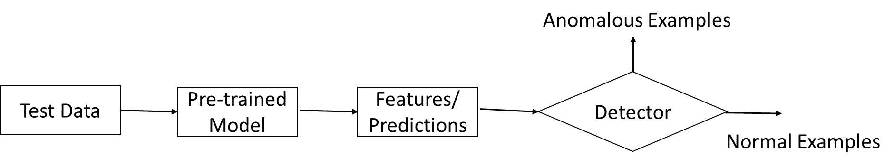
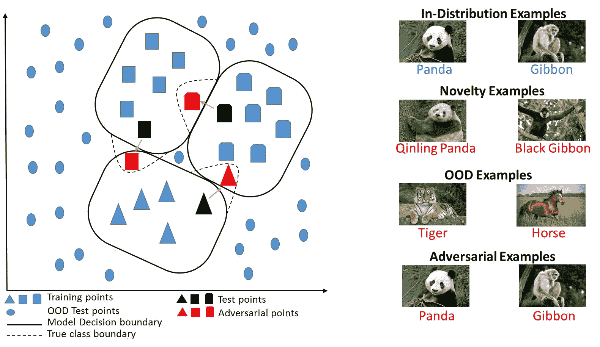
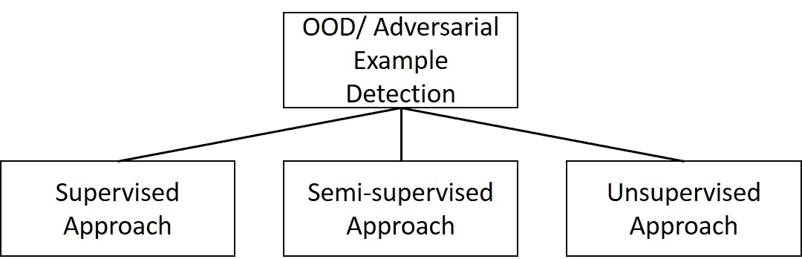

<!--yml

类别：未分类

日期：2024-09-06 20:02:01

-->

# [2003.06979] 深度学习中的异常实例检测：综述

> 来源：[`ar5iv.labs.arxiv.org/html/2003.06979`](https://ar5iv.labs.arxiv.org/html/2003.06979)

# 深度学习中的异常实例检测：综述

## 摘要

深度学习（DL）对分布外和对抗样本比较脆弱，这会导致不正确的输出。为了增强深度学习的鲁棒性，近年来提出了几种后处理异常检测技术，以检测（并丢弃）这些异常样本。本综述试图提供一个结构化和全面的深度学习应用中异常检测研究的概述。我们根据现有技术的基本假设和采用的方法提供了一个分类法。我们讨论了各类别中的各种技术，并提供了这些方法的相对优缺点。我们在本综述中的目标是提供对属于不同类别的技术的更简单但更好的理解，这些类别中都进行了相关的研究。最后，我们突出指出了在深度学习系统中应用异常检测技术时尚未解决的研究挑战，并提出了一些高影响力的未来研究方向。

## 1 引言

深度学习（DL）技术在科学和工程的广泛应用中提供了回答一些最重要和困难问题的极好机会。因此，科学家和工程师越来越多地采用 DL 来在感兴趣的应用领域中做出潜在重要的决策，例如生物信息学、医疗保健、网络安全以及完全自主车辆。这些应用中的几个往往具有高度后悔性（即，产生重大成本）。在这些应用中，不正确的决策或预测会带来显著的成本，无论是在测试药物时的实验资源、观察稀有现象的丧失机会，还是在认证零部件时的健康和安全。大多数 DL 方法隐含地假设理想条件，并依赖于测试数据来自与训练数据“相同分布”的假设。然而，这一假设在许多实际应用中并未得到满足，几乎所有问题都需要对 DL 输出进行各种级别的转换，因为测试数据通常与训练数据不同，可能由于噪声、对抗性破坏或其他由于时间和空间效应引起的分布变化。这些偏离（或分布外）数据样本在不同领域中通常被称为异常、离群点、新奇点。众所周知，DL 模型对这些异常数据非常敏感，这常常导致由于 DL 生成的不正确结果而产生意外和潜在的有害后果。因此，确定输入的测试数据是否与训练数据集差异如此之大，以至于模型的输出无法被信任（称为异常检测问题）是至关重要的。

由于其实际重要性，异常检测受到了统计学、信号处理和机器学习社区的广泛关注。最近，对于 DL 应用中的异常检测方法的兴趣激增。本调查旨在提供一个结构化的概述，涵盖了 DL 基础上的高后悔应用中的异常检测的最新研究和方法。据我们所知，尚未有任何关于 DL 系统中异常检测方法的全面综述。尽管出现了许多针对传统机器学习应用的综述，但没有专门针对 DL 应用的综述。这激发了这篇综述论文的写作，特别是考虑到最近 DL 研究结果。我们期望这项评审将有助于更好地理解在这一主题上的研究方向及潜在的高影响未来方向。

### 1.1 什么是异常？

异常检测在深度神经网络（DNNs）中的问题设置如下：DNN 在内部分布数据上进行训练，并要求对内部分布和外部分布（OOD）测试样本进行预测。内部分布测试样本来自与训练数据相同的分布，训练后的 DNN 预计能对其做出可靠的预测。另一方面，异常测试样本是指那些不符合训练数据分布的样本。因此，基于这些异常样本的 DNN 预测不应被信任。异常检测问题的目标是设计事后检测器来检测这些不符合分布的测试样本（参见图 1）。

图 1：深度学习中的异常检测示意图。

接下来，我们讨论异常的类型，并展示它们各自的差异。我们将异常分为（a）非故意的和（b）故意的（参见图 2）。非故意的异常与 DNN 模型无关，而故意的异常是攻击者故意设计的，以迫使 DNN 模型产生不正确的结果，并且依赖于模型。

#### 1.1.1 非故意的：新颖和超出分布的示例

非故意的异常进一步分为新颖和 OOD 示例¹¹注意我们将样本称为示例。新颖性检测是识别机器学习系统在训练期间未见过的新或未知的内部分布数据。然而，OOD 示例来自与训练数据不同的分布。新颖数据和 OOD 数据的区别在于，新颖数据样本通常在检测后被纳入正常模型，而 OOD 样本通常被丢弃。在图 2 中，蓝色圆圈位于类别边界之外的是 OOD 示例。这些 OOD 示例不属于任何类别。换句话说，分类器要么无法识别，要么不认识这些 OOD 示例。

一个相关的问题出现在领域适应（DA）和迁移学习 [1] 中，这些方法处理的是一个在源分布上训练的模型在不同（但相关）目标分布的上下文中使用的情况。DA 和 OOD 问题的区别在于，DA 技术假设测试/目标分布与感兴趣的任务（或分布）相关（因此，在训练过程中被利用）。另一方面，OOD 技术旨在检测输入数据是否与训练数据如此不同（且不相关），以至于模型无法被信任。

#### 1.1.2 有意：对抗样本

有意异常（也称为对抗样本）是攻击者故意设计的测试输入，目的是迫使模型出错。例如，攻击者可以修改输入图像，以欺骗 DNN 分类器，这可能导致不可预见的后果，如自动驾驶汽车事故或可能的银行欺诈。在图 Fig. 2 中，红色的例子本质上是对抗样本。通过对输入进行小幅扰动，这些例子被移动到其他类别区域，导致错误分类。分类器可能会有或没有这些例子的一些标签，这导致文献中有不同的技术。

图 2: (a) 二维数据集中异常的简单示例。 (b) Panda 和 Gibbon 分类问题的异常样本的不同变体。图注表示真实标签，颜色表示预测是否正确（蓝色为正确，红色为错误）。

### 1.2 挑战

如前所述，异常是指不符合预期正常行为的数据样本。因此，检测异常的一个简单方法是定义一个代表正常行为的数据空间区域，如果一个样本不在该区域内，则将其声明为异常。然而，有几个因素使得这种看似简单的方法效果不佳：

+   •

    在复杂的 DNN 特征空间中，正常和异常区域的边界非常难以定义。

+   •

    根据应用类型，异常的定义会有所不同。在某些应用中，分类结果与正常输入数据的轻微偏差可能会产生深远的后果，因此可能被声明为异常。在其他应用中，输入要被声明为异常，需要有较大的偏差。

+   •

    文献中一些异常检测技术的成功取决于训练和/或测试数据标签的可用性。

+   •

    当对抗样本趋向于伪装成正常数据时，异常检测尤其困难。

上述困难使得异常检测问题一般很难解决。因此，大多数文献中的技术倾向于根据应用类型、输入数据和模型的类型、训练和/或测试数据标签的可用性以及异常的类型来解决一般问题的特定实例。

### 1.3 相关工作

异常检测是各种调查、综述文章和书籍的主题。在[2]中，提供了对传统机器学习及统计模型中各种异常检测技术类别的全面调查。每个检测类别中，讨论了各种技术及其各自的假设，以及优缺点。还提到了每种技术的计算复杂性。在[3]中，提供了对新颖性检测技术的全面调查。各种技术根据使用的统计模型和方法的复杂性进行分类。最近，在[4]中，提出了一项详细的调查，讨论了基于 DL 的异常检测技术。这里还包括了两个额外的异常检测类别，即混合模型以及单类 DNN 技术。请注意，我们的调查论文与[4]不同，因为我们的重点是讨论 DNN 中无意和有意的异常，而[4]讨论的是将 DNN 检测器应用于传统 ML 问题的方法。从某种意义上讲，我们的调查论文在 DL 应用的背景下要广泛得多。在[5]中，讨论了用于异常检测的数据挖掘技术。这些技术包括聚类、回归和规则学习。此外，在[6]中，作者讨论了适应性模型，这些模型考虑了来自环境动态变化特征的数据，并从不断变化的数据中检测异常。这里的技术考虑了基础数据分布的变化，并回顾了相应的无监督技术。在[7]中，异常检测技术根据数据类型分类，即度量数据、演变数据和多结构数据。度量数据异常检测技术考虑了距离、相关性和分布等度量的使用。演变数据包括离散序列和时间序列。在[8]中，讨论了各种统计技术、数据挖掘技术和机器学习技术用于异常检测。在[9, 10]中，讨论了现有的异常检测技术，包括统计、神经网络基础和其他机器学习技术。各种书籍[11, 12, 13, 14]也讨论了异常检测技术。

### 1.4 我们的贡献

据我们所知，本调查是首次尝试提供一个结构化且广泛的综述，涵盖了在深度神经网络（DNN）背景下无意和故意异常检测技术的广泛研究。现有的大多数异常检测综述集中于（i）传统机器学习算法和统计模型的异常检测技术，（ii）统计模型的异常检测技术，（iii）基于深度学习的异常检测技术。相比之下，我们提供了一个专注于深度学习事后异常检测技术的综述。我们根据训练数据中异常的标签可用性对这些技术进行分类，即监督、半监督和无监督技术。我们讨论了每个类别中的各种技术，并提供了这些方法的相对优缺点。我们还简要讨论了不属于事后类别的异常检测技术，例如基于训练的、架构设计等。

图 3：本调查中讨论的不同类型异常检测技术的示意图。

### 1.5 组织结构

本调查主要分为三部分：无意异常检测、故意异常检测和应用。对于无意和故意异常，我们将讨论不同类型的方法（如图 3 所示）。在第二部分中，我们介绍了各种用于检测无意异常的事后异常检测技术。这些技术根据标签的可用性进行分类。在第三部分中，我们介绍了各种用于检测故意异常（或对抗样本）的事后异常检测技术。这些技术同样根据标签的可用性进行分类。在第四部分中，我们讨论了不同类别方法的优缺点。在第五部分中，我们描述了异常检测应用的各种领域。最后，我们在第六部分中总结并提出该领域的开放问题。

## 2 无意异常检测

在本节中，我们讨论了在给定预训练神经网络的情况下检测 OOD 示例的技术。大多数深度学习方法假设测试示例与训练示例属于相同的分布。因此，神经网络对 OOD 测试示例非常敏感。因此，我们需要技术来提高预测的可靠性或确定测试示例是否与训练数据集的分布不同。在这里，我们集中讨论那些利用预训练 DNN 及后续检测器来确定测试示例是否与训练数据集分布不同的技术。我们称这种架构为事后异常检测。与 OOD 示例检测相关的一个主题是新颖性检测[15, 16, 17]，其目标是检测数据中之前未观察到的（新兴、创新）模式。需要注意的是，新颖性检测相关问题的解决方案通常也用于 OOD 检测，反之亦然，因此在本调查中我们将这些术语交替使用。根据 OOD 数据标签的可用性，技术被分为监督、半监督和无监督，接下来将讨论并总结在表格 LABEL:tab:oodtable 中。

表格 1: OOD 检测相关论文。

分类类型 参考 贡献 监督 [18] 基于负对数似然梯度的**不确定性度量**被用作置信度的衡量 监督 [19] 基于不同层的马氏距离的置信度得分通过加权平均进行组合 监督 [20] 分类器的 softmax 在各种输入图像变换下的不变性被用作置信度的度量 监督 [21] 测试样本与最近的未预测类和预测类之间的 Hausdorff 距离的比例被用作信任分数 半监督 [22] 提出了**大致正确**（PAC）算法以保证用户指定的异常检测率 半监督 [23] 基于似然比的方法被用来区分在分布内和**OOD**样本 半监督 [24] 由一个公共特征提取器和两个具有不同决策边界的分类器组成的双头 CNN 被训练以检测**OOD**样本 无监督 [25] 预测的 softmax 概率被用来检测**OOD**样本 无监督 [26] 通过温度缩放和对输入添加小扰动来更好地区分 softmax 分数用于**OOD**检测 无监督 [27] 基于**GAN**的架构用于比较生成图像与测试图像的瓶颈特征 无监督 [28] 退化先验网络与浓度扰动算法被用来获得更好的**不确定性度量** 无监督 [29] 学习区分几何变换用于学习在**OOD**检测中有用的独特特征 无监督 [30] 在自编码器的潜在空间中应用马氏距离来检测**OOD**样本 无监督 [31] 提出了重采样不确定性估计方法作为自助法的近似

### 2.1 监督学习方法

在本节中，我们回顾了当在分布内和**OOD**样本的标签都可用时的异常检测方法，以便将其作为监督异常检测问题进行区分。任何未见过的测试数据样本都与检测器进行比较，以确定其属于哪个类别（在分布内与**OOD**）。

在[18]中，提出了一种基于预测类别标签的负对数似然梯度信息来测量神经网络不确定性的方法。该方法计算所有层的梯度指标，并使用范数或最小/最大操作进行标量化。梯度指标的大值表明分类错误或 OOD 示例。使用卷积神经网络（CNN）作为分类器，训练于扩展 MNIST 数字[32]。EMNIST 字母、CIFAR10[33] 图像以及不同类型的噪声被用作 OOD 数据。作者发现这种无监督方案在所有类型的 OOD 数据上效果并不好。因此，提出了一种该方案的监督变体，允许在一些 OOD 样本的不确定性指标上训练一个异常检测器。结果表明，通过利用标记的 OOD 数据，性能得到了显著提升。

在[19]中，高级想法是测量测试样本在 DNN 特征空间上的概率密度。具体来说，作者将类条件的高斯分布拟合到预训练特征上。这是可能的，因为后验分布可以被证明等同于高斯判别分析下的 softmax 分类器。接下来，定义了一个使用马氏距离相对于最近的类条件分布的信心分数。其参数选择为经验类均值和训练样本的经验协方差。为了进一步提高性能，将来自 DNN 不同层的信心分数使用加权平均进行组合。每一层的权重通过使用包含分布内数据和 OOD 数据的标记验证样本来训练一个逻辑回归检测器进行学习。该方法被证明对 OOD 示例具有鲁棒性。

在[20]中，一个检测器被训练以从应用不同自然变换到给定图像生成的一组分类器响应中提取的表示进行训练。分析分类器在各种变换下的决策不变性可以建立对其决策的信心度。换句话说，OOD 输入的 softmax 值应该在变换版本中波动，而在分布内图像的值应该相对稳定。作者在各种变换下对分布内与 OOD 训练数据的信心分数进行了二分类 OOD 检测器的训练。使用基于 ResNet 的架构作为分类器，Self-Taught Learning (STL-10) 数据集[34]用作分布内数据，Street View House Numbers (SVHN) 数据集[35]用作 OOD 数据。该方法被证明优于其他基准方法。

在[21]中，提出了一种信任评分来判断分类器对测试样本的预测是否可靠。该评分定义为测试样本到与预测类别不同的最近类别（例如，OOD 类别）的距离与到预测类别的距离之间的 Hausdorff 距离的比率。为了计算信任评分，训练数据被预处理，以找到每个类别的高密度集合，从而过滤掉异常值。信任评分是基于这个高密度集合来估算的。这个方法的核心思想是，如果分类器预测的标签与最近的标签相差较远，那么它可能是一个 OOD 或不可靠的样本。在识别正确/错误分类样本的任务中，研究表明信任评分在低到中等维度下表现良好。然而，在高维度下，其表现类似于分类器自己报告的置信度（即，softmax 层的概率）。

### 2.2 半监督方法

我们将利用未标记的污染数据（或信息）以及标记的在分布类别实例的异常检测技术称为半监督技术。由于这些技术不需要知道未标记实例是否在分布中或是 OOD，因此它们比监督技术具有更广泛的适用性。

在[22]中，该算法利用训练数据集中异常样本数量的上界知识来为实现期望的异常检测率提供“可能近似正确”（PAC）保证。该算法使用异常分数的累计分布函数（CDFs）对干净和污染的训练数据集进行处理，以推导异常阈值。异常检测器为所有测试样本分配分数，并根据样本相对于在分布数据的异常程度对其进行排序。然后将这个排序的分数向量与阈值进行比较，以检测 OOD 样本。阈值的计算方式是保证特定的异常检测率。对合成数据集和标准数据集的实证结果表明，给定足够的数据，该算法在 OOD 检测任务上实现了保证性能。

在[23]中，提出了一种基于似然比的深度生成模型方法，用于区分在分布内样本和 OOD 样本。作者假设在分布内数据包含语义部分和背景部分。作者发现，背景（例如，具有相同背景但不同语义成分的 OOD 输入）可能会混淆似然。利用关于 OOD 数据的信息，他们建议使用背景模型来纠正背景统计数据，并增强在分布内的特征以进行 OOD 检测。具体来说，通过对输入添加适量的扰动来破坏数据中的语义结构，从而训练背景模型。因此，在扰动输入上训练的模型仅捕获人群级别的背景统计信息。这个似然比是从在分布内数据和背景统计数据中计算得出的。如果似然比大于预设的阈值，则测试样本很可能是 OOD。在[23]中，国家生物技术信息中心微生物基因组数据集以如下方式使用：将各种细菌分组到多年来发现的类别中。具体来说，在给定截止年份之前发现的类别被视为在分布内类别，而截止年份之后发现的类别被视为 OOD 类别。与最先进的检测结果的准确性相比，所提出的测试方法提高了 OOD 检测的准确性。

在[24]中，提出了一种基于双头 CNN 的半监督 OOD 检测技术。其思想是训练一个由一个共同特征提取器和两个具有不同决策边界的分类器组成的双头 CNN，这两个分类器可以正确地分类在分布内样本。此外，使用未标记的污染数据来最大化两个分类器之间的差异，以将 OOD 样本推向在分布内流形之外。这使得检测远离在分布内样本支持的 OOD 样本成为可能。

### 2.3 无监督方法

如果检测技术仅利用在分布内数据进行 OOD 检测，则称之为无监督方法。

在[25]中，由于来自 softmax 分布的统计数据很有帮助，提出了一种基于 softmax 的基准方法来确定测试示例是否为分布外数据。其思想是，训练良好的网络倾向于将概率预测较高的分配给分布内示例，而不是分布外示例。因此，通过将示例的预测 softmax 类概率与阈值进行比较，可以检测出分布外示例。具体而言，作者通过分离分类正确和分类错误的测试集示例来生成训练数据，并计算用于计算阈值的预测类的 softmax 概率。该方法在计算机视觉、自然语言处理和语音识别任务上进行了评估。该技术在分类器无法将预测分布的最大值与分布内和分布外示例相对较好地分离的情况下失效。因此，在[26]中，作者提出了一种基于温度尺度和对输入添加小扰动的方法，可以更好地区分分布内和分布外图像之间的 softmax 得分分布。使用 Wide ResNet [36]和 DenseNet [37]架构，并使用 CIFAR-10 和 CIFAR-100 [33]作为分布内数据集进行训练。该分布外数据检测器在多个不同的自然图像数据集和合成噪声数据集上进行了测试。结果表明，该方法显著提高了检测性能，并优于[25]中的基准方法。

在[27]中，使用基于生成对抗网络（GAN）[38]的架构来进行重构误差的异常检测方法。其动机是，当 GAN 生成以前见过的对象的图像（即分布内数据）时，其性能会更好，而生成以前未见过的对象的图像（即分布外数据）时，性能会较差。在这种方法中，测试图像首先经过 GAN 的生成器，产生瓶颈特征和重构图像。接下来，重构图像经过编码器生成另一组瓶颈特征。这两组特征之间的欧氏距离表示生成图像与原始图像之间的差异程度，并用作异常分数。

在[28]中，作者提出了一种退化的先验网络架构，该架构可以通过先验熵有效地将模型级不确定性与数据级不确定性分开。为了更好地分离分布内和 OOD 图像，他们提出了一种浓度扰动算法，该算法自适应地向先验网络的浓度参数添加噪声。通过综合实验，显示该方法在大规模数据集上特别取得了最先进的性能。然而，该方法对不同的神经网络架构敏感，有时可能导致性能较差。

在[29]中，直觉是学习区分应用于图像的几何变换有助于学习每个类别的独特特征，这些特征在异常检测中很有用。作者在一个自标记的数据集上训练多类别分类器，该数据集通过对分布内图像应用各种几何变换来创建。在测试时，将变换后的图像传递给该分类器，并使用从分布内训练图像的 softmax 值分布中得出的异常分数来检测 OOD 数据。使用的分类器是训练于 CIFAR 数据集的 Wide Residual Network 模型[36]。CatsvsDogs 数据集[39]，其中包含 12,500 张猫和狗的图像，被视为 OOD 数据。该方法在较大图像上的表现优于[25]中的基线方法，并且对 OOD 样本具有较强的鲁棒性。与基线方法相比，该方法能够以显著的优势区分正常样本和 OOD 样本。

[30]（及其参考文献）中提出的方法考虑了基于重建误差检测 OOD 样本的问题。这些方法假设 OOD 数据由不同于分布内数据的因素组成。因此，基于优化的重建方案很难压缩和重建 OOD 数据。具体来说，[30]提出在潜在空间中引入马氏距离，以更好地捕捉这些 OOD 样本。他们将编码测试样本与编码训练集均值向量之间的马氏距离与测试样本的重建损失结合，以构建异常分数。使用 MNIST 数据集中单数字类别[40]作为分布内数据，其他类别的 MNIST 被视为 OOD 样本。作者指出，通过包括潜在距离可以改善对分布内和 OOD 样本的检测。

在[31]中，审计了预训练 DNN 的预测，以确定其可靠性。提出了重采样不确定性估计（RUE）方法，作为对引导程序的近似。直观地说，RUE 估计了如果使用来自相同分布的不同训练数据，预测会发生多少变化。它使用模型在训练数据和引导样本上的损失的梯度和 Hessian 量化不确定性，以生成测试输入的预测集成。该不确定性分数与阈值进行比较，以检测正确和不正确的预测。使用来自 UCI 数据集库的八个常见基准回归数据集[41]训练了一个单隐藏层前馈神经网络架构。作者表明，与现有技术相比，不确定性分数在审计可靠性时更有效地检测不准确的预测。该方法还可以用于检测 OOD 样本。

请注意，上述讨论的无监督方法需要将提出的异常分数与阈值进行比较。虽然阈值完全基于分布内数据计算，但通过根据 OOD 验证样本（如果有的话）优化选择阈值，可以进一步提高性能。

### 2.4 其他杂项技术

在本节中，我们讨论了不同于事后异常检测技术的方法，例如基于训练的、架构设计的等。

在[42]中，提出了一种新的支持向量机（SVM）形式，将多类分类和 OOD 检测合并为一个步骤。具体而言，作者通过将原始 SVM 扩展为一个辅助的零类作为异常类，用于标记 OOD 示例。使用 UCI 数据集作为训练示例。作者展示了检测异常能力与将正常示例错误标记为异常之间的权衡。

在[43]中，针对假新闻检测的混合模型包含三个步骤：使用递归神经网络（RNN）捕捉用户对给定文章的时间模式，检查媒体来源的可信度，以及将文章分类为假新闻或非假新闻。在[44]中，使用 RNN 网络检测异常数据，其中 Numenta 异常基准指标用于早期检测异常。

在[45]中提出了一种修改 DNN 输出层的方法。具体而言，不使用 logit 分数计算类别概率，而是使用类别权重与类别特征之间的余弦角度。换句话说，类别概率是通过缩放余弦相似度的 softmax 获得的。OOD 样本的检测是通过将所有类别的余弦值最大值与阈值进行比较来完成的。该方法无需超参数，并且具有较高的 OOD 检测性能。然而，其权衡是分类准确性的下降。使用 Wide Residual Network[36]作为分类器，该网络使用 CIFAR 数据集进行训练，tiny ImageNet 和 SVHN 数据集被视为 OOD 数据。即使在没有调整超参数的情况下，该方法也能实现有竞争力的检测性能，并且该方法仅需要单次前向传递，无需对每个输入进行反向传播。

在[46]中，将深度自编码器与 CNN 结合用于执行监督的 OOD 检测。自编码器作为监督 CNN 训练的预训练方法。其思路是使用深度自编码器重建高维特征，并通过 CNN 检测异常。研究表明，这种组合可以提高大规模 Android 恶意软件检测的准确性和效率。

在[47]中提出了一种新的训练方法，其中在交叉熵损失中添加了两个额外项，以最小化 OOD 样本预测分布与均匀分布之间的 Kullback-Leibler (KL)距离，从而将不确定的预测分配给 OOD 样本。这样，分布内样本和 OOD 样本应该变得更加可分。然而，优化的损失函数需要用于训练的 OOD 样本，这些样本是通过使用 GAN 架构生成的。因此，训练涉及交替最小化分类器的损失和 GAN 的损失。

在[48]中，该算法由一组留出分类器组成。每个分类器使用分布内样本和 OOD 样本进行训练。这里，OOD 样本通过将训练数据集中的随机子集指定为 OOD，其余样本为分布内样本来获得。提出了一种新的基于边际的损失函数，该损失函数保持 OOD 样本和分布内样本的平均熵之间的边际$m$。因此，损失函数是交叉熵损失与基于边际的损失的组合。通过最小化损失函数来训练分类器集成。OOD 检测评分是通过结合 softmax 预测分数和带温度缩放的熵来获得的。结果表明，该评分对分布内样本较高，对 OOD 样本较低。

此外，[49] 提出了利用替代数据源来改善 OOD 检测，通过对抗一个异常值的辅助数据集训练异常检测器，这种方法被称为异常值暴露。其动机在于，虽然很难建模每种变异的异常分布，但通过将模型暴露于不同的 OOD 数据集，可以学习到有效的启发式方法来检测 OOD 样本。因此，学习一个更保守的在分布概念，使得异常检测器能够泛化并检测未见过的异常。

[50] 的关键思想是，似然模型对 OOD 样本分配的密度值高于在分布样本。作者提出了生成性集成方法，通过将密度评估模型与通过集成方差对密度模型进行的预测不确定性估计相结合，来检测 OOD 样本。具体来说，他们使用对随机采样的 GAN 判别器的不确定性估计来去相关化单个判别器产生的 OOD 分类错误。

[51] 中的作者提出了一种排列检验统计量来检测使用批量归一化训练的深度生成模型中的 OOD 样本。他们展示了带有批量归一化的生成模型的训练目标可以被解释为对不同联合分布的最大伪似然。在这个联合分布上，OOD 样本的批量估计似然被显示为远低于在分布样本的。

在[52]中，对一些现有的基于后校准的 OOD 检测技术进行了基准测试。研究了 OOD 样本对分类任务的准确性和校准的影响。作者不仅评估了在分布样本的不确定性，还评估了 OOD 样本的不确定性。他们使用如负对数似然和 Brier 分数等指标来评估模型的不确定性或计算预测概率的准确性。通过大规模实验，作者展示了随着分布偏移的增加，校准误差也在增加，后校准确实在检测 OOD 样本时有所不足。

## 3 故意异常检测

在本节中，我们讨论了针对给定预训练神经网络检测故意设计的对抗测试样本的检测技术。众所周知，深度神经网络（DNN）对测试时的对抗样本非常敏感——这些人为难以察觉的扰动，当添加到任何图像中时，会以高概率导致误分类[53, 54]。不可察觉性约束确保测试样本属于数据流形，但却被误分类。因此，我们需要技术来提高预测的可靠性或确定测试样本是对抗性还是正常的。在这里，我们专注于后者，即利用预训练 DNN 及其后续检测器。在标签可用性方面，这些技术被分类为监督、半监督和无监督，具体说明如下，并总结在表 LABEL:tab:adversarialtable 中。

表 2：与对抗样本检测相关的论文。

分类类型 参考 贡献 监督 [55] 提出了基于中间特征表示训练的二分类检测器来检测对抗样本 监督 [56] 基于逻辑回归的检测器使用两个特征：不确定性和密度估计 监督 [57] 基于 LSTM 的二分类检测器训练来分析深度特征嵌入距离空间的序列 监督 [58] 使用局部内在维度来表征对抗样本所在区域的维度特性 监督 [59] 三层回归 NN 用作检测器以预测置信度分数 无监督 [60] 基于生成模型的排序统计用于检测对抗样本 无监督 [61] 基于 KL 距离的度量应用于后验分布以检测对抗样本 无监督 [62] 基于深度特征的最近邻分类分数用于检测对抗样本 无监督 [63] 通过建模 DNN 隐藏层的输出分布来检测对抗样本，给定正常样本 无监督 [64] 使用源流和激活不变性来检测对抗样本 无监督 [65] 通过最小化采样概率的不确定性来检测对抗样本的互信息 无监督 [66] 基于对抗样本在数据流形上的最近邻搜索投影的检测 无监督 [67] 基于梯度搜索的对抗样本在数据流形上的投影检测

### 3.1 监督方法

在这一部分，我们讨论了需要标签的检测技术，包括分布内样本和对抗样本，并将其称为监督异常检测技术。测试样本与检测器进行比较，以确定它们是正常的还是对抗的。

在[55]中，提出了一种二元对抗样本检测器。该检测器在原始数据集和对抗样本的预训练分类器的中间特征表示上进行训练。尽管训练这样的检测器可能看起来非常困难，但他们在 CIFAR10 和 ImageNet 数据集的 10 类子集上的结果表明，训练这样的检测器确实是可能的。实际上，该检测器在对抗样本检测中达到了高精度。此外，虽然检测器是基于特定攻击方法生成的对抗样本进行训练的，但发现该检测器能够对类似和较弱的攻击方法具有泛化能力。在[68]中采用了类似的策略，其中 ML 模型通过额外的类别来扩展，模型被训练以使用标记数据对所有对抗输入进行分类。

在[56]中，作者提出了三种检测对抗样本的方法。首先，基于密度估计的方法使用来自训练集的最后隐藏层特征空间的核密度估计来检测对抗样本。该方法旨在检测那些远离数据流形的点。然而，当对抗样本非常接近良性子流形时，这种策略可能效果不好。因此，作者提出了第二种方法，即使用来自丢弃神经网络的贝叶斯不确定性估计，当点位于输入空间的低置信度区域时，他们展示了基于丢弃的方法可以在密度估计无法检测到的情况下检测对抗样本。最后，他们还建立了一个组合检测器，该检测器是一个简单的逻辑回归分类器，输入特征包括：不确定性和密度估计。组合检测器在标记训练集上进行训练，该训练集包括使用不同对抗攻击方法生成的良性和对抗样本的不确定性值和密度估计。作者报告称，组合检测器的性能（检测准确率为 85-93%）优于仅在不确定性或密度值上训练的检测器，表明每个特征能够检测对抗特征的不同特性。

在[57]中，观点是对抗样本在前向传播中的内部表示轨迹与在分布内样本的轨迹不同。输入的内部表示被嵌入到特征距离空间中，该空间捕捉了相对于特定在分布内样本的示例的相对位置。这种嵌入使得网络前向传播中激活的演变可以紧凑地编码。因此，促进了在分布内和对抗输入的轨迹之间差异的搜索。一个基于 LSTM 的二分类检测器被训练来分析嵌入在距离空间中的深度特征序列，并检测对抗样本。实验结果表明，该检测方案能够检测各种针对 ResNet-50 分类器的对抗样本，ResNet-50 是预训练于 ImageNet 数据集上的。

在[58]中，使用基于扩展的内在维度测量作为检测对抗样本的替代密度测量方法。内在维度的扩展模型评估数据的局部维度结构，并将内在维度特性作为数据集的属性。局部内在维度（LID）将这一概念推广到从参考点到其邻居的局部距离分布——通过累计分布函数的增长特性揭示了参考点附近局部数据子流形的维度。作者使用 LID 来描述对抗样本所在区域的内在维度，并使用 LID 估计值来检测对抗样本。注意，LID 是最近邻距离的函数，发现对抗样本的 LID 显著高于良性样本。通过使用训练数据基于其在不同层的 LID 构建每个样本的特征来训练一个二分类对抗样本检测器，其中对抗样本的类别标签被赋予正值，分布内样本的标签被赋予负值。在多个攻击策略上的实验表明，基于 LID 的检测器在检测精度上大幅超越了多个最先进的检测措施。

在[59]中，使用了一个三层回归神经网络作为检测器，该检测器将来自预训练深度神经网络的在分布内和对抗样本的 logits 作为输入，并预测置信度值，即分类是正常还是对抗。使用的分类器是一个基于在分布内数据集（MNIST 和 CIFAR）训练的预训练 CNN，检测器则在使用不同方法生成的在分布内和对抗样本的 logits 上进行训练。这项工作表明，预训练网络的 logits 提供了检测对抗样本的相关信息。

### 3.2 半监督方法

半监督异常检测技术除了利用标记的分布内类别实例外，还利用未标记的受污染数据（或信息）。由于这些技术不需要知道未标记的实例是否在分布内或为对抗样本，它们比监督技术更广泛适用。然而，我们在文献中找不到现有的半监督对抗样本检测方法。请注意，这可能是未来研究中的一个值得追求的方向。

### 3.3 无监督方法

我们将检测技术称为无监督的，如果它们仅利用分布内数据进行对抗检测。

在[60]中，所有训练图像在生成模型（如 PixelCNN）下的概率被计算出来。然后，对于测试样本，计算输入处的概率密度，并评估其在所有训练样本的密度值中的排名。这个排名可以作为测试统计量，用来给出一个$p$-值，判断样本是正常的还是对抗性的。该方法提高了最先进方法对攻击的韧性，并显著提高了检测准确率。此外，作者建议通过在原始训练样本的较小距离内搜索更可能的图像来净化对抗样本。通过利用$L^{\infty}$距离，净化图像的真实标签保持不变。结果是净化后的图像在分布内的概率更高，从而使在正常图像上训练的分类器对这些净化图像的预测更加可靠。这种直觉用于建立更有效的对抗攻击防御。

在[61]中的方法动机是，对抗样本应该在 DNN 预测的类别下（a）“过于不典型”（即，具有不典型的低概率），以及在 DNN 预测类别之外的某些类别下（b）“过于典型”（即，具有过高的概率）。虽然看起来可能需要使用两个检测阈值，但他们提出了一个单一的决策统计量来捕捉这两个要求。具体来说，他们定义了（a）相对于（基于密度的）零模型评估的两个类别后验，以及（b）通过 DNN 评估的相应两个类别后验。这两种偏差（“过于不典型”和“过于典型”）由 Kullback-Leibler 散度决策统计量捕获。如果该统计量超过预设的阈值，则样本被声明为对抗性的。

在[62]中，所采用的方法是在通过 DNN 分类的测试图像与训练图像中获得的深度特征之间执行 kNN 相似性搜索。然后，他们使用 kNN 分类器分配给 DNN 预测类别的分数作为分类置信度的度量。需要注意的是，这种方法并不依赖于 kNN 分类器产生的分类结果，而只是将分配给 DNN 预测的分数作为置信度的度量。这种方法的直觉是，虽然 DNN 正确预测的类别在所有类别的 kNN 分数中不一定具有最高分数，但正确分类具有非常低分数的可能性是不切实际的。对 ImageNet 数据集的结果表明，隐藏层激活可以用于检测各种攻击造成的误分类。

在[63]中，利用预训练 DNN 的内在属性，即隐藏神经元的输出分布，来检测对抗样本。他们的动机是，当 DNN 将对抗样本错误地分配到特定类别标签时，其隐藏状态的分布与正常数据的相同类别相比非常不同。他们使用高斯混合模型（GMM）来近似每个类别的隐藏状态分布，使用的是良性训练数据。然后将似然性与各自的类别阈值进行比较，以检测样本是否为对抗样本。在标准数据集（MNIST、F-MNIST、CIFAR-10）上的实验结果表明，这种方法在防御黑箱和灰箱攻击方面能够实现最先进的鲁棒性。

在[64]中，作者发现对抗样本主要利用两种攻击通道：来源通道和激活值分布通道。来源通道表明 DNN 输出对激活值的小变化不稳定，最终导致分类错误。另一方面，激活通道表明，虽然来源略有变化，但一层的激活值可能与存在良性输入时大相径庭。利用这些观察，他们提出了一种提取两种不变性的（或由模型表示的概率分布）方法，即值不变性以保护值通道，来源不变性以保护来源通道。这是通过训练一组模型来描述激活和来源分布，仅使用分布内输入来实现的。换句话说，不变模型被训练为单类分类（OCC）问题，其中所有训练样本都是正样本（即此上下文中的分布内输入）。在测试时，一个输入会通过所有不变模型，这些模型提供关于输入是否引发违反不变分布的状态的独立预测。最终结果是基于所有这些预测的联合决策。对各种攻击、数据集和模型的广泛实验表明，该方法可以在所有不同类型的攻击中实现持续高的检测准确率，而基线检测器的性能则不稳定。

在[65]中，理念是对抗扰动与训练数据流形的固有距离会导致整体网络不确定性超过正常示例。为此，使用预训练网络每层的隐藏单元的随机抽样来引入随机性，并通过隐藏层组件来量化测试图像的整体不确定性。利用基于互信息的阈值测试来检测对抗样本。通过优化采样概率以最小化不确定性，进一步提高了性能。在深度最先进的 CNN 上对 CIFAR10 和猫狗数据集的实验展示了重要的采样参数优化，这可直接转化为改进的攻击检测。

像[66]和[67]这样的 approaches 依赖于将测试图像投影到 benign 数据集流形中以检测对抗样本。这些方法的基本假设是对抗扰动将测试图像从 benign 图像流形上移开，而通过将图像在分类之前投影回 benign 流形，可以抵消对抗者的影响。由于真实的图像流形是未知的，因此使用了各种估计技术。例如，[66]使用一个包含数十亿自然图像的数据库进行样本近似。另一方面，[67]使用在 benign 图像上训练的生成模型来估计流形。根据估计的 benign 流形，[66]通过最近邻搜索进行投影，而[67]则通过基于梯度的搜索进行投影。这些方法在对抗者不了解防御策略的灰盒和黑盒攻击中表现出较强的鲁棒性。

### 3.4 其他杂项技术

在这里，我们讨论一些其他用于对抗样本检测的技术，这些技术不属于上述的后处理分类。

在[69]中，检查了用于对抗样本检测的各种不确定性度量，例如熵、互信息、softmax 方差。这些度量捕捉了不同类型的不确定性，并从对抗样本检测的角度进行了分析。作者展示了只有互信息在对抗样本上具有有效的检测性能。实际上，大多数其他不确定性度量在 MNIST 和 Kaggle dogs vs. cats 分类数据集上似乎比随机猜测更差。

[70]中的方法受到以下观察的启发：DNN 特征空间通常过大，这为攻击者构造对抗样本提供了广泛的自由度。作者建议通过“挤出”不必要的输入特征来减少构造对抗样本的自由度。具体而言，他们比较了模型对原始测试样本的预测与在挤压后，即减少图像的颜色深度和使用平滑减少像素间变异的测试样本的预测。如果原始输入和挤压后的输入产生了实质性不同的预测，则该样本被宣布为对抗样本。

在[71]中，提出了 SafetyNet，它由原始分类器和一个对抗检测器组成，该检测器查看原始分类器后层的内部状态。在这里，ReLU 的输出被量化以生成基于某些阈值的离散代码。他们声称，自然样本和对抗样本会出现不同的代码模式。使用对抗样本检测器（即 RBF-SVM），将测试时产生的代码与一组样本进行比较，即攻击者必须使网络生成一个检测器可接受的代码，这被证明是困难的。

在[72]中，该方法通过将朴素贝叶斯与变分自编码器结合，改进了许多生成分类器中使用的朴素贝叶斯。它们提出了三种对抗样本检测方法。前两种方法使用学习到的生成模型作为数据流形的代理，拒绝远离该流形的输入。第三种方法计算分类器输出概率向量的统计量，并拒绝导致不自信预测的输入。实验结果表明，深度贝叶斯分类器比深度判别分类器更具鲁棒性，基于深度贝叶斯的检测方法对各种攻击都有效。

在[73]中，作者建议用参数概率分布（高斯和高斯混合模型）来建模各层（深度特征）的输出。在测试时，计算测试样本特征相对于这些分布的对数似然分数，并用作异常分数，以区分分布内样本（应该有高似然）和对抗样本（应该有低似然）。

[74]中的主要思想是将基于 kNN 的距离度量[75]与影响函数结合，影响函数是一种度量测试样本分类受到每个训练样本影响的程度的方法。这种方法的动机是，对于分布内输入，其 kNN 训练样本（嵌入空间中的最近邻）和最有帮助的训练样本（通过影响函数找到）应该相关。然而，对于对抗样本，这种相关性要弱得多，这表明了攻击的存在。

[76]中的动机是观察到不同的神经网络在面对相同的对抗样本时会犯不同的错误。作者建议利用这些错误模式进行对抗样本检测。对 MNIST 和 CIFAR10 数据集的实验表明，这种检测方法在不同对抗样本生成方法中具有良好的泛化能力。

在[77]中，使用了鲁棒特征对齐来检测对抗性示例。通过使用对象检测器，作者首先提取图像中包含的高级鲁棒特征。接下来，该方法量化图像提取的特征与预测类别的预期特征之间的相似性。最后，使用相似性阈值将测试样本分类为良性或对抗性。

在[78]中，通过引入训练和测试阶段的随机特征无效化来执行异常检测，从而确保 DNN 的非确定性特性。在测试时引入的随机化确保模型处理输入时，即使攻击者学习了关键特征，对抗性示例的效果也会降低。

在[79]中，提出了三种策略。首先，使用正则化特征向量重新训练 CNN 的最后一层。这可以用来检测输入是否具有对抗性。其次，从隐藏层输出的绝对值中创建直方图，并将其合并成一个向量，由 SVM 进行分类。第三，对输入进行扰动，以强化被 DNN 忽视的输入示例部分，然后可以用来进行对抗示例检测。最后，作者结合了这些方法的最佳方面，开发了一种更强大的方法。

在[80]中，提出了一种增强 DNN 对抗性示例鲁棒性的框架。其思想是使用局部保持哈希函数来转换示例，以增强鲁棒性。示例的哈希表示通过使用去噪自编码器（DAE）进行重建，使 DNN 分类器能够在潜在空间中获得局部信息。此外，DAE 可以检测与基础训练分布的支持距离较远的对抗示例。

## 4 相对优势与劣势

与其他方法相比，监督技术通常具有更高的性能，因为它们使用了来自正常和异常类别的标记示例。它们能够从标记的训练示例中学习边界，然后更容易将未见过的测试示例分类为正常或异常。然而，当异常的训练数据（已知的未知数）可能不能代表异常的全部范围时，监督方法可能会过拟合，并在未见过的异常数据（未知的未知数）上表现不佳。此外，由于缺乏标记异常示例，监督技术不如半监督或无监督技术受欢迎。

无监督技术非常灵活且广泛适用，因为它们不依赖于异常数据及其对应标签的可用性。这些技术仅从分布内数据中学习固有特征或独特的特征，这些特征有助于将正常样本与异常样本分开。不幸的是，这种灵活性以稳健性为代价——无监督技术对噪声和数据损坏非常敏感，通常不如监督或半监督技术准确。

半监督技术利用未标记的数据和标记的分布内数据来提升无监督技术的性能。虽然未标记数据是否属于分布内或异常数据未知，但观察到未标记数据有助于提高异常检测的性能。请注意，在现实世界应用中，未标记的数据容易获得，使得半监督技术在实践中更具可行性。这些方法也存在对未见异常的过拟合问题。

基于距离的方法，例如 kNN 方法，需要事先定义合适的距离度量。大多数距离度量在高维空间中效果不佳。此外，这些方法通常是启发式的，需要手动选择参数。基于投影的方法，例如 GAN 方法，非常灵活，可以解决高维挑战。然而，它们的性能严重依赖于图像流形估计的质量。在某些应用中，使用样本近似或生成建模来估计图像流形可能并不容易。概率方法，例如密度估计方法，利用训练数据或特征的分布来确定异常边界的位置。这些方法在小数据环境下表现非常差，因为无法获得可靠的估计。基于不确定性的方法，例如熵方法，需要一个足够敏感的度量来检测数据集中异常的影响。虽然这些方法在实践中容易实现，但其性能高度依赖于不确定性的质量。深度学习中的不确定性量化是一个正在研究的课题，高质量的不确定性估计必将改善基于不确定性的方法的性能。

这些方法的计算复杂性是另一个重要的考虑因素。一般来说，概率方法和基于不确定性的方法在训练阶段计算开销较大，但测试阶段效率较高。另一方面，基于距离和基于投影的方法通常在测试阶段计算开销较大。根据应用需求，用户应选择最合适的异常检测方法。

## 5 应用领域

在本节中，我们简要讨论了 OOD 和对抗性样本检测的几种应用。我们还建议了这些应用领域未来所需的研究方向。

入侵检测 - 入侵检测系统是一种监控网络流量以发现可疑活动并在发现此类活动时发出警报的系统。入侵检测的一个关键挑战是数据量庞大和恶意模式复杂。因此，深度学习技术在入侵检测应用中相当有前景。

在[81]中，基于神经网络的入侵检测器被训练以识别入侵者。在[82]中，提出了一种用于入侵检测的深层次模型。该模型结合了用于无监督特征学习的限制玻尔兹曼机（RBM）和一种称为反向传播网络的监督学习网络。在[83]中，提出了一种网络入侵模型，其中通过堆叠扩张卷积自编码器进行特征学习。这些特征随后用于训练一个 softmax 分类器以执行监督入侵检测。在[84]中，提出了一种结合了随机异常阈值确定方法的基于自编码器的模型用于入侵检测。该算法使用从训练集通过训练的自编码器获得的经验均值和标准差来计算阈值。

如前所述，这些基于深度学习的系统同样易受到 OOD 和对抗性样本的影响[85, 86, 87]。在[85]中，作者分析了最先进攻击算法对基于深度学习的入侵检测系统的表现。通过实验验证了入侵检测系统中使用的深度神经网络的易受攻击性，并探索了各个特征的作用。[86]中的作者证明了即使在攻击者无法获得目标模型的内部信息的情况下，攻击者仍然可以生成有效的对抗性样本来对抗基于深度学习的入侵检测系统。请注意，在入侵检测应用中，通常可以获得大量对应正常行为的标注数据，而入侵的标注数据则较少。因此，前面章节中讨论的半监督和无监督的 OOD 及对抗性样本检测技术是值得追求的方向。

欺诈检测 - 欺诈检测是指检测许多电子商务领域中发生的欺诈活动，例如银行、保险、执法等。一个好的欺诈检测系统应该能够准确识别欺诈交易，并应能实现实时检测。对在欺诈检测系统中应用深度学习技术的兴趣日益增加。在[88]中，欺诈检测被建模为序列分类任务。使用 LSTM 生成交易序列，并结合均值、绝对值等聚合函数来汇总学习到的特征以进行欺诈检测。此外，在[89]中，使用 CNN 进行特征序列化以检测交易欺诈。最近，[90]中的作者分析了深度欺诈检测器对对抗性样本的脆弱性，即对欺诈检测器进行欺骗的输入交易中的微小扰动。他们展示了部署的深度欺诈检测器对攻击高度脆弱，因为平均精度从 90%降至低至 20%。

这激发了对深度欺诈检测系统中无意和故意异常效应研究的兴趣。前面讨论的技术将适用于这样的问题，并且是设计强健的深度欺诈检测系统的潜在可行解决方案。

医疗保健和工业领域的异常检测 - 医疗保健领域的异常检测试图检测异常的患者状况或仪器错误。在该领域，异常检测是一个非常关键的问题，需要高精度。同样，在风力涡轮机、发电厂和储存设备等工业系统中，这些系统每天承受大量压力，检测任何损坏尽可能快地是至关重要的。医疗异常和工业损伤是稀有事件，检测它们可以建模为异常检测问题。因此，对深度学习在医疗[91]和工业应用领域[92]中的应用兴趣激增。

不幸的是，与其他深度学习应用类似，这些系统同样容易受到 OOD 和对抗性样本的影响。例如，[93]中的作者展示了对抗性样本能够操控深度学习系统，跨越三个临床领域：视网膜眼底检查中的糖尿病视网膜病变、胸部 X 光中的气胸，以及皮肤镜照片中的黑色素瘤。

这激发了对深度学习（DL）在医疗保健和工业系统中异常效应研究的兴趣。前面讨论的技术可以用于设计强健的医疗保健和损伤检测系统。

恶意软件检测 - 恶意软件检测侧重于通过监控计算机系统的活动来检测恶意软件，并将其分类为正常或异常。恶意软件的速度、体积和复杂性对反恶意软件社区带来了新的挑战。目前的前沿研究表明，最近研究人员开始应用机器学习和深度学习方法进行恶意软件分析和检测[94]。在[78]中，通过在训练和测试阶段引入随机特征失效来进行恶意软件检测，以确保 DNN 的非确定性特性。直观地，非确定性特性确保模型对输入的处理减少了对抗样本的有效性，即使攻击者了解了关键特征。此外，在[95]中，使用了堆叠自编码器模型进行恶意软件检测。该模型采用贪婪的分层训练操作进行无监督特征学习和监督参数调整。此外，在[96]中，生成了伪恶意软件，并使用一种新颖的 GAN 架构来区分真实数据。

[97, 98]的作者扩展了现有的对抗样本构造算法，构造了对恶意软件检测模型的高度有效攻击。利用增强的对抗构造算法，作者成功误导了 63%的所有恶意软件样本的检测分类器。在[80]中，作者分析了几种攻击对 Android 恶意软件分类任务的影响。

鉴于最先进的恶意软件检测分类器对对抗样本的易感性，将 OOD 和对抗样本检测技术应用于深度恶意软件检测系统将是有用的。

时间序列和视频监控异常检测 - 在多变量时间序列数据中检测异常的任务相当具有挑战性。因此，多变量时间序列异常的有效检测对故障诊断至关重要。基于 RNN 和 LSTM 的方法在检测多变量时间序列数据中的异常方面表现良好。在[99]中，提出了一种基于深度学习的通用框架来检测多变量时间序列数据中的异常。深度注意力模型在[100]中用于异常检测，以实现有效的异常检测。许多研究在[101, 102, 103]中应用了深度学习模型进行视频监控异常检测。

不幸的是，一些近期的论文[104, 105]表明，也可以在时间序列分类器上设计对抗样本。因此，在我们看来，未来的研究者应在时间序列分类系统中加入 OOD 和对抗样本检测器，以提高系统的抗干扰能力，并将模型的鲁棒性作为评估指标。

## 6 结论与开放问题

在本次调查中，我们讨论了在给定预训练 DNN 的情况下，检测 OOD 和对抗样本的各种技术。对于每种异常检测技术类别，我们讨论了这些技术的优缺点。最后，我们讨论了后处理以及基于训练的异常检测技术适用的各种应用领域。

目前存在几个开放问题和有价值的未来研究方向。这些问题通过分析和比较现有文献以及本调查中考虑的研究被识别出来。

方法：我们根据异常样本标签的可用性和使用的度量类型对异常检测算法进行了分类。根据标签的可用性，技术被分类为有监督、半监督和无监督。根据度量类型，技术被分类为基于概率、基于距离、基于投影和基于不确定性。每种方法类别都有其自身的优缺点，并面临不同的挑战，详细讨论见第四部分。我们推测，探索集成检测方法可能是一个值得的未来方向。集成方法将多个检测器的输出结合在一起，提供互补的优点，从而比使用单独检测器获得更好的性能。

定义异常：大多数关于在深度学习中检测 OOD（Out-of-Distribution）和对抗样本的研究集中在检测独立异常（例如，彼此独立生成的对抗样本）。然而，异常行为可能更加复杂，需要比当前可用的检测方法更复杂的检测方式。一个例子在[106]中讨论了简单的相关异常生成方法。研究表明，当前的防御措施无法防御这种简单的方案。此外，在深度学习中定义集体和情境异常[107]可能非常有趣，检测它们无疑需要开发新类别的检测器。同时，我们要强调，未来异常检测研究中必须认识到，异常可能不符合我们的定义和假设，可能具有极其复杂的未知行为。这类似于未知未知的概念[108]。我们相信，领域泛化[109]和元学习[110]的研究可以用于解决这些问题。

超越图像分类：本调查（及文献中）讨论的大多数论文都集中在基于 DNN 的图像分类问题中的异常样本检测上。然而，近年来，应用深度学习（DL）于其他数据类型（如文本、图形、树、流形等）引起了广泛关注。这些数据类型在多个高影响力应用领域中普遍存在，包括生物信息学、神经科学、社会科学和分子化学。不幸的是，这些数据类型中的 DL 方法也遭遇了 OOD 和对抗样本的问题[111]。对这些异常的事后检测尚未受到足够关注。此外，超越分类问题，探索 DL 基础上的对象检测、控制和规划问题中的异常设计和检测，可以成为一个高影响力的未来研究方向。

性能评估：可靠地评估 OOD（Out-of-Distribution）和对抗样本检测方法的性能已被证明是极其困难的。以往的评估方法被发现无效，且进行的评估可能是不正确或不完整的[112, 113]。由于缺乏对异常的标准定义，这个问题变得非常具有挑战性。此外，随着异常变得越来越复杂，可靠评估检测性能可能变得更加困难。目前大多数方法在 OOD 和对抗样本上评估异常检测器的性能。假设训练数据可能无法代表所有异常的全谱，这种评估方法增加了过拟合的风险。理想情况下，应该采用能够评估对适应性和未见过的异常（未知的未知）的检测性能的方法，而不是仅能评估已见过的异常（已知的未知）的检测性能的方法。基于这些原因，迫切需要设计有原则的基准来可靠地评估异常检测性能[113, 114]。

理论分析和基本限制：最后，我们需要在理论层面上努力，以理解 DL 系统中异常检测问题的本质。近年来，出现了一种模式，即大多数基于启发式的防御（包括事后检测和基于训练的防御）都容易被新攻击打破[115, 112]。因此，发展一个连贯的理论和方法来指导 DL 系统中的异常检测实践设计[116]，以及对对抗样本存在的基本特征[117]进行研究是至关重要的。如何利用空间和时间一致性等特殊学习属性来识别 OOD 样本[118, 119]也值得进一步探索。

总结一下，基于深度学习的系统中的 OOD 和对抗样本检测仍是一个开放问题。我们强调了需要在理论和算法层面理解问题的若干方面，以提高异常检测的有效性和可行性。我们希望这项综述能够提供对不同方法的全面理解，展示问题的整体视角，并为研究人员在进一步研究深度学习系统中的异常检测方面提供一些有前景的方向。

## 致谢

本工作是在美国能源部的资助下，由劳伦斯利弗莫尔国家实验室根据合同 DE-AC52-07NA27344 进行的。

## 参考文献

+   [1] L. Zhang, “迁移适应学习：十年综述，” *arXiv 预印本 arXiv:1903.04687*, 2019 年。

+   [2] V. Chandola, A. Banerjee, 和 V. Kumar, “异常检测：综述，” *ACM 计算机调查*, 第 41 卷, 第 3 期, 页 15:1–15:58, 2009 年 7 月。

+   [3] M. A. F. Pimentel, D. A. Clifton, L. Clifton, 和 L. Tarassenko, “综述：新颖性检测的回顾，” *信号处理*, 第 99 卷, 页 215–249, 2014 年 6 月。

+   [4] R. Chalapathy 和 S. Chawla, “深度学习在异常检测中的应用：综述，” *CoRR*, 第 abs/1901.03407 卷, 2019 年。

+   [5] S. Agrawal 和 J. Agrawal, “基于数据挖掘技术的异常检测调查，” *计算机科学学报*, 第 60 卷, 页 708–713, 2015 年。

+   [6] M. Salehi 和 L. Rashidi, “演变数据中的异常检测调查：[应用于森林火灾风险预测]，” *SIGKDD 探索新通讯*, 第 20 卷, 第 1 期, 页 13–23, 2018 年 5 月。

+   [7] L. Kalinichenko, I. Shanin, 和 I. Taraban, “异常检测方法：综述，” 见 *CEUR 工作坊论文集*, 2014 年。

+   [8] A. Patcha 和 J.-M. Park, “异常检测技术概述：现有解决方案和最新技术趋势，” *计算机网络*, 第 51 卷, 第 12 期, 页 3448–3470, 2007 年。

+   [9] V. Hodge 和 J. Austin, “异常值检测方法综述，” *人工智能评论*, 第 22 卷, 第 2 期, 页 85–126, 2004 年。

+   [10] G. Muruti, F. A. Rahim, 和 Z. bin Ibrahim, “异常检测技术与测量方法的调查，” 见 *2018 年 IEEE 应用、信息和网络安全会议（AINS）*, 2018 年 11 月, 页 81–86。

+   [11] T. Dunning 和 E. Friedman, *实用机器学习：异常检测的新视角*。O'Reilly Media, 2014 年。

+   [12] K. Mehrotra, C. Mohan, 和 H. Huang, *异常检测原理与算法*。Springer International Publishing, 2017 年。

+   [13] C. Aggarwal, *异常值分析*。Springer International Publishing, 2016 年。

+   [14] M. Bhuyan, D. Bhattacharyya, 和 J. Kalita, *网络流量异常检测与防御：概念、技术与工具*。Springer International Publishing, 2017 年。

+   [15] R. Domingues, P. Michiardi, J. Barlet, 和 M. Filippone, “离散序列新颖性检测算法的比较评估，” *arXiv 预印本 arXiv:1902.10940*, 2019 年。

+   [16] S. Marsland, “学习系统中的新颖性检测，” *Neural Comp. Surveys*, 2003。

+   [17] M.-R. Bouguelia, S. Nowaczyk 和 A. H. Payberah, “一种用于不断变化的数据流中的异常和新颖性检测的自适应算法，” *Data mining and knowledge discovery*, vol. 32, no. 6, pp. 1597–1633, 2018。

+   [18] P. Oberdiek, M. Rottmann 和 H. Gottschalk, “基于梯度信息的深度神经网络分类不确定性，” *CoRR*, vol. abs/1805.08440, 2018。

+   [19] K. Lee, K. Lee, H. Lee 和 J. Shin, “用于检测分布外样本和对抗攻击的简单统一框架，” 收录于 *Advances in Neural Information Processing Systems 31*, 2018, pp. 7167–7177。

+   [20] Y. Bahat 和 G. Shakhnarovich, “基于不变性的信心评估图像变换，” *ArXiv*, vol. abs/1804.00657, 2018。

+   [21] H. Jiang, B. Kim, M. Guan 和 M. Gupta, “信任分类器还是不信任分类器，” 收录于 *Advances in Neural Information Processing Systems 31*, 2018, pp. 5541–5552。

+   [22] S. Liu, R. Garrepalli, T. G. Dietterich, A. Fern 和 D. Hendrycks, “具有 PAC 保证的开放类别检测，” *CoRR*, vol. abs/1808.00529, 2018。

+   [23] J. Ren, P. J. Liu, E. Fertig, J. Snoek, R. Poplin, M. A. DePristo, J. V. Dillon 和 B. Lakshminarayanan, “分布外检测的似然比，” *ArXiv*, vol. abs/1906.02845, 2019。

+   [24] Q. Yu 和 K. Aizawa, “通过最大分类器差异进行无监督的分布外检测，” 收录于 *Proceedings of the IEEE International Conference on Computer Vision*, 2019, pp. 9518–9526。

+   [25] D. Hendrycks 和 K. Gimpel, “用于检测神经网络中的误分类和分布外示例的基线，” *CoRR*, vol. abs/1610.02136, 2016。

+   [26] S. Liang, Y. Li 和 R. Srikant, “提高神经网络中分布外图像检测的可靠性，” 收录于 *International Conference on Learning Representations*, 2018。

+   [27] W. Lawson, E. Bekele 和 K. Sullivan, “利用生成对抗网络寻找巡逻机器人中的异常，” 收录于 *2017 IEEE Conference on Computer Vision and Pattern Recognition Workshops (CVPRW)*, 2017 年 7 月, pp. 484–485。

+   [28] X. W. Wenhu Chen, Yilin Shen 和 W. Wang, “在分布外检测中增强先验网络的鲁棒性，” *CoRR*, vol. abs/1811.07308, 2018。

+   [29] I. Golan 和 R. El-Yaniv, “利用几何变换进行深度异常检测，” 收录于 *Advances in Neural Information Processing Systems*, 2018, pp. 9758–9769。

+   [30] T. Denouden, R. Salay, K. Czarnecki, V. Abdelzad, B. Phan 和 S. Vernekar, “通过马氏距离改进重建自编码器的分布外检测，” *ArXiv*, vol. abs/1812.02765, 2018。

+   [31] P. Schulam 和 S. Saria, “你能信任这个预测吗？学习后的点对点可靠性审核，” 收录于 *Proceedings of Machine Learning Research*, ser. Proceedings of Machine Learning Research, vol. 89. PMLR, 2019 年 4 月 16-18 日, pp. 1022–1031。

+   [32] G. Cohen、S. Afshar、J. Tapson 和 A. van Schaik，“EMNIST：MNIST 到手写字母的扩展”，*arXiv 预印本 arXiv:1702.05373*，2017 年。

+   [33] A. Krizhevsky *等*，“从微小图像中学习多个特征层”，Citeseer，技术报告，2009 年。

+   [34] A. Coates、A. Ng 和 H. Lee，“对单层网络在无监督特征学习中的分析”，见于*第十四届人工智能与统计国际会议论文集*，2011 年，第 215–223 页。

+   [35] Y. Netzer、T. Wang、A. Coates、A. Bissacco、B. Wu 和 A. Y. Ng，“在自然图像中阅读数字的无监督特征学习”，2011 年。

+   [36] S. Zagoruyko 和 N. Komodakis，“宽残差网络”，*arXiv 预印本 arXiv:1605.07146*，2016 年。

+   [37] G. Huang、Z. Liu、L. Van Der Maaten 和 K. Q. Weinberger，“密集连接卷积网络”，见于*IEEE 计算机视觉与模式识别会议论文集*，2017 年，第 4700–4708 页。

+   [38] I. Goodfellow、J. Pouget-Abadie、M. Mirza、B. Xu、D. Warde-Farley、S. Ozair、A. Courville 和 Y. Bengio，“生成对抗网络”，见于*神经信息处理系统进展*，2014 年，第 2672–2680 页。

+   [39] J. Elson、J. J. Douceur、J. Howell 和 J. Saul，“ASIRRA：一种利用兴趣对齐的手动图像分类的验证码”，2007 年。

+   [40] Y. LeCun 和 C. Cortes，“MNIST 手写数字数据库”，2010 年。

+   [41] J. M. Hernández-Lobato 和 R. Adams，“用于可扩展学习贝叶斯神经网络的概率反向传播”，见于*国际机器学习会议*，2015 年，第 1861–1869 页。

+   [42] A. Shilton、S. Rajasegarar 和 M. Palaniswami，“大规模无线传感器网络的多类别分类与异常检测相结合”，见于*2013 IEEE 第八届智能传感器、传感器网络与信息处理国际会议*，2013 年 4 月，第 491–496 页。

+   [43] N. Ruchansky、S. Seo 和 Y. Liu，“CSI：一种用于虚假新闻检测的混合深度模型”，见于*2017 年 ACM 信息与知识管理会议论文集*，ACM，2017 年，第 797–806 页。

+   [44] P. Filonov、F. Kitashov 和 A. Lavrentyev，“基于 RNN 的早期网络攻击检测用于田纳西东曼过程”，*arXiv 预印本 arXiv:1709.02232*，2017 年。

+   [45] E. Techapanurak 和 T. Okatani，“使用缩放余弦相似度的 Softmax 进行无超参数分布外检测”，*CoRR*，卷 abs/1905.10628，2019 年。

+   [46] W. Wang、M. Zhao 和 J. Wang，“基于深度自编码器和卷积神经网络的混合模型的有效安卓恶意软件检测”，*环境智能与人性化计算杂志*，第 10 卷，第 8 期，第 3035–3043 页，2019 年。

+   [47] K. Lee、H. Lee、K. Lee 和 J. Shin，“训练置信度校准分类器以检测分布外样本”，见于*国际学习表示会议*，2018 年。

+   [48] A. Vyas, N. Jammalamadaka, X. Zhu, D. Das, B. Kaul, 和 T. L. Willke, “使用自监督留出分类器集进行分布外检测”，*CoRR*，卷 abs/1809.03576，2018 年。

+   [49] D. Hendrycks, M. Mazeika, 和 T. G. Dietterich, “通过异常值暴露进行深度异常检测”，*CoRR*，卷 abs/1812.04606，2018 年。

+   [50] H. Choi, E. Jang, 和 A. A. Alemi, “Waic，但为什么？用于鲁棒异常检测的生成集成”，*arXiv 预印本 arXiv:1810.01392*，2018 年。

+   [51] J. Song, Y. Song, 和 S. Ermon, “通过批量归一化进行无监督的分布外检测”，*arXiv 预印本 arXiv:1910.09115*，2019 年。

+   [52] J. Snoek, Y. Ovadia, E. Fertig, B. Lakshminarayanan, S. Nowozin, D. Sculley, J. Dillon, J. Ren, 和 Z. Nado, “你能信任模型的不确定性吗？在数据集转移下评估预测不确定性”，发表于*神经信息处理系统进展*，2019 年，第 13,969–13,980 页。

+   [53] C. Szegedy, W. Zaremba, I. Sutskever, J. Bruna, D. Erhan, I. Goodfellow, 和 R. Fergus, “神经网络的有趣属性”，*arXiv 预印本 arXiv:1312.6199*，2013 年。

+   [54] I. J. Goodfellow, J. Shlens, 和 C. Szegedy, “解释和利用对抗样本”，*arXiv 预印本 arXiv:1412.6572*，2014 年。

+   [55] J. H. Metzen, T. Genewein, V. Fischer, 和 B. Bischoff, “检测对抗扰动”，*arXiv 预印本 arXiv:1702.04267*，2017 年。

+   [56] R. Feinman, R. R. Curtin, S. Shintre, 和 A. B. Gardner, “从伪影中检测对抗样本”，*ArXiv*，卷 abs/1703.00410，2017 年。

+   [57] F. Carrara, R. Becarelli, R. Caldelli, F. Falchi, 和 G. Amato, “特征距离空间中的对抗样本检测”，发表于*欧洲计算机视觉会议（ECCV）论文集*，2018 年。

+   [58] X. Ma, B. Li, Y. Wang, S. M. Erfani, S. Wijewickrema, G. Schoenebeck, D. Song, M. E. Houle, 和 J. Bailey, “使用局部内在维度表征对抗子空间”，*arXiv 预印本 arXiv:1801.02613*，2018 年。

+   [59] J. Aigrain 和 M. Detyniecki, “通过自我反思检测神经网络中的对抗样本和其他误分类”，*CoRR*，卷 abs/1905.09186，2019 年。

+   [60] Y. Song, T. Kim, S. Nowozin, S. Ermon, 和 N. Kushman, “Pixeldefend：利用生成模型理解和防御对抗样本”，*CoRR*，卷 abs/1710.10766，2017 年。

+   [61] D. Miller, Y. Wang, 和 G. Kesidis, “何时不分类：测试时对 DNN 分类器进行攻击的异常检测（ADA）”，*神经计算*，2017 年 12 月。

+   [62] F. Carrara, F. Falchi, R. Caldelli, G. Amato, R. Fumarola, 和 R. Becarelli, “检测深度神经网络的对抗样本攻击”，发表于*第 15 届基于内容的多媒体索引国际研讨会论文集*，ACM，2017 年，第 38 页。

+   [63] Z. Zheng 和 P. Hong, “通过建模深度神经网络的内在属性来鲁棒地检测对抗攻击”，发表于*神经信息处理系统进展 31*，2018 年，第 7913–7922 页。

+   [64] S. Ma, Y. Liu, G. Tao, W.-C. Lee, 和 X. Zhang, “Nic：通过神经网络不变量检查检测对抗样本，” 见于 *NDSS*, 2019。

+   [65] F. Sheikholeslami, S. Jain, 和 G. B. Giannakis, “基于最小不确定性的深度神经网络对抗者检测，” *ArXiv*, vol. abs/1904.02841, 2019。

+   [66] A. Dubey, L. v. d. Maaten, Z. Yalniz, Y. Li, 和 D. Mahajan, “利用网络规模最近邻搜索对抗图像的防御，” 见于 *IEEE 计算机视觉与模式识别会议论文集*, 2019, 第 8767–8776 页。

+   [67] R. Anirudh, J. J. Thiagarajan, B. Kailkhura, 和 T. Bremer, “Mimicgan：通过腐蚀模拟进行图像流形的鲁棒投影，” *arXiv 预印本 arXiv:1912.07748*, 2019。

+   [68] K. Grosse, P. Manoharan, N. Papernot, M. Backes, 和 P. McDaniel, “关于（统计）对抗样本的检测，” *arXiv 预印本 arXiv:1702.06280*, 2017。

+   [69] L. Smith 和 Y. Gal, “理解对抗样本检测的不确定性度量，” *arXiv 预印本 arXiv:1803.08533*, 2018。

+   [70] W. Xu, D. Evans, 和 Y. Qi, “特征挤压：在深度神经网络中检测对抗样本，” *CoRR*, vol. abs/1704.01155, 2017。

+   [71] J. Lu, T. Issaranon, 和 D. A. Forsyth, “Safetynet：鲁棒地检测和拒绝对抗样本，” *2017 年 IEEE 计算机视觉国际会议（ICCV）*，第 446–454 页，2017。

+   [72] Y. Li, J. Bradshaw, 和 Y. Sharma, “生成分类器是否对对抗攻击更具鲁棒性？” *arXiv 预印本 arXiv:1802.06552*, 2018。

+   [73] N. A. Ahuja, I. Ndiour, T. Kalyanpur, 和 O. Tickoo, “深度特征的概率建模用于分布外和对抗检测，” *arXiv 预印本 arXiv:1909.11786*, 2019。

+   [74] G. Cohen, G. Sapiro, 和 R. Giryes, “使用影响函数和最近邻检测对抗样本，” *arXiv 预印本 arXiv:1909.06872*, 2019。

+   [75] C. Sitawarin 和 D. Wagner, “使用 k-最近邻防御对抗样本，” *arXiv 预印本 arXiv:1906.09525*, 2019。

+   [76] J. Monteiro, I. Albuquerque, Z. Akhtar, 和 T. H. Falk, “基于双模态决策不匹配的可泛化对抗样本检测，” 见于 *2019 IEEE 系统、人类和控制论国际会议（SMC）*。IEEE，2019，第 2839–2844 页。

+   [77] S. Freitas, S.-T. Chen, Z. Wang, 和 D. H. Chau, “Unmask：通过鲁棒特征对齐进行对抗检测和防御，” *arXiv 预印本 arXiv:2002.09576*, 2020。

+   [78] Q. Wang, W. Guo, K. Zhang, X. Xing, C. L. Giles, 和 X. Liu, “用于对抗性抗深度架构的随机特征置空，” *CoRR*, vol. abs/1610.01239, 2016。

+   [79] S. Pertigkiozoglou 和 P. Maragos, “在卷积神经网络中检测对抗样本，” *CoRR*, vol. abs/1812.03303, 2018。

+   [80] D. Li, R. Baral, T. Li, H. Wang, Q. Li, 和 S. Xu, “Hashtran-dnn：增强深度神经网络对抗恶意软件样本的鲁棒性的框架，” *CoRR*, vol. abs/1809.06498, 2018。

+   [81] J. Ryan, M.-J. Lin 和 R. Miikkulainen，“利用神经网络进行入侵检测，” 收录于 *第 10 届神经信息处理系统会议论文集*，系列 NIPS ’97，1998 年，页码 943–949。

+   [82] N. Gao, L. Gao, Q. Gao 和 H. Wang，“基于深度置信网络的入侵检测模型，” 收录于 *2014 第二届国际先进云计算与大数据会议*，2014 年 11 月，页码 247–252。

+   [83] Y. Yu, J. Long 和 Z. Cai，“通过堆叠膨胀卷积自编码器进行网络入侵检测，” *安全与通信网络*，第 2017 卷，2017 年。

+   [84] R. C. Aygun 和 A. G. Yavuz，“使用随机改进自编码器模型的网络异常检测，” 收录于 *2017 IEEE 第四届国际网络安全与云计算会议 (CSCloud)*，2017 年 6 月，页码 193–198。

+   [85] Z. Wang，“基于深度学习的入侵检测与对抗者，” *IEEE Access*，第 6 卷，2018 年。

+   [86] K. Yang, J. Liu, C. Zhang 和 Y. Fang，“针对基于深度学习的网络入侵检测系统的对抗性样本，” 收录于 *MILCOM 2018-2018 IEEE 军事通信会议 (MILCOM)*。   IEEE，2018 年，页码 559–564。

+   [87] O. Ibitoye, O. Shafiq 和 A. Matrawy，“分析针对物联网网络入侵检测的深度学习对抗性攻击，” *arXiv 预印本 arXiv:1905.05137*，2019 年。

+   [88] J. Jurgovsky, M. Granitzer, K. Ziegler, S. Calabretto, P.-E. Portier, L. He-Guelton 和 O. Caelen，“用于信用卡欺诈检测的序列分类，” *专家系统应用*，第 100 卷，页码 234–245，2018 年。

+   [89] Z. Zhang, X. Zhou, X. Zhang, L. Wang 和 P. Wang，“基于卷积神经网络的在线交易欺诈检测模型，” *安全与通信网络*，第 2018 卷，页码 5,680,264:1–5,680,264:9，2018 年。

+   [90] Q. Guo, Z. Li, B. An, P. Hui, J. Huang, L. Zhang 和 M. Zhao，“通过对抗性机器学习方法保障大规模电子商务平台中的深度欺诈检测器，” 收录于 *世界万维网会议*。   ACM，2019 年，页码 616–626。

+   [91] A. Esteva, A. Robicquet, B. Ramsundar, V. Kuleshov, M. DePristo, K. Chou, C. Cui, G. Corrado, S. Thrun 和 J. Dean，“医疗保健中的深度学习指南，” *自然医学*，第 25 卷，第 1 期，页码 24–29，2019 年。

+   [92] W. Nash, T. Drummond 和 N. Birbilis， “关于深度学习在材料退化研究中的综述，” *npj 材料退化*，第 2 卷，第 1 期，页码 1–12，2018 年。

+   [93] S. G. Finlayson, H. W. Chung, I. S. Kohane 和 A. L. Beam，“对医疗深度学习系统的对抗性攻击，” *arXiv 预印本 arXiv:1804.05296*，2018 年。

+   [94] H. Rathore, S. Agarwal, S. K. Sahay 和 M. Sewak，“利用机器学习和深度学习进行恶意软件检测，” 收录于 *国际大数据分析会议*。   Springer，2018 年，页码 402–411。

+   [95] W. Hardy, L. Chen, S. Hou, Y. Ye, 和 X. Li，“Dl4md: 用于智能恶意软件检测的深度学习框架，” 见 *Proceedings of the International Conference on Data Mining (DMIN)*。 The Steering Committee of The World Congress in Computer Science, Computer, 2016 年，第 61 页。

+   [96] J.-Y. Kim, S.-J. Bu, 和 S.-H. Cho，“基于深度自编码器的转移生成对抗网络的零日恶意软件检测，” *Inf. Sci.*, 第 460-461 卷，第 83–102 页，2018 年。

+   [97] K. Grosse, N. Papernot, P. Manoharan, M. Backes, 和 P. McDaniel，“用于恶意软件检测的对抗样本，” 见 *European Symposium on Research in Computer Security*。 Springer, 2017 年，第 62–79 页。

+   [98] O. Suciu, S. E. Coull, 和 J. Johns，“探索恶意软件检测中的对抗样本，” 见 *2019 IEEE Security and Privacy Workshops (SPW)*。 IEEE, 2019 年，第 8–14 页。

+   [99] T. S. Buda, B. Caglayan, 和 H. Assem，“Deepad: 基于深度学习的通用框架用于时间序列异常检测，” 见 *Advances in Knowledge Discovery and Data Mining*, D. Phung, V. S. Tseng, G. I. Webb, B. Ho, M. Ganji, 和 L. Rashidi, 编辑，2018 年，第 577–588 页。

+   [100] Y. Yuan, G. Xun, F. Ma, Y. Wang, N. Du, K. Jia, L. Su, 和 A. Zhang，“Muvan: 多视图注意网络用于多变量时间数据，” 见 *2018 IEEE International Conference on Data Mining (ICDM)*, 2018 年 11 月，第 717–726 页。

+   [101] M. Gutoski, N. M. R. Aquino, M. Ribeiro, A. Lazzaretti, 和 H. S. Lopes，“利用卷积自编码器和一类支持向量机检测视频异常，” 2017 年。

+   [102] I. Ben-Ari 和 R. Shwartz-Ziv，“带注意力的卷积 LSTM 修复网络用于视频异常检测，” *CoRR*, 第 abs/1811.10228 卷，2018 年。

+   [103] G. Tripathi, K. Singh, 和 D. K. Vishwakarma，“用于人群行为分析的卷积神经网络：综述，” *The Visual Computer*, 第 35 卷，第 5 期，第 753–776 页，2019 年 5 月。

+   [104] H. I. Fawaz, G. Forestier, J. Weber, L. Idoumghar, 和 P. Muller，“对深度神经网络的对抗攻击用于时间序列分类，” *arXiv 预印本 arXiv:1903.07054*, 2019 年。

+   [105] F. Karim, S. Majumdar, 和 H. Darabi，“时间序列上的对抗攻击，” *CoRR*, 第 abs/1902.10755 卷，2019 年。[在线] 可用: http://arxiv.org/abs/1902.10755

+   [106] I. Goodfellow，“研究议程：动态模型防御相关攻击，” *arXiv 预印本 arXiv:1903.06293*, 2019 年。

+   [107] H. Zhang, K. Nian, T. F. Coleman, 和 Y. Li，“用于点、集合和上下文异常检测的光谱排序和无监督特征选择，” *International Journal of Data Science and Analytics*, 第 1–19 页，2018 年。

+   [108] H. Lakkaraju, E. Kamar, R. Caruana, 和 E. Horvitz，“在开放世界中识别未知的未知：引导探索的表示和策略，” 见 *第 31 届 AAAI 人工智能会议*, 2017 年。

+   [109] K. Muandet, D. Balduzzi, 和 B. Schölkopf，“通过不变特征表示进行领域泛化”，在*国际机器学习大会*，2013 年，第 10–18 页。

+   [110] R. Vilalta 和 Y. Drissi，“元学习的视角和综述”，*人工智能评论*，第 18 卷，第 2 期，第 77–95 页，2002 年。

+   [111] H. Xu, Y. Ma, H. Liu, D. Deb, H. Liu, J. Tang, 和 A. Jain，“图像、图形和文本中的对抗攻击与防御：综述”，*arXiv 预印本 arXiv:1909.08072*，2019 年。

+   [112] N. Carlini 和 D. Wagner，“对抗样本不易被检测：绕过十种检测方法”，在*第十届 ACM 人工智能与安全研讨会论文集*，2017 年，第 3–14 页。

+   [113] A. Shafaei, M. Schmidt, 和 J. J. Little，“对分布外样本检测器的偏差较小的评估”，*arXiv 预印本 arXiv:1809.04729*，2018 年。

+   [114] N. Carlini, A. Athalye, N. Papernot, W. Brendel, J. Rauber, D. Tsipras, I. Goodfellow, A. Madry, 和 A. Kurakin，“关于评估对抗性鲁棒性”，*arXiv 预印本 arXiv:1902.06705*，2019 年。

+   [115] A. Athalye, N. Carlini, 和 D. Wagner，“混淆梯度带来虚假的安全感：绕过对抗样本的防御”，*arXiv 预印本 arXiv:1802.00420*，2018 年。

+   [116] S. Vernekar, A. Gaurav, T. Denouden, B. Phan, V. Abdelzad, R. Salay, 和 K. Czarnecki，“对自信分类器在分布外检测中的分析”，*arXiv 预印本 arXiv:1904.12220*，2019 年。

+   [117] A. Shafahi, W. R. Huang, C. Studer, S. Feizi, 和 T. Goldstein，“对抗样本是不可避免的吗？” *arXiv 预印本 arXiv:1809.02104*，2018 年。

+   [118] C. Xiao, R. Deng, B. Li, F. Yu, M. Liu, 和 D. Song，“基于空间一致性信息对语义分割的对抗样本特征化”，在*欧洲计算机视觉大会（ECCV）论文集*，2018 年，第 217–234 页。

+   [119] Z. Yang, B. Li, P.-Y. Chen, 和 D. Song，“使用时间依赖性表征音频对抗样本”，*arXiv 预印本 arXiv:1809.10875*，2018 年。
