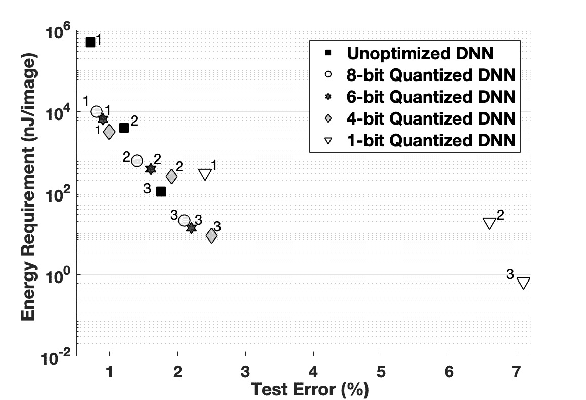

<!--yml

分类: 未分类

日期: 2024-09-06 20:01:58

-->

# [2003.11066] 《低功耗深度学习与计算机视觉方法综述》

> 来源：[`ar5iv.labs.arxiv.org/html/2003.11066`](https://ar5iv.labs.arxiv.org/html/2003.11066)

# 《低功耗深度学习与计算机视觉方法综述》

Abhinav Goel、Caleb Tung、Yung-Hsiang Lu 和 George K. Thiruvathukal2 {goel39, tung3, yunglu}@purdue.edu，gkt@cs.luc.edu，普渡大学电气与计算机工程学院 2 芝加哥洛约拉大学计算机科学系

###### 摘要

深度神经网络（DNNs）在许多计算机视觉任务中表现成功。然而，最准确的 DNNs 需要数百万个参数和操作，使其在能源、计算和内存方面的需求很高。这阻碍了大型 DNNs 在资源有限的低功耗设备上的应用。最近的研究通过减少内存需求、能耗和操作数量来改进 DNN 模型，而不会显著降低准确性。本文综述了低功耗深度学习和计算机视觉的进展，特别是在推理方面，并讨论了紧凑化和加速 DNN 模型的方法。这些技术可以分为四大类：（1）参数量化和剪枝，（2）压缩卷积滤波器和矩阵分解，（3）网络架构搜索，以及（4）知识蒸馏。我们分析了每类技术的准确性、优缺点及潜在解决方案。同时讨论了作为未来研究指南的新评估指标。

###### 索引词：

神经网络、计算机视觉、低功耗

## I 引言

深度神经网络（DNNs）广泛应用于对象检测、分类和分割等计算机视觉任务[1, 2]。DNNs 之所以称为“深度”，是因为它们由许多层组成，并且层之间有广泛的连接。这赋予了 DNNs 极大的可变性，可以通过训练进行精确推理。不幸的是，DNNs 也因而计算量大且耗能。VGG-16 [3] 在对单张图像进行分类时需要 150 亿次操作[4]。类似地，YOLOv3 处理一张图像时需要进行 390 亿次操作[5]。这些大量的计算需要显著的计算资源，并导致高能耗[6]。

这给 DNN 带来了一个问题：如何在低功耗嵌入式系统和移动设备上进行有意义的部署？这些机器通常受到电池电量的限制，或通过低电流 USB 连接获取能量[7]。它们通常也没有配备 GPU。将计算卸载到云端是一种解决方案[8]，但许多 DNN 应用需要在低功耗设备上进行，例如，在没有可靠网络覆盖的区域中飞行的无人机上部署的计算机视觉，或在卸载过于昂贵的卫星中[9]。

一些低功耗计算机视觉技术通过从 DNN 中去除冗余，将操作次数减少 75%，推理时间缩短 50%，同时*精度损失微乎其微*。为了在小型嵌入式计算机上部署 DNN，还需要更多这样的优化。因此，追求深度学习中的低功耗改进以实现高效推理是值得的，并且是一个不断增长的研究领域[10]。

本文调查了相关文献，并报告了低功耗计算机视觉的最新解决方案。我们特别关注低功耗 DNN 推理，而非训练，因为目标是实现高吞吐量。本文将低功耗推理方法分为四类：

1.  1.

    参数量化和剪枝：通过减少存储 DNN 模型参数所用的位数来降低内存和计算成本。

1.  2.

    压缩卷积滤波器和矩阵分解：将大型 DNN 层分解为较小的层，以减少内存需求和冗余矩阵操作的数量。

1.  3.

    网络架构搜索：自动构建不同层组合的 DNN，以找到实现期望性能的 DNN 架构。

1.  4.

    知识蒸馏：训练一个紧凑的 DNN，模仿一个计算量更大的 DNN 的输出、特征和激活。

表 I 总结了这些方法。本调查将重点关注上述软件基础的低功耗计算机视觉技术，而不考虑低功耗硬件优化（例如硬件加速器、脉冲 DNN）。本文利用现有文献中的结果来分析四种方法的优缺点，并提出潜在的改进建议。我们还建议增加一组评估指标，以指导未来的研究。

| 技术 | 描述 | 优点 | 缺点 |
| --- | --- | --- | --- |
| 量化和剪枝 | 降低精度/完全去除 DNN 中冗余的参数和连接。 | 小模型尺寸，*精度损失微乎其微*。高效的算术运算。 | 由于矩阵稀疏，难以在 CPU 和 GPU 上实现。高训练成本。 |
| 滤波器压缩和矩阵分解 | 减少 DNN 滤波器和层的大小以提高效率。 | 高准确性。与其他优化技术兼容。 | 紧凑的卷积可能在内存上效率低。矩阵分解计算成本高。 |
| 网络架构搜索 | 自动找到满足目标设备上性能和准确性要求的 DNN 架构。 | 具有前沿的准确性和低能耗。 | 训练成本极高。 |
| 知识蒸馏 | 利用较大 DNN 的知识训练较小的 DNN，以减小模型规模。 | 低计算成本，参数较少。 | 对 DNN 结构有严格的假设，仅适用于 softmax 输出。 |

表 I: 不同低功耗计算机视觉技术的比较。

## II 参数量化与剪枝

内存访问对 DNN 的能耗贡献显著[4, 11]。为了构建低功耗的 DNN，最近的研究关注了精度和内存访问次数之间的权衡。

### II-A 深度神经网络的量化

减少内存访问次数的一种方法是减少 DNN 参数的大小。一些方法[12, 13]显示，即使在减少 DNN 参数的精度时，也可能不会显著损失准确性。Courbariaux 等人[13]通过实验使用不同的定点格式存储参数，展示了减少比特宽度足以训练 DNN。图 1 比较了不同 DNN 架构在不同量化水平下的能量消耗和测试误差。在这里，随着参数比特宽度的减少，能量消耗降低，但测试误差增加。基于这些发现，LightNN[14], CompactNet[15], 和 FLightNN[11]在给定准确性约束的情况下，找到了 DNN 不同参数的最佳比特宽度。Moons 等人[16]也使用了具有不同整数格式参数的 DNN。Courbariaux 等人[17]和 Rastegari 等人[18]提出的二值化神经网络使用二进制参数和激活来训练 DNN。在二值化神经网络中，每个参数用单个位表示。由于精度大幅降低，这些 DNN 需要很多层才能获得高准确性。在图 1 中，对于给定的 DNN 架构，1 位量化（二值化神经网络）消耗的能量最少，但误差最大。为了提高二值化 DNN 的准确性，Zhou 等人[19]对反向传播梯度进行量化，以实现更好的训练收敛性。

通常，参数量化与压缩一起使用，以进一步减少 DNN 的内存需求。Han 等人[4]首先将参数量化为离散的桶，然后使用霍夫曼编码压缩这些桶，将模型大小减少约 89%，而准确性几乎没有损失。类似地，HashedNet[20]将 DNN 连接量化为哈希桶，使所有分组到同一哈希桶的连接共享一个参数。然而，由于这些技术具有较高的训练成本，其采用受到限制。

优点：当参数的位宽降低时，DNN 的预测性能保持不变 [13, 21]。这是因为约束参数在训练过程中具有正则化效应。此外，在为 DNN 设计定制硬件时，量化允许将功耗高的乘加操作替换为移位 [15] 或 XNOR [18] 操作，从而减少电路面积和能量需求。缺点和潜在改进：采用量化技术的 DNN 需要多次重新训练，使得训练过程非常昂贵 [19]。必须降低训练成本，以使这些技术更加实用。此外，DNN 中不同层对不同特征的敏感性不同。对所有层使用恒定的位宽可能导致性能不佳 [11]。为了为 DNN 的每个连接选择不同的参数精度（取决于其对输出的重要性），精度值可以以可微分的方式表示并纳入训练过程中。因此，在训练过程中，每个连接将学习其参数值和参数精度。

图 1：MNIST 数据集上不同量化级别的 DNNs 的帕累托分析。左下角较好，因为它表示低能耗和较小的误差。数据点上的注释 ^(1,2,3) 代表了实验中使用的每种量化技术对应的三种不同 DNN 架构 [15]。

### II-B 剪枝参数和连接

从 DNNs 中删除不重要的参数和连接可以减少内存访问的次数。Hessian 加权失真度量可以用来识别 DNN 中参数的重要性 [22]。一些技术 [23, 24] 使用这一度量来去除冗余参数并减小 DNN 的大小。这些基于度量的剪枝方法仅在全连接层上操作。

| 方法 | LeNet 5 |
| --- | --- |

&#124; LeNet &#124;

&#124; 300-100 &#124;

| AlexNet | VGG-16 |
| --- | --- |

&#124; 训练 &#124;

&#124; 时间 &#124;

|

| --- | --- | --- | --- | --- | --- |
| --- | --- | --- | --- | --- | --- |
| 未优化 | 1.000 | 1.000 | 1.000 | 1.000 | 1.000 |
| P | 0.080 | 0.080 | 0.090 | 0.075 | 4.000 |
| P+Q | 0.031 | 0.030 | 0.037 | 0.032 | 6.000 |
| P+Q+C | 0.025 | 0.025 | 0.028 | 0.020 | 6.000 |

表 II：不同 DNNs 的模型压缩率比较 [4]。注意，随着模型压缩的增加，训练时间也会增加。P: 剪枝，Q: 量化，C: 压缩。

为了将剪枝扩展到卷积层，Anwar 等人 [25] 使用粒子过滤器来定位剪枝候选。Polyak 等人 [26] 使用样本输入数据并剪枝稀疏激活的连接。Han 等人 [27] 使用新的损失函数来学习 DNN 中的参数和连接。Yu 等人 [28] 使用一种算法来传播重要性评分，以衡量每个参数相对于最终输出的重要性。通过进行剪枝、量化和编码，Deep Compression [4] 将模型大小减少了 $95\%$。树状层次 DNN 中也可以看到路径级剪枝 [29, 30]。尽管这些技术能够识别不重要的连接，但它们会在 DNN 中产生不必要的稀疏性。稀疏矩阵需要特殊的数据结构（在深度学习库中不可用），并且难以映射到现代 GPU 上。为了克服这个问题，一些方法 [31, 32] 重点在于构建具有稀疏性约束的剪枝 DNN。

优势：如在 TABLE II 中所示，剪枝可以与量化和编码结合，以实现显著的性能提升。当这三种技术一起使用时，VGG-16 模型的大小减少到原始大小的 $2\%$。此外，剪枝减少了 DNN 的复杂性，从而减少了过拟合。劣势及潜在改进：与 DNN 剪枝相关的训练工作量相当大，因为 DNN 必须进行多次剪枝和训练。TABLE II 显示，当同时使用剪枝和量化时，训练时间增加了 600%。当 DNN 在具有稀疏性约束的情况下进行剪枝时，这一问题更加严重 [33]。此外，只有在使用自定义硬件或特殊数据结构来处理稀疏矩阵 [33] 时，才能注意到剪枝的优势。通道级剪枝是对现有连接级剪枝技术的潜在改进，因为它可以在没有任何特殊数据结构的情况下进行，并且不会产生意外的矩阵稀疏性。通过开发技术来自动识别不重要的通道，可以在没有显著训练开销的情况下进行通道级剪枝。

## III 卷积滤波器压缩与矩阵分解

卷积操作在深度神经网络（DNN）的计算中占据了主要部分，而全连接层在像 AlexNet [32] 这样的 DNN 中含有大约 89% 的参数。为了减少 DNN 的功耗，研究者们集中于减少卷积层中的计算量以及全连接层中的参数数量。

### III-A 卷积滤波器压缩

| 方法 |
| --- |

&#124; ImageNet &#124;

&#124; Top-1 准确率 &#124;

|

&#124; 数量 &#124;

&#124; 参数 &#124;

|

&#124; 数量 &#124;

&#124; 操作数 &#124;

|

| --- | --- | --- | --- |
| --- | --- | --- | --- |
| AlexNet [34] | 57.20% | 60.00 M | 727 M |
| SqueezeNet 1.0 [35] | 57.50% | 1.24 M | 837 M |
| SqueezeNet 1.1 [35] | 58.00% | 1.24 M | 360 M |
| MobileNet v3 Large [36] | 75.20% | 5.40 M | 219 M |
| MobileNet v3 Small [36] | 67.40% | 2.50 M | 56 M |
| ShiftNet-A [37] | 70.10% | 4.10 M | 1,400 M |
| Shift Attention Layer [38] | 71.00% | 3.30 M | 538 M |

表 III：卷积滤波器压缩技术的比较（准确率、参数数量和操作数）。

较小的卷积滤波器相对于较大的滤波器具有显著较少的参数和较低的计算成本。例如，1$\times$1 滤波器的参数只有 3$\times$3 滤波器的 11%。然而，去除所有大型卷积层会影响 DNN 的平移不变性属性，并降低其准确性 [39]。一些研究通过识别和用较小的滤波器替换冗余滤波器来加速 DNN。SqueezeNet [35] 就是一种利用三种策略将 $3\times 3$ 卷积转换为 $1\times 1$ 卷积以减少参数数量的技术。表 III 比较了不同卷积滤波器压缩技术的性能：SqueezeNet 的参数比 AlexNet 少 98%（$1-\frac{1.24}{60}$），但代价是操作数增多。MobileNets [36] 和 SqueezeNet 1.1 同时减少了操作数和参数数量 [10]。MobileNets 通过使用深度可分卷积和瓶颈层来减少计算量、延迟和参数数量。MobileNets 通过保持小的特征尺寸并仅在执行深度可分卷积时扩展到更大的特征空间，从而实现高准确率。

优点：瓶颈卷积滤波器显著减少了深度神经网络（DNN）的内存和延迟需求。对于大多数计算机视觉任务，这些技术能获得**最先进**的准确度。滤波器压缩与剪枝和量化技术正交，这三种技术可以结合使用，以进一步降低能耗。缺点和潜在改进：已经证明，$1\times 1$ 卷积在小型 DNN 中计算开销较大，且导致较差的准确性 [40]。实现深度可分离卷积也很困难，因为它们的算术强度（操作次数与内存访问的比率）过低，无法有效利用硬件 [37]。通过更有效地管理内存，可以增加深度可分离卷积的算术强度。通过优化缓存中参数的空间和时间局部性，可以减少内存访问次数。

### III-B 矩阵分解

张量分解和矩阵分解将 DNN 操作表示为加和乘积形式以加速 [41, 42]。这些技术将多维张量（在卷积层和全连接层中）分解为更小的矩阵，以消除冗余计算。一些分解方法使 DNN 加速高达 4$\times$，因为它们创建了稠密的参数矩阵，避免了非结构化稀疏乘法的局部性问题 [33]。为了最小化准确性损失，矩阵分解是逐层进行的。对一层的参数进行分解后，随后的层基于某些重建误差进行分解。逐层优化方法使得将这些技术扩展到大型 DNN 时变得困难，因为分解超参数的数量随着 DNN 深度的增加而呈指数增长。为了在大型 DNN 中应用这些方法，Wen 等人 [33] 强制使用紧凑的卷积核形状和深度结构，以减少分解超参数的数量。

有多种矩阵分解技术。Kolda 等人 [43] 证明，大多数分解技术可以应用于 DNN 以加速其运算。然而，一些技术不一定提供最佳的准确率和计算复杂度之间的权衡 [43]。在准确率方面，标准多项式分解 (CPD) 和批量归一化分解 (BMD) 是表现最好的分解方法，而 Tucker-2 分解和奇异值分解 (SVD) 的准确率较差 [44, 45]。CPD 比 BMD 更加压缩 DNN，从而使 DNN 的加速效果更大。BMD 获得的准确率高于 CPD。此外，CPD 相关的优化问题有时难以解决，使得分解变得不可能 [45]。另一方面，BMD 是一种稳定的分解方法，总是存在的。

优势：矩阵分解方法可以降低 DNN 的计算成本。相同的分解方法可以同时用于卷积层和全连接层。使用 CPD 和 BMD 时，性能提升显著，且准确率损失较小。缺点和潜在改进：由于缺乏理论理解，很难解释为什么某些分解（例如 CPD 和 BMD）能够获得高准确率，而其他分解（例如 Tucker-2 分解和 SVD）则无法做到这一点。此外，矩阵分解的计算成本往往抵消了减少操作所带来的性能提升。矩阵分解在大型 DNN 中实施也很困难，因为训练时间随着深度的增加呈指数增长。高训练时间主要归因于寻找正确分解超参数的搜索空间很大。可以将超参数包含在训练过程中，并通过学习加速大型 DNN 的训练，而不是在整个空间中搜索。

## IV 网络架构搜索

在设计低功耗计算机视觉应用时，需要考虑许多不同的 DNN 架构和优化技术。当存在多种架构选择时，手动找到适合特定任务的最佳 DNN 往往是困难的。网络架构搜索（NAS）是一种自动化 DNN 架构设计的技术。NAS 使用一个递归神经网络（RNN）控制器，并通过强化学习来构建候选 DNN 架构。这些候选架构会被训练，然后用验证集进行测试。验证准确率作为奖励函数用于优化控制器的下一个候选架构。NASNet [46]和 AmoebaNet [47]展示了 NAS 在获得最先进的准确率方面的有效性。为了自动找到适合移动设备的高效 DNN，Tan 等人 [48]提出了 MNasNet。这项技术在控制器中使用多目标奖励函数，以寻找一个在目标移动设备上满足准确率和延迟（部署时）的 DNN 架构。MNasNet 比 NASNet 快$2.3\times$，参数减少$4.8\times$，操作减少$10\times$。此外，MNasNet 的准确率也优于 NASNet。尽管结果显著，但大多数 NAS 算法计算成本极高，需要为单一任务训练数千个候选架构。MNasNet 需要 50,000 个 GPU 小时才能在 ImageNet 数据集上找到一个高效的 DNN 架构。

为了降低与 NAS 相关的计算成本，一些研究者提出基于代理任务和奖励来搜索候选架构，例如使用较小的数据集（如 CIFAR-10）或用 DNN 参数的数量来近似设备延迟。FBNet [49]是一种利用代理任务（在较小数据集上优化）来寻找高效架构的技术，比 MNasNet 快$420\times$。Cai 等人 [50]表明，在代理任务上优化的 DNN 架构并不能保证在目标任务上最优，特别是当像延迟这样的硬件指标通过操作数量或参数数量来近似时。他们还提出了 Proxyless-NAS 以克服基于代理的 NAS 解决方案的限制。Proxyless-NAS 使用路径级剪枝来减少候选架构的数量，并采用基于梯度的方法处理像延迟这样的目标，以在大约 300 个 GPU 小时内找到一个高效的架构。一种叫做 Single-Path NAS [51]的技术将架构搜索时间缩短至 4 小时。这种加速以准确率降低为代价。

优势：NAS 自动在准确性、内存和延迟之间平衡，通过搜索所有可能架构的空间而无需人工干预。NAS 在许多移动设备上实现了在准确性和能效方面的最先进性能。劣势与潜在改进：NAS 算法的计算需求使得搜索针对大型数据集优化的架构变得困难。为了找到符合性能要求的架构，每个候选架构必须经过训练（以检查准确性）和在目标设备上运行（以检查延迟/能量）以生成奖励函数。训练和测量每个候选架构性能所花费的时间是显著的——这导致了高计算成本。为了减少训练时间，可以并行训练候选 DNN，使用数据的不同子集。从不同数据子集获得的梯度可以合并以生成一个训练好的 DNN。然而，这种并行训练技术通常会导致较低的准确性。可以通过使用自适应学习率来提高准确性，同时保持高收敛速度。

## 知识转移与蒸馏

大型 DNN 比小型 DNN 更准确，因为更多的参数使得大型 DNN 能够学习复杂的函数[52]。使用传统的反向传播算法训练小型 DNN 学习这些复杂函数是具有挑战性的。然而，一些方法通过使小型 DNN 模仿大型预训练 DNN 来训练小型 DNN 学习复杂函数。这些技术通过一种称为知识转移（KT）的过程，将大型 DNN 的“知识”转移到小型 DNN 上。一些早期利用 KT 的技术[53, 54] 已广泛用于执行 DNN 压缩。在这里，小型 DNN 在大型 DNN 标记的数据上进行训练，以学习复杂函数。这些技术的关键思想是，大型 DNN 标记的数据包含了对小型 DNN 有用的很多信息。例如，如果大型 DNN 对单个输入图像输出多个类别的中等高概率，这可能意味着这些类别可能共享一些视觉特征。通过迫使小型 DNN 模仿这些概率，小型 DNN 学到的内容比训练数据中提供的更多[55]。

Hinton 等人[56]提出了另一类技术，称为知识蒸馏（KD），其训练过程显著简单于基于 KT 的技术。在他们的工作中，小型 DNN 采用学生-教师模式进行训练。小型 DNN 是学生，专门的 DNN 集合是教师。通过训练学生模仿教师的输出，作者展示了小型 DNN 可以在一定的精度损失下执行集合的任务。为了提高小型 DNN 的准确性，Li 等人[57]最小化了教师和学生之间特征向量的欧几里得距离。类似地，FitNet[58]通过使学生的每一层模仿教师中的特征图来构建小型和稀疏的 DNN。然而，Li 等人[57]和 FitNet[58]中使用的度量需要对学生的结构做出严格假设，并不足以构建能源高效的学生 DNN。为了解决这个问题并提高泛化能力，Peng 等人[59]在训练过程中利用度量之间的相关性作为优化问题。

优势：基于 KT 和 KD 的技术可以显著减少大型预训练 DNN 的计算成本。先前的研究表明，KD 中使用的概念也可以应用于计算机视觉之外[55]（例如，半监督学习、领域适应等）。劣势和潜在改进：KD 通常对学生和教师的结构和大小有严格的假设，使其难以推广到所有应用。此外，目前的 KD 技术过于依赖 softmax 输出，并且不适用于不同的输出层。学生可以学习神经元激活的顺序，而不是仅仅模仿教师的神经元和层的输出。这去除了学生和教师具有相同 DNN 结构的要求（从而提高了泛化能力）并减少了对 softmax 输出层的依赖。

## VI 讨论

### VI-A 低功耗计算机视觉的指南

没有单一的技术可以构建高效的计算机视觉 DNN。大多数技术是互补的，可以一起使用以提高能源效率。我们包括一些用于低功耗计算机视觉的通用指南。

1.  1.

    量化和减少参数精度显著降低了模型的大小和算术运算的复杂性，但不幸的是，在大多数机器学习库中，手动实现量化是困难的。NVIDIA 的 TensorRT 库提供了这样的优化接口。

1.  2.

    在优化大型预训练深度神经网络（DNNs）时，剪枝和模型压缩是有效的选项。

1.  3.

    在从零开始训练新的 DNN 时，应使用压缩卷积滤波器和矩阵分解来减少模型的大小和计算量。

1.  4.

    NAS 寻找为特定设备优化的 DNN，并提供性能保证。具有多个分支的 DNN（例如 Proxyless-NAS、MNasNet 等）通常需要在 GPU 和 CPU 上进行昂贵的内核启动和同步。

1.  5.

    知识蒸馏应与小型或中型数据集一起使用。这是因为对学生和教师的 DNN 架构的假设较少，从而提高了准确性。

### VI-B 评估指标

计算机视觉的低功耗 DNN 需要在准确性之外的更多方面进行评估。我们列出了应该考虑的一些主要指标。

1.  1.

    测试准确性应在大型数据集上进行评估，如 ImageNet、CIFAR、COCO 等。如果训练数据集较小，则需要进行 K 折交叉验证。

1.  2.

    参数数量通常与 DNN 的内存需求相关。使用量化和剪枝技术时，比较这两个指标很重要。

1.  3.

    应评估操作数量以确定计算成本。使用低精度 DNN 时，每个操作的成本会降低。在这种情况下，还需测量能耗。

1.  4.

    参数和操作的数量并不总是与 DNN 的能耗成正比[10]。要找到能耗，应将 DNN 部署在连接到功率计的设备上。

## VII 总结与结论

DNN 是执行许多计算机视觉任务的强大工具。然而，由于性能最佳（最准确）的 DNN 是为计算资源充足的情况设计的，因此很难在嵌入式和移动设备上部署。已经有大量研究集中在减少这些 DNN 的能耗，以最小的准确性损失，使其更适合低功耗设备。本文综述了低功耗计算机视觉的研究现状，并识别出四类技术：量化与剪枝、滤波器压缩与矩阵分解、网络架构搜索和知识蒸馏。这些技术各有优缺点，没有明显的胜者。对最先进的低功耗技术的持续研究将使计算机视觉能够在未来嵌入式和移动设备上部署。

## 参考文献

+   [1] Z. Zhao 等人. “使用深度学习进行物体检测：综述” 见 *IEEE TNNLS* 30.11, 2019, pp. 3212–3232

+   [2] X. Liu 等人. “语义图像分割的近期进展” 见 *arXiv:1809.10198*, 2018

+   [3] K. Simonyan 等人. “用于大规模图像识别的超深卷积网络” 见 *arXiv:1409.1556*

+   [4] S. Han 等人. “深度压缩：通过剪枝、训练量化和霍夫曼编码压缩深度神经网络” 见 *arXiv:1510.00149*, 2016

+   [5] J. Redmon 等人. “你只看一次：统一的实时物体检测” 见 *2016 IEEE CVPR*

+   [6] D. T. Nguyen 等人。“YOLO CNN 对象检测的高吞吐量和节能 FPGA 实现” 发表在 *2019 IEEE VLSI 系统期刊*

+   [7] A. Mohan 等人。“2030 年的视频物联网：一个充满摄像头的世界” 发表在 *2017 IEEE ISCA*

+   [8] K. Kumar 等人。“移动用户的云计算：卸载计算能节省能量吗？” 发表在 *2010 计算机*

+   [9] S. Anup 等人。“用于自动室内/室外导航的视觉定位系统” 发表在 *2017 IEEE TENCON*

+   [10] S. Alyamkin 等人。“低功耗计算机视觉：现状、挑战和机遇” 发表在 *2019 IEEE JETCAS*

+   [11] R. Ding 等人。“FLightNNs：用于快速和准确推断的轻量化量化深度神经网络” 发表在 *2019 ACM DAC*

+   [12] N. Wang 等人。“使用 8 位浮点数训练深度神经网络” 发表在 *2018 NeurIPS*，第 7675–7684 页

+   [13] M. Courbariaux 等人。“使用低精度乘法训练深度神经网络” 发表在 *arXiv:1412.7024*，2015

+   [14] R. Ding 等人。“LightNN：填补传统深度神经网络与二值化网络之间的差距” 发表在 *2017 GGVLSI*，第 35–40 页

+   [15] A. Goel 等人。“CompactNet：为片上实现优化的高精度深度神经网络” 发表在 *2018 IEEE Big Data*

+   [16] B. Moons, Koen Goetschalckx, Nick Van Berckelaer 和 Marian Verhelst “最小能量量化神经网络” 发表在 *arXiv:1711.00215*，2017

+   [17] M. Courbariaux 等人。“二值化神经网络：训练权重和激活值受限于 +1 或 -1 的深度神经网络” 发表在 *arXiv:1602.02830 [cs]*，2016

+   [18] M. Rastegari, Vicente Ordonez, Joseph Redmon 和 Ali Farhadi “XNOR-Net：使用二值化卷积神经网络进行 ImageNet 分类” 发表在 *arXiv:1603.05279*，2016

+   [19] S. Zhou 等人。“DoReFa-Net：使用低位宽梯度训练低位宽卷积神经网络” 发表在 *arXiv:1606.06160*，2018

+   [20] W. Chen 等人。“使用哈希技巧压缩神经网络” 发表在 *arXiv:1504.04788*，2015

+   [21] P. Merolla 等人。“深度神经网络对权重二值化和其他非线性失真具有鲁棒性” 发表在 *arXiv:1606.01981*，2016

+   [22] Y. Choi 等人。“网络量化的极限” 发表在 *arXiv:1612.01543*，2017

+   [23] Y. LeCun 等人。“最佳脑损伤” 发表在 *1990 NeurIPS*

+   [24] B. Hassibi 等人。“最佳脑外科医生和一般网络剪枝” 发表在 *1993 IEEE 神经网络国际会议*

+   [25] S. Anwar 等人。“深度卷积神经网络的结构化剪枝” 发表在 *arXiv:1512.08571*，2015

+   [26] A. Polyak 等人。“深度人脸表示的通道级加速” 发表在 *2015 IEEE Access*，第 2163–2175 页

+   [27] S. Han 等人。“学习权重和连接以实现高效神经网络” 发表在 *2015 NeurIPS*，第 1135–1143 页

+   [28] R. Yu 等人。“NISP：使用神经元重要性评分传播修剪网络” 发表在 *2018 IEEE CVPR*

+   [29] V. Peluso 等人。“用于多层分类的可扩展卷积网络” 发表在 *2018 IEEE/ACM ICCAD*，第 1–8 页

+   [30] J. Deng 等. “快速和平衡：大规模对象识别的高效标签树学习” 见 *2011 NeurIPS*

+   [31] H. Li 等. “为了高效的卷积网络修剪滤波器” 见 *arXiv:1608.08710 [cs]*, 2016

+   [32] H. Zhou 等. “少即是多：面向紧凑型 CNN” 见 *2016 ECCV*, 第 662–677 页

+   [33] W. Wen 等. “在深度神经网络中学习结构化稀疏性” 见 *2016 NeurIPS*, 第 2074–2082 页

+   [34] A. Krizhevsky 等. “使用深度卷积神经网络进行 ImageNet 分类” 见 *2012 NeurIPS*

+   [35] F. N. Iandola 等. “SqueezeNet：AlexNet 级别的准确性，参数减少 50 倍，模型大小小于 0.5MB” 见 *arXiv:1602.07360*, 2016

+   [36] A Howard 等. “寻找 MobileNetV3” 见 *arXiv:1905.02244*, 2019

+   [37] B. Wu 等. “Shift：一种零 FLOP、零参数的空间卷积替代方案” 见 *arXiv:1711.08141*, 2017

+   [38] G. B. Hacene 等. “基于注意力的 Shift 网络修剪” 见 *arXiv:1905.12300*, 2019

+   [39] H. Li 等. “深度神经网络中的多偏差非线性激活” 见 *arXiv:1604.00676*, 2016

+   [40] X. Zhang 等. “ShuffleNet：一种极其高效的移动设备卷积神经网络” 见 *arXiv:1707.01083*, 2017

+   [41] M. Jaderberg 等. “通过低秩扩展加速卷积神经网络” 见 *arXiv:1405.3866*, 2014

+   [42] E. Denton 等. “利用卷积网络中的线性结构进行高效评估” 见 *2014 NeurIPS*

+   [43] T.G. Kolda 等. “张量分解及其应用” 见 *SIAM Review*, 2009, 第 455–500 页

+   [44] K. Hayashi, Taiki Yamaguchi, Yohei Sugawara 和 Shin-ichi Maeda “探索卷积神经网络中的未探索张量网络分解” 见 *2019 NeurIPS*, 第 5553–5563 页

+   [45] C. Tai 等. “具有低秩正则化的卷积神经网络” 见 *arXiv:1511.06067*, 2016

+   [46] B. Zoph 等. “学习可迁移架构以实现可扩展的图像识别” 见 *arXiv:1707.07012*, 2018

+   [47] E. Real 等. “图像分类器架构搜索的正则化进化” 见 *arXiv:1802.01548*, 2019

+   [48] M. Tan 等. “MnasNet：面向移动的平台感知神经网络架构搜索” 见 *arXiv:1807.11626*, 2019

+   [49] B. Wu 等. “FBNet：通过可微分神经网络架构搜索进行硬件感知的高效卷积网络设计” 见 *arXiv:1812.03443*, 2019

+   [50] H. Cai 等. “ProxylessNAS：在目标任务和硬件上直接进行神经网络架构搜索” 见 *arXiv:1812.00332*, 2019

+   [51] D. Stamoulis 等. “单路径 NAS：在不到 4 小时内设计硬件高效的卷积网络” 见 *arXiv:1904.02877*, 2019

+   [52] Y. Bengio 等. “表示学习：综述与新视角” 见 *arXiv:1206.5538*, 2014

+   [53] J. Ba 等. “深度网络真的需要深度吗？” 见 *2014 NeurIPS*

+   [54] C. Bucilua 等. “模型压缩” 见 *2006 ACM 国际知识发现与数据挖掘大会*

+   [55] J. H. Cho 等. “知识蒸馏的有效性” 见 *arXiv:1910.01348*, 2019

+   [56] G. Hinton 等. “提取神经网络中的知识” 见 *arXiv:1503.02531*, 2015

+   [57] Q. Li 等人。“模仿非常高效的目标检测网络”发表于 *2017 IEEE CVPR*，第 7341–7349 页

+   [58] A. Romero 等人。“FitNets：细薄深度网络的提示”发表于 *arXiv:1412.6550*，2015 年

+   [59] B. Peng 等人。“用于知识蒸馏的相关性一致性”发表于 *2019 ICCV*
