<!--yml

类别: 未分类

日期: 2024-09-06 20:01:56

-->

# [2003.11755] 深度学习在科学发现中的调查

> 来源：[`ar5iv.labs.arxiv.org/html/2003.11755`](https://ar5iv.labs.arxiv.org/html/2003.11755)

# 深度学习在科学发现中的调查

Maithra Raghu^(1,2)   Eric Schmidt^(1,3)

¹ 谷歌

² 康奈尔大学

³ Schmidt Futures Correspondence to maithrar@gmail.com

###### 摘要

在过去几年中，我们在机器学习的核心问题上取得了根本性的突破，这主要得益于深度神经网络的进展。与此同时，各种科学领域收集的数据量在规模和复杂性上都在显著增加。这些因素结合在一起，暗示了深度学习在科学环境中应用的许多令人兴奋的机会。但一个重要的挑战是如何开始。不同深度学习技术的广泛性和多样性使得确定哪些科学问题最适合这些方法，或哪种特定的方法组合可能提供最有前景的初步解决方案变得困难。在这项调查中，我们专注于解决这一核心问题，提供了许多广泛使用的深度学习模型的概述，涵盖视觉、序列和图结构数据，相关任务和不同训练方法，以及使用少量数据的深度学习技术和更好地解释这些复杂模型的技术——这是许多科学应用中的两个核心考虑因素。我们还包括了完整设计过程的概述、实施技巧和大量教程、研究总结及开源深度学习管道和预训练模型的链接，这些都是由社区开发的。我们希望这项调查能加速深度学习在不同科学领域的应用。

## 1 引言

过去几年见证了使用深度神经网络的机器学习领域的非凡进展。这些神经网络模型和算法在可用数据和计算资源迅速增加的推动下取得了显著发展，并且成为解决从语音识别 [70, 167] 到计算机视觉中复杂任务如图像分类、（实例）分割、动作识别 [117, 78, 240] 以及自然语言中的核心问题，包括问答、机器翻译和总结 [186, 172, 233, 197] 的基本技术。许多这些核心任务（经过适当重新表述）与更广泛的领域相关，特别是在帮助调查核心科学问题方面具有巨大潜力。

然而，开始使用深度学习的一个重大障碍就是不知道从何开始。大量的研究文献，加上众多的基础模型、任务和训练方法，使得确定哪些技术可能最适合尝试或如何开始实施变得非常困难。

本调查的目标是帮助解决这一核心挑战。具体而言，它具有以下特点：

+   •

    调查概述了一组高度多样化的深度学习概念，从适用于各种数据模态的深度神经网络模型（用于视觉数据的 CNN、图神经网络、用于序列数据的 RNN 和 Transformers）到许多不同的关键任务（图像分割、超分辨率、序列到序列映射等）以及多种训练深度学习系统的方法。

+   •

    但这些技术的解释相对较高层次且简洁，以确保核心思想对广泛受众可及，并且整份调查报告可以轻松阅读。

+   •

    从支持科学应用的角度来看，调查详细描述了（i）使用较少数据进行深度学习的方法（自监督学习、半监督学习等）和（ii）可解释性和表示分析的技术（超越预测任务）。这两个领域是令人兴奋且迅速发展的研究领域，对潜在的科学应用案例也具有重要意义。

+   •

    调查还侧重于帮助快速上手实施，除了对整个深度学习设计过程的概述和一节关于实施技巧的内容（第九部分），调查中还包含了大量开源代码、研究总结和社区开发的教程参考，包括专门为此设置的完整章节（第三部分）。

这份调查报告的目标受众是谁？我们希望这份调查报告对那些有基本机器学习知识的人尤其有帮助，他们感兴趣于（i）获得对许多基础深度学习概念的全面但易于理解的概述，以及（ii）参考和指导以帮助加快实施。除了深度学习的核心领域外，调查还重点关注在较少数据下开发深度学习系统的方法，以及解释这些模型的技术，我们希望这些对那些希望将这些技术应用于科学问题的人特别有用。然而，这些主题及其他许多内容，以及众多代码/教程/论文参考，可能对任何希望学习和实施深度学习的人都有帮助。

### 1.1 调查大纲

调查报告的结构如下：

+   •

    第二部分从使用深度学习的一些高层次考虑开始。具体而言，我们首先讨论深度学习在科学领域的应用模板方式，然后是对整个深度学习设计过程的概述，最后简要讨论其他可能更适合某些问题的核心机器学习技术。第一部分可能对那些考虑科学应用的读者特别感兴趣，而后两部分则可能具有一般兴趣。

+   •

    第三部分提供了教程、开源代码模型/算法实现的参考，以及由深度学习社区开发的包含研究论文摘要的网站。此节对许多读者非常有帮助，我们鼓励浏览提供的链接。

+   •

    第四部分概述了深度学习中的许多标准任务和模型，包括卷积网络及其多种用途、图神经网络、序列模型（RNNs、Transformers）以及许多相关的序列任务。

+   •

    第五部分探讨了一些关键的监督学习训练过程变体，如迁移学习、领域适应和多任务学习。这些方法对许多成功的深度学习应用至关重要。

+   •

    第六部分考虑了提高开发深度神经网络模型的数据效率的方法，这是一个快速发展的研究领域，也是许多应用，包括科学领域的核心考虑因素。该节涵盖了自监督和半监督学习的多种变体，以及数据增强和数据去噪。

+   •

    第七部分概述了在可解释性和表示分析方面的进展，这是一组技术，专注于深入了解端到端系统的内部：识别数据中的重要特征、理解其对模型输出的影响以及发现模型隐藏表示的属性。这些对许多强调理解而非预测准确性的科学问题非常重要，也可能对例如帮助模型调试和预先识别故障模式等更广泛的应用感兴趣。

+   •

    第八部分简要概述了更先进的深度学习方法，特别是生成建模和强化学习。

+   •

    第九部分总结了构建端到端深度学习系统时的一些关键实施技巧，我们建议快速浏览一下！

## 深度学习的高层次考虑因素

在本节中，我们首先讨论深度学习技术的一些高层次考虑因素。我们从深度学习在科学环境中应用的模板方式概述开始，接着讨论端到端设计过程，并简要介绍一些可能更适合某些问题的其他机器学习方法。

### 2.1 科学环境中的深度学习模板

我们可能在科学环境中应用深度学习技术的一般方式有哪些？从非常高的层次来看，我们可以提供一些深度学习可能应用于这些问题的模板：

+   (1)

    预测问题 无疑，应用深度学习的最直接方式是用它来解决重要的预测问题：将输入映射到预测输出。这种预测性使用案例通常也是深度学习在计算和机器学习核心问题中的使用方式。例如，输入可能是一张活检图像，模型必须输出是否该图像中的组织显示出癌症迹象的预测。我们也可以将这种预测使用案例看作是让模型学习一个目标函数，在我们的例子中，就是将输入视觉特征映射到癌症/无癌症的输出。以这种方式使用深度学习还涵盖了目标函数非常复杂的情况，没有数学封闭形式或逻辑规则来描述如何从输入到输出。例如，我们可能使用深度学习模型来（黑箱）模拟一个复杂的过程（例如气候建模），这个过程很难明确建模[101]。

+   (2)

    从预测到理解 科学问题和核心机器学习问题之间的一个根本区别在于前者强调理解基础机制。单独输出准确的预测往往是不够的。相反，我们希望深入了解数据或数据生成过程的哪些属性导致了观察到的预测或结果。为了获得这些洞察，我们可以借助深度学习中的可解释性和表示分析方法，这些方法关注于确定神经网络模型如何做出特定预测。已经有大量工作致力于理解输入特征对输出预测的关键性，以及直接分析神经网络模型的隐藏表示的技术，这些技术可以揭示基础数据的重要属性。

+   (3)

    输入数据的复杂变换 在许多科学领域，生成的数据量，特别是视觉数据（例如荧光显微镜、空间测序、标本视频[177, 97]）急剧增加，迫切需要高效的分析和自动化处理。深度学习技术能够对数据进行多种复杂变换，适用于这些场景。例如，可以使用基于深度神经网络的分割模型自动识别细胞图像中的细胞核，或者使用姿态估计系统快速标记小鼠视频中的行为，以进行神经科学分析。

### 2.2 深度学习工作流程

在这些深度学习应用科学的模板示例之后，我们接下来查看设计深度学习系统的端到端工作流程。图 1 说明了典型工作流程的可能样子。

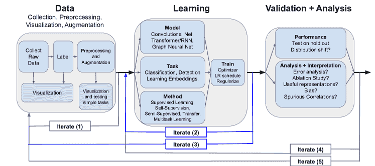

图 1：典型深度学习工作流程的示意图。深度学习应用的典型开发过程可以分为三个连续阶段：(i) 数据相关步骤 (ii) 学习组件 (iii) 验证和分析。这些阶段中的每一个都有多个子步骤和相关技术，如图中所示。在本调查中，我们将概述学习组件中的大多数技术，以及数据和验证阶段的一些技术。请注意，尽管自然的顺序是首先完成数据阶段的步骤，然后是学习阶段，最后是验证阶段，但标准开发过程通常会导致多个不同的迭代，其中一个阶段使用的技术或做出的选择会基于后续阶段的结果进行调整。

选择了感兴趣的总体（预测）问题后，我们可以大致将深度学习系统的设计和使用分为三个阶段：（i）数据相关步骤，例如收集、标注、预处理、可视化等；（ii）学习集中步骤，例如深度神经网络模型的选择、任务及训练模型的方法；（iii）验证和分析步骤，其中对保留数据进行性能评估，以及对隐藏表示的分析和整体方法的消融研究。

这三个阶段自然是顺序进行的。然而，几乎所有情况下，首次构建端到端深度学习系统时都会出现某种失败模式。为了解决这些问题，重要的是要牢记设计过程的迭代性质，不同阶段的结果将指导其他阶段的重新设计和重新运行。

图 1 提供了一些常见迭代的示例，带有向后的连接箭头：（i）迭代（1）箭头，对应于数据收集过程中的迭代，例如在进行一些数据可视化后，原始实例的标注过程可能需要调整——初始标注机制可能过于嘈杂，或未能捕捉到感兴趣的目标；（ii）迭代（2）箭头，对应于学习设置的迭代，例如决定不同的任务或方法可能更为合适，或将学习过程分解为多个步骤——首先进行自监督学习，然后进行监督学习；（iii）迭代（3）箭头，根据学习步骤的结果更改数据相关步骤；（iv）迭代（4）箭头，基于验证结果重新设计学习过程，例如发现模型在验证时过拟合训练数据，因此减少训练时间或使用更简单的模型；（v）迭代（5）箭头，根据验证/分析结果调整数据步骤，例如发现模型依赖于数据的虚假属性，从而改善数据收集/策划以减轻此问题。

##### 调查重点和术语

在本次调查中，我们提供了学习阶段许多技术的全面概述，以及一些数据和验证阶段的技术（例如数据增强、可解释性和表示分析，见 7）。

在学习阶段，我们会查看流行的模型、任务和方法。模型（有时也称为架构）指的是深度神经网络的实际结构——有多少层、哪种类型以及多少个神经元等。任务指的是预测问题的类型，具体来说，输入和输出的类型。例如，在图像分类任务中，输入由图像组成，输出是对一组（离散的）不同类别（称为类别）的概率分布。方法指的是用于训练系统的学习过程类型。例如，监督学习是一种非常通用的学习过程，神经网络被提供数据实例及其对应的标签，这些标签提供了监督。

与不同的模型和任务不同，方法可以是其他方法的子集。例如，自监督学习是一种方法，其中神经网络在数据实例和标签上进行训练，但标签是从数据实例自动生成的，这也可以被视为一种监督学习。这可能有点混乱！但记住模型、任务和方法的一般概念就足够了。

### 2.3 深度学习还是其他方法？

在深入不同的深度学习技术之前，最后一点要说明的是，在制定问题时，考虑深度学习是否提供了合适的工具来解决问题是非常重要的。强大的基础神经网络模型提供了许多复杂的功能，比如学习复杂的图像变换。然而，在许多情况下，深度学习可能不是开始时的最佳技术，也可能不最适合这个问题。下面我们非常简要地回顾一些最常见的机器学习方法，特别是在科学背景下。

##### 降维与聚类

在科学环境中，数据分析的最终目标通常是理解——识别导致数据中模式的潜在机制。当目标是这个时，降维和/或聚类是简单（无监督）但非常有效的方法，可以揭示数据中的隐藏属性。它们在探索和可视化数据的关键第一步中非常有用（即使后面可能会应用更复杂的方法）。

降维：降维方法分为线性和非线性两种。线性方法依赖于线性变换来减少数据的维度，而非线性方法则在近似保留数据的非线性（流形）结构的同时减少维度。流行的线性降维方法包括 PCA 和非负矩阵分解，一些流行的非线性方法包括 t-SNE [141]和 UMAP [148]。大多数降维方法在 scikit-learn 或 github 等软件包中有高质量的实现，例如[`github.com/oreillymedia/t-SNE-tutorial`](https://github.com/oreillymedia/t-SNE-tutorial)或[`github.com/lmcinnes/umap`](https://github.com/lmcinnes/umap)。

聚类：通常与降维方法结合使用，聚类方法提供了一种强大的无监督方式来识别数据群体中的相似性和差异。常用的聚类方法包括 k 均值（特别是 k 均值++变体）、高斯混合模型（GMMs）、层次聚类和谱聚类。像降维技术一样，这些聚类方法在 scikit-learn 等软件包中有可靠的实现。

在第 7.2.2 节中，我们讨论了如何在神经网络的隐藏表示上使用降维和聚类。

##### 线性回归、逻辑回归（及其变体！）

可以说，对于像分类和回归这样的监督问题，线性回归和逻辑回归及其变体（例如 Lasso、Ridge 回归）是最基本的技术。当数据有限且有一组明确的（可能已预处理的）特征（如表格数据）时，这些方法可能特别有用。这些方法还经常提供一个良好的方法来检查整体问题的制定，并可能是测试全问题非常简单版本的良好起点。由于其简单性，线性回归和逻辑回归具有很高的可解释性，并提供了直接的特征归因方式。

##### 决策树、随机森林和梯度提升

另一类流行的方法是决策树、随机森林和梯度提升。这些方法也适用于回归/分类任务，并且非常适合建模输入特征和输出预测之间的非线性关系。随机森林，作为决策树的集成，常常在数据噪声比信号高的情况下优于深度学习方法。这些方法通常比线性/逻辑回归更难以解释，但最近的工作[160]关注于开发软件库 [`github.com/interpretml/interpret`](https://github.com/interpretml/interpret) 来应对这一挑战。

##### 其他方法和资源：

前述技术以及许多其他流行的方法，如图模型、高斯过程、贝叶斯优化，在优秀的课程笔记中都有详细概述，如 [多伦多大学的机器学习课程](http://www.cs.toronto.edu/~rgrosse/courses/csc411_f18/) 或 [斯坦福大学的 CS229](http://cs229.stanford.edu/syllabus.html)，详细文章在 [`towardsdatascience.com/`](https://towardsdatascience.com/) ，甚至有交互式教材如 [`d2l.ai/index.html`](https://d2l.ai/index.html)（称为《深入深度学习》[267]）和 [`github.com/rasbt/python-machine-learning-book-2nd-edition`](https://github.com/rasbt/python-machine-learning-book-2nd-edition)。

## 3 个深度学习库和资源

到目前为止，深度学习的进展一个显著方面是社区开发和分享的资源数量之庞大。这些资源包括教程、研究论文概述、开源代码。在本调查中，我们将在特定主题的部分中引用一些这些材料，但我们首先列出一些通用的非常有用的框架和资源。

##### 深度学习的软件库：

可以说，深度学习领域最受欢迎的两个代码库是 [PyTorch](https://pytorch.org/)（带有一个名为 [Lightning](https://github.com/PyTorchLightning/pytorch-lightning) 的高级 API）和 [TensorFlow](https://www.tensorflow.org/)（它也提供 [Keras](https://keras.io/) 作为高级 API）。开发和训练深度神经网络模型关键在于快速、并行的矩阵和张量操作（通过图形处理单元加速）以及进行自动微分以计算梯度和优化（称为 autodiff）。PyTorch 和 TensorFlow 都提供了这些核心工具及许多其他功能。其他框架包括 [Chainer](https://chainer.org/)、[ONNX](https://onnx.ai/)、[MXNET](https://mxnet.apache.org/) 和 [JAX](https://github.com/google/jax)。选择最佳框架一直是激烈讨论的焦点。为了快速上手、拥有最接近原生 Python 的编程体验，并能够使用许多现有的代码库，PyTorch（或使用 Keras API 的 TensorFlow）可能是两个最佳选择。

##### 教程：

(i) [`course.fast.ai/`](https://course.fast.ai/) fast.ai 提供了一门免费的、以编码为主的课程，涵盖了最重要的深度学习技术，并且提供了一个直观且易于使用的代码库 [`github.com/fastai/fastai`](https://github.com/fastai/fastai) 用于模型设计和开发。 (ii) [`towardsdatascience.com/`](https://towardsdatascience.com/) 包含了一些出色的教程，涵盖几乎所有深度学习主题，由许多贡献者众包提供。 (iii) 许多研究生深度学习课程在网上提供了优秀的视频和讲义，例如 [`www.cs.toronto.edu/~rgrosse/courses/csc421_2019/`](http://www.cs.toronto.edu/~rgrosse/courses/csc421_2019/) 的深度学习与神经网络课程，或更具主题性的 [Stanford‘s CS224N NLP with Deep Learning](https://www.youtube.com/playlist?list=PLoROMvodv4rOhcuXMZkNm7j3fVwBBY42z)。这些主题特定讲座的一些精彩集合可以在 [`github.com/Machine-Learning-Tokyo/AI_Curriculum`](https://github.com/Machine-Learning-Tokyo/AI_Curriculum) 找到。此外，还有一些基础的互动深度学习课程在线上，如 [`github.com/leriomaggio/deep-learning-keras-tensorflow`](https://github.com/leriomaggio/deep-learning-keras-tensorflow)。

##### 研究概述、代码、讨论：

(i) [`paperswithcode.com/`](https://paperswithcode.com/) 这个优秀的网站跟踪新研究论文及其相应的开源代码，流行趋势，并展示许多标准基准上的最新成果 ([`paperswithcode.com/sota`](https://paperswithcode.com/sota))。 (ii) 深度学习研究在 Twitter 上讨论非常活跃。[`www.arxiv-sanity.com/top`](http://www.arxiv-sanity.com/top) 跟踪一些最热门的讨论论文和评论。 (iii) [`www.reddit.com/r/MachineLearning/`](https://www.reddit.com/r/MachineLearning/) 也是一个讨论研究和一般项目的好论坛。 (iv) [`www.paperdigest.org/conference-paper-digest/`](https://www.paperdigest.org/conference-paper-digest/) 包含了许多顶级机器学习会议上所有论文的摘录。 (v) IPAM（纯数学与应用数学研究所）有一些项目，例如 [`www.ipam.ucla.edu/programs/workshops/new-deep-learning-techniques/?tab=schedule`](https://www.ipam.ucla.edu/programs/workshops/new-deep-learning-techniques/?tab=schedule) 和 [`www.ipam.ucla.edu/programs/workshops/deep-learning-and-medical-applications/?tab=schedule`](https://www.ipam.ucla.edu/programs/workshops/deep-learning-and-medical-applications/?tab=schedule) 提供了有关深度学习在科学应用中的视频概述。

##### 模型、训练代码和预训练模型：

如我们在调查中后面讨论的那样，公开可用的模型、训练代码和预训练模型对于转移学习等技术非常有用。这里有一些特别全面和/或可访问的良好资源：

+   (i)

    Pytorch 和 TensorFlow 提供了一系列预训练模型，网址为 [`github.com/tensorflow/models`](https://github.com/tensorflow/models) 和 [`pytorch.org/docs/stable/torchvision/models.html`](https://pytorch.org/docs/stable/torchvision/models.html)。

+   (ii)

    [`github.com/huggingface`](https://github.com/huggingface) Hugging Face（没错，这就是名字）提供了大量预训练神经网络及其训练代码。他们的 Transformer 模型库特别令人印象深刻，是处理序列或语言应用的一站式商店。

+   (iii)

    [`github.com/rasbt/deeplearning-models`](https://github.com/rasbt/deeplearning-models) 提供了许多标准的神经网络架构，包括多层感知机、卷积神经网络、生成对抗网络和递归神经网络。

+   (iv)

    [`github.com/hysts/pytorch_image_classification`](https://github.com/hysts/pytorch_image_classification) 深入探讨了图像分类架构，提供了训练代码、广受欢迎的数据增强技术（如 cutout），以及细致的速度和准确性基准测试。请查看他们的页面以获取一些目标检测架构。

+   (v)

    [`github.com/openai/baselines`](https://github.com/openai/baselines) 提供了许多流行 RL 算法的实现。

+   (vi)

    [`modelzoo.co/`](https://modelzoo.co/) 有点像 paperswithcode，但针对模型，链接到许多不同标准问题的神经网络架构实现。

+   (vii)

    [`github.com/rusty1s/pytorch_geometric`](https://github.com/rusty1s/pytorch_geometric)。许多图形神经网络架构的实现和论文链接。

##### 数据收集、整理和标注资源：

将深度学习应用于问题的一个关键步骤是收集、整理和标注数据。这是一个非常重要、耗时且通常复杂的任务（例如，为图像分割标注对象边界）。幸运的是，有一些资源和库可以提供帮助，例如[`github.com/tzutalin/labelImg`](https://github.com/tzutalin/labelImg)、[`github.com/wkentaro/labelme`](https://github.com/wkentaro/labelme)、[`rectlabel.com/`](https://rectlabel.com/)用于图像，[`github.com/doccano/doccano`](https://github.com/doccano/doccano)用于文本/序列数据。

##### 可视化、分析和计算资源：

在训练深度神经网络模型时，关键是要在模型训练过程中可视化重要的指标，如损失和准确度。Tensorboard [`www.tensorflow.org/tensorboard`](https://www.tensorflow.org/tensorboard)（可与 Pytorch 和 TensorFlow 配合使用）是一个非常流行的框架。相关的是 colab [`colab.research.google.com/notebooks/welcome.ipynb`](https://colab.research.google.com/notebooks/welcome.ipynb)的努力，除了提供一种用户友好、互动的模型开发和分析方式（非常类似于[jupyter notebooks](https://jupyter.org/)），还提供一些（免费的！）计算资源。

## 4 标准神经网络模型及任务

在这一部分，我们概述了标准神经网络模型及其应用任务，从用于图像预测和变换的卷积网络，到用于序列数据的变换器模型，再到用于化学应用的图形神经网络。

### 4.1 监督学习

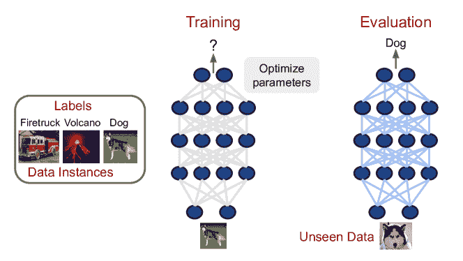

图 2：训练神经网络的监督学习过程。该图说明了神经网络的监督学习过程。收集数据实例（在这种情况下是图像）和相应标签。在训练阶段，优化神经网络的参数，以便当输入数据实例时，神经网络输出相应的标签。在评估阶段，神经网络会接收未见过的数据实例作为输入，如果训练成功，将输出有意义的标签（预测）。

在深入探讨不同的深度神经网络模型之前，简要讨论一下监督学习是有益的，这是训练这些模型的最标准方法。在监督学习框架中，我们获得数据实例和与每个数据实例相关联的标签，即（数据实例，标签）对。例如，数据实例可能包括胸部 X 光图像，而标签（每个胸部 X 光图像一个）则是是否显示肺炎症状的二元是/否。然后，训练神经网络模型的过程就是寻找其参数的值，以便当输入一个数据实例（胸部 X 光图像）时，能正确输出相应的标签（胸部 X 光图像是否有肺炎的是/否）。为了找到这些参数值，我们进行迭代优化，引导神经网络参数到适当的值，使用给定的标签进行监督。图 2 显示了深度学习监督学习设置的示意图。

监督学习是训练深度神经网络最基本却最关键的方法。正如在后续章节中所见，使用的（数据，标签）对的种类可能会有显著的多样性。即使在无法收集明确（数据，标签）对的环境中（章节 6，6.2），训练问题通常会重新表述并转化为监督学习框架。

### 4.2 多层感知机

第一种也是最基本的深度神经网络类型是多层感知机。这些模型由一系列完全连接的层（矩阵乘法）与非线性变换交替组成。

尽管它们简单，但对于数据可能由一组不同的（可能是分类的）特征组成的问题来说非常有用，例如表格数据。这些模型比逻辑回归/线性回归具有更强的表达能力，尽管这些方法作为第一步尝试是一个不错的选择。应用这些模型的一种方法是首先对数据进行预处理，以计算可能重要的不同特征集，并将其用作输入。[`github.com/rasbt/deeplearning-models`](https://github.com/rasbt/deeplearning-models)提供了一些示例多层感知机架构的实现。

##### 科学实例

一个最近的科学例子是使用简单的 MLP 来进行药物配方[256]，开发一种稳定且对患者安全的药物变体。

### 4.3 卷积神经网络

这些可以说是最知名的神经网络系列，非常适合处理任何类型的图像数据。它们的特点是拥有卷积层，这使得神经网络能够在图像的不同空间位置重用参数。这是图像数据的一个非常有用的归纳偏差，有助于有效学习良好的特征，一些特征，如 Gabor 滤波器，对应于传统的计算机视觉技术。卷积神经网络（CNNs）有许多可能的用途，下面我们单独概述一些最常见的任务。

#### 4.3.1 图像分类

这可以说是卷积神经网络中最简单和最知名的应用。模型接收一个输入图像，并希望输出一个类别 —— 这是该图像的一个（通常是）互斥的标签集合中的一个。之前的例子中，将胸部 X 光图像映射到一个二进制疾病标签，正是图像分类的典型例子。

卷积神经网络用于图像分类是深度学习中极其常见的应用。分类的 CNN 模型有许多不同类型：VGG — 一个简单的卷积层堆叠，后接一个全连接层 [214]，ResNets — 这是一个不同大小和深度的卷积网络系列，具有跳跃连接 [79]，DenseNets — 另一个模型系列，其中“块”中的每一层都与其他所有层相连 [94]。更新的复杂模型包括 ResNeXt [253] 和最近的 EfficientNets，这些模型为网络深度、宽度和输入图像的空间分辨率设置了不同的缩放因子 [223]。许多这些模型的教程、实现和预训练版本可以在第三部分中的参考文献中找到。

##### 科学例子：

图像分类已经在许多不同的科学应用中找到了用武之地，例如分析冷冻电镜数据 [226]（相关代码见 [`github.com/cramerlab/boxnet`](https://github.com/cramerlab/boxnet)）。特别大量的工作集中在医学影像的图像分类应用上，具体来说，是利用卷积神经网络（CNNs）来预测疾病标签。例子包括眼科学 [72]、放射学（二维 X 射线和三维 CT 扫描） [258, 5, 185]、病理学 [135, 55]、脑扫描分析（PET，fMRI） [202, 45]。关于这一领域众多论文的优秀综述见 [228]。

#### 4.3.2 目标检测

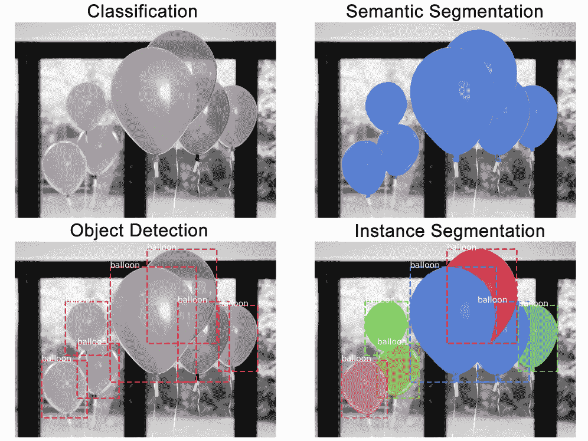

图 3：图像分类、目标检测、语义分割和实例分割任务的差异。图片来源 [1] 该图说明了分类、目标检测、语义分割和实例分割之间的差异。在分类中，整张图片获得一个标签（气球），而在目标检测中，每个气球还会被定位一个边界框。在语义分割中，所有对应于气球的像素被识别，而在实例分割中，每个单独的气球会被单独识别。

图像分类可以看作是对图像的整体总结。目标检测则深入到图像的一些较低级别的细节，识别并定位图像中的不同对象。例如，给定一张户外场景的输入图片，包含一只狗、一位人和一棵树，目标检测将不仅识别出狗、人和树的存在，还会在图像中‘圈出它们的位置’——具体来说，为它们每个加上一个边界框。因此，监督学习任务是接受一张输入图像并输出这些边界框的坐标，以及对其包含的对象进行分类。

类似于图像分类，物体检测也有许多高性能且成熟的卷积架构。由于输出任务的复杂性，这些模型通常更复杂，包含一个骨干组件（使用图像分类模型）和一个区域提议组件用于边界框提议。但仍有许多预训练模型可供下载。其中一个早期最成功的模型是 Faster R-CNN [192]，它显著加快了缓慢的边界框提议组件。从那时起，出现了许多改进的模型，包括 YOLOv3 [191]，以及最近的 EfficientDets [224]。然而，近年来最受欢迎的架构可能是 Mask R-CNN 及其变体[78, 248]。Mask R-CNN 不仅执行分割，还进行物体检测（见下文）。除了第三部分中提到的一些资源外，一个很好的代码和模型来源是[`github.com/rbgirshick`](https://github.com/rbgirshick)，这是这些物体检测模型长期系列中的关键作者之一。（不过请注意，还有许多其他流行的实现，例如[`github.com/matterport/Mask_RCNN`](https://github.com/matterport/Mask_RCNN)。）这篇深入的文章[towardsdatascience object detection Faster R-CNN](https://towardsdatascience.com/faster-r-cnn-object-detection-implemented-by-keras-for-custom-data-from-googles-open-images-125f62b9141a)提供了一个详细的教程，讲解如何下载、设置和训练一个物体检测模型，包括数据收集和注释（后者使用[`rectlabel.com/`](https://rectlabel.com/)）的有用指引。最近，Detectron2 系统[`github.com/facebookresearch/detectron2`](https://github.com/facebookresearch/detectron2) [248]基于 Mask R-CNN，并提供了许多多样的图像任务功能。

##### 科学示例：

物体检测在不同的科学应用中也引起了广泛关注。它已被应用于许多医学场景中，用于定位感兴趣的特征，例如不同影像模态下的肿瘤细胞[125, 269]或放射学中的骨折[199, 227]。

#### 4.3.3 语义分割与实例分割

分割技术深入到可能的最细节层次——对每个图像像素进行分类。在语义分割中，我们希望根据像素所属的高级组别对像素进行分类。例如，假设我们有一张街道的图像，其中包含道路、不同的车辆、行人等。我们希望确定一个像素是否属于任何行人、任何车辆或道路——即将图像像素标记为行人、车辆或道路。实例分割则更为复杂，我们不仅要以这种方式对每个像素进行分类，还要对每个实例分别进行分类（并提供像目标检测中的实例特定的边界框）。这些差异在图 3 中有所说明（来源于[1]）。回到街道图像的例子，假设图像中有三位行人。在语义分割中，构成这三位行人的所有像素将被归入同一类别——行人。在实例分割中，这些像素将进一步细分为属于行人一、行人二或行人三的像素。

由于分割模型必须对每个像素进行分类，它们的输出不仅仅是单一的类别标签或边界框，而是完整的图像。因此，分割的神经网络架构具有略微不同的结构，以帮助更好地保留图像的空间信息。一种特别受欢迎且成功的架构，尤其适用于科学应用，是 U-net [196]，它还有一个 3d 体积变体 [33]。其他架构包括 FCNs（全卷积网络） [136]、SegNet [9] 和最近的 Object Contextual Representations [260]。关于语义分割方法的一些很好的综述可以参考 [towardsdatascience Semantic Segmentation with Deep Learning](https://towardsdatascience.com/semantic-segmentation-with-deep-learning-a-guide-and-code-e52fc8958823) 和 [`sergioskar.github.io/Semantic_Segmentation/`](https://sergioskar.github.io/Semantic_Segmentation/)。

对于实例分割，Mask R-CNN [78] 及其变体 [248] 一直非常受欢迎。这个教程 [Mask R-CNN tutorial with code](https://towardsdatascience.com/mask-r-cnn-for-ship-detection-segmentation-a1108b5a083) 提供了一个逐步的示例应用。最近的 Detectron2 包 [248] ([`github.com/facebookresearch/detectron2`](https://github.com/facebookresearch/detectron2)) 也提供了这一功能。

##### 科学实例：

在所有不同类型的成像预测问题中，分割方法对于（生物）医学应用特别有用。示例包括分割脑部 MRI 图像 [156, 236]、识别不同组织中细胞的关键区域 [254, 217]，甚至研究骨骼结构 [129]。

#### 4.3.4 超分辨率

超分辨率是一种将低分辨率图像转换为高分辨率图像的技术。这个问题已经通过卷积神经网络和监督学习以及生成模型来解决。

超分辨率形式上被定义为一个欠定问题，因为对于低分辨率图像，可能存在许多高分辨率的映射。传统技术通过施加稀疏性等约束来寻找解决方案。超分辨率的第一个 CNN 之一 SRCNN [50] 概述了稀疏编码方法与卷积神经网络之间的对应关系。最近，Residual Dense Networks [270] 在标准基准测试中成为超分辨率的流行方法（代码可用 [`github.com/yulunzhang/RDN`](https://github.com/yulunzhang/RDN)），以及 Predictive Filter Flow [114]（代码：[`github.com/aimerykong/predictive-filter-flow`](https://github.com/aimerykong/predictive-filter-flow)），该方法也涉及图像去噪和去模糊。在下面的一些科学应用中，U-net 也在超分辨率方面取得了成功。

##### 科学示例：

超分辨率在科学环境中可能比标准自然图像基准更有用。两篇最近的论文探讨了 U-net 在荧光显微镜 [245]（代码：[`csbdeep.bioimagecomputing.com/`](https://csbdeep.bioimagecomputing.com/)）和电子显微镜 [56] 超分辨率中的应用。其他示例包括胸部 CT 扫描 [231] 和脑部 MRI [31] 的超分辨率。

#### 4.3.5 图像配准

图像配准考虑了将两张输入图像对齐的问题。特别是在科学应用中，两张输入图像可能来自不同的成像模式（例如，3D 扫描和 2D 图像），或者将移动图像映射到标准模板图像（例如 MRI）。这种对齐可以更好地识别和分析感兴趣的特征。

图像配准的潜力主要通过不同的科学应用来展示。该技术的核心是卷积神经网络，通常采用编码器-解码器结构（类似于 U-net [196]），以指导两幅图像的对齐。请注意，虽然这个基础模型是通过监督学习进行训练的，但许多配准方法不需要显式标签，而是使用相似性函数和光滑性约束来提供监督。例如，[12] 开发了一种无监督方法来对齐脑部 MRI。这些方法的代码以及几篇后续论文 [13, 39] 提供了一个很好的例子，可用于构建和应用这些方法 [`github.com/voxelmorph/voxelmorph`](https://github.com/voxelmorph/voxelmorph)。其他有用的资源包括 [`github.com/ankurhanda/gvnn`](https://github.com/ankurhanda/gvnn)（对应论文 [75]）用于学习常见的参数化图像变换的库。

#### 4.3.6 姿态估计

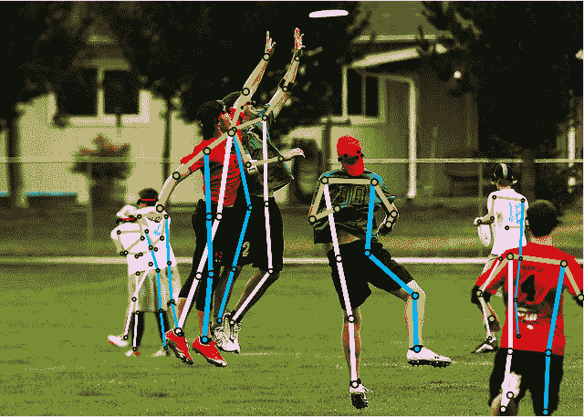

图 4: 姿态估计。图片来源 [218] 图中展示了姿态估计的任务，特别是多人人体 2D 姿态估计。神经网络模型预测主要关节（关键点）的位置，这些位置与人体模型结合，得到覆盖在图像中多个人体上的类似棒人图的姿态近似。这些技术的变体已被用于科学环境下的动物行为研究。

姿态估计，特别是人体姿态估计，研究了预测给定图像中人体姿态的问题。具体而言，深度神经网络模型被训练以识别图像中主要关节的位置，即关键点（如膝盖、肘部、头部）。这些预测与现有的身体模型结合，得到完整的类似棒人图的输出，以总结姿态。（参见图 4，来源 [218]，以作说明。）

(2D) 人体姿势估计是计算机视觉中的一个核心问题，拥有多个基准数据集，并且已经出现了许多卷积架构来解决它。一些早期的模型包括由[244]介绍的多阶段神经网络，以及一个堆叠沙漏模型[158]，该模型交替地结合了中间表示的高分辨率和低分辨率。最近，HRNet[218]，它在整个模型中保持高分辨率表示，是一种表现优异的架构（代码见[`github.com/leoxiaobin/deep-high-resolution-net.pytorch`](https://github.com/leoxiaobin/deep-high-resolution-net.pytorch)）。另一个值得关注的可能是[24]提供了一个用于多人的姿势检测的端到端系统，其代码库为[`github.com/CMU-Perceptual-Computing-Lab/openpose`](https://github.com/CMU-Perceptual-Computing-Lab/openpose)。

##### 科学示例：

姿势估计在神经科学领域引起了广泛关注，其中记录了动物的视频，自动预测图像中的姿势有助于识别重要行为。相关的示例由[146、147]给出，并附有代码[`www.mousemotorlab.org/deeplabcut`](http://www.mousemotorlab.org/deeplabcut)。

#### 4.3.7 卷积神经网络的其他任务

在前面的章节中，我们概述了一些最常见的卷积神经网络应用任务。然而，这些模型还有许多额外的应用场景，我们未曾涉及，包括视频预测[57]、动作识别[52]和风格迁移[64]。我们希望提供的参考文献和资源能促进对这些方法的进一步研究。

### 4.4 图神经网络

许多数据集，例如（社交）网络数据和化学分子，都具有图结构，由顶点通过边连接组成。一个活跃的研究领域是图神经网络，它致力于开发深度学习方法，以便更好地处理这种数据。输入图由具有一些相关特征向量 $h_{v}$ 的节点 $v$ 组成，有时边 $e_{uv}$ 也具有相关特征 $z_{e_{uv}}$。例如，节点 $v$ 可能对应不同的原子，边 $e_{uv}$ 对应原子之间的不同化学键。在高级层面，大多数图神经网络通过（i）使用每个顶点 $v$ 的邻居的特征向量来计算输入图实例的信息，（ii）利用这些信息更新 $v$ 的特征向量，从数据中计算出有用的信息。这个过程尊重图的连通性，通常会迭代应用，最终输出可能是在顶点级别（是否计算了有意义的顶点特征向量？）或整个输入图的级别（是否正确识别了整个图的某些全局属性？）

##### 应用特性

这些问题中，数据具有固有的图结构，目标是学习该图结构上的某些函数——无论是在每个顶点级别还是整个图的全局属性。还有时空图神经网络——对随时间演变的图结构进行预测。

##### 技术参考

尽管大多数图神经网络遵循从顶点邻居汇总信息并使用这些信息更新特征向量的高级结构，但存在许多不同的架构变体，并与卷积网络和递归模型等其他神经网络模型有关。近期的研究还探讨了时空图网络在视频动作识别等问题上的应用 [124]。对许多第一个流行方法的良好统一，例如 [53, 15, 127]，由 [67] 给出。一个更近期的调查论文 [250] 提供了对不同架构、问题、基准数据集和开源资源的极其全面的概述。一些有用的代码库包括 [`github.com/rusty1s/pytorch_geometric`](https://github.com/rusty1s/pytorch_geometric)、[`github.com/deepmind/graph_nets`](https://github.com/deepmind/graph_nets) 和 [`github.com/dmlc/dgl`](https://github.com/dmlc/dgl)，它们涵盖了大多数流行的深度学习框架。

##### 科学示例

图神经网络在多个化学任务中非常受欢迎，比如预测分子属性 [53, 93, 67, 103]、确定蛋白质界面 [60, 229]，甚至生成候选分子 [41, 21]。对于这些化学任务，[`github.com/deepchem`](https://github.com/deepchem) 是一个有用的库，它还具有相关的基准任务 [249]。关于不同图神经网络及其在分子生成中的应用的详细教程可以在 [`www.youtube.com/watch?v=VXNjCAmb6Zw`](https://www.youtube.com/watch?v=VXNjCAmb6Zw) 查看。

### 4.5 序列数据的神经网络

数据的一个非常常见的属性是具有序列结构。这可能是视频中的帧、蛋白质的氨基酸序列或句子中的单词。开发能够处理序列数据的神经网络模型是过去几年中最广泛的研究领域之一。这在很大程度上是受到自然语言处理任务进展的推动，自然语言处理专注于使计算机能够处理人们用来交流的语言。在这个领域，有两个受到显著进展的热门任务，分别是机器翻译——开发深度学习模型以将一种语言翻译成另一种语言，以及问答——以（短）文本为输入并回答有关它的问题。在接下来的章节中，我们首先概述了一些推动序列建模的主要自然语言处理任务，然后介绍了解决这些任务的神经网络模型。

#### 4.5.1 语言建模（下一个词预测）

语言建模是一种训练方法，其中深度学习模型以序列中到时间/位置 $t$ 的令牌为输入，然后使用这些令牌预测令牌 $t+1$。这实际上是一种自监督训练方法（见第六部分），数据自然提供了一组标签，而无需额外标记。在自然语言处理（NLP）上下文中，神经网络接收一个词序列，即句子或文本段落，并尝试预测下一个词。例如，给定一个句子“The cat sat on the roof”，网络会首先接收输入“The”并预测“cat”，然后接收“The cat”并预测“sat”，依此类推。（实现中还有一些附加细节，但这是总体思路。）由于数据/标签的易得性以及在不同层级（如词汇甚至字符）中使用语言建模的能力，它已成为自然语言处理中的一个流行基准，也用于捕捉科学应用中的序列依赖，例如蛋白质功能预测 [77, 80]，并在 AlphaFold 中将隐藏表示作为蛋白质结构预测的更大管道的一部分 [205]（开源代码 [`github.com/deepmind/deepmind-research/tree/master/alphafold_casp13`](https://github.com/deepmind/deepmind-research/tree/master/alphafold_casp13)）。

#### 4.5.2 序列到序列

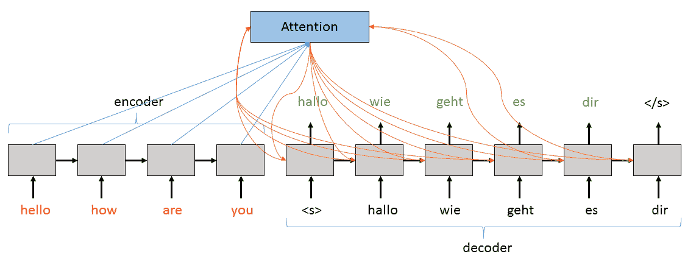

图 5：序列到序列预测任务的示意图。图像来源 [267] 该图展示了一个序列到序列任务的示意图，将英语的输入句子（令牌序列）翻译成德语的输出句子。请注意底层神经网络的编码器-解码器结构，其中编码器接收输入，解码器生成输出，并受到编码器表示和先前生成的输出令牌的影响。在此图中，输入令牌一个接一个地输入，同时输出也是逐一生成，这在使用递归神经网络作为底层模型时是常见的模式。使用当前非常流行的 Transformer 模型时，序列一次性输入，显著加快了处理速度。

另一个非常流行的序列数据任务是序列到序列——将一个序列转换为另一个序列。这正是机器翻译的设置，其中模型接收一个输入句子（序列），比如英语，并将其翻译成德语，形成输出句子（序列）。一些最早定义并以这种方式处理该任务的论文包括 [10, 221, 234]。序列到序列任务通常依赖于具有编码器-解码器结构的神经网络模型，编码器神经网络接收输入序列并学习提取重要特征，然后解码器神经网络利用这些特征生成目标输出。图 5(来源于 [267]) 展示了一个示例。这一范式还在生物学 [23] 和能源预测 [145] 等多种科学应用中找到了应用。序列到序列模型关键依赖于一种称为注意力的技术，我们将在下面概述。有关该任务的更多细节，建议查阅第三部分中突出介绍的一些教程和课程笔记。

#### 4.5.3 问答

另一个流行的序列数据基准是问答任务。在这种情况下，神经网络模型接收一段文本（作为上下文）和一个特定问题作为输入。模型必须输出回答问题的那部分文本段落。一些标准的基准包括 [83, 186]，并且 [`web.stanford.edu/class/cs224n/slides/cs224n-2019-lecture10-QA.pdf`](http://web.stanford.edu/class/cs224n/slides/cs224n-2019-lecture10-QA.pdf) 提供了关于任务和常见方法的优秀概述。问答任务关键在于神经网络模型理解不同序列集的相关性和相似性（例如，这部分上下文与感兴趣的问题的相关性如何？）。这种通用能力（通过适当的重构）有潜力在确定其他数据集的相似性和相关性方面，以及在特定领域的问答任务中广泛应用 [61]。

#### 4.5.4 循环神经网络

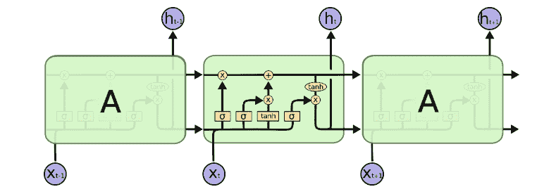

图 6：递归神经网络模型的示意图，具体为 LSTM（长短期记忆网络）。图片来源 [163] 图示展示了 LSTM 网络，一种递归神经网络。我们看到每个时间步的输入$x_{t}$通过一个门控机制也会影响下一时间步的内部网络状态（因此是一种递归神经网络）。这个门控机制被称为 LSTM，由 sigmoid 和 tanh 函数组成，用于转换和重新组合输入，以更新内部状态，同时也发出输出。这个门控过程的机制在图的中间单元格中显示。

在了解了一些序列数据深度学习中的核心任务后，接下来的几个部分将探讨一些关键的神经网络模型。

递归神经网络（RNNs）是第一种在许多上述任务中成功使用的深度学习模型。与 CNNs 或 MLPs（这些是前馈神经网络，直接将输入映射到输出）相比，其显著特点是具有反馈连接，使得例如每个时间步的输出可以成为下一个时间步的输入，并在时间步之间保持和修改内部状态。当 RNN 用于序列数据任务时，序列按令牌逐个输入，每个令牌导致 RNN 的内部单元状态更新，并使 RNN 发出令牌输出。请注意，这使得这些模型能够处理可变长度的数据——通常是序列数据的一个定义特征。输入如何处理、单元状态如何更新和输出如何发出由门控函数控制——请参阅技术参考！

##### 应用特点：

数据具有序列性质的问题（具有不同长度的不同序列）以及预测问题，如确定下一个序列令牌、将一个序列转换为另一个序列或确定序列相似性，都是重要任务。

##### 技术参考：

在过去几年中，序列模型和 RNN 的研究发生了显著变化。最成功和流行的 RNN 类型是带有注意力机制的双向 LSTM，其中 LSTM（长短期记忆）[88]指的是控制网络更新的门控功能，bi 指的是双向（神经网络在序列上前向和后向运行），而注意力机制是一个我们在下面单独概述的重要技术。（一些示例论文[149, 150]和代码资源[`github.com/salesforce/awd-lstm-lm`](https://github.com/salesforce/awd-lstm-lm)。）这篇出色的帖子[`colah.github.io/posts/2015-08-Understanding-LSTMs/`](https://colah.github.io/posts/2015-08-Understanding-LSTMs/)提供了对 RNN 和 LSTM 的详细概述。（图 6 展示了来自该帖子的图解，揭示了 LSTM 中门控机制的细节。）帖子还描述了一种小型 LSTM 变体，即门控循环单元（GRU），这种变体在实践中也很流行[127]。尽管 RNN（实际上是双向 LSTM）已经非常成功，但由于其递归特性导致优化（梯度消失/爆炸问题[87, 170, 76]）、快速模型训练（由于逐步生成目标）、以及学习长期序列依赖关系的挑战，因此开发和训练起来往往比较棘手。为了解决前两个问题，提出了一种新的前馈神经网络架构，即 Transformer（下面会概述）。

##### 科学示例：

RNN 在具有序列结构的数据的科学应用中找到了几个应用，例如基因组学和蛋白质组学[175, 132, 111]。

#### 4.5.5 注意力机制

使用 RNNs 处理序列数据的一个重大问题是捕捉长期依赖关系的困难。长期依赖关系指的是序列中相距很远的标记必须一起处理以提供正确的输出。RNNs 按顺序逐步处理序列，这意味着它们必须记住早期标记中的所有重要信息，直到序列的很后面——由于这些架构的记忆远非完美，这非常具有挑战性。注意力 [32, 11] 是一种非常重要的技术，它引入了与早期标记的快捷连接，减少了记住整个序列的必要性。相反，它提供了一种直接建模长期依赖关系的方法——神经网络能够回顾并关注其认为在输入早期相关的信息（通过学习）。关于注意力的一个很好的概述可以参考 [`lilianweng.github.io/lil-log/2018/06/24/attention-attention.html`](https://lilianweng.github.io/lil-log/2018/06/24/attention-attention.html)。注意力的一个变体，自注意力，可以帮助对单个输入序列进行预测，是 Transformer 模型的核心构建块。

#### 4.5.6 Transformer

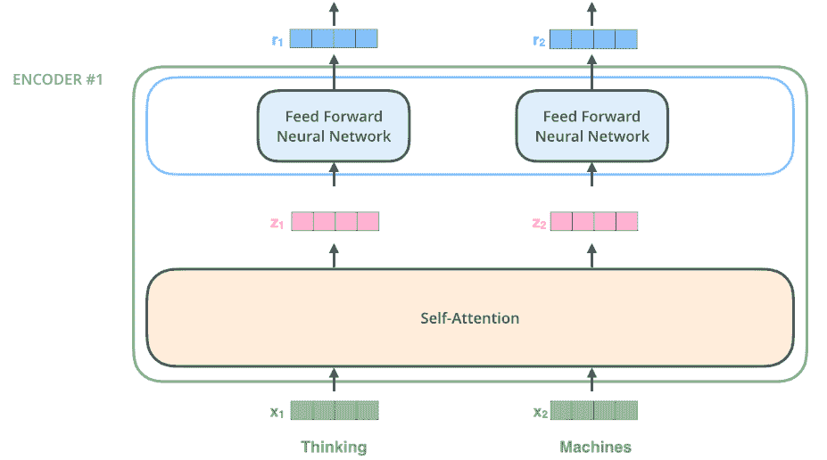

图 7：Transformer 网络中几层的图像。图片来源 [3] 该图描绘了 Transformer 神经网络的核心层序列，一个自注意力层（有时称为自注意力头），随后是全连接层。请注意，在处理序列数据时，Transformer 一次性接收整个输入序列，以及位置嵌入（在此情况下输入序列为“Thinking Machines”）。

尽管注意力机制帮助解决了长期依赖问题，RNNs 训练速度依然较慢，且设计复杂（由于消失/爆炸梯度的优化挑战）。这些挑战是其递归、逐步处理的本质所固有的，因此提出了一种新的前馈神经网络——Transformer [233]，其关键依赖于注意力机制（论文实际上名为《Attention is All you Need》）。在训练过程中，Transformer 一次性接收整个序列作为输入，但具有尊重数据序列性质的位置嵌入。Transformer 由于其卓越的性能，已成为许多自然语言任务和序列任务的主流方法。

##### 应用特性：

适用于数据具有序列性质和需要建模长距离依赖关系的问题。考虑到大量预训练的变换器模型，它们在预训练模型可以快速适应目标问题的设置中也非常有用。

##### 技术参考：

原始的变换器论文 [233] 对动机和神经网络架构进行了很好的概述。该模型设计时考虑了机器翻译任务，因此包含了一个编码器神经网络和一个解码器神经网络。随着变换器被用于与机器翻译截然不同的任务，编码器和解码器往往被单独用于不同的任务——例如，编码器单独用于问答系统，而解码器则对文本生成至关重要。关于变换器的两个非常易于理解的逐步教程是 [The Annotated Transformer](https://nlp.seas.harvard.edu/2018/04/03/attention.html) 和 [The Illustrated Transformer](http://jalammar.github.io/illustrated-transformer/)。该模型语言建模能力的一个很好的例子见 [180]。

自变换器开发以来，已经进行了大量研究，旨在改进这些模型的训练、调整自注意力机制以及其他变体。使用变换器的一个非常重要的成果是 BERT（深度双向变换器预训练用于语言理解） [43]。这篇论文表明，使用变换器神经网络进行迁移学习（见 5.1 Methods ‣ A Survey of Deep Learning for Scientific Discovery")）在许多自然语言任务中可以极为成功。（一些最早展示迁移学习潜力的论文是 [92, 180]，自 BERT 以来，已经有扩展模型能力的后续研究 [257]。）从实际角度来看，变换器、BERT 和迁移学习的发展意味着有许多在线资源可以获取代码和预训练模型。我们在 3 节中提到了一些，但特别值得注意的是 [`github.com/huggingface/transformers`](https://github.com/huggingface/transformers)，它提供了一个优秀的变换器模型库。关于 BERT 和 NLP 中迁移学习的一个很好的概述见 [`jalammar.github.io/illustrated-bert/`](http://jalammar.github.io/illustrated-bert/)。

##### 科学示例：

在科学环境中使用变换器的几个有趣示例包括：在蛋白质序列上进行训练以寻找编码有意义生物属性的表示[195]，通过语言建模生成蛋白质[142]，用于生物医学数据文本挖掘的 bioBERT[121]（包括[预训练模型](https://github.com/naver/biobert-pretrained)和[训练代码](https://github.com/dmis-lab/biobert)），科学文本的嵌入[18]（包括代码[`github.com/allenai/scibert`](https://github.com/allenai/scibert)）以及医疗问题回答[237]。

#### 4.5.7 其他序列数据任务

在前面的章节中，我们概述了一些重要的序列数据基准任务，以及可以解决这些任务的深度学习模型类型。与卷积网络一样，这不是一个全面的概述，但希望足够详尽，以帮助生成关于可能应用的想法，并提供指向其他有用相关领域的指引。可能感兴趣的其他序列数据任务包括结构化预测，其中预测的输出具有某种结构，从树结构（例如解析）[28, 246]到短的、可执行的计算机程序结构[271]，以及文本摘要，其中神经网络总结文本片段[130, 273]。我们稍后将在调查中讨论词嵌入。

### 4.6 节摘要

在本节中，我们概述了监督学习、一些核心神经网络模型以及它们可以用于的重要任务。正如之前讨论的，这些主题涵盖了一个非常广泛的研究领域，因此有些领域，比如用于分子性质预测的指定李群的深度神经网络[262, 113]，建模不同的不变性——例如球面不变性[35, 36]等，都没有涉及。但我们希望所提供的材料和参考文献能够激发对这些非常令人兴奋和迅速发展的研究方向的新贡献。

## 5 关键（监督学习）方法

在上一节中，我们介绍了不同类型的神经网络模型，以及它们可以用于的各种任务。为了训练这些模型以完成这些任务，我们通常依赖监督学习方法——优化模型参数以在一组训练数据示例上正确输出给定标签（即监督）。

更详细地说，深度神经网络的标准监督学习方法包括 (i) 收集数据实例（例如图像） (ii) 收集数据实例的标签（例如图像是猫还是狗） (iii) 将收集的（数据实例，标签）集分为训练集、验证集和测试集 (iv) 随机初始化神经网络参数 (v) 优化参数，使网络在训练集上的输入数据实例上输出正确的对应标签 (vi) 在验证集和测试集上进一步调优和验证。

在本节中，我们概述了使用该过程变体的方法，例如以不同的方式初始化神经网络参数或处理训练数据与测试集之间的差异。在第六部分中，我们将探讨减少对标签收集依赖的变体。

### 5.1 迁移学习

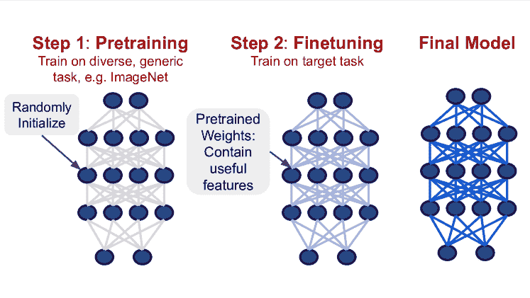

图 8：深度神经网络的迁移学习过程。迁移学习是训练深度神经网络的一个两步过程。我们不是随机初始化参数并直接在目标任务上进行训练，而是首先在一些多样的、通用的任务上进行预训练。这将使神经网络参数收敛到一组称为预训练权重的值。如果预训练任务足够多样，这些预训练权重将包含有用的特征，可以用来更高效地学习目标任务。从预训练权重开始，我们接着在目标任务上训练网络，这称为微调，最终得到模型。

在前面的章节中，我们提到过使用预训练模型。这实际上是指一种训练深度神经网络的非常重要的方法，称为迁移学习。迁移学习是训练深度神经网络模型的一个两步过程，包括预训练步骤和微调步骤，其中模型在目标任务上进行训练。更具体地说，我们首先用随机初始化的参数训练一个神经网络，首先在一个标准的、通用的任务上进行训练——即预训练步骤。例如，在基于图像的任务中，常见的预训练任务是 ImageNet [42]，这是一个大规模自然图像数据集上的图像分类任务。通过一个合适的、足够复杂的通用预训练任务，预训练步骤允许神经网络学习有用的特征，这些特征存储在其参数中，可以在第二步微调中重复使用。在微调过程中，预训练的神经网络会在真正的目标任务上进一步训练（可能对其输出层进行一些小的修改）。这一过程在 8 图 Methods ‣ A Survey of Deep Learning for Scientific Discovery")中进行了说明。但能够利用其在预训练过程中学到的特征，通常会导致目标任务性能和收敛速度的提升，并且需要较少的标记数据。

由于这些显著的好处，迁移学习在许多领域中极为有用，特别是在计算机视觉[95]中，早期有很多成功的应用。如 4.5.6 节中概述的那样，最近像 ULMFiT [92]和特别是 BERT [43]这样的模型的开发，也使得迁移学习在自然语言和序列数据领域极为成功，近期的研究使迁移学习过程变得更加高效[90, 201]。最重要的是，标准神经网络架构在标准基准上进行预训练的现成可用性，通过许多开源代码库在 GitHub 上（3 节中给出了示例），意味着下载和微调标准预训练模型已成为大多数新深度学习应用的事实标准。

通常，进行迁移学习是开始处理新问题的一个绝佳方式。除了知识重用、稳定性和预训练权重带来的收敛性提升外，还有使用经过充分测试的标准神经网络架构的好处。然而，请注意，迁移学习的具体效果尚未完全理解，且一个活跃的研究领域[116, 184, 266, 159, 143, 181, 235] 正在研究其确切属性。对于视觉中的迁移学习[116, 266, 112]，由于其大规模研究和预训练建议，可能特别值得关注。

### 5.2 领域自适应

与迁移学习相关的是领域自适应任务。在（无监督）领域自适应中，我们在源领域有训练数据和标签，但希望开发一个在目标领域也能工作的深度学习模型，其中数据实例可能与源领域中的不同，但高层任务相同。例如，我们的源领域可能包括手写数字（零到九）的图像，我们希望将其分类为正确的数字。但目标领域可能包含房号的照片（从零到九），我们也希望将其分类为正确的数字。领域自适应技术有助于构建一个在源领域上构建的模型，该模型在转移的目标领域也能（合理地）表现良好。

在深度学习中，领域自适应的最主要方法是构建一个模型，该模型能够（i）在源领域任务上表现良好，并且（ii）学习对领域转移尽可能不变的特征。这通过共同优化这两个目标来实现。回到我们关于手写数字和房号照片的示例，（i）对应于在识别手写数字的（源）任务上表现良好的标准监督学习分类问题，而（ii）则更为微妙，通常涉及明确优化手写数字和房号照片的隐藏层表示，使其彼此看起来相同——领域不变性。一些流行的实现方式包括梯度反转[62]、在隐藏表示上最小化距离函数[137]，甚至对抗训练[63, 211]。最近，[219] 研究了使用自监督（见第六部分）来共同训练源领域和目标领域，从而实现更好的适应性。

领域适应的其他方法包括将数据实例从源领域转换到目标领域，以及自举/共同训练方法（见第 6.2 节）。一些这些方法在教程中进行了概述，例如[计算机视觉中的深度领域适应](https://towardsdatascience.com/deep-domain-adaptation-in-computer-vision-8da398d3167f)。

### 5.3 多任务学习

在许多监督学习应用中，从机器翻译[2]到科学领域[187, 176]，神经网络以多任务的方式进行训练——为单一输入预测多个不同的输出。例如，在图像分类中，给定一张医学图像，我们可能会训练网络不仅预测感兴趣的疾病，还预测患者的年龄、其他相关疾病的病史等。即使只对一个预测感兴趣，这种做法通常也会产生有益的效果，因为它为神经网络提供了有用的额外反馈，指导其学习最重要的数据特征。（这种方法有时会如此有用，以至于辅助预测目标仅为此目的而定义。）此外，预测多个目标意味着有更多的数据可用于训练模型（只有一部分数据具有感兴趣的目标标签，但更多的数据实例具有其他辅助标签。）这种方法的最极端版本是同时在两个完全不同的数据集上进行训练。例如，模型可以同时在 ImageNet 和医学影像数据集上进行训练，而不是进行预训练/微调步骤。

多任务学习通常通过为神经网络提供多个头部来实现。神经网络的头部指的是其输出层，而具有多个头部的神经网络为每个预测任务（例如，一个头部用于预测年龄，一个用于预测感兴趣的疾病）设有一个头部，但在这些不同的预测任务中共享所有其他特征和参数。这就是多任务学习的好处所在——共享特征（占据了大部分网络）可以获得许多不同来源的反馈。实现多任务学习通常还需要仔细选择如何权衡这些不同任务的训练目标。一些流行的多任务学习方法的良好调查可以参考[`ruder.io/multi-task/index.html#fn4`](https://ruder.io/multi-task/index.html#fn4)，有关一些重要考虑因素的教程可以参考[`hazyresearch.stanford.edu/multi-task-learning`](http://hazyresearch.stanford.edu/multi-task-learning)。实现多任务学习的一个包可以在[`github.com/SenWu/emmental`](https://github.com/SenWu/emmental)找到，并且有[《towardsdatascience 多任务学习：教你的 AI 更多以使其更好》](https://towardsdatascience.com/multitask-learning-teach-your-ai-more-to-make-it-better-dde116c2cd40)中的逐步示例和代码片段。

### 5.4 弱监督（远程监督）

假设很难为目标任务收集高质量的标签，并且没有现成的、标准的相关数据集和相应的预训练模型来进行迁移学习。如何在训练过程中为深度学习模型提供足够的监督？虽然高质量标签可能难以获得，但噪声标签可能相对容易收集。弱监督指的是在一个带有这些噪声标签的数据集上训练模型的方法（通常用于未来的微调），这些噪声标签通常是在自动化过程中生成的。

在计算机视觉（基于图像）的任务中，一些示例包括：获取图像级标签（用于分类），并自动推断像素级标签以进行分割 [171]，对预训练网络计算的隐藏表示进行聚类作为伪标签 [255]，或将 Instagram 标签作为标签 [143] 用于预训练。在语言任务中，示例由 [153, 89, 264] 提供，这些示例通过假设提及两个感兴趣实体的所有句子表达特定关系（也称为远程监督）来提供噪声监督。有关弱监督及其与其他领域的连接的良好概述，请参见 [`hazyresearch.github.io/snorkel/blog/ws_blog_post.html`](https://hazyresearch.github.io/snorkel/blog/ws_blog_post.html)，有关医疗和科学应用的相关帖子请参见 [`hazyresearch.stanford.edu/ws4science`](http://hazyresearch.stanford.edu/ws4science)。

### 5.5 小节总结

在这一节中，我们概述了一些基于监督学习的核心方法，用于开发深度学习模型。这只是现有方法广泛集合的一部分，我们希望这些描述和参考文献能帮助进一步探索其他方法。一个未涵盖但可能特别感兴趣的方法是多模态学习，其中神经网络同时在来自不同模态的数据上进行训练，如图像和文本 [139, 238, 102]。多模态学习也很好地体现了这样一个事实：精确地将深度学习技术分类为仅对特定任务或训练模式有用通常是困难的。例如，我们在这一节中研究了序列任务的语言建模，但语言建模也是自监督（第六部分）和生成模型（第 8.1 节）的一个例子。这一节和后续章节中描述的方法有许多丰富的组合，这些组合在开发端到端系统中可能非常有用。

## 6 用更少的数据做更多的事

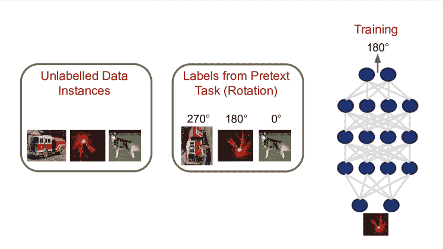

图 9：使用自监督训练神经网络。该图示例了一个自监督设置的例子。在自监督学习中，我们通常有一组未标记的数据实例，这里是图像。我们定义一个预任务，它会自动为数据实例生成标签。在这种情况下，预任务是旋转——我们随机旋转图像，并按旋转角度进行标记。在训练过程中，神经网络会接收到这些旋转后的图像，并必须预测旋转的角度。这样做还要求神经网络学习图像数据的一般有用隐藏表示，因此，在自监督学习训练后，这个神经网络可以成功而高效地在下游任务中进行微调。

监督学习方法，以及迁移学习和多任务学习等具体变体，在训练深度神经网络模型方面取得了很大成功。然而，它们使用的一个显著限制，以及深度学习的使用，是对大量标记数据的依赖。在许多专业领域，如医学，收集大量高质量、可靠的标签可能是极其昂贵的。

幸运的是，近年来我们在减少这种依赖的方法上取得了显著进展，特别是自监督学习和半监督学习。这些方法仍然遵循将神经网络训练为将原始数据实例映射到指定标签的范式，但关键的是，这些标签不是单独收集的，而是通过预任务自动定义的。例如，我们可以取一个图像数据集，旋转其中一些图像，然后将标签定义为旋转的角度，这就是神经网络的预测目标。这使得在训练深度神经网络时可以使用未标记的数据。在本节中，我们将介绍自监督学习和半监督学习以及其他方法，如数据增强和去噪，这些方法使我们能够用更少的数据做更多的事情。

### 6.1 自监督学习

在自监督中，定义了一个预任务，使得标签可以直接从原始数据实例中自动计算。例如，在图像上，我们可以将图像旋转一定角度，以旋转角度为标签，并训练神经网络预测旋转的度数[66]——这一设置如图 9 所示。这个预任务的定义不需要任何标注工作，但可以用来教会网络良好的表征。这些表征可以原封不动地使用，或者在下游任务中可能需要一些额外的数据。自监督最大的成功可能是在顺序数据，尤其是自然语言问题上的语言建模，这一点我们在第 4.5.1 节中概述了。下面我们概述一些在图像和顺序数据中最受欢迎和成功的自监督示例。（自监督方法的全面列表也可以在此页面找到 [`github.com/jason718/awesome-self-supervised-learning`](https://github.com/jason718/awesome-self-supervised-learning)。）

#### 6.1.1 自监督学习用于图像

最近，一个流行且简单的自监督任务是预测图像的旋转[66]。每个图像实例都经过四种可能旋转中的一种进行转换，深度学习模型必须正确分类这些旋转。尽管这个任务很简单，但多个研究表明，它在学习良好表征方面取得了成功[266、265、112]。这些研究中探讨的另一种流行方法是示例法[51]，它提出了一种依赖于图像变换不变性的自监督任务。例如，我们可以以一张猫的源图像为例，进行一系列变换，如旋转、调整对比度、水平翻转等。通过选择多个这样的变换序列，我们可以得到多张猫的图像，并训练神经网络将这些图像识别为同一张图像。

其他方法通过使用图像补丁作为上下文来学习全局图像结构和重要特征。例如，[48] 定义了一个前置任务，其中必须确定一对图像补丁的相对位置，而 [161] 则教会神经网络解决拼图任务。这后一任务已在大规模应用中证明有效 [69]，并由 [`github.com/facebookresearch/fair_self_supervision_benchmark`](https://github.com/facebookresearch/fair_self_supervision_benchmark) 提供了出色的实现和基准测试。近期的研究方向探讨了使用互信息启发的度量作为提供不同图像补丁相关性监督的方法 [84, 169, 7, 154]，但这些方法可能更复杂。许多基于互信息的度量还依赖于对比损失 [30]，这种损失从高层次上讲，通过使一对相似输入的表示比一对不同输入的表示更相似来为网络提供监督。最近，一种新的自监督方法 SimCLR [29] 利用这一点实现了高性能（一个实现可以在 [`github.com/sthalles/SimCLR`](https://github.com/sthalles/SimCLR) 找到）。

请注意，第 4.3.5 节中给出的一些图像配准示例也是自监督学习的示例，其中可以自动计算某种领域特定的相似性函数来评估输出质量。这些方法可能与其他领域相关，值得探索。许多自监督方法的开源实现由 [`github.com/google/revisiting-self-supervised`](https://github.com/google/revisiting-self-supervised) 提供。

#### 6.1.2 自监督学习用于序列（自然语言）数据

尽管对图像的自监督技术的研究极为活跃，但该框架的最强成功案例无疑是在序列数据，特别是文本和自然语言方面。这种序列结构立即引发了有效的自监督前置任务。两类主要的前置任务通过以下方式进行操作：（i）使用序列的相邻标记作为预测目标标记的输入上下文，（ii）接收所有标记直到特定位置并预测下一个标记。这后一种是语言建模，已在第 4.5.1 节中概述。前一种则是词嵌入的原理。

词嵌入对解决许多自然语言问题至关重要。在语言领域全面迁移学习的最新成功之前（第 5.1 节），这种简单的自监督范式是知识重用的集中点，形成了任何自然语言（序列）数据深度学习系统的重要组成部分。从科学角度看，学习序列数据的词嵌入有可能识别数据实例中以前未知的相似性。它已经在辅助自动分析科学文本方面找到了有趣的应用，例如药物名称识别系统[131]、生物医学命名实体识别[73]、材料科学中的重要概念识别[230]，甚至化学-蛋白质相互作用的检测[37]。

词嵌入的关键基础思想体现在 word2vec 框架中[152, 151]，该框架最初依赖于连续词袋（CBOW）神经网络或 Skip-Gram 神经网络。实际上，这两种模型更像是两个简单的矩阵乘法，而不是神经网络，其中第一个矩阵作为投影，并给出所需的嵌入。在 CBOW 中，定义为邻域词的上下文被输入，模型必须正确识别目标输出词。在 Skip-Gram 中，这一过程被反转，中心词被输入，而上下文被预测。例如，给定句子"There is a cat on the roof"，目标词是 cat，CBOW 将输入（There, is, a, on, the, roof）的向量表示，并输出"cat"，而 Skip-Gram 则大致交换输入和输出。这些方法的简单性可能使它们相比语言建模更适合许多任务。有关这些方法的两个优秀概述可以参考[词嵌入和 word2vec 介绍](https://towardsdatascience.com/introduction-to-word-embedding-and-word2vec-652d0c2060fa)和[`ruder.io/word-embeddings-1/`](https://ruder.io/word-embeddings-1/)。其他嵌入方法包括[173, 123]。

#### 6.1.3 自监督总结

在本节中，我们概述了自监督学习的许多有趣进展，这是一种非常成功的利用未标注数据学习有意义表示的方法，无论是用于分析还是其他下游任务。自监督可以与其他技术有效结合。例如，在语言建模应用中，我们看到它被用于迁移学习（第 5.1 节），其中深度学习模型首先使用语言建模自监督目标进行预训练，然后在目标任务上进行微调。在接下来的部分，我们将讨论其他将自监督与标注数据结合的方法。

### 6.2 半监督学习

虽然收集大量标注数据集可能代价高昂，但通常可以收集较少量的标注数据。在组建全新的数据集时，典型的情况是拥有少量的标注数据和（有时显著更多的）无标注数据实例。半监督学习正是关注这种情况，提出了在标注数据和未标注数据上进行有效学习的技术。以下我们概述了一些流行的半监督学习方法。

#### 6.2.1 自监督与半监督学习

从上一节继续，一个自然的方法是使用自监督的预训练任务来利用未标注的数据。为了将其与标注数据结合，我们可以设计一个具有两个不同输出头的神经网络（正如在多任务学习中所见，见 5.3 节 Methods ‣ A Survey of Deep Learning for Scientific Discovery")），一个输出头用于标注数据，另一个用于未标注数据上的自监督目标。重要的是，这意味着神经网络学习到的特征在标注数据和未标注数据之间是共享的，从而产生更好的表示。这种简单的方法已被证明非常有效[266, 265]。

#### 6.2.2 自训练（引导）

自训练，有时也称为引导或伪标签，是一种迭代方法，其中深度神经网络首先在标注数据上以监督方式开发。然后，这个神经网络被用来为未标注的数据提供（伪）标签，这些标签可以与标注数据一起用于训练一个新的、更准确的神经网络。这种方法通常效果良好，甚至可以重复使用以获得进一步的改进。实现中有几个常见的细节——通常在添加神经网络伪标注的数据时，我们只保留最具信心的伪标注样本。这些伪标注样本也可以用于与标注数据不同的目标函数的训练。早期提出这种方法的论文之一是[120]，更近期的论文[252]则展示了在大规模下的显著成功。其他变体，包括均值教师[225]、时间集成[119]和最近的 MixMatch[19]，也主要使用自训练方法，但结合了一致性元素（见下文）。这些方法有很好的开源实现，例如均值教师的[`github.com/CuriousAI/mean-teacher`](https://github.com/CuriousAI/mean-teacher)以及 MixMatch 的[`github.com/google-research/mixmatch`](https://github.com/google-research/mixmatch)和[`github.com/YU1ut/MixMatch-pytorch`](https://github.com/YU1ut/MixMatch-pytorch)。

#### 6.2.3 强化一致性（平滑性）

许多半监督方法中的一个重要主题是通过强制一致性来对未标记数据提供监督。如果一个人被给出两张图像 A 和 B，其中 B 是 A 的略微扰动版本（可能是模糊的，或者有些像素被遮挡或黑掉），他们会给这些图像相同的标签——一致性。我们也可以应用这一原则，对未标记数据的神经网络提供反馈，将其与标记数据预测结合起来，如多任务学习（第 5.3 Methods ‣ A Survey of Deep Learning for Scientific Discovery") 节）中所述，以形成半监督学习算法。一个流行的强制一致性的方法是虚拟对抗训练 [155]，它在精心选择的图像扰动之间强制一致性。另一篇论文，无监督数据增强 [251]，使用标准的数据增强技术，如图像的 cutout [44] 和文本的反向翻译 [206]，来扰动图像并强制在这些扰动之间保持一致。[265] 在其完整算法中使用了一致性约束以及其他半监督和自监督技术。

#### 6.2.4 协同训练

另一种对未标记数据提供反馈的方法是训练两个（或多个）神经网络模型，每个模型处理原始数据的不同视图。例如，对于文本数据，每个模型可能会看到输入句子的不同部分。这些模型可以被反馈以使彼此之间或与一个可以看到所有数据的不同模型之间保持最大的一致性，甚至可以用于自我训练，每个不同的模型对其最有信心的实例提供伪标签。这个帖子 [`ruder.io/semi-supervised/`](https://ruder.io/semi-supervised/) 给出了不同协同训练方案的简要概述，[34, 179, 74] 是一些最近在文本和图像中实现这一方法的论文。

#### 6.2.5 半监督学习总结

半监督学习是一种强大的方法，可以减少对标记数据的需求，并显著提升深度学习模型的效能。半监督学习可以应用于任何可以在未标记数据上创建有意义任务的情境。在本节中，我们概述了一些定义这些任务的自然方法，但根据感兴趣的领域，可能还会有许多创造性的替代方案。我们希望这些参考文献能为实施和进一步探索提供一个有益的起点！

### 6.3 数据增强

如图 1 所示，数据增强是深度学习工作流程中的一个重要部分。数据增强指的是通过对原始数据实例应用各种变换，人工增加训练数据的大小和多样性。例如，如果原始实例由图像组成，我们可能会人工扩展图像边界，然后执行一个偏离中心（随机）的裁剪，以获得最终的增强图像实例。除了增加数据的大小和多样性外，数据增强还有助于鼓励神经网络对某些常见数据实例变换具有鲁棒性。在本节中，我们将概述一些用于图像和序列数据的最流行的数据增强技术。这些技术通常已经是许多开源深度学习管道的一部分，或者可以在任何主流深度学习软件包中轻松调用。还有一些专门为增强编写的库，例如 imgaug [`github.com/aleju/imgaug`](https://github.com/aleju/imgaug)、nlpaug [`github.com/makcedward/nlpaug`](https://github.com/makcedward/nlpaug) 和 albumentations [`github.com/albumentations-team/albumentations`](https://github.com/albumentations-team/albumentations)。

#### 6.3.1 图像数据的数据增强

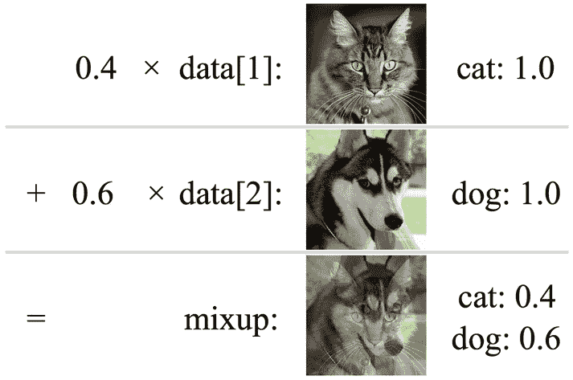

图 10：Mixup 数据增强技术的示意图。图像来源 [40] 该图展示了 Mixup 数据增强方法的一个示例——一只猫的图像和一只狗的图像被线性组合，其中猫的权重为 $0.4$，狗的权重为 $0.6$，生成了底部显示的新输入图像，并且标签平滑，猫的权重为 $0.4$，狗的权重为 $0.6$。Mixup 已成为图像任务中非常流行和成功的数据增强方法。

对于图像数据的简单增强考虑诸如水平翻转或随机裁剪（填充图像边框并进行偏心裁剪）等变换。受到这些简单方法启发的是两种非常成功的图像增强策略：cutout [44]，它从输入图像中移除一个补丁，和 RICAP [222]，它将四个不同输入图像的补丁组合成一个新图像（新标签为原始标签的组合）。这一令人惊讶的图像组合技术在 mixup [268]中表现得非常成功，mixup 是一种数据增强策略，其中使用图像的线性组合（而不是补丁）。这一策略还与 cutout 结合在最近提出的 cutmix 增强策略中[261]，代码见[`github.com/clovaai/CutMix-PyTorch`](https://github.com/clovaai/CutMix-PyTorch)。

其他有用的增强策略包括 TANDA [188]，它学习一个模型来组合数据增强，相关的 randaugment [38]，选择不同可能增强的随机子集，基于种群的增强 [85]，它在不同的增强策略上随机搜索，以及[91]，对图像应用颜色失真，还有最近提出的 augmix [82]（代码见[`github.com/google-research/augmix`](https://github.com/google-research/augmix)）。

#### 6.3.2 顺序数据的增强

顺序数据的增强通常分为（i）直接修改输入序列，或（ii）在序列到序列任务的情况下（第 4.5.2 节），通过神经网络的噪声翻译增加输入输出序列的数量。直接修改输入序列时，常见的扰动包括随机删除序列标记（类似于[43]中使用的掩码方法）、交换序列标记的集合，以及用同义词替换标记。后一种策略通常由词嵌入[239]或上下文化词嵌入[110]指导。这些转换的组合示例由[243, 98]给出，代码库如[`github.com/makcedward/nlpaug`](https://github.com/makcedward/nlpaug)提供了一些简单的实现。

另一个主流的数据增强方法是使用序列到序列模型生成新的数据实例，这被称为反向翻译[206, 54]。具体来说，假设我们有一个从英文序列翻译到德文序列的模型。我们可以将输出的德文序列翻译回英文，使用现有工具/噪声启发式方法。这将为我们提供一个额外的英文-德文序列对。

### 6.4 数据（图像）去噪

在测量和收集高维数据时，噪声很容易被引入到原始实例中，无论是图像还是单细胞数据。因此，深度学习去噪技术引起了广泛的兴趣和发展。许多这些最新方法即使在没有配对的噪声和清晰数据样本的情况下也能工作，并且适用于广泛的场景。例如，Noise2Noise [122] 使用 U-net 神经网络架构给定多个噪声副本以去噪图像。最近的 Noise2Self [14]（代码：[`github.com/czbiohub/noise2self`](https://github.com/czbiohub/noise2self)）将去噪框架视为自我监督问题，利用不同特征子集（具有假定独立的噪声属性）进行去噪，适用于图像以及其他高维数据。

## 7 解释性、模型检查和表示分析

深度学习（以及更广泛的机器学习）的许多标准应用专注于预测——学习在给定输入的情况下输出特定的目标值。另一方面，科学应用通常专注于理解——识别引发数据中观察到的模式的潜在机制。在科学环境中应用深度学习时，我们可以将这些观察到的现象用作预测目标，但**终极**目标仍然是理解是什么属性导致了这些观察结果。例如，核心科学问题可能是某些氨基酸序列（编码蛋白质）如何导致特定的蛋白质功能。虽然我们可以将其框定为预测问题，训练一个深度神经网络以氨基酸序列作为输入，输出预测的蛋白质属性，但我们理想的目标是理解氨基酸序列如何导致观察到的蛋白质功能。

为了回答这些问题，我们可以转向解释性技术。解释性方法有时被等同于对模型决策过程的完全可理解的逐步解释。这种详细的洞察往往难以实现，尤其是对于复杂的深度神经网络模型。相反，解释性研究集中于一系列更广泛的技术，提供从（粗略的）特征归因——确定哪些输入特征最为重要，到模型检查——确定导致网络中某些神经元激活的原因的见解。实际上，这两个例子也大致区分了解释性方法的类型。

一大类方法（我们称之为特征归因与每例解释性）集中于获取一个特定输入和一个训练好的深度神经网络，并确定输入的哪些特征最为重要。另一类广泛的技术则着眼于获取一个训练好的模型和一组输入，来确定网络的不同部分学到了什么（称为模型检查与表征分析）。后一类方法在揭示模型通过预测任务隐含学习的重要数据模式方面非常有用。例如，在[118]中，涉及机器翻译的研究使用表征分析技术来展示模型所学习的潜在语言结构。我们将在下文概述这两类方法。

### 7.1 特征归因与每例解释性

我们首先概述一些流行的技术，用于在每个示例级别提供特征归因，回答诸如哪些输入图像的部分对于特定模型预测最重要等问题。这些技术可以进一步细分如下：

#### 7.1.1 显著性图和输入掩码

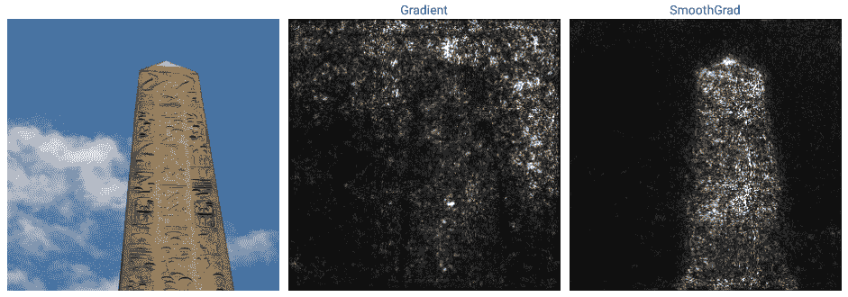

图 11：SmoothGrad 的输出，一种显著性图。图像来源[215]。该图展示了原始输入图像（左），原始梯度（中间），这些通常对于可靠的特征归因来说噪声过多，以及 SmoothGrad（右），一种显著性图，通过对扰动进行平均以生成更连贯的特征归因可视化。特别是，我们可以清晰地看到图中的纪念碑对模型输出的重要性。

从高层次来看，显著性图取输出预测相对于输入的梯度。这会在输入上给出一个掩码，突出显示哪些区域具有较大的梯度（对预测最重要）以及哪些区域具有较小的梯度。首次由[213]介绍，显著性图有许多变体，如 Grad-CAM [204]、SmoothGrad [215]、IntGrad [220]，这些变体使得结果特征归因更加稳健。这些方法及其他方法已在 [`github.com/PAIR-code/saliency`](https://github.com/PAIR-code/saliency) 实现。请注意，虽然这些方法可能非常有用，但它们的预测并不完美[105]，需要进一步验证。

与这些显著性方法密切相关的是[166]，它提供了检查不同隐藏层中的神经元触发特征的能力。完整的交互式论文可以在 [`distill.pub/2018/building-blocks/`](https://distill.pub/2018/building-blocks/) 阅读，代码和教程可在 [`github.com/tensorflow/lucid`](https://github.com/tensorflow/lucid) 获取。

许多其他技术着眼于计算某种输入掩码，其中一些使用了去卷积层，这些层最早由[263]提出，并由[106]和[20]进一步构建。其他工作则直接优化以找到一个稀疏的掩码，这个掩码将突出最重要的输入特征[59]（相关代码 [`github.com/jacobgil/pytorch-explain-black-box`](https://github.com/jacobgil/pytorch-explain-black-box)）或通过迭代算法找到这样的掩码[25]。

#### 7.1.2 特征消融和扰动

与上述一些掩码方法相关，但有足够的区别以便单独分类的是几种方法，这些方法通过执行特征消融或计算输入的扰动来隔离输入的关键特征，并使用这些扰动与原始输入一起指示不同特征的重要性。

可以说，基于消融的方法中最为人熟知的是 Shapley 值的概念，最早由[207]介绍。这通过计算包含特定特征$x_{0}$的输入特征子集的预测能力，并对所有可能的子集进行平均，来估计输入中特定特征$x_{0}$的重要性。虽然对于深度学习而言，Shapley 值的计算可能非常昂贵，但后续工作[140]提出了更高效（且更具表达力）的变体，具有高度受欢迎的开源实现：[`github.com/slundberg/shap`](https://github.com/slundberg/shap)。

上述 shap 开源实现也统一了一些相关方法，这些方法使用扰动来估计特征值。其中一种方法是 LIME [194]，它使用多种局部扰动来学习一个可解释的局部模型。另一种是 DeepLIFT，它使用参考输入来比较激活差异 [210]，还有一种方法是逐层相关传播 [6]，它关注于逐层计算相关性分数。

其他进行消融实验以估计特征重要性的工作包括 [275]（代码 [`github.com/lmzintgraf/DeepVis-PredDiff`](https://github.com/lmzintgraf/DeepVis-PredDiff)），而 [59]，在第 7.1.1 节中描述，具有使用输入扰动的元素。

### 7.2 模型检查和表征分析

在第二类可解释性方法中，重点不是在单个输入示例级别获得见解，而是使用一组示例（有时通过训练的网络隐含地）来理解数据的显著属性。我们在下面概述了一些不同的方法。

#### 7.2.1 探测和激活隐藏神经元

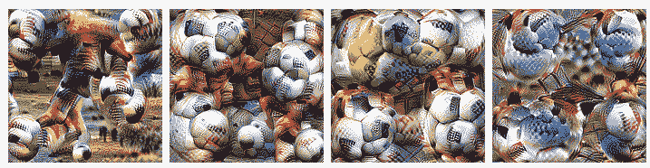

图 12：隐藏神经元学会检测的特征类型的可视化。图像来源 [165] 本图，来自 [165]，展示了优化输入以显示隐藏神经元学会识别的特征的结果。在这个例子中，隐藏神经元学会了检测（特别是）足球、网球、棒球，甚至足球运动员的腿。

大量可解释性方法关注于 (i) 探测神经网络中的隐藏神经元——理解其对何种输入的激活 (ii) 直接优化输入以激活隐藏神经元。这两种技术都能提供有用的见解，了解神经网络选择关注的内容，这反过来对应于数据的重要属性。

几篇论文属于探测类别 [259, 272]，其中网络解剖的研究尤为详细 [17]。在这里，隐藏神经元按其响应的特征类型进行分类。论文网站 [`netdissect.csail.mit.edu/`](http://netdissect.csail.mit.edu/) 包含了方法细节以及代码和数据的链接。

另一类方法是使用神经网络，固定其参数，并优化输入以发现激活某些隐藏神经元的特征。这种方法有几篇论文使用，但特别值得注意的是特征可视化 [165]，有一个互动文章和代码，网址是：[`distill.pub/2017/feature-visualization/`](https://distill.pub/2017/feature-visualization/)。后续工作，激活图谱 [26]（页面：[`distill.pub/2019/activation-atlas/`](https://distill.pub/2019/activation-atlas/)），对许多不同概念进行了处理，提供了神经网络所学习特征的完整映射。最近的研究 [164] 将此作为构建模块，以进一步理解神经网络中如何执行某些计算。另一个相关的研究是 [104]，它关注于寻找与可解释概念对应的隐藏神经元的线性组合。

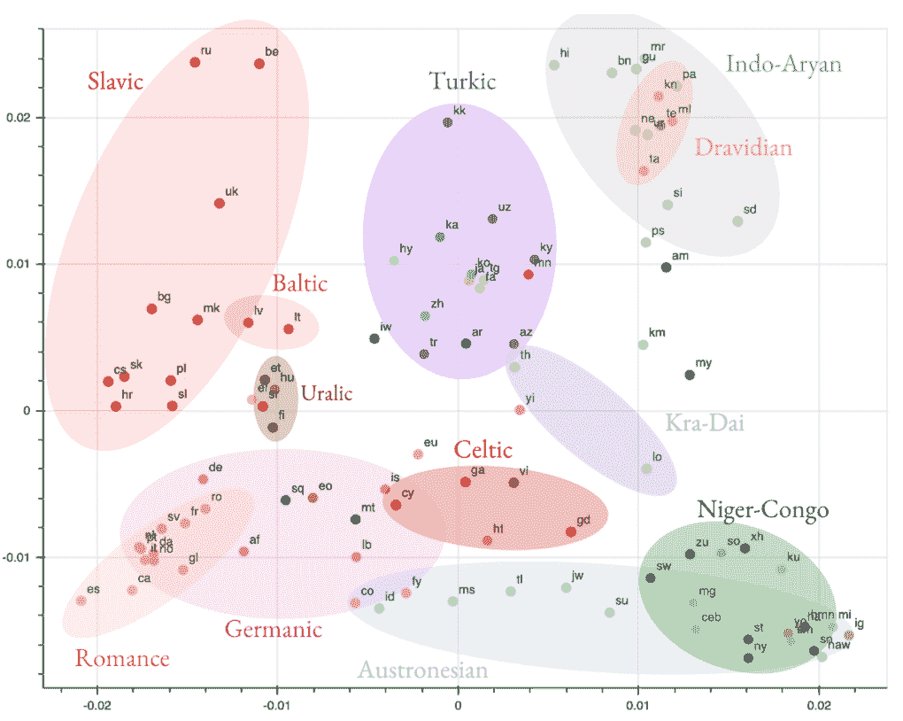

图 13：聚类神经网络隐藏表示以揭示语言结构。图像来源 [118] 在分析多语言翻译系统的研究 [118] 中，使用表示分析技术来计算不同语言的神经网络（Transformer）隐藏表示的相似性。对结果进行聚类可以揭示不同语言表示的分组（每种语言在图上表示为一个点），这些分组按照语言家族进行排列，从而影响语言结构。重要的是，这种分析利用神经网络识别基础数据的关键属性，这种调查模式在科学领域可能非常有用。

#### 7.2.2 神经网络隐藏表示的降维

在许多标准科学设置中，例如分析单细胞数据，降维方法如 PCA、t-SNE [141]、UMAP [148] 对揭示数据变异的重要因素和关键差异（例如肿瘤细胞与健康细胞）非常有用。这些方法也可以用于神经网络的隐藏激活（对某些输入数据集）。通过在某些预测任务上进行训练，神经网络可能会在其隐藏表示中隐式学习这些重要的数据属性，这些属性随后可以通过降维方法提取出来。

#### 7.2.3 表示比较和相似性

与更标准的降维和聚类方法相关的一系列研究工作已经探讨了跨不同神经网络模型比较隐藏表示的技术。早期的工作应用了匹配算法[126]，随后采用了典范相关分析[183、157]（相关代码见[`github.com/google/svcca`](https://github.com/google/svcca)）。这一方法已被用来识别和理解自然语言应用中的许多表征属性[118、16、235]，甚至在将小鼠视觉皮层建模为人工神经网络时[208]也有所应用。另一种近期的技术使用基于核的方法进行相似性比较[115]（代码见[`colab.sandbox.google.com/github/google-research/google-research/blob/master/representation_similarity/Demo.ipynb`](https://colab.sandbox.google.com/github/google-research/google-research/blob/master/representation_similarity/Demo.ipynb)）。

### 7.3 技术参考

之前的部分包含了许多有用的技术指针和相关的开源代码参考。一个额外的普遍参考是[`christophm.github.io/interpretable-ml-book/`](https://christophm.github.io/interpretable-ml-book/)，这是一本关于可解释机器学习的完全开源书籍。它略微侧重于更传统的可解释性方法，但与上述一些技术有有用的重叠，并可能提供有前景的开放方向。

## 8 种高级深度学习方法

目前调查中概述的方法和任务——监督学习、基本神经网络架构（及其多种不同任务）、转移学习等不同范式以及减少标注数据依赖的方法如自监督学习和半监督学习——是适用于任何深度学习问题的优秀初步方法。在大多数这类问题中，这些方法通常也足以找到良好的解决方案。

然而，有时可能需要转向更高级的深度学习方法，特别是生成模型和强化学习。我们将这些方法称为高级方法，因为它们通常更复杂，且可能需要特定问题的特性才能有效，例如强化学习的优秀环境模型/模拟器。我们在下文中提供了这些方法的简要概述。

### 8.1 生成模型

从高层次来看，生成建模有两个基本目标。首先，它旨在对高维数据分布进行建模并实现采样，例如自然图像。其次，它寻求学习数据的低维潜在编码，以捕捉关键的兴趣属性。

为了实现第一个目标，生成模型将高维分布的样本作为输入，例如人脸图像，并直接在这些数据实例上学习某些任务（例如，对实例进行编码然后解码，或学习生成与给定数据样本无法区分的合成实例，或使用邻近像素作为上下文生成每像素值）。如果生成建模在这个第一个目标上取得完美成功，它将使得能够持续采样“免费”的数据实例！这种完美的成功非常具有挑战性，但过去几年在数据分布样本的多样性和逼真性方面取得了巨大进展。

对于第二个目标，学习具有不同编码维度的数据潜在编码，并将其与有意义的变化因素对应，在模型中具有明确的编码器-解码器结构可以有助于促进这种表示的学习。这是某些类型生成模型的默认结构，如变分自编码器[109]，但也已被应用于其他模型，如 BigBiGAN[49]，一种生成对抗网络。以下部分我们将概述一些主要的生成模型类型。

#### 8.1.1 生成对抗网络

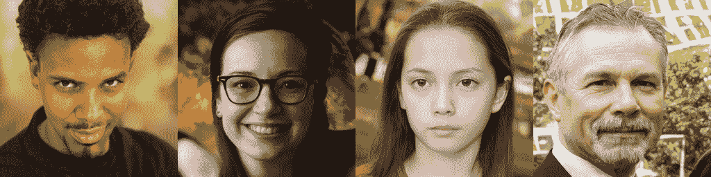

图 14：由 StyleGAN2 从零开始生成的人脸。图像来源[100] 图中展示了多个由 StyleGAN2[100]生成的人脸样本。虽然完全建模并捕捉复杂数据分布如人脸的全面多样性仍然具有挑战性，但最近生成模型的样本质量和逼真性非常高。

可以说，所有不同类型的生成模型中最著名的就是生成对抗网络，通常称为 GAN。GAN 由两个神经网络组成，一个生成器和一个判别器，它们彼此对抗。生成器将随机噪声向量作为输入，并尝试输出看起来像数据分布的样本（例如，合成面部图像），而判别器则尝试区分数据的真实样本和生成器合成的样本。GAN 首次提出于[68]，在研究领域中非常受欢迎，最近的变体如 BigGAN[22]（代码：[`github.com/ajbrock/BigGAN-PyTorch`](https://github.com/ajbrock/BigGAN-PyTorch)），BigBiGAN[49]和 StyleGAN(2) [100]（代码：[`github.com/NVlabs/stylegan2`](https://github.com/NVlabs/stylegan2)）能够生成极其逼真的图像。

##### 无条件 GAN 与条件 GAN

上述示例都是无条件 GAN，其中数据是以随机噪声向量作为输入生成的。一个流行且非常有用的变体是条件 GAN，其中生成是基于额外的信息，比如标签或“源”图像，这些图像可能会被转换为不同的风格。示例包括 pix2pix [96]（代码: [`phillipi.github.io/pix2pix/`](https://phillipi.github.io/pix2pix/)）、cycleGAN [274]，以及这些应用于视频的情况 [27]。

GAN 在许多科学应用中找到了用武之地，从在医学图像设置中执行数据增强 [65] 到蛋白质生成 [193]。GAN 的“对抗性”损失目标可能使其训练变得有些棘手，有用的实现建议见于 [`www.fast.ai/2019/05/03/decrappify/`](https://www.fast.ai/2019/05/03/decrappify/)，而（针对条件 GAN 的）建议则包含在 [`github.com/jantic/DeOldify`](https://github.com/jantic/DeOldify) 中。

#### 8.1.2 变分自编码器

另一种生成模型是变分自编码器，这一模型首次由 [109] 提出。变分自编码器具有编码器-解码器结构，从而具有显式的潜在编码，可以捕捉数据分布的有用特性。它们还能够估计样本数据点的可能性——即其在数据分布中出现的概率。变分自编码器也非常受欢迎，提出了许多变体和扩展 [216, 99, 107, 71]。由于显式的潜在编码和估计可能性的能力，它们还在各种科学环境中找到了应用，例如用于建模单细胞 RNA 测序中的基因表达 [138]。

#### 8.1.3 自回归模型

另一种生成模型是自回归模型，这些模型顺序地接收输入，并利用这些输入生成适当的输出。例如，这些模型可能接收一系列像素值（其中一些是在先前时间步生成的），并利用这些生成特定空间位置的新像素值。像 PixelRNN [168]、PixelCNN（及其变体）[232, 200] 和最近提出的 VQ-VAE(2) [189]（代码: [`github.com/rosinality/vq-vae-2-pytorch`](https://github.com/rosinality/vq-vae-2-pytorch)）提供了非常高的生成质量。

#### 8.1.4 流模型

一种相对较新的生成模型类别——流模型，通过一系列可逆变换进行生成，从而能够计算精确的似然。最早在[46，47]中提出，通过执行一个富有表现力但可处理的可逆变换序列是一个活跃的研究领域[108，86]。关于正则化流的一个很好的介绍，可以在这个短视频教程中找到 [`www.youtube.com/watch?v=i7LjDvsLWCg&feature=youtu.be`](https://www.youtube.com/watch?v=i7LjDvsLWCg&feature=youtu.be)。

### 8.2 强化学习

强化学习对迄今为止介绍的技术和方法有着相当不同的框架，旨在解决顺序决策问题。通常以环境和代理的概念来介绍。代理可以在环境中采取一系列的动作，每个动作都以某种方式影响环境状态，并且还可能导致奖励（反馈）——对于导致“好”状态的良好动作序列，“正面”奖励反馈，对于导致“坏”状态的不良动作序列，“负面”奖励反馈。例如，在象棋这样的游戏中，状态是所有棋子的当前位置（游戏状态），动作是移动一颗棋子，良好的动作序列导致胜利，不良的动作序列导致失败，奖励可能是 1 或 0，具体取决于是否获胜或失败。

在这个设定下，强化学习的目标是通过与环境的交互，学习出好的动作序列（通常称为策略）。与监督学习不同，反馈（奖励）通常只在执行完整个动作序列后才给出。具体来说，反馈是稀疏且延迟的。根据问题的具体情况，有各种不同的强化学习用例。

#### 8.2.1 具有环境模型/模拟器的强化学习

强化学习的一些最引人注目的结果，比如 AlphaGoZero[212]，关键地使用了环境模型/模拟器。在这种情况下，各种学习算法[242，203，128]（一些代码：[`github.com/openai/baselines`](https://github.com/openai/baselines)）可以帮助代理学习到一个好的动作序列，通常同时通过学习一个值函数——一个确定特定环境状态是否有利的函数。因为环境状态的好处可能取决于整个动作序列（其中一些尚未发生），所以通过隐式地考虑可能的未来动作，强化学习在正确评估环境状态的价值方面非常重要。将值函数与传统搜索算法相结合已经是一种非常强大的使用强化学习的方式，并且可能广泛适用于许多领域。

具体而言，如果解决问题的过程是多步骤的，即使在模拟中可能有噪声验证，使用强化学习来学习一个好的价值函数，并将其与搜索算法结合，可能会发现搜索空间中的新且更有效的部分。像这样的研究在考虑强化学习应用于计算机系统的基本问题时已获得关注，其中[144]提供了调查和新的基准，而在设计任务特定的神经网络模型方面也获得了进展[174]。后者最近也导致了科学用例——设计神经网络以模拟跨越天文学、化学、物理、气候建模等复杂过程[101]。

#### 8.2.2 无需模拟器的强化学习

在其他环境中，我们没有访问环境模型/模拟器的权限，可能仅有一系列动作记录（以及随之而来的状态和奖励）。这就是离线环境。在这种情况下，我们仍然可以尝试使用观察到的动作/状态/奖励序列结合离线策略方法[209, 182, 134]来教导智能体一个好的策略，但彻底的验证和评估可能会很具挑战性。在离线策略环境中，评估通常使用一种称为离线策略评估的统计技术（例如算法包括[178, 133]）。在机器人学中，强化学习文献研究了在模拟中学习的策略与在真实数据中学习的策略之间的迁移学习[198]。深度强化学习的全面概述可以参考[`rail.eecs.berkeley.edu/deeprlcourse/`](http://rail.eecs.berkeley.edu/deeprlcourse/)。

## 9 实施提示

在这一节中，我们强调了一些实现这些模型的有用提示。

##### 探索你的数据

在开始学习阶段的步骤之前（见图 1），务必对你的数据进行彻底探索。简单的降维方法或聚类结果如何？标签是否可靠？不同类别之间是否存在不平衡？不同的子群体是否得到适当表示？

##### 尝试简单的方法

当开始处理一个全新问题时，尝试最简单的版本是很有用的。（甚至可以从不学习开始——天真的多数基线表现如何？对于有大规模不平衡的数据集，这可能相当强！）如果数据集非常大，有没有更小的子样本/缩小版本可以用于更快的初步测试？最简单的模型可能表现良好吗？多数基线表现如何？（这涉及到数据有类别不平衡的设置。）模型是否（如预期的那样）在非常小的数据子集上过拟合？

##### 尽可能从经过良好测试的模型/任务/方法开始

随着大量标准模型（其中许多已预训练）、数据增强和优化方法的可用（见第三部分），大多数新问题将适合这些选择中的某些标准集。开始时使用这些！同时调试数据集和与新问题相关的目标函数，以及调试神经网络模型、任务选择、优化算法等，非常具有挑战性。

此外，许多标准模型/任务/方法选择都有很好的基准测试，在这些设置中探索性能是理解新问题固有挑战的一个极好的第一步。尽可能地，开始学习阶段的最简单方法是克隆一个包含所需模型和训练代码的合适 github 仓库，并对其进行最小编辑以适应新的数据集和目标函数。

##### 调试低性能的第一步

在组装了一个端到端系统后，你发现它在验证数据上的表现不佳。这是什么原因？在深入探讨超参数选择等更微妙的设计问题之前，一些首先要查看的事项可能是（i）模型是否过拟合？如果是，增加正则化、数据增强、早停，或使用更小的模型可能会有所帮助。（ii）训练数据和验证数据之间是否存在分布偏移？（iii）模型是否欠拟合？如果是，通过查看模型在较小的训练数据子集上是否过拟合来检查优化过程。尝试更简单的任务。检查标签或数据实例中的噪声以及分布偏移。（iv）查看模型出错的实例。是否存在某种模式？对于不平衡数据集，损失函数重加权或对较少类进行更多增强可能会有所帮助。（v）模型性能在多次随机重运行中的稳定性如何？（vi）在训练过程中梯度和中间表示的范数是多少？

##### 哪些超参数最重要？

提升深度学习性能的一个大挑战是可能需要调整的大量超参数。在实践中，一些最简单的超参数通常对性能的影响最大，例如学习率和学习率调度。选择一个正确实现了诸如权重衰减等细微差别的优化器也可能非常重要，参见这篇关于非常流行的优化器 AdamW 的优秀文章 [`www.fast.ai/2018/07/02/adam-weight-decay/`](https://www.fast.ai/2018/07/02/adam-weight-decay/)。可视化主要目标函数与不同正则化器（如权重衰减）对总损失的贡献也可能非常有用。

其他可以探索的超参数包括批量大小和数据预处理，尽管如果这些使用标准设置，变动学习率相关的超参数可能是最有用的探索方面。为了测试不同的超参数设置，进行交叉验证是非常有用的：保留一部分训练数据，在剩余数据上训练不同的超参数设置，选择在保留数据上表现最佳的超参数设置，然后在整个训练数据集上重新训练该超参数设置。

##### 彻底验证你的模型！

深度学习模型因依赖数据中的虚假相关性来进行预测而臭名昭著[8, 162, 247]。这里的虚假相关性指的是数据实例中的特征恰好与特定标签共现，但不会导致一个稳健、可推广的模型。例如，假设我们有来自不同胸部 X 光机（对应不同医院）的数据，我们将这些数据放在一起训练一个深度学习模型。可能有一台机器正好扫描了很多病人。深度学习模型可能会隐含地学习到胸部 X 光机的特征，而不是疾病的特征。确保模型以可推广方式学习的最佳测试之一是评估模型在与训练数据分开收集的数据上的表现，这将引入一些自然的分布变化，并提供更稳健的准确性估计。一些最近探讨这些问题的有趣论文包括[81, 190]。

相关地，深度神经网络也会捕捉数据中的任何偏见，例如，当被要求预测年龄时，可能会学习关注性别（一个敏感属性），这是由于类别不平衡导致的虚假相关。这可能会对科学环境中的普遍结论提出重大挑战，因为数据可能来自一个人群，但预测必须在所有人群中准确。因此，对模型表示进行后处理分析以识别此类偏见的存在是重要的。研究如何去除这些表示中的偏见是一项活跃的研究方向 [4, 241]。

##### 实施参考

关于实施的一些一般设计考虑（以及影响大规模部署的因素，未在此调查中探讨）在此概述中讨论 [`github.com/chiphuyen/machine-learning-systems-design/blob/master/build/build1/consolidated.pdf`](https://github.com/chiphuyen/machine-learning-systems-design/blob/master/build/build1/consolidated.pdf)。

关于训练和调试深度学习系统的具体点，有两个出色的指南：[`josh-tobin.com/assets/pdf/troubleshooting-deep-neural-networks-01-19.pdf`](http://josh-tobin.com/assets/pdf/troubleshooting-deep-neural-networks-01-19.pdf) 和 [`karpathy.github.io/2019/04/25/recipe/`](http://karpathy.github.io/2019/04/25/recipe/)。

## 10 结论

随着来自各种科学领域的数据量在数量和复杂性上持续增加，深度学习方法为基础预测问题和揭示数据生成过程的细微属性提供了许多令人兴奋的可能性。在这项调查中，我们概述了许多高度成功的深度学习模型、任务和方法，并引用了社区开发的非常全面的开源资源。我们希望这些概述和参考资料能够加速深度学习在多种科学问题中的应用！

## 致谢

作者感谢 Jon Kleinberg、Samy Bengio、Yann LeCun、Chiyuan Zhang、Quoc Le、Arun Chaganty、Simon Kornblith、Aniruddh Raghu、John Platt、Richard Murray、Stu Feldman 和 Guy Gur-Ari 对早期版本的反馈和评论。

## 参考文献

+   [1] Waleed Abdulla. 颜色的飞溅：使用 Mask R-CNN 和 TensorFlow 进行实例分割, 2018. [`engineering.matterport.com/splash-of-color-instance-segmentation-with-mask-r-cnn-and-tensorflow-7c761e238b46`](https://engineering.matterport.com/splash-of-color-instance-segmentation-with-mask-r-cnn-and-tensorflow-7c761e238b46)。

+   [2] Roee Aharoni, Melvin Johnson 和 Orhan Firat. 大规模多语言神经机器翻译. arXiv 预印本 arXiv:1903.00089, 2019。

+   [3] 杰伊·阿拉马尔。《插图变换器》，2018 年。 [`jalammar.github.io/illustrated-transformer/`](http://jalammar.github.io/illustrated-transformer/)。

+   [4] 莫汉·阿尔维、安德鲁·齐瑟曼和克里斯托弗·内尔拉克。《视而不见：从深度神经网络嵌入中显式去除偏差和变异》。在欧洲计算机视觉会议（ECCV）论文集中，页码 0–0，2018 年。

+   [5] 马里奥斯·安西莫普洛斯、斯特尔吉奥斯·基里斯托杜利季斯、卢卡斯·埃布纳、安德烈亚斯·克里斯特和斯塔夫鲁拉·穆吉亚卡库。《使用深度卷积神经网络对间质性肺疾病进行肺部模式分类》。IEEE 医学成像事务，35(5)：1207–1216，2016 年。

+   [6] 塞巴斯蒂安·巴赫、亚历山大·宾德、格雷戈瓦尔·蒙塔冯、弗雷德里克·克劳申、克劳斯-罗伯特·穆勒和沃伊切赫·萨梅克。《通过逐层相关传播对非线性分类器决策的逐像素解释》。PloS one，10(7)：e0130140，2015 年。

+   [7] 菲利普·巴赫曼、R·德文·赫尔姆和威廉·布赫瓦尔特。《通过最大化视图间的互信息学习表示》。arXiv 预印本 arXiv:1906.00910，2019 年。

+   [8] 马库斯·A·巴吉利、约翰·R·泽赫、卢克·奥克登-雷纳、本杰明·S·格利克斯伯格、曼维·刘、威廉·盖尔、迈克尔·V·麦康奈尔、贝瑟尼·佩查、托马斯·M·斯奈德和乔尔·T·达德利。《深度学习通过混杂的患者和医疗变量预测髋关节骨折》。npj 数字医学，2(1)：31，2019 年。

+   [9] 维贾伊·巴德里纳亚南、亚历克斯·肯德尔和罗伯托·西波拉。《Segnet：用于图像分割的深度卷积编码器-解码器架构》。IEEE 模式分析与机器智能事务，39(12)：2481–2495，2017 年。

+   [10] 德兹密特里·巴赫达瑙、金亨训和约书亚·本吉奥。《通过联合学习对齐和翻译的神经机器翻译》。arXiv 预印本 arXiv:1409.0473，2014 年。

+   [11] 德兹密特里·巴赫达瑙、扬·乔罗夫斯基、德米特里·谢尔杜克、菲利蒙·布拉克尔和约书亚·本吉奥。《端到端基于注意力的大词汇量语音识别》。在 2016 年 IEEE 国际声学、语音和信号处理会议（ICASSP）论文集中，页码 4945–4949。IEEE，2016 年。

+   [12] 古哈·巴拉克里希南、艾米·赵、梅特·R·萨布恩库、约翰·古塔格和阿德里安·V·达尔卡。《一种用于可变形医学图像配准的无监督学习模型》。在 IEEE 计算机视觉与模式识别会议论文集中，页码 9252–9260，2018 年。

+   [13] 古哈·巴拉克里希南、艾米·赵、梅特·R·萨布恩库、约翰·古塔格和阿德里安·V·达尔卡。《Voxelmorph：一种用于可变形医学图像配准的学习框架》。IEEE 医学成像事务，2019 年。

+   [14] 约书亚·巴特森和洛伊克·罗耶。《Noise2self：通过自我监督的盲去噪》。arXiv 预印本 arXiv:1901.11365，2019 年。

+   [15] 彼得·巴塔利亚、拉兹万·帕斯卡努、马修·莱、达尼洛·吉门内斯·雷泽德等。《用于了解物体、关系和物理的交互网络》。在神经信息处理系统进展论文集中，页码 4502–4510，2016 年。

+   [16] Anthony Bau、Yonatan Belinkov、Hassan Sajjad、Nadir Durrani、Fahim Dalvi 和 James Glass. 识别和控制神经机器翻译中的重要神经元。arXiv 预印本 arXiv:1811.01157，2018 年。

+   [17] David Bau、Bolei Zhou、Aditya Khosla、Aude Oliva 和 Antonio Torralba. 网络剖析：量化深度视觉表征的可解释性。发表于 IEEE 计算机视觉与模式识别大会论文集，页码 6541–6549，2017 年。

+   [18] Iz Beltagy、Arman Cohan 和 Kyle Lo. Scibert: 预训练的上下文嵌入用于科学文本。arXiv 预印本 arXiv:1903.10676，2019 年。

+   [19] David Berthelot、Nicholas Carlini、Ian Goodfellow、Nicolas Papernot、Avital Oliver 和 Colin Raffel. Mixmatch: 一种整体性的半监督学习方法。arXiv 预印本 arXiv:1905.02249，2019 年。

+   [20] Mariusz Bojarski、Anna Choromanska、Krzysztof Choromanski、Bernhard Firner、Larry Jackel、Urs Muller 和 Karol Zieba. Visualbackprop: 视觉化 CNNs 用于自动驾驶。arXiv 预印本 arXiv:1611.05418，2，2016 年。

+   [21] Xavier Bresson 和 Thomas Laurent. 一种用于分子生成的两步图卷积解码器。arXiv 预印本 arXiv:1906.03412，2019 年。

+   [22] Andrew Brock、Jeff Donahue 和 Karen Simonyan. 大规模 GAN 训练用于高保真自然图像合成。arXiv 预印本 arXiv:1809.11096，2018 年。

+   [23] Renzhi Cao、Colton Freitas、Leong Chan、Miao Sun、Haiqing Jiang 和 Zhangxin Chen. Prolango: 基于递归神经网络的蛋白质功能预测。Molecules，22(10):1732，2017 年。

+   [24] Zhe Cao、Gines Hidalgo、Tomas Simon、Shih-En Wei 和 Yaser Sheikh. OpenPose: 实时多人 2D 姿态估计使用部分关联场。发表于 arXiv 预印本 arXiv:1812.08008，2018 年。

+   [25] Brandon Carter、Jonas Mueller、Siddhartha Jain 和 David Gifford. 你为什么这样做？理解黑箱决策的充分输入子集。arXiv 预印本 arXiv:1810.03805，2018 年。

+   [26] Shan Carter、Zan Armstrong、Ludwig Schubert、Ian Johnson 和 Chris Olah. 激活图谱。Distill，2019 年。https://distill.pub/2019/activation-atlas。

+   [27] Caroline Chan、Shiry Ginosar、Tinghui Zhou 和 Alexei A Efros. 现在开始跳舞吧。发表于 IEEE 国际计算机视觉会议论文集，页码 5933–5942，2019 年。

+   [28] Danqi Chen 和 Christopher Manning. 使用神经网络的快速准确的依赖解析器。在 2014 年自然语言处理经验方法会议 (EMNLP) 论文集上，页码 740–750，2014 年。

+   [29] Ting Chen、Simon Kornblith、Mohammad Norouzi 和 Geoffrey Hinton. 一种简单的视觉表征对比学习框架。arXiv 预印本 arXiv:2002.05709，2020 年。

+   [30] Ting Chen、Yizhou Sun、Yue Shi 和 Liangjie Hong. 关于基于神经网络的协同过滤的采样策略。在第 23 届 ACM SIGKDD 国际知识发现与数据挖掘会议论文集上，页码 767–776，2017 年。

+   [31] Yuhua Chen、Yibin Xie、Zhengwei Zhou、Feng Shi、Anthony G Christodoulou 和 Debiao Li。使用 3D 深度密集连接神经网络进行脑 MRI 超分辨率。在 2018 年 IEEE 第 15 届生物医学成像国际研讨会（ISBI 2018），页 739–742。IEEE，2018 年。

+   [32] Jan K Chorowski、Dzmitry Bahdanau、Dmitriy Serdyuk、Kyunghyun Cho 和 Yoshua Bengio。基于注意力的语音识别模型。在神经信息处理系统进展，页 577–585，2015 年。

+   [33] Özgün Çiçek、Ahmed Abdulkadir、Soeren S Lienkamp、Thomas Brox 和 Olaf Ronneberger。3D U-Net：从稀疏标注中学习密集体积分割。在国际医学图像计算与计算机辅助干预会议，页 424–432。Springer，2016 年。

+   [34] Kevin Clark、Minh-Thang Luong、Christopher D Manning 和 Quoc V Le。通过交叉视图训练的半监督序列建模。arXiv 预印本 arXiv:1809.08370，2018 年。

+   [35] Taco Cohen 和 Max Welling。群体等变卷积网络。在国际机器学习会议，页 2990–2999，2016 年。

+   [36] Taco S Cohen、Mario Geiger、Jonas Köhler 和 Max Welling。球面卷积神经网络。arXiv 预印本 arXiv:1801.10130，2018 年。

+   [37] Peter Corbett 和 John Boyle。通过迁移学习和专门的词嵌入改善化学-蛋白质相互作用的学习。《数据库》，2018，2018 年。

+   [38] Ekin D Cubuk、Barret Zoph、Jonathon Shlens 和 Quoc V Le。RandAugment：无需单独搜索的实用数据增强。arXiv 预印本 arXiv:1909.13719，2019 年。

+   [39] Adrian Dalca、Marianne Rakic、John Guttag 和 Mert Sabuncu。学习条件可变形模板与卷积网络。在神经信息处理系统进展，页 804–816，2019 年。

+   [40] Yann Dauphin。Mixup：超越经验风险最小化。《图像》，2017 年。[`www.dauphin.io/`](https://www.dauphin.io/)。

+   [41] Nicola De Cao 和 Thomas Kipf。Molgan：一种用于小分子图的隐式生成模型。arXiv 预印本 arXiv:1805.11973，2018 年。

+   [42] Jia Deng、Wei Dong、Richard Socher、Li-Jia Li、Kai Li 和 Li Fei-Fei。ImageNet：一个大规模分层图像数据库。在 2009 年 IEEE 计算机视觉与模式识别会议，页 248–255。IEEE，2009 年。

+   [43] Jacob Devlin、Ming-Wei Chang、Kenton Lee 和 Kristina Toutanova。BERT：用于语言理解的深度双向变换器的预训练。arXiv 预印本 arXiv:1810.04805，2018 年。

+   [44] Terrance DeVries 和 Graham W Taylor。通过 Cutout 改进卷积神经网络的正则化。arXiv 预印本 arXiv:1708.04552，2017 年。

+   [45] Yiming Ding、Jae Ho Sohn、Michael G Kawczynski、Hari Trivedi、Roy Harnish、Nathaniel W Jenkins、Dmytro Lituiev、Timothy P Copeland、Mariam S Aboian、Carina Mari Aparici 等。通过使用 18F-FDG PET 脑部的深度学习模型预测阿尔茨海默病的诊断。《放射学》，290(2)：456–464，2018 年。

+   [46] Laurent Dinh, David Krueger 和 Yoshua Bengio. NICE：非线性独立成分估计。arXiv 预印本 arXiv:1410.8516, 2014。

+   [47] Laurent Dinh, Jascha Sohl-Dickstein 和 Samy Bengio. 使用真实 NVP 的密度估计。arXiv 预印本 arXiv:1605.08803, 2016。

+   [48] Carl Doersch, Abhinav Gupta 和 Alexei A Efros. 通过上下文预测进行无监督视觉表示学习。发表于《IEEE 国际计算机视觉会议论文集》，第 1422–1430 页, 2015。

+   [49] Jeff Donahue 和 Karen Simonyan. 大规模对抗性表示学习。发表于《神经信息处理系统进展》，第 10541–10551 页, 2019。

+   [50] Chao Dong, Chen Change Loy, Kaiming He 和 Xiaoou Tang. 使用深度卷积网络进行图像超分辨率。IEEE 模式分析与机器智能学报, 38(2):295–307, 2015。

+   [51] Alexey Dosovitskiy, Jost Tobias Springenberg, Martin Riedmiller 和 Thomas Brox. 通过卷积神经网络进行判别式无监督特征学习。发表于《神经信息处理系统进展》，第 766–774 页, 2014。

+   [52] Yong Du, Wei Wang 和 Liang Wang. 基于骨架的动作识别的层次递归神经网络。发表于《IEEE 计算机视觉与模式识别会议论文集》，第 1110–1118 页, 2015。

+   [53] David K Duvenaud, Dougal Maclaurin, Jorge Iparraguirre, Rafael Bombarell, Timothy Hirzel, Alán Aspuru-Guzik 和 Ryan P Adams. 用于学习分子指纹的图卷积网络。发表于《神经信息处理系统进展》，第 2224–2232 页, 2015。

+   [54] Sergey Edunov, Myle Ott, Michael Auli 和 David Grangier. 大规模理解回译。arXiv 预印本 arXiv:1808.09381, 2018。

+   [55] Andre Esteva, Brett Kuprel, Roberto A Novoa, Justin Ko, Susan M Swetter, Helen M Blau 和 Sebastian Thrun. 通过深度神经网络实现皮肤癌的皮肤科医生级分类。Nature, 542(7639):115, 2017。

+   [56] Linjing Fang, Fred Monroe, Sammy Weiser Novak, Lyndsey Kirk, Cara R Schiavon, B Yu Seungyoon, Tong Zhang, Melissa Wu, Kyle Kastner, Yoshiyuki Kubota 等. 基于深度学习的点扫描超分辨率成像。bioRxiv, 第 740548 页, 2019。

+   [57] Chelsea Finn, Ian Goodfellow 和 Sergey Levine. 通过视频预测进行物理交互的无监督学习。发表于《神经信息处理系统进展》，第 64–72 页, 2016。

+   [58] Marc Finzi, Samuel Stanton, Pavel Izmailov 和 Andrew Gordon Wilson. 为 Lie 群上的任意连续数据推广卷积神经网络的等变性。arXiv 预印本 arXiv:2002.12880, 2020。

+   [59] Ruth C Fong 和 Andrea Vedaldi. 通过有意义的扰动解释黑箱。发表于《IEEE 国际计算机视觉会议论文集》，第 3429–3437 页, 2017。

+   [60] Alex Fout, Jonathon Byrd, Basir Shariat 和 Asa Ben-Hur。使用图卷积网络进行蛋白质界面预测。发表于神经信息处理系统进展，页码 6530–6539, 2017。

+   [61] Ferenc Galkó 和 Carsten Eickhoff。通过加权神经网络段落检索进行生物医学问答。发表于欧洲信息检索会议，页码 523–528。Springer，2018。

+   [62] Yaroslav Ganin 和 Victor Lempitsky。通过反向传播进行无监督领域适应。arXiv 预印本 arXiv:1409.7495, 2014。

+   [63] Yaroslav Ganin, Evgeniya Ustinova, Hana Ajakan, Pascal Germain, Hugo Larochelle, François Laviolette, Mario Marchand 和 Victor Lempitsky。神经网络的领域对抗训练。机器学习研究杂志, 17(1):2096–2030, 2016。

+   [64] Leon A Gatys, Alexander S Ecker 和 Matthias Bethge。使用卷积神经网络进行图像风格迁移。发表于 IEEE 计算机视觉与模式识别会议，页码 2414–2423, 2016。

+   [65] Amirata Ghorbani, Vivek Natarajan, David Coz 和 Yuan Liu。Dermgan: 合成生成临床皮肤图像及病理。arXiv 预印本 arXiv:1911.08716, 2019。

+   [66] Spyros Gidaris, Praveer Singh 和 Nikos Komodakis。通过预测图像旋转进行无监督表示学习。arXiv 预印本 arXiv:1803.07728, 2018。

+   [67] Justin Gilmer, Samuel S Schoenholz, Patrick F Riley, Oriol Vinyals 和 George E Dahl。量子化学中的神经信息传递。发表于第 34 届国际机器学习会议，第 70 卷，页码 1263–1272。JMLR. org，2017。

+   [68] Ian Goodfellow, Jean Pouget-Abadie, Mehdi Mirza, Bing Xu, David Warde-Farley, Sherjil Ozair, Aaron Courville 和 Yoshua Bengio。生成对抗网络。发表于神经信息处理系统进展，第页码 2672–2680, 2014。

+   [69] Priya Goyal, Dhruv Mahajan, Abhinav Gupta 和 Ishan Misra。自监督视觉表示学习的扩展与基准测试。arXiv 预印本 arXiv:1905.01235, 2019。

+   [70] Alex Graves, Abdel-rahman Mohamed 和 Geoffrey Hinton. 使用深度递归神经网络进行语音识别。发表于 2013 IEEE 国际声学、语音和信号处理会议，页码 6645–6649。IEEE，2013。

+   [71] Aditya Grover, Aaron Zweig 和 Stefano Ermon。Graphite: 图的迭代生成建模。arXiv 预印本 arXiv:1803.10459, 2018。

+   [72] Varun Gulshan, Lily Peng, Marc Coram, Martin C Stumpe, Derek Wu, Arunachalam Narayanaswamy, Subhashini Venugopalan, Kasumi Widner, Tom Madams, Jorge Cuadros 等人。开发和验证用于检测糖尿病视网膜病变的深度学习算法，基于视网膜眼底照片。Jama, 316(22):2402–2410, 2016。

+   [73] Maryam Habibi, Leon Weber, Mariana Neves, David Luis Wiegandt 和 Ulf Leser。使用词嵌入的深度学习改善生物医学命名实体识别。生物信息学, 33(14):i37–i48, 2017。

+   [74] Bo Han, Quanming Yao, Xingrui Yu, Gang Niu, Miao Xu, Weihua Hu, Ivor Tsang 和 Masashi Sugiyama. Co-teaching：用极其嘈杂标签进行深度神经网络的鲁棒训练。在《神经信息处理系统进展》中，页码 8527–8537, 2018。

+   [75] Ankur Handa, Michael Bloesch, Viorica Pătrăucean, Simon Stent, John McCormac 和 Andrew Davison. gvnn：用于几何计算机视觉的神经网络库。在欧洲计算机视觉会议上，页码 67–82。施普林格，2016。

+   [76] Boris Hanin. 哪些神经网络架构导致梯度爆炸和消失？在《神经信息处理系统进展》上，页码 582–591, 2018。

+   [77] Jack Hanson, Yuedong Yang, Kuldip Paliwal 和 Yaoqi Zhou. 通过深度双向长短期记忆递归神经网络改进蛋白质无序预测。生物信息学, 33(5):685–692, 2016。

+   [78] Kaiming He, Georgia Gkioxari, Piotr Dollár 和 Ross Girshick. Mask R-CNN。在 IEEE 国际计算机视觉会议论文集上，页码 2961–2969, 2017。

+   [79] Kaiming He, Xiangyu Zhang, Shaoqing Ren 和 Jian Sun. 用于图像识别的深度残差学习。在 IEEE 计算机视觉与模式识别会议论文集上，页码 770–778, 2016。

+   [80] Rhys Heffernan, Yuedong Yang, Kuldip Paliwal 和 Yaoqi Zhou. 通过长短期记忆双向递归神经网络捕捉非局部交互，以改善蛋白质二级结构、骨架角度、接触数和溶剂可及性的预测。生物信息学, 33(18):2842–2849, 2017。

+   [81] Dan Hendrycks 和 Thomas Dietterich. 神经网络对常见腐蚀和扰动的鲁棒性基准测试。arXiv 预印本 arXiv:1903.12261, 2019。

+   [82] Dan Hendrycks, Norman Mu, Ekin D Cubuk, Barret Zoph, Justin Gilmer 和 Balaji Lakshminarayanan. Augmix：一种简单的数据处理方法，以提高鲁棒性和不确定性。arXiv 预印本 arXiv:1912.02781, 2019。

+   [83] Karl Moritz Hermann, Tomas Kocisky, Edward Grefenstette, Lasse Espeholt, Will Kay, Mustafa Suleyman 和 Phil Blunsom. 教机器阅读和理解。在《神经信息处理系统进展》中，页码 1693–1701, 2015。

+   [84] R Devon Hjelm, Alex Fedorov, Samuel Lavoie-Marchildon, Karan Grewal, Phil Bachman, Adam Trischler 和 Yoshua Bengio. 通过互信息估计和最大化学习深度表示。arXiv 预印本 arXiv:1808.06670, 2018。

+   [85] Daniel Ho, Eric Liang, Ion Stoica, Pieter Abbeel 和 Xi Chen. 基于人群的增强：高效学习增强策略计划。arXiv 预印本 arXiv:1905.05393, 2019。

+   [86] Jonathan Ho, Xi Chen, Aravind Srinivas, Yan Duan 和 Pieter Abbeel. Flow++：通过变分去量化和架构设计改进基于流的生成模型。arXiv 预印本 arXiv:1902.00275, 2019。

+   [87] Sepp Hochreiter. 在学习递归神经网络过程中消失梯度问题及其解决方案. 不确定性、模糊性与知识系统国际期刊, 6(02):107–116, 1998 年。

+   [88] Sepp Hochreiter 和 Jürgen Schmidhuber. 长短期记忆. 神经计算, 9(8):1735–1780, 1997 年。

+   [89] Raphael Hoffmann、Congle Zhang、Xiao Ling、Luke Zettlemoyer 和 Daniel S Weld. 基于知识的弱监督用于重叠关系的信息提取. 见于第 49 届计算语言学协会年会：人类语言技术会议论文集第 1 卷，第 541–550 页. 计算语言学协会, 2011 年。

+   [90] Neil Houlsby、Andrei Giurgiu、Stanislaw Jastrzebski、Bruna Morrone、Quentin De Laroussilhe、Andrea Gesmundo、Mona Attariyan 和 Sylvain Gelly. 参数高效的 NLP 迁移学习. arXiv 预印本 arXiv:1902.00751, 2019 年。

+   [91] Andrew G Howard. 深度卷积神经网络基于图像分类的一些改进. arXiv 预印本 arXiv:1312.5402, 2013 年。

+   [92] Jeremy Howard 和 Sebastian Ruder. 通用语言模型微调用于文本分类. arXiv 预印本 arXiv:1801.06146, 2018 年。

+   [93] Weihua Hu、Bowen Liu、Joseph Gomes、Marinka Zitnik、Percy Liang、Vijay Pande 和 Jure Leskovec. 图神经网络的预训练. arXiv 预印本 arXiv:1905.12265, 2019 年。

+   [94] Gao Huang、Zhuang Liu、Laurens Van Der Maaten 和 Kilian Q Weinberger. 密集连接卷积网络. 见于 IEEE 计算机视觉与模式识别会议论文集，第 4700–4708 页, 2017 年。

+   [95] Minyoung Huh、Pulkit Agrawal 和 Alexei A Efros. 什么使得 imagenet 适合迁移学习？arXiv 预印本 arXiv:1608.08614, 2016 年。

+   [96] Phillip Isola、Jun-Yan Zhu、Tinghui Zhou 和 Alexei A Efros. 基于条件对抗网络的图像到图像翻译. 见于 IEEE 计算机视觉与模式识别会议论文集，第 1125–1134 页, 2017 年。

+   [97] Na Ji. 自适应光学荧光显微镜. 自然方法, 14(4):374, 2017 年。

+   [98] Robin Jia 和 Percy Liang. 神经语义解析的数据重组合. arXiv 预印本 arXiv:1606.03622, 2016 年。

+   [99] Matthew Johnson、David K Duvenaud、Alex Wiltschko、Ryan P Adams 和 Sandeep R Datta. 结合图形模型与神经网络以实现结构化表示和快速推理. 见于神经信息处理系统进展，第 2946–2954 页, 2016 年。

+   [100] Tero Karras、Samuli Laine 和 Timo Aila. 基于风格的生成对抗网络生成器架构. 见于 IEEE 计算机视觉与模式识别会议论文集，第 4401–4410 页, 2019 年。

+   [101] MF Kasim、D Watson-Parris、L Deaconu、S Oliver、P Hatfield、DH Froula、G Gregori、M Jarvis、S Khatiwala、J Korenaga 等. 高达二十亿倍加速的科学模拟通过深度神经架构搜索. arXiv 预印本 arXiv:2001.08055, 2020 年。

+   [102] Jeremy Kawahara, Sara Daneshvar, Giuseppe Argenziano, 和 Ghassan Hamarneh. 使用多任务多模态神经网络的七点检查表和皮肤病变分类。IEEE 生物医学与健康信息学期刊, 23(2):538–546, 2018。

+   [103] Steven Kearnes, Kevin McCloskey, Marc Berndl, Vijay Pande, 和 Patrick Riley. 分子图卷积：超越指纹。计算机辅助分子设计杂志, 30(8):595–608, 2016。

+   [104] Been Kim, Martin Wattenberg, Justin Gilmer, Carrie Cai, James Wexler, Fernanda Viegas, 和 Rory Sayres. 超越特征归因的可解释性：使用概念激活向量 (tcav) 的定量测试。arXiv 预印本 arXiv:1711.11279, 2017。

+   [105] Pieter-Jan Kindermans, Sara Hooker, Julius Adebayo, Maximilian Alber, Kristof T Schütt, Sven Dähne, Dumitru Erhan, 和 Been Kim. (不) 可靠的显著性方法。在《可解释的 AI：解释、说明和可视化深度学习》中, 页码 267–280. Springer, 2019。

+   [106] Pieter-Jan Kindermans, Kristof T Schütt, Maximilian Alber, Klaus-Robert Müller, Dumitru Erhan, Been Kim, 和 Sven Dähne. 学习如何解释神经网络：Patternnet 和 patternattribution。arXiv 预印本 arXiv:1705.05598, 2017。

+   [107] D Kingma, Tim Salimans, R Josefowicz, Xi Chen, Ilya Sutskever, Max Welling 等. 使用逆自回归流改进变分自编码器。2017。

+   [108] Durk P Kingma 和 Prafulla Dhariwal. Glow: 具有可逆 1x1 卷积的生成流。在《神经信息处理系统进展》中, 页码 10215–10224, 2018。

+   [109] Durk P Kingma, Shakir Mohamed, Danilo Jimenez Rezende, 和 Max Welling. 使用深度生成模型的半监督学习。在《神经信息处理系统进展》中, 页码 3581–3589, 2014。

+   [110] Sosuke Kobayashi. 上下文增强：通过具有范式关系的词进行数据增强。arXiv 预印本 arXiv:1805.06201, 2018。

+   [111] Kaname Kojima, Shu Tadaka, Fumiki Katsuoka, Gen Tamiya, Masayuki Yamamoto, 和 Kengo Kinoshita. 基于递归神经网络的相位基因型数据基因型填补方法。bioRxiv, 页码 821504, 2019。

+   [112] Alexander Kolesnikov, Xiaohua Zhai, 和 Lucas Beyer. 重访自监督视觉表征学习。arXiv 预印本 arXiv:1901.09005, 2019。

+   [113] Patrick T Komiske, Eric M Metodiev, 和 Jesse Thaler. 能量流网络：用于粒子喷流的深度集合。高能物理学杂志, 2019(1):121, 2019。

+   [114] Shu Kong 和 Charless Fowlkes. 使用预测滤波流的图像重建。arXiv 预印本 arXiv:1811.11482, 2018。

+   [115] Simon Kornblith, Mohammad Norouzi, Honglak Lee, 和 Geoffrey Hinton. 神经网络表征的相似性重访。arXiv 预印本 arXiv:1905.00414, 2019。

+   [116] Simon Kornblith, Jonathon Shlens, 和 Quoc V Le. 更好的 ImageNet 模型是否能更好地迁移？在 IEEE 计算机视觉与模式识别会议论文集中, 页码 2661–2671, 2019。

+   [117] Alex Krizhevsky, Ilya Sutskever 和 Geoffrey E Hinton. 使用深度卷积神经网络进行 ImageNet 分类。载于《神经信息处理系统进展》，第 1097–1105 页，2012 年。

+   [118] Sneha Reddy Kudugunta, Ankur Bapna, Isaac Caswell, Naveen Arivazhagan 和 Orhan Firat. 大规模研究多语言 nmt 表示。arXiv 预印本 arXiv:1909.02197, 2019。

+   [119] Samuli Laine 和 Timo Aila. 时序集成用于半监督学习。arXiv 预印本 arXiv:1610.02242, 2016。

+   [120] Dong-Hyun Lee. Pseudo-label: 深度神经网络的简单有效半监督学习方法。载于《ICML 表征学习挑战研讨会》，第 3 卷，第 2 页，2013 年。

+   [121] Jinhyuk Lee, Wonjin Yoon, Sungdong Kim, Donghyeon Kim, Sunkyu Kim, Chan Ho So 和 Jaewoo Kang. BioBERT: 预训练的生物医学语言表示模型用于生物医学文本挖掘。arXiv 预印本 arXiv:1901.08746, 2019。

+   [122] Jaakko Lehtinen, Jacob Munkberg, Jon Hasselgren, Samuli Laine, Tero Karras, Miika Aittala 和 Timo Aila. Noise2noise: 无需干净数据进行图像恢复的学习。arXiv 预印本 arXiv:1803.04189, 2018。

+   [123] Omer Levy 和 Yoav Goldberg. 神经词嵌入作为隐式矩阵分解。载于《神经信息处理系统进展》，第 2177–2185 页，2014 年。

+   [124] Chaolong Li, Zhen Cui, Wenming Zheng, Chunyan Xu 和 Jian Yang. 基于骨架的动作识别的时空图卷积。载于《第三十二届 AAAI 人工智能会议》，2018 年。

+   [125] Hailiang Li, Jian Weng, Yujian Shi, Wanrong Gu, Yijun Mao, Yonghua Wang, Weiwei Liu 和 Jiajie Zhang. 一种改进的深度学习方法用于超声图像中的甲状腺乳头状癌检测。科学报告，8(1):6600，2018 年。

+   [126] Yixuan Li, Jason Yosinski, Jeff Clune, Hod Lipson 和 John E Hopcroft. 收敛学习: 不同神经网络是否学习相同的表示？载于 Iclr，2016 年。

+   [127] Yujia Li, Daniel Tarlow, Marc Brockschmidt 和 Richard Zemel. 门控图序列神经网络。arXiv 预印本 arXiv:1511.05493, 2015。

+   [128] Timothy P Lillicrap, Jonathan J Hunt, Alexander Pritzel, Nicolas Heess, Tom Erez, Yuval Tassa, David Silver 和 Daan Wierstra. 使用深度强化学习进行连续控制。arXiv 预印本 arXiv:1509.02971, 2015。

+   [129] Fang Liu, Zhaoye Zhou, Hyungseok Jang, Alexey Samsonov, Gengyan Zhao 和 Richard Kijowski. 深度卷积神经网络与 3D 可变形方法用于肌肉骨骼磁共振成像中的组织分割。磁共振医学，79(4):2379–2391，2018 年。

+   [130] Peter J Liu, Mohammad Saleh, Etienne Pot, Ben Goodrich, Ryan Sepassi, Lukasz Kaiser 和 Noam Shazeer. 通过总结长序列生成 Wikipedia。arXiv 预印本 arXiv:1801.10198, 2018。

+   [131] Shengyu Liu, Buzhou Tang, Qingcai Chen 和 Xiaolong Wang. 语义特征对基于机器学习的药物名称识别系统的影响：词嵌入与手工构建词典。Information，6(4):848–865，2015 年。

+   [132] Xueliang Liu. 基于序列的蛋白质功能预测深度递归神经网络。arXiv 预印本 arXiv:1701.08318，2017 年。

+   [133] Yao Liu, Omer Gottesman, Aniruddh Raghu, Matthieu Komorowski, Aldo A Faisal, Finale Doshi-Velez 和 Emma Brunskill. 用于离线策略评估的表示平衡 MDPs。发表于《神经信息处理系统进展》，第 2644–2653 页，2018 年。

+   [134] Yao Liu, Adith Swaminathan, Alekh Agarwal 和 Emma Brunskill. 状态分布修正的离线策略梯度。arXiv 预印本 arXiv:1904.08473，2019 年。

+   [135] Yun Liu, Krishna Gadepalli, Mohammad Norouzi, George E Dahl, Timo Kohlberger, Aleksey Boyko, Subhashini Venugopalan, Aleksei Timofeev, Philip Q Nelson, Greg S Corrado 等. 在千兆像素病理图像上检测癌症转移。arXiv 预印本 arXiv:1703.02442，2017 年。

+   [136] Jonathan Long, Evan Shelhamer 和 Trevor Darrell. 用于语义分割的全卷积网络。发表于 IEEE 计算机视觉与模式识别会议论文集，第 3431–3440 页，2015 年。

+   [137] Mingsheng Long, Han Zhu, Jianmin Wang 和 Michael I Jordan. 具有联合适应网络的深度迁移学习。发表于第 34 届国际机器学习大会论文集-卷 70，第 2208–2217 页。JMLR.org，2017 年。

+   [138] Romain Lopez, Jeffrey Regier, Michael Cole, Michael Jordan 和 Nir Yosef. 基于单细胞 RNA 测序的基因表达谱深度生成模型。arXiv 预印本 arXiv:1709.02082，2017 年。

+   [139] Donghuan Lu, Karteek Popuri, Gavin Weiguang Ding, Rakesh Balachandar 和 Mirza Faisal Beg. 多模态和多尺度深度神经网络用于通过结构 MRI 和 FDG-PET 图像早期诊断阿尔茨海默病。Scientific Reports，8(1):5697，2018 年。

+   [140] Scott M Lundberg 和 Su-In Lee. 一种统一的模型预测解释方法。发表于《神经信息处理系统进展》，第 4765–4774 页，2017 年。

+   [141] Laurens van der Maaten 和 Geoffrey Hinton. 使用 t-SNE 可视化数据。机器学习研究期刊，9(11):2579–2605，2008 年。

+   [142] Ali Madani, Bryan McCann, Nikhil Naik, Nitish Shirish Keskar, Namrata Anand, Raphael R Eguchi, Possu Huang 和 Richard Socher. Progen: 蛋白质生成的语言建模。bioRxiv，2020 年。

+   [143] Dhruv Mahajan, Ross Girshick, Vignesh Ramanathan, Kaiming He, Manohar Paluri, Yixuan Li, Ashwin Bharambe 和 Laurens van der Maaten. 探索弱监督预训练的极限。发表于《欧洲计算机视觉会议论文集（ECCV）》，第 181–196 页，2018 年。

+   [144] Hongzi Mao, Parimarjan Negi, Akshay Narayan, Hanrui Wang, Jiacheng Yang, Haonan Wang, Ryan Marcus, Ravichandra Addanki, Mehrdad Khani, Songtao He, 等. Park: 一个用于学习增强计算系统的开放平台. 2019.

+   [145] Daniel L Marino, Kasun Amarasinghe, 和 Milos Manic. 使用深度神经网络进行建筑能耗负荷预测. 在 IECON 2016-IEEE 工业电子学会第 42 届年会上，页码 7046–7051. IEEE, 2016.

+   [146] Alexander Mathis, Pranav Mamidanna, Kevin M Cury, Taiga Abe, Venkatesh N Murthy, Mackenzie Weygandt Mathis, 和 Matthias Bethge. Deeplabcut: 使用深度学习的用户定义身体部位的无标记姿态估计. Nature Neuroscience, 21(9):1281, 2018.

+   [147] Mackenzie Weygandt Mathis 和 Alexander Mathis. 用于神经科学中动物行为测量的深度学习工具. Current Opinion in Neurobiology, 60:1–11, 2020.

+   [148] Leland McInnes, John Healy, 和 James Melville. Umap: 统一流形近似与投影用于维度降维. arXiv 预印本 arXiv:1802.03426, 2018.

+   [149] Stephen Merity, Nitish Shirish Keskar, 和 Richard Socher. LSTM 语言模型的正则化和优化. arXiv 预印本 arXiv:1708.02182, 2017.

+   [150] Stephen Merity, Nitish Shirish Keskar, 和 Richard Socher. 多尺度神经语言建模分析. arXiv 预印本 arXiv:1803.08240, 2018.

+   [151] Tomas Mikolov, Kai Chen, Greg Corrado, 和 Jeffrey Dean. 向量空间中词表示的高效估计. arXiv 预印本 arXiv:1301.3781, 2013.

+   [152] Tomas Mikolov, Ilya Sutskever, Kai Chen, Greg S Corrado, 和 Jeff Dean. 单词和短语的分布式表示及其组合性. 在 Advances in Neural Information Processing Systems, 页码 3111–3119, 2013.

+   [153] Mike Mintz, Steven Bills, Rion Snow, 和 Dan Jurafsky. 无需标记数据的关系提取远程监督. 在 ACL 第 47 届年会和 AFNLP 第 4 届国际自然语言处理联合会议的联合会议论文集中: 第 2 卷，第 2 卷, 页码 1003–1011. 计算语言学协会, 2009.

+   [154] Ishan Misra 和 Laurens van der Maaten. 预文本不变表示的自监督学习, 2019.

+   [155] Takeru Miyato, Shin-ichi Maeda, Masanori Koyama, 和 Shin Ishii. 虚拟对抗训练: 一种监督和半监督学习的正则化方法. IEEE 计算机学会模式分析与机器智能汇刊, 41(8):1979–1993, 2018.

+   [156] Pim Moeskops, Max A Viergever, Adriënne M Mendrik, Linda S de Vries, Manon JNL Benders, 和 Ivana Išgum. 使用卷积神经网络的 MR 脑图像自动分割. IEEE 医学成像汇刊, 35(5):1252–1261, 2016.

+   [157] Ari Morcos, Maithra Raghu, 和 Samy Bengio. 通过典型相关性对神经网络中的表征相似性进行深入分析. 在 Advances in Neural Information Processing Systems, 页码 5727–5736, 2018.

+   [158] Alejandro Newell、Kaiyu Yang 和 Jia Deng. 堆叠的沙漏网络用于人体姿态估计。在欧洲计算机视觉会议论文集中，第 483–499 页。Springer, 2016.

+   [159] Jiquan Ngiam、Daiyi Peng、Vijay Vasudevan、Simon Kornblith、Quoc V Le 和 Ruoming Pang. 领域自适应迁移学习与专家模型。arXiv 预印本 arXiv:1811.07056, 2018.

+   [160] Harsha Nori、Samuel Jenkins、Paul Koch 和 Rich Caruana. Interpretml: 机器学习可解释性的统一框架。arXiv 预印本 arXiv:1909.09223, 2019.

+   [161] Mehdi Noroozi 和 Paolo Favaro. 通过解谜来无监督学习视觉表示。在欧洲计算机视觉会议论文集中，第 69–84 页。Springer, 2016.

+   [162] Luke Oakden-Rayner、Jared Dunnmon、Gustavo Carneiro 和 Christopher Ré. 隐藏分层导致医学成像中机器学习的临床意义失效。arXiv 预印本 arXiv:1909.12475, 2019.

+   [163] Chris Olah. 理解 LSTM 网络, 2015. [`colah.github.io/posts/2015-08-Understanding-LSTMs/`](https://colah.github.io/posts/2015-08-Understanding-LSTMs/).

+   [164] Chris Olah、Nick Cammarata、Ludwig Schubert、Gabriel Goh、Michael Petrov 和 Shan Carter. 放大: 电路介绍。Distill, 5(3):e00024–001, 2020.

+   [165] Chris Olah、Alexander Mordvintsev 和 Ludwig Schubert. 特征可视化。Distill, 2017. [`distill.pub/2017/feature-visualization`](https://distill.pub/2017/feature-visualization).

+   [166] Chris Olah、Arvind Satyanarayan、Ian Johnson、Shan Carter、Ludwig Schubert、Katherine Ye 和 Alexander Mordvintsev. 可解释性的构建模块。Distill, 2018. [`distill.pub/2018/building-blocks`](https://distill.pub/2018/building-blocks).

+   [167] Aaron van den Oord、Sander Dieleman、Heiga Zen、Karen Simonyan、Oriol Vinyals、Alex Graves、Nal Kalchbrenner、Andrew Senior 和 Koray Kavukcuoglu. Wavenet: 一种生成原始音频的模型。arXiv 预印本 arXiv:1609.03499, 2016.

+   [168] Aaron van den Oord、Nal Kalchbrenner 和 Koray Kavukcuoglu. 像素递归神经网络。arXiv 预印本 arXiv:1601.06759, 2016.

+   [169] Aaron van den Oord、Yazhe Li 和 Oriol Vinyals. 使用对比预测编码的表示学习。arXiv 预印本 arXiv:1807.03748, 2018.

+   [170] Razvan Pascanu、Tomas Mikolov 和 Yoshua Bengio. 理解梯度爆炸问题。CoRR, abs/1211.5063, 2, 2012.

+   [171] Deepak Pathak、Philipp Krahenbuhl 和 Trevor Darrell. 用于弱监督分割的约束卷积神经网络。在 IEEE 国际计算机视觉大会论文集中，第 1796–1804 页，2015 年。

+   [172] Romain Paulus、Caiming Xiong 和 Richard Socher. 一种用于抽象总结的深度强化模型。arXiv 预印本 arXiv:1705.04304, 2017.

+   [173] Jeffrey Pennington、Richard Socher 和 Christopher Manning. Glove: 用于词表示的全局向量。在 2014 年自然语言处理经验方法会议（EMNLP）的论文集中，第 1532–1543 页，2014 年。

+   [174] Hieu Pham、Melody Y Guan、Barret Zoph、Quoc V Le 和 Jeff Dean。通过参数共享实现高效的神经架构搜索。arXiv 预印本 arXiv:1802.03268，2018 年。

+   [175] Gianluca Pollastri、Darisz Przybylski、Burkhard Rost 和 Pierre Baldi。利用递归神经网络和序列进行三类和八类蛋白质二级结构预测的改进。《蛋白质：结构、功能与生物信息学》，47(2):228–235，2002 年。

+   [176] Ryan Poplin、Avinash V Varadarajan、Katy Blumer、Yun Liu、Michael V McConnell、Greg S Corrado、Lily Peng 和 Dale R Webster。通过深度学习从视网膜眼底照片中预测心血管风险因素。《自然生物医学工程》，2(3):158，2018 年。

+   [177] Rory M Power 和 Jan Huisken。多尺度成像的光片荧光显微镜指南。《自然方法》，14(4):360，2017 年。

+   [178] Doina Precup。离线策略评估的资格迹。计算机科学系教职工出版系列，第 80 页，2000 年。

+   [179] Siyuan Qiao、Wei Shen、Zhishuai Zhang、Bo Wang 和 Alan Yuille。深度共同训练用于半监督图像识别。在《欧洲计算机视觉会议论文集》中，第 135–152 页，2018 年。

+   [180] Alec Radford、Jeffrey Wu、Rewon Child、David Luan、Dario Amodei 和 Ilya Sutskever。语言模型是无监督的多任务学习者。OpenAI 博客，1(8)，2019 年。

+   [181] Colin Raffel、Noam Shazeer、Adam Roberts、Katherine Lee、Sharan Narang、Michael Matena、Yanqi Zhou、Wei Li 和 Peter J Liu。通过统一的文本到文本转换器探索迁移学习的极限。arXiv 预印本 arXiv:1910.10683，2019 年。

+   [182] Aniruddh Raghu、Matthieu Komorowski、Leo Anthony Celi、Peter Szolovits 和 Marzyeh Ghassemi。用于最优脓毒症治疗的连续状态空间模型——一种深度强化学习方法。arXiv 预印本 arXiv:1705.08422，2017 年。

+   [183] Maithra Raghu、Justin Gilmer、Jason Yosinski 和 Jascha Sohl-Dickstein。Svcca：用于深度学习动态和可解释性的奇异向量典型相关分析。在《神经信息处理系统进展》中，第 6076–6085 页，2017 年。

+   [184] Maithra Raghu、Chiyuan Zhang、Jon Kleinberg 和 Samy Bengio。Transfusion：理解医学影像的迁移学习。在《神经信息处理系统进展》中，第 3342–3352 页，2019 年。

+   [185] Pranav Rajpurkar、Jeremy Irvin、Kaylie Zhu、Brandon Yang、Hershel Mehta、Tony Duan、Daisy Ding、Aarti Bagul、Curtis Langlotz、Katie Shpanskaya 等。Chexnet：通过深度学习在胸部 X 光片上进行放射科医师级别的肺炎检测。arXiv 预印本 arXiv:1711.05225，2017 年。

+   [186] Pranav Rajpurkar、Jian Zhang、Konstantin Lopyrev 和 Percy Liang。SQUAD：用于机器理解文本的 100,000 多个问题。arXiv 预印本 arXiv:1606.05250，2016 年。

+   [187] Bharath Ramsundar、Steven Kearnes、Patrick Riley、Dale Webster、David Konerding 和 Vijay Pande。用于药物发现的大规模多任务网络。arXiv 预印本 arXiv:1502.02072，2015 年。

+   [188] Alexander Ratner, Stephen H Bach, Henry Ehrenberg, Jason Fries, Sen Wu 和 Christopher Ré. Snorkel：通过弱监督快速创建训练数据。载于《VLDB 基金会会议录》，11(3)：269–282，2017 年。

+   [189] Ali Razavi, Aaron van den Oord 和 Oriol Vinyals. 使用 vq-vae-2 生成多样化的高保真图像。arXiv 预印本 arXiv:1906.00446，2019 年。

+   [190] Benjamin Recht, Rebecca Roelofs, Ludwig Schmidt 和 Vaishaal Shankar. ImageNet 分类器是否能泛化到 ImageNet？arXiv 预印本 arXiv:1902.10811，2019 年。

+   [191] Joseph Redmon 和 Ali Farhadi. Yolov3：一种增量改进。arXiv 预印本 arXiv:1804.02767，2018 年。

+   [192] Shaoqing Ren, Kaiming He, Ross Girshick 和 Jian Sun. Faster r-cnn: 朝着实时目标检测迈进，利用区域提议网络。载于《神经信息处理系统进展》，第 91–99 页，2015 年。

+   [193] Donatas Repecka, Vykintas Jauniskis, Laurynas Karpus, Elzbieta Rembeza, Jan Zrimec, Simona Poviloniene, Irmantas Rokaitis, Audrius Laurynenas, Wissam Abuajwa, Otto Savolainen 等。使用生成对抗网络扩展功能性蛋白质序列空间。bioRxiv，第 789719 页，2019 年。

+   [194] Marco Tulio Ribeiro, Sameer Singh 和 Carlos Guestrin. 我为什么应该相信你？：解释任何分类器的预测。载于第 22 届 ACM SIGKDD 国际知识发现与数据挖掘大会论文集，第 1135–1144 页。ACM，2016 年。

+   [195] Alexander Rives, Siddharth Goyal, Joshua Meier, Demi Guo, Myle Ott, C Lawrence Zitnick, Jerry Ma 和 Rob Fergus. 从将无监督学习扩展到 2.5 亿个蛋白质序列中涌现生物结构和功能。bioRxiv，第 622803 页，2019 年。

+   [196] Olaf Ronneberger, Philipp Fischer 和 Thomas Brox. U-net：用于生物医学图像分割的卷积网络。载于国际医学图像计算与计算机辅助干预会议论文集，第 234–241 页。Springer，2015 年。

+   [197] Alexander M Rush, Sumit Chopra 和 Jason Weston. 用于抽象句子总结的神经注意力模型。arXiv 预印本 arXiv:1509.00685，2015 年。

+   [198] Andrei A Rusu, Mel Vecerik, Thomas Rothörl, Nicolas Heess, Razvan Pascanu 和 Raia Hadsell. 从像素到真实的机器人学习：渐进网络。arXiv 预印本 arXiv:1610.04286，2016 年。

+   [199] Ruhan Sa, William Owens, Raymond Wiegand, Mark Studin, Donald Capoferri, Kenneth Barooha, Alexander Greaux, Robert Rattray, Adam Hutton, John Cintineo 等。使用 Faster r-cnn 的 X 射线图像中的椎间盘检测。载于 2017 年第 39 届 IEEE 医学与生物工程年会 (EMBC)，第 564–567 页。IEEE，2017 年。

+   [200] Tim Salimans, Andrej Karpathy, Xi Chen 和 Diederik P Kingma. Pixelcnn++：通过离散化逻辑混合似然和其他修改来改进 Pixelcnn。arXiv 预印本 arXiv:1701.05517，2017 年。

+   [201] Victor Sanh, Lysandre Debut, Julien Chaumond 和 Thomas Wolf. DistilBERT，一种精简版 BERT：更小、更快、更便宜且更轻。arXiv 预印本 arXiv:1910.01108，2019 年。

+   [202] Saman Sarraf, Ghassem Tofighi 等。Deepad：通过深度卷积神经网络结合 MRI 和 fMRI 进行阿尔茨海默病分类。《BioRxiv》，第 070441 页，2016 年。

+   [203] John Schulman, Filip Wolski, Prafulla Dhariwal, Alec Radford 和 Oleg Klimov. 近端策略优化算法。arXiv 预印本 arXiv:1707.06347，2017 年。

+   [204] Ramprasaath R Selvaraju, Michael Cogswell, Abhishek Das, Ramakrishna Vedantam, Devi Parikh 和 Dhruv Batra. Grad-CAM：通过基于梯度的定位从深度网络中获取视觉解释。在 IEEE 国际计算机视觉会议论文集，页码 618–626，2017 年。

+   [205] Andrew W Senior, Richard Evans, John Jumper, James Kirkpatrick, Laurent Sifre, Tim Green, Chongli Qin, Augustin Žídek, Alexander WR Nelson, Alex Bridgland 等。利用深度学习中的势能改进蛋白质结构预测。《自然》，页码 1–5，2020 年。

+   [206] Rico Sennrich, Barry Haddow 和 Alexandra Birch. 利用单语数据改进神经机器翻译模型。arXiv 预印本 arXiv:1511.06709，2015 年。

+   [207] Lloyd S Shapley. 一种用于 n 人博弈的值。《博弈论理论贡献》，2(28):307–317，1953 年。

+   [208] Jianghong Shi, Eric Shea-Brown 和 Michael Buice. 与任务驱动的人工神经网络的比较揭示了小鼠视觉皮层中的功能特性。在《神经信息处理系统进展》中，页码 5765–5775，2019 年。

+   [209] Susan M Shortreed, Eric Laber, Daniel J Lizotte, T Scott Stroup, Joelle Pineau 和 Susan A Murphy. 通过强化学习来告知顺序临床决策：一项实证研究。《机器学习》，84(1-2):109–136，2011 年。

+   [210] Avanti Shrikumar, Peyton Greenside 和 Anshul Kundaje. 通过传播激活差异来学习重要特征。在第 34 届国际机器学习会议论文集-第 70 卷，页码 3145–3153。JMLR.org，2017 年。

+   [211] Rui Shu, Hung H Bui, Hirokazu Narui 和 Stefano Ermon. 一种用于无监督领域适应的方法。arXiv 预印本 arXiv:1802.08735，2018 年。

+   [212] David Silver, Julian Schrittwieser, Karen Simonyan, Ioannis Antonoglou, Aja Huang, Arthur Guez, Thomas Hubert, Lucas Baker, Matthew Lai, Adrian Bolton 等。无须人类知识掌握围棋游戏。《自然》，550(7676):354–359，2017 年。

+   [213] Karen Simonyan, Andrea Vedaldi 和 Andrew Zisserman. 深入卷积网络：可视化图像分类模型和显著性图。arXiv 预印本 arXiv:1312.6034，2013 年。

+   [214] Karen Simonyan 和 Andrew Zisserman. 用于大规模图像识别的非常深的卷积网络。arXiv 预印本 arXiv:1409.1556，2014 年。

+   [215] Daniel Smilkov, Nikhil Thorat, Been Kim, Fernanda Viégas 和 Martin Wattenberg. SmoothGrad：通过添加噪声来去除噪声。arXiv 预印本 arXiv:1706.03825，2017 年。

+   [216] Casper Kaae Sønderby, Tapani Raiko, Lars Maaløe, Søren Kaae Sønderby 和 Ole Winther. 梯度变分自编码器。见于《神经信息处理系统进展》，页码 3738–3746，2016 年。

+   [217] Youyi Song, Ling Zhang, Siping Chen, Dong Ni, Baopu Li, Yongjing Zhou, Baiying Lei 和 Tianfu Wang. 基于深度学习的框架用于准确分割宫颈细胞质和细胞核。见于 2014 第 36 届 IEEE 医学与生物工程年会，页码 2903–2906。IEEE，2014 年。

+   [218] Ke Sun, Bin Xiao, Dong Liu 和 Jingdong Wang. 深度高分辨率表示学习用于人体姿态估计。见于 IEEE 计算机视觉与模式识别大会，页码 5693–5703，2019 年。

+   [219] Yu Sun, Eric Tzeng, Trevor Darrell 和 Alexei A Efros. 通过自我监督进行无监督领域适应。arXiv 预印本 arXiv:1909.11825，2019 年。

+   [220] Mukund Sundararajan, Ankur Taly 和 Qiqi Yan. 深度网络的公理化归因。见于第 34 届国际机器学习大会第 70 卷，页码 3319–3328。JMLR.org，2017 年。

+   [221] I Sutskever, O Vinyals 和 QV Le. 序列到序列学习与神经网络。见于 NIPS 进展，2014 年。

+   [222] Ryo Takahashi, Takashi Matsubara 和 Kuniaki Uehara. 使用随机图像裁剪和补丁的数据增强用于深度卷积神经网络。IEEE《视频技术电路与系统汇刊》，2019 年。

+   [223] Mingxing Tan 和 Quoc V Le. EfficientNet：重新思考卷积神经网络的模型缩放。arXiv 预印本 arXiv:1905.11946，2019 年。

+   [224] Mingxing Tan, Ruoming Pang 和 Quoc V Le. EfficientDet：可扩展且高效的目标检测。arXiv 预印本 arXiv:1911.09070，2019 年。

+   [225] Antti Tarvainen 和 Harri Valpola. 平均教师是更好的榜样：权重平均一致性目标改善半监督深度学习结果。见于《神经信息处理系统进展》，页码 1195–1204，2017 年。

+   [226] Dimitry Tegunov 和 Patrick Cramer. 实时冷冻电子显微镜数据预处理与 Warp。BioRxiv，页码 338558，2018 年。

+   [227] Yee Liang Thian, Yiting Li, Pooja Jagmohan, David Sia, Vincent Ern Yao Chan 和 Robby T Tan. 卷积神经网络用于自动化骨折检测和定位于腕部 X 光片。放射学：人工智能，1(1):e180001，2019 年。

+   [228] Eric J Topol. 高性能医学：人类与人工智能的融合。《自然医学》，25(1):44–56，2019 年。

+   [229] Raphael Townshend, Rishi Bedi, Patricia Suriana 和 Ron Dror. 3D 蛋白质结构的端到端学习用于界面预测。见于《神经信息处理系统进展》，页码 15616–15625，2019 年。

+   [230] Vahe Tshitoyan, John Dagdelen, Leigh Weston, Alexander Dunn, Ziqin Rong, Olga Kononova, Kristin A Persson, Gerbrand Ceder 和 Anubhav Jain。无监督词嵌入捕捉材料科学文献中的潜在知识。《自然》，571(7763)：95–98，2019 年。

+   [231] Kensuke Umehara, Junko Ota 和 Takayuki Ishida。超分辨率卷积神经网络在胸部 CT 图像分辨率增强中的应用。《数字成像杂志》，31(4)：441–450，2018 年。

+   [232] Aaron Van den Oord, Nal Kalchbrenner, Lasse Espeholt, Oriol Vinyals, Alex Graves 等。基于 PixelCNN 解码器的条件图像生成。在《神经信息处理系统进展》中，第 4790–4798 页，2016 年。

+   [233] Ashish Vaswani, Noam Shazeer, Niki Parmar, Jakob Uszkoreit, Llion Jones, Aidan N Gomez, Łukasz Kaiser 和 Illia Polosukhin。注意力机制是你所需要的一切。在《神经信息处理系统进展》中，第 5998–6008 页，2017 年。

+   [234] Oriol Vinyals 和 Quoc Le。神经对话模型。arXiv 预印本 arXiv:1506.05869，2015 年。

+   [235] Elena Voita, Rico Sennrich 和 Ivan Titov。Transformer 表征的自下而上的演变：基于机器翻译和语言建模目标的研究。arXiv 预印本 arXiv:1909.01380，2019 年。

+   [236] Christian Wachinger, Martin Reuter 和 Tassilo Klein。Deepnat：用于神经解剖分割的深度卷积神经网络。《神经影像》，170：434–445，2018 年。

+   [237] Kun Wang, Bite Yang, Guohai Xu 和 Xiaofeng He。基于 Siamese 神经网络和迁移学习方法的医学问题检索。在《高级应用数据库系统国际会议》中，第 49–64 页。Springer，2019 年。

+   [238] Nancy XR Wang, Ali Farhadi, Rajesh PN Rao 和 Bingni W Brunton。Ajile 运动预测：用于自然人类神经记录和视频的多模态深度学习。在第 32 届 AAAI 人工智能会议上，2018 年。

+   [239] William Yang Wang 和 Diyi Yang。真是太烦人了！！！：一种基于词汇和框架语义嵌入的数据增强方法，用于自动分类烦人行为，使用 #petpeeve 推文。在《2015 年自然语言处理经验方法会议论文集》中，第 2557–2563 页，2015 年。

+   [240] Xiaolong Wang, Ross Girshick, Abhinav Gupta 和 Kaiming He。非局部神经网络。在《IEEE 计算机视觉与模式识别会议论文集》中，第 7794–7803 页，2018 年。

+   [241] Zeyu Wang, Klint Qinami, Yannis Karakozis, Kyle Genova, Prem Nair, Kenji Hata 和 Olga Russakovsky。朝着视觉识别的公平性：有效的偏见缓解策略。arXiv 预印本 arXiv:1911.11834，2019 年。

+   [242] Ziyu Wang, Victor Bapst, Nicolas Heess, Volodymyr Mnih, Remi Munos, Koray Kavukcuoglu 和 Nando de Freitas。样本高效的 Actor-Critic 与经验重放。arXiv 预印本 arXiv:1611.01224，2016 年。

+   [243] Jason W Wei 和 Kai Zou。EDA：提高文本分类任务性能的简单数据增强技术。arXiv 预印本 arXiv:1901.11196，2019。

+   [244] Shih-En Wei, Varun Ramakrishna, Takeo Kanade 和 Yaser Sheikh。卷积姿态机器。IEEE 计算机视觉与模式识别会议论文集，页面 4724–4732，2016。

+   [245] Martin Weigert, Uwe Schmidt, Tobias Boothe, Andreas Müller, Alexandr Dibrov, Akanksha Jain, Benjamin Wilhelm, Deborah Schmidt, Coleman Broaddus, Siân Culley 等。内容感知图像修复：推动荧光显微镜的极限。Nature methods，15(12)：1090，2018。

+   [246] David Weiss, Chris Alberti, Michael Collins 和 Slav Petrov。结构化训练用于神经网络基于转换的解析。arXiv 预印本 arXiv:1506.06158，2015。

+   [247] Julia K Winkler, Christine Fink, Ferdinand Toberer, Alexander Enk, Teresa Deinlein, Rainer Hofmann-Wellenhof, Luc Thomas, Aimilios Lallas, Andreas Blum, Wilhelm Stolz 等。皮肤标记在皮肤镜图像中的关联性与用于黑色素瘤识别的深度学习卷积神经网络的诊断性能。JAMA dermatology，155(10)：1135–1141，2019。

+   [248] Yuxin Wu, Alexander Kirillov, Francisco Massa, Wan-Yen Lo 和 Ross Girshick。Detectron2。 [`github.com/facebookresearch/detectron2`](https://github.com/facebookresearch/detectron2)，2019。

+   [249] Zhenqin Wu, Bharath Ramsundar, Evan N Feinberg, Joseph Gomes, Caleb Geniesse, Aneesh S Pappu, Karl Leswing 和 Vijay Pande。Moleculenet：分子机器学习的基准。Chemical science，9(2)：513–530，2018。

+   [250] Zonghan Wu, Shirui Pan, Fengwen Chen, Guodong Long, Chengqi Zhang 和 Philip S Yu。图神经网络的综合调查。arXiv 预印本 arXiv:1901.00596，2019。

+   [251] Qizhe Xie, Zihang Dai, Eduard Hovy, Minh-Thang Luong 和 Quoc V Le。无监督数据增强。arXiv 预印本 arXiv:1904.12848，2019。

+   [252] Qizhe Xie, Eduard Hovy, Minh-Thang Luong 和 Quoc V Le. 噪声学生自训练提升了 ImageNet 分类。arXiv 预印本 arXiv:1911.04252，2019。

+   [253] Saining Xie, Ross Girshick, Piotr Dollár, Zhuowen Tu 和 Kaiming He。深度神经网络的聚合残差变换。IEEE 计算机视觉与模式识别会议论文集，页面 1492–1500，2017。

+   [254] Jun Xu, Xiaofei Luo, Guanhao Wang, Hannah Gilmore 和 Anant Madabhushi。一种用于分割和分类组织病理图像中上皮和间质区域的深度卷积神经网络。Neurocomputing，191：214–223，2016。

+   [255] Xueting Yan, Ishan Misra, Abhinav Gupta, Deepti Ghadiyaram 和 Dhruv Mahajan。Clusterfit：改善视觉表示的泛化能力。arXiv 预印本 arXiv:1912.03330，2019。

+   [256] Yilong Yang, Zhuyifan Ye, Yan Su, Qianqian Zhao, Xiaoshan Li, 和 Defang Ouyang. 用于体外药物配方预测的深度学习。《药学学报 B》，9(1):177–185，2019 年。

+   [257] Zhilin Yang, Zihang Dai, Yiming Yang, Jaime Carbonell, Ruslan Salakhutdinov, 和 Quoc V Le. XLNet: 泛化自回归预训练用于语言理解。arXiv 预印本 arXiv:1906.08237，2019 年。

+   [258] Koichiro Yasaka, Hiroyuki Akai, Osamu Abe, 和 Shigeru Kiryu. 基于卷积神经网络的动态对比增强 CT 肝脏肿块分化的深度学习：初步研究。《放射学》，286(3):887–896，2017 年。

+   [259] Jason Yosinski, Jeff Clune, Anh Nguyen, Thomas Fuchs, 和 Hod Lipson. 通过深度可视化理解神经网络。arXiv 预印本 arXiv:1506.06579，2015 年。

+   [260] Yuhui Yuan, Xilin Chen, 和 Jingdong Wang. 语义分割的对象上下文表示。arXiv 预印本 arXiv:1909.11065，2019 年。

+   [261] Sangdoo Yun, Dongyoon Han, Seong Joon Oh, Sanghyuk Chun, Junsuk Choe, 和 Youngjoon Yoo. Cutmix: 训练强大分类器的正则化策略，具有可定位特征。在 IEEE 国际计算机视觉会议论文集中，第 6023–6032 页，2019 年。

+   [262] Manzil Zaheer, Satwik Kottur, Siamak Ravanbakhsh, Barnabas Poczos, Russ R Salakhutdinov, 和 Alexander J Smola. 深度集合。在《神经信息处理系统进展》中，第 3391–3401 页，2017 年。

+   [263] Matthew D Zeiler 和 Rob Fergus. 可视化和理解卷积网络。在欧洲计算机视觉会议中，第 818–833 页。Springer，2014 年。

+   [264] Daojian Zeng, Kang Liu, Yubo Chen, 和 Jun Zhao. 通过分段卷积神经网络进行关系抽取的远程监督。在 2015 年自然语言处理经验方法会议论文集中，第 1753–1762 页，2015 年。

+   [265] Xiaohua Zhai, Avital Oliver, Alexander Kolesnikov, 和 Lucas Beyer. S4l: 自监督半监督学习。arXiv 预印本 arXiv:1905.03670，2019 年。

+   [266] Xiaohua Zhai, Joan Puigcerver, Alexander Kolesnikov, Pierre Ruyssen, Carlos Riquelme, Mario Lucic, Josip Djolonga, Andre Susano Pinto, Maxim Neumann, Alexey Dosovitskiy 等。视觉任务适应基准。arXiv 预印本 arXiv:1910.04867，2019 年。

+   [267] Aston Zhang, Zachary C Lipton, Mu Li, 和 Alexander J Smola. 深入了解深度学习。未出版草稿。检索时间，3:319，2019 年。

+   [268] Hongyi Zhang, Moustapha Cisse, Yann N Dauphin, 和 David Lopez-Paz. mixup: 超越经验风险最小化。arXiv 预印本 arXiv:1710.09412，2017 年。

+   [269] Junkang Zhang, Haigen Hu, Shengyong Chen, Yujiao Huang, 和 Qiu Guan. 基于 Faster R-CNN 的相位对比显微镜图像中的癌细胞检测。在 2016 年第 9 届国际计算智能与设计研讨会（ISCID）中，第 1 卷，第 363–367 页。IEEE，2016 年。

+   [270] Yulun Zhang, Yapeng Tian, Yu Kong, Bineng Zhong 和 Yun Fu. 用于图像超分辨率的残差密集网络。载于《IEEE 计算机视觉与模式识别会议论文集》，第 2472–2481 页，2018 年。

+   [271] Victor Zhong, Caiming Xiong 和 Richard Socher. Seq2sql：使用强化学习从自然语言生成结构化查询。arXiv 预印本 arXiv:1709.00103, 2017。

+   [272] Bolei Zhou, Aditya Khosla, Agata Lapedriza, Aude Oliva 和 Antonio Torralba. 物体检测器在深度场景卷积神经网络中显现。arXiv 预印本 arXiv:1412.6856, 2014。

+   [273] Qingyu Zhou, Nan Yang, Furu Wei, Shaohan Huang, Ming Zhou 和 Tiejun Zhao. 通过联合学习评分和选择句子实现神经文档摘要。arXiv 预印本 arXiv:1807.02305, 2018。

+   [274] Jun-Yan Zhu, Taesung Park, Phillip Isola 和 Alexei A Efros. 使用循环一致对抗网络进行无配对图像到图像的翻译。载于《IEEE 国际计算机视觉大会论文集》，第 2223–2232 页，2017 年。

+   [275] Luisa M Zintgraf, Taco S Cohen, Tameem Adel 和 Max Welling. 可视化深度神经网络决策：预测差异分析。arXiv 预印本 arXiv:1702.04595, 2017。
