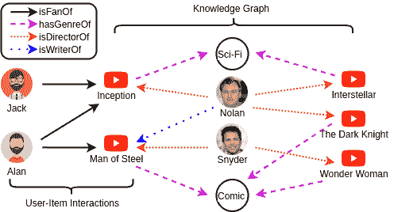
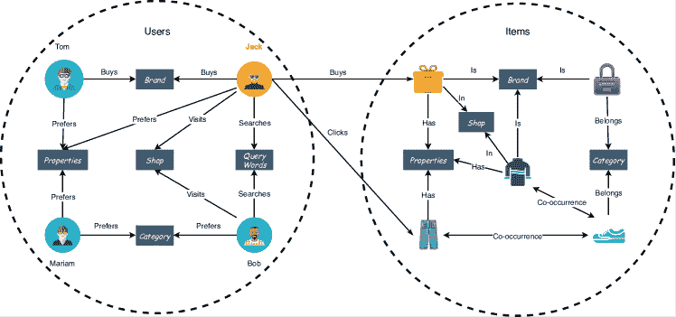
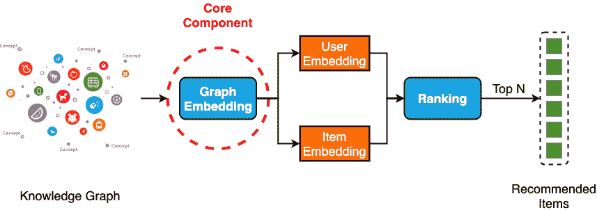
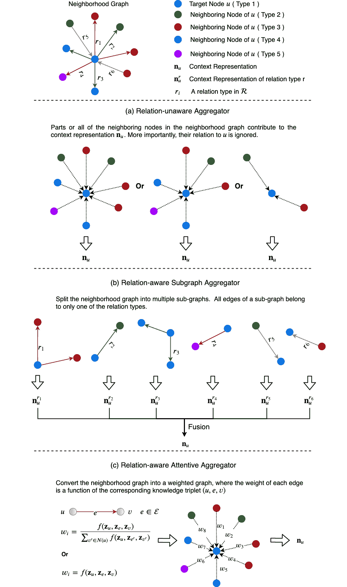
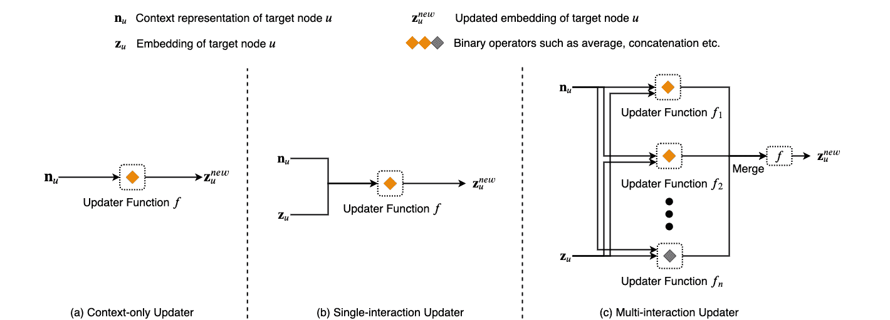
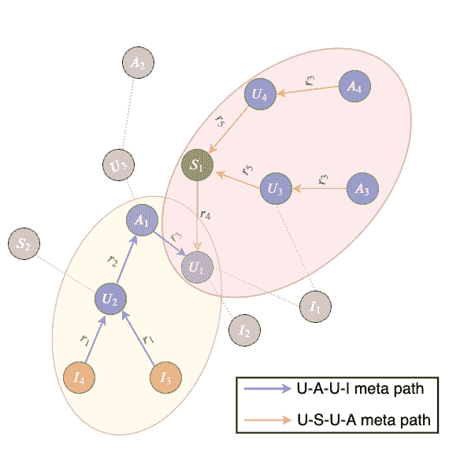

<!--yml

类别：未分类

日期：2024-09-06 20:01:52

-->

# [2004.00387] 知识图谱上的深度学习用于推荐系统：综述

> 来源：[`ar5iv.labs.arxiv.org/html/2004.00387`](https://ar5iv.labs.arxiv.org/html/2004.00387)

# 深度学习在知识图谱上的推荐系统：综述

杨高 yxg122530@utdallas.edu ,  李艺凡 yli@utdallas.edu 达拉斯大学 ,  林宇 达拉斯大学 yxl163430@utdallas.edu ,  高航 马里兰大学巴尔的摩县 hanggao1@umbc.edu  和  拉提夫·汗 达拉斯大学 lkhan@utdallas.edu

###### 摘要。

近期的研究进展表明，知识图谱（KG）在提供有价值的外部知识以改进推荐系统（RS）方面的有效性。知识图谱能够编码高阶关系，将两个对象与一个或多个相关属性连接起来。在新兴的图神经网络（GNN）的帮助下，可以从 KG 中提取对象特征和关系，这是成功推荐的关键因素。本文提供了基于 GNN 的知识感知深度推荐系统的全面综述。具体来说，我们讨论了最先进的框架，重点关注其核心组件，即图嵌入模块，以及它们如何解决实际推荐问题，如可扩展性、冷启动等。我们进一步总结了常用的基准数据集、评估指标以及开源代码。最后，我们总结了综述，并提出了在这一快速发展的领域中潜在的研究方向。

知识图谱、图神经网络（GNN）、推荐系统

## 1. 引言

在现代生活中，推荐系统（RS）对于用户从大量产品或服务中做出合适的选择至关重要。例如，人们在观看 YouTube 视频时，超过$75\%$的时间被 AI 驱动的推荐服务所吸引 (Solsman, 2018)。这些系统试图学习用户的兴趣，并防止他们面对过多选择，这显著提升了他们的决策过程 (Jannach et al., 2010)。它们还帮助推广服务和销售，例如电子商务。

传统推荐系统主要有两种架构：基于内容的系统和基于协同过滤的系统。基于内容的系统接受可以在欧几里得空间中表示为向量的数据 (Wu et al., 2019a)，并根据这些向量测量其相似性。基于协同过滤的系统通常假设每个用户-项目交互都是一个独立的实例，附带信息被编码 (Wang et al., 2019a)。然而，在现代社会中，越来越多的应用生成的数据来自非欧几里得领域，并以知识图谱（KG）的形式呈现。这种数据结构通过将项目与其属性链接，打破了独立交互的假设。例如，在 YouTube 推荐系统中 (见图 1)，用户与电影之间的连接可能是观看、点赞和评论等行为。另一方面，电影可能共享相同的类型、导演等。通过这些信息，知识感知推荐系统能够不仅捕捉用户-项目交互，还能捕捉丰富的项目-项目/用户-用户关系，从而提供更准确的推荐。值得注意的是，知识图谱中的节点（例如，人物或电影）可能具有不同的邻居大小（即，邻居节点的数量），它们之间的关系也可能有所不同，这使得基于知识图谱的推荐更具挑战性。

图 1\. 展示了 YouTube 上的用户-项目交互和知识图谱，其中包含用户、电影、导演和类型作为对象；喜欢、分类、导演和编写作为对象关系

最近，越来越多的研究兴趣集中在扩展深度学习方法用于图数据上。受到深度学习中的**卷积神经网络（CNNs）**、**循环神经网络（RNNs）**和**自编码器**的启发，过去几年中迅速发展了新的神经网络架构，以应对图数据的复杂性。这些类型的网络被称为图神经网络（GNNs）(Wu et al., 2019a)，对于最近知识感知深度推荐系统的成功至关重要。

关于图神经网络和知识图谱分析的现有评审文献有很多。吴等人（Wu et al., 2019a）概述了数据挖掘和机器学习领域中的图神经网络。尽管这是第一篇全面评审 GNN 的文献，但该调查主要集中在网络架构上，仅简要提及了 GNN 在推荐系统中的应用可能性。另一方面，石等人（Shi et al., 2017）总结了利用传统知识图谱分析方法的推荐系统。但它错过了基于 GNN 的算法的最新发展。据我们所知，我们的调查是第一篇关于利用 GNN 从知识图谱中提取信息以改善推荐的最先进深度推荐系统的评审。

我们的贡献：我们的论文做出了显著贡献，总结如下：

+   •

    新分类：知识感知深度推荐系统的核心组件是图嵌入模块，在最先进的框架中通常是 GNN。GNN 的每一层由两个基本组件组成：聚合器和更新器。我们将聚合器分类为三组：不考虑关系的聚合器、关系感知子图聚合器和关系感知注意力聚合器。我们还将更新器分为三类，即仅上下文更新器、单交互更新器和多交互更新器。

+   •

    综合概述：我们提供了对最先进的 GNN 基础知识感知深度推荐系统（GNN-KADR）的最全面概述。我们详细描述了代表性模型，进行必要的比较，并讨论了它们在实际推荐问题如冷启动、可扩展性等方面的解决方案。

+   •

    资源收集：我们总结了关于 GNN-KADR 系统的资源，包括基准数据集、评估指标和开源代码。

+   •

    未来方向：我们分析了现有工作的局限性，并提出了一些未来的研究方向，如动态性、可解释性、公平性等。

我们的调查组织结构：调查的其余部分组织如下。第一部分定义了与基于 GNN 的知识感知推荐相关的概念，并列出了本文中使用的符号。第三部分概述了最先进的 GNN-KADR 系统。第四部分讨论了它们对实际推荐问题的解决方案。第五部分概述了广泛使用的基准数据集、评价指标和开源代码。第六部分讨论了当前挑战并提出了未来的研究方向。第七部分总结了本文。

## 2\. 初步和符号

图 2\. 电子商务网站上的知识图谱示例。

首先，让我们考虑一个典型的电子商务网站场景：Jack 是一个喜欢穿蓝色牛仔裤的顾客，并且某一天查询了“牛仔裤”。在返回的商品列表中，Jack 点击了一些有吸引力的商品以获取详细信息。在这一周，他还访问了一些在线商店查看 T 恤。最后，在周日，Jack 从他喜欢的品牌购买了一条蓝色牛仔裤作为生日礼物，并将另一件 T 恤加入了同一家店铺的购物车。根据 Jack 的行为，平台收集了丰富的信息（提交的查询词、点击的商品、访问的商店、偏好的属性和品牌）来向他推荐未来可能感兴趣的商品。这种推荐场景在其他网站上也可以观察到。一般来说，多种对象和历史用户行为形成了一个知识图谱。图 2 展示了电子商务网站上的一个示例。

###### 定义 2.1。

知识图（Knowledge Graph，KG）（Sun et al.，2018a）被定义为一个有向图$\mathcal{G}=(\mathcal{V},\mathcal{E})$，其中$\mathcal{V}$是节点的集合，$\mathcal{E}\subseteq\mathcal{V}\times\mathcal{V}$是在$\mathcal{V}$中的节点之间的边的集合。$\mathcal{G}$与节点类型映射函数$\phi$：$\mathcal{V}\rightarrow\mathcal{A}$和边类型映射函数$\psi$：$\mathcal{E}\rightarrow\mathcal{R}$相关联，其中$|\mathcal{A}|>1$和/或$|\mathcal{R}|>1$。每个节点$v\in\mathcal{V}$都属于节点类型集合$\mathcal{A}$中的一个特定节点类型：$\phi(v)\in\mathcal{A}$，每个边$e\in\mathcal{E}$都属于关系类型集合$\mathcal{R}$中的一个特定关系类型：$\psi(e)\in\mathcal{R}$。挖掘知识图通常基于基本的实体-关系-实体三元组$(u,\mathpzc{e},v)$，其中$u\in\mathcal{V}$，$\mathpzc{e}\in\mathcal{E}$，$v\in\mathcal{V}$表示这个三元组的头、关系和尾。在本文中，为了简便起见，我们将这些实体-关系-实体三元组称为知识三元组。这里节点$u$和$v$的类型在上下文中可能相同也可能不同。

###### 定义 2.2.

节点的邻域$N(v)$。给定一个知识图$\mathcal{G}=(\mathcal{V},\mathcal{E})$，对于一个节点$v$，其邻域$N(v)$被定义为直接连接到$v$的节点的集合，即$\{w|(w,\mathpzc{e},u)\textit{ or }(u,\mathpzc{e},w),\mathpzc{e}\in\mathcal{E}\}$。

###### 定义 2.3.

$r$-邻域$N_{r}(v)$。给定一个知识图$\mathcal{G}=(\mathcal{V},\mathcal{E})$，对于一个节点$v$，其$r$-邻域$N_{r}(v)$被定义为用类型为$r$的边连接到$v$的节点的集合，即$\{w|(w,\mathpzc{e},u)\textit{ or }(u,\mathpzc{e},w),\textit{ where }\mathpzc{e}\in\mathcal{E}\textit{ and }\psi(\mathpzc{e})=r\}$。

用户-物品推荐一般来说，$\mathcal{V}$ 可以进一步表示为 $\mathcal{V}=\mathcal{V}_{1}\cup\mathcal{V}_{2}\cup\cdots\cup\mathcal{V}_{i}\cup\cdots\cup\mathcal{V}_{n}$，其中 $\mathcal{V}_{i}$ 表示类型为 $i$ 的节点集合，而 $n=|\mathcal{A}|$。在推荐中，我们将 $\mathcal{V}_{1}$ 表示为用户节点的集合，$\mathcal{V}_{2}$ 表示物品节点的集合，$\mathcal{V}_{3},\ldots,\mathcal{V}_{n}$ 表示其他对象的节点（品牌、属性等）。我们还将 $\mathcal{E}=\mathcal{E}_{label}\cup\mathcal{E}_{unlabel}$，其中 $\mathcal{E}_{label}\subseteq\mathcal{V}_{1}\times\mathcal{V}_{2}$ 表示用户节点和物品节点之间的边的集合，$\mathcal{E}_{unlabel}=\mathcal{E}\setminus\mathcal{E}_{label}$ 表示其他边的集合。由于现实世界中典型的推荐设置是根据用户的历史行为预测用户的偏好物品，我们用 $\mathcal{G}=(\mathcal{V},\mathcal{E})$ 表示由历史数据构建的图，用 $\mathcal{G}^{P}=(\mathcal{V}^{P},\mathcal{E}^{P})$ 表示真实未来的图。因此，用户-物品推荐问题可以被形式化为图上的链接预测问题：

输入：基于历史数据构建的知识图谱 $\mathcal{G}=(\mathcal{V},\mathcal{E})$。

输出：预测的边集合 $\widehat{\mathcal{E}}^{p}_{label}$，它是对 $\mathcal{G}^{P}$ 上真实边集合 $\mathcal{E}^{P}_{label}$ 的预测。

在本文中，粗体大写字符用于表示矩阵，粗体小写字符用于表示向量。除非另有说明，本文中使用的符号如表格 1 所示。

表格 1\. 常用符号表示法 |

| 符号 | 描述 |
| --- | --- |
| $&#124;\cdot&#124;$ | 集合的大小 |
| $\odot$ | 逐元素相乘 |
| $&#124;&#124;$ | 连接操作 |
| $\mathcal{G}$ | 知识图谱 |
| $\mathcal{V}$ | 知识图谱中的节点集合 |
| $\mathcal{E}$ | $\mathcal{V}$ 中节点之间的边的集合 |
| $\mathcal{A}$ | 节点类型集合 |
| $\mathcal{R}$ | 边的关系类型集合 |
| $v$ | 一个节点 $v\in\mathcal{V}$ |
| $e_{i,j}$ | 一条边 $e_{i,j}\in\mathcal{E}$ |
| $(u,\mathpzc{e},v)$ | 一组知识三元组，其中 $u\in\mathcal{V}$，$\mathpzc{e}=e_{u,v}\in\mathcal{E}$，$v\in\mathcal{V}$ 表示这个三元组的头、关系和尾。 |
| $\mathbf{z}_{v}\in\mathbf{R}^{d}$ | 节点 $v$ 的特征向量 |
| $\mathbf{z}_{\mathpzc{e}}\in\mathbf{R}^{c}$ | 边 $\mathpzc{e}=e_{u,v}$ 或 $e_{v,u}$ 的特征向量 |
| $\mathbf{z}_{\mathpzc{e}_{i,j}}\in\mathbf{R}^{c}$ | 边 $e_{i,j}$ 的特征向量 |
| $\mathbf{n}_{u}\in\mathbf{R}^{k}$ | 节点 $u$ 的上下文表示 |
| $\mathbf{n}_{u}^{r}\in\mathbf{R}^{k}$ | 节点 $u$ 的类型为 $r$ 的上下文表示 |
| $\mathbf{X}\in\mathbf{R}^{N\times d}$ | 知识图中节点的特征矩阵 |
| $\mathbf{A}\in\mathbf{R}^{N\times N}$ | 知识图的邻接矩阵 |
| $\mathbf{N}\in\mathbf{R}^{N\times k}$ | 知识图中的所有节点的上下文表示 |
| $N(v)$ | 节点$v$的邻域 |
| $N_{r}(v)$ | 节点$v$的$r$-邻域 |
| $n$ | 节点的数量，$n= | \mathcal{V} | $ |
| $m$ | 边的数量，$m= | \mathcal{E} | $ |
| $d$ | 节点特征向量的维度 |
| $c$ | 边特征向量的维度 |
| $k$ | $v$的上下文表示的维度 |
| $\sigma(\cdot)$ | Sigmoid 激活函数 |
| $\beta(\cdot)$ | LeakyReLU 激活函数 |
| $\gamma(\cdot)$ | 激活函数，例如，sigmoid、ReLU 等 |
| $\mathbf{W}$, $\mathbf{\Theta}$, $\mathbf{b}$ | 可学习的模型参数 |

## 3\. 分类与框架

图 3. 基于 GNN 的知识感知深度推荐系统（GNN-KADR）的总体工作流程。

基于 GNN 的知识感知深度推荐系统（GNN-KADR）的总体工作流程如图 3 所示。GNN-KADR 的图嵌入模块首先学习为每个图节点（包括用户节点和物品节点）生成嵌入，这些嵌入编码了从输入知识图中提炼的信息。接下来，对于给定的用户，排名模块根据每个候选物品的对应嵌入计算这个用户与每个候选物品之间的匹配分数。那些匹配分数前 N 名（或匹配分数高于用户指定阈值）的物品将被推荐给这个用户。

在这个过程中，系统的核心组件是图嵌入模块，这通常是最先进框架中的图神经网络（GNN）。GNN 的每一层由两个基本组件组成：聚合器和更新器。对于一个节点$v$，聚合器从$v$的邻居处聚合特征信息，以生成上下文表示。更新器随后利用这个上下文表示以及其他输入信息来为节点$v$获取新的嵌入。堆叠$K$层不同的 GNN 或重复使用相同的 GNN 层$K$次扩展了 GNN 的感受野到$K$-跳图邻域。

我们将 GNN 的聚合器分为无关关系聚合器、有关系子图聚合器和有关系注意力聚合器。另一方面，我们将更新器分为三类，即仅上下文更新器、单交互更新器和多交互更新器。各种类别的聚合器和更新器分别描述在图 4 和图 5 中。接下来，我们将详细讨论它们。

表 2\. 基于 GNN 的知识感知深度推荐系统（GNN-KADR）的分类及代表性出版物。

| GNN | 类别 |  | 出版物 |
| --- | --- | --- | --- |
| 聚合器 | 无关关系聚合器 |  | (Fan et al., 2019b), (Ying et al., 2018) |
| 有关系聚合器 | 子图聚合器 | (Xu et al., 2019), (Zhang et al., 2019), (Zhao et al., 2019) |
| 注意力聚合器 | (Fan et al., 2019a), (Li et al., 2019), (Song et al., 2019), (Wang et al., 2019d), (Wang et al., 2019e), (Wang et al., 2019b), (Wu et al., 2019c) |
| 更新器 | 仅上下文更新器 |  | (Fan et al., 2019b), (Fan et al., 2019a), (Li et al., 2019), (Song et al., 2019), (Wang et al., 2019e), (Wu et al., 2019c), (Zhang et al., 2019) |
| 单交互更新器 |  | (Wang et al., 2019d), (Wang et al., 2019e), (Xu et al., 2019), (Ying et al., 2018), (Zhao et al., 2019) |

| 多交互更新器 |  | (Wang et al., 2019b) | 

图 4\. 无关关系聚合器、有关系子图聚合器和有关系注意力聚合器的描述。

图 5\. 仅上下文更新器、单交互更新器和多交互更新器的描述。

表 3\. 研究的 GNN-KADR 系统总结。

| 方法 | 聚合器 | 更新器 | 解决的问题 |
| --- | --- | --- | --- |
| MEIRec (Fan et al., 2019b) | $\mathbf{n}_{u}=Avg/LSTM/CNN(\{\mathbf{z}_{v}&#124;v\in N(u)\})$ | $\mathbf{z}_{u}^{new}=\mathbf{n}_{u}$ | 可扩展性；冷启动 |
| GraphRec (Fan et al., 2019a) | $\mathbf{x}_{u,v}=MLP(\mathbf{z}_{v}&#124;&#124;\mathbf{z}_{\mathpzc{e}})$ | $\mathbf{z}_{u}^{new}=\gamma(\mathbf{W}\cdot\mathbf{n}_{u}+\mathbf{b})$ | — |
| $\alpha_{u,v}^{*}=\mathbf{W}_{2}^{T}\cdot\gamma(\mathbf{W}_{1}\cdot(\mathbf{x}_{u,v}&#124;&#124;\mathbf{z}_{u})+\mathbf{b}_{1})+\mathbf{b}_{2}$ |
| $\alpha_{u,v}=\frac{\exp(\alpha_{u,v}^{*})}{\sum_{v^{\prime}\in N(u)}\exp(\alpha_{u,v^{\prime}}^{*})}$ |
| $\mathbf{n}_{u}=\sum_{v\in N(u)}\alpha_{u,v}\mathbf{x}_{u,v}$ |
| V2HT (Li et al., 2019) | $\mathbf{A}_{i,j}=f_{weight}(\mathbf{X}[i,:],\mathbf{X}[j,:],\mathpzc{e}_{i,j})$ | $\mathbf{X}^{new}=\gamma(\mathbf{N}\mathbf{W})$ | 数据稀疏性，多模态性 |
| $\mathbf{A}^{\prime}_{i,j}=\alpha\cdot\frac{\mathbf{A}_{i,j}}{\sum_{j^{\prime}}\mathbf{A}_{i,j^{\prime}}}$ 如果 $i\neq j$ 否则 $1-\alpha$ |
| $\mathbf{N}=\tilde{\mathbf{D}}^{\prime-\frac{1}{2}}\mathbf{A}^{\prime}\tilde{\mathbf{D}}^{\prime-\frac{1}{2}}\mathbf{X}$，其中 $\tilde{\mathbf{D}}^{\prime}_{i,i}=\sum_{j}\mathbf{A}^{\prime}_{i,j}$ |
| DGRec (Song et al., 2019) | $\alpha_{u,v}=\frac{\mathrm{exp}(\mathbf{z}_{u}\cdot\mathbf{z}_{v})}{\sum_{v\in N(v)}\mathrm{exp}(\mathbf{z}_{u}\cdot\mathbf{z}_{v})}$ | $\mathbf{z}_{u}^{new}=ReLU(\mathbf{W}\cdot\mathbf{n}_{u})$ | 动态性 |
| $\mathbf{n}_{u}=\sum_{v\in N(u)}\alpha_{u,v}\mathbf{z}_{v}$ |
| KGNN-LS (Wang et al., 2019d) | $\mathbf{A}^{\prime}=\mathbf{A}+\mathbf{I}$ | $\mathbf{X}^{new}=\gamma\big{(}(\mathbf{N}+\mathbf{D}^{-\frac{1}{2}}\cdot\mathbf{I}\cdot\mathbf{D}^{-\frac{1}{2}}\mathbf{X})\cdot\mathbf{W}\big{)}$ | 个性化 |
| $\mathbf{N}=\mathbf{D}^{-\frac{1}{2}}\mathbf{A}\mathbf{D}^{-\frac{1}{2}}\mathbf{X}$ 其中 $\mathbf{D}_{i,i}=\sum_{j}\mathbf{A}^{\prime}_{i,j}$ |
| KGCN (Wang et al., 2019e) | $\alpha_{u,v}^{*}=g(\mathbf{z}_{v},\mathbf{z}_{\mathpzc{e}})$ | $\mathbf{z}_{u,sum}^{new}=\gamma\big{(}\mathbf{W}\cdot(\mathbf{z}_{u}+\mathbf{n}_{u})+\mathbf{b}\big{)}$ | — |
| $\alpha_{u,v}=\frac{\exp(\alpha_{u,v}^{*})}{\sum_{v^{\prime}\in N(u)}\exp(\alpha_{u,v^{\prime}}^{*})}$ | $\mathbf{z}_{u,concat}^{new}=\gamma\big{(}\mathbf{W}\cdot(\mathbf{z}_{u}&#124;&#124;\mathbf{n}_{u})+\mathbf{b}\big{)}$ |
| $\mathbf{n}_{u}=\sum_{v\in N(u)}\alpha_{u,v}\mathbf{z}_{v}$ | $\mathbf{z}_{u,context}^{new}=\gamma\big{(}\mathbf{W}\cdot\mathbf{n}_{u}+\mathbf{b}\big{)}$ |
| KGAT (Wang et al., 2019b) | $\alpha_{u,v}^{*}=(\mathbf{W}_{\mathpzc{e}}\mathbf{z}_{v})^{T}tanh(\mathbf{W}_{\mathpzc{e}}\mathbf{z}_{u}+\mathbf{z}_{\mathpzc{e}})$ | $\mathbf{z}_{u}^{new}=\beta\big{(}\mathbf{W}_{1}\cdot(\mathbf{z}_{u}+\mathbf{n}_{u})\big{)}+\beta\big{(}\mathbf{W}_{2}\cdot(\mathbf{z}_{u}\odot\mathbf{n}_{u})\big{)}$ | — |
| $\alpha_{u,v}=\frac{\exp(\alpha_{u,v}^{*})}{\sum_{v^{\prime}\in N(u)}\exp(\alpha_{u,v^{\prime}}^{*})}$ |
| $\mathbf{n}_{u}=\sum_{v\in N(u)}\alpha_{u,v}\mathbf{z}_{v}$ |
| DANSER (Wu et al., 2019c) | $\alpha_{u,v}=\frac{LeakyReLU(\mathbf{w}_{u}(\mathbf{W}_{e}\mathbf{z}_{\mathpzc{e}}\odot(\mathbf{W}_{p}\mathbf{z_{u}}\mid\mid\mathbf{W}_{p}\mathbf{z_{v}})))}{\sum_{v\in N(u)}LeakyReLU(\mathbf{w}_{u}(\mathbf{W}_{e}\mathbf{z}_{\mathpzc{e}}\odot(\mathbf{W}_{p}\mathbf{z_{u}}\mid\mid\mathbf{W}_{p}\mathbf{z_{v}})))}$ | $\mathbf{z}_{u}^{new}=\gamma(\mathbf{W}\cdot\mathbf{n}_{u}+\mathbf{b})$ | 动态性 |
| $\mathbf{n}_{u}=\sum_{v\in N(u)}\alpha_{u,v}\mathbf{z}_{v}$ |
| RecoGCN (Xu et al., 2019) | $\alpha_{v,u}^{r}=\text{softmax}_{v}\big{(}\{\mathbf{W}_{1}^{r}\mathbf{z}_{v}\cdot\mathbf{W}_{2}^{r}\mathbf{z}_{u}\mid v\in N_{r}(u)\}\big{)}$ | $\mathbf{z}_{u}^{new}=ReLU\big{(}\mathbf{W}\cdot(\mathbf{z}_{u}\mid\mid\mathbf{n}_{u})+\mathbf{b}\big{)}$ | 可扩展性 |
| $\mathbf{n}_{u}^{r}=\sum_{\forall v\in N_{r}(u)}\alpha_{v,u}^{r}\mathbf{z}_{v}$ |
| $\mathbf{n}_{u}=\sum_{r}\mathbf{n}_{u}^{r}$ |
| PinSage (Ying et al., 2018) | $\mathbf{n}_{u}=Avg/Pool\big{(}\{ReLU(\mathbf{W}_{1}\mathbf{z}_{v}+\mathbf{b})\mid v\in N(u)\},\{\alpha_{v}\}\big{)}$ | $\mathbf{z}_{u}^{new}=ReLU\big{(}\mathbf{W}_{2}\cdot(\mathbf{z}_{u}\mid\mid\mathbf{n}_{u})+\mathbf{b}\big{)}$ | 可扩展性 |
| STAR-GCN (Zhang et al., 2019) | $\mathbf{n}_{u}^{r}=\sum\limits_{v\in N_{r}(u)}\frac{1}{\sqrt{ | N_{r}(u) | \cdot | N_{r}(v) | }}\mathbf{W}^{r}\mathbf{z}_{v}$ | $\mathbf{z}_{u}^{new}=\gamma\big{(}\mathbf{W}\cdot\gamma(\mathbf{n}_{u})\big{)}$ | 冷启动 |
| $\mathbf{n}_{u}=\sum_{r}\mathbf{n}_{u}^{r}$ |
| IntentGC (Zhao et al., 2019) | $\mathbf{n}_{u}^{r}=Avg\big{(}\{\mathbf{z}_{v}\mid v\in N_{r}(u)\}\big{)}$ | $\mathbf{z}_{u}^{new}=\gamma(\mathbf{W}\cdot\mathbf{z}_{u}+\mathbf{n}_{u})$ | 可扩展性 |
| $\mathbf{n}_{u}=\sum_{r=1}^{ | \mathcal{R} | -2}\mathbf{W}^{r}\mathbf{n}_{u}^{r}$ |

### 3.1. 聚合器

#### 3.1.1. 无关系聚合器

对于目标节点 $u$，无关系聚合器旨在从 $u$ 的部分或全部邻居节点中聚合信息，以生成上下文表示。然而，在此过程中，目标节点 $u$ 与任何邻居节点 $v$ 之间的关系 $r=\psi(\mathpzc{e})$ ($\mathpzc{e}=e_{u,v}\text{ 或 }e_{v,u}$) 被忽略，因此其信息没有被编码到上下文表示 $\mathbf{n}_{u}$ 中。

Fan et al. (Fan et al., 2019b) 指出，现有的意图推荐方法依赖于广泛的人工特征工程，并未充分利用用户与项目之间的丰富交互，这限制了模型的性能。为了解决这些问题，他们将复杂的对象（即，具有属性的用户和项目）及其交互建模为知识图谱，并提出了一个框架叫做 MEIRec 来学习推荐的对象嵌入。MEIRec 中的 GNN 通过

| (1) |  | $\mathbf{n}_{u}=g(\{\mathbf{z}_{v}&#124;v\in N(u)\})$ |  |
| --- | --- | --- | --- |

其中 $\mathbf{z}_{v}$ 是节点 $v$ 的嵌入，$g$ 是一个聚合函数，可以是平均值、LSTM 或 CNN，具体取决于上下文。例如，如果 $u$ 是一个项目节点，他们选择 $g$ 为平均函数，因为通常在点击/购买项目的用户之间没有优先级。另一方面，如果 $u$ 代表用户节点，他们选择 LSTM 作为 $g$，因为用户通常会点击带有时间戳的项目，其邻居可以视为序列数据。

Ying 等人（Ying et al., 2018）介绍了一种数据高效的大规模深度推荐引擎 PinSage，该引擎在 Pinterest 开发和部署。PinSage 结合了高效的随机游走和 GNN，以生成既结合图结构又结合节点特征信息的节点嵌入。对于每个目标节点 $u$，PinSage 首先通过从 $u$ 开始模拟随机游走来衡量 $u$ 邻居节点的重要性，并计算节点的 $L_{1}$-标准化访问计数。然后，上下文表示 $\mathbf{n}_{u}$ 由以下公式计算

| (2) |  | $\mathbf{n}_{u}=Avg/Pool(\{ReLU(\mathbf{W}_{1}\mathbf{z}_{v}+\mathbf{b})&#124;v\in N(u)\},\{\alpha_{v}\})$ |  |
| --- | --- | --- | --- |

其中 $\mathbf{W}_{1}$、$\mathbf{b}$ 是需要学习的参数，$\{\alpha_{v}\}$ 是 $u$ 对应邻居节点的 $L_{1}$-标准化访问计数。

#### 3.1.2\. 关系感知子图聚合器

为了处理知识图中的不同关系，关系感知子图聚合器将邻域图拆分成多个子图，使得子图的所有边仅属于 $\mathcal{R}$ 中的一种关系类型。每个子图分配有一个由唯一参数集合特征的聚合器，并通过该聚合器提取信息以生成关系敏感的上下文表示。我们用 $\mathbf{n}_{u}^{r}$ 表示从类型为 $r$ 的边的子图生成的表示。最后，$\{\mathbf{n}_{u}^{r_{1}},\mathbf{n}_{u}^{r_{2}},\ldots\}$ 被进一步融合在一起，以生成目标节点 $u$ 的总体上下文表示。图中典型的示例如图 4b 所示。

在代理初始化的社交电子商务中的复杂交互可以被表述为一个知识图，其中包含三种类型节点之间的众多关系，即用户、销售代理和商品。Xu 等人（Xu et al., 2019）提出了一种新颖的框架 RecoGCN，以有效聚合知识图中的异质特征。在 RecoGCN 中使用的“关系感知聚合器”是：

| (3) |  | $\alpha_{v,u}^{r}=\text{softmax}_{v}\big{(}\{\mathbf{W}_{1}^{r}\mathbf{z}_{v}\cdot\mathbf{W}_{2}^{r}\mathbf{z}_{u}&#124;v\in N_{r}(u)\}\big{)}$ |  |
| --- | --- | --- | --- |
| (4) |  | $\mathbf{n}_{u}^{r}=\sum_{\forall v\in N_{r}(u)}\alpha_{v,u}^{r}\mathbf{z}_{v}$ |  |
| (5) |  | $\mathbf{n}_{u}=\sum_{r}\mathbf{n}_{u}^{r}$ |  |

其中 $\mathbf{W}_{1}^{r}$ 和 $\mathbf{W}_{2}^{r}$ 是分配给关系类型 $r\in\mathcal{R}$ 的两个可学习变换。

为了提升推荐系统的性能，张等人引入的 STAR-GCN 架构 (Zhang et al., 2019) 使用多链路图卷积编码器来学习节点表示。每种表示类型 $r\in\mathcal{R}$ 被分配一个特定的变换。因此，其聚合器被公式化为：

| (6) |  | $\mathbf{n}_{u}^{r}=\sum_{v\in N_{r}(u)}\frac{1}{\sqrt{&#124;N_{r}(u)&#124;\cdot&#124;N_{r}(v)&#124;}}\mathbf{W}^{r}\mathbf{z}_{v}$ |  |
| --- | --- | --- | --- |
| (7) |  | $\mathbf{n}_{u}=\sum_{r}\mathbf{n}_{u}^{r}$ |  |

其中 $\{\mathbf{W}^{r}|r\in\mathcal{R}\}$ 是需要学习的参数。

赵等人提出的 IntentGC (Zhao et al., 2019) 是一个推荐框架，它捕捉了明确的用户偏好和辅助信息的异质关系。为了进行大规模推荐，IntentGC 引入了一个按向量聚合的聚合器：

| (8) |  | $\mathbf{n}_{u}^{r}=Avg\big{(}\{\mathbf{z}_{v}&#124;v\in N_{r}(u)\}\big{)}$ |  |
| --- | --- | --- | --- |
| (9) |  | $\mathbf{n}_{u}=\sum_{r=1}^{&#124;\mathcal{R}&#124;-2}\mathbf{W}^{r}\mathbf{n}_{u}^{r}$ |  |

该聚合器在计算上非常高效，因为它通过将昂贵的操作 $\mathbf{W}\cdot(\mathbf{n}_{u}^{r_{1}}||\mathbf{n}_{u}^{r_{2}}||\ldots)$ 替换为多个小矩阵乘积的求和，避免了不必要的计算。

#### 3.1.3\. 关系感知注意力聚合器

与其他两种聚合器不同，关系感知注意力聚合器将邻域图转换为加权图，其中每条边的权重是对应知识三元组的函数，例如 $w=\frac{f(\mathbf{z}_{u},\mathbf{z}_{\mathpzc{e}},\mathbf{z}_{v})}{\sum_{v^{\prime}\in N(u)}f(\mathbf{z}_{u},\mathbf{z}_{\mathpzc{e}^{\prime}},\mathbf{z}_{v^{\prime}})}$，$w=f(\mathbf{z}_{u},\mathbf{z}_{\mathpzc{e}},\mathbf{z}_{v})$ 等。这些权重捕捉了知识图中边所编码的丰富语义信息，并衡量了不同知识三元组与目标节点 $u$ 的相关性。

王等人 (Wang et al., 2019d) 提出了一个端到端框架 KGNN-LS，它利用知识图作为附加信息来源来改进推荐。对于给定的用户，KGNN-LS 应用一个可训练的函数来识别重要的知识图关系，并将知识图转换为用户特定的加权图。因此，KGNN-LS 中的聚合器被公式化为：

| (10) |  | $\mathbf{A}^{\prime}=\mathbf{A}+\mathbf{I}$ |  |
| --- | --- | --- | --- |
| (11) |  | $\mathbf{N}=\mathbf{D}^{-\frac{1}{2}}\mathbf{A}\mathbf{D}^{-\frac{1}{2}}\mathbf{X}$ |  |

其中 $\mathbf{A}_{i,j}=f(\mathbf{z}_{\mathpzc{e}_{i,j}})$，$\mathbf{D}$ 是一个对角矩阵，$\mathbf{D}_{i,i}=\sum_{j}\mathbf{A}^{\prime}_{i,j}$。$f$ 是一个用户特定的评分函数。

Li 等人 (Li et al., 2019) 引入了一种名为 V2HT 的新框架，该框架通过联合考虑序列特征学习、视频-用户-标签交互和标签相关性来提升微视频标签推荐的性能。类似于 KGNN-LS，他们对不同类型的边赋予不同的权重，将知识图谱转换为加权图。具体来说，V2HT 中使用的聚合器为：

| (12) |  | $\mathbf{A}_{i,j}=f_{weight}(\mathbf{X}[i,:],\mathbf{X}[j,:],\mathpzc{e}_{i,j})$ |  |
| --- | --- | --- | --- |
| (13) |  | $\mathbf{A}^{\prime}_{i,j}=\begin{cases}\alpha\cdot\frac{\mathbf{A}_{i,j}}{\sum_{j^{\prime}}\mathbf{A}_{i,j^{\prime}}}&\text{如果 $i\neq j$}\\ 1-\alpha&\text{否则}\end{cases}$ |  |
| (14) |  | $\mathbf{N}=\tilde{\mathbf{D}}^{\prime-\frac{1}{2}}\mathbf{A}^{\prime}\tilde{\mathbf{D}}^{\prime-\frac{1}{2}}\mathbf{X}$ |  |

其中下标 $i$ 和 $j$ 表示图中的第 $i_{th}$ 和第 $j_{th}$ 节点，$\tilde{\mathbf{D}}$ 是一个对角矩阵，$\tilde{\mathbf{D}}_{i,i}=\sum_{j}\mathbf{A}^{\prime}_{i,j}$。这里 $\alpha$ 决定了分配给节点自身和其他相关节点的权重。当 $\alpha\rightarrow 1$ 时，节点自身的特征将被忽略；当 $\alpha\rightarrow 0$ 时，邻近信息将被忽略。

Fan 等人 (Fan et al., 2019a) 提出了一个用于社交推荐的新型图神经网络框架 GraphRec。社交推荐中的知识图谱通常由两个图组成：一个表示用户之间关系的社交图和一个表示用户与项目之间交互的用户-项目图。GraphRec 引入了三种聚合器来处理这两个不同的图，即用户聚合器、项目聚合器和社交聚合器。用户和项目聚合器从用户-项目图中提取信息，而社交聚合器从社交图中提炼信息。这些聚合器的工作方式类似，因此我们这里只为简便起见解释项目聚合器。数学上，项目聚合器的公式为：

| (15) |  | $\mathbf{x}_{u,v}=MLP(\mathbf{z}_{v}&#124;&#124;\mathbf{z}_{\mathpzc{e}})$ |  |
| --- | --- | --- | --- |
| (16) |  | $\alpha_{u,v}^{*}=\mathbf{W}_{2}^{T}\cdot\gamma(\mathbf{W}_{1}\cdot(\mathbf{x}_{u,v}&#124;&#124;\mathbf{z}_{u})+\mathbf{b}_{1})+\mathbf{b}_{2}$ |  |
| (17) |  | $\alpha_{u,v}=\frac{\exp(\alpha_{u,v}^{*})}{\sum_{v^{\prime}\in N(u)}\exp(\alpha_{u,v}^{*})}$ |  |
| (18) |  | $\mathbf{n}_{u}=\sum_{v\in N(u)}\alpha_{u,v}\mathbf{x}_{u,v}$ |  |

其中 $\alpha_{u,v}$ 代表与 $v$ 的交互在贡献 $u$ 的上下文表示中的注意力权重。

在线社区的推荐面临两个挑战：1）用户兴趣是动态的，2）用户受到朋友的影响。为了解决这些挑战，Song 等人（Song et al.，2019）引入了一种基于动态图注意力神经网络的新框架 DGRec。具体来说，他们首先使用递归神经网络对动态用户行为进行建模，其输出作为初始图节点嵌入。然后，采用图注意力神经网络来建模上下文相关的社会影响，该网络动态地基于用户当前的兴趣推断影响者。该图注意力神经网络中的聚合器是：

| (19) |  | $\alpha_{u,v}=\frac{\mathrm{exp}(\mathbf{z}_{u}\cdot\mathbf{z}_{v})}{\sum_{v\in N(v)}\mathrm{exp}(\mathbf{z}_{u}\cdot\mathbf{z}_{v})}$ |  |
| --- | --- | --- | --- |
| (20) |  | $\mathbf{n}_{u}=\sum_{v\in N(u)}\alpha_{u,v}\mathbf{z}_{v}$ |  |

Wang 等人（Wang et al.，2019e）提出的 KGCN 框架是一个端到端的推荐系统，能够自动发现知识图（KG）的高阶结构信息和语义信息。KGCN 的关键思想是在计算知识图中给定节点的表示时，聚合和结合邻域信息并引入偏差。它通过对连接关系和节点的得分加权来实现，这体现了 KG 的语义信息和用户在关系上的个性化兴趣。具体来说，KGCN 中的聚合器是：

| (21) |  | $\alpha_{u,v}^{*}=g(\mathbf{z}_{v},\mathbf{z}_{e})$ |  |
| --- | --- | --- | --- |
| (22) |  | $\alpha_{u,v}=\frac{\exp(\alpha_{u,v}^{*})}{\sum_{v^{\prime}\in N(u)}\exp(\alpha_{u,v^{\prime}}^{*})}$ |  |
| (23) |  | $\mathbf{n}_{u}=\sum_{v\in N(u)}\alpha_{u,v}\mathbf{z}_{v}$ |  |

Wang 等人（Wang et al.，2019b）提出了一种名为 KGAT 的方法，用于以端到端的方式显式建模 KG 中的高阶连接性。KGAT 中的聚合器的工作方式类似于 KGCN。唯一的区别是，它将知识三元组的所有三个嵌入 $\mathbf{z}_{u}$、$\mathbf{z}_{e}$ 和 $\mathbf{z}_{v}$ 作为输入来计算注意力分数：

| (24) |  | $\alpha_{u,v}^{*}=(\mathbf{W}_{e}\mathbf{z}_{v})^{T}tanh(\mathbf{W}_{e}\mathbf{z}_{u}+\mathbf{z}_{e})$ |  |
| --- | --- | --- | --- |
| (25) |  | $\alpha_{u,v}=\frac{\exp(\alpha_{u,v}^{*})}{\sum_{v^{\prime}\in N(u)}\exp(\alpha_{u,v^{\prime}}^{*})}$ |  |
| (26) |  | $\mathbf{n}_{u}=\sum_{v\in N(u)}\alpha_{u,v}\mathbf{z}_{v}$ |  |

这里 $\mathbf{W}_{e}$ 是一个投影矩阵，用于学习，将输入从节点嵌入空间转换到边嵌入空间。

在社交推荐中，推荐系统中有四种不同的社交效应，包括用户领域中的双重效应，即来自社交同质性的静态效应和来自社交影响的动态效应，以及项目领域中的另一个对称的双重效应。为了捕捉这四种效应，Wu 等人（Wu et al., 2019c）提出了一个名为 DANSER 的框架，该框架由两个对偶的图注意力网络（GAT）（Velickovic et al., 2018）组成：一个对偶的 GAT 用于用户——包括一个 GAT 用于捕捉社交同质性和一个 GAT 用于捕捉社交影响——另一个对偶的 GAT 用于项目。DANSER 中的聚合器工作方式类似。我们展示其中一个作为示例：

| (27) |  | $\alpha_{u,v}=\frac{LeakyReLU(\mathbf{w}_{u}(\mathbf{W}_{e}\mathbf{z}_{\mathpzc{e}}\odot(\mathbf{W}_{p}\mathbf{z_{u}}&#124;&#124;\mathbf{W}_{p}\mathbf{z_{v}})))}{\sum_{v\in N(u)}LeakyReLU(\mathbf{w}_{u}(\mathbf{W}_{e}\mathbf{z}_{\mathpzc{e}}\odot(\mathbf{W}_{p}\mathbf{z_{u}}&#124;&#124;\mathbf{W}_{p}\mathbf{z_{v}})))}$ |  |
| --- | --- | --- | --- |
| (28) |  | $\mathbf{n}_{u}=\sum_{v\in N(u)}\alpha_{u,v}\mathbf{z}_{v}$ |  |

其中 $\mathbf{W}_{p}$、$\mathbf{W}_{e}$ 和 $\mathbf{w}_{u}$ 是需要学习的两个权重矩阵和一个权重向量。

#### 3.1.4\. 讨论

与其他两种聚合器相比，未考虑关系的聚合器丧失了知识图（KG）中编码的丰富语义信息，这限制了模型性能。另一方面，尽管关系感知子图聚合器能够建模 KG 中的各种语义关系，但它也有几个限制。首先，由于每种关系类型 $r\in\mathcal{R}$ 被分配了一个唯一的参数集，因此当关系类型集 $\mathcal{R}$ 变得更大时，此类型聚合器中的训练参数数量显著增加。因此，利用关系感知子图聚合器的方法不适合处理具有众多关系类型的知识图。其次，这些聚合器独立处理不同关系类型的子图。因此，不同关系类型之间的相关性没有被编码在学习到的上下文表示 $\mathbf{n}_{u}$ 中，这限制了推荐性能。关系感知注意力聚合器利用单一函数计算 KG 中不同关系类型的注意力得分，因此可以应用于大规模知识图。同时，它还通过加权与目标节点 $u$ 相邻的不同节点的贡献来提高深度推荐系统的可解释性。

### 3.2\. 更新器

#### 3.2.1\. 仅上下文更新器

对于知识图中的任何节点 $u$，仅上下文更新器仅接收 $u$ 的上下文表示 $\mathbf{n}_{u}$ 作为输入，并为该节点生成一个新的表示 $\mathbf{z}_{u}^{new}=f(\mathbf{n}_{u})$。这里 $f$ 是更新器函数。

MEIRec (Fan et al., 2019b) 直接将 $\mathbf{n}_{u}$ 作为节点 $u$ 的新嵌入，即 $\mathbf{z}_{u}^{new}=\mathbf{n}_{u}$，这种方法计算效率高但可能不是最优的。为了解决这个问题，GraphRec (Fan et al., 2019a)、V2HT (Li et al., 2019)、DGRec (Song et al., 2019)、KGCN  (Wang et al., 2019e) 和 DANSER (Wu et al., 2019c) 提出了通过 MLP 来近似 $f$：

| (29) |  | $\mathbf{z}_{u}^{new}=\gamma(\mathbf{W}\cdot\mathbf{n}_{u}+\mathbf{b})$ |  |
| --- | --- | --- | --- |

其中 $\gamma$ 是一个非线性激活函数，如 ReLU，偏置 $\mathbf{b}$ 可以设置为 $\mathbf{0}$。STAR-GCN (Zhang et al., 2019) 通过在将 $\mathbf{n}_{u}$ 发送到 MLP 层之前应用另一个激活函数来提高 $f$ 的非线性：

| (30) |  | $\mathbf{z}_{u}^{new}=\gamma(\mathbf{W}\cdot\gamma(\mathbf{n}_{u})+\mathbf{b})$ |  |
| --- | --- | --- | --- |

#### 3.2.2\. 单次交互更新器

对于知识图谱中的任何节点 $u$，单次交互更新器将 $u$ 的上下文表示 $\mathbf{n}_{u}$ 和 $u$ 的当前嵌入 $\mathbf{z}_{u}$ 作为输入，以计算新的表示 $\mathbf{z}_{u}^{new}=f(\mathbf{n}_{u},\mathbf{z}_{u})$。$f$ 是一个涉及二元操作符的函数，如求和、拼接等，该操作符应用于 $\mathbf{n}_{u}$ 和 $\mathbf{z}_{u}$。这个操作符建立了节点 $u$ 与其上下文之间的交互，可能会提高模型性能。

KGNN-LS (Wang et al., 2019d) 和 KGCN  (Wang et al., 2019e) 都使用求和作为交互操作符。唯一的区别在于 KGNN-LS 在将输入节点嵌入传递给操作符之前对其进行了缩放操作。他们的更新器可以写成

| (31) |  | $\mathbf{z}_{u}^{new}=\gamma\big{(}\mathbf{W}\cdot(\lambda\mathbf{z}_{u}+\mathbf{n}_{u})+\mathbf{b})\big{)}$ |  |
| --- | --- | --- | --- |

其中 $\lambda$ 是缩放因子，$\mathbf{b}$ 是可以设置为 $\mathbf{0}$ 的偏置。

RecoGCN (Xu et al., 2019) 和 PinSage (Ying et al., 2018) 用拼接操作替代了上述更新器中的求和操作。它通过将可学习参数翻倍来提高更新器的表现力，但也增加了计算成本。

| (32) |  | $\mathbf{z}_{u}^{new}=ReLU\big{(}\mathbf{W}\cdot(\mathbf{z}_{u}&#124;&#124;\mathbf{n}_{u})+\mathbf{b})\big{)}$ |  |
| --- | --- | --- | --- |

#### 3.2.3\. 多次交互更新器

多次交互更新器是多个单次交互更新器与不同二元操作符的组合，即 $\mathbf{z}_{u}^{new}=g\big{(}f_{1}(\mathbf{n}_{u},\mathbf{z}_{u}),f_{2}(\mathbf{n}_{u},\mathbf{z}_{u}),\ldots\big{)}$。这里 $g$ 是一个融合来自不同单次交互更新器的表示的函数。这种类型的更新器提高了特征交互，可能会带来更好的性能。

目前文献中唯一利用多交互更新器的方法是 KGAT (Wang et al., 2019b)。它考虑了两种不同的运算符：求和和逐元素乘积。该更新器的数学公式为

| (33) |  | $\mathbf{z}_{u}^{new}=LeakyReLU\big{(}\mathbf{W}_{1}(\mathbf{z}_{u}+\mathbf{n}_{u})\big{)}+LeakyReLU\big{(}\mathbf{W}_{2}(\mathbf{z}_{u}\odot\mathbf{n}_{u})\big{)}$ |  |
| --- | --- | --- | --- |

作者选择逐元素乘积，因为它使得图中传播的信息对 $\mathbf{z}_{u}$ 和 $\mathbf{n}_{u}$ 之间的亲和性敏感，例如，从相似节点传递更多信息。

#### 3.2.4\. 讨论：

由于上下文更新器的输入中缺少目标节点 $u$ 的信息，它们可能不足以建模 $u$ 与其上下文之间的交互，这限制了学习到的表示的质量。单一交互更新器通过手动编码 $\mathbf{z}_{u}$ 和 $\mathbf{n}_{u}$ 之间的特征交互来解决这个问题。多交互更新器通过一次考虑不同的二进制运算符进一步改进它。一般来说，需要更多关注多交互更新器，特别是融合函数 $g$。例如，是否可以学习一个融合函数 $g$，而不是使用简单的操作如求和？

## 4\. 实际推荐问题的解决方案

在本节中，我们讨论了先进框架提出的针对实际推荐问题（如可扩展性、数据稀疏性等）的解决方案。

### 4.1\. 冷启动

冷启动问题 (Acilar 和 Arslan, 2009)，即如何对新用户或新项目做出适当的推荐，是实际推荐系统中的一个棘手难题。一方面，新用户和新项目在许多现实应用中占据了很大比例，例如 YouTube (Covington et al., 2016)。另一方面，推荐的性能在很大程度上依赖于足够的历史用户-项目交互数据，并且在新用户/项目上显著下降。

#### 4.1.1\. 统一术语嵌入

MEIRec (Fan et al., 2019b) 由 Fan 等人提出，是一种意图推荐框架，根据用户的点击历史推荐最相关的意图（即查询）。作者发现查询和项目标题由术语构成，术语数量不多。因此，他们建议用少量的术语嵌入来表示查询/标题。这显著减少了模型中的训练参数数量。之前从未搜索/添加过的新查询/项目也可以通过这些术语进行表示。

#### 4.1.2\. 带有编码器-解码器架构的掩码嵌入训练

STAR-GCN（Zhang 等，2019）采用了多块图编码器-解码器架构。每个块包含两个组件：图编码器和图解码器。图编码器通过编码语义图结构和输入内容特征生成节点表示，解码器旨在恢复输入节点嵌入。为了训练 STAR-GCN，作者随机屏蔽一些输入节点的百分比，然后利用上下文信息重建干净的节点嵌入。这被称为掩蔽嵌入训练机制。通过使用该机制，STAR-GCN 可以学习在训练阶段未观察到的节点的嵌入。在冷启动场景中，STAR-GCN 将新节点的嵌入初始化为零，并通过多块 GNN 编码器-解码器逐步优化估计的嵌入。

### 4.2\. 可扩展性

在大多数现有的图神经网络中，它们的聚合器必须访问节点的全部邻域以生成其节点嵌入，这在大规模知识图中计算上是不可行的。以下，我们展示了一些研究方法提出的解决这一可扩展性问题的方案。

#### 4.2.1\. 重要节点采样

PinSage（Ying 等，2018）定义了基于重要性的邻域，而不是检查 k-hop 图邻域来计算节点嵌入，其中节点 $u$ 的邻域被定义为对节点 $u$ 施加最大影响的 $T$ 个节点。具体而言，它模拟从 $u$ 开始的随机游走，并计算通过随机游走访问的节点的 $L_{1}$ 归一化访问计数。因此，$u$ 的邻域是具有最高归一化访问计数的前 $T$ 个节点。

#### 4.2.2\. 元路径定义的感受野

MEIRec（Fan 等，2019b）和 RecoGCN（Xu 等，2019）提出利用语义感知的元路径为每个节点划定简洁且相关的感受野，这被称为元路径定义的感受野。

###### 定义 4.1.

元路径（Xu 等，2019）。元路径 $\rho$ 被定义为知识图中的一条路径，形式为 $t_{1}\xrightarrow{r_{1}}t_{2}\xrightarrow{r_{2}}\cdots\xrightarrow{r_{l}}t_{l+1}$，其中节点类型 $t_{1}$ 和 $t_{l+1}$ 之间存在一个复合关系 $R=r_{1}\circ r_{2}\circ\cdots\circ r_{l}$。

###### 定义 4.2.

元路径定义的感受野（MRF）（Xu 等，2019）。给定一个知识图 $\mathcal{G}=(\mathcal{V},\mathcal{E})$，对于一个节点 $v$ 和长度为 $l$ 的元路径 $\rho$，元路径定义的感受野 $F_{v}^{\rho}=\big{(}f_{v}^{\rho}(0),f_{v}^{\rho}(1),\cdots,f_{v}^{\rho}(l)\big{)}$ 被定义为可以通过元路径 $\rho$ 从节点 $v$ 访问到或经过的节点集合，其中 $f_{v}^{\rho}(k)$ 表示通过 $\rho$ 的 $k$ 次跳跃到达的节点集合。

图示 6 显示了 MRF 的一个示例。与 $k$-跳图邻域相比，MRF 仅关注基于先前知识选择的关系，并通过大幅减少计算图中的节点数量来加速训练。此外，通过沿不同的 meta-path 计算多个嵌入并将它们融合在一起以获得最终表示，有可能扩大节点 $u$ 的感受野。

| (34) |  | $\mathbf{z}_{u}^{new}=g(\mathbf{z}_{u,\rho_{1}}^{new},\mathbf{z}_{u,\rho_{2}}^{new},\ldots,\mathbf{z}_{u,\rho_{K}}^{new})$ |  |
| --- | --- | --- | --- |

其中 $g$ 是一个融合函数。请注意，这些嵌入的计算彼此独立，因此可以并行完成。

图示 6\. 由 meta-path 定义的感受野示例。

#### 4.2.3\. 向量级聚合器和更新器

为了去除在大规模图上训练集群迷你图的限制，IntentGC （Zhao et al., 2019）引入了一种特殊的图神经网络，它用向量级聚合器和向量级更新器替代了 GNN 中的普通聚合器和更新器。其关键思想是通过将大权重矩阵和巨大特征向量（由多个向量拼接而成）之间的昂贵矩阵乘法替换为多个小矩阵乘积的求和，从而避免不必要的特征交互。详细公式见表 3。

### 4.3\. 个性化

#### 4.3.1\. 图转换

KGNN-LS （Wang et al., 2019d）通过将知识图谱转换为用户特定的加权图来执行个性化推荐，并在该图上应用图神经网络以计算个性化的项目嵌入。新图上边缘的权重由一个可训练的函数 $f(\mathbf{z}_{e})$ 计算，该函数识别给定用户的重要知识图谱关系。我们将这种技术称为图转换。

### 4.4\. 动态性

知识图谱可能会随着时间的推移而动态演变，即其节点/边可能会出现或消失。例如，在社交推荐的场景中，用户的好友列表可能会随时变化。当用户添加了大量具有相似兴趣的新朋友时，推荐系统应该相应地更新其推荐策略，并在结果中反映这种变化。

-   为了解决这个问题，Wu 等（Song 等, 2019）考虑了一个动态特征图设置。具体来说，对于每个用户，他们构建一个图，其中每个节点代表该用户或他的朋友。如果用户 $u$ 有 $|N(u)|$ 个朋友，那么这个图中的总节点数为 $|N(u)+1|$。图中朋友的节点特征保持不变，但用户 $u$ 的节点特征在 $u$ 消耗新项时会更新。此外，为了捕捉依赖于上下文的社交影响，作者提出了一种图注意力神经网络，利用注意力机制指导影响传播。用户 $u$ 的每个朋友都分配了一个注意力权重，以衡量其影响力。

## 5\. 数据集、代码和评估

### 5.1\. 数据集

-   我们总结了最新的论文，并按字母顺序列出了它们公开的数据集，如表 4 所示。一般来说，我们将这些数据集归入 6 个主要场景：书籍、引用、电影、音乐、兴趣点（POI）和社交网络。这里，每个数据集的总体目标是让推荐系统根据用户的历史记录（例如观看的电影或阅读的书籍）推断用户的偏好项。数据集的大小和复杂性取决于不同论文中的问题设置。

表 4\. 不同场景下的数据集总结

| 场景 | 数据集 | # 实体 | # 连接 |
| --- | --- | --- | --- |

&#124; # 关系 &#124;

&#124; 类型 &#124;

| 引用 |
| --- | --- | --- | --- | --- | --- |
| 书籍 | [Amazon-books](http://jmcauley.ucsd.edu/data/amazon/) | 95,594 | 847,733 | 39 | (Wang 等, 2019f),  (Zhao 等, 2019) |
| 书籍跨界 | 25,787 | 60,787 | 18 | (Wang 等, 2019d),  (Wang 等, 2019e) |
| Citation | S2 | - | - | - | (Xiong 等, 2017) |
| 电影 | 豆瓣 | 46,423 | 331,315 | 5 | (Song 等, 2019),  (Zhang 等, 2019) |
| Flixter | 1,049,000 | 26,700,000 | - | (Zhang 等, 2019) |
| MovieLens | 102,569 | 499,474 | 32 | (Palumbo 等, 2017),  (Sun 等, 2018b),  (Wang 等, 2019d),  (Zhang 等, 2019) |
| 音乐 | Last-FM | 9,336 | 15,518 | 60 | (Wang 等, 2019d),  (Wang 等, 2019b) |
| POI | Delicious | 5,932 | 15,328 | - | (Wu 等, 2019b) |
| Yelp | 159,426 | 6,818,026 | 6 | (Song 等, 2019),  (Sun 等, 2018b) |
| Dianping | 28,115 | 160,519 | 7 | (Wang 等, 2019d) |
| 社交网络 | Epinions | 175,000 | 508,000 | - | (Fan 等, 2019a),  (Wu 等, 2019c) |

表 5\. 不同评估指标的总结

| 评估指标 | 公式 | 论文 |
| --- | --- | --- |
| Metrics (@K) |  |  |
| Precision | $\frac{TP}{TP+FP}$ | （Palumbo 等人，2017）， （Sun 等人，2018b）， （Wu 等人，2019c）， （Xiong 等人，2017） |
| Recall | $\frac{TP}{TP+FN}$ | （Li 等人，2019）， （Song 等人，2019）， （Wang 等人，2019d）， （Wang 等人，2019e）， （Wang 等人，2019b）， （Xiong 等人，2017） |
| F1 Score | $2\cdot\frac{\textit{Precision}\cdot\textit{Recall}}{\textit{Precision}+\textit{Recall}}$ | （Wang 等人，2018）， （Wang 等人，2019e） |
| MRR | $\frac{1}{\|Q\|}\sum_{i=1}^{\|Q\|}\frac{1}{rank_{i}}$ | （Sun 等人，2018b）， （Xu 等人，2019）， （Ying 等人，2018）， （Zhao 等人，2019） |
| NDCG | $\textit{NDCG}=\frac{\textit{DCG}}{\textit{iDCG}}$ | （Li 等人，2019）， （Song 等人，2019）， （Wang 等人，2019b）， （Xiong 等人，2017）， （Xu 等人，2019） |
| $\textit{DCG}=\sum_{i=1}^{n}\frac{2^{\textit{rel}_{i}}-1}{\log_{2}(i+1)}$ |
| $\textit{iDCG}=\sum_{i=1}^{\|\textit{REL}_{p}\|}\frac{2^{\textit{rel}_{i}}-1}{\log_{2}(i+1)}$ |
| RMSE | $\sqrt{\frac{1}{n}\sum_{i=1}^{n}(\hat{y}_{i}-y_{i})^{2}}$ | （Fan 等人，2019a）， （Wu 等人，2019c）， （Zhang 等人，2019）， |
| HR | $\sum_{i=1}^{\|U\|}I()$ | （Xu 等人，2019）， （Ying 等人，2018） |
| MAE | $\frac{1}{n}\sum_{i=1}^{n}\|\hat{y}_{i}-y_{i}\|^{2}$ | （Fan 等人，2019a）， （Wu 等人，2019c） |
| mAP | $\textit{AP}=\frac{1}{m}\sum_{k=1}^{K}\textit{Precision}@k\cdot rel(k)$ | （Palumbo 等人，2017） |
| $MAP=\frac{1}{\|U\|}\sum_{i=1}^{\|U\|}AP$ |
| AUC |  | （Fan 等人，2019c）， （Wang 等人，2018）， （Wang 等人，2019d）， （Wang 等人，2019e）， （Wu 等人，2019c）， （Zhao 等人，2019） |

## 6\. 未来方向

尽管现有的研究为基于 GNN 的知识感知深度推荐系统（GNN-KADR）奠定了坚实的基础，但这仍然是一个年轻且充满前景的研究领域。在本节中，我们建议了几个未来的研究方向。

### 6.1\. 可扩展性权衡

现有 GNN-KADR 系统的可扩展性是以牺牲知识图谱完整性为代价的。通过采样固定数量的邻居节点，一个节点可能会失去其有影响力的邻居。通过定义带有元路径的感受场，模型所感知的知识图谱可能会丧失一些重要的语义信息。此外，选择和加权元路径需要大量的先验知识，这对于某些实际应用可能很困难。如何在可扩展性和知识图谱完整性之间进行权衡是一个有趣的研究方向。

### 6.2\. 动态性

知识图谱本质上是动态的，节点和边可能会出现或消失，并且节点/边输入可能会随时间变化 (Wu et al., 2019a)。此外，KG 中节点之间的关系类型在现实世界的场景中也可能随着时间变化。例如，在代理初始化的社交电商中，用户可能会在未来某一天成为他朋友的销售代理。虽然 Wu et al. (Song et al., 2019) 提出的 DGRec 部分解决了图的动态性问题，但很少有 GNN-KADR 系统考虑将其框架适应于知识图谱包含动态空间和语义关系的情况。需要新的聚合器和更新器以适应知识图谱的动态性。根据我们的文献调查，我们认为这仍然是未来研究的一个开放领域。

### 6.3\. 推荐的解释性

相比于传统内容或基于协同过滤的推荐系统，解释性对于 GNN-KADR 系统尤其重要，因为非专家用户无法直观地确定知识图谱中的相关上下文，例如，在识别社交网络中影响力大的用户，这些用户是社交电商中销售代理的良好候选人时。此外，向用户提供可解释的预测使他们能够理解网络推荐背后的因素（即，为什么推荐了这个项目/服务？ (Seo et al., 2017; Xiao et al., 2017))，并有助于赢得用户对系统的信任。它还帮助从业者探测权重和激活，以更好地了解模型 (Tay et al., 2018)。

目前有一些现有的工作集中在 GNN 的可解释性上。Ying et al. 提出的 GNNEXPLAINER (Ying et al., 2019) 是一种模型无关的方法，提供了对任何基于 GNN 的模型预测的可解释解释。给定一个实例，它识别出一个紧凑的子图结构和对 GNN 预测起关键作用的少量节点特征。Pope et al.（Pope et al., 2019）将三种常见的可解释性方法，即基于梯度的显著性图 (Simonyan et al., 2014)、类激活映射（CAM） (Zhang et al., 2016) 和激发反向传播（EB） (Zhang et al., 2016)，从 CNNs 扩展到 GNNs，以识别计算的重要方面。然而，这些方法是为同质图设计的，没有考虑到知识图谱的异质性。

另一方面，一些其他方法，例如 KPRN (Wang et al., 2019c)、EIUM (Huang et al., 2019) 和 RuleRec (Ma et al., 2019)，尝试利用知识图谱作为信息来源来进行可解释的推荐。然而，这些方法通常从知识图谱中采样路径，并通过非 GNN 算法（如 RNN）提取信息。因此，与 GNNs 相比，这些方法在这些情况下会破坏知识图谱的拓扑和语义结构，导致性能不尽如人意。

据我们所知，如何构建一个可解释的基于 GNN 的知识感知深度推荐系统仍然是一个未解的问题，并且在现有文献中尚未被探讨。我们相信这是下一个前沿问题。

### 6.4\. 推荐的公平性

目前，推荐系统在多种领域中影响着人们的生活。这引发了关于这些系统可能加剧的偏见和歧视的担忧。一个典型的例子是新闻推荐，具有偏见的文章可能会影响人们的投票决策。推荐系统中存在两种固有的偏见（Farnadi et al., 2018）：观察偏见和源于数据不平衡的偏见。观察偏见由于反馈循环的存在，使得模型仅能学习预测与以前类似的推荐。相比之下，数据的不平衡是由于社会、历史或其他环境偏见引起的系统性偏见。这种偏见在数据中隐含存在，因此推荐系统通常对此不知情。

各种方法已被提出以构建公平的推荐系统。Alex 等人（Beutel 等人，2019）介绍了一种成对推荐公平性度量标准来评估推荐系统中的算法公平性问题，并提供了一种新型正则化器，以在模型训练过程中改进该度量标准。Sahin 等人（Geyik 等人，2019）提出了补充措施来量化与受保护属性相关的偏见，并提出了一种算法，用于计算关注公平性的结果重新排名。具体而言，他们的算法旨在实现与一个或多个受保护属性相关的顶级结果的期望分布。Jurek 等人（Leonhardt 等人，2018）提出量化由推荐系统的后处理模块引起的用户不公平或歧视，这些模块原本旨在提高推荐的多样性。

然而，这些算法主要设计用于传统推荐系统，不能直接用于 GNN-KADR 系统，因为它们未考虑知识图谱引入的任何信息或偏见。因此，构建公平的 GNN-KADR 系统是一个有前途但尚未充分探索的领域，期待更多的研究。

### 6.5. 跨域推荐

除了挖掘单一知识图谱外，使用来自多个来源的数据计算推荐的需求日益增加。例如，客户可能同时是多个社交网络的用户，如 Facebook 和 LinkedIn。这些社交网络中的每一个都收集有关该客户的数据，并将其嵌入到自己的知识图谱中。因此，利用所有这些知识图谱中的信息以提升推荐性能是合理的。

然而，目前的研究中存在两个显著的差距。第一个差距是现有研究缺乏对有效整合来自多个知识图谱源的信息的探索（Jiang 等人，2018）。其中大多数尝试通过连接相关实体（即节点）来建立两个不同知识图谱之间的关联，如 Wang 等人（Wang 等人，2017）所述。这些方法忽略了由相同类型的节点或边集合所代表的群体知识，这可能对对齐多个知识图谱至关重要。

其次，大多数现有工作基于传统技术（如协同过滤 CF）提供跨域推荐。其他一些研究使用谱聚类算法来汇总不同领域图中的知识，但强假设所有图应同时可用（Farseev 等人，2017）。利用 GNN 进行跨域推荐的努力有限。我们认为这是一个有前途的研究领域，因为 GNN 的表现优于谱聚类算法（Kipf 和 Welling，2016）。

## 7. 结论

在这项调查中，我们对基于 GNN 的知识感知深度推荐系统（GNN-KADR）进行了全面概述。我们提供了它们核心组件的分类法，即图嵌入模块，这通常是在最先进的框架中的 GNN。根据分类法，我们将这些 GNN 的聚合器分为三类：不考虑关系的聚合器、关系感知子图聚合器和关系感知注意力聚合器。我们还将它们的更新器分为三类：仅上下文更新器、单交互更新器和多交互更新器。我们对这些系统在类别内或类别间进行了全面的审查、比较和总结。接着，我们讨论了这些框架对常见实际推荐问题如冷启动、可扩展性等的解决方案。数据集、开源代码和 GNN-KADR 系统的基准也进行了总结。最后，我们建议了这一快速增长领域的未来研究方向。

## 参考文献

+   (1)

+   Acilar 和 Arslan（2009）Ayse Merve Acilar 和 Ahmet Arslan. 2009. 基于人工免疫网络的协同过滤方法。*专家系统应用* 36, 4（2009），8324–8332。 [`doi.org/10.1016/j.eswa.2008.10.029`](https://doi.org/10.1016/j.eswa.2008.10.029)

+   Beutel 等（2019）Alex Beutel, Jilin Chen, Tulsee Doshi, Hai Qian, Li Wei, Yi Wu, Lukasz Heldt, Zhe Zhao, Lichan Hong, Ed H. Chi 和 Cristos Goodrow. 2019. 通过成对比较实现推荐排序的公平性。见 *第 25 届 ACM SIGKDD 国际知识发现与数据挖掘会议（KDD 2019），美国阿拉斯加州安克雷奇，2019 年 8 月 4-8 日*，2212–2220。 [`doi.org/10.1145/3292500.3330745`](https://doi.org/10.1145/3292500.3330745)

+   Covington 等（2016）Paul Covington, Jay Adams 和 Emre Sargin. 2016. 用于 YouTube 推荐的深度神经网络。见 *第 10 届 ACM 推荐系统会议，美国马萨诸塞州波士顿，2016 年 9 月 15-19 日*，191–198。 [`doi.org/10.1145/2959100.2959190`](https://doi.org/10.1145/2959100.2959190)

+   Fan 等（2019b）Shaohua Fan, Junxiong Zhu, Xiaotian Han, Chuan Shi, Linmei Hu, Biyu Ma 和 Yongliang Li. 2019b. 基于元路径的异构图神经网络用于意图推荐。见 *第 25 届 ACM SIGKDD 国际知识发现与数据挖掘会议*，2478–2486。

+   Fan 等（2019c）Shaohua Fan, Junxiong Zhu, Xiaotian Han, Chuan Shi, Linmei Hu, Biyu Ma 和 Yongliang Li. 2019c. 基于元路径的异构图神经网络用于意图推荐。见 *第 25 届 ACM SIGKDD 国际知识发现与数据挖掘会议（KDD 2019），美国阿拉斯加州安克雷奇，2019 年 8 月 4-8 日*，2478–2486。 [`doi.org/10.1145/3292500.3330673`](https://doi.org/10.1145/3292500.3330673)

+   Fan 等人 (2019a) Wenqi Fan, Yao Ma, Qing Li, Yuan He, Eric Zhao, Jiliang Tang 和 Dawei Yin. 2019a. 社交推荐中的图神经网络。发表于 *全球互联网大会*。417–426。

+   Farnadi 等人 (2018) Golnoosh Farnadi, Pigi Kouki, Spencer K. Thompson, Sriram Srinivasan 和 Lise Getoor. 2018. 一个公平性-aware 混合推荐系统。*CoRR* abs/1809.09030 (2018)。 arXiv:1809.09030 [`arxiv.org/abs/1809.09030`](http://arxiv.org/abs/1809.09030)

+   Farseev 等人 (2017) Aleksandr Farseev, Ivan Samborskii, Andrey Filchenkov 和 Tat-Seng Chua. 2017. 通过多层图的聚类进行跨领域推荐。发表于 *第 40 届国际 ACM SIGIR 信息检索研究与开发会议论文集*。195–204。

+   Geyik 等人 (2019) Sahin Cem Geyik, Stuart Ambler 和 Krishnaram Kenthapadi. 2019. 在搜索与推荐系统中考虑公平性的排名应用于 LinkedIn 人才搜索。发表于 *第 25 届 ACM SIGKDD 国际知识发现与数据挖掘会议论文集，KDD 2019，美国阿拉斯加安克雷奇，2019 年 8 月 4-8 日*。2221–2231。 [`doi.org/10.1145/3292500.3330691`](https://doi.org/10.1145/3292500.3330691)

+   Huang 等人 (2019) Xiaowen Huang, Quan Fang, Shengsheng Qian, Jitao Sang, Yan Li 和 Changsheng Xu. 2019. 基于知识图谱的可解释互动驱动用户建模用于序列推荐。发表于 *第 27 届 ACM 国际多媒体会议，MM 2019，法国尼斯，2019 年 10 月 21-25 日*。548–556。 [`doi.org/10.1145/3343031.3350893`](https://doi.org/10.1145/3343031.3350893)

+   Jannach 等人 (2010) Dietmar Jannach, Markus Zanker, Alexander Felfernig 和 Gerhard Friedrich. 2010. *推荐系统：导论*。剑桥大学出版社。

+   Jiang 等人 (2018) Zhuoren Jiang, Yue Yin, Liangcai Gao, Yao Lu 和 Xiaozhong Liu. 2018. 通过异构图上的层次表示学习进行跨语言引用推荐。发表于 *第 41 届国际 ACM SIGIR 信息检索研究与开发会议*。635–644。

+   Kipf 和 Welling (2016) Thomas N Kipf 和 Max Welling. 2016. 图卷积网络的半监督分类。 *arXiv 预印本 arXiv:1609.02907* (2016)。

+   Leonhardt 等人 (2018) Jurek Leonhardt, Avishek Anand 和 Megha Khosla. 2018. 推荐系统中的用户公平性。发表于 *2018 年网络会议论文集，WWW 2018，法国里昂，2018 年 4 月 23-27 日*。101–102。 [`doi.org/10.1145/3184558.3186949`](https://doi.org/10.1145/3184558.3186949)

+   Li 等人 (2019) Mengmeng Li, Tian Gan, Meng Liu, Zhiyong Cheng, Jianhua Yin 和 Liqiang Nie. 2019. 使用图卷积网络的微视频长尾标签推荐。发表于 *第 28 届 ACM 国际信息与知识管理会议*。509–518。

+   Ma 等（2019）Weizhi Ma, Min Zhang, Yue Cao, Woojeong Jin, Chenyang Wang, Yiqun Liu, Shaoping Ma, 和 Xiang Ren. 2019. 联合学习可解释规则以进行推荐与知识图谱。见 *万维网会议，WWW 2019，旧金山，CA，美国，2019 年 5 月 13-17 日*。1210–1221. [`doi.org/10.1145/3308558.3313607`](https://doi.org/10.1145/3308558.3313607)

+   Palumbo 等（2017）Enrico Palumbo, Giuseppe Rizzo, 和 Raphaël Troncy. 2017. Entity2rec: 从知识图谱中学习用户-项目相关性以进行前 n 项推荐。见 *第十一届 ACM 推荐系统会议论文集*。32–36.

+   Pope 等（2019）Phillip E. Pope, Soheil Kolouri, Mohammad Rostami, Charles E. Martin, 和 Heiko Hoffmann. 2019. 图卷积神经网络的可解释性方法。见 *IEEE 计算机视觉与模式识别会议，CVPR 2019，洛杉矶，CA，美国，2019 年 6 月 16-20 日*。10772–10781. [`doi.org/10.1109/CVPR.2019.01103`](https://doi.org/10.1109/CVPR.2019.01103)

+   Seo 等（2017）Sungyong Seo, Jing Huang, Hao Yang, 和 Yan Liu. 2017. 具有双重局部和全局注意力的可解释卷积神经网络用于评论评分预测。见 *第十一届 ACM 推荐系统会议论文集，RecSys 2017，意大利科莫，2017 年 8 月 27-31 日*。297–305. [`doi.org/10.1145/3109859.3109890`](https://doi.org/10.1145/3109859.3109890)

+   Shi 等（2017）Chuan Shi, Yitong Li, Jiawei Zhang, Yizhou Sun, 和 Philip S. Yu. 2017. 《异构信息网络分析综述》。*IEEE Trans. Knowl. Data Eng.* 29, 1 (2017), 17–37. [`doi.org/10.1109/TKDE.2016.2598561`](https://doi.org/10.1109/TKDE.2016.2598561)

+   Simonyan 等（2014）Karen Simonyan, Andrea Vedaldi, 和 Andrew Zisserman. 2014. 深入卷积网络：可视化图像分类模型和显著性图。见 *第二届国际学习表示会议，ICLR 2014，Banff, AB, 加拿大，2014 年 4 月 14-16 日，研讨会论文集*。[`arxiv.org/abs/1312.6034`](http://arxiv.org/abs/1312.6034)

+   Solsman（2018）Joan E. Solsman. 2018. 曾经在 YouTube 上不知不觉中沉迷一小时吗？感谢 YouTube AI。 [`www.cnet.com/news/youtube-ces-2018-neal-mohan/`](https://www.cnet.com/news/youtube-ces-2018-neal-mohan/)

+   Song 等（2019）Weiping Song, Zhiping Xiao, Yifan Wang, Laurent Charlin, Ming Zhang, 和 Jian Tang. 2019. 基于会话的社交推荐通过动态图注意力网络。见 *第十二届 ACM 国际网络搜索与数据挖掘会议论文集，WSDM 2019，墨尔本，VIC，澳大利亚，2019 年 2 月 11-15 日*。555–563. [`doi.org/10.1145/3289600.3290989`](https://doi.org/10.1145/3289600.3290989)

+   Sun et al. (2018a) Zhu Sun, Jie Yang, Jie Zhang, Alessandro Bozzon, Long-Kai Huang, and Chi Xu. 2018a. 循环知识图谱嵌入用于有效推荐。发表于 *第 12 届 ACM 推荐系统大会，RecSys 2018，加拿大温哥华，2018 年 10 月 2-7 日*。297–305。 [`doi.org/10.1145/3240323.3240361`](https://doi.org/10.1145/3240323.3240361)

+   Sun et al. (2018b) Zhu Sun, Jie Yang, Jie Zhang, Alessandro Bozzon, Long-Kai Huang, and Chi Xu. 2018b. 循环知识图谱嵌入用于有效推荐。发表于 *第 12 届 ACM 推荐系统大会*。297–305。

+   Tay et al. (2018) Yi Tay, Luu Anh Tuan, and Siu Cheung Hui. 2018. 基于记忆的注意力的潜在关系度量学习用于协同排序。发表于 *2018 年世界广网大会，WWW 2018，法国里昂，2018 年 4 月 23-27 日*。729–739。 [`doi.org/10.1145/3178876.3186154`](https://doi.org/10.1145/3178876.3186154)

+   Velickovic et al. (2018) Petar Velickovic, Guillem Cucurull, Arantxa Casanova, Adriana Romero, Pietro Liò, and Yoshua Bengio. 2018. 图注意力网络。发表于 *第 6 届国际学习表示会议，ICLR 2018，加拿大温哥华，2018 年 4 月 30 日 - 5 月 3 日，会议论文集*。 [`openreview.net/forum?id=rJXMpikCZ`](https://openreview.net/forum?id=rJXMpikCZ)

+   Wang et al. (2019f) Chengwei Wang, Tengfei Zhou, Chen Chen, Tianlei Hu, and Gang Chen. 2019f. CAMO: 一种基于内容的推荐的协同排序方法。发表于 *AAAI 人工智能大会论文集*，第 33 卷。5224–5231。

+   Wang et al. (2018) Hongwei Wang, Fuzheng Zhang, Xing Xie, and Minyi Guo. 2018. DKN: 深度知识感知网络用于新闻推荐。发表于 *2018 年世界广网大会论文集*。1835–1844。

+   Wang et al. (2019d) Hongwei Wang, Fuzheng Zhang, Mengdi Zhang, Jure Leskovec, Miao Zhao, Wenjie Li, and Zhongyuan Wang. 2019d. 知识感知图神经网络与标签平滑正则化用于推荐系统。发表于 *第 25 届 ACM SIGKDD 国际知识发现与数据挖掘大会*。968–977。

+   Wang et al. (2019e) Hongwei Wang, Miao Zhao, Xing Xie, Wenjie Li, and Minyi Guo. 2019e. 知识图谱卷积网络用于推荐系统。发表于 *世界广网大会，WWW 2019，美国旧金山，2019 年 5 月 13-17 日*。3307–3313。 [`doi.org/10.1145/3308558.3313417`](https://doi.org/10.1145/3308558.3313417)

+   Wang et al. (2019a) Xiang Wang, Xiangnan He, Yixin Cao, Meng Liu, and Tat-Seng Chua. 2019a. KGAT: 知识图谱注意力网络用于推荐。发表于 *第 25 届 ACM SIGKDD 国际知识发现与数据挖掘大会，KDD 2019，阿拉斯加州安克雷奇，美国，2019 年 8 月 4-8 日*。950–958。 [`doi.org/10.1145/3292500.3330989`](https://doi.org/10.1145/3292500.3330989)

+   Wang et al. (2019b) Xiang Wang, Xiangnan He, Yixin Cao, Meng Liu, 和 Tat-Seng Chua. 2019b. 《Kgat: 知识图谱注意力网络推荐》。在 *第 25 届 ACM SIGKDD 国际知识发现与数据挖掘会议论文集* 中，950–958。

+   Wang et al. (2017) Xiang Wang, Xiangnan He, Liqiang Nie, 和 Tat-Seng Chua. 2017. 《Item silk road: 从信息领域向社会用户推荐项目》。在 *第 40 届国际 ACM SIGIR 信息检索研究与发展会议论文集* 中，185–194。

+   Wang et al. (2019c) Xiang Wang, Dingxian Wang, Canran Xu, Xiangnan He, Yixin Cao, 和 Tat-Seng Chua. 2019c. 《基于知识图谱的可解释推荐推理》。在 *第 33 届 AAAI 人工智能会议, AAAI 2019, 第 31 届人工智能创新应用会议, IAAI 2019, 第九届 AAAI 教育进展研讨会, EAAI 2019, 美国夏威夷檀香山, 2019 年 1 月 27 日至 2 月 1 日* 中，5329–5336。 [`doi.org/10.1609/aaai.v33i01.33015329`](https://doi.org/10.1609/aaai.v33i01.33015329)

+   Wu et al. (2019c) Qitian Wu, Hengrui Zhang, Xiaofeng Gao, Peng He, Paul Weng, Han Gao, 和 Guihai Chen. 2019c. 《用于推荐系统的多方面社会效应深层潜在表示的双图注意力网络》。在 *全球信息网大会* 中，2091–2102。

+   Wu et al. (2019b) Shu Wu, Yuyuan Tang, Yanqiao Zhu, Liang Wang, Xing Xie, 和 Tieniu Tan. 2019b. 《基于会话的图神经网络推荐》。在 *AAAI 人工智能会议论文集*，第 33 卷，346–353。

+   Wu et al. (2019a) Zonghan Wu, Shirui Pan, Fengwen Chen, Guodong Long, Chengqi Zhang, 和 Philip S. Yu. 2019a. 《图神经网络的综合调查》。*CoRR* abs/1901.00596 (2019). arXiv:1901.00596 [`arxiv.org/abs/1901.00596`](http://arxiv.org/abs/1901.00596)

+   Xiao et al. (2017) Jun Xiao, Hao Ye, Xiangnan He, Hanwang Zhang, Fei Wu, 和 Tat-Seng Chua. 2017. 《注意力因子分解机: 通过注意力网络学习特征交互的权重》。在 *第 26 届国际人工智能联合会议论文集, IJCAI 2017, 澳大利亚墨尔本, 2017 年 8 月 19-25 日* 中，3119–3125。 [`doi.org/10.24963/ijcai.2017/435`](https://doi.org/10.24963/ijcai.2017/435)

+   Xiong et al. (2017) Chenyan Xiong, Russell Power, 和 Jamie Callan. 2017. 《通过知识图谱嵌入进行学术搜索的显式语义排序》。在 *第 26 届国际万维网会议论文集* 中，1271–1279。

+   Xu et al. (2019) Fengli Xu, Jianxun Lian, Zhenyu Han, Yong Li, Yujian Xu, 和 Xing Xie. 2019. 《面向代理发起的社交电子商务推荐的关系感知图卷积网络》。在 *第 28 届 ACM 国际信息与知识管理会议论文集* 中，529–538。

+   Ying 等（2018）Rex Ying, Ruining He, Kaifeng Chen, Pong Eksombatchai, William L Hamilton 和 Jure Leskovec. 2018. 图卷积神经网络用于网页规模的推荐系统。在 *第 24 届 ACM SIGKDD 国际知识发现与数据挖掘会议论文集*。974–983。

+   Ying 等（2019）Zhitao Ying, Dylan Bourgeois, Jiaxuan You, Marinka Zitnik 和 Jure Leskovec. 2019. GNNExplainer: 为图神经网络生成解释。在 *神经信息处理系统进展 32: 2019 年度神经信息处理系统大会，NeurIPS 2019, 2019 年 12 月 8-14 日, 温哥华, BC, 加拿大*。9240–9251。 [`papers.nips.cc/paper/9123-gnnexplainer-generating-explanations-for-graph-neural-networks`](http://papers.nips.cc/paper/9123-gnnexplainer-generating-explanations-for-graph-neural-networks)

+   Zhang 等（2016）Jianming Zhang, Zhe L. Lin, Jonathan Brandt, Xiaohui Shen 和 Stan Sclaroff. 2016. 自上而下的神经注意力通过激活反向传播。在 *计算机视觉 - ECCV 2016 - 第 14 届欧洲会议, 阿姆斯特丹, 荷兰, 2016 年 10 月 11-14 日, 论文集, 第四部分*。543–559。 [`doi.org/10.1007/978-3-319-46493-0_33`](https://doi.org/10.1007/978-3-319-46493-0_33)

+   Zhang 等（2019）Jiani Zhang, Xingjian Shi, Shenglin Zhao 和 Irwin King. 2019. STAR-GCN: 堆叠和重构的图卷积网络用于推荐系统。在 *第 28 届国际人工智能联合会议，IJCAI 2019, 澳门, 中国, 2019 年 8 月 10-16 日*。4264–4270。 [`doi.org/10.24963/ijcai.2019/592`](https://doi.org/10.24963/ijcai.2019/592)

+   Zhao 等（2019）Jun Zhao, Zhou Zhou, Ziyu Guan, Wei Zhao, Wei Ning, Guang Qiu 和 Xiaofei He. 2019. IntentGC: 一个融合异构信息的可扩展图卷积框架用于推荐。在 *第 25 届 ACM SIGKDD 国际知识发现与数据挖掘会议论文集*。2347–2357。
