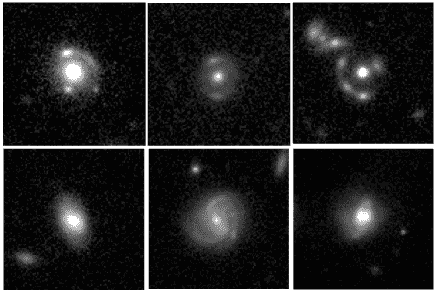
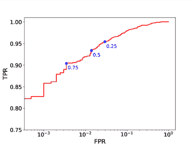
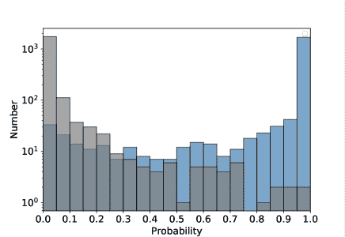
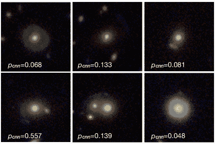
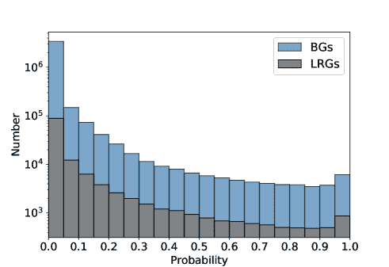
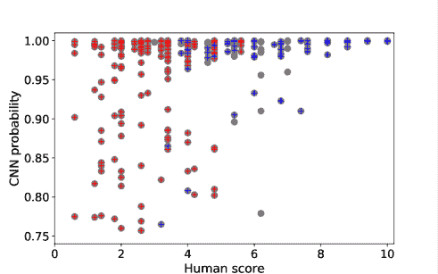
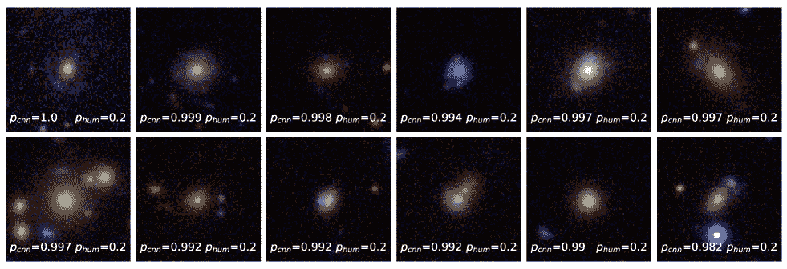
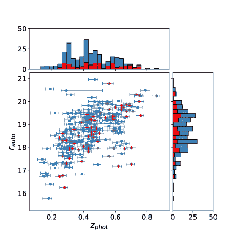
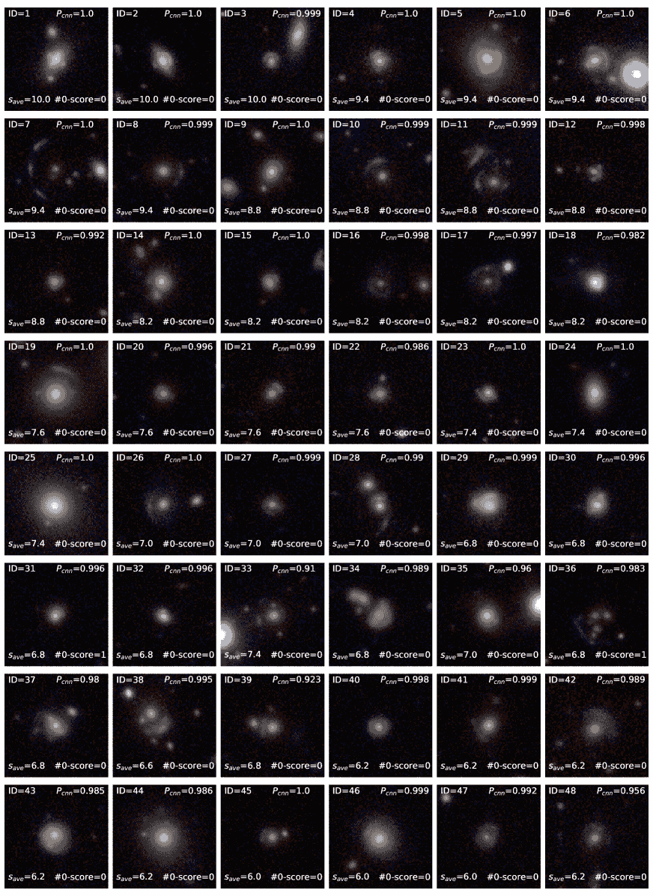
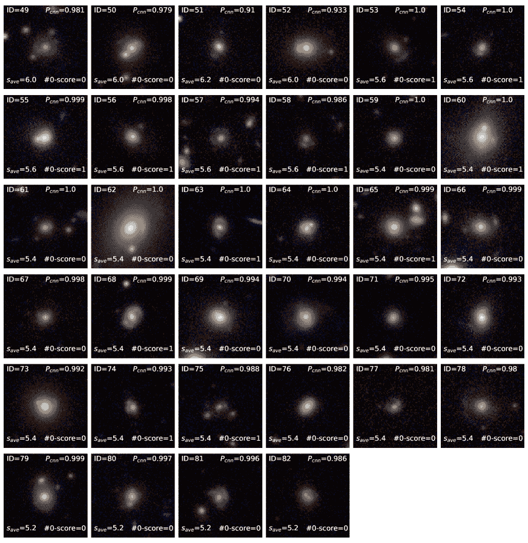

<!--yml

category: 未分类

date: 2024-09-06 20:01:48

-->

# [2004.02715] 使用深度学习筛选的新高质量强引力透镜候选者在 Kilo Degree Survey 中

> 来源：[`ar5iv.labs.arxiv.org/html/2004.02715`](https://ar5iv.labs.arxiv.org/html/2004.02715)

# 使用深度学习筛选的新高质量强引力透镜候选者

in the Kilo Degree Survey

R. Li¹¹affiliationmark: N. R. Napolitano¹¹affiliationmark: C. Tortora²²affiliationmark: C. Spiniello³³affiliationmark: L. V. E. Koopmans⁴⁴affiliationmark: Z. Huang¹¹affiliationmark: N. Roy¹¹affiliationmark: G. Vernardos⁴⁴affiliationmark: ⁵⁵affiliationmark: S. Chatterjee⁴⁴affiliationmark: B. Giblin⁶⁶affiliationmark: F. Getman³³affiliationmark: M. Radovich⁷⁷affiliationmark: G. Covone³³affiliationmark: ⁸⁸affiliationmark: ⁹⁹affiliationmark: K. Kuijken¹⁰¹⁰affiliationmark: ¹¹affiliationmark: 物理与天文学学院，中山大学珠海校区，大学路 2 号，香洲区，珠海，中国； napolitano@mail.sysu.edu.cn，lirui228@mail.sysu.edu.cn。 ²²affiliationmark: 阿尔切特天文台，L.go E. Fermi 5, 50125 佛罗伦萨，意大利。 ³³affiliationmark: INAF$-$卡波迪蒙特天文台，Salita Moiariello,16,80131 那不勒斯，意大利。 ⁴⁴affiliationmark: 卡普特恩天文研究所，格罗宁根大学，P.O.Box 800, 9700AV 格罗宁根，荷兰。 ⁵⁵affiliationmark: 天体物理学研究所，希腊国家研究基金会（FORTH），GR-70013，赫拉克利翁，希腊。 ⁶⁶affiliationmark: 爱丁堡大学天文学研究所，Blackford Hill, Edinburgh, EH9 3HJ, 英国。 ⁷⁷affiliationmark: INAF$-$帕多瓦天文台，Vicolo Osservatorio 5, I-35122 帕多瓦，意大利。 ⁸⁸affiliationmark: “E. Pancini” 物理系，拿波里“费德里科二世”大学，拿波里，意大利。 ⁹⁹affiliationmark: INFN，拿波里分部，拿波里，意大利。 ¹⁰¹⁰affiliationmark: 莱顿天文台，莱顿大学，P.O.Box 9513, 2300RA 莱顿，荷兰

###### Abstract

我们报告了在 Kilo Degree Survey 数据发布 4 中使用机器学习找到的新高质量星系尺度强引力透镜候选体。我们开发了一种新的卷积神经网络（CNN）分类器来搜索引力弧，按照 Petrillo 等人的方法（2019a）并仅使用$r-$带图像。我们将 CNN 应用于两个“预测样本”：一个发光红星系（LRG）样本和一个“亮星系”（BG）样本（$r<21$）。我们发现了 286 个新的高概率候选体，其中 133 个来自 LRG 样本，153 个来自 BG 样本。然后我们根据结合了 CNN 作为透镜的可能性和视觉检查结果的人类评分（P 值）的值对这些候选体进行了排序，并在此展示了排名前 82 的候选体，其 P 值$\geq 0.5$。所有这些高质量候选体在中央红色偏折体周围都有明显的弧线或点状特征。此外，我们将得分 P 值$\geq 0.7$的前 26 个对象定义为候选体的“黄金样本”。该样本预计包含非常少的假阳性，因此适合后续观测。这些新透镜候选体部分来自我们相较于以往分析采用的更广泛的区域，部分来自更大的预测样本（还包括 BG 样本）。这些结果显示，机器学习工具在大规模调查中寻找强引力透镜非常有前景，并且通过扩大预测样本范围，可以发现更多候选体。未来，我们计划将我们的 CNN 应用于下一代调查的数据，如大视场调查望远镜、欧几里得和中国空间站光学调查。

###### 主题标题：

引力透镜：强

## 1. 介绍

强引力透镜效应（SL，以下简称）是背景星系图像因其光线受到前景系统的引力作用而变形的现象，这些前景系统充当透镜或“偏折体”（通常是大质量的发光星系或星系团/簇）。这一效应由广义相对论预测，当源是扩展的时，它表现为围绕大质量星系的壮观弧线或环（即所谓的爱因斯坦环）。对于点状物体，如高红移类星体，则会产生多个源的图像（以下简称 mupols）。

SL 是一个强大的工具，可以深入了解星系中的暗物质分布（Refsdal，1964；Blandford & Narayan，1992；Schneider 等，1992；Keeton，1998；Congdon & Keeton，2018）。例如，它可以与动力学分析结合使用，以确定透镜系统的总质量密度分布（例如，Koopmans 等，2006，2009；Auger 等，2010；Bolton 等，2012；Li 等，2018）。如果有关于透镜星体的独立推断，例如通过恒星种群分析，SL 还可以直接测量透镜内部暗物质的量及其属性（例如，Koopmans 等，2006；Auger 等，2009；Tortora 等，2010；Spiniello 等，2011；Barnabè 等，2012；Shu 等，2015；Gilman 等，2018；Nightingale 等，2019；Schuldt 等，2019）。

SL 还可以用来测量哈勃常数 $H_{0}$ 以及其他宇宙学参数（例如，Refsdal，1964；Suyu 等，2013；Sluse 等，2019）。特别是，通过测量透镜类星体的光度变化，并利用其光度峰值的时间延迟，这一方法对 $H_{0}$ 高度敏感，对其他参数则不太敏感（例如 H0LiCOW 项目，Suyu 等，2017；Bonvin 等，2017）。结合多个透镜系统得到的推断，已将 $H_{0}$ 的测量误差降低至 2.4%（Wong 等，2019）。随着用于推断的系统数量的增加，这一数字可能进一步减少。

此外，SL 还可以通过测量引力透镜质量与动力学质量之间的差异来检验引力理论（例如，Schwab 等，2010；Cao 等，2017；Collett 等，2018），并且它可以帮助寻找大型星系周围的低质量暗物质子结构，从而约束暗物质模型（例如，Vegetti 等，2012；Li 等，2017；Hsueh 等，2020）。最后，SL 可以作为“自然”望远镜来研究非常微弱的高红移星系，这些星系否则无法通过人工望远镜直接探测到（例如，ALMA Partnership 等，2015；Cornachione 等，2018；Chen 等，2019；Rydberg 等，2019；Claeyssens 等，2019）。

远处源被引力透镜作用产生多个图像或弧的概率非常小（Turner et al., 1984; Fukugita et al., 1992）。例如，Dobler et al. (2008) 估计在 SDSS 光谱数据中的星系-星系透镜候选者的比例为 $\sim 0.5-1.3$%。基于 $\Lambda$CDM 宇宙学的更新预测表明，在地面高分辨率的大范围天空 survey 中，根据源的性质（例如遥远的点状类星体或扩展的星系）、深度和 survey 策略（Oguri & Marshall 2010; Collett 2015），每平方度可以找到 0.5 到 10 个透镜。

因此，为了收集透镜系统的统计样本，需要从非常大量的星系开始，因此需要使用广泛的天空 survey。实际上，在最近的地面 survey 中，过去三年已发现超过 1000 个新的透镜候选者（例如，Petrillo et al., 2017, 2019a; Jacobs et al., 2017, 2019; Pourrahmani et al., 2018; Khramtsov et al., 2019），如 Kilo-Degree Survey（de Jong et al., 2013）、Hyper Suprime-Cam Subaru Strategic Program（HSC, Miyazaki et al., 2012）和 Dark Energy Survey（DES, The Dark Energy Survey Collaboration, 2005）。迄今为止，也已有数百个系统被确认（例如 Bolton et al., 2008; Brownstein et al., 2012; Treu & SWELLS Team, 2012; Sonnenfeld et al., 2013; Shu et al., 2015, 2016b; Spiniello et al., 2018, 2019; Agnello et al., 2018a; Agnello & Spiniello, 2019; Lemon et al., 2020)。

然而，尽管这些数量很大，已知的透镜仍然远远不够，尤其是对于需要大量统计样本的研究。这在远距离类星体产生四重像（四重像）的情况下尤为重要，这些系统是宇宙测绘的理想系统。不幸的是，这些情况也非常稀有，只占到所有引力透镜的 10-20%。从单个引力透镜类星体中测得的$H_{0}$误差对其光度曲线的质量分布非常敏感。由于这种误差难以降低到 10%以下（见 Kochanek, 2019），唯一进一步降低不确定性的方法是对大量系统进行分析（例如，H0LiCOW 项目，Suyu 等，2013）。因此，必要条件是找到并确认新的引力透镜。在过去几年中，我们利用 KiDS 调查提供的高质量成像尽可能多地发现了以前未发现的引力透镜，包括弧状透镜和多重透镜（例如，Hartley 等，2017；Petrillo 等，2017，2019a，2019b；Spiniello 等，2018，2019；Khramtsov 等，2019）。

然而，在非常大量的星系中寻找强引力透镜是一项具有挑战性的任务，并且随着下一代天空调查的到来，这将变得更加具有挑战性。实际上，得益于其大范围的调查区域和更深的限制星等，未来的调查将有效地将透镜候选者的数量增加到$\sim 10^{5}$甚至更多（Collett, 2015）。例如，光学大型同步巡天望远镜（LSST；Closson Ferguson 等，2009），将于 2020 年启动并覆盖南半球 18 000 $\rm deg^{2}$，预计在其运行期间找到多达 120 000 个透镜（Collett 2015）。空间望远镜 Euclid（Amendola 等，2018），其点扩散函数为 0.2^(′′)且覆盖 15 000 $\rm deg^{2}$的天空区域，将发现近 170 000 个弧状透镜和多重透镜（Collett，2015）。与此类似数量的透镜也将由中国空间站望远镜（CSST；Zhan，2018）发现，该望远镜预计于 2024 年发射，计划覆盖 17 500 平方度的天空区域，点扩散函数约为 0.15^{\prime\prime}。

传统上，已经使用不同的方法来优化检测效率，例如光谱选择（例如，Bolton 等，2006，2008），形态识别（例如，Seidel 和 Bartelmann，2007；More 等，2016）以及众包方法（例如，Marshall 等，2016）。然而，这些方法对下一代调查将不再足够，因为将要观测的星系数量将显著增加，使得手动识别和选择透镜候选体变得不可能。

目前，机器学习（ML，Michalski，1986；Ivezić 等，2014）似乎是进行透镜搜索任务的唯一可行替代方案。这一点已经在多个开创性工作中得到证明，这些工作使用了机器学习技术来搜索一些最成功的正在进行的天空调查中的强透镜（例如，Agnello 等，2015；Hartley 等，2017；Jacobs 等，2017，2019；Pourrahmani 等，2018）。特别是，我们团队已经积极参与开发基于机器学习的例行程序，以在 KiDS 中搜索新的强透镜（例如，Petrillo 等，2017，2019a，2019b；Spiniello 等，2018，2019；Khramtsov 等，2019）。此外，强引力透镜发现挑战（Metcalf 等，2019）比较了几种透镜搜索方法，也证明了机器学习方法的表现与人工检查或其他传统方法一样好，但分类速度更快。总体结果是，使用机器学习方法发现了数千个新的透镜候选体，迅速赶上了传统方法在几十年中收集的引力透镜总数。

在这种背景下，为了准备未来全景调查中的重大透镜发现挑战，我们已经开始研究如何提高机器学习算法找到的候选体的完整性和纯度。特别是在本文中，我们展示了一种新的卷积神经网络（CNN）分类器，用于搜索引力弧和多极子，并将其应用于$r-$带 KiDS 图像。我们遵循了 Petrillo 等（2019a，以下简称 P+19）的说明，开发了一种具有相同架构的 CNN，但使用了不同的训练集。此外，我们将其应用于一个更大规模的预选星系数据集（有关差异的更多细节，请参阅第四部分"），这使我们能够增加高质量透镜候选体的数量，同时恢复了几乎所有从 P+19 的先前 CNN 中找到的透镜候选体。

这是即将发布的 KIDS 数据发布 5（DR5，涵盖完整的 1350 平方度）的准备工作，也是未来与 LSST、Euclid 和 CSST 项目相关的准备工作。本文的组织结构如下。在第二部分中，我们描述了采用的 CNN 模型以及如何选择预测数据和训练样本。在第三部分中，我们将 CNN 分类器应用于预测数据并呈现新的发现。在第四部分和第五部分中，我们进行讨论并总结我们的主要结论。

## 2\. 一个新的 Convolutional Neural Network 分类器用于 KiDS

卷积神经网络（CNN）是最受欢迎的机器学习模型之一。与传统神经网络相比，CNN 的最重要特征是使用卷积核作为人工神经元，这可以有效地捕捉局部特征，使 CNN 特别适用于图像识别、语音识别、自然语言处理以及一些其他任务（Lecun 等，1998）。CNN 由一系列不同的层组成，如卷积层（用于提取输入的不同特征）、池化层（用于压缩特征图并简化计算）和全连接层（用于将所有局部特征图转化为全局特征图）。有关 CNN 的更多信息，我们参考了我们之前的论文 Li 等（2019），或 Rawat 等的最新综述（2018）。一般来说，任何好的 CNN 模型都会从训练数据中学习，只要这些数据足够且适用于分类，然后对预测数据进行预测。

在这项工作中，我们使用了 CNN 从大样本中搜索引力透镜，包括约 $\sim 10^{6}$ 颗明亮的银河系和约 $\sim 10^{5}$ 颗红色发光的银河系（见第 2.1 节）。这种基于机器学习的搜索方法非常新颖，选择优化 SL 查找的最佳架构尚不明确。因此，我们比较了不同架构的性能，如 AlexNet（Krizhevsky 等，2012），ResNet（He 等，2015）和一种名为 Densenet（Huang 等，2016）的较新架构，以优化透镜搜索工具。结果，我们决定使用一个具有 18 层卷积层的 ResNet 模型，因为它在性能和速度之间达到了最佳平衡。例如，AlexNet 需要较少的训练时间，但精度低于 ResNet，而 DenseNet 则表现出相反的行为。此外，较深的 ResNet（例如 34 层或 50 层）预计会有更好的性能，但耗时更长。

在 P+19 中已经做出了相同的选择，我们共享了分类器的核心部分，该部分来自相同的开源代码 keras-resnet¹¹1https://github.com/raghakot/keras-resnet。因此，我们的分类器与 P+19 中展示的分类器之间没有架构上的差异。此外，这些分类器都是使用 Keras²²2https://github.com/keras-team/keras 构建的，并且在 TensorFlow³³3https://github.com/tensorflow/tensorflow 的后端运行。尽管这两个 CNN 之间存在相似之处，但新的分类器能够找到更多的候选项。正如我们接下来将解释的，这主要是因为用于训练 CNN 的训练样本不同，以及我们应用它的预测数据不同。

### 2.1. 预测数据

预测数据是经过训练的 CNN 可以返回概率 $p_{\rm cnn}$（即做出预测）为真实透镜（真正的正例）的系统。原则上，调查中检测到的所有目标都可以成为预测样本的一部分。然而，将 CNN 输入到恒星、类星体、低红移矮星系或其他非常暗淡的星系中是没有意义的，因为它们不能作为引力透镜。因此，可以事先进行预选择，以帮助减少计算时间和潜在的污染。由于对大质量星系的 SL 截面更大（见例如 Oguri & Marshall, 2010），一种标准方法是仅使用更亮和更大质量的系统作为预测数据。

为了构建我们的预测数据，我们使用了最新 KiDS 数据发布 KiDS-DR4 中的 1006 张公开可用的图像。这包含了从四个光学带 ($u$, $g$, $r$, 和 $i$) 的图像中提取的多波段光学目录。在这里我们仅使用了 $r$ 带观测数据，因为它们具有最佳的视场，具有约 $\sim 0.7^{\prime\prime}$ 的中位全宽半最大值 (FWHM) (Kuijken 等, 2019)。在即将发表的论文中，我们将通过利用 $g,r,i$ 彩色合成图像进一步改进结果，从而使用有关透镜和弧/拟星体的颜色信息，结合弧的形态和图像位置。然而，这必须以小心的方式进行，并且只有在有适当的训练样本，能够很好地描述真实星系及其颜色分布时才可以。事实上，透镜的颜色可能会被源的存在污染，从而无法与简单的颜色切割匹配来选择 LRGs。

在公开可用的 KiDS-DR4 目录中检测到的源总数约为 1.2 亿，其中超过 6000 万个是通过 BPZ 代码⁴⁴4http://www.stsci.edu/ dcoe/BPZ/ 获得的高质量光度红移星系 (见 Kuijken 等, 2019)。其中，超过 500 万个还具有来自视场卷积的 2D 单一 Sérsic 模型的结构参数（Roy 等正在准备中，另见 Roy 等, 2018，对 KiDS-DR2 的分析）

在这项工作中，我们将我们的 CNN 分类器应用于两个预测数据集。第一个数据集（称为 LRG 样本），仅包括亮红星系（LRGs），这些星系更有可能表现出强透镜特征，通常更大质量。因此, 他们通常用作弧线搜索的标准预选样本 (Wong 等人，2013; Petrillo 等人，2017, 2019a, P+19)。另外，作为第二个预测数据集，我们添加了一个更大的样本，“明亮星系”(BGs,称为 BG 样本)，没有任何颜色切割。主要有两个原因：1）用于定义 LRGs 的颜色切割是任意的，在 SL 的情况下可能不是最佳的，其中透镜像可以污染透镜的颜色（特别是在爱因斯坦半径很小的情况下； 2）SL 可以由远处的大质量星系产生，而不管它们的形态/颜色如何。

此外，最快的 GPU 使我们今天能够分析更多的数据，几乎不增加总计算时间（参见，例如，Abadi 等人，2016）。当然, 即使将 BGs 添加到预测样本中也增加了发现新透镜的可能性，同时也会导致较大的假阳性污染。

我们在这里介绍了两个预测样本的描述：

1.  1.

    BG 样本：在 KiDS 目录中，BG 样本是通过以下方式选择的：1）使用标志 SG2DPHOT=0 选择类星体状物体。该标志由软件 2DPHOT（La Barbera 等人，2008）生成，在 KiDS 目录提取过程中进行星-星系分离（参见 Kuijken 等人，2019，KiDS-DR4），并将星系分配为零值，大于零的值分配给点状物体。2）要求$r-$ band Kron-like magnitude mag$\_$auto（也出现在 KiDS 目录中，由 Sextractor，Bertin 和 Arnouts（1996）获得）小于等于$r_{auto}\leq 21$。满足这两个条件的最终 BG 样本包括 3,808,963 个星系。

1.  2.

    LRG 样本：LRG 预测样本是 BG 样本的一个子样本，在这里，我们遵循了 P+19 的方法，略微调整了 Eisenstein 等人（2001）的低红移（$z<0.4$）LRG 颜色-星等选择，以包括更暗和更蓝的源：

    |  | $\begin{split}r_{auto}<14+c_{par}/0.3,\\ &#124;c_{perp}&#124;<0.2,\end{split}$ |  | (1) |
    | --- | --- | --- | --- |

    其中

    |  | $\begin{split}c_{perp}=(r-i)-(g-r)/4.0-0.18,\\ c_{par}=0.7(g-r)+1.2[(r-i)-0.18],\end{split}$ |  | (2) |
    | --- | --- | --- | --- |

    其中$r_{auto}$是上文提到的$r$波段 Kron 样貌的亮度。我们将选择限制为$r_{auto}\leq 20$以匹配 P+19 的规定。星系颜色直接从 KiDS-DR4 目录中提取，来自标志 COLOUR$\_$GAAP$\_$g$\_$r（$=g-r$）和 COLOUR$\_$GAAP$\_$r$\_$i（$=r-i$）。这些颜色不同于 Petrillo 等人使用的颜色（2017，2019a，2019b），后者基于 Kron 样貌的亮度。实际上，KiDS-DR3 之后，其他波段的 Kron 样貌不再列入 KiDS 目录，因此 DR4 中所有源都不可公开获取。另一方面，COLOUR$\_$GAAP 是在高斯加权光圈上测量的，针对每个源和每个图像进行了修改，因此提供了不同观测/波段下的独立于视场的通量估计，从而提供了更客观的颜色（Kuijken 等人 2019，P+19）。使用方程 1 和 2 的标准，我们获得了 126,884 个 LRG 样本。

对于 BG 和 LRG 样本，我们从 KiDS-DR4 的$r$波段合成图像中提取了$101\times 101$像素的裁剪图像，相当于$20\times 20$角秒²，中心在这些星系的每个位置。这些裁剪图像的尺寸（在$z=0.3$时相当于 90 kpc $\times$ 90 kpc，或在$z=0.5$时相当于 120 kpc $\times$ 120 kpc）足够大，能够包含从星系大小到星团/群体大小的弧和多极图，并且可以感知透镜候选者周围的环境。

### 2.2\. 训练数据

训练数据表示 CNN 需要从中学习的数据库，以确定在预测数据集中应检测哪些特征以进行分类。通常，它由“真正例”（即真实确认的透镜系统）和“真负例”（即不包含可检测透镜图像的系统，但可能包含类似于真实透镜事件特征的系统，这些特征是 CNN 需要学习排除的，例如模仿透镜弧的蓝色螺旋臂或模仿爱因斯坦环的环星系，见下文更详细讨论）组成。此外，训练样本需要真实地再现预测样本的数据质量。如果未满足此条件，并且训练样本未能恢复预测样本的主要属性，则可以应用领域适应或迁移学习（参见例如 Kouw & Loog，2018）。例如，当未来将颜色信息添加到 CNN 用于分类时，这将是必要的方法。

由于我们在 KiDS 中没有大量的真实透镜样本（即来自 P+19 和其他论文的大多数候选样本尚未确认）⁵⁵5 我们注意到，唯一可能的严格定义确认或排除透镜的方法来自光谱确认，因为视觉检查无法证明一个候选透镜是真实的。，为了建立“真正的正样本”，我们对从预测样本中随机提取的选定样本的星系周围的真实弧进行了模拟（参见，例如 Petrillo 等人，2017）。为此，我们遵循了 P+19 中的描述。我们使用了单个等温椭圆体（SIE）轮廓加外部剪切来建模偏折体，并使用 Sérsic 轮廓来建模背景源的光。模型参数设置如 Petrillo 等人（2019b）中所述，已经证明这些参数足够现实。特别是，爱因斯坦半径设置在[1, 5]弧秒范围内，并遵循对数分布。此外，还添加了在 P+19 中实现的高斯随机场，这些场考虑了偏折体的亚晕效应，以及小的光块（用 Sérsic 轮廓建模）以再现相应的源子结构。在训练 CNN 分类器时，我们通过中心星系的峰值光亮度对弧的亮度进行了重新缩放，并将所有图像归一化到相同的计数范围[0, 255]。我们还对训练过程中的正样本（模拟透镜）和负样本进行了数据增强（例如旋转、平移、翻转、缩放）。

因此，总结来说，训练数据被分为两类：正样本和负样本。正样本是“真实透镜”，即我们知道其周围有（模拟的）弧的星系，我们用[1]标记，而负样本是“非透镜星系”，即没有模拟弧的真实 KiDS 星系，我们用[0]标记。下面我们更详细地描述了这两类样本的构建方式：

1.  1.

    正样本：我们从 LRG 样本中选择了 11,000 个 LRG，其中约一半由 P+19 提供，另一半由我们通过视觉检查选择。然后我们模拟了 200,000 个弧，并将它们与 KiDS DR4 的平均点扩散函数（PSF）进行卷积。对于每个弧，我们从选定样本中随机选择一个 LRG，并将弧添加到其中以创建一个模拟透镜系统。通过这种方法，我们构建了 200,000 个模拟透镜，适合用作训练 CNN 的正样本。

1.  2.

    负样本：此样本由总共 18,000 个真实星系构成，其中包括 11,000 个用于模拟正样本的 LRGs、从 KiDS-DR4 随机选择的 3,000 个非透镜星系、2,000 个螺旋星系（其中 1,000 个由 P+19 提供，另 1,000 个通过对 KiDS-DR4 图像的视觉检查选择），用于训练 CNN 以避免由螺旋臂产生的“假阳性”，以及最后 2,000 个其他类型的“假阳性”（例如，合并星系、环形星系等）。特别地，对于这一类样本，我们选择了被我们构建的 CNN 在测试不同架构时（见第二部分）分类为可能的透镜，但经过视觉检查后被拒绝的候选对象。

图 1 显示了训练样本的示例。第一行的图像展示了通过将模拟弧线添加到真实的 LRGs 上生成的 3 个模拟透镜（正样本）。在同一图中，第二行展示了作为负样本使用的 3 个真实星系。

在这里，我们强调两点。首先，我们的假设没有考虑透镜-星系属性与模拟过程中的透镜图像之间的相关性。虽然在真实透镜中，星系质量和光强是相关的，但我们做出这种选择是为了避免任何可能的偏差（例如，假设特定的暗物质与光物质质量比，例如来自丰度匹配，参见 Moster et al. 2010）。实际上，考虑到这些关系中的巨大不确定性和透镜星系的质量范围有限，采用具有现实方差的相关性将产生几乎均匀的二变量分布，相当于没有相关性。其次，我们选择仅使用 LRGs 来模拟训练样本中的实际透镜，主要是为了优化 CNN 的预测能力，但这可能会影响对亮样本的预测能力。不过，我们强调，BGs 预计不会具有显著不同于 LRGs 的属性（例如，亮度、大小、扁平度），也不会以某种方式影响 CNN 区分真实正样本的能力（无论是星系周围的弧还是 mupols，参见 §3.4）。从这个角度来看，将训练于 LRGs 的 CNN 应用于 BGs 并不需要使用迁移学习（参见 e.g., Kouw & Loog, 2018）。原则上，我们本可以使用这种方法，前提是我们使用了多波段信息，因为颜色是两个预测样本的唯一区分参数。由于目前我们仅使用 $r-$波段，因此我们不期望此特征影响 CNN 性能或导致过拟合。然而，我们将在下一步分析中研究迁移学习的使用，届时我们将比较仅在 $r-$波段上训练的 CNN 和在多波段图像上训练的 CNN 的结果。

图 1.— 训练样本的示例。第一行的图片是通过将模拟弧添加到实际 LRGs 上生成的 3 张模拟透镜（‘正样本’）。第二行的图片是 3 个实际星系，用作‘负样本’。

图 2.— 左图：基于测试样本中的 4,000 个星系的 CNN 分类器 ROC 曲线。我们还展示了用于计算 FPR 和 TPR 的 3 个不同阈值 ($p_{\rm cnn}=0.25,0.5,0.75$) 的位置。右图：测试样本的概率分布。蓝色直方图表示正样本的概率分布，而灰色直方图表示负样本的概率分布。

### 2.3. 测试 CNN 分类器

经过训练后，CNN 分类器在测试样本上进行了测试，以评估其性能。测试样本由 2,000 个模拟镜头组成，按照 2.2 节中的说明作为正样本，以及 2,000 个随机选择的真实星系作为负样本。我们注意到，我们仅使用了 LRG 样本中的星系进行测试，因为 CNN 仅在该样本上进行了训练。

我们使用接收者操作特征（ROC）曲线来评估 CNN 分类器的性能（参见 Petrillo 等人 2019b）。ROC 曲线是通过绘制不同$p_{\rm cnn}$阈值下的真实正样本率（TPR）与假正样本率（FPR）的关系得到的，其中 TPR 和 FPR 定义如下：

+   •

    TPR：被分类器也识别为正样本的正样本比例（即分类器表现正常的对象）。

+   •

    FPR：被分类器错误地分类为正样本的负样本比例。

在图 2 中，我们展示了整个测试样本的 ROC 曲线（左）和概率分布（右）（2,000 个模拟镜头和 2,000 个真实非镜头星系均取自 LRG 样本，这也是我们用来训练 CNN 的样本）。ROC 曲线与 Petrillo 等人(2019b)中的曲线类似，显示两个 CNN 的表现非常相似。在图的右侧面板中，我们绘制了真实正样本（即镜头，用蓝色表示）与负样本（即非镜头，用灰色表示）的 CNN 输出概率分布。图示表明，部分真实镜头可能会丢失，因为它们被分类器错误地拒绝并赋予了非常低的概率。我们已在测试样本中目视检查了这些情况，发现大多数漏检的镜头都有过于微弱的弧度难以识别，或者嵌入在前景星系的光晕中。这表明当前的 CNN 在明亮弧度下表现良好，但对于更极端的配置（如非常小的爱因斯坦半径），仍需要一些改进，我们将在下一步开发中实施。

图中还清晰地显示，对于较高的$p_{\rm cnn}$，负样本的比例会减少。因此，可以定义一个阈值来选择合适的候选者。在本文中，我们决定采用$p_{\rm cnn}=0.75$，在这个值以上负样本的比例始终低于 6.5%。

## 3\. 新的镜头候选者

镜头候选者的编制基于两个步骤：第一步是通过 CNN 进行分类，第二步是由五位专家观察员进行视觉检查。后者步骤对于从明显的“假阳性”中清理最终样本以及为 CNN 返回高概率的镜头添加独立评分是必要的。这使我们能够优化给定候选者成为真实镜头的机会，因为这个选择过程涉及到人工智能和人类智能。在未来的大规模调查（例如，LSST、Euclid、CSST）中，专家的视觉检查将成为这一过程的严重瓶颈，因为 CNN 分类器的候选者数量将达到数十万。因此，人类检查将只能通过某种形式的公民科学项目来实现（参见例如 More 等，2016）。作为替代，我们需要寻找其他自动过滤技术，以进一步剔除明显的假阳性，并将样本减少到大型合作中的合理大小（例如，数万的数量级）。

### 3.1\. CNN 概率和初步候选者选择

在训练和测试 CNN 后，我们首先应用网络对 LRG 样本进行预测（即查找弧形）。在这种情况下，CNN 的输入是 LRG 样本的 126,884 张标准化图像，如 2.1 节中描述，而输出是每张图像成为镜头的概率 $p_{\rm cnn}$。

正如在 2.3 一节中已明确说明，我们设置了 $p_{\rm cnn}=0.75$ 的阈值，以定义系统为有价值的镜头候选者，并符合视觉检查的条件。该阈值已设定为 CNN 输出的真实镜头和训练运行中的假阳性之间的合理折中（参见图 2）。注意，这个阈值不同于 P+19 采用的阈值 ($p_{\rm cnn}=0.8$)，但返回了类似数量的潜在候选者（参见 4 一节中的讨论）。

我们获得了 2,848 个候选者（占完整 LRG 样本的 2.24%），其中包括 P+19 已分类的 60 个高质量 LinKS 透镜候选者中的 54 个，恢复率为 90.0%。6 个“缺失”的对象，其颜色合成的 KiDS 剪影如图 3 所示，其概率低于我们设定的阈值。其中一些可能是我们 CNN 分类器遗漏的真实透镜。另一方面，我们在这里发现并呈现了 CNN P+19 遗漏的良好候选者。对这两个分类器的全面比较超出了本文的目的，将在即将发表的工作中详细讨论。在这里我们指出，尽管这两个分类器之间有相似之处，但它们并不完全相同（参见第四部分中的差异总结），因此它们展现了有趣的互补方面。这表明开发独立的机器学习分类器（无论是 CNN 还是其他机器学习技术如支持向量机 SVM 等）是重要的，并可能利用它们的综合优势进一步提高混合配置的整体性能。

图 3.— P+19 找到的 6 个透镜候选者，但被我们的 CNN 遗漏。$p_{\rm cnn}$ 是我们 CNN 分类器的概率。邮票（$20^{\prime\prime}\times 20^{\prime\prime}$）是通过组合$g$、$r$和$i$图像获得的。

我们将 CNN 模型应用于完整的 BG 样本，然而，由于 CNN 模型并未针对该样本进行优化，这可能会导致更多的假阳性。此外，BG 样本还包括一些稍微暗淡的星系，具有任何颜色，因此也包括晚型系统，这些系统的螺旋可能会模拟弧形透镜特征。为了减少这种假阳性的比例，我们在这种情况下将概率阈值设定为较高且相当保守的$p_{\rm cnn}=0.98$，以接受系统为有价值的透镜候选者。使用此阈值，我们获得了 3 552 个透镜候选者，占 BG 样本的 0.093%。

在图 4 中，我们展示了 LRG 和 BG 样本的 CNN 概率分布。总体而言，这两个分布遵循特征性的对数趋势，这一趋势按相对样本大小进行缩放。这一趋势如预期，因为 CNN 概率较小的目标往往不是透镜，而 CNN 概率较大的目标往往是真实透镜，且在真实预测样本中，非透镜的数量远多于透镜。

图 4.— 预测 LRGs（灰色）和 BGs（蓝色）的概率分布。这两个分布符合对数形式，正如我们预期的那样。

### 3.2\. 视觉检查

两个候选列表（来自 LRG 和 BG 样本）的数量明显大于在覆盖区域内可以预期的真实透镜数量（约 500 个在 1000 平方度，Collett, 2015），这意味着这些样本中假阳性的占主导地位。为了优化下一步的视觉检查，并给检查员更多时间集中于重要候选，我们决定进行第一次筛选，过滤掉明显的假阳性。在这种情况下，只有一个观察员负责检查所有候选对象（来自 LRG 样本的 2848 个和来自 BG 样本的 3552 个），并将明显的非透镜从最终检查样本中排除。在这一初步阶段，我们还排除了 CNN 在 P+19 和 Petrillo 等人（2017）中找到的所有透镜候选，包括 LinKS 样本、奖金样本和他们提到的任何其他样本。经过这一过程后，最终剩余的候选数量为 286 个，其中 133 个来自 LRG 样本，153 个来自 BG 样本。

图 5.— 286 个通过 ML 和人工阈值的新候选对象中，CNN 概率 $p_{\rm cnn}$ 与人工概率 $p_{\rm hum}$ 的关系。标记为蓝色十字的点代表至少有一个检查员给出 10 分（即确定是透镜）的系统，而标记为红色十字的点代表至少有一个检查员给出 0 分（即不是透镜）的系统。

图 6.— 具有高 CNN 概率 ($p_{\rm cnn}\geq 0.97$) 和低人类评分 ($p_{\rm hum}=0.2$) 的候选对象。存在一些弧形但不是透镜特征（如交互、螺旋臂、环等），这些特征可能导致高 $p_{\rm cnn}$

下一步是让五名观察员检查基于 CNN 概率选择并通过了视觉预选“清理”的对象。为此，我们创建了 $20^{\prime\prime}\times 20^{\prime\prime}$ 的彩色剪裁图像，结合了 g、r、i 波段，让 5 个人以盲测的方式检查预选的 286 个对象样本。检查员需要根据 $ABCD$ 方案为每个系统分配一个质量字母，其中 $A$ 是确定的透镜，$B$ 是可能是透镜，$C$ 是可能不是透镜，$D$ 是不是透镜，我们将其分别转换为 10、7、3、0 的分数，以将质量标记转换为分数。

我们在这里强调，视觉检查并不能证明候选透镜的真实性。在这方面，直到我们能访问到 KiDS 中经过光谱确认的大样本，机器学习将会再现人类定义透镜为真实的偏见。减少这种偏见的最佳方法确实是增加执行 CNN 透镜视觉评估的独立团队成员的数量，正如 P+19 中已说明的那样。这就是为什么在本文中，我们总是使用五名不同的检查员来对候选项进行评分。

最终，我们定义了一个人类概率为 $p_{\rm hum}=s_{\rm ave}/10$，其中 $s_{\rm ave}$ 是 5 位检查员的平均分数。这个人类评分返回了 18 个具有非常高概率的候选项（$p_{\rm hum}\geq 0.8$），以及另外 10 个概率稍低的候选项（$0.7\leq p_{\rm hum}\leq 0.8$），但仍然非常有说服力。这些对象也从 CNN 那里获得了所有非常高的值，如图 5 所示。在这个图中，我们绘制了 CNN 概率 $p_{\rm cnn}$ 与人类概率 $p_{\rm hum}$ 的关系。28 个候选项位于图的右上角，它们分别从 CNN 和人类那里都获得了高概率评分。

向更低的$p_{\rm hum}$移动时，图中还应该期望$p_{\rm cnn}$降低，理想情况下这两个量应当是相关的。然而，$p_{\rm cnn}$与$p_{\rm hum}$之间没有明显的相关性，因为 CNN 对那些人类评估较低的候选者也赋予了更高的重要性，尽管我们观察到两个量之间的散布明显增加。在图 5 的左上角，有一些系统具有非常高的$p_{\rm cnn}$($\geq 0.97$)但非常低的$p_{\rm hum}$($\leq 0.4$)。在这些情况下，要么 CNN 比人眼更好地检测到了检查员未识别的真实特征，要么 CNN 更容易混淆可以模拟引力弧和 mupols 的特征，而这些特征更可能被人类认为是误报。图 6 清楚地表明，后者更有可能是实际情况。我们在此展示了一些具有高$p_{\rm cnn}$($\geq 0.97$)和低$p_{\rm hum}$($=0.2$)的候选案例。它们中的大多数很可能是误报，因为它们显示了模拟微弱弧线和 mupols 的特征（如相互作用、螺旋臂、环等）。这表明需要进一步努力改进训练集，包括更多准确的“负例”。然而，对于这些系统，我们不能排除小爱因斯坦半径的透镜可能被 CNN 找到，但检查员更难以发现，因为透镜图像被中心星系的光遮挡。但这个问题在未来可以通过去除前景星系的光来部分解决。

在图 5 的中间区域，有一些候选者的分类未能获得检查员的一致同意，因此最终的人类概率范围为$0.4\leq p_{\rm cnn}\leq 0.6$。在这里，CNN 概率存在较大散布，这可能是因为机器倾向于挑选一些信噪比较低且人类认为不完全令人信服的特征。

为了确定在这个 $p_{\rm hum}$ 范围内高 $p_{\rm cnn}$ 的可能性，我们在图 5 中标记了所有至少有一位检查员认为系统是明确透镜（即给出 10 分）的点，用蓝色叉标记。许多这些系统被发现是 mupols。这可能表明 CNN 在选择这一特定类别的透镜时需要改进。我们期望通过即将进行的实验进一步优化这些候选者，训练 CNN 在这一特定系统类别上。我们注意到，红色叉标记表示那些至少有一位检查员给出 0 分（即认为该对象是明显的污染物）的系统。

### 3.3\. 排名候选者

总体来说，图 5 表明，$p_{\rm cnn}$ 和 $p_{\rm hum}$ 单独来看，都不完全适合用于排名透镜（请注意，这对于当前的 CNN 是正确的，但对于更好的网络可能并不成立）。因此，我们决定将这两个量结合起来，以找到 CNN 和人工“预测”之间的折衷，并采用伪（联合）概率作为排名候选者的指标：

|  | ${\tt P}=p_{\rm cnn}*p_{\rm hum}$ |  | (3) |
| --- | --- | --- | --- |

使用这个概率，我们识别出 82 个 P 值$\geq 0.5$的候选者，我们定义为高质量透镜候选者。在这些候选者中，有 26 个代表了“黄金”样本，P 值 $\geq 0.7$，所有这些样本都显示出明显的透镜特征，因此非常适合进行光谱跟踪观测。

在表 1 中，我们报告了透镜 ID、KiDS 名称、坐标、$r-$波段亮度、光度红移、检查员给出的平均分数$s_{\rm ave}$、82 个高质量候选者的$p_{\rm cnn}$和 P 值，按 P 值递减顺序排列。最后，在表的最后一列中，我们报告了给特定物体打 0 分的检查员数量。实际上，正如我们在第 3.2 节开头所描述的，6400 个$p_{\rm cnn}$高于阈值的物体首先由一位检查员进行预筛选。这位检查员从最终候选样本（286 个）中排除了明显的非透镜物体，然后将这些物体交给其他四人。这可以解释为对被排除物体给予 0 分。因此，正式来说，我们现在应该排除所有至少有一个剩余检查员给出 0 分的系统。在这种情况下，我们将去掉图 5（图的底部左侧区域）中的大多数低分和低$p_{\rm cnn}$物体，其中我们用红色十字标记了至少收到一个 0 分的系统。然而，同时，我们也会排除许多 CNN 给予高分且仍可能是可靠候选者的物体。因此，我们决定保留并标记这些系统，因为，正如之前所强调的，我们无法判断视觉检查是否优于 CNN。因此，我们认为在表 1 和图 8 中报告给出零分的检查员数量，是让读者自行判断的最佳方式。

### 3.4\. 高质量透镜样本

图中显示了 82 个高质量候选体，按 P 值递减排序（见图 8）。邮票（$20^{\prime\prime}\times 20^{\prime\prime}$）是通过结合$g$、$r$和$i$带图像获得的。我们强调，由于$g$带和$i$带的观测条件和深度较差，相较于$r$带，固有信噪比（SNR）在不同带中可能会有很大变化。这也可能是 CNN 与人工评分之间的差异因素，因为前者仅使用$r$带，而视觉检查是基于颜色组合图像进行的，可能更受组合 SNR 的影响。我们将在未来的分析中扩展 CNN 预测到其他带（参见 Petrillo 等人，2019a、b 的首次尝试）。我们强调，这一实施需要在构建训练样本时非常准确的颜色信息。源的颜色分布必须再现真实星系的真实颜色，否则其使用可能导致矛盾结果。例如，Metcalf 等人（2019）展示了，对于他们的测试样本，多色数据在透镜搜索中是强大的，因为多波段地面数据与单波段空间数据相比，可以达到更好的性能，噪声更低，分辨率更高。然而，Petrillo 等人（2019b）也发现，颜色信息只能部分提高 CNN 的预测能力，因为 CNN 主要受到形态的驱动。如果透镜颜色受到源颜色的严重污染（即，看起来比实际更蓝，例如，因为附近有非常亮的类星体），那么添加颜色信息可能会变得麻烦。因此，需要非常小心地确定适当的颜色切割和一个合适的训练样本，以再现真实透镜的颜色和亮度的多样性，才能使多波段方法有效。

乍一看，大多数候选者显示出可区分的弧形特征，但也有一些 mupols 候选者。这些候选者增加了在 KiDS 中先前发现的引力透镜类星体候选者的数量，利用来自光学和红外源颜色的信息（见如 Spiniello 等，2018；Khramtsov 等，2019；Petrillo 等，2019a）。特别是，ID=1 展示了一个非常有说服力的特殊爱因斯坦十字配置，而 ID=12 似乎是一个经典的四重构型。此外，ID=5 可能是一个四重系统，由于弧的特殊红色，i 带的视场较差造成了较宽的峰值。这些对象无疑非常适合光谱跟进，如果得到确认，它们将增加已知的四重系统数量，这对监测活动特别有用，旨在准确测量哈勃常数（$H_{0}$，Suyu 等 2017，Wong 等 2019）。

另一个重要的说明是，大约一半的“黄金样本”候选者出现在 BG 样本中（例如 ID=3、7、10、12、13、15、16、17、18、19、20），这表明 CNN 发现这些系统周围的弧形和 mupols 的能力没有受到仅基于 LRGs 的训练样本的特别影响（见第 2.2 节）。

最后，CNN 捕捉到了一些来自群体/星团的较大爱因斯坦半径，如 ID=7，该系统显示出一个非常微弱且非常红的中心透镜，但相对较大的爱因斯坦半径（$\sim 5^{\prime\prime}$），左侧有三个弧形图像，右侧有一个点状图像。透镜具有较高的光度红移（$z_{\rm phot}=0.86$，在候选者列表中最高），这与红色和紧凑的尺寸是一致的。这很可能是一个富含暗物质的系统，与个别星系的弧间隔最大，特别是考虑到透镜的高红移。然而，我们不能排除这个系统是一个星系团的可能性，因为在透镜星系候选者附近至少有三个红色物体。如果它们的红移与中央物体相当，那么这可能是一个来自小型星系团的引力透镜事件，从而解释了较大的爱因斯坦半径。我们已经检查了光度红移，这似乎并非如此。然而，我们强调光度红移并不总是准确的。

剩余的大多数高等级系统显示出相当规则的弧形，也有伪爱因斯坦环，如 ID=25、30、33、40、47。

在图 7 中，我们展示了在光度红移–亮度空间中弯曲体的分布。光度红移（$z_{\rm phot}$）来自 KiDS 目录，使用 BPZ 获得（详情见 Kuijken 等， 2019）。两个量之间的相关性非常明显，正如预期的那样，因为在固定的固有亮度下（我们提醒读者，我们只预选了亮度较高的星系），星系距离越远（即 $z_{\rm phot}$ 越高），表观亮度就越小。如果我们仅包括排名前 82 的候选体（由红色交叉标记），相关性和红移及亮度的整体分布不会发生变化。光度红移分布在红移范围内相当大，从 $\sim 0.2$ 到 $\sim 0.8$。此外，$z_{\rm phot}$ 与 P 值之间没有发现相关性，例如，我们在排名前 12 的候选体中有红移 $\sim 0.2$ 和 $\sim 0.8$ 的透镜，同样在第二个排名十中也有类似情况。总体而言，新透镜候选体的红移分布似乎比 P+19 的稍大，因为 P+19 中几乎没有透镜的红移高于 $z \sim 0.6$。

图 7.— 前景弯曲体的光度红移–亮度空间中 286 个透镜候选体的分布。由红色交叉标记的点是图 8 中展示的前 82 个候选体。$r_{auto}$ 亮度的误差条小于符号的大小。

## 4\. 讨论

本文的主要目的是报告在第四次 KiDS 数据发布（KiDS-DR4）中发现的新高置信度强透镜候选体。这些候选体是通过应用我们最近开发的 CNN 分类器，按照 P+19 的说明进行识别的。

第一个问题可能是，两个训练好的 CNN 的候选者之间有什么不同。我们在本文中使用的 CNN 的架构和网络深度与 P+19 相同。因此，候选者数量的差异主要来自于我们在此扩展了预测样本和训练样本。第二个问题是，两个方法的互补性是否能够实现观测引力透镜候选者群体的最佳完整性。最后，第三个问题是这些透镜的数密度是否与简单统计模型（例如 Oguri & Marshall 2010；Collett 2015）的预期相符。这个问题确实很重要，但超出了本文的目的，因为要回答这个问题需要对不同方法所得结果进行更深入的分析。可能，这个答案可以通过比较更多技术（不仅仅是我们团队开发的技术）来获得，这些技术应该在相同（模拟）数据集上运行，使用不同类型的训练样本或不同（真实）预测样本，以确定是否存在一种最佳的方法组合来获得最大的完整性。

鉴于当前论文的目的，我们仅限于讨论新 CNN 与 P+19 的四个基本区别。第一个区别是区域覆盖：在 P+19 中，他们遗漏了$\sim 100$个已为最终发布提供的图块，并且通过在所有 4 个 KiDS 波段（$u$，$g$，$i$，$r$）中将 ima$\_$flags$=0$来移除了掩模区域（$\sim$100$-$200 平方度）。在本工作中，我们使用了所有 1006 个公开可用的图块，没有移除掩模区域。第二个区别来自采用的波段数量：我们只使用了$r-$波段，而 P+19 测试了 1 个波段（$r$）和 3 个波段（$g$，$i$，$r$）。这不一定会影响我们新 CNN 的性能。实际上，$g$和$i$波段的视野在许多情况下比$r-$波段图像差。这可能会降低基于$3-$波段的 CNN 返回的$P-$值。第三个相关区别是训练样本。实际上，相较于 P+19，我们扩展了用于模拟真实透镜的 LRG 数量，为它们添加了模拟的弧（正样本）。此外，我们还使用了$\sim 7000$个更多的非透镜星系来教 CNN 排除污染物（见第 2.2 节）。另一方面，我们决定仅模拟 200 000 个模拟透镜来训练 CNN，而 P+19 模拟了 1 000 000 个。我们这么做是因为我们检查到增加更多模拟透镜不会为 CNN 增加更多预测能力。第四个区别是提取预测样本所采用的数据集：P+19 将 CNN 应用于 KIDS DR4 预发布数据，而我们使用了符合 ESO 数据发布要求的样本。如前所述，这两个不同的数据集具有不同的光度参数（在 ESO DR4 中，Krone-like 星等仅适用于$r$波段）。这导致了不同的 LRG 样本（我们的选择包括$\sim$126 000 个星系，而 P+19 使用了$\sim$88 000 个），主要由于颜色定义的不同（尽管采用了相同的切割）。在 P+19 中，颜色是从不同波段的 mag$\_$auto 计算的，而我们使用的是多波段目录中给出的 COLOUR$\_$GAAP 列，并从 MAG$\_$GAAP 星等计算得到的。

这种定性比较并未提供两个 CNN 的相对性能测量，但可能揭示了它们的互补性。如前所述，两个网络的性能全面比较超出了本文的目的，我们将在未来的工作中讨论它们检测到的系统之间的差异。

未来的其他发展将以实现分类器的完整性为目标，并减少假阳性带来的污染。例如，在第 2.1 节中，我们预计第一次实现将包括使用$g,r,i$色彩复合图像训练 CNN 分类器。我们还计划将 1 波段图像训练的 CNN 和 3 波段图像训练的 CNN 应用于未来的 KiDS DR5，我们期望在 KiDS 中显著增加最终高质量候选者的数量，因为总覆盖面积将增加约$\sim 30$%。

未来，我们的 CNN 将容易适配到 LSST，因为像素尺度（$0.2^{\prime\prime}$/像素）和观测条件（$<0.8^{\prime\prime}$）与 KiDS 非常相似。我们将在基于 LSST 样本（例如模拟观测）的透镜弧和类星体的模拟样本上训练 CNN，以准备在实际 LSST 图像上运行 CNN 以寻找真实候选者。根据对 LSST 透镜的预测，我们预计在全深度调查结束时收集到$10^{5}$个透镜。在这方面，我们期望为正在进行的工作做出贡献，以建立必要的机制，使真实透镜搜索的完整性接近 100%。除了将我们的 CNN 应用于 LSST 数据外，我们还计划将 CNN 应用于 CSST 和 EUCLID，这将从太空中提供更好的图像质量，并预计还会发现约$\sim 10^{5}$个新的强透镜。

## 5\. 结论

我们开发了一个新的 CNN 分类器，用于在 KiDS DR4 中搜索强引力透镜候选体，该分类器基于 P+19 应用到相同 KiDS DR4 的前一个 CNN 的方法。新的 CNN 使用了独立的代码（包括网络和模拟弧），以及不同的训练和预测样本。当应用于 LRG 样本时（如 P+19 中所做），新的 CNN 分类器发现了 90% 的高质量候选体，这些候选体已经在 P+19 中展示过（包括 $10$ 个新的“金牌”透镜，ID=1, 2, 4, 5, 6, 8, 9, 11, 14, 21；见下文）。此外，通过将此 CNN 分类器应用于整个预测数据集（不仅仅是 LRG，还包括没有应用任何颜色剪切的 BG 样本），并结合人工视觉检查，我们发现了总计 286 个新的透镜候选体，包括弧、完整的环，以及多个透镜图像（如爱因斯坦十字和四重透镜）。我们通过结合 CNN 概率和视觉评分 P=$p_{\rm cnn}*p_{\rm hum}$ 对候选体进行了排序，并在表格 1 中展示了参数，在图 8 中展示了前 82 个高质量候选体的颜色组合剪切图，P 值 $\geq 0.5$。其中，26 个候选体被定义为“金牌样本”，具有非常高的真实透镜概率，适合后续观察。我们最终提供了 CNN 与 P+19 中提出的 CNN 的定性比较，显示网络具有可比的性能。定量、统计和更全面的比较将在即将发布的文章中进行。此外，未来我们还计划将 CNN 扩展到新的地面调查（例如 LSST）和空间任务（CSST 和 EUCLID），以找到大量适合未来光谱确认跟踪计划的良好强引力透镜候选体。

## 致谢

NRN 和 RL 感谢“中山大学百人计划”资助 N. 71000-18841229\. NRN 还感谢欧盟地平线 2020 研究与创新计划下 Marie Skłodowska-Curie 资助协议 n. 721463 对 SUNDIAL ITN 网络的支持。RL 感谢广东省基础与应用基础研究基金 2019A1515110286\. CT 感谢 INAF PRIN-SKA 2017 计划 1.05.01.88.04\. CS 收到了欧盟地平线 2020 研究与创新计划 Marie Skłodowska-Curie 行动资助协议 No 664931 的资助。

## 参考文献

+   Abadi 等人 (2016) Abadi, M., Agarwal, A., Barham, P., 等人 2016, arXiv e-prints, arXiv:1603.04467

+   Agnello 等人 (2015) Agnello, A., Kelly, B. C., Treu, T., 等人 2015, MNRAS, 448, 1446

+   Agnello 等人 (2018) Agnello, A., Lin, H., Kuropatkin, N., 等人 2018, MNRAS, 479, 4345

+   Agnello 和 Spiniello (2019) Agnello, A., 和 Spiniello, C. 2019, MNRAS, 489, 2525

+   Agnello 等 (2018a) Agnello, A., Lin, H., Kuropatkin, N., 等. 2018, MNRAS, 479, 4345

+   Agnello (2018b) Agnello, A. 2018, Research Notes of the American Astronomical Society, 2, 42

+   ALMA Partnership 等 (2015) ALMA Partnership, Vlahakis, C., Hunter, T. R., 等. 2015, ApJ, 808, L4

+   Amendola 等 (2018) Amendola, L., Appleby, S., Avgoustidis, A., 等. 2018, Living Reviews in Relativity, 21, 2

+   Auger 等 (2009) Auger, M. W., Treu, T., Bolton, A. S., 等. 2009, ApJ, 705, 1099

+   Auger 等 (2010) Auger, M. W., Treu, T., Bolton, A. S., 等. 2010, ApJ, 724, 511

+   Barnabè 等 (2012) Barnabè, M., Dutton, A. A., Marshall, P. J., 等. 2012, MNRAS, 423, 1073

+   Bertin 和 Arnouts (1996) Bertin, E., 和 Arnouts, S. 1996, A&AS, 117, 393

+   Blandford 和 Narayan (1992) Blandford, R. D., 和 Narayan, R. 1992, ARA&A, 30, 311

+   Bolton 等 (2008) Bolton, A. S., Burles, S., Koopmans, L. V. E., 等. 2008, ApJ, 682, 964

+   Bolton 等 (2006) Bolton, A. S., Burles, S., Koopmans, L. V. E., 等. 2006, ApJ, 638, 703

+   Bolton 等 (2012) Bolton, A. S., Brownstein, J. R., Kochanek, C. S., 等. 2012, ApJ, 757, 82

+   Bonvin 等 (2017) Bonvin, V., Courbin, F., Suyu, S. H., 等. 2017, MNRAS, 465, 4914

+   Brownstein 等 (2012) Brownstein, J. R., Bolton, A. S., Schlegel, D. J., 等. 2012, ApJ, 744, 41

+   Cao 等 (2017) Cao, S., Li, X., Biesiada, M., 等. 2017, ApJ, 835, 92

+   Chen 等 (2019) Chen, W., Kelly, P. L., Diego, J. M., 等. 2019, ApJ, 881, 8

+   Claeyssens 等 (2019) Claeyssens, A., Richard, J., Blaizot, J., 等. 2019, MNRAS, 489, 5022

+   Closson Ferguson 等 (2009) Closson Ferguson, H., Armus, L., Borne, K., 等. 2009, American Astronomical Society Meeting Abstracts #213 213, 460.07

+   Collett (2015) Collett, T. E. 2015, ApJ, 811, 20

+   Collett 等 (2018) Collett, T. E., Oldham, L. J., Smith, R. J., 等. 2018, Science, 360, 1342

+   Congdon 和 Keeton (2018) Congdon, A. B., 和 Keeton, C. 2018, Springer International Publishing

+   Cornachione 等 (2018) Cornachione, M. A., Bolton, A. S., Shu, Y., 等. 2018, ApJ, 853, 148

+   de Jong 等 (2013) de Jong, J. T. A., Kuijken, K., Applegate, D., 等. 2013, The Messenger, 154, 44

+   Dobler 等 (2008) Dobler, G., Keeton, C. R., Bolton, A. S., 等. 2008, ApJ, 685, 57

+   Eisenstein 等 (2001) Eisenstein, D. J., Annis, J., Gunn, J. E., 等. 2001, AJ, 122, 2267

+   Fukugita 等 (1992) Fukugita, M., Futamase, T., Kasai, M., 等. 1992, ApJ, 393, 3

+   Gilman 等 (2018) Gilman, D., Birrer, S., Treu, T., 等. 2018, MNRAS, 481, 819

+   Hartley 等 (2017) Hartley, P., Flamary, R., Jackson, N., 等. 2017, MNRAS, 471, 3378

+   He 等 (2015) He, K., Zhang, X., Ren, S., 等. 2015, arXiv e-prints, arXiv:1512.03385

+   Hsueh 等 (2020) Hsueh, J.-W., Enzi, W., Vegetti, S., 等. 2020, MNRAS, 492, 3047

+   Huang 等 (2016) Huang, G., Liu, Z., van der Maaten, L., 等. 2016, arXiv e-prints, arXiv:1608.06993

+   Ivezić et al. (2014) Ivezić, Ž., Connelly, A. J., VanderPlas, J. T., et al. 2014, 统计学

+   Jacobs et al. (2017) Jacobs, C., Glazebrook, K., Collett, T., et al. 2017, MNRAS, 471, 167

+   Jacobs et al. (2019) Jacobs, C., Collett, T., Glazebrook, K., et al. 2019, ApJS, 243, 17

+   Keeton (1998) Keeton, C. R. 1998, 博士论文

+   Khramtsov et al. (2019) Khramtsov, V., Sergeyev, A., Spiniello, C., et al. 2019, A&A, 632, A56

+   Kochanek (2019) Kochanek, C. S. 2019, arXiv 预印本, arXiv:1911.05083

+   Koopmans & Treu (2003) Koopmans, L. V. E., & Treu, T. 2003, ApJ, 583, 606

+   Koopmans et al. (2006) Koopmans, L. V. E., Treu, T., Bolton, A. S., Burles, S., & Moustakas, L. A. 2006, ApJ, 649, 599

+   Koopmans et al. (2009) Koopmans, L. V. E., Bolton, A., Treu, T., et al. 2009, ApJ, 703, L51

+   Kouw & Loog (2018) Kouw, W. M., & Loog, M. 2018, arXiv 预印本, arXiv:1812.11806

+   Krizhevsky et al. (2012) Krizhevsky, A., Sutskever, I. 和 G. Advances, Hinton. 在神经信息处理系统中，第 1097-1105 页。(2012)

+   Kuijken et al. (2019) Kuijken, K., Heymans, C., Dvornik, A., et al. 2019, A&A, 625, A2

+   La Barbera et al. (2008) La Barbera, F., de Carvalho, R. R., Kohl-Moreira, J. L., et al. 2008, PASP, 120, 681

+   Lecun et al. (1998) Lecun, Y., Bottou, L., Bengio, Y. 和 Haffner, P., 1998, IEEE 会议记录, 86, 11

+   Lemon et al. (2020) Lemon, C., Auger, M. W., McMahon, R., et al. 2020, MNRAS, 494, 3491

+   Li et al. (2017) Li, R., Frenk, C. S., Cole, S., et al. 2017, MNRAS, 468, 1426

+   Li et al. (2018) Li, R., Shu, Y., & Wang, J. 2018, MNRAS, 480, 431

+   Li et al. (2019) Li, R., Shu, Y., Su, J., et al. 2019, MNRAS, 482, 313

+   Marshall et al. (2016) Marshall, P. J., Verma, A., More, A., et al. 2016, MNRAS, 455, 1171

+   Metcalf et al. (2019) Metcalf, R. B., Meneghetti, M., Avestruz, C., et al. 2019, A&A, 625, A119

+   Michalski (1986) Michalski, R. S. 1986, 洛斯阿尔托斯: M. Kaufmann 出版社

+   Miyazaki et al. (2012) Miyazaki, S., Komiyama, Y., Nakaya, H., et al. 2012, Proc. SPIE, 84460Z

+   More et al. (2016) More, A., Verma, A., Marshall, P. J., et al. 2016, MNRAS, 455, 1191

+   Moster et al. (2010) Moster, B. P., Somerville, R. S., Maulbetsch, C., et al. 2010, ApJ, 710, 903

+   Napolitano et al. (2016) Napolitano, N. R., Covone, G., Roy, N., et al. 2016, 数字天空调查的宇宙, 129

+   Nightingale et al. (2019) Nightingale, J. W., Massey, R. J., Harvey, D. R., et al. 2019, MNRAS, 489, 2049

+   Oguri & Marshall (2010) Oguri, M., & Marshall, P. J. 2010, MNRAS, 405, 2579

+   Petrillo et al. (2017) Petrillo, C. E., Tortora, C., Chatterjee, S., et al. 2017, MNRAS, 472, 1129

+   Petrillo et al. (2019a) Petrillo, C. E., Tortora, C., Vernardos, G., et al. 2019, MNRAS, 484, 3879

+   Petrillo et al. (2019b) Petrillo, C. E., Tortora, C., Chatterjee, S., et al. 2019, MNRAS, 482, 807

+   Pourrahmani et al. (2018) Pourrahmani, M., Nayyeri, H., & Cooray, A. 2018, ApJ, 856, 68

+   Rawat et al. (2018) Rawat, Waseem & Wang, Zenghui. (2017). Deep Convolutional Neural Networks for Image Classification: A Comprehensive Review. Neural Computation. 29. 1-98

+   Refsdal (1964) Refsdal, S. 1964, MNRAS, 128, 307

+   Roy et al. (2018) Roy, N., Napolitano, N. R., La Barbera, F., et al. 2018, MNRAS, 480, 1057

+   Ruff et al. (2011) Ruff, A. J., Gavazzi, R., Marshall, P. J., et al. 2011, ApJ, 727, 96

+   Rydberg et al. (2019) Rydberg, C.-E., Whalen, D. J., Maturi, M., et al. 2019, MNRAS, 2847

+   Schneider et al. (1992) Schneider, P., Ehlers, J., & Falco, E. E. 1992, Gravitational Lenses

+   Schuldt et al. (2019) Schuldt, S., Chirivì, G., Suyu, S. H., et al. 2019, A&A, 631, A40

+   Schwab et al. (2010) Schwab, J., Bolton, A. S., & Rappaport, S. A. 2010, ApJ, 708, 750

+   Seidel, & Bartelmann (2007) Seidel, G., & Bartelmann, M. 2007, A&A, 472, 341

+   Sluse et al. (2019) Sluse, D., Rusu, C. E., Fassnacht, C. D., et al. 2019, MNRAS, 490, 613

+   Shu et al. (2015) Shu, Y., Bolton, A. S., Brownstein, J. R., et al. 2015, ApJ, 803, 71

+   Shu et al. (2016a) Shu, Y., Bolton, A. S., Kochanek, C. S., et al. 2016, ApJ, 824, 86

+   Shu et al. (2016b) Shu, Y., Bolton, A. S., Mao, S., et al. 2016, ApJ, 833, 264

+   Shu et al. (2017) Shu, Y., Brownstein, J. R., Bolton, A. S., et al. 2017, ApJ, 851, 48

+   Sonnenfeld et al. (2013) Sonnenfeld, A., Treu, T., Gavazzi, R., et al. 2013, ApJ, 777, 98

+   Sonnenfeld et al. (2020) Sonnenfeld, A., Verma, A., More, A., et al. 2020, arXiv e-prints, arXiv:2004.00634

+   Spiniello et al. (2011) Spiniello, C., Koopmans, L. V. E., Trager, S. C., et al. 2011, MNRAS, 417, 3000

+   Spiniello et al. (2018) Spiniello, C., Agnello, A., Napolitano, N. R., et al. 2018, MNRAS, 480, 1163

+   Spiniello et al. (2019) Spiniello, C., Agnello, A., Sergeyev, A. V., et al. 2019, MNRAS, 483, 3888

+   Suyu et al. (2013) Suyu, S. H., Auger, M. W., Hilbert, S., et al. 2013, ApJ, 766, 70

+   Suyu et al. (2017) Suyu, S. H., Bonvin, V., Courbin, F., et al. 2017, MNRAS, 468, 2590

+   The Dark Energy Survey Collaboration (2005) The Dark Energy Survey Collaboration 2005, arXiv e-prints, astro-ph/0510346

+   Tortora et al. (2010) Tortora, C., Napolitano, N. R., Romanowsky, A. J., et al. 2010, ApJ, 721, L1

+   Treu & Koopmans (2004) Treu, T., & Koopmans, L. V. E. 2004, ApJ, 611, 739

+   Treu et al. (2011) Treu, T., Dutton, A. A., Auger, M. W., et al. 2011, MNRAS, 417, 1601

+   Treu & SWELLS Team (2012) Treu, T., & SWELLS Team 2012, American Astronomical Society Meeting Abstracts #219 219, 311.06

+   Turner et al. (1984) Turner, E. L., Ostriker, J. P., & Gott, J. R. 1984, ApJ, 284, 1

+   Vegetti et al. (2012) Vegetti, S., Lagattuta, D. J., McKean, J. P., et al. 2012, Nature, 481, 341

+   Weinberg et al. (2013) Weinberg, D. H., Mortonson, M. J., Eisenstein, D. J., et al. 2013, Phys. Rep., 530, 87

+   Wong et al. (2013) Wong, K. C., Zabludoff, A. I., Ammons, S. M., et al. 2013, ApJ, 769, 52

+   Wong et al. (2019) Wong, K. C., Suyu, S. H., Chen, G. C.-F., et al. 2019, arXiv e-prints, arXiv:1907.04869

+   York et al. (2000) York, D. G., Adelman, J., Anderson, J. E., et al. 2000, AJ, 120, 1579

+   战 (2018) 战宏南 2018, 第 42 届科普卫星大会, E1.16-4-18

+   Zwicky (1937) Zwicky, F. 1937, Physical Review, 51, 290

图 8.— 根据 P 值排名的 82 个候选目标的彩色邮票。这些邮票（20“x20”）是通过组合 g、r 和 i KiDS 图像获得的。

图 8.— 续

表 1 最佳 82 个透镜候选目标的属性

| ID | KiDS$\_$NAME | RAJ2000 | DECJ2000 | $r_{auto}$ | $z_{phot}$ | $s_{\rm ave}$ | rms | $p_{\rm cnn}$ | P-value | #0-score |
| --- | --- | --- | --- | --- | --- | --- | --- | --- | --- | --- |
| 1 | KiDS J122456.016+005048.05 | 186.233401 | 0.846682 | 17.96 | $0.43^{+0.02}_{-0.04}$ | 10.0 | 0.0 | 1.0 | 1.0 | 0 |
| 2 | KiDS J111253.976+001044.65 | 168.224904 | 0.179072 | 18.26 | $0.49^{+0.02}_{-0.03}$ | 10.0 | 0.0 | 1.0 | 1.0 | 0 |
| 3 | KiDS J233533.673-322722.06 | 353.890307 | -32.456128 | 19.59 | $0.67^{+0.02}_{-0.03}$ | 10.0 | 0.0 | 0.999 | 0.999 | 0 |
| 4 | KiDS J013425.700-295652.42 | 23.607086 | -29.947897 | 18.73 | $0.59^{+0.02}_{-0.04}$ | 9.4 | 1.2 | 1.0 | 0.94 | 0 |
| 5 | KiDS J083933.372-014044.81 | 129.889052 | -1.679115 | 17.17 | $0.62^{+0.02}_{-0.04}$ | 9.4 | 1.2 | 1.0 | 0.94 | 0 |
| 6 | KiDS J134032.074-003737.83 | 205.133643 | -0.627175 | 18.05 | $0.4^{+0.02}_{-0.04}$ | 9.4 | 1.2 | 1.0 | 0.94 | 0 |
| 7 | KiDS J010704.918-312841.03 | 16.770493 | -31.478064 | 20.25 | $0.86^{+0.02}_{-0.03}$ | 9.4 | 1.2 | 1.0 | 0.94 | 0 |
| 8 | KiDS J024228.926-294305.41 | 40.620528 | -29.718171 | 19.42 | $0.51^{+0.02}_{-0.03}$ | 9.4 | 1.2 | 0.999 | 0.939 | 0 |
| 9 | KiDS J123554.179+005550.41 | 188.97575 | 0.93067 | 18.49 | $0.43^{+0.02}_{-0.04}$ | 8.8 | 1.47 | 1.0 | 0.88 | 0 |
| 10 | KiDS J010606.232-310437.84 | 16.525969 | -31.07718 | 17.98 | $0.7^{+0.03}_{-0.03}$ | 8.8 | 1.47 | 0.999 | 0.879 | 0 |
| 11 | KiDS J235728.351-352013.03 | 359.368133 | -35.336955 | 17.27 | $0.7^{+0.02}_{-0.03}$ | 8.8 | 1.47 | 0.999 | 0.879 | 0 |
| 12 | KiDS J104223.359+001521.24 | 160.59733 | 0.2559 | 20.0 | $0.75^{+0.03}_{-0.03}$ | 8.8 | 1.47 | 0.998 | 0.878 | 0 |
| 13 | KiDS J231242.301-332318.44 | 348.176257 | -33.388457 | 19.83 | $0.69^{+0.02}_{-0.04}$ | 8.8 | 1.47 | 0.992 | 0.873 | 0 |
| 14 | KiDS J021504.013-284248.57 | 33.766723 | -28.713492 | 18.59 | $0.45^{+0.02}_{-0.03}$ | 8.2 | 1.47 | 1.0 | 0.82 | 0 |
| 15 | KiDS J090507.336-001029.85 | 136.28057 | -0.17496 | 19.59 | $0.71^{+0.02}_{-0.04}$ | 8.2 | 1.47 | 1.0 | 0.82 | 0 |
| 16 | KiDS J025334.181-284611.92 | 43.392423 | -28.769978 | 19.82 | $0.64^{+0.02}_{-0.04}$ | 8.2 | 1.47 | 0.998 | 0.818 | 0 |
| 17 | KiDS J003151.142-312638.83 | 7.963094 | -31.44412 | 19.74 | $0.65^{+0.02}_{-0.04}$ | 8.2 | 1.47 | 0.997 | 0.818 | 0 |
| 18 | KiDS J005540.416-290042.46 | 13.918401 | -29.011797 | 18.41 | $0.25^{+0.02}_{-0.03}$ | 8.2 | 1.47 | 0.982 | 0.805 | 0 |
| 19 | KiDS J010257.486-291121.76 | 15.739527 | -29.189379 | 17.39 | $0.39^{+0.02}_{-0.03}$ | 7.6 | 1.2 | 1.0 | 0.76 | 0 |
| 20 | KiDS J112900.041-014214.01 | 172.250173 | -1.703894 | 19.89 | $0.69^{+0.02}_{-0.04}$ | 7.6 | 1.2 | 0.996 | 0.757 | 0 |
| 21 | KiDS J233620.351-352555.55 | 354.084799 | -35.4321 | 19.52 | $0.51^{+0.02}_{-0.04}$ | 7.6 | 1.2 | 0.99 | 0.752 | 0 |
| 22 | KiDS J232152.835-275437.68 | 350.47015 | -27.910469 | 19.65 | $0.69^{+0.02}_{-0.03}$ | 7.6 | 1.2 | 0.986 | 0.749 | 0 |
| 23 | KiDS J100108.387+024029.67 | 150.284948 | 2.67491 | 19.51 | $0.32^{+0.03}_{-0.03}$ | 7.4 | 2.58 | 1.0 | 0.74 | 0 |
| 24 | KiDS J234338.567-335641.44 | 355.910697 | -33.944845 | 18.24 | $0.32^{+0.02}_{-0.03}$ | 7.4 | 2.58 | 1.0 | 0.74 | 0 |
| 25 | KiDS J125834.900-004241.11 | 194.645418 | -0.711421 | 16.78 | $0.27^{+0.02}_{-0.03}$ | 7.4 | 2.58 | 1.0 | 0.74 | 0 |
| 26 | KiDS J014518.788-290539.92 | 26.328284 | -29.094423 | 19.29 | $0.51^{+0.03}_{-0.03}$ | 7.0 | 0.0 | 1.0 | 0.7 | 0 |
| 27 | KiDS J112152.078+023711.11 | 170.466993 | 2.619754 | 19.9 | $0.55^{+0.02}_{-0.04}$ | 7.0 | 0.0 | 0.999 | 0.699 | 0 |
| 28 | KiDS J000820.374-342718.99 | 2.084894 | -34.455275 | 19.16 | $0.42^{+0.02}_{-0.03}$ | 7.0 | 0.0 | 0.99 | 0.693 | 0 |
| 29 | KiDS J224258.953-351223.13 | 340.74564 | -35.206425 | 17.92 | $0.66^{+0.02}_{-0.03}$ | 6.8 | 2.23 | 0.999 | 0.679 | 0 |
| 30 | KiDS J133317.497+005907.56 | 203.322906 | 0.985436 | 18.72 | $0.32^{+0.02}_{-0.03}$ | 6.8 | 2.23 | 0.996 | 0.677 | 0 |
| 31 | KiDS J154712.516+002809.44 | 236.80215 | 0.469289 | 19.22 | $0.44^{+0.02}_{-0.03}$ | 6.8 | 3.65 | 0.996 | 0.677 | 1 |
| 32 | KiDS J000517.478-352342.48 | 1.322827 | -35.395134 | 19.41 | $0.59^{+0.03}_{-0.03}$ | 6.8 | 2.23 | 0.996 | 0.677 | 0 |
| 33 | KiDS J023714.701-280719.03 | 39.311257 | -28.121953 | 17.62 | $0.56^{+0.03}_{-0.04}$ | 7.4 | 2.58 | 0.91 | 0.673 | 0 |
| 34 | KiDS J235920.307-290744.83 | 359.834614 | -29.129122 | 18.79 | $0.34^{+0.08}_{-0.03}$ | 6.8 | 2.23 | 0.989 | 0.673 | 0 |
| 35 | KiDS J225409.348-274934.16 | 343.538954 | -27.826156 | 18.45 | $0.46^{+0.02}_{-0.04}$ | 7.0 | 0.0 | 0.96 | 0.672 | 0 |
| 36 | KiDS J022956.259-311022.65 | 37.484416 | -31.172959 | 20.78 | $0.56^{+0.03}_{-0.04}$ | 6.8 | 3.65 | 0.983 | 0.668 | 1 |
| 37 | KiDS J030628.054-291718.77 | 46.616892 | -29.288548 | 18.61 | $0.27^{+0.02}_{-0.04}$ | 6.8 | 2.23 | 0.98 | 0.666 | 0 |
| 38 | KiDS J144950.559+005534.07 | 222.460665 | 0.926133 | 19.39 | $0.76^{+0.02}_{-0.03}$ | 6.6 | 3.14 | 0.995 | 0.657 | 0 |
| 39 | KiDS J032230.223-344711.77 | 50.625931 | -34.786604 | 19.2 | $0.45^{+0.02}_{-0.03}$ | 6.8 | 2.23 | 0.923 | 0.628 | 0 |
| 40 | KiDS J232911.441-324256.22 | 352.297671 | -32.715617 | 19.45 | $0.42^{+0.02}_{-0.04}$ | 6.2 | 1.6 | 0.998 | 0.619 | 0 |
| 41 | KiDS J002105.099-283818.44 | 5.271248 | -28.638458 | 18.88 | $0.46^{+0.02}_{-0.04}$ | 6.2 | 1.6 | 0.999 | 0.619 | 0 |
| 42 | KiDS J232039.461-281711.12 | 350.164421 | -28.286423 | 18.63 | $0.5^{+0.03}_{-0.03}$ | 6.2 | 1.6 | 0.989 | 0.613 | 0 |
| 43 | KiDS J231310.384-344646.65 | 348.293267 | -34.779625 | 18.31 | $0.29^{+0.02}_{-0.03}$ | 6.2 | 1.6 | 0.985 | 0.611 | 0 |
| 44 | KiDS J004439.128-291957.30 | 11.163036 | -29.332586 | 17.52 | $0.31^{+0.02}_{-0.03}$ | 6.2 | 1.6 | 0.986 | 0.611 | 0 |
| 45 | KiDS J011731.429-314432.70 | 19.380956 | -31.742419 | 19.75 | $0.6^{+0.03}_{-0.03}$ | 6.0 | 2.68 | 1.0 | 0.6 | 0 |
| 46 | KiDS J010649.164-284137.90 | 16.704852 | -28.693863 | 17.93 | $0.59^{+0.02}_{-0.04}$ | 6.0 | 2.68 | 0.999 | 0.599 | 0 |
| 47 | KiDS J125814.219-005013.87 | 194.55925 | -0.837188 | 19.68 | $0.64^{+0.02}_{-0.03}$ | 6.0 | 2.68 | 0.992 | 0.595 | 0 |
| 48 | KiDS J145325.778-003331.75 | 223.357411 | -0.558822 | 19.22 | $0.59^{+0.02}_{-0.04}$ | 6.2 | 1.6 | 0.956 | 0.593 | 0 |
| 49 | KiDS J031142.084-341928.80 | 47.925354 | -34.324669 | 18.72 | $0.45^{+0.02}_{-0.04}$ | 6.0 | 2.68 | 0.981 | 0.589 | 0 |
| 50 | KiDS J020554.272-342019.30 | 31.476136 | -34.338695 | 18.11 | $0.42^{+0.02}_{-0.04}$ | 6.0 | 2.68 | 0.979 | 0.587 | 0 |

注释。—— 我们从第 1 列到第 4 列列出了候选者的 ID、KiDS 名称和坐标（以度为单位）。第 5 列列出了由 Sextractor 获得的总光度（rauto）。第 6 列列出了从 KiDS 目录中使用 BPZ 代码获得的光度红移（$z_{\rm phot}$）。第 7 列和第 8 列列出了人工检查的平均分数及相应的 RMS。第 9 列则列出了 CNN 判定为透镜的概率。第 10 列将这些信息结合到本研究定义的 P 值阈值标准中（$P=s_{\rm ave}\times p_{\rm cnn}/10$）。最后，第 11 列显示了给该候选者打 0 分的检查员人数（详细信息见文本）。

表 1 最佳 82 个透镜候选者的属性

| ID | KiDS$\_$NAME | RAJ2000 | DECJ2000 | $r_{auto}$ | $z_{phot}$ | $s_{\rm ave}$ | rms | $p_{\rm cnn}$ | P-value | #0-score |
| --- | --- | --- | --- | --- | --- | --- | --- | --- | --- | --- |
| 51 | KiDS J141913.862+025635.41 | 214.807762 | 2.94317 | 18.86 | $0.42^{+0.02}_{-0.03}$ | 6.2 | 1.6 | 0.91 | 0.564 | 0 |
| 52 | KiDS J115110.395+025642.08 | 177.793313 | 2.945024 | 17.82 | $0.43^{+0.02}_{-0.03}$ | 6.0 | 2.68 | 0.933 | 0.56 | 0 |
| 53 | KiDS J004558.739-331451.79 | 11.494746 | -33.24772 | 19.18 | $0.47^{+0.02}_{-0.03}$ | 5.6 | 2.8 | 1.0 | 0.56 | 1 |
| 54 | KiDS J015928.393-330950.36 | 29.868305 | -33.16399 | 19.35 | $0.46^{+0.02}_{-0.04}$ | 5.6 | 2.8 | 1.0 | 0.56 | 1 |
| 55 | KiDS J224712.244-333827.77 | 341.801017 | -33.641048 | 17.94 | $0.33^{+0.02}_{-0.04}$ | 5.6 | 2.8 | 0.999 | 0.559 | 1 |
| 56 | KiDS J235255.478-291728.16 | 358.23116 | -29.291158 | 18.71 | $0.47^{+0.02}_{-0.03}$ | 5.6 | 2.8 | 0.998 | 0.559 | 1 |
| 57 | KiDS J135138.926+002839.99 | 207.912195 | 0.477777 | 19.36 | $0.58^{+0.03}_{-0.03}$ | 5.6 | 2.8 | 0.994 | 0.557 | 1 |
| 58 | KiDS J021609.168-293550.74 | 34.0382 | -29.597429 | 20.28 | $0.75^{+0.02}_{-0.03}$ | 5.6 | 2.8 | 0.986 | 0.552 | 1 |
| 59 | KiDS J224308.305-344213.02 | 340.784606 | -34.703619 | 19.09 | $0.39^{+0.03}_{-0.04}$ | 5.4 | 1.96 | 1.0 | 0.54 | 0 |
| 60 | KiDS J121234.927+000754.48 | 183.145531 | 0.1318 | 16.73 | $0.25^{+0.02}_{-0.03}$ | 5.4 | 3.5 | 1.0 | 0.54 | 1 |
| 61 | KiDS J021555.605-342425.72 | 33.98169 | -34.407147 | 19.3 | $0.54^{+0.04}_{-0.04}$ | 5.4 | 1.96 | 1.0 | 0.54 | 0 |
| 62 | KiDS J235510.007-283212.34 | 358.791698 | -28.536762 | 16.24 | $0.28^{+0.02}_{-0.03}$ | 5.4 | 1.96 | 1.0 | 0.54 | 0 |
| 63 | KiDS J000012.031-310943.35 | 0.050133 | -31.162044 | 19.11 | $0.42^{+0.03}_{-0.03}$ | 5.4 | 3.5 | 1.0 | 0.54 | 1 |
| 64 | KiDS J230527.508-313700.76 | 346.364619 | -31.61688 | 18.59 | $0.32^{+0.02}_{-0.03}$ | 5.4 | 1.96 | 1.0 | 0.54 | 0 |
| 65 | KiDS J031516.618-310754.18 | 48.819245 | -31.131718 | 17.96 | $0.49^{+0.02}_{-0.03}$ | 5.4 | 3.5 | 0.999 | 0.539 | 1 |
| 66 | KiDS J091113.492-000714.23 | 137.80622 | -0.12062 | 17.88 | $0.37^{+0.03}_{-0.03}$ | 5.4 | 1.96 | 0.999 | 0.539 | 0 |
| 67 | KiDS J134455.641-002015.60 | 206.231838 | -0.337667 | 18.87 | $0.45^{+0.02}_{-0.03}$ | 5.4 | 1.96 | 0.998 | 0.539 | 0 |
| 68 | KiDS J223123.786-282504.50 | 337.849109 | -28.417917 | 18.51 | $0.37^{+0.02}_{-0.04}$ | 5.4 | 3.5 | 0.999 | 0.539 | 1 |
| 69 | KiDS J121319.575+014736.02 | 183.331564 | 1.793341 | 17.63 | $0.27^{+0.02}_{-0.03}$ | 5.4 | 1.96 | 0.994 | 0.537 | 0 |
| 70 | KiDS J011045.486-290822.53 | 17.689526 | -29.139593 | 18.17 | $0.34^{+0.02}_{-0.03}$ | 5.4 | 1.96 | 0.994 | 0.537 | 0 |
| 71 | KiDS J003242.839-310335.44 | 8.178496 | -31.059847 | 19.32 | $0.58^{+0.03}_{-0.03}$ | 5.4 | 1.96 | 0.995 | 0.537 | 0 |
| 72 | KiDS J032426.994-290534.50 | 51.112476 | -29.092917 | 17.92 | $0.31^{+0.02}_{-0.03}$ | 5.4 | 1.96 | 0.993 | 0.536 | 0 |
| 73 | KiDS J154051.806+010640.91 | 235.21586 | 1.111366 | 17.31 | $0.29^{+0.02}_{-0.03}$ | 5.4 | 1.96 | 0.992 | 0.536 | 0 |
| 74 | KiDS J031609.185-340302.43 | 49.038271 | -34.050677 | 19.65 | $0.56^{+0.02}_{-0.04}$ | 5.4 | 3.5 | 0.993 | 0.536 | 1 |
| 75 | KiDS J221400.330-292031.21 | 333.501378 | -29.342005 | 20.3 | $0.73^{+0.03}_{-0.04}$ | 5.4 | 3.5 | 0.988 | 0.534 | 1 |
| 76 | KiDS J121314.238-001434.63 | 183.309326 | -0.242953 | 18.58 | $0.46^{+0.02}_{-0.04}$ | 5.4 | 1.96 | 0.982 | 0.53 | 0 |
| 77 | KiDS J002141.664-301029.70 | 5.423603 | -30.174917 | 19.88 | $0.67^{+0.02}_{-0.04}$ | 5.4 | 1.96 | 0.981 | 0.53 | 0 |
| 78 | KiDS J122335.140-021030.63 | 185.896418 | -2.175176 | 18.32 | $0.49^{+0.02}_{-0.03}$ | 5.4 | 1.96 | 0.98 | 0.529 | 0 |
| 79 | KiDS J130115.900+025240.95 | 195.316253 | 2.878043 | 18.29 | $0.27^{+0.03}_{-0.03}$ | 5.2 | 2.86 | 0.999 | 0.519 | 0 |
| 80 | KiDS J001810.363-285609.54 | 4.54318 | -28.935984 | 18.84 | $0.48^{+0.03}_{-0.03}$ | 5.2 | 2.86 | 0.997 | 0.518 | 0 |
| 81 | KiDS J025717.233-271712.02 | 44.321807 | -27.286673 | 19.35 | $0.59^{+0.02}_{-0.03}$ | 5.2 | 2.86 | 0.996 | 0.518 | 0 |
| 82 | KiDS J104119.501-000416.30 | 160.331257 | -0.071195 | 19.34 | $0.67^{+0.02}_{-0.04}$ | 5.2 | 2.86 | 0.986 | 0.513 | 0 |
