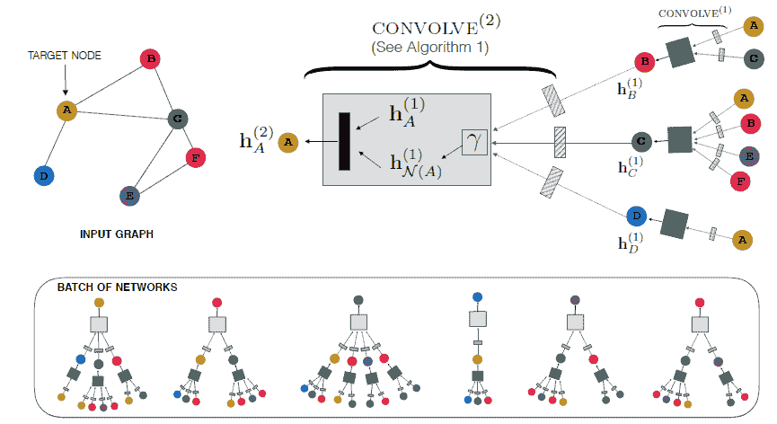
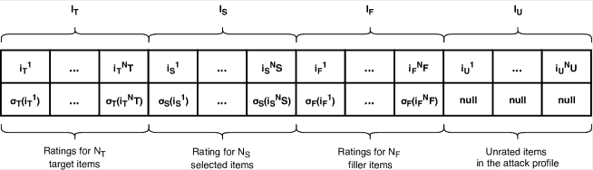

<!--yml

分类：未分类

日期：2024-09-06 20:01:44

-->

# [2004.03774] 信任感知推荐系统的调查：深度学习视角

> 来源：[`ar5iv.labs.arxiv.org/html/2004.03774`](https://ar5iv.labs.arxiv.org/html/2004.03774)

# 信任感知推荐系统的调查：深度学习视角

董曼青

新南威尔士大学

悉尼，澳大利亚

&冯远

新南威尔士大学

悉尼，澳大利亚

&姚丽娜

新南威尔士大学

悉尼，澳大利亚

&王宪智

悉尼科技大学

悉尼，澳大利亚

&徐 Xiwei

Data61, CSIRO

悉尼，澳大利亚

&朱黎明

Data61, CSIRO

悉尼，澳大利亚

###### 摘要

现有推荐系统面临的一个重大挑战是，用户可能不信任推荐系统，原因可能是缺乏解释或推荐结果不准确。因此，拥有一个值得信赖的推荐系统变得至关重要。本调查系统地总结了三类信任感知推荐系统：社交感知推荐系统，利用用户的社交信任关系；健壮推荐系统，过滤虚假噪音（例如，垃圾邮件和虚假信息）或增强攻击抵抗力；可解释推荐系统，提供推荐项目的解释。我们重点关注基于深度学习技术的研究，这是推荐研究中的一个新兴领域。

*关键字* 信任  $\cdot$ 推荐系统  $\cdot$ 深度学习  $\cdot$ 调查

## 1 引言

用户面临信息过载的重大挑战，因为网络信息不断增长。推荐系统提供信息、产品或服务，以满足用户的个性化口味和偏好，从而缓解上述问题。鉴于这些优势，推荐系统在各个领域中变得非常流行，并广泛应用于电子商务应用中[1]。例如，当用户在亚马逊¹¹1[`www.amazon.com/`](https://www.amazon.com/)上寻找一对睡眠耳塞时，网站可能会推荐一个“经常一起购买”的耳塞保护壳，以及其他顾客在查看该商品后经常“购买的产品”列表。根据报告²²2[`rejoiner.com/resources/amazon-recommendations-secret-selling-online/`](http://rejoiner.com/resources/amazon-recommendations-secret-selling-online/)，35% 的亚马逊网站利润归功于其推荐算法。

尽管推荐系统取得了成功，但仍面临一个重大挑战，即用户可能不信任推荐系统，原因可能是缺乏解释或推荐结果不准确。例如，即使用户有类似的历史记录，他们也可能不信任陌生人的品味；此外，系统可能会推荐被恶意用户故意高评价的物品。这些都使得拥有一个值得信赖的推荐系统变得迫在眉睫。在这项工作中，我们定义并关注推荐系统中信任的三个方面：

社会意识。随着社交媒体的发展，社会意识（有时称为信任意识）推荐系统受到了更多关注。最近的研究表明，用户的评分区域与他们社交邻居的平均评分之间存在正相关，无论是类似信任关系还是信任关系[2]。一方面，基于用户口味通常受到朋友影响的现象[3]，利用信任关系有很大的潜力为用户提供一个值得信赖的推荐系统，同时通过预测用户的口味来提高推荐质量。另一方面，添加这些信息缓解了传统推荐系统的冷启动问题。一般来说，社会意识推荐系统包括基于记忆的方法和基于模型的方法。基于记忆的方法通常通过利用用户的直接或间接信任朋友的评分来生成对用户的预测[4]。因此，这些方法的性能在很大程度上依赖于信任传播模型。此外，这些方法通常耗时，因此不适合处理大规模应用，因为它们需要计算整个评分矩阵和整个信任网络上的相似性[4]。基于模型的方法（例如，矩阵分解和深度学习）被广泛使用[5]。与利用信任关系来推断用户邻居并提高用户间相似性计算精度的基于记忆的方法相比，大多数基于模型的方法同时将用户和项目映射到低维特征空间中，然后通过优化一些目标函数来训练预测模型，这些目标函数涉及评分和信任数据[4]。

鲁棒性。随着越来越多的人依赖在线产品评论来做出购买决策[6]，评论和社交关系也越来越容易受到垃圾信息和机器人攻击。此外，社交关系在不同的背景下有不同的解释。例如，两个人可能在电影上达成共识，但在购买衣物上有不同的意见[7]。改善推荐系统鲁棒性有两个研究方向。第一个方向是过滤掉数据中噪声或恶意反馈，然后再执行推荐算法。该方向的研究旨在寻找用户/评分的统计模式以识别恶意内容[8]，使用基于特征工程的监督分类方法[9]，或使用无监督聚类方法来排除可疑用户[10]。第二个方向旨在开发抗噪声攻击的算法[11]。相关研究主要构建对噪声敏感的算法或在推荐中引入辅助信息（例如，人为制造的噪声）[12]。

可解释性。用户倾向于在提供了适当的信息以理解推荐过程和结果时更信任推荐。可解释推荐系统 [13] 不仅向用户提供个性化的推荐，还生成有关推荐项目原因的描述。因此，可解释性提高了推荐结果的可信度和透明度。一般来说，可解释推荐系统可以根据两个正交标准进行分类：信息来源和方法论。现有工作利用了多种内容，如项目/用户的特征 [14]、文本评论 [15]、产品图片 [16] 和社交连接 [17]。并且已经采用了多种方法来生成解释，例如矩阵分解 [18]、基于图的模型 [19]、主题模型 [20]、深度学习 [21] 和关联规则挖掘 [22]。此外，还有许多工作结合了不同的信息来源和方法。在本调查中，我们将范围限定为仅深度学习模型，并对近期的工作进行了深入分析。

深度学习技术近年来爆炸性增长。2019 年图灵奖也认可了深度学习对各种机器学习任务的重大贡献。近期关于基于深度学习的推荐系统 [1] 的调查指出了神经架构的端到端可微分性和提供合适的归纳偏置的能力。深度学习方法的一个重要贡献是表示学习。例如，许多研究利用深度学习从辅助数据中学习紧凑的表示，如内容、标签、图像或社交图谱关系，然后使用这些紧凑的表示进行预测或与传统矩阵分解方法结合 [3, 23]。

直到现在，已经有相当多的工作致力于将深度学习应用于信任感知推荐系统，包括社交感知推荐系统 [24]、稳健推荐系统 [25] 和可解释推荐系统 [13]。然而，据我们所知，目前缺乏关于基于深度学习的信任感知推荐方法的系统性调查。本调查旨在从深度学习的角度回顾推荐系统中的信任问题，以填补这一空白。我们概述了信任的三个方面，即社交感知、稳健性和可解释性。对于每个方面，我们都呈现了文献综述并总结了相关的基于深度学习的技术。

调查的其余部分组织如下。从第三部分到第五部分，我们分别介绍了三类信任感知推荐系统。在每一节中，我们首先概述相关方法，然后按算法类型介绍基于深度学习的方法的技术细节。接着，在第六部分中，我们总结了当前信任感知推荐技术的若干挑战，并对这一领域提供了见解。接下来的各节假设读者对深度学习技术和推荐技术的基本概念已有了解。

## 2 预备知识

### 2.1 推荐系统概述

#### 2.1.1 任务

传统的推荐问题任务包括评分预测和 top-k 推荐。对于评分预测（或链接预测）问题，“评分”可以是二值的，例如，1 代表点击或购买，0 代表没有行为，或者是一个区间内的数值（例如，1 到 5）。在这两种情况下，预测评分就是量化用户的偏好。例如，对于基于矩阵分解的方法[26]，评分通常由 $\hat{r}=u^{\top}v$ 预测，其中 $u$ 和 $v$ 是学习到的用户和物品的潜在因子。学习潜在表示的方法有很多种。在[27]中，作者假设潜在表示遵循某些高斯分布，并通过最大后验估计来学习这些分布。而在[28]中，潜在表示是通过神经网络来学习的。对于 top-k 推荐问题，推荐系统的目标是为每个用户预测一个满足其口味的物品列表。学习排名的目标是定义一个个性化的排序函数，然后学习损失函数以提高在 top-k 推荐问题中的排序性能。例如，在[29]中，提出了一种面向排名的方法，用于衡量每个用户-物品对的置信度，并改进了矩阵分解方法以实现 top-k 推荐。提出了一种贝叶斯个性化排序（BPR）算法，基于隐式反馈直接学习排名关系，以实现 top-K 推荐[30]。

#### 2.1.2 方法

从使用的技术角度来看，推荐系统大致可以分为基于内容的、基于协同过滤的和混合方法。基于内容的方法利用用户或物品的个人资料来提供推荐列表。例如，通过利用用户资料，系统可以简单地显示最近访问的物品，以便用户返回这些物品，或者从推荐系统中过滤掉用户已经购买或阅读的物品[31]。在[32]中，作者不仅结合了主题建模来挖掘物品内容，还结合了社交矩阵分解来处理评分和社交关系以进行推荐。协同过滤方法通过学习用户-物品的历史交互来进行推荐，无论是显式的（例如用户的先前评分）还是隐式反馈（例如浏览历史），这些方法都利用了一组与目标用户在推荐过程中相似的用户的偏好。为此，已经有一些研究工作提出了相似性度量，以便识别这些用户[33]，例如利用用户-用户关系或物品间相似性。CF 方法从用户的过去活动中发现用户的隐藏偏好，即用户-物品评分矩阵，以进行推荐。然而，CF 方法，包括矩阵分解方法[27, 26]，会遭遇数据稀疏和冷启动问题[34]。例如，矩阵分解技术不能有效地学习只有少量评分的用户或新添加物品的潜在特征向量。然而，矩阵分解技术提供了一个灵活的框架，可以整合额外的信息源，以缓解数据稀疏和冷启动问题[35]。

#### 2.1.3 挑战

推荐系统面临的几个挑战包括数据稀疏问题、冷启动问题、扩展性问题以及在本调查中讨论的信任问题。例如，在现实世界的应用中，如电子商务网站，存在大量的用户和物品，但存储用户对物品的数值评分的用户-物品评分矩阵通常非常稀疏，这就是数据稀疏问题。冷启动问题可能会出现在一些新用户身上，这样系统由于信息不足而无法提供令人满意的推荐。与数据稀疏问题不同，当使用一些基于内存的技术时，推荐系统也可能面临扩展性问题。例如，使用基于用户的协同过滤方法生成推荐在计算上是昂贵的。这是由于需要计算所有用户或物品之间的相似性。显然，用户和物品的数量越多，计算相似性所需的时间就越长[33]。

### 2.2 推荐的深度学习

基于深度学习（DL）的技术，在表示学习中表现出有效性，已被广泛应用于计算机视觉[36]和自然语言处理[37]等许多应用领域。这些吸引人的特性也影响了推荐系统的研究，近年来大量工作专注于基于深度学习的推荐系统。有关深度学习推荐系统的详细信息，请参阅[1]。大致分类 DL 基础的推荐系统，DL 可以用于：表示学习、预测学习和生成学习。

表示学习。许多研究利用深度学习从辅助数据中学习紧凑的表示，例如内容、标签、图像或社交图谱关系，然后使用这些紧凑表示进行预测或与传统矩阵结合[3]。例如，自编码器可以用于学习具有瓶颈层的物品和用户的紧凑表示[38, 39]；卷积神经网络（CNN）可以用于从图像或社交图谱中提取信息[40, 23]；递归神经网络（RNN）可以学习文本信息或捕捉动态用户兴趣[41, 42]；等等。

.

预测学习。预测模型可以是用于预测用户偏好的分类模型，也可以是生成潜在评分的回归模型。例如，评分预测可能是一个简单的多层感知器，通过学习用户和物品的表示来完成[43]。自编码器的编码部分，尝试重建输入，也可以看作是评分的预测器[38]。注意力机制，通过学习输入的权重，可以通过更强调输入的有用部分来提升性能[44, 45]。

生成学习。推荐系统中的生成学习主要使用生成模型，例如变分自编码器（VAE）和生成对抗神经网络（GAN），用于生成潜在的评分或分数。例如，生成对抗神经网络包含生成器和判别器，通过在极小极大游戏框架中同时训练两个操作器，可以生成与真实实例具有相似分布的样本[46]。这种特性可以用于生成评分或处理推荐问题中的缺失值[47, 48]。例如，Wang 等人[49] 提出了使用 GAN 为基于记忆网络的流式推荐系统生成负样本。在[50]中，作者提出了 UGAN 以捕捉原始数据输入的模式并生成类似的用户档案，这为减轻缺失数据的负面影响提供了有希望的方法。

## 3 社会感知推荐系统

### 3.1 概述

社会关系已被证明有助于提升推荐性能，因此近年来引起了广泛关注[51]。社会推荐技术利用用户与用户之间的信任社交链接来补充稀疏的评分数据，从而通过考虑用户评分行为以及用户信任的邻居的偏好来改善用户偏好预测。由于用户通常与周围的人互动，社会关系可以大大帮助用户筛选信息并缓解冷启动问题。

#### 3.1.1 问题定义

假设 $\{u|u\in U\}$ 是一个包含 $M$ 个用户的列表，$\{i|i\in I\}$ 是一个包含 $N$ 个项目的列表，$R$ 是用户-项目评分矩阵，其中 $r_{ui}\in R$ 是用户 $u$ 对项目 $i$ 的评分。我们用 $t_{uv}$ ($t\in T$) 表示用户 $u\in U$ 和用户 $v\in V$ 之间的信任关系，其中 $T$ 是用户-用户信任关系矩阵。此外，我们用 $D_{u}$ 和 $D_{i}$ 表示项目描述和用户反馈。$D_{u}$ 和 $D_{i}$ 中的每个元素是一个特征向量，用 $d_{*}$ 表示。基于评分的推荐任务旨在预测用户 $u$ 对未知项目 $i$ 的评分 $\hat{r}_{ui}$，

|  | $\hat{r}=f(R,T,D_{u},D_{i})$ |  | (1) |
| --- | --- | --- | --- |

其中 $f$ 将给定的信息映射到一个固定范围内的评分，例如 [0,5]。

相比之下，基于排名的任务旨在向用户 $u$ 提供得分最高的 $K$ 个项目，这些得分 $s_{ui}$ 能够捕捉用户的偏好。

|  | $\hat{s}=f(R,T,D_{u},D_{i})$ |  | (2) |
| --- | --- | --- | --- |

#### 3.1.2 传统方法

传统的社交感知推荐方法包括基于记忆的方法和基于模型的方法。基于记忆的方法通过信任传播从其朋友的评分中推断目标用户的评分[52]。例如，Jamali 和 Ester[53]将 TrustWalker[54]与邻域协同过滤相结合。他们首先在信任网络上进行随机游走，然后执行概率性项目选择策略生成推荐。类似地，Zhang 等人[55]从用户反馈中提取可靠的社交信息，并使用前 k 个识别出的朋友来推断用户偏好。矩阵分解可能是基于模型的社交感知推荐中最广泛使用的技术。Wen 等人[56]通过 node2vec[57]学习社交关系的向量表示，然后将其与评分历史结合以进行矩阵分解。Zhao 等人[58]提出了一种基于信任的贝叶斯个性化排序方法来融入信任友谊。他们假设朋友的偏好会影响用户的决策，即用户会给予他们朋友更喜欢的项目更高的排名。Guo 等人[2]使用考虑用户偏好和朋友影响的 SVD++[59]方法。Ahn 等人[60]为在推荐系统中考虑社交关系提供了理论支持。

基于深度学习的社交感知推荐方法可以分为三种类型：正则化方法最小化受信用户之间潜在特征的距离，并最大化不受信用户之间潜在特征的距离，以反映社交接近度；集成方法通过用户及其社交网络的评分生成新的评分；协同分解方法假设用户在评分和社交空间中应共享相同的用户偏好[61]。

我们在表 1 中总结了社交感知推荐系统的各种技术，包括自编码器、递归神经网络（RNN）、图神经网络（GNN）、生成模型（GM）和混合方法。

表 1：社交感知推荐系统的总结

| 方法 | 正则化 | 集成 | 协同分解 | 其他 |
| --- | --- | --- | --- | --- |
| 自编码器 | [62] | [3],[63],[64],[65] | [62] | [66] |
| RNN | - | [44, 41] | - | - |
| GNN | - | [51, 41, 67, 52] | [7] | [68] |
| GM | - | [69],[70] | - | - |
| 混合方法 | - | [40],[71],[72],[73],[74] | - | [23, 58, 75] |
| 其他 | - | [76],[77],[78],[20] | - | [79, 80, 56, 81] |

### 3.2 基于自编码器的方法

自编码器是一种人工神经网络，用于学习高维数据的压缩表示（编码）[65]。自编码器可以通过学习用户和物品的潜在因素（编码器）或重构用户的偏好（解码器）来帮助推荐。对于前者，学习到的潜在表示通常会与其他方法进一步合作进行预测。例如，邓等人[65]使用学习到的潜在因素作为矩阵分解的初始化。对于后者，自编码器的解码器通过一个狭窄的网络从用户评分记录中推断潜在评分，其中网络的瓶颈表示用户评分记录的潜在表示[3]。对于社会推荐问题，在我们既有用户-物品评分矩阵又有用户-用户信任网络的情况下，我们也将自编码器方法分为上述两类：使用重构输入进行推荐和使用潜在表示进行推荐。

#### 3.2.1 使用重构输入进行推荐

这种方法从密集表示中学习，并将输入重构为推荐预测。对于社会感知推荐问题，这种方法的一个关键问题是如何从社会信息和评分信息中学习和聚合表示。

一种方法是学习两种信息类型的集合表示进行预测。例如，潘等人[3]通过加权层平衡从社会关系和评分历史中学习到的两种表示的贡献（图 1 (a)）。他们随后使用相关正则化来交换信息[3]，并使用统一的潜在表示来预测用户评分和信任关系。王等人[63]则直接将两种潜在表示连接起来进行推荐（图 1 (b)）。

另一个想法是假设用户的社交表示与用户的评分表示共享相同的表示。例如，Nisha 等人 [62] 生成一个可信用户列表，并最小化其社交表示与用户社交表示之间的距离。他们首先使用自编码器对用户的评分模式和项目的历史评分模式进行编码，然后解码学习到的表示进行推荐（图 1 (c) 中标记为黄色）。他们还使用正则化项来控制训练自编码器时用户的社交表示与用户的评分表示之间的距离。

(a)

(b)

(c)

(d)

(e)

(f)

图 1：用于社交感知推荐的自编码器。这些图来自 (a) Pan 等人 [3]，(b) Wang 等人 [63]，(c) Nisha 等人 [62]，(d) Rafailidis 等人 [66]，(e) Liu 等人 [72]，以及 (f) Wu 等人 [64]。

#### 3.2.2 使用潜在表示进行推荐

另一种利用自编码器进行社会感知推荐的方法是将学习到的潜在表示与其他方法相结合。例如，Rafailidis 等人[66]通过深度自编码器从社交关系中学习用户的潜在表示，然后在矩阵分解中使用这些潜在因子（见图 1 (d)）。Liu 等人[72]使用堆叠去噪自编码器（SDAE）[82]学习社交信息。SDAE 的输入来自给定用户的 K 个朋友，每个朋友由一个向量表示。通过聚合所有朋友的信息，使用一个凝练向量来表示用户，见图 1 (e)。这样的表示向量进一步与其他推荐方法相结合。类似地，Wu 等人[64]使用自编码器提取社交网络的紧凑表示，并通过多个全连接神经网络层聚合用户信息和项目信息来预测评分（见图 1 (f)）。

### 3.3 基于 RNN 的方法

循环神经网络（RNN）在处理序列数据方面展现了其强大的能力，例如文本数据[83]和时间序列数据[84]。基于 RNN 的方法通常针对动态用户行为[85]、偏好[86, 87]或附加信息[88]。这些方法主要利用 RNN 捕捉序列信息，然后学习时间上的或具体的表示以供进一步使用。例如，Song 等人[41]使用基于 RNN 的方法捕捉用户的当前偏好，并将这些信息与用户的历史点击信息进行拼接，作为用户的表示。

对于社会感知推荐问题，RNN 可以提取用户的时间偏好以及朋友的时间偏差。例如，艾米去年喜欢画画，她的朋友莎拉也一样。她受到莎拉偏好的影响，买了一支与莎拉相同品牌的画笔。今年，艾米开始学习吉他，那么她可能会推断其他擅长弹吉他的朋友的偏好。孙等人[44] 提出了一个基于递归网络的模型，并加入了注意力机制用于时间推荐（见图 2）。该方法包括一个静态部分，用于捕捉稳定的用户偏好，以及一个动态部分，用于捕捉动态的用户偏好。对于静态部分，应用静态社交注意力模块来选择每个用户的静态社交关系，然后将这些社交关系汇总在一起，以丰富用户的表示向量。对于动态部分，实现了一个 LSTM 模块来捕捉用户复杂的时间潜在表示，即将社交影响考虑到时间偏好建模中。每一部分都会预测一个用户偏好评分，最终的评分预测是这两部分评分的总和。

图 2：用于社会感知推荐的递归神经网络。（孙等人[44]）

### 3.4 基于 GNN 的方法

图神经网络（GNN）通过整合节点信息和拓扑结构，在图形数据的学习上表现出有效性。因此，对于社会感知推荐问题，GNN 在挖掘社交图结构和用户-物品图方面具有巨大的潜力；关键在于利用 GNN 学习用户和物品的潜在因子 [51]。例如，范等人[51] 考虑先通过 GNN 学习用户潜在因子和物品潜在因子，然后将这两个潜在因子连接起来进行最终评分预测（图 3 (a)）。对于用户建模，用户潜在因子是物品聚合和社交聚合的连接。物品聚合的过程是通过注意力算法汇总用户对不同物品的评分历史（每个物品的表示是物品向量和物品评分的组合）；社交聚合的过程是通过注意力算法汇总用户朋友的评分历史（每个朋友的表示是用户-物品向量的重建）。对于物品建模，物品潜在因子是其他用户对目标物品的历史评分的聚合。

相较于静态建模社交关系，朋友之间的推断也可能随着时间变化。在这方面，Song 等人 [41] 考虑了一个动态情境，即用户的兴趣会受到社交关系的动态影响——朋友的偏好可能在不同时间段中变化不同。他们提出了一种基于会话的社交推荐算法，模型化了动态兴趣和动态社交影响。整体结构如图 3 (b) 所示。该模型通过 RNN 模块捕获用户的当前偏好，RNN 模块建模了用户的历史行为，如点击。为了建模朋友的兴趣，作者考虑了短期和长期偏好，其中短期偏好由 RNN 建模，以捕获当前会话的偏好，而长期偏好则捕获平均兴趣。然后，每个朋友由短期和长期偏好的拼接表示。为了学习社交感知的用户表示，作者使用了一个注意力算法（通过目标用户与朋友之间的相似性进行学习），以利用社交关系的重要性，然后通过不同的权重进行聚合。接着，他们将社交感知的用户表示与动态用户兴趣结合。推荐项目的概率分布是项目嵌入和用户混合表示之间相似性的 softmax。

(a)

(b)

图 3：社交感知推荐的图神经网络，来自 (a) Fan 等人 [51] 和 (b) Song 等人 [41]。

作为一种图神经网络，图卷积网络（GCN）由于在挖掘社交关系方面的有效性，已广泛应用于最近的社交感知推荐研究中。与图神经网络不同，GCN 通过消息传递或信息扩散的视角生成节点嵌入[7]，这可以将图结构信息编码为低维表示。具体来说，每个节点的嵌入是来自邻域信息的聚合；邻居的嵌入进一步从邻居的邻居中学习，依此类推。例如，在[68]中，作者使用一个两层的图卷积神经网络表示图中的节点（见图 4 (a)）。具体来说，一个节点（即一个项）的嵌入是从节点的局部图邻域的特征信息（例如视觉特征、文本特征）的聚合。每个聚合模块学习如何从一个小图邻域中聚合信息，并通过堆叠多个这样的模块。然后，这些嵌入被用于通过最近邻查找生成推荐系统候选项，或作为机器学习系统中对候选项进行排名的特征。在[7]中，作者假设用户偏好被建模为用户和项嵌入的内积。他们首先初始化用户嵌入和项嵌入，其中每一个是描述性特征（如用户资料和项描述）与自由基本潜在向量的组合。然后，他们将用户偏好的扩散建模为层级扩散的方式。图 4 (b) 显示了详细信息。类似地，Wu 等人[52]假设用户的表示可以从用户特定的潜在向量和用户的历史评分记录中学习，这被称为基于项的用户嵌入；而项的表示可以从项特定的潜在向量和对其进行评分的用户中学习，这被称为基于用户的项嵌入（查看图 4 (c)）。为了从具有图结构的嵌入中学习混合表示，作者尝试使用基于图注意力网络（GAT）的方法。传统的 GCN 平等对待每个邻居，并在没有平衡它们的情况下聚合嵌入信息。因此，作者实现了 GAT，利用注意力机制来平衡邻居的重要性，增强模型对重要输入的关注，并通过过滤噪声来提高模型的鲁棒性。具体来说，对于一个项（一个用户），作者首先从项嵌入（用户嵌入和用户关系）中学习其静态属性因子（用户静态偏好因子），然后学习一个用户上下文感知的项因子（项上下文感知的用户因子）作为动态属性因子（动态偏好因子）。然后，他们通过基于策略的融合层将这四个因子（用户和项的静态因子和动态因子）融合成一个综合表示，并基于此做出预测。

(a)

(b)

(c)

图 4：来自(a) Ying 等人[68]、(b) Wu 等人[7]和(c) Wu 等人[52]的社会感知推荐图卷积网络。

### 3.5 生成模型

生成模型经典地描述了数据和标签的联合分布模型。它将被用来生成新的样本，通过从真实数据中进行采样机制。两种最常见的生成模型是生成对抗网络（GANs）[46]和变分自编码器（VAEs）[89]。

#### 3.5.1 基于 GAN 的方法

生成对抗网络（GAN），它包括一个生成器和一个判别器以进行对抗学习，由于能够学习数据的概率分布并生成新样本，已在各个领域展示了其有效性。生成器通过生成与真实样本具有类似分布的新样本来攻击判别器；判别器则区分样本的来源，即样本是来自真实情况还是生成情况。然后，在这两个处理器之间进行一个最小-最大游戏，这可以促进两个模型。这被称为对抗训练。对于推荐问题，生成模型通常应用于 i) 预测缺失值和 ii) 增强物品和用户的表示。例如，Wang 等人 [50] 使用生成模型生成真实数据的模拟用户偏好分布。通过最大化分类损失来提高生成模型的性能，训练将在产生有前景的生成预测评分之前停止。对于社会感知推荐问题，关键问题是如何从信任关系中学习信息以及如何将这些信任信息与评分历史结合起来。Fan 等人 [69] 设计了两个对抗学习模块，以增强用户在用户-物品评分部分和社会部分的表示。具体来说，对于每个部分，设计了一个判别器来区分真实实例和生成样本，以及一个生成器来建模给定用户的实际条件分布。为了自适应地增强两个部分的表示，他们利用两个部分之间的双向映射，在每次迭代中，用户的社会表示将通过从评分模式表示的非线性映射操作进行更新，然后通过领域对抗训练器进行更新；同样，用户的评分模式表示将通过训练后的社会表示进行更新，然后进行领域特定的训练，详见图 5 (a)。

(a)

(b)

(c)

图 5：来自 (a) Fan 等人 [69]、(b) Karamanolakis 等人 [90] 和 (c) Xiao 等人 [70] 的社会感知推荐生成模型

#### 3.5.2 基于 VAE 的方法

类似于基于自编码器的方法，变分自编码器可以用于预测缺失值或学习综合表示。对于前者任务，VAE 通过推断潜在因素来预测项目评分/分数[90]。它由三个部分组成：用户$u$的物品袋向量$i_{u}$作为输入提供给解码器；从具有编码器指定参数的高斯分布中采样得到潜在用户向量$z_{u}$；以及新的物品袋向量$\tilde{i}_{u}$见 5 (b)。对于后者，VAE 学习用户或项目的表示。例如，Xiao 等人[70]考虑了三种推荐信息：用户信任关系、用户-项目评分历史和项目内容信息。对于用户的表示，每个用户由信任用户的聚合表示。对于项目的表示，考虑项目的内容信息，其中使用变分自编码器模型来学习内容信息的潜在模式。这些潜在模式用于表示项目。然后，他们考虑使用传统的矩阵分解方法来预测用户-项目评分。图 5 (c)中可以注意到图结构。

### 3.6 混合方法

为了弥合上述模型在提升推荐性能方面的优点，提出了几种混合模型。这些混合模型可能采用混合算法或多种输入类型进行推荐。

根据研究目标和特征的特点，可能会应用多种算法。例如，基于 RNN 的方法广泛应用于处理基于会话的推荐问题，而自编码器擅长提取输入的简洁表示。然后，为了解决基于会话的信任感知推荐问题，可以将这两种方法一起应用。Liu 等人[72]认为用户的偏好随着时间的推移而变化。他们使用堆叠去噪自编码器来学习用户表示，该表示是朋友表示的聚合，每个时间步进行一次。然后，将这种表示用作 LSTM 模块的输入，用于预测用户当前的偏好。使用堆叠 LSTM 来预测用户的整个时间偏好。见图 6 (a)。

对于图像推荐和电影推荐等推荐问题，将考虑辅助信息。Wu 等人[40] 针对一个图像推荐问题。对于图像信息，他们使用 CNNs 来学习嵌入表示。除了图像，他们还考虑了三种辅助信息：用户上传历史、社交影响和创作者欣赏。他们使用注意力模型来利用这三个方面。用户的偏好由所有信息的聚合表示。评级预测基于项目嵌入和用户偏好向量的乘积，见图 6 (b)。赵等人[58] 通过利用多模态电影内容（即图像和相应描述）、用户社交关系及其相对偏好反馈，设计了一个异质社交感知电影推荐系统。该模型的目标是提供推荐的前 K 部电影，其中电影的排名是基于给定用户和项目的排名分数，这个分数是通过用户和项目的表示计算的。为了学习同时包含电影图像和描述的共享项表示，他们使用了多模态学习方法：对图像使用深度卷积神经网络，对描述使用深度递归神经网络。用户的表示，即朋友关系的聚合，通过 DeepWalk[91] 学习。Monti 等人[23] 提出了两种不同的用户-项目评分矩阵预测方法。第一种是 Recurrent Multi-Graph CNN (RMGCNN) 架构，见图 6 (c) 的顶部图，该架构在用户-项目矩阵上操作，同时操作行和列。用户和项目都通过 Multi-Graph CNNs 学习：用户通过他们的关系建模，项目通过图像建模。然后，整个评分矩阵 $X$ 由 RNN 模型逐步学习，直到提供稳定的预测。第二种方法称为 Separable Recurrent MGCNN (sRMGCNN)，在矩阵的行和列上分别操作，见图 6 (c) 的底部图。Gao 等人[73] 考虑了视频推荐问题。他们提出了一种动态 RNN，通过考虑视频信息、用户兴趣和用户社交关系来捕捉用户动态偏好。视频语义嵌入包括视觉特征和文本特征，这些特征由预训练的深度模型学习。用户兴趣建模基于用户观看历史，通过主题建模学习。至于用户社交关系挖掘，见图 6 (d)。

(a)

(b)

(c)

(d)

图 6：社会感知推荐的混合方法来源于 (a) Liu 等人 [72]，(b) Wu 等人 [40]，(c) Monti 等人 [23]，以及 (d) Gao 等人 [73]。

### 3.7 其他

#### 3.7.1 基于注意力的方法

非正式地说，神经注意力机制使神经网络能够关注其输入（或特征）的一个子集，即为输入分配不同的权重。例如，在机器翻译问题中，它允许机器翻译器查看原句包含的所有信息，然后根据当前处理的词和上下文生成适当的词[92]。现在，注意力机制在许多其他领域也很流行，如物体识别和图像描述[93]。目前仅有有限的工作强调了将注意力机制应用于推荐系统的有效性；但相反，作为增强模块，当与其他模型结合用于推荐时，注意力机制表现良好[1]。

对于社会感知推荐系统，注意力机制可以用于平衡朋友的影响。例如，Chen 等人 [76] 认为用户朋友的影响应当是不同且动态的。对于不同的项目，用户可能会推测出不同朋友的偏好。因此，他们提出了一种分层注意力模块用于推荐。首先，每个朋友的表示基于用户嵌入和朋友嵌入，并通过注意力机制进行学习。然后，对于不同的朋友，作者还应用了注意力机制来平衡朋友的影响，以获得最终的用户表示。这个用户表示随后与项目表示相乘，作为排名的评分。Rafailidis 和 Weiss [77] 提出了一个类似的结构，该结构考虑了朋友的子集并使用注意力机制进行社会协同过滤。

#### 3.7.2 与矩阵分解结合

传统的矩阵分解方法通过乘以用户 $h_{u}$ 和项目 $h_{i}$ 的潜在表示来预测评分/分数，即 $\hat{r}_{ui}=h_{u}^{\top}\cdot h_{i}$。深度矩阵分解方法与传统方法的区别在于，潜在表示的学习是通过深度学习技术实现的。为了解决社交感知推荐问题，一种常见的方法是将社交影响结合到用户表示中。Fan 等人 [79] 通过 node2vec [57] 学习社交嵌入，然后使用多层感知器来学习这些嵌入。每个用户由社交嵌入和初始化的潜在因子表示。这种用户表示进一步用于概率矩阵分解 [27]。Bao 等人 [71] 使用注意力机制来学习社交影响。他们首先使用自编码器来学习邻居的紧凑表示，其中每个邻居由 $h_{v}$ 表示。然后，用户 $u$ 的社交影响由 $h_{T}=\Sigma_{v\in V}\alpha_{v}\cdot h_{v}$ 模型化；$\alpha$ 是注意力值。然后用户的潜在表示由 $\hat{r}_{ui}=(\beta h_{u}+(1-\beta)h_{T})^{\top}\cdot h_{i}$ 给出，其中 $\beta$ 是自定义的超参数。在 [80] 中，作者认为矩阵分解方法可以用浅层神经网络模型表示。他们考虑了一个跨域推荐问题[94]，即尝试从信息域向社交域的用户推荐前 K 项目列表。具体而言，他们使用深度协同过滤模型来预测用户偏好 $\hat{s}_{ui}$，该偏好由潜在用户表示 $h_{u}$ 和潜在项目表示 $h_{i}$ 计算得到。这两个潜在表示均由初始嵌入向量和属性向量（即标签）学习得到。然后，通过整合社交关系进一步增强用户-项目互动的预测：直觉上，具有强连接的用户更可能在项目上有相似的口味。处理过程是最小化强连接用户之间的潜在表示差距。

#### 3.7.3 其他

Xiao 等人 [78] 提出了基于 SVD++ [59] 的推荐模型。网络的输入是用户表示 $h_{u}$、项目表示 $h_{i}$ 和用户的社交表示 $h_{t}$。他们通过同时考虑其潜在表示和与项目的互动来结合社交关系。下一层表示为上述信息的串联，即 $[h_{u},h_{i},h_{t},f(h_{u},h_{i}),f(h_{i},h_{t})]$，其中 $f$ 代表几个神经网络。预测是在几个全连接层之后完成的。

### 3.8 总结

总结来说，基于深度学习的社交感知推荐算法在不同任务中展现了其有效性。与传统方法不同，基于深度学习的技术需要较少的手动提取特征，并在把握复杂潜在特征互动方面具有优势。将传统推荐方法与深度学习方法（如图神经网络）结合是一种趋势，这可以发挥两者的优势。尽管有效，但当前基于深度学习的社交感知推荐算法面临以下挑战。

+   •

    社交链接的质量和数量。例如，在大多数推荐系统中，由于少量用户指明他们的社交关系，很难获取明确且可靠的链接。

+   •

    当前的大多数研究模型使用浅层模型来建模信任关系，并忽略了用户朋友之间的高阶互动。用户可能会考虑朋友们的所有意见，然后形成自己的想法，而不是线性地将这些意见结合起来。

+   •

    假设用户与朋友有相似的口味可能会误导推荐。例如，一个用户可能会与具有不同购物偏好的人员建立联系。

+   •

    大多数现有的方法忽视了用户在不同领域中具有不同的知识。

表 2 显示了一些广泛使用的社交感知推荐系统数据集[95]，这些数据集取自流行的社交网络网站³³3 每个数据集的链接可以在 Librec 网站 [`librec.net/datasets.html`](https://librec.net/datasets.html) 找到。

表 2：社交感知推荐的常用数据集

| 数据集 | Ciao¹ | Epinions² | FilmTrust³ | Flixster⁴ | Douban⁵ |
| --- | --- | --- | --- | --- | --- |
| 用户数量 | 7,317 | 18,088 | 1508 | 147,612 | 129,490 |
| 项目数量 | 104,975 | 261,649 | 2071 | 48,794 | 58,541 |
| 评分数量 | 283,319 | 764,352 | 35,497 | 8,196,077 | 16,830,839 |
| 密度（评分） | 0.0368% | 0.0161% | 1.1366% | 0.1138% | 0.2220% |
| 社交关系数量 | 111,781 | 355,813 | 1,853 | 7,058,819 | 1,711,780 |
| 密度（社交关系） | 0.2087% | 0.1087% | 0.0815% | 0.0324% | 0.0102% |

## 4 推荐系统的鲁棒性

### 4.1 概述

推荐系统提高了客户和商家的效率和利益。尽管有效，但推荐方案容易受到虚假攻击或噪声的影响。例如，商家可能雇佣一组垃圾邮件发送者将他们的个人资料和虚假评分插入系统，这会影响推荐性能[25]，也会影响客户对推荐系统的信任。检测此类攻击和设计一个稳健的推荐系统非常重要。一般来说，这个领域的研究包括虚假攻击检测技术和稳健的推荐系统。

#### 4.1.1 攻击类型

进攻的分类可以根据攻击者的类型、攻击的意图、对攻击的知识等进行。例如，根据意图，攻击可以分为推送攻击、核弹攻击和随机攻击[11]。前者意图提高项目的受欢迎程度，而后者则意图降低受欢迎程度。根据知识成本，攻击分为高知识攻击，即攻击者对其他正常用户有一定了解，和低知识攻击。

攻击配置文件包括历史评分项目，一般包括四个部分：目标项目、选择项目、填充项目和未评分项目。目标项目 $I_{T}$，即“推送”或“核弹”评分，将使用评分函数 $\sigma_{T}$ 进行评分。选择项目 $I_{S}$ 是攻击者根据特定意图（例如，组攻击）进行评分的项目。填充项目 $I_{F}$ 包括随机选择的项目，以使配置文件看起来正常且更难以检测。同时，未评分的项目用 $I_{U}$ 表示[11]。不同部分可能有不同的生成函数来获得评分。

图 7: 攻击者配置文件的一般组成部分

#### 4.1.2 研究领域

减少虚假攻击对推荐系统影响的两个方向包括虚假攻击检测技术和稳健算法。前者是首先检测攻击、过滤攻击配置文件，然后构建推荐系统。后者指的是构建抗攻击的推荐系统，即稳健的推荐方法[11]。

Shilling 攻击检测算法主要讨论检测恶意用户文件的方法。根据研究目标，shilling 攻击检测算法可以用于检测点（个人）攻击或协作（群体）攻击。点攻击可能表现为随机发生的不规则性或偏差，可能没有特定的解释。同时，根据输入数据的性质，我们可能会利用序列数据（例如，文本信息和时间序列）或非序列数据（例如，图像、用户资料）。用于 shilling 攻击检测的技术大致可以分为统计方法、监督分类方法、半监督方法和无监督聚类方法。统计方法专注于检测异常项。例如，统计测试用于识别样本分布之间的差异。Zou 等人 [8] 引入了一种概率推理网络和信念传播（BP）算法 [96] 来高效地执行推理。对于监督分类方法，大多数工作首先进行特征工程，然后设计算法。考虑的特征包括评级偏差、与顶级邻居的相似性等。例如，Yang 等人 [9] 提出了三个新特征，即最大、最小和平均评级的填充器大小，用于识别攻击配置文件。这些特征通过统计测试进行分析，并通过 AdaBoost 方法的变体进行分类。无监督聚类方法通常是将用户分成不同的组，然后去除可疑用户。例如，Bhaumik 等人 [10] 对用户资料应用 k-means 聚类，并将小的簇识别为攻击者组。

推荐系统的鲁棒性关注于开发抗攻击系统，旨在减少虚假攻击的影响。目前，鲁棒推荐算法主要有两个方面：构建鲁棒算法或考虑信任关系。我们在前一部分中讨论了后者。因此，在这里，我们主要介绍前者：推荐的鲁棒算法。一些工作采用了矩阵分解方法。例如，Alonso 等人[97] 使用基于矩阵分解的方法来识别虚假攻击。根据观察到的虚假评分发生在短时间间隔内，他们假设恶意用户会以异常的方式影响模型的可靠性。他们使用两个矩阵分解模型来获得真实预测误差和估计预测误差；第二个误差用于评估预测的可靠性。Zhang 等人[98] 将 R1 范数引入损失函数中，以提高鲁棒性。他们声称平方误差函数对大残差很敏感。Yu 等人[99] 设计了一个具有核映射和核距离的鲁棒矩阵分解模型。He 等人[47] 考虑通过向训练中添加对抗模块来提高推荐系统的鲁棒性。

### 4.2 基于深度学习的虚假攻击检测算法

对于虚假攻击检测问题，一个关键点是评估用户、帖子和评论的可疑性。使用深度学习来检测虚假攻击的一个优点是其捕捉数据中复杂结构的能力。此外，随着现实世界数据量的增加，需要大规模的检测技术。与传统方法不同，基于深度学习的方法需要较少的手动定义特征，从而以端到端的可训练方式解决问题[100]。

有些使用卷积神经网络来挖掘局部特征。卷积神经网络作为特征提取器；它可以从局部表示中学习，并将这些表示映射到更高或更低维度的表示以供进一步使用[101]。许多研究挖掘文本信息以检测可疑的评分/评论[102]。例如，张等人[103]提出了一种深度模型来识别评论垃圾邮件。他们假设欺诈用户缺乏真实经验，而正常用户有真实经验；因此，文本信息应该表明欺诈用户和正常用户之间的不同模式。李等人[104]使用词向量表示文本特征，并使用 CNN 学习语义表示。一些工作还考虑了用户的行为[105]。王等人[106]考虑了新用户的冷启动问题。他们使用 CNN 从文本和行为信息中学习嵌入。

一些方法使用基于 RNN 的方法来处理序列输入。递归神经网络（RNN）具有记忆功能，在处理序列信息方面显示出了其效率。接下来的工作，如门控递归单元（GRU）[107]和长短期记忆（LSTM）[108]，进一步设计用于解决梯度消失问题。对于检测恶意评分或评论，基于 RNN 的方法用于学习序列模式，如文本和时间序列。例如，任等人[109]使用 CNN 从词汇中学习，并使用双向 GRU 学习句子。学习到的表示进一步用于预测。类似地，王等人[110]使用 LSTM 从文本中学习。

一些方法考虑混合方法或多个输入。例如，王等人[111]提出了一种混合方法，从评论内容和产品信息中进行学习。他们使用张量分解算法从评论和产品中学习潜在表示。然后，将学习到的表示与基于深度学习的分类器进一步结合。董等人[112]使用自编码器从文本信息和用户行为模式中提取潜在表示。阿卡赫尼等人[113]通过添加对抗性噪声来提高模型性能。

### 4.3 推荐系统的鲁棒性深度学习

#### 4.3.1 向推荐系统引入噪声

提高推荐系统鲁棒性的直观方法是向推荐训练过程中添加噪声。通过这样做，模型被迫学习鲁棒的参数，以提高去噪能力。

随机生成噪声。有些可能会向输入中加入人为噪声。例如，模型可能会增加额外的偏置项；输入在送入模型之前被破坏。这样，模型被迫学习最具信息量和最稳健的参数，以提高推荐系统的鲁棒性。一个例子是去噪自编码器（DAE）[12]，它通过加入噪声来破坏输入。Wu 等人[114] 提出了具有类似 DAE 思路的协同去噪自编码器（CDAE）。他们首先用高斯噪声破坏输入，即评分，将输入送入神经网络，并获取这种破坏输入的密集表示。模型的解码器尝试恢复密集表示的原始值，从而预测推荐评分。Strub 等人[39] 也通过堆叠去噪自编码器[82] 来破坏输入。此外，他们结合了侧面信息，如用户资料（年龄和性别）和电影类别，以增强模型的鲁棒性。Wang 等人[115] 提出了集成 RNN 和去噪自编码器的协同递归自编码器用于推荐。他们设计了一个稳健的递归网络来处理项目文本信息，并克服使用人工特征的不足。具体来说，递归网络以自编码器的方式设计，即编码器和解码器中的层都是递归网络。通过这种方式，递归自编码器可以同时学习序列信息和输入的密集表示。学习到的密集表示被视为项目表示，并进一步与用户表示结合进行评分预测。此外，为防止过拟合，他们设计了一种去噪和β池化方法。

对抗噪声。在最近的研究中，有些尝试将对抗噪声添加到模型中以提高鲁棒性。例如，He 等人[47]考虑通过基于贝叶斯个性化排序的对抗训练来解决问题。具体而言，他们通过对抗噪声破坏模型参数；对抗个性化排序是通过最小化训练损失和最大化对抗损失来实现的，即识别腐败的最坏情况。模型通过随机梯度下降进行优化。类似地，Yuan 等人[116]提出了一种用于推荐的对抗训练框架。该模型基于协同去噪自编码器设计。与传统的 CDAE 方法不同，后者破坏输入，他们在自编码器中插入了一个噪声混合层。所提出的对抗训练策略包括：一个训练步骤以获得最佳参数；以及一个重新训练步骤以最小化训练损失，同时最大化对抗噪声损失。Wang 等人[49]考虑了基于会话的推荐问题，并设计了一种用于存储长期和短期用户偏好的记忆网络。他们使用生成对抗网络生成负样本，以提高模型参数的推断。Wang 等人[50]提出了一种用于推荐的生成对抗模型。类似于生成对抗网络，该模型包括两个模块：生成模型通过捕捉原始数据集中的模式来模拟真实用户档案；而判别模型则试图识别这些生成的样本与真实样本。在这种情况下，生成器的工作类似于恶意用户，判别器识别恶意内容；因此，它们提升了推荐系统的性能和鲁棒性。

#### 4.3.2 其他方法

注意力机制能够从输入中筛选出无信息的内容，从而防止噪声的副作用。许多研究致力于从用户历史记录中挖掘有信息的模式。Jhamb 等人 [117] 从用户偏好出发，提出了注意力上下文去噪自编码器，并使用注意力机制来编码用户偏好的上下文属性。Zhou 等人 [118] 从异质用户行为出发，使用自注意力算法通过汇聚不同用户行为的贡献来预测用户偏好。Loyala 等人 [119] 通过基于 RNN 的方法研究了不同会话中的用户过渡，并使用注意力模块来学习序列中更具表现力的部分。Ying 等人 [45] 也使用注意力机制来应对用户偏好的动态情况。利用两个注意力层分别学习用户的长期偏好以及长期和短期偏好。Liu 等人 [120] 提出了类似的思想来融合长期和短期偏好。一些研究考虑了其他模式。Seo 等人 [121] 从文本特征中挖掘潜在的好处。他们使用基于注意力的 CNNs 构建用户和项目的向量表示，其中注意力机制用于在 CNN 模块之前提取关键词；这些向量表示将进一步用于预测评分。Tay 等人 [122] 关注用户-项目关系，使用注意力模块可视化模型并通过捕捉重要模式来提高模型性能。Chen 等人 [123] 提出了两个注意力模块，一个用于选择多媒体项目的信息组件，另一个用于评分项目偏好。

此外，结合来自其他领域的辅助知识，例如社交关系（我们在第三部分中讨论过），也有助于提高推荐系统的鲁棒性。

### 4.4 总结

Shilling 攻击检测一直是解决推荐系统鲁棒性的传统研究领域，通过过滤或移除恶意个人资料。一些其他工作设计了鲁棒的机器学习方法来中和恶意个人资料的影响，例如，在系统中添加人工噪声以提高鲁棒性。这两种方法都显示了推荐性能的改善。然而，这一领域仍然面临若干挑战。

+   •

    将这两种方法统一到一个可训练的端到端模型中以利用两者的能力是困难的。大多数深度学习方法对数据资源和跨领域条件非常敏感。

+   •

    当前的大多数工作没有考虑动态条件，即异常行为可能会随着时间的推移而变化。

+   •

    异常在现实生活中是罕见的实体。因此，获得标签具有挑战性。

## 5 可解释推荐系统

### 5.1 概述

作为实现信任感知推荐的另一种方法，可解释推荐系统从不同的角度解决了这个问题[13]。与其他个性化推荐算法不同，可解释推荐系统提供了系统为何向用户提供这些推荐的理由，同时也为系统设计师提供了改进推荐结果的指导。这不仅提高了推荐系统的有效性和用户满意度，还使系统能够生成值得信赖的推荐。最近，已经提出了大量的可解释推荐方法，包括但不限于矩阵分解、深度学习、关联规则挖掘、主题建模、知识图谱模型。尽管种类繁多，这些方法通常可以分为两类。后验[124, 125]方法不修改推荐算法本身，而是试图解释结果，例如“这个项目是最受欢迎的”和“与您喜欢相同的项目的人也购买了”。这些方法通常无法解释推荐机制，解释的多样性有限。相反，嵌入式方法[126, 127, 123]设计了面向解释的推荐模型，使得推荐过程本身可以自动生成通常从附加信息中选择的解释，例如文本或图像。在本节中，我们将重点关注仅基于深度学习的模型，这些模型属于嵌入式解释方法的范畴。深度学习在推荐任务中最近取得了很大成功[1]。与其他嵌入式方法类似，我们发现大多数基于深度学习的最新工作利用了文本或图像信息，例如用户评论、产品照片和电影海报来生成解释。大多数这些工作是为了解释特定的推荐模型，但最近，一些工作从模型无关的角度解决了推荐解释性问题[128, 129]。例如，Wang 等人[128]使用强化学习来解释任何推荐模型。因此，在本节中，我们将之前的工作分类为五类：1. 基于协同过滤的传统解释；2. 使用文本句子的解释；3. 通过视觉内容的解释；4. 通过时间动态的解释；5. 其他基于深度学习的可解释推荐模型。

表 3：基于深度学习的可解释推荐系统总结

| <svg version="1.1" height="21.76" width="131.06" overflow="visible"><g transform="translate(0,21.76) scale(1,-1)"><g  transform="translate(0,0)"><g transform="translate(0,9.61) scale(1, -1)"><foreignobject width="46.89" height="9.61" overflow="visible">方法</foreignobject></g></g> <g  transform="translate(65.53,9.61)"><g transform="translate(0,12.15) scale(1, -1)"><foreignobject width="65.53" height="12.15" overflow="visible">数据类型</foreignobject></g></g></g></svg> | RBM | 注意力 CNN | 注意力 RNN | 生成式 RNN | GAN | 记忆网络 | 其他 |
| --- | --- | --- | --- | --- | --- | --- | --- |
| 仅评分 | [130] |  |  |  |  |  |  |
| 文本评价 |  | [21], [126], [131], [132] | [133] | [134], [135], [136], [137], [138], [139] |  |  | [128],[140] |
| 图像 |  | [123], [127], [141] |  |  | [142], [143] |  | [144], [16], [40] |
| 时间数据 |  | [135], [145] |  |  |  | [146] |  |

### 5.2 协同过滤的解释

在推荐解释研究的早期阶段，协同过滤（CF）作为个性化推荐的基本方法。CF 利用用户的隐性或显性反馈，这些反馈有时可以以非常直接的方式生成解释。例如，在基于用户的 CF 中，系统根据他/她的邻居的评分来决定是否向某个用户提供某项物品，这可以视为一种解释。类似地，在基于物品的 CF 中，解释是基于给定物品的评分是否与其他已有评分相似来为目标用户生成的。然而，对于基于深度学习的 CF 并非如此。近年来，随着大量基于深度学习的推荐模型被提出，在各种推荐任务中，如评分预测、Top-N 推荐和顺序推荐，最先进的性能已被深度方法主导，但大多数方法缺乏解释其推荐结果的能力，因为深度神经网络所学的内容通常难以解释。Abdollahi 和 Nasraoui [130] 专注于限制玻尔兹曼机（RBM）基于 CF 推荐的可解释性，而不依赖于任何辅助数据，如物品内容或用户属性。在本文中，类似于可解释的基于用户的 CF 的理念，作者为每个目标用户引入了“可解释性得分”概念，该得分是通过使用余弦相似度确定的其邻居的评分分布计算得出的。该得分范围从零到一。只有当得分大于零时，该物品才对用户可解释。得分越高，可解释性越强。然后，作者采用了条件 RBM 模型，该模型具有额外的可见层，其隐藏单元的数量恰好与物品的数量相同（参见图 8）。该层中每个隐藏单元的输出值限制在 $0$ 和 $1$ 之间，表示上述的可解释性得分。通过这种方式，条件 RBM 模型倾向于推荐可解释的物品。实质上，这种方法通过基于用户的邻域提供解释。

图 8：可解释的限制玻尔兹曼机：具有相关用户的解释（左），用于可解释性的条件 RBM（右）。(Abdollahi 和 Nasraoui[130])

### 5.3 文本数据的解释

在推荐系统中，文本内容是辅助信息的一个常见且主要的来源，例如用户评价和产品描述。许多深度学习技术已被采用以利用文本数据，如 CNN [21、126、132]、RNN [137、138、16] 和注意力机制 [123、131、133]。在上述方法中，CNN 通常用于从文本中提取深层特征，并结合注意力机制生成解释 [21、126]，而 RNN 通常用于生成文本解释 [139、138]。在这里，我们回顾这些基于深度学习的可解释推荐模型，它们利用文本辅助信息，并分析它们的优缺点。

第一组方法结合了 CNN 和注意力机制来分析文本数据。Seo 等人[21]将用户和项目分别给出的所有评论文本聚合，形成两个表示集，从中通过具有双重注意力机制（即全局和局部注意力）的卷积神经网络学习不同用户和项目的抽象特征，如图 9(a)所示。然后，从学习到的特征中生成预测评分，类似于矩阵分解。同时，双重注意力网络能够在评论文本中进行词汇聚焦。与[21]中的架构不同，Chen 等人[126]提出了一种具有评论级解释的神经注意回归模型（NARRE），该模型采用 DeepCoNN 网络处理评论[147]，如图 9(b)所示。尽管 NARRE 仅在 DeepCoNN 网络的输出上使用单个注意力层，但它不仅能够生成高精度的预测评分，还可以选择提供评论级解释的有用评论。上述两种方法仅使用评论文本作为输入。换句话说，它们忽略了用户-项目交互，因此未能完全建模用户的评分行为。Wu 等人[131]提出了一种上下文感知用户-项目表示学习模型（CARL），以克服这些不足。CARL 融合了两个不同的网络，一个用于评论特征提取，另一个用于用户-项目交互特征提取。为了处理评论，CARL 采用了一个注意力 CNN 神经网络；为了建模用户-项目评分交互，它采用了类似矩阵分解的方法来学习用户/项目的潜在表示。最终的预测评分通过两个网络输出之间的动态加权方案进行融合。与前述仅在文本数据上应用注意力的静态方法不同，Chen 等人[132]通过结合基于门控递归单元（GRU）的网络（该网络建模用户动态评分）和用于通过评论描述项目的句子级 CNN，构建了一个动态可解释推荐系统（DER）。DER 在用户某一时刻的时间变化偏好与项目评论的句子级特征的混合上应用注意力，将句子嵌入融合在“用户感知”注意力权重下。因此，DER 能够以动态、个性化的方式提供解释。尽管模型有所不同，在所有上述方法中，推荐解释都是以具有高注意力权重的词汇组的形式产生，以帮助用户理解推荐，如图 9(c)(d)所示。

图 9：用于可解释推荐的注意力 CNN 网络示例。（a）双重注意力神经网络（Seo 等人 [21]）；（b）神经注意力回归网络（Zheng 等人 [126]）；（c）和（d）根据学习到的注意力得分标注的用户评论文本中的词汇（Seo 等人 [21]）。

第二组方法利用了 RNN [148]，这是一类在自然语言处理领域非常有效的深度神经网络家族。一些方法将注意力机制引入 RNN 中，其原因类似于上述基于 CNN 的注意力模型，以从评论文本中选择高度相关的词汇作为解释 [133]。大多数现有模型利用 RNN 的生成能力来生成用户/项目评论解释 [135, 136, 139, 134, 137, 138, 16]。Cong 等人 [133] 提出了一个基于分层注意力的网络（HANN），该网络通过考虑评论对整体评分的贡献在两个层次上生成解释，即词汇层次和评论层次，如图 10 所示。HANN 与 Seo 等人 [21] 相似，HANN 将 CNN 替换为 GRU-RNN。HANN 还将文本数据分为用户评论和项目评论，并分别输入到两个独立的基于 GRU 的深度神经网络中，即用户网络和项目网络。采用了双重注意力机制，一个用于词汇层次的内部评论注意力，另一个用于评论层次的跨评论注意力。两个网络通过全连接层融合在一起以预测评分。在图 10(b)中，使用了两个层次上的注意力得分生成解释。粉色越深，评论层次上的注意力得分越高。词汇层次的注意力得分由绿色表示。通过这种方式，HANN 从评论中提取有用的词汇以形成解释，同时在全局范围内区分评论对最终预测评分的有效性。

图 10：用于可解释推荐的注意力 RNN 网络示例。（a）基于分层注意力的网络（HANN）；（b）HANN 的解释分析（Cong 等人 [133]）

由于 RNN 强大的文本生成能力，提出了大量基于 RNN 的可解释推荐系统以利用这一特性。Costa 等人[134]设计了一个基于 LSTM 单元[108]的字符级生成连接网络，其中真实评分作为辅助信息被连接到输入层。因此，该模型能够生成跟随评分方向的评论（见图 11(a)）。通过调整超参数，该模型能够为人类读者提供非常自然的解释，如图 11(e)所示。Li 等人[135]提出了一种多任务学习模型，即神经评分和提示生成网络（NRT）。NRT 将评分和评论作为上下文生成抽象提示，如图 11(b)所示。用户-项目评分对首先通过多层感知机（MLP）学习用户/项目潜在因素，这形成了评分回归网络。这些潜在因素随后被输入到标准的基于 MLP 的评论文本生成网络中，其输出层以及预测评分作为 GRU-RNN 基于提示生成网络的上下文。多任务目标由评分回归损失、评论生成损失和提示生成损失组成。生成的提示既简洁又生动，足以预测用户的可能体验和感受。Lu 等人[136]提出了另一种多任务推荐模型。作者利用对抗序列到序列学习技术。评论首先使用双向 GRU-RNN 网络编码成潜在特征向量，然后由单一的 GRU-RNN 网络解码，创建了一个评论自编码器结构。该自编码器通过 CNN-based 评论鉴别器对抗性训练，以识别给定评论是否由用户$i$在项目$j$上撰写。与将评分视为解释生成过程上下文的 NRT 不同，Lu 等人将潜在文本特征作为上下文输入矩阵分解评分预测算法。两种模型均使用交替最小二乘（ALS）技术[29]进行联合训练，以进行评分预测和解释生成。此外，RNN 生成的评论不仅提供解释，还可以作为推荐系统的输入。为了测试生成的评论在推荐中的效果是否优于人工撰写的评论，Ouyang 等人[137]使用 DeepCoNN[147]作为推荐系统，将人工撰写的评论与由流行的评论生成模型在字符和词级别生成的合成评论进行比较（见图 11(d)）。结果表明，合成评论能够携带比人工撰写的评论更一致的信息，符合推荐系统的需求，从而证明了使用生成评论来解释推荐的可行性和合理性。Zhao 等人[138]则不使用评论或提示作为输入，而是将用户/项目侧信息（如用户/项目标签、项目标题、用户性别等）输入到递归注意生成网络中，以生成对可解释推荐的原因，用于对话应用。同样，Suzuki 等人[139]采用 MLP 网络将多标准评价评分（如总体评分、位置评分、服务质量评分、价格评分等）编码成潜在向量，然后由关注的 LSTM-RNN 网络解码成评论，以生成针对预测评分的个性化解释。

图 11：用于可解释推荐的生成式 RNN 示例。（a）生成式连接网络、上下文感知生成模型和增强注意力生成模型（Ouyang 等人 [137]）；（b）神经评分和提示生成（NRT）网络（Li 等人 [135]）；（c）用于同时评分预测和评论生成的多任务学习模型（Lu 等人 [136]）；（d）生成评论的推荐性能验证设置（Ouyang 等人 [137]）；（e）生成的文本评论用于解释。模型根据不同参数生成不同的解释。（Costa 等人 [134]）

### 5.4 视觉数据的解释

与文本数据相比，视觉内容通常包含更多可以用于推荐解释的信息。大多数以图像为基础的推荐方法将图像转换为潜在表示向量，以便纳入推荐算法 [149, 150, 151, 152]。然而，这些方法在解释为什么推荐特定项时往往效果不佳。最近，利用深度学习的力量，已经开始朝着视觉推荐解释的方向迈出初步步伐。大多数现有的使用视觉数据的推荐模型采用 CNN 作为构建模块，因为其在处理视觉数据方面的流行性和成功性。其他用于实现可解释推荐的深度学习技术包括注意力机制 [123, 127, 141] 和生成对抗网络 (GAN) [143, 142]。除了从视觉数据本身生成解释之外，一些方法将图像视为辅助信息来源，以帮助解释推荐结果 [16, 144, 40]。与基于文本数据的可解释推荐模型不同，所有上述方法以直接的方式解释推荐结果。

类似于那些利用注意力机制处理文本数据的模型，第一个类型的可视化解释推荐系统应用了注意力深度神经网络，从图像中选择一组“物理区域”[123, 127]或“语义区域”[141]作为解释。我们可以找到的最早尝试来自 Chen 等人[123]，在这项工作中，提出了通过组件层和项目层的层次注意力的注意力协同过滤（ACF）模型，如图 12(a)所示。ACF 将潜在因子模型与处理项目特征的注意力神经网络结合使用，以便利用隐式反馈提供前 N 个推荐。项目特征通过基于 CNN 的深度网络 ResNet-152 [153]从图像或视频帧中提取。经过双重注意力网络处理后，这些特征通过逐元素相加与用户潜在因子合并，以反映用户的详细偏好。最后一步采用贝叶斯个性化排名（BPR）[30]生成最终推荐。图 12(b)展示了 ACF 结果的一个例子。解释通过注意力权重给出，权重越高，用户喜欢整个图像或图像区域的可能性越大。Chen 等人[127]利用了项目图像和用户的文本评论，其特征分别通过 VGG-19 和 GRU-RNN 提取。VGG-19 生成的图像特征被分割为多个区域，然后通过注意力层进行解释，并与项目潜在因子合并以表示项目。用户和项目潜在因子与项目表示向量结合，以作为 GRU-RNN 网络生成评论的输入。这个模型被称为评论增强的可视化解释协同过滤（Re-VECF），如图 12(c)所示。与以用户表示为目标的 ACF 不同，Re-VECF 关注于项目表示，并使用单一注意力层结合逐元素乘法来合并图像特征和项目潜在因子。图 12(d)展示了一些可解释的推荐，其中加粗斜体字（例如，袖子）表示 Re-VECF 生成的词语也出现在真实评论中，并且该词与注意力机制学习到的图像框选区域对齐。与上述两种方法关注图像的“物理区域”不同，Hou 等人[141]提出了语义属性可解释推荐系统（SAERS），通过整合细粒度偏好注意力（FPA）机制和语义提取网络（SEN）来理解用户的语义偏好用于时尚推荐。SAERS 将从特定区域提取的每个属性转换为语义属性视觉空间中的一个维度。如图 13(a)所示，SEN 由用于语义属性分类的基于 CNN 的 ResNet-50 [153]网络和用于位置和属性表示提取的梯度加权属性激活图（Grad-AAM）[154]组成，后者以弱监督方式进行。作者随后采用 FPA 将用户潜在因子与语义属性视觉空间对齐。每个用户潜在因子与一个转移的语义属性表示向量连接，之后应用注意力机制学习用户对不同语义属性的偏好。最后，使用 BPR 进行推荐，通过用户和项目潜在因子的内积来预测评分。图 13(b)展示了 SAERS 的一些视觉解释示例。学习到的注意力权重在红色框中显示。权重表明用户对特定属性的偏好。例如，当向用户 C 推荐一件裙子时，模型解释说这件裙子有 V 形领口，这很合理，因为根据用户 C 的购买历史，她以前购买过三件 V 领裙子。因此，这些推荐具有视觉解释，提升了系统的可信度。

图 12：用于可解释推荐的注意力 CNN 网络示例。(a) 注意力协同过滤（ACF）（Chen et al. [123]）；(b) ACF 给出的双层注意力的可视化结果。在项目级别，每个项目下的值表示该项目的注意力权重，而在组件级别，使用热图表示注意力值，颜色越深，表示的注意力值越低（Chen et al. [123]）；(c) 通过评论增强的可视化可解释协同过滤（Re-VECF）[127]；(d) Re-VECF 生成的评论与真实评论的比较[127]。

图 13：语义属性可解释推荐系统（SAERS）。(a) SAERS 的架构；(b) SAERS 的视觉解释示例。（Hou et al. [141])

第二种视觉可解释推荐方法利用 GAN。类似于 SAERS，Kang et al. [142] 通过使用 Siamese CNNs [155] 提取“时尚感知”图像特征来解决时尚推荐问题，从而给出“风格”注释。虽然这在某种程度上足以提供解释，但作者进一步采用条件 GANs [156] 利用语义输入生成图像，其中产品的顶级类别被选择为条件。因此，这种方法可以生成新的项目，这些项目可能会满足用户需求且不在训练数据集中，从而将一系列推荐项目的解释总结为这些生成的图像。Kumar et al. [143] 通过一种增强的条件 GAN 模型 $c^{+}$GAN 解决时尚推荐中的配对问题。给定一件衣物图像，该模型以生成的方式推荐一组与所给衣物最匹配的项目。$c^{+}$GAN 使用经典的均方误差（MSE）损失和使用生成图像以及目标图像的离散余弦变换（DCT）系数的简化感知损失来修改生成器。应用了一种简化的透镜技术 [157] 来稳定生成器训练。配备这些技术后，$c^{+}$GAN 能够生成非常有意义的时尚项目作为推荐解释。

Bharadhwaj [144] 采用基于内容的相似性方法来推荐图像。作者通过逐层相关传播 [158] 修改了 VGG-16 网络，这使得在像素级别上实现了相关性保留。根据目标用户的购买历史（查询项），模型可以生成与查询项最相似的其他项列表。解释通过高亮显示的像素给出，这些像素对于推断哪些项与查询项相匹配最为重要，如图 14（a）和（b）所示。

图 14：其他一些基于图像的推荐示例。（a）和（b）通过逐层相关传播进行的推荐。最左边的图像是输入查询项，其余是推荐项。在原始图像上，显示了生成的热图（Bharadhwaj [144]）；（c）神经网络服装推荐（NOR）模型的概述；（d）一些推荐示例及 NOR 生成的解释性评论（Lin 等 [16])。

其他可解释的推荐系统将通过深度神经网络提取的视觉特征视为生成非视觉解释的辅助信息。Lin 等人 [16] 将多任务学习应用于推荐，并提出了神经服装推荐（NOR）模型。NOR 通过生成的抽象评论作为解释来向用户推荐服装。为了实现这两个任务，如图 14 (c) 所示，NOR 采用了两个神经网络，即服装匹配网络和评论生成网络。服装匹配网络配备了互注意力机制，利用 CNN 进行视觉特征提取。这些抽象的视觉特征进一步转化为评分，以预测最匹配的服装。为了从上述视觉特征生成文本解释，作者利用了对 CNN 网络和 GRU-RNN 网络的跨模态注意力，从而形成了评论生成网络。图 14 (d) 展示了 NOR 生成的推荐的一些示例。推荐解释以生成的评论形式给出，这些评论主要集中在对匹配服装对的总体意见上。Wu 等人 [40] 在社交网络的图像推荐领域利用了分层注意力机制。提出的模型利用异质数据，例如用户的评分行为、社交网络、上传行为、图像。通过用户和图像之间的复杂关系，模型将这些上下文因素表示为不同的嵌入集。然后应用分层注意力网络对不同的嵌入进行不同的关注。图像使用其内容向量表示，这些向量由 VGG-19 提取，以及由基于 CNN 的合成方法 [159] 生成的风格向量。然而，这个模型并不直接生成解释，但可以通过不同方面的学习注意力权重直观地解释推荐结果。

### 5.5 时间数据解释

顺序推荐利用用户动态行为中的时间特性来提高推荐效果 [160]。时间维度为生成推荐解释提供了另一种视角。用户的历史不再是无序项目的集合，而是时间感知项目的序列。顺序本身可以提供一定的解释。例如，如果项目 $i$ 和 $j$ 是互补的，用户在某个时间购买了项目 $j$ 可能可以解释为该用户在稍早时已经购买了项目 $i$。基于这样的观察，Li 等人 [135] 提出了神经注意力推荐模型（NARM），以学习用户在当前会话中的主要意图（见图 15(a)）。NARM 采用 GRU-RNN 作为基本构建块。NARM 包含一个全局编码器，用于将 RNN 中的最后隐藏状态解释为用户的行为特征，以及一个局部编码器，用于将当前会话中的所有隐藏状态解释为用户的主要目的特征。注意力机制应用于局部编码器，以学习隐藏状态的不同权重，从而使模型能够判断哪些过去的项目对未来的项目贡献更大。这两个编码器随后被结合作为解码器的输入，解码器预测每个候选项目的推荐可能性。在图 15(b) 中，我们可以清楚地看到注意力机制的效果。在特定的会话中，项目的重要性通过颜色的深浅反映出来。这可以对下一个推荐项目提供一定的解释。具体来说，用户对下一个点击项目的决定更受会话末尾的影响，而非开始时的项目，这与我们在现实中观察到的购买或浏览行为一致。Tang 等人 [145] 提出了卷积序列嵌入推荐模型（Caser）作为另一种解决顺序模式提取问题的方法。如图 15(c) 所示，Caser 将一组最近的项目嵌入到一个二维矩阵中，该矩阵的维度分别表示时间和潜在特征。然后在这个矩阵上应用两个卷积滤波器，一个垂直的和一个水平的，以学习作为局部特征的顺序模式。这两个滤波器捕捉不同层次的模式。水平滤波器通过将数据统一成多个尺寸来捕捉联合级别的模式，而垂直滤波器通过使用先前项目的潜在表示计算加权和来捕捉点级别的顺序模式。为了清晰起见，垂直滤波器的可视化显示在图 14(d) 中，反映了不同过去项目的重要性。水平滤波器可以有效地提取联合级别的顺序模式（图 14(e)），其中推荐的 $\hat{R}_{3}$（真实值）是由 $S_{3}$、$S_{4}$ 和 $S_{5}$ 的联合生成的，因为它们属于相同的类型。如果水平滤波器中任何 $S_{3}$、$S_{4}$ 和 $S_{5}$ 被遮蔽，$\hat{R}_{3}$ 的排名位置将大幅降低。Chen 等人 [146] 利用记忆机制进行长期记忆，并将协同过滤整合到记忆增强神经网络（MANN）中。MANN 明确地存储和更新用户的历史记录，并且能够提取用户未来行为受先前决定和行为影响的直观模式。如图 16 所示，MANN 可以捕捉两种不同类型的顺序模式。“一对一”行为模式生成的序列中，下一步动作仅受最近一步动作的影响。“一对多”行为模式生成的序列中，一组连续行为受相同先前动作的影响。这两种模式在实践中都广泛存在。例如，在浏览网页时，用户可能会继续点击每页上的相关链接，形成“一对一”模式；而在通过搜索引擎搜索关键词时，用户可能会浏览与相同关键词相关的多个页面，从而形成“一对多”模式。MANN 对这些模式的发现可以作为解释为什么特定用户未来会购买某项商品的依据。

图 15: 连续可解释推荐系统的示例。 (a) 神经注意力推荐机器（NARM）的架构（Li 等人 [135]）； (b) NARM 生成的项目权重热图（Li 等人 [135]）； (c) 卷积序列嵌入推荐（Caser）的网络架构（Tang 等人 [145]）； (d) Caser 模型中垂直卷积滤波器的示意图（Tang 等人 [145]）； (e) Caser 模型中水平卷积滤波器的联合级别模式提取能力示意图（Tang 等人 [145]）。

图 16: 使用 MANN（Chen 等人 [146]）的项对项转移示意图。

### 5.6 其他方法

Wang 等人 [128] 提出了一个用于可解释推荐的强化学习框架，该框架具有相当的通用性，因为它不是将特定的解释机制集成到推荐模型中，而是对待解释的模型的细节没有限制。作者将用户、项目、附加信息以及需要解释的推荐模型视为环境。采用了两个配对代理，一个用于生成解释，另一个用于区分解释。在每个状态下，生成器代理以用户-项目对作为输入生成一段解释，而判别器代理将生成的解释作为输入来预测评分。代理的奖励通过测量代理预测的评分与推荐模型预测的评分之间的相似度以及生成解释的呈现质量（例如，可读性和一致性）来计算。通过将文本句子视为可解释的组件，作者采用了基于个性化注意力的神经网络作为所提框架的实例，并展示了它可以通过句子级解释很好地解释推荐结果。Lin 等人 [140] 将评分预测任务和可解释词生成任务集成到一个统一的神经网络中。在这个模型中，神经协同过滤（NCF） [28] 被应用于用户-POI 评分矩阵以预测评分。通过利用 spaCy CNN 依赖解析模型 [161, 162] 将评论转换为语法关系，这些关系进一步组织成对 <opinion, aspect>。然后，根据余弦相似度对从 NCF 学到的用户嵌入进行聚类。然后从预处理的词对中提取文本解释，这些词对来自前 K 名用户的评论。

### 5.7 总结

在本节中，我们回顾了基于深度学习的可解释性信任推荐方法。在介绍了可解释推荐的一般技术后，我们重点讨论了利用协同过滤、文本数据、视觉数据和时间数据的深度学习方法。通常，深度学习旨在从推荐过程的机制来解释推荐结果。大多数模型利用文本评论、项目图像和用户-项目交互的时间信息来处理有限的用户-项目评分。大量工作将注意力机制与深度神经网络（如 RNN、CNN 和记忆神经网络）结合，从辅助数据（即评论、图像、序列模式）中生成解释。另一类模型采用生成方法（如 RNN 和 GAN），提供新颖的文本/图像解释。其他模型包括传统的基于内容的相似性方法、利用文本和图像的混合方法以及控制解释质量的强化学习。总体而言，深度学习被证明是一种有前景的可解释性方法，用于可信推荐。

## 6 讨论

尽管有效，但当前研究面临着依赖足够标签、需要手动调整和多任务不灵活等挑战。我们讨论了一些问题的潜在解决方案如下。

### 6.1 推荐系统中的动态信任

在现实世界的案例中，信任信息会随时间变化。例如，信任的朋友关系可能会发生变化；我们可能在不同的时期有不同的朋友群体。此外，对友谊的偏好可能会随时间变化[132]。另一个例子是恶意用户。我们知道恶意评论或评分可能会影响普通用户，但并非所有由恶意评论者写的评论都一定是虚假的评论[11]。一些虚假的评论者可能通过写一些常见评论来迷惑检测系统，但对目标产品写虚假评论。大多数工作假设恶意用户做的评论/评分是虚假的样本；然而，有限的工作考虑逐个案例解决问题，因为很难获得所有标签。另一个挑战是动态系统可能会随着时间的推移而耗时更新整个系统。

### 6.2 推荐系统的嵌入

嵌入方法，包括节点嵌入、序列嵌入和图嵌入，广泛应用于推荐系统。例如，几种图嵌入方法将社交关系视为一种图信息。这些嵌入方法包括 node2vec[57]、欧几里得嵌入[163]、UniWalk（可解释的）[164]、deepWalk[91]，以及最近的模型图神经网络[165]。有效的嵌入方法在推荐系统中取得了显著的改进，涵盖了各种应用领域[166]。学习到的嵌入向量通常用于表示用户/项目或进一步与其他表示结合。有些方法可能会构建项目的图来建模用户行为：每个项目由图中的一个节点表示，项目的共现由边表示。然后，应用图嵌入方法来学习嵌入[166]。有些方法可能通过用户的信任关系来表示用户，然后将这种表示与用户的评分行为结合以进行推荐[7, 52]。大多数相关工作存在忽略不同类型信息之间内部交互的局限性。直观上，用户的决策受到多种因素的影响。友谊、产品评论（尤其是恶意评论）和产品描述都能影响我们的决策。因此，对用户的潜在表示应该更好地避免仅仅是不同领域表示的串联，而是一个统一的因素。

### 6.3 深度元学习在推荐系统中的应用

对于推荐问题，没有标准的基础模型来处理不同的任务。像前面提到的三种信任感知任务一样，有限的工作结合了不同的想法，即涵盖所有方面，来解决推荐问题。应用元学习或学习如何学习可能会弥补这一局限性。元学习，或学习如何学习，是观察不同模型配置在各种任务上的表现的科学，然后从历史观察中学习，为新任务提供指导。这不仅会提高新任务建模的效率，还能使模型具备自动学习的能力。这是一个令人鼓舞的领域，因为大多数现有工作都是基于手工工程的方式[167]。大多数深度模型在一个任务或单一数据集上表现良好。这意味着我们可能在设计模型上花费大量人工努力，而不是解决问题。因此，设计一个模块让机器自我学习并支持相关信息是有意义的。

### 6.4 区块链在去中心化信任管理中的应用

当前的推荐系统建立在来自网络用户的数据基础上——这些数据包含了正常用户和恶意用户——因此容易受到现实世界欺诈的影响。例如，随着欺诈性评分或反馈的增加，推荐系统的真实性将偏离真实的情况。欺诈行为的一个主要原因是获取公开可用信息的容易程度。通过学习正常用户的行为，欺诈用户可以隐藏他们的意图并欺骗检测技术，从而影响推荐系统的鲁棒性。一个潜在的解决方案是利用区块链思想进行推荐系统中的信任管理。区块链[168, 169]是一种共享账本技术，每个参与者共享对真实情况的共同视图。它使用去中心化的点对点网络来管理数据，这可以消除集中存储数据的潜在风险，所有验证的活动都被永久记录。每个参与者可以访问自己的数据，即使是系统管理员也不能删除记录。这确保了每笔交易的安全，从而消除了人为错误或欺诈。此外，大多数基于深度学习的推荐技术都对数据需求很高且计算集中。最近的一个想法是将深度学习方法的学习任务分布在区块链上，这可以提高效率和隐私[170]。

## 7 结论

在这项调查中，我们探讨了推荐系统中信任的三个方面：社会意识、鲁棒性和解释性，重点关注基于深度学习的推荐系统。我们描述了深度学习方法如何在表示学习、预测学习和生成学习中进行信任感知推荐。我们注意到，深度学习的研究增长带来了推荐系统在各种任务中的性能显著提升。与此同时，当前研究仍面临适应标记数据、减少调整工作以及增强处理多任务灵活性的严峻挑战。我们希望这项调查能够为读者提供对基于深度学习的推荐系统的最前沿研究的全面了解，并激发更多的见解和贡献。

## 参考文献

+   [1] Shuai Zhang, Lina Yao, Aixin Sun, and Yi Tay. 基于深度学习的推荐系统：调查与新视角。ACM 计算调查（CSUR），52(1):5，2019 年。

+   [2] Guibing Guo, Jie Zhang, and Neil Yorke-Smith. Trustsvd：结合用户信任和项目评分的显式和隐式影响的协同过滤。在第 29 届 AAAI 人工智能会议上。AAAI，2015 年。

+   [3] Yiteng Pan, Fazhi He, and Haiping Yu. 面向信任的协同去噪自编码器用于 top-n 推荐。arXiv 预印本 arXiv:1703.01760，2017 年。

+   [4] 杨博、雷瑜、刘纪铭和李文杰。通过信任进行社交协同过滤。《IEEE 模式分析与机器智能学报》，39(8):1633–1647，2017 年。

+   [5] 马肖、卢宏伟、甘造彬和曾江峰。基于显式信任与不信任聚类的协同过滤推荐方法。《电子商务研究与应用》，25:29–39，2017 年。

+   [6] 费戈莉、阿尔琼·穆克吉、刘冰、徐美春、马鲁·卡斯特利亚诺斯和里德赫曼·戈什。利用评论中的爆发性检测评论垃圾邮件。载《第七届国际 AAAI 网络日志与社交媒体会议》，2013 年。

+   [7] 吴乐、孙佩洁、洪日常、傅艳杰、王熙婷和王萌。Socialgcn：一种基于图卷积网络的社交推荐高效模型。arXiv 预印本 arXiv:1811.02815，2018 年。

+   [8] 邹军和法拉玛兹·费克里。基于信念传播的方法检测协同过滤中的虚假攻击。载《第 22 届 ACM 国际信息与知识管理会议论文集》，第 1837–1840 页。ACM，2013 年。

+   [9] 杨志海、徐琳、蔡忠敏和徐宗本。重新调整 AdaBoost 以检测协同过滤推荐系统中的攻击。《知识基础系统》，100:74–88，2016 年。

+   [10] 鲁娜·巴穆克、班沙德·莫巴舍尔和罗宾·伯克。基于聚类的方法来检测协同推荐系统中的无监督攻击。载《国际数据挖掘会议论文集》，第 1 页。Citeseer，2011 年。

+   [11] 司明丹和李青山。针对协同推荐系统的虚假攻击：综述。《人工智能评论》，第 1–29 页，2018 年。

+   [12] 董鑫、余磊、吴忠霍、孙玉霞、袁凌锋和张方熙。具有深度结构的混合协同过滤模型用于推荐系统。载《第三十一届 AAAI 人工智能会议》，2017 年。

+   [13] 张永峰和陈旭。可解释推荐：综述与新视角。arXiv 预印本 arXiv:1804.11192，2018 年。

+   [14] 赵欣、李岁、何玉兰、王丽伟、温基荣和李晓明。在社交媒体中探索人口统计信息以进行产品推荐。《知识与信息系统》，49(1):61–89，2016 年。

+   [15] 张永峰、赖国坤、张敏、张毅、刘义群和马绍平。基于短语级情感分析的可解释推荐的显式因子模型。载《第 37 届国际 ACM SIGIR 信息检索研究与开发会议论文集》，第 83–92 页。ACM，2014 年。

+   [16] 林宇杰、任鹏杰、陈祝敏、任兆春、马军及马尔滕·德·里克。通过联合服装匹配和评论生成的可解释服装推荐。《IEEE 知识与数据工程学报》，2019 年。

+   [17] 王北斗、马丁·埃斯特、布家俊和蔡登。谁还喜欢它？在推荐系统中生成最具说服力的社交解释。载《第二十八届 AAAI 人工智能会议》，2014 年。

+   [18] Xu Chen, Zheng Qin, Yongfeng Zhang, 和 Tao Xu. 学习多类别推荐的特征排序. 见第 39 届国际 ACM SIGIR 信息检索研究与发展会议论文集, 页码 305–314\. ACM, 2016.

+   [19] Reinhard Heckel, Michail Vlachos, Thomas Parnell, 和 Celestine Dünner. 通过重叠共聚类进行可扩展且可解释的产品推荐. 见 2017 年 IEEE 第 33 届国际数据工程会议(ICDE)论文集, 页码 1033–1044\. IEEE, 2017.

+   [20] Zhaochun Ren, Shangsong Liang, Piji Li, Shuaiqiang Wang, 和 Maarten de Rijke. 带有可解释推荐的社会协作视点回归. 见第十届 ACM 国际网络搜索与数据挖掘会议论文集, 页码 485–494\. ACM, 2017.

+   [21] Sungyong Seo, Jing Huang, Hao Yang, 和 Yan Liu. 具有双重局部和全局注意力的可解释卷积神经网络用于评论评分预测. 见第十一届 ACM 推荐系统会议论文集, 页码 297–305\. ACM, 2017.

+   [22] James Davidson, Benjamin Liebald, Junning Liu, Palash Nandy, Taylor Van Vleet, Ullas Gargi, Sujoy Gupta, Yu He, Mike Lambert, Blake Livingston, 等. YouTube 视频推荐系统. 见第四届 ACM 推荐系统会议论文集, 页码 293–296\. ACM, 2010.

+   [23] Federico Monti, Michael Bronstein, 和 Xavier Bresson. 使用递归多图神经网络的几何矩阵完成. 见神经信息处理系统进展, 页码 3697–3707, 2017.

+   [24] Xiwang Yang, Yang Guo, Yong Liu, 和 Harald Steck. 基于协同过滤的社会推荐系统综述. 计算机通信, 41:1–10, 2014.

+   [25] Ihsan Gunes, Cihan Kaleli, Alper Bilge, 和 Huseyin Polat. 针对推荐系统的攻击: 一个全面的调查. 人工智能评论, 42(4):767–799, 2014.

+   [26] Yehuda Koren, Robert Bell, 和 Chris Volinsky. 推荐系统的矩阵分解技术. 计算机, (8):30–37, 2009.

+   [27] Andriy Mnih 和 Ruslan R Salakhutdinov. 概率矩阵分解. 见神经信息处理系统进展, 页码 1257–1264, 2008.

+   [28] Xiangnan He, Lizi Liao, Hanwang Zhang, Liqiang Nie, Xia Hu, 和 Tat-Seng Chua. 神经协同过滤. 见第 26 届国际万维网会议论文集, 页码 173–182\. 国际万维网会议指导委员会, 2017.

+   [29] Yifan Hu, Yehuda Koren, 和 Chris Volinsky. 隐式反馈数据集的协同过滤. 见 2008 年第八届 IEEE 国际数据挖掘会议论文集, 页码 263–272\. IEEE, 2008.

+   [30] Steffen Rendle, Christoph Freudenthaler, Zeno Gantner, 和 Lars Schmidt-Thieme. Bpr: 基于隐式反馈的贝叶斯个性化排名. 见第二十五届人工智能不确定性会议论文集, 页码 452–461\. AUAI Press, 2009.

+   [31] 迈克尔·J·帕扎尼和丹尼尔·比尔苏斯。基于内容的推荐系统。载《自适应网络》，页 325–341。施普林格，2007 年。

+   [32] 晁超·陈、肖林·郑、严·王、富兴·洪和震·林。基于社交矩阵分解的上下文感知协同主题回归推荐系统。载《第 28 届 AAAI 人工智能会议论文集》，2014 年。

+   [33] 哈希姆·帕尔文、帕尔哈姆·莫拉迪和沙赫罗赫·埃斯马伊利。TCFACO：基于蚁群优化的信任感知协同过滤方法。《应用专家系统》，118:152–168，2019 年。

+   [34] 宣·阮·蓝、德·武、德·乐和安·德·邓。解决推荐系统中的冷启动问题。载《第二届国际普适信息管理与通信会议论文集》，页 208–211。ACM，2008 年。

+   [35] 容洪·余、杨高、浩·王和瑞丽·王。联合用户知识与矩阵分解用于推荐系统。《万维网》，21(4):1141–1163，2018 年。

+   [36] 阿塔纳修斯·沃洛迪莫斯、尼古拉斯·杜拉米斯、阿纳斯塔西奥斯·杜拉米斯和埃夫提基奥斯·普罗托帕帕迪基斯。计算机视觉中的深度学习：简要回顾。《计算智能与神经科学》，2018 年，2018 年。

+   [37] 萨米拉·普扬法尔、萨阿德·萨迪克、伊林·严、海曼·田、宇东·陶、玛利亚·普雷萨·雷耶斯、梅琳·徐和舒青·陈。深度学习综述：算法、技术和应用。《ACM 计算调查》（CSUR），51(5):92，2018 年。

+   [38] 苏瓦什·塞德哈因、阿迪提亚·克里希纳·梅农、斯科特·桑纳和雷辛·谢。Autorec：自编码器与协同过滤的结合。载《第 24 届国际万维网会议论文集》，页 111–112。ACM，2015 年。

+   [39] 弗洛里安·斯特鲁布、罗马里克·戈代尔和热雷米·玛丽。基于自编码器的混合推荐系统。载《第 1 届深度学习推荐系统研讨会论文集》，页 11–16。ACM，2016 年。

+   [40] 乐·吴、雷·陈、瑞昌·洪、彦杰·傅、兴·谢和萌·王。用于社交上下文图像推荐的分层注意力模型。《IEEE 知识与数据工程汇刊》，2019 年。

+   [41] 魏平·宋、芝平·肖、毅凡·王、劳伦特·查林、明·张和剑·唐。基于会话的社交推荐通过动态图注意力网络。载《第十二届 ACM 国际网络搜索与数据挖掘会议论文集》，页 555–563。ACM，2019 年。

+   [42] 特拉皮特·班萨尔、大卫·贝兰格和安德鲁·麦卡勒姆。询问 GRU：深度文本推荐的多任务学习。载《第 10 届 ACM 推荐系统会议论文集》，页 107–114。ACM，2016 年。

+   [43] 惠丰·郭、锐明·唐、云明·叶、正国·李和秀强·何。DeepFM：基于因子分解机的神经网络用于 CTR 预测。arXiv 预印本 arXiv:1703.04247，2017 年。

+   [44] 裴杰·孙、乐·吴和萌·王。关注型递归社交推荐。载《第 41 届国际 ACM SIGIR 信息检索研究与发展会议论文集》，页 185–194。ACM，2018 年。

+   [45] Haochao Ying, Fuzhen Zhuang, Fuzheng Zhang, Yanchi Liu, Guandong Xu, Xing Xie, Hui Xiong, 和 Jian Wu. 基于层次注意力网络的序列推荐系统. 发表在第 27 届国际联合人工智能会议上, 2018.

+   [46] Ian Goodfellow, Jean Pouget-Abadie, Mehdi Mirza, Bing Xu, David Warde-Farley, Sherjil Ozair, Aaron Courville, 和 Yoshua Bengio. 生成对抗网络. 发表在神经信息处理系统进展中, 页码 2672–2680, 2014.

+   [47] Xiangnan He, Zhankui He, Xiaoyu Du, 和 Tat-Seng Chua. 对抗性个性化排序推荐. 发表在第 41 届国际 ACM SIGIR 信息检索研究与发展会议上, 页码 355–364\. ACM, 2018.

+   [48] Jun Wang, Lantao Yu, Weinan Zhang, Yu Gong, Yinghui Xu, Benyou Wang, Peng Zhang, 和 Dell Zhang. Irgan: 一种统一生成和判别信息检索模型的最小最大游戏. 发表在第 40 届国际 ACM SIGIR 会议上, 页码 515–524\. ACM, 2017.

+   [49] Qinyong Wang, Hongzhi Yin, Zhiting Hu, Defu Lian, Hao Wang, 和 Zi Huang. 带对抗训练的神经记忆流推荐网络. 发表在第 24 届 ACM SIGKDD 国际知识发现与数据挖掘会议上, 页码 2467–2475\. ACM, 2018.

+   [50] Zongwei Wang, Min Gao, Xinyi Wang, Junliang Yu, Junhao Wen, 和 Qingyu Xiong. 一种生成和判别样本模型的最小最大游戏用于推荐. 发表在太平洋-亚洲知识发现与数据挖掘会议上, 页码 420–431\. Springer, 2019.

+   [51] Wenqi Fan, Yao Ma, Qing Li, Yuan He, Eric Zhao, Jiliang Tang, 和 Dawei Yin. 图神经网络在社交推荐中的应用. arXiv 预印本 arXiv:1902.07243, 2019.

+   [52] Qitian Wu, Hengrui Zhang, Xiaofeng Gao, Peng He, Paul Weng, Han Gao, 和 Guihai Chen. 双图注意力网络用于深层潜在表示多方面社交效应的推荐系统. arXiv 预印本 arXiv:1903.10433, 2019.

+   [53] Mohsen Jamali 和 Martin Ester. 使用信任网络提升前 n 推荐. 发表在第三届 ACM 推荐系统会议上, 页码 181–188\. ACM, 2009.

+   [54] Mohsen Jamali 和 Martin Ester. Trustwalker: 一种随机游走模型用于结合基于信任和基于物品的推荐. 发表在第 15 届 ACM SIGKDD 国际知识发现与数据挖掘会议上, 页码 397–406\. ACM, 2009.

+   [55] Chuxu Zhang, Lu Yu, Yan Wang, Chirag Shah, 和 Xiangliang Zhang. 社交推荐系统的协作用户网络嵌入. 发表在第 17 届 SIAM 国际数据挖掘会议上, SDM 2017, 页码 381–389\. 工业与应用数学学会出版物, 2017.

+   [56] 温宇飞、郭磊、陈柱敏 和 马军。基于网络嵌入的社交网络推荐方法。在《2018 年网络大会伴侣》中，第 11–12 页。国际万维网会议指导委员会，2018 年。

+   [57] Aditya Grover 和 Jure Leskovec。node2vec：网络的可扩展特征学习。在《第 22 届 ACM SIGKDD 国际知识发现与数据挖掘会议论文集》中，第 855–864 页。ACM，2016 年。

+   [58] 周兆、杨启凡、陆汉清、Tim Weninger、邓才、何晓飞 和 庄越亭。通过多模态网络学习的社会感知电影推荐。《IEEE 多媒体学报》，20(2):430–440，2017 年。

+   [59] Yehuda Koren。因子分解与邻域的结合：多方面的协同过滤模型。在《第 14 届 ACM SIGKDD 国际知识发现与数据挖掘会议论文集》中，第 426–434 页。ACM，2008 年。

+   [60] 安光俊、李康旭、车贤升 和 苏昌浩。带有图形侧信息的二进制评分估计。在《神经信息处理系统进展》中，第 4272–4283 页，2018 年。

+   [61] 张红磊、刘刚都 和 吴军。社交协同过滤集成。在《太平洋地区国际人工智能会议》中，第 1005–1017 页。Springer，2018 年。

+   [62] CC Nisha 和 Anuraj Mohan。基于深度架构和网络嵌入的社交推荐系统。《应用智能》，49(5):1937–1953，2019 年。

+   [63] 王美琪、吴智远、孙晓欣、冯国忠 和 张邦佐。带去噪自编码器的信任感知协同过滤。《神经处理信件》，49(2):835–849，2019 年。

+   [64] 吴乐、孙佩杰、洪日昌、葛勇 和 王萌。协同神经社交推荐。《IEEE 系统、人类与控制论学报：系统》，2018 年。

+   [65] 水光邓、黄龙涛、徐国栋、吴新东 和 吴兆辉。基于深度学习的社交网络信任感知推荐。《IEEE 神经网络与学习系统学报》，28(5):1164–1177，2016 年。

+   [66] Dimitrios Rafailidis 和 Fabio Crestani。通过深度学习进行社交关系推荐。在《ACM SIGIR 国际信息检索理论会议论文集》中，第 151–158 页。ACM，2017 年。

+   [67] 吴立伟、余向富、Nikhil Rao、James Sharpnack 和 Cho-Jui Hsieh。图 DNA：用于协同过滤的深度邻域感知图编码。arXiv 预印本 arXiv:1905.12217，2019 年。

+   [68] Rex Ying、Ruining He、陈凯峰、Pong Eksombatchai、William L Hamilton 和 Jure Leskovec。用于网络规模推荐系统的图卷积神经网络。在《第 24 届 ACM SIGKDD 国际知识发现与数据挖掘会议论文集》中，第 974–983 页。ACM，2018 年。

+   [69] 范文琪、Tyler Derr、马尧、王剑平、唐纪良 和 李青。深度对抗社交推荐。arXiv 预印本 arXiv:1905.13160，2019 年。

+   [70] Teng Xiao, Hui Tian, 和 Hong Shen. 社交推荐的变分深度协同矩阵分解。发表于太平洋-亚洲知识发现与数据挖掘会议，页码 426–437。Springer，2019 年。

+   [71] Hongfeng Bao, Le Wu, 和 Peijie Sun. 社交推荐的上下文注意力模型。发表于太平洋沿岸多媒体会议，页码 630–641。Springer，2018 年。

+   [72] Chi Harold Liu, Jie Xu, Jian Tang, 和 Jon Crowcroft. 用户兴趣的社交感知序列建模：一种深度学习方法。IEEE 知识与数据工程汇刊，2018 年。

+   [73] Junyu Gao, Tianzhu Zhang, 和 Changsheng Xu. 通过动态递归神经网络的统一个性化视频推荐。发表于第 25 届 ACM 国际多媒体会议，页码 127–135。ACM，2017 年。

+   [74] Xue Geng, Hanwang Zhang, Jingwen Bian, 和 Tat-Seng Chua. 学习社交网络中的图像和用户特征用于推荐。发表于 IEEE 国际计算机视觉会议，页码 4274–4282，2015 年。

+   [75] Shaowei Liu, Peng Cui, Wenwu Zhu, 和 Shiqiang Yang. 从头开始学习社会嵌入的视觉表示。发表于第 23 届 ACM 国际多媒体会议，页码 109–118。ACM，2015 年。

+   [76] Chong Chen, Min Zhang, Yiqun Liu, 和 Shaoping Ma. 社交注意力记忆网络：在推荐中建模方面和好友级别的差异。发表于第十二届 ACM 国际网络搜索与数据挖掘会议，页码 177–185。ACM，2019 年。

+   [77] Dimitrios Rafailidis 和 Gerhard Weiss. 用于适应性学习社交朋友偏好的神经注意力模型。arXiv 预印本 arXiv:1907.01644，2019 年。

+   [78] Lin Xiao, Zhang Min, Liu Yiqun, 和 Ma Shaoping. 用于社交感知推荐的神经网络模型。发表于亚洲信息检索研讨会，页码 125–137。Springer，2017 年。

+   [79] Wenqi Fan, Qing Li, 和 Min Cheng. 社交关系的深度建模用于推荐。发表于第三十二届 AAAI 人工智能会议，2018 年。

+   [80] Xiang Wang, Xiangnan He, Liqiang Nie, 和 Tat-Seng Chua. 项目丝绸之路：从信息领域向社交用户推荐项目。发表于第 40 届国际 ACM SIGIR 信息检索研究与开发会议，页码 185–194。ACM，2017 年。

+   [81] Chun-Yi Liu, Chuan Zhou, Jia Wu, Yue Hu, 和 Li Guo. 具有基本偏好空间的社交推荐。发表于第三十二届 AAAI 人工智能会议，2018 年。

+   [82] Pascal Vincent, Hugo Larochelle, Isabelle Lajoie, Yoshua Bengio, 和 Pierre-Antoine Manzagol. 堆叠去噪自编码器：在深度网络中通过局部去噪标准学习有用的表示。机器学习研究杂志，11(12)：3371–3408，2010 年。

+   [83] Siwei Lai, Liheng Xu, Kang Liu, 和 Jun Zhao. 用于文本分类的递归卷积神经网络。发表于第二十九届 AAAI 人工智能会议，2015 年。

+   [84] Pedro HO Pinheiro 和 Ronan Collobert。用于场景标注的递归卷积神经网络。在第 31 届国际机器学习会议（ICML）上，会议编号 CONF，2014 年。

+   [85] Sai Wu, Weichao Ren, Chengchao Yu, Gang Chen, Dongxiang Zhang, 和 Jingbo Zhu。网易中使用深度递归神经网络的个人推荐。在 2016 IEEE 第 32 届国际数据工程会议（ICDE）上，第 1218–1229 页。IEEE，2016 年。

+   [86] Tim Donkers, Benedikt Loepp, 和 Jürgen Ziegler。基于用户的序列递归神经网络推荐。在第十一届 ACM 推荐系统会议论文集，第 152–160 页。ACM，2017 年。

+   [87] Chao-Yuan Wu, Amr Ahmed, Alex Beutel, Alexander J Smola, 和 How Jing。递归推荐网络。发表于第十届 ACM 国际网络搜索与数据挖掘会议论文集，第 495–503 页。ACM，2017 年。

+   [88] Chao-Yuan Wu, Amr Ahmed, Alex Beutel, 和 Alexander J Smola。使用递归推荐网络进行评分和评论的联合训练。2016 年。

+   [89] Diederik P Kingma 和 Max Welling。自编码变分贝叶斯。arXiv 预印本 arXiv:1312.6114，2013 年。

+   [90] Giannis Karamanolakis, Kevin Raji Cherian, Ananth Ravi Narayan, Jie Yuan, Da Tang, 和 Tony Jebara。使用变分自编码器和异质先验的项目推荐。发表于第三届推荐系统深度学习研讨会论文集，第 10–14 页。ACM，2018 年。

+   [91] Bryan Perozzi, Rami Al-Rfou, 和 Steven Skiena。Deepwalk：社会表示的在线学习。发表于第 20 届 ACM SIGKDD 国际知识发现与数据挖掘会议论文集，第 701–710 页。ACM，2014 年。

+   [92] Minh-Thang Luong, Hieu Pham, 和 Christopher D Manning。基于注意力的神经机器翻译的有效方法。arXiv 预印本 arXiv:1508.04025，2015 年。

+   [93] Kelvin Xu, Jimmy Ba, Ryan Kiros, Kyunghyun Cho, Aaron Courville, Ruslan Salakhudinov, Rich Zemel, 和 Yoshua Bengio。展示、注意和讲述：带有视觉注意力的神经图像标题生成。在国际机器学习会议上，第 2048–2057 页，2015 年。

+   [94] Ali Mamdouh Elkahky, Yang Song, 和 Xiaodong He。用于推荐系统中的跨领域用户建模的多视角深度学习方法。发表于第 24 届国际万维网会议论文集，第 278–288 页。国际万维网会议指导委员会，2015 年。

+   [95] Guibing Guo, Jie Zhang, Zhu Sun, 和 Neil Yorke-Smith。Librec：用于推荐系统的 Java 库。发表于 UMAP 研讨会，第 4 卷，2015 年。

+   [96] Yann LeCun, Yoshua Bengio, 和 Geoffrey Hinton。深度学习。《自然》，521(7553)：436，2015 年。

+   [97] Santiago Alonso, Jesús Bobadilla, Fernando Ortega, 和 Ricardo Moya。基于模型的鲁棒性方法应对协同过滤推荐系统中的虚假攻击。《IEEE Access》，7：41782–41798，2019 年。

+   [98] Fuzhi Zhang、Yuanli Lu、Jianmin Chen、Shaoshuai Liu 和 Zhoujun Ling。基于非负矩阵分解和 r1-norm 的稳健协同过滤。《知识基础系统》，118：177–190，2017 年。

+   [99] Hongtao Yu、Ruibo Gao、Kun Wang 和 Fuzhi Zhang。一种基于核矩阵分解的新型稳健推荐方法。《智能与模糊系统杂志》，32(3)：2101–2109，2017 年。

+   [100] Raghavendra Chalapathy 和 Sanjay Chawla。异常检测的深度学习：综述。arXiv 预印本 arXiv:1901.03407，2019 年。

+   [101] Yafeng Ren 和 Donghong Ji。学习检测欺骗性意见垃圾信息：综述。《IEEE Access》，7：42934–42945，2019 年。

+   [102] Siyuan Zhao、Zhiwei Xu、Limin Liu 和 Mengjie Guo。基于词序保持卷积神经网络的准确欺骗性意见垃圾信息检测。arXiv 预印本 arXiv:1711.09181，2017 年。

+   [103] Wen Zhang、Yuhang Du、Taketoshi Yoshida 和 Qing Wang。Dri-rcnn：一种使用递归卷积神经网络进行欺骗性评论识别的方法。《信息处理与管理》，54(4)：576–592，2018 年。

+   [104] Luyang Li、Wenjing Ren、Bing Qin 和 Ting Liu。学习文档表示以检测欺骗性意见垃圾信息。发表于《基于自然标注大数据的中文计算语言学与自然语言处理》, 第 393–404 页。Springer，2015 年。

+   [105] Xuepeng Wang、Kang Liu 和 Jun Zhao。通过基于注意力的神经网络检测欺骗性评论垃圾信息。发表于《国家计算机学会自然语言处理与中文计算会议》, 第 866–876 页。Springer，2017 年。

+   [106] Xuepeng Wang、Kang Liu 和 Jun Zhao。通过联合嵌入文本和行为处理评论垃圾信息中的冷启动问题。发表于《第 55 届计算语言学协会年会会议论文集（卷 1：长篇论文）》，第 366–376 页，2017 年。

+   [107] Junyoung Chung、Caglar Gulcehre、KyungHyun Cho 和 Yoshua Bengio。门控递归神经网络在序列建模上的实证评估。arXiv 预印本 arXiv:1412.3555，2014 年。

+   [108] Sepp Hochreiter 和 Jürgen Schmidhuber。长短期记忆。 《神经计算》，9(8)：1735–1780，1997 年。

+   [109] Yafeng Ren 和 Yue Zhang。使用神经网络检测欺骗性意见垃圾信息。发表于《COLING 2016，第 26 届计算语言学国际会议：技术论文集》，第 140–150 页，2016 年。

+   [110] Chih-Chien Wang、Min-Yuh Day、Chien-Chang Chen 和 Jia-Wei Liou。使用长短期记忆递归神经网络框架检测垃圾评论。发表于《第二届电子商务、电子商务与电子政府国际会议论文集》，第 16–20 页。ACM，2018 年。

+   [111] Xuepeng Wang、Kang Liu、Shizhu He 和 Jun Zhao。通过张量分解学习表示评论以检测垃圾信息。发表于《2016 年自然语言处理实证方法会议论文集》，第 866–875 页，2016 年。

+   [112] Manqing Dong、Lina Yao、Xianzhi Wang、Boualem Benatallah、Chaoran Huang 和 Xiaodong Ning. 通过神经自编码器决策森林检测意见欺诈。模式识别快报，2018 年。

+   [113] Hojjat Aghakhani、Aravind Machiry、Shirin Nilizadeh、Christopher Kruegel 和 Giovanni Vigna. 使用生成对抗网络检测虚假评论。发表于 2018 IEEE 安全与隐私研讨会 (SPW)，页码 89–95。IEEE，2018 年。

+   [114] Yao Wu、Christopher DuBois、Alice X Zheng 和 Martin Ester. 协同去噪自编码器用于 top-n 推荐系统。发表于第九届 ACM 国际网络搜索与数据挖掘会议论文集，页码 153–162。ACM，2016 年。

+   [115] Hao Wang、SHI Xingjian 和 Dit-Yan Yeung. 协同递归自编码器：在学习填补空白的同时进行推荐。发表于神经信息处理系统进展，页码 415–423，2016 年。

+   [116] Feng Yuan、Lina Yao 和 Boualem Benatallah. 对抗性协同神经网络用于稳健推荐。2019 年。

+   [117] Yogesh Jhamb、Travis Ebesu 和 Yi Fang. 关注上下文去噪自编码器用于推荐。发表于 2018 ACM SIGIR 国际信息检索理论会议论文集，页码 27–34。ACM，2018 年。

+   [118] Chang Zhou、Jinze Bai、Junshuai Song、Xiaofei Liu、Zhengchao Zhao、Xiusi Chen 和 Jun Gao. Atrank: 基于注意力的用户行为建模框架用于推荐。发表于第 32 届 AAAI 人工智能会议，2018 年。

+   [119] Pablo Loyola、Chen Liu 和 Yu Hirate. 使用基于注意力的编码器-解码器架构建模用户会话和意图。发表于第十一届 ACM 推荐系统会议论文集，页码 147–151。ACM，2017 年。

+   [120] Qiao Liu、Yifu Zeng、Refuoe Mokhosi 和 Haibin Zhang. Stamp: 基于会话的推荐短期注意力/记忆优先模型。发表于第 24 届 ACM SIGKDD 国际知识发现与数据挖掘大会论文集，页码 1831–1839。ACM，2018 年。

+   [121] Sungyong Seo、Jing Huang、Hao Yang 和 Yan Liu. 使用基于注意力的卷积神经网络进行用户和项目的表示学习，以预测评论评分。发表于第 3 届国际推荐系统机器学习方法研讨会 (MLRec)(SDM’17)，2017 年。

+   [122] Yi Tay、Luu Anh Tuan 和 Siu Cheung Hui. 通过基于记忆的注意力进行潜在关系度量学习，用于协同排序。发表于 2018 世界广网会议论文集，页码 729–739。国际万维网会议指导委员会，2018 年。

+   [123] Jingyuan Chen、Hanwang Zhang、Xiangnan He、Liqiang Nie、Wei Liu 和 Tat-Seng Chua. 关注协同过滤：具有项目和组件级注意力的多媒体推荐。发表于第 40 届国际 ACM SIGIR 信息检索研究与发展会议论文集，页码 335–344。ACM，2017 年。

+   [124] Nava Tintarev 和 Judith Masthoff。为推荐系统设计和评估解释。载于推荐系统手册，页 479–510\. Springer，2011 年。

+   [125] Amit Sharma 和 Dan Cosley。社交解释有效吗？：研究和建模社交解释在推荐系统中的效果。载于第 22 届国际万维网大会论文集，页 1133–1144\. ACM，2013 年。

+   [126] Chong Chen、Min Zhang、Yiqun Liu 和 Shaoping Ma。具有评论级解释的神经注意力评分回归。载于 2018 年国际万维网大会论文集，页 1583–1592\. 国际万维网会议指导委员会，2018 年。

+   [127] Xu Chen、Yongfeng Zhang、Hongteng Xu、Yixin Cao、Zheng Qin 和 Hongyuan Zha。可视化可解释推荐。arXiv 预印本 arXiv:1801.10288，2018 年。

+   [128] Xiting Wang、Yiru Chen、Jie Yang、Le Wu、Zhengtao Wu 和 Xing Xie。用于可解释推荐的强化学习框架。载于 2018 IEEE 国际数据挖掘会议（ICDM），页 587–596\. IEEE，2018 年。

+   [129] James McInerney、Benjamin Lacker、Samantha Hansen、Karl Higley、Hugues Bouchard、Alois Gruson 和 Rishabh Mehrotra。探索、利用和解释：通过强盗算法个性化可解释推荐。载于第 12 届 ACM 推荐系统会议论文集，页 31–39\. ACM，2018 年。

+   [130] Behnoush Abdollahi 和 Olfa Nasraoui。用于协同过滤的可解释限制玻尔兹曼机。arXiv 预印本 arXiv:1606.07129，2016 年。

+   [131] Libing Wu、Cong Quan、Chenliang Li、Qian Wang、Bolong Zheng 和 Xiangyang Luo。基于上下文的用户-物品表示学习用于物品推荐。ACM 信息系统交易（TOIS），37(2):22，2019 年。

+   [132] Xu Chen、Yongfeng Zhang 和 Zheng Qin。基于神经注意模型的动态可解释推荐。载于第 33 届 AAAI 人工智能大会论文集，2019 年。

+   [133] Dawei Cong、Yanyan Zhao、Bing Qin、Yu Han、Murray Zhang、Alden Liu 和 Nat Chen。基于层次注意力的神经网络用于可解释推荐。载于 2019 国际多媒体检索会议论文集，页 373–381\. ACM，2019 年。

+   [134] Felipe Costa、Sixun Ouyang、Peter Dolog 和 Aonghus Lawlor。自然语言解释的自动生成。载于第 23 届国际智能用户界面会议论文集，页 57\. ACM，2018 年。

+   [135] Piji Li、Zihao Wang、Zhaochun Ren、Lidong Bing 和 Wai Lam。用于推荐的抽象提示生成的神经评分回归。载于第 40 届国际 ACM SIGIR 信息检索研究与发展会议论文集，页 345–354\. ACM，2017 年。

+   [136] Yichao Lu、Ruihai Dong 和 Barry Smyth。我为什么喜欢它：用于推荐和解释的多任务学习。载于第 12 届 ACM 推荐系统会议论文集，页 4–12\. ACM，2018 年。

+   [137] Sixun Ouyang、Aonghus Lawlor、Felipe Costa 和 Peter Dolog. 改善可解释推荐的合成评论。arXiv 预印本 arXiv:1807.06978，2018 年。

+   [138] Guoshuai Zhao、Hao Fu、Ruihua Song、Tetsuya Sakai、Xing Xie 和 Xueming Qian. 为什么你应该听这首歌：可解释推荐的原因生成。在 2018 年 IEEE 国际数据挖掘研讨会（ICDMW）上，第 1316–1322 页。IEEE，2018 年。

+   [139] Takafumi Suzuki、Satoshi Oyama 和 Masahito Kurihara. 面向可解释推荐：从多标准评价数据生成评论文本。在 2018 年 IEEE 国际大数据会议（Big Data）上，第 3549–3551 页。IEEE，2018 年。

+   [140] Jionghao Lin 和 Yiren Liu. 基于神经网络的可解释推荐系统。arXiv 预印本 arXiv:1812.11740，2018 年。

+   [141] Min Hou、Le Wu、Enhong Chen、Zhi Li、Vincent W Zheng 和 Qi Liu. 可解释的时尚推荐：一种语义属性区域引导的方法。arXiv 预印本 arXiv:1905.12862，2019 年。

+   [142] Wang-Cheng Kang、Chen Fang、Zhaowen Wang 和 Julian McAuley. 基于生成图像模型的视觉感知时尚推荐与设计。在 2017 年 IEEE 国际数据挖掘会议（ICDM）上，第 207–216 页。IEEE，2017 年。

+   [143] Sudhir Kumar 和 Mithun Das Gupta. cgan：互补的时尚项目推荐。arXiv 预印本 arXiv:1906.05596，2019 年。

+   [144] Homanga Bharadhwaj. 层级相关传播用于可解释推荐。arXiv 预印本 arXiv:1807.06160，2018 年。

+   [145] Jiaxi Tang 和 Ke Wang. 基于卷积序列嵌入的个性化 Top-n 序列推荐。在第十一届 ACM 国际网络搜索与数据挖掘会议论文集中，第 565–573 页。ACM，2018 年。

+   [146] Xu Chen、Hongteng Xu、Yongfeng Zhang、Jiaxi Tang、Yixin Cao、Zheng Qin 和 Hongyuan Zha. 使用用户记忆网络的序列推荐。在第十一届 ACM 国际网络搜索与数据挖掘会议论文集中，第 108–116 页。ACM，2018 年。

+   [147] Lei Zheng、Vahid Noroozi 和 Philip S Yu. 使用评论进行用户和项目的联合深度建模以实现推荐。在第十届 ACM 国际网络搜索与数据挖掘会议论文集中，第 425–434 页。ACM，2017 年。

+   [148] Tomáš Mikolov、Martin Karafiát、Lukáš Burget、Jan Černockỳ 和 Sanjeev Khudanpur. 基于递归神经网络的语言模型。在第十一届国际语音通信协会年会上，2010 年。

+   [149] Ruining He 和 Julian McAuley. Vbpr：基于隐式反馈的视觉贝叶斯个性化排序。在第三十届 AAAI 人工智能会议上，2016 年。

+   [150] Qiang Liu、Shu Wu 和 Liang Wang. Deepstyle：学习用户偏好的视觉推荐。在第 40 届国际 ACM SIGIR 信息检索研究与开发会议论文集中，第 841–844 页。ACM，2017 年。

+   [151] Suhang Wang, Yilin Wang, Jiliang Tang, Kai Shu, Suhas Ranganath, 和 Huan Liu. 你的图像揭示了什么: 利用视觉内容进行兴趣点推荐. 第 26 届全球网络国际会议论文集, 页码 391–400. 国际全球网络会议指导委员会, 2017.

+   [152] Wenhui Yu, Huidi Zhang, Xiangnan He, Xu Chen, Li Xiong, 和 Zheng Qin. 基于美学的服装推荐. 见于 2018 年全球网络会议论文集, 页码 649–658. 国际全球网络会议指导委员会, 2018.

+   [153] Kaiming He, Xiangyu Zhang, Shaoqing Ren, 和 Jian Sun. 用于图像识别的深度残差学习. IEEE 计算机视觉与模式识别会议论文集, 页码 770–778, 2016.

+   [154] Ramprasaath R Selvaraju, Michael Cogswell, Abhishek Das, Ramakrishna Vedantam, Devi Parikh, 和 Dhruv Batra. Grad-cam: 通过基于梯度的定位从深度网络中得到的视觉解释. IEEE 国际计算机视觉会议论文集, 页码 618–626, 2017.

+   [155] Raia Hadsell, Sumit Chopra, 和 Yann LeCun. 通过学习不变映射进行降维. 2006 IEEE 计算机视觉与模式识别会议 (CVPR’06), 第 2 卷, 页码 1735–1742. IEEE, 2006.

+   [156] Mehdi Mirza 和 Simon Osindero. 条件生成对抗网络. arXiv 预印本 arXiv:1411.1784, 2014.

+   [157] Mehdi SM Sajjadi, Giambattista Parascandolo, Arash Mehrjou, 和 Bernhard Schölkopf. 温和对抗网络. arXiv 预印本 arXiv:1802.04374, 2018.

+   [158] Sebastian Bach, Alexander Binder, Grégoire Montavon, Frederick Klauschen, Klaus-Robert Müller, 和 Wojciech Samek. 关于通过逐层相关传播对非线性分类器决策的像素级解释. PloS one, 10(7):e0130140, 2015.

+   [159] Leon Gatys, Alexander S Ecker, 和 Matthias Bethge. 使用卷积神经网络的纹理合成. 神经信息处理系统进展, 页码 262–270, 2015.

+   [160] João Vinagre, Alípio Mário Jorge, 和 João Gama. 关于在协同过滤中时间利用的概述. Wiley 跨学科评论: 数据挖掘与知识发现, 5(5):195–215, 2015.

+   [161] Eliyahu Kiperwasser 和 Yoav Goldberg. 使用双向 LSTM 特征表示的简单且准确的依赖解析. 计算语言学协会会刊, 4:313–327, 2016.

+   [162] Yoav Goldberg 和 Joakim Nivre. 用于弧急依赖解析的动态预言机. COLING 2012 会议录, 页码 959–976, 2012.

+   [163] Wentao Li, Min Gao, Wenge Rong, Junhao Wen, Qingyu Xiong, Ruixi Jia, 和 Tong Dou. 使用欧几里得嵌入的社交推荐. 2017 国际联合神经网络会议 (IJCNN), 页码 589–595. IEEE, 2017.

+   [164] Haekyu Park, Hyunsik Jeon, Junghwan Kim, Beunguk Ahn, 和 U Kang。Uniwalk：用于评分和网络数据的可解释和准确推荐。arXiv 预印本 arXiv:1710.07134，2017 年。

+   [165] Michaël Defferrard, Xavier Bresson, 和 Pierre Vandergheynst。在图上的卷积神经网络与快速局部化谱滤波。发表于《神经信息处理系统进展》，第 3844–3852 页，2016 年。

+   [166] Yi Ouyang, Bin Guo, Xing Tang, Xiuqiang He, Jian Xiong, 和 Zhiwen Yu。利用多图神经网络进行跨域表示学习。arXiv 预印本 arXiv:1905.10095，2019 年。

+   [167] Joaquin Vanschoren。元学习：综述。arXiv 预印本 arXiv:1810.03548，2018 年。

+   [168] Lina Yao, Xianzhi Wang, Quan Z Sheng, Schahram Dustdar, 和 Shuai Zhang。物联网中的推荐：需求、挑战和方向。《IEEE 互联网计算》，23(3):46–54，2019 年。

+   [169] Michael Crosby, Pradan Pattanayak, Sanjeev Verma, Vignesh Kalyanaraman 等。区块链技术：超越比特币。《应用创新》，2(6-10):71，2016 年。

+   [170] Jia-Si Weng, Jian Weng, Ming Li, Yue Zhang, 和 Weiqi Luo。Deepchain：具有基于区块链的激励机制的可审计和隐私保护深度学习。IACR 密码学 ePrint 存档，2018:679，2018 年。
