<!--yml

分类：未分类

日期：2024-09-06 20:01:37

-->

# [2004.04272] 深度学习与开放集恶意软件分类：综述

> 来源：[`ar5iv.labs.arxiv.org/html/2004.04272`](https://ar5iv.labs.arxiv.org/html/2004.04272)

# 深度学习与开放集恶意软件分类：综述

Jingyun Jia 计算机学院，佛罗里达理工学院 150 West University BlvdMelbourne, FL 32901 jiaj2018@my.fit.edu

###### 摘要。

随着互联网近年来的快速发展，恶意软件的变种，通常称为恶意软件，已成为互联网用户面临的主要和严重威胁之一。恶意软件的剧增促使了一个研究领域，即不仅使用前沿的机器学习技术将恶意软件分类到其已知的家族中，还识别未知的恶意软件，这与机器学习中的开放集识别（OSR）问题有关。近期的机器学习研究从不同场景中揭示了开放集识别（OSR）。在缺失未知训练样本的情况下，OSR 系统不仅应能正确分类已知类别，还需识别未知类别。本综述提供了不同深度学习技术的概述，讨论了 OSR 和图表示解决方案，并介绍了恶意软件分类系统。

深度学习、开放集识别、图表示、恶意软件分类^†^†版权所有：无

## 1\. 介绍

恶意软件，即“故意实现攻击者有害意图的”软件（Bayer 等，2006），如今有广泛的变种和多个家族。它们已成为当今互联网中最可怕和主要的安全威胁之一。除了使用通常基于特征的方法的传统防御措施外，还有一个活跃的研究领域，使用基于机器学习的技术来解决两方面的问题：

1.  (1)

    将已知恶意软件分类到其家族中，这实际上是普通的多类分类

1.  (2)

    识别未知恶意软件，即在训练集中不存在但出现在测试集中的恶意软件。

一种恶意软件分类的解决方案是将其转换为函数调用图（FCG），然后根据 FCG 的表示将其分类到不同的家族中，如（Hassen 和 Chan，2017）。图是机器学习任务中的一个重要数据结构，挑战在于找到一种表示图的方法。传统上，特征提取依赖于用户定义的启发式方法。近年来的研究则集中于利用深度学习自动学习将图结构编码为低维嵌入。

另一个问题是，由于恶意软件家族的快速多样化，标记训练样本中的所有类别的可能性较小，因此第二项问题变得越来越重要。相关的开放集识别（OSR）也应该能够处理那些未标记的样本。传统的分类技术专注于标记类的问题，而 OSR 则关注未知类别。它要求分类器能够准确地分类已知类别，同时识别未知类别。与此同时，基于深度学习的 OSR 解决方案近年来已经成为一个繁荣的研究领域。

在这项调查中，我们将首先回顾基本的深度学习技术。然后在第三部分中简要分类当前的 OSR 技术。在第四部分中，我们将介绍学习图表示的方法，接着在第五部分中介绍最新的恶意软件分类技术。最后，第六部分将作总结。

## 2\. 深度学习基础

由于传统的机器学习技术在处理原始自然数据时存在限制，因此需要在特征工程方面具备专业知识（LeCun et al., 2015）。深度学习被引入以发现高维数据中的复杂结构，这需要较少的手工工程。

在接下来的小节中，我们将概述近年来不同领域的不同网络架构。

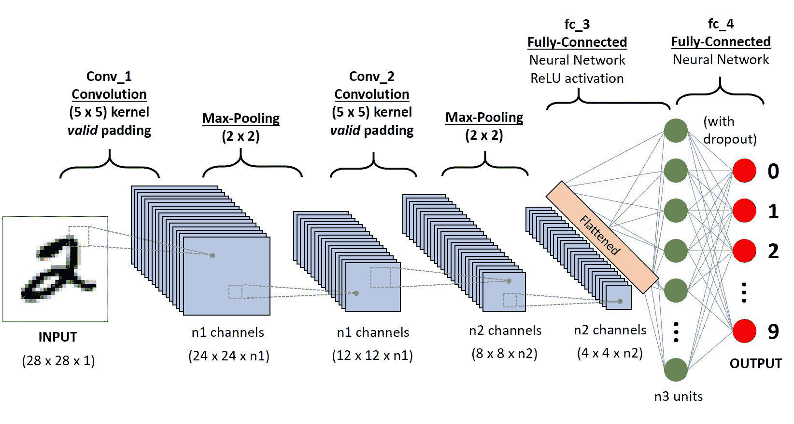\描述

CNNs

图 1\. 一个 CNN 序列用于分类手写数字（Saha，(2018))

### 2.1\. 卷积神经网络

作为一种流行的深度神经网络架构，卷积神经网络（CNNs）在计算机视觉领域取得了良好的表现。如图 1 所示，典型的 CNN 通常由“输入层”、“卷积层”、“池化层”和“输出层”组成。卷积层和池化层可以重复多次。在大多数情况下，卷积层中使用 Relu 函数作为激活函数，池化层中使用 Max-Pooling。在学习过程中，过滤器将被学习并生成特征图，这是表征学习的输出。输出通常会跟随一个全连接网络以解决分类问题。架构在各个方面可能有所不同：层次和连接（(Cao et al., 2015) (He et al., 2016))，损失函数（(Wen et al., 2016) (He et al., 2018) (Deng et al., 2019))等。

#### 2.1.1\. 反馈网络

Cao 等人 (2015) 提出了反馈网络，开发了一种计算反馈机制，帮助更好地可视化和理解深度神经网络的工作方式，并在背景混乱和物体多样的图像中捕捉对预期对象的视觉注意力。

反馈网络引入了一个反馈层。反馈层包含另一组二进制神经元激活变量 $Z\in\{0,1\}$。反馈层堆叠在每个 ReLU 层上，它们组成了一个混合控制单元，以自下而上和自上而下的方式激活神经元响应：自下而上的方式继承了 ReLU 层的选择性，主要特征将传递到上层；自上而下的方式由反馈层控制，将高层次的语义和全局信息传回图像表示。只有与特定目标神经元相关的门会被激活。

#### 2.1.2\. 中心损失

Wen 等人提出了中心损失作为面部识别任务的新监督信号（目标函数）（Wen et al., 2016）。为了将不同类别的特征分开以实现更好的分类性能，中心损失试图最小化类内的变化。令 $\mathbf{c}_{y_{i}}$ 表示 $y_{i}$ 类的嵌入中心，损失函数如下：

| (1) |  | $\mathcal{L}_{C}=\frac{1}{2}\sum_{i=1}^{m}\&#124;\mathbf{x}_{i}-\mathbf{c}_{y_{i}}\&#124;_{2}^{2},$ |  |
| --- | --- | --- | --- |

为了提高计算效率，中心损失使用了一个小批量更新方法，并在每次迭代后通过相应类别特征的均值来更新中心。论文显示，在 softmax 损失和中心损失的联合监督下，CNN 可以尽可能地获得类间分散和类内紧凑。

#### 2.1.3\. 三元组-中心损失

受到三元组损失和中心损失的启发，He 等人引入了三元组-中心损失，以进一步增强特征的判别能力，应用于 2D 物体识别算法（He et al., 2018）。三元组损失旨在找到一个嵌入空间，使不同类别之间的距离大于同一类别之间的距离。中心损失则试图找到一个嵌入空间，使来自同一类别的深度学习特征更加紧凑，并更接近相应的中心。类似地，三元组损失通过计算实例与类别中心的距离，而不是比较每两个实例之间的距离。

| (2) |  | $\mathcal{L}_{tc}=\sum_{i=1}^{M}\max\left(D(f_{i},C_{y_{i}})+m-\min_{j\neq y_{i}}D(f_{i},c_{j}),0\right),$ |  |
| --- | --- | --- | --- |

其中 $D()$ 是一个距离函数，$m$ 是边际值。通过设置边际值，损失函数确保不同类别之间至少有 $m$ 的距离。

#### 2.1.4\. Arcface

在（Deng 等人，2019）中，Deng 等人提出了一种附加角度边际损失（ArcFace），以获得高度可区分的特征用于人脸识别。基于经典的 softmax 损失，

| (3) |  | $\mathcal{L}_{\text{softmax}}=-\frac{1}{N}\sum_{i=1}^{N}\log\frac{e^{W_{y_{i}}^{T}x_{i}+b_{y_{i}}}}{\sum_{j=1}^{n}e^{W_{j}^{T}x_{i}+b_{j}}},$ |  |
| --- | --- | --- | --- |

其中 $x_{i}$ 表示第 $i$ 个样本的嵌入。ArcFace 在归一化 $x$ 和 $W$ 后，向 $x_{i}$ 和 $W_{y_{i}}$ 之间添加了一个附加的角度边际惩罚 $m$，以同时增强类内紧凑性和类间差异：

| (4) |  | $\mathcal{L}_{\text{Arc}}=-\frac{1}{N}\sum_{i=1}^{N}\log\frac{e^{s(\cos(\theta_{y_{i}}+m))}}{e^{s(\cos(\theta_{y_{i}}+m))}+\sum_{j=1,j\neq y_{i}}^{n}e^{s\cos\theta_{j}}}$ |  |
| --- | --- | --- | --- |

论文显示，ArcFace 具有更好的几何属性，因为角度边际与测地距离具有精确的对应关系。

#### 2.1.5\. ResNets

深度神经网络的训练面临退化问题：随着网络深度的增加，准确率会达到饱和点并迅速下降。退化问题表明并非所有系统都同样容易优化。根据假设，优化残差映射比优化原始未参考映射更容易，He 等人（2016）提出了一种名为 ResNets 的残差学习框架，以简化网络的训练。ResNets 由残差块组成，如图 2 所示。ResNets 明确地让这些层拟合残差映射，而不是希望每几层直接拟合所需的基础映射。

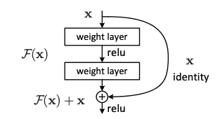\描述

resNet

图 2\. resNet 的一个构建块 (He 等人, (2016))

具体来说，ResNet 不是拟合所需的基础映射 $H(x)$，而是让堆叠的非线性层拟合另一个映射 $\mathcal{F}(x):=H(x)-x$。然后原始映射被重塑为 $\mathcal{F}(x)+x$。在极端情况下，如果恒等映射是最优的，那么将残差推向零会比拟合恒等映射更容易。

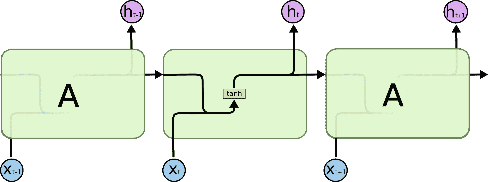\描述

循环神经网络

图 3\. 标准 RNN 包含一个单层 (Olah, (2015))

### 2.2\. 循环神经网络

另一种流行的深度神经网络架构是递归神经网络（RNNs），它涉及顺序输入，如语音和语言。RNNs 一次处理一个元素的输入序列，同时维护一个隐含包含所有历史信息的状态向量。展开的 RNN（图 3）可以被视为一个深度多层网络。就像 CNNs 一样，RNNs 也有多个变种。特别是，它在机器翻译任务中被广泛使用 ((Cho et al., 2014) (Bahdanau et al., 2015) (Luong et al., 2015))。

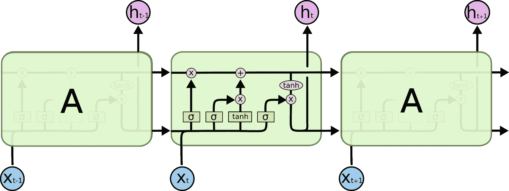\描述

LSTMs

图 4\. LSTM 包含四个相互作用的层 (Olah，(2015))

#### 2.2.1\. LSTM

由于无法长期存储信息，因此提出了“长短期记忆”（LSTM）以解决这一问题。Chen 在 (Chen, 2016) 中提供了关于递归神经网络（RNN）和长短期记忆（LSTM）基本概念的简明教程。LSTM（图 4）包括四个门：输入调制门、输入门、遗忘门（Gers et al. (1999)) 和输出门以及它们相应的权重。LSTM 还包含一个称为记忆单元的特殊单元，类似于累加器或带门控的漏电神经元。同时，还有其他增强型 RNN，带有记忆模块，如“神经图灵机”和“记忆网络”。这些模型用于需要推理和符号操作的任务。

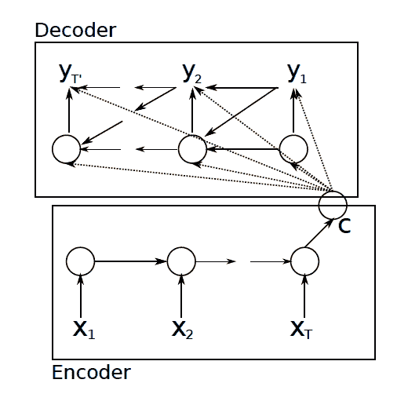\描述

rnn_en_de

图 5\. RNN 编码器-解码器的示意图 (Cho et al.，(2014))

#### 2.2.2\. RNN 编码器-解码器

Cho et al. (2014) 提出了一个称为 RNN 编码器-解码器的神经网络架构（图 5），该架构可以作为统计机器翻译（SMT）系统中的附加特征，用于生成目标序列，也可以用于评分给定的输入和输出序列对。该架构学会将可变长度的序列编码为固定长度的向量表示，并将给定的固定长度向量表示解码为可变长度的序列。编码器是一个 RNN，它顺序读取输入序列 x 的每个符号。所提模型的解码器是另一个 RNN，经过训练以生成输出序列，通过预测给定隐藏状态下的下一个符号。

除了新的模型架构，论文还提出了一种 LSTM 的变体，其中包括一个更新门和一个重置门。更新门决定是否用新的隐藏状态更新隐藏状态，而重置门决定是否忽略之前的隐藏状态。

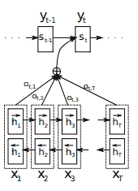\说明

rnnsearch

图 6\. RNNsearch 的示意图 (Bahdanau 等人, (2015))

#### 2.2.3\. RNNsearch

在（Bahdanau 等人，2015）中，Bahdanau 等人通过向基础 RNN 编码器-解码器添加对齐模型，提出了一种新的机器翻译模型架构。与传统的机器翻译模型类似，所提架构包括一个编码器和一个解码器。编码器读取输入句子，然后将其转换为一个向量。解码器在翻译过程中模拟搜索源句子。如图 6 所示，对齐模型学习每个注释 $h_{j}$ 的权重 $\alpha_{ij}$，以评分输入位置 $j$ 附近的输入与位置 $i$ 的输出匹配的程度。该评分基于 RNN 隐藏状态 $s_{i-1}$ 和输入句子的第 $j$ 个注释 $h_{j}$。

#### 2.2.4\. 注意力机制

在（Luong 等人，2015）中，Luong 等人研究了两类注意力机制，以更好地改进神经机器翻译（NMT）：一种是全局方法，它始终关注所有源语言词汇；另一种是局部方法，它只关注一次源语言词汇的一个子集。基于 LSTM，他们为这两种注意力机制引入了变长对齐向量。全局注意力模型基于全局上下文，对齐向量的大小等于源语言站点上的时间步数。而局部注意力模型则基于窗口上下文，对齐向量的大小等于窗口大小。

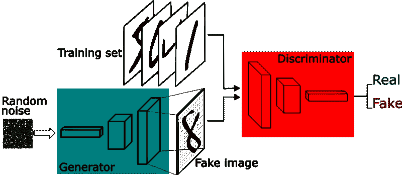\说明

GANs

图 7\. GAN 框架概述 (Silva, (2018))

### 2.3\. 生成对抗网络

深度学习在判别模型的监督学习中取得了显著的性能。然而，深度生成模型的影响较小，例如：

+   •

    在最大似然估计中近似计算是困难的

+   •

    在生成上下文中利用分段线性单元的好处是困难的

Goodfellow 等人（2014）提出了一种新的生成模型：生成对抗网络（GANs），以避免这些困难。提出的 GANs 架构包括两个组件：生成器$G$和判别器$D$。以学习给定数据$x$上的分布$P_{g}$。GANs 在输入噪声变量上定义了一个先验$p_{\mathbf{z}}(\mathbf{z})$。GANs 的框架对应于一个“最小-最大双人游戏”（判别器对生成器）与价值函数$V(G,D)$：

| (5) |  | $\min_{G}\max_{D}V(D,G)=\mathbb{E}_{\mathbf{x}\sim p_{\text{data}}(\mathbf{x})}[\log D(\mathbf{x})]+\mathbb{E}_{\mathbf{z}\sim p_{\mathbf{z}}(\mathbf{z})}[\log(1-D(G(\mathbf{z})))]$ |  |
| --- | --- | --- | --- |

生成器从先验分布生成噪声样本，而判别器表示数据来自目标数据集的概率而非生成器。因此，目标是训练判别器$D$以最大化对训练样本和来自$G$的样本正确标签的概率，同时训练生成器$G$以最小化$\log(1-D(G(\mathbf{z})))$，即生成类似于示例的样本以“欺骗”判别器。实际上，该过程优化$D$ $k$步和$G$的一步。

#### 2.3.1\. DCGANs

Radford 等人（2016）提出了深度卷积生成对抗网络（DCGANs），以弥合 CNN 中监督学习和无监督学习之间的差距，使 GANs 更稳定。稳定深度卷积 GANs 的架构指南：

+   •

    将任何池化层替换为步幅卷积（判别器）和分数步幅卷积（生成器）。

+   •

    在生成器和判别器中使用批量归一化。

+   •

    对于更深的架构，移除全连接隐藏层。

+   •

    在生成器中使用 ReLU 激活函数，除了输出层使用 Tanh。

+   •

    在判别器的所有层中使用 LeakyReLU 激活函数。

#### 2.3.2\. AAE

Makhzani et al. (2015) 提出了一个新的推断算法 Adversarial Autoencoder (AAE)，它使用 GANs 框架，能够更好地处理半监督分类、图像风格与内容的解耦、无监督聚类、降维和数据可视化等应用。该算法旨在为图形找到遵循某种类型分布的表示。它包括两个阶段：重建阶段和正则化阶段。在重建阶段，编码器和解码器被更新以最小化重建误差。在正则化阶段，判别器被更新以区分真实的先验样本和生成的样本，而生成器则被更新以欺骗判别器。重建阶段和正则化阶段在 GANs 中被称为生成器和判别器。该方法可以用于半监督学习和无监督聚类。对于半监督学习，除了重建阶段和正则化阶段外，还有一个半监督分类阶段，并且在这一阶段将训练标记数据。无监督聚类的架构类似于半监督学习，不同之处在于去除了半监督分类阶段，因此不再对任何标记的小批量数据进行训练。

### 2.4\. 表示学习

表示学习允许机器接收原始数据，并自动发现用于检测或分类所需的表示（嵌入）（LeCun et al., 2015）。这些原始数据可以是图像、视频、文本等。图像以像素值数组的形式存在，文本以单词序列的形式存在。根据不同的目标，通过深度神经网络生成一组代表性特征。

#### 2.4.1\. Skip-gram

Skip-gram 模型在从大量非结构化文本数据中学习高质量单词向量表示方面表现良好，它不需要密集矩阵乘法。Skip-gram 模型的训练目标是找到对预测句子或文档中的周围单词有用的单词表示。给定一个训练单词序列 $\mathfrak{w}_{1},\mathfrak{w}_{2},\mathfrak{w}_{3},...,\mathfrak{w}_{T}$，Skip-gram 模型的目标是最大化平均对数概率：

| (6) |  | $\frac{1}{T}\sum_{t=1}^{T}\sum_{-c\leq j\leq c,j\neq 0}\log p(\mathfrak{w}_{t+j}&#124;\mathfrak{w}_{t}),$ |  |
| --- | --- | --- | --- |

其中 $c$ 是训练上下文的大小。基本的 Skip-gram 公式通过 softmax 函数定义 $p(\mathfrak{w}_{t+j}|\mathfrak{w}_{t})$：

| (7) |  | $p(\mathfrak{w}_{\mathit{O}} | \mathfrak{w}_{\mathit{I}})=\frac{\exp(\mathfrak{v}^{\prime\top}_{\mathfrak{w}_{\mathit{O}}}\mathfrak{v}_{\mathfrak{w}_{\mathit{I}}})}{\sum_{\mathfrak{w}=1}^{W}\exp(\mathfrak{v}^{\prime\top}_{\mathfrak{w}}\mathfrak{v}_{\mathfrak{w}_{\mathit{I}}})}.$ |  |
| --- | --- | --- | --- | --- |

其中 $\mathfrak{v}_{\mathfrak{w}}$ 和 $\mathfrak{v}^{\prime}_{\mathfrak{w}}$ 是词 $\mathfrak{w}$ 的“输入”和“输出”向量表示，$W$ 是词汇表中的词数。基于 skip-gram 算法。Mikolov 等人 (2013) 提出了一些扩展以改善其性能：层次 softmax、负采样和子采样。研究表明，词向量可以通过简单的向量加法有意义地组合在一起。具体而言，层次 softmax 使用二叉树来表示输出层，而不是将所有词的平面输出用于输出维度的减少，以提高计算效率。层次 softmax 的替代方案是负采样，灵感来自噪声对比估计 (NCE)。基本思想是抽样一个“准确”的数据和 $k$ 个噪声数据，目标是最大化它们的条件对数似然：

| (8) |  | $\log\sigma(\mathfrak{v}^{\prime\top}_{\mathfrak{w}_{\mathit{O}}}\mathfrak{v}_{\mathfrak{w}_{\mathit{I}}})+\sum_{i=1}^{k}\mathbb{E}_{\mathfrak{w}_{i}\sim P_{n}(\mathfrak{w})}\left[\log\sigma(-v^{\prime\top}_{\mathfrak{w}_{i}}v_{\mathfrak{w}_{\mathit{I}}})\right],$ |  |
| --- | --- | --- | --- |

NCE 的目标是用来替代 Skip-gram 目标中的每一个 $\log P(\mathfrak{w}_{\mathit{O}}|\mathfrak{w}_{\mathit{I}})$ 项，任务是通过逻辑回归将目标词 $\mathfrak{w}_{\mathit{O}}$ 与从噪声分布 $P_{n}(\mathfrak{w})$ 中抽样的词区分开来，其中每个数据样本有 $k$ 个负样本。论文还建议了一种简单的子采样方法来解决稀有词和频繁词之间的不平衡问题：训练集中每个词 $w_{i}$ 以根据公式计算的概率被丢弃。

| (9) |  | $P(w_{i})=1-\sqrt{\frac{t}{f(w_{i})}},$ |  |
| --- | --- | --- | --- |

其中 $f(w_{i})$ 是词 $w_{i}$ 的频率，$t$ 是阈值。

#### 2.4.2\. GloVe

为了更好地处理词表示：词类比、词相似度和命名实体识别任务，Pennington 等人 (2014) 构建了一个新的模型 GloVe（全局向量），它可以捕捉全局语料库统计信息。GloVe 结合了基于计数的方法和基于预测的方法进行无监督的词表示学习，提出了一个新的成本函数。

| (10) |  | $J=\sum_{i,j=1}^{V}f(X_{ij})(W_{i}^{T}\tilde{w}_{j}+b_{i}+\tilde{b}_{j}-\log X_{ij})^{2},$ |  |
| --- | --- | --- | --- |

其中 $V$ 是词汇表的大小，$f(X_{ij})$ 是加权函数。$w$ 是词向量，$\tilde{w}$ 是单独的上下文词向量，通过训练多个网络实例然后合并结果，可以帮助减少过拟合和噪声，并通常改善结果。$b$ 和 $\tilde{b}$ 是对应于 $w$ 和 $\tilde{w}$ 的偏置。

### 2.5\. 元学习与可解释性

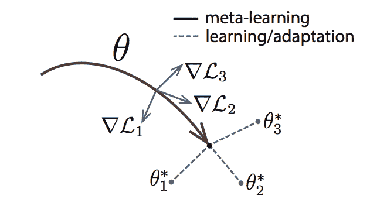\描述

MAML

图 8\. MAML 的示意图 (Finn et al., (2017))

#### 2.5.1\. 元学习

深度神经网络在少样本学习任务中的表现通常较差，因为分类器在看到每个类别的很少样本后需要迅速进行泛化。Ravi 和 Larochelle (2016) 提出了一个基于 LSTM 的元学习者模型，用于学习在少样本环境下训练另一个学习者神经网络分类器所使用的优化算法。元学习者捕捉任务中的短期知识以及所有任务中共同的长期知识。此外，Finn 等人 (2017) 提出了一个名为模型无关元学习（MAML）的算法，适用于任何使用梯度下降进行训练的模型，以及分类、回归和强化学习等不同学习问题。元学习旨在为快速适应做准备。一般来说，它包括两个步骤：

1.  (1)

    对每个任务进行样本批次以学习梯度更新，然后将结果合并；

1.  (2)

    在学习特定任务时，以第 1 步的结果作为起点。

该图类似于图 8，它优化一个表示 $\theta$，以便能快速适应新任务。

#### 2.5.2\. LIME

随着机器学习技术的快速发展，目前许多模型仍然大多是黑箱。为了使预测对非专家更具可解释性，无论模型是什么（模型无关），以便人们能够做出更好的决策，Ribeiro 等人 (2016) 提出了局部可解释模型无关解释（LIME）的方法，以识别在分类器局部忠实的可解释模型。它引入了稀疏的线性解释，通过实例及其可解释版本之间的相似性和距离进行加权。论文还提出了一种子模块选择算法（SP-LIME），通过基于在 LIME 中学到的解释矩阵选择最重要的特征来更好地选择实例。

#### 2.5.3\. 大规模演化

为了最小化人工参与神经网络设计，Real et al. (Real et al., 2017) 使用进化算法自动发现网络架构。进化算法使用进化算法在锦标赛选择过程中选择一对中的最佳作为父母。使用成对比较，而不是整个种群操作。

在提出的方法中，单个架构被编码为图。在图中，顶点代表三阶张量或激活值。图的边表示身份连接或卷积，并包含定义卷积属性的可变数值参数。由于突变的作用，子图与父图类似但不完全相同。突变操作包括“ALTER-LEARNING-RATE”、“RESET-WEIGHTS”、“INSERT-CONVOLUTION”、“REMOVE-CONVOLUTION”等。

## 3\. 开放集识别

随着深度学习在物体分类上取得了巨大成功，将所有类别标记在训练样本中变得不太可能，而未标记的类别，即所谓的开放集，成为了一个问题。与传统的闭集问题不同，闭集问题只需要正确分类标记的数据，而开放集识别（OSR）还需要处理那些未标记的数据。Geng et al. 指出了四类识别问题，如下所示 (Geng et al., 2018)：

1.  (1)

    已知已知类别：标记的独特正类，在训练样本中可用；

1.  (2)

    已知未知类别：标记的负类，在训练样本中可用；

1.  (3)

    未知已知类别：训练样本不可用，但有一些侧面信息，如语义/属性信息

1.  (4)

    未知未知类别：既没有训练样本也没有侧面信息，完全未见过。

传统分类技术关注于标记类别的问题，包括已知已知类别和已知未知类别。而开放集识别（OSR）关注于后者：未知已知类别和未知未知类别。它要求分类器准确分类已知已知类别，同时识别未知未知类别。

一般来说，技术可以根据训练集的组成分为三类，如表 1。

表 1\. 开放集识别技术分类

| 训练集 | 论文 |
| --- | --- |
| 借用额外数据 | (Shu et al., 2018b) (Saito et al., 2018) (Shu et al., 2018a) (Hendrycks et al., 2019) (Dhamija et al., 2018) (Perera and Patel, 2019) |
| 生成额外数据 | (Jo et al., 2018) (Neal et al., 2018) (Ge et al., 2017) (Yu et al., 2017) (Lee et al., 2018) |
| 无额外数据 | (Bendale 和 Boult, 2016) (Hassen 和 Chan, 2018a) (Júnior 等人, 2017) (Mao 等人, 2018) (Wang 等人, 2018) (Schultheiss 等人, 2017) (Zhang 和 Patel, 2016) (Liang 等人, 2018) (Shu 等人, 2017) |

### 3.1\. 借用额外数据

为了更好地区分已知类别和未知类别，一些技术在训练中引入了未标记数据（Shu 等人，2018b）（Saito 等人，2018）。此外，（Shu 等人，2018a）指出，他们的工作流程中需要若干手动标注的未知类别。

#### 3.1.1\. 通过反向传播进行开放集领域适应

Saito 等人 (2018) 提出了一种方法，该方法将未标记的目标样本标记为未知，然后将它们与标记的源样本混合，以训练特征生成器和分类器。分类器试图在源样本和目标样本之间建立边界，而生成器则试图使目标样本远离边界。其思想是提取出能够区分已知和未知样本的特征。根据特征生成器，测试数据要么与已知类别对齐，要么被拒绝为未知类别。

#### 3.1.2\. 开放世界分类中的未见类别发现

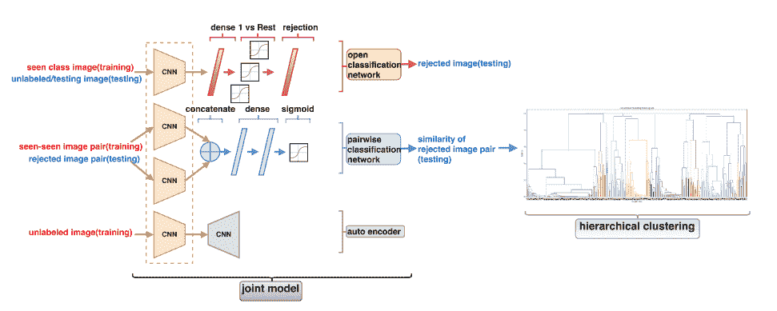\Description

OCN+PCN+HC

图 9\. OCN+PCN+HC 的总体框架 (Shu 等人, 2018)

Shu 等人 (2018b) 提出了一个解决开放集问题的框架，该框架涉及未标记的数据作为自编码器网络，以避免过拟合。除了自编码器外，它在训练过程中还包含另外两个网络——开放分类网络（OCN）和成对分类网络（PCN）。只有 OCN 参与测试阶段，预测测试数据集，包括来自已见和未见类别的未标记示例。然后进入聚类阶段，基于 PCN 的预测结果，他们使用层次聚类（自下而上/合并）对被拒绝示例进行聚类。总体框架见图 9。

#### 3.1.3\. ODN

手动标记的未知数据在 Shu 等人 (2018a) 提出的开放深度网络（ODN）中使用。它需要若干手动标注。具体来说，它在权重矩阵中增加了一个新列以对应未知类别，并将其初始化为 $\mathfrak{w}_{N+1}$：

| (11) |  | $\mathfrak{w}_{N+1}=\alpha\frac{1}{N}\sum_{n=1}^{N}\mathfrak{w}_{n}+\beta\frac{1}{M}\sum_{m=1}^{M}\mathfrak{w}_{m},$ |  |
| --- | --- | --- | --- |

其中 $\mathfrak{w}_{n}$ 是已知 $n$ 类别的权重列。此外，由于相似类别在 $\mathfrak{w}_{m}$ 的初始化中应发挥更关键的作用，ODN 添加了另一个项 $\frac{1}{M}\sum_{m=1}^{M}\mathfrak{w}_{m}$ 来强调相似的已知类别。$\mathfrak{w}_{m}$ 是 $M$ 个最高激活值的权重列。$\mathfrak{w}_{N+1}$ 被连接到转移权重 $W$ 上以支持新类别。这个初始化方法被称为强调初始化。

ODN 还引入了多类三元组阈值来识别新类别：接受阈值、拒绝阈值和距离阈值。具体来说，只有当样本的最高置信值的索引大于接受阈值时，该样本才会被接受为标记类别。如果所有置信值都低于拒绝阈值，则该样本会被视为未知。如果样本的置信值介于接受阈值和拒绝阈值之间，且最高和第二高置信值之间的距离大于距离阈值，则该样本也会被接受为标记类别。

#### 3.1.4\. 异常值暴露

Hendrycks 等人（2019）提出了 Outlier Exposure（OE），用于区分异常样本和分布内样本。OE 从其他数据集中借用数据作为“分布外”（OOD），记为 $\mathcal{D}_{out}$。同时，将目标样本视为“分布内”，标记为 $\mathcal{D}_{in}$。然后，模型被训练以发现信号并学习启发式方法来检测查询样本来自哪个数据集。给定模型 $f$ 和原始学习目标 $\mathcal{L}$，OE 的目标函数如下：

| (12) |  | $\mathbb{E}_{(x,y)\sim\mathcal{D}_{in}}[\mathcal{L}(f(x),y)+\lambda\mathbb{E}_{x^{\prime}\sim\mathcal{D}_{in}^{out}}[\mathcal{L}_{OE}(f(x^{\prime}),f(x),y)]]$ |  |
| --- | --- | --- | --- |

$\mathcal{D}_{out}^{OE}$ 是一个异常值暴露数据集。该方程表明，模型尝试最小化来自“分布内”（$\mathcal{L}$）和“分布外”（$\mathcal{L}_{OE}$）的数据的目标 L。论文还使用了最大 softmax 概率基线检测器（交叉熵）来处理 $\mathcal{L}_{OE}$。当标签不可用时，$\mathcal{L}_{OE}$ 被设置为 log 概率 $f(x^{\prime})$ 和 $f(x)$ 上的边际排名损失。然而，该方法的性能依赖于选择的 OOD 数据集。

#### 3.1.5\. Objectosphere 损失

Dhamija 等人（2018）提出了用于开放集识别的 Entropic Open-Set 和 Objectoshere 损失，该方法使用来自某些类别的负样本训练网络。该方法减少了深度特征的幅度，并最大化了未知样本的 softmax 分数的熵，以将其与已知样本分开。Entropic Open-Set 的思想是当输入未知时最大化熵。形式上，令 $S_{c}(x)$ 表示来自已知类别 $c$ 的样本 $x$ 的 softmax 分数，Entropic Open-Set 损失 $J_{E}$ 可以定义为：

| (13) |  | $J_{E}(x)=\begin{cases}-\log S_{c}(x)&amp;\text{如果 $x\in\mathcal{D}^{\prime}_{c}$ 属于类别 $c$}\\ -\frac{1}{C}\sum_{c=1}^{C}\log S_{c}(x)&amp;\text{如果 $x\in\mathcal{D}^{\prime}_{b}$ 属于类别 $c$}\end{cases}$ |  |
| --- | --- | --- | --- |

其中 $\mathcal{D}^{\prime}_{b}$ 表示分布外样本。为了进一步区分已知和未知样本，论文将已知样本推入“对象球体”，在那里它们具有大的特征幅度和低熵，即所谓的 Objectosphere Loss，其计算方法为：

| (14) |  | $J_{R}=J_{E}+\lambda\begin{cases}\max(\xi-\&#124;F(x)\&#124;,0)^{2}&amp;\text{如果 $x\in\mathcal{D}^{\prime}_{c}$}\\ \&#124;F(x)\&#124;^{2}&amp;\text{如果 $x\in\mathcal{D}^{\prime}_{b}$}\end{cases}$ |  |
| --- | --- | --- | --- |

其中 $F(x)$ 是深度特征向量，而 Objectosphere Loss 会对已知类别进行惩罚，如果它们的特征幅度在 Objectosphere $\xi$ 的边界内，对未知类别进行惩罚，如果它们的幅度大于零。

#### 3.1.6\. DOC

Perera 和 Patel (2019) 提出了一个基于深度学习的一类分类 (DOC) 特征提取解决方案。一类分类的目标是仅使用正常类别的样本来识别正常类别和异常类别，并且有不同的策略来解决分类问题。提出的方法接受两个输入：一个来自目标数据集，一个来自参考数据集，并通过一个预训练的参考网络和一个次级网络产生两个损失。参考数据集是用来训练参考网络的数据集，目标数据集包含用于一类学习的类别样本。在训练过程中，来自参考数据集和目标数据集的两个图像批次同时输入到参考网络和次级网络的输入层。在前向传递结束时，参考网络生成描述性损失 ($l_{D}$)，这与交叉熵损失相同，次级网络生成紧凑性损失 ($l_{C}$)。网络的复合损失 ($l$) 定义为：

| (15) |  | $l(r,t)=l_{D}(r&#124;W)+\lambda l_{C}(t&#124;W),$ |  |
| --- | --- | --- | --- |

其中 $r$ 和 $t$ 分别是参考数据集和目标数据集中的训练数据，$W$ 是两个网络的共享权重，$\lambda$ 是一个常数。

提出的算法概览如图 10 所示，其中 $g$ 是特征提取网络，$h_{c}$ 是分类网络。紧凑性损失用于评估在学习的特征空间中考虑类别的紧凑性。描述性损失是通过外部多类数据集进行评估的。

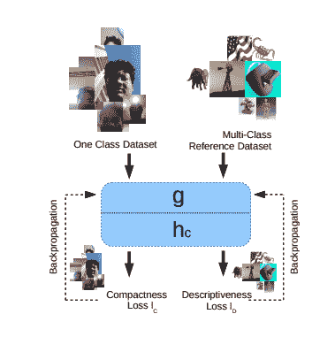\描述

OC

图 10\. 一类分类框架的深度特征概述 (Perera and Patel，(2019))

讨论

所有上述方法在训练过程中借用了某些数据集作为未知类别，（Shu 等人，2018b）借用了目标样本（测试集）作为未知类别，并利用对抗学习。一个分类器被训练以在源样本和目标样本之间做出边界，而生成器被训练以使目标样本远离边界。（Saito 等人，2018）也从数据集中借用了未标记的示例，然后使用自编码器来学习表示。（Shu 等人，2018a）在强调初始化期间使用了多个手动注释。（Hendrycks 等人，2019）在分布内数据集的基础上引入了离群点暴露数据集。（Dhamija 等人，2018）也引入了未知数据集，同时利用已知样本和未知样本之间的特征幅度差异作为目标函数的一部分。不同于多类分类问题，（Perera 和 Patel，2019）从异常检测中提出了一类分类问题，并提供了用于迁移学习的额外参考数据集。一般来说，借用和注释额外数据使 OSR 成为一个更简单的问题。然而，额外数据集的检索和选择将是另一个问题。

### 3.2\. 生成额外数据

随着对抗学习（如 GANs）取得的巨大成功，出现了一些想法，使用 GAN 在训练前生成未知样本。

#### 3.2.1\. G-OpenMax

Ge 等人 (2017) 设计了基于 OpenMax 和 GAN 的网络。他们的方法提供了新类别图像合成的明确建模和决策评分。所提方法包括两个阶段以及 OpenMax：预网络训练和评分校准。在预网络训练阶段，与 OpenMax 不同的是，它首先生成一些未知类别样本（合成样本），然后将这些样本与已知样本一起输入网络进行训练。在 G-OpenMax 中使用了修改版的条件 GAN 来合成未知类别。在条件 GAN 中，随机噪声被输入生成器 $G$ 和一个一热向量 $c\in c_{i,...,k}$，该向量代表一个期望的类别。同时，如果输入图像与其所属类别一起提供，鉴别器 $D$ 学习得更快。因此，带有类别标签的条件 GAN 的优化可以表述为：

| (16) |  | $\displaystyle\min_{\phi}\max_{\theta}$ | $\displaystyle=E_{x,c\sim P_{data}}[\log D_{\theta}(x,c)]$ |  |
| --- | --- | --- | --- | --- |
|  |  | $\displaystyle+E_{z\sim P_{z},c\sim P_{c}}[\log(1-D_{\theta}(G_{\phi}(z,c),c))],$ |  |

其中 $\phi$ 和 $\theta$ 是 $G_{\phi}$ 和 $D_{\theta}$ 的可训练参数，生成器的输入 $z$ 和 $c$ 是从它们的先验分布 $P(z)$ 和 $P(c)$ 中抽取的潜在变量。对于每个生成的样本，如果具有最高值的类别与预训练分类器不同，则会被标记为“未知”。最后，最终分类器提供了对生成的未知类别的显式估计概率。

#### 3.2.2\. 对抗样本生成

Yu 等人 (2017) 提出了对抗样本生成 (ASG) 作为 OSR 问题的数据增强技术。其思想是生成一些接近但不同于训练实例的未知标签点，然后直接训练一个开放类别分类器，以区分已见和未见。此外，ASG 还生成接近“已知”样本的“未知”样本。与 GANs 的最小-最大策略不同，ASG 生成的样本基于距离和分布，这些生成的未知样本为：

1.  (1)

    接近已见类别数据

1.  (2)

    在已知/未知边界周围散布

#### 3.2.3\. 反事实图像生成

与标准 GANs 不同，Neal 等人 (2018) 提出了一个名为反事实图像生成的数据集增强技术，它采用编码器-解码器架构来生成接近真实图像但不属于任何已知类别的合成图像，然后将其视为未知类别。该架构包括三个组件：

+   •

    一个编码器网络：将图像映射到潜在空间。

+   •

    一个生成器：将潜在空间映射回图像。

+   •

    一个判别器：区分生成的图像和真实图像。

#### 3.2.4\. GAN-MDFM

Jo 等人 (2018) 提出了生成未知未知数据的新方法。他们提出了边际去噪自编码器 (MDAE) 技术，该技术通过引入边际来建模已知类别在特征空间中的噪声分布，以生成与已知类别相似但不相同的数据。该模型包含一个分类器、一个生成器和一个自编码器。分类器计算成员概率的熵，而不是明确区分生成数据和真实数据。然后，使用阈值来识别未知类别。生成器对远离已知类别的分布 $m$ 进行了建模。

#### 3.2.5\. 自信分类器

为了区分分布内样本和分布外样本，Lee et al. (2018) 提出了在原始交叉熵损失中添加两个额外项，其中第一个项（置信损失）使分布外样本对分类器的信心降低，而第二个项（对抗生成器）用于生成最有效的训练样本以供第一个项使用。具体而言，所提出的置信损失旨在最小化从分布外样本的预测分布到均匀分布的 Kullback-Leibler（KL）散度，以实现对分布外样本的更低置信度预测。同时，期望分布内和分布外样本更加可分。然后，引入对抗生成器生成最有效的分布外样本。与原始生成对抗网络（GAN）不同，后者生成类似于分布内样本的样本，所提出的生成器生成分布内低密度区域中的“边界”样本，充当分布外样本。最后，设计了一个联合训练方案来交替最小化这两个损失函数。最终，论文显示所提出的 GAN 隐式地鼓励训练一个更有信心的分类器。

讨论

与其从其他数据集中借用数据，不如生成额外数据的方法从已知样本中生成未知样本。大多数数据生成方法基于 GANs。（Ge et al., 2017）引入了一种条件 GAN 来生成一些未知样本，随后由 OpenMax 开放集分类器处理。（Yu et al., 2017）也使用了来自 GANs 的最小-最大策略，在已知和未知样本之间的决策边界周围生成数据作为未知样本。（Neal et al., 2018）在传统的 GANs 中添加了另一个编码器网络，以将图像映射到潜在空间。（Jo et al., 2018）通过边际去噪自编码器生成未知样本，该编码器提供了一个目标分布，该分布与已知样本的分布相差$m$。（Lee et al., 2018）在分布内低密度区域生成“边界”样本，充当未知样本，并联合训练置信分类器和对抗生成器，使两个模型相互提升。生成未知样本以解决 OSR 问题已经取得了很好的性能，同时，它需要更复杂的网络架构。

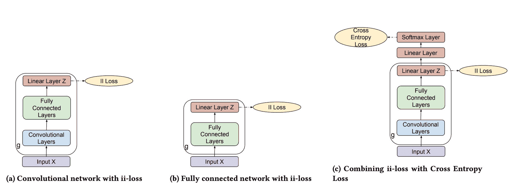\描述

ii-loss

图 11\. ii-loss 的网络架构（Hassen and Chan, 2018）

### 3.3\. 无需额外数据

不需要额外训练数据的 OSR 技术可以分为基于 DNN 的（(Bendale and Boult, 2016) (Hassen and Chan, 2018a) (Mao et al., 2018) (Zhang and Patel, 2016) (Liang et al., 2018)) 和传统的基于 ML 的（(Júnior et al., 2017)）。

#### 3.3.1\. 极值签名

Schultheiss 等人 (2017) 研究了类别特定的激活模式，以利用 CNN 进行新颖性检测任务。他们引入了“极值签名”，该签名指定了深度神经激活中哪个维度的值最大。他们还假设一个语义类别可以通过其签名来描述。因此，如果测试样本与所有已知类别的极值签名不同，则将其视为新颖的。他们在现有模型的基础上应用了极值签名，从而允许“升级”任意分类网络，以共同估计新颖性和类别成员资格。

#### 3.3.2\. OpenMax

Bendale 和 Boult (2016) 提出了 OpenMax，它用 OpenMax 层替代了深度神经网络中的 softmax 层，模型估计输入属于未知类别的概率。该模型在网络的倒数第二层采用了极值理论（EVT）元识别校准。对于每个实例，激活向量被修正为其与每个类别的均值激活向量（MAV）距离的乘积之和。此外，它重新分配激活向量的值，将其作为未知类别的激活。最后，新的重新分配的激活向量用于计算已知类别和未知类别的概率。

#### 3.3.3\. ii-loss

Hassen 和 Chan (2018a) 提出了基于距离的损失函数，用于学习开放集识别的表示。其思路是最大化不同类别之间的距离（类别间分离度），最小化实例与其类别均值之间的距离（类别内分布）。这样，在学习到的表示中，同一类别的实例彼此接近，而不同类别的实例则距离较远。更正式地，设 $\overrightarrow{z_{i}}$ 为实例 $i$ 的输入向量 $\overrightarrow{x_{i}}$ 的投影（嵌入）。类别内分布度被测量为实例与其类别均值之间的平均距离：

| (17) |  | $intra\_spread=\frac{1}{N}\sum_{j=1}^{K}\sum_{i=1}^{C_{j}}\&#124;\overrightarrow{\mu_{j}}-\overrightarrow{z_{i}}\&#124;_{2}^{2},$ |  |
| --- | --- | --- | --- |

其中 $|C_{j}|$ 是类别 $C_{j}$ 中训练实例的数量，$N$ 是训练实例的数量，而 $\mu_{j}$ 是类别 $C_{j}$ 的均值。同时，类别间分离度被测量为所有 $K$ 个已知类别中最接近的两个类别均值：

| (18) |  | $inter\_separation=\min_{\begin{subarray}{c}1\leq m\leq K\\ m+1\leq n\leq K\end{subarray}}\&#124;\overrightarrow{\mu_{m}}-\overrightarrow{\mu_{n}}\&#124;_{2}^{2}$ |  |
| --- | --- | --- | --- |

提出的 ii-loss 最小化了类别内分布度并最大化了类别间分离度：

| (19) |  | $ii\_loss=intra\_spread-inter\_separation$ |  |
| --- | --- | --- | --- |

这样实例与最近已知类别均值之间的距离可以用作未知类别的标准。即，如果距离超过某个阈值，则该实例被识别为未知类别。网络结构如图 11。

#### 3.3.4\. Distribution networks

Mao 等人 (2018) 假设通过某种映射，所有类别遵循不同的高斯分布。他们提出了一种分布参数迁移策略，通过估计已知类别的参数来检测和建模未知类别。正式地，设 $\boldsymbol{z}_{i}^{k}$ 表示 $\boldsymbol{x}_{i}^{k}$ 的嵌入，他们假设来自类别 $k$ 的样本在潜在空间中遵循一个带有可学习参数 $\boldsymbol{\Theta}_{k}$ 的概率分布 $p_{k}(\boldsymbol{z};\boldsymbol{\Theta}_{k})$。对于类别 $k$，对数似然为

| (20) |  | $\log\mathcal{L}_{k}(\boldsymbol{\Theta}_{k},\boldsymbol{W})=\sum_{i=1}^{n_{k}}\log p_{k}(\boldsymbol{z}_{i}^{k};\boldsymbol{\Theta}_{k})$ |  |
| --- | --- | --- | --- |

训练目标是使样本更可能属于其标记类别。即，最大化每个类别相对于其样本的对数似然。因此，负均值对数似然被用作提议分布网络中的损失函数。

| (21) |  | $J(\boldsymbol{W},\boldsymbol{\Theta})=-\sum_{k=1}^{l}\frac{1}{n_{k}}\log\mathcal{L}_{k}(\boldsymbol{\Theta}_{k},\boldsymbol{W})$ |  |
| --- | --- | --- | --- |

该方法不仅可以检测新样本，还可以区分和建模未知类别，从而发现现实世界中的新模式甚至新知识。

#### 3.3.5\. OSNN

除了 DNNs，Júnior 等人 (2017) 将 OSNN 作为传统机器学习技术 - 最近邻（NN）分类器的扩展。他们将最近邻距离比率（NNDR）技术应用于相似度评分的比率上。具体而言，它测量样本与两个不同已知类别的最近邻之间的距离比率。如果比率低于某个阈值，则将样本分配给其中一个类别。那些在类别之间模糊（比率高于某个阈值）和那些远离任何未知类别的样本被分类为未知。

#### 3.3.6\. RLCN

王等人 (2018) 提出了一个成对约束损失（PCL）函数，以实现“类内紧凑性”和“类间分离”，以解决开放集识别（OSR）问题。他们还开发了一个双通道共同表示框架，以随时间检测新类别。此外，他们添加了一个 Frobenius 正则化项来避免过拟合。其模型还在最终输出层应用了二元分类误差（BCE）来形成整个损失函数。此外，他们应用了温度缩放和 t 分布假设来找到最佳阈值，这需要更少的参数。双通道共同表示框架如图 12 所示。

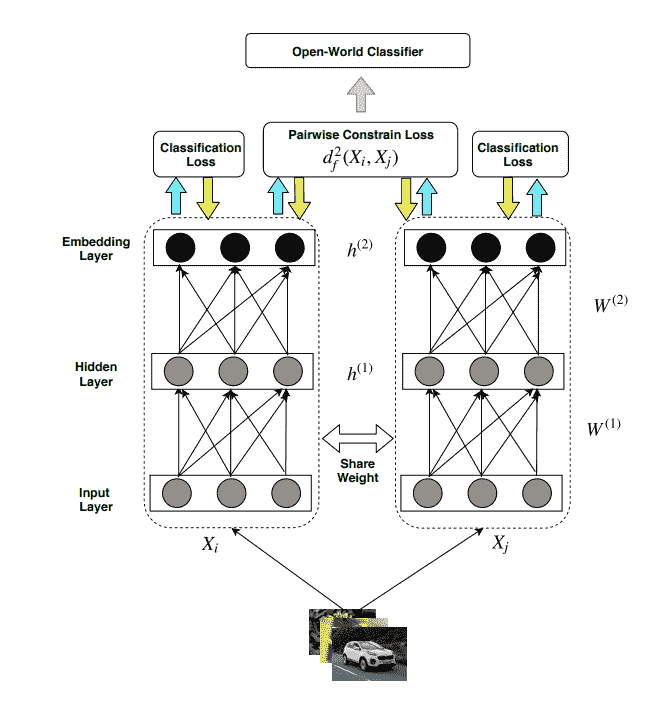\描述

RLCN

图 12\. RLCN 框架概述 (王等人, (2018))

#### 3.3.7\. SROSR

张和帕特尔 (2016) 提出了一个通用的稀疏识别分类（SRC）算法，用于开放集识别。该算法使用类重建误差进行分类。它利用统计极值理论（EVT）对这两个误差分布的尾部进行建模，然后将开放集识别问题简化为一组假设检验问题。图 13 概述了所提出的 SROSR 算法。

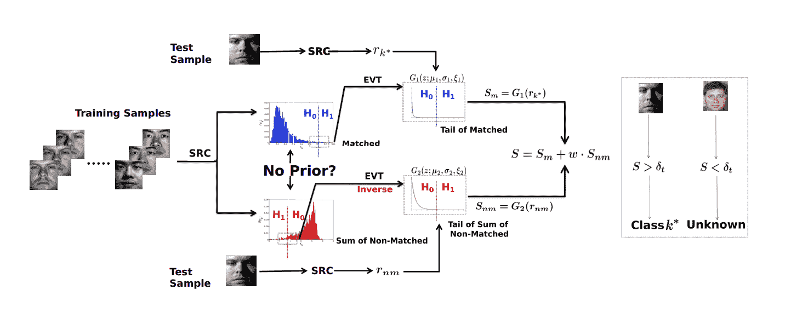\描述

SROSR

图 13\. SROSR 框架概述 (张和帕特尔, (2016))

该算法包括两个主要阶段。在第一个阶段，给定训练样本，SROSR 模型使用 EVT 对匹配重建误差分布的尾部和非匹配重建误差的总和进行建模。在第二个阶段，使用建模的分布以及匹配和非匹配重建误差来计算测试样本的置信度分数。然后，将这些分数融合以获得最终的识别分数。

#### 3.3.8\. ODIN

梁等人 (2018) 提出了 ODIN，一种用于解决神经网络中检测分布外图像问题的检测器。该方法无需对预训练的神经网络进行任何更改。检测器基于两个组件：温度缩放和输入预处理。具体来说，ODIN 在原始 softmax 输出中为每个类别设置了一个温度缩放参数，如下所示：

| (22) |  | $S_{i}(\mathbf{x};T)=\frac{\exp(f_{i}(\mathbf{x}/T))}{\sum_{j=1}^{N}\exp(f_{j}(\mathbf{x})/T)}$ |  |
| --- | --- | --- | --- |

ODIN 使用了最大 softmax 概率分数，温度缩放可以将分布内和分布外图像的 softmax 分数进一步拉开，使得分布外图像更加可区分。同时，在预处理过程中添加了小的扰动，以使分布内图像和分布外图像更易于分离。

#### 3.3.9\. DOC

为了解决开放分类问题，Shu 等在 (Shu et al., 2017) 中提出了深度开放分类（DOC）方法。DOC 构建了一个多类别分类器，其最终层采用 1 对多的 sigmoid 而非 softmax，以降低开放空间风险，如图 14 所示。具体来说，1 对多层为每个类别包含一个 sigmoid 函数。目标函数是所有 sigmoid 函数的对数损失的总和：

| (23) |  | $Loss=\sum_{i=1}^{m}\sum_{j=1}^{n}-\mathbb{I}(y_{j}=l_{i})\log p(y_{j}=l_{i})-\mathbb{I}(y_{j}\neq l_{i})\log(1-p(y_{j}=l_{i}))$ |  |
| --- | --- | --- | --- |

其中 $\mathbb{I}$ 是指示函数，$p(y_{j}=l_{i})=Sigmoid(d_{j,i})$ 是来自 $i$th sigmoid 函数（$i$ 类）在第 $j$ 个文档的第 $i$ 维 $d$ 的概率输出。

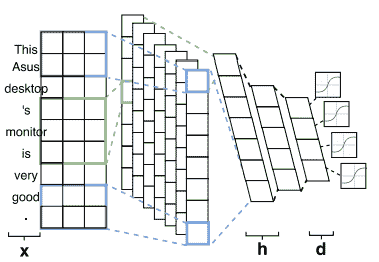\描述

DOC

图 14\. DOC 框架概述 (Shu 等, (2017))

DOC 还借鉴了统计学中的离群点检测思想，通过对 sigmoid 函数进行高斯拟合来进一步减少开放空间风险。它为每个类别的所有训练数据拟合预测概率，然后估计标准差以找到每个不同类别的分类阈值。

讨论

上述论文成功地解决了无需额外数据集的开放集识别问题，其中一些论文采用了与表 2 相似的思路。 (Schultheiss 等人，2017)，(Bendale 和 Boult，2016) 和 (Zhang 和 Patel，2016) 利用 EVT 来区分未知类别和已知类别。 (Hassen 和 Chan，2018a) 和 (Wang 等人，2018) 设计了不同的基于距离的损失函数，以实现“类内紧凑性”和“类间分离”。一些技术以不同的方式应用：(Wang 等人，2018) 使用温度缩放来找到异常值的阈值，而 (Liang 等人，2018) 在 softmax 输出中使用温度缩放。 (Mao 等人，2018) 假设所有类别遵循不同的高斯分布，而 (Shu 等人，2017) 通过高斯拟合来收紧 sigmoid 函数的决策边界。一般来说，不使用额外数据集要求网络为已知类别生成更精确的表示。除了 DNN，(Júnior 等人，2017) 为最近邻分类器引入了一个扩展。

表 2\. 无需额外数据的开放集识别技术的相似性和差异

| 思路 | (Schultheiss 等人，2017) | (Bendale 和 Boult，2016) | (Hassen 和 Chan，2018a) | (Mao 等人，2018) | (Júnior 等人，2017) | (Wang 等人，2018) | (Zhang 和 Patel，2016) | (Liang 等人，2018) | (Shu 等人，2017) |
| --- | --- | --- | --- | --- | --- | --- | --- | --- | --- |
| DNN | x | x | x | x |  | x | x | x | x |
| EVT | x | x |  |  |  |  | x |  |  |
| SRC |  |  |  |  |  |  | x |  |  |
| 基于距离的激活向量 |  | x |  |  |  |  |  |  |  |
| 基于距离的损失函数 |  |  | x |  |  | x |  |  |  |
| 高斯分布 |  |  |  | x |  |  |  |  | x |
| 温度缩放 |  |  |  |  |  | x |  | x |  |
| 输入扰动 |  |  |  |  |  |  |  | x |  |
| 一对其余 |  |  |  |  |  |  |  |  | x |
| 最近邻 |  |  |  |  | x |  |  |  |  |

## 4\. 学习图表示

Hamilton 等人 (2017b) 提供了有关图表示学习技术的综述，包括基于矩阵分解的方法、随机游走算法和图网络。

这篇论文介绍了顶点嵌入和子图嵌入的方法。顶点嵌入可以被视为从编码器-解码器的角度将节点编码到潜在空间中。子图嵌入的目标是对一组节点和边进行编码，这是一个连续的向量表示。

### 4.1\. 顶点嵌入

顶点嵌入可以组织为编码器-解码器框架。编码器将每个节点映射到低维向量或嵌入。解码器从学习到的嵌入中解码图的结构信息。采用编码器-解码器视角，有四个方法论组件用于各种节点嵌入方法（Hamilton 等，2017b）：

+   •

    一个成对相似度函数，用于衡量节点之间的相似度

+   •

    一个编码器函数，用于生成节点嵌入

+   •

    一个解码器函数，用于从生成的嵌入中重建成对相似度值

+   •

    一个损失函数，用于确定如何评估成对重建的质量以训练模型

大多数节点嵌入算法依赖于浅层嵌入，其编码器函数仅将节点映射到向量嵌入。然而，这些浅层嵌入向量有一些缺点。

+   •

    在编码器中，节点之间没有共享参数，这使得计算效率低下。

+   •

    浅层嵌入在编码过程中未能利用节点属性。

+   •

    浅层嵌入只能为训练阶段存在的节点生成嵌入，不能为以前未见过的节点生成嵌入，除非进行额外的优化。

最近，提出了几种基于深度神经网络的方法来解决上述问题。他们使用自编码器来压缩关于节点局部邻域的信息。

#### 4.1.1\. GCN

在图卷积网络（GCN）的工作中（Kipf 和 Welling，2017），Kipf 和 Welling 提出了直接使用神经网络模型对图结构进行编码，并在监督目标上进行训练。图的邻接矩阵将使模型能够从监督损失中分配梯度信息，并使其能够学习有标签和无标签节点的表示。

该论文首先介绍了一种简单且行为良好的逐层传播规则，用于直接在图上操作的神经网络模型，如下所示：

| (24) |  | $H^{(l+1)}=\sigma\left(\tilde{D}^{-\frac{1}{2}}\tilde{A}\tilde{D}^{-\frac{1}{2}}H^{(l)}W^{(l)}\right)$ |  |
| --- | --- | --- | --- |

其中 $A$ 是无向图的邻接矩阵，$I_{N}$ 是单位矩阵。$\tilde{A}$ 是添加了自连接的邻接矩阵。$\tilde{D}_{ii}=\sum_{j}\tilde{A}_{ij}$ 和 $W^{(l)}$ 是层特定的可训练权重矩阵。$\sigma(\cdot)$ 表示激活函数，$H^{l}\in\mathbf{R}^{N\times D}$ 是第 $l^{th}$ 层的激活函数矩阵。考虑一个两层 GCN 作为半监督节点分类示例。预处理步骤计算 $\hat{A}=\tilde{D}^{-\frac{1}{2}}\tilde{A}\tilde{D}^{-\frac{1}{2}}$，然后前向模型取简单形式：

| (25) |  | $Z=f(X,A)=\text{softmax}(\hat{A}\text{ ReLU}(\hat{A}XW^{(0)})W^{(1)})$ |  |
| --- | --- | --- | --- |

在这里，$W^{(0)}\in\mathbf{R}^{C\times H}$ 是隐藏层的输入到隐藏权重矩阵，$H$ 是特征图的数量。$W^{(1)}\in\mathbf{R}^{H\times F}$ 是隐藏到输出的权重矩阵。对于半监督多类分类，交叉熵误差在所有标记样本上进行评估：

| (26) |  | $\mathcal{L}=-\sum_{l\in\mathcal{Y}_{L}}\sum_{f=1}^{F}Y_{lf}\ln Z_{lf}$ |  |
| --- | --- | --- | --- |

其中 $\mathcal{Y}_{L}$ 是具有标签的节点索引集。

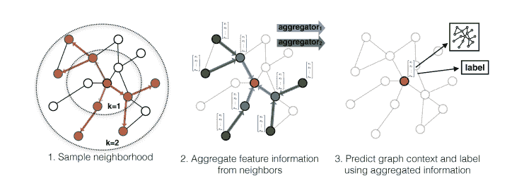\描述

graphSAGE

图 15\. GraphSAGE 样本和聚合方法的视觉说明 (Hamilton et al., (2017a))

#### 4.1.2\. GraphSAGE

Hamilton 等人 (Hamilton et al., 2017a) 提出了 GraphSAGE，这是一种通用的归纳框架，利用节点特征信息来高效生成对以前未见数据的节点嵌入。GraphSAGE 可以学习一个函数，通过从节点的局部邻域采样和聚合特征来生成嵌入，如图 15。GraphSAGE 不是为每个节点训练单独的嵌入，而是学习一组聚合函数，从距离给定节点不同跳数的局部邻域中聚合特征信息。例如，对于聚合函数 $k$，我们有：

| (27) |  | $h_{\mathcal{N}(v)}^{k}\leftarrow\text{AGGREGATE}_{k}(\{h_{u}^{k-1},\forall u\in\mathcal{N}(v)\}),$ |  |
| --- | --- | --- | --- |

其中 $h$ 是表示向量，$v$ 是输入节点，$\mathcal{N}$ 是邻域函数。GraphSAGE 然后将节点的当前表示 $h_{v}^{k-1}$ 与聚合的邻域向量 $h_{\mathcal{N}(v)}^{k-1}$ 进行连接，这个连接后的向量通过具有非线性激活函数 $\sigma$ 的全连接层：

| (28) |  | $h_{v}^{k}\leftarrow\sigma\left(\mathbf{W}^{k}\cdot\text{CONCAT}(h_{v}^{k-1},h_{\mathcal{N}(v)}^{k})\right)$ |  |
| --- | --- | --- | --- |

学习到的聚合函数随后应用于整个未见节点，在测试阶段生成嵌入。

#### 4.1.3\. LINE

Tang 等人 (Tang et al., 2015) 提出了一种用于大规模信息网络嵌入的方法：LINE，这种方法适用于无向、有向和/或加权网络。该模型优化一个目标，既保留局部结构又保留全局结构。论文探索了顶点之间的一阶和二阶接近度。大多数现有的图嵌入方法设计用于保留一阶接近度，这由图 16 中观察到的链接表示，如顶点 6 和 7，一阶接近度的目标函数如下：

| (29) |  | $O_{1}=-\sum_{(i,j)\in E}w_{ij}\log p_{1}(v_{i},v_{j}),$ |  |
| --- | --- | --- | --- |

其中 $p_{1}$ 是两个顶点之间的联合概率，仅对无向边 $(i,j)$ 有效。此外，LINE 探索顶点之间的二阶接近性，这种接近性不是通过观察到的联系强度来确定的，而是通过顶点的共享邻域结构来确定，例如，顶点 5 和 6 也应该放置得很近，因为它们共享相似的邻居。在二阶接近性中，每个顶点被视为一个特定的“上下文”，而具有相似“上下文”分布的顶点被认为是相似的。为了保持二阶接近性，LINE 最小化以下目标函数：

| (30) |  | $O_{2}=-\sum_{(i,j)\in E}w_{ij}\log p_{2}(v_{j} | v_{i}),$ |  |
| --- | --- | --- | --- | --- |

其中 $p_{2}$ 定义为顶点 $v_{i}$ 为每个有向边 $(i,j)$ 生成的“上下文” $v_{j}$ 的概率。

保留一阶接近性和二阶接近性的函数分别训练，通过两种方法训练的嵌入对每个顶点进行连接。

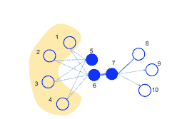\说明

Line

图 16\. 信息网络的玩具示例 (Tang et al., (2015))

#### 4.1.4\. JK-Net

为了克服邻域聚合方案的局限性，Xu 等人在 (Xu et al., 2018) 中提出了跳跃知识 (JK) 网络策略，该策略灵活地利用不同的邻域范围，为每个节点提供更好的结构感知表示。该架构在最后一层选择性地结合不同的聚合，即表示“跳跃”到最后一层。

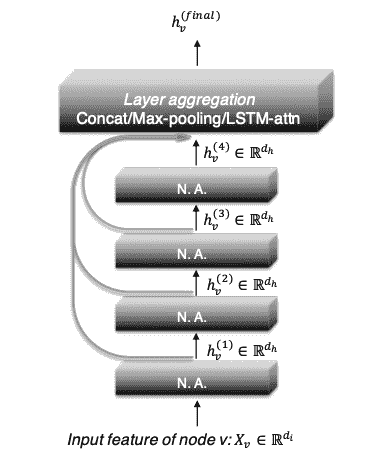\说明

JK-Net

图 17\. 4 层 JK-Net 的示意图。N.A. 代表邻域聚合 (Xu et al., (2018))

JK-Net 的主要思想如图 17 所示：与常见的邻域聚合网络类似，每一层通过聚合前一层的邻域来增加影响分布的范围。在最后一层，对于每个节点，JK-Net 从所有这些中间表示中进行选择（这些表示“跳跃”到最后一层），并可能结合几个。如果对每个节点独立执行此操作，那么模型可以根据需要调整每个节点的有效邻域大小，从而实现精确的自适应性。作为一个更通用的框架，JK-Net 接受通用的逐层聚合模型，并在具有复杂结构的图上提供更好的结构感知表示。

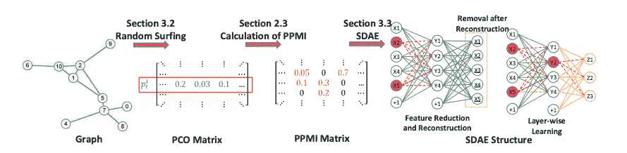\说明

DNGR

图 18\. DNGR 的主要组件：随机游走、PPMI 和 SDAE (Cao et al., (2016))

#### 4.1.5\. DNGR

在 (Cao 等，2016) 中，Cao 等人采用随机漫游模型直接捕捉图的结构信息，而不是使用基于采样的方法。如图 18 所示，提出的 DNGR 模型包含三个主要组成部分：随机漫游、PPMI 矩阵计算和通过 SDAE 的特征降维。随机漫游模型受 PageRank 模型的启发，用于捕捉图的结构信息并生成概率共现矩阵。

随机漫游首先随机排列图中的顶点，并假设存在一个捕捉不同顶点之间过渡概率的转移矩阵。提出的随机漫游模型允许根据与目标的距离对上下文信息赋予不同的权重。生成的共现矩阵随后用于计算 PPMI 矩阵（点对点互信息 PMI 的改进，详见 (Levy 和 Goldberg，2014））。接下来，由于高维输入数据通常包含冗余信息和噪声，堆叠去噪自编码器（SDAE）用于增强 DNN 的鲁棒性，去噪自编码器在进行训练步骤之前部分地破坏输入数据。具体来说，它通过以一定概率将向量中的部分条目分配为 0 来随机破坏每个输入样本 x。

### 4.2\. 子图嵌入

嵌入子图的目标是将一组节点和边编码成低维向量嵌入。子图的表示学习与图核的设计密切相关，图核定义了子图之间的距离度量。根据 (Hamilton 等，2017b)，一些子图嵌入技术使用卷积邻域聚合的思想生成节点的嵌入，然后使用额外的模块将一组节点嵌入聚合到子图中，例如基于和的方法、图粗化方法。此外，还有一些关于“图神经网络”（GNN）的相关工作。GNN 不通过邻居信息进行聚合，而是使用反向传播“传递信息”在节点之间。

## 5\. 恶意软件分类

#### 5.0.1\. FCG

Hassen 和 Chan (2017) 提出了一个线性时间函数调用图表示（FCG）向量表示。它以 FCG 提取模块开始，该模块是代码的有向图表示，其中图的顶点对应于函数，定向边表示函数节点之间的调用-被调用关系。该模块处理反汇编的恶意软件二进制文件并提取 FCG 表示。因此，他们将函数之间的调用-被调用关系呈现为有向、无权重的边。下一个模块是函数聚类。所用算法使用 minhash 来近似 Jaccard 指数，以对给定图的函数进行聚类。接下来的模块是向量提取。该算法从标记有聚类 ID 的 FCG 中提取向量表示。该表示由两个部分组成：顶点权重和边权重。顶点权重指定了每个 FCG 中每个聚类的顶点数量，边权重描述了从一个聚类到另一个聚类的边出现的次数。示例工作流程如图 19 所示。

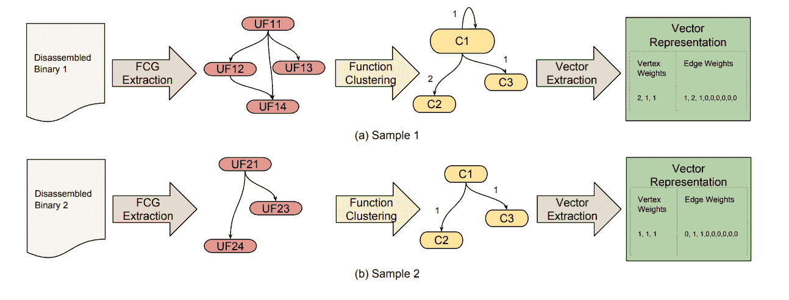\描述

fcg

图 19\. FCG 示例 (Hassen 和 Chan，2018)

#### 5.0.2\. COW，COW PC

基于（Hassen 和 Chan，2017）的工作，Hassen 和 Chan (2018b) 进一步介绍了两个新特征：$P_{max}$，即一个实例的最大预测类别概率：

| (31) |  | $P_{max}=\max_{c\in C^{k}}Pr(y_{i}=c&#124;\vec{x_{i}})$ |  |
| --- | --- | --- | --- |

类别概率分布的熵：

| (32) |  | $entropy(p)=-\sum_{j}^{&#124;C^{k}&#124;}p_{j}logp_{j}$ |  |
| --- | --- | --- | --- |

论文还介绍了两种算法：开放世界分类（COW）和 COW PC。这两种算法都由两个分类器组成：异常值检测器 $M_{outlier}$ 和多类分类器。不同之处在于，COW 中的异常值检测器是通过所有类别进行训练的。在测试过程中，测试数据会首先经过异常值检测器，如果被识别为非异常值，则会传递给多类分类器。而 COW PC 拥有特定于类别的异常值检测器，即每个类别都有其自己的异常值检测器。测试数据会首先通过多类分类器，然后再发送到对应的异常值检测器。

#### 5.0.3\. 随机投影

恶意软件分类器通常使用稀疏的二进制特征，可能有数亿个潜在特征。在(Dahl 等，2013)中，Dahl 等使用随机投影来减少神经网络原始输入空间的维度。他们首先提取了三种类型的特征，包括在进程内存中观察到的以空字符终止的模式、系统 API 调用的三元组，以及单个系统 API 调用和一个输入参数的不同组合，然后进行特征选择，最终生成了超过 179,000 个稀疏二进制特征。为了使问题更易处理，他们使用稀疏投影矩阵将每个输入向量投影到更低维空间，其中条目是从 ${0,1,-1}$ 的分布中独立同分布抽样的。1 和 -1 的出现概率相等，且 $P(R_{ij}=0)=1-\frac{1}{\sqrt{d}}$，其中 $d$ 是原始输入维度。然后，低维数据作为神经网络的输入。

## 6\. 结论

我们简要介绍了几种深度神经网络结构，并概述了现有的开放集识别（OSR），讨论了图表示学习和恶意软件分类。可以看出，这些主题在不同领域中相互推动并获益。尽管取得了很大成功，但仍面临严重挑战，并具有巨大的潜力。

## 参考文献

+   (1)

+   DBL (2018) 2018. *第六届学习表征国际会议，ICLR 2018，加拿大温哥华，2018 年 4 月 30 日 - 5 月 3 日，会议论文集*。OpenReview.net。 [`openreview.net/group?id=ICLR.cc/2018/Conference`](https://openreview.net/group?id=ICLR.cc/2018/Conference)

+   Bahdanau 等 (2015) Dzmitry Bahdanau, Kyunghyun Cho 和 Yoshua Bengio. 2015. 通过联合学习对齐和翻译的神经机器翻译。在*第三届学习表征国际会议，ICLR 2015，加州圣地亚哥，美国，2015 年 5 月 7-9 日，会议论文集*中，Yoshua Bengio 和 Yann LeCun (编辑)。 [`arxiv.org/abs/1409.0473`](http://arxiv.org/abs/1409.0473)

+   Bayer 等 (2006) Ulrich Bayer, Andreas Moser, Christopher Kruegel 和 Engin Kirda. 2006. 恶意代码的动态分析。*计算机病毒学期刊* 2, 1 (2006), 67–77。

+   Bendale 和 Boult (2016) Abhijit Bendale 和 Terrance E Boult. 2016. 向开放集深度网络迈进。在*IEEE 计算机视觉与模式识别会议论文集*中。1563–1572。

+   Cao 等 (2015) Chunshui Cao, Xianming Liu, Yi Yang, Yinan Yu, Jiang Wang, Zilei Wang, Yongzhen Huang, Liang Wang, Chang Huang, Wei Xu 等。2015. 看两次再想：通过反馈卷积神经网络捕捉自上而下的视觉注意力。在*IEEE 国际计算机视觉会议论文集*中。2956–2964。

+   Cao 等 (2016) Shaosheng Cao, Wei Lu 和 Qiongkai Xu. 2016. 用于学习图表示的深度神经网络。在*第三十届 AAAI 人工智能会议*中。

+   Chen（2016）Gang Chen。2016。带有误差反向传播的递归神经网络简明教程。*arXiv 预印本 arXiv:1610.02583*（2016）。

+   Cho 等（2014）Kyunghyun Cho、Bart van Merrienboer、Çaglar Gülçehre、Dzmitry Bahdanau、Fethi Bougares、Holger Schwenk 和 Yoshua Bengio。2014。使用 RNN 编码器-解码器进行统计机器翻译的短语表示学习。见于*2014 年自然语言处理经验方法会议论文集，EMNLP 2014，2014 年 10 月 25-29 日，卡塔尔多哈，ACL 特别兴趣组 SIGDAT 会议*，Alessandro Moschitti、Bo Pang 和 Walter Daelemans（编）。ACL，1724–1734。 [`www.aclweb.org/anthology/D14-1179/`](https://www.aclweb.org/anthology/D14-1179/)

+   Dahl 等（2013）George E Dahl、Jack W Stokes、Li Deng 和 Dong Yu。2013。使用随机投影和神经网络的大规模恶意软件分类。见于*2013 年 IEEE 声学、语音和信号处理国际会议*。IEEE，3422–3426。

+   Deng 等（2019）Jiankang Deng、Jia Guo、Niannan Xue 和 Stefanos Zafeiriou。2019。Arcface：深度人脸识别的加性角度边际损失。见于*IEEE 计算机视觉与模式识别会议论文集*。4690–4699。

+   Dhamija 等（2018）Akshay Raj Dhamija、Manuel Günther 和 Terrance Boult。2018。减少网络不可知症。见于*神经信息处理系统进展*。9157–9168。

+   Finn 等（2017）Chelsea Finn、Pieter Abbeel 和 Sergey Levine。2017。用于深度网络快速适应的模型无关元学习。见于*第 34 届国际机器学习大会论文集-第 70 卷*。JMLR.org，1126–1135。

+   Ge 等（2017）Zongyuan Ge、Sergey Demyanov 和 Rahil Garnavi。2017。用于多类开放集分类的生成 OpenMax。见于*2017 年英国机器视觉会议，BMVC 2017，伦敦，英国，2017 年 9 月 4-7 日*。BMVA Press。 [`www.dropbox.com/s/7hlycn200phni9j/0104.pdf?dl=1`](https://www.dropbox.com/s/7hlycn200phni9j/0104.pdf?dl=1)

+   Geng 等（2018）Chuanxing Geng、Sheng-jun Huang 和 Songcan Chen。2018。开放集识别的最新进展：一项综述。*arXiv 预印本 arXiv:1811.08581*（2018）。

+   Gers 等（1999）Felix A Gers、Jürgen Schmidhuber 和 Fred Cummins。1999。学习遗忘：使用 LSTM 的持续预测。（1999）。

+   Goodfellow 等（2014）Ian Goodfellow、Jean Pouget-Abadie、Mehdi Mirza、Bing Xu、David Warde-Farley、Sherjil Ozair、Aaron Courville 和 Yoshua Bengio。2014。生成对抗网络。见于*神经信息处理系统进展*。2672–2680。

+   Hamilton 等（2017a）Will Hamilton、Zhitao Ying 和 Jure Leskovec。2017a。大规模图上的归纳表示学习。见于*神经信息处理系统进展*。1024–1034。

+   Hamilton 等 (2017b) William L. Hamilton, Rex Ying 和 Jure Leskovec. 2017b. 图上的表示学习：方法与应用。*IEEE 数据工程快报* 40, 3 (2017), 52–74. [`sites.computer.org/debull/A17sept/p52.pdf`](http://sites.computer.org/debull/A17sept/p52.pdf)

+   Hassen 和 Chan (2017) Mehadi Hassen 和 Philip K Chan. 2017. 可扩展的基于函数调用图的恶意软件分类。在 *第七届 ACM 数据与应用安全与隐私会议* 上。ACM, 239–248.

+   Hassen 和 Chan (2018a) Mehadi Hassen 和 Philip K Chan. 2018a. 为开放集识别学习基于神经网络的表示。*arXiv 预印本 arXiv:1802.04365* (2018).

+   Hassen 和 Chan (2018b) Mehadi Hassen 和 Philip K Chan. 2018b. 学习识别已知和未知类别：一个开放世界恶意软件分类的案例研究。在 *第 31 届国际 FLAIRS 会议* 上。

+   He 等 (2016) Kaiming He, Xiangyu Zhang, Shaoqing Ren 和 Jian Sun. 2016. 用于图像识别的深度残差学习。在 *IEEE 计算机视觉与模式识别会议* 上。770–778.

+   He 等 (2018) Xinwei He, Yang Zhou, Zhichao Zhou, Song Bai 和 Xiang Bai. 2018. 多视图三维物体检索的三重中心损失。在 *IEEE 计算机视觉与模式识别会议* 上。1945–1954.

+   Hendrycks 等 (2019) Dan Hendrycks, Mantas Mazeika 和 Thomas G. Dietterich. 2019. 具有异常点暴露的深度异常检测。在 *第七届国际表示学习会议, ICLR 2019, 美国新奥尔良, 2019 年 5 月 6-9 日* 上。OpenReview.net. [`openreview.net/forum?id=HyxCxhRcY7`](https://openreview.net/forum?id=HyxCxhRcY7)

+   Jo 等 (2018) Inhyuk Jo, Jungtaek Kim, Hyohyeong Kang, Yong-Deok Kim 和 Seungjin Choi. 2018. 通过生成对抗网络生成的假数据来规范化分类器的开放集识别。在 *2018 IEEE 国际声学、语音和信号处理会议 (ICASSP)* 上。IEEE, 2686–2690.

+   Júnior 等 (2017) Pedro R Mendes Júnior, Roberto M de Souza, Rafael de O Werneck, Bernardo V Stein, Daniel V Pazinato, Waldir R de Almeida, Otávio AB Penatti, Ricardo da S Torres 和 Anderson Rocha. 2017. 最近邻距离比开放集分类器。*机器学习* 106, 3 (2017), 359–386.

+   Kipf 和 Welling (2017) Thomas N. Kipf 和 Max Welling. 2017. 使用图卷积网络的半监督分类。在 *第五届国际表示学习会议, ICLR 2017, 法国图伦, 2017 年 4 月 24-26 日, 会议论文集* 上。OpenReview.net. [`openreview.net/forum?id=SJU4ayYgl`](https://openreview.net/forum?id=SJU4ayYgl)

+   LeCun 等 (2015) Yann LeCun, Yoshua Bengio 和 Geoffrey Hinton. 2015. 深度学习。*nature* 521, 7553 (2015), 436–444.

+   Lee 等（2018）Kimin Lee, Honglak Lee, Kibok Lee, 和 Jinwoo Shin。2018 年。用于检测分布外样本的信心校准分类器训练，见 DBL（2018）。[`openreview.net/forum?id=ryiAv2xAZ`](https://openreview.net/forum?id=ryiAv2xAZ)

+   Levy 和 Goldberg（2014）Omer Levy 和 Yoav Goldberg。2014 年。作为隐式矩阵分解的神经词嵌入。在*神经信息处理系统进展*。2177–2185。

+   Liang 等（2018）Shiyu Liang, Yixuan Li, 和 R. Srikant。2018 年。增强神经网络中分布外图像检测的可靠性，见 DBL（2018）。[`openreview.net/forum?id=H1VGkIxRZ`](https://openreview.net/forum?id=H1VGkIxRZ)

+   Luong 等（2015）Thang Luong, Hieu Pham, 和 Christopher D. Manning。2015 年。基于注意力的神经机器翻译的有效方法。在*2015 年自然语言处理经验方法会议（EMNLP 2015），葡萄牙里斯本，2015 年 9 月 17-21 日*，Lluís Màrquez, Chris Callison-Burch, Jian Su, Daniele Pighin, 和 Yuval Marton（编）。计算语言学协会，1412–1421。[`www.aclweb.org/anthology/D15-1166/`](https://www.aclweb.org/anthology/D15-1166/)

+   Makhzani 等（2015）Alireza Makhzani, Jonathon Shlens, Navdeep Jaitly, Ian Goodfellow, 和 Brendan Frey。2015 年。对抗自编码器。*arXiv 预印本 arXiv:1511.05644*（2015）。

+   Mao 等（2018）Chengsheng Mao, Liang Yao, 和 Yuan Luo。2018 年。用于开放集学习的分布网络。arXiv:cs.LG/1809.08106

+   Mikolov 等（2013）Tomas Mikolov, Ilya Sutskever, Kai Chen, Greg S Corrado, 和 Jeff Dean。2013 年。词和短语的分布式表示及其组合性。在*神经信息处理系统进展*。3111–3119。

+   Neal 等（2018）Lawrence Neal, Matthew Olson, Xiaoli Fern, Weng-Keen Wong, 和 Fuxin Li。2018 年。使用反事实图像的开放集学习。在*欧洲计算机视觉会议（ECCV）论文集*。613–628。

+   Olah（2015）Christopher Olah。2015 年。理解 LSTM 网络。[`colah.github.io/posts/2015-08-Understanding-LSTMs/`](https://colah.github.io/posts/2015-08-Understanding-LSTMs/)

+   Pennington 等（2014）Jeffrey Pennington, Richard Socher, 和 Christopher Manning。2014 年。GloVe: 全局词向量表示。在*2014 年自然语言处理经验方法会议（EMNLP）论文集*。1532–1543。

+   Perera 和 Patel（2019）Pramuditha Perera 和 Vishal M Patel。2019 年。用于单类分类的深度特征学习。*IEEE 图像处理学报*（2019）。

+   Radford et al. (2016) Alec Radford, Luke Metz, 和 Soumith Chintala. 2016. 利用深度卷积生成对抗网络进行无监督表示学习. 见于 *第四届国际表示学习会议，ICLR 2016，波多黎各圣胡安，2016 年 5 月 2-4 日，会议论文集*，Yoshua Bengio 和 Yann LeCun (编辑)。 [`arxiv.org/abs/1511.06434`](http://arxiv.org/abs/1511.06434)

+   Ravi and Larochelle (2016) Sachin Ravi 和 Hugo Larochelle. 2016. 作为少量样本学习模型的优化. (2016).

+   Real et al. (2017) Esteban Real, Sherry Moore, Andrew Selle, Saurabh Saxena, Yutaka Leon Suematsu, Jie Tan, Quoc V Le, 和 Alexey Kurakin. 2017. 大规模图像分类器的进化. 见于 *第 34 届国际机器学习会议论文集-第 70 卷*。JMLR.org, 2902–2911.

+   Ribeiro et al. (2016) Marco Tulio Ribeiro, Sameer Singh, 和 Carlos Guestrin. 2016. 我为什么要相信你？：解释任何分类器的预测. 见于 *第 22 届 ACM SIGKDD 国际知识发现与数据挖掘会议论文集*。ACM, 1135–1144.

+   Saha (2018) Sumit Saha. 2018. 卷积神经网络全面指南—ELI5 方式. [`bit.ly/2Oa2YCh`](https://bit.ly/2Oa2YCh)

+   Saito et al. (2018) Kuniaki Saito, Shohei Yamamoto, Yoshitaka Ushiku, 和 Tatsuya Harada. 2018. 通过反向传播进行开放集领域适应. 见于 *欧洲计算机视觉会议论文集 (ECCV)*。153–168.

+   Schultheiss et al. (2017) Alexander Schultheiss, Christoph Käding, Alexander Freytag, 和 Joachim Denzler. 2017. 发现未知：使用深度神经网络激活的极值签名进行新颖性检测. 见于 *德国模式识别会议*。Springer, 226–238.

+   Shu et al. (2017) Lei Shu, Hu Xu, 和 Bing Liu. 2017. DOC：文本文件的深度开放分类. 见于 *2017 年自然语言处理经验方法会议论文集，EMNLP 2017，丹麦哥本哈根，2017 年 9 月 9-11 日*，Martha Palmer, Rebecca Hwa, 和 Sebastian Riedel (编辑)。计算语言学协会, 2911–2916. [`www.aclweb.org/anthology/D17-1314/`](https://www.aclweb.org/anthology/D17-1314/)

+   Shu et al. (2018b) Lei Shu, Hu Xu, 和 Bing Liu. 2018b. 开放世界分类中的未见类别发现. *arXiv 预印本 arXiv:1801.05609* (2018).

+   Shu et al. (2018a) Yu Shu, Yemin Shi, Yaowei Wang, Yixiong Zou, Qingsheng Yuan, 和 Yonghong Tian. 2018a. ODN：为开放集动作识别开启深度网络. 见于 *2018 IEEE 国际多媒体与博览会 (ICME)*。IEEE, 1–6.

+   Silva (2018) Thalles Silva. 2018. 生成对抗网络 (GANs) 的直观介绍. [`bit.ly/34dgUB2`](https://bit.ly/34dgUB2)

+   Tang 等人（2015）Jian Tang、Meng Qu、Mingzhe Wang、Ming Zhang、Jun Yan 和 Qiaozhu Mei。2015。Line：大规模信息网络嵌入。在*第 24 届国际世界宽网会议论文集*中。国际万维网会议指导委员会，1067–1077。

+   Wang 等人（2018）Zhuoyi Wang、Zelun Kong、Hemeng Tao、Swarup Chandra 和 Latifur Khan。2018。通过深度网络进行分类和新类别检测的共表示学习。*arXiv 预印本 arXiv:1811.05141*（2018）。

+   Wen 等人（2016）Yandong Wen、Kaipeng Zhang、Zhifeng Li 和 Yu Qiao。2016。用于深度人脸识别的辨别特征学习方法。在*欧洲计算机视觉会议*中。Springer，499–515。

+   Xu 等人（2018）Keyulu Xu、Chengtao Li、Yonglong Tian、Tomohiro Sonobe、Ken-ichi Kawarabayashi 和 Stefanie Jegelka。2018。具有跳跃知识网络的图表示学习。在*第 35 届国际机器学习大会，ICML 2018，斯德哥尔摩，瑞典，2018 年 7 月 10-15 日* *(机器学习研究论文集)*中，Jennifer G. Dy 和 Andreas Krause（编辑），第 80 卷。PMLR，5449–5458。 [`proceedings.mlr.press/v80/xu18c.html`](http://proceedings.mlr.press/v80/xu18c.html)

+   Yu 等人（2017）Yang Yu、Wei-Yang Qu、Nan Li 和 Zimin Guo。2017。通过对抗样本生成进行开放类别分类。在*第 26 届国际联合人工智能会议，IJCAI 2017，澳大利亚墨尔本，2017 年 8 月 19-25 日*，Carles Sierra（编辑）。ijcai.org，3357–3363。 [`doi.org/10.24963/ijcai.2017/469`](https://doi.org/10.24963/ijcai.2017/469)

+   Zhang 和 Patel（2016）He Zhang 和 Vishal M Patel。2016。基于稀疏表示的开放集识别。*IEEE 模式分析与机器智能学报* 39，第 8 期（2016），1690–1696。
